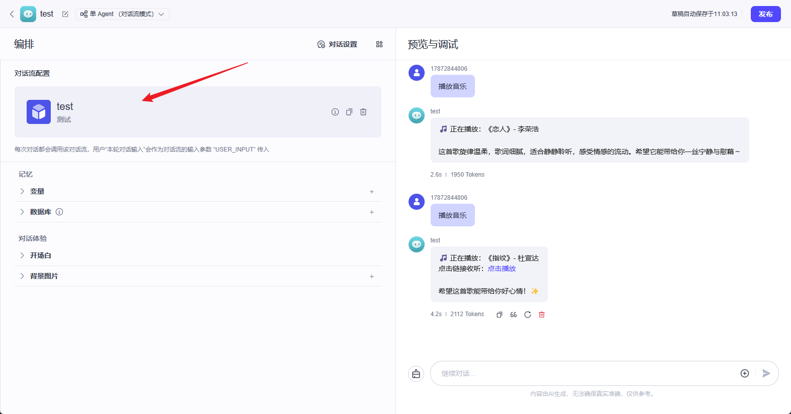
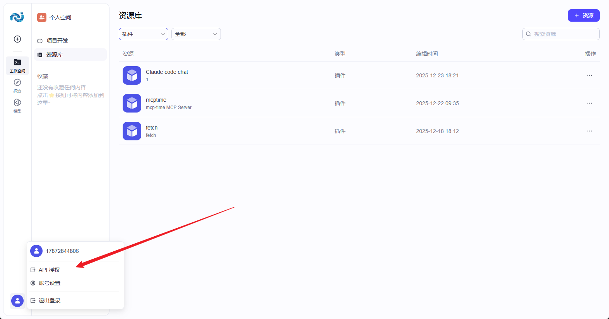
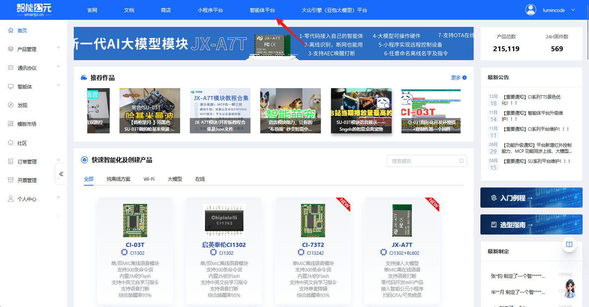
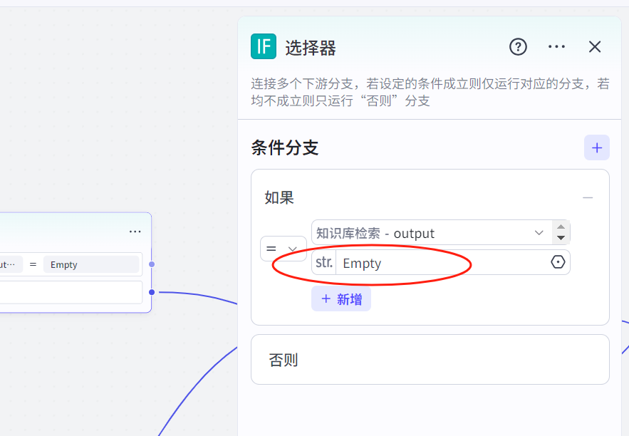
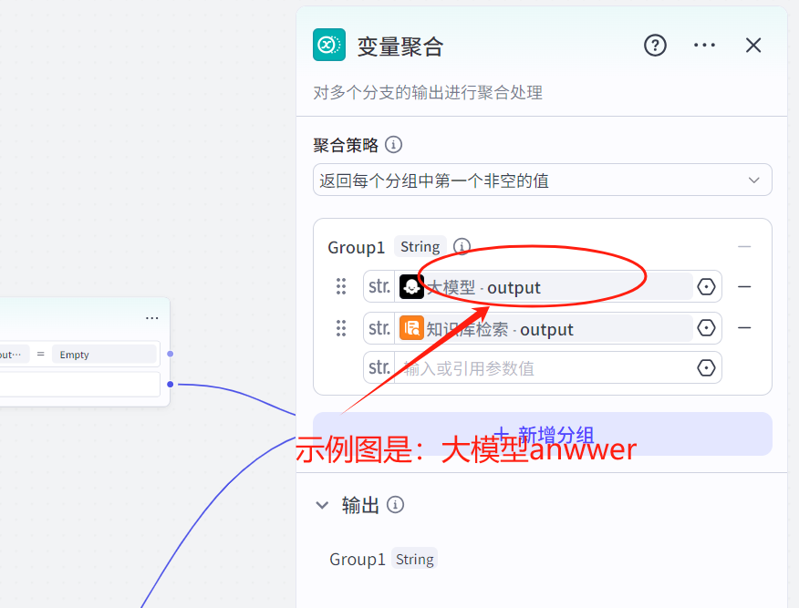
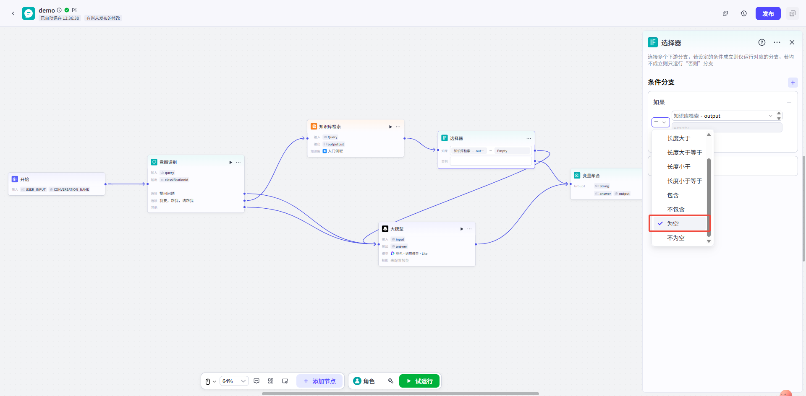
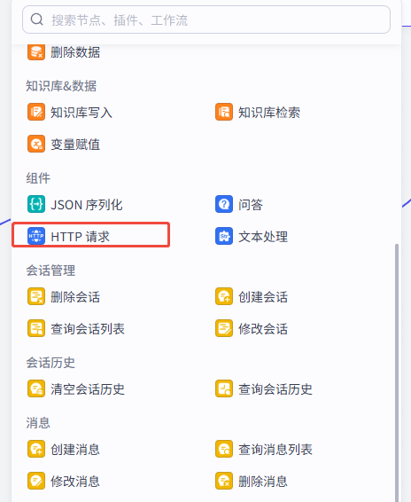
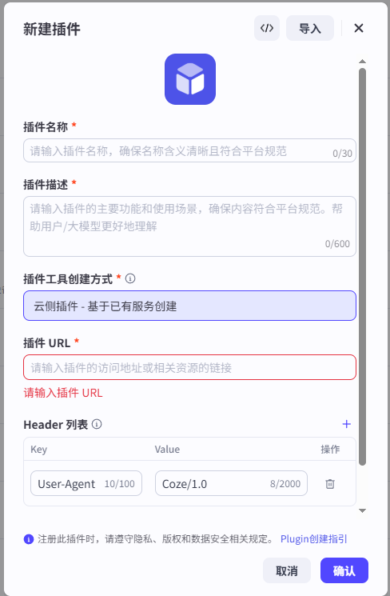

# 智能体

## 这版文档适用于什么平台？

智能体平台已切换为 **智能体平台**。

- 在 **智能体平台**：创建/调试/发布智能体（Agent/Bot）、知识库、插件、工作流/对话流。
- 在 **智能公元平台（smartpi.cn）**：创建“智能体配置”、生成二维码并绑定设备。








如果你还没跑通完整流程，先按下面的顺序做：

1. [快速开始](./get-started.md)
2. [智能体平台实践教程](./tutorial.md)

## 关键概念（看完就知道要填什么）

- **bot_id**：智能体 ID（通常在控制台地址栏 `bot/` 后面）。
- **PAT（Personal Access Token）**：API 鉴权用的 Token，放在请求头 `Authorization: Bearer pat_xxx`。
- **conversation_id**：会话 ID（一个话题的上下文容器）。
- **chat_id**：一次对话/一次调用的聊天 ID（流式事件里会出现）。
- **workflow_id**：工作流/对话流 ID（用于 API 调用工作流）。

!!! note "PAT 只展示一次"
    PAT 生成后一般只展示一次，请立刻保存；丢失后需要重新生成，并更新到 `smartpi.cn` 的智能体配置里。

---

## API 接入（智能体平台 ）

下面示例以 智能体平台  Wiki 的 API 说明为准（请求头使用 PAT）。

### 1) 创建会话（conversation）

```bash
curl --location '{{host}}/v1/conversation/create' \
  --header 'Authorization: Bearer pat_xxxxx' \
  --header 'Content-Type: application/json' \
  --data '{ "bot_id":"<bot_id>" }'
```

### 2) 发起对话（chat v3，流式）

```bash
curl --location --request POST '{{host}}/v3/chat?conversation_id=<conversation_id>' \
  --header 'Authorization: Bearer pat_xxxxx' \
  --header 'Content-Type: application/json' \
  --data-raw '{
    "bot_id": "<bot_id>",
    "user_id": "<your_user_id>",
    "stream": true,
    "auto_save_history": true,
    "additional_messages": [
      {"role":"user","content":"你好","content_type":"text"}
    ]
  }'
```

你会收到 SSE 流式事件，常见顺序：

- `conversation.chat.created`
- `conversation.chat.in_progress`
- 多个 `conversation.message.delta`
- `conversation.message.completed`
- `conversation.chat.completed`
- `done`（流结束）

### 3) 查看消息列表 / 清理上下文

- **消息列表**：`POST {{host}}/v1/conversation/message/list?conversation_id=...`
- **清理上下文**：`POST {{host}}/v1/conversations/:conversation_id/clear`

### 4) 执行工作流

```bash
curl --location --request POST '{{host}}/v1/workflow/run' \
  --header 'Authorization: Bearer pat_xxxxx' \
  --header 'Content-Type: application/json' \
  --data-raw '{
    "workflow_id": "<workflow_id>",
    "parameters": "{\"user_id\":\"12345\"}"
  }'
```

---

## （旧版）智能体接入 API（智能公元自研接口）

!!! warning "API 服务状态更新"
    - **大模型服务 API** 和 **大模型和 TTS 服务 API** 已下线
    - 当前仅保留 **完整对话服务 API**，适用于需要自建后端的场景
    - 使用完整对话服务时，需要自行提供大模型、ASR、TTS 服务
    - 自定义智能体配置不影响设备的离线语音功能

智能体接入方式说明：

| 接入方式 | 状态 | 协议 | 适用场景 |
|---------|------|------|---------|
| 大模型服务 | ~~已下线~~ | HTTP SSE | 自研大模型服务，文本问答 |
| 完整对话服务 | ✅ 可用 | WebSocket | 双向流式语音对话 |
| 大模型+TTS服务 | ~~已下线~~ | WebSocket | 文本输入、语音输出 |

---

## 大模型服务参考 API（已下线）

!!! warning "该服务已下线"
    请使用完整对话服务 API。

适用于接入自研大模型服务的场景。

### 配置说明

- **ASR 服务**：自动语音识别，可选"默认"或"自定义"
- **大模型服务**：

    - **连接方式**：默认为 SSE (HTTP)，服务器发送事件推送实时数据
    - **请求地址**：填写大模型服务的请求 URL
    - **流式**：支持流式返回结果，逐步返回而非一次性返回
    - **附加参数**：可添加额外参数，将携带在请求体中
- **TTS 服务**：文本转语音，可选"默认"或自定义外部服务

### 接口说明

- **请求方式**：`POST`
- **URL 示例**：`https://your-domain/api/v1/chat`
- **Header**：`Content-Type: application/json`

**请求体示例**：

```json
{
    "deviceId": "JX_A7T_7C3E821CB729",
    "question": "你是谁？",
    "stream": true
}
```

**返回示例（SSE 流式）**：

```
data:{"code": 0,"message": "","data": {"answer": "我","id": "12341231"}}
data:{"code": 0,"message": "","data": {"answer": "是","id": "12341231"}}
data:{"code": 0,"message": "","data": {"answer": "小智","id": "12341231"}}
data:{"code": 0,"message": "","data": {"answer": "有什么","id": "12341231"}}
data:{"code": 0,"message": "","data": {"answer": "可以","id": "12341231"}}
data:{"code": 0,"message": "","data": {"answer": "帮您","id": "12341231"}}
data:"[DONE]"
```

---

## 完整对话服务参考 API

适用于双向流式语音对话场景，支持实时语音输入和输出。

### 配置说明

平台支持接入双向流式语音对话 WebSocket OpenAPI。输入音频格式和输出音频格式根据可选项进行配置，附加参数将在 WebSocket 建连时携带在请求地址里。

### 接口说明

- **URL 示例**：`wss://your-domain/api/v1/chat?deviceId=12345678`

### 上行事件

#### 流式上传音频片段

```json
{
  "id": "event_id",
  "event_type": "input_audio_buffer.append",
  "data": {
    "delta": "base64EncodedAudioDelta"
  }
}
```

#### 提交音频

```json
{
  "id": "event_id",
  "event_type": "input_audio_buffer.complete"
}
```

#### 清除缓冲区音频

```json
{
  "id": "event_id",
  "event_type": "input_audio_buffer.clear"
}
```

#### 打断智能体输出

```json
{
  "id": "event_id",
  "event_type": "conversation.chat.cancel"
}
```

### 下行事件

#### 对话连接成功

```json
{
  "id": "7446668538246561xxxx",
  "event_type": "chat.created",
  "detail": {
    "logid": "20241210152726467C48D89D6DB2F3***"
  }
}
```

#### 对话开始

```json
{
  "id": "744666853824656xxx",
  "event_type": "conversation.chat.created",
  "data": {
    "id": "123",
    "conversation_id": "123"
  },
  "detail": {
    "logid": "20241210152726467C48D89D6DB2F3***"
  }
}
```

#### 增量消息

```json
{
  "id": "event_1",
  "event_type": "conversation.message.delta",
  "data": {
    "id": "msg_006",
    "conversation_id": "123",
    "type": "answer",
    "content": "你好你好"
  },
  "detail": {
    "logid": "20241210152726467C48D89D6DB2F3***"
  }
}
```

#### 增量语音

```json
{
  "id": "event_1",
  "event_type": "conversation.audio.delta",
  "data": {
    "id": "msg_006",
    "type": "answer",
    "content": "base64audio",
    "conversation_id": "123"
  },
  "detail": {
    "logid": "20241210152726467C48D89D6DB2F3***"
  }
}
```

#### 消息完成

```json
{
  "id": "event_1",
  "event_type": "conversation.message.completed",
  "data": {
    "id": "msg_002",
    "conversation_id": "123"
  },
  "detail": {
    "logid": "20241210152726467C48D89D6DB2F3***"
  }
}
```

#### 语音回复完成

```json
{
  "id": "event_1",
  "event_type": "conversation.audio.completed",
  "data": {
    "id": "msg_002",
    "conversation_id": "123"
  },
  "detail": {
    "logid": "20241210152726467C48D89D6DB2F3***"
  }
}
```

---

## 大模型和 TTS 服务参考 API（已下线）

!!! warning "该服务已下线"
    请使用完整对话服务 API。

适用于文本输入、语音输出的场景。

### 接口说明

- **URL 示例**：`wss://your-domain/api/v1/chat?deviceId=12345678`

### 上行事件

#### 提交文本

```json
{
  "id": "event_id",
  "event_type": "input_text",
  "deviceId": "12345678",
  "question": "你是谁？",
  "stream": true
}
```

#### 打断智能体输出

```json
{
  "id": "event_id",
  "event_type": "conversation.chat.cancel"
}
```

### 下行事件

下行事件与完整对话服务相同，包括 `conversation.message.delta`、`conversation.audio.delta`、`conversation.message.completed`、`conversation.audio.completed` 等。

---

## 智能体控制设备

智能体支持通过 MCP（模型上下文协议）控制设备，也支持对接 coze 插件。

---

## MCP 设备控制

模型上下文协议（Model Context Protocol, MCP）可帮助大模型使用外部工具，实现与大模型交互过程中控制设备的能力。

### 配置步骤

#### 1. 配置小程序控件

根据您希望设备具备的能力，配置小程序控件。例如：

- 配置滑块控件，用来调节灯光亮度
- 配置开关控件，用来控制灯开关
- 配置按钮控件，用来控制加湿器开关
- 配置开关控件，用来控制窗帘开关

#### 2. 生成 MCP 工具

切换到 **"MCP工具"** 菜单，点击 **"刷新"** 按钮，系统会根据先前配置的小程序控件，生成对应的 MCP 工具。

#### 3. 配置工具信息

工具分为两种类型：**控制** 和 **查询**。每个工具需要填写：

- **工具名称**：确保含义清晰
- **工具描述**：帮助大模型更好地理解工具用途

#### 4. 发布 MCP 工具

版本发布前，请确认勾选 ✔ **"发布MCP工具"**。

#### 5. 烧录固件并验证
 
 将生成好的固件烧录到设备中，使用平台提供的能力即可在与设备对话的过程中，通过 MCP 控制设备。

---
## 插件对接
 
 平台提供了示例固件对应的插件，你可以在 智能体平台的插件商店/资源库中通过关键词 **"智能公元IOT插件"** 搜索找到。
 
 如果你想做自己的插件，以下教程将告诉您怎么通过智能公元平台制作并对接插件。

### 一、生成插件

1. 在智能公元平台版本详情页面里，选中 **"MCP工具"** 菜单，点击 **"预览"** 按钮
2. 在弹出的工具预览窗口中，点击 **"下载插件"** 按钮，保存下载下来的 `mcp_tool.yaml` 文件
3. 打开 智能体平台 控制台（），在 **"资源库"** 添加插件
4. 在新建插件窗口里，点击右上角的 **"导入"** 按钮
5. 上传保存的 `mcp_tool.yaml` 文件
6. 点击 **"下一步"**，然后点击 **"确认"**
7. 在资源库的列表里会显示刚添加的插件
8. 将工具列表里的所有工具都设置为 **"启用"** 状态
9. 进行试运行，试运行通过后，状态便会变更为"通过"
    - 试运行时需要输入对应参数的参数值
    - 其中 `token` 固定填写为 `Bearer test`
    - 其他参数可随便填

### 二、配置插件

1. 打开对话流的编辑界面，选中 **"开始"** 节点，配置输入变量 `token` 和 `deviceKey`
2. 选中大模型节点，**注意要把大模型的深度思考开关关闭**，不然会导致每次对话耗时太长
3. 在 **"技能"** 栏里添加插件
4. 在 **"输入"** 栏里引用"开始"节点的变量 `token` 和 `deviceKey`
5. 在 **"用户提示词"** 栏填写变量 `token` 和 `deviceKey`
6. 在结束节点里设置打开 **"流式输出"** 开关
7. 最后将编辑好的对话流发布

---

## 常见问题

### 智能体嵌入网站后一直显示"搜索中"怎么办？

**问题描述：**

智能体在独立运行时响应正常，但嵌入到外部网站后，无论输入什么问题都显示"搜索中"，无法获取响应。

**问题原因：**

- 智能体配置中缺少开场白设置
- 嵌入的iframe需要完整的初始化流程
- 智能体在等待初始配置触发

**解决方案：**

1. **检查智能体配置**

    - 登录智能公元平台
    - 进入对应智能体的配置页面
    - 查看流程设计中的开始节点

2. **添加开场白设置**

    - 在流程设计中选中开始节点
    - 在右侧配置面板中找到"设置开场白"选项
    - 填写合适的开场白内容（如"您好，我是智能助手"）

3. **重新生成固件**

    - 保存配置修改
    - 点击"发布版本"生成新固件
    - 等待固件生成完成

4. **更新嵌入代码**

    - 在智能体详情页点击"嵌入网站"
    - 复制新生成的iframe代码
    - 替换网站中的旧代码

**操作步骤详解：**

1. **进入流程设计**：

    - 在智能体配置界面
    - 点击"流程设计"或类似选项
    - 找到流程的开始节点

2. **设置开场白**：

    - 点击开始节点（通常用绿色圆圈表示）
    - 在弹出的配置窗口中
    - 找到"开场白"或"欢迎语"设置项
    - 输入初始化文本

3. **保存并发布**：

    - 确认开场白设置无误
    - 保存整个流程配置
    - 点击发布生成新版本

**验证方法：**

1. **平台内测试**：

    - 先在智能公元平台内测试
    - 确认智能体响应正常
    - 检查是否有开场白输出

2. **网站测试**：

    - 使用新的嵌入代码更新网站
    - 刷新页面等待智能体加载
    - 尝试发送测试消息

**注意事项：**

- 开场白是智能体初始化的重要步骤
- 嵌入模式需要完整的初始化流程
- 每次修改配置后都需要更新嵌入代码
- 确保网站支持iframe嵌入功能

**其他可能原因：**

1. **网络连接问题**：

    - 检查网站所在服务器的网络连接
    - 确认防火墙允许访问智能体服务

2. **域名白名单**：

    - 确认网站域名已在智能体平台配置
    - 检查CORS设置是否正确

3. **API密钥问题**：

    - 验证API密钥是否有效
    - 确认密钥权限包含嵌入功能

---

### 智能体流程中如何选择变量？

**问题描述：**

在配置智能体流程的选择器节点时，不清楚如何正确引用变量，特别是知识库检索和大模型输出的变量。

**解决方案：**

**1. 变量引用规则**

- 变量名需要与节点输出完全匹配
- 修改变量名会影响引用关系
- 变量聚合后需要使用聚合后的名称



*选择器中引用知识库检索的输出变量*

**2. 常见变量引用**

- **知识库检索 - output**：知识库检索节点的输出
- **大模型 - output**：大模型节点的输出
- **聚合变量**：变量聚合节点中定义的Group名称



*变量聚合节点将多个输出聚合到Group1*

**3. 变量匹配技巧**

- 使用下拉列表选择可用变量
- 确认变量名拼写完全正确
- 注意大小写和特殊字符

**4. 条件判断设置**

选择器中常用的条件：

- **为空**：判断变量是否为空值
- **等于**：精确匹配特定值
- **包含**：字符串包含判断



*展示选择器节点在流程中的位置*

**注意事项：**

- 变量名修改后需要更新所有引用
- 条件判断的值要与变量类型匹配
- 建议使用有意义的变量名
- 测试流程时注意检查变量传递

---

### 智能体配置正确但无响应怎么办？

**问题描述：**

智能体在 智能体平台控制台预览/调试正常，但设备端无响应，需要排查配置与连通性。

**解决方案：**

**1. 检查 `smartpi.cn` 的智能体配置是否正确**

- `bot_id` 是否正确（通常在控制台地址栏 `bot/` 后）。
- `PAT` 是否正确、是否过期、是否带了多余空格。
- 配置更新后，建议重新生成二维码并重新绑定一次设备。

**2. 确认智能体已发布为 API 服务**

- 在 智能体平台中对该智能体执行“发布”，并选择 API 发布方式。

**3. 检查 智能体平台 服务连通性**

- 确认设备所在网络能访问你们部署的 智能体平台 服务地址（含端口）。
- 如部署在内网，确认网关/防火墙放行。

**4. 用 API 直接做一次最小化验证**

- 先调用 `POST {{host}}/v1/conversation/create` 创建会话。
- 再调用 `POST {{host}}/v3/chat?conversation_id=...` 发起流式对话。
- 若 API 都不通，优先排查 Token/网络/服务端日志。

**5. 检查设备基础能力与网络**

- 小程序设备详情页是否存在“AI智能体”菜单。
- 设备网络是否稳定，能正常联网。

**注意事项：**

- `PAT` 通常只展示一次，建议妥善保管。
- 如果怀疑 `PAT` 泄露或过期，直接新建一个并更新配置。

---
 
### 如何配置 PAT（个人访问令牌）？

**问题描述：**

在创建或更新智能体配置时，需要填写 `PAT`，但经常因为复制错误或过期导致鉴权失败。

**解决方案：**

**1. 在 智能体平台生成 PAT**

1. 登录 智能体平台。
2. 左下角点击头像，进入 **API Authorization / API 授权**。
3. 点击 **Add New Token / 新建令牌**。
4. 设置名称与过期时间，确认生成。
5. 复制并保存 `PAT`。

**2. 在 `smartpi.cn` 更新智能体配置**

- 将 `PAT` 填入智能体配置。
- 如设备端仍无响应，建议重新生成二维码并重新绑定。

**3. 常见坑**

- `PAT` 前后多了空格。
- `PAT` 过期。
- 智能体未发布为 API 服务。
- 服务地址不可达（网络/防火墙）。

---

### 代码节点如何实现外部HTTP请求？

**问题描述：**

在代码节点中使用 Python 的 `http` 或 `requests` 库发起外部请求时报错，提示没有导入相应的库。

**原因分析：**

代码节点的 Python 环境是受限的沙箱环境，不包含所有标准库和第三方库。直接在代码节点中发起 HTTP 请求可能会因缺少库支持而失败。

**解决方案：**

使用平台提供的 **HTTP 请求组件** 或 **插件** 方式实现外部请求。

#### 方法一：使用 HTTP 请求组件（推荐）

在对话流/工作流中添加 **HTTP 请求** 组件：

1. 在节点列表中找到 **组件** 分类
2. 选择 **HTTP 请求** 组件
3. 配置请求参数：
   - 请求 URL
   - 请求方法（GET/POST/PUT/DELETE）
   - 请求头（Header）
   - 请求体（Body）



*组件列表中的"HTTP 请求"选项*

#### 方法二：创建自定义插件

如果需要更复杂的外部请求逻辑，可以创建云侧插件：

1. 在资源库中点击 **添加插件**
2. 选择 **导入** 方式创建插件
3. 填写插件信息：
   - 插件名称
   - 插件描述
   - 插件 URL（您的服务端点）
   - Header 列表（如需要）



*插件创建配置界面*

4. 在对话流的 **技能** 栏中添加该插件

**注意事项：**

- 代码节点适合处理简单的数据转换和逻辑计算
- 涉及外部网络请求时，优先使用平台提供的组件或插件
- 插件方式可以实现更复杂的鉴权和数据交互逻辑
