# 智能体

## 入门

### 1. 登录智能公元平台

登录到智能公元平台 [https://smartpi.cn/](https://smartpi.cn/)，选择左侧菜单 **"智能体" → "配置"**，点击 **"体验版智能体"** 按钮。

### 2. 绑定智能体

按照弹出窗口里的提示，打开 **"智能公元"微信小程序** 进入到设备详情页面，点击 **"AI智能体"** 菜单，扫描二维码绑定智能体。

### 3. 开始对话

绑定成功后，就可以和设备进行交流了。

---

## 如何创建智能体

**问题描述：**

需要在智能公元平台创建一个新的智能体，配置默认模型和基础流程。

**解决方案：**

- **创建智能体**：

    1. 进入智能体平台后点击"体验版智能体"
    2. 选择"从无到有"模板创建新智能体
    3. 点击右上角"设置默认模型"

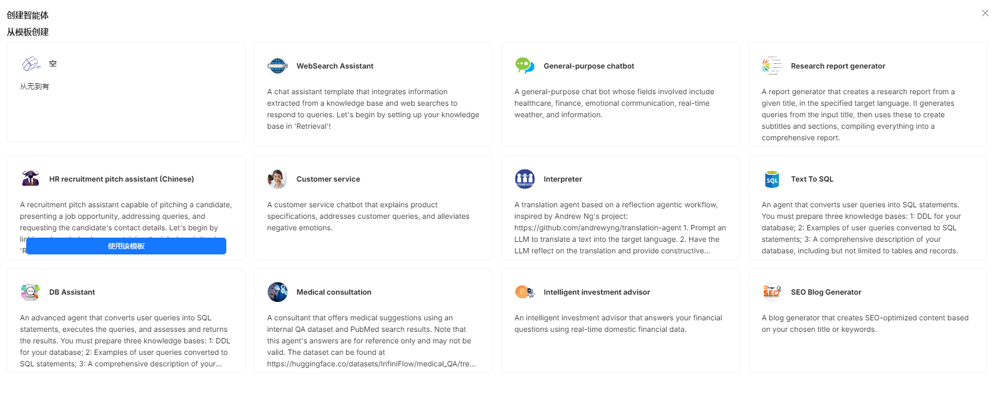

- **配置默认模型**：

    1. 在模型提供商页面添加或选择模型
    2. 设置聊天模型、嵌入模型等
    3. 点击确定保存配置

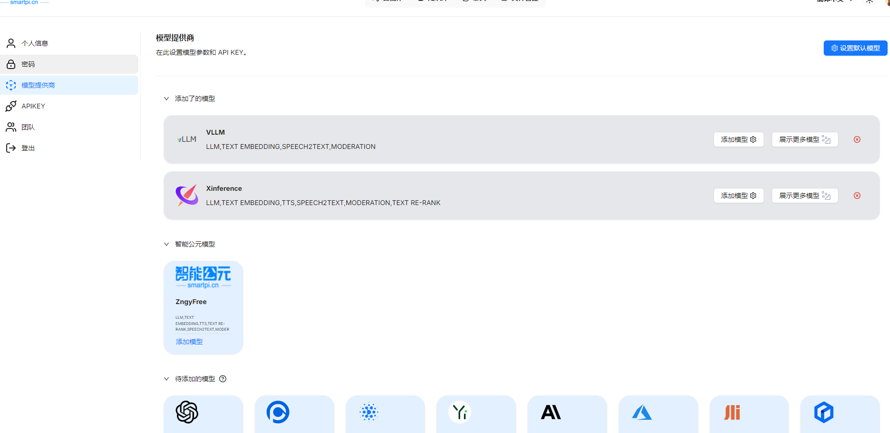
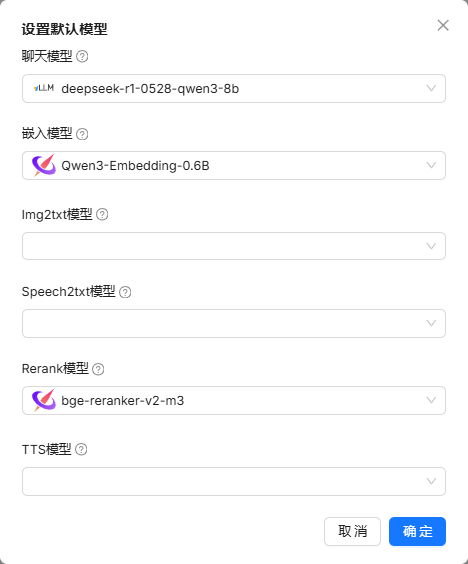

- **编辑流程**：

    1. 点击顶部"智能体"标签进入管理页面
    2. 选择创建的智能体卡片进入编辑
    3. 在流程编辑页面拖拽组件构建流程
    4. 参考示例流程配置


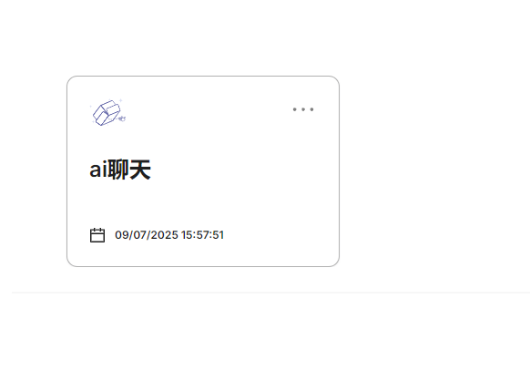
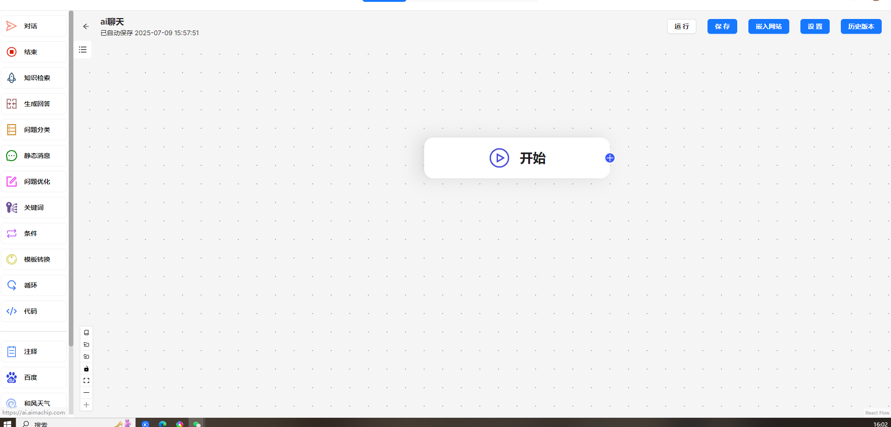
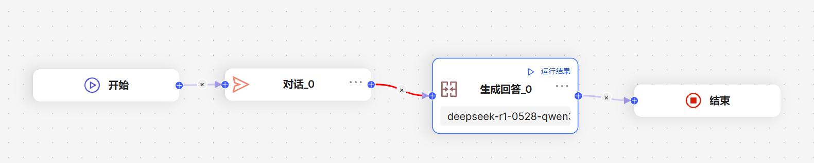

**注意事项：**

- 首次创建需要先设置默认模型
- 流程从"开始"节点到"结束"节点需完整
- 可参考示例流程进行配置

---

## 智能体接入 API

智能体支持三种接入方式，适用于不同的应用场景：

| 接入方式 | 协议 | 适用场景 |
|---------|------|---------|
| 大模型服务 | HTTP SSE | 自研大模型服务，文本问答 |
| 完整对话服务 | WebSocket | 双向流式语音对话 |
| 大模型+TTS服务 | WebSocket | 文本输入、语音输出 |

---

## 大模型服务参考 API

适用于接入自研大模型服务的场景。

### 配置说明

- **ASR 服务**：自动语音识别，可选"默认"或"自定义"
- **大模型服务**：

    - **连接方式**：默认为 SSE (HTTP)，服务器发送事件推送实时数据
    - **请求地址**：填写大模型服务的请求 URL
    - **流式**：支持流式返回结果，逐步返回而非一次性返回
    - **附加参数**：可添加额外参数，将携带在请求体中
- **TTS 服务**：文本转语音，可选"默认"或自定义外部服务

### 接口说明

- **请求方式**：`POST`
- **URL 示例**：`https://your-domain/api/v1/chat`
- **Header**：`Content-Type: application/json`

**请求体示例**：

```json
{
    "deviceId": "JX_A7T_7C3E821CB729",
    "question": "你是谁？",
    "stream": true
}
```

**返回示例（SSE 流式）**：

```
data:{"code": 0,"message": "","data": {"answer": "我","id": "12341231"}}
data:{"code": 0,"message": "","data": {"answer": "是","id": "12341231"}}
data:{"code": 0,"message": "","data": {"answer": "小智","id": "12341231"}}
data:{"code": 0,"message": "","data": {"answer": "有什么","id": "12341231"}}
data:{"code": 0,"message": "","data": {"answer": "可以","id": "12341231"}}
data:{"code": 0,"message": "","data": {"answer": "帮您","id": "12341231"}}
data:"[DONE]"
```

---

## 完整对话服务参考 API

适用于双向流式语音对话场景，支持实时语音输入和输出。

### 配置说明

平台支持接入双向流式语音对话 WebSocket OpenAPI。输入音频格式和输出音频格式根据可选项进行配置，附加参数将在 WebSocket 建连时携带在请求地址里。

### 接口说明

- **URL 示例**：`wss://your-domain/api/v1/chat?deviceId=12345678`

### 上行事件

#### 流式上传音频片段

```json
{
  "id": "event_id",
  "event_type": "input_audio_buffer.append",
  "data": {
    "delta": "base64EncodedAudioDelta"
  }
}
```

#### 提交音频

```json
{
  "id": "event_id",
  "event_type": "input_audio_buffer.complete"
}
```

#### 清除缓冲区音频

```json
{
  "id": "event_id",
  "event_type": "input_audio_buffer.clear"
}
```

#### 打断智能体输出

```json
{
  "id": "event_id",
  "event_type": "conversation.chat.cancel"
}
```

### 下行事件

#### 对话连接成功

```json
{
  "id": "7446668538246561xxxx",
  "event_type": "chat.created",
  "detail": {
    "logid": "20241210152726467C48D89D6DB2F3***"
  }
}
```

#### 对话开始

```json
{
  "id": "744666853824656xxx",
  "event_type": "conversation.chat.created",
  "data": {
    "id": "123",
    "conversation_id": "123"
  },
  "detail": {
    "logid": "20241210152726467C48D89D6DB2F3***"
  }
}
```

#### 增量消息

```json
{
  "id": "event_1",
  "event_type": "conversation.message.delta",
  "data": {
    "id": "msg_006",
    "conversation_id": "123",
    "type": "answer",
    "content": "你好你好"
  },
  "detail": {
    "logid": "20241210152726467C48D89D6DB2F3***"
  }
}
```

#### 增量语音

```json
{
  "id": "event_1",
  "event_type": "conversation.audio.delta",
  "data": {
    "id": "msg_006",
    "type": "answer",
    "content": "base64audio",
    "conversation_id": "123"
  },
  "detail": {
    "logid": "20241210152726467C48D89D6DB2F3***"
  }
}
```

#### 消息完成

```json
{
  "id": "event_1",
  "event_type": "conversation.message.completed",
  "data": {
    "id": "msg_002",
    "conversation_id": "123"
  },
  "detail": {
    "logid": "20241210152726467C48D89D6DB2F3***"
  }
}
```

#### 语音回复完成

```json
{
  "id": "event_1",
  "event_type": "conversation.audio.completed",
  "data": {
    "id": "msg_002",
    "conversation_id": "123"
  },
  "detail": {
    "logid": "20241210152726467C48D89D6DB2F3***"
  }
}
```

---

## 大模型和 TTS 服务参考 API

适用于文本输入、语音输出的场景。

### 接口说明

- **URL 示例**：`wss://your-domain/api/v1/chat?deviceId=12345678`

### 上行事件

#### 提交文本

```json
{
  "id": "event_id",
  "event_type": "input_text",
  "deviceId": "12345678",
  "question": "你是谁？",
  "stream": true
}
```

#### 打断智能体输出

```json
{
  "id": "event_id",
  "event_type": "conversation.chat.cancel"
}
```

### 下行事件

下行事件与完整对话服务相同，包括 `conversation.message.delta`、`conversation.audio.delta`、`conversation.message.completed`、`conversation.audio.completed` 等。

---

## 智能体控制设备

智能体支持通过 MCP（模型上下文协议）控制设备，也支持对接 coze 插件。

---

## MCP 设备控制

模型上下文协议（Model Context Protocol, MCP）可帮助大模型使用外部工具，实现与大模型交互过程中控制设备的能力。

### 配置步骤

#### 1. 配置小程序控件

根据您希望设备具备的能力，配置小程序控件。例如：

- 配置滑块控件，用来调节灯光亮度
- 配置开关控件，用来控制灯开关
- 配置按钮控件，用来控制加湿器开关
- 配置开关控件，用来控制窗帘开关

#### 2. 生成 MCP 工具

切换到 **"MCP工具"** 菜单，点击 **"刷新"** 按钮，系统会根据先前配置的小程序控件，生成对应的 MCP 工具。

#### 3. 配置工具信息

工具分为两种类型：**控制** 和 **查询**。每个工具需要填写：

- **工具名称**：确保含义清晰
- **工具描述**：帮助大模型更好地理解工具用途

#### 4. 发布 MCP 工具

版本发布前，请确认勾选 ✔ **"发布MCP工具"**。

#### 5. 烧录固件并验证

将生成好的固件烧录到设备中，使用平台提供的 **"体验版智能体"**，即可在与设备对话的过程中，通过 MCP 控制设备。

---

## coze 插件对接

我们在 coze 的商店里上架了示例固件对应的插件，您可以通过关键词 **"智能公元IOT插件"** 搜索找到。

如果你想做自己的插件，以下教程将告诉您怎么通过智能公元平台制作 coze 插件。

### 一、生成插件

1. 在智能公元平台版本详情页面里，选中 **"MCP工具"** 菜单，点击 **"预览"** 按钮
2. 在弹出的工具预览窗口中，点击 **"下载插件"** 按钮，保存下载下来的 `mcp_tool.yaml` 文件
3. 打开 coze 平台 [https://www.coze.cn/](https://www.coze.cn/)，在 **"工作空间" → "资源库"**，添加插件
4. 在新建插件窗口里，点击右上角的 **"导入"** 按钮
5. 上传保存的 `mcp_tool.yaml` 文件
6. 点击 **"下一步"**，然后点击 **"确认"**
7. 在资源库的列表里会显示刚添加的插件
8. 将工具列表里的所有工具都设置为 **"启用"** 状态
9. 进行试运行，试运行通过后，状态便会变更为"通过"
    - 试运行时需要输入对应参数的参数值
    - 其中 `token` 固定填写为 `Bearer test`
    - 其他参数可随便填

### 二、配置插件

1. 打开对话流的编辑界面，选中 **"开始"** 节点，配置输入变量 `token` 和 `deviceKey`
2. 选中大模型节点，**注意要把大模型的深度思考开关关闭**，不然会导致每次对话耗时太长
3. 在 **"技能"** 栏里添加插件
4. 在 **"输入"** 栏里引用"开始"节点的变量 `token` 和 `deviceKey`
5. 在 **"用户提示词"** 栏填写变量 `token` 和 `deviceKey`
6. 在结束节点里设置打开 **"流式输出"** 开关
7. 最后将编辑好的对话流发布

---

## 常见问题

### 智能体嵌入网站后一直显示"搜索中"怎么办？

**问题描述：**

智能体在独立运行时响应正常，但嵌入到外部网站后，无论输入什么问题都显示"搜索中"，无法获取响应。

**问题原因：**

- 智能体配置中缺少开场白设置
- 嵌入的iframe需要完整的初始化流程
- 智能体在等待初始配置触发

**解决方案：**

1. **检查智能体配置**

    - 登录智能公元平台
    - 进入对应智能体的配置页面
    - 查看流程设计中的开始节点

2. **添加开场白设置**

    - 在流程设计中选中开始节点
    - 在右侧配置面板中找到"设置开场白"选项
    - 填写合适的开场白内容（如"您好，我是智能助手"）

3. **重新生成固件**

    - 保存配置修改
    - 点击"发布版本"生成新固件
    - 等待固件生成完成

4. **更新嵌入代码**

    - 在智能体详情页点击"嵌入网站"
    - 复制新生成的iframe代码
    - 替换网站中的旧代码

**操作步骤详解：**

1. **进入流程设计**：

    - 在智能体配置界面
    - 点击"流程设计"或类似选项
    - 找到流程的开始节点

2. **设置开场白**：

    - 点击开始节点（通常用绿色圆圈表示）
    - 在弹出的配置窗口中
    - 找到"开场白"或"欢迎语"设置项
    - 输入初始化文本

3. **保存并发布**：

    - 确认开场白设置无误
    - 保存整个流程配置
    - 点击发布生成新版本

**验证方法：**

1. **平台内测试**：

    - 先在智能公元平台内测试
    - 确认智能体响应正常
    - 检查是否有开场白输出

2. **网站测试**：

    - 使用新的嵌入代码更新网站
    - 刷新页面等待智能体加载
    - 尝试发送测试消息

**注意事项：**

- 开场白是智能体初始化的重要步骤
- 嵌入模式需要完整的初始化流程
- 每次修改配置后都需要更新嵌入代码
- 确保网站支持iframe嵌入功能

**其他可能原因：**

1. **网络连接问题**：

    - 检查网站所在服务器的网络连接
    - 确认防火墙允许访问智能体服务

2. **域名白名单**：

    - 确认网站域名已在智能体平台配置
    - 检查CORS设置是否正确

3. **API密钥问题**：

    - 验证API密钥是否有效
    - 确认密钥权限包含嵌入功能

---

### 智能体流程中如何选择变量？

**问题描述：**

在配置智能体流程的选择器节点时，不清楚如何正确引用变量，特别是知识库检索和大模型输出的变量。

**解决方案：**

**1. 变量引用规则**

- 变量名需要与节点输出完全匹配
- 修改变量名会影响引用关系
- 变量聚合后需要使用聚合后的名称


*选择器中引用知识库检索的输出变量*

**2. 常见变量引用**

- **知识库检索 - output**：知识库检索节点的输出
- **大模型 - output**：大模型节点的输出
- **聚合变量**：变量聚合节点中定义的Group名称


*变量聚合节点将多个输出聚合到Group1*

**3. 变量匹配技巧**

- 使用下拉列表选择可用变量
- 确认变量名拼写完全正确
- 注意大小写和特殊字符

**4. 条件判断设置**

选择器中常用的条件：

- **为空**：判断变量是否为空值
- **等于**：精确匹配特定值
- **包含**：字符串包含判断


*展示选择器节点在流程中的位置*

**注意事项：**

- 变量名修改后需要更新所有引用
- 条件判断的值要与变量类型匹配
- 建议使用有意义的变量名
- 测试流程时注意检查变量传递

---

### 智能体配置正确但无响应怎么办？

**问题描述：**

智能体在扣子平台测试正常，但设备端无响应，需要排查连接和配置问题。

**解决方案：**

**1. 检查配置信息**

确认以下信息填写正确：

- **应用ID（client_id）**：必须与扣子平台一致
- **智能体ID**：确认智能体标识正确
- **公钥/私钥**：完整且无换行符

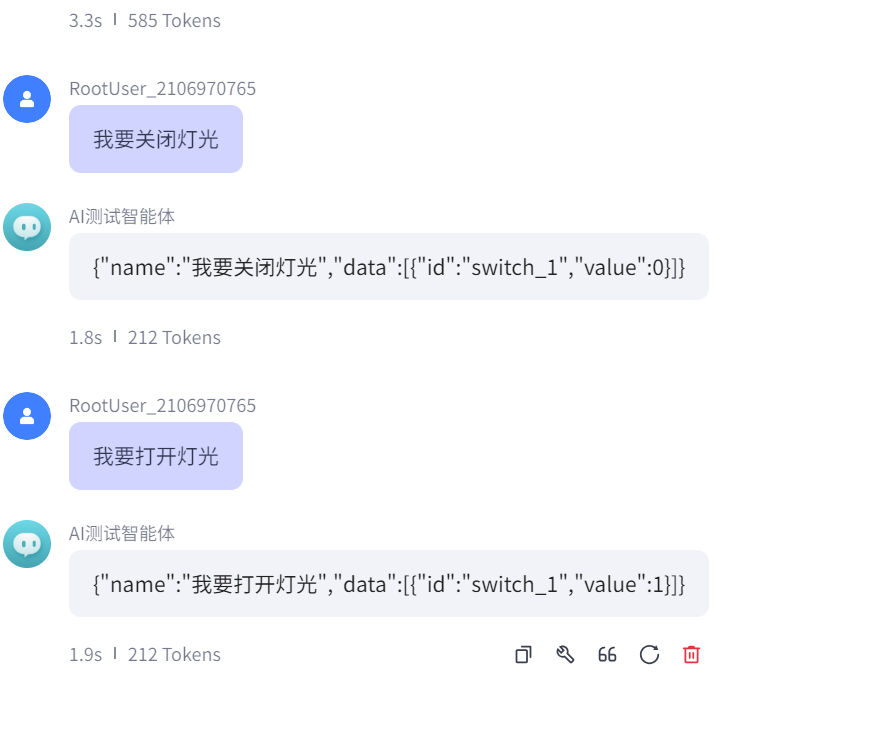

*扣子平台对话正常返回JSON数据*

**2. 私钥格式检查**

- 使用VSCode打开私钥文件
- 避免文本编辑器添加换行符
- 确保私钥完整且无额外字符

**3. 资源点检查**

- 登录扣子平台查看资源余额
- 确保有足够的资源点
- 资源不足会导致服务中断

**4. 语音离线测试**

- 测试"你好小智"等离线命令
- 确认设备基本功能正常
- 排除硬件故障

**5. 网络连接验证**

- 检查设备网络连接状态
- 确认防火墙设置
- 验证API地址可访问

**注意事项：**

- 私钥文件必须使用专业编辑器处理
- 配置修改后需要重新生成固件
- 保留配置截图以便问题排查
- 如问题持续可联系技术支持

---

### 如何配置AI智能体的公钥和私钥？

**问题描述：**

在创建新配置时，需要填写公钥和私钥，但私钥格式容易出现问题。

**解决方案：**

**1. 获取密钥对**

在豆包扣子平台获取：

- 创建应用后生成密钥对
- 下载或复制公钥和私钥
- 公钥ID用于标识密钥对

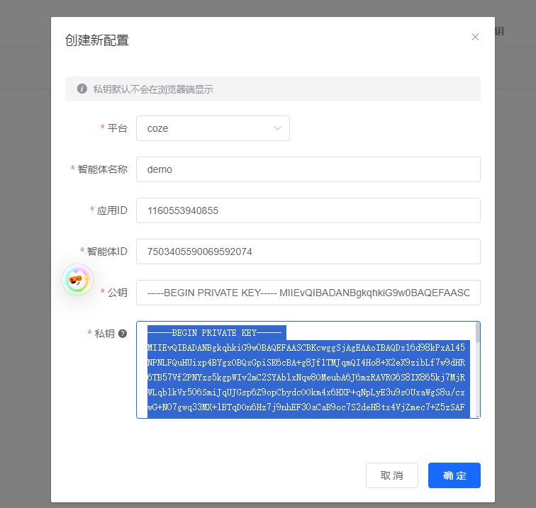

*配置界面显示公钥和私钥输入框*

**2. 私钥处理注意事项**

- **使用专业编辑器**：推荐使用VSCode打开私钥文件
- **避免换行符**：文本编辑器可能自动添加换行
- **保持完整性**：不要删除或修改任何字符

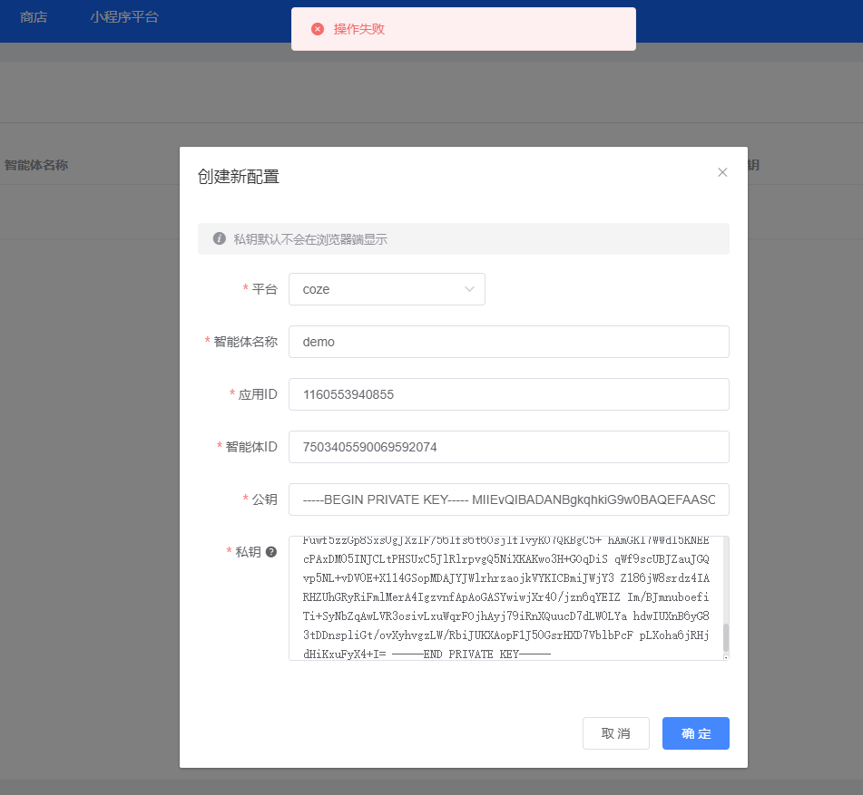

*私钥字段包含换行符的示例*

**3. 配置步骤**

- 复制公钥内容到公钥字段
- 使用编辑器打开私钥文件后复制到私钥字段
- 填写应用ID和智能体ID

**4. 验证配置**

- 在扣子平台确认配置信息
- 检查资源点余额是否充足
- 测试API连接是否正常

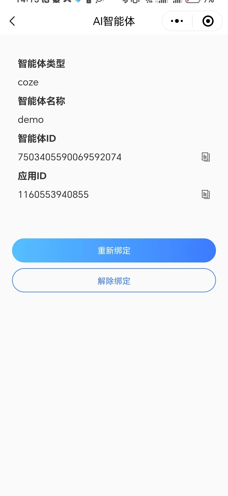

*确认智能体ID和应用ID正确*

**5. 扣子平台确认**

登录扣子平台验证：

- 智能体ID位置（红色箭头指示）
- 应用ID与配置一致
- 密钥对状态正常

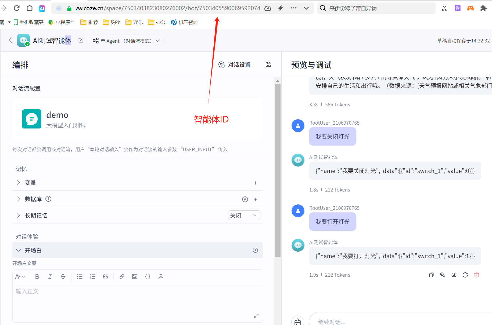

*扣子平台显示的智能体ID*

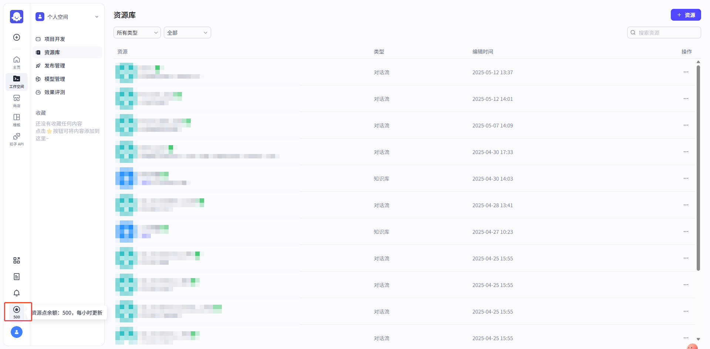

*账户资源点余额显示*

**注意事项：**

- 私钥具有唯一性，妥善保管
- 定期检查资源点余额
- 配置失败时检查密钥格式
- 确保网络环境可访问扣子API

