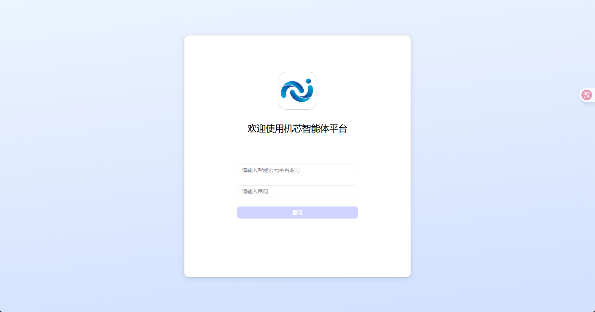

# 快速开始

本页按“照着做就能跑”的方式，带你把 **智能体平台 **的智能体创建出来，并完成 **智能公元设备绑定**。

## 你需要准备

- **账号**：智能公元平台账号（用于在 `smartpi.cn` 创建配置、生成二维码）。
- **设备**：一台支持“AI 智能体”菜单的设备。
- **平台地址**：你们部署的 智能体平台 地址（下文简称“控制台”）。

!!! note "重要说明"
    智能体平台 的接口调用鉴权，推荐使用 **个人访问令牌（Personal Access Token, PAT）**。PAT **只展示一次**，生成后请立刻保存。

## 1. 登录控制台（智能体平台 ）

1. 打开你们的控制台地址。
2. 使用平台账号登录。

   

## 2. 创建一个智能体（Agent / Bot）

1. 进入 **开发 / Development**。
2. 点击 **创建 / Create**，选择创建智能体。

   

3. 填写：
   - **名称**：建议用“场景 + 设备”，例如“客厅灯光助手”。
   - **介绍**：一句话说明能做什么。
   - **人设/提示词**：先用最简单版本（后面再优化）。

   

!!! tip "最小可用提示词（直接复制）"
    你是智能公元设备的语音助手。
    你需要用简洁的中文回答。
    当用户要控制设备时，优先调用可用的工具完成控制，再解释你做了什么。

## 3. 发布智能体为 API 服务

这一步的目标是：让智能体可以通过 API 被设备/服务端调用。

1. 在智能体页面右上角点击 **发布 / Publish**。
2. 在发布选项中选择 **API**（或“发布为 API 服务”）。
3. 点击 **发布**。

发布完成后你会得到两个关键信息：

- **智能体 ID（bot_id）**：通常可以从浏览器地址栏里 `bot/` 后的数字看到。
- **API 调用需要的 Token（PAT）**：下一步生成。

## 4. 生成个人访问令牌（PAT）

1. 在控制台左下角点击头像。
2. 进入 **API Authorization / API 授权**。

   

3. 点击 **Add New Token / 新建令牌**。
4. 填写名称与过期时间后确认。
5. **复制并保存 PAT**。

调用 API 时，需要把 PAT 放在 HTTP Header：

```text
Authorization: Bearer pat_xxx
```

## 5. 在智能公元平台创建“智能体配置”

1. 打开智能公元平台：`https://smartpi.cn/`。
2. 左侧菜单进入：**智能体 -> 配置**。

   

3. 点击创建新配置（或选择已有配置编辑），通常需要填写：
   - **名称**：展示名。
   - **智能体ID（bot_id）**：来自第 3 步。
   - **个人访问令牌（PAT）**：来自第 4 步。
   - （可选）**对话流/工作流 ID**：如果你的设备侧需要调用工作流（例如插件编排），再填写。

保存后，平台会生成 **绑定二维码**。

## 6. 微信小程序绑定设备

1. 打开 **“智能公元”微信小程序**。
2. 进入设备详情页。
3. 找到并点击 **“AI智能体”** 菜单。
4. 扫描第 5 步生成的二维码完成绑定。

!!! warning "找不到“AI智能体”菜单？"
    说明当前设备/固件不支持该能力，请先确认设备型号与固件版本。

## 7. 验证是否成功

1. 在小程序里对设备发起对话（例如“你是谁”）。
2. 如果智能体能回复，说明绑定成功。
3. 如果你配置了工具（MCP/插件），再尝试一句控制指令验证。

## 常见问题

### 1) PAT 忘了保存怎么办？

PAT 一般只展示一次。丢失后需要重新生成新的 PAT，并把智能公元平台里的配置更新为新 PAT。

### 2) 设备端一直没反应怎么办？

- **先确认**：小程序里能看到“AI智能体”菜单。
- **再确认**：`bot_id` 与 `PAT` 是否填错（多一个空格都会失败）。
- **最后确认**：智能体是否已发布为 API 服务。

---

下一步建议阅读：

- [智能体](./ai-agent.md)
- [知识库配置指南](./knowledge-base-setup.md)
- [智能体控制台指南](./platform-guide.md)

