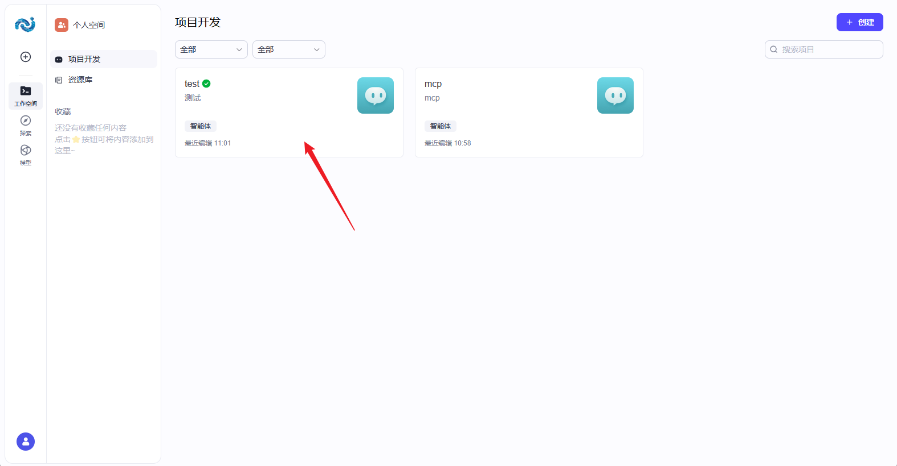
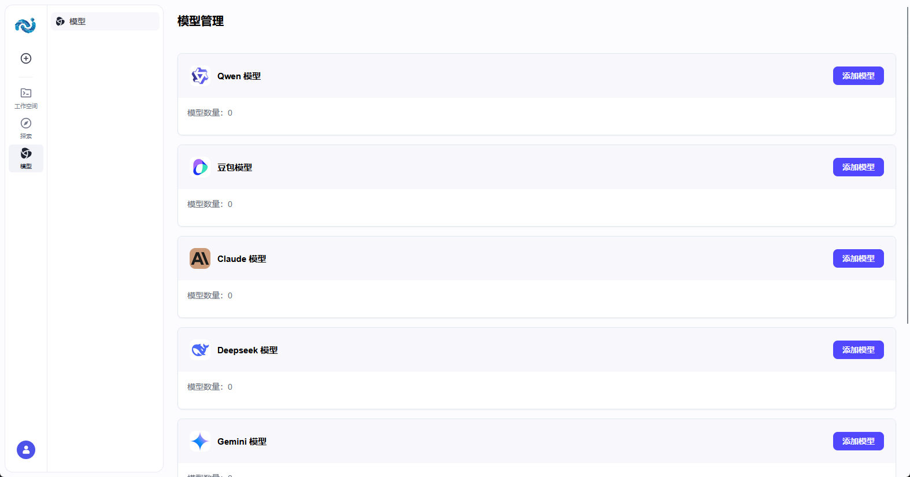
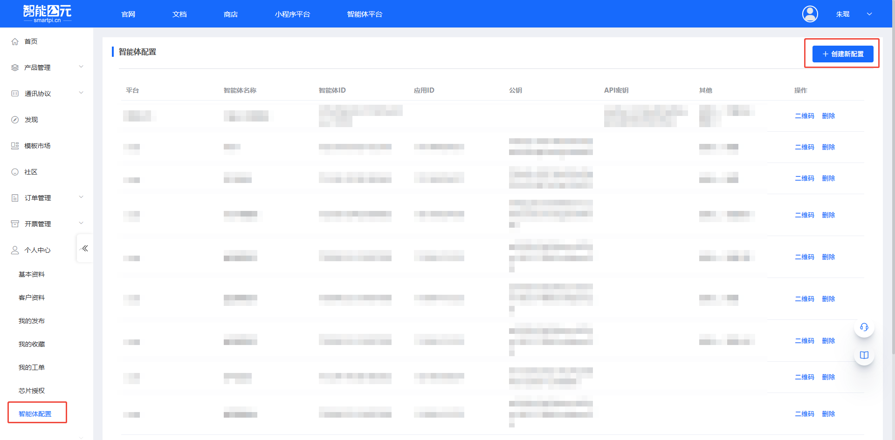
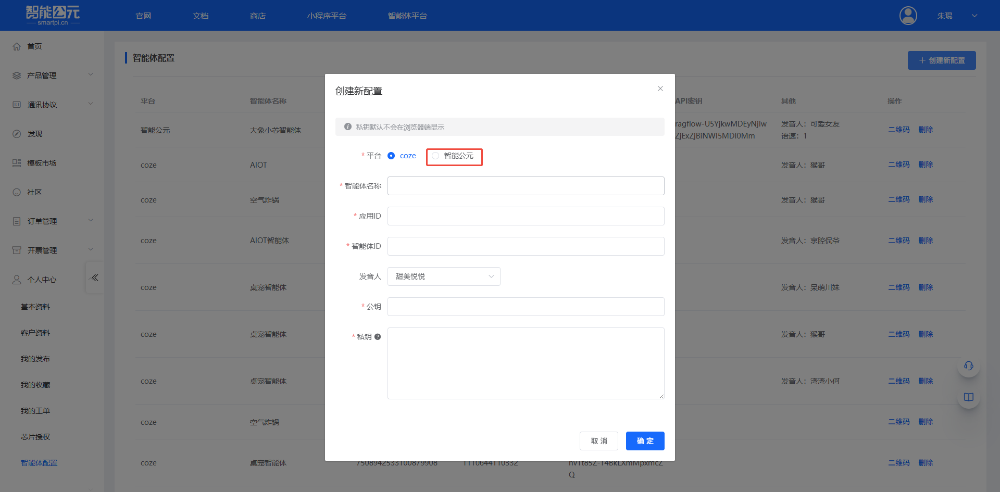
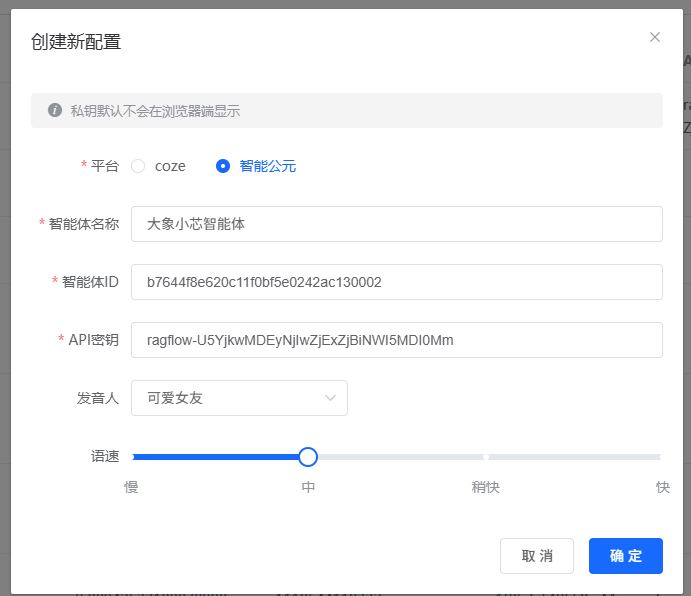
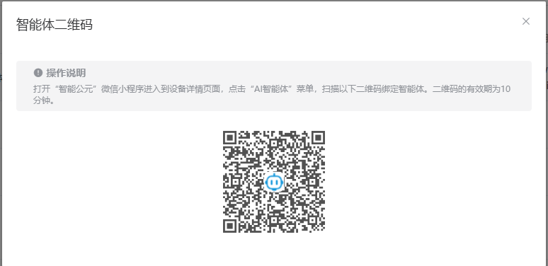

# 智能体控制台指南

智能体平台已切换为 **智能体平台**。本页按“照着做就能用”的方式，说明：

- 如何在控制台创建/发布智能体
- 如何获取 **PAT（Personal Access Token）**
- 如何用 OpenAPI 调用智能体/工作流
- 如何与智能公元平台对接（生成二维码并绑定设备）
- 如何让智能体具备设备控制能力（MCP/插件）

如果你是第一次使用，建议先从：[快速开始](./get-started.md) 开始。

---

## 1. 新平台：最短路径（5 分钟跑通）

1. 在 智能体平台 创建智能体。
2. 发布智能体为 **API 服务**。
3. 生成 **PAT**。
4. 在 `smartpi.cn` 创建“智能体配置”，填 `bot_id` 与 `PAT`，生成二维码。
5. 微信小程序扫描二维码绑定设备。


## 2. 获取 bot_id 与 PAT

### 2.1 bot_id

`bot_id` 是智能体的唯一标识。

- 常见获取方式：打开智能体页面，查看浏览器地址栏中 `bot/` 后的数字。




### 2.2 PAT（Personal Access Token）

智能体平台 API / Chat SDK 使用 PAT 进行鉴权。

1. 登录 智能体平台。
2. 点击左下角头像进入 **API Authorization / API 授权**。
3. 点击 **Add New Token / 新建令牌**。
4. 填写名称与过期时间后确认。
5. 复制并保存 PAT。


!!! warning "PAT 只展示一次"
    PAT 通常只在创建时展示一次。丢失后需要重新生成，并更新智能公元平台的配置。

## 3. OpenAPI 调用速查（智能体平台 ）

以下示例均需带上请求头：

```text
Authorization: Bearer pat_xxxxx
Content-Type: application/json
```

### 3.1 创建会话（conversation）

```bash
curl --location '{{host}}/v1/conversation/create' \
  --header 'Authorization: Bearer pat_xxxxx' \
  --header 'Content-Type: application/json' \
  --data '{"bot_id":"<bot_id>"}'
```

### 3.2 发起对话（chat v3，流式 SSE）

```bash
curl --location --request POST '{{host}}/v3/chat?conversation_id=<conversation_id>' \
  --header 'Authorization: Bearer pat_xxxxx' \
  --header 'Content-Type: application/json' \
  --data-raw '{
    "bot_id": "<bot_id>",
    "user_id": "<your_user_id>",
    "stream": true,
    "auto_save_history": true,
    "additional_messages": [
      {"role":"user","content":"你好","content_type":"text"}
    ]
  }'
```

流式事件常见顺序：

- `conversation.chat.created`
- `conversation.chat.in_progress`
- `conversation.message.delta`
- `conversation.message.completed`
- `conversation.chat.completed`
- `done`

### 3.3 消息列表 / 清理上下文

- **消息列表**：`POST {{host}}/v1/conversation/message/list?conversation_id=...`
- **清理上下文**：`POST {{host}}/v1/conversations/:conversation_id/clear`

### 3.4 执行工作流

```bash
curl --location --request POST '{{host}}/v1/workflow/run' \
  --header 'Authorization: Bearer pat_xxxxx' \
  --header 'Content-Type: application/json' \
  --data-raw '{
    "workflow_id": "<workflow_id>",
    "parameters": "{\"user_id\":\"12345\"}"
  }'
```

## 4. 与智能公元设备对接（二维码绑定）

你需要在智能公元平台创建“智能体配置”，并在设备侧完成扫码绑定。

1. 打开 `https://smartpi.cn/`。
2. 左侧菜单进入：**智能体 -> 配置**。
3. 创建新配置并填写：
   - `bot_id`
   - `PAT`
   - （可选）`workflow_id`（如果你的方案需要对话流/工作流）
4. 保存后生成二维码。
5. 打开“智能公元”微信小程序，在设备详情页点击 **AI智能体** 扫码绑定。

## 5. 设备控制能力（MCP / 插件）

### 5.1 MCP（推荐）

1. 在小程序里配置控件（开关/滑块/按钮等）。
2. 在智能公元平台进入 **MCP 工具**，点击 **刷新** 生成工具。
3. 为每个工具补充清晰的名称与描述。
4. 发布版本时勾选 **发布 MCP 工具**。
5. 烧录固件后在设备对话中验证。

### 5.2 插件（mcp_tool.yaml 导入）

1. 在智能公元平台版本详情页的 **MCP 工具** 里下载 `mcp_tool.yaml`。
2. 在 智能体平台**资源库**导入插件，并启用工具。
3. 在对话流/工作流中将 `token`、`deviceKey` 作为输入变量传入工具。


---

## （旧版）智能公元自研接入 API（保留存档）

以下 1~6 章为旧版平台的自研接入 API 说明。若你当前使用的是 智能体平台，请优先按本文前半部分的 OpenAPI 流程对接。

## （旧版）1. 接入概览

### 1.1 适用场景
- 已有自研大模型或完整智能体服务，需在设备端落地。
- 需要通过平台提供的“自定义”智能体配置选项，将外部服务通过 API 注入到设备。
- 希望通过平台能力扩展语音对话、文本对话、TTS 生成或设备控制等功能。

### 1.2 接入方式速览


| 接入方式 | 连接协议 | 主要能力 | 典型场景 |
| --- | --- | --- | --- |
| HTTP 大模型服务 | HTTP + SSE | 自定义大模型推理，平台默认 ASR/TTS | 只需模型输出文本，再由设备完成语音播报 |
| 双向流式语音对话 | WebSocket | 语音上行 + 文本/音频下行的全链路对话 | 需要自定义语音对话引擎或完整对话服务 |
| 大模型 + TTS 服务 | WebSocket | 纯文本问题输入，平台回传文本 + TTS 音频 | 需自定义文本大模型与语音合成，实现多轮播报 |

---

## （旧版）2. HTTP 大模型服务参考 API

适用于已准备好 ASR→LLM→TTS 流程中“LLM”环节的场景。设备默认使用平台 ASR 和 TTS，只需提供大模型推理接口即可。

### 2.1 配置要点
- **ASR 服务**：可选“默认/自定义”，默认表示继续沿用平台配置。
- **大模型服务**：

    - 连接方式：当前支持 **SSE (http)**。
    - 请求地址：填写模型推理 URL。
    - 流式：建议开启，以便实时回传生成内容。
    - 附加参数：可在配置界面动态添加，平台会写入请求体。
- **TTS 服务**：可选“默认/自定义”，默认由平台完成文本转语音。

### 2.2 接口说明
- **请求方式**：`POST`
- **示例 URL**：`https://test/api/v1/chat`
- **必填 Header**：`Content-Type: application/json`

**请求体字段**

| 参数名 | 类型 | 说明 | 是否必填 |
| --- | --- | --- | --- |
| deviceId | String | 设备唯一 ID | ✓ |
| question | String | 用户提问文本 | ✓ |
| stream | Boolean | 是否使用 SSE 流式返回 | ✓ |
| xxx | Object | 自定义附加参数 | ✗ |

**请求示例**
```json
{
    "deviceId": "JX_A7T_7C3E821CB729",
    "question": "你是谁？",
    "stream": true
}
```

**流式返回示例（SSE）**
```text
data:{"code":0,"message":"","data":{"answer":"我","id":"12341231"}}

data:{"code":0,"message":"","data":{"answer":"是","id":"12341231"}}

data:{"code":0,"message":"","data":{"answer":"小智","id":"12341231"}}

data:{"code":0,"message":"","data":{"answer":"有什么","id":"12341231"}}

data:{"code":0,"message":"","data":{"answer":"可以","id":"12341231"}}

data:{"code":0,"message":"","data":{"answer":"帮您","id":"12341231"}}

data:"[DONE]"
```

---

## （旧版）3. 完整对话服务参考 API（双向流式语音 WebSocket）

适用于自研了“语音识别 + 多模态推理 + 语音合成”能力的伙伴，通过 WebSocket 建立长连接，实现语音上/下行的实时对话。

### 3.1 接口特性
- 通信协议：`wss`
- 输入输出：可自定义语音编码，音频片段通过 Base64 传输。
- 附加参数：在建连 URL 的 Query 中透传。

### 3.2 时序


### 3.3 建连信息
- **示例 URL**：`wss://test/api/v1/chat`
- **Query 参数**：

| 参数名 | 类型 | 说明 | 是否必填 |
| --- | --- | --- | --- |
| deviceId | String | 设备唯一 ID | ✓ |
| xxx | Object | 业务所需的附加参数 | ✗ |

示例：`wss://test/api/v1/chat?deviceId=12345678`

### 3.4 上行事件（上行 → 服务端）

#### 1) 流式上传音频片段 `input_audio_buffer.append`
| 字段 | 类型 | 说明 |
| --- | --- | --- |
| id | String | 生成的事件 ID |
| event_type | String | 固定为 `input_audio_buffer.append` |
| data.delta | String | Base64 编码的音频片段 |

```json
{
  "id": "event_id",
  "event_type": "input_audio_buffer.append",
  "data": {
    "delta": "base64EncodedAudioDelta"
  }
}
```

#### 2) 提交音频缓冲区 `input_audio_buffer.complete`
| 字段 | 类型 | 说明 |
| --- | --- | --- |
| id | String | 生成的事件 ID |
| event_type | String | 固定为 `input_audio_buffer.complete` |

```json
{
  "id": "event_id",
  "event_type": "input_audio_buffer.complete"
}
```

#### 3) 清除缓冲区音频 `input_audio_buffer.clear`
| 字段 | 类型 | 说明 |
| --- | --- | --- |
| id | String | 生成的事件 ID |
| event_type | String | 固定为 `input_audio_buffer.clear` |

```json
{
  "id": "event_id",
  "event_type": "input_audio_buffer.clear"
}
```

#### 4) 打断智能体输出 `conversation.chat.cancel`
| 字段 | 类型 | 说明 |
| --- | --- | --- |
| id | String | 生成的事件 ID |
| event_type | String | 固定为 `conversation.chat.cancel` |

```json
{
  "id": "event_id",
  "event_type": "conversation.chat.cancel"
}
```

### 3.5 下行事件（服务端 → 下行端）

#### 1) 建立连接 `chat.created`
| 字段 | 类型 | 说明 |
| --- | --- | --- |
| id | String | 服务端事件 ID |
| event_type | String | `chat.created` |
| detail.logid | String | 请求日志 ID |

```json
{
  "id": "7446668538246561xxxx",
  "event_type": "chat.created",
  "detail": {
    "logid": "20241210152726467C48D89D6DB2F3***"
  }
}
```

#### 2) 对话开始 `conversation.chat.created`
| 字段 | 类型 | 说明 |
| --- | --- | --- |
| id | String | 服务端事件 ID |
| event_type | String | `conversation.chat.created` |
| data.id | String | 对话 ID |
| data.conversation_id | String | 会话 ID |
| detail.logid | String | 日志 ID |

```json
{
  "id": "744666853824656xxx",
  "event_type": "conversation.chat.created",
  "data": {
    "id": "123",
    "conversation_id": "123"
  },
  "detail": {
    "logid": "20241210152726467C48D89D6DB2F3***"
  }
}
```

#### 3) 文本增量 `conversation.message.delta`
| 字段 | 类型 | 说明 |
| --- | --- | --- |
| id | String | 事件 ID |
| event_type | String | `conversation.message.delta` |
| data.content | String | 文本内容 |
| data.type | String | 固定 `answer` |
| data.conversation_id | String | 会话 ID |

```json
{
  "id": "event_1",
  "event_type": "conversation.message.delta",
  "data": {
    "id": "msg_006",
    "conversation_id": "123",
    "type": "answer",
    "content": "你好你好"
  },
  "detail": {
    "logid": "20241210152726467C48D89D6DB2F3***"
  }
}
```

#### 4) 语音增量 `conversation.audio.delta`
| 字段 | 类型 | 说明 |
| --- | --- | --- |
| id | String | 事件 ID |
| data.content | String | Base64 音频片段 |
| data.type | String | `answer` |

```json
{
  "id": "event_1",
  "event_type": "conversation.audio.delta",
  "data": {
    "id": "msg_006",
    "type": "answer",
    "content": "base64audio",
    "conversation_id": "123"
  },
  "detail": {
    "logid": "20241210152726467C48D89D6DB2F3***"
  }
}
```

#### 5) 文本完成 `conversation.message.completed`
```json
{
  "id": "event_1",
  "event_type": "conversation.message.completed",
  "data": {
    "id": "msg_002",
    "conversation_id": "123"
  },
  "detail": {
    "logid": "20241210152726467C48D89D6DB2F3***"
  }
}
```

#### 6) 语音完成 `conversation.audio.completed`
```json
{
  "id": "event_1",
  "event_type": "conversation.audio.completed",
  "data": {
    "id": "msg_002",
    "conversation_id": "123"
  },
  "detail": {
    "logid": "20241210152726467C48D89D6DB2F3***"
  }
}
```

#### 7) 对话完成 `conversation.chat.completed`
```json
{
  "id": "event_id",
  "event_type": "conversation.chat.completed",
  "data": {
    "id": "123",
    "conversation_id": "123"
  },
  "detail": {
    "logid": "20241210152726467C48D89D6DB2F3***"
  }
}
```

#### 8) 对话失败 `conversation.chat.failed`
| 字段 | 类型 | 说明 |
| --- | --- | --- |
| data.last_error.code | Integer | 错误码（0 表示成功） |
| data.last_error.msg | String | 错误描述 |

```json
{
  "id": "event_1",
  "event_type": "conversation.chat.failed",
  "data": {
    "id": "123",
    "conversation_id": "123",
    "last_error": {
      "code": 1,
      "msg": "发生异常"
    }
  },
  "detail": {
    "logid": "20241210152726467C48D89D6DB2F3***"
  }
}
```

#### 9) 错误事件 `error`
```json
{
  "id": "event_1",
  "event_type": "error",
  "data": {
    "code": 1,
    "msg": "发生异常"
  },
  "detail": {
    "logid": "20241210152726467C48D89D6DB2F3***"
  }
}
```

#### 10) 流式音频提交完成 `input_audio_buffer.completed`
```json
{
  "id": "event_id",
  "event_type": "input_audio_buffer.completed",
  "detail": {
    "logid": "20241210152726467C48D89D6DB2F3***"
  }
}
```

#### 11) 缓冲区已清除 `input_audio_buffer.cleared`
```json
{
  "id": "event_id",
  "event_type": "input_audio_buffer.cleared",
  "detail": {
    "logid": "20241210152726467C48D89D6DB2F3***"
  }
}
```

#### 12) 输出被中断 `conversation.chat.canceled`
```json
{
  "id": "event_id",
  "event_type": "conversation.chat.canceled",
  "detail": {
    "logid": "20241210152726467C48D89D6DB2F3***"
  }
}
```

---

## （旧版）4. 大模型 + TTS 服务参考 API（文本输入 WebSocket）

该模式通过 WebSocket 发送文本问题，并接收文本结果与 TTS 音频，适合纯文本问题、由接入方自定义语音合成的场景。

### 4.1 时序


### 4.2 建连信息
- **示例 URL**：`wss://test/api/v1/chat`
- **Query 参数**同上，需包含 `deviceId`，可附加自定义参数。

### 4.3 上行事件

#### 1) 提交文本 `input_text`
| 字段 | 类型 | 说明 |
| --- | --- | --- |
| id | String | 事件 ID |
| event_type | String | 固定 `input_text` |
| deviceId | String | 设备 ID |
| question | String | 文本问题 |
| stream | Boolean | 是否流式返回 |
| xxx | Object | 自定义参数 |

```json
{
  "id": "event_id",
  "event_type": "input_text",
  "deviceId": "12345678",
  "question": "你是谁？",
  "stream": true
}
```

#### 2) 打断输出 `conversation.chat.cancel`
结构与语音方案一致。

### 4.4 下行事件

与语音方案一致，包括 `chat.created`、`conversation.chat.created`、`conversation.message.delta`、`conversation.audio.delta`、`conversation.message.completed`、`conversation.audio.completed`、`conversation.chat.completed`、`conversation.chat.failed`、`error`、`conversation.chat.canceled` 等。示例结构可参考第 3 章，对应字段含义保持一致。

---
## （旧版）5. MCP（Model Context Protocol）设备控制

MCP 让大模型能够使用平台生成的外部工具，实现对设备控件的查询与控制。

### 5.1 操作步骤
1. **配置控件**：在小程序中配置滑块、开关、按钮等控件（例如调节灯光亮度、控制灯/加湿器/窗帘等）。
2. **生成工具**：切换到“**MCP 工具**”菜单，点击“刷新”生成与控件对应的工具。
3. **补充描述**：每个工具需填写清晰的名称与描述，区分“控制”和“查询”类型，便于大模型理解。
4. **发布工具**：版本发布前勾选“发布 MCP 工具”。
5. **固件验证**：将生成的固件烧录到设备，使用平台提供的体验能力即可在对话中调用 MCP 控制设备。

### 5.2 示例界面
- 控件配置示例：
- 工具生成示例：
- 发布确认：

---
## （旧版）6. 插件对接

平台提供“智能公元 IOT 插件”示例，亦可按照以下流程制作自定义插件。

### 6.1 生成插件
1. 在版本详情页的 **MCP 工具** 菜单点击“预览”，在弹窗中选择“下载插件”，获取 `mcp_tool.yaml`。
2. 在智能体平台控制台的“资源库”选择“添加插件”。
3. 在新建插件窗口点击右上角“导入”，上传 `mcp_tool.yaml`。
4. 按向导点击“下一步”→“确认”。
5. 资源库中会出现新插件，进入后将所有工具设置为“启用”。
6. 首次状态会显示“失败”，需要执行“试运行”并填写参数：`token` 固定为 `Bearer test`，其余参数可按需填写，通过后状态变为“通过”。

### 6.2 配置对话流
1. 在对话流编辑器中，选中“开始”节点，新增输入变量 `token` 与 `deviceKey`。
2. 选中大模型节点，关闭“深度思考”开关以缩短响应时延。
3. 在“技能”栏添加刚导入的插件。
4. 在“输入”栏引用“开始”节点的 `token`、`deviceKey` 变量。
5. 在“用户提示词”中也引用上述变量，确保大模型能正确传参。
6. 在结束节点开启“流式输出”。
7. 发布对话流，即可在对话中调用插件。

### 6.3 配图参考
- 插件检索：
- 下载配置：
- 导入向导：
- 试运行：
- 对话流配置：
- 发布前检查：

---

### 可以使用在 Coze 已经创建好的智能体吗？

**问题描述：**

在 Coze 平台上已经创建了智能体，询问是否可以直接使用这些已创建的智能体，还是需要重新创建。

**解决方案：**

**可以直接使用已创建的智能体。**

**使用方法：**

1. **获取智能体信息**：
    - 登录 Coze 平台
    - 找到已创建的智能体
    - 获取智能体 ID（bot_id）

2. **配置参数差异**：
    - 使用 Coze 智能体时，填写的参数与新建智能体有所不同
    - 主要差异在于配置选项和绑定方式
    - 可参考平台文档中心 A7T 演示操作文档

3. **绑定步骤**：
    - 在智能公元平台创建智能体配置时
    - 选择 Coze 平台类型
    - 填入已创建智能体的 ID
    - 完成绑定即可使用

**注意事项：**

- 已创建的智能体可以直接使用，无需重复创建
- 参数配置与新建时略有差异，请根据实际情况填写
- 确保智能体已正确发布并具有 API 访问权限
- 如遇到问题，可参考 A7T 演示操作文档

---

### 调用AI模型时提示"not authorized"错误怎么办？

**问题描述：**

在调用AI模型生成文本时，系统返回"ERROR: Model(BAAI/bge-reranker-v2-m3) not authorized"错误，导致功能无法正常使用。

**解决方案：**

**问题原因：**

- 使用的模型没有授权或授权已过期
- 模型访问权限配置问题

**解决方法：**

1. **调整相似度阈值**
    - 在AI组件设置中找到"相似度阈值"参数
    - 将阈值调整为0.5或更合适的值
    - 保存配置后重新测试

2. **检查模型授权状态**
    - 确认所选模型是否有访问权限
    - 检查API密钥是否正确配置
    - 验证账户是否有足够的使用额度

3. **更换可用模型**
    - 选择平台推荐的其他模型
    - 使用有授权的备用模型
    - 确保模型在可用列表中

4. **重新配置知识库**
    - 检查知识库文件是否正确上传
    - 确认文件解析状态正常
    - 重新上传知识库文件测试

**注意事项：**

- 相似度阈值设置过高可能导致匹配失败
- 确保使用平台授权的模型
- 定期检查模型访问权限状态
- 如问题持续，联系技术支持获取协助

---

### 知识库文档必须上传两个吗？

**问题描述：**

在配置知识库时，询问是否必须上传两个文档，还是可以只上传一个。

**解决方案：**

**上传数量说明：**

- 知识库支持只上传一个文档
- 两种文档类型（如txt和xlsx）是为了演示兼容性
- 根据实际需求选择上传一种或多种类型

**使用建议：**

1. **单一文档**
    - 如果只有一种格式的知识库内容
    - 可以上传单个txt或xlsx文件
    - 系统会正常解析和使用

2. **多种文档**
    - 有互补内容时可上传多个文档
    - 不同格式可包含不同类型的信息
    - 提高知识库的丰富度

3. **文档格式选择**
    - txt：适合纯文本知识
    - xlsx：适合结构化数据
    - 根据内容特点选择合适格式

**注意事项：**

- 知识库不是必须上传两个文档
- 可以根据需要选择文档数量和类型
- 确保文档内容清晰、格式正确
- 上传后检查解析状态是否正常

---

通过以上结构化指南，可以在平台内快速完成智能体 API 接入、语音/文本对话调试，以及设备控制与生态插件的落地。

---

### 智能体平台如何添加自定义模型？

**问题描述：**

需要在智能体平台中添加自定义大模型，了解如何配置模型参数以及是否支持自建GPU服务器。

**解决方案：**

**模型添加方式：**

智能体平台支持多种模型接入方式，包括VLLM和Xinference等主流框架：

1. **添加模型流程**：

    - 登录智能体平台
    - 进入"模型提供商"管理页面
    - 点击"添加模型"按钮
    - 选择对应的模型类型（VLLM/Xinference）

    

2. **配置模型参数**：

    - **模型类型**：选择对应的大模型框架
    - **模型名称**：填写模型标识名称
    - **基础URL**：填写模型服务的API地址
    - **API Key**：填写访问密钥（如需要）
    - **最大Token数**：设置单次请求的最大token限制

3. **自建GPU服务器支持**：

    - 平台支持接入自建GPU服务器
    - 需要提供标准的API接口
    - 支持方言识别和合成功能集成

**方言支持配置：**

1. **方言识别支持**：

    - 通过自建GPU服务器部署方言识别模型
    - 支持粤语、上海话、四川话等方言
    - 需要二十多年专业团队打造的支持

2. **方言TTS合成**：

    - 支持方言文本转语音合成
    - 当前支持：粤语、上海话、四川话
    - 可通过API接口集成到平台

**配置示例：**

```json
{
    "model_type": "VLLM",
    "model_name": "custom-dialect-model",
    "base_url": "http://your-gpu-server:8000/v1",
    "api_key": "your-api-key",
    "max_tokens": 4096,
    "features": {
    "dialect_asr": true,
    "dialect_tts": true,
    "supported_dialects": ["cantonese", "shanghainese", "sichuanese"]
    }
}
```

**技术要求：**

1. **服务器配置**：

    - GPU：建议使用高性能GPU（如RTX 4090/A100）
    - 内存：至少16GB显存
    - 网络：稳定的互联网连接
    - API：提供RESTful或WebSocket接口

2. **接口规范**：

    - 遵循OpenAI API格式
    - 支持流式输出
    - 提供健康检查接口
    - 返回标准的错误码

**注意事项：**

- 自建GPU服务器需要确保服务稳定可用
- 方言识别和合成需要专业训练的模型
- 建议先进行小规模测试再正式接入
- 保留API密钥安全，避免泄露

---

### 智能体平台是否支持自建大模型服务器？

**问题描述：**

询问智能体平台是否支持接入自建GPU服务器，以实现自定义大模型和方言识别功能。

**解决方案：**

**支持情况确认：**

智能体平台完全支持自建大模型服务器接入：

1. **接入方式**：

    - 通过VLLM框架接入
    - 通过Xinference框架接入
    - 支持标准API接口对接

2. **功能支持**：

    - 自定义大模型推理
    - 方言识别集成
    - 方言TTS合成
    - 实时流式对话

**部署建议：**

1. **硬件要求**：

    - GPU：RTX 3090/4090或更高性能
    - 显存：≥16GB VRAM
    - 内存：≥64GB RAM
    - 存储：高速SSD，≥1TB

2. **软件环境**：

    - Python 3.8+
    - CUDA 11.8+
    - Docker（推荐）
    - 负载均衡器（生产环境）

3. **网络配置**：

    - 公网IP：固定公网IP地址
    - 域名：可选配置域名解析
    - HTTPS：建议使用SSL证书
    - 防火墙：开放必要端口

**实施步骤：**

1. **部署大模型服务**：

    ```bash
    # 使用Docker部署VLLM示例
    docker run --gpus all \
      -v ~/.cache/huggingface:/root/.cache/huggingface \
      -p 8000:8000 \
      --name vllm-server \
      vllm/vllm-openai \
      --model your-model-name \
      --trust-remote-code
    ```

2. **配置方言功能**：

    - 集成方言识别模型
    - 部署方言TTS引擎
    - 配置模型路由规则

3. **平台对接**：

    - 在智能体平台添加模型
    - 填写服务器API地址
    - 测试连接和功能

**成本优化：**

1. **资源优化**：

    - 使用模型量化减少显存占用
    - 配置请求批处理提高吞吐
    - 设置自动缩放应对流量变化

2. **监控告警**：

    - 监控GPU使用率
    - 设置内存告警阈值
    - 记录请求响应时间

**注意事项：**

- 自建服务器需要具备一定的运维能力
- 方言模型需要专业的语音处理技术
- 建议保留一定的服务冗余
- 定期备份模型和配置文件

---

### 如何在智能体平台配置VLLM模型？

**问题描述：**

需要在智能体平台中配置VLLM模型，了解具体的配置步骤和参数说明。

**解决方案：**

**VLLM配置步骤：**

1. **准备VLLM服务**：

    - 确保VLLM服务已部署并运行
    - 获取服务的API端点
    - 确认服务支持OpenAI兼容接口

2. **平台添加配置**：

    - 登录智能体平台
    - 进入"模型管理"→"添加模型"
    - 选择模型类型为"VLLM"
    - 填写配置参数

**必填参数说明：**

| 参数名 | 说明 | 示例值 |
|--------|------|---------|
| 模型类型 | 选择VLLM | VLLM |
| 模型名称 | 自定义标识 | my-vllm-model |
| 基础URL | VLLM服务地址 | http://192.168.1.100:8000/v1 |
| API Key | 认证密钥 | sk-xxxxxxxxxx |
| 最大Token | 单次请求限制 | 4096 |

**可选参数配置：**

| 参数名 | 说明 | 建议值 |
|--------|------|---------|
| Temperature | 控制输出随机性 | 0.7 |
| Top P | 核采样概率 | 0.9 |
| Presence Penalty | 重复惩罚 | 0.1 |
| Frequency Penalty | 频率惩罚 | 0.1 |
| Stream | 流式输出 | true |

**配置验证：**

1. **连接测试**：

    - 点击"测试连接"按钮
    - 查看返回的健康状态
    - 确认无错误信息

2. **对话测试**：

    - 发送测试消息
    - 验证回复内容
    - 检查响应时间

**常见问题处理：**

1. **连接失败**：

    - 检查URL是否正确
    - 确认防火墙设置
    - 验证API Key有效性

2. **响应超时**：

    - 增加请求超时时间
    - 检查服务器负载
    - 优化模型推理速度

**注意事项：**

- URL需要包含完整的API路径
- API Key需要妥善保管
- 建议启用流式输出获得更好体验
- 定期更新VLLM版本以获得最新功能

---

### 如何在智能体平台配置Xinference模型？

**问题描述：**

需要在智能体平台中配置Xinference模型，了解具体的配置方法和注意事项。

**解决方案：**

**Xinference配置步骤：**

1. **部署Xinference服务**：

    ```bash
    # 安装Xinference
    pip install xinference

    # 启动服务
    xinference-local -h 0.0.0.0 -p 9997
    ```

2. **平台配置**：

    - 选择模型类型为"Xinference"
    - 填写Xinference服务地址
    - 选择已加载的模型

**配置参数：**

| 参数 | 说明 | 示例 |
|------|------|-------|
| 模型类型 | Xinference | Xinference |
| 基础URL | 服务地址 | http://localhost:9997/v1 |
| 模型UID | 模型唯一标识 | uuid-of-loaded-model |
| API Key | 认证密钥 | (可选) |

**模型管理命令：**

1. **列出可用模型**：

    ```bash
    xinference list --model-type LLM
    ```

2. **加载模型**：

    ```bash
    xinference launch -m uid -n model-name
    ```

3. **查看已加载模型**：

    ```bash
    xinference list --running
    ```

**高级配置：**

1. **量化支持**：

    - 支持INT4/INT8量化模型
    - 减少显存占用
    - 提高推理速度

2. **多模型并行**：

    - 同时加载多个模型
    - 通过UID区分调用
    - 动态切换模型

**注意事项：**

- Xinference默认端口为9997
- 需要确保模型文件已下载
- 量化模型需要提前转换
- 生产环境建议使用Docker部署

---

通过以上结构化指南，可以在平台内快速完成智能体 API 接入、语音/文本对话调试，以及设备控制与生态插件的落地。


---

### 智能体平台响应延迟问题

**问题描述：**

智能体平台出现响应延迟，使用小程序生成固件后，设备说话响应变慢，从之前的3秒增加到6-7秒。

**解决方案：**

1. **网络传输优化**：

    - 检查智能公元平台到设备的网络链路
    - 优化数据传输协议，减少握手次数
    - 使用CDN加速服务分担压力
    - 考虑区域部署减少网络延迟

2. **模型推理优化**：

    - 检查大模型推理服务负载
    - 优化模型参数配置
    - 增加GPU资源或使用模型量化
    - 启用模型缓存和预热机制

3. **系统性能调优**：

    - 监控平台服务器资源使用情况
    - 优化数据库查询性能
    - 检查消息队列处理能力
    - 增加并发处理线程数

4. **固件配置检查**：

    - 验证小程序生成的固件配置
    - 检查音频编解码参数设置
    - 确认语音唤醒灵敏度配置
    - 测试不同参数组合的性能表现

5. **缓存策略优化**：

    - 实施智能体回复缓存机制
    - 缓存常用问题和答案
    - 使用Redis等内存数据库加速访问
    - 设置合理的缓存过期时间

6. **分阶段问题排查**：

    **第一阶段：定位瓶颈**
    
    - 测试网络延迟：ping智能公元平台服务器
    - 监控设备资源：CPU、内存、网络使用率
    - 记录各环节耗时：ASR、LLM、TTS分别耗时

    **第二阶段：针对性优化**
    
    - 网络延迟高：优化网络配置或更换线路
    - 设备资源不足：优化代码或升级硬件
    - 平台响应慢：联系技术支持优化服务

7. **性能监控工具**：

    - 使用性能监控工具实时跟踪响应时间
    - 设置延迟告警阈值（如超过5秒告警）
    - 记录历史数据分析和优化效果
    - 建立性能基线对比机制

**注意事项：**

- 响应时间增加可能由多个因素叠加造成
- 优化时建议逐项测试，避免同时改动多个参数
- 网络环境是重要影响因素，建议在稳定网络环境下测试
- 如问题持续存在，可联系平台技术支持获取进一步协助

---

### 如何修改智能体人设名称？

**问题描述：**

在使用智能体时，希望修改默认的人设名称，避免在语音唤醒时因名称不匹配导致对话出戏的问题。

**解决方案：**

**当前版本限制**：

- 人设内容和用户输入是两个不同的模块
- 当前版本不支持运行时动态切换人设名称
- 人设内容需要在配置时固定设置

**临时解决方案**：

1. **重新配置智能体**：

    - 在平台中重新创建或编辑智能体
    - 修改人设描述，移除不需要的名称
    - 使用通用身份描述，如"科学小达人"

2. **优化人设描述**：

    - 避免使用具体的人名
    - 使用角色身份代替个人名称
    - 例如："我是科学小达人"而非"我是科学小达人光光"

3. **未来版本支持**：

    - 下个版本将加入记忆体设定
    - 支持更好的人设切换功能
    - 可以实现动态对话设定

**注意事项：**

- 当前版本需要重新生成固件才能应用新的人设设置
- 建议在产品开发阶段确定合适的人设名称
- 等待新版本发布可获得更灵活的配置能力

---

### 智能体二维码绑定流程说明

**问题描述：**

在使用智能体平台时，需要了解如何创建并绑定智能体，以及二维码的有效期和完整操作流程。

**解决方案：**

**二维码有效期**：

- 智能体绑定二维码有效期为10分钟
- 需要在10分钟内完成所有设备的绑定操作
- 超时后需要重新生成二维码

**创建智能体配置**：

1. **进入智能体配置页面**：

    - 登录智能公元平台
    - 进入"智能体配置"管理页面
    - 点击"+ 创建新配置"按钮



2. **填写配置信息**：

    - **平台选择**：支持coze或智能公元
    - **智能体名称**：自定义名称
    - **应用ID**：填写对应的应用标识
    - **智能体ID**：智能体的唯一标识
    - **API密钥**：用于接口认证的密钥
    - **发音人**：选择TTS发音人
    - **公钥/私钥**：根据需要填写




3. **保存配置**：

    - 填写完成后点击确认
    - 系统生成智能体配置
    - 获得用于绑定的二维码

**绑定智能体到设备**：

1. **打开智能公元小程序**：

    - 使用微信扫描进入"智能公元"小程序
    - 进入设备详情页面

2. **扫描二维码绑定**：

    - 点击"AI智能体"菜单
    - 扫描平台生成的二维码
    - 确认绑定信息

3. **绑定确认**：

    - 设备显示绑定成功提示
    - 智能体配置同步到设备
    - 可以开始使用智能体功能

**绑定示例**：



**注意事项：**

- 二维码有效期严格限制为10分钟，建议提前准备好设备
- 绑定过程中确保网络连接稳定
- 一个智能体可以绑定到多个设备
- 绑定失败时请检查二维码是否过期
- 重复绑定同一智能体不会产生额外费用

---

### 如何控制大模型只回答与当前问题相关的内容？

**问题描述：**

在使用大模型时，模型可能返回与问题无关的信息或格式错误的内容，需要控制输出使其只回答当前问题相关的内容。

**解决方案：**

**1. 优化系统提示词（System Prompt）**

- **明确角色设定**：确保角色设定简洁且与当前任务相关
- **限制输出格式**：在系统提示词中明确要求只输出文本，不输出JSON格式

```text
## 回答格式
- 直接输出文本，不要输出json格式
- 只回答与问题相关的内容
```

**2. 添加内容过滤规则**

- 在系统提示词中加入内容过滤规则
- 明确要求只回答与当前问题相关的内容

```text
## 限制
- 只回答与当前问题相关的内容，其他问题回复不清楚
```

**3. 测试与验证**

- 修改提示词后，进行多次测试
- 确保模型输出符合预期
- 如问题仍存在，可进一步调整提示词的措辞

**4. 其他建议**

- 考虑使用外部工具或脚本对输出进行后处理
- 过滤掉无关内容
- 定期检查和更新系统提示词

**注意事项：**

- 系统提示词对模型输出有重要影响
- 提示词需要根据具体应用场景调整
- 建议保存有效的提示词模板供后续使用
