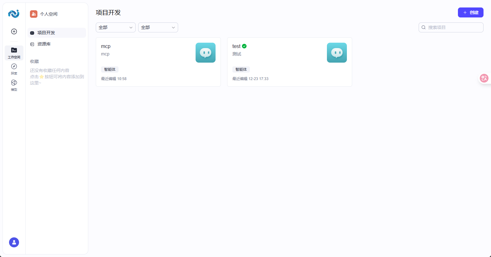
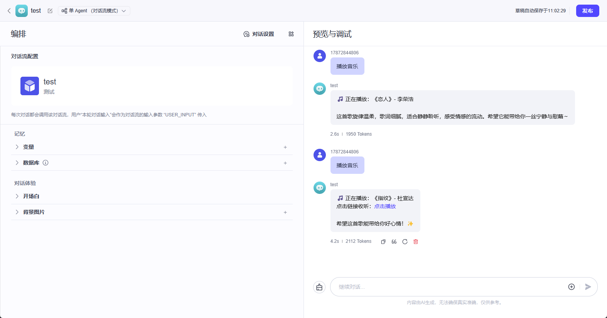
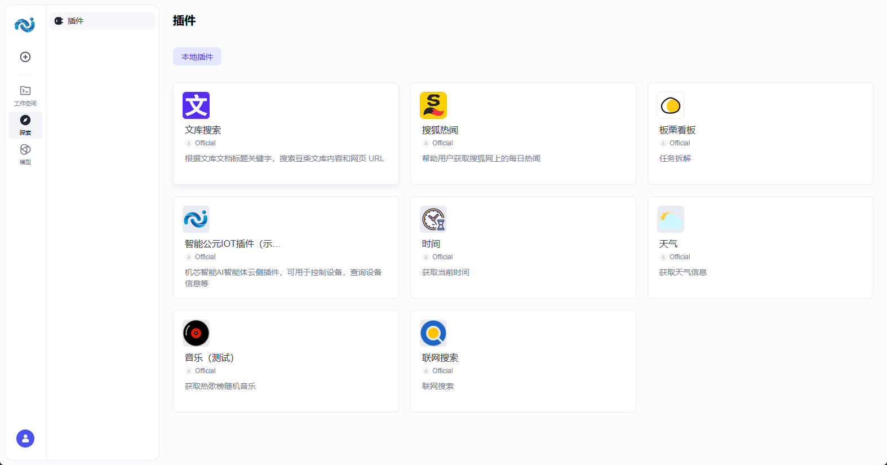

# 智能体平台实践教程

本教程按“照着做就能复现”的方式，带你完成以下目标：

- **做出一个能聊天的智能体**（智能体平台 ）
- **给智能体加知识库**（RAG，让它能回答你们私有资料）
- **给智能体加设备控制能力**（通过 MCP / 插件）
- **发布为 API 服务**，并 **绑定到智能公元设备**

## 0. 阅读顺序（建议按这个做）

1. 先完成：[快速开始](./get-started.md)
2. 再学习：[知识库配置指南](./knowledge-base-setup.md)
3. 需要更深的控制台/接口说明时，再看：[智能体控制台指南](./platform-guide.md)

## 1. 实战 1：做一个“设备说明书问答”智能体

目标：用户问“怎么配网/怎么复位/参数是什么”，智能体能直接从你提供的资料里回答。

### 1.1 创建智能体

1. 登录 智能体平台 控制台。
2. 进入 **开发 / Development**，点击 **创建 / Create**。

   

3. 填写名称，例如：`设备说明书助手`。
4. 在提示词中明确：回答必须基于知识库内容。

### 1.2 创建并上传知识库

1. 进入 **资源库 / Resource Library**。
2. 新建 **知识库 / Knowledge**。
3. 上传资料：
   - 推荐先用 1~3 份小文档验证流程（例如 1MB 内的 PDF / MD / TXT）。
   - 如果是大文件，先拆分再上传。
4. 等待解析完成。

### 1.3 把知识库挂到智能体

1. 回到智能体编辑页。
2. 在“知识/Knowledge”里选择刚创建的知识库。
3. 保存。

### 1.4 验证

用以下问题测试：

- “这款设备怎么恢复出厂设置？”
- “设备支持哪些网络频段？”

如果回答仍然胡编：

- 先看知识库是否解析成功
- 再把提示词加一句“找不到就说不知道，不要猜”

## 2. 实战 2：让智能体“能控制设备”

目标：用户说“把灯调到 50%”，智能体能调用工具完成控制。

这里提供两条路线：

- **路线 A（推荐）**：智能公元平台生成 MCP 工具 -> 设备固件内置 -> 智能体调用 MCP
- **路线 B（插件方式）**：导出 `mcp_tool.yaml` -> 导入 Coze 插件 -> 在智能体/对话流中调用

### 2.1 路线 A：MCP 工具控制

1. 在小程序里先把设备“控件”配置好（开关/滑块/按钮等）。
2. 智能公元平台进入 **MCP 工具**，点击 **刷新** 生成工具。
3. 给每个工具写清楚：
   - 工具名称
   - 工具描述（大模型看得懂很关键）
4. 发布版本时勾选 **发布 MCP 工具**。
5. 烧录新固件到设备。

### 2.2 路线 B：导入插件并在对话流里用

1. 在智能公元平台版本详情页进入 **MCP 工具**，点击 **预览**。
2. 点击 **下载插件**，得到 `mcp_tool.yaml`。
3. 在 智能体平台 中进入 **资源库 / Resource Library**，添加插件并 **导入** `mcp_tool.yaml`。

   

4. 把工具全部设置为 **启用**。
5. 试运行参数：`token` 固定填 `Bearer test`，其余按提示填。

然后配置对话流（Workflow / Chatflow）：

1. 在开始节点新增输入变量：`token`、`deviceKey`。
2. 在大模型节点关闭“深度思考”（避免响应慢）。
3. 在“技能”栏添加插件。
4. 在输入里引用 `token`、`deviceKey`。
5. 结束节点开启“流式输出”。
6. 发布对话流。

## 3. 发布为 API 服务并绑定设备

目标：设备端或你的服务端可以通过 API 调用该智能体。

1. 在 智能体平台 中对智能体执行 **发布 / Publish**。
2. 选择 **API** 发布方式并发布。
3. 生成 **PAT（个人访问令牌）**。
4. 在 `smartpi.cn` 的 **智能体 -> 配置** 里填入 `bot_id` 与 `PAT`，生成二维码。
5. 用微信小程序在设备详情页扫描二维码绑定。

## 4. 排错清单（先按这个查）

- **看不到“AI智能体”菜单**
  - 设备/固件不支持。
- **绑定后设备不说话/没反应**
  - 检查 `bot_id` / `PAT` 是否复制错（多空格也会失败）。
  - 检查智能体是否发布为 API 服务。
- **插件一直失败**
  - 先确认插件工具是否“启用”。
  - 再按要求完成试运行。