---

title: 应用场景通用 FAQ
description: 故事机、农机、加湿器等具体项目和应用场景中的问题。
---

# 应用场景通用 FAQ


## 物联网应用场景

### 如何实现语音指令触发MQTT消息？

**问题描述：**

需要让小智AI语音识别模块通过MQTT协议与阿里云物联网平台进行通信，通过语音指令（如"打开空调"）触发MQTT消息，控制物理设备数据。

**解决方案：**

- **评估开发需求**：需要结合语音识别和MQTT通信功能
- **寻求技术支持**：建议联系专业开发团队实现
- **方案设计**：在不影响原有通信基础上增加MQTT功能

**实现思路：**

1. **功能设计**
    - 保持原有语音识别功能不变
    - 增加MQTT通信模块
    - 通过特定语音指令触发参数输入
    - 将参数转换为MQTT消息发送

2. **开发流程**
    - 配置阿里云物联网平台设备
    - 获取MQTT连接参数
    - 开发语音指令到MQTT消息的映射
    - 实现参数询问和数据传输

3. **技术要求**
    - MQTT协议集成开发
    - 阿里云IoT SDK集成
    - 语音指令流程设计
    - 错误处理和重连机制

**注意事项：**

- 需要专业开发团队支持
- 开发难度较高，建议有偿服务
- 需要充分测试语音交互流程
- 确保网络连接稳定性

---

## 红外空调伴侣方案

### 如何实现语音+红外功能的空调伴侣方案？

**问题描述：**

需要实现支持语音+红外功能的红外空调伴侣方案，咨询相关芯片资料、硬件参考设计和开发板。

**解决方案：**

CI-03T芯片支持语音加红外功能，可满足红外空调伴侣的需求：

**芯片资料：**

- 芯片型号：CI-03T（CI13162）
- 提供完整的数据手册（datasheet）

**硬件参考设计：**

- 提供"语音空调遥控器"参考设计文档
- 包含完整的外围电路参考设计

**开发板支持：**

- 提供Demo板进行功能测试
- 开发板价格：具体费用请联系官方客服评估
- 搭配喇叭：具体费用请联系官方客服评估

**注意事项：**

- CI-03T同时支持语音控制和红外发射功能
- 可通过官方渠道购买开发板进行测试验证
- 参考设计文档中包含详细的电路连接和外围元件配置

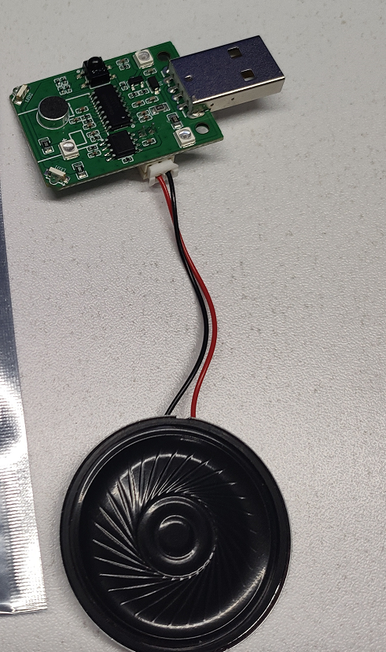

---

## 机器人应用场景 FAQ

#### 移动相关问题

### 机器人前进和转向时出现摇摆怎么办？

**问题描述：**

机器人在前进和左右转向时出现摇摆现象，影响正常移动。

**解决方案：**

- 检查使用的轮子长度，避免使用过短的轮子
- 短轮子容易导致打滑，进而引起摇摆现象
- 建议使用标准长度的轮子或增加轮子与地面的接触面积
- 可以在光滑表面上增加防滑垫改善摩擦力

**注意事项：**

- 材料包中附送的轮子可能不是最优选择，可根据实际需求更换
- 零件散买成本较高，建议购买完整材料包
- 桌面等光滑表面会加剧打滑现象，建议在粗糙表面测试


#### 组装相关问题

### 机器人组装时排针连接错误怎么办？

**问题描述：**

在组装机器人时，可能出现排针连接错误导致设备无法正常工作。

**解决方案：**

- 检查左前腿是否对应左前腿的排针位置
- 确保每个舵机连接到正确的排针位置
- 如果仍有问题，可以尝试以下步骤：

    1. 先将脚去掉，让机器人趴下
    2. 重新检查排线连接
    3. 确认无误后再装回脚

**注意事项：**

- 组装前仔细对照舵机位置图
- 排线插错会导致功能异常
- 组装完成后逐一测试各关节功能

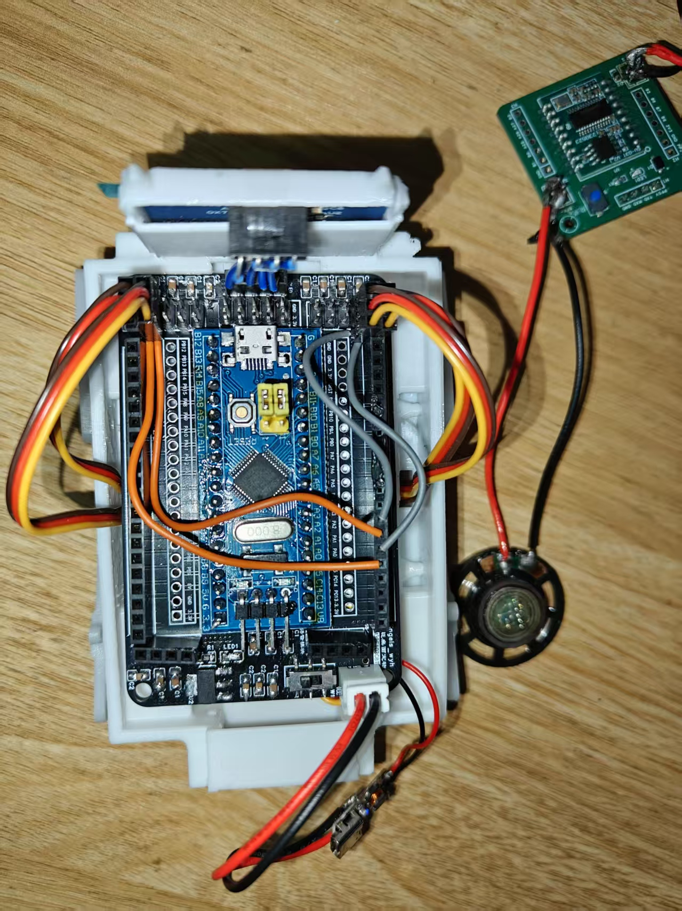

---

### 机器狗上电后唤醒失败且腿部异常如何处理？

**问题描述：**

机器狗上电后右后腿出现异常姿态，且无法通过语音唤醒设备。

**解决方案：**

**1. 硬件问题排查**

- **检查麦克风**：

    - 确认麦克风连接正常
    - 检查麦克风电路是否有短路
    - 如可疑，先更换麦克风测试

- **检查核心模块**：

    - 将语音模块从主板上拆下
    - 单独给模块供电测试
    - 确认模块是否能正常唤醒

- **检查腿部驱动**：

    - 右后腿异常可能是舵机问题
    - 检查对应舵机接线
    - 测试舵机驱动信号是否正常

**2. 测试步骤**

- **独立测试模块**：

    1. 拆下语音模块
    2. 单独接5V电源
    3. 测试语音唤醒功能
    4. 确认模块好坏

- **逐个更换**：

    1. 先更换麦克风
    2. 如无效，更换语音模块
    3. 如仍无效，检查主板电路

**3. 可能原因**

- **麦克风故障**：

    - 麦克风损坏或老化
    - 连接线接触不良
    - 麦克风电路短路

- **语音模块损坏**：

    - 模块核心电路故障
    - 长期使用性能下降
    - 供电异常导致损坏

- **主板问题**：

    - 舵机驱动电路异常
    - 电源供电不稳定
    - 连接线松动或断路

**注意事项：**

- 机器人无法唤醒大概率是硬件问题
- 更换部件时建议逐一测试
- 保留故障部件便于分析原因
- 如多次尝试仍无法解决，联系技术支持

---
### 如何通过语音模块控制步进电机实现滑台精确定位？

**问题描述：**

需要实现语音控制步进电机驱动滑台精确定位，将语音指令（如"向前123mm"）转换为指定数量的脉冲信号，驱动步进电机到达目标位置。

**解决方案：**

由于语音模块无法直接输出精确数量的脉冲，需要通过单片机进行脉冲控制：

**1. 系统架构设计**

```
语音模块 → 串口通信 → 单片机 → 脉冲输出 → 步进电机驱动器
```

**2. 实现方案**

**语音模块功能：**

- 识别语音指令（如"向前123mm"）
- 将距离值转换为脉冲数
- 通过串口发送数字给单片机

**单片机处理逻辑：**

- 接收串口数据（如"50000"表示50000个脉冲）
- 根据接收的数字控制脉冲输出
- 使用定时器或PWM模块生成精确脉冲
- 达到指定脉冲数后停止输出

**3. 通信协议设计**

**串口数据格式：**

- 直接发送脉冲数字（如"50000"）
- 或发送带命令的格式（如"FORWARD:50000"）
- 使用结束符标识数据完整性（如"end"或换行符）


**4. 参数计算**

**脉冲数与距离换算：**

- 根据步进电机步进角计算
- 考虑机械传动比
- 例：10mm距离 = 50000个脉冲

**输出控制：**

- 使用定时器中断产生精确脉冲
- 或使用硬件PWM模块（如果支持脉冲计数）
- 控制脉冲频率以调节电机速度

**5. 开发建议**

- 先实现串口数据收发
- 验证脉冲输出的准确性
- 逐步添加方向控制等高级功能

**注意事项：**

- 继电器不能用于高速脉冲控制
- PWM输出是固定频率，无法控制脉冲数量
- 需要单片机配合才能实现精确位置控制
- 建议使用支持硬件定时器的MCU
- 注意电机驱动器的电平匹配问题

---

### 舵机接线错误导致无法工作怎么办？

**问题描述：**

舵机无法正常动作，部分舵机可以工作而其他不能工作。

**解决方案：**

- 检查舵机线序是否正确：红色（VCC）、黑色/棕色（GND）、黄色/白色（信号线）
- 确保黄色信号线连接到信号引脚，而不是电源或地线
- 舵机黄线应朝向统一方向（如向屁股方向）便于识别

**注意事项：**

- 舵机线的三种颜色必须正确对应正负极和信号线
- 接线错误会导致舵机无响应
- 接线前仔细确认每个引脚的定义

---

### 空调伴侣产品开发需要考虑哪些技术要求？

<a id="ac-companion-tech-req"></a>

**问题描述：**

需要开发一款支持蓝牙小程序、语音识别和自学习功能的空调伴侣，要求产品体积小、功耗低，且能兼容普通USB电源（至少1A以上供电），避免因USB供电不足导致重启。

**解决方案：**

**1. 功能需求分析**

**核心功能**：

- 蓝牙小程序控制
- 离线语音识别
- 自学习功能
- 红外遥控控制

**平台实现**：

- 蓝牙小程序+语音识别+自学习功能可通过平台实现
- 预计开发周期约一个月
- 支持DIY配置

**2. 硬件设计要求**

**体积控制**：

- 使用贴片模块设计方案
- 尽量减小PCB板尺寸
- 优化元器件布局

**功耗优化**：

- 选择低功耗芯片方案
- 优化工作电流
- 待机功耗最小化

**3. 供电设计考虑**

**USB供电要求**：

- 确保在1A以上电流下稳定工作
- 避免播音时电压跌落导致重启
- 兼容不同USB电源适配器

**测试验证**：

- 使用直流源测试实际工作电流
- 验证播报时的峰值电流
- 测试不同充电器的兼容性

**4. 技术方案建议**

**推荐模块**：

- 选择支持蓝牙功能的语音模块
- 确认模块支持小程序开发
- 评估自学习功能的实现方式

**开发流程**：

1. 确认具体功能需求
2. 选择合适的技术方案
3. 进行原理图和PCB设计
4. 样品测试和优化
5. 量产前验证

**注意事项：**

- USB供电设计需要留有余量，建议按1.5A设计
- 喇叭工作时会产生较大电流冲击，需要做好电源滤波
- 小体积设计需要考虑散热问题
- 建议在项目初期就进行供电能力测试

---

### 智能水杯需要哪些功能实现方案？

**问题描述：**

智能水杯项目需要实现离线语音控制、TF卡音乐播放、蓝牙音乐、收音机和红外遥控等功能。

**解决方案：**

**推荐方案：CI1302芯片**

**1. 功能实现方式**

- **离线语音识别**：CI1302支持离线语音控制
- **TF卡播放**：通过串口通信控制外部TF卡播放模块
- **蓝牙音乐**：需选择带蓝牙功能的芯片（如US665P31）
- **收音机功能**：通过串口控制收音机模块
- **红外遥控**：通过红外模块实现空调等设备控制

**2. 技术限制**

- TF卡播放不能直接实现，需要通过串口通信控制外部模块
- 低功耗和红外功能不能完全兼容，功耗与CI1122相近
- US665P31支持蓝牙播放但不支持SD卡直播

**3. 开发服务**

- 可提供全套软硬件开发服务
- 开发服务费用需根据需求评估，具体请联系官方客服确认
- 如涉及商务条款或优惠政策，请联系官方客服确认

**注意事项：**

- 复杂功能需求建议由原厂提供完整方案
- 开发前需明确所有功能需求清单
- 开发费用可根据实际需求协商调整
- 后期可申请开发费转为货款优惠


---

### 会议软件无法显示音频和视频控制按钮怎么办？

**问题描述：**

在使用会议软件时，界面缺少麦克风和摄像头控制按钮，导致无法进行音频和视频通信。

**解决方案：**

**1. 需求方端问题排查**

- 检查会议软件版本：确保使用最新版本
- 清除缓存：清理应用缓存和数据
- 重启应用：完全退出后重新进入
- 检查权限：确认应用有麦克风和摄像头权限
- 更新应用：如版本过低请更新到最新版

**2. 网络和设备检查**

- 网络连接：确保网络稳定，尝试切换网络
- 设备驱动：检查系统音频和视频驱动是否正常
- 硬件故障：测试麦克风和摄像头是否工作正常
- 浏览器兼容：尝试使用不同浏览器（Chrome、Firefox、Edge）

**3. 会议平台兼容性**

- 使用官方推荐：使用会议组织方推荐的需求方端
- 网页版：如桌面应用问题，尝试使用网页版
- 移动端：确保手机应用已更新并授权相应权限

**4. 替代方案**

- 其他会议软件：尝试使用Zoom、Teams、腾讯会议等
- 电话拨入：如支持，使用电话加入会议
- 文字交流：通过聊天窗口进行文字沟通

**注意事项：**

- 会议软件功能差异可能影响使用体验
- 提前测试设备确保麦克风和摄像头正常
- 确保网络稳定，避免中断连接
- 如问题持续，联系会议软件技术团队

---

### 如何实现独立器件间的无线连接？

**问题描述：**

需要为智能开关和手势传感器等独立器件实现无线桥接，以实现两者之间的通信。

**解决方案：**

**无线方案选择：**

1. **成对使用无线传输模块**
    - 蓝牙模块：适合短距离通信
    - 433MHz模块：穿透性强，成本低
    - WiFi模块：可连接网络，传输距离远
    - Zigbee模块：自组网，适合多设备
    - LoRa模块：远距离传输，功耗低

2. **系统架构设计**
    - 语音模块作为中控主机
    - 发射控制信号到智能开关
    - 接收手势传感器的状态信号
    - 实现双向通信

**实施步骤：**

1. **选择无线模块**
    - 根据传输距离要求选择
    - 考虑功耗和成本因素
    - 确保与主控接口兼容

2. **硬件连接**
    - 无线模块连接到语音模块的UART
    - 或通过GPIO控制无线模块
    - 独立器件端也需要对应模块

3. **通信协议**
    - 定义简单的控制命令
    - 设置设备地址区分
    - 实现数据校验机制

**注意事项：**

- 无线模块需要供电设计
- 考虑环境对无线信号的影响
- 建议预留调试接口方便测试

---

### 如何连接键盘实现按键触发语音指令？

**问题描述：**

需要实现按键盘的不同按键触发对应的语音指令播报功能。

**解决方案：**

通过串口通信实现键盘触发，需要主控芯片与语音模块配合。

**实现方案：**

1. **硬件连接**
    - 主控芯片预留一组串口与语音模块通信
    - 连接方式：UART_TX连接模块的RX，UART_RX连接模块的TX
    - 确保共地连接，电平匹配（3.3V TTL）

2. **键盘输入处理**
    - 主控芯片检测键盘按键
    - 不同按键对应不同的标识符
    - 通过串口发送对应的指令到语音模块

3. **语音模块配置**
    - 在平台配置串口触发行为
    - 设置不同的消息编号对应不同指令
    - 为每个消息配置对应的TTS播报内容

**配置示例：**

```
按键1 → 发送消息编号1 → 播报"指令一"
按键2 → 发送消息编号2 → 播报"指令二"
按键3 → 发送消息编号3 → 播报"指令三"
```

**实施步骤：**

1. 在配置平台添加串口输入触发
2. 设置消息编号范围（1-255）
3. 配置每个编号对应的TTS内容
4. 生成并烧录固件
5. 主控程序处理键盘输入并发送对应编号

**注意事项：**

- 串口通信参数需保持一致（波特率、数据位等）
- 消息编号必须在1-255范围内
- 建议使用简单的ASCII协议便于调试
- 可加入校验机制提高可靠性

---

### 如何不使用单片机实现遥控电机持续运行控制？

**问题描述：**

需要在不使用单片机的情况下，利用遥控模块控制AC24V电机实现上下左右四个方向及自动模式，要求按键松开后电机持续运行，再次按键停止。

**解决方案：**

使用555双稳态触发器电路配合继电器可实现电机的持续运行控制，无需单片机。

**1. 硬件方案设计**

- **遥控接收模块**：使用CDR-M6等标准遥控接收板
- **双稳态电路**：采用NE555芯片构成双稳态触发器
- **电机驱动**：使用继电器控制AC24V电机正反转
- **电源管理**：5V给控制电路，24V给电机

**2. 电路实现原理**

- **双稳态触发**：每按一次遥控按键，触发器翻转一次
- **状态保持**：使用NE555的双稳态模式记忆开关状态
- **电机控制**：通过两个继电器实现电机的正转、反转和停止

**3. 控制逻辑实现**

- **向上**：继电器1吸合，继电器2断开
- **向下**：继电器1断开，继电器2吸合
- **向左**：继电器3吸合，继电器4断开
- **向右**：继电器3断开，继电器4吸合
- **自动**：按预设时序控制各继电器动作
- **停止**：对应方向的两个继电器全部断开

**4. 电路特点**

- **体积小**：仅使用555芯片和继电器，PCB面积小
- **成本低**：元件便宜，整体成本低
- **可靠性高**：纯硬件实现，无软件故障

**注意事项：**

- 需要为每个电机方向设计独立的双稳态电路
- 继电器选型要匹配AC24V电机的功率
- 添加必要的滤波和去耦电路提高稳定性
- 考虑添加互锁电路防止方向切换时的短路

---


---

### 可以定制小型语音继电器模块吗？

**问题描述：**

需要定制一款小型语音继电器模块，尺寸不超过20×50毫米，支持至少3路2A继电器控制，能直接插接语音识别板，并希望整合遥控功能。

**解决方案：**

- **定制可行性分析**：

    - 淘宝有现成的小型继电器模块
    - 但需要语音板直接插接的定制方案
    - 遥控功能可整合但会增加成本

- **技术要求**：

    - 尺寸限制：最大20×50毫米
    - 继电器规格：至少3路，每路2A
    - 接口设计：兼容语音模块直插
    - 额外功能：可选遥控功能整合

- **实现方案**：

    1. **PCB设计**：

        - 使用紧凑型布局设计
        - 选用小型继电器（如SRD-05VDC-SL-C）
        - 预留语音模块接口位置

    2. **功能整合**：

        - 继电器控制电路
        - 语音模块接口转换
        - 遥控接收模块（可选）

    3. **成本考虑**：

        - 小批量定制成本较高
        - 建议先小批量试产
        - 评估市场需求量

**注意事项：**

- 定制模块需要一定的起订量
- 整合遥控功能会增加复杂度和成本
- 建议先验证市场接受度
- 可考虑分阶段实现功能

---

### 语音控制汽车防盗效果不佳怎么办？

**问题描述：**

使用语音模块改造汽车后，防盗效果不佳，容易被他人在车外触发语音指令而启动车辆。

**解决方案：**

- **使用无钥匙感应方案**：

    - 改用无钥匙感应提升安全性，需要钥匙靠近才能响应
    - 结合原有车钥匙系统，只有携带原钥匙才能使用语音控制
    - 可添加手机蓝牙验证作为双重保护

- **语音触发条件优化**：

    - 设置语音激活条件，如需要先解锁车门
    - 增加语音指令复杂度，避免误触发
    - 设置延时激活，车辆锁定后一段时间内不响应语音

- **物理防护措施**：

    - 在麦克风外层增加隔音材料
    - 调整麦克风安装位置，降低外部拾音灵敏度
    - 添加手动开关，需要手动开启语音控制功能

**注意事项：**

- 纯语音控制确实存在安全隐患，建议配合其他验证方式
- 无钥匙感应方案需要额外的硬件支持
- 防盗改造需符合当地法规要求
- 测试时要确保非授权人员无法通过语音控制车辆

---

### 如何管理和配置语音控制窗帘的词条？

**问题描述：**

需要更新窗帘控制的语音词条文件，添加新的语音指令（如"你好小度"），对指令进行分类和优化，包括添加"开始"前缀、删除无效指令、调整指令分组等。

**解决方案：**

**词条文件结构管理：**

1. **基础词条分类**
    - 唤醒词：如"你好小度"
    - 功能控制词：开关窗帘、调节位置等
    - 模式设置词：窗帘模式选择
    - 系统控制词：学习、设置等

2. **词条优化规则**
    - 特殊指令添加"开始"前缀：如"开始学习唤醒词"、"开始学习命令词"
    - 删除无通讯指令的无效词条
    - 按功能模块分组管理

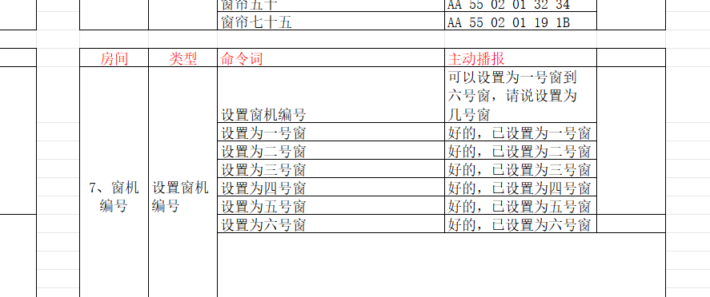

**具体配置示例：**

1. **设置窗机编号功能**
    - 指令："设置为一号窗"、"设置为二号窗"等
    - 对应回复语：确认设置的窗机编号

2. **窗帘模式设置**
    - 指令："布帘"、"纱帘"
    - 帘帘为出厂默认模式，无需额外设置
    - 纱帘模式需要通过语音指令切换


3. **主动播报指令**
    - 部分指令需要通过逻辑实现播报
    - 在词条文件中标注需要逻辑设置的功能

**词条配置表格：**


**注意事项：**

- 某些命令词没有对应的UART通讯指令时，属于主动播报类，需要通过逻辑控制实现
- 学习类指令必须添加"开始"前缀才能正常触发
- 定期清理无效词条，保持词条文件的整洁和高效
- 词条分组后便于管理和维护，避免功能混淆

---

### 如何实现离线语音控制的窗帘电机方案？

**问题描述：**

需要实现基于离线语音芯片的窗帘电机控制方案，要求支持霍尔传感器双边沿检测、两路PWM控制、433MHz遥控解码等功能。

**解决方案：**

**1. 方案架构**

离线语音模块作为主控制器，实现窗帘电机的完整控制方案：

- 语音识别：接收语音指令并解析
- 霍尔传感器接口：检测电机位置和转速
- PWM输出：控制电机正反转和速度
- 433MHz解码：兼容现有遥控器

**2. 硬件接口实现**

- **霍尔传感器检测**：

    - 支持双边沿触发（上升沿和下降沿）
    - 两路霍尔信号输入，用于精确位置计数
    - 电平变化计数实现电机位置控制

- **PWM电机控制**：

    - 两路PWM输出控制电机正反转
    - PWM1控制正转，PWM2控制反转
    - 可调节占空比控制电机速度

- **433MHz遥控功能**：

    - 内置433MHz接收电路
    - 支持杜亚码解码（窗帘电机行业标准）
    - 可通过外接433模块增强信号

**3. 软件功能配置**

- **语音指令控制**：

    - "打开窗帘"、"关闭窗帘"、"暂停"
    - "窗帘打开到50%"等位置控制指令
    - 支持多设备编号控制

- **霍尔计数逻辑**：
    -双边沿检测确保计数精度
    - 根据脉冲数计算窗帘开合位置
    - 到达预设位置自动停止

- **遥控器学习**：

    - 支持学习现有433遥控器码值
    - 兼容市面上大多数窗帘遥控器

**4. 方案选择建议**

- **标准方案**：使用平台配置实现基础功能
    - 适合简单控制需求
    - 开发周期短

- **定制方案**：SDK开发实现全部功能
    - 支持双边沿检测等高级功能
    - 需要二次开发

- **整体方案**：交钥匙工程
    - 提供完整软硬件解决方案
    - 包含PCB设计和固件开发

**注意事项：**

- 霍尔传感器双边沿检测需要定制开发，平台默认不支持
- 433MHz遥控解码需提供遥控器规格和编码格式
- 电机功率需与驱动器匹配，建议预留余量
- 建议预留调试接口便于现场调试

---

### 如何正确连接语音模块以控制电机？

**问题描述：**

需要了解语音模块控制电机的正确接线方法。

**解决方案：**

**1. 控制方式选择**

语音模块不能直接驱动电机，需要通过以下方式控制：

- **方案一**：语音模块 → 单片机 → 电机驱动器 → 电机
- **方案二**：语音模块 → PWM输出 → 电机驱动器 → 电机

**2. PWM控制方案**

- **语音模块PWM接口**：提供5路PWM输出
- **连接方式**：

    - PWM1 → 电机驱动器IN1（控制正转）
    - PWM2 → 电机驱动器IN2（控制反转）
    - GND → 电机驱动器GND（共地）

**3. 电机驱动器选型**

- **L298N**：适合直流电机，最大2A电流
- **TB6612**：体积小，效率高，最大1.2A电流
- **专用驱动模块**：根据电机功率选择合适型号

**4. 接线示例**

```
语音模块          电机驱动器        电机
PWM1    →       IN1     →     电机+
PWM2    →       IN2     →     电机-
GND      →       GND
5V       →       VCC     →     电源+
```

**注意事项：**

- 语音模块的PWM输出电流有限，不能直接驱动电机
- 必须使用外部电机驱动器
- 电源隔离：语音模块和电机使用独立电源
- 确保电机功率与驱动器匹配

---

### 智能小车如何实现自主充电？

**问题描述：**

智能小车需要具备自主充电功能，能够在电量不足时自动返回充电站进行充电。

**解决方案：**

自主充电可通过以下几种方式实现：

1. **寻迹导航方案**

    - 在地面铺设磁条或黑线作为引导路径
    - 小车通过循迹传感器跟随路径到达充电站
    - 适合固定路线、简单环境

2. **无线引导方案**

    - 部署地磁线圈或蓝牙信标
    - 通过信号强度引导小车向充电站移动
    - 蓝牙信标：信号越强表示越接近目标
    - 地磁引导：铺设成本相对较低

3. **限制活动范围方案**

    - 适用于桌宠等小型设备
    - 通过物理围栏（如钢丝圈）限制活动范围
    - 在围栏中心放置无线充电器
    - 设备随机移动即可接触到充电区域

4. **碰撞定位方案**

    - 适用于有墙面的封闭环境
    - 设备后退至墙面作为参考点
    - 通过左右移动检测充电信号最强位置
    - 找到最佳位置后进入休眠充电模式

**注意事项：**

- 舵机功耗较大，单一舵机寻迹可能撑不到终点
- 无线充电时需要设备自行调整到最佳位置以获得大电流
- 整机功耗通常在5W左右，需确保供电充足
- 快充头（如5V/2A以上）比普通充电头更能满足需求


---

### 自主充电系统整机功耗多少？

**问题描述：**

设计自主充电系统时，需要了解整机的实际功耗，以便选择合适的充电方案。

**解决方案：**

1. **实际功耗测量**
    - 空载状态：约90-100mA（0.5W）
    - 正常运行：约200-300mA（1-1.5W）
    - 峰值功耗：可达500-800mA（2.5-4W）

2. **功耗组成分析**
    - 主控系统：50-100mA
    - 传感器部分：20-50mA
    - 电机驱动：100-300mA（根据负载变化）
    - 语音模块：50-100mA

3. **充电方案选择**
    - 5V/1A充电器：满足基本需求
    - 5V/2A充电器：推荐使用，留有余量
    - 5V/3A快充：适合需要快速充电的场景

**注意事项：**

- 功耗会因程序复杂度和机械结构而异
- 电机启动瞬间电流可达正常值的2-3倍
- 无线充电效率通常在70-80%，需要更大功率输入
- 建议使用带过载保护的充电方案

---

### 如何将单片机与语音模块混合使用？

**问题描述：**

需要实现单片机与语音模块的混合使用，通过组合两个系统的优势来实现更复杂的功能。

**解决方案：**

**系统架构设计：**

1. **主从控制模式**
    - 语音模块作为语音识别前端
    - 单片机作为主控制器处理具体业务
    - 通过串口或IO口进行通信


---

### 如何设计美观的产品外壳？

**问题描述：**

在设计产品外壳时，遇到电线外露、外观不美观的问题，希望获得更美观、集成度更高的外壳设计建议。

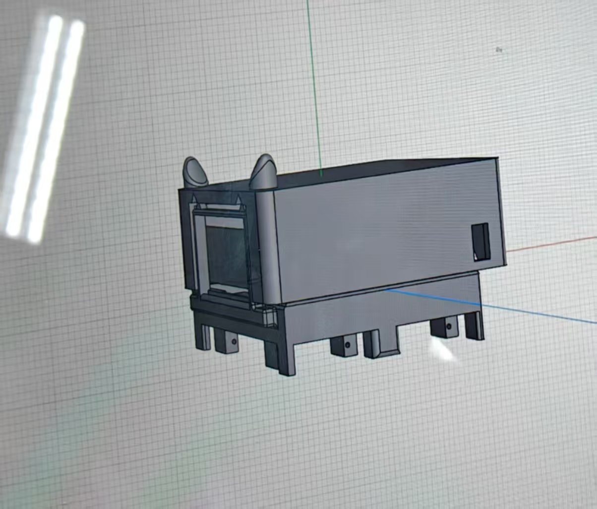

**解决方案：**

**设计原则：**

1. **内部布局优化**
    - 将主控板、电池等组件合理排列
    - 电线走线规划整齐，避免杂乱
    - 预留足够的散热空间

2. **3D打印外壳设计**
    - 使用CAD软件（如SolidWorks、Fusion 360）设计
    - 分层设计：内层固定结构、中层走线槽、外层装饰
    - 设计可拆卸结构，便于维护

**实现方案：**

1. **模块化设计**
    - 将外壳分成多个独立模块
    - 每个模块负责特定功能（如主控、电源、接口）
    - 通过卡扣或螺丝组装

2. **走线优化**
    - 设计专门的走线通道
    - 使用扎线带固定电线
    - 重要接口单独引出

3. **美观处理**
    - 表面进行磨砂或喷漆处理
    - 接缝处设计精密配合
    - 添加必要的指示灯或装饰元素

**材料选择：**

- **PLA**：易打印，适合原型验证
- **ABS**：强度好，适合最终产品
- **PETG**：透明度高，可展示内部结构
- **树脂**：精度高，适合精细部件

**注意事项：**

- 设计时考虑组装和维修便利性
- 预留传感器开口（如麦克风、喇叭）
- 考虑散热需求，必要时开散热孔
- 打印后进行必要的后处理（打磨、去支撑）

2. **通信连接方式**
    - **串口通信（UART）**：

        - 最常用的连接方式
        - 可传输识别结果和控制指令
        - 支持较复杂的数据交互

    - **IO口直连**：

        - 简单开关信号传输
        - 语音模块输出识别结果到单片机
        - 单片机根据信号执行相应动作

    - **I2C/SPI通信**：

        - 适合需要高速数据传输的场景
        - 可实现更复杂的协议交互

**连接要点：**

- 电源共地：确保两个系统共地
- 电平匹配：注意3.3V和5V电平转换
- 隔离设计：必要时加光耦或磁珠隔离

**实现方案：**

1. 语音模块接收语音命令
2. 解析命令并通过串口发送给单片机
3. 单片机接收命令并执行相应控制
4. 单片机将状态反馈给语音模块
5. 语音模块播报状态或执行语音反馈

**注意事项：**

- 注意通信协议的设计，避免数据冲突
- 串口波特率需保持一致
- 电源设计要考虑两个系统的总功耗
- 调试时建议分步验证各模块功能

---

### 如何为桌宠项目选择3D建模软件？

**问题描述：**

需要为桌面宠物项目选择适合新手的3D建模软件，并了解其学习难度和使用方法。

**解决方案：**

**1. 推荐软件：Rhino（犀牛）**

    - 界面简洁，适合新手学习
    - 支持四个视图同时显示
    - 拖拉拽操作，直观易用

**2. 学习建议**

    - 一分钟即可掌握基本操作
    - 从画平面开始，然后拖拉拽生成3D模型
    - 界面友好，老少皆宜

**3. 操作流程**

    - 在四个视图中绘制平面图形
    - 使用拉伸工具创建立体结构
    - 通过布尔运算创建复杂形状
    - 支持多种建模方式：曲面、实体、网格

**4. 应用场景**

    - 创建桌宠外壳模型
    - 设计内部结构支撑
    - 导出为STL格式进行3D打印
    - 制作原型验证设计

**注意事项：**

- Rhino适合新手，功能强大
- 建议从简单模型开始练习
- 3D打印前需检查模型水密性
- 复杂模型可能需要支撑结构
- 导出格式需与3D打印机兼容

---

### 为什么设备无法同时唱歌和摇摆？

**问题描述：**

设备无法在播放音乐/唱歌的同时实现摇摆功能，怀疑是驱动或配置问题导致。

**解决方案：**

**技术限制分析：**

1. **资源冲突问题**
    - 音频播放占用主要处理器资源
    - 舵机控制需要PWM信号输出
    - 两者同时运行可能产生时序冲突

2. **硬件限制**
    - 部分型号的音频和舵机共用定时器
    - 单个定时器无法同时生成音频PWM和舵机PWM
    - 硬件设计优先保证音频功能

3. **软件架构限制**
    - 语音播放模块独占音频输出
    - 动作控制模块与音频模块互斥
    - 系统设计为单任务模式

**可能的解决方案：**

1. **分时执行方案**
    - 先播放音乐，暂停时执行摇摆
    - 音乐间歇期插入摇摆动作
    - 通过快速切换模拟同时效果

2. **硬件分离方案**
    - 使用独立的舵机控制器
    - 音频和动作由不同芯片控制
    - 通过简单的同步信号协调

3. **简化动作方案**
    - 减少同时运行的功能
    - 优先保证核心功能（如音频）
    - 使用LED灯效替代机械摇摆

**开发建议：**

- 查阅模块手册了解资源分配
- 测试不同型号的功能支持情况
- 考虑使用外接舵机驱动板
- 在系统设计阶段规划功能优先级

**注意事项：**

- 这是硬件架构限制，不是配置错误
- 不同型号的并发能力可能有差异
- 如必须同时实现，考虑硬件升级方案
- 简化需求往往是更经济的解决方案

---

### 自动化专业学生如何参与桌宠项目？

**问题描述：**

自动化专业学生在学习CAD和电子控制等技能方面存在困难，如何通过参与桌宠项目来提升实践能力并为未来就业做准备。

**解决方案：**

**1. 技能提升建议**

    - CAD是技术人员的基础技能，必须掌握
    - 从基础电子知识开始（51单片机）
    - 逐步学习32位单片机
    - 多动手实践，参与实际项目

**2. 桌宠项目价值**

    - 涵盖机械结构、电路控制、语音交互
    - 可作为完整的项目经验
    - 适合展示和面试

**3. 学习路径**

    - 大一：打好基础，学习51单片机
    - 大二：深入学习STM32，参与简单项目
    - 大三：复杂项目，准备就业

**4. 实践建议**

    - 不要只关注理论成绩
    - 多参与动手项目
    - 利用课余时间学习
    - 与同学组队参加比赛

**注意事项：**

- 工程能力需要长期积累
- 理论结合实践才能真正掌握
- 项目经验比成绩更重要
- 主动学习，不要等待课程安排


---

### 如何设计桌宠的无线充电方案？

**问题描述：**

需要设计一个自主充电系统，使桌宠等小型设备能够自动寻找并停在无线充电模块的最佳充电位置。

**解决方案：**

1. **无线充电硬件选择**

    - 使用多线圈无线充电模块，扩大充电区域
    - 选择过QI认证的5W无线接收模块
    - 接收模块尺寸可选：30×40mm、23×30mm、直径25mm

2. **自动定位方案**

    - 不依赖复杂的循迹或导航系统
    - 利用设备自身的运动能力进行搜索：

        - 设备后退至墙面作为参考点
        - 左右移动检测接收电压
        - 找到电压最高位置后停止
        - 进入休眠充电模式

3. **简化方案**

    - 将桌宠直接放置在无线充电器上
    - 限制设备在特定范围内活动（如钢丝圈）
    - 无需复杂的导航系统

**注意事项：**

- 无线充电距离较远时，需要设备调整位置获得最佳充电效率
- 桌宠底部需要安装无线充电接收线圈
- 充电时可设计充电仓，提供更好的使用方体验

---

### 语音模块烧录成功但无声音输出，如何解决？

**问题描述：**

语音模块已完成烧录且焊接无误，但播放时没有声音输出。

**解决方案：**

1. **检查硬件连接**

    - 确认喇叭正负极连接正确
    - 检查焊接点是否存在虚焊或接触不良
    - 使用万用表测量喇叭两端交流电压

2. **检查音频信号**

    - 使用示波器测量功放输出端是否有音频信号
    - 检查语音模块的音频输出设置是否正确

3. **检查音量设置**

    - 确认音量不是设置为0或过低
    - 尝试逐步调高音量进行测试

4. **检查程序逻辑**

    - 确认程序中正确调用了播放函数
    - 检查是否有其他程序错误导致音频被静音

**排查步骤：**

1. 先确认喇叭硬件连接正常
2. 检查功放芯片工作电压
3. 测量音频输出信号
4. 调试播放已知正常的音频文件

**注意事项：**

- 焊接时注意温度，避免损坏元件
- 音量设置过高会损坏喇叭，建议初始设置在30-50之间
- 确保使用的音频文件格式与模块兼容


---

### 语音模块是否可以直接播报时间？

**问题描述：**

语音模块是否可以直接播报当前时间信息，还是需要先从外部获取时间数据。

**解决方案：**

语音模块需要先从外部获取时间信息，才能进行时间播报。模块本身不具备实时时钟功能，无法自主获取当前时间。

**实现方式：**

1. **外部时间源获取**：

    - 通过串口从主控MCU获取时间数据
    - 使用RTC（实时时钟）模块提供时间
    - 通过网络时间协议（NTP）同步时间（需要WiFi模块）

2. **播报实现**：

    - 主控将时间数据发送给语音模块
    - 语音模块接收时间后进行语音播报
    - 可播报具体时间或定时提醒

**配置步骤：**

1. **设置时间播报命令词**：

    - 命令词："现在几点了"、"当前时间"
    - 设置串口输入等待时间数据
    - 配置播报格式："当前时间{hour}点{minute}分"

2. **主控程序实现**：

    ```
    void sendCurrentTime() {
        // 获取当前时间
        int hour = getHour();
        int minute = getMinute();

        // 发送给语音模块
        voiceSerial.print("[播报时间]");
        voiceSerial.print(hour);
        voiceSerial.print("点");
        voiceSerial.print(minute);
        voiceSerial.print("分");
    }
    ```

**注意事项：**

- 语音模块必须依赖外部时间源，无法自主获取时间
- 建议使用RTC模块保证断电后时间准确
- 串口通信协议需要主控和语音模块配合设计
- 可结合定时器功能实现定时播报

---

### CI系列模块能否集成嗅觉传感器？

**问题描述：**

希望了解是否可以将嗅觉传感器（PM2.5、温度、湿度、噪音、氧含量、有毒气体等）集成到CI系列语音模块，实现气味感知并语音反馈。

**解决方案：**

**技术可行性分析：**

1. **当前限制**：

    - CI系列模块主要针对语音识别设计
    - 未集成嗅觉传感器功能
    - 缺少气味检测的硬件接口

2. **传感器类型需求**：

    - PM2.5检测：需要光学传感器
    - 有毒气体：需要电化学传感器
    - 温湿度：需要数字传感器
    - 氧含量：需要电化学传感器

**替代实现方案：**

1. **外接传感器方案**：

    - 使用MCU采集各类传感器数据
    - MCU处理传感器信号
    - 通过串口发送指令给语音模块

2. **系统架构**：

    ```
    传感器 → MCU处理 → 串口指令 → 语音模块播报
    ```

3. **具体实现**：

    - PM2.5超标：播报"空气质量差"
    - 温度过高：播报"温度过高"
    - 湿度过大：播报"湿度过大"
    - 有毒气体：播报"检测到有害气体"

**开发建议：**

1. **硬件选型**：

    - 选择支持多ADC的MCU
    - 确保MCU与CI模块通信兼容
    - 预留足够的I/O接口

2. **软件设计**：

    - 建立传感器阈值判断逻辑
    - 设计语音播报内容库
    - 实现异常情况报警

**注意事项：**

- 需要额外开发集成硬件
- 气体传感器通常需要定期校准
- 不同气体的检测原理和精度差异较大
- 复杂气味识别需要专业传感器

---

### 如何通过串口发送字符串并实现语音播报拼接？

**问题描述：**

需要通过串口向语音模块发送字符串指令，并实现多条语音播报内容的灵活拼接，如"上午有"+"数学课"+"下午有"+"英语课"的组合。

**解决方案：**

**配置方法说明：**

1. **基础配置流程**：

    - 在智能公元平台添加控制指令
    - 设置控制方式为"播放语音"
    - 将需要拼接的内容分拆配置

2. **两种实现方案**：

    - **方案一**：串口直接发送完整句子
    - **方案二**：平台配置拼接规则

**方案一：串口发送完整字符串**

```
// Arduino代码示例
void sendCourseReport() {
    // 直接发送完整句子
    voiceSerial.print("上午有数学课");  // 一次性发送
    // 或者
    voiceSerial.print("下午有英语课");
}
```

**方案二：平台配置拼接（推荐）**

1. **空回复语配置**：

    - 回复语列留空
    - 所有播报内容放在控制详情中

2. **多个播放语音控制**：

    - 添加多个"播放语音"动作
    - 每个动作对应一个播报片段
    - 按顺序执行实现拼接

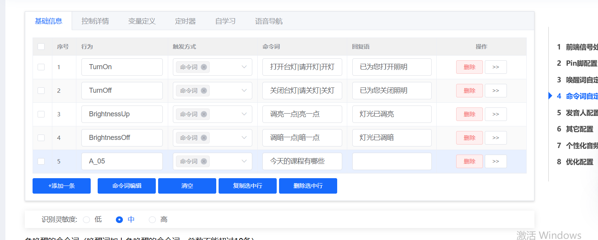

*基础语音指令配置界面，显示多个指令条目*

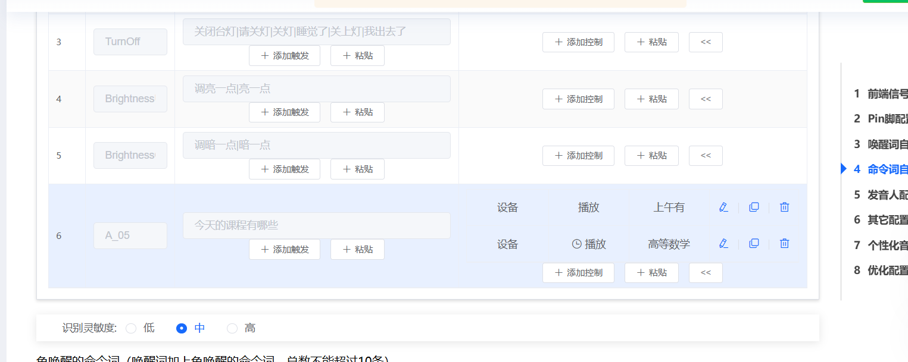

*序号6指令A_05配置为播放"上午有"和"高等数学"的拼接*

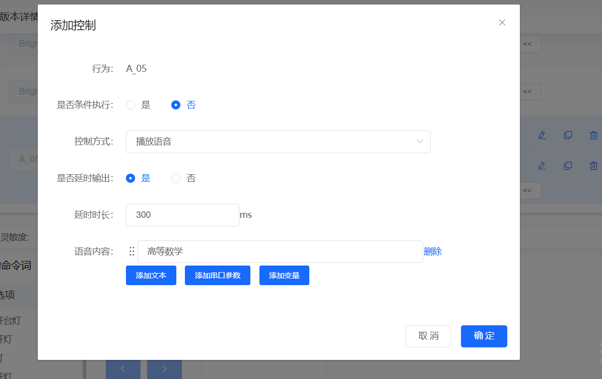

*添加控制弹窗，选择播放语音并输入"高等数学"，设置300ms延时*

**具体配置步骤：**

1. **添加多条播放指令**：
    ```
    指令1：A_01 → 播放"上午有"
    指令2：A_02 → 播放"数学课"
    指令3：A_03 → 播放"下午有"
    指令4：A_04 → 播放"英语课"
    ```

2. **串口触发方式**：
    ```
    // 触发播报下午有英语课
    voiceSerial.print("[A_03]");  // 播放"下午有"
    delay(300);              // 延时300ms
    voiceSerial.print("[A_04]");  // 播放"英语课"
    ```

3. **延时设置说明**：

    - 不需要延时：直接连续播放
    - 固定延时：如300ms
    - 条件执行：根据条件决定是否播放

**高级应用技巧：**

1. **动态内容组合**：
    ```
    // 根据时间动态组合
    if (isMorning) {
        voiceSerial.print("[A_01]");  // "上午有"
        voiceSerial.print("[Math]");   // 具体课程
    }
    if (isAfternoon) {
        voiceSerial.print("[A_03]");  // "下午有"
        voiceSerial.print("[English]"); // 具体课程
    }
    ```

2. **条件执行配置**：

    - 在平台设置条件判断
    - 根据变量值决定是否播放
    - 实现智能播报逻辑

3. **批量操作优化**：

    - 使用数组管理指令
    - 循环发送多个指令
    - 减少代码重复

**实际应用示例：**

```
// 课程表播报系统
void reportDaySchedule(String period, String course1, String course2) {
    if (period == "上午") {
    voiceSerial.print("[A_01]");  // "上午有"
    voiceSerial.print("[A_02]");  // course1
    voiceSerial.print("[A_03]");  // "和"
    voiceSerial.print("[A_04]");  // course2
    }
    else if (period == "下午") {
    voiceSerial.print("[A_05]");  // "下午有"
    voiceSerial.print("[A_06]");  // course1
    voiceSerial.print("[A_07]");  // "和"
    voiceSerial.print("[A_08]");  // course2
    }
}
```

**优势对比：**

| 方案 | 优点 | 缺点 |
|------|------|------|
| 串口完整发送 | 简单直接，无需平台配置 | 灵活性低，内容固定 |
| 平台拼接配置 | 灵活性高，可动态组合 | 配置稍复杂，需提前设计 |

**注意事项：**

- 播放指令名称可自定义（A_01、B_02等）
- 延时时间根据实际听感调整
- 建议保留指令映射表便于维护
- 复杂拼接逻辑建议使用方案二

**调试技巧：**

1. 逐个测试每个指令
2. 验证延时是否合适
3. 检查拼接是否自然
4. 保存配置便于复用

---

### 在2.4寸方屏和2.1寸圆屏项目中，如何选择合适的屏幕通讯方案以降低成本并确保兼容性？

对于2.1寸圆屏项目，建议采用串口通讯方案，通过外挂LT168B驱动芯片来控制屏幕。主控通过串口协议（RX、TX、5V、GND）与LT168B通讯。

**通讯方案对比：**

- **串口方案**：成本较低，主控通过串口协议控制，需要LT168B驱动芯片（成本请联系官方客服评估）
- **MIPI/RGB 8BIT方案**：直接连接，但转换芯片成本较高

**技术限制：**

- LT168B不支持RGB 8BIT接口
- 若需要RGB 8BIT或MIPI接口，需要寻找其他转换芯片方案

**成本考虑：**

- 2.1寸圆屏与LT168B驱动芯片成本占比相对可控，具体成本请联系官方客服评估
- MIPI或RGB转换芯片价格较高，需根据项目预算权衡

**建议：**

优先考虑串口+LT168B方案，成本可控且实现简单。如项目必须使用RGB 8BIT接口，需评估其他转换芯片的可用性和成本。

---

### 串口屏二维码界面如何通过协议控制？

**问题描述：**

串口屏需要显示二维码界面，但不确定如何通过串口协议发送控制命令，以及二维码内容的格式定义。

**协议说明：**

串口屏二维码界面控制通常采用固定格式的串口协议，包含帧头、命令字、长度、数据和校验码。

**二维码URL格式定义：**

```
https://mp.kidsv.cn/qrcode?name=&did=&mac=
```

**参数说明：**

- `name`：蓝牙名称（使用指定的设备名称）
- `did`：产品ID（注意是产品ID，不是设备ID）
- `mac`：设备MAC地址

**协议命令示例：**

发送显示二维码的命令（显示百度网站）：

```
A5 86 00 11 00 01 00 0D 77 77 77 2e 62 61 69 64 75 2e 63 6f 6d 55
```

**协议结构解析：**

| 字段 | 说明 |
|------|------|
| `A5` | 帧头（固定） |
| `86` | 命令字（二维码相关命令） |
| `00 11` | 长度字段（大端格式） |
| `00 01` | 参数 |
| `00 0D` | URL长度 |
| `77 77...` | URL内容（ASCII编码） |
| `55` | 帧尾/校验 |

**使用注意事项：**

1. **没有默认二维码**：二维码界面需要发送URL命令后才会显示，没有预置的默认二维码
2. **长度字段需注意**：协议中的长度字段需使用大端格式，长度计算要准确
3. **URL内容编码**：URL内容需要转换为ASCII编码的十六进制格式发送
4. **通信参数匹配**：确保串口波特率、数据位、停止位等参数与屏幕配置一致

**调试建议：**

- 先用简单的测试URL验证协议格式是否正确
- 检查长度字段计算是否包含所有必要字节
- 确认校验码计算方式（可能是简单校验和或CRC）

---

### 创建智能体和知识库时有哪些注意事项？

**问题描述：**

在创建智能体和知识库时，对两个创建选项的区别、后续操作流程以及知识库文件的编写方法存在疑问。

**解决方案：**

**创建选项区别：**

1. **智能体创建**：

    - 专注于AI交互和对话能力
    - 配置语音唤醒、命令词等
    - 适合需要语音交互的场景

2. **知识库创建**：

    - 用于存储和管理知识内容
    - 支持FAQ、文档等内容组织
    - 为智能体提供知识支撑

**操作流程：**

1. **创建智能体**：

    - 选择应用场景（如智能家电、玩具等）
    - 配置唤醒词和命令词
    - 设置响应行为和输出方式
    - 生成并下载固件

2. **创建知识库**：

    - 上传相关文档（支持PDF、Word、TXT等格式）
    - 编辑和整理知识点
    - 设置知识库的访问权限

**知识库编写要点：**

- 使用结构化的问答形式
- 内容要简洁明了，避免冗余
- 定期更新和维护知识内容
- 注意保护商业机密和隐私信息

**注意事项：**

- 智能体和知识库可以配合使用
- 知识库质量直接影响AI回答的准确性
- 建议先创建知识库，再配置智能体

---

### 平台语音控制与变量设置如何工作？

**问题描述：**

询问平台中"播放语音"控制方式的工作机制，以及如何通过设置变量将语音指令与UART通信结合使用。

**解决方案：**

**播放语音控制方式说明：**

1. **基础功能**：

    - 控制方式选择"播放语音"
    - 可配置具体的语音内容
    - 支持添加变量实现动态内容

2. **变量机制**：

    - 在变量定义界面创建变量
    - 变量类型：整型、字符串等
    - 变量可在语音控制和UART通信中传递数据

**变量与UART结合使用：**

1. **变量定义**：

    - 变量名称：如"GearPosition"（档位位置）
    - 变量类型：整型（0-5档位）
    - 初始值：0（默认档位）

2. **语音控制配置**：

    - 添加控制动作：播放语音
    - 语音内容：可包含变量值
    - 通过变量传递当前状态信息

3. **UART通信应用**：

    - 语音指令触发变量更新
    - 变量值通过串口发送给主控
    - 实现语音控制与硬件联动

**实际应用场景：**

1. **档位控制**：

    ```
    语音指令："调到三档"
    → 变量GearPosition = 3
    → UART发送：[GP03]
    → 主控执行：调整到第3档
    ```

2. **状态播报**：

    ```
    触发条件：变量变化
    → 播放语音："当前档位"+GearPosition+"档"
    → 使用方确认操作结果
    ```

**配置步骤：**

1. **定义变量**：

    - 进入平台变量定义界面
    - 创建所需变量并设置类型
    - 配置初始值和范围

2. **配置语音控制**：

    - 添加控制方式为"播放语音"
    - 设置语音内容模板
    - 在需要处插入变量

3. **UART输出配置**：

    - 设置串口输出格式
    - 将变量值转换为通信协议
    - 配置发送触发条件

**技术要点：**

- 变量实现语音控制与硬件通信的桥梁
- 支持多种数据类型和传输格式
- 可实现复杂的控制逻辑
- 提供灵活的扩展能力

**注意事项：**

- 变量名称需要具有明确含义
- UART通信协议需要主控配合解析
- 建议添加异常处理和边界检查
- 保留配置文档便于后续维护

---

### SmartPi语音芯片是否支持通过麦克风输入直接获取语音并转换为文本文件输出？

**问题描述：**

询问SmartPi系列芯片能否通过麦克风直接采集语音，并通过调用相关库将语音转换为文本文件输出。

**解决方案：**

语音转文本功能（ASR能力）正在AI大模型项目中开发测试：

- **开发状态**：该功能已纳入AI大模型整体项目，目前处于测试阶段
- **实现方式**：将通过专用库函数提供语音转文本接口
- **输出格式**：支持文本文件形式输出识别结果

**注意事项：**

- 该功能尚未正式发布，需等待官方测试完成后的正式通知
- 具体实现细节和API接口将在功能上线后公布
- 如有紧急需求，可联系商务咨询定制化方案

---

### 语言识别芯片的工作电流和待机电流是多少？

**问题描述：**

需要了解智能公元语言识别芯片在工作和待机状态下的电流参数，用于产品选型和电源设计参考。

**解决方案：**

**各系列芯片电流参数：**

1. **蜂鸟L系列（US513U6/US513U61）**：

    - 待机电流：亚毫瓦级（< 1mA）
    - 工作电流：几毫瓦级（约5-10mA）
    - 特点：超低功耗，适合电池供电产品

2. **蜂鸟M系列（US516P6/US518P61/US516T1）**：

    - 工作电流：约50mA
    - 特点：低成本纯离线方案

3. **其他系列芯片**：

    - 根据具体型号和应用场景不同，电流参数有所差异
    - 详细参数需参考对应芯片的数据手册

**选型建议：**

1. **电池供电产品**：

    - 优先选择蜂鸟L系列
    - 超低功耗设计，延长电池使用寿命

2. **市电供电产品**：

    - 可选择蜂鸟M系列或其他系列
    - 根据功能需求和成本考虑

3. **获取详细参数**：

    - 访问智能公元官网：https://www.smartpi.cn/
    - 查看各型号的详细技术规格书
    - 联系技术团队获取具体测试数据

**注意事项：**

- 电流参数会根据具体使用场景有所变化
- 唤醒识别状态下的电流高于深度待机状态
- 建议在设计时预留一定的电源余量
- 批量生产前建议实测验证电流参数


---

### 桌宠蓝牙模块使用体验如何？

**问题描述：**

考虑为桌宠产品添加蓝牙控制功能，想了解蓝牙模块的使用体验和实际效果。

**解决方案：**

**1. 蓝牙控制方式**

- **App界面控制**：

    - 通过手机App发送数字指令控制动作
    - 支持基本动作：趴下、摇尾巴、坐下、前进、左转、右转等
    - 需要先建立蓝牙连接才能使用

- **指令输入方式**：

    - 在App中点击对应按钮
    - 或输入数字编码（如123）发送指令
    - 指令通过蓝牙传输给桌宠

**2. 使用体验反馈**

- **优点**：

    - 可以精确控制每个动作
    - 适合调试和演示
    - 不受环境噪声影响

- **缺点**：

    - 操作不如语音自然便捷
    - 需要手机配合使用
    - 交互体验相对单一
    - 部分使用方反映识别效果一般

**3. 指令输入方式详解**

- **按钮控制模式**：

    - 界面上提供多个预设按钮
    - 点击按钮直接发送对应指令
    - 适合快速执行常用动作

- **数字编码模式**：

    - 输入数字编码（如123）发送复合指令
    - 可实现多个动作的组合控制
    - 适合复杂操作的快速执行

- **指令编码示例**：

    ```
    123：趴下 → 摇尾巴 → 坐下
    456：前进 → 左转 → 右转
    789：站立 → 步行加速 → 摇摆加速
    ```

**4. 连接稳定性分析**

- **连接距离**：蓝牙有效距离通常为5-10米
- **干扰因素**：金属障碍物、其他2.4GHz设备会影响连接
- **响应延迟**：指令发送到动作执行约有100-300ms延迟
- **连接保持**：正常使用中连接稳定，无明显断线问题

**5. 信号质量问题处理**

- **信号差的可能原因**：

    - 环境干扰强（WiFi、微波炉等2.4GHz设备）
    - 模块天线设计不良
    - 供电不稳定影响蓝牙模块性能
    - 金属外壳遮挡信号

- **改善建议**：

    - 远离干扰源使用
    - 确保模块供电稳定
    - 避免金属遮挡天线位置
    - 考虑使用外置天线或更换蓝牙模块

**6. 与语音控制对比**

| 对比项 | 蓝牙控制 | 语音控制 |
|--------|---------|---------|
| 交互方式 | 手动操作 | 自然语言 |
| 便捷性 | 需要手机 | 直接对话 |
| 场景适应性 | 安静环境 | 多数场景 |
| 技术复杂度 | 较低 | 较高 |
| 成本 | 中等 | 较高 |
| 调试便利性 | 优秀 | 一般 |

**7. 应用建议**

- **推荐使用场景**：

    - 产品调试和测试阶段
    - 演示展示场景
    - 对语音要求不高的低成本产品
    - 需要精确控制时序的应用

- **不推荐场景**：

    - 追求自然交互的产品
    - 儿童玩具类产品
    - 需要解放双手的应用
    - 语音识别要求高的嘈杂环境

**8. 改进建议**

- 结合使用：蓝牙用于调试，语音用于日常使用
- 优化App界面，增加快捷操作和记忆功能
- 支持语音+蓝牙混合模式，提供多种交互方式
- 考虑WiFi方案获得更好的传输距离和稳定性
- 增加语音反馈功能，提升交互体验

**9. 技术实现要点**

- **蓝牙协议**：支持BLE 4.0及以上版本
- **指令格式**：建议使用标准的ASCII编码
- **错误处理**：添加指令发送失败重试机制
- **状态反馈**：通过蓝牙或LED指示连接状态

\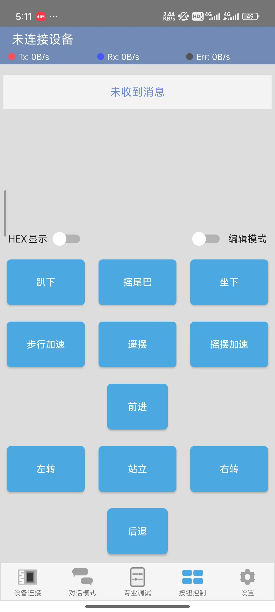

**注意事项：**

- 蓝牙模块需要额外成本和空间
- 连接稳定性受环境影响
- 不支持复杂的多步指令
- 考虑使用方实际使用场景选择合适的控制方式

---

### 桌宠摇摆指令执行异常怎么办？

**问题描述：**

桌宠在使用语音指令时，只有"摇摆"命令会触发设备持续执行该动作且无法被唤醒或停止，其他指令均正常，重启后问题暂时消失。

**问题分析：**

- 单个命令执行异常可能是固件配置问题
- 持续执行无法停止说明控制逻辑出错
- 重启后恢复说明问题可能由特定触发条件引起
- 其他命令正常说明硬件基本功能正常

**解决方案：**

**一、故障排查**

1. **确认固件版本**

    - 检查是否使用了正确的固件文件
    - 串口烧录需要使用update版本的bin文件
    - 确认固件与模块型号匹配

2. **验证平台配置**

    - 登录智能公元平台检查摇摆命令配置
    - 确认动作执行时间和停止条件
    - 检查是否有循环执行设置
    - 验证命令词拼音和触发条件

3. **硬件连接检查**

    - 测量舵机供电电压是否稳定
    - 检查控制信号线连接是否良好
    - 确认舵机本身没有机械卡死
    - 验证驱动电路工作正常

**二、问题处理**

1. **重新烧录固件**

    - 下载官方提供的最新固件
    - 使用正确的烧录方法和文件
    - 烧录完成后彻底断电重启
    - 测试所有命令是否正常

2. **平台配置优化**

    - 重新配置摇摆命令的执行逻辑
    - 设置合理的动作持续时间
    - 添加停止条件或次数限制
    - 避免使用循环执行模式

3. **代码级调试**

    ```
    参考视频教程：

    - https://b23.tv/0AurOp9（舵机控制基础）
    - https://b23.tv/Cq0dV59（代码讲解）

    检查要点：

    - 舵机控制函数的退出条件
    - 定时器或中断处理逻辑
    - 命令解析和执行流程
    ```

**三、预防措施**

1. **固件管理**

    - 使用平台生成的标准固件
    - 避免使用过大或修改过的SDK文件
    - 保留固件的MD5校验值
    - 定期更新到稳定版本

2. **测试验证**

    - 烧录后全面测试所有功能
    - 重点测试问题命令的边界条件
    - 进行长时间稳定性测试
    - 记录异常复现的条件

3. **配置备份**

    - 保存已知正常工作的配置
    - 建立配置版本管理
    - 记录每次修改的内容
    - 快速回滚到稳定版本

**四、技术建议**

1. **舵机控制优化**

    - 添加PWM信号的超时保护
    - 实现软停止机制
    - 设置最大执行时间限制
    - 增加异常状态检测

2. **命令处理改进**

    - 添加命令互斥逻辑
    - 实现优先级中断机制
    - 设置命令冷却时间
    - 防止重复触发

3. **状态监控**

    - 添加LED状态指示
    - 实现串口调试输出
    - 记录异常执行日志
    - 提供手动复位功能

**注意事项：**

- 单个命令异常通常是软件配置问题
- 重启后恢复说明硬件基本正常
- 使用官方固件可减少异常发生
- 充分测试后再部署到产品

---

### 如何配置温度播报功能（支持零上零下）？

**问题描述：**

需要配置语音模块播报温度，包括零上和零下的温度值，但不确定如何实现负数的播报和传输。

**解决方案：**

**实现原理：**

播报前需要先判断温度是零上还是零下，通过标志位区分正负温度，分别播报对应的语音内容。

**1. 标志位判断法**

**实现逻辑：**

```c
// 伪代码示例
int temperature = -5; // 示例温度值
int sign_flag = 0; // 标志位定义

if (temperature >= 0) {
    sign_flag = 0; // 零上温度
    // 播报零上温度对应的语音
} else {
    sign_flag = 1; // 零下温度
    // 播报零下温度对应的语音
}
```

**2. 语音播报配置**

在智能公元平台中分别配置：

- **零上温度播报**：当sign_flag=0时触发
- **零下温度播报**：当sign_flag=1时触发

**配置示例：**

1. **命令词设置**：

    - "播报温度" → 触发温度播报功能

2. **变量定义**：

    - `sign_flag`：温度符号标志（0=正，1=负）
    - `temp_value`：温度绝对值

3. **播报内容**：

    - sign_flag=0："当前温度{temp_value}度"
    - sign_flag=1："当前温度零下{temp_value}度"

**3. 串口传输方案**

如果通过串口传输温度数据：

**数据格式设计：**

```
协议格式：[标志位][温度值]
标志位：0x00=零上，0x01=零下
温度值：绝对值（如25表示25度）
```

**传输示例：**

- 正25℃：`00 19`（0x00表示正，0x19=25）
- 负5℃：`01 05`（0x01表示负，0x05=5）
- 零度：`00 00`（按零上处理）

**4. 平台配置步骤**

**步骤一：设置串口输入**

- 触发方式：串口输入
- 串口选择：UART1_RX
- 消息编号：设置唯一编号（如10）
- 参数1：接收标志位（sign_flag）
- 参数2：接收温度值（temp_value）

**步骤二：配置控制输出**

```
控制项：温度播报
触发：串口输入，消息号10

输出1：sign_flag=0 → 播放"零上温度播报"
输出2：sign_flag=1 → 播放"零下温度播报"
```

**5. 负数传输说明**

虽然串口传输通常使用正数，但负数可以通过以下方式传输：

- **方法一**：使用符号位单独传输（推荐）
- **方法二**：使用有符号整数类型传输
- **方法三**：将负数转换为特定范围（如0-255表示-128~127）

**注意事项：**

- 温度值需在有效范围内，避免超出模块处理能力
- 串口通信需确保双方协议一致
- 建议添加数据校验，防止传输错误
- 测试时覆盖各种温度边界情况（零度、极值等）

**技术要点：**

- 标志位方式简单可靠，易于实现
- 温度绝对值便于语音合成处理
- 支持中英文播报，根据产品需求选择
- 可扩展添加温度单位播报（摄氏度/华氏度）

---

### 如何配置语音触发后12秒自动关灯？

**问题描述：**

需要配置语音模块，使其在识别到语音指令后启动12秒定时器，定时器超时后自动关闭灯光。

**解决方案：**

**功能实现原理：**

通过语音指令触发定时器启动，定时器超时后触发关灯操作，实现延时自动关闭功能。

**配置步骤：**

**1. 配置语音触发启动定时器**

- 触发方式：语音触发
- 命令词：选择合适的触发词（如"xiaogu"）
- 操作：系统 → 启动定时器
- 参数：Time_1, 12000ms, 单次触发

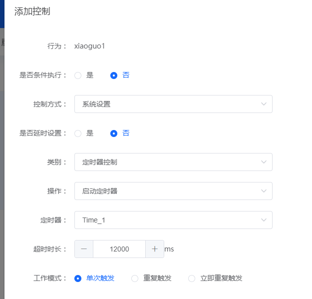

*定时器控制配置界面，设置超时时间为12000ms（12秒）*

**2. 配置定时器超时触发关灯**

- 触发方式：事件触发 → 定时器超时
- 定时器选择：Time_1
- 操作：GPIO输出或UART发送
- 参数：根据实际硬件连接配置

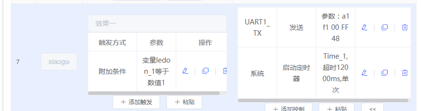

*完整的控制逻辑配置，包含语音触发和定时器超时后的操作*

**3. 设置定时器工作模式**

- 是否延时设置：是
- 类别：定时器控制
- 操作：启动定时器
- 定时器：Time_1
- 超时长：12000ms
- 工作模式：单次触发

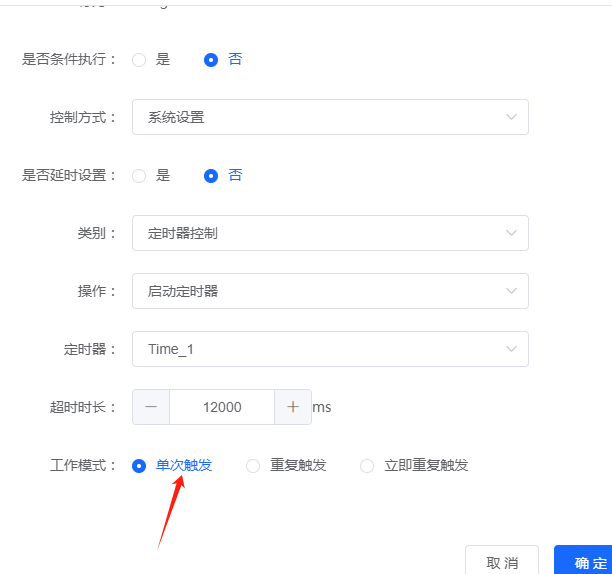

*定时器工作模式设置为"单次触发"，确保只执行一次*

**4. 配置定时器超时事件**

- 触发方式：事件触发
- 事件类型：定时器超时
- 触发定时器：选择对应的定时器

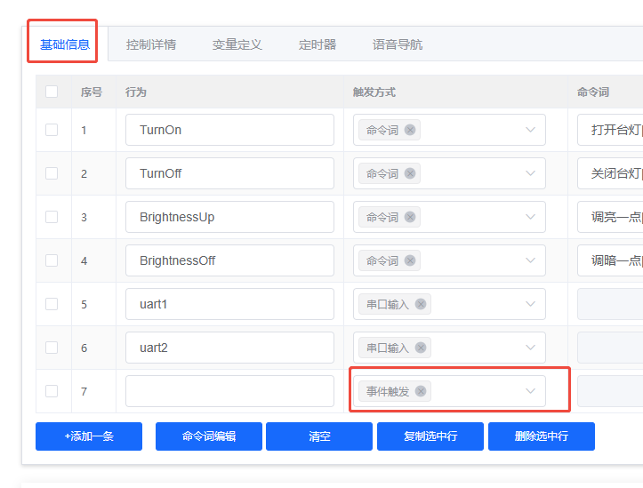

*控制列表基础信息，设置触发方式为"事件触发"*

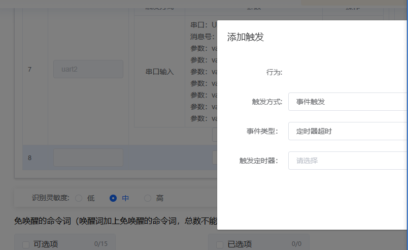

*添加触发对话框，选择"定时器超时"作为事件类型*

**实际应用示例：**

```
场景：声控灯延时关闭

1. 语音指令："开灯"
    - 立即打开灯光
    - 启动12秒定时器

2. 定时器超时（12秒后）
    - 自动关闭灯光
    - 定时器停止工作
```

**扩展功能：**

1. **多档延时**：

    - 配置多个定时器（Time_1: 12秒, Time_2: 30秒, Time_3: 60秒）
    - 通过不同的语音指令选择延时时间

2. **延时提醒**：

    - 定时器超时前3秒播放提示音
    - "即将关灯，请重新发令"

3. **延时续期**：

    - 在延时期间说"延长"
    - 重置定时器继续计时

**技术要点：**

- 定时器精度为毫秒级，12000ms = 12秒
- 单次触发模式确保只执行一次关灯
- 可配置多个定时器实现不同延时需求
- 语音指令和定时器超时使用相同的关灯操作

**注意事项：**

- 定时器名称在配置中必须完全一致
- 超时时间单位为毫秒，注意换算
- 单次触发后如需再次使用，需要重新启动定时器
- 建议测试时使用较长的超时时间便于观察

**硬件连接建议：**

- 使用GPIO输出控制继电器或MOSFET
- 确保驱动能力与负载功率匹配
- 保留手动开关作为备用控制方式
- 添加状态指示灯显示工作状态

---

### 如何配置定时器超时后执行关灯操作？

**问题描述：**

需要详细配置定时器超时后执行关灯操作的具体步骤，包括触发条件设置、工作模式选择和后续操作的配置方法。

**解决方案：**

**完整配置流程：**

**步骤一：配置定时器基本参数**

在定时器控制配置界面设置：

- 是否延时设置：是
- 类别：定时器控制
- 操作：启动定时器
- 定时器：选择或创建定时器（如Timer_1）
- 超时长：12000ms（12秒）
- 工作模式：单次触发

**步骤二：配置定时器超时触发**

1. 在控制列表中找到定时器超时对应的控制项
2. 设置触发方式为"事件触发"
3. 事件类型选择"定时器超时"
4. 选择对应的定时器（Timer_1）

**步骤三：配置关灯操作**

根据硬件连接方式选择：

1. **GPIO控制方式**：

    - 操作：GPIO输出
    - 引脚：选择控制引脚（如GPIO_A0）
    - 电平：低电平（关灯）

2. **串口控制方式**：

    - 操作：UART1_TX 发送
    - 参数：发送关灯指令（如"a1 f1 00 FF 40"）

**详细配置界面说明：**

1. **定时器启动配置**：

    - 语音触发：选择触发命令词
    - 系统操作：启动定时器Timer_1
    - 超时设置：12000ms，单次触发

2. **定时器超时配置**：

    - 触发方式：事件触发
    - 触发事件：Timer_1定时器超时
    - 执行操作：关灯动作

3. **变量控制（可选）**：

    - 使用变量标记定时器状态
    - 变量=1：定时器运行中
    - 变量=0：定时器已停止

**测试验证方法：**

1. **功能测试**：

    - 说出触发语音指令
    - 观察灯光是否立即点亮
    - 等待12秒确认灯光自动关闭

2. **多次测试**：

    - 重复触发验证稳定性
    - 测试快速连续触发的处理
    - 确认定时器不会重复累积

3. **异常测试**：

    - 断电重启后功能是否正常
    - 长时间运行是否稳定
    - 边界条件下的表现

**常见问题解决：**

1. **定时器不启动**：

    - 检查语音识别是否正常
    - 确认定时器启动配置正确
    - 验证触发条件是否匹配

2. **关灯不执行**：

    - 检查定时器超时触发配置
    - 确认关灯操作参数正确
    - 验证硬件连接通路

3. **定时时间不准确**：

    - 校准系统时钟
    - 检查定时器参数设置
    - 使用示波器测量实际时间

**优化建议：**

1. **增加状态反馈**：

    - 定时器启动时播报确认
    - 剩余时间提示（可选）
    - 关灯时播报提示

2. **多场景适配**：

    - 不同环境使用不同延时
    - 支持延时时间动态调整
    - 记忆使用方使用习惯

3. **安全性考虑**：

    - 添加最大延时限制
    - 防止定时器冲突
    - 异常情况自动恢复

**配置示例总结：**

```
完整配置示例：

语音指令："小夜灯"
├─ 立即动作：GPIO_A0输出高电平（开灯）
└─ 延时动作：
    ├─ 启动定时器Timer_1
    ├─ 超时时间：12000ms
    └─ 工作模式：单次触发

定时器超时事件：
└─ Timer_1超时触发
    └─ 执行动作：GPIO_A0输出低电平（关灯）
```

**注意事项：**

- 所有配置完成后需要重新生成固件
- 定时器名称在不同配置项中必须保持一致
- 单次触发模式需要语音指令重新启动
- 建议在实际使用场景下充分测试
- 保留配置截图便于后续维护和故障排查

---

### 如何通过语音模块控制步进电机实现精确定位？

**问题描述：**

需要通过语音指令控制步进电机驱动滑台移动指定距离，如"向前123mm"、"向后500mm"。

**解决方案：**

语音模块需要配合单片机使用，通过串口通信发送位置信息给单片机，由单片机生成脉冲信号驱动步进电机：

1. **系统架构**：

    ```
    语音指令 → 语音模块 → 串口数据 → 单片机 → 脉冲生成 → 步进电机驱动器 → 步进电机
    ```

2. **语音模块配置**：

    - 识别方向指令："向前"、"向后"
    - 识别数字：1-999999（支持大数字）
    - 识别单位："mm"、"cm"（用于倍数换算）
    - 串口输出格式：方向+数字+单位

3. **通信协议设计**：

    **方案一：逐位发送**

    - 语音模块将数字拆分为单个字符发送
    - 单片机接收第一个字节后触发连续接收模式
    - 设置超时机制判断接收结束
    - 将接收到的数字组合还原

    **方案二：结束标识**

    - 发送特殊结束标识（如"end"）
    - 单片机收到结束标识后处理完整数据
    - 或使用固定长度数据格式

4. **单片机处理逻辑**：

    ```c
    // 伪代码示例
    void processSerialData() {
        if (Serial.available()) {
            char cmd = Serial.read();  // 读取方向命令

            // 连续接收数字
            String numberStr = "";
            while (Serial.available() || timeout) {
                numberStr += (char)Serial.read();
            }

            // 转换为脉冲数
            int pulses = convertToPulses(numberStr, cmd);

            // 控制步进电机
            moveStepper(pulses);
        }
    }
    ```

5. **脉冲数计算**：

    - 根据步进电机规格确定每mm所需脉冲数
    - 例如：1mm = 5000个脉冲
    - 单片机根据接收到的距离计算总脉冲数
    - 考虑方向控制（正转/反转）

**注意事项：**

- PWM输出无法控制脉冲数量，只能控制占空比
- 必须使用单片机作为脉冲发生器和计数器
- 语音模块仅负责语音识别和数据转发
- 大数字识别需要合理设计协议避免解析错误
- 可添加"停止"命令作为安全保护机制

---

### 大一学生适合做哪些嵌入式开发项目？

**问题描述：**

作为大一学生，想从事嵌入式开发方向，需要了解适合的项目建议。

**解决方案：**

根据不同阶段和兴趣方向，推荐以下项目：

1. **入门级项目（大一）**：

    - **51单片机小车**
        - 循迹小车：学习红外传感器和PWM控制
        - 避障小车：学习超声波传感器应用
        - 蓝牙控制小车：学习无线通信基础

    - **基础外设项目**
        - 温湿度监测系统：学习I2C/SPI通信
        - LED点阵显示：学习定时器和中断
        - 简易计算器：学习按键扫描和数码管显示

2. **进阶项目（大二）**：

    - **STM32/ESP32项目**
        - 平衡车：学习PID控制和陀螺仪
        - 四轴飞行器：学习电机控制和传感器融合
        - 智能家居系统：学习多设备协同

3. **综合性项目（大三及以上）**：

    - **带视觉的项目**
        - 视觉巡检小车：结合OpenCV和嵌入式
        - 人脸识别门禁：学习AI模型部署
        - 手势控制设备：学习图像处理

    - **IoT物联网项目**
        - 远程监控系统：学习云平台接入
        - 智能农业系统：综合传感器应用
        - 环境监测节点：学习低功耗设计

**学习路径建议：**

1. **基础阶段**：

    - 掌握C语言和电路基础
    - 熟悉一种单片机（51或STM32）
    - 学会使用开发工具和调试方法

2. **实践阶段**：

    - 从简单项目开始，逐步增加复杂度
    - 注重理论知识与实际应用结合
    - 多参加竞赛和项目实践

3. **深入阶段**：

    - 学习实时操作系统（RTOS）
    - 掌握通信协议和总线技术
    - 了解电源管理和PCB设计

**注意事项：**

- 项目难度要循序渐进，不要急于求成
- 重视基础知识的学习和积累
- 多动手实践，理论结合实际
- 可以关注开源项目，学习他人经验
- 建议建立项目作品集，为求职准备

---

### 如何实现舵机缓慢平滑的速度控制？

**问题描述：**

使用STC芯片控制舵机，希望实现速度缓慢且平滑的运动，避免卡顿现象。

**解决方案：**

**实现原理：**

舵机速度控制是通过在目标角度之间进行平滑过渡，而不是直接跳转到目标角度。需要使用分步渐进的方式实现平滑运动。

**实现方法：**

1. **PWM控制基础**：

    - 舵机需要50Hz（20ms周期）的PWM信号
    - 脉冲宽度1ms对应0°，2ms对应180°
    - STC芯片使用定时器生成PWM信号

2. **分步渐进算法**：

    ```c
    // 舵机平滑控制函数
    void smoothServoControl(int targetAngle) {
        int currentAngle = getCurrentAngle();  // 获取当前角度
        int step = 1;                    // 每次移动1度
        int delayTime = 10;               // 每步延迟10ms

        while (currentAngle != targetAngle) {
            if (currentAngle < targetAngle) {
                currentAngle += step;
            } else {
                currentAngle -= step;
            }

            setPWMPulse(currentAngle);  // 设置PWM脉宽
            delay(delayTime);            // 延迟
        }
    }
    ```

3. **速度参数化控制**：

    ```c
    // 可调速度的舵机控制
    void variableSpeedServo(int startAngle, int endAngle, int speed) {
        int steps = abs(endAngle - startAngle);
        int stepDelay = 100 / speed;  // 速度1-100，越大越慢

        for (int i = 0; i <= steps; i++) {
            int angle = startAngle + (endAngle - startAngle) * i / steps;
            setPWMPulse(angle);
            delay(stepDelay);
        }
    }
    ```

**优化建议：**

1. **硬件优化**：

    - 使用高精度定时器确保PWM稳定
    - 添加滤波电容减少电源噪声
    - 使用质量好的舵机避免机械抖动

2. **软件优化**：

    - 使用中断定时器替代delay函数
    - 实现加减速曲线（S型速度曲线）
    - 根据负载调整移动速度

3. **参数调试**：

    - 步长：1°-2°较为合适
    - 延迟：5ms-20ms根据效果调整
    - 速度：根据实际应用场景设置

**注意事项：**

- 确保供电电压稳定，避免舵机抖动
- 不同舵机可能有不同的响应特性
- 过快的速度可能导致舵机过冲或振动
- 长时间运行注意舵机发热问题

---

### 如何实现小智机器人作业督促系统？

**问题描述：**

需要将小智机器人集成到作业督促系统中，实现远程控制、定时提醒、作业完成打卡和互动鼓励等功能，以解决孩子写作业时注意力不集中、需要频繁督促的问题。

**解决方案：**

**系统架构设计：**

1. **硬件组成**：

    - 小智机器人：语音交互核心
    - 萤石相机：远程视频监控和双向语音
    - 学生打卡机：作业完成记录
    - 主控系统：协调各模块工作

2. **通信方案**：

    - 萤石云平台：远程视频通信
    - 语音模块：本地语音交互
    - 网络连接：家长远程查看和控制

**核心功能实现：**

1. **远程督促功能**：

    - 家长通过萤石APP远程查看
    - 双向语音对话
    - 实时监控学习状态

2. **定时提醒系统**：

    - 设定作业时间提醒
    - 定点督促写作业
    - 作息时间管理

3. **作业打卡机制**：

    - 完成作业后自行打卡
    - 记录打卡时间
    - 家长回家后检查

4. **互动鼓励系统**：

    - 每完成一项作业给予鼓励
    - 语音互动增加趣味性
    - 减少学习枯燥感

**技术实现要点：**

1. **作业内容对接**：

    - 预先录入课后作业内容
    - 智能识别当前作业项
    - 对应课本内容同步

2. **学习模型建立**：

    - 周一至周五作业记录
    - 学习完成情况跟踪
    - 个性化互动反馈

3. **智能判断升级**：

    - 对于简单作业：预设内容+语音识别判断
    - 对于复杂作业（如试卷）：需接入AI大模型（如DeepSeek）

**注意事项：**

- 系统需要稳定的网络环境支持
- 建议结合多种激励方式提高使用积极性
- 家长需要定期检查打卡记录的真实性
- 复杂作业判断需要更高级的AI支持
- 保护儿童视力，合理设置使用时长

---

### 如何实现学生打卡机的智能作业判断功能？

**问题描述：**

希望学生打卡机能够实现智能功能，通过预设作业内容并结合语音交互，自动判断学生是否完成作业并进行打卡，同时希望系统能支持与老师发布的作业内容（如试卷）的智能对接。

**解决方案：**

**系统功能设计：**

1. **智能作业判断**：

    - 预设老师布置的作业内容
    - 通过语音交互询问完成情况
    - 根据学生回答判断是否完成
    - 自动记录打卡时间和内容

2. **作业内容管理**：

    - 支持多种作业类型：背诵、练习、试卷等
    - 对接老师发布的作业系统
    - 实时更新作业内容

**技术实现方案：**

1. **基础作业类型处理**：

    - 预习任务：询问是否完成预习内容
    - 背诵任务：通过语音背诵检查
    - 练习题：询问题目完成情况

2. **复杂作业处理**：

    - 对于标准作业：使用预设模板判断
    - 对于试卷类：需要接入AI大模型（如DeepSeek）
    - 对于图片作业：需要图像识别功能

**实现示例：**

```
作业：预习语文园地三，背诵古诗《赠汪伦》，认读生字

交互流程：

1. "是否完成语文园地三的预习？"
    - 学生："完成了"
2. "请背诵古诗《赠汪伦》"
    - 学生背诵（语音识别）
3. "是否认识要写的6个生字？"
    - 学生："认识了"
4. 自动打卡，记录完成时间
```

**系统架构：**

1. **硬件层**：

    - 打卡机主体
    - 语音模块（识别+合成）
    - 显示屏（可选）
    - 网络模块（WiFi/4G）

2. **软件层**：

    - 作业内容管理
    - 语音交互引擎
    - 判断逻辑处理
    - 打卡记录存储

3. **云端服务**：

    - 作业发布接口
    - AI大模型对接
    - 家长查看端

**进阶功能：**

1. **智能批改**：

    - 口算题自动批改
    - 选择题自动判断
    - 简答题关键词匹配

2. **学习分析**：

    - 作业完成时间统计
    - 学习进度跟踪
    - 薄弱环节分析

3. **家长互动**：

    - 实时推送打卡信息
    - 查看作业完成情况
    - 接收异常提醒

**注意事项：**

- 简单作业可通过预设逻辑实现
- 复杂作业（如试卷）需要AI大模型支持
- 建议保留手动打卡功能作为备用
- 确保语音识别在安静环境下准确率更高
- 定期更新作业题库保持同步

---

### 开源项目复刻成本如何评估？

**问题描述：**

在尝试复刻开源项目（如ESP-SparkBot、小狗机器人等）时，需要了解成本构成和降低成本的方法。

**解决方案：**

**成本构成分析：**

1. **主要成本项目**
    - 舵机和芯片：成本占比最大，约40-50%
    - PCB电路板：批量生产可降低成本
    - 外结构件：3D打印或注塑成本差异大
    - 电子元器件：电阻、电容、LED等
    - 人工成本：焊接、组装时间

2. **具体案例成本**

    **ESP-SparkBot项目**：

    - 原版FPC软板：200多元
    - 自制软板修改版：可免费
    - 整体成本范围：120-具体费用请联系官方客服评估

    **小狗机器人项目**：

    - 基础成本：80-具体费用请联系官方客服评估
    - 舵机芯片占主要成本
    - 部分实现者成本达180-具体费用请联系官方客服评估

**成本优化建议：**

1. **元器件采购**
    - 批量采购降低单价
    - 寻找替代型号
    - 使用通用器件替代专用器件
    - 考虑拆机件（非关键部件）

2. **PCB制作**
    - 使用嘉立创等打样服务
    - 多个项目合并打样
    - 优化PCB尺寸减少浪费
    - 考虑使用洞洞板替代（简单电路）

3. **外壳处理**
    - 3D打印成本较高，适合小批量
    - 激光切割亚克力性价比高
    - 购买现成外壳改造
    - 简化设计减少加工难度

4. **剩余材料处理**
    - 在闲鱼等平台出售多余材料
    - 加入相关社群进行材料交换
    - 多人联合采购分摊成本
    - 制作BOM清单精确计算用量

**技术要点：**

1. **FPC软板替代方案**
    - 将FPC软板设计为普通PCB+连接线
    - 使用杜邦线连接替代柔性连接
    - 可能影响美观但功能不受影响
    - 成本可降低90%以上

2. **双程序实现考虑**
    - AI功能程序与摄像头/小游戏程序分离
    - 通过开关或指令切换模式
    - 合理配置Flash空间分配
    - 确保程序间不冲突

**开源资源利用：**

1. **获取完整资料**
    - 从OSHWHub等平台获取设计文件
    - 下载完整的BOM清单
    - 参考他人的优化方案
    - 参与社区讨论获取经验

2. **学习改造经验**
    - 关注B站等平台的制作视频
    - 加入相关QQ群/微信群交流
    - 学习他人的降本方案
    - 积累焊接和调试经验

**注意事项：**

- 首次复刻成本较高，多次制作会降低
- 舵机等运动部件建议不要使用最便宜型号
- 保留详细制作记录便于后续优化
- 考虑产品化时的可量产性

---

### 语音模块如何应用于机器狗项目？

**问题描述：**

在机器狗等机器人项目中集成语音模块，实现语音交互功能，提升产品的智能化水平和使用方体验。

**解决方案：**

**应用场景：**

1. **语音控制功能**：

    - 基本动作控制：前进、后退、坐下、摇尾巴
    - 交互功能：握手、跳舞、跟随
    - 个性化设置：名字识别、语音定制

2. **核心优势**：

    - 自然交互方式，提升使用方体验
    - 解放双手，便于远程控制
    - 增强产品科技感和吸引力

**技术实现：**

1. **硬件集成**：

    - 语音模块：选择适合的离线语音模块
    - 主控系统：STM32、ESP32等单片机
    - 执行机构：舵机、电机驱动器
    - 供电系统：锂电池、电源管理

2. **通信连接**：
    ```
    语音识别 → 串口数据 → 主控处理 → 舵机控制
    ```

3. **功能扩展**：

    - 配合传感器实现自主避障
    - 结合摄像头实现视觉跟随
    - 添加蓝牙APP远程控制

**注意事项：**

- 确保语音识别准确率，选择合适麦克风位置
- 舵机功率要充足，保证动作流畅
- 供电系统要稳定，避免语音模块重启
- 建议保留传统控制方式作为备份

---

### 如何构建基于ESC32S3和CI语音识别的机器人项目？

**问题描述：**

希望构建一个基于ESC32S3主控和CI语音识别芯片的机器人项目（如瓦力机器人），实现语音控制动作功能。

**解决方案：**

**1. 系统架构设计**

```
语音指令 → CI语音模块 → 串口输出 → ESC32S3主控 → 舵机/电机控制
```

**2. 硬件连接**

- CI语音模块TX连接ESC32S3的RX
- CI语音模块RX连接ESC32S3的TX（可选）
- 共地连接确保通信稳定
- ESC32S3控制舵机和电机驱动

**3. 功能实现**

- **语音识别**：CI模块识别特定语音指令
- **指令转换**：语音模块输出对应控制码
- **动作执行**：ESC32S3根据指令控制电机
- **反馈机制**：可添加传感器反馈状态

**4. 开发步骤**

1. **语音配置**：在平台配置语音指令和输出
2. **主控编程**：使用Arduino IDE或ESP-IDF开发
3. **串口通信**：编写解析语音指令的代码
4. **动作控制**：实现舵机/电机的PWM控制
5. **联调测试**：语音到动作的完整测试

**5. 项目建议**

- 从简单动作开始（如前进、后退、转向）
- 逐步增加复杂功能（如避障、表情）
- 模块化设计便于维护
- 保留手动控制接口用于调试

**注意事项：**

- ESC32S3功能强大，可实现复杂运动控制
- CI模块支持多条指令，丰富交互

---

### 如何构建基于ESC32S3和CI语音芯片的机器人控制系统？

**问题描述：**

需要构建一个基于ESP32S3和CI语音识别芯片的机器人控制系统（如瓦力机器人），实现语音指令接收与动作执行的联动。

**解决方案：**

**1. 系统架构设计**

- CI语音模块：负责语音识别和指令触发
- ESP32S3：作为主控制器，处理动作执行
- 串口通信：两个模块之间通过串口连接

**2. 通信协议实现**

```
语音模块 → 串口输出 → ESP32S3接收 → 执行动作
```

- 语音模块识别到指令后，通过串口发送对应指令
- ESP32S3接收串口数据，解析指令内容
- 根据不同指令控制电机、舵机等执行机构

**3. 具体实现方案**

- 语音侧配置：将识别结果设置为串口输出
- ESP32侧编程：监听串口，收到什么就执行什么
- 指令格式：可以使用简单的ASCII字符或自定义协议

**4. 接线方式**

- CI模块TX → ESP32 RX
- CI模块RX → ESP32 TX
- GND共地
- 确保5V或3.3V供电正常

**5. 开发步骤**

1. 先单独测试CI模块的语音识别功能
2. 再单独测试ESP32的动作控制
3. 最后联调串口通信
4. 优化响应速度和识别准确率

**注意事项：**

- 串口波特率要保持一致（推荐115200）
- 注意电平匹配，可能需要电平转换
- 预留足够的电源余量给整个系统
- 考虑添加看门狗防止程序死机

---

### 离线语音模块可以接入AI大模型吗？

**问题描述：**

希望将DeepSeek等AI大模型接入到离线语音识别芯片中，实现更高级的智能交互功能。

**解决方案：**

- **技术限制**：离线语音识别芯片资源有限，无法直接运行大型AI模型
- **替代方案**：使用ESP32等性能更强的平台配合语音模块实现
- **实现思路**：语音模块负责命令识别，ESP32负责与大模型交互

**实现方式：**

1. **ESP32方案**
    - 使用ESP32连接网络访问AI大模型API
    - 语音模块识别唤醒词和简单命令
    - 通过串口通信，将复杂请求转发给ESP32处理

2. **成本考虑**
    - 面包板版本：成本较低，适合实验
    - PCB版本：成本较高但稳定性更好
    - 需要考虑网络连接和API调用费用

**注意事项：**

- 需要持续的网络连接
- 响应速度受网络延迟影响
- API调用可能产生费用
- 功耗相比纯离线方案更高


---

### 机器人脚部舵机装反了怎么办？

**问题描述：**

机器人组装后脚部动作与指令相反，叫它立正却蹲下，叫它蹲下却立正。

**解决方案：**

- **初始状态安装**：在通电前将舵机摇臂调整到正确的初始位置
- **对称安装**：左右脚的舵机摇臂应保持对称，通常都朝向内侧
- **步骤顺序**：

    1. 先让机器人处于立正状态（参考产品说明书）
    2. 断电状态下安装舵机摇臂
    3. 确保左右两边摇臂位置对称

**注意事项：**

- 舵机初始角度会影响后续所有动作
- 安装错误会导致所有动作相反
- 建议参考产品附带的安装示意图
- 若不确定，可先测试单个舵机确认方向

---

### 如何实现语音指令的持续反馈？

**问题描述：**

需要在接收到特定指令（如"开灯"）后，设备持续重复播报反馈信息（如"灯已开"），直到接收到停止指令（如"关灯"）。

**解决方案：**

**1. 定时器实现**

- 使用定时器触发重复播报功能
- 设置合适的时间间隔（如2-3秒）
- 通过标志变量控制播报启停

**2. 控制逻辑**

- 检测到"开灯"指令时，启动定时器
- 设置播报标志为开启状态
- 检测到"关灯"指令时，停止定时器并清除标志

**3. 实现要点**

- 使用非阻塞延时，避免影响其他功能
- 确保播报不互相打断
- 合理设置间隔时间，避免过于频繁

**注意事项：**

- 持续播报会增加功耗
- 间隔时间过短可能影响使用方体验
- 记得在停止指令后彻底清除定时器

---

### 桌面宠物机器人如何自定义名称？

**问题描述：**

需要了解桌面宠物机器人是否可以自定义名称，以及如何进行名称设置。

**解决方案：**

**名称自定义方法：**

1. **通过智能公元平台配置**：

    - 登录智能公元官方网站
    - 进入对应的项目配置界面
    - 在唤醒词设置中修改自定义名称
    - 重新生成并下载固件

2. **B站教程参考**：

    - 搜索桌面宠物机器人相关的教学视频
    - 按照教程步骤进行名称修改操作
    - 注意不同版本可能有不同的设置方法

**注意事项：**

- 唤醒词修改后需要重新烧录固件
- 建议选择易于发音且不易误触发的唤醒词
- 修改名称可能影响原有的语音识别准确率
- 保存项目配置，便于后续修改

---

### 如何修改桌面宠物机器人OLED显示内容？

**问题描述：**

希望自定义桌面宠物机器人OLED屏幕上显示的表情图案和文字内容。

**解决方案：**

**技术准备：**

1. **学习基础知识**：

    - 学习OLED显示原理和驱动方式
    - 掌握C语言基础知识
    - 了解图像处理和点阵显示原理

2. **开发技能要求**：

    - 具备基本的编程能力
    - 了解嵌入式开发流程
    - 掌握串口通信协议

**实现方法：**

1. **图像处理**：

    - 使用PS等工具处理图像
    - 将图像转换为点阵数据
    - 优化图像大小适合OLED显示

2. **代码开发**：

    - 修改或编写OLED驱动代码
    - 实现文字和图像显示函数
    - 通过串口发送显示数据

3. **参考资源**：

    - 跟随江协老师的B站OLED课程
    - 查找相关开源代码参考
    - 利用ChatGPT等工具辅助开发

**注意事项：**

- 需要一定的编程基础，0基础建议系统学习
- 修改显示功能需要深入理解硬件原理
- 建议先从简单的文字显示开始练习
- 保留原始代码，便于出现问题时恢复
---

### DS18B20温度传感器显示Error怎么办？

**问题描述：**

DS18B20温度传感器在OLED显示屏上显示"Error"错误，无法正常读取温度数据。

**解决方案：**

**1. 硬件连接检查**

- **接线确认**：

    - VDD接3.3V或5V电源
    - DQ数据线需要上拉电阻（4.7kΩ-10kΩ）
    - GND可靠接地

- **上拉电阻**：

    - 检查上拉电阻是否正确连接
    - 阻值建议4.7kΩ（寄生电源模式）
    - 电阻应靠近DS18B20连接

**2. 常见故障原因**

- **接触不良**：

    - 杜邦线接触松动
    - 焊接点虚焊或连锡
    - 传感器引脚氧化

- **供电问题**：

    - 电压不足或不稳定
    - 电源纹波过大
    - 瞬态干扰导致复位

- **信号干扰**：

    - DQ数据线过长
    - 附近有强电磁干扰
    - 多个设备共用总线

**3. 排查步骤**

```
步骤1：检查供电电压
- 测量VDD引脚电压是否在3.0V-5.5V
- 使用示波器观察电源稳定性

步骤2：验证数据线
- 缩短DQ数据线长度
- 确认上拉电阻连接
- 检查是否有短路或断路

步骤3：单设备测试
- 拔下其他传感器，只接一个DS18B20
- 排除总线冲突问题
```

**4. 软件处理**

- **重置传感器**：

    - 发送复位指令重新初始化
    - 等待足够的复位时间
    - 再次尝试读取温度

- **错误处理**：

    - 添加CRC校验检查
    - 多次读取取平均值
    - 异常时自动重试

**注意事项：**

- DS18B20对时序要求严格
- 长距离传输需要降低速率
- 避免在强干扰环境下使用
- 如问题持续，可考虑使用DS18B20（防水版）

---

### 语音模块无法控制台灯电源怎么办？

**问题描述：**

使用语音模块控制台灯时，语音指令（打开/关闭台灯）无法改变台灯的实际开关状态，且不确定如何正确连接控制电源的引脚。

**解决方案：**

**1. 检查控制逻辑配置**

- 确认在智能公元平台中正确配置了控制指令
- 检查命令词是否已正确设置为"打开台灯"和"关闭台灯"
- 验证输出引脚（GPIO）配置是否与实际硬件连接一致

**2. 硬件连接检查**

- 确认语音模块的GPIO引脚正确连接到台灯控制电路
- 检查引脚1和引脚2的定义，选择正确的控制引脚
- 使用万用表测试GPIO输出电平变化是否正常

**3. 控制电路设计**

- **继电器方案**：使用GPIO控制继电器，通过继电器控制台灯电源通断
- **MOSFET方案**：对于低压直流台灯，可使用MOSFET开关控制
- **光耦隔离**：添加光耦隔离，避免电气干扰

**4. 调试步骤**

- 单独测试语音模块、咪头和喇叭功能
- 使用示波器或万用表观察GPIO输出状态
- 检查控制电路是否响应GPIO信号变化

**注意事项：**

- 确保台灯控制电路与语音模块共地
- 继电器线圈两端需并联续流二极管
- 交流电源控制需注意安全隔离
- GPIO输出电流有限，需通过驱动电路控制大功率负载

---

### 如何实现语音唤醒后的舵机表情动作？

**问题描述：**

希望实现一个语音交互功能，当叫到设备名字时，设备能播放特定语音并控制舵机做出表情动作。

**解决方案：**

**1. 硬件连接**

- 将舵机信号线连接到语音模块的PWM输出引脚
- 舵机电源线接5V，地线接GND
- 确保舵机型号兼容（如MG90S、SG90等）

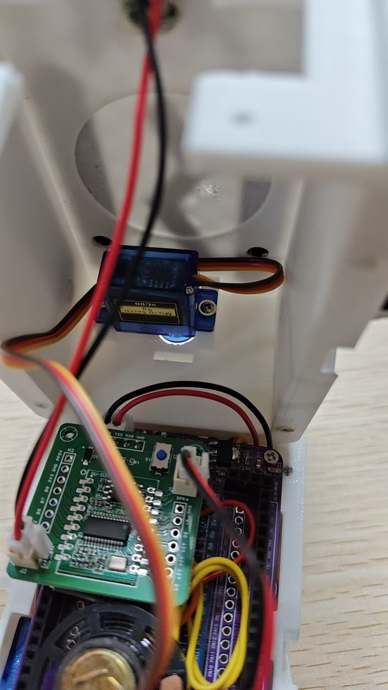

**2. 平台配置**

- 在语音识别平台中配置唤醒词（如"你好小豆"）
- 添加对应的命令词和回复词
- 配置识别后的动作输出

**3. 动作控制实现**

- 使用语音模块的GPIO或PWM功能控制舵机
- 设置舵机转动的角度和时间
- 可组合多个动作实现复杂表情

**4. 语音回复设置**

- 录制或合成回复语音（如"哎呦，你干嘛～"）
- 设置在识别到特定命令后播放
- 调整音量和语速参数

**注意事项：**

- 舵机功耗较大，注意电源供电能力
- 舵机转动角度建议在0-180度范围内
- 避免舵机频繁转动影响寿命
- 语音播放和舵机动作可同时进行

---

### 如何将语音模块改装到茶吧机上？

**问题描述：**

需要将语音控制模块改装到使用触摸按键的茶吧机上，以实现语音控制烧水功能。

**解决方案：**

**改装思路：**

茶吧机的触摸按键部分可以通过语音模块替代，保留烧水加热部分的原有功能。

**1. 硬件连接方案**

- **语音模块继电器控制**：

    - 使用语音模块控制继电器模块
    - 继电器触点模拟触摸按键的通断
    - 保留原 MCU 的温度控制和保护功能

- **触摸按键分析**：

    - 触摸按键通常是电容式或电阻式
    - 通过测量阻值变化判断按键
    - 可用 ADC 检测或直接开关量替代

**2. 实现方法**

- **方法一：继电器并联**
    ```
    原理：继电器与原触摸按键并联
    语音控制：继电器吸合，模拟按键按下
    优点：不破坏原有电路，可随时恢复
    ```

- **方法二：MCU控制**
    ```
    原理：检测语音指令，输出控制信号
    硬件：增加单片机解析语音模块输出
    控制：单片机控制原 MCU 的相应引脚
    ```

**3. 语音模块配置**

- **命令词设置**：

    - "烧水"、"停止烧水"、"保温"等
    - 根据茶吧机功能设计命令词

- **输出配置**：

    - GPIO输出控制继电器
    - 或串口输出给控制MCU
    - 设置适当的输出延时

**4. 注意事项**

- **保留安全功能**：

    - 不改动温度保护和干烧保护
    - 保留原有的安全检测机制
    - 确保改装不影响安全性能

- **电源隔离**：

    - 语音模块使用独立供电
    - 避免干扰原控制系统
    - 使用光耦或继电器隔离

- **调试建议**：

    - 先测试单个功能是否正常
    - 验证语音识别的准确率
    - 测试各种环境下的使用效果

**改装限制：**

- 触摸屏控制逻辑复杂时，建议保留原有控制方式
- 涉及温度控制和保护的电路不建议改动
- 改装后需要进行充分的安全测试

---

## 智能体功能应用


---

### 如何获取和配置智能体功能？

**问题描述：**

需要了解智能公元智能体功能的demo获取方式、配置方法以及知识库的使用方法，同时反馈使用自定义API和deepseek V3模型时存在响应慢和知识库解析耗时长的问题。

**解决方案：**

**1. 智能体demo获取**

- 智能公元提供了智能体demo视频教程
- 可通过B站等平台观看教程视频
- 参考视频链接：

    - https://b23.tv/ETPQb46
    - https://b23.tv/2H7KGit

**2. 功能说明**

- 智能体功能仅支持在线模块使用
- 离在线结合模块可以使用该功能
- 主要用于实现更复杂的对话交互

**3. 配置方法**

- 登录智能公元平台
- 选择智能体配置选项
- 按照教程进行参数设置
- 配置完成后发布到模块

**4. 知识库使用**

- 支持上传文档作为知识库
- 知识库解析需要一定时间
- 建议分批次上传，避免单次文件过大

**5. 自定义API配置**

- 支持使用自定义API接口
- 可配置deepseek V3等大模型
- 需要提供有效的API密钥

**注意事项：**

- 使用deepseek V3等大模型时响应可能较慢，这是正常现象
- 知识库解析时间长与文件大小有关，建议耐心等待
- 确保网络连接稳定，避免影响API调用
- 智能体功能需要模块支持在线能力


---

### 如何为云台产品增加语音控制功能？

**问题描述：**

希望为云台产品增加语音控制功能，需要了解实现方案和注意事项。

**解决方案：**

**1. 功能实现方案**

- **集成语音模块**：使用离线语音模块控制云台
- **唤醒词触发**：通过特定唤醒词激活控制
- **二次确认**：建议增加确认命令避免误操作

**2. 控制逻辑设计**

- **唤醒词**：如"小智小智"
- **方向控制**："向左"、"向右"、"向上"、"向下"
- **确认机制**：执行前要求"确认"命令

**3. 硬件集成**

- **语音板连接**：通过串口或GPIO控制云台电机
- **电源管理**：可为喇叭添加物理开关
- **PCB设计**：紧凑布局便于集成

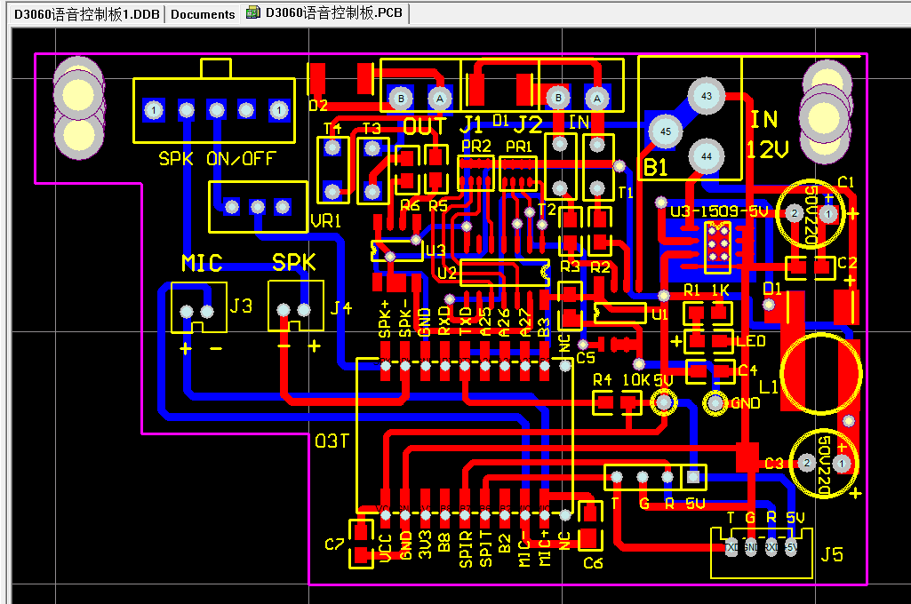

**4. 优化建议**

- **麦克风位置**：远离电机噪声源
- **误判预防**：二次确认关键操作
- **响应速度**：优化命令识别和执行时序

**注意事项：**

- 语音控制需考虑环境噪声影响
- 重要操作建议加入多重确认机制
- 喇叭开关可根据需要添加，避免干扰

---

### 如何实现震动开关触发喊话功能？

**问题描述：**

希望在设备喊话前增加一个震动开关功能，即通过敲击设备来触发喊话操作。

**解决方案：**

**硬件实现方案：**

1. **震动传感器选型**
    - 使用SW-420震动开关模块
    - 或选用压电陶瓷片震动传感器
    - 输出信号为数字高低电平

2. **电路连接方式**
    - 震动传感器输出连接至模块的GPIO引脚
    - 建议使用中断引脚以提高响应速度
    - 添加必要的滤波电容减少误触发

3. **软件配置方案**
    - 在平台中配置GPIO输入触发
    - 设置触发为下降沿或上升沿
    - 绑定触发后的语音播报行为

**实现步骤：**

1. **硬件连接**
    - 震动传感器VCC接3.3V
    - GND接地
    - DO（数字输出）接模块GPIO口（如A0）

2. **平台配置**
    - 新建行为，触发方式选择"GPIO输入"
    - 设置触发条件为"低电平"或"高电平"
    - 添加执行动作：播放指定语音

3. **灵敏度调整**
    - 调整震动传感器的灵敏度电位器
    - 测试不同敲击力度下的触发效果
    - 避免因环境振动导致的误触发

**注意事项：**

- 震动传感器应固定在设备外壳上，确保能有效传导震动
- 建议添加软件防抖动处理，避免重复触发
- 敲击力度需要适中，避免损坏设备
- 考虑使用中断方式以提高响应实时性
- 建议将麦克风远离电机位置
- 双麦配置能有效抑制电机噪声
- 考虑添加防尘防水设计

---

### ESP32和电脑能否用于AI视觉功能开发？

**问题描述：**

询问ESP32和电脑是否可以用于实现AI视觉功能，以及是否需要编程能力。

**解决方案：**

**1. ESP32实现AI视觉**

**可行性分析**：

- **简单视觉**：ESP32可以实现基础的AI视觉功能
- **离线识别**：适合简单的离线图像识别任务
- **性能限制**：受限于MCU的处理能力和内存

**具体功能**：

- **基础识别**：人脸检测、颜色识别、形状识别
- **简单分类**：基于TensorFlow Lite的轻量级模型
- **实时处理**：配合摄像头进行实时图像处理

**技术要求**：

- 需要掌握C/C++编程
- 了解嵌入式开发环境
- 熟悉机器学习基础概念

**2. 电脑AI视觉开发**

**功能特点**：

- **强大性能**：可运行复杂的深度学习模型
- **灵活开发**：支持多种编程语言和框架
- **广泛适用**：从基础识别到高级AI分析

**开发语言**：

- **Python**：推荐使用，生态丰富
    - OpenCV：图像处理库
    - TensorFlow/PyTorch：深度学习框架
    - YOLO系列：目标检测模型
- **C++**：高性能需求场景
- **MATLAB**：快速原型验证

**3. 学习路径建议**

**初学者路径**：

1. **学习Python基础**：

    - 掌握基本语法和数据结构
    - 了解常用的数据处理库

2. **图像处理入门**：

    - 学习OpenCV基础操作
    - 实现简单的滤镜和变换
    - 理解图像处理基本概念

3. **机器学习基础**：

    - 了解监督学习和无监督学习
    - 掌握分类、回归等基本算法
    - 使用scikit-learn进行实践

**进阶学习**：

1. **深度学习**：

    - 学习神经网络基本原理
    - 掌握CNN卷积神经网络
    - 实践图像分类和目标检测

2. **项目实战**：

    - 从简单项目开始（如数字识别）
    - 逐步增加复杂度（如人脸识别）
    - 参与开源项目贡献代码

**4. 应用场景对比**

| 平台 | 优势 | 劣势 | 适用场景 |
|------|------|------|----------|
| ESP32 | 低功耗、成本低、体积小 | 性能有限、内存小 | 简单识别、边缘计算 |
| 电脑 | 性能强、开发灵活、资源丰富 | 功耗高、成本高、体积大 | 复杂AI、训练模型、离线分析 |

**5. 实施建议**

**ESP32开发**：

- 选择支持摄像头的ESP32-CAM模块
- 使用Arduino IDE或PlatformIO开发
- 从LED控制、传感器读取等基础功能开始
- 逐步添加简单的图像识别功能

**电脑开发**：

- 配置Python开发环境
- 使用Jupyter Notebook进行快速实验
- 利用GPU加速（如NVIDIA CUDA）
- 参与Kaggle等AI竞赛提升技能

**注意事项：**

- ESP32适合简单的边缘AI应用，复杂功能受限
- 电脑开发需要一定的编程基础，建议从Python开始
- AI视觉需要大量的数学知识（线性代数、概率论）
- 实际项目中要考虑部署环境的选择

---

### 如何将原有设备改造成语音控制？

**问题描述：**

希望在现有设备上增加语音控制功能，将原本需要手动操作的功能（如红外遥控）改为通过语音指令进行控制。

**解决方案：**

**1. 可行性分析**

- 只要用手指操作的功能都能改成语音控制
- 红外遥控功能特别适合语音改造
- 语音识别模块可以模拟原操作逻辑

**2. 实现方案**

- 学习红外遥控信号
- 使用语音模块识别指令
- 通过单片机或继电器控制设备
- 保留原有手动控制功能

**3. 改造步骤**

- 分析原设备的控制逻辑
- 设计语音指令与功能的对应关系
- 选择合适的语音识别模块
- 添加语音控制电路

**4. 应用场景**

- 家电控制：电视、空调、灯具等
- 玩具改造：遥控车、机器人等
- 工业设备：按钮操作的设备

**注意事项：**

- 确保语音识别准确率
- 保留原设备的安全功能
- 考虑使用环境的噪声影响
- 建议增加手动/语音切换开关

---

### 不同电压的设备如何增加语音功能？

**问题描述：**

询问在不同电压设备（如9V供电）上增加语音识别功能的方法和注意事项。

**解决方案：**

**1. 电压匹配方案**

- 确认语音模块的工作电压范围
- 使用电压转换电路适配
- 选择支持宽电压的模块

**2. 电压转换方法**

- 使用LDO稳压器转换电压
- 采用DC-DC转换模块
- 设计合适的分压电路

**3. 模块选型建议**

- 9V系统：选择宽压模块（3.6-5.5V）
- 5V系统：可直接使用标准模块
- 3.3V系统：选择低功耗模块

**4. 供电设计**

- 确保供电电流充足
- 添加滤波电容稳定电压
- 考虑功耗和散热问题

**注意事项：**

- 电压不匹配可能导致模块损坏
- 转换电路会有额外功耗
- 建议查阅模块的具体电压规格
- 测试时先从低电压开始尝试

---

### 如何使用语音模块作为主控控制泵抽水？

**问题描述：**

希望使用语音模块作为主控，通过接收语音指令来控制泵运行不同时间以抽取不同体积的水量（如100ml或500ml），并询问该功能是否可行。

**解决方案：**

**可行性分析：**

- **基本控制**：语音模块可以驱动继电器控制泵
- **时间控制**：通过指令控制泵的运行时间
- **体积对应**：运行时间对应抽水量（需提前设计）

**实现方法：**

**1. 硬件连接**

- 语音模块IO口 → 继电器控制端
- 继电器输出端 → 泵电源（12V）
- 确保继电器和泵电压匹配（都是12V）

**2. 控制逻辑**

- **指令设计**：设置不同抽水量对应的语音指令
    - "抽100ml水" → 泵运行时间T1
    - "抽500ml水" → 泵运行时间T2
- **时间预设**：根据实际测试确定T1、T2的具体时间
- **IO控制**：语音识别后输出对应时间的高电平信号

**3. 配置示例**

```
语音指令：抽100ml水
模块动作：IO1输出高电平，延时T1秒，输出低电平

语音指令：抽500ml水
模块动作：IO1输出高电平，延时T2秒，输出低电平
```

**4. 芯片选型考虑**

- 选择支持足够IO口的语音模块
- 确认模块能提供稳定的输出控制
- 考虑是否需要其他功能配合

**注意事项：**

- 抽水量与运行时间的关系需要实际测试标定
- 泵的启动电流和持续电流要考虑继电器容量
- 建议添加手动停止指令作为安全措施
- 考虑添加水满检测等辅助功能

---

### 语音遥控器是否可以学习空调遥控器信号？

**问题描述：**

在使用语音控制空调的项目中，询问是否可以通过学习功能来控制空调，以及空调遥控器信号的特殊性。

**解决方案：**

**空调遥控器特性分析：**

- **组合码问题**：空调遥控器通常使用组合码而非单次编码
- **功能复杂**：温度、模式、风速等参数组合复杂
- **常规学习限制**：简单学习难以完整复制所有功能

**解决方案：**

**1. 使用专用空调码芯片**

- **AL01芯片**：专门用于空调控制的编码芯片
- 内置主流空调品牌编码库
- 支持温度、模式等完整功能控制

**2. 定制开发方案**

- 针对特定空调品牌定制开发
- 实现完整的编码学习与重现
- 支持组合码的解析与发送

**3. 简化控制方案**

- 只学习基本的开/关功能
- 通过学习固定温度模式实现控制
- 适合对功能要求不高的场景

**技术实现建议：**

- 使用AL01等专业芯片降低开发难度
- 如需完整功能，考虑与空调厂商合作
- 学习型遥控器适合简单家电，空调建议专用方案

**注意事项：**

- 不同品牌空调编码差异很大
- 学习功能可能无法支持空调的所有特性
- 组合码的实现需要深入分析空调协议
- 商业项目建议使用专业空调控制方案

---

### 如何实现红外遥控器的兼容性，特别是针对不同品牌空调的红外编码差异？

**问题描述：**

需要实现语音控制空调的红外兼容方案，但不同品牌空调的编码方式差异很大，即使是同一品牌也可能有多种编码方式。

**解决方案：**

**红外编码现状分析：**

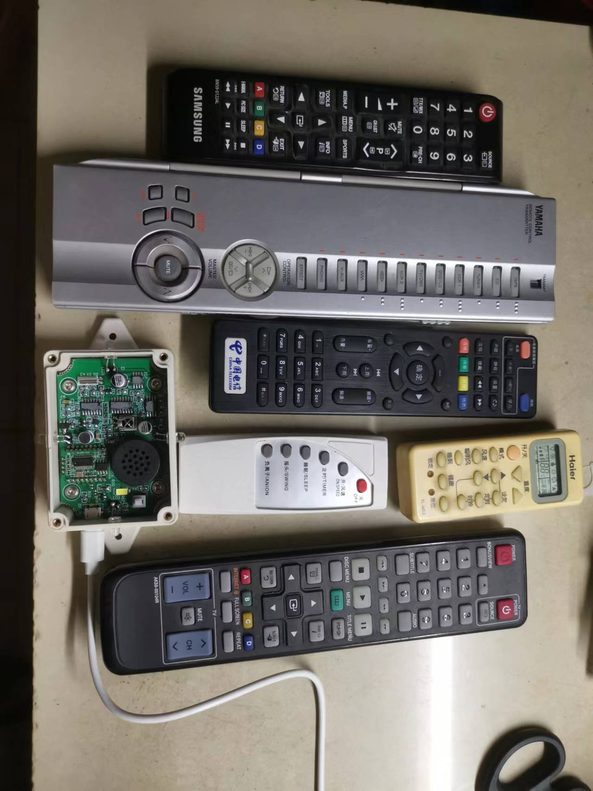

- **品牌差异**：美的、海尔、格力、科龙、松下等品牌编码方式各不相同
- **时间差异**：同一品牌不同生产日期的空调，编码也可能不同
- **复杂度**：有的空调有十几种编码形式
- **信息组合**：空调红外码包含温度、风向、风量、模式、时间等信息

**实现方案：**

**1. 学习型遥控器方案**

- 支持38KHz载频的红外遥控器理论上都兼容
- 可以支持250个按键的学习存储
- 直接复制整段红外码，实现简单控制

**2. 编码解析方案**

- 理解红外码的组成结构
- 按含义发送指令，只修改需要的参数
- 保持其他位不变，避免影响已设置的功能

**技术要点：**

**同一款空调的编码特性：**

- 相同的信息，红外码是一样的
- 不会出现同样的信息每次码不一样的情况
- 这是实现精确控制的基础

**学习型方案的局限性：**

- 基本够用，但单独调节风量或温度不方便
- 无法实现"温度+1"或"温度-1"的精细化控制
- 只能整体复制预存的完整状态

**注意事项：**

- 学习型方案适合简单的开关控制
- 如需要完整的温度调节功能，建议使用专业空调控制芯片
- 商级应用需要考虑兼容性测试和数据库维护
- 不同品牌的空调可能需要不同的控制策略

**特殊品牌协议限制：**

部分空调品牌（如海尔）的红外协议可能存在硬件加密或滚动码机制：

- **加密特性**：部分型号的红外码每次发送都会变化
- **学习失效**：万能遥控器学习方案无法正常工作
- **原因分析**：
    - 空调厂商采用加密协议防止第三方控制
    - 滚动码/随机码机制无法通过简单学习复制
    - 部分协议需要双向握手验证
- **解决方案**：
    - 与空调厂商合作获取官方协议
    - 使用厂商提供的专用控制模块
    - 选择非加密品牌或型号进行项目开发
    - 考虑使用WiFi/蓝牙等网络化控制方案替代

---

### 如何连接和编程语音模块以控制四路继电器？

**问题描述：**

需要了解如何将语音模块与四路继电器连接，并通过编程实现语音控制。

**解决方案：**

**硬件连接方法：**


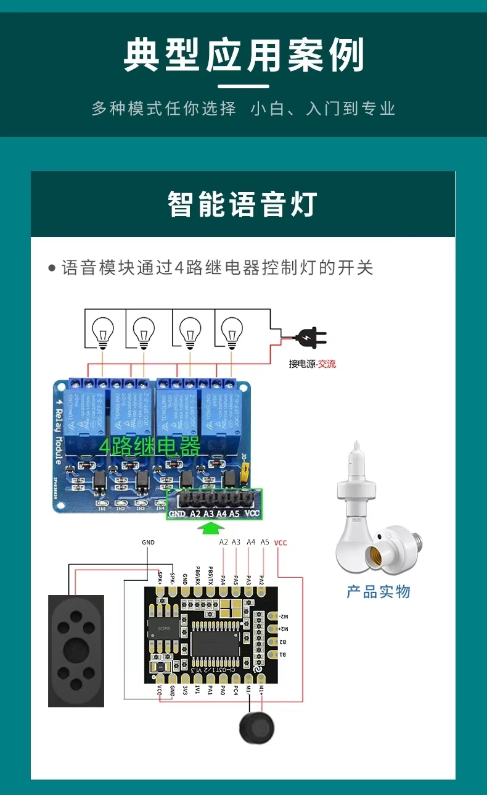

**1. 基础连接**

- 语音模块VCC连接电源正极（5V或3.3V）
- 语音模块GND连接电源负极
- 继电器模块VCC和GND分别连接电源正负极
- 语音模块的GPIO引脚连接到继电器控制端

**2. 四路继电器接线**
```
语音模块GPIO → 继电器模块
GPIO_A25     →    IN1（第1路）
GPIO_A26     →    IN2（第2路）
GPIO_B0      →    IN3（第3路）
GPIO_B1      →    IN4（第4路）
```

**3. 电源配置**

- 确保语音模块和继电器使用共地
- 继电器工作电压与电源电压匹配
- 如继电器需要独立供电，确保共地连接

**编程配置步骤：**

**1. 平台配置**

- 登录智能公元平台
- 选择对应的语音模块型号
- 配置语音指令和对应的GPIO输出

**2. 命令词设置示例**
```
"打开第一路"  →  GPIO_A25输出高电平
"关闭第一路"  →  GPIO_A25输出低电平
"打开第二路"  →  GPIO_A26输出高电平
"关闭第二路"  →  GPIO_A26输出低电平
...（以此类推）
```

**3. 生成和烧录固件**

- 保存配置并生成固件
- 下载固件文件到电脑
- 使用专用烧录工具烧录到模块

**学习资源：**

- B站搜索"机芯智能"查看视频教程
- 官方文档中的详细接线说明
- 参考典型应用案例图进行连接

**注意事项：**

- 继电器线圈需要反向二极管保护
- 大功率负载注意继电器触点容量
- GPIO输出电流有限，必要时加驱动电路
- 测试时先接小功率负载验证功能

---

### 如何通过红外码复制实现对空调遥控器的控制？

**问题描述：**

希望通过红外码复制方式控制空调，但在不改变其他参数的情况下，如何单独修改风速或温度等指令。

**解决方案：**

**红外码控制原理：**

- 空调的一条指令包含多个信息（温度、风速、模式、风向等）
- 直接复制整个红外码只能执行完整的状态切换
- 要实现单独参数控制，需要理解编码结构

**实现方法：**

**1. 红外码解析法**

- 解析空调红外码的数据结构
- 定位温度、风速等参数在码流中的位置
- 修改对应位的数据，保持其他位不变
- 重新发送修改后的完整指令

**2. 状态记录法**

- 记录当前空调的所有状态参数
- 需要调节时，基于当前状态生成新指令
- 只改变需要调整的参数
- 确保其他参数保持不变

**实际应用示例：**

假设当前状态：25℃、制冷模式、中速风
- 想调到26℃：保持模式、风速不变，只修改温度位
- 想调整风速：保持温度、模式不变，只修改风速位
- 每次发送的都是完整的指令，但只改变特定参数

**技术限制：**

- 需要对特定品牌的红外协议进行逆向工程
- 不同品牌的编码方式完全不同
- 部分空调使用校验和或滚动码，增加解析难度
- 商用产品建议使用成熟的空调控制库

**注意事项：**

- 红外码复制适合完整的场景切换
- 精细化控制需要理解具体协议
- 建议使用专业空调控制芯片降低开发难度
- 测试时注意不影响使用方已设置的其他参数


---

### 如何设计电磁阀的多模式控制方案？

**问题描述：**

需要设计一个电磁阀控制方案，支持APP控制、物理控制和遥控控制三种模式，要求实现可靠的开关控制。

**解决方案：**

**1. 控制架构设计**

- **MCU主控**：使用单片机作为控制核心
- **通信模块**：WiFi/蓝牙模块实现APP控制
- **驱动电路**：功率管驱动电磁阀
- **遥控接收**：红外或射频遥控模块

**2. 实现方案参考**

- **Android APP开发**：自制手机控制界面
- **云服务器**：华为公网IP实现远程访问
- **状态反馈**：实时监测电磁阀开关状态
- **双重控制**：电平控制和调节控制均支持

**3. 硬件选型建议**

- **12V电磁阀**：选用符合电压规格的型号
- **功率管选型**：

    - 根据电流选择MOSFET或IGBT
    - 考虑3倍以上工作电流裕量
    - 并联续流肖特基二极管
- **电源设计**：确保供电能承受瞬间启动电流

**4. 控制逻辑实现**

```
物理按键 → MCU处理 → 驱动电路 → 电磁阀动作
遥控信号 → 遥控解码 → MCU处理 → 驱动电路
APP指令 → 网络传输 → MCU处理 → 驱动电路
```

**注意事项：**

- 直流电机堵转电流是正常工作电流的6-7倍
- 电源必须能吸收3倍以上工作电流的瞬变
- 功率管选型需留足够余量防止损坏
- 远程控制需确保网络连接的稳定性

---

### 如何选择语音控制舵机的方案？

**问题描述：**

需要控制多个舵机时，是应该使用语音模块通过串口发送信号给单片机，再由单片机控制舵机，还是直接由语音模块控制舵机更好？

**解决方案：**

两种方案都可以实现，但各有优势，需要根据具体需求选择。

**1. 方案对比**

| 控制方案 | 语音模块直接控制 | 单片机控制 |
|---------|--------------|------------|
| **控制精度** | 一般 | 更精确 |
| **运动平滑** | 有限 | 可实现平滑过渡 |
| **复杂动作** | 支持 | 支持复杂序列 |
| **开发难度** | 简单 | 需要编程 |
| **成本考量** | 较低 | 需要额外MCU |

**2. 方案选择建议**

**选择语音模块直接控制的情况：**

- 简单的开关控制
- 舵机数量较少（1-2个）
- 不需要复杂动作组合
- 快速原型验证

**选择单片机控制的情况：**

- 需要精确的角度控制
- 要求舵机平滑转动
- 多舵机协调动作
- 复杂的运动轨迹

**3. 实现架构**

**直接控制方案：**
```
语音识别 → 语音模块 → GPIO/PWM → 舵机
```

**单片机控制方案：**
```
语音识别 → 语音模块 → UART串口 → 单片机 → PWM控制 → 舵机
```

**4. 开发要点**

**单片机控制的优势：**

- 可以实现舵机的加减速控制
- 支持位置反馈和闭环控制
- 可存储和执行复杂动作序列
- 便于扩展更多传感器

**注意事项：**

- 语音模块主要作用是语音识别和语音控制
- 单片机方案需要额外的开发工作
- 根据项目复杂度和精度要求选择合适方案
- 考虑后期功能扩展的可能性


---

### CI系列模块是否可以集成到汽车中使用？

**问题描述：**

考虑将CI系列离线语音识别模块集成到汽车中，用于控制空调、车灯等设备。

**解决方案：**

CI系列模块可以用于控制车载的非关键系统：

**适用范围：**

- 车内辅助设备控制
    - 空调温度调节
    - 风量控制
    - 车内照明
    - 音响系统
    - 应急灯、雾灯等辅助灯光

**注意事项：**

- 不要控制关键安全系统
    - 禁止控制刹车、油门、转向等行车安全系统
    - 避免直接控制车窗升降（涉及电机正负极控制）
- 环境适应性
    - 模块未通过车规认证
    - 高温环境需考虑散热设计
    - 开窗后噪声可能影响语音识别率
- 安装建议
    - 选择车内相对安静的位置安装麦克风
    - 做好防水防震处理
    - 确保供电稳定（建议使用车载稳压模块）

---

### 语音控制面板如何与国产三菱PLC进行串口通信？

**问题描述：**

使用语音控制面板与国产三菱PLC进行串口通信时，无法接收到语音指令，且PLC程序中未正确响应语音控制信号。

**解决方案：**

**1. 接线配置**

- **语音控制面板侧**：

    - UART1_TX → 连接PLC的RX
    - UART1_RX → 连接PLC的TX
    - 使用TTL电平，无需电平转换
    - 波特率设置为9600

- **三菱PLC侧**：

    - 查看PLC编程软件的通信口配置
    - 确认是否需要设置D8120等通信参数
    - 检查通信口是否已激活

**2. PLC程序配置**

根据对话中的解决方案，PLC需要正确处理接收到的指令：

```ladder
// PLC接收处理示例
IF X001 = 88 THEN         // 接收到语音指令"88"
    LD D200 K88          // 加载D200到K88寄存器
    SET M1 ON             // 输出M1控制信号
END IF

IF X001 = 99 THEN         // 接收到语音指令"99"
    LD D200 K88          // 加载之前状态
    SET M0 ON             // 输出M0控制信号
END IF
```

**3. 测试验证**

1. **串口测试**：

    - 使用串口助手发送测试指令
    - 观察PLC的X001输入点状态
    - 确认指令接收和响应正常

2. **语音控制测试**：

    - 发送语音指令"开灯"
    - 观察PLC是否正确执行
    - 验证控制逻辑的正确性

**4. 常见问题排查**

- **指令无法接收**：

    - 检查TX/RX接线是否正确
    - 确认波特率设置一致
    - 验证PLC通信口是否激活

- **响应不正确**：

    - 检查PLC程序逻辑
    - 确认寄存器地址正确
    - 验证输出继电器接线

- **干扰问题**：

    - 使用屏蔽线缆
    - 增加滤波电路
    - 远离强干扰源

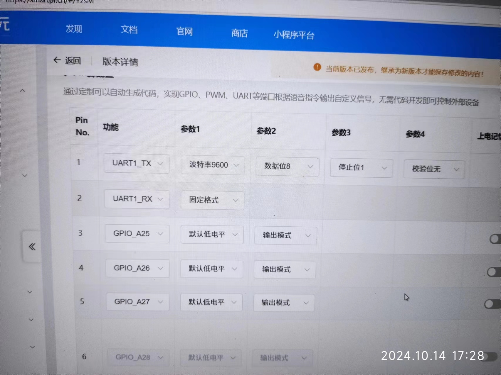

**注意事项：**

- 语音控制面板输出TTL电平，适合直接连接PLC
- 不同品牌的PLC可能需要不同的配置方式
- 建议先在模拟环境测试验证
- 实际部署前进行完整的通信测试

---

### 如何实现语音控制与多种控制方式结合？

**问题描述：**

需要实现语音控制开灯、关灯功能，同时支持按键手动控制，并增加无线控制功能。

**解决方案：**

**1. 系统架构设计**

- 使用CI系列语音识别芯片作为主控
- 语音控制：通过语音指令实现开关灯
- 按键控制：物理按键手动触发
- 无线控制：通过蓝牙或WiFi模块实现远程控制

**2. 控制逻辑实现**

- 语音识别：识别"开灯""关灯"等指令
- 按键触发：按键触发引脚输出高低电平
- 无线控制：小程序或APP发送控制指令
- 统一输出：所有控制方式最终通过同一引脚输出

**3. 无线控制方案选择**

- **蓝牙方案**：适合短距离控制，可开发小程序
- **WiFi方案**：可连接互联网，支持远程控制
- **433MHz方案**：成本低，穿透性强

**注意事项：**

- 需要明确无线控制的具体接收方式和触发机制
- 蓝牙模块可通过小程序按键触发引脚输出
- 建议先实现基础语音功能，再逐步增加其他控制方式

---

### 如何在高噪声工厂环境中实现手机屏幕检测语音控制？

**问题描述：**

需要在工厂高噪声环境中实现手机屏幕检测设备，要求具备语音识别功能，能够区分男女声音、识别特定声音，并能检测手机屏幕的亮/暗及裂纹状态，同时要求抗干扰能力强。

**解决方案：**

**1. 语音识别系统设计**

- **降噪处理**：

    - 使用高质量定向麦克风阵列
    - 配置硬件滤波电路
    - 采用自适应降噪算法
    - 设置合适的拾音阈值

- **性别识别功能**：

    - 通过声音频率特征分析识别男女声
    - 设置音频采样率为16kHz或更高
    - 使用专门的性别识别算法模块
    - 校准识别阈值以提高准确率

- **特定声音识别**：

    - 录入目标声音特征（如滴答声）
    - 设置音频匹配阈值
    - 配置声音触发输出
    - 建立声音数据库用于比对

**2. 视觉检测系统集成**

- **屏幕亮度检测**：

    - 使用光电传感器或摄像头
    - 设置亮度阈值判断屏幕状态
    - 配置自动曝光控制
    - 支持不同屏幕类型的自适应

- **裂纹检测方案**：

    - 采用高分辨率摄像头
    - 配置边缘检测算法
    - 设置光源补偿系统
    - 支持多角度检测

**3. 系统集成架构**

- **主控单元**：

    - 选择工业级语音处理芯片
    - 配置足够的存储空间
    - 留出扩展接口
    - 确保工作温度范围

- **抗干扰措施**：

    - 使用屏蔽线缆和连接器
    - 添加电源滤波电路
    - 做好接地处理
    - 远离大型电机和变频器

**4. 定制化开发**

- **功能定制**：

    - 根据产线特点调整识别参数
    - 配置专属语音指令集
    - 开发专用的检测算法
    - 集成到现有生产管理系统

- **部署方式**：

    - 提供完整的设备解决方案
    - 支持OEM/ODM定制
    - 提供技术支持和维护
    - 可批量供货（月用量2000左右）

**注意事项：**

- 工厂环境噪声可能达到80-100dB，需要专门的降噪处理
- 建议在设备安装位置进行现场噪声测试
- 定期校准麦克风和传感器以保证检测精度
- 考虑设备的防护等级，适应工厂环境

---

### 如何在电子烟产品中集成语音控制功能？

**问题描述：**

需要在电子烟产品中集成语音控制功能，实现通过语音指令调节电压输出档位和控制关机功能。

**解决方案：**

**1. 系统架构设计**

- **主控方案**：保留原有MCU作为主控，负责电压调节和电源管理
- **语音模块**：集成语音识别芯片，通过串口或电平信号与主控通信
- **集成方式**：采用芯片级集成，将语音芯片直接贴装到现有PCB上

**2. 功能实现方案**

- **电压调节控制**：

    - 语音指令识别后，通过串口发送档位指令给主控MCU
    - 主控MCU根据指令调节PWM输出，控制电压档位切换
    - 支持多档位精确控制（如3.3V/3.5V/3.7V/4.0V等）

- **开关机控制**：

    - 开机：保留按键开机功能，确保从休眠状态唤醒
    - 关机：语音指令触发关机信号，主控执行电源管理
    - 休眠：支持语音唤醒，降低静态电流

**3. 通信接口设计**

- **串口通信**（推荐）：

    - UART连接，TTL电平（3.3V）
    - 定义简单协议，如"VOLT33"表示3.3V档位
    - 波特率建议9600，保证通信稳定性

- **电平信号**：

    - 使用GPIO输出不同电平组合
    - 适合简单的开关控制和少档位调节
    - 响应速度快，但扩展性有限

**4. 硬件集成要点**

- **PCB设计**：

    - 在现有板上预留语音芯片位置
    - 考虑天线布局，避免电磁干扰
    - 优化音频输入电路，提高识别率

- **电源管理**：

    - 语音模块独立供电，避免影响主控
    - 合理设计休眠唤醒机制
    - 整机静态电流控制在可接受范围

**5. 开发服务支持**

- **芯片供应**：可提供语音芯片和设计方案
- **技术支持**：协助原理图设计和PCB布局
- **固件开发**：提供语音识别和控制逻辑示例代码
- **测试验证**：协助完成功能测试和性能优化

**注意事项：**

- 电子烟产品对体积敏感，建议选用QFN或CSP封装的语音芯片
- 考虑雾化器工作时的噪声影响，选择抗干扰强的语音方案
- 语音唤醒需要平衡识别率和功耗
- 建议预留调试接口，方便后期功能升级和问题排查

---

### 如何实现基于声音大小的风机转速控制系统？

**问题描述：**

需要实现一个根据喊麦声音大小动态调节风机转速的系统，支持10个档位（10-100），达到设定档位后延时停止。

**解决方案：**

**系统功能需求：**

- 220V输入输出控制电机
- 声音越大转速越快（10个档位：10-100）
- 达到设置档位获得最大转速
- 延时A秒停止（延时时间可设置）
- 根据最高声音档位播放对应声音（语音内容自定义）

**实现方案：**

**1. 硬件架构**

- **语音模块**：负责声音采集和识别
- **主控MCU**：处理声音信号，控制电机转速
- **功率控制**：

    - 弱电系统：使用LED灯模拟效果
    - 强电系统：采用可控硅控制220V电机
- **风机/电机**：根据PWM信号调节转速

**2. 软件实现流程**

```
声音采集 → 音量分析 → 档位判断 → 转速控制 → 延时停止
    ↑                                      ↓
    ←←←←← 播放对应档位音效 ←←←←←←←←←←←
```

**3. 关键技术点**

- **声音处理**：

    - 实时采集声音信号
    - 计算声音强度值
    - 映射到10个转速档位

- **档位控制**：

    - 档位1：10%转速
    - 档位2：20%转速
    - ...
    - 档位10：100%转速

- **延时控制**：

    - 可配置延时时间A（如3-5秒）
    - 喊麦结束后，维持最高档位A秒
    - A秒后自动停止电机

**4. 开发注意事项**

- **强电控制**：

    - 220V电机控制需使用可控硅
    - 必须做好光电隔离，确保安全
    - 与弱电控制不是同一概念

- **电源设计**：

    - 语音模块需要独立供电
    - 避免电机启停对语音模块的干扰

- **调试建议**：

    - 先用弱电系统（LED灯）验证逻辑
    - 确认功能正常后再开发强电控制
    - 使用灯泡模拟电机负载进行测试

**5. 开发服务**

- 可提供demo演示（弱电LED模拟版本）
- 开发费用根据具体需求评估
- 支持批量生产的技术支持

**注意事项：**

- 强电系统开发需有专业电气人员参与
- 确保符合相关电气安全标准
- 建议先进行弱电系统验证，再扩展到强电应用

---

### 医疗器械产品测试进度如何确认？

**问题描述：**

需要了解医疗器械相关产品的测试进度和完成情况。

**解决方案：**

**测试状态说明：**

- 产品测试目前仍在实验阶段
- 医疗器械产品需要大量临床数据支撑
- 测试周期相对较长，需要严格的验证流程

**医疗器械测试特点：**

**1. 数据要求高**

    - 需要大量的临床数据验证
    - 数据采集周期长，覆盖多种使用场景
    - 需要符合医疗行业的数据标准

**2. 测试流程严格**

    - 需要通过医疗级认证测试
    - 包括安全性、有效性、可靠性等多维度测试
    - 测试环境和条件要求严格

**3. 法规合规性**

    - 必须符合医疗器械相关法规
    - 需要通过监管部门的审批
    - 产品标识和文档要求规范

**项目建议：**

**1. 测试规划**

    - 制定详细的测试计划和时间表
    - 预留充足的临床数据采集时间
    - 准备完整的测试文档

**2. 合作方式**

    - 可与专业医疗机构合作测试
    - 建议寻求有医疗产品经验的合作伙伴
    - 考虑分阶段进行产品验证

**注意事项：**

- 医疗器械产品开发周期较长，需要合理规划时间
- 测试成本较高，需要充足的预算支持
- 建议与有经验的医疗设备厂商合作
- 确保产品符合相关法规要求

---

### 足浴盆语音模块程序开发与通信协议设计

**问题描述：**

需要为足浴盆项目开发两个版本的语音模块程序：一个无蓝牙金手指版本，一个带蓝牙小程序金手指版本，并需要确认通信协议和PCB尺寸调整事宜。

**解决方案：**

**1. 模块选型**

- 无蓝牙版本：使用CI-13161模块
- 带蓝牙版本：使用CI-56Z（2312）模块
- 需要开发不同的固件程序以区分功能

**2. 语音功能配置**

- 开机播报：欢迎使用智能语音足浴器，您可以喊小白小白唤醒我
- 唤醒词：小白小白
- 支持开关机、按摩、温度调节、定时等语音指令

**3. 通信协议设计**

- 数据格式：采用十六进制格式
- 指令类型：包含语音指令和小程序控制指令
- 查询功能：支持产品型号查询

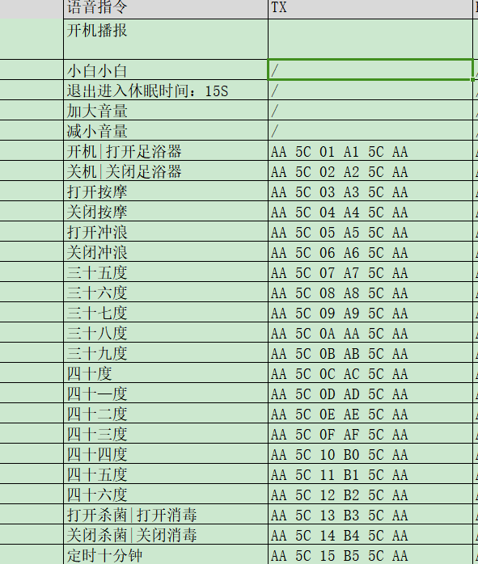

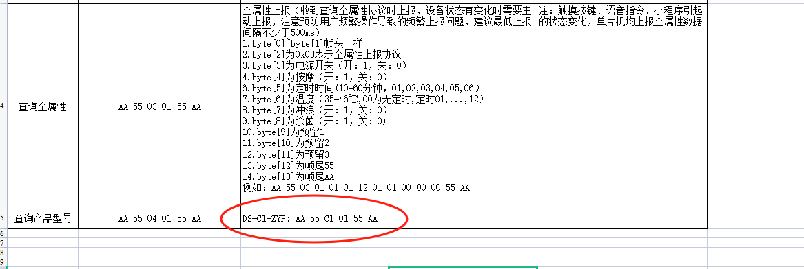

**4. PCB设计调整**

- 可提供PCB文件供修改
- 支持自行采购芯片进行贴片生产
- 可根据项目空间限制调整尺寸

**注意事项：**

- 通信协议需与单片机端同步开发
- 语音部分协议保持不变，小程序协议可单独定义
- 定时功能需要包含取消定时指令
- 温度字段和定时字段在协议中需明确定义避免歧义

---

### 足浴盆模块麦克风接收灵敏度问题分析

**问题描述：**

在足浴盆产品中，靠近麦克风的一侧语音识别正常，另一侧识别不灵敏，怀疑电路中的串联电阻影响接收信号强度。

**解决方案：**

**1. 电阻作用分析**

- 该10k电阻用于增强ESD（静电防护）能力
- 13LC系列芯片建议增加此电阻以提高抗干扰性
- 电阻不会对信号接收造成负面影响

**2. 信号接收影响因素**

- 麦克风摆放位置和方向影响接收效果
- 产品结构设计可能导致声音传播不均
- 建议优化麦克风位置或增加开孔

**3. 实测验证**

- 实际测试表明该电阻不影响信号接收
- 不建议随意更改电阻值（如改为2k）
- 保持原设计可确保产品稳定性

**注意事项：**

- 麦克风接收灵敏度差异主要与产品结构有关
- ESD保护电阻对芯片安全运行很重要
- 如需改善接收效果，建议优化产品结构设计
- 更改电路设计前建议进行充分测试

---

### 语音模块PCB尺寸调整与自制方案

**问题描述：**

因项目空间限制，标准模块高度过高导致无法安装，需要获取PCB设计文件自行修改并生产。

**解决方案：**

**1. 文件获取**

- 可向供应商申请PCB设计文件
- 提供原理图和PCB layout文件
- 包含完整的物料清单（BOM）

**2. 自制生产流程**

- 采购原装芯片（如CI-13161）
- 根据修改后的PCB文件制板
- 自行贴片生产降低高度
- 烧录对应固件程序

**3. 注意事项**

- 确保PCB修改不影响电气性能
- 保持关键器件的布局不变
- 天线部分设计需要特别注意

**成本对比：**

- 采购模块：单价较高，但即买即用
- 自制生产：需要投入制板和贴片费用，但可灵活调整

---

### 语音指令协议格式规范与确认

**问题描述：**

在更新通信协议文件时，发现语音指令和产品型号查询的协议格式与之前版本不一致，需要确认正确的协议格式规范。

**解决方案：**

**1. 协议格式统一**

- 语音指令协议保持原有格式不变
- 新增小程序控制指令可使用新格式
- 查询产品型号指令需遵循统一规范

**2. 协议设计原则**

- 指令头部统一使用AA 55或55 AA
- 数据长度和校验字节保持一致
- 不同功能指令使用不同的命令字

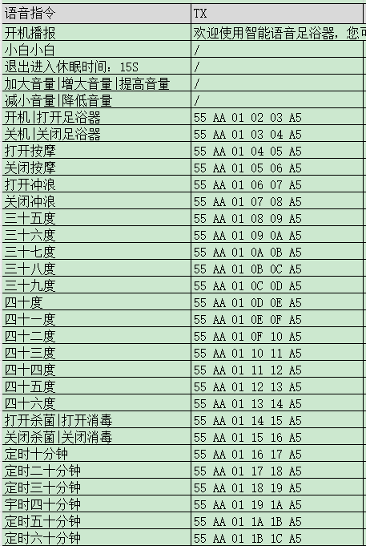

**3. 实施建议**

- 确认现有单片机程序使用的协议版本
- 新增功能时尽量兼容现有协议格式
- 重大协议变更需同步更新两端程序

**注意事项：**

- 协议变更会影响现有产品兼容性
- 建议建立版本管理机制
- 保持协议文档的及时更新

---

### 足浴盆定时功能协议完善

**问题描述：**

协议中定时功能的指令描述存在歧义，缺少取消定时指令，温度字段和定时字段定义混淆。

**解决方案：**

**1. 定时指令完善**

- 增加取消定时/关闭定时指令
- 定时范围：10分钟到60分钟（10分钟递增）
- 使用独立字段定义定时时间

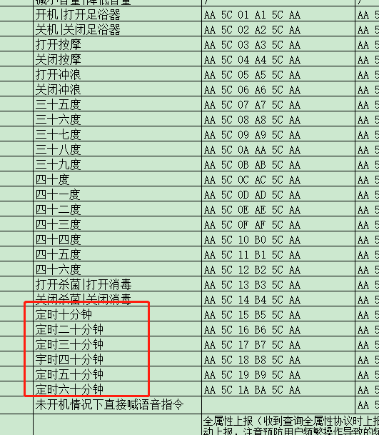

**2. 协议字段修正**

- 明确定义各字节功能
- 温度字段：35-48°C范围
- 定时字段：00表示无定时，01-12表示不同时长


**3. 指令编码示例**

```
定时10分钟：AA 55 16 0A 55 AA
定时20分钟：AA 55 16 14 55 AA
取消定时：AA 55 1B 00 55 AA
```

**注意事项：**

- 协议文档需避免产生歧义
- 温度和定时功能应使用独立字段
- 保持指令编码的唯一性
- 协议更新后需及时通知相关开发人员

---

### 如何使用声源定位实现移动设备的导航控制？

**问题描述：**

希望利用声源定位技术来控制移动设备（如垃圾桶、机器人）的运动方向，实现设备自动移动到声源位置的功能。

**解决方案：**

**1. 技术原理**

声源定位技术可以识别声音传来的方向角度，通过这个角度信息来控制移动设备的运动方向：

- 声源定位模块会输出声音的角度数据（0-360度）
- MCU 根据角度数据控制电机转向
- 通过持续调整方向，使设备逐渐接近声源

**2. 实现方案**

**基本控制逻辑**：
```
前方为0度，后方为180度
识别到声音角度 → 控制设备转向该角度
设备转向后，声源方向变为新的0度方向
继续根据新的声音角度调整方向
```

**具体实现步骤**：

1. **固定初始方向**：设定设备正前方为0度参考方向
2. **获取声音角度**：读取声源定位模块输出的角度值
3. **方向控制**：根据角度差值控制左右电机转速差
4. **持续追踪**：不断更新角度信息，动态调整运动方向

**3. 应用场景**

**声控移动垃圾桶**：

- 用户在任意位置呼喊
- 垃圾桶识别声音方向并自动转向
- 通过多次调整逐渐移动到用户位置
- 到达后可执行其他指令（如开盖）

**其他应用**：

- 跟随机器人
- 智能购物车
- 服务引导设备
- 互动玩具

**注意事项：**

- 声源定位识别的是角度信息，不是距离信息
- 需要结合其他传感器（如超声波）实现距离控制
- 在嘈杂环境中可能影响定位精度
- 建议设置最小识别阈值，避免误触发
- 多声源环境下需要设计优先级策略

---

### 情景WiFi色温灯Pro应用中"我的模式"和"情景模式"有什么区别？

**问题描述：**

使用情景WiFi色温灯Pro应用时，界面中存在"我的模式"和"情景模式"两个功能模块，需要确认这两个模块的具体功能和区别。

**解决方案：**

**1. 功能定义说明**

根据应用界面分析：

**我的模式**：

- 提供四个自定义模式位置（情景1-4）
- 用户可手动设置每个模式的亮度值
- 支持个性化配置，满足不同使用需求
- 例如：情景2和情景3设置为100%，情景4设置为1%

**情景模式**：

- 预设的固定场景模式
- 一键切换到特定场景
- 可能包含预定义的亮度和色温组合
- 适合快速调用常用配置

**2. 使用场景建议**

**我的模式适用场景**：

- 个人偏好设置
- 特定任务照明需求
- 日常使用的固定模式

**情景模式适用场景**：

- 阅读模式
- 休息模式
- 工作模式
- 睡前模式

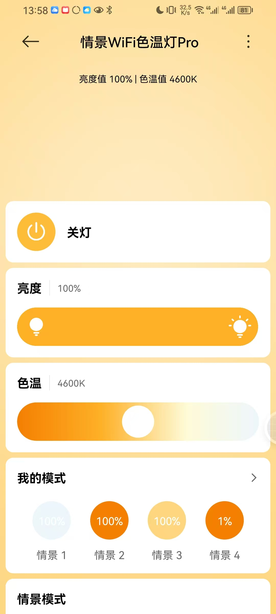

**注意事项：**

- "我的模式"需要用户自行配置
- "情景模式"通常是出厂预设
- 具体功能可能因固件版本而异
- 建议查看产品说明书了解详细功能

---

### 如何使用离线语音模块实现阀门控制箱的语音控制？

**问题描述：**

需要为阀门控制箱开发语音控制功能，通过语音指令控制阀门的开、关、停等操作，用于展会演示和未来的产品应用。

**解决方案：**

**1. 系统架构设计**

语音模块通过引脚输出控制信号，外围电路自行搭建：

- 语音识别模块：负责接收和处理语音指令
- 继电器控制电路：接收模块控制信号，驱动阀门执行器
- 阀门控制箱：包含开阀、关阀、停止等执行机构

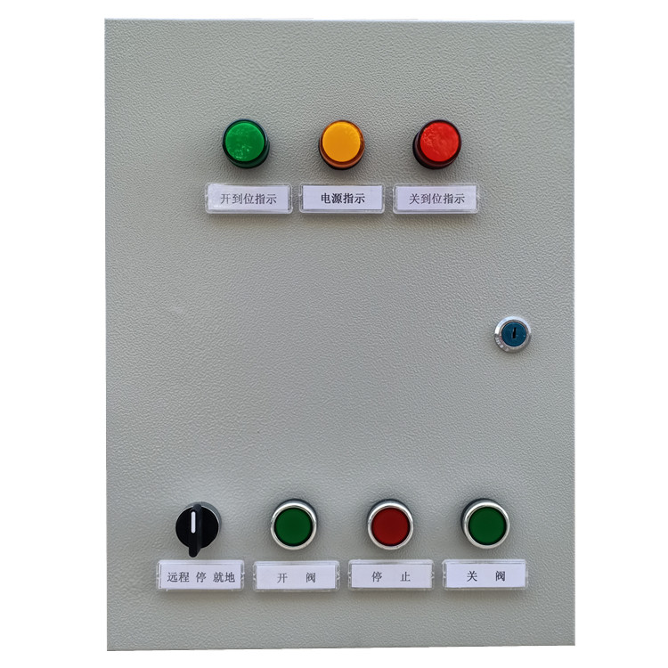

**2. 控制信号配置**

在平台配置GPIO输出引脚：

- 设置干接点输出模式
- 配置引脚输出高低电平控制继电器
- 定义语音指令对应的控制逻辑

**3. 实现步骤**

- 在智能公元平台创建产品项目
- 配置语音指令（如"打开阀门"、"关闭阀门"、"停止"）
- 设置GPIO引脚输出模式为干接点
- 将模块控制引脚连接到继电器线圈
- 通过继电器触点控制阀门电机

**注意事项：**

- 语音模块只提供控制信号，外围驱动电路需自行设计
- 继电器选型需匹配阀门控制箱的电压和电流要求
- 建议加入电气隔离和保护电路
- 展会演示时注意安全防护措施

**技术资源：**

- 智能公元文档中心：https://help.aimachip.com/
- B站教程机芯智能：https://space.bilibili.com/1903518159


---

### 教育领域如何使用离线语音模块进行编程教学？

**问题描述：**

在青少年编程教育和机器人教学中，需要使用离线语音识别模块作为教学工具，帮助学生理解语音交互原理和实践编程技能。

**解决方案：**

**1. 平台资源支持**

- **智能公元平台**：http://www.smartpi.cn/#/
    - 提供完整的开发环境和图形化配置界面
    - 适合教学使用，降低学习门槛
    - 平台上有各种型号的规格资料和技术文档

**2. 教学视频资源**

- **B站教学视频**：机芯智能官方账号
    - 平台入门视频：认识平台功能配置位置和固件生成流程
    - 链接：https://www.bilibili.com/video/BV1e8411T77q/?spm_id_from=333.999.0.0
    - CI-系列教程演示合集
    - 包含模块简介、数据教程、自然说功能演示等

**3. 实际应用案例**

- **青少年编程教学**：使用离线语音模块教授编程基础
- **机器人项目**：结合语音控制和机器人运动，开展实践项目
- **DIY创作**：鼓励学生进行创新项目，如语音控制电机、智能桌面宠物等


**注意事项：**

- 教学前建议先观看平台入门视频，熟悉操作流程
- 可根据学生水平选择合适的项目难度
- 平台提供图形化配置，适合初学者快速上手

---

### 如何在局域网内创建网页控制设备？

**问题描述：**

希望在局域网内搭建一个网页界面，通过点击按钮向IP地址为192.168.200.211、端口为3300的设备发送控制指令，且不依赖云服务。

**解决方案：**

**1. 网页控制界面设计**

根据设备功能，网页界面应包含：

- **PWM控制**：可设置频率（如50Hz）和占空比（如7.5、2.5等）
- **伺服电机控制**：提供多个按钮，分别对应不同舵机角度（如90度、45度、135度等）
- **事件触发**：支持"上电启动系统启动"等事件触发操作


**2. 实现方案**

**方法一：使用JavaScript和HTTP请求**

- **前端**：使用HTML和JavaScript创建网页，为每个按钮绑定点击事件
- **后端**：在设备（192.168.200.211）上运行一个轻量级Web服务器（如Node.js或Python的Flask），监听3300端口
- **通信**：当用户点击网页按钮时，JavaScript通过`fetch`或`XMLHttpRequest`向设备发送HTTP请求

示例代码：
```html
<!DOCTYPE html>
<html>
<head>
    <title>设备控制网页</title>
</head>
<body>
    <h1>设备控制</h1>
    <button onclick="sendCommand('servo90')">舵机90度</button>
    <button onclick="sendCommand('servo0')">舵机0度</button>
    <button onclick="sendCommand('pwm0?duty=7.5')">PWM 7.5%</button>

    <script>
        function sendCommand(command) {
            fetch(`http://192.168.200.211:3300/${command}`)
                .then(response => response.text())
                .then(data => console.log(data))
                .catch(error => console.error('Error:', error));
        }
    </script>
</body>
</html>
```

**方法二：使用网络调试助手**

- **工具**：使用网络调试助手（如TCP/UDP调试工具）
- **操作**：在局域网内的任意设备上运行该工具，连接到`192.168.200.211:3300`
- **发送**：手动输入控制指令进行测试

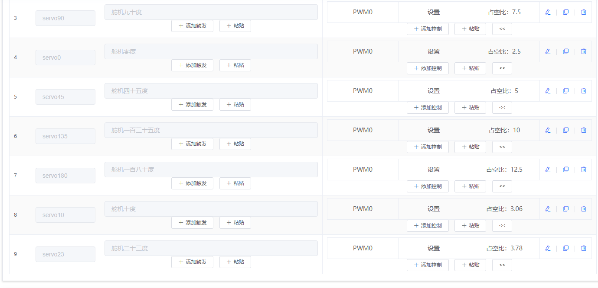

**3. 通信协议设计**

- **HTTP请求格式**：`GET /command` 或 `POST /command`
- **指令示例**：

    - `/servo90` - 控制舵机转到90度
    - `/pwm0?duty=7.5` - 设置PWM0占空比为7.5%
    - `/wakeup` - 触发唤醒事件

**4. 部署方案**

- **设备端**：运行Web服务器接收HTTP请求
- **控制端**：网页可以部署在任意设备上
- **网络要求**：确保控制设备与目标设备在同一局域网

**注意事项：**

- 网页控制设备需要设备支持Web服务器功能
- IP地址和端口需根据实际情况配置
- 跨域请求需要设备支持CORS或使用JSONP
- 建议添加响应状态反馈，确认控制指令执行结果


---

### 如何将智能AI集成到STM32智能桌面宠物项目中？

**问题描述：**

需要将智能AI语音模块集成到STM32智能桌面宠物项目中，实现通过语音指令控制表情和动作的功能。

**解决方案：**

1. **使用ESP32语音模块**：

    - ESP-SparkBot项目提供开源参考
    - 硬件开源地址：https://oshwhub.com/esp-college/esp-sparkbot
    - 软件开源地址：https://gitee.com/esp-friends/esp_sparkbot

2. **硬件集成方案**：

    - 语音模块与STM32通过串口通信
    - 使用Arduino或类似平台作为中间控制器
    - 舵机控制：360度舵机可改变速度和方向，180度舵机可固定角度

3. **焊接注意事项**：

    - 原设计使用0102封装元件，焊接难度较高
    - 可更换为0402封装降低难度
    - 必要时使用回流焊接工艺

**注意事项：**

- 确保语音模块与STM32的电平匹配
- 舵机控制需根据类型选择合适的控制方式
- 3D打印外壳时需预留足够的散热空间

---

## 暖风机控制协议示例

### 暖风机语音控制指令映射表

以下是一个完整的暖风机语音控制协议示例，包含了语音指令、串口通信数据格式和回复语的一一对应关系。

**协议格式说明：**

- **帧头**：A5 A5（固定帧头）
- **长度**：03（数据长度）
- **方向**：01（模块下发）/ 10（模块上报）
- **预留**：00 00（预留字节）
- **数据**：具体功能指令
- **校验**：校验和

**完整指令映射表：**

| 语音识别指令 | 模块下发数据 | 模块上报数据 | 回复语 | 功能说明 |
|-------------|------------|------------|-------|---------|
| 小爱同学小爱小爱 | A5 A5 03 01 00 04 00 00 00 00 52 | A5 A5 03 10 00 03 00 00 00 00 60 | 主人，你好 | 开机播报 |
| 打开电源/打开取暖器 | A5 A5 03 01 00 04 00 02 01 56 | A5 A5 03 10 00 03 02 01 01 64 | 好的，取暖器已打开 | 开启电源 |
| 关闭电源/关闭取暖器 | A5 A5 03 01 00 04 00 02 01 57 | A5 A5 03 10 00 03 02 01 02 65 | 好的，取暖器已关闭 | 关闭电源 |
| 打开低档/打开低热/打开低温 | A5 A5 03 01 00 04 00 02 01 58 | A5 A5 03 10 00 03 02 01 03 66 | 好的，低热模式已开启 | 低档加热 |
| 打开高档/打开高热/打开高温 | A5 A5 03 01 00 04 00 02 01 59 | A5 A5 03 10 00 03 02 01 04 67 | 好的，高热模式已开启 | 高档加热 |
| 自然风模式/打开自然风/打开冷风 | A5 A5 03 01 00 04 00 02 01 05 A | A5 A5 03 10 00 03 02 01 05 68 | 好的，自然风模式已开启 | 自然风 |
| 打开摆风/打开摆头 | A5 A5 03 01 00 04 00 02 01 06 5B | A5 A5 03 10 00 03 02 01 06 69 | 好的，摆风已打开 | 开启摆风 |
| 关闭摆风/关闭摆头 | A5 A5 03 01 00 04 00 02 01 07 5C | A5 A5 03 10 00 03 02 01 07 6A | 好的，摆风已关闭 | 关闭摆风 |
| 打开负离子/打开净化 | A5 A5 03 01 00 04 00 02 01 08 5D | A5 A5 03 10 00 03 02 01 08 6B | 好的，负离子已经打开 | 开启负离子 |
| 关闭负离子/关闭净化 | A5 A5 03 01 00 04 00 02 01 09 5E | A5 A5 03 10 00 03 02 01 09 6C | 好的，负离子已经关闭 | 关闭负离子 |
| 打开加湿 | A5 A5 03 01 00 04 00 02 01 0A 5F | A5 A5 03 10 00 03 02 01 0A 6D | 好的，加湿已打开 | 开启加湿 |
| 关闭加湿 | A5 A5 03 01 00 04 00 02 01 0B 60 | A5 A5 03 10 00 03 02 01 0B 6E | 好的，加湿已关闭 | 关闭加湿 |
| 打开灯光/打开氛围灯 | A5 A5 03 01 00 04 00 02 01 0C 61 | A5 A5 03 10 00 03 02 01 0C 6F | 好的，灯光已打开 | 开启灯光 |
| 关闭灯光/关闭氛围灯 | A5 A5 03 01 00 04 00 02 01 0D 62 | A5 A5 03 10 00 03 02 01 0D 70 | 好的，灯光已关闭 | 关闭灯光 |
| 打开语音 | A5 A5 03 01 00 04 00 02 01 0E 63 | A5 A5 03 10 00 04 00 02 01 0E 71 | 好的，语音已打开 | 开启语音提示 |
| 关闭语音 | A5 A5 03 01 00 04 00 02 01 0F 64 | A5 A5 03 10 00 04 00 02 01 0F 72 | 好的，语音已关闭 | 关闭语音提示 |
| 定时十二小时 | A5 A5 03 01 00 04 00 02 02 0C 62 | A5 A5 03 10 00 03 02 02 0C 70 | 好的，已定时十二小时 | 定时12小时 |
| 定时十一小时 | A5 A5 03 01 00 04 00 02 02 0B 61 | A5 A5 03 10 00 03 02 02 0B 6F | 好的，已定时十一小时 | 定时11小时 |
| 定时十小时 | A5 A5 03 01 00 04 00 02 02 0A 60 | A5 A5 03 10 00 03 02 02 0A 6E | 好的，已定时十小时 | 定时10小时 |
| 定时九小时 | A5 A5 03 01 00 04 00 02 02 09 5F | A5 A5 03 10 00 03 02 02 09 6D | 好的，已定时九小时 | 定时9小时 |
| 定时八小时 | A5 A5 03 01 00 04 00 02 02 08 5E | A5 A5 03 10 00 03 02 02 08 6C | 好的，已定时八小时 | 定时8小时 |
| 定时七小时 | A5 A5 03 01 00 04 00 02 02 07 5D | A5 A5 03 10 00 03 02 02 07 6B | 好的，已定时七小时 | 定时7小时 |
| 定时六小时 | A5 A5 03 01 00 04 00 02 02 06 5C | A5 A5 03 10 00 03 02 02 06 6A | 好的，已定时六小时 | 定时6小时 |
| 定时五小时 | A5 A5 03 01 00 04 00 02 02 05 5B | A5 A5 03 10 00 03 02 02 05 69 | 好的，已定时五小时 | 定时5小时 |
| 定时四小时 | A5 A5 03 01 00 04 00 02 02 04 5A | A5 A5 03 10 00 03 02 02 04 68 | 好的，已定时四小时 | 定时4小时 |
| 定时三小时 | A5 A5 03 01 00 04 00 02 02 03 59 | A5 A5 03 10 00 03 02 02 03 67 | 好的，已定时三小时 | 定时3小时 |
| 定时二小时/定时两小时 | A5 A5 03 01 00 04 00 02 02 02 58 | A5 A5 03 10 00 03 02 02 02 66 | 好的，已定时二小时 | 定时2小时 |
| 定时一小时 | A5 A5 03 01 00 04 00 02 02 01 57 | A5 A5 03 10 00 03 02 02 01 65 | 好的，已定时一小时 | 定时1小时 |
| 关闭定时/取消定时 | A5 A5 03 01 00 04 00 02 02 00 56 | A5 A5 03 10 00 02 00 00 64 | 好的，定时已取消 | 取消定时 |

**数据格式解析：**

- **数据字节2**：功能类别（01-基本功能，02-定时功能）
- **数据字节3**：具体指令（01-开关，02-模式，03-摆风等）
- **数据字节4**：参数值（00-关闭，01-开启，01-12等）

**音量控制说明：**

- 最小音量和最大音量的协议数据需根据实际产品配置
- 支持通过串口指令进行音量调节

**使用注意事项：**

1. **串口通信参数**：

    - 波特率：默认9600（可根据需要调整）
    - 数据位：8位
    - 停止位：1位
    - 校验位：无

2. **指令发送**：

    - 模块下发：主控MCU发送给语音模块
    - 模块上报：语音模块响应后上报给MCU

3. **校验和计算**：

    - 对数据包中除帧头外的所有字节进行异或运算
    - 确保数据传输的完整性

4. **开发建议**：

    - 开发时先使用串口调试助手测试协议格式
    - 建议添加数据重发机制确保指令可靠传输
    - 可根据产品需求调整指令映射和回复语内容

---
