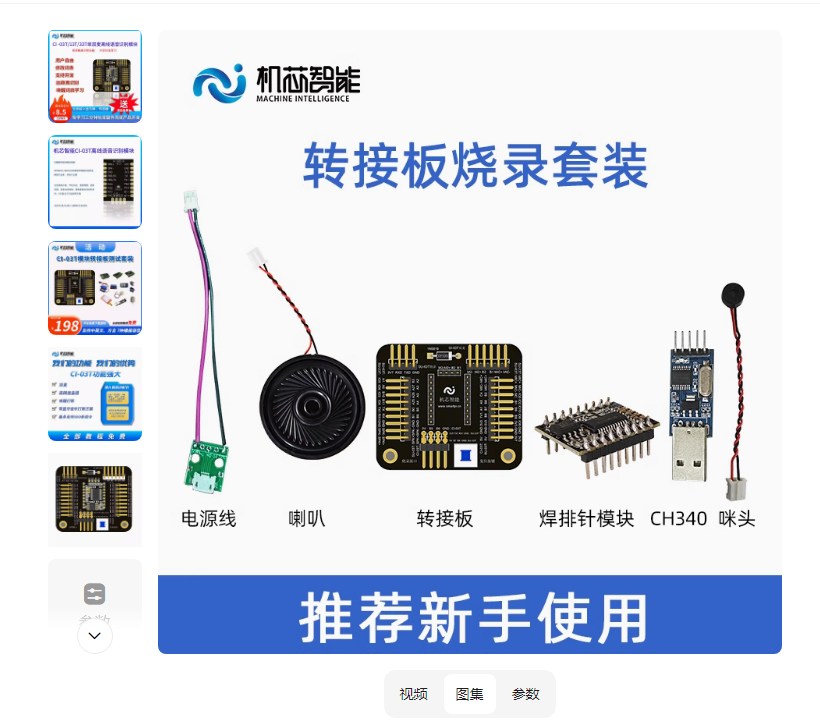
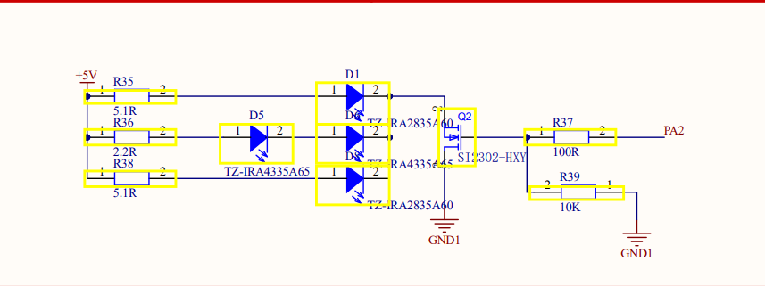
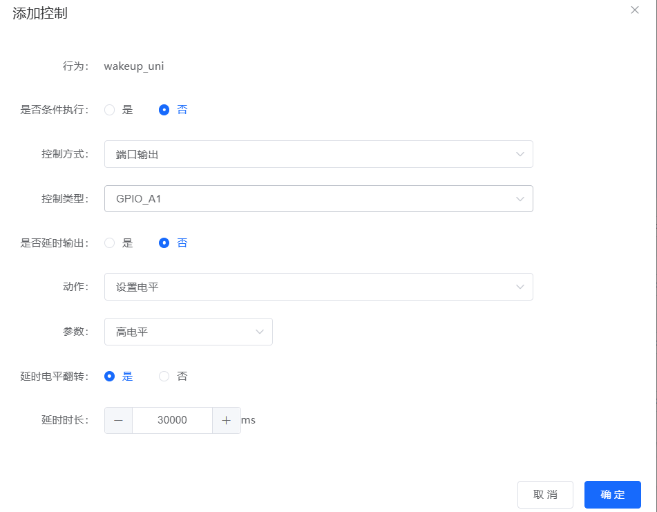
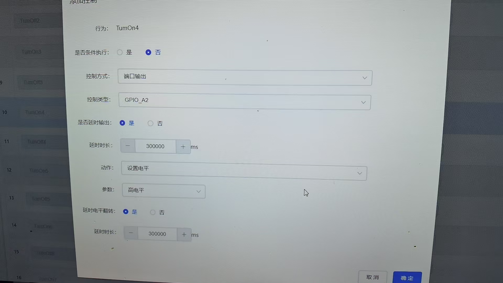
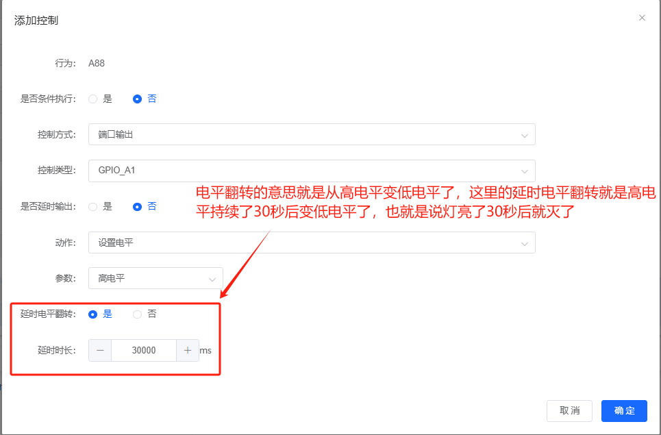
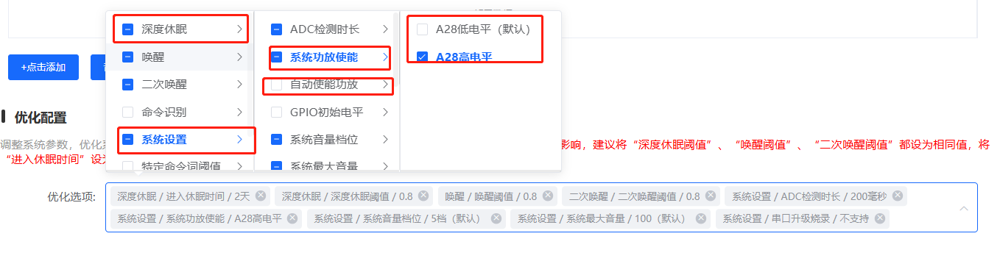
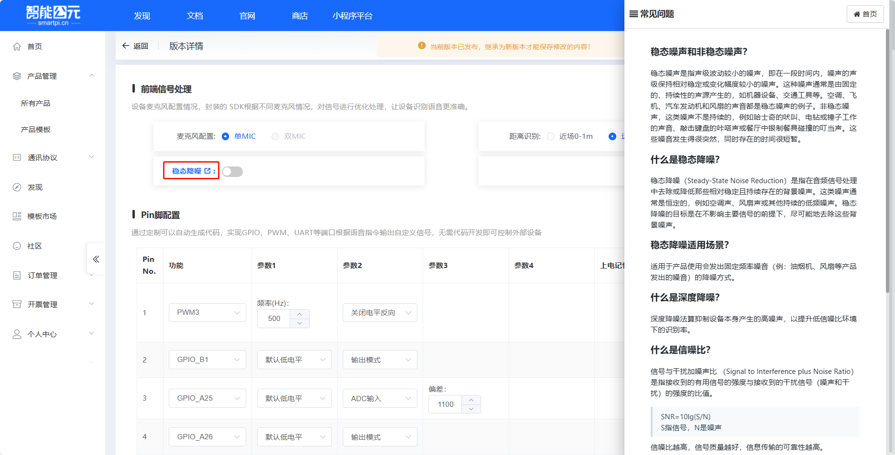
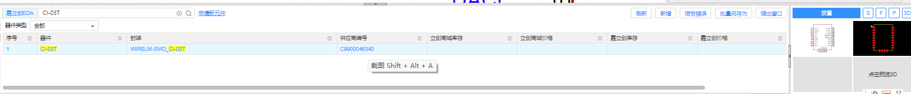
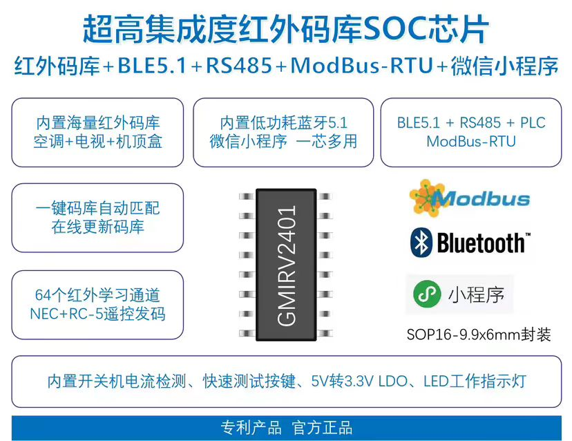

# CI-03T 应用场景与项目 FAQ

本页用于整理 CI-03T 相关的应用场景与项目问题。

### CI-03T是否适合在有噪音环境的工业巡检机器人使用？

**问题描述：**

需要在工业巡检机器人上集成语音指令识别功能，现场有一定噪音环境，要求模块支持麦克风外接。

**解决方案：**

CI-03T模块适合在有噪音环境的工业巡检机器人中使用：

- **支持外接麦克风**：CI-03T模块支持麦克风外接功能，可根据现场环境选择合适的麦克风
- **噪音适应能力**：模块具备一定的噪音抑制能力，能在工业环境下稳定工作
- **语音控制机器人**：可通过语音指令控制机器人的启停、巡检路线等操作

**硬件配置建议：**

1. **推荐套装配置**：

    - CI-03T模块
    - 转接板（方便连接和调试）
    - 外接麦克风（根据现场噪音情况选择）
    - 电源线和喇叭



2. **采购方式**：

    - 小批量：可通过淘宝直接下单购买套装
    - 大批量：联系供应商，可提供免费烧录服务

**注意事项：**

- 在有噪音环境下，建议选用指向性较好的外接麦克风
- 可通过调整识别灵敏度来适应不同程度的噪音环境
- 大批量采购时，厂商可提供预烧录服务，减少现场配置工作

### CI-03T如何配合倾斜传感器实现转弯播报？

**问题描述：**

需要实现当检测到左转弯时，自动播报"左转弯，请注意"的语音提示功能。

**解决方案：**

**1. 系统组成**

- **倾斜传感器**：检测转弯角度变化
- **Beetle主控**：处理传感器信号
- **CI-03T语音模块**：负责语音播报

**2. 工作原理**

```
倾斜传感器检测到转弯 → Beetle判断方向 → 触发CI-03T播报
```

**3. 硬件连接**

- 倾斜传感器连接到Beetle的ADC或数字IO口
- Beetle通过串口(TX/RX)连接CI-03T
- CI-03T配置相应的语音播报命令

**4. 配置步骤**

在智能公元平台：

1. 添加"左转弯"识别词
2. 录入或选择对应的播报语音
3. 设置串口输出命令格式
4. 生成并烧录固件到CI-03T

**5. 实现逻辑**

```c
// Beetle端的处理逻辑
if(检测到左倾角变化) {
    通过串口发送"左转弯"命令到CI-03T;
}
```

**注意事项：**

- 倾斜传感器需要根据实际应用调整灵敏度
- 建议增加延时，避免频繁触发
- 可以扩展支持右转弯、上坡等其他场景

---

### 如何使用CI-03T实现智能灯具的独立语音控制？

**问题描述：**

需要实现智能灯具的语音控制功能，要求每个灯具都能通过自定义名称进行独立控制，且支持电脑端配置灯具名称和语言。

**解决方案：**

使用CI-03T模块可以完美实现智能灯具的独立语音控制需求：

**1. 系统架构**

- 每个灯具配备一个CI-03T模块
- 通过智能公元平台配置灯具名称和语音指令
- 支持自定义唤醒词和命令词
- 多语言配置支持（中英日韩）

**2. 配置平台**

- 使用智能公元零代码平台：https://www.smartpi.cn/#/
- 平台功能：

    - 自定义灯具名称（如"客厅灯"、"卧室灯"等）
    - 配置控制命令（如"打开"、"关闭"、"调亮"等）
    - 支持语言切换选择
    - 免烧录，在线配置

**3. 实现步骤**

**步骤1：硬件准备**

- CI-03T模块（推荐购买淘宝链接：（请联系官方渠道获取支付方式）&skuId=5115492831204）
- 外接麦克风（提高识别灵敏度）
- 喇叭或功放电路
- AC220V电源适配电路

**步骤2：平台配置**

- 登录智能公元平台
- 创建新产品，选择CI-03T模块
- 配置唤醒词：可设置通用唤醒词或灯具专属唤醒词
- 设置命令词：
    ```
    "打开XX灯" → 对应GPIO输出高电平
    "关闭XX灯" → 对应GPIO输出低电平
    "调亮XX灯" → PWM控制
    ```

**步骤3：语言设置**

- 平台支持语言：中文、英文、日语、韩语
- 可根据目标市场选择对应语言
- 其他语言需要定制

**4. 多灯具独立控制方案**

**方案一：独立模块方案**

- 每个灯具一个CI-03T模块
- 每个模块配置不同的灯具名称
- 优点：控制简单，响应快速
- 缺点：成本相对较高

**方案二：主从控制方案**

- 一个主CI-03T模块 + 多个从控模块
- 主模块负责语音识别
- 通过无线/有线通信控制从模块
- 优点：成本较低
- 缺点：系统复杂度增加

**5. 注意事项**

- 麦克风选型：建议使用外接麦克风提高识别率
- 电源设计：确保AC220V转换电路稳定可靠
- 安装位置：避免噪音干扰，保证语音识别清晰
- 测试验证：批量前先进行样品测试

**6. 采购建议**

- 样品阶段：可先购买2-3个模块进行测试
- 批量生产：联系供应商获得技术支持和批量价格
- 技术支持：供应商可提供完整的方案指导

---

### **问题：CI-03T如何读取传感器数据并配置报警**

**描述：**
CI-03T模块本身不具备直接读取传感器硬件的功能，但可以通过串口通信与外部传感器或主控MCU进行数据交互，实现基于传感器数据的报警功能。

**解决方案：**

1. **系统架构设计**
    - 传感器数据采集（外部传感器/MCU）
    - 数据处理和判断（主控MCU）
    - 语音播报和交互（CI-03T）

2. **硬件连接方案**
    ```
    传感器 → MCU/单片机 → CI-03T模块
                    ↑
                串口通信(UART)
    ```

3. **通信协议设计**
    - 定义数据传输格式
    - 设置报警阈值参数
    - 实现双向通信机制

4. **实现步骤**

    **步骤1：传感器数据读取**
    ```c
    // 伪代码示例
    float temperature = readTemperatureSensor();
    float humidity = readHumiditySensor();
    ```

    **步骤2：数据处理和判断**
    ```c
    if(temperature > TEMP_THRESHOLD || humidity > HUMIDITY_THRESHOLD) {
        sendAlarmCommandtoCI03();
    }
    ```

    **步骤3：CI-03T语音播报**

    - 通过串口发送语音指令
    - 播报报警信息和数值
    - 支持多种报警语音文件

5. **配置方法**

    **串口配置：**

    - 波特率：9600/115200
    - 数据位：8
    - 停止位：1
    - 校验位：无

    **报警设置：**

    - 温度上下限设置
    - 湿度上下限设置
    - 报警延时设置
    - 报警间隔设置

6. **功能扩展**
    - 支持多种传感器类型
    - 可配置报警语音内容
    - 支持数据记录和查询
    - 远程监控和控制

**注意事项：**

- CI-03T仅负责语音交互，需要配合其他硬件实现完整功能
- 传感器采样率应根据实际需求调整
- 建议添加滤波算法提高数据稳定性
- 报警恢复机制需要合理设计

---

### CI系列模块红外功能支持哪些特性？

**问题描述：**

CI系列模块的红外功能是否支持红外码库、红外学习等功能。

**解决方案：**

**红外功能特性：**

CI系列模块提供完整的红外功能支持：

1. **内置红外码库**
    - 模块内置空调红外码库
    - 支持主流空调品牌的红外编码
    - 可直接调用控制空调

2. **红外学习功能**
    - 支持红外学习功能
    - 可学习各类设备的红外遥控码
    - 扩展性强，兼容非标准码库设备

3. **红外发射与接收**
    - 支持红外发射管输出（38kHz载波频率）
    - 支持红外接收管输入
    - 可实现遥控器学习和信号转发

**平台支持：**

SmartPi平台提供丰富的红外应用示例和教程：
- 访问地址：https://www.smartpi.cn/#/example
- 包含接线示例、代码示例、配置说明

**参考文档：**

- 《机芯智能Ci系列红外功能说明文档.pdf》
- 《红外发射管.pdf》- 规格参数
- 《红外接收管.pdf》- 规格参数
- 《空调伴侣原理图.pdf》- 硬件参考

---

### CI系列语音识别芯片如何实现空调控制？

**问题描述：**

使用CI系列语音识别芯片（如CI-03T1或CI-03T2）时，是否可以直接控制空调，还是需要额外编写红外解码函数和外接红外发射模块。

**解决方案：**

**实现原理：**

CI系列语音识别芯片本身不具备红外发射功能，需要通过外部红外发射模块来实现空调控制：

- **语音识别**：由CI芯片负责，识别语音指令
- **红外发射**：通过外部红外发射模块实现
- **协议处理**：需要根据不同空调品牌编写对应的红外码库

**硬件连接方案：**

1. **基本连接方式**：

    - CI芯片串口TX → 红外发射模块RX
    - 共地连接（GND）
    - 5V供电（根据模块要求）

    

    *红外发射模块与CI芯片的连接示意图*

2. **推荐的红外发射模块**：

    - 支持串口控制的红外发射管模块
    - 工作电压：3.3V-5V
    - 载波频率：38kHz（标准空调遥控频率）
    - 发射功率：≥10mW

**软件实现方案：**

1. **方案一：串口发送红外码**

    ```
    // 伪代码示例
    void sendACCommand(int command) {
        switch(command) {
            case CMD_AC_ON:
                serial.write("AA 55 01 04 A1 B2 C3 D4 55 AA");  // 开机红外码
                break;
            case CMD_AC_OFF:
                serial.write("AA 55 01 04 A5 B6 C7 D8 55 AA");  // 关机红外码
                break;
            case CMD_TEMP_UP:
                serial.write("AA 55 01 04 A9 B0 C1 D2 55 AA");  // 升温红外码
                break;
        }
    }
    ```

2. **方案二：使用带自学习功能的模块**

    - 选择支持红外自学习的模块
    - 先学习空调遥控器的各种指令
    - 通过串口触发对应的学习指令

**空调协议适配难点：**

1. **品牌差异大**：

    - 不同品牌空调协议完全不兼容
    - 即使同一品牌，不同型号也可能有差异
    - 需要为每个型号单独建立码库

2. **码库管理复杂**：

    - 基础功能：开关、模式、温度调节、风速
    - 高级功能：定时、睡眠、节能、除湿等
    - 建议使用表格管理各型号的红外码

3. **开发建议**：

    - 优先支持主流品牌（格力、美的、海尔等）
    - 提供学习功能让用户自行适配
    - 考虑使用万能空调遥控方案

**实际应用示例：**

1. **语音指令配置**：

    - "打开空调" → 发送开机红外码
    - "关闭空调" → 发送关机红外码
    - "调高温度" → 发送升温红外码
    - "制冷模式" → 发送制冷模式红外码

2. **串口数据格式**：

    ```
    帧格式：AA 55 [CMD] [LEN] [DATA] [CHECKSUM] 55 AA
    CMD：命令类型（01=红外控制）
    LEN：数据长度
    DATA：红外编码数据
    CHECKSUM：校验和
    ```

**注意事项：**

- CI芯片只能识别语音，不能直接发射红外信号
- 需要外接红外发射模块才能控制空调
- 不同品牌空调的红外协议差异很大，需要分别适配
- 如需支持多种空调，建议选择带自学习功能的红外模块
- 红外发射管的发射角度和距离需要考虑安装位置

---


---

### 两个CI-03T芯片如何共同控制一组继电器？

**问题描述：**

需要使用两个CI-03T芯片来共同控制同一组继电器，以实现协同控制功能。

**解决方案：**

**1. 通信协作方案**

两个CI-03T芯片可以通过串口通信实现协同控制：

- **主从架构**：一个作为主控，一个作为从控
- **串口连接**：使用UART将两个CI-03T连接
- **协议设计**：定义简单的通信协议

**2. 硬件连接方式**

```
CI-03T(A) TX → CI-03T(B) RX
CI-03T(A) RX → CI-03T(B) TX
共地连接(GND)
```

**3. 控制逻辑实现**

**方案一：主控触发，从控响应**
```c
// 主控芯片处理逻辑
if(检测到控制指令) {
    通过串口通知从控芯片;
    控制各自的继电器;
}

// 从控芯片处理逻辑
if(收到串口指令) {
    根据指令控制对应继电器;
}
```

**方案二：状态同步机制**

- 定期同步控制状态
- 避免重复触发或冲突
- 实现互锁保护

**4. 配置步骤**

在智能公元平台：

1. **串口配置**
    - 配置一个UART口用于芯片间通信
    - 设置合适的波特率（如9600）

2. **控制逻辑配置**
    - 主控芯片：添加串口发送控制
    - 从控芯片：添加串口接收触发
    - 双方都配置继电器控制

3. **通信协议设计**
    - 简单指令格式：如"RELAY_ON"、"RELAY_OFF"
    - 添加校验确保可靠性

**注意事项：**

- 需要合理设计控制逻辑，避免两个芯片同时输出冲突
- 建议增加延时，防止频繁触发
- 可以通过DIY继电器板进一步简化电路
- 测试时先验证通信是否正常，再连接继电器

**参考资源：**

- 串口通信教程：https://www.bilibili.com/video/BV1nv4y197uR/

---

### CI-03T模块最多能串联多少个？

**问题描述：**

希望了解CI-03T模块在系统中最多能串联多少个，以便规划系统架构。

**解决方案：**

**1. 串联限制分析**

CI-03T模块的串联数量主要受限于以下因素：

- **通信距离限制**：UART通信有效距离约10-15米
- **信号衰减**：每个节点都会造成信号衰减
- **地址管理**：需要为每个模块分配唯一标识
- **响应延时**：串联越多，末端响应延时越大

**2. 理论与实际情况**

- **理论上限**：没有硬性数量限制
- **实际建议**：不超过10个为佳
- **推荐数量**：3-5个可保证稳定性

**3. 串联方案设计**

**方案一：菊花链连接**
```
主控 → CI-03T(1) → CI-03T(2) → CI-03T(3) → ...
            ↓              ↓               ↓
        继电器1        继电器2         继电器3
```

**方案二：星型连接（推荐）
```
        主控
        ↙  ↓  ↘
CI-03T(1) CI-03T(2) CI-03T(3)
```

**4. 注意事项**

- **供电设计**：考虑压降，建议在两端供电
- **通信速率**：距离远时降低波特率
- **抗干扰**：使用屏蔽双绞线
- **故障隔离**：单个故障不应影响整条链路

---

### CI-03T如何实现声控灯延时30秒自动关闭？

**问题描述：**

需要在CI-03T模块上实现声控灯功能，即触发开灯后延时30秒自动关闭。

**解决方案：**

**1. 添加控制配置**

在智能公元平台添加控制：

- **控制行为**：选择对应的唤醒词或指令ID
- **控制方式**：端口输出
- **控制类型**：选择对应的GPIO口（如GPIO_A0）
- **是否延时输出**：是
- **延时时间**：30000ms（30秒）
- **延时电平翻转**：是

**2. 延时参数说明**

- **延时输出时间**：指触发后多长时间输出高电平
- **延时电平翻转时间**：指高电平持续多长时间后自动变为低电平
- 设置30000ms表示高电平持续30秒后自动翻转

**3. 配置示例**





**注意事项：**

- 延时电平翻转功能可实现自动关闭
- 无需使用定时器功能
- 确保GPIO口连接到正确的控制电路
- 测试时先验证延时时间是否符合需求

---

### 如何在手术室环境中实现离线语音控制？

**问题描述：**

需要在手术室环境中通过语音控制设备开关，包括灯光和空调等，要求离线运行且词条可配置，但不使用小程序进行配置。

**解决方案：**

**1. 硬件方案选择**

推荐使用CI-03T模块，具备以下优势：

- 支持离线语音识别，无需网络连接
- 内置自学习功能，可现场配置词条
- 支持OTA更新，便于后期维护
- 识别距离3-5米，适合手术室环境

**2. 词条配置方式**

**方案一：自学习功能（推荐）**

- 通过语音录入新的唤醒词和控制词
- 无需任何工具，单纯动嘴即可完成
- 适合现场快速配置和调试
- 建议词条数量控制在10条以内

**方案二：OTA方式更新**

- 通过OTA方式更新词条的识别模型
- 需要配合简单的上位机工具
- 适合批量配置和统一管理

**3. 控制功能实现**

**灯光控制：**

- 语音指令："打开灯光"、"关闭灯光"
- 通过CI-03T的GPIO口控制继电器
- 可设置延时自动关闭功能

**空调控制：**

- 语音指令："打开空调"、"关闭空调"、"调高温度"、"调低温度"
- 需要外接红外发射模块
- 预先学习空调遥控器的红外码

**4. 系统架构**

```
语音输入 → CI-03T识别 → GPIO/串口输出 → 外部控制电路 → 设备控制
```

**注意事项：**

- 手术室环境相对安静，语音识别效果较好
- 数字挡位识别可能因口音差异存在误差，建议使用"调高"、"调低"等模糊指令
- 自学习功能需要先删除旧词条才能学习新词条
- 建议在正式使用前进行充分的场景测试

**参考资源：**

- CI-03T开发包：http://help.aimachip.com/docs/offline_ci03t/ci_03t_kfb
- CI-03T免唤醒和自学习教程：https://www.bilibili.com/video/BV1LM4y1S7A8/

---

### 如何实现两个芯片通过IO口相互唤醒？

**问题描述：**

需要实现两个语音芯片（如CI-03T1或CI-03T2）之间的相互唤醒，当A芯片识别唤醒词后，通过IO信号直接唤醒B芯片，而不需要通过语音播报。

**解决方案：**

**硬件连接方式：**

- 将芯片A的GPIO输出连接到芯片B的GPIO输入
- 使用3.3V TTL电平连接
- 建议使用10kΩ上拉或下拉电阻确保电平稳定

**实现逻辑：**

1. **芯片A识别唤醒后**：

    - 设置GPIO输出高电平（3.3V）
    - 保持高电平状态持续唤醒B

2. **芯片B检测IO信号**：

    - 配置GPIO为输入模式
    - 检测到高电平后自动进入工作状态
    - 无需等待唤醒词识别

3. **双向唤醒实现**：

    - 重复上述连接实现B→A唤醒
    - 两个GPIO连接线相互独立

**软件配置：**

- 芯片A：在唤醒词触发动作中设置GPIO输出
- 芯片B：配置GPIO输入触发的唤醒功能
- 可选择边沿触发或电平触发模式

**注意事项：**

- 确保两个芯片共地
- GPIO电平必须匹配（3.3V TTL）
- 连接线建议使用屏蔽线避免干扰
- 测试验证唤醒响应时间满足需求

---


---

### 离线语音芯片能实现音乐节奏灯功能吗？

**问题描述：**

询问离线语音芯片是否支持跟随音乐节奏实现灯光变化效果。

**解决方案：**

平台配置无法直接实现，需要二次开发。

- **实现要求**：

    - 需要通过咪头读取音频能量值
    - 根据能量值控制灯光变化
    - 需要进行二次开发编程

- **支持模块**：

    - 目前只有CI-03T模块支持二次开发
    - 其他模块暂不支持此功能

**注意事项：**

- 平台配置无法实现音乐律动功能
- 需要一定的编程基础
- 可考虑使用专门的音频处理芯片配合实现

---

### 如何实现语音控制氛围灯与音乐同步功能？

**问题描述：**

需要实现通过语音控制汽车氛围灯，并在识别到"切换音乐模式"指令后，氛围灯能够根据汽车音箱播放的音乐声波变化进行动态响应。

**解决方案：**

**1. 功能需求分析**

基本功能包括：

- 语音控制：打开氛围灯、关闭氛围灯、调节亮度、调节暗度
- 音乐模式：识别特定指令后进入音乐同步模式
- 音频采集：通过麦克风采集汽车音箱播放的音乐
- 动态响应：根据音乐声波实时控制氛围灯变化

**2. 技术实现方案**

**硬件配置：**

- 使用CI-03T1作为主控制器
- 连接LED灯带（支持多种颜色）
- 通过串口或PWM信号控制灯光

**软件实现：**

- 配置语音指令控制基础灯光功能
- 开发音乐模式切换逻辑
- 实现音频能量采集和处理算法
- 根据音频特征控制灯光效果

**3. 开发要求**

- **需要定制开发**：标准固件不支持音频采集功能
- **开发经验**：需要有一定的嵌入式开发经验
- **调试周期**：需要进行充分的测试和调优

**4. 推荐灯带类型**

选择适合汽车环境的灯带：

- **LED数量**：根据安装位置选择合适长度
- **供电方式**：12V汽车电源适配
- **防护等级**：建议选择IP65以上防水等级
- **控制方式**：支持PWM或串口控制

**5. 实现步骤**

1. **基础语音控制配置**
    - 在平台配置开关、亮度调节指令
    - 测试基础功能稳定性

2. **音乐模式开发**
    - 开发音频采集功能
    - 实现音频特征提取算法
    - 建立音频与灯光的映射关系

3. **效果优化**
    - 调整灯光响应灵敏度
    - 优化颜色变化算法
    - 测试不同音乐类型的效果

**注意事项：**

- 需要处理汽车环境的噪声干扰
- 音频采集需要考虑音箱与麦克风的距离
- 音乐模式可能影响语音识别准确性
- 建议增加物理开关用于模式切换
- 需要通过实际路试验证效果

---


---

### 如何实现语音控制自动窗帘？

**问题描述：**

需要实现一个离线语音控制的自动窗帘系统，能够通过语音指令控制电机正反转（开/关窗帘），并在达到指定位置时自动停止。

**解决方案：**

**硬件选型：**

1. **语音模块选择**
    - 推荐使用CI-03T2（双麦克风）或CI-03T1（单麦克风）
    - CI-03T2更适合车载等高噪声环境，识别率更高
    - 支持离线语音识别，无需联网

2. **电机控制方案**
    - 使用语音模块的PWM接口控制电机
    - 需外接电机驱动模块（如L298N）驱动直流电机
    - 通过两个PWM通道分别控制正转和反转

**功能实现：**

1. **语音指令配置**
    - "开窗帘" → 触发电机正转指令
    - "关窗帘" → 触发电机反转指令
    - 支持自学习功能，适应不同使用方语音

2. **位置检测实现**
    - 使用机械限位开关检测窗帘开/关位置
    - 或使用编码器精确控制电机转动角度
    - 到达位置后自动停止电机

3. **电源设计**
    - 使用降压模块将24V车载电源转为5V
    - 语音模块和电机驱动独立供电，避免干扰
    - 电机驱动模块需独立供电，避免电压波动

**代码逻辑示例：**
```c
if (语音指令 == "开窗帘") {
    PWM控制电机正转;
    while (未到达关限位) {
        检测限位开关状态;
    }
    PWM停止;
}

if (语音指令 == "关窗帘") {
    PWM控制电机反转;
    while (未到达开限位) {
        检测限位开关状态;
    }
    PWM停止;
}
```

**注意事项：**

- 电源隔离：语音模块和电机驱动需独立供电
- 抗干扰设计：车载环境建议使用双麦克风（CI-03T2）
- 机械连接：需自行设计窗帘与电机的连接机构

---


---

### 按下烧录按钮时LED熄灭是正常现象吗？

**问题描述：**

在烧录时发现按下烧录按钮，LED会熄灭一下，询问是否正常。

**解决方案：**

**1. 现象说明**

按下烧录按钮时LED熄灭是**正常现象**。

**2. 原因分析**

- **进入烧录模式**：按下按钮触发进入烧录模式
- **系统复位**：模块内部系统进行复位
- **功耗管理**：暂时关闭LED以降低功耗

**3. 正常流程**

- 按下按钮 → LED熄灭（进入烧录模式）
- 烧录过程 → LED保持熄灭
- 烧录完成 → LED重新亮起（退出烧录模式）

**注意事项：**

- 这是设计正常的特性，不是故障
- LED熄灭表示已正确进入烧录模式
- 如LED不熄灭可能表示按钮功能异常
- 烧录完成后应该恢复LED显示

---
- 安全考虑：添加过流保护，避免电机堵转损坏

**成本估算：**

- CI-03T2语音模块：成本请联系官方客服评估
- 电机驱动模块：成本请联系官方客服评估
- 限位开关/编码器：成本请联系官方客服评估
- 降压模块：成本请联系官方客服评估
- 总成本：成本请联系官方客服评估

---


---

### 如何使用CI-03T1/CI-03T2实现桌宠功能？

**问题描述：**

希望了解如何使用CI-03T1或CI-03T2芯片实现桌宠功能，寻求推荐的实现方案。

**解决方案：**

**桌宠功能概述：**

桌宠是桌面互动的小型电子宠物，能够响应语音指令、播放声音、做出动作反馈等。

**实现方案：**

1. **功能模块选择**
    - 使用语音识别模块接收指令
    - 添加语音播放功能进行回应
    - 配置舵机或LED实现动作反馈
    - 可选添加触摸传感器增加互动性

2. **硬件方案选型**

    **方案一：CI/SU共板方案**

    - 采用CI系列与SU系列共板设计
    - 支持基础离线语音识别功能
    - 成本相对较低，适合入门级产品

    **方案二：JX-A7T方案**

    - 支持离线语音+在线AI双模式
    - 可通过WiFi实现云端智能对话
    - 支持小程序控制和OTA升级
    - 适合需要更强交互能力的高端产品

    **方案三：CI-03T独立方案**

    - CI-03T1/CI-03T2作为主控芯片
    - 连接小型舵机控制头部或四肢动作
    - 集成喇叭播放声音和语音
    - 设计简洁的外观结构

3. **软件功能开发**
    - 在智能公元平台配置语音指令集
    - 设计简单的动作序列和回应逻辑
    - 实现随机行为增加趣味性
    - 添加定时互动功能

**开发优势：**

- CI-03T1/CI-03T2支持丰富的外设接口
- 平台图形化编程，降低开发难度
- 支持离线语音识别，响应速度快
- 低功耗设计，适合长时间运行

**应用场景：**

- 办公桌面伴侣
- 儿童互动玩具
- 展示演示项目
- 学习语音控制技术的入门项目

**注意事项：**

- 桌宠的机械结构尽量简单可靠
- 舵机选择小尺寸、低噪音型号
- 动作设计不宜过于复杂
- 考虑添加开关控制运行状态

---


---

### 如何使用语音模块实现冷暖光和亮度调节？

**问题描述：**

需要了解如何使用语音模块（如CI-03T1或CI-03T2）来控制灯光的冷暖光切换和亮度调节。

**解决方案：**

**1. 硬件设计**

- **语音模块选择**：

    - CI-03T1：单麦克风，适用于中等噪声环境
    - CI-03T2：双麦克风，适用于高噪声环境
    - 支持离线语音识别，无需联网

- **灯光控制方案**：

    - **亮度调节**：使用PWM信号控制LED灯的占空比
    - **冷暖光切换**：使用两个独立的LED灯（冷光和暖光）
    - **驱动电路**：通过MOSFET或专用的LED驱动IC

**2. 语音指令配置**

- 在智能公元平台设置语音指令：

    - "调亮"/"变亮"：增加亮度
    - "调暗"/"变暗"：降低亮度
    - "切换冷光"：切换到冷光模式
    - "切换暖光"：切换到暖光模式

**3. 控制逻辑**

- **亮度控制**：

    - 设置多个亮度等级（如1-5档）
    - 每档对应不同的PWM占空比
    - 渐变调节避免突变

- **冷暖切换**：

    - 冷光模式：关闭暖光LED，开启冷光LED
    - 暖光模式：关闭冷光LED，开启暖光LED
    - 可支持自然光模式（两种同时开启）

**4. 实现示例**

```c
// 语音指令识别
if (voice_command == "调亮") {
    brightness_level = min(brightness_level + 1, 5);
    set_pwm(brightness_level);
} else if (voice_command == "调暗") {
    brightness_level = max(brightness_level - 1, 1);
    set_pwm(brightness_level);
} else if (voice_command == "切换冷光") {
    set_warm_light(0);
    set_cold_light(1);
} else if (voice_command == "切换暖光") {
    set_warm_light(1);
    set_cold_light(0);
}
```

**注意事项：**

- 确保语音模块的供电电压在3.6-5.5V范围内
- 灯光驱动电路的负载电流不应超过150mA
- 使用PWM信号时，注意频率和占空比的设置，以避免闪烁
- 在高噪声环境下，建议使用CI-03T2（双麦）以提高识别率
- 冷暖光LED的色温差异明显，避免使用方混淆

---

## 互动娱乐应用


---

### 如何实现小程序推送功能？

**问题描述：**

需要通过小程序向使用方发送推送通知，特别是针对使用CI-03T1和CI-03T2芯片产品的应用场景。

**解决方案：**

**1. 平台推送机制**

- 智能公元平台支持生成工单完成通知
- 通知通过平台统一推送机制发送
- 可在小程序中接收并显示推送消息

**2. 小程序配置**

- 在小程序开发平台配置推送权限
- 设置消息模板和推送规则
- 关联平台变量以接收推送数据

**3. 推送内容示例**

- 工单单号
- 工单时间
- 工单内容（如定制的SDK&固件已生成）
- 完成时间

**注意事项：**

- 推送功能需要小程序具备相应的权限配置
- 通知内容由平台生成，非直接通过芯片发送
- 确保小程序已正确配置接收推送的相关参数

---


---

### 如何将离线语音识别应用于智能垃圾桶？

**问题描述：**

希望将离线语音识别芯片集成到智能垃圾桶产品中，实现语音控制开盖等功能。

**解决方案：**

**1. 功能需求分析**

智能垃圾桶的语音控制通常包括：

- **开盖指令**："打开垃圾桶"、"垃圾桶开盖"
- **关盖指令**："关闭垃圾桶"、"垃圾桶关盖"
- **其他功能**："打包换袋"、"消毒"等（根据产品需求）

**2. 硬件集成方案**

- **模块选型**：

    - CI-03T1：适合基础开合盖功能
    - CI-03T2：适合嘈杂环境（厨房、公共场所）
    - SU-03T：适合成本敏感的项目

- **电机控制**：

    - 使用舵机控制开合盖动作
    - 通过GPIO输出PWM信号控制舵机
    - 设置合适的开合角度和速度

- **传感器集成**：

    - 红外感应检测是否有人靠近
    - 满溢传感器检测垃圾容量
    - 与语音控制形成多重交互方式

**3. 实现要点**

- **命令词配置**：

    - 设置简单直观的命令词
    - 避免过于复杂的指令
    - 支持近义词识别提高成功率

- **响应设计**：

    - 语音播报确认指令执行
    - LED指示灯显示工作状态
    - 延时自动关盖功能

- **功耗优化**：

    - 使用低功耗咪头降低待机电流
    - 设置合理的进入低功耗时间
    - 电池供电版本需重点优化

**4. 应用场景适配**

- **家庭厨房**：

    - CI-03T2（抗油烟噪声）
    - 增加防水防油设计

- **公共场所**：

    - 双麦配置提高抗噪能力
    - 增加手势感应等备用控制方式

- **户外垃圾桶**：

    - 选择工业级模块
    - 加强防水防尘设计

**注意事项：**

- 咪头位置要避免被遮挡
- 电机选择要考虑开盖扭矩需求
- 考虑安全性，设置防夹手功能
- 定期清洁咪头保证识别效果
- 批量生产前进行充分的环境测试

---

### 如何在大理石产品中实现智能灯光和触控功能？

**问题描述：**

需要在大理石产品中集成智能灯光控制和升降触控功能，要求语音模块尺寸小巧以便镶嵌安装。

**解决方案：**

**1. 模块选型**

- **CI-03T模块特点**：

    - 尺寸小巧，适合嵌入大理石产品
    - 支持离线语音识别，无需联网
    - 具备PWM输出接口，可直接控制灯光
    - 支持串口通信，可控制升降机构

**2. 系统架构**

```
语音指令 → CI-03T识别 → PWM输出控制灯光亮度
                ↓
            串口通信 → MCU → 控制升降电机
```

**3. 功能实现**

**灯光控制（PWM方式）**：

- 通过CI-03T的PWM接口直接控制LED灯光
- 支持亮度调节："调亮一点"、"调暗一点"
- 支持开关控制："打开灯光"、"关闭灯光"

**升降控制（串口通信）**：

- CI-03T通过串口发送控制指令给MCU
- MCU接收指令后控制升降电机
- 支持语音指令："升起来"、"降下去"

**4. 硬件集成**

**镶嵌设计**：

- 在大理石上预留模块安装槽位
- 槽位尺寸：根据CI-03T模块尺寸预留
- 考虑散热和防水处理

**接口连接**：

- PWM输出 → LED驱动电路 → 灯光
- UART → MCU → 电机驱动器 → 升降机构
- 电源管理：12V/24V供电，需做稳压处理

**5. 开发参考**

可参考以下教程了解具体实现：

- CI-03T串口发数据教程
- CI-03T模块PWM调光教程
- CI-03T语音识别模块控制继电器教程

**注意事项：**

- 大理石开槽时要注意应力分布，避免开裂
- 模块周围要预留散热空间
- 麦克风开孔位置要合理，避免被大理石遮挡
- 做好防水密封，防止水汽进入模块
- 建议先制作样板测试，再进行批量生产

---

### 如何基于CI-03T开发自定义智能体？

**问题描述：**

希望了解如何基于公司离线语音识别芯片（如CI-03T1或CI-03T2）开发一个自定义的智能体（智能助手）。

**解决方案：**

基于CI-03T系列芯片开发智能体的核心思路：

**1. 核心功能设计**

- **语音交互**：利用CI-03T的离线语音识别能力实现自然语言交互
- **智能响应**：结合预设规则和逻辑判断，实现智能对话和响应
- **个性化定制**：根据应用场景定制唤醒词、指令和回复内容

**2. 开发方向建议**

- **桌面智能助手**：开发具备语音交互能力的桌面宠物或助手
- **IoT设备控制**：作为智能家居的中控核心，控制各类设备
- **教育娱乐**：开发具备问答、讲故事等功能的智能玩伴

**3. 技术实现要点**

- 充分利用CI-03T的GPIO控制能力
- 结合串口通信扩展功能模块
- 通过固件配置实现个性化的交互逻辑

**注意事项：**

- 开发前充分了解CI-03T的技术规格和限制
- 注重用户体验，设计自然的对话流程
- 可分阶段实现功能，从简单到复杂逐步完善

---

### 风扇灯场景如何选择语音芯片？

**问题描述：**

在风扇灯应用场景下，需要选择既能有效应对风扇噪声（高噪声环境）又能满足低功耗需求的语音识别芯片。

**解决方案：**

**场景特点分析：**

- 风扇产生持续的低频噪声
- 传统语音识别在噪声环境下识别率大幅下降
- 需要稳态降噪算法处理持续性噪声

**芯片选型建议：**

1. **优先降噪能力**
    - **CI-03T**：基于模型锁定噪声，适合固定噪声场景
    - **SU-03T**：自适应降噪算法，适合变化噪声环境
    - 非低功耗型号降噪效果更好

2. **功耗优化方案**

    

    - 开启深度休眠模式降低基础功耗
    - 启用自动功放使能功能
    - 仅在需要时开启功放供电

    

3. **双芯片方案（可选）**
    - 静音时使用低功耗芯片
    - 风扇开启时切换到降噪芯片
    - 通过MCU控制两芯片切换

**技术对比：**

| 芯片型号 | 降噪能力 | 功耗 | 适合场景 |
|-----------|---------|------|----------|
| CI-03T | 强（稳态降噪） | 较高 | 固定噪声场景 |
| SU-03T | 中（自适应） | 中等 | 变化噪声环境 |
| SU-23T | 弱 | 极低 | 安静环境 |

**实施建议：**

- 优先使用CI-03T获得最佳降噪效果
- 通过自动功放使能降低整体功耗
- PCB设计时注意电源滤波和音频隔离
- 麦克风尽量远离风扇安装

**注意事项：**

- 降噪和低功耗难以兼顾，需要权衡
- 风扇噪声属低频持续噪声，需开启稳态降噪
- 自动功放使能有效减少静态功耗
- 可通过物理隔噪进一步改善效果

---


---

### 语音控制云台转台的可行性与替代方案

**问题描述：**

希望了解如何通过语音控制云台转动，但发现现有CI-03T系列芯片的功耗较高，不适合在室外安装的云台/转台产品中使用，且现有控制方式为手动手柄或485/网络远程控制。

**解决方案：**

1. **技术方案评估**
    - 3年前已有语音控制云台的实现案例
    - 主要问题是功耗较大，不适合室外长期使用
    - CI-03T系列模块功耗设计未针对电池供电优化

2. **现有控制方式对比**
    - 无线遥控器控制：简单可靠
    - 485键盘控制：专业稳定
    - 网络远程控制：支持集中管理
    - 录像机反控：集成度高

3. **替代方案建议**
    - 考虑4G+APP控制方案，比语音控制更实用
    - 适合室外设备的远程管理需求
    - 支持实时监控和多设备控制

**注意事项：**

- 云台/转台产品通常安装在室外，对功耗要求严格
- 语音控制方案更适合室内或短期使用场景
- 选择控制方式时需考虑安装环境和使用频率

---

## 外设开发与应用示例

### 场景 1：继电器控制 (开关灯)
- **逻辑**：识别到“打开灯光” -> GPIO 输出高电平 -> 继电器吸合。
- **代码片段**：
    ```c
    // 伪代码示例
    void on_voice_command(int cmd_id) {
        if (cmd_id == CMD_LIGHT_ON) {
            gpio_set_level(PIN_RELAY, 1);
            play_voice("灯已打开");
        }
    }
    ```

### 场景 2：串口透传 (对接主控 MCU)
- **逻辑**：CI-03T 作为语音协处理器，识别成功后通过串口发送 ID 给主控 MCU。
- **协议示例**：`0xAA 0x55 [CMD_ID] [DATA_LEN] [DATA] [CHECKSUM]`（具体字段与校验请参考协议文档或示例工程）。

### 场景 3：PWM 控制（调光/调速）

- **逻辑**：识别到"调亮灯光"或"调快风扇" -> PWM 输出不同占空比 -> 控制亮度或速度。
- **代码片段**：
    ```c
    // 伪代码示例
    void on_voice_command(int cmd_id) {
        if (cmd_id == CMD_LIGHT_BRIGHT) {
            pwm_set_duty(PIN_PWM_LIGHT, 80);  // 80% 占空比
            play_voice("灯光已调亮");
        }
    }
    ```
- **应用场景**：智能台灯调光、风扇调速、电机控制等需要连续调节的场景

### 场景 4：流水灯控制

- **逻辑**：开机上电时自动启动 -> GPIO 输出延时翻转 -> 实现 LED 流水灯效果。
- **代码片段**：
    ```c
    // 伪代码示例 - 开机流水灯
    void system_init() {
        // 配置GPIO为输出模式
        gpio_set_direction(PIN_LED1, OUTPUT);
        gpio_set_direction(PIN_LED2, OUTPUT);
        gpio_set_direction(PIN_LED3, OUTPUT);

        // 设置初始状态为低电平
        gpio_write(PIN_LED1, LOW);
        gpio_write(PIN_LED2, LOW);
        gpio_write(PIN_LED3, LOW);

        // 流水灯效果
        while(1) {
            // LED1亮
            gpio_write(PIN_LED1, HIGH);
            delay_ms(500);
            gpio_write(PIN_LED1, LOW);

            // LED2亮
            gpio_write(PIN_LED2, HIGH);
            delay_ms(500);
            gpio_write(PIN_LED2, LOW);

            // LED3亮
            gpio_write(PIN_LED3, HIGH);
            delay_ms(500);
            gpio_write(PIN_LED3, LOW);
        }
    }
    ```
- **应用场景**：设备状态指示、装饰灯光、产品展示效果等

### 场景 4：小语种开发与定制
- **概述**：CI-03T 支持多语言模型开发，方便方案商在无语料情况下进行初步模型制作和样品测试。
- **注意事项**：

    - **模块选型**：CI-03T（推荐）、CI-33T。
    - **词条数量**：建议 <30 条；词条过多容易导致相近词误识别，且验收/优化时间增加。
    - **词条要求**：命令词至少 4 个音节，尤其是唤醒词；选择发音差异明显的词，避免相近发音误识。
    - **测试标准**：声音平稳、语速正常，避免刻意慢/快。
    - **特别提醒**：选词质量直接影响项目落地；若词条在训练集中少见，可能需提供至少 50 人语料进行迭代（周期约 3 周）。
- **支持语言**：截止 2024 年 8 月，支持中、英、日、韩、西班牙、德、俄、泰、越南、阿拉伯语（不支持阿拉伯数字）；其他语言需商务确认，周期约 3 个月。
- **开发流程**：

    1. 注册智能公元平台账号，熟悉中文固件开发流程。
    2. 确定词条，提供至少 4 人测试语料（2男2女，干净无底噪）。
    3. 使用中文固件开发完成后，替换为对应小语种的语言模型、声学模型和 cmd_info 文件。
- **验收标准**：
    - 注：命令词区分度高可大幅减少误识，利于量产。
- **进一步参考**：完整开发须知见附录 G 的附件 `小语种识别方案开发须知-V2.0-240929.pdf`。

### 场景 5：日语语音识别项目实施（智能头盔应用）

**项目背景**：

智能头盔项目需要支持日语语音识别功能，实现语音控制头盔的各种功能，如开关灯光、调整风扇速度等。

**实施流程**：

1. **平台语言选择**

    - 登录智能公元平台（smartpi.cn）
    - 创建新产品时，在语言选择下拉菜单中选择"日语"选项
    - 确保选择正确的模块型号（CI-03T）


2. **固件开发与导出**

    - 在平台上配置所需的日语语音指令
    - 设置相应的控制逻辑和GPIO输出
    - 完成配置后，点击"导出"按钮生成固件文件
    - 导出的固件包含所有日语语音包和控制逻辑


3. **语音指令定制**

    - 根据智能头盔功能需求，定义日语命令词
    - 建议每个命令词至少4个音节，确保识别准确率
    - 提供日文翻译的语音指令列表，便于系统配置

4. **测试与验证**

    - 使用日语测试语音进行功能验证
    - 在实际头盔环境中测试识别效果
    - 根据测试结果调整识别阈值和命令词

**技术要点**：

- **词条数量控制**：建议控制在30条以内，过多词条可能导致误识别率上升
- **语料要求**：如需优化识别效果，可提供4人（2男2女）的干净日语语料
- **发音差异**：选择发音差异明显的命令词，避免相近发音导致的误触发

**注意事项**：

- 日语语音模型已内置在CI-03T中，无需额外下载
- 固件烧录使用标准流程，与中文固件相同
- 如需添加更多日语命令词，需重新生成固件并烧录
- 建议在实际使用环境中进行充分测试，确保识别效果满足需求

---

### 如何获取CI-03T完整开发资料？

**问题描述：**

需要获取CI-03T和CI-03T2芯片的完整产品信息、技术参数以及相关开发资料和下载链接。

**解决方案：**

**官方资料下载方式：**

1. **百度网盘下载**：

    - **链接**：https://pan.baidu.com/s/1Fb24gvOwHKtxB8QlJtjJiA
    - **提取码**：xjtt
    - **内容**：包含完整的说明书、开发资料、技术参数等文档


**EDA设计支持：**

对于使用嘉立创EDA等设计工具的用户，CI-03T模块已添加到常用器件库：

- **供应商编号**：C9900046340
- **封装信息**：标准SMD22/DIP22封装
- **设计建议**：可直接从器件库拖拽使用，简化PCB设计流程



*嘉立创EDA软件中已添加CI-03T器件，方便直接调用*

**资料包含内容：**

1. **基础文档**：

    - CI-03T模块规格书
    - CI1302芯片手册
    - 模块原理图和封装图
    - 引脚定义说明

2. **开发工具**：

    - CH340驱动程序
    - 模块烧录软件
    - 烧录指引文档
    - 出厂固件包

3. **设计指南**：

    - 产品结构声学规范
    - 喇叭和咪头选型建议
    - PCB布局设计要点
    - 整机结构设计指导

4. **示例代码**：

    - 开发包和示例工程
    - API接口说明
    - 串口通信协议
    - 常见应用案例

**相关产品参考：**

对于需要更多功能的应用，可考虑以下型号：

- **GMIRV2401**：超高集成度红外码库SOC芯片
    - 内置红外码库、BLE5.1、RS485、Modbus-RTU
    - 支持微信小程序控制
    - SOP16封装，适合高集成度设计



*GMIRV2401芯片功能特性，支持多种通信协议和控制方式**

**获取步骤：**

1. 打开百度网盘链接
2. 输入提取码 xjtt
3. 下载所有资料压缩包
4. 解压后查看各类文档
5. 根据开发需求查阅相应资料

**注意事项：**

- 建议下载所有资料并备份保存
- 开发前仔细阅读规格书和烧录文档
- 如有疑问可及时联系技术支持
- 定期关注官方更新，获取最新版本资料


---

### CI-03T能否用于边防声音传感器的探测应用？

**问题描述：**

需要开发一款边防用传感器，主要用于探测人员和车辆越界，需要体积小、低功耗，通过声音识别技术实现目标探测。

**解决方案：**

CI-03T模块可以作为声音识别的核心部件用于边防传感器方案：

**1. 技术可行性**

- **声音检测能力**：CI-03T具备检测人员说话声、走路声、车辆引擎声等声音特征的能力
- **低功耗特性**：模块支持低功耗模式，适合需要长期运行的边防设备
- **体积小巧**：模块尺寸紧凑，便于集成到小型化传感器设备中
- **本地处理**：离线语音识别，无需依赖网络，适合边防地区的独立部署

**2. 实现方案**

**方案一：纯声音检测方案**

- 使用CI-03T持续监听环境声音
- 配置特定声音识别（人声、引擎声等）
- 检测到目标声音时触发报警

**方案二：组合检测方案**

- 声音检测 + 其他传感器（红外、震动等）
- 多传感器融合提高检测准确性
- 降低误报率

**3. 硬件配置建议**

- **麦克风选型**：

    - 选用高灵敏度、指向性麦克风
    - 考虑防水防尘设计（IP65以上）
    - 根据探测距离选择合适的麦克风参数

- **供电设计**：

    - 支持电池供电（低功耗模式）
    - 考虑太阳能充电方案
    - 电压范围：3.3V-5V

- **通信接口**：

    - 通过UART输出检测结果
    - 支持无线模块（LoRa、NB-IoT等）传输报警信息

**4. 部署注意事项**

- **环境适应性**：

    - 考虑极端温度（-40℃~+85℃）
    - 防潮湿、防腐蚀处理
    - 抗风噪设计

- **安装位置**：

    - 高度设置：距离地面1-2米
    - 避免遮挡，确保声音采集效果
    - 考虑地形对声音传播的影响

**5. 定制开发需求**

由于边防应用的特殊性，建议联系技术支持进行：

- 特定声音样本的训练和优化
- 算法参数的调整以适应野外环境
- 与其他传感器系统的集成方案设计
- 特定功耗和性能的平衡优化

**注意事项：**

- 声音检测受环境影响较大（雨、风等天气）
- 需要定期维护和校准
- 建议作为多传感器系统的一部分使用
- 实际探测距离需要根据现场环境测试确定


---

### 户外遮阳棚语音控制方案

**问题描述：**

户外遮阳棚产品需要实现语音控制功能，要求支持多语言（如韩语），且语音模块安装在遮阳棚立柱上，能够覆盖整个遮阳棚空间（约4×3m）。

**解决方案：**

**1. 产品特点分析**

户外遮阳棚作为半开放空间的休闲设施，具有以下特点：

- **空间尺寸**：典型规格约3.5-4m（宽）×4-5m（深），高度约2.8-3m
- **结构特征**：四柱支撑结构，立柱为方形或矩形截面金属材质
- **安装环境**：户外庭院、露台、花园等半开放空间
- **使用场景**：用户可能在遮阳棚内任何位置发出语音指令

**2. 模块选型建议**

- **推荐型号**：CI-03T
    - 支持多语言识别（中文、英文、日文、韩语等）
    - 内置功放，可直接驱动喇叭
    - 适合户外环境使用

- **语言支持**：
    - 平台直接支持：中文、英文、日文、韩语
    - 其他语言需要定制开发

**3. 安装位置建议**

语音模块的最佳安装位置：

- **立柱顶部**（推荐）：
    - 高度约2.8米，有利于声音传播
    - 避免地面噪音干扰
    - 覆盖范围更广
    - 避免阳光直射，保护设备

- **立柱中部**：
    - 表面平整区域，适合安装控制面板
    - 需注意防水防尘

**4. 灵敏度配置要求**

针对4×3m空间的远距离识别需求：

- **远场配置**：选择远场1-5m识别模式
- **唤醒灵敏度**：建议设置为"中"或"高"
- **识别灵敏度**：根据实际环境噪声调整
- **麦克风选型**：建议使用高灵敏度外接麦克风

**5. 环境适应性考虑**

户外环境需要特别注意：

- **防水防尘**：模块需要IP65以上防护等级
- **抗风噪**：户外风声可能影响识别，建议使用带降噪的CI-03T2
- **电源设计**：考虑户外供电，建议使用宽电压输入
- **温度适应**：户外温度变化大，选择工业级模块

**6. 典型控制指令**

- 遮阳控制："打开遮阳"、"关闭遮阳"、"展开侧帘"
- 灯光控制："打开灯光"、"关闭灯光"、"调亮/调暗"
- 模式切换："休闲模式"、"阅读模式"、"聚会模式"

**注意事项：**

- 户外环境存在风声、环境噪音，需要高质量的降噪算法
- 测试时应在实际安装位置进行远距离测试
- 确认最远对角线位置的唤醒和识别效果
- 考虑为模块增加防雨罩设计
