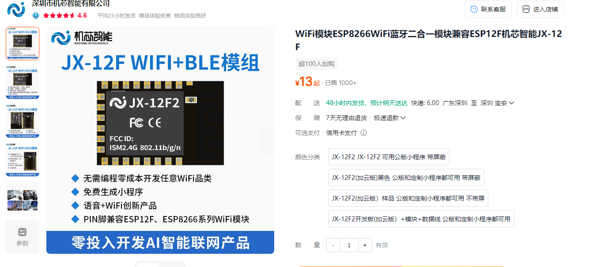

# JX-12F 应用场景与项目 FAQ

本页用于整理 JX-12F 相关的应用场景与项目问题。

---

### JX-12F模块如何实现485转WiFi功能？

**问题描述：**

现有产品使用485通讯，希望通过模块读取485协议并上传到WiFi。

**解决方案：**

1. **硬件连接**：JX-12F串口输出为TTL电平（3.3V），需要自行设计TTL转485转换电路  
2. **转换电路**：推荐使用MAX485或类似485转换芯片  
3. **软件实现**：模块通过UART读取485设备数据，解析Modbus协议，通过WiFi上传

**注意事项：**

- 485总线两端需添加120Ω终端电阻  
- 485通信为半双工模式，需要控制收发切换时序  
- 工业环境建议增加防雷、防静电保护措施

---

### 多个JX-12F设备连接同一WiFi时如何区分？

**解决方案：**

1. **MAC地址区分**：每个模块的WiFi MAC地址都是全球唯一  
2. **设备名称自定义**：用户可为每个设备设置独特的名称  
3. **设备ID管理**：在固件程序中为每个设备分配唯一ID



**注意事项：**

- MAC地址不可更改，是设备的根本标识  
- 设备名称可随时修改，不影响设备功能

---

### 如何使用JX-12F实现IO口信号接收并发送小程序通知？

**功能需求：**

使用4个IO口接收信号，当检测到低电平信号时，通过小程序通知具体是哪个IO口被触发。

**实现方案：**

**1. 入门例程使用**

- 下载官方入门例程：`入门例程JX-12F.json`  
- 例程版本：20250516002  
- 功能描述：IO0输入低电平，小程序通知演示

**2. 平台配置步骤**

登录智能公元平台，进入设备行为自定义界面：

- **设备预览**：显示当前IO口状态  
- **设备配置**：设置设备名称、ID、小程序AppID等信息  
- **事件配置**：定义IO口触发条件和执行动作

**3. 事件列表配置**

在设备行为自定义中配置以下事件：

```
事件17：IO0输入低电平 → 小程序通知
事件18：IO0输入高电平 → 小程序通知
```

可扩展配置：

```
IO0输入低电平 → 小程序通知"IO0触发"
IO1输入低电平 → 小程序通知"IO1触发"
IO2输入低电平 → 小程序通知"IO2触发"
IO3输入低电平 → 小程序通知"IO3触发"
```

**4. 实现流程**

```
IO口电平变化 → 模块检测 → 平台判断 → 小程序推送通知
```

**注意事项：**

- IO口默认为上拉输入，低电平触发更可靠  
- 确保模块已连接到WiFi网络  
- 小程序需要绑定对应设备才能接收通知  
- 支持多个IO口同时监控

---

### JX-12F能用于红外感应器数据上报吗？

**问题描述：**

想使用JX-12F WiFi+BLE模块实现红外线感应器检测玻璃瓶内物体状态，并将无物体时的提示信息发送到手机，咨询该模块是否支持此功能，以及如何实现多模块部署和编程。

**解决方案：**

1. **功能确认**
    - JX-12F可以接收红外感应器信号并发送到手机  
    - 支持生成小程序，便于移动端接收通知  
    - 兼容ESP12F/ESP8266系列开发方式

2. **多模块部署方案**
    - 采用一主多从架构  
    - 子模块之间不需相互通信  
    - 各子模块独立与服务端建立TCP连接

3. **开发支持**
    - 一般逻辑和功能可直接在智能公元平台配置  
    - Arduino Uno不可用于JX-12F编程  
    - 提供技术支持协助开发  
    - 提供IoT协议文档参考

**注意事项：**

- 需要购买JX-12F开发板和数据充电线  
- 具体配件和方案可咨询淘宝客服  
- 例程可导入平台了解配置方法

---

### 如何实现两个JX12F模块之间的WiFi透传通信？

**问题描述：**

需要实现两个JX12F模块通过WiFi进行透传数据通信，实现模块间的无线数据传输。

**解决方案：**

**通信架构设计**

两个JX12F模块之间无法直接建立通信，需要通过中间服务器实现数据转发：

```
JX12F-A ←→ WiFi网络 ←→ 服务器/路由器 ←→ WiFi网络 ←→ JX12F-B
```

**实现方案**

**方案一：通过云端服务器转发**

1. **硬件准备**
    - 两个JX12F模块  
    - 确保模块供电正常（3.3V）  
    - 检查天线连接良好

2. **网络配置**
    - 两个模块连接到同一WiFi网络  
    - 或分别连接到可访问公网的网络  
    - 记录两个模块的设备ID

3. **服务器端配置**
    - 在智能公元平台创建数据转发服务  
    - 配置消息路由规则  
    - 设置数据转发逻辑

4. **模块A配置（发送端）**
    ```
    - 配置为TCP客户端模式
    - 设置目标服务器地址
    - 配置串口波特率（如115200）
    - 启用透传模式
    ```

5. **模块B配置（接收端）**
    ```
    - 配置为TCP客户端模式
    - 订阅模块A的数据主题
    - 设置串口输出参数
    - 配置数据接收处理
    ```

**方案二：通过本地路由器转发**

1. **组网方式**
    - 两个模块连接到同一路由器  
    - 使用路由器的端口转发功能  
    - 或配置模块为AP+STA模式

2. **直连配置**
    - 模块A配置为TCP服务器  
    - 模块B配置为TCP客户端  
    - 设置固定的内网IP地址

3. **通信测试**
    ```
    模块A（服务器）：

    - IP：192.168.1.100
    - 端口：8080
    - 监听连接请求

    模块B（客户端）：

    - 连接地址：192.168.1.100:8080
    - 自动重连机制
    - 心跳包维持连接
    ```

**代码示例**

模块A发送数据：
```python
# 通过串口发送数据到JX12F
ser.write(b'Hello from Module A')
# JX12F自动转发到服务器
```

模块B接收数据：
```python
# 服务器转发数据到模块B
# 模块B通过串口输出
data = ser.readline()
print(data.decode())  # 输出: Hello from Module A
```

**配置参数**

| 参数 | 推荐值 | 说明 |
|------|--------|------|
| 通信协议 | TCP | 保证数据可靠性 |
| 端口号 | 8080/8888 | 避免常用端口冲突 |
| 波特率 | 9600/115200 | 根据需求选择 |
| 数据格式 | ASCII/HEX | 支持两种格式 |
| 心跳间隔 | 30秒 | 维持连接稳定 |

**注意事项**

- 两个JX12F模块不能直接点对点通信  
- 必须通过服务器或路由器中转  
- 确保网络稳定性，设置断线重连  
- 建议添加数据校验和重传机制  
- 可考虑使用MQTT协议简化消息路由

---
