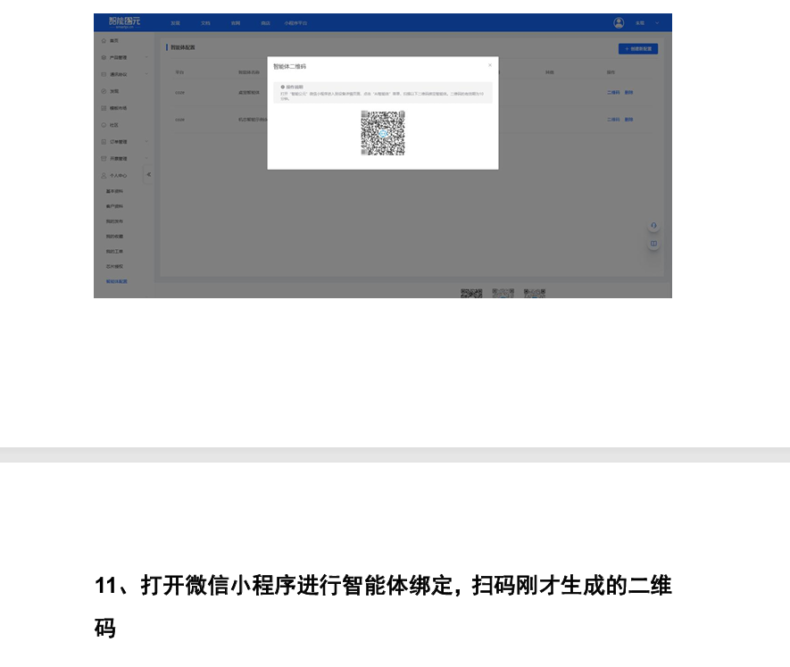
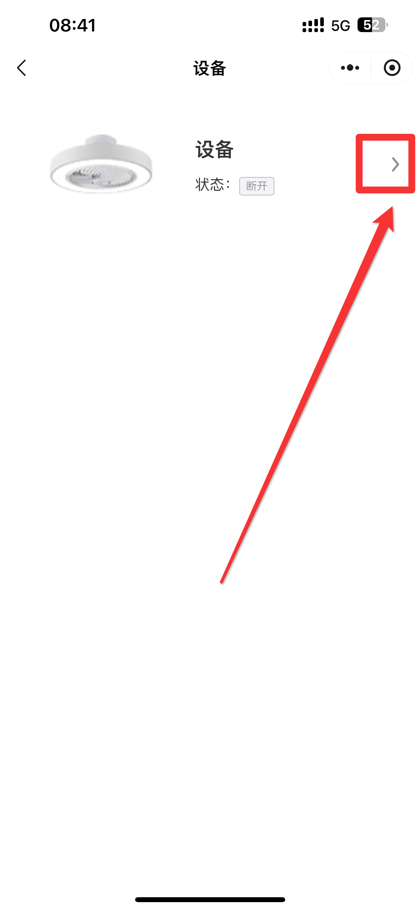
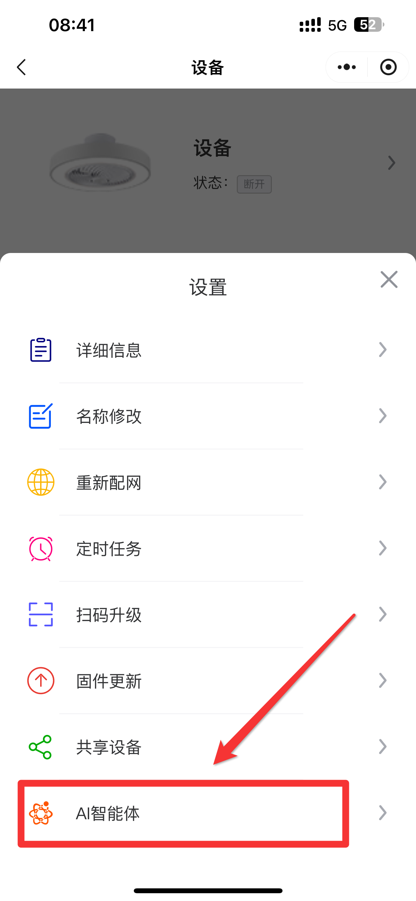
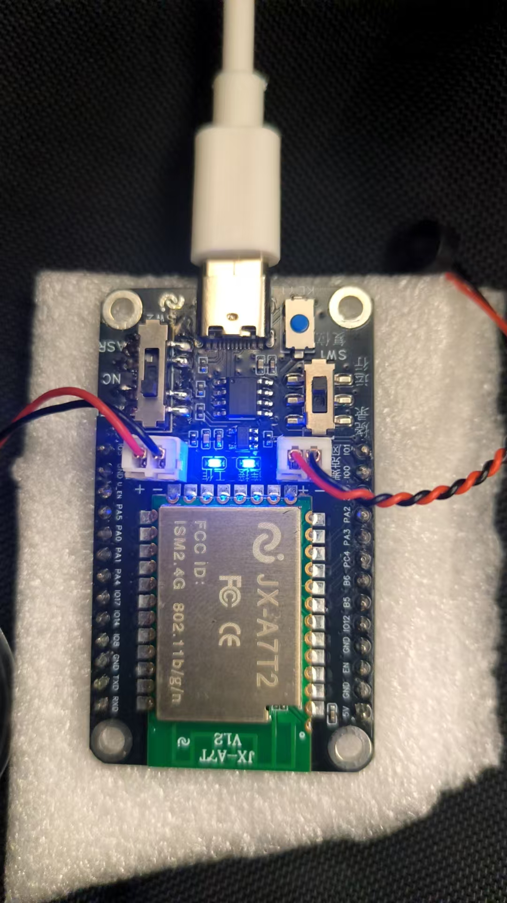
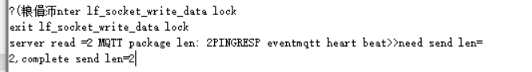
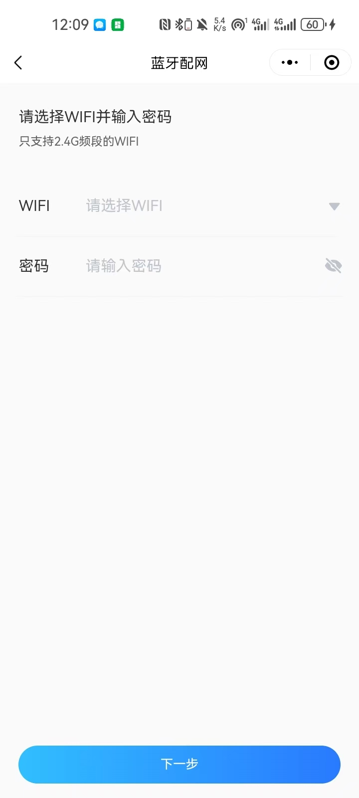
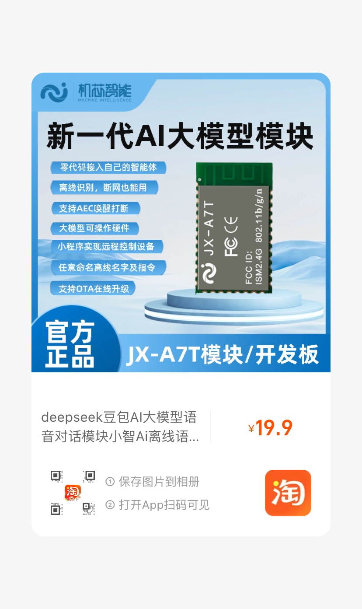
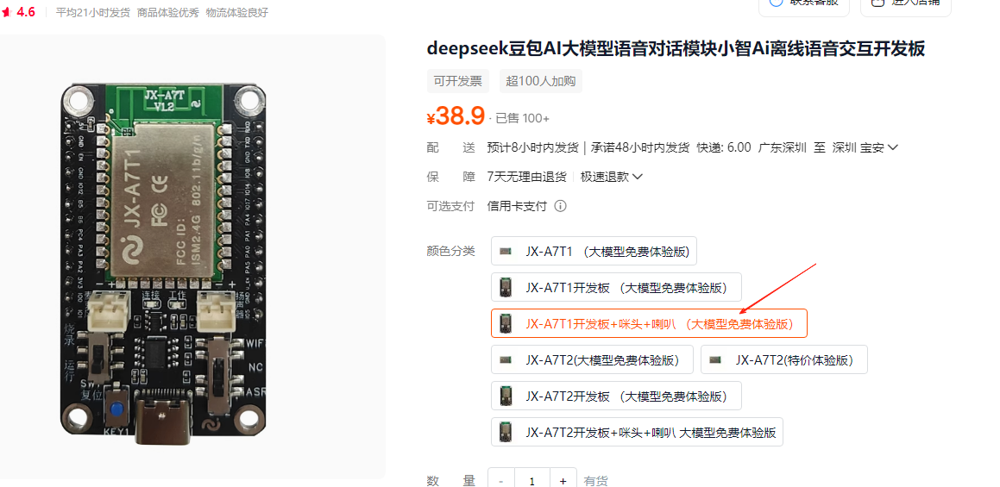

# JX-A7T 应用场景与项目 FAQ

## 产品介绍

### JX-A7T新品的主要功能特点是什么？

**问题描述：**

需要了解JX-A7T新品的上线情况、功能特点以及如何获取相关技术文档和合作信息。

**解决方案：**

JX-A7T是一款支持离线指令与在线指令双重模式的新品，其中在线指令搭载大模型运行。

**主要功能特点：**

- **双模运行**：同时支持离线指令和在线指令
- **大模型支持**：在线指令模式搭载大模型，提供更智能的交互体验
- **离线能力**：保持传统离线语音识别的快速响应特性
- **AEC功能**：含AEC（声学回声消除）打断唤醒打断功能，提升交互体验
- **智能高效**：在线大模式运行，带来更智能、更高效的使用体验

**技术文档获取：**

- 例程和文档已上传至智能公元平台
- 访问地址：https://help.aimachip.com/docs/jx_a7t_v1/jx_a7t_v1-1ghc1h40pidif
- 可登录平台查看产品功能详解和操作指南

**合作与支持：**

- 新品上市期间提供特价优惠
- 可通过官方渠道了解产品更多信息
- 如有项目需求或合作意向，可联系获取技术协助
- 产品目前已开放购买，享有特价优惠价格

**注意事项：**

- 建议先在智能公元平台注册账号，方便查阅完整文档
- 开发前可下载官方例程，快速上手开发
- 关注官方获取最新的固件更新和技术资讯

---

## 项目实现

### 如何在CI-03T1芯片平台上实现网约车计价系统语音播报功能？

**问题描述：**

需要基于CI-03T1芯片的硬件平台，实现网约车计价系统的语音播报功能，通过按钮触发并播放预设的语音指令。

**解决方案：**

**1. 硬件架构**

```
主控：STM32最小系统板
语音模块：CI-03T1离线语音识别芯片
显示：OLED显示屏（显示计费信息）
输入：按钮（触发语音播报）
输出：扬声器（播放语音）
```

**2. 功能实现流程**

- **按钮触发**：按下按钮触发语音识别
- **语音播报**：播放预设的计价信息语音
- **显示更新**：OLED同步显示计费数据
- **状态管理**：记录当前计价状态

**3. CI-03T1配置**

- **唤醒词设置**：设置合适的唤醒词
- **命令词配置**：

    - "开始计价"：触发计价开始
    - "停止计价"：触发计价结束
    - "显示金额"：播报当前费用
- **串口通信**：通过UART与STM32通信

**4. 按键处理方案**

- 使用GPIO检测按键状态
- 按键按下时触发CI-03T1语音播报
- 可设置短按/长按不同功能

**5. 语音内容设计**

```
"开始计价，本次行程开始"
"当前费用XX元"
"行程结束，总费用XX元"
"谢谢乘坐"
```

**6. 串口通信协议**

```
STM32 → CI-03T1：
    0x01：开始计价播报
    0x02：停止计价播报
    0x03：播报当前费用

CI-03T1 → STM32：
    语音识别结果反馈
    播放状态通知
```

**注意事项：**

- CI-03T1需要预先录制所有播报语音
- 按键需要做消抖处理
- OLED显示与语音播报内容保持同步
- 考虑添加语音打断功能提升体验
- 完整的计价逻辑在STM32中实现

---

## 蓝牙与配网

### 小程序绑定智能体时无法搜索到设备怎么办？

**问题描述：**

在使用智能公元小程序绑定JX-A7T模块时，点击"+"后显示蓝牙连接，但无法搜索到设备，并提示"蓝牙未开启"，即使手机蓝牙已开启。

**解决方案：**

**1. 检查蓝牙权限**

- **微信蓝牙权限**：

    - 进入手机设置 → 应用管理 → 微信
    - 开启蓝牙权限
    - 部分手机需要额外开启位置权限

- **权限验证方法**：

    - 打开微信设置
    - 查看通用功能的蓝牙开关
    - 确保已授权微信使用蓝牙

**2. 设备准备**

- **模块档位设置**：

    - 将模块拨到WiFi档位
    - 按下复位按钮重新启动
    - 确保蓝灯闪烁表示进入配网模式

**3. 绑定步骤**



*小程序绑定智能体操作流程*

**正确操作流程：**

1. **搜索小程序**：

    - 在微信搜索"智能公元"
    - 进入小程序并登录

2. **添加设备**：

    - 点击"+"号添加设备
    - 选择蓝牙连接方式

3. **设备连接**：

    - 选择JX-A7T设备
    - 等待连接成功



*设备列表页面*



*进入AI智能体绑定页面*

**注意事项：**

- 首次绑定需要蓝牙权限，务必在设置中开启
- 设备需要在WiFi档位且已复位
- 如果权限都开启仍无法搜索，尝试重启手机和模块
- 建议使用iOS系统进行配对，兼容性更好

---

### JX-A7T2绑定智能体后无法对话怎么办？

**问题描述：**

JX-A7T2模块绑定智能体后，喊唤醒词没有反应，无法正常进行语音对话，需要通过串口调试。

**解决方案：**

**1. 设备状态确认**

- **档位检查**：

    - 确认模块已拨到WiFi档位
    - 蓝色指示灯亮起表示正常工作
    - 确保WiFi已连接网络



*JX-A7T2模块正常工作状态*

**2. 串口调试方法**

- **波特率设置**：

    - 使用2000000波特率（2M）
    - 部分串口助手不支持此波特率，需要更换软件
    - 可使用提供的专用串口调试软件

- **调试现象**：

    - 正常时会显示"WebSocket send"日志
    - 表示音频数据正在通过WiFi发送
    - 无此日志说明WiFi连接有问题


*正常工作时的串口日志显示WebSocket发送*

**3. 对话测试步骤**

1. **唤醒设备**：

    - 说"你好小智"唤醒模块
    - 等待提示音"我在"

2. **进行对话**：

    - 问"你是谁"
    - 观察串口是否有WebSocket日志

**注意事项：**

- 串口波特率必须设置为2000000
- 使用普通串口助手可能需要特殊设置
- 如果没有WebSocket日志，检查网络连接
- 确保智能体已正确绑定并上线

---

### JX-A7T智能体配置后无法调用怎么办？

**问题描述：**

JX-A7T模块完成智能体配置，WiFi连接正常，但实际对话时无法调用智能体，串口只显示MQTT通信无其他响应。



*仅显示MQTT通信的串口日志*

**解决方案：**

**1. 智能体配置检查**

- **智能体模式选择（重要）**：

    - JX-A7T 通过语音调用智能体时，**必须配置对话流/工作流模式**
    - 仅配置"单 Agent（自主规划模式）"无法通过语音触发
    - 需要在智能体平台中创建对话流（Chatflow/Workflow），并设置正确的输入输出节点
    - 参考文档：[智能体平台配置指导手册](https://help.aimachip.com/docs/jx_a7t_v1/jx_a7t_v1-1gfqk1bgtl1q1)

- **配置完整性**：

    - 确认私钥和公钥配置正确
    - 使用VSCode打开并复制密钥，避免格式错误
    - 智能体在电脑端测试能正常工作

- **绑定状态**：

    - 确认小程序绑定成功
    - 检查智能体是否显示在线
    - 验证配置是否已同步到模块

**2. 串口日志分析**

- **正常现象**：

    - MQTT心跳包正常
    - 对话时应出现WebSocket相关日志
    - 有音频数据上传的日志输出

- **异常现象**：

    - 仅有MQTT心跳，无WebSocket日志
    - 说明对话内容未上传到服务器
    - 可能是网络或智能体调用问题

**3. 排查步骤**

1. **重新绑定**：

    - 删除现有智能体绑定
    - 重新扫描并绑定
    - 确保使用最新配置

2. **网络检查**：

    - 测试网络连通性
    - 确认防火墙未阻断
    - 尝试更换网络环境

**注意事项：**

- 智能体配置必须使用一组匹配的密钥
- 配置修改后需要重新生成固件
- 如果问题持续，提供完整串口日志以便技术协助
- 确认使用的是官方智能公元小程序

---

### JX-A7T2使用手机热点配网时的注意事项？

**问题描述：**

需要使用手机热点进行JX-A7T2的WIFI配网，但手机需要运行配网小程序，导致设备无法搜索到手机热点。

**解决方案：**

**配网限制说明**

- 确实存在此限制：手机运行配网小程序时无法开启热点
- 这是由于微信小程序的系统限制导致
- 同一台手机无法同时作为热点和运行配网程序

**推荐的配网方法**

1. **使用两部手机**：

    - 一部手机开启热点
    - 另一部手机运行智能公元小程序进行配网

2. **使用路由器**：

    - 将JX-A7T2连接到已知WIFI路由器
    - 通过路由器进行网络配置

3. **使用临时热点**：

    - 使用其他设备（如平板、另一部手机）开启热点
    - 完成配网后再连接到目标网络



**注意事项：**

- 此限制是系统层面的，非模块问题
- 建议提前准备好备用网络环境
- 配网成功后模块会记住网络信息

---

### AI交互多功能护理床语音报错怎么办？

**问题描述：**

在使用AI交互多功能护理床时，语音功能持续报错，无法正常工作，影响设备的使用体验。

**解决方案：**

**1. 错误信息收集**

- 记录具体的报错内容
- 记录报错发生的时机和频率
- 拍摄报错界面截图

**2. 基础检查**

- 确认语音模块供电稳定
- 检查麦克风和喇叭连接是否正常
- 验证固件版本是否为最新

**3. 功能测试**

- 测试语音唤醒功能是否正常
- 测试命令词识别是否准确
- 检查语音播报是否清晰

**4. 问题定位**

- 通过串口调试查看具体错误信息
- 分析是否是发送数据与接收数据不一致
- 确认是否为固件兼容性问题

**注意事项：**

- 护理床环境复杂，可能存在电磁干扰
- 建议在安静环境下测试语音功能
- 若问题持续，需要提供完整的错误日志以便技术协助

---

### JX-A7T是否适用于教育机器人课程？

**问题描述：**

咨询JX-A7T模块是否适用于教育机器人课程，特别是针对科创类比赛的需求，希望了解是否有成套的硬件解决方案。

**解决方案：**

JX-A7T非常适合教育机器人课程和科创比赛，具备以下优势：

**1. 核心功能优势**

- **双重工作模式**：同时支持离线指令与在线指令
- **在线大模型**：搭载大模型运行，支持智能对话交互
- **离线识别**：保持离线指令功能，确保断网时基础功能可用
- **硬件控制**：可直接控制舵机、LED等外部硬件



**2. 教育应用场景**

- **课程开发**：适合开发语音控制机器人课程
- **科创比赛**：支持"创无界"等创意类比赛
- **项目实践**：学生可实现智能对话、语音控制等功能
- **能力培养**：培养AI、编程、硬件集成能力


**3. 硬件集成方案**

- **开发板支持**：提供专用开发板便于集成
- **控制接口**：支持PWM输出控制舵机、电机
- **扩展性强**：可集成多种传感器和执行器
- **调试便利**：提供完善的调试工具和接口


**4. 平台支持**

- **智能公元平台**：提供完整的配置和调试工具
- **例程资源**：丰富的示例代码和教程
- **技术文档**：详细的功能说明和集成指南
- **社区支持**：活跃的开发者社区和技术支持


**5. 课程建议**

- **基础课程**：从简单的语音识别开始
- **进阶项目**：结合大模型实现智能对话
- **比赛准备**：针对性训练提升竞争力
- **创新实践**：鼓励学生开发创新应用

**注意事项：**

- 建议先在智能公元平台注册账号
- 开发前下载官方例程快速上手
- 注意电源供电稳定，避免影响功能
- 保留固件备份便于恢复调试

---

### JX-A7T1在光伏智能清洗机器人中的应用

**问题描述：**

计划将JX-A7T1离线语音识别芯片集成到光伏智能清洗机器人的控制板上，用于实现语音控制功能。

**解决方案：**

**1. 硬件集成方案**

- 将JX-A7T1开发板连接到机器人主控板
- 通过UART接口实现与主控的通信
- 确保电源供电稳定，避免电机干扰

**2. 应用场景设计**

- **语音控制功能**：

    - "开始清洗"：启动清洗程序
    - "停止清洗"：暂停清洗作业
    - "返回充电"：自动回充
    - "状态查询"：报告当前工作状态

**3. 开发测试流程**

- 使用JX-A7T1开发板进行前期功能验证
- 在B站查找相关视频教程，熟悉开发流程
- 可协助解决开发过程中的问题

**注意事项：**

- 户外环境需考虑防水防尘设计
- 电机运行时可能产生噪声，影响语音识别准确率
- 建议在安静环境下进行语音调试
- 可考虑增加降噪处理或使用指向性麦克风

### JX-A7T是否支持语音转文字功能？

**问题描述：**

希望在JX-A7T模块上实现语音转文字功能，以满足智能硬件项目中对语音采集和系统对接的需求，同时关注成本和降噪性能。

**解决方案：**

JX-A7T支持通过在线大模型实现语音转文字功能：

**1. 功能实现方式**

- **在线语音转文字**：通过WiFi连接云端AI大模型，将语音转换为文字
- **离线命令识别**：支持300条离线词条的本地识别，断网也能使用
- **双模式工作**：根据网络状态自动切换工作模式

**2. 技术优势**

- **降噪性能**：内置DSP处理单元，支持音频预处理和双麦算法
- **高识别率**：语音识别准确率达95%
- **成本优势**：集成WiFi和语音处理功能，简化硬件设计
- **快速响应**：离线模式响应速度快，在线模式支持复杂转写

**3. 应用场景**

- 智能硬件语音采集和系统对接
- 语音命令转文字控制
- 语音内容记录和转写
- 智能家居语音交互

**注意事项：**

- 在线语音转文字需要2.4G WiFi网络环境
- 离线模式仅支持预设命令词识别
- 建议使用推荐规格的麦克风以获得最佳识别效果
- 可通过智能公元平台配置相关功能

---

### JX-A7T能否用于防校园霸凌报警器的语音识别？

**问题描述：**

计划使用JX-A7T模块开发防校园霸凌报警器，需要了解模块能否识别特定声音（如脏话、哭泣声、金属碰撞声），以及识别后的信号处理方式和网络依赖性。

**解决方案：**

**1. 语音识别能力确认**

JX-A7T模块支持以下识别功能：

- **脏话识别**：可配置和识别各类不当言语
- **哭泣声识别**：支持哭声的音频模式识别
- **金属碰撞声**：可识别特定类型的撞击声
- **自定义词条**：支持300条离线命令词的灵活配置



*JX-A7T1开发板+咪头+喇叭（大模型免费体验版）*

**2. 信号输出与处理**

模块提供两种信号处理方式：

- **代码映射方式**：

    - 可将不同识别结果映射为对应代码
    - 例如："救命"对应0，"脏话"对应1
    - 后端系统根据代码执行相应报警策略

- **内容回传方式**：

    - 直接回传识别到的语音内容
    - 保留完整的语音信息用于后续分析
    - 支持实时传输识别结果

**3. 网络依赖说明**

JX-A7T支持灵活的工作模式：

- **离线工作模式**：

    - 基础的语音识别功能无需联网
    - 本地处理常见的霸凌场景声音
    - 响应速度快，可靠性高

- **在线功能扩展**：

    - OTA升级需要联网支持
    - 可获取更先进的识别算法
    - 支持云端数据分析

**应用实施建议：**

1. **部署位置**：

    - 教室、走廊、操场等关键区域
    - 注意避免正对噪声源
    - 确保音频采集质量

2. **报警策略**：

    - 多级报警机制（预警、报警、紧急）
    - 结合声音类型判断事件严重程度
    - 支持静默监控和即时报警模式

3. **系统集成**：

    - 与校园安防系统无缝对接
    - 支持多设备联网管理
    - 可扩展视频监控联动

**注意事项：**

- 离线识别准确率受环境噪声影响，建议做好声学设计
- 金属碰撞声等特殊声音需要针对性训练模型
- 多设备部署时需要考虑信号覆盖和干扰问题
- 建议进行充分的环境测试和调优
- 遵守相关隐私保护法规，合理处理音频数据

---

## 数据通信与控制

### JX-A7T串口数据如何在单片机、模块和小程序之间传输？

**问题描述：**

不清楚串口数据在单片机、模块和小程序三个端口之间的传输路径、顺序和使用方法。

**解决方案：**

**1. 数据传输路径说明**

数据在三个端口之间的传输遵循以下路径：

```
单片机 → JX-A7T模块 → 小程序
小程序 → JX-A7T模块 → 单片机
```

**2. 串口数据接收（单片机 → 模块）**

- **数据格式**：AA 55 [消息号] [数据] 55 AA
- **配置方法**：

    - 在模块中新建变量用于接收数据
    - 设置触发方式为"串口输入"
    - 选择参数类型（推荐unsigned char）
    - 配置消息号与发送端匹配

**3. 数据上传到小程序（模块 → 小程序）**

- **自动同步**：模块接收到的数据会自动同步到小程序
- **变量绑定**：小程序中的控件需要绑定对应的变量
- **实时更新**：变量值变化时，小程序显示会实时更新

**4. 小程序控制（小程序 → 模块 → 单片机）**

- **控件操作**：用户在小程序操作控件
- **变量更新**：控件动作更新对应变量值
- **串口输出**：模块通过串口将数据发送给单片机

**实施步骤：**

1. **定义变量**
    - 在平台创建需要的变量
    - 设置变量类型和默认值
    - 保存配置

2. **配置串口接收**
    - 添加串口输入触发
    - 设置消息号（如1、2、3...）
    - 选择参数类型（unsigned char）
    - 配置触发动作

3. **小程序界面**
    - 添加控件（按钮、开关、滑块等）
    - 绑定对应变量
    - 设置控件属性

**示例数据流：**

1. 单片机发送：`AA 55 01 33 00 00 00 55 AA`
    - 消息号：01
    - 数据：33 00 00 00（十进制51）

2. 模块处理：

    - 接收并解析数据
    - 更新对应变量值为51

3. 小程序显示：

    - 控件显示数值51
    - 实时同步更新

**注意事项：**

- 单片机发送的数据格式必须严格遵循协议
- 消息号用于区分不同数据，确保配置一致
- 变量需要先定义才能使用
- 小程序控件必须正确绑定变量才能显示数据

---

### JX-A7T如何通过串口接收数据并在小程序显示？

**问题描述：**

需要了解如何通过JX-A7T模块的串口接收数据，并在小程序中正确显示接收到的数值。

**解决方案：**

**1. 串口数据接收配置**

单片机发给WiFi模块串口数据格式：`AA 55 02 00 10 55 AA`

其中：

- AA 55：帧头
- 02：消息号
- 00 10：数据内容（十进制4096）
- 55 AA：帧尾

**2. 模块配置步骤**

1. **创建变量**
    - 在平台添加变量（如AD1SS、AD2SS等）
    - 设置变量类型为int
    - 配置默认值

2. **配置串口输入**
    - 选择触发方式为"串口输入"
    - 设置串口为UART1_RX
    - 配置消息号（如NUM_1、NUM_2等）
    - 选择参数类型为unsigned char

3. **绑定执行动作**
    - 设置接收数据后更新对应变量
    - 可配置数据处理逻辑

**3. 小程序显示配置**

1. **添加数值显示控件**
    - 在小程序编辑器添加数值显示/输入控件
    - 绑定对应的变量（如AD1SS、AD2SS）

2. **实时数据显示**
    - 变量值会实时同步到小程序
    - 支持十六进制和十进制显示
    - 可设置数据范围和精度

**示例操作流程：**

1. 单片机发送数据：`AA 55 01 33 00 00 00 55 AA`
    - 串口助手显示接收成功
    - 小程序中对应控件显示51

2. 单片机发送数据：`AA 55 02 00 10 55 AA`
    - 串口助手显示接收成功
    - 小程序中对应控件显示4096

**调试技巧：**

- 使用串口调试助手监控数据发送
- 确认波特率设置为9600（或所需波特率）
- 检查消息号是否与配置匹配
- 观察小程序数据是否实时更新

**注意事项：**

- 串口数据格式必须严格遵循协议定义
- 不同消息号对应不同变量，确保映射正确
- 小程序控件需要绑定正确变量才能显示
- 如数据异常，检查数据类型转换是否正确

---

### JX-A7T如何接收外部MCU的传感器数据并显示？

**问题描述：**

外部MCU（如STM32）采集到传感器数据（如温湿度）后，需要通过串口传递给JX-A7T模块，让大模型获取当前传感器数值。

**解决方案：**

**1. UART1_RX 串口接收配置**

UART1_RX 的配置格式：
- **帧头**：AA 55
- **帧尾**：55 AA
- **AT指令**：不支持

**2. 串口数据格式**

发送数据时需按约定格式：
```
AA 55 [消息ID] [参数值] 55 AA
```

- `AA 55`：帧头（固定）
- `[消息ID]`：对应平台配置的消息编号
- `[参数值]`：要传递的传感器数据
- `55 AA`：帧尾（固定）

**3. 显示模块配置**

在小程序/平台中配置显示控件：
- **关联变量**：选择或创建变量（如 `wendu`，类型为 double）
- **数据类型**：选择整数或浮点数
- **数值后缀**：添加单位（如 `%RH`、`°C`）
- **显示设置**：配置字体大小、颜色、透明度等

**4. 串口调试验证**

使用串口调试助手验证数据发送：
- **端口**：COM口（根据实际连接）
- **波特率**：115200（可根据需要调整）
- **数据位**：8
- **停止位**：1
- **校验位**：无

**配置流程：**

1. **外部MCU发送数据**：
   - STM32配置串口参数与模块一致
   - 按约定格式发送传感器数据
   - 示例数据：`AA 55 01 0D 55 AA`（温度值13°C）

2. **模块接收配置**：
   - 在平台配置串口输入触发
   - 选择 UART1_RX 作为接收串口
   - 配置消息号与发送端一致
   - 设置接收后的动作（更新变量）

3. **显示变量关联**：
   - 创建显示模块控件
   - 关联接收数据的变量
   - 设置显示格式和单位

**注意事项：**

- 外部MCU的串口配置需与模块保持一致
- 数据格式必须包含正确的帧头帧尾
- 确保消息ID与平台配置匹配
- 变量类型要与发送的数据类型对应
- 调试时可使用串口助手监控实际数据流

---

本页用于整理 JX-A7T 相关的应用场景与项目问题。
