# SU-03T 应用场景与项目 FAQ

本页用于整理 SU-03T 相关的应用场景与项目问题。

### SU-03T是否能够实现心率检测结果的播报功能？

**问题描述：**

需要确认SU-03T芯片是否能用于心率检测产品的语音播报功能，将心率检测结果通过语音播报出来。

**解决方案：**

SU-03T模块支持心率检测结果的语音播报功能，可以通过以下方式实现：

**1. 功能实现原理**

- SU-03T具备强大的语音播报功能，支持TTS和预置录音播报
- 支持变量播报，可动态播报变化的心率数值
- 通过串口接收外部传感器或MCU发送的心率数据

**2. 技术实现方案**

- **串口通信方式**：

    - 心率传感器或主控MCU通过串口将心率数据发送给SU-03T
    - 数据格式：可发送心率数值（如"75"表示75次/分钟）
    - SU-03T接收数据后触发相应的语音播报

- **播报内容配置**：

    - 使用变量模板功能，如"当前心率为{heart_rate}次/分钟"
    - 支持设置正常、偏高、偏低等不同状态的播报内容
    - 可配置定时播报或异常值播报模式

**3. 硬件连接**

- SU-03T的UART接口连接到心率传感器的串口输出
- 或连接到处理心率数据的主控MCU
- 确保串口通信参数匹配（波特率、数据位、停止位等）

**注意事项：**

- SU-03T播报时不支持语音打断（无AEC功能）
- 建议设置合理的播报间隔，避免频繁播报影响使用
- 心率异常时可设置紧急播报或报警提示音
- 需要根据实际产品需求选择合适的播报触发方式

### SU-03T如何实现持续报警播报和状态检测？

**问题描述：**

需要实现SU-03T模块在报警状态触发后持续不断地播报报警语音，并能够检测模块当前是否正在播报语音的状态。

**解决方案：**

**1. 持续播报实现方案**

在智能公元平台配置循环播报功能：

- **触发条件**：设置报警触发条件（如传感器输入）
- **播报行为**：选择对应的报警语音
- **循环设置**：启用重复播报功能
- **播报间隔**：设置合适的间隔时间（如2-3秒）

**2. 语音状态检测方法**

- **GPIO状态查询**：

    - 配置一个GPIO口作为播报状态指示
    - 播报时输出高电平，静音时输出低电平
    - 外部MCU可查询该GPIO获取播报状态

- **串口状态反馈**：

    - 通过串口查询当前播报状态
    - 使用特定命令获取状态信息
    - 模块返回状态码或标识符

**3. 配置步骤**

在智能公元平台：

1. **报警触发配置**
    - 设置触发条件（GPIO/串口/定时器）
    - 选择触发后的行为为播放语音

2. **循环播报设置**
    - 在语音播放选项中启用"重复播放"
    - 设置播放间隔时间
    - 选择报警语音文件

3. **状态指示配置**
    - 添加控制行为：设置GPIO输出
    - 触发条件：语音播放开始/结束
    - 输出模式：持续高电平或脉冲信号

**4. 状态查询实现**

```c
// 伪代码示例 - 查询播报状态
if(GPIO_Read(STATUS_PIN) == HIGH) {
    // 正在播报
    处理报警逻辑;
} else {
    // 静音状态
    等待下次触发;
}
```

**5. 实际应用建议**

- **报警恢复机制**：

    - 设置停止报警的条件
    - 提供手动复位功能
    - 考虑电池供电时的功耗

- **状态优先级**：

    - 播报状态优先于新指令
    - 避免播报被打断
    - 紧急报警可打断普通播报

**注意事项：**

- 持续播报会增加功耗，需注意电源容量
- 状态检测GPIO不能与功能引脚冲突
- 测试时先验证短时间循环，再延长到实际需求
- 考虑添加播报计数，便于后续分析

---

### SU-03T与树莓派实现语音控制电器

**问题描述：**

需要使用SU-03T语音识别芯片与树莓派配合，实现语音控制家用电器的功能。

**解决方案：**

**1. 硬件连接**

- SU-03T与树莓派通过串口连接
- SU-03T的TX连接树莓派的RX（GPIO15）
- SU-03T的RX连接树莓派的TX（GPIO14）
- 共地连接（GND）

**2. 命令词配置**

- 在智能公元平台配置命令词界面设置语音指令
- 例如："打开空调"、"关闭插座"、"开灯"等
- 每个命令词对应一个串口输出指令

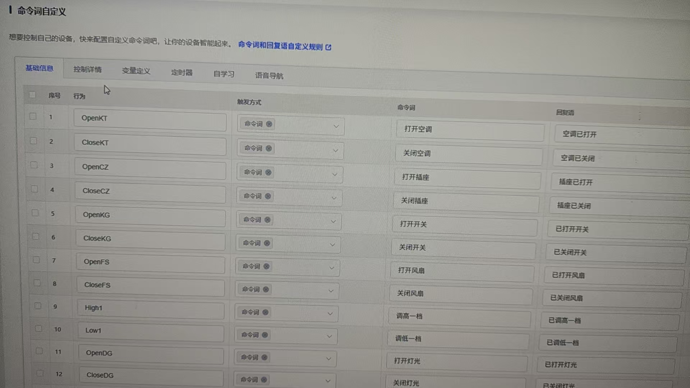

**3. 配置文件导入导出**

- 可以从官网下载预配置的JSON文件
- 导入到平台后根据需求修改命令词
- 支持导出当前配置进行备份

**4. 树莓派端编程**

- 使用Python的serial库读取串口数据
- 解析接收到的命令并控制GPIO
- 控制继电器模块驱动电器

**代码示例：**
```python
import serial
import RPi.GPIO as GPIO

ser = serial.Serial('/dev/ttyS0', 115200)
GPIO.setmode(GPIO.BCM)

# 根据串口命令控制电器
while True:
    if ser.in_waiting:
        command = ser.readline().decode()
        if '打开空调' in command:
            # 控制空调继电器
            GPIO.output(AC_PIN, GPIO.HIGH)
```

**注意事项：**

- 确保SU-03T和树莓派的串口电平匹配（3.3V）
- 语音模块独立供电，避免电源干扰
- 测试时先使用简单命令验证连接
- 继电器模块需要独立的电源驱动

---

### SU-03T与IMX6ULL开发板车牌播报集成方案

**问题描述：**

需要将SU-03T语音模块与野火IMX6ULL开发板结合，实现识别车牌后进行语音播报的功能。

**解决方案：**

**系统架构设计：**

1. **硬件连接方案**：

    - IMX6ULL开发板负责车牌识别
    - SU-03T模块负责语音播报
    - 通过串口通信实现数据传输

2. **通信接口配置**：

    - 使用UART串口连接两个模块
    - 波特率：115200 bps
    - 数据格式：16进制

**实现流程：**

1. **车牌识别阶段**：

    - IMX6ULL开发板通过摄像头捕获车牌图像
    - 使用图像识别算法处理车牌信息
    - 提取车牌号码字符串

2. **数据传输阶段**：

    - IMX6ULL将车牌号转换为特定命令格式
    - 通过串口发送给SU-03T模块
    - 发送格式：`AA 55 [车牌数据] 55 AA`

3. **语音播报阶段**：

    - SU-03T接收串口数据并解析
    - 触发对应的语音播报功能
    - 播报车牌号码或相关信息

**SU-03T配置方法：**

1. **串口输入配置**：

    - 在智能公元平台配置串口输入功能
    - 设置UART1_RX为接收模式
    - 配置帧头帧尾识别

2. **语音播报设置**：

    - 预设车牌号码播报语音
    - 或使用TTS实时生成播报内容
    - 关联串口数据与播报动作

**IMX6ULL开发端示例代码：**

```c
// 车牌播报伪代码示例
#include <stdio.h>
#include <string.h>
#include "uart.h"

void send_license_plate_to_voice(char *plate_number) {
    uint8_t tx_buffer[64];
    int index = 0;

    // 帧头
    tx_buffer[index++] = 0xAA;
    tx_buffer[index++] = 0x55;

    // 车牌数据
    strcpy((char*)&tx_buffer[index], plate_number);
    index += strlen(plate_number);

    // 帧尾
    tx_buffer[index++] = 0x55;
    tx_buffer[index++] = 0xAA;

    // 串口发送
    uart_send(tx_buffer, index);
}

int main() {
    // 初始化串口
    uart_init(115200);

    // 车牌识别成功
    char plate_number[20] = "粤A12345";

    // 发送给语音模块播报
    send_license_plate_to_voice(plate_number);

    return 0;
}
```

**硬件连接要点：**

1. **串口连接**：

    - IMX6ULL_TX → SU-03T_RX
    - IMX6ULL_RX → SU-03T_TX
    - GND共地连接

2. **电平匹配**：

    - 确认双方电平一致（3.3V）
    - 必要时增加电平转换电路
    - 串联100Ω电阻保护

3. **供电设计**：

    - SU-03T独立供电（3.6V-5.5V）
    - 避免与开发板共用电源
    - 确保供电稳定

**应用场景扩展：**

1. **停车场系统**：

    - 车辆进入时识别车牌
    - 自动播报车牌号和入场时间
    - 语音引导停车位置

2. **智能门禁**：

    - 识别授权车辆车牌
    - 语音欢迎播报
    - 异常车辆语音警告

3. **交通监控**：

    - 违章车辆车牌播报
    - 实时语音提醒
    - 数据记录和回放

**注意事项：**

- 确保串口通信协议的可靠性
- 车牌识别准确率影响整体效果
- 语音播报内容需要预先录制或TTS生成
- 建议增加数据校验机制防止传输错误
- 考虑环境噪音对语音播报的影响

---


---

### SU-03T是否支持定时闹钟功能？

**问题描述：**

希望实现定时闹钟功能，例如用户说出"8个小时后喊我起床"，设备能够在指定时间后自动语音提醒。

**解决方案：**

**支持定时器功能**

SU-03T模块支持定时器功能，可以实现定时提醒需求。

**实现方法：**

1. **配置定时器**

    - 收到"8个小时后喊我起床"命令时，启动定时器
    - 定时器设置：8小时（28800000毫秒）
    - 定时器类型：单次触发

2. **定时器超时处理**

    - 触发条件：定时器溢出
    - 执行动作：语音播报提醒内容
    - 播报内容："时间到了，该起床了"或自定义提醒语

**配置步骤：**

1. **添加命令词**

    - 命令词："X小时后喊我起床"
    - 识别后动作：开启定时器
    - 定时时间：根据识别到的数字动态设置

2. **设置定时器事件**

    - 事件类型：定时器溢出
    - 触发动作：播放指定语音
    - 支持多种提醒语选择

**具体实现方案：**

**方案一：通过平台配置实现**

1. **在智能公元平台配置**：

    - 登录智能公元平台
    - 创建SU-03T项目
    - 添加命令词："设置闹钟"
    - 配置定时器功能和播报内容

2. **参考教程资源**：

    - B站有SU-03T的完整教程
    - 搜索"SU03T的教程"可查看详细视频
    - 包含定时器配置的实际操作演示

**方案二：通过串口控制实现**

1. **外部MCU控制**：

    - 使用Arduino或其他MCU管理时间
    - 通过串口发送闹钟设置指令给SU-03T
    - SU-03T负责语音播报功能

2. **串口协议设计**：

    ```
    格式：[CMD][HH][MM][CONTENT]
    CMD: 0x01=设置闹钟, 0x02=取消闹钟
    HH: 小时（BCD码）
    MM: 分钟（BCD码）
    CONTENT: 提醒内容编号
    ```

**高级功能扩展：**

1. **多个闹钟支持**：

    - 支持设置多个不同时间的闹钟
    - 每个闹钟可设置不同的提醒语
    - 可单独取消某个闹钟

2. **重复闹钟功能**：

    - 支持设置重复模式（每天、工作日、周末）
    - 一次设置，多次触发
    - 节省重复配置的时间

3. **贪睡功能**：

    - 闹钟响后可说"再睡五分钟"
    - 自动推迟5分钟再次提醒
    - 支持多次贪睡

**实际应用场景：**

1. **厨房定时器**：

    - "30分钟后提醒我关火"
    - "1小时后提醒我查看烤箱"
    - "煲汤2小时后提醒"

2. **学习定时器**：

    - "学习45分钟后叫我休息"
    - "背诵20分钟后提醒我"
    - "考试时间到提醒交卷"

3. **生活提醒**：

    - "8小时后喊我起床"
    - "下午3点提醒我开会"
    - "每周一早上7点提醒我倒垃圾"

**注意事项：**

- SU-03T支持多个定时器同时运行
- 定时精度：毫秒级，满足日常使用需求
- 定时时间范围：根据具体需求设置，支持长时间定时
- 建议在安静环境下使用，避免误触发
- SU系列生成速度较慢，建议使用CI系列进行开发调试
- 复杂功能可考虑升级到CI-33T等更大容量的模块

**开发建议：**

- 先实现基础的定时功能
- 确认稳定后再添加高级功能
- 保留多个版本配置便于对比
- 充分测试各种时间设置场景

---


---

### SU-03T/SU-10A芯片Flash扩容对使用有什么影响？

**问题描述：**

SU-03T/SU-10A芯片进行Flash扩容操作，需要了解扩容是否对芯片使用造成影响，以及是否需要更新固件内容。

**解决方案：**

**扩容说明：**

1. **对使用无影响**：

    - Flash扩容不会对芯片的任何功能造成影响
    - 所有原有功能保持不变
    - 硬件接口和电气特性完全一致

2. **功能无区别**：

    - 扩容前后在功能上没有任何区别
    - 不影响唤醒识别、命令词处理等核心功能
    - 音频输出和串口通信保持不变

**固件建议：**

1. **推荐使用新固件**：

    - 建议在新的扩容芯片上烧录10月25日后更新的固件
    - 新版本固件已针对扩容后的硬件进行优化
    - 可以充分利用最新的技术改进

2. **固件兼容性**：

    - 旧版本固件仍可在扩容芯片上使用
    - 但无法发挥扩容后的全部优势
    - 建议升级到最新版本以获得最佳性能

**技术优势：**

- Flash扩容后可以存储更多词条或音频文件
- 为未来的功能扩展提供更大空间
- 提升产品的可扩展性和升级能力

**注意事项：**

- 扩容是硬件层面的升级，无需修改现有设计
- 如需使用扩容后的额外空间，需要重新配置固件
- 建议在批量生产前进行充分测试验证

---


---

### 关于 SU-03T 模块，其新旧版本（SU-03T vs SU-03T1）在硬件上有何区别？它们的固件兼容性如何？对于使用旧版本固件的项目，应如何操作以适配新模块？当前新旧版本的库存及发货情况是怎样的？

关于 SU-03T 模块的新旧版本问题，现为您整合核心信息如下：

**1. 硬件区别与型号定义**

- 主要升级：新版本模块（也称为 SU-03T1）的主要硬件升级在于Flash 存储器（或称内存）。
- 兼容性：新模块的引脚功能和整体产品功能与旧版本完全相同，无需修改硬件设计。
- 型号区别：

    - SU-03T：指旧版本模块，可以兼容新旧版本的固件。
    - SU-03T1：指新版本模块，只能使用新版本的固件（2024 年 10 月 25 日平台更新后生成）。

**2. 库存与发货情况**

- 旧版本库存：目前仍有旧版本（SU-03T）模块的库存，近期下单仍有可能会收到旧版本模块。
- 发货趋势：后续的发货将逐渐过渡到以新版本模块（SU-03T1）为主。建议做好新旧版本共存的准备。

**3. 固件兼容性与操作指南**
这是最关键的部分，请根据您的具体情况参考以下指南：

- 固件版本分界：以2024 年 10 月 25 日或2024 年 11 月作为新旧固件的分界线。在此日期前生成的固件为"旧固件"，之后生成的为"新固件"。
- 兼容性规则：

    - 新固件：同时兼容新旧版本模块，是推荐使用的版本。
    - 旧固件：只能在旧版本模块（SU-03T）上使用，无法直接在新版本模块（SU-03T1）上运行。
- 为旧项目适配新模块：

    - 如果您的项目使用的是旧版本固件，现在需要适配新版本模块（SU-03T1），您需要在官方烧录平台上"继承"您的旧项目。
    - 继承后，重新生成并发布固件。这个新固件将自动适配新模块。
- 烧录方式：

    - 新旧版本模块的烧录工具和烧录方法（如串口烧录）完全相同。
    - 模块出厂时为出厂程序，收到后需要自行烧录自己的应用程序固件。

**从SU-03T切换到SU-03T1的固件处理**

当库存的SU-03T模块用完后，需要采购SU-03T1模块时：

1. **固件兼容性确认**：

    - SU-03T1模块必须使用2024年10月25日后生成的新版本固件
    - 旧版本固件无法在SU-03T1上运行
    - 新版本固件同时兼容SU-03T和SU-03T1模块

2. **二次开发固件处理**：

    - 无需重新编写二次开发的固件
    - 在智能公元平台执行"继承"操作即可
    - 系统自动保留原有配置，生成兼容新模块的固件

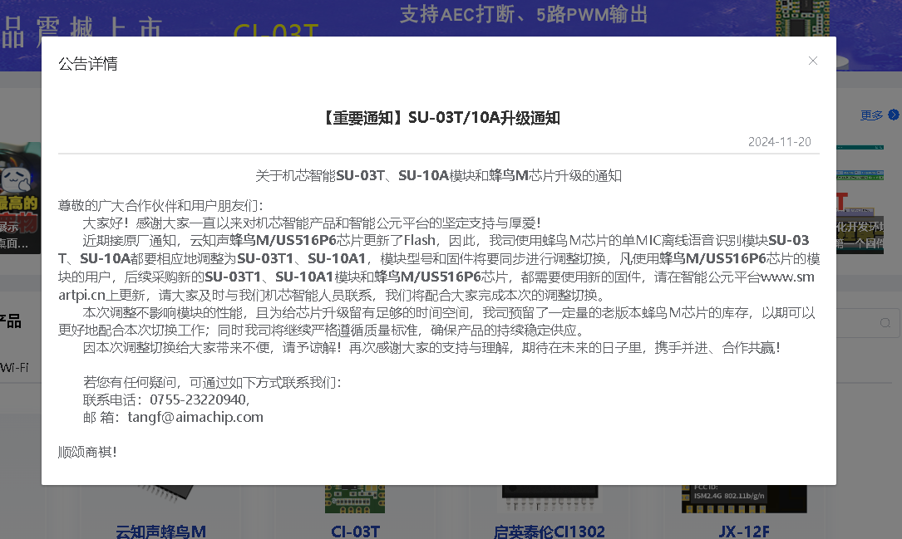

*SU-03T/SU-10A升级通知，说明Flash芯片更新导致的型号和固件调整*

**操作步骤**：

1. 登录智能公元平台
2. 找到原有项目
3. 点击"继承"按钮
4. 重新生成并下载新固件
5. 使用新固件烧录到SU-03T1模块

**总结与建议**

1. 统一固件：强烈建议所有用户，无论收到的是新模块还是旧模块，都统一使用在 2024 年 10 月 25 日之后平台生成的新版本固件，以确保最佳的兼容性和稳定性。
2. 项目升级：如果您有基于旧固件的项目，请尽快在平台执行"继承并重新生成"的操作，以获得能适配所有硬件版本的新固件。
3. 版本确认：在收到模块后，可根据实际发货版本确认所需固件。如果您需要特定的历史固件版本（如返厂重烧版本），请联系客服提供具体路径和校验值。

---


---

### SU-03T 模块的固件、配置文件（含命令词等设置）或项目能否直接导入、继承或迁移到 CI-03T 模块上使用？

不能。SU-03T 和 CI-03T 是两款完全不同的产品，它们基于不同的芯片系列和不同的 SDK（软件开发工具包）进行开发，因此固件和配置文件完全不兼容，无法直接导入、继承或迁移。
如果需要将 SU-03T 上的功能在 CI-03T 上实现，您必须：

1. 新建项目：为 CI-03T 模块创建一个全新的项目。
2. 重新配置：在 CI-03T 对应的开发平台或工具中，根据原有功能需求重新进行所有设置和配置。
3. 重新生成固件：完成配置后，为 CI-03T 编译并生成专属的固件文件。
提示：虽然整个配置文件无法直接复用，但其中的命令词等文本内容可以手动复制，这能在重新配置时为您节省一部分重复输入的工作。

---


---

### SU-03T/10A模块升级后新旧模块的兼容性如何？

**问题描述：**

由于蜂鸟M/US516P6芯片更新了Flash，导致SU-03T、SU-10A模块需要调整为SU-03T1、SU-10A1型号，需要了解升级对现有产品的影响。

**解决方案：**

**升级说明：**

1. **型号变更**：

    - SU-03T升级为SU-03T1
    - SU-10A升级为SU-10A1
    - 主要变更：Flash存储器更新

2. **硬件兼容性**：

    - 新旧版本引脚定义完全相同
    - PCB封装和电气特性保持一致
    - 无需修改现有硬件设计

**固件兼容性：**

1. **新固件兼容旧模块**：

    - 2024年11月后生成的固件兼容旧模块
    - 新平台编译的固件可烧录到旧模块
    - 推荐统一使用新版本固件

2. **旧固件不兼容新模块**：

    - 旧版本固件无法在新模块上运行
    - 新模块必须使用新版本固件
    - 需要继承项目并重新生成

**升级操作建议：**

1. **固件更新**：

    - 登录智能公元平台
    - 继承原有项目配置
    - 重新生成新版本固件

2. **生产过渡**：

    - 优先使用新版本固件
    - 确保新旧模块都能正常工作
    - 做好版本管理记录

**注意事项：**

- 公告发布后重新生成的固件都支持新模块
- 建议所有用户升级到新版本固件
- 新固件可以烧录旧芯片，旧固件不能烧录新芯片
- 如有特殊需求，可联系技术支持获取帮助

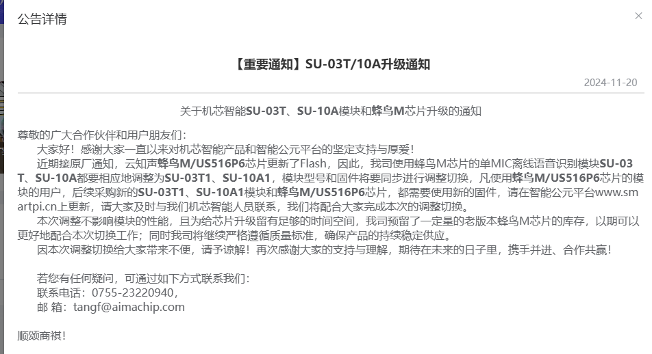

**常见问题：**

**现在平台上编译的固件，烧录到老的SU-03T模块能用吧？**

- 可以。公告发布后重新生成的固件兼容新旧版本模块
- 新固件同时支持SU-03T（旧版本）和SU-03T1（新版本）
- 推荐统一使用新版本固件以确保兼容性

**SU-03T以前的固件能继续用吗？**

- 2024年10月25日之前的旧版固件需要执行继承操作
- 登录智能公元平台后，对原有项目进行继承
- 继承后生成的固件可以继续在旧模块上使用
- 新模块则必须使用继承后生成的新版固件

---


---

### SU-03T1创建产品时语音指令型号为什么显示为03T？

**问题描述：**

使用SU-03T1模块创建产品时，在语音指令配置中发现系统显示为03T而非SU-03T1，导致困惑是否正确配置。

**解决方案：**

**平台显示说明：**

1. **产品型号标识**：

    - SU-03T1在平台中统一归类为03T系列
    - 这是正常的平台显示逻辑
    - 不影响固件生成和功能配置

2. **硬件版本识别**：

    - SU-03T1是SU-03T的升级版本
    - 主要区别在于Flash存储器更新
    - 平台通过固件生成时间区分版本

**版本对应关系：**

| 实际模块型号 | 平台显示 | 固件要求 |
|-------------|---------|----------|
| SU-03T（旧版） | 03T | 可用新旧固件 |
| SU-03T1（新版） | 03T | 必须用新固件 |

**正确操作流程：**

1. **选择产品类型**：

    - 在平台创建产品时选择"03T"
    - 这会同时兼容SU-03T和SU-03T1
    - 无需担心型号显示问题

2. **固件生成注意**：

    - SU-03T1必须使用2024年10月25日后生成的固件
    - 旧固件无法在SU-03T1上运行
    - 平台会自动根据模块适配

3. **版本确认方法**：

    - 查看模块丝印确认实际型号
    - SU-03T1模块会标注"V1.5"等版本信息
    - 固件兼容性由生成时间决定

**注意事项：**

- 平台显示"03T"是正常现象，不影响使用
- 关键是使用正确时间节点生成的固件
- SU-03T1模块必须使用新版本固件
- 如有旧项目需要"继承"并重新生成

---


---

### SU-03T如何区分同一IO口输入的无线遥控器开关信号？

**问题描述：**

使用SU-03T语音模块控制继电器时，无线遥控器的A、B两个按键信号通过同一IO口输入，如何区分这两个按键的开关信号，以实现正确的功能控制和语音提示。

**问题描述：**

无线遥控器有A、B两个按键，为互锁关系，但两个按键信号都通过同一IO口输入到SU-03T的B1口，导致开关信号无法区分，语音提示一直显示"打开了设备"。

**解决方案：**

**问题分析：**

- **信号输入方式**：A、B按键信号都通过无线收发模块输出到同一IO口
- **信号特征**：A键为开，B键为关，但都通过同一个输入引脚
- **识别局限**：SU-03T无法区分同一引脚上的不同按键信号来源

**解决方案：**

**方案一：使用两个IO口（推荐）**

1. **硬件连接**：

    ```
    无线收发模块输出口1 → SU-03T的B1口（A键信号）
    无线收发模块输出口2 → SU-03T的B2口（B键信号）
    ```

2. **平台配置**：

    - 配置B1口为"打开设备"输入
    - 配置B2口为"关闭设备"输入
    - 设置不同的语音回复："打开了设备"和"关闭了设备"

**方案二：信号编码区分**

1. **编码原理**：

    - A键输出：单脉冲信号
    - B键输出：双脉冲信号
    - 通过脉冲数量区分按键

2. **实现方式**：

    - 修改无线收发模块的输出逻辑
    - A键按下：输出一个固定宽度的脉冲
    - B键按下：输出两个连续的脉冲
    - SU-03T通过定时器或中断计数识别

**方案三：电平状态区分**

1. **电平定义**：

    - A键：输出高电平信号
    - B键：输出低电平信号
    - 需要无线模块支持不同的电平输出

2. **配置逻辑**：

    - 高电平触发：执行打开动作
    - 低电平触发：执行关闭动作
    - 添加电平变化检测避免重复触发

**实现步骤：**

1. **硬件改造**：

    - 检查无线收发模块是否有多个输出通道
    - 如只有一个输出，考虑更换为双输出模块
    - 或自行改装无线模块电路

2. **软件配置**：

    - 在智能公元平台添加输入配置
    - 设置相应的语音回复内容
    - 测试按键触发的准确性

**注意事项：**

- 同一IO口无法区分不同的信号源
- 建议优先使用方案一，通过硬件解决
- 方案二和方案三需要额外的硬件改造
- 修改后需要充分测试各种使用场景
- 确保无线信号传输的稳定性和抗干扰能力

---


---

### 如何配置SU-03T实现零上零下温度的播报功能？

**问题描述：**

需要使用SU-03T模块实现温度播报功能，能够区分零上温度和零下温度，并在播报时自动添加"零下"的描述。

**解决方案：**

**问题分析：**

SU-03T模块本身无法判断温度值的正负，需要通过主控芯片进行处理后，将结果传递给模块进行播报。

**实现方案：**

**1. 主控端温度判断**

在主控芯片（如Arduino、STM32等）中实现温度值判断逻辑：

```c
// 伪代码示例
int temperature = get_temperature(); // 获取温度值
int sign_bit = 0; // 符号位：0表示正温度，1表示负温度
int abs_temp = temperature; // 绝对值

if (temperature < 0) {
    sign_bit = 1; // 负温度
    abs_temp = -temperature; // 取绝对值
}

// 通过串口发送给SU-03T
printf("当前温度%d", abs_temp);
if (sign_bit == 1) {
    printf("零下");
}
printf("度");
```

**2. 串口通信协议设计**

设计简单的通信协议，包含温度值和符号信息：

- **协议格式**：`[温度值][符号位]`
- **温度值**：发送温度的绝对值（正值）
- **符号位**：0=正温度，1=负温度

**3. SU-03T端配置**

在智能公元平台配置播报逻辑：

1. **串口输入触发设置**：

    - 设置消息号接收温度值
    - 设置另一个消息号接收符号位

2. **播报内容配置**：

    - 正温度："当前温度{温度值}度"
    - 负温度："当前温度零下{温度值}度"

**4. 完整通信流程**

```
主控芯片读取温度 → 判断正负 → 计算绝对值 → 发送给SU-03T → SU-03T播报
```

**具体实施步骤：**

1. **主控端编程**：

    - 实现温度传感器读取
    - 添加温度正负判断逻辑
    - 通过串口发送处理后的数据

2. **平台配置**：

    - 创建串口输入触发
    - 配置不同的播报内容
    - 生成并烧录固件

3. **测试验证**：

    - 测试正温度播报（如25℃）
    - 测试负温度播报（如-5℃）
    - 验证零度边界情况

**注意事项：**

- SU-03T模块负责语音播报，温度判断需要在主控端完成
- 串口通信协议要简单明确，避免解析错误
- 建议在播报内容中加入温度单位，提高用户体验
- 考虑添加温度范围报警功能

**技术要点：**

- 主控芯片需要有足够的处理能力进行温度判断
- 串口通信波特率建议设置为9600或115200
- 温度传感器精度要根据实际需求选择
- 考虑温度变化的延迟，设置合理的更新频率

---

### SU-03T控制空调温度需要为每度设置命令吗？

**问题描述：**

询问使用SU-03T芯片控制空调调节温度时，是否需要为每个温度值设置一条独立的语音指令。

**解决方案：**

**不一定需要为每度设置独立命令，可采用以下方案：**

**1. 数字识别方案**

- **原理**：

    - SU-03T支持数字识别功能（0-99）
    - 可直接识别"温度25度"中的数字"25"
    - 通过数字变量传递温度值

- **配置方法**：

    - 添加命令词："设置温度"
    - 启用数字识别功能
    - 将识别到的数字作为温度参数

- **实现流程**：

    1. 说出："设置温度25度"
    2. SU-03T识别"设置温度"命令
    3. 提取数字"25"作为温度值
    4. 通过串口发送"25"给空调控制器

**2. 范围指令方案**

- **温度区间控制**：

    - "制冷模式"：设置为24-26度
    - "节能模式"：设置为26-28度
    - "睡眠模式"：设置为28-30度

- **调整指令**：

    - "温度调高一度"：当前温度+1
    - "温度调低一度"：当前温度-1
    - "温度调高两度"：当前温度+2

**3. 混合控制方案**

- **精确控制**：

    - 数字识别 + 确认指令
    - 例："设置25度" → "确认设置"
    - 提高控制准确性

- **快速调节**：

    - 基础温度设置（如25度）
    - 配合微调指令（高一度/低一度）

**技术实现要点：**

- **数字识别配置**：

    - 在平台启用数字识别（0-99）
    - 设置识别置信度阈值
    - 测试不同口音的识别效果

- **串口通信协议**：

    - 定义发送格式：`TEMP:XX`
    - XX为识别到的温度值
    - 空调控制器解析并执行

- **反馈机制**：

    - SU-03T播报："温度已设置为XX度"
    - 确认设置成功或失败

**注意事项：**

- 数字识别范围0-99，满足温度控制需求
- 建议同时配置单位和确认机制
- 可根据实际需求选择控制精度
- 测试时验证数字识别的准确率

---


---

### SU-03T新手套装继电器始终为低电平怎么办？

**问题描述：**

使用SU-03T新手套装时，成功烧录固件并能识别语音指令，但继电器始终处于低电平状态，无法执行开关灯带等控制操作。

**解决方案：**

**问题分析：**

继电器始终处于低电平，通常是由于以下原因：

1. **GPIO配置错误**
2. **判断条件设置不当**
3. **硬件连接问题**
4. **控制逻辑冲突**

**排查步骤：**

1. **检查Pin脚配置**

    - 确认GPIO_A25已正确配置为输出模式
    - 检查默认电平设置是否正确
    - 验证引脚没有被其他功能占用

2. **检查控制详情设置**

    - 查看"打开灯带"命令的关联动作
    - 确认设置为GPIO_A25输出高电平
    - 检查是否有额外的判断条件

3. **检查判断条件**

    - 查看红色圆圈中的判断条件设置
    - 确认没有设置阻碍输出高电平的条件
    - 移除不必要的判断条件


*Pin脚配置界面，显示各引脚的功能分配*


*命令词自定义界面，显示基础信息设置*


*控制详情界面，显示语音指令与GPIO的关联*

**解决方法：**

1. **重新配置GPIO**

    ```
    步骤：

    1. 进入智能公元平台
    2. 选择GPIO配置页面
    3. 找到GPIO_A25
    4. 设置为"输出模式"
    5. 默认电平设为"低电平"
    6. 保存配置
    ```

2. **重新设置命令词**

    ```
    步骤：

    1. 进入命令词自定义页面
    2. 编辑"打开灯带"命令
    3. 在控制详情中设置：

        - 动作类型：GPIO输出
        - 引脚选择：GPIO_A25
        - 输出电平：高电平
    4. 同样设置"关闭灯带"为低电平
    5. 生成并烧录新固件
    ```

3. **简化控制逻辑**

    - 移除所有额外的判断条件
    - 使用最简单的GPIO输出控制
    - 确保命令与动作直接对应

**硬件检查：**

1. **连接验证**

    - 使用万用表测量GPIO_A25引脚电压
    - 发出"打开灯带"指令
    - 观察电压是否从0V变为3.3V

2. **继电器检查**

    - 检查继电器模块的触发类型
    - 确认是高电平触发还是低电平触发
    - 验证继电器供电是否正常

**常见问题处理：**

1. **GPIO无输出**
    - 检查引脚配置是否保存
    - 重新生成并烧录固件
    - 尝试使用其他GPIO引脚

2. **继电器不动作**
    - 确认继电器供电电压（5V）
    - 检查继电器线圈是否完好
    - 验证控制信号是否到达继电器

3. **语音识别正常但无响应**
    - 检查命令词配置是否生效
    - 确认固件版本兼容性
    - 测试其他命令词是否正常

**注意事项：**

- SU-03T的GPIO输出为3.3V电平
- 继电器模块通常需要5V供电
- 确保GND连接良好，共地是正常工作的基础
- 修改配置后必须重新生成固件并烧录

**调试建议：**

1. 先使用简单命令测试（如单路控制）
2. 保留配置截图便于对比
3. 使用万用表或逻辑分析仪验证信号
4. 问题解决后再逐步添加复杂功能

---

### 如何实现语音播报课程功能？

**问题描述：**

希望实现一个基于语音的课程播报系统，能够根据星期几播报对应课程信息，并支持多条语音播报的拼接。

**解决方案：**

**功能实现方案：**

1. **整体架构设计**：

    - 使用主控芯片（如Arduino）管理星期和课程信息
    - 通过串口发送指令到语音模块
    - 语音模块接收指令后播报对应内容

2. **串口通信方式**：

    - 支持发送字符串指令
    - 指令格式：[命令词]
    - 可动态发送任意课程名称

**实现步骤：**

**步骤1：语音模块配置**

1. 在智能公元平台设置命令词：

    - 命令词1："播报今天课程"
    - 回复语：等待课程信息
    - 命令词2："播报上午课程"
    - 回复语：等待上午课程
    - 命令词3："播报下午课程"
    - 回复语：等待下午课程

2. 配置串口接收功能：

    - 启用串口命令识别
    - 设置串口波特率（如9600）
    - 配置串口触发播报

**步骤2：主控程序设计**

```
// 课程表结构示例
String weekCourses[7][10] = {
    // 星期一的课程
    {"数学", "语文", "英语", "物理", "化学", "音乐", "体育"},
    // 星期二的课程
    {"语文", "数学", "物理", "英语", "化学", "生物", "自习"},
    // ... 其他天的课程
};

void setup() {
    Serial.begin(9600);  // 串口初始化
    voiceSerial.begin(9600);  // 语音模块串口
}

void loop() {
    // 检测星期几（可通过RTC或手动设置）
    int weekday = getWeekday();

    // 当需要播报课程时
    if (needReportCourse) {
    reportTodayCourses(weekday);
    needReportCourse = false;
    }
}

void reportTodayCourses(int weekday) {
    // 发送今天有课
    voiceSerial.print("[今天有课]");
    delay(2000);

    // 逐个播报课程
    for (int i = 0; i < 10; i++) {
    if (weekCourses[weekday][i] != "") {
        // 发送课程名称
        voiceSerial.print("[" + weekCourses[weekday][i] + "]");
        delay(1500);
    }
    }
}
```

**步骤3：语音播报拼接配置**

1. **多条语音拼接方法**：

    - 方案一：发送多个独立的语音指令
    - 方案二：使用带连接词的复合指令
    - 方案三：在平台配置中设置拼接规则

2. **具体实现**：
    ```
    // 播报"上午有数学课"
    voiceSerial.print("[上午有]");
    delay(500);
    voiceSerial.print("[数学]");
    delay(500);
    voiceSerial.print("[课]");

    // 或者发送完整句子
    voiceSerial.print("[上午有数学课]");
    ```

**应用场景扩展：**

1. **定时播报**：

    - 添加RTC时钟模块
    - 设置定时提醒时间
    - 自动播报即将开始的课程

2. **交互查询**：

    - 语音查询："今天有什么课？"
    - 模块回复当天课程表
    - 可询问具体时间段的课程

3. **修改功能**：

    - 通过串口或APP更新课程表
    - 支持临时课程调整
    - 周末课程和平时课程区分

**优化建议：**

1. **语音效果优化**：

    - 在平台配置自然的语音播报
    - 添加适当的停顿时间
    - 使用语音合成参数调整语速

2. **存储管理**：

    - 使用EEPROM存储课程表
    - 支持断电保存
    - 提供恢复默认设置功能

3. **用户交互**：

    - 支持语音指令更新课程
    - 添加确认机制避免误操作
    - 提供播报音量调节

**注意事项：**

- 确保串口通信参数匹配
- 合理设置语音播报间隔时间
- 课程表变更需要重新配置语音模块
- 保留默认课程表作为备份

**教学资源：**

- SU-03T串口教程：B站搜索相关视频
- 智能公元平台使用指南
- Arduino语音控制示例代码

---


---


---

### 声控灯功能可以实现吗？

**问题描述：**

咨询使用公司提供的离线语音识别芯片是否可以实现声控灯功能。

**解决方案：**

**可行性确认：**

离线语音识别芯片完全可以实现声控灯功能，技术成熟且应用广泛。

**实现方案：**

1. **基础功能实现**：

    - **语音控制开关**：通过语音命令控制灯具开关
    - **亮度调节**：支持"调亮"、"调暗"、"最大亮度"、"最小亮度"等命令
    - **色温调节**：支持"暖白光"、"冷白光"、"切换色温"等功能
    - **场景模式**：支持"阅读模式"、"睡眠模式"、"聚会模式"等预设

2. **硬件连接方案**：

    ```
    语音模块 ── GPIO ──> LED驱动电路 ──> LED灯具
                │
                └─ PWM ──> 调光控制
    ```

3. **模块选型建议**：

    - **CI-03T系列**：性价比高，功能丰富，适合大多数应用
    - **SU-03T系列**：成本低，适合简单的开关控制
    - **SU-32T**：支持150条命令，适合功能复杂的智能灯具

**配置步骤：**

1. **平台配置**：

    - 登录智能公元平台
    - 创建产品并选择合适的模块型号
    - 配置唤醒词（如"小灯小灯"、"智能管家"等）

2. **命令词设置**：

    - 基础控制：开灯、关灯、暂停、继续
    - 亮度控制：调亮、调暗、最亮、最暗
    - 场景模式：阅读、睡眠、派对、浪漫
    - 定时功能：定时关灯、延时关闭

3. **输出配置**：

    - **GPIO输出**：直接控制LED开关
    - **PWM输出**：实现亮度无级调节
    - **串口输出**：控制智能LED驱动器

**实际应用示例：**

- **卧室台灯**：

    - 唤醒词："晚安助手"
    - 命令：开灯、关灯、调暗一点、睡眠模式

- **客厅吸顶灯**：

    - 唤醒词："智能家居"
    - 命令：开灯、最大亮度、阅读模式、聚会模式

- **智能台灯**：

    - 支持自然语言控制
    - 多级亮度精确调节
    - 记忆用户使用习惯

**技术优势：**

- **响应快速**：本地识别，无网络延迟
- **隐私安全**：数据不上传，保护用户隐私
- **稳定可靠**：不受网络影响，离线也能使用
- **功耗低**：待机功耗低，适合长时间使用

**注意事项：**

- 选择合适的麦克风位置，确保拾音效果
- 考虑灯具的最大功率，选择合适的驱动方案
- 预留足够的散热空间，特别是大功率LED
- 建议加入手动控制开关作为备用

**扩展功能：**

- **定时功能**：支持定时开关和倒计时
- **记忆功能**：记住上次使用的亮度设置
- **感应联动**：配合光感传感器实现自动调节
- **APP控制**：可选配手机APP进行远程控制

---


---

### 如何在SU-03T上设置继电器快速点动两次？

**问题描述：**

需要在SU-03T无线2设备版上设置继电器实现快速点动两次，产生高低高低的电平信号，从而触发PLC启动设备。

**解决方案：**

**实现思路：**

通过配置定时器来实现快速点动功能，让继电器在短时间内输出高低高低的电平变化。

**配置步骤：**

1. **使用定时器控制**：

    - 设置定时器时间间隔为较短值（如100ms）
    - 通过定时器触发实现电平切换
    - 配置多个定时器级联实现连续动作

2. **平台配置方法**：

    - 在智能公元平台添加控制逻辑
    - 设置GPIO输出为脉冲模式
    - 配置两次脉冲输出，间隔时间短

3. **实现方式**：

    **方案一：定时器级联**

    - 第一个定时器：输出高电平
    - 第二个定时器：延时后输出低电平
    - 第三个定时器：再次输出高电平
    - 第四个定时器：最后输出低电平

    **方案二：使用脉冲功能**

    - 配置GPIO为脉冲输出模式
    - 设置脉冲次数为2次
    - 调整脉冲宽度和间隔时间

**注意事项：**

- 定时器时间需根据PLC响应要求调整
- 确保继电器工作电压与模块输出电平匹配
- 建议使用光耦隔离保护模块IO口
- 测试时可用示波器观察输出波形

---


---

### SU-03T的固件生成和免唤醒词配置

**问题描述：**

需要在智能公元平台上生成固件，并了解免唤醒词是否可以自定义修改。

**解决方案：**

**固件生成方法：**

1. **进入发布版本页面**：

    - 登录智能公元平台：https://www.smartpi.cn/#/
    - 完成所有配置后，进入"发布版本"页面
    - 点击生成固件即可下载BIN文件

2. **免唤醒词配置**：

    - 免唤醒词可以自定义修改
    - 在免唤醒词配置界面选择需要的命令词
    - 总条数不能超过10条
    - 不能与唤醒词或命令词重复

3. **配置界面说明**：

    - 左侧为可选命令词列表
    - 右侧为已选择的免唤醒词
    - 可从预置选项中选择或自定义添加

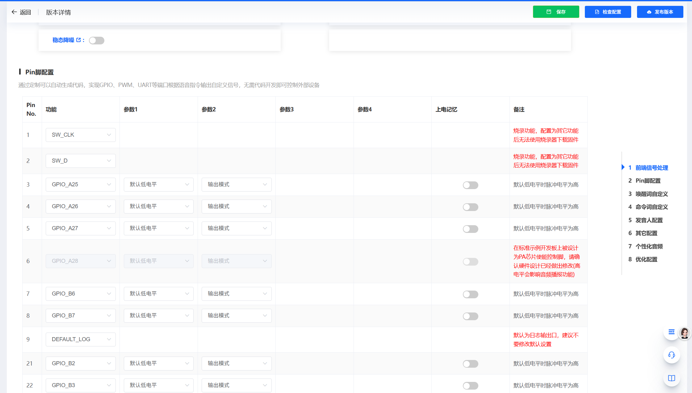

*Pin脚配置界面，显示各引脚的功能分配*


*免唤醒词配置界面，可选择并添加免唤醒命令词*

**注意事项：**

- 免唤醒词无需唤醒即可直接识别
- 建议选择常用且不易误触的词语
- 生成固件前需确认所有配置正确
- 免唤醒词过多可能影响识别准确率

---


---

### 如何获取SU-03T的配置软件和教程？

**问题描述：**

需要获取用于配置SU-03T模块的软件工具和相关教程。

**解决方案：**

**配置平台获取：**

1. **智能公元平台**：

    - 访问地址：https://www.smartpi.cn/#/
    - 在此平台上可完成所有配置工作
    - 支持在线配置和固件生成

2. **教学视频资源**：

    - B站教程视频：https://space.bilibili.com/1903518159
    - 搜索"SU03T的教程"查看详细操作
    - 包含从入门到进阶的完整教程

**使用建议：**

- 先观看教学视频了解基本操作
- 在平台上创建测试项目进行练习
- 参考官方文档获取更多技术细节
- 遇到问题可查看FAQ或寻求技术支持

---


---

### 如何设置禁止超时退出唤醒功能？

**问题描述：**

需要设置禁止退出唤醒功能，防止设备在唤醒后因超时而自动退出。

**解决方案：**

**设置步骤：**

1. **进入控制详情页面**：

    - 在智能公元平台进入设备控制设置
    - 点击"添加控制"按钮

2. **配置控制参数**：

    - 行为：选择相应的唤醒行为
    - 控制方式：选择"系统设置"
    - 类别：选择"识别控制"
    - 操作：选择"禁止超时退出唤醒"

3. **保存配置**：

    - 设置是否延时为"否"
    - 保存控制配置
    - 重新生成并烧录固件

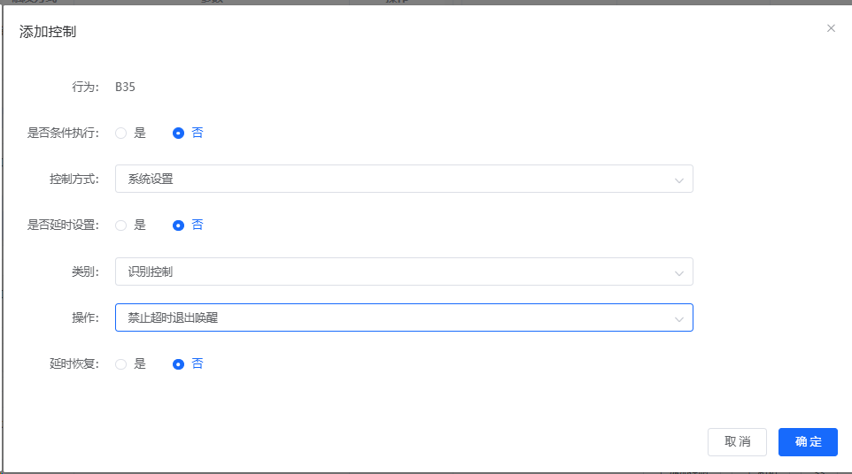

*添加控制界面，配置禁止超时退出唤醒功能*

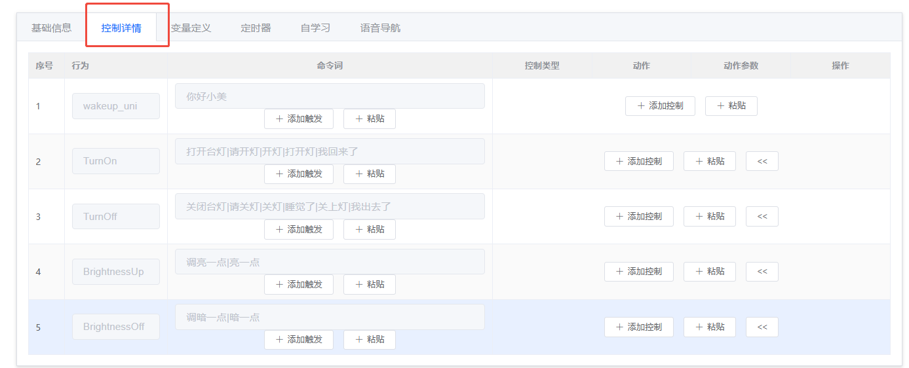

*控制详情页面，显示已配置的控制项列表*

**功能说明：**

- 启用后，设备唤醒后不会因超时而自动退出
- 适用于需要长时间交互的应用场景
- 可通过其他命令或条件手动控制退出

**注意事项：**

- 长时间保持唤醒状态会增加功耗
- 建议配合其他控制逻辑使用
- 测试时注意观察设备工作状态

---


---

### SU-03T模块的串口通信引脚和波特率配置

**问题描述：**

需要了解SU-03T模块的对外通信引脚定义和默认波特率设置。

**解决方案：**

**引脚定义：**

1. **串口通信引脚**：

    - **对外通信**：B0（TX）、B1（RX）
    - **固件烧录**：B6（RX）、B7（TX）
    - **注意**：SU-03T只有一路串口

2. **硬件连接**：

    ```
    主控TX → SU-03T B1（RX）
    主控RX → SU-03T B0（TX）
    GND共地连接
    ```

**波特率配置：**

1. **默认波特率**：

    - 出厂默认：9600 bps
    - 可在平台自定义设置
    - 常用波特率：9600、115200

2. **配置方法**：

    - 在智能公元平台的串口配置中设置
    - 生成固件时生效
    - 通信双方需保持一致

**串口配置图示：**

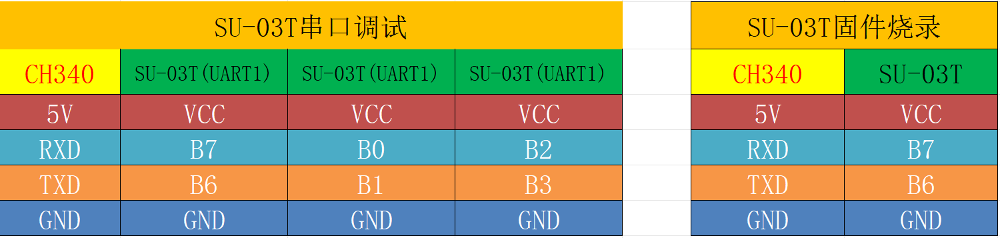

*SU-03T模块的串口调试和固件烧录引脚配置表*

**注意事项：**

- B6、B7专门用于固件烧录
- B0、B1可用于对外通信
- 配置为串口功能后，B6、B7也可用于烧录
- 确保电平匹配，必要时加电平转换电路

---


---

### SU-23T烧录失败如何处理？

**问题描述：**

SU-23T芯片在使用USS13U61生产工具烧录时，出现"[ERROR]: Command Execute Failed"错误，导致烧录失败。

**解决方案：**

**问题排查：**

1. **取消量产模式**：

    - 在USS13U61烧录工具中
    - 取消勾选"量产模式"选项
    - 重新尝试烧录

2. **检查硬件连接**：

    - 确认烧录引脚连接正确
    - 检查电源供电是否稳定
    - 验证串口通信正常

3. **烧录工具设置**：

    - 下载模式：SIP-NOR-FLASH
    - 串口波特率：1000000
    - 确保COM口选择正确

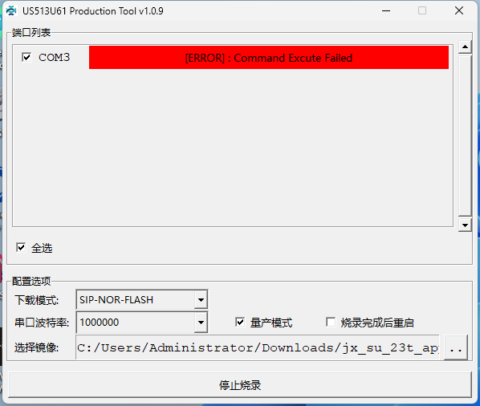

*USS13U61烧录工具显示Command Execute Failed错误*

**烧录文档参考：**

- 下载SU-23T烧录文档.docx
- 查看详细的烧录步骤和注意事项
- 按照文档要求进行操作

**常见错误处理：**

1. **红色错误提示**：

    - 检查芯片是否正常供电
    - 确认烧录工具版本兼容
    - 尝试更换USB端口或电脑

2. **命令执行失败**：

    - 降低波特率重试
    - 检查固件文件完整性
    - 重新安装烧录驱动

**注意事项：**

- 确保使用正确的烧录工具版本
- 烧录过程中不要断开连接
- 建议在烧录前备份原固件
- 如持续失败，请联系技术支持

---


---

### 在智能公元平台是否需要虚拟机来修改继电器动作？

**问题描述：**

询问在智能公元平台上修改继电器动作是否需要下载安装虚拟机并从虚拟机上重新编写程序。

**解决方案：**

**操作说明：**

不需要使用虚拟机，所有配置都可以在智能公元平台上直接完成。

**正确操作流程：**

1. **登录平台**：

    - 访问：https://www.smartpi.cn/#/
    - 使用账号密码登录

2. **修改继电器配置**：

    - 进入相应项目
    - 找到继电器控制配置
    - 直接在界面上修改动作设置

3. **生成固件**：

    - 保存配置修改
    - 点击发布版本生成新固件
    - 下载并烧录到模块

**优势说明：**

- 在线配置，无需安装任何软件
- 可视化界面，操作简单直观
- 实时预览，所见即所得
- 云端保存，数据不丢失

**注意事项：**

- 修改配置后需重新生成固件
- 确保网络连接稳定
- 建议保留项目备份
- 复杂逻辑可先在测试项目验证

---


---

### 如何在智能公元平台设置控制逻辑实现两次脉冲输出？

**问题描述：**

需要在智能公元平台中设置一个控制逻辑，使其在满足条件时执行两次脉冲输出操作。

**解决方案：**

**配置方法：**

1. **添加控制逻辑**：

    - 进入控制详情页面
    - 点击"添加控制"
    - 设置触发条件

2. **配置输出参数**：

    - 行为：选择对应的行为（如TurnOn1）
    - 控制方式：选择"端口输出"
    - 控制类型：选择对应的GPIO引脚
    - 是否超时输出：选择"是"
    - 动作：选择"设置电平"
    - 参数：选择"反电平"或"正电平"

3. **实现两次脉冲**：

    **方案一：添加多个控制**

    - 第一个控制：输出正电平脉冲
    - 第二个控制：延时后输出反电平
    - 第三个控制：再次输出正电平
    - 第四个控制：最后输出反电平

    **方案二：使用定时器**

    - 设置脉冲2次功能
    - 配置脉冲间隔时间
    - 设置脉冲宽度

**实现示例：**

```
控制1：

- 条件：识别到特定命令
- 动作：GPIO_B3输出高电平
- 延时：100ms

控制2：

- 条件：控制1执行后
- 动作：GPIO_B3输出低电平
- 延时：100ms

控制3：

- 条件：控制2执行后
- 动作：GPIO_B3输出高电平
- 延时：100ms

控制4：

- 条件：控制3执行后
- 动作：GPIO_B3输出低电平
```

**注意事项：**

- 脉冲间隔时间需根据实际需求调整
- 确保GPIO引脚未被其他功能占用
- 测试时可用示波器观察输出波形
- 逻辑设计需考虑时序关系

---


---

### SU-3T模块烧录和供电配置

**问题描述：**

需要了解SU-3T模块的Bin文件下载接口引脚定义以及CH340芯片的工作电源电压。

**解决方案：**

**烧录接口引脚：**

1. **烧录引脚定义**：

    - VCC：电源正极（3.3V-5V）
    - GND：电源地
    - B6：烧录RX（接收数据）
    - B7：烧录TX（发送数据）

2. **连接方式**：

    ```
    烧录工具 B6 → 模块 B7（TX）
    烧录工具 B7 → 模块 B6（RX）
    烧录工具 GND → 模块 GND
    ```

**CH340供电配置：**

1. **工作电源**：

    - CH340芯片工作电压：5V
    - 需要外部提供5V稳定电源
    - 不要使用3.3V供电

2. **电源连接**：

    - USB转串口模块通常通过USB提供5V
    - 确保USB口供电充足
    - 必要时使用外部5V电源

**注意事项：**

- 确认模块和烧录工具共地
- B6、B7专用于固件烧录
- 烧录时模块需正常供电
- CH340使用5V电源，不要接3.3V

---

### 按键可以控制舵机但语音无法控制

**问题描述：**

使用语音模块时，物理按键可以正常控制舵机动作，但语音指令无法触发舵机控制，需要排查语音控制逻辑的问题。

**解决方案：**

**问题分析：**

根据代码分析，问题出现在语音控制的逻辑处理上：

1. **按键控制正常**：`Key_GetNum()`函数正确读取按键输入
2. **语音中断触发**：UART1中断接收数据0x29/0x30，设置`sr`变量
3. **逻辑判断缺陷**：主循环未正确处理`sr == 2`的情况

**修复方案：**

**方法一：修改主循环逻辑**

```c
// 修改前的问题代码
if (KeyNum == 1 || sr == 1) {
    // 处理开启
} else if (KeyNum == 2) {
    // 处理关闭，缺少sr==2的判断
}

// 修正后的代码
if (KeyNum == 1 || sr == 1) {
    speed = 60;
    sr = 0;  // 清除语音触发标志
    Servo_setSpeed(speed);
    delay_ms(200);
} else if (KeyNum == 2 || sr == 2) {
    speed = 0;
    sr = 0;  // 清除语音触发标志
    Servo_setSpeed(0);
    delay_ms(200);
}
```

**方法二：统一控制接口**

```c
// 定义统一的控制函数
void servo_control(int cmd) {
    switch(cmd) {
        case 1:  // 开启命令
            speed = 60;
            Servo_setSpeed(speed);
            break;
        case 2:  // 关闭命令
            speed = 0;
            Servo_setSpeed(0);
            break;
    }
    delay_ms(200);
}

// 主循环中统一处理
if (KeyNum == 1 || sr == 1) {
    servo_control(1);
    sr = 0;  // 及时清除标志
} else if (KeyNum == 2 || sr == 2) {
    servo_control(2);
    sr = 0;  // 及时清除标志
}
```

**UART中断优化：**

```c
void USART1_IRQHandler(void) {
    if (USART_GetITStatus(USART1, USART_IT_RXNE) != RESET) {
        uint8_t data = USART_ReceiveData(USART1);

        // 设置控制命令并清除旧状态
        if (data == 0x29) {
            sr = 1;  // 开启命令
        } else if (data == 0x30) {
            sr = 2;  // 关闭命令
        }
    }
}
```

**调试建议：**

1. **添加调试输出**：
    ```c
    printf("KeyNum=%d, sr=%d\n", KeyNum, sr);
    ```

2. **检查变量作用域**：

    - 确认`sr`变量定义为全局变量
    - 检查是否有其他地方修改了`sr`的值

3. **验证中断触发**：

    - 在UART中断中添加LED指示
    - 使用示波器检查串口数据

**注意事项：**

- 语音控制标志`sr`在使用后必须及时清零
- 避免标志位状态污染导致的功能异常
- 建议使用枚举定义命令类型，提高代码可读性
- 测试时先验证单个功能，再组合测试

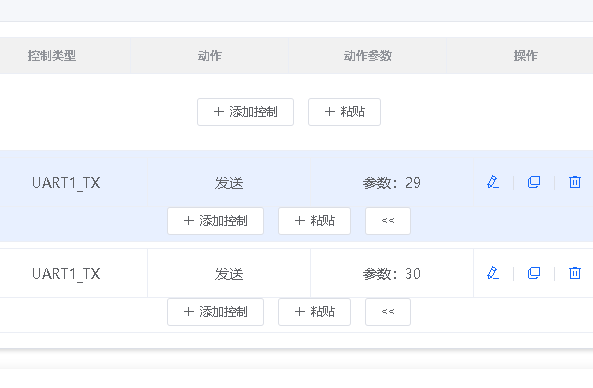

*智能公元平台配置UART1_TX输出参数，0x29和0x30分别对应开启和关闭*

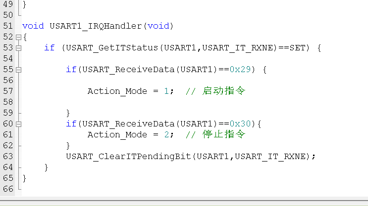

*UART1中断服务程序，接收0x29设置sr=1，接收0x30设置sr=2*

---

### SU-03T控制舵机间歇性不动作且发热怎么办？

**问题描述：**

舵机在接通电源时短暂动作，但后续无法响应语音指令，且程序发送特定数据时出现异常，舵机还会出现发热问题。

**解决方案：**

**1. 舵机发热问题排查**

    - 正常工作的舵机不会发热
    - 发热说明舵机持续通电或卡死
    - 可能原因：供电不足、信号异常或舵机故障
    - 建议更换新舵机测试

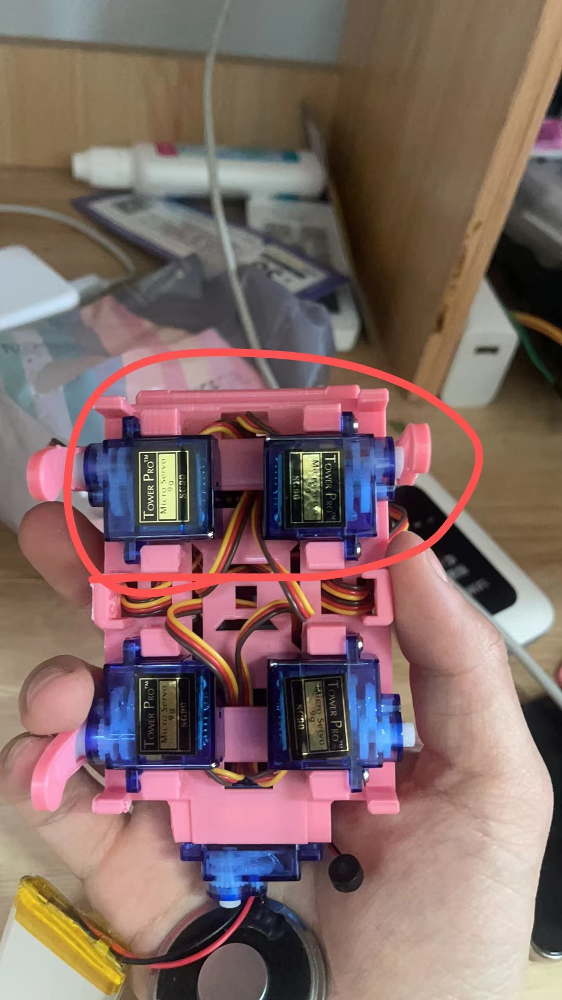

**2. 数据发送异常处理**

    - 检查代码逻辑，避免发送0x00数据
    - 发送0可能导致模块播报字头而非正常数据
    - 添加数据判断，跳过0值发送

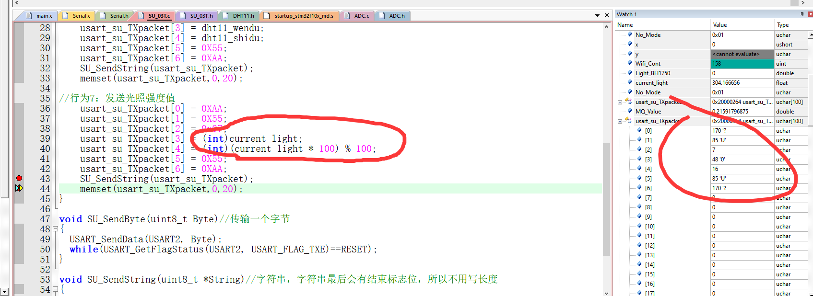

**3. 硬件连接检查**

    - 确认串口引脚配置正确
    - 检查UART1_TX设置是否为9600波特率
    - 验证接线是否牢固无虚焊

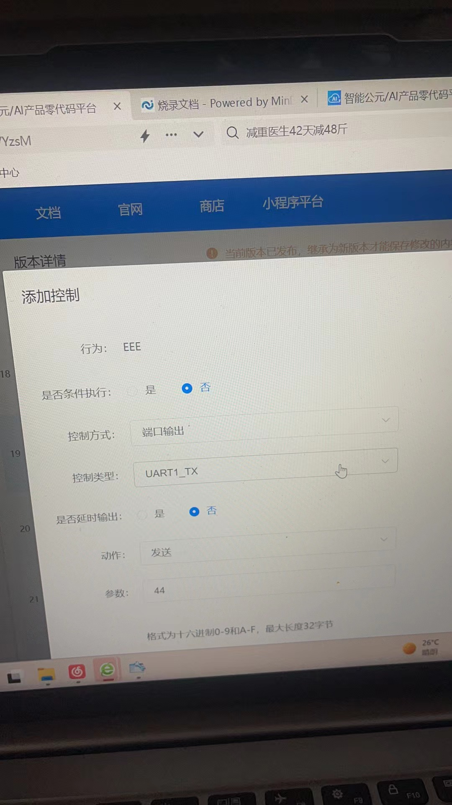
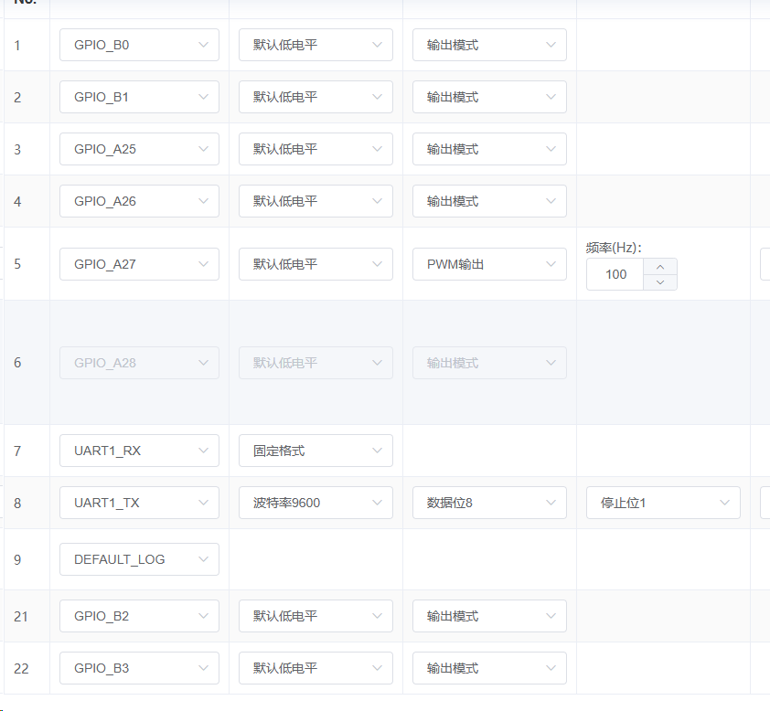

**4. 供电问题排查**

    - 给语音模块单独供电测试
    - 查看串口是否有数据输出
    - 如有数据则是供电问题导致

**5. 舵机位置检查**

    - 确认舵机初始位置安装正确
    - 舵机位置不对可能导致无法转动
    - 可手动掰动舵机测试其灵活性

**注意事项：**

- 发热的舵机会影响整个系统稳定性
- 代码逻辑错误会导致持续发送错误数据
- 建议使用示波器检查串口信号质量

---

### SU-03T控制舵机只能通电时动一下怎么办？

**问题描述：**

舵机只在接通电源瞬间动作一下，之后无法响应语音指令，但用蓝牙控制可以正常工作。

**解决方案：**

**1. 串口数据确认**

    - 使用串口助手查看语音模块是否发送数据
    - 确认命令词触发后是否有串口输出
    - 检查数据格式是否正确

**2. 接线对比测试**

    - 对比蓝牙接线和语音模块接线的差异
    - 确认TX/RX线序正确
    - 检查GND是否共地

**3. 固件问题排查**

    - 确认使用的是否为正确的固件版本
    - 某些固件可能存在串口通信bug
    - 尝试使用官方推荐固件

**注意事项：**

- 蓝牙能控制说明舵机和主控正常
- 重点排查语音模块的串口输出功能
- 保留完整的调试日志便于分析

---

### 如何实现一个指令控制两个继电器点动？

**问题描述：**

需要通过一个语音指令控制两个继电器进行点动（短暂通电后断开）操作，且两个继电器的点动时间需要不同。

**解决方案：**

**1. 修改代码逻辑**

    - 在语音指令的执行代码中添加两个继电器的控制
    - 为每个继电器设置不同的延时时间
    - 使用delay()函数控制通电时间

**2. 代码示例**
```c
void ControlRelaysWithDifferentDelays() {
    // 控制继电器1点动，延时100ms
    digitalWrite(RELAY1_PIN, HIGH);
    delay(100);
    digitalWrite(RELAY1_PIN, LOW);

    // 控制继电器2点动，延时200ms
    digitalWrite(RELAY2_PIN, HIGH);
    delay(200);
    digitalWrite(RELAY2_PIN, LOW);
}
```

**3. 配置语音指令**

    - 在智能公元平台创建新的语音指令
    - 将指令与上述函数关联
    - 生成并烧录新固件

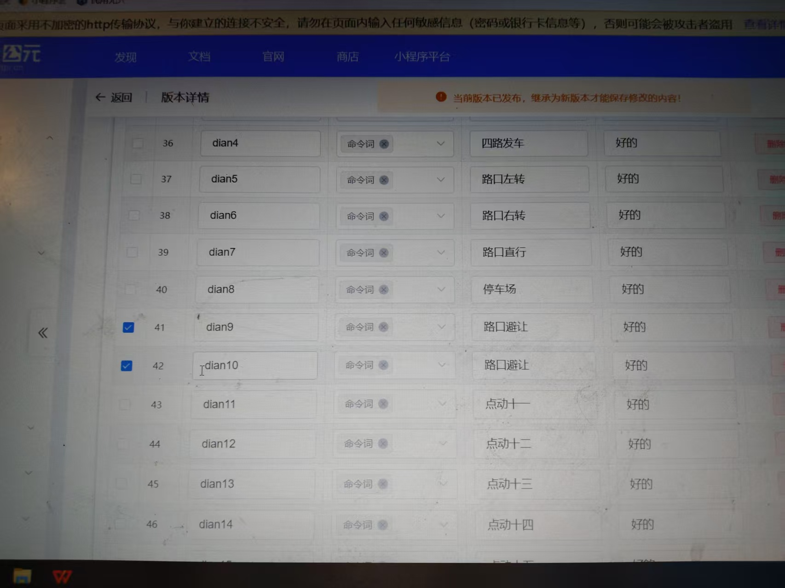

**注意事项：**

- 确保继电器驱动电路能提供足够电流
- 两个继电器不要同时动作避免电流过大
- 修改后需要重新编译并烧录固件

---

### 智能衣柜语音模块舵机不动作怎么办？

**问题描述：**

语音模块能正常响应唤醒词和指令，但连接的舵机和指示灯没有动作，语音识别正常但外设无响应。

**解决方案：**

**排查步骤：**

1. **检查串口数据输出**：

    - 使用CH340连接语音模块
    - 打开XCOM串口助手，波特率9600
    - 测试语音指令时是否有数据输出
    - 如无数据输出，说明模块未正常工作

2. **供电问题排查**：

    - 检查语音模块供电是否稳定（5V）
    - 测量舵机供电电压是否足够
    - 舵机单独供电时电流需求较大（约500-800mA）
    - 可能需要外部电源独立供电

3. **硬件连接检查**：

    ```
    语音模块    CH340/ESP32
    TX0     →   RX (GPIO16)
    RX0     →   TX (GPIO17)
    GND     →   GND
    5V      →   5V
    ```

    - 确认串口线序正确
    - 检查舵机信号线连接
    - 舵机电源线连接牢固

**常见问题及解决：**

1. **舵机供电不足**：

    - 症状：舵机轻微抖动但不转
    - 解决：使用外部5V/2A电源给舵机供电
    - 或使用带电源的舵机驱动板

2. **ESP32代码逻辑问题**：

    - 检查串口读取代码是否正确
    - 验证数据解析逻辑
    - 添加调试输出确认数据接收

    ```cpp
    void loop() {
        if (Serial.available()) {
        String cmd = Serial.readString();
        Serial.print("Received: ");
        Serial.println(cmd);  // 调试输出

        if (cmd == "open") {
            digitalWrite(ledPin, HIGH);
            servo.write(90);  // 打开柜门
            delay(1000);
        } else if (cmd == "close") {
            digitalWrite(ledPin, LOW);
            servo.write(0);   // 关闭柜门
            delay(1000);
        }
        }
    }
    ```

3. **模块配置问题**：

    - 确认平台中已配置串口输出
    - 检查指令触发条件
    - 验证输出数据格式

**调试建议：**

1. **分步测试**：

    - 先测试LED是否能亮（验证基本控制）
    - 再测试舵机是否能转（验证执行器）
    - 最后测试完整流程

2. **使用示波器**：

    - 检查PWM信号是否正常输出到舵机
    - 验证信号幅度和周期

3. **简化测试**：

    - 使用最简单的指令（如单字符）
    - 去掉复杂的逻辑判断
    - 逐步添加功能

**注意事项：**

- 舵机和语音模块建议分开供电
- 串口通信线要短，避免干扰
- 舵机角度范围通常是0-180度
- 长时间测试注意舵机发热


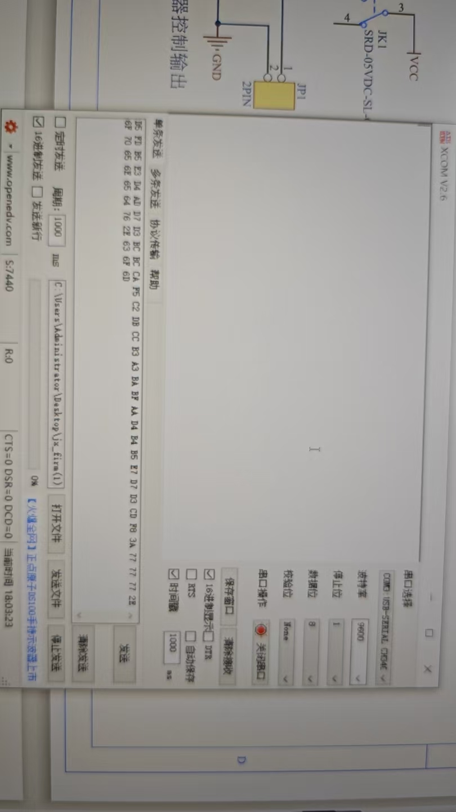

---

### 语音模块舵机供电不足怎么办？

**问题描述：**

使用语音模块时，舵机供电不足导致无法正常工作，且语音识别功能在舵机运行时失效，需要排查供电问题。

**解决方案：**

**供电问题分析：**

1. **电流需求计算**：

    - 语音模块工作电流：约50-100mA
    - SG90舵机堵转电流：500-800mA
    - 总电流需求：600-900mA（峰值）
    - USB口供电能力：通常500mA（可能不足）

2. **供电不足表现**：

    - 舵机转动无力或抖动
    - 语音模块复位或重启
    - 串口数据传输异常
    - 整体系统不稳定

**供电方案：**

1. **使用外部电源**：

    ```
    外部5V/2A电源适配器
        ├── 语音模块 VCC → 5V
        ├── GND → GND
        ├── ESP32 VIN → 5V
        └── 舵机电源 → 5V（独立）
    ```

2. **添加储能电容**：

    - 在电源输入端并联1000μF电解电容
    - 添加0.1μF陶瓷电容滤除高频噪声
    - 舵机电源端并联470μF电容

3. **使用电源模块**：

    - 5V升压模块（如使用锂电池）
    - DC-DC降压模块（如使用12V电源）
    - 确保输出电流≥2A

**电路优化建议：**

1. **电源分配设计**：

    ```
    电源 → 5V/2A
        ├── 语音模块（通过LDO滤波）
        ├── ESP32开发板
        └── 舵机驱动板（带稳压）
    ```

2. **减少电压降**：

    - 使用较粗的电源线（AWG22或更粗）
    - 缩短电源线长度
    - 避免经过多个连接器

3. **保护电路设计**：

    - 添加电源开关控制总电源
    - 使用保险丝保护（1A慢熔）
    - 考虑添加TVS管保护

**测试验证：**

1. **电压测量**：

    - 舵机动作时测量各点电压
    - 电压跌落不应超过5%
    - 检查是否有恢复过程

2. **电流测量**：

    - 使用万用表电流档测量峰值
    - 验证是否在电源规格范围内
    - 记录不同动作的电流需求

**注意事项：**

- 舵机堵转时电流最大，避免长时间堵转
- 语音识别和舵机动作分开供电可提高稳定性
- 选择带有过流保护的电源模块
- 考虑使用电池供电时的续航时间

---

### CI-03T语音模块如何控制电机转动？

**问题描述：**

需要了解如何使用CI-03T语音模块实现语音控制电机转动的功能，包括硬件连接和软件配置方法。

**解决方案：**

**参考教程**：

- 观看视频教程：【CI-03T语音模块驱动电机转动教学】
- 视频链接：https://www.bilibili.com/video/BV1nL411z7J6/

**基本原理**：

1. CI-03T识别语音指令
2. 通过GPIO输出控制信号
3. 驱动电机驱动模块
4. 实现电机正反转控制

**注意事项：**

- 需要额外的电机驱动模块
- CI-03T的IO口驱动能力有限
- 建议使用专用的电机驱动板


---

### SU-03T如何实现简单声控灯功能？

**问题描述：**

需要使用SU-03T模块实现基础声控灯功能，通过"开灯"指令点亮灯，通过"关灯"指令熄灭灯。

**解决方案：**

**1. 添加语音指令**

在智能公元平台添加两个指令：

- **指令1**："开灯"或自定义唤醒词
    - 控制类型：GPIO_A0
    - 输出电平：高电平

- **指令2**："关灯"或自定义唤醒词
    - 控制类型：GPIO_A0
    - 输出电平：低电平

**2. 配置步骤**

1. 进入"添加控制"界面
2. 设置控制行为为对应的指令ID
3. 控制方式选择"端口输出"
4. 控制类型选择GPIO_A0
5. 分别配置高电平和低电平输出

**3. 配置示例**


**注意事项：**

- 确保GPIO口连接到正确的控制电路
- 如驱动高功率负载，需要外加继电器
- 测试前确认硬件连接正确
- 可根据实际需求更改GPIO口号

---

### DIY桌面小狗项目中如何给单片机烧录程序？

**问题描述：**

DIY桌面小狗项目需要将编译好的程序写入到单片机中，但缺少专用的下载器。

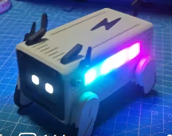

**解决方案：**

**1. 确认单片机类型**

- **查看型号**：确认单片机具体型号（如STM32系列）
- **下载接口**：确认使用SWD、JTAG还是串口下载
- **所需工具**：根据接口确定需要的下载器类型

**2. 下载方案选择**

- **ST-Link/J-Link**：用于STM32等ARM内核单片机
- **CH340/PL2303**：用于支持串口下载的单片机
- **专用下载器**：某些单片机需要专用下载工具

**3. 临时解决方案**

- **购买下载器**：建议购买相应下载器，成本不高
- **使用开发板**：如果已有带下载器的开发板，可先下载再移植芯片
- **寻求帮助**：联系有设备的同行或商家协助烧录

**4. 注意事项**

- **程序来源**：确保程序文件格式正确（.hex、.bin等）
- **连接方式**：严格按照接线图连接下载线
- **电源要求**：确保目标板供电正常
- **软件配置**：下载软件需要正确配置目标芯片型号

**建议：**

DIY项目建议准备基础工具，包括下载器、万用表等，避免因缺少工具而无法完成项目。

---

### SU-03T红外遥控学习后如何触发端口动作？

**问题描述：**

SU-03T红外遥控学习成功后，需要配置接收到该红外指令时触发相应端口动作，但在添加控制中只看到学习选项。

**解决方案：**

需要使用"事件触发"功能，将红外学习事件与GPIO端口控制关联起来。

**1. 配置步骤**

1. **添加事件触发**：

    - 在平台配置中选择"添加触发"
    - 触发方式选择"事件触发"
    - 事件类型选择"红外事件"

2. **选择红外指令**：

    - 红外事件中选择已学习的红外指令
    - 如"红外学习成功"或具体的遥控按键

3. **设置触发动作**：

    - 控制方式选择"端口输出"
    - 控制类型选择需要控制的GPIO（如GPIO_B2）
    - 动作设置为"设置电平"
    - 参数选择"高电平"或"低电平"

**2. 多个端口控制**

如需要同时控制多个端口：

1. **添加多个触发**：

    - 为每个红外指令添加独立的事件触发
    - 分别关联到不同的GPIO端口

2. **配置不同动作**：

    - 红外开灯指令 → GPIO_B0输出高电平
    - 红外关灯指令 → GPIO_B0输出低电平
    - 红外开风扇指令 → GPIO_B1输出高电平

**3. 配置示例**

- 事件类型：红外事件
- 红外事件：选择具体的学习指令
- 控制类型：GPIO_B0/GPIO_B1/GPIO_B2
- 动作：设置高电平/低电平

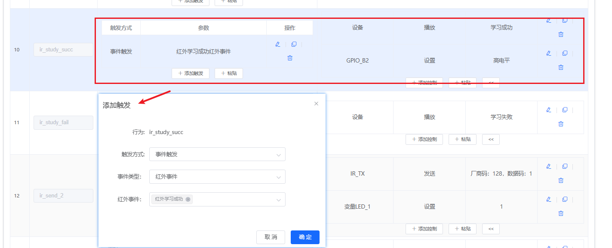

*事件触发配置界面，将红外事件与GPIO控制关联*

**注意事项：**

- 红外学习必须先成功完成
- 事件触发不是直接的红外接收，而是学习后的指令触发
- 可以为同一红外事件配置多个GPIO动作
- 测试时使用原遥控器发送已学习的指令

---


### SU-03T语音小车如何添加红外避障？

**问题描述：**

需要为基于SU-03T的语音小车添加红外避障功能，实现障碍物检测和自动转向。

**解决方案：**

**1. 硬件连接**

- 红外避障传感器连接到GPIO引脚
- 传感器输出端连接SU-03T的GPIO输入
- 左右两侧可各安装一个传感器
- 传感器供电使用3.3V

**2. 配置步骤**

- 在智能公元平台添加GPIO输入触发
- 触发方式：选择低电平触发（检测到障碍物时输出低电平）
- 触发动作：选择转向控制（如"左转"或"右转"）
- 配置后退动作：避免持续碰撞

**3. 控制逻辑设计**

- 前进时：如果检测到障碍物，触发转向
- 左侧传感器触发：执行右转
- 右侧传感器触发：执行左转
- 两侧都触发：执行后退

**4. 语音控制整合**

- 保留原有的语音控制功能
- 红外触发作为补充功能
- 优先级：红外触发 > 语音控制
- 可设计语音开关控制红外功能

**注意事项：**

- 红外传感器检测距离需要根据小车速度调整
- 建议使用可调节灵敏度的传感器
- 避免红外传感器受环境光干扰
- 测试时先验证单个传感器功能

---

### SU-03T语音小车如何添加超声波避障？

**问题描述：**

需要在SU-03T语音小车上增加超声波避障功能，实现障碍物检测和自动避让。

**解决方案：**

**1. 硬件连接方案**

- 超声波模块连接到SU-03T的GPIO输入引脚
- 检测到障碍物时，超声波模块输出高低电平信号
- SU-03T根据接收到的电平信号控制小车动作

**2. 控制逻辑实现**

- 配置GPIO输入触发功能
- 高电平触发时执行后退动作
- 低电平恢复正常前进
- 可结合语音指令实现综合控制

**3. 功能扩展建议**

- 支持多方向避障（左、右、后）
- 配合红外传感器实现全方位避障
- 添加距离判断，分级避障策略

**4. 注意事项**

- 确保超声波模块供电稳定
- 合理设置检测距离阈值
- 避免频繁误触发影响正常使用
- 建议保留语音优先控制功能

---

### 如何在SU-03T语音小车上添加超声波避障功能？

**问题描述：**

需要在基于SU-03T的语音小车上集成超声波避障功能，实现自动避开障碍物的能力。

**解决方案：**

**1. 硬件连接**

- **超声波传感器选择**：HC-SR04或类似型号
- **供电连接**：VCC接3.3V或5V（根据传感器规格）
- **信号连接**：

    - Trig（触发）引脚 → SU-03T的IO1
    - Echo（回波）引脚 → SU-03T的IO2
    - GND接地

**2. IO口配置**

- 配置IO1为输出模式（发送触发信号）
- 配置IO2为输入模式（接收回波信号）
- 确保IO口电平与传感器兼容

**3. 测距功能实现**

```c
// 超声波测距函数示例
int getDistance() {
    digitalWrite(IO1, LOW);    // 发送低电平
    delayMicroseconds(2);
    digitalWrite(IO1, HIGH);   // 发送10us高电平触发
    delayMicroseconds(10);
    digitalWrite(IO1, LOW);

    long duration = pulseIn(IO2, HIGH);  // 测量回波时间
    int distance = duration * 0.034 / 2;  // 计算距离（cm）
    return distance;
}
```

**4. 避障逻辑集成**

- **主循环设计**：

    - 定期调用测距函数获取前方距离
    - 判断距离是否小于阈值（如20cm）
    - 触发避障动作（停止、后退或转向）

- **与语音控制的融合**：

    - 语音指令（"前进"、"左转"、"右转"）正常执行
    - 检测到障碍物时自动暂停或避让
    - 避障完成后继续响应语音指令

**5. 调试与优化**

- **串口输出调试**：

    - 实时输出距离数据
    - 监控避障触发状态
    - 验证逻辑正确性

- **参数调优**：

    - 调整检测距离阈值
    - 优化响应速度
    - 测试不同环境表现

**注意事项：**

- 确保超声波传感器供电稳定
- 避免在嘈杂环境中使用（影响超声波）
- SU-03T有9个IO口，合理分配资源
- 保留语音控制的优先级，避障为辅助功能
- 建议加装防护栏保护传感器

---

### 如何在开关产品上集成语音控制功能？

**问题描述：**

计划在传统开关产品上增加语音功能，实现语音控制的智能开关。

**解决方案：**

**应用场景分析：**

开关产品的语音控制需求特点是：

- **指令简单**：开/关等基础控制指令
- **响应快速**：需要即时响应，无延迟
- **功耗要求**：部分产品需要低功耗设计
- **成本敏感**：开关产品对成本要求较高

**技术方案：**

**1. 芯片选型建议**

根据开关产品特点，推荐以下方案：

- **基础型号**：SU-03T、SU-20T等经济型方案
    - 支持基础开关控制指令
    - 成本低，适合批量应用
    - 供电要求简单（5V）

- **低功耗型号**：US513U6（电池供电场景）
    - 支持2节5号电池供电
    - 超低功耗设计
    - 适合无线开关应用

**2. 实现方式**

- **直接控制**：通过IO口直接控制继电器
- **串口通信**：通过UART与主控通信
- **PWM控制**：通过PWM信号调节亮度（调光开关）

**3. 开发流程**

1. 需求确认：明确语音指令和控制逻辑
2. 硬件设计：电路设计和PCB布局
3. 固件开发：语音识别和控制逻辑
4. 测试验证：功能测试和可靠性验证

**注意事项：**

- 语音模块的供电需稳定，建议预留足够余量
- 麦克风放置位置需远离继电器等干扰源
- 考虑误触发问题，合理设置唤醒词
- 批量生产前需进行充分的环境测试

---

### 如何实现语音控制定时器功能？

**问题描述：**

希望通过语音指令设置定时器（如"定时5分钟"），时间到达后语音提示。

**解决方案：**

- 官方提供SU-03T定时器应用案例演示视频
- 视频地址：[机芯智能SU-03T案例演示(定时器应用)](https://www.bilibili.com/video/BV17a411R7T1/?share_source=copy_web&vd_source=b6beabc53891a8572767198c0aee582e)

**实现要点：**

- 视频演示了完整的定时器功能实现
- 包含语音识别、计时逻辑和语音反馈
- 可根据视频中的代码进行二次开发

**注意事项：**

- 定时器精度取决于模块的内部时钟
- 长时间定时建议考虑低功耗模式

---


---

### 如何使用语音模块控制多路插座？

**问题描述：**

需要实现语音控制多路插座的开关和延时关闭功能，并支持通过Wi-Fi手机APP进行智能控制。

**解决方案：**

**推荐方案：SU-03T + ESP8266 + 点灯科技APP**

1. **系统架构**
    - SU-03T：语音识别模块，负责接收和处理语音命令
    - ESP8266：WiFi模块，实现网络连接和APP控制
    - 点灯科技APP：提供手机端控制界面

2. **实现步骤**
    - 通过SU-03T的UART接口连接ESP8266
    - 配置语音命令控制对应的GPIO输出
    - ESP8266接收语音模块的控制信号
    - 通过点灯科技平台配置设备控制逻辑
    - 实现手机APP远程控制和定时功能

3. **功能扩展**
    - 支持语音控制每路插座的开关
    - 可设置延时关闭功能
    - 手机APP远程控制
    - 定时任务设置

**注意事项：**

- 需要基础的编程能力来完成模块间的通信
- 涂鸦智能方案实现复杂度较高，不推荐初学者使用
- 确保各模块间的电平匹配

---


---

### SU-03T如何配置控制四个继电器？

**问题描述：**

需要配置SU-03T离线语音模块来控制四个继电器，实现通过语音指令打开或关闭单个继电器的功能。

**解决方案：**

**硬件连接方案：**

1. **继电器模块选择**：

    - 使用标准的4路继电器模块
    - 继电器工作电压：5V或12V（根据电源选择）
    - 控制方式：低电平触发或高电平触发

2. **连接方式**：

    - SU-03T的GPIO口连接继电器控制端
    - VCC和GND提供电源
    - 每个GPIO控制一个继电器通道

**平台配置步骤：**

1. **访问智能公元平台**：

    - 登录https://smartpi.cn
    - 选择SU-03T型号
    - 进入语音配置界面

2. **语音指令配置**：

    - 添加唤醒词（如"小智小智"）
    - 添加命令词：

        - "打开一号继电器"
        - "关闭一号继电器"
        - "打开二号继电器"
        - "关闭二号继电器"
        - （依此类推设置四个继电器）

3. **GPIO输出设置**：

    - 为每个命令配置对应的GPIO输出
    - 打开：GPIO输出高电平（或低电平）
    - 关闭：GPIO输出低电平（或高电平）

4. **下载配套资料**：

    - 在文档中心下载"SU-03T控制六路继电器配套资料"
    - 参考配置示例进行修改
    - 使用提供的配置模板快速搭建

**配置示例：**

1. **FX功能配置**：

    - FX1：控制1号继电器
    - FX2：控制2号继电器
    - FX3：控制3号继电器
    - FX4：控制4号继电器

2. **执行动作设置**：

    - 打开命令：对应GPIO设为高电平
    - 关闭命令：对应GPIO设为低电平
    - 可添加状态播报："已打开X号继电器"

**烧录和调试：**

1. **生成固件**：

    - 完成配置后生成固件
    - 下载.bin文件到本地

2. **烧录模块**：

    - 使用专用烧录工具
    - 连接SU-03T模块
    - 烧录生成的固件

3. **功能测试**：

    - 上电测试语音唤醒
    - 逐个测试每个继电器控制命令
    - 验证打开/关闭功能正常

**注意事项：**

- 继电器类型需与控制电平匹配
- 多个继电器同时动作时注意电源容量
- 继电器触点容量要大于负载电流
- 交流负载注意安全隔离
- 保留配置文件便于后续修改

---


---

### 是否可以通过语音命令控制设备播放音乐？

**问题描述：**

需要了解是否可以通过语音指令控制设备播放音乐，实现音乐播放的语音控制功能。

**解决方案：**

可以，通过语音模块实现音乐播放控制功能。具体实现方式如下：

**1. 硬件要求**

    - 使用支持音频播放的语音模块（如SU-03T）
    - 确保模块支持MP3等音频格式播放
    - 准备音频输出设备（喇叭或耳机）

**2. 配置步骤**

    - 在智能公元平台添加音乐控制指令
    - 命令词示例："播放音乐"、"暂停音乐"、"下一首"
    - 上传MP3格式的音乐文件到模块
    - 设置指令对应的播放动作

**3. 功能实现**

    - 语音识别：识别播放控制指令
    - 音频播放：触发指定的音乐文件播放
    - 支持播放、暂停、切换歌曲等操作
    - 可设置循环播放或顺序播放模式

**注意事项：**

- 单个音乐文件建议控制在450KB以内
- 确保音频文件格式为MP3
- 测试各个指令的响应效果
- 可结合定时功能实现自动停止播放

---


---

### 如何使用语音模块制作英语音标发声器？

**问题描述：**

需要制作能发音英语音标的发声器，用于英语学习。

**解决方案：**

**方案一：预录制音频（推荐离线使用）**

1. 录制/获取标准IPA音标发音音频
2. 在平台上传到个性化音频
3. 为每个音标创建对应命令词

**方案二：外部TTS模块**

- 主控：CI-03T/SU-03T（语音识别）
- 辅助：TTS模块如SYN6288（发音合成）
- 通信：UART串口连接

**方案三：在线TTS服务**

- 使用WiFi模组（JX-12F）或AI模组（JX-A7T）
- 连接云端TTS服务合成发音

**技术要点**：

- 建立48个IPA音标库
- 支持重复播放功能
- 可扩展单词示例、对比练习

---


---

### 如何实现语音模块与AI大模型集成？

**问题描述：**

将语音模块与AI大模型（如DeepSeek）集成实现智能对话。

**解决方案：**

**方案一：串口连接**
```
使用方说话 → 语音模块识别 → 串口发送 → 主控调用AI → 返回结果 → 语音播报
```
- 语音模块：CI-03T/SU-03T
- 主控：ESP32/树莓派
- 通信：UART串口

**方案二：智能体平台**

- 在智能公元平台创建智能体
- 配置大模型API接口
- 支持HTTP、双向流式语音对话

**方案三：AI模组**

- 使用JX-A7T离在线AI模组
- 支持本地小模型+云端大模型

**注意事项**：

- 串口方案需额外主控硬件
- 平台方案最简单，无需额外硬件
- AI模组方案集成度最高

---


---

### 如何实现语音控制播放音乐？

**问题描述：**

需要实现通过语音指令控制音乐播放功能，包括播放、暂停、切换歌曲等操作。

**解决方案：**

**实现方法：**

1. **使用支持音频播放的模块**
    - 选择支持MP3播放的语音模块（如SU-03T）
    - 确认模块支持音频文件上传
    - 准备MP3格式的音乐文件

2. **配置语音指令**
    - 在平台添加播放控制指令
    - 命令词示例："播放音乐"、"暂停"、"下一首"
    - 设置对应的执行动作

3. **音频管理**
    - 上传音乐文件到模块
    - 单个文件建议控制在450KB以内
    - 可以上传多个音乐文件

4. **实现流程**
    - 语音识别：识别"播放音乐"指令
    - 触发动作：播放指定的音频文件
    - 支持循环播放或顺序播放

**参考资源：**

- B站视频教程：https://www.bilibili.com/video/BV1pM411c77A/
- 视频展示了完整的实现过程
- 包含配置步骤和实际演示

**注意事项：**

- 确保音乐文件格式正确（MP3）
- 注意文件大小限制
- 测试各个指令的响应效果
- 根据需求调整播放模式

---


---

### AI小智如何接入Grok语言模型？

**问题描述：**

希望将AI小智设备接入Grok语言模型，但不清楚具体实现方法，且之前尝试接入其他大模型（如DeepSeek）未见明显效果。

**解决方案：**

**接入方案对比：**

1. **平台智能体方案（推荐）**：

    - 在智能公元平台创建智能体
    - 配置大模型API接口
    - 支持HTTP、双向流式语音对话
    - 无需额外硬件，直接配置使用

2. **串口连接方案**：
    ```
    使用方说话 → 语音模块识别 → 串口发送 → 主控调用AI → 返回结果 → 语音播报
    ```
    - 语音模块：CI-03T/SU-03T
    - 主控：ESP32/树莓派
    - 通过UART串口通信

3. **AI模组方案**：

    - 使用JX-A7T离在线AI模组
    - 支持本地小模型+云端大模型
    - 集成度最高，开发难度中等

**Grok接入要点：**

1. **API获取**：

    - 申请Grok开发者账号
    - 获取API密钥
    - 了解API调用限制和费用

2. **平台配置**：

    - 登录智能公元平台
    - 创建智能体项目
    - 配置大模型接口为Grok
    - 设置API密钥和参数

3. **功能验证**：

    - 测试基本对话功能
    - 验证响应速度
    - 检查语音识别准确度

**效果不明显的可能原因：**

1. **配置问题**：

    - API密钥配置错误
    - 网络连接不稳定
    - 参数设置不当

2. **使用场景限制**：

    - 简单问答无法体现AI优势
    - 需要复杂对话才能展现能力
    - 语音识别准确度影响体验

3. **模型选择**：

    - 不同模型适合不同场景
    - 建议尝试多个模型对比
    - 根据需求选择合适模型

**优化建议：**

1. **提升体验**：

    - 使用清晰麦克风的硬件
    - 在安静环境下测试
    - 预设常用问题和回答

2. **功能扩展**：

    - 结合本地知识库
    - 定制化回答风格
    - 添加多轮对话记忆

**注意事项：**

- API调用可能产生费用，注意控制使用量
- 网络延迟影响响应速度
- 建议保留备用方案（离线功能）
- 定期更新API版本以获得新功能

---


---

### 如何在穿戴设备上实现语音识别并传输到服务器？

**问题描述：**

需要在穿戴设备上实现语音识别功能，能够实时将语音传输到服务器或第三方AI平台（如百度）进行文字识别，并接收识别结果。

**解决方案：**

穿戴设备的语音识别需要考虑功耗、体积、网络连接等因素，推荐以下方案：

**1. 硬件选型方案**

**方案一：使用JX-A7T模块**

- 支持联网功能，可直接连接云端AI服务
- 内置Wi-Fi模块，无需额外网络芯片
- 体积小、功耗低，适合穿戴设备
- 可直接调用百度、阿里云等AI接口

**方案二：SU-03T + 外部网络模块**

- SU-03T负责语音采集和预处理
- 通过串口连接ESP32或类似网络模块
- 网络模块负责与服务器通信
- 成本相对较低，但集成度稍差

**2. 实现架构**

```
麦克风 → 语音模块 → 语音预处理 → 网络传输 → 云端AI识别 → 返回文字结果
```

**3. 具体实现步骤**

1. **语音采集**
    - 设置合适的采样率（16kHz推荐）
    - 使用降噪算法提高识别率
    - 设置语音检测阈值，避免无效传输

2. **数据传输**
    - 建立与服务器的长连接
    - 使用WebSocket或HTTP协议
    - 实现断线重连机制
    - 数据压缩减少传输量

3. **云端识别**
    - 选择百度、讯飞等成熟ASR服务
    - 申请API密钥和配额
    - 处理识别结果和错误码

4. **结果处理**
    - 接收文字识别结果
    - 本地缓存常用指令
    - 实现离线/在线混合模式

**4. 注意事项**

- **功耗管理**：穿戴设备需优化功耗，使用低功耗模式
- **网络稳定性**：移动环境下网络可能不稳定，需要重试机制
- **响应延迟**：云端识别有延迟，重要功能建议本地实现
- **隐私安全**：语音数据传输需加密，保护使用方隐私
- **认证费用**：云端服务通常按调用次数收费

**5. 替代方案**

- 考虑使用深圳唯创知音等厂商的成熟方案
- 选择专门为穿戴设备优化的语音模块
- 评估离线识别方案，减少对网络的依赖

**推荐厂商参考：**

- 深圳唯创知音：专注语音交互芯片
- 科大讯飞：提供穿戴设备解决方案
- 百度AI开放平台：有专门的语音识别SDK

---


---

### 如何实现车载冰箱的语音控制？

**问题描述：**

需要将SU-03语音模块集成到自制车载冰箱上，实现语音控制开关和温度调节，避免与现有机械按钮控制产生冲突。

**解决方案：**

**1. 语音控制方案**

- **语音识别功能**：

    - 配置唤醒词（如"你好冰箱"）
    - 设置控制命令："打开"、"关闭"、"温度调高"
    - 语音播报反馈当前状态

- **输出控制方式**：

    - 使用继电器隔离控制
    - 通过GPIO或PWM控制温度
    - 实现语音与机械双控制

**2. 避免冲突设计**


- **继电器隔离**：

    - 语音控制继电器1
    - 机械按钮控制继电器2
    - 两个继电器并联控制压缩机

- **控制逻辑**：

    - 任一路触发即可启动压缩机
    - 语音优先级可设置
    - 避免同时触发冲突

**3. 温度调节实现**

- **方案一：PWM控制**
    - 使用SU-03T的PWM输出
    - 控制半导体制冷片
    - 实现无级温度调节

- **方案二：串口通信**
    - SU-03T通过串口发送指令
    - 主控MCU执行温度控制
    - 实现精确温度管理

**4. 硬件设计要点**

- **电源隔离**：

    - 语音模块独立供电
    - 避免噪声干扰
    - 使用DC-DC隔离

- **按键保留**：

    - 保留原有机械按键
    - 两套系统互为备份
    - 满足不同使用场景

**注意事项：**

- 继电器选择要考虑压缩机功率
- 温度传感器建议使用DS18B20
- 需要处理防震和散热问题
- 语音控制响应时间相对较长

---


---

### 智能垃圾桶项目如何选配语音模块？

**问题描述：**

智能垃圾桶项目中需要使用离线语音识别功能，需要了解适用的芯片型号以及单麦和双麦配置的区别。

**解决方案：**

**1. 推荐型号选择**

智能垃圾桶项目推荐使用以下型号：

- **SU-03T**：基础版本，支持最多150条命令词
- **CI-03T**：增强版本，支持更多功能
- **CI-33T**：大容量版本，支持500条命令词

**2. 单麦vs双麦配置**

**单麦克风配置**：

- **优点**：成本低、功耗低、设计简单
- **适用**：安静环境、成本敏感项目
- **效果**：基本满足语音识别需求

**双麦克风配置**：

- **优点**：降噪效果好、识别率更高
- **适用**：嘈杂环境、高要求场景
- **效果**：显著提升复杂环境下的识别率

**3. 典型应用场景**

- **家庭环境**：单麦即可满足需求
- **公共场所**：建议使用双麦配置
- **户外环境**：双麦+防风罩设计

**4. 功能配置建议**

**基础命令**：

- "打开垃圾桶"
- "关闭垃圾桶"
- "打包垃圾"
- "换袋"

**高级功能**：

- "满溢提醒"
- "杀菌消毒"
- "状态查询"

---

## 定制功能开发


### SU-03T在5路箱门控制中如何应用？

**问题描述：**

计划在5路箱门产品中使用SU-03T模块，采用语音+触发方式，需要了解开发方案和配置建议。

**解决方案：**

**产品方案设计**

1. **控制方式**
    - 语音控制：通过语音命令控制各路箱门
    - 触发控制：通过外部传感器触发对应箱门
    - 双重控制：支持语音和触发两种方式

2. **硬件配置**
    - 主控模块：SU-03T语音模块
    - 执行器件：5个继电器或电磁锁
    - 传感器：红外或接近传感器（可选）
    - 输出控制：使用GPIO口控制继电器

**功能实现**

1. **基础语音命令**
    - "打开1号"/"打开1路"
    - "打开2号"/"打开2路"
    - "打开3号"/"打开3路"
    - "打开4号"/"打开4路"
    - "打开5号"/"打开5路"
    - "打开所有"/"全部打开"

2. **触发功能**
    - 传感器检测到信号后打开对应箱门
    - 支持B0-B8等多个IO输入
    - 可配置延时自动关闭

3. **互斥控制**
    - 语音执行期间禁止触发输入
    - 使用变量控制实现互斥逻辑
    - 避免同时触发造成冲突

**开发建议**

1. **原型开发**
    - 使用SU-03T开发板进行快速原型验证
    - 开板链接：https://item.taobao.com/item.htm?id=672745400074
    - 便于调试和功能验证

2. **固件配置**
    - 在智能公元平台配置语音命令和IO控制
    - 导出工程文件生成固件
    - 支持在线调试和优化

3. **产品设计**
    - 样机验证完成后进行产品化设计
    - 考虑结构设计和安装方式
    - 预留调试接口便于生产测试

**注意事项：**

- 舵机控制需要专门的PWM信号，当前版本暂不支持
- 建议先使用继电器控制板实现箱门开关
- 语音命令可以设置延时自动关闭功能
- 多路控制时注意电源功率和负载能力

---

### ROS机器人语音小助手成品使用的是什么模块？

**问题描述：**

需要了解ROS机器人语音小助手成品设备使用的核心模块型号，以及是否还有成品出售。

**解决方案：**

ROS机器人语音小助手成品设备说明：

**成品配置信息：**

- **核心模块**：采用SU-03T核心模块
- **产品形态**：黑色方形成品设备，非散装模块
- **主要特性**：低成本、低功耗离线语音识别
- **通信接口**：支持USB通讯和供电
- **硬件配置**：圆形麦克风阵列，配备两个功能按钮

**模块与成品的关系：**

1. **SU-03T模块价格**：约17元（核心模块）
2. **JX-B5C模块价格**：约17元起（另一种选择）
3. **成品设备**：需要额外集成外壳、电路板等成本
4. **新手套装**：34.8元，包含模块、转接板、CH340烧录器等

**成品与模块的选择：**

1. **选择成品**：

    - 直接使用，无需焊接和组装
    - 适合快速原型验证和产品展示
    - 包含完整的外壳和接口设计

2. **选择模块**：

    - 成本更低，适合批量生产
    - 可根据产品需求定制设计
    - 需要自行设计外围电路

**注意事项：**

- 成品设备可能间歇性提供，需要咨询库存情况
- 成品主要基于SU-03T或JX-B5C等模块开发
- 如需批量使用，建议直接采购核心模块自行设计
- ROS系统集成需要通过USB或串口进行通信

---

### CI-03T能否实现语音控制的SOS求救信号功能？

**问题描述：**

希望在CI-03T芯片上实现语音控制的SOS求救信号功能，尝试了定时、延时、脉冲等方法但未成功。

**解决方案：**

**功能可行性确认**

CI-03T模块可以实现语音控制的SOS求救信号功能。之前的定时、延时、脉冲方法不成功可能是配置不当导致的。

**实现方案**

**方案一：使用GPIO输出控制**

1. **硬件连接**
    - 将GPIO引脚连接到报警设备（如LED、蜂鸣器）
    - 确保GPIO输出能力满足负载需求
    - 可使用三极管驱动大功率设备

2. **平台配置**
    ```
    语音命令：救命/SOS/求救
    → 识别成功
    → 触发GPIO输出
    → 输出模式：持续高电平
    → 或输出模式：闪烁脉冲
    ```

3. **输出模式设置**
    - **持续模式**：GPIO持续输出高电平
    - **闪烁模式**：使用定时器控制闪烁
    - **脉冲模式**：输出特定脉冲序列

**方案二：结合定时器实现**

1. **定时器配置**
    ```
    触发条件：语音识别"求救"
    → 启动定时器
    → 定时时间：0（立即触发）
    → 执行动作：GPIO输出+语音播报
    ```

2. **循环报警**
    - 设置循环计数器
    - 每隔2秒触发一次
    - 持续时间可配置（如5分钟）
    - 手动或自动停止

**方案三：语音+动作组合**

1. **识别到求救命令后**
    - GPIO输出高电平（驱动报警器）
    - 语音播报："已发送求救信号"
    - 可通过串口发送求救信息

2. **持续报警逻辑**
    ```
    While (求救状态):

    - GPIO输出1秒（开启报警）
    - GPIO关闭0.5秒（关闭报警）
    - 循环执行
    - 直到收到停止命令
    ```

**配置示例**

**智能公元平台设置：**

1. **添加控制指令**
    ```
    命令词：救命
    识别结果：SOS
    控制类型：GPIO_A27
    执行动作：设置电平
    动作值：高电平
    ```

2. **添加闪烁效果**
    ```
    使用定时器功能：

    - 延时：0ms
    - 周期：1500ms
    - 占空比：67%
    - 循环次数：200
    ```

**代码实现（参考）**
```c
// SOS信号模式
void sos_mode() {
    for(int i=0; i<5; i++) {
        gpio_set_high();    // 输出高电平
        delay(1000);       // 持续1秒
        gpio_set_low();     // 输出低电平
        delay(500);        // 停止0.5秒
    }
}
```

**注意事项**

- 确保GPIO输出电流不超过规格限制
- 大功率负载需要使用驱动电路
- 建议加入手动停止功能
- 可配合串口发送位置信息
- 测试时注意安全，避免误触发

### 如何实现展会的动态仿真和互动项目？

**问题描述：**

需要在展会上展示一个具有动态仿真和互动功能的项目，希望通过离线语音识别技术与机械结构结合，实现远程控制和交互体验。

**解决方案：**

**1. 项目方向建议**

基于展会的展示需求，推荐以下项目类型：

**机械仿真类：**

- **动态模型**：如机械臂、机器人、动态沙盘
- **运动装置**：通过电机驱动的各种运动机构
- **模拟设备**：模拟实际工作场景的演示装置

**互动体验类：**

- **语音控制**：离线语音识别控制各种动作
- **体感交互**：结合传感器实现人体动作响应
- **多媒体互动**：语音触发音视频播放

**2. 技术实现方案**

**语音控制方案：**

- 使用离线语音模块（如SU-03T系列）
- 预设多个语音命令控制不同动作
- 结合TTS播报增强互动效果

**机械结构设计：**

- **动力系统**：步进电机/舵机提供精确控制
- **传动机构**：齿轮、连杆等实现复杂动作
- **控制系统**：单片机协调多个执行器

**3. 系统架构**

```
语音识别 → 主控制器 → 执行器驱动 → 机械结构
                ↓
            传感器反馈 ← 状态检测
```

**4. 展示效果设计**

**视觉亮点：**

- 流畅的动作过渡
- 精确的位置控制
- 多自由度运动

**互动体验：**

- 响应式语音反馈
- 动作状态播报
- 异常情况处理

**5. 开发建议**

**功能规划：**

- 先定义核心展示内容
- 设计3-5个主要互动场景
- 预留扩展接口增加新功能

**实现步骤：**

1. 机械结构设计与制作
2. 电气系统搭建（电源、控制、驱动）
3. 语音功能集成与调试
4. 综合联调与优化

**6. 注意事项**

- **可靠性**：展会环境复杂，需要稳定运行
- **便携性**：考虑安装、拆卸的便利性
- **安全性**：运动部件需要安全防护
- **展示性**：动作要清晰可见，互动要即时响应

**技术选型推荐：**

- 语音模块：SU-03T（支持自定义命令词）
- 主控制器：STM32系列（性能充足，易于开发）
- 执行器：数字舵机（精确控制）或步进电机（大力矩）

---


---

### CI-33T/SU-03T如何实现点动控制功能？

**问题描述：**

希望实现语音唤醒后执行点动控制，例如控制继电器通电指定时间（如1秒或8秒）后自动关闭。

**解决方案：**

- 应该可以实现点动控制功能
- 需要理清控制逻辑
- 不同继电器可配置不同的延时时间
- 通过定时器功能实现自动关闭

**注意事项：**

- 最好提供具体视频参考
- 需要明确控制逻辑细节
- 不同继电器可设置不同的定时参数

---


---

### 如何开发具有AI对话和拍照功能的智能设备？

**问题描述：**

希望开发一个集成AI对话和拍照功能的智能设备，需要了解可行的技术方案和实现思路。

**解决方案：**

**推荐架构方案：**

```
SU-03T（语音唤醒） → ESP32S3（主控+拍照） → 云端AI识别
```

**系统组成：**

1. **语音唤醒模块（SU-03T）**
    - 负责语音唤醒功能
    - 识别特定的唤醒词
    - 触发主控系统工作

2. **主控模块（ESP32S3）**
    - 系统主控制器
    - 集成摄像头拍照功能
    - 负责与云端通信
    - 上传照片到AI服务

3. **云端AI服务**
    - 处理上传的图像
    - 进行AI分析和对话
    - 返回智能回复

**实现流程：**

1. **语音唤醒阶段**
    - SU-03T监听唤醒词
    - 检测到唤醒后通知ESP32S3
    - ESP32S3从休眠中唤醒

2. **拍照上传阶段**
    - ESP32S3控制摄像头拍照
    - 将照片上传到云端AI服务
    - 等待AI分析结果

3. **AI对话阶段**
    - AI分析照片内容
    - 结合上下文进行智能对话
    - 将回复下发到设备

**技术优势：**

- **低功耗**：SU-03T专门处理语音唤醒，功耗低
- **高性能**：ESP32S3具备强大的图像处理能力
- **智能交互**：云端AI提供强大的对话能力
- **模块化设计**：各模块职责清晰，便于开发调试

**开发建议：**

- 先实现SU-03T与ESP32S3的通信
- 集成摄像头驱动和拍照功能
- 接入云端AI服务（如OpenAI、百度AI等）
- 优化整体功耗和响应速度

**注意事项：**

- 需要稳定的网络连接用于云端通信
- 考虑离线模式下的基本功能实现
- 注意隐私保护和数据安全
- 可根据需求选择不同的AI服务提供商

---
### SU-03T使用"关闭语音识别"后无法唤醒怎么办？

**问题描述：**

配置了两个语音指令：一个用于"关闭语音识别"，另一个用于"允许语音识别"。但执行"关闭语音识别"指令后，模块进入关机状态，再也无法通过唤醒词或"允许语音识别"指令唤醒设备，只能断电重启。

**解决方案：**

**问题分析：**

这是"关闭语音识别"功能的正常行为，不是故障：

1. **功能机制**：
    - "关闭语音识别"会完全禁用模块的语音识别功能
    - 关闭后，模块不再监听唤醒词和任何语音指令
    - 这是一种设计上的"静默模式"，避免误触发

2. **预期行为**：
    - 模块不会自动退出关闭状态
    - 无法通过语音唤醒恢复（因为语音识别已被禁用）
    - 必须通过其他方式重新启用识别功能

**正确的恢复方案：**

**方案一：使用GPIO输入恢复（推荐）**

通过外部信号触发恢复语音识别：

1. **硬件连接**：
    - 将一个按键或传感器连接到SU-03T的GPIO输入引脚（如B1）
    - 按键另一端接GND

2. **平台配置**：
    - 添加GPIO输入触发
    - 触发条件：B1引脚检测到低电平（按键按下）
    - 执行动作：允许语音识别

3. **操作方式**：
    - 需要恢复语音功能时，按下按键
    - 模块重新进入语音识别状态

**方案二：通过串口恢复**

使用外部MCU通过串口发送恢复指令：

1. **连接方式**：
    - SU-03T的串口（B0/B1）连接到外部MCU

2. **恢复指令**：
    - MCU发送特定指令给SU-03T
    - 触发"允许语音识别"功能

**方案三：定时自动恢复**

如果需要自动恢复，可以配置定时器：

1. **配置定时器**：
    - 在"关闭语音识别"指令中添加定时器
    - 设置定时时间后自动执行"允许语音识别"

2. **适用场景**：
    - 临时静默后需要自动恢复
    - 如夜间静默、白天自动恢复

**不建议的使用方式：**

不要将"关闭语音识别"和"允许语音识别"都配置为语音指令：

- 关闭识别后，"允许语音识别"指令无法被识别
- 这会形成死锁状态
- 必须通过非语音方式恢复

**配置建议：**

**合理的静默控制方案：**

1. **方案A：使用"禁止超时退出唤醒"**
    - 不真正关闭语音识别
    - 只是禁止超时自动退出
    - 仍然可以响应唤醒词

2. **方案B：降低识别灵敏度**
    - 通过平台调节识别灵敏度
    - 减少误触发但不完全禁用

3. **方案C：GPIO控制静默**
    - 使用物理按键切换静默状态
    - 配置为：按键按下 → 关闭/允许语音识别

**注意事项：**

- "关闭语音识别"是永久性的，直到被主动恢复
- 语音控制的恢复指令无法在被关闭后执行
- 建议使用GPIO或串口作为恢复途径
- 如需临时静默，考虑使用其他控制方式


---

### 外设触发需要唤醒词吗？

**问题描述：**

使用电平检测、串口输入等外设触发方式时，不清楚是否需要先唤醒设备才能触发动作。

**解决方案：**

**触发方式分类：**

1. **命令词（需要唤醒词）**：
    - 通过语音说的指令词
    - 必须先说唤醒词进入唤醒状态
    - 唤醒后才能识别并执行命令词
    - 超时后会自动退出唤醒状态

2. **外设触发（不需要唤醒词）**：
    - GPIO电平检测（高电平/低电平触发）
    - 串口接收数据触发
    - 定时器触发
    - 变量条件触发
    - **这些外设触发不需要进入唤醒状态，可直接触发**

**重要说明：**

- 只有语音命令词才需要喊唤醒词
- 外设触发方式不受唤醒状态影响
- 外设触发在超时退出后仍然可以正常工作
- 如需外设触发后立即响应语音命令，可配合免唤醒词使用

**应用场景示例：**

1. **传感器触发**：
    - 红外传感器检测到人 → GPIO触发 → 播报欢迎语
    - 无需先唤醒，检测到信号即执行

2. **串口控制**：
    - MCU发送串口指令 → 触播语音或控制IO
    - 无需唤醒，串口数据直接触发

3. **定时任务**：
    - 定时器到期 → 执行播报或控制动作
    - 无需唤醒，时间到即触发

**注意事项：**

- 外设触发的动作中可以包含语音播报
- 外设触发后不会自动进入语音唤醒状态
- 如需外设触发后使用语音命令，建议配置免唤醒词
