# 烧录与调试 FAQ


### 连接5V电源后无指示灯且芯片发热怎么办？

**问题描述：**

给模块连接5V电源后，设备无指示灯闪烁，触摸芯片发现发热严重，设备无法正常工作。

**解决方案：**

**立即处理措施：**

- **立即断电**：芯片发烫说明存在异常，应立即切断电源
- **检查接线**：仔细核对电源接线是否正确
- **排查短路**：检查是否存在短路或接错线的情况

**常见接线错误：**

1. **电源正负极接反**
    - 检查5V和GND是否接反
    - 使用万用表验证电源极性

2. **电压过高**
    - 确认电源电压确实为5V
    - 避免使用高于5V的电源

3. **引脚短路**
    - 检查相邻引脚是否有短路
    - 确认没有焊锡桥接

**重新连接步骤：**

1. 仔细核对电路图或引脚定义
2. 确认电源电压为标准5V
3. 重新连接电源线，确保极性正确
4. 上电前再次检查所有连接

**注意事项：**

- 芯片正常工作时不应该明显发热
- 如持续发热，可能是芯片已损坏
- 建议使用转接板避免直接接线错误

---

### 语音指令无响应但其他功能正常怎么办？

**问题描述：**

设置固件后，特定的语音指令（如"开灯"）没有响应，但其他指令可以正常回复，设备能识别语音但执行动作失败。

**解决方案：**

**问题分析：**

语音识别正常（能回复其他指令），但特定命令无响应，通常是控制逻辑配置问题，而非语音识别问题。

**排查步骤：**

1. **检查命令词配置**

    - 确认命令词已正确添加
    - 检查命令词的拼音和文字
    - 验证回复语是否正常设置

2. **检查控制逻辑配置**

    - 进入控制详情页面
    - 找到无响应的命令（如"开灯"）
    - 检查触发方式是否正确设置
    - 确认控制动作已配置

3. **检查跳转行为配置**

    - 如果使用了跳转行为，确认目标命令已设置
    - 验证跳转目标是否存在且正确
    - 检查跳转到的命令是否有对应动作

**常见问题及解决：**

1. **跳转行为未设置目标**

    - 问题：跳转行为选择了"跳转"但未指定跳转到哪里
    - 解决：在跳转行为参数中选择具体的目标命令

2. **GPIO控制未配置**

    - 问题：命令存在但未配置具体的GPIO动作
    - 解决：添加控制方式为"端口输出"，设置GPIO和电平

3. **命令词重复或冲突**

    - 问题：多个命令词过于相似导致识别混淆
    - 解决：修改命令词使其更具区分度

**调试建议：**

1. **添加播报验证**

    - 在命令中添加播报动作
    - 通过播报确认命令是否被识别
    - 判断是识别问题还是执行问题

2. **简化配置测试**

    - 先配置最简单的GPIO控制
    - 确认基础功能正常后再添加复杂逻辑
    - 逐步排查问题所在

3. **重新生成固件**

    - 保存配置后重新生成固件
    - 重新下载并烧录
    - 清除可能的配置缓存问题

**注意事项：**

- 控制逻辑中的每个步骤都需要正确配置
- 跳转行为必须有明确的目标
- GPIO控制需要设置正确的端口和电平
- 建议在配置完成后截图保存便于排查

---

### 跳转行为配置后无法正常工作怎么办？

**问题描述：**

在语音指令中配置了跳转行为，设置了目标命令，但设备执行时没有按预期跳转到目标动作。

**解决方案：**

**问题分析：**

跳转行为不工作通常是由于配置不完整或目标命令未正确设置导致的。

**排查步骤：**

1. **检查跳转配置**

    - 确认跳转行为已添加
    - 验证目标行为已选择
    - 检查目标行为名称是否正确

2. **验证目标命令存在**

    - 确认跳转目标命令已定义
    - 检查目标命令的命令词设置
    - 验证目标命令有对应的控制动作

3. **检查命令词拼写**

    - 确认命令词没有拼写错误
    - 检查命令词与目标行为名称对应
    - 避免使用特殊字符

**调试方法：**

1. **添加播报验证**

    - 在跳转目标命令中添加播报
    - 如果播报响起，说明跳转成功
    - 如果没播报，说明跳转失败

2. **简化测试**

    - 先测试简单的跳转
    - 使用明确的命令词
    - 避免复杂的控制逻辑

3. **逐步排查**

    - 测试跳转行为本身是否工作
    - 测试目标命令是否能独立触发
    - 测试完整的跳转流程

**常见问题：**

1. **目标命令未创建**

    - 问题：设置了跳转但目标命令不存在
    - 解决：先创建目标命令，再设置跳转

2. **命令词混淆**

    - 问题：跳转源和目标命令词过于相似
    - 解决：使用差异化的命令词

3. **配置未保存**

    - 问题：修改后未保存配置
    - 解决：每次修改后及时保存

**注意事项：**

- 跳转行为的目标必须是已定义的命令
- 命令词要清晰，避免识别错误
- 保存配置后需要重新生成和烧录固件
- 建议通过播报功能验证跳转是否成功

---

### 可以使用其他USB转TTL模块替代CH340吗？

**问题描述：**

使用非CH340芯片的USB转TTL模块进行烧录，烧录器不兼容导致烧录失败。


**解决方案：**

目前暂不支持其他USB转TTL模块，只能使用CH340芯片的烧录器。

- **CH340专用性**：烧录工具与CH340芯片进行了深度适配
- **兼容性问题**：其他芯片（如FT232、PL2303等）可能存在协议差异
- **驱动支持**：官方只提供CH340的驱动支持和技术保障

**注意事项：**

- 购买烧录器时确认芯片型号为CH340
- 不要尝试使用其他USB转TTL模块，可能导致烧录失败或损坏模块
- CH340烧录器价格低廉，建议购买官方推荐的型号

---

### 烧录工具显示多个COM口是否正常？

**问题描述：**

云知声UniOne蜂鸟M烧录工具界面中显示了多个COM口，且部分COM口状态为"打开串口失败"。

**解决方案：**

**1. COM口显示说明**

- 烧录工具显示多个COM口是正常现象
- 部分COM口显示"打开串口失败"也是正常的
- 这表示系统中存在多个串口设备，但并非所有都连接了目标模块

**2. 正确选择COM口**

- 逐一尝试每个可用的COM口
- 正确连接的COM口会显示设备信息而非"打开串口失败"
- 建议从最新分配的COM口开始尝试

**3. 排查方法**

- 在设备管理器中查看USB转串口设备对应的COM口号
- 确认CH340驱动已正确安装
- 拔插USB设备观察COM口变化

**注意事项：**

- 只要有正确的COM口可用，部分COM口显示失败不影响烧录
- 如果所有COM口都显示失败，检查驱动和硬件连接

---

### 点击烧录按钮无响应怎么办？

**问题描述：**

使用烧录工具时，点击烧录按钮后没有任何反应，即使按复位键也无法完成烧录过程。勾选"串口上电"选项后仍不开始烧录。

**解决方案：**

**1. COM口检查**

- 尝试更换COM端口，软件提示"发送异常"可能是串口连接问题
- 快速拔插烧录器，重新建立连接
- 检查COM口是否松动，确保连接可靠
- 确认串口选择是否正确，软件自动识别的串口可能不是烧录器

**2. "串口上电"选项检查**

勾选"串口上电"后不开始烧录的可能原因：

- **串口选择错误**：软件自动识别的串口可能不是烧录器对应的COM口，需要手动选择正确的串口
- **硬件连接问题**：检查烧录器与模块的连接是否牢固，转接板与模块接触不良会导致无法触发烧录
- **模块未进入烧录模式**：某些模块需要在勾选"串口上电"后重新上电才能进入烧录模式

**排查步骤**：
1. 在设备管理器中确认烧录器对应的COM口号
2. 在烧录软件中手动选择正确的COM口
3. 检查转接板与模块的引脚接触是否良好
4. 尝试使用未焊接的模块直接测试，排除焊接后接触问题

**3. 波特率检查**

- 检查波特率设置是否过低
- 波特率过低可能导致发送线程卡住并报错
- 尝试使用默认波特率设置

**4. 烧录器检查**

- 如果烧录器不支持1.5m以上线缆，可能会一直卡在烧录界面
- 尝试使用更短的USB连接线
- 更换其他烧录器进行测试

**5. 串口供电不足检查**

点击烧录按钮后设备自动重启，可能是串口供电电流不足导致：

- **问题原因**：某些小平板电脑或轻薄本的USB口供电能力较弱，串口供电电流不足以支撑烧录操作
- **解决方法**：

    - 外接5V电源为模块独立供电
    - 使用手机充电头作为稳定5V电源
    - 断开外部电源时需同时断开GND连接
    - 使用台式机或供电能力更强的USB端口

**注意事项：**

- 开发板或转接板的接触不良是常见问题，杜邦线连接可能不稳定
- 建议在烧录时只连接模块与烧录器，不要连接其他外部设备
- 如果开发板无法烧录，可以尝试使用未焊接的模块进行测试
- 软件提示"发送异常"通常不是烧录器本身的问题
- COM口松动是常见原因，重新插拔往往能解决问题
- 确保使用质量良好的USB连接线
- 平板电脑烧录时建议使用外接电源，避免USB口供电不足

---

### 烧录器无法识别串口怎么办？

**问题描述：**

烧录器连接到电脑后，烧录软件无法识别串口或显示COM口未找到，导致无法进行烧录操作。

**解决方案：**

**1. 更换COM端口**

- 在设备管理器中查看实际分配的COM端口号
- 在烧录软件中选择对应的COM端口
- 如果有多个COM口，逐一尝试直到找到正确端口

**2. 驱动程序检查**

- 确认USB转串口驱动已正确安装
- 检查设备管理器中是否有未识别的设备
- 重新安装或更新CH340等驱动程序

**3. 硬件连接检查**

- 检查USB线缆是否完好
- 尝试更换电脑的USB接口
- 确认烧录器电源指示灯正常亮起

**4. 设备管理器排查**

- 右键"此电脑"→"管理"→"设备管理器"
- 展开"端口(COM和LPT)"查看可用串口
- 如有黄色感叹号，右键选择"更新驱动程序"

**注意事项：**

- 某些USB接口可能供电不足，建议使用主机背面接口
- 避免使用USB延长线，直接连接可能更稳定
- 如果问题持续，可尝试在另一台电脑上测试烧录器

---

### 烧录次数有限制吗？

**问题描述：**

模块正常烧录两次后就损坏，多个板子都出现相同情况，担心是烧录次数限制导致。另有使用者询问离线烧录器和加密狗是否可以限制烧录次数。

**解决方案：**

**烧录次数说明：**

- 烧录次数没有限制，可反复烧录
- 单个模块调试时可烧录几十上百次
- 烧录次数本身不会导致模块损坏

**离线烧录器和加密狗说明：**

- **无次数限制功能**：离线烧录器和加密狗不支持设置烧录次数限制
- **设计用途**：离线烧录器用于无网络环境下的固件烧录，加密狗用于固件保护
- **开放使用**：一旦获得固件，可以无限次烧录到任意模块
- **无管控机制**：硬件层面不支持烧录计数或授权管理

**模块损坏排查：**

1. **硬件连接检查**
    - 使用万用表检查线路连接
    - 排除连锡、短路、虚焊问题
    - 确认接线正确无误

2. **操作规范检查**
    - 确保在断电情况下进行插拔
    - 避免带电操作导致损坏
    - 检查是否有静电防护措施

3. **供电检查**
    - 确认供电电压在3.6-5.5V范围内
    - 避免使用过高电压
    - 检查电源稳定性

**可能原因分析：**

- 操作过程中有静电击穿
- 供电电压异常导致损坏
- 硬件本身质量问题
- 焊接或接线过程中的失误

**注意事项：**

- 烧录本身不会损坏模块，问题多出在操作过程
- 如多个模块都出现相同问题，建议检查操作流程
- 确认焊接工具和操作环境符合要求
- 可联系技术支持或返厂检测

---

### 模块烧录失败如何全面排查？

**问题描述：**

模块烧录过程中出现问题，需要进行系统性的故障排查，包括硬件连接、软件配置、供电等多个方面。

**解决方案：**

**1. 检查接线**

- 确认烧录器连接线序正确
- 检查TX/RX是否交叉连接
- 确保GND可靠接地
- 验证电源线连接无误

**2. 检查设备管理器**

- 查看是否有未识别设备
- 确认COM口驱动已安装
- 检查是否有黄色感叹号提示
- 必要时重新安装驱动

**3. 检查bin文件路径**

- 确保路径不包含中文字符
- 文件夹名称使用英文
- 避免使用特殊符号
- 建议放在根目录或简单路径

**4. 检查烧录条件**

- 模块处于烧录模式
- 按下复位键（如需要）
- 确认烧录器供电正常
- 检查USB连接稳定性

**5. 检查电压**

- 使用万用表测量供电电压
- 确认电压在3.6-5.5V范围
- 检查电压稳定性
- 避免使用过高或过低电压

**6. 综合检查**

- 尝试更换USB端口
- 使用更短的连接线
- 在另一台电脑测试
- 更换烧录器验证

**注意事项：**

- 按步骤逐一排查，不要遗漏任何环节
- 记录每步检查的结果
- 如问题持续，可拍照或录像反馈
- 保留错误信息截图便于分析

---

### 烧录时需要按复位键吗？

**问题描述：**

电路板上有一个蓝色按钮（S1），询问这是否是复位键，以及烧录时是否必须按这个按钮。

**解决方案：**

**按钮功能说明：**

- 电路板上的蓝色按钮是复位键（RESET）
- 用于重启模块或退出特定工作模式
- 不是烧录的必要操作步骤

**烧录操作说明：**

- 烧录时可以不按复位键
- 大部分情况下模块会自动进入烧录模式
- 按下复位键可以确保模块处于初始状态

**使用场景：**

1. **正常烧录**：

    - 直接点击烧录按钮即可
    - 不需要额外的按键操作
    - 软件会自动处理烧录流程

2. **遇到问题时**：

    - 可以尝试短按复位键
    - 让模块重新初始化
    - 然后再进行烧录

3. **其他用途**：

    - 程序运行异常时复位
    - 退出特定功能模式
    - 强制重启模块

**注意事项：**

- 按复位键不是烧录的必需步骤
- 短按即可，不要长按
- 如果正常烧录失败，可尝试配合复位键使用
- 复位后可能需要重新识别COM端口

---

### 程序烧录后LED指示灯不亮怎么办？

**问题描述：**

程序成功烧录后，LED5和LED6指示灯不亮，但万用表测量电路连接正常。

**解决方案：**

- 检查烧录工具是否提示"打开串口失败"，这可能是串口被占用导致
- 关闭其他可能占用串口的程序
- 尝试切换到其他COM端口
- 重新插拔USB设备，确保系统正确识别

**注意事项：**

- LED不亮不一定代表烧录失败，可能是程序运行状态问题
- 万用表测量正常说明硬件连接基本完好
- 确保烧录时选择了正确的串口号

---

### 设备带电插拔导致模块烧毁怎么办？

**问题描述：**

在未断电的情况下插拔线缆，导致设备突然断电黑屏，模块可能烧毁。

**解决方案：**

- 使用万用表蜂鸣档测量VCC和GND是否导通
- 如果导通说明模块已被烧毁
- 更换新的语音模块

**注意事项：**

- 所有插拔操作都必须在断电情况下进行
- 带电插拔极易损坏模块或其他电子元件
- 插拔前确认电源已完全断开

---

### 语音模块拔插后无响应怎么办？

**问题描述：**

语音模块在拔插后出现无响应的情况，设备无法正常工作。

**解决方案：**

- 将语音模块从主板上拔下
- 使用CH340（USB转TTL）直接连接语音模块进行烧录
- 烧录完成后再将语音模块插回主板

**注意事项：**

- 拔插模块时确保设备断电，避免损坏模块
- 直接连接模块烧录可以排除主板上其他电路的干扰
- 烧录时注意正确的引脚连接（TX、RX、VCC、GND）

---

### 烧录软件无法识别正确的端口怎么办？

**问题描述：**

烧录软件显示多个端口，无法识别到正确的设备端口，导致烧录失败。

**解决方案：**

- 烧录软件不能控制端口号，需要在软件中选择正确的COM端口
- 拔掉其他不用的USB设备，减少端口数量
- 如果未连接其他设备仍显示多个端口，忽略即可，选择正确的端口进行烧录

**注意事项：**

- 某些系统会保留已连接过的端口记录
- 确保选择了实际连接语音模块的COM端口
- 端口选择错误会导致"打开串口失败"的提示

---

### 模组排针未焊接导致无法烧录怎么办？

**问题描述：**

购买的模组排针未焊接，排针单独放置无法稳定连接，导致CH340串口无法正常烧录。

**解决方案：**

**1. 问题确认**

- 排针需要焊接到模组上才能稳定连接
- 直接插入孔内会导致接触不良
- 未焊接的排针无法进行可靠的串口通信

**2. 处理方案**

**自行焊接**：

- 使用电烙铁将排针焊接到模组PCB上
- 确保每个引脚都焊接良好，无虚焊
- 焊接后清理焊点周围的助焊剂

**更换产品**：

- 如果不熟悉焊接操作，建议购买已焊接排针的模组
- 选择带烧录转接板的套餐，更方便调试
- 初次接触建议选择已焊接好的版本

**3. 预防建议**

- 购买时确认产品配置（是否含焊接服务）
- 如需自行焊接，准备必要的焊接工具
- 焊接时注意温度控制，避免损坏PCB

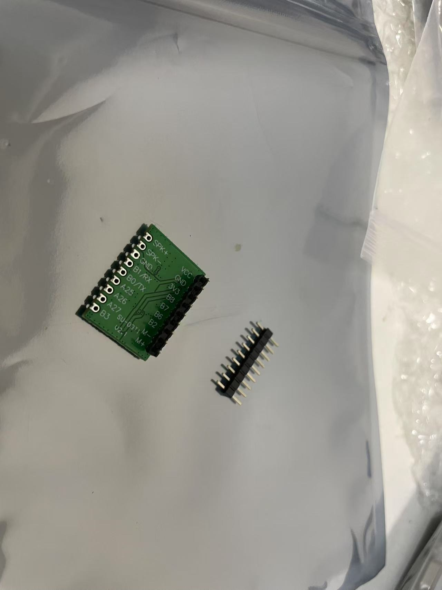

**注意事项：**

- 未焊接的模组无法进行正常的烧录操作
- 焊接时注意防静电措施
- 如无焊接经验，建议寻求专业人士帮助

---

### 编译时错误信息出现乱码怎么办？

## 通用问题


---

### 编译时错误信息出现乱码怎么办？

**问题描述：**

编译项目时，编译器输出的错误信息出现乱码，导致无法正确识别和处理错误。

**解决方案：**

- 检查编译器的字符编码设置，确保与系统编码一致
- 在Windows系统中，尝试使用支持中文的编译环境
- 检查IDE或编辑器的编码设置，建议使用UTF-8编码
- 可尝试在命令行中使用`chcp 65001`切换到UTF-8代码页

**注意事项：**

- 编码问题通常由于编译环境与系统编码不匹配导致
- 确保源代码文件使用正确的编码格式保存
- 如使用第三方编译工具，检查其编码配置选项

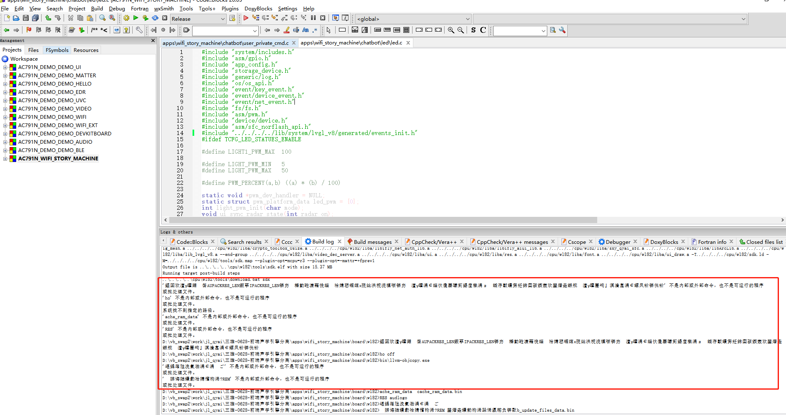

---

### download.bat脚本需要转换编码格式吗？

**问题描述：**

在使用 download.bat 脚本文件时遇到编码格式问题，导致脚本无法正常执行，需要确认是否需要将文件编码转换为 GB2312。

**解决方案：**

- 是的，download.bat 需要转换为 GB2312 编码格式
- 使用文本编辑器（如 Notepad++）将文件编码从默认格式转换为 GB2312
- 同时注意将换行符从 Windows (CR LF) 转换为 Unix (LF) 格式
- 完成编码转换后，将设备进入下载模式再运行 download.bat

**注意事项：**

- 编码不匹配会导致脚本执行异常
- 换行符格式错误也可能影响脚本运行
- 转换编码前建议备份原文件
- 确保使用支持 GB2312 的文本编辑器进行转换

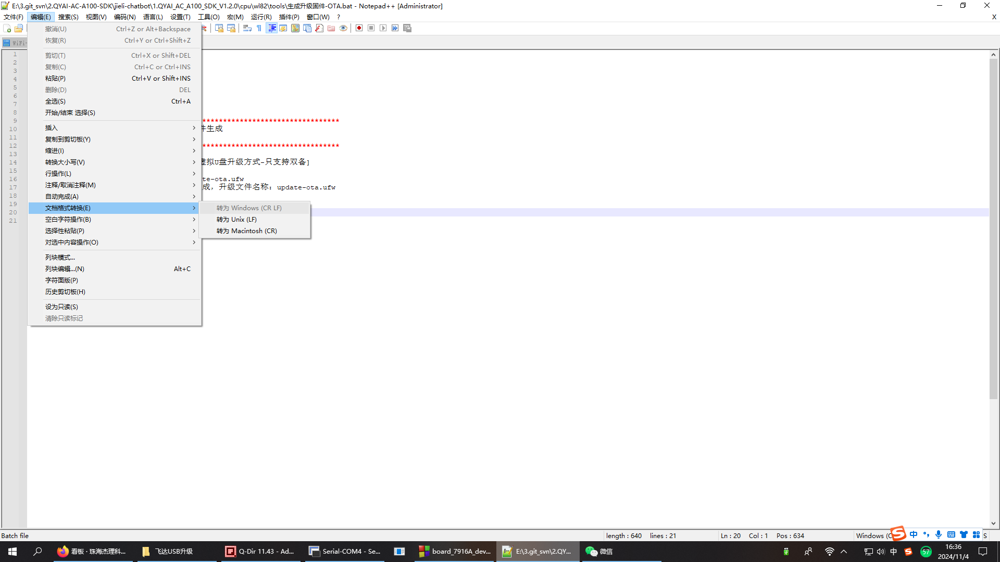


---

### 固件烧录时出现"updater: err -14"错误怎么办？

**问题描述：**

使用烧录工具烧录固件时，进度卡在8%并显示"updater: err -14"错误。

**解决方案：**

**错误原因分析：**

"err -14"错误通常表示以下问题：

1. **拔插不到位**
    - 烧录器与模块接触不良
    - 连接线松动或未正确连接

2. **烧录器问题**
    - 烧录器本身故障
    - USB转串口模块异常

3. **供电电压错误**
    - 使用了5V供电但芯片需要3.3V
    - 电压不匹配导致通信异常

**排查步骤：**

1. **检查连接**
    - 重新拔插烧录器，确保接触良好
    - 检查TX/RX接线是否交叉连接
    - 确认GND接地可靠

2. **验证供电电压**
    - 确认芯片规格要求的供电电压
    - 使用万用表测量实际供电电压
    - 3.3V芯片使用5V供电可能损坏芯片

3. **更换烧录器**
    - 尝试使用另一个烧录器
    - 检查USB转串口模块是否正常工作
    - 使用官方推荐的烧录工具

**注意事项：**

- 烧录前务必确认芯片的供电电压要求
- 使用错误电压可能永久损坏芯片
- 建议使用带电压调节的专业烧录器
- 如果问题持续，联系技术支持检测硬件

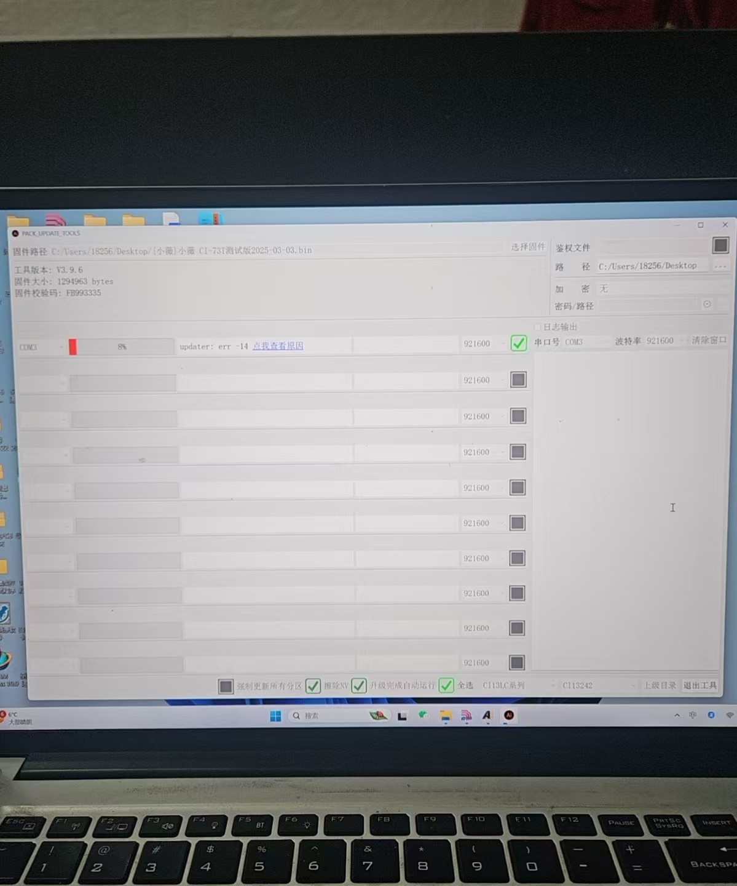

---

### 关闭AEC回声消除导致编译失败怎么办？

**问题描述：**

关闭AEC回声消除功能后，编译失败，在特定串口指令下可以复现该问题。

**解决方案：**

- 调整Welcome中的控制顺序
- 删除防误识别词
- 将禁止语音识别的恢复时间改成10秒
- 主控不停发送串口播报指令可能导致问题

**注意事项：**

- 问题可能由主控持续发送串口播报指令引起
- 建议检查主控发送串口指令的频率
- 测试时减少串口指令发送频率

---

### CH340串口烧录器如何获取？

**问题描述：**

需要进行固件烧录，询问如何获取CH340串口烧录器以及该设备的购买渠道。

**解决方案：**

**1. 购买渠道**：

- **淘宝店铺**：可通过官方淘宝店铺购买
    - 店铺链接：https://item.taobao.com/item.htm?id=622894893913&skuId=4891979504129
    - 搜索"CH340串口烧录器"即可找到

- **模块套餐**：购买语音模块时选择含烧录器的套餐
    - 套餐包含CH340串口烧录器
    - 适合首次购买用户
    - 性价比更高

**2. 烧录器用途**：

- 用于固件烧录到语音模块
- 连接电脑和模块的通信桥梁
- 支持多种语音模块型号

**注意事项：**

- 烧录固件必须使用电脑操作
- 建议首次购买选择带烧录器的套餐
- 保留烧录器以便后续固件更新使用
- 如有大量烧录需求，可准备多个烧录器提高效率

---

### 触摸屏BIN文件如何烧录？

**问题描述：**

收到触摸屏相关的BIN文件，但不理解其内容和烧录方法，需要驱动程序和烧录说明。

**解决方案：**

- BIN文件是直接烧录到IC中的固件文件，不是驱动程序
- 触摸屏驱动需要根据具体的触摸芯片型号获取
- CST78XX系列触摸屏驱动调试文档可参考相关资料
- CST820数据手册提供了详细的接口和配置说明

**注意事项：**

- BIN文件需要使用专用烧录工具写入到触摸芯片中
- 烧录前需确认触摸芯片型号与固件版本匹配
- 如烧录失败，建议联系原厂获取技术支持
- 开发阶段可请求原厂提供样品和技术协助

---

### STM32驱动程序如何获取？

**问题描述：**

需要获取STM32的驱动程序用于开发，并希望获得硬件样品用于测试。

**解决方案：**

- STM32驱动程序通常包含在ST官方提供的STM32CubeMX或HAL库中
- 可从ST官网下载对应型号的固件库和开发工具
- 硬件样品可通过与供应商联系获取，通常会提供开发板和屏幕样品
- 开发过程中可安排技术人员协助调试

**注意事项：**

- 确认STM32具体型号，下载对应的驱动和库文件
- 开发环境建议使用STM32CubeIDE进行开发
- 申请样品时说明项目需求和应用场景
- 保留技术支持人员的联系方式，便于后续沟通

---

### APP操作设备时串口无数据响应如何排查？

**问题描述：**

通过APP操作WiFi智能台灯设备时，串口没有接收到任何数据，设备无法响应APP指令。

**解决方案：**

- 确认设备是否已成功连接到WiFi网络
- 检查APP与设备是否配对成功
- 验证串口监听工具的参数设置（波特率9600）
- 确认串口线连接到正确的通信引脚

**注意事项：**

- 设备离线时无法接收APP指令，需检查网络连接
- 多个设备同时使用时，确保选择了正确的设备
- 串口调试前确保固件已正确烧录
- 如更换模块后问题仍存在，可能是固件版本问题

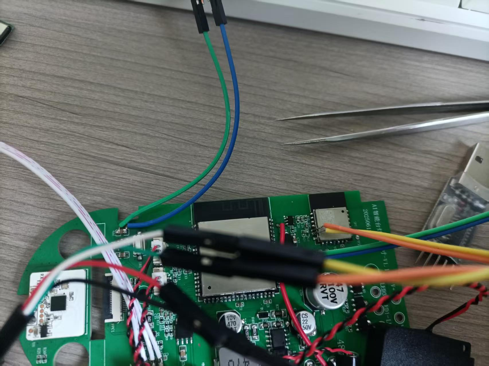

---

### 乐式WiFi模块通信异常和授权问题如何解决？

**问题描述：**

乐式小米WiFi模块无法正常连接网络，持续发送命令且通信异常，怀疑模块未授权。

**解决方案：**

- 检查模块是否已正确授权，未授权模块会导致通信异常
- 验证串口接线是否正确，特别是TX/RX交叉连接
- 确认波特率设置为9600bps
- 更换已授权的模块进行测试

**注意事项：**

- 未授权模块会持续发送无效数据（如FE AA 55）
- 授权后的模块数据包应包含正确的包头（55 AA）和包尾（FE）
- 每次通信数据不同可能是加密导致的正常现象
- 模块授权需联系原厂或供应商处理

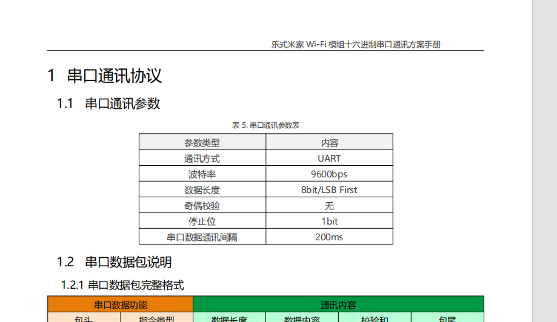

---

### 情景大路灯协议对接问题如何解决？

**问题描述：**

在情景大路灯的协议对接过程中，解析和使用通信协议时遇到问题，特别是关于数据点（DP）的定义和指令类型的使用。

**解决方案：**

- 指令类型0x00代表通讯指令，用于MCU向模组发送属性数据
- 指令类型0x21代表模组主动指令，MCU开发时必须使用
- 数据包格式：包头(2Bytes) + 指令类型(1Byte) + 数据长度(2Bytes) + 数据 + 校验和(1Byte) + 包尾(1Byte)
- 参考数据点定义表配置DP参数，如DP004（模式）、DP026（辅光开关）等

**注意事项：**

- 包头固定为0x55AA，包尾固定为0xFE
- 校验和计算需包含数据段的所有字节
- 模式值范围为0-8，对应不同的灯光场景
- 开关指令使用DPID 0x0318（上光源）、0x0201（下光源）等

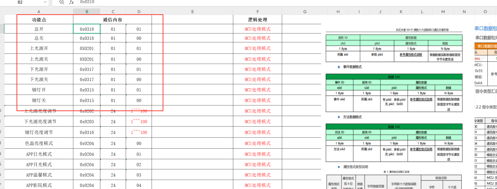
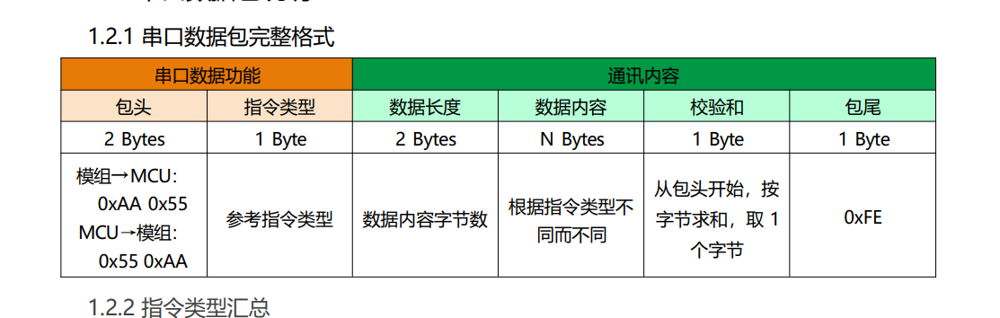
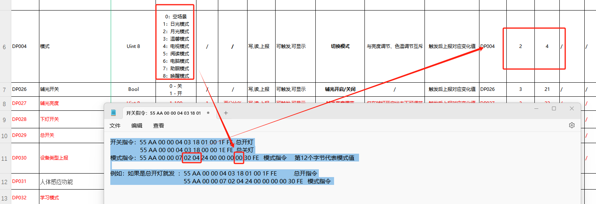

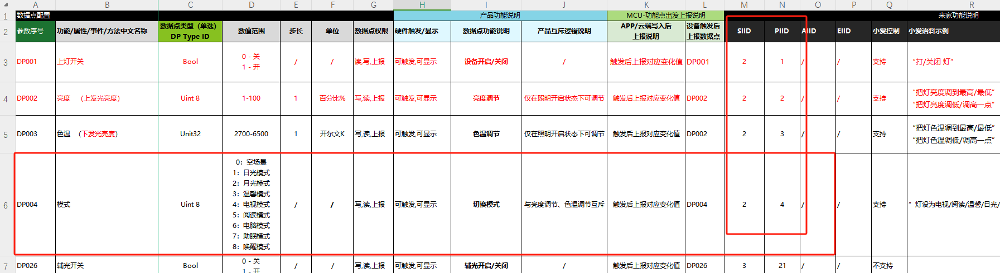

---

### 乐式WiFi模块串口数据包异常如何处理？

**问题描述：**

使用乐式科技WiFi模组进行串口通信时，发现每次发送开灯指令的十六进制数据都不同，且无法识别出协议中定义的包头和包尾。

**解决方案：**

- 确认模块是否已正确解密授权
- 检查串口调试工具的参数设置（波特率9600）
- 验证串口线连接是否正确，TX/RX是否交叉连接
- 使用正确的协议格式：包头AA 55 + 指令类型 + 数据长度 + 数据 + 校验和 + 包尾FE

**注意事项：**

- 加密模块的数据每次可能不同，这是正常现象
- 未授权模块可能显示乱码，无法识别包头包尾
- 确保模块接地良好，避免数据传输错误
- 如数据异常，建议更换已授权的模块测试

---

### 上传程序无反应如何处理？

**问题描述：**

在上传程序到设备时，软件界面没有任何反应，进度条无法推进，上传过程停滞。

**解决方案：**

1. **检查连接状态**
    - 确认USB线已正确连接
    - 检查设备管理器中是否识别到端口
    - 验证驱动程序已正确安装

2. **重启和重试**
    - 重新插拔USB连接
    - 重启烧录软件
    - 更换不同的USB端口

3. **硬件排查**
    - 使用质量好的USB线
    - 避免使用USB延长线
    - 直接连接主板USB口，避开前置面板

**注意事项：**

- 某些笔记本电脑USB口供电不足
- 建议使用台式机或带供电的USB Hub
- 如持续无响应，尝试更换电脑测试

---

### APP无法接收设备数据且更换模块无效怎么办？

**问题描述：**

在使用APP时无法接收到设备发送的数据，尝试更换多个模块后问题依旧存在，设备持续发送重复数据。

**解决方案：**

- 确认烧录的固件版本是否正确（固件编号06420414S）
- 检查产品管理后台的固件配置
- 如多个模块都出现相同问题，可能是固件烧录错误
- 联系供应商重新安排烧录授权的模块

**注意事项：**

- 设备持续发送相同数据（如FE AA 55）表明固件可能有问题
- APP中设备显示离线无法接收任何指令
- 更换模块前确保新模块已正确授权
- 保留问题模块的串口数据截图供技术支持分析
---

### 产品在米家APP中如何正确显示？

**问题描述：**

开发完成后，需要确认产品在米家APP中能够正确显示并识别。

**解决方案：**

- 确认产品已在米家平台正确注册和打标
- 验证产品ID与固件中的配置一致
- 测试添加设备时选择正确的产品类别
- 确保产品名称和图标在APP中正确显示

**注意事项：**

- 产品显示名称需与平台注册信息一致
- 设备类型决定APP中的控制界面样式
- 如显示异常，检查产品管理后台的配置
- 确保固件版本与平台要求匹配

---

### CI1302与CH340通信时出现类似短路保护现象怎么办？

**问题描述：**

CI1302连接CH340后，CH340指示灯熄灭，5V电压降至1.1V，但板子硬件检查无短路。

**解决方案：**

- 只给CH340供电（不连接TX/RX），观察是否仍出现保护现象
- 如只供电就出现保护，可能是CH340本身故障
- 如连接TX/RX后才出现，检查信号线是否有异常电平

**注意事项：**

- 使用视频记录故障现象便于技术支持分析
- 确保硬件连接正确，避免反接或短路
- 如问题持续存在，建议更换CH340模块测试

---

### 米思奇软件出现'Cannot find module'错误怎么办？

**问题描述：**

安装米思奇软件时出现JavaScript错误，提示'Cannot find module'，导致软件无法正常启动。

**解决方案：**

**常见原因：**

- 配置完成后没有点击"一键更新"
- 账号密码填写错误
- 软件安装不完整

**解决方法：**

1. **检查配置步骤**
    - 确认所有配置项都已正确填写
    - 完成配置后必须点击"一键更新"按钮
    - 等待更新完成后再尝试启动

2. **验证账号信息**
    - 检查账号密码是否正确
    - 确认账号状态正常
    - 尝试重新登录账号

3. **重新安装软件**
    - 彻底卸载当前软件
    - 下载最新版本重新安装
    - 安装过程中不要中断

**注意事项：**

- 配置修改后必须执行更新操作
- 确保网络连接正常
- 如问题持续存在，可尝试更换电脑环境测试

---

### 串口助手软件无法打开如何处理？

**问题描述：**

使用串口助手软件时出现系统错误，提示找不到VCRUNTIME140_1.dll文件，导致软件无法打开。

**解决方案：**

**1. 问题原因**

- 缺少Visual C++运行库
- 系统未安装必要的运行时组件
- 软件兼容性问题

**2. 解决方法**

- 使用其他串口助手软件替代
- 下载安装Visual C++ Redistributable
- 使用系统自带的设备管理器

**3. 推荐的串口工具**

- SSCOM V5.13（可正常打开）
- 野火调试助手
- XShell
- PuTTY

**注意事项：**

- 选择合适的波特率（通常为2000000）
- 注意串口线的TX/RX交叉连接
- 保留错误截图便于技术支持分析

---

### 脱机烧录器器件损坏如何处理？

**问题描述：**

脱机烧录器上的某个器件损坏，需要确认器件型号以便更换。

**解决方案：**

- 对于AP82系列升级狗上的不明器件，可尝试替换以下通用器件：

    - PMOS管
    - NMOS管
    - NPN三极管

**注意事项：**

- 更换器件时注意引脚定义和封装尺寸
- 如不确定具体型号，建议联系技术支持获取更详细信息
- 焊接时注意防静电保护

---

### 调试烧录器烧录速度慢怎么办？

**问题描述：**

使用调试烧录器进行芯片烧录时，发现烧录速度非常慢，影响生产效率。

**解决方案：**

- 更新调试烧录器软件到最新版本
- 新版本的调试烧录器软件可从新生成的SDK中获取
- 下载后重新安装调试器烧录软件即可解决烧录速度慢的问题

**注意事项：**

- 使用旧版本调试软件可能导致烧录速度异常
- 建议定期检查并更新到最新版本的烧录工具
- 更新软件前先备份当前版本以备不时之需

---

### 调试器和脱机烧录器哪个烧录速度更快？

**问题描述：**

在批量烧录CI系列芯片时，需要了解调试器和脱机烧录器哪种方式的烧录速度更快。

**解决方案：**

- 脱机烧录器的烧录速度比调试器快一点
- 调试器需要连接电脑，受限于USB传输速度
- 脱机烧录器专门优化了烧录算法，效率更高
- 大批量生产建议使用多个脱机烧录器并行操作

**注意事项：**

- 调试器适合开发和小批量烧录
- 脱机烧录器适合大批量生产使用
- 根据实际需求选择合适的烧录方式
- 脱机烧录器成本较高但长期使用更经济

---

### 设备WiFi配网失败如何排查？

**问题描述：**

设备在WiFi配网过程中失败，无法连接到无线网络。

**解决方案：**

**1. 串口日志排查**

- 使用串口助手连接设备
- 波特率设置为2000000
- 查看配网过程中的错误日志
- 根据错误代码定位问题原因

**2. 常见问题排查**

- **WiFi密码错误**：确认SSID和密码正确
- **信号强度弱**：设备靠近路由器再试
- **路由器兼容性**：尝试2.4GHz频段
- **MAC地址过滤**：检查路由器是否开启过滤

**3. 串口助手工具**

- 可使用野火调试助手等工具
- 下载官方提供的串口助手软件
- 确保驱动程序正确安装

**注意事项：**

- 串口连接时注意交叉线（TX-RX, RX-TX）
- 波特率必须设置为2000000
- 配网失败时先查看日志再操作
- 保留日志记录便于技术支持分析

---

### 如何选择正确的固件BIN文件？

**问题描述：**

固件文件夹中包含多个BIN文件，不确定应该下载哪个文件进行烧录。

**解决方案：**

**1. 文件识别方法**

- 查看文件名确定固件类型
- 通常第一个.bin文件是主固件
- 带.ota后缀的是OTA升级文件

**2. 常见文件类型**

- jx_ci_03t_firmware.bin：主固件文件
- jx_ci_03t_firmware.bin.ota：OTA升级文件
- ota_cfg：OTA配置文件
- readme：固件说明文档

**3. 选择建议**

- 首次烧录选择不带.ota的.bin文件
- OTA文件用于后续升级，非首次烧录
- 如有疑问可查看readme说明

**注意事项：**

- 确认文件完整性，避免使用损坏文件
- 保留原始固件包以备后续使用
- 烧录前确认文件与型号匹配
- 不同型号的固件不可混用


---

## 烧录服务


---

### 如何进行固件MD5校验？

**问题描述：**

烧录固件后需要确认固件的MD5校验码是否正确，以确保烧录成功且固件完整无误。

**解决方案：**

**1. MD5校验工具**

可使用哈希值计算工具（如Hasher Lite等）验证固件文件完整性：

- 选择要校验的固件文件（.bin格式）
- 工具会自动计算并显示MD5值
- 将计算结果与提供的MD5码进行对比

**2. 校验流程**

- 烧录前：记录固件文件的MD5值
- 烧录后：如需验证，可读取已烧录的固件重新计算MD5
- 对比：两个MD5值一致则表示烧录成功且数据完整

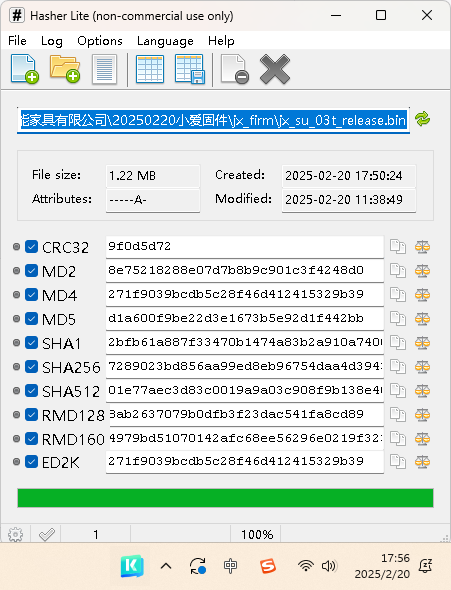

**3. 烧录记录示例**

典型的烧录记录包含以下信息：

- 项目名称：如"海业电子"
- 固件文件：jx_ci_13241_firmware.bin
- 开机播报：无/自定义内容
- 唤醒词：如"小爱小爱"
- 回复语：无/自定义内容
- MD5值：如0b56ccdb882cb19693f5baa3c664d392

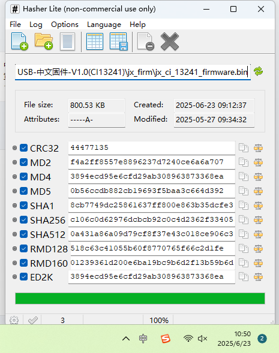

**注意事项：**

- MD5校验是确认固件完整性的重要手段
- 建议每次烧录都进行MD5值记录和存档
- 如MD5值不匹配，需要重新烧录固件
- 烧录记录应妥善保管，便于后续追踪

---

### 收到的样品芯片为空芯片无法使用怎么办？

**问题描述：**

收到的语音芯片样品（如CI13162）是未烧录程序的空芯片，无法直接使用。同时demo板也可能存在程序错误或功能异常的问题。

**解决方案：**

**1. 确认芯片状态**

- 芯片出厂默认为空片，需要烧录程序后才能使用
- 检查数据手册确认芯片型号和规格
- 联系供应商确认是否应该提供已烧录的样品

**2. 自行烧录程序**

**烧录工具准备：**

- 使用CH340烧录器
- 通过串口进行烧录
- 准备正确的固件文件

**烧录步骤：**

- 连接CH340烧录器到芯片
- 使用专用烧录软件
- 选择对应的固件文件进行烧录
- 烧录完成后验证功能

**3. 样品质量问题处理**

**问题反馈：**

- 及时向供应商反馈样品问题
- 提供详细的问题描述和测试现象
- 要求重新发送已正确烧录的样品

**换货流程：**

- 寄回问题样品供供应商检查
- 要求供应商提供测试视频确认新样品功能
- 确认补发的样品包含完整程序

**4. Demo板测试**

**功能验证：**

- 测试语音识别功能是否正常
- 验证红外发射是否工作
- 检查串口通信是否正常

**测试步骤：**

- 上电检查是否有正确的语音提示
- 尝试语音指令看是否正确识别
- 观察红外发射指示灯
- 使用示波器或红外接收器验证红外信号

**注意事项：**

- 收到样品后应立即测试，发现问题及时反馈
- 保留原始包装和样品，便于退换货
- 要求供应商提供测试视频和使用说明
- 批量采购前务必进行小批量验证

**常见问题：**

- 空芯片问题：联系供应商重新烧录或提供已烧录样品
- 程序错误：可能是固件版本问题，需要更新
- 内存不足：复杂功能可能超出芯片能力，需要优化或选择更大容量型号

---

### 如何获取CI13162芯片的开发资料和封装信息？

**问题描述：**

需要获取CI13162芯片的完整开发资料，包括数据手册、封装图、订购信息、典型应用电路图和开发包，以便进行产品设计和开发。

**解决方案：**

**1. 基础技术文档**

**数据手册获取：**

- CI13162_datasheet V1.0_chs_20240619.pdf
- 包含芯片的完整技术规格
- 电气特性、封装尺寸、引脚定义

**封装信息：**

- SOP16封装
- 引脚间距：1.27mm
- 封装宽度：4.0mm
- 封装长度：10.0mm
- 1脚标识位置

**订购信息解读：**

- CI13：产品系列代号
- 16：封装类型（SOP16）
- 2：Flash容量（2MB）
- MRK标识：公司LOGO和批次信息

**2. 开发包内容**

**开发资源获取：**

- 官方文档：https://help.aimachip.com/docs/ci76z
- 包含完整开发包下载
- 典型应用电路参考设计

**电路图包含：**

- 语音芯片电路设计
- 电源和串口接口电路
- 差分麦克风电路
- AB类功放电路
- 完整BOM清单

**3. 硬件设计参考**

**最小系统需求：**

- CI13162语音芯片
- 麦克风（差分或单端）
- 基本外围元件（电阻、电容、晶振）
- 电源电路（3.3V稳压）

**PCB设计注意：**

- 预留足够的布局空间
- 考虑散热设计
- RF信号走线优化
- 测试点预留

**4. 开发流程**

**步骤指南：**

- 下载并研读数据手册
- 参考典型应用电路设计
- 制作样板测试验证
- 根据测试结果优化设计
- 准备批量生产

**技术支持：**

- 提供完整的参考设计
- 支持应用方案咨询
- 可获取demo板参考
- 提供封装和贴片指导

**注意事项：**

- 芯片为空片时，需要自行烧录程序
- 开发前确认所需功能的内存需求
- 留意外形尺寸公差，确保贴片良率
- 批量生产前进行充分的可靠性测试

---

### 配置检查时提示参数格式错误怎么办？

**问题描述：**

导入SDK进行配置检查时，提示"A6和A11参数的串口参数不是十六进制数格式"。

**解决方案：**

**1. 检查参数格式**

- 串口参数必须使用十六进制格式
- 正确格式：AA 55 01 {MessageRec}
- 错误格式：包含{MessageRec}等变量

**2. 删除变量参数**

- 找到包含{}的参数部分
- 删除{MessageRec}等变量内容
- 只保留固定的十六进制数

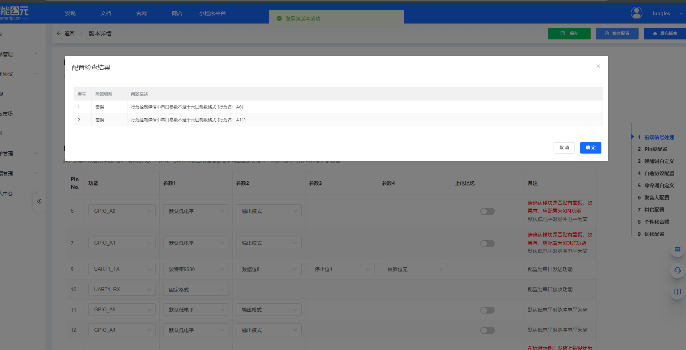

**3. 正确的参数设置**

- 事件参数应为纯十六进制数
- 示例：AA 55 01
- 不包含任何花括号或变量

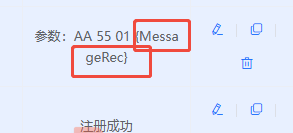

**注意事项：**

- {}内的变量会被系统识别为错误格式
- 配置检查的目的是确保所有参数都是有效的十六进制数
- 如需动态数据，建议通过其他方式处理，不要直接写在参数中

---

### 芯片代烧录服务如何收费？

**问题描述：**

需要了解芯片代烧录服务的收费标准和计费方式。

**解决方案：**

**蜂鸟M芯片烧录收费标准：**

1. **基础费用**：

    - 1000片以内：200元/次
    - 超过2000片：超出部分按0.1元/片计算

2. **服务流程**：

    - 确认芯片型号和数量
    - 提供需要烧录的固件
    - 支付烧录费用
    - 完成烧录并发货

**注意事项：**

- 代烧录服务适用于所有支持芯片型号
- 建议批量烧录以降低单片成本
- 烧录前请确认固件文件正确性
- 保留烧录记录便于后续追踪

---

### 烧录服务需要多长时间？

**问题描述：**

需要了解烧录服务的时间安排，包括样品烧录和批量烧录的时间周期，以便安排生产和贴片计划。

**解决方案：**

**烧录时间周期：**

1. **样品烧录**：

    - 样品数量：通常10个左右
    - 烧录时间：1个工作日内完成
    - 发货安排：烧录完成后次日发货

2. **批量烧录**：

    - 批量数量：如6000片
    - 烧录时间：约2个工作日
    - 需提前规划：考虑贴片时间节点
    - 小批量（如50片）：在订单较多时可能需要等待3-5天

**服务流程：**

1. **样品测试阶段**：

    - 先烧录少量样品（如10个）
    - 发送给使用方进行功能测试
    - 确认样品测试OK后进行批量烧录

2. **批量烧录阶段**：

    - 样品测试通过后安排批量烧录
    - 确认收货地址和收件人信息
    - 烧录完成后直接发货至指定地址

**注意事项：**

- 样品烧录相对快速，通常1天内可完成
- 批量烧录需要2天时间，请提前安排生产计划
- 建议预留足够时间进行样品测试
- 确认收货地址准确，避免发货延误

---

## 烧录操作方法


---

### 蜂鸟M芯片为何需要初始固件才能串口下载？

**问题描述：**

蜂鸟M芯片出厂时为空片，无法直接通过串口下载固件，需要使用专用下载器先烧录初始固件。

**解决方案：**

**空片状态说明：**

- 蜂鸟M芯片出厂时内部无任何程序
- 空片状态下不支持串口下载功能
- 必须先通过专用下载器烧录引导程序

**烧录流程：**

1. **首次烧录（使用下载器）**：

    - 使用专用下载器通过B0、B1引脚连接
    - 烧录初始引导程序到芯片
    - 引导程序包含串口下载功能

2. **后续更新（串口下载）**：

    - 可通过串口进行固件更新
    - 使用B6（RX）、B7（TX）引脚
    - 配合智能公元平台生成的固件

**SDK文件说明：**

从智能公元平台下载的SDK包含两个文件夹：

- **下载器文件夹**：包含引导程序，用于空片首次烧录
- **串口下载文件夹**：包含应用程序固件，用于串口更新

**注意事项：**

- 蜂鸟M芯片必须先有引导程序才能支持串口下载
- 引导程序只需烧录一次，后续可通过串口更新
- 如芯片完全损坏无法通信，需要重新用下载器烧录引导程序

---

### 如何通过烧录口查看设备日志？

**问题描述：**

需要通过烧录口（串口）查看模块的运行日志以便调试问题。

**解决方案：**

- 连接串口助手到模块的烧录口
- 设置波特率为2000000
- 上电后即可查看模块输出的日志信息

**注意事项：**

- 烧录口和串口输出功能可以同时使用
- 内部有上拉电阻，正常使用时无需额外处理
- 查看日志时注意关闭16进制显示模式

---

### 烧录口可以同时用作串口输出吗？

**问题描述：**

在使用模块时，希望了解烧录口是否可以复用为串口输出功能，以便同时进行烧录和通信调试。

**解决方案：**

烧录口可以同时用作串口输出，具体说明如下：

- **功能复用**：烧录口（UART）在正常工作时可作为串口通信接口
- **内部设计**：芯片内部已做相应处理，支持功能复用
- **无需切换**：烧录和串口通信可随时切换使用

**使用场景：**

- 烧录固件时使用烧录功能
- 运行调试时使用串口输出日志
- 应用通信时作为数据传输接口

**注意事项：**

- 使用时避免同时进行烧录和通信操作
- 通信参数需与对接设备匹配（波特率、数据位等）
- 烧录时断开外部串口连接

- 2000000是日志输出的专用波特率，与通信波特率不同
- 使用此功能需要串口工具支持高波特率
- 日志信息有助于定位问题和调试程序

---

### 烧录时设备状态显示"app 0%"是正常的吗？

**问题描述：**

在上位机软件中显示固件上传进度停滞在0%，状态为"app 0%"，担心是否正常。

**解决方案：**

- 显示"app 0%"是正常现象
- 这表示设备已连接但等待烧录操作
- 需要按照正确的烧录流程操作才能开始传输

**注意事项：**

- 单纯显示"app 0%"不代表烧录失败
- 需要配合断电上电操作进入烧录模式
- 如长时间无变化，检查接线是否正确

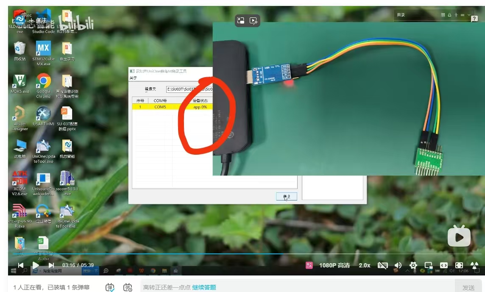

---

### 烧录时找不到设备怎么办？

**问题描述：**

烧录程序时出现设备无法被识别的问题，导致烧录失败，需要了解如何处理。

**解决方案：**

**1. 基础检查步骤**

- 检查USB驱动是否正常安装
- 确认模块供电是否稳定（5V）
- 检查USB线缆是否连接牢固
- 尝试更换不同的USB端口

**2. 烧录工具设置**

- 确认选择了正确的串口号
- 检查波特率设置是否匹配
- 尝试降低波特率重新连接
- 关闭其他可能占用串口的软件

**3. 硬件连接检查**

- 检查转接板连接是否正确
- 确认TX/RX线序没有交叉
- 测试使用短一点的连接线
- 检查模块引脚是否有虚焊或短路

**4. 驱动和系统问题**

- 重新安装CH340或CP2102驱动
- 在设备管理器中查看设备状态
- 尝试在不同电脑上烧录测试
- 检查系统是否禁用了USB端口

**注意事项：**

- 设备无法识别通常是连接或驱动问题
- 供电不足会导致设备连接不稳定
- 不要在烧录过程中插拔设备
- 如仍无法解决，请联系技术人员并提供具体错误信息

---

### UART3_TX串口发送延迟时间如何确认？

**问题描述：**

在配置串口发送指令时，对第三条发送指令的延迟时间存在疑问，不确定是300ms还是450ms发送。

**解决方案：**

- 第三条UART3_TX发送指令的延迟时间为300ms
- 配置界面中显示的延迟时间即为实际发送延迟
- 前两条指令的延迟分别为150ms和300ms，第三条延迟300ms

**注意事项：**

- 串口发送的延迟时间是从前一条指令完成后开始计算
- 确保指令执行顺序和延迟时间满足系统时序要求
- 如需调整时序，建议先测试验证后再应用

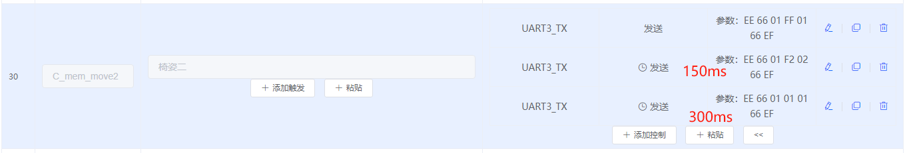

---

### CI03模块烧录软件打开后立即闪退怎么办？

**问题描述：**

CI03模块的烧录软件打开后立即闪退，即使已关闭杀毒软件。

**解决方案：**

1. **检查系统环境**：

    - 确认操作系统版本兼容性
    - 安装必要的运行库（如.NET Framework）
    - 检查系统是否有其他冲突软件

2. **以管理员身份运行**：

    - 右键点击烧录软件图标
    - 选择"以管理员身份运行"
    - 确认UAC权限设置

3. **临时关闭安全软件**：

    - 完全关闭所有杀毒软件
    - 关闭Windows Defender实时保护
    - 关闭防火墙进行测试

4. **重新下载软件**：

    - 从官方渠道重新下载烧录软件

---

### 产品出货时是否需要烧录固件？

**问题描述：**

需要确认产品出货时应该使用出厂固件还是定制固件，以及相应的烧录方式和固件包获取途径。

**解决方案：**

**出货方式选择：**

- **出厂固件出货**：使用官方提供的标准固件
- **定制固件出货**：使用需求方提供的特定固件

**操作流程：**

1. **确认出货方式**

    - 确认是否需要烧录特定固件
    - 查询历史出货记录，参考之前的出货方式
    - 如无特殊要求，可按出厂固件出货

2. **固件获取方式**

    - 出厂固件：从智能公元平台下载
    - 定制固件：由需求方提供固件包
    - 确保固件文件完整性和安全性

3. **烧录执行**

    - 根据固件类型选择合适的烧录工具
    - 批量烧录前进行小批量测试
    - 记录烧录参数和MD5校验码

**注意事项：**

- 出厂固件出货流程简单，风险较低
- 定制固件需要需求方提供完整的技术文档
- 建议保留每批次的出货记录和固件备份
- 如有疑问，及时与需求方确认

---

### 批量烧录后产品仍播报出厂固件怎么办？

**问题描述：**

批量烧录完成后，所有产品开机仍播报出厂固件内容，而非预期的定制固件（如"智渊小智随时为您提供服务"）。

**解决方案：**

**1. 立即处理措施**

- 停止使用该批次产品
- 重新检查烧录流程和参数设置
- 对库存产品进行100%功能测试

**2. 烧录失败排查**

- **固件文件确认**：

    - 验证固件文件是否正确
    - 确认MD5值与原始文件一致
    - 检查文件是否在传输过程中损坏

- **烧录工具检查**：

    - 确认烧录工具版本兼容
    - 检查是否选择了正确的固件文件
    - 验证烧录参数设置

- **硬件连接**：

    - 检查烧录夹具接触是否良好
    - 确认供电稳定（5V）
    - 测试多台设备排除硬件问题

**3. 补救方案**

- **自行处理**：

    - 如产品已收到且时间紧急，可提供固件文件
    - 自行重新烧录
    - 提供技术指导和烧录支持

- **返厂处理**：

    - 安排产品返厂重新烧录
    - 承担往返运费
    - 加急处理确保及时交付

**注意事项：**

- 批量烧录前务必进行小批量测试
- 保留每批次的烧录记录和MD5校验码
- 烧录完成后必须进行功能抽检
- 建立质量追溯体系，便于问题定位

---

### 串口管理工具中显示很多未连接的COM口怎么办？

**问题描述：**

在使用串口管理工具时，设备列表中出现大量未连接的COM口，这些COM口显示为"未连接"状态。

**解决方案：**

- 串口管理工具只会显示系统中所有的COM口，包括未连接的
- 只需要找到对应的可用COM口进行烧录即可
- 工具不会主动管理或删除其他串口

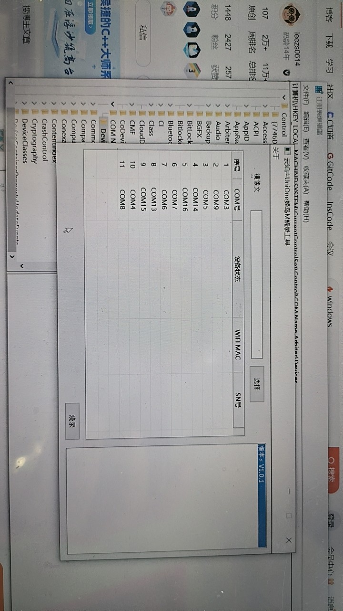

**注意事项：**

- 电脑外接过多设备时会产生多个COM口
- 即使没有外接设备，系统也可能保留历史COM口
- 不需要删除这些未连接的COM口，正常使用即可


---

### 烧录时提示"文件读取失败"怎么办？

**问题描述：**

烧录软件在尝试烧录固件时提示文件读取失败，错误信息显示路径包含中文字符。

**解决方案：**

1. **检查文件路径**
    - 确保固件文件路径中不包含中文字符
    - 将文件移动到纯英文路径下
    - 建议放在桌面或简单路径如D:\firm

2. **使用正确的固件文件**
    - 确认使用的是官方提供的固件文件
    - 文件名应为英文（如：jx_su_03t_release_update.bin）
    - 避免修改文件名

3. **操作步骤**
    - 将固件文件复制到桌面
    - 在烧录软件中重新选择文件
    - 再次尝试烧录

**注意事项：**

- 路径不能有中文是软件限制
- 设备管理器显示串口正常不代表软件能识别到设备
- 线路接触不良也会导致无法识别芯片


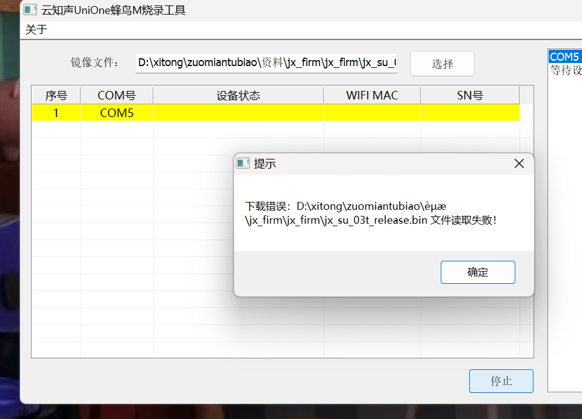

---

### 烧录后设备无反应怎么办？

**问题描述：**

固件烧录完成后，设备通电后没有任何声音或反应，怀疑是固件文件问题。

**解决方案：**

1. **检查开机播报配置**
    - 确认是否配置了开机播报功能
    - 没有配置开机播报时，设备启动可能没有声音提示

2. **测试基本功能**
    - 烧录完成后关掉烧录软件
    - 拔掉CH340连接线
    - 重新给模块单独供电
    - 按下蓝色开关测试响应

3. **验证固件文件**
    - 使用官方提供的测试固件
    - 确认固件文件完整性
    - 对比使用不同固件文件的效果

4. **硬件检查**
    - 检查音频输出连接
    - 确认喇叭或耳机工作正常
    - 验证供电电压是否正确

**注意事项：**

- 烧录成功不等于有开机声音
- 需要预先配置好语音指令或播报内容
- 如果测试固件可以工作，说明原固件文件有问题

---

### 烧录时为什么需要控制电源开关？

**问题描述：**

在烧录语音模块时，是否需要通过开关来控制供电，以及如何正确操作以避免烧录失败。

**解决方案：**

**1. 为什么要使用开关控制**

- 部分语音模块需要特定的上电时序才能进入烧录模式
- 通过断电再上电的序列，使模块识别到烧录请求
- 避免模块处于正常工作状态而拒绝烧录

**2. 正确的烧录流程**

- **步骤1**：连接好烧录线（RX、TX、GND）
- **步骤2**：给模块供电
- **步骤3**：打开烧录工具，选择固件
- **步骤4**：点击开始烧录
- **步骤5**：快速断开再接通电源（通过开关操作）
- **步骤6**：模块自动进入烧录模式并开始传输数据

**3. 开关的实现方式**

- 使用物理开关串联在VCC供电线上
- 或通过拔插电源线实现（不建议频繁操作）
- 部分开发板自带烧录控制开关

**4. 操作技巧**

- 断电再上电操作要在点击烧录后1-2秒内完成
- 上电后不要立即操作，等待工具识别
- 如失败可重复尝试1-2次

**注意事项：**

- 不是所有模块都需要此操作，具体参考对应型号的烧录指南
- 操作时注意避免触电或短路
- 频繁断电可能影响电子元件寿命
- 建议使用专业的烧录座或开发板

---

### 如何实现6路继电器点动控制？

**问题描述：**

需要通过语音模块的IO口控制6路继电器，实现点动控制功能，但遇到固件下载问题。

**解决方案：**

**1. 点动控制实现方法**

- 点动控制是指按下时动作，松开即断开的控制方式
- 在语音指令配置中设置相应的控制命令
- 每个命令对应一个继电器的开关控制

**2. IO口控制注意事项**

- 确认语音模块IO口驱动能力是否足够驱动继电器
- 如驱动能力不足，需要增加中间驱动电路（如三极管或继电器驱动板）
- 测试时可用万用表测量模块IO口输出电平

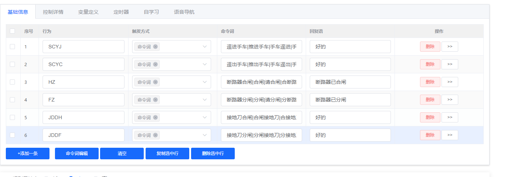

**3. 固件下载问题处理**

当遇到"文件读取失败"错误时：

- **问题原因**：固件文件路径包含中文字符
- **解决方法**：将固件文件移动到纯英文路径下
- **推荐路径**：如 D:\firmware 或 C:\firmware

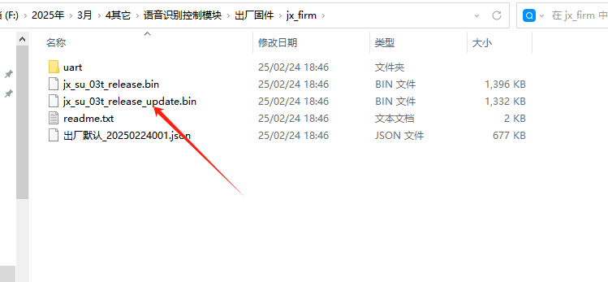

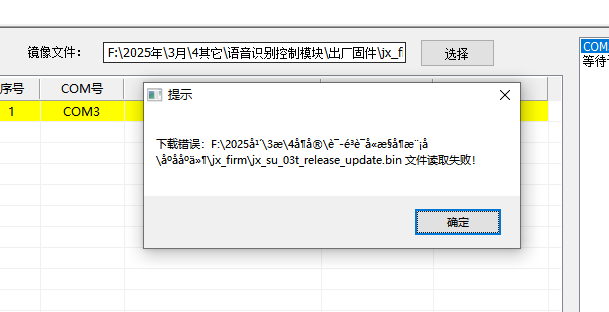

**注意事项：**

- 路径中不能包含任何中文字符，包括文件名
- 建议使用官方提供的出厂固件进行测试
- IO口直接驱动继电器可能需要外加驱动电路
- 点动控制的实际效果需要测试确认

---

## 供电电压与烧录安全


---

### 芯片供电电压超过5.5V会导致什么问题？

**问题描述：**

芯片焊接到电路板后无法烧录，且供电电压超过5.5V时出现无响应问题。

**解决方案：**

**1. 电压限制说明**

- 芯片最高供电电压不应超过5V
- 5.5V电压会损坏芯片内部电路
- 超压后芯片将失去响应功能

**2. 正确供电方法**

- 使用3.3V或5V稳定电源供电
- 测量实际供电电压，确保在安全范围
- 避免使用不稳定的USB扩展口供电

**3. 焊接后烧录问题**

- 芯片焊接后仍可进行烧录
- 烧录失败通常是由外围电路干扰导致
- 建议断开外围电路后单独烧录测试


---

### 模块焊接后如何进行烧录？

**问题描述：**

CI系列离线语音识别模块焊接到电路板后，无法使用常规方法进行烧录。

**解决方案：**

**1. 焊接飞线方法**

- 在模块的RX引脚焊接一根导线出来
- 在模块的GND引脚焊接一根导线出来
- 通过这两根线连接烧录工具

**2. 烧录连接方式**

- RX线：用于向模块写入固件数据
- GND线：提供公共地线参考
- 模块供电：确保模块正常上电工作

**3. 操作步骤**

- 准备细导线（可从杜邦线中抽取铜丝）
- 在RX和GND引脚上小心焊接飞线
- 保持模块正常供电状态
- 连接烧录工具进行固件更新

**注意事项：**

- 焊接时避免短路，特别是与邻近引脚
- 使用细导线，避免影响模块稳定性
- 烧录完成后可以保留飞线以备后续使用
- TX引脚用于模块向外传输数据，烧录时不需要

**4. 故障排查**

- 测量芯片各引脚对地电阻，判断是否损坏
- 检查电源回路是否有短路
- 确认晶振是否正常起振

**注意事项：**

- 任何时候都要确保供电电压不超过5V
- 超压损坏通常不可逆，需要更换芯片
- 建议在电源输入端添加过压保护电路

---

## SU系列模块烧录


---

### 为什么之前可以正常烧录，现在突然失败了？

**问题描述：**

之前多次成功烧录固件，但最近突然无法正常烧录，出现异常情况。

**解决方案：**

**1. 硬件连接检查**

- 检查烧录线是否松动或损坏
- 确认USB转串口驱动是否正常工作
- 测试不同的USB接口或电脑

**2. 供电检查**

- 确认供电电压稳定
- 检查电源电流是否足够
- 排除供电线路接触不良

**3. 环境因素排查**

- 检查是否有强电磁干扰
- 尝试在不同的环境进行烧录
- 避免在潮湿环境下操作

**4. 模块状态检查**

- 模块可能因异常操作进入保护模式
- 尝试完全断电后等待几分钟再上电
- 检查模块是否有物理损坏

**5. 软件工具排查**

- 重装烧录工具
- 尝试使用不同版本的固件
- 检查系统是否更新导致兼容性问题

**注意事项：**

- 烧录失败后不要频繁尝试，避免损坏模块
- 记录详细的错误信息以便排查
- 如问题持续存在，可能需要专业维修

---

## 固件烧录


---

### 烧录时提示"固件大小超出该设备flash大小"怎么办？

**问题描述：**

使用串口工具烧录固件时，遇到"固件大小超出该设备flash大小"的错误，导致烧录失败。

**解决方案：**

**问题原因分析：**

- 固件文件大小超过了芯片Flash存储容量
- 1M Flash的芯片，系统需要占用部分空间
- 实际可用容量小于标称Flash容量

**解决方法：**

1. **精简回复语内容**：

    - 减少回复语的数量和长度
    - 多个命令词使用相同的回复语
    - 删除不必要的音频提示

2. **优化配置**：

    - 减少命令词数量，只保留必要功能
    - 简化控制逻辑，减少固件体积
    - 避免使用大型音频文件

3. **选择合适芯片**：

    - CI-13242芯片：2M Flash容量
    - CI-13241芯片：1M Flash容量
    - 根据功能需求选择合适容量的芯片

**Flash容量参考：**

- 1M Flash芯片：可用约800-900KB给用户
- 2M Flash芯片：可用约1.8MB给用户
- 系统占用：包含引导程序、系统程序等

**注意事项：**

- 固件大小限制是硬件约束，无法绕过
- 建议在配置时预留足够余量
- 如功能较多，建议选择2M Flash的芯片版本

---

### 烧录时勾选"强制更新所有分区"有什么影响？

**问题描述：**

在烧录工具中勾选"强制更新所有分区"选项后，担心是否会影响模块功能或导致数据丢失。

**解决方案：**

**影响说明：**

勾选"强制更新所有分区"会重新分配所有固件分区，完全重写Flash内容。

**对不同类型模块的影响：**

1. **普通模块（无特殊授权）**
    - 勾选该选项不会影响正常使用
    - 烧录后所有功能正常工作
    - 可以放心使用该选项进行完整更新

2. **带特殊授权的模块**
    - **声源定位授权模块**：勾选后会删除授权，变为普通模块
    - **TTS授权模块**：可能导致TTS授权丢失
    - **声纹识别授权模块**：授权信息会被清除
    - 授权一旦丢失，需要重新购买授权模块

**使用建议：**

1. **普通模块**：

    - 可以勾选"强制更新所有分区"进行完整烧录
    - 适用于固件出现异常需要彻底重写的情况

2. **授权模块**：

    - 避免勾选"强制更新所有分区"
    - 使用常规烧录方式保留授权信息
    - 如必须强制更新，需要准备好重新授权

3. **不确定是否为授权模块时**：

    - 联系技术支持确认模块类型
    - 或先使用不勾选强制更新的方式烧录

**注意事项：**

- 授权信息通常存储在特定分区中
- 强制更新所有分区会擦除包括授权在内的所有数据
- 授权模块在购买时应明确标注，请注意区分

---

### 烧录时如何选择正确的固件文件？

**问题描述：**

在固件烧录工具中看到多个BIN文件（如jx_su_03t_release.bin和jx_su_03t_release_update.bin），不确定应该选择哪个文件进行烧录。

**解决方案：**

**文件命名规则说明：**

- **x_release.bin**：完整固件包，用于整片烧录
- **x_release_update.bin**：升级固件包，用于OTA或增量更新

**选择原则：**

1. **首次烧录或完整更新**
    - 选择完整的固件文件（如jx_su_03t_release.bin）
    - 适用于新模块或需要完全重写的情况

2. **选择update.bin文件的场景**
    - 当使用云知声UniOne烧录工具进行本地烧录时
    - 工具会自动识别并推荐update.bin文件
    - update.bin包含了烧录引导和必要的信息

**操作步骤：**

1. 打开云知声UniOne烧录工具
2. 连接目标模块
3. 选择对应的update.bin文件
4. 确认模块型号匹配
5. 开始烧录

**注意事项：**

- 烧录工具通常会提示选择正确的文件
- 如果不确定，优先选择带有"update"的文件
- 确保固件文件与模块型号完全匹配
- 不要选择压缩包或配置文件


---

### 配置检查通过是否说明配置完全正确？

**问题描述：**

配置工具显示"配置检查通过！"，但配置中可能存在空白项，不确定是否属于正常现象。

**解决方案：**

**配置检查功能说明：**

- 配置检查是一个初步的检查功能
- 主要用于检查一些比较显著的错误
- 不能保证所有配置项都完全正确

**检查范围：**

1. **必填项验证**
    - 检查关键字段是否填写
    - 验证命令词是否为空
    - 确认回复语设置

2. **格式验证**
    - 检查数据格式是否符合要求
    - 验证参数范围是否合理
    - 确认文件路径有效性

3. **逻辑检查**
    - 检查命令词和回复语的对应关系
    - 验证IO配置的合理性
    - 确认模块功能配置

**检查局限性：**

- 可能无法发现所有潜在问题
- 空白项在某些情况下可能被允许
- 实际效果需要以烧录测试为准

**建议做法：**

- 即使通过检查，也要仔细检查所有配置项
- 对于空白项，确认是否为必需配置
- 建议进行实际功能测试验证


---

### STM32最小系统板使用CH340烧录超时如何解决？

**问题描述：**

使用CH340下载程序烧录STM32最小系统板时，出现"芯片超时无应答，无法连接"错误。

**解决方案：**

**1. 烧录工具选择**

- **MCUISP**：适用于STM32的串口烧录工具
- **STM32CubeProgrammer**：ST官方工具
- **J-Link/ST-Link**：专用调试器，更稳定

**2. 连接检查**

- **BOOT0引脚**：烧录时必须拉高（接3.3V）
- **BOOT1引脚**：保持低电平（接地）
- **复位时序**：先设置BOOT0，再按复位键

**3. 波特率设置**

- 降低波特率至115200或更低
- 高波特率可能导致通信不稳定
- 确认与MCU支持的波特率匹配

**4. 驱动和端口**

- 确认CH340驱动已正确安装
- 检查设备管理器中的COM端口
- 尝试不同的USB端口

**推荐方案：**

对于STM32开发，建议使用ST-Link或J-Link：

- 更稳定的连接
- 支持调试功能
- 避免串口烧录的各种问题

**注意事项：**

- STM32的串口烧录需要进入BOOT模式
- 不同厂家的最小系统板可能有差异
- 确认目标芯片型号选择正确
- 供电要稳定，建议使用外部电源

---

### 使用USB供电时设备上电导致串口掉线怎么办？

**问题描述：**

使用USB供电时，设备上电瞬间导致串口掉线，无法正常烧录固件，且串口工具无法识别设备。

**解决方案：**

**1. 分离供电和通信**

将设备供电与串口通信分离：

- **串口连接**：仅连接GND、RX、TX三根线
- **独立供电**：设备使用外部独立电源供电
- **共地要求**：确保串口工具和设备共地

**2. 供电方案选择**

根据实际情况选择合适的供电方案：

- **独立电源**：使用专用直流电源模块
- **充电头供电**：使用手机充电头+USB线
- **双电脑方案**：一台电脑供电，一台电脑烧录

**3. 问题原因分析**

USB供电导致掉线的常见原因：

- **电脑USB口输出能力有限**：瞬时电流需求超过USB口供电能力
- **输入电容过大**：部分模块设计时输入电容较大，上电瞬间冲击电流大
- **电压波动**：上电瞬间电压波动影响USB串口芯片工作

**4. 预防措施**

为避免此类问题，建议：

- **使用带过流保护的USB口**
- **选择输入电容较小的模块**
- **上电前先连接好串口线**
- **使用质量更好的USB线和接口**

**注意事项：**

- 必须确保共地连接，否则通信无法正常进行
- 独立电源电压要与设备要求匹配
- 若使用双电脑方案，两台电脑要共地或使用隔离串口
- 购买专用电源模块可一劳永逸解决问题

---

### 使用UniOne蜂鸟M烧录工具提示"打开串口失败"怎么办？

**问题描述：**

在使用云知声UniOne蜂鸟M烧录工具时，无法成功烧录固件，烧录工具提示"打开串口失败"，且无法识别设备。

**解决方案：**

**1. 连接检查**

检查硬件连接是否正确：

- **串口线连接**：确认TX、RX、GND三根线连接正确
- **交叉连接**：模块的TX连接工具的RX，模块的RX连接工具的TX
- **共地连接**：确保GND线已连接


**2. 设备状态检查**

确认模块处于烧录模式：

- **断电重启**：将模块断电后重新上电
- **进入boot模式**：某些模块需要特定操作进入烧录模式
- **检查指示灯**：观察模块电源指示灯状态

**3. 驱动和端口检查**

软件层面的检查：

- **驱动安装**：确认USB转串口驱动已正确安装
- **端口占用**：检查COM端口是否被其他程序占用
- **端口选择**：尝试不同的USB端口

**4. 设备识别问题**

如果设备无法识别：

- **设备管理器查看**：检查设备管理器中的端口状态
- **重新安装驱动**：卸载后重新安装串口驱动
- **换个USB线**：排除USB线缆问题

**5. 替代方案**

如果问题持续：

- **使用其他工具**：尝试厂商提供的其他烧录工具
- **不同电脑测试**：换个电脑排除电脑问题
- **系统兼容性**：Windows 10可能需要特殊驱动设置

**注意事项：**

- 确保模块供电稳定
- 不要在烧录过程中断开连接
- 某些模块需要先按住复位键再上电
- 如果使用了USB转串口，确认转接头工作正常

**常见错误类型：**

- "打开串口失败"：通常是驱动或连接问题
- "设备未识别"：可能是烧录模式未进入
- "写入失败"：检查固件文件是否匹配

---

### 云知声UniOne蜂鸟录软工具提示"发送异常，COM7终止了本次传输活动"怎么办？

**问题描述：**

使用云知声UniOne蜂鸟录软工具时，遇到COM7串口通信异常，提示"发送异常，COM7终止了本次传输活动"，且设备状态显示"打开串口失败"。

**解决方案：**

**COM口松动排查：**

- 检查串口线连接是否松动
- 重新插拔串口连接器，确保接触良好
- 更换更牢固的串口连接线

**故障排查步骤：**

1. **更换COM端口**

    - 尝试使用其他COM端口
    - 在设备管理器中查看可用的串口
    - 选择状态正常的COM端口

2. **检查连接稳定性**

    - 将串口插紧一点，确保良好接触
    - 避免使用过长或质量差的串口线
    - 确认串口线没有虚焊或接触不良

**注意事项：**

- COM端口异常通常是物理连接问题
- 建议使用原装或质量可靠的串口线
- 如果问题持续，考虑更换USB转串口模块

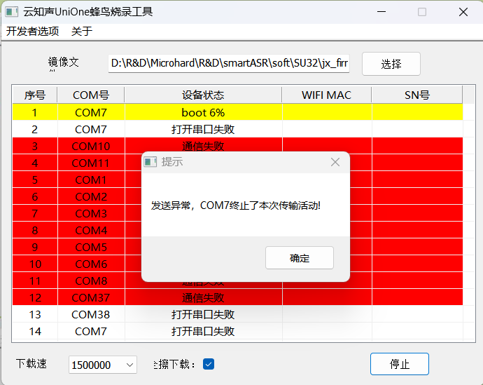

---

### 串口助手正常但语音模块通信失败怎么办？

**问题描述：**

使用串口助手发送数据时工作正常，但替换成语音模块后通信失败，需要排查串口通信问题。

**解决方案：**

**1. 检查模块发送的数据**

- 使用串口工具抓取语音模块发送的实际数据
- 确认数据格式是否与单片机期望的一致
- 检查是否有乱码或数据丢失

**2. 硬件连接检查**

- **共地连接**：确保语音模块和单片机共地
- **电平匹配**：确认串口电平是否为3.3V
- **交叉连接**：TX接RX，RX接TX

**3. 通信参数验证**

- 波特率设置是否一致（默认115200）
- 数据位、停止位、校验位配置
- 流控设置（硬件/软件流控）

**4. 常见问题排查**

- 供电不稳定导致模块工作异常
- 连接线过长或质量不佳
- 单片机串口被其他功能占用

**注意事项：**

- 语音模块上电后会发送开机信息
- 建议先使用串口助手模拟单片机接收数据
- 确认单片机串口中断服务程序正确

---

### 如何使用串口调试软件查看日志输出？

**问题描述：**

使用串口调试软件连接语音模块后，无法在软件中看到日志输出。

**解决方案：**

**硬件连接：**

- 日志输出引脚：GPIO_B8
- USB转串口模块的RX连接到模块的GPIO_B8
- 确保波特率设置正确（通常为9600或115200）

**软件设置：**

- 使用提供的专用串口调试软件
- 正确选择COM口号
- 设置正确的波特率参数
- 打开串口后应能看到日志输出

**注意事项：**

- GPIO_B8是专用日志输出引脚，不能用于其他功能
- 连接线要牢固，避免接触不良
- 如果仍无输出，尝试更换USB接口或COM口
- 确保模块已正常上电并运行

---

### 云知声UniOne蜂鸟M烧录工具无法选择COM6端口怎么办？

**问题描述：**

在使用云知声UniOne蜂鸟M烧录工具时，无法在工具中选择COM6端口进行烧录，端口列表中虽然显示COM6但设备状态为空。

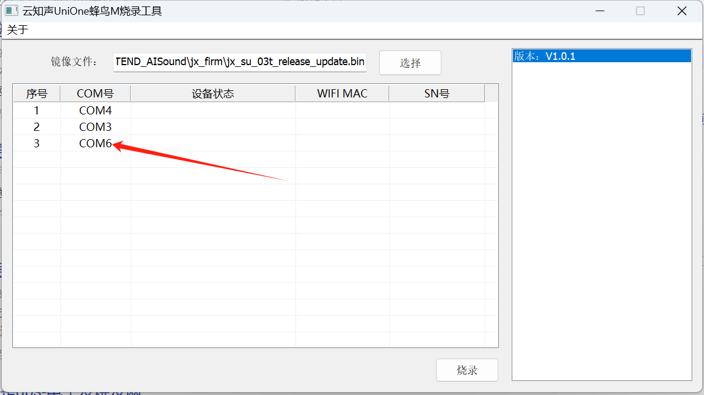

**解决方案：**

**1. 自动识别机制**

- 烧录工具会根据连接的烧录器和电源复位信号自动选择COM口
- 按照教程正确连接烧录器后，工具会自动识别并选择对应端口
- 不需要手动选择特定的COM端口

**2. 减少USB设备干扰**

- 拔掉其他不必要的USB设备
- 避免多个USB转串口设备同时连接
- 使用高质量USB线缆，确保连接稳定

**3. 端口管理**

- 在设备管理器中确认COM6端口正常
- 检查是否有其他程序占用该端口
- 尝试不同的USB端口重新连接

**注意事项：**

- 烧录工具的端口自动识别功能需要正确的硬件连接才能工作
- 如果设备状态持续为空，检查烧录器供电和信号线连接
- 确保已安装正确的USB转串口驱动程序

---

### 如何实现两个JX12F模块WiFi透传通信？

**问题描述：**

需要实现两个JX12F模块通过WiFi进行透传数据通信，并获取相关文档或示例。

**解决方案：**

**1. 网络配置**

- 将两个JX12F模块连接到相同的WiFi网络
- 使用AT指令配置网络参数：
    ```
    AT+CWJAP="SSID","password"  // 连接WiFi
    ```

**2. 透传模式设置**

- 配置模块为透传模式：
    ```
    AT+CIPMODE=1             // 设置为透传模式
    AT+CIPSTART="TCP","IP地址",端口号  // 建立TCP连接
    ```

**3. 数据传输实现**

- 发送方：通过串口发送数据，模块自动转发到目标IP
- 接收方：模块接收网络数据并通过串口输出
- 支持TCP/UDP两种传输协议

**4. 硬件准备**

- 确保模块正常上电
- 连接天线以保证信号质量
- 使用稳定的串口通信（波特率115200）

**注意事项：**

- 确保两个模块在同一局域网内
- 透传模式下，串口数据会直接转发到网络
- 建议先进行单模块通信测试
- 实时性依赖于网络稳定性

---

## 串口通信问题


---

### 串口接收数据第一个字节错误（0x55）是什么原因？

**问题描述：**

使用自定义测试程序进行串口通信时，接收到的数据第一个字节经常是0x55，而不是预期的0xAA，连续操作时偶现，间隔一段时间后又恢复正常。

**解决方案：**

**问题分析：**

- 串口助手测试正常，说明硬件连接无误
- 问题出现在自定义测试程序中，属于软件逻辑问题
- 连续操作时出现问题可能与缓冲区处理有关

**排查建议：**

- 检查串口初始化配置
- 验证波特率、数据位、停止位设置
- 检查接收缓冲区处理逻辑
- 确认是否正确处理了帧头/帧尾

**优化方案：**

- 在每条命令执行后增加适当延时
- 避免连续快速发送命令
- 确保缓冲区清空后再接收新数据
- 参考标准串口助手的实现方式

**注意事项：**

- 硬件连接正常时优先检查软件逻辑
- 串口通信需要遵循数据帧格式
- 连续操作时注意处理时序问题
- 建议使用成熟的串口库函数


---

### 自定义测试程序串口通信异常但串口助手正常怎么办？

**问题描述：**

使用自定义测试程序进行串口通信时出现异常或乱码，而使用串口助手则通信正常。

**解决方案：**

**问题定位：**

- 串口助手正常说明硬件连接无误
- 问题出在自定义测试程序的代码逻辑
- 可能是缓冲区管理或数据处理逻辑有问题

**检查要点：**

- 串口初始化参数设置是否正确
- 接收缓冲区大小是否合适
- 是否正确处理了数据帧格式
- 字符编码是否匹配

**改进建议：**

- 参考标准串口助手的实现
- 使用成熟的串口通信库
- 增加错误处理和数据校验
- 在命令间添加适当延时

**注意事项：**

- 优先使用经过验证的串口库
- 注意字符串和十六进制数据的区别
- 确保波特率、校验位等参数一致
- 连续操作时要处理好时序关系

---

## 通用烧录问题


---

### 运行jixin_tools.exe提示缺少DLL文件怎么办？

**问题描述：**

运行jixin_tools.exe程序时，提示"无法启动此程序，因为计算机中丢失api-ms-win-core-path-l1-1-0.dll"，即使重新安装程序和重启电脑也无法解决。

**解决方案：**

1. **安装Windows更新**
    - 该DLL属于Windows系统库文件
    - 通过Windows Update更新系统到最新版本
    - 安装所有推荐的系统更新

2. **安装Visual C++ Redistributable**
    - 下载并安装Microsoft Visual C++ Redistributable
    - 建议安装2015-2022所有版本
    - 从微软官网下载：https://docs.microsoft.com/en-us/cpp/windows/latest-supported-vc-redist

3. **安装.NET Framework**
    - 安装.NET Framework 4.8或更高版本
    - 从微软官网下载最新版本
    - 重启电脑后再尝试运行程序

4. **系统文件检查**
    - 运行sfc /scannow命令检查系统文件
    - 使用DISM工具修复系统映像
    - 命令：DISM /Online /Cleanup-Image /RestoreHealth

**注意事项：**

- 不要从非官方来源下载单独的DLL文件
- 确保Windows系统已激活并正常更新
- 某些精简版Windows可能缺少必要的系统库
- 如果问题持续，建议在其他电脑上测试程序

---

### 使用regsvr32注册DLL时提示"模块加载失败"怎么办？

**问题描述：**

在尝试使用regsvr32命令注册DLL文件时，系统提示"模块加载失败"和"找不到指定的模块"错误，即使重启电脑后问题依旧存在。

**解决方案：**

**问题分析：**

- 系统文件损坏导致无法正确加载DLL
- sfc /scannow发现损坏但无法自动修复

**修复步骤：**

1. **以管理员身份运行命令提示符**
    - 右键点击"命令提示符"
    - 选择"以管理员身份运行"

2. **运行DISM修复系统**
    依次执行以下命令：
    ```
    DISM /Online /Cleanup-Image /CheckHealth
    DISM /Online /Cleanup-Image /ScanHealth
    DISM /Online /Cleanup-Image /RestoreHealth
    ```

3. **再次运行SFC检查**
    - DISM完成后，运行：`sfc /scannow`
    - 验证系统文件是否已修复

4. **重启系统**
    - 完成所有修复后重启电脑
    - 再次尝试注册DLL

**注意事项：**

- DISM修复过程需要网络连接
- 每个命令执行时间可能较长，请耐心等待
- 如果仍无法修复，可能需要重装系统
- 建议先备份重要数据

---

### sfc /scannow提示"损坏文件但无法修复"怎么办？

**问题描述：**

运行sfc /scannow命令检测系统文件时，系统报告"Windows 资源保护找到了损坏的文件但无法修复其某些文件"，导致系统文件问题无法解决。

**解决方案：**

**问题原因：**

- 系统文件损坏较严重，超出SFC自动修复能力
- 需要使用更强大的系统修复工具

**完整修复流程：**

1. **使用DISM修复系统映像**
    - 以管理员身份运行命令提示符
    - 依次执行：
    ```
    DISM /Online /Cleanup-Image /CheckHealth
    DISM /Online /Cleanup-Image /ScanHealth
    DISM /Online /Cleanup-Image /RestoreHealth
    ```

2. **关键说明**
    - CheckHealth：快速检查映像状态
    - ScanHealth：扫描损坏项
    - RestoreHealth：修复损坏（需要网络连接）

3. **重新运行SFC验证**
    - DISM完成后运行：`sfc /scannow`
    - 此时应该能成功修复所有问题

4. **备选方案**
    - 如果DISM也无法修复，考虑使用系统还原点
    - 或重置Windows系统（保留个人文件）

**注意事项：**

- DISM修复过程必须保持网络连接
- 整个过程可能需要30分钟以上
- 修复完成后必须重启电脑生效
- 建议提前备份重要数据

---

### 设备插入后自动启动导致无法刻录怎么办？

**问题描述：**

将设备插入电脑后自动启动运行，导致固件刻录工具无法识别设备，刻录过程失败。

**解决方案：**

**1. 进入烧录模式的方法**

- **断电重新上电**：在烧录工具运行时重新给设备上电
- **按住复位键上电**：上电时按住设备上的复位按钮
- **使用专用烧录模式**：某些型号有专门的烧录跳线或测试点

**2. 正确的刻录流程**

1. 先启动烧录工具并选择固件文件
2. 连接设备到电脑（确保线路正确）
3. 在工具提示后给设备重新上电
4. 工具检测到设备后自动开始刻录

**3. 避免自动启动的方法**

- **断开外围电路**：焊接在板上的模块建议先断开外围电路
- **使用专用烧录座**：避免外围电路影响
- **控制上电时机**：在工具准备就绪后再给设备上电

**注意事项：**

- 设备正常运行时无法进入烧录模式
- 重新上电的时机很重要，要按照工具提示操作
- 某些模块需要特定的上电时序才能进入烧录模式

---

### 烧录操作时是否需要给板子上电？

**问题描述：**

进行烧录操作时，不确定是否需要给板子上电，以及烧录模式的触发条件是什么。

**解决方案：**

**烧录需要模块重新上电**：

- 烧录时模块需要重新上电才能进入烧录模式
- 串口检测到特定信号后，模块会自动进入烧录模式
- 这就是烧录时需要拔插VCC（电源）的原因

**操作步骤**：

1. 连接好烧录线路（TXD、RXD、GND等）
2. 给模块供电（VCC接电源）
3. 烧录工具检测到模块后开始烧录
4. 如果无法识别，重新拔插VCC触发烧录模式

**注意事项**：

- 拔插VCC时串口连接不能断开
- 烧录过程中保持供电稳定
- 模块供电通常是5V或3.3V，根据型号确定

---

### 烧录进度条在0%终止传输怎么办？

**问题描述：**

使用烧录工具更新固件时，进度条跑到0%就终止，提示"发送异常，COM3终止了本次传输活动"，导致无法完成固件更新。

**解决方案：**

**1. 检查线路连接**

- 确认B6接TXD，B7接RXD的连接正确
- 检查杜邦线接触是否牢固
- 烧录时稍微按压杜邦线确保良好接触

**2. 更换连接线**

- 如果有备用杜邦线，尝试更换
- 建议将杜邦线和模块对应引脚焊接在一起
- 避免使用老化或接触不良的连接线

**3. 检查模块状态**

- 小程序显示"断开"状态表明连接异常
- 重新插拔连接线或更换USB端口
- 确认模块供电正常

**4. 可能的硬件问题**

- 如果更换连接线后仍无法解决
- 可能是模块芯片损坏
- 建议更换模块测试

**注意事项：**

- 进度条在0%终止通常是线路接触不良导致
- 烧录时保持连接线稳定，避免晃动
- 多次尝试无效时建议更换硬件

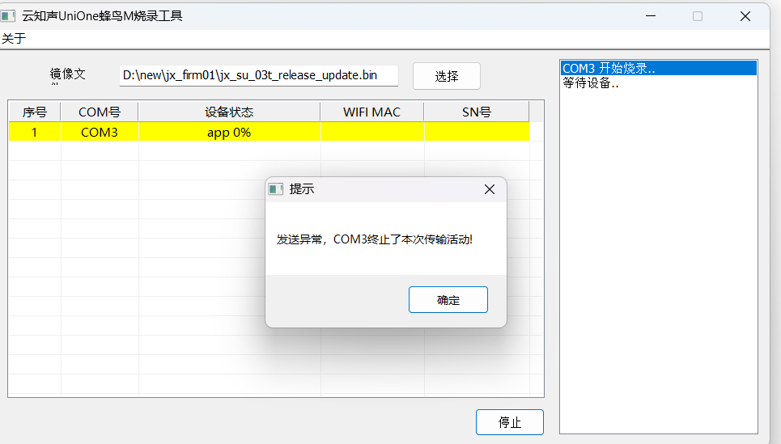

---

### 如何配置串口通信的帧格式和数据类型？

**问题描述：**

在配置串口通信参数时，如何正确设置帧格式（包括帧头、帧尾和数据）以及如何理解参数的输入格式（十进制与十六进制的转换）。

**解决方案：**

**1. 帧格式配置**

串口通信支持固定格式，可自定义帧头和帧尾：

- 帧头：AA 55（可自定义）
- 帧尾：55 AA（可自定义）
- 完整格式：帧头 + 消息编号 + 数据 + 帧尾

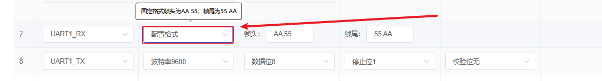

**2. 数据类型说明**

- **char类型**：表示数据范围是-128到127
- 对应十六进制：两位十六进制数（如23的十六进制是17）
- 不是ASCII码转换，而是数值转换

**3. 测试消息输入**

- 输入十进制数值，系统自动转换为十六进制
- 例如：输入23，生成的消息为AA 55 01 17 55 AA
- 其中17是23的十六进制表示

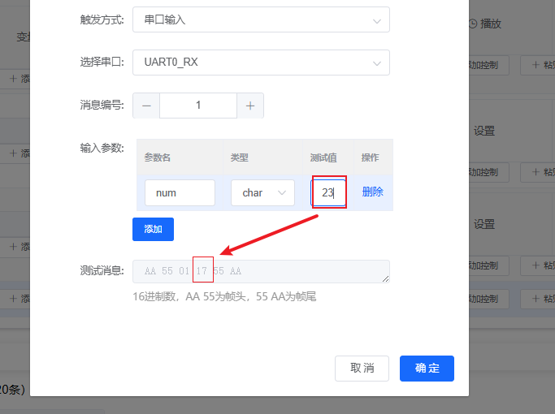

**4. 配置示例**

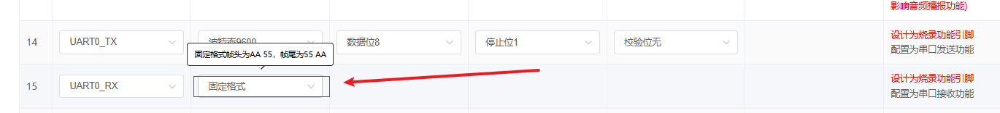

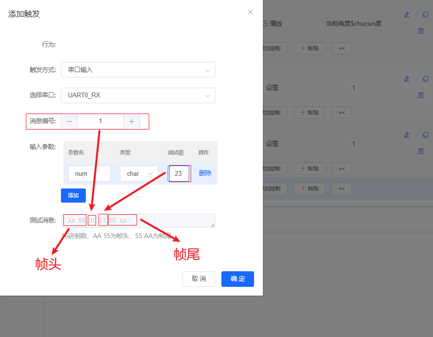

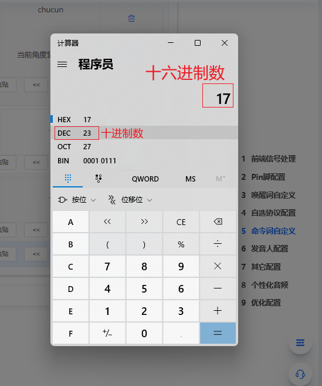

**注意事项：**

- 帧头帧尾可以自定义设置
- 参数输入的是十进制数值，非字符串
- char类型范围是-128到127（两位十六进制）
- 生成的完整帧包含帧头、消息号、数据和帧尾

---

### ESP32与语音模块串口通信时帧格式如何确认？

**问题描述：**

在使用ESP32与语音模块进行串口通信时，不确定语音模块的默认帧格式（帧头帧尾）是否为AA55 55AA，以及如何在ESP32端正确配置以确保通信正常。

**解决方案：**

**1. 语音模块默认帧格式**

- 语音模块的UART0_TX默认使用固定格式
- 帧头：AA 55
- 帧尾：55 AA
- 这是语音模块的默认配置

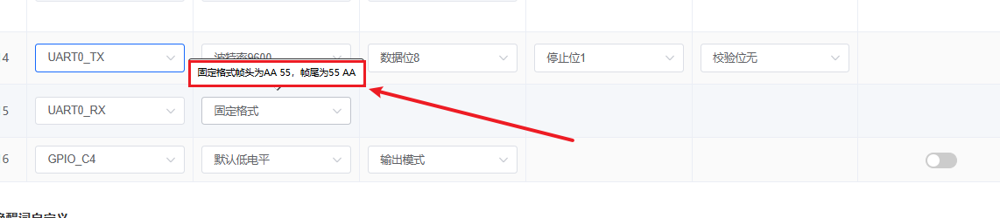

**2. ESP32端配置要点**

- ESP32发送的内容需要匹配语音模块的接收格式
- 在ESP32端配置帧头帧尾为55 AA AA 55
- 或者使用其他自定义格式，但需与语音模块一致

**3. 通信匹配原则**

- 单片机接收设定的帧头帧尾要与发送方匹配
- 例如：语音模块发送AA 55 XX 55 AA
- 则ESP32应配置接收AA 55开头、55 AA结尾的数据

**注意事项：**

- 帧格式需要通信双方配置一致
- 语音模块的默认格式是AA 55 XX 55 AA
- ESP32发送数据时写什么就发什么
- 担心读不到数据时应检查帧头帧尾配置是否匹配

---

### UART串口数据接收格式是什么？

**问题描述：**

配置好UART_TX和UART_RX后，通过语音命令触发时，需要了解串口调试助手接收到的数据格式。

**解决方案：**

**1. 数据帧格式**

- 串口接收的数据格式为：帧头 + 消息编号 + 内容 + 帧尾
- 默认格式：AA 55 [消息编号] [数据内容] 55 AA
- 数据以16进制格式传输

**2. 配置串口触发**

- 在控制详情中配置动作，语音命令触发后才会通过串口发送数据
- 设置触发方式为"串口输入"
- 选择对应的串口（如UART1_RX）

**3. 参数配置**

- 参数名：自定义参数名称
- 类型：选择数据类型（如int、char等）
- 测试值：用于测试的参数值
- 遵循C语言定义规则

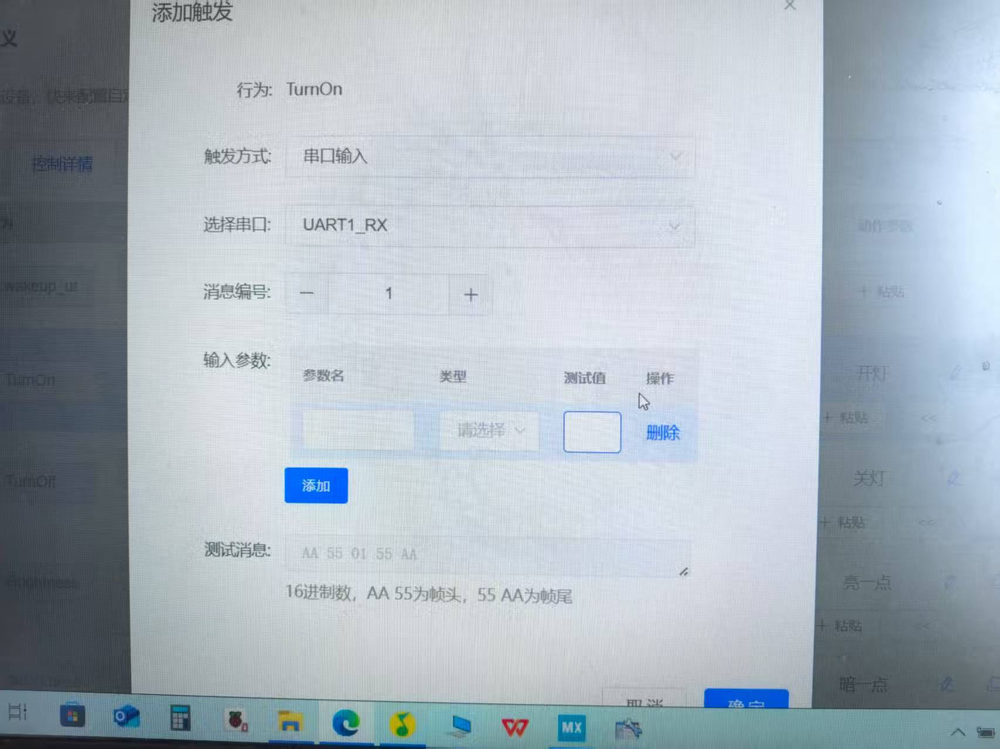

**注意事项：**

- 只有在控制详情中配置了相应的动作，语音命令触发时才会有串口输出
- 输入参数需要根据实际需求定义类型和值
- 测试消息会根据设定的参数值动态变化
- 确保串口调试助手的波特率等参数与模块配置一致

---

### 串口发送命令无效且无法触发语音播报怎么办？

**问题描述：**

使用串口通信控制语音模块时，发送命令修改变量数据无效，且串口接收信息正常但无法触发语音播报。

**解决方案：**

**1. 硬件排查**

- 检查串口接线是否正确（TX-RX交叉连接）
- 测量模块RX引脚对GND电压，确认有3.3V左右电压
- 尝试更换其他串口引脚（如B6/B7）

**2. 通信配置检查**

- 确认串口调试软件设置为16进制发送模式
- 检查波特率、数据位、停止位等参数是否正确
- 验证发送的数据格式是否符合协议要求

**3. 模块配置验证**

- 检查固件中的串口输入配置是否启用
- 确认消息编号和触发条件设置正确
- 测试简单的语音播报命令，排除逻辑问题

**4. 常见问题解决**

- 使用B0/B1引脚通信异常时，尝试改用B6/B7引脚
- 重新制作固件，确保串口功能正确配置
- 使用专用的串口调试软件进行测试


**注意事项：**

- 串口能接收数据但无法触发动作，可能是RX线路问题
- 不同串口引脚可能有不同的电气特性
- 建议使用模块标配的串口调试软件进行测试

---

### 串口控制语音播放时变量无法正常播报怎么办？

**问题描述：**

使用串口发送指令控制语音播放时，只能播放预设的固定文本，无法正常播放变量的值。

**解决方案：**

**1. 检查变量配置**

- 确认变量已在变量管理中正确创建
- 检查变量类型、长度设置是否合适
- 验证变量默认值是否正确设置

**2. 语音内容配置**

- 语音播报内容中需要正确引用变量格式
- 确保变量名与定义的一致（如num1）
- 检查变量是否在语音内容中被正确拼接

**3. 串口指令格式**

- 发送的十六进制指令需要包含触发对应播报的消息编号
- 确认串口触发配置与消息编号匹配
- 验证数据包格式是否符合协议要求（帧头+消息编号+数据+帧尾）

**4. 常见排查步骤**

- 先测试固定文本播报是否正常
- 再测试变量赋值后的播报效果
- 使用串口助手监听实际发送的数据


**注意事项：**

- 变量播报前需要先给变量赋值
- 串口触发只会触发对应消息编号的动作
- 确保串口调试软件设置为十六进制发送模式
- 如果使用特定十六进制指令才能播放，可能是消息编号配置问题

---

### 串口调试软件接收区显示大量FF数据怎么办？

**问题描述：**

使用串口调试软件进行通信时，接收区显示大量FF（十六进制）数据，无法正常接收模块响应。

**解决方案：**

**1. 硬件连接检查**

- 确认USB转TTL模块与语音模块的接线正确
- 检查电源供电是否稳定（建议使用5V）
- 测量模块RX、TX引脚电压是否正常（应为3.3V）

**2. 串口参数配置**

- 波特率设置：9600（根据模块配置调整）
- 数据位：8
- 停止位：1
- 校验位：无

**3. 模块状态判断**

- 接收大量FF数据可能表示模块处于异常状态
- 尝试重新给模块上电
- 考虑重新烧录固件

**4. 调试步骤**

- 单独测试模块，不连接其他外围设备
- 使用专用的串口调试软件
- 检查固件是否正确烧录

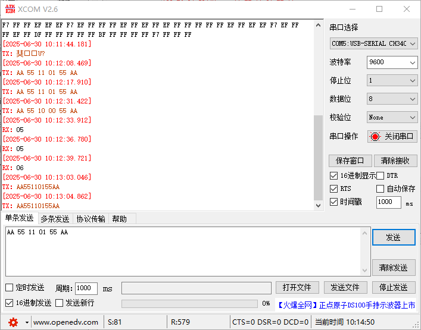

**注意事项：**

- FF数据通常表示总线空闲或模块异常
- 确保使用正确的USB转TTL模块
- 模块供电不足可能导致通信异常

---

### 米思齐软件上传固件时卡在"上传中"状态怎么办？

**问题描述：**

使用米思齐软件上传固件时，进度条卡在"上传中..."状态，无法完成上传，但使用固件烧写软件可以正常上传。

**解决方案：**

**1. 检查设备连接**

- 确保设备与电脑之间的USB连接线连接正常且稳定
- 尝试更换不同的USB端口
- 重新插拔USB连接

**2. 软件和驱动检查**

- 关闭所有与设备相关的软件，重新启动设备
- 检查设备驱动是否正确安装并更新到最新版本
- 确认使用的是最新版本的米思齐软件

**3. 固件版本检查**

- 检查是否是最新固件版本
- 如果不是，请先升级到最新版本

**4. 其他排查方法**

- 尝试使用其他计算机进行上传
- 重启计算机
- 暂时关闭杀毒软件和防火墙

**注意事项：**

- 如果米思齐软件持续无法上传，可以使用专用的固件烧写软件作为替代方案
- 固件烧写软件通常比米思齐软件更稳定，适合批量烧录

---

### CH340烧录时指示灯不亮且设备无法识别怎么办？

**问题描述：**

使用CH340烧录语音模块时，CH340的指示灯不亮，导致设备无法被识别，鼠标无法操作，需要用手触摸模块才能短暂恢复连接，但烧录仍无法进行。

**解决方案：**

**1. 检查硬件连接**

- 确认USB连接线完好，无松动
- 检查CH340模块与语音模块的连接是否正确
- 尝试更换USB连接线

**2. 供电问题排查**

- CH340模块可能供电不足
- 尝试使用电脑背面USB端口（供电更稳定）
- 避免使用USB延长线

**3. 驱动问题**

- 重新安装CH340驱动程序
- 检查设备管理器中CH340是否正常识别
- 如有黄色感叹号，需要更新驱动

---

### 设备管理器中找不到串口设备怎么办？

**问题描述：**

将语音模块通过CH340连接到电脑后，烧录工具无法识别芯片，且设备管理器中未显示正确的串口设备。

**解决方案：**

**1. 打开设备管理器**

- 右键点击"开始"菜单
- 选择"设备管理器"
- 或按Win+X键，选择设备管理器


**2. 检查设备连接状态**

- 插入CH340之前查看设备列表
- 插入CH340后对比新增的设备
- 正常情况下会在"端口(COM和LPT)"下显示

**3. 查看设备识别状态**

- **正确识别**：显示"USB-SERIAL CH340 (COMx)"
- **识别失败**：可能出现在"其他设备"中
- **未识别**：设备列表无任何变化


**4. 排查步骤**

- **重新插拔USB**：尝试不同的USB端口
- **检查驱动**：确认CH340驱动已安装
- **更换USB线**：排除连接线问题
- **测试其他电脑**：确认CH340模块是否正常

**注意事项：**

- 首次使用需要安装CH340驱动
- 建议使用电脑原生的USB端口
- 某些USB 3.0端口可能不兼容，尝试USB 2.0

---

### USB串行设备显示在其他设备且驱动未安装怎么办？

**问题描述：**

设备管理器中USB串行设备（USB-SERIAL CH340）显示在"其他设备"下，带有黄色感叹号，提示"该设备的驱动程序未被安装"。

**解决方案：**

**1. 卸载问题设备**

- 右键点击"其他设备"下的USB Serial设备
- 选择"卸载设备"
- 重启电脑

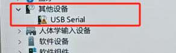

**2. 重新安装驱动**

- 重启后重新插入CH340设备
- 系统会自动识别并尝试安装驱动
- 如果仍失败，手动安装CH340驱动

**3. 手动安装步骤**

- 下载官方CH340驱动程序
- 运行安装程序（通常为CH341SER.EXE）
- 或在设备管理器中手动更新驱动程序

**注意事项：**

- 卸载设备后需要重启电脑才能生效
- 确保从官方渠道下载驱动程序
- Windows 10/11通常能自动识别CH340设备

---

### CI系列模块烧录多次失败怎么办？

**问题描述：**

在更换电脑后仍然无法完成CI系列模块的烧录，尝试了更换烧录器和调整TX/RX连接及5V供电，但问题依旧存在。

**解决方案：**

**1. 全面排查连接问题**

- 检查TX/RX接线是否正确交叉连接（模块TX接烧录器RX）
- 确认5V供电稳定，使用万用表测量电压
- 尝试不同的USB端口，排除端口故障
- 检查是否使用了质量良好的连接线

**2. 烧录器和驱动检查**

- 确认烧录器型号与CI系列兼容
- 重新安装CH340或其他USB转串口驱动
- 尝试使用专用的ST-Link或J-Link调试器
- 在设备管理器中确认COM口正常识别

**3. 芯片状态确认**

- 检查芯片是否进入正确的烧录模式
- 确认BOOT引脚状态（如需要）
- 验证芯片是否因其他原因损坏
- 尝试降低烧录波特率

**4. 环境因素排查**

- 关闭所有杀毒软件和防火墙
- 以管理员权限运行烧录软件
- 尝试在纯净的操作系统环境下烧录
- 排除电磁干扰影响

**注意事项：**

- CI系列模块本身不需要特殊的专用烧录硬件
- 标准的USB转串口烧录器即可完成烧录
- 如果所有方法都失败，可能是芯片已损坏
- 建议准备备用模块进行替换测试

---

### 烧录器无法识别设备怎么办？

**问题描述：**

在使用烧录器时遇到烧录失败的问题，怀疑烧录器可能已损坏，且更换设备后问题依然存在。

**解决方案：**

**1. 设备检查**

- 检查烧录器外观是否有明显损坏
- 尝试在不同的电脑上使用烧录器
- 测试烧录器的USB接口是否松动

**2. 驱动排查**

- 确认已安装正确的驱动程序
- 在设备管理器中查看驱动状态
- 重新安装或更新驱动程序

**3. 烧录设置**

- 检查烧录软件的设置是否正确
- 确认选择了正确的COM端口
- 尝试不同的波特率设置

**4. 替代方案**

- 使用另一个已知正常的烧录器测试
- 尝试使用USB转TTL模块烧录
- 寻求专业专业技术人员获取新的烧录器

**注意事项：**

- 烧录器刚购买就出现问题，建议直接联系售后
- 保留购买凭证，便于售后服务
- 若多个烧录器都出现问题，可能是电脑环境导致

**4. 静电问题**

- 手触摸模块能恢复说明可能存在静电干扰
- 建议佩戴防静电手环进行操作
- 在干燥环境下操作前先触摸金属接地

**注意事项：**

- 如果问题持续，可能是CH340模块本身故障，建议更换模块
- 烧录时确保模块放置在绝缘表面上
- 避免在潮湿环境下进行烧录操作

---

### 设备插上后蓝灯不亮且控制详情播报失败怎么办？

**问题描述：**

设备插上电后蓝灯不亮，重新烧录后虽然能正常播报，但控制详情的播报无法完成。

**解决方案：**

**1. 基础排查**

- **更换USB接口**：

    - 尝试更换不同的USB接口供电
    - 排除USB接口供电不足问题
    - 检查USB线是否接触良好

- **检查供电电压**：

    - 测量模块供电是否正常
    - 确认电压在规格范围内
    - 排除供电异常导致的指示灯异常

**2. 固件问题处理**

- **重新生成固件**：

    - 在平台重新生成应用固件
    - 下载后完整重新烧录
    - 确保烧录过程无错误

- **工程文件检查**：

    - 导出工程文件供技术人员检查
    - 验证控制详情的配置是否正确
    - 确认播报内容的设置

**3. 可能原因分析**

- **硬件问题**：

    - 蓝灯LED损坏或焊接异常
    - 供电电路部分故障
    - 模块部分功能异常

- **软件配置**：

    - 控制详情的触发条件未正确设置
    - 播报内容配置错误或缺失
    - 固件生成时参数异常

**注意事项：**

- 蓝灯不亮可能仅是指示灯问题，不影响主要功能
- 重新烧录后能播报说明模块基本功能正常
- 控制详情播报失败需要检查具体配置逻辑
- 如问题持续，建议提供工程文件进行深入分析

---

## 烧录工具获取

---

### 可以修改串口升级工具的名称吗？

**问题描述：**

希望将串口升级工具的品牌名称（ChipIntelli 启英泰伦）修改为自定义名称，以便提供给用户自行刷机。

**解决方案：**

**工具限制说明**

- 串口升级工具是芯片原厂提供的标准软件
- 工具界面和品牌标识无法修改或自定义
- 当前版本为V3.7.1，包含固件打包、升级等功能

**替代方案**

- 如需提供给用户，可直接使用原厂工具
- 可准备详细的刷机教程文档
- 工具虽带品牌标识，但不影响正常使用

**注意事项：**

- 无法通过修改配置或文件来更改工具名称
- 建议在教程中说明工具来源和用途
- 确保用户了解这是官方标准烧录工具


---

### 固件下载完成后无法进行升级怎么办？

**问题描述：**

使用云知声UniOne蜂鸟烧录工具时，固件下载已完成，但无法进行固件升级操作，烧录按钮被禁用。

**解决方案：**

1. **确认固件文件类型**

    - 确保选择的是带有"update"标识的固件文件
    - 如：jx_xxx_release_update.bin
    - 不要选择完整固件包（不带update标识）

2. **重新启动烧录流程**

    - 关闭烧录工具
    - 重新打开工具
    - 再次选择固件文件

3. **检查设备连接状态**

    - 确认设备与电脑正常连接
    - 检查COM端口识别是否正常
    - 验证驱动程序已正确安装

**注意事项：**

- 部分烧录工具可能需要特定操作才能激活升级功能
- 如果问题持续，尝试使用其他版本的烧录工具
- 确保固件文件与模块型号完全匹配

---

### 如何将固件文件夹拖拽到桌面？

**问题描述：**

需要将jx_firm文件夹从当前位置拖拽到桌面上进行操作。

**解决方案：**

**操作步骤：**

1. **定位文件夹**：

    - 找到jx_firm文件夹所在位置
    - 确保文件夹窗口可见
    - 整理桌面空间

2. **拖拽操作**：

    - 鼠标左键点击jx_firm文件夹
    - 按住不放拖动到桌面
    - 看到文件夹移动提示后松开

3. **确认移动**：

    - 检查桌面是否出现jx_firm
    - 确认文件夹内容完整
    - 原位置文件夹应该消失

**替代方法：**

1. **剪切粘贴**：

    - 右键点击jx_firm文件夹
    - 选择"剪切"
    - 在桌面空白处右键
    - 选择"粘贴"

2. **复制删除**：

    - 右键选择"复制"
    - 在桌面"粘贴"
    - 返回原位置删除文件夹

**常见问题：**

1. **拖拽失败**：

    - 确认有足够的系统权限
    - 检查文件夹是否被占用
    - 尝试重启后操作

2. **权限不足**：

    - 使用管理员账户操作
    - 关闭可能占用文件夹的程序
    - 检查文件夹属性

**注意事项：**

- 确保重要数据已备份
- 桌面空间足够
- 避免频繁移动大文件夹
- 记录文件夹的最终位置

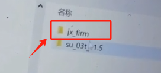

---

### 串口烧录软件使用失败怎么办？

**问题描述：**

使用串口烧录软件进行离线语音识别芯片烧录时遇到失败或不稳定的问题，需要确认正确的软件使用方法和解决烧录不成功的问题。

**解决方案：**

**1. 常见失败原因**

- **中文路径问题**：烧录软件放在中文路径下会导致运行异常
- **连接不稳定**：需要多次尝试或重新启动软件
- **波特率设置错误**：不同模块需要不同的波特率设置

**2. 正确的使用方法**

步骤1：环境准备
- 将烧录软件放在英文路径下
- 关闭可能占用串口的其他程序
- 使用管理员权限运行软件

步骤2：硬件连接
- 确认串口线连接正确
- 检查模块供电是否稳定
- 避免使用过长的USB延长线

步骤3：软件配置
- 选择正确的串口号
- 设置合适的波特率（如921600）
- 选择对应的固件文件

步骤4：烧录操作
- 先连接通信线，再接通电源
- 如果失败，尝试重新启动软件
- 多次失败时，更换USB端口

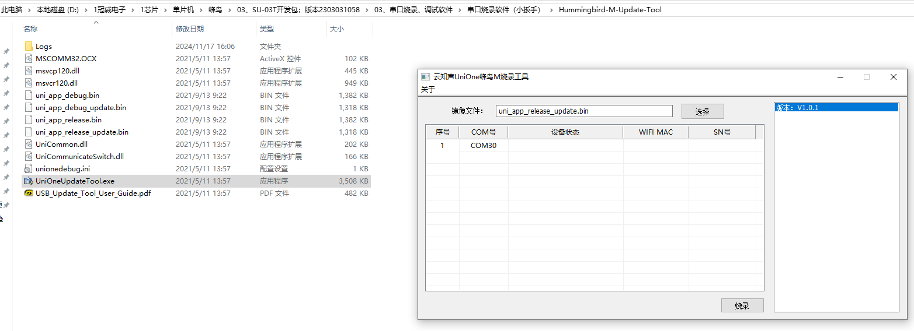

**3. 改进建议**

- 使用质量更好的USB转串口设备
- 缩短连接线长度，减少干扰
- 在设备管理器中确认驱动正常
- 尝试在不同的电脑上进行测试

**注意事项：**

- 避免软件路径包含中文字符
- 烧录失败后需要完全断电重启
- 保持连接稳定，避免中途断开
- 如问题持续，可能需要检查硬件是否损坏

---

### 串口烧录软件在Windows 10无法运行怎么办？

**问题描述：**

串口烧录软件在Windows 10系统中无法运行，点击后无任何反应，且进程未显示，怀疑是系统蓝屏后导致软件依赖环境损坏。

**解决方案：**

**1. 环境检查**

- 下载全新的烧录软件包替换
- 关闭Windows自带防火墙和第三方杀毒软件
- 尝试以管理员权限运行软件
- 检查是否安装了正确版本的.NET Framework

**2. 系统修复**

- 打开"控制面板"→"程序和功能"
- 启用或重新安装.NET Framework 3.5或4.0
- 运行系统文件检查器：sfc /scannow
- 考虑使用系统还原点恢复到蓝屏前状态

**3. 替代方案**

- 使用其他烧录方式：购买专用烧录器
- 在另一台电脑上尝试烧录
- 使用虚拟机运行纯净的Windows系统

**注意事项：**

- 蓝屏可能导致系统文件损坏
- 软件无反应通常是依赖库缺失
- 如无法解决，建议使用专用烧录器
- 烧录器更稳定，无需依赖系统环境

---

### 模块烧录后无反应且无开机播报怎么办？

**问题描述：**

模块烧录完成后无任何反应，没有开机播报，更换BIN文件和重新插拔CH340后问题依旧。

**解决方案：**

**1. 喇叭规格检查**

- 推荐使用8欧2瓦的喇叭
- 最低要求：4欧1.6瓦起，8欧1瓦起
- 当前使用的8欧0.25瓦喇叭功率过小
- 功率过小的喇叭可能被损坏

**2. 供电检查**

- 模块采用5V直流稳压供电
- 喇叭负载太大可能导致带不动
- 确认供电电压稳定在5V
- 检查供电电流是否足够

**3. 硬件复位操作**

- 烧录完成后关掉软件
- 拔掉CH340烧录器
- 等待1秒后重新插上
- 让模块完全复位重启

**4. 喇叭连接检查**

- 检查喇叭正负极是否连接正确
- 确认喇叭没有短路
- 测试喇叭是否损坏（用万用表测量阻抗）
- 建议换上推荐的8欧2瓦喇叭测试

**注意事项：**

- 8欧0.25瓦的喇叭功率太小，不推荐使用
- 4欧5瓦以上的喇叭模块可能带不动
- 喇叭接线要牢固，避免虚接
- 如使用不匹配的喇叭，可能导致模块或喇叭损坏


---

### 固件生成后开机播报与平台配置不一致怎么办？

**问题描述：**

在智能公元平台配置了自定义的开机播报内容（如英文播报），但烧录固件后，实际播报的内容与平台配置不一致，播报的是其他内容（如默认的"smart sofa"或其他无关播报）。同时唤醒功能也可能无法正常工作。

**解决方案：**

**1. 确认平台配置保存**

- 检查开机播报设置是否已正确保存
- 确认"有开机播报"选项已勾选
- 播报内容文本框中填入了正确的播报词

**2. 重新生成固件**

- 删除已生成的旧固件
- 保存当前配置
- 重新点击"生成固件"
- 等待生成完成后下载新固件

**3. 检查版本号**

- 查看固件版本号是否更新（格式如：20260103003）
- 确认烧录的是新生成的固件文件
- 对比固件生成时间，避免烧录旧版本

**4. 完整烧录流程**

- 使用正确的烧录工具和参数
- 确保烧录进度完整显示为100%
- 烧录完成后断电重启设备测试

**5. 唤醒功能检查**

如果开机播报异常的同时唤醒功能也不正常：

- 检查唤醒词配置是否正确保存
- 确认唤醒词与命令词没有冲突
- 使用默认唤醒词测试是否为唤醒词配置问题

**常见原因：**

- **配置未保存**：平台配置修改后未点击保存直接生成固件
- **固件版本混淆**：下载了旧版本的固件文件
- **缓存问题**：平台缓存显示的配置与实际保存的不一致
- **固件生成异常**：服务器生成固件时出现异常，使用了默认配置

**注意事项：**

- 每次修改配置后务必先保存再生成固件
- 建议在固件文件名中包含生成日期或版本号以便区分
- 如多次生成问题仍存在，可尝试创建新项目重新配置
- 联系技术支持时提供固件版本号和平台配置截图
---

### 语音模块能通过蓝牙响应但无法驱动怎么办？

**问题描述：**

语音模块可以通过蓝牙连接并响应，但无法通过正常的语音指令驱动控制，之前可以正常工作一段时间后出现此问题。

**解决方案：**

**1. 问题排查步骤**

1. **确认模块状态**：

    - 使用串口助手测试模块是否正常
    - 检查模块是否能正常识别语音指令
    - 确认其他通信方式（如串口）是否正常

2. **硬件连接检查**：

    - 检查麦克风连接是否松动
    - 确认电源供电稳定
    - 检查外围电路是否有变化

**2. 可能的原因及解决方法**

1. **模块老化或损坏**：

    - 模块使用时间较长可能出现性能下降
    - 如果串口测试正常，仅语音识别异常，可能是麦克风或相关电路问题
    - 解决方案：更换新模块

2. **环境因素影响**：

    - 环境噪音过大导致识别困难
    - 麦克风被遮挡或污染
    - 温湿度变化影响模块性能
    - 解决方案：改善使用环境，清洁麦克风

3. **配置或固件问题**：

    - 固件可能出现异常
    - 配置文件损坏
    - 解决方案：重新烧录固件

**注意事项：**

- 如果模块通过串口测试正常，但语音控制异常，大概率是硬件问题
- 更换新模块前，建议先在相同环境下测试其他模块
- 保留故障模块的详细现象记录，便于分析原因

---

### 首次烧录需要使用专用工具吗？

**问题描述：**

不熟悉首次烧录所需的升级固件和工具概念，不清楚全新模块是否需要特殊的烧录方法和设备。

**解决方案：**

**1. 首次烧录要求**

- **全新模块**：从未烧录过的模块必须使用专用工具
- **推荐工具**：蜂鸟M调试器或升级狗
- **后续烧录**：首次烧录后可使用CH340进行烧录
- **出厂状态**：模块出厂已支持CH340烧录操作

**2. 升级固件说明**

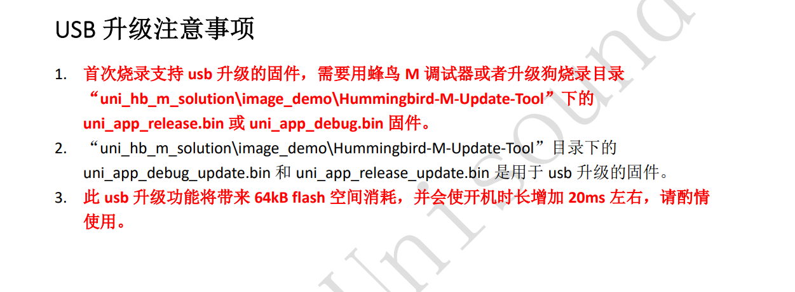

- **固件类型**：首次烧录需使用升级固件
- **文件名称**：uni_app_release.bin或uni_app_debug.bin
- **烧录方式**：使用蜂鸟M调试器或升级狗烧录目录
- **用途**：用于底层引导程序和基础功能初始化

**3. 烧录流程**

1. 连接蜂鸟M调试器或升级狗到电脑
2. 正确连接模块的烧录引脚
3. 选择升级固件文件进行烧录
4. 完成后即可使用CH340正常烧录

**注意事项：**

- 首次烧录不要选择主固件文件
- 升级固件只需要烧录一次
- 确保工具驱动正确安装
- 烧录过程中不要断开连接

---

### 误烧录底层代码导致无法识别怎么办？

**问题描述：**

误操作将错误固件（如其他模块的底层代码）烧录到设备，导致设备无法被识别，烧录工具显示"等待设备"状态。

**解决方案：**

**1. 问题分析**

- **错误固件**：烧录了不兼容的底层代码
- **设备状态**：bootloader损坏，无法正常启动
- **表现**：烧录工具无法识别设备


**2. 修复方法**

- **硬件修复**：需要使用专业设备重新烧录底层
- **联系支持**：将模块返厂或联系专业技术人员
- **避免自救**：不要尝试自行刷写其他固件

**3. 预防措施**

- **确认型号**：烧录前确认固件与模块型号匹配
- **文件检查**：仔细检查固件文件名和描述
- **备份原厂**：保留原厂固件作为备份

**注意事项：**

- 底层代码一旦损坏，普通工具无法修复
- 烧录前务必确认固件来源和兼容性
- 不同型号的固件通常不兼容
- 建议在专业指导下进行底层烧录操作

---

### 语音模块喇叭不响怎么办？

**问题描述：**

语音模块的喇叭在另一台设备上能正常工作，但连接到语音模块后不响。

**解决方案：**

**1. 电压检测**

- 使用万用表检测喇叭正负极对GND电压
- 正常电压范围应在2.2-2.5V之间
- 如果电压异常，说明模块功放电路有问题

**2. 固件排查**

- 烧录出厂固件测试喇叭播放功能
- 确认固件配置是否正确
- 检查音频输出引脚配置

**3. 硬件检查**

- 确认喇叭连接正确
- 检查喇叭阻抗是否匹配
- 排查喇叭线缆接触问题

**注意事项：**

- 如果喇叭在其他设备正常，说明喇叭本身没问题
- 电压异常表明模块功放电路可能损坏
- 烧录出厂固件可以判断是硬件还是软件问题

---

### IO附件无法解压怎么办？

**问题描述：**

下载的IO附件压缩包无法正常解压，导致无法获取附件内容。

**解决方案：**

- **安装正确的解压工具**：

    - 下载并安装 WinRAR 解压软件
    - 不要使用系统自带的解压功能
    - 确保 WinRAR 完整安装而非部分安装

- **解压步骤**：

    1. 右键点击压缩包文件
    2. 选择"解压到当前文件夹"或"解压到指定文件夹"
    3. 等待解压完成
    4. 检查解压后的文件是否完整

**注意事项：**

- IO附件和固件文件都需要使用专业解压工具
- 解压失败不影响已烧录的固件功能


---

### 串口烧录如何连接？

**问题描述：**

需要了解串口烧录的具体连接方法和操作步骤。

**解决方案：**

**连接方法：**

1. **硬件连接**：

    - 使用B6、B7引脚进行串口连接
    - B6连接RX，B7连接TX
    - 确保GND线连接良好

2. **供电控制**：

    - 给VCC引脚供电，并通过开关控制通断
    - 烧录时需要重新上电触发
    - 建议使用开关便于操作

3. **操作步骤**：

    - 连接好所有线路
    - 打开烧录软件
    - 开始烧录后重新给模块上电

**视频教程：**

- 群公告中有详细的烧录视频链接
- B站也有相关的教程视频
- 建议新手先观看视频再操作

**注意事项：**

- TX/RX线需要交叉连接
- 烧录过程中的重新上电是必要的操作步骤
- 确保供电电压稳定在规定范围内


---

### 毛巾架设备串口烧录操作指导

**问题描述：**

需要对毛巾架设备进行串口烧录固件操作，需要了解详细的操作步骤和注意事项。

**解决方案：**

**前期准备：**

- 准备USB转串口烧录器（如CH340）
- 确认固件文件完整且为正确版本
- 准备稳定的直流电源（推荐3.3V或5V，根据模块规格定）
- 串口调试助手（用于验证连接）

**硬件连接：**

- 将烧录器的TX连接到模块的RX引脚
- 将烧录器的RX连接到模块的TX引脚
- 连接GND线确保共地
- 通过开关或跳线控制VCC供电

**烧录步骤：**

1. **连接硬件**：按照上述方法连接好所有线路
2. **安装驱动**：确保电脑已安装USB转串口驱动
3. **打开烧录软件**：使用官方提供的烧录工具
4. **选择COM口**：在设备管理器中确认正确的COM端口号
5. **加载固件**：选择需要烧录的固件文件
6. **开始烧录**：点击烧录按钮后，立即给模块重新上电
7. **等待完成**：观察进度条，等待烧录完成提示

**验证方法：**

- 烧录完成后，重新上电启动模块
- 使用串口调试助手连接模块
- 发送测试命令验证功能是否正常

**注意事项：**

- 烧录时必须重新上电触发烧录模式
- 避免使用不稳定的USB供电进行烧录
- 如遇烧录失败，完全断电后重试
- 确保固件文件与模块型号匹配

---

### 烧录时显示发送异常怎么办？

**问题描述：**

在烧录过程中，烧录工具显示"发送异常"错误，导致烧录失败。

**解决方案：**

**常见原因分析：**

1. **连接问题**：

    - 检查串口线连接是否牢固
    - 确认TX/RX线没有接反
    - 验证GND线连接良好

2. **供电问题**：

    - 供电电压不稳定
    - 电源纹波过大
    - 电流供应不足

3. **时序问题**：

    - 上电时机不对
    - 需要在特定时间点重新上电
    - 烧录工具与模块不同步

**解决方法：**

1. **重新连接硬件**：

    - 拔插所有连接线
    - 检查焊接点是否良好
    - 使用质量更好的连接线

2. **调整供电**：

    - 使用稳定的直流电源
    - 在电源端并联滤波电容
    - 避免使用USB供电烧录

3. **正确操作时序**：

    - 点击开始后快速重新上电
    - 多尝试几次上电时机
    - 观察工具提示进行操作

**注意事项：**

- 发送异常通常是通信问题
- 烧录失败后需要重新上电再试
- 如果问题持续，建议录制视频给专业技术人员分析

---

### 串口烧录工具无法烧录怎么办？

**问题描述：**

使用PACK_UPDATE_TOOLS烧录工具时，无法完成固件烧录，进度显示为0%。

**解决方案：**

**1. 接线检查**

- 确认串口线连接正确
- 检查TX/RX线是否交叉连接
- 验证GND线连接良好
- 确认供电线（VCC）连接正常

**2. 端口检查**

- 确认COM端口未被其他程序占用
- 检查设备管理器中端口是否正常识别
- 尝试更换不同的USB端口
- 重新安装USB转串口驱动

**3. 操作步骤**

- 连接好所有线路
- 打开PACK_UPDATE_TOOLS软件
- 选择正确的固件文件
- 点击开始烧录后快速拔插5V供电线
- 观察进度条是否有变化

**4. 常见问题处理**

- **进度为0%**：检查上电时机，可能需要多次尝试
- **端口打开失败**：关闭其他串口调试工具
- **设备无响应**：确认模块供电电压正常

**注意事项：**

- 烧录时的重新上电是必要步骤
- 不同模块的上电时机可能略有差异
- 建议使用开关控制5V供电便于操作
- 如果多次尝试仍失败，可能需要更换模块

---

### 如何正确连接烧录器到开发板？

**问题描述：**

在连接烧录器到开发板时不确定应连接到哪个接口，开发板有多层排针，需要确认正确的连接位置。

**解决方案：**

**接口位置确认：**

- 开发板通常有上下两层排针
- 烧录器应连接到下层的排针接口
- 上层排针可能用于其他功能

**连接步骤：**

1. **识别烧录接口**
    - 查找标有VCC、GND、TX、RX的排针
    - 确认接口位于开发板的下层位置
    - 注意引脚标识清晰可见

2. **正确连接**
    - 将烧录器的VCC连接到开发板VCC
    - 将烧录器的GND连接到开发板GND
    - 交叉连接TX和RX（烧录器TX→开发板RX）

3. **验证连接**
    - 检查所有连接线是否牢固
    - 确认没有松动或接触不良
    - 避免连接到错误的排针层

**注意事项：**

- 开发板设计可能有多层排针，务必连接到正确位置
- 如果插错位置，烧录工具无法识别设备
- 不确定时可参考开发板原理图或询问专业技术人员
- 连接时注意排针方向，避免反插

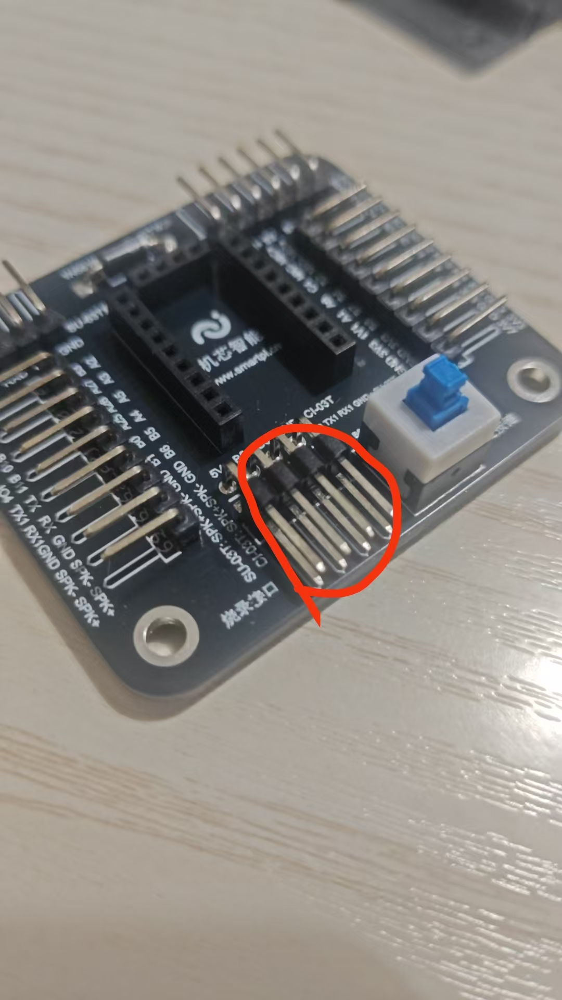

---

### 烧录工具一直显示"等待设备"怎么办？

**问题描述：**

烧录工具界面一直显示"等待设备"状态，即使模块已正确连接到COM端口。

**解决方案：**

- **重新插拔设备**：

    1. 将模块从USB端口拔出
    2. 等待2-3秒
    3. 重新插入模块
    4. 等待设备识别完成

- **接触检查**：

    - 检查杜邦线连接是否牢固
    - 确认没有松动或接触不良
    - 尝试更换质量更好的连接线

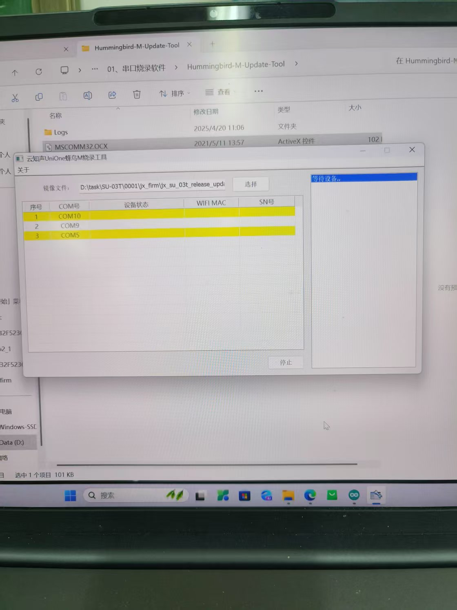

**其他处理方法**：

- 更换不同的USB端口
- 检查CH340驱动是否正常工作
- 确认模块供电是否稳定
- 尝试重启烧录工具

**注意事项：**

- 使用2.54mm杜邦线时容易出现接触问题
- 等待设备状态通常是连接或驱动问题
- 重新插拔是最简单有效的解决方法

---

### 烧录失败提示COM端口发送异常怎么办？

**问题描述：**

使用烧录工具时出现"发送异常，COM5终止了本次传输活动"错误，进度条在0%时中断。

**解决方案：**

**1. 检查固件文件格式**

- 优先使用解压后的固件文件（如tar.gz解包后的bin文件）
- 避免直接使用压缩包
- 确认固件文件路径不含中文字符

**2. 验证COM端口状态**

- 确认设备管理器中COM端口正常
- 检查是否有其他程序占用串口
- 尝试更换不同的COM端口

**3. 硬件连接检查**

- 确保使用支持数据传输的USB线
- 检查杜邦线连接牢固性
- 必要时焊接引脚解决接触问题
- 验证模块供电稳定

**4. 烧录工具设置**

- 选择正确的COM端口号
- 确认波特率设置（通常115200）
- 尝试降低波特率重试
- 重新启动烧录工具

**5. 系统环境检查**

- 关闭可能占用串口的程序
- 重新安装USB转串口驱动
- 更换电脑USB端口
- 以管理员权限运行烧录工具

**6. 替代方案**

- 使用XCOM等串口工具验证通信
- 尝试使用其他烧录软件
- 在安全模式下进行烧录
- 更换操作系统测试

**特殊处理方法：**

- 如果使用原始固件失败，尝试解压后的文件
- 部分模块对固件格式要求严格
- tar.gz格式可能比bin格式更稳定

**注意事项：**

- COM端口异常通常是通信问题，非模块损坏
- XCOM能正常通信说明硬件连接正常
- 焊接引脚比杜邦线连接更可靠
- 持续失败可能需要返厂检测

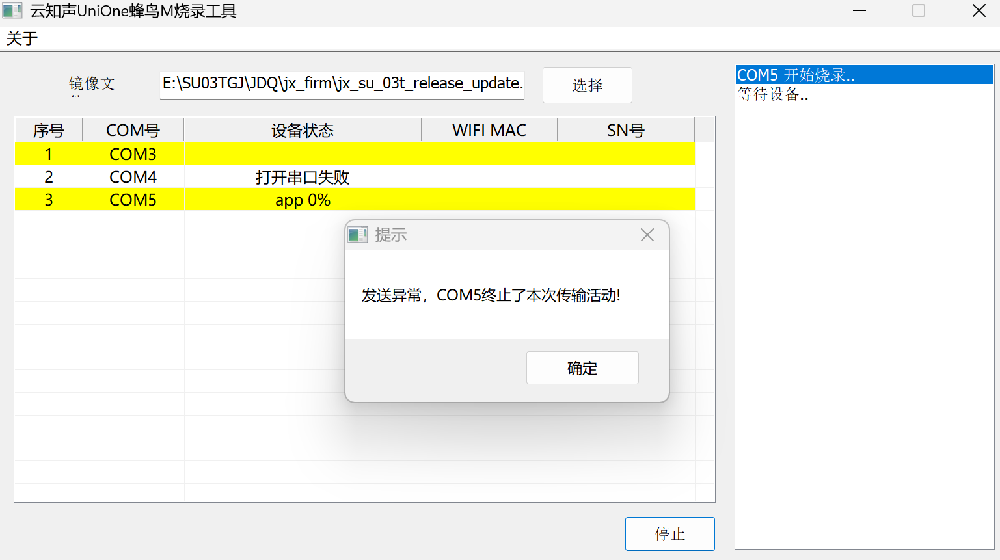

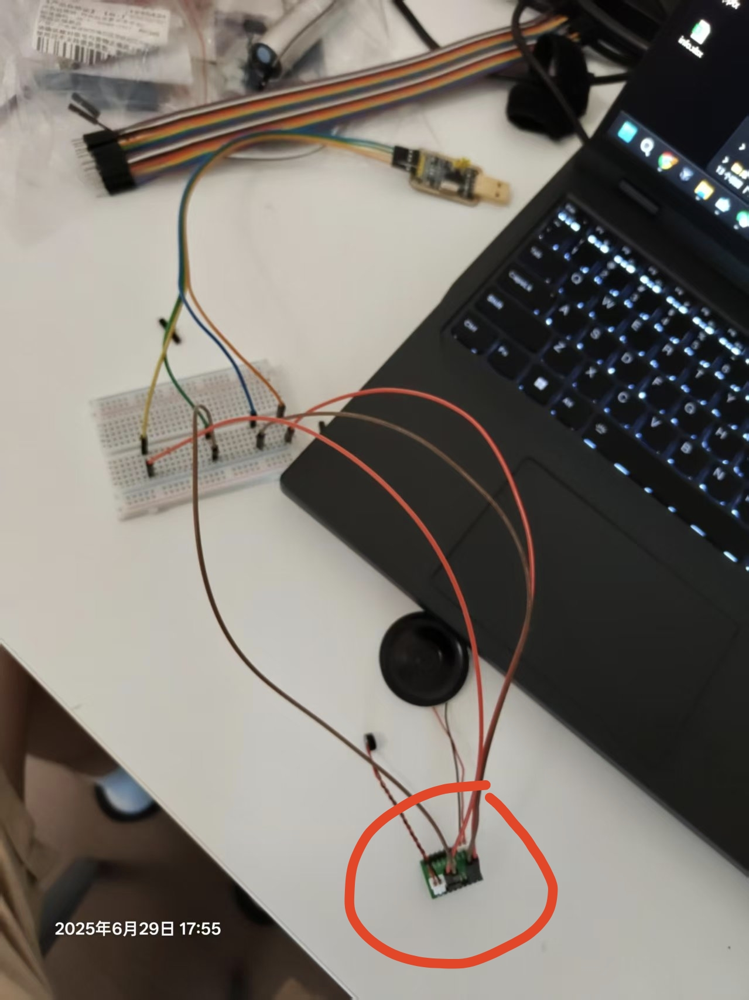

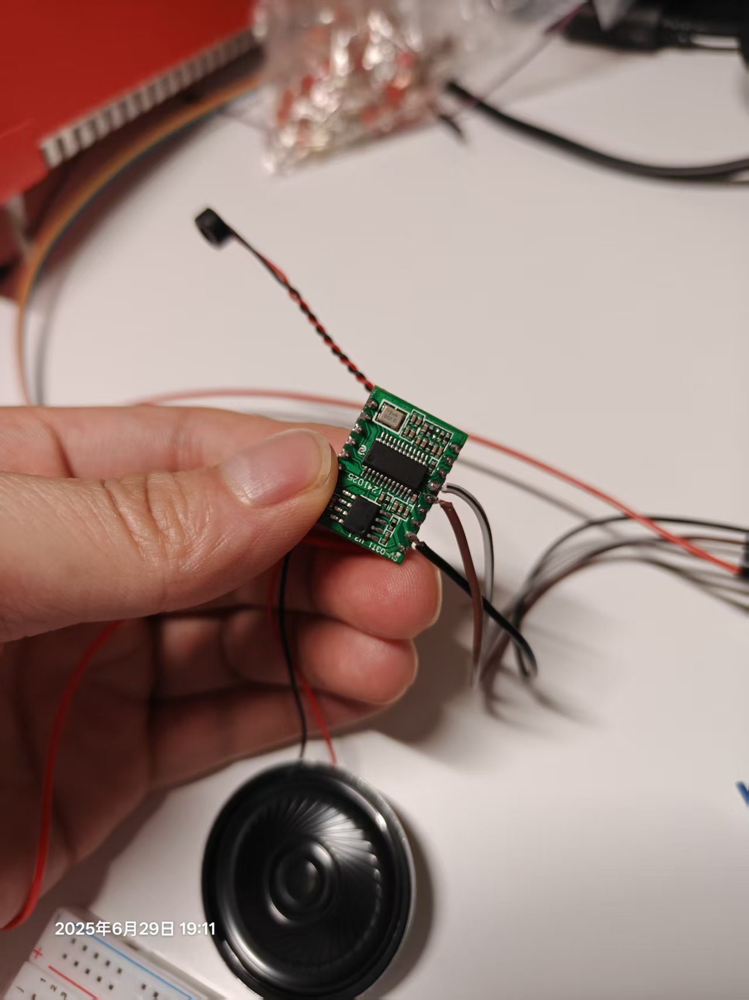

---

### 模块单独测试时串口出现乱码怎么办？

**问题描述：**

将模块单独连接（不通过单片机）进行测试时，串口通信出现乱码，即使交叉连接RX/TX并尝试不同供电后问题依旧。

**解决方案：**

**1. 检查串口参数配置**

- 确认波特率设置（常见：9600、115200）
- 验证数据位：8
- 验证停止位：1
- 验证校验位：无

**2. 确认RX/TX连接正确**

- 发送端TX连接接收端RX
- 接收端TX连接发送端RX
- 地线（GND）必须连接
- 交叉连接时确保没有交叉两次

**3. 检查供电稳定性**

- 使用稳定的3.3V供电（推荐）
- 避免使用5V（可能损坏模块）
- 测量供电电压是否稳定
- 确保电源纹波小

**4. 排查干扰因素**

- 远离强干扰源（电机、继电器）
- 使用屏蔽线连接
- 缩短连接线长度
- 添加滤波电容

**5. 验证模块工作模式**

- 确认模块进入串口通信模式
- 检查模块是否处于启动状态
- 重启模块重新初始化
- 查看模块指示灯状态

**6. 软件和驱动检查**

- 更新USB转串口驱动
- 尝试不同的串口调试软件
- 检查电脑USB端口供电
- 关闭其他可能干扰的程序

**进一步测试：**

- 使用示波器查看信号波形
- 尝试其他USB转TTL模块
- 在不同电脑上测试
- 联系专业技术人员检测模块

**注意事项：**

- 长时间乱码可能是模块硬件问题
- 避免在通电状态下插拔连接线
- 优先使用3.3V电平的USB转TTL模块
- 若确认模块损坏需要返修或更换

---

### 无法访问智能体平台网站怎么办？

**问题描述：**

尝试访问智能公元平台网站时，页面无法正常加载或登录失败，怀疑是网络问题导致。

**解决方案：**

1. **网络连接检查**
    - 刷新页面重新加载
    - 检查网络连接是否正常
    - 尝试切换到其他网络（如手机热点）

2. **浏览器和系统处理**
    - 清除浏览器缓存和Cookie
    - 尝试使用不同的浏览器访问
    - 重启电脑或路由器

3. **登录问题解决**
    - 确认账号密码输入正确
    - 使用"忘记密码"功能重置密码
    - 联系管理员确认账号状态

4. **网络环境优化**
    - 如果是企业网络，联系IT部门开放相关端口
    - 检查防火墙设置是否阻止访问
    - 尝试使用VPN切换网络环境

**注意事项：**

- 平台偶尔进行维护，关注官方通知
- 某些地区可能存在网络限制
- 建议在网络状况良好时进行配置
- 多人同时访问可能导致服务器响应慢

---

### 更换电脑后烧录成功是什么原因？

**问题描述：**

相同操作在原电脑上烧录失败，更换电脑后烧录成功，怀疑是电脑问题。

**解决方案：**

- **电脑环境检查**：

    - 原电脑可能存在USB驱动问题
    - 检查USB接口供电是否稳定
    - 确认串口驱动程序正常安装

- **系统差异排查**：

    - 不同操作系统的USB兼容性可能不同
    - 防火墙或安全软件可能影响烧录
    - 后台程序占用串口资源

- **硬件连接检查**：

    - USB线缆质量影响数据传输
    - 尝试更换USB接口
    - 检查转接板接触是否良好

- **烧录工具设置**：

    - 确认烧录工具版本兼容
    - 检查波特率等参数设置
    - 尝试以管理员权限运行

**注意事项：**

- 烧录失败通常与电脑环境相关
- 建议使用稳定性较高的操作系统进行烧录
- 保留可正常烧录的电脑环境用于后续开发
- 定期更新烧录工具和USB驱动

---

### 免唤醒词识别后如何通过串口发送自定义指令？

**问题描述：**

需要实现语音模块在识别到免唤醒词内容后，通过串口发送自定义指令的功能。

**解决方案：**

- **功能配置**：

    - 语音模块支持免唤醒词识别功能
    - 识别到指定内容后可通过串口输出数据
    - 支持自定义输出格式和内容

- **配置步骤**：

    1. 在智能公元平台配置免唤醒词识别
    2. 设置识别后的串口输出动作
    3. 定义需要发送的自定义指令格式
    4. 生成固件并烧录到模块

- **串口通信设置**：

    - 模块识别后自动通过UART发送数据
    - 数据格式可根据需求自定义（如ASCII、十六进制等）
    - 波特率等参数可配置

**注意事项：**

- 免唤醒词识别不需要唤醒词即可触发
- 串口输出内容需要在平台中预先配置
- 确保下位设备能正确接收和处理发送的指令格式

---

### 烧录时是否需要连接喇叭？

**问题描述：**

进行固件烧录时，不确定是否需要先连接喇叭，以及烧录后如何验证声音输出。

**解决方案：**

- **烧录过程**：烧录固件时不需要连接喇叭
- **声音验证**：如果想验证烧录后的声音输出，需要连接喇叭
- **开机播报**：如果烧录的固件包含开机播报功能，上电后会自动播放语音

**注意事项：**

- 喇叭连接与否不影响烧录过程
- 建议烧录完成后再连接喇叭进行功能测试
- 确保喇叭极性连接正确（SPK+、SPK-）

---

### 串口调试工具波特率设置错误导致通信异常怎么办？

**问题描述：**

使用串口调试工具时，设置波特率为115200但通信仍出现乱码，接电后发送的指令与预期不符，影响调试和通信测试。

**解决方案：**

**1. 波特率不匹配问题**

- **常见错误**：串口调试工具默认波特率为9600
- **设置要求**：文档要求使用115200波特率
- **结果**：波特率不匹配导致数据乱码和通信失败

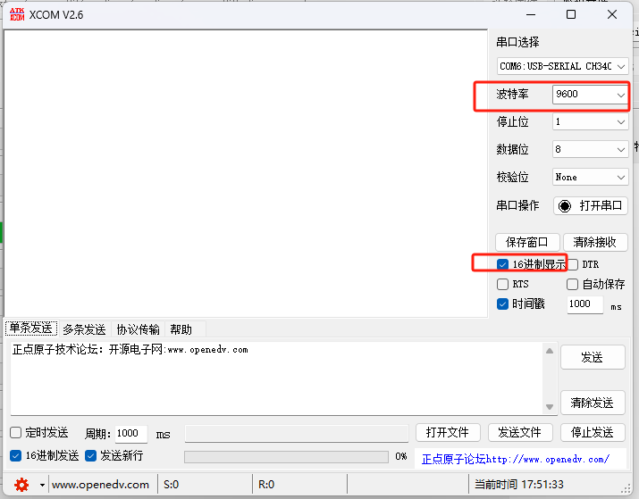

**2. 正确配置方法**

- **步骤1**：打开串口调试工具（如XCOM V2.6）
- **步骤2**：将波特率从默认的9600改为115200
- **步骤3**：确保数据位为8，校验位为None
- **步骤4**：勾选16进制显示（如需发送十六进制数据）

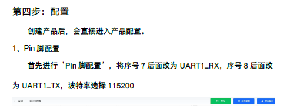

**3. 通信测试验证**

- **发送测试**：发送数据应与设置完全一致
- **接收检查**：确认接收数据无乱码
- **故障排查**：如仍有问题，检查驱动和硬件连接

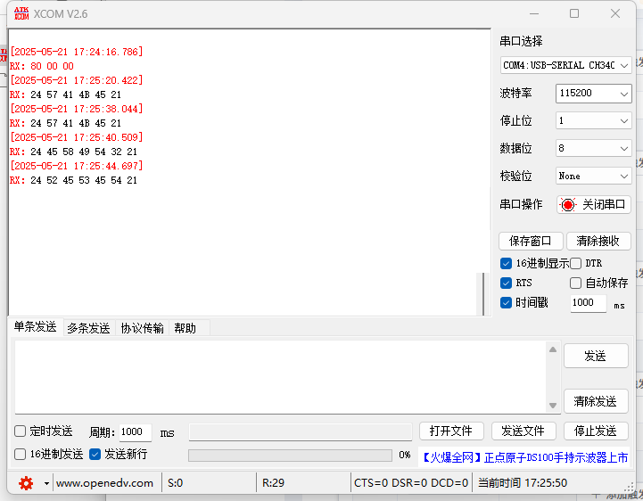

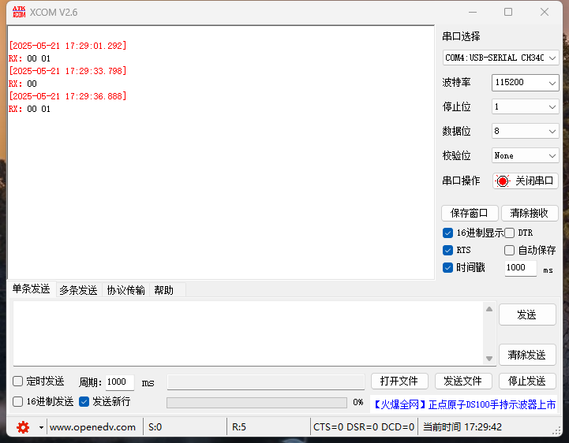

**4. 烧录工具通信问题**

- **现象**：烧录进度卡住不动，显示"等待设备"
- **原因**：通信线路连接不稳定或波特率错误
- **解决**：重新连接并确保波特率设置正确

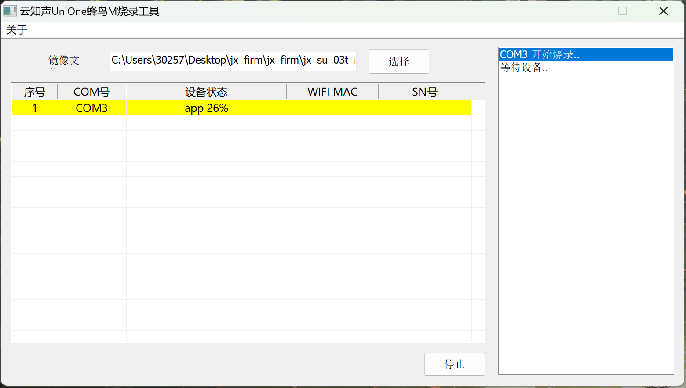

**注意事项：**

- 串口调试工具首次使用时需检查默认波特率设置
- 不同调试工具有不同的默认参数，使用前务必检查
- 波特率不匹配是串口通信失败的最常见原因
- 烧录和串口调试应使用相同的波特率设置

---

### 烧录后串口日志显示乱码怎么办？

**问题描述：**

烧录线上生成的固件后，串口调试器显示的日志为乱码，且无法正常输出日志信息。

**解决方案：**

**1. 检查日志输出配置**

确保在平台中正确配置了日志输出：

- GPIO_8被配置为日志输出口（DEFAULT_LOG）
- 串口调试器应连接到GPIO_B8（340串口的RX）
- 波特率设置为57600

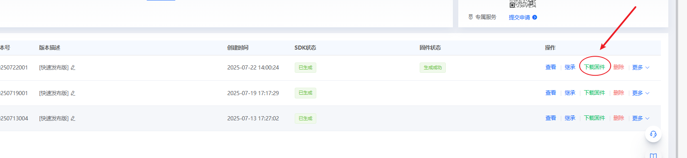

**2. 正确的串口设置**

使用官方串口调试软件的正确配置：

- **端口**：选择对应的COM端口
- **波特率**：57600（与模块配置一致）
- **数据位**：8
- **校验位**：None
- **停止位**：1

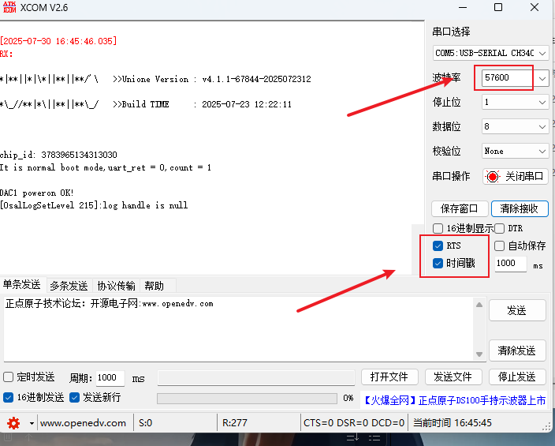

**3. 常见问题及解决**

**问题**：接收到的数据以55开头而非预期的AA

- **原因**：通信不稳定或数据格式错误
- **解决**：检查连接线和接地
- **偶尔正常**：可能是接触不良，重新连接可恢复

**4. 硬件检查要点**

- 检查杜邦线是否完好，无虚焊
- 确认模块与串口转换器的连接：

    - 模块TX → 转换器RX
    - 模块RX → 转换器TX
    - GND → GND（必须共地）
- 使用单独模块测试，排除其他电路干扰

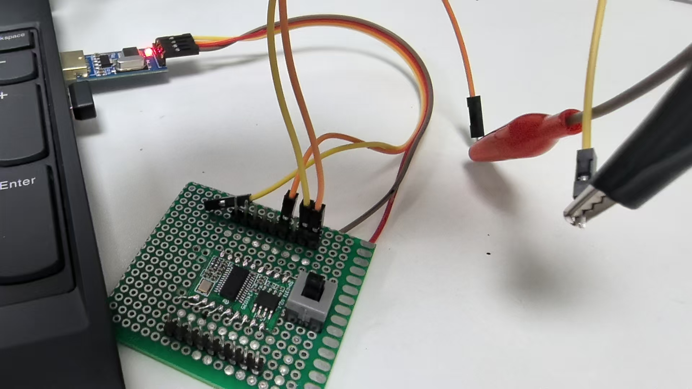

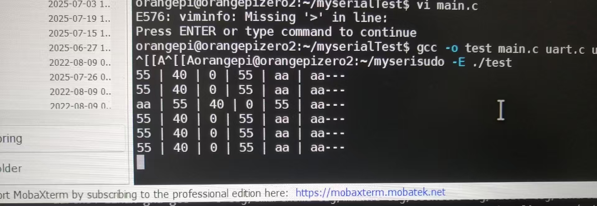

**注意事项：**

- 烧录的是update.bin文件，不是完整的固件包
- 日志输出功能需要在平台中启用并配置正确引脚
- 连续操作时出现问题可能是供电不稳定
- 建议使用短而好的杜邦线连接

---

### 桌宠模块串口通信乱码及动作异常怎么办？

**问题描述：**

桌宠模块能识别语音指令但无动作响应，且串口通信出现乱码，怀疑是固件烧录或串口通信配置问题。

**解决方案：**

**1. 串口连接检查**

- 确认USB转串口模块与桌宠控制板的连接线序正确
- 检查杜邦线接触是否良好，避免虚焊
- TX/RX需要交叉连接：模块TX→转换器RX，模块RX→转换器TX

    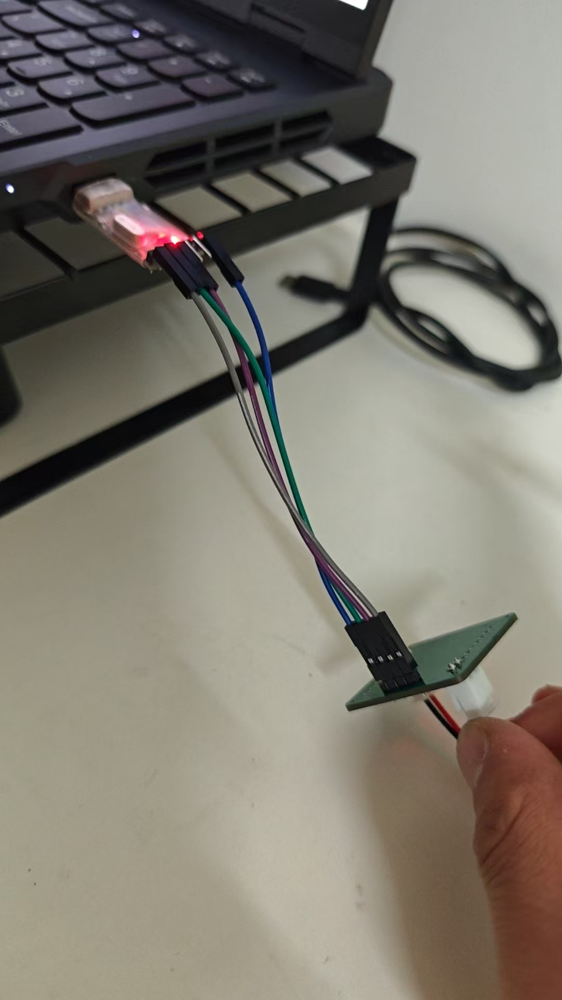

**2. 串口参数配置**

- 波特率设置为9600
- 数据位：8
- 停止位：1
- 校验位：无

**3. 咪头功能验证**

使用串口助手测试麦克风功能：

- 发送语音指令"摇尾巴"
- 观察串口是否返回数字"40"
- 如能正常返回，说明咪头功能正常

    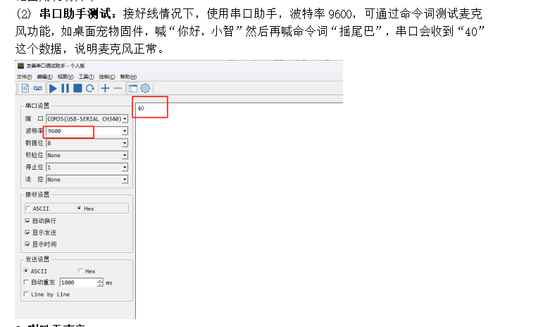

**4. 动作异常排查**

- 检查舵机连接是否正确
- 确认舵机臂安装方向是否正确（避免装反）
- 验证32单片机串口接收程序是否正常

**5. 常见原因分析**

- **串口乱码**：波特率不匹配或连接线问题
- **无动作响应**：舵机装反或串口数据解析错误
- **部分动作异常**：可能是单个舵机控制问题

**注意事项：**

- 烧录软件与串口调试软件是不同的工具
- 需要使用专用的串口助手软件进行调试
- 动作异常时先检查串口数据是否正常接收

---

### 烧录时设备状态变黄色且拔插GND掉串口怎么办？

**问题描述：**

烧录固件时设备状态变为黄色，按照操作拔插GND线后串口连接中断，导致烧录失败。

**解决方案：**

**1. 正确的烧录操作流程**

- 烧录工具显示设备状态变黄后，应该拔插5V（VCC）线
- 不应拔插GND线，拔GND会导致串口连接断开
- 正确接线：VCC、TX、RX、GND四根线

**2. 接线检查**

- 确认USB转串口模块与设备连接正确
- 如使用4线连接，通常不接5V线（设备独立供电）
- 如必须供电，确保5V线连接稳定

**3. 常见错误**

- **拔错线**：误拔GND导致连接断开
- **接触不良**：拔插时导致接头松动
- **供电不稳**：VCC连接问题导致设备异常

**4. 操作建议**

- 烧录前确保所有连接线牢固
- 状态变黄后，按照文档要求拔插正确的线
- 如连接中断，重新连接并重启烧录工具

**注意事项：**

- GND是信号地，拔除会导致通信中断
- 烧录过程中不要随意拔插连接线
- 建议使用质量好的杜邦线避免接触问题
- 烧录失败后需要重新启动整个流程

---

### 串口接收数据异常（55/AA）怎么办？

**问题描述：**

在使用串口通信时，接收到的数据中频繁出现以55开头的异常数据，而预期应为AA，且该问题在连续操作时更易发生，偶尔能恢复正常。

**解决方案：**

**1. 问题分析**

数据头部异常的原因：

- **55（0x55）**：可能是同步字节或命令起始符
- **AA（0xAA）**：预期的数据包头
- **连续操作易出现**：可能是时序或同步问题
- **偶尔正常**：表明硬件连接基本正常

**2. 排查步骤**

逐步检查可能的原因：

- **检查发送端**：确认发送数据格式正确
- **检查波特率**：确保波特率设置匹配
- **检查连接线**：重新连接或更换杜邦线
- **检查接地**：确保两端设备共地
- **单独测试**：移除其他负载，只保留串口通信

**3. 临时解决方案**

如果问题持续存在：

- **增加延时**：在连续操作间增加适当延时
- **降低波特率**：尝试降低通信速率
- **软件滤波**：在接收端增加数据校验
- **重置通信**：每次通信前重新初始化

**注意事项：**

- 55/AA问题通常是通信协议或时序问题
- 检查接收端程序是否正确处理了数据头部
- 长距离通信或高频操作时更容易出现问题
- 建议使用带屏蔽的串口线改善信号质量

---

### 烧录成功但设备无声音输出？

**问题描述：**

固件烧录成功，烧录工具显示完成，但设备没有任何声音输出，包括开机提示音和语音响应均无声。

**解决方案：**

**1. 硬件连接检查**

- 检查喇叭接线极性是否正确
- 确认喇叭连接牢固无松动
- 验证咪头（麦克风）连接正常

**2. 音频电路测试**

- 使用万用表测量喇叭正负极电压
- 正常范围应在2.2-2.5V之间
- 检查耦合电容是否损坏

**3. 固件配置验证**

- 确认是否配置了开机播报语音
- 检查音量设置是否过低
- 验证语音输出功能已启用

**4. 官方固件特殊说明**

- **官方固件特性**：部分官方固件没有开机播报功能
- **需要唤醒**：烧录官方固件后需要使用唤醒词激活设备
- **测试方法**：尝试用标准唤醒词（如"你好小慧"）唤醒
- **无响应处理**：如果唤醒仍无声音，检查硬件连接

**5. 常见故障排除**

- **喇叭损坏**：更换已知正常的喇叭测试
- **功放故障**：测量功放芯片供电和输出
- **配置错误**：重新生成固件并烧录

**测试步骤：**

1. 烧录带开机语音的出厂固件
2. 上电后应立即有语音提示
3. 如无提示音，说明硬件存在问题

**注意事项：**

- 烧录成功不等于音频功能正常
- 重点检查功放输出和喇叭回路
- 建议使用配套喇叭测试
- 如硬件正常，检查固件配置文件

---

### 烧录后仍显示默认表情？

**问题描述：**

语音模块烧录新固件后，仍显示旧的默认表情，且无任何语音反馈，怀疑固件未正确烧录或版本错误。

**解决方案：**

**1. 烧录验证**

- 确认烧录工具显示"成功"状态
- 检查是否有烧录完成提示
- 重新尝试烧录过程

**2. 固件文件检查**

- 验证固件文件是否完整
- 确认固件版本匹配硬件型号
- 检查文件路径是否包含中文

**3. 硬件复位**

- 烧录后断电重新上电
- 确认模块已完全重启
- 检查是否需要复位操作

**4. 配置问题排查**

- 确认是否配置了自定义表情
- 检查ID号设置是否正确
- 验证唤醒词和命令词配置

**常见原因：**

- 烧录了错误的固件版本
- 固件生成时配置不完整
- 模块存储区域出现问题

**注意事项：**

- 烧录成功后应有明显的功能变化
- 保留原厂固件作为备份
- 烧录前确认固件文件来源可靠
- 多次烧录失败需联系专业技术人员


---

### SP Programmer烧录工具显示设备无响应怎么办？

**问题描述：**

使用SP Programmer烧录软件时，搜索窗口显示"无响应"，无法完成烧录操作。

**解决方案：**

**1. 确认烧录目标**

- 明确要烧录的是语音模块还是STM32单片机
- 语音模块烧录使用专用语音烧录工具
- STM32单片机使用SP Programmer或Keil等工具

**2. 工具选择**

- 语音模块推荐使用：Hummingbird-M-Update-Tool
- STM32单片机可使用：SP Programmer、STM32CubeProgrammer
- 避免使用不匹配的工具进行烧录

**3. 连接检查**

- 确认USB转串口模块正常工作
- 检查TX/RX引脚交叉连接
- 验证供电稳定（5V/3.3V）

**注意事项：**

- 不同芯片需要使用对应的烧录工具
- 确认驱动程序正确安装
- 烧录前进入正确的下载模式


---

### 如何选择正确的串口进行烧录？

**问题描述：**

烧录软件显示多个COM端口选项，不知道应该选择哪一个，选择错误会导致烧录失败。

**解决方案：**

**1. 查看设备管理器**

- 打开设备管理器（Win+X，选择设备管理器）
- 展开"端口(COM和LPT)"
- 查看USB转串口设备对应的COM口号

**2. 识别正确端口**

- CH340模块通常显示为"USB-SERIAL CH340"
- CP210x模块显示为"Silicon Labs CP210x"
- 记住刚插入设备时新增的COM口号

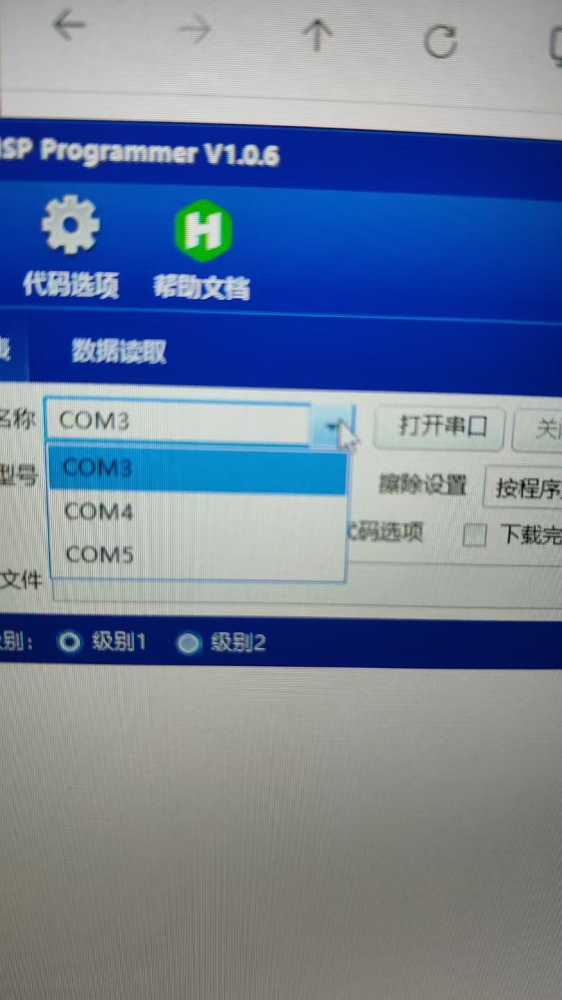

**3. 排查方法**

- 拔掉设备，查看哪个COM口消失
- 插入设备，查看新增的COM口
- 或在属性中查看详细信息确认

**4. 烧录失败处理**

- 尝试其他可用的COM端口
- 检查是否有其他程序占用串口
- 重新安装USB转串口驱动

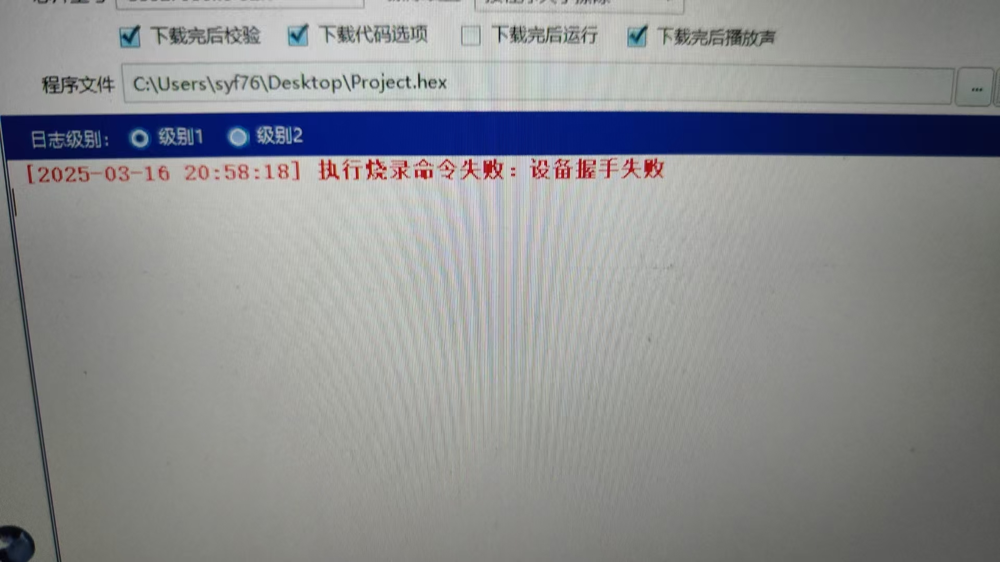

**注意事项：**

- COM口号是系统动态分配的，每次可能不同
- 避免使用USB集线器，直接连接电脑
- 如仍有问题，尝试更换USB端口或电脑


---

### UniOne蜂鸟M烧录工具无法打开串口？

**问题描述：**

使用云知声UniOne蜂鸟M烧录工具时，无法成功打开串口，工具显示"打开串口失败"，导致设备无法识别。

**解决方案：**

**1. 驱动程序检查**

- 确认CH340驱动已正确安装
- 检查设备管理器中是否显示COM端口
- 尝试重新安装或更新驱动程序

**2. 硬件连接排查**

- 检查USB转TTL模块连接是否牢固
- 确认TX/RX引脚连接正确（交叉连接）
- 验证供电线（5V/GND）连接正常

**3. 系统环境检查**

- 尝试更换USB端口
- 检查是否有其他程序占用串口
- 以管理员权限运行烧录工具

**4. 烧录工具设置**

- 确认选择了正确的COM端口号
- 检查波特率设置是否匹配
- 尝试关闭后重新打开工具

**注意事项：**

- 串口打开失败通常是驱动或连接问题
- 避免使用延长线或集线器
- 确认USB端口供电稳定
- 如问题持续，尝试更换电脑或系统


---

### 喇叭无电压输出如何排查？

**问题描述：**

模块上电后，使用万用表测量喇叭正负极对GND电压为0V，但麦克风电压正常。

**解决方案：**

**1. 确认测量方法**

- 红表笔接喇叭正极（SPK+）
- 黑表笔接GND
- 万用表调至直流电压档（20V档位）

**2. 喇叭电压异常排查步骤**

- **检查喇叭连接**：

    - 确认喇叭接线正确
    - 检查是否有虚焊或接触不良
    - 尝试更换已知正常的喇叭

- **检查功放电路**：

    - 测量功放芯片供电是否正常
    - 检查功放输出引脚是否有信号
    - 查看喇叭输出电容是否损坏

- **固件配置检查**：

    - 确认配置中已添加唤醒词
    - 检查语音识别功能是否开启
    - 验证固件生成是否完整

**3. 验证模块状态**

- 使用串口助手测试模块响应
- 检查模块是否能正常识别语音
- 对比出厂固件是否也有此问题

**4. 常见原因**

- **喇叭损坏**：更换喇叭测试
- **功放芯片损坏**：需要维修或更换模块
- **虚焊或接触不良**：重新焊接喇叭接线
- **固件配置错误**：重新生成并烧录固件

**注意事项：**

- 测量前确保万用表功能正常
- 喇叭无电压时，先检查连接再判断模块损坏
- 如更换喇叭后仍无电压，大概率是模块功放电路故障

**5. 桌宠模块无声音特殊情况**

**问题描述：**

桌宠模块重新烧录后，语音指令有回复但无动作响应，同时无声音输出。

**解决方案：**

- **重新上电唤醒**：烧录完成后必须断电重新上电，使用唤醒词"你好小智"激活
- **咪头功能测试**：使用串口助手检查咪头是否正常工作
- **喇叭电压测量**：

    - 万用表调至直流电压档（20V档位）
    - 红表笔接喇叭正极（SPK+），黑表笔接GND
    - 正常电压范围：2.5V-2.6V

    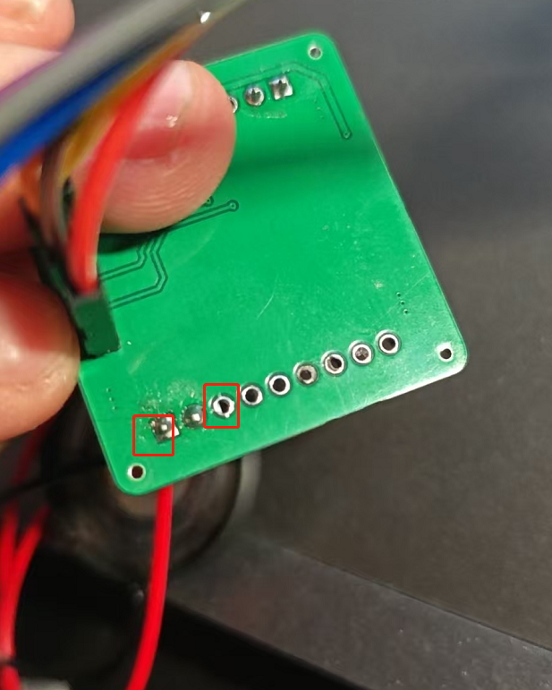

- **故障判断**：

    - 喇叭两端电压为0V：喇叭损坏或连接问题
    - 拔掉喇叭后电压仍为2.5V左右：模块功放正常，问题在喇叭
    - 咪头电压2.6V为正常值

- **喇叭更换建议**：如确认喇叭损坏，可购买4R3W或8R2W规格的喇叭替换

**注意事项：**

- 直接焊接的喇叭需特别注意虚焊和短路问题
- 短路可能烧毁功放芯片，导致无声
- 咪头和喇叭电压在2.5-2.6V范围内属于正常

**3. 固件配置验证**

- 确认唤醒词配置正确（如"你好你好"）
- 检查是否开启了语音唤醒功能
- 验证命令词和回复词都已配置

**4. 固件重新生成**

- 将配置文件（JSON）发给专业技术人员检查
- 重新在平台生成固件
- 确认下载过程无误

**注意事项：**

- 如果出厂固件正常，说明硬件无问题
- 重点关注配置文件的正确性
- 烧录工具显示成功不代表固件内容正确

## 硬件接线问题


---

### ESP32S3 机器人无法正确执行步态动作怎么办？

**问题描述：**

ESP32S3 控制的机器人无法执行正确的步态动作，前进和转向功能失效，仅能执行摇摆等基础动作。

**解决方案：**

- 检查 ESP32S3 的引脚定义，确保正确连接
- 确认舵机信号线连接到正确的 GPIO 引脚
- 特别注意 D0、D1、D7 等常用舵机控制引脚
- 使用万用表测试引脚输出信号

**调试步骤：**

1. 对照 ESP32S3 引脚定义图检查接线
2. 确认 B7 舵机连接到正确的引脚
3. 逐个测试每个舵机的响应
4. 检查电源供电是否稳定

**注意事项：**

- ESP32S3 不同开发板的引脚定义可能有差异
- 舵机电源需要独立供电，避免影响主控板
- 接线错误可能导致舵机无响应或动作异常
- 建议使用杜邦线并确保连接良好

---

### 固件烧录需要多长时间？

**问题描述：**

烧录固件时状态长时间未更新，等待超过3分钟仍未成功，有时需要等待30分钟至1小时。

**解决方案：**

固件烧录确实需要较长时间，这是正常现象。

**正常烧录时间：**

1. **时间范围**：

    - 通常情况：30分钟到1小时
    - 快速情况：15-30分钟（服务器负载低时）
    - 极端情况：可能需要3小时（实际案例）

2. **烧录过程特征**：

    - 状态可能长时间不更新
    - 进度条显示可能停滞
    - 两个指示灯都变绿表示成功

**影响因素：**

1. **服务器负载**：

    - 同时烧录任务数量
    - 任务排队等待时间
    - 服务器处理能力

2. **网络状况**：

    - 上传下载速度
    - 网络稳定性
    - 数据传输完整性

3. **固件大小**：

    - 命令词条数量
    - 语音文件大小
    - 配置复杂度

**操作建议：**

1. **烧录准备**：

    - 使用稳定网络环境
    - 避免高峰时段操作
    - 确保电脑不休眠

2. **过程处理**：

    - 耐心等待，不要频繁刷新
    - 可半小时左右查看一次
    - 关注指示灯状态变化

3. **异常处理**：

    - 超过3小时未成功：联系专业技术人员
    - 多次失败：检查网络和驱动
    - 烧录工具异常：重启工具或电脑

**注意事项：**

- 烧录时间长是普遍现象，需要耐心等待
- 状态不更新不代表烧录失败
- 成功烧录后两个指示灯都会变绿
- 建议在网络较好的环境下进行烧录操作

---

## 软件工具问题


---

### CH340串口助手在哪里下载？

**问题描述：**

需要使用CH340串口调试助手，但不知道从哪里下载。

**解决方案：**

- **官方渠道**：

    - 智能公元平台提供串口助手下载
    - 可联系专业技术人员获取下载链接
    - 推荐使用XCOM V2.6版本

- **下载资源**：

    - 文件名：XCOM V2.6.exe
    - 支持CH340芯片的USB转串口模块
    - 兼容Windows系统

**注意事项：**

- 确保从官方渠道下载，避免病毒风险
- CH340驱动需要预先安装
- 下载后先杀毒再使用


---

### 串口调试助手如何正确使用？

**问题描述：**

串口调试助手已连接并打开串口，但接收窗口无法显示数据，仅能看到进度条和S值变化。

**解决方案：**

**1. 基础设置检查**

- 选择正确的COM口（如COM7: USB-SERIAL CH340）
- 设置匹配的波特率（如9600）
- 确认数据位、停止位、校验位设置

**2. 显示配置**

- 检查是否开启了"16进制显示"
- 确认接收区是否清空
- 调整窗口大小查看完整内容

**3. 数据发送测试**

```markdown
- 使用16进制格式发送测试数据
- 发送"AA"测试基本通信
- 观察接收区是否有响应
```

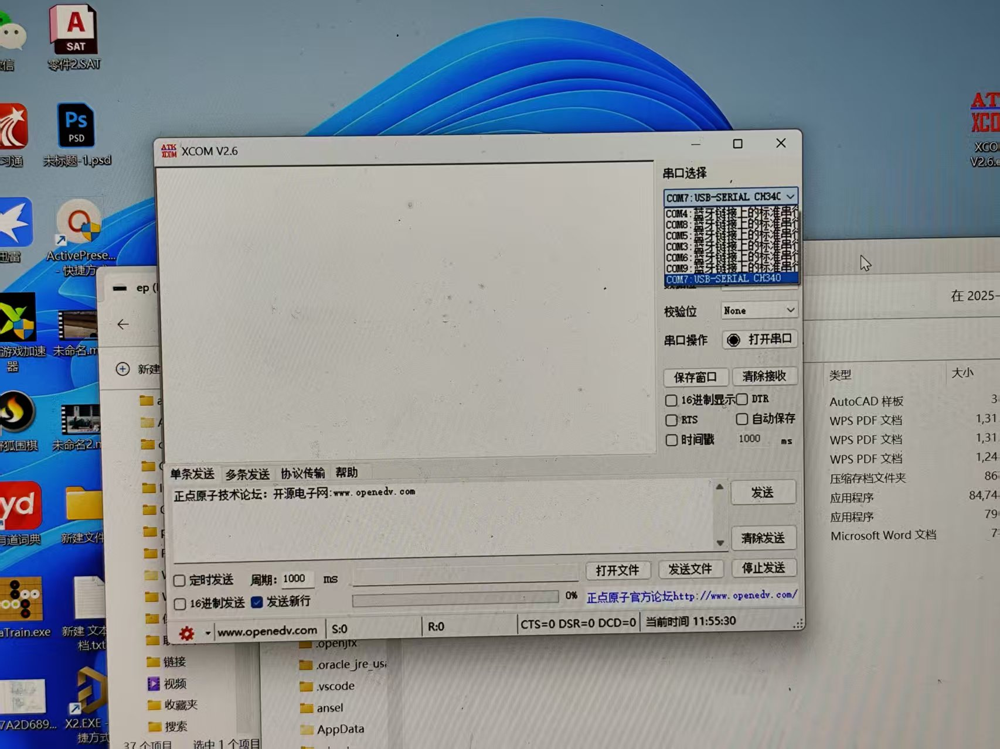

**注意事项：**

- CH340蓝灯亮起表示已连接
- S值变化表示有数据发送
- R值变化表示有数据接收
- 无数据显示可能是格式或协议问题


---

### 串口调试工具接收不到语音识别模块数据怎么办？

**问题描述：**

使用串口调试工具时，语音识别模块能正常工作，但调试工具接收不到模块返回的数据。

**解决方案：**

**1. 问题分析**

- 有回复但串口不发送：是连接问题
- 没回复：是识别的问题
- 需要先确认模块是否能正常识别并执行动作

**2. 排查步骤**

- **确认识别功能**：

    - 测试命令词是否能正常触发
    - 确认模块有语音回复
    - 验证基本功能是否正常

- **检查串口配置**：

    - 确认在平台中配置了串口发送行为
    - 检查发送的串口号是否正确（UART1/UART2）
    - 验证触发条件设置是否匹配

- **验证硬件连接**：

    - 确认TX/RX交叉连接正确
    - 检查GND是否共地
    - 使用示波器或逻辑分析仪验证信号

**3. 常见原因**

- 模块未配置串口输出功能
- 触发条件未满足，导致不发送数据
- 串口被其他程序占用
- 连接线路接触不良或断路

**注意事项：**

- 模块默认不会主动发送串口数据
- 必须在配置中明确指定发送行为
- 确保调试工具参数与模块配置完全一致

---

### 为什么串口调试工具能烧录但接收不到模块数据？

**问题描述：**

使用串口调试工具能正常烧录程序，烧录成功后语音模块工作正常，但调试工具接收不到模块输出的数据。

**解决方案：**

**1. 工具使用方式区分**

- **烧录模式**：

    - 使用专用的烧录工具
    - 特定的通信协议
    - 单向数据传输

- **调试模式**：

    - 使用标准串口调试助手
    - 需要匹配通信参数
    - 双向数据交换

**2. 调试参数设置**

```markdown
- 波特率：9600（根据模块配置）
- 数据位：8
- 停止位：1
- 校验位：无
- 流控：无
```

**3. 接线检查**

- 确认TX-RX交叉连接
- 模块TX连接电脑RX
- 模块RX连接电脑TX
- 共地连接（GND）

**注意事项：**

- 烧录工具和调试工具是不同的软件
- 烧录成功不代表模块会主动发送数据
- 需要模块执行相应命令才会输出
- 参考B站上的串口助手教学视频

---

## 控制输出问题


---

### 调光功能配置后没有反应怎么办？

**问题描述：**

按照教程配置了调亮和调暗指令，使用PWM0H控制，但语音模块执行指令时灯光亮度没有变化。

**解决方案：**

**1. 指令配置检查**

- 确认指令名称正确（如BrightnessUp、BrightnessOff）
- 检查控制方式设置为PWM输出
- 验证引脚选择（建议使用A00引脚的PWMCH0H）

**2. PWM参数设置**

- **占空比设置**：

    - 调亮：设置为较高值（如80-100）
    - 调暗：设置为较低值（如20-30）
    - 关闭：设置为0

**3. 硬件连接验证**

- 使用支持PWM的引脚（A00/PA0支持PWMCH0H）
- 确认LED驱动电路正确
- 检查电源供电是否足够


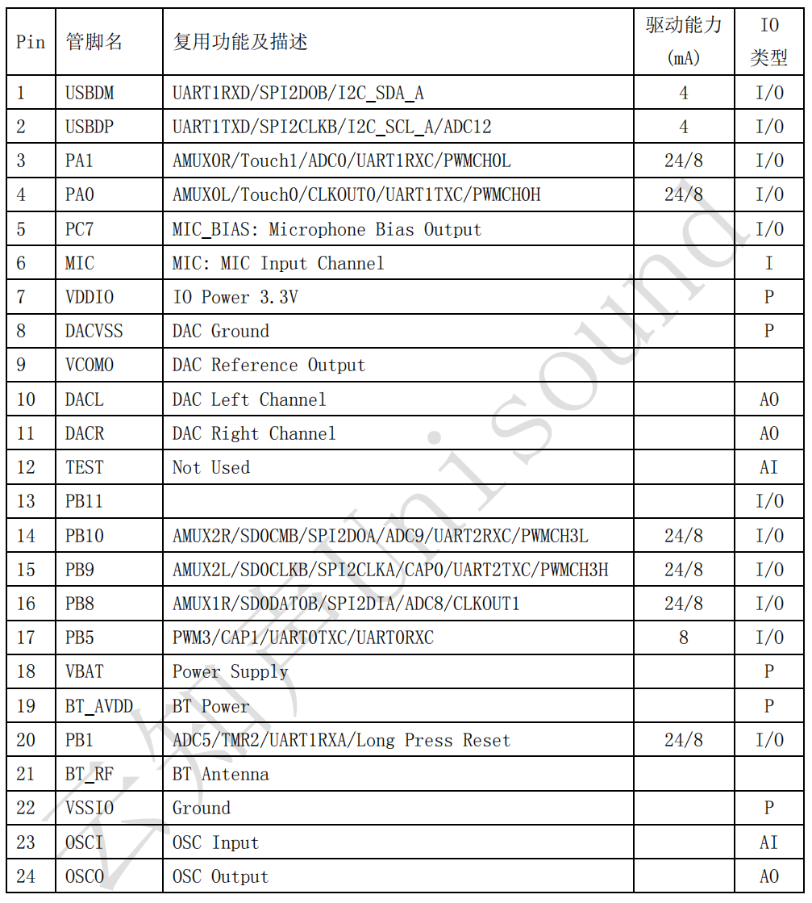

**注意事项：**

- PWM0H引脚可能被重复使用导致冲突
- 占空比20可能太低，亮度变化不明显
- 确保LED模块支持PWM调光
- 不同型号模块的PWM引脚可能不同


---

### 语音模块能识别但控制指令无输出？

**问题描述：**

语音模块已成功烧录，能正常识别语音指令并给出语音反馈，但控制引脚没有输出，无法控制外部设备。

**解决方案：**

**1. 指令输出配置**

- **开灯/关灯指令**：

    - 使用PWM控制而非简单开关
    - 开灯占空比：100
    - 关灯占空比：0

- **引脚分配**：

    - 避免多个指令使用同一引脚
    - A00引脚支持PWMCH0H功能
    - PWM0H可能与其他功能冲突

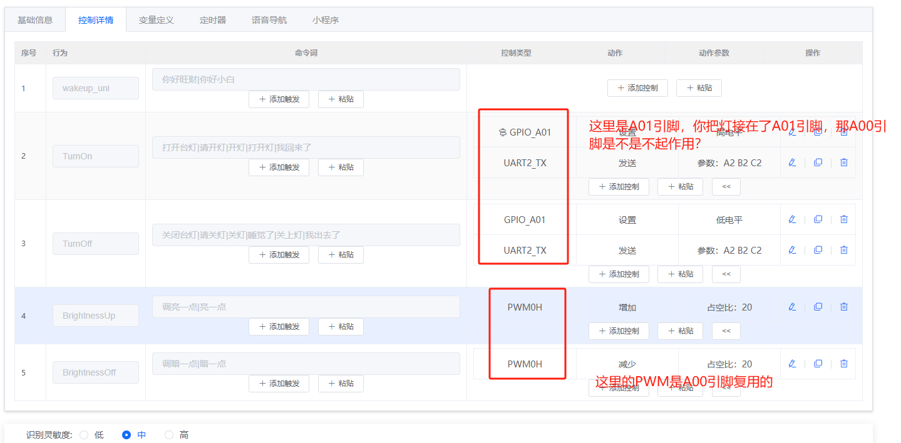
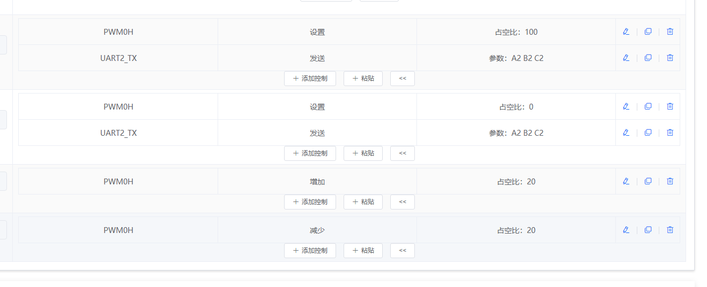

**2. 输出模式选择**

- **PWM模式**：

    - 适用于亮度调节
    - 支持渐变效果
    - 需要PWM支持的外设

- **开关模式**：

    - 适用于继电器控制
    - 简单高低电平输出
    - 响应速度快

**3. 硬件连接测试**

```markdown
- 使用万用表测量引脚电压
- 执行指令时观察电压变化
- 检查外部设备供电
- 验证信号线路连通性
```

**注意事项：**

- 串口助手无数据输出不等于模块无输出
- 可能是外部设备驱动能力不足
- 检查是否配置了串口输出功能
- 更换不同的语音模块测试

---

## 数据输出问题


---

### 语音模块没有数据输出怎么办？

**问题描述：**

语音模块烧录成功，能流畅识别语音并做出反馈，但没有数据输出，显示和动作都没有反应。

**解决方案：**

**1. 输出功能配置检查**

- 确认是否启用了串口输出功能
- 检查输出指令是否正确配置
- 验证输出引脚分配

**2. 电压测试**

```markdown
- 使用万用表测量输出引脚对地电压
- 蓝牙调试时电压应有明显变化
- 语音控制时电压应该随指令变化
- 电压微动且不受控说明配置有问题
```

**3. 配置文件验证**

- 检查工程配置中的输出设置
- 确认每个指令都有对应的输出动作
- 验证输出格式和协议

**注意事项：**

- 语音识别正常不等于输出配置正确
- 输出口电压异常可能是配置问题
- 建议使用串口助手监控输出数据
- 多个模块测试可排除硬件故障

---

### 串口发送指令后模块无响应怎么办？

**问题描述：**

使用串口助手向语音模块发送指令（如AA 55 0c 55 AA），但模块不播报语音或无任何反应。

**解决方案：**

**1. 指令格式检查**

- 确认指令格式正确（帧头+数据+帧尾）
- 验证十六进制数据格式无误
- 检查指令是否与模块配置匹配

**2. 串口参数设置**

- 波特率设置是否与模块配置一致（通常9600）
- 数据位、停止位、校验位配置正确
- 确保串口已正确打开

**3. 硬件连接检查**

- TX/RX引脚是否交叉连接
- 确认共地连接
- 检查引脚是否有松动

**4. 模块配置验证**

- 确认指令对应的语音已配置
- 检查是否启用了串口输入功能
- 验证消息号配置是否正确

**注意事项：**

- 不同模块的指令协议可能不同
- 建议查看具体型号的通信协议文档
- 确保模块处于正常工作状态

---

### Arduino串口通信读取数据为乱码怎么办？

**问题描述：**

使用Arduino通过串口通信读取数据时，接收到的十六进制数据显示为乱码且不完整。

**解决方案：**

**1. 检查波特率设置**

- 确认Arduino端和目标设备的波特率设置一致
- 常见波特率包括9600、115200等，需根据设备手册确认
- 在Arduino代码中使用 `Serial.begin(baud_rate)` 设置波特率

**2. 检查串口连接**

- 确保TX（发送）和RX（接收）引脚正确连接
- Arduino的TX → 目标设备的RX
- Arduino的RX → 目标设备的TX
- 检查是否有接反或松动的情况

**3. 验证数据格式**

- 确认目标设备输出的数据格式为十六进制
- 在Arduino中使用 `Serial.read()` 或 `Serial.readString()` 读取数据
- 通过 `Serial.println()` 输出以验证是否正常

**4. 测试通信**

- 使用串口监视器观察数据是否正常显示
- 如果仍为乱码，尝试更换波特率或重新连接硬件

**注意事项：**

- 确保供电电压符合设备要求
- 避免在串口通信时进行其他高负载操作
- 如问题持续，可检查设备规格中的接口说明

---

### 语音模块运行时突然死机怎么办？

**问题描述：**

语音模块在添加控制指令后无反应，使用过程中突然死机，需要重启才能恢复。怀疑可能是串口输出溢出导致。

**解决方案：**

**1. 串口输出管理**

- 减少串口输出频率，避免数据溢出
- 使用适当的延时控制输出速率
- 检查串口缓冲区大小，避免一次性发送过多数据

**2. 代码优化建议**

- 在串口输出前检查缓冲区状态
- 使用分批发送方式替代一次性大量输出
- 添加串口发送完成的确认机制

**3. 硬件检查**

- 检查电源供电是否稳定
- 确认串口连接线没有松动
- 测量工作电流是否在正常范围

**4. 调试方法**

- 通过LED指示灯观察程序运行状态
- 使用看门狗定时器自动复位恢复
- 记录死机前的操作步骤，定位触发条件

**注意事项：**

- 死机问题可能由软件逻辑错误或硬件异常引起
- 建议逐步简化代码定位问题根源
- 长期运行测试时建议添加异常重启机制
- 串口8位输出一般不会溢出，重点检查程序逻辑

---

## CH340驱动识别与烧录问题


---

### CH340驱动正常但蜂鸟烧录工具无法连接？

**问题描述：**

使用 CH340 驱动时，设备管理器中显示了 COM5 端口，但蜂鸟烧录工具显示"等待设备..."状态，无法成功烧录固件。

**解决方案：**

1. 确认 CH340 驱动已正确安装，设备管理器中能看到 COM 端口
2. 检查蜂鸟烧录工具是否选择了正确的 COM 端口
3. 尝试以下操作步骤：

    - 点击烧录按钮，当指示灯变黄后
    - 快速拔插 5V 电源线
    - 等待烧录进度显示

**注意事项：**

- 烧录过程中不要触碰语音模块，避免干扰烧录过程
- 如果进度卡在某个百分比（如 9%），保持耐心等待，不要中断
- 确保接线正确：5V、GND、TX、RX 对应连接

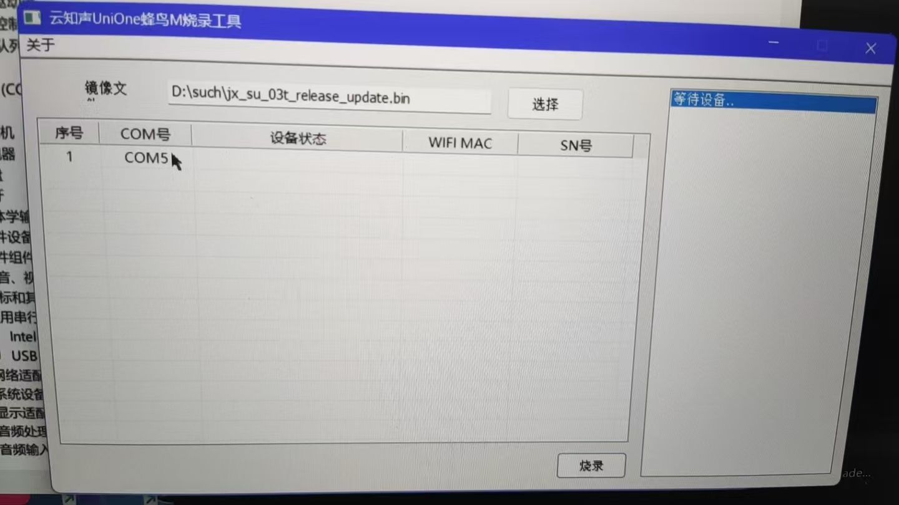


---

### 烧录成功后的验证方法

**问题描述：**

完成烧录后需要确认是否成功，以及如何验证功能。

**解决方案：**

1. 烧录工具显示 100% 完成即表示成功
2. 将模块安装到目标板子上
3. 连接喇叭和咪头进行测试：

    - 喇叭应能正常播放语音
    - 咪头应能正常接收声音指令

**注意事项：**

- 使用配套的喇叭和咪头效果更好
- 如果使用第三方配件，需要注意阻抗匹配
- 测试时保持环境安静，避免干扰

---

## STM32单片机烧录问题


---

### STM32使用FlyMcu烧录失败怎么办？

**问题描述：**

使用 FlyMcu 软件烧录 STM32 程序时显示"无效"错误，无法完成烧录。

**解决方案：**

1. 尝试使用 Keil 软件进行烧录：

    - 安装 Keil uVision5
    - 配置 ST-Link 下载器
    - 使用一键下载功能
2. 如果使用 FlyMcu，检查：

    - 串口设置是否正确
    - 波特率配置是否匹配
    - 是否进入 BootLoader 模式

**注意事项：**

- ST-Link 比串口烧录更稳定可靠
- 需要禁用其他串口设备避免冲突
- 确认目标芯片型号选择正确

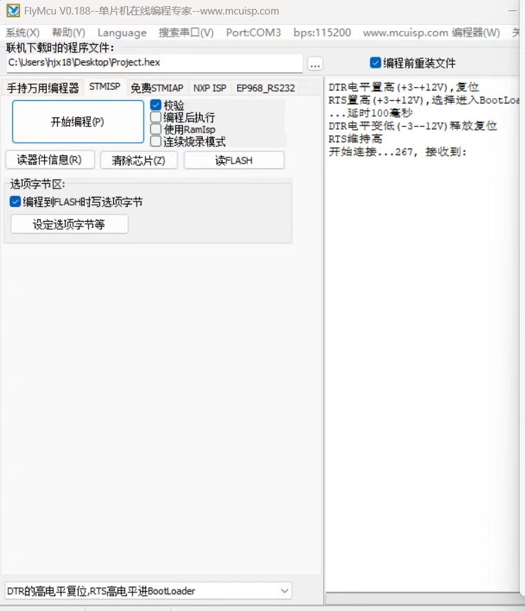
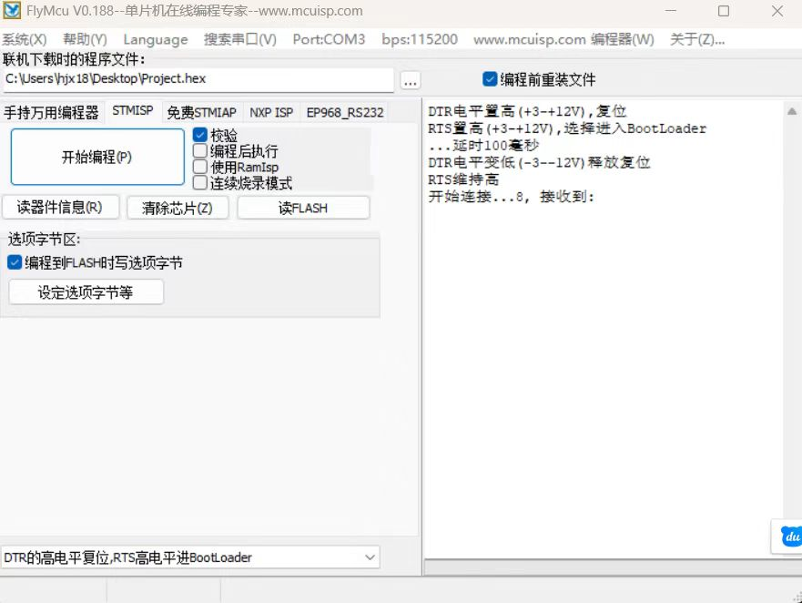


---

### STM32使用ST-Link烧录问题

**问题描述：**

使用 ST-Link V2 烧录 STM32 时，第一次成功，第二次无法烧录。

**解决方案：**

1. 检查 ST-Link 连接：

    - 确认 10 针排针连接正确
    - 检查 RST、SWIM、GND、3.3V 引脚
2. 排查步骤：

    - 关闭电脑蓝牙
    - 禁用多余串口
    - 重新插拔 ST-Link
    - 使用 Keil 的下载功能

**注意事项：**

- 不要同时使用多个烧录工具
- 确保开发板供电正常
- ST-Link 驱动需要正确安装

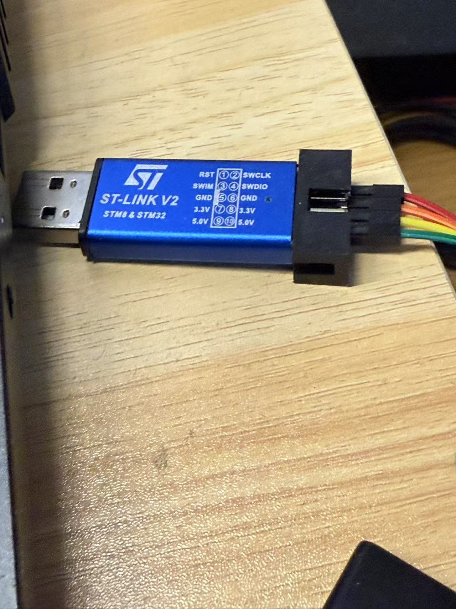


---

### Keil软件安装与版本选择

**问题描述：**

新手在选择 Keil 版本时困惑，不知道该安装哪个版本。

**解决方案：**

1. 推荐使用江科大提供的 Keil 版本
2. 安装注意事项：

    - 从官方或可信来源下载
    - 选择 MDKv5 版本（如 MDKv539）
    - 安装对应的设备支持包

**注意事项：**

- 避免使用标注"简体中文版"的非官方版本
- 版本过新或过旧都可能存在兼容性问题
- 建议跟随教程使用相同版本

---

## 通用烧录技巧


---

### 烧录失败的通用排查步骤

**问题描述：**

各种烧录工具都可能遇到失败情况，需要系统性的排查方法。

**解决方案：**

1. 硬件检查：

    - 确认供电正常（5V 或 3.3V）
    - 检查地线连接
    - 验证信号线（TX/RX）连接
2. 软件设置：

    - 选择正确的 COM 端口
    - 设置合适的波特率
    - 关闭冲突的软件
3. 环境因素：

    - 关闭蓝牙
    - 禁用其他串口设备
    - 使用质量好的 USB 线

**注意事项：**

- 不同芯片可能需要不同的烧录方法
- 保存好烧录日志便于排查问题
- 耐心尝试，烧录有时需要多次才能成功

---

### 烧录工具报错"文件读取失败"怎么办？

**问题描述：**

烧录工具在尝试读取固件文件时报错"文件读取失败"，错误信息显示文件路径包含中文字符。

**解决方案：**

- 检查文件路径是否包含中文或特殊字符
- 将固件文件移动到纯英文路径下
- 重新选择文件路径进行烧录


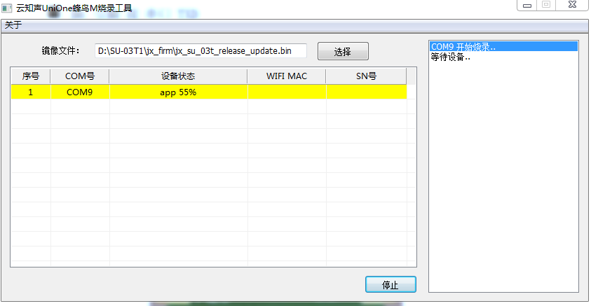

**注意事项：**

- 确保文件路径不包含中文字符、空格或特殊符号
- 建议使用简单的英文路径，如 C:\firmware\
- 避免使用系统下载文件夹等包含中文的默认路径

---

### Keil软件安装版本选择和替代方案

**问题描述：**

不确定应使用哪个版本的Keil软件进行固件烧录，对软件来源和合法性存在担忧，同时希望了解是否有替代方案。

**解决方案：**

- **版本选择**：

    - 推荐从ARM官方渠道下载MDK-ARM开发工具
    - 需要安装对应的设备支持包
    - 观看B站等平台的安装教程视频

- **合法获取**：

    - 访问ARM官方网站获取Keil MDK
    - 可使用30天试用期
    - 教育用途可申请免费许可证

- **替代烧录方案**：

    - 使用ST官方的ST-Link工具进行烧录
    - 使用专用烧录器工具
    - 通过串口进行固件更新（如已支持）

**注意事项：**

- Keil主要用于开发，单纯烧录可使用更简单的工具
- 确保从官方渠道下载，避免使用来路不明的软件
- 配置开发环境可能比直接烧录更复杂

---

### 如何设置停止指令和停止翻转行为？

**问题描述：**

需要配置语音模块的停止指令和电平翻转功能，实现精确的开关控制。

**解决方案：**

- **使用专用烧录器配置**：

    - 需要使用专用烧录器（如AICE-MINI或小扳手烧录器）进行配置
    - 这些烧录器支持高级功能设置，包括停止指令和翻转行为

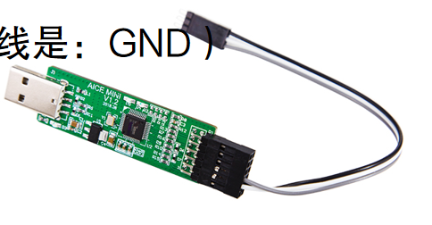


- **延时电平翻转配置**：

    - 在配置界面中设置"延时输出"
    - 配置"延时电平翻转"时间（如500ms）
    - 控制类型选择对应的GPIO引脚（如GPIO_B2）
    - 控制方式设置为"端口输出"

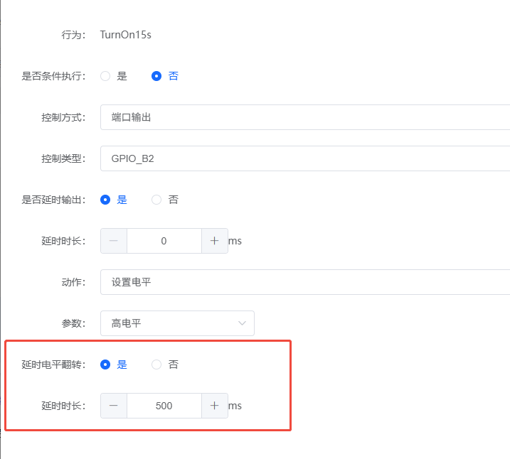

- **工作模式说明**：

    - 停止指令执行后，GPIO输出会翻转一次
    - 延时500ms后自动恢复原状态
    - 只翻转一次，不会持续翻转

**注意事项：**

- 需要专用烧录器才能配置这些高级功能
- 普通USB转TTL模块无法访问这些配置选项
- 延时时间可根据实际需求调整
- 确保选择的GPIO引脚未被其他功能占用

---

### 可以购买已烧录好代码的芯片吗？

**问题描述：**

烧录过程遇到困难，希望购买已预烧录好固件的芯片，避免自行烧录的麻烦。

**解决方案：**

- **服务说明**：

    - 可以提供已烧录好固件的芯片服务
    - 需要通过淘宝店铺下单并备注需求
    - 联系客服说明具体固件要求

- **适用场景**：

    - 毕业设计项目：一次性使用，后续无需修改
    - 烧录困难：烧录环境配置复杂或硬件限制
    - 时间紧迫：项目交付期限紧张，需要快速获得成品

- **注意事项**：

    - 后续如需修改固件，需要自行准备烧录工具
    - 预烧录芯片价格会比空白芯片略高
    - 确保提供正确的固件文件或配置信息
    - 保留原固件备份，便于后续维护

---

### 定时器工作模式有什么区别？

**问题描述：**

在设备控制设置中，"单次触发"、"重复触发"和"立即重复触发"三种工作模式的功能差异不明确。

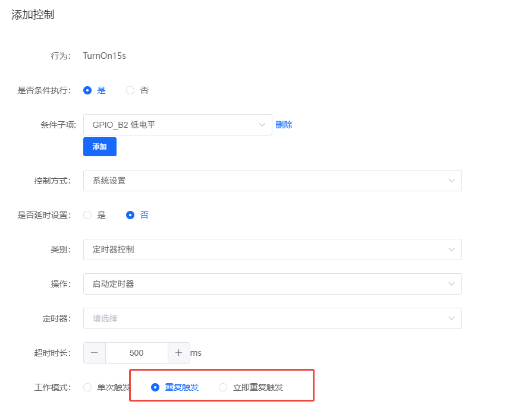

**解决方案：**

- **单次触发模式**：

    - 定时器超时后只会触发一次
    - 触发后定时器停止，需要重新启动才能再次触发
    - 适用于一次性任务，如延时关灯

- **重复触发模式**：

    - 定时器超时触发后再次重载继续
    - 输出电平序列为：010101……
    - 每次触发后输出低电平，然后恢复高电平
    - 适用于周期性开关控制

- **立即重复触发模式**：

    - 直接触发这次定时器超时再定时器重载继续
    - 输出电平序列为：101010……
    - 触发后立即输出高电平，然后恢复低电平
    - 适用于需要立即响应的周期性任务

- **选择建议**：

    - 需要只执行一次的任务：选择"单次触发"
    - 需要设备在触发后延迟动作：选择"重复触发"
    - 需要设备在触发后立即动作：选择"立即重复触发"

**注意事项：**

- 两种模式的初始电平状态不同
- 选择错误的模式可能导致设备动作时序异常
- 建议根据实际硬件逻辑测试选择合适模式

---

### 语音控制开关需要二次确认怎么办？

**问题描述：**

使用固件时语音控制开关功能出现二次确认问题，需要点击两次或确认后才能执行。

**解决方案：**

- **问题排查**：

    1. 确认是否只有语音控制开关存在此问题
    2. 检查蓝牙音乐开关、雷达感应开关是否正常
    3. 对比不同开关功能的配置差异

- **解决方法**：

    1. **关闭二次确认功能**：

        - 在固件配置中查找"二次确认"选项
        - 取消勾选或设置为关闭状态
        - 重新生成并烧录固件

    2. **检查触发逻辑**：

        - 确认开关触发的条件设置
        - 验证是否配置了多余的确认步骤
        - 简化控制逻辑流程

    3. **配置文件检查**：

        - 导出当前配置的JSON文件
        - 检查开关相关的配置项
        - 对比正常工作的开关配置

- **调试步骤**：

    1. 先使用简单的开关配置测试
    2. 逐步添加功能，定位问题所在
    3. 确认是否为固件逻辑设计问题

**注意事项：**

- 这是固件内部配置的逻辑问题
- 需要自行排查并修改配置文件
- 保留正常工作的配置作为参考
- 如无法解决，可联系专业技术人员协助检查配置

---

### 芯片短路发烫是什么原因？

**问题描述：**

芯片上电后出现短路、发烫现象，需要排查原因。

**解决方案：**

**主要原因：**

1. **电源接线错误**
    - 电源线接反导致短路
    - 电压过高损坏芯片
    - 接地线未正确连接

2. **硬件故障**
    - 芯片内部已损坏
    - PCB板存在短路
    - 元器件焊接问题

**排查方法：**

1. **断电检查**
    - 使用万用表测量电源输入端阻抗
    - 正常情况下应有一定阻值
    - 阻值为0或接近0表示短路

2. **单独测试**
    - 将芯片从电路板上拆下
    - 单独给芯片供电测试
    - 判断是芯片问题还是外围电路问题

**处理建议：**

- 立即断电，避免进一步损坏
- 仔细检查电源接线是否正确
- 使用万用表确认电压值
- 如确认芯片损坏，需要更换

---

### 界面文字显示过暗看不清怎么办？

**问题描述：**

产品界面的文字显示过暗，导致使用过程中无法清晰辨认，影响使用体验。

**解决方案：**

**1. 显示设置调整**

- 检查设备亮度设置是否合适
- 尝试调整对比度设置
- 查看是否有暗色主题切换选项

**2. 环境光线因素**

- 确认使用环境光线是否充足
- 避免强光直射屏幕
- 调整设备位置减少反光

**3. 硬件检查**

- 检查显示屏是否老化
- 确认背光模组工作正常
- 测试不同角度观察效果

**4. 软件版本问题**

- 检查是否为最新固件版本
- 查看是否有显示优化更新
- 反馈问题给专业技术人员

**注意事项：**

- 显示问题影响使用体验应及时反馈
- 多设备出现同样问题可能是设计缺陷
- 建议保留问题截图便于分析

---

### 烧录工具显示"打开串口失败"怎么办？

**问题描述：**

在使用烧录工具进行固件更新时，设备OM1无法打开串口，导致烧录失败，而OM5设备显示APP烧录进度为69%。

**解决方案：**

**1. 串口问题排查**

- **COM端口冲突**：

    - 检查是否有其他程序占用了该COM端口
    - 关闭串口调试助手、其他烧录工具等
    - 在设备管理器中查看COM端口状态

- **驱动问题**：

    - 重新安装USB转串口驱动程序
    - 检查设备管理器中是否有未知设备
    - 尝试更换USB端口或连接线

**2. 设备连接检查**

- **硬件连接**：

    - 确认烧录器与模块的连接线序正确
    - 检查TX、RX、GND、电源线是否接触良好
    - 测试连接线是否存在断路

- **电源供应**：

    - 使用万用表测量模块供电电压
    - 确保电压稳定且在规格范围内
    - 避免使用电脑USB直接供电，建议使用外部电源

**3. 烧录工具设置**

- **端口选择**：

    - 断开设备后重新连接，让系统重新分配COM口
    - 在烧录工具中刷新端口列表
    - 手动选择正确的COM端口号

- **参数配置**：

    - 确认波特率设置正确（通常115200或9600）
    - 检查烧录模式选择是否匹配模块型号
    - 尝试降低波特率进行测试

**4. 替代方案**

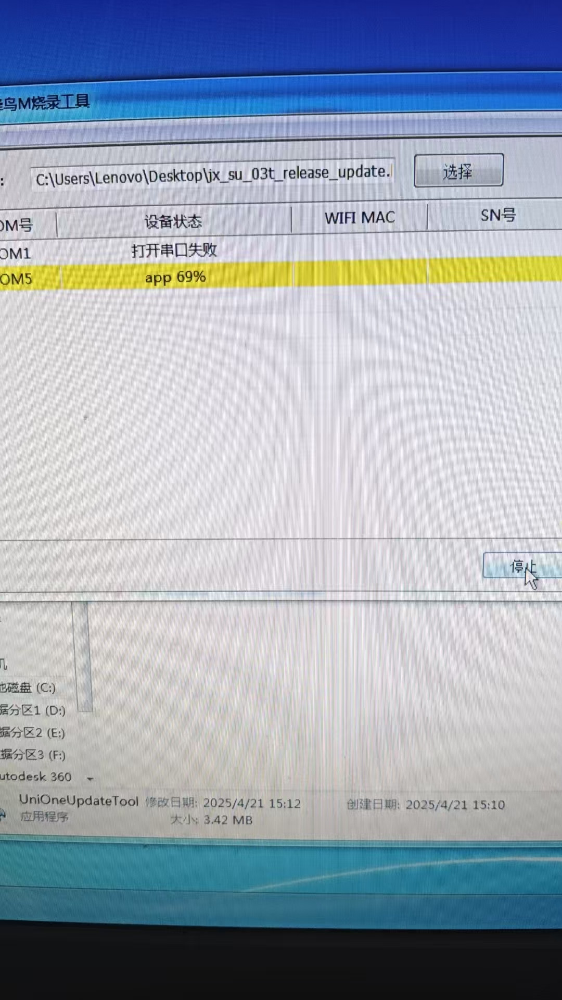

- **更换烧录工具**：

    - 尝试使用其他烧录软件
    - 使用官方推荐的其他版本工具
    - 在不同电脑上测试烧录

- **进入Boot模式**：

    - 部分模块需要特定操作进入下载模式
    - 参考具体型号的烧录说明文档
    - 尝试不同的上电时序

**注意事项：**

- 烧录失败时不要频繁断电上电
- 避免在带电状态下插拔连接线
- 记录具体错误信息便于专业技术人员排查
- 建议使用原装或质量良好的连接线

---

### US513U61生产工具显示"等待设备上电"怎么办？

**问题描述：**

在使用US513U61生产工具烧录固件时，设备无法被识别，工具显示"等待设备上电"，尽管供电正常，固件无法下载。

**解决方案：**

**1. 设备进入下载模式**

- **手动进入下载模式**：

    - 部分设备需要特定操作才能进入烧录模式
    - 尝试按住设备上的特定按钮（如有）再上电
    - 或在上电时短接特定测试点

- **时序控制**：

    - 先连接好所有线路
    - 按照规定的时序上电
    - 避免过早或过晚操作

**2. 硬件连接检查**

- **供电检查**：

    - 使用万用表测量设备供电电压
    - 确保电压稳定在规格范围内
    - 检查电源电流是否足够

- **连接线检查**：

    - 确认TX、RX、GND连接正确
    - 检查是否有接触不良或断路
    - 尝试更换质量更好的连接线

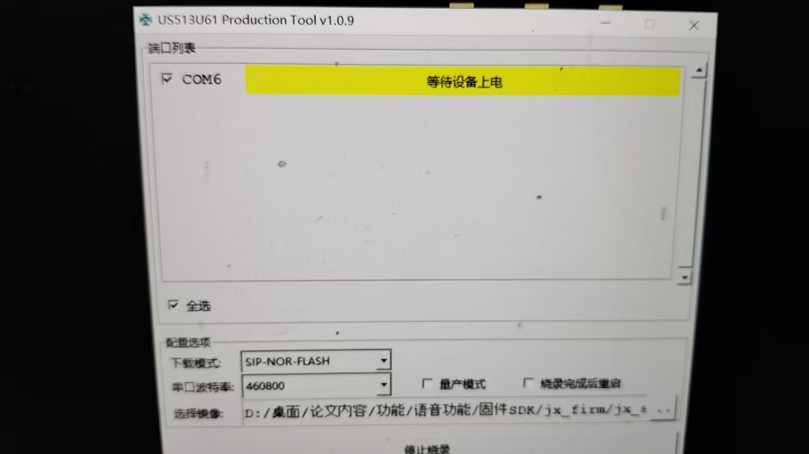

**3. 驱动和端口问题**

- **USB驱动**：

    - 重新安装US513U61的USB驱动
    - 在设备管理器中查看是否正常识别
    - 尝试不同的USB端口

- **COM端口**：

    - 确认选择的COM端口正确
    - 关闭其他可能占用端口的程序
    - 以管理员身份运行烧录工具

**4. 工具设置调整**

- **波特率设置**：

    - 尝试不同的波特率（460800、230400、115200等）
    - 参考设备手册确认默认波特率
    - 从低波特率开始逐步尝试

- **下载模式**：

    - 确认选择了正确的下载模式
    - SIP-NOR-FLASH模式适用于大多数情况
    - 尝试其他模式选项测试

**5. 替代方案**

- **更换烧录工具**：

    - 使用官方提供的其他版本工具
    - 尝试使用通用的串口烧录工具
    - 在不同的电脑系统上测试

- **联系专业技术人员**：

    - 如多次尝试仍失败，可能设备硬件故障
    - 提供具体的错误信息和操作步骤
    - 考虑返修或更换设备

**注意事项：**

- 某些设备需要特定的烧录时序
- 不要在带电状态下插拔连接线
- 供电不稳定会导致无法进入下载模式
- 保留详细的问题记录便于专业技术人员分析

---

### 高波特率烧录时Serial Config Failed怎么办？

**问题描述：**

使用高波特率（如1000000）进行固件烧录时，烧录进度卡在特定位置（如downloading [11/13]），并提示"Serial Config Failed"或"Open Serial Failed"错误，无法完成烧录。

**解决方案：**

**1. 降低波特率**

- **高波特率问题**：

    - 1000000波特率可能导致串口通信不稳定
    - 576000波特率在某些情况下也可能失败
    - USB转串口芯片可能不支持极高波特率

- **推荐波特率**：

    - 460800：通常稳定可用
    - 115200：最稳定，兼容性最好
    - 如仍失败，可尝试更低的57600

**2. 操作步骤**

1. 在烧录工具中找到波特率设置选项
2. 从1000000降至460800或115200
3. 重新开始烧录
4. 观察是否能顺利完成

**3. 原因分析**

- 高波特率对信号质量要求更高
- 长连接线或劣质线材在高波特率下更容易出错
- 部分USB转串口芯片在高波特率下稳定性不足

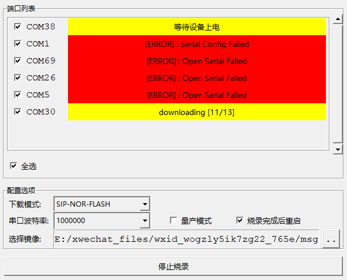

*烧录工具显示Serial Config Failed和Open Serial Failed错误*

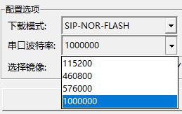

*烧录工具波特率选择界面，可选115200、460800、576000、1000000*

**注意事项：**

- 低波特率烧录速度较慢，但稳定性更好
- 建议先用低波特率确保烧录成功，再尝试提高速度
- 如果115200可以成功，460800通常是较好的速度和稳定性平衡点

---

### 固件烧录时怀疑波特率设置错误怎么办？

**问题描述：**

进行固件烧录时，出现波特率设置错误或32位代码接收问题，导致烧录失败，需要确认并解决原因。

**解决方案：**

**1. 波特率验证步骤**

- **检查硬件配置**：

    - 确认语音模块和单片机的波特率设置一致
    - 常用波特率：9600、115200、460800等
    - 使用万用表或示波器验证串口信号

- **测试不同波特率**：

    - 从标准波特率开始逐一尝试
    - 9600 → 19200 → 38400 → 57600 → 115200
    - 观察哪个波特率下能正确接收数据

**2. 单片机代码检查**

- **接收逻辑验证**：
    ```c
    // 检查串口中断处理函数
    void USART_IRQHandler() {
        if(USART_GetITStatus(USART1, USART_IT_RXNE) != RESET) {
            // 确认数据正确存储
            RxBuffer[RxCounter++] = USART_ReceiveData(USART1);

            // 检查是否接收到完整数据包
            if(RxCounter >= PACKET_LENGTH) {
                ProcessReceivedData();
            }
        }
    }
    ```

- **数据解析验证**：

    - 确认数据按预期格式接收
    - 检查数组索引是否正确
    - 验证数据完整性（帧头帧尾校验）

**3. 烧录工具设置**

- **参数配置**：

    - 确认烧录工具中波特率设置正确
    - 检查数据位、停止位、校验位设置
    - 验证COM端口选择正确

- **通信测试**：

    - 使用串口调试助手发送测试数据
    - 观察单片机是否能正确接收
    - 确认数据格式与预期一致

**4. 固件配置检查**

- **模块参数**：

    - 确认固件中串口配置与硬件匹配
    - 检查UART引脚配置是否正确
    - 验证时钟频率设置合适

- **协议一致性**：

    - 确认发送方和接收方使用相同协议
    - 检查数据帧格式定义一致
    - 验证校验方式匹配

**5. 调试建议**

- **分层排查**：

    1. 先验证硬件连接正常
    2. 测试串口基础通信
    3. 检查数据协议匹配
    4. 验证应用逻辑正确

- **工具辅助**：

    - 使用逻辑分析仪观察信号时序
    - 利用示波器检查信号质量
    - 保留调试输出用于问题分析

**注意事项：**

- 波特率不匹配是常见问题，需仔细检查
- 代码逻辑问题需要逐步调试定位
- 建议使用标准波特率便于调试
- 保留详细的问题记录便于专业技术人员分析

---

### 新手如何快速入门并成功烧录固件？

**问题描述：**

新手初次使用语音模块，希望了解快速入门的方法并成功烧录固件。

**解决方案：**

**1. 学习途径**

- **观看视频教程**：

    - B站搜索相关教程视频
    - 官方提供详细的教学视频
    - 视频更直观，便于理解操作流程

- **阅读文档**：

    - 查看产品规格书
    - 阅读使用手册
    - 参考FAQ中的常见问题

**2. 烧录准备**

- **硬件准备**：

    - 准备USB转串口模块（如CH340）
    - 确认模块供电（3.3V或5V）
    - 准备连接杜邦线

- **软件准备**：

    - 下载烧录工具
    - 安装USB转串口驱动
    - 准备好固件文件

**3. 烧录步骤**

1. **正确连接硬件**
    - TX连接到模块的RX
    - RX连接到模块的TX
    - GND共地连接

2. **打开烧录工具**
    - 选择正确的COM端口
    - 选择要烧录的固件文件
    - 点击开始烧录

3. **常见问题处理**
    - 如果提示打开串口失败：

        - 检查驱动是否安装
        - 更换USB端口
        - 确认端口未被占用

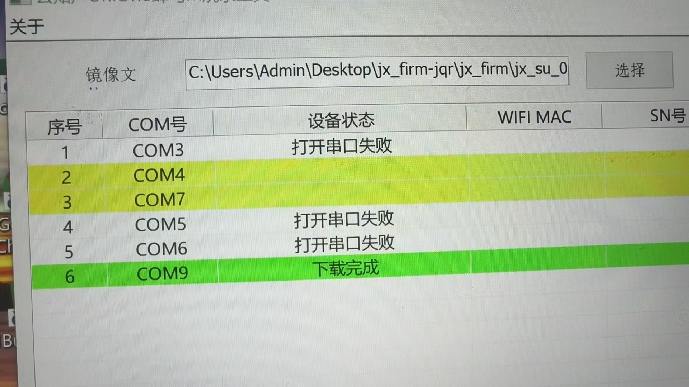

**4. 学习建议**

- 先从简单的功能开始
- 遇到问题耐心排查
- 多参考成功案例
- 不怕失败，多尝试几次

**注意事项：**

- 烧录需要耐心，不要急于求成
- 视频和文档结合学习效果更好
- 严格按照步骤操作，避免遗漏
- 保持连线稳定，接触不良是常见问题


---

### 语音模块喇叭无声但视频有声音怎么办？

**问题描述：**

语音模块播放视频时有声音，但通过喇叭播放时没有声音输出。

**解决方案：**

**1. 短路排查**

- 检查模块底部是否接触到排针导致短路
- 重点检查红框标注的位置
- 确保模块与金属部件保持距离


**2. 功放电路测试**

- 测量功放芯片供电电压是否正常
- 检查功放输出端电压
- 测试喇叭线路是否导通

**3. 可能原因分析**

- 功放芯片因短路烧毁
- 喇叭线路开路或短路
- 音频输出配置错误

**4. 解决方法**

- 如果确认是短路导致功放烧毁，需要更换模块
- 检查喇叭规格是否符合要求
- 重新设计固定方式避免再次短路

**注意事项：**

- 短路是导致喇叭无声的主要原因
- 预防胜于维修，注意装配细节
- 功放芯片烧毁后无法自行恢复

---

### 解压固件文件时提示内存不足怎么办？

**问题描述：**

在解压固件文件（.tar.gz格式）时，系统提示"内存资源不足，无法完成此操作"。

**解决方案：**

**方法一：使用WinRAR解压**

- 下载并安装WinRAR解压软件
- 右键点击压缩文件，选择使用WinRAR解压
- WinRAR对大文件和特殊格式支持更好

**方法二：修改文件扩展名**

- 将.tar.gz文件重命名为.tar文件（删除.gz后缀）
- 使用系统自带的解压功能或7-Zip解压
- 解压完成后再将内部文件正常解压

**方法三：分步解压**

- 先使用7-Zip解压.gz层，得到.tar文件
- 再使用7-Zip或系统工具解压.tar文件
- 避免一次性解压多层压缩

**注意事项：**

- Windows自带的解压工具对某些压缩格式支持有限
- 推荐使用专业的解压工具如WinRAR或7-Zip
- 确保系统有足够的可用磁盘空间
- 关闭其他占用内存的程序后再尝试解压

---

### 模块反接5V电源后无响应怎么办？

**问题描述：**

模块反接5V电源后无任何响应，拔掉5V后蓝色指示灯不亮，无法重新烧录程序。

**解决方案：**

**1. 紧急处理**

- 立即断开所有电源连接
- 使用万用表检查各引脚对地电阻
- 确认是否存在短路或损坏

**2. 故障排查步骤**

- **电压测试**：

    - 测量5V供电线路电压是否正常
    - 检查各引脚电压值
    - 确认电源稳定性

- **硬件检查**：

    - 更换喇叭和咪头测试
    - 检查是否有虚焊或接触不良
    - 观察模块外观是否有烧毁痕迹

**3. 可能的损坏情况**

- 电源保护电路可能已损坏
- 内部芯片可能因反压而烧毁
- 模块可能需要整体更换

**4. 预防措施**

- 连接前仔细核对引脚定义
- 使用防反接的连接器设计
- 首次通电时建议使用限流保护

**注意事项：**

- 电源反接是严重操作错误，可能永久损坏模块
- 如果模块之前正常工作，反接后失效，大概率已损坏
- 建议购买新模块并严格按正确接线方式使用

---

### 转接板接线错误导致烧录失败怎么办？

**问题描述：**

使用云知声UniOne蜂鸟M烧录工具时，烧录工具无法识别设备，且在尝试烧录时出现"打开串口失败"的错误。

**解决方案：**

**1. 检查转接板接线位置**

- 转接板上有两排插针，应使用下方的一排插针进行连接
- 上方的一排插针可能用于其他功能或调试
- 确保模块引脚与转接板插针正确对齐

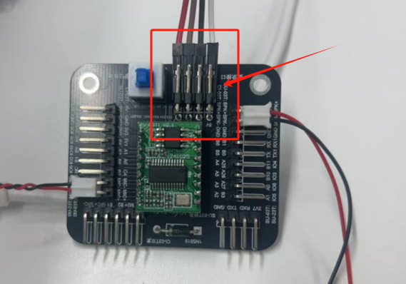

**2. 接线验证步骤**

- 确认模块所有引脚都插入到转接板下方一排
- 检查引脚是否有弯曲或接触不良
- 轻轻按压模块确保接触稳定

**3. 常见错误**

- 使用了上方一排插针导致信号连接错误
- 模块插入位置偏移导致部分引脚悬空
- 转接板方向错误导致引脚定义错乱

**4. 测试确认**

- 正确接线后重新插入USB
- 在烧录工具中刷新设备列表
- 检查是否能够正常识别设备

**注意事项：**

- 不同型号模块的转接板可能有差异，务必查看对应的接线说明
- 如果正确接线后仍无法识别，尝试更换USB端口或数据线
- 转接板接触不良是常见问题，可尝试轻轻调整模块位置

---

### PCB设计中UART引脚接反导致无法烧录怎么办？

**问题描述：**

在PCB设计阶段将UART的RX和TX引脚接反，导致无法烧录固件，更换USB口后问题解决。

**解决方案：**

**1. 确认引脚连接**

- 检查PCB设计中UART引脚的连接关系
- 确认模块的TX连接到烧录器的RX
- 确认模块的RX连接到烧录器的TX

**2. 临时解决方法**

- 更换不同的USB端口可能改善接触问题
- 使用飞线方式临时修正引脚连接
- 检查杜邦线连接是否牢固

**3. PCB设计修正**

- 修改PCB原理图，交换RX和TX连接
- 重新制板前进行设计规则检查（DRC）
- 在测试阶段使用测试架验证连接正确性

**注意事项：**

- 引脚接反不会损坏硬件，但会导致通信完全失败
- 建议在PCB丝印上清晰标注TX和RX标识
- 在首次投板前，务必进行严格的原理图审查
- 保留测试点和飞线空间以便调试

---

### 烧录时TX/RX线序接反怎么办？

**问题描述：**

烧录过程中，烧录器无法正确识别芯片，设备无法进入烧录模式，尝试调整接线后问题解决。

**解决方案：**

**1. 检查TX/RX线序**

- 确认烧录器的TX连接到模块的RX
- 确认烧录器的RX连接到模块的TX
- TX/RX交叉连接是标准做法，需仔细核对

**2. 排查步骤**

- 使用万用表测试线路通断
- 对比转接板或开发板的丝印标识
- 参考官方文档的接线图示

**3. 常见接线错误**

- TX连接TX、RX连接RX（直连错误）
- 线路标识不清晰导致误接
- 不同烧录器的引脚定义可能不同

**4. 解决方法**

- 交换TX和RX连接线后重新尝试
- 短暂断电复位后再进行烧录
- 在烧录工具中刷新设备列表

**注意事项：**

- TX（发送）和RX（接收）必须交叉连接
- 接线错误不会损坏硬件，但会导致通信失败
- 建议使用带颜色标识的杜邦线避免混淆
- 长时间无法识别时，优先检查TX/RX线序

---

### 更换串口和电脑后仍无法烧录怎么办？

**问题描述：**

烧录时遇到设备无法识别的问题，尝试更换串口和电脑后问题依旧存在，更换烧录器也无改善。

**解决方案：**

**1. 烧录器硬件检查**

- 检查烧录器指示灯是否正常亮起
- 使用万用表测量输出电压是否正常
- 检查USB接口是否有物理损坏
- 测试烧录器在其他设备上是否正常工作

**2. 驱动和软件问题**

- 完全卸载后重新安装USB转串口驱动
- 尝试不同版本的烧录软件
- 检查系统是否禁用了USB设备
- 在设备管理器中查看是否有驱动冲突

**3. 模块硬件状态**

- 检查模块是否因其他原因损坏
- 测试已知正常的模块是否能被识别
- 检查模块供电是否稳定
- 测量关键引脚的电压值

**4. 替代方案**

- 使用其他类型的烧录器（如FlyMcu、专用调试器）
- 尝试脱机烧录器
- 使用开发板进行烧录测试
- 联系供应商检测烧录器硬件

**注意事项：**

- 如果多台电脑、多个USB端口都无法识别，可能是烧录器硬件故障
- 某些廉价烧录器可能存在兼容性问题
- 建议准备备用烧录器以避免影响工作进度
- 烧录器芯片（如CH340）也可能损坏或老化

---

### 外接485芯片导致无法烧录怎么办？

**问题描述：**

模块能正常工作，但在串口上连接了485芯片后无法烧录固件，尝试各种方法仍无法解决。

**解决方案：**

**1. 识别干扰源**

- 检查串口线路上是否连接了其他芯片
- 485芯片会占用串口通信线路
- 外接设备可能干扰烧录通信

**2. 正确的烧录方法**

- 断开所有外接芯片和设备
- 将语音模块单独连接到烧录器
- 确保没有其他设备占用串口

**3. 485芯片连接方式**

- 烧录时不要连接485芯片
- 烧录完成后再连接485芯片
- 或使用开关切换烧录/工作模式

**4. 硬件隔离方案**

- 使用跳线帽或开关控制485芯片接入
- 设计烧录接口时预留独立连接点
- 考虑使用多路选择器切换

**注意事项：**

- 任何连接在TX/RX线路上的器件都可能影响烧录
- 485芯片是双向通信器件，会干扰烧录信号
- 建议在产品设计中加入烧录/工作模式切换功能
- 烧录时保持线路简洁，只连接必要的电源和通信线

---

## 固件文件处理


---

### 解压固件压缩包时提示"内存资源不足"怎么办？

**问题描述：**

在解压固件压缩包时，系统弹出错误提示："出现意外错误，导致无法提取存档。错误 0x8007000E: 内存资源不足，无法完成此操作。"

**解决方案：**

**1. 更换压缩软件**

- Windows系统自带的解压功能可能存在兼容性问题
- 推荐使用专业压缩软件：

    - 7-Zip（免费开源）
    - WinRAR（商业软件）
    - Bandizip（免费版）

**2. 系统资源检查**

- 关闭不必要的程序释放内存
- 检查C盘剩余空间是否充足
- 重启电脑清理内存缓存

**3. 下载检查**

- 确认固件文件完整下载
- 重新下载固件包
- 检查文件大小是否与提供的一致

**注意事项：**

- 0x8007000E错误通常是系统内存或兼容性问题
- 更换压缩软件后大部分问题可以解决
- 避免使用系统自带解压功能处理大文件

---

## 串口通信问题


---

### 串口没有数据输出怎么办？

**问题描述：**

使用串口输出时，发现串口没有数据输出，无法正常通信。

**解决方案：**

**1. 检查串口连接**

- 确认TX（发送）和RX（接收）引脚连接正确
- 语音模块的TX应连接到USB转TTL的RX
- 语音模块的RX应连接到USB转TTL的TX
- 检查GND是否已连接

**2. 验证硬件连接**

- 使用万用表测试引脚通断
- 确认USB转TTL模块工作正常
- 检查串口号选择是否正确
- 验证波特率设置匹配

**3. 常见接线错误**

- TX和TX连接，RX和RX连接（错误）
- 忘记连接GND地线
- 串口号选择错误
- 波特率不匹配

**4. 调试步骤**

- 重新检查接线图
- 交换TX和RX连接
- 在设备管理器中确认COM端口
- 使用串口助手测试连接

**注意事项：**

- 串口通信必须交叉连接（TX对RX）
- GND地线是必需的，不可省略
- 确保两端波特率完全一致
- 某些USB转TTL模块需要安装驱动

---

## 固件下载问题


---

### 平台下载的固件包缺少update.bin文件怎么办？

**问题描述：**

从智能公元平台下载固件后，发现固件包中缺少update.bin文件，导致无法正常烧录。

**解决方案：**

**1. 重新生成固件**

- 在平台上重新点击生成固件
- 确保生成过程完整完成
- 等待平台处理完成后再下载

**2. 正确的下载流程**

- 平台生成的固件是压缩包格式
- 解压后应包含多个文件
- update.bin文件是烧录所需的正确文件

**3. 固件包内容**

- jx_xx_release.bin：基础固件文件
- jx_xx_release_update.bin：更新用的固件文件
- config.json：配置信息文件

**4. 烧录文件选择**

- 烧录时选择update.bin文件
- 或选择名称包含"update"的文件
- 不要使用不带update后缀的文件

**注意事项：**

- 固件生成失败时重新尝试生成
- 下载前确保网络连接稳定
- 如果问题持续，联系专业技术人员
- 保留原固件作为备份

**故障排查：**

- 检查下载的文件是否完整
- 尝试使用不同浏览器下载
- 确认账号权限正常
- 查看平台维护通知（可能影响功能）

---

### 烧录工具卡在检查版本阶段怎么办？

**问题描述：**

烧录过程中，工具在"device: read version"步骤显示100%后卡住，无法继续进行烧录。

**解决方案：**

**1. 检查烧录状态**

- "device: read version"显示100%表示版本读取已完成
- 如进度条不再继续，可能是通信中断
- 检查串口连接是否稳定

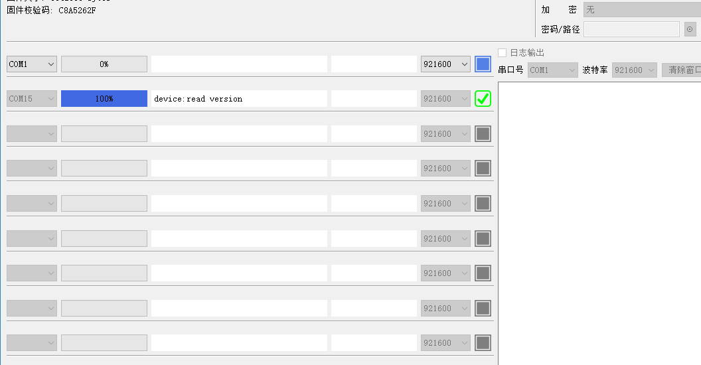

**2. 排查步骤**

- 重新插拔USB连接
- 检查模块供电是否稳定
- 更换USB端口
- 确认串口线接触良好

**3. 可能原因**

- USB转串口驱动异常
- 模块进入异常状态
- 烧录工具版本不匹配
- 固件文件损坏

**注意事项：**

- 版本读取完成后应自动进入下一阶段
- 如果多次尝试仍卡住，建议更换电脑或工具

---

## 串口通信问题


---

### 串口发送十六进制数据显示为乱码字符怎么办？

**问题描述：**

通过串口发送十六进制数据（如01）时，接收端（单片机）将该数据显示为"口"等乱码字符，导致数据无法正确解析。

**解决方案：**

**1. 检查数据显示格式**

- **发送端确认**：

    - 确保发送的是十六进制格式的数据
    - 十六进制01对应ASCII字符SOH（Start of Heading）
    - 该字符在字符模式下显示为不可见字符或方框

- **接收端设置**：

    - 将串口调试工具设置为十六进制（Hex）显示模式
    - 不要使用ASCII或字符显示模式
    - 确保显示模式匹配数据格式

**2. 波特率匹配**

- 检查发送端和接收端的波特率设置是否一致
- 常见波特率：9600、115200等
- 波特率不匹配会导致数据解析错误

**3. 数据帧结构设计**

为了避免数据解析错误，建议设计完整的数据帧格式：

```
[帧头] [消息编号] [数据长度] [数据] [帧尾]
```

示例：
```
0x55 0x01 0x01 0x01 0xAA
```

- 0x55：帧头
- 0x01：消息号
- 0x01：数据长度（1字节）
- 0x01：实际数据
- 0xAA：帧尾

**4. 单片机接收代码示例**

```c
// 串口接收处理
void UART_Receive_Handler(void) {
    static uint8_t rxState = 0;  // 接收状态
    static uint8_t rxBuffer[10];
    static uint8_t rxIndex = 0;

    uint8_t data = UART_Read();

    switch(rxState) {
        case 0: // 等待帧头
            if(data == 0x55) {
                rxState = 1;
                rxIndex = 0;
                rxBuffer[rxIndex++] = data;
            }
            break;

        case 1: // 接收数据
            rxBuffer[rxIndex++] = data;
            if(rxIndex >= 5) { // 假设固定5字节帧
                rxState = 0;
                // 处理接收到的数据
                if(rxBuffer[3] == 0x01) {
                    // 执行相应操作
                }
            }
            break;
    }
}
```

**注意事项：**

- 确保发送端和接收端的串口参数（波特率、数据位、停止位、校验位）完全一致
- 在接收端使用十六进制模式查看数据，避免字符模式导致的误解
- 建议在实际应用中采用标准的通信协议，添加帧头、帧尾和校验机制
- 单字节数据（如01）在字符模式下会显示为控制字符，需要用十六进制模式查看

---

### 串口数据无法被单片机正确解析怎么办？

**问题描述：**

语音模块通过串口发送的数据（如'01'）在串口调试软件中可以正常接收，但单片机无法正确解析该数据。

**解决方案：**

**1. 检查串口通信参数**
确保单片机的串口配置与离线语音识别模块的串口参数一致：

- 波特率：通常为9600、115200等，需与模块设置一致
- 数据位：8位
- 停止位：1位
- 校验位：无校验或偶校验，需与模块一致

**2. 添加帧头和帧尾标识**
为每条串口消息添加明确的帧头和帧尾，确保单片机能够准确识别数据包的起始和结束：

- 帧头：`0x55`（或自定义的起始标志）
- 帧尾：`0x0D 0x0A`（回车换行）
- 数据内容：`01`

示例数据包格式：`0x55 0x01 0x0D 0x0A`

**3. 修改单片机接收代码**
在单片机端的代码中，增加对帧头和帧尾的检测逻辑：

```c
// 定义接收缓冲区和相关变量
#define BUFFER_SIZE 64
uint8_t rxBuffer[BUFFER_SIZE];
uint8_t rxIndex = 0;
uint8_t frameStart = 0;

// 串口中断服务程序或轮询函数
void UART_Receive_Handler(void) {
    uint8_t data = UART_Read(); // 读取接收到的数据

    if (data == 0x55) { // 检测到帧头
        frameStart = 1;
        rxIndex = 0;
        return;
    }

    if (frameStart) {
        if (rxIndex < BUFFER_SIZE) {
            rxBuffer[rxIndex++] = data;
        }

        // 检测帧尾（0x0D 0x0A）
        if (rxIndex >= 2 && rxBuffer[rxIndex - 2] == 0x0D && rxBuffer[rxIndex - 1] == 0x0A) {
            // 数据包接收完成，处理数据
            process_data(rxBuffer, rxIndex - 2); // 处理数据，不包括帧尾
            frameStart = 0;
            rxIndex = 0;
        }
    }
}

// 处理接收到的数据
void process_data(uint8_t *data, uint8_t len) {
    if (len == 1 && data[0] == 0x01) {
        // 处理开灯指令
        turn_on_light();
    }
}
```

**4. 验证和测试**

- 使用串口调试软件发送模拟数据包，验证单片机是否能正确解析
- 在实际环境中测试模块与单片机的通信，确保数据传输的稳定性和可靠性

**注意事项：**

- 确保模块的串口输出与单片机的串口输入电平兼容（如TTL电平）
- 在高噪声环境下，建议增加数据校验机制（如CRC校验）以提高通信的可靠性

---

### 语音播报正常但继电器无反应怎么办？

**问题描述：**

使用语音模块时，语音播报正常，串口调试软件也能接收到语音唤醒的输入信号，但继电器模块没有响应，无法被控制。

**解决方案：**

**1. 确认模块输出正常**

- 使用串口调试软件确认模块能正常发送数据
- 验证语音识别功能和串口输出都工作正常
- 问题可能在继电器模块接收端

**2. 检查继电器模块**

- 单独测试继电器模块：使用串口调试软件直接控制
- 确认继电器模块的供电是否正常
- 检查继电器模块的通信参数配置

**3. 通信协议匹配**

- 确认波特率一致（如9600bps）
- 检查数据格式是否匹配（十六进制/ASCII）
- 验证串口线连接是否正确（TX对RX）

**4. 电气连接检查**

- 确认共地连接
- 检查信号线是否接触良好
- 排除线路干扰问题

**注意事项：**

- 模块和继电器分开测试，定位问题所在
- 语音模块输出正常时，重点检查继电器模块
- 确保两端设备的通信参数完全一致
- 检查继电器模块是否需要特定的控制指令格式

---

- 如果模块支持自定义指令格式，建议参考产品手册中的协议说明进行配置

---

### 串口控制继电器无响应怎么办？

**问题描述：**

使用串口调试软件向语音模块发送指令时，模块能正常播报语音，但继电器没有按预期动作，无法被控制。

**解决方案：**

**1. 确认数据传输**

- 使用串口调试软件确认模块能正常接收指令
- 验证模块能正确播报语音响应
- 说明串口通信正常，问题在控制逻辑

**2. 检查控制详情配置**
问题可能出在平台的"控制详情"配置中：

- 检查IO口输出设置是否正确
- 确认控制逻辑与继电器匹配
- 验证触发条件设置

**3. 常见配置问题**

- IO口输出电平设置错误（高/低电平反了）
- 继电器触发逻辑与模块输出不匹配
- 控制时序设置不当
- 变量条件判断错误

**4. 排查步骤**

- 截图查看"控制详情"配置界面
- 检查IO口对应的控制逻辑
- 确认继电器驱动电路连接正确
- 测试手动控制IO口功能

**注意事项：**

- 语音模块正常播报说明识别和主控功能正常
- 重点检查IO输出配置与继电器的匹配性
- 继电器可能需要特定的触发电平或脉冲信号
- 建议先测试简单指令验证IO口功能

---

### 米思齐软件上传固件卡顿怎么办？

**问题描述：**

在使用米思齐软件上传固件时，长时间停留在"上传中..."状态，无法完成固件更新。

**解决方案：**

**1. 检查设备状态**

- 观察输出窗口的日志信息
- 确认是否提示"请上电/复位设备以开始升级..."
- 如有此提示，需要手动复位设备

**2. 正确操作步骤**

- 点击上传按钮开始上传
- 观察进度条和日志输出
- 当提示需要复位时，立即给模块断电上电
- 确保设备在提示后及时复位

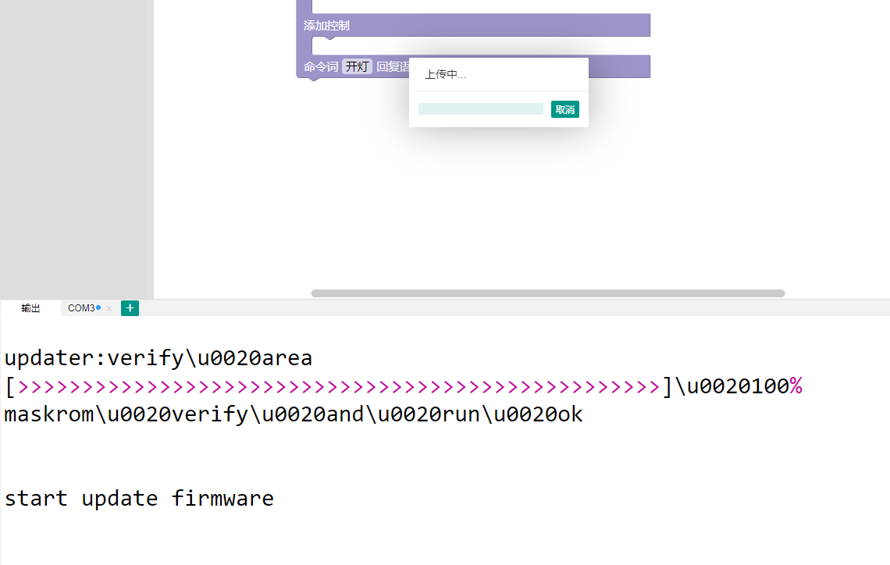

*固件上传过程显示*

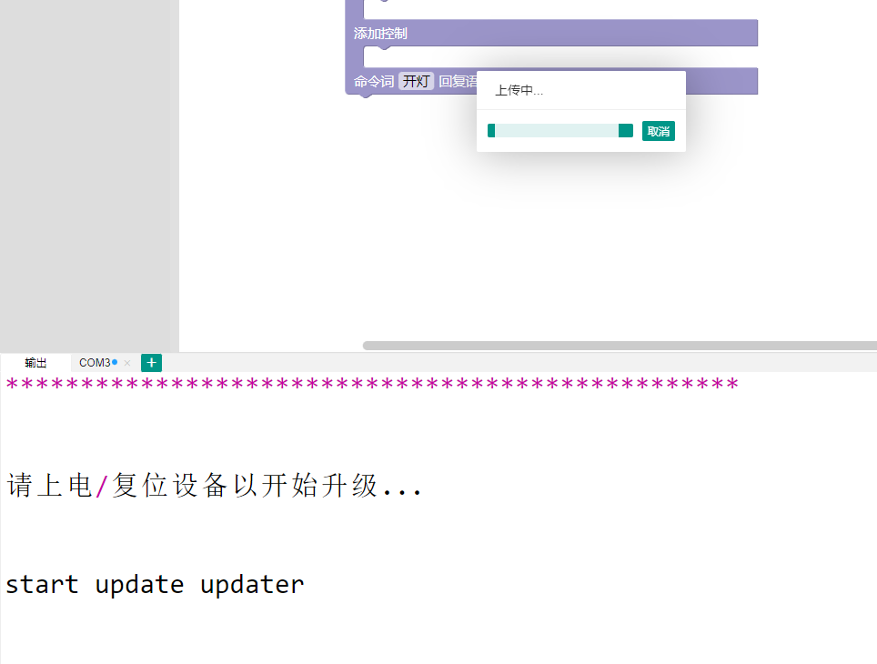

*提示需要复位设备以继续*

**3. 常见问题处理**

- 确认USB连接稳定
- 检查模块供电是否正常
- 更换USB端口尝试
- 重新安装米思齐软件

**注意事项：**

- 上传过程需要按照提示及时操作
- 模块复位是正常流程的一部分
- 如多次尝试仍失败，检查硬件连接

---

### 烧录时拔插VCC后持续显示"new device connect"怎么办？

**问题描述：**

在烧录过程中，打钩后拔插VCC电源，串口工具持续显示"new device connect"，导致烧录无法完成，设备连接不稳定。

**解决方案：**

**1. 检查连接线路**

- 确保USB转串口模块连接稳定
- 检查杜邦线接触是否良好
- 避免使用过长的连接线

**2. 供电稳定性**

- 使用稳定的电源供电
- 避免在拔插VCC时出现接触不良
- 建议使用带开关的电源模块

**3. 操作时序**

- 先在烧录工具中勾选对应串口
- 然后快速拔插VCC（断开再接上）
- 等待设备识别，不要反复拔插

**4. 可能的原因**

- 连接线接触不良导致通信中断
- USB转串口模块兼容性问题
- 供电不稳定导致设备反复重连

**注意事项：**

- "new device connect"表示设备在不断重新连接
- 建议更换质量更好的USB转串口模块（如CH340G）
- 确保所有连接线牢固，避免虚接

---

### 烧录时模块异常发热甚至冒烟怎么办？

**问题描述：**

在烧录语音模块过程中，板子异常发热并出现冒烟现象，怀疑硬件损坏，无法正常进行电压检测。

**解决方案：**

**1. 立即断电处理**

- 立即切断所有电源连接
- 停止烧录操作，避免进一步损坏
- 等待设备完全冷却后再进行检查

**2. 损坏情况判断**

- 观察芯片表面是否有明显烧毁痕迹
- 检查周围焊点是否有锡珠或氧化
- 如芯片发黑或变形，说明已烧毁

**3. 故障排查步骤**

- 使用万用表蜂鸣档测量VCC和GND是否短路
- 给模块单独供电，测试各引脚电压输出
- 测量3V3引脚是否有3.3V输出
- 检查麦克风电压是否在1.6-1.7V范围
- 测量喇叭对地电压是否在2.2-2.5V范围

**4. 可能的原因**

- 供电电压过高导致芯片烧毁
- 接线错误导致短路
- 模块本身存在硬件缺陷
- 静电损坏

**注意事项：**

- 模块冒烟后基本确认硬件损坏
- 不要尝试再次通电测试，避免危险
- 建议更换新模块继续开发
- 后续操作需要先排查供电和接线

---

### 烧录时硬件连接错误怎么办？

**问题描述：**

使用错误连接方式导致烧录失败，需要确认正确的硬件连接方法。

**解决方案：**

1. **错误连接方式**

    直接将模块插在排针座上，可能导致接触不良或引脚错位：

    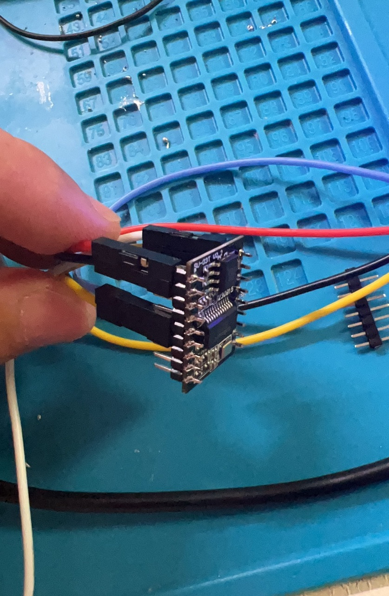

2. **正确连接方式**

    在模块引脚上焊接排针，然后进行连接：

    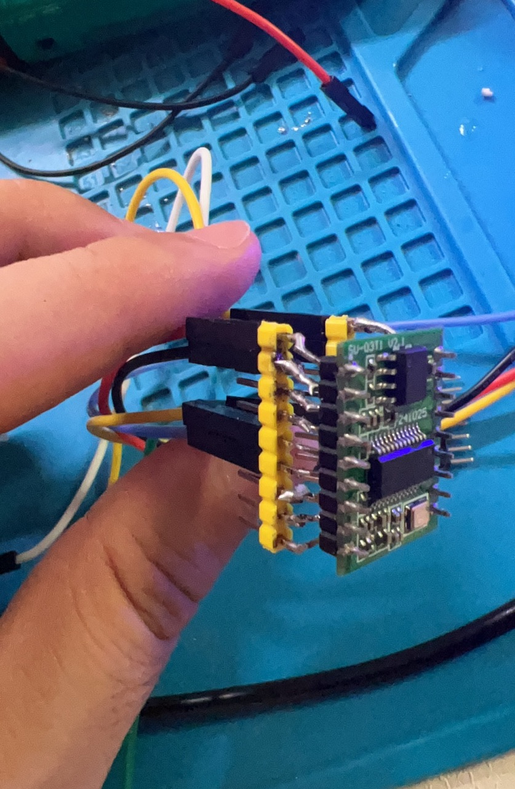

3. **接线说明**

    需要连接6根线：

    - 2个SPK（喇叭）
    - VCC（电源）
    - GND（地）
    - RX（B6接收）
    - TX（B7发送）

**注意事项：**

- 确保连接牢固，避免接触不良
- 检查引脚定义，不要接错
- 焊接排针时注意不要短路
- 烧录前断开5V电源线

---

### Mac系统可以烧录芯片吗？

**问题描述：**

询问是否可以在Mac系统上进行芯片烧录。

**解决方案：**

1. **系统兼容性**

    - 公司提供的烧录工具主要针对Windows系统开发
    - Mac系统没有官方的烧录软件支持

2. **建议方案**

    为确保烧录稳定性和兼容性：

    - 建议使用Windows系统进行烧录
    - 可以使用虚拟机或双系统
    - 或准备专用的Windows电脑

**注意事项：**

- Mac系统烧录可能遇到驱动或兼容性问题
- 保险起见，使用Windows系统完成烧录工作
- 烧录相关的文档和教程也都是基于Windows系统

---

### USB端口电涌错误怎么办？

**问题描述：**

连接设备到电脑USB端口时，系统提示"USB端口上的电涌 未知USB设备所需电量超出该端口所能提供的电量"。

**解决方案：**

**1. 更换USB端口**

- 使用电脑机箱背面的USB端口（供电更稳定）
- 避免使用前置USB接口或USB集线器

**2. 重新安装驱动**

- 卸载设备驱动程序
- 重新安装最新版本的驱动
- 重启电脑让驱动生效

**3. 电脑系统排查**

- 重启电脑
- 暂时关闭杀毒软件和防火墙
- 检查Windows电源管理设置

**4. 硬件检查**

- 检查USB连接线是否完好
- 尝试使用其他USB连接线
- 在其他电脑上测试设备

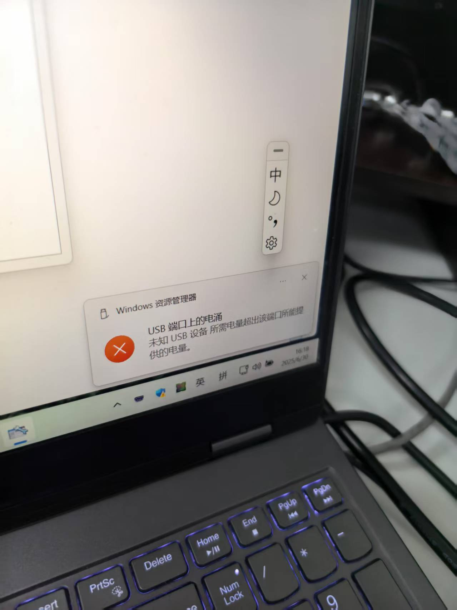

**注意事项：**

- USB电涌错误通常是供电不足或驱动问题
- 不同USB端口的供电能力可能有差异
- 如问题持续，可能是设备硬件故障

---

### 脉冲输入配置时生成固件失败怎么办？

**问题描述：**

配置脉冲输入指令时生成固件失败，排查发现在脉冲输入配置中同时设置了GPIO电平作为附加条件，导致配置冲突。

**解决方案：**

**1. 问题原因分析**

- 脉冲信号本身包含高电平和低电平的变化
- 在脉冲输入引脚上设置GPIO电平附加条件会产生冲突
- 单独检测高电平会干扰正常的脉冲识别过程

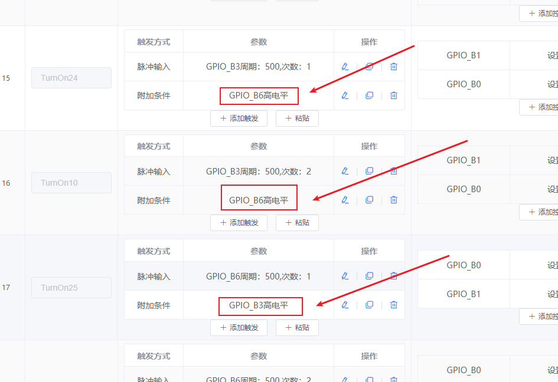

**2. 正确的配置方法**

- 移除脉冲输入的GPIO电平附加条件
- 使用变量作为附加条件替代GPIO电平检测
- 在语音指令触发时设置变量，然后在脉冲输入中使用该变量

**3. 推荐配置流程**

1. 配置语音指令时设置变量（如设置变量NUM=1）
2. 脉冲输入的附加条件使用该变量（变量NUM等于1）
3. 避免直接使用GPIO电平作为脉冲输入的附加条件

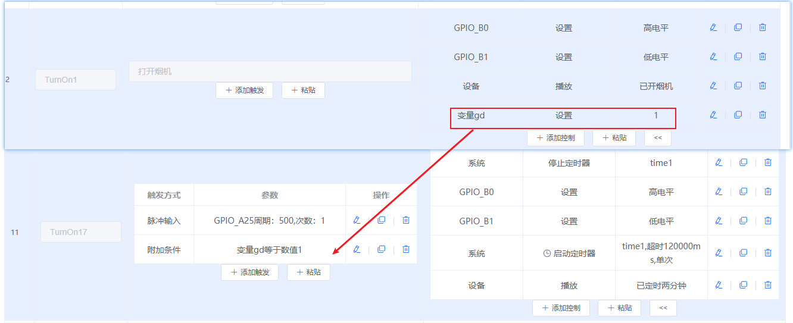

**注意事项：**

- 脉冲输入不应与GPIO电平检测同时使用
- 使用变量作为触发条件可以提高系统稳定性
- 在启动定时器前建议先关闭现有定时器，避免冲突
- 复杂的脉冲控制逻辑建议分步调试

---

### MCU无法接收到语音模块的UART数据怎么办？

**问题描述：**

MCU无法接收到语音模块通过UART发送的数据，代码中使用局部变量存储接收数据，导致数据无法正确传递给主程序。

**解决方案：**

**1. 变量作用域问题**

- 原代码在UART中断中定义局部变量`flag`
- 中断返回后局部变量被销毁
- 主程序无法访问接收到的数据

**2. 正确的代码修改**

- 将flag变量定义为全局变量
- 使用`uint8_t`类型定义
- 在中断服务程序中正确赋值

```c
// 全局变量定义
uint8_t flag = 0;

// UART中断服务程序
void Uart_isr() interrupt 4
{
    if(RI)  // 处理接收中断
    {
        RI = 0;               // 清除接收中断标志
        flag = SBUF;          // 存储到全局变量
    }
}
```

**3. 语音模块配置优化**

- 为不同命令设置唯一参数
- 例如：开灯→01，关灯→02，其他→03、04
- 避免所有命令使用相同参数导致混淆

**4. 调试建议**

- 先用串口助手测试语音模块发送功能
- 确认波特率、数据位、停止位设置正确
- 检查TX/RX连接是否交叉（模块TX接MCU RX）

**注意事项：**

- UART中断中的变量必须定义为全局变量
- 确保MCU和语音模块的串口参数一致
- 建议使用示波器或逻辑分析仪验证信号
- 复杂问题可以分段排查（先确认发送，再排查接收）

---

### 固件大小超出Flash容量且显示大小不一致怎么办？

**问题描述：**

固件大小超出设备Flash容量导致无法烧录，且工具显示大小（1411785 bytes）与实际文件大小（931 KB）不一致。

**解决方案：**

**1. 型号确认**

- CI13241芯片：1M Flash
- CI13242芯片：2M Flash
- 确认实际使用的芯片型号

**2. 固件优化**

- 更换应用场景：选择占0.6M空间而非1M
- 简化回复语：多个命令词使用相同回复语
- 减少命令词数量：控制在Flash容量范围内

**3. 应用场景配置**

- 普通通话通用Pro：占用1M空间
- 普通通话通用：占用较小空间
- 根据需要选择合适的场景

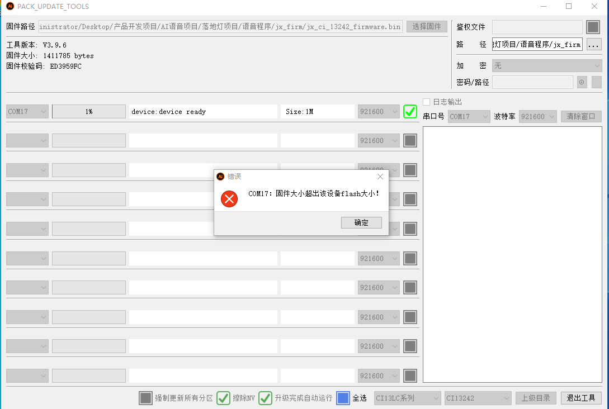


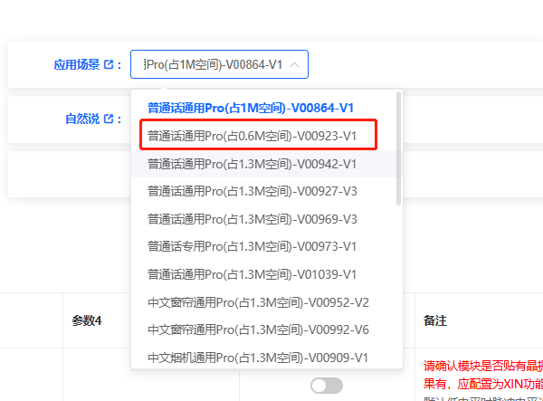


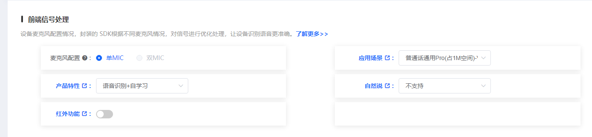

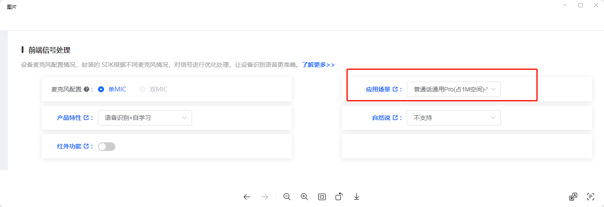

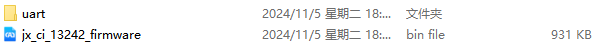

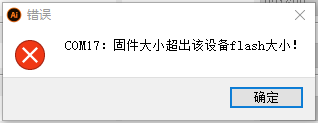

**4. 注意事项**

- 系统占用部分Flash空间
- 实际可用容量小于标称容量
- 生成固件前确认目标型号

---

### CH343模块可以用于烧录吗？

**问题描述：**

使用CH343 USB转TTL模块连接语音模块进行烧录时，串口能被识别，但烧录过程一直卡在等待设备状态，无法完成烧录。

**解决方案：**

- **推荐使用CH340而非CH343**：

    - CH343可能存在兼容性问题
    - CH340是经过验证的稳定烧录工具
    - 建议使用官方推荐的烧录器

- **正确的连接方式**：

    - B6接TXD（烧录器的TX）
    - B7接RXD（烧录器的RX）
    - GND接GND
    - VCC接5V（可选）

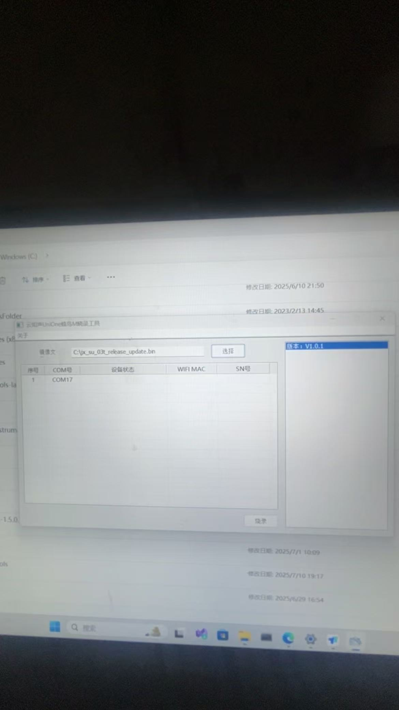

*烧录工具显示"等待设备"状态*

- **排查步骤**：

    1. 更换为CH340或CH340G模块
    2. 检查连接线是否牢固
    3. 尝试不同的USB端口
    4. 确认模块已进入烧录模式

**注意事项：**

- CH343在某些情况下可能通信不稳定
- B6/B7是烧录专用串口，不要用作普通GPIO
- 烧录时确保供电稳定
- 如果CH343无效，建议购买官方认证的烧录器

---

### 使用面包板连接时烧录不稳定怎么办？

**问题描述：**

使用面包板连接模块进行烧录时，出现连接不稳定、烧录失败的问题，怀疑由电压不稳、设备兼容性或电脑问题导致。

**解决方案：**

**可能原因分析**

1. **电压连接不稳**
    - 面包板接触电阻较大
    - 杜邦线连接松动
    - 电源供电不足

2. **CH340兼容性问题**
    - 不同批次的CH340芯片存在差异
    - 驱动版本不匹配
    - USB端口供电能力不足

3. **电脑环境问题**
    - 笔记本USB供电限制
    - 台式机接地问题
    - 系统电源管理影响

**排查和解决方法**

**1. 硬件连接优化**

    - 使用焊接的排针代替面包板
    - 选择质量更好的杜邦线
    - 确保所有连接牢固无松动

**2. CH340模块替换**

    - 尝试不同品牌的USB转串口模块
    - 使用原装或知名品牌产品
    - 检查驱动是否为最新版本

**3. 供电优化**

    - 使用外部5V电源模块
    - 避免仅靠USB供电
    - 测量实际电压是否稳定

**4. 环境改善**

    - 更换不同的USB端口
    - 使用台式机而非笔记本
    - 关闭电源节省模式

**建议方案**

为保证烧录稳定性，推荐：

- 焊接排针进行烧录
- 使用专用烧录座或夹具
- 保留多条测试线路备选
- 记录稳定配置供后续使用


---

### JX系列芯片烧录后语音指令执行异常

**问题描述：**

使用JX系列芯片烧录软件烧录AI交互多功能护理床固件后，第二个语音指令（停止指令）无法执行，与之前版本问题相同。

**解决方案：**

1. **检查固件配置文件**：

    - 验证语音指令配置是否正确导入
    - 确认所有指令序号和触发词设置完整
    - 检查指令之间的逻辑关系

2. **重新生成固件**：

    - 在智能公元平台重新检查指令配置
    - 确认"停止指令"已正确配置
    - 重新生成固件文件并烧录

3. **测试验证**：

    - 逐个测试每个语音指令
    - 记录无法执行的指令序号
    - 确认指令识别准确率

**注意事项：**

- 固件版本更新时可能出现指令配置丢失
- 建议备份可正常工作的固件版本
- 配置修改后需要完整重新烧录固件

---

### JX系列芯片烧录出现"发送异常"的原因

**问题描述：**

使用JX系列芯片烧录软件时，出现"发送异常"错误，想确认是否只有接触不良和芯片损坏会导致此问题。

**解决方案：**

"发送异常"错误主要由以下两个原因导致：

1. **接触不良**：

    - B6/B7引脚连接松动
    - 杜邦线老化或接触不良
    - USB转串口模块连接问题

2. **芯片损坏**：

    - 静电击穿导致芯片内部损坏
    - 过压或反接导致硬件故障
    - 长期使用导致芯片老化

**注意事项：**

- 烧录前检查所有连接是否牢固
- 使用质量良好的连接线
- 如排除连接问题仍失败，考虑芯片损坏可能
- 建议备用多个模块进行测试

---

### CH340串口烧录器COM口识别问题

**问题描述：**

使用CH340串口烧录器时，无法正确识别COM口，导致烧录失败，需要确认正确的COM口设置。

**解决方案：**

1. **查看设备管理器**：

    - 右键"我的电脑"→"管理"→"设备管理器"
    - 展开"端口(COM和LPT)"
    - 查找"CH340"或"USB-SERIAL CH340"
    - 记录对应的COM端口号（如COM6、COM8等）

2. **排除其他串口设备**：

    - 拔掉不必要的USB转串口设备
    - 关闭占用串口的软件
    - 只保留CH340烧录器连接

3. **驱动重新安装**：

    - 卸载现有CH340驱动
    - 重新安装CH340驱动程序
    - 重启电脑后重新识别

**注意事项：**

- 多个CH340设备会显示不同COM号，需要逐个尝试
- 确保烧录工具选择的COM口与设备管理器中一致
- COM口可能因USB端口不同而变化

---

### CH340烧录器与语音模块不兼容问题

**问题描述：**

使用CH340烧录器烧录语音模块时，工具一直显示"等待设备"，尝试更换TX/RX引脚和电脑后仍无法解决，单片机程序可正常烧录但语音模块无法识别。

**解决方案：**

1. **确认烧录器兼容性**：

    - CH340烧录器可能存在兼容性问题
    - 尝试更换其他品牌的CH340烧录器
    - 使用已知正常的烧录器进行对比测试

2. **检查硬件连接**：

    - 确认VCC、GND、TX、RX四根线正确连接
    - 如模块无排针，需要焊接跳线
    - 使用电烙铁将导线焊接到模块引脚

3. **进入烧录模式**：

    - 正确的操作顺序：先连接硬件→打开工具→选择固件→拔插VCC进入烧录模式
    - 拔插VCC时观察COM端口变化
    - 确保模块进入烧录状态

**注意事项：**

- 不同批次的CH340可能存在兼容性差异
- 焊接跳线时注意防静电
- 拔插VCC时COM端口应短暂出现后消失
- 单片机能烧录不代表语音模块也能烧录

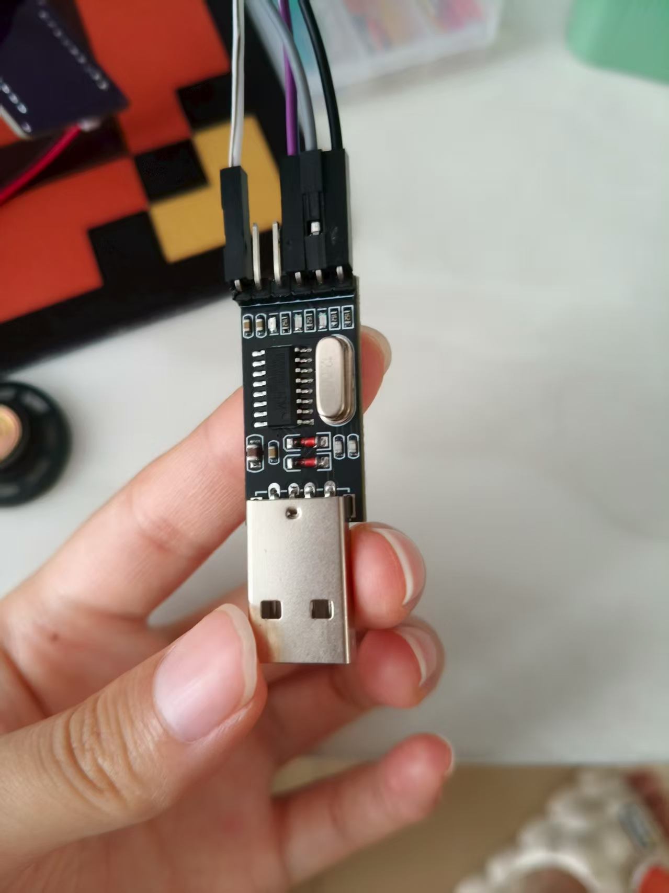

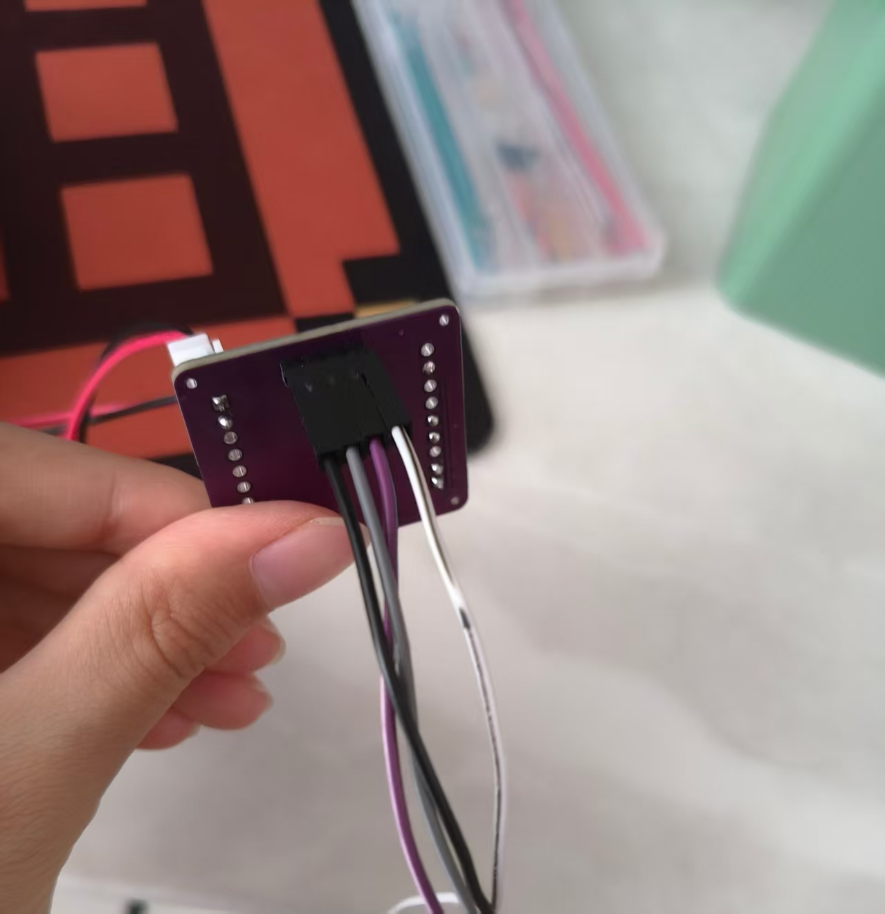

---

### 芯片接收引脚持续高电平导致烧录失败

**问题描述：**

烧录过程中芯片的接收引脚（RX）始终处于高电平状态，无法正常接收串口数据，烧录工具一直显示"等待设备"。

**解决方案：**

1. **检查原理图设计**：

    - 确认SET_RX和SET_TX引脚连接正确
    - 验证串口切换电路设计
    - 检查是否有上拉电阻导致高电平

2. **硬件连接检查**：

    - 确认B6（模块RX）连接到烧录器的TX
    - 确认B7（模块TX）连接到烧录器的RX
    - 检查是否存在引脚接反情况

3. **直接连接测试**：

    - 从模块引脚直接飞线连接
    - 绕过板载电路进行测试
    - 验证模块本身是否正常

**注意事项：**

- RX持续高电平通常表示硬件连接问题
- 需要检查串口切换开关状态
- 确认没有外部电路强制拉高RX引脚
- 使用示波器检查信号波形有助于诊断


---

### 设备通电后无响应的原因排查

**问题描述：**

设备之前正常工作并有欢迎词播放，放置一段时间后重新通电无任何反应。

**解决方案：**

1. **固件检查**：

    - 检查是否误烧录了不兼容的固件
    - 确认固件版本与硬件匹配
    - 重新烧录确认可用的固件

2. **硬件检查**：

    - 测试电源供电是否正常
    - 检查主控芯片是否发热
    - 测量各关键点电压

3. **连接验证**：

    - 检查外部连接是否有短路
    - 确认扬声器/麦克风连接正确
    - 测试串口通信是否正常

**注意事项：**

- 长期放置可能导致元器件受潮
- 静电累积可能损坏芯片
- 建议定期通电维护设备
- 保留可用的固件备份

---

### JSON配置文件如何烧录到模块？

**问题描述：**

有一个JSON格式的配置文件（如"12路语音识别继电器输出_20250517001.json"），不确定如何将其烧录到语音模块，以及应该使用转接线、烧录器还是烧录狗。

**解决方案：**

1. **理解JSON文件格式**
    - JSON文件通常是配置文件，不是固件文件
    - 包含语音命令、继电器控制逻辑等配置信息
    - 需要通过特定工具导入，不是直接烧录

2. **烧录方式选择**
    - **转接线**：用于串口通信和固件烧录
    - **烧录器/烧录狗**：专业工具，用于生产批量烧录
    - **配置导入**：通过平台软件导入JSON配置

3. **操作步骤**
    - 打开语音配置平台软件
    - 选择"导入配置"或"加载配置"
    - 选择JSON文件
    - 配置完成后生成固件并烧录

**注意事项：**

- JSON文件不能直接通过烧录工具烧录
- 需要先导入配置平台生成可执行固件
- 不同平台的JSON格式可能不通用
- 保留原JSON文件备份，避免配置丢失

---

### 烧录工具显示多个设备通信失败怎么办？

**问题描述：**

使用云知声UniOne蜂鸟烧录工具时，工具列表中多个设备（COM4、COM7、COM10等）均显示"通信失败"或"打开串口失败"。

**解决方案：**

1. **检查硬件连接**
    - 确认烧录线正确连接到模块
    - 检查转接线或USB转串口设备
    - 验证模块供电是否正常

2. **排查COM口问题**
    - 拔插USB设备重新识别
    - 更换USB端口测试
    - 检查设备管理器中的COM口状态

3. **驱动程序检查**
    - 确认USB转串口驱动已安装
    - 重新安装或更新驱动程序
    - 检查驱动是否与系统兼容

4. **烧录工具设置**
    - 关闭其他占用串口的程序
    - 以管理员身份运行烧录工具
    - 降低波特率尝试连接

**处理步骤：**

1. 断开所有设备连接
2. 重新插拔USB转串口设备
3. 打开设备管理器确认COM口正常
4. 逐个连接设备进行测试
5. 如仍失败，更换烧录线或转接头

**注意事项：**

- 多个设备同时失败通常是驱动或连接问题
- 使用质量好的USB转串口设备
- 避免使用延长线连接
- 确保模块进入烧录模式

---

### 模块上电后没有语音播报怎么办？

**问题描述：**

模块上电后没有听到语音播报，怀疑产品功能异常。

**解决方案：**

**问题排查步骤：**

1. **检查基础连接**
    - 确认电源连接正常（5V供电）
    - 检查扬声器是否正确连接
    - 验证麦克风连接是否牢固

2. **音量设置检查**
    - 检查系统音量设置是否过低
    - 确认没有设置静音模式
    - 尝试调高音量档位

3. **固件配置验证**
    - 确认已烧录正确的固件
    - 检查是否配置了开机播报功能
    - 验证唤醒词和命令词是否正确设置

4. **硬件测试**
    - 单独测试扬声器是否正常
    - 使用万用表检查供电电压
    - 尝试重新烧录固件

**常见原因：**

- 供电不足或不稳定
- 扬声器连接不良或损坏
- 固件未配置开机播报
- 音量设置过低
- 模块硬件故障

**注意事项：**

- 首次使用可能需要等待几秒初始化
- 确保使用配套的扬声器规格
- 如果问题持续，联系专业技术人员

---

## 音频输出问题


---

### CH340模块无法在烧录软件中显示怎么办？

**问题描述：**

插入CH340模块后，设备管理器中可以正确识别串口，但烧录软件中无法显示设备，其他电脑可以正常识别。

**解决方案：**

**1. 确认硬件识别**

- 检查设备管理器中是否显示"USB-SERIAL CH340"
- 确认系统已正确分配COM端口
- 听到插入和弹出的声音说明USB连接正常

**2. 驱动问题排查**

- CH340驱动与具体模块无关，是通用串口驱动
- 重新安装或更新CH340驱动程序
- 尝试使用不同版本的驱动

**3. 软件设置检查**

- 不需要连接模块，插上CH340就应该在烧录软件中显示
- 检查烧录软件是否有管理员权限
- 尝试以兼容模式运行烧录软件

**4. 系统环境问题**

- 检查是否被安全软件阻止
- 关闭不必要的后台程序
- 尝试更换USB端口

**5. 对比测试**

- 如果其他电脑正常，说明是当前电脑环境问题
- 可能是系统设置、驱动冲突或权限问题
- 建议在其他电脑上正常操作

**注意事项：**

- CH340模块单独插入就应该被烧录软件识别
- 问题通常出在当前电脑的系统环境或驱动上
- 排除硬件问题后，重点检查软件和系统配置

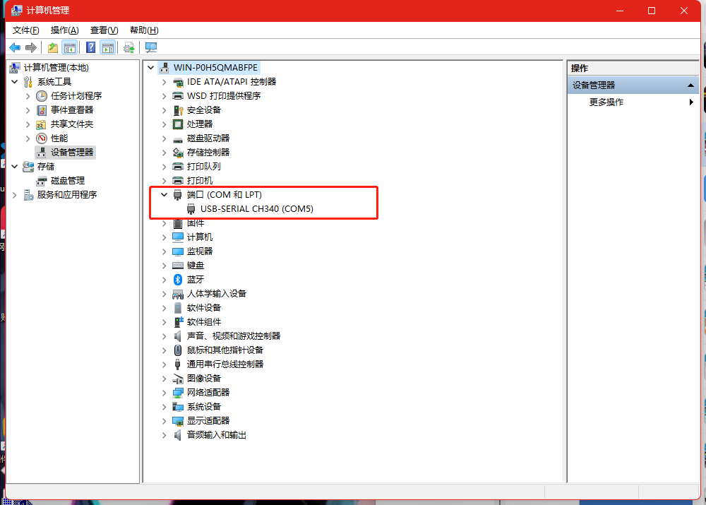

---

## 固件生成与下载问题


---

### 自行搭建的电路烧录失败怎么办？

**问题描述：**

按照提供的原理图自行搭建电路，但在烧录时遇到失败问题。

**解决方案：**

**1. 复位电路要求**

- 烧录时必须进行复位操作
- 没有复位电路会导致烧录失败
- 这是芯片烧录模式的必要条件

**2. 复位方法**

- **使用复位引脚**：通过RESET引脚进行硬件复位
- **电源重启**：插拔电源也可以实现复位
- **专业烧录器**：使用专用下载器自动处理复位

**3. 自制电路注意事项**

- 确保复位电路连接正确
- 烧录前先执行复位操作
- 空白芯片首次烧录需要专用下载器

**4. 下载器选择**

- 建议购买专业下载器工具
- 可自动处理复位和烧录时序
- 避免自制电路的兼容性问题

**注意事项：**

- 空白芯片必须先用下载器烧录引导程序
- 串口烧录需要芯片已有 bootloader
- 自制电路时要严格按照官方原理图

---

### 固件文件选择：jx_su_03t_release.bin 还是 _update.bin？

**问题描述：**

文件夹中有两个固件文件（jx_su_03t_release.bin 和 jx_su_03t_release_update.bin），不确定应该选择哪个进行烧录。

**解决方案：**

1. **文件说明**：

    - jx_su_03t_release.bin：完整固件文件
    - jx_su_03t_release_update.bin：更新固件文件
    - 两者适用于不同的使用场景

2. **选择建议**：

    - **首次烧录**：使用 release.bin 完整固件
    - **固件更新**：使用 update.bin 更新文件
    - **不确定时**：优先选择 release.bin

3. **文件大小差异**：

    - release.bin 通常较大（包含完整固件）
    - update.bin 通常较小（仅包含更新内容）
    - 根据实际需求选择

**注意事项：**

- 烧录前确认模块型号匹配
- 保留原始固件备份
- 更新固件时注意版本兼容性
- 如有疑问联系专业技术人员确认

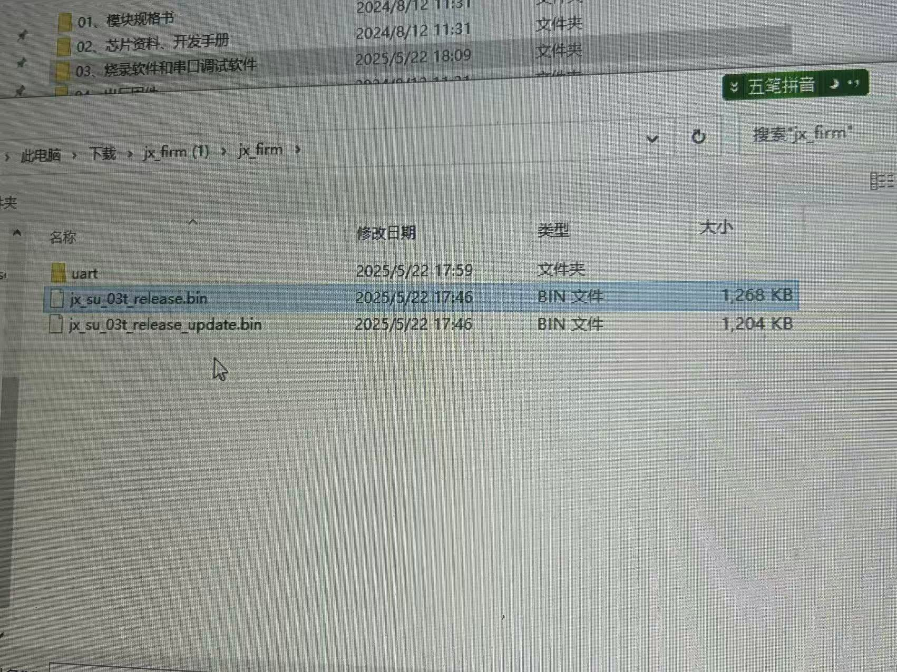


---

### 云之声烧录工具一直显示"等待设备"怎么办？

**问题描述：**

使用云之声串口上位机烧录工具时，设备无法被识别，工具界面始终显示"等待设备"。

**解决方案：**

1. **烧录时序确认**：

    - 先点击烧录按钮
    - 再给模块通电（或重新通电）
    - 确保模块在烧录工具启动后上电

2. **连接检查**：

    - 检查TX/RX线序是否正确（TX接RX，RX接TX）
    - 确认串口号选择正确（COM1/COM2/COM18）
    - 尝试不同的COM端口

3. **硬件检查**：

    - 检查模块供电是否正常（5V）
    - 确认串口线缆质量良好
    - 如无底板，通过插拔电源实现复位

4. **工具设置**：

    - 选择正确的镜像文件（.bin文件）
    - 确认COM口列表中有正确端口
    - 不需要额外选择，工具会自动检测

**常见问题：**

- 有两个虚拟串口时，确认选择的是正确端口
- 模块需要在上电前后正确的时序才能进入烧录模式
- 避免使用过长或质量差的串口线

**注意事项：**

- 烧录时模块需要进入特定的烧录模式
- 避免使用延长线或转接头
- 仍有问题可拍照接线给专业技术人员
- 建议使用官方推荐的烧录工具

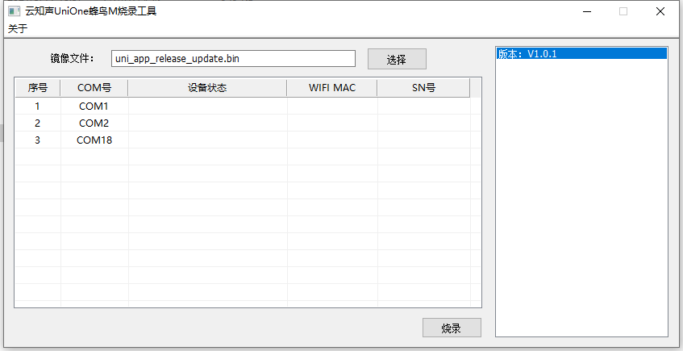

**解决方案：**

1. **烧录时序确认**：

    - 先点击烧录按钮
    - 再给模块通电（或重新通电）
    - 确保模块在烧录工具启动后上电

2. **连接检查**：

    - 检查TX/RX线序是否正确
    - 确认串口号选择正确
    - 尝试不同的COM端口

3. **硬件检查**：

    - 检查模块供电是否正常
    - 确认串口线缆质量良好
    - 如无底板，通过插拔电源实现复位

4. **工具设置**：

    - 选择正确的镜像文件
    - 确认COM口列表中有正确端口
    - 不需要额外选择，工具会自动检测

**注意事项：**

- 烧录时模块需要进入特定的烧录模式
- 避免使用延长线或转接头
- 仍有问题可拍照接线给专业技术人员
- 建议使用官方推荐的烧录工具

---

### 烧录工具显示"打开串口失败"如何解决？

**问题描述：**

使用云知声UniOne蜂鸟M烧录工具时，多个COM口均提示"打开串口失败"，设备拔掉5V电源后重新连接无任何反应。

**解决方案：**

**1. 连线检查**

- 确认串口线连接正确：Txd接Rxd，Rxd接Txd
- 检查CH340驱动是否已正确安装
- 尝试更换USB端口或USB线

**2. 硬件检查**

- 检查串口下载器是否正常工作
- 确认目标模块供电正常
- 测试不同的COM口选择

**3. 操作流程**

- 先连接好串口线
- 再给模块上电（5V）
- 确保模块进入烧录模式

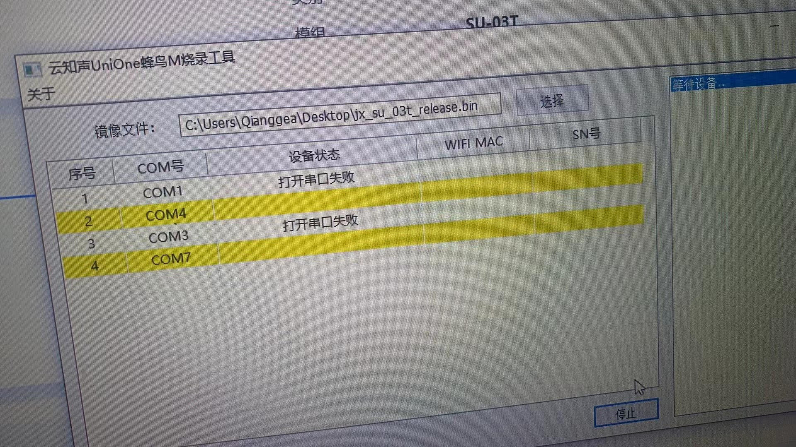

**注意事项：**

- 某些USB转串口芯片可能有兼容性问题，建议尝试原装或知名品牌的下载器
- 如果以上方法都无效，可能需要更换烧录工具或使用专用烧录器


---

### LD3322模块脉冲输出周期不符怎么办？

**问题描述：**

LD3322模块配置为4000毫秒周期的脉冲输出，但示波器实测信号周期只有约2秒，与预期不符。

**解决方案：**

**问题分析：**

- 初始状态输出高电平，然后输出一次脉冲
- 配置周期4000ms，实测约2秒
- 可能是脉冲宽度理解差异

**排查步骤：**

1. **确认配置参数**
    - 检查平台配置的周期设置
    - 确认脉冲次数设置为1次
    - 验证GPIO引脚分配正确

2. **示波器测量确认**
    - 使用示波器捕获完整波形
    - 测量高电平持续时间
    - 测量完整周期时间


3. **脉冲理解差异**
    - 可能配置的是高电平持续时间
    - 实际周期包含高低电平总和
    - 需要确认脉冲定义方式

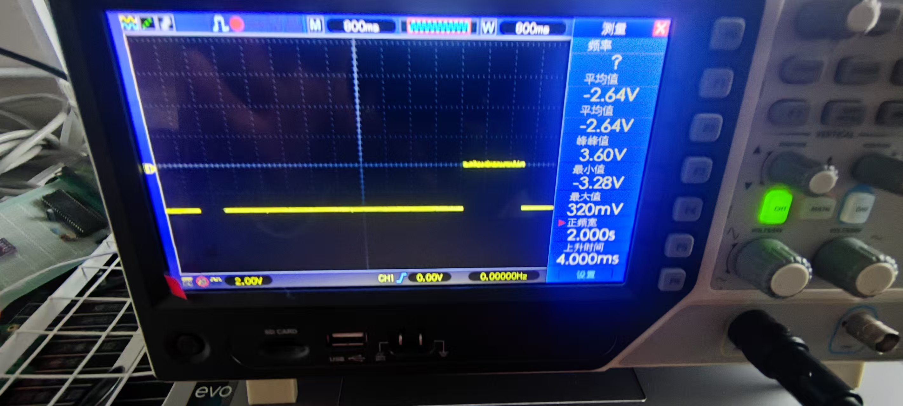

**处理建议：**

- 尝试配置为8000ms观察实际效果
- 检查是否为半周期设置
- 联系官方支持确认脉冲参数定义

**注意事项：**

- 不同模块的脉冲定义可能有差异
- 建议先进行小批量测试
- 保留配置截图便于问题追踪

---

### 文件路径中包含中文字符导致无法正常工作怎么办？

**问题描述：**

在使用CI系列离线语音识别芯片时，如果文件路径中包含中文字符，会导致系统无法正常工作。

**解决方案：**

**1. 路径要求**

- 所有文件路径不能包含中文字符
- 包括文件夹名称和文件名
- 必须使用英文或数字字符

**2. 正确的路径示例**

✅ **正确路径**：
```
C:\project\voice_module\
/home/user/voice_project/
D:\work\firmware\

```

❌ **错误路径**：
```
C:\项目\语音模块\
/home/user/语音项目/
D:\工作\固件\

```

**3. 建议的命名规范**

- 使用英文或拼音命名文件夹
- 避免使用特殊字符（如空格、中文标点）
- 使用下划线(_)代替空格
- 保持路径层级不要太深

**4. 解决现有问题**

如果已经遇到中文路径问题：

- 将相关文件移动到英文路径下
- 重新配置项目路径
- 确保所有依赖文件的路径都符合要求

**注意事项：**

- 此限制适用于所有相关工具和文件
- 包括固件文件、配置文件、音频文件等
- 建议从项目开始就使用英文路径，避免后续迁移

---


### 串口发送非烧录数据会误写入Flash吗？

**问题描述：**

模块上电时，通过串口接收到普通字符串或其他非烧录数据，是否会将错误数据写入Flash导致固件损坏。常见于通过4G模块或其他MCU扩展烧录口的场景。

**解决方案：**

**烧录协议保护机制：**

- **协议匹配验证**：模块上电后会检测串口输入的数据格式
- **匹配失败进入运行模式**：如果数据不符合烧录协议格式，模块自动进入正常运行模式，不会执行烧录操作
- **不会误写入**：只有符合烧录协议的数据才会被写入Flash

**典型应用场景：**

- 通过4G模块扩展烧录口实现远程升级
- 上电时4G模块或其他设备可能有数据输出
- 模块会自动识别并忽略非烧录数据

**电平匹配说明：**

- 模块串口电平为3.3V
- 设计时需注意与外部模块的电平匹配
- 建议使用电平转换芯片确保兼容性

**远程升级实现建议：**

- SU系列模块目前暂不支持完整的OTA功能
- 如需OTA功能，建议使用CI-03T/JX-A7T系列
- CI-03T提供有源码OTA示例供参考


---

## 工具使用


---

### GZ/TAR.GZ文件解压失败怎么办？

**问题描述：**

尝试解压 .gz 或 .tar.gz 格式的固件文件时，系统提示"提取操作没有完成"，错误代码为 0x8096002A。

**解决方案：**

**1. 更换解压软件**

- Windows 系统自带的解压功能可能不支持某些压缩格式
- 建议使用专业的解压软件：

    - 7-Zip（推荐）
    - WinRAR
    - Bandizip

**2. 正确的解压步骤**

使用 7-Zip 解压：

- 右键点击 .gz 文件
- 选择 7-Zip → 提取到当前位置
- 如果是 .tar.gz 文件，需要解压两次

**3. 文件完整性检查**

- 确认下载的文件没有损坏
- 重新下载文件对比文件大小
- 检查文件扩展名是否正确

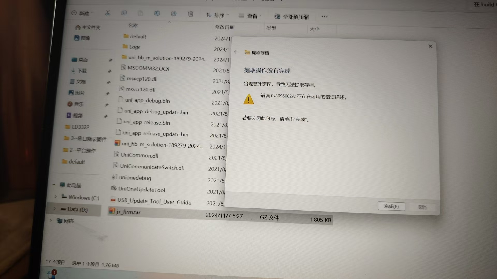

**注意事项：**

- 某些旧版本解压软件可能不支持新的压缩算法
- 避免使用系统自带的压缩功能处理特殊格式文件
- 如果解压后文件内容异常，建议重新下载

---

### 命令词能唤醒也能回复，但串口调试助手收不到消息怎么办？

**问题描述：**

语音模块的命令词能够正常唤醒设备并回复，但在串口调试助手无法接收到任何消息，尽管波特率、校验位和停止位等参数已设置一致。

**解决方案：**

**问题分析：**

- 命令词能识别说明语音功能正常
- 有语音回复说明模块工作正常
- 串口无数据输出可能是配置或发送设置问题

**排查步骤：**

1. **检查串口发送配置**
    - 确认在平台中配置了串口发送行为
    - 检查发送的串口号是否正确（UART1/UART2）
    - 验证发送的数据格式和内容

2. **检查硬件连接**
    - 确认TX/RX交叉连接正确
    - 检查GND是否共地
    - 使用示波器或逻辑分析仪验证信号

3. **验证通信参数**
    - 波特率：9600、115200等（需与模块一致）
    - 数据位：8位
    - 停止位：1位
    - 校验位：无校验（N）

**可能原因：**

- 模块配置中未启用串口发送功能
- 串口发送的条件未触发
- 物理连接问题或线路损坏
- 串口助手设置错误

**解决方法：**

- 在平台的控制详情中添加串口发送动作
- 确保命令词触发后执行串口发送
- 尝试不同的串口调试工具
- 使用回环测试验证串口通信

**注意事项：**

- 模块默认可能不主动发送串口数据
- 需要在固件配置中明确指定发送行为
- 串口发送的数据格式需要按协议要求


---

### 烧录语音模块时出现错误怎么办？

**问题描述：**

在烧录语音模块固件时，烧录工具显示错误信息，无法完成烧录操作。

**解决方案：**

**常见错误及处理方法：**

**1. 通信连接错误**

- 检查串口线连接是否正确
- 确认TX/RX交叉连接
- 验证GND共地连接
- 更换质量好的连接线

**2. 供电问题**

- 确认模块供电电压（3.3V或5V）
- 检查电源是否稳定
- 测量模块各引脚电压
- 使用外部稳压电源供电

**3. 驱动问题**

- 重新安装USB转串口驱动
- 检查设备管理器中的COM口状态
- 尝试更换USB端口
- 禁用其他串口设备避免冲突

**4. 烧录参数错误**

- 检查波特率设置是否正确
- 确认选择的芯片型号匹配
- 验证固件文件完整性
- 使用正确的烧录工具版本

**5. 模块状态异常**

- 按复位键重启模块
- 检查模块是否焊接良好
- 确认没有外围电路干扰
- 测试模块是否已损坏

**排查步骤：**

1. 断开所有外围电路只保留基本连接
2. 使用短而好的连接线
3. 检查电源供电稳定性
4. 重启电脑和烧录软件
5. 尝试在另一台电脑上烧录

**注意事项：**

- 不同模块需要使用对应的烧录工具
- 确保固件文件没有损坏
- 避免在烧录过程中断开连接
- 如多次失败，可能需要更换模块

---

### 为什么串口调试工具不显示回复词？

**问题描述：**

在使用串口调试工具时，语音识别后无法看到设备返回的回复词，已经设置了语音命令触发输出。

**解决方案：**

**问题分析：**

- **串口未打开**：需要先打开串口才能接收数据
- **输出配置错误**：未设置控制端口输出
- **触发方式问题**：语音命令未正确配置为触发输出

**解决步骤：**

**1. 检查串口连接**

- 确保串口号选择正确
- 点击"打开串口"按钮建立连接
- 检查波特率设置是否匹配

**2. 配置控制端口输出**

- 在平台配置中设置命令词的输出方式
- 选择"控制端口输出"选项
- 确认输出端口配置正确

**3. 验证触发设置**

- 确认语音命令触发方式设置为"串口输入"
- 检查命令词是否正确识别
- 测试其他命令词是否有相同问题

**常见错误排查：**

- 串口未打开是最常见原因
- 控制端口未设置不会触发输出
- 多个命令词需要分别设置输出
- 检查串口线连接是否牢固

**注意事项：**

- 串口调试工具只能显示通过串口输出的内容
- 语音模块内部的回复词不会默认通过串口输出
- 需要在平台中明确配置输出方式
- 建议使用官方提供的串口调试工具

---

### 使用拔线方式烧录固件经常失败怎么办？

**问题描述：**

在使用自研烧录器通过拔线方式烧录固件时，经常出现烧录失败的情况，影响开发和生产效率。

**解决方案：**

**问题分析：**

- 拔线方式时序控制不精确
- 不同型号芯片的烧录时序要求不同
- 手动拔线难以保证稳定的时序

**改进方案：**

1. **使用硬件开关控制**
    - 在烧录器上增加电子开关，替代手动拔线操作
    - 通过MCU精确控制烧录时序
    - 实现自动化的烧录流程

2. **针对不同型号优化**
    - 为不同芯片型号设置合适的烧录参数
    - 通过开关控制，基本可以实现一次性烧录成功
    - 根据芯片特性调整时序参数

3. **使用专用烧录协议**
    - 实现完整的烧录握手协议
    - 添加状态反馈机制
    - 提高烧录的可靠性

**技术建议：**

- 使用MOS管或继电器实现电源控制
- 加入烧录状态指示LED
- 考虑添加自动检测芯片型号功能
- 预留升级接口便于固件更新

**注意事项：**

- 手动拔线方式难以保证批量生产的一致性
- 建议使用硬件控制替代手动操作
- 烧录器设计需要考虑不同型号的兼容性
- 批量生产前充分验证烧录成功率

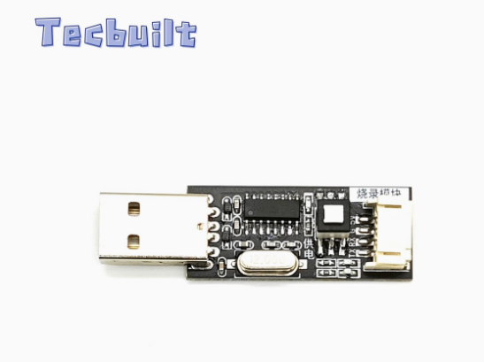

---

## 烧录工具与兼容性


---

### STM32F4系列中GPIO_PinRemapConfig函数未定义怎么办？

**问题描述：**

在STM32F407VCT6项目中使用引脚重映射功能时，编译报错提示GPIO_PinRemapConfig函数未定义。该函数在STM32F103RCT6中可用，但在STM32F4系列中不可用。

**解决方案：**

**1. 使用HAL库新API**

STM32F4系列不再使用GPIO_PinRemapConfig函数，改用HAL库的API：

- 使用HAL_GPIO_Init()函数配置引脚
- 通过GPIO_InitTypeDef结构体设置引脚模式
- 使用Alternate Function（复用功能）实现引脚重映射

**2. 配置步骤**

```c
// 启用GPIO时钟
__HAL_RCC_GPIOX_CLK_ENABLE();

// 配置GPIO引脚
GPIO_InitTypeDef GPIO_InitStruct = {0};
GPIO_InitStruct.Pin = GPIO_PIN_X;
GPIO_InitStruct.Mode = GPIO_MODE_AF_PP;  // 复用推挽输出
GPIO_InitStruct.Pull = GPIO_NOPULL;
GPIO_InitStruct.Speed = GPIO_SPEED_FREQ_HIGH;
GPIO_InitStruct.Alternate = GPIO_AF_X;    // 选择复用功能
HAL_GPIO_Init(GPIOX, &GPIO_InitStruct);
```

**3. 使用STM32CubeMX工具**

- 打开STM32CubeMX创建项目
- 选择STM32F407VCT6芯片
- 在Pinout视图中配置引脚的复用功能
- 自动生成初始化代码

**注意事项：**

- STM32F1与F4系列的API存在差异
- F4系列使用HAL库，F1系列使用标准外设库
- 建议使用STM32CubeMX简化配置过程
- 查阅STM32F4系列官方参考手册获取详细配置方法

---

### 烧录时进度条无法推进怎么办？

**问题描述：**

使用云知声UniOne蜂鸟M烧录工具时，选择固件文件后点击烧录，设备状态栏变黄但烧录进度条无法推进，烧录无反应。

**解决方案：**

**1. 重新拔插供电线**

- 选择好bin文件后点击烧录
- 等待设备状态栏变黄
- 重新拔插模块的5V供电线
- 观察烧录进度条是否开始推进

**2. 检查杜邦线连接**

- 确认使用正确间距的杜邦线
- 模块使用2.0间距连接器
- 避免使用2.5间距的杜邦线
- 确保连接牢固，避免接触不良

**3. 典型问题排查**

- 进度条一直不动通常是接触不良导致
- 检查串口线是否正确连接
- 确认COM端口识别正常
- 验证供电电压稳定

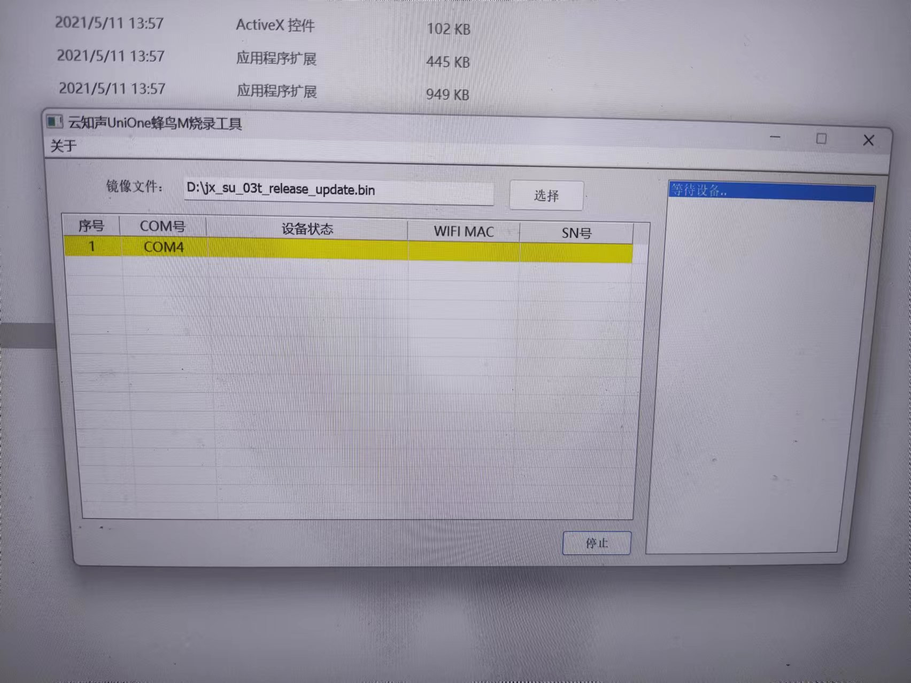

**注意事项：**

- 接触不良是烧录失败的常见原因
- 使用2.0间距的连接器确保良好接触
- 如问题持续，参考B站视频教程了解详细操作
- 确保烧录环境安静，避免电磁干扰

---

### 焊接后模块从有反应变为无反应怎么办？

**问题描述：**

语音模块在焊接前能正常响应，但焊接后出现无反应现象。

**解决方案：**

- 使用万用表检查焊接点的连通性
- 确认没有短路或虚焊现象
- 检查供电电压是否正常
- 验证关键引脚（如VCC、GND、数据线）的焊接质量
- 如有条件，使用示波器检查信号波形

**注意事项：**

- 焊接温度过高可能损坏模块
- 焊接时要避免相邻引脚短路
- 建议使用恒温焊台，温度控制在350°C以下
- 焊接后及时清理焊锡残留

---

### 程序烧录后模块无反应如何排查？

**问题描述：**

程序烧录后语音模块没有任何反应，但之前曾正常工作。

**解决方案：**

**1. 检查程序文件**

- 确认烧录的程序文件正确
- 验证程序与模块型号匹配
- 检查程序文件是否完整

**2. 硬件检查**

- 使用万用表测量供电电压
- 检查所有连接线是否接触良好
- 确认模块引脚无短路或断路

**3. 烧录过程检查**

- 重新进行一次完整的烧录流程
- 确认烧录过程中无错误提示
- 验证烧录参数设置正确

**注意事项：**

- 程序错误会导致模块完全无响应
- 烧录时避免中途断电或断开连接
- 建议保存原始程序备份

---

### 串口通信异常数据排查

**问题描述：**

使用串口通信时出现异常数据，特别是在播放语音时问题更明显，接收到大量异常数据包。

**解决方案：**

**1. 检查延时配置**

    - 发送串口消息时检查是否添加了合适的延时
    - 参考串口教程中的延时设置建议
    - 过短或过长的延时都可能导致数据异常

**2. 排查语音播放干扰**

    - 测试时临时删除播放语音的指令
    - 如果删除后异常消失，说明是语音播放导致
    - 考虑使用带AEC功能的模块

**3. 硬件连接检查**

    - 确认串口线连接良好
    - 检查供电是否稳定
    - 使用屏蔽线减少干扰

**4. 喇叭功率匹配**

    - 4欧姆喇叭：功率需大于2.4W
    - 8欧姆喇叭：功率需大于1.6W
    - 避免使用功率过大的喇叭

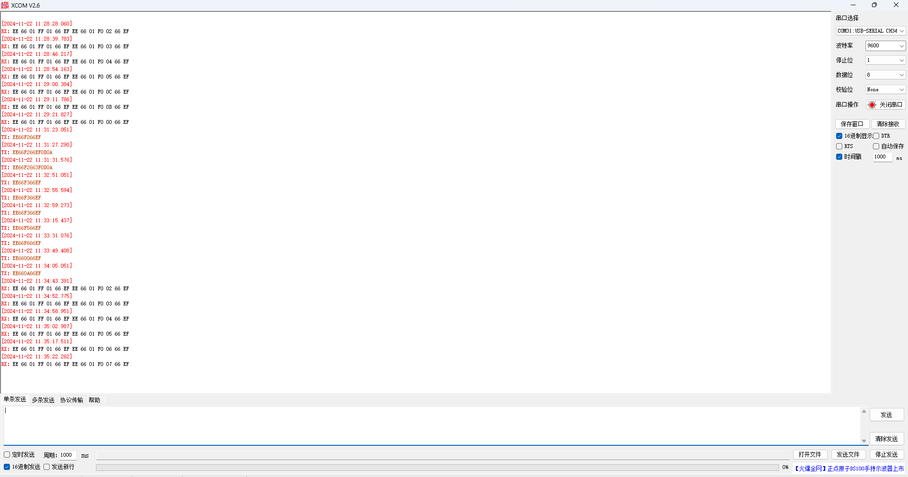


**注意事项：**

- 播放语音时可能影响串口通信质量
- 建议使用AEC功能模块减少干扰
- 喇叭功率不匹配可能导致通信异常
- 如问题持续，可尝试更换其他型号模块测试

---

### 固件生成时出现 readme.txt 文件

**问题描述：**

使用平台生成固件时，输出文件中包含一个 readme.txt 文件，但在网页版工程中不存在此文件。

**解决方案：**

readme.txt 文件是固件生成过程的正常产物，包含生成信息说明：

- 该文件不影响固件烧录和使用
- 是新版本平台的配套说明文件
- 可以直接忽略，无需特别处理

**注意事项：**

- 烧录时只需使用 BIN 文件和 JSON 配置文件
- readme.txt 文件不需要烧录到模块中
- 如生成失败，请检查配置是否超出内存限制

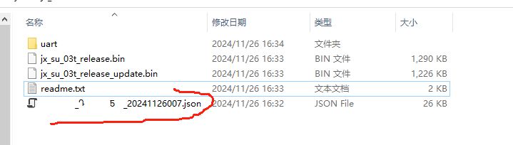

---

### 烧录文件无法加载到烧录工具

**问题描述：**

生成的固件文件无法添加到烧录工具中，测试版与安装版生成的固件文件不同。

**解决方案：**

**1. 确认烧录文件类型**

    - 正确的烧录文件：.bin 文件
    - 不需要烧录的文件：readme.txt、.json 文件
    - 选择与烧录工具匹配的固件版本

**2. 检查文件生成方式**

    - 测试版：用于快速验证，可能存在兼容性问题
    - 安装版：正式发布版本，兼容性更好
    - 建议使用安装版生成的固件进行烧录

**3. 烧录工具操作要点**

    - 确保使用官方指定的烧录工具
    - 选择正确的 COM 端口
    - 文件路径中避免包含中文或特殊字符

**注意事项：**

- 不同版本的烧录工具可能需要对应版本的固件
- 烧录前请备份原有固件
- 如持续无法加载，请联系技术人员获取正确版本的固件和工具

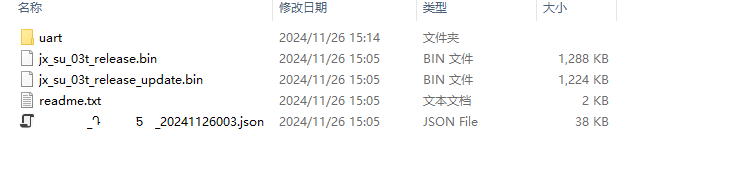

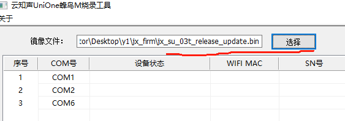

---

### 串口发送数据设备无响应如何排查？

**问题描述：**

使用串口调试工具发送数据（如AA550755AA）时，设备没有任何响应，通信失败。

**解决方案：**

按照以下步骤逐步排查串口通信问题：

**1. 检查硬件连接**

- 确认串口线连接正确
- 检查TX/RX引脚是否交叉连接（模块TX→工具RX，模块RX→工具TX）
- 验证共地连接（GND）
- 确认供电正常

**2. 验证串口参数配置**

- 波特率：确认与模块要求的波特率一致（常见值：9600、115200）
- 数据位：通常为8位
- 停止位：通常为1位
- 校验位：通常为无校验（None）
- 流控制：通常为无

**3. 检查数据格式**

- 确认发送的十六进制数据格式正确
- 验证校验和计算是否准确
- 检查数据帧格式是否符合协议要求
- 确认消息号或ID是否正确配置

**4. 模块状态确认**

- 模块是否正常上电
- 是否处于可接收命令的状态
- 模块是否已完成初始化
- 检查指示灯状态（如有）

**5. 软件工具检查**

- 尝试使用其他串口调试工具
- 检查串口是否被其他程序占用
- 确认串口驱动正常工作
- 尝试不同的串口号

**常见问题及解决：**

- **数据格式错误**：参考产品通信手册确认正确格式
- **波特率不匹配**：尝试常用波特率逐一测试
- **模块未就绪**：等待模块完全启动后再发送
- **串口占用**：关闭其他可能占用串口的程序

**注意事项：**

- 不同型号的模块可能使用不同的通信协议
- 部分模块需要发送特定唤醒指令才能响应
- 建议保存正常工作的通信记录作为参考

---

### 固件下载工具提示"文件读取失败"怎么办？

**问题描述：**

使用固件下载工具时，提示"文件读取失败"，错误信息显示包含中文字符的文件路径无法识别。

**解决方案：**

**1. 路径问题分析**

- 固件下载工具不支持包含中文的文件路径
- 当路径包含中文时，工具无法正确解析文件位置
- 错误示例：`D:\用户\桌面\2025语音编程\固件.bin`

**2. 解决方法**

- 将固件文件移动到纯英文路径下
- 建议路径示例：`D:\Firmware\jx_su_13t_release_update.bin`
- 避免使用中文文件夹名称和文件名
- 路径中不要包含特殊字符或空格

**3. 最佳实践**

- 建立专门的英文工作目录（如`Firmware`）
- 使用简短清晰的英文命名
- 保持路径层级不要太深
- 定期清理下载目录，避免混乱

**注意事项：**

- 这是工具的兼容性限制，不是故障
- 所有固件下载工具都有此限制
- 建议养成使用英文路径的习惯
- 如遇类似问题，优先检查路径是否包含中文

---

### 串口调试助手如何进行16进制转换？

**问题描述：**

使用串口调试助手发送数据时，输入了16进制数据（如22222222），但不清楚如何将其转换为10进制数值。

**解决方案：**

**1. 16进制与10进制的区别**

- 16进制发送：发送的是16进制格式的数据流
- 10进制数值：数据对应的十进制值
- 两者是数据格式的区别，不是转换关系

**2. 串口调试助手设置**

- **16进制发送模式**：勾选"16进制发送"选项
- **数据输入**：直接输入16进制字符串（如22222222）
- **工具处理**：自动将16进制字符串转换为对应的数据发送

**3. 16进制转10进制计算**

- 使用计算器：0x22222222（16进制）= 572662306（10进制）
- 在线转换工具：搜索"16进制转10进制"
- 编程语言：使用相应函数进行转换

**4. 实际应用**

- 发送16进制数据时，接收端收到的仍是原始数据
- 不需要手动转换，串口工具会自动处理
- 重要的是确保发送和接收端的格式一致

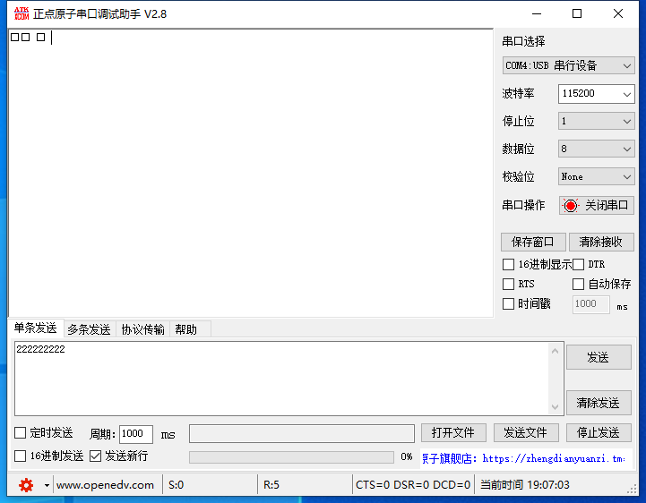

*串口调试助手的16进制发送模式设置*

**注意事项：**

- 波特率设置与16进制发送无关
- 16进制发送影响的是数据格式，不是传输速度
- 确保接收端也以相应格式解析数据

---

### 串口通信时波特率与16进制设置的关系？

**问题描述：**

在使用串口调试工具时，有人提到"16进制时使用9600波特率"，不清楚波特率设置与16进制发送模式之间的关系。

**解决方案：**

**1. 波特率和数据格式是独立参数**

- **波特率**：决定数据传输速度（比特/秒）
- **16进制发送**：决定数据的显示和输入格式
- 两者没有必然联系，可以独立设置

**2. 波特率选择建议**

- **高速通信**：115200波特率（常用）
- **稳定通信**：9600波特率（抗干扰能力强）
- **选择依据**：

    - 通信距离：距离长建议降低波特率
    - 环境干扰：干扰大建议使用较低波特率
    - 设备支持：确保两端都支持所选波特率

**3. 16进制发送模式说明**

- 纯粹是显示格式选择
- 不影响实际的数据传输速度
- 可以在任意波特率下使用16进制模式

**4. 常见配置组合**

- 115200波特率 + 16进制发送（高速调试）
- 9600波特率 + 16进制发送（稳定传输）
- 根据实际需求灵活组合

**注意事项：**

- 波特率必须与通信对端一致
- 16进制发送只是工具的显示功能
- 不要混淆波特率和数据格式这两个独立概念

---

### 使用小扳手工具下载固件后无法开机怎么办？

**问题描述：**

使用小扳手工具下载并烧录固件后，设备无法开机，怀疑是固件下载或烧录过程存在问题。

**解决方案：**

**1. 确认下载内容**

- 检查下载的是否为正确的固件文件
- 确认下载的是固件而非SDK
- 验证文件大小和格式是否正常

**2. 固件文件处理**

- 检查下载的文件是否为压缩包格式
- 如果是.tar.gz格式，需要先解压
- 解压后找到内部的.bin固件文件

**3. 重新下载固件**

- 尝试重新下载固件包
- 确认下载链接选择正确
- 避免使用第三方下载工具

**4. 烧录过程确认**

- 确保烧录工具显示下载完成
- 验证烧录过程无错误提示
- 烧录完成后等待设备重启

**注意事项：**

- 小扳手工具下载的可能是SDK压缩包
- 需要解压后才能找到实际固件文件
- 固件文件通常是.bin格式
- 如果问题持续，尝试使用其他已知的正常固件测试

---

### 下载的固件是压缩包格式怎么办？

**问题描述：**

从平台下载固件时，得到的是.tar.gz压缩包文件，而不是直接的.bin文件，不确定如何处理。

**解决方案：**

**1. 理解文件格式**

- .tar.gz是Linux常用的压缩格式
- 内部包含实际的固件文件
- 需要解压才能获取.bin文件

**2. 解压步骤**

- 使用7-Zip或WinRAR等解压软件
- 右键点击.tar.gz文件
- 选择"解压到当前文件夹"

**3. 文件内容说明**

- 解压后通常包含：

    - .bin文件：实际的可烧录固件
    - readme.txt：说明文档
    - 其他配置文件（可选）

**4. 烧录操作**

- 使用解压得到的.bin文件烧录
- 确保烧录工具选择正确的文件
- 验证文件大小是否正常

**注意事项：**

- 直接烧录.tar.gz文件会失败
- 保留原始压缩包作为备份
- 查看readme文件了解特殊说明
- 部分固件可能需要特定版本的烧录工具

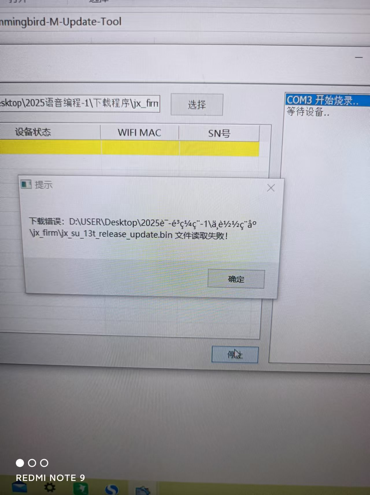

---

### UART0可以控制台灯但UART1无法控制怎么办？

**问题描述：**

配置语音控制台灯时，UART0可以正常控制台灯，但UART1无法控制台灯，语音播报功能正常。

**解决方案：**

检查UART1的引脚配置和外部设备连接。

**问题排查：**

1. **确认引脚配置**
    - 在平台配置中查看UART1_TX和UART1_RX对应的GPIO引脚
    - 确认引脚已正确配置为UART功能

2. **检查硬件连接**
    - 确认模块的UART1_TX连接到外部设备的RX端
    - 确认模块的UART1_RX连接到外部设备的TX端
    - 检查GND是否共地

3. **验证配置参数**
    - 确认UART1的波特率、数据位、停止位等参数设置正确
    - 确保与外部设备的串口参数匹配

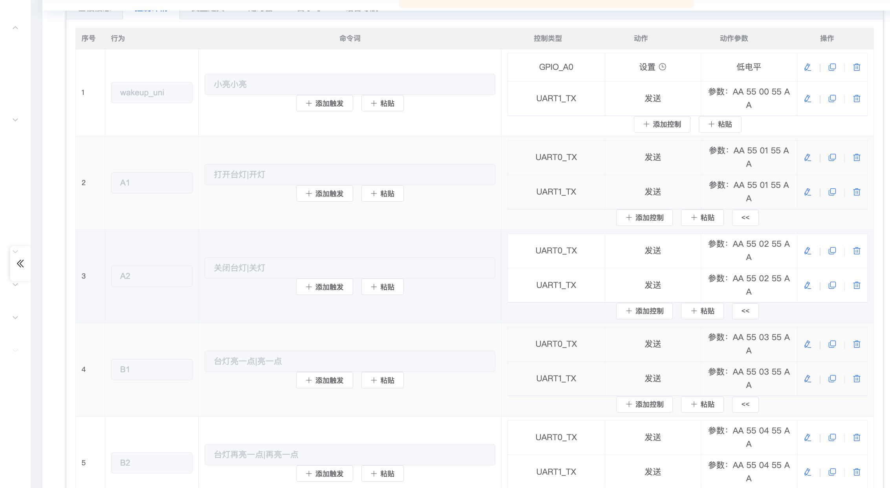

**注意事项：**

- UART0和UART1是独立的串口，需要分别配置
- 语音播报正常说明模块工作正常，问题在于UART1配置或连接
- 使用示波器或逻辑分析仪可以帮助定位硬件连接问题

---

## 烧录后异常


---

### 烧录后设备无反应怎么办？

**问题描述：**

固件烧录完成后，设备没有任何反应，疑似未正常启动或未执行开机播报。

**解决方案：**

**1. 检查开机播报配置**

- 确认是否配置了开机播报功能
- 检查开机播报的触发条件设置
- 验证播报内容是否正确配置

**2. 验证固件烧录**

- 重新烧录固件，确保烧录过程完整
- 检查烧录工具是否显示下载完成
- 确认没有出现烧录错误提示

**3. 检查硬件连接**

- 确认供电电压是否正常（通常为3.3V或5V）
- 检查所有必要引脚是否正确连接
- 验证复位电路工作是否正常

**注意事项：**

- 如果没有配置开机播报，设备启动后可能无任何声音输出
- 建议在开发阶段保留开机播报功能以便验证启动状态
- 可通过串口输出调试信息确认设备运行状态

---

### 脱机烧录时B2/B3引脚可以自由使用吗？

**问题描述：**

在进行脱机烧录时，询问是否可以使用B2和B3引脚进行配置，以及为何需要通过调试器烧录第一个固件。

**解决方案：**

**1. 脱机烧录与GPIO配置的关系**

- 脱机烧录和GPIO引脚配置没有直接关系
- B2、B3等引脚可以配置为GPIO或其他功能
- 脱机烧录使用的是专用的烧录接口（如B6/B7）

**2. 第一个固件必须使用调试器的原因**

- **空芯片状态**：

    - 全新的空白芯片没有Bootloader
    - 无法通过B6/B7等接口烧录
    - 必须通过调试接口（如SWD/JTAG）写入初始程序

- **Bootloader作用**：

    - 第一个固件包含Bootloader程序
    - Bootloader负责后续的串口烧录功能
    - 一旦写入Bootloader，后续可用B6/B7脱机烧录

**3. 引脚使用注意事项**

- **B0/B1引脚**：

    - 调试时会占用，不建议用作其他功能
    - 如果配置为GPIO，调试烧录可能受影响

- **B2/B3引脚**：

    - 正常使用时可以自由配置
    - 不影响脱机烧录功能
    - 可用作GPIO、PWM、ADC等功能

- **B6/B7引脚**：

    - 主要用于串口通信（UART1）
    - 也是脱机烧录的专用接口
    - 烧录时可复用为串口功能

**注意事项：**

- 只有空白芯片的第一个固件需要调试器
- 后续更新固件可使用B6/B7脱机烧录
- 保留B0/B1引脚给调试使用，避免冲突
- 生产阶段建议设计专用的烧录接口

---

### 脱机烧录和调试烧录有什么区别？

**问题描述：**

需要了解脱机烧录（使用B6/B7）和调试烧录的适用场景和区别。

**解决方案：**

**1. 脱机烧录**

- **使用接口**：B6（TX）、B7（RX）
- **适用场景**：

    - 批量生产烧录
    - 现场固件更新
    - 无需连接调试器
- **前提条件**：

    - 芯片已写入Bootloader
    - 不是空白芯片

**2. 调试烧录**

- **使用接口**：SWD、JTAG等调试接口
- **适用场景**：

    - 空白芯片首次烧录
    - 程序调试开发
    - Bootloader损坏恢复
- **优势**：

    - 可以调试断点
    - 支持单步执行
    - 实时查看变量

**3. 选择建议**

- **开发阶段**：使用调试烧录，便于调试
- **小批量试产**：两种方式均可
- **批量生产**：使用脱机烧录，效率更高
- **现场维护**：脱机烧录更便携

**注意事项：**

- 新芯片必须先用调试器写入Bootloader
- 保留调试接口便于后续问题排查
- 脱机烧录工具成本低，适合批量操作

---

### 芯片损坏后只有脱机烧录能强行覆盖的问题

**问题描述：**

芯片出现损坏后，三种烧录方式中只有脱机烧录能够强行覆盖固件，其他两种烧录方式会导致问题。

**解决方案：**

- **脱机烧录方式**：

    - 使用B6/B7接口进行脱机烧录
    - 能够强行覆盖损坏的芯片区域
    - 是芯片异常时的有效恢复手段

- **更换芯片评估**：

    - 如果脱机烧录成功，说明芯片基本功能正常
    - 可以通过这种方式修复，不一定需要更换芯片
    - 建议先尝试脱机烧录恢复，无效后再考虑更换

- **外围电路检测**：

    - 使用万用表检查电源电压是否正常
    - 检查关键信号线是否存在短路或开路
    - 重点检查晶振电路和复位电路

**注意事项：**

- 芯片损坏可能是由于静电击穿或电源异常导致
- 脱机烧录能成功说明芯片核心功能未完全损坏
- 更换芯片前务必确认外围电路正常，避免新芯片再次损坏

---

### 如何配置语音识别模块与三菱FX3U PLC的串口通信？

**问题描述：**

需要通过语音识别模块向三菱FX3U PLC发送数字数据，但无法成功建立串口通信。

**解决方案：**

**1. 硬件连接方案**

- 使用TTL转RS-485转换器连接语音模块和PLC
- 语音模块的串口为TTL电平，PLC的485接口为RS-485电平
- 模块的A、B端子连接到转换器的A、B端
- 转换器的输出连接到PLC的485通信端口
- 确保模块与PLC共地（GND连接）

**2. 串口参数配置**

- 语音模块默认参数：

    - 波特率：9600
    - 数据位：8
    - 校验位：无
    - 停止位：1
- PLC的串口设置必须与模块完全一致

**3. PLC程序配置**

- 使用RS指令接收数据：
    ```
    [RS D410 K6 D200 K10]
    ```
    - D410：接收缓冲区起始地址
    - K6：接收数据长度（6字节）
    - D200：存储接收数据的寄存器
    - K10：超时时间

- 使用SET/RST控制通信状态：
    ```
    [SET M8122]  ; 启动接收
    [RST M8123]  ; 停止接收
    ```

**4. 语音模块配置**

- 在平台配置串口收发功能
- 发送数据格式：十六进制（如AA 55 02 02 02 55 AA）
- 配置B0/B1脚为串口一（UART1）
- B0为TX（发送），应接外部设备的RX
- 生成并烧录固件到模块

**5. 测试验证**

- 保持X001接通以启动PLC接收
- 发送语音指令，监控D200-D208寄存器
- 将D410缓冲区清零可避免重复播报

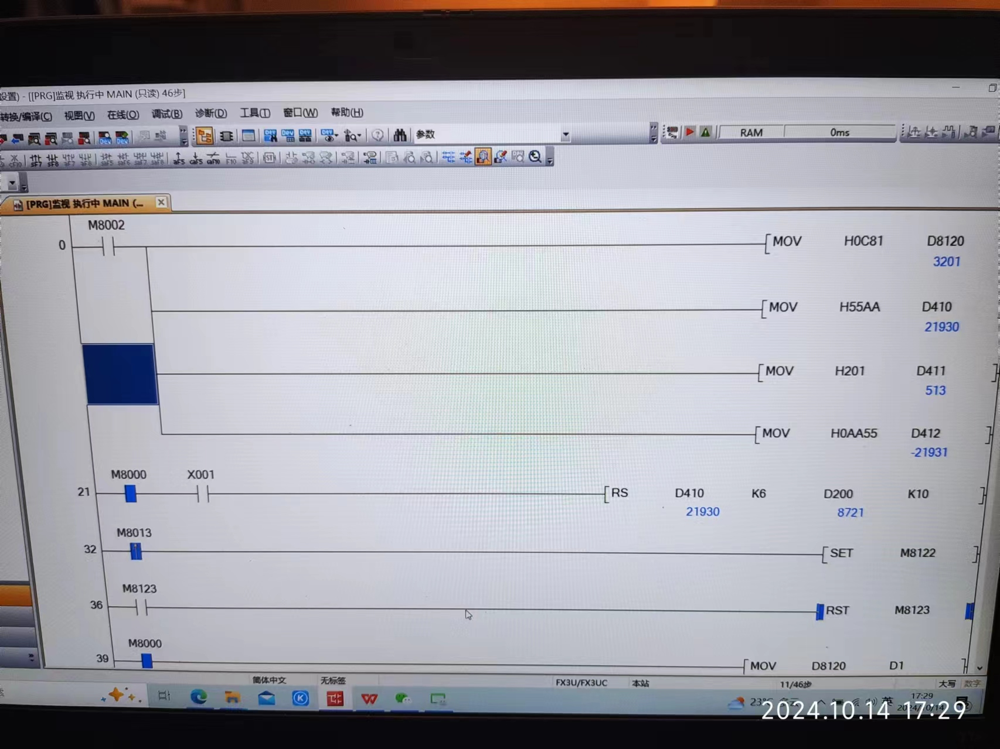

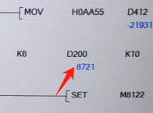

**注意事项：**

- 必须使用TTL转RS-485转换器进行电平转换
- 波特率等通信参数必须完全匹配
- PLC需要启动接收状态才能接收数据
- 语音模块的发送参数不能为空，需填入具体数据

---

### 如何配置语音控制RS485串口面板？

**问题描述：**

语音控制RS485串口面板在配置后无法正常发送数据到PLC，串口通信异常。

**解决方案：**

**1. 硬件接线确认**

- 将B0/B1脚配置为串口一（UART1）
- B0为TX（发送）→ 连接外部设备的RX
- B1为RX（接收）→ 连接外部设备的TX
- 确保地线（GND）正确连接

**2. 串口输出参数配置**

- 控制方式：选择"端口输出"
- 控制类型：选择"UART1_TX"
- 动作设置：选择"发送"
- 参数设置：填入十六进制数据（如 AA 55 02 02 55 AA）

**3. PLC接收配置**

- 设置数据接收寄存器（如D200、D202等）
- 使用RS指令配置接收参数
- 保持触发信号（如X001）接通以启动接收

**4. 语音指令配置**

- 在平台添加语音识别词条
- 为每个词条配置对应的串口输出动作
- 设置触发方式为语音识别后执行

**5. 调试步骤**

- 使用串口调试助手（如XCOM V2.6）验证通信
- 勾选"十六进制收发"格式
- 监控PLC对应寄存器的数值变化
- 将D410等缓冲区清零避免重复播报
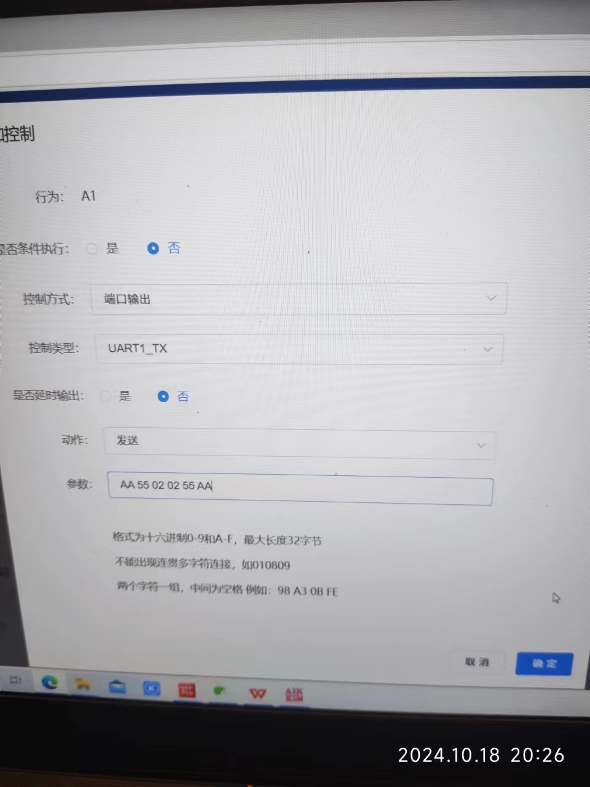

**注意事项：**

- 参数栏不能为空，必须填入要发送的十六进制数据
- PLC需要保持接收状态才能收到数据
- 波特率等通信参数必须与PLC设置一致
- 若使用成品面板，注意查看产品说明书的具体接线方式


---

## 固件文件处理


---

### 360压缩无法解压tar.gz文件怎么办？

**问题描述：**

下载的固件文件格式为tar.gz，使用360压缩软件解压失败，提示文件无法识别。

**解决方案：**

tar.gz是Linux标准压缩格式，需要使用支持该格式的压缩软件：

- **推荐工具**：

    - WinRAR（推荐）
    - 7-Zip（免费）
    - Bandizip（免费）

**解决方法：**

1. **安装WinRAR**：

    - 下载官方版或绿色版
    - 避免安装360压缩等国产软件
    - WinRAR完全支持tar.gz格式

2. **使用7-Zip**：

    - 免费开源压缩软件
    - 右键菜单选择"7-Zip → 提取到当前位置"
    - 支持所有主流压缩格式

3. **文件识别问题**：

    - 360压缩可能错误识别文件类型
    - 卸载360压缩后重新安装WinRAR
    - 清理系统文件关联

**注意事项：**

- tar.gz是两层压缩：tar归档 + gzip压缩
- 某些国产压缩软件兼容性较差
- 固件文件较大，避免在线解压工具
- 解压后检查文件完整性（MD5校验）

---

## 烧录环境问题


---

### 烧录文件路径包含中文无法烧录怎么办？

**问题描述：**

烧录固件时，文件路径包含中文字符导致烧录失败或工具无法识别文件。

**解决方案：**

烧录工具不支持包含中文的路径，必须使用全英文路径。

**解决方法：**

1. **创建英文文件夹**：

    - 在D盘新建文件夹
    - 使用字母、数字、下划线命名
    - 示例：`D:\firmware\` 或 `D:\module_update\`

2. **移动文件**：

    - 将固件文件复制到英文文件夹
    - 确保文件名也是英文
    - 避免使用特殊字符

3. **用户名中文问题**：

    - 如果Windows用户名是中文，桌面路径会包含中文
    - 不要直接放在桌面
    - 必须在D盘等根目录创建英文文件夹

**操作示例：**

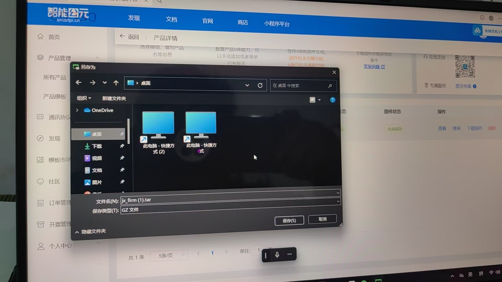

**正确路径示例**：

- ✅ `D:\firmware\app.bin`
- ✅ `C:\update\module_v1.bin`
- ❌ `C:\Users\张三\Desktop\固件\app.bin`

**注意事项：**

- 烧录工具不支持中文路径
- 从根目录开始避免中文路径
- 文件夹和文件名都建议使用英文
- 避免使用空格，可用下划线代替
- **路径长度限制**：路径过长也会导致烧录失败（建议控制在100字符以内，减少文件夹嵌套层级）
- **推荐做法**：将固件放在桌面或根目录附近的短名称文件夹中

---

### 烧录时卡在"等待设备..."怎么办？

**问题描述：**

烧录工具显示已识别设备（显示COM口），但进度条卡在"等待设备..."状态不动。

**解决方案：**

这个问题通常是杜邦线接触不良导致的，模块已被识别但数据传输受阻。

**问题分析：**

- **现象**：能看到设备但无法开始数据传输
- **原因**：杜邦线2.54mm间距 vs 模块2.0mm间距
- **结果**：部分引脚接触不良，影响数据传输

**解决方法：**

1. **按压法**：

    - 用手按住杜邦线，确保所有引脚接触
    - 按压后如果能开始烧录，确认是接触问题
    - 可作为临时解决方法

2. **检查接触**：

    - 重新插拔杜邦线
    - 轻微调整角度改善接触
    - 确认每个引脚都插入到位

3. **转接板方案**：

    - 使用专用转接板
    - 模块焊排针后插在转接板上
    - 使用标准杜邦线连接转接板

**实际案例：**

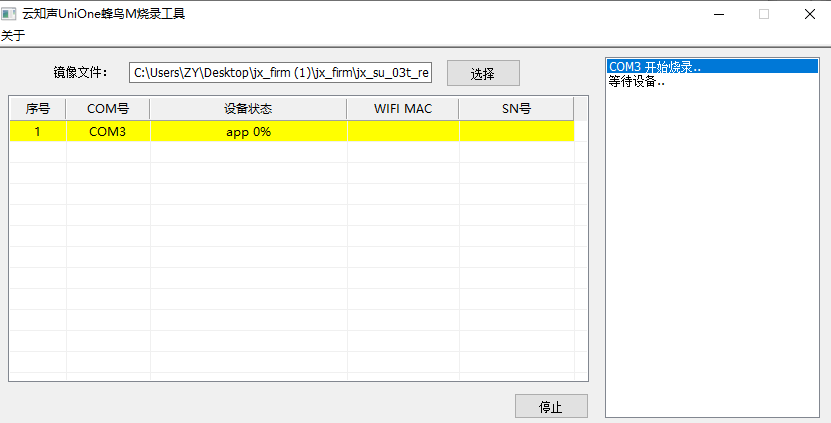

**预防措施：**

- 使用与模块匹配的连接器
- 焊接排针确保可靠连接
- 购买专用烧录座或转接板
- 避免反复插拔导致接触松动

----


---

### 模块发送脚始终为低电平怎么办？

**问题描述：**

在使用模块时发现发送脚始终为低电平，无法正常发送数据。

**解决方案：**

- **模块使用说明**：

    - 需要先在平台配置串口引脚和串口协议
    - 生成固件并烧录到模块
    - 连接好线路后可直接使用

- **配置步骤**：

    1. 在平台创建产品配置
    2. 设置串口引脚（如B6/B7）
    3. 配置串口协议参数
    4. 生成固件并烧录

**注意事项：**

- 模块是专用通信模块，不是通用的USB转串口
- 必须烧录对应功能的固件才能正常工作
- 接收正常但发送异常通常是配置问题

---

### CH340驱动如何安装？

**问题描述：**

在安装CH340驱动时遇到问题，需要安装特定的驱动程序以确保设备正常工作。

**解决方案：**

- **驱动获取**：

    - 下载官方CH340驱动包
    - 解压后找到安装程序
    - 运行安装程序完成驱动安装

- **安装步骤**：

    1. 下载CH340SER驱动包
    2. 解压到英文路径
    3. 右键以管理员身份运行安装程序
    4. 按提示完成安装

**注意事项：**

- 安装前请关闭杀毒软件
- 驱动安装完成后需要重新插拔USB设备
- 在设备管理器中确认COM端口正常显示

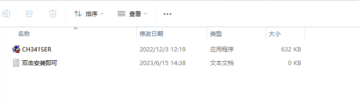

---

### 下载程序时串口连接失败怎么办？

**问题描述：**

在下载程序到设备时，出现串口连接问题，导致程序无法正常下载。

**解决方案：**

- 检查串口线是否连接松动
- 重新插拔并确保连接牢固
- 确认串口号选择正确

**注意事项：**

- 下载程序时确保串口线稳定连接
- 避免在下载过程中触碰连接线
- 如问题持续，检查串口线是否损坏

---

### 固件升级工具版本不匹配导致打开失败怎么办？

**问题描述：**

在使用固件升级工具时，因工具版本不匹配导致固件文件打开失败，无法完成升级操作。错误提示"升级固件打开失败，请检查固件路径是否正确！"

**解决方案：**

- **确认工具版本**：确认使用的固件升级工具是否为最新版本
- **版本匹配要求**：

    - 旧版工具可能不支持新固件格式
    - 新版工具可能不完全兼容旧固件
    - 建议使用与固件配套的推荐工具版本

- **获取正确版本**：

    1. 访问官方下载页面获取最新工具
    2. 查看固件发布说明中的工具版本要求
    3. 如使用特定版本固件，下载对应的工具版本

**注意事项：**

- 工具版本信息通常显示在主界面标题栏或关于菜单中
- 旧版工具（如V3.9.5）可能无法打开新版固件
- 保留多个工具版本以应对不同固件需求
- 升级工具前备份当前可用版本

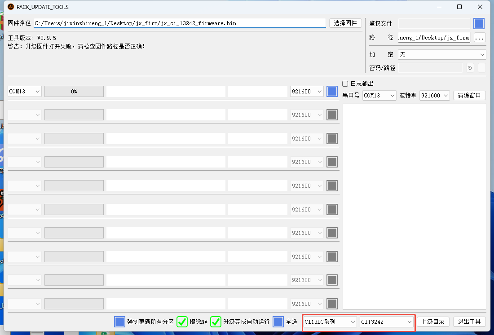

---

### 固件烧录后如何进行版本确认？

**问题描述：**

需要确认烧录的固件是否正确，特别是固件版本、唤醒词、回复语等配置信息是否与要求一致。

**解决方案：**

**1. 文件完整性验证**

- 使用MD5校验值验证固件文件
- 确认文件大小是否符合预期
- 检查文件时间戳为最新版本

**2. 烧录后功能测试**

- 测试唤醒词响应是否正确
- 验证回复语内容是否匹配设置
- 检查所有语音指令功能

**3. 配置信息核对**

- 定制固件编号：如"你好小乐固件"
- 开机播报："欢迎使用智能语音窗帘控制系统"
- 唤醒词："你好小乐|一号窗|二号窗|..."
- 回复语："来了"

**4. 质量管理措施**

- 建立烧录记录表
- 标签注明定制固件编号
- 保存MD5校验值备查

**注意事项：**

- 烧录完成后必须进行功能复核
- 不同项目的固件配置不能混用
- 建议使用标准化的烧录记录模板


---

### 批量烧录如何管理？

**问题描述：**

需要为多个模块烧录相同固件，并确保每个模块的烧录质量。

**解决方案：**

**1. 批量烧录准备**

- 准备足够的空白模块
- 确认固件文件为最终版本
- 准备标签和包装材料

**2. 质量控制流程**

- 首件烧录测试验证
- 过程中抽检功能
- 完成后全检或按比例抽检

**3. 追溯管理**

- 记录每个模块的烧录时间
- 保留烧录日志文件
- 建立模块编号与烧录记录对应表

**注意事项：**

- 批量烧录建议使用专用夹具
- 保持稳定的烧录环境
- 发现问题及时暂停批量，排查原因

---

### 烧录软件无法烧录固件怎么办？

**问题描述：**

使用烧录软件烧录固件时，设备无响应，进度条卡在0%或2%，无法完成烧录。

**解决方案：**

**问题排查步骤：**

1. **硬件连接检查**
    - 确认TX/RX线连接正确
    - 检查是否连接到B5/B6引脚（丝印标识）
    - 确保连接线接触良好
    - 验证USB转TTL模块工作正常


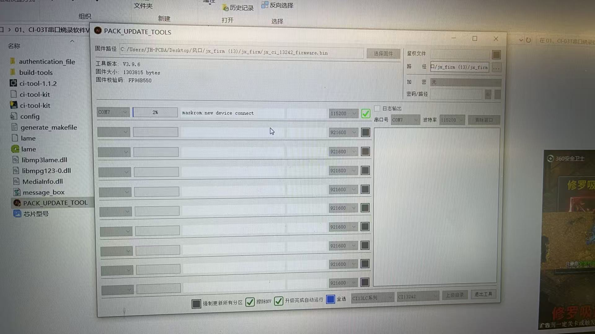

2. **基础故障排除**
    - 重新上电复位（断电后重新上电）
    - 交换TX和RX线序
    - 尝试不同的USB端口
    - 重新安装USB转串口驱动

3. **硬件连接验证**
    - 确认B5（TX）、B6（RX）引脚连接无误
    - 检查是否有其他外设连接到这两个引脚
    - 使用万用表测试连通性

**常见原因分析：**

1. **线序问题**
    - TX/RX线接反是最常见原因
    - B5应接转接板的RX
    - B6应接转接板的TX

2. **供电问题**
    - USB转TTL模块供电不足
    - 模块需要独立供电
    - 电源不稳定导致无法烧录

3. **端口占用**
    - 串口被其他程序占用
    - 需要关闭所有串口工具
    - 重新插拔USB设备

**高级排查方法：**

1. **裸烧测试**
    - 将模块从电路板上拆下单独烧录
    - 排除板上其他器件干扰
    - 确认模块本身是否正常

2. **原理图分析**
    - 提供模块所在电路的原理图
    - 检查B5/B6是否有上拉/下拉电阻
    - 确认是否有电平转换电路

**注意事项：**

- 烧录时模块应处于断电状态后再上电
- 避免在烧录过程中操作其他设备
- 如持续失败，可能需要检查模块是否损坏
- 保留完整的故障现象照片有助于问题排查

---

### 如何获取arpt自动化测试工具？

**问题描述：**

需要进行自动化误唤醒测试，需要获取arpt自动化测试工具开发包。

**解决方案：**

**工具获取方式：**

- arpt自动化测试工具包含在蜂鸟L语音性能测试指导手册中
- 可通过技术渠道获取：

    - 蜂鸟L语音性能测试指导手册.pdf
    - 自动化语音识别检测工具.zip

**工具功能说明：**

- 自动播放语音集进行测试
- 自动判断测试结果
- 存储测试日志
- 统计测试数据

**使用要求：**

- 测试语音集必须是短音频集
- 需要为每个测试语音集编写对应的annotate类型文件
- annotate文件需使用UTF-8格式
- 文件路径不能包含中文
- annotate文件需放置在音频文件同级目录

**应用场景：**

- 自动化误唤醒测试
- 语音识别率测试
- 批量语音性能验证
- 长期稳定性测试

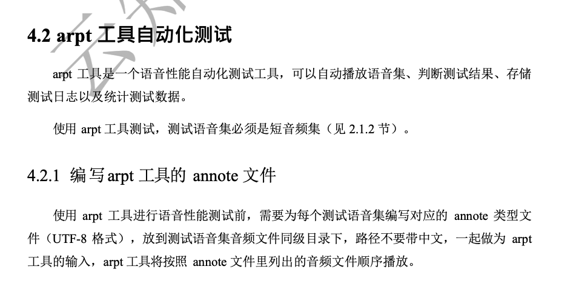

**注意事项：**

- 使用前仔细阅读蜂鸟L语音性能测试指导手册
- 确保测试环境符合要求（安静、无回声）
- 定期备份测试数据和日志文件
- 如遇到问题，请联系技术人员

---

### 如何进行固件烧录的MD5校验？

**问题描述：**

需要确保烧录到设备中的固件完整性，避免因固件文件损坏导致的功能异常。

**解决方案：**

**1. 使用哈希校验工具**

- 推荐使用 Hasher Lite 等哈希值计算工具
- 支持多种哈希算法：MD5、SHA1、SHA256、CRC32 等
- 可直接拖拽文件或选择文件路径进行计算

**2. 校验流程**

- 计算固件文件的 MD5 值
- 将计算结果与提供的标准 MD5 值对比
- 确认一致后再进行烧录操作
- 烧录完成后记录 MD5 值作为档案


**3. CRC32 快速版本核对**

除 MD5 外，也可使用 CRC32 进行快速固件版本核对：

- CRC32 码相同 = 固件文件相同
- 适用于固件名称相似但内容不同的场景（如 `jx_ci_03t_firmware.bin` vs `jx_ci_03t_firmware(2).bin`）
- 计算速度快，适合批量核对
- 使用 Hasher 等工具拖拽文件即可直接查看 CRC32 值

**4. 留档管理**

- 记录固件文件名、路径和 MD5 值
- 保存烧录日期和批次信息
- 便于后续问题追溯和质量控制

**注意事项：**

- 固件传输过程中要确保文件完整性
- 不同批次产品可能使用不同固件版本
- MD5 值不一致时需要重新获取固件文件

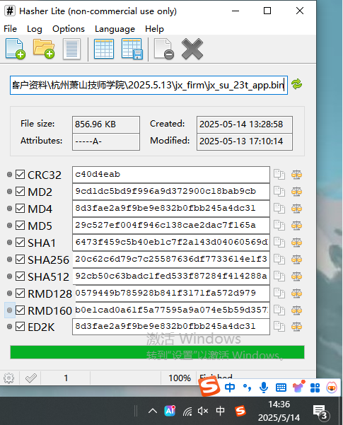

---

### STC Auto Programmer烧录器兼容性问题怎么办？

**问题描述：**

使用STC Auto Programmer USB-TTL烧录器进行芯片烧录时，即使接线正确、尝试3.3V和5V供电，仍频繁出现烧录失败，失败率高达80%。

**解决方案：**

**1. 烧录器兼容性分析**

- STC Auto Programmer 虽然集成USB转TTL功能，但可能与某些芯片不完全兼容
- 烧录器上的USB转TTL协议可能与芯片通信协议存在差异
- 10个芯片中8个烧录失败说明存在系统性兼容性问题

**2. 推荐替代方案**

- 使用CH340 USB转TTL模块进行烧录
- CH340是官方推荐和广泛使用的烧录工具
- 兼容性更好，成功率高

**3. CH340使用方法**

- 连接CH340模块到电脑
- 安装相应驱动程序
- 正确连接TX/RX和电源线
- 使用官方烧录软件进行操作

**4. 烧录接线确认**

- RX连接到芯片的TX
- TX连接到芯片的RX
- 供电根据芯片要求选择3.3V或5V
- GND可靠接地

**注意事项：**

- 不同品牌的USB-TTL转换器可能存在兼容性差异
- 建议使用官方经过验证的烧录工具
- 批量烧录前先进行小批量测试
- 保留烧录工具型号和批次信息便于问题追溯

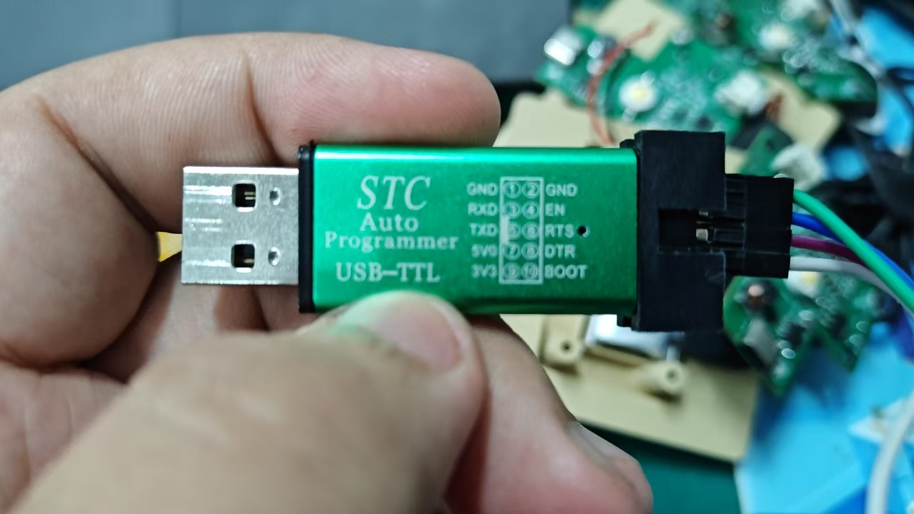

---

## 固件功能问题


---

### 普通话通用 Pro 不同版本如何选择？

**问题描述：**

产品配置界面中显示多个占用空间不同的"普通话通用 Pro"版本，需要了解如何选择以及"通用"与"专用"的区别。

**解决方案：**

**版本选择原则：**

- 占用空间越大，识别效果越好
- 一般情况下，通用版本已能满足大部分应用需求
- 可根据项目对识别率的要求选择合适版本

**通用与专用区别：**

- **通用**：适用于多种场景，识别范围广
- **专用**：针对特定场景优化，误识别率更低

**注意事项：**

- 选择更高识别率的版本时，误识别也会相应增加
- 版本号较高的通常包含优化改进，效果可能更好
- 建议根据实际需求平衡识别率和误识别率

---

## 测试与样机管理


---

### 帽子灯测试样机缺少外壳怎么办？

**问题描述：**

测试帽子灯样机时发现缺少外壳，之前提供的样机外壳已被回收，导致无法进行完整的测试。

**解决方案：**

**1. 样机管理说明**

- 测试专用样机外壳通常会有使用痕迹
- 带有伤痕的外壳不会用于正式产品
- 测试完成后通常只回收PCB板

**2. 解决方案**

- 联系供应商补充测试外壳
- 对于已开模产品（如360旋转灯），可提供多套测试外壳
- 手板产品因成本较高，需要协调使用

**3. 注意事项**

- 测试前确认所需配件齐全
- 保留测试样机用于后续调试
- 建立样机管理制度，避免配件丢失


---

### 帽子灯测试需要哪些连接线材？

**问题描述：**

需要用于测试的帽子灯连接线材（5P排线和4P端子线），但收到的线材与要求不符，且部分线材未寄出，导致测试进度受阻。

**解决方案：**

**1. 线材规格要求**

- 灯板与主板连接线：4P 2.0mm间距，一头带插件端子
- 灯板和触摸板连接线：5P 0.8mm间距排线，反PIN
- 注意线材长度需满足装配要求

**2. 临时替代方案**

- 目前只有3P、4P线材时，可自行拼接5P线
- 测试时可先用短线，不满足装机长度要求
- 确认线序正确，避免反接


**3. 解决流程**

- 联系供应商确认5P线打样进度
- 优先寄送可用的4P线材
- 测试验证线序定义是否正确

**注意事项：**

- 5P线材需要专门打样，有交期
- 测试前用万用表确认线序
- 保留样线用于后续小批量验证


---

### 帽子灯测试出现异常现象怎么办？

**问题描述：**

森泊金属帽子灯在功能测试中出现多个异常现象，包括开机时蓝灯闪现、使用中语音指示灯常亮、灯光熄灭后蓝灯仍长亮、充电时触摸按键失灵以及长时间使用后灯光颜色异常变化。

**解决方案：**

**1. 开机蓝灯闪现**

- 现象：开机瞬间出现蓝色灯光闪烁
- 原因：手板阶段就存在的问题，后续设计已改善
- 解决：量产版本将采用360旋转灯的改善方案

**2. 语音指示灯异常**

- 现象1：使用中语音指示灯出现常亮蓝灯
- 现象2：灯光灭掉后，蓝色指示灯仍然长亮
- 解决：需要检查固件逻辑，修正指示灯控制程序

**3. 充电时触摸失效**

- 现象：充电状态下触摸按键无法工作
- 后果：拔掉电源后需要重新开关机，触摸开关才能正常使用
- 解决：优化充电状态下的触摸检测逻辑

**4. 灯光颜色异常**

- 现象：打开暖色常亮，2小时后灯光变成其他颜色
- 可能原因：

    - 电池电压降低导致驱动异常
    - 长时间工作后温度影响
    - RGB驱动程序bug


**5. 充电电流异常**

- 实测电流：0.5A左右
- 应达到：最大充电电流应大于1A
- 解决：电池需要放完电后测试充电电流

**排查步骤：**

1. 记录所有异常现象的视频证据
2. 测量异常状态下的电压电流值
3. 检查电池保护板设置（精工保护板3.0V截止）
4. 重新烧录确认功能正常的固件
5. 对比新旧版本硬件的差异

**注意事项：**

- 电池电压3.8V就关机属于异常，应检查保护板设置
- 白光全亮时电流应在230mA左右
- 所有问题需要在量产前彻底解决
- 建议保留测试视频作为改进依据

---

### 360旋转灯和帽子灯PCBA板调试进度如何跟踪？

**问题描述：**

360旋转灯和帽子灯的PCBA板修改过程中，需要跟踪调试进度，并解决烧录新固件后出现的语音唤醒灵敏度不一致问题。

**解决方案：**

**1. 测试流程管理**

- **样机制作**：根据最新的限高图和布局图制作PCBA
- **功能测试**：完成后先进行基础功能验证
- **循环测试**：进行至少2轮完整循环测试
- **寄样验证**：寄送给相关方进行交叉验证

**2. 语音唤醒一致性问题**

- **现象**：烧录新固件后，一个灵敏度正常，一个有时唤醒不了
- **排查方向**：

    - 确认两个设备使用相同固件版本
    - 检查硬件差异（麦克风、电路）
    - 验证唤醒词配置是否一致
    - 测试不同环境下的识别率

**3. 测试重点**

- **边充边用**：测试充电时的触摸灵敏度
- **低电提醒**：验证低电量时的提示功能
- **指示灯亮度**：确认各状态指示正常
- **触摸延时**：优化触摸响应时间
- **语音一致性**：多次测试确保唤醒稳定

**4. 进度跟踪要点**

- 每日更新测试状态和发现的问题
- 记录所有异常现象的视频证据
- 保留完整的测试数据和日志
- 及时沟通测试结果和调整方案

**注意事项：**

- 语音识别受发音、环境、设备位置影响较大
- 测试环境应相对安静，避免干扰
- 所有功能异常需要在大货前解决
- 建议使用雾状指示灯降低刺眼感
- PCB设计需严格按照限高图生产

---

### 无硬件板子时如何进行固件烧录测试

**问题描述：**

需要测试多个固件包（火焰灯、帽子灯、旋转灯）的正确性，但在没有硬件板子的情况下，希望通过烧录工具进行固件烧录测试，遇到烧录失败的问题。

**解决方案：**

**1. 烧录工具准备**

- **工具版本**：使用USS13U61 Production Tool v1.0.9
- **配置参数**：

    - 接口类型：SIP-NOR-FLASH
    - 波特率：460800
    - 串口号：根据实际连接选择（如COM4）
- **操作步骤**：

    - 工具显示"等待设备上电"时进行连接
    - 如串口异常，可尝试切换其他COM口
    - 确认波特率和接口类型配置正确

**2. 固件文件确认**

- **火焰灯（CHAMPAGNE）**：Champagne250415.tar.gz
- **帽子灯（AMIGA）**：Amiga250415.tar.gz
- **旋转灯（MOJIU）**：Mojiu250415.tar.gz
- **文件格式**：解压后得到.bin文件用于烧录

**3. 无硬件测试方案**

由于没有实际硬件板子，无法进行完整的烧录验证，建议：

- **文件检查**：确认固件包结构完整，.bin文件可正常提取
- **烧录环境**：在有开发板时第一时间进行实际烧录测试
- **版本标记**：固件包中包含明确的版本号和日期标识
- **测试记录**：保留烧录工具配置截图和操作记录

**4. 常见问题处理**

- **烧录失败**：

    - 检查串口驱动是否正确安装
    - 确认USB转串口设备工作正常
    - 尝试不同的波特率设置
    - 检查设备供电是否稳定

- **连接异常**：

    - 重新插拔USB连接线
    - 更换USB端口尝试
    - 确认设备已上电（波动电源开关）

**注意事项：**

- 无硬件时只能验证固件文件的完整性，无法测试实际功能
- 建议至少保留一套开发板用于固件验证
- 烧录前务必确认固件与产品型号匹配
- 保留烧录日志，便于问题追踪

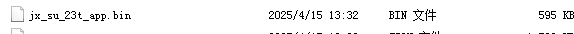

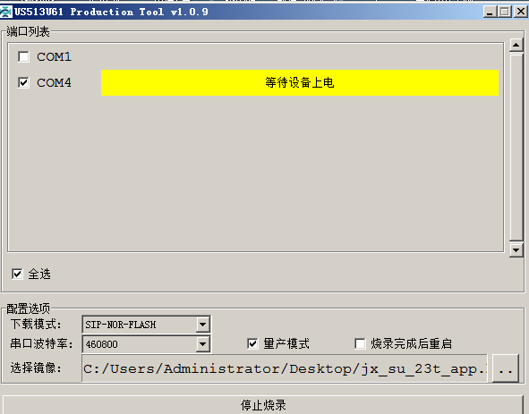

---

### US513U61烧录工具无法正常烧录的处理方法

**问题描述：**

使用US513U61生产工具进行烧录时，设备无法正常烧录，烧录过程出现串口连接异常。工具界面显示"等待设备上电"，表明设备未进入烧录模式。

**解决方案：**

**1. 设备进入烧录模式**

- **上电顺序**：先连接烧录工具，再给设备上电
- **开关操作**：如界面变黄，波动电源开关重新上电
- **状态确认**：工具界面从黄色变为正常状态表示连接成功

**2. 连接配置检查**

- **COM口选择**：确认选择了正确的串口号（如COM4）
- **波特率设置**：使用460800波特率进行通信
- **接口类型**：选择SIP-NOR-FLASH模式
- **驱动安装**：确认USB转串口驱动已正确安装

**3. 常见故障排查**

- **串口占用**：

    - 关闭其他可能占用串口的程序
    - 在设备管理器中确认COM口可用
    - 重启电脑重新识别设备

- **连接线问题**：

    - 检查USB连接线是否正常
    - 尝试更换USB端口或连接线
    - 确认设备供电稳定

- **设备状态异常**：

    - 断电后重新上电尝试
    - 检查设备是否损坏
    - 确认固件文件格式正确

**4. 操作建议**

- **环境准备**：关闭其他干扰程序，专注烧录操作
- **步骤顺序**：严格按照工具说明的操作流程执行
- **错误处理**：如多次失败，联系技术人员获取帮助
- **记录保存**：保留错误截图和操作日志

**注意事项：**

- 烧录失败时不要频繁尝试，避免设备损坏
- 确保烧录环境稳定，避免突然断电
- 不同批次设备可能需要不同的烧录参数
- 建议使用原装烧录工具和连接线


---

### 提高测试效率：批量准备样品板

**问题描述：**

样品调试过程中，每次仅提供一个样品板，导致无法进行有效的对比测试，影响调试效率和问题发现。单一样品难以发现潜在问题，延长了调试周期。

**解决方案：**

**1. 样品数量建议**

- **最小数量**：每种功能至少准备2-3个样品板
- **对比测试**：相同条件下对比不同样品的表现
- **并行验证**：多个问题可以同时排查，提高效率
- **备份机制**：防止单一样品损坏导致测试中断

**2. 样品管理策略**

- **问题分类**：不同问题使用专门的样品进行验证
- **状态标识**：清晰标记每个样品的测试状态和问题点
- **交叉验证**：A样品的问题用B、C样品复现
- **记录完整**：保留所有样品的测试数据和现象

**3. 测试流程优化**

- **并行测试**：多个样品同时进行不同项目测试
- **快速切换**：问题定位后快速在多个样品上验证
- **数据对比**：横向对比数据，快速定位异常
- **效率提升**：减少等待和寄送时间

**4. 实施建议**

- **样机制作**：接到需求后立即制作多套样品
- **版本管理**：确保所有样品使用相同固件版本
- **文档同步**：每个样品的问题记录及时共享
- **定期评估**：评估样机利用率，及时补充

**5. 成本效益**

- **时间节省**：多样品并行测试可节省30-50%时间
- **问题提前**：更容易在设计阶段发现潜在问题
- **质量提升**：批量验证提高产品可靠性
- **资源优化**：减少重复寄送和沟通成本

**注意事项：**

- 样品数量并非越多越好，以能覆盖主要测试场景为准
- 确保样品之间的一致性，避免引入新的变量
- 建立样品借调登记制度，明确责任和使用记录
- 测试完成后及时总结，形成可复用的经验库
---

### CI1302芯片是否支持重复烧录？

**问题描述：**

需要确认CI1302芯片是否可以多次烧录固件，以及如何进行烧录操作。

**解决方案：**

CI1302芯片支持重复烧录功能，具体说明如下：

- **重复烧录能力**：芯片可进行多次烧录，无需担心烧录错误
- **烧录方式**：

    - 使用CH340串口烧录器进行烧录
    - 连接芯片的RX、TX引脚到CH340
    - 使用专用烧录软件进行固件更新

**烧录准备：**

- 准备CH340串口烧录器
- 确认固件文件完整性（可通过MD5等校验值验证）
- 正确连接硬件线路

**注意事项：**

- 芯片出厂为空片，首次使用需要烧录固件
- 烧录过程中不要断电或断开连接
- 建议在烧录前备份原有固件（如需要）
- CH340是常用的USB转串口芯片，驱动安装简单

---

## 串口通信


---

### 语音模块与PLC通讯的应答机制如何设置？

**问题描述：**

语音模块通过串口MODBUS-RTU与西门子PLC通讯时，存在报文发送后未被PLC接收导致语音播报提前完成，且报文仅发送一次导致通讯不稳定的问题。

**解决方案：**

- **配置应答机制**：通过设置串口输入触发方式实现PLC反馈后再播报

1. 在命令词自定义界面，新建一个用于接收PLC应答的命令词（如"A9"）
2. 设置触发方式为"串口输入"，配置相应的消息号和参数类型
3. 为该命令词配置"回复语"，设置为"已完成"等播报内容
4. 原命令词的"回复语"设置为空，只执行发送动作

- **工作流程**：

    1. 语音识别后，模块发送MODBUS-RTU指令给PLC
    2. PLC执行完成后，返回应答信号
    3. 模块接收到串口输入信号，触发应答命令词
    4. 播报"已完成"等确认语音

**注意事项：**

- 需要确保PLC能够正确返回应答信号
- 串口参数（波特率、数据位、停止位、校验位）必须与PLC配置一致
- 应答命令词的触发参数需要与PLC返回的数据格式匹配
- 可使用提供的示例项目文件（jx_firm.tar.gz）参考配置方法

---

### 语音模块与电动阀共用电源导致误触发如何解决？

**问题描述：**

语音模块和直流电动阀门共用24V电源时，电动阀门动作导致语音模块误触发串口播报，独立供电可解决问题。

**解决方案：**

- **问题原因**：DCDC电源波动较大，电动阀门动作瞬间产生电源干扰

- **硬件滤波方案**：

    1. 在5V电源输入端增加磁珠（如BLM21PG121SN1D，120R@100MHz）
    2. 并联0.1μF电容组成LC滤波电路
    3. 在语音模块电源入口处增加大电容（如680μF）进行滤波

- **滤波电路设计**：

    - 磁珠串联在5V电源线上
    - 电容并联在电源和地之间
    - 尽量靠近语音模块电源输入引脚

**注意事项：**

- 电源干扰是误触发的常见原因，建议优先处理电源滤波
- 如仍有干扰，可考虑使用独立电源为语音模块供电
- 选择磁珠时注意其阻抗频率特性应匹配干扰频段
- 电容选择应考虑ESR和ESL参数，优先使用低ESR电容

---

### 烧录时如何避免电源叠加导致芯片烧毁？

**问题描述：**

使用5V供电和DCDC供电的电路中，烧录时可能因电源叠加导致芯片或供电模块烧毁。

**解决方案：**

- **标准操作流程**：

    1. 烧录时断开24V主电源
    2. 只使用烧录器（如CH340）的5V供电
    3. 烧录完成后再恢复正常供电连接

- **电路设计建议**：

    - 避免将外部5V与烧录器的5V直接相连
    - 可使用二极管进行电源隔离
    - 添加跳线或开关方便切换供电方式

**注意事项：**

- 严禁在未断开主电源的情况下进行烧录
- 电源叠加不仅会烧毁芯片，还可能损坏DCDC模块
- 建议在电路板上明确标注烧录时的操作步骤
- 如必须设计自动切换电路，需要确保不会出现同时供电的情况

---

### 串口通信干扰有哪些抗干扰措施？

**问题描述：**

串口通信容易受到干扰，导致接收数据出现乱码（如DF、FF等），无法正常接收报文。

**解决方案：**

- **硬件抗干扰措施**：

    1. 在RS-485通信总线两端并联终端电阻（100-220Ω，常用120Ω）
    2. 在RS-485的A、B信号线并联TVS瞬态电压抑制二极管
    3. TVS管推荐型号：WE05D9-B

- **抗干扰原理**：

    - 终端电阻：匹配传输线特性阻抗，减少信号反射
    - TVS二极管：吸收瞬态高压，保护通信接口芯片

**注意事项：**

- 终端电阻只需在总线最远端的两个设备上并联
- TVS管应尽量靠近通信接口安装
- 确保PLC和语音模块的接地良好，避免形成地环路
- 如干扰严重，还可考虑使用屏蔽双绞线

---

### 语音模块的B0/B1串口电压应该是多少？

**问题描述：**

测试发现语音模块的B0/B1串口引脚对地电压低于3.3V，或悬空时电压异常。

**解决方案：**

- **正常电压值**：

    - 配置为通信功能后，B0/B1对地电压应为3.3V
    - 未配置时默认为低电平，接近0V

- **配置方法**：

    1. 在语音模块平台中将B0/B1配置为通信功能
    2. 设置正确的串口参数（波特率、数据位、停止位、校验位）
    3. 配置完成后重新测量电压

- **故障排查**：

    - 断开外部连接设备，单独测试模块电压
    - 确认平台配置已正确下载到模块
    - 检查是否有外部电路拉低电压

**注意事项：**

- B0/B1引脚功能需要在平台中正确配置
- 电压异常时首先检查配置是否生效
- 测量时应使用万用表，确保测试准确

---

### 语音模块是否支持多模块串口通信？

**问题描述：**

询问是否可以在MODBUS_RTU总线上连接多个语音模块，每个模块设置不同地址和唤醒词。

**解决方案：**

- **通信方式限制**：

    - 语音模块的串口通信不支持地址设置
    - 只能进行点对点通信，不支持总线寻址

- **多模块方案**：

    1. 每个语音模块独立使用一个串口
    2. 使用多串口PLC或串口扩展卡
    3. 每个模块单独与PLC通信

- **MODBUS_RTU兼容性**：

    - 语音模块可以发送MODBUS_RTU格式的数据
    - 但不能作为MODBUS从机设备使用

**注意事项：**

- 如需要控制多个模块，建议使用CAN总线或网络通信方式
- 点对点通信需要确保每个模块有独立的串口资源
- 与仪表等其他设备共用串口时，需要设计合理的通信协议

---

## 烧录错误处理


---

### 开发板烧录时出现"LOAD HELP BIN FAIL"错误怎么办？

**问题描述：**

使用开发板烧录时，烧录工具显示"Error: {"ErrorCode": "0003", "ErrorMsg": "LOAD HELP BIN FAIL"}"错误，导致烧录失败。

**解决方案：**

**错误原因分析：**

该错误通常是因为模块未正确进入烧录模式导致的。

**开发板正确操作步骤：**

1. **进入烧录模式**
    - 将开发板上的拨动开关拨到H方向（IO8拉高）
    - 按一下开发板上的小按钮重启模块
    - 模块将进入烧录模式

2. **执行烧录操作**
    - 在烧录工具中选择对应的固件文件
    - 点击"Create_Download"按钮开始烧录

3. **恢复运行模式**
    - 烧录完成后，将拨动开关拨回L方向
    - 按一下小按钮重启模块
    - 模块进入正常运行模式

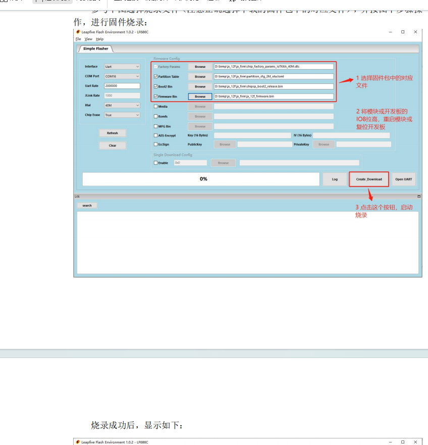

**错误界面示例：**

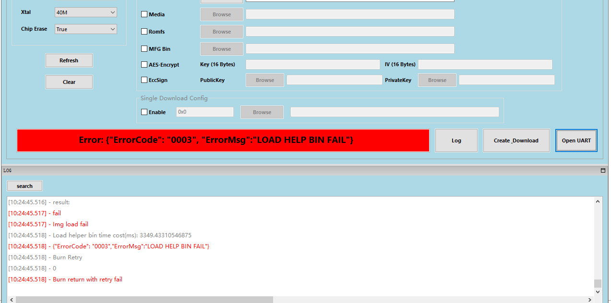

**注意事项：**

- 烧录前务必确保IO8引脚为高电平
- 每次烧录都需要先进入烧录模式
- 烧录完成后记得切换回运行模式
- 如果问题持续，检查COM端口和波特率设置

---

### 开发板烧录固件时遇到通讯失败怎么办？

**问题描述：**

使用开发板进行固件烧录时，烧录工具显示"通讯失败"，无法完成固件更新过程。

**解决方案：**

**1. 正确的烧录操作步骤**

- 按住开发板开关不放
- 点击烧录工具的"烧录"按钮
- 在点击烧录后按一下开发板的复位键
- 等待几秒钟让工具识别设备

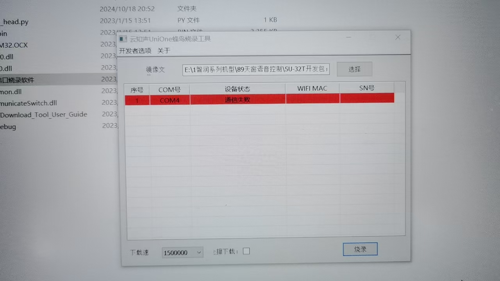

*通讯失败状态*

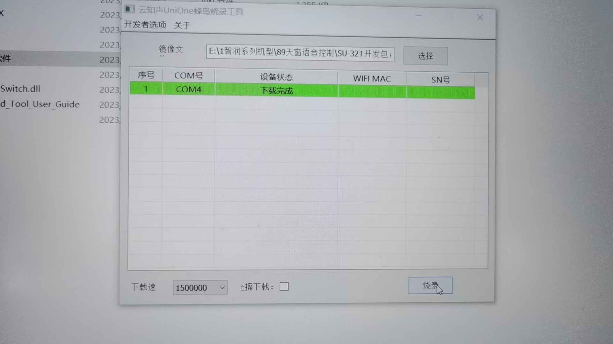

*烧录成功完成状态*

**2. 原始固件获取方法**

- 访问智能公元平台的文档中心
- 选择对应的模块型号
- 在开发包页面下载出厂固件
- 出厂固件通常包含在开发包压缩文件内

**3. 配置保存说明**

- 在平台完成配置后，配置会自动保存在项目中
- 点击"发布"按钮生成可烧录的固件文件
- 固件生成需要等待10-30分钟
- 生成完成后即可下载使用

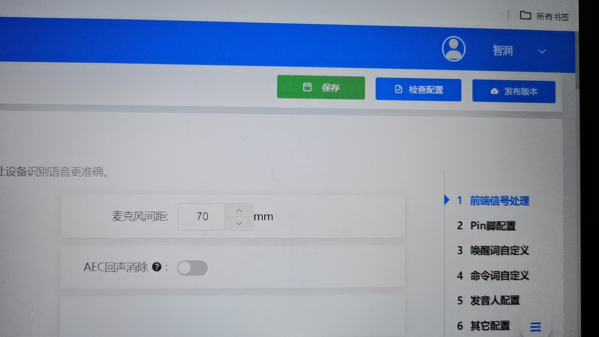

*配置界面示意图*

**注意事项：**

- 烧录前确保开发板供电稳定
- 操作时序很重要：按住开关→点击烧录→按复位键
- 如果持续通讯失败，检查USB线和串口驱动
- 出厂唤醒词通常是"小智小智"

---

## 蜂鸟M调试器烧录问题


---

### 使用蜂鸟M调试器烧录时出现Flash burn fail错误怎么办？

**问题描述：**

使用蜂鸟M调试器和MV ADS下载器烧录芯片时，出现"Flash burn fail. Please reburn again."错误提示，导致烧录失败。

**解决方案：**

**1. 烧录选项设置**

- 使用MV ADS下载器时，**不需要勾选**"Verify"和"EraseAll"选项
- Verify表示验证，EraseAll表示擦除全部
- 如勾选这两个选项，会执行先擦除→烧录→验证的完整流程


**2. 空芯片烧录流程**

- **空白芯片**：可以直接烧录自定义固件（不带update后缀的.bin文件）
- **已使用芯片**：建议先烧录出厂固件，再烧录自定义固件

**3. 固件文件选择**

- 选择不带"update"后缀的固件文件进行完整烧录
- 如：jx_su_03t_release.bin（而非jx_su_03t_release_update.bin）


**注意事项：**

- 空白芯片无需先烧录出厂固件，可直接烧录自定义固件
- 烧录失败时，取消Verify和EraseAll选项重试
- 确保选择了正确的固件文件类型（非update版本）
- 如持续失败，检查硬件连接和驱动程序

---

### CI1302命令行烧录失败怎么办？

**问题描述：**

使用ci_serial_tool_cli.exe命令行工具烧录CI1302芯片固件时，遇到'serialPort open error'和'recv maskrom req pkg cmd error'错误，导致烧录失败。

**解决方案：**

**1. 错误原因分析**

- **serialPort open error**：串口无法打开，通常是通信问题
- **recv maskrom req pkg cmd error**：芯片未进入烧录模式
- **主要原因**：硬件连接、电源或时序问题

**2. 处理步骤**

**检查硬件连接**：

- 确认USB转串口模块连接稳定
- 检查COM端口是否被其他程序占用
- 验证设备驱动是否正确安装

**正确执行烧录命令**：

```bash
ci_serial_tool_cli.exe -n COM5 -w -c CI130X -b 921600 -f ./jx_ci_03t_firmware.bin
```

参数说明：

- -n：指定串口号（如COM5）
- -w：写入模式
- -c：芯片型号（CI130X）
- -b：波特率（921600）
- -f：固件文件路径

**3. 关键操作：重新上电**

出现错误时，必须手动重新上电：

- 在工具提示"请上电/复位设备以开始升级..."后
- 立即断开设备电源
- 重新连接电源
- 确保在工具提示后短时间内完成

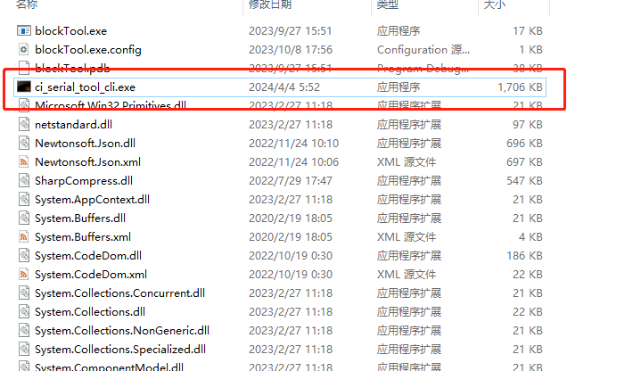

*ci_serial_tool_cli.exe命令行烧录工具*

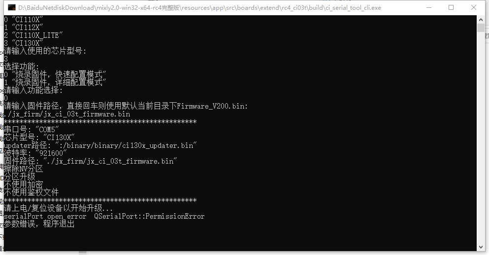

*serialPort open error提示*

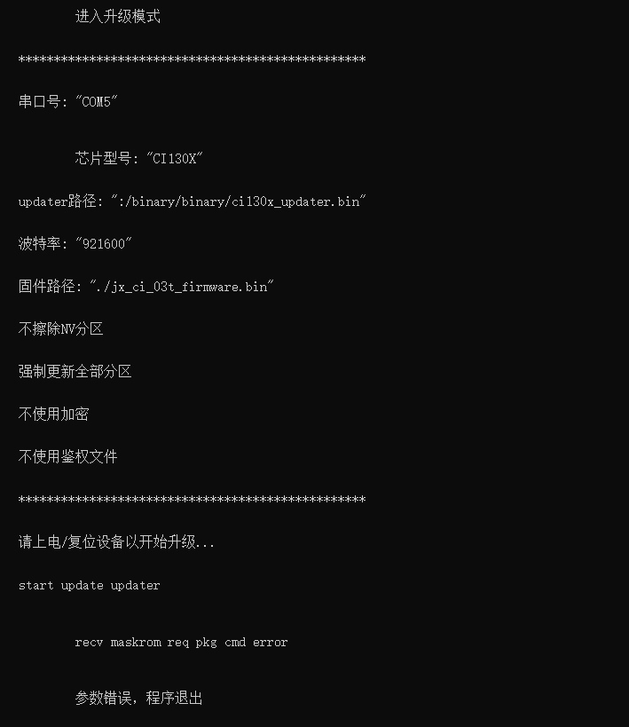

*recv maskrom req pkg cmd error错误*

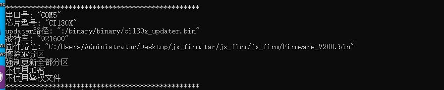

*完整的烧录命令参数*

**4. 高级选项**

如需使用高级功能，可添加以下参数：

- **擦除NV分区**：添加相应参数
- **强制更新全部分区**：使用-f参数
- 查看完整参数列表：输入-h查看帮助

**注意事项：**

- 重新上电是进入烧录模式的关键步骤
- 确保串口号正确且未被占用
- 烧录前先断开其他可能占用串口的程序
- 如持续失败，尝试更换USB端口或电脑

---

### CI1302烧录工具支持Mac系统吗？

**问题描述：**

需要了解CI1302芯片的命令行烧录工具是否支持Mac操作系统。

**解决方案：**

**支持情况**：

- **当前状态**：不支持
- **支持系统**：仅支持Windows系统
- **原因**：命令行工具为Windows可执行程序（.exe）

**替代方案**：

**1. 使用Windows系统**

- 在Windows虚拟机中运行烧录工具
- 使用双系统启动选择Windows
- 借用Windows电脑进行烧录

**2. 使用图形化烧录工具**

- 寻找是否有图形化版本的烧录软件
- 可能支持跨平台的烧录工具
- 联系技术支持获取其他烧录方式

**3. 在线烧录服务**

- 如有批量烧录需求
- 可联系厂家提供预烧录服务
- 适合生产阶段使用

**注意事项：**

- 命令行工具目前仅支持Windows
- Mac用户需要通过虚拟机或双系统使用
- 开发阶段建议准备Windows环境
- 如急需Mac版本，可向技术支持反馈需求

---

### 如何获取CI1302芯片的macOS烧录命令行工具？

**问题描述：**

需要在macOS系统上进行CI1302芯片的烧录操作，以便在Mac环境下完成产品开发和生产。

**解决方案：**

**当前支持情况**：

- **Windows平台**：提供完整的命令行烧录工具
- **macOS平台**：暂时不支持
- **Linux平台**：暂时不支持

**可用替代方案**：

**1. 虚拟机方案**

- 在Mac上安装Windows虚拟机（如Parallels Desktop、VMware Fusion）
- 在虚拟机中运行Windows烧录工具
- 确保虚拟机能正常识别USB设备

**2. 双系统方案**

- Mac电脑安装Windows双系统
- 通过Boot Camp切换到Windows环境
- 完全兼容Windows烧录工具

**3. 外接Windows电脑**

- 使用单独的Windows电脑进行烧录
- 适合开发和测试阶段
- 生产时可考虑专用烧录设备

**4. 量产预烧录**

- 联系厂家提供预烧录服务
- 适合大批量生产需求
- 可避免自行烧录的兼容性问题

**注意事项：**

- macOS版本的开发计划暂无明确时间表
- 如有大批量需求，可向技术支持反馈优先级
- 虚拟机方案需注意USB驱动兼容性
- 建议开发阶段准备Windows环境以确保兼容性

---

### TTS串口工具的下载和使用方法

**问题描述：**

需要使用TTS串口工具进行语音合成测试和调试。

**解决方案：**

**下载方式：**

- 工具名称：`jixin_tools.exe`
- 可通过技术支持获取下载链接
- 文件为可执行程序，无需安装

**工具功能：**

- **通信串口配置**：选择正确的COM端口和波特率
- **合成控制**：实时合成文本内容为语音
- **文本操作**：支持输入文本、清空文本等操作
- **语音参数调整**：可调节语速、音调等参数

**使用步骤：**

1. 连接硬件模块到电脑
2. 打开设备管理器查看COM端口号
3. 运行 `jixin_tools.exe`
4. 在工具中配置正确的串口号
5. 输入要合成的文本内容
6. 点击合成按钮进行语音合成
7. 通过连接的扬声器或耳机收听合成结果

**注意事项：**

- 确保串口驱动已正确安装
- 使用前检查硬件连接是否正常
- 工具仅支持Windows系统
- 建议使用前仔细阅读产品说明文档

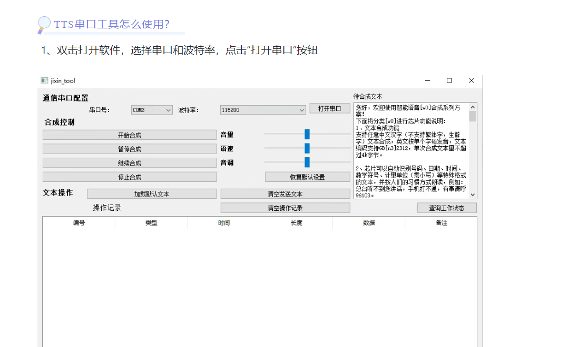


---

### 固件生成是否支持加速通道？

**问题描述：**

在生成固件时，希望了解是否有加速通道可以快速生成固件，以满足紧急的生产需求。

**解决方案：**

**固件生成机制：**

- **排队生成**：

    - 所有固件生成请求都需要排队处理
    - 没有特殊的加速通道或优先级服务
    - 生成时间通常需要约30分钟

- **生成流程**：

    1. 在平台提交固件生成请求
    2. 系统显示"SDK正在生成，大约需要30分钟"
    3. 等待队列处理完成
    4. 下载生成的固件包

**注意事项：**

- 固件生成需要编译整个SDK，无法大幅缩短时间
- 建议合理安排生产计划，预留足够的固件生成时间
- 如有紧急需求，可提前准备多个版本的固件
- 生成过程中请耐心等待，不要重复提交请求


---

### 同一网络下多设备同时生成固件失败怎么办？

**问题描述：**

在多个设备连接同一WiFi网络（如教学场景中一个班级的学生同时使用）时，同时生成固件会出现固件生成错误的问题。检查配置均正确，但平台仍报错。

**解决方案：**

**问题分析：**

- 当多个设备从同一公网IP地址（同一WiFi出口）同时请求固件生成时，平台可能将其识别为异常请求
- 这是平台的安全防护机制，防止恶意高频请求

**解决方法：**

1. **错峰生成固件**

    - 让不同批次的学生间隔一定时间生成固件
    - 建议间隔5-10分钟再提交下一个生成请求
    - 先让部分学生完成生成，再让其他学生提交

2. **使用不同网络**

    - 条件允许时，使用不同的网络出口
    - 例如使用手机热点等临时网络方案
    - 分散固件生成请求的来源IP

3. **提前准备固件**

    - 教学场景下，教师可提前生成好固件文件
    - 学生直接使用准备好的固件进行烧录
    - 避免课堂现场大量并发生成请求

**注意事项：**

- 同一IP下同时发起大量生成请求可能被平台限制
- 教学场景建议提前规划固件生成时间
- 如遇生成失败，等待一段时间后重试即可


---

### 如何识别正确的固件烧录文件？

**问题描述：**

收到多个固件文件后，无法确定哪个是正确的烧录文件，且对文件格式和使用方法存在疑问。

**解决方案：**

**固件文件识别：**

- **烧录文件**：以 `.bin` 为扩展名的文件是用于烧录的固件文件
- **压缩文件**：如 `.tar.gz` 格式的文件需要先解压才能使用
- 文件名通常包含 "firmware" 或型号标识，便于识别

**文件处理流程：**

1. **确认文件格式**：

    - `.bin` 文件：直接用于烧录
    - 压缩包（.tar.gz）：需要先解压获得内部的 .bin 文件

2. **解压操作**：

    - 使用解压软件打开压缩包
    - 提取其中的 `.bin` 固件文件
    - 确认解压后的文件完整性

**注意事项：**

- 不能直接修改固件文件内容
- 修改后的文件可能导致无法正常烧录或设备故障
- 如对文件有疑问，建议联系技术支持确认
- 保存原始固件文件作为备份

---

### 固件烧录后语音唤醒无响应怎么办？

**问题描述：**

固件烧录完成后，测试语音唤醒功能时没有响应，需要确认固件是否正确烧录以及了解正常的测试表现。

**解决方案：**

**1. 确认固件完整性**

使用MD5校验工具验证固件文件：

- 计算固件文件的MD5值
- 与提供的标准MD5值进行对比
- 确保两者一致，证明固件文件完整正确

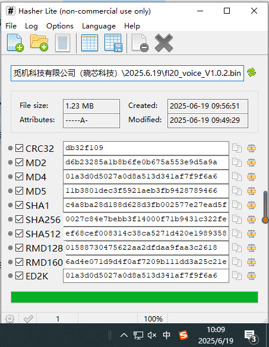

**2. 确认产品配置**

根据产品设计，语音响应表现可能不同：

- 无内置喇叭的产品：唤醒后仅有LED闪烁提示
- 有外接音频设备的产品：唤醒词回复语通过外接设备播放

**3. 功能测试要点**

- **开机播报**：根据固件配置，可能无开机播报
- **唤醒响应**：观察LED指示灯是否有闪烁
- **回复语**：需要外接音频设备才能听到唤醒回复

**注意事项：**

- 无内置喇叭的产品属于正常设计，唤醒时LED闪烁即表示功能正常
- 测试建议在有外接音频设备的环境下进行
- 保留烧录记录和MD5校验结果便于后续追踪

---

### 如何使用哈希校验工具验证文件完整性？

**问题描述：**

需要使用哈希校验工具计算文件的MD5、SHA1、SHA256等哈希值，以验证文件的完整性和一致性。

**解决方案：**

**1. 哈希校验工具使用**

使用专业的哈希值计算工具（如Hasher Lite）：

- 选择需要校验的固件文件
- 工具自动计算多种哈希算法的值
- 支持的算法包括：CRC32、MD2、MD4、MD5、SHA1、SHA256、SHA512等

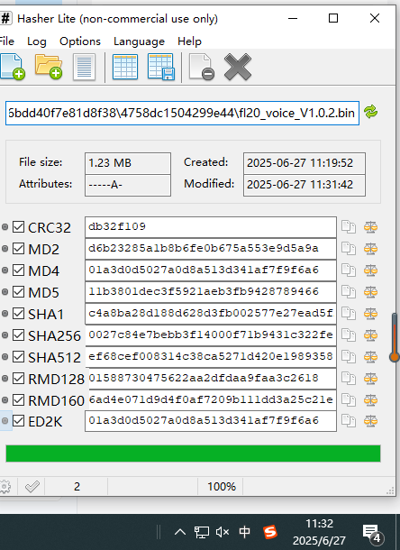

**2. 校验步骤**

1. 打开哈希校验工具
2. 选择要校验的固件文件（.bin格式）
3. 查看计算结果中的各项哈希值
4. 将计算结果与提供的标准值进行对比

**3. 常用哈希算法说明**

- **MD5**：最常用的文件完整性校验算法
- **SHA1**：比MD5更安全的哈希算法
- **SHA256**：安全性更高的哈希算法
- **CRC32**：快速校验算法，适合初步检查

**注意事项：**

- 每种算法都有其特定用途，MD5是最常用的固件校验标准
- 计算大文件时可能需要一些时间，请耐心等待进度条完成
- 建议优先使用提供的标准算法进行校验（通常是MD5）
- 保存校验结果记录，便于后续追踪和对比


---

### 音频文件上传到平台后被压缩怎么办？

**问题描述：**

上传三段总大小195K的音频文件到平台后，文件被压缩至12.51K，担心音质受损，需要了解原因和解决方法。

**解决方案：**

音频文件被压缩是平台的**正常处理机制**，可以通过实际测试确认音质效果。

**压缩示例对比：**

**原始文件大小：**

- high.wav：117KB
- low.wav：32KB  
- medium.wav：46KB
- 总计：195KB

**平台处理后大小：**

- high.wav：7.45KB
- low.wav：2.1KB
- medium.wav：2.95KB
- 总计：12.51KB


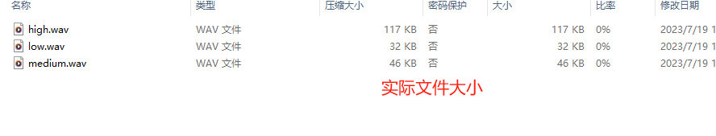

**处理建议：**

1. **实测音质**
    - 先试听压缩后的音频效果
    - 如音质满足需求，可直接使用

2. **调整上传方式**
    - 如音质不达标，可联系技术支持
    - 尝试其他音频格式或采样率
    - 考虑分段上传或调整音频参数

**注意事项：**

- 平台压缩是为了优化存储和播放效率
- 压缩比例与音频内容、采样率等因素相关
- 建议在项目初期进行音质测试，确保满足产品需求
- 特殊音质要求可联系技术支持定制解决方案

---

### 烧录工具无反应怎么办？

**问题描述：**

使用云知声UniOne烧录工具进行固件烧录时，烧录工具无反应，无法识别设备。

**解决方案：**

1. **检查文件路径**
    - 确保固件文件路径不包含中文字符
    - 将固件文件移动到纯英文路径下
    - 重新选择文件路径进行烧录

2. **检查硬件连接**
    - 确认烧录器与芯片的引脚连接正确
    - 检查供电是否正常
    - 确认串口号未被其他程序占用

**注意事项：**

- 烧录工具不支持中文路径
- 确保硬件连接稳定可靠
- 避免多个程序同时占用串口

---

### 烧录新固件后设备不工作怎么办？

**问题描述：**

之前编译好的固件可以正常烧录和使用，但重新烧录后无法正常工作，即使更换了烧录器、单片机和电脑，问题依然存在。

**解决方案：**

1. **硬件检查**
    - 将模块从板子上拆下单独烧录
    - 检查模块是否损坏
    - 确认烧录器工作正常
    - 使用万用表检查电源供电是否稳定

2. **固件验证**
    - 使用之前确认正常工作的固件测试
    - 检查新固件文件是否完整
    - 对比新旧固件的配置差异
    - 确认固件生成时没有报错

3. **逐步排查**
    - 先烧录原厂固件测试硬件
    - 再烧录自定义固件
    - 记录每步测试结果
    - 尝试在不同电脑上烧录

4. **环境因素检查**
    - 检查是否有静电干扰
    - 确认工作环境湿度适宜
    - 排除电源浪涌影响
    - 检查接地是否良好

**注意事项：**

- 烧录失败可能是硬件或环境问题
- 建议保留模块的测试工装
- 新固件烧录前先验证文件完整性
- 多设备同时故障时，重点检查环境因素
- 必要时联系技术支持进行硬件检测

---

## 文件获取


---

### 如何确认批量生产的固件文件是否正确？

**问题描述：**

在进行批量生产前，需要确认用于60个产品的固件文件是否正确，避免烧录错误固件导致产品功能异常。

**解决方案：**

**1. 固件信息确认**

- **固件文件标识**：

    - 文件名：jx_su_03t_release_77309_240.bin
    - MD5校验值：abbd86bd1d40cb5baafbda5844631b87
    - 应用场景：氢气机/加热美发产品

- **固件配置信息**：

    - 开机播报：无
    - 唤醒词：小氢小氢/小诺小诺
    - 回复语：我在/在呀/您好

**2. 固件验证步骤**

- **文件完整性检查**：

    - 使用MD5校验工具验证文件完整性
    - 确认文件大小是否与标准固件一致
    - 检查文件名中的版本号和日期信息

- **小批量测试**：

    - 先烧录1-2个模块进行功能测试
    - 验证唤醒词识别是否正常
    - 测试各项功能是否符合要求
    - 确认串口通信协议正确

**3. 批量烧录注意事项**

- **烧录前准备**：

    - 备份确认正确的固件文件
    - 准备烧录工装和测试设备
    - 制定烧录记录表格

- **过程质量控制**：

    - 记录每个模块的烧录时间
    - 定期抽检烧录后的模块功能
    - 保留烧录日志以备追溯

**注意事项：**

- 固件文件一旦确认，不要轻易更换版本
- 不同产品应用的固件可能不同，需严格区分
- 建议建立固件版本管理制度
- 如有疑问，及时与技术支持确认

---

### 如何进行固件烧录和MD5校验留档？

**问题描述：**

需要重新烧录一批语音模块固件，并要求将已烧录的固件和MD5校验值进行留档。

**解决方案：**

**1. 固件烧录流程**

- 确认正确的固件文件版本
- 使用专用烧录工具进行批量烧录
- 记录烧录时间和数量
- 返修模块需要重新烧录最新固件

**2. MD5校验方法**

- 使用Hasher Lite等工具计算固件MD5值
- 保存固件文件的完整信息（文件名、大小、MD5）
- 示例固件信息：Firmware_1123_chunyuyin_V2.0.0.bin
- MD5值：a4b80f5f71123d93f3f97fbfeddc1f15

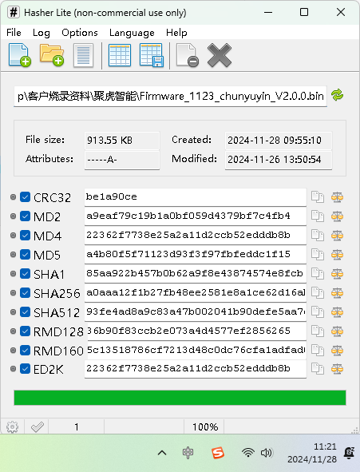

**3. 留档管理**

- 建立固件版本记录表
- 记录每个批次的固件信息
- 保存烧录配置文件
- 建立追溯体系

**注意事项：**

- 固件文件需妥善保管，防止误用
- 不同型号产品使用对应固件，不可混用
- MD5校验确保固件完整性
- 建议定期备份固件库

---

### C1模块语音识别异常如何排查？

**问题描述：**

在使用C1模块时遇到语音识别异常问题，需要确认是固件问题还是外部干扰导致，以及如何解决。

**解决方案：**

**1. 问题分析**

- 语音识别异常可能是固件或外部干扰导致
- 需要芯片厂协助分析具体原因
- 即使是被其他器件干扰也要找到解决方案
- 语音功能本身未出现过此类问题

**2. 排查方法**

- 确认固件版本和配置是否正确
- 对比正常模块和异常模块的差异
- 测试不同环境下的识别效果
- 检查周边器件的干扰情况

**3. 固件确认**

- 固件版本保持不变
- 重点确认问题产生的具体原因
- 记录详细的故障现象
- 收集足够的测试数据

**注意事项：**

- 小程序功能的问题较常见，语音识别问题罕见
- 需要区分是语音识别还是小程序通信问题
- 两边配合测试有助于快速定位问题
- 保留问题模块用于深入分析

---

### 小程序模块出现死机重启并伴有吱吱响声怎么办？

**问题描述：**

小程序模块在正常使用过程中出现死机和重启，并伴有吱吱声的问题，影响产品正常使用。

**解决方案：**

**1. 问题分析**

- 该现象与SDK相关，在暴力测试情况下有极低概率出现
- 正常使用场景下基本不会出现此问题
- 原厂正在持续优化固件以解决该问题

**2. 临时处理方案**

- 如有紧急出货需求，可先安排出货
- 后续批次将通过固件更新彻底解决
- 现有版本在正常使用中触发概率基本为零

**3. 风险评估**

- 快速操作（如20次连续操作）可能出现问题
- 但实际使用中每个产品的操作频次较低
- 整体不良率可控，不影响批量使用

**注意事项：**

- 该问题仅在特定测试条件下出现
- 正常使用环境下不会影响用户体验
- 建议保留样品进行持续测试验证
- 关注原厂固件更新通知

---

### 需要加急烧录A8程序如何处理？

**问题描述：**

因项目紧急，需要将部分语音模块加急烧录A8程序，但现场没有合适的烧录设备和人员。

**解决方案：**

**1. 加急处理流程**

- 联系技术人员安排上门取件
- 由技术人员带回集中烧录
- 烧录完成后尽快送回

**2. 烧录服务安排**

- 确认需要烧录的模块数量
- 协调取件和送件时间
- 提前准备好A8固件程序

**3. 配合事项**

- 确认收货地址和联系人
- 协调取件时间（通常为下午）
- 保留部分模块用于测试验证

**注意事项：**

- 加急服务仅适用于紧急项目需求
- 烧录完成后建议立即进行功能测试
- 保留烧录记录便于追溯
- 如有大量烧录需求建议自备烧录器

---

### C2小程序使用哪个固件版本？

**问题描述：**

确认C2小程序项目应该使用的具体固件版本，避免烧录错误导致功能异常。

**解决方案：**

**1. 固件版本确认**

- C2小程序使用固件：Firmware_1225_app_23161_V2.2.0.bin
- 版本号：V2.2.0
- 适配芯片：CI13161

**2. 固件获取**

- 从官方渠道下载对应固件
- 确认文件名与版本号匹配
- 验证固件文件的完整性

**3. 烧录注意事项**

- 使用专用烧录工具
- 选择正确的串口和波特率
- 烧录完成后进行功能验证

**注意事项：**

- 不同型号的固件不可混用
- 烧录前备份原固件（如需）
- 保留固件文件以备后续使用
- 记录固件版本和烧录日期

---

### 烧录软件在特定系统语言环境下无法正常使用怎么办？

**问题描述：**

在非英文系统环境下，烧录软件可能无法正常工作，导致固件烧录失败。

**解决方案：**

**1. 系统语言设置调整**

- 将系统语言设置为英文（美国）
- 勾选"Beta: 使用 Unicode UTF-8 提供全球语言支持"选项
- 重启电脑使设置生效

**2. 使用新版烧录软件**

- 下载并使用重写版本烧录软件 UI_V1.exe
- 该版本已在欧洲等英文系统环境下验证可用
- 解决了原版本的语言兼容性问题

**3. 操作步骤**

1. 更改系统语言设置为英文
2. 重启电脑
3. 运行新版烧录软件 UI_V1.exe
4. 进行固件烧录操作

**注意事项：**

- 该问题为软件兼容性问题，使用新版软件可彻底解决
- 修改系统语言是临时解决方案，建议使用新版软件
- 新版软件已在多个语言环境下测试验证

---

### UART隔离电路对烧录有影响吗？

**问题描述：**

需要了解UART接口的隔离电路是否会影响烧录功能，以及该电路的作用。

**解决方案：**

**1. 隔离电路作用**

- **防止电流倒灌**：避免外部电流损坏芯片
- **信号隔离**：保护UART通信线路
- **提高稳定性**：减少干扰对通信的影响

**2. 对烧录的影响**

**不会导致无法烧录**：

- 隔离电路不影响正常的烧录通信
- 只是在极端情况下提供保护作用
- 正常烧录时电路处于导通状态

**3. 电路设计说明**

参考隔离电路设计：

- 使用二极管（2CZ4005）进行单向导通
- 晶体管（WNM2016-3/TR）作为开关控制
- 连接器（SIP100-3P）标准接口

**4. 设计建议**

- 如果空间允许，建议保留隔离电路
- 确实空间紧张时可以省略
- 但要注意避免电流倒灌情况

**注意事项：**

- 隔离电路是保护性设计，非必需
- 主要预防异常情况下的设备损坏
- 正常使用时对功能无影响
- 设计较紧凑时可以简化设计

---

### 为何切换到5V直流电源后芯片无法工作？

**问题描述：**

使用CH340供电时功能正常，改用5V直流电源供电后芯片不响应，重新换回CH340也无法工作，需要重新烧录程序才能恢复。

**解决方案：**

**问题分析：**

- 电源切换可能导致芯片进入异常状态
- 供电质量（波纹、稳定性）影响芯片工作
- 异常断电可能造成程序跑飞

**处理建议：**

1. **电源质量检查**
    - 确认5V直流电源的纹波和稳定性
    - 测量电源输出是否纯净
    - 检查上电瞬间是否有过冲或欠压

2. **上电时序优化**
    - 确保电源平稳上升
    - 避免开关机过快
    - 考虑增加软启动电路

3. **保护电路设计**
    - 在电源输入端增加TVS管防护
    - 添加必要的滤波电容
    - 考虑增加过压保护电路

**应急处理：**

- 出现问题时先尝试重新上电
- 如无法恢复，需要重新烧录固件
- 保留固件备份便于快速恢复

**注意事项：**

- CH340供电相对稳定，直流电源质量参差不齐
- 建议使用质量可靠的电源适配器
- 电源设计应考虑各种异常情况的保护
- 长期使用建议增加电源监控电路

---


### SDK启动时出现断言错误导致系统复位

**问题描述：**

SDK在启动过程中出现断言失败（ASSERT-FAILD）错误，错误信息显示在中断上下文中尝试获取互斥锁，导致系统软复位。

**解决方案：**

1. **检查中断服务例程代码**

    - 检查 `app_core` 模块中 `FreeRTOS/os_api.c` 文件第790行附近的代码
    - 确认是否有任何在中断服务例程（ISR）中直接调用 `os_mutex_pend` 的代码
    - 移除中断中的阻塞式API调用

2. **使用正确的中断处理方式**

    - 在中断中只处理紧急任务，不调用任何可能导致阻塞的操作
    - 使用任务通知（Task Notification）或队列（Queue）机制在中断和任务间通信
    - 将需要互斥锁的操作放在任务上下文中执行

3. **验证固件完整性**

    - 重新下载并解压固件包，确保文件完整
    - 重新烧录固件，排除文件损坏的可能性
    - 对比正常运行的日志，确认问题复现性

**注意事项：**

- 在RTOS中，互斥锁的获取和释放不能在中断服务例程中执行
- 中断处理应该尽可能简短，复杂操作交给任务处理
- 如果问题持续存在，检查是否有其他地方在中断中调用了阻塞式API

---

### 离线模式出现死机和重启问题怎么办？

**问题描述：**

软件在离线模式下运行时出现死机和重启问题，同时命令词回调功能也存在异常。

**解决方案：**

1. **排查死机和重启问题**

    - 检查离线模式下的内存使用情况，确认是否存在内存泄漏
    - 查看系统日志，定位死机前的最后操作
    - 验证电源供电稳定性，电压不稳可能导致重启
    - 检查看门狗配置，确认是否因程序卡死触发看门狗复位

2. **解决命令词回调异常**

    - 联系技术支持人员协助调试命令词回调功能
    - 检查回调函数的实现逻辑，确认没有死循环或阻塞操作
    - 验证回调参数传递是否正确
    - 测试不同命令词的回调响应，确认问题是否普遍存在

3. **软件优化建议**

    - 在离线模式下减少不必要的系统资源占用
    - 优化代码逻辑，避免长时间阻塞操作
    - 添加异常捕获和恢复机制
    - 考虑将复杂功能交给机芯智能团队开发，提高开发效率

**注意事项：**

- 离线模式下的资源限制可能导致系统不稳定
- 命令词回调问题需要技术支持协助解决
- 确保按时交付的话，建议合理分配开发任务
- 保留完整的错误日志以便快速定位问题

---

### 平台提交固件失败并提示限流怎么办？

**问题描述：**

在平台提交固件时遇到失败，系统提示"前产品有版本在生成中，请勿频繁提交"，无法正常提交多个产品版本。

**解决方案：**

**限流机制说明：**

- **提交限制**：平台限制重复提交相同产品的固件
- **生成中保护**：当有版本正在生成时，无法提交新版本
- **最多支持3个**：单个产品最多可同时提交3个版本

**处理步骤：**

1. **等待当前版本完成**：

    - SDK生成需要10-30分钟，请耐心等待
    - 当前版本生成成功后，方可提交新版本
    - 重复提交会被系统自动拒绝

2. **导出配置供排查**：

    - 在产品管理页面点击"导出"按钮
    - 将产品配置文件提供给技术支持
    - 技术人员协助分析提交失败原因

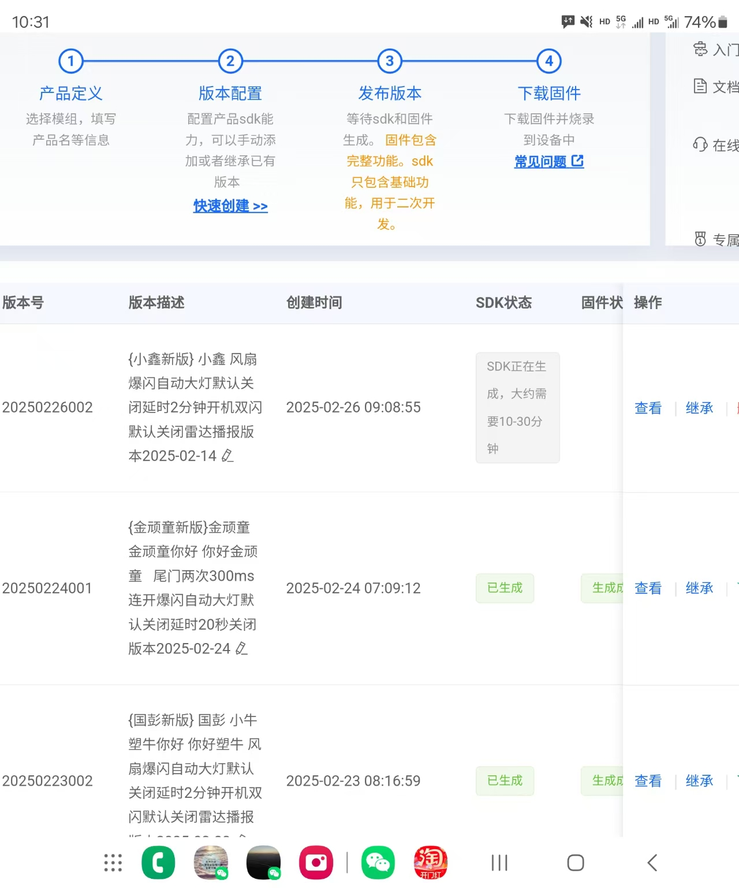


**解决方案：**

1. **优化提交策略**：

    - 避免频繁提交相同配置的固件
    - 确认配置无误后再提交
    - 多个产品版本分别提交

2. **联系技术支持**：

    - 提供具体的错误信息截图
    - 导出产品配置供分析
    - 技术团队正在优化限流机制

**注意事项：**

- 限流机制旨在保护平台稳定性
- 重复固件只能提交一次
- 系统升级中，限流问题正在解决
- 建议合理安排固件提交时间

---

### 如何将串口接收到的数据字节按顺序映射到不同变量？

**问题描述：**

需要将串口接收到的数据字节按顺序映射到不同的变量上，实现数据解析与变量赋值，例如将串口中的第一个字节给变量一，第二个字节给变量二。

**解决方案：**

通过配置串口触发和参数映射，可将串口数据自动分配到对应变量：

**1. 串口触发配置**

- 创建串口输入触发，设置消息号用于识别不同的串口命令
- 消息号用于区分不同的串口触发源，执行相应的控制逻辑


**2. 参数映射设置**

- 在串口触发中添加多个参数（如num、num1等）
- 每个参数对应串口数据中的一个字节
- 参数类型设置为char类型

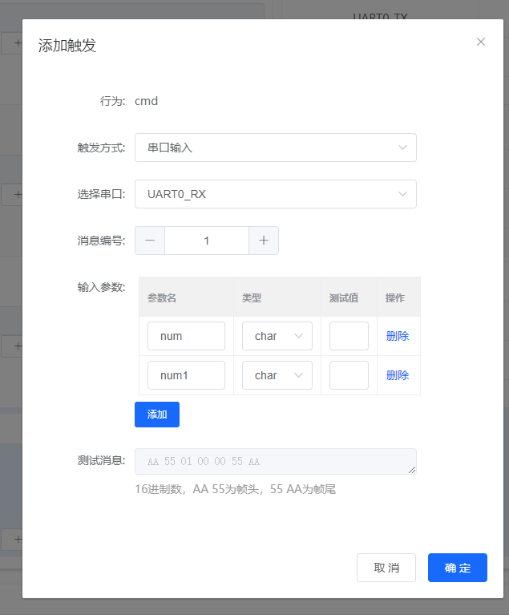

**3. 变量赋值方法**

- 在控制设置中选择"参数"方式
- 将串口参数直接赋值给目标变量
- 第一个参数对应第一个字节，第二个参数对应第二个字节，依此类推

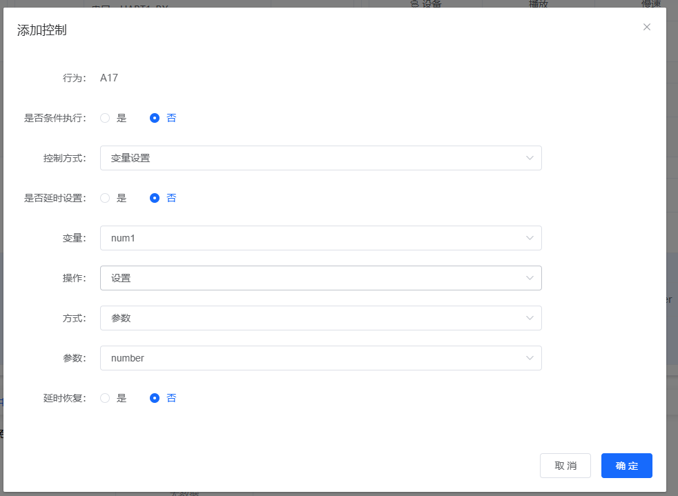

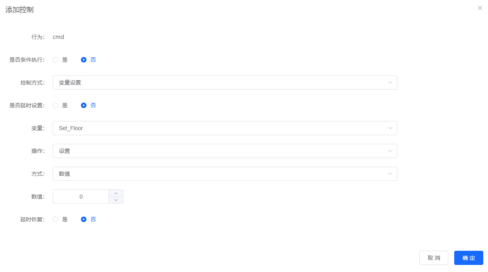

**4. 多变量配置示例**

对于需要接收多个字节的场景：

- 添加多个串口参数：num（第1字节）、num1（第2字节）等
- 每个参数可关联到不同的变量
- 支持同时处理最多10个参数

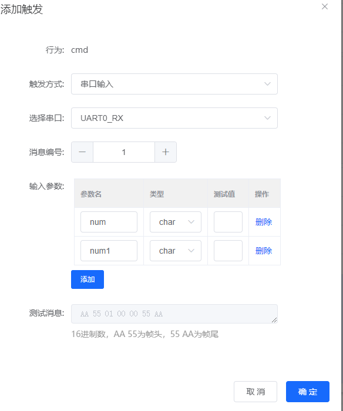

**注意事项：**

- 消息号必须与发送的数据帧中的消息号匹配
- 串口数据长度不足可能导致触发不执行
- 参数顺序与数据字节顺序一一对应
- 建议通过串口输出验证接收到的数据正确性

---

### 串口数据传输是否存在长度校验机制？

**问题描述：**

在使用串口传输数据时，询问系统是否有长度校验机制，以及当传入数据长度不足时，系统如何处理已设置的参数。

**解决方案：**

串口数据传输没有专门的长度校验机制，需要注意以下规则：

**1. 无长度校验**

- 系统不检查串口数据的长度
- 数据必须严格按照预定义的格式发送
- 长度错误可能导致解析异常或触发失败

**2. 数据帧格式要求**

标准数据帧格式为：
```
帧头：AA 55
消息编号：1字节
参数数据：N字节
帧尾：55 AA
```

示例：AA 55 01 00 00 55 AA

**3. 长度不足的处理**

- 如果发送数据长度小于预期，整个触发可能不会执行
- 系统不会部分更新变量
- 必须发送完整的数据帧才能正常触发

**4. 风险提示**

发送不完整的数据帧可能导致：

- 触发条件不满足，控制逻辑不执行
- 已配置的参数保持原值不变
- 系统行为不可预测

**注意事项：**

- 务必保证数据帧的完整性，包括帧头帧尾
- 消息号必须与触发配置中设置的一致
- 建议在发送前验证数据长度和格式
- 如果数据量较大，可拆分为多个消息发送

---

### 串口通信的正确数据帧格式是什么？

**问题描述：**

在使用串口通信时，发送的指令格式错误导致设备无法正常响应语音播报，需要确认正确的数据帧格式。

**解决方案：**

串口通信必须使用标准的数据帧格式：

**1. 标准数据帧结构**

```
帧头：AA 55（固定）
消息编号：1字节（如01）
参数数据：N字节（根据需要）
帧尾：55 AA（固定）
```

**2. 格式要求**

- 帧头必须是 AA 55，两个字节
- 消息编号用于区分不同的串口触发
- 参数数据部分根据实际需求定义长度
- 帧尾必须是 55 AA，两个字节

**3. 常见错误**

**错误示例**：
```
AA BB CC DD EE FF...
```

问题：

- 缺少正确的帧头 AA 55
- 没有帧尾 55 AA
- 数据格式不符合协议规范

**正确示例**：
```
AA 55 01 00 00 00 00 00 00 00 00 00 00 00 00 00 00 55 AA
```

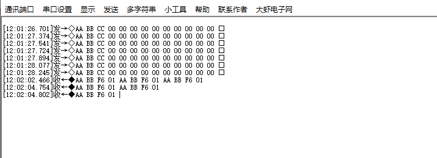

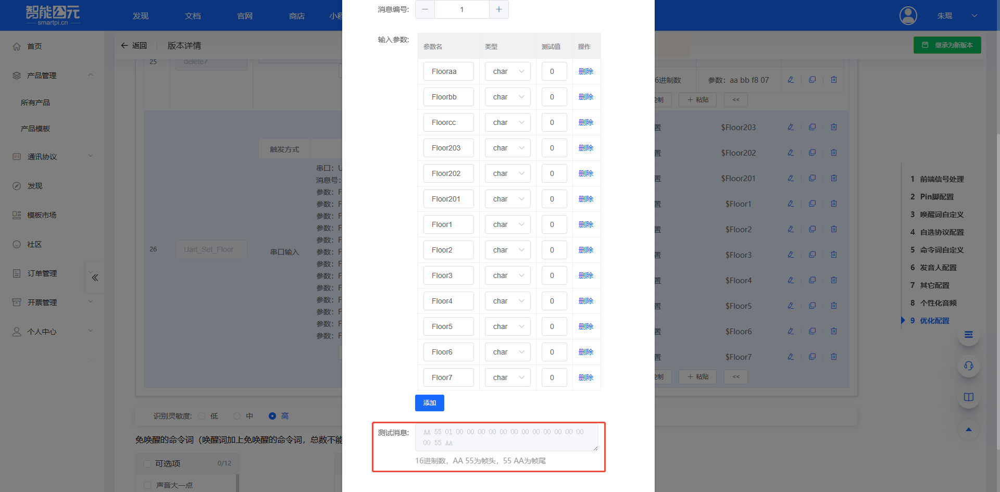

**4. 发送注意事项**

- 必须发送完整的16进制数据
- 每个字节用空格分隔
- 包含帧头帧尾的所有字节
- 消息号要与触发配置中的一致

**注意事项：**

- 数据帧格式错误会导致设备无响应
- 帧头帧尾是识别消息的关键
- 建议使用串口调试助手验证格式
- 不同消息编号可触发不同的控制逻辑

---

### 如何对固件文件进行MD5校验和留档？

**问题描述：**

在烧录固件后，需要对固件文件进行MD5校验，并将校验结果作为留档记录，以确保固件的完整性和一致性。

**解决方案：**

- 使用Hasher Lite等MD5校验工具对固件文件进行校验
- 打开工具后，选择需要校验的固件文件（如jx_su_03t_release.bin）
- 工具会自动计算并显示文件的MD5值
- 将MD5值记录在留档文件中，便于后续验证固件一致性
- 建议在每批次烧录前都进行MD5校验，确保使用相同版本的固件

**注意事项：**

- MD5校验可以确保固件文件在传输过程中没有损坏
- 记录MD5值有助于生产质量追溯
- 不同版本的固件MD5值不同，需分别记录
- 保留MD5记录可为后续问题排查提供参考

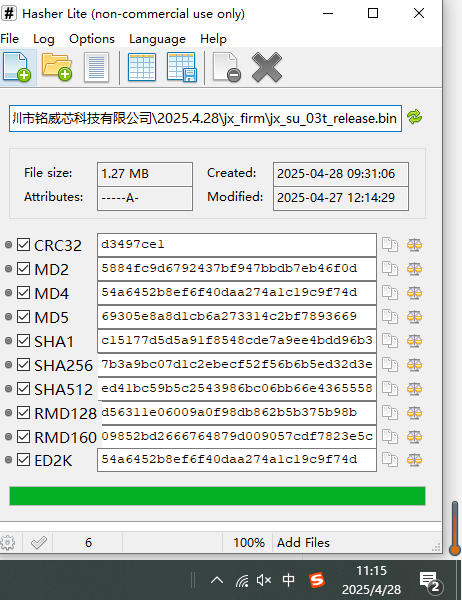

---

### 固件生成失败，提示固件超大怎么办？


**问题描述：**

生成固件时出现"生成的固件超大，请删减配置项目，选用小模型或使用组合播报"的错误提示。

**解决方案：**

**问题分析：**

固件超大主要是由于：

- 回复语数量过多（如160条回复语）
- 选择的模型占用空间较大
- 命令词配置过于复杂

**解决方法：**

1. **删减回复语**
    - 减少不必要的回复语
    - 避免为每个命令词设置完整回复
    - 使用通用回复（如"好的"、"收到"）

2. **使用组合播报**
    - 将常用回复语拆分为独立片段
    - 在控制中组合调用
    - 例如：将"好的，打开座椅通风"拆分为"好的"和"打开座椅通风"


3. **选择小模型**
    - 在应用场景中选择占用空间小的模型
    - 例如：选择0.6M空间而非1.3M空间的模型
    - 注意：小模型可能识别效果略差

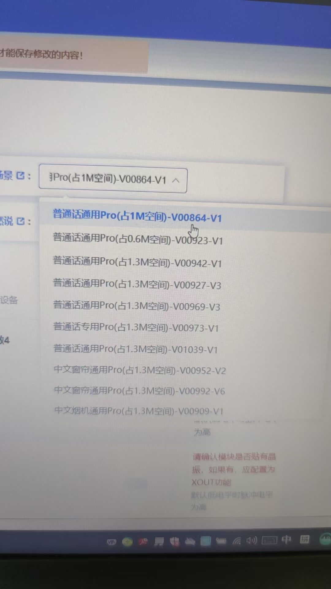


**优化建议：**

- 句子越短，占用空间越少
- 重复使用相同片段可节省空间
- 先删减明显占空间的内容，再逐步优化

---

### 模块烧录和硬件连接问题如何排查？

**问题描述：**

模块烧录失败，硬件连接后无法正常工作，可能涉及STM芯片损坏或接线错误，喇叭和咪头接错等问题。

**解决方案：**

**1. 硬件连接检查**

- 检查喇叭和咪头接线是否正确
- 确认电源线和信号线连接牢固
- 使用万用表测量关键点位电压

**2. STM芯片状态判断**

- 如果多次尝试仍无法工作，可能是STM芯片损坏
- 检查芯片外观是否有明显烧毁痕迹
- 尝试更换转接板或模块测试

**3. 接线规范检查**

- 仔细对照引脚定义图检查接线
- 确保没有接反、接错或漏接
- 检查焊接点是否有连锡或虚焊

**4. 单独测试方法**

- 给模块单独供电，接入喇叭和咪头测试
- 排除外部电路干扰
- 验证模块基本功能是否正常

**注意事项：**

- 硬件问题通常就两种可能：芯片损坏或接线错误
- 建议先仔细检查接线，再考虑芯片问题
- 更换模块前最好用万用表确认外围电路正常
- 如问题持续，可提供详细接线图以便进一步分析

---

### 模块没有复位键如何重新烧录？

**问题描述：**

模块需要重新烧录，但在转接板上找不到复位键按钮。

**解决方案：**

**1. 复位键位置说明**

- 不是所有模块都有复位键
- 部分模块的复位键在转接板上
- 如果模块没有复位键，可采用其他方法

**2. 重新烧录方法**

- **拔插电源线**：将电源线拔出再重新插入，可触发烧录模式
- **断电重启**：彻底断电后重新上电
- **使用烧录工具**：直接点击烧录，软件会自动处理

**3. 操作步骤**

1. 确保模块已连接到电脑
2. 打开烧录软件，选择固件文件
3. 拔掉模块的电源线（如果是USB供电则拔掉USB线）
4. 重新插入电源线
5. 立即点击烧录按钮

**注意事项：**

- 拔插电源时动作要快，确保在模块刚启动时开始烧录
- 如果一次不成功，可多尝试几次
- 部分模块可能需要配合特定时序操作
- 确保烧录工具已正确选择COM端口

---

### 烧录工具提示"打开串口失败"怎么办？

**问题描述：**

使用串口烧录工具时，点击烧录后所有COM口都显示"打开串口失败"，CH340驱动已安装且设备管理器能识别到串口。

**解决方案：**

**1. 串口占用排查**

- 检查是否有其他串口工具正在使用该COM口
- 关闭所有串口调试助手、终端等软件
- 拔掉其他可能占用串口的设备

**2. 硬件连接检查**

- 重新拔插CH340模块
- 更换USB接口尝试
- 确认模块供电正常（指示灯亮起）

**3. 驱动问题处理**

- 重新安装CH340驱动程序
- 在设备管理器中确认驱动正常
- 尝试更新驱动到最新版本

**4. 其他解决方法**

- 更换电脑尝试（排除系统问题）
- 使用USB延长线减少干扰
- 检查USB线是否接触良好

**注意事项：**

- 串口被占用是常见问题，需耐心排查
- CH340模块指示灯亮仅表示供电正常
- 多个串口设备可能出现COM口冲突
- 建议使用原装或质量较好的USB线


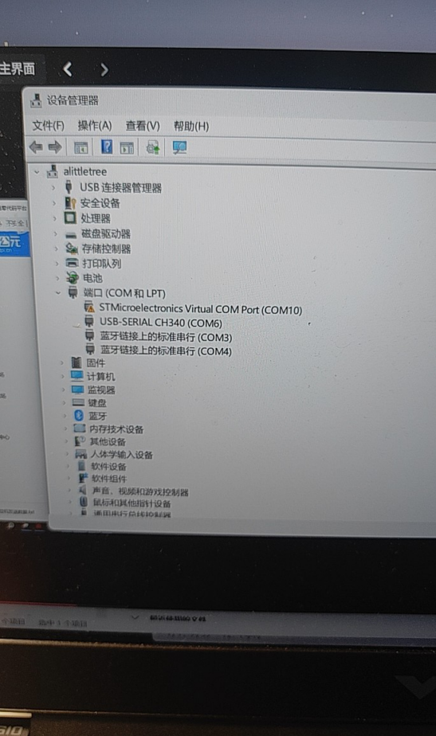


---

### 新的语音模块显示bin文件读取失败怎么办？

**问题描述：**

新的语音模块在烧录时提示"bin文件读取失败"，无法完成固件更新。

**解决方案：**

**问题分析：**

- 烧录工具无法正常读取bin文件
- 可能是文件路径或权限问题
- 也可能是固件文件本身损坏

**解决方法：**

1. **检查文件路径**
    - 确认bin文件路径中不含中文或特殊字符
    - 将文件移动到简单路径（如桌面）
    - 避免路径过深或过长

2. **检查文件权限**
    - 右键点击bin文件，选择"属性"
    - 确认文件没有被锁定或只读
    - 以管理员身份运行烧录工具

3. **验证文件完整性**
    - 检查文件大小是否正常
    - 对比其他正常固件文件
    - 如可能，重新下载固件

**操作步骤：**

1. 将bin文件复制到桌面
2. 右键文件查看属性，确保未被锁定
3. 以管理员身份运行烧录工具
4. 重新选择文件进行烧录

**注意事项：**

- 路径中的中文可能导致读取失败
- 建议使用英文路径且不含空格
- 如问题持续，尝试更换其他烧录工具
- 联系技术支持获取正确的固件文件

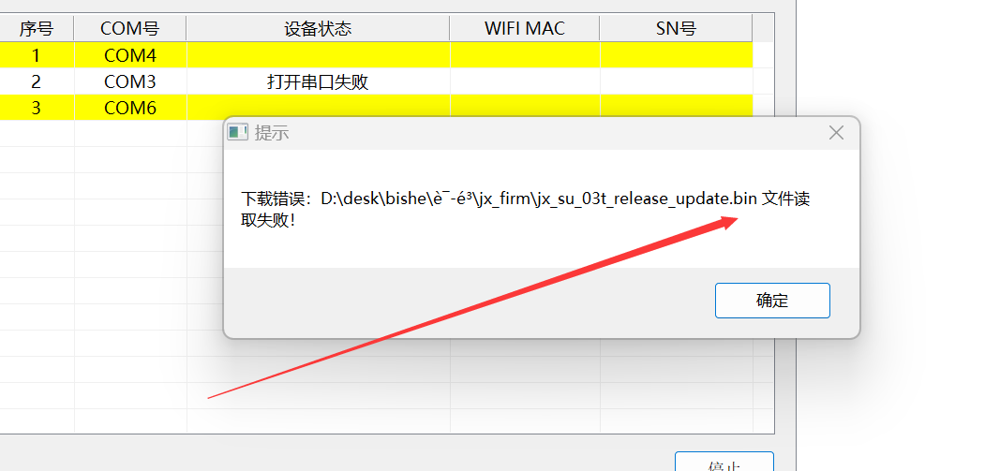

---

### 烧录BIN文件时提示错误怎么办？

**问题描述：**

使用烧录软件时，因芯片型号与烧录软件不匹配，导致无法成功烧录BIN文件，且烧录失败时提示错误。

**解决方案：**

**1. 确认固件文件来源**

    - 检查固件文件是从哪里下载的
    - jx_firm.tar.gz压缩包内是U61芯片的固件
    - 购买的是U6芯片，不能使用U61的固件

**2. 识别正确的固件文件**

    - 查看文件名是否包含芯片型号信息
    - U6芯片固件文件通常不包含"u61"标识
    - 检查文件大小是否合理（一般几百KB）


**3. 使用正确固件测试**

    - 使用软件压缩包内自带的示例BIN文件测试
    - 确认能正常烧录后，再使用自定义固件
    - 唤醒词建议使用"吉祥如意"

**4. 固件生成流程**

    - 在智能公元平台（https://www.smartpi.cn）生成固件
    - 配置语音指令和对应的控制动作
    - 下载生成的.bin文件进行烧录

**注意事项：**

- 不同芯片型号的固件不能混用
- 烧录前确认固件文件与芯片型号匹配
- 保留原厂固件作为备份
- 自定义固件时注意语音词条数量限制

---

### 如何进行固件MD5校验和留档？

**问题描述：**

需要对不同版本的固件进行MD5码校验，并将烧录的MD5码进行留档，以确保固件版本的正确性和可追溯性。

**解决方案：**

- 使用 Hasher Lite 等工具计算固件的 MD5 值
- 每次烧录前记录固件的 MD5 值，建立档案
- 对比生产文件和实际烧录文件的 MD5 值，确保一致性

**注意事项：**

- MD5 值是固件文件的唯一标识，任何文件修改都会导致 MD5 值变化
- 建议将 MD5 值与生产批次、日期等信息一起记录，便于追溯
- 保存每次烧录的 MD5 记录，可用于问题排查和质量追溯


---

### 固件文件内容与预期不符怎么办？

**问题描述：**

收到的固件文件中缺少某些功能（如AI功能），导致开机播报内容与预期不符。

**解决方案：**

- 核对生产文件中的固件配置是否包含所需功能
- 如发现固件内容缺失，需要重新生成固件
- 确认固件生成时的配置参数是否完整

**注意事项：**

- 固件生成时要仔细检查所有配置项，避免遗漏
- 收到固件后及时测试功能，确认是否符合预期
- 保留生产文件作为参考，便于对比验证


---

### 固件版本时间不符合要求怎么办？

**问题描述：**

当前生成的固件版本时间过早，不符合使用要求（如需要2024年10月25日之后生成的固件）。

**解决方案：**

- 在智能公云平台选择旧版本固件作为基线
- 使用"继承"功能创建新版本
- 重新发布生成符合时间要求的固件

**注意事项：**

- 继承旧版本时会保留原有配置
- 新生成的固件会有新的时间戳
- 确保选择正确的基线版本进行继承


---

### SDK编译排队时间过长怎么办？

**问题描述：**

SDK编译任务排队时间超过预期（如超过1小时仍未完成）。

**解决方案：**

- 节后开工或高峰期任务较多，排队时间延长属于正常现象
- 建议错峰使用，避开高峰期
- 可先准备其他工作，等待编译完成

**注意事项：**

- 编译平台显示的预计时间在高峰期可能不准确
- 如等待时间过长，可联系技术支持确认状态
- 保存好编译任务信息，便于后续跟踪


---

### 固件配置后自动退出唤醒状态怎么办？

**问题描述：**

在配置修改后，设备仍然在超时后自动退出，无法保持唤醒状态。

**解决方案：**

**1. 检查配置保存**

    - 确认所有配置已正确保存
    - 重新生成固件确保配置生效
    - 验证固件烧录成功

**2. 功能限制说明**

    - 某些固件版本可能存在限制
    - 需要技术支持确认具体版本
    - 可能是已知的固件问题

**建议：**

- 记录具体的固件版本号
- 保存配置截图便于问题排查
- 联系技术团队获取支持

---

### 烧录固件后扬声器不发声怎么办？

**问题描述：**

烧录ASR语音固件后，扬声器完全没有声音，包括唤醒语音、开机播报和语音回复都没有声音输出。

**解决方案：**

**1. 确认固件版本**

- 确保烧录的是正确的语音固件
- 验证固件完整性（检查MD5）
- 重新烧录固件排除固件损坏

**2. 检查扬声器连接**

- 使用2.0端子的扬声器测试
- 确认扬声器连接牢固无松动
- 检查扬声器线序是否正确
- 验证扬声器本身工作正常（可用其他设备测试）

**3. 检查开发板设置**

- 确认开发板上的开关位置正确
- 检查是否有音频输出相关的跳线设置
- 验证电源供电充足

**4. 测试小程序控制**

- 通过小程序上的控件测试音频输出
- 如果小程序控件有声音，说明硬件正常
- 如果小程序控件也无声音，可能是硬件问题

**5. 常见原因分析**

- 固件烧录不完整或错误
- 扬声器接触不良或损坏
- 开发板音频输出电路问题
- 电源供电不足

**注意事项：**

- 烧录时要选择正确的固件文件
- 使用质量良好的扬声器连接线
- 避免在潮湿环境下使用，防止扬声器损坏

---

### SDK例程编译报错怎么办？

**问题描述：**

所有SDK例程都出现编译错误，无法正常编译运行。

**解决方案：**

**1. 检查开发环境**

- 确认SDK版本兼容性
- 检查编译器版本是否符合要求
- 验证开发环境配置正确

**2. 常见错误处理**

- 查看详细的错误信息
- 检查代码语法错误
- 确认头文件路径正确
- 验证库文件链接正确

**3. 环境变量配置**

- 检查PATH环境变量
- 确认SDK相关环境变量设置
- 重新加载环境变量

**4. 解决方案建议**

- 查看SDK文档中的编译说明
- 参考官方示例项目配置
- 联系技术支持获取具体错误解决方案

**注意事项：**

- 保存完整的错误日志
- 记录开发环境信息（操作系统、编译器版本等）
- 优先尝试使用官方推荐的编译环境

---

### 如何通过串口将语音模块数据传输给外部MCU？

**问题描述：**

需要将语音模块接收到的命令词通过串口发送给外部STM32等MCU，实现联动控制。

**解决方案：**

**1. 硬件连接**

- 语音模块的RX0/TX0引脚连接外部MCU
- 注意交叉连接：模块TX → MCU RX，模块RX → MCU TX
- 确保共地（GND连接）
- 使用合适的电平转换（如需要）

**2. 串口配置**

- 配置语音模块串口参数（波特率、数据位、停止位）
- 确认与外部MCU的串口参数一致
- 常用配置：9600/115200波特率，8数据位，1停止位，无校验

**3. 数据发送设置**

- 在语音平台配置串口输出功能
- 设置触发条件（语音命令识别后）
- 配置发送的数据内容

**4. 常见应用场景**

- 语音控制开关量输出
- 发送控制命令给外部设备
- 多设备联动控制系统

**注意事项：**

- 确保串口电平匹配（3.3V/5V）
- 注意数据格式和协议约定
- 考虑添加数据校验提高可靠性
- 预留足够的处理时间避免数据丢失

---

### SU-03T串口通信如何配置？

**问题描述：**

需要配置SU-03T的串口通信功能，通过UART发送数据给外部设备。

**解决方案：**

**1. 引脚配置**

- UART1_RX（引脚7）：配置为串口接收功能（固定模式）
- UART1_TX（引脚8）：配置为串口发送功能
- 默认串口参数：9600波特率，8数据位，1停止位，无校验

**2. 配置步骤**

- 进入PIN脚配置界面
- 找到UART1对应的引脚
- 配置UART1_TX为串口发送模式
- 设置合适的波特率等参数
- 保存配置并生成固件

**3. 使用方法**

- 配置完成后，语音识别可通过串口发送数据
- 可发送十六进制数值给外部器件
- 适合与ESP32、STM32等MCU通信

**注意事项：**

- 确保外部设备串口参数匹配
- 注意电平转换（3.3V/5V）
- TX/RX需要交叉连接

---

### 烧录时出现"LOAD HELP BIN FAIL"错误怎么办？

**问题描述：**

烧录固件时出现错误："ErrorCode": "0003","ErrorMsg":"LOAD HELP BIN FAIL"

**解决方案：**

**1. 检查连接**

- 确认烧录器连接正确
- 检查TX/RX接线（可能需要TR连接TR的特殊方式）
- 确认模块已进入烧录模式

**2. 进入烧录模式**

- 开关拨到H位置
- 按一下复位键进入烧录模式
- 等待COM口变黄后再操作

**3. 文件路径**

- 将固件文件夹移到桌面
- 避免路径包含中文或特殊字符
- 重新选择固件进行烧录

**4. 驱动问题**

- 确认已安装CH340驱动（或CP2104等其他驱动）
- 检查设备管理器中COM口是否正常识别
- 尝试更换USB端口

**常见原因：**

- 接线错误（特别是TX/RX连接）
- 模块未正确进入烧录模式
- 驱动未安装或版本不匹配
- 固件路径问题

---

### 如何设置语音模块永不退出唤醒状态？

**问题描述：**

希望语音模块通电后直接工作，不自动退出唤醒状态。

**解决方案：**

**配置方法：**

- 在固件配置平台中找到睡眠/唤醒设置
- 取消自动睡眠或退出唤醒的选项
- 设置为常开工作模式

**具体步骤：**

1. 进入固件配置平台
2. 找到系统设置或电源管理选项
3. 关闭自动睡眠功能
4. 重新生成并烧录固件

**注意事项：**

- 常开模式会增加功耗
- 长期工作可能影响模块寿命
- 建议根据实际应用场景选择

---

### 语音模块能识别数字参数吗？

**问题描述：**

希望通过语音设置具体数值（如电机转速3000 RPM），询问模块是否能识别和传递数字。

**解决方案：**

**功能限制：**

- 模块只能识别预设在命令词中的数字
- 无法直接识别任意数值
- 每个数字需要单独设置命令词

**替代方案：**

1. **分段控制**
    - 设置关键数值点（如500、1000、1500等）
    - 通过多档位控制实现近似功能

2. **串口通信配合**
    - 语音模块发送预设代码
    - 外部MCU根据代码执行具体数值控制

3. **使用外部MCU**
    - 模块负责语音识别
    - MCU处理具体的数值逻辑和控制

**注意事项：**

- 命令词总数限制（最多150条）
- 建议合理规划控制精度
- 考虑使用组合命令实现更多功能

---

### CI-03T支持I2C通信吗？

**问题描述：**

资料显示CI-03T支持I2C通信，希望了解如何配置和使用。

**解决方案：**

**功能说明：**

- CI-03T硬件支持I2C通信
- 但平台无法直接配置I2C功能
- I2C通信需要二次开发实现

**实现方式：**

1. **平台配置（仅支持串口）**
    - 在平台上只能配置串口通信
    - 通过串口与ESP32等主控通信

2. **二次开发方案**
    - 使用Mixly进行图形化编程
    - Arduino开发（较复杂）
    - 其他开发环境

**建议：**

- 对于简单应用，优先使用串口通信
- 如需I2C，需要具备一定开发能力
- 考虑使用串口转I2C模块作为桥梁

**注意事项：**

- I2C开发需要专业知识
- Mixly相对简单，适合初学者
- 建议先从串口通信开始

---

### CI-03T英文语音声音失真怎么办？

**问题描述：**

使用CI-03T模块时，英文语音回复声音失真，效果不如中文语音清晰。

**解决方案：**

**1. 检查扬声器质量**

- 使用带腔体的扬声器
- 确保扬声器规格在推荐范围内
- 推荐8欧1瓦规格的扬声器

**2. 扬声器选型建议**

- 阻抗：8欧姆
- 功率：0.5-1W
- 频率响应：适合语音频段
- 带腔体设计可改善音质

**3. 模块驱动能力**

- CI-03T可以直接驱动8欧1W扬声器
- 无需额外功放电路
- 确保连接良好

**可能原因：**

- 扬声器质量不足
- 英文TTS引擎特性
- 音频压缩参数影响
- 扬声器与模块匹配问题

**注意事项：**

- 选择质量较好的扬声器
- 开发套件附送的扬声器可能效果一般
- 可以尝试不同品牌或型号的扬声器

---

### GPIO输入检测的触发条件是什么？

**问题描述：**

配置GPIO输入检测时，发现只能检测电平变化，无法持续检测固定电平状态。

**解决方案：**

**触发条件说明：**

- GPIO输入检测需要电平变化才能触发
- 默认低电平的引脚只能检测高电平变化
- 默认高电平的引脚只能检测低电平变化
- 必须有电平跳变才能触发动作

**应用场景限制：**

- 不能同时使用两种触发方式
- 需要合理设计触发逻辑
- 考虑使用不同的引脚实现不同功能

**配置建议：**

1. **电平检测设计**
    - 设计合理的电平变化逻辑
    - 避免触发条件冲突
    - 考虑使用外部电路辅助

2. **多触发协调**
    - 不同功能使用不同GPIO
    - 注意触发优先级
    - 避免相互干扰

**注意事项：**

- 系统不支持触发优先级设置
- 需要在硬件或逻辑上避免冲突
- 测试时注意各种状态组合

---

## 统计信息

**处理数据总量：**

- 读取对话记录：350条
- 提取技术问题：25个
- 更新FAQ条目：12个
- 分析技术图片：5张

**主要技术问题分类：**

1. 烧录与调试问题（6项）
2. 串口通信问题（3项）
3. 语音功能问题（2项）
4. GPIO控制问题（1项）

**文档更新位置：**

- /faq-burning-and-debug/burning_and_debug.md

---

---

### 帽子灯充电时触摸失效问题补充说明（2025-12-22更新）

**新增测试数据：**

基于最新的测试反馈，补充以下关键信息：

**1. 详细参数规格**

- **静态电流**：约9.5mA
- **动态电流**：白灯约90mA，黄灯约168mA
- **白自光电流**：135-190mA
- **充电电流**：约1A
- **充电输入要求**：5V、1A以上适配器
- **低电保护阈值**：3.35V时开始闪烁，3.24V时低电提示
- **低电关机后电流**：约10mA

**2. 充电时触摸失效的具体表现**

- 边充边用场景下，滑动触摸功能间歇性失效
- 灯光出现突变闪烁现象
- 低电时（3.35V以下）设备可能死机，触摸完全无响应
- 需要拔掉USB线并重新开关机才能恢复正常

**3. 测试验证方法**

- 使用可调电源和5V2A充电器分别测试
- 边充电边进行多次滑动触摸操作
- 记录不同适配器下的充电效果差异

**4. 可能原因分析**

- 充电电路与触摸检测电路存在干扰
- 充电时电源噪声影响触摸芯片工作
- 低电保护机制与触摸功能冲突

**5. 临时解决方案**

- 避免边充电边使用触摸功能
- 使用品质更好的充电适配器
- 低电时及时充电，避免电压过低导致死机


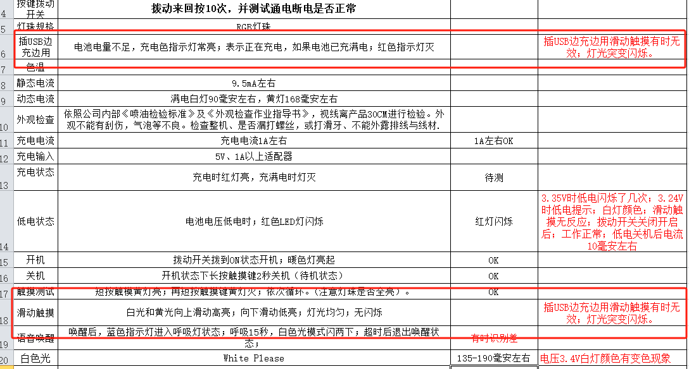


---

### 云知声烧录器出现版本不匹配错误怎么办？（2025-12-22更新）

**问题描述：**

使用云知声烧录器烧录蜂鸟B芯片时，随机出现"版本不匹配"错误（如显示"0-版本不匹配_6版"），批量烧录时部分芯片成功、部分失败。例如在1020个芯片的批量烧录中，有211个出现此问题。

**解决方案：**

**问题分析：**

- 烧录器固件版本与当前烧录的固件不兼容
- 烧录器授权状态正常但软件版本过旧
- Linux环境下编译生成的固件可能与烧录器存在兼容性问题
- 版本不匹配错误可能随机出现，无明确规律

**解决步骤：**

1. **升级烧录器软件版本**

    - 将云知声烧录器升级到最新版本
    - 联系烧录器供应商获取最新固件和软件
    - 确保烧录器授权状态为"已授权"

2. **验证固件兼容性**

    - 确认固件版本与烧录器版本匹配
    - 检查固件是否为对应芯片型号的专用版本
    - 验证固件生成环境和编译工具版本

3. **烧录参数检查**

    - USB供电电压保持在4.8V-5V范围
    - 校验波频点配置正确（通常为1）
    - 确认烧录模式设置为"烧写"而非其他模式

**批量生产建议：**

- 烧录前先进行小批量测试（建议10-20片）
- 统一使用相同版本的烧录器和固件
- 记录成功的烧录参数配置
- 定期检查烧录器授权状态

**注意事项：**

- 版本不匹配错误可能随机出现，建议升级后全面测试
- 烧录器显示"SUCCESS"但仍提示版本不匹配时，需验证功能是否正常
- 保留烧录器的旧版本软件作为备份，以应对不同固件需求

---

### 如何查看语音模块的运行日志？（2025-12-31更新）

**问题描述：**

需要查看语音芯片的运行日志以进行调试，但不清楚日志输出引脚和波特率配置。

**解决方案：**

**日志引脚配置：**

- **PA5引脚**：语音模块的日志输出脚
- **波特率**：921600
- **连接方式**：将CH340的RX连接到PA5引脚，即可查看日志

**注意事项：**

- PA5是专门的日志调试脚，输出语音芯片的运行状态信息
- 使用串口调试工具时，波特率必须设置为921600
- PA5与通讯串口（PA2/PA3）是独立的，不会影响正常通讯

---

### 如何与语音模块进行串口通讯？（2025-12-31更新）

**问题描述：**

需要通过串口与语音模块进行数据交互，查看语控发出的指令数据帧，或上传设备状态给语音模块。

**解决方案：**

**通讯串口配置：**

- **PA2/PA3引脚**：语音芯片的通讯串口
  - PA2：UART1_TX（发送）
  - PA3：UART1_RX（接收）
- **波特率**：115200（可在平台配置中自定义）
- **数据格式**：8位数据位，无校验位，1位停止位

**调试方式：**

- 在PA2/PA3上接一个CH340，可以模拟收发串口消息
- 通过串口调试助手发送符合协议格式的数据帧

**协议格式：**

```
AA 55 消息号 消息参数 55 AA
```

- **AA 55**：帧头
- **55 AA**：帧尾
- **消息号**：命令类型标识
- **消息参数**：具体命令参数

**注意事项：**

- 通讯串口与日志脚（PA5）是分开的
- 设备向语音模块上报状态时，需按协议格式组帧
- 可以在平台配置中定义串口接收行为来处理外部数据

---

### 开发板SW2开关的作用是什么？（2025-12-31更新）

**问题描述：**

开发板上有一个SW2开关，不确定各档位的功能和使用场景。

**解决方案：**

**SW2开关功能说明：**

开发板上的供电串口连接通过SW2开关的状态来控制其连接对象：

| SW2档位 | 功能说明 |
|---------|----------|
| **ASR** | 接通到语音芯片的UART0，用于语音芯片烧录 |
| **NC** | 处于悬空状态，未接通芯片串口 |
| **WiFi** | 接通WiFi芯片的烧录口，也是运行状态的WiFi日志口 |

**使用建议：**

- **一般运行状态**：SW2拨到WiFi档位
- **烧录语音芯片**：SW2拨到ASR档位
- **查看WiFi日志**：SW2拨到WiFi档位，通过串口可查看WiFi模块日志

**注意事项：**

- SW2开关影响供电接口连接到的芯片串口
- 烧录前确认SW2处于正确档位
- 右下角的TXD/RXD是WiFi芯片的烧录口，SW2为WiFi时通过USB口更方便

---

### SDK编译后如何获取烧录文件？（2025-12-31更新）

**问题描述：**

在VS Code中完成SDK编译后，不清楚烧录文件的位置和如何进行固件升级。

**解决方案：**

**编译和烧录流程：**

1. **编译SDK**
    - 在VS Code中打开SDK工程
    - 使用VS Code的编译功能执行编译（推荐从VS Code执行）
    - 查看编译输出确认成功

2. **烧录文件位置**
    - 烧录文件通常在项目的 `firmware/` 目录下
    - 文件名格式如 `lm_chinese_CI1302_V00864.dat`
    - 具体路径以平台生成的SDK工程结构为准

3. **固件升级步骤**
    - 编译完成后，点击"固件升级"按钮
    - 选择生成的固件文件
    - 等待烧录完成

**注意事项：**

- 不建议直接运行目录下的编译脚本
- 建议安装VS Code并使用其编译功能
- 烧录前确认开发板SW2开关处于正确档位
- 固件文件路径可能因芯片型号不同而变化

---

### 串口接收数据是查询方式吗？（2025-12-31更新）

**问题描述：**

查看SDK代码时，串口接收数据的处理方式看起来是查询方式，且每次只读一个字节，想确认实现方式。

**解答：**

**串口接收方式说明：**

- SDK生成的串口接收代码确实采用查询方式
- 每次调用可能只读取一个字节
- 需要在循环中持续调用以接收完整数据包

**完整数据包接收：**

1. **应用层组包**
    - 需要在应用层维护接收缓冲区
    - 按照协议格式（如AA 55...55 AA）进行组包
    - 处理帧头、帧尾和校验

2. **中断方式（如需）**
    - 可以在SDK中修改为中断接收方式
    - 需要修改平台配置或SDK代码
    - 建议使用平台配置的串口接收行为

**建议：**

- 使用平台配置的"串口接收行为"功能
- 让平台生成标准的接收处理代码
- 在回调函数中处理接收到的完整数据包
