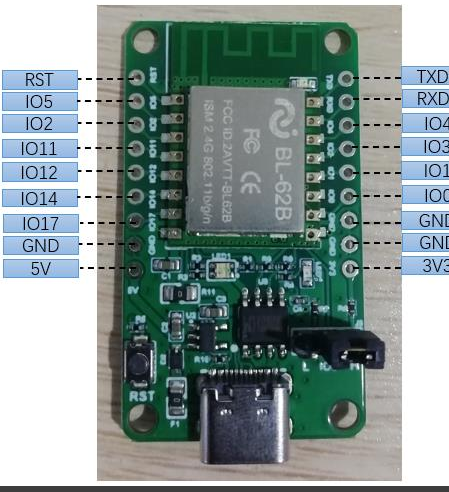
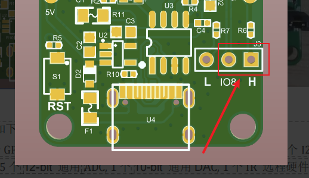
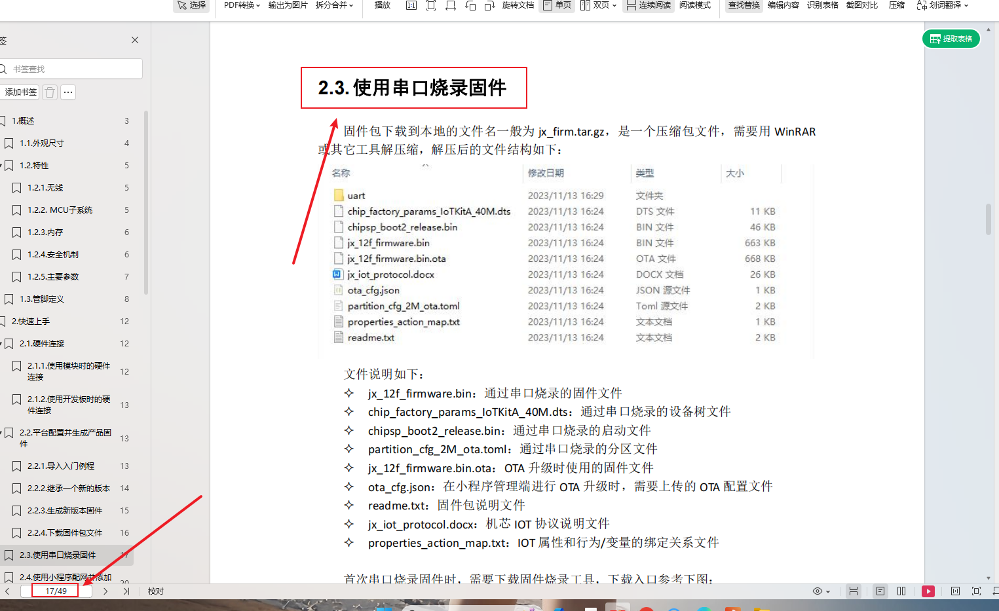

# BL-62B 烧录与调试 FAQ

本页用于整理 BL-62B 相关的烧录与调试问题。

### BL-62B 模块是否有驱动支持？

**问题描述：**

收到的模块型号标识为 BL-62B，与说明书不符，不确定是否有驱动支持。

**解决方案：**

- **确认模块身份**：BL-62B 是基于 BL602 芯片的 WiFi+BLE 双模模块
- **官方支持**：提供完整的 SDK、开发工具和文档支持
- **获取资源**：

    - 官方文档中心提供完整的技术资料
    - 包含规格书、开发指南、例程等
    - 支持在线开发环境

**注意事项：**

- BL-62B 使用 3.0V-3.6V 供电（推荐 3.3V）
- 内置 2MB QSPI Flash，无需外接存储
- 支持完整的开发工具链和调试环境

### BL-62B 如何进行固件烧录？

**问题描述：**

需要将生成的固件文件（jx_firm.tar.gz）烧录到 BL-62B 模块中，但不清楚正确的烧录工具和操作步骤。

**解决方案：**

- **进入烧录模式**：

    - 将跳线帽 J3 接到 IO8 和 H 引脚之间
    - USB 连接模块上电

- **使用串口烧录工具**：

    - 下载 Leapfive Flash Environment 烧录工具
    - 配置串口（如 COM10）、波特率（2000000）
    - 选择固件文件进行烧录

- **固件文件准备**：

    - 从平台生成的 .tar.gz 文件需要先解压
    - 使用 PACK_UPDATE_TOOLS 工具打包成烧录格式
    - 最终生成 .bin 文件用于烧录

**注意事项：**

- 烧录前确保跳线帽正确设置在 IO8 和 H 位置
- 如果出现"发送异常"错误，尝试更换 USB 转串口芯片（如 CH340）
- 该模块与 JX-12F 使用相同的烧录方法和工具

### BL-62B 和 JX-12F 的烧录方式是否相同？

**问题描述：**

不确定 BL-62B 与 JX-12F 模块的烧录方式和工具是否相同。

**解决方案：**

- **烧录方式相同**：BL-62B 和 JX-12F 使用相同的烧录方法和工具
- **参考手册**：可查看 JX-12F 技术开发手册的"使用串口烧录固件"章节（第17页起）
- **操作步骤**：

    1. 设置跳线帽进入烧录模式
    2. 使用串口烧录工具
    3. 选择正确的固件文件
    4. 配置参数并开始烧录

**注意事项：**

- 两个模块的芯片方案相同，因此烧录流程兼容
- 固件文件需要根据对应模块生成
- 跳线设置和烧录参数完全一致

---

### BL-62B模组新生成固件无法配网怎么办？

**问题描述：**

使用相同SDK生成的旧固件可以正常配网，但新生成的固件烧录成功后无法完成配网。

**解决方案：**

**1. 检查固件文件完整性**

- 确认生成固件时没有缺少必要文件
- 对比新旧固件的文件差异
- 确保包含所有必要的配网相关文件

**2. 重新下载烧录工具**

- 访问官方文档中心获取最新烧录软件
- 链接：https://help.aimachip.com/docs/jx12f/jx12f-1f5p1tfbs88kl
- 使用正确的烧录工具进行固件烧录

**3. 验证配网流程**

- 确认使用正确的配网APP或小程序
- 检查配网操作步骤是否正确
- 验证设备是否进入配网模式

**注意事项：**

- 烧录成功不代表固件文件完整
- 配网功能可能依赖特定的配置文件
- 建议保留一份可正常配网的固件作为备份
- 如问题持续，可联系技术支持分析固件差异

### Win11系统烧录固件后WiFi连接失败

**问题描述：**

在Win11系统下烧录固件后，设备无法正常连接WiFi网络，但在Win10系统下烧录相同固件则可以正常连接。

**解决方案：**

- **更换操作系统**：使用Win10系统进行固件烧录可解决此问题
- **系统兼容性**：部分烧录工具在Win11系统下可能存在兼容性问题
- **临时解决方案**：

    - 在Win10环境下进行固件烧录
    - 或使用虚拟机运行Win10系统进行烧录操作

**注意事项：**

- 此问题为烧录工具与操作系统的兼容性问题，非硬件故障
- 建议使用Win10系统进行BL-62B模块的固件烧录
- 烧录完成后，设备功能正常，WiFi连接稳定

---

### 小程序应用无法正常使用

**问题描述：**

小程序显示"应用无法正常使用，请联系管理员"的警告，导致无法正常使用小程序功能。

**解决方案：**

- **联系技术支持**：提供小程序后台账号信息
- **账号开通**：由技术支持人员开通相应权限
- **刷新小程序**：权限开通后刷新小程序页面即可正常使用

**注意事项：**

- 此问题通常为账号权限未正确配置导致
- 确保提供的账号信息准确无误
- 开通权限后需要重新刷新小程序页面

---

### BL-62B模块WiFi连接失败

**问题描述：**

BL-62B模块固件烧录成功，但在WiFi连接阶段出现错误，同一模块安装到其他电路板上可以正常工作。

**解决方案：**

**1. 电源电路检查**

- **滤波电容布局**：确保滤波电容尽量靠近模块的电源引脚
- **电容规格**：建议使用较大容量的滤波电容（如胆电容）
- **电源稳定性**：使用示波器检查电源纹波和稳定性

**2. 硬件连接优化**

- **引脚焊接**：检查引脚是否有氧化，可适当增加焊锡确保良好接触
- **3.3V电源**：确保3.3V电源滤波电容靠近模块放置
- **接地良好**：确保模块接地良好，减少干扰

**3. 模块替换测试**

- **交叉验证**：将正常工作的模块与问题模块对调测试
- **批量测试**：如果多个模块都有相同问题，可能是电路设计问题
- **存放时间**：长期存放的模块可能存在性能衰减

**注意事项：**

- 电源质量对WiFi连接稳定性影响很大
- 滤波电容必须靠近模块电源引脚放置
- 长期存放的模块建议使用新批次替换

---

### BL-62B与JX-12F模块选型

**问题描述：**

BL-62B模块存放时间较长（约1年），多片模块均出现WiFi连接问题，需要了解最新的替代型号。

**解决方案：**

- **推荐型号**：JX-12F为当前最新的WiFi+蓝牙二合一模块
- **兼容性说明**：JX-12F与BL-62B引脚有小差异，需要查看规格书对比
- **升级建议**：

    - 参考两个模块的规格书进行引脚对比
    - 确认硬件兼容性后进行更换
    - 使用新的开发工具链进行开发

**注意事项：**

- 长期存放的电子元件性能可能下降
- 更换型号前务必确认引脚兼容性
- 新型号可能需要更新开发环境和工具

---
