# CI-03T 烧录与调试 FAQ

### CI-03T的PB6和PB5引脚配置为串口输出是否会影响固件下载？

**问题描述：**

将CI-03T的PB6（RX0）和PB5（TX0）引脚配置为UART0串口功能时，担心会影响通过串口下载固件的功能。

**解决方案：**

不影响。PB6和PB5引脚配置为串口输出功能不会影响固件下载：

**1. 引脚功能说明**

- PB6/RX0和PB5/TX0是CI-03T的UART0引脚
- 这些引脚可以被配置为串口通信功能，用于与外部设备通信
- 固件下载使用的是专用的下载接口，与正常串口通信是分离的

**2. 固件下载原理**

- CI-03T的固件下载通过专用的烧录工具和接口进行
- 下载过程中，模块会进入特定的下载模式
- 在下载模式下，系统会接管这些引脚的控制权

**3. 硬件连接建议**

如果需要同时使用串口通信和固件下载功能：

- PB5（TX0）可通过100Ω电阻连接到外部设备的RX
- PB6（RX0）可通过100Ω电阻连接到外部设备的TX
- 保持原有的上拉电阻（如PB4的10KΩ上拉）

**注意事项：**

- 配置为串口功能时，确保硬件设计已经做了相应修改
- 避免在正常工作时给这些引脚施加高电平，可能影响音频播报
- 模块版本不同时，引脚功能可能有差异，请参考对应型号的数据手册

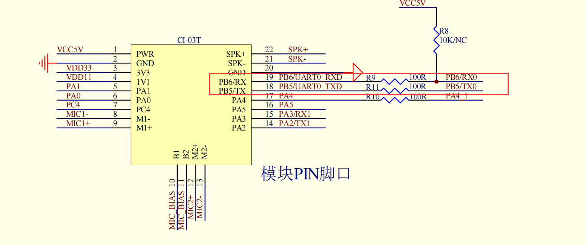


---

### CI-03T1/T2的GPIO配置为串口功能是否影响固件下载？

**问题描述：**

将CI-03T1/T2的GPIO配置为串口功能（UART_TX/RX）时，担心会影响通过串口下载固件的功能。

**解决方案：**

模块使用时配置为串口功能不影响固件下载：

**1. 功能说明**

- 模块状态下，GPIO可以配置为串口功能使用
- 烧录状态下，专用烧录接口会接管这些引脚
- 两种状态相互独立，不会冲突

**2. 硬件设计注意事项**

如果需要使用串口功能：

- 确认硬件设计已做相应修改
- 注意引脚电平对音频播报的影响
- 避免在正常工作时给引脚施加不当电平

**3. 使用建议**

- 开发阶段：可以使用模块进行调试
- 量产阶段：可以直接使用IC芯片
- 芯片同样支持相关的功能配置

**注意事项：**

- 配置为串口功能前，请确认硬件电路支持
- 不同版本的模块，引脚定义可能有差异
- 如有疑问，可联系技术支持获取具体型号的资料

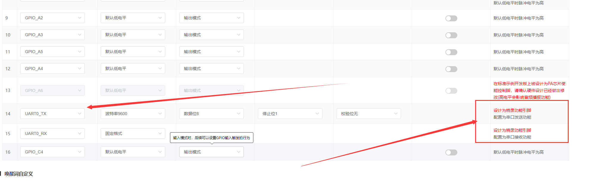

---

### CI-03T串口通信时，唤醒指令正常但"开始巡检"指令无响应怎么办？

**问题描述：**

使用CI-03T模块时，串口能正常接收唤醒指令的反馈信息，但无法接收到"开始巡检"指令的响应。

**解决方案：**

**1. 检查指令配置**

确保在智能公元平台正确配置了指令：

- 唤醒指令（wake_up_uni）：已配置为通过UART0_TX发送十六进制数 `C0 C1 C2 C3`
- "开始巡检"指令（start）：需要配置为通过UART0_TX发送 `00 B1 B2 B3`


**2. 硬件连接检查**

确认硬件连接正确：

- 模块通过转接板连接到电脑
- 电源、地线和串口信号线（红、黄、黑三根线）正确连接
- 转接板通过USB接口正常供电


**3. 固件验证**

如果配置正确但仍无响应：

- 测试使用默认出厂固件验证基本功能
- 重新生成定制固件，确保包含所有需要的指令
- 检查固件版本是否与模块兼容

**注意事项：**

- 每个命令词都需要在平台中单独配置对应的串口输出
- 确保串口波特率、数据位等参数与接收端匹配
- 如果问题持续，可以尝试使用不同的串口调试工具进行测试

### CI-03T模块的固件烧录流程是怎样的？

**问题描述：**

需要了解CI-03T模块的固件烧录流程，特别是先烧录出厂固件还是直接使用新提供的固件，以及后续的固件更新流程。

**解决方案：**

**固件烧录流程说明：**

1. **初始烧录（新模块）**：

    - 先烧录出厂固件进行基础功能测试
    - 出厂固件包含开机播报和基础命令词
    - 确认模块硬件工作正常

2. **自定义固件烧录**：

    - 测试完成后，使用新的定制固件
    - 新固件包含项目所需的唤醒词和命令词
    - 直接覆盖原有的出厂固件

3. **后续更新流程**：

    - 在智能公元平台修改配置
    - 生成新的固件文件
    - 重新烧录到模块中
    - 每次更新都需要完整烧录过程

**烧录操作步骤：**

1. **硬件准备**：

    - 连接USB转TTL模块到电脑
    - 正确连接模块的烧录引脚（B0/D+、B1/D-）
    - 确保供电稳定（3.6-5.5V）

2. **软件设置**：

    - 打开PACK_UPDATE_TOOL烧录软件
    - 选择正确的COM端口
    - 不勾选"鉴权文件"选项
    - 选择要烧录的.bin文件

3. **烧录执行**：

    - 点击开始烧录按钮
    - 等待进度条达到100%
    - 确认出现"烧录成功"提示
    - 模块会自动重启运行新固件

**注意事项：**

- 固件文件路径不能包含中文字符
- 烧录过程中不要断开连接
- 烧录完成后会自动覆盖原有固件
- 建议保留每次的固件版本备份

---

### 烧录固件后缺少开机播报怎么办？

**问题描述：**

固件烧录完成后，设备没有开机播报功能，与预期配置不符。

**解决方案：**

**1. 确认固件配置**

检查智能公元平台中的固件配置：

- 开机播报设置：确认是否配置了开机播报内容
- 事件触发配置：如使用事件触发开机播报，需检查触发条件
- 播报内容：确认播报文本已正确填写

**2. 检查事件触发设置**

如使用事件触发方式实现开机播报：

- 触发方式：选择"事件触发"
- 参数设置：选择"上电启动系统启动"
- 操作设置：选择"播放"
- 设备配置：填写具体的播报内容

**3. 固件重新生成和烧录**

如确认配置正确但仍无播报：

- 在智能公元平台重新生成固件
- 下载新的固件文件
- 重新烧录到设备
- 测试开机播报功能

**注意事项：**

- 开机播报需要通过事件触发实现，不是默认功能
- 确保播报内容符合语音合成要求
- 如仍有问题，可联系技术支持确认固件配置

---

### CI-03T1模块可以使用其他USB转串口芯片烧录吗？

**问题描述：**

询问CI-03T1模块除了使用CH340下载烧录，是否可以使用CP2102、FT232等其他USB转串口芯片。

**解决方案：**

**兼容性说明：**

1. **协议要求**

    - 只要是支持USB转TTL协议的芯片都可以使用
    - 不限定特定品牌或型号
    - 关键是支持TTL电平通信

2. **常见兼容芯片**

    - CP2102：支持，需确认驱动安装正确
    - FT232：支持，可正常进行烧录操作
    - CH340：官方推荐的方案，兼容性最好
    - 其他USB转TTL芯片：理论上都可支持

**使用注意事项：**

1. **驱动安装**

    - 确保电脑已安装对应芯片的驱动程序
    - 设备管理器中能正确识别COM端口
    - 驱动版本建议使用官方最新版本

2. **连接确认**

    - 确认TX、RX、GND连接正确
    - 3.3V供电线是否接好（如需要）
    - 避免接线错误导致烧录失败

3. **软件设置**

    - 烧录软件中选择正确的COM端口
    - 波特率等参数保持默认设置
    - 确认固件文件路径正确

**注意事项：**

- 不同USB转串口芯片的驱动可能不同
- 某些芯片可能需要手动安装驱动
- 建议优先使用经过验证的方案
- 如遇到问题，可尝试更换其他品牌转换器

### 使用CH340下载器供电电流足够吗？

**问题描述：**

使用CH340下载器的3.3V引脚为CI-03T模块供电时，担心电流不足导致蓝牙连接不稳定。

**解决方案：**

- CH340下载器的3.3V供电电流是足够的，可以正常驱动模块
- 如遇到蓝牙连接问题，更可能的原因是：

    - 手机蓝牙和定位权限未完全开启
    - 模块固件或配置问题
    - 周围环境干扰

**注意事项：**

- 确保手机已开启蓝牙和定位权限（Android系统要求）
- 如使用开发板测试正常，单独模块出现问题，请检查模块供电和接线

---


---

### CI-03T模块蓝牙需要哪些权限？

**问题描述：**

不确定CI-03T模块进行蓝牙连接时，手机需要开启哪些权限。

**解决方案：**

- **Android系统**：需要同时开启蓝牙和定位权限
    - 蓝牙权限：用于设备发现和连接
    - 定位权限：Android 6.0+系统扫描蓝牙设备的强制要求
- **iOS系统**：通常只需要蓝牙权限

**注意事项：**

- 即便不需要定位功能，Android系统仍要求开启定位权限才能扫描蓝牙设备
- 权限未开启会导致无法搜索到模块

---


---

### CI-03T模块烧录时无响应怎么办？

**问题描述：**

CI-03T模块在烧录过程中完全没有响应，无法进行固件写入。

**解决方案：**

**主要原因是接触不良**：

1. **检查连接器**
    - 确认烧录夹具与模块接触良好
    - 检查排针是否有氧化或弯曲
    - 重新插拔确保连接可靠

2. **检查烧录线**
    - 确认USB转串口线工作正常
    - 检查驱动是否正确安装
    - 尝试更换USB端口

3. **检查烧录工具设置**
    - 确认选择的COM口正确
    - 检查波特率设置是否正确
    - 确保固件文件完整

**注意事项：**

- CI-03T使用2.0mm间距的排针，与常见的2.54mm杜邦线不兼容
- 确保使用匹配的烧录夹具或转接板
- 接触不良是烧录无响应的最常见原因


---

### CI-03T1烧录时提示"烧录断开"怎么办？

**问题描述：**

在使用CI-03T1芯片进行烧录时，烧录工具报错提示"烧录断开"，导致烧录失败。

**解决方案：**

- 检查烧录工具与芯片的物理连接是否稳定
- 确认串口线或USB转串口设备连接正常
- 重新插拔连接线后再次尝试
- 检查电源供电是否稳定
- 更换不同的USB端口或电脑重试


**注意事项：**

- 烧录断开通常是通信中断导致
- 确保烧录过程中不要移动设备
- 使用质量良好的连接线缆

---

## STM32烧录


---

### GPIO输入触发功能异常怎么办？

**问题描述：**

使用CI-03T1芯片时，发现GPIO15无法触发，而GPIO16可以正常触发，需要排查GPIO输入触发功能异常的原因。

**解决方案：**

**1. 引脚功能确认**

首先确认引脚的功能定义：

- **查阅规格书**：确认GPIO15和GPIO16的引脚功能
- **复用功能**：某些GPIO可能复用为其他功能
- **特殊限制**：部分引脚可能有特殊用途限制

**2. 硬件配置检查**

在配置平台中检查设置：

- **引脚配置**：确认GPIO15配置为输入模式
- **触发条件**：检查触发条件设置（高/低电平）
- **上下拉电阻**：确认内部上下拉配置

**3. 软件配置对比**

对比GPIO15和GPIO16的配置：

- 复制GPIO16的工作配置到GPIO15
- 逐项对比：触发方式、滤波时间、重复次数等
- 保存配置并重新生成固件

**4. 硬件测试**

使用万用表或示波器测试：

- **电压测试**：测量GPIO15引脚电压变化
- **信号检查**：确认触发信号是否到达引脚
- **对比测试**：同时测试GPIO15和GPIO16

**5. 常见问题排查**

| 问题现象 | 可能原因 | 解决方案 |
|---------|----------|----------|
| GPIO15无响应 | 引脚复用为他用 | 查看规格书，更换引脚 |
| 触发不灵敏 | 上下拉配置问题 | 调整上下拉设置 |
| 偶尔触发 | 信号干扰 | 增加滤波电容 |
| 完全失效 | 引脚损坏 | 更换模块或使用其他引脚 |

**6. 替代方案**

如果GPIO15确实无法使用：

- **使用GPIO16**：暂时换用确认可用的引脚
- **外部中断**：使用外部中断触发方式
- **串口触发**：改用串口输入触发功能

**注意事项：**

- 不同批次的模块引脚功能可能有差异
- 配置修改后需要重新烧录固件
- 建议保留配置备份，方便恢复
- 测试时做好记录，便于问题追溯

---

### CI-03T烧录工具打开即退出怎么办？

**问题描述：**

CI-03T模块的烧录工具（PACK_UPDATE_TOOL.exe）在打开时立即退出，且在多台电脑上重复出现此问题，即使重装系统后问题依然存在。

**解决方案：**

**1. 电脑环境检查**

- 检查是否安装了杀毒软件或安全软件
- 退出金山毒霸等安全软件
- 尝试以管理员身份运行

**2. 系统兼容性**

- 确认Windows版本（32位/64位）
- 下载对应版本的烧录工具
- 运行程序兼容性疑难解答

**3. 环境因素排查**

- 检查是否安装了冲突的插件
- 尝试在纯净系统环境下运行
- 避免在开发电脑上使用

**4. 应急方案**

- 更换其他电脑进行烧录
- 联系官方支持获取帮助
- 检查是否缺少系统组件

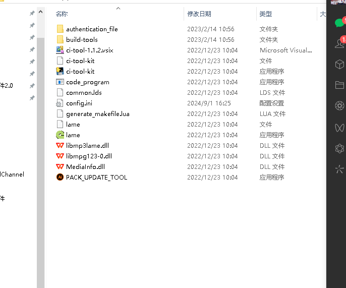

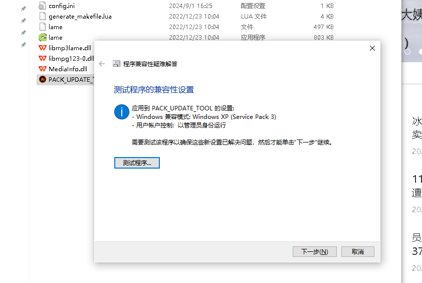

**注意事项：**

- 烧录工具无需安装，直接可用
- 不同芯片的烧录工具不能混用
- 如问题持续，可能需要更换电脑环境
- 开发电脑环境复杂，容易产生冲突

---

## 串口调试与日志输出

### CI-03T1串口发送数据无响应怎么办？

**问题描述：**

CI-03T1芯片能够正常接收语音数据，但串口发送数据时无响应，通过串口调试工具观察只有数据接收，无法发送数据。

**解决方案：**

**1. 确认串口引脚定义**

CI-03T1的串口引脚定义为：

- **PA2**：TX（发送）
- **PA3**：RX（接收）

**2. 检查连接方式**

- 发送数据应连接到PA3（RX引脚）
- 接收数据从PA2（TX引脚）获取
- 确认交叉连接：TX→RX，RX→TX

**3. 排查步骤**

1. **检查物理连接**：

    - 确认杜邦线连接牢固
    - 验证引脚对应关系
    - 检查是否有短路

2. **验证串口工具设置**：

    - 波特率：115200（默认）
    - 数据位：8
    - 停止位：1
    - 校验位：None

3. **测试通信**：

    - 短接PA2和PA3测试回环
    - 使用万用表测量引脚电平
    - 检查模块是否进入正常工作模式

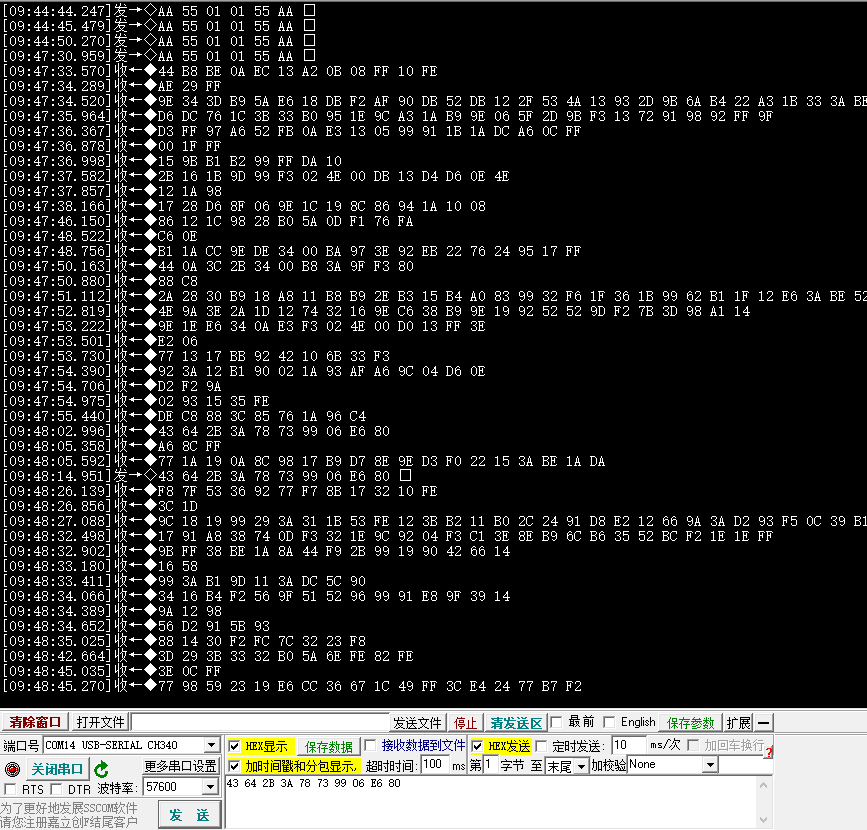

*串口工具显示有数据接收但无法发送*

**注意事项：**

- PA3作为输入引脚，不应连接外部TX信号
- 如果连接ESP8266等模块，需要在CI-03T1启动后再连接TX线
- 串口通信异常不影响语音识别功能
- 确认模块已完全启动后再进行串口操作


---

### 网络配置失败或固件更新超时怎么办？

**问题描述：**

在使用CI-03T1或CI-03T2芯片设备时，遇到网络配置失败、固件更新超时的问题。

**解决方案：**

1. **重新配置网络**：

    - 检查网络连接状态
    - 重新配置网络参数
    - 尝试切换到其他网络环境

2. **检查固件文件**：

    - 确认固件版本与芯片型号匹配
    - 验证固件文件完整性
    - 重新下载固件文件

3. **串口通信检查**：

    - 确认串口连接正常
    - 检查波特率设置
    - 验证MODBUS RTU或AT指令格式

**注意事项：**

- 网络不稳定会导致更新超时
- 固件文件损坏会造成烧录失败
- 串口通信异常可能影响配置过程


---

### CI-03T1/CI-03T2烧录时如何选择芯片型号？

**问题描述：**

使用烧录工具为CI-03T1或CI-03T2芯片烧录固件时，发现芯片型号选择列表中没有CI-03T1和CI-03T2选项，不确定应该选择CI1301还是CI1303。

**解决方案：**

**选择CI1303**：

- CI-03T1和CI-03T2都应选择CI1303选项
- 不要选择CI1301，即使芯片型号是03T1/03T2
- 烧录工具使用内部芯片代号而非产品型号

**芯片型号对应关系**：

- CI-03T1/CI-03T2 → 选择CI1303
- CI1301对应其他产品型号，不适用于03T系列
- 烧录工具中的型号选择基于芯片核心而非完整产品型号

**注意事项：**

- 烧录工具中的1301/1303与芯片型号后缀无关
- 如果列表中找不到03T1/03T2，选择CI1303即可
- 错误选择芯片型号会导致烧录失败或功能异常
- 所有CI-03T系列统一使用CI1303选项
- 选择错误可能导致烧录失败

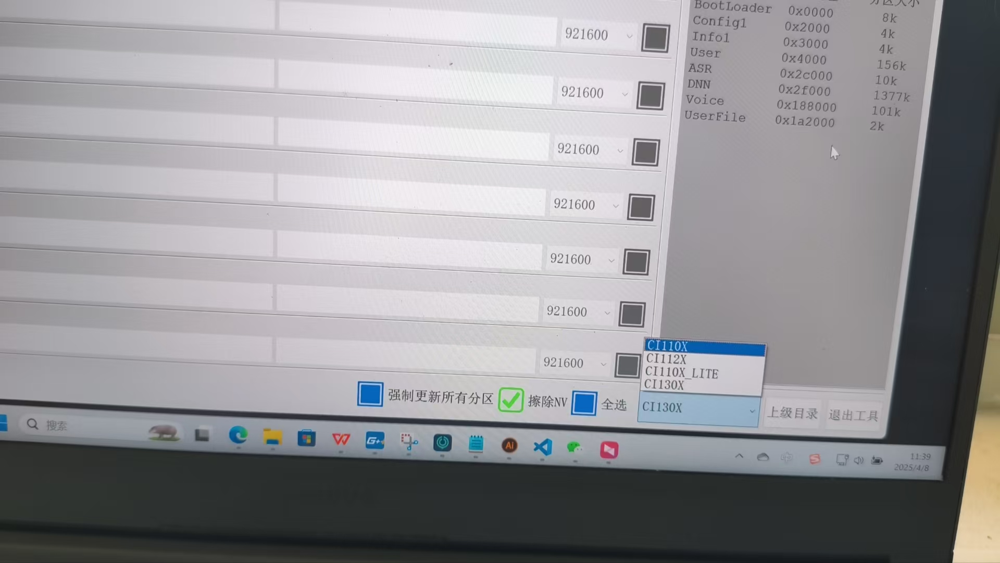

**CI130X_UPDATE_TOOLS 界面说明**：

在 CI130X_UPDATE_TOOLS 烧录工具中，底部的"CI130X系列"下拉菜单会显示多个芯片型号选项：
- CI1301、CI1302、CI1311、CI1312、**CI1303**、CI1306、CI2311、CI2312、CI2306

**对于 CI-03T 模块，必须选择 CI1303**（图片中已高亮显示为蓝色选中状态）。

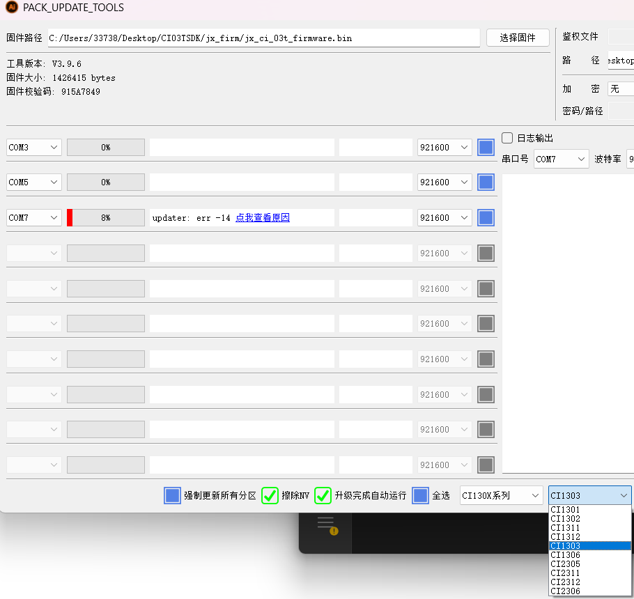

---

### CI-03T1芯片烧录时提示"烧录断开"怎么办？

**问题描述：**

在使用CI-03T1芯片进行烧录时，烧录工具报错，提示"烧录断开"，导致烧录失败，无法完成固件更新。

**解决方案：**

1. **检查通信连接**
    - 确认B6/TXD和B7/RXD引脚连接正确
    - 检查杜邦线接触是否良好
    - 尝试更换质量更好的连接线

2. **验证供电稳定性**
    - 确保模块供电稳定（5V或3.3V）
    - 避免使用USB供电，改用外部独立电源
    - 检查电源输出是否满足电流需求

3. **重新进入烧录模式**
    - 断开模块电源
    - 重新上电进入烧录模式
    - 烧录工具检测到模块后立即开始烧录

4. **检查硬件状态**
    - 如果多次尝试仍失败，可能是芯片损坏
    - 更换新模块进行测试
    - 确认烧录工具版本兼容性

**注意事项：**

- "烧录断开"通常表示通信中断
- 烧录过程中避免触碰连接线
- 建议将杜邦线焊接以确保可靠连接


---


---

### CI-03T烧录工具打开即退出怎么办？

**问题描述：**

CI-03T模块的烧录工具（PACK_UPDATE_TOOL.exe）在打开时立即退出，且在多台电脑上重复出现此问题，即使重装系统后问题依然存在。

**解决方案：**

**1. 工具特性说明**

- **无需安装**：烧录工具是绿色软件，直接运行
- **系统兼容**：支持Windows系统，无需特殊运行库
- **硬件依赖**：不同芯片的烧录工具不能混用

**2. 可能的原因**

- **杀毒软件干扰**：安全软件阻止工具运行
- **系统环境问题**：安装了不兼容的软件或插件
- **权限不足**：需要管理员权限运行
- **文件损坏**：下载的文件不完整或损坏

**3. 排查步骤**

- **退出安全软件**：临时退出杀毒软件和防火墙
- **管理员运行**：右键选择"以管理员身份运行"
- **重新下载**：从文档中心重新下载CI-03T专用版本
- **更换电脑**：在其他电脑上测试是否能正常运行


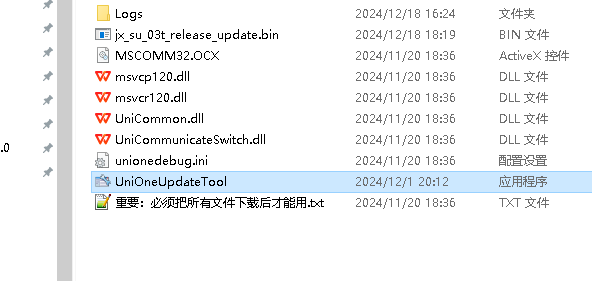

**注意事项：**

- CI-03T的烧录工具专用于CI系列芯片
- 不要使用其他芯片的烧录工具
- 如问题持续，提供详细的系统环境信息给官方支持

---


---

### 在哪里下载CI-03T系列的烧录工具？

**问题描述：**

无法找到用于CI-03T1和CI-03T2芯片的烧录工具软件。

**解决方案：**

**1. 烧录工具下载**

- 官方烧录工具名称：Hummingbird-M-Update-Tool
- 下载链接：由专业技术人员提供文件下载链接
- 文件格式：.rar压缩包，包含完整工具

**2. 工具安装**

- 解压下载的压缩包
- 运行Hummingbird-M-Update-Tool.exe
- 无需安装，即开即用

**3. 使用说明**

- 支持Windows系统
- 兼容CI-03T全系列芯片
- 自动检测COM端口

**4. 下载方式**

- 专业技术人员群内直接获取
- 官方文档中心下载
- 联系销售人员获取链接

**注意事项：**

- 确保下载正版的官方工具
- 避免使用第三方修改版工具
- 工具版本需要与固件版本匹配
- 下载前确认操作系统兼容性


---

### 使用云知声UniOne蜂鸟M烧录工具时如何选择固件文件？

**问题描述：**

在使用云知声UniOne蜂鸟M烧录工具时，无法找到合适的固件文件进行烧录。

**解决方案：**

**工具识别说明：**

1. **UniOne蜂鸟M工具**：

    - 这是云知声品牌的烧录工具
    - 与机芯智能产品不兼容
    - 不能用于CI/SU系列模块烧录
    - 使用时会出现COM端口错误和乱码问题

2. **正确的烧录工具**：

    - CI系列：使用智能公元专用烧录工具
    - SU系列：使用蜂鸟M-Update-Tool（机芯智能版）
    - 不同品牌工具不互通

**UniOne蜂鸟M工具常见问题：**

- **COM4打开串口失败**：

    - 工具无法识别正确端口
    - 驱动不兼容导致
    - 端口被其他程序占用

- **COM5发送异常**：

    - 检测到CAN信号但发送失败
    - 通信协议不匹配
    - 固件格式不支持

- **串口持续发送乱码**：

    - 波特率设置不正确
    - 数据位/停止位配置错误
    - 模块工作模式不匹配

**问题解决方法：**

- 立即停止使用UniOne蜂鸟M工具
- 下载机芯智能官方烧录工具
- 使用智能公元平台生成的固件
- 按照官方教程正确连接

**固件文件选择：**

1. **CI-03T系列固件**：

    - 固件名称：jx_su_03t_release.bin（主固件）
    - 更新固件：jx_su_03t_release_update.bin（升级包）
    - 路径要求：不能包含中文字符

2. **固件获取方式**：

    - 智能公元平台生成
    - 专业技术人员提供
    - 官方文档下载

3. **文件类型说明**：

    - .bin文件：完整的固件镜像
    - .json文件：配置信息文件
    - .txt文件：说明文档

**操作步骤：**

1. **使用正确工具**：

    - 下载机芯智能官方烧录工具
    - 确认工具版本兼容
    - 解压后直接运行

2. **选择固件文件**：

    - 点击"选择镜像文件"
    - 浏览到固件所在目录
    - 选择对应的.bin文件

3. **连接设备**：

    - 确认COM端口号
    - 检查USB驱动安装
    - 点击开始烧录

**常见错误处理：**

1. **找不到固件**：

    - 确认使用的是机芯智能工具
    - 检查文件扩展名是否正确
    - 避免使用云知声工具

2. **烧录失败**：

    - 检查串口连接
    - 确认电源供电正常
    - 更换USB端口尝试

3. **路径问题**：

    - 将固件复制到英文路径
    - 如：D:\Firmware\
    - 避免使用中文目录

**注意事项：**

- UniOne蜂鸟M是其他品牌工具，不兼容
- 务必使用机芯智能官方工具
- 固件文件需通过智能公元平台生成
- 烧录前备份原有固件

---

### CI-03系列退出唤醒触发时GPIO无法正常切换电平怎么办？

**问题描述：**

在CI-03系列芯片的平台配置中，退出唤醒触发功能无法正确将GPIO引脚从高电平切换为低电平，导致控制失效。

**解决方案：**

**问题原因分析：**

- **默认电平设置**：GPIO引脚的默认电平设置为低电平时，触发后输出低电平没有变化
- **触发方式问题**：退出唤醒触发可能产生的是脉冲信号而非电平变化
- **播报干扰**：退出时的语音播报可能再次触发高电平，导致无法保持低电平

**解决方法：**

1. **修改默认电平**：

    - 将GPIO引脚的默认电平设置为高电平
    - 这样退出唤醒时触发低电平就会有明显变化
    - 在Pin脚配置中修改默认电平设置

2. **检查触发逻辑**：

    - 确认退出唤醒与语音播报的触发顺序
    - 避免播报触发覆盖退出触发的效果
    - 可能需要调整触发延时

3. **使用事件触发**：

    - 在上一页添加条件触发
    - 设置多个触发条件
    - 确保退出唤醒时正确执行控制动作

**操作步骤：**

1. 进入Pin脚配置界面
2. 找到目标GPIO引脚（如GPIO_A5）
3. 将默认电平改为高电平
4. 重新生成固件并烧录
5. 测试退出唤醒时的电平变化

**注意事项：**

- 默认低电平时脉冲电平为高，可能导致控制不明显
- 退出唤醒的触发可能只有6ms左右的脉冲
- 建议用示波器或逻辑分析仪确认实际波形

**补充说明：**

如果在退出唤醒后观察到的是短暂的低电平脉冲（约6ms），然后又被其他事件（如语音播报）触发为高电平：

- **检查触发顺序**：退出唤醒的触发可能与语音播报触发冲突
- **延时设置**：可能需要在退出唤醒和播报之间添加延时
- **独立控制**：考虑使用不同的GPIO引脚分别控制不同功能

---

**4. 等待设备问题**：

    - 工具显示"等待设备"表示未检测到模块
    - 检查串口连接是否正确
    - 确认模块已通电
    - 尝试重新插拔USB
---


---

### CI-03T串口烧录无反应怎么办？

**问题描述：**

使用串口烧录工具对CI-03T1和CI-03T2芯片模块进行烧录时，设备无任何反应，尝试互换RXD和TXD引脚后问题依旧存在。

**解决方案：**

**1. 确认使用正确的烧录工具**

- 检查当前使用的烧录工具类型
- "云知声UniOne蜂鸟M烧录工具"用于烧录离线烧录器
- 串口烧录应使用其他专门的串口烧录工具

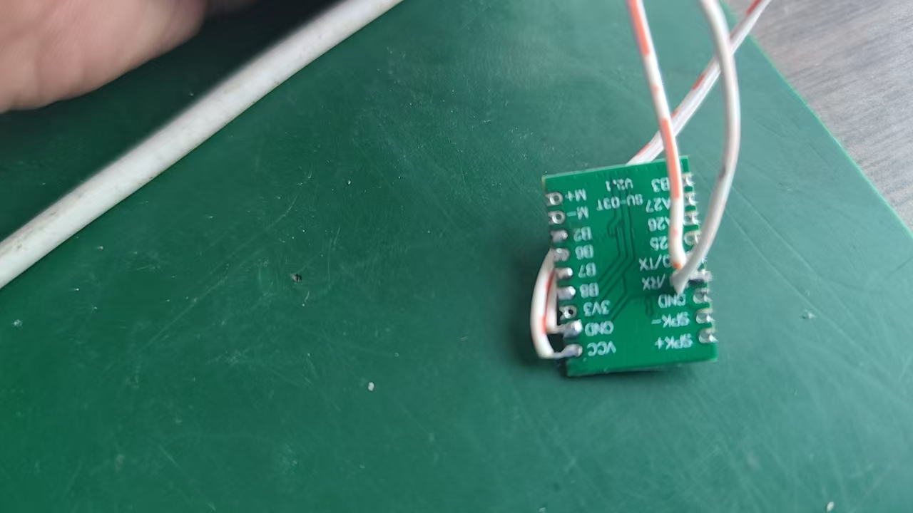


**2. 烧录工具选择说明**

- **UniOne蜂鸟M烧录工具**：专门用于烧录离线烧录器设备
- **串口烧录工具**：用于直接通过串口烧录芯片模块
- 两种工具功能不同，不能混用

**3. 正确的烧录步骤**

步骤1：硬件连接
- 确认TX、RX引脚交叉连接（模块TX→工具RX，模块RX→工具TX）
- 检查GND线已连接
- 确保3.3V或5V供电正常

步骤2：工具配置
- 选择正确的串口号（如COM30）
- 设置正确的波特率（通常为115200或921600）
- 选择对应的固件文件

步骤3：烧录操作
- 先连接通信线，再接通电源
- 确保烧录过程中电源稳定
- 避免中途断开连接

**注意事项：**

- 不同的烧录场景需要使用对应的工具
- 串口烧录时注意波特率设置
- 如果多次尝试失败，检查硬件连接和电脑USB端口
- 线路连接问题也可能导致无响应

---


---

### 烧录口日志显示乱码怎么办？

**问题描述：**

通过烧录口查看日志时显示乱码，怀疑是波特率设置错误，需要知道正确的波特率设置以正常查看日志。

**解决方案：**

**1. 确认日志显示设置**

- 平台如果设置为16进制输出
- 串口软件需要改为16进制显示
- 按字符显示会显示为乱码

**2. 正确的配置方法**

步骤1：平台配置
- 检查平台是否启用了16进制输出
- 如需要，可以关闭16进制输出改为字符模式

步骤2：串口软件设置
- 在串口调试工具中选择显示模式
- 选择HEX或16进制显示模式
- 确认波特率匹配

**3. CI-03T的正确波特率**

- 默认波特率：921600
- 某些版本可能使用115200
- 芯片型号不同可能有差异

**4. 调试建议**

如果需要查看可读的日志：

- 在平台中关闭16进制输出
- 使用921600波特率连接
- 确认串口线连接正确（TX交叉RX）

**注意事项：**

- 16进制日志主要用于底层调试
- 一般使用者建议使用字符模式查看
- 波特率不匹配会导致显示异常
- 确认使用正确的串口（烧录口而非通信口）

---

## 固件烧录问题


---

### CI-03T1配置PWM控制LED灯不亮怎么办？

**问题描述：**

使用CI-03T1芯片按照视频教程配置PWM控制LED灯，但LED灯不亮，硬件连接正常且LED灯本身完好。

**解决方案：**

**1. 检查固件配置**

- 确认PWM输出端口配置正确
- 检查PWM频率和占空比设置
- 验证控制命令与PWM端口对应关系

**2. 硬件连接检查**

- LED长脚（阳极）连接到PWM输出引脚（如GPIO_C4）
- LED短脚（阴极）连接到GND
- 可以尝试其他PWM端口（如GPIO_A2）

**3. 固件问题排查**

- 重新生成固件文件
- 导入已验证的配置文件进行对比
- 使用示例固件测试硬件

**4. 测试步骤**

- 烧录已知正常的固件进行测试
- 使用万用表测量PWM端口输出电压
- 检查LED在单独供电时是否正常

**注意事项：**

- 确保使用正确的固件配置工具
- PWM输出电压可能不足以驱动某些类型的LED
- 如果配置正确但仍不工作，可能是固件生成问题

---


---

### 烧录器按钮无法断开电路怎么办？

**问题描述：**

烧录器上的按钮在升起时无法断开电路，导致无法正常控制电源通断。

**解决方案：**

**故障排查：**

- 使用万用表测试开关通断功能
- 测量按钮在按下和弹起时的电阻值
- 确认是否为机械开关故障

**可能原因：**

- 开关内部触点粘连或损坏
- 弹片失效无法正常断开
- 长期使用导致接触不良

**解决方法：**

- 更换新的拨动开关
- 使用外接电源开关替代
- 利用CI-03T开发包中的转接板

**注意事项：**

- 开关损坏是物理故障，需要更换硬件
- CI-03T开发包中包含转接板PCB可作替代
- 建议使用质量更好的外接开关

---


---

### 串口接收的数据与代码设置的指令参数不一致怎么办？

**问题描述：**

在使用CI-03T1芯片时，代码逻辑中定义的语音指令参数与实际串口接收到的参数不一致，导致语音指令无法正确执行。

**解决方案：**

**1. 波特率不匹配问题**

- **常见原因**：波特率设置不一致导致数据解析错误
    - 代码设置：9600bps
    - 实际接收：因波特率错误，0x01被解析为0xF5等异常值


**2. 解决步骤**

- **检查硬件配置**：

    - 确认STM32串口初始化参数正确
    - 波特率：9600（必须与语音模块一致）
    - 数据位：8位，停止位：1位，无校验

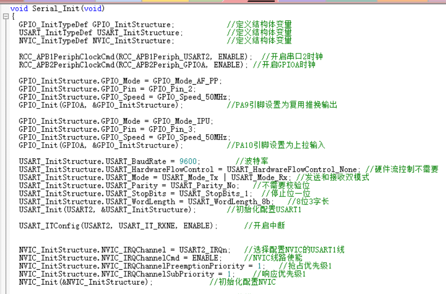

- **验证通信连接**：

    - 检查串口线连接（TX→RX，RX→TX）
    - 确认共地连接良好
    - 使用示波器或逻辑分析仪验证信号

- **软件调试**：

    - 先使用串口调试助手测试
    - 发送已知十六进制数据（如0x55 0x01 0x55）
    - 观察接收端是否正确接收

**3. 代码逻辑检查**

```c
// 检查接收数组索引和数据格式
void UART_IRQHandler() {
    // 确认数据按预期顺序存储
    if (Serial_RxPacket[0] == 0x55 &&
        Serial_RxPacket[2] == 0x55) {

        // 正确解析指令字节
        switch(Serial_RxPacket[1]) {
            case 0x01:  // 打开风扇
                Motor_SetSpeed(10);
                break;
            case 0x02:  // 调一档
                Motor_SetSpeed(30);
                break;
        }
    }
}
```


**注意事项：**

- 波特率不匹配会导致所有数据解析错误
- 建议使用标准波特率（9600、115200等）
- 调试时先验证硬件连接，再检查软件配置
- 保留串口调试助手作为问题排查工具

---


---

### CI-03T1芯片固件烧录失败如何排查？

**问题描述：**

使用CI-03T1芯片进行固件烧录时遇到烧录失败的问题，需要排查原因并提供解决方案。

**解决方案：**

**1. 硬件连接检查**

- **连接确认**：

    - 检查烧录器与模块的连接线序
    - 确认TX、RX、GND、VCC连接正确
    - 验证电源电压是否稳定（通常3.3V或5V）

- **信号质量**：

    - 使用万用表测试连接通断
    - 检查是否有接触不良或虚焊
    - 尝试更换质量更好的连接线

**2. 烧录工具配置**

- **端口设置**：

    - 确认COM端口选择正确
    - 检查波特率设置（通常115200）
    - 验证烧录模式选择匹配

- **固件文件**：

    - 确认使用正确的.bin文件
    - 检查固件文件是否损坏
    - 尝试使用官方提供的标准固件测试

**3. 芯片状态检查**

- **进入Boot模式**：

    - 某些CI-03T1需要特定操作进入下载模式
    - 参考芯片手册确认进入方法
    - 尝试不同的上电时序

- **芯片识别**：

    - 烧录工具是否能识别芯片型号
    - 检查芯片ID读取是否正常
    - 确认芯片未因静电等原因损坏

**4. 软件环境排查**

- **驱动问题**：

    - 重新安装USB转串口驱动
    - 在设备管理器查看驱动状态
    - 尝试不同的USB端口

- **系统问题**：

    - 以管理员身份运行烧录工具
    - 关闭其他可能占用串口的程序
    - 禁用防火墙和杀毒软件临时测试

**5. 常见问题处理**

- **供电不足**：

    - 使用外部稳定电源而非USB供电
    - 确保电源输出电流足够
    - 检查电源纹波是否过大

- **时序问题**：

    - 严格按照要求的时序操作
    - 不要频繁断电上电
    - 等待芯片完全初始化

**注意事项：**

- 烧录前先断开其他外设
- 避免在潮湿环境下操作
- 使用防静电措施保护芯片
- 如多次失败，可能芯片已损坏需要更换

---

---

### CI-03T模块地线与Vcc接反导致烧毁如何检测和处理？

**问题描述：**

在使用CI-03T模块时，因地线与Vcc接反导致模块烧毁，同时遇到烧录失败、串口通信乱码、无声音输出等问题。

**解决方案：**

**1. 模块损坏检测**

使用万用表进行以下检测：

- **短路检测**：

    - 万用表转到蜂鸣档
    - 测量Vcc和GND之间是否短路击穿
    - 如果蜂鸣器响，说明模块已损坏

- **电压输出检测**：

    - 给模块正常5V供电
    - 测试3V3引脚是否有3.3V电压输出
    - 测试麦克风正负极电压（CI-03T应在1.6-1.7V范围）
    - 测试喇叭正负极对GND电压（应在2.2-2.5V范围）

- **功能判断**：

    - 如果某个测试电压不正常，模块可能已烧坏
    - 即使模块能开机语音，也可能存在内部损坏

**2. 预防措施**

- **接线确认**：

    - 连接前仔细确认线序
    - Vcc接电源正极（5V）
    - GND接电源负极
    - 使用不同颜色的线缆区分正负极

- **防呆设计**：

    - 在连接线上做标记
    - 使用防反插的连接器
    - 第一次连接后用万用表确认电压

**3. 故障处理**

- **模块更换**：

    - 确认模块损坏后需要更换
    - 保留一个备用模块以备不时之需

- **飞线修复**（仅限专业用户）：

    - 如果只是外部线路烧断
    - 可以尝试飞线修复
    - 但内部芯片损坏无法修复

**注意事项：**

- 接线错误是最常见的硬件损坏原因
- 模块损坏后即使能部分工作，也不要继续使用
- 建议购买多个模块以备测试使用
- 如不确定，优先检查电源接线是否正确

---

---

### 更换喇叭时不慎碰断连接线导致串口失败怎么办？

**问题描述：**

在更换喇叭时，不慎碰断了连接线，导致语音模块的串口连接失败，无法进行烧录和通信。

**解决方案：**

**1. 损坏评估**

- **检查断线位置**：

    - 确认是外部连接线断开还是模块引脚损坏
    - 观察断口是在连接器上还是线路中间
    - 评估是否可以修复

- **测试模块功能**：

    - 给模块正常供电
    - 测试是否能正常开机语音
    - 如基本功能正常，说明模块未损坏

**2. 修复方案**

- **外部线路修复**：

    - 如是连接线断开，可以重新焊接
    - 使用细烙铁小心操作
    - 焊接后用万用表测试通断

- **飞线临时连接**：

    - 如无法修复原接口
    - 可以使用飞线直接连接
    - 注意线序不要接错

**3. 预防措施**

- **操作规范**：

    - 更换喇叭前先断开电源
    - 使用专用工具避免硬拉
    - 记录好线序和颜色对应

- **连接加固**：

    - 在连接处打胶固定
    - 使用热缩管保护
    - 避免拉扯导致再次断线

**注意事项：**

- 如模块引脚损坏，修复难度大
- 建议保留备用连接线
- 操作时避免用力过猛
- 不确定时寻求专业人员帮助

---

### CI-03T烧录失败且拔插设备无反应如何处理？

**问题描述：**

CI-03T烧录固件失败，拔插设备后无反应，之前曾经成功烧录过一次。

**解决方案：**

**1. 模块状态检测**

使用万用表检测模块是否损坏：

- **短路检测**：

    - 万用表转到蜂鸣档
    - 测量Vcc和GND之间是否短路击穿
    - 如果蜂鸣器响，说明模块已损坏

- **电压测试**：

    - 给模块正常5V供电
    - 测试3V3引脚是否有3.3V电压输出
    - 测试麦克风正负极电压（CI-03T应在1.6-1.7V范围）
    - 测试喇叭正负极对GND电压（应在2.2-2.5V范围）

**2. 烧录环境检查**

- **固件文件**：

    - 确认固件文件路径不含中文字符
    - 尝试将固件文件复制到桌面
    - 验证文件完整性（MD5）

- **软件设置**：

    - 不勾选"鉴权文件"选项
    - 选择正确的COM端口和波特率
    - 尝试以管理员身份运行

**3. 连接问题排查**

- **硬件连接**：

    - 检查RX和TX是否交叉连接（TX接RX，RX接TX）
    - 使用100Ω电阻保护电路
    - 检查连接线是否有虚焊或断路

- **电源供电**：

    - 使用外部稳定5V电源而非USB供电
    - 测量电源电压是否稳定
    - 检查电源纹波是否过大

**4. 替代方案**

- **更换模块**：

    - 如检测确认模块已损坏
    - 更换新的CI-03T模块
    - 保留备用模块以供测试

- **使用开发板**：

    - 考虑使用带烧录接口的开发板
    - 避免直接焊接操作

**注意事项：**

- 模块烧毁后即使能部分工作，也不建议继续使用
- 烧录前务必确认接线正确
- 避免频繁断电上电操作
- 建议购买多个模块以备不时之需

---

### CI-03T烧录卡在等待设备连接怎么办？

**问题描述：**

使用云知声UniOne蜂鸟M烧录工具烧录CI-03T时，软件卡在等待设备连接状态。

**解决方案：**

1. **确认正确的烧录软件**

    CI-03T不使用云知声UniOne蜂鸟M烧录工具：

    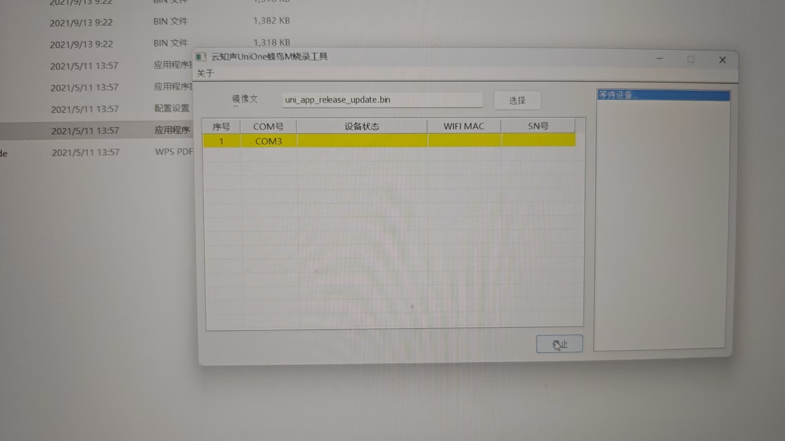

2. **获取开发包**

    - 访问：https://help.aimachip.com/docs/offline_ci03t/ci_03t_kfb
    - 下载CI-03T开发包（包含正确烧录软件）

    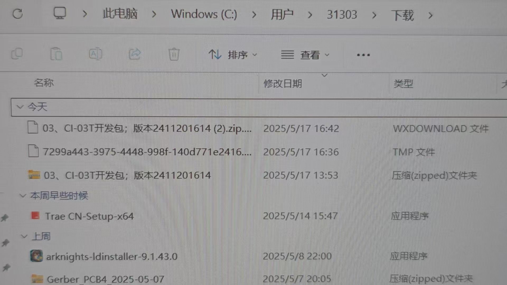

3. **使用正确烧录工具**

    - 开发包内包含专用烧录软件
    - 选择正确的.bin固件文件（jx_ci_03t_firmware.bin）

**注意事项：**

- 不同型号使用不同烧录工具
- 下载完整开发包，不要中途关闭浏览器
- 烧录前拔掉5V电源线

---


---

### CI-03T开发包文件无法打开怎么办？

**问题描述：**

下载的CI-03T开发包压缩文件无法打开。

**解决方案：**

1. **确认文件完整性**

    对比两个文件：

    - 38,304 KB的文件无法打开（下载不完整）
    - 114,303 KB的文件正常（下载完整）

    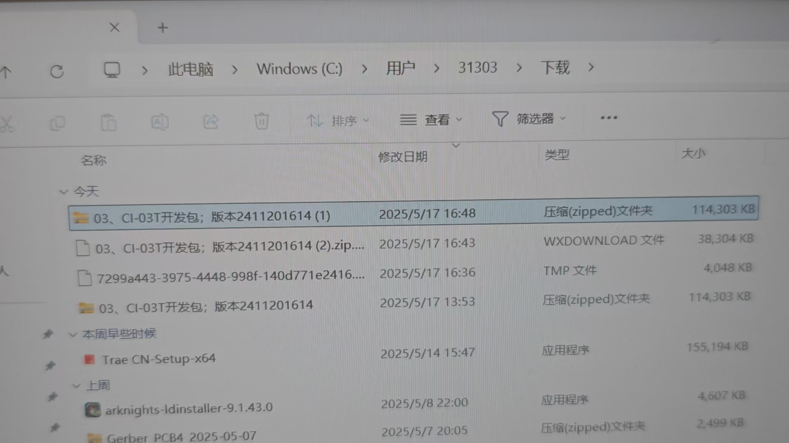

2. **重新下载**

    - 删除不完整的文件
    - 重新下载开发包
    - 确保下载完成后再解压

3. **下载地址**

    最新版开发包：
    https://help.aimachip.com/docs/offline_ci03t/offline_ci03t-1gbdvhie6a97l

**注意事项：**

- 大文件下载需要稳定网络
- 确认文件大小正确再解压
- 如仍有问题，尝试更换浏览器下载

---


---

### 固件生成失败且烧录后无响应怎么办？

**问题描述：**

生成固件时提示"生成的固件超大，请删减配置项目，选用小模型或使用组合播报"，且烧录后设备无开机播报和命令词响应。

**解决方案：**

**1. 固件大小优化**

- 关闭自学习和语音导航功能
- 选择占用空间更小的应用场景（如"普通话通用Pro"，占0.6M空间）
- 删减不必要的命令词和配置项

**2. 正确的导出操作**

在产品管理页面点击"导出"按钮生成固件文件，而非"下载"按钮。

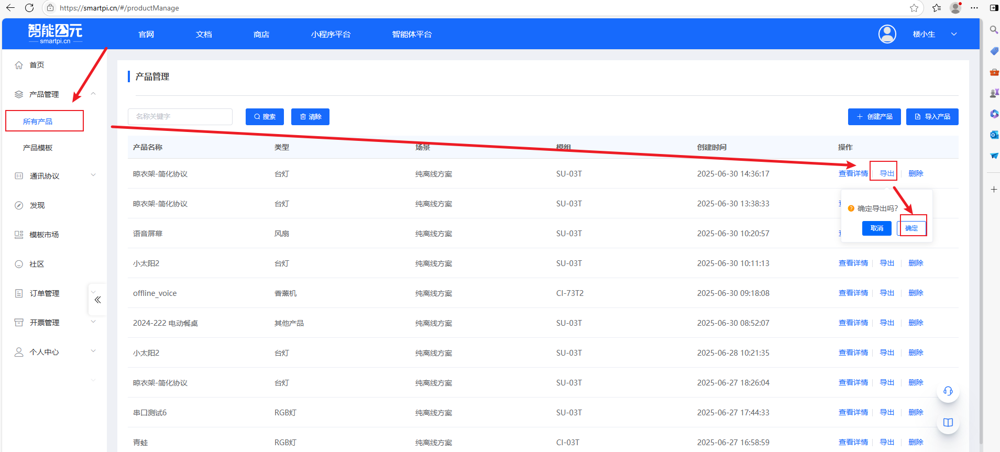

**3. 应用场景选择**

选择合适的应用场景以控制固件大小：

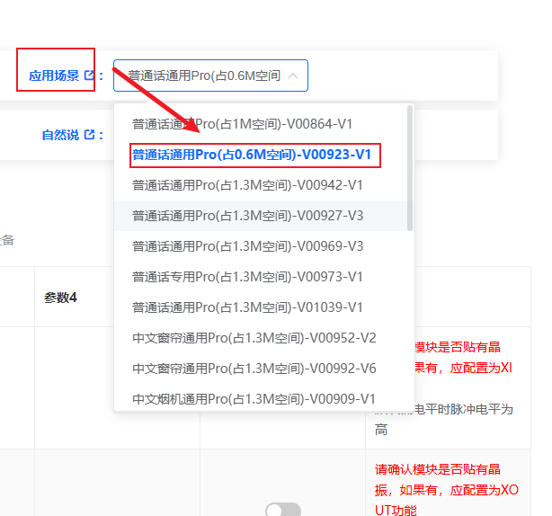

**4. 烧录后无响应的排查**

- 确认固件已正确烧录到模块
- 检查模块供电是否稳定
- 重新上电测试
- 若仍无响应，尝试简化配置重新生成固件

**注意事项：**

- 固件过大时会提示生成失败，需要精简配置
- 烧录成功后无响应可能是运行内存不足或配置问题
- CI-03T系列模块运行内存有限，复杂功能可能导致无法正常工作

---


---

### CI-03T1烧录串口连接失败怎么办？

**问题描述：**

CI-03T1芯片进行烧录时，串口一直无法连接，导致烧录失败，经过多次尝试和排查仍无法解决。

**解决方案：**

1. **检查杜邦线接触问题**：

    - CI-03T1的排针是2.0mm接口，而杜邦线是2.54mm规格
    - 2.54mm杜邦线会导致接触不良
    - 建议剪开杜邦线，将铜丝直接焊接到B6、B7引脚

2. **正确的焊接方法**：

    - 将杜邦线剪开，剥出铜丝
    - 直接焊接到模块的B6（RX）和B7（TX）引脚
    - 注意不要焊错引脚位置
    - 焊接完成后再次尝试烧录

3. **其他排查步骤**：

    - 确认使用5V供电
    - 检查USB转串口驱动是否正常
    - 尝试更换电脑的USB端口
    - 将固件文件放到桌面英文路径下

**注意事项：**

- 2.54mm杜邦线与2.0mm排针不兼容，是导致连接失败的常见原因
- 焊接时需要防静电措施
- 如果已焊接排线仍有问题，检查是否有虚焊
- 焊接引脚是最可靠的连接方式
- 如有多个CH340设备，需要确认正确的COM端口号
- 可以在设备管理器中查看CH340对应的COM口

---


---

### CI-03T模块烧录时如何正确连接UART接线？

**问题描述：**

需要确认CI-03T模块烧录时正确的UART接线方式，特别是如何避免接线错误。

**解决方案：**

**1. UART0烧录接口**

CI-03T模块使用UART0进行固件烧录：

- 引脚：B0(TX)、B1(RX)
- 烧录时必须使用交叉连接方式

**2. 正确接线方法**

- USB转TTL的TX → CI-03T的RX（B1引脚）
- USB转TTL的RX → CI-03T的TX（B0引脚）
- 连接方式：RX接TX，TX接RX（交叉连接）
- 不要忘记连接GND线

**3. 注意事项**

- 接线时要特别注意交叉连接，不要直连
- 确认供电稳定（3.6-5.5V）
- 烧录过程中避免触碰连接线
- 不同品牌的USB转TTL模块TX/RX标识可能相反，建议用万用表确认

---

### CI-03T1烧录时RX/TX需要交叉连接吗？

**问题描述：**

使用USB转TTL烧录CI-03T1时，不确定RX和TX是否需要交叉连接，以及烧录时断电的处理。

**解决方案：**

1. **正确连接方式**

RX和TX需要交叉连接：

- USB转TTL的TX → CI-03T1的RX
- USB转TTL的RX → CI-03T1的TX
- 连接方式：RX接TX，TX接RX

2. **烧录注意事项**

- 烧录前确保模块正确供电
- 避免烧录过程中断电
- 如有开机播报可能影响烧录
- 某些串口模块的TX/RX标识可能相反

3. **常见问题处理**

- 如果交叉连接仍失败：

    - 检查串口模块TX/RX标识是否正确
    - 尝试对调连接（直接连接）
    - 确认波特率设置正确（921600）

- 烧录时断电处理：

    - 重新上电后等待稳定
    - 检查电源连接是否可靠
    - 确认烧录工具配置

**注意事项：**

- 不同品牌的USB转TTL模块TX/RX可能不同
- 建议使用万用表确认TX/RX引脚
- 烧录时不要触摸电路避免静电
- 确保GND线正确连接
- **不建议使用电脑USB接口直接供电烧录**，可能因电流不足导致模块工作异常
- 电脑USB有过流保护，但模块异常可能损坏USB接口
- 建议使用独立电源适配器供电

---


---

### HC430下载器固件下载进度卡在0%怎么办？

**问题描述：**

使用HC430下载器进行固件升级时，尽管驱动、接线和软件配置均正确，但固件下载进度始终停留在0%，无法成功下载到CI-03T系列芯片模块中。

**解决方案：**

**1. 基本操作检查**

- 确认HC430驱动已正确安装
- 下载器测试功能正常
- RX/TX交叉连接检查无误
- 固件文件路径选择正确

**2. 关键操作步骤**

- **打勾后需要给模块断电**
- **断电后重新上电**
- 确保模块正确进入烧录模式

**3. 故障排除方法**

- **多次尝试**：重复进行断电上电操作
- **检查连接**：确认所有连接线接触良好
- **更换端口**：尝试不同的USB端口
- **重启工具**：关闭重新打开烧录软件

**4. 参考资源**

- 观看官方视频教程了解正确操作流程
- 视频链接：https://www.bilibili.com/video/BV1AG4y1D7Ed/
- 按照视频步骤逐步操作

**注意事项：**

- 模块必须正确进入烧录模式才能开始下载
- 断电上电时序很重要，要严格按照要求操作
- 如果多次尝试无效，可能需要检查模块或下载器硬件状态


---

## 软件工具使用


---

### CI-03T固件烧录软件无法打开怎么办？

**问题描述：**

电脑无法打开CI-03T固件烧录软件，即使重装系统也无法解决，软件启动后立即退出。

**解决方案：**

**1. 病毒防护软件干扰**

- 关闭所有杀毒软件和防火墙
- 暂时禁用Windows Defender
- 以管理员身份运行烧录软件

**2. 系统环境检查**

- 确认系统版本兼容性（32/64位）
- 检查是否缺少必要的运行库
- 清理系统临时文件和缓存

**3. 软件兼容性处理**

- 下载与系统匹配的软件版本
- 在兼容性模式下运行（Windows兼容模式）
- 更新到最新版本的烧录软件

**4. 替代方案**

- 使用智能公元平台在线生成固件
- 尝试使用其他烧录工具
- 在其他电脑上测试软件运行


**注意事项：**

- 某些安全软件会误报并阻止正常工具运行
- 重装系统无效说明是软件兼容性或环境问题
- 建议保留一个纯净的测试环境用于烧录
- 如问题持续，可联系官方支持获取专用烧录工具

---


---


---

### CI1303芯片可以使用什么烧录器？STC-USB Link1D可以替代CH340吗？

**问题描述：**

需要了解CI1303芯片使用的烧录器类型，以及是否可以使用STC-USB Link1D仿真器替代CH340烧录器。

**解决方案：**

**1. 标准烧录配置**

- **烧录软件**：ChipIntelli启英泰伦串口升级工具（V3.9.6）
- **标准烧录器**：使用CH340 USB转TTL芯片
- **支持型号**：CI13LC系列和CI13242等芯片

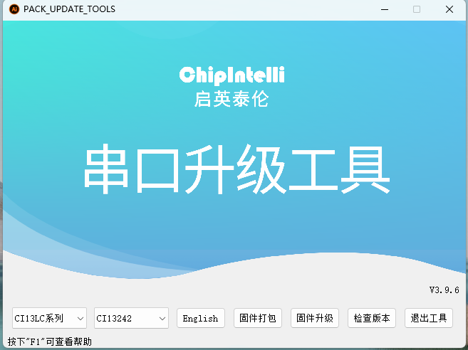

*ChipIntelli启英泰伦串口升级工具界面*

**2. 烧录器兼容性**

- **CH340烧录器**：标准配置，稳定可靠
- **STC-USB Link1D**：不能替代CH340使用
- **替代方案**：只要是USB转TTL的转换器都可以使用

**3. 选择建议**

- 优先使用CH340烧录器，兼容性最佳
- 如对CH340质量有顾虑，可选择质量更好的CH340模块
- 不建议使用STC专用烧录器，可能存在协议不兼容问题

**注意事项：**

- CI1303使用的是标准串口烧录协议
- 任何USB转TTL转换器理论上都可以使用
- 选择烧录器时要注意驱动兼容性和稳定性
- 烧录前确保正确安装对应驱动程序

---


---

### CI-03T4烧录后只能识别一次唤醒词

**问题描述：**

CI-03T4双麦模块烧录后，只能识别一次唤醒词，之后所有指令都无法识别。

**解决方案：**

**1. 检查唤醒词跳转行为**

    - 避免在唤醒词后添加跳转行为
    - 跳转行为可能导致识别逻辑异常
    - 将跳转行为移到其他命令词后

**2. 确认固件版本匹配**

    - 双麦版本需要使用专用固件
    - 确保固件支持双麦克风功能
    - 如有必要，重新下载对应版本的出厂固件

**3. 检查硬件连接**

    - 确认烧录脚位焊接良好
    - 检查供电是否稳定
    - 验证麦克风连接正确

**注意事项：**

- CI-03T4的M1麦克风用于识别，M2用于算法处理
- 唤醒词后不建议添加跳转行为
- 双麦版本与单麦版本的固件不通用
- 使用新版烧录软件时，调试烧录器需要更新

**双麦克风功能验证方法：**

如需验证M1和M2的功能分工，可按以下步骤测试：

1. **只连接M1**：模块可正常唤醒和识别
2. **只连接M2**：模块无法响应（因为M2用于算法处理，不负责识别）
3. **同时连接M1和M2**：

    - 遮挡M2：识别功能正常（M1正常工作）
    - 遮挡M1：识别无响应（识别麦被遮挡）

此现象说明M1是主识别麦，M2是辅助算法麦，两者需配合使用才能达到最佳降噪效果。

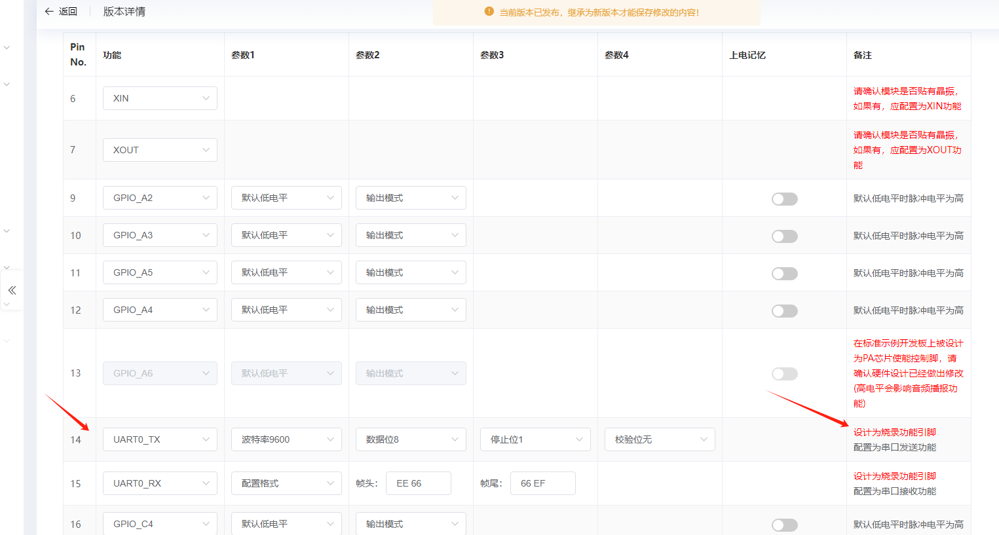

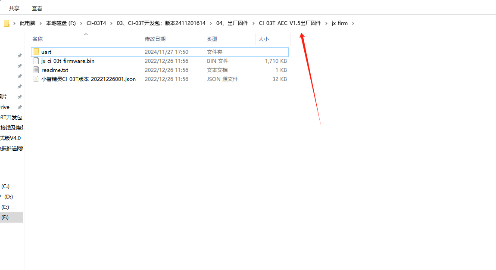

---


---

### 新款CI-03T1烧录后上电无反应

**问题描述：**

新款CI-03T1使用新版烧录软件烧录后，上电无反应。

**解决方案：**

**1. 检查硬件焊接**

    - 确认所有引脚焊接牢固
    - 特别注意烧录引脚（TX/RX）的连接
    - 检查是否有虚焊或短路

**2. 使用合适的烧录工具**

    - 小扳手工具：可继续使用旧版03T的烧录工具
    - 调试烧录器：需要更新到最新版本
    - UniOneUp dateTool：新版烧录软件

**3. 软件版本匹配**

    - 二次开发平台需要更新
    - 调试烧录器驱动需要更新
    - 确保固件、工具、平台版本匹配

**注意事项：**

- 新旧款03T的烧录工具可能不完全兼容
- 使用调试烧录器时必须更新烧录软件
- 小扳手工具无需更新即可使用
- 焊接质量是导致无反应的常见原因

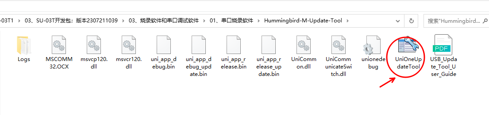

---


---

### CI-03T1固件运行时自行重启怎么办？

**问题描述：**

使用新生成的CI-03T1固件时，设备运行过程中会出现自行重启现象，而旧的CI-03T固件工作正常。

**解决方案：**

**问题分析：**

- 可能是音量设置过程中的问题
- 设置音量时不能同时进行回复输出
- 新旧固件版本在音量处理逻辑上可能存在差异

**解决方法：**

1. **检查音量设置**
    - 确认音量设置流程是否正确
    - 避免在设置音量时触发语音输出
    - 尝试使用默认音量设置

2. **重新生成固件**
    - 简化音量配置逻辑
    - 移除可能导致冲突的设置
    - 对比新旧版本的配置差异

3. **逐步测试**
    - 先生成基础功能版本
    - 确认无重启问题后
    - 再逐步添加其他功能

**注意事项：**

- CI-03T和CI-03T1在硬件上兼容
- 问题可能出在固件的特定功能配置上
- 建议导出有问题的配置供技术团队分析
- 如问题持续，可暂时使用旧版本固件

---


---

### CI-03T模块可以批量烧录吗？

**问题描述：**

在使用CI-03T1或CI-03T2离线语音识别芯片模块时，由于语音指令数据量较大，导致烧录过程较慢，希望了解是否可以批量烧录并由技术团队代为完成。

**解决方案：**

**1. 批量烧录服务**

- 厂商提供批量烧录服务，100片以上可预烧录
- 小批量需要自行烧录或使用烧录器
- 批量烧录可节省开发时间和避免烧录错误

**2. 烧录速度说明**

- 语音指令数据量大是烧录慢的主要原因
- CI-03T支持丰富的语音功能，固件体积较大
- 单片烧录时间根据数据量可能需要数分钟

**3. 服务流程**

- 联系技术团队说明批量烧录需求
- 提供固件文件和数量要求
- 厂商烧录完成后直接发货

**注意事项：**

- 批量烧录适合量产阶段，开发阶段建议自行调试
- 烧录前请确认固件版本和功能配置
- 保留少量空白模块用于后续修改和测试

### CI-03T调试模式和Release模式固件烧录有什么区别？

**问题描述：**

调试模式固件可以正常唤醒设备，但打包为Release模式后无法唤醒，需要了解两种烧录方式的差异。

**解决方案：**

**烧录方式差异说明：**

1. **调试器烧录**
    - 使用专用调试器进行在线烧录
    - 适用于开发和测试阶段
    - 可以实时调试和验证功能
    - 唤醒功能通常工作正常

2. **串口烧录**
    - 使用USB转TTL模块（如CH340）
    - 适用于批量生产
    - 需要使用脱机烧录器或串口工具
    - Release模式固件可能出现功能差异

**问题分析：**

1. **固件差异**
    - 调试模式：包含调试信息，功能完整
    - Release模式：优化后的版本，可能缺少某些调试功能

2. **烧录工具差异**
    - 调试器：专业工具，兼容性更好
    - 串口烧录：依赖USB转TTL芯片稳定性

**解决方案：**

1. **开发阶段**
    - 优先使用调试模式进行功能验证
    - 确认唤醒词和各项功能正常

2. **生产阶段**
    - 使用脱机烧录器进行批量烧录
    - 验证Release版本固件的完整性

3. **固件验证**
    - 烧录后记录固件MD5值用于追溯
    - 建议保留每个版本的固件备份

    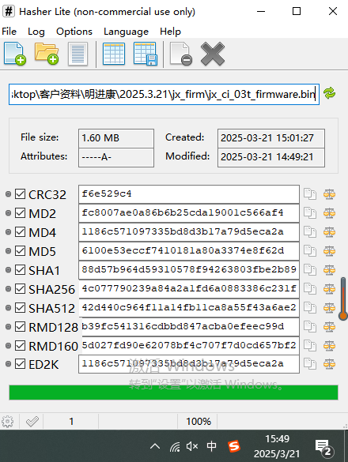

**注意事项：**

- 不建议使用CH340等USB转TTL芯片进行生产烧录
- 批量生产建议使用专用脱机烧录器
- Release版本烧录前务必进行完整功能测试
- 保留烧录记录便于问题追踪

---


---

### CI-03T模块TTS语音播报功能异常如何排查？

**问题描述：**

使用CI-03T模块的TTS语音播报功能时，已烧录固件并连接好串口，但无法正常播放语音，且在工具软件中显示"无效状态"。

**解决方案：**

**1. 接线检查**

- 按照标准接线图连接：

    - SPK+/SPK-：连接扬声器正负极
    - GND：连接公共地
    - PB6(RX)/PB5(TX)：连接串口（注意交叉）
- 使用授权的TTS模块或芯片
- 确认供电电压稳定（5V）

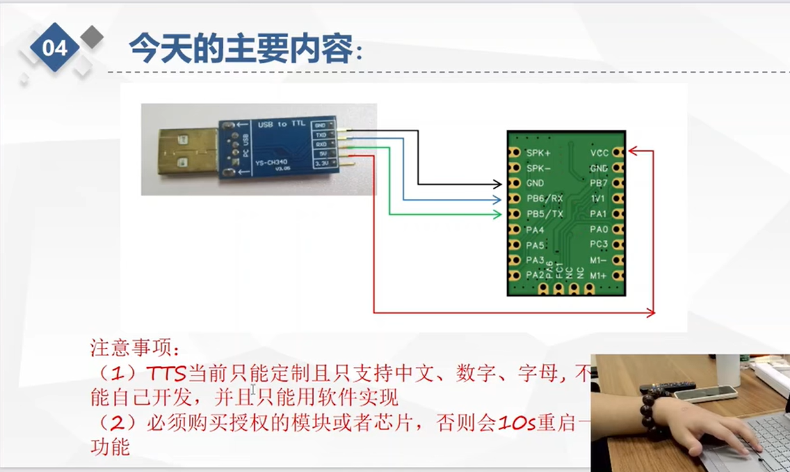

**2. 串口配置**

- 选择正确的串口号：

    - A2对应RX引脚
    - A3对应TX引脚
- 确保工具选择了正确的COM端口
- 检查波特率设置是否匹配

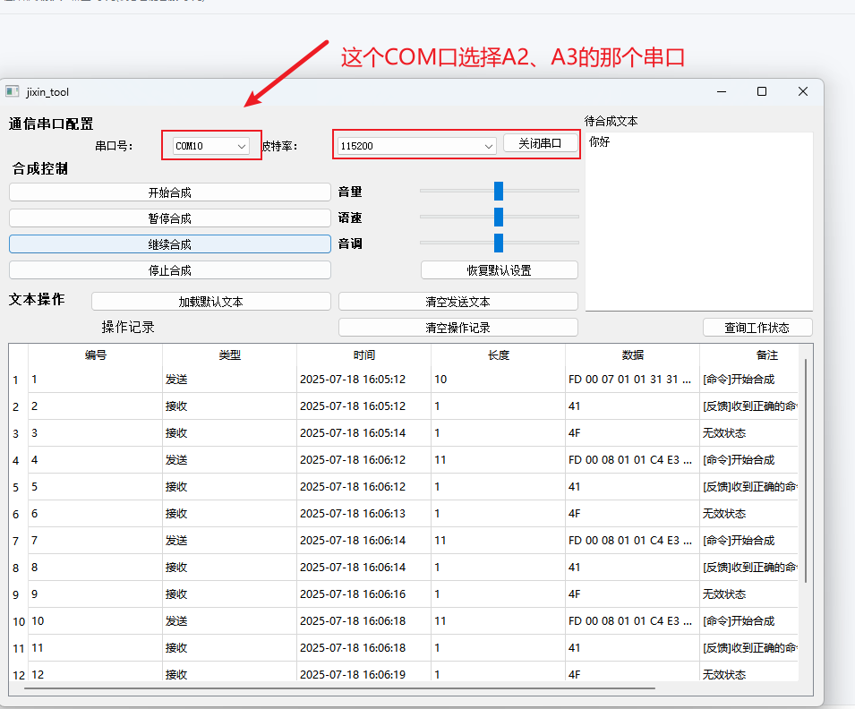

**3. 固件烧录**

- 烧录专用的TTS固件（1302_TTS.bin）
- 使用jixin_tools.exe工具
- 烧录完成后重新上电测试

**4. 功能测试**

- 发送简单的TTS指令测试
- 检查工具软件是否显示"有效状态"
- 确认扬声器连接正确

**5. 参数调节**

如语音效果不佳，可在工具中调节：

- 音量：调节播放音量大小
- 语速：调节说话速度
- 音调：调节声音高低

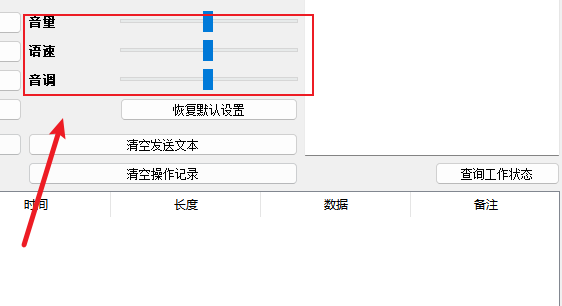

**常见问题处理：**

- **显示"无效状态"**：

    - 检查是否使用了TTS专用固件
    - 确认模块已授权TTS功能
    - 验证串口连接是否正确

- **无声音输出**：

    - 检查扬声器连接
    - 确认音量设置不为0
    - 测试其他扬声器排除硬件故障

**注意事项：**

- 必须购买已授权TTS功能的CI-03T模块
- TTS功能需要专用固件，普通固件不支持
- 串口需要交叉连接（TX接RX，RX接TX）
- 如持续异常，联系技术团队获取帮助

---


---

### CI-03T模块TTS语音播报功能异常如何排查？

**问题描述：**

使用CI-03T模块的TTS语音播报功能时，已烧录固件并连接好串口，但无法正常播放语音，且在工具软件中显示"无效状态"。

**解决方案：**

**1. 接线检查**

- 按照标准接线图连接：

    - SPK+/SPK-：连接扬声器正负极
    - GND：连接公共地
    - PB6(RX)/PB5(TX)：连接串口（注意交叉）
- 使用授权的TTS模块或芯片
- 确认供电电压稳定（5V）


**2. 串口配置**

- 选择正确的串口号：

    - A2对应RX引脚
    - A3对应TX引脚
- 确保工具选择了正确的COM端口
- 检查波特率设置是否匹配


**3. 固件烧录**

- 烧录专用的TTS固件（1302_TTS.bin）
- 使用jixin_tools.exe工具
- 烧录完成后重新上电测试

**4. 功能测试**

- 发送简单的TTS指令测试
- 检查工具软件是否显示"有效状态"
- 确认扬声器连接正确

**5. 参数调节**

如语音效果不佳，可在工具中调节：

- 音量：调节播放音量大小
- 语速：调节说话速度
- 音调：调节声音高低


**常见问题处理：**

- **显示"无效状态"**：

    - 检查是否使用了TTS专用固件
    - 确认模块已授权TTS功能
    - 验证串口连接是否正确

- **无声音输出**：

    - 检查扬声器连接
    - 确认音量设置不为0
    - 测试其他扬声器排除硬件故障

**注意事项：**

- 必须购买已授权TTS功能的CI-03T模块
- TTS功能需要专用固件，普通固件不支持
- 串口需要交叉连接（TX接RX，RX接TX）
- 如持续异常，联系技术团队获取帮助

---

### CI-03T1使用3.3V供电烧录失败怎么办？

**问题描述：**

使用CH340烧录器对CI-03T1芯片模块进行烧录时，若使用3.3V供电则烧录不可靠，只有在5V供电时才能成功烧录。

**解决方案：**

**1. 问题分析**

- **3.3V供电**：烧录经常失败，成功率低
- **5V供电**：烧录稳定，成功率100%
- CH340烧录器在不同电压下表现不同

**2. 原因分析**

**CH340芯片特性：**

- CH340是USB转串口芯片
- 其工作电压影响输出信号质量
- 5V供电时信号驱动能力更强

**信号电平问题：**

- 3.3V供电时，输出高电平可能不足
- CI-03T1对烧录信号电平要求较高
- 信号幅度不足导致通信失败

**3. 解决方案**

**推荐方案：使用5V供电**

- 烧录时CH340使用5V供电
- 通过LDO或稳压器提供5V
- 确保供电电流足够（至少500mA）

**临时方案：改善3.3V供电**

如果必须使用3.3V供电：

1. **优化连接**：

    - 使用更短的连接线
    - 减少线路压降
    - 确保接触良好

2. **信号增强**：

    - 在TX线路上加上拉电阻
    - 使用低内阻的3.3V电源
    - 避免长距离传输

3. **更换烧录器**：

    - 使用支持5V输出的USB转TTL模块
    - 或使用专业烧录工具
    - 确保信号驱动能力足够

**4. 烧录注意事项**

**供电切换：**

- 3.3V/5V切换需要断电操作
- 先设置好电压再连接模块
- 避免热插拔损坏设备

**安全考虑：**

- CI-03T1可短时承受5V烧录电压
- 烧录完成后应恢复3.3V工作电压
- 避免长时间5V供电损坏模块

**5. 长期建议**

**专用烧录工具：**

- 配置支持5V输出的烧录座
- 使用专业级USB转串口模块
- 考虑购买官方推荐的烧录器

**生产流程优化：**

- 设计可切换电压的烧录接口
- 3.3V工作/5V烧录自动切换
- 提高生产效率和可靠性

**注意事项：**

- 5V供电仅用于烧录过程
- 正常工作必须使用3.3V供电
- 不同批次的CI-03T1可能有差异
- 建议量产前验证烧录方案

---

### CI-03T烧录时提示"升级固件打开失败"怎么办？

**问题描述：**

使用PACK_UPDATE_TOOLS烧录CI-03T固件时，提示"升级固件打开失败，请检查固件路径是否正确"，且不确定应选择哪个芯片型号。

**解决方案：**

**问题分析：**

- 使用了错误的芯片型号选择
- 固件路径可能不正确
- 需要使用正确的烧录工具和配置

**正确操作步骤：**

1. **芯片型号选择**

    - CI-03T应选择：CI1302（不是CI1301）
    - 确保选择的型号与实际模块匹配

2. **固件文件获取**

    - 从官方文档中心下载：https://help.aimachip.com/docs/offline_ci03t/ci_03t_kfb
    - 下载CI-03T开发包
    - 解压后获取相应的固件文件

    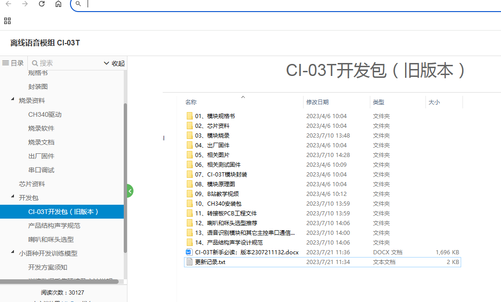

3. **烧录软件使用**

    - 使用PACK_UPDATE_TOOLS烧录工具
    - 选择正确的固件文件路径
    - 确认芯片型号选择为CI1302

    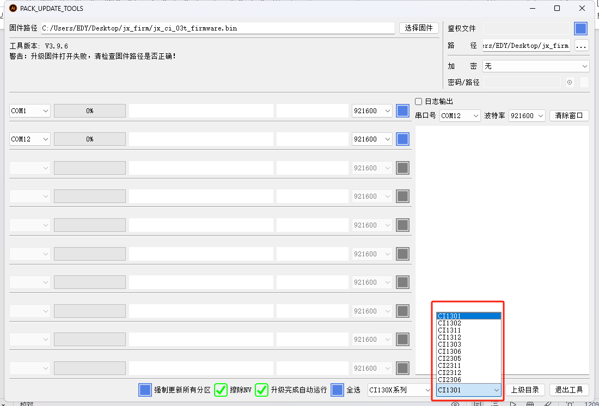

4. **开发包内容**

    - 烧录资料和工具
    - 模块规格书
    - 芯片详细资料
    - 出厂固件文件

**注意事项：**

- CI-03T对应芯片型号是CI1302
- 固件文件路径必须正确且完整
- 烧录前确认模块连接良好
- 如仍有问题，检查固件文件是否损坏

---

### CI-03T的UART数据发送长度限制是多少？

**问题描述：**

需要了解CI-03T系列芯片的UART接口每次发送的数据长度限制，以确定是否能够发送完整的控制指令。

**解决方案：**

**数据长度限制：**

- CI-03T UART支持最长32字节的数据发送
- 可以发送长度不一的数据包
- 不同于SU-63T的16字节限制

**平台配置说明：**

- 在智能公元平台添加UART控制时
- 系统会明确标注"最大长度32字节"
- 超过限制的配置无法保存

    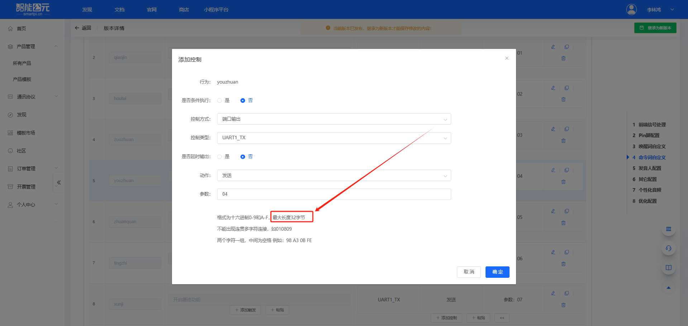

**实际应用：**

- **灵活发送**：支持1-32字节任意长度
- **长指令处理**：可直接发送完整的长指令
- **优于SU-63T**：32字节 > 16字节，更适合复杂协议

**注意事项：**

- 32字节是单次发送的上限
- 超长数据需要分多次发送
- CI-03T适合需要长指令的应用场景
- 配置时注意字节计数方式

---

### CI-03T模块固件烧录交付流程是怎样的？

**问题描述：**

需要了解CI-03T模块的固件烧录交付流程，包括是否需要提供完整的固件包、唤醒词和回复语，以及烧录服务的费用和交期。

**解决方案：**

**1. 固件交付要求**

提供以下任一方式：

- **完整固件包**：包含所有配置文件
    - .bin固件文件
    - .json配置文件
    - ota_cfg.json配置文件
    - readme.txt说明文件

- **关键信息**：开机播报、唤醒词、回复语
    - 开机播报：可选项
    - 唤醒词：如"Hi, M five"、"hi, A S R"、"hello"
    - 回复语：如"I'm here"

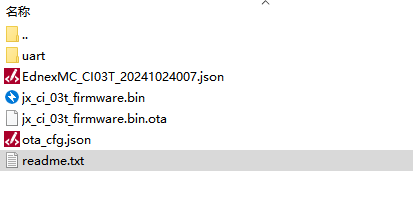


**2. 烧录服务说明**

- **服务费用**：提供免费烧录服务
- **烧录时间**：收到固件后2天内完成
- **交付方式**：付款后安排发货

**3. 交付流程**

步骤1：需求确认
- 确认所需固件版本
- 提供唤醒词和回复语列表
- 确认是否需要开机播报

步骤2：固件准备
- 提供固件文件或详细配置
- 厂家确认固件完整性
- 备份固件用于后续核对

步骤3：烧录执行
- 按照排单顺序进行烧录
- 烧录完成后进行功能测试
- 准备发货清单

步骤4：发货交付
- 收到付款后安排发货
- 提供物流单号
- 包含烧录记录和MD5校验码

**4. 注意事项**

- 固件文件路径不能包含中文字符
- 建议保留每次的固件版本备份
- 批量订单（100片以上）可享受预烧录服务
- 确认固件后请尽快安排付款，避免影响交付时间

---

### CI-03T固件确认和MD5校验流程是怎样的？

**问题描述：**

需要了解如何确认固件文件的唯一性并确保烧录的固件版本正确无误，包括固件版本、唤醒词、回复语、付款和发货安排。

**解决方案：**

**1. 固件信息确认**

完整信息格式：
```
*****科技有限公司/CI-03T V1.3黑色 /Unit_ASR_V1_ci_03t_firmware/开机播报：无/唤醒词：Hi, m five /hi, A S R/hello/回复语：I'm here/MD5-0dfadd3424ad6dd09002cc920be6bc27
```

包含以下关键信息：

- 公司名称和型号
- 固件文件名
- 开机播报设置
- 唤醒词列表
- 回复语内容
- MD5校验码


**2. MD5校验方法**

使用MD5校验工具：

- 下载Hasher Lite等校验软件
- 将固件.bin文件拖入软件
- 对比生成的MD5码


**3. 固件唯一性验证**

每个固件文件都有唯一的MD5码：

- MD5码相同 = 固件文件相同
- MD5码不同 = 固件文件有差异
- 烧录前务必核对MD5码

**4. 交付流程**

步骤1：固件提供
- 提供固件文件或配置
- 厂家生成对应MD5码
- 确认固件版本和功能

步骤2：烧录准备
- 核对MD5码确认固件版本
- 安排烧录排期（一般2天内）
- 准备烧录记录

步骤3：付款发货
- 确认付款后安排发货
- 提供发货单号
- 包含MD5校验记录


**5. 常用MD5校验工具**

- Hasher Lite：轻量级工具
- WinMD5Free：Windows免费工具
- MD5 & SHA Checksum Utility：功能全面
- 在线工具：支持文件上传计算

**6. 注意事项**

- 固件文件路径避免包含中文
- MD5码不匹配时请重新下载固件
- 保留固件备份以便后续验证
- 不同批次的订单需要重新核对MD5

---

### CI-03T固件MD5校验失败如何处理？

**问题描述：**

烧录CI-03T固件后，使用Hasher Lite等工具进行MD5校验时，发现所有哈希值（MD5、SHA1、SHA256等）均不匹配，导致无法确认固件文件的完整性，烧录可能存在风险。

**解决方案：**

**1. 确认校验失败的原因**

所有哈希值不匹配通常表明：

- 固件文件在传输过程中损坏
- 固件文件被意外修改
- 下载的固件文件不完整

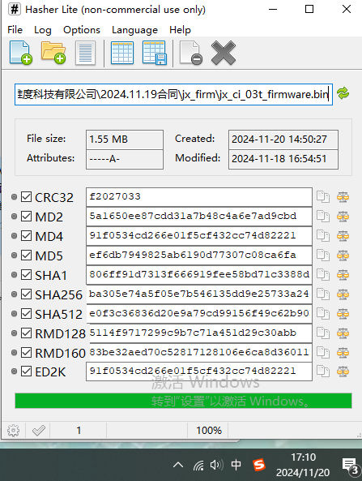

**2. 处理步骤**

步骤1：重新获取固件
- 从原始来源重新下载固件文件
- 确保下载过程中网络稳定
- 避免使用第三方转发链接

步骤2：验证新文件
- 使用MD5校验工具计算新文件的哈希值
- 与提供的标准MD5码进行对比
- 确认所有哈希值匹配后再进行烧录

步骤3：备份验证通过的固件
- 将验证通过的固件文件进行备份
- 记录对应的MD5校验码
- 避免重复下载导致的风险

**注意事项：**

- 不要使用MD5校验失败的固件进行烧录
- 建议使用官方渠道获取固件文件
- 保留每次烧录使用的固件版本和MD5记录
- 如多次下载仍失败，请联系固件提供方确认文件完整性

---

### CI-03T1模块需要烧录时的最快交期是多少？

**问题描述：**

需要确认CI-03T1模组的最快交货时间，特别是需要烧录自定义固件时的交期和流程安排。

**解决方案：**

**1. 交期说明**

**现货情况**：

- 标准出厂固件：有现货，可当天发货
- 自定义固件：需要安排烧录，增加2天时间

**烧录服务时间**：

- 收到固件后：2天内完成烧录
- 付款后：当天或次日发货
- 总交期：3-5天（含物流时间）


**2. 加急流程**

如需加快交期：

- 提前提供固件文件预烧录
- 确认付款后立即发货
- 使用快递物流缩短运输时间

**3. 固件提供方式**

推荐方式：

- **群内发送**：直接在群聊中提供固件文件
- **MD5校验**：提供MD5码确认版本
- **版本管理**：固件未变更时无需重复发送

**4. 操作建议**

优化流程：

- 固件无变更时，直接引用历史版本
- 保存好固件文件备份
- 使用MD5码确保版本一致性
- 提前沟通确认交付时间

**5. 注意事项**

- 烧录需按排单顺序进行
- 固件变更时请及时通知
- 付款是发货的前提条件
- 建议提前下单预留充足时间

---

### CI-03T芯片返厂烧录流程是怎样的？

**问题描述：**

需要了解CI-03T芯片返厂重新烧录的完整流程，包括烧录费用、寄送地址、固件配置、付款和发货安排。

**解决方案：**

**1. 返厂烧录服务说明**

正常情况下，重新烧录需要收取烧录费用。特殊情况可申请免收烧录费。

**2. 寄送流程**

步骤1：准备寄送
- 将需要重新烧录的芯片打包好
- 准备新的固件文件（如需更换）

步骤2：寄送地址
```
广东省深圳市宝安区西乡索佳科技园综合楼A903
收件人：唐一一
联系电话：13265817023
```

**3. 固件配置**

步骤1：提供固件
- 通过群聊或邮件发送新的固件文件
- 明确配置参数：

    - 唤醒词（如：老师、小笛小笛）
    - 回复语（如：我在、小笛收到）
    - 音量要求（如：回复声音较轻）

步骤2：确认配置
- 厂家会根据要求生成配置信息
- 格式示例：`笛虎科技（咚咚信息）/报警器/CI-03T V1.3 /jx_ci_03t_firmware /唤醒词:老师/回复语：请说/MD5-41ed58f0a3a5d4ee6c4838ce6996ce31`

**4. 烧录和验证**

步骤1：烧录执行
- 收到芯片后安排烧录（一般1-2天）
- 批量烧录需要排队，加急需提前说明

步骤2：MD5校验
- 烧录完成后生成MD5校验码
- 保存校验记录以确保固件一致性

**5. 付款和发货**

步骤1：确认费用
- 烧录费用：根据芯片数量计算
- 物流费用：根据寄送方式确定

步骤2：付款
- 确认付款后安排发货
- 保留付款水单作为凭证

步骤3：发货
- 发货地址需要提前确认
- 提供快递单号便于追踪
- 发货清单会详细列明物料信息

**6. 常见场景处理**

**场景1：部分芯片返厂烧录**

- 客户有部分库存芯片需要重新烧录
- 可与新订单一起安排烧录
- 明确总数量：新订单数量 + 返厂数量

**场景2：批量加急处理**

- 数量较大（1000片以上）需要提前沟通
- 加急订单可能产生额外费用
- 交期：收到付款后3-5天

**注意事项：**

- 寄送芯片时请做好包装，避免运输损坏
- 固件文件请在寄送芯片前提供，以节省时间
- 确认收件地址和联系人信息准确无误
- 保留所有交易和物流记录备查
- 如有特殊要求（音量调节、特定配置）请提前说明

---

### 如何订购CI-03T1芯片并配置烧录参数？

**问题描述：**

需要批量订购CI-03T1芯片，并确认是否需要烧录固件、具体的烧录参数配置以及发货流程。

**解决方案：**

**1. 订购流程**

**下单确认**：

- 明确订购数量（如1000颗）
- 确认芯片型号（CI-03T1）
- 提供开票信息和企业资料

**合同准备**：

- 供应商提供采购合同
- 核实公司信息和开票信息
- 确认交货期和付款条件

**2. 固件烧录配置**

**烧录确认**：
批量订购默认需要预烧录固件，明确以下参数：

- 唤醒词（如：小笛小笛）
- 回复语（如：小笛收到）
- 固件版本（如：CI-03T V1.3）
- 应用场景（如：报警器）

**配置格式示例**：
```
笛虎科技（咚咚信息）/报警器/CI-03T V1.3 /jx_ci_03t_firmware /唤醒词:小笛小笛/回复语：小笛收到/MD5-47fcf26e10da096d30d5472e4200162c
```

**3. 发货流程**

**付款确认**：

- 按合同约定支付预付款或全款
- 保留付款水单作为凭证
- 确认收款后安排生产

**生产排期**：

- 收到订单和合同后安排生产
- 烧录需要额外时间（一般2-3天）
- 生产完成后安排发货

**4. 物流配送**

**收货地址**：

- 提供详细的收货地址
- 确认收件人和联系电话
- 特殊要求（如快递公司）提前说明

**示例地址**：
```
浙江省杭州市萧山桥南经济开发区鸿发路292号
萱萱科技园6号楼北面4楼
张晓堂 13758064109
```

**5. 注意事项**

**信息准确性**：

- 订购时仔细核对芯片型号
- 烧录参数确认后避免频繁修改
- 收货地址确保准确无误

**时效管理**：

- 批量订单需要预留足够时间
- 烧录和生产按排单顺序进行
- 加急订单需提前沟通

---

### CI-03T芯片返厂重新烧录如何收费？

**问题描述：**

需要将退回的CI-03T芯片重新烧录新固件，需要了解烧录费用的处理方式和支付流程。

**解决方案：**

**1. 返厂烧录收费标准**

**常规收费**：

- 重新烧录需要收取烧录费
- 费用标准：200元/次（少量芯片）
- 大批量可协商优惠

**收费原因**：

- 需要安排技术人员操作
- 占用烧录设备和时间
- 产生人工和设备成本

**2. 费用支付方式**

**方式一：淘宝链接支付**

- 通过官方淘宝店铺支付
- 拍摄对应金额的链接
- 备注：烧录费用和相关订单信息

**淘宝支付示例**：

- 链接：https://item.taobao.com/item.htm?id=613062313898
- 拍摄金额：根据实际费用
- 备注：公司名称和烧录需求

**方式二：订单合并**

- 将烧录费计入下次订单
- 与新采购订单一起结算
- 开具统一发票

**3. 开票处理**

**发票开具**：

- 淘宝订单也可以开具发票
- 需要提供开票信息
- 与采购订单统一开票

**开票信息**：

- 公司名称：提供准确的企业名称
- 税号信息：确保正确无误
- 其他信息：按财务要求提供

**4. 操作流程**

**步骤1：确认需求**

- 明确需要烧录的芯片数量
- 提供新的固件文件或配置
- 确认是否需要加急处理

**步骤2：寄送芯片**

- 按照返厂地址寄送芯片
- 说明是重新烧录业务
- 保留快递单号备查

**步骤3：支付费用**

- 选择合适的支付方式
- 保留付款凭证
- 通知财务确认收款

**步骤4：烧录和发货**

- 收到芯片和费用后安排烧录
- 完成后按指定地址发货
- 提供新的发货单号

**注意事项**：

- 返厂烧录前请确认新的固件配置
- 少量芯片（如2片）建议与新订单一起处理
- 保留所有交易记录便于财务对账
- 如有特殊要求请在寄送前说明

---

### 如何使用MD5码确认CI-03T固件版本？

**问题描述：**

需要了解如何使用MD5码确认固件文件的唯一性，确保烧录的固件版本正确无误，避免使用错误版本的固件。

**解决方案：**

**1. MD5码的作用**

每个固件文件都有唯一的MD5码：

- MD5码是文件的"指纹"
- 相同文件的MD5码必定相同
- 不同文件的MD5码必定不同
- 用于验证固件完整性

**2. 校验步骤**

步骤1：获取标准MD5码
- 从固件提供方获取标准MD5码
- 格式如：MD5-0dfadd3424ad6dd09002cc920be6bc27
- 记录该码用于后续对比

步骤2：计算本地文件MD5
- 使用MD5校验工具（如Hasher Lite）
- 将固件.bin文件拖入工具窗口
- 自动计算并显示MD5码

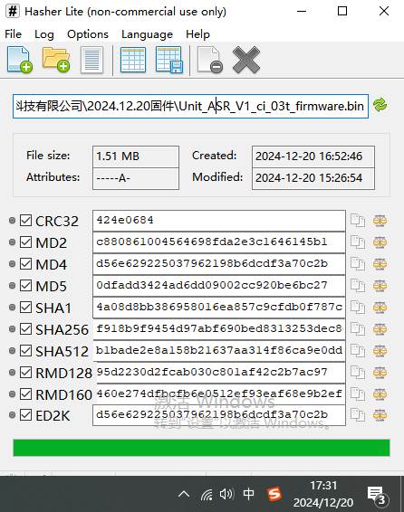

步骤3：对比确认
- 对比两个MD5码是否一致
- 一致：固件文件正确无误
- 不一致：文件损坏或版本错误

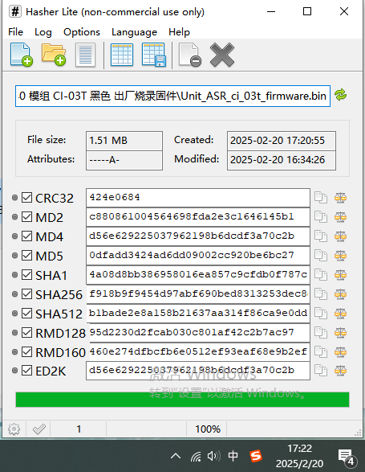

**3. 常用校验工具**

**Windows系统**：

- Hasher Lite：轻量级，拖拽操作
- WinMD5Free：免费开源
- MD5 & SHA Checksum Utility：功能全面

**其他系统**：

- macOS/Linux：内置md5sum命令
- 在线工具：支持文件上传计算

**4. 固件管理建议**

版本管理：

- 建立固件版本档案
- 记录每个版本的MD5码
- 保留历史版本备份

操作流程：

- 烧录前必须验证MD5
- 发现不一致立即停止操作
- 重新下载正确版本固件

**5. 注意事项**

- 固件文件路径不能包含中文
- 下载过程中可能损坏文件
- 建议使用官方渠道获取固件
- 定期备份重要版本的固件

---

### CI-03T的TTS语音合成功能需要授权吗？

**问题描述：**

测试CI-03T模块的TTS语音合成功能时失败，需要确认是否需要特殊授权，以及如何获取支持TTS功能的模块。

**解决方案：**

**1. TTS功能授权说明**

CI-03T模块分为两种版本：

- **普通版本**：不支持TTS功能
- **TTS授权版本**：支持语音合成功能
- 授权在生产时完成，无法后期开通

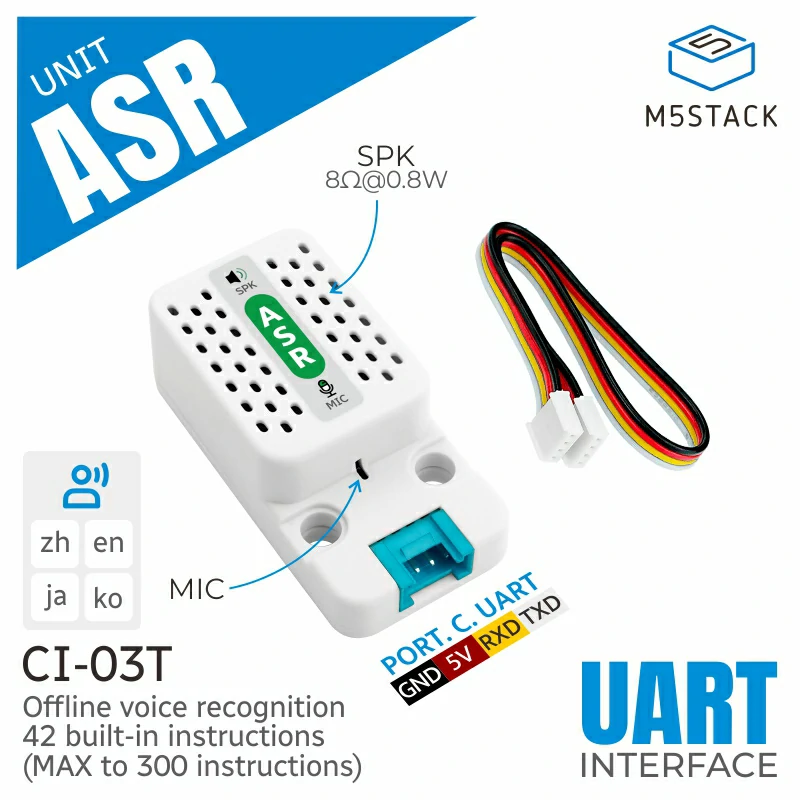

**2. 授权版本识别**

购买时的区别：

- 普通版本：标准价格
- TTS版本：价格更高，需要特别说明
- 购买时需明确选择"文本转语音"版本

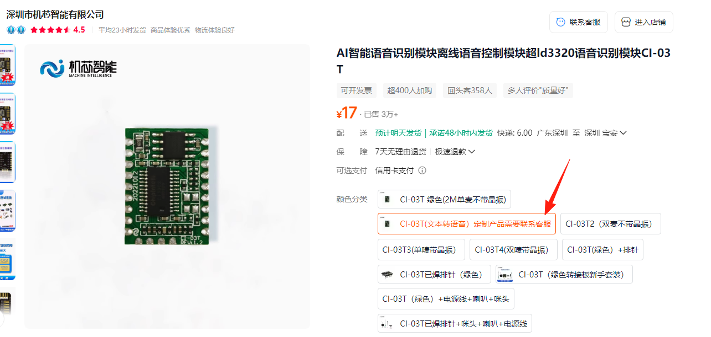

**3. 功能差异对比**

**普通版本**：

- 支持离线语音识别
- 支持命令词控制
- 不支持TTS语音合成
- 可播放预录音

**TTS版本**：

- 包含所有普通版本功能
- 额外支持TTS语音合成
- 可动态生成语音内容
- 适合需要灵活语音播报的应用

**4. 使用限制说明**

重要限制：

- TTS授权无法远程开通
- 普通版本不能升级为TTS版本
- 已售出的普通模块无法二次授权
- TTS模块只能烧录TTS固件

**5. 授权验证方法**

确认方式：

- 查看购买订单是否标注TTS版本
- 尝试TTS功能是否正常响应
- 联系销售方确认授权状态
- 查看模块包装标识

**6. 应用建议**

适用场景：

- **To B项目**：适合需要灵活语音合成的企业项目
- **普通用户**：普通版本即可满足基本需求
- **特殊需求**：需要动态语音播报时必须使用TTS版本

**注意事项：**

- TTS功能需要在购买时特别说明
- 授权与硬件绑定，不能转移
- TTS模块烧录非TTS固件会失去授权
- 购买前请确认项目是否需要TTS功能

---

### CI-03T串口调试工具无法显示16进制数据怎么办？

**问题描述：**

在使用串口调试工具时，无法正常显示16进制数据，发送的数据仍以ASCII码形式显示。

**解决方案：**

**问题原因分析：**

1. **串口配置错误**：

    - 可能选择了错误的串口号（串口1而非串口0）
    - 波特率等参数设置不正确
    - 硬件接线可能存在问题

2. **工具设置问题**：

    - 未勾选"HEX显示"选项
    - 发送设置未选择16进制模式

**解决方法：**

1. **确认串口选择**：

    - 视频教程使用的是串口0
    - 在平台中配置UART0_TX和UART0_RX
    - 串口0对应的引脚是P14和P15（DEFAULT_P14/DEFAULT_P15）

2. **检查硬件连接**：

    - 确认RXD和TXD接线正确
    - 检查共地连接
    - 验证USB转串口设备工作正常

3. **串口工具设置**：

    - 勾选"HEX显示"选项
    - 勾选"发送16进制数"选项
    - 确认波特率设置为9600

4. **平台配置步骤**：

    - 进入PIN脚配置界面
    - 找到可配置UART0的引脚
    - 配置UART0_TX和UART0_RX
    - 在串口发送设置中选择串口0

**注意事项：**

- 串口0默认也是日志输出口，可能输出系统信息
- 串口1只能通过A2、A3引脚输出
- 如果使用串口0，可能会影响烧录功能
- 建议先使用串口1测试基础功能

---

### CI-03T如何配置串口0输出16进制数据？

**问题描述：**

需要配置CI-03T的串口0输出16进制数据，但在配置界面找不到UART0_TX选项。

**解决方案：**

**串口配置说明：**

1. **引脚复用原理**：

    - CI-03T的多个引脚支持复用功能
    - 不是所有引脚都能配置为串口0
    - 需要在正确的引脚位置查找UART0选项

2. **查找UART0的方法**：

    - 进入PIN脚配置界面
    - 逐一点击各个引脚查看选项
    - UART0_TX通常出现在P14、P15等特定引脚

3. **配置步骤**：

    - 找到支持UART0的引脚（如DEFAULT_P14）
    - 选择UART0_TX功能
    - 配置对应的RX引脚
    - 设置波特率等参数

4. **替代方案**：

    - 使用串口1（UART1_TX/RX）
    - 对应引脚为A2和A3
    - 在串口发送时选择串口1

**注意事项：**

- 串口0（P14/P15）是默认烧录引脚
- 配置串口0可能影响后续烧录
- 串口0会输出系统日志信息
- 如仅需串口通信，建议使用串口1

---

### Arduino串口监控器显示CI-03T数据为乱码怎么办？

**问题描述：**

使用Arduino串口监控器读取CI-03T发送的16进制数据时，显示为乱码（一堆问号），但其他串口工具可以正常显示。

**解决方案：**

**问题分析：**

1. **Arduino IDE限制**：

    - Arduino串口监控器主要用于字符显示
    - 不支持直接的16进制显示模式
    - 无法像专业串口工具那样切换显示模式

2. **数据格式问题**：

    - CI-03T发送的是原始16进制数据
    - Arduino按ASCII码解释导致显示异常
    - 缺少HEX显示功能

**解决方法：**

1. **使用专业串口工具**：

    - 推荐使用SSCOM串口调试助手
    - 勾选"HEX显示"选项
    - 可以正确显示16进制数据

2. **Arduino代码处理**：
    ```cpp
    void setup() {
        Serial.begin(9600);
    }

    void loop() {
        if (Serial.available() > 0) {
        byte data = Serial.read();
        Serial.print(data, HEX);  // 以16进制格式显示
        Serial.print(" ");
        }
    }
    ```

3. **替代方案**：

    - 使用其他支持HEX显示的串口工具
    - 如需要Arduino接收，编写代码转换格式
    - 确认双方的波特率设置一致

**验证步骤：**

1. CI-03T端配置：

    - 确认已配置串口输出
    - 选择正确的串口号（0或1）
    - 设置波特率9600

2. 连接验证：

    - 确认硬件连接正确
    - 检查RX/TX接线
    - 验证共地连接

3. 工具测试：

    - 先用SSCOM等专业工具验证
    - 确认能正常显示16进制
    - 再尝试Arduino接收处理

**注意事项：**

- Arduino串口监控器不适合查看16进制数据
- CI-03T的串口通信本身没有问题
- 如需在Arduino中处理，需要编写转换代码
- 建议使用专业串口调试工具进行调试

---

### CI-03T2长时间运行后串口指令不响应怎么办？

**问题描述：**

设备连续运行后，发现串口指令AA 55 01 55 AA无法控制CI-03T2离线语音模组，尽管设备语音唤醒功能正常，且串口数据已成功发送至模组。

**解决方案：**

**1. 问题排查**

确认故障现象：

- 语音唤醒和自然说功能正常
- 串口数据已发送到模组（可通过抓包确认）
- 仅串口指令不响应
- 断电重启后暂时恢复正常

**2. 根本原因**

发送错误串口数据格式导致：

- 任何错误格式的串口数据都可能导致模组异常
- 错误数据累积后，正确指令也无法识别
- 需要重新上电才能恢复正常

**3. 解决方案**

**临时措施：**

- 断电重启设备可暂时恢复功能
- 避免发送错误格式的数据

**根本解决：**

- 平台已修复此问题，需重新生成固件
- 导入修改后的配置文件
- 重新生成并烧录固件

**4. 预防措施**

- 串口通信协议建议包含帧头帧尾、长度和校验字节
- 避免连续发送错误数据
- 长时间运行建议定期重启设备

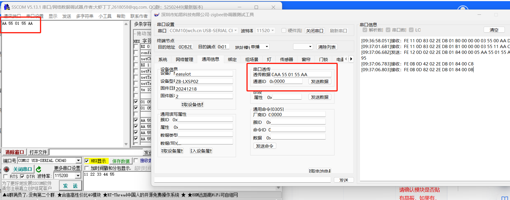

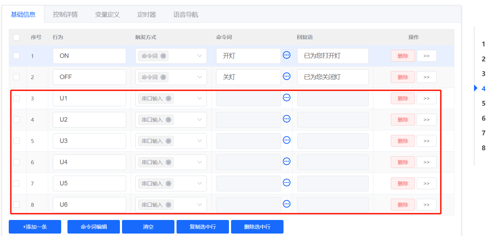

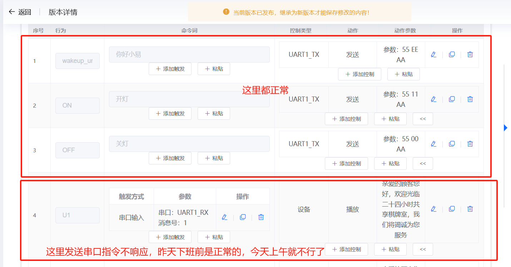

**注意事项：**

- 该问题在固件更新后已解决
- 语音播报文本建议控制在16字以内，超过长度需分段播报
- 使用UART1进行串口通信，保留UART0用于调试
- 重新生成固件前需刷新平台页面

---

### CI-03T芯片应该使用哪个烧录工具？

**问题描述：**

需要确认CI-03T芯片烧录时应使用的正确烧录工具和操作流程。

**解决方案：**

使用**云知声UniOne离线M烧录工具**进行CI-03T芯片的固件烧录。

**烧录工具信息：**

- 工具名称：云知声UniOne离线M烧录工具
- 推荐版本：V3.9.6或更高版本
- 支持固件格式：.bin文件

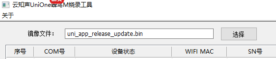

**烧录操作步骤：**

1. **工具准备**
    - 下载并安装官方烧录工具
    - 准备需要烧录的固件文件（.bin格式）

2. **硬件连接**
    - 使用CH340或其他USB转串口模块连接CI-03T
    - 确认连接到正确的COM端口

3. **烧录设置**
    - 打开烧录工具
    - 选择正确的COM端口
    - 加载固件文件（如：uni_app_release_update.bin）
    - 设置波特率为921600

4. **执行烧录**
    - 点击开始烧录
    - 等待进度完成
    - 确认显示"device: update success"

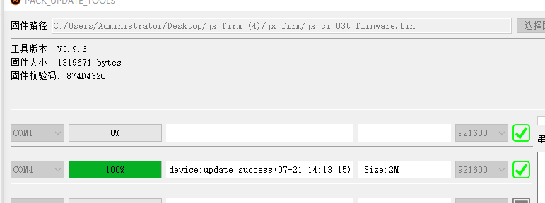

**官方文档：**

详细烧录指南可参考：
https://help.aimachip.com/docs/offline_ci03t/offline_ci03t-1gbdvfoifmpdr

**注意事项：**

- 固件文件路径不能包含中文字符
- 烧录前确保端口连接正确
- 如烧录失败，尝试更换USB端口
- 烧录完成后模块会自动重启

---

### CI-03T烧录时端口选择错误怎么办？

**问题描述：**

烧录CI-03T时，波特率设置为921600但烧录失败，可能是COM端口选择错误导致。

**解决方案：**

**端口识别方法：**

1. **查看设备管理器**
    - 打开Windows设备管理器
    - 展开"端口(COM和LPT)"
    - 查找"USB-SERIAL CH340"对应的COM端口

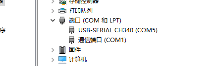

2. **确认正确的端口**
    - CH340烧录器通常会显示为"USB-SERIAL CH340 (COMx)"
    - COM端口号可能是COM3、COM4、COM5等
    - 选择设备管理器中显示的实际COM端口

**烧录设置步骤：**

1. **选择正确的端口**
    - 在烧录工具中选择CH340对应的COM端口
    - 不要选择其他通信端口（如主板自带的COM1）

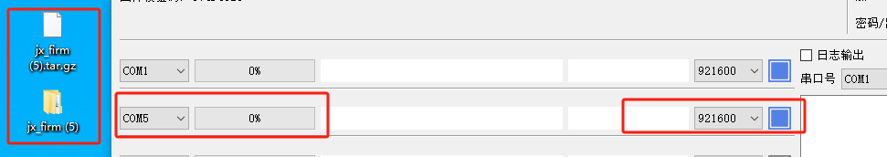

2. **确认波特率设置**
    - 波特率设置为921600（正确）
    - 其他参数保持默认

3. **复位模块**
    - 勾选烧录工具中的"复位"选项
    - 或者手动复位模块后再开始烧录

**常见问题处理：**

- **端口被占用**：关闭其他可能使用该端口的程序
- **驱动未安装**：安装CH340驱动程序
- **USB连接问题**：更换USB端口或数据线

**注意事项：**

- 每次重新插拔USB后，COM端口号可能变化
- 建议在设备管理器中确认当前端口号
- 烧录前先复位模块可提高成功率

---

### CI-03T1和CI-03T2可以直接替换主板使用吗？

**问题描述：**

询问CI-03T1和CI-03T2两款芯片是否可以作为主板直接替换使用，连接电源后能否直接驱动喇叭工作。

**解决方案：**

**直接使用方法**

两款模块都可以直接使用：

- **供电要求**：接5V电源即可正常工作
- **喇叭连接**：直接连接喇叭即可播放声音
- **替换使用**：可以作为主板直接替换使用

**功能特点**

- **CI-03T1**：基础版本，支持标准语音识别功能
- **CI-03T2**：功能相似，同样支持直接驱动喇叭
- **即插即用**：无需额外配置，连接电源和喇叭即可使用

**注意事项：**

- 确保供电电压稳定在5V
- 喇叭功率需匹配模块输出能力
- 如需定制功能，可在平台配置后重新烧录固件

---

### CI-03T1/CI-03T2的GPIO12引脚与平台不一致怎么办？

**问题描述：**

使用CI-03T1或CI-03T2芯片模块时，GPIO12引脚连接到模块的X4脚，但模块的引脚号与平台软件中的引脚号不一致，导致无法正确配置。

**解决方案：**

**1. 引脚映射差异说明**

- 模块的物理引脚号与平台软件中的GPIO编号不同
- GPIO12在平台中的编号不代表模块的物理引脚位置
- 需要明确区分模块引脚和平台引脚的概念

**2. 正确的配置方法**

- 在平台软件中选择GPIO12配置功能
- 查看对应的模块物理引脚位置
- 确保外部信号连接到正确的物理引脚

**3. 引脚对应关系确认**

平台软件会显示GPIO12对应的实际功能选项：

- GPIO12：基础GPIO功能
- PWM5：脉宽调制功能
- UART3_RX：串口接收功能
- 其他复用功能选项


**注意事项：**

- 平台中的GPIO编号是功能编号，不是物理引脚号
- 连接外部信号时，需要根据平台配置连接到对应的物理引脚
- 如不确定引脚对应关系，可在平台配置界面查看具体映射

---

### CI-03T1和CI-03T2的GPIO-12引脚位置不同怎么办？

**问题描述：**

配置离线语音识别芯片的GPIO引脚时，发现CI-03T1和CI-03T2两款产品的GPIO-12引脚在硬件上的物理PIN号不同，导致接线错误。

**解决方案：**

**1. 引脚位置差异**

两款产品的GPIO-12对应不同的物理引脚：

- **CI-03T1**：GPIO-12对应模块的PIN 10
- **CI-03T2**：GPIO-12对应模块的PIN 59

**2. 正确接线方法**

- 确认使用的是哪款产品型号
- 根据型号找到对应的物理引脚位置
- 将外部信号连接到正确的PIN脚

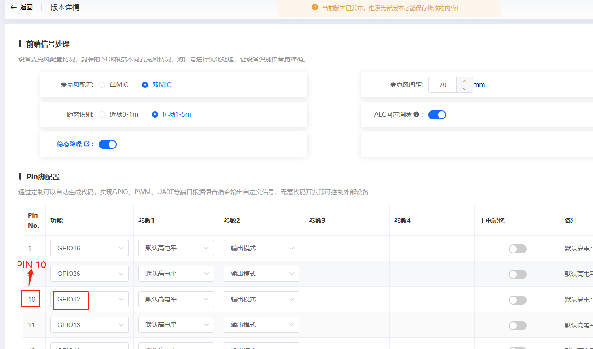

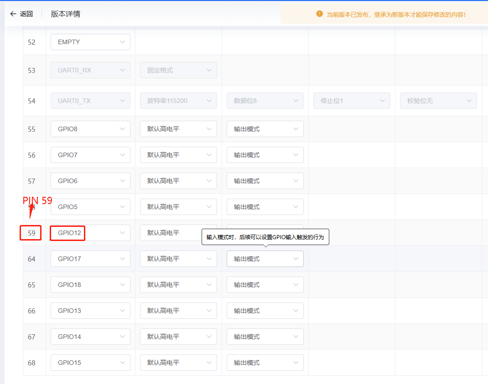

**3. 平台配置对应**

在平台软件中查看GPIO配置：

- GPIO12在两个型号中功能相同
- 但物理连接到不同PIN脚
- 需要根据实际硬件选择连接点

**4. 验证方法**

- 使用万用表测试引脚通断
- 确认外部信号正确连接到指定PIN脚
- 上电测试GPIO功能是否正常

**注意事项：**

- 务必先确认产品型号（CI-03T1或CI-03T2）
- 接线错误会导致GPIO功能无法正常工作
- 两个产品的其他GPIO引脚位置也可能不同

---


### CI-03T固件烧录次数限制说明

**问题描述：**

需要了解CI系列芯片（如CI-03T1和CI-03T2）的固件烧录次数是否有限制，重新烧录是否会覆盖之前固件。

**解决方案：**

**1. 烧录次数说明**

- CI-03T系列芯片没有烧录次数限制
- 可以根据需要进行多次烧录
- 支持固件版本升级和回滚

**2. 固件覆盖机制**

- 重新烧录会完全覆盖原有固件
- 新固件替换旧固件的所有内容
- 不需要手动擦除旧固件

**3. 操作建议**

- 烧录前确认新固件版本正确
- 保留重要版本的固件备份
- 记录每次烧录的MD5校验值

**注意事项：**

- 烧录过程中确保供电稳定
- 避免烧录中断导致模块损坏
- 建议在专业环境下进行烧录操作
- 建议参考对应型号的引脚图进行连接

---

### 如何优化CI-03T模块的烧录流程以提高效率？

**问题描述：**

在使用CI-03T模块进行语音识别应用时，烧录流程需要多次解压文件、选择文件并烧录，操作重复且易出错，特别是在教育场景中，学生批量操作时效率较低。

**解决方案：**

**当前流程痛点：**

- 下载固件后需要多次解压操作
- 每次烧录都需要手动选择文件
- 重复的解压→选择→烧录→删除操作
- 脚本方案因不同电脑分辨率差异而不稳定

**优化建议：**

1. **批量烧录准备**

    - 将固件压缩包统一存放在固定路径
    - 使用解压软件的永久解压功能，避免重复解压
    - 建立标准化的文件命名和目录结构

2. **烧录工具优化**

    - 使用PACK_UPDATE_TOOL的最近文件列表功能
    - 将常用固件放在固定位置，减少查找时间
    - 创建桌面快捷方式，直接启动到指定目录

3. **教学场景优化**

    - 制作详细的操作步骤图文教程
    - 培训学生熟悉烧录流程的关键步骤
    - 安排分组操作，避免同时下载造成网络拥堵

4. **替代方案探讨**

    - 网页版串口烧录：受限于浏览器安全策略，实现复杂
    - 一键式烧录脚本：需要考虑跨平台兼容性
    - 批量烧录工具：可联系技术支持定制开发

**注意事项：**

- 固件文件路径建议使用英文，避免中文路径导致的兼容性问题
- 烧录前确保USB转TTL驱动已正确安装
- 教育环境中建议错峰进行固件下载，避免网络拥堵
- 保留固件备份，便于出现问题时的快速恢复

---

### CI-03T1二次烧录后指令识别异常怎么办？

**问题描述：**

使用升级狗对CI-03T1芯片进行二次烧录时，部分芯片出现指令识别异常，修改后的指令词无法被识别，且串口无对应消息输出。

**解决方案：**

**1. 问题定位**

- 通过串口调试工具监控消息输出
- 记录哪些指令有输出，哪些没有
- 对比正常芯片和异常芯片的差异

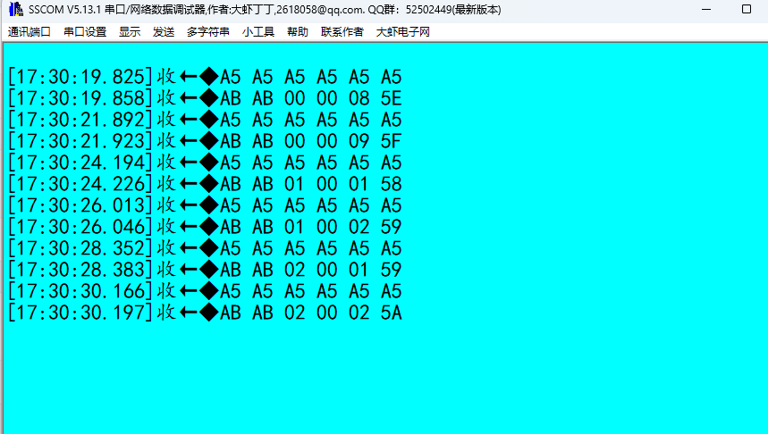

**2. 指令对比分析**

- 制作指令词变更对比表
- 标记出所有修改的指令
- 检查问题指令是否都是修改过的


**3. 硬件连接检查**

- 确认使用的是B2/B3烧录接口
- 不是通过串口进行烧录
- 检查连接线是否牢固

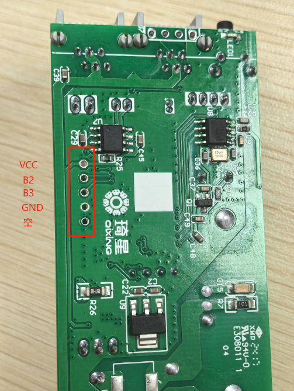

**4. 可能的原因**

- Flash可能存在保护机制
- 第一次烧录后某些区域被锁定
- 供电不稳导致数据写入不完整

**5. 解决方案**

- 使用CH340烧录器重新尝试
- 给模块提供独立稳定供电
- 多次烧录仍无效则更换芯片


**注意事项：**

- 升级狗烧录时会先擦除原固件
- 烧录成功不代表所有功能正常
- 建议每台都进行功能测试

---

### CI系列芯片串口通信协议不匹配怎么办？

**问题描述：**

CI系列离线语音识别芯片在使用串口通信时，协议数据格式不匹配导致无法触发响应。

**解决方案：**

**1. 协议格式确认**

- 检查数据包结构是否正确（帧头、命令、数据、校验、帧尾）
- 验证数据长度字段与实际数据长度一致
- 确认校验和计算方法正确

**2. 硬件连接检查**

- 确认串口引脚连接正确（TX-RX交叉）
- 检查波特率设置是否匹配（常用115200）
- 验证电源供电稳定

**3. 逐步调试**

- 先发送简单指令测试连通性
- 使用示波器或逻辑分析仪查看信号波形
- 对比发送和接收的数据字节

**注意事项：**

- CI系列芯片对协议格式要求严格
- 建议使用官方提供的协议文档
- 确保数据包完整无丢失

---

### CI-03T1模块烧录后反复重启怎么办？

**问题描述：**

CI-03T1模块成功烧录出厂固件后，设备重启后无法被发现，串口日志显示模块处于反复重启状态，无法稳定运行。

**解决方案：**

**1. 检查串口工具设置**

- 取消勾选串口工具中的"16进制显示"选项
- 取消勾选"时间戳"选项
- 确保波特率设置为2000000，数据位8，停止位1，校验位None

**2. 确保稳定供电**

- 将模块电源线直接焊接在电源上，避免使用杜邦线
- 确认供电电压在3.6-5.5V范围内
- 确保电源能提供足够电流（大于500mA）
- 如使用下载器供电异常，可改用独立3.3V电源模块

**3. 重新烧录测试**

- 使用稳定供电重新烧录出厂固件
- 观察启动日志，确认模块能稳定启动
- 检查蓝牙广播功能是否正常开启

**注意事项：**

- 杜邦线接触不良可能导致供电不足引发重启
- 串口工具配置错误会导致日志解析失败
- 模块在启动过程中立即重启表明供电或固件存在问题

---

### CI-03T1模块蓝牙配网失败怎么办？

**问题描述：**

设备在通过下载器连接电脑时无法进入蓝牙配网模式，配网失败，而使用充电器供电后问题解决。

**解决方案：**

**1. 供电电流检查**

- 确认模块供电电流充足（建议大于500mA）
- 下载器USB端口供电可能不足，可尝试：

    - 使用充电器供电
    - 使用独立3.3V电源模块
    - 直接焊线连接稳定电源

**2. 配网模式确认**

- 确认模块已进入运行模式（IO8悬空或接高电平）
- 在小程序中搜索设备，确认蓝牙广播已开启
- 配网过程中观察串口日志输出

**3. 配网步骤**

- 确保设备处于配网模式
- 核对WIFI密码是否正确
- 确认路由器为2.4G频段
- 检查设备是否已授权

**注意事项：**

- 下载器连接电脑时USB供电电流可能不足
- 配网失败时检查日志可帮助定位具体原因
- 使用独立供电通常能解决配网问题

---

### CI-03T如何通过引脚状态判断MP3播放状态？

**问题描述：**

在语音控制MP3播放器应用中，因主控UART被占用无法通过串口通信，需要通过C4引脚状态判断播放或暂停，但该判断时常出现错误。

**解决方案：**

**1. 硬件连接方案**

- C4引脚：用作MUTE状态判断（播放/静音状态）
- A1引脚：用作暂停或播放控制信号
- 当UART无法使用时，通过GPIO引脚状态进行状态判断

**2. 状态判断优化**

- 在智能公元平台配置中直接设置播放状态判断逻辑
- 避免仅依赖单一引脚电平进行状态判断
- 建议使用组合状态判断提高准确性

**3. 控制指令配置**

常用MP3控制指令包括：

- PLAY：播放
- PAUSE：暂停
- PREV：上一曲
- NEXT：下一曲
- VOL+/VOL-：音量调节
- POWER OFF：关机

**注意事项：**

- 依赖单一引脚状态判断可能导致逻辑混乱
- CI-03T在此类应用中仅作为控制端，不需要接收指令
- 如需精确状态反馈，建议考虑使用支持串口通信的方案
- 可参考蓝牙音箱案例的设计思路进行优化

---

### 固件生成失败提示文件过大怎么办？

**问题描述：**

固件生成时提示"生成失败，生成的固件超大(8192字节)"，同时烧录时卡在8%进度无法完成。

**解决方案：**

**1. 固件大小限制问题**

- CI1302/CI1303固件大小限制为8KB（8192字节）
- 超过限制会导致生成失败
- 需要优化配置以减小固件体积

**2. 优化方案**

- 删除不必要的配置项目
- 选用占用空间较小的模型
- 使用组合播报功能替代长音频
- 选择"普通通话用Pro(占0.6M空间)"等小型配置


**3. 烧录卡顿处理**

烧录卡在8%的常见原因：

- **接触不良**：烧录线连接不稳定
- **供电不稳**：电源电压波动
- **芯片损坏**：模块硬件故障

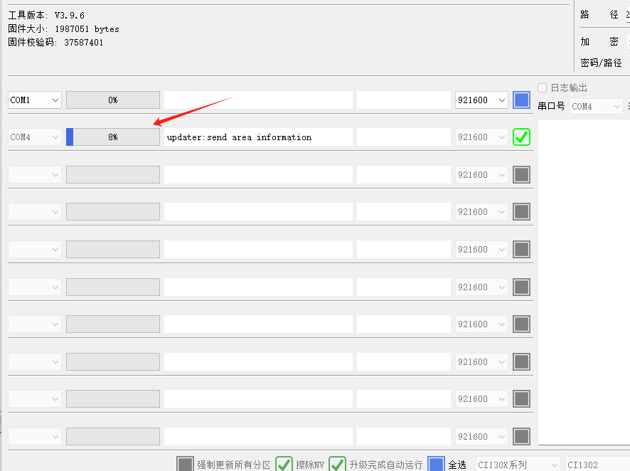

**注意事项：**

- 声纹识别功能需要使用CI-33T（CI1303芯片），其内存更大
- 如果必须使用大模型，考虑升级到CI-33T模块
- 烧录时确保连接良好，使用稳定电源

---

### CI-03T2模块需要购买哪些烧录设备？

**问题描述：**

需要了解CI-03T2双麦模块进行固件烧录所需的设备，以及是否需要购买专用烧录机。

**解决方案：**

CI-03T2模块烧录所需设备：

- **CI-03T2模块**：双麦克风离线语音识别模块
- **CH340模块**：USB转TTL转换器，用于连接电脑和模块
- **USB转TTL线**：实现电平转换和通信
- **测试烧录工具**：PACK_UPDATE_TOOL烧录软件

**烧录方案说明：**

1. **固定命令词应用**：

    - 使用离线模块即可满足需求
    - 在智能公元平台设定固定的命令词
    - 通过GPIO控制灯光等设备

2. **灵活识别需求**：

    - 如需识别非预设的语音内容
    - 需要使用在线语音模块
    - 离线模块无法实现动态语音分析

**设备选型建议：**

- **小规模使用**（几十个模块以内）：使用CH340+USB转TTL方案
- **大规模生产**（上百上千个模块）：考虑专用烧录设备
- **离线模块套装**：通常不超过100元，包含基础烧录配件

**注意事项：**

- CI-03T2支持固定命令词识别，不支持动态语音内容分析
- CH340是官方推荐的标准烧录方案，兼容性最佳
- 烧录前需安装CH340驱动程序

---

### CI-03T2识别语音指令后如何向电脑发送通知？

**问题描述：**

需要了解CI-03T2模块在识别到特定语音指令（如"开启网页"）后，通过何种方式向电脑发送通知，以及如何配置这些通知方式。

**解决方案：**

CI-03T2模块支持多种通知方式，可在智能公元平台进行配置：

**支持的通知方式：**

- **脉冲信号**：输出脉冲控制信号
- **串口信息**：通过串口发送数据
- **IO高低电平**：设置引脚输出高/低电平
- **PWM波**：输出PWM调制波形

**配置步骤：**

1. **在智能公元平台设置命令词**：

    - 添加所需的命令词（如"开启网页"）
    - 选择对应的触发操作

2. **选择通知方式**：

    - 在命令词配置后选择通知方式
    - 根据应用需求选择合适的通知类型
    - 可组合使用多种通知方式

3. **硬件连接**：

    - 根据选择的通知方式连接相应电路
    - 串口通信需要连接到电脑的串口
    - IO电平信号需要连接到微控制器或检测电路

**语言支持说明：**

- **平台语言**：智能公元平台为简体中文界面
- **识别语言**：支持简体中文和繁体中文语音识别
- **配置要求**：命令词需使用简体中文输入

**注意事项：**

- 离线模块仅支持预设的固定命令词
- 通知方式需在固件生成前配置完成
- 串口通信需要额外的硬件转换电路
- 如需蓝牙功能，需要额外配置蓝牙模块

---

### CI-03T模块WiFi连接失败如何排查？

**问题描述：**

CI-03T1或CI-03T2模块烧录程序后无法连接WiFi，虽然蓝牙配网功能在特定条件下可以成功，但大多数情况下连接失败。

**解决方案：**

**1. 硬件设计检查**

- 检查硬件设计图中电源管理部分是否稳定
- 确认CI1302主控芯片供电电压正常
- 验证蓝牙模块（CH340N）连接正确

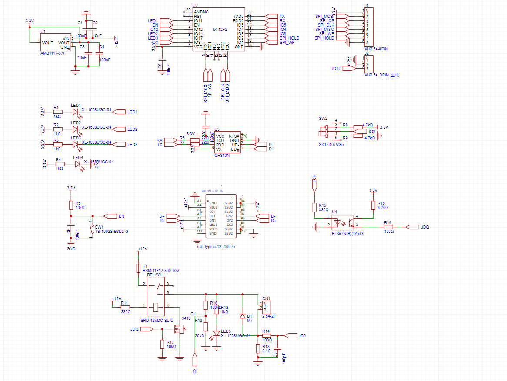

**2. 引脚配置验证**

- 确认IO0引脚已正确拉低（进入下载模式）
- 检查IO8引脚配置是否正确
- 验证所有必需的引脚连接

**3. 蓝牙配网流程**

- 确认蓝牙功能已开启并可被搜索
- 检查MTU大小交换是否成功
- 验证蓝牙参数更新是否完成

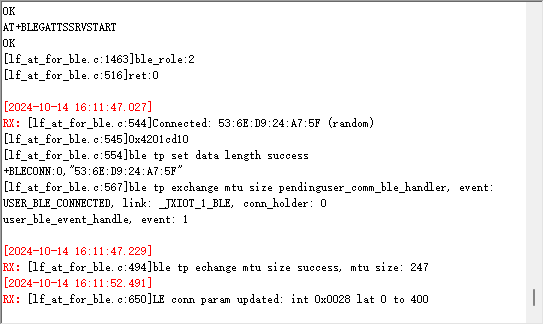

**4. WiFi兼容性测试**

- 仅支持2.4G频段WiFi网络
- WiFi名称不建议包含特殊字符或下划线
- 使用手机热点进行初步测试

**5. 环境因素排查**

- 确保配网环境WiFi信号良好
- 避免多个设备同时连接同一AP
- 检查是否存在信号干扰

**注意事项：**

- 部分路由器兼容性问题可能导致连接失败
- 如使用手机热点成功，说明模块功能正常
- 建议更换不同品牌路由器进行测试
- 硬件设计需严格遵守参考设计

---

### CI-03T模块通信数据格式校验错误怎么办？

**问题描述：**

使用CI-03T1或CI-03T2模块时，发现发送的数据格式存在校验错误，特别是当上下灯调亮度滑动时，数据值没有变化，且校验值计算不正确。

**解决方案：**

**1. 数据包结构分析**

模块发送的数据包格式为：

- 包头：AA 55（固定）
- 数据内容：根据功能不同而变化
- 校验值：对整个数据包（包括包头）进行计算

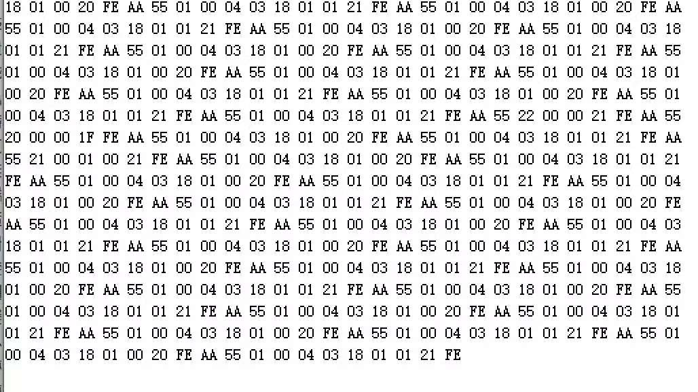

**2. 校验值计算方法**

校验值需要包含包头AA 55在内的所有字节进行累加：

- 错误做法：只计算数据部分，忽略包头
- 正确做法：从AA 55开始计算到校验位之前的所有字节

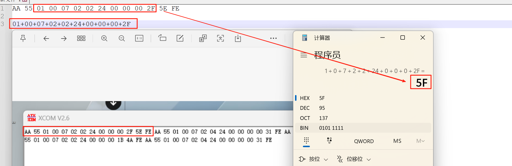

**3. 亮度调节数据验证**

检查上下灯亮度调节功能：

- 上光源亮度调节：通信内容 0x0202，数值范围 1-100
- 下光源亮度调节：通信内容 0x0203，数值范围 1-100
- 辅灯亮度调节：通信内容 0x0316，数值范围 1-100


**4. 数据解析步骤**

正确的数据解析流程：

- 步骤1：识别数据包包头 AA 55
- 步骤2：提取功能ID（如0202表示上光源）
- 步骤3：提取数据值（注意Int32类型占4字节）
- 步骤4：验证校验值（包含包头计算）

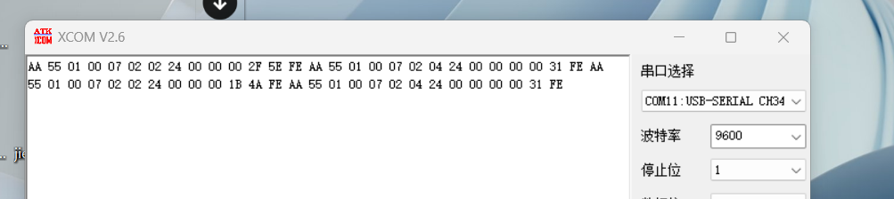

**注意事项：**

- Int32类型数据占用4个字节，不是2个字节
- 校验值计算必须包含AA 55包头
- 不同数据类型的字节数不同，需根据属性格式类型表确定
- 如数据值始终为00，检查功能ID和数据解析逻辑

### 上下灯调亮度时数据值始终为00怎么办？

**问题描述：**

在调节上下灯亮度时，观察到数据值始终显示为00，无法正常变化，影响亮度控制功能。

**解决方案：**

**1. 检查功能点ID映射**

确认亮度调节功能对应的ID：

- 上光源亮度调节：ID为0x0202
- 下光源亮度调节：ID为0x0203
- 辅灯亮度调节：ID为0x0316

**2. 验证数据读取位置**

根据串口接收到的数据流：

- 02 02：表示上光源亮度调节
- 02 03：表示下光源亮度调节
- 03 16：表示辅灯亮度调节

**3. 数据值提取方法**

正确的数据值提取：

- 功能ID后的连续字节为亮度值
- 注意数据类型可能是Int32（4字节）
- 根据实际发送的亮度值（1-100）验证解析

**注意事项：**

- 亮度值范围应为1-100，不是固定的00
- 如滑动调节时数据无变化，检查数据包解析逻辑
- 确认功能ID与实际控制功能对应正确

---

### CI系列模块Int32类型数据解析错误怎么办？

**问题描述：**

在使用CI系列离线语音识别芯片时，发现数据格式与属性类型不匹配，特别是处理Int32类型数据时，实际通信数据中只传输了2个字节，导致数据解析错误。

**解决方案：**

**1. 理解Int32数据格式**

根据属性格式类型表：

- Int32类型数据长度：4字节
- 数值范围：-2147483647 到 2147483647
- 十六进制表示：需要4个字节

**2. 数据传输验证**

检查实际通信数据：

- 发送数值2：应为 00 00 00 02
- 发送数值0：应为 00 00 00 00
- 发送数值-2：应为 FF FF FF FE

**3. 数据包解析示例**

根据实际数据包分析：

- AA 55：包头
- 01 00：功能ID或长度
- 00 00 00 00：Int32类型的数据值（0）
- 00 00 00 64：Int32类型的数据值（100）

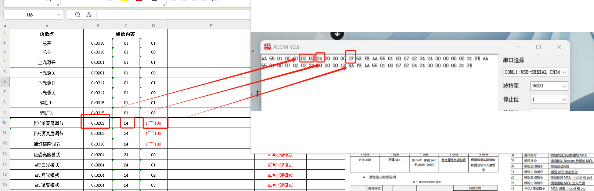

**注意事项：**

- 不同数据类型的字节数不同，必须严格按规范解析
- Int32类型固定占用4字节，即使数值很小也不能减少
- 负数使用补码表示，注意符号位处理
- 解析时注意字节序（大端/小端）

### 通信协议数据包如何正确解析？

**问题描述：**

在解析通信协议数据时，发现不同数据类型的字节长度和数值转换方式不同，导致从串口接收的十六进制数据无法正确解析为对应的数值。

**解决方案：**

**1. 识别数据包结构**

典型的数据包格式：

- AA：包起始标识
- 功能ID：如 01 00
- 数据值：根据类型确定字节数
- 校验位：如 FE（包结束）

**2. 数据类型识别**

根据属性格式类型表确认：

- Bool类型：1字节
- Int8类型：1字节
- Int16类型：2字节
- Int32类型：4字节
- String类型：可变长度

**3. 实际数据包分析**

从串口接收到的数据示例：
```
AA 01 00 00 00 00 00 00 64 FE
AA 01 00 00 00 00 00 00 00 FE
```

解析结果：

- 第一个包：数值100（十六进制 00 00 00 64）
- 第二个包：数值0（十六进制 00 00 00 00）


**4. 解析步骤**

正确的数据解析流程：

- 步骤1：等待包起始标识 AA
- 步骤2：读取功能ID（2字节）
- 步骤3：根据数据类型读取相应字节数
- 步骤4：转换十六进制为十进制数值
- 步骤5：验证包结束标识 FE

**注意事项：**

- 必须严格按照协议规范读取字节数
- 不同功能点可能使用不同的数据类型
- 建议使用状态机方式解析数据包
- 注意校验位验证，确保数据完整性
---

### CI-03T1与SU-03T串口烧录引脚是否相同？

**问题描述：**

询问CI-03T1与SU-03T的串口烧录引脚是否相同，并在烧录软件中未找到CI130X系列芯片选项。

**解决方案：**

CI-03T1与SU-03T的串口烧录引脚不相同，两个模块搭载的芯片不同：

- **CI-03T1**：使用CI1302芯片，烧录时选择CI1302选项
- **SU-03T**：使用不同型号的芯片

**烧录配置步骤：**

1. 在烧录软件的芯片型号选择下拉菜单中选择CI1302
2. 确保使用正确的串口连接方式
3. 按照CI-03T1的烧录流程进行操作

**注意事项：**

- 不同型号模块的烧录引脚可能不同
- 烧录软件的版本更新可能导致芯片选项显示差异
- 如找不到对应芯片型号，建议更新烧录工具到最新版本


---

### CI-03T1烧录无响应且串口通信未建立怎么办？

**问题描述：**

在使用烧录工具烧录CI-03T1模块时，烧录进度无反应，进度条显示为0%，串口工具指示灯闪烁但未建立通信。

**解决方案：**

**1. 硬件连接检查**

- 检查RXD和TXD是否接触不良或接反
- 确认5V电源线已正确连接
- 尝试重新插拔电源线（断电重启）

**2. 串口工具检查**

- 确认使用的串口芯片型号（如CH340）
- 检查串口工具的供电电压设置
- CI-03T1供电为5V，但通信电平为3.3V

**3. 常见问题排查**

- 如果使用非标准CH340芯片，检查电压设置是否正确
- 确认烧录工具已选择正确的芯片型号（CI1302）
- 检查硬件板子是否存在虚焊或漏焊问题

**4. 可能的原因分析**

烧录软件无反应的两种可能：

- 断电失败：模块未正常进入下载模式
- 通信未建立：串口连接或配置问题

**注意事项：**

- 烧录前确保模块已断电再上电
- 使用官方推荐的烧录工具和驱动程序
- 如问题持续，尝试更换USB端口或电脑

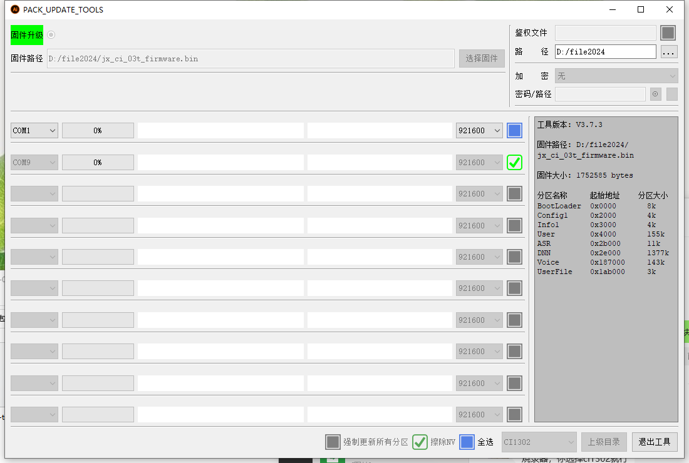


---

### TTS语音播放时出现跳过部分内容的问题如何解决？

**问题描述：**

在使用CI-03T1/CI-03T2的TTS功能播放语音时，会出现固定位置的文字被跳过、未播放的问题，但查询状态返回正常。

**解决方案：**

**1. 问题现象确认**

- 播放长文本时特定段落会被跳过
- 短文本通常不会出现跳过
- 跳过位置在同一段文本中是固定的
- 上位机查询状态返回4F（正常）

**2. 问题原因分析**

- 语速设置为最快时容易出现跳过
- 调整音量也可能导致跳过
- 固件版本较旧可能存在此问题

**3. 解决方案**

**方案一：调整参数设置**

- 避免将语速拉到最高
- 音量调整时逐步调整，避免快速变化
- 使用中等语速进行测试

**方案二：更新固件版本**

- 使用最新版本的TTS固件
- 联系技术支持获取更新的固件文件

**方案三：串口日志调试**

- 开启串口日志输出功能
- 确认发送的文本数据完整
- 选择烧录用的串口端口作为日志端口

**4. 固件更新步骤**

- 步骤1：下载最新TTS固件
- 步骤2：使用串口升级工具烧录
- 步骤3：测试不同语速下的播放效果
- 步骤4：验证长文本播放完整性

**注意事项：**

- 语速拉满时容易出现跳过现象
- 调整音量和语速后测试播放效果
- 如问题持续存在，联系技术支持获取帮助
- 使用默认参数（不调整语速）通常能正常播放

---

### 如何关闭UART0的调试信息输出？

**问题描述：**

UART0默认输出调试信息，占用串口资源。需要将UART0配置为普通串口通信功能，以便与MCU进行数据通信。

**解决方案：**

**1. 登录产品配置平台**

- 进入产品配置界面
- 找到引脚配置选项

**2. 修改串口配置**

- 找到P14（UART0_TX）和P15（UART0_RX）引脚
- 将默认的"日志输出口"配置改为"串口发送/接收功能"
- 保存配置并重新生成固件

**3. 其他可选配置**

- 也可以配置为普通IO口，完全不输出调试信息
- 根据实际需求选择合适的配置方式

**注意事项：**

- 配置修改后需要重新生成并烧录固件
- 关闭调试信息后，无法通过UART0查看系统日志
- 确保业务数据通信协议与硬件连接匹配
- 如需调试，可临时开启日志功能

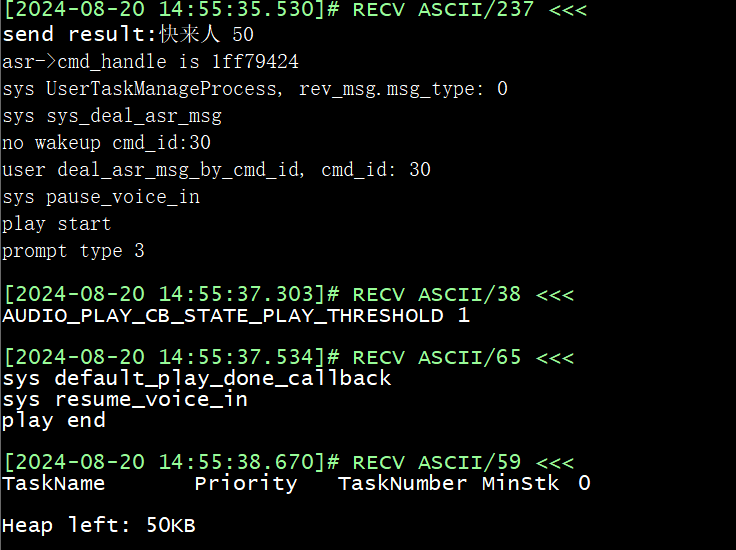

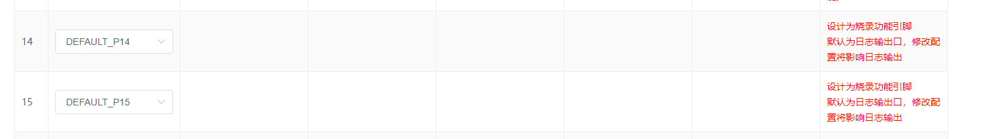


---

### 正式版固件无法唤醒怎么办？

**问题描述：**

生成的正式版固件无法唤醒设备，而测试版固件可以正常唤醒。

**解决方案：**

**1. 问题排查**

- 确认烧录过程无误
- 对比测试版和正式版的配置差异
- 检查是否有特殊配置导致的问题

**2. 配置文件检查**

- 使用产品管理界面的导入/导出功能
- 导出正确的配置文件（JSON格式）
- 重新导入配置后生成固件

**3. 常见原因**

- UART0配置为GPIO可能影响语音功能
- 某些配置组合在正式版中可能存在兼容性问题
- 配置文件中可能存在细微差异

**4. 解决方法**

- 重新生成一次新的固件版本
- 使用导入的配置文件确保一致性
- 如问题持续，联系技术支持提供具体配置

**注意事项：**

- 测试版和正式版的核心功能应该一致
- 配置文件的细微差别可能导致功能异常
- 建议保存标准配置文件备份

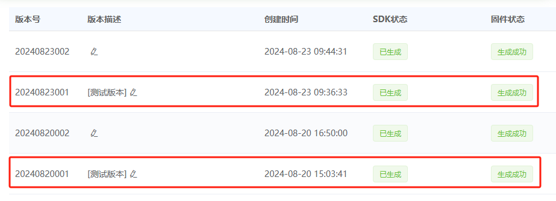

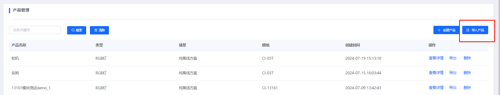

---

### CI-03T 系列模块如何烧录出厂固件？

**问题描述：**

CI-03T 系列模块需要烧录出厂固件，整版出货，确保模块功能的正常使用。

**解决方案：**

**1. 烧录前准备**

- 确认模块型号：CI-03T、CI-03T1、CI-03T2 等
- 准备对应的出厂固件文件
- 使用专用的烧录工具和连接线
- 确保电脑环境正常，无冲突软件

**2. 烧录操作步骤**

- 步骤1：连接模块到烧录工具
- 步骤2：打开对应的烧录软件
- 步骤3：选择正确的固件文件
- 步骤4：开始烧录过程
- 步骤5：等待烧录完成提示

**3. 整版出货注意事项**

- 确认所有模块都已完成烧录
- 进行功能抽检，验证烧录效果
- 保留烧录记录，便于追溯
- 包装前进行最终检验

**4. 常见问题处理**

| 问题现象 | 可能原因 | 解决方案 |
|---------|----------|----------|
| 烧录失败 | 连接不良 | 检查连接线和接口 |
| 识别不到模块 | 驱动问题 | 重新安装烧录工具驱动 |
| 烧录中断 | 电脑休眠 | 关闭电源管理功能 |
| 固件不兼容 | 型号错误 | 确认模块和固件匹配 |

**注意事项：**

- 不同型号的 CI-03T 系列模块使用不同的烧录工具
- 烧录过程中不要断开连接或关闭电脑
- 批量烧录建议做好标记，避免混淆
- 保存好出厂固件备份，便于后续维护

---

### CI-03T4-V1.3 固件配置示例

**问题描述：**

需要了解 CI-03T4-V1.3 型号芯片的固件配置参数，包括唤醒词、回复语等设置。

**解决方案：**

**配置示例：**

以下是一个完整的 CI-03T4-V1.3 固件配置示例：

- **模块型号**：CI-03T4-V1.3
- **固件目录**：jx_ci_03t_firmware
- **开机播报**：无
- **唤醒词**：你好小智、小智你好
- **回复语**：无
- **MD5校验值**：42d5d7882cb029094facc00eef6134d6

**配置要点说明：**

1. **唤醒词设置**：

    - 支持设置多个唤醒词
    - 唤醒词需要符合语音识别规范
    - 避免使用过于相似的唤醒词

2. **回复语配置**：

    - 可以根据需要设置或不设置
    - 如无特殊需求可设置为"无"
    - 减少播报内容可节省Flash空间

3. **固件验证**：

    - 使用MD5校验确保固件完整性
    - 烧录前确认固件版本匹配
    - 保留配置记录便于后续维护

**注意事项：**

- 配置参数应根据实际项目需求调整
- 唤醒词和命令词总数不能超过模块支持上限
- 固件烧录后会自动覆盖原有配置

---

### CI-03T固件生成失败怎么办？

**问题描述：**

在智能公元平台生成CI-03T固件时，提示"生成失败：语言模型生成失败"或"配置问题请检查配置"，且检查配置功能无响应。

**解决方案：**

**常见原因分析：**

1. **命令词重复**
    - 使用了自然说泛化功能后，泛化后的命令词可能重复
    - 多个命令词触发相同的行为ID会导致冲突

2. **配置冲突**
    - 定时器创建过多（超过5个）
    - 变量定义与系统保留字冲突
    - 逻辑控制存在循环引用

3. **浏览器兼容性问题**
    - 检查配置功能需要JavaScript支持
    - 某些浏览器版本可能存在兼容性问题

**排查步骤：**

1. **逐步排查法**
    - 从之前成功的版本开始
    - 逐步添加新功能（每次添加一个功能就生成测试）
    - 定位到具体的问题配置

2. **精简配置法**
    - 减少播报语数量
    - 暂时禁用自然说泛化
    - 减少定时器和变量数量

3. **浏览器检查**
    - 打开浏览器开发者工具（F12）
    - 查看Console是否有JavaScript错误
    - 尝试更换浏览器（Chrome、Edge、Firefox）

**注意事项：**

- 创建定时器最多支持5个
- 自然说泛化容易产生重复命令词
- 检查配置无响应可能是前端问题
- 复杂的逻辑控制建议分步实现

---

### CI-03T2声源定位功能的拨码开关如何配置？

**问题描述：**

CI-03T2在使用声源定位功能时，可能因误操作导致拨码开关位置错误，需要恢复到正确配置。

**解决方案：**

声源定位功能需要将脱机烧录板上的两个拨码开关都拨到左边位置：

**1. 开关位置说明**

- 找到脱机烧录板上的两个黑色拨码开关
- 两个开关都需要拨向左边（OFF方向）
- 开关位于电路板上标有CI0和YES字样的区域附近

**2. 配置步骤**

- 确认设备断电状态下进行操作
- 使用小工具或指甲轻拨开关
- 确保两个开关都完全拨到左边位置
- 重新上电后验证声源定位功能

**注意事项：**

- 拨码开关用于配置设备工作模式，错误配置会导致功能异常
- 声源定位功能要求特定的开关配置组合
- 如开关松动，建议更换烧录板或在开关下加垫片固定

### 没有扩展板如何烧录固件？

**问题描述：**

在没有官方扩展板的情况下，需要通过飞线方式连接CI-03T1/CI-03T2等离线语音识别模块进行固件烧录。

**解决方案：**

**1. 硬件连接方式**

使用USB转TTL模块进行连接，需要四根线：

- **VCC**：模块供电正极（通常接3.3V或5V）
- **GND**：模块供电地线
- **TXD**：USB转TTL的发送端，连接模块的接收端（RXD）
- **RXD**：USB转TTL的接收端，连接模块的发送端（TXD）

**2. 连接步骤**

- 使用杜邦线或飞线连接对应引脚
- 确保连接可靠，避免接触不良
- 先连接GND，再连接VCC，最后连接信号线
- 电压选择：根据模块规格选择3.3V或5V

**3. 烧录操作**

- 打开烧录软件，选择正确的COM端口
- 将模块进入烧录模式（可能需要按复位键）
- 选择需要烧录的bin固件文件
- 点击烧录按钮开始烧录过程

**4. 常见问题处理**

**显示"等待设备"：**

- 检查串口连接是否正确
- 确认USB转TTL驱动已安装
- 尝试不同的COM端口
- 检查模块是否正常上电

**烧录失败：**

- 确认连线没有交叉（TX对RX，RX对TX）
- 检查供电电压是否正确
- 尝试重新插拔USB连接
- 确保固件文件路径不含中文
- 如果烧写器连接正确仍无法烧录，检查模块是否进入烧录模式
- 确认烧录工具版本兼容性

**注意事项：**

- 连线前务必断电，避免损坏模块
- 使用质量良好的杜邦线，避免接触不良
- 电压选择错误可能永久损坏模块
- 烧录过程中不要断开连接
- 初学者建议使用万用表确认连线正确

---


---

### CI-03T1离线语音模块串口接线错误导致无数据传输怎么办？

**问题描述：**

CI-03T1离线语音识别芯片通过串口连接时无数据传输，经排查发现是串口接线错误导致。

**解决方案：**

- 检查串口线是否连接到正确的UART1 RX和UART1 TX引脚
- 参考产品资料中的引脚定义表进行接线
- 确保USB转TTL模块的TX连接到模块的RX，RX连接到TX
- 检查接地线是否正确连接

**注意事项：**

- 串口接线错误是常见问题，需仔细核对引脚定义
- 建议使用不同颜色的杜邦线区分TX、RX和GND
- 接线后可通过串口调试工具发送测试指令验证
- 如仍有问题，检查波特率设置是否为9600
---


---

### CI-03T烧录进度条不动怎么办？

**问题描述：**

在使用CI-03T模块进行程序烧录时，烧录软件无反应，进度条无法推进，烧录失败。

**解决方案：**

1. **正确接线方式**
    - 模块VCC接CH340的5V
    - 模块GND接CH340的GND
    - 模块B5接CH340的RXD
    - 模块B6接CH340的TXD

2. **烧录操作步骤**
    - 参考官方烧录教程视频
    - 勾选烧录选项后需重新断电上电
    - 视频后半段有详细烧录教程

3. **问题排查**
    - 进度条不动通常是接触不良
    - 烧录软件未识别到芯片
    - 可购买转接板套装解决

**注意事项：**

- CI-03T与SU-03T引脚定义不同
- B5/B6引脚对应UART通信
- 建议使用官方转接板避免接线错误
---


---

### CI1303芯片是否包含串口升级程序？

**问题描述：**

购买CI1303芯片时需要了解芯片是否已预装程序，以及如何进行烧录服务。

**解决方案：**

**芯片状态说明：**

- CI1303芯片出厂时为空片，内部无任何程序
- 空片状态下无法直接通过串口进行固件烧录
- 需要使用专用烧录工具或委托厂家进行预烧录

**烧录服务选项：**

1. **厂家预烧录服务**：

    - 批量烧录：2000片以下收取200元烧录费
    - 批量烧录：2000片以上按0.1元/片收取
    - 建议起订量：100片起（便于生产安排）

2. **自行烧录**：

    - 需要购买专用烧录器
    - 普通USB转串口模块（如CH340）无法烧录空片
    - 仅适用于已烧录过引导程序的芯片升级

**注意事项：**

- CH340等串口模块只能用于已有程序的芯片升级，不能烧录空片
- 样品阶段可联系厂家先烧录少量芯片进行测试
- 批量生产时建议提前规划，预留烧录服务时间

---


---

### 因模组选择错误导致固件大小超出Flash怎么办？

**问题描述：**

使用CI1301芯片时，烧录固件提示"固件大小超出该设备flash大小"，但实际功能配置并不复杂。

**解决方案：**

**问题原因分析：**

- 在语音控制平台选择了错误的模组类型
- CI1301芯片应选择CI-13T模组，而非CI-03T模组
- 不同模组的Flash容量配置不同，导致生成的固件大小不匹配

**解决步骤：**

1. **确认芯片型号**
    - CI1301芯片对应CI-13T模组（支持1M Flash）
    - CI-03T模组对应的芯片型号不同

2. **重新创建项目**
    - 在语音控制平台创建新项目
    - 正确选择CI-13T模组
    - 重新配置命令词和功能

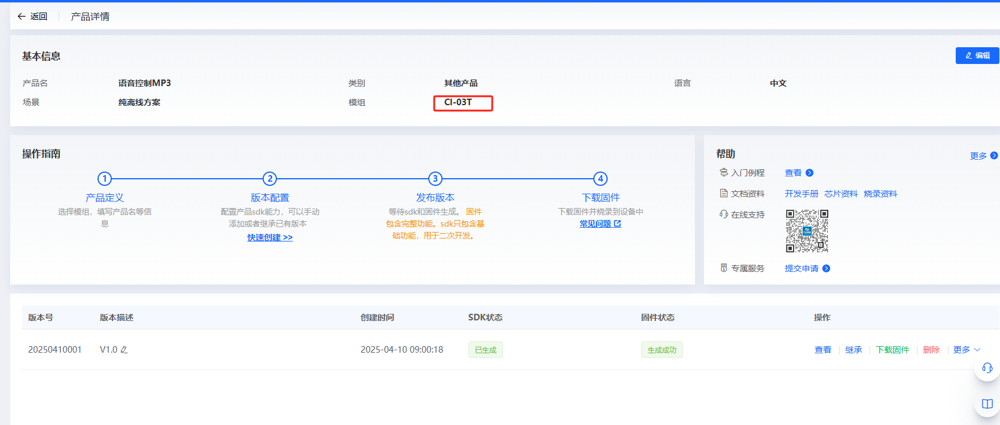

*错误选择了CI-03T模组*


*应选择CI-13T模组*

3. **验证项目配置**
    - 确认项目中的模组型号与实际芯片一致
    - 生成固件前仔细检查所有配置


*成功创建使用CI1301芯片的项目*

**注意事项：**

- 不同型号的芯片必须选择对应的模组类型
- 模组选择错误会导致固件大小与实际Flash容量不匹配
- 重新创建项目时，需要完整迁移所有配置
- 如不确定芯片对应的模组型号，可查阅技术文档或咨询技术支持

---


---

### CI1303声纹固件重复烧录会导致授权丢失吗？

**问题描述：**

在进行CI1303声纹识别固件烧录时，担心重复烧录会导致声纹授权丢失，并询问固件烧录的具体流程和验证方法。

**解决方案：**

**1. 重复烧录不影响授权**

- 可以重复烧录声纹固件，不会导致授权丢失
- 关键是烧录时不要勾选"擦除NV"选项
- 声纹信息存储在NV（非易失性）分区中

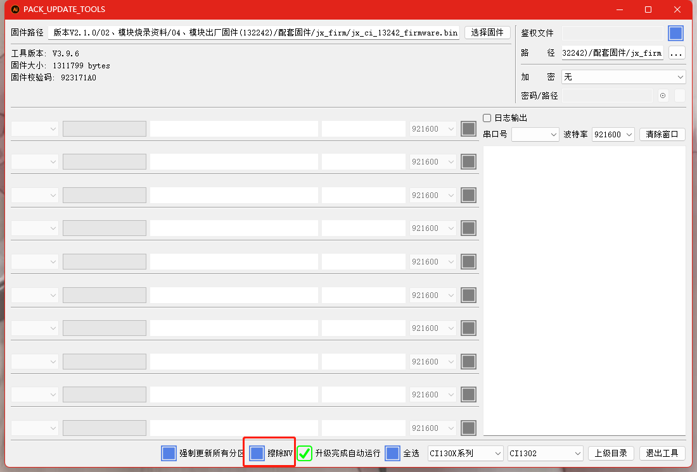

*PACK_UPDATE_TOOLS烧录工具，注意底部"擦除NV"选项*

**2. 烧录流程说明**

- **原厂授权**：声纹功能需要原厂进行授权配置
- **自主烧录**：后续可以自行重复烧录固件更新功能
- **固件验证**：烧录后需要测试声纹识别功能

**3. 烧录验证方法**

确认固件烧录正确后，进行功能测试：

- 通过串口发送唤醒词测试
- 验证声纹识别功能是否正常
- 检查响应时间和识别准确率

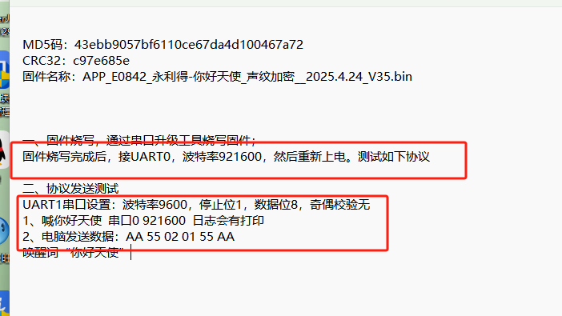

*固件测试协议说明*

**4. 原厂烧录要求**

首次使用声纹功能时：

- 需要提供声纹固件给原厂进行授权烧录
- 原厂会同时烧录出厂固件和声纹固件
- 确保授权正确配置

**注意事项：**

- 重复烧录时确保不勾选"擦除NV"选项
- 声纹固件更新不需要重新授权
- 保留原厂提供的测试文档以便验证
- 如有不确定，可提供固件文件给技术支持确认

---


---

### CI-03T1免唤醒口令如何配置？

**问题描述：**

需要将新的口令配置烧录到CI-03T1芯片中，替换原有口令，并设置所有口令为免唤醒模式。

**解决方案：**

**口令列表配置：**

- **示例口令**：

    - 明志笃行尚美进取
    - 我很开心
    - 我很棒
    - 花儿为我而开
    - 我快乐
    - 我健康
    - 送你一朵大红花

**配置步骤：**

1. **生成固件**：

    - 在固件生成平台添加所需的口令列表
    - 设置为免唤醒模式（无需唤醒词直接响应）
    - 确认所有口令配置正确

2. **烧录固件**：

    - 下载生成的jx_firm.tar.gz固件包
    - 解压获取.bin文件
    - 使用烧录工具将固件烧录到CI-03T1

3. **验证MD5**：

    - 烧录后记录MD5校验值
    - 用于质量追溯和版本确认

**注意事项：**

- 免唤醒模式下，任何环境声音可能触发命令
- 建议在相对安静的环境中使用
- 烧录前确认口令列表无重复
- 保留烧录记录和MD5值以备查


---

### CI-03T1模块播放异常如何排查？

**问题描述：**

CI-03T1模块出现播放不完整或无法播放的问题，怀疑是功放芯片或硬件问题导致。

**解决方案：**

**问题分析：**

模块播放异常通常是继电器开关瞬间产生的高频干扰导致，而非功放芯片问题。

**排查步骤：**

1. **检查电源连接**：

    - 确认继电器和模块是否使用同一路电源
    - 继电器开关时会产生电源波动

2. **干扰现象**：

    - 继电器吸合瞬间产生高频干扰
    - 干扰可能导致模块死机或播放异常
    - 表现为播放不完整或完全无响应

**解决方法：**

- **电源隔离**：

    - 为继电器和模块提供独立供电
    - 使用独立的电源路径，避免相互干扰

- **滤波处理**：

    - 在继电器控制端加滤波电容
    - 在模块电源端加去耦电容

- **优化布线**：

    - 继电器控制线远离模块的音频和电源线
    - 使用屏蔽线连接继电器

**注意事项：**

- 问题多发于使用大功率继电器的场合
- 建议在设计阶段考虑电源隔离
- 如问题持续，可提供原理图供技术支持分析

---


---

### 300K大小的音频文件是否可以无损烧录到模块中？

**问题描述：**

有三段音频文件，总大小为300K，需要确认是否可以无损烧录到CI-03T模块中，保持音质不受影响。

**解决方案：**

音频文件上传到平台时会被**压缩处理**，原始大小不会完全保留。

**文件处理说明：**

- 平台会对上传的音频文件进行压缩优化
- 压缩后的文件大小会小于原始文件
- 这是平台的正常处理机制，旨在优化存储和播放效率

**实测建议：**

- 可以上传音频文件进行实际测试
- 通过试听判断音质是否满足需求
- 如音质不达标，可尝试其他上传方式或调整音频格式

**注意事项：**

- 平台压缩是自动处理的，无法绕过
- 建议在烧录前进行充分测试，确认音质效果
- 如对音质有极高要求，可联系技术支持寻求其他解决方案
---


---

### CI-03T模块烧录无反应如何解决？

**问题描述：**

CI-03T模块在使用CH340进行固件烧录时，烧录工具显示无反应，无法完成固件更新。

**解决方案：**

1. **检查接线方式**
    - 使用SU03T板跳线连接可能存在干扰
    - 建议拆除所有外部连接
    - 仅保留CH340与模块的直接连接

2. **正确的CH340接线**
    - CH340的5V → CI-03T的PWR
    - CH340的RXD → CI-03T的PB5
    - CH340的TXD → CI-03T的PB6
    - CH340的GND → CI-03T的GND

3. **排查外围电路影响**
    - 断开模块与外部电路的所有连接
    - 排除外围电路对烧录的干扰
    - 单独测试模块烧录功能

**注意事项：**

- 确保烧录时只有CH340给模块供电
- 检查TX/RX线没有接反
- 外围电路可能影响烧录过程

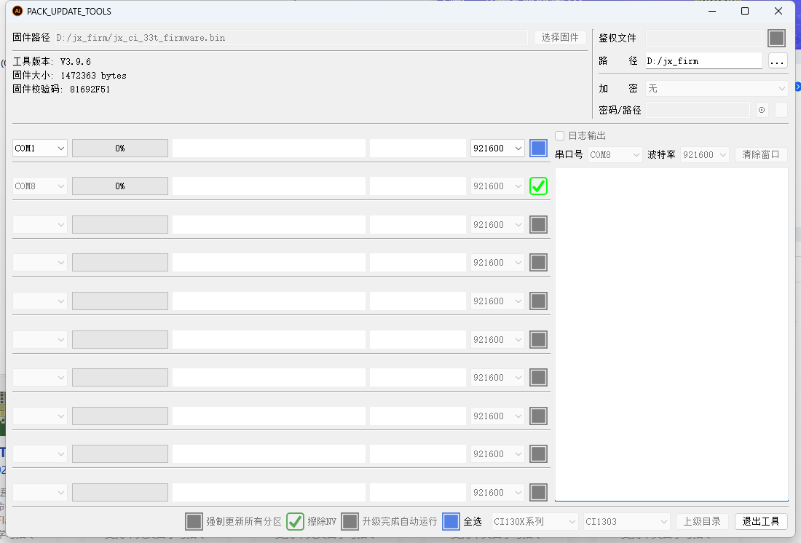

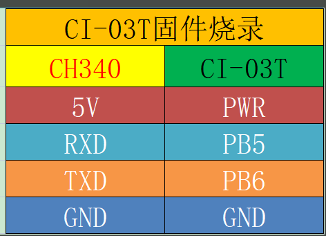

---


---

### CI-03T1外触发功能无法正常工作怎么办？

**问题描述：**

CI-03T1芯片的外部GPIO触发无法正常工作，无法通过外部信号触发设备切换，且固件生成过程不稳定。

**解决方案：**

**1. 配置检查**

外触发功能的正确配置方法：

- 检查触发行为设置
- "是否条件执行"选项根据需要设置
- 触发条件和控制逻辑要匹配

**2. 延时设置**

为避免触发不稳定：

- 在触发配置中加入适当延时
- 建议设置200ms的延时
- 避免信号抖动导致误触发

**3. 条件执行优化**

- 如果使用外部触发，"是否条件执行"栏可能不需要设置
- 条件设置不当可能导致触发不响应
- 简化触发逻辑，避免条件冲突

**4. 固件生成问题**

固件生成失败的处理：

- 重新生成固件（可能是临时卡顿）
- 多次尝试仍失败时检查配置
- 确认网络连接正常

**注意事项：**

- 外部触发需要稳定的输入信号
- 建议在触发前验证IO口电平
- 保留配置文件便于问题排查
- 固件生成偶尔失败是正常现象

---


---

### CI-03T1烧录时Open Serial Failed怎么办？

**问题描述：**

在使用US513U61烧录工具烧录CI-03T1时，工具提示"Open Serial Failed"，无法成功烧录固件。

**解决方案：**

**1. 根本原因分析**

- **串口电流倒灌**：导致模块无法正常复位
- **缺少复位电路**：自行设计PCB时未考虑复位功能
- **GND连接问题**：地线连接不稳定

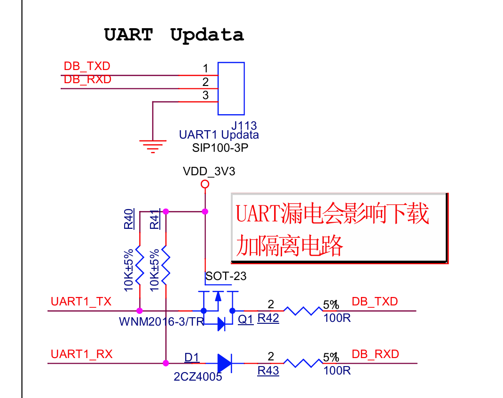

*UART更新接口的隔离电路设计，用于防止电流倒灌*

**2. 解决方法**

**拔插GND复位法**（已验证有效）：

1. 烧录工具显示"等待设备上电"
2. **拔插GND线**（不是VCC）
3. 观察工具是否识别到设备

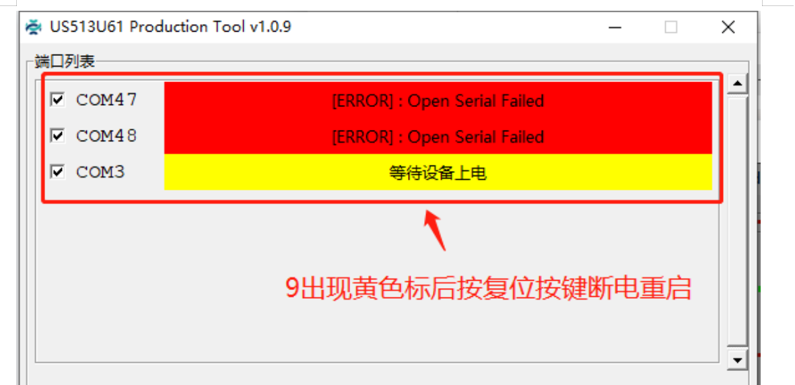

*烧录工具显示Open Serial Failed错误*

**3. 原理说明**

- 串口倒灌电流会导致模块没有复位成功
- 拔插GND可以避免电流倒灌问题
- VCC拔插可能加剧电流倒灌现象

**4. 硬件改进建议**

- 在UART接口增加隔离电路
- 设计专用的复位电路
- 使用二极管防止电流倒灌

**注意事项：**

- 必须拔插GND，不是VCC
- 此问题在使用自行设计的PCB时较常见
- 模块形式的CI-03T1一般不会有此问题
- 隔离电路可有效预防此类问题

---


---

### 自行设计PCB的CI-03T1烧录失败怎么办？

**问题描述：**

使用CI-03T1芯片自行设计PCB板，烧录时工具卡在"等待设备上电"，已经尝试了多种烧录模式和设置。

**解决方案：**

**1. 硬件检查要点**

**供电检查**：

- 测量VCC_CORE_1.2V是否稳定
- 正常值应为1.15V-1.2V
- 电压不稳会导致烧录失败

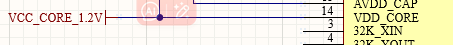

*原理图中VCC_CORE_1.2V测试点位置*

**烧录接口确认**：

- 引脚12：US_TXD（烧录TX）
- 引脚13：US_RXD（烧录RX）
- 确认与烧录器连接正确

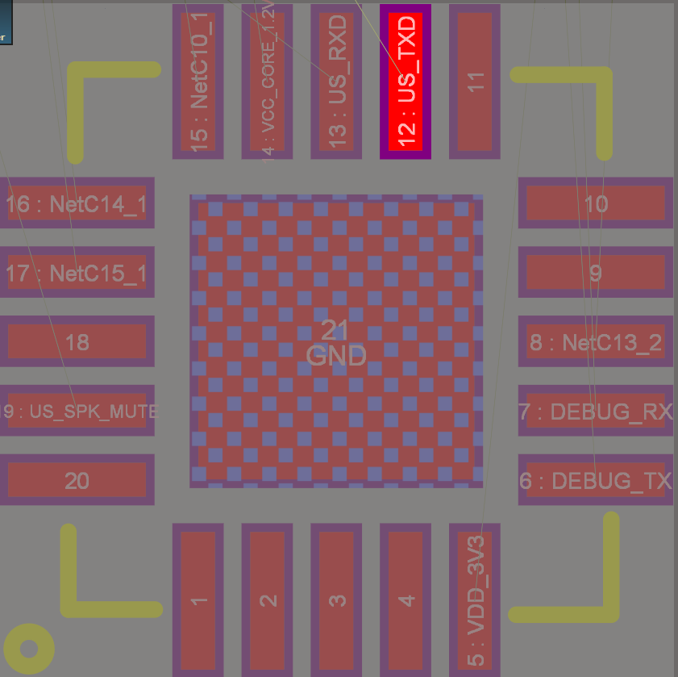

*CI-03T1芯片封装，12号引脚为US_TXD*

**2. 软件设置尝试**

**切换烧录模式**：

- SIP-NOR-FLASH模式（默认）
- EXT-SPI-NOR-FLASH模式
- 不同模式尝试烧录

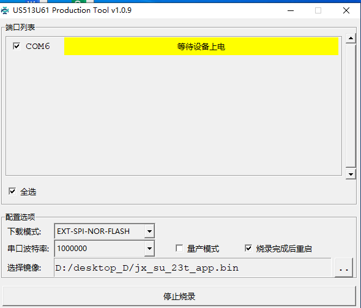

*烧录工具选择EXT-SPI-NOR-FLASH模式*

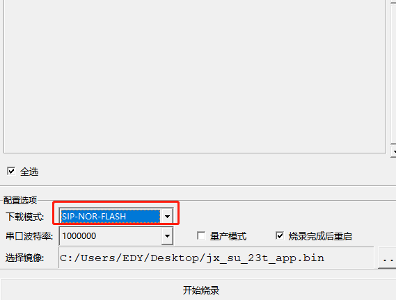

*烧录工具选择SIP-NOR-FLASH模式*

**3. 其他排查方法**

- 将bin文件单独放桌面再烧录
- 检查USB转串口驱动
- 尝试不同的USB端口
- 确认波特率设置正确

**4. 可能的问题**

- 焊接问题或虚焊
- 贴片时器件损坏
- PCB设计存在缺陷
- 外围电路干扰

**注意事项：**

- 自行贴片时特别注意焊接质量
- 如有问题，先用模块验证功能
- 保留原理图用于问题排查
- 必要时寻求硬件工程师协助

---


---

### CI-03T系列固件烧录使用哪几个引脚？

**问题描述：**

CI-03T系列芯片的固件烧录是否需要连接14和15脚，以及如何正确进入烧录模式。

**解决方案：**

**烧录引脚确认：**

- **引脚编号**：14脚和15脚（B5、B6）
- **功能定义**：UART0_TX（14脚）和UART0_RX（15脚）
- **烧录模式**：通过UART0进行固件下载

**烧录连接方法：**

1. **硬件连接**：

    - 14脚（TX）连接烧录工具的RX
    - 15脚（RX）连接烧录工具的TX
    - 确保交叉连接（TX-RX，RX-TX）

2. **进入烧录模式**：

    - 上电时检测到UART0有信号输入
    - 芯片自动进入烧录模式
    - 实现快速启动和烧录

**自动启动特性：**

- **快速开机**：检测到UART0输入时直接启动
- **正常模式**：无输入时按常规流程启动
- **设计目的**：优化启动速度，提升用户体验

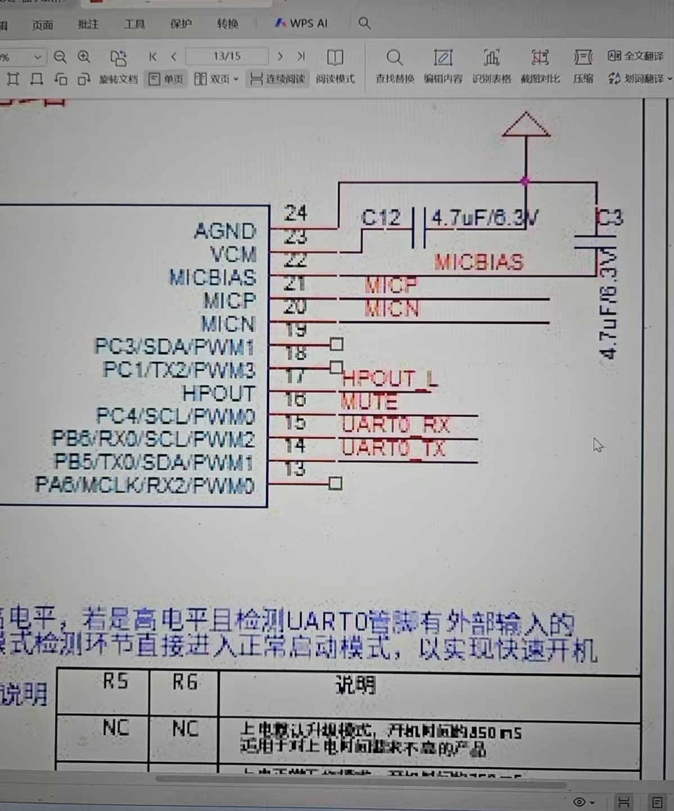

**注意事项：**

- 烧录前断开其他外设连接
- 确保电源稳定，避免烧录中断
- 烧录完成后需要重新上电生效
- 保留正确的引脚定义图供参考

---


---

### CI-03T1模块是否附带插针？

**问题描述：**

收到的CI-03T1模块未附带插针，手中没有合适的小插针进行连接测试。

**解决方案：**

- CI-03T1模块默认不附带插针
- 模块以焊盘形式提供，需要自行焊接插针或连接器
- 如需插针版本，请在采购时提前说明

**注意事项：**

- 模块设计为焊盘形式，便于集成到PCB
- 焊接插针需要具备相应的焊接工具和技能
- 批量生产时建议直接将模块焊接 到目标PCB
- 如需连接测试，可自行采购2.54mm标准排针

---


---

### 如何优化语音播报内容以节省Flash空间？

**问题描述：**

CI-03T1芯片因播报语句过多导致存储空间不足，需要优化播报内容。

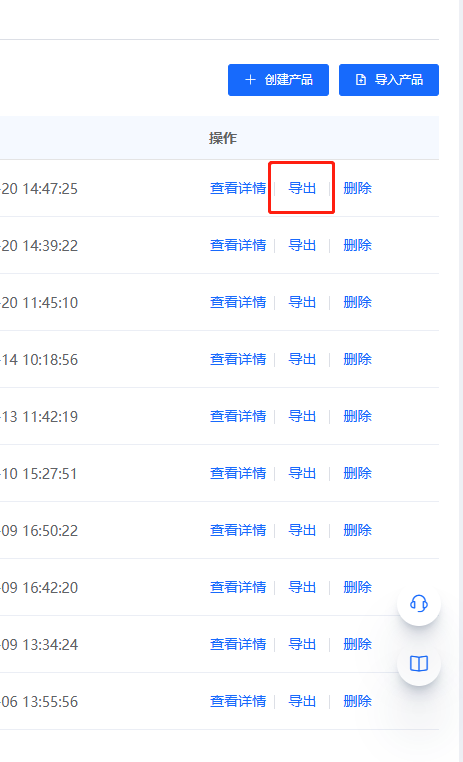

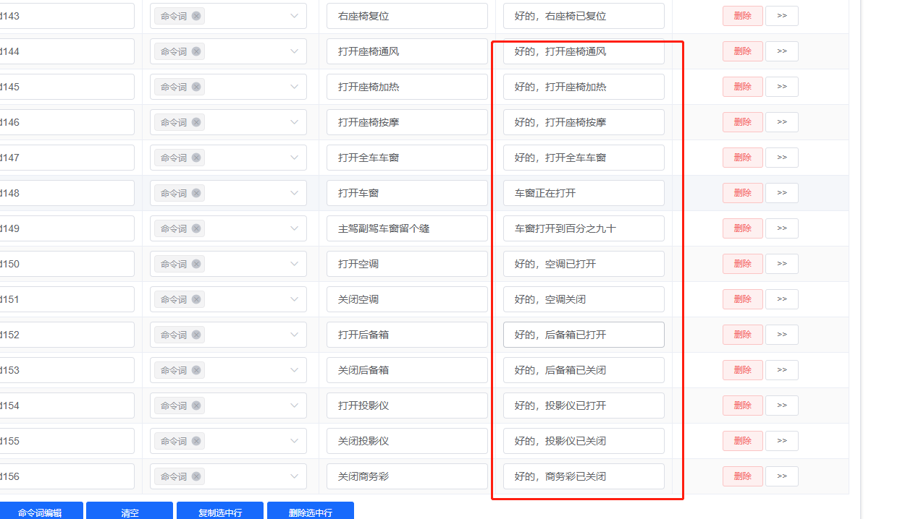

**解决方案：**

**优化策略：**

1. **拆分重复内容**
    - 将重复的前缀（如"好的"）单独存储
    - 在控制中先播报"好的"，再播报具体内容
    - 这样可以大幅减少存储占用

2. **缩短播报语句**
    - 去除不必要的修饰词
    - 使用简洁的表达方式
    - 例如：将"好的，我现在为您打开全车车窗"改为"打开全车车窗"

3. **使用组合播报**
    - 在控制添加界面创建播报片段
    - 将长句拆分为多个短句
    - 通过控制逻辑顺序播放

**操作步骤：**

1. 进入控制添加页面
2. 创建常用回复片段（如"好的"、"收到"）
3. 在每个命令词控制中先调用通用片段
4. 再调用具体的动作描述

**效果说明：**

- 组合播报效果相当于逗号或断句
- 用户体验基本不受影响
- 可以节省50%以上的存储空间

**其他优化建议：**

- 删除不必要的前缀词
- 选择占用空间更小的语音模型


- 控制命令词总数在合理范围内

---


---

### 烧录时提示"固件大小超出该设备flash大小"怎么办？

**问题描述：**

使用 PACK_UPDATE_TOOLS 工具烧录 CI1303 固件时，提示"固件大小超出该设备flash大小！"，但平台生成固件时并未提示超内存。实际文件大小异常（如 4.3MB），远超过正常范围。

**解决方案：**

这是选错了烧录文件导致的问题，需要正确选择固件文件：

1. **识别正确文件**：

    - 平台下载的是压缩包文件（如 .zip 或 .rar）
    - 烧录需要的是解压后的 .bin 文件
    - 不要直接更改压缩包后缀为 .bin

2. **正确操作步骤**：

    ```
    1. 下载平台生成的固件压缩包
    2. 解压缩到文件夹
    3. 找到其中的 .bin 固件文件
    4. 使用烧录工具选择 .bin 文件
    ```

3. **文件对比验证**：

    - 压缩包：通常几 MB 大小（包含多个文件）
    - 固件文件：通常几百 KB（CI1303 约 1MB 以内）
    - 检查文件路径是否指向 .bin 文件

    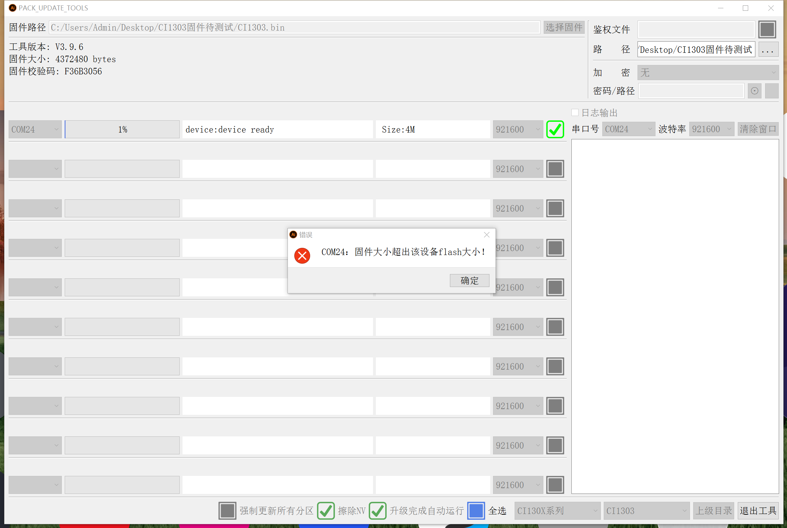
    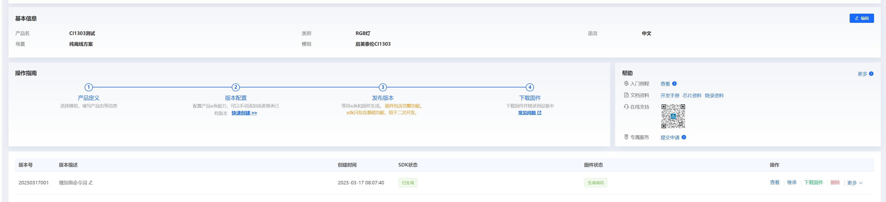
    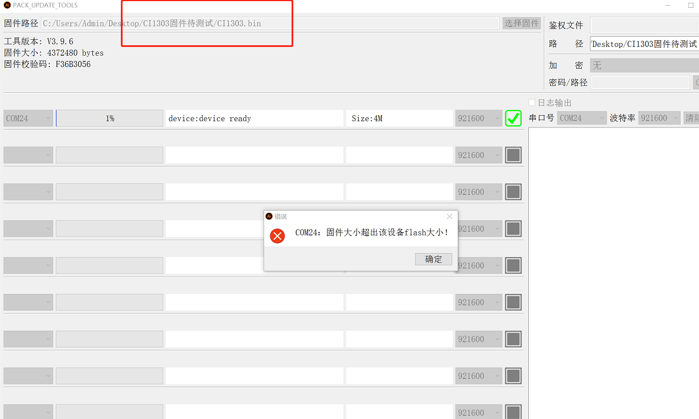

**问题原因**：

- 误将整个压缩包当作固件文件烧录
- 压缩包包含配置文件、音频文件等多个内容
- 直接烧录会导致文件大小远超 flash 容量

**注意事项：**

- 必须烧录解压后的 .bin 文件，不是压缩包
- CI1303 的 flash 容量有限，正常固件不会超限
- 平台生成时会检查容量，如能生成说明未超限
- 烧录前务必确认文件类型和大小是否合理
- 错误烧录可能导致模块变砖，需谨慎操作

---


---

### CI-03T1/T2固件无法唤醒如何排查？

**问题描述：**

在使用CI-03T1或CI-03T2芯片模块时，固件烧录后无法正常唤醒，需要排查原因并解决。

**解决方案：**

**1. 检查固件配置**

    - 确认唤醒词已正确设置
    - 检查唤醒灵敏度是否合适（建议设置为"中"）
    - 验证唤醒回复音是否配置

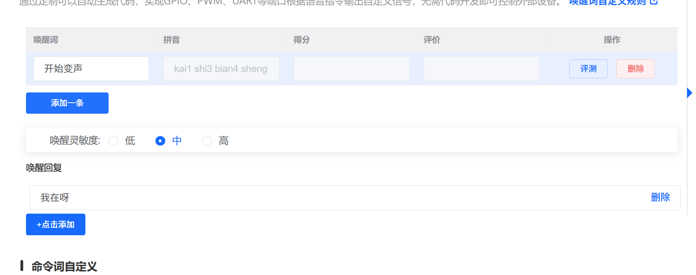

**2. 硬件连接检查**

    - 确认模块供电正常（3.6-5.5V）
    - 检查麦克风连接是否良好
    - 使用推荐型号的麦克风

**3. 环境因素排查**

    - 确保测试环境安静无干扰
    - 避免在嘈杂环境下测试
    - 与模块保持适当距离（20-50cm）

**4. 烧录验证**

    - 重新烧录固件确认烧录成功
    - 检查烧录过程是否有错误提示
    - 验证固件版本是否正确

**常见原因：**

- 麦克风连接不良或损坏
- 唤醒词设置错误
- 环境噪声过大
- 固件烧录不完整

**建议操作：**

- 使用标配模块和麦克风进行测试
- 在安静环境下重新测试唤醒功能
- 必要时联系技术支持发送固件检查

---

### CI-03T有播报声音但无法识别语音指令且固件生成排队时间过长怎么办？

**问题描述：**

CI-03T1模块上电后喇叭有播报声音，但语音指令无法被识别。同时，在尝试烧录固件时遇到生成时间过长的排队情况（如158分钟）。

**解决方案：**

**1. 语音识别问题排查**

硬件和配置检查：

- 确认麦克风已正确连接
- 检查麦克风是否被拔除导致无法拾音
- 测试使用32单片机验证串口通信正常
- 尝试更换供电电源排除供电问题

**2. 固件生成排队处理**

应对长时间排队：

- 避开高峰时段（下午3-6点）生成固件
- 系统显示的预计时间可能不准确，实际可能更快
- 可以先进行其他测试准备工作
- 考虑升级到更高性能模块减少等待时间

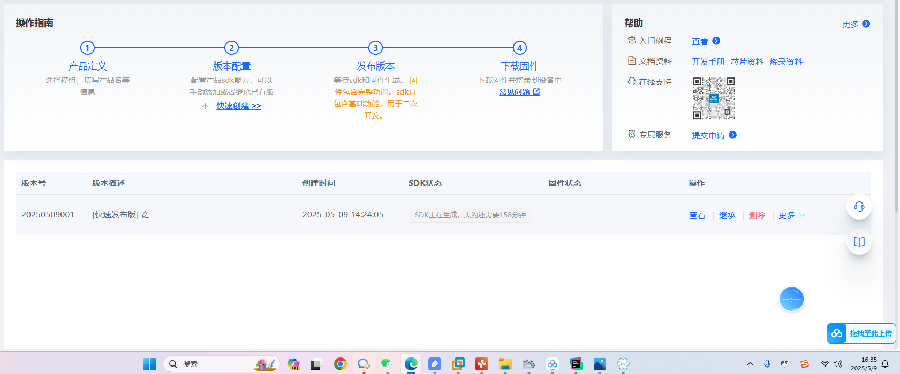

*固件生成排队显示需要158分钟，实际等待时间可能更短*

**3. 快速验证方法**

临时测试方案：

- 使用之前生成的成功固件先测试硬件
- 用51或32单片机验证模块基本功能
- 确认模块硬件没有损坏
- 排除硬件问题后再重新生成固件

**4. 替代方案**

如问题持续存在：

- 考虑使用CI-33T（4MB Flash，处理更快）
- 选择非高峰时段进行固件生成
- 联系技术支持申请优先处理
- 使用本地编译环境生成固件

**注意事项：**

- 播报正常说明功放和喇叭工作正常
- 无法识别可能是麦克风连接或配置问题
- 固件生成排队是平台资源限制，非技术故障
- 建议提前规划固件生成时间，避免影响项目进度

---

### CI-03T模块拾音正常但无法识别语音指令怎么办？

**问题描述：**

CI-03T模块拾音器和喇叭都正常，烧录后能正常播报，但无法识别语音指令。

**解决方案：**

**问题分析：**

- 硬件基本功能正常（拾音、播报）
- 烧录成功表明通信无问题
- 语音识别功能失效可能是芯片或固件问题

**排查步骤：**

1. **硬件检查**：

    - 测试3.3V脚输出电压是否正常
    - 检查麦克风引脚是否有虚焊
    - 确认喇叭连接可靠

2. **固件验证**：

    - 烧录出厂固件测试
    - 确认上电启动系统播放功能
    - 测试唤醒词和指令响应

3. **交叉对比**：

    - 使用相同固件测试其他模块
    - 对比正常模块和故障模块
    - 排除固件配置问题

**可能原因：**

- 芯片内部识别电路损坏
- 麦克风灵敏度异常
- 固件配置错误
- 环境噪声过大

**解决方案：**

1. **更换模块**：

    - 如果确认是芯片问题
    - 使用同型号替换
    - 保留故障模块用于分析

2. **环境优化**：

    - 降低环境噪声
    - 调整麦克风位置
    - 确保说话音量适中

3. **重新配置**：

    - 检查唤醒词设置
    - 调整识别灵敏度
    - 重新生成和烧录固件

**注意事项：**

- 烧录成功不代表芯片完全正常
- 识别功能比播报功能更复杂
- 相同硬件下不同模块表现差异可能指向芯片问题
- 批量问题需要检查生产工艺和固件版本

---

### CI03T2唤醒后无法响应指令怎么办？

**问题描述：**

CI03T2芯片可以正常响应唤醒词，但无法识别和执行其他语音指令。

**解决方案：**

**问题分析：**

- 唤醒功能正常说明基本硬件工作
- 仅识别功能失效说明问题特定
- 可能与固件配置或芯片状态有关

**排查步骤：**

1. **唤醒词验证**：

    - 确认唤醒词能正常触发
    - 检查唤醒后的提示音
    - 验证识别指示灯响应

2. **指令词测试**：

    - 逐个测试所有指令词
    - 注意发音清晰度和音量
    - 记录哪些指令有响应

3. **固件配置检查**：

    - 查看指令词是否正确配置
    - 确认识别阈值设置
    - 验证词条数量限制

**可能原因：**

- 固件中指令词配置错误
- 识别灵敏度设置不当
- 噪声环境干扰
- 麦克风位置或方向问题
- 芯片内部识别电路异常

**解决建议：**

1. **优化使用环境**：

    - 降低背景噪声
    - 调整说话距离（15-30cm）
    - 保持标准发音音量

2. **重新生成固件**：

    - 检查指令词配置
    - 调整识别参数
    - 使用测试固件验证

3. **硬件检查**：

    - 测试麦克风工作状态
    - 检查音频输入电路
    - 验证电源稳定性

**注意事项：**

- CI03T2支持300条词条
- 唤醒和指令使用相同识别引擎
- 如问题持续，可能需要更换模块
- 保留详细的测试现象用于分析

---

## 固件烧录与升级指南

### 如何获取烧录软件和固件文件？

**问题描述：**

需要获取CI-03T系列芯片的烧录安装软件和固件文件，以完成烧录操作。

**解决方案：**

- **烧录软件下载**：

    - 访问机芯智能官网的CI-03T开发包页面
    - 下载名为"03、CI-03T开发包；版本2411201614.zip"的压缩包
    - 包含PACK_UPDATE_TOOL.exe烧录工具和所需驱动

- **固件下载**：

    - 登录智能云元平台（http://www.smartpi.cn/#/）
    - 在固件管理界面查看已生成的固件版本
    - 点击对应版本的"下载固件"按钮获取固件文件


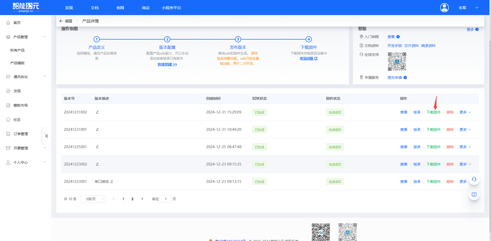

**注意事项：**

- 烧录前先安装CH340驱动（USB转串口驱动）
- 确保烧录转接板正确连接，B5/B6为专用烧录引脚
- 固件文件通常包含.bin和_update.bin两种格式，根据需要选择

### 烧录资料概览

烧录相关的官方资料大致分为四类：

- **CH340 驱动**：用于安装 USB 转串口驱动，使 PC 能识别烧录转接板的虚拟串口。
- **烧录软件**：官方提供的模块烧录工具，负责通过串口将固件和语音资源写入 CI-03T。
- **烧录文档**：图文说明烧录环境准备、线序连接、软件参数配置以及完整烧录步骤。
    - 
- **出厂固件**：官方提供的出厂缺省固件压缩包，可在调试失败时恢复到出厂状态。

详细的附件名称和下载地址已在文末附录中给出，可在离线环境下对照查看。

### 基本烧录流程

1. **硬件连接**：将模组 UART_TX/RX 与 PC 串口工具连接好，保证 GND 相连。
2. **进入烧录模式**：

    - 方式 A：拉低 BOOT 引脚后上电（具体脚位见原理图/规格书）。
    - 方式 B：参考烧录文档，通过串口发送“进入 Boot”命令。
3. **执行烧录**：

    - 打开官方烧录软件，选择固件文件与端口。
    - 点击“开始烧录”，等待进度完成。
4. **验证结果**：

    - 复位模组，对着麦克风说出唤醒词，观察串口日志与语音播报是否正常。

### 词表更新

- 一般情况下，仅需更新语音资源区（词表与提示音），无需全片擦除，速度较快。
- 建议在量产前固定一套"固件版本 + 词表版本"组合，在后文"质检与维护"中登记。

### 烧录故障排除

#### 焊接后无法烧录问题

**问题描述：**

CI-03T芯片焊接到电路板后，无法通过CH340烧录器进行固件烧录，即使接线正确且重新上电尝试，模块仍处于开机状态而非进入烧录模式。

**标准接线方式：**


**烧录接线说明：**

- **CH340 5V** → **CI-03T PWR**：模块供电
- **CH340 RXD** → **CI-03T PB5**：烧录数据接收
- **CH340 TXD** → **CI-03T PB6**：烧录数据发送
- **CH340 GND** → **CI-03T GND**：共地

**故障排查步骤：**

1. **基础检查**：

    - 确认CH340驱动已正确安装
    - 检查设备管理器中COM口是否正常识别
    - 验证烧录工具是否能打开端口

2. **接线验证**：

    - 使用万用表确认每根线连通性
    - 检查是否有短路或断路
    - 确认RX/TX没有接反（尝试交叉连接）

3. **进入烧录模式**：

    - 完全断开电源
    - 重新连接GND线
    - 上电后立即尝试烧录
    - 必要时多次插拔GND触发烧录模式

4. **焊接检查**：

    - 检查焊点是否有虚焊或连锡
    - 确认PB5/PB6引脚没有与其他电路短路
    - 检查电源纹波是否过大

5. **替代方案**：

    - 使用未焊接的模块进行烧录测试
    - 烧录完成后再焊接到底板
    - 考虑使用带排针的模块便于后续更新

**预防措施建议：**

- **开发阶段**：使用带排针的模块，便于反复烧录
- **量产前**：完成所有测试后再进行最终焊接
- **设计优化**：预留烧录接口，避免焊接后无法更新
- **焊接工艺**：控制温度和时间，避免热损坏芯片

---

## 外设功能开发

### CI-03T是否支持UART1_TX端口配置红外功能？

**问题描述：**

需要确认CI-03T的UART1_TX端口是否可以用于配置红外功能，以及与SU-03T在红外支持方面的差异。

**解决方案：**

**功能支持对比：**

1. **CI-03T系列**：

    - CI-03T平台上没有配置红外的功能
    - UART1_TX主要用于串口通信
    - 不支持直接配置红外发射功能

2. **SU-03T系列**：

    - SU-03T平台支持红外配置功能
    - 可以通过语音指令控制红外发射
    - 支持红外码库学习和存储

**技术原因：**

1. **硬件架构差异**：

    - CI-03T：主要面向语音识别应用
    - SU-03T：集成了更多外设控制功能
    - 两者的平台功能定位不同

2. **固件功能限制**：

    - CI-03T固件未集成红外控制模块
    - 无法通过软件配置实现红外功能
    - 需要外部硬件配合实现

**替代方案：**

**方案一：通过串口控制外部红外模块**

```
CI-03T → UART1_TX → 外部红外发射模块 → 红外发射
```

实现步骤：

1. 在智能公元平台配置串口输出功能
2. 设置命令词触发UART1_TX发送数据
3. 外部红外模块接收串口数据并发射红外信号
4. 实现语音控制红外设备功能

**方案二：使用GPIO控制红外发射**

```
CI-03T → GPIO输出 → 红外LED → 红外发射
```

实现步骤：

1. 使用GPIO引脚控制红外LED
2. 通过软件定时产生38kHz载波
3. 发送编码后的红外信号
4. 控制家电等红外设备

**方案三：选择支持红外的模块**

如需要红外功能，建议选择：

- **SU-03T**：支持平台配置红外功能
- **SU-32T**：支持更多外设功能
- **CI-95C/CI-96Z**：支持红外和小程序功能

**技术要点：**

1. **红外发射原理**：

    - 需要38kHz载波信号调制
    - 数据编码需要符合设备协议
    - 发射功率和角度影响控制距离

2. **串口控制方案优势**：

    - 硬件简单，只需红外发射模块
    - 可控制多种红外设备
    - 便于学习和更新红外码库

3. **GPIO控制方案优势**：

    - 成本最低，仅需红外LED
    - 完全自主控制发射时序
    - 可自定义红外协议

**应用场景：**

- 智能家居控制（电视、空调等）
- 红外遥控设备语音化改造
- 老旧设备智能化升级
- 定时控制和场景联动

**注意事项：**

- CI-03T本身不支持红外功能配置
- 外接红外模块需要额外供电
- 红外控制需要学习设备的编码协议
- 建议选择支持红外的专用模块简化开发

---

## 常见问题与故障排查

### CI-03T系列模块串口通信无法接收数据怎么办？

**问题描述：**

CI-03T系列模块可以正常烧录固件并响应语音指令，但串口通信无法接收到任何数据，串口助手中检测不到可用COM端口。

**解决方案：**

**1. 硬件连接检查**

验证物理连接：

- 检查串口线是否正确连接TX/RX
- 确认GND线已连接
- 使用万用表测量线路通断
- 检查杜邦线是否有松动

**2. 引脚配置确认**

平台配置验证：

- 确认UART1_TX和UART1_RX已正确配置
- 检查引脚分配与实际硬件连接匹配
- 验证波特率、数据位、停止位等参数
- 确认引脚没有被其他功能占用

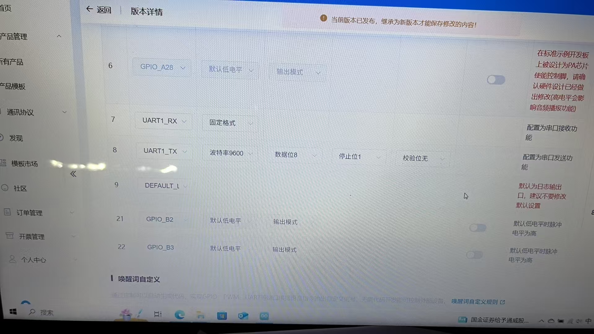

*UART1_RX和UART1_TX配置为串口通信功能*

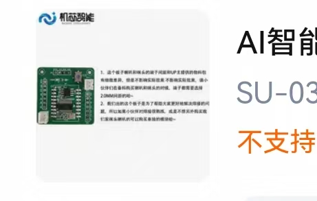

*模块可能不支持某些功能，需要确认型号*

**3. 设备管理器排查**

COM端口检测：

- 检查设备管理器中是否显示COM端口
- 尝试安装或更新USB转串口驱动
- 更换不同的USB端口测试
- 重启电脑后重新检测设备

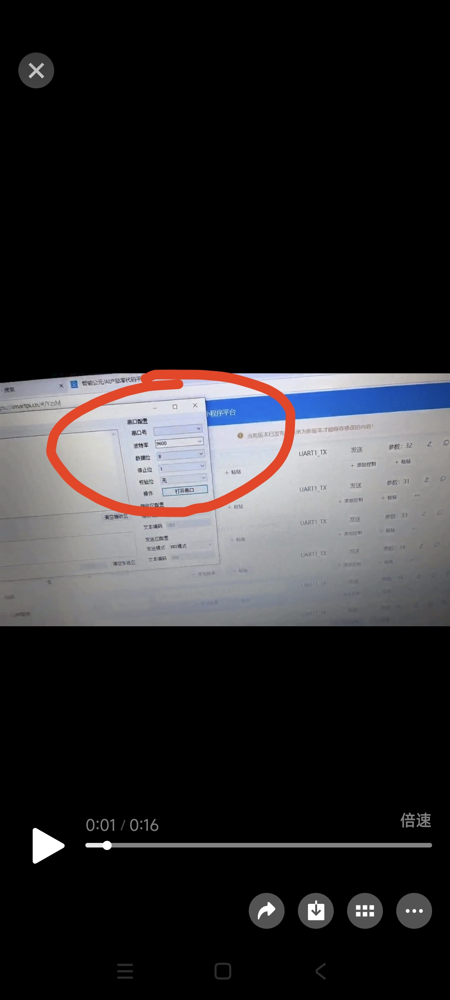

*串口助手中未检测到可用COM端口*

**4. 软件设置优化**

串口调试软件配置：

- 尝试不同的波特率（9600/115200等）
- 检查数据位、停止位、校验位设置
- 关闭其他可能占用串口的程序
- 以管理员权限运行串口工具

**5. 常见问题解决**

针对性处理：

- 使用已知良好的串口线排除线材问题
- 尝试不同的USB转串口模块
- 检查目标设备是否工作正常
- 验证CI-03T模块是否已烧录固件

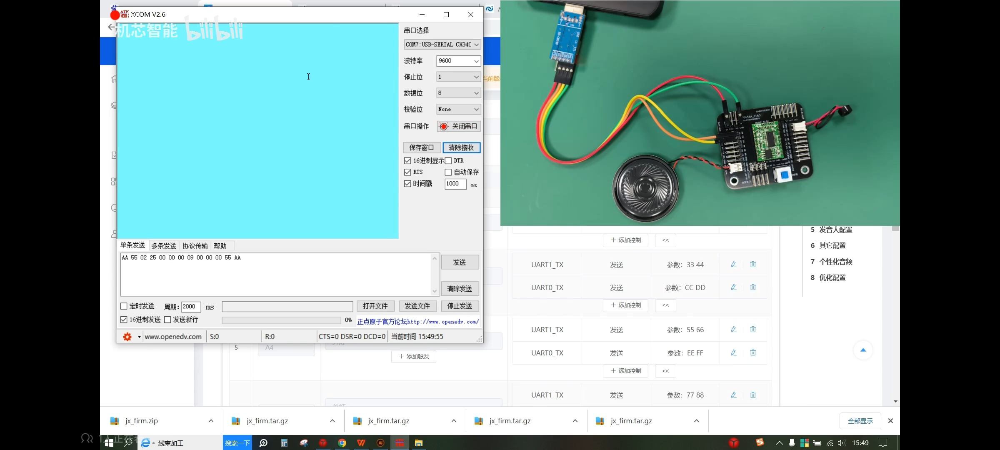

*正确的串口参数配置示例*

**注意事项：**

- CI-03T的UART通信需要5V工作电压
- 串口引脚需要正确配置为UART功能
- 避免将通信引脚配置为其他用途
- 如多个设备都无响应，可能是驱动问题

---

### CI-03T1模块串口1无法通信怎么办？

**问题描述：**

CI-03T1模块使用时，串口0可以正常工作，但串口1无法通信。

**解决方案：**

**引脚配置：**

- 串口0：PB5（TX0）、PB6（RX0）
- 串口1：PA2（TX1）、PA3（RX1）

**检查步骤：**

1. 确认平台上配置的串口引脚与硬件连接一致
2. 检查串口1的引脚是否在平台上正确配置
3. 确认硬件接线是否对应到正确的引脚

**电气特性：**

- 串口通信工作电压：5V
- 连接RS485收发器时需要使用5V工作的芯片

**注意事项：**

- 平台配置的引脚必须与硬件实际连接的引脚一致
- 串口功能需要确保对应的引脚没有被其他功能复用

---

### CI-03T系列的烧录口（P6/P7）是否可以作为通用串口（UART）使用？

**问题描述：**

需要确认CI-03T系列的烧录口（P6/P7）是否可以当作通用串口使用，以及如何在平台界面上配置相关引脚功能。

**解决方案：**

**烧录口复用说明：**

1. **P6/P7引脚功能**：

    - CI-03T的P6/P7（对应B6/B7引脚）既是烧录口又是通用串口
    - 烧录完成后可作为普通串口UART0使用
    - 支持与MCU进行串口通信

2. **引脚对应关系**：

    - P6/B6：UART0_TX（串口发送）
    - P7/B7：UART0_RX（串口接收）
    - 这两个引脚固定为串口功能，无需额外配置

**平台配置方法：**

1. **引脚功能选择**：

    - 在智能公元平台的GPIO配置界面
    - 找到DEFAULT_P14和DEFAULT_P15选项
    - 这两个选项对应P6/P7引脚的串口功能

2. **功能下拉菜单**：

    - DEFAULT_P14可选：DEFAULT_P14、UART0_TX、GPIO_B5、PWM1
    - DEFAULT_P15可选：DEFAULT_P15、UART0_RX、GPIO_B6、PWM1
    - 选择UART0_TX和UART0_RX启用串口功能


**使用说明：**

1. **烧录时**：

    - 使用专用烧录器通过P6/P7进行烧录
    - 或使用CH340等USB转TTL模块连接
    - 烧录完成后即可作为串口使用

2. **通信时**：

    - P6（TX）连接到外部设备的RX
    - P7（RX）连接到外部设备的TX
    - 支持标准的串口通信协议

**注意事项：**

- P6/P7是固定串口，无论如何配置都支持串口通信
- 烧录和通信功能可以复用同一组引脚
- 串口电平为5V，连接3.3V设备需要电平转换
- 这两个引脚默认作为日志输出口，修改配置将影响日志输出

---

### CI-03T4平台操作与英文唤醒词设置问题

**问题描述：**

使用CI-03T4芯片时遇到多个平台操作问题：无法登录智能公元平台后台、设置的英文唤醒词无法唤醒设备、平台生成的固件版本无法删除。

**解决方案：**

**1. 平台登录问题**

- 访问智能公元平台：https://www.smartpi.cn/#/
- 尝试使用不同浏览器（Edge、Chrome、Firefox）
- 清除浏览器缓存和Cookie
- 检查网络连接是否正常

**2. 英文唤醒词设置**

英文唤醒词设置规范：

- 唤醒词建议由2-4个英文单词组成
- 所有单词必须全部大写
- 多单词使用横线连接（如：HELLO-WORLD、HELLO-ALPHARD）
- 避免使用日常用语和相似音词
- 避免使用叠词

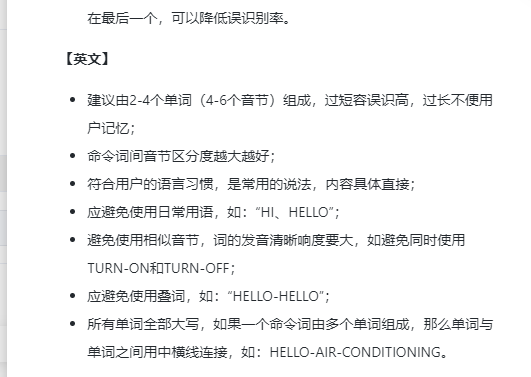

推荐使用的英文唤醒词：

- HI-JENNY、HI-TOM、HI-BETA、HI-REST
- HELLO-LIGHT、HELLO-HELLO、HELLO-JERRY
- HELLO-LASKO、HELLO-LAXFO
- YUMM

**3. 唤醒词测试要点**

- 单词唤醒词（如"HELLO"）相对容易误触发
- 建议使用多单词组合降低误触发率
- 字母组合的命令词（如CLOSE-THE-LEFT-DOOR）可能触发困难，建议实测验证

**4. 固件版本管理**

- 平台中生成的固件版本无法删除是正常现象
- 固件版本会保留在平台中用于版本管理和追溯
- 可以生成新版本而不影响已存在的版本

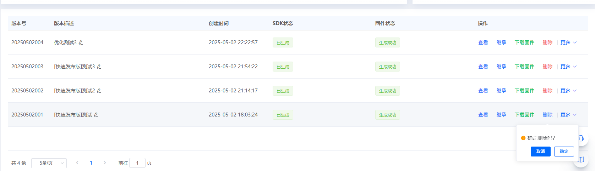

**注意事项：**

- 英文唤醒词的识别率取决于底层模型的训练语料
- 系统内置的推荐唤醒词经过优化，识别效果更好
- 自定义的字母组合命令词可能存在识别困难
- 烧录固件建议使用官方烧录工具，UniOneUpdateTool.exe可能不适用于CI-03T4

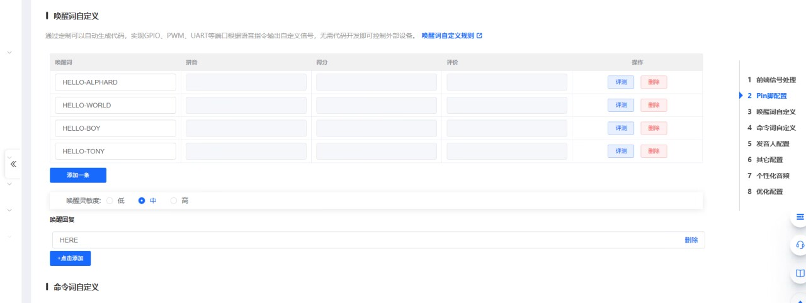

---

### CI-03T系列芯片的供电电压范围是多少？串口通信电平是多少？

**问题描述：**

需要了解CI-03T系列芯片的工作电压范围以及串口通信的电平标准，确保硬件设计正确。

**解决方案：**

**供电电压：**

- 工作电压范围：3.6V - 5.5V（最高可承受5.5V）
- 推荐供电：VCC引脚接入3.6-5V电源
- 3V3引脚：这是芯片内部LDO的输出引脚，不是输入引脚

**串口通信电平：**

- 串口通信电平：5V
- 包括UART0（PB5/PB6）和UART1（PA2/PA3）均为5V电平

**注意事项：**

- 电池供电时，锂电池充满电压4.2V在正常范围内，不会损坏芯片
- 电源电压低于3.6V时，识别率会大幅下降，建议使用升压电路保证供电稳定
- 3V3引脚如不使用可直接悬空，无需外接电路
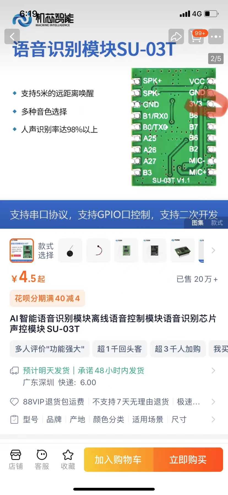

---

### CI-03T芯片唤醒词失效与串口无输出问题排查

**问题描述：**

使用CI-03T芯片时，麦克风能正常识别语音指令，但串口没有输出响应数据，且唤醒词"计算机"无法被识别，而"小艺小艺"可以唤醒。

**解决方案：**

**问题原因：**

---

### CI-03T1如何实现命令词的自动添加和删除？

**问题描述：**

需要了解CI-03T1模块是否支持在运行过程中自动添加和删除命令词，以及具体的实现方法。

**解决方案：**

**功能支持确认：**

CI-03T1支持自学习功能，可通过平台配置实现命令词的动态管理：

1. **支持的操作**

    - 学习新命令词
    - 删除已学习的命令词
    - 清除所有学习数据
    - 查看学习状态

2. **使用方式**

    - 通过语音交互操作
    - 支持串口指令触发
    - B站提供教学视频指导

**配置方法：**

1. **平台设置**

    - 登录智能公元平台
    - 选择CI-1302芯片（CI-03T1使用）
    - 进入"自学习"功能配置
    - 开启自学习功能开关

2. **串口触发配置**

    - 配置串口输出功能
    - 设置触发指令格式
    - 为学习操作配置对应的串口数据

**实际操作流程：**

1. **添加命令词**

    - 语音输入："学习命令词"
    - 设备进入学习模式
    - 说出要学习的命令词
    - 系统确认学习成功

2. **删除命令词**

    - 语音输入："删除命令词"
    - 选择要删除的命令词
    - 确认删除操作

3. **串口控制实现**

    ```
    主控MCU → 串口发送 → CI-03T1
                ↓
    通过协议指令控制自学习功能
    ```

**技术要点：**

1. **学习限制**

    - 自学习命令词建议控制在10条以内
    - 学习过程需要安静环境
    - 每次学习需要逐条完成

2. **存储管理**

    - 新增学习结果会保留，不覆盖原有数据
    - 删除操作可选择单个或全部清除
    - 支持导出学习配置

3. **串口协议**

    - 需要实现与CI-03T1的通信协议
    - 支持的学习指令参考官方文档
    - 确保数据格式正确

**开发建议：**

1. **参考教程资源**

    - 官方B站视频：[CI-03T免唤醒和自学习教程](https://www.bilibili.com/video/BV1LM4y1S7A8/)
    - 详细展示了自学习功能的操作方法
    - 包含语音触发和串口控制示例

2. **应用场景**

    - 智能家居设备：用户可通过语音自定义控制指令
    - 玩境监测：动态添加监控命令词
    - 工业控制：根据需求调整设备响应

**注意事项：**

- 自学习功能会占用额外的Flash空间
- 学习效果可能不如内置词条稳定
- 建议在产品化前充分测试功能
- 保留学习配置备份便于问题排查

---

### 退出唤醒命令触发错误串口数据如何解决？

**问题描述：**

在语音识别模块中，当使用'退下'命令退出唤醒状态时，系统会错误地触发'小助手'的唤醒逻辑并发送相应的串口数据，导致报警逻辑异常。同时在唤醒词为'救命'时，进入唤醒行为会触发'救命'的串口数据发送，影响了正常的功能逻辑。

**解决方案：**

**问题原因分析：**

1. **退出唤醒触发错误数据**

    - '退下'命令本应发送退出唤醒的数据（55 04 90 55）
    - 实际却发送了'小助手'唤醒的数据（55 10 01 55）
    - 两个命令词发送的串口数据不同，导致逻辑混乱

2. **唤醒词与命令词冲突**

    - 唤醒词设置为'救命'时
    - '进入唤醒'行为会触发'救命'对应的串口数据
    - 造成误报警或异常触发

**解决方法：**

1. **修改退出唤醒的串口数据**

    - 在平台控制配置中修改'退下'命令的串口输出
    - 将数据从55 10 01 55改为55 04 90 55
    - 确保退出唤醒发送正确的数据格式

2. **使用变量控制触发顺序**

    - 设置wake_up变量标记唤醒状态
    - 将'小助手'唤醒控制的变量设置放在最前面
    - 避免其他行为干扰唤醒逻辑

3. **优化进入唤醒的延时设置**

    - 调整'进入唤醒'的延时时间至100ms或更长
    - 避免与唤醒词识别的时序冲突
    - 给系统充足的判断时间

4. **分离唤醒词和命令词逻辑**

    - 当唤醒词与命令词相同时（如'救命'）
    - 通过变量判断是唤醒还是命令执行
    - 避免重复触发相同的数据

**配置示例：**

在控制配置中：

1. **进入唤醒行为**
    - 触发方式：事件触发
    - 串口输出：55 10 01 55
    - 延时时间：100ms

2. **退出唤醒行为**
    - 触发方式：语音触发
    - 命令词：退下
    - 串口输出：55 04 90 55
    - 回复语：有需要再叫我

3. **变量设置**
    - 变量名：wake_up
    - 数值：1
    - 延时：200ms

**注意事项：**

- 需要检查播音结束事件是否会影响串口数据发送
- 延时时间需要根据实际语音长度调整
- 建议使用不同的数据格式区分不同类型的操作
- 测试时监控串口数据，确认每个动作发送正确的数据


---

### CI-03T平台实际可用的IO口数量是多少？

**问题描述：**

在查看CI-03T引脚功能表时，发现表中列出了多个引脚，但实际使用时对IO口数量存在疑问。

**解决方案：**

**实际可用IO口数量：**

CI-03T平台总共提供**9个**普通GPIO口可供输入输出控制。

**详细引脚分布：**

| 引脚名称 | 功能类型 | 备注 |
|---------|---------|------|
| GPIO_A0 | 普通GPIO | 可作输入/输出 |
| GPIO_A1 | 普通GPIO | 可作输入/输出 |
| GPIO_A2 | 普通GPIO | 可作输入/输出 |
| GPIO_A3 | 普通GPIO | 可作输入/输出 |
| GPIO_A4 | 普通GPIO | 可作输入/输出 |
| GPIO_A5 | 普通GPIO | 可作输入/输出 |
| GPIO_A6 | 普通GPIO | 可作输入/输出 |
| GPIO_B5 | 普通GPIO | 可作输入/输出 |
| GPIO_B6 | 普通GPIO | 可作输入/输出 |

**使用注意事项：**

1. **引脚功能复用**：

    - 部分GPIO支持多种功能（如PWM、UART等）
    - 配置为其他功能时不能作为普通GPIO使用
    - 需要在智能公元平台中正确配置引脚功能

2. **串口引脚说明**：

    - B6/B7（DEFAULT_P14/P15）主要用于烧录和日志输出
    - 不占用上述9个GPIO资源
    - 可复用为普通串口通信

3. **特殊功能引脚**：

    - 部分GPIO支持5V宽压输入
    - 具体支持情况请参考规格书
    - 使用高电压时需注意电路保护

**实际应用建议：**

- 设计时先规划好所有IO口的功能分配
- 保留足够的IO口用于功能扩展
- 注意查看平台配置与硬件连接的一致性
- 如需要更多IO口，可考虑使用I2C或SPI扩展芯片

---

### 手机App触发学习求助词导致意外报警如何解决？

**问题描述：**

通过手机App向ESP32发送串口数据触发语音芯片执行'学习求助词'操作时，会意外触发'救命'唤醒词报警。主要表现为学习开始前就发送了'救命'的串口数据，导致其他设备直接触发报警。

**解决方案：**

**问题原因分析：**

1. **学习唤醒词的内部机制**

    - '学习求助词'功能本质是'学习唤醒词'
    - 系统默认需要进入唤醒状态才能进行学习
    - 进入唤醒状态时会自动触发唤醒词对应的行为

2. **唤醒词与命令词冲突**

    - 当唤醒词设置为'救命'时
    - 进入唤醒状态会触发'救命'的串口数据
    - 导致还未开始学习就触发报警

**解决方法：**

1. **使用标志位控制**

    - 在ESP32端设置学习标志位
    - 标志位为1时，屏蔽'救命'报警功能
    - 学习完成后清除标志位

2. **调整学习流程时序**

    - 先进入学习模式，再延时触发唤醒
    - 避免初始唤醒时的误触发
    - 确保学习过程的时序正确

3. **分离学习与报警逻辑**

    - 将学习功能和报警功能使用不同的数据格式
    - 学习期间使用特殊的数据头标识
    - 主控端根据数据头判断功能类型

**配置示例：**

在ESP32代码中添加标志位控制：

```c
// 学习标志位
static uint8_t learn_flag = 0;

// 处理学习求助词请求
if (strcmp(cmd, "learn_start") == 0) {
    learn_flag = 1;  // 设置学习标志
    offline_cmd_send(235);  // 发送学习指令
}

// 处理救命数据
if (strcmp(data, "help_data") == 0) {
    if (learn_flag == 0) {  // 仅在非学习状态下触发报警
        trigger_alarm();
    }
}
```

**注意事项：**

- 学习唤醒词功能会占用Flash资源，建议控制在10条以内
- 学习过程需要在安静环境下进行，距离1米内
- 不同固件版本的行为可能略有差异，需要实际测试验证
- 使用标志位方案需要确保主控和语音模块的同步
- 如问题持续，可考虑使用其他命令词作为唤醒词避免冲突

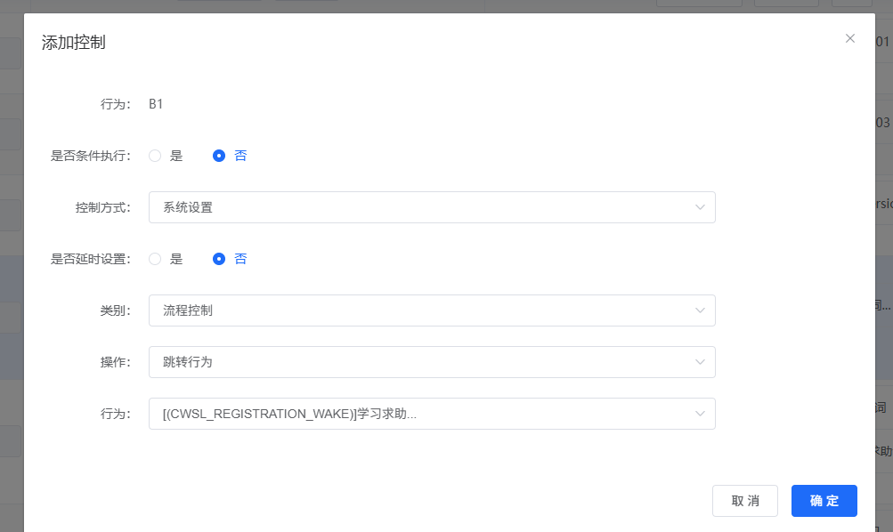


---

### 自学习英文识别效果不佳怎么办？

**问题描述：**

使用自学习功能学习英文命令词（如"help"）时识别效果不理想，经常识别不到，需要了解自学习功能的识别原理以及如何改善英文识别效果。

**解决方案：**

**识别原理说明：**

1. **中文谐音机制**

    - 自学习的英文也是将说的英文转为类似中文的谐音
    - 然后按谐音进行识别，效果比纯英文固件差
    - 这是自学习功能的技术限制

2. **识别效果差异**

    - 自学习英文识别效果略低于内置英文词条
    - 需要用户发音更标准、清晰
    - 多音节英文词识别效果相对较好

**改善方法：**

1. **使用多音节词汇**

    - 单音节词（如"help"）识别困难
    - 改用多音节词（如"help me"）
    - 多音节识别更容易，效果更好

2. **定制英文固件**

    - 制作专门的英文固件
    - 使用英文语音模型进行训练
    - 可获得更好的识别效果

**配置方案：**

1. **自学习方案（快速实现）**

    - 使用现有中文固件开启自学习
    - 学习"help me"等多音节词汇
    - 测试验证识别效果

2. **定制开发方案（最佳效果）**

    - 联系官方进行英文固件定制
    - 提供英文语料进行模型训练
    - 开发周期约1个月

**注意事项：**

- 自学习功能在安静环境下效果最佳
- 学习时距离设备1米内，正常语速、声音洪亮
- 如对识别效果要求高，建议选择定制开发方案
- 自学习命令词建议控制在10条以内
- 定制英文固件可获得更好的用户体验和识别率

---

1. **重新生成固件**

    - 登录智能平台，继承之前的固件配置
    - 在前端信号处理中选择新的模型
    - 推荐选择：普通话通用Pro(占1.3M空间)-V00964-V1或更新版本

2. **更新产品特性配置**

    - 在产品特性下拉菜单中选择合适的配置
    - 可选：语音识别、语音识别+自学习等
    - 确保配置与实际应用需求匹配

3. **验证串口输出配置**

    - 检查UART1_TX的发送动作是否正确配置
    - 确认输出参数格式（如EF 01 01 FF）
    - 测试串口通信是否正常返回数据

**固件配置示例：**

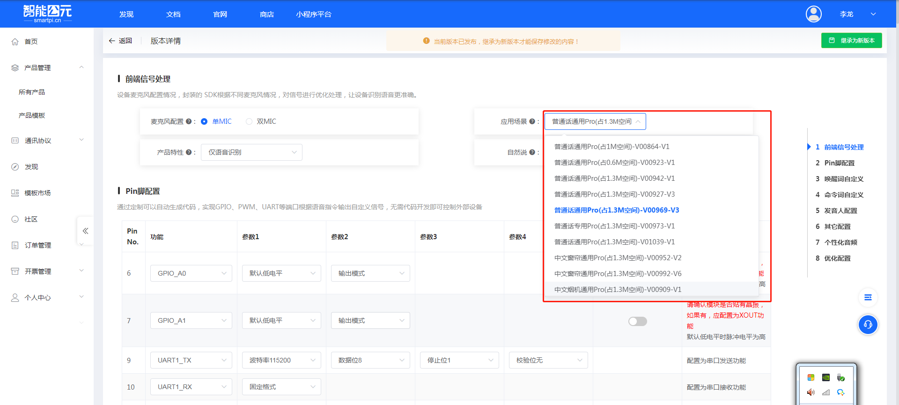

*选择新的模型版本提升识别效果*

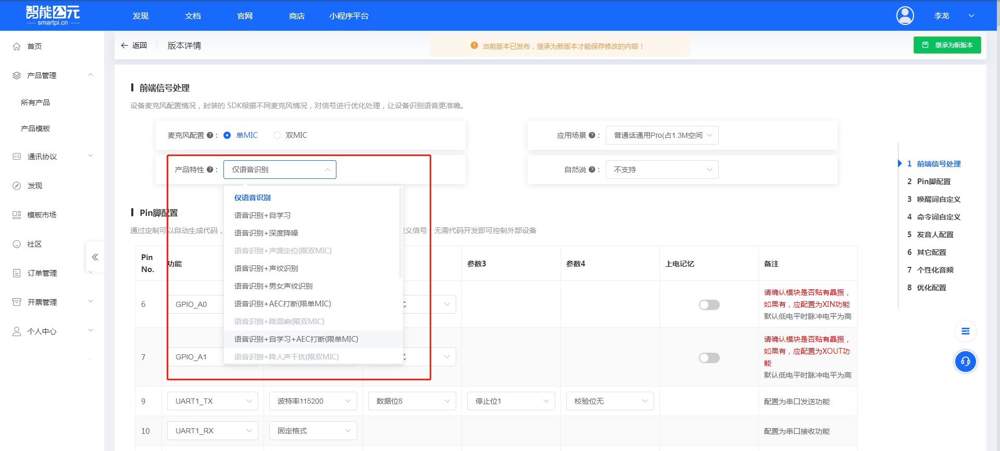

*根据需求选择合适的产品特性*

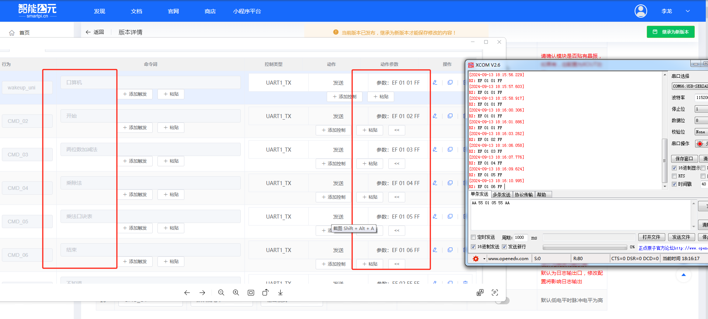

*配置UART1_TX发送动作参数*

**验证测试：**

1. **唤醒词测试**
    - 测试"计算机"唤醒词是否正常响应
    - 验证"小艺小艺"唤醒功能
    - 确认唤醒后能正常识别命令词

2. **串口通信测试**
    - 使用串口调试工具监控输出
    - 验证语音识别后是否有正确响应
    - 检查数据格式是否符合预期

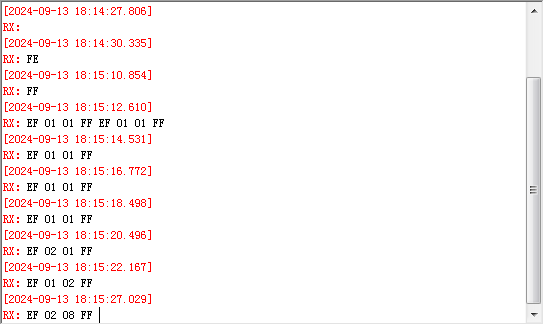

*串口调试工具显示正常的数据输出*

**注意事项：**

- 重新生成固件时必须继承原有配置，避免功能丢失
- 模型更新后需要全面测试所有命令词
- 如问题持续，可尝试删除多余唤醒词只保留必需的
- 建议使用平台推荐的最新模型版本以获得最佳效果

---

### CI-03T1模块如何实现PWM占空比阶梯式调节？

**问题描述：**

需要通过语音指令实现PWM占空比的阶梯式调节（如100%、70%、50%等），但配置时出现"行为控制详情控制方式错误"和"执行条件项为空"的问题。

**解决方案：**

**PWM配置方法：**

1. 在控制详情中选择PWM控制方式
2. 设置不同的占空比值（如100%、70%、50%）
3. 为每个占空比设置对应的语音指令

**错误解决：**

- "行为控制详情控制方式错误"：检查PWM引脚配置是否正确
- "执行条件项为空"：确保设置了正确的触发条件

**实现步骤：**

1. 创建多个行为，每个行为对应一个PWM占空比
2. 设置语音命令触发对应的行为
3. 通过变量记录当前档位
4. 使用循环命令功能实现连续调节

---

### CI1302芯片的PA5端口设置关机命令后无法保持低电平？

**问题描述：**

使用CI1302芯片的PA5端口控制继电器时，设置关机命令后PA5端口无法保持低电平，反而在100ms后自动翻转为高电平。

**解决方案：**

**问题原因：**

- 这是芯片的电源管理特性导致的
- 关机命令执行后，芯片进入低功耗模式
- 100ms后系统复位，GPIO恢复默认高电平状态

**解决方法：**

1. 使用外部锁存电路保持关机状态
2. 或者采用软件延时，确保继电器完全断开
3. 考虑使用具有掉电保持功能的继电器模块

**注意事项：**

- 设计电路时需要考虑芯片的电源管理特性
- 关机时序需要配合硬件电路设计

---

### 如何通过CI1302芯片的循环命令功能实现连续操作？

**问题描述：**

如何利用CI1302芯片的循环命令功能，实现通过串口连续发送多条指令，以达到一次语音指令触发多个连续操作的效果。

**解决方案：**

**循环命令配置：**

1. 在行为配置中选择循环执行功能
2. 设置循环次数和循环内容
3. 将需要连续执行的指令加入循环体

**应用示例：**

- 语音指令"音量减少"触发循环
- 循环5次，每次发送串口指令"音量-1"
- 实现一次语音降低5格音量的效果

**配置要点：**

- 正确设置循环次数
- 确保循环体内的指令格式正确
- 适当设置循环间隔时间

---

---

### 如何配置GPIO控制LED，实现语音回复与动作的延时控制？

**问题描述：**

需要通过语音指令控制LED灯，并实现语音播报与LED动作的时序控制，避免同时工作造成干扰。

**解决方案：**

**GPIO配置方法：**

- LED控制可使用任意GPIO引脚（如PA4）
- 引脚配置需要在智能公元平台中正确设置
- 确保GPIO输出电平与驱动电路匹配

**时序控制实现：**

1. **开灯指令**：先播放语音回复，延时1秒后再点亮LED
2. **关灯指令**：先关闭LED，延时1秒后再播放语音回复
3. **唤醒词**：仅播放语音回复，不控制LED

**程序逻辑示例：**
```c
// 开灯指令时序
play_voice("what can i say");  // 先回复
delay(1000);                  // 延时1秒
gpio_set_level(PIN_LED, 1);   // 再点灯

// 关灯指令时序
gpio_set_level(PIN_LED, 0);   // 先关灯
delay(1000);                  // 延时1秒
play_voice("manba out");      // 再回复
```

**注意事项：**

- 延时时间可根据实际语音长度调整（实测0.7-1秒）
- 确保LED驱动电路与GPIO电平兼容
- 如需调整延时，可通过导出的JSON配置文件修改

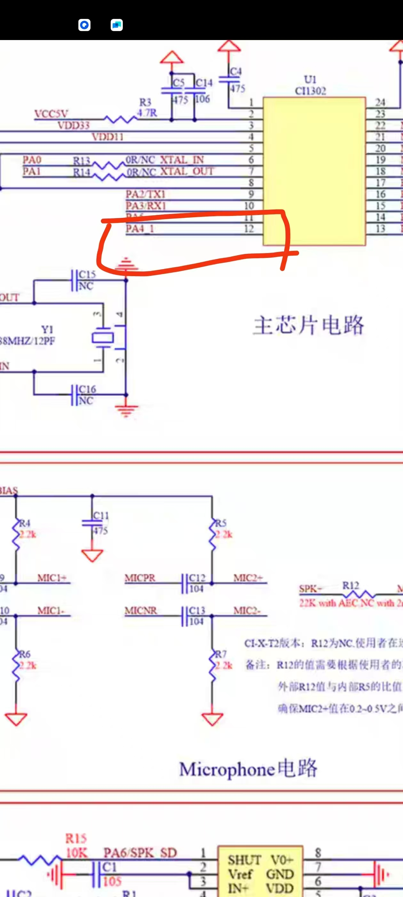

---

### CI-03T模块语音功能正常但LED不亮怎么办？

**问题描述：**

CI-03T模块烧录固件后，语音识别和播报功能正常，但LED灯不亮。

**解决方案：**

**硬件排查步骤：**

1. **确认LED连接**：

    - 检查LED连接的GPIO引脚（如PA4）
    - 使用万用表测量引脚输出电平
    - 确认LED驱动电路供电正常

2. **固件配置检查**：

    - 确认平台中GPIO配置正确
    - 检查是否配置了GPIO控制行为
    - 验证固件是否正确烧录

3. **程序逻辑验证**：

    - 添加测试指令直接控制GPIO
    - 通过串口查看GPIO状态日志
    - 确认程序执行到GPIO控制代码

**常见原因分析：**

- GPIO引脚配置错误
- LED驱动电路损坏
- 固件中缺少GPIO控制逻辑
- 程序延时设置不当

**批量问题处理：**

- 整批产品都出现LED不亮，通常是固件配置问题
- 联系技术支持重新生成带GPIO控制的固件
- 提供详细的硬件连接图和控制逻辑

**注意事项：**

- 批量模块出现相同问题，通常是固件问题
- 单个模块问题，重点检查硬件连接
- 使用原厂测试固件验证硬件功能

---

### 批量生产时LED不亮的快速排查方法？

**问题描述：**

批量生产的CI-03T1模块出现语音正常但LED不亮的问题，需要快速定位和解决。

**快速定位流程：**

**第一步：确认问题范围**

- 统计不良数量和比例
- 检查是否是整批问题
- 对比不同批次的差异

**第二步：硬件快速测试**

1. **引脚测试**：

    - 使用万用表测试PA4引脚电压
    - 触发语音指令时观察电压变化
    - 确认GPIO是否有输出

2. **LED独立测试**：

    - 直接给LED电路供电测试
    - 确认LED驱动电路是否正常
    - 检查限流电阻等元件

**第三步：固件验证**

1. **使用测试固件**：

    - 烧录官方提供的GPIO测试固件
    - 验证硬件是否工作
    - 对比测试固件和生产固件差异

2. **检查配置文件**：

    - 确认平台中GPIO配置正确
    - 检查行为配置是否完整
    - 验证导出的固件包含GPIO控制

**解决方案：**

- 确认为固件问题，联系技术支持重新生成
- 硬件问题则检查PCB和元器件
- 建立烧录后测试流程，确保功能正常

**预防措施：**

- 量产前充分测试固件功能
- 建立首件检验制度
- 保留测试固件用于故障排查

----

### 如何设置CI-03T模块在开机上电时自动运行流水灯功能？

**问题描述：**

需要设置CI-03T模块在开机上电时自动运行流水灯功能，实现设备启动时的动态指示效果。

**解决方案：**

**硬件连接：**

1. **LED连接**：

    - 将LED灯连接到CI-03T模块的任意GPIO引脚（如GPIO_A0~GPIO_A6）
    - 确保LED的限流电阻正确连接（通常220Ω-1kΩ）
    - 多个LED可分别连接不同GPIO引脚

2. **电源要求**：

    - 供电电压：3.6V-5.5V
    - 外部负载不超过150mA
    - 确保电源稳定，避免上电不稳定导致LED闪烁异常

**软件配置：**

1. **GPIO配置**：

    - 在智能公元平台配置GPIO为输出模式
    - 设置初始输出状态（通常为低电平）
    - 无需启动定时器，直接使用延时函数

2. **实现方法**：

    - 在启动代码中直接设置GPIO输出状态
    - 通过延时函数实现LED的翻转效果
    - 可在main函数或初始化函数中实现

**关键代码实现：**

```c
// 配置GPIO为输出模式
void gpio_init() {
    gpio_set_direction(GPIO_A0, OUTPUT);  // LED1
    gpio_set_direction(GPIO_A1, OUTPUT);  // LED2
    gpio_set_direction(GPIO_A2, OUTPUT);  // LED3
}

// 流水灯效果实现
void water_led_effect() {
    // LED1亮
    gpio_write(GPIO_A0, HIGH);
    delay_ms(500);
    gpio_write(GPIO_A0, LOW);

    // LED2亮
    gpio_write(GPIO_A1, HIGH);
    delay_ms(500);
    gpio_write(GPIO_A1, LOW);

    // LED3亮
    gpio_write(GPIO_A2, HIGH);
    delay_ms(500);
    gpio_write(GPIO_A2, LOW);
}

// 系统初始化
void system_init() {
    gpio_init();

    // 开机自动运行流水灯
    while(1) {
        water_led_effect();
    }
}
```

**注意事项：**

- 开机流水灯无需重新启动定时器，直接配置GPIO翻转即可
- 定时器在启动时已自动初始化，无需额外操作
- LED限流电阻阻值要根据供电电压和LED规格选择
- 流水灯效果可根据需求调整延时时间和变化模式
- 如需语音功能，可在流水灯循环中加入语音识别判断

----

### CI-03T2双麦克风语音播报时无法识别指令怎么办？

**问题描述：**

在使用CI-03T2双麦克风语音模块时，语音播报期间无法识别语音指令，且无法同时启用回声消除（AEC）功能，需要解决该问题以实现在播报过程中仍能识别指令。

**解决方案：**

**问题原因分析：**

1. **硬件架构限制**：

    - CI-03T2采用双麦克风架构，主要设计用于降噪
    - 播报时为了避免自我干扰，会暂时关闭识别功能
    - AEC功能与双麦克风算法存在资源冲突

2. **功能互斥说明**：

    - 双麦克风降噪：需要两个麦克风协同工作
    - AEC回声消除：需要参考信号和回声信号分离
    - 语音识别：播报时为避免误触发会暂停识别

**解决方案：**

1. **使用单麦克风AEC版本**：

    - 选用CI-03T3单麦克风AEC版本
    - 支持语音打断功能，播报时可识别新指令
    - AEC功能可有效避免回声干扰

2. **软件配置优化**：

    - 缩短播报内容长度
    - 调整播报音量，降低对麦克风的影响
    - 优化播报结束后的识别恢复时间

3. **硬件改进方案**：

    - 增加物理隔断，减少扬声器对麦克风的直接声学反馈
    - 调整麦克风和扬声器的相对位置
    - 使用指向性麦克风

**型号选择对比：**

| 型号 | 麦克风 | AEC支持 | 语音打断 | 适用场景 |
|------|---------|----------|-----------|----------|
| CI-03T2 | 双麦克风 | 不支持 | 不支持 | 嘈杂环境降噪 |
| CI-03T3 | 单麦克风 | 支持 | 支持 | 需要语音打断 |

**注意事项：**

- 双麦克风版本更适合固定噪声环境
- 如需实时交互功能，建议选择支持AEC的版本
- 硬件选型需根据实际应用场景决定

---

### CI-03T1芯片声源定位事件选项不可选怎么办？

**问题描述：**

在CI-03T1芯片的配置界面中，声源定位事件选项显示为灰色不可选状态，无法进行事件触发配置。

**解决方案：**

**问题原因：**

- CI-03T1为单麦克风版本模块
- 声源定位功能需要双麦克风支持才能正常工作
- 单麦克风硬件无法实现声源定位算法

**解决方法：**

1. **确认硬件版本**：

    - CI-03T1：单麦克风，不支持声源定位
    - CI-03T2：双麦克风，支持声源定位功能

2. **选择合适方案**：

    - 如需要声源定位功能，请选用CI-03T2双麦克风版本
    - 如仅需基础语音识别，CI-03T1已能满足需求

3. **功能对比**：

    | 型号 | 麦克风数量 | 声源定位 | 降噪效果 |
    |------|------------|-----------|----------|
    | CI-03T1 | 单麦克风 | 不支持 | 基础降噪 |
    | CI-03T2 | 双麦克风 | 支持 | 阵列降噪 |

**注意事项：**

- 声源定位功能依赖硬件支持，无法通过软件升级实现
- 双麦克风版本成本略高，但提供更好的噪声抑制能力
- 选择前请确认产品实际需求，避免功能冗余

---

### 如何控制8002D功放芯片的开关以消除静噪声？

**问题描述：**

需要通过CI1302芯片控制8002D功放芯片的开关，实现仅在语音交互时开启功放、其余时间关闭，从而消除静噪声问题。

**解决方案：**

**电路连接：**

- 使用CI1302的一个GPIO引脚控制8002D的使能引脚
- 确保控制逻辑与功放的使能逻辑匹配

**控制策略：**

1. 待机状态：功放使能为低，功放关闭
2. 语音识别到唤醒词：功放使能为高，功放开启
3. 播报完成后：延时一段时间后关闭功放

**注意事项：**

- 功放开关需要与语音播报同步
- 延时时间需要根据播报内容长度调整
- 确保功放开关不会产生pop噪声

---

### CI-03T模组使用外部麦克风时出现误触发怎么办？

**问题描述：**

使用CI-03T模组加底板设计的样机，定型后偶尔出现语音模块误触发问题。经排查发现使用的是外部麦克风（非原厂配套）。

**解决方案：**

**问题原因：**

- 外部麦克风灵敏度过高导致误识别率增加
- 麦克风参数与模组不匹配

**技术要求：**
建议使用以下规格的麦克风：

- 灵敏度：-32dB
- 信噪比：SNR > 70dB

**解决方法：**

1. **首选方案**：更换符合规格的麦克风
    - 联系麦克风供应商提供符合要求的型号
    - 更换麦克风不会影响尺寸和装配

2. **替代方案**（硬件已定型无法更改）：

    - 通过软件算法优化降低误触发
    - 增加电路板滤波
    - 调整识别阈值

**注意事项：**

- 硬件需要搭配标准配置，再优化算法才能达到最佳效果
- 研发阶段建议多测试不同规格的样板
- 电源纹波也应控制在合理范围（建议100mV左右）

---

### CI-03T模组的功放能驱动多大功率的扬声器？

**问题描述：**

需要了解CI-03T模组集成的功放电路能够驱动多大功率的扬声器，以便选择合适的喇叭。

**解决方案：**

**功放规格：**

- CI-03T系列模组（除低功耗版本外）均内置功放电路
- 可驱动8Ω、3W以下的扬声器
- 功放类型：ClassAB
- 典型输出功率：2.4W@5V4Ω

**选型建议：**

- 推荐使用4-8欧姆的扬声器
- 扬声器功率不超过3W
- 根据产品尺寸选择合适的喇叭口径

**注意事项：**

- 扬声器阻抗过低可能导致功放过载
- 扬声器功率过大会影响音质
- 如需驱动更大功率的扬声器，建议外接专用功放电路

---

### CI-03T2模块的B2、B3引脚能否配置为GPIO使用？

**问题描述：**

需要确认CI-03T2模块的B2和B3管脚是否可以配置为GPIO，实现一个作为按钮输入，另一个作为输出控制舵机或LED。

**解决方案：**

CI-03T2模块的B2、B3引脚可以配置为GPIO功能，具体说明如下：

1. **引脚功能确认**：

    - B2、B3引脚支持GPIO配置
    - 可通过平台配置为输入或输出模式
    - 支持中断、上下拉等GPIO特性

2. **配置方法**：

    - 在智能公元平台中设置引脚功能为GPIO
    - B2可配置为输入模式，用于按钮检测
    - B3可配置为输出模式，用于控制舵机或LED

3. **硬件连接**：

    ```
    B2 (GPIO输入) ← 按钮 ← GND
    B3 (GPIO输出) → 舵机信号线 / LED正极
    ```

4. **电平特性**：

    - 输入模式：支持高/低电平检测
    - 输出模式：可输出3.3V高电平
    - 驱动能力：可直连LED，舵机需要额外驱动电路

**注意事项：**

- B2、B3在烧录时是Bootloader引脚，正常运行时可作为GPIO使用
- 配置为输入时建议启用内部上拉电阻
- 控制舵机时需要配合PWM功能或外部驱动电路
- 确保平台配置的引脚功能与硬件连接一致

---

### CI-03T1模块在MP3播放器应用中唤醒困难怎么办？

**问题描述：**

在使用CI-03T1模块开发MP3播放器产品时，在实际应用环境中出现唤醒困难的问题，模块难以被语音指令正确唤醒，影响产品正常使用。

**解决方案：**

**问题排查步骤：**

1. **应用环境分析**

    - 评估实际使用环境的噪声水平
    - 确认MP3播放时的声音对麦克风的影响
    - 检查产品结构对语音识别的干扰

2. **硬件设计优化**

    - 确保麦克风位置远离扬声器
    - 优化声学结构设计，避免声音反射和干扰
    - 检查电源纹波，确保供电稳定

3. **固件配置调整**

    - 选择合适的应用场景模型（如普通话通用Pro）
    - 调整唤醒词识别灵敏度（默认0.2，可适当降低）
    - 开启降噪功能以应对环境噪声

4. **声学结构优化**

    - 参考官方《产品结构声学规范》进行设计
    - 确保麦克风开孔大小合适（建议2-3mm）
    - 在麦克风和扬声器之间增加声学隔离

**针对MP3播放器的特殊建议：**

- **AEC功能使用**：优先选用CI-03T1单麦AEC版本，内置回声消除功能
- **播放音量控制**：在语音交互时适当降低播放音量
- **唤醒响应设计**：唤醒后先暂停播放，确保指令识别清晰

**测试验证方法：**

1. 在安静环境下测试基础唤醒功能
2. 逐步增加MP3播放音量测试识别效果
3. 在典型使用场景下验证唤醒可靠性
4. 记录不同条件下的唤醒成功率

**注意事项：**

- MP3播放器产品需要特别关注播放声音对麦克风的影响
- 结构设计对语音识别效果影响较大，需重视声学设计
- 如噪声环境复杂，可考虑升级至双麦版本（CI-03T2）
- 批量生产前建议进行充分的环境测试

---

### CI-03T1模块IO引脚电平信号不稳定怎么办？

**问题描述：**

CI-03T1芯片的IO引脚出现电平信号不稳定，具体表现为设备在休眠状态下保持高电平，有声音时电平变低，无声音10秒后又自动拉高，导致无法作为稳定的唤醒触发源。

**解决方案：**

**问题分析：**

- 这种电平变化是模块内部的电源管理机制导致
- 模块在无音频输入时会自动进入低功耗模式
- IO引脚的电平变化与模块的睡眠/唤醒状态相关

**解决方法：**

1. **使用事件触发方式**：

    - 在智能公元平台中配置事件触发而不是电平触发
    - 设置语音识别事件作为触发条件
    - 通过事件触发来控制外部设备

2. **选用其他GPIO引脚**：

    - 选择不受电源管理影响的GPIO引脚
    - 使用PA4、PA5等通用GPIO作为触发源
    - 在平台中正确配置引脚功能

3. **添加硬件缓冲电路**：

    - 在IO输出端添加锁存器或触发器电路
    - 使用施密特触发器整形信号
    - 增加RC滤波电路稳定电平

4. **软件逻辑优化**：

    - 在主控端增加去抖动算法
    - 设置时间窗口判断有效触发
    - 使用状态机管理触发信号

**注意事项：**

- CI-03T1的某些IO引脚会随芯片状态变化
- 建议在产品设计阶段仔细选择触发引脚
- 电平触发方式可能受芯片电源管理影响
- 事件触发方式更为稳定可靠

---

### CI-03T1模块偶尔出现唤醒失败怎么办？

**问题描述：**

CI-03T1语音模块在使用过程中偶尔出现唤醒失败，需要重新上电才能恢复正常工作。

**解决方案：**

**排查步骤：**

1. **电源检查**：

    - 确认供电电压在3.6-5.5V范围内
    - 检查电源纹波是否过大（建议<100mV）
    - 测量电流是否满足工作要求

2. **硬件连接检查**：

    - 检查麦克风连接是否可靠
    - 确认底板与模组的接触良好
    - 检查是否有虚焊或接触不良

3. **固件检查**：

    - 确认固件版本是否为最新
    - 检查唤醒词配置是否正确
    - 验证唤醒阈值设置是否合适

**临时解决方法：**

- 调整唤醒词识别阈值（降低灵敏度）
- 使用更清晰的唤醒词
- 避免在强噪声环境下使用

**注意事项：**

- 偶发性唤醒失败可能与电源稳定性有关
- 建议在设计时预留充足的电源余量
- 持续无法唤醒时需要检查硬件是否损坏

---

### CI-03T唤醒回复语音无法更新怎么办？

**问题描述：**

在使用CI-03T芯片时，发现通过网页平台修改的唤醒回复语音无法更新，即使多次烧录固件，回复语音内容仍保持不变，而其他语音（如开机语音）可以正常更新。

**解决方案：**

**问题分析：**

1. **固件缓存问题**
    - 某些区域Flash可能存在写保护
    - 语音资源更新机制可能存在异常
    - 部分区域更新可能需要特殊擦除流程

2. **配置存储机制**
    - 唤醒回复语可能存储在特定扇区
    - 该扇区的更新逻辑与其他语音不同
    - 可能需要完全擦除后重新写入

**解决方法：**

1. **完整擦除Flash**

    - 使用烧录工具的"Chip Erase"功能
    - 进行完整的Flash擦除操作
    - 清除所有残留的语音数据

2. **使用专用擦除工具**

    - 使用Simple Flasher等工具
    - 勾选完整擦除选项
    - 确保擦除成功后再烧录

3. **固件版本管理**

    - 记录每次修改的版本号
    - 保留更新前后的MD5校验值
    - 建立版本变更记录表

**操作步骤：**

1. **备份原始配置**
    - 导出当前项目的JSON配置
    - 保存原始语音文件
    - 记录原有的回复语内容

2. **执行完整擦除**
    - 连接CH340烧录器
    - 选择完整擦除模式
    - 等待擦除完成

3. **重新烧录固件**
    - 使用修改后的新固件
    - 确认烧录成功
    - 验证回复语是否更新

**验证方法：**

1. **功能测试**
    - 上电后测试开机语音
    - 唤醒设备测试回复语
    - 对比修改前后的内容差异

2. **多次验证**
    - 重新烧录多次确认
    - 测试不同批次的一致性
    - 记录测试结果

**注意事项：**

- 唤醒回复语的更新机制可能与普通语音不同
- 建议使用官方推荐的烧录工具进行操作
- 如问题持续存在，可能需要联系技术支持进行深度分析
- 保留完整的测试记录便于问题追踪

---

### CI-03T1模块的Flash容量能否存储长时间音频文件？

**问题描述：**

需要在唤醒词触发后播放一段约10分钟的音频，但CI-03T1模块的2M Flash存储容量不足。

**解决方案：**

**容量限制：**

- CI-03T1模块内置2MB Flash存储空间
- 需要存储固件程序和语音资源包
- 实际可用于音频文件的存储空间有限

**长音频文件存储方案：**

1. **更换模块方案**：

    - 推荐使用CI-33T模块（内置4MB Flash）
    - CI-33T支持更大容量的音频文件存储
    - 除Flash容量外，CI-33T其他功能与CI-03T相同

2. **音频压缩方案**：

    - 对音频文件进行压缩处理
    - 降低采样率和比特率
    - 可能会影响音质

**模块对比参考：**

| 参数 | CI-03T1 | CI-33T |
|------|---------|--------|
| Flash容量 | 2MB | 4MB |
| 词条支持 | 300条 | 500条 |
| 主控芯片 | CI1302 | CI1303 |

**注意事项：**

- 10分钟音频文件即使压缩后仍可能超过2MB
- 如需播放长音频，建议直接选用CI-33T模块
- 音频文件大小与采样率、编码方式相关

---

### 如何在CI-03T系列离线语音识别芯片上实现任意数字（0-60000）的语音识别？

**问题描述：**

需要在CI-03T离线语音识别芯片上实现任意数字（0-60000）的语音识别，用于设置电压值等场景。例如说"设置电压一千两百三十四伏"，需要识别出数字1234。

**解决方案：**

由于CI-03T离线语音模块存在以下限制：

- 内存容量限制：最多支持300条词条
- 单个数字逻辑性不强，离线识别效果不佳
- 同时触发多个关键词（如"一万一千"）误识别率很高

**推荐的实现方案：**

1. **分段式识别方案**（推荐）

通过分段询问的方式组合识别大数字：

```
用户：设置电压
模块：要设置多少万？
用户：6万
模块：要设置多少千？
用户：3千
模块：要设置多少百？
用户：5百
模块：最后两位呢？
用户：三十二

最终输出：63532
```

2. **在线语音方案**

如需真正实现任意数字的直接识别：

- 推荐使用JX-A7T等在线语音模块
- 在线识别通过云端匹配，可实现大范围数字识别
- 适合需要联网的应用场景

**注意事项：**

- 离线方案下，每个数字都需要占用一条词条资源
- 分组识别（如"一万两万...六万"）仍需要相应数量的词条
- 单句话同时触发多个关键词需要专门定制，误识别率较高
- 离线识别适合收到声音的逻辑性较强的组合

---

### CI-03T启用自学习功能后设备无响应怎么办？

**问题描述：**

启用语音识别+自学习功能配置后，设备在提示用户说话后无响应，导致自学习流程无法完成。

**解决方案：**

**功能互斥说明：**

- 稳态降噪和自学习功能不能同时使用
- 这是芯片的功能限制，两个功能在底层资源上存在冲突

**配置调整方法：**

1. **退出时间设置**：

    - 将超时退出时间调整至10秒或更长
    - 默认5秒过短，用户还未说完就已超时

    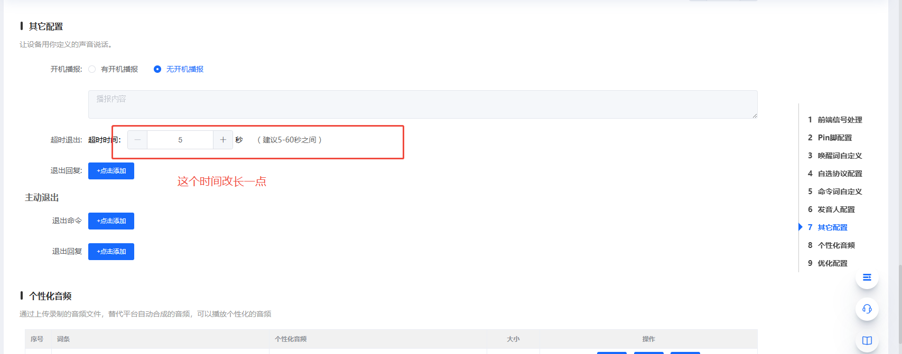

2. **功能选择**：

    - 根据实际需求选择稳态降噪或自学习功能
    - 如需自学习功能，不要同时启用稳态降噪

    

**排查步骤：**

1. 确认是否同时启用了稳态降噪和自学习功能
2. 检查超时退出时间设置
3. 查看日志中是否有"退出唤醒"提示
4. 使用官方提供的自学习教程进行测试

**注意事项：**

- 自学习功能需要充足的等待时间让用户完成录音
- 建议在安静环境下进行自学习，避免干扰
- 自学习教程参考：[CI-03T免唤醒和自学习教程](https://www.bilibili.com/video/BV1LM4y1S7A8/)

### CI-03T自学习后的资料能否打包并批量复制？

**问题描述：**

需要将已经完成自学习的CI-03T模块中的学习资料打包，并批量写入到多个相同的CI-03T模块中，以提高生产效率。

**解决方案：**

自学习功能的资料无法读取和复制：

- 自学习的数据存储在模块内部Flash中，无法通过外部接口读取
- 模块运行自学习后，学习内容直接写入内部存储区
- 没有提供数据导出或备份功能

**替代方案：**

1. **重新配置方案**：

    - 在智能公元平台创建新项目
    - 将需要学习的词条预先配置为命令词
    - 生成固件后批量烧录到所有模块

2. **量产建议**：

    - 如有大批量需求，建议直接预烧录固件
    - 联系厂家提供固件预烧录服务
    - 最小起订量通常为100个模块

**注意事项：**

- 每个模块需要单独进行自学习操作
- 自学习功能适合少量定制化需求
- 批量生产建议使用预配置固件方案

---

### 如何在CI-03T1/CI-03T2中添加自定义歌曲并调整音频码率？

**问题描述：**

需要在CI-03T1或CI-03T2语音芯片中添加自定义歌曲作为提示音或回复音，并需要调整音频文件的码率以适应芯片的存储和播放需求。

**解决方案：**

**音频文件要求：**

1. **支持格式**：

    - WAV格式（推荐）
    - 采样率：16kHz或8kHz
    - 位深：16bit
    - 声道：单声道

2. **码率建议**：

    - 语音提示音：64kbps - 128kbps
    - 歌曲类音频：根据存储空间调整，建议128kbps以下
    - 可通过音频转换软件降低码率以节省存储空间

**添加步骤：**

1. **音频文件准备**：

    - 使用音频编辑软件（如Audacity）转换格式
    - 调整采样率至16kHz
    - 转换为单声道
    - 适当压缩以减小文件大小

2. **平台配置**：

    - 登录智能公元平台
    - 在"其他配置"或"个性化音频"中上传音频文件
    - 将音频文件关联到对应的命令词或唤醒词

3. **存储空间管理**：

    - CI-03T1/CI-03T2内置2MB Flash
    - 需要合理分配固件、语音资源提示音的空间
    - 长时间歌曲可能需要选用更大容量的CI-33T模块

**优化建议：**

- 根据芯片存储限制选择合适的音频长度
- 重要提示音优先存储，歌曲等非必要音频可考虑压缩
- 测试不同码率的音质效果，找到平衡点

**音质优化建议：**

- 如出现音频浑浊问题，尝试提高采样率至16kHz
- 避免过度压缩，保持适当的音频动态范围
- 使用高质量的音频源文件进行转换
- 考虑音频内容的频率特性，语音和音乐的优化参数不同

**注意事项：**

- 音频文件过大可能导致固件烧录失败
- 过低的码率会影响音质，特别是音乐类内容
- 建议在批量生产前进行充分的存储空间测试
- 音频质量"浑浊"通常由采样率过低或过度压缩导致

---

### CI-03T长时间运行后系统死机怎么办？

**问题描述：**

在摇摆功能等持续运行数小时后，设备出现系统死机，物理按键无响应，无法通过按键关闭系统。

**解决方案：**

- 确保语音控制功能正常配置，作为紧急关闭手段
- 检查系统散热设计，长时间运行可能导致过热
- 优化控制逻辑，避免长时间连续运行导致资源耗尽
- 考虑添加看门狗机制，定期检查系统状态

**注意事项：**

- 长时间运行测试时，务必保留语音控制作为备用关闭方式
- 如频繁出现死机，建议检查电源稳定性和固件版本

---

## 模块维修与质量控制

### CI-03T模块批量稳定性问题分析与解决

**问题描述：**

在使用CI-03T模块时出现设备不响应、识别率低等稳定性问题，批量产品出现故障，对新批次模块的性能和可靠性存在疑虑。

**解决方案：**

**问题诊断流程：**

1. **故障现象确认**：

    - 统计不良品数量和故障模式
    - 记录具体问题：设备不响应、识别率低、完全无反应等
    - 确认问题发生的使用环境和时间

2. **根本原因分析**：

    - 检查是否为特定批次的问题
    - 分析可能的原因：芯片质量、生产工艺、外围电路等
    - 对比正常批次与问题批次的差异

**处理措施：**

1. **紧急处理**：

    - 立即停止使用问题批次产品
    - 回收已发货的问题产品
    - 提供临时替代方案

2. **技术改进**：

    - 更换为带晶振版本提升稳定性
    - 优化生产工艺，减少虚焊漏焊
    - 加强出厂检验流程

3. **质量保证**：

    - 对新批次进行严格测试
    - 提供小批量试产验证
    - 确认无问题后再大批量交付


**预防措施：**

1. **供应商管理**：

    - 选择有质量认证的芯片供应商
    - 建立来料检验标准
    - 定期评估供应商质量表现

2. **生产管控**：

    - 加强SMT贴片工艺管理
    - 避免使用红胶工艺，采用标准贴片
    - 增加功能测试环节

3. **测试验证**：

    - 每批次进行抽检测试
    - 模拟实际使用环境验证
    - 保留测试记录便于追溯

**注意事项：**

- 发现批量问题应立即停止使用并反馈
- 保留故障样品供技术分析
- 建议先小批量测试验证再大批量使用
- 选择带晶振版本可获得更好的稳定性

---

### CI-03T1模块的CQC认证要求是什么？

**问题描述：**

需要确认CI-03T1模块及其生产厂商是否具有CQC认证。

**解决方案：**

**认证要求确认：**

1. **产品认证**：

    - 确认模块本身是否需要CQC认证
    - 检查产品的认证证书
    - 验证认证的有效期和范围

2. **供应商认证**：

    - 确认生产厂商的资质
    - 检查是否具备必要认证
    - 要求提供认证证书复印件

**认证管理：**

1. **证书管理**：

    - 建立认证档案
    - 定期检查证书有效期
    - 提前准备续期工作

2. **合规性检查**：

    - 确保产品符合认证要求
    - 定期进行产品检测
    - 保留检测报告

**注意事项：**

- CQC认证是产品销售的基本要求
- 选择有认证的供应商可降低风险
- 定期审核供应商的资质状态
- 建立认证追溯体系

---

### CI-03T的ADC接口数量和WiFi融合方案

**问题描述：**

在音控智能油烟机项目中，需要采集两个模拟信号并通过WiFi传输到手机App，咨询了CI-03T的ADC接口数量和WiFi融合方案。

**解决方案：**

**ADC接口说明：**

CI-03T模块仅提供1路10位SAR ADC接口：

- **ADC规格**：10位精度，最高1MHz采样率
- **输入范围**：0-3.3V电压信号
- **限制说明**：只有1路ADC，无法同时采集两个模拟信号

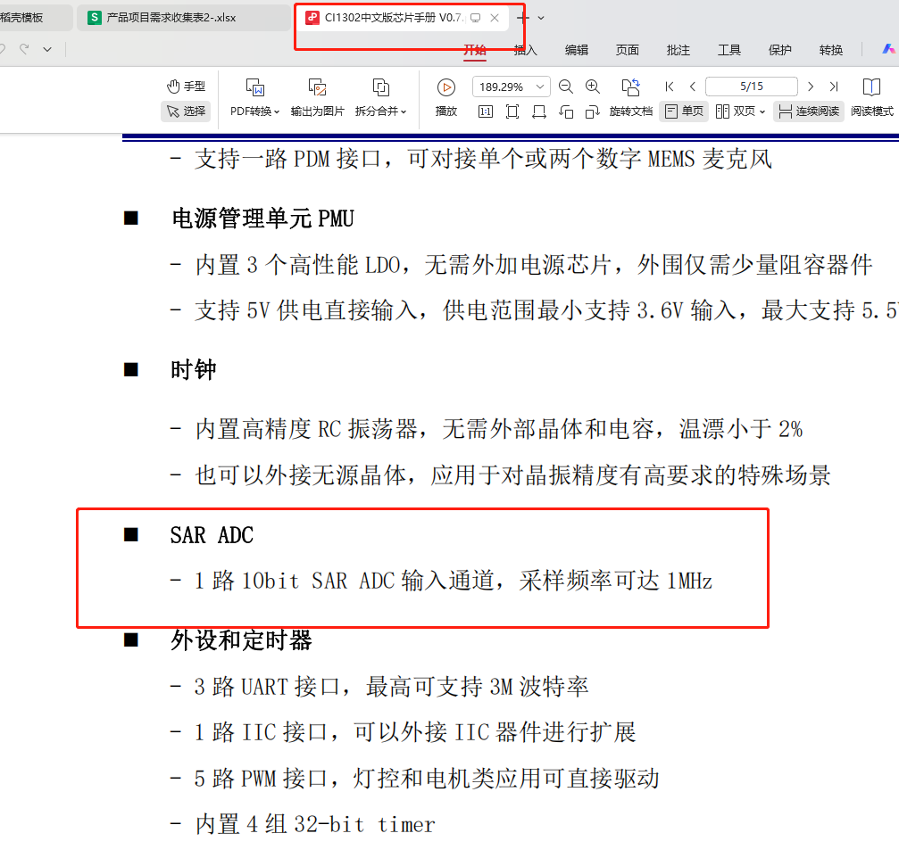

**多路模拟信号采集方案：**

1. **外部ADC芯片方案**：

    - 使用PCF8591（8位4路ADC）或ADS1115（16位4路ADC）
    - 通过I2C接口与CI-03T通信
    - 可同时采集多路模拟信号

2. **模拟开关切换方案**：

    - 使用CD4051等模拟开关芯片
    - 通过GPIO控制切换不同信号源
    - 分时复用单个ADC通道

3. **选择SU-03T模块**：

    - SU-03T提供更多ADC接口
    - 适合需要多路模拟信号采集的应用

**WiFi融合方案：**

1. **定制化二合一模块**：

    - 支持WiFi+语音识别融合模块定制
    - 开发周期约1-2个月
    - 需要具体需求评估和开发

2. **模块组合方案**（推荐）：

    - CI-03T语音模块 + 独立WiFi模块（如ESP32）
    - 开发灵活，可并行开发
    - 通过串口通信实现数据传输

3. **使用JX-A7T在线模块**：

    - 内置WiFi功能，无需额外模块
    - 支持离线唤醒和在线AI对话
    - 适合需要联网功能的应用

**注意事项：**

- CI-03T的ADC为电压型输入，采集的模拟信号需转换为电压信号
- ADC阈值触发可能因信号抖动导致重复播报，建议增加软件滤波
- WiFi融合涉及App通讯协议开发，需要自行实现App端
- 若项目急需，建议采用模块组合方案快速实现功能

---

### ADC采集模拟信号触发播报的重复触发问题

**问题描述：**

ADC采集的模拟电压信号在阈值附近抖动时，会导致语音播报重复触发，无法控制播报频率。

**解决方案：**

**问题原因分析：**

- ADC检测值在阈值附近持续抖动
- 每次超过阈值都会触发新的播报
- 现有系统无法实现上升沿单次触发

**解决方法：**

1. **增加时间间隔控制**：

    - 设置播报后的最小静默时间（如5分钟）
    - 静默期间不响应新的触发
    - 通过定时器实现间隔控制

2. **优化触发条件**：

    - 扩大ADC阈值范围设置（从默认50调整到更大值）
    - 增加滞后区间，避免来回触发
    - 使用GPIO输入替代ADC输入（如信号为数字量）

3. **软件滤波处理**：

    - 对ADC采样值进行滑动平均滤波
    - 连续多次检测确认触发
    - 消除瞬态干扰影响

4. **硬件优化建议**：

    - 在模拟输入端增加RC滤波电路
    - 提高信号稳定性
    - 使用更稳定的电压基准源

**注意事项：**

- ADC设置为单次触发模式，但仍可能因信号抖动重复触发
- 如需精确控制触发逻辑，建议使用外部MCU处理后再给CI-03T触发信号
- 实际测试表明信号稳定时只触发一次，主要问题在于信号源抖动

---

### 如何通过变量控制实现需要进入设置模式才能使用的音量调整和自学习功能？

**问题描述：**

需要在CI-03T1芯片上实现音量调整和自学习功能，但这些功能必须先通过语音指令"进入设置"后才能使用，在常规状态下无法直接调用。

**解决方案：**

**设置模式控制逻辑：**

1. **变量定义**
    - 创建变量val（整型，初始值为0）
    - val=0：常规状态，所有功能禁用
    - val=1：设置模式，音量调整和自学习功能可用


*变量C1定义为整型，初始值为0，用于控制设置模式*

2. **进入/退出设置命令**
    - "进入设置"：设置变量val=1，启用功能
    - "退出设置"：设置变量val=0，禁用功能

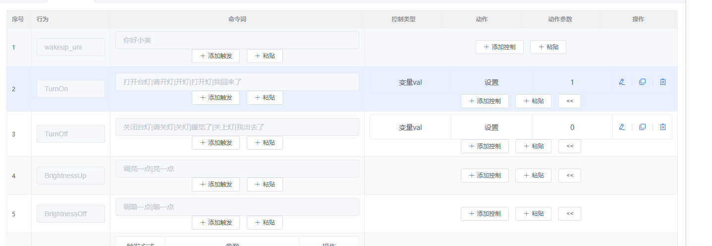

*进入设置时val=1，退出设置时val=0*

**音量调整功能配置：**

1. **基础设置**
    - 在音量调整控制行为中添加条件执行
    - 设置条件：变量val等于数值1
    - 只有在设置模式下才能执行音量调整

    

    *音量调整的条件执行配置，确保val=1时才生效*

2. **音量控制命令词**
    - 增加音量、减少音量
    - 最小音量、最大音量等档位控制
    - 所有命令词都受条件执行限制

**自学习功能配置：**

1. **跳转行为设置**
    - 将"开始学习唤醒词"等命令设置为跳转行为
    - 跳转目标：[startStudy]词醒换学习始开
    - 添加条件执行：仅当val=1时生效

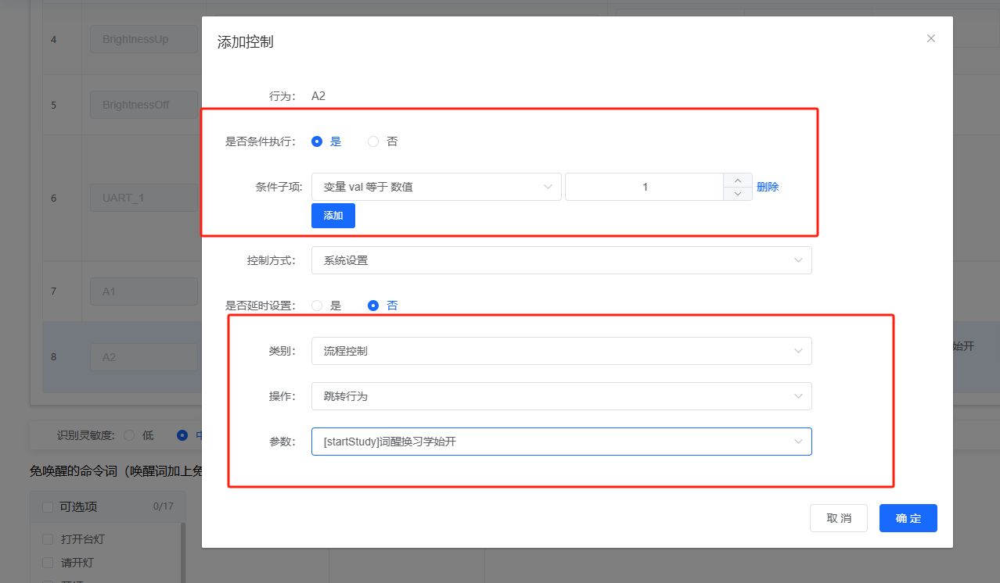

*自学习功能的跳转行为配置，通过条件执行控制*

2. **自学习命令词**
    - "我要学习唤醒词"
    - "开始学习命令词"
    - 这些命令在设置模式下才能使用

**使用流程：**

1. 唤醒设备后说"进入设置"进入设置模式
2. 在设置模式下可以使用音量调整功能
3. 在设置模式下可以启动自学习功能
4. 使用完毕后说"退出设置"返回常规状态
5. 常规状态下，音量调整和自学习功能均不可用

**注意事项：**

- 变量控制是实现功能权限管理的有效方法
- 条件执行功能确保了操作的安全性和可控性
- 建议在进入设置模式时添加语音提示，告知用户当前状态
- 退出设置模式后，建议播报提示语确认已退出

---

### CI-03T1芯片无法下载固件怎么办？

**问题描述：**

在使用CI-03T1芯片时无法下载固件，需要了解固件烧录的具体操作步骤以及如何正确实现电源复位以完成烧录。

**解决方案：**

**烧录工具使用说明：**

1. **烧录界面操作**
    - 打开PACK_UPDATE_TOOL.exe烧录工具
    - 选择正确的bin固件文件（必须单独放在桌面路径）
    - 确认COM口显示正常（如COM35）
    - 烧录时需要短按复位按键

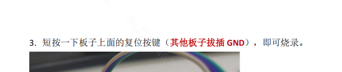

*烧录时需要短按复位按键进行下载*

2. **设备状态检查**
    - 正常连接时设备状态显示为黄色
    - 如无COM口需检查CH340串口驱动
    - 检查USB口是否损坏

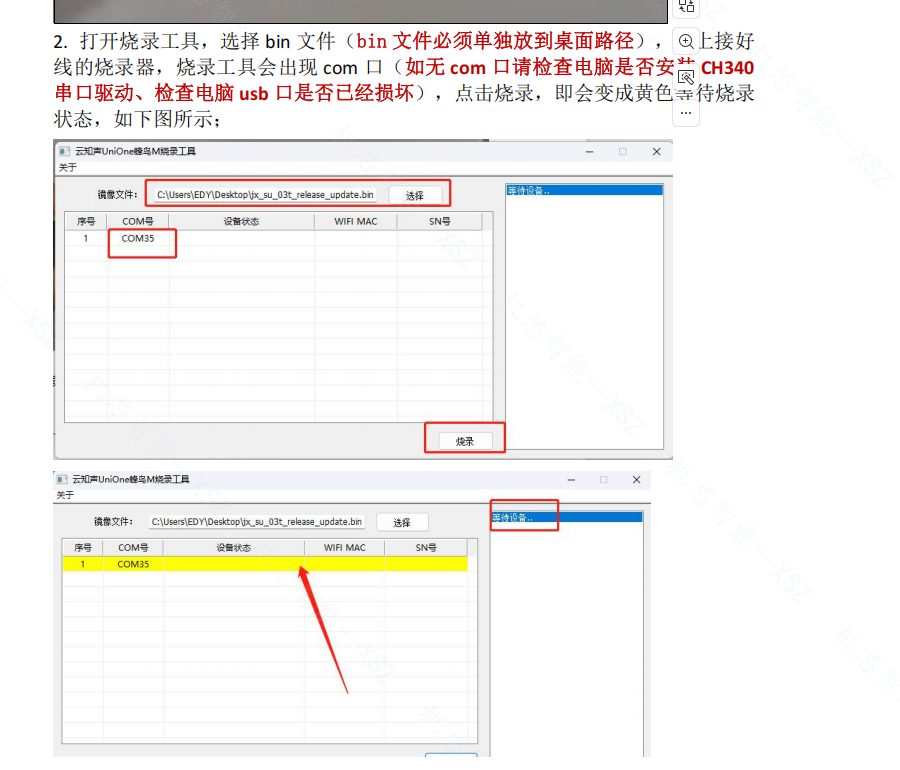

*设备状态为黄色，等待烧录操作*

**硬件复位要求：**

1. **电源复位必要性**
    - 烧录时必须进行电源复位
    - 复位用于进入下载模式
    - 没有复位功能的板子需要拔插GND实现复位

2. **复位电路设计**
    - CH340N的RTS#引脚需要连接复位电路
    - 复位电路由R11、R12和复位开关组成
    - 如无复位键，可将R11、R12换成0R电阻

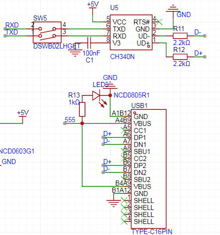

*RTS#引脚连接的复位电路设计*

**标准电路参考：**

建议按照标准电路设计，包含完整的电源控制和UART连接：

- 电源部分：使用开关控制电源通断
- UART部分：正确连接CH340N的TX/RX引脚
- 复位部分：预留复位按键便于烧录

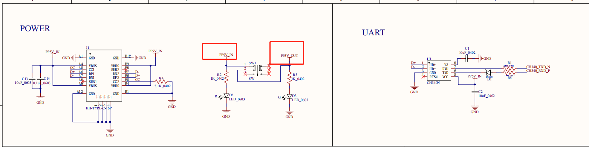

*包含电源开关的标准电路设计*

**烧录操作步骤：**

1. 连接USB转串口模块
2. 打开烧录工具，选择固件文件
3. 确认COM口识别正常
4. 短按复位键（或断开GND）进入下载模式
5. 点击烧录按钮开始下载
6. 等待烧录完成

**注意事项：**

- 固件文件必须放在桌面根目录，不能放在子文件夹中
- 建议在硬件设计时预留电源复位按键
- 如使用CH340芯片，确保电脑已安装正确的驱动程序
- 烧录失败时，先检查复位操作是否正确
- 批量生产时，建议使用带复位功能的底板设计

---

### CI-03T串口数据与语音交互实现

**问题描述：**

需要通过CI-03T模块的串口实现数据与语音的交互功能，将模块集成到便携设备中进行语音控制。

**解决方案：**

CI-03T模块提供多路UART接口，可通过串口与主控设备进行数据交互，实现语音识别结果输出和外部控制指令接收。

**实现方式：**

1. **硬件连接**

    - 使用USB转串口适配器连接模块与PC或主控设备
    - 模组通过B5/B6引脚进行串口通信（B5为TX，B6为RX）
    - 确保共地连接，供电电压为5V

2. **串口通信协议**

    - 语音识别成功后，模块通过串口发送识别结果
    - 支持自定义数据格式，如十六进制指令
    - 可配置输出命令ID、识别置信度等信息

3. **配置步骤**

    1. 登录智能公元平台
    2. 在项目中配置UART功能
    3. 设置串口波特率和数据格式
    4. 配置识别结果输出动作
    5. 生成固件并烧录到模块

**注意事项：**

- 串口通信需要交叉连接（模块TX连接主机RX，模块RX连接主机TX）
- 波特率等通信参数需保持一致
- 模块默认使用5V电平，连接3.3V设备时需要电平转换
- 便携设备应用时需考虑功耗优化，模块平均功耗约1W

---

### CI-03T模块如何配置禁止休眠功能？

**问题描述：**

在风扇噪音环境下使用CI-03T模块时，需要模块保持常醒状态，避免进入休眠影响语音指令的实时响应。

**解决方案：**

在智能公元平台的事件触发配置中添加"禁止超时退出唤醒"控制：

1. **配置位置**：

    - 进入事件触发配置界面
    - 选择"上电启动系统自动"触发方式
    - 添加"禁止超时退出唤醒"控制选项

2. **配置效果**：

    - 模块上电后自动进入常醒状态
    - 不会因超时而退出唤醒模式
    - 确保语音指令的实时响应


**注意事项：**

- 常醒状态会增加模块功耗
- 适用于需要实时响应的应用场景
- 如需降低功耗，可设置合理的超时时间

---

### CI-03T与SU-03T模块的性能对比如何？

**问题描述：**

需要了解CI-03T双咪头模块与SU-03T单咪头模块在抗干扰性和识别效果方面的差异。

**解决方案：**

**性能对比：**

- **CI-03T（双咪头）**：

    - 降噪能力更强，适合嘈杂环境
    - 双麦算法提供更好的噪声抑制
    - 支持300条词条

- **SU-03T（单咪头）**：

    - 识别效果更优，适合安静环境
    - 结构简单，成本更低
    - 支持150条词条

**选型建议：**

- 噪音较大的环境：优先选择CI-03T
- 安静环境且注重识别效果：选择SU-03T
- 需要更多词条容量：选择CI-03T

---

### 如何优化过多语音指令的识别效果？

**问题描述：**

当语音指令数量过多时（如145条指令），容易出现识别率下降的问题，需要优化方案。

**解决方案：**

**优化策略：**

1. **指令精简**：

    - 合并功能相似的指令
    - 删除不必要的指令
    - 保留核心功能指令

2. **参数化设计**：

    - 将"设置时间1分钟"、"设置时间2分钟"等合并
    - 使用"设置时间X分钟"的自然说功能
    - 减少指令数量，提高识别率

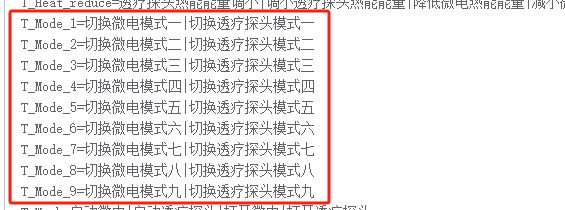

3. **指令差异化**：

    - 确保指令间发音差异明显
    - 避免使用发音相似的词汇
    - 命令词建议至少4个音节

**注意事项：**

- 指令数量越多，识别率可能下降
- 建议将指令控制在合理范围内
- 使用自然说功能可以大幅减少指令数量

---

### CI-03T1的GPIO_5引脚可以配置为ADC输入吗？

**问题描述：**

在配置CI-03T1芯片的ADC输入功能时，发现GPIO_5被错误地配置为ADC输入，导致控制台输入功能受到影响。

**解决方案：**

GPIO_5是专用固件烧录引脚，不能配置为ADC输入：

1. **GPIO_5的固定功能**：

    - GPIO_5（B5引脚）是固定的UART1_TX烧录引脚
    - 该引脚专门用于固件下载和调试
    - 不支持配置为ADC输入或其他功能

2. **错误配置的后果**：

    - 将GPIO_5配置为ADC输入会影响烧录功能
    - 控制台通信可能异常
    - 固件更新可能失败

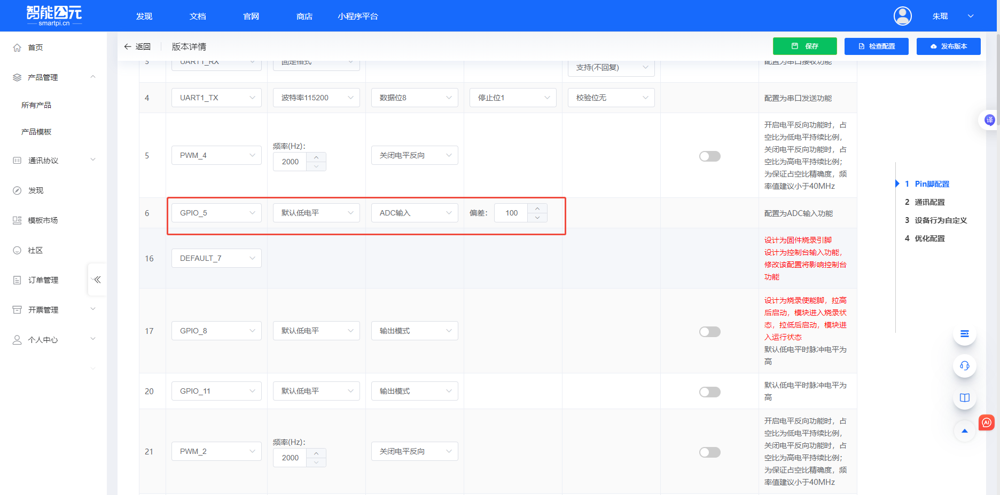

*GPIO_5被错误配置为ADC输入的界面，偏差值100*

3. **正确的ADC配置方法**：

    - 使用芯片专用的ADC引脚进行模拟信号采集
    - CI-03T1提供1路10位SAR ADC
    - 通过智能公元平台正确配置ADC通道

**注意事项：**

- GPIO_5/B5引脚只能用作UART1_TX烧录功能
- 如需ADC功能，请使用芯片指定的ADC引脚
- 配置错误可能导致烧录功能异常
- 修改配置后需要重新生成并烧录固件

---

### CI-03T1的GPIO口支持5V电平信号直接连接吗？

**问题描述：**

需要了解CI-03T1芯片的哪些GPIO口支持5V电平信号直接通信，无需电平转换。

**解决方案：**

CI-03T1的所有GPIO口均不支持5V电平信号直接连接：

1. **GPIO电气特性**：

    - GPIO工作电压：3.3V
    - 输入高电平(VIH)：最小2.0V
    - 输入低电平(VIL)：最大0.8V
    - 最大输入电压：3.6V（绝对值）

2. **5V信号连接风险**：

    - 直接连接5V信号可能损坏GPIO
    - 长期工作在5V下会导致芯片失效
    - 即使短暂的高电压也会造成永久性损伤

3. **正确的连接方法**：

    - **使用电平转换电路**：

        - 5V → 3.3V转换器
        - 电阻分压电路（推荐）
        - 专用电平转换芯片

    - **电阻分压方案**：
        ```
        5V信号 → 2.2kΩ → GPIO → 1.0kΩ → GND
        ```
        分压后电压：5V × 1.0/(2.2+1.0) = 1.56V（偏低）
        推荐阻值：5V → 1kΩ → GPIO → 2kΩ → GND
        分压后电压：5V × 2/(1+2) = 3.33V（合适）

4. **特殊说明**：

    - 虽然规格书提到"部分GPIO支持5V宽压输入"
    - 但实际测试表明所有GPIO都是3.3V逻辑
    - 为安全起见，建议对所有GPIO进行电平转换

5. **串口通信例外**：

    - UART引脚（PB5/PB6）是5V电平
    - 这是因为内部有电平转换电路
    - 但这不适用于普通GPIO口

**注意事项：**

- 所有GPIO引脚都应视为3.3V逻辑
- 5V设备必须通过电平转换连接
- 不建议直接连接，即使短时间也可能损坏芯片
- 如需5V兼容，请使用外部电平转换芯片

---

### 如何实现自定义表情显示但不改变动作？

**问题描述：**

希望自定义语音命令触发时，OLED屏幕显示特定表情但不执行动作，需要修改代码但缺乏编程经验。

**解决方案：**

可以通过智能公元平台配置实现表情显示功能，无需修改代码。

**1. 平台配置方法：**

- **导入JSON文件**：

    - 获取现有表情配置的JSON文件
    - 在智能公元平台使用"导入产品"功能
    - 选择并导入JSON配置文件

- **修改表情配置**：

    - 在平台中编辑命令词对应的表情
    - 移除或禁用动作控制
    - 仅保留OLED显示功能

**2. 实现方式：**

- **无需编程基础**：

    - 平台提供图形化配置界面
    - 拖拽式操作，简单直观
    - 配置完成后自动生成固件

- **成本考虑**：

    - 自行开发：需要购买源代码，成本约600元
    - 平台配置：完全免费，操作简单

**3. 配置步骤：**

1. 登录智能公元平台
2. 导入或创建新产品
3. 配置语音命令词
4. 设置对应的OLED表情显示
5. 移除动作控制设置
6. 生成并下载固件
7. 烧录到模块测试

**注意事项：**

- 确保使用的模块型号支持OLED显示
- 表情图片需要符合平台格式要求
- 保留原始配置文件作为备份
- 如遇到问题可参考B站教程视频

---

### CI-03T2语音触发后UART3无串口数据输出怎么办？

**问题描述：**

使用CI-03T2开发版，已成功烧录固件且语音识别正常，但语音触发后UART3（pin10、11）未输出串口数据。

**解决方案：**

**问题分析：**

CI-03T2模块的UART3功能支持多个输出选项，需要在平台配置中正确选择对应的输出端口。

**排查步骤：**

1. **确认平台配置**：

    - 检查智能公元平台中的串口配置
    - 确认UART3输出已正确启用
    - 验证输出端口选择是否正确

2. **UART3输出选项**：

    - UART3可能有多个可选输出引脚
    - 需要根据实际硬件连接选择对应选项
    - 确保选择的输出与物理连接一致

3. **硬件连接验证**：

    - 确认串口线连接到正确的引脚（pin10、11）
    - 检查串口工具的波特率设置
    - 验证交叉连接（TX-RX，RX-TX）

**配置方法：**

1. **平台设置**：

    - 进入智能公元平台的固件配置页面
    - 找到UART3或串口输出配置选项
    - 选择与硬件连接匹配的输出端口

2. **输出端口选择**：

    - 根据实际使用的引脚选择对应选项
    - 如使用pin10、11，选择对应的UART3输出
    - 保存配置并重新生成固件

3. **测试验证**：

    - 烧录新固件到模块
    - 触发语音指令进行测试
    - 观察串口工具是否收到数据

**技术要点：**

- CI-03T2的UART3支持多种输出配置
- 必须在平台中正确选择输出端口
- 语音识别正常说明固件基本功能正常
- 串口无输出通常是配置问题

**注意事项：**

- 每次修改配置后需要重新烧录固件
- 确保串口工具参数与模块配置一致
- 保留配置截图便于问题排查
- 如问题持续，检查硬件连接是否可靠

---

### 语音唤醒与命令词交互流程

**问题描述：**

语音模块在识别唤醒词后无法正常识别命令词，或用户不清楚正确的交互流程，导致语音控制功能无法正常使用。

**解决方案：**

**标准交互流程：**

1. **两级识别机制**：

    - **第一步**：说出唤醒词（如"智能管家"）
    - **第二步**：在唤醒状态下说出命令词（如"打开空调"、"关闭空调"）

2. **唤醒状态维持**：

    - 唤醒成功后，模块进入唤醒状态
    - 默认维持唤醒状态10秒
    - 10秒内无命令输入则自动退出唤醒状态

3. **状态反馈机制**：

    - 配置唤醒回复语音确认唤醒成功
    - 通过语音反馈让用户知道设备已准备好接收命令
    - 避免用户不确定唤醒状态的困扰

**配置要点：**

1. **唤醒词配置**：

    ```
    唤醒词示例：智能管家、艾玛艾玛
    回复语设置：我在、我在这里
    作用：确认唤醒成功，提示用户可以说命令词
    ```

2. **命令词配置**：

    ```
    命令词示例：打开空调、关闭空调、暂停、开机、关机
    识别条件：必须在唤醒状态下说出
    响应时间：唤醒后10秒内有效
    ```

3. **唤醒时长设置**：

    - 默认唤醒维持时间：10秒
    - 可根据应用场景调整时长
    - 建议保持默认值以平衡响应性和功耗


*智能公元平台唤醒词配置界面，需同时配置唤醒词和回复语*

**常见问题解决：**

1. **只识别唤醒词，不识别命令词**：

    - **检查配置**：确认命令词已正确添加到配置中
    - **检查时序**：确认在唤醒后10秒内说出命令词
    - **导出配置**：通过导出JSON文件检查配置完整性

2. **无唤醒反馈，不确定状态**：

    - **添加唤醒回复**：在平台中配置唤醒后的语音回复
    - **测试反馈**：喊唤醒词后应听到"我在"等回复
    - **确认状态**：只有听到回复后才表示进入唤醒状态

3. **连续说话识别失败**：

    - **适当停顿**：唤醒词和命令词间保持0.5-1秒间隔
    - **清晰发音**：确保每个词汇都发音清晰
    - **环境要求**：在相对安静的环境下进行测试

**配置导出与检查：**

1. **导出配置文件**：

    - 在智能公元平台删除旁边找到"导出"按钮
    - 导出当前配置为JSON文件
    - 检查配置中是否包含所有命令词

2. **配置文件检查**：

    ```json
    {
        "wake_word": "艾玛艾玛",
        "wake_reply": "我在",
        "commands": [
            {"cmd": "打开空调", "reply": "已打开空调"},
            {"cmd": "关闭空调", "reply": "已关闭空调"},
            {"cmd": "关机", "reply": "正在关机"}
        ],
        "wake_timeout": 10000
    }
    ```

3. **配置修复**：

    - 如发现配置缺失，重新在平台中添加
    - 保存配置后重新生成固件
    - 烧录新固件进行测试

**特殊应用场景：**

1. **免唤醒命令词**：

    - **适用场景**：报警器、紧急控制等需要立即响应的场景
    - **配置方法**：将特定命令词添加到"免唤醒"列表
    - **使用方式**：直接说出命令词，无需先喊唤醒词

2. **快速连续命令**：

    - **设置要求**：适当延长唤醒维持时间
    - **使用技巧**：命令间保持简短停顿
    - **适用场景**：需要执行多个连续操作的情况

**最佳实践建议：**

1. **语音交互设计**：

    - 选择清晰易识别的唤醒词
    - 命令词应简洁明确，避免歧义
    - 设置自然的语音反馈增强用户体验

2. **环境适配**：

    - 根据使用环境调整识别灵敏度
    - 在高噪声环境中可适当提高阈值
    - 定期测试和优化识别效果

3. **用户引导**：

    - 在说明书中明确交互流程
    - 提供常用命令词列表和发音示例
    - 包含常见问题的解决方法

**测试验证步骤：**

1. **基础功能测试**：

    - 测试唤醒词识别是否正常
    - 验证唤醒回复是否播放
    - 确认命令词在唤醒状态下能被识别

2. **时序测试**：

    - 测试唤醒后立即说命令词
    - 测试唤醒后9秒说命令词
    - 测试唤醒后11秒说命令词（应不响应）

3. **边界测试**：

    - 测试连续多个命令词执行
    - 测试环境噪声干扰情况
    - 验证长时间使用稳定性

**注意事项：**

- 必须严格按照"先唤醒、后命令"的顺序进行交互
- 唤醒状态有时间限制（默认10秒），超时需重新唤醒
- 建议配置唤醒回复以提供明确的状态反馈
- 免唤醒功能仅适用于特殊应用场景
- 定期检查配置文件确保所有命令词正常配置

---

### CI-03T2是否支持外部系统音频接入AEC电路？

**问题描述：**

需要将另一个系统播放的音频信号接入CI-03T2模块的AEC（回声消除）电路中，以消除回声干扰，从而提升唤醒成功率。

**解决方案：**

CI-03T2模块支持外部系统音频接入AEC功能：

1. **硬件支持确认**：

    - CI-03T2支持AEC回声消除功能
    - 可将外部音频信号接入相应电路
    - 实现外部音频的回声消除处理

2. **技术实现原理**：

    - AEC算法通过参考信号消除播放声音的干扰
    - 外部音频作为参考信号输入
    - 提升在播放环境下的语音识别效果

3. **接口连接方式**：

    - 将外部系统音频输出接入模块的AEC输入端
    - 根据模块规格书连接到对应引脚
    - 确保音频信号幅度匹配

**应用场景**：

- 音响播放音乐时的语音控制
- 电视播报时的语音指令识别
- 多媒体设备同时播放音频的场景
- 需要语音打断功能的应用

**配置建议**：

1. **硬件连接**：

    - 使用适当的音频线缆连接
    - 考虑添加衰减电路调整信号电平
    - 确保连接可靠性和信号质量

2. **软件配置**：

    - 在智能公元平台启用AEC功能
    - 根据实际效果调整AEC参数
    - 测试不同音量下的识别表现

**选型对比**：

| 型号 | AEC支持 | 外部音频接入 | 适用场景 |
|------|---------|-------------|----------|
| CI-03T2 | ✓ | ✓ | 需要外部音频回声消除 |
| CI-03T1 | ✓ | ✓ | 单麦克风AEC场景 |
| SU-32T | ✓ | ✗ | 仅自身播放回声消除 |

**注意事项：**

- 确保外部音频信号质量良好
- 避免信号过载导致失真
- 根据实际环境调整AEC参数
- 如仅需要消除自身播放声音，CI-03T1可能更合适

---

### CI-03T模块烧录失败（maskrom错误）怎么办？

**问题描述：**

使用CH340烧录工具对CI-03T模块进行固件烧录时，烧录失败，进度仅显示6%并出现"maskrom:try fast bd set"错误提示。

**解决方案：**

**问题分析：**

- maskrom错误表示无法进入正常的烧录模式
- 可能是硬件连接问题或模块状态异常
- 需要检查连接方式和操作步骤

**解决步骤：**

1. **检查硬件连接**：

    - 确认CH340与CI-03T的连接正确：

        - CH340 5V → CI-03T PWR（模块供电）
        - CH340 RXD → CI-03T PB5（B5引脚）
        - CH340 TXD → CI-03T PB6（B6引脚）
        - CH340 GND → CI-03T GND（共地）

    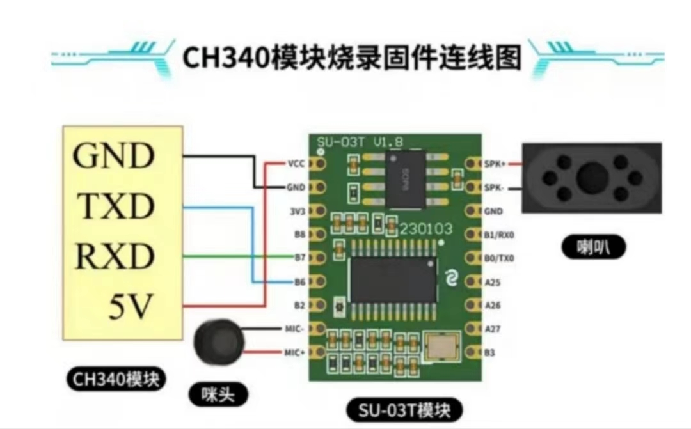

    *CH340模块与SU-03T模块的连接方式，包括GND、TXD、RXD、5V等引脚的连接*

2. **确认烧录参数**：

    - 芯片选择：CI1302
    - 波特率：921600
    - 固件文件：选择正确的.bin文件

3. **正确进入烧录模式**：

    - 连接好线路后，打开烧录软件
    - 选好bin文件，勾选必要选项
    - 重新拔插一下模块的5V供电线
    - 在上电瞬间开始烧录

**常见原因分析：**

1. **线序连接错误**：

    - RX/TX线接反
    - 电源或地线接触不良
    - 使用了不稳定的杜邦线

2. **供电问题**：

    - 电压不足或不稳定
    - 电源纹波过大
    - 电流不够（建议不低于500mA）

3. **模块状态异常**：

    - 模块已损坏
    - 内部 Boot 程序异常
    - 焊接过程中热损坏

**注意事项：**

- 烧录不成功一般是线接触错了，或者是线路接触不良
- 模块采用5V直流稳压电源供电，操作正确时芯片不容易损坏
- 如多次尝试仍失败，建议更换模块或使用专业烧录座
- 保留完整的烧录日志便于问题定位

---
