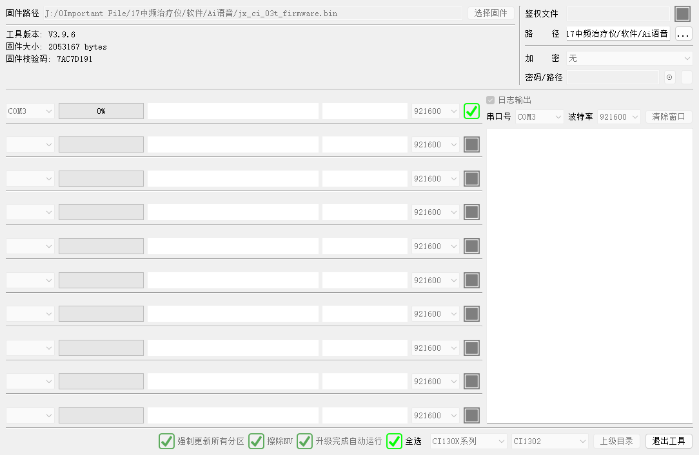

# CI-1302 烧录与调试 FAQ

本页用于整理 CI-1302 相关的烧录与调试问题。

## 烧录问题

### CI-1302模块无法进入烧录模式怎么办？

**问题描述：**

CI1302模块进行固件烧录时，烧录工具能正常连接但无法进入烧录模式。之前可以正常烧录的板子现在也不行，需要排查无法进入烧录模式的原因。

**解决方案：**

**1. 断电复位**

烧录前必须先让模块断电，然后重新上电才能进入烧录模式：

- 完全断开模块电源
- 等待2-3秒让电容完全放电
- 重新上电
- 上电后立即开始烧录操作

**2. 检查模块状态**

确认模块是否处于运行状态：

- 如果模块播放开机语音，说明处于运行模式
- 需要断电后立即烧录，在程序启动前进入烧录模式
- 可以多次尝试断电上电的时机

**3. 烧录工具设置**

确认烧录工具配置正确：

- 串口：COM3（根据实际连接选择）
- 波特率：921600（CI1302推荐波特率）
- 烧录选项：

    - 勾选"强制更新所有分区"
    - 勾选"擦除NV"（如需要清除配置）
    - 勾选"升级完成自动运行"

**4. 硬件连接检查**

对于集成在板子上的模块：

- 确认PB5/PB6（B5/B6）烧录引脚连接正确
- 检查是否有其他电路影响烧录引脚
- 必要时将模块从板子上拆下单独烧录

**5. 更换烧录器**

如果使用USB转TTL模块：

- 部分USB转TTL可能与烧录软件不兼容
- 建议使用专用烧录器或CH340方案
- 尝试更换不同品牌的USB转串口模块

**注意事项：**

- CI1302模块必须在断电复位后才能进入烧录模式
- 集成在产品中的模块建议预留烧录接口
- 焊接到板子后的模块烧录难度会增加
- 如多次尝试仍无法烧录，建议使用未焊接的模块先烧录固件

---

### 烧录时无法检测到设备怎么办？

**问题描述：**

烧录工具无法检测到CI1302模块，设备连接列表为空或显示连接失败。

**解决方案：**

**1. 检查烧录器连接**

- 确认烧录器指示灯正常
- 重新插拔USB连接
- 尝试更换USB端口
- 检查USB线缆质量

**2. 验证串口驱动**

- 打开设备管理器查看COM端口
- 确认CH340或其他驱动已安装
- 重新安装驱动程序
- 尝试使用其他电脑测试

**3. 检查模块供电**

- 测量模块供电电压是否为3.3V或5V
- 检查电源稳定性
- 确认功耗不超过烧录器供电能力

**4. 接线检查**

| 连接点 | 烧录器引脚 | 模块引脚 | 说明 |
|--------|-----------|----------|------|
| 供电 | 5V/3.3V | PWR | 模块供电 |
| 数据接收 | RXD | PB5/B5 | 烧录数据接收 |
| 数据发送 | TXD | PB6/B6 | 烧录数据发送 |
| 地线 | GND | GND | 共地 |

**5. 烧录模式确认**

- 模块上电后不应播放开机语音
- 如果有语音输出，说明未进入烧录模式
- 需要调整上电时序

---

### 焊接在板子上的模块如何烧录？

**问题描述：**

CI1302芯片已经焊接到电路板上，无法像独立模块那样方便地进行烧录操作。

**解决方案：**

**1. 预留烧录接口**

在设计PCB时预留烧录接口：

- 将PB5/PB6引脚引出到测试点或排针
- 标注清楚烧录引脚定义
- 保留便于操作的焊接位置

**2. 焊后烧录方法**

如果已经焊接完成：

- 使用细焊线飞接到PB5/PB6
- 确保连接牢固可靠
- 断电后立即烧录

**3. 注意事项**

- 焊接后的模块烧录难度大增
- 建议在焊接前完成所有功能测试
- 考虑使用带排针的模块版本

---

## 烧录工具说明

### 烧录工具界面说明

**界面功能说明：**

1. **固件信息区域**：

    - 固件路径：显示当前选择的固件文件
    - 固件版本：显示固件版本号（如v3.9.6）
    - 固件大小：显示文件大小（如2053167 bytes）
    - 校验码：显示固件校验码（如7AC7D191）

2. **通信设置**：

    - 串口：选择正确的COM端口（如COM3）
    - 波特率：921600（推荐设置）

3. **烧录选项**：

    - 日志输出：记录烧录过程日志
    - 强制更新所有分区：覆盖所有固件分区
    - 擦除NV：清除非易失性存储区
    - 升级完成自动运行：烧录后自动启动设备

4. **进度显示**：

    - 多个进度条分别显示不同分区的烧录进度
    - 每个分区都有独立的波特率设置

---

## 常见问题汇总

### Q: 为什么之前能烧录的板子现在不能烧录了？

**A:** 可能的原因：

- 模块已经启动并运行程序，需要断电复位
- 烧录引脚受到其他电路干扰
- USB转TTL兼容性问题

### Q: 只购买了IC芯片如何烧录？

**A:** 建议：

- 使用专用的烧录夹具或测试座
- 或者先将芯片焊接到测试板上进行烧录
- 烧录完成后再焊接到目标产品板

### Q: USB转TTL可以烧录吗？

**A:** 部分可以，但需要注意：

- 某些USB转TTL芯片可能与烧录软件不兼容
- 建议使用CH340方案，兼容性最好
- 如遇到问题，建议更换专用烧录器

### Q: 烧录时需要注意什么？

**A:** 关键要点：

- 必须断电复位后才能进入烧录模式
- 确认PB5/PB6引脚连接正确
- 波特率设置为921600
- 勾选"强制更新所有分区"和"擦除NV"选项