# CI-73T 烧录与调试 FAQ

本页用于整理 CI-73T 相关的烧录与调试问题。

## 烧录问题

### CI-73T2烧录进度卡在0%怎么办？

**问题描述：**

使用PACK_UPDATE_TOOLS工具烧录CI-73T2模块固件时，烧录进度条显示为0%，长时间无进展，无法正常完成烧录。

**解决方案：**

**问题现象**

- 烧录工具显示固件大小和校验码正常
- COM端口识别正常，波特率设置为921600
- 点击开始烧录后，进度条一直显示0%
- 所有烧录通道均未开始传输

**解决方法**

1. **检查电源连接**：

    - 确认模块使用5V供电
    - 检查电源电压是否稳定
    - 如使用电池，确保电压充足

2. **正确复位操作**：

    - 烧录前需要先断开模块电源
    - 然后重新上电进入烧录模式
    - 5V电源拔插一次可触发烧录模式

3. **复位验证**：

    - 复位成功：模块不播放开机语音
    - 复位失败：模块播放开机提示音，需重新复位
    - 复位是烧录成功的关键步骤

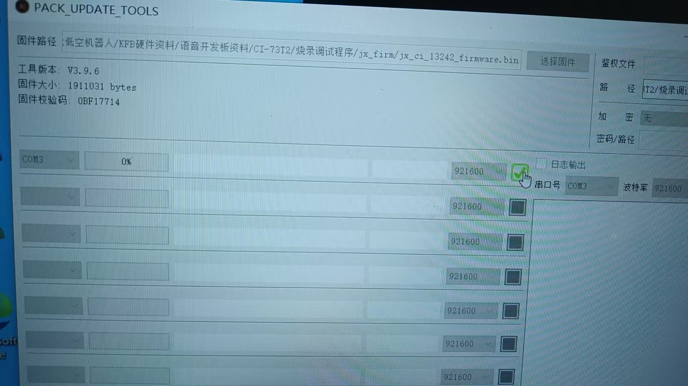

**烧录流程确认**

1. 硬件连接正确
2. 模块进入烧录模式（无开机语音）
3. 工具选择正确COM端口
4. 波特率设置为921600
5. 点击开始烧录
6. 观察进度条正常增长

**注意事项：**

- CI-73T2烧录需要先进入烧录模式
- 5V电源插拔是进入烧录模式的标准操作
- 如复位后仍播放开机语音，说明未进入烧录模式
- 烧录过程中不要断开电源或USB连接

---

## 模块选型与串口配置

### CI-73T模块是否支持语音识别后通过串口输出数据？

CI-73T模块支持语音识别后通过串口输出数据。该模块具有以下特点：

- 支持自定义唤醒词、命令词和回复语
- 支持多种协议收发、GPIO、PWM控制
- 可通过智能平台（smartpi.cn）在线配置固件
- 成本约5-6元，具有较高性价比


### 如何获取CI-73T的技术资料？

CI-73T模块的技术资料可通过以下方式获取：

1. 访问智能平台 [https://www.smartpi.cn](https://www.smartpi.cn)
2. 在模块列表中找到对应的CI-73T型号（根据芯片丝印选择CI-73T1或CI-73T2）
3. 点击详细文档可获取开发手册、规格书、原理图等资料


### CI-73T模块有哪些串口通信引脚？

CI-73T模块提供三组串口通信引脚：

1. **UART0**：PB6(RX)/PB5(TX) - 日志口，也用于烧录
2. **UART1**：PA2(RX)/PA3(TX) - 可配置为串口通信
3. **其他UART**：根据引脚功能表配置


### 如何设计CI-73T的应用电路？

设计CI-73T应用电路时需要注意：

1. 基本连接：

    - 供电：VCC和GND

---

### CI-73T2烧录时出现device err -20错误怎么办？

**问题描述：**

使用原有的底板烧录新购买的CI-73T2模块时，出现"device err -20"错误，无法完成烧录，但原来的CI-03T模块烧录正常。

**解决方案：**

**错误原因：**

- **烧录工具型号选择错误**：烧录CI-73T2时需要在工具中选择正确的芯片型号
- **芯片型号不匹配**：CI-73T2使用的是CI13LC系列芯片，与CI-03T不同

**解决步骤：**

1. **确认芯片丝印**：

    - 查看CI-73T2模块上的芯片丝印
    - 根据丝印选择对应的芯片型号（如CI13242）

2. **正确选择工具型号**：

    - 在烧录工具的"CI13LC系列"下拉菜单中选择对应型号
    - 不要随意选择第一个选项
    - 必须与模块上的实际芯片匹配

3. **引脚确认**：

    - 确认串口引脚（PB5/PB6）位置没有变化
    - 检查其他可能影响烧录的引脚连接

**操作流程：**

1. 打开串口升级工具
2. 在CI13LC系列下拉菜单中选择正确型号
3. 选择固件文件
4. 开始烧录

**注意事项：**

- CI-73T2与CI-03T的引脚位置可能不同
- 烧录工具的型号选择必须准确
- 白色气泡袋包装可能产生静电，使用时需注意防静电

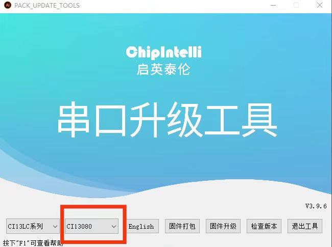

---

### CI-73T2模块无声音输出怎么办？

**问题描述：**

CI-73T2模块烧录后无声音输出，包括开机播报也没有声音，但硬件连接（SPK+/-脚位）未改变。

**解决方案：**

**问题排查步骤：**

1. **确认固件配置**：

    - 检查智能公元平台中是否配置了开机播报
    - 确认"有开机播报"选项已勾选
    - 验证播报内容已正确填写

2. **硬件连接检查**：

    - 确认SPK+和SPK-引脚连接正确
    - 检查扬声器是否正常工作
    - 测试接触是否良好，排除虚焊可能

3. **固件验证**：

    - 将固件发给技术支持测试
    - 确认固件本身包含播报功能
    - 下载技术支持验证过的固件版本

**常见原因：**

- **虚焊或接触不良**：模块与底板接触不牢固
- **扬声器故障**：扬声器本身损坏或阻抗不匹配
- **固件配置错误**：未正确配置播报功能

**解决方法：**

1. 重新焊接模块，确保接触良好
2. 更换已知正常的扬声器测试
3. 在官方底板上测试确认模块功能
4. 使用技术支持提供的测试固件

**注意事项：**

- 即使在官方底板上也可能因接触问题无声音
- 拍照发送给技术支持有助于快速定位问题
- 确认固件已包含播报功能

---
    - 麦克风：MIC+和MIC-
    - 扬声器：SPK+和SPK-

2. 串口通信连接（如需要）：

    - 模块TX连接主控RX
    - 模块RX连接主控TX
    - 3.3V系统无需电平转换


### 如何在平台上配置串口通信功能？

在智能平台配置串口通信的步骤：

1. 创建新工程或选择现有工程
2. 在GPIO配置中，将对应引脚（如PA2、PA3）配置为UART功能
3. 在串口配置中设置波特率、数据位、停止位等参数
4. 在命令词配置中，为每个命令添加"端口输出"控制
5. 设置要发送的十六进制数据

### 串口发送数据的格式是怎样的？

- 发送数据时只发送配置的参数内容，不自动添加帧头帧尾
- 例如：配置发送"00 01 00 01"，模块实际发送就是"00 01 00 01"
- 帧头帧尾只在接收模式下使用，用于数据解析

### 烧录时需要注意什么？

1. **硬件连接**
    - 使用USB转TTL模块（如CH340）
    - 连接：模块PB6(RX)→转换器TX，模块PB5(TX)→转换器RX
    - 连接VCC、GND

2. **复位操作**
    - 单模块：插拔5V或GND进行复位
    - 复位成功后应立即开始烧录
    - 多次复位表示模块正常运行

3. **烧录工具设置**
    - 选择正确的COM端口
    - 波特率设置为921600

4. **复位判断**
    - 复位成功：模块会立即进入烧录模式，工具开始传输
    - 复位失败：模块正常启动，会播放开机语音
    - 如果听到开机播报，说明复位未成功


### 固件升级无响应怎么办？

当固件升级工具显示无响应时，按以下步骤排查：

1. **确认复位成功**
    - 单模块需要快速插拔5V或GND
    - 复位成功后模块不应播放开机语音
    - 如果有开机播报，需重新复位

2. **检查连接**
    - 确认TX/RX交叉连接正确
    - 检查连接线是否紧实
    - 确认供电电压正常

3. **复位技巧**
    - 接触要快速果断
    - 如果仍不成功，可考虑设计复位电路
    - 避免长时间上电后再操作

4. **常见问题**
    - 模块正常运行：会播放开机语音
    - 烧录模式：无语音播报，工具显示连接
    - 烧录失败：检查波特率和COM端口

### 行为名称有哪些限制？

- 行为名称只支持字母、数字和下划线
- 不支持中文字符
- 不能为空，否则会导致配置检查失败

### 串口通信会影响其他功能吗？

使用PB6/PB5作为串口通信时：

- 正常通信功能不受影响
- 但日志功能将无法使用
- 如需查看日志，请使用其他串口

## UART1详细配置步骤

### 如何配置UART1发送自定义数据？

配置UART1发送自定义数据的详细步骤：

1. **GPIO配置**
    - 在GPIO配置页面找到PA2和PA3引脚
    - PA2对应UART1_RX，PA3对应UART1_TX
    - 将这两个引脚配置为UART功能

2. **串口参数设置**
    - 波特率：9600（可根据需要调整）
    - 数据位：8
    - 停止位：1
    - 校验位：无

3. **命令词配置**
    - 创建或编辑命令词（如"TurnOn"、"TurnOff"）
    - 在控制详情中添加"端口输出"控制
    - 选择UART1_TX作为输出端口
    - 参数中填写要发送的十六进制数据（如：00 01 00 01）

4. **接收配置（如需要）**
    - UART1_RX可配置为"固定格式"
    - 设置帧头（如：AA 55）和帧尾（如：55 AA）
    - 注意：帧头帧尾仅在接收时使用


### 配置串口时需要注意什么？

1. **引脚对应关系**
    - PCB板上的丝印序号（如14、15）不直接对应UART编号
    - 需要查看引脚功能表确认PA2/PA3才是UART1

2. **数据发送格式**
    - 发送时只发送填写的参数，不自动添加帧头帧尾
    - 如需完整数据包，请在参数中包含所有字节

3. **错误处理**
    - 行为名称不能为空，否则生成固件时会报错
    - 确保所有必填项都已正确配置

### 相关教程

- [CI-73T模块串口教程](https://www.bilibili.com/video/BV1dz9QY1EE3)
- [CI-73T固件烧录教程](https://www.bilibili.com/video/BV1fPUmYxENX)
- [平台入门视频](https://www.bilibili.com/video/BV1e8411T77q)

### CI-73T烧录时出现"err -14"错误怎么办？

**问题描述：**

使用固件烧录工具烧录CI-73T1时，烧录进度达到8%后失败，提示"updater: err -14"错误，无法将固件写入芯片。

**解决方案：**

**错误说明：**

"err -14"错误通常表示maskrom传输数据中出现异常，可能的原因包括：

1. **芯片型号选择错误**
    - 烧录工具中选择的芯片型号与实际不符
    - CI-73T1应选择CI13242，而非CI13241

2. **通信连接问题**
    - USB转串口连接不稳定
    - TX/RX接线错误
    - 串口被其他程序占用

3. **供电不稳定**
    - 烧录过程中电源中断
    - 电压波动超过允许范围
    - USB口供电能力不足

**排查步骤：**

1. **确认芯片型号**
    - 查看芯片上的丝印标注
    - CI-73T1标注为CI 13242
    - 在烧录工具中选择对应型号

2. **检查硬件连接**
    - 确保TX/RX交叉连接
    - 检查GND接地良好
    - 使用质量可靠的USB转串口模块

3. **优化供电**
    - 使用外部5V电源适配器
    - 避免使用笔记本USB口直接供电
    - 确保供电稳定在5V±5%

4. **烧录操作技巧**
    - 先选择固件文件并勾选
    - 断开模块电源
    - 重新上电（1秒后断电再通电）
    - 立即开始烧录

5. **检查烧录工具配置**
    - 确认选择了正确的COM端口
    - 波特率按工具默认/推荐设置（常见为115200或921600，以工具为准）
    - 只勾选实际使用的串口，不要同时勾选多个串口

**注意事项：**

- 所有芯片都出现相同问题时，可能是工具或兼容性问题
- 保留完整错误信息和截图便于技术支持分析
- 烧录失败后可重新尝试，避免频繁断电
- 建议使用官方推荐的烧录工具


### CI-73T模块上电电流异常且无声音输出？

**问题描述：**

CI-73T模块烧录成功后上电，但电流仅为0.0x A，远低于正常值，且无任何声音输出，仅有轻微底噪。

**解决方案：**

**问题排查：**

1. **供电能力检查**：

    - 测量实际供电电流能力
    - CI-73T使用配套喇叭时需要500mA以上电流
    - 检查电源适配器或USB口供电能力

2. **硬件连接验证**：

    - 确认模块与功放板连接正确
    - 检查喇叭正负极性
    - 验证所有连接线无短路或断路

3. **单独测试方法**：

    - 将模块单独供电，不连接其他设备
    - 使用万用表测量VCC引脚电压
    - 确认在3.3V±5%范围内

**电流异常原因：**

- 电源供电能力不足（特别是USB口供电）
- 连接线过细导致压降过大
- 功放电路存在短路或故障

**注意事项：**

- 正常工作时电流应在数百毫安级别
- 0.0x A表示几乎无负载，说明功放未工作
- 如更换电源和连接线仍无效，可能是模块硬件故障

---

### CI-73T1烧录时出现device:err -20错误

**问题描述：**

CI-73T1设备在使用烧录工具时无法完成固件烧录，提示'device:err -20'错误，且烧录进度卡在0%。

**解决方案：**

- **检查芯片型号选择**：

    - 确认烧录工具中选择的芯片型号与实际使用的设备型号一致
    - CI-73T1应选择对应的芯片型号，而非CI1301或其他型号

- **正确选择型号**：

    - 在烧录工具的下拉菜单中选择正确的芯片型号
    - 确保固件文件与芯片型号匹配

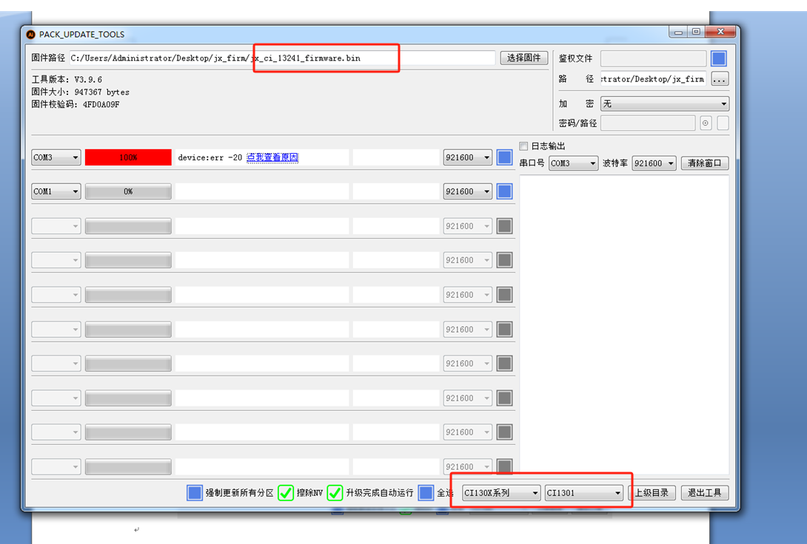

*烧录工具显示device:err -20错误*

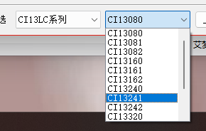

*烧录工具中的芯片型号选择界面*

**注意事项：**

- 芯片型号选择错误会导致烧录失败，必须选择与硬件匹配的型号
- 烧录前确认固件文件的校验码正确
- B6/B7引脚如果配置为串口功能，不能同时用作GPIO

---

### CI-73T2支持USB转232烧录吗？

**问题描述：**

需要了解CI-73T2模块是否支持使用USB转232转换器进行固件烧录。

**解决方案：**

CI-73T2模块不支持使用USB转232进行固件烧录。

- **烧录方式限制**：

    - CI-73T2只能使用专用的烧录工具和接口
    - 不支持通用的USB转232转换器
    - 需要使用官方推荐的烧录器

- **正确烧录方法**：

    - 使用USB转TTL烧录器（如CH340）
    - 连接模块的烧录接口（RX/TX/GND）
    - 使用PACK_UPDATE_TOOLS等官方烧录软件
    - 按照标准烧录流程操作

- **监听串口输出**：

    - 虽然不支持烧录，但仍可使用USB转232监听串口输出
    - 用于查看语音识别结果和调试信息
    - 波特率通常为9600bps

**注意事项：**

- 不要尝试使用USB转232进行烧录，会导致失败
- 监听输出报文时，注意电平匹配（3.3V）
- 烧录和监听是不同的功能，使用不同的工具
- 建议购买官方认证的烧录器

---

### CI-73T2烧录后无开机播报且烧录无反应怎么办？

**问题描述：**

CI-73T2芯片烧录固件后设备无开机播报，且烧录过程无反应，烧录进度停留在0%。

**解决方案：**

**硬件检查：**

1. **检查电源连接**
    - 确认USB供电正常
    - 检查开发板电源指示灯
    - 测量芯片供电引脚电压是否正常

2. **烧录接口连接**
    - 确认RX/TX引脚正确连接（交叉连接）
    - 检查GND接地是否良好
    - 验证波特率设置为115200

**软件配置检查：**

1. **固件文件完整性**
    - 确认固件文件未损坏
    - 验证文件校验码是否正确
    - 尝试使用出厂固件测试

2. **芯片复位操作**
    - 烧录完成后断电重启
    - 等待3-5秒后重新上电
    - 确认模块完成初始化

**常见问题处理：**

- **内部晶振配置**：CI-73T2使用内部晶振，不需要外部晶振
- **固件兼容性**：确保使用CI-73T2专用固件，而非CI-73T1固件
- **烧录工具选择**：使用PACK_UPDATE_TOOLS等官方烧录软件

**注意事项：**

- 烧录过程中不要断开连接
- 如果使用定制固件，确保基础固件配置正确
- 开机播报功能需要在固件生成时启用
- 建议先用出厂固件测试硬件功能正常

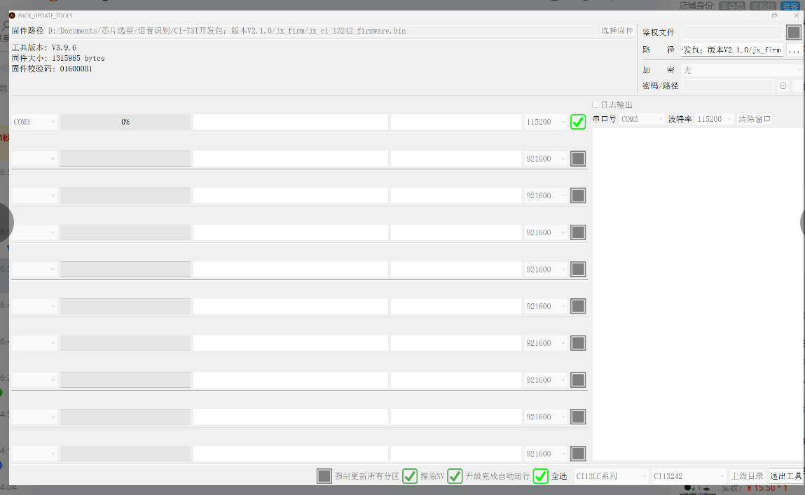

---

### CI-73T开发板的烧录口在哪里？

**问题描述：**

在使用CI-73T开发板时，不清楚板子上哪个位置是烧录口，需要确认具体的烧录接口位置。

**解决方案：**

- **查看开发板标识**：

    - CI-73T开发板通常标注了清晰的引脚标识
    - 查找PB6/RX和PB5/TX标识的引脚
    - 这两个引脚就是串口烧录接口

- **烧录接口定义**：

    - PB6/RX：烧录数据接收端（连接烧录器的TX）
    - PB5/TX：烧录数据发送端（连接烧录器的RX）
    - GND：接地引脚（必须连接）
    - VCC：电源引脚（可选，3.3V供电）

- **烧录工具连接**：

    - 使用USB转TTL工具（如CH340）
    - 交叉连接：烧录器TX→模块RX，烧录器RX→模块TX
    - 确保电平匹配（3.3V）

**注意事项：**

- 烧录前确保开发板断电
- 不要接反TX/RX，可能导致烧录失败
- 可以参考公元平台的《CI-73T烧录指引文档V1.0》
- 文档下载地址：https://help.aimachip.com/docs/ci73t/ci73t-1ga9m7fqq5eb

---

### CI-73T2芯片如何组装？

**问题描述：**

需要了解CI-73T2芯片的组装方法，包括与语音模块、扬声器、USB转串口模块的连接方式。

**解决方案：**

**组装步骤：**

1. **硬件准备**：

    - CI-73T2语音模块
    - 扬声器（喇叭）
    - USB转串口模块（用于烧录和测试）
    - 杜邦线若干

2. **连接方式**：

    - **音频输出**：模块的SPK+/-连接到扬声器
    - **供电连接**：模块的VCC/GND连接到电源
    - **调试接口**：模块的UART连接到USB转串口

3. **烧录指引**：

    - 参考《CI-73T烧录指引文档V1.0》
    - 按照指引进行固件烧录
    - 观看B站视频教程学习操作

**注意事项：**

- CI-73T与CI-03T的外观相似，注意核对型号
- 组装前先确认各部件完好无损
- 按照官方文档操作，避免接错线
- 首次使用建议在技术指导下进行

---

### CI-73T1模块烧录指引和教程在哪里获取？

**问题描述：**

需要获取CI-73T1模块的烧录指引文档和视频教程链接。

**解决方案：**

**文档获取**：

- **烧录指引文档**：《CI-73T烧录指引文档V1.0》
- **视频教程**：B站视频链接
    - CI-73T固件烧录教程：https://www.bilibili.com/video/BV1fPUmYxENX/
    - 搜索关键词：机芯智能 CI-73T

**使用方法**：

1. 下载并阅读烧录指引文档
2. 观看视频教程了解操作流程
3. 按照指引进行硬件连接
4. 使用推荐工具进行固件烧录

**注意事项：**

- 严格按照指引文档操作
- 视频教程可作为操作参考
- 遇到问题及时联系技术支持
- 保留相关文档便于后续查阅

---

### CI-73T1空片烧录器购买与使用

**问题描述：**

需要购买用于CI13241和CI13242芯片的空片烧录器，并确认裸芯片是否可以自行烧录固件。

**解决方案：**

- **空片烧录器**：

    - 官方不提供专用的空片烧录器售卖
    - CI13241和CI13242是CI-73T1系列的不同型号
    - CI13241支持300条词条，CI13242支持500条词条（内存更大）

- **自行烧录方案**：

    - 可以使用CH430烧录器对裸芯片进行固件烧录
    - CH430是通用的USB转串口烧录工具
    - 支持对CI-73T1系列芯片进行固件写入

**注意事项：**

- CI13241和CI13242需要使用不同的烧录器
- 购买芯片时确认具体型号，根据所需词条数量选择
- 自行烧录需要具备相关技术知识和工具


---

### CI-73T1模块无法进入升级模式怎么办？

**问题描述：**

CI-73T1模块焊接在底板上后无法进行固件升级，按照常规步骤操作但不能进入升级模式。

**解决方案：**

**1. 问题定位**

- 确认模块型号是否为CI-73T1
- 检查模块是否已焊接在底板上无法拆卸
- 区分是语音模块问题还是底板问题

**2. 排查建议**

- **模块单独测试**：如果可能，拆下语音模块单独测试
- **供电检查**：确保供电稳定，建议单独给语音模块供电
- **检查底板设计**：确认底板不影响升级流程

**3. 替代方案**

- **联系供应商**：如果是成套购买的产品，联系销售方处理
- **专业测试**：使用专业设备检测模块和底板
- **返厂维修**：焊接模块无法拆下时，可能需要返厂处理

**注意事项：**

- 语音模块与底板焊接后难以分离测试
- 自制底板可能存在设计问题影响升级
- 建议在焊接前先测试模块功能

---

### CI-73T2烧录完成后串口通信无响应怎么办？

**问题描述：**

CI-73T2模块烧录完成后，将通信串口改为B0/B1，但与单片机通信时无响应，语音功能正常。

**解决方案：**

**1. 开发板连接确认**

- CI-73T2开发板Type-C口默认连接B6/B7
- 如需使用B0/B1通信，需通过排针连接
- 确认排针连接正确且牢固

**2. 硬件连接方法**

- 使用排针将B0/B1引脚引出
- 连接到USB转TTL模块
- 确保交叉连接：模块TX→TTL RX，模块RX→TTL TX

**3. 软件配置验证**

- 在平台中查看PIN脚配置
- 确认B0/B1已配置为UART功能
- 如未配置，需要生成新固件

**4. Type-C接口说明**

- Type-C口固定为B6/B7功能
- 不能直接切换为其他串口
- 需要通过硬件排针使用B0/B1

**注意事项：**

- Type-C口的B6/B7不能同时用作普通串口
- 烧录和通信使用不同的物理接口
- 建议保留Type-C口用于烧录，B0/B1用于通信
- 排针连接时注意引脚顺序，避免接反

---

### CI-73T2模块语音播报功能异常

**问题描述：**

CI-73T2模块在烧录固件后无法进行语音播报，配置检查时提示"行为控制详情中播放语音内容不能为空"，且烧录后无任何反应。

**解决方案：**

1. **检查配置问题**：

    - 确认控制详情中每个行为都已配置语音播报内容
    - 如果选择了有机播报，需要确保回复语不为空
    - 检查mode_164等行为名称的配置是否完整

2. **固件过大问题处理**：

    - 如果固件生成成功但烧录后无反应，可能是固件太大
    - CI-73T2运行内存较小，固件过大会导致无法正常运行
    - 建议改用CI-03T模块，其运行内存更大

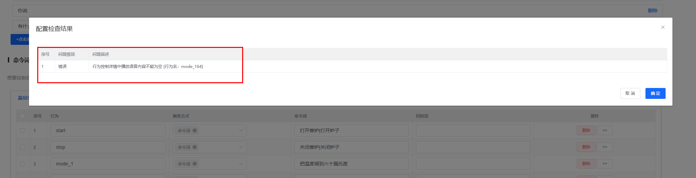

*配置检查提示播放语音内容不能为空*

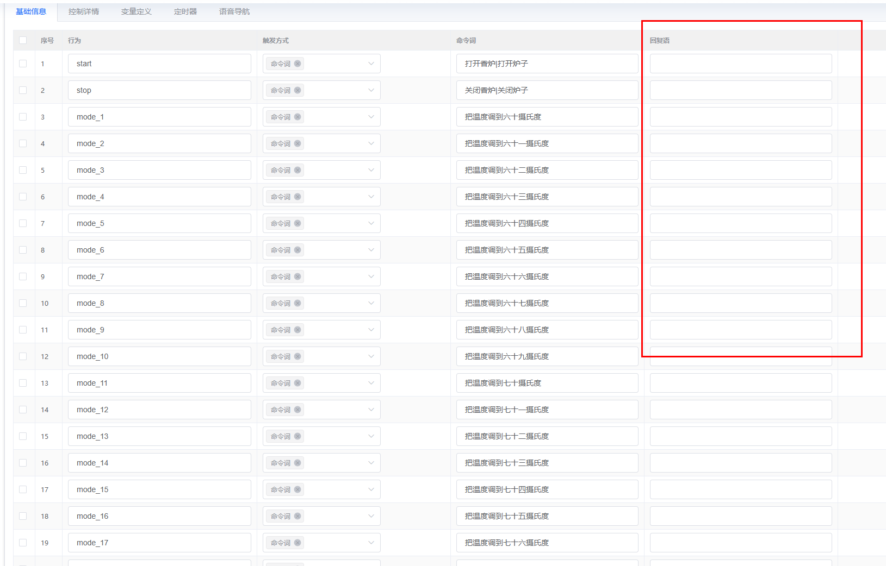

*控制详情中回复语为空导致的配置错误*

**注意事项：**

- CI-73T2模块内存限制较大，复杂功能可能导致固件过大
- 如果必须使用复杂功能，建议选择内存更大的模块型号
- 配置时确保每个行为都有对应的语音播报内容
- 定期检查固件大小，避免超出模块运行内存限制

---

### CI-73T2串口0日志打印如何关闭？

**问题描述：**

CI-73T2模块的串口0（UART0）总在打印日志，影响与业务通信，需要关闭串口0的日志打印或改为其他串口输出。

**解决方案：**

**1. 推荐方案：使用串口1作为业务通信口**

- **串口功能分配**：

    - 串口0（UART0/PB6-PB5）：保留用于烧录和日志输出
    - 串口1（UART1/PA2-PA3）：用于业务通信
    - 避免功能冲突，确保烧录不受影响

- **配置方法**：

    - 在GPIO配置中将PA2、PA3配置为UART功能
    - 在控制逻辑中使用UART1进行数据收发
    - 保持UART0仅用于调试

**2. 备选方案：将日志重定向到串口2**

- **串口2配置**：

    - 如确实需要使用串口0进行业务通信
    - 可在平台配置中将日志输出改为串口2
    - 查看是否有日志输出重定向选项

- **操作步骤**：

    1. 检查平台配置中的日志输出设置
    2. 选择可用的串口作为日志输出口
    3. 重新生成并烧录固件

**3. 重要注意事项**

- **烧录影响**：

    - 如果串口0用作业务通信，烧录时需要断开外部设备
    - 否则会导致无法烧录或烧录失败
    - 可能需要卸电阻实现断开操作

- **推荐做法**：

    - 串口0专用于烧录和调试
    - 串口1用于主业务通信
    - 这样设计最稳定可靠

**4. 硬件连接建议**

```
模块引脚分配：
UART0 (PB6/PB5) → 烧录器/调试口
UART1 (PA2/PA3)  → MCU通信口
电源和地        → 独立供电
```

**结论：**

建议使用串口1（UART1）作为业务通信口，保留串口0用于烧录和日志输出，这样可以避免烧录时的连接问题，确保开发调试的便利性。

---

### CI-73T2模块采购时是否可以预先烧录固件？

**问题描述：**

在批量生产CI-73T2模块时，希望由模块提供方在出货前预先烧录好固件，以简化后续的生产流程。

**解决方案：**

**预烧录服务说明：**
模块提供方支持在批量生产前预先烧录固件的服务。

**操作流程：**

1. **提供固件文件**
    - 将需要预烧录的固件文件提供给模块供应商
    - 确保固件文件完整且经过测试验证
    - 提供MD5校验值以确保文件一致性

2. **确认烧录要求**
    - 明确需要烧录的固件版本
    - 确认功能配置和参数设置
    - 提供测试方法和验收标准

3. **批量烧录执行**
    - 供应商在出货前进行固件烧录
    - 可进行抽样测试验证烧录质量
    - 确保每个模块都正确烧录

**优势：**

- 简化客户的生产流程
- 减少客户的设备投资
- 提高生产效率和一致性
- 避免现场烧录的不确定性

**注意事项：**

- 需要提前与供应商沟通烧录需求和数量
- 确保固件文件经过充分测试
- 保留少量未烧录模块用于后续调试
- 建议进行首件确认后再批量烧录

---

### CI-73T2上电瞬间导致串口重连无法烧录

**问题描述：**

CI-73T2芯片上电瞬间会导致串口重连，从而无法下载程序。使用相同电路的SU-03T没有出现此问题。

**解决方案：**

- **增加电源滤波电容**：

    - 在模块电源端增加220μF电容
    - 电容应尽量靠近模块的VCC和GND引脚
    - 有效解决上电瞬间的电压跌落问题

- **供电检查**：

    - 确保供电电压稳定在5V
    - 上电瞬间电压跌落不应低于4.5V
    - 使用示波器观察上电波形，确认电压稳定性

- **硬件连接优化**：

    - 使用常闭按键控制模块电源时，确保按键质量良好
    - 减少电源线路的阻抗和感抗
    - 避免长细的电源连接线

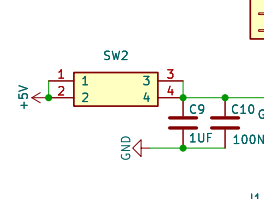

*SW2按键与C9、C10电容的连接方式，用于控制模块电源*

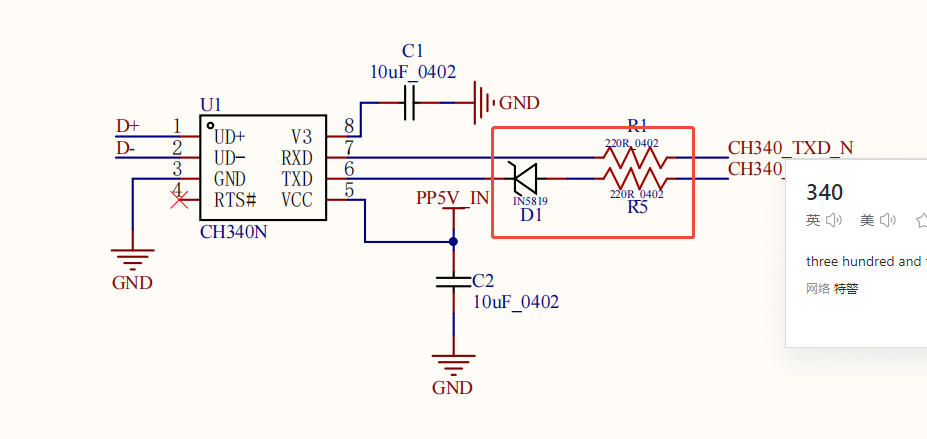

*CH340N芯片的电路连接图，显示D+、D-、UD+、UD-、GND、RTS#、VCC等引脚的连接*

**注意事项：**

- CI-73T2的启动电流较大，容易造成瞬间电压跌落
- 使用万用表测量可能无法捕捉瞬间的电压跌落
- SU-03T与CI-73T2的启动电流特性不同，相同电路下表现可能不同
- 如条件允许，建议使用示波器观察上电波形

---

### CI-73T的A4引脚低电平导致无法烧录

**问题描述：**

CI-73T模块的GPIO_A4（PA4）引脚如果连接到GND或保持低电平，会导致模块无法进入烧录模式，烧录工具显示"发送异常"或"终止传输活动"等错误。

**解决方案：**

- **检查A4引脚连接**：

    - 确认GPIO_A4引脚没有直接接地
    - 如果使用了下拉电阻，需要断开
    - 检查外部电路是否强制拉低了A4引脚

- **烧录模式进入方法**：

    - CI-73T和CI-03T的PA4引脚接GND时无法进入烧录模式
    - 烧录前确保A4引脚处于高阻态或高电平
    - 可以通过上拉电阻将A4拉高到3.3V

- **其他相关引脚**：

    - GPIO_A0和GPIO_A1通常不影响烧录
    - 但建议在烧录时断开所有外部连接
    - 只保留必要的烧录接口连接（B6/B7）

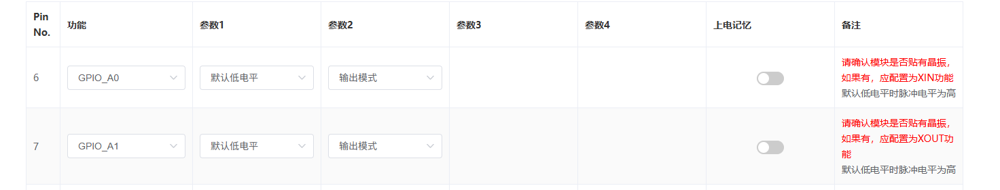

*CI-73T模块引脚配置表，显示Pin 6 (GPIO_A0) 和 Pin 7 (GPIO_A1) 的默认电平*

**注意事项：**

- PA4引脚在烧录模式进入时起到关键作用
- 设计硬件时避免将PA4直接连接到地
- 如果必须使用PA4，烧录时先断开相关电路
- 此问题同时影响CI-03T和CI-73T系列模块

---

### CI-73T2烧录时100%失败并提示device:err -20怎么办？

**问题描述：**

使用固件烧录工具烧录CI-73T2芯片固件时，烧录进度在100%时失败，提示'device:err -20'，且所有采购的CI-73T2模块均无法烧录。

**解决方案：**

**1. 问题定位**

- **错误原因**：烧录工具版本不匹配
    - 旧版工具选择CI130X（错误）
    - 新版工具应选择CI13242（正确）
    - 芯片型号选择错误导致校验失败

**2. 正确操作方法**

- **使用新版工具**：

    - 确认烧录工具版本为V3.9.5或更高
    - 在芯片型号下拉菜单中选择CI13LC系列
    - 选择CI13242而非CI130X

- **烧录步骤**：

    1. 选择正确的固件文件
    2. 芯片型号选择CI13242
    3. 打钩确认选择
    4. 断电后重新上电开始烧录

**3. 常见错误对比**

- **错误选择**：CI130X系列
    - 烧录速度很快（约2秒）
    - 进度到100%立即报错device:err -20
    - 实际未完成固件写入

- **正确选择**：CI13242
    - 烧录时间正常（数十秒到数分钟）
    - 进度正常完成，不报错
    - 固件成功写入芯片

**注意事项：**

- CI-73T2必须使用新版烧录工具
- 芯片型号务必选择CI13242
- 旧版工具无法正确识别CI-73T2
- 如使用旧版工具，请升级到最新版本

---

### CI-73T2是否支持TX（发送）功能选项？

**问题描述：**

询问CI-73T2芯片模块是否支持TX（发送）功能选项，以及如何配置串口通信功能。

**解决方案：**

**1. TX功能支持说明**

CI-73T2完全支持TX（发送）功能，具体体现在：

- **多个串口接口**：

    - B6/B7：专用烧录和调试接口
    - B0/B1：通用串口通信接口
    - 可通过配置选择使用哪个串口

- **Type-C接口**：

    - 默认连接B6/B7引脚
    - 主要用于固件烧录
    - 也可用于串口调试输出

**2. 串口配置方法**

- **平台配置**：

    1. 在智能公元平台选择UART配置
    2. 选择要使用的串口号（如UART1）
    3. 配置对应的引脚（如B0/B1）
    4. 设置波特率等参数

- **硬件连接**：

    - Type-C口：直接使用，连接B6/B7
    - 排针连接：通过排针使用B0/B1
    - 需要交叉连接（TX-RX, RX-TX）

**3. 使用场景**

- **固件烧录**：使用B6/B7（Type-C口）
- **串口通信**：使用B0/B1或B6/B7
- **调试输出**：查看识别结果和状态信息

**4. 红外数据录制**

- **功能说明**：

    - CI-73T2支持红外学习功能
    - 可以录制和保存红外信号
    - 支持红外遥控器功能复制

- **录制进度**：

    - 按照平台提示逐步操作
    - 完成所有需要学习的按键
    - 生成固件时包含红外数据

**注意事项：**

- B6/B7是默认的烧录接口
- Type-C口只能使用B6/B7，不能切换
- 如需其他串口，使用排针连接
- 串口通信时注意电平匹配（3.3V）

---

### CI-73T1模块烧录失败如何处理？

**问题描述：**

CI-73T1模块无法建立烧录通信，烧录工具显示进度为0%，尝试多种方法（更换CH340、使用跳线、重启电脑）仍无法解决。

**解决方案：**

**1. 连接稳定性检查**

烧录失败的主要原因通常是连接不稳定：

- 确认使用焊接的排针而非杜邦线直插
- 检查连接线是否牢固，无松动
- 验证TX/RX交叉连接正确
- 使用质量较好的USB转串口模块

**2. 硬件连接要求**

正确的烧录连接方式：

```
模块侧      USB转TTL模块侧
VCC    →    5V
GND    →    GND
TX      →    RX
RX      →    TX
```

**3. 排查步骤**

按以下顺序逐一排查：

1. **检查模块连接**
    - 必须焊接排针，不要用杜邦线直接接触
    - 确认排针焊接牢固，无虚焊
    - 测量连通性确认接触良好

2. **检查USB转串口模块**
    - 尝试更换质量更好的CH340模块
    - 检查驱动是否正确安装
    - 在设备管理器中确认串口识别正常

3. **检查烧录环境**
    - 更换不同的USB端口
    - 重启电脑清除可能的端口占用
    - 关闭其他可能占用串口的软件

4. **固件和工具检查**
    - 确认固件文件完整未损坏
    - 使用最新版本的烧录工具
    - 检查波特率设置（默认921600）

**4. 临时解决方案**

如果以上方法都无效，可尝试：

- 使用示波器检查串口信号波形
- 尝试降低波特率（如115200）
- 使用外接电源模块独立供电
- 联系技术支持，可能需要返修模块

**注意事项：**

- CI-73T1对连接质量要求较高，必须保证稳定连接
- 避免使用面包板进行烧录操作
- 烧录时断开其他所有外部连接
- 保留完整的操作记录便于问题分析

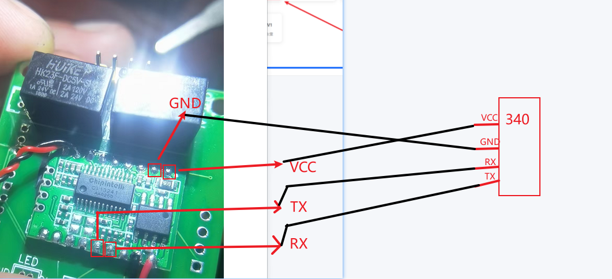

---

### CI-73T1模块烧录过程中，烧录进度达到100%后立即报错device:err -20，烧录失败

**问题描述：**

CI-73T1模块烧录时，进度条到100%后立即报错，显示device:err -20错误，整个烧录过程不到2秒。

**解决方案：**

1. **芯片型号选择错误**
    - 烧录工具中芯片型号选择错误
    - 误选为CI1302，实际应为CI13242
    - 这是导致烧录失败的直接原因

2. **正确设置步骤**
    - 在烧录工具中找到芯片型号下拉菜单
    - 将CI130X系列改为CI13LC系列
    - 选择CI13242而不是CI1302

3. **烧录流程确认**
    - 设置正确后会显示烧录进度
    - 整个烧录时间会延长（不再是不到2秒）
    - 烧录完成后不会报错

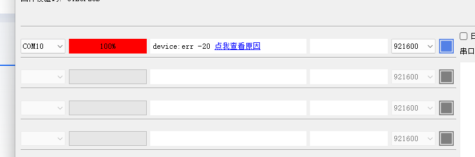
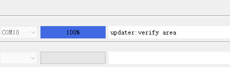
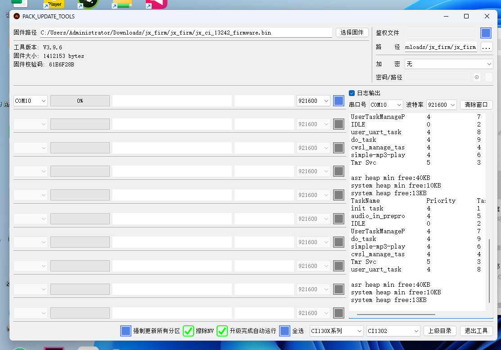

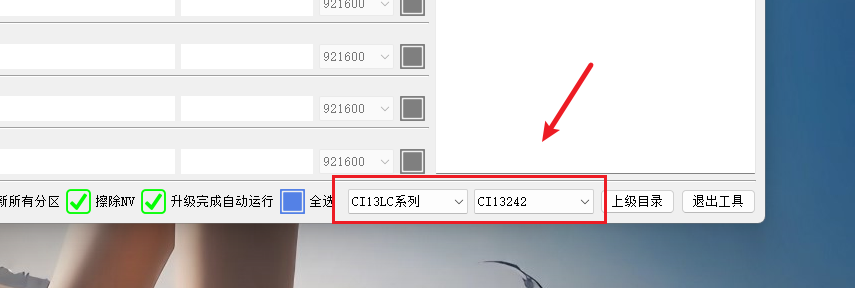

**注意事项：**

- CI-73T1对应的是CI13242芯片，不是CI1302
- 烧录时间过短（如2秒）说明芯片型号选择错误
- 烧录成功后进度会正常完成，不会立即报错
- 务必确认芯片型号与实际模块匹配

---

### CI-73T1是否支持双串口同时工作，一个用于烧录一个用于通信？

**问题描述：**

需要了解CI-73T1模块的VOICETXDD和VOICERXDD两个串口引脚是否可以同时工作，分别用于程序烧录和与单片机的语音指令通信。

**解决方案：**

**双串口功能说明：**

CI-73T1模块支持双串口配置，但不能同时用于烧录和通信：

1. **串口功能定义**：

    - **VOICETX/RX**：主要用于固件烧录
    - **VOICERX/TX**：用于与外部MCU通信
    - 两个串口在硬件上独立存在

2. **工作模式切换**：

    - **烧录模式**：仅VOICETX/RX工作，用于烧录固件
    - **运行模式**：仅VOICERX/TX工作，用于命令输出
    - 两个串口不能同时处于激活状态

3. **电路设计原理**：

    - 烧录时会进入 bootloader 模式
    - 此时内部会切换到烧录专用串口
    - 通信串口暂时断开连接
    - 烧录完成后恢复正常运行

**使用建议：**

1. **开发阶段**：

    - 使用VOICETX/RX进行固件烧录
    - 烧录完成后断开烧录连接
    - 通过VOICERX/TX与MCU通信测试

2. **产品设计**：

    - 可以同时保留两个串口接口
    - 通过跳线或开关切换使用
    - 或使用多路选择器自动切换

**注意事项：**

- 烧录时会暂时影响与MCU的通信
- 建议烧录时断开与MCU的连接
- 正常工作时仅使用VOICERX/TX通信
- 两个串口电气参数可能不同，需分别匹配

---

### CI-73T1烧录固件时是否会占用通信串口？

**问题描述：**

需要确认CI-73T1模块在烧录固件过程中是否会占用串口通讯，从而影响与单片机的正常通信。

**解决方案：**

**烧录过程说明：**

CI-73T1烧录固件时确实会占用串口资源：

1. **烧录期间状态**：

    - 模块进入 bootloader 模式
    - 所有正常功能暂停
    - 通信串口（VOICERX/TX）不可用
    - 仅响应烧录工具的指令

2. **时序影响**：

    - 烧录开始：通信立即中断
    - 烧录过程：持续占用（约10-30秒）
    - 烧录完成：模块自动重启
    - 重启后：通信功能恢复

3. **对系统的影响**：

    - MCU无法接收语音识别结果
    - 可能导致通信超时
    - 需要在软件中处理这种中断

**处理方案：**

1. **软件处理**：

    - 检测串口通信中断
    - 设置通信超时机制
    - 烧录完成后自动重连

2. **硬件设计**：

    - 使用多路复用器隔离
    - 或设计手动切换开关
    - 避免信号冲突

**注意事项：**

- 烧录是必要过程，无法避免占用
- 建议在系统维护窗口进行烧录
- 量产时预留烧录接口，不影响正常通信
- 烧录完成后模块会自动重启恢复正常

---

### CI-73T1模块的PA2和PA3如何配置为UART模式？

**问题描述：**

需要了解如何将CI-73T1模块的PA2和PA3引脚配置为UART模式，以及其默认工作模式和如何调整为开漏模式。

**解决方案：**

**PA2/PA3配置方法：**

1. **UART模式配置**：

    - PA2：可配置为UART_RX（接收）
    - PA3：可配置为UART_TX（发送）
    - 在平台配置中选择对应功能
    - 生成固件时包含配置信息

2. **默认工作模式**：

    - 出厂默认：推挽输出模式（Push-Pull）
    - 输出电平：0-3.3V
    - 驱动能力：较强
    - 适合大多数应用场景

3. **开漏模式配置**：

    - 配置选项：开漏输出（Open-Drain）
    - 输出特性：仅输出低电平或高阻态
    - 需要上拉电阻到高电平
    - 适合线与逻辑应用

**配置步骤：**

1. **平台配置**：

    - 选择GPIO配置选项
    - 设置PA2为UART_RX功能
    - 设置PA3为UART_TX功能
    - 选择输出模式（推挽/开漏）

2. **硬件连接**：
    ```
    PA2 → 外部MCU_TX
    PA3 → 外部MCU_RX
    如使用开漏模式：
    PA3 → 上拉电阻 → VCC
    PA3 → 外部MCU_RX
    ```

**应用建议：**

- 推挽模式：直接驱动LED、继电器等
- 开漏模式：多设备总线、电平转换
- 根据后端电路需求选择合适模式

**注意事项：**

- UART功能需要成对配置TX/RX
- 开漏模式必须外加适当上拉电阻
- 不同模式的驱动能力差异较大
- 配置错误可能导致通信失败

---

### 烧录前通电是否会对CI-73T1模块造成影响？

**问题描述：**

在烧录CI-73T1模块前，模块已经通电，担心这种状态是否会对接下来的烧录过程或模块本身造成影响。

**解决方案：**

**通电状态分析：**

烧录前模块处于通电状态是正常的，不会对模块造成损害：

1. **模块设计考虑**：

    - 支持热插拔烧录
    - 上电状态可检测烧录信号
    - 内置保护电路防止异常

2. **烧录流程**：

    - 烧录工具会发送复位信号
    - 模块自动进入 bootloader 模式
    - 正常情况下不影响烧录

3. **潜在风险**：

    - 信号冲突：可能影响烧录起始
    - 电压波动：烧录时电压叠加
    - 数据竞争：通信干扰

**标准操作流程：**

1. **推荐做法**：

    - 先断开模块电源
    - 连接烧录工具
    - 开始烧录时再通电
    - 烧录完成后再断电

2. **紧急情况**：

    - 无法断电时可直接烧录
    - 烧录失败再断电重试
    - 确保连接稳定可靠

**注意事项：**

- 烧录工具会自动管理模块状态
- 通电烧录不是绝对禁止的操作
- 为确保成功率建议按标准流程
- 如遇到异常先断电再重试

---

### 5V电压是否会损坏CI-73T1的3.3V端口？

**问题描述：**

将CI-73T1模块焊接到5V单片机上时，担心5V电压是否会损坏模块的3.3V端口。

**解决方案：**

**电压兼容性说明：**

CI-73T1模块具有一定的电压耐受性，但需要注意接口保护：

1. **模块供电范围**：

    - 工作电压：3.3V-5V
    - 内置LDO稳压电路
    - 核心工作电压：3.3V
    - 支持5V直接供电

2. **I/O口电压限制**：

    - VCC供电5V时：I/O可承受5V
    - VCC供电3.3V时：I/O不可超过3.3V
    - 特殊功能口可能有不同限制
    - 需要查看规格书确认

3. **电平转换需求**：

    - 5V MCU连接时需要电平转换
    - 或使用电压分压电路
    - 直接连接可能损坏引脚

**连接方案：**

1. **直接连接（有条件）**：

    - CI-73T1使用5V供电
    - MCU工作电压也是5V
    - 可直接连接通信

2. **电平转换**：
    ```
    5V MCU → 电阻分压 → 3.3V电平 → CI-73T1
    或
    5V MCU → 电平转换芯片 → CI-73T1
    ```

3. **隔离方案**：

    - 使用光耦隔离
    - 独立供电各自工作
    - 完全电气隔离

**保护措施：**

- 确认双方电压匹配
- 使用适当的电平转换
- 避免长时间过压状态
- 异常时立即断开检查

**注意事项：**

- 5V供电时模块内部会稳压到3.3V
- I/O口耐压值以规格书为准
- 不确定时使用电平转换最安全
- 长期过压会降低模块寿命

---

### CI-73T2下载固件报错"device: err -20"怎么办？

**问题描述：**

在使用固件下载工具时，CI-73T2芯片下载固件报错'device: err -20'，且无法完成固件烧录。

**解决方案：**

**错误原因分析：**

- **芯片型号选择错误**：选择了CI1302而不是CI13242
- **工具与芯片不匹配**：烧录工具的芯片型号与实际硬件不符

**正确操作步骤：**

1. **选择正确的芯片系列**

    - 芯片系列：选择CI13LC
    - 芯片型号：选择CI13242（对应CI-73T2）
    - 避免选择CI1302或其他型号

2. **验证方法**

    - CI-03T固件可以正常下载，说明工具本身正常
    - 问题出在芯片型号选择上
    - CI-73T2必须选择对应的CI13242

**注意事项：**

- CI-73T2对应的芯片是CI13242
- 选择错误型号会导致烧录失败
- 烧录前务必确认芯片型号与硬件匹配

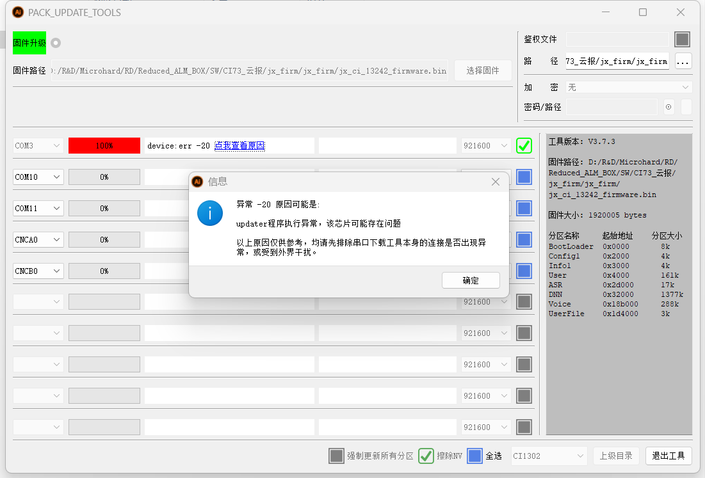

---


---

### CI-73T1串口烧录工具如何选择芯片型号？

**问题描述：**

CI-73T1串口烧录工具中没有对应的芯片型号选项，烧录自定义程序后模块无法正常播报和识别语音。

**解决方案：**

**芯片型号选择：**

1. **正确选择系列**：

    - 芯片系列选择：CI13LC
    - 芯片型号选择：CI13241
    - Flash大小：1MB

2. **烧录操作步骤**：

    - 选择正确芯片型号后配置参数
    - 点击"启动下载"等待状态变化
    - 拔插VCC进入烧录模式

**常见问题及解决：**

1. **烧录后无播报**：

    - 检查创建工程时是否选错模组
    - CI-73T1应选择对应型号
    - 误选CI13242会导致功能异常

2. **创建工程错误**：

    - 确认选择的是CI-73T1模组
    - 或直接选择CI13241芯片
    - 避免选择其他型号

3. **配置检查错误**：

    - 多个"行为控制详情没有添加主触发"
    - 需要为每个行为添加触发条件
    - 完成配置检查后导出

**注意事项：**

- CI-73T1使用的芯片是CI13241
- Flash容量为1MB，与CI13242不同
- 创建工程时必须选择正确的模组型号
- 配置错误会导致导出失败

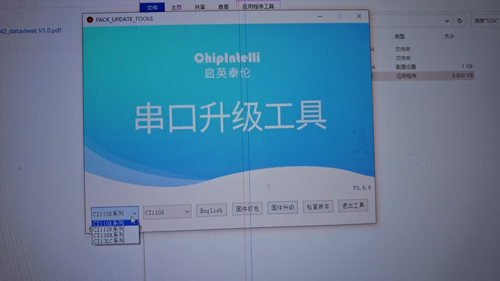

*图中芯片系列下拉菜单未选择正确型号*

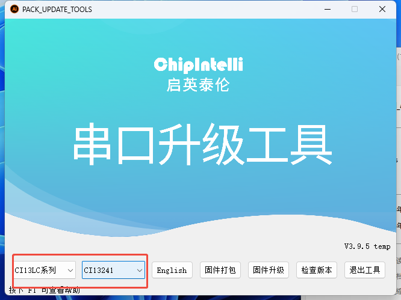

*正确选择CI13LC系列和CI13241型号*

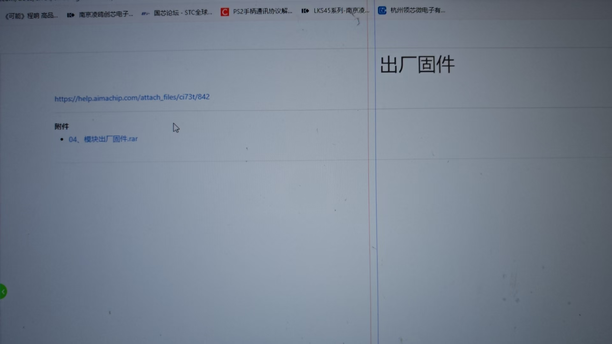

*可从官方渠道获取出厂固件进行恢复*

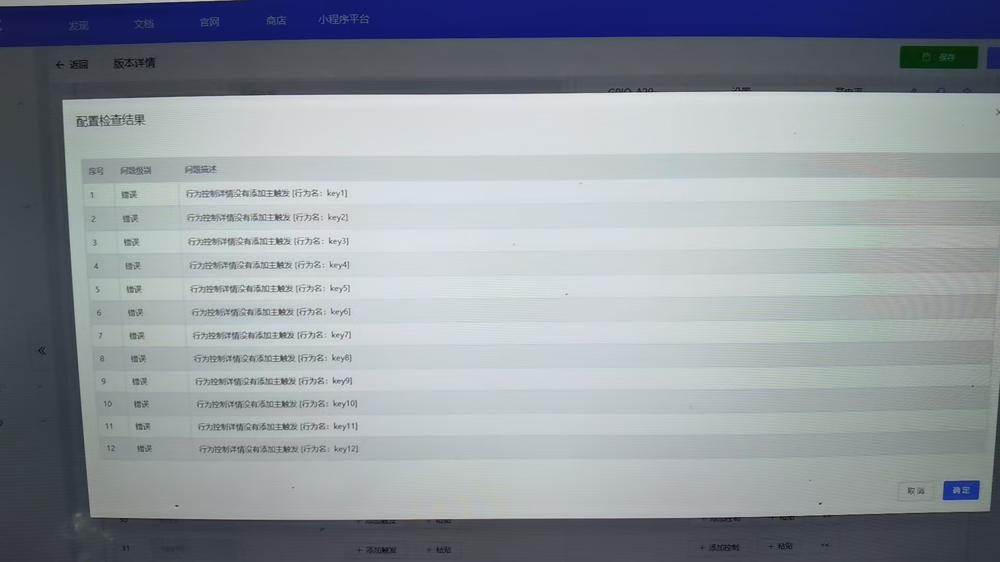

*多个行为控制缺少主触发的错误提示*

---


---

### 配置检查提示"行为控制详情没有添加主触发"怎么办？

**问题描述：**

创建CI-73T1芯片项目时，配置检查报告中出现多个"行为控制详情没有添加主触发"的错误，导致项目无法正常导出。

**解决方案：**

**错误原因：**

1. **缺少主触发**：

    - 行为控制未设置触发条件
    - 系统无法确定何时执行该行为
    - 每个行为都需要对应的触发

2. **配置不完整**：

    - 只定义了行为动作
    - 未定义触发该动作的条件
    - 缺少完整的控制逻辑

**解决步骤：**

1. **添加主触发**：

    - 进入行为控制详情页面
    - 为每个行为添加触发条件
    - 可选择语音触发或其他触发方式

2. **触发类型选择**：

    - 语音识别：选择对应的命令词
    - 串口接收：设置串口触发条件
    - IO触发：配置引脚状态触发

3. **批量处理**：

    - 逐个检查所有行为控制
    - 确保每个都有主触发
    - 重新运行配置检查

**预防措施：**

- 创建行为时同步设置触发条件
- 使用配置检查功能验证完整性
- 导出前确认所有错误已修复
- 保存配置避免丢失设置

---


---

### CI-73T2模块485通信控制时序如何设置？

**问题描述：**

在使用CI-73T2离线语音模块进行串口控制输出时，需要实现485通信控制，要求485控制脚先拉高，串口指令发送后再拉低。

**解决方案：**

**正确的时序配置步骤：**

1. **GPIO控制配置**
    - 在控制详情中添加GPIO控制动作
    - 设置GPIO_A2为高电平（485使能）
    - 添加串口输出动作，发送16进制数据（如 EE 01 02 03 FF）
    - 设置GPIO_A2为低电平（485禁用）

2. **添加必要延时**
    - 在GPIO_A2拉高后添加延时（建议10ms）
    - 在串口数据发送后也添加延时（建议10ms）
    - 确保串口指令完全发送完成后再拉低控制脚

**问题说明：**

- 发串口指令是无阻塞函数，不等串口发送完就返回执行下一条指令
- 没有延时会导致控制脚切换太快，影响485通信稳定性
- 串口发送函数立即返回，不等待数据完全发送

**时序要求：**

- 第一步：GPIO_A2 → 高电平（485发送模式）
- 第二步：延时10ms确保信号稳定
- 第三步：UART2_TX发送数据
- 第四步：延时10ms确保数据发送完成
- 第五步：GPIO_A2 → 低电平（485接收模式）

**注意事项：**

- 必须在控制步骤之间添加适当的延时
- 延时时间可根据实际波特率调整
- 建议先进行小批量测试验证通信稳定性
- 如通信不稳定，可适当增加延时时间


**问题描述：**

在使用CI-73T2离线语音模块进行串口控制输出时，需要实现485通信控制，要求485控制脚先拉高，串口指令发送后再拉低。

**解决方案：**

**正确的时序配置步骤：**

1. **GPIO控制配置**
    - 在控制详情中添加GPIO控制动作
    - 设置GPIO_A2为高电平（485使能）
    - 添加串口输出动作，发送16进制数据（如 EE 01 02 03 FF）
    - 设置GPIO_A2为低电平（485禁用）

2. **添加必要延时**
    - 在GPIO_A2拉高后添加延时（建议10ms）
    - 在串口数据发送后也添加延时（建议10ms）
    - 确保串口指令完全发送完成后再拉低控制脚

**问题说明：**

- 发串口指令是无阻塞函数，不等串口发送完就返回执行下一条指令
- 没有延时会导致控制脚切换太快，影响485通信稳定性
- 串口发送函数立即返回，不等待数据完全发送

**时序要求：**

- 第一步：GPIO_A2 → 高电平（485发送模式）
- 第二步：延时10ms确保信号稳定
- 第三步：UART2_TX发送数据
- 第四步：延时10ms确保数据发送完成
- 第五步：GPIO_A2 → 低电平（485接收模式）

**注意事项：**

- 必须在控制步骤之间添加适当的延时
- 延时时间可根据实际波特率调整
- 建议先进行小批量测试验证通信稳定性
- 如通信不稳定，可适当增加延时时间

---

### CI-73T2板子标识3.7V是否可以使用5V供电？

**问题描述：**

CI-73T2模块板子上标识3.7V电压，不确定是否可以使用5V供电，同时需要确认固件烧录的具体操作步骤。

**解决方案：**

1. **供电说明**：

    - 板子标识3.7V是指其他模块的供电要求
    - CI-73T2模块支持5V供电
    - 模块内部有稳压电路，可将5V转换为所需工作电压
    - 可以安全使用5V进行供电和烧录

2. **烧录操作步骤**：

    - 参考CI-73T固件烧录教程：https://www.bilibili.com/video/BV1fPUmYxENX
    - 使用通用烧录转接板进行连接
    - 选择正确的芯片型号CI13242
    - 确保烧录工具版本为V3.9.6或更高

    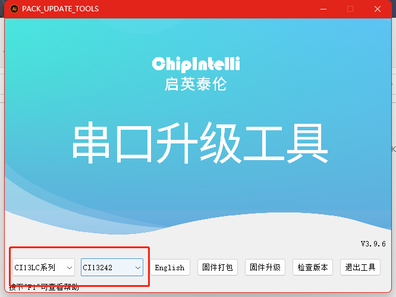
    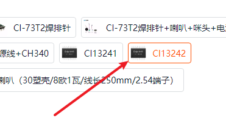

    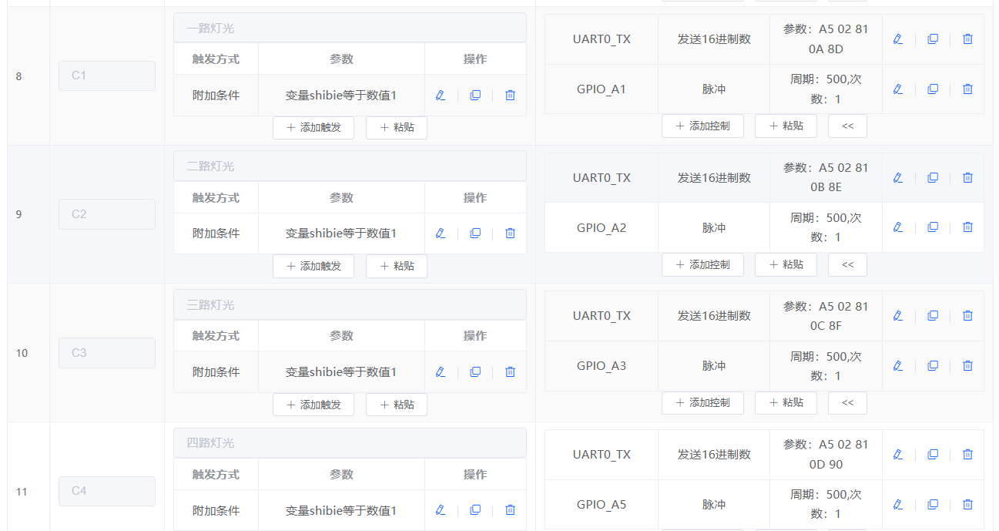
    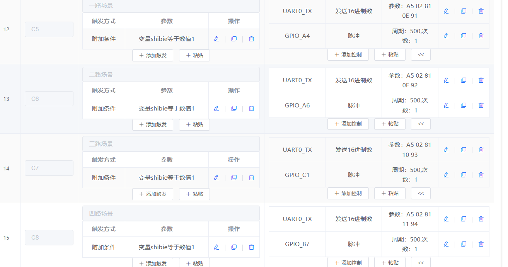

**注意事项：**

- 转接板是通用的，3.7V标识不影响CI-73T2使用
- 烧录时确保供电稳定，建议使用外部电源适配器
- 固件烧录前确认芯片型号选择正确

---

### CI-73T2配置260条语音指令后无法启动怎么办？

**问题描述：**

在CI-73T2模块上配置了260条语音指令后，系统无法正常启动并播报欢迎语，日志显示"not enough memory"。

**解决方案：**

**问题分析：**

- CI-73T2运行内存较小，260条指令超出了模块的处理能力
- 系统堆最小空闲内存降至4KB，内存严重不足
- 模块无法完成初始化，因此无法播报欢迎语

**解决方法：**

1. **减少指令数量**
    - 将260条指令减少至150条以内
    - 优先保留核心功能指令
    - 删除不必要或重复的指令

2. **优化内存使用**
    - 简化每个指令的回复语内容
    - 使用更短的TTS播报文本
    - 避免使用复杂的控制逻辑

3. **选择合适型号**
    - 如确实需要大量指令，建议选用CI-03T模块
    - CI-03T具有更大的运行内存
    - 可支持更复杂的配置

**优化建议：**

- 分批次开发：先实现核心功能，再逐步添加
- 使用组合播报：将多个固定回复合并
- 考虑使用CI-33T：支持500条词条，内存更大

---

### 固件过大导致运行内存不足怎么办？

**问题描述：**

固件生成成功，但烧录到设备后无任何反应，经排查发现是固件太大导致运行内存不足。

**解决方案：**

1. **问题确认**：

    - 固件可以正常生成并下载
    - 烧录过程无报错，但设备无响应
    - 可能是运行内存（RAM）不足导致

2. **模块选择**：

    - CI-73T2运行内存较小，容易受固件大小限制
    - 建议改用CI-03T模块，其运行内存更大
    - 根据功能复杂度选择合适型号

3. **固件优化**：

    - 简化功能逻辑，减少资源占用
    - 删除不必要的命令词和回复语
    - 优化配置参数

**注意事项：**

- 固件大小和运行内存是两个不同概念
- 即使Flash容量足够，运行内存也可能不足
- 复杂功能建议选用内存更大的模块
- 烧录前确认模块型号与功能需求匹配

---

### 如何验证CI-73T2固件的MD5值并烧录留档？

**问题描述：**

需要验证CI-73T2固件文件的MD5校验码是否正确，并将MD5码作为烧录留档记录。

**解决方案：**

**1. 固件信息确认**

CI-73T2-V1.1固件详细信息：

- 固件文件：jx_ci_13242_firmware.bin
- 开机播报：车辆已启动，祝你一路顺风
- 唤醒词：你好小美/小美小美/小林小林/小亿小亿/美女美女/小雅小雅/小强小强/小度小度/小德小德/小鹏小鹏/小丽小丽/小爱小爱/小新小新/小金小金/小恒小恒/小可小可/小奔小奔
- 回复语：我在/你说/有什么可以帮到你/你好/你要干啥/来啦老弟
- 文件大小：约1.01-1.02 MB

**2. MD5校验步骤**

使用Hasher Lite等校验工具：

1. 打开校验工具
2. 选择固件文件jx_ci_13242_firmware.bin
3. 查看计算得到的MD5值
4. 与提供的MD5码对比验证

**3. 已知MD5值记录**

- MD5-d1697be4d2a77f2f60830f2dfb78727f（2025-01-02版本）
- MD5-2602a96705489efbc274b4fc49789174（2025-02-22版本）
- MD5-42f99137caadf90017c447d36cfaf630（2025-07-18版本）

**注意事项：**

- 每次固件更新后MD5值会改变
- MD5不匹配表明文件可能损坏或不完整
- 建议烧录前都进行MD5校验
- 保留MD5记录便于追溯固件版本

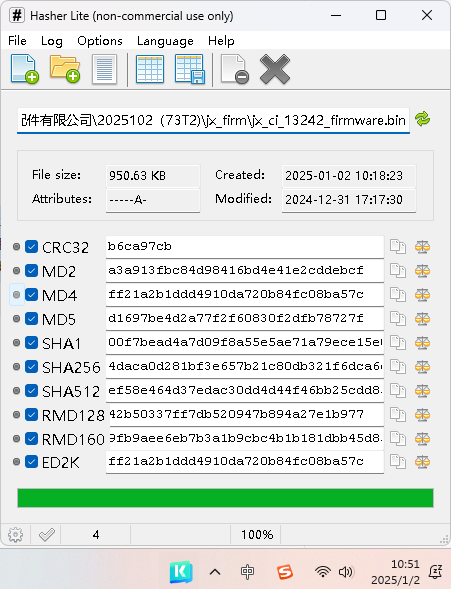

### 设备上电后仅响应一次指令即卡死怎么办？

**问题描述：**

设备上电后仅能响应一次语音指令并回复一次，随后即卡死，且micbias电压从2.7V降至0.9V，无法继续工作。

**解决方案：**

**1. 故障现象分析**

- 初始上电：MICBIAS电压正常（2.7V），可以识别和回复
- 执行一次后：MICBIAS降至0.9V，设备进入休眠或死机状态
- 重启现象：每次开机都重复相同问题

**2. 可能原因**

- 芯片内部电源管理电路异常
- 某些外围元件导致电源崩溃
- 固件配置问题（可能性较低）

**3. 排查建议**

- 使用标准模块测试确认是否为硬件问题
- 检查电源供电能力和稳定性
- 尝试使用官方提供的测试固件

**注意事项：**

- 这种现象通常是芯片或外围硬件故障
- 建议使用CI-73T模块进行对比测试
- 如确认是芯片问题，需要更换处理

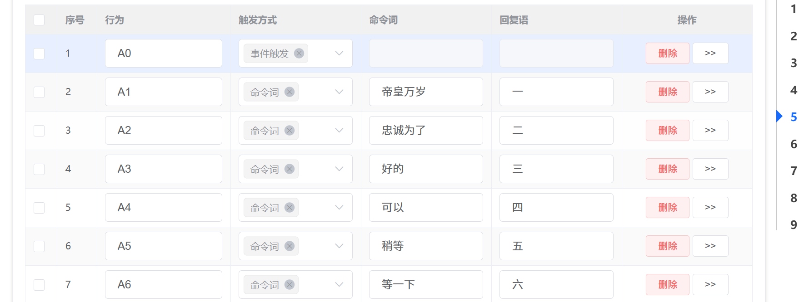

---


---

### 如何获取CI-73T的原理图文件？

**问题描述：**

需要获取CI-73T芯片的电气原理图文件，但无法访问下载页面。

**解决方案：**

**官方下载地址：**

- **文档链接**：https://help.aimachip.com/docs/ci73t/ci73t-1fsi75r8ng53g
- **所需文件**：

    - CI-73T-V1.1电气原理图.pdf
    - CI-73T-V1.1(1).PCB
    - CI-73T-V1.1模组规格书.pdf

**文件获取步骤：**

1. **访问官方文档中心**：

    - 登录 help.aimachip.com
    - 搜索CI-73T相关文档
    - 选择对应的版本文件

2. **联系技术支持**：

    - 如链接失效，可联系技术支持
    - 提供具体型号和版本信息
    - 获取最新的下载链接

**文件说明：**

- **电气原理图**：包含完整的电路设计
- **PCB文件**：Altium Designer格式，可直接编辑
- **规格书**：详细的技术参数和接口定义

**注意事项：**

- 需要注册账号才能下载
- 确保下载完整版本（V1.1）
- PCB文件需要使用Altium Designer打开

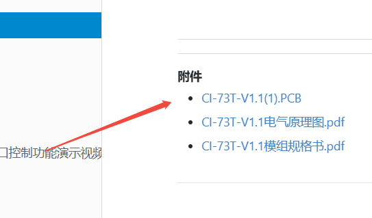

---


---

### CI-73T1外触发功能故障如何排查？

**问题描述：**

CI-73T1芯片的外触发功能无法正常工作，即使IO口输入的高电平和低电平信号符合规格，也无法触发语音播报。

**解决方案：**

**1. 信号电平确认**

IO口输入电平要求：

- **输入高电平（V_IH）**：3.0V ≤ VDD33 ≤ 0.7×VDD33
- **输入低电平（V_IL）**：3.0V ≤ VDD33 ≤ 0.3×VDD33
- 使用万用表测量实际输入电平
- 确认信号幅度在规格范围内

**2. 硬件限制排查**

CI-73T1存在硬件限制：

- **PA0和PA3引脚**：存在硬件或固件bug，无法用于外触发
- 更换其他GPIO引脚进行测试
- 避免使用已知有问题的引脚

**3. 配置验证**

外触发配置检查：

- 确认触发方式设置为GPIO输入
- 验证触发条件（高电平/低电平）
- 检查关联的播报行为配置

**4. 替代方案**

如果原引脚无法工作：

- 使用其他可用GPIO引脚
- 通过软件逻辑替代硬件触发
- 考虑使用其他触发方式（如定时、串口命令等）

**注意事项：**

- CI-73T1的部分GPIO存在已知硬件问题
- 设计外触发功能时应避开问题引脚
- 保留配置文件和测试记录
- 硬件问题需要更换引脚方案

---

