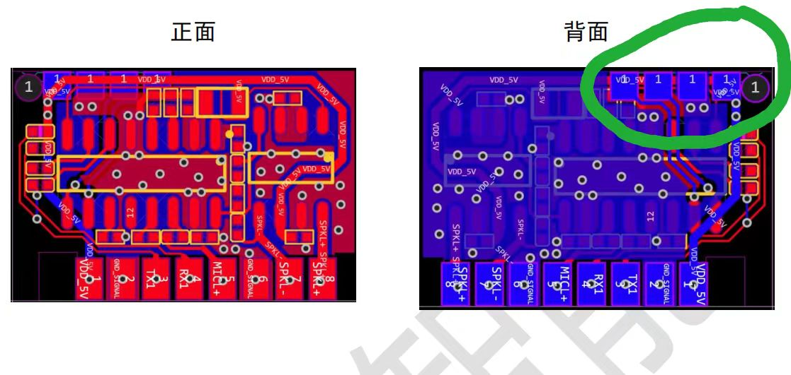

# CI-96Z 烧录与调试 FAQ

本页用于整理 CI-96Z 相关的烧录与调试问题。

### CI-96Z61芯片烧录时串口数据异常怎么办？

**问题描述：**

使用CI-96Z61芯片进行智能沙发控制时，烧录固件后串口数据从烧录脚输出，而不是从配置的串口引脚输出，导致通信异常。

**解决方案：**

**问题分析：**

- 烧录时可能选错了芯片型号或配置
- 串口引脚配置错误导致数据从默认烧录脚输出
- Pin脚配置中UART设置不正确

**解决步骤：**

1. **确认芯片型号**：

    - 在烧录工具中选择正确的芯片型号CI-96Z61
    - 如选项中没有完全匹配的，选择最接近的型号尝试
    - 确认烧录工具版本支持该芯片

2. **检查Pin脚配置**：

    - 在智能公元平台确认UART引脚配置
    - 选择正确的串口引脚组合（如UART0、UART1等）
    - 重新生成固件并烧录

3. **验证串口输出**：

    - 烧录完成后测试指定串口是否有数据输出
    - 使用示波器或串口调试工具验证
    - 确认数据不是从烧录脚（P51）输出

**Pin脚配置示例：**


*UART0_TX和UART0_RX的配置，确保串口数据从正确引脚输出*

**注意事项：**

- CI-96Z61可能需要特定的烧录工具版本
- 烧录时确保芯片型号与实际硬件一致
- 如问题持续，尝试使用其他兼容的芯片型号选项


---


### CI-96Z金手指模块不良品深度分析方法

**问题描述：**

CI-96Z金手指模块出现不良品，需要进行深入分析，包括短路位置测量、功放电压测试及规格分析，并提供详细的检测报告和改善措施。

**解决方案：**

**深度分析要求：**

1. **基础检测项目**：

    - 外观检查：查看模块是否有明显损伤
    - 电气参数测量：供电、功耗等基础指标
    - 功能测试：语音识别和输出功能验证

2. **深度测量项目**：

    - **短路位置精确定位**：使用专业设备测量短路点
    - **功放电压测试**：测量功放电路各点电压值
    - **规格参数对比**：与标准规格书进行逐项对比
    - **波形分析**：如有条件，进行信号波形分析

**分析报告内容：**

1. **检测数据记录**：

    ```
    不良品信息：
    型号：CI-96Z金手指模块
    不良数量：XX pcs
    检测日期：2025-04-28/30

    检测项目：

    - 短路位置：[具体位置描述]
    - 功放电压：[实测值] V（标准值：X.X V）
    - 供电电流：[实测值] mA（标准值：XX mA）
    - 关键点位电压：[逐项列出]
    ```

2. **问题分析**：

    - 不良现象描述
    - 可能原因分析
    - 影响程度评估
    - 改善建议

**改善措施建议：**

1. **生产工艺优化**：

    - 加强SMT焊接质量控制
    - 优化PCB清洗流程
    - 增加中测抽检比例

2. **设计改进建议**：

    - 如发现设计问题，提出改进方案
    - 优化电路布局和走线
    - 考虑增加保护电路

3. **测试流程完善**：

    - 增加短路测试工位
    - 完善电压测试标准
    - 建立不良品追溯机制

**报告格式要求：**

1. **包含必要数据**：

    - 详细的测量数据表格
    - 测试设备和方法说明
    - 不良品照片或显微图
    - 改善措施的具体实施计划

2. **关注点**：

    - 短路位置的精确测量数据
    - 功放电压的实际测试值
    - 与规格书的对比分析
    - 可量化的改善措施

**注意事项：**

- 深度分析需要专业测试设备和经验
- 保留完整的测试原始数据
- 报告应包含可量化的数据和指标
- 改善措施需具体可执行，避免空泛描述
- 建议建立不良品数据库，便于持续改进


---

### CI-96Z模块次品批量处理与补发流程

**问题描述：**

CI-96Z模块出现次品需要批量返修或补发，涉及次品确认、返厂流程、补发安排等环节。

**解决方案：**

**次品确认流程：**

1. **不良现象记录**：

    - 记录具体的不良现象和数量
    - 拍照留存不良品状态
    - 初步判断不良类型（功能失效、外观不良等）

2. **不良品分类**：

    - 功能性不良：无法唤醒、识别异常、输出无声等
    - 外观不良：划痕、氧化、引脚变形等
    - 电气不良：短路、开路、参数异常等

**返厂处理流程：**

1. **联系厂家确认**：

    - 提供不良品数量和现象描述
    - 发送不良品照片供初步判断
    - 确认返厂地址和联系人

2. **寄返次品**：

    - 按厂家要求包装次品
    - 标注不良信息和批次号
    - 保留快递单号便于追踪

3. **厂家检测分析**：

    - 厂家收到后进行专业检测
    - 确认不良原因和责任归属
    - 提供检测报告和处理方案

**补发安排：**

1. **补发数量确认**：

    - 根据检测结果确认补发数量
    - 区分维修后返还和直接补发
    - 明确补发产品的规格型号

2. **补发时效**：

    - 确认后安排生产或库存调配
    - 一般需要3-5个工作日
    - 紧急情况可协商加急处理

3. **发货跟踪**：

    - 提供快递单号
    - 跟踪物流状态
    - 确认收货时间和数量

**费用处理：**

1. **责任判定**：

    - 厂家责任：免费维修或补发，承担运费
    - 用户责任：收取维修费用，运费自理
    - 共同责任：协商分担方案

2. **费用结算**：

    - 可在后续订单中抵扣
    - 单独支付维修费用
    - 签署费用确认单

**预防措施：**

1. **来料检验**：

    - 加强IQC检验标准
    - 增加抽检比例
    - 记录检验数据

2. **生产过程控制**：

    - 监控SMT质量
    - 加强过程巡检
    - 完善追溯体系

3. **客诉快速响应**：

    - 建立快速响应机制
    - 24小时内初步反馈
    - 3个工作日内出具处理方案

**注意事项：**

- 保留完整的不良品处理记录
- 建立不良品数据库用于分析改进
- 与厂家保持良好沟通，及时跟进处理进度
- 批量问题应及时通知相关部门，暂停使用相关批次


---

### CI-96Z模块不同封装形式的价格差异

**问题描述：**

需要了解CI-96Z模块不同封装形式的价格差异，包括端子模块和金手指版本的报价。

**解决方案：**

**产品类型与价格对比：**

1. **端子模块版本**：

    - CI-75C1（13161端子模块）：3.60元/片
    - CI-75C2（13162端子模块）：4.60元/片
    - 适合传统焊接工艺，便于手工维修

2. **金手指版本**：

    - CI-96Z61（13161金手指）：3.20元/片
    - CI-96Z62（13162金手指）：3.60元/片
    - 适合SMT贴片生产，自动化程度高

**价格差异分析：**

1. **封装成本影响**：

    - 金手指版本工艺更复杂，但某些型号价格更低
    - 端子模块便于维修但占用更多PCB空间
    - 价格还受到芯片型号（13161/13162）影响

2. **选型建议**：

    - **大批量生产**：推荐金手指版本，降低人工成本
    - **小批量试产**：可选用端子模块，便于调试修改
    - **维修考虑**：端子模块更易更换维修

**采购注意事项：**

1. **最小起订量**：

    - 不同封装可能有不同的MOQ要求
    - 小批量采购单价可能上浮
    - 建议合理规划采购数量

2. **交期差异**：

    - 端子模块通常库存较多
    - 金手指版本可能需要生产周期
    - 提前确认交期安排

3. **兼容性确认**：

    - 确认PCB设计与封装匹配
    - 13161和13162引脚定义可能不同
    - 选择正确型号避免兼容问题

**成本优化建议：**

1. **批量采购**：

    - 达到一定数量可获得价格优惠
    - 与厂家洽谈长期合作协议
    - 考虑年度框架协议

2. **替代方案**：

    - 评估功能相近的其他型号
    - 考虑整体成本而非仅单价
    - 综合考虑质量、交期、服务

**注意事项：**

- 价格会随原材料和市场波动
- 需要确认是否含税价格
- 了解付款条件和交货条款
- 保留正式报价单作为采购依据

---

### CI-96Z62与SU-03T的烧录有何差异？

**问题描述：**

需要了解CI-96Z62模组与SU-03T在烧录过程中的差异，以及是否可以使用相同的烧录方法和工具。

**解决方案：**

**主要差异对比：**

1. **烧录工具不同**：

    - SU-03T：使用标准烧录工具和CH340连接
    - CI-96Z62：需要专用的烧录工具和接口
    - 两者使用的烧录软件不兼容

2. **接口定义不同**：

    - SU-03T：标准UART接口（RX0/TX0）
    - CI-96Z62：使用专用烧录接口
    - 引脚定义和连接方式不同

3. **平台配置差异**：

    - 功能配置基本相同（语音识别、命令词等）
    - 烧录参数设置略有不同
    - 固件文件格式不兼容

**配置相似性：**

虽然烧录工具不同，但在智能公元平台的配置流程相似：

1. **项目创建**：两者都使用相同的平台
2. **功能配置**：命令词、唤醒词等配置方法相同
3. **固件生成**：生成流程一致，只是最终文件不同

**烧录流程对比：**

**SU-03T烧录**：

- 连接CH340到TX0/RX0
- 使用标准烧录工具
- 选择对应的COM口

**CI-96Z62烧录**：

- 使用专用烧录器
- 连接到特定烧录接口
- 使用厂商提供的烧录软件

**注意事项：**

- 不要混用两款的烧录工具
- 保存好各自的配置文件
- 烧录前确认模组型号
- 如有烧录问题，联系技术支持获取对应指导

---

### CI-96Z模块顶端的4个焊点是串口烧录口吗？

**问题描述：**

CI-96Z模块顶端有4个焊点，询问是否为串口烧录口，以及如何在嘉立创PCB中引入该模块。

**解决方案：**

1. **焊点功能说明**：

    - 模块顶端的4个焊点不是串口烧录口
    - 标注为VDD_5V和数字1的焊点是电源相关
    - 实际烧录需要使用专用烧录接口

2. **正确烧录方式**：

    - CI-96Z需要专用的烧录工具和接口
    - 不是通过普通的串口进行烧录
    - 需要联系厂商获取烧录器

3. **PCB封装设计**：

    - 嘉立创PCB中需要自己画封装
    - 可以将规格书发给嘉立创协助制作
    - 或根据模块尺寸自行设计封装

**注意事项：**

- CI-96Z的烧录方式与SU-03T等不同
- PCB设计时注意模块的机械尺寸和引脚定义
- 如需要批量烧录，建议采购专用烧录设备
- 不确定焊点功能时，勿随意连接避免损坏模块



