# JX-12F 烧录与调试 FAQ

本页用于整理 JX-12F 相关的烧录与调试问题。

### JX-12F模块如何连接到开发板？

**问题描述：**

需要了解JX-12F语音模块（CI-03T1/CI-03T2）的引脚定义以及如何正确连接到开发板。

**解决方案：**

**1. 引脚识别**

- 查看模块上的丝印标识
- 确认VCC、GND、TX、RX等关键引脚位置
- 注意模块版本差异可能导致引脚顺序不同

**2. 基本连接**

- VCC：连接到3.3V或5V电源（根据模块规格）
- GND：连接到开发板地线
- TX：连接到开发板的RX（串口接收）
- RX：连接到开发板的TX（串口发送）

**3. 注意事项**

- 交叉连接：TX接RX，RX接TX
- 确保电压匹配，避免损坏模块
- 建议先测试通信是否正常

---

### JX-12F模块TCP连接后数据下发无效怎么办？

**问题描述：**

修改了TCP服务器IP和端口后，虽然能连接上TCP，但下发的数据无法正常控制设备。

**解决方案：**

**1. 检查TCP连接配置**

- 确认对端地址和端口配置正确
- 验证配置格式是否选择"固定格式"
- 确认TCP连接功能已启用


**2. 验证数据格式**

- 下发数据格式应为：AA 55 01 55 AA
- 确保每两位十六进制数有空格分隔
- 检查数据是否被正确发送

**3. 检查连接状态**

- 查看串口输出的连接日志
- 确认模块已成功连接到TCP服务器
- 验证server read数据接收情况

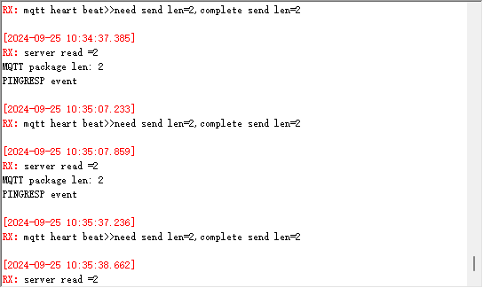

**4. 测试步骤**

1. 使用网络调试工具建立TCP服务器
2. 模块连接后发送测试数据
3. 观察模块是否正确响应
4. 检查GPIO引脚输出状态

**注意事项：**

- TCP连接成功不代表数据格式正确
- 需要确保协议格式与接收端匹配
- 建议先用小程序验证功能正常
- 固定格式下发时注意空格分隔

---

### TCP连接已建立但无法发送数据怎么办？

**问题描述：**

TCP连接虽然已建立，但无法成功发送数据，接收端未收到预期的Hex数据包。

**解决方案：**

**1. 检查数据发送格式**

- 确认使用十六进制格式发送
- 每两位数之间必须有空格
- 例如：AA 55 01 55 AA

**2. 发送方式验证**


- 使用网络调试工具的Hex发送功能
- 确保选择正确的发送编码
- 检查是否有乱码或格式错误

**3. 连接状态检查**

- 确认TCP连接保持稳定
- 检查是否有数据重传
- 验证接收端缓冲区状态

**4. 常见问题解决**

- 检查防火墙设置
- 确认端口未被占用
- 验证网络延迟和稳定性

**注意事项：**

- 十六进制发送时必须加空格分隔
- 避免一次性发送过大数据包
- 建议分段发送大数据
- 使用可靠的TCP调试工具测试

---

### JX-12F固件生成失败如何解决？

**问题描述：**

在使用平台生成固件时遇到失败问题，无法成功生成固件。

**解决方案：**

**1. 检查配置错误**

- 使用的功能可能尚未在平台开放
- 配置参数可能超出模块支持范围
- 平台生成队列可能繁忙

**2. 排查步骤**

1. 导出JSON配置文件用于分析
2. 检查是否使用了未开放功能
3. 简化配置，逐步添加功能测试
4. 避开高峰期进行生成

**3. 常见失败原因**

- 配置了暂未开放的功能（如获取时间）
- 参数设置超出模块规格
- 网络连接不稳定
- 浏览器缓存问题

**注意事项：**

- 配置检查通过不代表功能已开放
- 生成失败时可导出配置联系技术支持
- 建议使用入门例程学习配置方法
- 定期清理浏览器缓存

---

### JX-12F使用串口烧录是否需要先导入入门例程？

**问题描述：**

使用JX-12F芯片进行串口烧录固件时，不确定是否需要先导入入门例程才能正常烧录。

**解决方案：**

JX-12F串口烧录固件不需要导入入门例程：

**1. 烧录流程**

- 直接烧录：使用串口烧录工具可直接烧录生成的固件
- 无需例程：烧录前不需要导入任何入门例程
- 配网烧录：只有连接服务端TCP时需要先用手机小程序配网

**2. 注意事项**

- 串口烧录和配网是独立的功能
- 配网仅用于WiFi连接，不影响固件烧录
- 烧录工具支持直接烧录.hex格式的固件文件

**3. 操作步骤**

1. 连接JX-12F的串口到电脑
2. 打开串口烧录工具
3. 选择正确的串口号和固件文件
4. 直接进行烧录操作

---

### JX-12F模块无法搜索到蓝牙设备怎么办？

**问题描述：**

JX-12F模块烧录固件后，手机蓝牙无法搜索到设备，但相同固件在开发板上可以正常工作。

**解决方案：**

**1. 确认模块型号和天线配置**

- 检查模块丝印确认是JX-12F1、JX-12F2还是JX-12F3
- JX-12F1需要连接IPEX天线，未接天线将导致信号极弱
- JX-12F2为板载天线，无需外接
- JX-12F3需要连接外置天线

**2. 检查引脚连接**

- EN引脚必须滞空（不接任何电平），接地会导致模块重启
- IO8引脚建议滞空，确保蓝牙广播功能正常
- 确认VCC和GND供电稳定

**3. 复位操作**

- 正确连接后复位模块，应该会发送蓝牙信号
- 可通过重新上电实现复位

**注意事项：**

- 部分早期样品丝印可能与实际型号不符，请以实际天线配置为准
- 使用JX-12F1时必须配备合适的IPEX天线

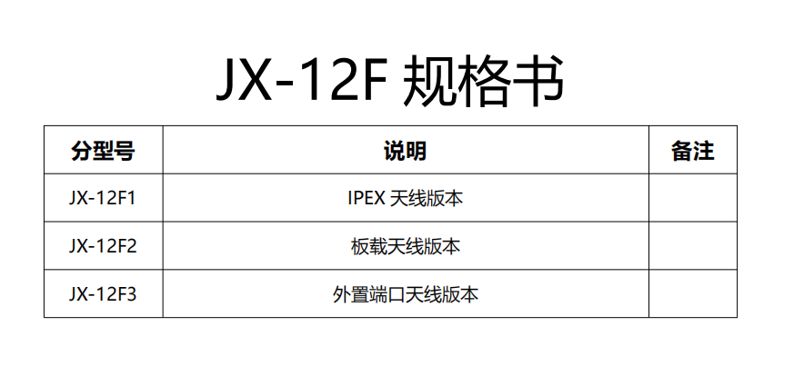

---

### JX-12F是芯片还是开发板？

**问题描述：**

不确定JX-12F是单独的芯片还是包含开发板的模块，以及是否可以直接烧录网站生成的固件。

**解决方案：**

**1. JX-12F模块类型**

- **本质是WiFi+BLE模组**：

    - 集成了JX-12F2芯片
    - 包含必要的外围电路
    - 不是纯裸片芯片

- **模块形式**：

    - 已焊接好的完整模组
    - 引脚通过邮票孔或排针引出
    - 可直接用于产品开发

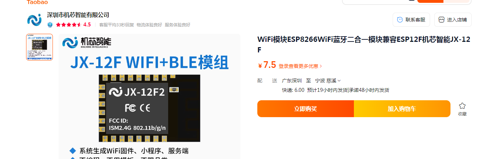

*JX-12F WIFI+BLE模组*

**2. 固件烧录**

- **可以直接烧录**：

    - 支持网站生成的固件
    - 通过串口方式烧录
    - 需要专门的烧录工具

- **烧录方法**：

    - 使用CH340 USB转串口模块
    - 连接模块的串口引脚
    - 通过专用烧录工具操作

**3. 开发方式选择**

- **直接使用模组**：

    - 适合快速产品开发
    - 无需自行设计外围电路
    - 风险低，开发周期短

- **自行设计PCB**：

    - 可将JX-12F2芯片集成到自有设计
    - 需要一定的硬件设计经验
    - 批量成本更低

**注意事项：**

- JX-12F是完整的模组，不是裸片
- 初学者建议直接使用模组形式开发
- 自行设计需要参考官方原理图

---

### JX-12F烧录时出现"LOAD HELP BIN FAIL"错误？

**问题描述：**

使用烧录工具给JX-12F模块烧录固件时，出现"LOAD HELP BIN FAIL"错误，导致烧录失败。

**解决方案：**

1. **检查烧录环境**
    - 确认烧录工具版本是否正确
    - 检查USB转串口驱动是否正常安装
    - 确认COM口没有被其他程序占用

2. **检查固件文件**
    - 确认下载的固件包完整
    - 检查固件文件是否损坏
    - 重新下载固件包尝试

3. **检查硬件连接**
    - 确认串口线连接正确（TX-RX交叉）
    - 检查供电是否稳定（3.3V）
    - 确认模块已经正确上电

4. **切换烧录模式**
    - 确保模块处于烧录模式
    - 重新上电进入烧录模式
    - 检查开发板上的模式开关

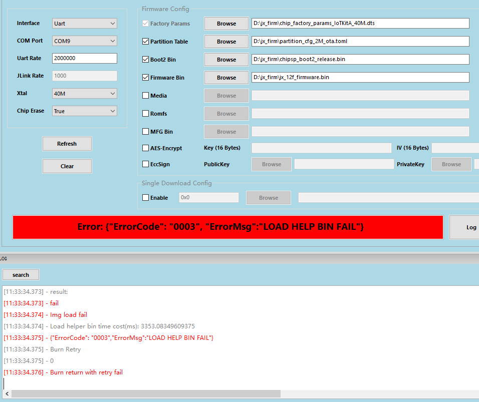

**注意事项：**

- 此错误通常表示加载辅助文件失败
- 尝试更换USB端口或重新插拔烧录器
- 如果问题持续存在，联系技术支持获取帮助

---

### JX-12F开发板上的开关有什么作用？

**问题描述：**

JX-12F开发板上有一个拨动开关，不清楚其具体功能和作用。

**解决方案：**

该开关用于切换模块的工作模式：

- **烧录模式**：

    - 开关拨到烧录位置
    - 模块进入固件烧录模式
    - 用于固件更新和程序烧录

- **工作模式**：

    - 开关拨到工作位置
    - 模块正常运行
    - 用于正常功能测试和应用

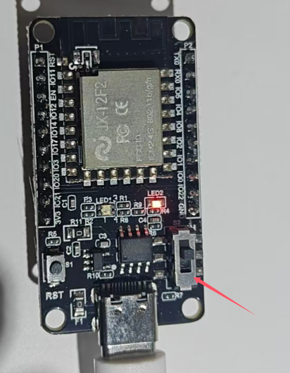

**注意事项：**

- 烧录前必须将开关拨到烧录模式
- 烧录完成后记得拨回工作模式
- 错误的模式设置会导致烧录失败或功能异常

---

### JX-12F开发板在哪里购买？

**问题描述：**

需要购买JX-12F的开发板进行学习和开发，询问购买渠道。

**解决方案：**

**1. 官方渠道**

- **淘宝平台**：

    - 搜索"JX-12F开发板"
    - 多家店铺有销售
    - 注意选择评价好的商家

- **注意事项**：

    - 确认是JX-12F而非其他型号
    - 查看是否包含必要配件
    - 保留购买记录便于售后

**2. 开发板类型**

- **基础开发板**：

    - 仅包含最小系统
    - 电源电路和接口
    - 适合基础功能测试

- **扩展开发板**：

    - 包含更多外设接口
    - 预留调试接口
    - 适合复杂项目开发

**3. 自制开发板**

- **如果决定自制**：

    - 参考官方开发手册
    - 注意电源设计（3.3V）
    - 预留串口调试接口

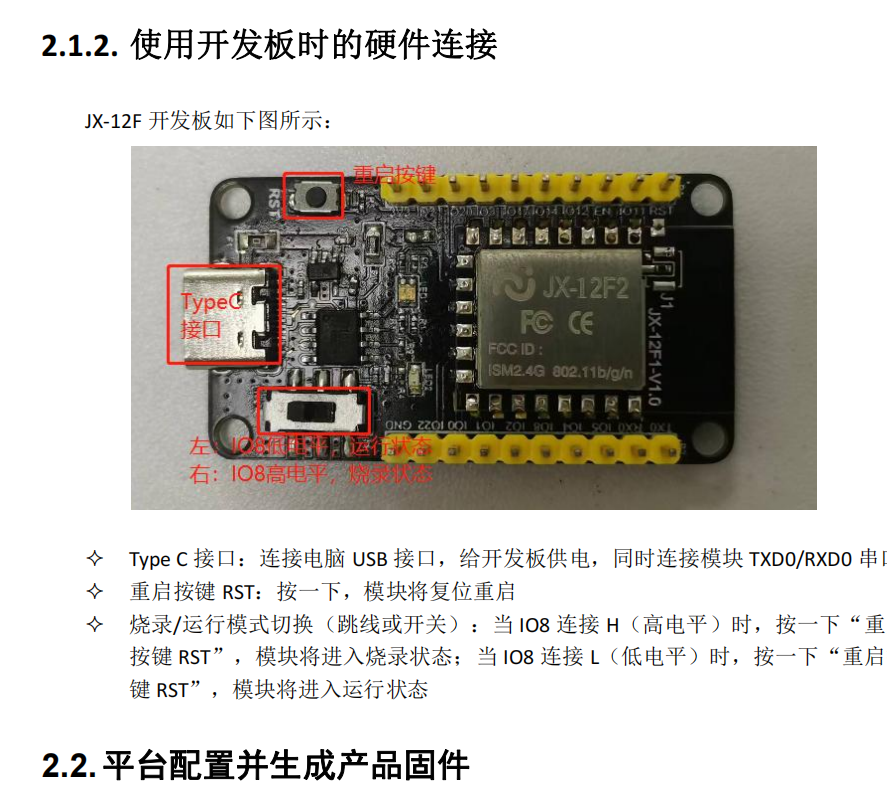

*开发手册中的硬件连接说明*

**注意事项：**

- 初学者建议购买现成开发板
- 自制需要一定的硬件经验
- 确保开发板与模块型号匹配

---

### JX12F烧录时出现"LOAD HELP BIN FAIL"错误怎么办？

**问题描述：**

JX12F模块在烧录时出现"LOAD HELP BIN FAIL"错误，且握手失败，无法进入烧录模式。

**解决方案：**

**1. 使用正确的USB转串口模块**

- **必须使用CH340模块**：JX12F与CH340芯片兼容性更好
- **CP2104可能不兼容**：会导致通信失败
- 安装CH340驱动程序

**2. 正确的连接方式**

- TR（复位）连接转串口的TR引脚
- 不是常规的TX接RX、RX接TX
- 确保共地连接

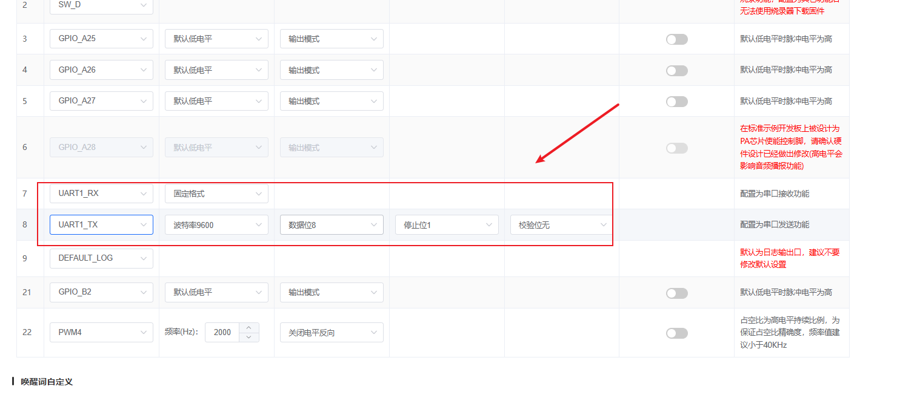

**3. 进入烧录模式**

- 将拨码开关拨到H位置
- 按一下复位键进入烧录模式
- 等待烧录工具检测到模块

**4. 烧录步骤**

1. 模块进入烧录模式后COM口变黄
2. 烧录工具显示"hand success"表示握手成功
3. 点击开始烧录
4. 等待烧录完成

**5. 常见问题解决**

- **握手失败**：检查TR线连接，重新进入烧录模式
- **通信异常**：更换CH340模块和连接线
- **端口识别不到**：确认驱动安装正确

**注意事项：**

- JX12F必须使用CH340模块进行烧录
- CP2104等其他芯片可能不兼容
- 确保模块已正确进入烧录状态

### JX-12F烧录时IO8引脚处理

**问题描述：**

JX-12F模块烧录失败，提示"LOAD HELP BIN FAIL"或"IMG LOAD SHAKEHAND FAIL"，需要了解IO8引脚的正确处理方式。

**解决方案：**

**1. IO8引脚功能说明**

- IO8是JX-12F的烧录控制引脚
- 高电平（H）：烧录模式
- 低电平（L）：运行模式

**2. 正确的烧录操作步骤**

1. **准备工作**
    - 断开模块电源
    - 将IO8连接到高电平（3.3V或5V）
    - 使用CH340 USB转串口模块

2. **进入烧录模式**
    - IO8保持高电平状态
    - 给模块上电（或按下RST复位键）
    - 模块将自动进入烧录模式

3. **开始烧录**
    - 烧录工具检测到模块后
    - 选择固件文件开始烧录
    - 等待烧录完成

4. **退出烧录模式**
    - 烧录完成后断开电源
    - 将IO8从高电平断开或连接到低电平
    - 重新上电进入运行模式

**3. 注意事项**

- 必须先拉高IO8再上电，顺序不能错
- 烧录过程中保持IO8为高电平
- 运行时IO8必须为低电平
- 如果直接将模块贴在开发板上，需要预留IO8的高低电平控制

**常见错误：**

- 忘记拉高IO8导致无法进入烧录模式
- IO8未正确连接高电平
- 烧录完成后忘记将IO8恢复低电平
- 如持续失败，尝试更换电脑或USB端口

---

### JX12F烧录成功后上电无反应怎么办？

**问题描述：**

JX12F模块固件已成功烧录，但上电后无任何反应，包括无提示音和无法通过唤醒词唤醒。

**解决方案：**

**1. 检查烧录时序**

正确的烧录步骤：

- 先点击烧录工具的"烧录"按钮
- 等待COM口变黄色（表示进入烧录模式）
- 再按模块的复位键
- 不要先按复位再点击烧录

**2. 验证烧录状态**

- 烧录完成后应显示"All Success"
- 检查是否所有配置文件都加载成功
- 确认没有红色错误信息

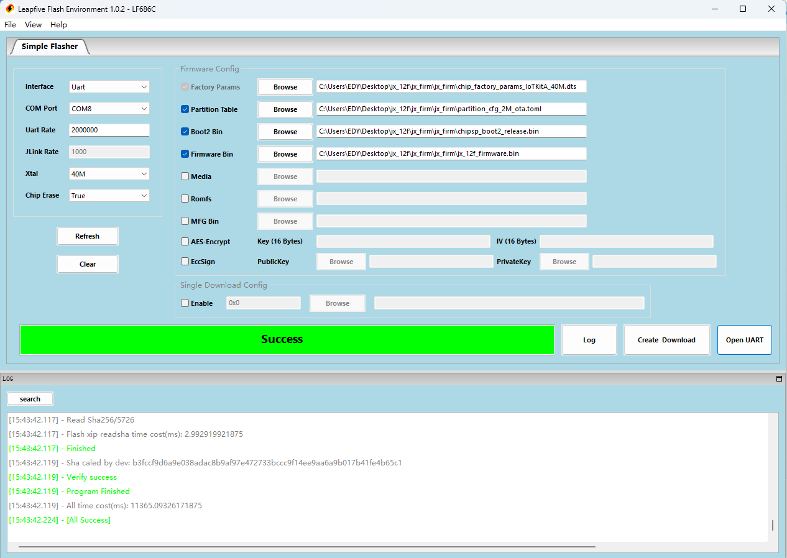

**3. 上电测试**

- 烧录完成后重新上电
- 等待3-5秒让模块初始化
- 测试唤醒词是否响应
- 检查是否有提示音输出

**4. 可能的问题**

- **烧录未完全完成**：部分文件未写入成功
- **硬件连接问题**：供电不足或接触不良
- **固件配置问题**：某些功能配置有误

**解决方法：**

- 重新按照正确时序烧录
- 使用稳定5V电源供电

---

### 设备间歇性网络连接失败怎么办？

**问题描述：**

设备在使用过程中出现间歇性网络连接失败，表现为在小程序中刷新时无法获取设备状态，且设备状态显示为"连接"但实际无法通信，同时设备指示灯显示网络连接异常，手机Wi-Fi信号强度较弱。

**解决方案：**

**1. 信号强度优化**

- 将设备移至距离路由器更近的位置
- 确保设备与路由器之间无障碍物阻挡
- 测试位置信号强度应保持在3格以上

**2. 路由器设置检查**

- 确认路由器工作在2.4GHz频段
- 检查路由器信道设置，避免使用拥堵信道
- 重启路由器后等待设备自动重连

**3. 设备重启操作**

- 设备断电后重新上电
- 等待2-3分钟让设备完成网络初始化
- 观察网络指示灯状态变化

**注意事项：**

- 设备显示"连接"状态可能与实际通信状态不同步
- 信号较弱时建议缩短设备与路由器的距离
- 多设备同时连接时可能出现互相干扰

---

### 设备频繁掉线和重连失败如何处理？

**问题描述：**

设备在路由器断电重启后无法正常重连，出现频繁掉线和重连失败的问题，且重连后仍会再次断开。

**解决方案：**

**1. 路由器重启后的处理**

- 路由器断电重启后，设备可能需要较长时间重新连接
- 建议等待3-5分钟让网络完全稳定
- 如仍无法连接，可对设备进行断电重启

**2. 网络环境优化**

- 缩短设备与路由器的距离（建议3米内）
- 减少中间障碍物，特别是金属物体
- 避免设备放置在金属外壳内，会影响信号

**3. 固件版本确认**

- 确保使用最新版本的固件
- 新版本固件通常包含网络连接优化
- 必要时可联系厂商获取更新版本

**注意事项：**

- 路由器重启是触发此问题的常见原因
- 不同WiFi模块的信号接收能力可能存在差异
- 频繁掉线通常与信号强度直接相关

---

### WiFi模块配网失败及连接不稳定如何解决？

**问题描述：**

在特定环境下，WiFi模块在连接路由器后出现网络连接不稳定、配网失败、小程序界面无法刷新（蓝屏）的问题，且设备重新上电后无法恢复，需要多次尝试才能恢复连接。

**解决方案：**

**1. 配网失败排查**

- 确认设备处于配网模式
- 核对WiFi密码是否正确
- 确认路由设备为2.4G WiFi频段
- 检查设备是否已授权

**2. 连接距离优化**

- 配网时建议距离路由器3米以内
- 避免穿墙或隔金属障碍物
- 配网成功后再移至目标位置

**3. 信号强度判断**

- 使用手机测试目标位置的WiFi信号强度
- 信号强度应保持在3格以上
- 临界信号位置容易出现连接异常

**4. 设备重启处理**

- 出现问题时先尝试设备重启
- 重启后等待1-2分钟再进行配网
- 多次失败可考虑更换位置

**注意事项：**

- 配网失败不一定是设备问题，信号强度是关键因素
- 不同批次WiFi模块的信号灵敏度可能略有差异
- 金属外壳会显著影响WiFi信号接收

---

### JX-A7T模块配网距离变短怎么办？

**问题描述：**

JX-A7T模块在更新固件后，虽然解决了连接稳定性问题，但配网距离明显缩短，且在信号良好的情况下仍出现设备无法被发现、界面刷新失败、需要退出重进才能恢复连接的问题。

**解决方案：**

**1. 固件版本对比**

- 新版本固件加强了MQTT重连保护，提高了稳定性
- 但可能牺牲了部分信号接收灵敏度
- 需要在稳定性和距离间找到平衡

**2. 距离优化建议**

- 配网时尽量靠近路由器（1-3米）
- 避免中间有墙体或金属障碍
- 配网成功后再移至安装位置

**3. 连接异常处理**

- 出现刷新失败时，退出小程序重新进入
- 等待10-20秒让设备重新建立连接
- 多次尝试无效可考虑重启设备

**4. 信号强度评估**

- -88dBm是较弱的信号强度
- 建议使用位置信号强度应优于-80dBm
- 可通过外置天线改善信号接收

**注意事项：**

- 固件更新后可能需要重新适应最佳使用距离
- 不同路由器的发射功率会影响覆盖距离
- 蓝牙信号强度（-88）表示设备处于信号边缘

---

### 设备显示连接但小程序无法刷新如何处理？

**问题描述：**

WiFi信号不稳定导致小程序连接中断，操作界面无法刷新，尽管设备网络状态指示灯显示连接正常，且手机测试网络正常。

**解决方案：**

**1. 信号临界点判断**

- 设备指示灯正常不代表通信质量良好
- 可能处于信号覆盖的临界位置
- 需要优化设备放置位置

**2. 距离调整建议**

- 从原位置逐步向路由器方向移动
- 每次移动1米，测试连接稳定性
- 找到稳定连接的最佳距离

**3. 使用环境优化**

- 避免设备放置在金属外壳或柜体内
- 确保WiFi天线朝向路由器方向
- 减少周围其他2.4GHz设备干扰

**4. 临时恢复方法**

- 刷新失败时退出小程序重新进入
- 等待设备重新建立MQTT连接
- 必要时对设备进行断电重启

**注意事项：**

- 3米穿一堵墙通常能稳定连接
- 7米穿两堵墙可能处于信号临界
- 不同WiFi模块的信号接收能力存在差异

---

### 如何确认JX-12F1固件烧录版本？

**问题描述：**

需要确认JX-12F1固件烧录的正确版本，特别是区分jx_12f_firmware_nls250114.bin和jx_12f_firmware_nls250114-2.bin两个文件是否为同一版本，并确保烧录的固件文件与要求一致。

**解决方案：**

**1. 文件版本识别**

- jx_12f_firmware_nls250114-2.bin是最终版本
- jx_12f_firmware_nls250114.bin是早期版本
- 应以带"-2"后缀的文件为准

**2. MD5校验方法**

- 使用MD5计算工具验证文件完整性
- 正确版本的MD5值：e397b7b8fb699bf99b594132e42f065a
- 早期版本的MD5值：21e52ddd3349c8a9472ce789838492be

**3. 烧录确认步骤**

- 烧录前确认文件名带"-2"后缀
- 烧录完成后再次校验MD5值
- 保留烧录记录便于追溯

**注意事项：**

- 版本差异主要体现在网络连接稳定性上
- 带"-2"的版本包含了MQTT重连优化
- 烧录错误版本可能导致连接问题
- 检查咪头和喇叭连接
- 尝试使用出厂固件测试

**注意事项：**

- 烧录时序很重要，必须先烧录再复位
- 不要在烧录过程中断开连接
- 如果问题持续，联系技术支持获取帮助

---

### JX系列烧录软件报错"发送异常，COM5终止了本次传输活动"怎么办？

**问题描述：**

使用JX系列芯片烧录软件时，出现"发送异常，COM5终止了本次传输活动"错误，设备状态显示"打开串口失败"。

**解决方案：**

**硬件连接检查：**

1. **接口匹配问题**
    - JX模块排针间距为2.0mm
    - 常用杜邦线间距为2.54mm
    - 接口不匹配导致接触不良

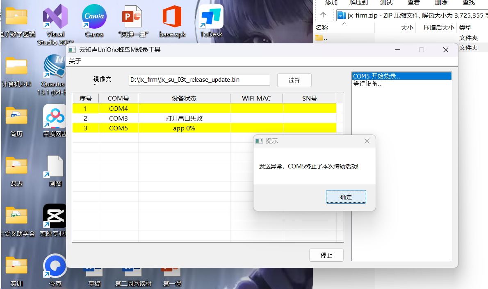

2. **接触不良解决**
    - 使用2.0mm间距的专用连接线
    - 或直接焊接排针避免接触问题
    - 确保每个引脚都有良好接触

**故障排查步骤：**

1. **检查连接**
    - 确认所有引脚正确连接
    - 检查是否有虚接或短路
    - 轻轻晃动连线看是否稳定

2. **更换设备测试**
    - 使用其他JX模块测试
    - 排除单个模块故障
    - 确认烧录器工作正常

3. **重新连接**
    - 拔插所有连接线
    - 清洁排针和连接器
    - 确认完全插入到位

**注意事项：**

- 2.0mm和2.54mm接口不兼容
- 杜邦线连接容易出现接触不良
- 建议焊接以确保稳定连接
- 接触不良是烧录失败的常见原因

---

### JX-12F模块开关二次确认功能无效怎么办？

**问题描述：**

在JX-12F模块中配置了开关的二次确认功能，但该功能未生效，开关操作没有触发二次确认提示。

**解决方案：**

- **功能配置检查**：

    1. 确认在小程序中已正确设置开关的二次确认
    2. 检查"开"和"关"的确认选项均设置为"有二次确认"
    3. 验证提示文本已正确配置（如"确认开启"、"确认关闭"）

- **排查步骤**：

    1. 检查网络连接是否稳定
    2. 确认蓝牙连接正常
    3. 重新生成固件并烧录
    4. 测试其他功能是否正常工作

**注意事项：**

- 二次确认功能可能受网络环境影响
- 建议在配置完成后重新烧录固件
- 如问题持续，可能是程序逻辑问题，需要检查工程配置

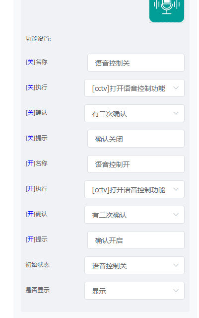

---

### JX-12F烧录固件后无法搜索到设备怎么办？

**问题描述：**

JX-12F模块烧录固件后设备无法被搜索到，或连接后不显示操作界面。

**解决方案：**

**1. 烧录完成后需要复位**

烧录固件完成后，模块处于烧录模式，需要：

- 按一下复位键退出烧录模式
- 确保白色指示灯亮起（表示正常工作）
- 红色指示灯亮表示烧录模式

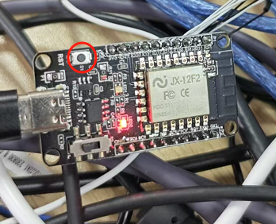

**2. 进入设备打开模式**

烧录新固件后需要进入设备打开模式：

- 将开关拨到左边（设备打开模式）
- 等待设备初始化完成
- 确认LED指示灯正常

**3. 固件烧录注意事项**

烧录时注意文件选择顺序：

- boot2文件：对应引导程序
- firmware文件：对应主程序
- 不要选反两个文件

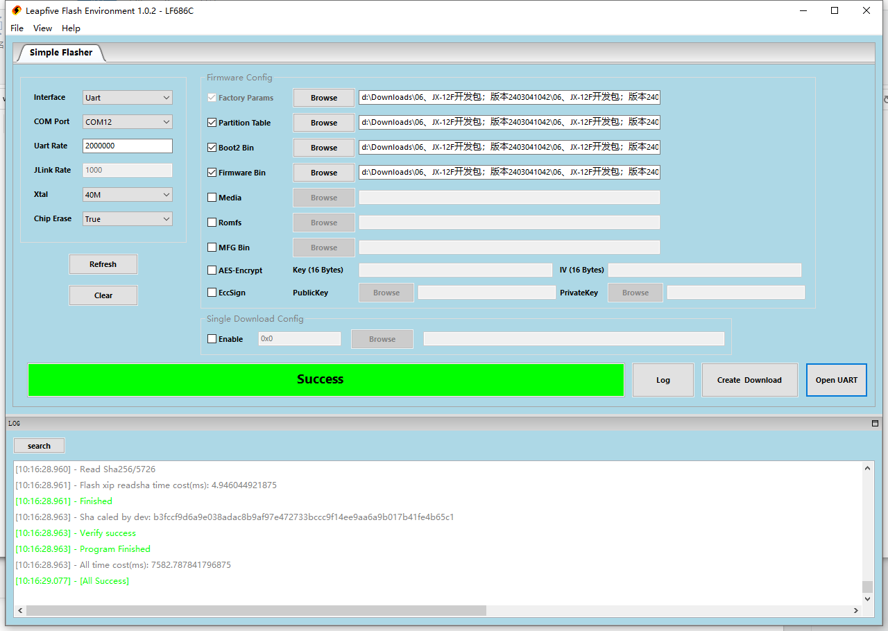

**4. 设备连接问题排查**

如果连接后不显示操作界面：

- 检查网络连接是否稳定
- 刷新小程序或应用
- 确认设备已进入正常工作模式


**5. 正确的工作流程**

1. **准备阶段**
    - 连接好烧录工具
    - 准备好固件文件

2. **烧录阶段**
    - 按照正确顺序选择文件
    - 等待烧录完成（显示All Success）

3. **复位阶段**
    - 按下复位键
    - 等待设备重启
    - 确认指示灯状态

4. **配网阶段**
    - 进入设备打开模式
    - 搜索并连接设备
    - 完成配置

**注意事项：**

- 烧录后必须按复位键才能正常工作
- 白色灯亮表示正常，红灯亮表示烧录模式
- boot2和firmware文件不要选反
- 设备打开模式是配网的必要条件

---

### JX-12F下载时IO8引脚配置要求

### JX-12F下载时IO8引脚配置要求

**问题描述：**

JX-12F设备在下载固件时无法正常工作，即使确认IO8引脚已拉高，下载仍然失败。

**解决方案：**

**IO8引脚配置要求：**

1. **下载前的准备工作**

    - 确保IO8引脚已经拉高到高电平
    - 使用万用表测量IO8引脚电压，确认已为高电平状态
    - 检查PCB板上IO8引脚的焊接质量，确保无虚焊或断路

2. **下载操作流程**

    - **第一步**：将IO8引脚拉高（3.3V或5V）
    - **第二步**：启动烧录软件开始下载
    - **第三步**：下载完成后将IO8引脚拉低

3. **常见问题排查**

    - **确认拉高有效**：

        - 用万用表测量IO8引脚对地电压
        - 确认电压值达到正常高电平（>2.5V）
        - 检查上拉电阻是否正常工作

    - **检查PCB走线**：

        - 如果已做外壳，可能需要拆开检查
        - 确认PCB内部IO8走线无断路
        - 检查过孔和连接点是否导通

    - **硬件连接验证**：

        - 重新焊接IO8引脚连接点
        - 使用飞线直接连接IO8到高电平测试
        - 排除连接器接触不良问题

4. **替代解决方案**

    - 如果确认硬件连接正常但仍无法下载：

        - 更换其他烧录工具测试
        - 尝试不同的USB端口或电脑
        - 使用外部电源单独为IO8提供高电平

**技术说明：**

- IO8是JX-12F的下载使能引脚
- 必须在下载开始前保持高电平状态
- 下载完成后应将IO8拉低以恢复正常工作模式
- IO8配置异常会导致下载工具无法识别设备

**注意事项：**

- 下载过程中保持IO8稳定在高电平
- 避免在下载过程中断开或改变IO8状态
- 如果多次尝试仍失败，可能存在硬件故障
- 建议在设计时预留IO8测试点便于调试


---

### JX-12F下载时IO8引脚配置要求

**问题描述：**

JX-12F设备在下载固件时无法正常工作，即使确认IO8引脚已拉高，下载仍然失败。

**解决方案：**

**IO8引脚配置要求：**

1. **下载前的准备工作**

    - 确保IO8引脚已经拉高到高电平
    - 使用万用表测量IO8引脚电压，确认已为高电平状态
    - 检查PCB板上IO8引脚的焊接质量，确保无虚焊或断路

2. **下载操作流程**

    - **第一步**：将IO8引脚拉高（3.3V或5V）
    - **第二步**：启动烧录软件开始下载
    - **第三步**：下载完成后将IO8引脚拉低

3. **常见问题排查**

    - **确认拉高有效**：

        - 用万用表测量IO8引脚对地电压
        - 确认电压值达到正常高电平（>2.5V）
        - 检查上拉电阻是否正常工作

    - **检查PCB走线**：

        - 如果已做外壳，可能需要拆开检查
        - 确认PCB内部IO8走线无断路
        - 检查过孔和连接点是否导通

    - **硬件连接验证**：

        - 重新焊接IO8引脚连接点
        - 使用飞线直接连接IO8到高电平测试
        - 排除连接器接触不良问题

4. **替代解决方案**

    - 如果确认硬件连接正常但仍无法下载：

        - 更换其他烧录工具测试
        - 尝试不同的USB端口或电脑
        - 使用外部电源单独为IO8提供高电平

**技术说明：**

- IO8是JX-12F的下载使能引脚
- 必须在下载开始前保持高电平状态
- 下载完成后应将IO8拉低以恢复正常工作模式
- IO8配置异常会导致下载工具无法识别设备

**注意事项：**

- 下载过程中保持IO8稳定在高电平
- 避免在下载过程中断开或改变IO8状态
- 如果多次尝试仍失败，可能存在硬件故障
- 建议在设计时预留IO8测试点便于调试


---

### JX-12F模块烧录失败（IMG LOAD SHAKEHAND FAIL）怎么办？

**问题描述：**

JX-12F模块在使用Leapfive Flash Environment工具烧录固件时，出现'IMG LOAD SHAKEHAND FAIL'和'LOAD HELP BIN FAIL'等错误。

**解决方案：**

**1. 检查烧录器连接**

- **串口识别**：确认烧录器已被串口识别
- **驱动安装**：确保已安装正确的USB转串口驱动
- **端口选择**：在工具中选择正确的COM端口

**2. 进入烧录模式**

- **IO8引脚控制**：

    - IO8拉高：烧录模式
    - IO8拉低：运行模式
- **操作步骤**：

    1. 将IO8引脚拉高
    2. 给模块上电或按复位键
    3. 等待烧录工具检测到模块


**3. 烧录串口配置**

- **默认波特率**：2000000（2Mbps）
- **独立串口**：烧录串口与通信串口是分开的
- **日志输出**：烧录串口可以打印log

**4. 烧录流程验证**

1. **Open COM3 Listen Success**：表示串口连接成功
2. **eflash loader bin is eflash_loader_40m.bin**：加载烧录器
3. **Update flash cfg finished**：更新Flash配置完成

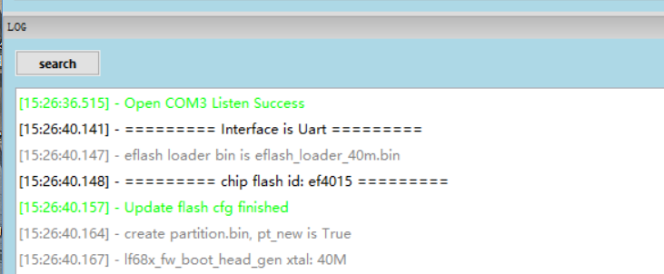

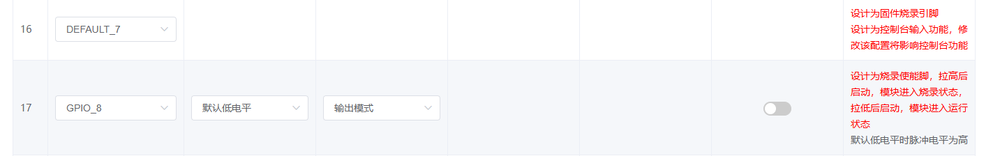

**5. 成功烧录标志**

- **All Success**：烧录完成标志
- **绿色Success按钮**：表示所有文件烧录成功
- **无错误信息**：整个过程无红色错误提示

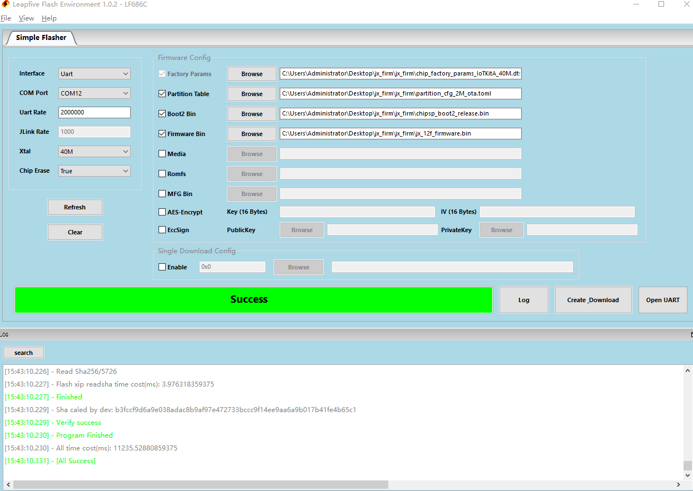

**注意事项：**

- IO8必须在拉高状态下才能进入烧录模式
- 烧录波特率固定为2000000，不能修改
- 确保使用正确的烧录工具版本
- 如持续失败，尝试更换USB端口或电脑

---

### JX-12F模块烧录失败（IMG LOAD SHAKEHAND FAIL）怎么办？

**问题描述：**

JX-12F模块在烧录固件时出现"IMG LOAD SHAKEHAND FAIL"和"LOAD HELP BIN FAIL"错误，导致烧录无法进行。

**解决方案：**

**问题分析：**

1. **错误含义**：

    - IMG LOAD SHAKEHAND FAIL：握手阶段失败，无法建立通信连接
    - LOAD HELP BIN FAIL：加载辅助二进制文件失败
    - 两种错误都表示烧录工具与模块通信异常

2. **常见原因**：

    - GPIO8未正确拉高到3.3V
    - GPIO7/GPIO16连接错误
    - 供电不稳定或不足
    - 烧录工具版本不兼容
    - 进入烧录模式时序错误

**解决步骤：**

1. **检查硬件连接**：

    - **GPIO8检查**：

        - 必须拉高到模块自身的3.3V
        - 使用万用表测量电压确认
        - 不要使用外部电源的3.3V

    - **串口连接检查**：

        - GPIO7(TX) → 烧录工具RX
        - GPIO16(RX) → 烧录工具TX
        - GND → 烧录工具GND
        - 确保交叉连接正确

    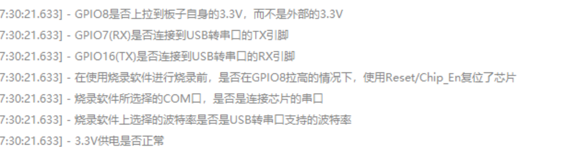

2. **进入烧录模式**：

    - 保持GPIO8拉高状态
    - 按下复位/Chip_En按钮
    - 立即开始烧录操作
    - 不要释放GPIO8直到烧录开始

3. **使用OTA升级方案**：

    - 如果多次烧录失败，建议使用OTA升级
    - 模块出厂已带基础固件
    - 通过网络直接更新固件
    - 避免复杂的硬件烧录问题

**OTA升级方法**：

1. **连接WiFi网络**：

    - 将模块连接到可用的WiFi网络
    - 确保网络信号良好

2. **进入升级模式**：

    - 使用AT指令进入升级模式
    - 或通过智能公元平台触发OTA更新
    - 等待模块进入升级状态

3. **执行升级**：

    - 通过串口发送固件URL
    - 或使用平台提供的OTA功能
    - 等待升级完成并自动重启

**常见问题处理：**

1. **握手失败处理**：

    - 检查并重新连接所有线缆
    - 降低烧录波特率（如从921600降到115200）
    - 更换质量更好的USB转串口模块
    - 在另一台电脑上尝试

2. **辅助文件加载失败**：

    - 检查固件文件完整性
    - 确认使用正确的固件文件类型
    - 重新下载固件避免文件损坏

3. **通信不稳定**：

    - 使用短而粗的连接线
    - 避免使用USB延长线
    - 确保供电稳定，避免使用笔记本电池

**注意事项：**

- GPIO8必须保持在3.3V才能进入烧录模式
- 烧录前确保所有连接正确无误
- 如多次尝试仍失败，建议使用OTA升级方案
- 保留详细的错误信息便于技术支持分析

**模块持续重启无法烧录的特别处理：**

当模块因固件问题持续重启时：

1. **进入烧录模式**：

    - IO8拉高后立即复位模块
    - 烧录模式下模块应停止重启
    - 保持IO8高电平直到烧录开始

2. **批量故障处理**：

    - 如同批次多个模块出现相同问题
    - 可能是固件配置或生产批次问题
    - 建议更换批次或联系技术支持

3. **替代方案**：

    - 使用OTA升级（如模块能短暂启动）
    - 更换已知良好的模块进行测试
    - 寄回故障模块供厂家分析

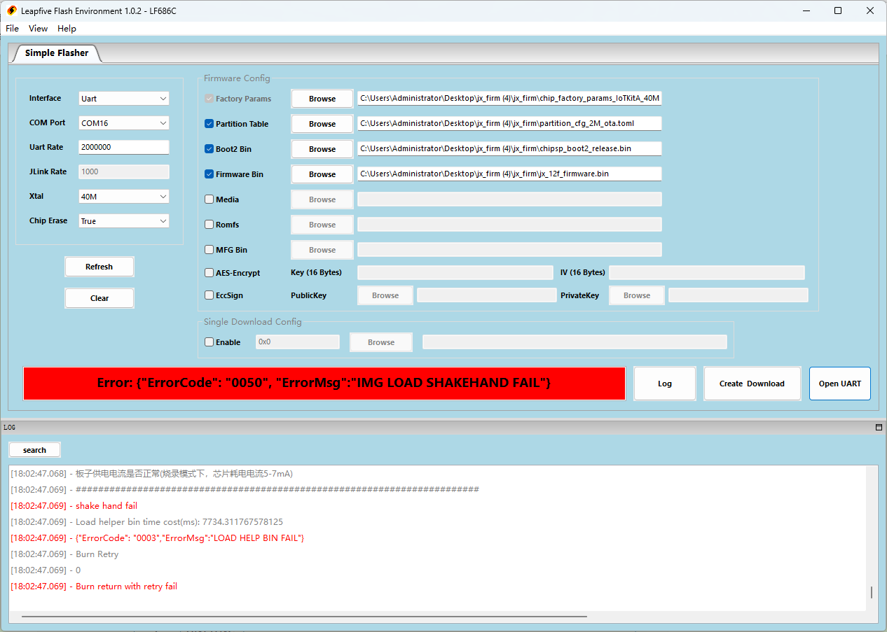


---

### JX-12F开发板烧录出现"LOAD HELP BIN FAIL"错误怎么办？

**问题描述：**

JX-12F开发板在烧录固件时失败，错误信息显示"LOAD HELP BIN FAIL"，无法完成烧录过程。

**解决方案：**

**错误分析：**

1. **错误含义**：

    - 错误码0003表示加载辅助程序失败
    - 通常在烧录初期阶段出现
    - 可能是硬件连接或供电问题

2. **常见原因**：

    - USB连接不良或接触松动
    - 供电不足或不稳定
    - 烧录工具配置错误

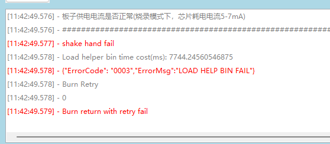

*烧录日志显示的"LOAD HELP BIN FAIL"错误信息*

**解决步骤：**

1. **检查USB连接**：

    - 重新插拔USB连接线
    - 尝试更换质量更好的USB线
    - 避免使用USB延长线
    - 更换电脑的USB端口

2. **验证供电稳定**：

    - 确保开发板供电正常
    - 检查电源指示灯状态
    - 使用稳定的电源适配器
    - 避免从电脑USB取电

3. **重新进入下载模式**：

    - 完全断开电源
    - 等待5-10秒电容放电
    - 重新上电并立即开始烧录

4. **更换烧录工具**：

    - 尝试使用不同版本的烧录软件
    - 或使用官方推荐的其他烧录工具
    - 在另一台电脑上测试

**技术要点：**

1. **下载时序**：

    - 必须在正确的时机进入下载模式
    - 时序错过会导致加载失败
    - 建议使用软件复位功能

2. **通信质量**：

    - USB通信质量直接影响烧录
    - 避免在烧录过程中移动设备
    - 保持连接稳定无干扰

3. **固件文件**：

    - 确认固件文件完整性
    - 验证MD5校验值
    - 避免使用损坏的固件

**预防措施：**

1. **建立标准流程**：

    - 制定标准的烧录操作步骤
    - 使用专用烧录工装
    - 保持工作环境整洁有序

2. **连接优化**：

    - 使用带屏蔽的USB线
    - 确保连接器接触良好
    - 避免电磁干扰环境

3. **备份方案**：

    - 准备备用烧录工具
    - 保留多个版本的烧录软件
    - 建立问题快速响应机制

**注意事项：**

- "LOAD HELP BIN FAIL"是常见的烧录错误
- 多数情况下通过重新连接或换USB线解决
- 如多次尝试仍失败，可能存在硬件问题
- 建议联系技术支持获取进一步帮助


---

### JX-12F模块烧录时bin文件未识别怎么办？

**问题描述：**

使用Leapfive Flash Environment工具进行固件烧录时，遇到bin文件未识别的报错。

**解决方案：**

**1. 文件路径检查**

- **避免中文路径**：确保固件文件路径中不含中文字符
- **使用英文路径**：将固件文件复制到简单的英文路径下
- **检查文件完整性**：确认下载的固件文件完整无损

**2. 正确的文件选择**

根据烧录工具界面，按顺序选择固件包中的对应文件：

- **Factory Params**：工厂参数文件
- **Partition Table**：分区表文件
- **Boot2 Bin**：引导程序文件
- **Firmware Bin**：主固件文件

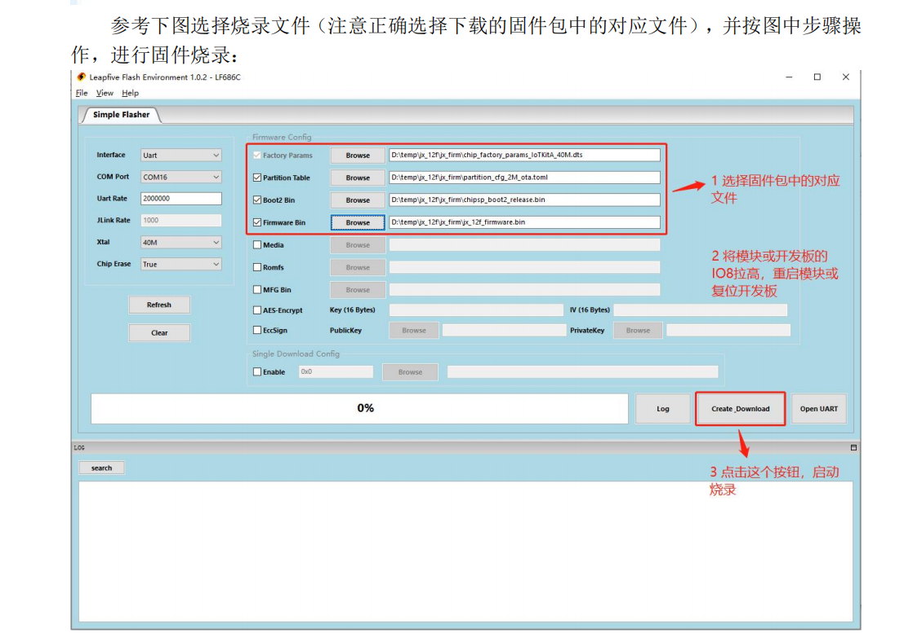

**3. 烧录前准备**

- **IO8拉高**：将模块IO8引脚拉高进入烧录模式
- **重启模块**：拉高IO8后重启模块或按复位键
- **点击Create_Download**：启动烧录过程

**注意事项：**

- 烧录失败时多尝试几次通常可以解决
- 确保选择了正确的固件文件类型
- 中文路径是常见的烧录失败原因
- 烧录过程中不要断开连接

---

### 烧录固件时波特率可以设置为9600吗？

**问题描述：**

单片机的波特率是9600，询问在烧录固件时是否可以将波特率设置成9600。

**解决方案：**

**烧录串口与通信串口分离**

- **烧录串口**：专用的高波特率接口，默认2000000
- **通信串口**：用于与单片机通信，可设置9600
- **两者独立**：烧录波特率不影响通信波特率

**波特率配置说明：**

1. **烧录波特率**：

    - 固定2000000（2Mbps）
    - 用于固件下载
    - 不能修改为其他值

2. **通信串口波特率**：

    - 可根据需要设置（如9600）
    - 在平台配置中设置
    - 用于与MCU数据交换

**JX-12F多串口支持：**

- JX-12F不止一组串口
- 可以配置不同的串口用于不同功能
- 建议使用UART1作为通信串口

**注意事项：**

- 烧录串口波特率是固定的，无法更改
- 通信串口波特率可以根据外设需求配置
- 两个串口功能独立，互不影响
- 配置通信串口时在平台选择对应接口

---

### JX-12F WiFi连接不稳定怎么办？

**问题描述：**

JX-12F2设备在连接WiFi后频繁掉线，导致无法稳定连接，即使在信号良好的环境下，设备也无法保持在线状态，需要重新上电才能恢复连接。

**解决方案：**

**1. 路由器网络配置优化**

- **分离2.4G和5G网络**：

    - 在路由器设置中将2.4G和5G WiFi设置为独立的SSID
    - JX-12F仅支持2.4G网络，确保连接到2.4G频段
    - 避免设备在2.4G和5G之间频繁切换导致连接不稳定

- **路由器设置建议**：

    - 禁用双频合一功能
    - 为2.4G网络设置独特的名称（如MyWiFi-2.4G）
    - 确保2.4G信道不受干扰

**2. 设备连接优化**

- **设备位置调整**：

    - 将设备放置在距离路由器2-3米范围内
    - 避免隔墙过多，减少信号衰减
    - 远离其他2.4GHz干扰源（微波炉、蓝牙设备等）

- **供电稳定性检查**：

    - 确保设备供电稳定，避免电压波动
    - 使用质量可靠的电源适配器
    - 检查电源连接是否牢固

**3. 网络参数配置**

- **连接超时设置**：

    - 适当调整WiFi连接超时参数
    - 配置自动重连机制
    - 设置心跳保活间隔

- **DHCP设置**：

    - 为设备分配固定IP地址
    - 避免IP地址冲突
    - 延长DHCP租约时间

**注意事项：**

- JX-12F仅支持2.4G WiFi网络，无法连接5G网络
- 如果设备持续掉线，检查是否距离路由器过远或有信号干扰
- 重新上电只能临时恢复，需要从路由器配置和设备位置根本解决问题
- 建议使用专门的网络诊断工具分析信号质量

---

### JX-12F WiFi掉线后无法自动重连怎么办？

**问题描述：**

设备在连接WiFi后，会不定时地从手机小程序中掉线，且掉线后无法自动重连，必须通过重新上电才能恢复连接。设备指示灯显示仍处于连接状态，但小程序已无法访问。

**解决方案：**

**1. WiFi重连机制说明**

- JX-12F模块内置WiFi自动重连机制
- 重连机制是持续搜索内部存储的WiFi账号密码
- 直到重新连接成功为止，中途不需要重启
- 除非是网络本身没有信号（不是断开），否则会一直尝试重连

**2. 问题现象分析**

- **掉线特点**：

    - 连接1-2小时后随机掉线
    - 距离路由器2-3米时仍会掉线
    - 距离11-12米隔一堵墙时掉线后无法重连
    - 重新上电后5秒内可恢复连接

- **硬件状态**：

    - 配网成功引脚持续输出信号
    - 指示灯显示仍为连接状态
    - 模块硬件运行正常

**3. 自动重连实现方案**

- **检测机制设计**：

    - 监测网络连接状态
    - 检测心跳包发送是否成功
    - 判断服务器通信是否正常

- **重连逻辑**：

    - 检测到掉线后自动执行重连程序
    - 模拟开机初始化流程
    - 重新建立WiFi连接和服务器连接

**4. 固件优化建议**

- **网络稳定性**：

    - 增加连接超时检测机制
    - 实现指数退避重连算法
    - 设置最大重试次数限制

- **状态同步**：

    - 确保硬件状态与网络状态一致
    - 修复指示灯状态显示问题
    - 优化网络状态检测逻辑

**5. 临时解决方案**

- **手动重启**：

    - 掉线后手动重新上电
    - 等待5秒让模块初始化
    - 重新搜索并连接设备

- **定期维护**：

    - 设置定时重启机制（如每天一次）
    - 避免长时间连续运行
    - 保持连接稳定性

**注意事项：**

- 这是固件层面的问题，需要通过固件升级解决
- 重新上电只能临时恢复，无法根本解决自动重连问题
- 建议联系技术支持获取带有自动重连功能的新固件
- 在问题解决前，可考虑增加外部看门狗电路实现自动重启

---

### JX-12F使用优化固件后出现连接问题怎么办？

**问题描述：**

使用平台生成的V4.1版本固件后，设备连接WiFi后约1小时会断线，断线10-20分钟。技术支持曾提供优化WiFi6部分的定制固件，但OTA升级后设备无法使用，提示"产品不存在"。

**解决方案：**

**1. 固件版本管理**

- **标准固件使用**：

    - 优先使用平台生成的标准固件
    - 避免使用未经充分测试的定制版本
    - 保留稳定版本的固件备份

- **版本确认**：

    - 确认当前使用的是官方标准固件
    - 检查固件生成时间和版本号
    - 验证MD5值确保固件完整性

**2. OTA升级注意事项**

- **升级前准备**：

    - 确认设备支持OTA功能
    - 备份当前固件配置
    - 准备串口烧录工具作为备用

- **升级失败处理**：

    - OTA失败后立即停止尝试
    - 使用串口方式重新烧录
    - 不要重复尝试OTA升级

**3. 固件回滚方案**

- **串口烧录恢复**：

    - 使用CH340 USB转串口模块
    - 下载官方最新稳定固件
    - 按照标准流程重新烧录

- **配置恢复**：

    - 重新生成产品配置
    - 确保所有参数设置正确
    - 测试各项功能正常运行

**4. 长期解决方案**

- **问题跟踪**：

    - 记录每次断线的时间和持续时长
    - 分析断线规律和触发条件
    - 向技术支持提供详细日志

- **固件更新**：

    - 等待官方发布修复版本
    - 在测试环境先行验证
    - 确认问题解决后再批量更新

**注意事项：**

- 定制固件可能存在兼容性问题，谨慎使用
- OTA升级失败可能导致设备无法使用，需有串口烧录准备
- 保留完整的固件版本历史记录，便于问题追踪
- 建议使用经过验证的稳定版本固件

---

### CI-03T1设备WiFi连接不稳定怎么办？

**问题描述：**

CI-03T1芯片设备在特定环境下（如距离路由器较远或有墙体阻挡）频繁断连，且断连后无法自动重连，需要重新上电才能恢复连接。

**解决方案：**

**1. 环境因素优化**

- **信号强度改善**：

    - 将设备靠近路由器，建议距离不超过5米
    - 减少墙体阻挡，避免穿越承重墙
    - 调整设备天线朝向，优化接收角度

- **干扰源排除**：

    - 远离微波炉、冰箱等大功率电器
    - 避免与其他2.4GHz设备近距离放置
    - 检查附近是否有WiFi信道干扰

**2. 路由器配置优化**

- **2.4G网络专门设置**：

    - 启用2.4G频段，CI-03T1不支持5G
    - 设置固定信道（推荐1、6、11）
    - 调整发射功率到最大

- **连接参数调整**：

    - 增加WiFi客户端连接数限制
    - 延长DHCP租约时间
    - 关闭AP隔离功能

**3. 设备配置改进**

- **供电稳定性**：

    - 使用3.3V稳定电源供电
    - 增加滤波电容（100μF+0.1μF）
    - 避免使用USB长线缆供电

- **天线优化**：

    - 确保外接天线连接良好
    - 使用高增益天线改善信号
    - 定期检查天线接口是否有氧化

**4. 固件和协议优化**

- **心跳保活机制**：

    - 设置合理的心跳间隔（推荐30-60秒）
    - 实现断线自动检测
    - 配置快速重连机制

- **重连策略**：

    - 采用指数退避算法
    - 设置最大重试次数
    - 失败后延迟重启

**注意事项：**

- CI-03T1的WiFi性能受环境影响较大，需合理规划部署位置
- 金属外壳会严重影响信号，建议使用塑料外壳或外置天线
- 如果环境复杂无法改善，考虑增加WiFi信号放大器
- 定期检查设备固件版本，及时更新到最新稳定版本

---

### CI-03T1烧录时出现"READ FLASH JEDEC ID FAIL"错误怎么办？

**问题描述：**

使用平台生成的固件烧录到CI-03T1芯片时，出现"READ FLASH JEDEC ID FAIL"错误，错误代码0030，导致烧录失败。

**解决方案：**

**1. 硬件连接检查**

- **接口确认**：

    - 使用CI-03T1的J1接口
    - 检查IO8、RX、TX等关键引脚连接
    - 确保引脚无虚焊或接触不良

- **连接方式验证**：

    - IO8：烧录使能引脚，需拉高进入烧录模式
    - RX：连接到烧录工具的TX
    - TX：连接到烧录工具的RX
    - GND：确保良好接地

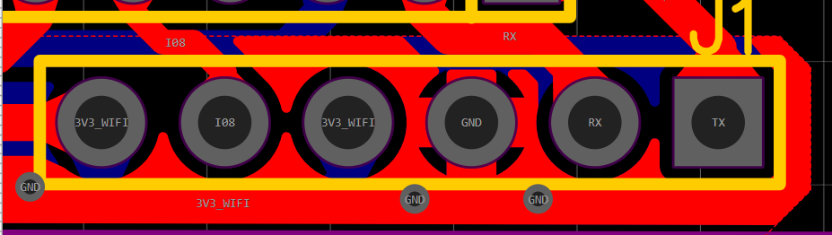

**2. 烧录模式设置**

- **正确进入烧录模式**：

    - IO8引脚拉高到3.3V
    - 上电或按复位键
    - 等待烧录工具识别设备

- **常见错误排查**：

    - IO8未正确拉高导致无法进入烧录模式
    - 串口线序错误（TX/RX反接）
    - 供电不稳定或电压不足

**3. Flash芯片识别问题**

- **可能原因**：

    - Flash芯片本身故障
    - 芯片型号不兼容
    - 硬件设计存在缺陷

- **解决方法**：

    - 更换CI-03T1模块重新测试
    - 检查Flash芯片丝印确认型号
    - 使用已知好的模块交叉验证

**4. 替代烧录方案**

- **OTA升级**：

    - 如果模块已预装基础固件，可尝试OTA升级
    - 通过网络直接更新固件
    - 避免复杂的硬件烧录问题

- **专业工具**：

    - 使用专业编程器直接烧录Flash芯片
    - 需要拆焊Flash芯片操作
    - 建议由专业人员操作

**注意事项：**

- "READ FLASH JEDEC ID FAIL"表示无法读取Flash芯片ID
- 该错误通常是硬件问题，软件调整无法解决
- 多个模块出现相同问题可能是批次问题
- 建议联系供应商更换硬件


---

### JX-A7T烧录后频繁掉线怎么办？

**问题描述：**

JX-A7T模块烧录后频繁掉线且无法重新连接，在APP配网时提示"产品不存在"。设备距离路由器2米内仍出现连接问题。

**解决方案：**

**1. 烧录工具问题排查**

- **波特率设置**：

    - 使用普通CH340串口工具，不要使用其他复杂工具
    - 烧录波特率默认为2Mbps（2000000）
    - 下载器最高波特率128000可能不够

- **烧录步骤确认**：

    - IO8拉高到3.3V
    - RST与GND拉低复位
    - 点击开始下载
    - 等待握手成功提示

**2. 供电和硬件检查**

- **电压要求**：

    - WiFi模块必须使用3.3V供电
    - 串口也是3.3V电平
    - 检查电源稳定性

- **连接验证**：

    - 确认TX/RX交叉连接
    - 检查所有引脚接触良好
    - 避免使用过长的连接线

**3. "产品不存在"错误处理**

- **可能原因**：

    - 固件配置信息不正确
    - 设备未正确注册到平台
    - 网络连接问题导致无法验证

- **解决步骤**：

    - 检查设备是否处于配网模式
    - 确认WiFi密码输入正确
    - 验证路由器是否为2.4G频段
    - 检查设备是否已授权

**4. 连接优化建议**

- **环境调整**：

    - 将设备靠近路由器，减少信号衰减
    - 避免墙体等障碍物阻挡
    - 远离干扰源

- **网络设置**：

    - 分离2.4G和5G网络
    - 使用固定信道（1、6、11）
    - 关闭AP隔离功能

**注意事项：**

- JX-A7T仅支持2.4G WiFi，无法连接5G网络
- 烧录必须使用标准CH340工具
- 频繁掉线可能是固件问题，建议使用稳定版本
- "产品不存在"提示通常与设备注册或网络配置有关

---

### 固件下载时提示"产品不存在"怎么办？

**问题描述：**

从官网下载固件后，尝试通过工具下载到设备时，系统提示"产品不存在"，无法完成固件更新。

**解决方案：**

**1. 固件生成状态确认**

- **状态检查**：

    - 确认固件管理平台中的SDK状态为"已生成"
    - 验证固件状态为"生成成功"
    - 使用状态为"待生成"的固件会导致下载失败

- **版本信息**：

    - 记录正确的版本号（如20241105001）
    - 确认版本描述（成品下载版V4.1.1）
    - 避免使用测试版本或开发版本

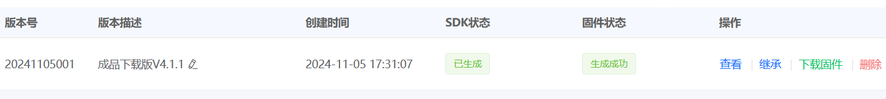

**2. 产品授权验证**

- **设备检查**：

    - 确认设备已在平台注册
    - 验证设备授权状态
    - 检查设备与账号的绑定关系

- **权限问题**：

    - 确认使用正确的账号登录
    - 检查是否有下载该固件的权限
    - 联系管理员确认账号权限设置

**3. 网络和工具配置**

- **网络环境**：

    - 确保网络连接稳定
    - 避免使用代理或VPN
    - 检查防火墙设置

- **工具设置**：

    - 使用最新版本的下载工具
    - 清除工具缓存
    - 重新登录平台账号

**4. 替代下载方式**

- **重新生成固件**：

    - 在平台重新生成固件
    - 等待生成完成再下载
    - 使用继承功能复用配置

- **直接下载链接**：

    - 复制固件下载链接
    - 使用浏览器直接下载
    - 保存到本地后使用工具加载

**注意事项：**

- "产品不存在"通常是权限或状态问题，不是技术故障
- 固件必须完全生成成功后才能下载
- 保留下载链接备份，避免重复生成
- 如问题持续，联系技术支持确认账号权限

---

### JX-A7T错误连接到LTE/4G网络怎么办？

**问题描述：**

JX-A7T模块在配网后没有连接到WiFi，而是连接到了LTE/4G网络。设备显示连接到"4G-UFI-6BFE"网络，软件版本为UF805SL_SC_V01_ZX_DE_240316_CT。

**解决方案：**

**1. 网络连接问题分析**

- **现象确认**：

    - 设备未连接预期的2.4G WiFi
    - 错误连接到运营商的LTE/4G网络
    - IP地址为c:f6ff:fe2d:b9d9:240e:804（非局域网地址）

- **可能原因**：

    - 设备支持LTE功能且优先级高于WiFi
    - WiFi模块配置或选择有问题
    - 固件网络连接逻辑错误

**2. 网络模式切换**

- **强制WiFi连接**：

    - 检查设备是否有网络模式切换开关
    - 通过串口AT指令强制使用WiFi
    - 禁用LTE功能（如果支持）

- **配置检查**：

    - 确认固件生成时选择WiFi模式
    - 检查是否禁用了其他网络接口
    - 验证网络优先级设置

**3. 硬件和软件排查**

- **模块型号确认**：

    - 确认是否为JX-A7T而非其他型号
    - 检查模块是否支持双网络功能
    - 验证天线连接是否正确

- **固件重装**：

    - 使用纯WiFi版本固件
    - 确保不包含LTE相关配置
    - 重新烧录并测试

**4. 运营商网络问题**

- **LTE连接处理**：

    - 如确实需要使用LTE，配置正确的APN
    - 联系运营商开通数据业务
    - 设置正确的网络认证信息

**注意事项：**

- JX-A7T应优先使用WiFi网络，避免产生流量费用
- LTE连接可能会影响设备响应速度和稳定性
- 保存网络配置前记录原始设置，便于恢复
- 如无法解决网络模式问题，联系技术支持获取专用固件

---

### JX-12F固件文件如何确认？

**问题描述：**

需要确认两个固件文件（jx_12f_firmware.bin 和 jx_su_03t_release）是否对应于指定的产品型号和功能要求。

**解决方案：**

**1. 固件文件命名规则**

- **JX-12F固件**：

    - 文件名格式：jx_12f_firmware.bin
    - 对应型号：JX-12F2-V1.1
    - 用途：智能地暖机WiFi控制模块

- **SU-03T固件**：

    - 文件名格式：jx_su_03t_release
    - 对应型号：SU-03T V2.1
    - 用途：语音交互模块

**2. 固件功能验证**

- **SU-03T语音配置**：

    - 开机播报：欢迎使用暖立森智能地暖机，祝您使用愉快
    - 唤醒词：你好小森、小森小森
    - 回复语：有什么可以帮到您

- **MD5校验**：

    - jx_12f_firmware.bin：MD5 124f846d3945772e6e1f6e19725986a3
    - jx_su_03t_release：MD5 167d6826f05eba22c21ecd6039e39c0e

**注意事项：**

- 烧录前确认固件文件完整性，可通过MD5值验证
- 不同型号的固件不能混用，必须使用对应型号的正确固件
- 保留固件备份，便于后续恢复使用

---

### JX-12F模块通信时好时坏如何排查？

**问题描述：**

JX-12F模块在程序更新后出现通信不稳定，时而正常时而失效，在更换程序后问题重现，怀疑是硬件或电源问题导致的通信故障。

**解决方案：**

**1. 电源稳定性检查**

- **供电质量验证**：

    - 使用专用面包板供电，确保电源稳定
    - 测量供电电压是否稳定在3.3V
    - 检查电源纹波是否过大
    - 避免使用USB供电，电流可能不足

- **电源建议**：

    - 使用线性稳压电源，避免开关电源干扰
    - 在电源端增加滤波电容（100μF+0.1μF）
    - 确保接地良好，减少地环路

**2. 通信线路检查**

- **串口连接验证**：

    - 检查IO7和IO16串口连接是否牢固
    - 确认波特率设置为2000000
    - 验证TX/RX交叉连接是否正确
    - 检查是否有信号干扰

- **信号质量测试**：

    - 使用示波器查看串口信号波形
    - 确认上升沿和下降沿是否陡峭
    - 检查是否有振铃和过冲
    - 验证电平是否符合TTL标准

**3. 固件问题排查**

- **程序对比分析**：

    - 对比正常版本和异常版本的固件差异
    - 检查时钟配置是否一致
    - 验证UART初始化参数
    - 确认中断优先级设置

- **固件重装**：

    - 下载官方最新固件
    - 完全擦除Flash后重新烧录
    - 使用官方推荐烧录工具
    - 烧录后进行完整复位

**4. 环境干扰因素**

- **EMI干扰排查**：

    - 远离强干扰源（电机、继电器）
    - 检查附近是否有2.4GHz设备干扰
    - 在通信线上加磁环抑制干扰
    - 使用屏蔽线提高抗干扰能力

- **温度影响**：

    - 记录故障发生时的环境温度
    - 测试不同温度下的通信稳定性
    - 检查是否有热漂移影响
    - 考虑增加温度补偿电路

**5. 系统性测试方案**

- **长时间测试**：

    - 进行24小时连续通信测试
    - 记录故障发生的时间和频率
    - 分析故障模式寻找规律
    - 建立故障统计台账

- **对比测试**：

    - 使用已知正常的模块对比测试
    - 交换硬件环境排除外部因素
    - 在不同环境下测试验证
    - 使用多种波特率测试兼容性

**注意事项：**

- 通信问题多为电源或信号完整性问题
- 建议使用专用电源测试排除供电因素
- 保留完整的故障记录便于问题定位
- 如问题持续，考虑更换硬件模块验证

---

### JX-12F更新固件后无法搜索到SSID怎么办？

**问题描述：**

JX-12F模块更新程序后无法搜索到其SSID，导致配网失败。

**解决方案：**

- **检查跳线设置**：

    - 确认跳线帽J3连接在L和H之间（配网模式）
    - 如果在IO8和H位置，是烧录模式，不会广播SSID

- **复位模块**：

    - 按一下复位键重新启动
    - 观察指示灯状态（蓝灯和红灯亮起表示上电）

- **检查模块授权**：

    - 使用串口调试助手连接查看日志
    - 波特率设置为2000000
    - 未授权模块无法正常配置网络

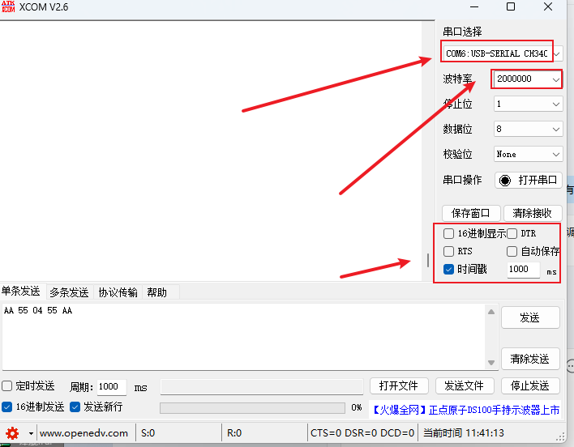

**排查步骤**：

1. 确认跳线在配网模式（L-H）
2. 复位模块等待初始化
3. 使用串口助手查看初始化日志
4. 确认模块是否已获得授权

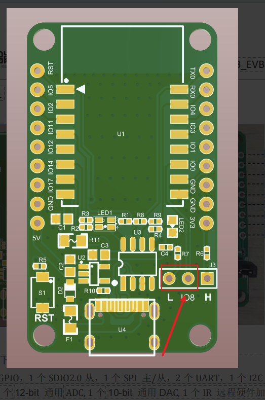

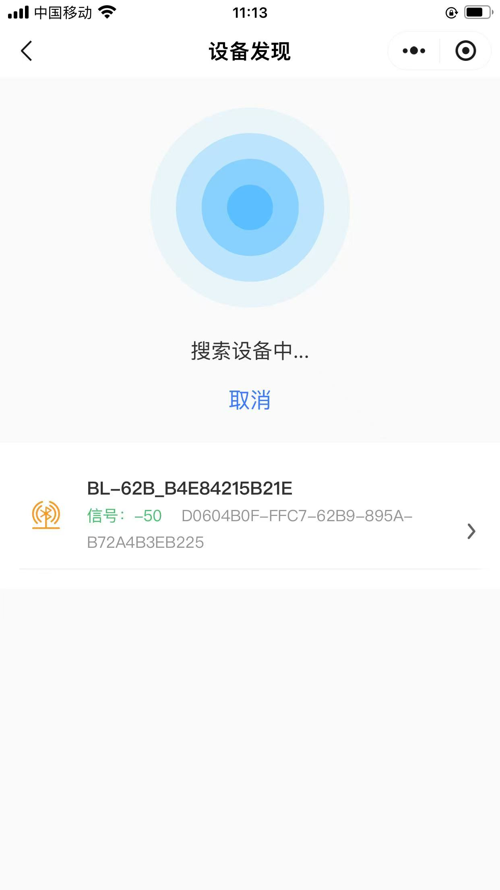

**注意事项：**

- 烧录模式（IO8-H）不会广播SSID
- 配网失败通常是模块未授权导致
- 串口日志会显示授权状态信息

---

### 模块未授权如何处理？

**问题描述：**

模块配网失败，通过串口日志查看发现模块未授权，无法正常配置网络。

**解决方案：**

- **确认授权状态**：

    - 使用串口调试助手连接模块
    - 波特率设置为2000000
    - 打开串口后复位模块查看初始化日志

- **联系技术支持**：

    - 提供模块ID信息
    - 说明购买时间和渠道
    - 等待技术支持处理授权

- **临时解决方案**：

    - 部分功能可能受限
    - 建议先完成授权流程
    - 授权后重新配网使用

**注意事项：**

- 未授权模块无法正常连接WiFi
- 串口日志会明确显示授权状态
- 需要通过正规渠道购买获得授权

---

### 问题描述

JX-12F2芯片烧录时，软件提示"发送异常，COM6终止了本次传输活动"，且烧录前自检显示GPIO8未拉高至3.3V，导致烧录无法进行。


---


---

### 注意事项

- JX-12F2是当前主推版本，与JX-12F在硬件上可能有差异
- "握手失败"通常表示硬件连接或通信协议层面的问题
- 建议使用USB 2.0接口进行烧录，USB 3.0接口可能存在兼容性问题


*烧录软件自检日志，显示GPIO8未拉高至3.3V等多项检查*

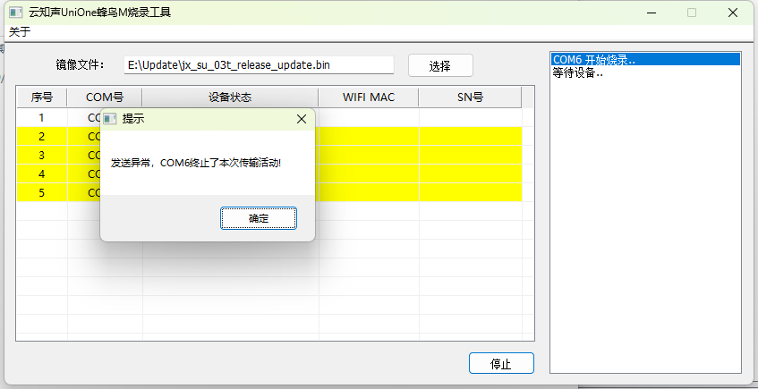

*烧录工具提示"发送异常，COM6终止了本次传输活动！"*


---


---

### 串口烧录失败如何全面排查？

**问题描述：**

使用JX-12F2烧录工具进行串口烧录时失败，工具显示多项自检异常，包括GPIO8未拉高至3.3V、ID读取异常等问题。需要系统性的排查方法和解决方案。

**解决方案：**

#### 1. 硬件连接检查

**基础连接验证：**

- 检查USB转串口模块是否正常工作
- 确认TX、RX、GND线连接正确
- 验证供电电压是否稳定（建议5V供电）
- 检查连接线是否松动或接触不良

**引脚配置确认：**

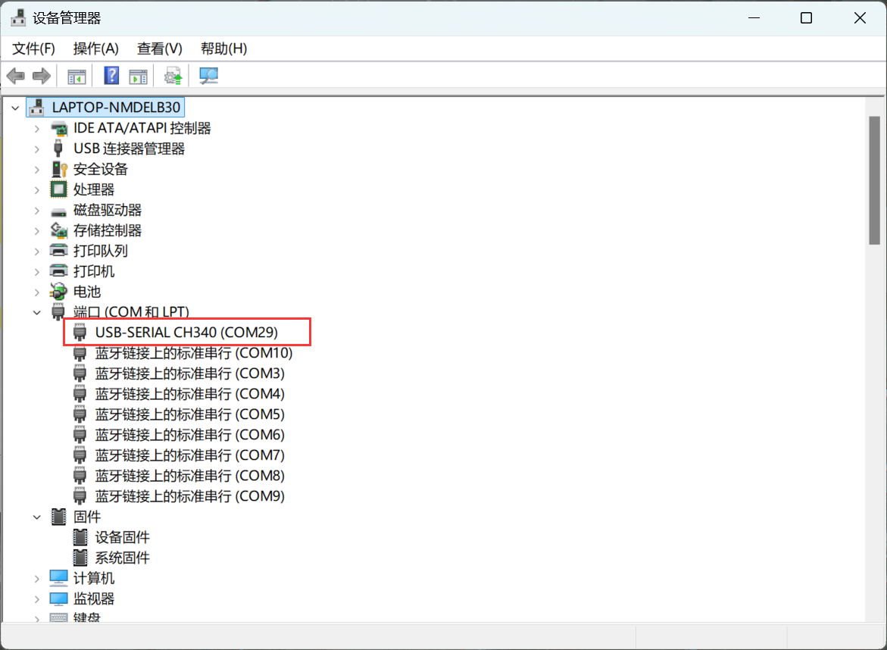

*SU-03T/C2模块的串口引脚定义，务必按照标注正确连接*

#### 2. 驱动和端口问题排查


**COM端口优化：**

- 更换到其他COM端口（如COM3、COM4等）
- 避免使用COM10及以上的高位端口
- 尝试更换USB接口，特别是从USB 3.0换到USB 2.0
- 重新安装USB转串口驱动程序

#### 3. 烧录参数调整


**关键操作：**

- 确保选择了正确的COM端口
- 降低波特率（如从115200降到57600）
- 取消勾选不必要的检查选项（如果软件允许）
- 尝试不同的固件文件（如update版本）

#### 4. 替代烧录方案

**OTA升级方案：**

- 设备出厂时已预装基础固件，支持OTA升级
- 使用智能公元小程序进行无线升级
- 通过官方提供的OTA工具进行固件更新
- 此方案可避开复杂的硬件烧录问题

**专业烧录工具：**

- 使用J-Link、ST-Link等专业调试器
- 通过SWD接口进行直接烧录
- 需要相应的硬件知识和工具支持

#### 5. 常见错误分析

**"握手失败"原因：**

- 通信协议不匹配
- 硬件连接问题
- 设备未进入烧录模式
- 波特率设置错误

**"GPIO8未拉高"处理：**

- 检查3.3V供电是否正常
- 验证GPIO8引脚连接
- 确认设备已正确初始化

#### 6. 环境优化建议

**连接优化：**

- 使用短而优质的连接线
- 避免过长导线导致信号衰减
- 确保良好接地
- 减少电磁干扰

**软件环境：**

- 关闭其他可能占用COM口的程序
- 以管理员身份运行烧录工具
- 暂时禁用杀毒软件的实时监控

**注意事项：**

- JX-12F2与早期JX-12F版本在硬件上可能有差异
- USB 3.0接口容易出现兼容性问题，建议使用USB 2.0
- 烧录失败后不要立即重复尝试，先检查硬件状态
- 保留烧录日志，便于问题定位和技术交流
- 如多次尝试仍失败，建议联系专业人员处理

---

### JX-12FWiFi模块能否设置为服务端？

**问题描述：**

需要了解JX-12FWiFi模块是否支持设置为服务端模式，以便其他设备主动连接该模块。

**解决方案：**

JX-12FWiFi模块不支持设置为服务端模式。

- **工作模式限制**：

    - JX-12FWiFi只能作为客户端工作
    - 不支持建立服务端供其他设备连接
    - 模块设计为主动连接其他设备或路由器

- **正确的使用方式**：

    - 配置模块连接到现有的WiFi网络
    - 作为终端设备连接到服务器或云平台
    - 通过客户端模式与上位机通信

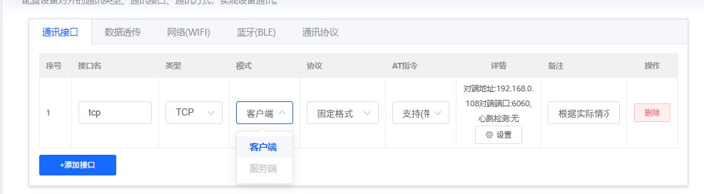

*JX-12FWiFi模块的通讯接口配置界面，显示TCP接口模式为客户端*

**注意事项：**

- 不要尝试将模块配置为服务端，该功能不存在
- 如需要双向通信，考虑使用其他支持服务端的WiFi模块
- 客户端模式下，模块可以主动上报数据到服务器
- 网络配置需确保目标服务器或AP可访问

---

### JX-12F是否支持通过串口输出ASCII字符？

**问题描述：**

询问JX-12F模块是否支持通过串口直接输出ASCII字符（如"abcd"等），以及一次能发送多少字符。

**解决方案：**

**1. 字符输出支持情况**

- **不支持直接ASCII输出**：JX-12F不能直接发送ASCII字符数据
- **支持16进制传输**：需要将字符转换为16进制格式发送
- **接收端转换**：需要在接收端将16进制数据转换回ASCII字符

**2. 字符转换方法**

- **转换示例**：

    - 字符"a" → 16进制"61"
    - 字符"b" → 16进制"62"
    - 字符"c" → 16进制"63"
    - 字符"d" → 16进制"64"

- **发送格式**：

    - 将要发送的字符串逐个转换为16进制
    - 按顺序发送16进制数据
    - 接收端反向转换得到原始字符串

**3. 一次发送字符数量**

- **无固定限制**：理论上可以连续发送多个字符
- **实际限制因素**：

    - 缓冲区大小
    - 接收端处理能力
    - 通信协议要求
- **建议做法**：

    - 分批次发送长字符串
    - 确认接收端正确接收
    - 根据实际需求调整发送长度

**4. 实现步骤**

1. **发送端（JX-12F）**：

    - 配置串口发送功能
    - 将字符转换为16进制数组
    - 通过串口发送16进制数据

2. **接收端处理**：

    - 接收16进制数据
    - 将16进制转换为ASCII字符
    - 显示或处理还原的字符串

**注意事项：**

- 必须进行字符到16进制的转换
- 接收端需要相应的转换逻辑
- 建议先进行短字符串测试
- 确认双方波特率等参数一致

---

### JX-12F烧录后无法被蓝牙搜索到怎么办？

**问题描述：**

JX-12F模块烧录例程后重启，无法被手机蓝牙搜索到，导致蓝牙配网失败。

**解决方案：**

**1. 硬件检查**

- **供电问题**：3.3V供电可能不足，模块启动但不广播
- **信号强度**：虽然显示-45，但可能未真正进入蓝牙模式
- **日志分析**：串口日志显示模块一直在重启

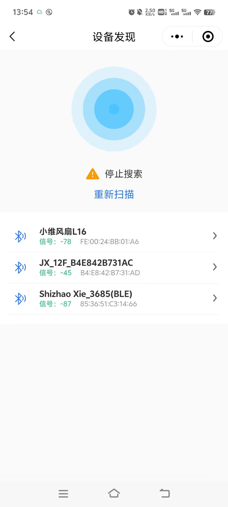

*设备搜索到模块但信号强-45*

**2. 烧录文件路径问题**

- **中文路径**：烧录工具路径包含中文可能导致烧录异常
- **固件不完整**：路径问题可能导致固件未完全写入
- **工具选择**：确保使用JX-12F专用烧录工具

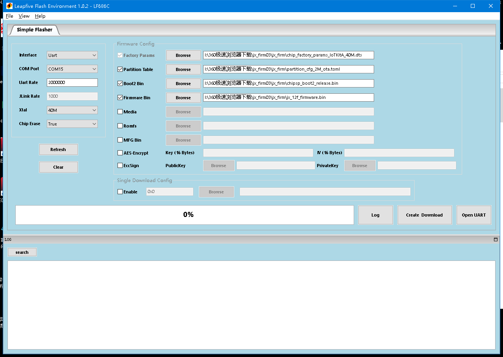

*烧录工具路径包含中文可能影响烧录*

**3. 模块状态判断**

- **重启现象**：日志显示反复重启，说明硬件不稳定
- **供电需求**：确认3.3V供电能提供足够电流
- **模块替换**：尝试使用另一块JX-12F模块交叉验证

**4. 处理步骤**

- 更换稳定供电电源测试
- 将固件文件复制到英文路径
- 使用官方推荐的烧录工具
- 检查模块引脚焊接是否良好

**注意事项：**

- JX-12F最大供电电压为3.6V，不建议使用更高电压
- 中文路径可能导致各种不可预知的问题
- 模组烧录后需要足够时间启动并初始化蓝牙

---

### JX-12F设备界面显示异常怎么办？

**问题描述：**

JX-12F模块连接状态显示为"连接"，但小程序界面无法正常显示设备信息，尝试重新连接和配网后问题依旧存在。

**解决方案：**

**1. 检查固件版本**

- 确认使用的固件版本是否正确
- 对比平台生成的固件与实际烧录的固件是否一致
- 使用已验证正常工作的固件版本进行测试

**2. 重新生成固件**

- 在固件管理平台重新生成固件
- 确保固件生成状态为"生成成功"
- 使用新生成的固件重新烧录

**3. 验证固件配置**

- 确认产品配置中的模组型号为JX-12F
- 检查场景配置为Wi-Fi模式
- 验证协议配置与实际使用需求匹配

**注意事项：**

- 固件问题可能导致界面显示异常，即使网络连接正常
- 重新烧录固件前建议备份当前配置
- 如果问题持续，尝试使用早期稳定版本的固件
- 配网后使用WiFi连接，设备远离路由器断开后需重启才能重新连接

---

### JX-12F固件烧录失败怎么办？

**问题描述：**

使用固件生成和烧录工具时，遇到固件烧录失败的问题，需要确认固件生成和烧录配置是否正确。

**解决方案：**

**1. 确认固件生成状态**

- 检查固件管理平台中固件状态是否为"生成成功"
- 使用状态为"待生成"的固件会导致烧录失败
- 重新生成固件确保状态正确

**2. 验证烧录配置**

- 确认Partition Table文件路径正确
- 检查Boot2 Bin文件路径无误
- 验证Firmware Bin文件路径配置正确

**3. 使用测试固件**

- 使用已验证可正常工作的固件文件
- 对比问题固件与正常固件的差异
- 必要时使用工程师提供的测试固件

**注意事项：**

- 确保所有配置文件路径中没有中文字符
- 烧录前检查固件文件完整性
- 如果持续失败，尝试更换下载工具或电脑USB端口

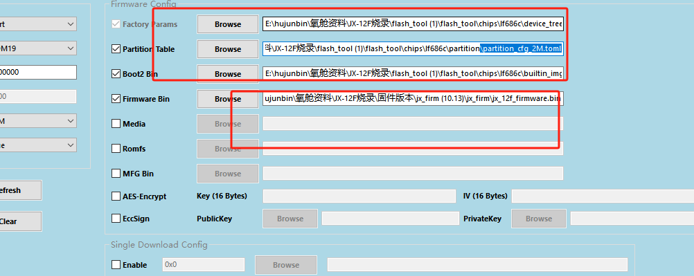

---

### JX-12F无法连接内网IP地址怎么办？

**问题描述：**

JX-12F模块无法通过内网IP地址（如192.168.248.11:10085）建立TCP连接，但外网连接正常。

**解决方案：**

**1. 检查网络配置**

- 确认模块与目标服务器在同一网段
- 检查配网时使用的网络环境
- 验证内网IP地址和端口配置正确

**2. 验证服务端状态**

- 确认内网TCP服务器正常运行
- 使用电脑TCP客户端工具测试连接
- 关闭电脑防火墙避免端口被阻止

**3. 检查路由器设置**

- 确认路由器没有启用AP隔离
- 检查设备是否分配到正确的网段
- 验证DHCP分配的IP地址范围

**4. 连接测试步骤**

- 模块连接WiFi后查看串口日志
- 确认出现"USER_SOCKET_CONNECTED"表示连接成功
- 如果出现"USER_SOCKET_CONN_FAIL"需要检查网络路径

**注意事项：**

- 内网连接失败通常是网络配置问题，不是模块故障
- 确保配网网络与目标服务器在同一局域网
- 使用ping命令测试网络连通性
- 检查路由器是否限制了设备间通信

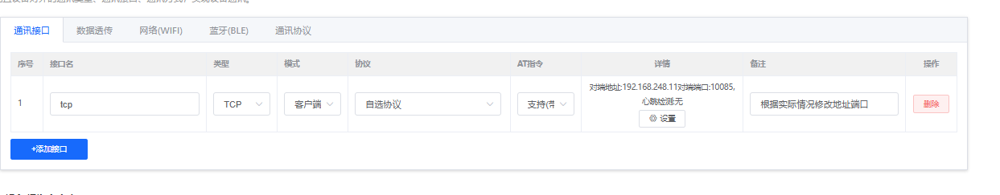
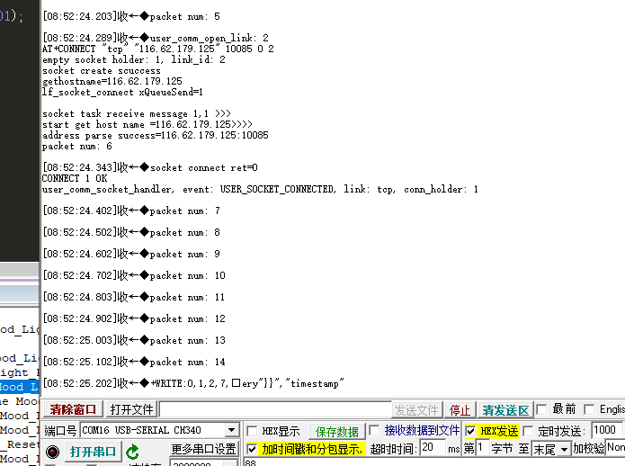

---

### JX-12F生成的DAT格式日志文件无法查看怎么办？

**问题描述：**

使用固件烧录工具生成日志文件后，生成的.DAT格式文件无法用现有软件打开查看。

**解决方案：**

- DAT格式日志文件需要专用工具查看，普通文本编辑器无法直接打开
- 可以使用支持二进制文件查看的工具（如Hex编辑器）查看文件内容
- 建议使用模块配套的日志分析工具进行处理

**注意事项：**

- 确保日志文件已完整生成，检查文件大小是否为0
- 日志文件通常以日期命名（如20250116001、20250116002等）
- 如需分析日志内容，请联系技术支持获取专用日志查看工具


---

### 设备配网后日志中断怎么办？

**问题描述：**

设备完成配网后，日志输出中断，无法查看后续的运行状态和调试信息。

**解决方案：**

- 检查日志输出级别设置，确保配网后仍保持日志输出
- 确认串口连接稳定，配网过程中未断开
- 重新上电重启设备，观察从启动到配网的完整日志

**注意事项：**

- 配网成功后模块可能进入低功耗模式，减少日志输出
- 部分固件版本在配网后会关闭部分调试日志以节省资源
- 如需持续调试，建议在配网前开启详细日志模式

---

### TCP连接多次失败后手动成功是什么原因？

**问题描述：**

设备自动连接TCP服务器时多次失败，显示USER_SOCKET_CONN_FAIL错误，但手动操作后连接成功。

**解决方案：**

**1. 检查连接时序**

- 自动连接可能过于频繁，触发服务器连接限制
- 建议在连接失败后增加重试间隔时间
- 检查单片机控制信号时序是否正确

**2. 网络环境检查**

- 确认服务器IP地址（116.62.179.125）和端口（10085）正确
- 测试网络连通性，确保路由可达
- 检查是否存在网络延迟或丢包问题

**3. 可能的原因**

- 服务器可能对连接频率有限制
- 网络环境不稳定导致偶发性连接失败
- 模块在网络繁忙时自动重连机制可能需要优化

**注意事项：**

- 连接成功后会出现USER_SOCKET_CONNECTED事件
- 确保服务器端配置正确，未被防火墙阻挡
- 如持续出现问题，建议在代码中添加退避重试机制

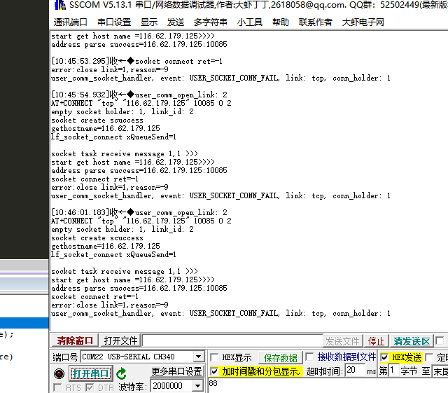
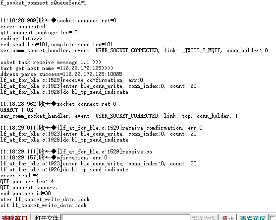

---

### TCP连接成功后立即断开怎么办？

**问题描述：**

TCP连接建立成功后，发送一条数据（如AS[10][23]id=6JPOKKZL&State=Stop|5A）后连接立即断开。

**解决方案：**

**1. 检查服务器端配置**

- 确认服务器是否主动断开连接
- 检查服务器对单个连接的处理逻辑
- 验证服务器是否正确处理接收到的数据格式

**2. 检查模块配置**

- 确认模块的TCP连接超时设置
- 检查是否启用了自动断开功能
- 验证数据发送格式是否符合服务器要求

**3. 可能的原因**

- 服务器可能设计为单次通信后断开
- 数据格式可能不符合服务器解析要求
- 网络中间设备（如路由器）可能干预连接

**注意事项：**

- 这种问题通常是偶发性的，重新测试可能恢复正常
- 建议持续观察，如果问题不再出现可能是临时网络问题
- 如问题持续，需要抓取模块端和服务器端日志进行对比分析

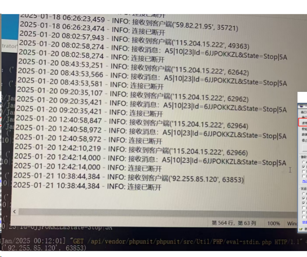

---

### JX-12F开发板复位按钮连接到EN引脚

**问题描述：**

JX-12F开发板上的复位按钮实际连接到EN（使能）引脚而非RST（复位）引脚，与说明书描述不符。

**解决方案：**

- **功能说明**：开发板在复位电路上增加了开关控制，复位按钮实际连接EN引脚
- **复位方法**：

    - 正常复位：直接按下复位按钮
    - 下载复位：需要将EN引脚上拉才能正常下载程序
- **引脚注意**：

    - EN引脚：控制模块使能状态
    - RST引脚：硬件复位引脚（未连接到按钮）

**注意事项：**

- 按下复位按钮会控制EN引脚电平，实现复位功能
- 下载程序时如失败，检查EN引脚是否正确上拉
- IO8引脚接高电平配合RST下拉复位的操作方式已不适用
- 开发板设计优化了复位控制逻辑，使用更加方便

---

### JX-12F如何发送自定义协议数据给单片机？

**问题描述：**

需要通过小程序发送特定格式数据（0x5a 0x02 0x03 0x00 0xa3 + 42个字节）到单片机，但无法成功发送。

**解决方案：**

1. **自定义协议配置**
    - 在平台中创建自定义协议
    - 设置协议格式：头部0x5a、命令0x02、长度0x03、标识0xa3
    - 添加42个数据字段，对应需要发送的变量

2. **数据发送机制**
    - 使用平台定时器功能，每1000ms发送一次请求
    - 设置发送内容为自定义协议包
    - 确保数据包格式与单片机期望的一致

3. **变量配置**
    - 配置41个变量对应单片机数据
    - 设置校验和字段（Translate_Data[46]、Translate_Data[47]）
    - 将变量绑定到协议的数据字段

**注意事项：**

- 单片机需要判断接收数据的第5个字节是否为0xa3
- 协议配置后需要重新生成并烧录固件
- 数据字段数量必须与实际发送的字节数匹配
- 建议先使用串口助手测试协议格式

---

### JX-12F模块如何捕获和验证串口通信数据？

**问题描述：**

在进行串口通信调试时，无法直接获取下位机发送给WiFi模块的实际串口数据，导致难以验证通信协议的正确性。

**解决方案：**

**1. 使用串口调试方法**

- 将下位机的串口直接连接到电脑
- 使用串口调试助手捕获实际发送的数据
- 不连接WiFi模块，单独测试下位机数据输出

**2. 正确的连接方式**

- 单片机TX引脚 → JX-12F的IO2（UART1_RX）
- 单片机RX引脚 → JX-12F的IO3（UART1_TX）
- 确保波特率等参数配置一致

**3. 数据验证步骤**

- 捕获下位机发送的原始数据
- 将数据复制到串口调试助手
- 通过串口助手直接发送给WiFi模块测试
- 验证WiFi模块是否能正确响应

**注意事项：**

- JX-12F的UART0用于日志输出，不能用于数据通信
- 使用UART1进行与下位机的数据交换
- 捕获的数据可以帮助验证协议格式是否正确

---

### JX-12F模块与手机小程序无法连接怎么办？

**问题描述：**

JX-12F模块与下位机串口通信正常，但手机小程序无法连接或建立连接后无法正常通信。

**解决方案：**

**1. 检查协议格式**

- 确认使用正确的协议消息格式：AA 55 01 05 03 04 55 AA
- 帧头：AA 55
- 帧尾：55 AA
- 验证数据长度和校验字段是否正确

**2. 重新生成固件**

- 在平台中按照标准协议格式重新定义
- 确保协议配置与实际通信需求匹配
- 生成新固件并重新烧录

**3. 网络连接检查**

- 确认模块已成功连接到WiFi网络
- 检查服务器地址和端口配置是否正确
- 验证网络是否稳定

**注意事项：**

- 协议格式错误会导致小程序无法识别数据
- 串口通信正常不代表网络配置正确
- 建议使用标准协议格式进行测试

---

### JX-12F更新固件后无法连接怎么办？

**问题描述：**

更新固件后，设备无法通过蓝牙或Wi-Fi连接，手机应用无法发现设备。

**解决方案：**

**1. 检查烧录模式**

- 确认烧录完成后已退出烧录模式
- 按复位键退出烧录模式（红灯亮表示烧录模式）
- 白色指示灯亮起表示正常工作模式

**2. 验证设备状态**

- 检查设备是否正常启动
- 确认WiFi模块是否广播信号
- 使用串口助手查看初始化日志

**3. 重新配网步骤**

- 将设备设置为配网模式
- 通过手机小程序重新搜索设备
- 完成网络配置后重新连接

**注意事项：**

- 烧录后必须复位才能正常工作
- 如果使用错误固件可能导致功能异常
- 建议保留稳定版本的固件备份

---

### JX-12F自定义协议可以扩展参数字段数量吗？

**问题描述：**

使用自定义协议进行数据透传时，需要发送超过默认字段数量的长数据包，询问是否可以扩展协议模板中的参数字段。

**解决方案：**

**1. 协议字段扩展**

- 理论上支持扩展到更多参数字段
- 可以尝试添加到40个或更多字段
- 需要在平台配置中逐个添加新字段

**2. 扩展方法**

- 在协议编辑界面中添加新的field字段
- 保持帧头帧尾格式不变（如AA 55...55 AA）
- 将新增字段映射到需要传输的数据

**3. 测试验证**

- 先少量扩展测试（如10-20个字段）
- 确认数据传输正常后再继续扩展
- 使用串口助手验证数据完整性

**注意事项：**

- 过长的数据包可能影响传输可靠性
- 建议分批次传输大量数据
- 扩展后需要重新生成并烧录固件

---

### JX-12F WIFI数据透传如何正确配置？

**问题描述：**

搭建WIFI数据透传平台时，自定义协议配置错误导致模块与单片机之间无法正常通信。

**解决方案：**

**1. 串口配置正确设置**

- UART1_RX：设置为"自选协议"，AI指令为"支持(不回复)"
- UART1_TX：配置正确波特率（如115200）、数据位8、停止位1、校验位无
- 确保串口引脚连接正确（IO2/IO3）

**2. 自定义协议配置**

- 在平台中添加自定义协议指令
- 设置触发方式为"串口输入"
- 配置正确的功能类型（如"下位机上行"）

**3. 通信验证**

- 先使用简单协议测试连通性
- 逐步增加协议复杂度
- 使用串口助手监控数据收发

**注意事项：**

- 协议配置必须与单片机程序匹配
- 串口参数（波特率等）需要保持一致
- 建议保存正确的配置模板供后续使用

---

### JX-12F协议数据长度不匹配怎么办？

**问题描述：**

自定义协议的数据长度（47字节）与平台配置的字段长度（36字节）不匹配，导致通信失败。

**解决方案：**

**1. 数据长度对齐**

- 确认协议中定义的字段数量与实际发送字节数一致
- 在平台配置中添加足够的字段以匹配数据长度
- 检查每个字段的类型和长度设置

**2. 协议重新设计**

- 如果需要发送47字节数据，确保协议定义47个字段
- 或使用数组类型字段存储多个字节
- 考虑将长数据拆分成多个短数据包

**3. 验证方法**

- 使用串口助手发送固定长度的测试数据
- 逐步增加字段数量验证接收完整性
- 对比发送和接收的字节总数

**注意事项：**

- 协议字段数量必须与实际数据字节数完全匹配
- 建议使用校验和字段确保数据完整性
- 过长的单次传输可能需要分段处理

---

### JX-12F的UART0串口可以用于其他串口通信协议吗？

**问题描述：**

需要确认JX-12F模块的UART0串口是否仅限于烧录和日志打印功能，还是可以用于其他串口通信协议。

**解决方案：**

UART0默认配置为串口打印日志和烧录功能，如需用作其他串口协议通信，建议使用其他串口。

**注意事项：**

- UART0主要用于固件烧录和调试日志输出
- 如需串口通信，建议使用UART1等其他串口资源
- 避免与调试功能冲突，确保通信稳定性

---

### JX-12F串口通信配置和指令发送问题

**问题描述：**

配置JX-12F模块的UART1串口通信时，使用AA 55 01 55 AA格式发送指令，但模块未能正确响应。

**解决方案：**

**1. 串口引脚配置**

- IO2配置为UART1_RX（接收引脚）
- IO3配置为UART1_TX（发送引脚）
- 波特率设置为115200，数据位8，停止位1，校验位无

**2. 协议格式配置**

- 配置AA 55作为帧头
- 配置55 AA作为帧尾
- 中间为实际数据内容

**3. 触发方式设置**

- 选择UART1_RX作为触发源
- 配置相应的消息号和处理逻辑

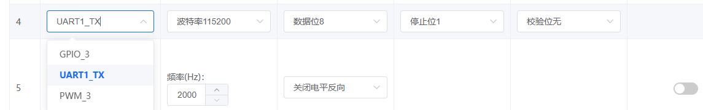
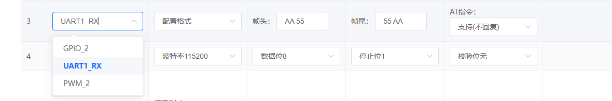


**注意事项：**

- 确保TX和RX引脚配置正确
- 协议格式必须严格匹配（帧头、数据、帧尾）
- 发送和接收双方使用相同的通信参数

---

### JX-12F数据透传显示为16进制乱码怎么处理？

**问题描述：**

使用WIFI模块数据透传功能时，串口调试工具接收到的数据显示为16进制格式的乱码，且包含疑似心跳信号的数据。

**解决方案：**

**1. 数据格式识别**

- 16进制显示是正常现象，不是乱码
- 需要转换为ASCII或实际数据格式查看
- 心跳信号是模块自动发送的保活数据

**2. 数据解析方法**

- 使用支持16进制转换的串口调试工具
- 将16进制数据转换为对应的ASCII字符
- 过滤掉心跳包只看有效数据

**3. 数据过滤**

- 识别心跳包特征（固定间隔和格式）
- 在程序中过滤心跳数据
- 只处理实际透传的有效数据

**注意事项：**

- 16进制是数据的标准表示方式
- MQTT连接失败日志不影响透传功能
- 建议在程序端增加数据解析逻辑

---

### JX-12F模块可以同时与两个单片机通讯吗？

**问题描述：**

JX-12F模块是否可以同时与两个单片机进行通讯，利用其TX、RX、IO2和IO3的串口功能。

**解决方案：**

**通讯能力说明**

- **可以同时连接两个单片机**
- TX/RX为一组串口，IO2/IO3为另一组串口
- 两组串口可独立工作

**注意事项**

1. **调试口占用**

    - 使用双串口后会占用所有串口资源
    - 将没有可用的日志调试口
    - 会影响后续的调试工作

2. **设计建议**

    - 如需调试功能，建议保留一组串口
    - 可考虑使用一路串口作为调试口
    - 另一路用于与主控单片机通讯

3. **替代方案**

    - 使用一路串口通讯，另一路连接调试器
    - 产品化后可切回双串口模式
    - 考虑使用无线调试方式

**结论：**

虽然技术上支持双串口同时通讯，但需要权衡调试便利性，建议根据实际项目需求选择合适的方案。

---

### JX-12F2 串口协议长度限制及配置问题

在使用 JX-12F2 模块配置串口输入协议时，需要注意协议长度和字段定义的限制。

**问题描述：**

配置串口输入协议时，即使协议长度不长（如40字节），包含特定参数（如GPIO控制）时也可能导致生成失败。

**解决方案：**

1. **协议长度限制**
    - JX-12F2 对串口协议长度存在限制
    - 当协议包含多个字段时可能超出限制
    - 建议将长协议拆分为多个短协议

2. **避免使用保留字段**
    - 删除协议中的保留字段（如 ReservedChar、Reserved1、Reserved2）
    - 精简协议字段，只保留必要的数据传输字段
    - 减少每个字段的数据长度

3. **GPIO控制配置**
    - 如需GPIO控制，建议单独配置
    - 避免在同一个协议中混合GPIO控制和数据传输
    - 考虑使用控制指令而非协议定义实现GPIO操作

4. **协议优化建议**
    - 使用有帧头和帧尾的协议格式
    - 添加校验位确保数据完整性
    - 优先传输关键数据，次要数据通过其他方式获取

**注意事项：**

- 协议生成失败通常与长度限制有关，而非配置错误
- 拆分数据发送是解决长度限制的有效方法
- 保留字段会占用协议空间，建议删除
- GPIO控制功能可能需要通过其他方式实现

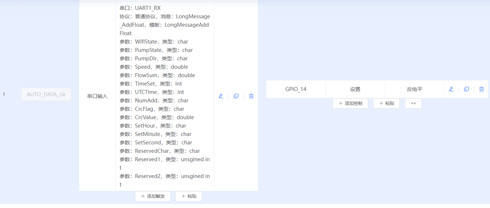


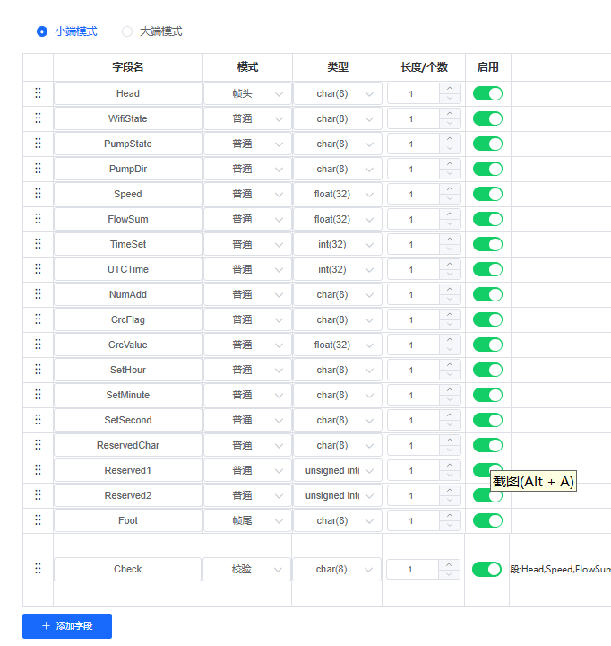

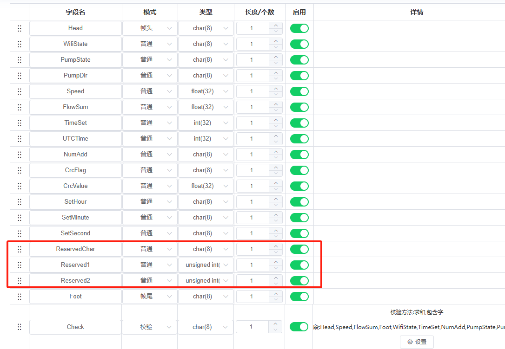

---

### JX-12F模块蓝牙配网后WiFi连接失败怎么办？

**问题描述：**

使用JX-12F模块进行蓝牙配网时，虽然程序烧录成功，但在配网界面配置WiFi时失败，多个模块均出现相同问题。

**解决方案：**

**1. 检查固件是否正确烧录**

- 确认烧录的是JX-12F专用固件
- 检查是否出现"LOAD HELP BIN FAIL"错误
- 如有烧录错误，重新烧录正确的固件文件


**2. 硬件连接检查**

- 确认IO0引脚已正确拉低（进入下载模式）
- 检查模块硬件连接是否牢固
- 验证供电电压是否稳定

**3. 蓝牙配网流程验证**

- 确认蓝牙已成功开启并可被搜索到
- 检查是否已建立蓝牙连接
- 验证蓝牙参数（MTU等）是否配置正确

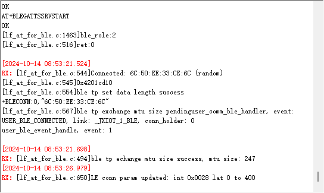

**4. WiFi兼容性检查**

- 确认目标WiFi为2.4G频段（JX-12F仅支持2.4G）
- 检查WiFi名称是否包含特殊字符
- 验证WiFi密码是否正确

**5. 配网环境建议**

- 建议使用手机热点进行首次测试
- 确保配网环境信号良好
- 避免在公共WiFi环境下配网

**注意事项：**

- 多个模块同时出现连接失败，可能是固件版本问题
- 配网成功后设备会自动连接保存的WiFi
- 如持续失败，可尝试恢复出厂设置后重新配网
- 部分路由器兼容性问题，可尝试更换AP测试

---

### 烧录后微信小程序搜索不到设备怎么办？

**问题描述：**

模块烧录程序成功后，微信小程序无法搜索到设备，且扫码升级失败时不确定芯片内固件状态。

**解决方案：**

**1. 搜索失败排查**

- 确认模块已正常启动（观察LED指示灯）
- 检查手机蓝牙是否正常开启
- 验证模块是否处于可被发现状态
- 确认小程序版本是否为最新版

**2. 升级失败说明**

扫码升级失败后固件状态：

- 不会恢复出厂固件
- 保持之前的固件版本
- 升级过程中断电可能导致变砖

**3. 环境因素检查**

- 确保模块与手机距离适中（1-3米）
- 避免在复杂电磁环境下操作
- 检查是否有其他蓝牙设备干扰
- 重启手机和模块后重试

**4. 视频反馈建议**

如问题持续存在：

- 录制操作视频便于问题定位
- 展示完整的搜索和配对过程
- 包含串口日志输出信息
- 说明具体的错误提示信息

**注意事项：**

- 升级失败不会自动恢复固件
- 建议在稳定环境下进行升级操作
- 扫码前确保网络连接正常
- 如多次失败，可尝试使用串口升级

---

### 如何限制JX-12F模块的WiFi配置权限？

**问题描述：**

JX-12F WiFi模块在实际应用中，其他用户通过智能公元小程序可以随意修改设备的网络配置，存在安全隐患。

**解决方案：**

**1. 设置设备密码**

在小程序中配置密码保护：

- **后台管理密码**：限制设备管理权限
- **设备本地密码**：限制配网权限
- 两个密码可独立设置
- 建议设置复杂密码


**2. 配置步骤**

使用智能公元小程序：

1. 搜索并连接到设备
2. 进入"设备设置"菜单
3. 找到"设备密码"选项
4. 分别设置管理密码和本地密码
5. 保存配置并重启设备

**3. 安全建议**

- 定期更换设备密码
- 不要使用简单密码
- 区分管理和普通用户权限
- 保管好密码信息

**4. 其他安全措施**

- 禁用不必要的功能
- 限制设备连接数量
- 定期检查连接记录
- 及时更新固件版本

**注意事项：**

- 设置密码后小程序需输入密码才能配置
- 忘记密码需要重新配网或联系技术支持
- 建议在部署前完成所有安全配置
- 生产时可预设统一的默认密码

---

### JX-12F烧录双串口程序后无法连接网络和蓝牙怎么办？

**问题描述：**

将控制台端口改成串口使用，烧录双串口程序后，JX-12F模块无法连接网络，蓝牙也无法连接。

**解决方案：**

**1. 问题原因分析**

- 目前固件不支持将烧录口/日志口作为通讯串口使用
- 使用控制台作为串口会影响WiFi和蓝牙功能
- WiFi程序复杂，需要日志口来定位问题

**2. 恢复方法**

- 使用硬件下载器重新烧录固件
- 通过控制台串口进行烧录
- 恢复模块到正常工作状态

**3. 正确的串口使用方式**

- 保留日志口（引脚22/23）用于调试
- 使用通信口（引脚8/18）进行外部通信
- 不建议占用控制台端口

**4. 设计建议**

- 产品设计时预留日志调试接口
- 优先使用专用通信串口
- 考虑WiFi程序的复杂性

**注意事项：**

- 烧录错误固件不会永久损坏模块
- 多个模块出现相同问题说明是配置不当
- WiFi功能依赖日志输出来排查故障
- 更换模块无法解决配置问题

---

### JX-12F模块远程控制无响应怎么办？

**问题描述：**

使用手机小程序远程控制音响时，JX-12F模块测试用量未达到预期，远程控制功能可能存在异常。

**解决方案：**

**问题排查步骤：**

1. **检查模块连接**
    - 确认JX-12F模块与音响设备的连接是否正确
    - 检查电源供电是否稳定
    - 验证通信接口连接是否可靠

2. **测试远程控制功能**
    - 确认手机小程序与模块的配对状态
    - 检查网络连接是否正常
    - 验证远程指令是否成功发送到模块

3. **验证模块响应**
    - 观察模块指示灯状态
    - 使用串口调试工具查看通信数据
    - 测试本地控制功能是否正常

**可能的原因分析：**

- **网络问题**：WiFi信号弱或网络不稳定
- **配对失败**：小程序与模块未正确配对
- **固件版本**：模块固件可能需要更新
- **硬件故障**：模块或相关电路存在异常

**处理建议：**

- 重新进行配对操作，确保连接成功
- 更新模块到最新固件版本
- 改善网络环境，确保信号稳定
- 如问题持续，联系技术支持进行详细诊断

**注意事项：**

- 远程控制功能依赖稳定的网络环境
- 建议在信号良好的区域进行测试
- 保留测试过程的详细记录，便于问题定位

---

### JX-12F串口高频发送数据导致模块重启怎么办？

**问题描述：**

单片机通过串口发送数据包到语音模块，语音模块再转发给WiFi模块显示到小程序。当每2秒发送一次double型数据（8字节）时，模块出现间歇性重启，小程序开关指令变得不灵敏。发送char型数据1秒一次没有问题，但char型数据一次发送数量过多也会出现同样问题。

**解决方案：**

**1. 检查日志信息**

查看串口日志，如果出现以下错误：
```
xStreamBufferSendFromISR failed, ret: 0, counter: 1
xStreamBufferSendFromISR failed, ret: 0, counter: 13
...
Booting LF686 Chip...
```

这表明缓冲区已满，任务阻塞，最终触发看门狗导致模块重启。

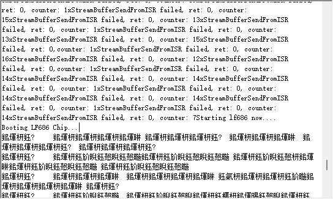

*日志显示StreamBuffer发送失败，counter逐渐增加，最终触发重启*

**2. 根本原因分析**

- **double型数据**：占用8字节，发送频率过高时串口缓冲区来不及处理
- **大量char数据**：单次发送过多数据也会填满缓冲区
- **数据转发链路**：单片机 → 语音模块 → WiFi模块 → 小程序，链路中任一环节缓冲区溢出都会导致阻塞

**3. 解决方案**

1. **降低发送频率**
   - 将2秒一次改为5秒或更长间隔
   - 根据实际数据更新需求调整发送周期

2. **减少单次数据量**
   - double型数据（8字节）可拆分为两个int或char类型发送
   - 分批发送大量char数据，避免一次性发送

3. **优化数据类型**
   - 对于小数，可考虑转换为整数部分和小数部分分别用int类型发送
   - 避免使用double类型进行高频数据传输

4. **检查串口波特率**
   - 确保波特率设置足够高（建议115200或以上）
   - 检查各模块间波特率配置是否一致

**注意事项：**

- 串口缓冲区大小有限，高频大数据量传输容易溢出
- 看门狗重启是系统保护机制，说明主任务被阻塞超时
- 如果必须高频传输，建议考虑增加硬件流控或使用DMA方式

---

