### JX-A7T烧录WiFi固件出现错误代码如何解决？

**问题描述：**

在烧录JX-A7T的WiFi部分固件时出现错误代码，需要了解错误原因和解决方法。

**解决方案：**

JX-A7T烧录WiFi固件出现错误代码通常由以下原因造成：

**1. 常见错误代码及解决方法**

- **错误代码：连接超时/通信失败**
    - 检查串口线连接是否牢固
    - 确认COM端口选择正确
    - 检查USB驱动是否正常安装
    - 尝试更换USB线或电脑USB端口

- **错误代码：固件校验失败**
    - 确认固件文件完整，未损坏
    - 重新下载固件文件
    - 检查固件版本是否匹配JX-A7T

- **错误代码：擦除失败**
    - 确保IO8引脚在烧录时保持高电平
    - 检查供电是否稳定
    - 尝试重新上电后再烧录

- **错误代码：0036 FLASH WRITE FAIL**
    - 检查烧录上位机的 XTAL 设置是否为 40M
    - XTAL 设置错误会导致 FLASH 写入失败
    - 鼠标在 XTAL 选项上滚动滑轮可能会误改设置
    - 确认 XTAL = 40M 后重新烧录


**2. 烧录前的准备工作**

- 硬件连接检查：

    - TX连接模块RX
    - RX连接模块TX
    - GND连接模块GND
    - IO8连接模块IO8（烧录时需要拉高）

- 软件设置：

    - 使用正确的烧录工具版本
    - 波特率设置为921600
    - 勾选必要的烧录选项

**3. 烧录步骤**

1. 模块断电状态下连接好烧录线
2. IO8引脚接高电平（3.3V）
3. 模块上电
4. 打开烧录工具，选择正确COM口
5. 选择WiFi固件文件（jx_firm.tar_wifi.gz）
6. 点击开始烧录
7. 烧录成功后断开IO8的高电平连接
8. 模块重新上电启动

**4. 注意事项**

- 确保使用原装或质量良好的USB数据线
- 烧录过程中避免触碰连接线
- 如果多次失败，尝试在另一台电脑上烧录
- 烧录完成后需要重新上电才能正常运行
- **XTAL 配置**：使用 Simple Flasher 烧录时，需确保 XTAL 设置为 40M
- 鼠标在 XTAL 选项上滚动滑轮可能会误改设置，烧录前务必确认

---

# JX-A7T 烧录与调试 FAQ

本页用于整理 JX-A7T 相关的烧录与调试问题。

### JX-A7T双固件烧录失败如何排查？

**问题描述：**

在使用PACK_UPDATE_TOOLS烧录工具时，无法成功烧录两个固件文件（jx_firm.tar_wifi.gz和jx_firm.tar_语音.gz），需要排查烧录失败的原因。

**解决方案：**

- **检查硬件连接**：

    - 确认IO8引脚在烧录时需要拉高
    - 确保串口连接正常，COM端口可用
    - 检查波特率设置是否为921600

- **烧录顺序**：

    - 先烧录WiFi固件
    - 语音固件可以通过接线烧录或小程序扫码方式更新

- **使用正确的烧录工具**：

    - 使用PACK_UPDATE_TOOLS V3.9.6或更新版本
    - 勾选"擦除NV"和"升级完成自动运行"选项
    - 确认固件文件路径正确且文件完整

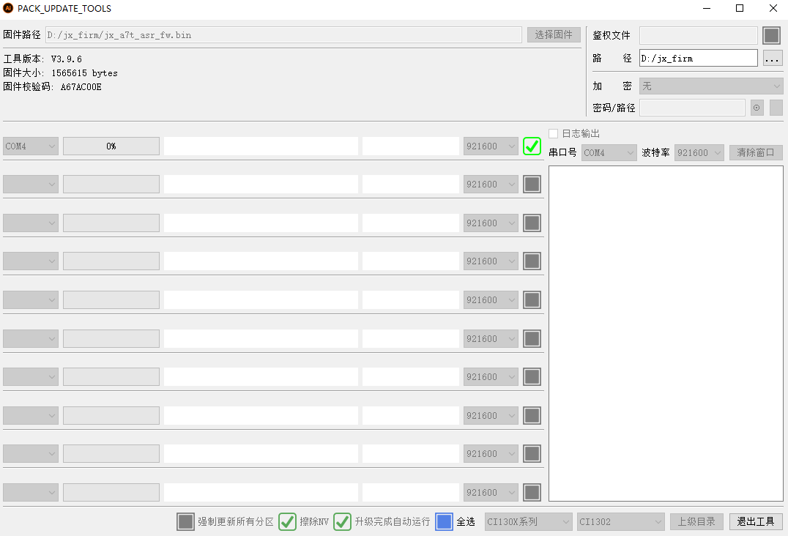

**注意事项：**

- 烧录前确保固件文件已解压
- 如果串口未识别，检查驱动安装和USB连接
- 烧录过程中不要断开连接

### 自定义程序首次串口通信返回007E错误怎么办？

**问题描述：**

在使用自定义程序打开串口时，首次通信返回错误数据（007E），而使用官方串口工具后，自定义程序才能正常通信，且该问题在USB重插拔后重现。

**解决方案：**

1. **错误原因分析**：

    - 007E错误表示通信未建立或参数错误
    - 首次通信可能需要正确的初始化序列
    - USB重插拔可能导致设备状态重置

2. **解决步骤**：

    - 先使用官方串口工具建立正常通信
    - 监控官方工具的通信参数和初始化过程
    - 在自定义程序中实现相同的初始化序列

3. **通信参数配置**：

    - 波特率：115200（根据模块型号确认）
    - 数据位：8
    - 停止位：1
    - 校验位：None

4. **初始化建议**：

    - 打开串口后发送初始化命令
    - 等待设备响应后再发送数据
    - 设置合适的超时时间

**注意事项：**

- 不同模块的通信协议可能不同
- USB转串口驱动需要正确安装
- 建议使用官方提供的通信库或示例代码
- 通信问题可能与USB接口质量有关

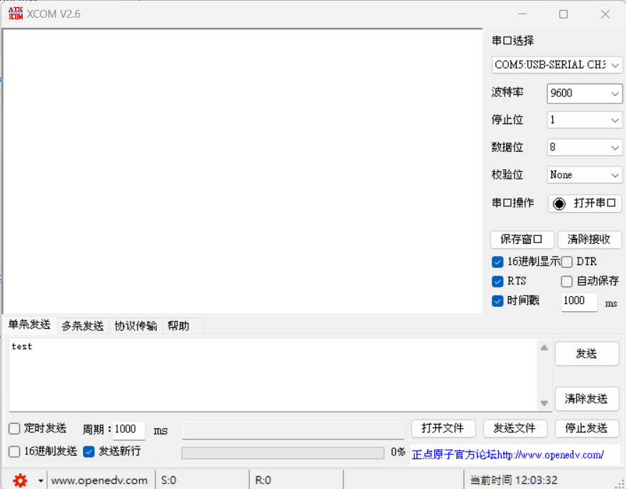

---

### JX-A7T如何使用小程序OTA更新固件？

**问题描述：**

需要了解使用小程序进行OTA更新时是否需要操作板载的SW1和SW2开关，以及烧录软件的获取方式。

**解决方案：**

JX-A7T包含两个主要部分，可采用不同的更新方式：

- **语音部分（CI-03T）**：使用CI-03T的烧录方法
- **WiFi部分（JX-12F）**：使用JX-12F的烧录方法

**使用小程序OTA更新时：**

- **无需操作板载开关**：SW1（WIFI/NC）和SW2（烧录）开关保持原位即可
- **保持运行状态**：确保设备处于正常工作状态
- **串口配置注意**：串口选择不要设置为ASR模式

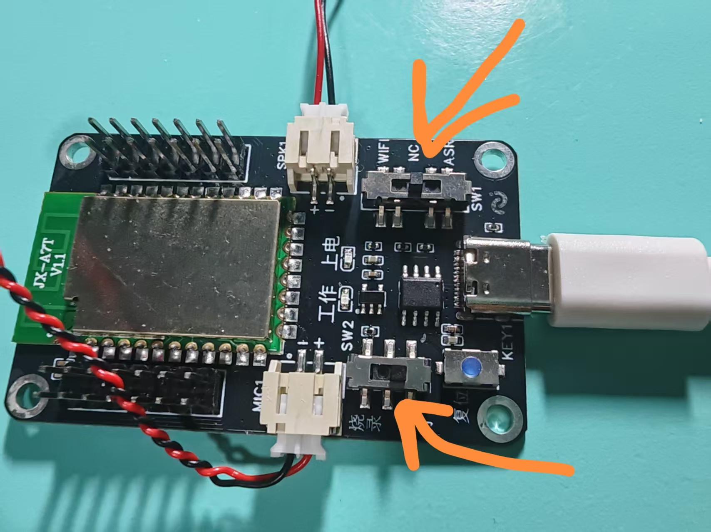

**获取烧录软件：**

- 语音部分烧录工具可参考CI-03T相关文档
- WiFi部分烧录工具可参考JX-12F相关文档
- 推荐优先尝试小程序OTA方式，更为便捷

**注意事项：**

- OTA更新前确保设备网络连接正常
- 更新过程中不要断电
- 如OTA失败，可使用有线烧录方式作为备选方案

---

### JX-A7T扫码烧录失败怎么办？

**问题描述：**

使用小程序扫码方式烧录JX-A7T语音固件时，提示"更新失败"和"Device is no answer"错误，导致烧录无法完成。

**解决方案：**

**1. 扫码烧录前提条件**

- 确保设备已正常连接WiFi
- 设备状态显示为"连接"
- 小程序与设备在同一网络环境下

**2. 常见错误处理**

- **"Device is no answer"错误**：

    - 检查设备网络连接是否正常
    - 确认设备未进入休眠状态
    - 尝试重启设备后重新扫码

- **"更新失败"错误**：

    - 检查网络稳定性
    - 确认固件文件完整性
    - 避免更新过程中操作设备
    
    - **错误提示：`partition size not enough`（分区空间不足）**
        
        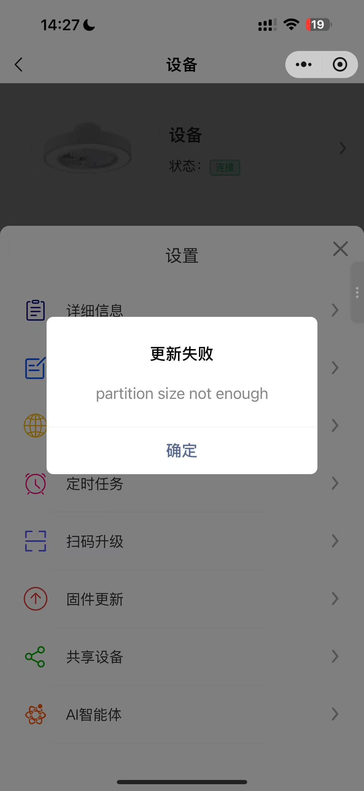
        
        - **原因**：新固件大小超过了Flash分区容量
        - **解决方法**：
            - 确认使用的是T1版本（带2MB OTA Flash）
            - 减小固件包大小（减少词条数量或功能模块）
            - 使用串口烧录方式进行完整固件更新

**3. 烧录开关设置**

- **扫码烧录时**：

    - 波动开关无需操作，保持正常运行状态
    - 只有硬件烧录才需要拨动开关
    - 设备正常使用即可进行扫码更新

**4. 二维码有效期**

- 烧录二维码可能存在有效期限制
- 如提示二维码过期，需要重新生成
- 建议生成后立即使用

**注意事项：**

- 扫码烧录仅适用于语音固件更新
- WiFi固件仍需使用串口烧录
- 保持设备电量充足，避免更新中断
- T1/T2版本的烧录方式相同

---

### JX-A7T烧录时未检测到串口且出现LOAD HELP BIN FAIL错误怎么办？---

### JX-A7T烧录时未检测到串口且出现LOAD HELP BIN FAIL错误怎么办？

**问题描述：**

在使用Leapfive Flash Environment工具烧录WiFi固件时，出现'LOAD HELP BIN FAIL'错误，且工具界面中未检测到可用的串口（COM端口）。

**解决方案：**

- **检查串口连接**：

    - 确认USB转串口设备已正确连接
    - 检查驱动程序是否已安装
    - 在设备管理器中查看COM端口是否显示

- **硬件连接要求**：

    - 烧录时IO8引脚需要拉高
    - 确保VCC、GND、RXD、TXD四根线都正确连接
    - 使用稳定的电源供电

- **烧录步骤**：

    1. 先使用PACK_UPDATE_TOOLS烧录WiFi固件
    2. 语音固件可通过接线烧录或小程序扫码更新
    3. 烧录完成后勾选"升级完成自动运行"


*Leapfive Flash Environment显示LOAD HELP BIN FAIL错误*

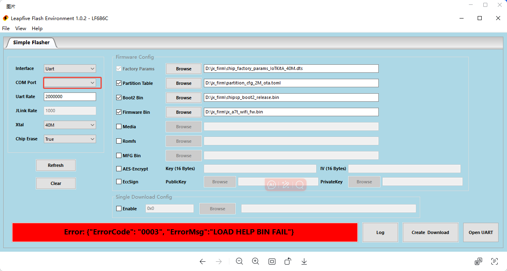

*烧录工具未检测到任何COM端口*

**注意事项：**

- 如果COM端口未显示，尝试更换USB端口或重新安装驱动
- 确保使用2000000波特率进行通信
- 烧录前清除串口接收区的干扰信息

### JX-A7T烧录WiFi固件时出现'LOAD HELP BIN FAIL'错误怎么办？

**问题描述：**

JX-A7T开发板在烧录WiFi固件时频繁出现'LOAD HELP BIN FAIL'错误，导致烧录失败，且该问题在多块开发板上复现，严重影响项目进度。

**问题分析：**

1. **错误含义**：

    - LOAD HELP BIN FAIL：加载帮助文件失败
    - 表明烧录工具无法加载必要的帮助文件
    - 可能是烧录工具版本不匹配或文件路径问题

2. **复现问题**：

    - 在多块开发板上都出现相同错误
    - 说明问题具有普遍性，非个别硬件问题

3. **影响范围**：

    - 无法正常烧录WiFi固件
    - 项目进度严重受阻
    - 影响产品开发时间节点

**解决方案：**

**1. 确认烧录环境**

- **软件版本**：使用最新版本的Simple Flasher烧录工具
- **固件文件**：确认固件文件完整且未损坏
- **驱动程序**：确认CH340驱动正常安装
- **操作系统兼容性**：Windows 10/11系统兼容性最佳

**2. 烧录文件检查**

- **文件完整性**：

    - 确认所有必需的.bin文件存在
    - 检查文件大小是否正常
    - 验证文件校验和完整性

- **文件命名**：

    - 避免使用中文或特殊字符
    - 确保文件名符合规范要求

**3. 硬件连接确认**

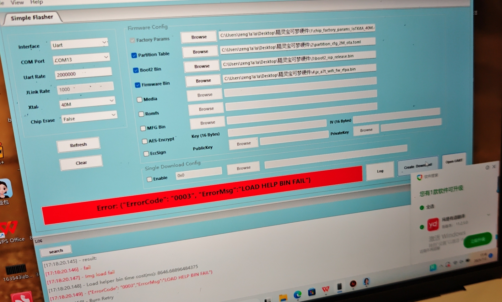

*Simple Flasher显示的LOAD HELP BIN FAIL错误*

**4. 硬录步骤优化**

```
烧录步骤顺序：

1. 连接开发板到电脑
2. 打开Simple Flasher工具
3. 选择正确的COM端口
4. 加载Factory Params（工厂参数）
5. 加载Boot2 Bin（引导文件）
6. 加载主固件文件
7. 执行烧录操作
```

**5. 替代方案尝试**

- **使用官方烧录工具**：

    - 联系技术支持获取官方推荐工具
    - 可能使用其他烧录器测试
    - 尝试命令行烧录方式

- **检查硬件连接**：

    - 确认USB连接线质量
    - 尝试不同USB端口
    - 检查开发板电源是否稳定

- **分区表验证**：

    - 手动配置分区表参数
    - 使用已知的正确配置
    - 跳过自动检测步骤

**6. 技术支持申请**

- **收集问题信息**：

    - 记录详细的错误发生步骤
    - 保存烧录日志文件
    - 拍摄错误提示界面截图
    - 提供开发板型号和批次信息

- **寻求远程协助**：

    - 联系技术支持进行远程诊断
    - 可能需要寄回问题设备进行分析
    - 获取针对性的解决方案

**7. 常见问题解答**

- **Q：为什么之前的固件可以正常烧录？**
    - A：可能是固件版本更新后工具不兼容
    - Q：如何确认工具版本兼容性？
    - A：查看工具更新日志或联系工具开发商

- **Q：是否必须使用特定版本的烧录工具？**
    - A：建议使用官方指定版本的工具
    - A：或使用与固件匹配的旧版本工具

**注意事项：**

- 烧录失败不会损坏硬件模块
- 可以多次尝试不同方法
- 保留详细的错误记录便于分析
- 如问题持续，建议更换烧录环境或设备
- 获取技术支持时提供完整的问题描述和操作步骤

---

### JX-A7T烧录时RXD_IN和TXD_IN引脚如何连接？

**问题描述：**

需要确认JX-A7T模块烧录WiFi固件时RXD_IN和TXD_IN引脚的正确连接方式，以便成功完成固件更新。

**解决方案：**

**1. 引脚位置确认**

根据JX-A7T开发板设计：

- **RXD_IN**：WiFi模块的串口接收引脚
- **TXD_IN**：WiFi模块的串口发送引脚
- 位置：开发板上的标注端子或测试点

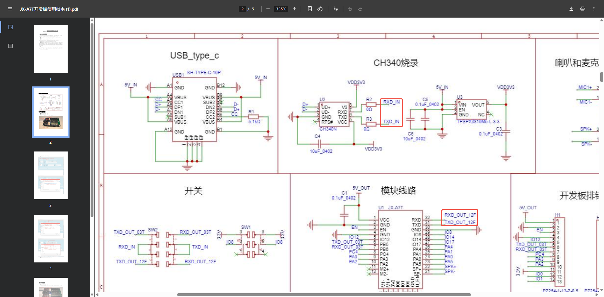

*JX-A7T开发板的烧录接口标注*

**2. 连接方式**

**烧录器连接方式**：
```
烧录器      开发板
TX      →  RXD_IN
RX      ←  TXD_IN
CTS     →  复位信号（可选）
GND     →  共地连接
VCC     → 3.3V供电（可选）
```

**CH340连接方式**：
```
USB转串口     开发板
TXD      →  RXD_IN
RXD      ←  TXD_IN
GND      → 共地
```

**3. 烧录模式选择**

- **Factory Params**：工厂参数配置模式
- **Boot2 Bin**：引导固件加载模式
- **主固件烧录**：实际应用程序固件

**4. 注意事项**

- 不要连接到语音串口（UART1）
- RXD_IN/TXD_IN是WiFi专用通信接口
- 烧录时确保模块供电稳定
- 如使用USB转串口，确认驱动安装正确

**5. 问题排查**

如果连接正确仍无法烧录：

- 检查引脚是否接触良好
- 确认波特率设置（通常为115200）
- 验证模块是否进入烧录模式
- 检查烧录工具的端口选择

**技术支持**：

如遇到持续无法解决的烧录问题：

- 记录具体的错误信息
- 提供连接照片和配置截图
- 联系技术支持获取针对性指导
- 可能需要寄回设备进行专业检测

---

## 网络连接

### JX-A7T模块WiFi连接不稳定及内存耗尽问题

**问题描述：**

JX-A7T模块在使用过程中出现WiFi连接不稳定，表现为卡成单行数据、掉线且无法自动重连，设备需重新配网才能恢复。问题与内存耗尽有关，导致设备自动重启。

**解决方案：**

- 升级到最新固件版本（jx_12f_firmware_nls250102.bin或更高版本）
- 新版本已修复并发处理导致的内存泄露问题
- 确保使用正确的烧录文件和分区配置

**问题排查步骤：**

1. **确认固件版本**
    - 检查是否使用最新版本固件
    - old: jx_12f_firmware_nls241121.bin
    - new: jx_12f_firmware_nls241120.bin (优化内存问题)
    - latest: jx_12f_firmware_nls250102.bin (修复并发问题)

2. **烧录文件确认**
    - 芯片工厂参数文件：jx_firm/factory_params.bin
    - 分区配置文件：jx_firm/partition-table.bin
    - boot文件：jx_firm/bootloader.bin
    - 主固件文件：使用最新版本.bin文件

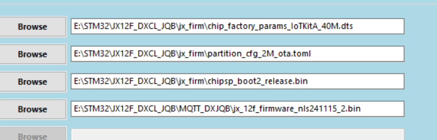

**注意事项：**

- 问题主要由网络异常处理和内存泄露引起
- 卡成单行数据是内存耗尽的前兆
- 设备会在内存耗尽后自动重启（约30分钟后重连）
- 新版本已加强异常处理和内存管理

### 串口日志捕获方法

**问题描述：**

需要捕获WiFi模块的完整通信日志，用于分析掉线和异常原因。

**解决方案：**

- 使用SSCOM串口调试工具
- 勾选"接收数据到文件"功能保存日志
- 设置波特率为115200
- 仅连接GND、TX、RX三根线

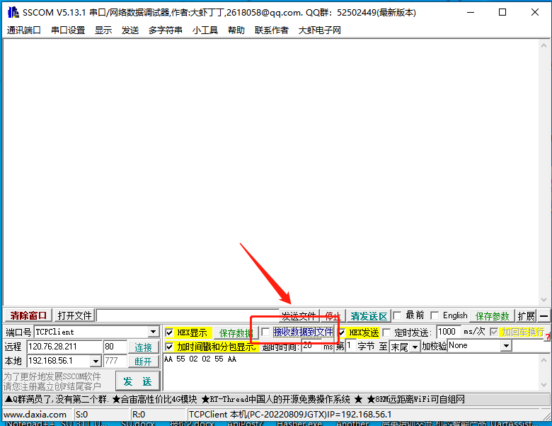


**注意事项：**

- 确保TX/RX交叉连接
- 日志文件会自动保存为.DAT格式
- 长时间监控建议开启自动保存功能
- 出现问题时立即保存日志文件供分析

### 设备长期运行出现网络超时错误

**问题描述：**

设备连续运行10天左右后，出现网络请求超时错误（Network request error: request:fail fail:time out），导致设备掉线。

**解决方案：**

- 使用最新固件版本（jx_12f_firmware_nls250102.bin）
- 该版本已优化内存管理和网络异常处理
- 定期重启设备可预防问题发生

**问题分析：**

- 长期运行可能存在内存泄露
- 网络连接在异常情况下无法自动恢复
- 超时错误表明网络通信异常

**预防措施：**

- 建议每周重启一次设备
- 监控设备运行状态，及时发现问题
- 保留稳定的网络连接环境


### JX-A7T连接WiFi后AI功能无法使用怎么办？

**问题描述：**
在使用JX-A7T设备时，连接WiFi后AI功能（如智能体调用）无法正常工作，且设备在WiFi和蓝牙之间不稳定切换。

**解决方案：**

**1. 连接状态确认**

- 在小程序详细信息页面查看设备连接状态
- 确认设备显示为WiFi连接状态
- 确保设备在线并通电使用

**2. AI功能故障排查**

- 检查是否绑定了正确的智能体
- 确认设备已连接WiFi，非蓝牙模式
- 测试时避免触发离线命令，避免打断AI识别

**3. 连接方式说明**

- 设备会优先使用WiFi连接
- 当WiFi连接不稳定时自动切换至蓝牙
- 这是正常的设计机制

**问题分析：**

- 离线命令触发会打断大模型的识别过程
- 设备离线状态时无法使用AI功能
- 需要确保稳定的网络连接

**操作步骤：**

1. 在小程序中查看设备详细信息
2. 确认连接方式显示为"Wi-Fi"
3. 确保设备处于通电状态
4. 直接提问测试（如"你是谁"）
5. 避免使用可能触发离线命令的词汇

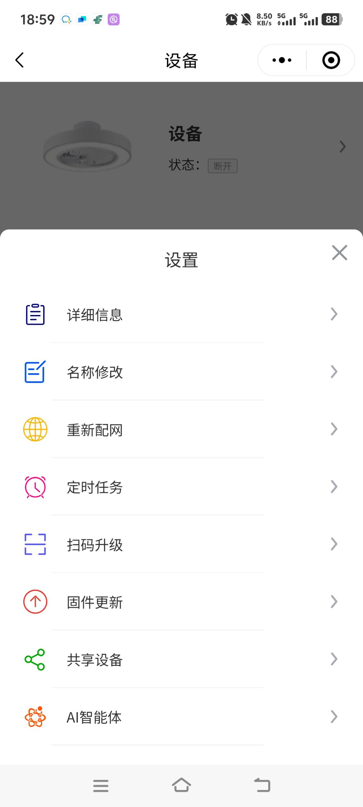
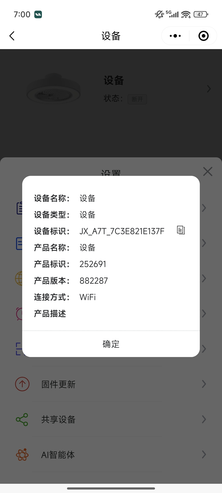

### JX-A7T开发板大规模出现质量问题怎么办？

**问题描述：**
在使用JX-A7T开发板时，出现大规模质量问题，表现为：

- 50块板中有30块存在各种问题
- 部分板子无法成功配网
- 在线大模型功能在特定时间点大规模失效
- 供电不足无法带动5个SG90舵机

**解决方案：**

**1. 质量问题处理**

- 整理出有问题的开发板
- 寄回给供应商进行检测分析
- 记录具体问题描述和视频证据

**2. 配网问题排查**

- 确保按照操作手册严格执行
- 检查网络环境稳定性
- 单独测试每块板的配网功能

**3. 供电问题解决**

- JX-A7T供电不足以驱动5个SG90舵机
- 建议使用独立外部供电
- 避免因供电不足导致运行错误

**4. 在线服务中断**

- 检查火山平台服务状态
- 如遇平台服务问题，等待恢复
- 保留问题发生时间记录

**问题统计：**

- 配网失败：部分板子死活配不上网
- 功能异常：经常重启、识别率差、智能体调用失败
- 供电限制：无法同时驱动多个舵机
- 服务中断：所有设备同一时间无法使用在线大模型

**处理流程：**

1. 汇总所有问题清单
2. 准备问题演示视频
3. 联系技术支持进行远程视频诊断
4. 寄回问题板进行质量分析
5. 申请补发合格产品


### 小程序操作界面频繁掉线问题

**问题描述：**

设备在使用小程序操作时频繁切换操作画面出现断线，表现为：

- 界面刷新失败，显示"断开"状态
- 退出重进操作界面需多次尝试才能刷出
- 问题在点击设备按钮进入操作界面时集中发生

**解决方案：**

- 使用最新固件版本（jx_12f_firmware_nls250102.bin）
- 新版本已修复并发处理导致的内存问题
- 清理微信小程序缓存可临时缓解问题

**问题分析：**

- 频繁进入操作界面会触发特定数据包发送
- 连续发送数据包时必定会卡住
- 内存分配失败导致系统重启
- 重启后约30分钟可自动重连

**临时处理方法：**

1. **清理小程序缓存**
    - 删除微信小程序
    - 重新搜索添加小程序
    - 清理后通常可暂时恢复

2. **设备重启**
    - 断电重启可临时解决
    - 重启后20-30分钟可恢复连接

**注意事项：**

- 问题主要由并发处理异常引起
- 新版本固件已加强内存保护
- 建议升级到最新版本彻底解决
- 小程序侧的优化也在进行中

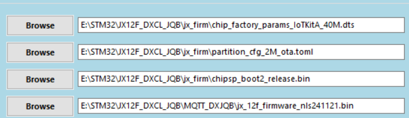


### 小程序界面刷新失败问题

**问题描述：**

小程序操作界面无法正常加载，表现为：

- 设备状态显示"连接"
- 界面内容为空，仅显示设备图标
- 需多次退出重进或重新上电才能恢复

**解决方案：**

1. **清理小程序缓存**
    - 删除微信小程序
    - 重新搜索添加小程序
    - 清理后通常可恢复

2. **设备重启**
    - 断电重启设备
    - 重启后通常能恢复正常
    - 如问题持续，升级到最新固件
 
**问题分析：**

- 小程序更新可能导致界面兼容性问题
- 缓存数据异常影响界面加载
- 设备与小程序通信协议异常

**详细操作步骤：**

1. **删除小程序方法**
    - 微信→发现→小程序
    - 长按小程序图标选择"删除"
    - 或通过微信→设置→通用→功能→清理→小程序

2. **重新添加**
    - 搜索"智能公元"
    - 进入小程序并重新配网

**注意事项：**

- 问题主要由小程序侧引起，非设备硬件问题
- 新版本固件已增强兼容性
- 如问题持续，联系技术支持获取帮助
- 多设备测试时可能出现数据串用现象


### JX-A7T模块问题修复验证

**问题描述：**

需要确认JX-A7T模块的掉线问题是否已彻底解决，以及长期稳定性测试结果。

**解决方案验证：**

1. **固件升级确认**
    - 从jx_12f_firmware_nls241121.bin升级到jx_12f_firmware_nls241120.bin
    - 最终升级到jx_12f_firmware_nls250102.bin
    - 新版本修复了并发处理和内存泄露问题

2. **测试结果反馈**
    - 开发者测试：重现问题后未再出现异常
    - 用户测试：3台设备连续运行4天未掉线
    - 频繁操作测试：每台设备每天进出操作界面10次以上

**测试方法：**

1. **长期稳定性测试**
    - 多台设备同时挂测
    - 连续运行7天以上
    - 记录掉线和重连次数

2. **压力测试**
    - 频繁切换操作界面
    - 模拟高并发场景
    - 监控内存使用情况

**结论：**

- 修复版本（jx_12f_firmware_nls250102.bin）已解决掉线问题
- 自动重连功能正常，未受固件更新影响
- 设备在网络异常情况下的恢复能力增强
- 可以进行批量设备升级和发货

**注意事项：**

- 升级时确保使用正确的固件文件
- 保留设备原始日志以便问题追踪
- 建议用户升级后观察24-48小时
- 如仍有异常，提供详细日志供进一步分析

### 进入操作界面时内存分配失败

**问题描述：**

设备在进入小程序操作界面时出现内存分配失败：

- 日志显示"Memory Allocate Failed. Current left size is 24 bytes"
- 随后设备开始重连流程
- 不操作设备时长期运行正常

**问题分析：**

1. **触发时机**
    - 仅在进入操作界面时发生
    - 正常数据传输时无此问题
    - 与特定数据包发送相关

2. **内存状态**
    - 剩余内存仅24字节
    - 无法分配新内存块
    - 系统触发保护机制重启

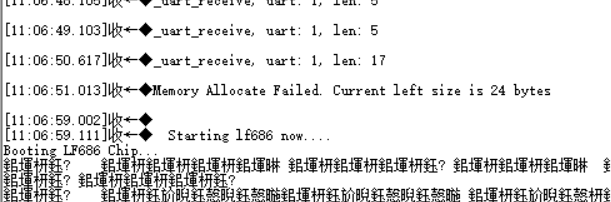
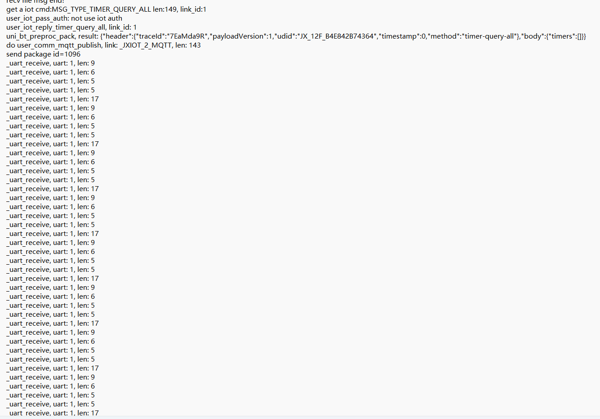

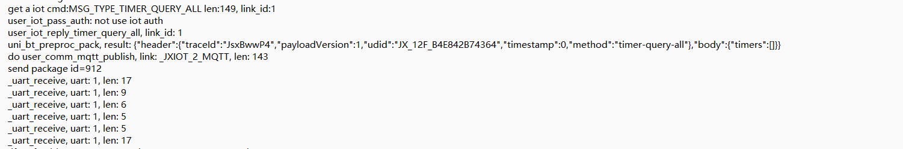
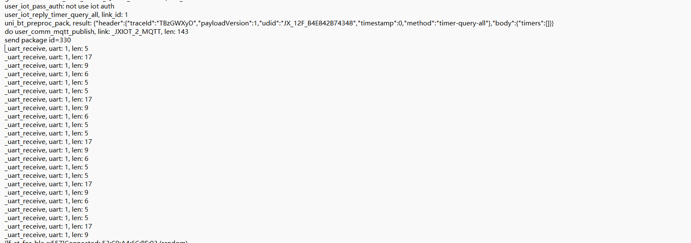

**根本原因：**

- 进入操作界面触发大量并发请求
- 内存碎片化严重
- 固件存在内存泄露缺陷

**解决方案：**

1. **使用修复版本**
    - 升级到jx_12f_firmware_nls250102.bin
    - 新版本修复了内存管理问题
    - 加强了并发处理机制

2. **操作建议**
    - 避免频繁快速切换界面
    - 操作间隔保持30秒以上
    - 问题出现时重启设备

**长期测试结果：**

- 修复版本连续运行4天无异常
- 频繁操作测试未再出现内存失败
- 设备稳定性显著提升

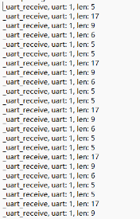

### 小程序缓存导致设备数据异常

**问题描述：**

多台设备同时使用时出现数据串用现象：

- 查看A设备时显示B设备的信息
- 小程序后台长期运行导致缓存异常
- 清理手机缓存后问题暂时解决

**问题分析：**

1. **缓存机制问题**
    - 小程序切换设备时未正确清理缓存
    - 后台运行时数据更新不及时
    - 多设备数据混淆

2. **触发条件**
    - 同时连接多台设备（5-6台）
    - 频繁切换查看不同设备
    - 小程序长期在后台运行

**临时解决方法：**

1. **完全清理小程序**
    - 微信→发现→小程序
    - 点击右上角"..."→删除
    - 确认删除操作

2. **重启微信**
    - 完全退出微信应用
    - 重新打开微信
    - 重新搜索添加小程序

**根本解决方案：**

- 使用最新固件版本（jx_12f_firmware_nls250102.bin）
- 新版本已优化设备ID管理
- 小程序端也在进行优化更新

**注意事项：**

- 问题主要由小程序缓存机制引起
- 与设备硬件无关
- 建议定期清理小程序缓存
- 如问题持续，使用不同手机测试

### JX-A7T的GPIO_A2管脚无法触发语音播报怎么办？

**问题描述：**

将GPIO_A2管脚设置为高电平触发时，无法正常触发语音播报功能。

**解决方案：**

**1. 检查触发配置**

- 确认触发方式已正确设置为"GPIO输入"
- GPIO输入选择为"GPIO_A2/高电平"
- 验证已添加对应的控制动作

**2. 配置步骤**

1. **添加触发**
    - 行为选择：IO
    - 触发方式：GPIO输入
    - GPIO输入：GPIO_A2/高电平

2. **添加控制**
    - 行为选择：IO
    - 控制方式：播放语音
    - 选择对应的语音内容

**3. 注意事项**

- GPIO_A2对应的是2号管脚
- 触发条件必须与实际输入信号电平匹配
- 确保已配置相应的语音播报内容

**4. 常见问题**

- 高电平信号必须稳定，短暂的脉冲可能无法触发
- 确认管脚接线良好，无接触不良
- 检查供电电压是否正常（推荐5V）

**注意事项：**

- 每次高电平触发只能播放一次语音
- 如需持续播放，需要使用脉冲信号反复触发
- 配置完成后建议先使用跳线测试触发功能

---

### JX-A7T烧录失败，串口工具无法识别设备怎么办？

**问题描述：**

模块上电后喇叭有电流声，但其他无反应，串口烧录工具显示"打开串口失败"且无法识别设备。

**解决方案：**

**1. 供电问题排查**

- 检查供电电压是否稳定（推荐5V）
- 供电不足会导致喇叭电流声和模块无响应
- 避免使用电脑USB口供电，改用质量可靠的5V电源适配器
- 如使用台式电脑USB口，可能因电源纹波过大产生干扰

**2. 串口接线检查**

- USB转串口模块（CH340）应直接插入电脑USB口，避免使用拓展坞
- JX-A7T的USB烧录口对应B6、B7引脚，不是模块上的RX/TX
- RX/TX是用于外部设备通信的串口，不是烧录接口

**3. 烧录步骤**

1. **正确接线**
    - 5V电源接到模块电源引脚
    - CH340的TXD接到模块的B6或B7
    - CH340的RXD接到模块的B7或B6
    - GND接地

2. **选择正确固件**
    - 串口烧录选择带"update"后缀的bin文件
    - 文件名较长的版本（如：jx_su_03t_release_update.bin）
    - 不要选择不带update的文件

3. **烧录操作**
    - 先连接5V电源到模块
    - 烧录前将5V电源针从模块拔下再插上（复位）
    - 打开烧录工具选择正确串口和固件文件
    - 开始烧录

**4. 常见问题解决**

- **串口打开失败**：检查USB转串口驱动是否正确安装
- **设备无响应**：调换TX/RX线序（最多两次尝试）
- **烧录中断**：确保供电稳定，避免使用拓展坞


**注意事项：**

- 烧录时需要断电复位，模块没有专用复位按钮
- 确保使用质量良好的USB转串口模块
- 烧录成功后模块才能正常工作，无其他反应是正常现象

---

### JX-A7T的GPIO触发只能播放一次语音怎么办？

**问题描述：**

配置GPIO_A2高电平触发语音播报，但设备只播放一次就无法再次触发，且无法实现持续播放。

**解决方案：**

**1. 触发机制说明**

- GPIO高电平触发默认只执行一次动作
- 持续高电平不会重复触发
- 需要电平变化（低→高）才能再次触发

**2. 实现持续播放的方法**

1. **使用脉冲信号**
    - 给GPIO_A2发送脉冲信号（低→高→低→高）
    - 每次脉冲上升沿触发一次播放
    - 脉冲间隔根据需要调整

2. **配置多个触发条件**
    - 可以同时配置高电平和低电平触发
    - 使用不同的消息号对应不同动作
    - 通过电平变化实现连续播放

**3. 注意事项**

- 固件当前限制：单次触发只执行一次
- 持续高电平状态不会重复触发
- 开发团队正在优化此功能
- 建议使用外部电路产生脉冲信号

**注意事项：**

- 确保语音文件已正确配置
- 测试时可以使用跳线手动触发
- 如需复杂的播放逻辑，建议通过串口控制

---

### JX-A7T1烧录完WiFi固件后无法烧录语音固件怎么办？

**问题描述：**

JX-A7T1在烧录完WiFi固件后，尝试烧录语音固件时，虽然有开机播报，但内容不是预期的，且烧录进度条不显示，烧录失败。

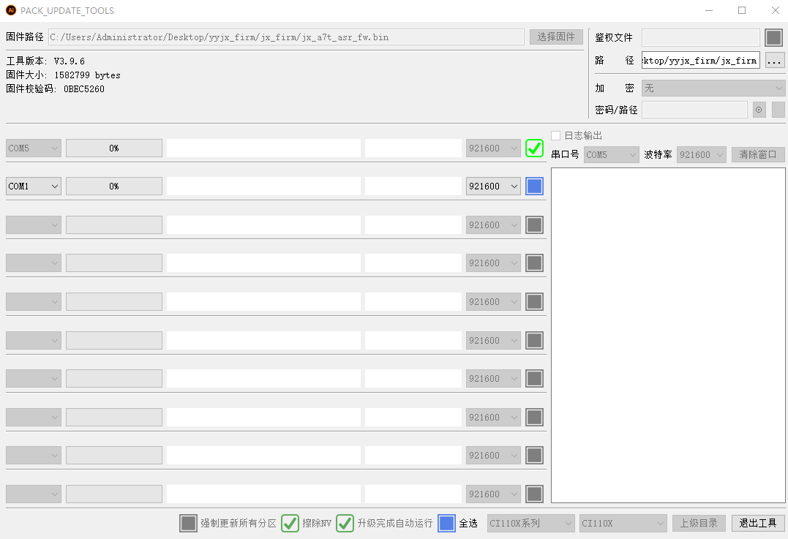

**解决方案：**

**问题分析**

- 现象表明设备未能正确进入语音固件烧录模式
- 有开机播报说明WiFi部分工作正常
- 烧录工具进度条不显示说明通信未建立

**解决步骤**

1. **检查烧录模式设置**
    - 确认两个开关都已拨到下方（语音模式）
    - 开关位置错误会导致无法进入正确模式

2. **正确操作流程**
    - 先烧录WiFi固件并测试正常
    - 将所有开关拨到语音模式位置
    - 按下复位键让设备重启进入语音模式
    - 打开烧录工具选择正确的语音固件文件

3. **烧录工具设置检查**
    - 确认选择了正确的COM端口
    - 检查波特率设置是否正确
    - 验证固件文件路径和完整性

**注意事项：**

- WiFi和语音固件需要分别烧录，不能同时操作
- 开关位置必须与要烧录的固件类型匹配
- 如果问题持续，尝试重新烧录WiFi固件后再试

---

### JX-A7T1烧录语音固件时提示串口连接失败怎么办？

**问题描述：**

JX-A7T1设备在烧录完WiFi固件后，尝试烧录语音固件时无法进入烧录模式，设备有开机播报但内容异常，且烧录工具提示串口连接失败。

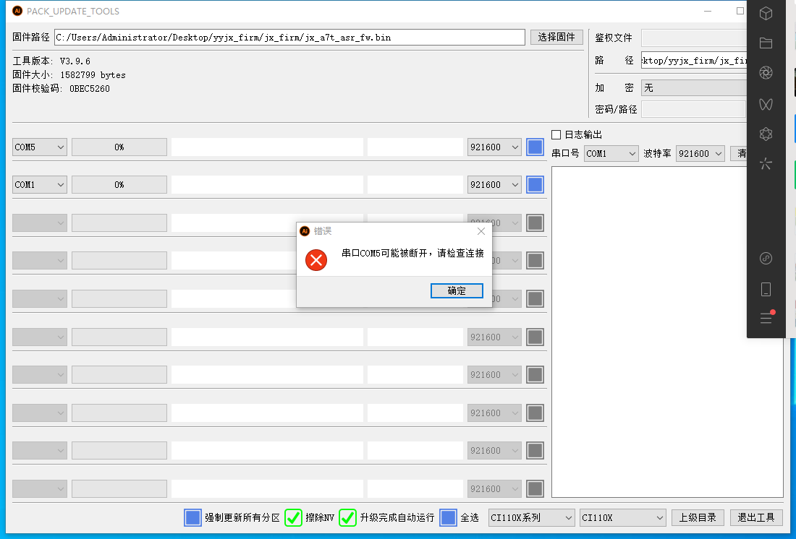

**解决方案：**

**问题原因**

- 烧录工具的芯片型号选择错误
- 当前选择了CI110X系列，但JX-A7T1使用的是CI1302芯片
- 型号不匹配导致通信协议错误

**解决步骤**

1. **修改芯片型号选择**
    - 将"CI110X系列"下拉菜单更改为"CI130X系列"
    - 在"CI130X系列"下拉菜单中选择"CI1302"

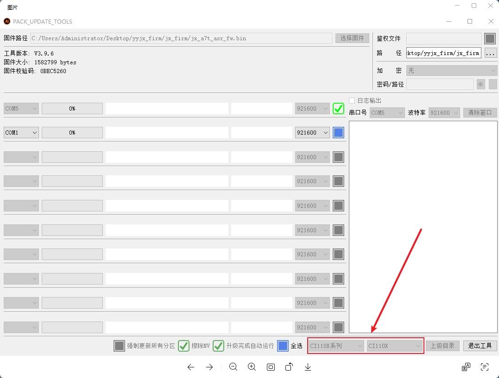

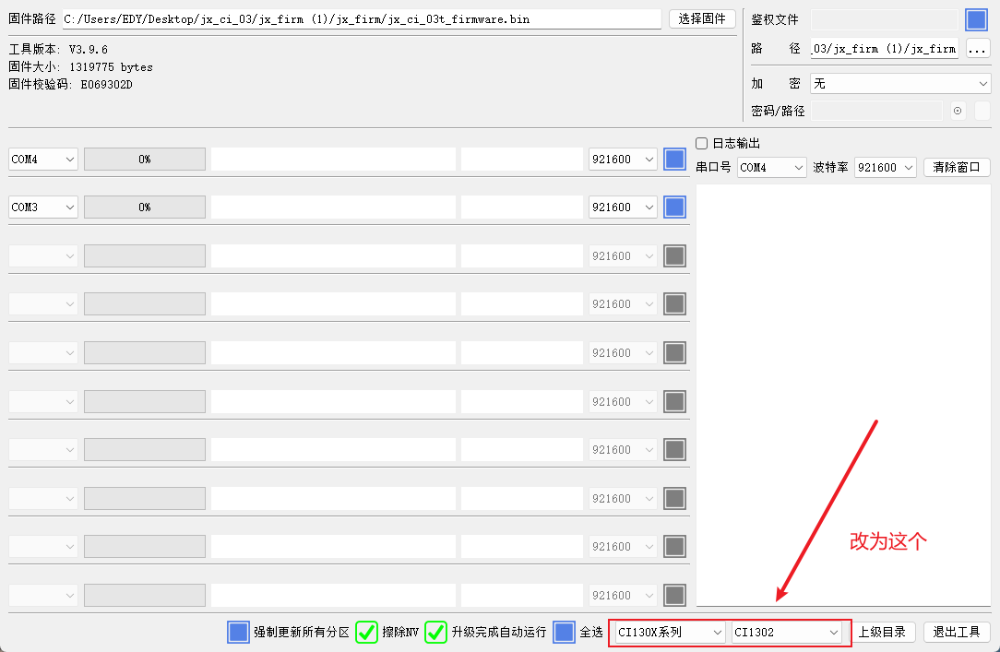

2. **重新进行烧录**
    - 选择正确的COM端口
    - 确认固件文件路径正确
    - 点击开始烧录

3. **硬件检查**
    - 确认USB转串口驱动正常
    - 检查USB线缆连接良好
    - 验证设备供电稳定

**注意事项：**

- JX-A7T1语音部分使用CI1302芯片，必须选择对应型号
- WiFi和语音部分的芯片型号不同，烧录时需要分别选择
- 芯片型号选择错误是最常见的烧录失败原因

---

### JX-A7T烧录语音固件时如何确认芯片型号配置？

**问题描述：**

需要确认JX-A7T语音固件烧录时的芯片型号配置是否正确。

**解决方案：**

**芯片型号确认**

1. **JX-A7T使用的芯片**
    - WiFi部分：使用特定WiFi芯片
    - 语音部分：使用CI1302芯片
    - 烧录时必须选择正确的芯片型号

2. **烧录工具配置**
    - 将"CI110X系列"改为"CI130X系列"
    - 在"CI130X系列"下拉菜单中选择"CI1302"
    - 确认配置后进行烧录

3. **配置验证**
    - 查看烧录工具显示的芯片型号
    - 确认与CI1302匹配
    - 保存设置后重新尝试烧录

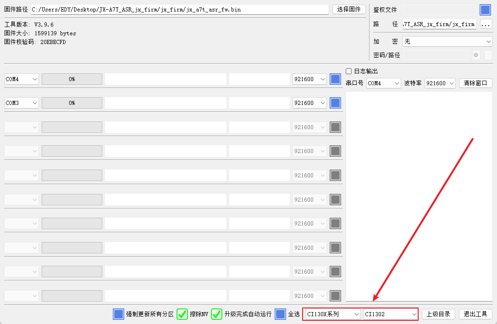

**注意事项：**

- WiFi固件和语音固件使用不同的芯片
- 烧录语音固件必须选择CI1302
- 如果型号选择正确仍无法烧录，检查硬件连接

---

### JX-A7T开发板烧录失败怎么办？

**问题描述：**

JX-A7T开发板无法烧录固件，尽管设备通电后能正常工作，但烧录操作失败。

**解决方案：**

**关键操作步骤：**

1. **冷启动烧录**
    - 点击烧录按钮后，必须拔插5V供电线
    - 这是进入烧录模式的必要操作
    - 不进行冷启动会导致烧录失败

2. **接线确认**
    - B6接TXD（烧录器TX）
    - B7接RXD（烧录器RX）
    - VCC接5V，GND接地

3. **烧录流程**
    - 连接好所有线路
    - 打开烧录工具和固件文件
    - 点击开始烧录
    - 立即拔插5V电源线
    - 等待烧录完成

**原理说明：**

JX-A7T需要通过冷启动进入 bootloader 模式：

- 断电复位芯片
- 上电时检测特定引脚状态
- 进入烧录模式等待数据

**常见问题：**

- 忘记拔插电源线：最常见错误
- 拔插时机不对：需要在点击烧录后立即操作
- 电源不稳定：确保供电质量

**注意事项：**

- JX-A7T必须冷启动才能烧录
- 这是该型号的特殊要求，与其他模块不同
- 建议使用稳定的电源适配器

---

### JX-A7T模块烧录失败且杜邦线接触不良怎么办？

**问题描述：**

JX-A7T语音模块使用杜邦线连接进行烧录时失败，驱动已正确安装但无法烧录，初步判断为接触不良导致的连接问题。

**解决方案：**

**1. 确认杜邦线规格**

- 确认使用2.54间距的杜邦线
- 检查杜邦线与模块接口是否匹配
- 线缆连接时避免松动


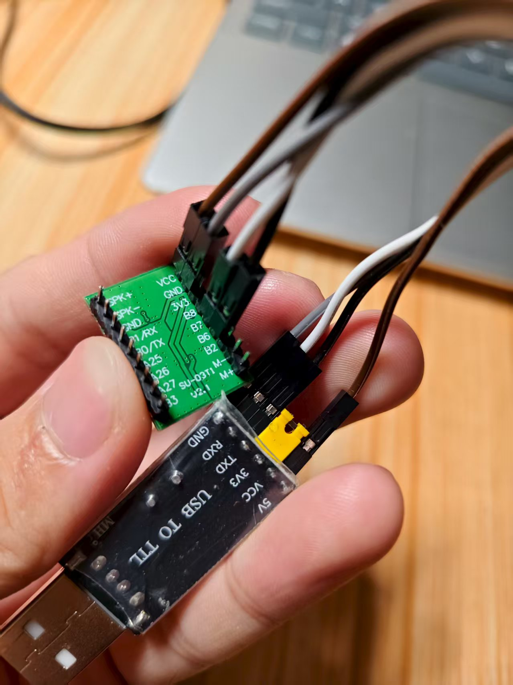

**2. 改用焊接方式**

- 将杜邦线直接焊接到模块引脚上
- 焊接四根关键线：VCC、GND、RX、TX
- 确保焊接牢固，接触良好


**3. 焊接质量要求**

- 使用质量较好的焊锡（推荐63%含锡量）
- 可配合助焊剂提高焊接质量
- 避免虚焊、漏焊等焊接缺陷


**注意事项：**

- 杜邦线连接容易松动，建议焊接固定
- 焊锡质量差会导致挂不住电路板
- 使用助焊剂时注意适量，避免影响电路
- 如焊接困难，建议更换质量更好的焊锡材料

---

### JX-A7T固件反复烧录无法正常工作怎么办？

**问题描述：**

JX-A7T固件烧录时出现反复烧录、无法正常工作的问题，但其他固件可以正常烧录。

**解决方案：**

1. **修改应用场景配置**：

    - 将"应用场景"从"安静环境"改为其他选项
    - 如"语音识别+AEC打断(限单MIC)"

2. **检查帧头设置**：

    - 确认UART1_RX帧头格式正确
    - 使用十六进制格式（如 AA BB）
    - 避免使用空格等非法字符

3. **选择正确的烧录工具**：

    - 使用CI130x系列的1303选项
    - 不是1301，必须是1303


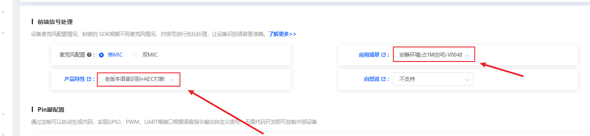

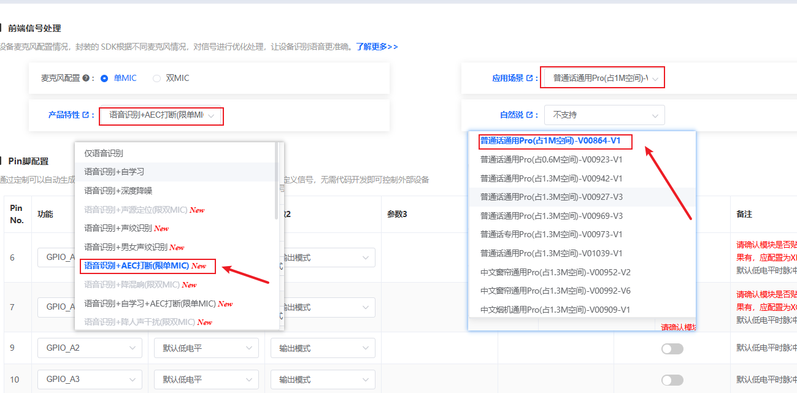

**注意事项：**

- 固件配置与应用场景需匹配
- 帧头必须严格使用十六进制格式
- 不同固件版本可能存在兼容性差异
- 如问题持续，需要技术人员检查固件文件

### jx_firm.tar.gz和jx_ci_33t_firmware.bin有什么区别？

**问题描述：**

不同版本的固件文件（jx_firm.tar.gz和jx_ci_33t_firmware.bin）烧录后表现不同，一个正常工作，一个反复烧录。

**解决方案：**

1. **固件版本差异**：

    - jx_ci_33t_firmware.bin：测试通过的正常版本
    - jx_firm.tar.gz：可能存在配置问题的版本

2. **处理建议**：

    - 优先使用测试通过的版本
    - 保留正常工作的固件作为备份
    - 问题固件需要技术人员进一步分析

**注意事项：**

- 固件文件名称不同代表内部配置差异
- 烧录前建议导出并检查配置文件
- 异常固件版本应反馈给技术支持

### JX-A7T模块无法烧录怎么办？

**问题描述：**

JX-A7T模块在烧录时无法通过串口下载程序，尝试多种方法但均未成功。

**解决方案：**

- **使用JL USB Updater烧录器**：配合专用转接板进行烧录
- **正确接线方法**：

    - PWR接下载器的VCC
    - GND接GND
    - TX和RX分别对应连接（需查看文档确认TX接D+还是D-）
- **参考开发包文档**：开发包内包含详细的引脚定义和接线说明
- **观看官方视频**：B站搜索"机芯智能"查看对应烧录视频

**接线注意事项：**

- 烧录需要连接四根线：VCC、GND、TX、RX
- 烧录器上的三个针（GND、RX、TX）不用管，用下面四个
- 模块搭载在开发板上时，可能需要预留对应的烧录接口

### JX-A7T使用UniOne蜂鸟烧录工具无法识别怎么办？

**问题描述：**

使用云知声UniOne蜂鸟烧录工具时，按照标准接线方式连接JX-A7T模块进行烧录，但烧录工具无法识别设备，且烧录器指示灯显示为红灯。

**解决方案：**

**1. 接线确认**

- USB四根线连接：VCC、GND、TXD、RXD
- 交叉连接：TXD接芯片的RXD，RXD接芯片的TXD
- 电源线直接与芯片VCC、GND连接

**2. 烧录器状态判断**

- 红灯：表示烧录工具无法识别设备
- 绿灯：表示正常识别，可以开始烧录
- 红灯状态通常表示连接或配置有问题

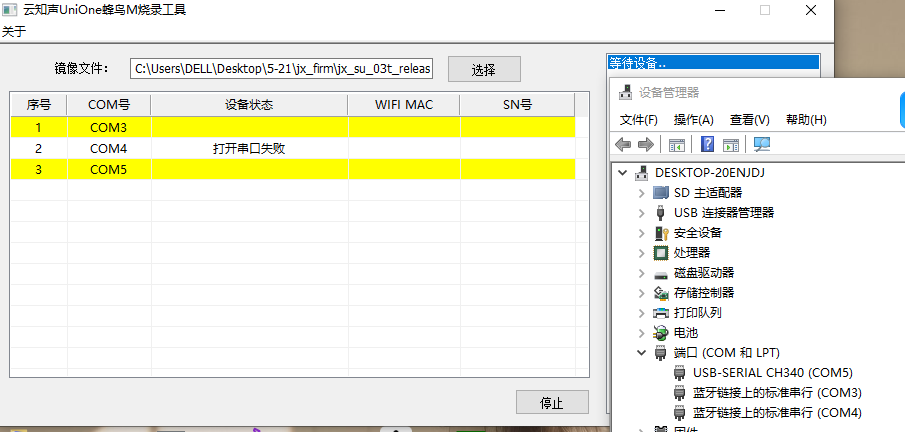

**3. 可能的原因**

- 接线错误或接触不良
- USB转串口驱动问题
- 烧录器与模块不兼容
- 模块未正确进入烧录模式

**4. 处理建议**

- 重新检查接线是否正确
- 尝试重新插拔USB连接
- 确认设备管理器中的COM端口状态
- 如仍有问题，建议使用JL专用烧录器

**注意事项：**

- UniOne蜂鸟烧录器可能与某些模块存在兼容性问题
- 建议优先使用模块配套的专用烧录工具
- 多次尝试仍无法识别时，及时联系技术支持

---

### JX-A7T烧录时设备无法识别怎么办？

**问题描述：**

JX-A7T模块烧录失败，烧录工具无法识别设备，一直显示"等待设备.."，即使设备已正确连接且COM端口正常，之前曾成功烧录过。

**解决方案：**

**1. 接线检查**

- **确认VCC连接**：

    - 检查模块的VCC引脚是否正确连接到5V电源
    - 使用万用表测量电压是否稳定
    - 确保电源供电电流足够

- **检查TX/RX接线**：

    - 确认TX和RX没有接反
    - 尝试交换TX和RX连接
    - 检查接线是否牢固

**2. 烧录工具设置**

- **检查COM端口**：

    - 确认选择的COM端口正确
    - 在设备管理器中查看端口状态
    - 尝试更换USB端口

- **波特率调整**：

    - 降低波特率到9600尝试
    - 某些情况下低波特率更稳定
    - 确保烧录工具和设备波特率匹配

**3. 硬件排查**

- **复位模块**：

    - 完全断电后重新上电
    - 拔插电源线等待几秒
    - 按复位按钮（如果有）

- **更换硬件**：

    - 尝试使用另一个USB转串口模块
    - 检查连接线是否完好
    - 在另一台电脑上测试

**注意事项：**

- 之前能成功烧录说明硬件没问题
- 重点检查接线和设置是否有变化
- 如果所有方法都无效，可能需要重新烧录引导程序

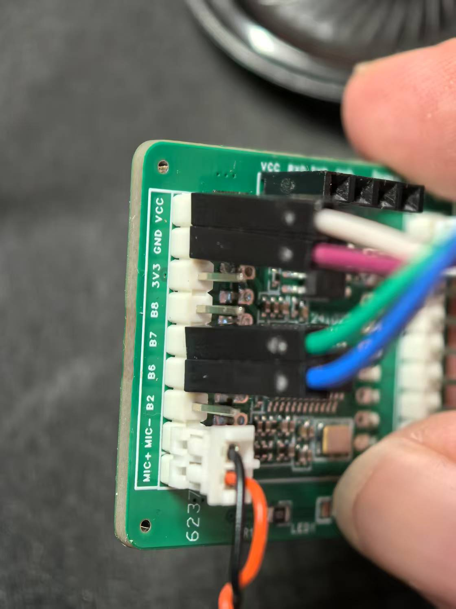

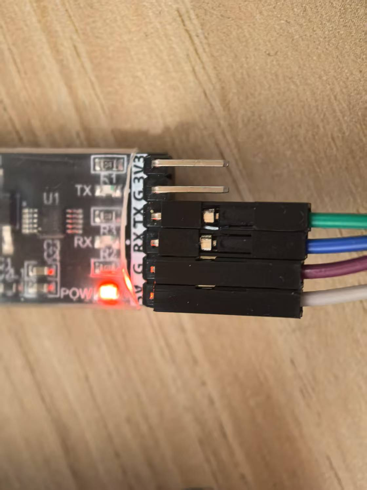

### JX-A7T排线连接方向错误怎么办？

**问题描述：**

使用排线连接JX-A7T模块时，因连接方向错误导致烧录失败，设备无响应，底板指示灯不亮。

**解决方案：**

**排线方向识别：**

- **正确方向**：排线的纯黑色部分朝外（背离模块方向）
- **错误方向**：纯黑色部分朝内（插入模块内部）
- **关键标识**：排线通常有一面为纯黑色，另一面有白色或彩色标记

**正确连接步骤：**

1. **识别排线特征**
    - 找到排线的纯黑色面
    - 确认模块接口的正确朝向
    - 查看接口旁的丝印标识

2. **插入操作**
    - 纯黑色面朝外插入
    - 确保排线完全插入接口
    - 避免倾斜或偏移

3. **验证连接**
    - 轻轻拉动排线确认牢固
    - 检查是否有虚接现象
    - 上电测试底板指示灯

**常见错误：**

- 认为所有接口都支持任意方向插入
- 忽略排线表面的颜色标识
- 插入深度不够导致接触不良

**注意事项：**

- 不同批次的排线可能颜色略有差异，以纯色面为基准
- 如果插反导致问题，立即断电检查
- 多次插拔要小心，避免损坏接口

---

### JX-A7T2烧录成功但固件未更新怎么办？

**问题描述：**

使用JX-A7T2开发板烧录新固件时，烧录工具显示成功，但设备运行的固件版本和功能内容仍为旧版本。

**解决方案：**

**1. 确认固件文件选择**

- 烧录前必须重新选取新固件路径下的bin文件
- 烧录工具不会自动更新到新文件夹的固件
- 即使删除了旧固件文件夹，也需要手动选择新固件

**2. 固件覆盖机制**

- 烧录过程会自动覆盖旧固件
- 不需要手动清空或擦除
- 确保选择了正确的固件文件路径

**3. 排查步骤**

- 确认烧录工具中选择的固件是最新的版本
- 检查固件文件的修改时间
- 重新生成固件并确保下载到本地
- 烧录成功后验证功能内容是否更新

**4. 常见问题**

- **固件混乱**：使用了错误文件夹的旧固件
- **路径错误**：选择了错误的固件文件
- **缓存问题**：烧录工具显示了错误的固件信息

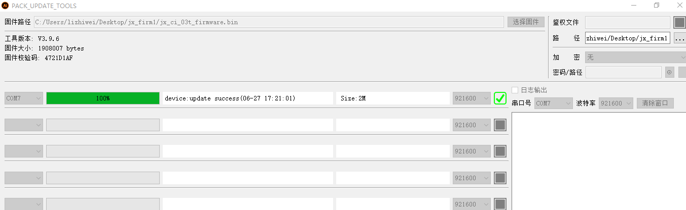

**注意事项：**

- 生成新固件时建议使用不同的文件夹名称
- 烧录前务必确认文件路径和文件名
- 如仍有问题，可尝试使用不同的烧录工具
- 保留旧固件作为备份，以便必要时恢复

---

### JX-A7T模块烧录失败怎么办？

**问题描述：**

使用JX-A7T模块进行烧录时出现"发送异常，COM3终止了本次传输活动"错误。重新上电后问题依旧存在，设备管理器显示设备正常但烧录无法继续进行。同时发现模块喇叭输出端一直有较大的噪音信号，影响正常使用。

**解决方案：**

**1. 噪音问题处理**

**噪音来源分析：**

- 模块内部PA（功放）电路自激振荡
- 电源纹波过大或供电不稳定
- 喇叭线路阻抗不匹配
- 地线回路引入的干扰噪声

**解决步骤：**
```
1. 断开外部喇叭，测量输出端电压：

    - 正常状态：DC偏置应为0V或极低
    - 异常状态：存在明显直流偏置或交流噪声

2. 检查供电电源：

    - 使用示波器测量5V电源纹波
    - 要求纹波小于50mV
    - 如纹波过大，更换电源或增加滤波电容

3. 确认喇叭参数：

    - 阻抗：推荐8Ω（3W-5W）
    - 避免使用阻抗过高或过低的喇叭
    - 检查喇叭线是否屏蔽良好
```

**2. 烧录失败处理**

**问题定位：**

- COM3端口通信中断
- 烧录工具与驱动程序兼容性问题
- USB转串口芯片稳定性问题
- 烧录时序不正确

**解决方案：**
```
1. 硬件连接优化：

    - 更换质量更好的USB转串口模块
    - 使用原装CH340芯片而非仿制品
    - 缩短连接线长度，避免信号衰减

2. 驱动和软件设置：

    - 卸载当前CH340驱动
    - 安装官方最新版本驱动
    - 烧录工具以管理员身份运行
    - 关闭杀毒软件和防火墙

3. 烧录参数调整：

    - 降低波特率至115200
    - 增加超时时间设置
    - 选择稳定的固件路径（英文路径）
```

**3. 模块启动问题**

**启动流程说明：**
```
1. JX-A7T典型启动时间：

    - 从上电到系统启动完成：约2-3秒
    - AI模型加载：1-2秒
    - 总共就绪时间：3-5秒

2. 启动状态判断：

    - 网络状态指示灯变化
    - 串口输出启动日志
    - ASR结果输出测试
```

**启动失败排查：**
```
1. 检查启动条件：

    - 供电电压：5V±5%
    - 启动电流：峰值可达500mA
    - 时钟信号：确保晶振工作正常

2. 使用串口调试：

    - 波特率：921600
    - 连接：TX→RX, RX→TX, GND→GND
    - 观察启动日志输出
```

**4. 综合处理方案**

**完整排查步骤：**
```
1. 先解决噪音问题：

    - 确认供电质量
    - 检查喇叭匹配
    - 测量输出偏置

2. 再处理烧录问题：

    - 更换USB转串口模块
    - 重装驱动程序
    - 调整烧录参数

3. 验证启动过程：

    - 监测启动电流
    - 观察指示灯状态
    - 通过串口查看日志
```

**注意事项：**

- JX-A7T对电源质量要求较高，建议使用线性电源
- 喇叭输出有静音电路，正常情况下不应有持续噪声
- 烧录失败一般不会导致硬件损坏，多数情况下可恢复
- 如多次尝试仍失败，可尝试使用脱机烧录器


---

### JX-A7T 产品概述

**问题描述：**

需要了解 JX-A7T 产品的功能特点、技术规格和使用方式。

**解决方案：**

JX-A7T 是一款支持离线指令与在线指令双重模式的语音模块：

- **离线指令模式**：支持本地命令词识别，无需网络连接即可响应控制指令
- **在线指令模式**：搭载大模型运行，支持智能对话和复杂语义理解
- **双模式兼容**：可根据应用场景灵活切换工作模式

**主要功能特点：**

1. **双重工作模式**：

    - 离线模式：快速响应本地命令，低延迟
    - 在线模式：支持 AI 大模型对话，智能化程度高

2. **技术支持**：

    - 例程和文档已上传至智能公元平台
    - 提供完整的开发指南和操作手册
    - 支持项目合作和技术咨询

3. **开发资源**：

    - 官方文档：https://help.aimachip.com/docs/jx_a7t_v1
    - 智能公元平台：https://smartpi.cn
    - 提供产品配置、固件生成和调试功能

**注意事项：**

- 在线模式需要连接 2.4G WiFi 网络
- 开发前建议先查看官方文档了解产品功能
- 如需项目合作或技术支持，可通过智能公元平台联系


---

### JX-A7T1模块通过串口发送指令后喇叭无法播放声音怎么办？

**问题描述：**

通过串口发送特定指令（AA 55 01 00 55 AA）后，JX-A7T1模块的喇叭无法播放声音。

**解决方案：**

**1. 确认固件版本**

    - 检查是否使用正确的固件文件
    - 确认固件已正确烧录到模块
    - 如有必要，重新烧录最新固件

**2. 检查串口配置**

    - 确认串口波特率设置正确（默认115200）
    - 检查串口线连接是否牢固
    - 验证TX/RX线是否正确对应

**3. 指令格式验证**

    - 确认发送的指令格式为十六进制
    - 使用串口调试工具发送测试指令
    - 检查指令是否被正确接收

**4. 硬件检查**

    - 确认喇叭连接正确
    - 检查喇叭阻抗是否匹配（推荐8Ω）
    - 测试喇叭是否正常工作

**注意事项：**

- 发送指令前确保模块已完全启动
- 某些固件版本可能不支持该指令
- 建议使用官方测试指令验证功能
- 如果问题持续，联系技术支持获取帮助

---

### JX-A7T1模块串口工具打开后自动接收处理数据怎么办？

**问题描述：**

JX-A7T1模块在串口工具打开后会自动接收并处理要发送的代码（AA 55 01 00 55 AA），导致串口通信异常。

**解决方案：**

**1. 模块工作模式确认**

    - 这是模块的正常工作特性
    - 模块会持续监听串口输入
    - 接收到特定指令会自动执行相应功能

**2. 通信协议理解**

    - AA 55 01 00 55 AA是预设的测试指令
    - 模块识别该指令后会触发相应动作
    - 这是设计预期的行为，不是故障

**3. 正确使用方法**

    - 发送指令前确认模块已就绪
    - 使用十六进制格式发送数据
    - 观察模块执行结果

**4. 调试建议**

    - 使用串口调试助手监控通信
    - 记录模块的响应行为
    - 测试不同指令的功能

**注意事项：**

- 这种自动响应是模块的正常功能
- 不影响正常的串口通信功能
- 如需禁用自动响应，需要修改固件配置
- 建议熟悉模块的通信协议后再进行开发

---

### JX-A7T1模块发送异常串口数据如何分析？

**问题描述：**

JX-A7T1模块发送了异常的串口数据，包含多条以'AA'开头的十六进制数据包，需要分析数据并提供解决方案。

**解决方案：**

**1. 数据格式分析**

    - AA开头是模块的标准数据帧头
    - 55 AA是数据帧的结束标识
    - 中间的数据段表示具体的控制指令

**2. 常见数据包解读**

    - AA 55 01 00 55 AA：测试指令，通常用于触发音频播放
    - AA 55 10 00 55 AA：可能是固件上传或数据传输指令
    - 其他数据包：根据具体参数确定功能

**3. 异常数据排查**

    - 检查数据包是否完整（帧头和帧尾匹配）
    - 确认数据接收端是否正确解析
    - 验证波特率等串口参数是否一致


*串口调试工具显示的多条AA开头数据包*

**4. 处理方法**

    - 如数据异常，重新烧录固件
    - 检查硬件连接是否稳定
    - 使用官方标准测试指令验证

**注意事项：**

- AA开头的数据包是正常的通信格式
- 异常通常出现在数据段内容或频率
- 建议保存异常数据日志供技术支持分析
- 定期检查固件版本是否需要更新

---

### JX-A7T模块烧录失败如何处理？

**问题描述：**

使用云知声UniOne蜂鸟M烧录工具烧录JX-A7T模块时，设备无法被识别，烧录过程无反应。

**解决方案：**

**1. 检查固件文件选择**

    - 确认选择的是release_update.bin文件
    - jx_su_03t_release_update.bin是用于升级的固件
    - 不要选择jx_su_03t_release.bin文件

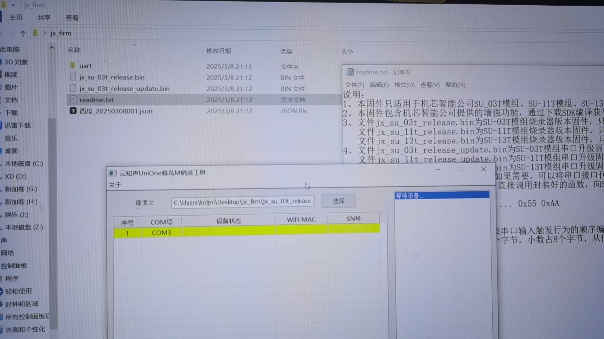

*固件文件夹中的文件，应选择update版本*

**2. 检查硬件连接**

    - 确认杜邦线连接位置正确
    - 使用万用表测试连通性
    - 重点检查TX/RX线是否正确对应


**3. 安装CH340驱动**

    - 确认已安装CH340串口驱动
    - 在设备管理器中查看COM端口是否正常识别
    - 如驱动异常，下载并安装江科大版CH340驱动

**4. 正确的烧录操作**

    - 在烧录工具中选择正确的固件文件
    - 点击烧录按钮后，拔掉模块5V电源线
    - 等待2秒后重新插入5V电源

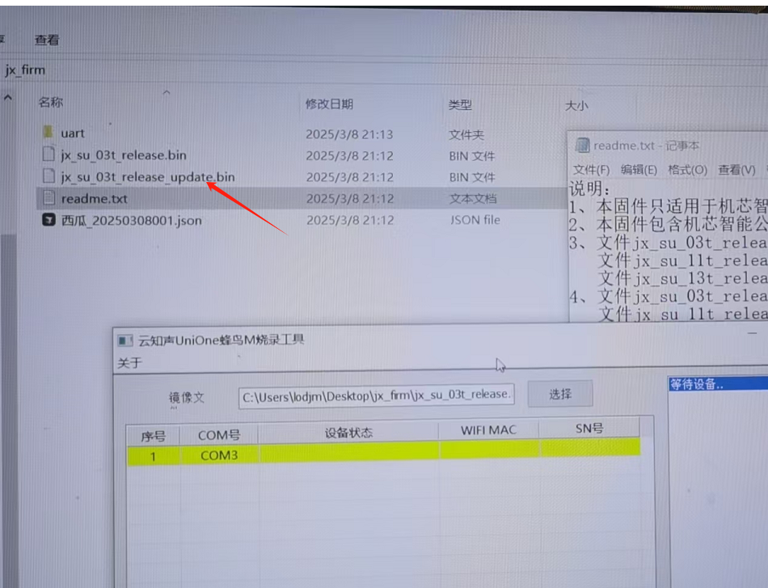

*应选择jx_su_03t_release_update.bin文件进行烧录*

---

### JX-A7T模块烧录进度卡在20%或0%怎么办？

**问题描述：**

JX-A7T模块在使用多种烧录方法（包括USB转TTL、CH340烧录器）和不同软件（如PACK_UPDATE_TOOLS、Leapfive Flash Environment）时，均无法完成固件烧录，烧录进度卡在20%或0%，并出现"IMG LOAD SHAKEHAND FAIL"等错误。

**解决方案：**

**1. 基础检查**

- 确认使用正确的固件文件（.bin或.img格式）
- 检查USB线质量，尝试更换优质USB线
- 使用不同USB接口或电脑尝试

**2. 烧录方法调整**

- 尝试使用CH340烧录器，不使用Type-C线
- 对于开发板版本，确认飞线连接可靠
- 焊接烧录接口引脚，避免接触不良

**3. 烧录工具设置**

- 波特率设置为115200
- 确认COM端口选择正确
- 尝试烧录不同的固件文件（如ASR固件、WiFi固件）

**4. 其他尝试**

- 使用官方提供的串口调试工具测试
- 录制完整烧录视频供技术人员分析
- 按照JX-A7T烧录指引文档V1.0操作

**注意事项：**

- 若按照文档正确操作仍无法烧录，可能是硬件问题
- 烧录失败不影响模块的语音功能，说明硬件基本正常
- 多种方法尝试失败后，建议联系技术支持或更换设备

### JX-A7T固件文件名包含特殊字符导致烧录失败怎么办？

**问题描述：**

固件压缩包解压后文件名包含特殊字符（如括号、空格等），导致文件无法正确解压或烧录失败。

**解决方案：**

- **检查文件名完整性**：

    - 正确的固件压缩包后缀应为.tar.gz
    - 文件名中不应包含(4)、副本等额外字符
    - 完整文件名应为jx_firm.tar.gz格式

- **重新下载固件**：

    - 删除当前有问题的文件
    - 重新生成或下载固件包
    - 确保下载过程中文件名未被修改

- **手动修复文件名**：

    - 将jx_firm.tar(4).gz重命名为jx_firm.tar.gz
    - 删除"副本"等后缀，保持原始文件名
    - 确保文件扩展名完整且正确

**注意事项：**

- 固件文件路径不能包含中文字符
- 建议将固件文件放置在桌面根目录
- 文件名修改后需确认文件完整性未被破坏
- 烧录前必须确保固件文件能够正常解压

---

### JX-A7T设备需要确认固件文件，烧录的更新文件是哪个？

**问题描述：**

需要确认JX-A7T设备的固件文件，特别是用于烧录的更新文件是哪一个。

**解决方案：**

**固件文件识别：**

1. **文件名称说明**：

    - jx_su_03t_release.bin：基础固件文件
    - jx_su_03t_release_update.bin：更新固件文件
    - update版本用于固件更新和烧录

2. **选择正确文件**：

    - 烧录时选择：jx_su_03t_release_update.bin
    - 这是用于升级的更新文件
    - 不要选择release.bin文件

3. **文件区别**：

    - release.bin：完整固件，通常用于首次烧录
    - release_update.bin：增量更新文件，用于固件升级
    - 平台生成的update文件是专门用于烧录的

**烧录操作步骤：**

1. **文件准备**：

    - 将jx_su_03t_release_update.bin放置在合适位置
    - 确保文件名正确
    - 避免使用中文路径

2. **烧录工具设置**：

    - 选择正确的COM端口
    - 选择update.bin文件
    - 设置合适的波特率

3. **烧录流程**：

    - 连接硬件线路
    - 选择固件文件
    - 点击烧录按钮
    - 等待烧录完成

**注意事项：**

- 烧录时必须使用update后缀的文件
- 如果烧录失败，检查文件是否选择正确
- 不同版本的固件文件名可能略有差异
- 保留原始固件文件作为备份

---

### JX-A7T发射端烧录文件如何确认？

**问题描述：**

需要确认用于烧录JX-A7T发射端的文件是哪个，具体指发射端的update文件。

**解决方案：**

**发射端固件确认：**

1. **文件类型**：

    - 发射端使用update后缀的固件文件
    - 即jx_su_03t_release_update.bin
    - 这是专门用于发射端烧录的更新文件

2. **文件选择依据**：

    - update标识：表明是更新版本
    - 发射端专用：针对发射端功能优化
    - 烧录工具要求：需要update格式文件

3. **使用场景**：

    - 发射端设备升级
    - 功能更新修复
    - 新功能添加

**操作指南：**

1. **确认设备类型**：

    - 明确是发射端设备
    - 不是接收端或其他设备
    - 使用对应的固件文件

2. **文件验证**：

    - 检查文件名包含update
    - 确认文件完整性
    - 验证文件版本

3. **烧录准备**：

    - 选择正确的烧录工具
    - 配置合适的参数
    - 连接好硬件

**注意事项：**

- 发射端和接收端固件不同，不能混用
- update文件是烧录的标准格式
- 烧录前备份原有固件
- 确保烧录过程稳定，避免中断

---

### JX-A7T固件文件路径包含中文导致烧录失败怎么办？

**问题描述：**

使用云知声UniOne蜂鸟M烧录工具烧录JX-A7T模块固件时，因固件文件路径包含中文而导致文件读取失败。

**解决方案：**

**1. 使用英文路径**

- 将固件文件移动到纯英文路径下
- 确保完整路径中不包含任何中文字符
- 建议使用简单路径，如 C:\firmware

**2. 正确操作步骤**

- 将固件文件复制到英文路径
- 在烧录工具中重新选择文件
- 开始烧录操作

**注意事项：**

- 烧录工具不支持中文路径
- 文件名可以使用英文或数字
- 避免使用特殊字符和空格

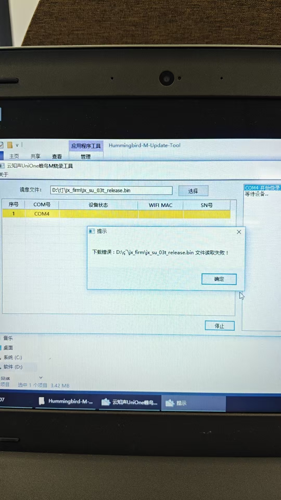

---

### JX-A7T如何通过串口发送指令触发配置？

**问题描述：**

需要了解如何通过串口向JX-A7T模块发送指令以实现配置触发，并获取模块的响应参数。

**解决方案：**

**1. 串口触发机制**

- JX-A7T支持通过串口接收指令触发相应动作
- 模块接收指令后会输出对应参数
- 使用UART1_RX接收外部指令

**2. 配置方法**

- 在固件配置中添加"串口输入"触发器
- 设置消息号和参数类型
- 配置触发后的动作或响应

**3. 指令发送**

- 使用串口调试工具发送特定格式数据
- 确保波特率设置为正确值（通常115200）
- 发送的指令格式需与配置匹配

**注意事项：**

- 模块会自动监听串口输入
- 接收到正确指令后会执行相应功能
- 建议使用十六进制格式发送数据

---

### JX-A7T如何在退出回复中添加串口指令？

**问题描述：**

需要在JX-A7T模块的"退出回复"中添加串口指令发送功能，实现特定动作触发。

**解决方案：**

**1. 使用事件触发方式**

- 在配置工具中添加"事件触发"
- 选择"退出唤醒"作为触发事件
- 关联UART1_TX发送操作

**2. 配置串口发送**

- 选择UART1_TX作为发送端口
- 设置要发送的十六进制指令
- 配置延时时间（如8000ms）

**3. 实现步骤**

- 进入触发配置界面
- 添加新触发器
- 选择事件类型为"退出唤醒"
- 添加串口发送动作
- 保存配置并生成固件

**注意事项：**

- 退出回复功能需要通过事件触发实现
- 串口指令格式必须正确
- 延时时间可根据需要调整

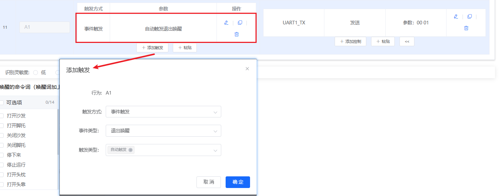

---

### JX-A7T ASR烧录失败和LED接线如何处理？

**问题描述：**

JX-A7T模块在使用PACK_UPDATE_TOOLS烧录ASR固件时进度为0%，同时询问LED的正确接线方法。

**解决方案：**

**1. ASR烧录失败处理**

- 按下模块复位键
- 确保烧录工具和模块连接正常
- 检查串口驱动是否正确安装

**2. LED接线方法**

- 长脚（阳极）连接到模块的对应端口
- 短脚（阴极）连接到地（GND）
- 不要接5V电源，应接到GPIO控制引脚

**注意事项：**

- LED具有方向性，长正短负不能接反
- 模块通过GPIO控制LED开关
- 建议使用限流电阻保护LED

---

### JX-A7T如何修改延时发送时间为40秒？

**问题描述：**

需要将JX-A7T模块的延时发送功能从默认的8000ms修改为40秒，以满足特定应用需求。

**解决方案：**

**1. 联系技术支持**

- 需要技术支持人员修改固件
- 提供具体的时间需求（40秒）
- 说明延时功能的应用场景

**2. 获取修改后的固件**

- 技术支持会提供定制固件
- 下载修改后的固件文件
- 使用烧录工具烧录新固件

**3. 验证功能**

- 烧录完成后测试延时时间
- 确认延时符合要求（40秒）
- 验证其他功能正常

**注意事项：**

- 40秒（40000ms）是较长的延时时间
- 修改后的固件需要重新烧录
- 保留原始固件作为备份

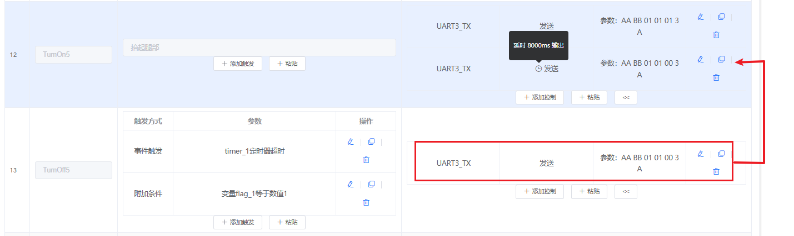

---

### JX-A7T智能体配置教程在哪里获取？

**问题描述：**

需要获取JX-A7T模块的智能体配置教程视频和相关文档。

**解决方案：**

**1. 官方视频教程**

- B站搜索"智能公元自有智能体配置教程"
- 视频链接：https://www.bilibili.com/video/BV14YGgz9E91/
- 包含完整的配置流程说明

**2. 官方文档**

- 访问智能公元帮助文档
- 链接：https://help.aimachip.com/docs/jx_a7t_v1/jx_a7t_v1-1gk6kmfs6nkqm
- 包含详细的技术文档

**3. 智能公元平台**

- 登录https://smartpi.cn
- 查看产品配置和示例
- 支持在线配置和调试

**注意事项：**

- 视频教程适合初学者学习
- 文档适合查阅详细参数
- 平台支持在线配置和测试

---

### JX-A7T能否通过拔插USB实现复位？

**问题描述：**

是否可以直接拔掉CH340的USB接口再重新插入，来代替拔插5V电源线实现模块复位操作。

**解决方案：**

**不能使用USB拔插方式**

- 必须拔插5V电源线（VCC）
- 直接拔插USB接口无法实现复位效果
- 复位操作需要切断模块主电源

**正确复位步骤：**

- 拔掉连接到模块VCC的杜邦线
- 等待2秒后重新插入VCC线
- 完成一次模块复位操作

**注意事项：**

- USB接口供电和VCC电源是独立的
- 仅拔插USB不会切断模块主电源
- 复位操作必须通过VCC电源通断实现

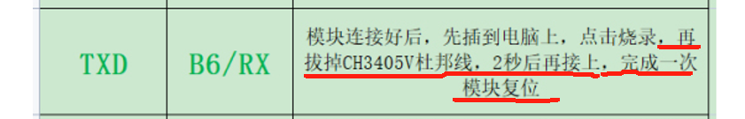

---

**注意事项：**

- 烧录前确保模块单独供电，不要连接其他设备
- 如果电脑USB口供电不足，建议使用外部5V电源
- 烧录失败时尝试更换USB接口或电脑
- 长时间无反应可能是硬件故障，需要联系技术支持


---

### JX-A7T模块烧录时无响应怎么办？

**问题描述：**

JX-A7T模块选择正确的固件文件后，点击烧录按钮仍然无响应，设备无法被识别。

**解决方案：**

**1. 确认驱动安装正确**

    - 检查设备管理器中是否显示Prolific USB-to-Serial Comm Port
    - 确认COM端口号与烧录工具中一致
    - 如有黄色感叹号，需要重新安装驱动

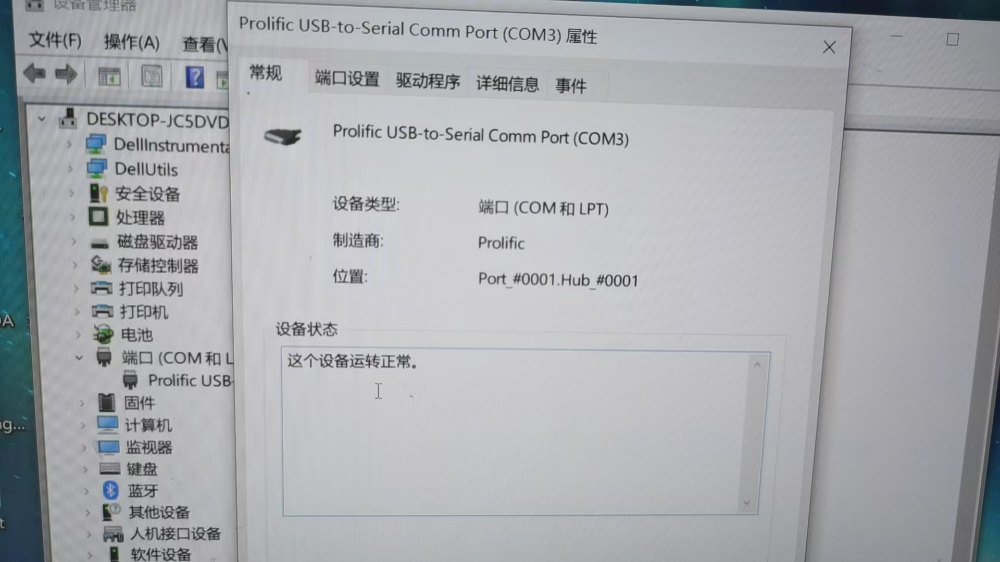

*设备管理器显示串口驱动正常识别*

**2. 正确的烧录操作流程**

    - 选择固件文件：jx_su_03t_release_update.bin
    - 点击烧录按钮，按钮变为黄色
    - 立即拔出模块的5V电源线
    - 等待2秒后重新插入5V电源
    - 观察烧录进度条是否开始移动

**3. 常见问题排查**

    - 更换USB接口尝试
    - 使用外部5V电源供电而非USB供电
    - 检查模块是否过热（烫手说明异常）
    - 尝试不同的电脑或操作系统

**4. 硬件检查**

    - 使用万用表测试模块各引脚电压
    - 确认模块没有短路或虚焊
    - 检查连接线质量，建议使用短线

**注意事项：**

- 烧录操作需要在点击后2秒内断电上电
- 模块温度过高时立即停止，可能是短路
- 如果多次尝试都失败，可能需要更换模块
- 保持连接线稳定，避免接触不良


---

---

### JX-A7T模块串口通信异常如何排查？

**问题描述：**

JX-A7T模块在使用烧录工具时出现COM5串口通信异常，同时通过串口发送命令时发现变量未发生变化，需要排查串口通信和硬件连接问题。

**解决方案：**

**1. 烧录失败排查**

**硬件连接检查**：

- 确认杜邦线连接牢固，无接触不良
- 检查TX/RX线是否正确对应（TX接RX，RX接TX）
- 使用万用表测试线路通断
- 尝试更换质量更好的杜邦线

**串口设置验证**：

- 检查COM端口是否被其他程序占用
- 确认波特率设置正确（默认115200）
- 验证串口驱动是否正常安装
- 尝试更换USB端口

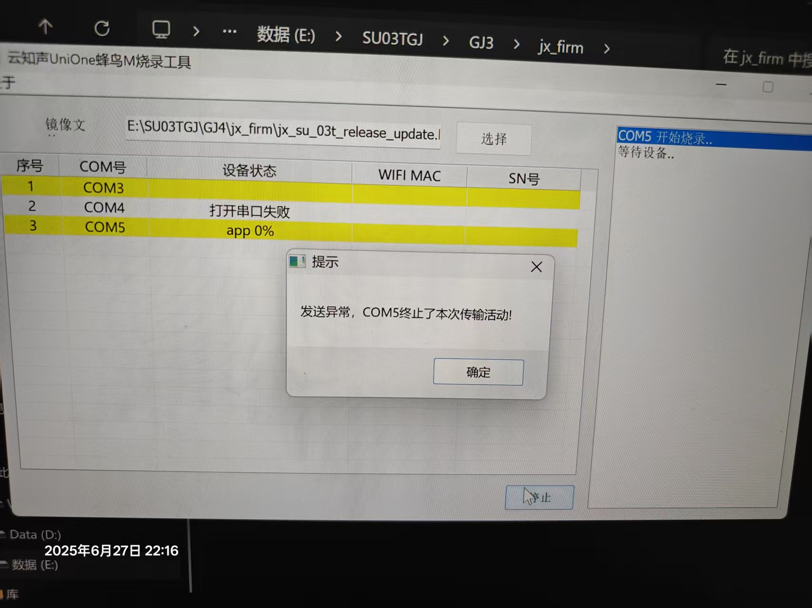

*COM5串口通信失败，显示"发送异常"错误*

**2. 变量未变化问题**

**串口配置核对**：

- 确认串口配置为B0（TX）和B1（RX）
- 检查是否误接到B6和B7引脚
- 验证串口触发参数设置正确
- 确认消息号与发送数据匹配

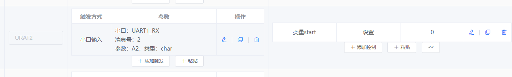

*串口触发配置，需确认参数设置正确*

**硬件引脚对照**：
```
正确连接：

- B0：TX（发送）
- B1：RX（接收）

错误连接（会导致通信失败）：

- B6：其他功能引脚
- B7：其他功能引脚
```

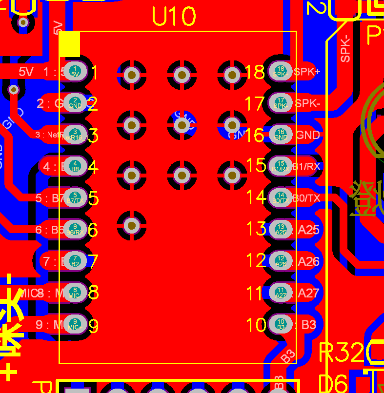

*JX-A7T模块引脚定义，B0/B1为串口引脚*

**3. 综合排查步骤**

**第一步：单独测试模块**

- 使用跳线直接连接到串口调试器
- 不通过其他中间设备
- 排除外部电路干扰

**第二步：简化测试**

- 先测试最基本的串口通信
- 发送简单数据验证
- 逐步增加复杂度

**第三步：交叉验证**

- 在另一台电脑上测试
- 使用不同的串口工具
- 对比测试结果

**4. 常见问题解决**

**烧录工具提示"发送异常"**：

1. 降低波特率到9600
2. 重新插拔USB连接
3. 更换USB转串口模块
4. 检查模块供电是否稳定

**变量不更新问题**：

1. 确认串口触发器配置正确
2. 检查消息号是否匹配
3. 验证变量名是否一致
4. 查看是否有语法错误

**注意事项：**

- 串口通信问题多由硬件连接引起
- B0/B1是专用串口引脚，不能使用其他引脚
- 烧录和串口通信使用不同的波特率设置
- 建议使用质量更好的连接线减少故障
- 保留完整的错误日志便于技术支持分析

---

---

### JX-A7T串口多指令发送错乱怎么办？

**问题描述：**

在使用JX-A7T设备时，通过串口发送多条指令（如关闭所有灯光）时，指令执行出现错乱，部分指令未能正确执行，导致灯光开关状态异常。

**解决方案：**

**1. 检查固件配置**

- 登录智能公元平台查看固件配置
- 检查UART1_RX和UART1_TX的配置参数
- 确认串口通信格式设置是否正确

**2. 串口参数配置**

- UART1_RX格式：建议设置为"自定义格式"而非"固定格式"
- UART1_TX校验位：确保设置为"校验位无"
- 波特率：确认设置为115200（非11500）

**3. 指令发送间隔优化**

- 多条指令间建议设置适当延时（如100ms）
- 避免连续快速发送导致指令缓冲区溢出
- 可在发送端添加延时控制逻辑

**4. 数据验证方法**

- 使用串口调试助手监控发送的数据
- 确认数据包格式正确（如A5 5A开头的数据帧）
- 验证每条指令的完整性

**注意事项：**

- 串口配置错误是导致指令错乱的常见原因
- 波特率不匹配会导致数据解析错误
- 建议在固件配置中仔细检查所有串口相关参数
- 如问题持续，可尝试使用出厂固件进行测试


---

### JX-A7T开发板上电无反应如何处理？

**问题描述：**

JX-A7T开发板插上电后没有反应，不确定是否需要烧录程序，以及如何开始使用。

**解决方案：**

**出厂状态说明：**

1. **预装固件**：

    - 开发板出厂时已烧录固件
    - 上电应有开机播报声音
    - 不需要额外烧录基础程序

2. **首次使用流程**：

    - 连接咪头（麦克风）和喇叭
    - 上电后等待开机播报
    - 配置网络连接即可使用

**快速上手指南：**

1. **硬件连接**：

    - 连接咪头到麦克风接口
    - 连接喇叭到扬声器接口
    - 通过USB或外接电源供电（5V）

2. **网络配置**：

    - 使用"智能公元"微信小程序进行配网
    - 连接2.4G WiFi网络
    - 配网成功后可使用在线功能

3. **功能测试**：

    - 唤醒词："你好小智"或"小智精灵"
    - 测试离线唤醒词识别
    - 测试在线大模型对话
    - 验证OTA升级功能

**无反应排查步骤：**

1. **基础检查**：

    - 确认供电是否正常（5V DC）
    - 检查咪头和喇叭连接是否正确
    - 验证电源适配器是否工作

2. **功能验证**：

    - 上电后仔细听是否有开机播报
    - 检查LED指示灯状态
    - 尝试说出唤醒词测试响应
    - 如无反应，可按下模块复位键重新启动

3. **重新烧录**（如必要）：

    - 如果确认硬件无故障但仍无反应
    - 可参考官方教程重新烧录固件
    - 建议先跳过烧录步骤，直接配网使用

**开发资源：**

1. **官方教程**：

    - B站视频合集提供完整使用教程
    - 包含智能公会配置、模块扣子配置等
    - 涵盖测试、烧录和固件制作等内容

2. **平台支持**：

    - 智能公元平台提供文档和示例程序
    - 可配置智能体和控制逻辑
    - 支持离线和在线功能切换

**注意事项：**

- 开发板支持离线和在线双模式工作
- 在线模式需要连接2.4G WiFi网络
- 如有硬件开发能力，可参考教程自行烧录
- 无开发经验建议直接使用出厂固件
- 开机播报后需要先配置网络才能使用完整功能
- 模块蓝色指示灯亮起表示供电正常

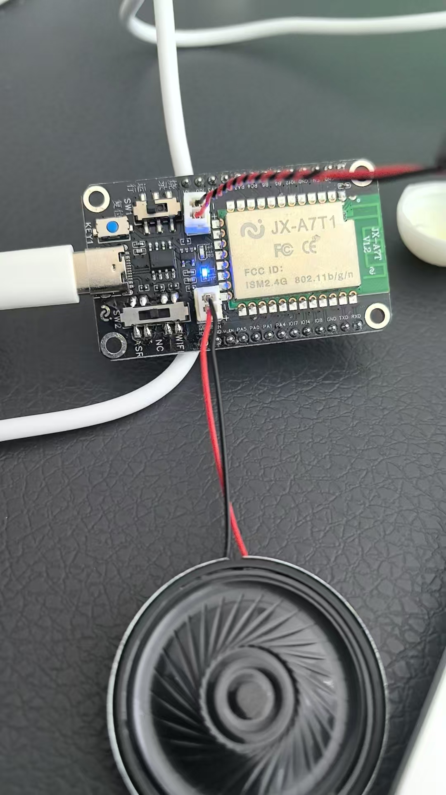


---

### JX-A7T WiFi部分固件JSON文件如何获取？

**问题描述：**

从文档中心下载的出厂固件中，WiFi部分缺少有效的JSON配置文件，导致无法正常配置和使用WiFi功能。

**解决方案：**

**推荐方式：从入门例程导入**

1. **访问智能公元平台入门例程**：

    - 进入网址：https://www.smartpi.cn/#/example
    - 登录账号后查看JX-A7T相关例程

2. **导入WiFi配置**：

    - 在入门例程中找到WiFi部分配置
    - 直接导入到自己的产品配置中
    - 包含完整的JSON配置文件和相关参数

3. **验证配置**：

    - 导入后检查配置文件完整性
    - 确认WiFi相关配置项正确加载
    - 保存并生成固件进行烧录

**替代方案：手动获取**

如果需要手动下载，请确认：

1. **文档结构检查**：

    - 文档中心的烧录资料 → 烧录软件 → WiFi部分
    - 确认下载了包含JSON配置的完整包

2. **文件完整性**：

    - 检查下载包中是否包含.jx相关的配置文件
    - 确认固件版本与配置文件版本匹配

**注意事项：**

- WiFi部分的JSON配置文件必须与固件版本对应
- 推荐使用入门例程导入，避免版本不匹配问题
- 配置完成后建议先在开发板验证功能正常

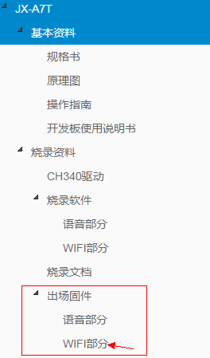


---

### JX-A7T如何进行蓝牙配网？

**问题描述：**

JX-A7T开发板上电后有语音播报，但没有提示配网，不清楚如何通过微信小程序进行蓝牙配网。

**解决方案：**

**配网准备**

1. **确认硬件状态**：

    - 开发板已正常上电（5V供电）
    - 有开机语音播报，表示系统正常运行
    - 咪头和喇叭已正确连接

2. **微信小程序准备**：

    - 打开微信，搜索"智能公元"小程序
    - 确保手机蓝牙和定位权限已开启

**配网步骤**

1. **进入配网模式**：

    - 在小程序首页点击添加设备的"+"号
    - 系统会自动搜索附近的JX-A7T设备

2. **权限设置**：

    - 如果提示"蓝牙未开启"，进入小程序设置
    - 点击右上角"..."菜单
    - 选择"设置"，开启蓝牙和定位权限
    - 返回小程序重新尝试配网

3. **设备连接**：

    - 在设备列表中选择JX-A7T设备
    - 设备名称格式通常为：JX_A7T_XXXXXX
    - 点击连接，等待配网成功

4. **WiFi配置**：

    - 选择要连接的2.4G WiFi网络
    - 输入WiFi密码
    - 等待配置完成

**注意事项：**

- 蓝牙配网时，手机系统蓝牙无需提前配对设备
- 仅支持2.4G WiFi网络，不支持5G网络
- 配网过程中保持手机靠近开发板
- 如果配网失败，可重启开发板重新尝试


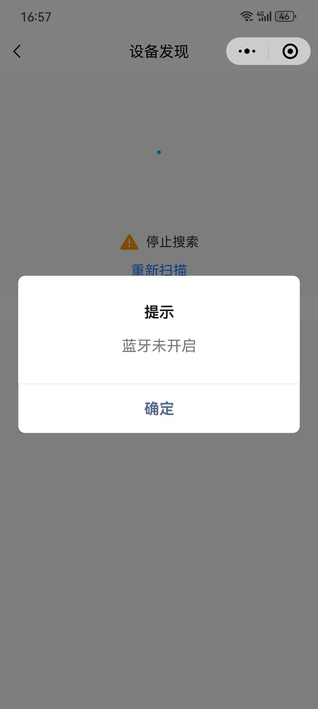


---

### JX-A7T固件更新时需要全部重新烧录吗？

**问题描述：**

重新绑定智能体后，想知道更新语音功能（如唤醒词）是否需要同时更新WiFi部分，以及如何确认设备联网状态。

**解决方案：**

**部分更新策略**

1. **按需更新原则**：

    - 不需要每次都更新语音和WiFi两部分
    - 根据实际修改内容决定烧录部分
    - 只更新有变化的部分即可

2. **更新场景判断**：

    - **仅更新语音部分**：

        - 修改了唤醒词
        - 调整了离线命令词
        - 更改了语音提示音
    - **仅更新WiFi部分**：

        - 修改了网络配置
        - 更换了智能体绑定
        - 调整了在线功能设置
    - **都需要更新**：

        - 同时修改了语音和WiFi功能
        - 固件版本升级

3. **烧录操作步骤**：

    - 语音部分：使用ASR语音部分烧录软件
    - WiFi部分：使用WiFi在线部分烧录软件
    - 分别选择对应的固件文件进行烧录

**联网状态确认**

1. **指示灯判断**：

    - 查看模块上的LED指示灯
    - 蓝色灯亮起表示供电正常
    - 绿色灯闪烁表示正在联网
    - 绿色灯常亮表示联网成功

2. **小程序查看**：

    - 打开"智能公元"微信小程序
    - 在设备列表中查看设备状态
    - 显示"在线"表示联网成功

3. **语音提示（未来功能）**：

    - 后续固件将增加语音播报功能
    - 开机时会播报联网状态
    - 方便确认设备是否正常联网

**注意事项：**

- 出厂固件已包含基础功能，建议先测试再决定是否更新
- WiFi配置主要是网络设置，如无特殊需求可不必更新
- 设备装入产品后指示灯可能不便查看，建议依赖小程序状态
- 语音播报联网状态功能将在后续例程更新中提供

**开发建议**：

- 留出调试接口便于后期查看状态
- 产品设计时考虑指示灯的可视性
- 保留复位功能便于故障恢复


---

### JX-A7T如何修改开机欢迎词和唤醒词？

**问题描述：**

需要了解如何在A7T模块上更改开机欢迎词，并确认是否需要通过智能公元平台进行WiFi和语音固件烧录，以及具体操作步骤。

**解决方案：**

JX-A7T模块支持通过智能公元平台自定义开机欢迎词和唤醒词：

1. **平台配置操作**

    - 登录智能公元平台（https://smartpi.cn）
    - 可以选择A7T创建新产品或导入A7T的入门例程进行修改
    - 在产品配置中设置自定义的开机欢迎词和唤醒词

2. **固件烧录流程**

    - **WiFi固件烧录**：

        - 将SW1拨至烧录模式，SW2拨至WiFi位置
        - 重新上电后使用WiFi在线部分烧录软件进行烧录

    - **语音固件烧录**：

        - 仅需将SW2拨至语音位置
        - 重新启动下载即可（无需重新上电）

3. **仅修改语音配置的简化方案**

    - 如果只需要修改欢迎词或唤醒词，无需进行WiFi操作
    - 可直接选择ASR模式进入，仅烧录语音部分固件
    - 这样可以避免重复配置网络参数


**注意事项：**

- 平台的文档中心有开发板操作文档可供参考
- 修改配置后必须在平台重新生成固件并下载
- 烧录时注意选择正确的固件文件（语音部分和WiFi部分分开）
- 如果担心烧录错误，建议保留原始固件备份


---

### JX-A7T开发板烧录操作步骤是什么？

**问题描述：**

不清楚A7T开发板的通电和烧录操作步骤，特别是如何正确进行烧录操作。

**解决方案：**

JX-A7T开发板的烧录操作需要按照正确的步骤进行：

1. **开发板通电要求**

    - 开发板需要通电后才能进行烧录操作
    - 使用USB连接或外接5V电源供电
    - 确认供电正常（LED指示灯亮起）

2. **烧录模式设置**

    - **WiFi固件烧录**：

        - SW1开关拨至烧录模式
        - SW2开关拨至WiFi位置
        - 需要重新上电使设置生效

    - **语音固件烧录**：

        - SW1保持正常运行模式
        - SW2开关拨至语音位置
        - 直接重启下载，无需重新上电

3. **烧录软件操作**

    - 使用对应的烧录软件：

        - WiFi部分：WiFi在线部分烧录软件
        - 语音部分：ASR语音部分烧录软件
    - 选择正确的固件文件
    - 按照软件提示完成烧录过程

4. **开发板操作文档**

    - 智能公元平台的文档中心提供详细的开发板操作文档
    - 包含完整的烧录指引和故障排查方法
    - 建议操作前先查阅相关文档

**注意事项：**

- 烧录WiFi固件时必须重新上电，语音固件烧录只需重启
- 确保开关位置正确，避免烧录失败
- 如果不确定操作，建议先查看官方操作文档
- 保留原始固件备份，防止烧录错误后无法恢复

### 如何在智能体平台选择A7T正确的例程？

**问题描述：**

在智能体平台的SDK版本列表中，发现多个版本的入门例程，但这些例程均与路灯相关，而实际需要的是A7T模块的集成例程，无法找到正确的例程进行开发。

**解决方案：**

智能体平台中的例程选择需要根据具体需求进行筛选：

1. **例程类型理解**

    - 平台上的入门例程可能包含多种应用场景
    - 部分例程以特定产品（如路灯）为示例
    - 需要查看例程描述确认是否适用于A7T模块

2. **A7T例程选择方法**

    - 在平台搜索栏中输入"A7T"进行精确搜索
    - 筛选适用于JX-A7T或A7T模块的例程
    - 查看例程标签和分类，选择通用型或基础型例程

3. **例程导入与修改**

    - 可以直接创建A7T产品进行配置
    - 或导入A7T的入门例程作为基础
    - 在例程基础上根据项目需求进行修改

4. **获取正确的例程**

    - 查看平台的文档中心获取A7T专用例程
    - 参考官方提供的A7T开发指南
    - 联系技术支持获取适用于特定应用的例程


**注意事项：**

- 例程的应用场景（如路灯）不影响在A7T模块上的使用
- 重点关注例程的功能模块和配置方法
- 如果找不到合适的例程，可以从基础配置开始创建
- 智能公元平台持续更新例程库，定期查看新增内容


---


---

### A7T模块选型错误（CI1302芯片混淆）怎么办？

**问题描述：**

在选择A7T模块时，错误地选择了CI-130X系列的CI1302芯片，导致产品选型不正确。

**解决方案：**

1. **明确型号区别**

    - JX-A7T：使用CI1302+BL602芯片组合的离在线语音模块
    - CI-130X系列：纯离线语音模块，不支持WiFi和AI对话功能
    - 两者属于不同产品系列，不能混用

2. **正确识别A7T模块**

    - JX-A7T模块支持接入大模型
    - 支持单MIC离线语音打断
    - 支持零代码开发WiFi产品
    - 支持接入智能公元小程序
    - 支持扫码OTA/可免烧录功能

3. **选型建议**

    - 如需AI对话功能：选择JX-A7T系列
    - 仅需离线控制：选择CI系列模块
    - 根据是否需要网络功能决定产品系列

**注意事项：**

- JX-A7T虽然使用CI1302芯片，但与CI-130X系列是完全不同的产品
- 选型时重点关注产品功能而非单一芯片型号
- 查看完整的产品规格书确认功能需求

---

### JX-A7T WiFi控制开关灯功能无法正常工作怎么办？

**问题描述：**

配置JX-A7T模块的WiFi控制开关灯功能时，功能无法正常生效。在控制配置中设置了串口触发条件，但灯控无响应。

**解决方案：**

**1. 删除错误的UART1_TX发送协议消息**

- 检查配置中的UART1_TX操作
- 删除所有"UART1_TX 发送协议消息"的操作
- 这些操作是导致功能异常的原因

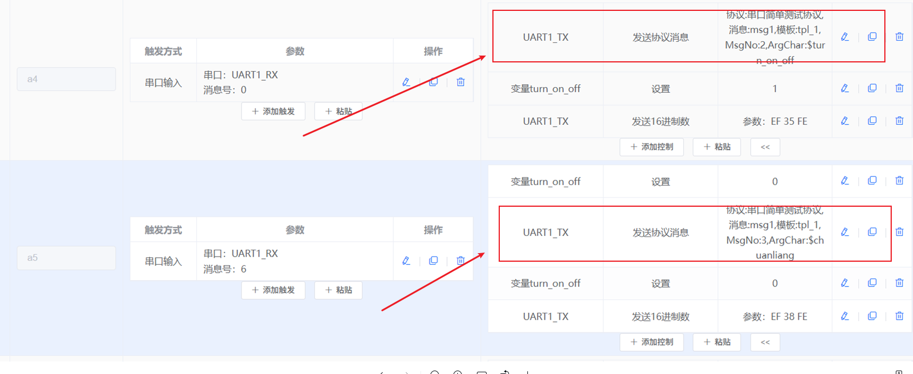

*红色框标出的UART1_TX发送协议消息操作需要删除*

**2. 正确的ASR固件配置**

- 在ASR固件制作中添加行为
- 设置触发方式为"串口触发"
- 配置接收WiFi模块发送的串口信息
- 根据不同的消息号控制对应的GPIO引脚

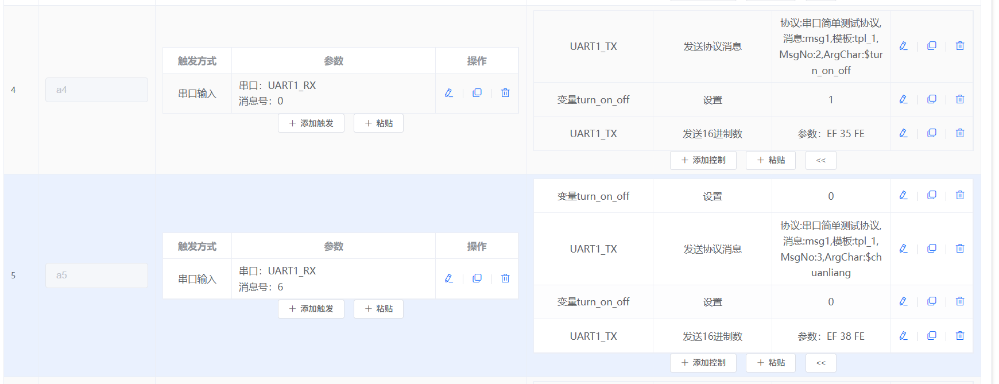

*a4和a5配置中包含了错误的UART1_TX发送操作*

**3. GPIO控制配置**

- 接收到开灯指令时：设置对应GPIO为高电平
- 接收到关灯指令时：设置对应GPIO为低电平
- 可同时添加语音播报功能作为状态反馈

**注意事项：**

- WiFi模块发送给ASR的数据格式必须与ASR接收配置匹配
- 建议使用简单的十六进制指令（如01 01表示开灯，01 00表示关灯）
- 删除不必要的发送操作，只保留接收和控制逻辑
- 测试时可通过串口调试助手验证数据传输

---

### JX-A7T如何配置ASR固件接收WiFi串口指令？

**问题描述：**

需要在ASR固件中配置串口触发功能，接收来自WiFi模块的指令，并根据指令控制GPIO引脚实现灯的开关控制。

**解决方案：**

**1. 添加串口输入触发器**

- 在ASR固件制作中选择"添加行为"
- 设置触发方式为"串口输入"
- 配置消息号和参数类型（如char类型）

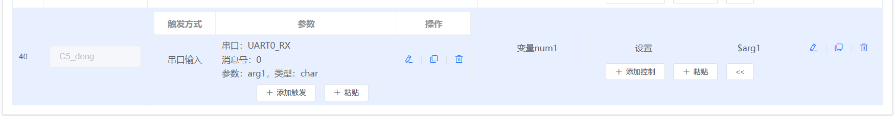

**2. 配置多条串口指令**

- 为每个控制功能添加独立的串口触发器
- 例如：消息号0控制开灯，消息号1控制关灯
- 每个触发器对应不同的控制动作

**3. 设置GPIO控制动作**

- 开灯指令：设置GPIO为高电平
- 关灯指令：设置GPIO为低电平
- 可配置同时播报语音提示

**4. 数据格式匹配**

- 确保WiFi发送的数据格式与ASR接收配置一致
- 建议使用简单的十六进制格式
- 测试时可先用串口调试助手验证

**注意事项：**

- ASR固件中的消息号必须与WiFi发送的消息号匹配
- 数据类型（char/hex）需要两端配置一致
- 建议逐个测试每个指令的功能
- 如接收不到数据，检查波特率和串口参数设置

---

### 控制模板中的msg1字段是否可以修改？

**问题描述：**

在使用控制模板配置开关灯功能时，不确定msg1字段是否为固定值，以及如何正确配置小程序控件与固件的通信。

**解决方案：**

**1. msg1字段说明**

- msg1是协议消息的标识符，不是固定值
- 用于标识消息类型和用途
- 可根据实际需求修改和自定义

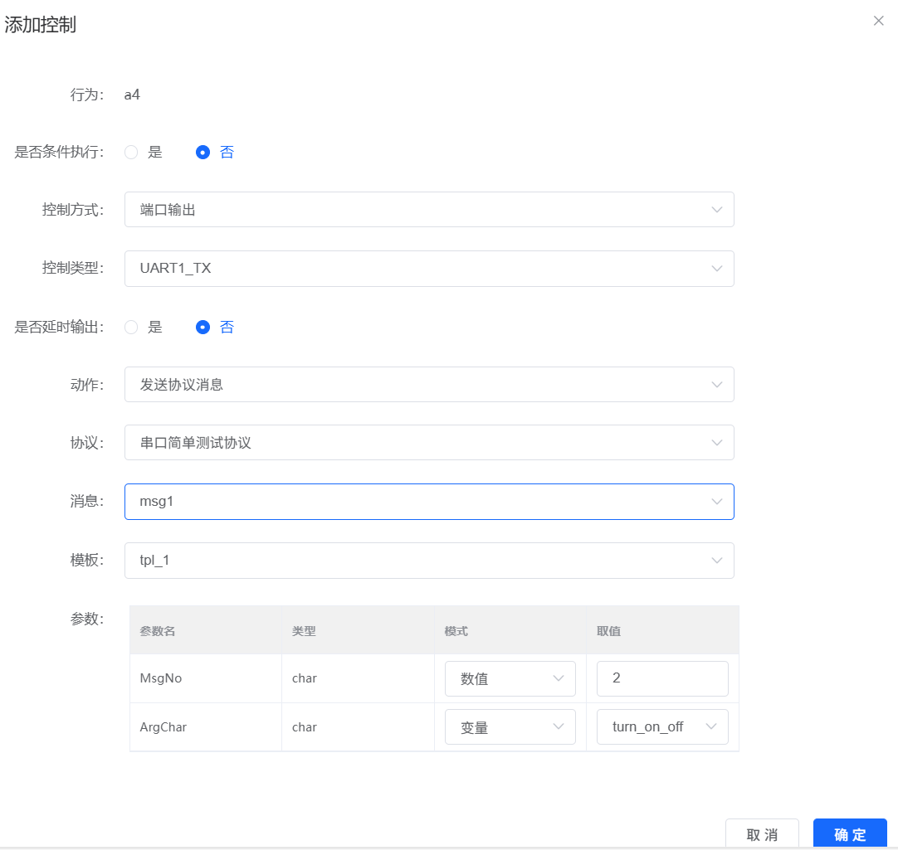

**2. 不同类型控件的数据传输**

- **开关类控件**（如灯开关）：

    - 只有开/关两种状态
    - 数据可以写死，WiFi只发送固定指令
    - ASR只接收对应的固定数据
    - 例如：开灯发送"01 01"，关灯发送"01 00"

- **滑动条控件**（如亮度调节）：

    - 数据会实时变化
    - 必须使用协议消息进行传输
    - 通过小程序滑动时，WiFi实时发送数据给ASR

**3. 正确的配置方法**

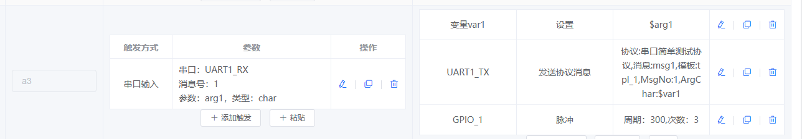

- 使用串口接收特定的消息号
- 根据接收到的消息控制GPIO输出
- 可配置GPIO输出脉冲或电平状态
- 支持同时触发多个动作（如GPIO控制+语音播报）

**注意事项：**

- 只有状态可变的控件（如滑动条）才需要协议消息
- 固定状态的控件（如开关）可以使用写死的指令
- WiFi发送的数据格式必须与ASR接收配置一致
- 建议使用简单的十六进制指令减少解析复杂度

---

---

### JX-A7T配置检查通过但固件生成失败怎么办？

**问题描述：**

在JX-A7T模块上配置并生成固件时，尽管配置检查通过，但固件生成失败，提示固件过大或配置项过多。

**解决方案：**

1. **检查播报文本数量**：

    - 播报文本过多会导致固件过大
    - 删除不必要的播报文本
    - 使用组合播报减少重复内容

2. **优化配置项**：

    - 选用小模型以减少固件大小
    - 删减不必要的配置项目
    - 分批次配置功能，避免单次配置过多

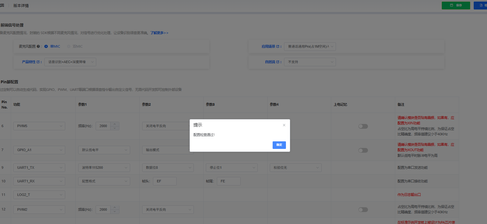
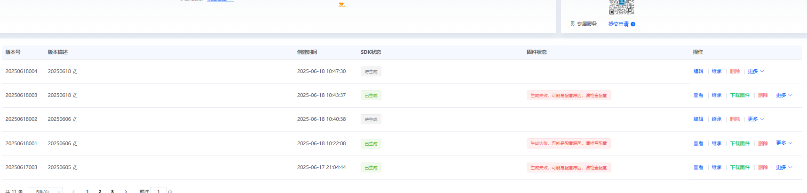
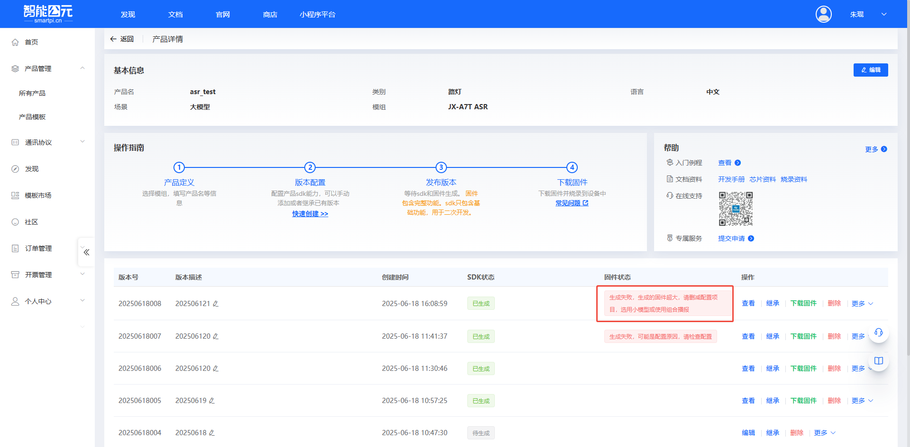

**注意事项：**

- 即使配置检查通过，仍可能因资源限制导致生成失败
- 播报语音是占用空间的主要因素之一
- 建议分阶段开发，先实现核心功能

---

### JX-A7T添加上电事件唤醒功能后无法识别怎么办？

**问题描述：**

在JX-A7T固件中添加上电事件唤醒功能后，设备无法正常识别语音指令，需要排查固件生成失败和唤醒功能不兼容的问题。

**问题原因分析：**

1. **功能兼容性问题**：

    - 上电启动唤醒功能是新增功能，可能存在不兼容
    - 固件生成失败提示配置原因
    - 新功能版本稳定性有待优化

2. **配置冲突**：

    - 上电事件与命令词识别可能存在冲突
    - 延时设置不当导致系统初始化未完成
    - 禁止超时退出唤醒与系统逻辑冲突

**解决方案：**

**1. 临时解决方法**

- 将所有命令词设置为唤醒词
    - 绕过上电事件配置问题
    - 简化配置逻辑
    - 实现类似免唤醒效果

- 优化命令词结构：

    - 添加低灵敏度的测试命令词
    - 降低误识别概率


*命令词编辑界面，可添加测试用命令词*

**2. 配置优化建议**

- 给"进入唤醒"操作添加延时
    - 建议设置5000ms延时
    - 确保系统完全启动后再进入唤醒
    - 避免初始化冲突

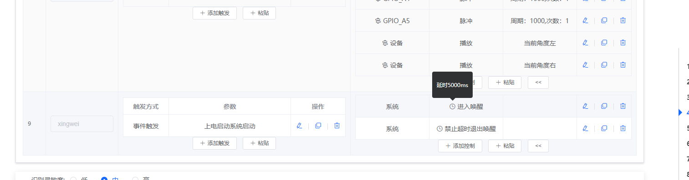

*在系统控制中添加延时设置*

**3. 固件生成失败处理**

- 多次尝试生成
    - 有时第一次失败，第二次成功
    - 可能是临时服务器问题
    - 确保网络连接稳定


*固件生成失败的错误提示*

**4. 功能兼容性说明**

- 上电事件唤醒是新功能
    - 当前版本可能存在不稳定性
    - 正在逐步优化改进
    - 建议关注版本更新

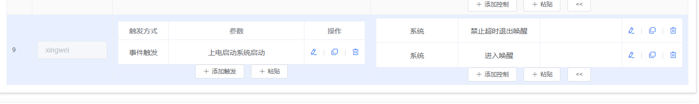

*配置界面中的上电启动选项*

**注意事项：**

- 新功能需要时间完善，建议谨慎使用
- 可先使用稳定的命令词方式实现需求
- 生成失败时尝试简化配置后重试
- 保留完整的错误信息和配置文件用于排查
- 如问题持续，联系技术支持获取帮助

---

### JX-A7T烧录时出现"下载异常，接收端出现了额外的状态"怎么办？

**问题描述：**

使用云知声UniOne蜂鸟M烧录工具烧录JX-A7T模块时，无法识别设备，或出现"COM7下载异常，接收端出现了额外的状态"错误。

**解决方案：**

**1. 基础检查**

- 确认TX与RX接线正确（交叉连接）
- 检查串口驱动是否正常安装
- 确认设备供电为5V

**2. 进入烧录模式**

- 按下复位键后立即开始烧录
- 或短接电源线重新上电
- 确保模块进入烧录模式

**3. 调整波特率**

- 在烧录工具中找到波特率设置
- 将波特率调整为9600
- 降低波特率可提高稳定性

**4. 接线确认**

正确的接线方式：

- USB转TTL的TXD → 模块的RXD
- USB转TTL的RXD → 模块的TXD
- VCC接5V，GND接地

**注意事项：**

- 9600波特率下烧录速度较慢，请耐心等待
- 确保使用带update的固件文件
- 多次尝试失败可能需要更换USB转串口模块

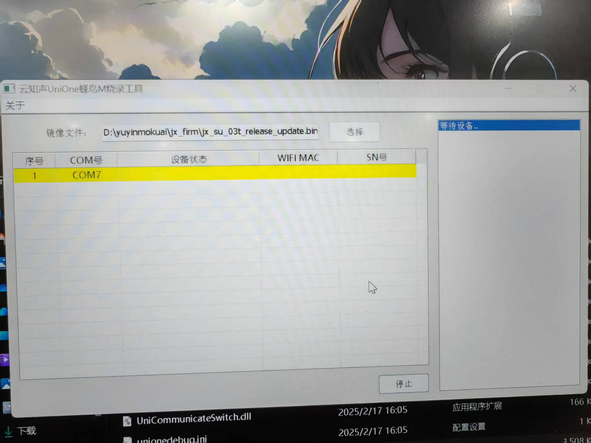

*设备显示"等待设备.."状态*

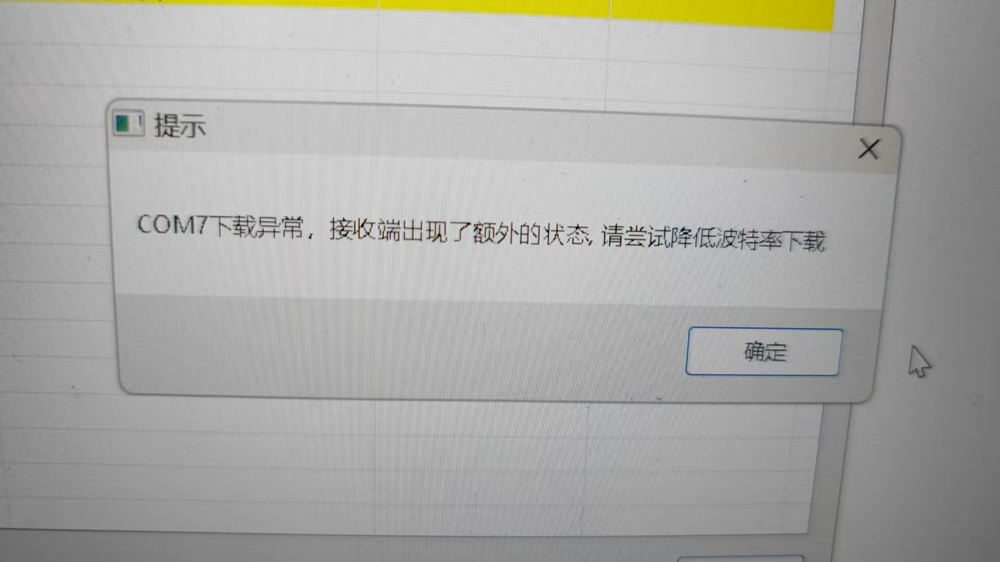

*提示下载异常，需要降低波特率*

---

### JX-A7T烧录进度卡在1%怎么办？

**问题描述：**

烧录进度显示"app 1%"，进展缓慢或停滞，设备响应迟缓。

**解决方案：**

**1. 波特率影响**

- 9600波特率下烧录速度较慢属于正常现象
- 进度1%表示正在下载应用程序
- 完整下载需要较长时间

**2. 解决方案**

- 保持耐心等待，不要中断烧录
- 确认电源供电稳定
- 避免在烧录过程中操作电脑

**3. 加速建议**

- 如需提高速度，可尝试更高波特率（如115200）
- 但需要确保连接稳定
- 建议先用低波特率确保成功

**注意事项：**

- 低波特率虽然慢，但更稳定
- 首次烧录建议使用默认波特率
- 烧录完成后重新上电测试功能

---

### 烧录工具的波特率在哪里调整？

**问题描述：**

出现"COM7下载异常，接收端出现了额外的状态"错误，技术支持建议降低波特率，但找不到波特率设置选项。

**解决方案：**

**1. 波特率位置**

- 在云知声UniOne蜂鸟M烧录工具主界面
- 设备列表上方或左侧区域
- 可能有下拉菜单或输入框

**2. 具体步骤**

1. 打开烧录工具
2. 不选择任何文件
3. 在主界面查找波特率选项
4. 点击下拉菜单选择9600
5. 重新选择固件文件开始烧录

**3. 其他位置**

- 可能藏在"高级设置"中
- 或在"更多选项"里
- 右键点击设备可能有设置选项

**注意事项：**

- 不同版本的烧录工具界面可能略有差异
- 默认波特率通常为115200
- 调整为9600后烧录速度会变慢
- 如果找不到，可尝试更新烧录工具版本

---

### JX-A7T定时器触发蓝牙信号强度检测导致死机重启怎么办？

**问题描述：**

JX-A7T模块在定时器触发或语音唤醒时执行蓝牙信号强度检测操作会导致设备死机重启。

**解决方案：**

- **避免使用检测信号强度功能**：该功能存在兼容性问题，暂时不建议使用
- **修改定时器配置**：如果使用定时器，避免在定时器中添加获取蓝牙信号强度操作
- **只使用获取蓝牙信号强度**：即使单独使用该功能也会导致重启

**注意事项：**

- 该功能研发团队已知晓，但尚未优化
- 定时器设置为1秒重复触发时会加剧问题
- 建议等待固件更新修复此问题

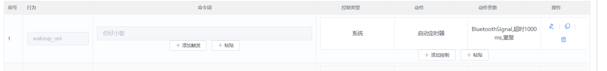

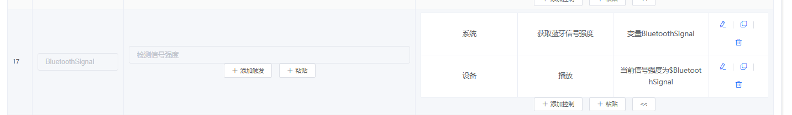

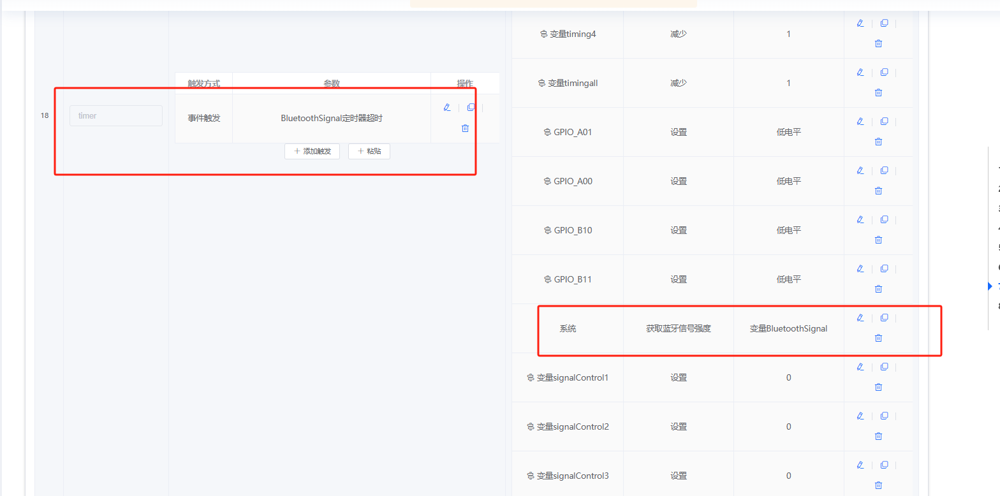

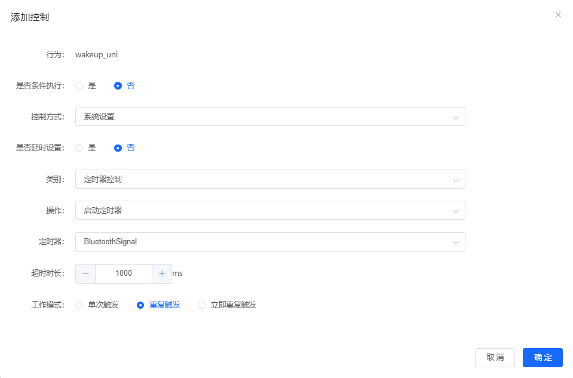

---

### 小程序修改语音指令后无法生成固件怎么办？

**问题描述：**

在小程序中修改语音指令时，删除词条后无法正常生成固件，系统长时间卡在"命令词修改中"状态。

**解决方案：**

- **确认删除操作**：退出后检查词条是否已成功删除
- **多次尝试无效**：如果多次尝试仍无法完成，说明是功能缺陷
- **联系技术支持**：将具体问题反馈给技术支持，由研发团队处理

**注意事项：**

- 该问题属于功能缺陷，研发团队正在跟进
- 删除词条操作可能触发生成流程异常
- 建议暂时避免频繁修改词条

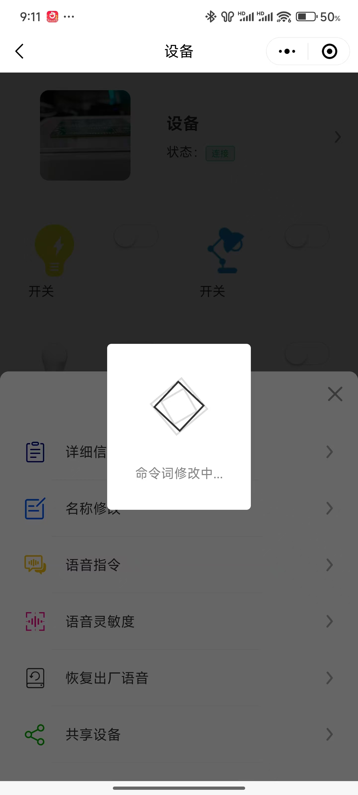

---

### 定时器名称与变量名称冲突怎么办？

**问题描述：**

在使用CI-03T1或CI-03T2芯片的开发平台时，定时器名称与变量名称冲突，导致系统无法正常工作。

**解决方案：**

- **修改定时器名称**：避免定时器名称与变量名相同
- **使用不同命名**：定时器名称添加后缀如"_Timer"以区分

**注意事项：**

- 名称冲突会导致系统无法正确识别和执行相关操作
- 建议使用有意义的名称避免混淆

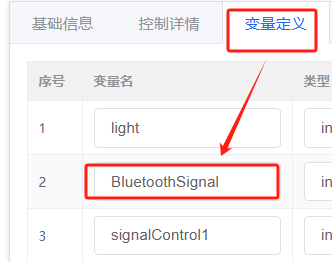

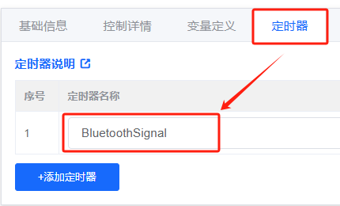

---

### JX-A7T的PWM控制无法正常工作怎么办？

**问题描述：**

配置JX-A7T模块的PWM控制功能时，当GPIO输入高电平信号后，PWM无法正常输出控制信号，导致灯光等设备无法正常开启。

**解决方案：**

**1. 变量配置检查**

- 检查是否每个PWM通道都配置了独立的变量
- 一个PWM通道对应一个变量，不能共用
- 变量类型需要设置为正确的数值类型

**2. 执行顺序调整**

- 固件执行是自上而下的顺序
- 确保变量赋值在PWM使用之前
- 检查配置中的节点执行顺序是否正确

**3. GPIO触发配置**

- 低电平触发：关闭PWM输出（设置占空比为0）
- 高电平触发：开启PWM输出（设置占空比为变量值）
- 确保触发条件与实际输入信号匹配

**4. 调试步骤**

```
1. 简化测试：只配置1路PWM进行测试
2. 验证变量：确认变量值能正确传递
3. 检查时序：使用延时或定时器确保执行顺序
4. 逐步增加：一路测试通过后再添加其他通道
```

**注意事项：**

- PWM输出需要连接到正确的引脚
- 不同PWM通道需要使用不同的变量名
- 如果问题持续，可尝试重新生成固件文件
- 建议在配置中添加调试输出用于排查问题

---

### JX-A7T使用小程序OTA升级后出现自动重启？

**问题描述：**

JX-A7T模块尝试使用小程序进行OTA升级时，设备出现持续自动重启，重启后蓝牙无法搜索到，导致WiFi和蓝牙功能异常。

**解决方案：**

**问题分析：**

- 小程序OTA升级可能导致固件损坏或升级过程中断
- 自动重启循环表明系统无法正常启动
- 蓝牙功能异常可能是固件未完全加载导致

**解决方法：**

1. **使用硬件烧录恢复**
    - 使用专用烧录器进行硬件烧录
    - 下载完整的固件包而非通过OTA升级
    - 避免使用扫码升级功能

2. **模块架构说明**
    - JX-A7T是CI-03T与WiFi模块的结合体
    - 两个模块间通过串口通信
    - CI-03T预留UART1，WiFi模块预留UART0用于外部通信

3. **烧录步骤**
    - 断开设备电源
    - 使用专用转接板连接烧录器
    - 选择正确的固件文件进行烧录
    - 烧录完成后重新配网测试

**注意事项：**

- OTA升级过程中不要断电或操作设备
- 如OTA失败，优先使用硬件烧录恢复
- 烧录前确认固件版本与硬件匹配
- 保留原始固件备份以便快速恢复

### JX-A7T连接蓝牙模块后无法烧录怎么办？

**问题描述：**

JX-A7T模块连接蓝牙模块串口后，无法进行烧录，插入设备后烧录工具无法识别设备，且出现文件读取失败的错误弹窗。

**解决方案：**

- **断开外接设备**：烧录前先断开连接的蓝牙模块等外设
- **电源复位操作**：

    - 拔掉VCC电源线
    - 等待几秒后重新插入VCC
    - 此时设备可被烧录工具识别

**注意事项：**

- 连接外部设备时可能影响烧录接口的正常工作
- 烧录完成后可重新连接蓝牙模块使用
- 如果复位操作无效，检查是否有其他硬件冲突

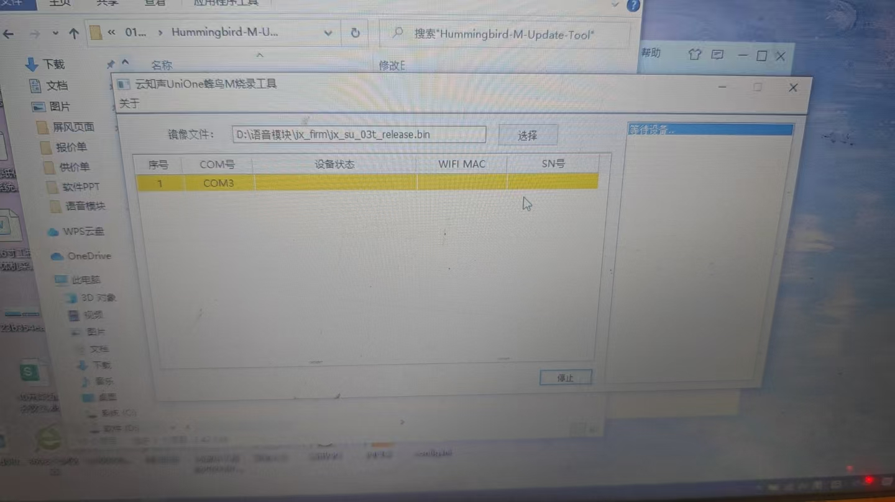

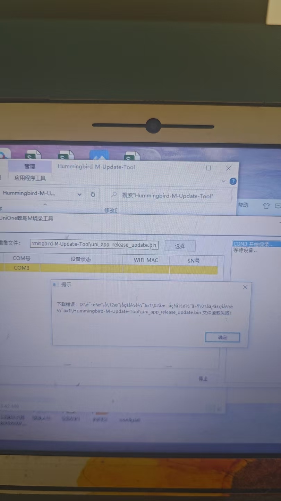

---

### JX-A7T烧录成功后命令词无法响应怎么办？

**问题描述：**

JX-A7T模块烧录固件后，设备无法响应语音命令指令，即使已说出唤醒词也无任何反应。

**解决方案：**

**1. 确认固件文件选择**

- 使用串口烧录时，必须选择带update的bin文件
- 正确文件：jx_su_03t_release_update.bin
- 错误文件：jx_su_03t_release.bin（非update版本）

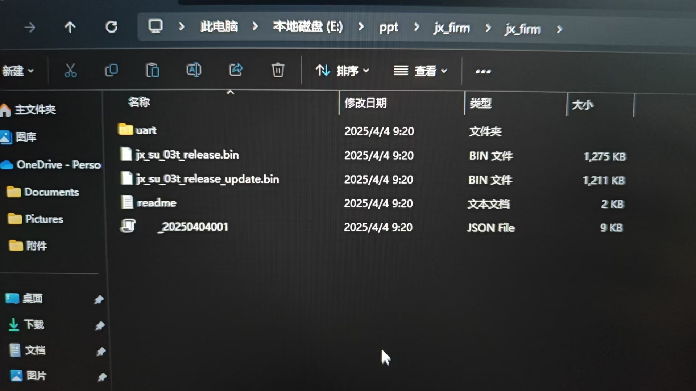

*应选择带update后缀的固件文件进行烧录*

**2. 操作流程确认**

- 先说唤醒词唤醒设备
- 唤醒成功后再说命令词
- 确认麦克风和喇叭连接正确

**3. 功能验证步骤**

- 上电后等待设备初始化完成
- 测试唤醒词是否能正常唤醒
- 唤醒后清晰说出命令词
- 观察设备是否有相应动作或语音反馈

**注意事项：**

- 烧录时必须使用update版本的固件文件
- 如果烧录错误版本，需要重新烧录正确的update文件
- 确保唤醒词和命令词的发音清晰准确
- 如问题持续，检查硬件连接和固件配置是否正确

---

### JX-A7T固件烧录不完全导致命令无法执行？

**问题描述：**

JX-A7T模块固件烧录后，通过蓝牙控制可以执行命令，但语音指令无法响应，怀疑是烧录过程中接触不良导致固件未完全写入。

**解决方案：**

**问题分析：**

- 蓝牙能控制说明硬件基本正常
- 语音不响应可能是固件烧录不完整
- 接触不良会导致数据传输中断

**处理方法：**

1. **重新烧录固件**
    - 检查所有连接线接触良好
    - 重新进行烧录操作
    - 确保烧录过程100%完成

2. **连接优化**
    - 使用更短的连接线
    - 检查转接板是否牢固
    - 避免烧录过程中触碰连接线

3. **验证烧录结果**
    - 烧录后先测试语音功能
    - 确认所有命令词都能响应
    - 验证动作输出是否正常

**注意事项：**

- 烧录时避免振动或移动设备
- 确认供电稳定，避免电压波动
- 如多次烧录仍有问题，可能需要更换模块

---

### JX-A7T播放音乐时无法打断怎么办？

**问题描述：**

在播放音乐过程中，无法通过语音命令打断音乐播放，音乐持续播放无法终止。

**解决方案：**

**1. 功能限制说明**

- JX-A7T（SU-03T）不支持音乐播放过程中的语音打断功能
- 该功能需要AEC（声学回声消除）技术支持
- SU-03T芯片不具备此硬件能力

**2. 替代方案**

**方案一：使用支持AEC的模块**

- 如需音乐打断功能，建议使用CI-03T模块
- CI-03T支持AEC功能，可实现播放中的语音打断
- 可根据项目需求选择合适的硬件模块

**方案二：使用个性化音频空语音打断**

对于JX-A7T模块，可以通过"个性化音频"功能实现打断效果：

- 准备一个空白的音频文件（短时长的静音MP3文件）
- 在平台配置页面进入"个性化音频"设置
- 添加或选择一个词条（如"停止播放"）
- 上传空音频文件并替换到该词条
- 配置该词条触发"停止播放"或"关闭语音识别"控制
- 当需要打断音乐时，说出该词条即可

**注意事项：**

- 空语音打断是通过触发新的控制动作来停止播放
- 需要提前配置好打断词条和控制逻辑
- 这种方式需要主动说出打断词，不是真正的AEC打断
- 这是硬件功能限制，无法通过软件配置解决
- 设计产品时需提前确认是否需要音乐打断功能
- 其他语音控制功能（如切换歌曲）可能正常工作

---

### JX-A7T语音指令如何配置串口输出？

**问题描述：**

在配置JX-A7T语音模块时，发现语音指令触发后无法通过串口发送数据。

**解决方案：**

- **控制行为配置**：

    - 在控制详情中为语音指令添加控制行为
    - 选择"UART1_TX"作为控制类型
    - 设置发送16进制数据（如AA BB CC）

- **配置步骤**：

    1. 选择需要配置的语音指令（如"打开台灯"）
    2. 点击"添加控制"
    3. 控制方式选择"UART1_TX"
    4. 输入要发送的16进制数据
    5. 保存配置并重新生成固件

- **注意事项**：

    - 每个需要发送数据的指令都要单独配置
    - 16进制数据格式为两位一组（如AA BB CC）
    - 确认串口引脚与硬件连接一致

- **调试验证**：

    - 烧录固件后测试语音指令
    - 使用串口助手观察是否收到数据
    - 检查数据格式是否正确

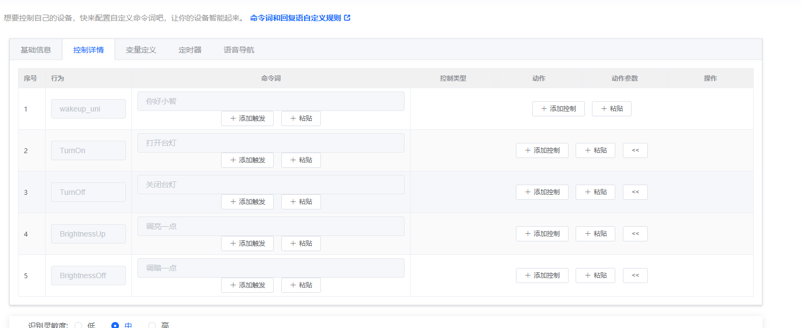

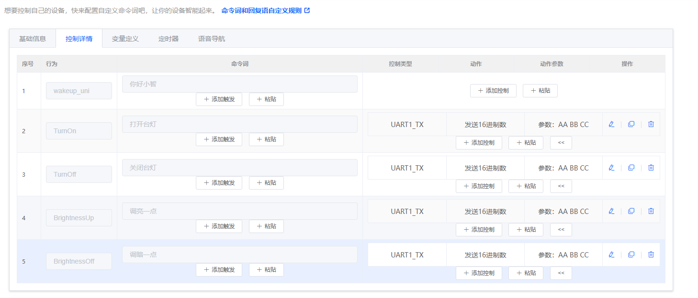

---

### JX-A7T如何设置接收和播报串口温度数据？

**问题描述：**

需要设置JX-A7T语音模块接收串口发送的温度数据，并通过语音播报出来。

**解决方案：**

- **串口输入配置**：

    1. 在触发方式中选择"串口输入"
    2. 设置参数为"UART1_RX"
    3. 指定消息号（如消息号1）
    4. 添加触发条件

- **语音播报设置**：

    1. 添加控制行为，选择"播放语音"
    2. 语音内容使用变量格式（如"当前温度为$Temp"）
    3. 通过"添加串口参数"关联接收的数据
    4. 可以设置数据类型为温度

- **变量使用说明**：

    - 使用$符号引用变量（如$Temp）
    - 变量名需与发送端定义一致
    - 支持在播报内容中嵌入变量

- **完整流程**：

    1. 单片机通过串口发送温度数据到JX-A7T
    2. JX-A7T接收数据后触发播报
    3. 播报格式如"当前温度为XX度"

**注意事项：**

- 确保串口波特率与发送端匹配
- 温度数据格式需要预先约定好
- 测试时可以使用固定的16进制数据模拟


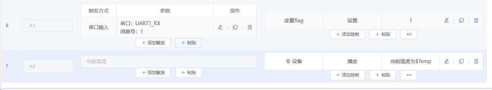

---

### 如何实现语音触发播报当前温度？

**问题描述：**

需要在串口接收温度数据的基础上，增加语音指令触发功能，当听到"当前温度"指令时播报温度值。

**解决方案：**

- **双触发机制设置**：

    1. A1：串口输入触发（UART1_RX，消息号1）
    2. A2：语音指令触发（"当前温度"）
    3. 两个触发条件使用同一个标志位变量

- **标志位变量配置**：

    1. 创建变量（如flag）
    2. 语音指令触发时设置flag=1
    3. 串口接收数据时设置Temp变量
    4. 播报条件：flag等于数值1

- **详细配置步骤**：

    1. 语音指令"当前温度"→设置变量flag=1
    2. 串口接收温度数据→设置变量Temp
    3. 播报内容："当前温度为$Temp"
    4. 添加执行条件：变量flag等于1

- **工作流程**：

    - 收到温度数据时仅更新Temp变量，不播报
    - 语音指令触发后设置flag=1，触发播报
    - 播报完成后可重置flag=0

**注意事项：**

- 标志位变量用于控制播报时机
- 确保两个触发条件使用相同的变量判断
- 变量名需在整配置中保持一致


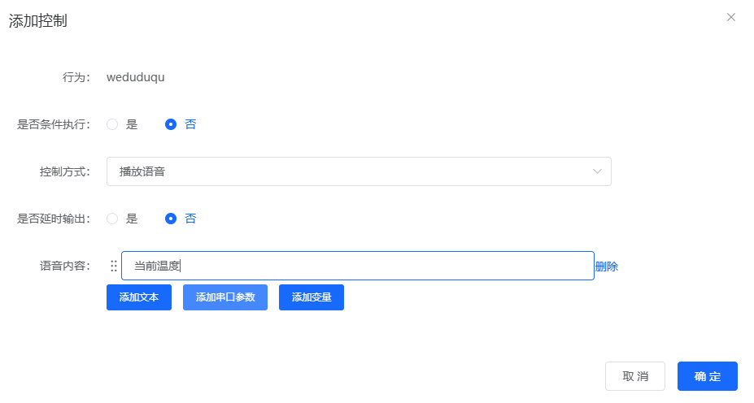

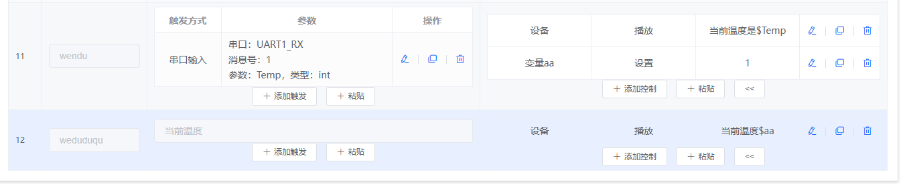

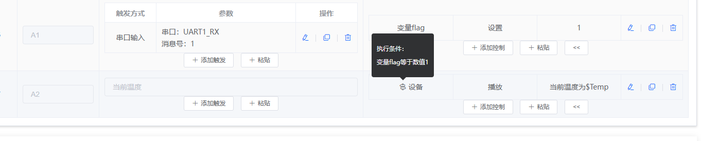

---

### 下载的固件tar文件无法在烧录软件中选择怎么办？

**问题描述：**

使用US513U61生产工具烧录JX-A7T模块固件时，无法在软件中选择到从平台下载的固件文件（jx_firm.tar）。

**解决方案：**

**1. 确认固件文件类型**

- US513U61生产工具需要的是.bin格式的固件文件
- 从平台下载的.tar压缩包需要先解压
- 解压后找到对应的.bin文件进行烧录

**2. 正确的烧录流程**

- 下载平台生成的固件包（.tar格式）
- 使用解压软件（如WinRAR、7-Zip）解压文件
- 在解压后的文件夹中查找.bin固件文件
- 在烧录工具中选择.bin文件进行烧录


*平台下载的固件压缩包*

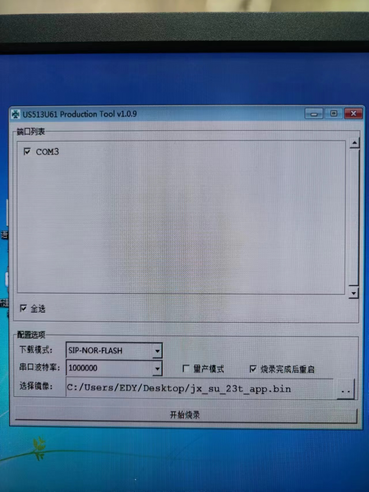

*US513U61生产工具需要选择bin文件*

**3. 常见问题排查**

- 确认解压软件支持.tar格式
- 检查解压后的文件完整性
- 如找不到.bin文件，检查是否解压到正确位置

**注意事项：**

- 不同烧录工具支持不同格式的固件文件
- US513U61生产工具不支持直接使用.tar文件
- 保留原始.tar文件作为备份
- 烧录前确认.bin文件与JX-A7T型号匹配

---

### JX-A7T烧录工具长时间不显示进度怎么办？

**问题描述：**

使用烧录工具烧录JX-A7T模块时，工具界面长时间不显示烧录进度，设备处于等待状态。

**解决方案：**

**1. 检查串口连接**

- 确认模块与烧录工具的串口连接正确
- 检查波特率设置是否为9600（如图所示）
- 验证COM端口选择是否正确

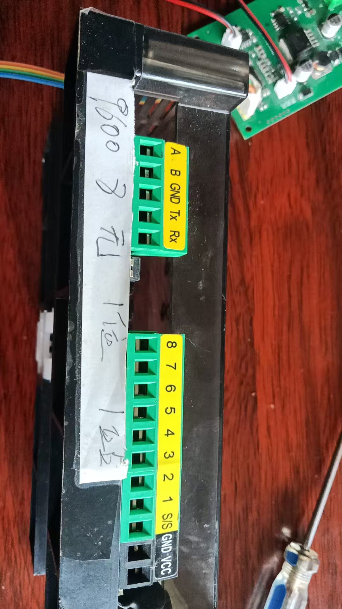

**2. 执行VCC拔插操作**

- 当烧录工具显示"等待设备.."时
- 等待指示灯变黄后，拔掉VCC电源线
- 然后重新插入VCC电源线
- 此时烧录工具应开始显示进度

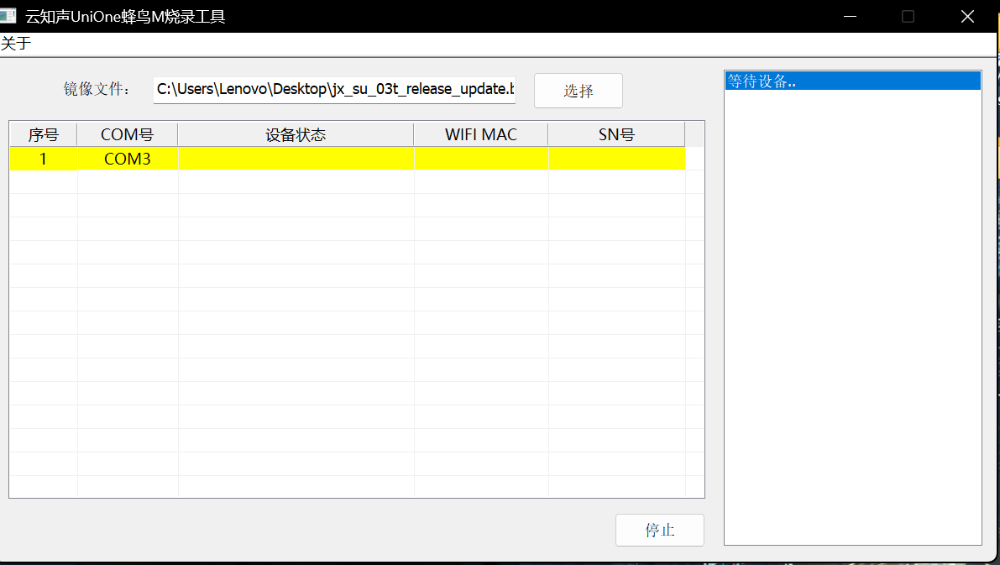

**注意事项：**

- VCC拔插操作需要在指示灯变黄后进行
- 此方法适用于烧录工具卡在等待状态的情况
- 确保其他串口参数配置正确

---

### JX-A7T模块WIFI固件如何正确导入？

**问题描述：**

尝试将JX-A7T模块的WIFI固件导入平台时，因文件格式错误导致导入失败，无法确定正确的导入文件。

**解决方案：**

**1. 下载正确的固件包**

- 从官方渠道下载完整的WIFI固件包
- 确保下载的是包含所有必要文件的完整包

**2. 找到正确的导入文件**

- 在WIFI部分查找"wifi_test.json"配置文件
- 该文件是用于烧录WIFI固件的正确配置文件
- 不是所有的.json文件都可以用于导入

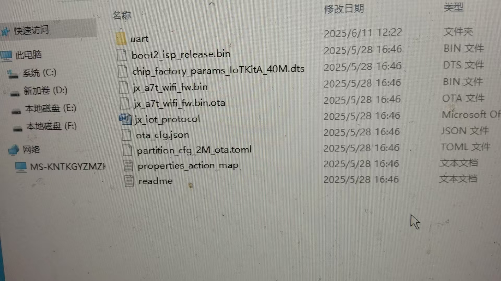

**3. 使用平台附件功能**

- 在智能公元平台的WIFI配置部分
- 上传"wifi_test.json"文件作为配置文件
- 系统会自动识别并导入相关配置

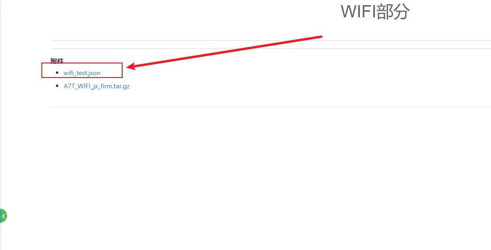

**注意事项：**

- 开发包解压后如果没有导入文件，可能是下载了错误的版本
- wifi_test.json文件包含了WIFI模块所需的所有配置参数
- 不要尝试导入普通的固件.bin文件到配置平台

---

### JX-A7T2使用PACK_UPDATE_TOOLS烧录时无进度怎么办？

**问题描述：**

使用PACK_UPDATE_TOOLS烧录JX-A7T2模块时，按下复位按钮后无法自动开始烧录固件，进度条显示为0%。

**解决方案：**

**1. 检查芯片型号选择**

- 在烧录软件的"CI130X系列"下拉菜单中
- 必须选择"CI130X系列"而不是"CI1302"
- 错误的芯片型号选择会导致烧录失败

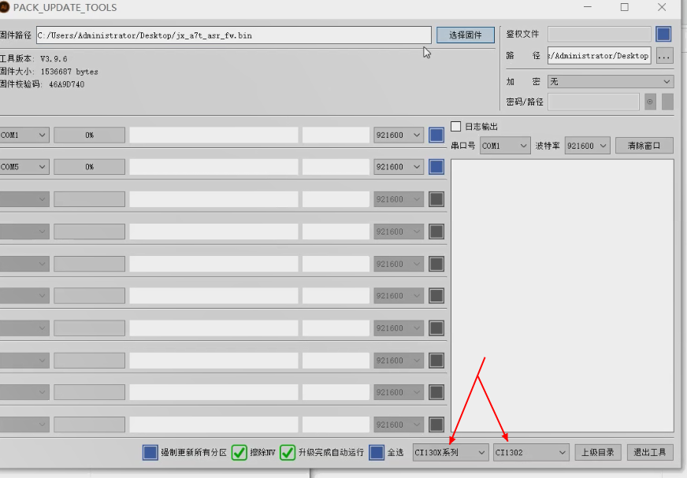

**2. 确认硬件连接**

- 检查JX-A7T2模块已通过USB正确连接
- 确认电源和工作指示灯（蓝色）均亮起
- 验证模块处于正常工作状态

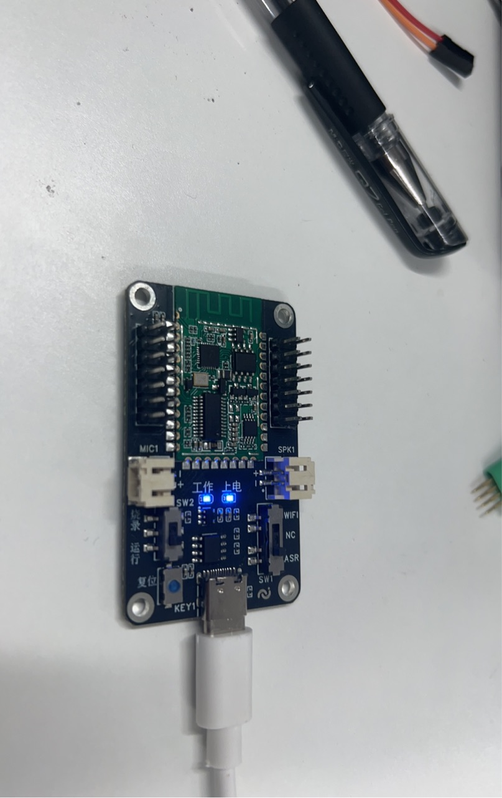

**3. 正确的配置结果**

- 芯片型号正确设置为"CI130X系列"后
- 重新加载固件并尝试烧录
- 进度条应正常显示并达到100%


**注意事项：**

- CI130X系列是JX-A7T2使用的正确芯片型号
- CI1302型号不兼容此模块
- 模块上的烧录功能引脚（如14、15号引脚）默认配置为日志输出口
- 修改这些引脚配置会影响日志输出功能


---

### 烧录文件损坏或解压提示内存不足怎么办？

**问题描述：**

下载的固件文件解压时总是提示内存不足，烧录文件显示损坏。

**解决方案：**

**避免使用中文路径**

- 将固件文件存放在英文路径下
- 确保完整的文件路径中不包含中文字符
- 建议使用简单短路径，如C:\firmware

**正确的操作步骤**

1. 创建英文文件夹（如D:\jx_a7t_firmware）
2. 将下载的固件压缩包放入该文件夹
3. 解压到同一英文路径
4. 使用烧录工具时选择英文路径下的文件

**注意事项：**

- 中文路径可能导致解压工具无法正常工作
- 路径过长也可能引起类似问题
- 保留原始压缩包作为备份

---


---

### JX-A7T烧录文件时间与预期不符怎么办？

**问题描述：**

下载的固件文件修改日期与预期不符，例如文件是27号生成的，但文件夹中显示的是25号，怀疑烧录文件存在问题。

**解决方案：**

**文件时间说明**

1. **文件时间戳含义**：

    - 显示的时间是文件下载到本地的创建时间
    - 不是固件生成的原始时间
    - 时间差异不影响固件内容

2. **文件完整性验证**：

    - 文件时间戳差异属于正常现象
    - 关键是确认文件内容完整性
    - 建议通过文件大小和MD5验证

**问题排查方法**

1. **重新生成固件**：

    - 在平台重新生成固件
    - 下载后立即使用
    - 避免时间戳混淆

2. **验证文件有效性**：

    - 检查文件大小是否正常
    - 确认文件可以正常解压
    - 测试烧录功能是否正常

3. **文件管理建议**：

    - 下载后立即重命名包含日期
    - 保留生成记录便于追踪
    - 使用版本管理避免混淆

**注意事项：**

- 文件夹显示的时间可能是系统自动更新
- 重点关注文件内容而非时间戳
- 如怀疑文件损坏，重新下载即可
- 建议每次使用前都重新生成最新固件

---


---

### JX-A7T模块无法导入WiFi配置信息怎么办？

**问题描述：**

JX-A7T模块在尝试导入WiFi配置信息时失败，无法成功将配置写入模块。

**解决方案：**

**1. 确认固件文件完整**

- 下载官方开发包：https://help.aimachip.com/docs/jx_a7t_v1/jx_a7t_v1-1ghc1h40pidif
- 确保下载的是完整且更新后的开发包
- 删除旧文件，重新下载最新版本

**2. 检查文件解压状态**

- 确认固件压缩包已完全解压
- 检查解压后的文件是否完整
- 避免使用中文路径，建议使用英文路径

**3. 验证配置文件**

- 确认使用的是WiFi部分的正确配置文件
- 检查配置文件格式是否正确（JSON格式）
- 验证配置文件内容是否完整

**注意事项：**

- 如果使用的是旧版开发包，可能导致导入失败
- 确保网络连接稳定，避免下载过程中文件损坏
- 建议保留原始固件包作为备份

---

### JX-A7T烧录后模块无法输出语音怎么办？

**问题描述：**

烧录了语音模块的镜像文件后，模块无法输出语音，即使烧录过程显示成功。

**解决方案：**

**1. 确认固件完整性**

- 检查下载的固件文件是否完整
- 确认文件大小与预期一致
- 重新下载固件包进行对比

**2. 验证烧录过程**

- 确认烧录工具显示100%完成
- 检查是否有错误报告
- 重新进行一次烧录操作

**3. 硬件连接检查**

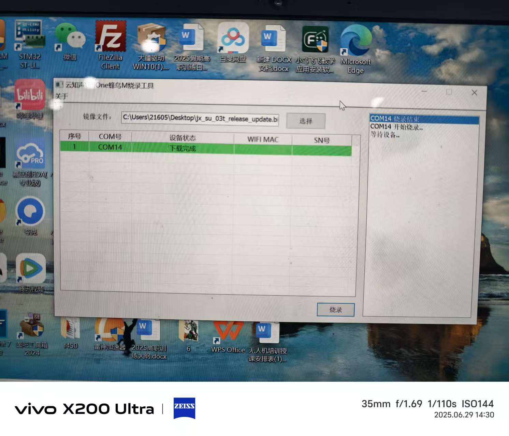

*烧录工具显示下载完成，但设备无响应*

- 确认模块与烧录器连接正确
- 检查供电是否稳定（5V）
- 验证TX/RX线没有接反

**4. 音频硬件检查**

- 确认喇叭已正确连接
- 检查喇叭阻抗是否匹配（推荐8Ω）
- 测试喇叭是否正常工作
- 确认音频线材质量良好

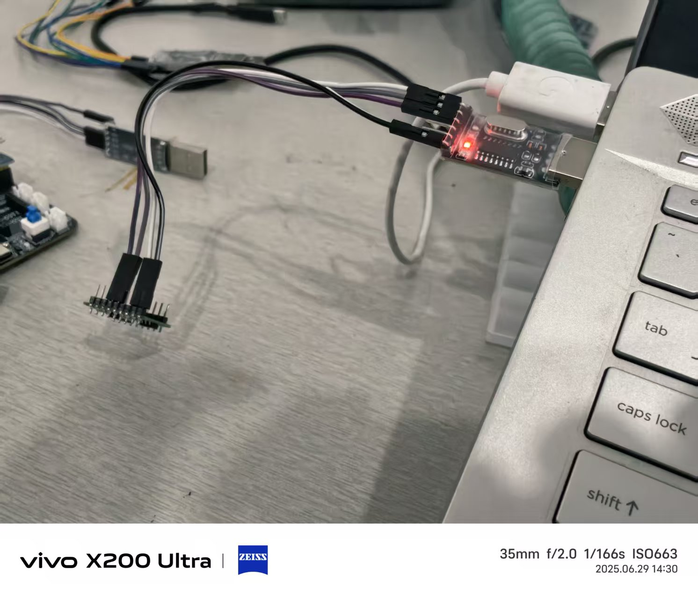

*语音模块通过排线连接到USB转TTL烧录器*

**5. 基础功能测试**

- 上电后仔细听是否有开机提示音
- 尝试说出唤醒词测试响应
- 检查LED指示灯状态
- 使用串口工具查看调试信息

**6. 常见问题解决**

- **固件不匹配**：确保使用JX-A7T专用固件
- **烧录模式错误**：检查是否进入正确的烧录模式
- **音频硬件故障**：尝试更换喇叭或音频线
- **供电不足**：使用外部5V电源而非USB供电

**7. 恢复出厂固件**

- 如所有方法都无效，尝试恢复出厂固件
- 联系技术支持获取标准固件
- 使用官方提供的烧录工具和固件

**注意事项：**

- 烧录成功不代表固件一定正确
- 建议保留原始固件备份
- 测试时从简单功能开始验证
- 如问题持续，可能需要更换模块

---

### JX-A7T1模块烧录固件后，复位后无法正常工作，手机可以连接且能在线烧录，但没有声音输出

**问题描述：**

JX-A7T1模块按照流程烧录后复位没有反应，手机可以连接模块并进行在线烧录，但是没有声音输出。

**解决方案：**

1. **基础检查**
    - 确认右侧开关已拨到WIFI位置
    - 检查模块供电是否正常（推荐5V）
    - 验证喇叭连接是否良好

2. **声音输出排查**
    - 确认喇叭阻抗匹配（推荐8Ω）
    - 测试喇叭是否正常工作
    - 检查音频线路连接
    - 尝试使用SU-03T的喇叭测试

3. **固件验证**
    - 确认使用的是官网提供的固件
    - 检查固件版本是否匹配JX-A7T1
    - 验证固件文件完整性

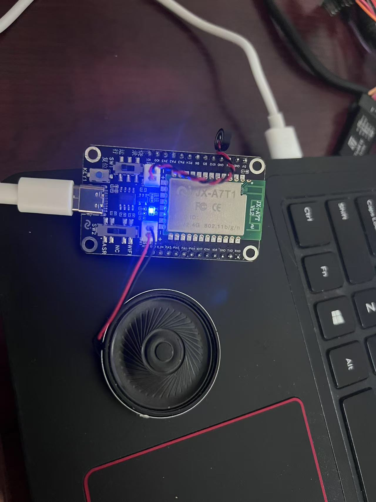
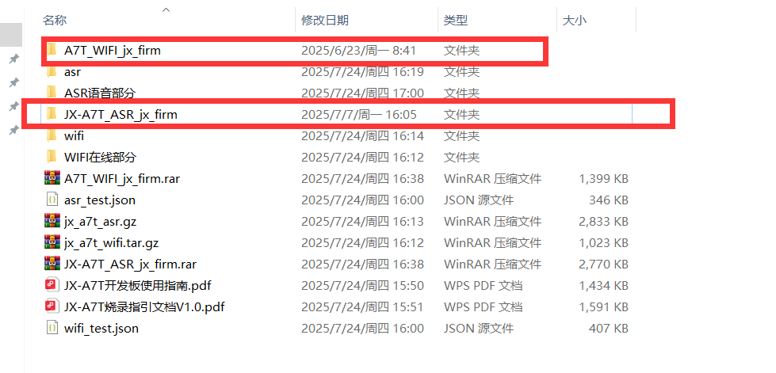

**注意事项：**

- 手机能连接说明模块硬件基本正常
- 在线烧录成功说明通信功能正常
- 无声音输出可能是音频硬件或配置问题
- 如果使用原装喇叭仍无声音，可能是模块故障

---

### 使用5V电压驱动烧写器无法正常工作

**问题描述：**

在使用JX-A7T模块进行烧录时，使用5V电压驱动烧写器无法正常工作，导致烧录失败。

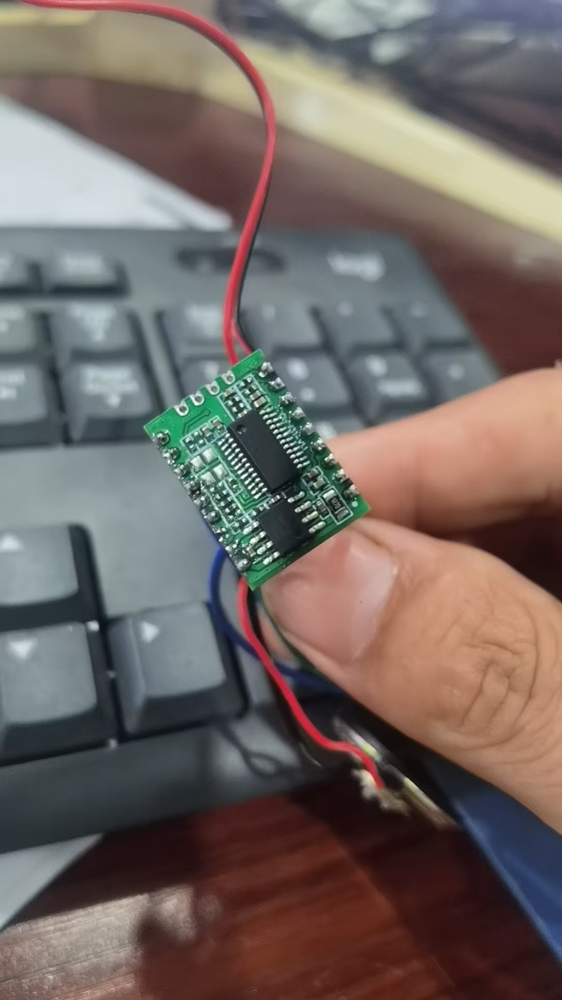

**解决方案：**

- 检查烧写器的供电电压是否符合要求
- 确认烧写器与模块的连接线路正确
- 尝试使用其他电压档位或更换烧写器
- 检查模块的VCC引脚是否正确连接到5V电源

**注意事项：**

- 烧录时需要确保供电稳定
- 建议使用官方推荐的烧录工具和参数
- 如果持续出现问题，可能需要更换烧写设备或检查模块本身

---

### JX-A7T模块烧录时提示串口COM4断开怎么办？

**问题描述：**

在使用JX-A7T模块烧录开发包中的出厂固件时，烧录过程中遇到串口COM4连接中断的错误提示，且设备USB连接正常但无法完成烧录。

**问题分析：**

1. **连接状态**：设备USB连接正常，模块指示灯亮起
2. **错误现象**：烧录软件提示"串口COM4可能被断开，请检查连接"
3. **烧录失败**：无法正常完成固件烧录过程

**解决方案：**

**1. 检查硬件连接**

- 确认USB线缆质量良好，建议使用原装或高质量线缆
- 检查USB接口连接是否牢固，无松动
- 尝试更换不同的USB端口

**2. 验证固件来源**

- 确认下载的是官方开发包（版本2.1.4）
- 通过文档系统导航到"烧录资料" -> "出厂固件" -> "语音部分"下载
- 验证固件文件完整性，未损坏

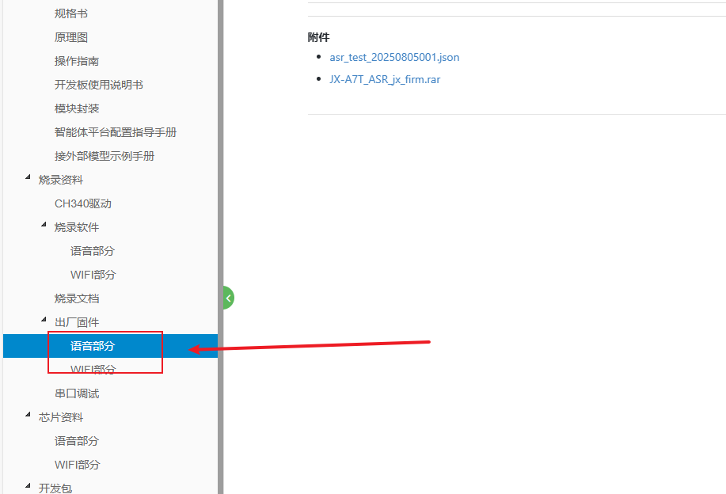

*在文档系统中找到并下载正确的固件*


*通过官方链接下载JX-A7T开发包*

**3. 烧录环境检查**

- 关闭其他可能占用串口的程序
- 检查设备管理器中COM4端口状态
- 尝试重新安装USB转串口驱动

**4. 操作流程优化**

- 先连接设备，确认驱动正常识别
- 打开烧录软件，选择正确的COM端口
- 加载固件文件后再开始烧录
- 烧录过程中不要移动或断开连接

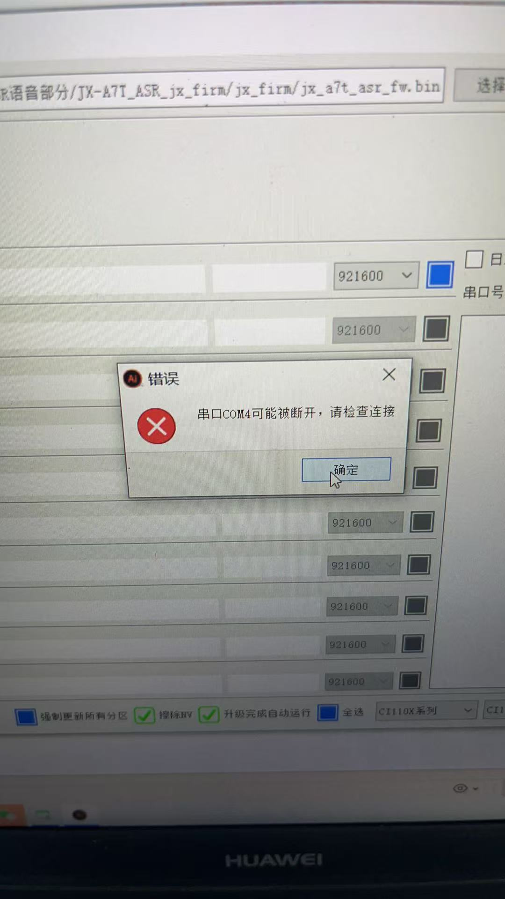

*烧录过程中出现的串口断开提示*

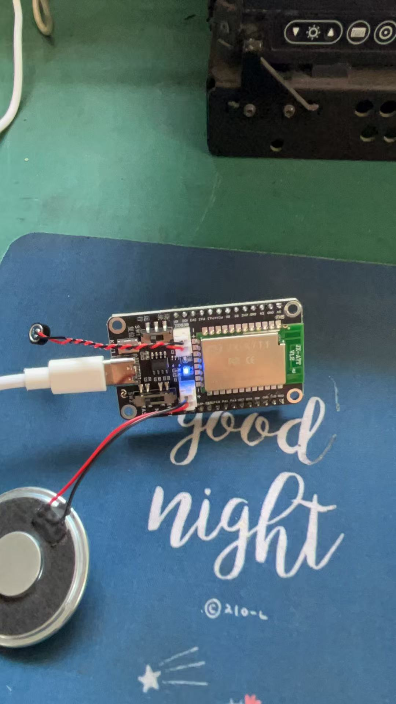

*JX-A7T模块通过USB正常连接供电*

**5. 替代方案**

- 尝试使用另一台电脑烧录
- 使用其他烧录工具测试
- 联系技术支持获取针对性帮助

**注意事项：**

- 确保使用与JX-A7T匹配的固件版本
- 烧录过程中保持电源稳定
- 如果持续失败，可能是模块硬件问题，需要返修或更换

---

### JX-A7T大模型模块的烧录器软件在哪里下载？

**问题描述：**

需要下载JX-A7T大模型模块的烧录器软件进行固件烧录。

**解决方案：**

**1. 视频教程获取**

- B站观看JX-A7T大模型模块固件制作及烧录教程
- 视频链接：https://www.bilibili.com/video/BV1T8jyzbEHp
- 视频描述中包含烧录软件下载链接

**2. 智能公元平台下载**

- 访问智能公元官方文档平台
- 链接：https://help.aimachip.com/docs/jx_a7t_v1/jx_a7t_v1-1ghc1h40pidif
- 平台提供完整的例程和文档
- 包含烧录软件和相关工具

**3. 烧录软件类型**

JX-A7T需要使用两种烧录软件：

- ASR语音部分烧录软件：用于烧录离线语音固件
- WiFi在线部分烧录软件：用于烧录WiFi和在线功能固件

**注意事项：**

- 确保下载与JX-A7T匹配的烧录软件版本
- 烧录前正确连接硬件和选择COM端口
- 语音和WiFi部分需要分别烧录对应固件
- 详细操作步骤参考官方视频教程

---

### JX-A7T模块OTA更换ASR程序需要注意什么？

**问题描述：**

尝试通过OTA方式更换JX-A7T模块的ASR程序时，设备在烧录过程中卡住，无法完成更新，同时对OTA升级流程和烧录模式切换存在困惑。

**解决方案：**

**1. OTA与离线烧录的区别**

- **OTA升级**：通过小程序扫码在线更新，仅支持WiFi固件
- **ASR程序更新**：离线语音程序需要硬件烧录
- 两种方式功能不同，不能混用

**2. 正确的操作流程**

**OTA升级WiFi固件时：**

- 不需要拨动烧录开关
- 小程序扫码后直接在线升级
- 适合更新WiFi功能和在线AI配置

**更换ASR程序时：**

- 必须使用硬件烧录方式
- 将开关拨到烧录模式
- 使用ASR语音部分烧录软件

**3. 烧录模式说明**

- 烧录模式是离线操作，不需要联网
- 用于更新语音识别、唤醒词等离线功能
- 需要通过专用烧录工具连接电脑

**注意事项：**

- OTA只能更新WiFi部分，不能更新ASR程序
- 更换ASR程序必须使用硬件烧录
- 不要混淆OTA升级和离线烧录的概念
- 操作前确认需要更新的是哪部分功能

---

### JX-A7T无法通过串口烧录工具烧录固件怎么办？

**问题描述：**

JX-A7T模块无法通过串口烧录工具成功烧录固件，设备已连接但在离线模式下无法唤醒智能体。

**解决方案：**

**1. 检查设备连接状态**

- 确认设备USB连接正常，模块指示灯亮起
- 验证串口烧录工具能识别COM端口
- 检查设备是否处于正确的烧录模式

**2. 烧录模式设置**

- 左边开关：拨到运行模式（离线工作状态）
- 右边开关：拨到WiFi位置
- 重要：不需要拨到烧录模式即可进行固件更新

**3. 离线功能验证**

烧录完成后测试：

- 离线唤醒词识别功能
- 语音命令播报功能
- GPIO输入输出控制功能
- 如离线功能正常，智能体功能可在联网后使用

**注意事项：**

- JX-A7T支持离线和在线双模工作
- 烧录工具显示"连接成功"即表示固件已正常写入
- 离线模式下智能体不响应是正常现象，需要联网后使用
- 如仍有问题，尝试重新烧录完整固件包

---

### JX-A7T烧录过程卡在'spl 擦写中'怎么办？

**问题描述：**

使用烧录工具进行固件烧录时，烧录过程卡在'spl 擦写中'状态，无法继续，尝试降低波特率等方案后问题仍未解决。

**解决方案：**

**1. 避免使用中文路径**

- 烧录工具不支持中文路径
- 固件路径中不能包含中文字符
- 建议将固件放在英文路径下

**2. 降低波特率设置**

- 将波特率从1500000降低至921600
- 在烧录工具中重新设置波特率参数
- 降低波特率可提高通信稳定性

**3. 检查固件完整性**

- 确认下载的固件文件完整
- 检查固件大小是否正常
- 重新下载完整固件包

**4. 硬件连接检查**

- 检查USB连接是否稳定
- 尝试更换USB端口
- 确认烧录器与模块接触良好

**注意事项：**

- 中文路径是最常见的烧录失败原因
- 高波特率可能导致通信不稳定
- 'spl 擦写中'表示正在擦除Flash准备写入
- 建议按照官方教程操作，避免使用特殊字符路径

---

### SU-03设备串口发送数据到单片机时接收到空格怎么办？

**问题描述：**

SU-03设备通过串口发送数据到单片机时，单片机接收到的消息为空格，无法正常接收有效数据。

**分析原因：**

根据提供的配置界面截图，发送的数据格式可能存在问题：

1. 十六进制数据格式设置不正确
2. 数据长度或格式不符合要求
3. 串口通信参数配置不匹配
4. 数据传输过程中的编码问题

**解决方案：**

1. **检查数据格式配置**
    - 确认发送的数据为有效的十六进制格式（0-9，A-F）
    - 确保数据长度不超过32字节
    - 避免连续多字符连接（如010809）
    - 两个字符一组，中间用空格分隔（例如：98 A3 0B FE）

2. **使用串口助手测试**
    - 先使用串口助手测试SU-03的发送功能
    - 验证串口助手是否能正常接收数据
    - 确认数据格式和内容是否正确

3. **检查串口通信参数**
    - 确认波特率、数据位、停止位、校验位设置一致
    - 验证单片机的串口接收配置
    - 检查是否需要配置流控

4. **调试数据传输**
    - 使用示波器或逻辑分析仪检查串口信号
    - 验证数据位的电平变化
    - 检查是否有噪声干扰

**注意事项：**

- 十六进制数据必须严格按格式要求输入
- 建议先用简单的数据（如 AA BB）进行测试
- 确保单片机的串口接收缓冲区配置正确
- 如持续接收空格，可能是编码格式问题，尝试调整数据解析方式

---

### JX-A7T模块配网失败怎么办？

**问题描述：**

JX-A7T模块在使用笔记本热点或2.4G路由器进行配网时，始终提示配网失败，且路由器管理界面看不到设备上线。

**解决方案：**

**1. 配网流程检查**

- **设备发现**：确认手机能搜索到模块
- **连接成功**：手机与设备已连接
- **发送消息**：指令已发送到设备
- **配网失败**：设备配置成功或添加设备状态为"待处理"

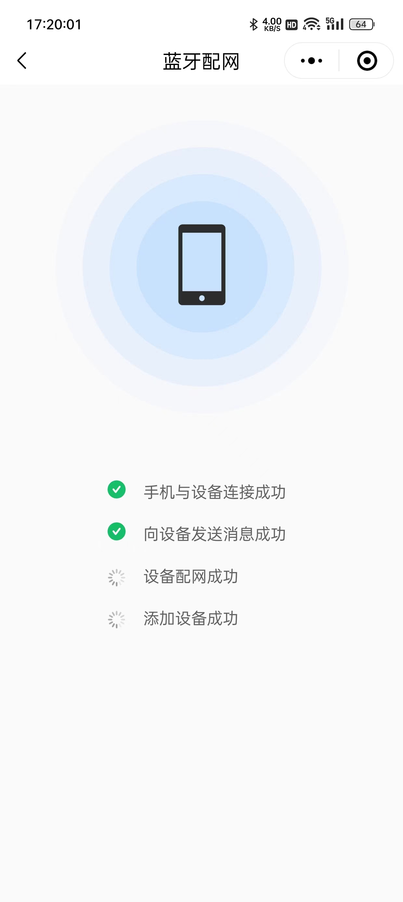

*配网各阶段状态显示*

**2. 常见失败原因**

- **设备未授权**：检查"检查设备是否授权"提示
- **网络不稳定**：2.4G信号弱或干扰大
- **路由器问题**：DHCP配置或MAC地址过滤
- **固件问题**：网络协议栈存在bug

**3. 排查步骤**

- **重启设备**：断电后重新开始配网
- **重置网络**：清除原有网络配置后重试
- **更换环境**：尝试不同的WiFi网络或路由器
- **检查日志**：通过串口查看配网过程信息

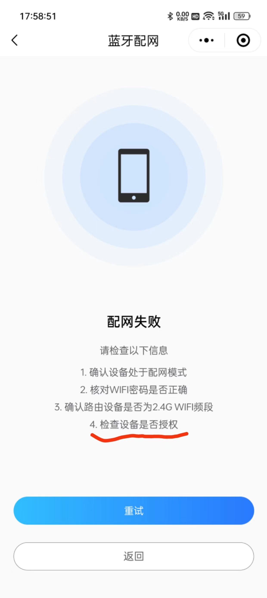

*配网失败并提示"检查设备是否授权"*

**4. 路由器检查**

- **设备列表**：确认路由器已连接设备列表
- **IP分配**：检查DHCP是否分配了IP地址
- **防火墙**：关闭MAC过滤或访问限制
- **信道干扰**：更换WiFi信道减少干扰

**注意事项：**

- 配网失败通常在最后一步出现问题
- 设备被发现说明蓝牙功能正常
- 建议在信号好的环境下进行配网
- 多次失败可考虑联系技术支持

---

### JX-A7T能收到串口调试助手发送的指令但模块无响应怎么办？

**问题描述：**

使用调试助手可以向串口发送指令，且烧录工具能正常下载固件，但JX-A7T模块无法接收或响应这些指令。

**解决方案：**

**1. 指令格式检查**

- **帧头验证**：确认指令包含正确的帧头（03 06 00）
- **帧尾验证**：确保指令以正确的帧尾结束（AF EE）
- **数据格式**：使用十六进制格式发送，而非ASCII格式

- **正确格式示例**：
    ```
    03 06 00 01 AF EE
    ```

**2. 触发配置检查**

- **消息号匹配**：确保发送的消息号与模块配置的消息号一致
- **参数配置**：检查wendu_z、wendu_x等参数是否正确配置
- **触发条件**：确认UART0_RX已启用作为触发源

**3. 常见问题排查**

- **消息号错误**：发送的消息号与配置不匹配（如发送1号但配置的是2号）
- **参数缺失**：指令中缺少必需的参数数据
- **触发方式未启用**：UART0_RX触发可能未在配置中启用
- **固件版本问题**：某些旧版本固件可能存在串口接收bug

**4. 测试建议**

- **使用默认配置**：先用最简单的配置测试
- **单条指令测试**：一次只发送一条指令，逐步验证
- **串口监控**：通过串口调试工具查看模块的响应日志
- **重新烧录**：重新生成并烧录固件，确保配置生效

**注意事项：**

- JX-A7T的串口通信需要严格按照协议格式
- 调试助手发送成功不代表硬件有问题
- 配置修改后必须重新生成固件才能生效
- 如问题持续，可提供具体的串口日志以便技术支持分析

---

### JX-A7T模块支持根据语音指令中的不同关键词输出不同的串口信息吗？

**问题描述：**

希望系统能够识别语音指令中的不同关键词（如"二十七度"、"二十六度"），并根据不同的数值输出相应的串口信息。

**解决方案：**

**当前功能限制**

- **系统限制**：现有系统无法从语音指令中提取变化的数值参数
- **固定匹配**：每条语音指令只能对应一个固定的输出
- **不支持动态解析**：无法实现根据指令中的数字变化输出不同数据

**替代方案**

**1. 多指令配置方案**

- **分别配置**：为每个可能的数值单独配置语音指令
    - "把空调调到二十七度" → 输出：27
    - "把空调调到二十六度" → 输出：26
    - "把空调调到二十五度" → 输出：25
- **资源占用**：需要占用多个词条位置
- **实现方式**：每条指令配置对应的串口输出内容

**2. 分级配置方案**

- **常用温度**：配置最常用的几个温度值
    - 如：22度、24度、26度、28度
- **减少词条**：比全配置节省资源
- **覆盖范围**：满足大部分使用场景

**3. 组合指令方案**

- **基础指令**："打开空调"
- **调节指令**："温度升高"、"温度降低"
- **步进调节**：每次调整1-2度

**注意事项：**

- CI-03T等模块支持300-500条词条，需要合理规划
- 如需要动态参数提取，可能需要等待固件功能更新
- 设计语音指令时应避免相似的发音，防止误识别
- 建议优先配置最常用的功能

---

### JX-A7T模块长时间工作后死机且功耗异常怎么办？

**问题描述：**

JX-A7T模块在长时间工作后出现死机现象，表现为系统无法唤醒，IO电平异常，且功耗显著高于正常水平（从1mA增加到4mA左右）。

**解决方案：**

**问题分析：**

1. **深度睡眠导致的问题**：

    - 模块的深度睡眠功能可能导致系统异常
    - 长时间未唤醒后系统进入死机状态
    - 电流变为0表明模块完全停止工作

2. **功耗异常原因**：

    - 正常待机电流约1mA
    - 异常时电流达到3.9-4.34mA
    - 关闭深度睡眠后功耗增加是正常现象

**解决方法：**

1. **修改固件配置**：

    - 在智能公元平台的"优化配置"中
    - 将"深度休眠"设置为"不支持"
    - 重新生成并烧录固件

    

2. **测试验证**：

    - 烧录新固件后进行长时间测试
    - 观察是否还会出现死机现象
    - 记录待机电流变化

3. **功耗权衡**：

    - 关闭深度睡眠后功耗会增加（从1mA到2mA）
    - 但能解决系统死机问题
    - 需要在稳定性和功耗之间做选择

**测试数据参考：**

- 正常模式（深度睡眠开启）：约1mA
- 优化模式（深度睡眠关闭）：约2mA
- 异常状态：3.9-4.34mA

**进一步处理：**

1. **不良品分析**：

    - 将问题模块返回厂家进行深入分析
    - 可能是芯片内部Flash异常导致无法烧录
    - 需要多个样本才能准确判断问题

2. **软件调试**：

    - 使用debug模式固件进行详细日志分析
    - 定位死机前的具体状态
    - 查找可能的软件bug

3. **生产建议**：

    - 在发现解决方案前暂停大批量生产
    - 对已生产模块进行全检
    - 建立严格的测试流程

**注意事项：**

- 深度睡眠功能可能在某些批次存在兼容性问题
- 关闭深度睡眠会增加功耗但能提高稳定性
- 如不良率较高（如发现3-5个不良），应及时联系厂家
- 保留完整的测试记录和问题现象

---

### JX-A7T模块TCP连接后立即断开怎么办？

**问题描述：**

JX-A7T模块通过IO2触发TCP连接，连接成功后很快断开，日志显示USER_SOCKET_DISCONNECT事件。

**解决方案：**

**1. 确认连接流程**

- WiFi连接成功后，使用IO2触发TCP连接
- 日志显示"socket connect ret=0"表示连接建立
- "USER_SOCKET_CONNECTED"确认连接状态正常
- 紧接着出现"USER_SOCKET_DISCONNECT"表示异常断开

**2. 可能原因分析**

- 服务器端主动断开连接
- 网络不稳定导致连接超时
- 固件中的TCP保持逻辑有问题
- 数据传输异常导致连接关闭

**3. 排查建议**

- 检查服务器端是否有异常断开记录
- 使用网络抓包工具分析数据流
- 确认固件中的心跳包配置
- 测试不同的服务器进行对比

**4. 调试步骤**

- 保存完整的串口日志供分析
- 确认配网使用的网络环境稳定
- 检查IO2触发信号的持续时间
- 验证固件版本是否已知存在此问题

**注意事项：**

- TCP连接立即断开通常是服务端或网络问题
- 建议使用稳定的测试环境
- 更换到其他服务器测试确认问题范围
- 如问题持续，提供详细日志给技术支持

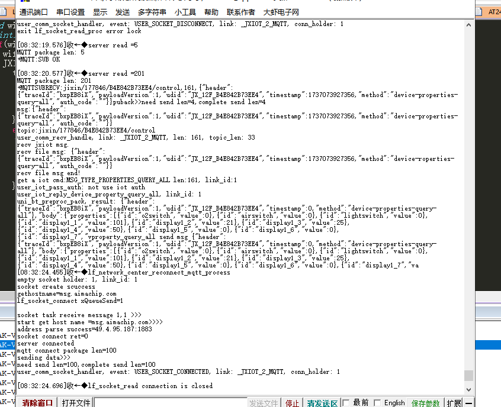
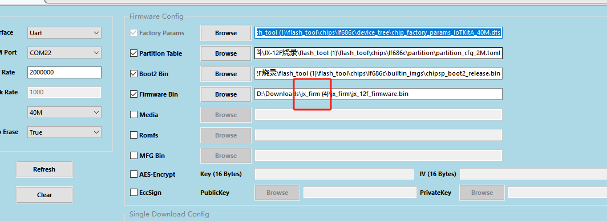
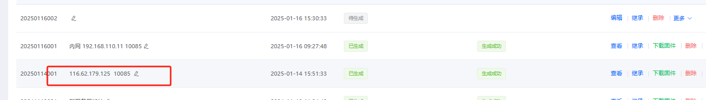
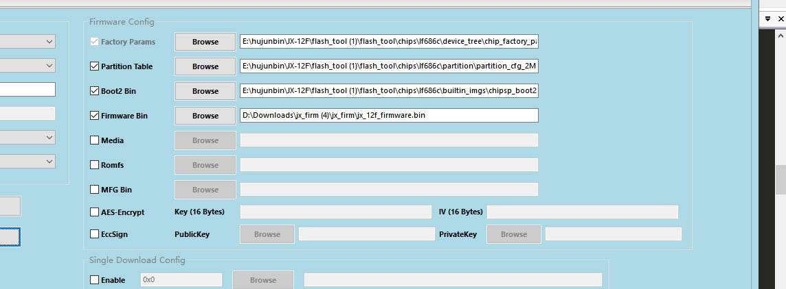

---


---

### JX-A7T模块在板上烧录时出现bootloader:err -24错误怎么办？

**问题描述：**

JX-A7T模块集成到产品PCB上进行烧录时，出现"bootloader:err -24"错误，无法完成固件升级，但使用独立模块可以正常烧录，线路连接确认无误。

**解决方案：**

**1. 错误分析**

- err -24表示"updater传输数据中出现异常"
- 通常是硬件连接或通信问题导致
- 板上烧录与模块烧录的环境差异是关键

**2. 排查步骤**

- 检查板上电源供电是否稳定（建议单独5V供电）
- 确认烧录线路连接正确（TX、RX、GND）
- 验证串口工具波特率设置
- 检查是否有其他电路干扰

**3. 硬件设计注意事项**

- 模块内部已集成功放，无需外部功放电路
- 直接连接喇叭即可使用
- 保留必要的调试接口

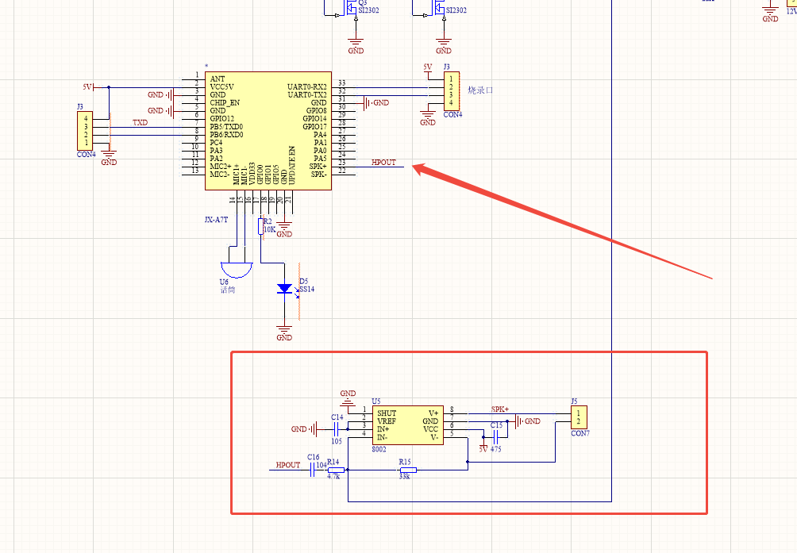

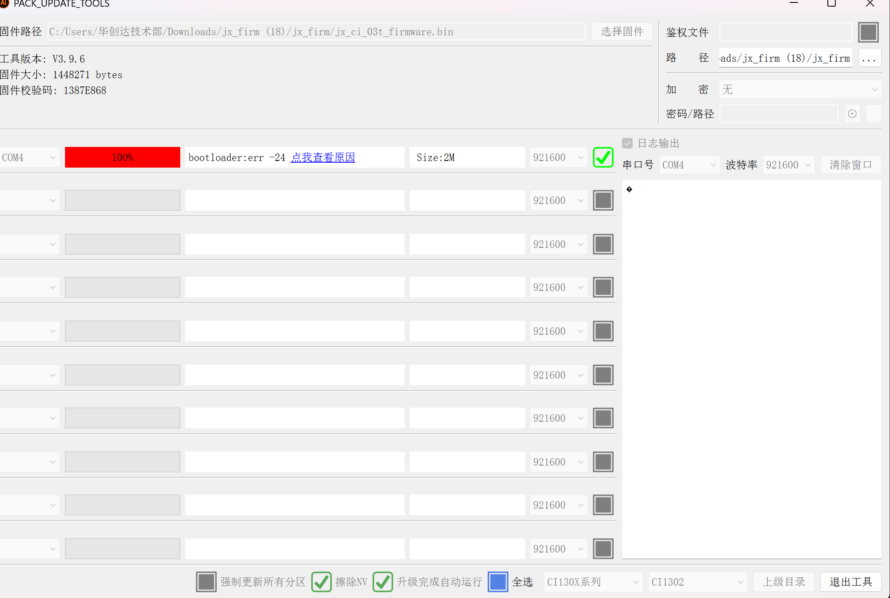

**常见原因及解决方法：**

- **电源问题**：确保5V供电稳定，电流足够
- **通信干扰**：检查PCB布局，减少数字噪声
- **连接问题**：确认烧录线接触良好
- **时序问题**：烧录时正确的上电时序

**注意事项：**

- 优先使用模块验证固件和烧录工具正常
- 板上设计时预留测试点便于调试
- 烧录失败时尝试降低波特率
- 检查PCB上的上拉/下拉电阻配置

---

### JX-A7T模块烧录WiFi固件时出现IMG LOAD SHAKEHAND FAIL错误？

**问题描述：**

使用Leapfive Flash Environment工具烧录JX-A7T模块WiFi固件时，遇到"IMG LOAD SHAKEHAND FAIL"错误，导致烧录失败。

**解决方案：**

**1. 错误原因分析**

- 错误代码0050表示握手失败
- 通常是选择了错误的固件文件
- IO8引脚未正确拉高也会导致此错误

**2. 正确烧录步骤**

- **设置IO8电平**：将IO8引脚拉高（约3.3V）
- **开关配置**：SW1拨到烧录模式，SW2拨到WiFi
- **选择正确固件**：使用jx_a7t_wifi_fw.bin文件

**3. 烧录操作流程**

1. IO8拉高后模块上电复位
2. 打开Leapfive Flash Environment工具
3. 选择正确的固件文件路径
4. 开始烧录操作


**注意事项：**

- 确保IO8在整个烧录过程保持高电平
- 不要选择名为jx_a7的文件，应选择jx_a7t_wifi_fw.bin
- 烧录失败后需要重新上电复位
- 模块内部已集成功放，无需外部功放电路

---

### JX-A7T模块智能体问答功能异常怎么办？

**问题描述：**

JX-A7T模块固件烧录成功后，智能体问答功能出现重复回答，无法正确响应问题。

**解决方案：**

**1. 问题定位**

- 检查智能体是否正确配置
- 确认设备已成功连接网络
- 验证智能体平台配置是否生效

**2. 智能体绑定流程**

1. 扫描模块上的智能体二维码
2. 打开"智能公元"微信小程序
3. 进入AI智能体菜单进行绑定
4. 确认绑定成功后测试

**3. 测试方法**

- 使用唤醒词："你好小智"或"小智精灵"
- 提问测试："你叫什么名字"
- 观察响应是否正常

**注意事项：**

- 智能体需要在小程序中完成绑定
- 网络连接正常是在线问答的前提
- 如绑定失败，检查小程序权限设置
- 重复回答可能是配置未生效导致

---

### JX-A7T模块如何查看WiFi连接日志？

**问题描述：**

需要通过串口查看JX-A7T模块的WiFi连接状态和日志，确认是否成功连接到大模型服务。

**解决方案：**

**1. 连接设置**

- 使用CH340或类似USB转串口模块
- 连接模块的烧录引脚（TX、RX、GND）
- 串口参数：2000000波特率，8N1，关闭16进制显示

**2. 日志查看方法**

1. 连接好后打开串口助手
2. 模块上电即可看到日志输出
3. 观察WebSocket连接状态
4. 确认心跳包是否正常发送

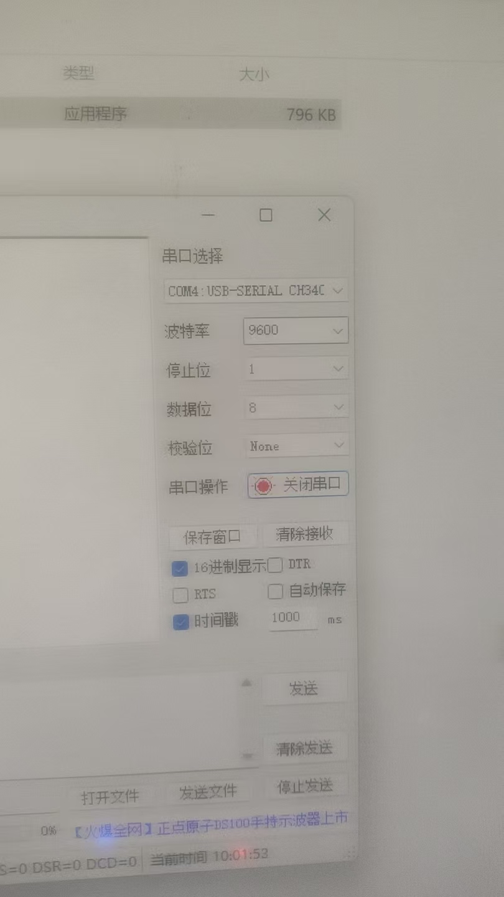

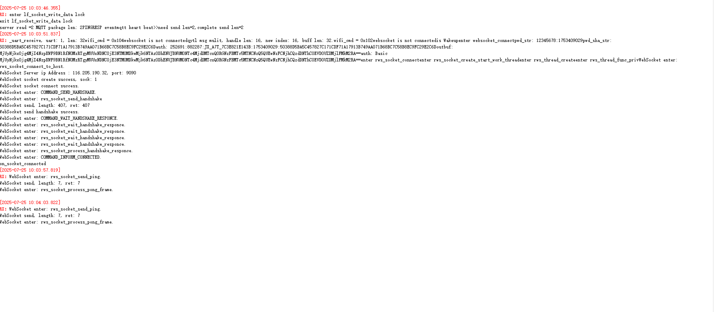

**关键日志信息：**

- WiFi连接成功的提示
- WebSocket连接建立状态
- 心跳包发送记录
- 音频数据上传记录

**注意事项：**

- 高波特率2000000是专用于日志查看
- 通信时使用其他波特率
- 日志信息帮助判断网络和连接状态
- 无数据上传可能需要重新配置网络

---

### JX-A7T配置时设备状态异常怎么办？

**问题描述：**

在使用离线语音配置工具时，设备连接状态异常，表现为设备在配置过程中变黄，拔插VCC后状态变为红色，且无法正常传输数据。

**解决方案：**

**1. 状态说明**

- **黄色状态**：设备已连接但通信异常
- **红色状态**：通信失败或设备断开连接
- **"传输中断"**：串口通信中断

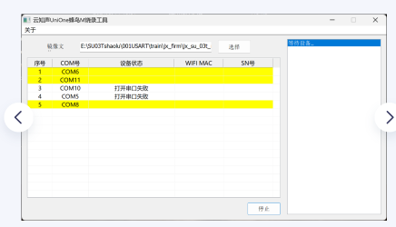

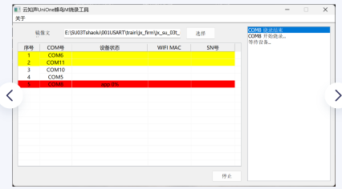

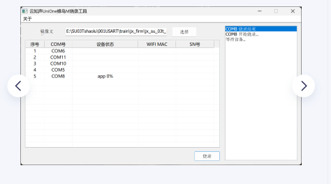

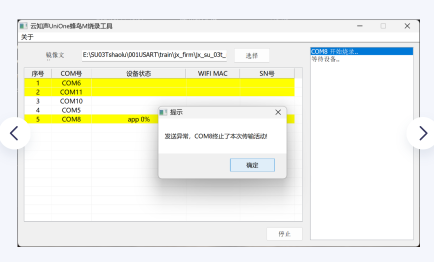

**2. 排查步骤**

- 检查USB转TTL模块连接是否牢固
- 确认VCC供电稳定
- 验证串口线序是否正确

**3. 解决方法**

- 重新插拔USB连接
- 更换USB端口
- 检查驱动程序
- 尝试使用台式机USB端口

**注意事项：**

- 配置过程中避免拔插电源
- 使用质量好的USB转TTL模块
- 确保供电电压稳定

---


---

### 特定JX-A7T开发板烧录失败如何处理？

**问题描述：**

某个JX-A7T开发板在烧录时出现"IMG LOAD SHAKEHAND FAIL"错误，而其他开发板烧录正常。

**解决方案：**

**1. 错误现象**

- **错误信息**：IMG LOAD SHAKEHAND FAIL
- **错误代码**：0050
- **影响范围**：仅特定开发板出现此问题

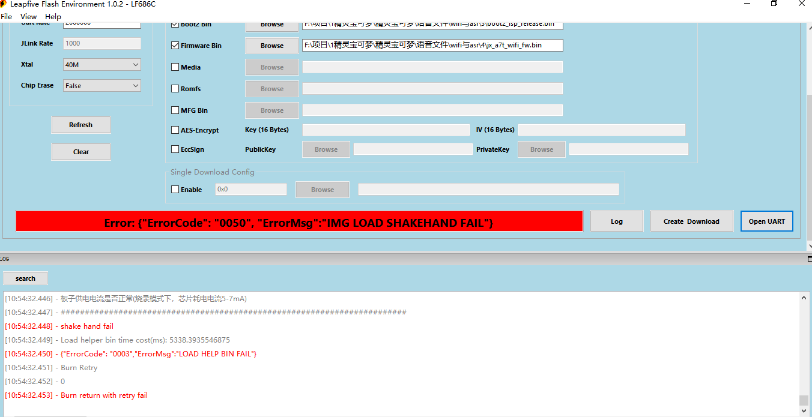

*烧录过程中出现的握手失败错误*

**2. 排查步骤**

针对特定开发板的故障排查：

- **重新选择固件文件**：确认文件路径和名称正确
- **检查开关位置**：确保拨码开关位置正确
- **按压主控芯片**：烧录时轻压CI1302芯片
- **调整拨码力度**：自然拨到WiFi位置，不要用力过猛


*正确的烧录文件选择界面*

**3. 硬件检查**

如果问题持续存在：

- **测量电压**：检查USB供电是否稳定
- **检查连接线**：确认USB线质量良好
- **更换端口**：尝试电脑的不同USB端口
- **清洁接口**：检查开发板USB接口是否有异物

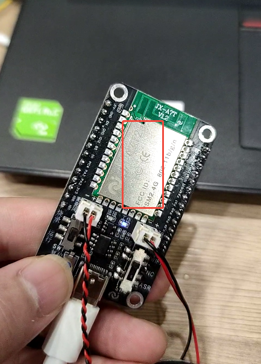

*JX-A7T开发板实物，红色方框为CI1302主控芯片*

**4. 解决方案**

根据排查结果采取相应措施：

- **其他板正常**：说明问题出在特定开发板
- **寄回分析**：将故障开发板寄回厂家分析原因
- **更换开发板**：联系供应商进行更换

**注意事项：**

- IMG LOAD SHAKEHAND FAIL通常是握手通信失败
- 确保按照官方教程操作烧录步骤
- 多个开发板测试可判断是普遍问题还是个例
- 硬件问题建议联系官方技术支持

---

### JX-A7T通过USB转TTL连接后无输出怎么办？

**问题描述：**

JX-A7T模块通过USB转TTL串口连接电脑，使用XCOM软件发送指令但没有任何输出响应。

**解决方案：**

**1. 检查硬件连接**

- 确认USB转TTL模块型号（如YS-CH340）
- 验证五根线连接正确：

    - GND：地线（必须连接）
    - RXD：接收数据
    - TXD：发送数据
    - 5V/3.3V：电源供电
- 检查杜邦线接触是否牢固

**2. 配置XCOM软件**

- 选择正确的COM端口
- 设置波特率为9600（或模块配置的波特率）
- 数据位：8
- 停止位：1
- 校验位：无

**3. 验证模块工作状态**

- 确认模块已正常上电
- 检查电源指示灯
- 测试模块是否进入串口通信模式

**4. 导出固件配置**

- 从配置工具导出当前固件配置
- 检查固件是否支持串口通信功能
- 确认串口功能已启用

**5. 测试步骤**

- 先发送简单指令（如AT指令）
- 尝试发送十六进制数据
- 检查接收区是否有响应
- 验证发送的数据格式

**调试建议：**

- 更换不同的USB转TTL模块
- 尝试其他串口调试工具
- 检查电脑USB驱动是否正常
- 确认模块固件版本兼容性

**注意事项：**

- 确保使用支持数据传输的USB转TTL模块
- 某些红外接收模块可能影响串口通信
- 建议单独测试JX-A7T模块，排除其他电路干扰

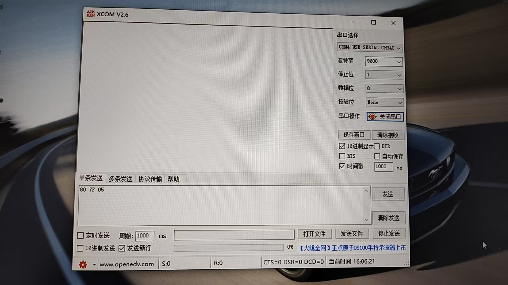


---


---

### JX-A7T串口通信和烧录失败怎么办？

**问题描述：**

JX-A7T模块无法通过串口进行正常通信或烧录，需要排查接线、电平匹配等问题。

**解决方案：**

**1. 检查串口引脚连接**

- 确认连接到正确的串口引脚（B0/TX、B1/RX）
- 不要误接到B6、B7等其他引脚
- 第一根为地线（GND）
- 第二根接单片机TX到模块RX
- 第三根接单片机RX到模块TX

**2. 验证通信电平**

- JX-A7T模块通信电平为3.3V
- 确认单片机或USB转TTL模块输出电平匹配
- 使用万用表测量电平是否正确
- 避免使用5V电平直接连接

**3. 使用合适的连接线**

- 必须使用支持数据传输的USB线
- 普通充电线无法传输数据
- 建议使用屏蔽线减少干扰

**4. 单独测试模块**

- 将模块独立连接，不通过单片机
- 使用跳线直接连接到串口工具
- 排除中间电路干扰

**调试步骤：**

- 用万用表测试每根线的连通性
- 重新插拔连接线确保接触良好
- 更换质量更好的杜邦线
- 使用不同的USB端口测试

**注意事项：**

- 模块本身经过测试，通常不是硬件问题
- 重点关注连接线和电平匹配
- 确保使用带数据传输功能的USB线


---


---

### JX-A7T烧录时拔插VCC导致通信中断怎么办？

**问题描述：**

JX-A7T模块在烧录过程中，拔插VCC电源后串口工具显示传输中断，设备状态变为红色，无法正常通信。

**解决方案：**

**1. 问题原因分析**

- 杜邦线接触不良是主要原因
- 2.54mm杜邦线与2.0mm排针不匹配
- 拔插过程中的接触断开导致通信中断

**2. 硬件连接改进**

- 将杜邦线直接焊接到模块引脚
- 使用2.0mm转2.54mm转接头
- 确保连接牢固可靠

**3. 操作规范**

- 烧录过程中避免拔插电源
- 如需重新连接，先关闭烧录工具
- 保持连接稳定，避免晃动

**4. 替代方案**

- 使用扩展坞可能不稳定，直接连接电脑主机
- 更换质量更好的USB转TTL模块
- 尝试使用台式机而非笔记本

**注意事项：**

- 焊接时注意防静电
- 使用合适的烙铁温度（300-350°C）
- 确认焊接牢固无虚焊
- 避免长时间拔插导致引脚损坏

---


---

### JX-A7T串口命令变量未更新怎么办？

**问题描述：**

JX-A7T模块配置了串口触发输入，但发送命令后变量值未发生预期变化。

**解决方案：**

**1. 检查串口配置**

- 确认触发方式设置正确（如UART2）
- 验证参数配置（如UART1_RX）
- 检查消息号和参数类型设置

**2. 验证接线连接**

- 确认串口线连接到正确的引脚（B0/TX、B1/RX）
- 检查地线是否连接
- 使用万用表测试线路连通性

**3. 检查通信协议**

- 确认命令格式正确
- 验证十六进制数据包格式（如AA 55 06 00 55 AA）
- 检查波特率等串口参数

**4. 变量配置验证**

- 确认变量已正确创建并配置
- 检查变量类型和触发条件
- 验证变量绑定是否生效

**调试步骤：**

- 使用串口调试工具单独测试模块
- 尝试简化命令格式
- 检查模块是否进入正确的工作模式

**注意事项：**

- JX-A7T的IO开头引脚为WiFi部分，P开头为离线部分
- 串口透传可在优化选项中配置
- 确保使用支持数据传输的连接线，而非仅充电功能的线缆


---


---

### JX-A7T播放音乐时无法识别语音指令怎么办？

**问题描述：**

使用JX-A7T1模块播放音乐时，语音唤醒词无响应，无法通过语音指令停止音乐播放，需要等待播放完成。

**解决方案：**

1. **开启AEC打断功能**
    - AEC（声学回声消除）功能允许在播放过程中识别语音指令
    - 需要在固件配置中启用AEC功能
    - 参考教程视频：https://b23.tv/WzJbpDg

2. **配置方法**
    - 在智能公元平台或配置工具中找到AEC设置
    - 启用AEC打断功能
    - 重新生成并烧录固件

3. **模块支持情况**
    - JX-A7T支持AEC打断功能
    - SU-21T等低功耗模块不支持该功能
    - 确认使用的是支持AEC的模块型号

**注意事项：**

- AEC功能会增加一定的功耗
- 需要使用支持AEC的固件版本
- 音乐音量过大会影响语音识别效果
- 建议咪头远离喇叭避免回声干扰

---


---

### JX-A7T1模块固件烧录失败怎么办？

**问题描述：**

JX-A7T1模块在烧录固件时失败，使用自行下载的固件文件进行烧录但无法成功。

**解决方案：**

1. **使用官方提供的固件文件**
    - 确保使用官方或经过验证的固件文件
    - 不要使用自行下载的未知来源固件
    - 官方固件包内通常包含带update标识的bin文件

2. **正确的烧录操作步骤**
    - 连接好烧录线路（TXD、RXD、GND、VCC）
    - 先给模块上电
    - 开始烧录时断开VCC供电（拔掉5V线）
    - 其他三根线（TXD、RXD、GND）保持连接
    - 烧录工具会自动检测并开始烧录

3. **飞线烧录方法**
    - 如果正常烧录失败，可以尝试飞线直接连接
    - 飞线可以排除板载电路干扰
    - 如果飞线烧录成功，说明原板卡设计可能有问题

**注意事项：**

- 烧录时只需要断开VCC（5V）供电，其他线路保持连接
- 确保固件文件与模块型号匹配
- 飞线烧录时注意避免短路
- 烧录失败可能是固件文件不兼容导致的

---


---

### JX-A7T与Coze智能体配置后无法对话怎么办？

**问题描述：**

JX-A7T1模块已成功配置网络并绑定Coze平台智能体，但设备与智能体之间的对话功能无法正常工作，Coze后台未看到调用记录。

**解决方案：**

1. **检查资源点余额**
    - 确认账号中有足够的资源点
    - 每次对话会消耗资源点
    - 资源点不足会导致调用失败

2. **验证设备配置**
    - 确认设备名称、设备标识等信息正确
    - 检查WiFi连接是否正常
    - 确认产品版本和连接方式无误

3. **智能体配置检查**
    - 验证智能体ID、应用ID填写正确
    - 检查API密钥是否有效
    - 确认智能体在Coze平台处于可用状态

4. **固件版本确认**
    - 确保烧录的是支持WiFi联网的固件
    - 验证音频固件已正确烧录
    - 重新烧录官方提供的默认固件测试

**注意事项：**

- Coze平台调用可能有延迟，请耐心等待
- 确保设备网络连接稳定
- 智能体配置需要在Coze平台发布后才能使用
- 建议使用官方提供的默认固件进行初次测试

---


---

### JX-A7T平台知识库功能如何配置？

**问题描述：**

需要在JX-A7T模块平台中正确配置知识库功能，以实现智能体的问答流程，但不了解具体的配置方法。

**解决方案：**

1. **大模型节点配置**
    - 在流程中添加"大模型"节点
    - 选择合适的大模型（如DeepSeek-V3-0324或豆包·1.5·Pro·32k）
    - 在"用户提示词"中输入变量{{input}}用于传递用户输入

2. **知识库使用方法**
    - 参考官方提供的知识库示例模板
    - 将QA数据整理成标准格式导入知识库
    - 知识库内容会被大模型检索并用于回答

3. **配置步骤**
    - 登录智能公元平台
    - 创建或编辑智能体流程
    - 添加大模型节点并配置模型参数
    - 设置提示词模板
    - 测试流程确保正常工作

4. **常见问题处理**
    - 如果平台显示网络错误，尝试刷新或重新登录
    - 确保使用稳定的网络环境
    - 电脑端测试通常比移动端更稳定

**注意事项：**

- 知识库内容需要提前整理成问答对格式
- {{input}}变量必须准确填写才能接收输入
- 不同大模型的效果和适用场景不同，根据需求选择
- 配置完成后一定要先测试再部署

---


### JX-A7T如何使用上位机工具进行固件配置和调试？

**问题描述：**

需要了解如何使用上位机工具对JX-A7T芯片进行固件配置和调试，特别是如何导入配置文件并解决固件烧录失败的问题。

**解决方案：**

**上位机工具获取：**

1. **官方文档链接**：

    - JX-A7T文档：https://help.aimachip.com/docs/jx_a7t_v1/jx_a7t_v1-1ghc2tdi1r389
    - B站入门视频：https://space.bilibili.com/1903518159/lists/4139691?type=season

2. **配置文件下载**：

    - 在平台下载WiFi配置文件（如wifi_test.json）
    - 导入配置文件即可完成基础设置

**固件烧录工具使用：**

1. **PACK_UPDATE_TOOLS工具**：

    - 选择正确的芯片系列：CI130X系列
    - 选择具体型号：CI1302
    - 设置固件路径、串口号和波特率

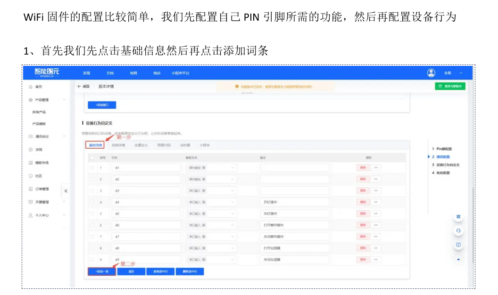

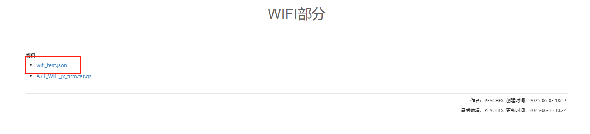

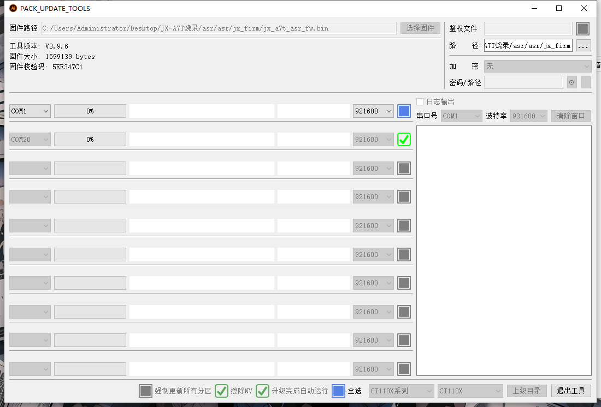

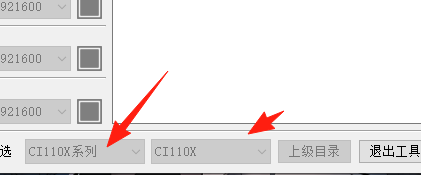

2. **烧录步骤**：

    - 加载固件文件
    - 选择正确的串口号
    - 点击开始烧录
    - 观察进度条直至完成

**常见问题解决：**

- **烧录失败**：确认选择了正确的芯片系列（CI130X而非CI110X）
- **进度条为0**：检查芯片型号选择是否正确
- **无法连接**：确认串口线和驱动程序正常

**注意事项：**

- 务必选择CI130X系列和CI1302型号
- WiFi固件和语音固件需要分别烧录
- 建议使用官方提供的工具和文档

---

### JX-A7T烧录时进度条为0怎么办？

**问题描述：**

在使用PACK_UPDATE_TOOLS烧录JX-A7T固件时，进度条始终为0，无法完成烧录，尽管WiFi固件可以成功烧录。

**解决方案：**

**问题定位：**

- **芯片系列选择错误**：选择了CI110X系列而非CI130X系列
- **型号不匹配**：JX-A7T应选择CI1302型号
- **工具配置问题**：烧录工具的芯片选择下拉菜单设置错误

**正确配置步骤：**

1. **选择芯片系列**：

    - 在PACK_UPDATE_TOOLS底部选择"CI130X系列"
    - 不要选择"CI110X系列"

2. **选择具体型号**：

    - 在型号下拉菜单中选择"CI1302"
    - 确认两个选项都正确设置


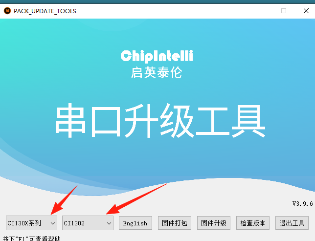

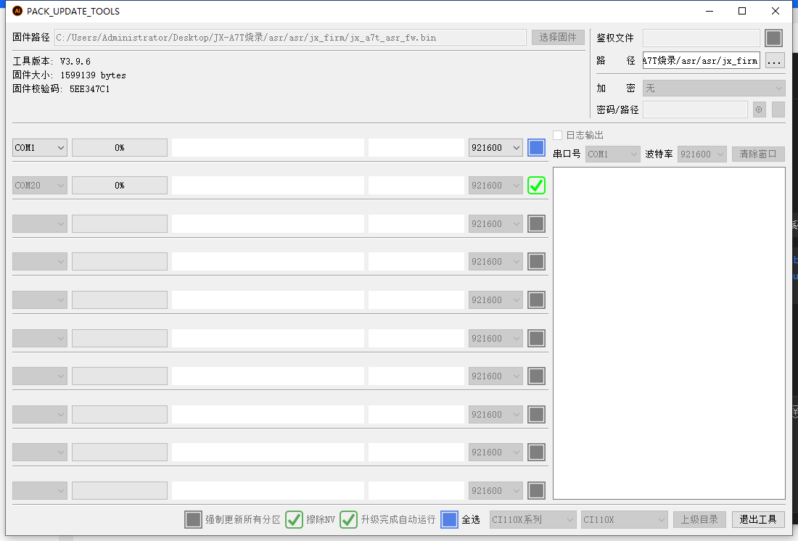

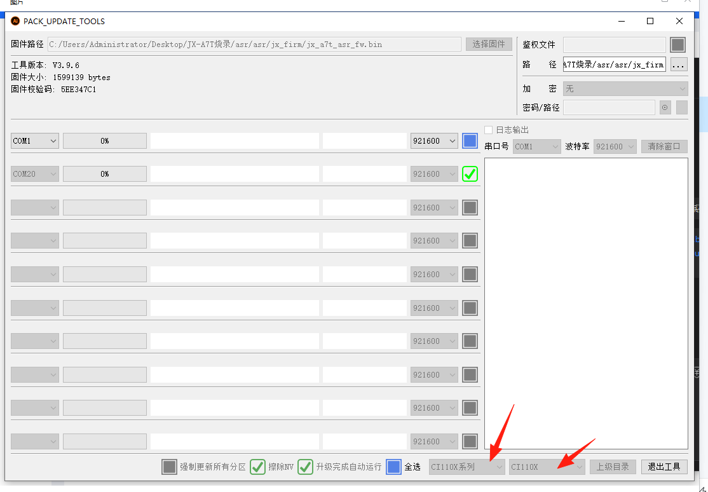

3. **烧录操作**：

    - 加载正确的固件文件
    - 选择对应的串口号
    - 开始烧录并观察进度条

**问题原因分析：**

- **CI110X系列**：用于其他型号的语音模块
- **CI130X系列**：专门用于JX-A7T的语音芯片
- **硬件不兼容**：错误的系列会导致通信失败

**其他注意事项：**

- 确认选择了正确的芯片系列和型号
- 如果进度条仍为0，检查串口连接
- WiFi固件和语音固件使用不同的芯片配置

**参考资源：**

- JX-A7T烧录教程：https://www.bilibili.com/video/BV1T8jyzbEHp/
- 官方文档：https://help.aimachip.com/docs/jx_a7t_v1/jx_a7t_v1-1ghc2tdi1r389

**注意事项：**

- 必须选择CI130X系列和CI1302型号
- 两个下拉菜单都需要正确设置
- 烧录前确认固件文件与模块匹配

---

### JX-A7T2芯片烧录操作如何进行？

**问题描述：**

JX-A7T2芯片需要烧录操作，但现有文档中未找到详细的烧录指导手册，烧录后设备无响应。

**解决方案：**

**1. 观看官方视频教程**

- B站搜索"机芯智能"查看对应烧录视频
- 视频链接：https://www.bilibili.com/video/BV1T8jyzbEHp
- 视频包含完整的烧录操作演示和步骤说明

**2. 烧录前准备**

- 确认JX-A7T2芯片型号和丝印
- 准备对应的烧录工具和固件文件
- 检查硬件连接线路是否正确

**3. 关键操作要点**

- 使用专用的JX-A7T烧录工具
- 确保固件文件与芯片型号匹配
- 按照视频教程步骤依次操作
- 烧录完成后验证功能是否正常

**注意事项：**

- JX-A7T2与其他型号的烧录方法可能不同
- 烧录后设备无响应需检查：

    - 固件文件是否正确
    - 硬件连接是否有问题
    - 烧录参数设置是否准确
- 建议首次烧录时仔细观看视频教程

---

### 不同模块的串口波特率设置是多少？

**问题描述：**

使用串口调试软件时，因波特率设置错误导致无法正常接收日志信息，需要了解不同模块的正确波特率设置。

**解决方案：**

**1. 各模块波特率规格**

不同语音模块使用不同的波特率：

- **JX-A7T**：波特率为 2,000,000
- **CI-03T**：波特率为 921,600
- **其他模块**：一般为 115200 或 9600

**2. 串口调试软件配置**

使用XCOM等串口调试工具时的正确设置：

- **端口**：选择对应的串口设备
- **波特率**：根据模块型号选择（2,000,000 或 921,600）
- **数据位**：8
- **校验位**：None
- **停止位**：1
- **流控**：None

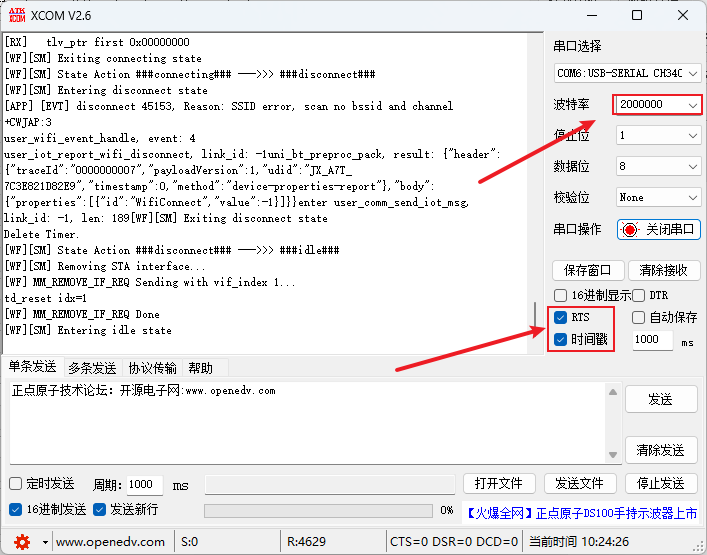

**3. 调试步骤**

- 连接模块的RX/TX到串口转换器
- 打开串口调试软件，选择正确端口
- 设置对应模块的波特率
- 发送指令或查看日志输出

**注意事项：**

- 波特率不匹配会导致接收乱码
- JX-A7T的2M波特率较高，需要使用质量良好的USB转串口模块
- 如果仍有乱码，检查RX/TX是否交叉连接（模块RX→转换器TX，模块TX→转换器RX）

---

### JX模块GPIO12点动程序无响应怎么办？

**问题描述：**

使用JX模块时，点动程序无法正常响应，通过GPIO12触发的指令（如"打开四"）没有反应。

**解决方案：**

**1. 检查GPIO引脚配置**

- 确认GPIO12在平台中已正确配置
- 验证触发方式设置为低电平触发
- 检查控制动作是否已添加对应指令

**2. 验证硬件连接**

- 确认GPIO12引脚接线正确
- 检查外部信号电平是否正常
- 使用万用表测试触发信号

**3. 固件程序对比**

根据测试反馈，不同的固件程序可能导致GPIO12功能异常：

- 一个程序版本可以正常工作
- 另一个程序版本无法响应GPIO12触发
- 建议使用可正常工作的固件版本

**4. 配置检查步骤**

1. 在平台中查看GPIO12配置状态
2. 确认"设备"状态显示正确
3. 验证触发标签已正确设置
4. 测试其他GPIO引脚是否正常

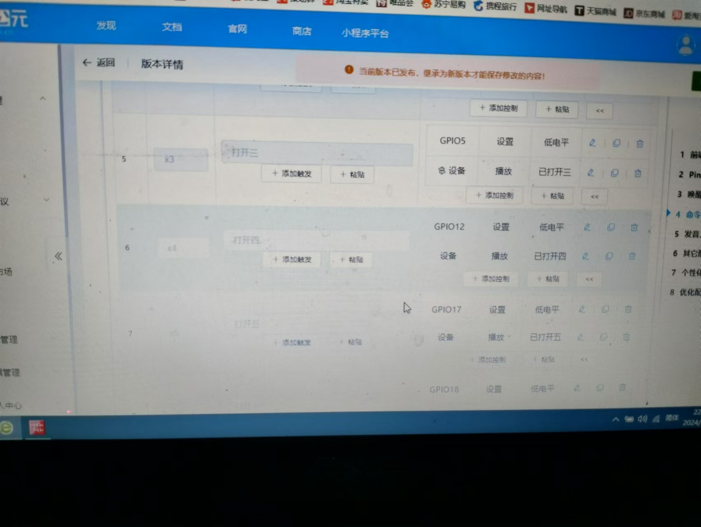

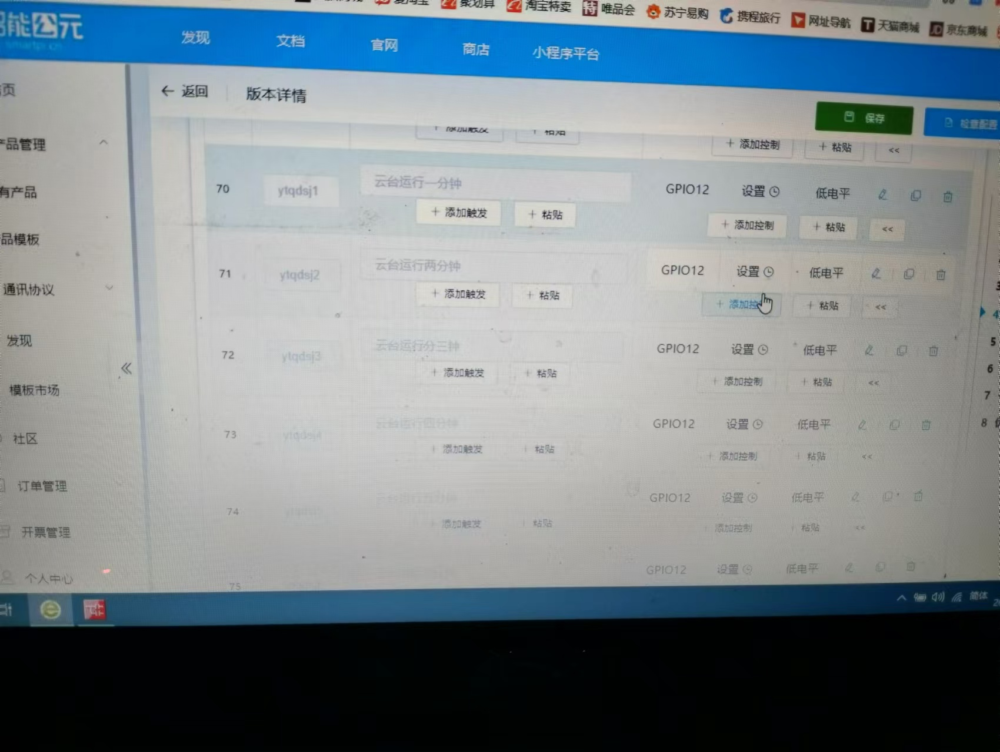

**注意事项：**

- 固件程序的差异可能导致GPIO功能异常
- 建议保存可正常工作的固件版本备份
- 如问题持续，尝试重新生成固件或使用已知正常版本

---

### JX-A7T模块GPIO12引脚功能如何验证？

**问题描述：**

JX-A7T模块的GPIO12引脚在不同固件程序中表现不一致，需要确认正确的引脚配置和验证方法。

**解决方案：**

**1. GPIO12引脚位置确认**

- **硬件引脚图显示**：PIN10对应UART3_RX/GPIO0_12/PWM5/I2C0_SCL
- **模块引脚图显示**：PIN10为GPIO26，PIN11为UART3_RX，PIN12为UART3_TX
- 平台配置中GPIO12对应模块的PIN10

**2. 引脚配置差异**

不同文档显示的引脚定义可能存在差异：

- 硬件引脚定义：GPIO0_12对应PIN10
- 模块丝印标识：可能与实际功能引脚不同
- 平台软件配置：以实际功能为准

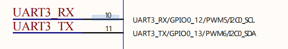

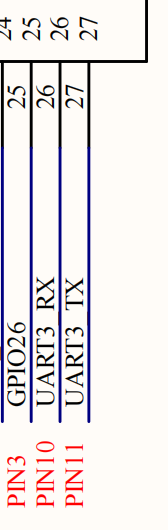

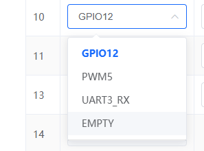

**3. 固件程序验证方法**

测试两个不同的固件程序：

- 第一个程序：GPIO12功能正常
- 第二个程序：GPIO12功能无效
- 对比两个程序的配置差异

**4. 验证步骤**

1. 使用可正常工作的固件程序
2. 测试GPIO12触发功能是否响应
3. 如正常，再测试问题固件程序
4. 对比两个程序的配置差异

**注意事项：**

- GPIO12在平台中的配置要与实际硬件连接对应
- 不同版本的固件程序可能存在功能差异
- 建议保留可正常工作的固件版本作为备份
- 如引脚定义不明确，以实际测试结果为准

---

### JX-A7T语音指令识别不稳定怎么办？

**问题描述：**

JX-A7T模块在使用时，同一个命令词有时能被识别，有时不能，识别结果不稳定。

**解决方案：**

**1. 识别稳定性测试**

- 重复念同一个命令词进行测试
- 观察模块的识别响应情况
- 记录识别成功和失败的比例

**2. 可能原因分析**

识别不稳定可能由以下因素导致：

- 环境噪声干扰
- 说话音量或距离不当
- 命令词发音不标准
- 模块麦克风灵敏度设置

**3. 优化建议**

- 确保使用环境相对安静
- 保持正常说话音量，距离麦克风30-50cm
- 按照标准发音念命令词
- 多次尝试，找到最佳的发音方式

**4. 测试反馈**

根据测试，模块能够正常响应并回话，说明基本功能正常：

- 模块会对接收到的语音做出回应
- 识别成功后会执行对应动作
- 偶尔识别失败属于正常现象

**注意事项：**

- 语音识别不存在100%成功率
- 建议在实际使用中预留容错机制
- 如识别率过低，可尝试重新训练命令词
- 确保固件版本为最新，以获得最佳识别效果

---

### JX-A7T模块如何配置命令词定义？

**问题描述：**

在智能公元AI产品零代码平台中配置JX-A7T模块的命令词定义时，发现无法正常添加或修改命令词。

**解决方案：**

**1. 进入命令词自定义界面**

- 在平台配置中选择"命令词自定义"步骤
- 界面会显示当前已配置的命令词条目
- 可查看每个条目的触发条件和对应动作

**2. 命令词配置方法**

- **添加触发**：点击"添加触发"按钮设置新的命令词
- **设置命令词**：输入要识别的语音指令内容
- **配置动作**：选择命令词触发后执行的操作
- **批量操作**：可使用"粘贴"功能批量导入配置

**3. 配置注意事项**

- 命令词需要使用标准普通话发音
- 避免使用过于相似或发音相近的词
- 确保每个命令词都有明确的触发动作
- 测试时按标准发音念出命令词

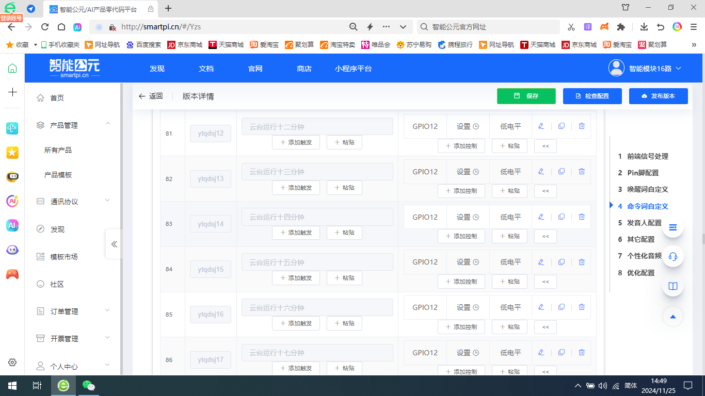

**4. 常见问题处理**

- **无法添加**：检查是否完成了前置配置步骤
- **识别不准**：调整命令词，避免使用同音字
- **动作无效**：确认触发动作已正确配置
- **保存失败**：检查网络连接和平台状态

**注意事项：**

- 配置完成后需要重新生成固件
- 建议先在模拟环境测试命令词
- 保留配置备份，便于后续修改和恢复
- 如遇到问题，可查看平台帮助文档或联系技术支持

---

### JX-A7T配置检查通过但功能未工作？

**问题描述：**

JX-A7T模块配置检查通过，串口有正常输出，但语音识别功能未正常工作。

**解决方案：**

**1. 硬件连接检查**

- 确认麦克风连接正确且无接触不良
- 检查喇叭接线是否正常（正负极不能接反）
- 验证模块供电稳定（推荐5V供电）

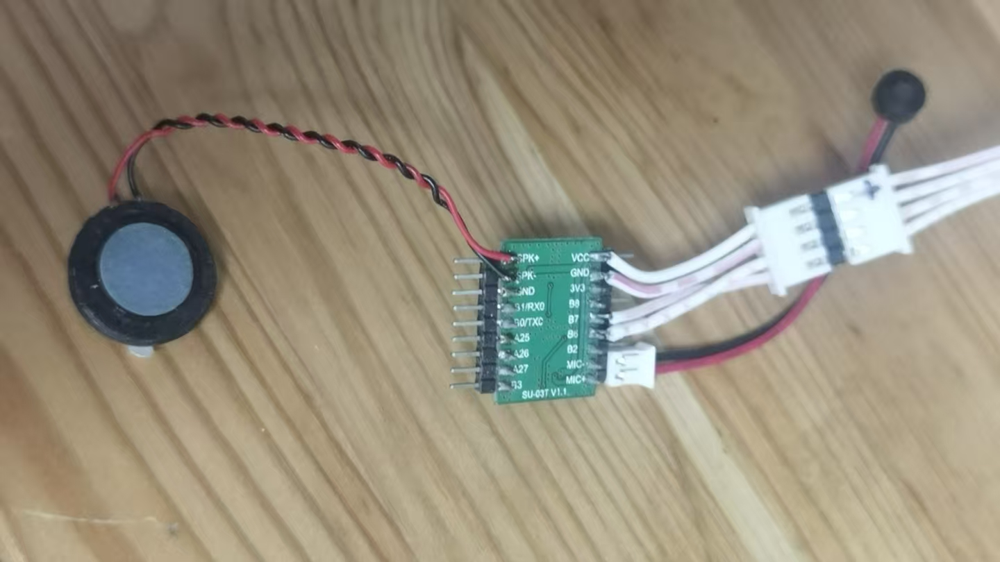

**2. 配置验证**

- 确认"配置检查通过"的提示
- 检查唤醒词和命令词是否正确配置
- 验证对应动作已绑定到识别结果


**3. 逐步排查**

- 先测试唤醒功能是否正常
- 逐个测试命令词识别
- 检查串口输出内容是否符合预期

**4. 可能原因**

- 麦克风距离过远或过近
- 环境噪声过大影响识别
- 命令词与唤醒词过于相似

**注意事项：**

- 配置检查通过不代表实际使用正常
- 需要在实际环境中测试验证
- 如问题持续，可能需要导出固件供技术支持分析

---

### JX-A7T烧录时提示分区表文件重叠怎么办？

**问题描述：**

使用烧录工具时，因缺少必要配置文件（chip_factory_params_ioTKitA_40M.dt 和 partition_cfg_2M_ota.xml）导致烧录失败。

**解决方案：**

1. **文件完整性检查**
    - 确认压缩包包含所有必要文件
    - 检查是否有以下文件：

        - chip_factory_params_ioTKitA_40M.dt（工厂参数文件）
        - partition_cfg_2M_ota.xml（分区表配置文件）
        - uart文件夹（包含 UART 配置）

2. **烧录配置步骤**
    - 在烧录工具中正确选择各文件路径
    - Factory Params：选择 chip_factory_params_ioTKitA_40M.dt
    - Partition Table：选择 partition_cfg_2M_ota.xml
    - 确认其他配置文件路径正确

3. **错误处理**
    - 如提示分区表重叠，检查 partition_cfg 文件是否正确
    - 确认使用的固件包与模块型号匹配
    - 重新下载完整的固件包

**注意事项：**

- 不同型号的固件包不通用
- 烧录前解压完整的固件包
- 如文件缺失，联系技术支持获取完整固件
- 烧录失败不会损坏模块，可重新尝试

---

### 上传固件后指令参数无法读取怎么办？

**问题描述：**

上传固件后，执行语音指令时无法读取到配置的参数，导致自定义指令无法正常工作。

**解决方案：**

**1. 问题定位**

现象描述：

- 固件烧录成功
- 语音识别正常
- 串口助手查看不到参数输出

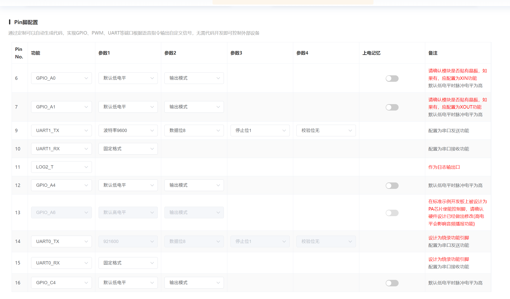

*Pin脚配置界面，UART1_TX和UART1_RX被配置为串口功能*

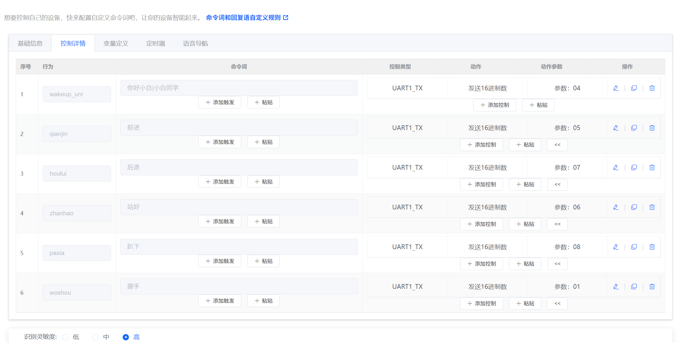

*控制详情页面配置了多个语音指令及其UART发送参数*

**2. 排查步骤**

- **检查串口连接**：确认连接到UART1引脚（A2/A3）
- **验证波特率**：确保与配置的波特率一致
- **查看串口工具**：使用正确的串口参数设置

**3. 配置验证**

在平台重新检查：

- 确认UART1_TX已正确配置
- 验证指令的触发条件设置
- 检查参数格式（16进制）配置

**4. 测试方法**

使用串口调试工具测试：

- 打开串口助手
- 设置正确的波特率和参数
- 触发语音指令
- 观察是否有数据输出

**注意事项：**

- 确保使用UART1而非UART0进行外部通信
- 串口参数必须与配置完全一致
- 部分指令可能需要特定条件才会触发
- 建议使用官方提供的串口测试工具

---

### JX-A7T网页平台请求失败（500错误）怎么办？

**问题描述：**

在使用JX-A7T模块时，网页平台出现请求失败（状态码500）的问题，且自定义的TCP协议中设备ID和消息格式配置存在错误。

**解决方案：**

**1. 500错误处理**

- 通常是服务器内部错误
- 版本过多可能导致导出失败
- 可尝试清理缓存后重试
- 选择特定产品场景进行操作

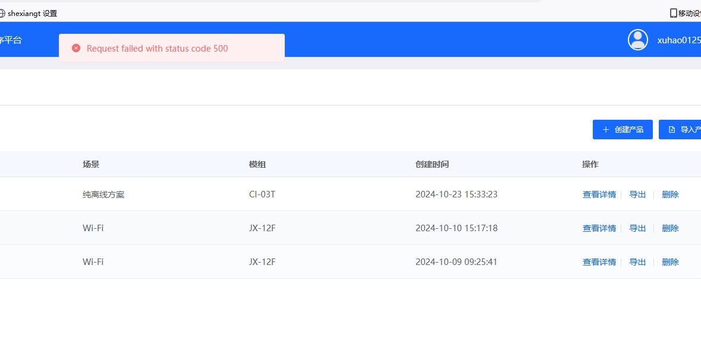

**2. TCP协议配置问题**

当前协议配置存在的理解偏差：

- 包长为00表示无数据
- 设备ID位置需要确认
- 数据字段需要与实际发送匹配
- 16进制发送方式需要特殊处理

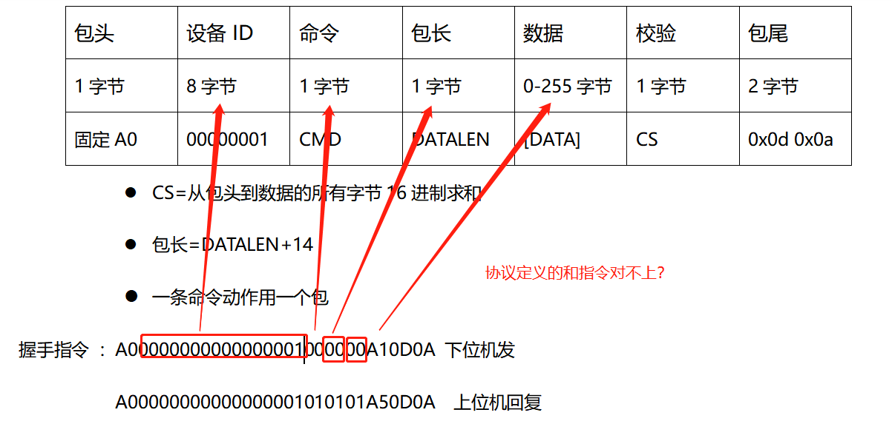

**3. 编码转换说明**

如果上位机需要16进制字符串：

- 模块发送实际16进制数据
- 上位机需要做编码转换
- 避免在模块端逐位发送
- 建议上位机增加解码功能

**4. 平台配置建议**

- 导出固件包中的产品配置JSON
- 提供给技术支持进行分析
- 说明参数化需求
- 等待平台功能更新

**注意事项：**

- 16进制字符串发送不是标准做法
- 建议使用标准二进制传输
- 参数化协议需要平台底层支持
- 如持续有问题可考虑更换方案

---

### JX-A7T蓝牙配网失败怎么办？

**问题描述：**

使用小程序进行蓝牙配网时多次尝试均未成功，设备在连接过程中出现断开现象。

**解决方案：**

**1. 问题原因分析**

蓝牙配网失败的根本原因是WiFi芯片未授权：

- 未授权的芯片无法正常工作
- 导致连接不稳定、配网失败
- 需要通过AT指令进行授权

**2. 获取芯片ID**

通过串口发送AT指令获取芯片ID：

```
AT+CHIPID?
+CHIPID:7C3E821CB7810000
OK
```

**3. 申请授权ID**

- 将获取到的芯片ID提供给技术支持
- 技术支持生成对应的授权ID
- 示例：4C04000061728E09

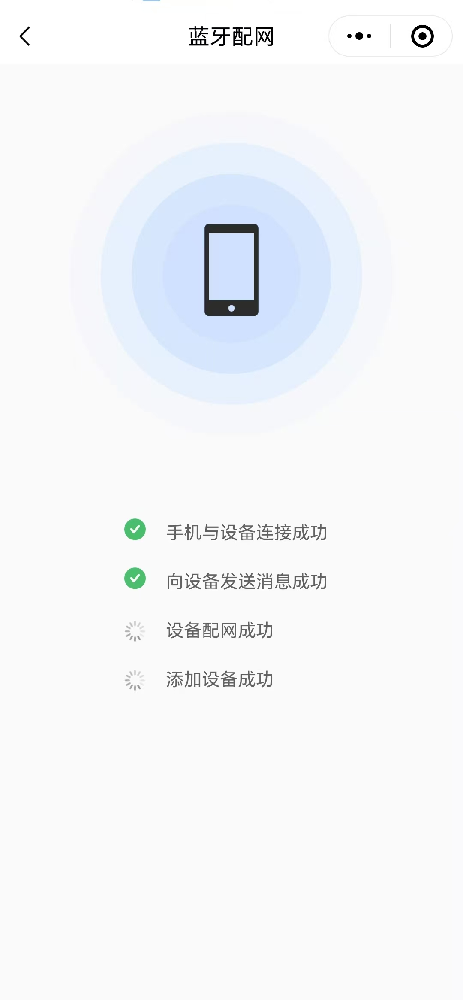

*蓝牙配网失败，显示设备未成功*

**4. 执行授权操作**

通过串口向设备发送授权指令：

```
AT+AUTHID=4C04000061728E09
OK
```

**5. 验证授权结果**

再次查询确认授权ID已成功写入：

```
AT+AUTHID?
+AUTHID:4C04000061728E09
OK
```

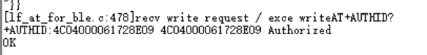

*显示授权成功的串口日志*

**6. 重新配网**

完成授权后，重新使用小程序进行蓝牙配网：

- 设备断电重启
- 确保手机蓝牙和定位权限已开启
- 使用2.4G WiFi网络进行配网

**注意事项：**

- 授权操作必须在设备通电且处于可通信状态时进行
- 授权ID必须与芯片ID严格匹配
- 授权后设备的WiFi功能将被激活
- 蓝牙连接过程中的断开重连属于正常现象

---

### WiFi芯片如何授权？

**问题描述：**

设备中的WiFi芯片未授权，导致无法正常使用，需要指导如何进行授权操作。

**解决方案：**

**1. 授权流程概述**

WiFi芯片授权需要以下步骤：

- 获取设备芯片ID
- 申请对应的授权ID
- 通过AT指令写入授权

**2. 获取芯片ID**

连接设备到串口调试工具：

- 波特率设置：115200
- 发送指令：`AT+CHIPID?`
- 记录返回的芯片ID

**3. 申请授权**

- 将芯片ID发送给技术支持
- 等待生成授权ID
- 保存授权ID用于后续操作

**4. 执行授权**

发送授权指令到设备：

- 指令格式：`AT+AUTHID=<授权ID>`
- 等待返回"OK"表示成功
- 验证授权：`AT+AUTHID?`

**5. 授权文档参考**

详细操作可参考《Wi-Fi产品授权.pdf》文档：

- 包含完整的授权步骤说明
- 提供故障排查指南
- 列出常见错误及解决方法

**注意事项：**

- 授权ID具有唯一性，每台设备不同
- 授权操作不可逆，请谨慎操作
- 授权成功后设备需要重启生效
- 保存好授权信息以备后续使用

---

### 小程序配网失败如何排查？

**问题描述：**

使用小程序进行设备配网时，提示"配网失败"，需要排查具体原因。

**解决方案：**

**1. 检查配网环境**

- 确认手机连接的是2.4G WiFi网络
- 打开小程序的蓝牙和定位权限
- 确保设备处于配网模式


*确认小程序蓝牙和定位权限已开启*

**2. 配网失败排查项**

根据小程序提示进行逐项检查：

- **设备状态**：确认设备处于配网模式
- **WiFi密码**：核对输入的密码是否正确
- **网络频段**：确保路由器是2.4G而非5G
- **设备授权**：确认WiFi芯片已完成授权

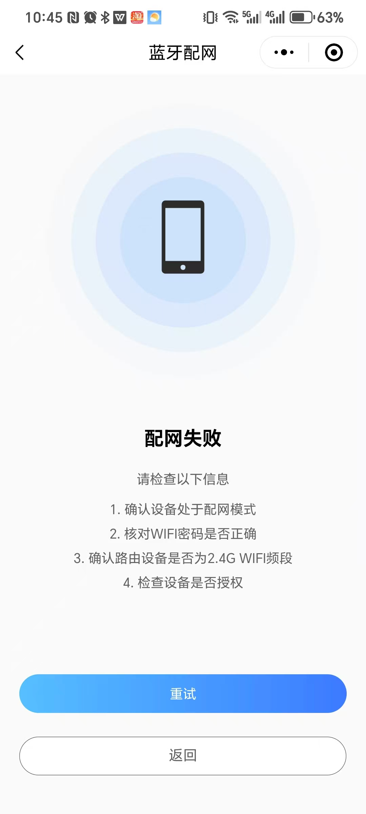

*配网失败界面显示的排查项*

**3. 常见解决方法**

- **重启设备**：断电后重新上电进入配网模式
- **重置网络**：清除手机网络设置后重试
- **靠近设备**：配网时手机尽量靠近设备
- **更换网络**：尝试使用其他2.4G网络

**4. 成功标志**

配网成功后：

- 设备LED指示灯变化
- 小程序显示"添加成功"
- 设备自动连接到云端

**注意事项：**

- 部分双频路由器需要单独开启2.4G频段
- WiFi密码避免包含特殊字符
- 配网过程请勿操作其他功能
- 多次失败后可联系技术支持

---

### 小程序搜索不到JX-A7T设备怎么办？

**问题描述：**

使用小程序配网搜索JX-A7T设备时，小程序显示"搜索设备中..."但无法发现设备，设备已通电并指示灯正常。

**解决方案：**

**1. 确认设备状态**

- 检查设备是否正常通电（红色和绿色指示灯亮起）
- 通过串口查看设备日志，确认设备已初始化完成
- 确认设备处于待配网模式

**2. 检查手机权限设置**

- **小米手机**：必须开启蓝牙和定位权限
    - 进入设置 → 应用管理 → 微信 → 权限管理
    - 开启"位置信息"权限
    - 下拉通知栏开启位置服务


*小米手机开启定位前搜索不到设备*

**3. 不同手机型号兼容性**

部分手机系统可能存在兼容性问题：

- **小米/Redmi**：需开启定位权限才能搜索蓝牙设备
- **OPPO/ vivo**：通常只需开启蓝牙权限
- **其他品牌**：建议同时开启蓝牙和定位权限


*OPPO手机成功搜索到两个JX-A7T设备*

**4. 排查步骤**

- 重启手机蓝牙功能
- 清理小程序缓存后重试
- 使用其他手机测试设备是否正常广播
- 确认手机系统版本支持BLE蓝牙4.0

**注意事项：**

- 小米手机（MIUI系统）搜索蓝牙设备时必须开启定位权限
- 设备在5-10米范围内搜索效果最佳
- 避免在2.4G WiFi干扰强的环境下搜索
- 确保不是小程序版本的兼容性问题

---

### JX-A7T配网不稳定且指示灯状态不一致怎么办？

**问题描述：**

客户反映设备配网不稳定，部分设备能成功连接网络而另一部分设备无法连接，且通过指示灯闪烁状态判断连接状态不一致。

**解决方案：**

**1. 硬件一致性检查**

- **生产批次差异**：

    - 不同批次的设备可能使用不同WiFi芯片模组
    - 部分批次芯片性能存在差异
    - 建议统一供应商和芯片型号

- **指示灯状态定义**：

    - **快闪（2次/秒）**：正在搜索或连接WiFi
    - **慢闪（1次/秒）**：已连接WiFi但未获取IP
    - **常亮**：已成功连接并获取IP地址
    - **熄灭**：未通电或异常状态

**2. 连接成功率提升**

- **网络环境优化**：

    - 在信号强的区域进行配网测试
    - 避免多个设备同时配网造成信道干扰
    - 使用5GHz频段而非2.4GHz减少干扰

- **配网流程标准化**：

    - 确保所有设备使用相同固件版本
    - 制定标准化的配网操作流程
    - 记录每个步骤的耗时和结果

- **批量测试方法**：

    - 取10台设备同时进行配网测试
    - 统计成功率和失败率
    - 分析失败设备的共同特征

**3. 质量控制措施**

- **供应商管理**：

    - 要求供应商提供芯片批次追溯信息
    - 建立来料检验流程
    - 对不同批次进行隔离测试

- **软件过滤**：

    - 在固件中加入设备序列号管理
    - 可根据序列号识别不同硬件版本
    - 为不同版本提供兼容的配网流程

**注意事项：**

- 配网成功率与硬件批次、网络环境、操作流程密切相关
- 建议收集详细的失败日志用于分析
- 对于持续出现问题的批次，建议整批更换

---

### JX-A7T烧录路径包含中文字符导致失败

**问题描述：**

在使用烧录工具烧录JX-A7T模块时，遇到"发送异常，COM5终止了本次传输活动!"的错误提示，且烧录路径包含中文字符，导致烧录失败。

**解决方案：**

1. **检查路径要求**
    - 烧录路径必须是英文、数字、下划线的组合
    - 不能包含中文字符或特殊符号
    - 建议使用简单的纯英文路径

2. **排查接触问题**
    - 拔掉USB拓展坞，直接连接电脑
    - 检查TX/RX线接触是否良好
    - 确认串口连接稳定

3. **正确操作步骤**
    - 选择正确的COM端口
    - 确认固件文件路径无中文
    - 点击烧录后重新给模块上电

**注意事项：**

- 烧录失败通常是TX/RX接触不良导致
- 建议使用短而优质的USB线
- 避免使用笔记本电脑的USB口，供电可能不足

---


---

### 如何更新JX-A7T的WiFi固件？

**问题描述：**

使用旧版本WiFi固件文件导致烧录失败，需要获取最新固件并完成更新。

**解决方案：**

**1. 获取最新固件**

- 联系技术支持获取最新的WiFi固件包
- 或从平台入门例程中导入工程
- 确保固件版本匹配当前需求

**2. 固件文件说明**

- WiFi固件通常包含4个文件
- 需要完整烧录所有文件
- 文件格式：.bin文件

**3. 烧录步骤**

- 下载官方提供的最新固件包
- 解压获得4个固件文件
- 按顺序烧录到设备
- 验证烧录是否成功

**4. 平台操作方法**

- 从平台的入门例程导入工程
- 继承为新版本后进行修改
- 生成并下载新固件

**注意事项：**

- 使用旧固件可能导致功能异常
- WiFi部分和语音部分需要分别烧录
- 烧录前确认设备连接正常
- 保留原固件备份

---

## JX-A7T烧录


---

### JX-A7T二合一模组如何烧录固件？

**问题描述：**

需要了解JX-A7T模组的固件烧录方法，并获取测试固件进行功能验证。

**解决方案：**

**1. 烧录顺序说明**

JX-A7T是WiFi+语音二合一模组，需要分步烧录：

- 先烧录WiFi部分固件
- 再烧录语音部分固件
- 两个部分独立烧录，不可混淆

**2. 烧录方法参考**

- WiFi部分：参考JX-12F的烧录方法
- 语音部分：参考CI-03T的烧录方法
- 使用对应的烧录工具和接口

**3. 测试固件获取**

- 当前模组处于测试阶段，固件未完全公开
- 需要联系技术团队获取测试固件
- 提供具体需求和使用场景

**4. 固件文件说明**

- 固件包包含多个文件
- 选择对应的.bin文件进行烧录
- 注意区分WiFi和语音固件文件

**注意事项：**

- 二合一模组必须按顺序烧录两部分
- 烧录工具需要兼容对应型号
- 测试固件可能存在功能限制
- 建议在正式版本发布后使用生产固件

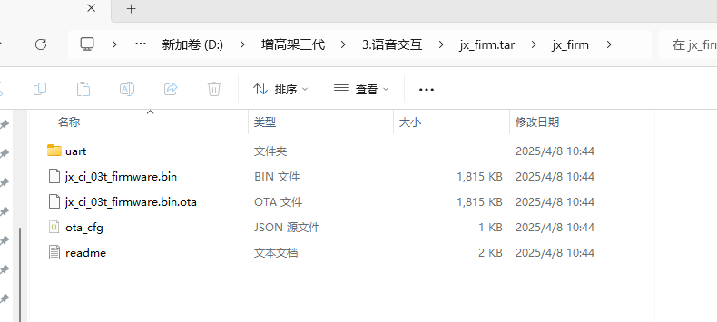

---


---

### 烧录器是否支持导入Python代码？

**问题描述：**

询问烧录器是否能够导入Python代码进行加减乘除等计算功能。

**解决方案：**

**烧录器功能说明**

语音模块的烧录器不支持直接导入Python代码。烧录器的功能是将编译后的固件文件（.bin格式）写入到模块的Flash存储中。

**技术原理**

1. **固件烧录流程**
    ```
    源代码（C/C++）→编译→链接→生成.bin文件→烧录器写入Flash
    ```

2. **Python代码的限制**
    - Python是解释型语言，需要运行时环境
    - 语音模块硬件不支持Python解释器
    - 固件必须预先编译成机器码

3. **支持的代码类型**
    - C/C++源代码编译的固件
    - 平台生成的配置文件
    - 预编译的二进制固件文件

**实现计算的替代方案**

**方案一：使用智能公元平台配置**

1. **添加命令词**
    ```
    命令词：三加五等于几
    识别结果：calc_3_plus_5
    ```

2. **配置回复内容**
    ```
    回复类型：TTS播报
    播报内容：三加五等于八
    ```

3. **批量配置计算命令**
    - 支持常用加减乘除运算
    - 每个运算命令对应一个回复
    - 可配置数百条命令词

**方案二：通过串口实现计算**

1. **硬件连接**
    - MCU通过串口连接语音模块
    - MCU负责计算逻辑
    - 语音模块负责识别和播报

2. **通信流程**
    ```
    语音输入→识别→串口发送到MCU→MCU计算→返回结果→语音播报
    ```

3. **代码示例（MCU端）**
    ```c
    // 接收语音模块数据
    if(strstr(buf, "calc")) {
        // 解析计算表达式
        result = calculate(expression);
        // 返回结果
        printf("计算结果是%d", result);
    }
    ```

**开发建议**

1. **简单计算场景**
    - 使用平台配置即可满足需求
    - 无需编写代码
    - 支持常用计算命令

2. **复杂计算需求**
    - 需要配合MCU开发
    - 或选择支持编程的模块型号
    - 如JX-A7T支持MicroPython

3. **Python开发选项**
    - JX-A7T模块：支持MicroPython开发
    - 通过Arduino IDE或专用工具烧录
    - 可以实现复杂的计算逻辑

**注意事项**

- 语音模块烧录器仅支持固件文件
- 不支持直接烧录Python等高级语言代码
- 计算功能建议通过平台配置或外部MCU实现
- 需要Python开发请选择支持编程的模块型号

---

### JX-A7T的T1和T2版本OTA升级有什么区别？

**问题描述：**

需要了解JX-A7T1和JX-A7T2两个版本在OTA升级功能上的具体差异。

**解决方案：**

JX-A7T1和JX-A7T2在OTA升级功能上存在明显差异：

**OTA升级支持对比：**

| 功能 | JX-A7T1 | JX-A7T2 |
|------|---------|---------|
| WiFi固件OTA升级 | 支持 | 支持 |
| 语音固件OTA升级 | 支持 | 不支持 |
| 有线烧录语音 | 支持 | 支持 |
| 有线烧录WiFi | 支持 | 支持 |

**使用建议：**

- **JX-A7T1**：支持全部OTA升级功能，推荐个人开发者和需要远程更新的场景使用
- **JX-A7T2**：仅支持WiFi固件OTA升级，语音固件必须使用有线烧录方式

**注意事项：**

- A7T2的语音固件更新必须使用串口烧录器
- 如果需要频繁更新语音固件，建议选择A7T1版本

---

### JX-A7T板载开关ASR位置如何正确使用？

**问题描述：**

设备板载开关拨到ASR位置后出现问题，需要了解开关的正确使用方法。

**解决方案：**

JX-A7T开发板上的板载开关用于切换工作模式，需注意正确使用：

**开关位置说明：**

- **正常运行位置**：开关不要拨到ASR位置，保持正常运行状态
- **烧录语音位置**：仅在烧录语音固件时才需要拨动开关到烧录/ASR位置

**使用注意事项：**

- 除烧录语音固件外，不要将开关一直保持在ASR位置
- 正常使用（语音交互、WiFi连接等）时开关应保持在非ASR位置
- 如设备无法正常响应语音，检查开关是否处于正确位置

---

### JX-A7T离线语音测试不成功怎么办？

**问题描述：**

设备烧录完成后测试离线语音功能，唤醒后无法识别命令词，但拔掉电源线重新插上后离线语音恢复正常。

**解决方案：**

这是固件首次启动后需要完全复位才能正常工作的现象：

**1. 问题现象**

    - 烧录完成后设备可以正常唤醒
    - 但说出命令词后无响应，无法执行控制动作
    - 断电重新上电后，离线语音功能恢复正常

**2. 原因分析**

    - 固件烧录后模块内部状态可能未完全初始化
    - 某些功能模块需要完全断电复位才能正常工作
    - 仅仅软件重启不足以完成所有硬件模块的初始化

**3. 解决方法**

    - **完全断电**：拔掉电源线，等待2-3秒
    - **重新上电**：重新插上电源启动设备
    - **再次测试**：测试离线语音唤醒和命令词识别功能

**注意事项：**

    - 烧录完成后建议进行一次完全断电再测试
    - 如果问题持续，检查唤醒词和命令词配置是否正确
    - 确认固件版本与硬件型号匹配

---
