# SU-03T 烧录与调试 FAQ

## 烧录方式概述

SU-03T 模块支持三种烧录方式，适用于不同的使用场景：

| 烧录方式 | 使用引脚 | 适用场景 | 特点 |
|---------|---------|---------|------|
| 串口烧录 | B6/B7 | 开发调试、小批量生产 | 使用USB转TTL模块（如CH340），通用性强，操作简单 |
| 调试器烧录 | B0/B1 | 开发调试、空白芯片首次烧录 | 使用专用调试器（如蜂鸟M、AICE-MINI），支持断点调试 |
| 脱机烧录 | B2/B3 | 批量生产、现场维护 | 使用升级狗/脱机烧录器，可脱离电脑操作，效率高 |

### 烧录方式选择建议

- **开发阶段**：使用串口烧录或调试器烧录，便于调试
- **小批量试产**：串口烧录即可满足需求
- **批量生产**：使用脱机烧录器，提高效率
- **现场维护**：脱机烧录器更便携，无需携带电脑

### 注意事项

- 不同烧录方式使用的引脚不同，请根据实际方式选择正确的接口
- 空白芯片首次烧录需要使用调试器写入Bootloader
- 脱机烧录器需要单独采购
- 具体烧录操作请参考下方的详细FAQ

### SU-03T烧录引脚说明

SU-03T模块的烧录引脚功能如下：

| 引脚 | 功能 | 说明 |
|------|------|------|
| B0/B1 | 调试器烧录 | UART1_TXD/UART1_RXD，用于专用调试器烧录和调试 |
| B6/B7 | 串口烧录 | 用于USB转TTL模块串口烧录 |
| B2/B3 | 升级狗/脱机烧录 | 用于脱机烧录器和量产烧录 |

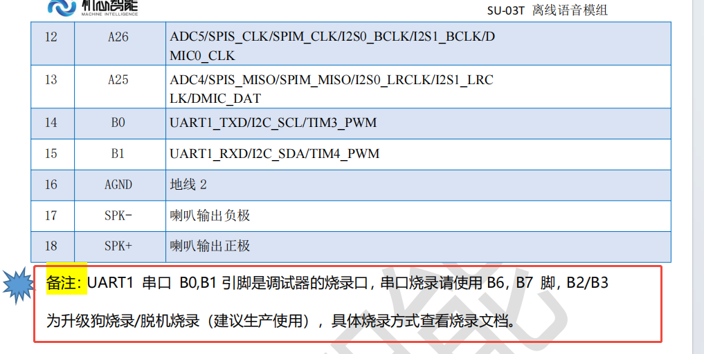

**重要说明：**

- B0、B1是UART1串口引脚，同时作为调试器的烧录口
- 串口烧录请使用B6、B7引脚
- 生产批量烧录建议使用B2/B3升级狗方式

---

---
### 删除语音烧录词条后无法烧录怎么办？

**问题描述：**

之前通过语音烧录功能，不注意把语音烧录的词条删除了，导致拔线烧录功能无法正常使用。

**解决方案：**

语音烧录词条的删除确实会影响烧录功能，但可以通过以下方法解决。

**1. 问题原因分析**

- **语音烧录依赖**：

    - 语音烧录功能需要特定的命令词来触发
    - 这些命令词是系统预置的关键词条
    - 删除后会导致无法进入烧录模式

- **功能影响**：

    - 不影响语音识别的正常功能
    - 仅影响通过语音进行固件更新的功能
    - 拔线烧录仍可使用

**2. 解决方案**

**方案一：使用拔线烧录**

- 硬件连接：

    - TX连接模块RX
    - RX连接模块TX
    - GND连接模块GND
    - IO0（或特定引脚）连接到地

- 烧录步骤：

    1. 模块断电
    2. 连接好烧录线
    3. 特定引脚接地（参考具体模块手册）
    4. 模块上电进入烧录模式
    5. 使用烧录工具进行固件更新

**方案二：重新配置语音烧录**

- 在智能公元平台重新添加语音烧录词条
- 需要知道正确的命令词内容
- 建议联系技术支持获取帮助

**3. 预防措施**

- 不要删除系统默认的关键词条
- 重要功能词条做好备份
- 修改前记录原配置
- 使用拔线烧录作为备用方案

**4. 常见烧录问题**

- **连接问题**：

    - 检查杜邦线是否接触良好
    - 确认引脚连接正确
    - 尝试更换连接线

- **模式进入**：

    - 多次断电上电尝试
    - 检查特定引脚是否正确接地
    - 确认烧录工具设置正确

**注意事项：**

- 语音烧录功能是便利性功能
- 拔线烧录是更可靠的更新方式
- 建议掌握两种烧录方法
- 保留系统默认配置避免意外

---


### CH340与SU-03T模块如何正确接线烧录？

**问题描述：**

使用CH340串口模块烧录SU-03T语音模块固件时，需要了解正确的接线方式和烧录步骤。

**解决方案：**

**1. 硬件连接**

- **CH340与SU-03T接线方式**：

    | CH340引脚 | SU-03T引脚 | 说明 |
    |------------|--------------|------|
    | 5V | VCC | 供电正极 |
    | GND | GND | 供电负极 |
    | TXD | B6 | 串口发送 |
    | RXD | B7 | 串口接收 |

- **烧录软件**：使用UniOneUpdateTool烧录软件
- **烧录文件**：jx_su_03t_release_update.bin

**2. 烧录步骤**

- **步骤1**：连接好线路（5V、GND、TXD→B6、RXD→B7）
- **步骤2**：打开烧录软件，选择要烧录的目标bin文件
- **步骤3**：点击烧录按钮
- **步骤4**：拔掉5V供电线，1秒后重新插上

**3. 使用开发板时的特殊接线**

- 如果使用开发板，接线方式可能有所不同，请参考开发板说明书
- 开发板可能需要额外的跳线设置

**注意事项：**

- 确保接线牢固，杜邦线接触不良会导致烧录失败
- 使用2.0mm间距的连接器，避免使用2.5mm间距的杜邦线
- 杜邦线间距不匹配（2.5mm vs 2.0mm）是常见烧录失败原因
- 烧录过程中保持电源稳定
- 如使用开发板，注意开发板的特殊供电要求

---

### SU-03T1烧录后语音功能完全失效？

**问题描述：**

CI-03T1烧录后语音功能完全无法使用，无法响应任何语音指令，仅能通过蓝牙连接。

**解决方案：**

**问题特征：**

- 烧录工具显示进度但未真正完成
- 烧录后无任何语音响应
- 蓝牙功能可以正常使用
- 提示可能需要多次烧录

**烧录状态判断：**

1. **成功标志**：

    - 进度条显示100%完成
    - 出现绿色成功提示
    - 设备自动重启运行

2. **失败状态**：

    - 进度停在62%（或其他非100%）
    - 无成功提示信息
    - 需要手动关闭


**处理方法：**

1. **重新烧录**：

    - 使用相同固件再次烧录
    - 确认等待100%完成
    - 不要在未完成时断开

2. **检查连接**：

    - 验证USB连接稳定
    - 确认端口未被占用
    - 尝试更换USB接口

3. **模块检查**：

    - 排除虚焊问题
    - 检查语音模块排针
    - 确认麦克风和喇叭连接

**注意事项：**

- 烧录必须一次性完成到100%
- 62%进度不算成功
- 多次烧录无助于解决问题
- 如持续失败，可能是硬件问题

**解决方案：**

**1. 访问智能公元平台**

- 打开智能公元官方网站
- 登录账号（如需要）
- 进入语音模块固件下载页面

**2. 下载调试固件**

- 选择SU-03T模块对应的固件版本
- 下载调试版本的固件文件
- 确认固件文件与硬件版本匹配

**3. 固件烧录**

- 使用CH340或USB转串口模块连接SU-03T
- 使用UniOneUpdateTool烧录软件
- 选择下载的固件文件进行烧录

**注意事项：**

- 下载前确认模块型号（SU-03T）
- 选择正确的固件版本（调试版或正式版）
- 烧录前备份原有固件
- 烧录完成后测试语音功能是否正常

### SU-03T模块连接不牢固导致无响应怎么办？

**问题描述：**

SU-03T模块连接后无法正常工作，排查发现是模块连接不牢固导致的。

**解决方案：**

**1. 检查连接状态**

- 确认模块是否插入到位
- 检查杜邦线或连接器是否接触良好
- 轻轻按压模块，确认是否有松动

**2. 改善连接方式**

- 重新插拔模块，确保完全插入
- 使用质量更好的杜邦线
- 考虑焊接连接以提高可靠性

**3. 常见连接问题**

- **插座松动**：多次插拔可能导致插座弹力下降
- **杜邦线接触不良**：2.0mm和2.54mm间距不匹配
- **焊接点虚焊**：自行焊接的转接板可能存在虚焊

**注意事项：**

- 模块正常工作时略有发热是正常的（40-50℃）
- 如果温度过高，应立即断电检查连接
- 建议使用原厂提供的转接板或连接器

---

## SU-03T开发板USB烧录

### SU-03T开发板如何通过USB烧录？

**问题描述：**

使用SU-03T开发板时，需要了解如何正确通过USB线进行烧录操作。

**解决方案：**

**1. 硬件连接**

- **USB线连接**：

    - 使用USB A to B数据线连接开发板和电脑
    - 确保使用质量良好的USB线
    - 避免使用延长线或转接头

- **供电确认**：

    - SU-03T开发板通过USB供电
    - 连接后观察电源指示灯
    - 确认电脑识别到USB设备

**2. 驱动安装**

- **CH340驱动**：

    - 大部分SU-03T开发板使用CH340芯片
    - 下载并安装CH340驱动程序
    - 在设备管理器中确认COM端口识别

- **驱动验证**：

    - 打开设备管理器查看端口（Ports）
    - 确认显示USB-SERIAL CH340(COMx)
    - 如有感叹号，需要重新安装驱动

**3. 烧录操作**

- **选择烧录工具**：

    - 使用PACK_UPDATE_TOOL烧录软件
    - 或使用厂家提供的专用工具
    - 确保工具版本匹配

- **烧录步骤**：

    1. 选择正确的COM端口
    2. 不勾选"鉴权文件"选项
    3. 选择要烧录的.bin文件
    4. 点击开始烧录

**4. 常见问题处理**

- **显示"打开串口失败"**：

    - 检查USB线连接是否牢固
    - 重新插拔USB线
    - 更换USB端口测试
    - 重新安装CH340驱动

**注意事项：**

- SU-03T开发板设计为USB烧录
- 不需要额外的USB转串口模块
- 烧录过程中不要断开USB连接
- 如驱动问题持续，尝试不同USB端口或电脑

## 资源下载与批量烧录

### SU-03T固件文件大小有限制吗？

**问题描述：**

SU-03T固件文件大小为1.47MB，是否可以烧录到模块中，是否需要为Flash预留空间。

**解决方案：**

**1. Flash容量说明**

- **SU-03T Flash大小**：2MB（2048KB）
- **可用空间**：全部可用于存储固件
- **无需预留**：不需要为系统预留额外空间

**2. 固件大小要求**

- **最大支持**：只要固件不超过2M即可下载
- **当前固件**：1.47MB在支持范围内
- **空间余量**：还有约0.53MB的剩余空间

**3. 烧录建议**

**固件选择**：

- 确认固件版本与硬件匹配
- 使用官方发布的稳定版本
- 避免使用测试版或定制版固件

**烧录过程**：

- 确保烧录过程中电源稳定
- 不要中断烧录过程
- 烧录完成后验证功能

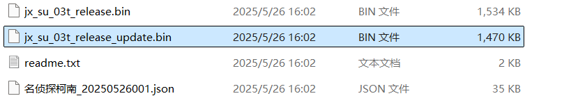

**注意事项：**

- SU-03T不需要预留Flash空间
- 固件大小接近2M时仍可正常烧录
- 建议保留原厂固件备份
- 如固件过大，考虑精简功能或优化资源

---

### SU-03T1烧录软件在哪里下载？

**问题描述：**

需要下载SU-03T1专用烧录软件，但不知道正确的下载地址。

**解决方案：**

- **官方下载地址**：

    - 访问智能公元帮助文档：https://help.aimachip.com/docs/offline_su03t/offline_su03t-1gbc6oj0b6e1l
    - 在"开发包下载"部分找到烧录软件
    - 下载对应的SU-03T烧录工具

- **软件说明**：

    - 云知声UniOne蜂鸟M烧录工具
    - 专用于SU-03T系列模块
    - 支持Windows操作系统

- **使用步骤**：

    1. 下载并解压烧录工具
    2. 安装CH340驱动程序
    3. 连接USB转TTL模块
    4. 选择固件文件进行烧录

**注意事项：**

- 确保从官方渠道下载，避免使用来路不明的软件
- SU-03T和CI-03T使用不同的烧录工具
- 烧录前确认模块型号匹配
- 保留原厂固件作为备份

### SU-03T和CI-03T烧录工具的区别是什么？

**问题描述：**

在查找烧录工具时，不确定SU-03T和CI-03T是否使用相同的烧录软件，需要了解两者的区别。

**解决方案：**

**1. 软件名称不同**

- **SU-03T系列**：

    - 软件名称：PACK_UPDATE_TOOL
    - 开发商：云知声（ChipIntelli）
    - 界面标识：UniOne蜂鸟M烧录工具

- **CI-03T系列**：

    - 软件名称：CI-03T串口烧录软件
    - 界面标识：启英泰伦串口升级工具
    - 版本：V3.9.6

**2. 软件识别**

- SU-03T烧录工具界面会显示"PACK_UPDATE_TOOL"
- CI-03T烧录工具界面会显示"CI-03T串口烧录软件"
- 两个软件不能混用

**3. 下载方式**

- 在智能公元官网选择对应型号
- 点击"详细文档"进入下载页面
- 确认下载的软件名称匹配模块型号

**注意事项：**

- 使用错误型号的烧录工具将无法识别模块
- 烧录前务必确认模块丝印型号
- 保留对应的烧录软件以备后续使用

### SU-03T烧录常见问题汇总

**问题描述：**

SU-03T在通过串口烧录固件时，遇到多种连接和通信问题，需要系统性的解决方案。

**解决方案：**

**1. 串口连接失败**

- **检查CH340驱动**：确认设备管理器中显示正确COM口
- **拔插VCC操作**：烧录工具显示"等待设备"时，快速拔插VCC电源
- **确认接线**：B6(TX)、B7(RX)、VCC、GND四线必须正确连接
- **更换USB端口**：尝试不同的USB端口或电脑

**2. 烧录工具无响应**

- **关闭其他程序**：确保没有其他串口调试工具占用端口
- **重启烧录工具**：关闭后重新打开，避免程序卡死
- **检查固件路径**：避免使用中文路径，建议放在桌面

**3. 设备状态异常**

- **设备未识别**：检查模块是否正常上电，红色指示灯应亮起
- **COM端口错误**：确认选择的COM口与设备管理器一致
- **通信失败**：检查杜邦线接触，建议焊接连接

**4. 烧录后模块无声音**

- **检查喇叭连接**：测量喇叭两端电压应为2.2-2.5V
- **检查喇叭线路**：确认正负极没有接反
- **验证固件**：重新生成固件并烧录

**5. 注意事项**

- **供电要求**：使用5V稳定供电，避免电压不足
- **接触可靠**：杜邦线容易接触不良，焊接更可靠
- **驱动兼容**：使用官方提供的CH340驱动程序
- **备份数据**：烧录前备份原有固件，方便恢复

---

### SU-03T模块烧录后设备无响应如何处理？

**问题描述：**

SU-03T模块在烧录一次后，设备一直处于"等待设备"状态，多次尝试后仍无法正常工作。

**解决方案：**

**1. 检查烧录顺序**

- 先连接正极（VCC）、TX、RX引脚
- 点击烧录按钮
- 然后再连接负极（GND）
- 这种接线顺序可以解决烧录后无响应的问题

**2. 硬件连接检查**

- 确保VCC、GND、B6(TX)、B7(RX)四线正确连接
- 检查杜邦线接触是否良好
- 建议使用焊接连接提高可靠性

**3. 电源管理**

- 确保供电电压稳定在5V
- 避免使用电压不足的电源
- 检查电源线是否存在压降

**注意事项：**

- 烧录时严格按照顺序操作：先接VCC/TX/RX，点击烧录后再接GND
- 如果问题持续，尝试更换USB转串口模块
- 确保烧录工具没有选择"鉴权文件"选项

---

### SU-03T模块是否可以通过单片机实现实时数据播报？

**问题描述：**

需要了解SU-03T模块是否支持通过单片机发送数据实现实时语音播报功能。

**解决方案：**

- SU-03T模块支持通过串口通信实现实时数据播报
- 使用串口（UART）与单片机进行通信
- 单片机发送数据给模块，模块将数据转换为语音输出

**注意事项：**

- 确保串口通信参数配置正确（波特率、数据位、停止位）
- 数据格式需要符合模块的协议要求
- 建议在数据包中加入帧头帧尾和消息号，避免数据丢失

---

### SU-03T模块添加PWM控制后无法唤醒如何处理？

**问题描述：**

在SU-03T模块上添加PWM控制功能后，设备无法被唤醒识别，且语音识别功能失效。具体表现为GPIO_B0至GPIO_B3配置为PWM输出（50Hz）后，唤醒词无响应。

**解决方案：**

**1. 电源问题排查**

- 检查是否因PWM驱动能力不足导致电源异常
- PWM输出可能造成过流，影响模块正常工作
- 建议在PWM输出端加驱动电路（如三极管或MOS管）

**2. 硬件连接检查**

- 确认舵机连接方式：

    - 舵机信号线连接到模块GPIO引脚
    - 舵机电源线（VCC和GND）应连接到外部电源
    - 避免舵机直接由模块供电

**3. 模块功能验证**

- 烧录未添加PWM功能的固件测试麦克风是否正常
- 确认模块硬件没有损坏
- 检查PCB布线是否存在干扰

**4. 逐步定位问题**

- 先配置PWM，不连接舵机，测试语音功能
- 然后连接舵机，观察是否影响语音识别
- 逐个测试GPIO引脚，找出问题所在


**注意事项：**

- SU-03T模块的GPIO直接驱动能力有限
- 舵机等大电流负载需要外部驱动电路
- 电源纹波过大可能导致语音芯片工作异常
- 建议使用稳定的5V电源供电，避免使用升压电路

---

### 语音模块串口通信数据丢失问题如何处理？

**问题描述：**

语音模块通过串口与单片机通信时，发送数据量较大后出现通信卡顿和数据丢失问题，特别是在发送双精度浮点型数据时，语音模块无法正确接收，导致语音播报为0。

**解决方案：**

**1. 通信协议优化**

- 串口消息必须包含帧头帧尾和消息号
- 正确的通信协议格式：

    - 帧头：AA 55
    - 消息号：01
    - 数据内容
    - 帧尾：55 AA

**2. 数据类型处理**

- 在语音模块平台中，将变量和参数都定义为double类型
- 单片机端按照正确的字节序发送8字节的double数据
- 使用小端序格式（低位字节在前）

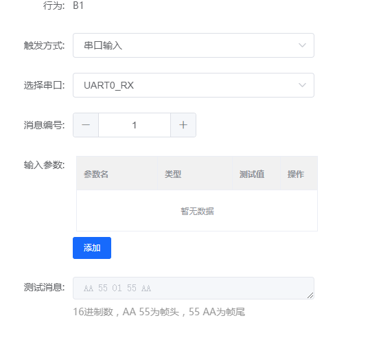

**3. 调试建议**

- 使用串口调试助手验证数据格式
- 检查波特率设置是否匹配
- 确认数据包长度计算正确

**注意事项：**

- 不要使用中文路径存放固件或工具
- 确保没有其他程序占用串口
- 9600波特率一般足够，不必过高

---

### 语音模块double类型数据播报为0如何解决？

**问题描述：**

向语音模块发送double类型数据（如28.5）进行语音播报时，播报结果为0，而相同数值的int或char类型可以正常播报。

**解决方案：**

**1. 数据类型统一配置**

- 在语音模块平台中，将变量定义为double类型
- 参数输入时也选择double类型
- 确保两端配置一致


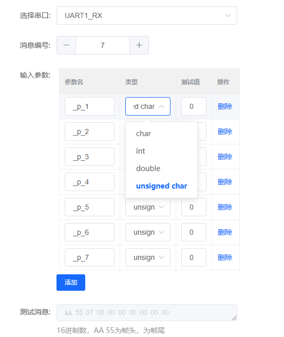

**2. 字节序处理**

- double类型占8个字节
- 单片机端按小端序发送：
    ```c
    double value = 28.5;
    unsigned char *byte_ptr = (unsigned char*)&value;
    for (int i = 0; i < 8; i++) {
        send_byte(byte_ptr[i]); // 发送每个字节
    }
    ```

**3. 替代方案**

- 将整数和小数部分分开播报
- 使用条件判断处理不同数值类型
- 参考官方演示视频：https://www.bilibili.com/video/BV1Ms4y1a7RE/

**注意事项：**

- 必须先将参数值赋给变量，播报时使用变量
- 避免直接使用参数进行播报
- 可在单片机端处理数据格式，简化模块配置

---

### 如何实现语音模块播报队列功能？

**问题描述：**

需要在语音模块正在播报时，让新播报请求不被打断，而是等待当前播报完成后按顺序执行。

**解决方案：**

**1. 利用事件触发机制**

- 语音模块提供"播音开始"和"播音结束"两个事件
- 通过事件触发判断喇叭占用状态
- 实现播报队列的先进先出管理

**2. 具体实现步骤**

定义状态变量：

- 创建变量（如_busy）用于标识喇叭状态
- 播音开始时将变量置为1（占用）
- 播音结束时将变量置为0（空闲）

设置事件触发：

- 事件：播音开始
    - 操作：变量_busy设置为1
- 事件：播音结束
    - 操作：触发下一条播报或执行特定回复语


**3. 队列管理逻辑**

- 当新播报请求到达时，检查_busy变量
- 若_busy=0，直接执行播报
- 若_busy=1，将请求存入队列等待
- 播音结束后自动触发队列中的下一条

**注意事项：**

- 此功能需要手工修改SDK代码实现
- 平台暂未提供配置选项，后续会添加
- 可根据_busy变量判断是否需要进队列
- 建议在单片机端也实现简单的队列管理

---

### SU-03T模块的1和2引脚用作TX/RX时如何烧录？

**问题描述：**

SU-03T模块的1和2引脚被配置为TX/RX通信功能，需要了解如何正确进行固件烧录。

**解决方案：**

SU-03T支持两种烧录方式：

**1. 使用烧录器烧录**

- 使用专用的硬件烧录器
- 通过模块的5、6脚进行烧录
- 1和2脚配置为其他功能时仍可烧录

**2. 使用串口升级工具烧录**

- 当1和2脚用作TX/RX通信时
- 7和8脚会自动切换为B6/B7功能
- 使用B6(TX)和B7(RX)进行串口烧录

**注意事项：**

- 1和2脚配置为其他功能后，无法使用烧录器下载固件
- 使用串口烧录时，确保接线正确：B6接TXD，B7接RXD
- 串口烧录需要先点击烧录，再接通VCC电源

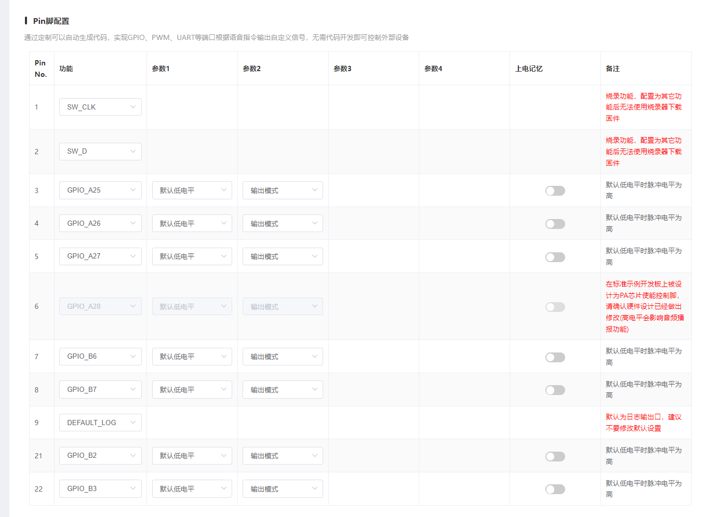
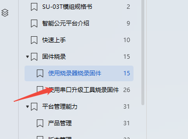

---

### CI-03T模块如何进行批量烧录？

**问题描述：**

需要对300个CI-03T模块批量烧录新固件，寻求高效的批量烧录方案。

**解决方案：**

**1. 批量烧录方案选择**

- **出厂前批量烧录**：在模块未分板时，可由厂商批量烧录
- **已分板模块**：需要逐个烧录，暂无自动化批量烧录工具

**2. 提高烧录效率的方法**

- 制作专用烧录夹具，使用2.0mm间距的测试夹
- 准备多个USB转TTL模块并行操作
- 编程简单的自动化脚本控制烧录流程

**3. 烧录注意事项**

- 确保每个模块的针脚接触良好
- 烧录过程中不要断开连接
- 记录每个模块的烧录状态和结果

**注意事项：**

- 批量烧录前建议先小批量测试
- 保持稳定的供电环境
- 为每个模块建立烧录档案，方便追踪
- 如需频繁批量烧录，建议联系厂商讨论定制方案

## 烧录基础教程

### 新手如何进行SU-03T模块烧录？

**问题描述：**

初次接触语音模块，不熟悉烧录操作，需要了解如何使用烧录工具对SU-03T模块进行固件烧录。

**解决方案：**

**1. 准备工作**

- 下载SU-03T专用烧录工具（Hummingbird-M-Update-Tool）
- 准备USB转串口模块（CH340或CP2102）
- 下载对应模块的固件文件（.bin格式）

**2. 硬件连接**

- SU-03T模块通过转接板连接电脑
- 确认拨码开关设置到正确位置
- 连接方式：USB→转接板→语音模块

**3. 烧录步骤**

1. 打开烧录工具，选择正确的COM端口
2. 点击"浏览"选择固件文件（.bin格式）
3. 点击烧录按钮，等待进度条完成
4. 烧录成功后断开USB连接

**4. 注意事项**

- 烧录过程中不要断开连接或关闭工具
- 确保供电稳定，避免烧录失败
- 烧录完成后将拨码开关拨回正常位置
- 首次烧录建议观看官方教学视频

**学习资源：**

- B站搜索"SU-03T烧录教程"查看视频指导
- 官方文档中的详细操作说明
- 官方提供的示例和注意事项

**常见问题：**

- 找不到COM端口：检查驱动安装
- 烧录失败：确认固件版本匹配
- 设备无响应：检查硬件连接

---

### SU-03T1模块烧录需要连接哪些引脚？

**问题描述：**

需要了解SU-03T1小模块进行烧录时，必须连接哪些引脚才能正常完成固件烧录。

**解决方案：**

SU-03T1模块烧录时需要连接以下4个核心引脚：

**必需连接的引脚：**

1. **VCC**：模块供电引脚（连接5V或3.3V，根据模块规格）
2. **GND**：接地引脚（电源负极）
3. **B1/RX**：串口接收引脚（连接USB转TTL的TX）
4. **B0/TX**：串口发送引脚（连接USB转TTL的RX）

**连接示意图：**


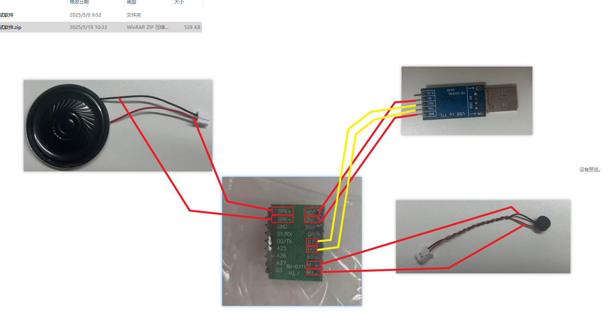

*SU-03T1烧录连接方式*

**连接步骤：**

1. 将USB转TTL模块的VCC连接到SU-03T1的VCC引脚
2. 将USB转TTL模块的GND连接到SU-03T1的GND引脚
3. 将USB转TTL模块的TX连接到SU-03T1的B1/RX引脚
4. 将USB转TTL模块的RX连接到SU-03T1的B0/TX引脚
5. 连接扬声器和麦克风（如需要测试语音功能）
6. 使用烧录工具进行固件烧录

**注意事项：**

- 确保电源电压匹配，避免损坏模块
- 串口连接必须交叉（TX接RX，RX接TX）
- 烧录前确保模块已正确上电
- 使用质量良好的杜邦线，避免接触不良

---

## 设备识别与连接问题

### SU-03T模块串口烧录无法识别设备怎么办？

**问题描述：**

使用串口工具烧录SU-03T模块固件时，上位机软件无法识别到设备，一直显示"等待设备.."状态。

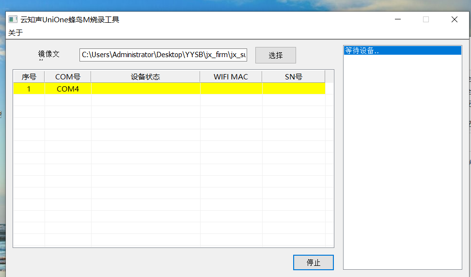

**解决方案：**

- **检查接线方式**：

    - 使用CH340串口工具与SU-03T模块（UART1）连接
    - 按照标准接线：5V→5V，RXD→TXD，TXD→RXD，GND→GND
    - 确保烧录模式下B6、B7和GND接线正确且同源

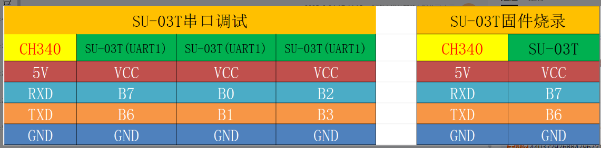

- **硬件检查**：

    - 确认模块电源输入正确，单独5V供电
    - 给模块通电后再点击烧录
    - 检查杜邦线和串口工具是否正常

- **电路修改建议**：

    - 如果使用自制转接板，考虑修改上拉电阻
    - R15、R16改小为100Ω
    - 加个按键复位电源，改善烧录条件

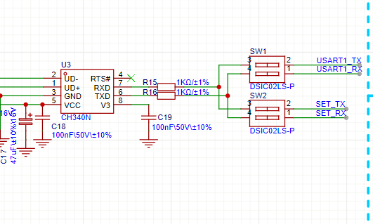

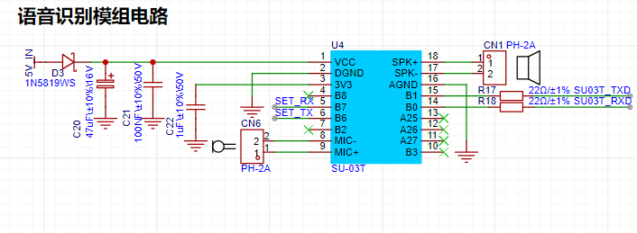

- **其他排查方法**：

    - 关闭杀毒软件或以管理员身份运行
    - 确认路径名没有使用中文
    - 直接飞线连接进行烧录
    - 更换电脑系统或USB端口

**注意事项：**

- SU-03T烧录脚为B6、B7
    - 烧录失败时，可以接跳线出来单独烧录
    - 电源开关按键在烧录时需要按下
- 杜邦线质量问题可能导致识别失败
- 建议使用官方提供的转接板

### SU-03T转接板的复位按钮连接在哪里？

**问题描述：**

需要了解SU-03T模块转接板上的复位按钮连接到模组的哪个位置，以及串口烧录时是否需要每次都按下该按钮。

**解决方案：**

**复位按钮连接说明：**

1. **硬件连接位置**：

    根据转接板原理图，复位按钮连接如下：

    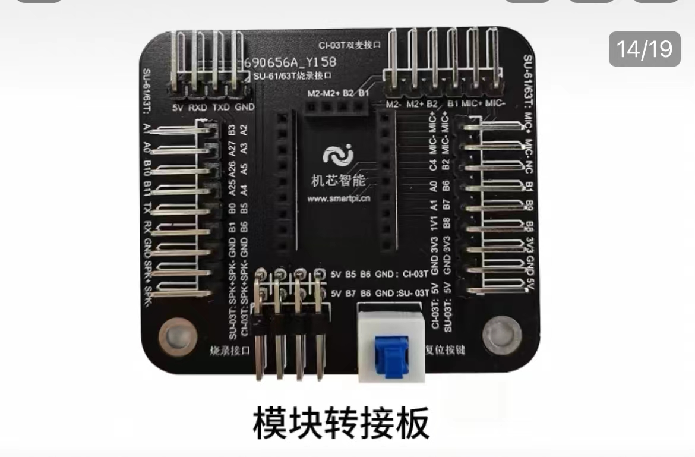

    - 复位按钮一端接模块的RESET引脚
    - 另一端接地
    - 按下时将RESET引脚拉低

2. **烧录时操作要求**：

    **每次烧录都需要按下复位按钮**：

    - 进入烧录模式需要复位模块
    - 确保模块处于正确的初始状态
    - 避免因模块状态异常导致烧录失败

3. **具体操作步骤**：

    ```
    烧录流程：

    1. 连接硬件（UART、电源）
    2. 按下复位按钮
    3. 保持按下状态
    4. 点击烧录软件开始
    5. 等待烧录进度完成
    6. 释放复位按钮
    ```

**原理图参考：**

    从原理图可以看到详细的连接关系：

    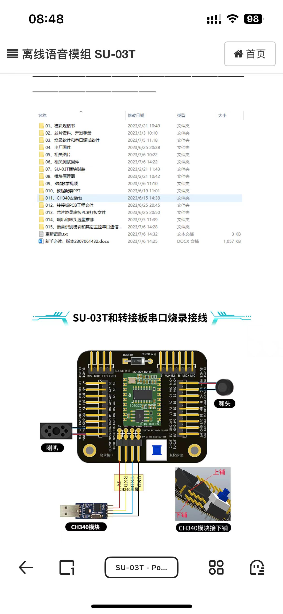

    - UART接口：通过CH340连接电脑
    - 复位电路：按钮控制RESET引脚
    - 电源管理：5V供电和3.3V稳压

**注意事项：**

1. **复位时机**：

    - 必须在烧录开始前按下
    - 烧录过程中可释放
    - 模块正常工作时也可用于复位

2. **常见问题**：

    - 忘记按复位 → 烧录失败
    - 按钮接触不良 → 识别不稳定
    - 复位电路故障 → 无法烧录

3. **替代方案**：

    - 如复位按钮失效，可短接RESET引脚
    - 使用镊子短暂接触RESET和GND
    - 重新上电也能复位模块

**开发包资源：**

- 原理图文件：模块转接板；版本230514.SchDoc
- 包含完整的电路连接信息
- 可查看所有引脚连接关系

**操作建议：**

- 烧录前检查复位按钮功能是否正常
- 保持稳定的硬件连接
- 如频繁失败，检查复位电路焊接
- 建议使用官方标准转接板

### SU-03T转接板烧录时不用按按钮直接开始是否正常？

**问题描述：**

使用 SU-03T 转接板和 CH340 烧录器进行烧录时，连接电脑后点击烧录就直接开始烧录了，不需要按转接板上的按钮，想知道这种操作是否正常。

**解决方案：**

**这是正常现象。**

**1. 自动进入烧录模式的情况**

使用转接板烧录时，某些情况下模块会自动进入烧录模式：

- **模块首次烧录**：出厂状态或未烧录过固件的模块，上电后会自动进入烧录模式
- **断电后重新上电**：模块断电后再上电，会自动检测并进入烧录模式
- **模块处于空闲状态**：模块正常运行时，点击烧录也可能触发自动复位进入烧录模式

**2. 不同烧录场景的操作差异**

| 烧录场景 | 是否需要按按钮 | 说明 |
|---------|---------------|------|
| 首次烧录/空片 | 不需要 | 模块上电自动进入烧录模式 |
| 断电后重新烧录 | 不需要 | 重新上电会自动检测 |
| 模块运行中更新 | 可能需要 | 部分情况下需要手动复位 |
| 连续多次烧录 | 可能需要 | 第二次及以后可能需要复位 |

**3. 无需按按钮的原因**

- **CH340烧录器设计**：部分烧录器支持自动复位功能
- **转接板电路**：部分转接板设计了自动复位电路
- **烧录软件控制**：烧录工具可能通过DTR信号自动控制模块复位

**4. 何时需要手动按按钮**

当出现以下情况时，需要手动按下转接板上的复位按钮：

- 烧录工具一直显示"等待设备..."
- 点击烧录后长时间无响应
- 模块运行中无法自动进入烧录模式
- 连续第二次烧录时失败

**5. 操作建议**

- **正常情况**：如果点击烧录后能正常开始和完成，无需担心，直接使用即可
- **遇到问题**：如果烧录失败，再尝试按下复位按钮后重新烧录
- **稳定操作**：为提高成功率，建议每次烧录前都按一下复位按钮

**注意事项：**

- 直接能烧录成功说明硬件连接和驱动都正常
- 如果需要按按钮才能烧录，说明转接板不支持自动复位
- 两种情况都属于正常工作状态，无需特殊处理

---

### SU-03T开发板烧录工具无法识别设备怎么办？

**问题描述：**

烧录工具无法识别 SU-03T 开发板，设备列表中虽然显示端口，但设备状态为空，工具提示"等待设备..."。

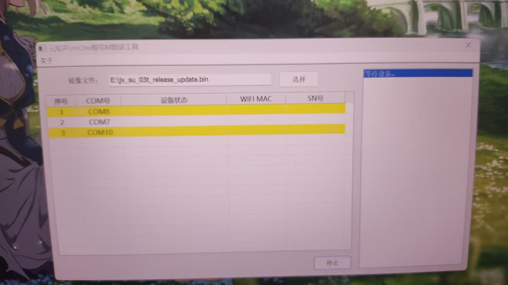

**解决方案：**

**1. 检查语音模块连接方式**

- 确认语音模块是否直接插在开发板上
- 如果模块是直接插上的，需要将模块拔下，使用 CH340 通过串口单独供电

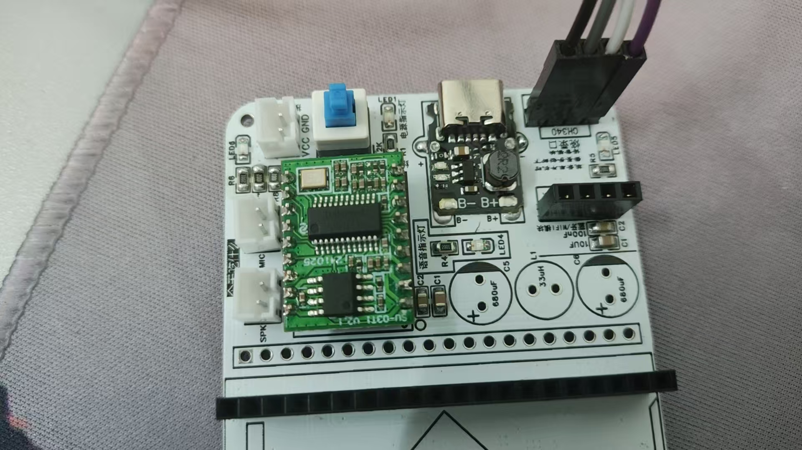

**2. 使用串口烧录模式**

- B6/B7 是串口烧录脚
- B6 接 TX，B7 接 RX
- 单独给语音模块烧录试试

**3. 检查供电和连接**

- 确保 USB 连接正常
- 检查驱动是否正确安装
- 尝试更换 USB 端口

**注意事项：**

- 模块正常工作时略有发热是正常的（40-50℃）
- 如果烫手，应立即断电检查线路
- 确保使用正确的烧录工具版本

---

## 拨码开关设置

### SU-03T开发板拨码开关被胶纸粘住无法拨动怎么办？

**问题描述：**

开发板上的拨码开关被胶纸覆盖，无法拨动到正确的烧录模式位置。

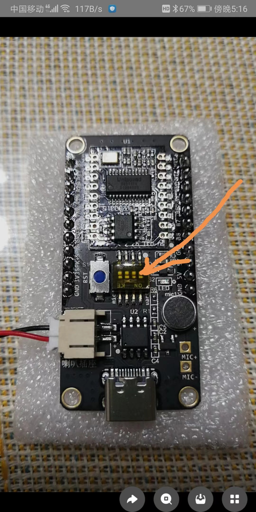

**解决方案：**

**1. 撕开保护胶纸**

- 小心撕开覆盖在拨码开关上的胶纸
- 开关需要拨到 ON 位置（英文一侧）才能进行固件下载

**2. 拨码开关正确设置**

- 烧录时：开关3拨到 ON 位置（串口烧录模式）
- 正常使用时：根据需要设置其他开关

**3. 固件选择**

- 在烧录工具中选择最下面的固件文件进行下载
- 确保固件版本与模块兼容

**注意事项：**

- 撕胶纸时注意不要损坏拨码开关
- 烧录完成后可将拨码开关拨回正常工作位置
- 如果不确定，可观看官方教学视频了解详细操作

---

## GPIO 引脚配置

### SU-03T开发板所有 GPIO 引脚都没有电平变化怎么办？

**问题描述：**

配置语音指令后，使用万用表测量所有 GPIO 引脚，均未检测到预期的高低电平变化。

**解决方案：**

**1. 检查平台配置**

- 确认在智能公元平台上的 GPIO 配置是否正确
- 检查命令词和输出引脚的对应关系
- 验证是否已将引脚配置为输出模式

**2. 测量方法建议**

- 万用表很难快速捕捉到短暂的电平变化
- 建议使用示波器进行测量
- 或者通过连接 LED 来直观观察电平变化

**3. 配置示例**

- 例如：喊"开灯"时，A25 脚应输出高电平
- 喊"关灯"时，A25 脚应输出低电平
- 不进行配置时，引脚默认为 GPIO 模式，输出低电平

**注意事项：**

- 确保已正确烧录配置好的固件
- 检查引脚是否与其他功能冲突
- 测试时可以使用简单的命令词进行验证

---
\n---

## 语音功能测试问题

### SU-03T烧录2025.2固件后语音测试无法进行怎么办？

**问题描述：**

烧录2025.2版本新固件后，语音功能测试无法正常进行，需要确认烧录是否正确。

**解决方案：**

**1. 确认固件烧录成功**

- **检查烧录日志**：

    - 确认烧录过程无错误提示
    - 验证固件文件完整性
    - 检查MD5校验值是否匹配

- **重新上电测试**：

    - 断电后重新上电
    - 等待3-5秒让模块完全启动
    - 注意听是否有开机提示音

**2. 验证固件配置**

- **确认唤醒词配置**：

    - 2025.2固件支持自定义唤醒词
    - 如配置"小爱小爱"，请确认已正确设置
    - 查看平台配置是否与固件匹配

- **测试基础功能**：

    - 先测试唤醒功能
    - 喊出配置的唤醒词（如"小爱小爱"）
    - 观察模块是否有响应（LED指示灯变化）

**3. 硬件连接检查**

- **麦克风连接**：

    - 确认麦克风已正确连接
    - 检查麦克风正负极是否接反
    - 验证麦克风规格是否匹配

- **喇叭连接**：

    - 确认喇叭已连接到SPK+和SPK-
    - 测试喇叭是否正常（可用万用表通断档测试）

**4. 常见问题处理**

- **完全无响应**：

    - 检查供电电压是否在3.3-5.5V范围
    - 测量模块工作电流是否正常
    - 重新烧录固件

- **能唤醒但无回复**：

    - 检查音量设置是否过低
    - 确认回复语是否已配置
    - 测试串口输出是否正常

**注意事项**：

- 2025.2版本固件优化了语音识别稳定性
- 首次使用新固件建议详细测试各项功能
- 如问题持续，可尝试下载平台提供的出厂模板测试

## 引脚定义与兼容性

### SU-03T 模组为什么没有 GPIO-A0 引脚？

**问题描述：**

在 SU-03T 的引脚配置界面中找不到 GPIO-A0 引脚选项。

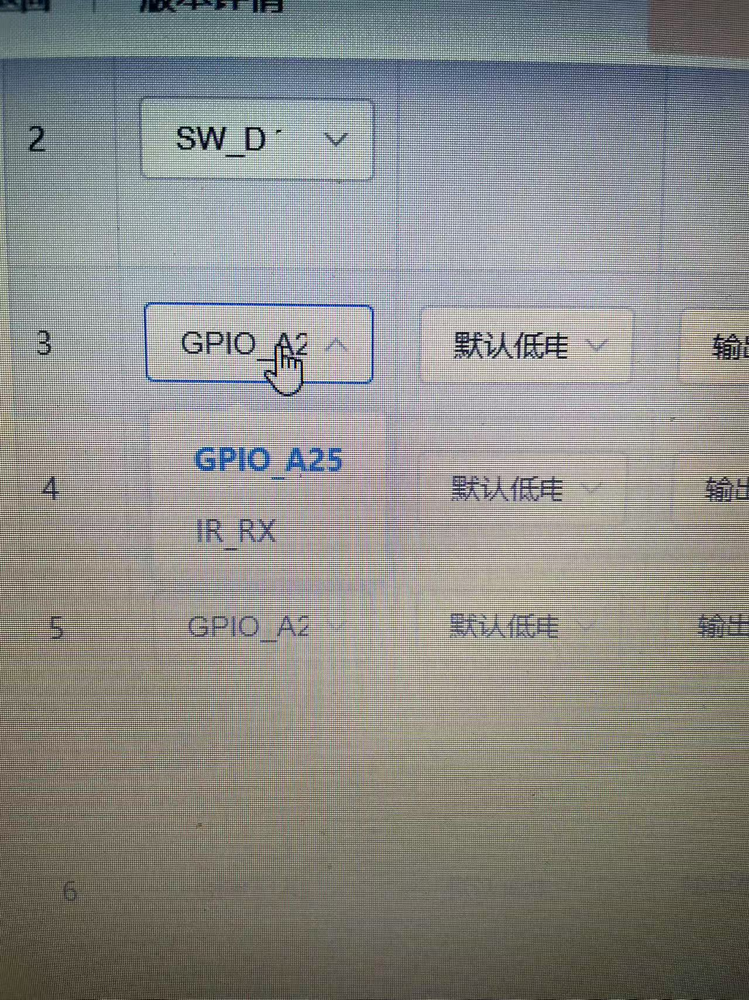

**解决方案：**

**1. 确认模块规格**

- SU-03T 模组确实没有 A0 引脚
- 这不是配置错误，而是硬件设计如此

**2. 查看引脚图**

- 查看官方提供的引脚布局图
- 图中显示了各个版本模块的完整引脚定义
- 可用的引脚包括 A2、A25 等

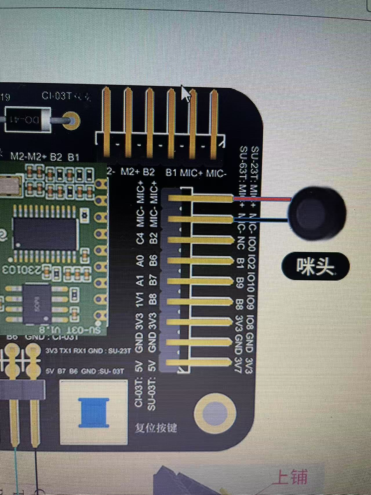

---

## 硬件损坏与短路问题

### SU-03T1芯片VCC与GND短路导致无法烧录怎么办？

**问题描述：**

SU-03T1芯片在烧录时出现指示灯不亮、无法正常烧录的情况，经检测发现VCC与GND之间存在短路，导致芯片损坏。

**解决方案：**

**1. 短路检测方法**

- **万用表检测**：

    - 在不供电的情况下使用万用表
    - 测量VCC与GND之间的电阻
    - 短路时电阻值接近0欧姆

- **现象观察**：

    - 烧录器指示灯不亮
    - 无法正常通信和烧录
    - 模块无任何响应

**2. 常见短路原因**

- **喇叭引脚碰触**：

    - 喇叭的正负极（+/-）引脚不能碰GND
    - 模块上的喇叭输出引脚意外短路
    - 碰触瞬间即可造成芯片损坏

- **操作不当**：

    - 测试时不小心引脚相碰
    - 焊接时导致焊点桥接
    - 金属工具意外连接引脚

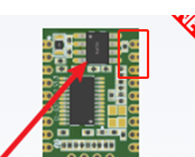

**3. 预防措施**

- **谨慎操作**：

    - 连接线路时确保引脚不接触
    - 使用带绝缘的测试工具
    - 避免金属物品放置在模块上

- **测试建议**：

    - 仅连接必要的电源和串口引脚
    - 不使用时断开所有连接
    - 首次使用前检查引脚间距

**注意事项：**

- SU-03T1芯片一旦因短路损坏，无法修复
- 短路损坏属于操作不当，不在保修范围内
- 建议在防静电工作台上操作
- 如有多颗芯片损坏，需立即检查操作方法

---

## 烧录连接问题

### SU-03T模块接线正确但烧录失败怎么办？

**问题描述：**

购买的SU-03T芯片无法成功烧录，尽管接线正确，烧录工具连接正常，但烧录过程失败。

**解决方案：**

**全面排查步骤**

1. **供电检查**
    - 确认使用3.3V供电（非5V）
    - 检查电源稳定性，避免电压波动
    - 使用主板USB口供电，避免延长线

2. **接线验证**
    ```
    CH340模块 → SU-03T模块
    TXD → B7
    RXD → B6
    VCC → 3.3V（重要！）
    GND → GND
    ```

3. **烧录操作流程**
    - 打开烧录工具，选择COM口
    - 加载固件文件（Update.bin）
    - 点击烧录，观察进度条
    - 进度条变黄时快速重新插拔VCC
    - 确保时序正确


**常见问题及解决**

1. **电压不匹配**
    - SU-03T不支持5V TTL电平
    - 必须使用3.3V供电
    - 5V供电会导致烧录失败

2. **时序问题**
    - 烧录需要在特定时机上电
    - 观察工具提示，正确把握时机
    - 多次尝试掌握规律

3. **工具兼容性**
    - 建议使用云知声UniOne蜂鸟M工具
    - 其他工具可能存在兼容性问题
    - 更新到最新版本烧录工具

**进一步排查**

如果基础检查后仍失败：

1. **模块检测**
    ```
    - 测量模块工作电流
    - 检查有无明显短路
    - 观察有无物理损坏
    ```

2. **环境因素**
    - 排除强电磁干扰
    - 确保良好接地
    - 防静电操作

3. **更换尝试**
    - 更换USB转串口模块
    - 尝试其他电脑
    - 更换固件文件重新下载

**注意事项**

- 首次烧录建议在专业人员指导下操作
- SU-03T对烧录时序要求较严格
- 如果反复失败，考虑联系技术支持
- 保存好购买凭证，可能需要售后

---

## 烧录进度问题

### SU-03T模块烧录固件时卡在0%无法进行怎么办？

**问题描述：**

SU-03T模块在烧录固件时进度条一直停留在0%，无法正常进行烧录。模块之前可以正常烧录但无声音输出，现在完全无法烧录。

**解决方案：**

**1. 检查接线连接**

- 确认 CH340 与 SU-03T 的引脚对应关系正确：

    - 5V → VCC
    - GND → GND
    - TXD → B6/RX
    - RXD → B7/TX


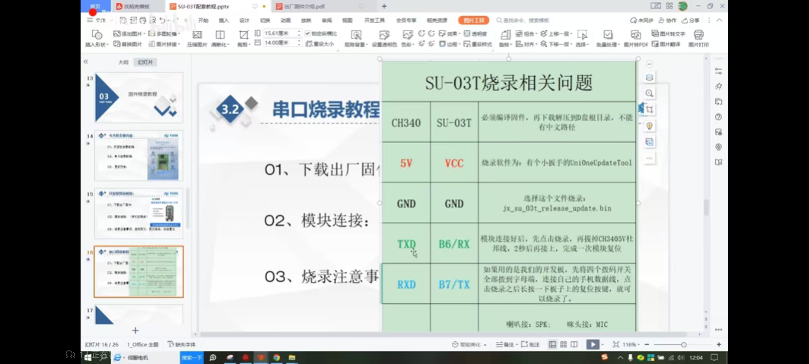

**2. 排查接触不良**

- 检查杜邦线与排针之间是否接触不良
- 如果模块已焊接排针，尝试直接将线焊到模块对应引脚上
- 焊接时注意不要连锡短路

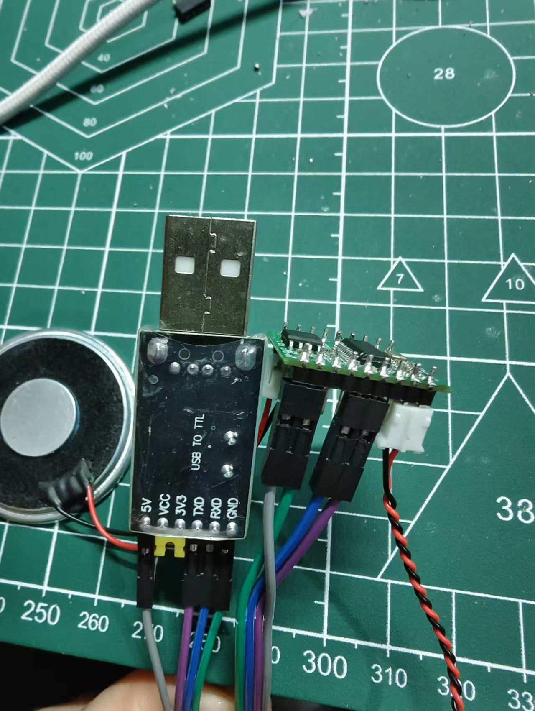

**3. 检查模块状态**

- 确认模块供电正常（5V）
- 测量模块工作电压是否稳定
- 如果模块异常发热，立即断电检查

**4. 使用飞线焊接**

- 如果排针接触不良，可从模块直接飞四根线下来
- 此操作需要一定的焊接技术
- 飞线后重新尝试烧录

**注意事项：**

- 模块正常工作时略有发热是正常的（40-50℃）
- 如果烫手应立即断电检查
- 焊接飞线时注意安全，避免短路
- 可按照排查清单逐步检查问题


---

### SU-03T模块烧录失败且无声音输出怎么办？

**问题描述：**

SU-03T模块无法烧录固件，且模块没有声音输出，需要排查烧录失败的原因。

**解决方案：**

**1. 检查供电方式**

- **供电电压确认**：

    - SU-03T模块不支持5V TTL供电
    - 应使用3.3V供电进行烧录
    - 检查USB转串口模块的电压输出

- **供电稳定性**：

    - 确保供电稳定充足
    - 避免使用延长线或多级转接
    - 直接连接到主板USB端口

**2. 烧录操作技巧**

- **上电时机**：

    - 点击烧录后等待进度条变黄
    - 变黄后快速拔插一下VCC线
    - 重新上电让烧录继续

- **接线检查**：

    - 按照烧录文档正确接线
    - 确认B6/B7引脚连接无误
    - TX和RX需要交叉连接：

        - USB转TTL的TX → 模块的B7
        - USB转TTL的RX → 模块的B6

**3. 模块状态判断**

- **无声音输出**：

    - 可能是模块未正常工作
    - 检查模块是否损坏
    - 确认基础功能是否正常

- **烧录失败分析**：

    - 供电问题是最常见原因
    - 接触不良也会导致失败
    - 固件文件是否匹配

**4. 进一步排查**

- **更换设备测试**：

    - 更换USB转串口模块
    - 使用不同电脑尝试
    - 更换杜邦线连接

- **检查模块硬件**：

    - 观察模块外观是否有损坏
    - 测量关键引脚电阻
    - 确认晶振是否工作

**注意事项：**

- SU-03T对供电要求较严格，必须使用正确电压
- 烧录失败通常不是模块损坏，而是操作或设备问题
- 如多次尝试仍失败，建议录制完整操作视频供技术人员分析
- 参考官方提供的配置示例进行设置

---

### SU-03T模块确认接线无误但仍无法烧录怎么办？

**问题描述：**

SU-03T模块无法烧录固件，已确认硬件接线正确，但烧录过程仍然失败。

**解决方案：**

**1. 深入检查烧录流程**

- 确认使用了正确的烧录引脚（B6/RX、B7/TX）
- 检查烧录工具的波特率设置是否正确
- 尝试在点击烧录后再给模块上电的时序

**2. 排查常见问题**

- 更换USB转串口模块（不同型号的驱动兼容性可能不同）
- 检查电脑USB端口供电是否稳定
- 尝试使用不同的COM端口
- 确认固件文件版本匹配且未损坏

**3. 模块状态检查**

- 测量模块工作电压是否在规定范围内
- 观察模块上电是否有语音提示
- 检查模块是否处于烧录模式

**注意事项：**

- 即使接线正确，也可能存在接触不良的问题
- 建议使用杜邦线重新连接，确保接触良好
- 如果问题持续，可能需要使用专业烧录器进行测试

---

## 烧录界面卡住问题

### 烧录固件时设备卡在烧录界面无法继续怎么办？

**问题描述：**

在烧录固件时，设备卡在烧录界面，无法继续进行烧录过程。

**解决方案：**

**1. 检查接线**

- 确认TX、RX、GND连接正确
- 必须断开VCC电源线，等待2秒后重新上电

**2. 正确的烧录流程**

- 先点击烧录工具的"下载"按钮
- 然后再给模块上电（断开VCC后重新连接）
- TX和RX需要交叉连接：

    - USB转TTL的TX → 模块的B7
    - USB转TTL的RX → 模块的B6

**注意事项：**

- 断开VCC时，TX和RX线保持连接
- 重新上电后观察烧录进度是否开始
- 如果仍卡住，检查USB转TTL模块型号（CH340/PL2303等）

---

### 使用CH340烧录SU-03T时进度条停在黄条状态怎么办？

**问题描述：**

使用CH340给SU-03T烧录时，烧录软件一直停留在黄条状态，无法显示进度百分比，即使已将排针焊接到对应引脚。

**解决方案：**

**1. 通信未建立**

- 不显示%0说明烧录软件与模块未建立通信
- 检查硬件连接是否正确和牢固
- 确认模块供电正常

**2. 硬件连接问题**

**杜邦线接触不良：**

- 杜邦线间距2.5mm，模块为2.0mm
- 接触不良导致通信失败
- 建议直接将杜邦线焊接到模块引脚

**接线检查：**

- 确认使用B6/B7烧录引脚（非B2/B3）
- USB转TTL的TXD接到模块B6
- USB转TTL的RXD接到模块B7

**3. 供电检查**

- 先连接通信线，再接通5V电源
- 检查电源是否稳定
- 使用专用电源而非USB供电

**4. 软件设置**

- 选择正确的COM口号
- 波特率设置：921600（烧录时）
- 尝试重新插拔USB设备

**5. 其他建议**

- 购买带排针的模块版本
- 使用转接板避免接触问题
- 更换质量更好的USB转串口设备

**注意事项：**

- 焊接排针时要避免短路
- 烧录失败后需要完全断电重启
- 如果问题持续，建议使用专用烧录器

---

## SU-03T专用烧录引脚说明

### SU-03T烧录时应该使用哪些引脚？

**问题描述：**

使用USB转TTL工具烧录SU-03T时，不知道应该连接哪些引脚，错误连接到默认的RX/TX引脚导致烧录失败。

**解决方案：**

**1. SU-03T烧录引脚**

- SU-03T的烧录口是**B6和B7**引脚
- B6：RX（接收）
- B7：TX（发送）

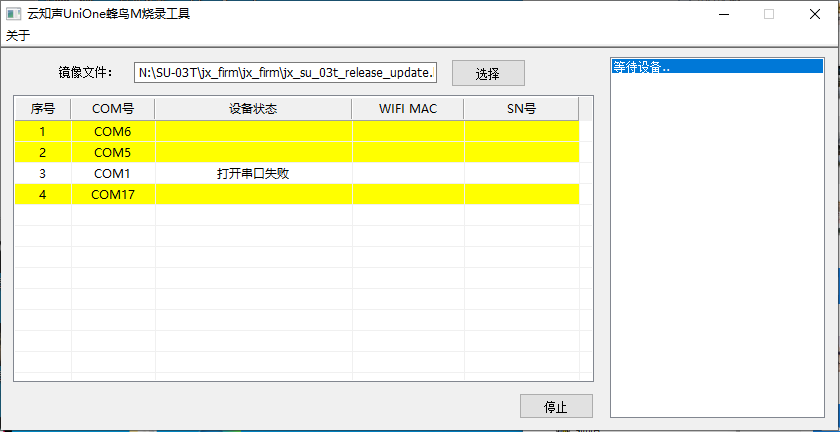

**2. 正确的接线方式**

- USB转TTL的TXD → SU-03T的B6
- USB转TTL的RXD → SU-03T的B7
- 5V → VCC（供电）
- GND → GND（共地）

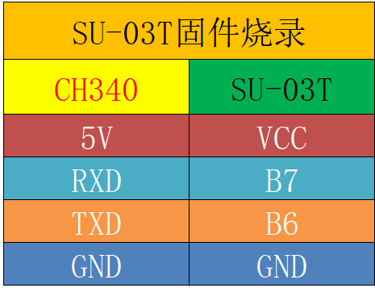


**3. 烧录失败处理**

如果烧录工具显示"打开串口失败"：

- 检查是否使用了正确的COM端口
- 确认USB转TTL驱动是否正常安装
- 尝试更换USB端口
- 检查模块是否正常供电（VCC一开应该有语音播报）


**注意事项：**

- SU-03T的B0/B1是调试器烧录口，串口烧录必须用B6/B7
- B2/B3用于升级狗烧录或脱机烧录（生产使用）
- TX/RX接错不会烧坏模块，可以尝试两种接法

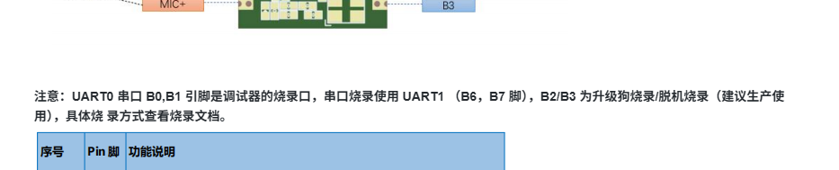

---

## SU-03T串口引脚问题

### SU-03T无法通过B5引脚发送串口数据怎么办？

**问题描述：**

使用SU-03T模块通过串口发送数据时，连接B5引脚但无法成功发送数据。

**解决方案：**

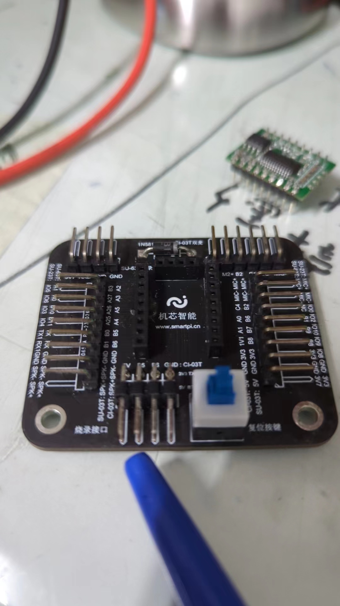

**正确的串口引脚选择：**

- **B5引脚**：不是串口TX功能引脚，无法用于串口数据发送
- **B0引脚**：才是正确的串口TX（发送）引脚
- **B1引脚**：是串口RX（接收）引脚

**正确连接方式：**

```
SU-03T模块    →    USB转TTL模块
B0 (TX)      →    RX
B1 (RX)      →    TX
GND           →    GND
VCC           →    VCC (3.3V或5V)
```

**使用场景说明：**

1. **固件烧录**：使用B6/B7引脚（专用烧录口）
2. **串口通信**：使用B0/B1引脚（UART1功能）
3. **调试通信**：必须连接到正确的串口引脚

**注意事项：**

- SU-03T的B0/B1是默认的UART1串口功能引脚
- B5是普通GPIO引脚，不具备串口功能
- 接线前务必确认引脚功能定义
- 错误连接会导致通信失败

---

### USB转TTL烧录时引脚混淆怎么办？

**问题描述：**

使用USB转TTL模块烧录SU-03T时，文档说明与实际引脚功能不一致，导致烧录失败。文档显示使用PIN6(B6)/PIN5(B7)，但实际B6/B7是串口1功能引脚。

**解决方案：**

**1. 引脚功能确认**

- **B6/B7引脚**：是UART1串口功能引脚，用于串口通信
- **B1/B0引脚**：才是烧录专用的RX/TX引脚
- 使用USB转TTL烧录时应该连接B1/RX和B0/TX

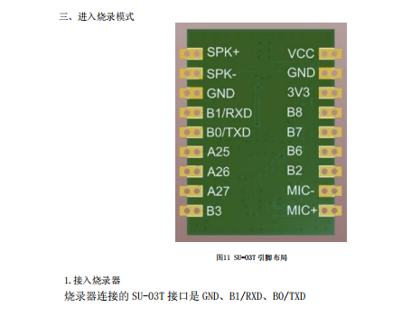

**2. 正确的烧录接线方式**

使用USB转TTL模块时的正确连接：

```
USB转TTL模块 → SU-03T模块
TXD → B1/RX（接收）
RXD → B0/TX（发送）
VCC → VCC（供电）
GND → GND（共地）
```

**3. 烧录失败处理**

如果使用B6/B7烧录失败：

- 立即更换到B1/B0引脚重新尝试
- 确认使用的是USB转TTL而非专用烧录器
- 检查烧录工具是否显示"打开串口失败"

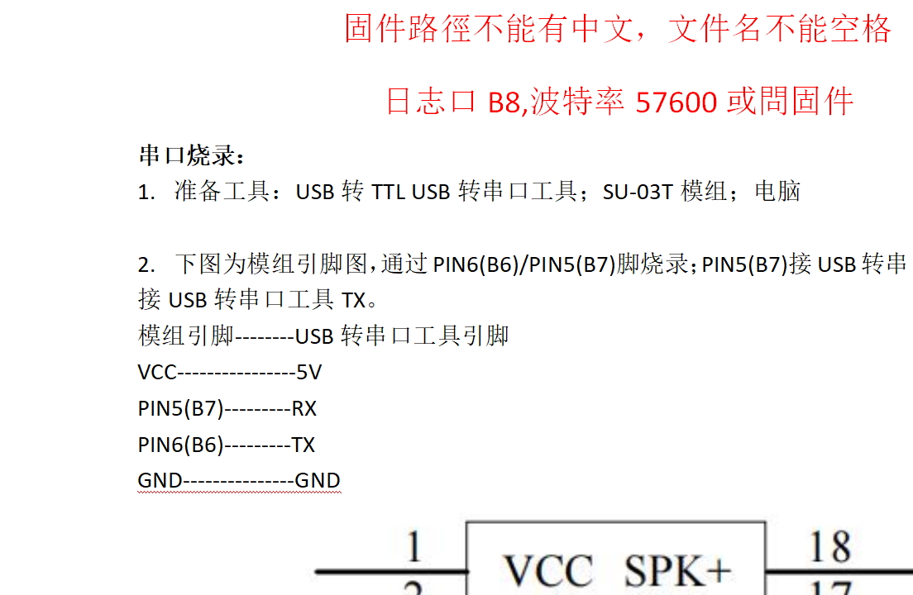

**4. 不同烧录方式的引脚选择**

- **专用烧录器**：使用B1/RXD和B0/TXD引脚
- **USB转TTL烧录**：同样使用B1/RX和B0/TX引脚
- **串口通信**：使用B6/B7引脚（UART1功能）

**注意事项：**

- B6/B7仅用于烧录后的串口通信，不能用于烧录本身
- 文档中的PIN6/PIN5可能指的是物理位置编号，并非引脚名称
- 如果仍有疑问，以SU-03T技术手册v1.2为准
- 建议使用官方提供的CH340模块进行烧录

---

### 烧录工具兼容性与多次重试问题

**问题描述：**

使用USB转TTL模块烧录SU-03T时，烧录工具无法识别设备，或需要多次重试才能成功烧录。

**解决方案：**

**1. 工具兼容性问题**

- 部分USB转TTL模块不支持SU-03T所需的波特率
- 某些TTL工具的读写协议与SU-03T不兼容
- 建议使用官方提供的CH340模块

**2. 重试策略**

- 正确的烧录时序：先点击烧录按钮，再给模块上电
- 如失败，断开VCC电源1-2秒后重新上电
- 多次重试是常见现象，需要耐心操作

**3. 波特率配置**

- SU-03T烧录时使用较高波特率（921600）
- 部分USB转TTL模块可能不支持高速通信
- 可尝试降低波特率进行烧录

**注意事项：**

- 使用非官方TTL工具时，可能存在兼容性问题
- 烧录失败不是模块损坏，多为工具或时序问题
- 建议准备多个USB转TTL模块进行对比测试

**查看波特率的方法：**

- 烧录软件界面会显示默认波特率（921600）
- 日志输出与烧录使用相同波特率
- 确认串口助手波特率与烧录软件一致

---

### SU-03T串口日志输出乱码怎么办？

**问题描述：**

使用串口工具查看SU-03T日志输出时，显示为乱码，无法正常阅读日志内容。

**解决方案：**

**1. 波特率不匹配问题**

- **最常见原因**：串口工具波特率设置错误
- **日志波特率**：SU-03T日志输出波特率为**921600**
- **区别**：日志波特率（921600）与通信波特率（9600/115200）不同

**2. 正确配置方法**

- 打开烧录软件，查看界面显示的波特率值
- 将串口调试工具的波特率设置为相同值（921600）
- 数据位：8，停止位：1，校验位：无

**3. 其他可能原因**

- USB转串口驱动问题：尝试重新安装或更换驱动
- USB转串口模块质量：使用原装CH340或CP2102模块
- 线材问题：更换更短更优质的USB线

**注意事项：**

- 通信串口和日志串口可能使用不同波特率
- 烧录软件界面可查看默认波特率设置
- 确保串口工具与烧录软件显示的波特率一致

---

## 串口通信问题

### 通过串口给SU-03T发送消息没有响应怎么办？

**问题描述：**

通过串口助手给SU-03T发送消息时，设备没有任何响应，也无法接收到任何数据。

**解决方案：**

**1. 检查基础连接**

- 确认TX/RX交叉连接（TX→RX，RX→TX）
- 检查GND共地连接是否正确
- 验证USB-TTL驱动是否正常安装

**2. 检查通信参数**

- 波特率：默认115200（可根据固件配置调整）
- 数据位：8位
- 停止位：1位
- 校验位：无

**3. 检查发送格式**

- 十六进制发送：AA 55 开头的命令帧
- 字符串发送：需要勾选"发送新行"或手动添加\r\n
- 确认发送的数据格式符合模块协议

**4. 排查步骤**

- 先从模块发送数据到PC，测试模块是否正常工作
- 检查串口助手显示的接收数据是否正常
- 模块正常会发送心跳包或状态信息

**注意事项：**

- SU-03T的串口是3.3V电平，注意电平匹配
- 不要使用5V的USB-TTL直接连接，可能损坏模块
- 通信前确保模块已完成初始化

---

### SU-03T串口通信连接成功后如何验证？

**问题描述：**

SU-03T模块通过B6/B7引脚与电脑建立串口连接后，需要验证通信是否正常工作。

**解决方案：**

**1. 确认连接状态**

- 烧录工具显示"开始烧录..."表明连接成功
- 串口调试助手能接收到模块发送的数据

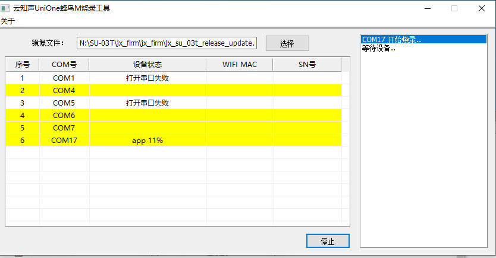

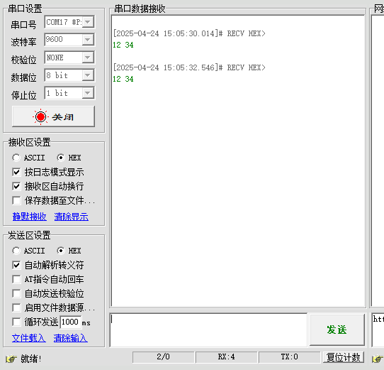

**2. 测试通信**

- 模块上电后会自动发送数据
- 正常数据格式：十六进制显示（如 12 34）
- 使用串口助手发送测试数据验证双向通信

**3. 常见问题处理**

- 如果显示"打开串口失败"：

    - 检查COM端口是否被占用
    - 确认B6/B7引脚连接正确
    - 尝试重新插拔USB转TTL模块

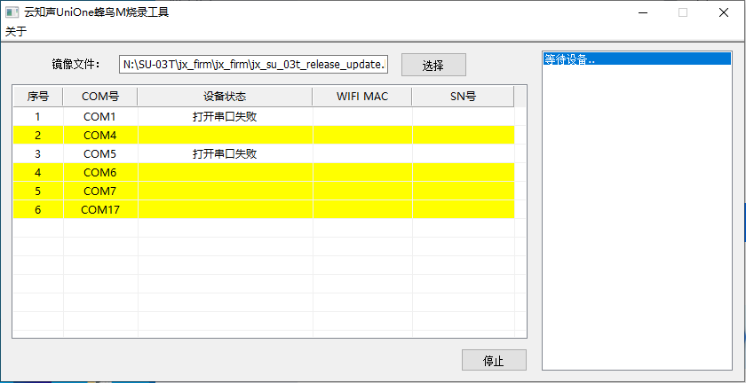

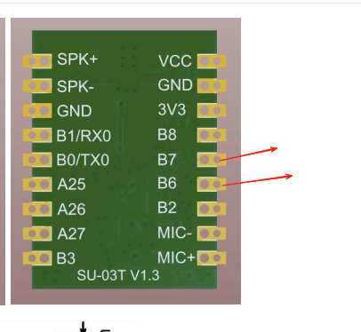

**注意事项：**

- B6/B7是专用的UART1串口
- 后续与电脑通信也使用相同的引脚
- 不需要更换到B0/B1引脚
- 通信参数需与固件配置一致

---

## 模块过热问题

### SU-03T模块通电后迅速烫手怎么办？

**问题描述：**

SU-03T模块通电几秒后变得非常烫手，使用串口助手可以接收到数据，但模块温度异常。

**解决方案：**

**1. 立即安全处理**

- 发现模块异常发热立即断电
- 等待模块完全冷却后再排查
- 不要触摸烫伤的模块

**2. 检查数据收发**

- 确认模块能正常发送数据到PC
- 检查接收的数据格式是否正确
- 正常数据格式：AA 55 xx xx xx 55 AA

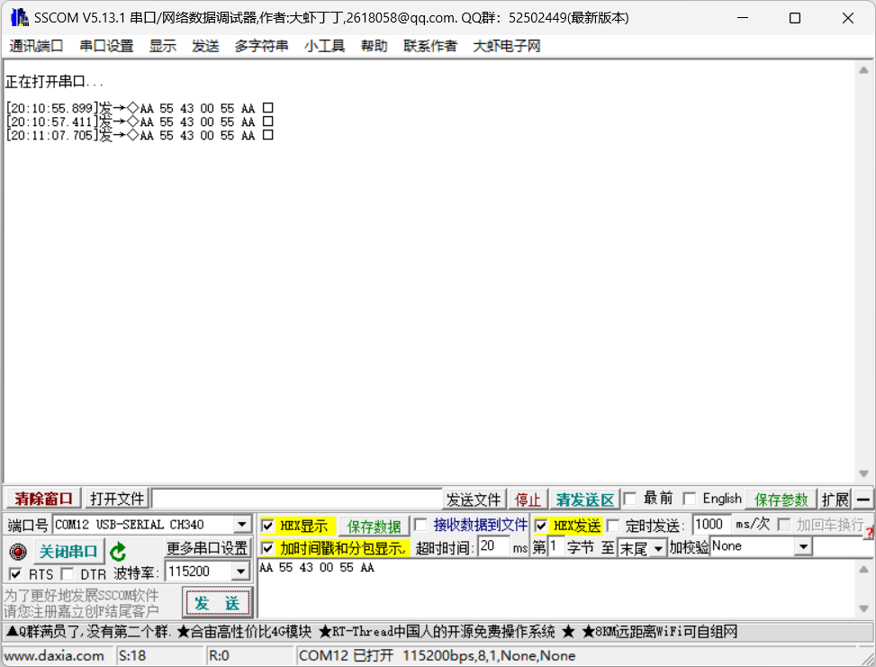

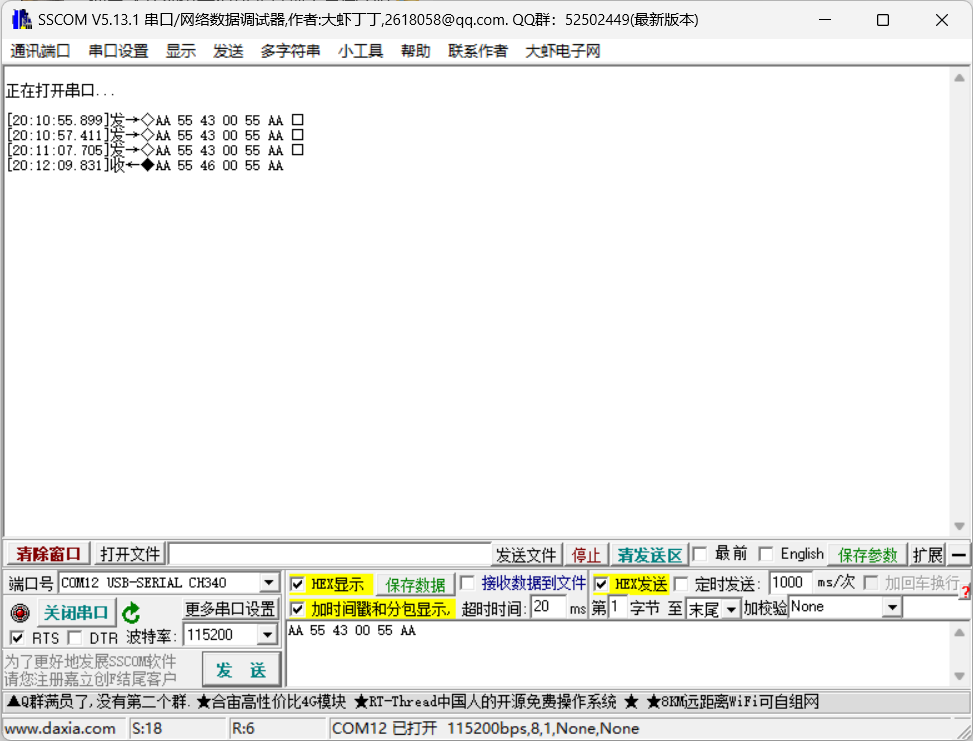

**3. 可能原因分析**

- **固件问题**：固件异常导致功耗过大
- **硬件故障**：内部元件短路
- **供电问题**：电压过高或不稳定

**4. 排查建议**

- 尝试烧录官方提供的标准固件
- 测试不同供电电压（5V或3.3V）
- 检查模块外观是否有明显损坏

**注意事项：**

- 模块正常工作温度应在40-50℃
- 异常发热可能是模块损坏的前兆
- 如果多次尝试仍然过热，建议更换模块

## 烧录问题

### SU-03T串口烧录时GND引脚如何连接？

**问题描述：**

使用CH340模块进行SU-03T串口烧录时，对GND引脚的连接和线材颜色对应关系存在疑问。

**解决方案：**

- GND必须连接到GND，与线的颜色没有关系
- CH340的GND引脚应连接到SU-03T的GND引脚
- 线材颜色仅作参考，应以引脚标识为准

**注意事项：**

- 接线接触不良会导致芯片无法识别
- 确保所有引脚连接牢固，特别是GND引脚
- 模块方向：功放端（大芯片）应靠近蓝色开关

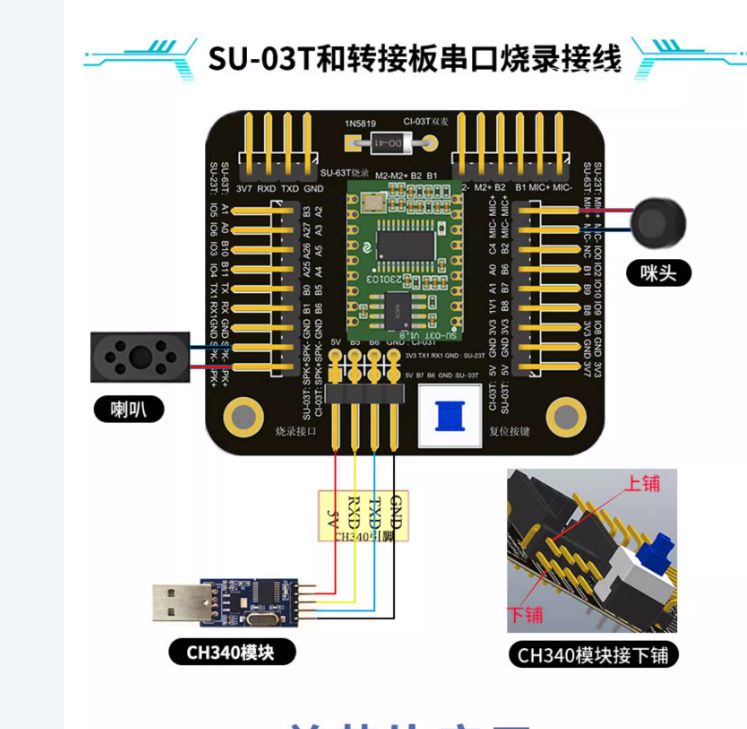

---

### SU-03T烧录时应选择哪个模式？

**问题描述：**

使用烧录工具进行SU-03T固件烧录时，不确定应该选择哪个烧录模式选项。

**解决方案：**

**烧录模式选择：**

- SU-03T模块烧录时应选择 **M2模式**
- 这是在烧录工具中的正确选项
- 其他模式可能不兼容或导致烧录失败

**操作步骤：**

1. 打开云知声UniOne烧录工具
2. 连接SU-03T模块到电脑
3. 在烧录模式选项中选择"M2"
4. 选择对应的固件文件
5. 开始烧录

**注意事项：**

- 确保选择正确的模块型号
- M2模式是SU-03T的专用烧录模式
- 如有其他烧录选项，请勿选择

---

### SU-03T模块烧录失败如何排查？

**问题描述：**

SU-03T模块在烧录时失败，已尝试更换USB接口和拔掉其他COM端口仍无法解决。

**解决方案：**

**基础排查步骤：**

- 拔掉其他COM端口，只保留CH340串口
- 更换USB接口
- 使用其他正常工作的SU-03T模块进行交叉测试

**硬件检查：**

- 检查焊接是否存在虚焊或焊锡粘连
- 确认没有因电压过高或错误操作导致硬件电路损坏
- 验证接线是否正确

**模块验证：**

- 更换另一块SU-03T模块测试
- 若更换后可正常烧录，则原模块可能已损坏

**注意事项：**

- 模块在出厂前都经过严格测试，正常情况下不会出现硬件问题
- 焊接排针时需格外小心，避免静电或过热损坏芯片
- 新焊接的模块建议首先检查焊接质量

---

### 固件烧录后状态显示异常怎么办？

**问题描述：**

使用云知声UniOne平台生成的固件烧录后，设备状态显示为黄色（app 100%），且设备上电无任何反应，而官方提供的出厂固件烧录后状态为绿色（下载完成），设备可正常工作。

**解决方案：**

**问题原因分析：**

1. **固件文件问题**
    - 自定义生成的固件可能存在配置错误
    - 固件文件不完整或损坏
    - 固件版本与硬件不匹配

2. **烧录操作问题**
    - 选择的固件文件类型错误
    - 烧录过程中断或异常
    - 未正确进入烧录模式

**处理方法：**

1. **使用官方固件测试**
    - 下载官方出厂固件进行测试
    - 确认硬件本身工作正常
    - 官方固件烧录后应为绿色状态

2. **检查生成的固件**
    - 确认在平台中正确配置了所有参数
    - 检查命令词、GPIO配置等是否设置
    - 重新生成固件文件

3. **烧录操作规范**
    - 使用正确的烧录工具和版本
    - 确保烧录时选择正确的固件文件
    - 烧录完成后再上电测试

**固件文件类型说明：**

- **出厂固件**：包含完整的系统程序和配置
- **自定义固件**：根据平台配置生成
- **update固件**：包含"update"后缀的为升级版本

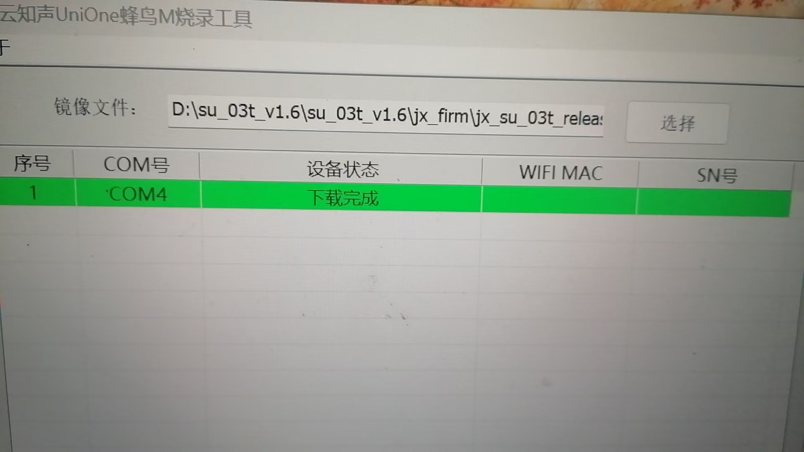

*官方固件烧录后的正常绿色状态*

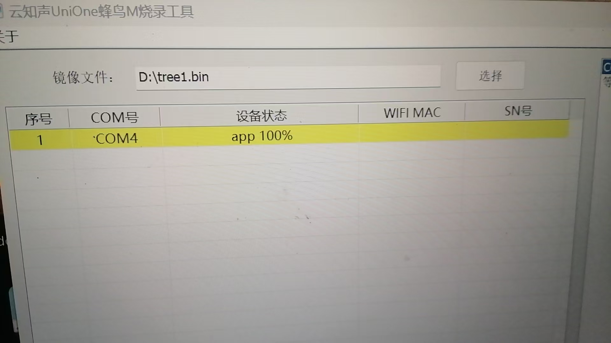

*自定义固件烧录后的异常黄色状态*

**注意事项：**

- 自定义固件必须正确配置所有必要参数
- 烧录前确认固件文件完整性
- 如多次尝试仍有问题，请检查平台配置
- 保留官方固件作为测试基准

---

### 固件文件命名有什么要求？

**问题描述：**

需要确认固件文件的命名规则，特别是针对不同产品的固件文件命名规范。

**解决方案：**

**命名规则说明：**

1. **自定义命名**
    - 用户可以自定义固件文件的名称
    - 例如：Tree1.bin、Tree.bin等
    - 命名不影响固件功能和烧录

2. **命名建议**
    - 使用有意义的名称便于识别
    - 建议包含项目或产品信息
    - 避免使用特殊字符

3. **文件类型**
    - .bin：标准烧录文件
    - _update.bin：升级版本固件
    - .tar.gz：完整固件包

**注意事项：**

- 固件文件名只是便于管理，不影响功能
- 烧录时选择正确的文件类型即可
- 建议保留固件版本信息和生成日期
- 不同产品使用不同的命名便于区分

---

### 固件烧录困难怎么办？

**问题描述：**

在下载和烧录固件时遇到问题，无法成功将固件烧录到设备中，且烧录过程不进入自动播报状态。

**解决方案：**

**问题原因分析：**

1. **复位操作问题**
    - 芯片未正确复位进入烧录模式
    - 复位时机不准确
    - 接线松动导致多次复位

2. **烧录操作不当**
    - 未按正确的烧录流程操作
    - USB接口接触不良
    - 烧录工具设置错误

**正确烧录步骤：**

1. **连接设备**
    - 正确连接SU-03T到电脑
    - 确认COM端口号
    - 选择正确的固件文件

2. **进入烧录模式**
    - 点击烧录按钮
    - 拔掉VCC电源2秒
    - 重新插上VCC电源

3. **确认进入状态**
    - 设备应进入烧录模式
    - 烧录工具显示连接成功
    - 开始自动烧录过程

**常见问题处理：**

1. **设备只播报不烧录**
    - 说明复位未成功
    - 检查VCC电源连接
    - 重新尝试复位操作

2. **线材接触问题**
    - 检查USB连接线
    - 确保烧录时不要触碰
    - 避免操作时造成多次复位

**注意事项：**

- 芯片复位后才会进行烧录
- 确保烧录工具版本正确
- 如仍有问题，可尝试更换USB端口或电脑
- 烧录成功后设备状态应显示为绿色

---

### 烧录时无法进入烧录模式怎么办？

**问题描述：**

使用云知声UniOne蜂鸟M烧录工具进行固件烧录时，无法成功进入烧录模式，设备在操作后仅进行自动播报，烧录过程未启动。

**解决方案：**

**问题原因：**

1. **固件文件类型错误**
    - 下载了压缩包文件而非可直接烧录的固件
    - .tar.gz文件需要先解压
    - 烧录应使用.bin文件

2. **复位操作不当**
    - 芯片未正确进入烧录模式
    - 复位时机或方法错误

**正确处理流程：**

1. **固件文件准备**
    - 从平台下载固件时选择正确文件
    - 如下载的是.tar.gz压缩包，需先解压
    - 找到解压后的.bin文件进行烧录

2. **进入烧录模式**
    - 选择正确的.bin固件文件
    - 点击烧录按钮
    - 拔掉VCC电源2秒后重新插上

3. **验证烧录状态**
    - 设备不应进行播报
    - 烧录工具应显示开始下载
    - 状态应为"下载完成"（绿色）

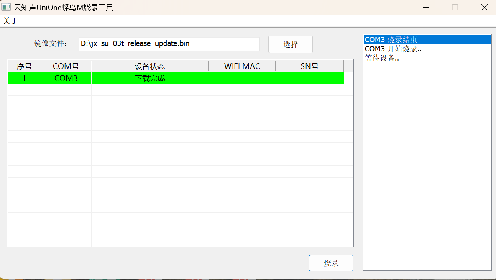

*使用正确固件文件烧录成功后的状态*

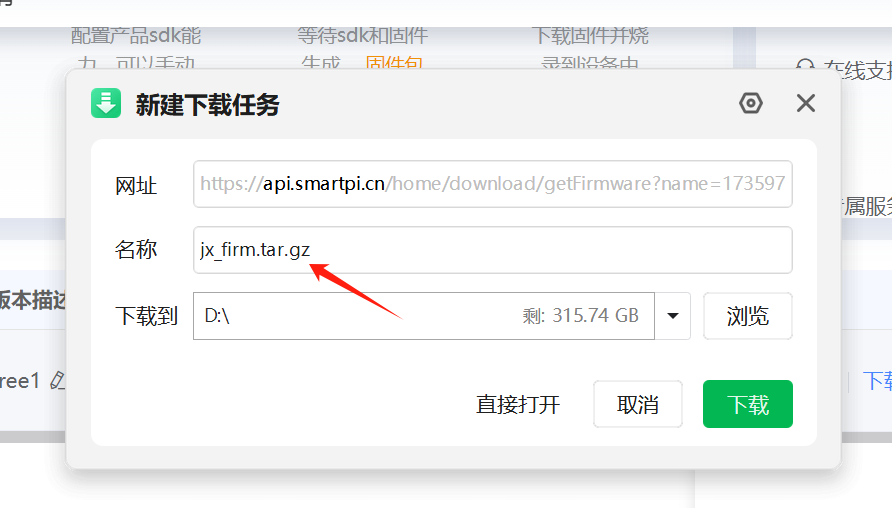

*错误：下载了.tar.gz压缩包而非可烧录固件*

**注意事项：**

- 不要直接使用.tar.gz压缩包文件烧录
- 必须解压后使用里面的.bin文件
- 芯片复位成功后不会进行语音播报
- 如仍有问题，检查是否使用了正确的固件文件

---

### SU-03T1模块是否有串口脱机烧录器？

**问题描述：**

询问是否有适用于SU-03T1模块的串口脱机烧录器，用于产品批量烧录。

**解决方案：**

**1. 脱机烧录器支持**

- SU-03T1有专用的串口脱机烧录器
- 型号称为"升级狗"
- 其他型号暂不支持脱机烧录

**2. 脱机烧录器特点**

- 支持独立烧录，无需连接电脑
- 适合批量生产使用
- 提高生产效率

**3. 使用方式**

- 将固件文件预先下载到烧录器
- 通过串口连接目标模块
- 一键完成固件烧录

**4. 批量生产建议**

- 大批量生产建议采购脱机烧录器
- 可显著提升烧录效率
- 减少对电脑的依赖

**注意事项：**

- 脱机烧录器需要单独采购
- 仅SU-03T系列支持此功能
- 其他模块需使用在线烧录方式

---

### SU-03T/SU-13T是否提供串口烧录协议？

**问题描述：**

希望了解SU-03T和SU-13T模块的串口烧录协议，以便自行制作脱机下载器进行批量烧录。

**解决方案：**

**1. 官方烧录方案**

- **SU-03T**：提供专用"升级狗"脱机烧录器
- **SU-13T**：暂无脱机烧录器，仅支持在线烧录
- 建议优先使用官方提供的烧录工具

**2. 串口协议说明**

- **不公开源代码**：串口烧录协议不对外公开
- **技术保护**：烧录算法和通信协议属于核心技术
- **防止滥用**：避免不规范的烧录导致芯片损坏

**3. 自制烧录器风险**

- **协议不匹配**：自行开发的协议可能与官方不一致
- **烧录失败**：可能导致固件写入不完整
- **芯片损坏**：错误的时序或参数可能永久损坏芯片
- **无法保修**：使用非官方工具造成的损坏不在保修范围

**4. 批量烧录建议**

- **SU-03T批量生产**：采购多台官方升级狗
- **SU-13T批量生产**：使用多台电脑同时在线烧录
- **效率优化**：制作专用测试夹具，快速插拔模块

**替代方案：**

1. **采购官方烧录器**
    - 联系官方或授权代理商
    - 获得完整的技术支持和保修
    - 确保烧录成功率和稳定性

2. **委托代工服务**
    - 寻找有官方烧录器的代工厂
    - 提供固件文件，代为烧录
    - 适合中小批量生产

3. **更换支持脱机的型号**
    - 如必须批量脱机烧录，选择SU-03T
    - 避免使用不支持脱机的SU-13T

**注意事项：**

- 串口烧录协议涉及底层硬件操作
- 不当使用可能导致不可逆的硬件损坏
- 建议使用官方工具确保可靠性
- 批量生产可联系官方获取技术支持服务

---

### SU-03T1烧录时显示串口断开或等待设备怎么办？

**问题描述：**

在使用烧录工具烧录SU-03T1模块时，遇到"串口可能被断开"的错误提示，或一直显示"等待设备..."无法正常烧录。

**解决方案：**

**1. 硬件连接检查**

- **确认烧录接口位置**：SU-03T1的烧录口在下方，不要接到SU-63T的接口上

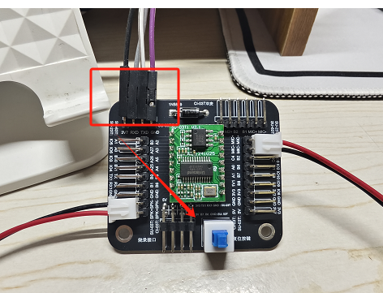

*SU-03T1烧录接口位置（红框标注）*

- **检查引脚连接**：

    - B7引脚（UART1_TX）连接到USB转TTL的RX
    - B6引脚（UART1_RX）连接到USB转TTL的TX
    - 确保交叉连接（TX接RX，RX接TX）


*B6/B7引脚功能定义表*

**2. 接线步骤确认**

- 使用USB转TTL模块进行连接
- 检查模块引脚定义是否正确
- 确认连接线没有松动或接触不良
- 模块方向是否正确（检查是否插反）

**3. 烧录操作要点**

- 烧录前确保模块断电
- 正确连接后再上电
- 按下复位按钮后立即开始烧录
- 确保选择了正确的COM端口号

**4. 常见问题排查**

- **模块插反**：检查模块是否完全插入且方向正确
- **接触不良**：重新插拔连接线，确保良好接触
- **端口冲突**：关闭其他串口软件，释放COM端口
- **驱动问题**：确认CH340等USB转串口驱动已正确安装

**注意事项：**

- 烧录前务必确认接线正确，避免损坏模块
- 如多次尝试仍失败，建议更换模块或烧录工具测试
- 可以参考B站上的SU-03T烧录教程视频

---

### SU-03T模块插反会导致什么问题？

**问题描述：**

SU-03T模块在烧录时无法正常通信，经排查发现是模块插反导致。

**解决方案：**

**模块正确安装方法：**

- **注意方向标识**：模块上有丝印标记，指示正确安装方向
- **完全插入**：确保模块所有引脚都正确插入接口
- **对齐位置**：模块边缘与开发板边缘对齐
- **检查引脚**：确保引脚数量和位置匹配

**常见错误：**

- **完全插反**：模块旋转180度插入
- **部分插入**：引脚没有完全对齐
- **错位插入**：引脚偏离正确位置

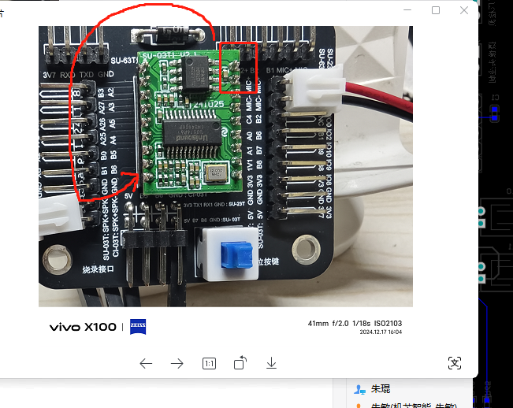

*模块插反示例（箭头指示正确方向）*

**插反的后果：**

- 无法进行正常通信
- 烧录工具检测不到设备
- 可能损坏模块或开发板
- 供电异常导致硬件故障

**预防措施：**

- 插入前仔细查看模块和开发板的标识
- 确认引脚1（通常有圆点或三角标记）的位置
- 轻轻插入，避免用力过猛
- 插入后检查是否有倾斜或错位

**注意事项：**

- SU-03T模块不对称，有明确的安装方向
- 如不确定正确方向，请查看产品手册或丝印标记
- 插入前最好拍照记录原始状态，便于对比

---

### SU-03T烧录后无声音且无法唤醒怎么办？

**问题描述：**

SU-03T模块烧录固件后无声音输出，无法唤醒，上电也没有开机播报。

**解决方案：**

**1. 固件和唤醒词检查**

- **固件兼容性**：确认固件版本与模块匹配
- **唤醒词对应**：检查固件中是否包含配置的唤醒词
- **音频文件完整性**：确认音频文件正确打包到固件中
- **固件完整性验证**：使用MD5等校验工具确认固件文件未损坏

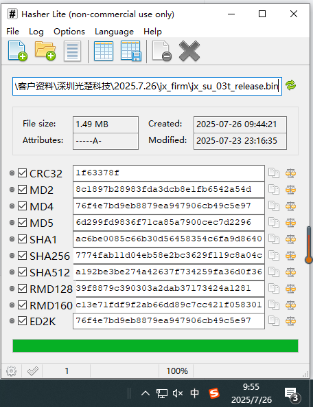

*固件文件MD5校验通过，确认文件完整性无误*

**2. 硬件连接检查**

- **扬声器连接**：

    - 确认扬声器正确连接到音频输出端
    - 检查扬声器阻抗是否为8Ω
    - 测试扬声器是否完好（可用万用表测量）

- **电源供电**：

    - 确认供电电压在3.6-5.5V范围内
    - 检查电源电流是否足够（建议500mA以上）
    - 测量各引脚电压是否正常

**3. 系统状态判断**

- **上电播报**：正常固件上电应有开机提示音
- **LED指示**：观察电源和状态指示灯
- **串口输出**：如有条件，查看串口调试信息

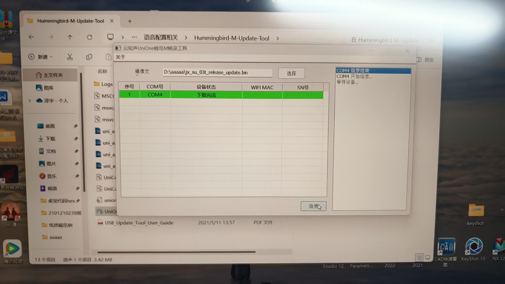

*烧录工具显示完成但设备无响应*

**4. 故障排查步骤**

1. 断电重启，再次测试
2. 重新烧录确认无误的固件
3. 更换扬声器测试
4. 使用最小配置固件测试
5. 如仍有问题，可能是硬件故障

**注意事项：**

- 正常烧录完成后应立即有声音输出
- 如无任何反应，首先检查硬件连接
- 建议保存一份正常工作的固件备份
- 硬件损坏可能是焊接不当或静电导致

---

### SU-03T1专用烧录器出现校验失败怎么办？

**问题描述：**

在使用专用烧录器烧录SU-03T1模块时，出现校验失败的烧录错误。

**解决方案：**

**1. 烧录软件版本确认**

- 必须使用专用调试器烧录软件v1.8版本
- 旧版本可能导致固件兼容性问题
- 从官方渠道下载最新版本烧录软件

**2. 固件版本兼容性**

- 检查固件生成时间
- 2024年10月25日之后生成的固件可直接使用
- 10月25日之前的固件需要从原生成版本继承并重新发布

**3. 固件选择要求**

- 使用专用烧录器时选择正确的固件文件
- 确认固件文件完整性
- 避免使用损坏或不完整的固件

**4. 烧录操作规范**

- 确保烧录器与模块连接稳定
- 烧录过程中避免断电或断开连接
- 校验失败时重新尝试烧录

**注意事项：**

- 专用烧录器包含喇叭、电源接口、咪头、烧录器和03T纯模块
- 固件版本升级后需要使用对应的烧录软件
- 如持续校验失败，可能需要更换烧录器或模块

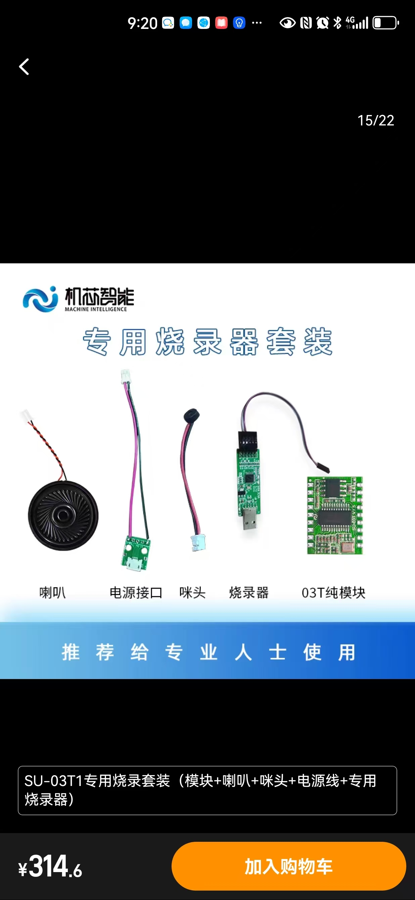

---

### SU-03T串口烧录失败如何处理？

**问题描述：**

使用云知声UniOne蜂鸟M烧录工具通过串口烧录SU-03T时，设备无法识别，工具显示"等待设备.."。

**解决方案：**

**1. 硬件连接检查**

- **TX/RX连接**：B6接TX，B7接RX（交叉连接）
- **供电检查**：确保5V供电稳定，电流足够
- **共地连接**：GND必须正确连接

**2. 烧录步骤**

- 芯片需要断电复位才能进入烧录模式
- 正确步骤：拔掉5V电源→重新上电→立即开始烧录
- 或者：拔插GND线实现复位

**3. 常见问题排查**

- **排针接触不良**：SU-03T排针较小，确保接触良好
- **USB转串口驱动**：确认CH340等驱动已正确安装
- **串口号选择**：在工具中选择正确的COM端口

**4. 替代方案**

- 使用专用烧录器（如FwLink2 Lite）
- 通过SWD接口烧录，更稳定可靠
- 适合批量生产和调试使用

**注意事项：**

- 烧录时不要触碰连接线，避免接触不良
- 确保供电稳定，不足会导致识别失败
- 烧录工具需要管理员权限运行
- 多次失败可尝试更换USB端口或电脑

---

### 串口烧录上位机显示"等待设备"怎么办？

**问题描述：**

使用串口烧录工具时，上位机持续显示"等待设备"，无法完成SU-03T模块的烧录。

**解决方案：**

1. **接线检查**
    - 确保没有接错线缆
    - 重点检查5V电源线是否正确插入
    - 确认B6、B7和GND接线正确且同源

2. **电源供应**
    - 确保模块电源输入正确
    - 使用单独5V供电，避免共享电源干扰
    - 检查供电电流是否充足（建议500mA以上）

3. **烧录时序**
    - 先给模块通电，再点击烧录按钮
    - 如失败，尝试重新上电后立即烧录
    - 或通过插拔GND线实现复位

4. **软件环境**
    - 关闭杀毒软件或防火墙
    - 以管理员身份运行烧录工具
    - 确认文件路径不包含中文字符

5. **硬件检查**
    - 检查杜邦线质量，建议更换短线
    - 测试串口工具是否正常工作
    - 必要时更换电脑系统尝试

6. **最终方案**
    - 尝试单独飞线烧录
    - 使用专用烧录器
    - 参考串口烧录教程视频

**注意事项：**

- 接触不良是常见问题，确保连接可靠
- 供电不稳会导致识别失败
- 路径包含中文可能引起软件异常
- 可联系官方技术团队获取教程视频

---

### 烧录时出现"LOAD HELP BIN FAIL"错误怎么办？

**问题描述：**

使用烧录工具烧录语音模块固件时，出现"Cannot configure port, something went wrong. Original message: {"ErrorCode": "0003", "ErrorMsg": "LOAD HELP BIN FAIL"}"错误，导致烧录失败。

**解决方案：**

**1. 错误代码分析**

- **ErrorCode 0003**：端口配置失败
- **LOAD HELP BIN FAIL**：无法加载引导程序
- 通常表示通信异常或未进入烧录模式

**2. 硬件连接检查**

- 确认USB转串口模块连接正常
- 检查TX/RX线序是否交叉连接（模块TX→转串口RX）
- 验证供电是否稳定（5V）
- 尝试更换USB线或转串口模块

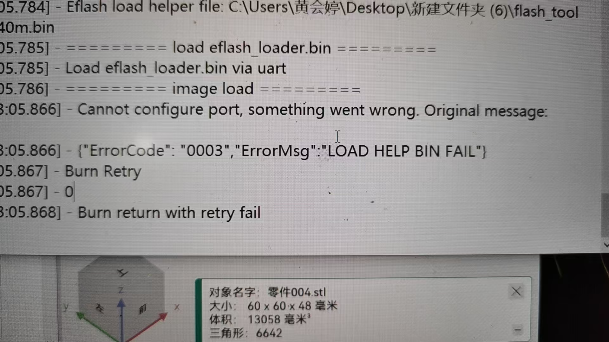

**3. 烧录模式确认**

- 确保模块已进入烧录模式
- 检查拨码开关位置（如有）
- 正确时序：先进入烧录模式，再连接烧录工具
- 尝试重新上电并再次进入烧录模式

**4. 驱动和端口检查**

- 确认CH340或CP210x驱动已正确安装
- 在设备管理器中查看COM口是否正常显示
- 关闭其他可能占用串口的程序
- 尝试更换USB端口

**5. 常见解决方法**

- 重新插拔USB连接
- 更换USB转串口模块
- 使用不同的电脑尝试
- 下载最新版本的烧录工具

### 烧录过程卡住不动怎么办？

**问题描述：**

烧录SU-03T模块时，进度条在某个位置停滞不前，显示"烧录中...请等待"，无法继续完成烧录。

**解决方案：**

**1. 检查通信连接**

- 确认USB转串口连接稳定
- 检查串口线是否松动
- 尝试更换质量更好的USB线
- 避免使用USB延长线

**2. 烧录环境优化**

- 关闭其他占用系统资源的程序
- 暂时关闭杀毒软件和防火墙
- 更换到USB 2.0端口（不要使用USB 3.0）
- 尝试降低波特率设置

**3. 模块状态检查**

- 重新给模块断电上电
- 确认模块已正确进入烧录模式
- 检查供电是否稳定（建议使用外部5V供电）
- 尝试在模块电源并联电容（100μF）稳定电压

**4. 烧录工具设置**

- 重新选择COM端口
- 点击"Refresh"按钮刷新设备列表
- 降低烧录速度设置
- 使用管理员权限运行烧录工具

**5. 应急处理**

- 长时间无响应时强制关闭烧录工具
- 拔掉USB重新连接
- 重启电脑后再尝试烧录
- 使用另一台电脑测试

**注意事项：**

- 烧录过程中不要触碰连接线
- 确保模块供电稳定，电压不低于4.5V
- 如果多次失败，可能是模块硬件问题，联系官方技术团队

- 该错误通常是通信问题导致
- 确保模块已正确进入烧录状态
- 检查所有硬件连接是否牢固
- 如问题持续，联系官方技术团队获取帮助

---

### SU-03T烧录进度卡在100%无法完成怎么办？

**问题描述：**

SU-03T芯片在烧录过程中，进度达到100%后卡住无法完成，设备无任何开机播报，无法正常工作。

**解决方案：**

- 烧录到100%后断开连接，重新上电测试
- 检查是否使用了正确的固件文件
- 确认烧录工具选择的COM端口和波特率正确

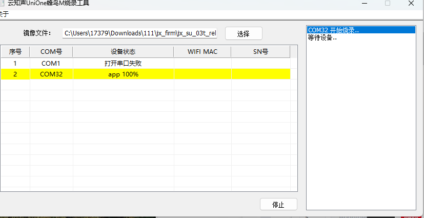


**注意事项：**

- 多次烧录失败可能是模块硬件问题
- 烧录完成后应有开机播报，无播报说明烧录未成功
- 建议录制视频用于问题分析

---

### SU-03T与ESP8266串口通信问题

**问题描述：**

SU-03T模块通过串口连接ESP8266时，ESP8266的串口监视器无法接收到SU-03T发送的数据，即使使用串口调试工具可以正常看到数据输出。

**解决方案：**

**1. 引脚连接检查**

- SU-03T的TX连接到ESP8266的RX（GPIO3）
- SU-03T的RX连接到ESP8266的TX（GPIO1）
- 确保共地连接
- 注意不同开发板的引脚定义可能不同

**2. ESP8266引脚确认**

- ESP-12E开发板的硬件串口：

    - U0RXD（GPIO3）：接收数据
    - U0TXD（GPIO1）：发送数据
- 部分开发板的D9/D10可能对应其他引脚
- 查看开发板引脚图确认正确引脚

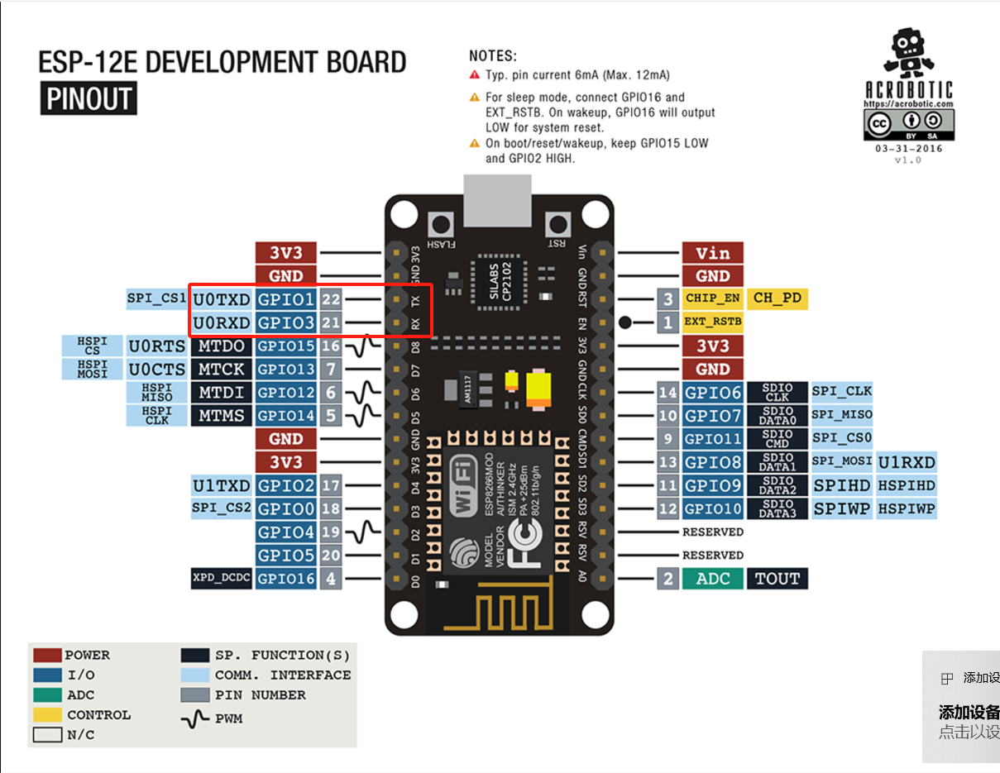

**3. 代码配置修正**

```cpp
#include <ESP8266WiFi.h>
#include <SoftwareSerial.h>

// 对于ESP-12E，使用正确的引脚
#define RX_PIN 3  // GPIO3 (U0RXD)
#define TX_PIN 1  // GPIO1 (U0TXD)

SoftwareSerial mySerial(RX_PIN, TX_PIN);

void setup() {
  Serial.begin(115200);  // 调试串口
  mySerial.begin(9600);  // SU-03T通信串口

  Serial.println("Ready to receive data from SU-03T");
}

void loop() {
  if (mySerial.available()) {
    char incomingChar = mySerial.read();
    Serial.print(incomingChar, HEX);  // 十六进制显示
    Serial.print(" ");
  }
}
```

**4. 数据格式处理**

- SU-03T发送的是十六进制数据
- 需要正确解析数据包格式
- 典型格式：AA 55 01 02 55 AA
- 注意识别起始帧和结束帧

**5. 常见问题解决**

- **使用硬件串口**：ESP8266的Serial对象与USB复用
- **波特率匹配**：确认SU-03T的波特率设置
- **供电隔离**：避免使用同一电源导致的干扰

**注意事项：**

- 不同厂家的ESP8266开发板引脚定义可能不同
- 建议先用串口调试工具验证SU-03T工作正常
- 如仍无法通信，检查是否有电平转换问题
- 长距离通信需要考虑电平匹配和信号完整性

---

---

### 烧录软件后无法识别串口怎么办？

**问题描述：**

烧录固件后，电脑无法识别SU-03T模块的串口，设备管理器中看不到对应的COM端口。

**解决方案：**

**1. 驱动程序安装**

- SU-03T模块使用标准USB转串口芯片（CH340或CP2102）
- 需要下载并安装对应的驱动程序
- CH340驱动下载地址：https://www.wch.cn/download/CH341SER_EXE.html
- CP2102驱动下载地址：https://www.silabs.com/developers/usb-to-uart-bridge-vcp-drivers

**2. 串口配置检查**

- 确认串口波特率设置正确（通常为9600）
- 数据位：8，停止位：1，校验位：无（8N1）
- 使用串口调试工具测试通信

**3. 硬件连接检查**

- 确保模块与电脑的USB连接正常
- 检查USB线是否完好
- 尝试更换USB端口
- 确保模块供电稳定（3.6-5.5V）

**4. 开发包资源**

- 驱动程序通常包含在SU-03T开发包中
- 查看开发包目录中的"CH340安装包"文件夹
- 从开发包直接安装驱动程序

**注意事项：**

- 驱动安装后需要重启电脑才能生效
- 如果仍无法识别，尝试重新安装驱动
- 确保使用原装或质量良好的USB线

---

### 固件文件解压失败提示内存不足

**问题描述：**

下载固件后是一个压缩文件，解压时提示"内存资源不足，无法完成操作"。

**解决方案：**

**基础排查步骤：**

- 确保系统可用内存充足，关闭其他占用内存的程序
- 尝试使用管理员权限运行解压程序
- 将压缩文件移动到路径更简单的位置（如桌面）

**文件格式说明：**

- 生成的固件文件可能是压缩格式（.zip或类似格式）
- 解压后会得到.bin固件文件用于烧录
- 如果解压成功但找不到.bin文件，请检查解压出的所有文件

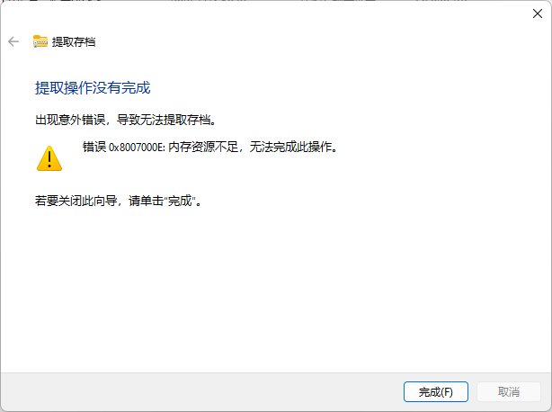

### 烧录工具提示打开串口失败

**问题描述：**

使用云知声UniOne蜂鸟M烧录工具时，显示"打开串口失败"，无法正常烧录。即使更换杜邦线后问题依旧存在。

**解决方案：**

**串口选择确认：**

- 在设备管理器中确认USB-SERIAL CH340对应的COM口号
- 选择正确的串口（如COM6），不要选择错误的COM口
- 点击"刷新"按钮重新检测可用串口

**串口冲突检查：**

- 确认其他程序未占用该串口
- 关闭所有串口调试工具
- 重启烧录工具重新检测串口

**驱动和连接检查：**

- 检查USB转串口驱动是否正确安装
- 在设备管理器中确认串口显示正常
- 检查CH340芯片驱动是否已安装

**硬件连接确认：**

- 确认烧录器与电脑连接正常
- 检查USB线是否完好
- 尝试更换USB端口

**杜邦线兼容性问题：**

- SU-03T模块使用2.0mm排针，而标准杜邦线是2.54mm接口
- 直接使用标准杜邦线会导致接触不良
- 解决方案：

    - 使用2.54mm转2.0mm的转换杜邦线
    - 或直接将模块焊接到PCB板上
    - 连接时如果感觉松动，说明接口不匹配


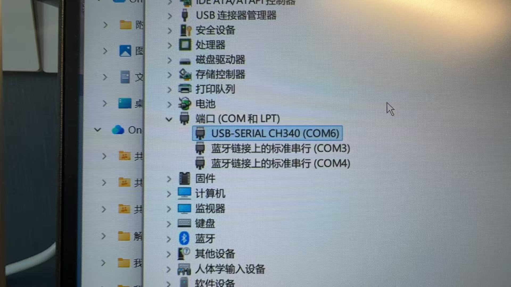

---

### 烧录软件的路径是默认设置吗？

**问题描述：**

系统中显示的烧录软件路径是否为默认设置，该路径从何而来。

**解决方案：**

**1. 路径说明**

- 烧录软件显示的路径通常是默认安装路径
- 路径由安装程序自动设置
- 可以在软件设置中修改默认路径

**2. 路径修改方法**

- 打开烧录软件的设置菜单
- 找到"默认路径"或"文件路径"选项
- 浏览选择新的固件文件存储位置
- 保存设置使修改生效

**3. 路径建议**

- 选择英文路径，避免中文路径
- 使用简单的目录结构
- 确保路径所在磁盘空间充足
- 避免包含特殊字符的路径

**注意事项：**

- 默认路径通常在Program Files或Documents下
- 修改路径后需要重新打开软件
- 建议将固件文件分类存储便于管理

### 烧录时是否需要焊接模块？

**问题描述：**

使用杜邦线连接不稳定，考虑焊接模块但又担心无法插拔。

**解决方案：**

**推荐做法：**

- 最好将模块焊接到PCB板上以确保连接稳定
- 焊接可以完全避免2.0mm与2.54mm接口不匹配的问题
- 焊接后的连接更可靠，烧录成功率更高

**焊接注意事项：**

- 5V电源线不需要焊接在模块端
- CH340（USB转串口模块）端保持可插拔
- 只焊接模块的信号线（TXD、RXD、GND）
- 保留5V线的可插拔性，方便断电重启

**临时解决方案：**

- 如果暂时无法焊接，可尝试：

    - 轻轻按压杜邦线确保接触
    - 使用橡皮筋固定连接
    - 购买专用的2.0转2.54转接线

### 芯片变黄后为何不能拔插5V电源？

**问题描述：**

烧录过程中芯片变黄（进入烧录模式），此时拔插5V电源会导致烧录失败。

**解决方案：**

**正确操作流程：**

- 芯片变黄表示已进入烧录模式
- 此时不要进行任何电源插拔操作
- 保持连接状态，等待烧录完成
- 如需重新烧录，应先完全断开电源，重新上电

**注意事项：**

- 进入烧录模式后，模块处于特殊状态
- 任何电源中断都会导致烧录中断或失败
- 建议烧录前确认所有连接稳定

### SU-03T固件烧录时提示"ICEman connect failed, return!"

**问题描述：**

在使用蜂鸟M调试器烧录SU-03T固件时，烧录软件提示"ICEman connect failed, return!"错误，导致烧录失败。

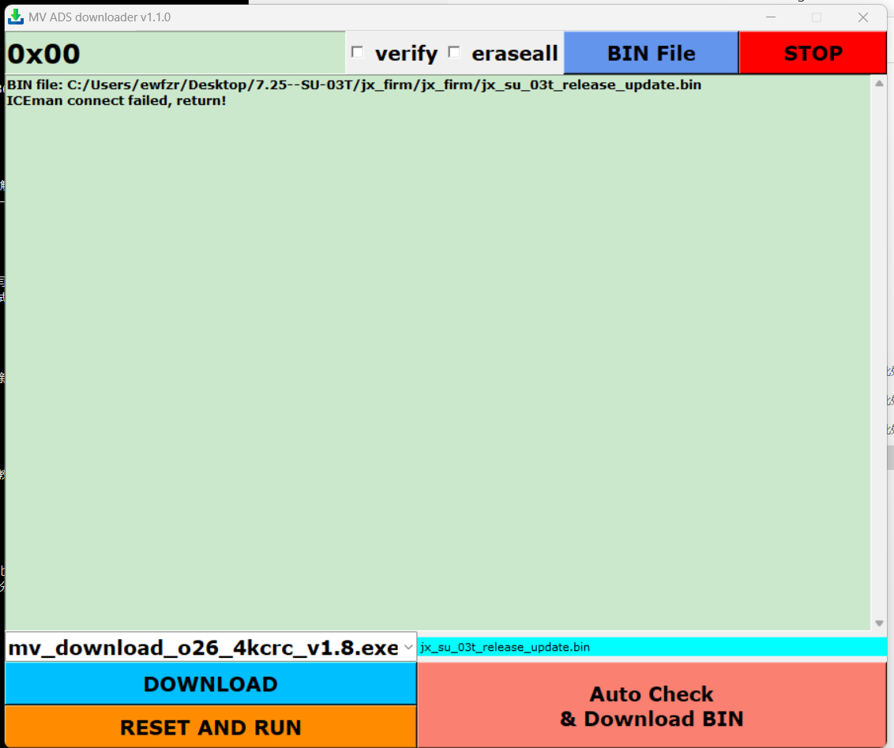

**解决方案：**

- 检查是否使用了蜂鸟M调试器进行烧录
- 选择不带update后缀的bin文件进行烧录
- 确认调试器与模块的连接线路正确
- 检查串口驱动是否正常安装

**注意事项：**

- 蜂鸟M调试器需要使用特定的固件文件
- 如使用其他烧录工具，请选择对应的固件版本
- 确保烧录工具版本与固件兼容

### 串口1与烧录口冲突解决

**问题描述：**

需要使用串口1（B6/B7引脚）进行正常通信，同时需要通过串口进行烧录，担心串口冲突导致无法烧录。

**解决方案：**

**配置方法：**

- 烧录口可以配置为串口使用，不影响CH340烧录
- B6/B7引脚可以同时用于烧录和正常串口通信
- 在线配置时，选择"烧录器+串口"模式

**操作步骤：**

1. 在平台配置时，将烧录口设置为串口功能
2. 保持B6/B7引脚连接到烧录器
3. 烧录完成后，B6/B7可直接用作串口通信
4. 无需额外配置切换

**注意事项：**

- 此配置仅支持在线烧录方式
- 烧录时确保其他外围电路不影响B6/B7信号
- 配置完成后，同一引脚可复用为烧录和通信功能

### SU-03T1与SU-03T有什么区别？

**问题描述：**

官网找不到SU-03T1的相关资料，不确定该型号与SU-03T的区别和功能提升。

**解决方案：**

**型号说明：**

- SU-03T1与SU-03T基本相同
- 可以直接当作SU-03T使用
- 无特殊功能差异

**使用建议：**

- 按照SU-03T的文档进行开发
- 使用相同的烧录工具和固件
- 引脚定义和功能完全一致

**注意事项：**

- SU-03T1不是新型号或升级版
- 无需专门寻找SU-03T1的资料
- 开发过程中直接参考SU-03T即可

---

### SU-03T模块烧录失败怎么办？

**问题描述：**

SU-03T模块烧录失败，尽管接线正确，但无法成功下载固件。

**解决方案：**

**基础排查步骤：**

1. **文件位置检查**
    - 将烧录文件（update.bin）放置在桌面
    - 避免路径过深或含中文字符
    - 确保文件权限正常

2. **接线确认**
    - B6引脚接RXD（烧录器TX）
    - B7引脚接TXD（烧录器RX）
    - VCC接5V，GND接地


3. **冷启动操作**
    - 断开5V电源线
    - 重新插入5V电源（冷启动）
    - 立即开始烧录操作

**常见失败原因：**

1. **软件问题**
    - 使用最新版烧录工具
    - 检查COM口驱动是否正常
    - 关闭其他串口调试软件

2. **硬件问题**
    - 检查杜邦线质量
    - 确认无虚焊或接触不良
    - 测量线路连通性

3. **模块状态**
    - 确认模块未损坏
    - 使用万用表测量关键点电压
    - 检查3.3V输出是否正常

**注意事项：**

- 烧录必须冷启动，热插拔可能导致失败
- 文件路径建议使用桌面，避免权限问题
- 多次失败时重点检查硬件连接

### 芯片焊接到PCB后无法烧录怎么办？

**问题描述：**

芯片焊接到电路板后无法进行程序烧录，且供电电压超过5.5V时芯片无响应。

**解决方案：**

**烧录失败处理：**

1. **检查外围电路影响**
    - 将芯片拆下单独测试
    - 确认外围器件是否干扰烧录
    - 检查A25、A26、A27等引脚连接

2. **电压问题排查**
    - 测量实际供电电压
    - 确认电压不超过5V（安全范围）
    - 检查电源稳定性

**供电要求：**

- **工作电压**：建议3.3V-5V
- **安全上限**：不要超过5.5V
- **过压风险**：超过5.5V可能永久损坏芯片

**操作建议：**

- 焊接前先测试芯片功能
- 使用LDO等稳压芯片供电
- 避免直接使用Hub扩展口供电

**注意事项：**

- 芯片过压损坏后无法修复
- 建议焊接前完成所有功能测试
- 外围电路设计需参考官方评估板

---

### SU-03T模块烧录失败且烧录器显示红灯怎么办？

**问题描述：**

SU-03T模块烧录失败，烧录器指示灯为红灯，无法通过串口工具识别设备，同时模块上电后能正常响应唤醒词但无法进行固件烧录。

**解决方案：**

**1. 接线确认**

- SU-03T的正确引脚定义：B6是RX，B7是TX
- USB转TTL连接：TXD→B6(RX)，RXD→B7(TX)
- 使用340芯片的USB转串口模块即可

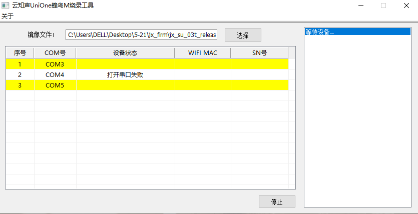

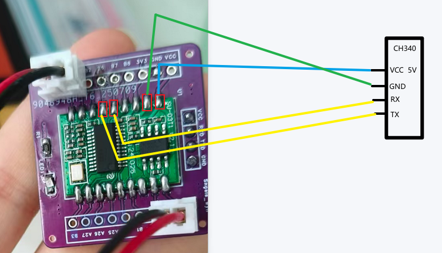

**2. 烧录器状态判断**

- 红灯：无法识别设备或未进入烧录模式
- 绿灯：正常识别，可以开始烧录
- 红灯可能原因：接线错误、接触不良、未冷启动

**3. 冷启动操作**

- 烧录需要冷启动：断开电源重新上电
- 拔掉电源线再重新插入，触发烧录模式
- 冷启动时串口连接不能断开

**4. 模块功能验证**

- 模块出厂自带演示程序，可正常唤醒
- 出厂唤醒词为"你好小美"（不是"你好小桂"）
- 可通过"你好小美"、"你好小智"、"小智精灵"、"吉祥如意"等唤醒

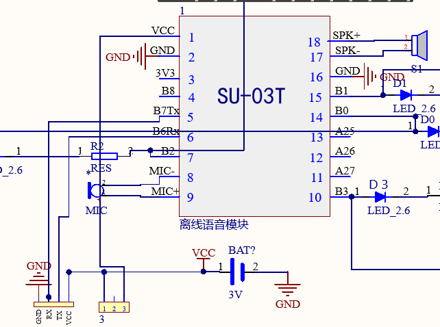

**5. 常见问题排查**

- 检查杜邦线是否断裂或接触不良
- 用万用表测量线路连通性
- 尝试更换USB转串口模块
- 检查COM端口驱动是否正常安装

**6. 硬件选型建议**

- 麦克风选择：注意灵敏度、信噪比参数
- 喇叭匹配：4Ω喇叭需>2.4W，8Ω喇叭需>1.6W

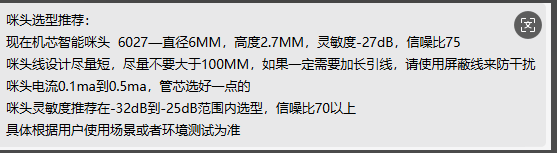


**注意事项：**

- 烧录失败多数是接线或接触问题
- 模块能正常唤醒说明硬件基本正常
- 冷启动是进入烧录模式的必要条件
- 多次尝试仍失败时考虑更换硬件

---

## 串口引脚配置

### SU-03T哪两个引脚是全双工高速串口？

**问题描述：**

需要确认SU-03T模块的UART引脚配置，特别是全双工高速串口的位置。

**解决方案：**

**1. UART引脚说明**

- **UART1_TX/RX引脚**：B6/B7
- **最高速率**：3Mbps
- **通信方式**：全双工

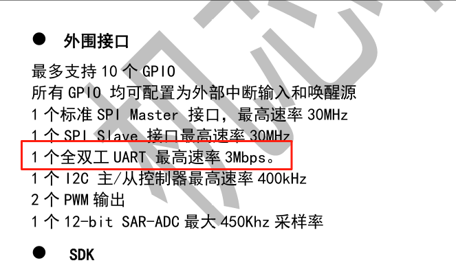

**2. 引脚功能**

- **B6 (TX)**：UART1发送引脚
- **B7 (RX)**：UART1接收引脚
- **专用引脚**：B6和B7是UART专用引脚，建议用于串口通信

**3. 使用建议**

- 高速通信时优先使用B6/B7引脚
- 确保波特率配置正确（最高支持3Mbps）
- 如需多串口，可使用其他UART引脚但速率可能较低

**注意事项：**

- B6/B7是专用UART引脚，不建议用作其他功能
- 使用其他引脚进行串口通信可能速率受限
- 连接时注意TX-RX交叉连接

---

## 串口通讯问题

### 为什么SU-03T接收到串口数据后无法语音播报？

**问题描述：**

向SU-03T模块发送串口数据后，模块无法实现语音播报功能。

**解决方案：**

**电平信号要求：**

- SU-03T模块只能接收TTL电平信号（3.3V）
- 不能直接接收RS232电平信号
- 需要使用RS232转TTL模块进行电平转换

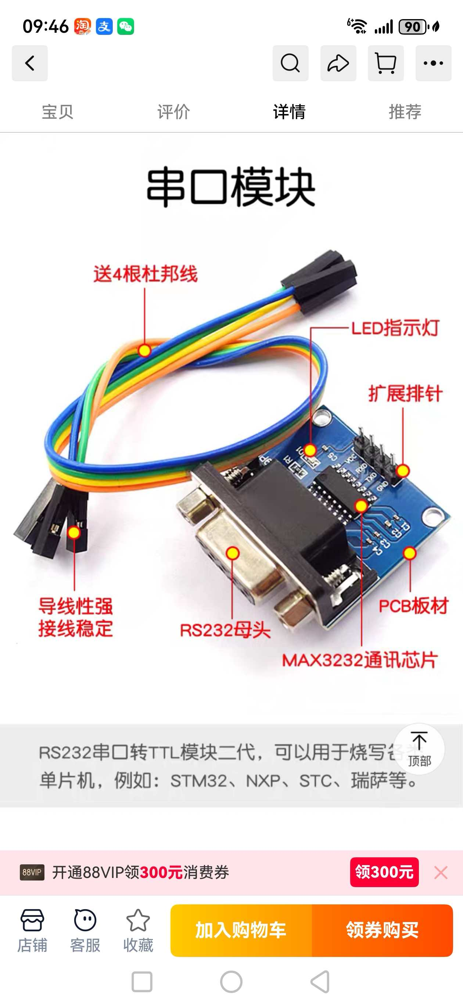

**正确连接方式：**

1. **信号转换**
    - 电脑/PLC的RS232接口 → RS232转TTL模块 → SU-03T模块
    - 确保信号电平匹配

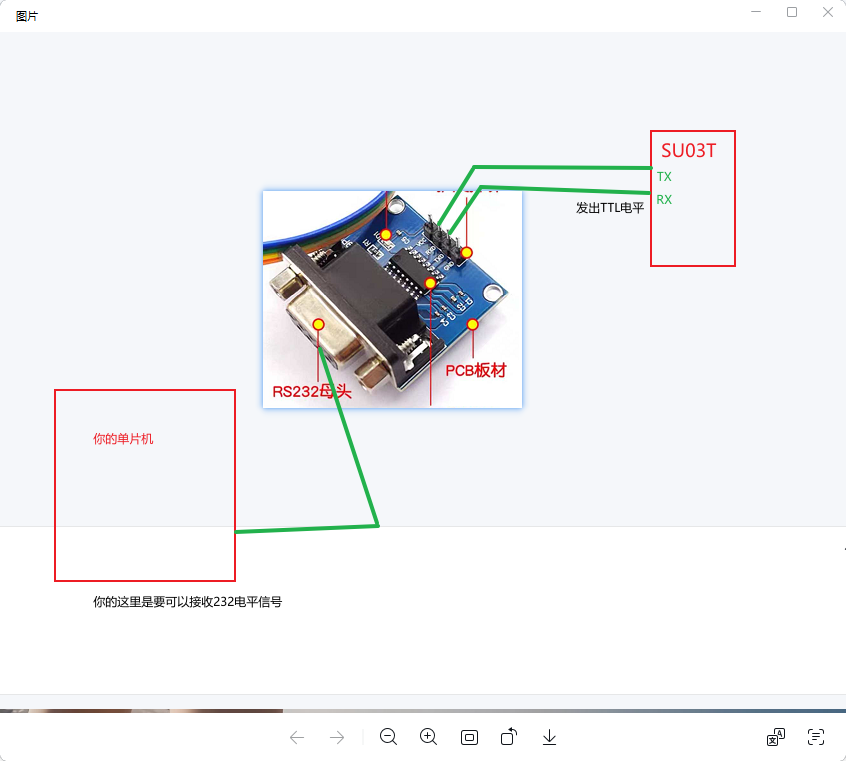

2. **串口输出配置**
    - 在固件平台配置串口输出功能
    - 设置控制方式为"端口输出"
    - 配置控制类型为"UART1_TX"
    - 数据格式为十六进制

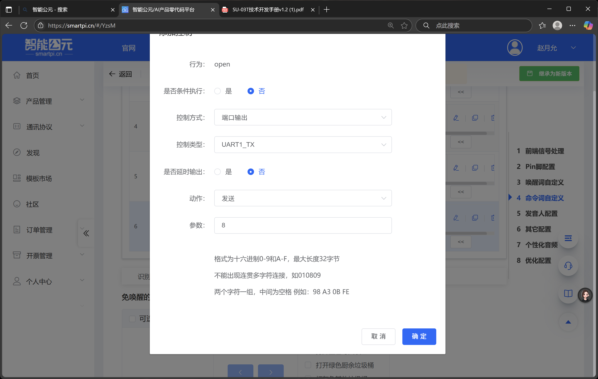

**注意事项：**

- 232电平无法直接与SU-03T通信
- 必须进行电平转换后才能正常工作
- 通信参数需匹配（波特率、数据位等）
- 测试建议先使用串口助手验证连接

---

### SU-03T与外部串口设备通讯失败怎么办？

**问题描述：**

SU-03T与外部串口开关通讯模块通讯时，串口助手XCOM和MODBUS POLL均无法接收信号，通讯超时。

**解决方案：**

1. **检查电平匹配**：

    - SU-03T串口电压为3.3V
    - 确认外部设备支持3.3V电平
    - 如为5V设备需要电平转换

2. **验证串口连接**：

    - 确认TX-RX交叉连接（SU-03T的TX接设备RX）
    - 检查GND共地
    - 使用示波器或逻辑分析仪验证信号

3. **检查通讯协议**：

    - MODBUS RTU需要正确的设备地址
    - 波特率、数据位、停止位、校验位需匹配
    - 确认发送的数据格式正确

**注意事项：**

- SU-03T串口电压为3.3V，不能直接连接5V设备
- 通讯前确保模块已正常初始化
- 建议先使用简单指令测试连接

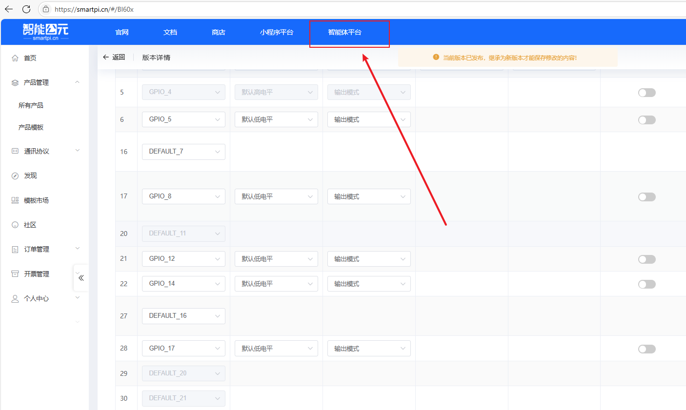

## 烧录问题

### SU-03T固件烧录详细教程在哪里？

**问题描述：**

需要获取SU-03T板子的固件烧录详细教程。

**解决方案：**

**官方教程链接**：

- 访问智能公元帮助文档：https://help.aimachip.com/docs/tutorials-and-sample-firmware/tutorials-and-sample-firmware-1g9tpjpd8gfjt
- 包含完整的烧录步骤和注意事项
- 可根据实际需求选择性查看相关章节

**基础烧录流程**：

1. **硬件连接**
    - B6引脚接RXD（烧录器TX）
    - B7引脚接TXD（烧录器RX）
    - VCC接5V，GND接地

2. **烧录操作**
    - 使用UniOneUpdateTool.exe烧录工具
    - 选择正确的COM端口
    - 加载update.bin固件文件
    - 点击烧录后立即进行冷启动（断电再上电）

**注意事项：**

- 官方教程包含各类问题的解决方法
- 烧录前确保文件路径不含中文字符
- 冷启动是成功烧录的关键步骤

---

### SU-03T应该烧录哪个固件文件？

**问题描述：**

不确定应该选择jx_su_03t_release.bin还是jx_su_03t_release_update.bin文件进行烧录。

**解决方案：**

使用jx_su_03t_release.bin文件烧录。

- **烧录后功能**：

    - 开机播报：欢迎回家
    - 唤醒词：小智小智

- **控灯固件**：

    - 有支持控灯功能的固件
    - 需要单独提供或定制

**注意事项：**

- 确认烧录的是正确的.bin文件
- 烧录前确保文件路径无中文
- 保留原固件文件备份

---

### SU-03T烧录工具显示通信失败怎么办？

**问题描述：**

使用云知声UniOne烧录工具对SU-03T模块进行固件烧录时，设备状态显示"通信失败"，无法完成烧录。

**解决方案：**

**1. 路径问题排查**

- 检查镜像文件路径是否包含中文字符
- 中文路径会导致烧录工具无法正确识别文件
- 将update.bin文件复制到桌面或英文路径下

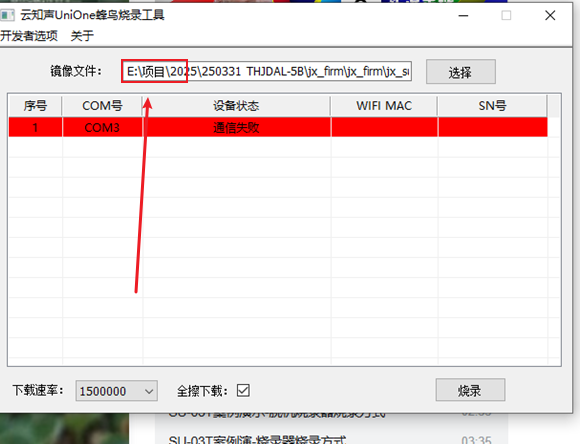

*镜像文件路径包含中文字符，会导致烧录失败*

**2. 正确烧录流程**

```
步骤1：板子按钮处于按下状态（不要松开）
步骤2：插上USB连接电脑
步骤3：烧录软件添加update.bin文件
步骤4：点击软件烧入按钮
步骤5：对应的COM口变黄后，按下板子按钮
步骤6：烧录进度条走完，显示烧录成功
```

**3. 常见错误操作**

- ❌ 按下按钮→插USB→点击烧入→2S松开按钮（错误）
- ✅ 按住按钮→插USB→添加文件→点击烧入→COM口变黄→松开按钮（正确）

**4. 烧录失败排查**

- 确认使用的是update.bin文件（非中文路径）
- 检查USB线和端口是否正常
- 尝试更换USB端口
- 确认模块供电稳定

**注意事项：**

- 烧录前必须将固件文件放在英文路径下
- 按钮的操作时机很重要，COM口变黄后才松开
- 如果持续失败，可能是硬件问题，需要返厂检修

---

### 使用SU-30T的烧录工具会导致SU-03T通信失败吗？

**问题描述：**

使用云知声UniOne蜂鸟烧录工具烧录SU-03T模块时，在COM5端口显示通信失败，更换串口后问题依旧存在。

**解决方案：**

**1. 确认烧录工具来源**

- SU-03T应使用专用烧录工具，而非SU-30T的工具
- 不同型号的烧录工具不通用
- 需从SDK或官方渠道获取正确的SU-03T烧录工具

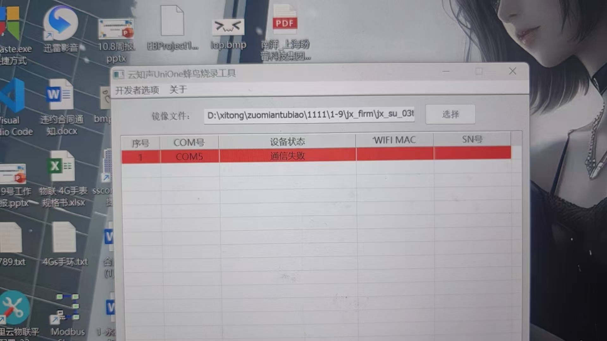

*烧录工具显示通信失败*

**2. 正确的烧录工具获取**

- SU-03T的烧录工具位于SDK文件中
- 文档中的"01、烧录软件.zip"可能是SU-30T的工具
- SU-03T和SU-30T使用不同的烧录工具

**3. 工具识别方法**

- 检查工具支持的型号列表
- SU-30T工具不包含SU-03T选项
- 使用不匹配的工具会导致通信失败

**4. 替代解决方案**

- 下载完整的SU-03T SDK包
- 使用SDK中提供的下载工具
- 联系官方技术团队获取正确的烧录工具

**注意事项：**

- 各型号的烧录工具严格对应，不可混用
- 文档资料需确认对应的型号，避免误用
- 若使用了错误工具导致无法通信，更换为正确的专用工具即可

---

### SU-03T烧录时设备无响应如何处理？

### SU-03T V2.2黑色板串口烧录失败怎么办？

**问题描述：**

使用SU-03T V2.2黑色板时，通过云知声UniOne蜂鸟M烧录工具无法成功烧录固件，设备未响应烧录操作。

**解决方案：**

**1. 连接检查**

- 先连接RX、TX、GND三根线
- 点击烧录后再给VCC供电（上电时序）
- 确认COM端口选择正确

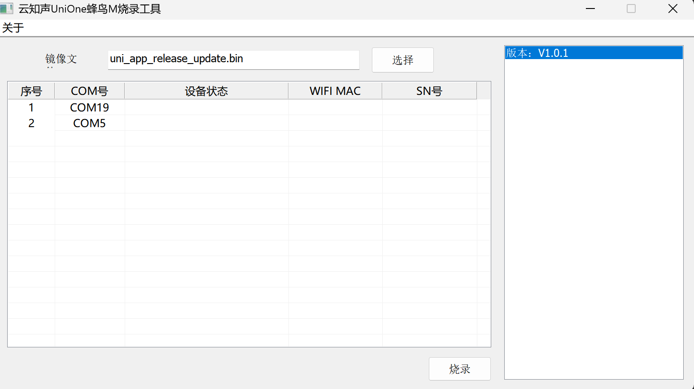

**2. 硬件版本确认**

- V2.2黑色板与V2.1绿色板烧录方式相同
- 确认使用的烧录工具版本
- 检查USB转串口驱动是否正常

**3. 固件问题**

- 重新生成固件文件测试
- 确认固件生成时间（近期生成的更兼容）
- 使用update版本固件进行测试

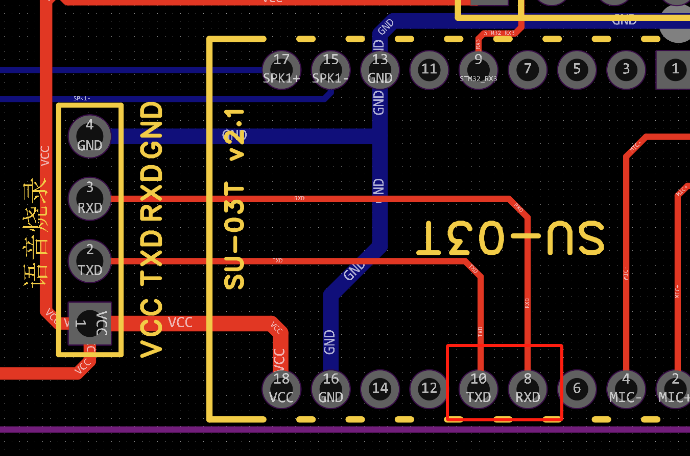

**4. 烧录步骤**

- 连接线但不供电
- 打开烧录工具选择固件和COM口
- 点击烧录按钮
- 立即给VCC供电（时序很重要）

**注意事项：**

- V2.2版本可能需要特定的上电时序
- 固件文件过期可能导致烧录失败
- 如持续失败，尝试更换USB端口或电脑

---

### SU-03T烧录成功后无法正常工作，如何判断芯片状态？

**问题描述：**

SU-03T芯片在烧录后无法正常工作，需要判断芯片是否烧录成功，同时存在供电异常问题。

**解决方案：**

**1. 芯片工作状态判断**

- **发热情况**：正常工作的芯片会有轻微发热
- **电流测量**：使用万用表测量工作电流
- **引脚电压**：检查关键引脚是否有正常电压输出

**2. 供电问题排查**

- 使用万用表测量VCC引脚电压
- 确认供电电压在3.6-5.5V范围内
- 检查电源输出电流是否足够

**3. 烧录验证方法**

- 重新烧录已知正常的固件
- 观察烧录过程是否顺利完成
- 烧录后立即测试基本功能

**4. 芯片好坏判断**

```
正常芯片特征：

- 有轻微发热
- 工作电流正常
- 引脚有电压输出
- 可以正常通信

异常芯片特征：

- 完全不发热
- 无工作电流
- 引脚无电压
- 无法通信
```

**注意事项：**

- 测量电流时需要串联万用表
- 确保测试环境供电稳定
- 多个芯片对比测试更容易判断问题
- 硬件损坏的芯片需要更换

---

### SU-03T固件包不是bin文件，如何处理？

**问题描述：**

下载的固件包不是.bin文件，无法直接用于烧录工具，且烧录工具无法识别设备。

**解决方案：**

**1. 固件文件解压**

- 下载的固件包是压缩格式（.tar.gz或.rar）
- 需要解压两次才能获取.bin文件
- 第一次解压：解压.tar.gz或.rar文件
- 第二次解压：解压内层的压缩文件

**2. 正确的烧录文件**

- SU-03T需要使用带update的.bin文件
- 文件名通常为：update.bin
- 确保文件路径不含中文字符

**3. 烧录工具使用**

- 使用UniOneUpdateTool.exe烧录工具
- 选择正确的COM端口
- 导入解压后的update.bin文件

**4. 设备识别问题**

- 如果设备未识别，拔插一下VCC电源
- 确认USB转串口驱动正常
- 检查COM端口是否被占用

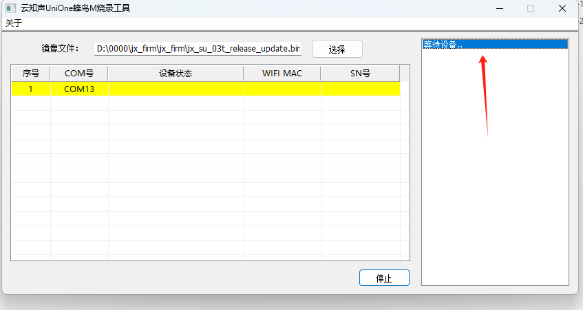

*设备成功识别后的界面*

**注意事项：**

- 固件文件必须放在英文路径下
- 解压后确认文件完整性
- 使用带update后缀的固件文件
- 烧录时确保连接稳定

---

### SU-03T固件包需要解压两次才能使用吗？

**问题描述：**

下载的固件包不是bin格式，询问是否可以直接放入烧录工具使用。

**解决方案：**

**1. 固件包格式**

- 下载的固件包是压缩格式（.tar.gz或.rar）
- 不能直接用于烧录工具
- 必须解压后获取bin文件

**2. 解压步骤**

- **第一次解压**：解压.tar.gz或.rar压缩包
- **第二次解压**：解压内层的压缩文件
- **最终文件**：获得update.bin文件用于烧录

**3. 注意事项**

- SU-03T需要使用update.bin文件
- 不能使用其他格式的文件烧录
- 解压后确认文件完整性

---

### 烧录文件是jx_firm.tar.gz压缩包怎么办？

**问题描述：**

尝试烧录时发现文件名为'jx_firm.tar.gz'，显示为压缩存档文件夹，无法直接用于烧录。

**解决方案：**

**1. 文件类型识别**

- jx_firm.tar.gz是压缩包文件
- 烧录工具只能识别.bin文件
- 需要先解压获取固件文件

**2. 正确解压步骤**

1. **解压tar.gz文件**
    - 使用7-Zip或WinRAR等工具
    - 解压后得到jx_firm文件夹

2. **查找bin文件**
    - 进入jx_firm文件夹
    - 找到update.bin或类似名称的bin文件
    - 这才是真正的烧录文件

3. **烧录操作**
    - 选择解压出的.bin文件
    - 确保文件路径不含中文
    - 使用标准烧录流程操作

**注意事项：**

- 不要直接选择压缩包进行烧录
- 解压后确认bin文件完整性
- 建议将bin文件复制到简单路径使用

---

### UniOneUpdateTool.exe是串口烧录工具吗？

**问题描述：**

询问文件夹中的UniOneUpdateTool.exe是否为串口烧录工具。

**解决方案：**

**1. 工具确认**

- **UniOneUpdateTool.exe**：是的，这是官方烧录工具
- 用于SU-03T等模块的串口烧录
- 支持通过COM端口进行固件更新

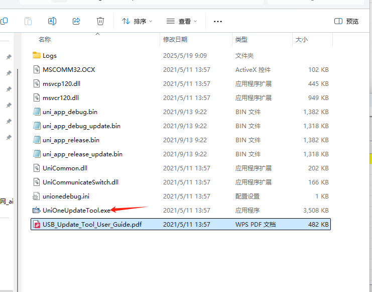

*烧录工具所在文件夹内容*

**2. 使用方法**

- 打开UniOneUpdateTool.exe
- 选择正确的COM端口
- 添加update.bin固件文件
- 点击烧录按钮开始烧录

**注意事项：**

- 确保USB转串口驱动已安装
- 选择正确的COM端口号
- 固件文件必须放在英文路径下

---

### SU-03T串口配置错误导致语音无法播放？

**问题描述：**

通过串口发送指令后SU-03T模块语音无法播放，经检查发现是串口配置错误导致。

**解决方案：**

**问题定位：**

- **配置缺失**：平台中未配置UART1_RX和UART1_TX为串口功能
- **端口误用**：GPIO引脚被配置为其他功能而非串口
- **参数错误**：串口参数（波特率等）设置不正确

**正确配置步骤：**

1. **配置UART引脚**：

    - 进入GPIO配置界面
    - 找到UART1_RX和UART1_TX
    - 将这两个引脚功能配置为"串口模式"

2. **设置串口参数**：

    - 波特率：9600
    - 数据位：8
    - 停止位：1
    - 校验位：无

3. **触发配置**：

    - 触发方式：选择"串口输入"
    - 串口选择：UART1_RX
    - 消息编号：设置唯一标识

4. **测试验证**：

    - 使用串口助手发送测试数据
    - 格式：AA 55 [消息号] [参数] 55 AA
    - 确认模块能正确响应

**注意事项：**

- 必须将UART1_RX和UART1_TX配置为串口功能
- 通信参数要与下位机匹配
- 测试消息的数据长度必须足够才能触发
- GPIO_B6和GPIO_B7是UART专用引脚，不要用作其他功能

---

### 烧录了错误的固件文件导致无法开机怎么办？

**问题描述：**

烧录了错误的固件文件后，设备无法正常开机播报，且生成了多个不同格式的固件文件，需要确认正确的固件文件类型及烧录方法。

**解决方案：**

必须烧录带update的固件文件才能正常工作。

**固件文件识别：**

1. **正确的固件文件**
    - 文件名包含"update"字样：如 `jx_su_03t_release_update.bin`
    - 这是可通过平台直接烧录的固件版本
    - 包含完整的启动和运行代码

2. **其他固件文件说明**
    - 不带update的固件可能是调试版本或部分文件
    - 不同烧录工具可能生成不同格式的文件
    - 只有update.bin才能保证完整功能


**烧录方法：**

1. **选择正确文件**
    - 确认使用 `*_update.bin` 文件
    - 避免使用调试或开发版本
    - 固件应来自智能公元平台或官方渠道

2. **烧录注意事项**
    - 确保烧录工具版本匹配
    - 检查硬件连接是否正确
    - 烧录完成后再测试功能

**问题预防：**

- 保留原始出厂固件备份
- 记录正常工作的固件版本
- 烧录前确认固件来源和用途
- 避免频繁更换不同版本的固件

---

### 模块烧录时一直显示"等待设备"怎么办？

**问题描述：**

烧录时设备无法被识别，一直处于"等待设备"状态，即使使用开发板时按复位按钮可以烧录，但目标模块无法自动进入烧录模式。

**解决方案：**

模块无法自动进入烧录模式，需要通过复位或断电操作触发。

**问题分析：**

1. **烧录模式说明**
    - 模块需要进入特定的烧录模式才能被识别
    - 开发板有复位按钮，可手动触发
    - 独立模块需要其他方式触发

2. **常见原因**
    - 模块未正确进入烧录模式
    - 串口连接问题
    - 电源时序不正确

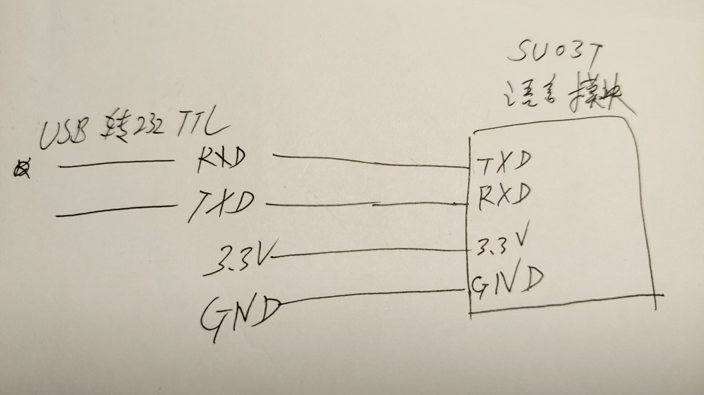

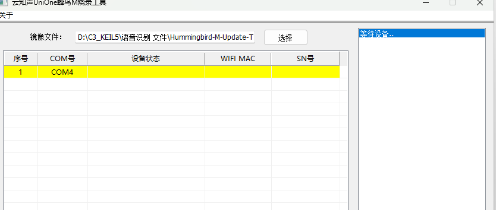

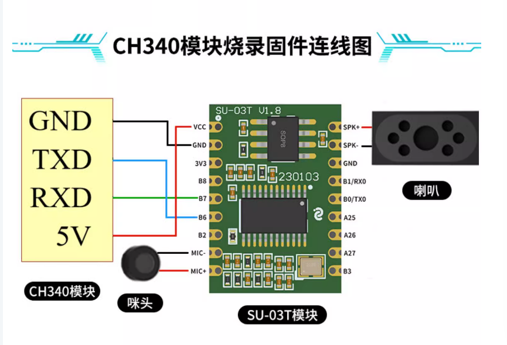

**解决方法：**

1. **5V供电要求**
    - SU-03T烧录必须使用5V供电
    - 3.3V供电可能导致无法进入烧录模式
    - 确保供电电流足够（1A以上）

2. **正确的接线方式**
    - CH340的5V → SU-03T的VCC
    - CH340的RXD → SU-03T的B7
    - CH340的TXD → SU-03T的B6
    - CH340的GND → SU-03T的GND

3. **烧录操作步骤**
    - 先连接好所有线路（除VCC）
    - 打开烧录工具，选择固件和COM口
    - 点击烧录按钮
    - 立即接通5V电源（冷启动）

4. **复位操作**
    - 点击烧录后，按模块复位按钮
    - 等待设备识别成功
    - 确认端口状态从灰色变为黄色

5. **断电触发**
    - 先连接烧录线
    - 打开烧录工具
    - 点击烧录后快速断开再接通5V电源

**注意事项：**

- 烧录成功前保持供电稳定
- 复位时机很重要，点击烧录后立即操作
- 如仍无法识别，检查串口驱动和硬件连接
- 不同模块可能需要多次尝试才能成功

---

### 解压固件文件提示内存不足怎么办？

**问题描述：**

尝试解压asr.gz固件文件时遇到"内存资源不足，无法完成此操作"错误，而同目录下的wifi.gz文件可以正常解压。

**解决方案：**

这是电脑端的问题，需要检查系统资源或重启电脑。

**问题分析：**

1. **错误原因**
    - 电脑内存不足或资源被占用
    - 解压工具临时空间不够
    - 系统资源分配问题

2. **文件差异说明**
    - asr.gz文件可能较大，需要更多资源
    - wifi.gz文件较小，能正常解压
    - 不是文件本身的问题

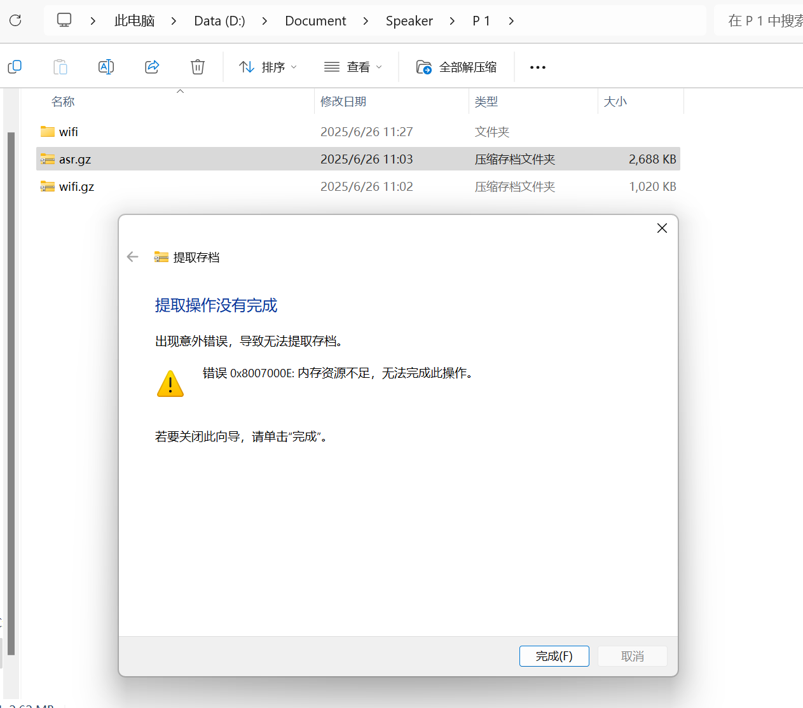

**解决方法：**

1. **系统操作**
    - 重启电脑释放内存资源
    - 关闭不必要的程序
    - 清理系统临时文件

2. **替代方案**
    - 直接从压缩包中拖出文件使用
    - 使用其他解压工具尝试
    - 复制文件到其他位置再解压

3. **注意事项**
    - 确保C盘有足够空间
    - 检查解压工具是否正常
    - 避免同时运行多个大型程序

**预防措施：**

- 定期清理系统垃圾文件
- 保持足够的硬盘空间
- 使用可靠的解压软件
- 避开太多后台程序

---

### 空的US516P6芯片无法串口烧录怎么办？

**问题描述：**

购买US516P6空芯片自行焊接后，无法通过串口正常烧录固件。

**解决方案：**

**1. 空芯片限制**

- 空芯片第一次无法通过串口烧录
- 需要先通过其他方式烧录引导程序
- 出厂已预烧录的芯片才能串口烧录

**2. 购买建议**

- 购买已预烧录固件的芯片
- 确认支持CH340烧录的版本
- 避免购买完全空白的芯片

**3. 替代方案**

- 使用SU-03T完整模块（含已烧录芯片）
- 购买支持串口烧录的版本
- 联系供应商确认芯片状态

**注意事项：**

- 空芯片需要专用烧录器，无法用串口烧录
- 自行焊接时要确保焊接质量
- 购买时确认芯片是否已预烧录固件

---

### SU-03T使用5V供电触发烧录失败怎么办？

**问题描述：**

使用5V供电电压触发管脚2时，无法成功烧录SU-03T芯片。

**解决方案：**

**1. 烧录方式说明**

- SU-03T不支持5V供电触发烧录
- 烧录必须通过专用烧录工具
- 供电电压用于正常工作，不是烧录触发

**2. 正确烧录方法**

1. **使用串口烧录**
    - 连接B6（RX）、B7（TX）到USB转串口
    - 使用UniOneUpdateTool工具
    - 通过冷启动进入烧录模式

2. **供电要求**
    - 烧录时提供5V工作电压
    - 确保供电稳定（1A以上）
    - 不要尝试用高电平触发烧录

**3. 注意事项**

- 管脚触发是工作模式功能，不是烧录功能
- 烧录必须使用专用工具和协议
- 购买芯片时确认是否支持串口烧录

---

### SU-03T串口烧录时接线错误怎么办？

**问题描述：**

使用串口烧录SU-03T模块时失败，经排查发现是将串口线接到了错误的引脚上。

**解决方案：**

**1. 正确的引脚连接**

使用CH340 USB转串口模块时，正确的连接方式为：

- CH340的5V → SU-03T的VCC
- CH340的RXD → SU-03T的B7
- CH340的TXD → SU-03T的B6
- CH340的GND → SU-03T的GND

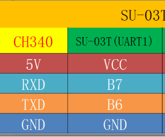

*CH340与SU-03T模块的正确接线方式*

**2. 常见接线错误**

- ❌ 将RXD接到B8引脚（B8不是串口引脚）
- ❌ 将TXD接到其他非串口引脚
- ✅ RXD必须接B7，TXD必须接B6

**3. 接线注意事项**

- SU-03T需要5V供电（不是3.3V）
- B6/B7是专用串口引脚，不能接其他位置
- 确保GND良好接地
- 接线前确认模块型号和引脚定义

**注意事项：**

- 烧录前先断开电源，完成接线后再供电
- 如果烧录失败，首先检查接线是否正确
- 不同版本的SU-03T引脚定义可能略有差异
- 使用万用表验证接线连通性

### 串口命令发送间隔多久合适？

**问题描述：**

使用单片机给语音模块发送串口指令时，存在间歇性失败问题，即使增加50ms延时也无法稳定工作。

**解决方案：**

**1. 间隔时间设置**

- **建议间隔**：200ms以上
- **测试方法**：从200ms开始测试，根据实际情况调整
- **失败原因**：间隔过短可能导致模块处理不过来

**2. 调试步骤**

1. **验证串口通信**：

    - 使用串口助手连接单片机
    - 确认数据发送正常
    - 检查波特率等参数

2. **检查触发配置**：

    - 确认串口输入触发已正确配置
    - 验证消息编号匹配
    - 检查是否有执行动作

3. **测试不同间隔**：

    - 50ms：可能过短，容易失败
    - 200ms：推荐起始值
    - 500ms：如果200ms仍有问题可尝试

**注意事项：**

- 语音模块处理串口指令需要时间
- 建议间隔不少于200ms
- 确保每条指令完全处理完成再发送下一条
- 使用示波器或逻辑分析仪可帮助调试

---

### SU-03T1模块烧录时无法识别串口怎么办？

**问题描述：**

烧录软件后无法识别SU-03T1模块的串口，需要相应的驱动程序支持。

**解决方案：**

**1. 驱动程序安装**

- CH340驱动程序位于开发包的"10. CH340安装包"文件夹中
- 从官方文档资源中获取对应驱动
- 根据操作系统选择对应版本（32位/64位）

**2. 驱动安装步骤**

- 解压CH340驱动安装包
- 运行对应系统的安装程序
- 安装完成后重启电脑
- 在设备管理器中确认COM端口显示

**3. 串口识别验证**

- 连接USB转串口模块到电脑
- 检查设备管理器中是否出现新COM端口
- 记录COM端口号（如COM3、COM4等）
- 在烧录软件中选择正确的COM端口

**4. 常见问题处理**

- 驱动安装失败：尝试以管理员身份运行
- 无法识别端口：更换USB接口或数据线
- 端口号异常：卸载驱动重新安装

**注意事项：**

- 不同操作系统需要对应版本的驱动程序
- 部分Windows 10/11系统可能需要禁用驱动签名
- 确保使用USB数据线而非充电线
- 如问题持续，尝试使用其他USB转串口芯片

---

### SU-03T模块如何实现一个端口输出三个不同脉宽的脉冲？

**问题描述：**

询问SU-03T模块是否支持单个端口输出三个不同脉宽的脉冲信号。

**解决方案：**

**实现方式确认**

- SU-03T支持通过串口输入触发后输出特定脉冲
- 可以在不同状态下输出不同脉宽的脉冲
- 单个端口无法同时输出多个不同脉宽

**具体实现方法**

1. **分时输出方案**
    - 在不同时间点输出不同脉宽
    - 通过软件逻辑控制输出时序
    - 适合时序要求不严格的场景

2. **状态触发方案**
    - 根据模块不同工作状态输出
    - 结合语音识别结果控制
    - 实现条件化的脉冲输出

**注意事项：**

- 需要在固件平台中配置串口输出功能
- 脉冲宽度和频率需在允许范围内
- 建议使用逻辑分析仪验证输出波形
- 复杂的时序控制可能需要外部单片机协助

---

### SU-03T烧录时显示多个COM口失败怎么办？

**问题描述：**

烧录SU-03T程序时，烧录工具显示多个COM口状态为"打开串口失败"，无法正常烧录。

**解决方案：**

**1. 检查硬件连接**

- **供电检查**：确认已进行VCC拔插操作
- **COM口数量**：多个COM口可能由驱动问题导致
- **硬件连接**：检查USB转串口模块连接

**2. 排查步骤**

1. **重新安装驱动**：

    - 卸载所有COM口驱动
    - 重新安装CH340或对应驱动
    - 检查设备管理器中的COM口状态

2. **单一COM口测试**：

    - 拔掉其他USB设备
    - 只保留烧录用的USB转串口
    - 重新识别COM口

3. **接线检查**：

    - 确认B6/B7接线正确
    - 检查是否有接触不良
    - 验证供电为5V

**3. 注意事项**

- 烧录前需要先断电再上电
- 避免使用USB延长线
- 确认模块型号与固件匹配
- 尝试更换USB端口或电脑

---

### 烧录时杜邦线接触不良怎么办？

**问题描述：**

使用杜邦线连接语音模块进行烧录时，出现接触不良问题，导致烧录失败。检查发现杜邦线间距（2.54mm）与模块排针（2.0mm）不匹配。

**解决方案：**

**1. 问题原因**

- **引脚不匹配**：标准杜邦线为2.54mm间距
- **模块规格**：SU-03T等模块使用2.0mm排针
- **接触不良**：间距不匹配导致连接不可靠

**2. 解决方法**

1. **焊接连接**（推荐）：

    - 将排针直接焊到模块上
    - 使用合适间距的连接器
    - 确保焊接牢固无虚焊

2. **使用转接板**：

    - 制作2.0mm转2.54mm转接板
    - 或购买专用转接器
    - 避免直接使用不匹配的连接线

3. **临时方案**：

    - 小心调整杜邦线接触
    - 确保每个引脚都接触良好
    - 仅用于测试，不建议长期使用

**3. 正确的烧录连接**

- **VCC**：5V供电
- **GND**：共地
- **TXD**：连接B7（RX）
- **RXD**：连接B6（TX）
- **PWR**：连接PWR引脚

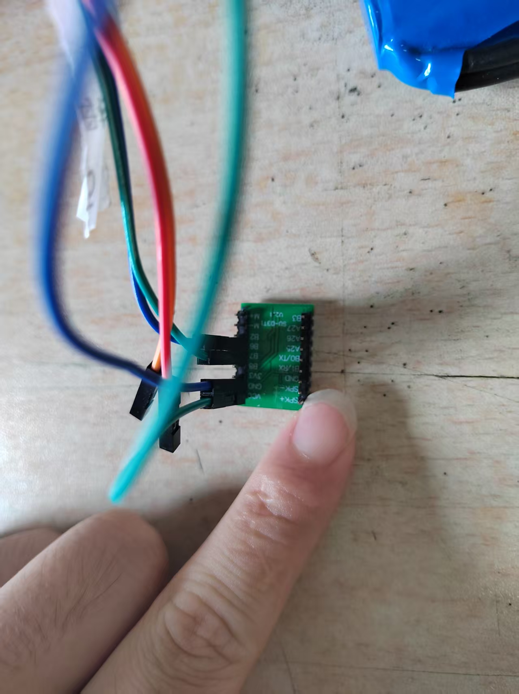

*2.54mm杜邦线与2.0mm排针不匹配*

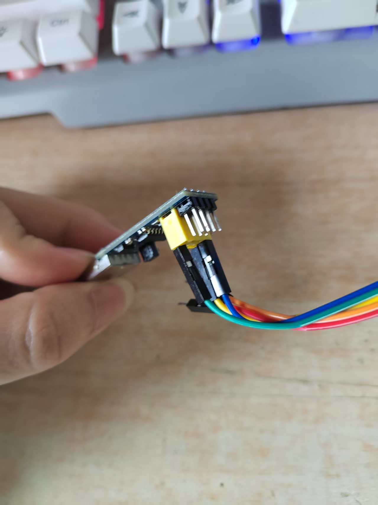

*建议直接焊接排针确保可靠连接*

**注意事项：**

- 强烈建议焊接而非使用杜邦线
- 如必须使用杜邦线，要确保每个引脚接触良好
- 烧录前用万用表检查连通性
- 长期使用建议制作专用转接头

---

### SU-03T烧录时需要剪断连接线吗？

**问题描述：**

在使用4针连接器进行烧录时，不确定是否需要对连接线进行剪断或修改。

**解决方案：**

**连接线类型确认：**

- 标准杜邦线接口为2.54mm间距
- SU-03T模块使用2.0mm排针
- 直接使用可能接触不良

**处理方式：**

1. **检查连接器类型**
    - 4针白色连接器如果是2.54mm接口，需要剪断改接
    - 如果是2.0mm专用连接器，可直接使用

2. **线缆处理方法**
    - 剪断连接器一端，露出线芯
    - 分别焊接到模块对应引脚
    - 或购买2.0mm转2.54mm转接头

**注意事项：**

- 剪线前确认连接器规格
- 焊接时注意线序不要接错
- 保留未剪断的一端用于连接USB转串口模块

---

### SU-03T烧录线需要如何处理？

**问题描述：**

使用普通杜邦线进行烧录时，需要对连接线进行特殊处理才能确保正常连接。

**解决方案：**

**线缆处理方法：**

1. **剪断改接法**
    - 将杜邦线一端的连接器剪断
    - 剥出线芯，分别焊接到模块引脚
    - 确保焊接牢固，避免虚焊

2. **接口适配方案**
    - 购买2.54mm转2.0mm转换头
    - 使用专用烧录转接板
    - 直接焊接排针到模块

**注意事项：**

- 剪线时保留足够长度用于焊接
- 确认线序对应，避免接反
- 焊接后用万用表测试连通性

---

### 普通杜邦线能直接用于SU-03T烧录吗？

**问题描述：**

使用普通杜邦线进行烧录时，不确定是否可以直接使用或需要特殊处理。

**解决方案：**

**接口兼容性问题：**

- SU-03T模块排针间距为2.0mm
- 标准杜邦线间距为2.54mm
- 直接使用会导致接触不良


**使用建议：**

1. **短期测试**
    - 可尝试小心插入，确保每个针脚接触
    - 用胶带或橡皮筋固定连接
    - 仅用于临时测试

2. **长期使用方案**
    - 焊接2.0mm排针到模块
    - 购买专用转接线
    - 制作转接板

**注意事项：**

- 接触不良可能导致烧录失败
- 长期使用建议焊接而非使用杜邦线
- 选择合适间距的连接器确保可靠连接

---

### SU-03T烧录接口排针间距是多少？

**问题描述：**

需要确认SU-03T模块的烧录接口排针间距，以判断是否可以直接使用标准杜邦线。

**解决方案：**

**接口规格说明：**

- SU-03T模块接口排针间距为2.54mm
- 标准杜邦线间距为2.54mm
- 两者规格完全匹配，可以直接使用

**直接连接方式：**

1. **无需焊接模块端**
    - 2.54mm间距的杜邦线可直接插入
    - 接触良好，不需要焊接
    - 方便插拔和重复使用

2. **连接要点**
    - 确保杜邦线质量良好
    - 插入时对准引脚，避免歪斜
    - 检查每个引脚是否完全插入

**注意事项：**

- CH340端的连接器保持标准2.54mm
- 连接前断开电源
- 如接触不良，检查杜邦线是否老化

---

### SU-03T烧录问题有哪些替代解决方案？

**问题描述：**

除了剪断改接烧录线外，询问是否有其他解决方案可以处理烧录连接问题。

**解决方案：**

**替代方案选择：**

1. **购买专用烧录线**
    - 搜索2.0mm转2.54mm转接线
    - 电商平台均有销售
    - 选择质量可靠的成品线

2. **使用开发板**
    - 购买SU-03T开发板
    - 开发板自带转接板
    - 可直接使用标准杜邦线

3. **自制转接板**
    - 制作2.0mm转2.54mm转接PCB
    - 焊接排针和排母
    - 实现标准接口转换

**方案对比：**

- **专用线**：最简单，成本较低
- **开发板**：功能完整，便于调试
- **转接板**：可重复使用，适合批量

**注意事项：**

- 选择方案时考虑使用频率
- 开发板方案适合长期开发
- 转接板需要一定DIY能力

---

### SU-03T开发板包含哪些烧录配件？

**问题描述：**

询问开发板解决方案的具体内容，了解是否包含烧录所需的转接板。

**解决方案：**

**开发板配件说明：**

1. **核心配件**
    - SU-03T开发板主体
    - 内置转接板模块
    - 标准烧录接口

2. **接口规格**
    - 转接板提供2.54mm标准接口
    - 兼容市面上所有杜邦线
    - 无需额外改装即可使用

3. **使用优势**
    - 即插即用，方便快捷
    - 稳定可靠的连接
    - 适合频繁烧录调试

**购买建议：**

- 购买时确认包含转接功能
- 选择完整开发套件
- 询问卖家配件清单

**注意事项：**

- 开发板成本高于单独模块
- 适合需要频繁调试的场景
- 保留原模块用于最终产品

---

### SU-03T串口返回全00数据是什么问题？

**问题描述：**

SU-03T模块通过串口调试助手测试时，返回的数据全是十六进制的"00"，不确定是配置错误还是模块故障。

**解决方案：**

**1. 波特率不匹配**

- 最常见原因是波特率配置错误
- SU-03T默认波特率可能不是当前设置的值
- 尝试不同的波特率：9600、115200等

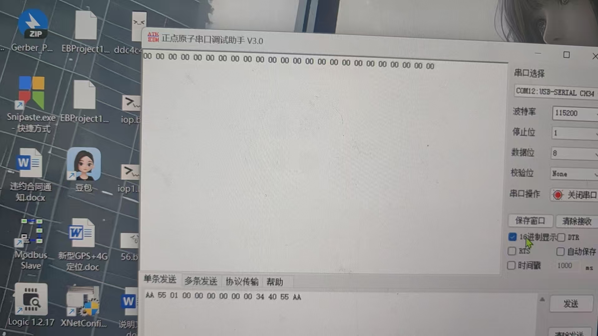

*串口调试助手显示返回的全00数据*

**2. 串口参数检查**

- 确认数据位：8
- 确认停止位：1
- 确认校验位：无/None
- 与固件配置中的串口参数保持一致

**3. 固件配置验证**

- 检查固件中是否启用了串口输出功能
- 确认UART引脚配置正确
- 验证命令词触发后是否有串口输出动作

**4. 模块状态判断**

- 如果调整波特率后仍有问题
- 检查模块是否能正常响应语音命令
- 若语音功能正常，可能是串口配置问题

**注意事项：**

- 波特率不匹配是导致返回00数据的最常见原因
- 建议从9600开始，依次尝试标准波特率
- 确认使用的固件版本支持串口输出功能

---

### ESP32无法接收SU-03T串口数据怎么办？

**问题描述：**

ESP32与SU-03T通过串口通信时，ESP32无法正常接收来自SU-03T的数据。代码中使用了缓冲区检查机制，但数据接收不完整。

**解决方案：**

**1. 缓冲区管理问题分析**

原代码存在问题：
```cpp
void getSerialData() {
    while (Serial.available()) {
        unsigned char serialData = Serial.read();
        if (recCount < 5) { // 防止缓冲区溢出
            recBuffer[recCount] = serialData;
            recCount++;
        }
    }
}
```

**问题原因**：

- 缓冲区大小限制过小（仅5字节）
- SU-03T返回的数据可能超过5字节
- 缓冲区检查导致后续数据被丢弃

**2. 修改方案**

移除缓冲区大小检查，直接读取数据：
```cpp
void getSerialData() {
    while (Serial.available()) {
        unsigned char serialData = Serial.read();
        recBuffer[recCount] = serialData;
        recCount++;
    }
}
```

**3. 完整的接收逻辑**

```cpp
#define BUFFER_SIZE 64  // 增加缓冲区大小

unsigned char recBuffer[BUFFER_SIZE];
int recCount = 0;

void getSerialData() {
    while (Serial.available() && recCount < BUFFER_SIZE) {
        recBuffer[recCount] = Serial.read();
        recCount++;
    }

    // 处理接收到的数据
    if (recCount > 0) {
        processData(recBuffer, recCount);
        recCount = 0;  // 重置计数器
    }
}
```

**4. 通信协议注意事项**

- **数据格式**：确认SU-03T发送的数据格式
- **结束符**：检查是否有特定的结束标志
- **超时处理**：添加接收超时机制
- **数据校验**：必要时添加校验和验证

**5. 调试建议**

```cpp
void debugSerialData() {
    Serial.print("Received: ");
    for (int i = 0; i < recCount; i++) {
        Serial.print(recBuffer[i], HEX);
        Serial.print(" ");
    }
    Serial.println();
}
```

**注意事项：**

- 确保串口参数配置一致（波特率、数据位、停止位）
- 检查硬件连接（TX-RX交叉连接）
- 合理设置缓冲区大小，避免溢出或浪费
- 考虑添加数据完整性检查机制

---

### SU-03T烧录成功但串口无数据输出怎么办？

**问题描述：**

SU-03T模块烧录成功后，通过串口助手测试时无法接收数据，模块对语音指令无响应。

**解决方案：**

**硬件连接检查：**

1. **基础连接**
    - 模块连接咪头和扬声器
    - USB转串口(CH340)连接到电脑
    - 确认COM口识别正常

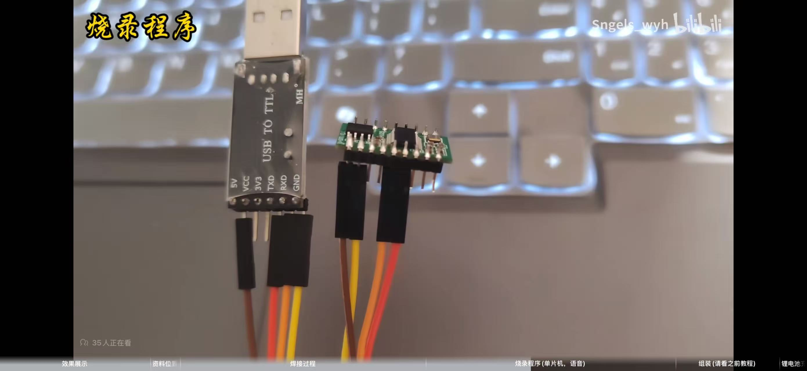

2. **串口配置**
    - 波特率：9600（与固件配置一致）
    - 数据位：8
    - 停止位：1
    - 校验位：无

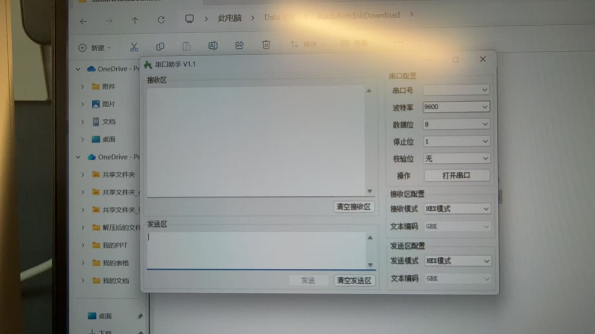

**固件配置验证：**

1. **导入固件到平台**
    - 将生成的固件导入智能公元平台
    - 查看唤醒词和命令词配置
    - 确认串口输出功能已启用

2. **引脚功能确认**
    - UART1_TX和UART1_RX配置为串口功能
    - 命令词触发后通过UART1_TX发送数据
    - 检查消息编号和参数设置

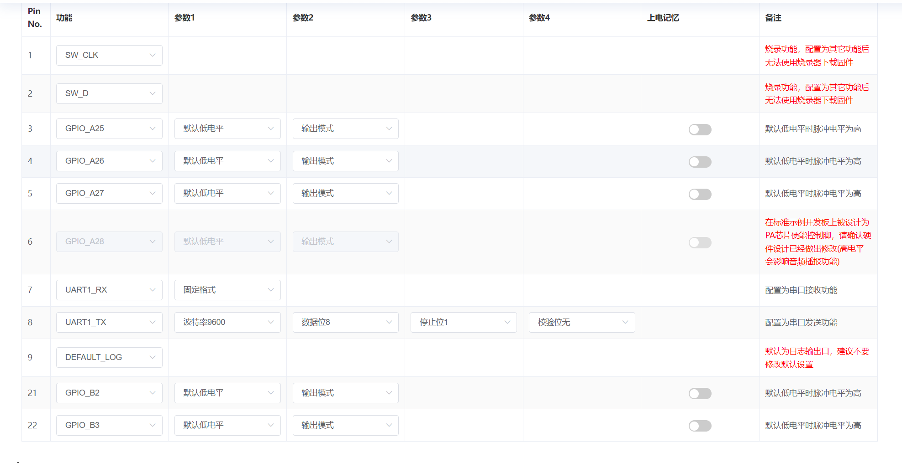

**测试步骤：**

1. 连接硬件（咪头、扬声器、串口）
2. 打开串口助手，配置参数
3. 说出唤醒词（如"你好小智"）
4. 说出命令词（如"走两步"）
5. 观察串口数据输出

**命令词配置示例：**

- "走两步" → 发送 0x21
- "后退" → 发送 0x22
- "左转" → 发送 0x23
- "右转" → 发送 0x24

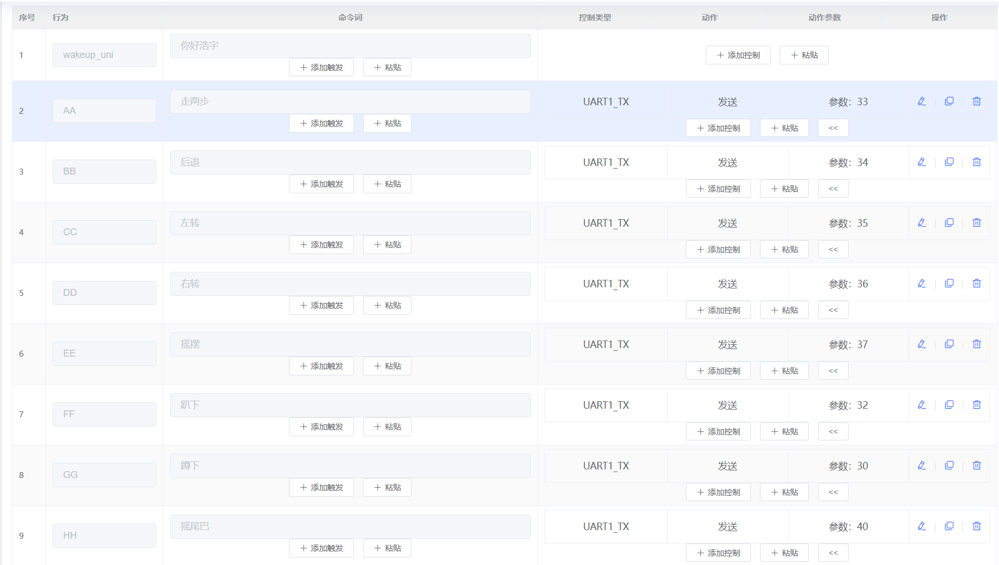
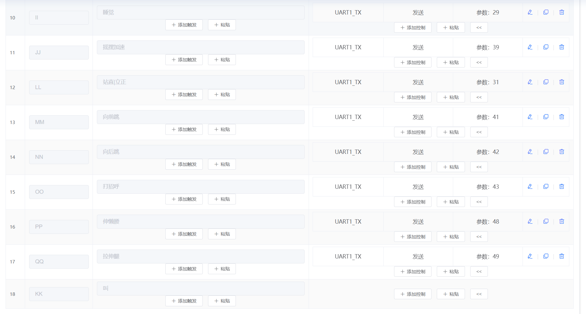

**常见问题排查：**

- 串口助手未勾选正确显示格式
- 命令词未在固件中正确配置
- 硬件连接错误或接触不良

**注意事项：**

- 确保使用正确的COM口
- 测试环境安静，避免干扰
- 串口助手需要打开对应COM口

---

### 单片机串口控制语音模块间歇性失败？

**问题描述：**

单片机发送指令给语音模块进行关键词识别，但存在间歇性失败问题，发送指令前后都添加延时也无法稳定工作。

**解决方案：**

**1. 全面排查步骤**

1. **验证单片机输出**：

    - 使用串口助手连接单片机
    - 确认每次都能正常发送数据
    - 检查数据格式是否正确

2. **检查模块响应**：

    - 确认模块接收到数据后触发动作
    - 检查是否配置了正确的执行动作
    - 验证消息ID是否匹配

**2. 优化建议**

1. **增加间隔时间**：

    - 从200ms开始测试
    - 如仍失败，尝试500ms或更长
    - 观察间隔增加后的效果

2. **检查配置完整性**：

    - 确认串口输入触发已添加
    - 验证允许识别词动作已配置
    - 检查消息编号与发送数据匹配

3. **硬件检查**：

    - 确认串口连接牢固
    - 检查波特率设置是否一致
    - 验证共地连接

**3. 调试技巧**

- 使用逻辑分析仪监控通信
- 记录成功和失败时的数据差异
- 尝试简化测试场景
- 考虑环境干扰因素

**注意事项：**

- 模块处理指令需要一定时间
- 建议逐步增加间隔时间测试
- 确保发送格式为十六进制
- 检查是否有其他串口设备干扰

---

### SU-03T串口数据接收不稳定怎么办？

**问题描述：**

SU-03T模块发送串口数据时，接收端（如STM32）大多数时间无法接收到数据，只有在连续发送数据时才能偶尔接收成功。

**解决方案：**

**数据格式确认：**

1. **进制格式匹配**
    - SU-03T发送：十六进制数据
    - STM32接收：必须设置为十六进制模式
    - 两端格式必须完全一致

2. **数据发送间隔**
    - 建议发送间隔不少于200ms
    - 给模块足够的处理时间
    - 避免连续快速发送

**通信参数配置：**

1. **波特率设置**
    - 确保两端波特率一致（如9600）
    - 检查数据位、停止位、校验位配置
    - 验证硬件连接（TX对RX，RX对TX）

2. **共地连接**
    - 确保SU-03T和接收设备共地
    - 使用万用表验证GND连接
    - 检查电源地线是否可靠

**调试建议：**

1. **使用串口助手**
    - 先用串口助手代替STM32测试
    - 验证SU-03T是否正常发送数据
    - 排除接收端问题

2. **检查发送逻辑**
    - 确认每次语音触发都生成了发送指令
    - 检查触发条件是否正确配置
    - 验证消息编号匹配

**注意事项：**

- SU-03T每次语音指令只发送一次数据
- 接收端需要准备好接收状态
- 通信失败多是格式或连接问题
- 建议增加重试机制提高可靠性

---

### SU-03T能否将识别到的语音内容以文本形式通过串口发送？

**问题描述：**

需要SU-03T将识别到的语音内容（如识别到"你好"时）直接以文本形式"你好"通过串口发送出去，而不是发送16进制数据。

**解决方案：**

**1. 串口输出格式限制**

**当前支持格式：**

- SU-03T仅支持发送十六进制格式数据
- 不支持直接发送ASCII文本字符串
- 无法直接输出识别到的语音文本内容

**技术原因：**

- 模块固件设计为固定格式输出
- 串口通信协议采用十六进制数据帧
- 文本转换功能尚未实现

**2. 可行的替代方案**

**方案一：映射固定十六进制值**
```c
// 在平台配置中为每个命令词分配固定的十六进制值
识别到"你好" → 发送 0x01
识别到"打开" → 发送 0x02
识别到"关闭" → 发送 0x03
```

**方案二：接收端转换**
```cpp
// 接收端（如ESP32/STM32）代码示例
void processSerialData(unsigned char hexData) {
    switch(hexData) {
        case 0x01:
            Serial.println("收到：你好");
            // 执行相应动作
            break;
        case 0x02:
            Serial.println("收到：打开");
            // 执行相应动作
            break;
        case 0x03:
            Serial.println("收到：关闭");
            // 执行相应动作
            break;
    }
}
```

**方案三：使用多字节协议**
```c
// 自定义协议，支持更多命令
// 0xAA 0x01 表示"你好"
// 0xAA 0x02 表示"打开"
// 0xAA 0x03 表示"关闭"
```

**3. 配置示例**

**智能公元平台设置：**

1. 选择"串口输出"功能
2. 设置输出格式为"十六进制"
3. 为每个命令词配置唯一的十六进制值
4. 设置适当的波特率（如9600）

**实际应用场景：**

- 语音控制家电：发送控制码而非文本
- 状态查询：发送查询指令，返回固定值
- 数据采集：触发传感器数据上传

**注意事项：**

- 当前版本固件限制，无法直接发送文本
- 接收端需要建立十六进制到文本的映射关系
- 可通过更新固件获取新功能（如有）
- 建议采用标准协议确保通信可靠性

---

---

### SU-03T的红外遥控功能可以使用吗？

**问题描述：**

尝试配置SU-03T的红外遥控功能，但无法通过平台将红外接收指令映射到相应的GPIO输出口，导致红外遥控功能无法正常工作。

**解决方案：**

**当前功能限制**

- SU-03T的红外遥控功能**暂时无法使用**
- 平台配置功能尚未完全完善
- 研发部门正在解决此问题

**技术原因**

- IR_TX和IR_RX引脚已配置
- 需要连接外部红外接收头
- 平台无法将接收指令映射到GPIO输出

**临时解决方案**

1. **等待功能完善**
    - 研发已在解决此问题
    - 后续固件更新可能会支持
    - 关注官方公告和更新说明

2. **使用其他控制方式**
    - 改用串口控制
    - 使用GPIO直接触发
    - 考虑更换支持红外功能的模块

**硬件连接说明**

- IR_TX：红外发送（暂未启用）
- IR_RX：红外接收（需外接接收头）
- GPIO输出：可通过其他方式控制

**注意事项：**

- 目前平台配置不了红外遥控功能
- 外接红外接收头也无法正常工作
- 如急需红外功能，建议选择其他型号
- 问题解决后会第一时间通知

---

## 固件生成问题

### SU-03T固件生成失败怎么办？

**问题描述：**

版本生成固件失败，系统检查配置未发现异常，需要排查原因并解决。

**解决方案：**

**1. 平台问题排查**

- 可能是平台临时问题
- 等待平台恢复或稍后重试
- 提供JSON配置文件供分析

**2. 配置检查要点**

- 确认所有配置项已正确填写
- 检查是否有配置冲突
- 验证固件版本兼容性

**3. 解决步骤**

1. 导出JSON配置文件
2. 使用平台故障排查工具分析
3. 等待平台问题修复
4. 使用"继承"功能重新生成

**注意事项：**

- 平台偶尔会出现临时性问题
- 保存好JSON配置文件备份
- 问题解决后及时重新生成固件

---

### SU-03T和SU-03T1固件是否通用？

**问题描述：**

需要确认SU-03T和新款SU-03T1的固件是否可以通用。

**解决方案：**

**1. 硬件差异说明**

- SU-03T1是SU-03T的升级版
- 主要区别：Flash容量扩容
- 功能和引脚完全兼容

**2. 固件兼容性**

- **2024年11月后的固件**：完全通用
- **2024年11月前的固件**：需要继承升级

**3. 升级方法**

对于旧固件：

1. 在平台使用"继承"功能
2. 重新生成固件
3. 即可用于SU-03T1

**注意事项：**

- 现在生成的固件基本都是通用的
- Flash扩容不影响使用体验
- 无需担心兼容性问题

---

### SU-03T烧录时出现"发送异常"怎么办？

**问题描述：**

烧录SU-03T模块时出现"发送异常，COM10终止了本次传输活动"错误，导致烧录失败。

**解决方案：**

**1. 硬件连接检查**

- 断开其他不必要的COM端口设备
- 只保留CH340烧录器连接
- 检查USB接口接触是否良好

**2. 接线检查**

- 确认B6接TXD，B7接RXD
- 检查GND是否良好接地
- 验证VCC接5V电源

**3. 接触不良处理**

- 检查焊点是否有虚焊
- 对应焊点加锡重焊
- 确保连接牢固可靠

**4. 其他注意事项**

- 不要使用USB延长线
- 尝试更换电脑USB端口
- 重新安装CH340驱动程序

**注意事项：**

- 烧录前先断电再上电
- 接触不良是常见故障原因
- B6/B7是专用串口引脚，不能接错

---

### SU-03T支持MODBUS RTU协议吗？

**问题描述：**

需要确认SU-03T模块是否支持MODBUS RTU协议或其他自定义协议进行通信。

**解决方案：**

**1. 协议支持情况**

- SU-03T可以通过串口配置实现MODBUS RTU
- 支持自定义协议（如简码协议）
- 需要在平台中配置帧头和帧尾

**2. 配置方法**

- 进入串口配置界面
- 设置帧头格式（如55 AA）
- 设置帧尾格式（校验位）
- 配置数据发送和接收规则

**3. 通信示例**

- MODBUS RTU：11 01 00 13 00 25 F9 C8
- 简码协议：55 AA 10 0B 00 1A

### SU-03T接收串口数据后需要一定间隔才能正常响应？

**问题描述：**

单片机给SU-03T模块发送串口指令时，存在间歇性失败问题，即使增加50ms延时也无法稳定工作。

**解决方案：**

**1. 间隔时间要求**

- **建议间隔**：200ms以上
- **失败原因**：间隔过短可能导致模块处理不过来
- **起始值测试**：从200ms开始测试，根据实际情况调整

**2. 调试步骤**

- **验证串口通信**：

    - 使用串口助手连接单片机
    - 确认数据发送正常
    - 检查波特率等参数

- **检查触发配置**：

    - 确认串口输入触发已正确配置
    - 验证消息编号匹配
    - 检查是否有执行动作

**3. 检查不同间隔**

- **50ms**：可能过短，容易失败
- **200ms**：推荐起始值
- **500ms**：如果200ms仍有问题，可尝试更长间隔
- **1秒**：如仍不稳定，使用1秒间隔

**4. 其他建议**

- 使用稳定的电源供应
- 避免长距离串口传输
- 检查单片机代码逻辑
- 确保每次指令完全处理完成再发送下一条

**注意事项：**

- SU-03T处理串口指令需要一定时间
- 建议在实际应用中测试并优化间隔时间
- 通信失败可能是多因素导致的，需要系统排查

---

### SU-03T串口接收数据时CRC校验错误怎么办？

**问题描述：**

使用MODBUS RTU协议时，接收到的数据CRC校验失败，导致通信异常。

**解决方案：**

**1. MODBUS CRC计算**

MODBUS RTU使用CRC16校验：

- **多项式**：x¹⁶ + x² + ... + x⁸
- **生成多项式**：0xA001
- **初始值**：0xFFFF

**2. 常见错误类型**

- **CRC不匹配**：接收数据计算CRC与校验码不符
- **数据帧损坏**：传输过程中数据被篡改
- **接收超时**：数据接收不完整

**3. 问题排查**

- **检查通信参数**：波特率、数据位、停止位
- **验证数据格式**：确认数据完整性
- **使用标准库**：使用经过验证的MODBUS库
- **检查硬件连接**：确保接触良好，共地可靠

**4. 处理建议**

- **重传机制**：检测到CRC错误时请求重传
- **错误计数**：记录错误次数，超过阈值告警
- **使用校验码**：在帧尾添加CRC校验码
- **协议适配**：根据从设备要求调整校验方式

**注意事项：**

- MODBUS RTU的CRC校验是协议可靠性的重要保障
- 建议使用标准实现而非自行计算
- 通信环境恶劣时增加错误检测和重传机制

---

- MODBUS RTU：11 01 00 13 00 25 F9 C8
- 简码协议：55 AA 10 0B 00 1A

**4. 技术限制**

- 仅支持通过串口通信
- 需要外部设备配合协议
- 模块本身不能直接实现复杂协议

**注意事项：**

- 接收功能需要进一步测试验证
- 协议配置需与通信设备匹配
- 建议先测试基础通信再开发功能

### 如何配置SU-03T串口发送不带帧头帧尾的MODBUS RTU报文？

**问题描述：**

需要配置SU-03T发送MODBUS RTU报文时，不包含帧头帧尾，只发送纯MODBUS RTU数据。

**解决方案：**

**1. 直接发送MODBUS数据**

- **发送数据格式**：在串口输出配置中直接输入MODBUS RTU数据
- **示例**：`01 03 00 0A 01 00 01`（读取保持寄存器）
- **不需要包裹**：无需添加AA 55等帧头帧尾

**2. 接收端配置**

- **帧头帧尾设置**：RX端可留空或不设置
- **或设置匹配的帧头**：如需要可设置01 03等MODBUS功能码

**3. 平台配置步骤**

- 选择控制方式："端口输出"
- 选择控制类型："UART1_TX"
- 数据格式：十六进制
- 直接输入MODBUS RTU报文的十六进制值

**4. 使用注意事项**

- MODBUS RTU有完整的校验机制，不需要额外帧头
- 纯数据格式：确保数据格式正确（大端/小端）
- 波特率匹配：与从设备保持一致的波特率

**5. 常见MODBUS RTU指令示例**

```
读取保持寄存器：01 03 00 0A 01 00 01
写单个寄存器：01 06 00 0A 01 00 01
写多个寄存器：01 10 00 0A 02 00 03
```

**注意事项：**

- 接收功能需要进一步测试验证
- 协议配置需与通信设备匹配
- 建议先测试基础通信再开发功能

---

### SU-03T1上电无语音播报怎么办？

**问题描述：**

SU-03T1模块上电后没有语音播报，需要排查原因并解决。

**解决方案：**

1. **检查固件烧录**
    - 确认模块已烧录正确的固件
    - 重新烧录出厂固件测试

2. **检查硬件连接**
    - 确认扬声器已正确连接到SPK+和SPK-引脚
    - 检查扬声器阻抗是否匹配（推荐4Ω或8Ω）
    - 验证咪头连接是否正常

3. **检查供电**
    - 确认供电电压为5V
    - 测量供电电压是否稳定

**注意事项：**

- 新模块首次使用可能需要烧录固件
- 确保扬声器极性正确连接
- 供电不足可能导致无声或声音异常

---

### 烧录固件时如何选择正确的文件路径？

**问题描述：**

使用烧录工具时，不确定应该选择哪个文件夹下的固件文件，或遇到中文路径导致烧录失败。

**解决方案：**

1. **固件文件位置**
    - 正确的固件文件位于`jx_firm/su_03t_1.5/Update.bin`
    - 不要选择错误的文件夹（如"04、模块出厂固件"）

2. **路径要求**
    - 避免使用中文路径
    - 将固件文件拖到桌面或简单的英文路径下
    - 确保文件路径不包含空格或特殊字符

3. **烧录步骤**
    - 打开云知声UniOne蜂鸟M烧录工具
    - 选择正确的COM口
    - 点击"选择镜像文件"，选择Update.bin文件
    - 点击开始烧录

**注意事项：**

- 必须选择Update.bin文件，其他文件无法烧录
- 中文路径可能导致烧录工具无法识别文件
- 烧录时确保模块连接稳定，避免断开

---

### 烧录时因文件路径包含中文导致读取失败怎么办？

**问题描述：**

烧录工具在尝试读取文件时，因文件路径包含中文字符而失败，提示"文件读取失败"。

**解决方案：**

**问题原因**

- 烧录工具不支持含中文的文件路径
- 中文路径可能导致字符编码错误
- 系统无法正确解析带中文的路径

**解决步骤**

1. **检查文件路径**
    - 确认当前路径包含中文字符
    - 查看错误提示中的乱码路径

2. **移动文件到英文路径**
    ```
    错误示例：D:\语音模块固件\SU-03T固件.bin
    正确示例：D:\jix_firm\su_03t_1.5\Update.bin
    ```

3. **创建英文工作目录**
    - 在桌面创建新文件夹（如 firmware）
    - 将固件文件复制到该文件夹
    - 确保文件夹名和文件名均为英文

4. **重新烧录**
    - 打开烧录工具
    - 选择英文路径下的固件文件
    - 正常进行烧录操作

**操作示例**

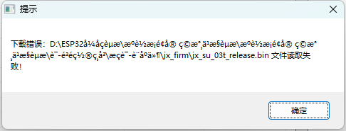

*路径包含中文导致文件读取失败*

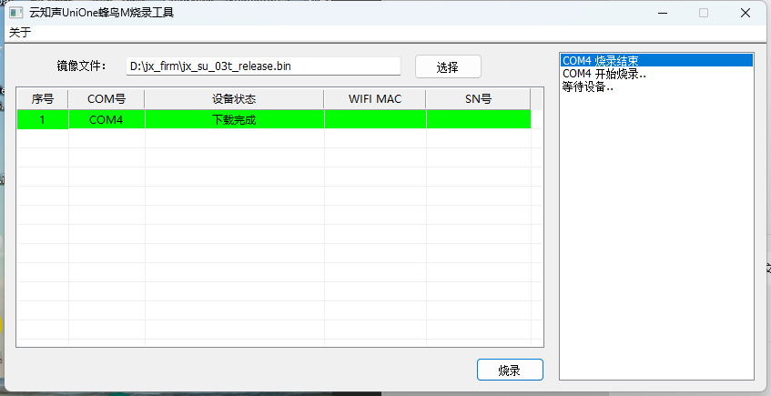

*更改为英文路径后烧录成功*

**路径规范要求**

- 文件夹名：仅使用英文字母、数字、下划线
- 文件名：使用原始的 Update.bin
- 路径深度：不宜过深，建议3级以内
- 特殊字符：避免空格、中文、特殊符号

**临时解决方案**

如果必须使用中文路径：

1. **使用短路径**
    ```
    移动到 C:\firmware\
    避免过深的目录结构
    ```

2. **复制到临时目录**
    ```
    复制文件到：C:\temp\
    烧录完成后删除
    ```

3. **使用英文用户名**
    - 避免用户文件夹为中文
    - 或使用管理员账户操作

**注意事项**

- 所有烧录工具都有类似限制
- 这是软件兼容性问题，非硬件故障
- 建议养成为英文路径的习惯
- 如问题持续，尝试以管理员身份运行工具

---

### SU-03T的烧录引脚定义是什么？

**问题描述：**

在烧录SU-03T芯片时，对引脚定义（特别是RXD和TXD）存在疑问，需要确认正确的引脚对应关系。

**解决方案：**

1. **标准烧录引脚**
    - CH340的TXD → SU-03T的B7
    - CH340的RXD → SU-03T的B6
    - VCC → 5V电源
    - GND → 电源地

2. **引脚对应表**
```
CH340模块    SU-03T模块
5V      →      VCC
GND     →      GND
RXD     →      B7
TXD     →      B6
```

3. **注意事项**
    - B6和B7是SU-03T的专用串口引脚
    - 连接时TX对RX，RX对TX（交叉连接）
    - 确保供电电压为5V

**烧录步骤：**

1. 正确连接烧录线
2. 打开烧录工具
3. 选择对应COM口
4. 加载固件文件
5. 开始烧录

**注意事项：**

- 引脚接错会导致烧录失败
- 不要在通电状态下插拔烧录线
- 使用专用烧录线避免接线错误

---

### SU-03T烧录器按钮故障无法断开电路怎么办？

**问题描述：**

烧录器上的按钮在升起时无法断开电路，按下能启动但升起时不断开，怀疑开关故障。

**解决方案：**

**问题诊断**

1. **万用表测试**
    - 设置到欧姆档或通断档
    - 表笔分别接开关两端
    - 按下按钮：应显示导通（0欧姆）
    - 松开按钮：应显示断开（无穷大）

2. **故障判断**
    ```
    按下时导通 ✓
    松开时仍导通 ✗  （开关故障）
    松开时断开 ✓   （开关正常）
    ```

**处理方案**

**方案一：临时解决方案**

1. **手动断电**
    - 烧录完成后手动拔掉电源线
    - 代替开关断开功能
    - 确保完全断电再重新上电

2. **短接处理**
    - 如确认开关损坏，可临时短接
    - 使用导线连接开关两端
    - 通过插拔电源线控制通断

**方案二：开关更换**

1. **更换准备**
    - 购买相同规格的按钮开关
    - 确认引脚间距和尺寸
    - 准备电烙铁等工具

2. **更换步骤**
    ```
    - 记录原有接线位置
    - 烙铁加热后拆下旧开关
    - 安装新开关到原位置
    - 按原样焊接连接线
    - 测试功能是否正常
    ```

3. **开关规格**
    - 类型：瞬时按钮开关
    - 触点：常开（NO）型
    - 引脚：2引脚或3引脚均可
    - 电流：大于100mA

**方案三：使用备用转接板**

1. **CI-03T开发包转接板**
    - 开发包内含转接板PCB
    - 板上已集成复位电路
    - 可直接使用，无需故障开关

2. **转接板优势**
    - 稳定可靠的复位功能
    - 避免开关接触不良
    - 标准化的接口定义

**注意事项**

- 开关故障不影响烧录功能
- 可以手动控制电源通断
- 更换开关时需要基本焊接技能
- CI-03T开发包提供备用转接板
- 如不会焊接，建议购买新的烧录器

---

### SU-03T串口通信引脚配置错误怎么办？

**问题描述：**

配置串口通信时，平台中显示UART1_TX为GPIO_B6、UART1_RX为GPIO_B7，但实际接线接在了B6、B7引脚上，导致通信失败。

**解决方案：**

**1. 引脚对应关系**

- UART1_TX实际对应GPIO_B2引脚
- UART1_RX实际对应GPIO_B3引脚
- GPIO_B6和B7是其他功能引脚，不是UART

**2. 正确配置步骤**

1. **修改引脚配置**
    - 进入平台引脚配置界面
    - 将UART1_TX设置为GPIO_B2
    - 将UART1_RX设置为GPIO_B3

2. **硬件接线**
    - 串口TX连接到B3引脚（RX）
    - 串口RX连接到B2引脚（TX）
    - 确保GND共地

**3. 验证方法**

    - 配置完成后重新生成固件
    - 烧录新固件到模块
    - 使用串口助手测试通信

**注意事项：**

- B2/B3才是真正的UART引脚
- 配置时注意不要被GPIO编号迷惑
- 接线前先确认平台的引脚分配

---

### SU-03T串口输出的数据格式是什么？

**问题描述：**

在配置控制指令时，对参数字段的数据类型存在疑问，需要了解SU-03T串口输出的数据格式。

**解决方案：**

**1. 数据格式说明**

SU-03T通过串口输出的是**十六进制字符串**格式，不是C语言的数据类型。

**2. 格式要求**

- **字符范围**：使用十六进制字符（0-9，A-F）
- **数据单位**：两个字符一组，代表一个字节
- **分隔方式**：各组之间用空格分隔
- **最大长度**：32个字符（16个字节）

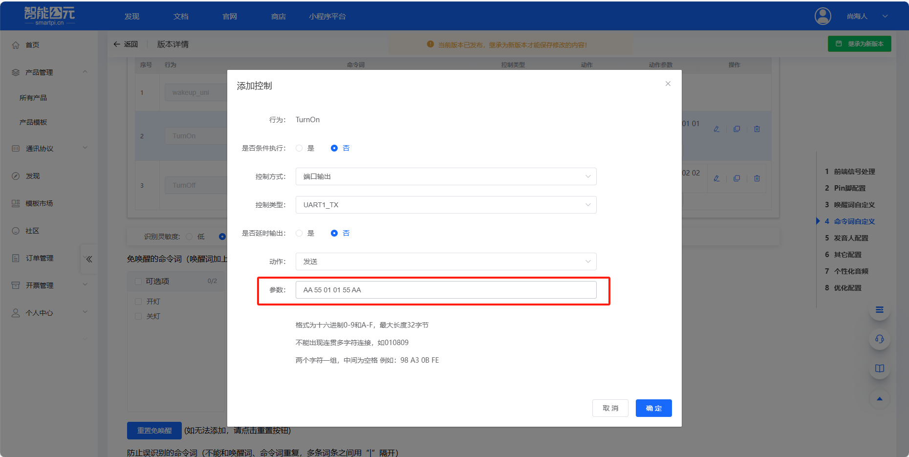

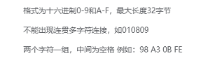

**3. 配置示例**

发送包含字节 `0xAA`、`0x55`、`0x01`、`0x01`、`0x55`、`0xAA` 的指令：

```
AA 55 01 01 55 AA
```

**4. 注意事项**

- 不能出现连贯多字节连接（如AA5501）
- 必须以空格分隔每个字节
- 超过最大长度会被截断
- 参数必须使用有效的十六进制字符

---

### SU-03T串口通信是否必须使用帧头帧尾？

**问题描述：**

询问是否可以直接发送十六进制数据（如01 02 0A），而不使用标准的帧头帧尾格式。

**解决方案：**

**1. 数据发送格式**

- 可以直接发送任意十六进制数据
- 不强制要求使用帧头帧尾
- 发什么收什么，直接透传

**2. 自定义协议建议**

- 可以自己定义帧头帧尾格式
- 便于接收端识别数据包
- 提高通信可靠性

**3. 配置方法**

- 在平台中配置串口输出
- 数据格式选择十六进制
- 直接输入要发送的数据

**4. 示例说明**

- 直接发送：01 02 0A（接收端收到同样数据）
- 带帧头格式：AA 55 01 02 0A（自定义）
- 接收端根据协议解析

**注意事项：**

- 串口通信是透传模式
- 数据格式由开发者自定义
- 建议使用简单协议便于解析

---

### SU-03T的默认烧录口是哪些引脚？

**问题描述：**

询问SU-03T模块的默认烧录口引脚配置，确认是否为TX和RX引脚。

**解决方案：**

1. **默认烧录引脚**
    - SU-03T默认烧录口是B6和B7引脚
    - B6：UART1_RX（接收）
    - B7：UART1_TX（发送）

2. **引脚功能说明**
    - B6/B7是专用UART串口引脚
    - 支持最高3Mbps通信速率
    - 用于固件烧录和串口通信

3. **硬件连接**
```
烧录器/CH340    SU-03T模块
TXD         →      B7 (RX)
RXD         →      B6 (TX)
VCC         →      VCC (5V)
GND         →      GND
```

**注意事项：**

- 虽然叫TX/RX，但要交叉连接
- B6/B7是烧录和通信的专用引脚

---

## 串口通信

### SU-03T之间串口通信导致重复执行怎么办？

**问题描述：**

两个SU-03T模块通过串口连接后，发送一个语音指令会导致接收端重复执行开灯或关灯操作。

**解决方案：**

**1. 问题原因分析**

- A板发送指令后，B板会语音播报响应
- A板的麦克风会听到B板的播报内容
- 导致A板再次识别并发送串口指令
- 形成循环触发，重复执行操作

**2. 硬件连接要求**

- A板TX（B6）→ B板RX（B6）
- A板RX（B7）→ B板TX（B7）
- 必须共地连接（GND）
- 确保供电稳定（5V）

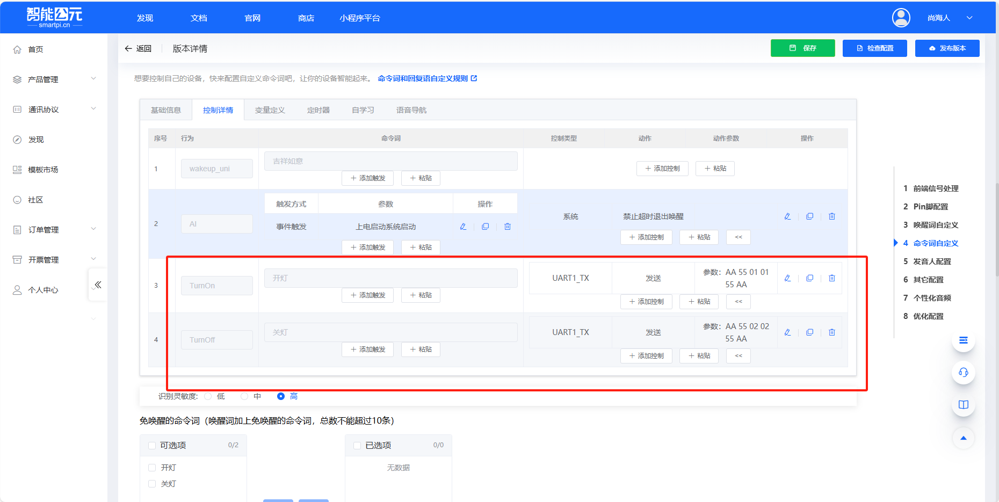

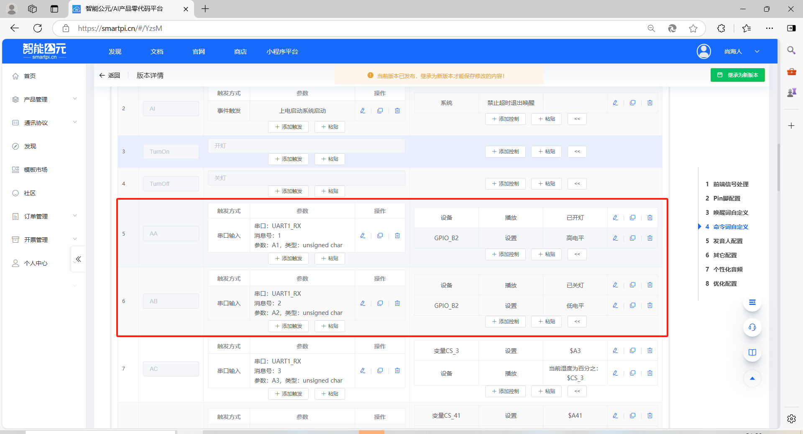

**3. 解决方案**

- **关闭B板语音播报**：在B板配置中关闭串口触发后的语音播报
- **物理隔离**：将A板和B板的麦克风物理隔开
- **降低音量**：适当降低B板的播报音量
- **使用耳机**：A板使用耳机输入，避免听到B板播报

**4. 配置示例**

A板发送配置：

- 命令词：开灯 → UART1_TX发送：AA 55 01 01 55 AA
- 命令词：关灯 → UART1_TX发送：AA 55 02 02 55 AA

B板接收配置：

- UART1_RX接收消息号1（AA）→ 执行开灯动作
- UART1_RX接收消息号2（AB）→ 执行关灯动作
- 关闭语音播报功能

**注意事项：**

- 共地是通信的基准，必须连接
- 问题根源是A板听到了B板的播报
- 最简单的解决方法是关闭B板的语音播报
- 测试时确保A板和B板有适当距离

---

## 串口触发与通信

### SU-03T串口引脚可以直接连接单片机吗？

**问题描述：**

询问SU-03T模块的串口引脚是否可以直接连接到单片机引脚，还是需要通过CH340G等解码芯片进行信号转换。

**解决方案：**

**可以直接连接**，不需要额外的解码芯片。

**1. 直接连接方式**

- SU-03T的串口引脚可以直接连接到单片机的GPIO引脚
- 模块内部已经集成了串口通信电路
- 不需要外接CH340G等USB转串口芯片

**2. 连接注意事项**

- **电平匹配**：确认单片机的串口电平（3.3V或5V）与SU-03T兼容
- **交叉连接**：

    - 单片机TX → SU-03T的B6（UART1_RX）
    - 单片机RX → SU-03T的B7（UART1_TX）
- **共地连接**：必须确保单片机和SU-03T共地

**3. CH340G的使用场景**

CH340G等芯片主要用于：

- USB转串口连接电脑进行调试
- 电脑没有串口时作为转接器
- 不是模块间通信必需的

**注意事项：**

- 直接连接时确保波特率设置正确（默认115200）
- 如需要通过电脑调试，才需要CH340G等转接芯片
- 长距离通信建议考虑使用RS232或RS485转换

---

### 如何通过MCU实现SU-03T串口输入触发功能？

**问题描述：**

需要通过MCU单片机实现SU-03T模块的串口输入触发功能，了解具体的实现方法和配置步骤。

**解决方案：**

1. **参考教程资源**
    - 观看SU-03T串口教程视频：https://b23.tv/zDGrffx
    - 视频详细介绍了串口触发的配置方法
    - 包含实际的接线演示和代码示例

2. **基本连接方式**
    - MCU的TX连接到SU-03T的B6（UART1_RX）
    - MCU的RX连接到SU-03T的B7（UART1_TX）
    - 确保两端共地（GND连接）
    - 通信波特率默认为115200

3. **测试准备工作**
    - 准备单独的咪头（麦克风）用于语音输入
    - 将咪头连接到SU-03T的麦克风输入端
    - 确保SU-03T固件已正确烧录并支持串口触发

4. **串口触发配置**
    - 在智能公元平台配置串口输入触发
    - 设置触发条件为UART0_RX接收特定数据
    - 配置触发后执行的动作（如播放语音、控制GPIO等）

**注意事项：**

- 串口触发需要模块已烧录支持串口功能的固件
- 测试时必须连接麦克风，否则无法进行语音识别
- MCU发送的数据格式需与模块配置的触发条件匹配
- 建议先使用串口调试工具测试触发功能是否正常

---

### SU-03T如何实现持续串口数据输出？

**问题描述：**

需要SU-03T在收到语音指令后，持续通过串口输出数据，直到接收到特定停止信号。

**解决方案：**

1. **配置多个串口发送指令**
    - 在UART1_TX发送指令中添加多个发送项
    - 设置不同的延时时间（如50ms、100ms）
    - 每个发送项可以发送相同的数据

2. **使用定时器功能**
    - 配置定时器实现周期性发送
    - 通过语音指令启动定时器
    - 设置定时器周期和发送内容

3. **停止机制实现**
    - 监听串口接收到的停止信号（如数据"32"）
    - 收到停止信号后关闭定时器
    - 停止所有串口数据发送

4. **配置示例**
    ```
    UART1_TX发送配置：

    - 延时50ms，发送：BB 66 00 66 BB
    - 延时100ms，发送：BB 66 00 66 BB
    - 定时器设置：周期100ms，连续发送
    ```

**注意事项：**

- 持续发送会增加MCU的接收负担
- 确保MCU有足够的处理能力处理连续数据
- 定时器功能需要在固件中预先配置
- 停止信号的识别需要提前在协议中定义

---

### SU-03T如何通过串口输出变量值？

**问题描述：**

需要在RX串口接收触发信号后，通过TX串口输出变量的值，而不是仅通过语音播报的方式获取变量信息。

**解决方案：**

**1. 实现原理**

- SU-03T芯片支持通过串口进行数据通信
- 可以在固件逻辑中实现变量的读取和串口发送功能
- 通过变量保存机制实现数据的传递

**2. 具体实现步骤**

1. **接收触发信号**
    - 通过RX串口（UART1_RX）接收外部触发信号
    - 设置特定的触发指令或数据包格式

2. **变量保存**
    - 在接收到触发信号后，将需要输出的变量值保存到临时变量
    - 可以使用系统变量或自定义变量存储数据

3. **串口发送**
    - 使用TX串口（UART1_TX）发送变量值
    - 将变量值转换为字符串格式后发送
    - 配置适当的延时确保发送稳定

**3. 配置示例**

```
// 伪代码示例
int value = 123;

// 接收到RX触发信号后
if (rx_data_received) {
    // 将变量值转换为字符串
    char buffer[10];
    sprintf(buffer, "%d", value);

    // 通过TX串口发送
    uart_send(buffer);
}
```

**4. 平台配置方法**

- 在智能公元平台中配置串口输入触发条件
- 设置触发后执行串口输出动作
- 在输出参数中指定要发送的变量

**注意事项：**

- 确保串口波特率设置正确（如9600、115200等）
- 波特率需与外部设备匹配
- 变量值需根据实际类型进行格式转换（如浮点数需使用printf格式化）
- 避免在串口发送过程中阻塞主程序
- 确保系统实时性不受影响

---

### 如何通过GPIO按键控制SU-03T模块功能？

**问题描述：**

需要通过地面板上的多个按键实现开关控制、定时器启动等功能，并了解如何发送通讯代码。

**解决方案：**

1. **GPIO输入配置方法**
    - 将语音模块的IO口设置为输入模式
    - 设置默认为低电平
    - 按键按下时产生高电平信号触发

2. **按键触发实现步骤**
    - 配置GPIO输入触发（如GPIO_A25高电平）
    - 在触发后配置执行的动作
    - 可以设置启动定时器、播放语音、发送串口数据等

3. **多按键配置示例**
    ```
    按键1（GPIO_A25）：触发→启动定时器1
    按键2（GPIO_A26）：触发→关闭所有定时器
    按键3（GPIO_A27）：触发→播放提示音
    ```

4. **串口数据发送配置**
    - 在UART1_TX中配置要发送的数据
    - 设置延时确保数据正确发送
    - 可以配置脉冲发送（如周期10次，次数1）

**注意事项：**

- 按键需要一端接GPIO，另一端接GND
- 确保GPIO口已配置为输入模式
- 按键消抖需要在硬件或软件中处理
- 不同IO口的功能请参考模块引脚定义
- GPIO开头的引脚为WiFi部分，P开头为离线部分

---

### SU-03T模块突然无法烧录，提示烧录失败，无论尝试烧录哪个程序均出现相同问题

**问题描述：**

使用云知声UniOne蜂鸟M烧录工具时，SU-03T模块突然无法烧录，弹出烧入失败的提示，不管烧录哪个程序都是相同情况。

**解决方案：**

1. **串口占用排查**
    - 检查是否有串口助手或其他程序占用串口
    - 关闭所有可能占用串口的软件
    - 重启电脑释放被占用的串口资源

---

### 烧录软件首次出现串口错误，重启后正常

**问题描述：**

首次使用烧录软件时出现串口错误，关闭软件后重新打开第二个烧录软件即可正常工作。

**解决方案：**

**1. 软件冲突处理**

- 关闭第一个出现错误的烧录软件
- 确保没有其他程序占用串口
- 重新打开烧录软件或启动第二个实例
- 建议使用最新版本的烧录工具

**2. 串口资源释放**

- 重启电脑彻底释放串口资源
- 拔插USB转串口设备重新识别
- 更换不同的USB端口
- 检查设备管理器中串口驱动状态

**3. 操作流程优化**

- 烧录前先确认串口处于空闲状态
- 避免同时打开多个烧录软件
- 完成一次烧录后等待串口完全释放
- 使用任务管理器确认相关进程已结束

**注意事项：**

- 串口被占用时软件无法正常通信
- 建议每次烧录前检查串口状态
- 频繁出现此问题可考虑重装驱动程序

---

### CI-03T1烧录频繁出现串口错误

**问题描述：**

烧录CI-03T1模块时频繁出现串口错误，但串口连接正常，且SU-03T模块烧录正常。

**解决方案：**

**1. 模块差异确认**

- CI-03T1和SU-03T可能使用不同的烧录协议
- 确认使用的是对应型号的正确烧录软件
- 检查CI-03T1是否需要特殊的烧录参数设置

**2. 硬件连接检查**

- 确认CI-03T1的供电电压（通常为3.3V或5V）
- 检查烧录接线顺序是否正确
- 使用转接板时确保接触良好
- 尝试更换杜邦线或转接板

**3. 软件设置调整**

- 使用专门针对CI系列的烧录工具
- 检查波特率设置是否正确
- 尝试降低烧录速度
- 更新到最新版本的CI烧录软件

**4. 对比测试方法**

- 在同一电脑上交替测试SU-03T和CI-03T1
- 确认是模块差异还是软件兼容性问题
- 记录错误码和具体现象，联系官方技术团队

**注意事项：**

- 不同型号模块可能需要不同的烧录工具
- CI-03T1对供电要求可能更严格
- 持续出现错误建议更换模块测试

---

### SU-03T1串口通信错误无法识别

**问题描述：**

SU-03T1模块串口通信出现错误，无法识别模块或串口被占用，导致语音识别功能无法正常工作。

**解决方案：**

**1. 串口占用排查**

- 检查设备管理器确认串口已正确识别
- 关闭所有串口助手、终端等可能占用串口的程序
- 重启电脑释放被占用的串口资源
- 使用任务管理器结束相关进程

**2. 驱动程序检查**

- 重新安装USB转串口驱动程序
- 尝试不同的USB端口
- 检查驱动是否与系统版本兼容
- 使用管理员权限安装驱动

**3. 硬件连接验证**

- 确认USB转串口设备工作正常
- 检查数据线是否支持数据传输（非仅充电线）
- 使用万用表测试串口信号线
- 更换已知正常的USB转串口模块

**4. 软件配置**

- 检查烧录软件的串口号选择是否正确
- 确认波特率等参数设置匹配
- 尝试不同的烧录软件版本
- 以管理员权限运行烧录程序

**注意事项：**

- 串口未识别通常是驱动或硬件问题
- 被占用需要关闭所有相关程序
- 多设备连接时注意串口号变化
- 优先使用原厂提供的USB转串口模块

---

### SU模块串口被占用导致CI烧录失败

**问题描述：**

使用SU-03T模块后，串口被占用导致无法使用CI烧录软件进行固件烧录。

**解决方案：**

**1. 释放串口资源**

- 完全关闭SU系列烧录软件
- 通过任务管理器确认相关进程已结束
- 断开SU模块的物理连接
- 重启电脑彻底清理串口资源

**2. 软件切换流程**

- 先断开SU烧录软件的串口连接
- 等待3-5秒让系统释放资源
- 再打开CI烧录软件
- 选择正确的串口号

**3. 设备管理技巧**

- 拔插USB设备更新串口列表
- 禁用不需要的串口设备
- 使用固定USB端口避免串口号变化
- 记录不同模块对应的串口号

**4. 预防措施**

- 不同型号模块使用不同颜色转接线区分
- 给每个模块标记对应的串口号
- 建立标准操作流程避免混淆
- 使用USB集线器集中管理连接

**注意事项：**

- 串口是独占资源，同时只能一个程序使用
- 切换模块前务必完全释放上一个连接
- 建议每次只连接一个需要操作的模块
- 频繁切换可考虑使用多台电脑

---

### CI-03T1重启后仍显示串口错误

**问题描述：**

重启电脑并仅打开CI烧录软件后，CI-03T1模块仍显示串口错误，无法正常连接设备。

**解决方案：**

**1. 彻底清理系统**

- 重启进入安全模式测试
- 使用系统文件检查器修复可能的问题
- 卸载所有串口驱动后重新安装
- 检查是否有启动程序占用串口

**2. 硬件层面排查**

- 更换不同的电脑测试
- 使用原装USB线而非延长线
- 测试CI-03T1模块是否正常
- 尝试不同的USB转串口模块

**3. 软件兼容性**

- 下载安装最新版CI烧录软件
- 以兼容模式运行烧录程序
- 临时关闭杀毒软件和防火墙
- 检查Windows更新是否影响串口

**4. 替代方案**

- 使用SU系列烧录软件测试兼容性
- 尝试其他烧录工具
- 使用专用编程器烧录
- 联系官方技术团队获取专用工具

**注意事项：**

- 持续出现错误可能是硬件问题
- 记录具体错误代码便于分析
- 保留操作日志用于问题诊断
- 必要时更换CI-03T1模块

---

### CI烧录软件更新到最新版仍无法工作

**问题描述：**

CI烧录软件更新到最新版本后，语音识别功能仍然无法正常工作，烧录问题未解决。

**解决方案：**

**1. 版本回退测试**

- 尝试使用之前的稳定版本
- 下载官方提供的历史版本
- 对比不同版本的错误信息
- 记录哪个版本可以正常使用

**2. 固件文件检查**

- 确认固件文件完整无损坏
- 使用官方提供的原厂固件
- 检查固件版本与模块匹配
- 重新下载固件文件排除损坏

**3. 系统环境优化**

- 使用不同的电脑系统测试（Windows 7/10/11）
- 安装必要的运行库和框架
- 关闭所有后台程序
- 使用管理员权限运行软件

**4. 综合排查方案**

- 重装操作系统纯净环境
- 使用虚拟机测试
- 联系官方技术团队远程协助
- 寄回模块由厂商测试

**注意事项：**

- 最新版本可能存在兼容性问题
- 保留已知可用的软件版本
- 记录详细的错误现象和时间
- 持续无法解决需要更换模块

2. **硬件连接检查**
    - B6接TXD，B7接RXD，GND接GND，VCC接5V
    - 检查杜邦线是否有接触不良
    - 确认连接线没有松动
    - 点击烧录后需要拔插一下5V电源（进入烧录模式）

3. **模块硬件测试**
    - 使用万用表测试模块是否损坏：

        - 蜂鸣档测试VCC和GND是否击穿
        - 给模块5V供电，测试3V3引脚是否有3.3V输出
        - 测试麦克风正负电压（SU-03T应为2.4-2.5V）
        - 测试喇叭正负对GND电压（应为2.2-2.5V）

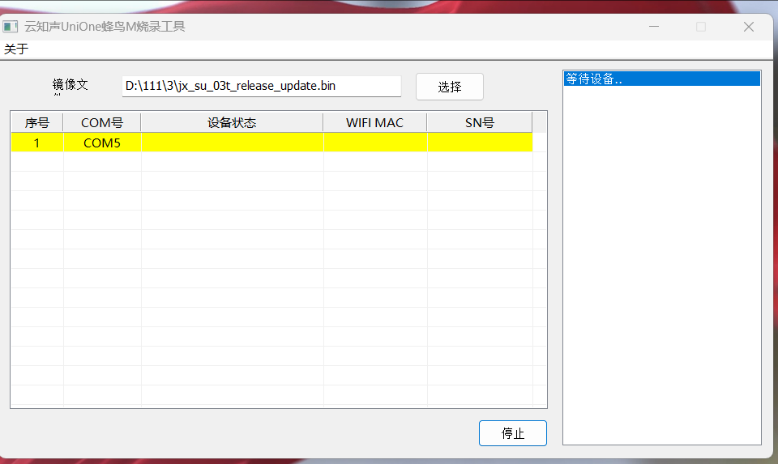

**注意事项：**

- 如果各测试电压不正常，可能是模块烧坏或异常
- 确保线路接触良好，焊点加锡重焊
- 可以尝试更换杜邦线排除线路问题
- 如果硬件测试正常但仍无法烧录，可能需要更换模块

---

### SU-03T烧录后无声音且功放芯片烧毁怎么办？

**问题描述：**

SU-03T模块烧录成功后无声音输出，测量喇叭输出端电压异常（约0.4-0.5V），模块功放芯片发烫，疑似功放烧毁。


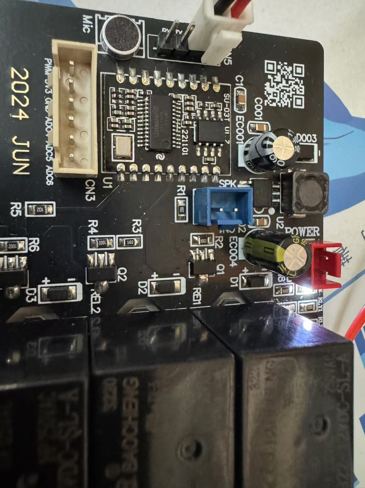

**解决方案：**

**1. 故障判断**

- **正常电压值**：喇叭输出端应为2.2-2.5V
- **异常情况**：测量值仅为0.4-0.5V，且功放芯片发烫
- **结论**：功放芯片已烧毁，需要更换模块

**2. 功放烧毁原因分析**

- **喇叭问题**：使用不匹配的喇叭或喇叭质量不佳
- **供电异常**：供电电压超过6V或电源纹波过大
- **短路故障**：喇叭正负极短路
- **焊接问题**：焊接时造成短路或静电损坏

**3. 预防措施**

- **电源要求**：使用3.3V-5V稳定供电，避免超过6V
- **喇叭规格**：使用8欧姆0.25W-0.5W小功率喇叭
- **功率要求**：4欧姆喇叭需大于2.4W，8欧姆喇叭需大于1.6W
- **焊接注意**：焊接后检查有无短路，通电前用万用表测试
- **逐步调试**：建议先买官方套件测试，再使用自己设计的板子

**4. 替代方案**

- **更换模块**：功放烧毁后需更换整个SU-03T模块
- **使用官方套件**：包含经过测试的模块和外围元件，降低风险
- **外接功放**：如需要大功率输出，可考虑外接独立功放

**注意事项：**

- 功放芯片较为脆弱，使用时需特别注意
- 不要为了节省成本使用不匹配的喇叭
- 焊接时要防静电，避免损坏芯片
- 使用锂电池升压供电时要严格控制电压

---

### SU-03T外围硬件设计注意事项

**问题描述：**

DIY项目使用SU-03T模块时，因外围电路设计不当导致模块损坏或工作异常。

**解决方案：**

**1. 电源设计**

- **电压范围**：严格控制在3.3V-5V之间
- **电源质量**：纹波要小，建议先使用3.3V调试
- **避免升压**：如使用锂电池，建议直接使用，不要升压到5V

**2. 喇叭选型**

- **阻抗**：8欧姆
- **功率**：0.25W-0.5W（最大不超过1W）
- **类型**：小功率动圈喇叭，避免使用大功率喇叭

**3. 焊接要求**

- **检查短路**：焊接后用万用表检查有无短路
- **焊接质量**：确保焊点良好，避免虚焊
- **防静电**：焊接时佩戴防静电手环

**4. 调试建议**

- **分步测试**：先烧录基础固件测试硬件
- **电压测量**：定期测量关键点电压
- **温度监控**：注意模块是否异常发热

**注意事项：**

- 低成本设计时功放比较脆弱，需要特别小心
- 喇叭正负短路或供电超压会立即烧毁功放
- 建议新手购买官方测试套件
- 烧模块的成本可能超过购买套件的费用

---

## 定时器问题

### SU-03T的定时器精度是多少？

**问题描述：**

SU-03T模块的定时器能否实现1ms以下的精确时间控制，用于点焊机的微秒级脉冲控制。

**解决方案：**

**定时器精度说明：**

- SU-03T平台支持配置0.1ms的延时输出
- 界面可以设置"延时0.1ms输出"
- 但实际效果能否实现如此精准的控制，有待验证

**配置方法：**

1. **进入资源同步模式**
    - 在平台配置中找到资源同步选项
    - 选择UART1_TX控制

2. **添加控制配置**
    - 设置需要发送的数据：如"aa bb cc 06 05 05 00 00 00 00 01 0d 0a"
    - 配置"是否延时输出"为"是"
    - 设置延时时间：0.1ms

3. **验证测试**
    - 实际测试延时精度
    - 使用示波器测量实际输出
    - 对比设置值与实际值

**注意事项：**

- 理论上支持0.1ms精度，但实际应用需要验证
- 用于点焊机等精密控制时，建议实际测试确认效果
- 如需更精确的时间控制，可考虑使用硬件定时器或专用PWM控制芯片

---

### 如何将SU-03T串口从B7/B6改为B1/B0？

**问题描述：**

SU-03T默认使用B7/B6作为串口，与烧录串口冲突，需要改为B1/B0。

**解决方案：**

**1. 硬件限制说明**

- SU-03T的烧录口固定为B6/B7
- B0/B1不能作为烧录口使用
- 通信串口可以配置为其他引脚

**2. 配置方法**

- 在平台配置时选择端口设置
- 将UART1端口从B7/B6改为B1/B0
- 生成固件并烧录


**3. 注意事项**

- 烧录时仍需使用B6/B7引脚
- 正常通信时使用配置的B1/B0引脚
- 确保硬件连接与配置一致

---

### 使用串口1烧录时，B0引脚可以配置为普通GPIO吗？

**问题描述：**

在使用串口1（B6/B7引脚）进行SU-03T芯片程序烧录时，想知道B0引脚是否可以配置为普通GPIO使用，以及是否需要特别配置。

**解决方案：**

B0引脚可以作为专用烧录脚或普通GPIO使用，具体取决于烧录方式：

- **使用串口1烧录时**：B0引脚可以配置为普通GPIO使用
- **使用专用烧录器时**：B0引脚作为烧录脚使用

**配置方法：**

1. 在引脚配置界面中，B0引脚可以选择以下功能：

    - SW_CLK：专用烧录器模式
    - GPIO_B0：普通GPIO模式
    - UART1_TX：串口发送功能

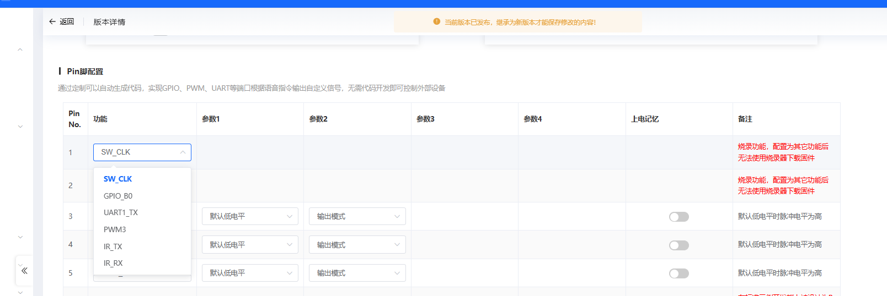

2. 选择GPIO_B0即可将B0配置为普通输入输出引脚

**注意事项：**

- B0在硬件上也连接到扬声器正极（SPK1），使用时需注意避免与音频输出冲突
- 若使用专用烧录器烧录，需将B0恢复为SW_CLK模式
- 串口1烧录固定使用B6/B7引脚，不受B0配置影响

---

### SU-03T连接无线接收模块后无法启动怎么办？

**问题描述：**

将四路433无线接收模块的接收输出引脚连接到SU-03T语音模块的B0和B1引脚后，语音模块无法启动，但若先通电再连接无线接收模块则正常工作。

**解决方案：**

- 更换引脚连接，避免使用B0和B1引脚连接外部设备
- SU-03T的B0/B1引脚可能影响模块启动时序

**注意事项：**

- 外部设备连接可能影响模块的正常启动
- 如必须使用无线模块，建议连接其他GPIO引脚
- 先上电后连接的方式能正常工作说明是启动时序问题

---

### SU-03T连接ESP01S串口后不开机怎么办？

**问题描述：**

将SU-03T的B0B1引脚连接到ESP01S的串口但未接电源时，模块无法正常开机。

**解决方案：**

- SU-03T模块需要独立供电才能正常工作
- 仅通过串口连接无法提供足够的电源

**注意事项：**

- SU-03T工作时需要5V供电
- 串口通信不能替代电源输入
- 确保模块的VCC引脚正确连接到5V电源

---

### 使用错误的烧录工具找不到SU-03T型号怎么办？

**问题描述：**

使用ChipIntelli串口升级工具（V3.9.6）烧录SU-03T模块时，在CI110X系列中找不到SU-03T型号，且首次烧录成功后，再次烧录自己生成的固件失败。

**解决方案：**

**1. 烧录工具选择错误**

- 使用的工具：ChipIntelli串口升级工具（V3.9.6）
- 问题：该工具不支持SU-03T模块
- 正确工具：应使用Hummingbird-M-Update-Tool工具


*ChipIntelli工具不支持SU-03T模块*

**2. 正确的烧录工具和流程**

- **正确工具**：Hummingbird-M-Update-Tool
- **模块确认**：SU-03T模块+转接板
- **首次烧录**：需要使用特定固件

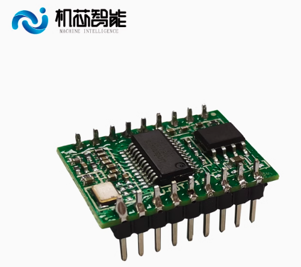

*SU-03T模块通过转接板连接*

**3. 首次烧录注意事项**

- **首次烧录固件**：

    - 必须使用uni_app_release.bin或uni_app_debug.bin
    - 固件位置：Hummingbird-M-Update-Tool文件夹
    - 不能直接使用平台生成的自定义固件

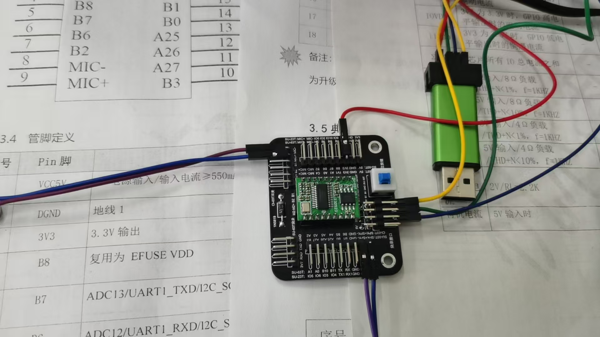

*SU-03T模块与转接板的连接方式*

**4. 烧录失败原因分析**

- **路径问题**：

    - 烧录路径包含中文或特殊字符
    - 导致文件读取失败

- **固件混淆**：

    - 平台生成的jx_su_03t_release.bin是黄色文件
    - 首次烧录必须使用官方uni_app_release.bin


*平台生成的固件文件，黄色.bin文件为用户固件*

**5. 正确烧录步骤**

**首次烧录**：

1. 使用Hummingbird-M-Update-Tool工具
2. 选择uni_app_release.bin固件
3. 完成首次烧录后，模块支持后续更新

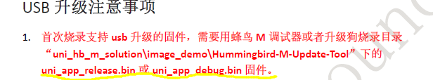

*首次烧录必须使用uni_app_release.bin*

**后续烧录**：

1. 可以使用平台生成的自定义固件
2. 避免使用含中文路径
3. 确认烧录工具选择正确

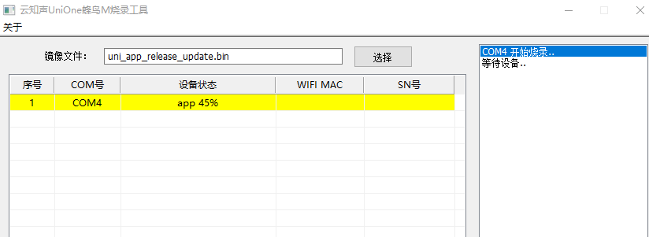

*固件烧录进度显示*

**6. 常见错误处理**

- **文件读取失败**：

    - 检查路径是否包含中文
    - 确认文件存在且可访问
    - 使用英文路径重新尝试

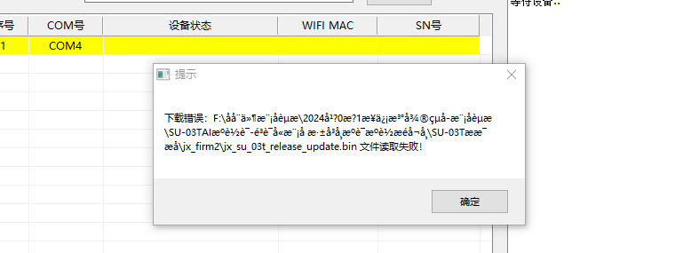

*路径包含中文导致的读取错误*

- **烧录失败**：

    - 确认使用了正确的烧录工具
    - 检查硬件连接是否正确
    - 验证固件文件是否匹配型号

**注意事项：**

- SU-03T必须使用Hummingbird-M-Update-Tool
- 首次烧录必须使用官方提供的uni_app固件
- 烧录路径不能包含中文字符
- B6/B7为烧录专用引脚，CH340 TXD接B7，RXD接B6
- 5V供电确保稳定性

---

### SU-03T使用错误的烧录工具怎么办？

**问题描述：**

在烧录SU-03T模块时，使用了错误型号的烧录工具（ChipIntelli串口升级工具V3.9.6），导致找不到SU-03T型号选项。

**解决方案：**

**1. 使用正确的烧录工具**

- SU-03T必须使用专用的Hummingbird-M-Update-Tool
- 不能使用其他型号的烧录工具
- 烧录工具可从官网下载


**2. 正确的烧录步骤**

- 使用Hummingbird-M-Update-Tool工具
- 首次烧录需要使用uni_app_release.bin或uni_app_debug.bin固件
- 后续可使用自己生成的固件


**3. 硬件连接**

- 模块+转接板方式连接
- CH340 TXD接B7引脚
- CH340 RXD接B6引脚
- 使用5V供电

**注意事项：**

- SU-03T不在CI系列烧录工具的型号列表中
- 必须使用专用工具才能正确识别和烧录
- 烧录失败后检查是否使用了正确工具

---

### SU-03T首次烧录成功后再次烧录自定义固件失败？

**问题描述：**

SU-03T模块首次烧录成功后，使用自己通过平台生成的固件进行二次烧录时出现失败现象。

**解决方案：**

**1. 确认烧录文件类型**

- 首次烧录必须使用官方提供的uni_app_release.bin或uni_app_debug.bin
- 后续烧录可使用平台生成的jx_su_03t_release.bin等文件
- 黄色.BIN文件为生产固件，可正常使用

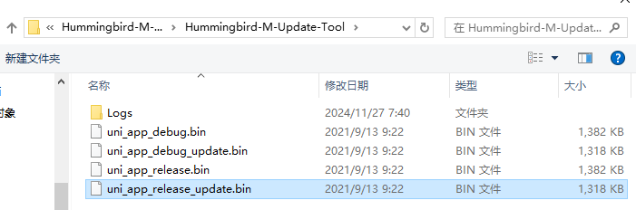

**2. 烧录失败排查**

- 检查文件路径是否包含中文字符
- 确认硬件连接稳定
- 验证固件文件完整性
- 重新启动烧录工具尝试

**3. 烧录流程**

- 使用Hummingbird-M-Update-Tool
- 选择正确的串口号
- 加载固件文件
- 点击开始烧录并等待完成

**注意事项：**

- 首次烧录完成后，模块已具备正常启动能力
- 自定义固件必须通过官方平台生成
- 烧录失败时可尝试重新生成固件文件
- 确保固件文件与模块型号匹配

### SU-03T焊在PCB上无法烧录怎么办？

**问题描述：**

SU-03T模块焊接到PCB后无法通过B6/B7下载端口烧录，但拆下模块后可以正常烧录。

**解决方案：**

**问题分析：**

- 外围电路影响烧录信号
- 某些引脚电平导致无法进入烧录模式
- 焊接后的电路负载改变

**解决方法：**

1. **引脚电平控制**
    - B8引脚接高电平尝试烧录
    - A25引脚接高电平尝试烧录
    - A8引脚接5V电压尝试烧录

2. **硬件开关设计**
    - 在B6/B7与外围电路间加开关
    - 烧录时断开与其他元件的连接
    - 使用跳线帽选择烧录/工作模式

3. **测试建议**
    - 设计成可插拔的封装（如2.0排母）
    - 方便拆下单独烧录
    - 批量生产时考虑专用烧录夹具
 
    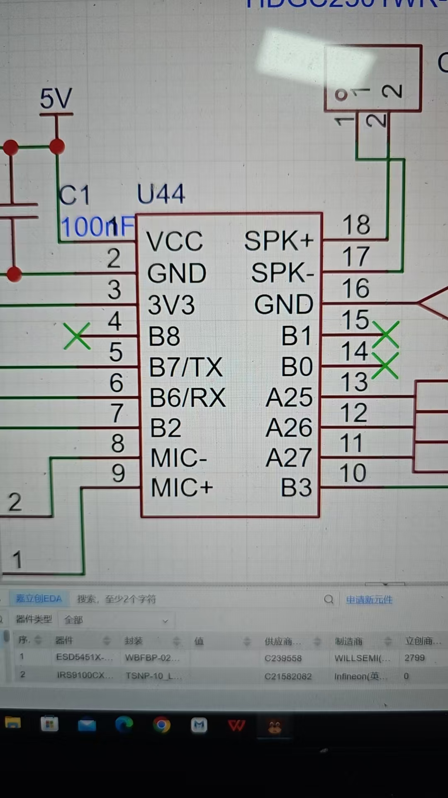
 
    **注意事项：**
 
    - 5V电压测试时注意安全，烧录完断开
    - 外围电路设计时预留烧录模式切换
    - 批量生产建议制作专用测试板
 
---

### SU-03T模块量产烧录需要专用夹具吗？

**问题描述：**

在使用SU-03T模块进行量产烧录时，询问如何快速连接模块与烧录器，以及是否提供烧录夹具。

**解决方案：**

**1. 量产烧录服务选项**

- **厂家预烧录服务**：

    - 100个起提供免费烧录服务
    - 只需提供固件包即可
    - 出货前完成烧录测试

- **自行烧录方案**：

    - 购买脱机烧录器进行量产
    - 需要自行解决快速连接问题

**2. 烧录夹具说明**

- 厂家不单独销售烧录夹具
- 夹具通常为定制化工具
- 需要自行设计或找第三方制作

**3. 快速连接方案**

- 使用定制的测试夹具
- 设计弹簧探针接触模块引脚
- 批量生产建议使用自动化设备

**注意事项：**

- 量产烧录建议直接选择厂家服务
- 自行烧录需要投入人力成本
- 夹具制作需要一定的技术能力

---

### SU-03T烧录时提示"ICEman connect failed"怎么办？

**问题描述：**

使用MV ADS downloader工具烧录SU-03T芯片时，在"checking cpu type"阶段失败，提示"ICEman connect failed, return!"，且红灯熄灭。

**解决方案：**

**问题分析：**

- ICEman连接失败表示烧录工具与芯片通信异常
- 红灯熄灭说明设备连接中断
- 可能是平台配置或硬件连接问题

**排查步骤：**

1. **检查平台烧录功能配置**
    - 登录智能公元平台
    - 进入"版本详情"页面
    - 确认"烧录功能"未配置为其他功能
    - 如配置错误，修正后重新生成固件

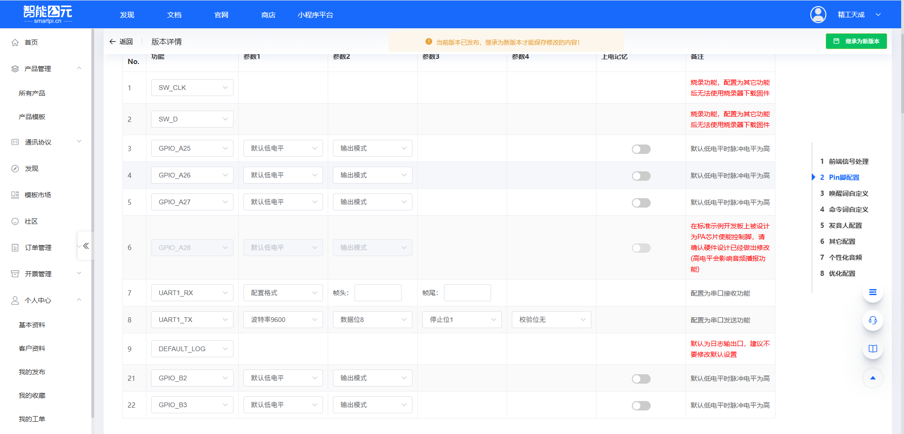

2. **硬件检测方法**
    - 使用万用表蜂鸣档测试VCC和GND是否击穿
    - 给模块5V供电，测试3V3引脚是否有3.3V输出
    - 测试麦克风正负电压（SU-03T应在2.4-2.5V范围）
    - 测试喇叭正负对GND电压（应在2.2-2.5V范围）

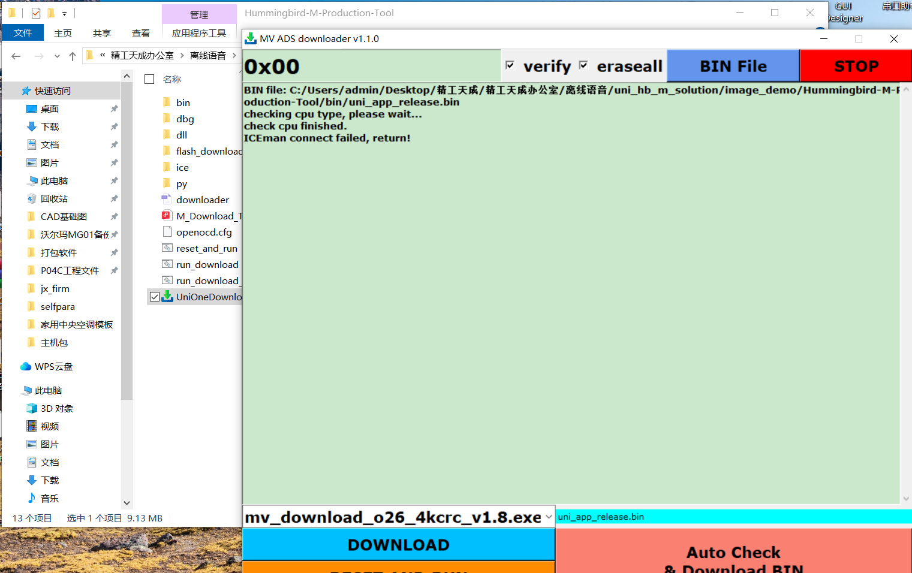


3. **软件环境排查**
    - 以管理员权限运行烧录工具
    - 关闭其他可能冲突的程序
    - 尝试不同的USB端口

4. **驱动和兼容性**
    - 确认USB驱动正确安装
    - 检查系统兼容性（Windows版本）
    - 尝试在纯净系统环境测试

**常见解决方法：**

- 重新插拔USB连接
- 重启电脑和烧录工具
- 更换烧录工具版本
- 使用虚拟串口软件测试连接

**注意事项：**

- ICEman连接失败通常是通信协议问题
- 确保使用原装烧录器和配套软件
- 如问题持续，联系官方技术团队提供详细错误日志
- 保留好错误截图便于问题定位

---

### SU-03T和SU-03T1有什么区别？

**问题描述：**

SU-03T生成的固件烧录到SU-03T1后无声音，但相同固件在SU-03T上正常工作，原始固件在两个模块上都能正常工作。

**解决方案：**

**硬件版本差异：**

- **SU-03T**：早期版本（v1.1），使用旧版烧录工具
- **SU-03T1**：新版本（v2.1），需要新版烧录工具
- 两个模块功能相同，但硬件版本不同

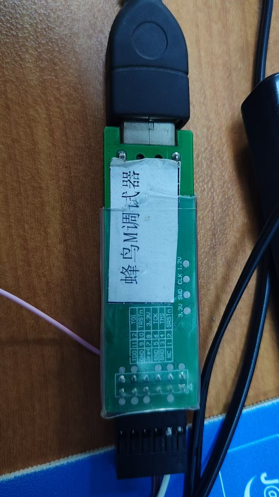

**固件兼容性说明：**

- SU-03T和SU-03T1本质上是相同的产品
- 固件文件本身兼容两个模块
- 问题主要出在烧录工具和烧录方法上

**正确烧录方法：**

1. **使用正确的烧录工具**
    - SU-03T：使用标准版烧录工具
    - SU-03T1：必须使用新版专用工具
    - 工具版本不匹配会导致烧录失败或功能异常

2. **烧录器选择**
    - 使用蜂鸟M调试器进行烧录
    - 确认调试器版本支持目标模块
    - 新版模块可能需要固件升级

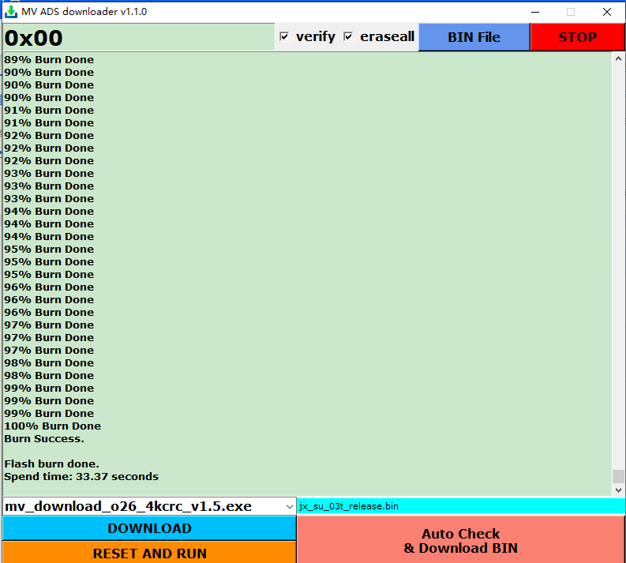

**故障排查步骤：**

1. **确认模块版本**
    - 查看模块PCB上的丝印标识
    - v1.1为旧版，v2.1为新版
    - 根据版本选择对应工具

2. **硬件检测方法**
    - 使用万用表测量供电电压
    - 测试麦克风正负电压（SU-03T应在2.4-2.5V范围）
    - 测试喇叭正负对GND电压（应在2.2-2.5V范围）

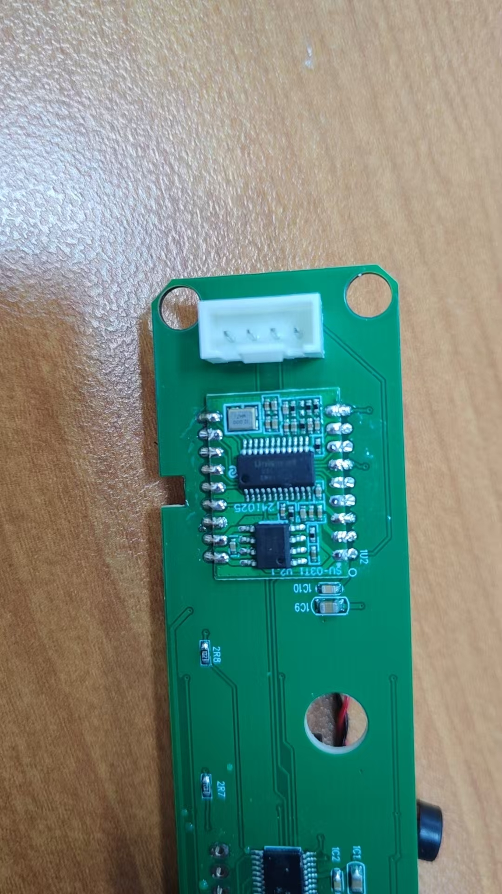

3. **交叉验证**
    - 将固件分别烧录到不同模块测试
    - 使用官方固件验证模块硬件状态
    - 更换烧录工具或电脑平台测试

**注意事项：**

- SU-03T1烧录必须使用新版工具
- 旧版工具可能显示烧录成功但实际功能异常
- 如问题持续，联系官方技术团队获取专用烧录工具
- 保留模块原始包装便于售后

---

### SU-03T如何通过串口命令强制停止播放？

**问题描述：**

SU-03T模块正在播放语音时，希望通过串口发送命令来强制停止播放。

**解决方案：**

**方法一：发送空白语音（推荐）**

- 通过串口发送一段无声音的音频文件
- 模块接收到新的音频播放指令会打断当前播放
- 准备一个0秒的空白WAV文件或无声音频
- 将该音频文件配置为一个"行为"，通过串口触发

**方法二：发送十六进制控制命令**

- 使用特定的十六进制命令帧强制停止播放
- 命令格式：`0x7E 0x06 0x04 0x01 0x00 0xEF`
- 命令帧各部分含义：

    - 0x7E：帧头
    - 0x06：帧长度
    - 0x04：命令类型（控制命令）
    - 0x01：功能码（停止播放）
    - 0x00：参数
    - 0xEF：校验和

**操作步骤：**

1. 使用串口调试工具（如串口助手）
2. 设置正确的串口参数（波特率、数据位等）
3. 发送上述十六进制命令帧
4. 模块接收后会立即停止当前播放


**注意事项：**

- 发送命令时确保格式正确，特别是校验和
- 空白语音方法更简单，不需要了解底层协议
- 建议优先使用空白语音方法，避免命令格式错误
- 如控制命令无效，检查模块固件版本是否支持

---

### SU-03T模块上电无反应怎么办？

**问题描述：**

SU-03T模块上电后无任何反应，烧录时也无法正常工作。

**解决方案：**

**1. 硬件检查**

- 检查电源连接是否正确
- 使用万用表测量供电电压
- 确认所有接线接触良好

**2. 烧录测试**

- 使用专用烧录器测试
- 检查模块是否能正常进入烧录模式
- 验证串口驱动是否正常

**3. 复位功能**

- 如果有复位按键，尝试按下复位
- 没有复位键时可断电重启
- 复位后观察模块是否有反应

**4. 故障判断**

- 开发板测试正常说明模块是好的
- 烧录无反应可能是连接问题
- 多次测试仍无反应可能是模块损坏

**注意事项：**

- 出厂前模块都经过烧录测试
- 上电无反应通常是供电或连接问题
- 排除所有外部因素后再判断模块故障
- 保留模块的原始包装便于售后

---

### SU-03T串口烧录时管脚配置如何对应？

**问题描述：**

串口教程中的管脚配置是芯片管脚，与模块的实际引脚不对应，无法正确进行烧录。

**解决方案：**

**1. 了解芯片引脚与模块引脚的区别**

- 教程中的管脚配置是芯片级别的引脚定义
- 模块引脚是经过板级设计后的外部接口
- 两者需要通过原理图进行对应

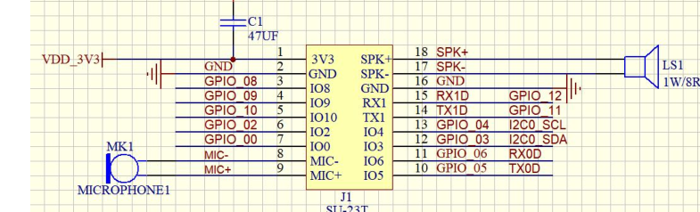

**2. 串口烧录引脚选择**

SU-03T支持以下串口作为烧录口：

- **UART0串口**：IO5/TX, IO6/RX
- **UART1串口**：TX1/TX, RX1/RX
- 两个串口都可以用于烧录


**3. DEFAULT配置说明**

- 管脚配置设置为"DEFAULT"时
- 系统会自动将引脚设置为log调试脚
- 这会影响正常的log调试功能

**4. 烧录方法确认**

- 确认使用的烧录软件和固件匹配
- 根据实际硬件连接选择正确的串口
- 具体烧录方式请参考烧录文档

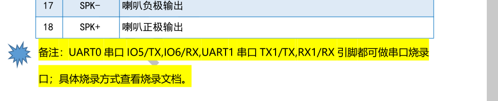

**注意事项：**

- 芯片引脚和模块引脚是不同的概念
- 烧录时选择正确的物理引脚连接
- DEFAULT配置会影响调试功能，需根据实际需求设置

---

### SU-03T烧录后无反应如何排查？

**问题描述：**

SU-03T模块最初测试时有反应，但焊接固定后无任何响应，即使重新烧录也无效。

**解决方案：**

**1. 焊接检查**

- 使用万用表检查焊接点
- 确认没有虚焊或短路
- 验证咪头和喇叭接线正确
    - MIC+：接咪头正极
    - MIC-：接咪头负极
    - SPK+/SPK-：接喇叭（不分正负）

**2. 供电验证**

- 确认模块供电正常（LED亮）
- 测试供电电压是否稳定
- 检查电源纹波是否过大

**3. 程序验证**

- 使用调试固件测试
- 尝试烧录已知正常的固件
- 确认程序本身没有问题

**4. 硬件损坏判断**

- 焊接过程中可能损坏模块
- 静电击穿或过热损坏
- 长时间测试导致硬件老化

**注意事项：**

- 焊接时务必断电操作
- 使用防静电设备
- 避免烙铁温度过高
- 焊接时间不宜过长

---

### SU-03T烧录时插上VCC后电源断开怎么办？

**问题描述：**

在进行SU-03T烧录时，插上VCC电源线后设备立即断开，此前烧录操作正常。

**解决方案：**

**1. 烧录供电方法**

- 需要在供电线路上加开关
- 烧录时需要通过开关控制通断
- 实现模块的复位进入烧录模式

**2. 正确烧录流程**

1. 连接好所有线路
2. 打开烧录软件，选择固件
3. 点击烧录按钮
4. 拔掉5V供电线
5. 等待1-2秒
6. 重新插上5V供电线

**3. 问题原因分析**

- 可能是供电瞬间电流过大
- USB口保护机制触发
- 线路接触不良导致

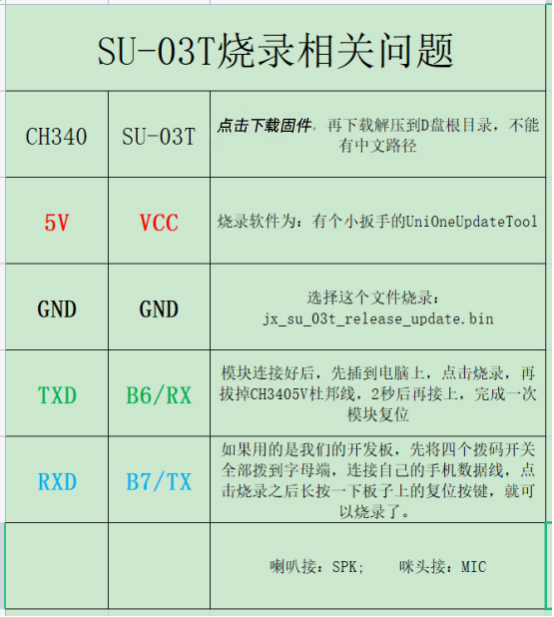

**注意事项：**

- 必须使用带开关的供电方案
- 烧录工具会自动检测模块进入
- 操作时要快、准、稳
- 如持续失败，检查CH340驱动

---

### SU-03T烧录软件显示错误怎么办？

**问题描述：**

使用烧录软件对SU-03T进行烧录时，软件显示错误，无法完成烧录操作。

**解决方案：**

**1. 驱动检查**

- 确认CH340驱动已安装
- 检查设备管理器中COM口是否正常
- 如有黄色感叹号需重新安装驱动

**2. 硬件连接**

- 确保杜邦线接触良好
- 检查引脚对应关系：

    - CH340 5V → 模块 VCC
    - CH340 GND → 模块 GND
    - CH340 TXD → 模块 B7 (RX)
    - CH340 RXD → 模块 B6 (TX)
- 接线与颜色无关，按引脚标识连接


**3. 烧录操作**

- 连接好线路后打开烧录软件
- 选择正确的COM端口
- 点击烧录后立即断开5V再重连
- 观察软件进度变化


**4. 常见错误处理**

- **找不到设备**：检查COM口和驱动
- **连接失败**：检查线路接触
- **烧录中断**：重复断电上电操作
- **进度异常**：尝试更换USB端口

**注意事项：**

- CH340驱动需要从官网下载
- 某些系统需要禁用驱动签名
- 使用质量好的杜邦线
- 烧录时不要移动模块或线缆

---

## 其他烧录问题

### SU-03T烧录时一直卡在0%怎么办？

**问题描述：**

SU-03T模块在烧录过程中一直卡在0%进度，无法完成烧录操作。

**解决方案：**

**问题原因分析：**

烧录卡在0%通常是由于杜邦线接触不良导致的：

- **规格不匹配**：杜邦线是2.54mm间距，模块是2.0mm间距
- **接触不良**：线规与模块引脚不匹配导致虚接
- **识别异常**：工具能识别芯片但无法开始数据传输

**解决方法：**

1. **按压测试**：

    - 用手按住杜邦线，确保良好接触
    - 如果按压后能正常烧录，确认为接触问题
    - 作为临时解决方案

2. **使用转接板**：

    - 购买黑色转接板
    - 将模块焊上排针后插在转接板上
    - 使用标准2.54mm杜邦线连接
    - 操作更简单，连接更可靠

3. **接线检查**：

    - 确认所有线路连接正确
    - 特别注意TX/RX交叉连接
    - 检查GND是否可靠连接

**烧录成功要素：**

1. **接线正确**：严格按照引脚定义连接
2. **接触良好**：避免因间距不匹配导致的虚接
3. **文件路径**：确保固件路径无中文字符
4. **操作规范**：参考官方教程操作

**烧录失败排查清单：**

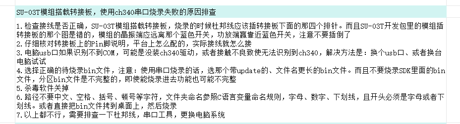

**实际案例：**

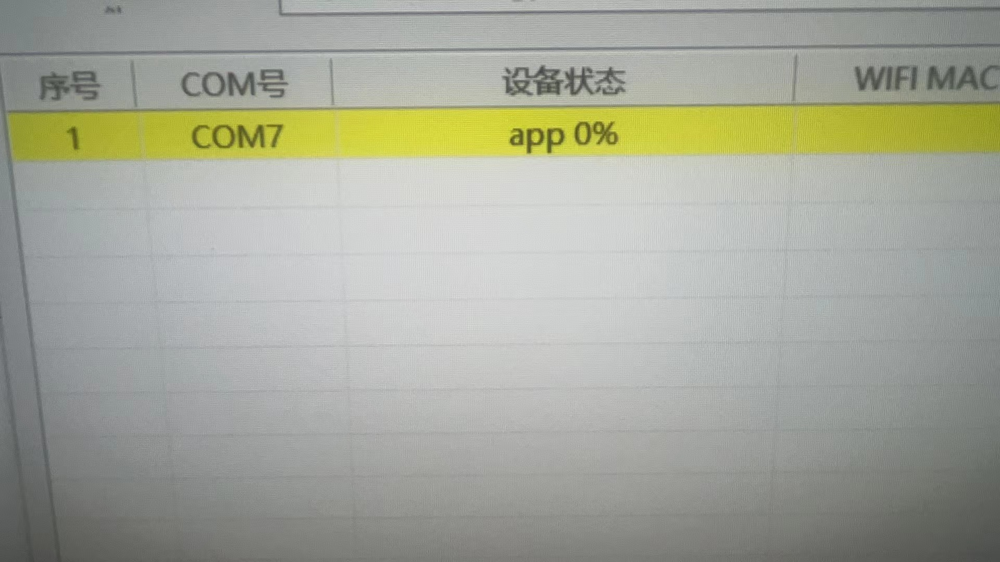

**注意事项：**

- 模块引脚间距为2.0mm，标准杜邦线为2.54mm
- 接触不良是最常见的烧录失败原因
- 建议使用转接板或定制线材

---

### SU-03T命令词识别后串口回复延迟怎么解决？

**问题描述：**

SU-03T模块在识别命令词后，串口需要等待3-5秒才输出回复ID，影响系统响应速度。

**解决方案：**

**指令发送间隔：**

- **推荐间隔**：20ms是可以实现的最小间隔
- **测试验证**：可使用串口调试助手先进行测试
- **发送方式**：指令是一条一条地发送，非批量发送

**MCU无响应排查：**

1. **检查连接**

    - 确认串口连接正常
    - 检查波特率设置（默认115200）
    - 验证接地线连接

2. **指令格式验证**

    - 确认指令格式正确
    - 检查帧头帧尾是否完整
    - 验证指令参数是否有效

3. **延时设置**

    - 多条指令间至少间隔20ms
    - 建议从20ms开始测试
    - 可根据实际情况调整间隔时间

**技术建议：**

- 先用串口调试助手验证指令发送
- 确认MCU能正确接收单条指令
- 逐步测试减小指令间隔时间
- 使用示波器或逻辑分析仪检查信号质量

**注意事项：**

- 指令发送过快可能导致MCU处理不过来
- 20ms是经过测试的最小可靠间隔
- 之前使用的10ms间隔可能过短
- 如问题持续，检查MCU程序是否正确处理串口中断

---

### SU-03T烧录后自学习功能只能使用两次？

**问题描述：**

烧录特定固件后，发现学习唤醒词和命令词的功能仅能使用两次。

**解决方案：**

**1. 确认固件版本**

- 这是固件设计的特性：某些固件版本将自学习次数限制为2次
- 目的是提高自学习成功率：减少因多次学习导致的干扰累积

**2. 固件验证**

- 检查烧录的固件文件是否为指定版本
- 使用MD5校验确认固件完整性
- MD5校验值：97d932b8ab290874f79874e52f0280e7（针对特定固件）

**3. 使用建议**

- 两次学习机会足够完成自学习配置
- 建议在安静环境下进行，确保成功率
- 如需重新学习，可考虑重新烧录固件

**固件信息：**

- 文件名：jx_su_03t_release.bin
- 固件编号：根据具体项目而定
- 功能确认：学习唤醒词和命令词各限制两次

**注意事项：**

- 固件限制是设计特性，非故障
- MD5校验确保烧录的固件文件完整性
- 保存好固件文件和对应的MD5值便于后续验证
- 固件文件大小异常时也需要重新验证
- 不同日期的相同命名固件可能有不同版本，需以MD5值为准

---

### SU-03T固件命名规则和烧录信息如何确认？

**问题描述：**

需要确认产品使用的固件名称和烧录信息，以确保正确烧录固件，避免因固件错误导致产品功能异常。

**解决方案：**

**1. 固件命名规范**

- 路径格式：朗力德/窗帘电机/su-03t-V2.1/jx_su_03t_release.bin
- 固件编号：根据项目需求自定义（如"蓝精灵固件"）
- 文件名：jx_su_03t_release.bin（固定格式）

**2. 固件信息确认**

- 开机播报：根据项目定制（如"欢迎使用智能语音窗帘控制系统，你可以使用蓝精灵唤醒我"）
- 唤醒词：包含主唤醒词和命令词（如"蓝精灵|一号窗|二号窗|..."）
- 回复语：简单响应（如"来了"）

**3. 烧录验证**

- MD5校验：记录每次烧录的MD5值用于验证
- 示例MD5：b47a501ec367c94dea683a9dcc87fe18
- 另一版本MD5：54ca751ad021a5a9fbda2577f7457ae2（浙江西谷数字项目专用）
- 确认流程：烧录前核对固件编号，烧录后记录MD5

**注意事项：**

- 不能搞错固件版本，不同项目使用对应固件
- 生产烧录需要专人负责，避免错误
- 保留完整的固件和MD5记录便于追溯
- 如不确定，及时与技术人员确认

---

**问题描述：**

需要确认产品使用的固件名称和烧录信息，以确保正确烧录固件，避免因固件错误导致产品功能异常。

**解决方案：**

**1. 固件命名规范**

- 路径格式：朗力德/窗帘电机/su-03t-V2.1/jx_su_03t_release.bin
- 固件编号：根据项目需求自定义（如"蓝精灵固件"）
- 文件名：jx_su_03t_release.bin（固定格式）

**2. 固件信息确认**

- 开机播报：根据项目定制（如"欢迎使用智能语音窗帘控制系统，你可以使用蓝精灵唤醒我"）
- 唤醒词：包含主唤醒词和命令词（如"蓝精灵|一号窗|二号窗|..."）
- 回复语：简单响应（如"来了"）

**3. 烧录验证**

- MD5校验：记录每次烧录的MD5值用于验证
- 示例MD5：b47a501ec367c94dea683a9dcc87fe18
- 另一版本MD5：54ca751ad021a5a9fbda2577f7457ae2（浙江西谷数字项目专用）
- 确认流程：烧录前核对固件编号，烧录后记录MD5

**注意事项：**

- 不能搞错固件版本，不同项目使用对应固件
- 生产烧录需要专人负责，避免错误
- 保留完整的固件和MD5记录便于追溯
- 如不确定，及时与技术人员确认

---

---

## 连接与通信问题

### SU-03T如何与单片机进行串口通信？

**问题描述：**

需要了解SU-03T模块与单片机（如STC89C52RC）的连接方式，以及串口通信的接线方法。

**解决方案：**

**1. 串口连接方式**

SU-03T通过UART串口与单片机通信：

- 模块TX → 单片机RX
- 模块RX → 单片机TX
- 双方GND相连

**2. 电平匹配**

- SU-03T串口电平：3.3V
- 单片机电平：通常是5V或3.3V
- 如单片机为5V，需要电平转换电路

**3. 连接示例**


*SU-03T1模块通过CH340模块进行串口通信，VCC、GND、TXD、RXD的连接方式*

**4. 通信参数**

- 波特率：9600-115200（双方需一致）
- 数据位：8位
- 停止位：1位
- 校验位：无（默认）

**注意事项：**

- 确保双方共地，否则通信不稳定
- 5V系统必须加电平转换，避免损坏模块
- 通信距离建议控制在30cm以内
- 使用屏蔽线减少干扰

---

### SU-03T模块引脚间距与标准洞洞板不兼容怎么办？

**问题描述：**

SU-03T模块引脚间距为2.0mm，而标准洞洞板为2.54mm间距，无法直接焊接固定。

**解决方案：**

**1. 问题分析**

- SU-03T设计采用2.0mm排针间距
- 标准洞洞板/面包板为2.54mm间距
- 0.54mm的间距差导致无法直接对齐

**2. 解决方案**

**方案一：飞线连接**

- 使用细导线逐个连接引脚
- 导线长度尽量短（<5cm）
- 使用热缩管保护焊点

**方案二：转接板方案**

- 定制2.0mm转2.54mm的转接PCB
- 或使用现成的转接座
- 可靠性高，适合量产

**方案三：特殊焊接**

- 斜向焊接2.0mm底座到2.54mm焊盘
- 仅焊接部分关键引脚
- 需要一定焊接技巧

**3. 实施建议**

- 开发阶段推荐飞线方案
- 小批量生产建议定制转接板
- 焊接时使用25W以下烙铁
- 每个引脚焊接时间<3秒

**注意事项：**

- 2.0mm是SU-03T的固定设计，无法改变
- 强行对齐焊接会产生应力，可能导致损坏
- 长期使用建议制作专用转接板
- 采购模块时注意确认引脚间距规格

---

### SU-03T烧录固件后无语音输出且无串口输出？

**问题描述：**

SU-03T芯片烧录固件后，设备既没有语音输出，也没有串口数据输出，无法验证功能是否正常。

**解决方案：**

**1. 检查回复语配置**

- 登录智能云平台，检查命令词配置中的"回复语"字段
- 确保每个命令词都设置了对应的回复语内容
- 回复语为空将导致设备不进行语音响应

**2. 确认烧录成功**

- 使用正确的烧录工具（UnisoundAssistant）
- 确认烧录过程显示"Congratulations, download success!"
- 如显示"ICEman connect failed, return!"，说明烧录失败

**3. 硬件连接检查**

- 确保扬声器正确连接到SPK+和SPK-引脚
- 检查串口线连接到B2（TX）和B3（RX）
- 验证供电正常（5V或3.3V）

**4. 重新生成固件**

- 在平台中完善回复语配置
- 重新生成固件文件
- 使用正确的烧录口（B0、B1）进行烧录

**注意事项：**

- 烧录口（B0、B1）与串口通信口（B2、B3）是不同的接口
- 命令词的回复语必须配置，否则即使识别成功也不会有语音输出
- 测试时确保供电稳定，避免误触发

---

### SU-03T应该使用哪个烧录软件？

**问题描述：**

尝试使用MV ADS Downloader软件烧录SU-03T时失败，但使用UnisoundAssistant可以成功，不确定应该使用哪个软件。

**解决方案：**

**烧录工具与硬件对应关系：**

- **升级狗**（绿色PCB，USB接口）→ 使用 **UnisoundAssistant**
- **调试器**（AICE MINI）→ 使用 **MV ADS Downloader**

**正确烧录步骤：**

1. 确认使用的烧录硬件类型
2. 选择对应的烧录软件：

    - 升级狗：UnisoundAssistant_US516_US518版本
    - 调试器：MV ADS Downloader v1.1.0
3. 选择正确的芯片型号（US516P6）
4. 使用正确的接口连接：

    - 烧录口：B0（D+）、B1（D-）
    - 通信口：B2（TX）、B3（RX）

**成功标志：**

- UnisoundAssistant显示"Congratulations, download success!"
- MV ADS显示烧录进度条完成并提示成功

**注意事项：**

- 两种硬件工具不能混用对应的软件
- 升级狗成本较低，适合量产烧录
- 调试器功能更强，适合开发调试
- 烧录失败时先检查硬件和软件是否匹配

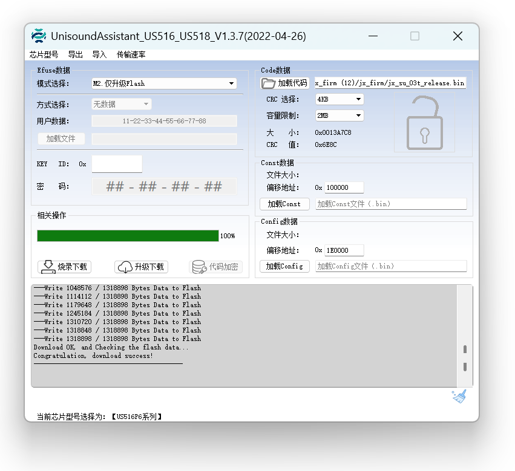

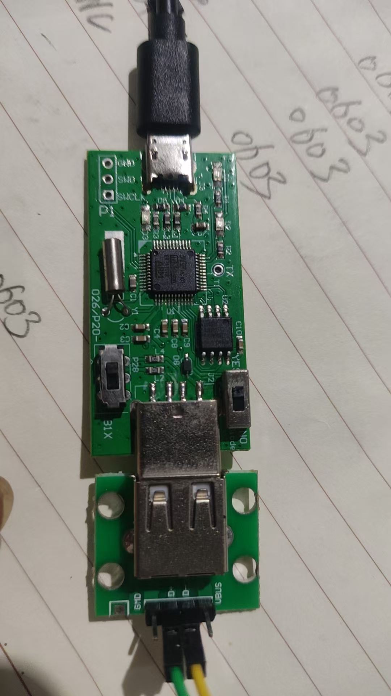

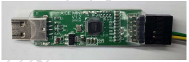

---

### SU-03T烧录时B0、B1接线错误怎么办？

**问题描述：**

SU-03T烧录时将B0接到D+、B1接到D-，导致烧录失败，需要确认正确接线方式。

**解决方案：**

**正确接线方式：**

- B0应连接到D-
- B1应连接到D+
- 与常规接线相反，需要特别注意

**错误原因分析：**

- 图片示例可能有误导
- 不同批次模块接线定义可能不同
- 未仔细查看技术文档

**操作步骤：**

1. 断开所有连接
2. 重新接线：

    - B0 → D-
    - B1 → D+
3. 确认连接牢固
4. 重新尝试烧录

**注意事项：**

- 烧录前务必确认接线正确
- 如多次失败，联系官方技术团队
- 保留错误接线照片以便分析
- 使用万用表测试通断

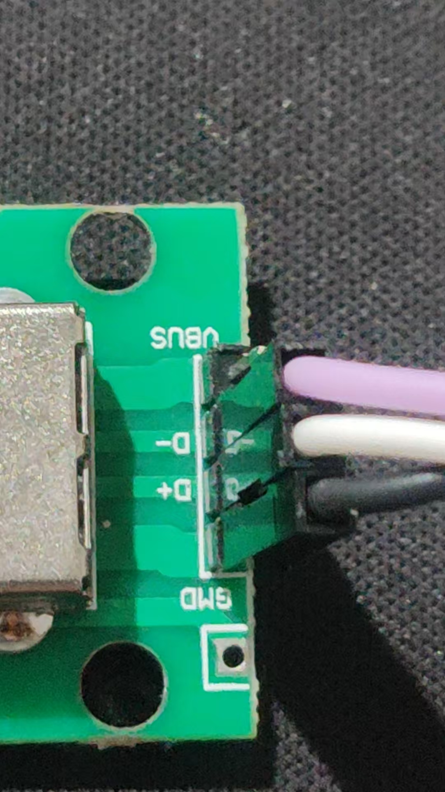

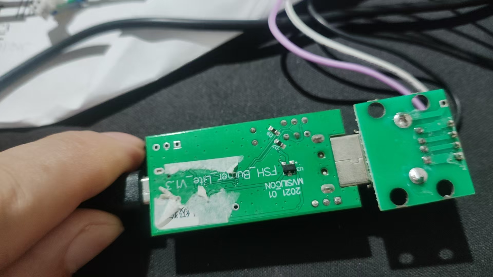

---

### US516P6系列芯片烧录接线如何连接？

**问题描述：**

US516P6系列芯片烧录时，对B0、B1与D+、D-的接线方式存在疑问。

**解决方案：**

**脱机烧录器接线标准：**

```
脱机烧录器 → SU-03T模块
GND → GND
D- → B2
D+ → B3
VCC → VCC（5V）
GND → GND
```

**常见错误：**

- 错误将B0接到D+、B1接到D-
- 应该是B2接到D-、B3接到D+
- 接线错误会导致烧录失败

**正确操作步骤：**

1. 断开所有连接
2. 按照接线表重新连接：

    - B2 → D-
    - B3 → D+
3. 检查供电（5V）
4. 确认GND良好接地
5. 重新尝试烧录

**注意事项：**

- US516P6包含SU-03T、CI-03T等型号
- 不同烧录器可能有不同接线定义
- 务必参考具体烧录器的接线说明
- 如多次失败，建议更换烧录器或接线方式

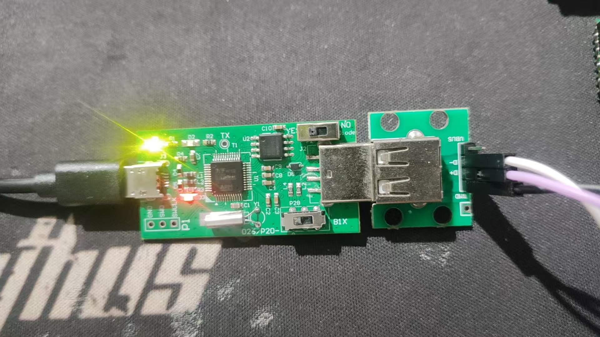

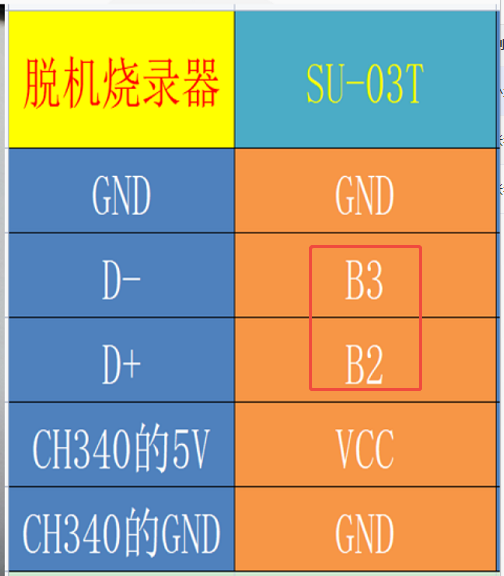

---


### 如何提高固件烧录效率？

**问题描述：**

单个模块烧录速度较慢，批量生产时需要更高效的烧录方案以提高生产效率。

**解决方案：**

**批量烧录方案：**

1. **使用批量烧录治具**
    - 可同时烧录多个模块
    - 大幅提高烧录效率
    - 适合大批量生产场景

2. **治具特点**
    - 支持多通道并行烧录
    - 稳定可靠的连接接口
    - 可定制数量的烧录位

**效率对比：**

- 单个烧录：每个模块需要独立连接和烧录
- 批量治具：可同时处理8-16个模块
- 效率提升：根据治具规格，可提升5-10倍效率

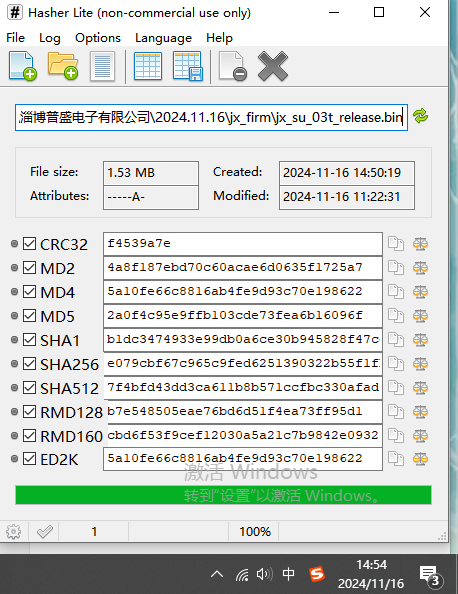

**操作建议：**

1. 评估生产需求，选择合适规格的批量治具
2. 治具到货后进行测试验证
3. 制定标准作业指导书(SOP)
4. 培训操作人员规范使用

**注意事项：**

- 批量烧录前仍需对每个固件进行MD5校验
- 确保治具连接良好，避免接触不良
- 定期维护治具，保持良好工作状态
- 小批量可考虑手动烧录，大批量建议使用治具

---
## 固件功能问题

### 烧录成功后只能响应一个唤醒词怎么办？

**问题描述：**

按照B站教程烧录固件，显示烧录成功，但设备只响应一个唤醒词，无法执行其他语音指令。

**解决方案：**

**1. 确认固件文件**

- 使用正确的固件文件（如uni_app_release_update.bin）
- 检查固件是否包含完整的命令词配置
- 确认固件版本与模块匹配

**2. 验证命令词配置**

- 确认在平台中配置了所有需要的命令词
- 检查每个命令词是否都设置了对应的回复语
- 验证命令词的拼音或文字是否正确

**3. 重新烧录测试**

- 尝试使用其他用户分享的测试固件
- 烧录后重新上电测试所有功能
- 逐个测试每个命令词的响应

**4. 常见测试固件**

- 唤醒词"你好小豆"
- 支持命令：前进、后退、左右转、蹲下、趴下
- 每个命令都有对应的回复词

**注意事项：**

- 确保使用与固件匹配的唤醒词
- 测试环境应相对安静，避免干扰
- 如果仅部分命令有效，可能是固件配置问题

---

## 串口与烧录口冲突

### SU-03T的串口1（B6/B7）可以同时用于通信和烧录吗？

**问题描述：**

使用SU-03T模块时，串口1（B6/B7引脚）被用于正常通信，同时需要使用串口进行烧录，担心串口冲突导致无法烧录。

**解决方案：**

SU-03T的烧录口可以配置成串口使用，不影响CH340烧录器正常烧录。

**使用方式：**

- B6/B7引脚可以同时用于两种功能：

    - 烧录时：连接CH340烧录器进行固件更新
    - 正常使用时：作为串口1进行数据通信

- 配置建议：

    - 在平台中将烧录口配置为串口功能
    - 这样既可以使用B6/B7进行烧录，也可以作为正常串口通信

**操作步骤：**

1. 使用智能公元平台进行配置
2. 将烧录口（B6/B7）设置为串口功能
3. 生成并烧录固件
4. 烧录完成后，B6/B7即可作为串口1正常使用

**注意事项：**

- 烧录时使用CH340连接B6/B7不影响正常通信功能
- 配置为串口后，仍可通过B6/B7进行固件烧录
- 不需要额外的硬件切换，两种功能可以共存

---

## 固件大小限制

### SU-03T 固件生成失败提示"固件超大"怎么办？

**问题描述：**

生成固件时出现错误提示，显示"生成的固件超大(2806字节)"，导致生成失败。

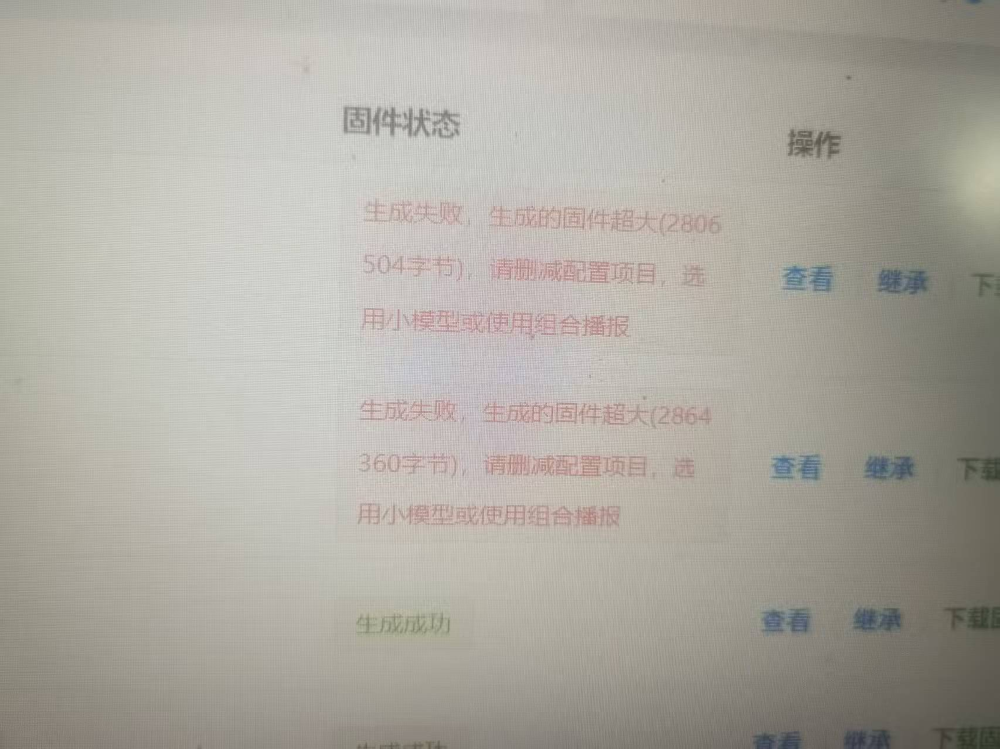

**解决方案：**

**1. 减少固件大小**

- 减少命令词数量
- 缩短回复语内容
- 减少自定义音频文件

**2. 了解模块限制**

- SU-03T 的 Flash 容量为 2M
- 需要将固件控制在 2M 以下才能生成成功
- 平台会根据模块限制进行校验

**3. 优化配置策略**

- 优先保留核心功能
- 合并相似的命令词
- 使用较短的回复语

**注意事项：**

- 不同模块的 Flash 容量不同
- 固件大小包含所有配置和音频数据
- 建议定期清理不必要的配置

### SU-03T烧录失败需要提供哪些信息？

**问题描述：**

SU-03T芯片无法烧录进去，需要记录烧录过程以便排查问题。

**解决方案：**

**需要提供的信息：**

1. **烧录过程记录**
    - 烧录软件的完整操作截图
    - 错误提示信息（如有）
    - 烧录过程的视频记录更佳

2. **硬件环境信息**
    - 使用的USB转串口型号（CH340/CP2102等）
    - 连接线的具体连接方式
    - 电脑操作系统版本

3. **模块状态信息**
    - 模块上电后的状态（LED指示灯）
    - 万用表测量的电压值
    - 是否有发烫等异常现象

**自我排查步骤：**

1. **基础检查**
    - 确认烧录工具版本正确
    - 检查COM端口识别正常
    - 验证固件文件完整

2. **连接检查**
    - TX/RX线是否交叉连接
    - GND线是否可靠接地
    - 供电电压是否为5V或3.3V

3. **环境检查**
    - 关闭其他可能占用串口的程序
    - 更换电脑USB端口测试
    - 以管理员权限运行烧录工具

**注意事项：**

- 提供的信息越详细，越容易定位问题
- 建议保留正常的烧录环境作为对比
- 某些情况下可能是模块硬件故障
- 可准备备用模块进行交叉验证

---


---

### SU-03T可以通过串口接收数据进行语音播报吗？

**问题描述：**

SU-03T芯片是否支持通过串口接收数据并进行语音播报，以及是否可以使用TTL转串口模块进行测试。

**解决方案：**

**功能支持确认：**

SU-03T**支持**通过串口接收数据进行语音播报。

**实现方法：**

1. **硬件连接**
    - 使用TTL转串口模块连接SU-03T
    - TX连接到SU-03T的B6（RX）
    - RX连接到SU-03T的B7（TX）
    - GND共地连接

2. **平台配置**
    - 在智能公元平台配置串口输入触发
    - 设置对应的播报内容
    - 生成并烧录固件到模块

3. **测试方法**
    - 使用串口调试助手发送测试数据
    - 模块接收数据后会自动播报语音
    - 可发送数字、文字等多种格式

**获取测试固件：**

- 访问智能公元平台：https://www.smartpi.cn/
- 在文档中心查找SU-03T开发包
- 开发包中包含出厂固件
- 烧录出厂固件可快速测试功能

**注意事项：**

- SU-03T的串口通信电压为3.3V
- 使用TTL转串口模块时注意电平匹配
- 测试时按照正确的波特率发送数据
- 出厂固件包含基础功能，适合快速验证

---

---

### 如何通过外部事件触发SU-03T唤醒？

**问题描述：**

需要通过外部事件（如触摸按键）触发SU-03T语音模块的唤醒，而不是通过语音唤醒。

**解决方案：**

**实现方法确认：**

SU-03T**支持**通过IO配置成输入，通过电平变化触发唤醒。

**方法一：定时器轮询方案**

1. **配置启动定时器**
    - 在开机事件中添加定时器控制
    - 设置超时时间50-100ms
    - 选择重复模式


2. **设置GPIO触发条件**
    - 添加触发条件：某个IO口为高电平
    - 触发后执行语音播报动作
    - 动作完成后将IO口设置为低电平

3. **硬件连接**
    - 外部设备（如单片机）控制指定IO口
    - 按键按下时输出高电平
    - 松开时输出低电平

**方法二：直接GPIO输入（如果平台支持）**

1. **添加GPIO输入触发**
    - 选择触发方式为GPIO输入
    - 选择对应的GPIO引脚
    - 设置触发条件（上升沿/高电平）

2. **平台限制说明**
    - 部分版本可能显示GPIO选项为空
    - 这是平台版本问题，不是硬件限制
    - 可升级平台版本或使用定时器方案


**操作建议：**

- 推荐使用定时器轮询方案，兼容性更好
- 注意时序控制，避免重复触发
- 测试时可以使用简单的开关模拟输入
- 复杂应用建议先学习基础教程

**注意事项：**

- 定时器超时后要及时恢复IO状态
- 外部设备控制时注意电平匹配
- 如果GPIO选项不可用，是平台显示问题
- 建议先观看官方教程了解配置方法

---

### 首次烧录成功后再次烧录自定义固件失败怎么办？

**问题描述：**

首次烧录成功后，使用自己通过平台生成的固件进行第二次烧录时出现失败。

**解决方案：**

**1. 确认烧录文件类型**

1. 文件路径包含中文字符导致读取失败
2. 可能未正确完成首次烧录流程

**解决方法：**

1. **检查文件路径**
    - 确保固件文件路径不包含中文字符
    - 将文件移动到纯英文路径下
    - 避免使用特殊字符

2. **规范操作流程**
    - 步骤1：使用uni_app_release.bin进行首次烧录
    - 步骤2：确认首次烧录成功，模块能正常工作
    - 步骤3：使用平台生成的自定义固件进行二次烧录


*文件路径包含中文字符会导致读取失败*

**预防措施：**

- 将所有固件文件存储在英文路径下
- 烧录前检查文件名是否合法
- 建议使用短且不含空格的文件名
- 烧录过程中不要移动或重命名文件

**注意事项：**

- 首次烧录必须完整完成，不能中断
- 二次烧录前确保模块已正常启动过
- 如果持续失败，尝试重新生成固件文件

---

## UART引脚配置问题

### CI-03T1模块UART串口配置与实际接线不匹配导致无输出怎么办？

**问题描述：**

使用CI-03T1芯片模块时，按照平台配置的UART1_TX和UART1_RX引脚进行接线，但模块没有输出。

**解决方案：**

**1. 确认实际接线与平台配置**

- 检查模块实际连接的引脚位置
- 确认平台上配置的UART引脚地址
- 对比两者是否一致

**2. 正确的引脚配置**

- CI-03T1模块的UART1功能引脚是GPIO_B0（TX）和GPIO_B1（RX）
- B6和B7引脚实际是GPIO_A25和GPIO_A26，不是UART功能
- 平台配置必须与实际硬件接线对应

**3. 修改平台配置**

- 在智能公元平台的Pin脚配置中
- 将UART1_TX从GPIO_B7改为GPIO_B0
- 将UART1_RX从GPIO_B6改为GPIO_B1

**4. 重新生成和烧录固件**

- 继承当前配置版本
- 修改引脚配置后生成新固件
- 下载并烧录新固件到模块

**注意事项：**

- 接线前务必查看模块引脚图确认功能定义
- 平台配置的引脚必须与实际接线完全一致
- 烧录新固件后重新测试功能

---

---

## GPIO触发功能问题

### SU-03T模块配置GPIO触发语音播报后无法响应怎么办？

**问题描述：**

在智能公元平台配置GPIO输入高电平触发语音播报功能，烧录SDK固件后，对GPIO口输入高电平无法触发语音播报。

**解决方案：**

**1. 确认固件来源**

- 必须使用智能公元平台生成的固件
- SDK文件需要经过平台编译生成固件
- 直接使用SDK文件无法正常工作

**2. 正确的固件获取流程**

- 在智能公元平台完成配置
- 点击生成固件按钮
- 下载生成的固件压缩包
- 解压后获得update.bin文件

**3. 烧录正确的固件文件**

- 使用update.bin文件进行烧录
- 不要直接烧录SDK源文件
- 确保烧录工具选择正确的文件

**4. 验证GPIO配置**

- 检查GPIO输入模式设置（默认低电平）
- 确认触发条件配置正确（高电平触发）
- 验证对应的语音播报内容已设置

**注意事项：**

- 平台配置修改后必须重新生成固件
- GPIO触发功能需要正确的固件支持
- 测试时确保供电稳定，避免误触发

---

---

### 如何测试SDK语音包的串口通信功能？

**问题描述：**

编辑的SDK语音包需要MCU通过串口发送数据才能播报声音，希望有软件工具可以直接测试或直接在软件上测试语音包。

**解决方案：**

**测试方法：**

1. **使用串口调试助手测试**
    - 将烧录好固件的SU-03T通过USB转TTL连接电脑
    - 打开串口调试助手
    - 按照协议格式发送测试数据
    - 观察模块是否正常播报语音

2. **测试数据格式**
    - 确认通信参数：波特率9600，8N1
    - 发送正确的帧格式（如AA 55开头）
    - 数据内容符合在平台配置的协议
    - 发送后观察模块响应

3. **出厂固件快速测试**
    - 烧录官方提供的出厂固件
    - 出厂固件包含基础测试功能
    - 可快速验证模块硬件是否正常
    - 避免自定义配置导致的问题

**获取测试工具：**

- **串口调试工具**：

    - 可使用任意通用的串口调试助手
    - 支持十六进制发送功能
    - 能显示接收数据的格式

- **官方测试程序**：

    - 查看智能公元平台文档
    - 部分模块提供专门的测试工具
    - 包含图形化界面便于测试

**注意事项：**

- 测试前确认硬件连接正确
- 串口电平需要匹配（SU-03T为3.3V）
- 如无响应，检查数据格式和波特率
- 建议先用出厂固件验证模块正常

---

## PWM控制功能问题

### SU-03T1出厂固件中"关闭灯光"指令无响应怎么办？

**问题描述：**

使用SU-03T1模块时，通过语音指令控制连接在B3引脚的LED灯，"打开灯光"指令正常，但"关闭灯光"指令无响应。经检查发现出厂固件中未配置关闭灯光的PWM4控制功能。

**解决方案：**

**1. 问题定位**

- 检查出厂固件配置文档，发现"打开灯光"对应PWM4占空比50%
- "关闭灯光"对应PWM4占空比0，但未添加控制指令
- 配置界面中"关闭灯光"指令的控制区域为空

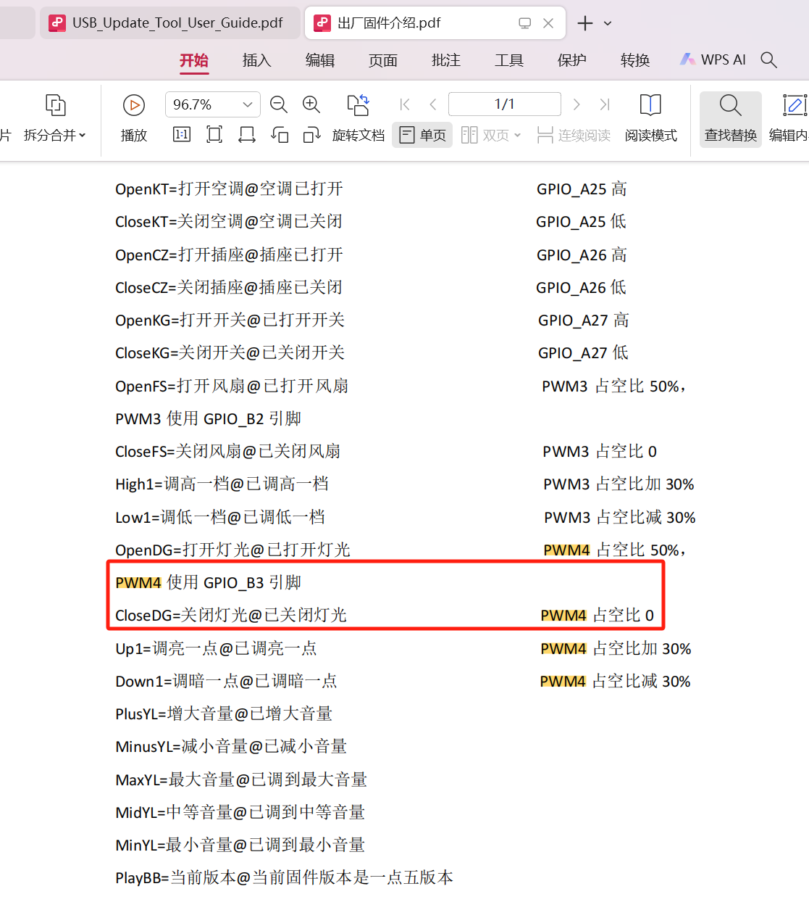


**2. 配置修复步骤**

- 登录智能公元平台
- 找到"关闭灯光"指令配置
- 在"添加控制"区域配置PWM4控制
- 设置PWM4占空比为0（关闭状态）
- 重新生成并烧录固件

**3. 验证功能**

- 烧录新固件后测试"打开灯光"指令
- 确认LED灯正常点亮
- 测试"关闭灯光"指令
- 确认LED灯正常熄灭

**注意事项：**

- 出厂固件可能存在配置疏漏，使用前建议全面测试
- 每个语音指令都需要配置对应的控制动作
- PWM控制占空比0为关闭，50%或其他值为开启状态
- 修改配置后必须重新生成固件并烧录

---

## 串口通信协议兼容性

### SU-03T与串口8位开关通讯模块通讯失败怎么办？

**问题描述：**

SU-03T与外部串口开关通讯模块通讯时，串口助手XCOM无法接收到信号，MODBUS POLL也报超时。

**解决方案：**

**1. 确认串口配置**

- 检查配置的是哪路串口（UART0/UART1）
- 验证波特率、数据位、停止位等参数设置
- 确认TX/RX线交叉连接正确

**2. 协议兼容性检查**

- MODBUS RTU协议需要专门的协议解析
- SU-03T默认串口通信可能不直接支持MODBUS
- AT指令需要模块固件支持相应命令集

**3. 测试建议**

- 先使用简单串口调试工具测试基础通信
- 发送AA 55开头的标准帧格式测试响应
- 逐步排查是硬件连接还是协议问题

**注意事项：**

- 串口8位开关的具体协议需要查看其技术文档
- 可能需要通过单片机做协议转换
- 确保两者工作电压和电平标准匹配

---

### SU-03T如何确认模块已进入工作状态？

**问题描述：**

SU-03T1模块烧录成功后，仅连接VCC、GND和B6/B7引脚，模块上无指示灯，需要确认模块是否已进入工作状态并被唤醒。

**解决方案：**

**1. 串口通信测试**

- 通过串口发送测试命令给模块
- 观察模块是否有回复数据
- 正常工作时会发送心跳包或状态信息

**2. 语音功能测试**

- 连接喇叭和咪头到模块
- 使用预设唤醒词测试语音响应
- 有语音播报说明模块正常工作

**3. 电气参数测量**

- 测量模块工作电流
- 正常工作时应有稳定的功耗
- 异常发热可能是未正常进入工作状态

**注意事项：**

- SU-03T没有工作状态指示灯
- B6/B7是UART1串口，可用于通信测试
- 建议连接完整的外设进行功能验证

---

### SU-03T1与串口8路开关板485通信问题

**问题描述：**

串口8路开关板485功能正常，但TTL串口不通，不确定能否与SU-03T进行通讯。

**解决方案：**

**1. 接口类型确认**

- 485接口和TTL串口是不同的电气标准
- 需要电平转换芯片才能互通
- 直接连接可能无法正常通信

**2. 转换方案**

- 使用MAX485等芯片进行485转TTL转换
- 或购买现成的485转TTL模块
- 确保转换方向和接线正确

**3. 测试建议**

- 先用USB转TTL模块测试SU-03T串口功能
- 确认SU-03T串口通信正常后再接转换模块
- 逐步排查各环节的通信问题

**注意事项：**

- 485是差分信号，TTL是单端信号
- 两种接口的电气特性完全不同
- 不建议直接连接，可能损坏设备

---

## 引脚复用配置

### SU-03T的B6/B7引脚可以同时用于烧录和通信吗？

**问题描述：**

SU-03T模块的B6/B7引脚与单片机串口通信复用，想知道是否可以将B6/B7用于CH430烧录，同时将B2/B3用于单片机通信，实现烧录和正常通信互不干扰。

**解决方案：**

**1. 引脚功能说明**

- SU-03T模块只有一路串口
- 同一时间只能存在一个使用
- B6/B7是UART1串口功能引脚
- B2/B3也可配置为串口功能

**2. 使用策略**

- 烧录时：使用B6/B7连接CH430烧录器
- 正常通信时：使用B2/B3与单片机通信
- 烧录时不需要断开与单片机的通信连接

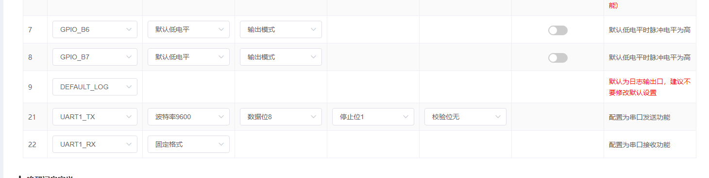

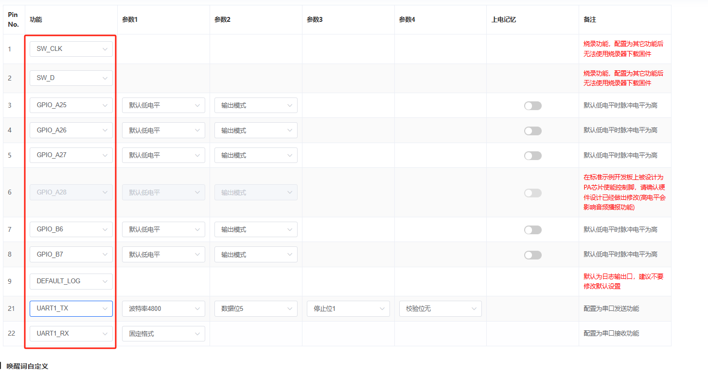

**3. 配置方法**

- 在平台中选择B2/B3为RX/TX
- 此配置不影响使用B6/B7进行烧录
- 烧录完成后固件会使用B2/B3进行通信

**4. 操作步骤**

1. 使用B6/B7连接烧录器烧录固件
2. 烧录完成后断开烧录器
3. 将单片机连接到B2/B3引脚
4. 系统即可正常通信工作

**注意事项：**

- 模块只有一路串口控制器，不能同时使用
- 烧录和通信分时使用，不会相互干扰
- B6/B7作为专用烧录引脚时具有优先级
- 烧录时不用管单片机连接，烧录完即可

---

## MV ADS下载器问题

### 使用MV ADS下载器烧录SU-03T1时连接失败怎么办？

**问题描述：**

使用MV ADS下载器为SU-03T1模块烧录个性化语音文件时，连接失败，提示"ICEman connect failed, return!"。

**解决方案：**

**1. 问题确认**

- 检查下载器型号：是否为MV ADS专用下载器
- 确认模块型号：SU-03T1 v2.1
- 查看错误信息：No Bin file selected / ICEman connect failed

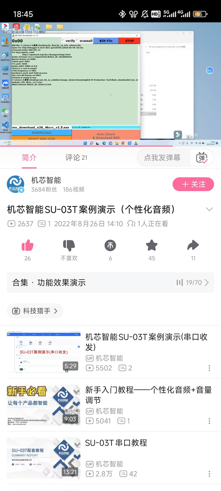

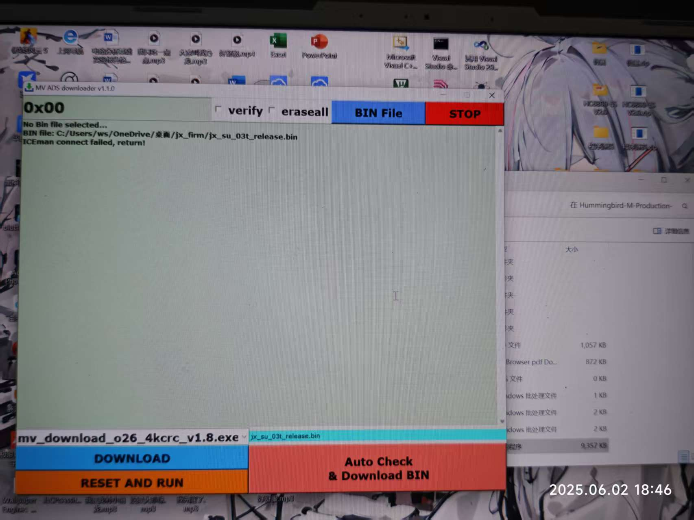

**2. 可能原因分析**

- **连接问题**：

    - 检查USB连接线是否正常
    - 尝试更换USB端口
    - 确认下载器驱动已安装

- **文件问题**：

    - 确认已选择正确的.bin文件
    - 检查文件路径是否包含中文
    - 验证固件文件完整性

- **权限问题**：

    - 以管理员权限运行下载工具
    - 关闭杀毒软件拦截
    - 检查端口占用情况

**3. 解决步骤**

1. 重新插拔USB连接
2. 检查设备管理器中的端口状态
3. 选择正确的固件文件路径
4. 使用管理员权限运行软件
5. 尝试在设备管理器中重新安装驱动

**注意事项：**

- MV ADS是专用下载器，不同于CH340烧录器
- 确保使用与SU-03T1匹配的下载软件版本
- 如持续失败，尝试使用CH340烧录器作为替代方案
- 个性化语音文件需要按教程正确导出和选择

---

### 蜂鸟M使用v1.8调试软件烧录后仍有功能问题？

**问题描述：**

蜂鸟M（US516P6）芯片使用v1.8版本的调试软件烧录固件后，仍存在功能问题，需要确认烧录工具和固件包是否正确。

**解决方案：**

- 确认使用的是MV ADS downloader v1.8版本烧录工具
- 确保已更新到最新版本的调试软件和固件
- 新版蜂鸟M需要使用最新生成的固件包
- 如使用v1.8版本仍有问题，请提供具体的错误截图和固件信息用于分析

**注意事项：**

- 确保烧录工具界面显示的版本号为v1.8
- 烧录前检查固件文件是否选择正确（File not select表示未选择文件）
- 新版芯片需要配合新版SDK生成的固件使用
- 保留烧录界面截图便于问题排查

---

## 烧录方式选择

### SU-03T1除了CH340还有其他烧录方式吗？

**问题描述：**

询问SU-03T1模块是否除了使用CH340烧录器外，还有其他烧录方式。

**解决方案：**

**1. 支持的烧录方式**

- **CH340串口烧录**（推荐）：

    - 使用B6/B7引脚
    - 通用USB转TTL模块
    - 稳定可靠，兼容性好

- **MV ADS专用下载器**：

    - 专用下载工具
    - 需配合特定软件
    - 主要用于个性化语音文件

- **ST-Link/J-Link**（不支持）：

    - SU-03T1不支持这些调试器
    - 芯片接口不兼容
    - 不能用于烧录

**2. 烧录器选择建议**

- 日常开发使用CH340即可
- 个性化语音可使用MV ADS
- 确保烧录器与模块匹配
- 不同烧录器不能混用

**注意事项：**

- 优先使用官方推荐的CH340方案
- 专用下载器可能有版本限制
- 烧录前确认驱动安装正确
- 不支持的烧录器强行使用可能损坏模块

---

## 串口灯异常与烧录失败

### 使用CH340烧录器时串口灯常亮或闪烁异常怎么办？

**问题描述：**

在使用CH340烧录器连接SU-03T模块时，串口灯（红灯）常亮或闪烁异常，无法完成固件下载。之前可以正常烧录，但重新插拔5V线后出现问题。

**解决方案：**

**1. 检查串口通信电压设置**

- SU-03T模块的串口是**3.3V**电平
- CH340烧录器上有电压选择跳线帽
- 将跳线帽从5V位置改到3.3V位置

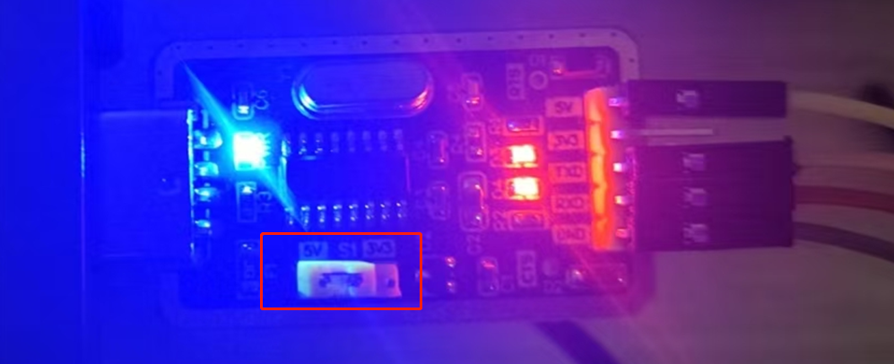

**2. 区分供电电压和通信电压**

- **供电电压**：使用5V给模块供电（接5V引脚）
- **通信电压**：串口通信使用3.3V（跳线帽设置）
- 两者独立设置，不相冲突

**3. 正确的接线方式**

- CH340的5V → SU-03T的VCC（供电）
- CH340的TXD → SU-03T的B6（RX）
- CH340的RXD → SU-03T的B7（TX）
- CH340的GND → SU-03T的GND
- CH340的通信电压跳线帽设置在3.3V

**4. 排查步骤**

如果修改电压后仍无法烧录：

- 用万用表测量SU-03T的3V3脚电压，确认是否正常
- 检查杜邦线接触是否良好
- 尝试更换USB端口或电脑
- 确认烧录工具显示"开始烧录..."状态

**注意事项：**

- 蓝色指示灯为电源灯，红色为串口通信灯
- 烧录时红灯闪烁是正常现象
- 如果模块异常发烫，立即断电检查
- 长时间使用5V通信可能导致模块损坏

---

## GPIO输出问题

### SU-03T1烧录新固件后B3引脚LED不亮怎么办？

**问题描述：**

SU-03T1模块烧录新配置固件后，连接在B3引脚的LED灯不亮，语音功能正常。

**解决方案：**

**1. 确认配置正确性**

- 检查平台中是否配置了LED控制指令
- 确认B3引脚是否设置为输出模式
- 验证PWM输出占空比是否正确设置

**2. 检查硬件连接**

- LED正极确认连接到B3引脚
- LED负极连接到GND（共地）
- 检查LED极性是否正确

**3. 测量引脚状态**

- 使用万用表测量B3引脚电压
- 触发指令时观察电压变化
- 正常应有高低电平变化

**4. 可能原因排查**

- **配置未生效**：

    - 重新生成并烧录固件
    - 确认使用正确的.bin文件
    - 检查烧录过程是否成功

- **LED问题**：

    - 尝试更换新的LED
    - 检查LED是否损坏
    - 验证LED额定电压

- **引脚配置错误**：

    - 确认B3引脚未被其他功能占用
    - 检查是否配置为PWM输出
    - 验证输出电平范围

**5. 测试步骤**

1. 使用简单指令测试（如"开灯"）
2. 观察串口是否有对应输出
3. 测量B3引脚电平变化
4. 更换LED再次测试

**注意事项：**

- 烧录后模块需要重新上电生效
- LED需要串联限流电阻（220-1KΩ）
- B3引脚最大输出电流有限制
- 确保固件配置已保存并正确烧录

---

### 串口读取char类型数据出错怎么办？

**问题描述：**

通过串口发送指令读取参数时，使用char类型接收数据，但系统返回错误信息。

**解决方案：**

**1. 数据类型说明**

语音模块串口通信的数据类型：

- **char类型**：有符号字符，范围-128到127
- **uchar类型**：无符号字符，范围0到255
- **hex格式**：十六进制数据传输

**2. 问题原因**

使用char类型读取可能出错的原因：

- 数据值超过127时，char类型无法正确表示
- 负数在某些系统中可能被误解
- 字符编码问题导致解析错误

**3. 解决方法**

**改用uchar类型**：

- 将接收参数类型改为uchar
- 确保接收缓冲区足够大
- 正确处理0-255范围内的数据

**使用hex格式发送**：

- 发送数据使用十六进制格式
- 示例：`AA 55 00 61 55 AA`
- 避免字符编码转换问题

**4. 正确操作示例**

**读取 uchar 参数**：

```
发送：AA 55 00 61 55 AA
接收：返回正确的参数值（0-255范围）
```

**读取字符数据**：

- 确认数据范围在可显示ASCII字符内
- 使用适当的编码方式
- 考虑使用字符串格式传输

**5. 注意事项**

- 不同模块对数据类型的支持可能不同
- 建议参考模块的串口协议文档
- 测试时使用标准的数据格式
- 保留完整的通信日志便于调试

**故障排查**：

- 确认指令格式正确
- 检查串口配置（波特率、校验位等）
- 验证模块返回的数据格式
- 使用串口调试工具辅助测试

---

### 烧录过程卡顿或超时怎么办？

**问题描述：**

在进行固件烧录时，烧录进度条长时间停滞，甚至超过一小时仍未完成。

**解决方案：**

**1. 立即处理**

- **暂停烧录**：立即停止当前的烧录过程
- **断开连接**：断开USB连接，避免长时间通电
- **刷新工具**：关闭并重新打开烧录软件

**2. 常见原因分析**

**硬件连接问题**：

- USB线接触不良或质量不佳
- 转接板连接松动
- 串口模块驱动异常
- 供电不稳定

**固件问题**：

- 固件文件损坏
- 固件与模块型号不匹配
- 固件文件过大

**3. 解决步骤**

**检查硬件连接**：

- 重新插拔USB连接
- 更换质量好的USB线
- 确认转接板连接牢固
- 检查COM端口是否正常

**验证固件文件**：

- 重新下载固件文件
- 确认固件型号匹配
- 检查文件完整性

**重新烧录操作**：

1. 断开所有连接
2. 等待10秒让模块完全断电
3. 重新连接硬件
4. 刷新烧录工具
5. 选择正确的固件重新烧录

**4. 预防措施**

- 使用原装或高质量的USB线
- 确保电脑USB端口供电稳定
- 烧录前关闭其他占用资源的程序
- 定期更新烧录工具版本

**注意事项：**

- 烧录时间通常在1-3分钟内完成
- 超过10分钟应视为异常
- 避免在烧录过程中进行其他操作
- 如反复失败，可能是硬件故障

---

### 固件生成时出现超时错误怎么办？

**问题描述：**

在智能公元平台生成固件时，持续出现生成超时的问题，导致无法获取固件文件。

**解决方案：**

**1. 配置问题排查**

生成超时通常由配置问题引起：

- **命令词过多**：超过模块的处理能力
- **音频文件过大**：包含过多或过长的音频
- **配置冲突**：功能选项之间存在冲突
- **网络问题**：网络连接不稳定

**2. 逐步排查方法**

**减少配置复杂度**：

- 先尝试生成最小配置的固件
- 逐步添加功能模块
- 定位导致超时的具体配置项

**检查网络环境**：

- 切换网络环境重试
- 避免使用网络高峰期
- 尝试使用有线网络

**3. 常见原因和解决**

**命令词配置问题**：

- 检查命令词是否有特殊字符
- 确认命令词发音不冲突
- 减少命令词数量到合理范围

**音频文件问题**：

- 删除不必要的自定义音频
- 压缩音频文件大小
- 使用较短的提示音

**4. 优化建议**

- 使用稳定的网络环境
- 简化初始配置，分步测试
- 保存配置模板，避免重复错误
- 定期清理浏览器缓存

**注意事项：**

- 生成时间与配置复杂度正相关
- 建议在工作时间人少时生成
- 如持续超时，联系官方技术团队协助

---

### SU-03T支持的最大固件大小是多少？

**问题描述：**

需要了解SU-03T模块能够支持的最大固件容量，以便合理规划功能配置。

**解决方案：**

**1. Flash容量说明**

SU-03T模块内置Flash存储器的容量限制：

- **Flash容量**：2MB（2048KB）
- **最大固件大小**：不能超过2MB
- **可用空间**：实际可用空间略小于2MB（需扣除系统占用）

**2. 固件组成**

固件文件包含以下部分：

- 系统程序：语音识别算法、系统功能
- 声学模型：唤醒词、命令词的识别模型
- 配置数据：GPIO设置、串口参数等
- 音频文件：提示音、回复语音等

**3. 容量规划建议**

**音频文件优化**：

- 使用压缩格式存储音频
- 缩短提示音时长
- 减少不必要的音频文件

**功能配置精简**：

- 控制命令词数量在合理范围
- 合并功能相似的命令词
- 优先保留核心功能

**4. 超限处理方法**

当固件超过2MB限制时：

- 删除非必要的功能
- 压缩或缩短音频文件
- 考虑使用Flash容量更大的型号（如CI-03T系列）

**注意事项：**

- 固件大小接近2MB时可能导致生成失败
- 建议预留一定空间，避免达到容量上限
- 不同批次模块的Flash容量可能存在微小差异

---

## 焊接后烧录问题

### SU-03T焊接到PCB后无法烧录怎么办？

**问题描述：**

SU-03T模块焊接到PCB后无法通过B6/B7进行固件烧录，但拆下模块后可以正常烧录。

**解决方案：**

**1. 特定引脚接高电平**

焊接在PCB上时，可通过以下引脚接高电平实现烧录：

- **B8引脚接5V高电平**：尝试B8接5V
- **A25引脚接高电平**：尝试A25接5V
- **PA4引脚接高电平**：部分方案提到PA4（需确认）

**2. 操作步骤**

1. 确定模块上可用的引脚（B8或A25）
2. 将选定的引脚临时连接到5V电源
3. 使用CH340连接B6/B7进行烧录
4. 烧录完成后断开高电平连接

**3. 注意事项**

- 此方法不需要拆下模块
- 烧录完成后必须断开高电平
- 不同批次的模块可能响应不同引脚

**4. 电压说明**

- 烧录时模块可使用5V供电
- 正常工作电压建议3.3V
- 避免长期超压使用

**替代方案：**

- 使用插接式封装设计
- 烧录时使用专用测试座
- 设计跳线帽控制引脚状态

**PCB设计参考：**


*SU-03T模块在PCB上的引脚布局，B6/B7为串口烧录引脚*

---

### 烧录工具无法加载BIN文件怎么办？

**问题描述：**

使用烧录工具时，点击"选择"按钮无法弹出文件选择对话框，导致无法加载BIN文件进行烧录。

**解决方案：**

**1. 工具兼容性问题**

- 检查烧录工具版本
- 确认操作系统兼容性
- 尝试以管理员身份运行

**2. 文件路径问题**

- 确保BIN文件路径不含中文
- 将文件放在根目录下
- 检查文件是否被其他程序占用

**3. 常见解决方法**

**方法一：重新安装工具**

1. 卸载当前烧录工具
2. 下载最新版本烧录工具
3. 重启电脑后重新安装

**方法二：使用备用工具**

1. 尝试使用其他烧录工具
2. 如需特定版本，联系官方技术团队

**方法三：检查文件完整性**

1. 确认BIN文件完整无损
2. 重新下载固件文件
3. 验证文件格式是否正确

**文件类型说明：**

- `jx_su_03t_release.bin`：发布版本固件
- `jx_su_03t_release_update.bin`：升级版本固件
- 通常使用release版本进行完整烧录

**注意事项：**

- 烧录前关闭杀毒软件
- 确保USB驱动正常安装
- 使用质量好的USB数据线
- 避免使用USB延长线


---

## GPIO配置与编程

### 如何实现IO口低电平检测的延时防抖功能？

**问题描述：**

需要配置SU-03T的IO口（如B2）检测低电平信号，为防止误触发，要求检测到低电平后延迟几十毫秒再次确认电平状态，如果仍为低电平才触发语音报警。

**解决方案：**

**实现思路：**
通过变量设置和条件判断组合，实现延时防抖功能。

**具体步骤：**

1. **第一层触发条件**：

    - 触发条件：B2口低电平
    - 执行操作：变量设置（延时）
    - 延时时间：根据需要设置（如100ms）
    - 变量操作：将某个变量（如flag）置为1

2. **第二层确认条件**：

    - 触发条件：变量等于1 并且 B2口低电平
    - 执行操作：播放语音报警
    - 变量操作：将flag清零（复位）

**配置方法：**

1. **添加变量**：

    - 在配置软件中添加新变量（如flag）
    - 变量类型：整数型
    - 初始值：0

2. **设置延时动作**：

    - 在控制操作中选择"变量设置"
    - 勾选"是否延时设置"
    - 设置延时时间（100ms）
    - 选择要操作的变量

3. **添加组合判断**：

    - 新增控制条件
    - 使用"逻辑与"连接两个条件
    - 条件1：变量flag = 1
    - 条件2：B2口 = 低电平

**代码逻辑示例：**

```
if (B2 == LOW) {
    delay(100);  // 延时100ms
    if (B2 == LOW) {
        // 触发报警
        play_voice_alarm();
    }
}
```

**注意事项：**

- 延时时间根据实际需求调整（建议50-200ms）
- 变量需要及时复位，避免重复触发
- 确保IO口输入配置正确（上拉/下拉）
- 测试时验证防抖效果是否符合预期

**替代方案：**

如果上述方法复杂，可考虑：

- 使用外部硬件RC滤波
- 外接单片机做信号预处理
- 选用带硬件防抖的IO口模块

---

## 返厂烧录与版本管理

### 如何确认返厂烧录的固件版本？

**问题描述：**

需要确认用于返厂烧录的固件版本，确保烧录的程序与之前使用的版本一致。

**解决方案：**

**1. 查看固件管理平台**

- 登录固件管理平台查看版本列表
- 确认版本号和创建时间
- 选择状态为"已生成"的最新稳定版本

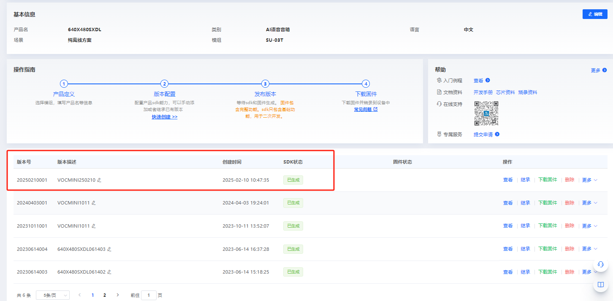

**2. 固件版本确认方法**

- 通过固件文件路径确认：`浙江红谱科技/红外手持产品/jx_su_03t_release/`
- 检查配置内容是否匹配：

    - 开机播报：红谱科技欢迎你
    - 唤醒词：你好红谱/你好小谱/你好谱育
    - 唤醒词回复：我在/你说/有什么可以帮到你
- 验证 MD5 值：`211070c002e2749d5d6fa3caa0c84668`

**3. 版本选择建议**

- 优先选择最新稳定版本
- 如需与之前版本完全一致，使用相同的 MD5 值进行匹配
- 保留版本号记录，方便后续追踪

**注意事项：**

- 烧录前务必确认固件版本与产品型号匹配
- 保存固件版本信息，便于后续维护
- 建议使用最新版本以获得更好的性能和稳定性

### 返厂烧录后如何确认发货信息？

**问题描述：**

确认返厂烧录的固件版本后，需要明确新模块的发货地址和发货流程。

**解决方案：**

**1. 确认发货方式**

- 返厂烧录一般安排发新模块
- 也可选择寄回原模块（根据情况协商）
- 确认收货地址是否需要更新

**2. 发货地址确认**

- 收货地址：杭州市西湖区三墩镇紫宣路18号7号楼6层仓库浙谷深蓝中心
- 收货人：宁涛
- 联系电话：13456954360
- 备注：浙江红谱科技

**3. 发货流程**

- 确认固件版本和烧录内容
- 安排烧录并测试功能
- 包装发货并提供物流单号
- 收到模块后进行功能验证

**注意事项：**

- 确保地址信息准确无误
- 收到货后及时验货
- 如有问题及时联系处理
- 保留好发货记录便于追踪

---

### SU-03T多次烧录后突然无法烧录且无反应

**问题描述：**

SU-03T芯片在正常烧录十几次后，突然无法进行烧录，模块开机也无任何反应，需要排查硬件故障原因。

**解决方案：**

- **断开外围电路测试**：将模块从主控制板上取下，单独进行烧录测试
- **检查电源供电**：确保使用电脑USB独立供电，电压稳定
- **测量模块引脚**：使用万用表测量模块正负极，确认没有短路
- **检查硬件损坏**：

    - 喇叭或负极不小心碰到GND短路容易烧毁模块
    - 测量各引脚对地电阻，判断是否有异常
- **参考异常检查文档**：使用《桌宠控制板使用指导及异常检查-V1-JXZN.pdf》进行详细检测

**注意事项：**

- 模块一旦损坏通常无法修复，需要注意使用过程中的防静电和防短路措施
- 烧录时确保模块与外围电路完全断开，避免相互干扰
- 建议使用焊接连接而非杜邦线，减少接触不良导致的故障

---
---

### 是否提供固件烧录服务？

**问题描述：**

购买模块时是否可以委托厂商进行固件烧录，以及需要提供哪些信息。

**解决方案：**

厂商提供固件烧录服务，具体流程如下：

**1. 烧录服务说明**

- 支持批量烧录服务
- 只需提供固件文件和配置要求
- 烧录完成后发货

**2. 提供信息清单**

烧录前需要确认以下信息：

- 产品型号（如：SU-03T）
- 固件文件（.bin格式）
- 唤醒词列表
- 开机播报内容
- 唤醒词回复语
- 其他特殊功能要求

**3. 质量保证**

- 烧录前进行固件MD5校验
- 每批次保留烧录记录
- 出厂前进行功能抽检

**注意事项：**

- 烧录服务可能需要额外工时费，通常单次烧录费用约为200元
- 烧录服务包含固件MD5校验和功能测试
- 建议保留原始固件文件备份
- 收到产品后建议及时验证功能

---


---

### SU-03T烧录的正确操作步骤是什么？

**问题描述：**

不清楚SU-03T烧录的具体操作步骤，特别是烧录完成后如何正确上电启动。

**解决方案：**

1. 连接好线路（CH340与SU-03T）

    **CH340与SU-03T连接方式：**

    - CH340的3V3 → SU-03T的VCC
    - CH340的GND → SU-03T的GND
    - CH340的TXD → SU-03T的B7（RX）
    - CH340的RXD → SU-03T的B6（TX）
    - 麦克风连接到SU-03T的MIC+、MIC-
    - 喇叭连接到SU-03T的SP+、SP-

    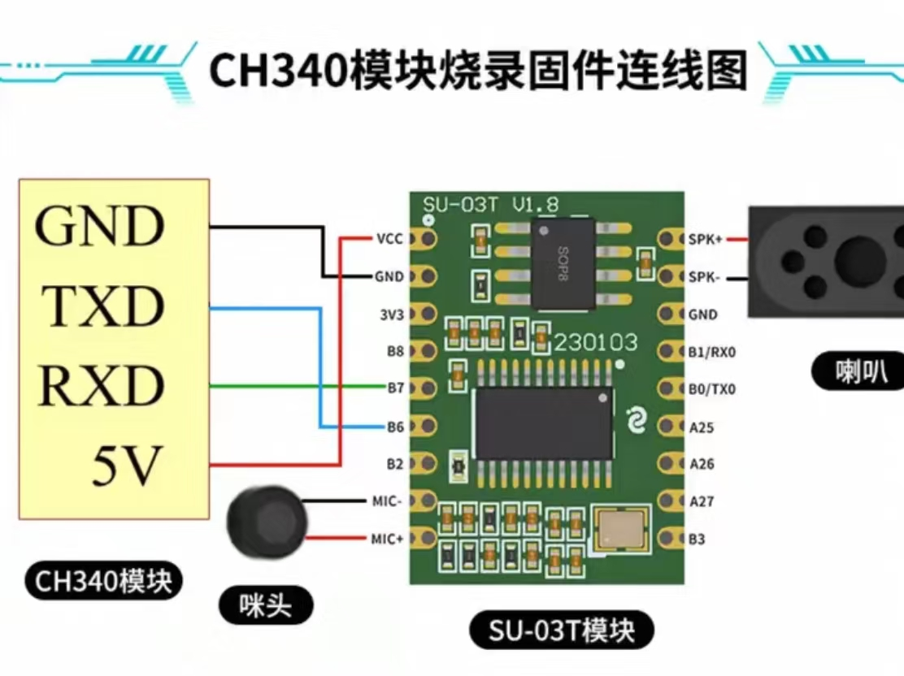

2. 打开烧录软件
3. 选择要烧录的目标bin文件
4. 点击烧录按钮
5. 拔掉5V供电线
6. 等待1秒后重新插上5V供电线

**注意事项：**

- 断电上电操作是进入烧录模式的关键步骤
- 1秒的时间间隔很重要，过短或过长都可能导致失败
- 烧录完成后模块会自动重启
- 确保使用CH340模块而非其他串口工具
- 连接时不要带电操作

---


---

### 发货前固件烧录需要做什么？

**问题描述：**

在产品发货前需要烧录定制固件，并确保固件完整性和一致性。

**解决方案：**

**1. 固件准备与验证**

- 确认提供的固件文件正确
- 使用哈希校验工具（如Hasher Lite）计算固件MD5值
- 保存MD5校验码用于留档和后续验证

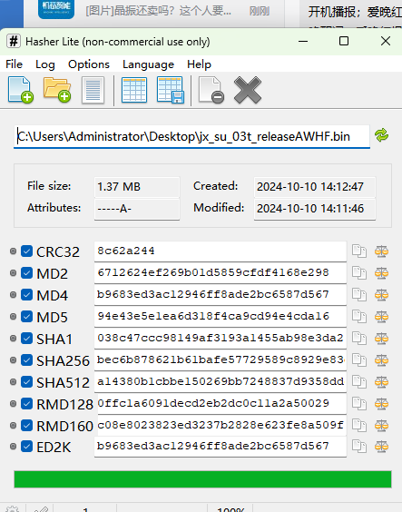

**2. 烧录信息记录**

烧录前需确认以下信息：

- 项目名称
- 模组型号（如SU-03TV2.1）
- 固件文件名
- 开机播报内容
- 唤醒词设置
- 唤醒回复语
- MD5校验码

**3. 烧录流程**

- 按照标准烧录流程进行批量烧录
- 烧录完成后进行抽样测试
- 确认开机播报和唤醒功能正常

**注意事项：**

- 固件文件路径必须使用英文，避免中文路径导致烧录失败
- MD5校验码建议截图保存，便于后续追踪
- 烧录完成后才能安排发货
- 保留完整的烧录记录以备查验

---

### 收货后如何确认固件烧录正确？

**问题描述：**

收到产品后，需要确认固件烧录是否正确，特别是唤醒词和回复语是否已按要求更改。

**解决方案：**

**收货检验步骤**

1. **核对固件信息**
    - 查看烧录记录中的MD5值
    - 确认固件文件名和版本
    - 验证烧录日期

2. **测试功能**
    - 上电测试开机播报
    - 测试唤醒词响应
    - 验证回复语内容

3. **MD5留档确认**
    - 使用Hasher Lite等工具验证固件MD5
    - 截图保存校验结果
    - 与烧录记录对比

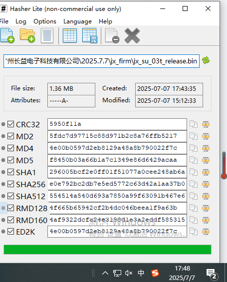

**示例验证记录**

长益电子/afwa_20250707004/SU-03t-V2.1/jx_su_03t_release/
- 开机播报：无
- 唤醒词：你好小艾
- 回复语：我在/嗨~~~~~
- MD5：f8450b03a66b1a7c1349e86d6429acaa

**注意事项：**

- 收货后及时进行功能验证
- 如发现问题，立即联系供应商处理
- 保留MD5校验截图作为凭证
- 唤醒词更改后需要重新测试

---


---

### 如何验证烧录固件的完整性？

**问题描述：**

烧录固件后，需要确认固件文件是否正确写入，以及如何通过MD5码验证固件完整性。

**解决方案：**

固件烧录完成后，可以通过MD5校验码验证固件文件的完整性：

**1. MD5值验证**

- 烧录前记录原始固件的MD5值
- 使用Hash计算工具（如Hasher Lite）计算固件文件MD5
- 对比原始文件和烧录后文件的MD5值是否一致

**2. 烧录参数记录**

建议记录以下参数用于质量追溯：

- 产品型号：SU-03T V2.1
- 固件文件名：jx_su_03t_release.bin
- 开机播报内容
- 唤醒词配置
- MD5校验码：9d87ce11ba419b0d6893b9518fdb0bf0

**3. 质量控制建议**

- 批量烧录前先进行小批量测试
- 保留每批次的烧录记录和MD5值
- 建议每次烧录完成后进行功能抽检

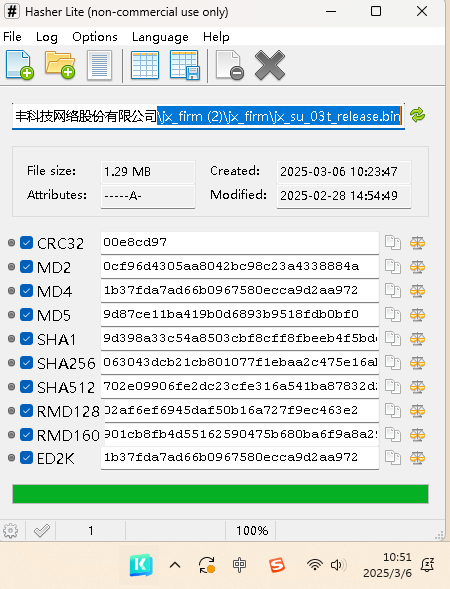

*使用Hasher Lite工具查看固件文件的MD5校验码*

**注意事项：**

- MD5值是文件完整性验证的重要依据
- 固件文件在传输过程中可能损坏，建议重新下载
- 烧录失败后，建议重新检查固件文件的MD5值
- 保留完整的烧录记录便于问题追溯

---


---

### 烧录时上电瞬间电流过大导致芯片烧毁怎么办？

**问题描述：**

在烧录板子时，由于电源连接方式不当导致芯片烧毁，上电瞬间出现电流过大问题。

**解决方案：**

**1. 正确的上电顺序**

- 板子外部不能独立供电
- 应通过拔插GND或5V线来控制上电
- 推荐拔插GND线，更为安全

**2. 电源连接注意事项**

- CH340出来的电是用于烧录的
- 不要直接开关板子电源
- 避免在上电瞬间产生冲击电流

**3. 操作规范**

- 上电的一瞬间开始烧录
- 确保连接稳定后再上电
- 避免反复快速插拔


**注意事项：**

- 拔插GND或5V线效果相同，GND更保险
- 确保板子没有独立电源开关
- 如使用外部电源，需先断开
- 操作不当可能导致芯片永久损坏

---


---

### 烧录时上电瞬间电流过大怎么办？

**问题描述：**

在烧录板子上电瞬间出现电流过大问题，导致芯片烧毁，需要明确正确的上电和拔插顺序。

**解决方案：**

**1. 正确的上电顺序**

- **先连接通信线**：将GND、TX、RX等串口线先连接好
- **再连接电源**：最后才连接5V电源线
- **避免直接开关板载电源**：不要通过板子自带的开关上电

**2. 断电烧录方法**

推荐使用以下两种断电方式：

- **拔插GND线**：最安全的方法，通过断开地线来断电
- **拔插5V电源线**：确保板子没有其他独立供电源

**3. 供电注意事项**

- **板子不能外接供电**：使用CH340供电时，板子不能有其他电源输入
- **避免冲击电流**：上电瞬间的大电流会损坏芯片
- **共地连接**：确保所有设备共地


**注意事项：**

- 烧录工具打开即退出可能是电脑环境问题
- 不同芯片的烧录工具不能混用
- 如遇烧录工具异常，尝试更换电脑或重装系统
- **接触不良导致烧坏**：烧录器或模块排针接触不良可能导致瞬间电流过大，从而烧坏模块。确保排针插紧、连接稳定后再上电，建议使用焊接连接或质量良好的烧录夹，避免使用松动的杜邦线

---


---

### SU-03T串口发送数据时显示格式不正确怎么办？

**问题描述：**

配置SU-03T串口发送数据时，设置参数为'A'，但串口助手收到的是'0A'，与预期不符。

**解决方案：**

**1. 十六进制显示原理**

- 串口数据以字节为单位传输
- 一个字节等于8位二进制数
- 十六进制表示一个字节需要两位（00-FF）
- 字符'A'的ASCII码是0x41，十六进制显示为"41"

**2. 配置格式要求**

- 平台参数输入的是十六进制格式
- 支持的字符：0-9和A-F
- 最大长度：32字节
- 多字节之间用空格分隔，如："98 A3 0B FE"

**3. 单字符发送**

- 发送单个字符'A'应输入："41"
- 不能直接输入字符本身
- 必须转换为对应的十六进制值

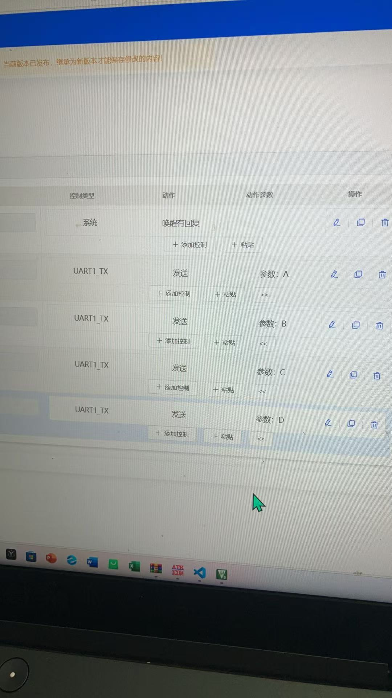

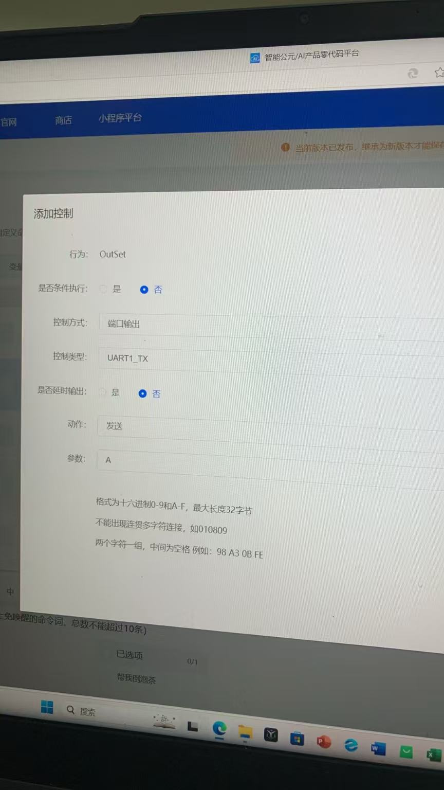

**注意事项：**

- 串口调试助手需要设置相同的波特率
- 确认显示模式为十六进制（HEX）
- 如发送ASCII字符，需要在助手端切换显示模式
- 一个字节的十六进制必须用两位表示（如0A而非A）

---


---

### 烧录工具显示"等待设备"无法识别芯片怎么办？

**问题描述：**

使用烧录工具烧录SU-03T模块时，工具显示"等待设备.."状态，无法识别芯片，烧录无法进行。

**解决方案：**

**1. 连接检查**

- **确认接线**：

    - 模块VCC接CH340的5V
    - 模块GND接CH340的GND
    - 模块B5接CH340的RXD
    - 模块B6接CH340的TXD
- **检查接触**：

    - 杜邦线是否接触牢固
    - 引脚是否有氧化或污染
    - 线序是否正确

**2. 驱动和端口问题**

- **CH340驱动**：

    - 确认已安装正确版本的CH340驱动
    - 设备管理器中是否识别到COM端口
    - 尝试重新安装或更新驱动
- **端口选择**：

    - 关闭其他可能占用串口的软件
    - 尝试不同的USB端口
    - 检查端口是否被其他程序占用

**3. 模块状态检查**

- **供电确认**：

    - 测量模块VCC引脚是否有5V电压
    - 检查电源是否稳定
    - 确认电源容量足够
- **复位操作**：

    - 按下模块上的蓝色复位键
    - 或重新给模块断电上电
    - 复位后立即尝试烧录

**4. 环境因素**

- **电脑重启**：重启电脑后再次尝试
- **换台电脑**：排除电脑系统或USB问题
- **系统兼容**：Windows XP/7/8/10兼容性差异

**5. 硬件故障判断**

如以上检查都无效，可能是硬件问题：

- 模块串口电路损坏
- CH340转接板故障
- USB线或杜邦线损坏

**注意事项：**

- 烧录前确保所有连接正确
- 避免热插拔操作
- 使用原装或质量良好的连接线
- 多次失败建议寻求专业技术协助

---

### SU-03T烧录时卡在"等待设备"状态怎么办？

**问题描述：**

SU-03T芯片在烧录过程中，烧录工具界面卡在"等待设备"状态，无法完成烧录。

**解决方案：**

**1. 检查接线连接**

- 确认USB转TTL模块与SU-03T的连接正确
- VCC接VCC（3.3V或5V）、GND接GND
- TXD接K-、RXD接K+

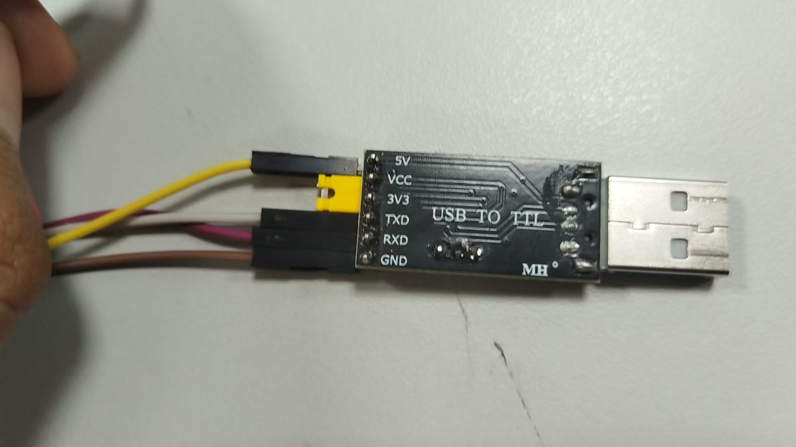

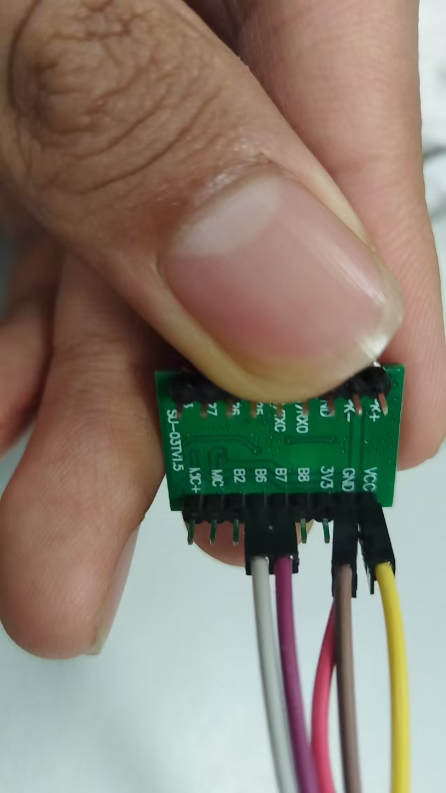

**2. 检查烧录工具配置**

- 波特率设置为115200
- 选择正确的COM端口
- 确认烧录工具版本兼容

**3. 检查Pin脚配置**

- 确认平台配置中烧录引脚（SW_CLK、SW_D）未被占用
- UART1_RX和UART1_TX引脚在烧录时必须保持空闲

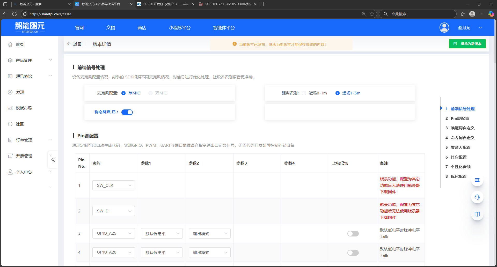

**4. 常见问题排查**

- 重新插拔USB连接
- 更换USB端口
- 检查驱动是否正确安装
- 尝试更换USB转TTL模块

**注意事项：**

- 确保供电稳定，避免电压波动
- 烧录过程中不要断开连接
- 某些笔记本USB口供电不足，建议使用台式机
- 使用质量好的USB转TTL模块

---


---

### 在哪里购买烧录器？

**问题描述：**

需要购买专用的烧录器用于固件烧录，不确定哪里有销售。

**解决方案：**

**1. 官方购买渠道**

- **机芯智能淘宝店铺**：

    - 店铺名：机芯智能有限公司
    - 企业店：机芯智能企业店
    - 搜索关键词：蜂鸟M调试器/烧录器

- **产品类型**：

    - 蜂鸟M调试器/烧录器（专用烧录03T模块）
    - 价格约300元
    - 产品标注为"烧录03T模块专用烧录器"

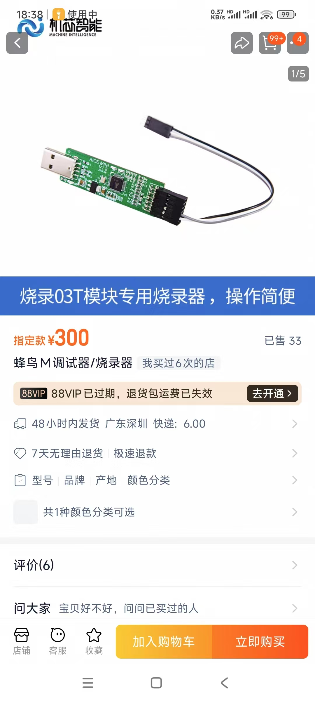

**2. 购买注意事项**

- **型号匹配**：

    - CI-03T系列：使用CH340 USB转TTL烧录器
    - SU-03T系列：使用专用蜂鸟M烧录器
    - 确认烧录器支持对应模块型号

- **兼容性确认**：

    - 购买前与客服确认芯片型号兼容性
    - 查看产品描述是否包含所需型号
    - 保留购买凭证便于售后

**3. 替代方案**

- **通用USB转TTL模块**：

    - CH340、CP2102等常见芯片
    - 价格更便宜，约10-20元
    - 需要配合杜邦线使用

- **专业烧录器**：

    - ST-Link V2编程器
    - J-Link调试器
    - 支持更多调试功能

**注意事项：**

- 优先购买官方专用烧录器，兼容性更好
- 通用烧录器价格便宜但可能需要额外配置
- 保留购买记录，便于出现问题时联系售后

---


---

### 固件下载后找不到.bin文件怎么办？

**问题描述：**

下载并解压固件文件后，在文件夹中找不到.bin文件，无法进行烧录操作。

**解决方案：**

- **使用正确的解压工具**：

    - 推荐使用 WinRAR 解压固件文件
    - 避免使用系统自带的解压功能
    - 确保 WinRAR 完整安装并正常工作

- **解压步骤**：

    1. 下载固件压缩包（通常为.tar格式）
    2. 使用 WinRAR 解压压缩包
    3. 进入解压后的文件夹（通常有 uart 文件夹）
    4. 在文件夹中查找 .bin 文件（如 jx_su_03t_release.bin）

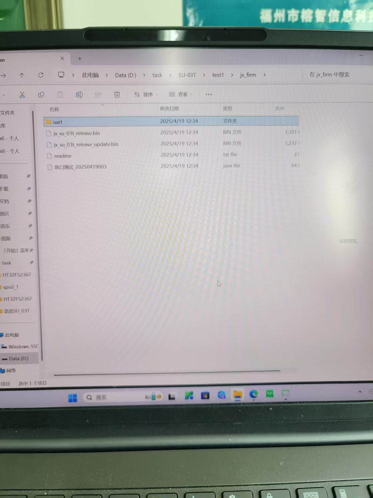

**注意事项：**

- 固件文件通常包含在压缩包内的子文件夹中
- 解压工具不完整可能导致文件丢失
- SU-03T 固件通常包含两个.bin文件：主固件和升级固件
- 如果 WinRAR 未正确安装，先安装再尝试解压

---


---

### PACK_UPDATE_TOOLS进度条卡住怎么办？

**问题描述：**

使用PACK_UPDATE_TOOLS工具烧录SU-03T模块固件时，进度条卡住无法下载，需要排查问题。

**解决方案：**

**1. 导出配置文件用于排查**

- 在产品管理平台找到对应项目
- 点击"导出"按钮获取配置文件（JSON格式）
- 保存配置文件便于技术人员分析问题

**2. 进度条卡住的常见原因**

- **连接问题**：串口线接触不良或连接错误
- **驱动问题**：CH340驱动未正确安装或版本冲突
- **端口占用**：其他程序占用了串口
- **固件文件**：文件路径错误或文件损坏

**3. 排查步骤**

- 检查串口连接：B6→RXD，B7→TXD，VCC→5V，GND→GND
- 重新安装CH340驱动程序
- 关闭其他可能占用端口的软件
- 确认固件文件完整且路径正确

**4. 正确操作流程**

- 连接好线路后打开PACK_UPDATE_TOOLS
- 选择正确的固件文件（.bin格式）
- 点击下载后观察进度条变化
- 如提示需要复位，及时断电上电

**注意事项：**

- 烧录时避免触碰连接线
- 进度条长时间无变化可能是通信中断
- 导出的配置文件包含所有设置信息
- 多次失败建议寻求专业技术协助

----


---

### 烧录需要使用什么类型的USB模块？

**问题描述：**

不确定烧录语音模块时需要使用哪种专门的USB模块。

**解决方案：**

- **使用CH340 USB转TTL模块**：

    - SU-03T等语音模块使用CH340芯片进行烧录
    - 这是一个USB转串口(TTL)的转换模块
    - 不是普通的USB数据线

- **模块功能**：

    - 将电脑的USB接口转换为串口信号
    - 提供TX/RX/GND/5V等必要的引脚
    - 支持Windows等操作系统

**连接方式**：

1. USB端连接到电脑的USB口
2. TTL端通过杜邦线连接语音模块
3. 安装CH340驱动后系统会识别为COM端口
4. 烧录工具通过该COM端口与模块通信

**注意事项：**

- CH340需要安装专用驱动程序
- 不同操作系统需要不同版本的驱动
- 确保购买的是CH340芯片而非仿冒品
- 模块通常带有指示灯显示工作状态

---


---

### 使用错误固件烧录SU-03T怎么办？

**问题描述：**

使用CI-03T的固件文件通过SU-03T烧录软件烧录，导致固件不匹配。

**解决方案：**

- **问题确认**：

    - CI-03T和SU-03T使用不同的固件
    - 固件文件名包含模块型号信息
    - 不能混用不同模块的固件

- **正确操作**：

    1. 确认模块实际型号（查看模块丝印）
    2. 使用对应型号的烧录工具
    3. 生成对应模块的固件文件
    4. 确保固件和工具、模块三者匹配

- **处理步骤**：

    - 如烧录错误固件，重新用正确固件烧录即可
    - 模块不会因为错烧固件而损坏
    - 确保使用SU-03T专用的固件和工具

---


---

### CI-03T和SU-03T的烧录工具有什么区别？

**问题描述：**

不确定CI-03T和SU-03T是否使用相同的烧录工具，还是需要分别下载对应版本。

**解决方案：**

- **工具区分**：

    - CI-03T：使用小扳手烧录工具
    - SU-03T：使用云知声UniOne蜂鸟M烧录工具
    - 两者工具不通用，需要分别下载

- **工具下载**：

    - CI-03T烧录工具可在智能公元平台下载
    - SU-03T烧录工具在平台提供下载链接
    - 确保下载与模块型号匹配的工具版本

- **操作差异**：

    - CI-03T：直接选择COM口和固件文件即可烧录
    - SU-03T：需要等待工具变黄后拔插5V线进入烧录模式
    - SU-03T的烧录流程相对复杂一些

**注意事项：**

- 绝对不能混用不同模块的烧录工具
- 烧录工具与固件文件、模块型号三者必须匹配
- SU-03T的烧录需要特殊操作进入下载模式
- 如果工具无法识别模块，检查连接和驱动是否正确

---


---

### SU-03T烧录失败，一直显示"等待设备"怎么办？

**问题描述：**

使用云知声UniOne蜂鸟M烧录工具烧录SU-03T时，进度卡在98%后失败，工具一直显示"等待设备"状态。

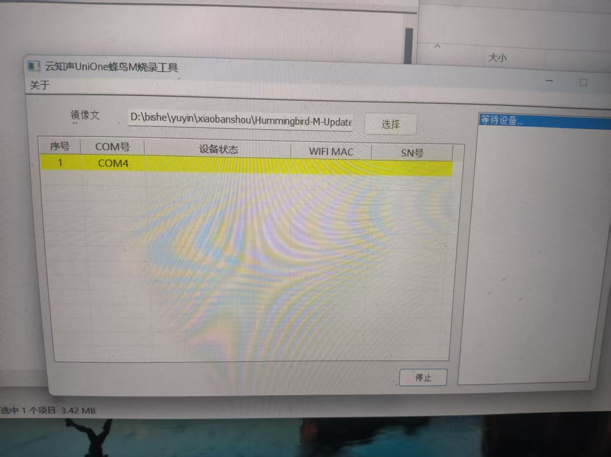

**解决方案：**

- **基本排查**：

    - 检查USB转TTL模块连接是否牢固
    - 确认CH340驱动正常工作
    - 尝试更换不同的USB端口
    - 重启烧录工具和电脑

- **供电问题排查**：

    - 确认模块供电稳定（5V）
    - 检查USB端口供电能力
    - 避免使用笔记本的省电模式USB口
    - 尝试使用台式机后面板USB口

- **烧录流程优化**：

    - 烧录软件变黄后及时拔插5V线
    - 等待设备识别完成后再开始烧录
    - 烧录过程中不要移动连接线
    - 降低波特率设置（如9600改为4800）

- **模块状态检查**：

    - 上电测试模块3V3引脚电压
    - 测试麦克风正负电压（2.4-2.5V）
    - 测试喇叭正负对GND电压（2.2-2.5V）
    - 如电压异常，模块可能已损坏

**注意事项：**

- SU-03T对供电稳定性要求较高
- 烧录失败后先排查模块是否正常
- 避免在供电不足的情况下反复烧录
- 如确认模块损坏，需要更换新模块

---


---

### 烧录工具提示文件读取失败怎么办？

**问题描述：**

使用烧录工具烧录固件时，出现"文件读取失败"的错误提示，导致无法继续烧录。

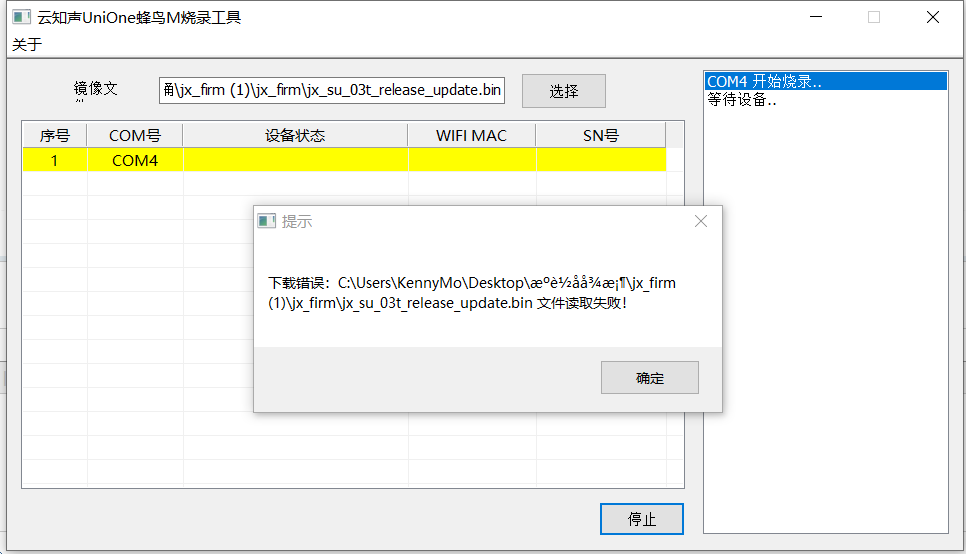

**解决方案：**

**1. 固件文件检查**

- 确认固件文件名正确（如：jx_su_03t_release_update.bin）
- 检查文件大小是否正常（SU-03T固件约1.2MB）
- 验证文件扩展名为.bin

**2. 文件路径处理**

- 避免使用包含中文或特殊字符的路径
- 将固件文件放在简单路径下（如D:\firmware\）
- 确保文件没有被其他程序占用

**3. 文件完整性验证**

- 重新下载固件文件
- 对比文件大小是否与源文件一致
- 检查文件是否下载完整

**注意事项：**

- 烧录工具对文件路径有特殊要求
- 建议使用英文路径且不含空格
- 文件读取失败通常是路径或权限问题

**示例：**

- ❌ 错误：D:\语音识别\固件\update.bin
- ✅ 正确：D:\firmware\update.bin

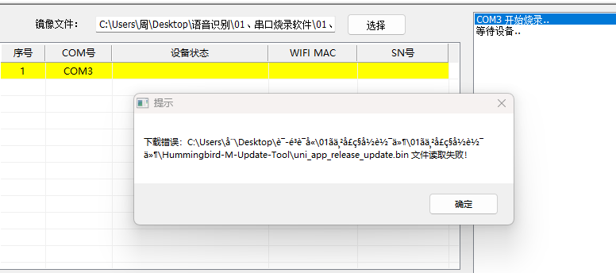

---

### 中文路径导致文件读取失败且新模块无响应？

**问题描述：**

在使用烧录工具对CI-03T1芯片进行固件烧录时，文件路径包含中文字符导致"文件读取失败"错误，且新模块无法正常响应烧录操作。

**解决方案：**

**1. 路径问题处理**

- **问题原因**：Windows系统下的中文路径可能导致烧录工具无法正确解析
- **解决方法**：

    - 将固件文件移动到纯英文路径
    - 文件夹名避免使用中文、特殊字符和空格
    - 建议放在根目录或简单路径下

**2. 新模块无响应处理**

- **硬件连接检查**：

    - 确认CH340与模块的4根线连接正确
    - 检查供电电压是否正常（3.3V或5V）
    - 验证串口端口识别正常


- **烧录操作规范**：

    - 使用CH340模块进行烧录（非普通串口线）
    - 点击烧录后再拔插VCC电源进入下载模式
    - 确保烧录工具版本匹配模块型号

- **模块兼容性**：

    - CI-03T1（绿色板）：使用CI-03T烧录软件
    - SU-03T（黑色板）：使用PACK_UPDATE_TOOL
    - 两种烧录工具不通用


**注意事项：**

- 路径中不能包含中文字符，包括文件夹名和文件名
- 如果遇到无法识别的模块，尝试更换USB端口
- 新模块首次烧录建议在断电状态下连接
- 保留原厂固件作为备份

---

### 固件烧录后模块无任何反应？

**问题描述：**

烧录自定义固件后，模块没有任何反应，即使设置了开机语音词也没有响应，但出厂默认固件工作正常。

**解决方案：**

**1. 基础硬件检查**

- 检查喇叭和咪头的接线是否正确
- 确认没有虚焊或接触不良
- 使用万用表测试模块3V3引脚是否有3.3V电压输出

**2. 音频电路电压测试**

- 直接测量麦克风正负电压是否在正常范围：

    - CI-03T：1.6-1.7V
    - SU-03T：2.4-2.5V
- 测量喇叭正负对GND电压应在2.2-2.5V范围内

---


---

### 如何使用万用表检测语音模块是否正常？

**问题描述：**

需要使用万用表检测语音模块各关键引脚电压，判断模块是否正常工作。

**解决方案：**

**1. 准备工作**

- 万用表调至蜂鸣档或电压档
- 模块断电状态下进行短路检测
- 准备5V直流电源

**2. 短路检测（断电）**

- 万用表调至蜂鸣档
- 测量VCC和GND之间是否短路
- 如果蜂鸣器响，说明模块已击穿损坏

**3. 上电电压测试**

- 给模块提供5V供电
- 使用万用表直流电压档测量以下引脚：

**关键测试点：**

- **3V3引脚**：对GND电压应为3.3V
- **麦克风正负极**：

    - CI-03T：1.6-1.7V
    - SU-03T：2.4-2.5V
- **喇叭正负极**：对GND电压应为2.2-2.5V

**4. 结果判断**

- 所有电压值在正常范围内→模块正常
- 某个电压异常→对应电路可能损坏
- 3V3无输出→模块核心电路故障
- 麦克风电压异常→麦克风电路问题
- 喇叭电压异常→功放电路问题

**注意事项：**

- 测量时表笔要接触良好
- 避免表笔短路造成二次损坏
- 如模块已击穿，需要更换新模块

---


---

### 语音模块硬件接线设计

**问题描述：**

需要确认语音模块与 CH340 芯片的正确连接方式。

**解决方案：**

语音模块（U8）与 CH340 的标准连接方式：

- 电源连接：5V 和 GND
- 串口通信：RX（接收）和 TX（发送）交叉连接
- 麦克风连接：MIC+、MIC-、MCIN、MCIP
- 喇叭连接：SPK+、SPK-

**注意事项：**

- 确保 MIC 和 SPK 的正负极性正确
- 适当的上拉电阻和滤波电容有助于提高稳定性
- 建议使用标准化的连接器避免接错

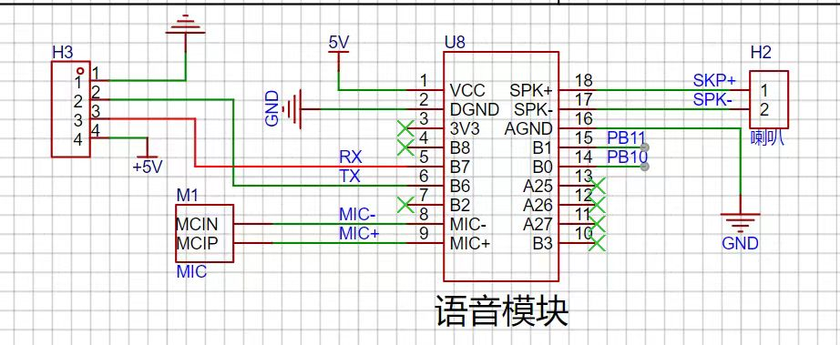

---

## SU-03T模块烧录专题


---

### SU-03T烧录进度卡住如何处理？

**问题描述：**

使用 SU-03T 模块烧录时，进度卡在 9% 无法继续，或需要多次尝试才能成功。

**解决方案：**

1. 直接使用 CH340 连接语音模块，不要通过开发板转接
2. 关闭电脑蓝牙，避免串口冲突
3. 按照以下步骤操作：

    - 在蜂鸟烧录工具中选择正确 COM 端口
    - 点击烧录，看到进度条出现后
    - 耐心等待完成，不要中断过程

**注意事项：**

- 烧录时避免触碰模块，可能导致通信中断
- 如果第一次失败，可以多尝试几次
- 确认使用的是 SU-03T 型号，不是其他型号

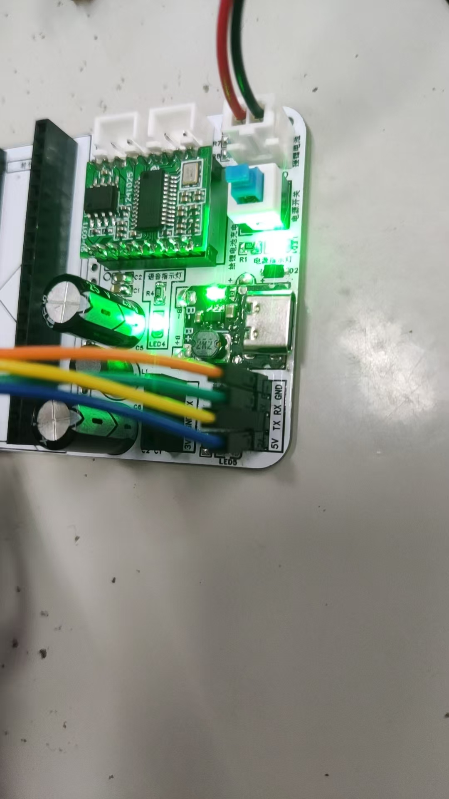
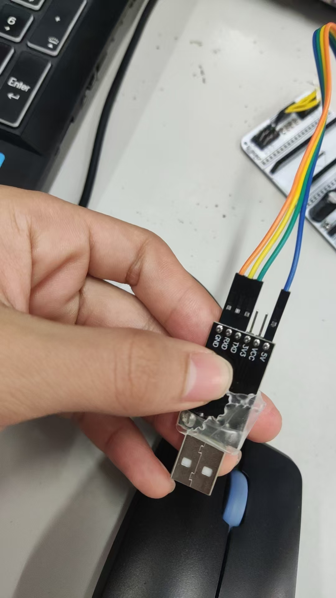
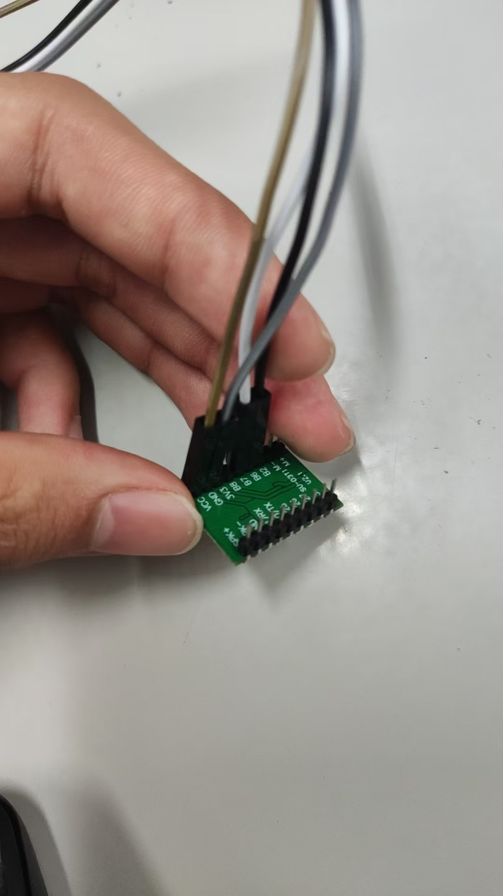
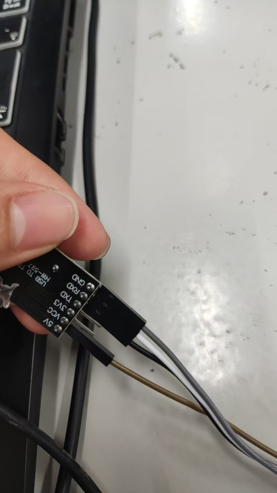


---

### SU-03T在下载器上无法烧录但在设备上可正常使用怎么办？

**问题描述：**

SU-03T模块在使用下载器烧录时无响应，但将模块安装到设备后可以正常工作。

**解决方案：**

**1. 硬件环境排查**

- 检查转接板是否正常工作
- 确认下载器与模块的连接线路
- 尝试不同的USB端口或电脑

**2. 咪头和喇叭布局检查**

- 将咪头移至远离喇叭的位置
- 避免咪头和喇叭距离过近导致音频干扰
- 测试时将咪头单独引出进行验证

**3. 烧录环境优化**

- 确保烧录环境安静，避免背景噪音干扰
- 检查电源供电是否稳定
- 使用官方推荐的转接板和连接线

**注意事项：**

- 咪头距离喇叭太近可能导致烧录时音频检测失败
- 建议在设备设计时合理布局咪头和喇叭位置
- 使用标准转接板可提高烧录成功率

---

### 烧录成功后模块无响应怎么办？

**问题描述：**

固件已成功烧录到模块，但模块上电后无任何声音或响应。

**解决方案：**

1. **硬件连接检查**：

    - 确认喇叭正负极连接正确
    - 检查电源供电是否稳定
    - 验证音频线路连接良好

2. **模块状态确认**：

    - 检查小芯片是否已烧录
    - 确认主控芯片和语音芯片都已正确编程
    - 观察电源指示灯状态

3. **串口通信验证**：

    - 连接串口调试助手
    - 发送测试指令验证模块是否响应
    - 检查波特率设置是否正确

**注意事项：**

- SU-03T与单片机连接时，RX和TX需要交叉连接
- 确保使用合适的电源电压（3.3V或5V）
- 检查模块是否处于正常工作模式而非调试模式

---


---

### 有哪些类型的烧录器可以使用？

**问题描述：**

不确定有哪些烧录器可以选择，以及它们的使用场景和区别。

**解决方案：**

- **AICE-MINI 调试器**：

    - 杰理官方专用调试器
    - 支持所有型号的语音模块
    - 可用于在线调试和烧录
    - 价格较高，适合开发调试使用


- **小扳手烧录器**：

    - CI-03T系列专用烧录器
    - 操作简单，即插即用
    - 主要用于固件烧录功能
    - 价格相对较低

- **云知声UniOne蜂鸟M烧录器**：

    - SU-03T/SU-63T专用烧录器
    - 支持SU系列所有型号
    - 需要配合特殊操作流程
    - 免费提供下载使用

- **自制烧录器**：

    - 可使用CH340模块自制
    - 需要一定的电子技术知识
    - 适合批量生产或个人项目

**使用建议：**

- 开发调试推荐使用AICE-MINI
- 单纯烧录推荐使用专用烧录器
- 批量生产可考虑自制方案降低成本

---


---

### SDK生成失败提示固件超大怎么办？

**问题描述：**

生成SDK时出现错误提示"生成的固件超大(2096544字节)，请删减配置项目，选用小模型或使用组合播报"。


**解决方案：**

- **问题原因**：

    - SU-03T模块Flash容量有限
    - 个性化音频文件占用大量空间（如440KB的歌曲文件）
    - 超出2MB限制导致生成失败

- **优化方法**：

    1. **减少个性化音频大小**：

        - 如果音频旋律重复，可剪裁一半长度
        - 使用定时器功能循环播放补全
        - 降低音频采样率或压缩质量

    2. **精简回复语配置**：

        - 删除不必要的回复语
        - 合并相似功能的回复
        - 使用简短的回复内容

    3. **使用小模型**：

        - 选择更小的识别模型
        - 平衡识别准确率和占用空间

- **操作步骤**：

    1. 在平台中删除部分回复语
    2. 裁剪个性化音频文件长度
    3. 重新生成SDK
    4. 验证固件大小是否符合要求

**注意事项：**

- 个性化音频是占用空间的主要因素
- 可通过定时器功能实现长音频的循环播放
- 建议先备份原配置文件
- 如必须使用大文件，考虑更换更大Flash容量的模块

---


---

### SU-03T烧录时显示"等待设备"怎么办？

**问题描述：**

使用云知声UniOne蜂鸟M烧录工具烧录SU-03T时，设备状态显示为"等待设备"，无法正常烧录，且模块上电后发烫。

**解决方案：**

**问题排查：**

1. **硬件连接检查**
    - 确认烧录器与模块的连接线序
    - 检查TX、RX、GND、5V线是否正确
    - 确保没有接反或接触不良

2. **模块状态检查**
    - 模块发烫说明存在短路
    - 短路会导致烧录工具无法识别
    - 需要先解决短路问题

3. **烧录工具设置**
    - 确认选择了正确的COM端口
    - 检查波特率设置是否正确
    - 尝试重新插拔USB连接

**处理步骤：**

1. **断开电源，检查接线**
    - 使用万用表测量模块供电
    - 确认没有短路再上电
    - 排线按照标准连接图操作

2. **更换模块测试**
    - 如果确认接线无误但仍然短路
    - 说明模块可能已损坏
    - 更换新模块再次尝试

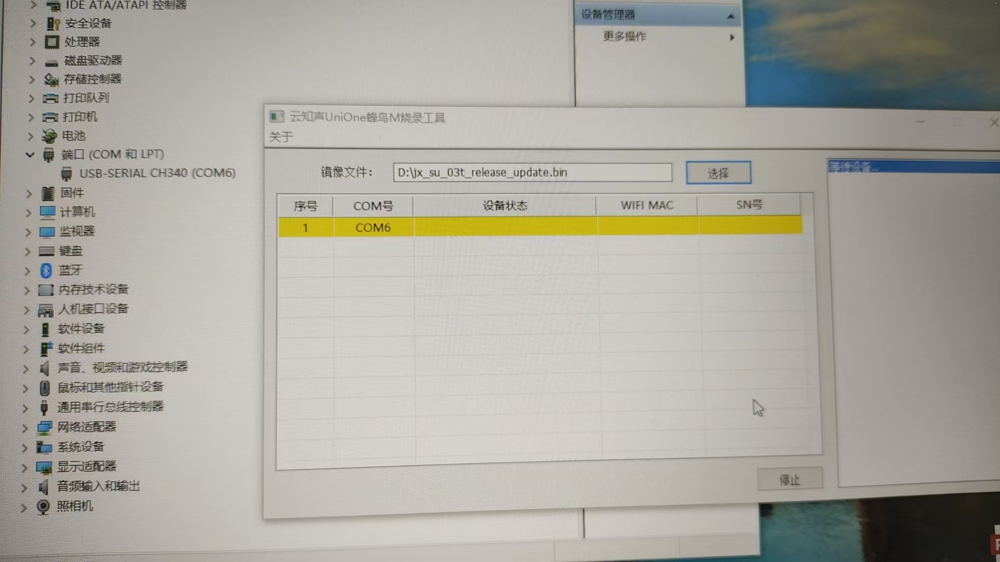

**注意事项：**

- 模块发烫是严重故障信号，需立即断电
- 烧录前务必确保电路正常
- 短路的模块无法正常烧录
- 建议保留一个正常模块作为对比测试

---


---

### 严格按文档操作仍烧录失败怎么办？

**问题描述：**

按照文档严格操作，此前几次成功烧录，但当前无法烧录SU-03T模块。

**解决方案：**

**可能原因：**

1. **硬件问题**
    - USB转串口芯片故障
    - 连接线接触不良
    - 模块本身损坏

2. **软件问题**
    - 驱动程序异常
    - 烧录软件配置错误
    - 系统串口被占用

**排查步骤：**

1. **硬件排查**
    - 更换USB转串口模块
    - 检查连接线是否完好
    - 使用万用表测试模块供电

2. **软件排查**
    - 重新安装USB转串口驱动
    - 关闭其他可能占用串口的程序
    - 以管理员身份运行烧录软件

3. **环境检查**

---


---

### 如何判断模块是否因电压异常而损坏？

**问题描述：**

设备模块在供电后无法正常工作，需要判断模块是否因电压异常烧坏。

**解决方案：**

**1. 使用万用表检测**

- 转到蜂鸣档，测量VCC和GND是否被击穿
- 如无击穿，给模块单独供5V电压
- 测试模块3V3引脚是否有3.3V电压输出

**2. 关键电压测试**

- 测量麦克风正负电压是否在2.4-2.5V范围（SU-03T）
- 测量喇叭正负对GND电压是否在2.2-2.5V范围内
- 各测试电压如不正常可能是模块烧坏

**3. 故障判断**

- VCC/GND短路表明模块已损坏
- 3V3无输出说明内部电路故障
- 麦克风/喇叭电压异常表明相关电路损坏

**注意事项：**

- 电压异常是模块损坏的主要原因之一
- 建议在供电前确认电压正确性
- 损坏模块通常需要返修或更换

---
    - 更换电脑USB端口
    - 禁用防火墙和杀毒软件
    - 重启电脑清理系统状态

**建议：**

- 保留一个已知能正常工作的环境配置
- 批量烧录时准备备用硬件
- 遇到问题优先更换硬件对比测试
- 如持续失败，联系专业技术人员

---


---

### 如何判断模块是否损坏？

**问题描述：**

多个模块都无法成功烧录固件，需要确认模块是否存在硬件故障。

**解决方案：**

**1. 使用万用表检测模块**

- **短路检测**：

    - 万用表调至蜂鸣档
    - 测量VCC和GND是否短路
    - 如蜂鸣器响，说明模块可能被击穿

- **供电测试**：

    - 给模块提供5V供电
    - 测量3V3引脚是否输出3.3V电压
    - 无输出说明电源部分可能损坏

- **关键电压检测**：

| 测试点 | CI-03T正常范围 | SU-03T正常范围 | 喇叭正负对GND |
|--------|----------------|----------------|---------------|
| 麦克风正负 | 1.6-1.7V | 2.4-2.5V | 2.2-2.5V |

**2. 直接连接烧录方法**

- 不使用转接板，直接用杜邦线连接
- 模块引脚直接连接到串口烧录器
- 通过拔插VCC线进行复位和进入烧录模式

**3. 连接方式**

```
烧录器    ←→    模块
VCC       →     VCC
GND       →     GND
TX        →     RX
RX        →     TX
```

**4. 操作步骤**

- 确保所有连接正确
- 先连接GND，再连接VCC
- 拔插VCC线触发复位
- 立即开始烧录操作

**注意事项：**

- 电压异常表明模块可能已损坏
- 不要带电插拔信号线，仅可插拔电源线
- 直接连接时注意线序，避免接反
- 建议使用带夹子的测试线提高接触可靠性

---


---

### 烧录后命令词识别但不执行动作怎么办？

**问题描述：**

SU-03T模块烧录后，能够识别命令词并回复，但无法执行相应的控制动作（如风扇不启动）。

**解决方案：**

**1. 检查控制配置**

- 默认情况下，模块只会回复命令词而不执行动作
- 需要在控制详情中添加对应的操作配置
- 确认控制类型选择正确

**2. 控制逻辑配置步骤**

- 进入命令词配置界面
- 选择需要执行动作的命令词
- 在控制详情中选择或添加相应操作
- 根据硬件连接方式设置控制参数

**3. 硬件连接示例**

以控制风扇为例：

- 风扇负极接地
- 正极连接到模块的GPIO引脚
- 在配置中设置该引脚输出高电平启动风扇

**4. 控制类型选择**

- **GPIO输出**：控制简单开关设备
- **PWM输出**：控制需要调速的设备
- **串口输出**：通过串口发送控制命令
- **继电器控制**：驱动大功率设备

**5. 测试验证**

- 烧录完成后重新上电
- 先说唤醒词激活模块
- 再说出具体命令词
- 观察设备是否执行相应动作

**注意事项：**

- 控制配置需要根据实际硬件连接进行调整
- 继电器等大功率设备需要独立供电
- 确保GPIO引脚电压和电流不超过规格
- 复杂控制逻辑可能需要编写自定义脚本

---


---

### TTL烧录和串口烧录有什么区别？

**问题描述：**

使用TTL烧录方式烧录SU-03T芯片后，模块无法被唤醒，且烧录后无任何反应。

**解决方案：**

**1. 理解烧录方式区别**

- **TTL烧录**：通常指使用TTL电平的专用烧录器
- **串口烧录**：通过USB转串口（如CH340）进行烧录
- SU-03T模块需要使用串口烧录方式

**2. 正确的烧录工具选择**

- 推荐使用USB转串口烧录器（CH340等）
- 确保烧录器支持标准的UART协议
- TTL专用烧录器可能不兼容SU-03T

**3. 烧录操作步骤**

- 连接USB转串口烧录器到电脑
- 正确连接TX、RX、GND、VCC线
- 使用标准串口烧录软件进行操作

**4. 常见误区**

- 误认为TTL和串口是同一种接口
- 使用了不兼容的专用烧录器
- 忽略了模块对电平的特殊要求

**注意事项：**

- SU-03T模块建议使用官方推荐的串口烧录器
- TTL烧录器虽然电平兼容，但协议可能不同
- 如使用TTL工具无反应，请更换为标准串口烧录器
- 烧录成功后要完全断电重启再测试

---


---

### 串口烧录失败如何处理？

**问题描述：**

SU-03T模块使用串口下载时失败，重新上电无反应。

**解决方案：**

- **常见原因**：

    1. 喇叭被剪掉影响启动
    2. 固件文件路径过长
    3. 串口连接问题
    4. 模块硬件故障

- **解决步骤**：

    1. 将bin文件拖到桌面
    2. 缩短文件名（如update.bin）
    3. 检查串口号是否正确
    4. 确保模块正常供电

- **验证方法**：

    - 烧录完成后重新上电
    - 观察模块指示灯状态
    - 测试语音识别功能

**注意事项：**

- 烧录前确保硬件连接正常
- 文件路径避免使用中文
- 多次失败需检查模块是否损坏

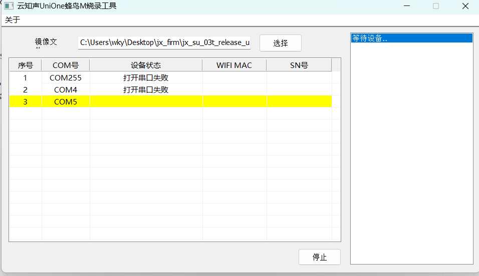
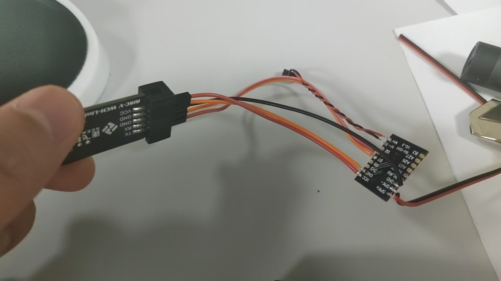
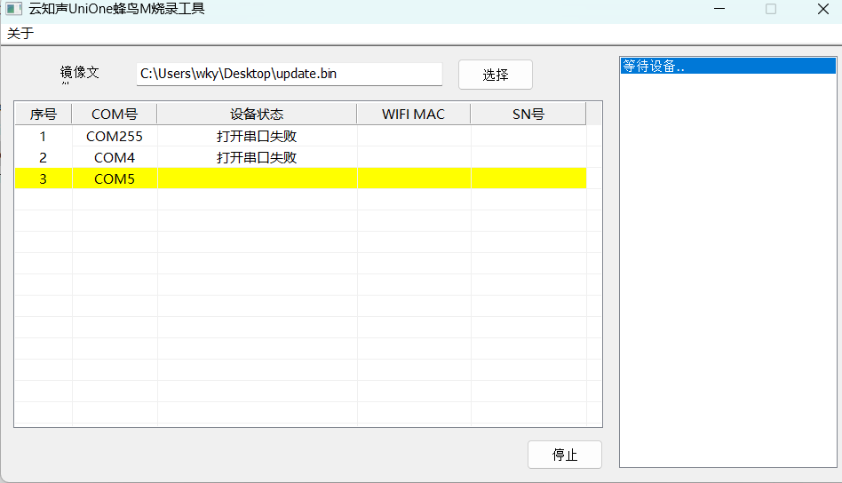

---


---

### 语音模块烧录后无反应且串口打开失败怎么办？

**问题描述：**

语音模块烧录时出现错误后，再次尝试烧录时模块无反应，烧录软件显示"打开串口失败"。

**解决方案：**

**模块故障检测：**

1. **使用万用表检测**：

    - 转到蜂鸣档测量VCC和GND
    - 检查是否存在短路（击穿）
    - 如蜂鸣则模块已损坏

2. **电压测试步骤**：

    - 给模块5V供电
    - 测量3V3引脚是否有3.3V输出
    - 测量麦克风两端电压：

        * CI-03T：1.6-1.7V
        * SU-03T：2.4-2.5V
    - 测量喇叭两端对GND电压：2.2-2.5V

**烧录操作要点：**

1. **正确接线方法**：

    - CH340的5V → 模块VCC
    - CH340的RXD → 模块B7
    - CH340的TXD → 模块B6
    - CH340的GND → 模块GND

    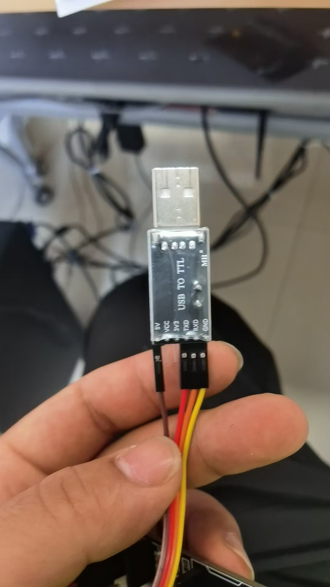

    *CH340 USB转TTL模块的引脚标识*

    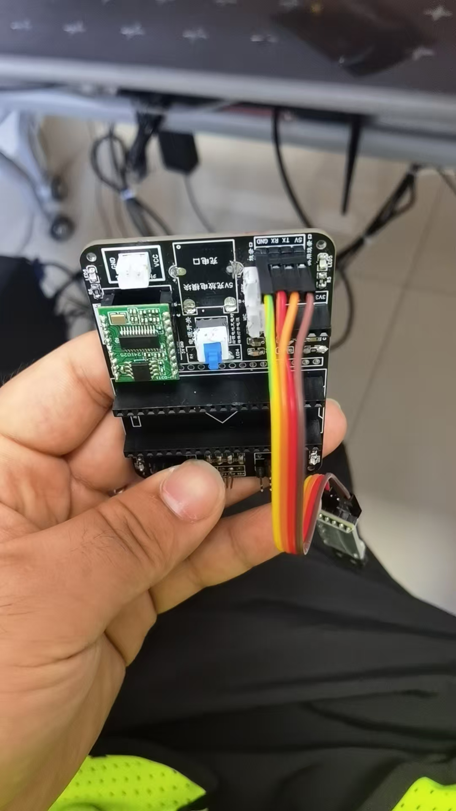

    *语音模块与USB转TTL的连接方式*

    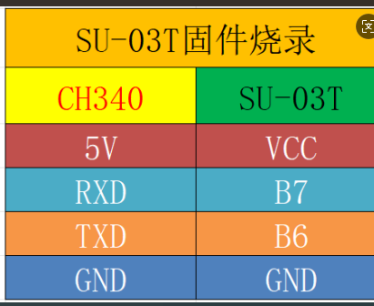

    *标准烧录接线方法示意图*

2. **进入烧录模式**：

    - 打开烧录软件
    - 勾选要烧录的设备
    - 点击"启动下载"后拔插VCC

    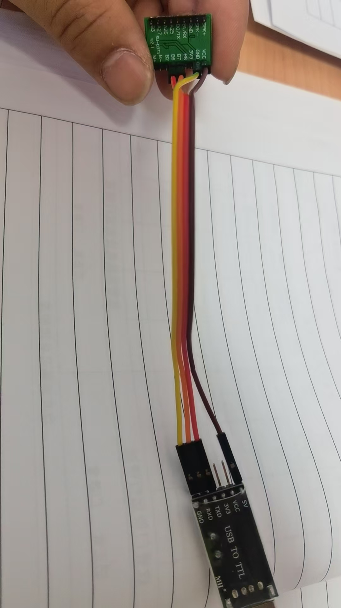

    *连接完成的烧录线缆*

    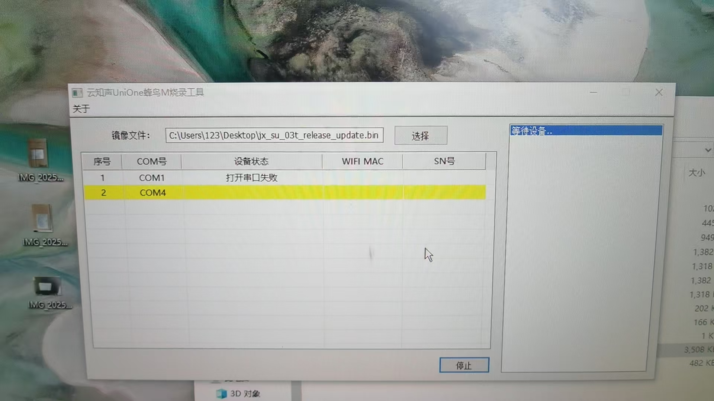

    *烧录软件显示"打开串口失败"*

    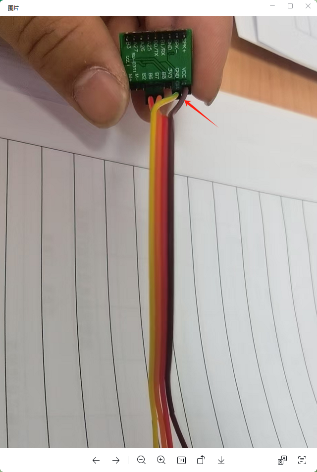

    *检查VCC和GND连接是否牢固*

    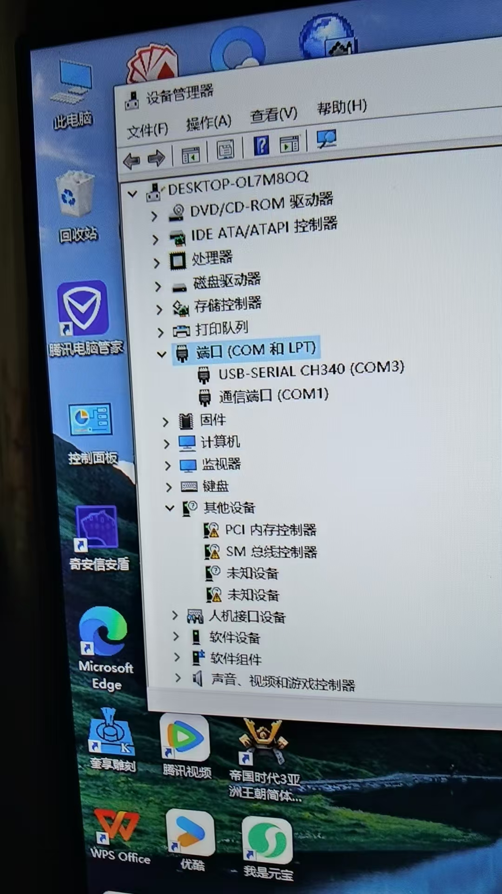

    *确认系统识别到的串口设备*

3. **排查连接问题**：

    - 检查杜邦线是否接触良好
    - 确认串口号选择正确
    - 更换USB端口尝试

**故障处理建议：**

- 模块击穿需更换新模块
- 接触不良需重新压紧线缆
- 串口问题需检查驱动安装

**注意事项：**

- 烧录失败立即断开电源
- 不要反复尝试烧录故障模块
- 使用质量可靠的USB转串口模块

---


---

### 固件生成时间过长怎么办？

**问题描述：**

在使用串口固件生成工具时，固件生成时间过长（约98分钟），影响开发调试效率。

**解决方案：**

1. **确认模块型号匹配**
    - 检查使用的模块型号（如SU-03T）
    - 确保使用对应型号的固件生成工具
    - 不同型号的固件生成时间可能不同

2. **固件文件选择**
    - SU-03T模块应使用SU-03T的固件文件
    - CI-03T模块应使用CI-03T的固件文件
    - 混用固件会导致烧录失败

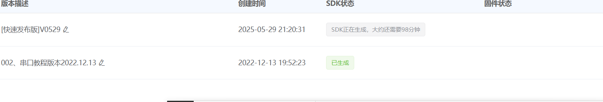

*固件生成工具显示预计时间*

3. **烧录失败排查**
    - 如果出现"文件读取失败"错误，检查固件文件是否匹配模块型号
    - 确认固件文件完整性，重新下载固件
    - 使用正确的烧录软件（云知声烧录工具用于SU-03T）

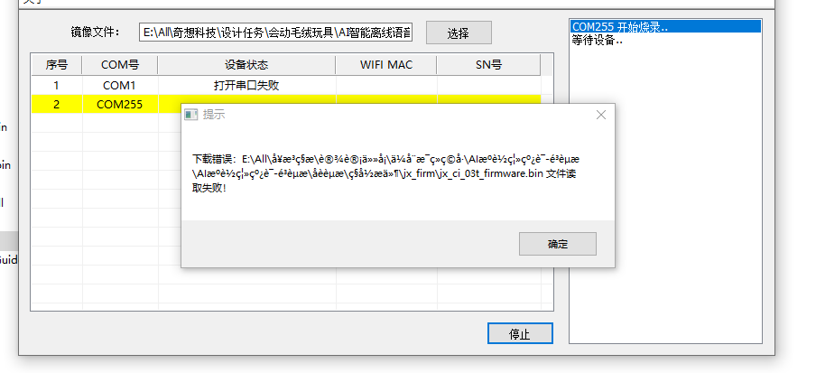

*文件读取失败错误提示*

**注意事项：**

- 固件生成时间受词条数量和复杂度影响
- 快速发布版的生成时间相对较短
- 确保使用型号匹配的固件和烧录工具

---


---

### SU-03T的UART串口配置与B6/B7引脚冲突怎么办？

**问题描述：**

SU-03T烧录使用B6/B7引脚，但与主控CPU通信时想使用B0/B1串口，发现语音无法正常输出，不确定是否必须使用相同的串口。

**解决方案：**

**1. 理解引脚功能**

- B6/B7默认配置为UART1（烧录功能）
- B0/B1可配置为UART2（通信功能）
- 两个串口可以独立工作，互不干扰

**2. 配置方法**

- 在语音平台配置PIN脚功能
- 将UART1_RX/TX配置到其他引脚（如B0/B1）
- 保留B6/B7用于烧录，烧录完成后恢复正常
- 或使用B6/B7作为通信，B0/B1用于其他功能

**3. 实际应用示例**
```
烧录时：B6(RX)/B7(TX) 连接烧录器
通信时：B0(RX)/B1(TX) 连接主控
或
烧录时：B6(RX)/B7(TX) 连接烧录器
通信时：B6(RX)/B7(TX) 连接主控（需重新配置）
```

**4. 注意事项**

- 烧录完成后，B6/B7可以当作普通串口使用
- 配置更改需要重新生成和烧录固件
- 建议保留专用的烧录接口，避免冲突
- 如引脚不足，可考虑使用I2C等其他通信方式

---


---

### 固件大小超出设备Flash容量怎么办？

**问题描述：**

使用烧录工具下载固件时，提示"固件大小超出该设备flash大小!"，且固件文件大小大于1M，导致烧录失败。

**解决方案：**

- **确认模块型号与固件匹配**：

    - 检查所使用模块的Flash容量规格
    - 确认固件文件是否为对应型号的专用固件
    - 不同型号的固件文件通常不兼容

- **固件大小检查**：

    - CI-03T：支持1M以下固件
    - CI-33T：支持更大容量固件（具体参考规格书）
    - CI-73T：有特定的Flash容量限制
    - SU-03T：支持标准容量固件

- **解决方法**：

    - 使用正确的固件生成工具重新生成
    - 选择与模块匹配的固件版本
    - 如需大容量，考虑更换支持更大Flash的模块

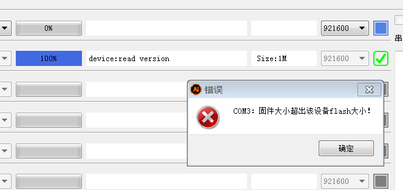

*烧录工具提示"固件大小超出该设备flash大小!"*

**注意事项：**

- 固件文件大小必须小于模块的物理Flash容量
- 生成固件时选择正确的目标模块型号
- 不同系列的模块固件通常不能混用
- 如不确定，联系专业技术人员确认具体参数

---


---

### 烧录线接错导致无法烧录怎么办？

**问题描述：**

因烧录线连接错误，导致无法正常烧录固件到模块。

**解决方案：**

1. **检查引脚定义**
    - 确认烧录线的TX/RX与模块对应
    - 查看模块或转接板的丝印标识
    - 参考官方接线图

2. **常见烧录引脚**
    - SU-03T系列：B6(TX)、B7(RX)
    - CI-03T系列：对应串口引脚
    - VCC和GND必须正确连接

3. **接线验证**
    - 使用万用表验证连通性
    - 确认没有短路或断路
    - 检查电源极性是否正确

**注意事项：**

- 烧录线不同型号可能不通用
- 接线错误可能导致无法通信或损坏模块
- 建议使用官方提供的烧录工具
- 如不确定，先确认模块引脚定义

---

---
## 基础功能问题


---

### SU-03T模块烧录后扬声器无声音怎么办？

**问题描述：**

SU-03T模块烧录完ASR语音部分后，扬声器无任何声音输出，包括唤醒播报和开机播报。

**解决方案：**

**1. 检查固件版本**

- 确认烧录的是正确的语音固件
- 使用官方提供的标准固件测试
- 避免使用自定义或修改版固件

**2. 检查扬声器连接**

- 使用2.0端子的扬声器
- 确保扬声器阻抗匹配（通常4-8欧姆）
- 检查连接线是否牢固，避免接触不良
- 使用万用表测试扬声器是否正常

**3. 检查开发板设置**

- 确认两个开关位置正确
- 检查电源开关是否打开
- 验证模块供电是否正常（3.3V或5V）

**4. 音量设置检查**

- 在平台中确认音量不为0
- 检查是否设置了静音模式
- 尝试调整到最大音量测试

**注意事项：**

- 烧录语音固件要选择正确的文件
- 使用质量良好的扬声器避免接触不良
- 确保供电电压稳定在规定范围内
- 如果硬件开关设置错误可能导致无输出

---

## CH340烧录问题


---

### 烧录时出现"异常 -24"错误怎么办？

**问题描述：**

使用烧录工具更新固件时，出现"异常 -24"错误，提示"updater传输数据中出现异常"。

**解决方案：**

1. **错误含义**
    - 异常-24表示传输数据异常
    - 可能是Flash芯片问题
    - 也可能是连接干扰导致

2. **排查步骤**
    - 检查烧录连接线是否牢固
    - 尝试更换USB端口
    - 确认模块供电稳定
    - 降低烧录波特率尝试

3. **固件大小检查**
    - SU-03T的Flash只有2M
    - 确认固件大小不超过2M
    - 过大的固件会导致烧录失败

4. **处理方案**
    - 重新生成固件尝试
    - 使用更短和稳定的USB线
    - 更换电脑环境测试
    - 联系官方支持确认模块状态

**注意事项：**

- 进度条到100%时出现错误，可能是Flash问题
- 避免在烧录过程中移动设备
- 确保烧录环境无强电磁干扰
- 多次失败建议送修检测

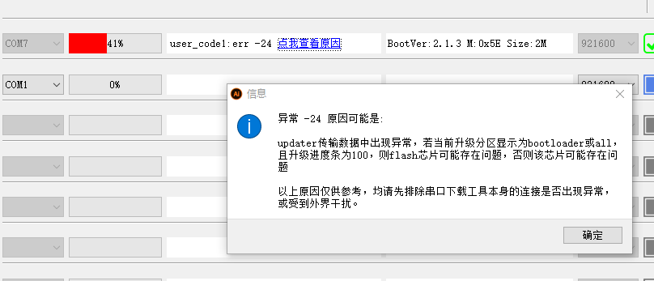

---


---

### SU-03T模块烧录不进去如何处理？

**问题描述：**

SU-03T模块在烧录固件时无法成功，多次尝试均失败。

**解决方案：**

**1. 连接时序优化**

- 采用GND先接触的插入方式
- 快速插入让5V产生垂直上升沿
- 这种方式容易触发内部复位进入烧录模式

**2. 具体操作步骤**

- 将排针稍微倾斜，GND引脚先接触
- 快速插入，让电源有个陡峭的上升沿
- 确保所有引脚接触良好

**3. 注意事项**

- 操作需要一定的熟练度
- 如果一次不成功，可以多尝试几次
- 确保连接线质量良好，避免接触不良

**4. 备选方案**

如果上述方法仍然无效：

- 检查COM口选择是否正确
- 验证模块供电是否稳定
- 尝试在其他电脑上进行烧录
- 考虑使用质量更好的USB转串口模块

---


---


---

### 云知声UniOne蜂鸟M烧录工具如何选择COM17？

**问题描述：**

使用云知声UniOne蜂鸟M烧录工具时，设备列表中显示COM17端口，但工具界面未显示该端口的设备状态、WIFI MAC和SN号等信息，无法进行烧录操作。

**解决方案：**

**1. 端口识别问题**

- UniOne蜂鸟M工具与机芯智能产品不完全兼容
- 该工具主要针对云知声自有芯片设计
- 使用时会出现端口识别异常

**2. 正确的烧录工具**

- **机芯智能专用工具**：

    - 使用智能公元平台提供的烧录软件
    - CI-03T：使用PACK_UPDATE_TOOL.exe
    - SU-03T：使用SU-03T专用烧录器

- **下载渠道**：

    - 智能公元平台文档中心
    - 各模块的开发包页面
    - 随产品附带的资料光盘

**3. 操作建议**

- 立即停止使用UniOne蜂鸟M工具
- 下载机芯智能官方烧录工具
- 使用与模块匹配的专用工具进行烧录
- 如有疑问，联系官方支持获取正确工具

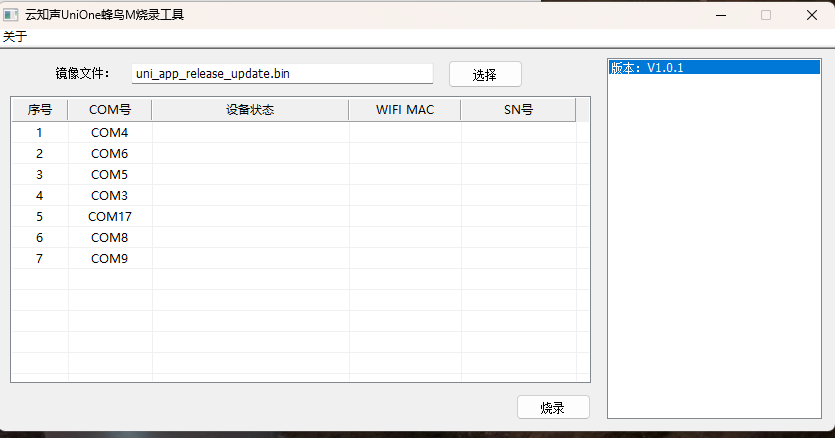

**注意事项：**

- 不同品牌的烧录工具通常不兼容
- UniOne蜂鸟M是云知声品牌工具，不适用于机芯智能产品
- 使用不匹配的工具可能导致烧录失败或设备损坏
- 建议保留专用的烧录工具环境用于后续开发

---


---

### US516P6芯片如何正确烧录？

**问题描述：**

US516P6（蜂鸟M）芯片无法通过串口直接烧录，需要了解正确的烧录流程和基础固件要求。

**解决方案：**

**1. 烧录流程说明**

- **首次烧录**：必须使用专用烧录器通过B2、B3接口进行离线烧录
- **后续烧录**：烧录过基础固件后，可通过CH340使用B6、B7串口烧录
- **空片限制**：空片无法直接使用串口烧录，必须先用专用烧录器预烧录

**2. 硬件连接方式**

- **离线烧录**：使用专用烧录器连接B2（时钟）和B3（数据）引脚
- **串口烧录**：使用USB转TTL模块连接B6（TX）和B7（RX）引脚
- **电平要求**：IO电平为3.3V，供电为5V

**3. 烧录器选择**

- **专用离线烧录器**：用于首次烧录和基础固件烧录
- **CH340模块**：用于后续固件更新（需已烧录基础固件）
- **不支持工具**：云知声UniOne蜂鸟M工具不兼容机芯智能产品

**4. 服务选项**

- **预烧录服务**：厂商提供批量预烧录服务（需烧录费）
- **自行烧录**：购买专用烧录器进行烧录
- **最小订单**：100片以上可提供预烧录服务

**注意事项：**

- US516P6芯片发货时为空片，需要先烧录基础固件
- 串口波特率支持115200等其他速率
- 烧录时选择短的bin文件
- 如使用调试器直接烧录，确保选择正确的固件文件

**5. 双芯片方案原理图**

- **原理图获取**：可参考SU-03T-V2.1电气原理图
- **包含内容**：CI1302和US516P6双芯片完整电路设计
- **关键接口**：

    - 串口烧录接口：B6、B7引脚
    - 离线烧录接口：B2、B3引脚
- **设计参考**：包含电源、串口电平转换等必要电路

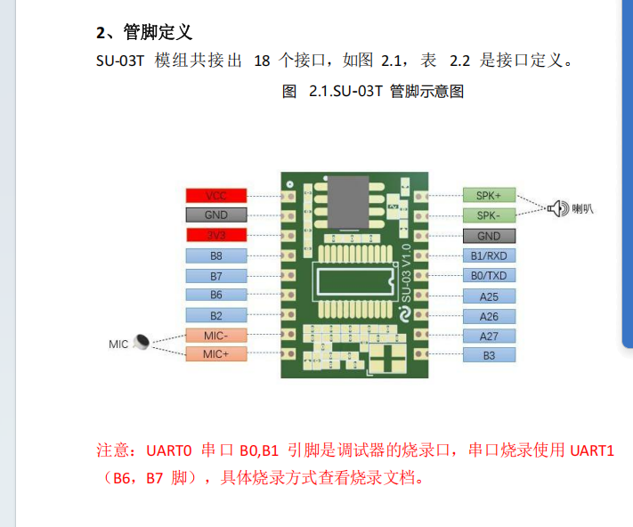

**双芯片原理图说明**：

- SU-03T-V2.1电气原理图包含CI1302和US516P6双芯片完整电路设计
- 可联系厂商申请获取原理图文件
- 原理图包含电源、串口电平转换等必要电路设计
- 设计双芯片PCB时可参考该原理图进行布局

---


---

### 语音芯片模块烧录方案有哪些？

**问题描述：**

需要了解语音芯片模块的烧录方式、烧录器选择和相关成本。

**解决方案：**

**1. 烧录方式选择**

- **模块烧录**：

    - 100片以上可由厂商预烧录
    - 小批量需自行烧录

- **芯片烧录**：

    - 芯片以空片形式发货
    - 需使用专用烧录器

**2. 烧录器选择**

- **CH340烧录器**（用于模块）：

    - 价格：16元/个
    - 适用：已封装的模块烧录
    - 特点：通过串口连接，使用简单

- **专用烧录器**（用于芯片）：

    - 适用：裸芯片烧录
    - 特点：专业设备，支持芯片级烧录

**3. 常用型号参考**

- **SU-03T模块**：单价约9元
    - 支持语音识别功能
    - 适合简单语音控制应用

**注意事项：**

- 模块和芯片的烧录器不通用
- CH340烧录器仅适用于模块，不能烧录芯片
- 小批量建议采购模块而非芯片
- 首次烧录建议先购买少量测试

---

## 烧录服务与批量操作


---

### SU-03T串口烧录后默认音量异常怎么办？

**问题描述：**

使用串口工具烧录SU-03T固件后，设备音量默认为最大音量，而非设置的最低音量。

**解决方案：**

**问题分析：**

1. **烧录方式确认**
    - 使用串口工具进行固件烧录
    - 烧录文件：moste_xiaolin_release_250114.bin
    - 固件已配置默认最低音量

2. **可能原因**
    - 串口烧录过程中数据传输异常
    - 固件中的音量初始化代码问题
    - 烧录工具或参数设置不当

**解决方法：**

1. **更换烧录方式**
    - 尝试使用专用烧录器
    - 使用B6/B7引脚连接烧录工具
    - 避免使用串口直接烧录

2. **检查烧录参数**
    - 确认波特率设置正确
    - 验证数据位和停止位配置
    - 使用官方推荐烧录工具

3. **固件验证**
    - 重新生成固件确保配置生效
    - 检查固件文件的MD5值
    - 烧录后立即验证默认音量

4. **替代方案**
    - 联系官方技术团队获取预烧录模块
    - 由供应商直接烧录并测试
    - 确保功能正常后再发货

**注意事项：**

- 串口烧录可能存在兼容性问题
- 建议使用官方推荐的烧录工具
- 烧录完成后必须进行功能验证
- 保留烧录记录便于问题追踪

---


---

### CI1302 执行"退出唤醒"指令后无法正常退出唤醒状态

**问题描述：**

CI1302 芯片在生成的固件中，执行"退出唤醒"指令后无法正常退出唤醒状态，导致 MCU 接收到串口消息后，语音指令被重复识别。

**解决方案：**

该问题已确认是固件生成平台的 bug，可通过以下方式解决：

- 使用官方提供的修复后固件：jx_firm.tar.gz
- 重新在平台生成固件（平台已修复该问题）
- 临时绕过方案：通过设置变量条件来控制退出唤醒指令的执行

**注意事项：**

- 退出唤醒功能的目的是让命令词失效，只能通过唤醒词重新激活
- SU-03T（蜂鸟芯片）的退出唤醒功能正常，此问题仅影响 CI1302
- 如遇类似问题，建议联系官方技术团队获取最新固件

---

## 蜂鸟M调试器烧录问题

### 使用蜂鸟M调试器烧录SU-03T时出现Flash burn fail错误怎么办？

**问题描述：**

使用蜂鸟M调试器和MV ADS下载器烧录SU-03T芯片时，出现"Flash burn fail. Please reburn again."错误提示，导致烧录失败。

**解决方案：**

**1. 烧录选项设置**

- 使用MV ADS下载器时，**不需要勾选**"Verify"和"EraseAll"选项
- Verify表示验证，EraseAll表示擦除全部
- 如勾选这两个选项，会执行先擦除→烧录→验证的完整流程

**2. 空芯片烧录流程**

- **空白芯片**：可以直接烧录自定义固件（不带update后缀的.bin文件）
- **已使用芯片**：建议先烧录出厂固件，再烧录自定义固件

**3. 固件文件选择**

- 选择不带"update"后缀的固件文件进行完整烧录
- 如：jx_su_03t_release.bin（而非jx_su_03t_release_update.bin）

**注意事项：**

- 空白芯片无需先烧录出厂固件，可直接烧录自定义固件
- 烧录失败时，取消Verify和EraseAll选项重试
- 确保选择了正确的固件文件类型（非update版本）
- 如持续失败，检查硬件连接和驱动程序

---

### SU-03T空芯片烧录出厂固件后不启动怎么办？

**问题描述：**

使用蜂鸟M调试器对SU-03T空白芯片烧录出厂固件，烧录工具显示"Burn Success"，但芯片无任何反应，无法正常启动。

**解决方案：**

**1. 硬件连接检查**

- 检查喇叭和麦克风连接是否正确
- 确认供电电压稳定（5V）
- 验证所有接线牢固无松动

**2. 电流异常排查**

- 正常待机电流应为约60mA
- 使用万用表测量实际工作电流
- 如电流异常低（如27mA），可能模块存在问题

**3. 电压测试方法**

使用万用表进行以下电压测试：

- **VCC-GND短路检查**：使用蜂鸣档测量是否短路
- **3V3输出测试**：给模块5V供电，测试3V3引脚是否输出3.3V
- **麦克风电压**：应为2.4-2.5V（SU-03T）
- **喇叭电压**：应为2.2-2.5V

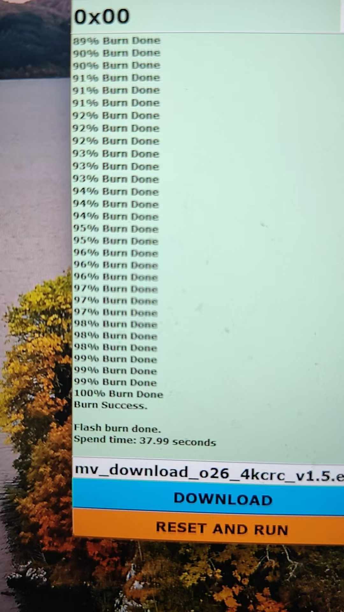

**4. 固件文件确认**

- 确保使用正确的出厂固件文件
- 检查固件文件完整性
- 避免使用update后缀的固件进行首次烧录

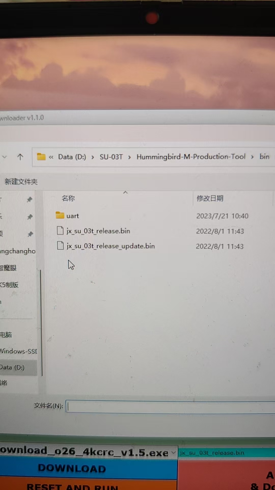

**注意事项：**

- 多个芯片出现相同问题时，可能是调试器或烧录方法问题
- 电压测试异常（不满足规格范围）可能表明模块损坏
- 更换模块或芯片后仍无法解决时，建议联系官方技术团队
- 正常工作的模块应能播报出厂语音内容

---

### SU-03T模块偶尔死机无法唤醒怎么办？

**问题描述：**

SU-03T模块在待机状态下偶尔出现死机现象，无法通过唤醒词唤醒，需要重新上电或说"取消静音"才能恢复正常。

**解决方案：**

1. **排查静音功能影响**
    - 检查是否配置了静音控制指令
    - 可能是在无人时误识别到静音命令导致
    - 建议暂时移除静音控制，观察是否还有死机现象

2. **供电质量检查**
    - 确认电源电压稳定在5V±0.5V范围
    - 检查电源纹波是否过大
    - 使用示波器观察上电和待机时的电压波形

3. **提供测试工程**
    - 如问题持续出现，提供完整的工程文件
    - 便于进行单模块测试
    - 记录死机发生前的具体操作和环境

**注意事项：**

- 死机多发生在待机状态，可能和静音功能有关
- 问题描述越详细（发生时间、频率、环境）越有助于定位问题
- 建议保存出现问题的现场以便进一步分析

---

### 批量烧录时部分板卡失败或偶尔失灵怎么办？

**问题描述：**

在使用MV ADS downloader v1.8烧录工具批量烧录新固件时，部分板卡出现烧录失败或烧录后无法正常工作的问题。

**解决方案：**

- 对于烧录失败的板卡，可以重新进行烧录操作
- 烧录成功但偶尔失灵的板卡，可能是接触不良导致烧录不完整
- 新发布的固件版本可能需要适配，建议反馈具体问题
- 批量烧录时建议对失败和异常的板卡进行二次烧录验证

**注意事项：**

- 烧录过程中确保连接稳定，避免接触不良
- 新版固件首次使用时建议先进行小批量测试
- 记录失败板卡的数量和具体现象，便于问题分析
- 二次烧录仍异常的板卡建议单独标记和检测

---

### US516P6烧录上位机缺乏校验机制怎么办？

**问题描述：**

US516P6烧录上位机软件在烧录过程中断开连接后，仍会继续运行并显示烧录成功，缺乏有效的校验机制，导致烧录结果不可靠。

**解决方案：**

- 烧录时勾选"verify"选项进行校验
- 确保烧录过程中连接稳定，避免中途断开
- 断开连接后软件会继续运行至100%，这是软件的已知问题
- 建议等待软件优化，增加连接断开检测功能

**注意事项：**

- 勾选verify选项可在烧录完成后进行数据校验
- 烧录异常（如唤醒不稳定）可能是接触不良导致
- 批量烧录时建议对每片板卡进行功能验证
- 如发现烧录后功能异常，重新烧录通常可解决问题

---

### MV ADS烧录软件的verify选项有什么作用？

**问题描述：**

在使用MV ADS downloader烧录软件时，不理解界面上"verify"选项的功能和使用方法。

**解决方案：**

- "verify"选项用于在烧录完成后进行数据校验
- 勾选verify后，软件会在烧录完成后读取并校验数据
- 勾选verify可以确保烧录数据的完整性
- 建议烧录重要固件时勾选此选项

**注意事项：**

- verify选项会增加烧录时间，但能提高可靠性
- 使用MV ADS下载器时通常需要勾选verify
- eraseall选项表示擦除全部，根据需要选择
- 烧录失败时，verify选项能帮助发现问题

---

### SU-03T烧录成功但电流异常低且无反应怎么办？

**问题描述：**

SU-03T模块使用蜂鸟M调试器烧录显示成功，但模块无反应，工作电流仅27mA（正常应为60mA左右）。

**解决方案：**

**1. 详细电压检测流程**

使用万用表按以下步骤检测：

- **短路检查**：蜂鸣档测量VCC和GND是否短路
- **供电测试**：模块5V供电下，测量3V3引脚输出3.3V
- **麦克风电压**：直接测试麦克风正负极，应在2.4-2.5V
- **喇叭电压**：测试喇叭正负对GND，应在2.2-2.5V范围

**2. CH340串口烧录尝试**

- 使用B6/B7引脚进行串口烧录
- 选择带"update"后缀的固件文件
- 确认烧录工具正确识别COM端口

**3. 硬件状态评估**

各电压测试结果含义：

- 所有电压正常：可能为固件问题，尝试CH340重新烧录
- 某项电压异常：对应电路可能损坏，模块存在故障
- 多个模块相同问题：可能是调试器或操作方法问题

**4. 替换验证**

- 更换新的SU-03T模块进行测试
- 如新模块正常工作，确认原模块损坏
- 如新模块问题相同，检查调试器和烧录流程

**注意事项：**

- 电流过低（27mA vs 60mA）是重要故障指标
- 电压测试是判断模块状态的关键方法
- 使用CH340串口烧录时选择update版本固件
- 更换模块前确保供电和接线正确
- 如连续多个模块异常，需要验证调试器功能

---

### 烧录工具提示"不能有中文路径"且卡在"等待设备"怎么办？

**问题描述：**

使用云知声UniOne烧录工具进行固件烧录时，遇到工具提示"不能有中文路径"，且烧录过程一直卡在"等待设备"阶段，无法正常烧录。

**解决方案：**

- **路径问题处理**：

    - 将固件文件移动到英文路径下（如桌面或C盘根目录）
    - 确保整个路径都不包含中文字符
    - 使用xj_su_03t_release_update.bin文件进行烧录

- **接线检查**：

    - 确认使用正确的烧录引脚：B6(TX)、B7(RX)
    - 检查TX/RX交叉连接：模块TX(B7)→工具RX，模块RX(B6)→工具TX
    - 更换新的杜邦线，排除接线可靠性问题

- **时序操作**：

    - 点击烧录按钮后，快速拔插模块VCC电源
    - 或在点击烧录前先给模块断电，点击后再上电

**注意事项：**

- B6/B7是串口烧录专用引脚，B0/B1是调试器烧录引脚
- 多个模块出现相同问题时，优先检查接线和烧录工具配置
- 中文路径会导致烧录工具无法正确识别固件文件

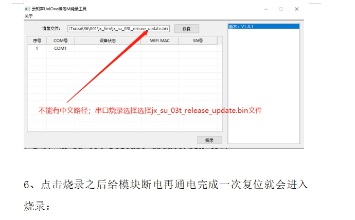

---

### SU-03T模块GPIO延时控制导致LED长亮怎么办？

**问题描述：**

使用SU-03T模块进行GPIO输出控制时，在平台上配置多个连续的延时翻转操作，最后一次语音触发后出现LED长亮一下的现象，该问题在多次测试中反复出现。

**解决方案：**

- **问题原因分析**：

    - 平台上直接编写超过3个以上的延时语句会导致bug
    - SU-03T芯片基于FreeRTOS操作系统，延时翻转操作可能会被系统阻塞
    - 连续的延时操作容易受到系统调度影响，导致时序异常

- **使用定时器替代方案**：

    - 将延时翻转操作改为脉冲输出模式
    - 使用平台的定时器功能来实现精确的时间控制
    - 避免在平台上直接编写连续的延时语句


**注意事项：**

- GPIO控制逻辑设计时应避免使用多个连续延时
- 推荐使用脉冲输出或定时器来实现时序控制
- 如需要实现A→B→C→D轮流输出（每隔50ms），建议使用定时器中断方式
- 修改后的固件使用脉冲输出模式，可有效避免系统阻塞问题

---

### SU-03T模块上电后无响应且无法识别？

**问题描述：**

模块上电后无法被烧录工具识别，更换串口模块后问题依旧，模块可能已损坏。

**解决方案：**

**1. 紧急排查**

- 立即断开电源，避免进一步损坏
- 检查电源电压是否过高（应使用5V）
- 测量模块供电回路是否有短路

**2. 模块状态检查**

- 上电时观察是否有异常发热
- 检查模块指示灯是否完全不亮
- 使用万用表测量电源输入端阻抗

**3. 可能原因**

- 电压反接导致芯片损坏
- 静电击穿敏感元件
- 电源浪涌造成永久性损坏

---

### SU-03T烧录工具显示"等待设备"如何解决？

**问题描述：**

使用云知声UniOne蜂鸟M烧录工具烧录SU-03T时，设备列表中显示"等待设备.."，无法识别连接的模块。

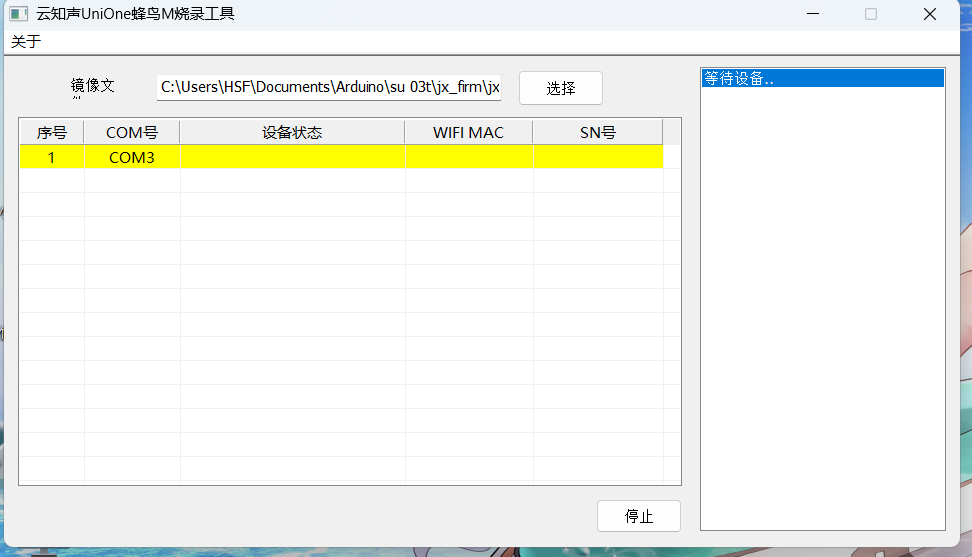

**解决方案：**

**1. 检查硬件连接**

- 确保模块已正确上电
- 检查CH340与模块的连线：

    - CH340 5V → 模块VCC
    - CH340 GND → 模块GND
    - CH340 TXD → 模块B7(RX)
    - CH340 RXD → 模块B6(TX)

**2. 进入烧录模式**

- 通电状态下，快速拔插GND线
- 或先接正极和信号线，点击烧录后再接GND
- 确保模块在烧录时处于复位状态

**3. 驱动和端口检查**

- 确认CH340驱动已正确安装
- 在设备管理器中查看COM端口号
- 烧录工具中选择正确的COM端口

**注意事项：**

- 烧录失败后断电重启再试
- 避免长时间连接导致模块发热
- 使用质量良好的USB转TTL模块

---

### SU-03T如何与Arduino进行串口通信？

**问题描述：**

SU-03T模块烧录完成后，需要与Arduino开发板连接，通过串口通信实现语音识别控制功能。

**解决方案：**

**1. 硬件连接**

- **SU-03T端**：

    - B6(TX) → Arduino RX引脚（如2号引脚）
    - B7(RX) → Arduino TX引脚（如3号引脚）
    - VCC → 5V（或3.3V，根据模块要求）
    - GND → GND

- **Arduino代码示例**：
```cpp
#include <SoftwareSerial.h>

SoftwareSerial mySerial(2, 3); // RX, TX

void setup() {
  Serial.begin(9600);
  mySerial.begin(9600);
}

void loop() {
  if (mySerial.available()) {
    String command = mySerial.readString();
    Serial.println("收到命令: " + command);

    // 根据命令执行相应动作
    if (command == "Kehuishoulaji") {
      // 控制可回收垃圾桶
    } else if (command == "Youhailaji") {
      // 控制有害垃圾桶
    }
  }
}
```

**2. 烧录原理说明**

- 烧录是将程序指令通过特定工具输入到芯片存储单元中
- 烧录完成后，模块按照程序逻辑执行功能
- 通过串口发送识别结果给主控板


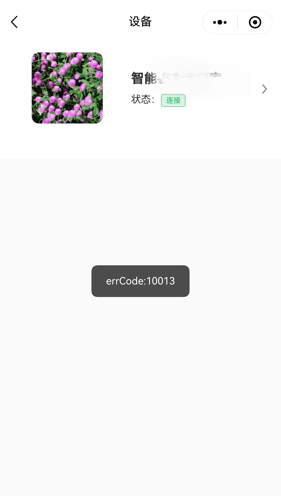

**注意事项：**

- 确保波特率设置一致（通常为9600）
- 交叉连接：TX接RX，RX接TX
- 共地连接是必须的
- 烧录和通信使用相同的引脚，不要同时连接

**4. 预防措施**

- 烧录前使用万用表确认电源极性
- 建议使用带过压保护的电源
- 操作时佩戴防静电手环
- 首次测试时串接电流限制电阻

**注意事项：**

- 模块损坏后无法自行修复，需要更换新模块
- 保存故障现象照片，便于分析损坏原因
- 规范操作流程，避免类似问题重复发生

---

### 烧录时需要选择固件文件吗？

**问题描述：**

使用烧录工具进行固件烧录时，发现"uni_app_release_update.bin"文件路径未选择，询问是否需要手动选择固件文件。

**解决方案：**

**文件选择要求**

- 必须手动选择固件文件
- 不选择时文件路径为空，无法进行烧录
- 需要选择正确的固件文件（.bin格式）

**操作步骤**

1. 点击文件选择框
2. 找到并选择需要烧录的固件文件
3. 确认文件路径正确显示
4. 进行烧录操作

**注意事项：**

- 空文件路径无法完成烧录
- 固件文件路径避免使用中文
- 建议将固件文件放在桌面或简单路径下
- 确认选择的固件文件与模块型号匹配

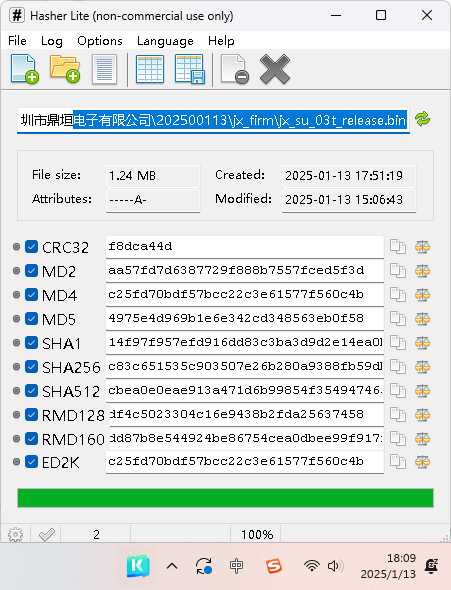

---

### 如何修改已烧录固件的唤醒词？

**问题描述：**

需要将SU-03T模块中原唤醒词"你好奔驰"修改为"你好伟昊"，并询问是否可以为小批量模块进行同样的修改。

**解决方案：**

**修改流程**

1. **平台重新配置**
    - 登录智能公元平台
    - 找到原项目或创建新项目
    - 修改唤醒词配置为"你好伟昊"
    - 重新生成固件文件

2. **固件烧录**
    - 使用烧录工具烧录新生成的固件
    - 验证唤醒词识别功能正常

**批量修改说明**

- **最小批量要求**：厂商提供100个起批量烧录服务
- **小批量处理**：20个模块的修改可能无法接受
- **建议方案**：

    - 累积需求达到批量数量后统一处理
    - 或自行购买烧录设备进行修改

**注意事项**

- 唤醒词修改需要重新生成整个固件
- 保存原配置信息以便后续参考
- 修改后的固件需要完整测试验证

---

## 固件版本差异

### SU-03T1使用新固件后串口输入无法接收数据怎么办？

**问题描述：**

SU-03T1模块烧录新生成的固件后，串口输入功能无法接收数据，而使用旧版本固件时功能正常。

**解决方案：**

1. **确认固件来源**

    - 使用智能公元平台生成的完整固件（.bin文件）
    - 不要直接使用SDK中的固件文件
    - SDK中的固件可能缺少完整的控制逻辑

2. **固件生成方式**

    - 在平台中继承原有配置重新生成固件
    - 确保所有串口输入相关的配置已正确设置
    - 生成后下载完整的固件包

3. **参考官方例程**

    - 在智能公元平台的"入门例程"中找到"SU-03T串口教程"
    - 对照例程检查自己的配置
    - 确保串口输入触发的配置正确

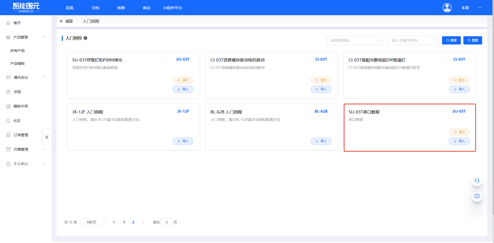

**注意事项：**

- 平台生成的固件和SDK中的固件是异步生成的
- SDK中的固件主要用于二次开发，逻辑可能不完整
- 必须使用平台生成的完整固件才能保证所有功能正常

### 为什么SDK中的固件串口输入功能不完整？

**问题描述：**

发现从SDK包中直接使用的固件，串口输出功能正常，但串口输入触发无法工作。

**解决方案：**

1. **理解固件差异**

    - SDK中的固件：仅包含基础功能和声音模型
    - 平台生成的固件：包含完整的控制逻辑
    - 固件生成需要重新分配内存分区

2. **正确使用流程**

    - SDK用于二次开发和定制化需求
    - 完整功能必须通过平台生成固件
    - 如无二次开发需求，直接使用平台生成的固件

3. **二次开发场景**

    - 在虚拟机中编译定制化功能
    - 完成开发后生成完整固件
    - 烧录到模块进行测试

**注意事项：**

- 如果只需要基本功能，优先使用平台生成固件
- SDK固件缺少完整的控制逻辑，可能导致部分功能异常
- 进行二次开发时需要具备相关技术能力

### 新固件串口触发功能异常怎么办？

**问题描述：**

使用新版本固件时，串口触发功能异常，无法通过串口输入触发指令，而老固件可以正常工作。

**解决方案：**

1. **确认配置完整性**

    - 检查串口输入触发是否正确配置
    - 验证消息编号与发送数据匹配
    - 确认触发后已配置执行动作

2. **平台更新影响**

    - 2025年3月26日平台进行过服务器升级
    - 更新主要是增加生成分组以提高固件生成速率
    - 并非修复串口输入相关bug

3. **硬件验证**

    - 使用测试转接板验证功能
    - 转接板的串口为直接连接，无特殊修改
    - 确认模块硬件正常

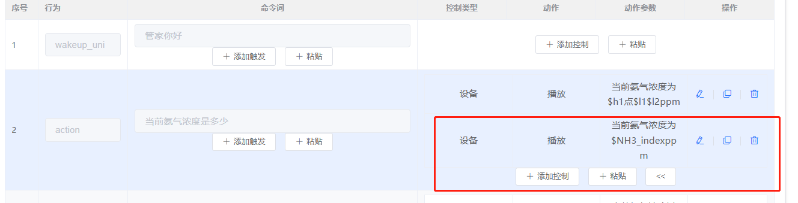

**注意事项：**

- 平台更新不会影响已有功能
- 确保使用平台生成的完整固件
- 如问题持续，需要检查具体配置差异

### CI-03T1使用不同版本固件串口功能表现不同？

**问题描述：**

CI-03T1芯片烧录新版本固件后，发现串口输入功能无法触发语音播报，而使用老版本固件则正常。

**解决方案：**

1. **版本兼容性确认**

    - 新购买的模块建议使用平台生成的新版本固件
    - 老版本固件可能在部分新模块上兼容性不佳
    - 固件版本与模块硬件版本需要匹配

2. **问题定位步骤**

    - 先用新版本固件在平台上重新生成
    - 继承原有配置确保功能一致
    - 测试确认串口输入功能是否恢复

3. **固件选择原则**

    - 优先使用平台生成的最新版本固件
    - 如遇问题可在平台继承旧版本重新生成
    - 避免混用SDK和平台的固件文件

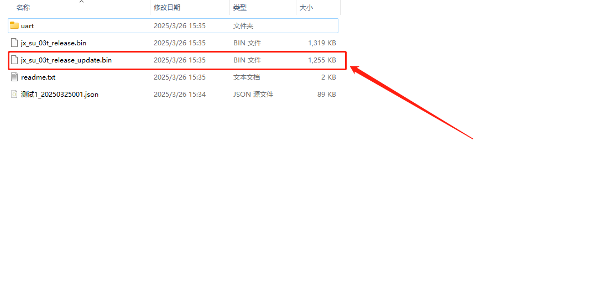

**注意事项：**

- 固件版本不同可能导致功能差异
- 新版本固件通常修复了已知问题
- 确保烧录的是完整的固件文件（带update后缀）

### 烧录进度始终为0%怎么办？

**问题描述：**

在使用PACK_UPDATE_TOOLS工具进行固件烧录时，烧录进度始终停留在0%，无法成功烧录，且已确认串口和供电正确。

**解决方案：**

1. **硬件连接检查**

    - 确认使用5V供电（非3.3V）
    - 检查USB转TTL模块连接
    - 验证RX/TX接线正确性

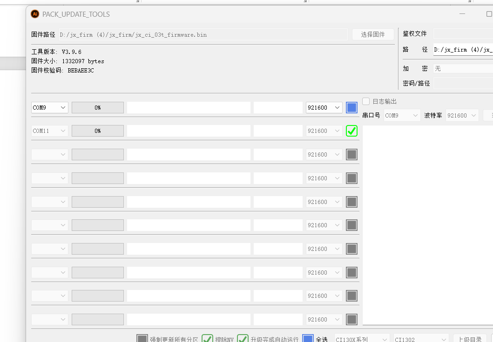

2. **故障排查步骤**

    - 重新上电尝试
    - RX/TX互换接线
    - 拔插GND线而非5V线重启

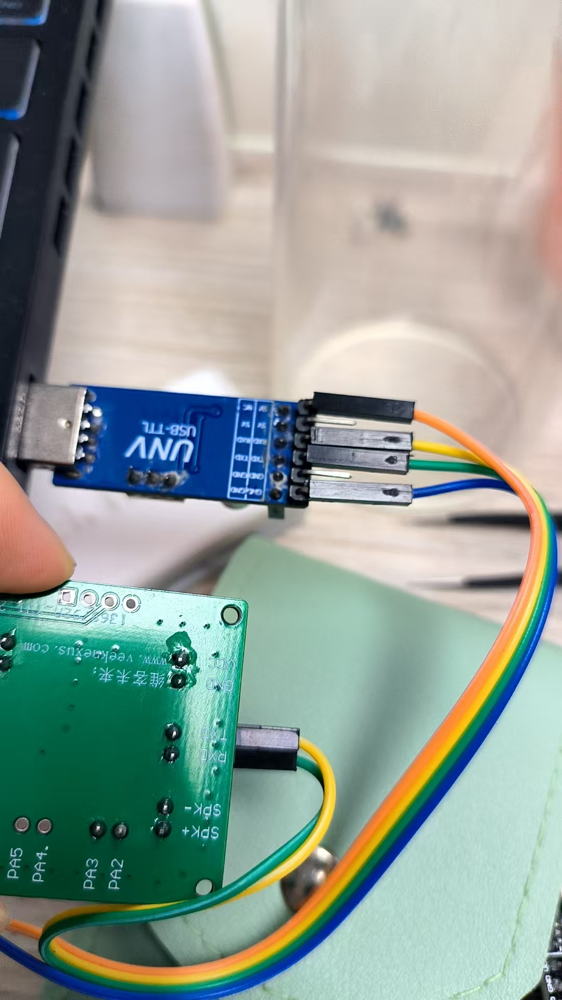

3. **常见原因**

    - 杜邦线接触不良
    - USB转TTL模块故障
    - 串口电平不匹配

4. **解决方案**

    - 更换质量更好的杜邦线
    - 使用3.3V电平的USB转TTL模块
    - 避免主控干扰，烧录脚独立飞线

**注意事项：**

- 烧录前确保模块断电重启
- 使用短而稳定的USB线
- 5V供电是烧录成功的关键

---

## MCU固件更新

### 如何通过MCU对SU-03T模块进行固件更新？

**问题描述：**

需要通过MCU对SU-03T模块进行语音固件更新，希望了解是否有类似OTA的烧录协议或接口文档可供参考。

**解决方案：**

**1. SU-03T模块特性说明**

- SU-03T是离线语音模块，本身不支持网络OTA功能
- 如需OTA功能，需要额外搭配WiFi模块联网

**2. MCU更新方案**

- 可通过MCU将语音文件手动传输到模块
- 需要实现串口通信协议进行数据传输
- 提供有OTA示例代码供参考（需自行研究实现）

**注意事项：**

- OTA操作需要自行研究实现
- 建议参考提供的示例代码了解实现方法
- 需要确保MCU与模块的通信协议正确实现

---

### SU-03T通过串口烧录的流程是什么？

**问题描述：**

需要了解SU-03T模块通过串口进行固件烧录的完整流程，以及可用的烧录工具。

**解决方案：**

**1. 串口烧录流程**

完整的烧录流程包括以下步骤：

1. 模块重启
2. 接收特定字符'2'
3. 发送命令'c'
4. 获取数据
5. 验证Xmodem 1K协议
6. 擦除并写入Flash
7. 检查数据写入状态
8. 成功启动新固件或提示更新失败

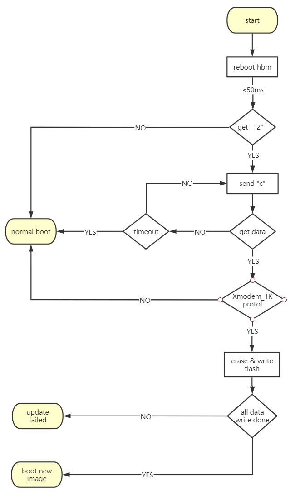

**2. 烧录工具参考**

- 有用户开发的串口烧录工具示例（m_SerialBurning-master）
- 可参考该工具了解具体实现方法
- 示例工具展示了完整的串口通信和烧录协议

**注意事项：**

- 烧录口为模块的B6和B7引脚
- B6：RX（接收）
- B7：TX（发送）
- 与电脑串口下载使用同一个接口

---

### SU-03T的烧录引脚可以修改吗？

**问题描述：**

希望将SU-03T模块的烧录引脚从默认的B6和B7修改为B0和B1，以便在使用这两个引脚进行通信的同时，也能通过串口进行固件刷写。

**解决方案：**

**1. 烧录引脚说明**

- SU-03T的默认烧录引脚是B6和B7
- 这两个引脚是固定的烧录接口，无法修改

**2. 其他烧录方式**

- 可以使用调试器烧录方式
- 调试器使用专用引脚，但这些引脚只能用于烧录，不能复用

**3. MCU烧录建议**

- SU系列模块不建议使用主控进行固件刷写
- 如需主控刷写功能，建议选择CI系列模块

**注意事项：**

- 使用UniOneUpdateTool工具时，烧录引脚固定为B6和B7
- 无法通过软件配置修改烧录引脚位置
- B0和B1引脚不能用于固件烧录

---

### SU-03T串口触发语音播报功能无法实现怎么办？

**问题描述：**

配置了串口输入触发语音播报功能，发送正确的数据格式（AA 55 01 01 55 AA）后，模块无法触发语音播报。

**解决方案：**

**1. 检查串口触发配置**

- 确认触发方式设置为"串口输入"
- 验证串口选择为UART1_RX
- 检查消息号是否与发送数据匹配（消息号1对应数据01）
- 确认参数类型设置为unsigned char


**2. 验证串口通信参数**

- UART1_RX和UART1_TX波特率设置为9600
- 数据位：8，停止位：1，校验位：无
- 确保硬件连接使用正确的串口引脚

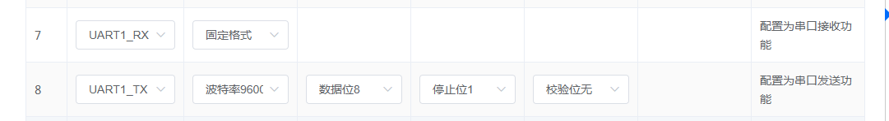

**3. 排查常见问题**

- 检查触发配置列表中是否有重复或错误的配置项
- 删除原本为命令词或回复语后改为串口输入的错误配置
- 使用"检查配置"功能验证配置正确性


**4. 测试验证**

- 使用串口调试助手发送测试数据：AA 55 01 01 55 AA
- 观察模块是否正常触发语音播报
- 如仍无法触发，可能需要重新生成固件

**注意事项：**

- 串口触发需要模块支持相应功能
- 从命令词修改为串口输入时，建议删除原配置项后重新添加
- 配置修改后必须重新生成固件才能生效

---

### SU-03T平台配置检查失败怎么办？

**问题描述：**

在固件平台进行配置时，配置检查未通过，特别是当存在由命令词修改为串口输入的配置项时。

**解决方案：**

**1. 删除错误的配置项**

- 找到原本是命令词或回复语，后改为串口输入的配置项
- 直接删除该配置项，而不是尝试修改
- 重新创建正确的串口输入配置


**2. 使用检查配置功能**

- 在唤醒词自定义页面点击"检查配置"
- 系统会自动检查配置的合理性
- 根据检查结果修正相关问题


**3. 正确的配置流程**

- 删除原有的命令词配置
- 点击"添加触发"
- 行为选择对应的触发动作
- 触发方式选择"串口输入"
- 设置正确的串口、消息号和参数

**注意事项：**

- 串口输入配置不建议在原有命令词基础上修改
- 配置检查失败通常是因为配置项存在冲突
- 继承为新版本后才能保存修改的内容

---

### 使用蜂鸟M升级狗烧录SU-03T时部分指令无法识别怎么办？

**问题描述：**

使用蜂鸟M升级狗对SU-03T芯片（US516P6）进行固件升级时，部分新添加的语音指令无法被识别，且新版本中已移除的免唤醒词仍可触发，尽管烧录工具显示烧录成功。

**解决方案：**

**1. 确认烧录操作**

- 使用升级狗烧录时选择"仅升级Flash"模式
- 确保烧录软件版本为V1.3.7
- 烧录成功后芯片版本号会正常更新

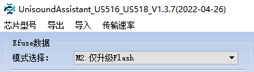

**2. 使用CH340烧录器**

- 如果升级狗烧录后出现问题，尝试使用CH340烧录器
- CH340烧录器可能更稳定可靠
- 提供单独供电避免烧录失败

**3. 正确的烧录连接**

使用升级狗时需要正确连接：

- D+连接芯片的GPIO_B3脚
- D-连接芯片的GPIO_B2脚
- GMD连接芯片的GND
- 使用CH340单独给芯片供电（5V到VCC，GND到GND）

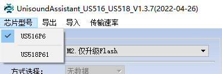

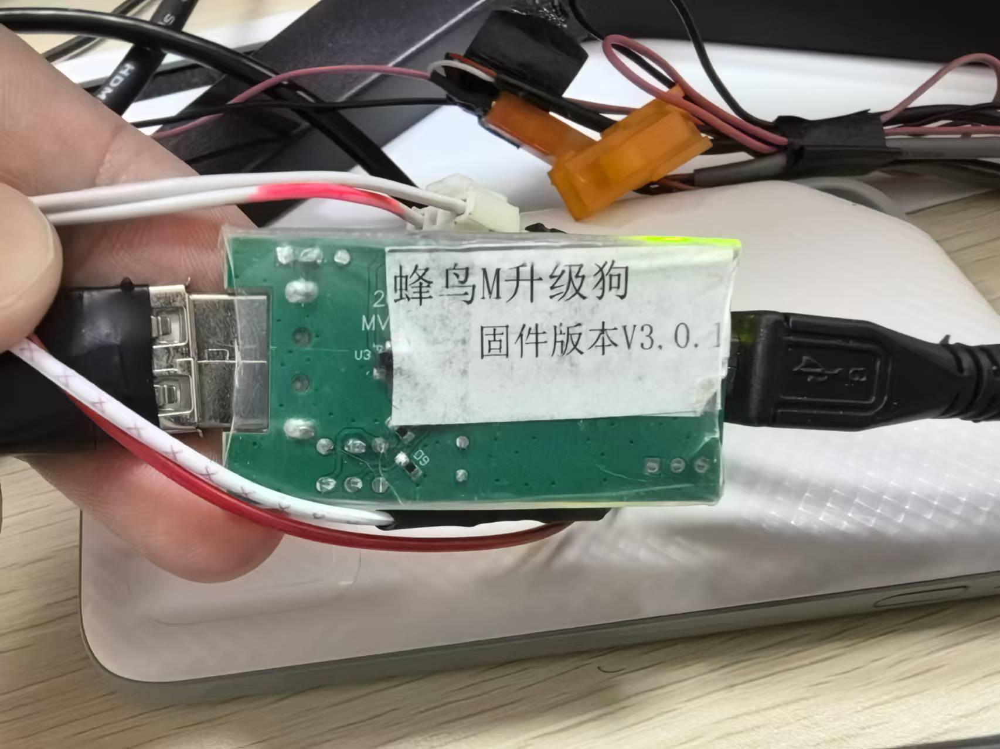


**4. 烧录失败的原因分析**

- 烧录工具显示成功不代表功能完全正常
- 可能是供电不稳定导致数据写入不完整
- 建议使用更稳定的烧录方式

**注意事项：**

- 烧录十几台出现2台异常属于较高概率
- 建议每台都进行功能测试
- 出现问题时可尝试更换烧录工具

---

### 烧录后芯片功能不全怎么办？

**问题描述：**

固件烧录成功后，芯片版本号更新正常，但部分语音指令无法识别，烧录器常亮绿灯。

**解决方案：**

**1. 检查指令配置**

- 确认新添加的指令词已正确配置
- 检查指令列表中是否有空白的命令词
- 验证指令的触发动作是否设置正确

**2. 重新烧录验证**

- 使用相同固件重新烧录一次
- 检查是否是烧录过程中的问题
- 多次烧录仍无效则可能需要更换芯片

**3. 对比正常芯片**

- 取一台正常工作的芯片对比测试
- 记录两台芯片的差异现象
- 分析是否是个别芯片问题

**4. 寄回分析**

- 如果批量出现问题，建议寄回给厂商分析
- 提供详细的故障描述和测试数据
- 包含问题芯片和正常芯片各一台

**注意事项：**

- 烧录器常亮绿灯仅表示通信正常
- 不代表固件数据完全正确写入
- 生产测试需要覆盖关键功能点

---

### 固件文件路径有中文导致烧录失败怎么办？

**问题描述：**

固件文件存放在包含中文和特殊字符的文件夹路径中，导致烧录工具无法正确识别或烧录失败。

**解决方案：**

**1. 移动固件文件**

- 将固件文件移动到简单的英文路径下
- 建议路径如：C:\firmware\ 或 D:\test\
- 避免使用中文、空格或特殊字符

**2. 检查文件完整性**

- 确认BIN文件大小正确（正常应为几百KB到几MB）
- 检查文件是否损坏或不完整
- 重新生成固件文件

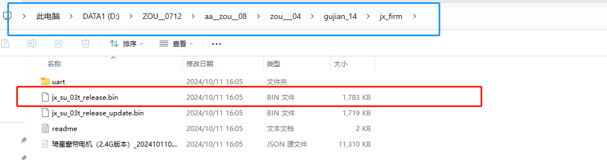

**3. 使用烧录日志**

- 观察烧录工具的输出信息
- 记录具体的错误提示
- 根据错误信息调整操作

**注意事项：**

- Windows系统对中文路径支持可能有问题
- 建议所有开发工具都使用英文路径
- 保留固件文件的备份

---

## 平台配置与选择

### SU-03T烧录失败及固件生成流程如何操作？

**问题描述：**

使用SU-03T模块时遇到烧录失败问题，显示"打开串口失败"，在修改命令词后无法成功生成和下载固件，且出现"无法保存文件，请确认你... 内存不足"的错误提示。

**解决方案：**

**1. 烧录失败排查**

- 检查模块供电是否稳定（使用5V电源）
- 确认USB转TTL驱动已正确安装
- 检查COM端口选择是否正确
- 避免使用中文路径存放固件文件

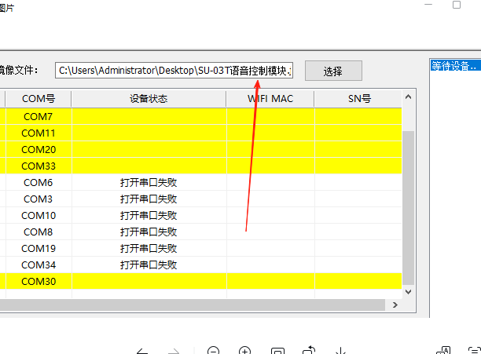

**2. 内存不足处理**

- 关闭不必要的程序释放内存
- 将固件下载到英文路径（建议放在桌面）
- 重新启动电脑清理内存
- 使用管理员权限运行烧录工具


**3. 命令词修改流程**

- 在平台中点击"继承一个新的版本"
- 点击"编辑"进入命令词配置界面
- 修改所需的命令词内容
- 如不需要使用变量，可以不设置
- 变量只有在使用到时才需要编辑，未使用的变量可以保持不动


**4. 固件生成与下载**

- 编辑完成后点击"检查配置"
- 确认无问题后点击"保存"
- 选择"快速发布版本"
- 发布成功后点击"下载固件"

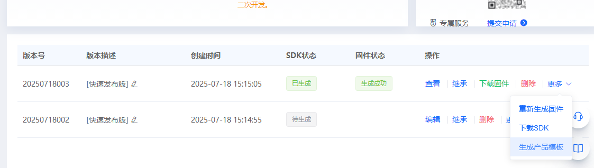

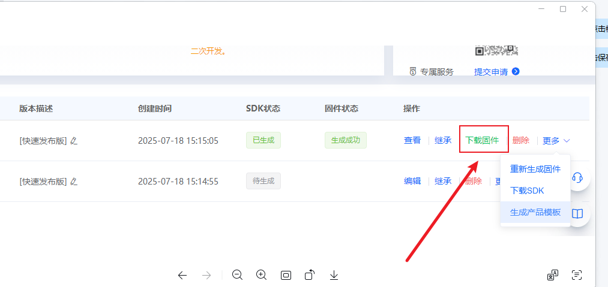

**5. 固件烧录步骤**

- 解压下载的固件压缩包
- 找到update.bin文件（通常命名为jx_su_03t_release_update.bin）
- 使用烧录工具选择该文件进行烧录
- 烧录过程中不要断开电源

**注意**：需要的是update.bin文件，不是其他文件

**注意事项：**

- 固件文件路径必须使用英文，不能包含中文字符
- 烧录时确保模块正常上电（Power指示灯亮起）
- 如显示"打开串口失败"，尝试重新插拔USB或更换COM口
- 变量只在需要使用时才设置，未用到的变量可以不修改
- 平台配置修改后必须重新生成固件才能生效

---

### 固件下载后如何正确找到并烧录update.bin文件？

**问题描述：**

下载固件压缩包后，不知道如何正确找到update.bin文件进行烧录，对固件文件结构和烧录工具使用不熟悉。

**解决方案：**

**1. 固件文件识别**

- 解压下载的固件压缩包
- 查找名为update.bin或jx_su_03t_release_update.bin的文件
- 这是包含更新固件的主要文件

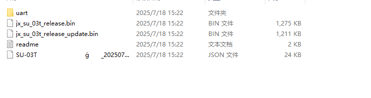

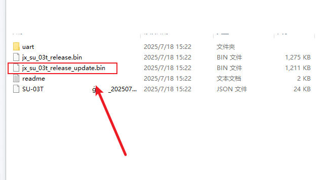

**2. 烧录工具使用**

- 使用UniOneUpdateTool.exe烧录工具
- 将update.bin文件拖到桌面便于选择
- 打开烧录工具，选择该文件

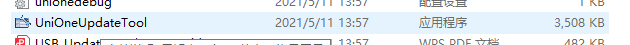

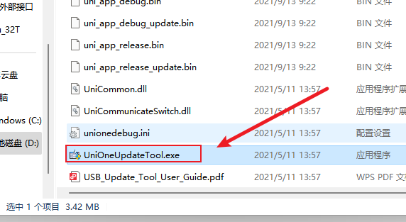

**3. 烧录操作步骤**

- 确保模块正确连接（使用转接板）
- 选择正确的COM端口
- 点击开始烧录
- 烧录完成后模块会自动重启

**4. 常见问题处理**

- 如果找不到update.bin：检查是否解压完整
- 如果烧录失败：确认COM口和驱动
- 烧录时不要断电或拔插连接线

**注意事项：**

- 固件文件路径必须使用英文
- 确保使用正确的update.bin文件
- 保留原固件作为备份

---

### SU-03T模块烧录失败且显示"打开串口失败"如何解决？

**问题描述：**

使用UniOneUpdateTool.exe工具烧录SU-03T模块时，遇到烧录失败问题，设备状态显示"打开串口失败"，多个COM端口都显示同样的错误状态，不确定烧录成功的判断标准。

**解决方案：**

**1. 串口连接排查**

- 检查USB转TTL驱动是否正确安装（CH340驱动）
- 确认COM端口选择与设备管理器中显示的一致
- 检查杜邦线连接是否牢固，建议焊接连接更可靠

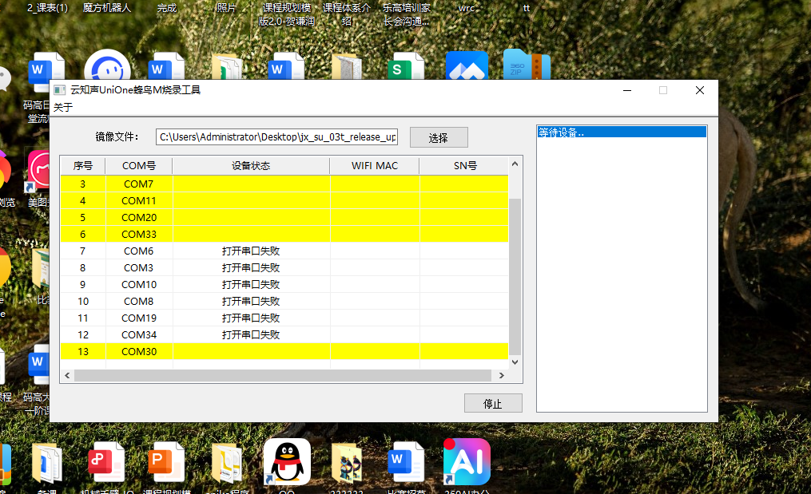

**2. 烧录环境检查**

- 关闭其他可能占用串口的程序
- 使用管理员权限运行烧录工具
- 确认模块正常上电（Power指示灯亮起）


**3. 烧录成功判断**

- 烧录过程中芯片指示灯会变黄（进入烧录模式）
- 烧录完成后工具显示成功提示
- 模块自动重启并能响应命令词

**4. 常见问题处理**

- 如果显示"打开串口失败"：

    - 尝试更换USB端口
    - 重新安装驱动程序
    - 使用短接的USB线

- 烧录过程中不要断开电源
- 避免使用中文路径存放固件

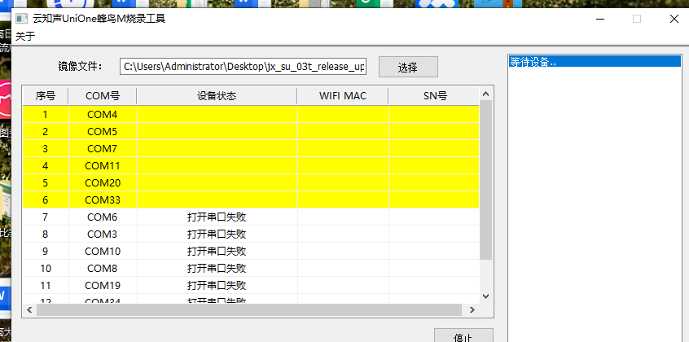

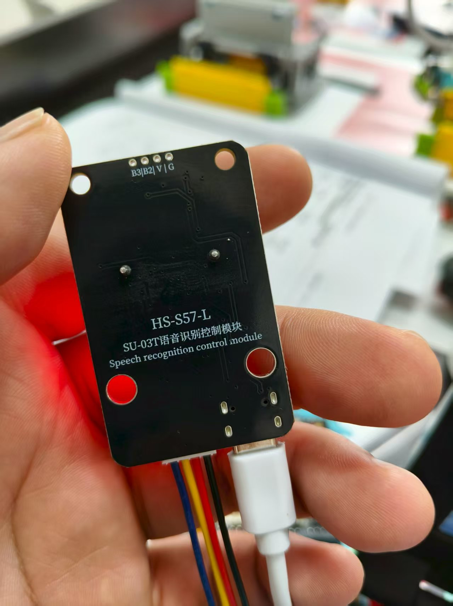

**注意事项：**

- 使用原厂提供的烧录工具和驱动
- 确保供电稳定（5V）
- 保留原固件备份便于恢复
- 烧录时耐心等待，不要中断过程

---

### SU-03T使用串口调试软件无法正常通信怎么办？

**问题描述：**

使用SU-03T串口模块时，无法通过串口调试软件正常通信，需要排查连接和配置问题。

**解决方案：**

**1. 检查硬件连接**

- 确认串口线连接到正确的引脚
- TX连接到模块的RX引脚（如B3）
- RX连接到模块的TX引脚（如B2）
- 确保VCC供电正常（5V）

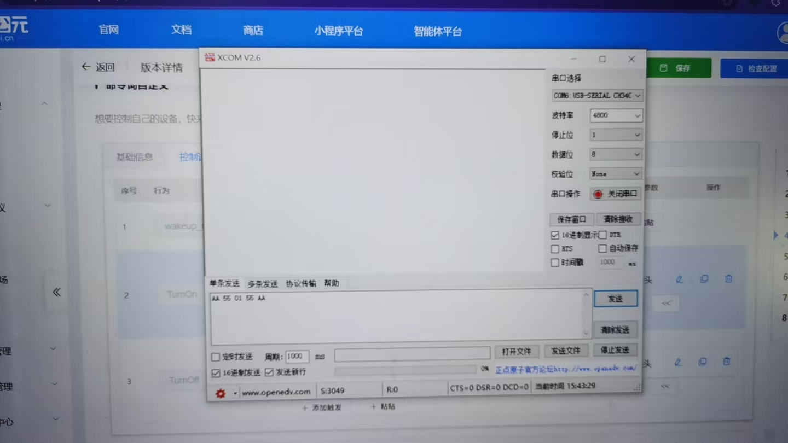

**2. 配置串口调试软件**

- 使用XCOM等串口调试软件
- 波特率设置为4800（根据固件配置调整）
- 数据位：8，停止位：1，校验位：None
- **必须勾选RTS和时间戳选项**


**3. 常见问题处理**

- **连接错误**：仔细检查引脚标识，避免B3和B8等相似引脚混淆
- **串口被占用**：关闭其他可能占用串口的程序
- **驱动问题**：确保USB转串口驱动正确安装

**注意事项：**

- SU-03T串口电平为3.3V，注意与外部设备的电平匹配
- 使用XCOM软件时必须勾选RTS和时间戳才能正常通信
- 硬件连接是首要检查项，多数问题源于接线错误

---

### SU-03T1 模块焊接排针的配置选项有哪些？

**问题描述：**

SU-03T1 语音模块提供焊接排针和不焊接排针两种配置，需要了解两种配置的区别和选择建议。

**解决方案：**

**1. 配置选项说明**

- **焊接排针版本**：

    - 工厂已焊接好排针
    - 可直接插入杜邦线使用
    - 适合快速原型开发
    - 方便模块更换和调试

- **不焊接排针版本**：

    - 仅提供焊盘，无排针
    - 需要自行焊接排针
    - 适合量产项目
    - 可根据需要定制焊接

**2. 选择建议**

| 项目类型 | 推荐配置 | 理由 |
|---------|----------|------|
| 样品开发 | 焊接排针 | 方便快速测试和调试 |
| 小批量试产 | 不焊接排针 | 降低成本，按需焊接 |
| 量产项目 | 不焊接排针 | 成本最优，可贴片生产 |
| 教学演示 | 焊接排针 | 便于反复使用 |

**3. 注意事项**

- **焊接要求**：不焊接版本需要自行焊接2.54mm排针
- **成本差异**：不焊接版本成本更低
- **最小起订量**：不焊接版本可能有MOQ要求
- **交货周期**：不焊接版本通常交货更快

**4. 焊接指导**

如选择不焊接版本，自行焊接时注意：

- 使用适当的烙铁温度（约350°C）
- 焊接时间不宜过长，避免损坏焊盘
- 确保排针垂直焊接，保证插入质量
- 焊接后清理多余助焊剂

---

### SU-03T 新旧模块的引脚定义有差异吗？

**问题描述：**

SU-03T 模块存在新旧版本，引脚定义可能存在差异，需要了解是否会影响现有产品的使用。

**解决方案：**

**1. 版本差异说明**

- **旧版本模块**：

    - 引脚定义与现有教程匹配
    - 兼容当前的开发板设计
    - 无需修改现有硬件

- **新版本模块**：

    - 引脚定义可能与旧版不同
    - 需要更新硬件设计
    - 部分功能位置有调整

**2. 识别方法**

- **查看丝印**：模块上的版本标识
- **确认批次**：询问供应商发货批次
- **测试验证**：上电测试引脚功能

**3. 选择建议**

| 项目状态 | 推荐选择 | 理由 |
|---------|----------|------|
| 现有量产产品 | 旧版本模块 | 避免重新设计硬件 |
| 新开发项目 | 新版本模块 | 获得最新功能和优化 |
| 维修替换 | 旧版本模块 | 保证兼容性 |
| 全新设计 | 新版本模块 | 面向未来兼容性 |

**4. 处理策略**

如收到新版本模块但需要旧版本：

- **联系供应商**：说明兼容性需求
- **申请更换**：提供具体订单信息
- **临时方案**：设计转接板适配差异
- **长期方案**：评估升级硬件设计的可行性

**注意事项：**

- 新旧版本的核心功能基本相同
- 主要差异在引脚定义和布局
- 建议项目定型后锁定硬件版本
- 大批量采购前务必确认版本规格

---

### SU-03T模块与CI-73T模块的识别与区别

**问题描述：**

收到的新款模块无法烧录，引脚接线与预期不符，实际收到的模块型号与SU-03T不匹配。

**解决方案：**

**1. 模块识别方法**

- **查看丝印标识**：模块上会清晰标注型号
    - SU-03T：显示"SU-03T"或"SU-03T1"
    - CI-73T：显示"CI-73T"及版本号（如V1.1）
- **确认引脚定义**：不同型号的引脚功能不同
    - SU-03T：烧录使用B6(TX)、B7(RX)
    - CI-73T：引脚定义与SU系列不同

**2. 烧录兼容性说明**

- **固件不通用**：SU-03T的固件无法用于CI-73T
- **烧录工具不同**：需使用对应型号的专用烧录工具
- **引脚不兼容**：硬件接线需按各型号规格调整

**3. 处理步骤**

如发现模块型号错误：

- **停止烧录**：避免使用错误工具损坏模块
- **记录证据**：拍照留存模块丝印标识
- **联系供应商**：提供订单信息和实物照片
- **申请更换**：要求更换为正确型号

**注意事项：**

- 收货时务必先确认模块型号再进行烧录
- 不同系列模块（SU系列 vs CI系列）通常不兼容
- 保留包装和标签便于后续维权
- 批量采购前建议先索取样品确认

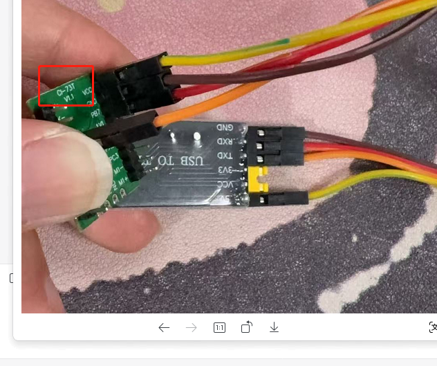


---

### 批量烧录时如何进行MD5校验留档？

**问题描述：**

批量烧录SU-03T模块时，需要记录固件的MD5校验码，以确保固件一致性和质量追溯。

**解决方案：**

- **使用Hasher Lite工具进行MD5校验**：

    - 烧录完成后，使用Hasher Lite等校验工具查看固件文件的MD5值
    - 记录完整的MD5校验码（如：26f83b3c6652d44fd307e69040634e54）
    - 将MD5码与烧录数量、日期等信息一同存档

- **固件配置信息记录格式**：

    - 公司名称/产品名/SU-03T-V2.1/固件文件名/开机播报：XXX/唤醒词：XXX|回复语：XXX/MD5-XXXXXX
    - 示例：深圳市铭威芯科技有限公司/智能桌/SU-03T-V2.1/jx_su_03t_release/开机播报：无/唤醒词：你好小艺|回复语：我在/你说/有什么可以帮到你/MD5-26f83b3c6652d44fd307e69040634e54

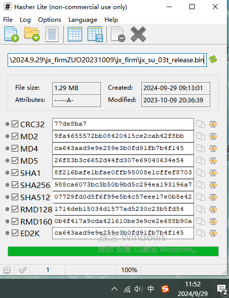
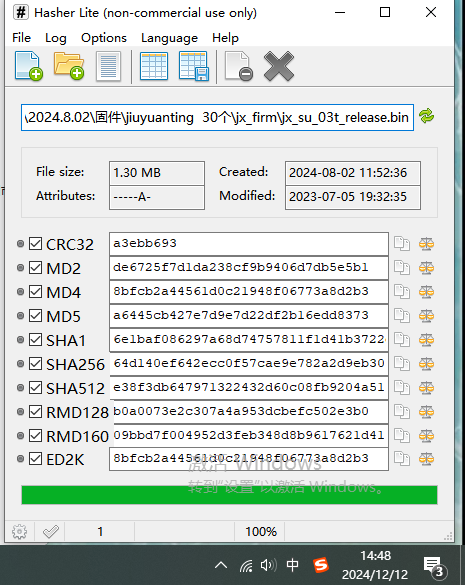

**注意事项：**

- 每批次烧录都应保留MD5校验记录
- 建议建立烧录台账，记录日期、数量、固件版本和MD5码
- 如遇问题，可通过MD5码追溯固件批次
- 保留固件原文件至少6个月，以备查验
- 不同项目的固件应分别记录，避免混淆

---

### SU-03T烧录时是否必须重新上电？是否有复位脚？

**问题描述：**

在使用SU-03T模块进行程序烧录时，希望了解是否可以通过复位脚实现复位，而无需断电重启，以简化烧录操作。

**解决方案：**

**1. 复位方式说明**

SU-03T模块的复位机制：

- **无专用复位引脚**：SU-03T模块没有提供专用的复位引脚
- **烧录复位方式**：必须通过重新上电来完成复位
- **单片机复位无效**：单片机的内部复位仅影响单片机本身，与SU-03T模块无关

**2. 烧录操作流程**

正确的烧录步骤：

- 完成固件下载或程序编写
- 断开模块电源
- 重新给模块上电
- 模块自动进入烧录模式
- 执行烧录操作

**3. 操作建议**

为方便烧录操作：

- 可以设计电源控制电路，通过控制模块供电来实现"复位"效果
- 使用带开关的USB转TTL模块，方便断电重启
- 避免频繁插拔连接线，减少接口磨损

**注意事项：**

- SU-03T的B6/B7虽然是烧录脚，但不可用作复位功能
- 确保断电后有一定间隔再重新上电，避免电源不稳定
- 烧录过程中不要断电，可能导致程序损坏

---

### 新平台固件烧录遇到"读取失败"怎么办？

**问题描述：**

在新版本平台上进行SU-03T模块固件烧录时，遇到"读取失败"错误提示，同时发现新平台界面中没有"编译固件"功能按钮。

**解决方案：**

**1. 读取失败原因分析**

常见的读取失败错误：

- **文件路径问题**：固件文件路径包含中文或特殊字符
- **文件权限问题**：文件被其他程序占用或权限不足
- **平台版本问题**：使用了旧平台的操作流程

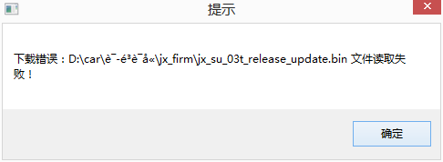

**2. 新旧平台区别**

平台版本的主要差异：

- **旧平台**：有"编译固件"按钮，需要手动编译
- **新平台**：无需手动编译，平台自动处理固件生成

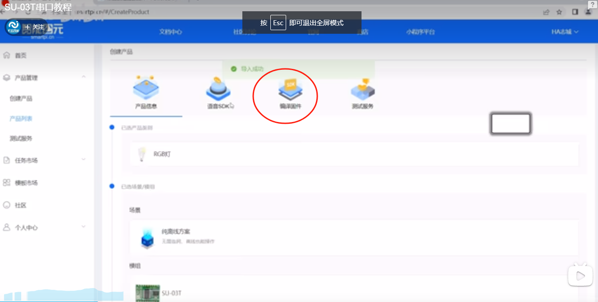


**3. 新平台使用方法**

新平台的正确操作步骤：

1. **产品定义**：配置模块的基本信息和功能
2. **版本配置**：设置语音命令、播报内容等
3. **发布版本**：生成可用的固件文件
4. **下载固件**：获取最终的固件进行烧录

**注意事项：**

- 新平台已自动处理编译步骤，无需手动操作
- 如遇到读取失败，尝试将固件文件移至英文路径下
- 确保固件文件完整且未损坏
- 新平台教程暂未发布，可参考旧平台的操作逻辑

**4. 中文路径问题处理**

烧录工具提示"文件读取失败"的常见原因：

- **问题现象**：路径包含中文字符导致无法读取bin文件
- **错误信息**：显示具体路径并提示文件读取失败

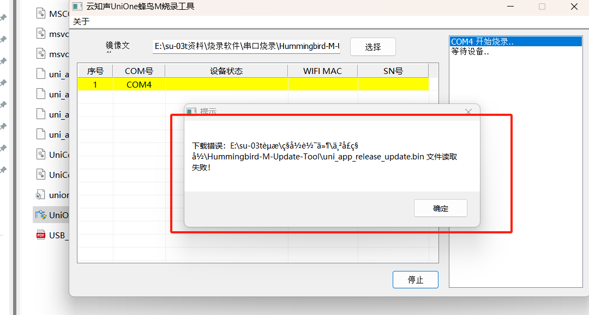

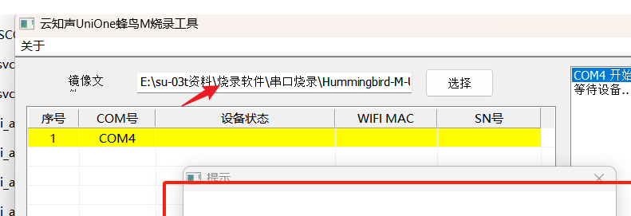

**解决方案：**

- 将bin文件移动到纯英文路径下（如C:\firmware\）
- 确保路径中不包含空格和特殊字符
- 建议将固件放在桌面根目录或简单路径下

**注意事项：**

- 云知声烧录工具不支持中文路径
- 路径层级不宜过深，建议不超过3层
- 避免使用系统用户名含中文时的默认路径

---

### 烧录工具显示"打开串口失败"如何解决？

**问题描述：**

使用云知声UniOne蜂鸟M烧录工具时，工具显示"打开串口失败"，无法正常烧录固件，即使更换USB连接线问题依旧存在。

**解决方案：**

**1. 硬件连接检查**

- **USB连接确认**：

    - 使用质量良好的USB A to B线
    - 避免使用延长线或转接头
    - 确保USB线是4芯线（支持数据传输）

- **端口识别**：

    - 在设备管理器查看是否识别到设备
    - 检查是否有USB Serial CH340设备
    - 注意COM端口号是否正确显示

- **供电检查**：

    - 确认开发板供电正常
    - 观察电源指示灯状态
    - 测试USB端口电压是否稳定

**2. 驱动问题排查**

- **重新安装驱动**：

    - 卸载旧的CH340驱动程序
    - 从官方渠道下载最新驱动
    - 重启电脑后重新安装
    - 安装时选择"始终信任此驱动程序"

- **驱动验证**：

    - 设备管理器中查看端口（Ports和LPT）
    - 确认USB-SERIAL CH340无黄色感叹号
    - 右键查看设备属性确认驱动正常

**3. 软件设置调整**

- **管理员权限**：

    - 右键点击烧录工具图标
    - 选择"以管理员身份运行"
    - 关闭杀毒软件和防火墙

- **端口选择**：

    - 如果多个COM端口，逐一尝试
    - 检查端口是否被其他程序占用
    - 使用设备管理器禁用其他串口设备

**4. 其他解决方案**

- **更换电脑测试**：

    - 在不同电脑上测试烧录
    - 排除特定系统或USB端口问题
    - 对比不同操作系统的表现

- **使用其他工具**：

    - 尝试使用ST-Link等替代烧录工具
    - 通过命令行方式进行烧录
    - 联系技术支持获取专用工具

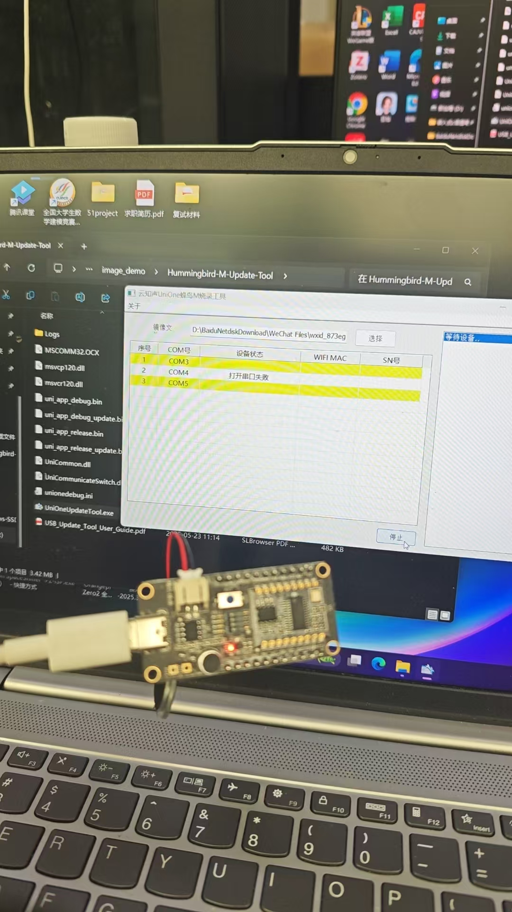

**注意事项：**

- CH340驱动问题是最常见原因
- USB 3.0端口可能供电不足，尝试USB 2.0
- 某些Windows版本需要禁用驱动签名强制
- 如果问题持续存在，可能是硬件故障

---

### SU-03T烧录卡在黄色进度条怎么办？

**问题描述：**

烧录时进度条一直显示黄色，连0%都不显示，烧录软件无法识别芯片。

**解决方案：**

**1. 检查硬件连接**

- **接触问题排查**：

    - 检查USB线连接是否牢固
    - 尝试更换质量更好的USB线
    - 如使用杜邦线连接，检查杜邦线接触是否良好
    - 重新插拔USB线确保连接稳定

**2. 设备识别检查**

- **串口识别确认**：

    - 打开设备管理器查看COM端口
    - 确认USB-SERIAL CH340正常显示
    - 如无显示，需要重新安装CH340驱动

**3. 烧录操作优化**

- **操作步骤**：

    1. 确认设备管理器中已识别COM端口
    2. 打开烧录软件选择正确的COM口
    3. 点击烧录前确保设备已连接
    4. 观察烧录软件是否能正常通信

**注意事项：**

- 黄色进度条通常表示接触不良或驱动问题
- 建议使用原装或质量可靠的USB线
- 避免使用USB延长线或转接头
- 如问题持续，尝试更换电脑或USB端口测试

---

### SU-03T烧录时提示"下载错误，文件读取失败"怎么办？

**问题描述：**

烧录时显示"下载错误，文件读取失败"，无法正常进行烧录操作。

**解决方案：**

**1. 文件路径检查**

- **路径要求**：

    - bin文件路径中不能包含中文、空格、括号等特殊字符
    - 文件夹名称建议使用字母、数字、下划线组合
    - 避免使用深层目录结构

- **解决方法**：

    - 将bin文件直接放在电脑桌面
    - 或创建简单的英文路径（如C:\firmware\）
    - 确保文件名不包含特殊字符

**2. 文件权限检查**

- **管理员权限**：

    - 右键点击烧录工具，选择"以管理员身份运行"
    - 确保对文件和文件夹有完整的读写权限

**3. 其他注意事项**

- **文件完整性**：

    - 确认bin文件下载完整，没有损坏
    - 对比文件大小是否与官方提供的一致
    - 必要时重新下载固件文件

- **防病毒软件**：

    - 临时关闭杀毒软件和防火墙
    - 将烧录工具添加到白名单

**注意事项：**

- 路径问题是最常见的烧录失败原因
- 建议养成使用简单英文路径的习惯
- 如仍有问题，尝试更换电脑或用户账户操作

---

### SU-03T烧录失败导致芯片无法工作怎么办？

**问题描述：**

烧录一次失败后，芯片无法正常工作，多次尝试烧录均失败，设备变成"砖块"状态。

**解决方案：**

**1. 问题原因分析**

- **烧录中断**：烧录过程中断导致程序部分写入
- **芯片保护**：异常写入触发芯片保护机制
- **通信失败**：串口通信异常导致无法擦除原有程序

**2. 恢复尝试**

- **标准方法**：

    - 检查USB线连接，确保接触良好
    - 长按复位键进入下载模式
    - 使用管理员权限运行烧录工具

- **调试器方法**：

    - 使用专用调试器（如ST-Link）
    - 通过硬灌方式强制写入程序
    - 需要专业操作，建议联系技术支持

**3. 最终解决方案**

- **更换硬件**：

    - 如上述方法均无效，芯片可能已损坏
    - 更换SU-03T模块或芯片
    - 联系供应商进行售后处理

**注意事项：**

- 烧录过程不要中断，确保电源稳定
- 使用质量可靠的USB线避免通信异常
- 建议在烧录前备份原有固件
- 非专业人员不要尝试焊接更换芯片

---

### SU-03T在新平台烧录固件时遇到"读取失败"如何解决？

**问题描述：**

在平台进行SU-03T模块固件烧录时，遇到"读取失败"的错误提示，并且在新版本平台上找不到"编译固件"功能，导致无法完成固件更新。

**解决方案：**

**1. 读取失败原因分析**

- **文件路径问题**：路径包含中文或特殊字符
- **文件权限问题**：文件被其他程序占用
- **平台版本问题**：使用了旧平台的操作流程


**2. 新旧平台区别**

- **旧平台**：有"编译固件"按钮，需要手动编译
- **新平台**：自动处理编译，无需手动操作
- **操作流程**：新平台更简化，使用更便捷


**3. 正确烧录步骤**

**新平台操作流程：**

1. **产品定义**：配置模块基本信息
2. **版本配置**：设置功能参数和命令词
3. **发布版本**：平台自动生成固件
4. **下载固件**：获取可烧录的固件文件

**4. 解决读取失败的方法**

- **使用英文路径**：确保固件文件路径不含中文
- **检查文件完整性**：重新下载固件文件
- **关闭占用程序**：关闭可能占用文件的软件
- **使用管理员权限**：以管理员身份运行烧录工具

**5. 烧录注意事项**

- 新平台已自动优化编译流程
- 如遇问题，可尝试刷新页面或更换浏览器
- 确保网络连接稳定，避免下载中断
- 保留旧版本固件作为备份

---

### SU-03T烧录时是否可以通过复位脚复位？

**问题描述：**

SU-03T模块在烧录程序时是否可以通过复位脚实现复位，而无需断电重启，以提高烧录效率。

**解决方案：**

**1. 复位脚说明**

SU-03T模块**没有独立的复位引脚**，无法通过外部信号实现软件复位。

**2. 烧录复位方式**

- **必须重新上电**：烧录完成后需要断开电源重新上电
- **B6/B7限制**：虽然是固定烧录脚，但无法用作复位功能
- **芯片特性**：这是芯片硬件设计限制

**3. 上电复位原理**

- **冷启动**：断电后重新上电实现完全复位
- **初始化流程**：上电后芯片自动启动固件程序
- **复位时间**：通常需要1-2秒完成初始化

**4. 烧录操作建议**

- **手动断电**：烧录完成后手动拔掉电源线
- **等待1秒**：确保电容完全放电
- **重新上电**：恢复供电启动新固件

**注意事项：**

- 不要尝试用单片机控制模块复位（无效）
- B6/B7引脚在烧录时有特殊功能
- 频繁断电可能影响模块寿命
- 建议使用带开关的供电方便操作

---

## 固件版本与MD5管理

### SU-03T固件版本未更新导致无法烧录怎么办？

**问题描述：**

尝试烧录新固件时，发现固件版本未更新，仍为旧版本（如2024年10月3日），导致新模块无法烧录。

**解决方案：**

- 确认收到的固件包是否为最新版本
- 检查固件文件的修改时间，确认是否为新生成的版本
- 如固件版本过旧，联系技术支持获取最新固件
- 临时解决方案：使用与固件版本匹配的旧模块进行烧录

**注意事项：**

- SU-03T V2.1模块对固件版本有严格要求
- 新模块可能无法烧录旧版本固件
- 建议在平台不繁忙时及时更新固件版本
- 保留各版本固件的MD5记录，便于版本管理

### SU-03T固件MD5校验标准流程是什么？

**问题描述：**

需要对SU-03T固件进行标准化MD5校验，确保每次烧录的固件版本正确且可追溯。

**解决方案：**

- 使用Hasher Lite等MD5计算工具
- 烧录前计算固件bin文件的MD5值
- 将MD5值与生产说明中的值进行对比
- 建立MD5档案，记录格式：`项目名/产品名/SU-03T-V2.1/jx_su_03t_release/开机播报内容/唤醒词/回复语/MD5-值`

**注意事项：**

- SU-03T固件文件大小通常在1.65-1.69MB之间
- 不同配置的固件MD5值不同，这是正常现象
- 建议每次烧录都截图保存MD5校验结果
- MD5值是判断固件是否被篡改的重要依据

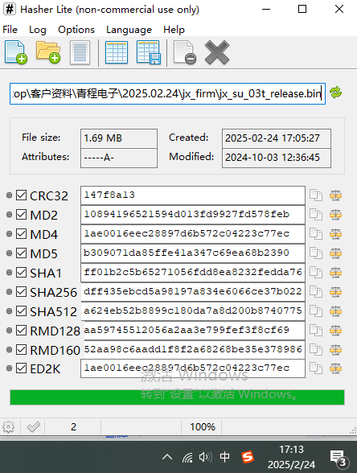

### SU-03T开机播报内容缺失如何处理？

**问题描述：**

SU-03T固件烧录后，开机播报内容不完整，缺少部分功能描述（如"AI"字样）。

**解决方案：**

- 核对固件生成时的配置文件
- 确认生产说明中的开机播报内容
- 如发现内容缺失，重新生成完整固件
- 测试新固件的所有功能项

**注意事项：**

- 开机播报内容需要准确反映产品功能
- 固件生成时注意检查所有文本字段
- 建议保留标准播报模板，避免遗漏
- 功能描述变更时要及时更新固件

## SU-03T固件版本记录

以下是SU-03T一些固件版本的MD5值示例（仅供参考）：

- **2024年8月版本**：91234c7a4f0f91a6ea22439db5a5e815
    - 开机播报：您的健康我为您保健护航，今天又是活力满满的一天
    - 唤醒词：你好小荟|小荟小荟|小荟同学

- **2024年9月版本**：915c06585e927012896ab8d8eaacfd14
    - 开机播报：您的健康我为您保健护航，今天又是活力满满的一天
    - 唤醒词：你好小荟|小荟小荟|小荟同学|小荟你好|小艾小艾|小洛小洛

- **2024年10月版本**：f4d4e6d549c3d4f50bf92fc5d38d8d11
    - 开机播报：欢迎使用智能语音识别系统，请叫小美小美或小莉小莉唤醒我
    - 唤醒词：你好小美|小美同学|你好小莉|小莉小莉

- **2024年11月版本**：ed3752e02d8749c6c87f7fea09fc8f5e
    - 开机播报：欢迎使用AI生物细胞共振舱，请叫小马小马唤醒我！
    - 唤醒词：你好小马|小马小马

- **2024年12月版本**：d950c9cd3b71f16491524e590e175791
    - 开机播报：您的健康我为您保健护航，今天又是活力满满的一天
    - 唤醒词：你好小荟|小荟小荟|小荟同学|小荟你好|小艾小艾|小洛小洛|你好小洛|小朔小朔|你好小朔|小朔同学|小宣小宣|你好小宣|小宣同学

**注意事项：**

- 每个配置变更都会产生新的MD5值
- 实际使用时以当前收到的固件MD5为准
- 建议建立自己的MD5数据库，便于管理
- 不同项目、不同批次的固件要分别记录

---

## 固件MD5校验与留档

## 串口通信问题

### SU03T无法通过串口发送变量

**问题描述：**

SU03T设备无法通过串口发送变量，而CI03T设备可以正常发送变量。

**解决方案：**

1. **检查固件版本**
    - 确认使用的是SU03T专用固件
    - 不同型号的固件不可通用

2. **验证串口配置**
    - 检查串口波特率、数据位、停止位设置
    - 确认硬件连接正确

3. **对比配置差异**
    - 参考CI03T的配置设置
    - 注意SU03T和CI03T在串口协议上的差异

**注意事项：**

- SU03T和CI03T在硬件和固件上存在差异
- 串口功能实现方式可能不同
- 建议使用型号对应的配置文档

---

### SU03T固件生成失败

**问题描述：**

配置检查无误，但在生成固件时提示失败，可能由配置问题导致。

**解决方案：**

1. **重新生成固件**
    - 在平台右侧点击"更多"选项
    - 选择"重新生成固件"
    - 多尝试几次生成操作

2. **导出工程检查**
    - 如多次生成仍失败
    - 导出工程文件
    - 由技术支持检查配置

**注意事项：**

- 有时生成失败是临时性问题
- 建议在不同时间段重试
- 保留工程配置便于问题排查

---

### SU-03T烧录进度条停滞不前

**问题描述：**

在使用SU-03T模块进行固件烧录时，即使更换电脑、安装驱动、检查电源和连接，烧录进度条仍停滞在0%，无法完成烧录。

**解决方案：**

1. **检查硬件连接**
    - 确保模块VCC接CH340的5V，GND接GND
    - TXD接B6引脚，RXD接B7引脚
    - 烧录时只需连接喇叭、咪头和4根烧录线

2. **排查接触问题**
    - 拔掉其他所有连接线，只保留必要连接
    - 检查转接板上的蓝色开关：按下是上电，弹起是断电
    - 确保开关处于按下状态

3. **验证供电正常**
    - 用万用表确认线路连通性
    - 可在5V和GND之间连接风扇测试供电

**注意事项：**

- 芯片引脚密集，直接插排针不焊接不易成功
- 如问题持续，建议寄送模块和转接板给厂商验证
- 新模块出厂有固件，上电后应有开机播报

---

### SU-03T烧录后无开机播报

**问题描述：**

新SU-03T模块烧录固件后无开机播报，需要指导如何正确烧录固件以使模块正常工作。

**解决方案：**

1. **正确接线方式**
    - CH340的5V接模块的VCC
    - CH340的GND接模块的GND
    - TXD接模块的B6引脚
    - RXD接模块的B7引脚

2. **烧录步骤**
    - 安装CH340驱动（解压安装包后双击安装）
    - 解压串口烧录软件
    - 选择目标bin文件，点击烧录
    - 按转接板蓝色开关重新断电上电

3. **验证步骤**
    - 烧录完成后关闭烧录软件
    - 重新拔插CH340连接电脑
    - 模块应播放开机提示音

**注意事项：**

- 确保转接板蓝色开关在烧录时正常工作
- 如仍无播报，检查烧录文件是否正确
- 新模块原本就有出厂固件，正常上电即有播报

---

### SU-03T模块上按钮的作用是什么？

**问题描述：**

SU-03T模块上有一个蓝色按钮，不确定其具体功能和作用。

**解决方案：**

1. **按钮功能说明**
    - 该按钮是一个电源开关
    - 可以控制模块断电和上电状态
    - 用于模块的电源管理

2. **使用方法**
    - 按下按钮：模块上电，开始工作
    - 弹起按钮：模块断电，停止工作
    - 便于快速开关模块而无需插拔电源

**注意事项：**

- 按钮主要用于电源控制，非复位功能
- 正常使用时应保持按下状态（上电）
- 如模块无反应，先检查按钮状态

---

### SU-03T烧录时无进度显示怎么办？

**问题描述：**

SU-03T模块在烧录程序时无法进行，点击烧录后无进度百分比显示，复位后仍无法烧录，但电脑能识别到串口。

**解决方案：**

1. **检查硬件连接**
    - 确认CH340与模块的4根线连接正确：

        - CH340的5V → 模块VCC
        - CH340的GND → 模块GND
        - CH340的TXD → 模块B6
        - CH340的RXD → 模块B7
    - 检查转接板上的蓝色开关是否按下（上电状态）

2. **排查接触问题**
    - 杜邦线间距可能不匹配（模块是2.0mm，杜邦线是2.54mm）
    - 尝试调整排线位置，确保接触良好
    - 可考虑焊接排针以确保稳定连接

3. **烧录操作流程**
    - 打开烧录软件，选择正确的COM口
    - 选择要烧录的bin文件
    - 点击烧录按钮
    - 快速拔插电源线（约1秒间隔）进入烧录模式

**注意事项：**

- 模块IO驱动能力较弱（不足20mA），无法直接驱动风扇等大负载
- 如多次尝试仍失败，可能是接触不良导致芯片未识别
- 新模块出厂有固件，正常上电应有开机播报

---

### SU-03T1烧录时出现校验失败

**问题描述：**

使用MV ADS downloader软件烧录SU-03T1模块固件时，烧录进度显示100%并提示"Burn Success."，但随后出现"Verify fail !!!"错误信息，最终提示"Flash burn fail. Please reburn again."

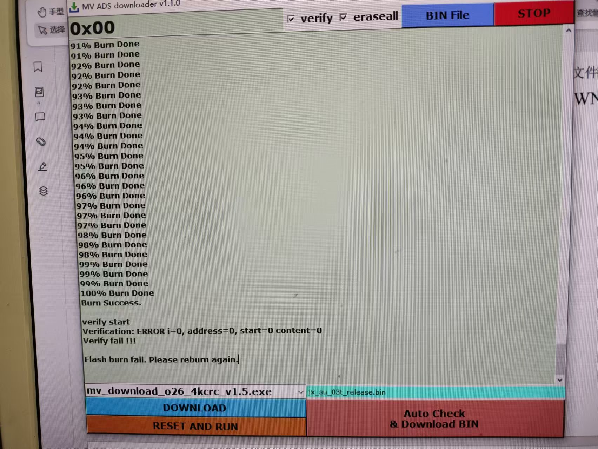

**解决方案：**

1. **更新烧录软件**
    - 使用的MV ADS downloader软件版本过旧
    - 需要更新到专用调试器烧录软件v1.8或更高版本

2. **检查固件版本**
    - 确认固件生成时间是否在2024年10月25日之后
    - 如果固件生成时间较早，需要从原生成版本继承并重新发布

3. **重新烧录操作**
    - 使用最新版本的烧录软件
    - 选择正确的固件文件
    - 确保硬件连接稳定

**注意事项：**

- 烧录软件版本不匹配可能导致校验失败
- 建议始终使用官方提供的最新版本烧录工具
- 固件文件需要与当前烧录软件版本兼容

---

### SU-03T1烧录器连接问题

**问题描述：**

使用烧录器烧录SU-03T1模块时出错，需要检查JTAG接口的连接。电路图中的ASR_TCK和ASR_TMS是用于烧录和调试的关键信号引脚。

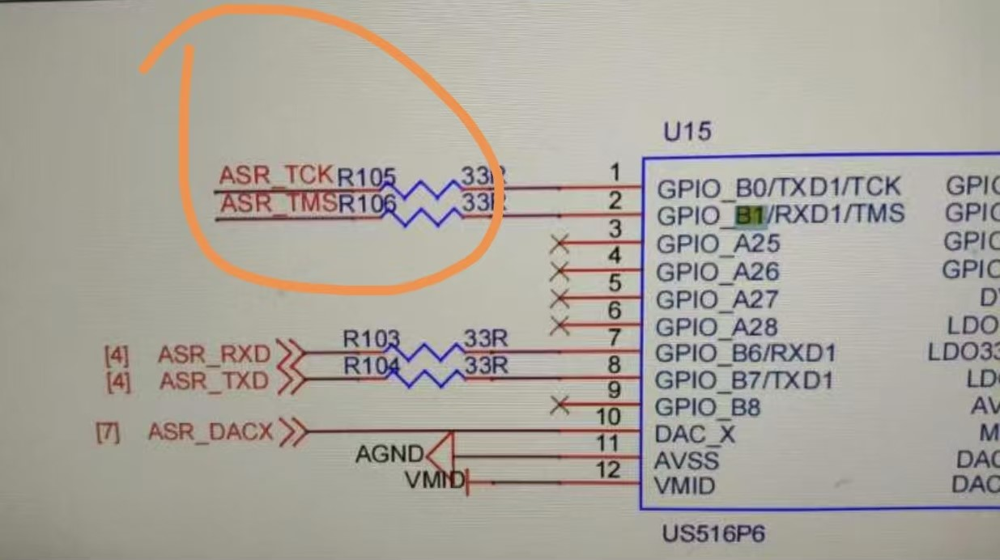

**解决方案：**

1. **检查JTAG接口连接**
    - ASR_TCK信号连接到电阻R105
    - ASR_TMS信号连接到电阻R106
    - 确保这些引脚正确连接到烧录器

2. **使用专用烧录器**
    - 推荐使用SU-03T1专用烧录器套装
    - 套装包含：03T纯模块、喇叭、电源接口、咪头和烧录器
    - 专用烧录器能确保连接稳定性和兼容性

3. **排查连接问题**
    - 检查烧录器型号是否匹配
    - 确认固件文件生成时间是否为最新
    - 录制烧录过程视频以便技术支持分析

**注意事项：**

- JTAG接口是烧录和调试的关键接口
- 错误的连接会导致烧录失败
- 使用专用烧录器可以避免大多数连接问题

---

### SU-03T1固件版本更新规则

**问题描述：**

SU-03T1模块语音识别功能异常，需要确认是否因固件版本过旧导致，并了解如何正确升级固件。

**解决方案：**

1. **检查固件生成时间**
    - 登录智能公云平台查看固件管理界面
    - 检查固件生成时间是否在2024年10月25日之前
    - 旧版本固件可能导致功能异常

2. **固件更新流程**
    - 如果固件生成时间在2024年10月25日之前
    - 需要从原生成版本继承配置
    - 重新发布生成新固件


3. **固件兼容性说明**
    - 新旧固件可能存在兼容性问题
    - 建议使用最新生成的固件文件
    - 确保烧录软件版本与固件匹配

**注意事项：**

- 固件生成时间是判断版本新旧的重要依据
- 旧固件需要通过继承和重新发布来更新
- 不要直接使用过期的固件文件进行烧录

---

### SU-03T1旧版本芯片是否会影响固件烧录？

**问题描述：**

使用去年生产的SU-03T1模块，担心芯片未升级导致无法烧录固件。

**解决方案：**

1. **芯片版本不影响烧录**
    - 旧版本芯片不会导致固件无法烧录
    - 烧录失败通常与软件版本或固件文件有关

2. **更新烧录软件和固件**
    - 下载最新版本的烧录软件
    - 重新生成或下载最新固件文件
    - 确保软件和固件版本匹配

3. **检查烧录环境**
    - 确认硬件连接正确
    - 检查串口驱动是否正常安装
    - 验证供电稳定性

**注意事项：**

- 芯片生产时间不影响固件烧录功能
- 建议始终使用官方最新版本的烧录工具
- 如仍无法烧录，检查硬件连接和驱动程序

---

### SU-03T1通电后不亮灯

**问题描述：**

SU-03T1模块通电后LED指示灯不亮，需要确认模块是否正常工作。

**解决方案：**

1. **确认电源连接**
    - 检查VCC和GND连接是否正确
    - 确保供电电压为5V
    - 验证电源稳定性

2. **检查模块状态**
    - SU-03T1模块正常工作时LED会亮起
    - 如LED不亮，可能是电源或模块本身问题
    - 新模块出厂时应带有固件

**注意事项：**

- LED不亮表示模块可能未正常供电
- 如确认供电正常仍不亮灯，可能是模块故障
- 建议使用万用表测量电压确认供电情况

---

### SU-03T烧录成功但唤醒词不反应且板子发烫

**问题描述：**

SU-03T芯片烧录成功后，唤醒词无响应，板子亮红灯且发热，需要排查功能异常原因。

**解决方案：**

1. **检查供电电压**
    - 使用烧录器5V供电时，VCC应为5V左右
    - 3V3引脚应输出3.3V电压（正常范围3.28V左右）

    

2. **测试麦克风功能**
    - 使用串口助手发送命令测试
    - 发送"你好，小智"命令测试语音识别
    - 发送"摇尾巴"命令测试特定功能
    - 串口助手接收模式需设置为十六进制（Hex）

    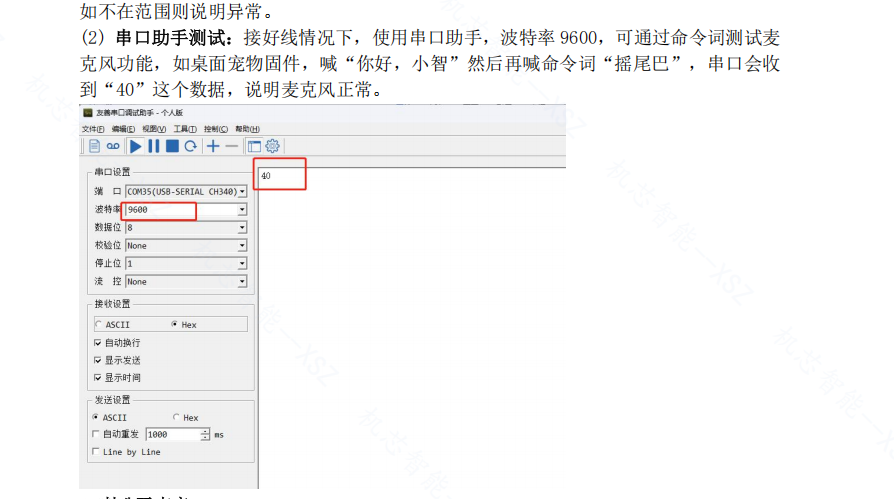

3. **检查喇叭工作状态**
    - 正常工作时，喇叭正负引脚对GND电压应为2.2-2.5V
    - 如电压异常（如4.59-4.60V），表明功放电路有问题

    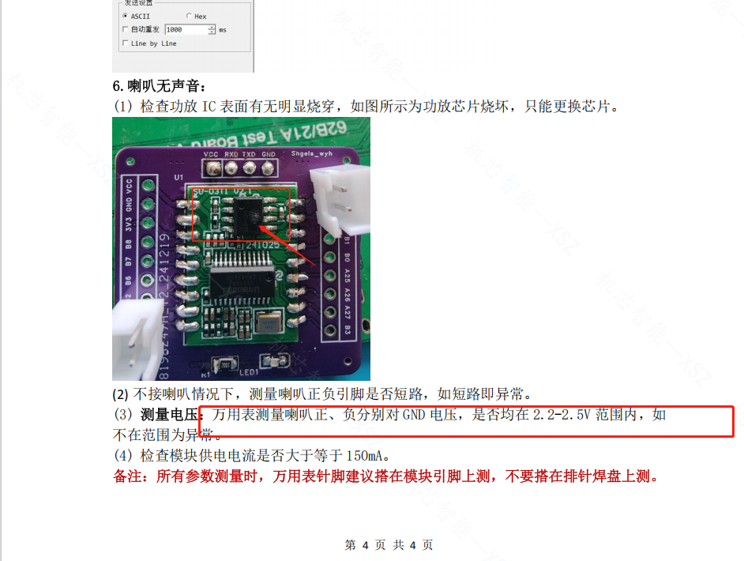

**注意事项：**

- 模块工作温度在60°C以内属于正常范围
- 功放芯片损坏可能导致喇叭电压异常和发热
- 如确认功放损坏，需要更换功放芯片

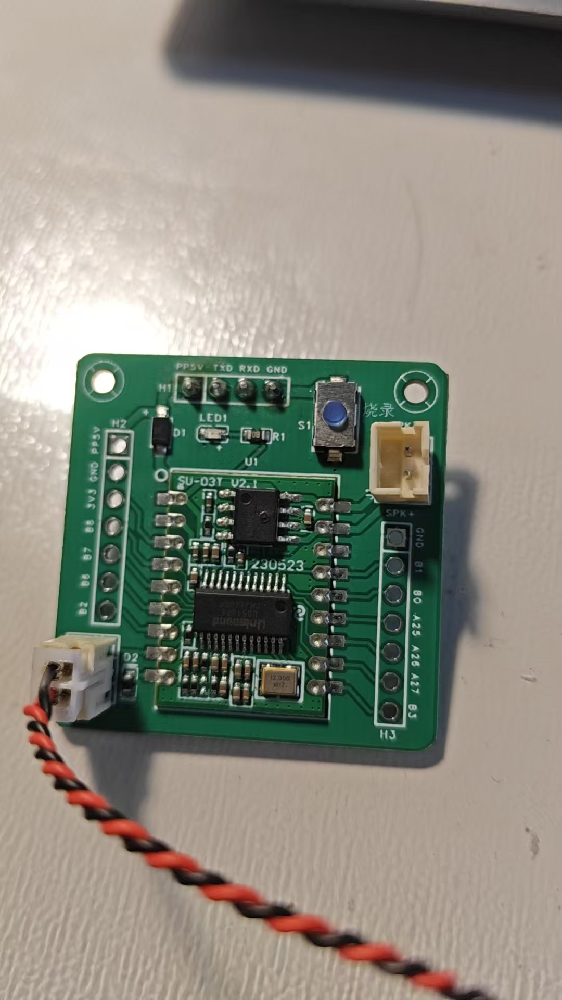

---

### SU-03T功放芯片损坏排查方法

**问题描述：**

SU-03T模块功放芯片烧毁，更换后喇叭仅有电流声且发烫，需要确认故障原因和解决方案。

**解决方案：**

1. **故障原因分析**
    - 喇叭正负极对GND短路是功放芯片损坏的主要原因
    - 短路会导致功放芯片瞬间烧毁
    - 即使轻微触碰都可能造成短路损坏

2. **功放芯片更换**
    - 可单独更换功放芯片（非整个模块）
    - 更换后需重新测试喇叭功能
    - 更换后如喇叭仍有电流声且发烫，需进一步检查

3. **预防措施**
    - 连接喇叭前先测量阻抗
    - 确保喇叭正负极不会接触到GND
    - 避免使用可能短路的喇叭连接方式

**注意事项：**

- 功放芯片损坏通常由外部短路引起
- 更换芯片后仍需排查短路问题
- 建议使用专用工具更换芯片，避免造成二次损坏

---

## 平台配置与选择（舵机控制）

### SU-03T无法控制舵机怎么办？

**问题描述：**

使用SU-03T1模块、STM32和麦克风实现语音控制9g舵机旋转功能，但无法正常工作。

**解决方案：**

**硬件连接检查：**

1. **舵机连接方式**
    - 信号线：连接到模块的GPIO引脚
    - 电源线（VCC）：连接外部5V或6V电源
    - 地线（GND）：与外部电源共地

2. **模块配置验证**
    - 确认GPIO已配置为PWM输出
    - 检查PWM频率设置（推荐50Hz）
    - 验证命令词与GPIO动作的关联

3. **功能测试步骤**
    - 测试GPIO是否能正常输出PWM波形
    - 使用万用表或示波器检查输出
    - 先测试固定角度，再测试语音控制

**参考教程：**

可参考舵机控制教程视频学习详细操作方法。

**注意事项：**

- 舵机不能直接由模块供电，必须使用外部电源
- 确保所有设备共地连接
- 9g舵机工作电流约100-200mA，需保证电源容量
- PWM周期应为20ms（50Hz）

---


---

### SU-03T一接电就发烫烧毁怎么办？

**问题描述：**

SU-03T模块一接电就严重发烫，甚至冒烟，两个模块都出现相同问题。

**问题排查：**

**1. 喇叭检查**

- 使用万用表测量喇叭阻抗
- 检查喇叭是否有短路
- 8Ω喇叭正常，短路会导致烧毁

**2. 功放IC状态**

- 拆下功放IC（8脚芯片）后测量
- 如拆下后不再短路，说明功放已烧毁
- 功放烧毁原因可能是喇叭短路

**预防措施：**

1. **正确连接喇叭**
    - 确保正负极不接触
    - 使用质量可靠的喇叭
    - 避免接线松动导致短路

2. **供电检查**
    - 使用电池供电测试，避免电源问题
    - 不要直接使用电脑USB口供电
    - 确保供电电压稳定

3. **测试流程**
    - 焊接底座先检查有无短路
    - 使用电池测试，确认正常后再接其他电源
    - 共地连接，避免电压差

**注意事项：**

- 功放IC烧毁后需要更换模块
- 喇叭短路是主要原因，必须仔细检查
- 使用蜂鸣档测试喇叭时会响，这是正常现象
- 建议购买多个模块，方便故障排查

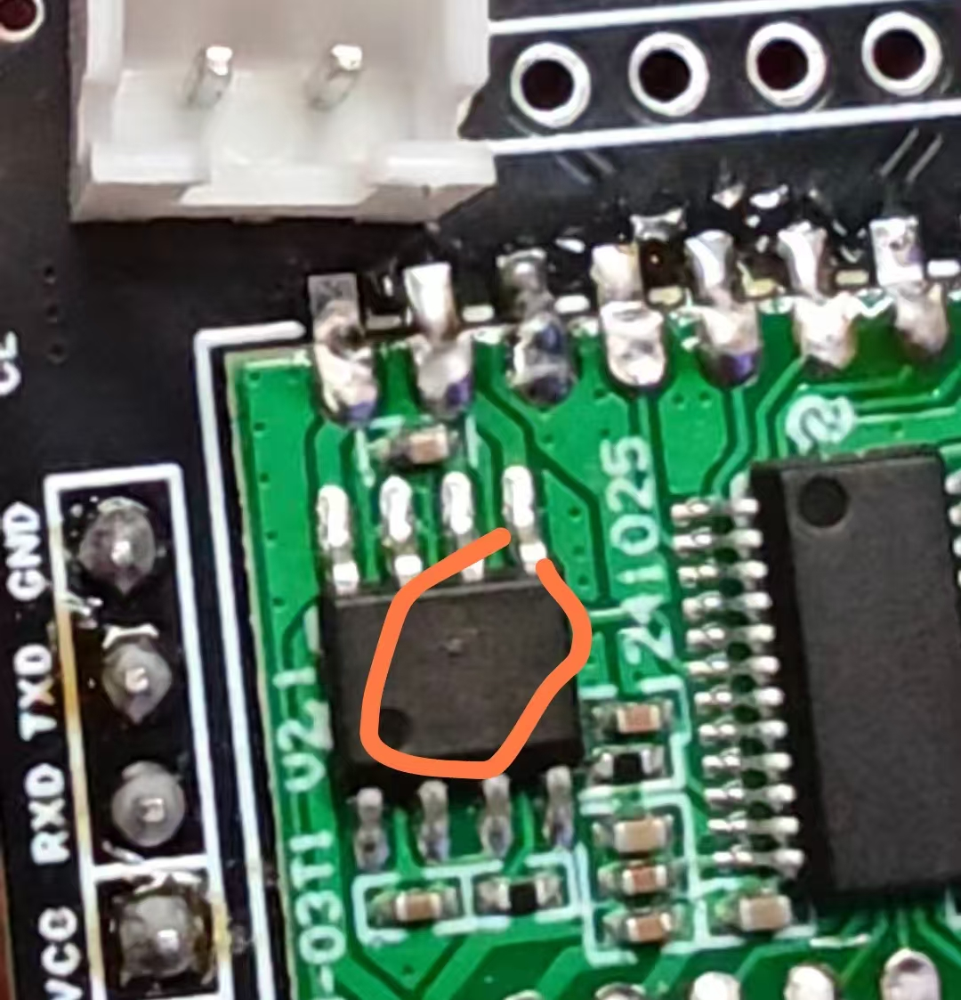

*功放IC烧毁特写，橙色圆圈标记处为损坏的8脚芯片*

---


---

### ST-LINK V2可以烧录SU-03T吗？

**问题描述：**

希望使用ST-LINK V2仿真器烧录SU-03T模块固件，不确定是否支持。

**解决方案：**

ST-LINK V2不能直接用于SU-03T模块烧录。

**1. 烧录工具说明**

- ST-LINK V2是STM32专用仿真器/编程器
- SU-03T需要使用USB转TTL工具（如CH340）
- 两者的通信协议和接口不兼容

**2. 正确的烧录工具**

- 使用USB转TTL模块（CH340、PL2303等）
- 连接4根线：VCC、GND、TXD、RXD
- 配合专用烧录软件使用

**3. 连接方式**

- CH340的5V → 模块VCC
- CH340的GND → 模块GND
- CH340的TXD → 模块B6/RX
- CH340的RXD → 模块B7/TX

**注意事项：**

- ST-LINK适用于STM32系列芯片
- SU-03T使用专用烧录协议
- 建议购买专用的烧录转接板
- TTL转串口工具价格便宜，几块钱即可购买

---


---

### 烧录时显示"等待设备"怎么办？

**问题描述：**

SU-03T模块烧录时始终显示"等待设备"，无法识别到设备，即使更换电脑、安装驱动、检查电源和连接，问题依旧存在。

**解决方案：**

**1. 检查硬件连接**

- 确认CH340与模块的4根线连接正确：

    - CH340的5V → 模块VCC
    - CH340的GND → 模块GND
    - CH340的TXD → 模块B6/RX
    - CH340的RXD → 模块B7/TX
- 确保转接板蓝色开关处于按下状态（上电）

**2. 排查接触问题**

- 杜邦线与模块引脚可能不匹配（模块2.0mm，杜邦线2.54mm）
- 尝试调整排线位置，确保良好接触
- 检查是否有引脚接触不良或虚焊

**3. 烧录操作流程**

- 打开烧录软件UniOneUpdateTool
- 选择正确的COM端口
- 选择要烧录的bin文件
- 点击烧录按钮
- 快速拔掉5V供电线，1秒后重新插上（进入烧录模式）

**4. 常见问题处理**

- COM口选择错误：逐一尝试所有可用COM口
- 驱动问题：重新安装CH340驱动程序
- 线路问题：使用万用表测试连通性
- 供电不足：确认电源输出稳定

**注意事项：**

- 模块出厂有固件，正常上电应有开机播报
- 如多次尝试仍失败，可能需要焊接排针
- 软件显示多个COM口是正常现象
- 烧录失败通常是接触不良导致芯片未识别

---


---

### 烧录后如何使用Arduino开发板？

**问题描述：**

SU-03T模块通过烧录器完成程序烧录后，是否可以通过Arduino开发板替代原USB接口进行后续操作。

**解决方案：**

**1. 烧录完成的确认**

- 烧录完成后，程序已存储在模块Flash中
- 断开烧录器连接，模块仍可正常运行程序
- 正常上电应播放开机提示音

**2. 使用Arduino开发板的连接方式**

- Arduino可通过数字IO口控制SU-03T的相应引脚
- 需要根据具体应用需求连接对应的控制线和信号线
- Arduino主要用于控制交互，不是替代烧录功能

**3. 引脚连接说明**

- 如果开发板引脚布局与模块不一致，使用杜邦线转接
- 确认模块上的引脚定义，按需连接
- 主要连接：电源、地线、控制IO口

**4. 注意事项**

- Arduino不能替代烧录器的程序下载功能
- 烧录和运行是两个不同的阶段
- 开发板主要用于应用层控制，不是固件下载

---


---

### 非CH340的USB转TTL模块可以烧录吗？

**问题描述：**

使用非CH340的USB转TTL模块（如HLK-FPM383C等其他型号）是否可以烧录SU-03T模块。

**解决方案：**

**1. 烧录器兼容性说明**

- 虽然很多USB转TTL模块都能实现串口通信功能
- 但烧录功能对时序和协议有特殊要求
- 不同芯片的烧录协议可能不兼容

**2. 官方支持情况**

- 目前官方只支持CH340芯片的烧录器
- 使用非CH340模块可能导致烧录失败或数据错误
- 即使是兼容的USB转TTL模块，也不保证烧录成功

**3. 推荐做法**

- 购买专用的CH340烧录器
- 确保烧录工具和硬件的兼容性
- 避免因不兼容导致的烧录失败

**注意事项：**

- USB转TTL功能不等于烧录功能
- 烧录失败可能损坏模块固件
- 建议使用官方推荐的烧录工具

---


---

### SU-03T烧录连接详细指导

**问题描述：**

需要SU-03T模块烧录时的详细连接接线图和完整的烧录操作步骤指导。

**解决方案：**

**1. 硬件准备**

- CH340 USB转TTL模块
- 杜邦线（公对母）
- SU-03T模块和转接板
- 电脑（已安装CH340驱动）

**2. 连接步骤**
```
CH340模块    →    SU-03T模块
5V          →    VCC（电源正极）
GND         →    GND（地线）
TXD         →    B6（串口接收）
RXD         →    B7（串口发送）
```

**3. 烧录流程**

1. 安装CH340驱动
    - 下载驱动程序并解压
    - 双击安装文件
    - 在设备管理器中确认COM口

2. 连接硬件
    - 按照上述接线图连接4根线
    - 确保转接板蓝色开关按下（上电）
    - 只连接喇叭、咪头，不连接其他外设

3. 烧录操作
    - 打开UniOneUpdateTool烧录软件
    - 选择正确的COM端口
    - 点击"浏览"选择要烧录的bin文件
    - 点击"烧录"按钮
    - 快速拔掉5V电源线，1秒后重新插上
    - 等待进度条走完

4. 验证完成
    - 关闭烧录软件
    - 重新拔插CH340连接电脑
    - 模块应播放开机提示音

**4. 注意事项**

- 确保烧录文件路径全为英文，不含中文
- 如进度条一直不动，检查接触是否良好
- 模块引脚间距2.0mm，可能需要调整杜邦线位置
- 新模块出厂有固件，正常上电应有播报

---


---

### 杜邦线间距不匹配导致接触不良怎么办？

**问题描述：**

使用标准杜邦线（2.54mm间距）烧录SU-03T模块时，由于模块引脚间距为2.0mm，导致接触不良，烧录软件显示"等待设备"或无法识别芯片。

**解决方案：**

**1. 问题分析**

- SU-03T模块引脚间距：2.0mm
- 标准杜邦线间距：2.54mm
- 间距不匹配导致接触不良或虚接

**2. 解决方案**

**方案一：调整杜邦线位置**

- 将杜邦线针脚倾斜一定角度插入
- 对准模块引脚，确保接触良好
- 用胶带或夹子固定，防止移位

**方案二：使用专用转接板**

- 购买SU-03T专用烧录转接板
- 转接板已解决间距匹配问题
- 提供稳定的连接和操作便利性

**方案三：焊接排针**

- 在模块上焊接2.54mm间距的排针
- 一劳永逸解决连接问题
- 需要一定的焊接技能

**方案四：定制线材**

- 定制2.0mm间距的杜邦线
- 或使用IDC连接器改接
- 成本较高但连接可靠

**3. 操作技巧**

- 连接前清洁模块引脚
- 使用放大镜检查对准情况
- 轻柔操作，避免损坏引脚
- 连接后轻推测试，确认接触良好

**注意事项：**

- 接触不良是烧录失败的常见原因
- 如多次尝试仍失败，建议购买专用转接板
- 焊接排针时要小心，避免短路
- 长期使用建议投资专用工具

---

---

---

---

---


---

### CH340烧录时连接超时怎么办？

**问题描述：**

使用CH340 USB转TTL模块烧录SU-03T固件时，频繁插拔电源导致连接超时，烧录软件显示"等待设备连接"，无法完成烧录。

**解决方案：**

**1. 正确操作流程**

**烧录模式进入：**

- 保持四根线连接（VCC、GND、TXD、RXD）
- 观察烧录软件界面指示灯
- 当黄色指示灯对应到正确端口时，快速拔插电源线（约2秒间隔）
- 其他信号线保持不动，只操作电源线

**2. 连接检查**

**硬件连接确认：**

- CH340的TXD连接模块的RXD
- CH340的RXD连接模块的TXD
- VCC接3.3V或5V（根据模块要求）
- GND可靠接地

**软件设置检查：**

- 选择正确的COM端口
- 确认CH340驱动已安装
- 检查波特率设置是否正确

**3. 常见问题处理**

**显示"等待设备连接"：**

- 确认模块已正确上电
- 检查串口线是否松动
- 尝试更换COM端口
- 重新安装CH340驱动程序

**烧录失败处理：**

- 确保进入烧录模式时机正确
- 不要频繁拔插，按2秒间隔操作
- 检查电源电压是否稳定
- 尝试使用不同的USB线

**4. 注意事项**

- 操作时保持其他线缆不动
- 电源插拔要快速果断
- 如果多次失败，建议购买专用烧录板
- 烧录成功前不要断开任何连接

**建议：**

- 初学者建议使用扩展板，避免连接问题
- 扩展板提供稳定连接和操作便利性
- 长期使用建议投资专用工具

---


---

### 烧录文件路径包含中文怎么办？

**问题描述：**

将烧录文件放在中文路径或包含中文字符的文件夹中时，烧录软件无反应，LED灯常亮，无法正常完成烧录。

**解决方案：**

**1. 路径要求**

- 烧录软件不支持包含中文字符的路径
- 必须确保bin文件所在路径全为英文字符
- 避免使用特殊符号和空格

**2. 正确做法**

- 将bin文件放置在纯英文路径的文件夹中
- 可以创建在C盘或D盘的根目录下
- 文件夹名称建议使用简单的英文单词

**3. 操作示例**

- 正确：`C:\firmware\module.bin`
- 错误：`C:\固件\模块.bin`
- 正确：`D:\test\su03t.bin`
- 错误：`D:\测试\SU-03T固件.bin`

**注意事项：**

- 桌面自动创建的文件夹如果是中文命名，需要手动修改
- 不是必须放在桌面，任何英文路径都可以
- 即使放在英文文件夹中，也要确保上级路径不包含中文
- 建议在烧录前检查完整路径是否包含中文字符

---


---

### SU-03T1 V2.1版本的原理图如何获取？

**问题描述：**

需要获取SU-03T1 V2.1版本的原理图，但官网开发包中的原理图版本与实际PCB版本不一致。

**解决方案：**

**1. 版本确认**

- 当前出货的SU-03T模块为V2.1版本
- 开发包中可能包含较旧版本的原理图
- 需要获取与V2.1硬件匹配的最新原理图

**2. 获取方式**

**官方渠道**：

- 智能公元平台提供SU-03T开发包下载
- 包含原理图、模块规格书、技术手册等
- 网址：http://help.aimachip.com/docs/offline_su03t/su_03t_kfb

**版本更新**：

- V1.8版本的原理图已更新，与V2.1硬件匹配
- 可通过技术支持获取最新版本的原理图文件

**3. 原理图内容确认**

- MCU接口引脚定义图：包含18个引脚的功能定义
- 麦克风输入电路图：展示MIC接口的连接方式
- PCB布局图：与V2.1版本硬件一致

**4. 注意事项**

- 确保下载的原理图版本与硬件版本匹配
- V2.1与旧版本在引脚定义上可能存在差异
- 如有特殊需求，可联系技术支持获取定制化资料
- 量产前务必确认原理图版本的准确性

---


---

### SU-03T模块PCB与原理图版本不一致如何确认？

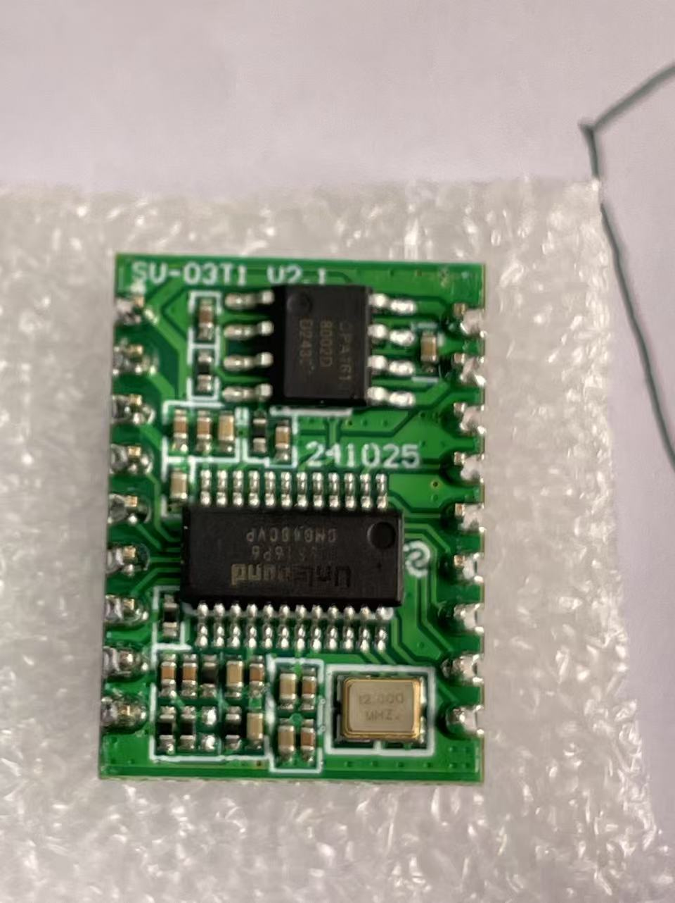
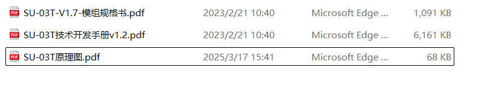

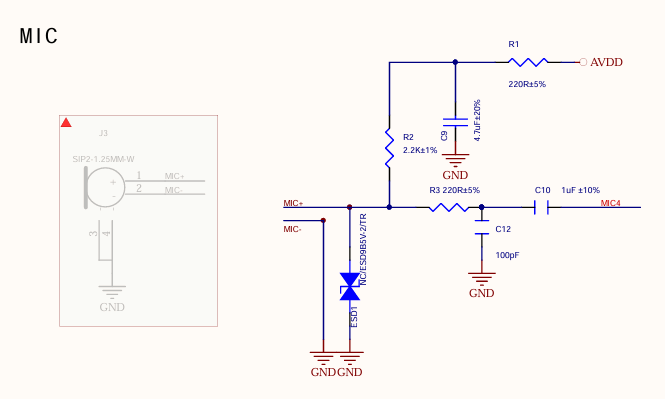
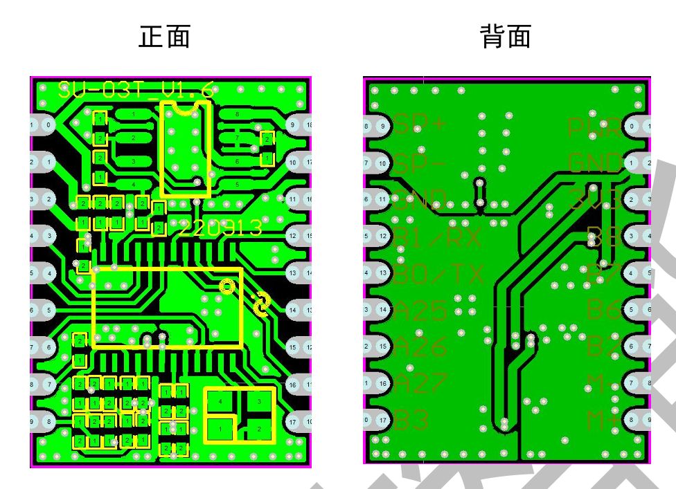

---


---

### CI-03T和SU-03T的烧录时间有差异吗？

**问题描述：**

比较CI-03T和SU-03T两个模块的程序烧录速度，了解哪个型号烧录更快。

**解决方案：**

在连接正确的情况下，CI-03T和SU-03T的程序烧录时间基本相同。

- 两个模块使用相同的烧录接口和协议
- 烧录速度主要取决于固件大小和波特率设置
- 实际烧录时间差异可以忽略不计

**注意事项：**

- CI系列固件生成速度较快，但这不影响实际烧录时间
- 确保烧录线连接良好，避免因接触不良延长烧录时间
- 建议使用921600bps波特率以提高烧录效率

---


---

### US516P6空片如何进行首次烧录？

**问题描述：**

购买的US516P6芯片为空片（未烧录固件），无法通过串口进行程序烧录，需要了解首次烧录的方法以及具体操作步骤。

**解决方案：**

**空片烧录说明：**

- US516P6芯片出厂时为空片状态，内部无任何程序
- 空片无法通过串口（CH340等）直接烧录
- 必须使用专用调试器进行首次烧录

**首次烧录流程：**

1. **使用AICE MINI调试器**：

    - 准备AICE MINI V1.3调试器（或其他兼容调试器）
    - 连接调试器到芯片的B0（SWDIO）、B1（SWCLK）引脚
    - 下载并安装蜂鸟调试器烧录软件
    - 使用调试器烧录引导程序

2. **获取固件文件**：

    - 下载SU-03T开发包
    - 进入"04、模块出厂固件"→"01、出厂固件"→"jx_firm"文件夹
    - 选择较短的BIN文件：jx_su_03t_release.bin（不含update字样）

3. **后续更新（串口烧录）**：

    - 完成首次烧录后，芯片支持串口下载功能
    - 可使用CH340等串口工具进行固件更新
    - 配合智能公元平台生成的固件文件
    - 使用B6（RX）、B7（TX）引脚进行通信

**关于通用调试器：**

- US516P6芯片无法使用J-Link或DAPLink等通用调试器
- 芯片内部架构与通用ARM内核不同
- 必须使用专用调试烧录器进行烧录

**注意事项：**

- 空片必须先通过专用调试器烧录引导程序
- 引导程序只需烧录一次，后续可通过串口更新固件
- 烧录时确保B0、B1、B6、B7引脚已正确引出
- 选择固件文件时，使用不带update的版本进行首次烧录

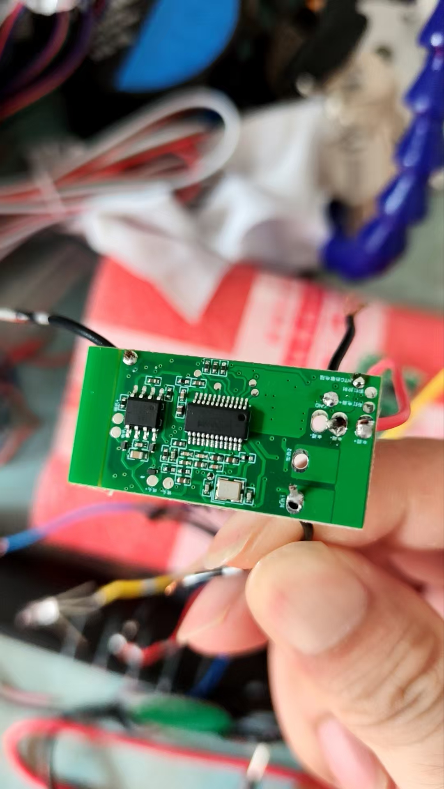


---


---


---

### 固件烧录时路径包含中文导致失败怎么办？

**问题描述：**

在使用固件烧录工具时，因固件文件路径包含中文字符而导致烧录失败，工具提示"文件读取失败"错误。

**解决方案：**

**1. 路径要求**

- 烧录工具路径必须使用纯英文
- 不支持中文路径和中文文件名
- 所有文件夹和文件名都需要使用英文

**2. 解决步骤**

1. **移动固件文件**：

    - 将固件文件移动到纯英文路径
    - 例如：`D:\firmware\` 或 `C:\work\firmware\`
    - 确保路径中不包含任何中文字符

2. **修改路径名**：

    - 如果文件夹名是中文，重命名为英文
    - 将文件名改为英文或拼音
    - 避免使用特殊字符和空格

3. **重新尝试烧录**：

    - 在烧录工具中重新选择文件
    - 确认路径显示为纯英文
    - 开始烧录操作

**常见错误提示：**

- **云知声UniOne蜂鸟M烧录工具**：

    - "下载错误：F:\\新文件夹\\jx_firm\\jx_su_03t_release_update.bin 文件读取失败！"

- **MV ADS downloader**：

    - "Error: can't open file F:/新文件夹 (2)/SU-03T开发包: 版本V2.1.1/02、模块烧录资料/04、模块出厂固件/01、出厂固件/jx_firm/jx_su_03t_release.bin"

**错误示例：**

- ❌ 错误路径：`C:\用户\文档\固件\test.bin`
- ❌ 错误路径：`D:\新文件夹\固件文件.bin`
- ❌ 错误路径：`F:\新文件夹 (2)\SU-03T开发包\jx_firm\`
- ✅ 正确路径：`D:\firmware\test.bin`
- ✅ 正确路径：`C:\work\firmware\module.bin`

**注意事项：**

- 烧录工具对中文路径支持有限，这是软件本身的限制
- 建议将常用固件文件夹设置为英文
- 如路径问题持续存在，尝试更换其他磁盘或用户目录
- 移动文件后需要更新烧录工具中的文件选择

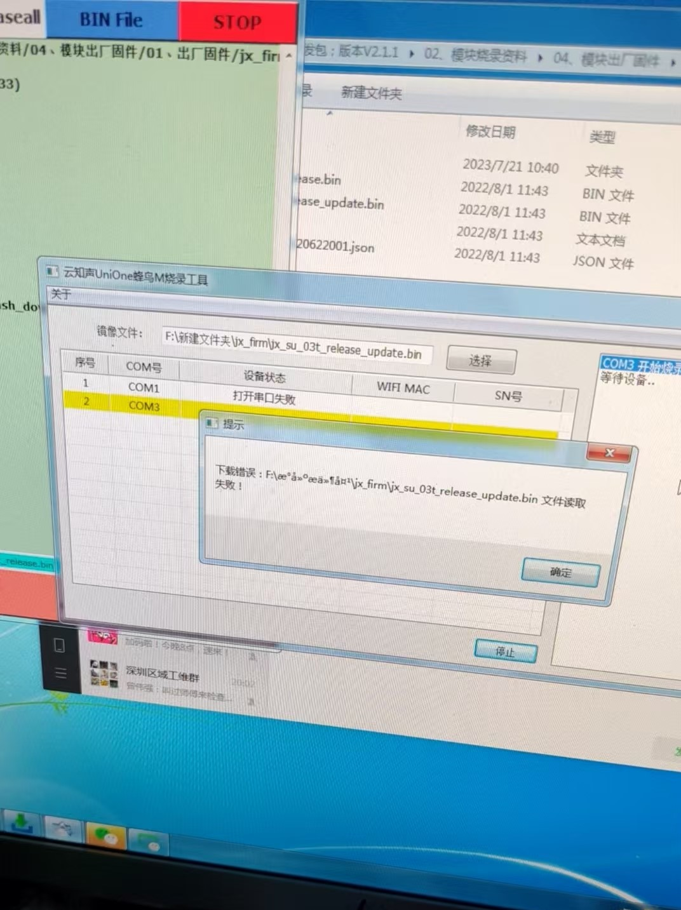

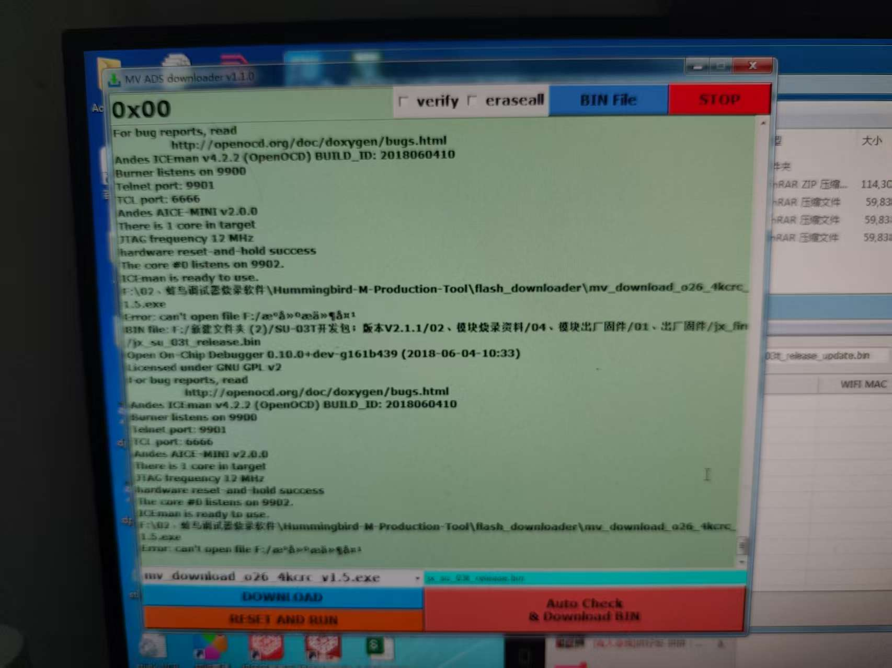

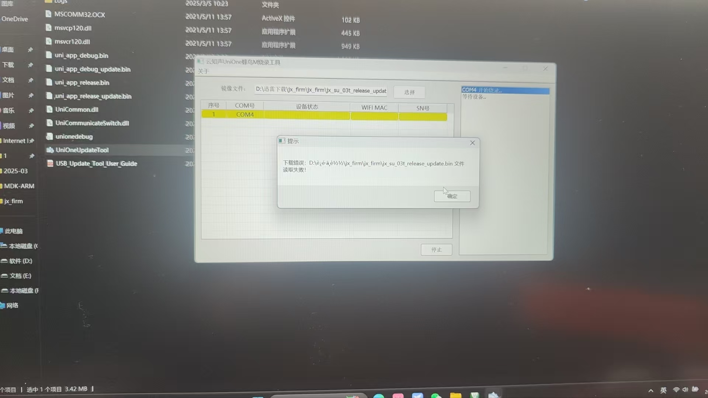
    - 使用其他浏览器下载避免文件损坏
    - 验证文件完整性

5. **环境变量检查**：

    - 检查PATH环境变量
    - 确保系统临时目录权限正常
    - 清理系统临时文件

**替代方案：**

- 使用其他电脑尝试运行
- 在虚拟机环境中安装使用
- 联系技术人员获取其他版本

**注意事项：**

- 软件闪退通常与环境配置有关
- 记录错误代码便于技术人员定位问题
- 保留软件版本号和系统信息

---


---


---

### 烧录器和烧录板是否与SU-03T型号通用？

**问题描述：**

需要确认烧录器和烧录板是否与SU-03T型号通用，以便不同型号间共享烧录设备。

**解决方案：**

**通用性确认：**

- 烧录器和烧录板与SU-03T、CI-03T、CI-33T等型号通用
- 烧录板设计支持多种模块的脚位标识
- 可以通过同一烧录设备烧录不同型号的固件

**烧录板特点：**

1. **多模块支持**
    - 板上标注了不同型号的脚位
    - 包括SU-03T、CI-03T1、CI-03T2等标识
    - 方便识别不同型号的引脚位置

2. **统一接口设计**
    - 使用标准的USB转串口方案
    - 引脚布局兼容各型号的烧录接口
    - B6/B7作为通用烧录引脚

**烧录器兼容性：**

- **硬件通用**：标准的USB转串口烧录器
- **驱动兼容**：CH340等通用USB串口芯片
- **软件支持**：官方烧录工具支持多型号

**使用方法：**

1. **模块定位**
    - 根据模块型号对准烧录板位置
    - 确保引脚与标识对应
    - 避免错位导致烧录失败

2. **连接方式**
    - 模块的烧录引脚对准烧录板的B6/B7
    - 注意方向和极性
    - 确保良好接触

**注意事项：**

- 烧录前确认模块型号和位置
- 不同型号的烧录接口完全相同
- 烧录板的标识有助于快速定位
- 保管好烧录设备避免损坏

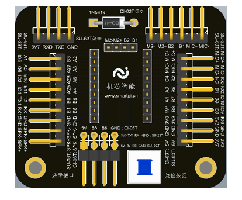

---

### 购买的已烧录模块无法唤醒怎么办？

**问题描述：**

购买的已焊接好底板并集成咪头和喇叭的成品模块，烧录后无法唤醒，且主板大块区域不亮。

**解决方案：**

**1. 确认产品类型**

- 确认购买的是已烧录好的成品模块
- 检查是否为SU-03T1已焊好底板模块（含咪头+喇叭）

    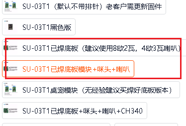

**2. 硬件检查**

- 检查主板是否有明显烧毁痕迹
- 观察主控芯片附近区域是否正常发热
- 确认电源指示灯是否正常亮起

**3. 可能故障原因**

- **虚焊问题**：焊接时接触不良导致断路
- **短路损坏**：焊接时不慎短接烧毁元件
- **元件过小**：零件太小导致焊接困难
- **静电损坏**：操作时未做好防静电措施

**4. 排查步骤**

- 测量关键点电压，判断供电是否正常
- 检查咪头和喇叭连接是否正确
- 尝试重新烧录新的固件

**5. 解决方案**

- 如确认硬件损坏，联系售后补发零件
- 焊接困难建议购买已焊接好的模块
- 使用尖头烙铁进行精细焊接

**注意事项：**

- 已烧录模块通常无需再次烧录即可使用
- 主板大块不亮通常是电源或主控问题
- 自行焊接需要具备一定的焊接经验
- 元件密集时容易造成短路或虚焊


---

### 如何批量烧录SU-03T1模块并测试功能？

**问题描述：**

需要为300个SU-03T1模块烧录指定固件，并测试输出电平和功能是否符合要求。

**解决方案：**

**批量烧录流程：**

1. **固件准备**
    - 获取指定固件文件
    - 使用Hasher等工具计算MD5校验值
    - 解压固件包确认文件完整性

2. **烧录设置**
    - 使用标准烧录工具和CH340等下载器
    - 配置正确的串口参数（波特率115200）
    - 设置数据位8、停止位1、校验位无

3. **批量操作**
    - 准备多个烧录工位提高效率
    - 记录每个模块的烧录时间和状态
    - 保持稳定的烧录环境和供电

**功能测试要求：**

1. **语音命令测试**
    - 开机播报："已为你打开好心情，小雨陪你度过快乐每一天"
    - 唤醒词："小雨小雨"
    - 测试命令："全开"、"全关"
    - 版本查询："版本号"→回复："四路语音手动2.12版本"

2. **输出电平测试**
    - "全开"命令：A26、A27、B2、B3输出高电平
    - "全关"命令：A26、A27、B2、B3输出低电平
    - 使用万用表或示波器验证电平变化
    - 确认继电器驱动正常工作

**质量管控：**

- 烧录MD5留档：MD5-4c37dc4922c822f52f753b417efc4e8
- 每个模块记录烧录时间和测试结果
- 不合格产品重新烧录或标记返工
- 保留10%样品用于后续抽检

**注意事项：**

- 输出电平可通过配置工具自定义设置
- 烧录过程中避免频繁断电连接
- 建议小批量测试后再进行大批量烧录
- 保留完整的烧录记录和MD5校验值
- 测试时注意防静电保护

---


---


---

### SU-03T固件烧录流程

**问题描述：**

需要批量烧录SU-03T模块，了解标准的烧录流程和注意事项。

**解决方案：**

**烧录准备：**

1. **获取固件文件**：

    - 确认固件版本和配置
    - 下载对应的.bin文件
    - 验证文件完整性（检查MD5值）

2. **烧录工具**：

    - 使用Hasher Lite等烧录工具
    - 确认烧录器连接正常

**烧录步骤：**

1. 连接烧录器到SU-03T模块
2. 打开烧录软件，选择固件文件
3. 确认CRC32、MD5等校验值
4. 开始烧录，等待进度达到100%
5. 验证烧录结果

**注意事项：**

- 烧录前最好先测试样品确认功能正常
- 批量烧录建议做好记录和标识
- 保留烧录成功的截图作为凭证
- 当天确认的固件可能无法当天发货，请合理安排时间


---

### 烧录时"打开串口失败"如何解决？

**问题描述：**

烧录工具显示多个COM口设备，但都提示"打开串口失败"，无法进行烧录。

**解决方案：**

1. **检查烧录引脚连接**
    - SU-03T的烧录引脚为B6和B7
    - 确认RXD连接到B7，TXD连接到B6
    - 重新按正确引脚图连接

2. **串口管理**
    - 检查设备管理器确认COM口状态
    - 关闭占用串口的其他程序
    - 重新插拔USB设备

**接线图示：**

- 5V/VCC → 芯片VCC
- RXD → 芯片B7引脚
- TXD → 芯片B6引脚
- GND → 芯片GND

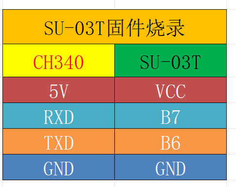

---


---

### CI-03T和SU-03T烧录软件选择错误怎么办？

**问题描述：**

烧录时使用了错误的烧录软件，导致烧录失败。例如使用CI系列的软件烧录SU-03T模块，或使用SU系列的软件烧录CI-03T模块。

**解决方案：**

**1. 正确的软件选择**

- **CI-03T**：使用PACK_UPDATE_TOOL烧录软件
    - 界面显示"CI-03T串口烧录软件"
    - 支持CI-03T系列模块

- **SU-03T**：使用小扳手（串口烧录软件）
    - 也称为UniOne蜂鸟M烧录工具
    - 专门用于SU系列模块

**2. 软件获取方式**

- CI-03T软件：可从官方渠道获取PACK_UPDATE_TOOL
- SU-03T软件：使用"串口烧录软件（小扳手）.zip"

**3. 硬件损坏检查**

如多次烧录失败，可能是硬件损坏：

- **CI-03T损坏**：主控IC和功放可能烧坏
- **SU-03T损坏**：功放部分可能损坏
- 需要专业维修或更换模块

**注意事项：**

- 不同系列模块的烧录软件不兼容
- 烧录前确认模块型号和对应软件
- 硬件损坏通常需要返厂维修
- 建议保留原包装和购买凭证

---


---

### SU-03T脱机烧录器部分模块无法烧录怎么办？

**问题描述：**

使用脱机烧录器对SU-03T模块进行烧录时，出现部分模块可以正常烧录，而另一部分模块无法烧录的情况。即使使用相同的接线方式和供电条件，成功率也不稳定。

**解决方案：**

**1. 烧录器版本兼容性检查**

- **确认烧录器版本**：老版本烧录器可能与新固件不兼容
- **官方推荐版本**：使用V3.0.1及以上版本的蜂鸟M升级狗
- **避免使用非官方烧录器**：第三方或老旧版本烧录器可能导致烧录失败

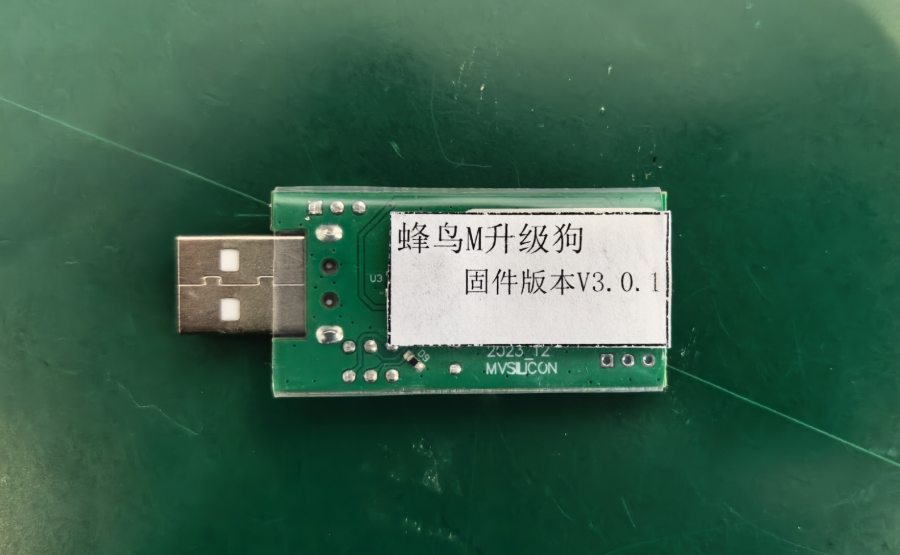

*官方推荐的蜂鸟M升级狗（固件版本V3.0.1）*

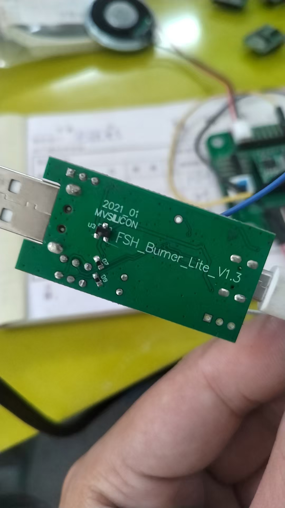

*老版本烧录器（FSH_Bumer_Lite_V1.3），可能存在兼容性问题*

**2. 供电和接线优化**

- **独立供电**：使用外部USB电源（如充电宝）为烧录器供电
- **避免使用电脑USB供电**：电脑USB端口可能供电不足或不稳定
- **共地处理**：确保所有设备共地，避免电平差影响通信
- **线缆长度**：尽量缩短连接线，避免信号衰减

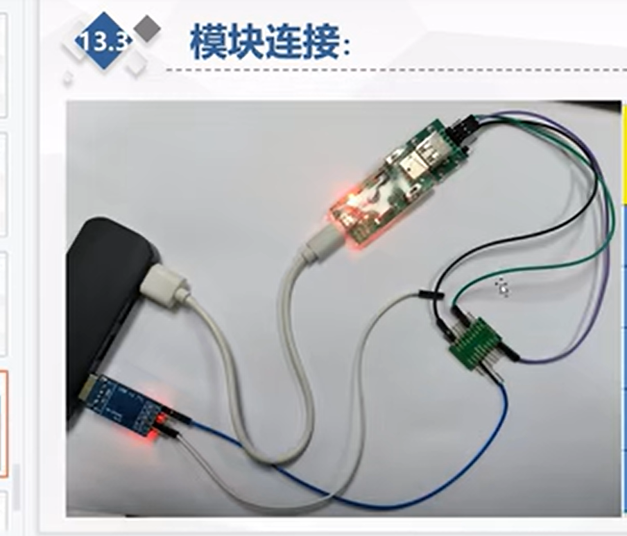

*脱机烧录器的标准接线方式，使用独立供电并确保正确连接*

**3. 接线规范**

- **B2/B3连接**：将烧录器的数据线直接连接到SU-03T的B2、B3引脚
- **独立接线**：B2、B3引脚线缆应独立布线，避免接触其他引脚
- **5V供电**：可使用数据线中的5V和GND为模块供电
- **不依赖CH340**：脱机烧录时不需要使用CH340转换器

**重要提示：**

- **B2/B3被占用时脱机烧录可能失败**：如果B2/B3引脚在固件中被配置为普通GPIO（输入/输出）功能，脱机烧录的成功率会大幅降低
- **B0/B1引脚限制**：B0/B1是专用调试器烧录口，当这些引脚被配置为其他功能时，也可能影响烧录
- **替代方案**：当B2/B3被用作普通IO时，建议改用**B6/B7串口烧录**方式（使用CH340和UniOneUpdateTool工具）

**4. 故障排查步骤**

- **更换模块测试**：用确认可以烧录的模块测试烧录器功能
- **更换烧录器**：使用官方最新版本烧录器进行对比测试
- **检查固件版本**：确认要烧录的固件与烧录器版本兼容
- **清洁接口**：确保模块引脚和烧录器接口无氧化、无污损

**5. 批量烧录建议**

- **先小批量测试**：大批量烧录前先进行小批量验证
- **记录烧录参数**：记录成功烧录的条件和参数
- **准备备用烧录器**：准备多个烧录器以提高生产效率
- **稳定环境**：在静电防护良好的环境中进行烧录操作

**技术说明：**

脱机烧录器部分模块无法烧录的问题通常与以下因素有关：

- 烧录器固件版本过旧，不支持新版本的通信协议
- 供电不稳定，导致烧录过程中断或失败
- 接触不良或接线错误，影响数据传输
- 模块个体差异，某些模块对烧录条件更敏感

**注意事项：**

- 使用非官方或老旧烧录器可能无法获得技术支持
- 烧录失败时不要强行反复尝试，避免损坏模块
- 如问题持续存在，建议联系厂商获取技术支持
- 量产前建议使用官方推荐的烧录设备和流程

---

## SU-03T固件版本兼容性

### SU-03T/SU-03T1固件兼容性问题如何解决？

**问题描述：**

烧录固件时出现传输中断、烧录到一半失败等问题，特别是使用老版本固件在新模块上时。

**问题分析：**

1. **Flash扩容导致的兼容性问题**：

    - 新款SU-03T1模块进行了Flash扩容操作
    - 2024年11月之前制作的固件可能不兼容新模块
    - 老固件在新模块上可能烧录到一半时断开传输

2. **固件版本识别**：

    - 在智能公元平台可以看到固件的生成时间
    - 2024年11月之后制作的固件可直接用于新模块
    - 老固件需要在平台上继承升级重新生成

**解决方案：**

**1. 检查固件版本**

- **查看固件生成时间**：

    - 登录智能公元平台
    - 在固件管理页面查看固件生成日期
    - 确认是否为2024年11月之后生成

- **模块版本识别**：

    - SU-03T V2.1：老版本模块
    - SU-03T1：新版本模块（Flash扩容）

**2. 固件兼容性处理**

- **老固件升级**：

    1. 在智能公元平台导入原有工程
    2. 使用"继承升级"功能重新生成固件
    3. 下载新固件进行烧录

- **直接使用新固件**：

    - 2024年11月后制作的固件无需处理
    - 可直接在新模块上烧录

**3. 烧录注意事项**

- **完整烧录**：确保烧录一次性完成到100%
- **避免中断**：烧录过程中不要断开连接
- **验证功能**：烧录完成后测试所有功能

**常见问题：**

**Q：为什么老固件在新模块上烧录到一半会失败？**
A：新模块更换了内置Flash，老固件不兼容，需要在平台继承升级。

**Q：如何判断模块是老版本还是新版本？**
A：查看模块上的版本标识，V2.1为老版本，SU-03T1为新版本。

**Q：继承升级会影响原有功能吗？
A：不会，继承升级只是让固件兼容新硬件，功能保持不变。

**Q：只有bin文件没有json文件可以继承升级固件吗？**
A：不可以。固件继承升级需要在智能公元平台的固件管理界面进行，需要json工程文件才能导入和修改。如果只有bin文件，无法完成继承操作。需要联系原固件提供方获取完整的固件包（包含json配置文件）。

**预防措施：**

- 采购模块时确认版本信息
- 保留固件的工程文件，便于后续升级
- 大批量生产前先进行小批量测试
- 建议使用官方提供的最新固件

---

## 脱机烧录器常见问题补充

### 脱机烧录器烧录卡住或断开如何处理？

**问题描述：**

脱机烧录过程中出现进度停滞、卡在某个百分比不动，或烧录到一半突然断开连接。

**可能原因：**

1. **杜邦线接触不良**（最常见原因）
2. 烧录器供电不足
3. 接线松动或线缆过长
4. 模块与烧录器版本不匹配

**解决步骤：**

**1. 检查和更换连接线**

- **更换杜邦线**：

    - 使用质量更好的杜邦线
    - 确保线缆与连接器匹配（2.0mm间距）
    - 避免使用老化或接触不良的线缆

- **检查连接**：

    - 确保每根线都牢固插入
    - 检查是否有氧化或污损
    - 重新插拔确保接触良好

**2. 优化供电**

- **使用独立供电**：

    - 用外部USB电源（充电宝）为烧录器供电
    - 避免使用电脑USB端口供电

- **电压检查**：

    - 确保供电电压稳定
    - 避免电压波动影响烧录

**3. 烧录操作改进**

- **复位操作**：

    - 烧录卡住时尝试拔插地线
    - 复位时尽量拔插地线触发烧录模式

- **观察进度**：

    - 能看到百分比数字表示可以正常烧录
    - 卡住通常是接触不良导致传输中断

**4. 版本兼容性确认**

- **检查烧录器版本**：

    - 2021/2022年老版本可能存在兼容性问题
    - 建议使用官方最新版本烧录器

- **确认模块版本**：

    - V2.1版本为老模块
    - 可能需要特定版本的烧录器

**成功标志：**

- 烧录进度能正常进行到100%
- 烧录完成后设备有正常响应
- 多个模块能稳定烧录成功

**技术提示：**

- "卡住了就是接触不良"是经验总结
- 更换杜邦线是解决此类问题的最有效方法
- 烧录环境要避免振动和干扰

---


### SU-03T烧录进度条显示100%黄色但不变绿怎么办？

**问题描述：**

烧录固件时进度条达到100%但一直是黄色的，没有变成绿色，设备无法正常工作。

**解决方案：**

**问题原因分析：**

1. **固件型号不匹配**：

    - 使用了CI-03T的固件烧录到SU-03T模块
    - 不同型号的固件不兼容
    - 固件与硬件芯片不对应

2. **识别方法**：

    - 查看固件文件名：包含"ci-03t"或"c1_03t"的是CI-03T固件
    - SU-03T固件文件名通常包含"su-03t"或"jx_su_03t"
    - 检查平台生成固件时选择的模块型号

**解决方法：**

1. **确认模块型号**：

    - 查看模块上的丝印标识
    - SU-03T使用US516P6芯片
    - CI-03T使用CI130X系列芯片

2. **重新生成固件**：

    - 在智能公元平台确认选择SU-03T模块
    - 重新生成正确的固件文件
    - 下载对应的SU-03T固件

3. **重新烧录**：

    - 使用正确的SU-03T固件文件
    - 确保烧录工具选择正确的COM端口
    - 完成烧录后进度条应显示为绿色

**预防措施：**

- 烧录前务必确认固件与模块型号匹配
- 保留原始固件备份
- 建议将不同型号的固件分文件夹存放

---


### SU-03T固件更新后新老唤醒词都能同时响应怎么办？

**问题描述：**

SU-03T模块更新固件后，新固件和老固件的唤醒词都能唤醒设备并执行动作，导致功能混乱。

**问题现象：**

- 更新固件后，两个不同的唤醒词都能响应
- 新老唤醒词不一样（如"你好，净化舱"和"你好，小康"）
- 两个唤醒词都能触发对应的动作

**解决方案：**

**1. 问题原因分析**

这种情况通常是由于：

- 固件更新不完整，部分旧数据残留
- flash存储区域未完全擦除
- 语音识别模型未完全覆盖

**2. 解决方法**

**方法一：烧录出厂固件覆盖**

1. **获取出厂固件**：

    - 从SU-03T开发包中获取出厂固件
    - 联系技术支持获取标准出厂固件

2. **完全擦除后烧录**：

    - 使用USB-TTL线连接模块
    - 烧录前选择"擦除全部"选项
    - 烧录出厂固件进行完全覆盖


**方法二：重新配置唤醒词**

1. **在智能公元平台重新配置**：

    - 删除所有自定义唤醒词
    - 重新添加需要的唤醒词
    - 生成新的固件

2. **验证配置**：

    - 确保只保留了必要的唤醒词
    - 测试确认只有配置的唤醒词响应

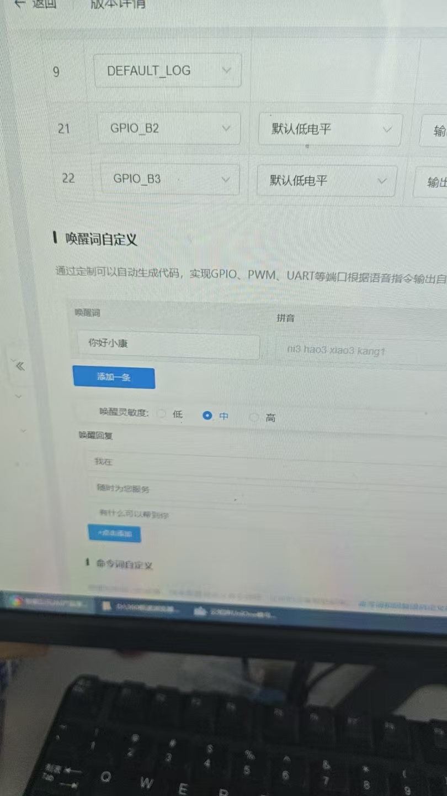

**3. 预防措施**

- **更新前备份**：记录原有配置信息
- **完全擦除**：更新固件时选择完整擦除选项
- **验证更新**：更新后立即测试所有功能
- **保留出厂固件**：始终保留一份出厂固件用于恢复

**注意事项：**

- 烧录时确保供电稳定
- 使用原装或质量可靠的USB-TTL线
- 烧录过程中不要断开连接
- 如果问题持续，可能需要多次擦除烧录

---


### 为什么现在生产的固件里没有串口烧录文件？

**问题描述：**

发现最新生产的SU-03T固件中没有update相关文件，询问如何进行串口烧录。

**解决方案：**

**1. 问题确认**

经过验证，最新SU-03T开发包中确实包含带有update的固件文件。请检查：

- **下载完整开发包**：确保从官方渠道下载完整的SU-03T开发包
- **检查文件列表**：在固件文件夹中查找包含"update"字样的文件

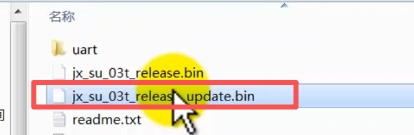

**2. 串口烧录方法**

**使用USB-TTL线烧录**：

1. **硬件连接**：

    - CH340的TXD → SU-03T的B6引脚
    - CH340的RXD → SU-03T的B7引脚
    - CH340的GND → SU-03T的GND引脚
    - CH340的5V → SU-03T的VCC引脚

2. **烧录步骤**：

    - 安装CH340驱动程序
    - 打开UniOneUpdateTool烧录软件
    - 选择正确的COM端口
    - 加载固件文件（.bin格式）
    - 点击开始烧录

3. **注意事项**：

    - 确保连接牢固
    - 供电稳定（推荐使用5V）
    - 烧录过程中不要断开连接

**3. 固件获取途径**

- **官方下载**：从机芯智能官方网站或指定渠道下载
- **开发包包含**：SU-03T完整开发包中包含所有必需的固件文件
- **技术支持**：如无法找到，请联系技术支持获取

**4. 烧录工具准备**

- **驱动程序**：CH340驱动（根据操作系统版本选择）
- **烧录软件**：UniOneUpdateTool
- **连接线材**：USB-TTL模块（如CH340）
- **杜邦线**：用于连接模块和烧录器

**常见问题排查**：

- 如果找不到固件文件，请确认下载的是SU-03T而非其他型号的开发包
- 烧录失败时检查接线是否正确
- COM端口识别问题请重新安装驱动

---

### SU-03T串口通讯偶尔失灵怎么办？

**问题描述：**

SU-03T模块在使用过程中偶尔出现串口通讯失灵的现象，语音唤醒和指令应答都正常，但串口不发送数据，需要重启电源才能恢复。

**问题分析：**

1. **偶发性故障**
    - 出现几率较低，难以重现
    - 语音功能正常，仅串口通信异常
    - 可能是模块内部串口程序异常

2. **可能原因**
    - 模块内部程序异常
    - 串口通信协议冲突
    - 电源不稳定导致模块异常

**解决方法：**

1. **数据抓取分析**
    - 在问题出现时，保持不断电
    - 拆机接收模块串口数据
    - 直接从模块引脚抓取原始数据
    - 分析数据包完整性

2. **单模块测试**
    - 使用单模块独立测试
    - 排除外部电路干扰
    - 观察是否还会出现同样问题

3. **预防措施**
    - 确保供电稳定
    - 检查串口连接可靠性
    - 考虑添加看门狗电路自动恢复

**排查步骤：**

1. 记录故障发生时的具体现象
2. 检查电源电压是否稳定
3. 验证串口接线是否牢固
4. 使用示波器检查串口信号波形
5. 必要时联系技术支持提供固件升级

---


### SU-03T程序可以读取出来吗？

**问题描述：**

需要从已烧录的SU-03T模块中读取出程序，用于分析或复制功能。

**解决方案：**

**SU-03T不支持程序读取功能**

- **芯片安全设计**：SU-03T使用的US516P6芯片具有安全保护机制，不支持读取已烧录的程序
- **知识产权保护**：这是为了保护固件的知识产权，防止程序被非法复制
- **行业惯例**：大部分语音芯片厂商都采用类似的安全保护措施

**替代方案：**

1. **保留源文件**
    - 在智能公元平台生成的固件文件需要妥善保存
    - 建议建立完善的版本管理机制
    - 保留原始配置文件和项目设置

2. **备份固件**
    - 使用烧录工具可以备份生成的固件文件（.bin格式）
    - 但备份的固件只能用于相同型号的模块
    - 新旧版本模块的固件不兼容

3. **文档记录**
    - 详细记录产品配置参数
    - 保存项目配置截图
    - 记录特殊功能的实现方法

**注意事项：**

- 无法从模块中提取源代码或配置信息
- 丢失固件文件需要重新在平台生成
- SU-03T1新版本模块需要使用新版本固件
- 建议定期检查库存模块版本并准备兼容固件

---

### SU-03T唤醒后串口持续发送数据怎么办？

**问题描述：**

SU-03T模块在语音唤醒后，串口不停发送固定数据（如 `AA 03 01 AE`），只有重新上电才能停止，一旦唤醒又开始持续发送。

**问题分析：**

1. **数据特征**
    - 持续发送固定格式的十六进制数据
    - 只有断电重启才能暂时停止
    - 唤醒后问题立即重现

2. **可能原因**
    - **配置问题**：串口输出配置错误，导致循环触发
    - **电源问题**：供电不足或不稳定导致模块工作异常
    - **固件问题**：生成的固件存在逻辑错误
    - **未识别转发**：开启了"未识别转发"功能，导致持续输出

**解决方法：**

1. **检查配置问题**
    - 登录智能公元平台检查该固件的配置
    - 查看串口输出配置是否存在循环触发
    - 检查是否有重复的串口发送动作

2. **单模块独立测试**
    - 将模块单独供电，不连接其他外部设备
    - 仅连接串口调试工具观察输出
    - 排除外部电路干扰因素

3. **电源检查**
    - 确保供电电压稳定（5V或3.3V，根据模块规格）
    - 检查电源输出电流是否足够（建议至少500mA）
    - 使用万用表测量唤醒后的电压波动

4. **固件重新生成**
    - 检查是否有未录入的命令词或特殊词
    - 删除不必要的配置项后重新生成固件
    - 尝试使用官方例程修改测试

**排查步骤：**

1. 导出当前固件配置，检查串口相关设置
2. 使用官方例程烧录测试，确认是否为配置问题
3. 单独供电测试，排除电源问题
4. 检查是否开启了"未识别转发"功能
5. 必要时联系技术支持分析配置文件

---
