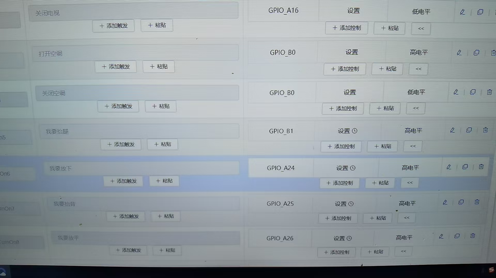

# SU-13T 烧录与调试 FAQ

本页用于整理 SU-13T 相关的烧录与调试问题。

### SU-13T烧录失败怎么办？

**问题描述：**

使用SU-13T芯片时，无法通过烧录软件进行程序烧录，设备无法联机。

**解决方案：**

**问题排查步骤：**

1. **检查烧录软件**

    - SU-13T与SU-03T使用相同的烧录软件
    - 确保使用最新版本的PACK_UPDATE_TOOLS
    - 下载地址：智能公元平台或官方提供链接

2. **检查硬件连接**

    - 确认烧录器与模块的连接正确
    - TXD与RXD交叉连接（烧录器TX→模块RX，烧录器RX→模块TX）
    - 检查供电是否稳定在5V

3. **检查复位电路**

    - 确保模块有正常的复位电路
    - 可尝试断电后重新上电
    - 部分情况下需要手动复位触发烧录

4. **更换烧录器**

    - 尝试更换USB烧录器
    - 不同品牌的USB转串口芯片兼容性不同
    - 推荐使用FTDI或CP2102芯片方案的烧录器

**常见问题解决：**

- **无法联机**：检查串口号选择、驱动安装、硬件连接
- **烧录中断**：确保供电稳定、使用短线连接、避免干扰
- **驱动问题**：安装正确的USB转串口驱动，可在设备管理器中查看

**注意事项：**

- SU-13T的烧录接口与SU-03T兼容
- 烧录前建议关闭其他可能占用串口的程序
- 如多次尝试仍失败，可尝试更换电脑或操作系统

---

### SU-13T的B0/B1引脚用作其他功能后如何烧录？

**问题描述：**

使用SU-13T模组时，如果已将B0和B1引脚配置为其他功能（如输出端），则无法使用调试器进行烧录。

**解决方案：**

**1. 问题原因**

- B0/B1是SU-13T的专用烧录引脚
- 配置为其他功能后无法进入烧录模式
- 这是芯片的设计限制

**2. 解决方案**

- **增加转换开关**：

    - 在B0/B1与外接电路之间增加开关
    - 烧录时断开外部连接
    - 烧录完成后再重新连接

- **临时断开法**：

    - 烧录前物理断开B0/B1的外部连接
    - 完成烧录后再焊接回去
    - 适合开发调试阶段

**3. 操作步骤**

```
烧录流程：

1. 断开B0/B1与外部电路的连接
2. 连接烧录器到B0/B1
3. 进行正常烧录操作
4. 烧录完成后恢复外部连接
```



*B0/B1引脚被配置为其他功能*

**4. 注意事项**

- B0/B1必须保留用于烧录功能
- 建议使用跳线或开关方便切换
- 避免直接连接大功率负载
- 长期使用建议设计专用的烧录接口

---

### SU-13T串口难以进入下载模式是什么原因？

**问题描述：**

在使用SU-13T进行串口烧录时，发现很难进入下载模式，需要多次尝试或无法正常进入。

**解决方案：**

**1. SU-13T下载模式触发条件**

**正确触发方式**：

- **B0引脚**：需要保持低电平（接地）
- **B1引脚**：需要保持高电平（接VCC）
- **上电时机**：在B0/B1保持上述状态时给模块上电
- **保持时间**：上电后保持B0/B1状态500ms以上

**常见错误**：

- B0/B1电平状态错误
- 上电后才设置B0/B1状态
- B0/B1存在外部电路干扰
- 串口线缆过长导致信号衰减

**2. 硬件检查步骤**

**步骤一：检查B0/B1连接**
```
万用表检测：
├── 模块断电状态下
├── B0引脚对地电阻应为∞
├── B1引脚对地电阻应为∞
└── 确认无外部拉高/拉低电路
```

**步骤二：验证触发电路**
```
正确连接：
B0 → GND（通过开关或跳线）
B1 → VCC（通过开关或跳线）
模块电源 → 暂时断开
```

**步骤三：测试进入下载模式**

1. 设置B0=GND，B1=VCC
2. 给模块上电
3. 打开烧录软件检测串口
4. 应能识别到下载模式设备

**3. 常见问题及解决方法**

**问题一：外部电路干扰**

- 现象：B0/B1被外部电路拉到特定电平
- 解决：烧录时断开B0/B1与外部电路的连接
- 建议：使用跳线帽或DIP开关控制

**问题二：供电不稳定**

- 现象：上电瞬间电压跌落
- 解决：使用带负载能力的电源，在电源端并联电容
- 建议：10μF+0.1μF电容组合滤波

**问题三：串口兼容性**

- 现象：使用某些USB转串口模块无法识别
- 解决：更换为FTDI或CP2102方案的转换器
- 注意：避免使用CH340方案

**问题四：时序问题**

- 现象：严格按照步骤操作仍无法进入
- 解决：延长B0/B1的保持时间到1秒以上
- 技巧：先设置好B0/B1再插USB

**4. 操作技巧**

**技巧一：使用下载开关**
```
设计下载电路：
┌─────────┐
│   VCC   ├───┬── B1
└─────────┘   │
                开关
┌─────────┐   │
│   GND   ├───┼── B0
└─────────┘   │
                开关
```

**技巧二：快速操作流程**

1. 断开模块电源
2. 连接好串口线
3. 设置B0=GND（接地）
4. 设置B1=VCC（接3.3V）
5. 给模块上电
6. 500ms后释放B0/B1
7. 立即打开烧录软件

**技巧三：使用专用烧录座**

- 制作带下载控制功能的烧录座
- 集成自动时序控制
- 适合批量生产使用

**5. 软件设置建议**

**串口参数**：

- 波特率：115200（烧录软件自动设置）
- 数据位：8
- 停止位：1
- 校验位：None

**烧录软件配置**：

- 选择正确的芯片型号（SU-13T）
- 使用最新版本烧录工具
- 关闭防火墙和杀毒软件

**注意事项：**

- SU-13T的下载模式触发比SU-03T更严格
- B0/B1引脚必须有明确的高低电平，不能悬空
- 批量烧录时建议制作专用夹具
- 如仍无法解决，联系技术支持获取帮助

---

### SU-13T控制继电器不动作怎么办？

**问题描述：**

SU-13T烧录成功后，连接16路继电器开关板，所有继电器均不动作，尽管电源指示灯正常亮起。

**解决方案：**

- **硬件检查**：

    - 量芯片输出引脚电压
    - 量继电器线圈电压
    - 量三极管驱动电压

- **软件验证**：

    - 烧录示例程序测试
    - 检查GPIO配置是否正确
    - 验证输出逻辑设置

- **可能原因**：

    - 继电器驱动电路设计问题
    - 供电电流不足
    - GPIO输出电流不够驱动继电器

**注意事项：**

- 使用万用表逐步测量电压
- 确认继电器驱动电路参数匹配
- 可先测试单个继电器是否工作

---

### SU-13T串口难以进入下载模式是什么原因？

**问题描述：**

SU-13T模块通过串口烧录时，很难进入下载模式。

**解决方案：**

**1. 检查硬件连接**

    - 确认串口线连接正确（TX-RX交叉）
    - 检查电源供电是否稳定
    - 验证波特率设置是否匹配

**2. 进入下载模式的方法**

    - 上电前按住复位键
    - 上电后松开复位键
    - 或在特定时机发送下载指令

**3. 常见解决方法**

    - 尝试不同的进入时机
    - 使用专用烧录工具
    - 检查驱动程序是否正确安装

**注意事项：**

- 不同批次模块的进入方式可能有差异
- 建议联系技术支持获取详细操作指导
- 保留完整错误信息便于问题排查

---

