# SU-21T 烧录与调试 FAQ

本页用于整理 SU-21T 相关的烧录与调试问题。

### SU-21T需要烧录固件吗？

**问题描述：**

采购SU-21T语音模组时，需要确认是否需要进行固件烧录，以及机芯型号对应的固件版本。

**解决方案：**

SU-21T语音模组根据不同的应用需求，分为以下两种情况：

- **标准固件版本**：如S89固件版本V1.0，这是标准配置，通常可以直接使用
- **定制固件版本**：根据具体项目需求定制的固件版本

**注意事项：**

- 如果是标准应用场景，模组出厂时可能已预烧录标准固件，无需额外烧录
- 如果项目有特殊功能需求（如特定唤醒词、命令词等），则需要重新烧录定制固件
- 烧录固件需要使用专用的烧录工具和USB转串口设备

---

## 固件烧录与升级指南

1. 安装 CH340 驱动。
2. 通过 USB/UART 将固件写入 Flash。
3. 使用配置工具导入词表、编译后烧录。
4. 复位设备并播放测试词表确认成功。

> 教程参考：
> - [SU-21T转接板烧录](https://help.aimachip.com/docs/offline_su21t/offline_su21t-1eri6t7rma7lv)
> - [转接板固件烧录资料](https://help.aimachip.com/attach_files/offline_su21t/572)

## 指令集 / 词表配置

- 支持多场景词表，结构为"唤醒词 → 命令组 → 动作"。
- 串口协议：0xAA 0x55 CMD LEN DATA CS（详见旧文档）。

> 教程参考：
> - [SU-21T输入输出教学](https://help.aimachip.com/docs/offline_su21t/offline_su21t-1eri8ibv89ls3) - [资料下载](https://help.aimachip.com/attach_files/offline_su21t/576)
> - [SU-21T串口输入输出教程](https://help.aimachip.com/docs/offline_su21t/offline_su21t-1ermqgsh80p58) - [资料下载](https://help.aimachip.com/attach_files/offline_su21t/577)
>
> **教程功能说明**：
> - IO输入输出：语音控制灯光亮灭、调暗调亮、呼吸灯制作、按键控制
> - 串口教程：语音控制串口发送16进制数，串口输入触发语音模块输出

### SU-21T烧录时显示"等待设备上电"怎么办？

**问题描述：**

SU-21T模块在烧录时一直显示"等待设备上电"，即使单独飞线烧录也无法成功，且端口频繁变化。

**解决方案：**

**问题分析：**

1. **端口频繁变化原因**：

    - USB转串口设备重新插拔后端口号可能改变
    - 使用不同USB接口或扩展坞会导致端口变化
    - 系统动态分配COM端口号

2. **烧录模式确认**：

    - 需要确认烧录工具选择了正确的烧录模式
    - 确保选择了"烧录"模式而非其他模式

**解决步骤：**

1. **检查烧录模式选择**：

    - 确认烧录软件中勾选的是"烧录"选项
    - 不要误选为"调试"或"其他"模式

2. **稳定端口连接**：

    - 避免使用扩展坞，直接连接到电脑USB口
    - 固定使用同一个USB端口
    - 每次连接后确认端口号

3. **硬件连接检查**：

    - 确保飞线连接牢固
    - 检查TX/RX交叉连接是否正确
    - 验证GND连接良好

**注意事项：**

- 端口号变化是正常现象，以实际显示的COM口为准
- 单独飞线烧录时注意线序不要接反
- 如仍无法识别，尝试更换USB转串口模块
- 确保模块供电正常（SU-21T需要3.3V供电）

---

### SU-21T烧录失败后如何解决？

**问题描述：**

SU-21T模块烧录时失败，提示正在擦除后界面变红，多次尝试仍然无法成功烧录固件。

**解决方案：**

**问题定位：**

烧录失败后界面变红，表示固件文件路径或访问权限存在问题。

**解决方法：**

1. **将固件文件移至桌面**：

    - 复制固件.bin文件到桌面
    - 使用桌面位置的文件进行烧录
    - 避免从复杂路径访问文件

**操作步骤：**

1. 找到需要烧录的.bin文件
2. 右键复制文件
3. 粘贴到桌面
4. 打开烧录软件，选择桌面上的文件
5. 重新开始烧录操作

**成功案例：**

按照此方法操作后，烧录成功完成。

**技术原因：**

- 桌面路径简短，无特殊字符
- 系统对桌面文件访问权限最高
- 避免了路径过深导致的访问问题

**注意事项：**

- 烧录前关闭其他可能占用文件的程序
- 确保固件文件完整且未损坏
- 如问题持续，尝试更换USB端口或重新安装驱动

---

### SU-21T的串口0是否可用？串口1配置为数据输出会影响烧录吗？

**问题描述：**

在使用SU-21T芯片时，发现串口0（UART0）无法使用，且代码平台和教程中配置的串口输出均为串口1，担心串口1配置为数据输出后会与固件烧录冲突。

**解决方案：**

**串口功能说明：**

1. **串口0限制**：

    - 串口0在平台上无法配置使用
    - 仅用于芯片调试和日志输出
    - 不支持数据通信功能

2. **串口1可用**：

    - 串口1是可配置的数据通信接口
    - 支持串口输入和输出功能
    - 平台能配就能用，不支持的需要二次开发

**烧录兼容性：**

1. **不会冲突**：

    - 串口1配置为数据输出不会与固件烧录冲突
    - 烧录使用专用的调试接口
    - 两个功能独立工作，互不影响

2. **烧录方式**：

    - SU-21T支持串口烧录功能
    - 烧录和通信可以同时进行
    - 不影响正常的数据收发

**配置建议：**

1. **串口1配置**：

    - 在平台中正常配置串口1参数
    - 设置波特率、数据位等通信参数
    - 配置触发条件和响应动作

2. **调试使用**：

    - 开发阶段可使用串口0查看日志
    - 生产阶段可关闭调试输出节省资源

**注意事项：**

- 串口0仅用于调试，不建议在产品中使用
- 串口1是标准的数据通信接口，可放心使用
- 烧录功能通过专用协议，不会干扰数据通信

---

### SU-21T串口输入输出教程PPT内容为空怎么办？

**问题描述：**

下载的SU-21T串口输入输出教程PPT文件内容为空，无法获取有效的教程信息。

**解决方案：**

**教程形式说明：**

SU-21T串口输入输出教程以视频形式提供，而非PPT文档：

**获取方式：**

1. **B站视频教程**：

    - 在B站（bilibili）搜索"机芯智能"
    - 查找SU-21T串口输入输出教程视频
    - 视频包含完整的操作演示和讲解

2. **视频链接**：

    - 直接访问：https://www.bilibili.com/video/BV1rs4y167BX/
    - 视频时长约15分钟，详细演示串口配置和操作

**教程内容：**

- 语音控制串口发送16进制数据
- 串口输入触发语音模块播报
- 参数配置和调试方法
- 实际应用案例演示

**配套资料：**

- 串口调试工具：XCOM V2.6.exe
- 可在官方文档页面下载
- 配合视频教程进行实践操作

**注意事项：**

- PPT文件仅为视频封面，实际教程内容在视频中
- 建议边看视频边实践操作
- 遇到问题可暂停视频仔细观察操作步骤

---

### SU-21T上电时固件丢失导致无法唤醒怎么办？

**问题描述：**

SU-21T模组在上电时若环境嘈杂或RX1引脚悬空，会导致固件丢失，无法正常唤醒和运行，需重新烧录固件才能恢复。

**解决方案：**

**问题原因：**

1. **引脚配置问题**：

    - SU-21T模组的RX1引脚被平台默认配置为开漏输出
    - 上电时若RX1引脚悬空或无高电平，会导致模组运行异常
    - 环境嘈杂时会干扰模块的正常初始化

2. **硬件条件影响**：

    - 上电时环境嘈杂无法正常运行
    - RX1引脚悬空无法正常运行
    - 两个条件存在一个都无法正常唤醒

**解决方法：**

1. **添加上拉电阻**：

    - 在RX1引脚上增加上拉电阻（建议10kΩ）
    - 确保RX1在上电时有稳定的高电平
    - 避免引脚悬空导致的异常

2. **控制上电环境**：

    - 上电时保持相对安静的环境
    - 避免强噪声干扰模块初始化
    - 确保模块能够正常进入工作状态

3. **电路设计优化**：

    - 在原理图设计时考虑RX1的上拉
    - 或通过外部电路在上电时提供高电平
    - 上电完成后可恢复正常配置

**验证方法：**

- 使用风扇对着麦克风方向吹（模拟嘈杂环境），验证是否能正常唤醒
- 测试RX1引脚在不同电平下的工作状态
- 确认添加上拉电阻后的稳定性

**注意事项：**

- 这是平台默认配置导致的问题，需要硬件配合解决
- 重新烧录固件可以临时恢复，但不能根治
- 建议在硬件设计中预留上拉电阻位置

---

### SU-21T是否支持串口0烧录固件？

**问题描述：**

需要确认SU-21T设备是否可以通过串口0进行固件烧录，以便在生产中使用串口烧录方式。

**解决方案：**

**不支持串口0烧录：**

SU-21T模块不支持通过串口0进行固件烧录：

1. **专用烧录接口**：

    - SU-21T仅支持通过专用调试接口烧录
    - 不支持UART0串口烧录功能
    - 必须使用专用烧录工具

2. **烧录方式**：

    - 使用专用烧录器或调试器
    - 通过JTAG/SWD等调试接口
    - 不可使用串口烧录方式

**正确烧录方法：**

1. **专用烧录器**：

    - 购买官方专用烧录器
    - 连接模块的调试接口
    - 使用配套烧录软件

2. **调试器烧录**：

    - 使用J-Link等调试器
    - 连接SWD调试接口
    - 在开发环境烧录

**技术原因：**

- **芯片架构限制**：SU-21T芯片设计不支持串口烧录
- **安全考虑**：专用接口确保烧录过程安全可靠
- **生产需求**：批量生产需要专用烧录设备

**注意事项：**

- SU-21T严禁使用串口0尝试烧录
- 串口0仅用于通信功能，不支持烧录
- 生产时必须使用专用烧录设备
- 如需烧录，请使用官方推荐工具

---

### SU-21T模块是否必须使用风枪焊接？

**问题描述：**

询问SU-21T模块的焊接方式，是否必须使用风枪进行焊接。

**解决方案：**

**模块特性说明：**

- SU-21T没有功放电路，不能直接连接喇叭进行播报
- 可以进行语音识别和串口通信
- SU-23T和SU-21T所用的芯片一样

**焊接建议：**

1. **焊接方式选择**
    - 不强制要求使用风枪焊接
    - 可根据焊接设备和经验选择合适方式
    - 手工焊接时注意控制温度和时间

2. **注意事项**
    - 模块较小，焊接时避免过热
    - 使用电烙铁时建议温度控制在300-350°C
    - 焊接时间不宜过长，避免损坏元器件

3. **焊接设备建议**
    - 有风枪焊接经验者优先使用风枪
    - 无风枪设备可使用恒温电烙铁
    - 确保焊接环境良好通风

---

### SU-21T模块串口通信失败怎么办？

**问题描述：**

SU-21T模块串口通信失败，无法正常接收和发送数据，且在使用CH340串口工具时出现打开串口失败的问题。

**解决方案：**

**1. 检查硬件连接**

- 确认串口线连接到正确引脚，不要接到日志口
- 使用飞线连接时确保接触良好
- 将模块拆下，单独通过CH340测试

**2. 验证串口参数配置**

- 波特率设置为9600
- 数据位：8位
- 停止位：1位
- 校验位：无

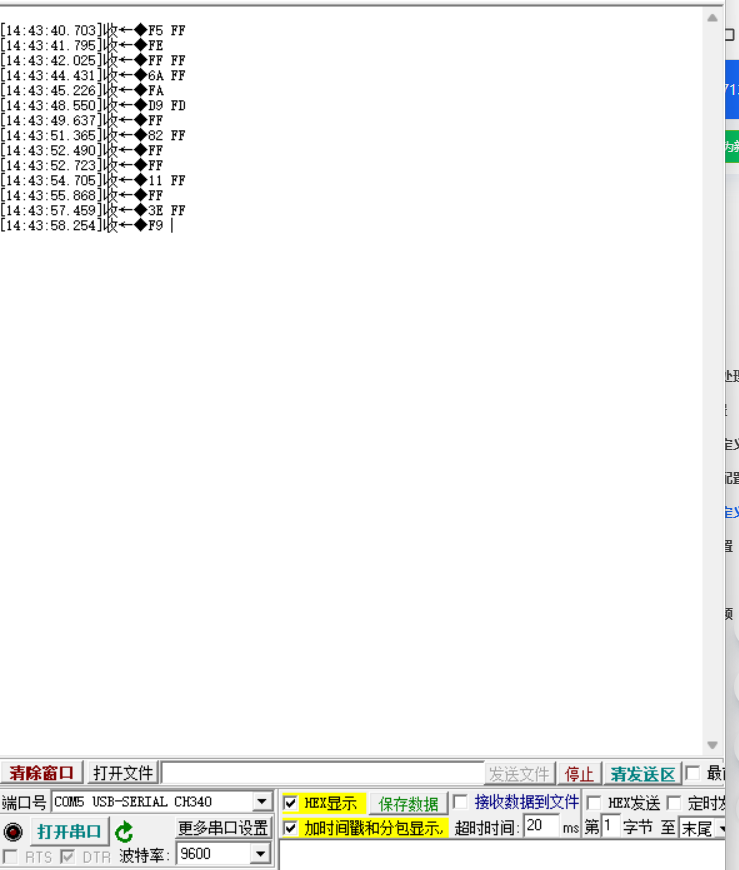

**3. 排查串口打开失败问题**

- 检查COM端口是否被其他程序占用
- 确认CH340驱动正确安装
- 尝试更换USB端口
- 使用管理员权限运行串口工具

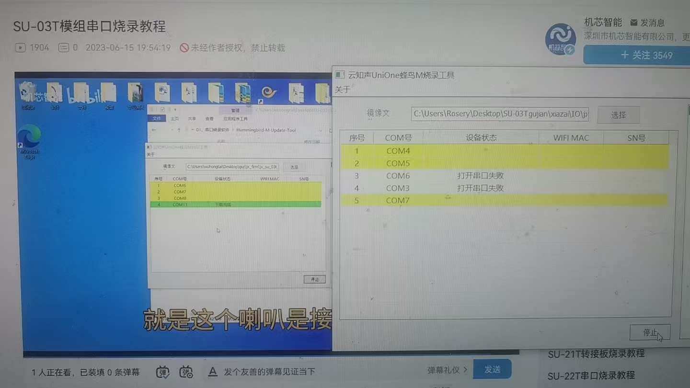

**4. 数据接收异常处理**

如果接收数据显示为乱码（FF、F5、FA等十六进制数据）：

- 检查波特率是否匹配
- 确认TX/RX线是否交叉连接
- 验证GND共地连接
- 检查模块供电是否稳定

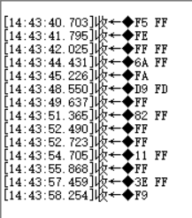

**注意事项：**

- SU-21T使用时需要正确连接通信引脚
- 串口工具显示的乱码表明通信参数或连接有问题
- 按照教程逐步操作仍遇到问题，需要仔细检查每个步骤
- 可以尝试重启电脑或更换USB转串口模块

---

### SU-21T串口指令有时无法被模块正确接收怎么办？

**问题描述：**

MCU发送的串口指令有时无法被SU-21T模块正确接收，导致语音播报不响应，需要排查串口通信不稳定的原因。

**解决方案：**

**1. 通信不稳定排查**

**硬件连接检查**：

- 确认MCU与模块的串口连接正确
- 验证GND共地连接
- 检查电源供电是否稳定
- 测量信号线上的电压电平

**数据格式验证**：

- 确认发送的数据格式正确（F4 F5 1F FB）
- 验证帧头帧尾设置无误
- 检查消息号是否在有效范围内

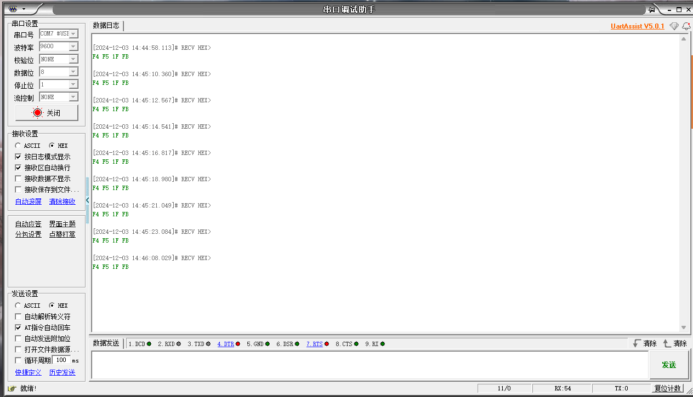

*串口调试助手接收到的正确数据格式*

**2. 模块配置检查**

**平台配置确认**：

- 串口格式：帧头F4 F5，帧尾FB
- 消息号：31（十进制）
- 触发方式：串口输入（UART1_RX）

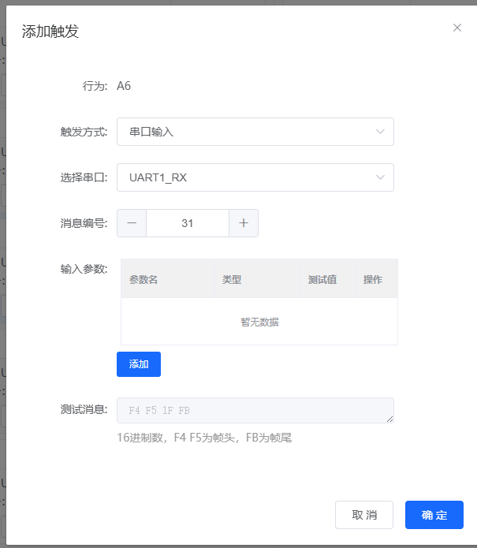

*添加串口输入触发配置*

**3. 接收失败原因分析**

**模块进入深度休眠**：

- SU-21T是低功耗模块，长时间无唤醒会进入深度休眠
- 深度休眠时可能无法接收串口数据
- 需要先喊唤醒词退出休眠模式

**通信参数不匹配**：

- 波特率设置是否正确
- 数据位、停止位、校验位配置
- 时序问题导致的数据丢失

*已配置的串口输入触发列表*

**4. 解决方案**

**预防深度休眠**：

- 在平台设置中禁用深度休眠功能
- 或者定期发送唤醒词保持模块活跃
- 设置合适的超时退出时间

*UART1串口配置参数*

**优化通信可靠性**：

- 在每帧数据后添加适当延时
- 使用硬件流控（如果支持）
- 增加重发机制确保数据到达

**5. 测试建议**

**逐步测试**：

1. 使用串口助手模拟发送数据
2. 观察模块是否稳定接收
3. 确认触发后的语音播报
4. 逐步接入MCU进行联调

**信号质量检查**：

- 使用示波器观察串口信号波形
- 确认上升沿和下降沿质量
- 检查是否存在反射或干扰

**注意事项：**

- SU-21T的低功耗特性可能导致休眠问题
- 建议在项目设计时考虑通信稳定性
- 保留足够的通信余量和错误处理机制
- 批量生产前充分测试各种工作场景

---

### SU-21T在什么条件下会进入休眠状态？

**问题描述：**

需要了解SU-21T低功耗模块进入休眠状态的条件，以及唤醒退出休眠的条件。

**解决方案：**

**1. 进入深度休眠的条件**

- **触发条件**：长时间没有收到唤醒词
- **时间设定**：根据平台配置的超时时间决定
- **功耗特性**：低功耗模块的节能设计

**2. 退出深度休眠的方法**

- **唤醒词**：喊出预设的唤醒词即可退出
- **立即生效**：唤醒后模块恢复正常工作状态
- **无需复位**：不需要重新上电或复位

**3. 深度休眠的影响**

**功能影响**：

- 串口通信可能无响应
- GPIO输出状态保持
- 语音识别功能暂停

**电流变化**：

- 正常工作：约32.7mA
- 深度休眠：约24mA
- 可通过电流判断模块状态

*平台中显示深度休眠为"不支持"状态*

**4. 配置选项**

**禁用深度休眠**：

- 在平台中关闭深度休眠功能
- 适合需要持续响应的应用
- 会增加整体功耗

**保留深度休眠**：

- 适合电池供电场景
- 可以显著延长使用时间
- 需要考虑通信延迟

**5. 应用建议**

**选择建议**：

- 电池供电设备：保留深度休眠功能
- 持续通信场景：禁用深度休眠
- 根据实际需求权衡功耗和响应性

**设计考虑**：

- 如需实时通信，禁用深度休眠
- 使用外部中断唤醒（如果支持）
- 设计通信超时和重试机制

**注意事项：**

- 深度休眠是SU-21T的正常功能
- 唤醒词是退出休眠的唯一方法
- 设计时应考虑休眠对功能的影响
- 批量使用时测试休眠唤醒的可靠性

---

### SU-21T上电后无法唤醒和播报，且间歇性失效怎么办？

**问题描述：**

SU-21T模块上电后无法唤醒和播报，且在掉电后恢复时会间歇性失效，但重新上电后又恢复正常。已确认供电正常且固件烧录无误。

**解决方案：**

**1. 现象分析**

**电流差异判断**：

- 正常上电功耗：32.7mA左右
- 异常上电功耗：24mA左右
- 功耗降低表明模块未正常启动

**间歇性失效特点**：

- 掉电后再次上电可能出现
- 不是持续性的硬件故障
- 重新上电可恢复正常

**2. 可能原因**

**电源问题**：

- 上电时序不当
- 电源纹波过大
- 启动电流不足

**模块特性**：

- SU-21T是低功耗模块
- 对上电时序较敏感
- 重复上电断电可能影响内部状态

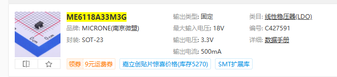

*使用的ME6118A33M3G线性稳压器规格*

**3. 解决方案**

**电源优化**：

- 确保启动电流足够（>100mA）
- 检查电源纹波和噪声
- 避免使用电池直接测试
- 增加适当的滤波电容

**上电时序控制**：

- 避免快速通断电测试
- 上电后等待稳定时间
- 设计合适的上电复位电路

**4. 测试验证**

**正常状态验证**：

- 串口应周期性发送数据（F4 06 00 FB）
- 模块应有正常的语音响应
- 工作电流应在正常范围

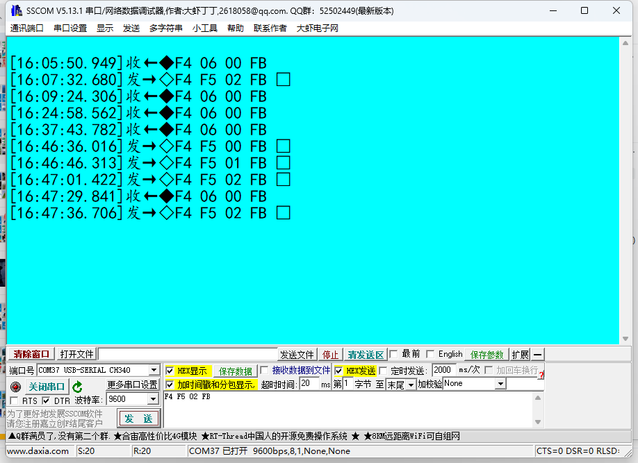

*正常工作时的串口输出示例*

**故障排查步骤**：

1. 测量上电瞬间的电流波形
2. 检查3.3V电源的稳定性
3. 验证所有连接线的接触
4. 更换另一个模块对比测试
5. 寄送样品给厂商分析

**5. 生产建议**

- 设计完善的电源电路
- 预留足够的启动电流余量
- 避免使用中的频繁开关机
- 建立严格的老化测试流程

**注意事项：**

- 间歇性问题最难排查，需要耐心测试
- 保留详细的故障记录
- 大批量生产前充分验证
- 疑似硬件问题及时联系技术支持

---

### SU-21T上电后无法唤醒且间歇性失效？

**问题描述：**

SU-21T模块上电后无法唤醒和播报，在特定情况下（如掉电后恢复）会间歇性失效，但重新上电后又恢复正常，已确认供电正常且固件烧录无误。

**解决方案：**

**1. 电源电路检查**

- 确认使用ME6118A33M3G线性稳压器（3.3V/500mA）
- 测量实际输出电压是否稳定
- 检查电流消耗：正常32.7mA，异常24mA

**2. 工作状态判断**

- 正常工作时应周期性发送F4 06 00 FB数据包
- 使用串口助手监测模块输出
- 无数据输出说明模块未正常启动

**3. 可能原因分析**

- 模块重复上电断电可能造成影响
- 电源上升沿不够陡峭导致启动异常
- 电路设计存在兼容性问题

**4. 解决建议**

- 找硬件配合检查电路设计
- 寄送样品给厂商进行详细分析
- 两块板子都有同样问题说明设计缺陷

**注意事项：**

- 间歇性问题最难排查，需要多次测试
- 建议记录故障发生时的具体条件
- 批量产品如有此问题需要立即解决
- 可考虑增加硬件复位电路

### SU-21T命令词无响应怎么办？

**问题描述：**

SU-21T上电后对命令词没有回复，也无任何控制响应，但使用的是配套的麦克风和喇叭。

**解决方案：**

**排查步骤：**

1. **确认工作环境**
    - 在板子上测试还是单独模块测试
    - 检查是否有开机播报
    - 确认喇叭工作正常

2. **麦克风电路检查**
    - 将模块拆下单独在测试板上验证
    - 排除外围电路对麦克风的影响
    - 检查麦克风偏置电压

3. **硬件连接验证**
    - 确认麦克风连接正确
    - 检查音频输入线路
    - 验证喇叭输出线路

**可能原因：**

- 麦克风外围电路设计问题
- 麦克风本身故障或损坏
- 音频输入受到干扰
- 固件配置问题（未正确设置回复词）

**建议操作：**

- 优先使用单独模块测试确认基本功能
- 检查是否设置了回复词
- 录制测试视频供技术支持分析
- 确认测试环境安静无干扰

**注意事项：**

- 单模块测试正常说明是外围电路问题
- 配套硬件也可能故障，需交叉验证
- 语音识别需要合适的工作距离

---

### SU-21T串口指令有时无法被模块正确接收怎么办？

**问题描述：**

SU-21T模块在使用过程中，MCU发送的串口指令有时无法被模块正确接收，导致语音播报不响应，表现为间歇性失效。

**解决方案：**

**排查步骤：**

1. **使用电脑模拟测试**
    - 使用串口调试助手代替MCU发送数据
    - 确认模块本身功能是否正常
    - 排除MCU端的问题

2. **检查串口配置**
    - 确认波特率设置是否一致
    - 验证数据格式配置正确
    - 检查帧头帧尾设置

*添加串口输入触发配置*

*已配置的串口触发列表*

3. **验证硬件连接**
    - 检查串口线连接是否牢固
    - 测量信号电平是否正常
    - 确认共地连接

**常见问题分析：**

1. **波特率不匹配**
    - 模块默认9600bps
    - MCU端需设置为相同波特率
    - 数据位8、停止位1、无校验

2. **数据格式错误**
    - 帧头应为F4 F5
    - 帧尾应为FB
    - 消息号（如31）需正确设置

*UART1配置格式设置*

3. **低功耗模式影响**
    - SU-21T是低功耗模块
    - 长时间无唤醒会进入深度休眠
    - 休眠时可能不响应串口指令

**解决方法：**

1. **优化通信协议**
    - 在数据发送前添加唤醒操作
    - 设置合理的重发机制
    - 确认数据发送时机

2. **调整工作模式**
    - 考虑禁用深度休眠功能
    - 或在发送指令前先唤醒模块
    - 确保模块处于可接收状态

*使用串口助手发送F4 F5 1F FB测试数据*

**注意事项：**

- 串口通信不稳定时优先使用电脑测试
- 低功耗模块需特别注意休眠状态管理
- 建议在数据发送前先确认模块状态
- 保留足够的通信间隔，避免数据丢失

---

### SU-21T低功耗模块的休眠条件是什么？

**问题描述：**

需要了解SU-21T作为低功耗模块，在什么条件下会进入休眠状态，以及在什么条件下会唤醒退出休眠。

**解决方案：**

**休眠条件：**

1. **深度休眠触发**
    - 长时间没有唤醒词输入
    - 通常需要几分钟无操作
    - 是为了降低功耗的自动保护机制

2. **低功耗特性**
    - SU-21T专为低功耗应用设计
    - 在待机时自动进入节能模式
    - 减少电量消耗，延长电池寿命

**唤醒条件：**

1. **语音唤醒**
    - 说出预设的唤醒词
    - 模块检测到唤醒词后退出休眠
    - 进入正常工作状态

2. **自动唤醒机制**
    - 唤醒后模块会发送心跳包（如F4 06 00 FB）
    - 表示已退出休眠，可接收指令
    - 可通过串口监听确认状态

**应用建议：**

1. **电池供电设备**
    - 适合使用SU-21T低功耗特性
    - 可显著延长待机时间
    - 适合便携式应用

2. **即时响应需求**
    - 如需随时响应指令，考虑禁用深度休眠
    - 在平台中设置"不支持深度休眠"
    - 会增加功耗但保证响应速度

**注意事项：**

- 深度休眠期间可能不响应串口指令
- 唤醒需要一点时间，属于正常现象
- 可根据应用需求选择是否启用深度休眠
- 休眠状态功耗显著低于工作状态

---

### SU-21T间歇性无法唤醒和播报怎么办？

**问题描述：**

SU-21T模块上电后无法唤醒和播报，在特定情况下（如掉电后恢复）会间歇性失效，但重新上电后又恢复正常，已确认供电正常且固件烧录无误。

**解决方案：**

**问题分析：**

1. **功耗异常判断**
    - 正常上电功耗：约32.7mA
    - 异常状态功耗：约24mA
    - 功耗差异说明模块未正常启动

2. **可能原因**
    - 上电时序问题
    - 供电稳定性不足
    - 模块进入异常状态

**排查步骤：**

1. **检查供电电路**
    - 确认LDO输出电压稳定在3.3V
    - 验证供电电流不低于500mA
    - 检查上电瞬间的电压跌落

*使用的3.3V/500mA线性稳压器规格*

2. **监控串口输出**
    - 正常工作时会周期性发送F4 06 00 FB
    - 无此输出说明模块未正常启动
    - 使用串口助手实时监控

3. **测试方法优化**
    - 进行多次上电下电测试
    - 记录异常发生频率
    - 对比不同模块的表现

*正常工作时模块周期性发送的心跳包*

**解决建议：**

1. **硬件检查**
    - 寄送样品给厂家分析
    - 检查PCB设计是否合理
    - 验证外围电路匹配性

2. **临时措施**
    - 异常时尝试重新上电
    - 设计检测机制自动恢复
    - 考虑加入硬件看门狗

**注意事项：**

- 多个板子出现相同问题可能是设计缺陷
- 供电稳定性是模块正常工作的关键
- 建议保存详细的测试记录供分析
- 批量生产前充分验证可靠性

---

### SU-21T烧录时卡在"等待设备上电"和"正在下载引导程序"怎么办？

**问题描述：**

使用US513U61生产工具烧录SU21T时，连接好RX、TX、GND和VCC后，设备无法完成烧录，界面反复显示"等待设备上电"和"正在下载引导程序"，导致烧录失败。

**解决方案：**

**问题分析：**

- 烧录工具无法与模块建立稳定通信
- 可能是供电时序或连接问题
- 引导程序下载阶段卡住说明通信异常

**排查步骤：**

1. **检查连接顺序**：

    - 正确的连接顺序：先接GND、RX、TX，最后接VCC
    - 确保所有连接牢固无松动
    - 避免热插拔操作

2. **供电检查**：

    - 确认供电电压为3.3V（非5V）
    - 检查供电电流是否足够（>100mA）
    - 使用稳定电源，避免USB供电不稳

3. **端口和驱动**：

    - 尝试不同的USB端口
    - 重新安装CH340驱动程序
    - 检查设备管理器中端口识别

**解决方法：**

- 完全断开所有连接，重新按序连接
- 更换质量更好的USB转串口模块
- 使用专用烧录器而非通用工具
- 尝试在不同电脑上烧录

**注意事项：**

- SU-21T对供电稳定性要求较高
- 烧录时避免其他设备占用USB资源
- 如反复失败，可能需要检查模块是否损坏

---

### SU-21T烧录时一直显示"正在下载引导程序"并超时怎么办？

**问题描述：**

SU-21T芯片在烧录过程中，当连接VCC电源后，烧录工具一直显示"正在下载引导程序"并最终超时，无法完成烧录。

**解决方案：**

**问题分析：**

- 烧录卡在引导程序下载阶段，说明通信建立失败
- 可能是硬件连接或供电问题
- 需要检查焊接质量和接口连接

**排查步骤：**

1. **检查硬件连接**
    - 确认TX、RX没有短接
    - 确认VCC、GND没有短接
    - 检查杜邦线接触是否良好

2. **尝试不同的连接方式**
    - 更换多个TTL转USB工具测试
    - 使用5V供电进行烧录测试
    - 确保只连接一个必要的串口

3. **检查模块状态**
    - 不连接VCC时，模块VCC引脚不应有1.8V输出
    - 连接VCC后，模块应有正常供电
    - 测试模块是否能正常唤醒

**解决方法：**

- 重新焊接RX和TX连接线（解决虚焊问题）
- 使用质量更好的杜邦线或飞线连接
- 尝试直接跳线连接到模块焊盘
- 使用专用的烧录器替代通用工具

**注意事项：**

- SU-21T对焊接质量要求较高，虚焊会导致烧录不稳定
- 建议使用短而粗的连接线减少信号衰减
- 烧录时确保供电稳定，避免电压波动

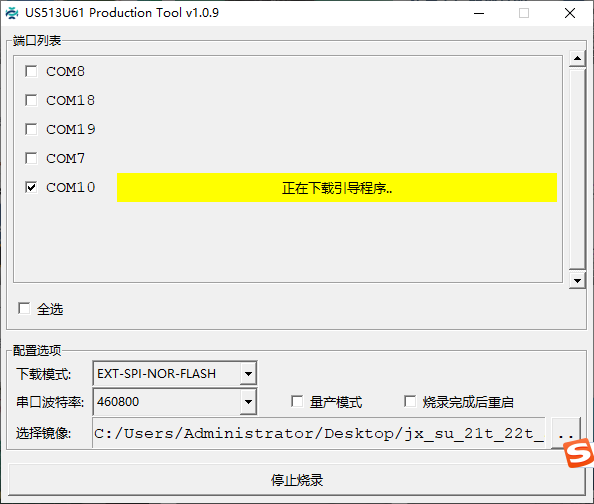

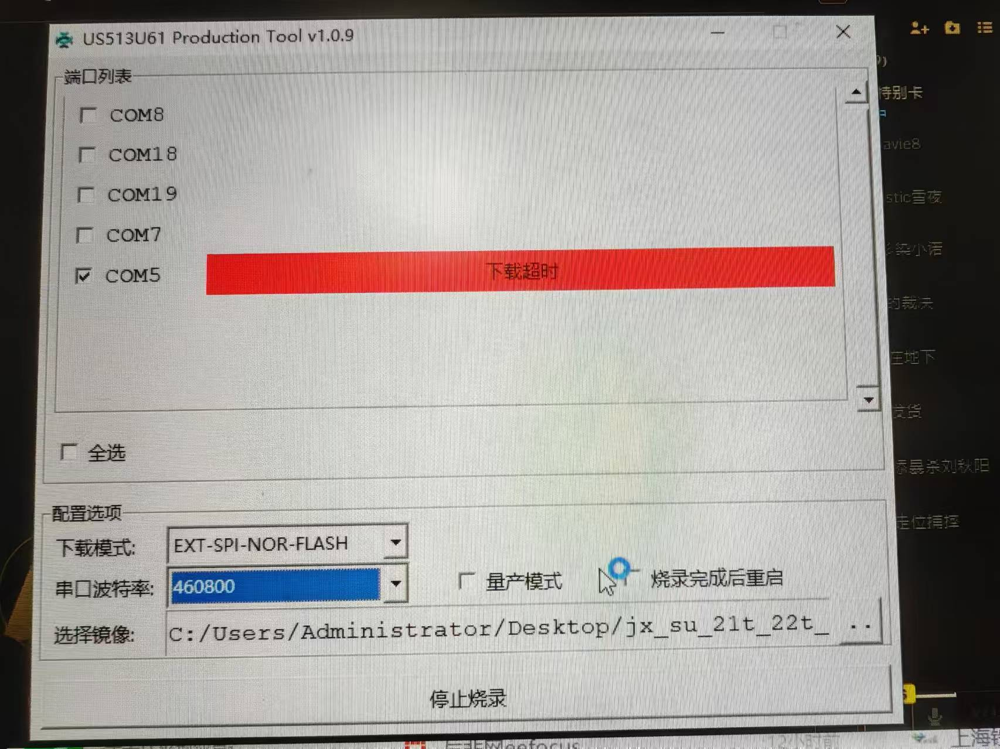

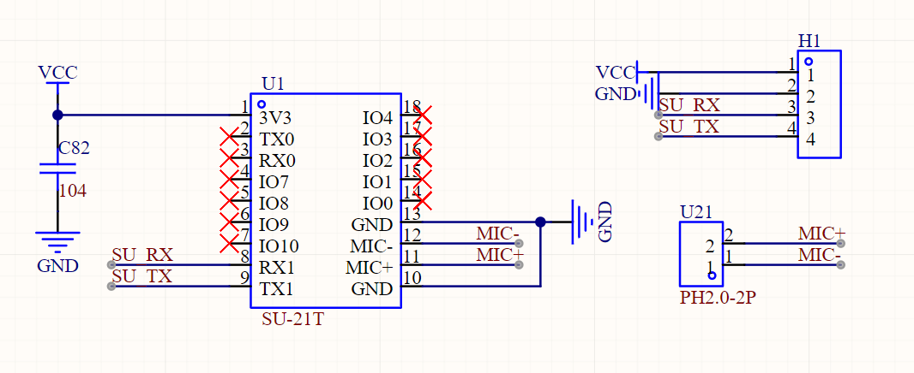

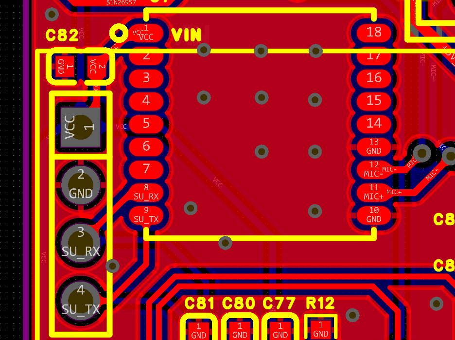

---

### SU-21T烧录固件后无法识别语音指令怎么办？

**问题描述：**

SU-21T芯片烧录固件后无法识别语音指令，也没有回复语音，需要排查配置和硬件问题。

**解决方案：**

**问题排查步骤：**

1. **确认固件是否成功烧录**
    - 检查烧录过程是否无错误完成
    - 验证固件文件是否正确
    - 确认模块供电正常

2. **检查平台配置**
    - 导出工程配置文件进行验证
    - 在产品管理页面点击"导出"按钮

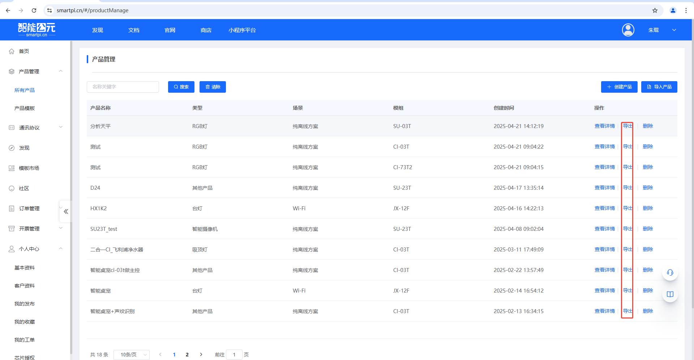

3. **深度休眠设置检查**
    - 检查优化配置中的"深度休眠"选项
    - 该选项可能导致模块无法正常响应

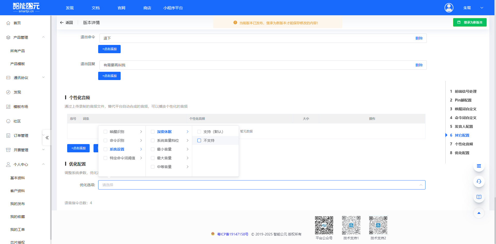

**解决方法：**

1. **关闭深度休眠**
    - 在平台配置中取消勾选"深度休眠"
    - 重新生成并烧录固件
    - 测试语音识别功能

2. **硬件检查**
    - 确认使用的是SU-21T套装（模块+喇叭+咪头）
    - 检查麦克风和喇叭连接是否正确
    - 验证电源供电是否稳定

**型号说明：**

- **SU-21T**：内置1M Flash、无功放
- **SU-23T**：内置1M Flash、有功放
- 两者使用相同芯片，仅Flash和功放有差异

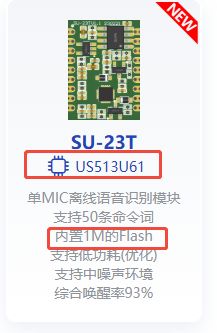

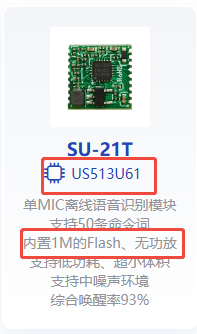

**注意事项：**

- 深度休眠功能会影响唤醒响应，建议在调试时关闭
- 确保固件与硬件型号匹配
- 如问题持续，检查硬件连接和外围电路
- 可尝试使用SU-23T固件进行交叉测试

---

### SU-21T模块容易丢失固件怎么办？

**问题描述：**

SU-21T模块在断电一段时间后重新上电时，固件会丢失，导致模块无法正常工作，需要重新烧录固件才能恢复。

**问题分析：**

- 可能与模块的Flash存储特性有关
- 断电时间过长可能影响固件保持
- 电源波动可能导致存储内容损坏

**解决方案：**

**1. 改善电源设计**：

- 确保供电电压稳定在3.3V
- 增加电源滤波电容（100μF+0.1μF组合）
- 避免电源突然断电，使用软开关

**2. 优化烧录流程**：

- 使用官方最新版本的烧录工具
- 烧录时确保电源稳定
- 烧录完成后进行验证测试

**3. 添加硬件保护**：

- 在电源输入端添加保护二极管
- 使用ESD保护器件
- 考虑添加备用电源（如超级电容）

**4. 固件备份方案**：

- 量产时预烧录固件并验证
- 保留固件备份文件便于快速恢复
- 建立固件版本管理机制

**预防措施：**

- 避免频繁断电测试
- 使用质量可靠的电源
- 定期检查固件完整性
- 长期不用时保持供电

**注意事项：**

- 如频繁出现固件丢失，可能是硬件问题
- 建议联系供应商更换模块
- 量产前要进行可靠性测试
- 保留详细的测试记录

---

### SU-21T烧录工具显示"等待设备"怎么办？

**问题描述：**

使用SU-21T芯片烧录工具时，设备无法被识别，工具界面显示"等待设备"，且设备状态为"app 0%"。

**解决方案：**

**问题分析：**

- 烧录工具无法正常识别模块
- 可能是供电或连接问题
- 需要检查烧录时的硬件连接

**解决步骤：**

1. **检查供电连接**
    - 确认使用正确的电源电压
    - SU-21T需要连接到VCC引脚（5V或3.3V）
    - 不要接到3.3V引脚，芯片上没有5V引脚

2. **按下烧录按钮**
    - 模块上有烧录按钮（通常有两个）
    - 按下其中一个按钮进入烧录模式
    - 按住按钮后再上电或连接USB

3. **检查串口连接**
    - 确认TX、RX交叉连接
    - 检查GND是否良好连接
    - 使用短而粗的连接线减少干扰

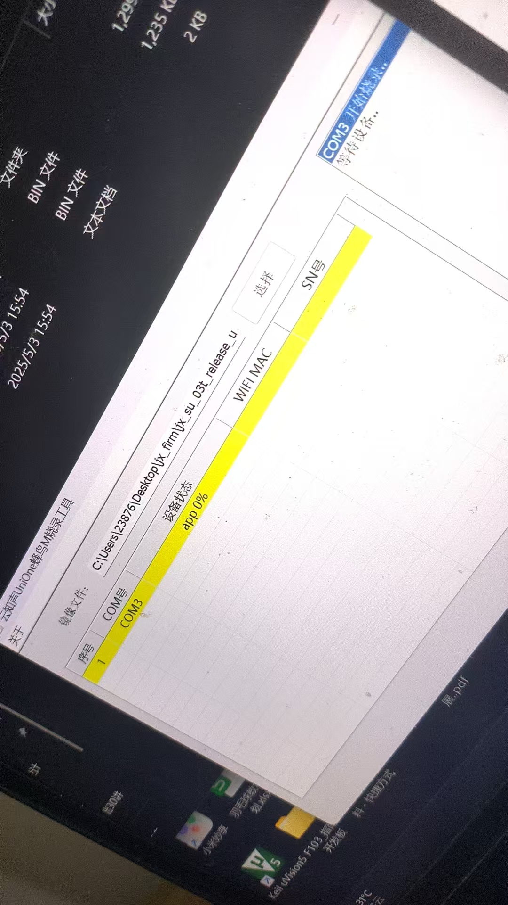

**注意事项：**

- 烧录时需要将VCC连接到5V电源，而不是3.3V
- 按钮操作时序很重要，可能需要多次尝试
- 如果仍无法识别，尝试更换USB转串口模块
- 确保烧录工具选择了正确的COM端口

---

