# SU-32T 烧录与调试 FAQ

本页用于整理 SU-32T 相关的烧录与调试问题。

---

### SU-32T烧录教程在哪里？

**问题描述：**

需要获取SU-32T芯片的烧录教程，以指导进行设备改造和维修。

**解决方案：**

SU-32T的烧录教程可以在B站找到：

- 视频教程链接：https://www.bilibili.com/video/BV1RQS9YrEpW/?spm_id_from=333.999.0.0

**注意事项：**

- 建议在观看视频时按照步骤操作
- 确保烧录工具和驱动程序已正确安装
- 烧录前检查硬件连接是否正确

---

### SU-32T烧录时卡在"擦写中"状态怎么办？

**问题描述：**

SU-32T模块在烧录过程中卡在"spl 擦写中..."状态，无法完成烧录。

**解决方案：**

**1. 检查硬件连接**

- 确认RX和TX引脚没有短路
- 检查焊接是否存在连焊或虚焊
- 验证连接线路是否正确

**2. 检查烧录使能脚（P51）**

- P51引脚必须接地才能进入烧录模式
- 不要给P51加上拉电阻到3.3V
- 烧录时保持P51为低电平

**3. 烧录步骤确认**

- 连接好烧录线路
- 按住复位键（保持P51接地）
- 上电进入烧录模式
- 开始烧录操作

**注意事项：**

- SU-32T烧录速度较慢是正常现象
- 烧录时间较长但不会"慢到令人发指"
- 确保烧录过程中供电稳定
- 如反复失败，检查硬件连接是否正确

---

### SU-32T开发板上电后GPIO14持续高电平且需要按复位键才能工作？

**问题描述：**

SU-32T开发板上电后出现两个问题：1) GPIO14引脚持续输出高电平；2) 语音芯片需要手动按复位键才能正常工作，否则无法启动。

**解决方案：**

**1. GPIO14持续高电平问题**

- 确认GPIO14的配置是否正确
- 检查固件中是否有相关初始化设置
- 如配置无异常，可能是硬件问题，需要反馈给技术支持

**2. 需要按复位键才能工作的问题**

- 记录问题现象视频，提供给技术支持分析
- 检查开发板的复位电路是否正常
- 确认电源供电稳定，无波动或干扰

**排查建议**：

- 使用示波器检查复位信号和GPIO14输出
- 尝试重新烧录固件
- 如问题持续存在，建议更换开发板测试

**注意事项：**

- 此现象属于异常情况，需要技术支持介入
- 提供详细的测试视频有助于问题定位
- 保留问题现象的完整记录

---

### SU-32T如何设置禁止进入休眠模式？

**问题描述：**

SU-32T模块通电后持续自动复位并发出哒哒哒的响声，需要设置禁止进入休眠模式。

**解决方案：**

**1. 问题现象**

- 通电后模块持续自动复位
- 听到内部持续的哒哒哒响声
- 模块无法正常进入工作状态

**2. 设置方法**

- **进入系统设置**：

    - 打开配置软件
    - 进入"系统设置"菜单
    - 找到"识别控制"选项

- **添加控制项**：

    - 点击"添加控制"
    - 设置行为为A4
    - 控制方式选择"系统设置"
    - 操作选择"禁止超时退出唤醒"
    - 是否延时设置为"否"
    - 延时恢复设置为"否"

**3. 配置效果**

- 禁用超时退出唤醒功能
- 模块不会自动进入休眠
- 避免持续复位的问题

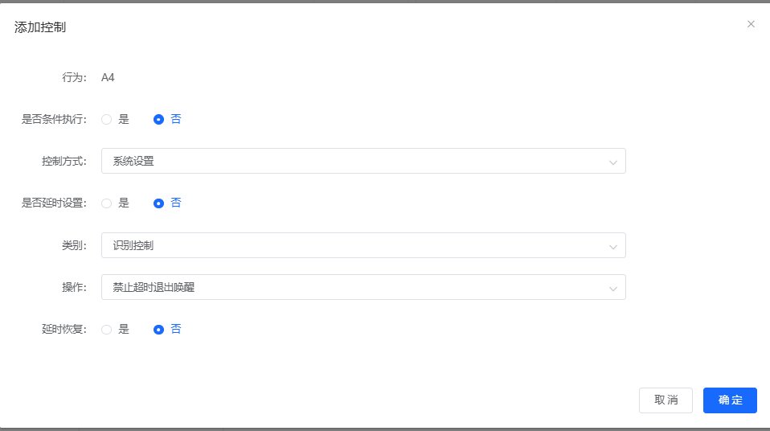

**注意事项：**

- 此设置会增加模块功耗
- 长时间不使用建议手动关闭电源
- 设置完成后需要重新上电生效

---

### SU-32T开发板电压异常问题

**问题描述：**

SU-32T开发板在供电时，VCC到GND的电压异常，其中一个测量点为3.81V（正常应为3.3V），麦克风和喇叭的电压也存在异常，需要确认这些电压是否正常以及故障原因。

**解决方案：**

**1. 电压测量标准**

- **正常电压范围**：

    - VCC供电：5V（输入）
    - 3.3V输出：3.3V（稳定）
    - 麦克风电压：1.9V-1.7V（正常范围）
    - 喇叭对地电压：2.5V（正常）

- **异常电压判断**：

    - 3.81V（异常，高于正常值）
    - 喇叭对地5.14V（异常，远高于正常值）

**2. 故障诊断**

- **复位测试**：

    - 复位后电压变为3.5V（仍不正常）
    - USB供电3.36V，充电器供电3.55V（均偏低）
    - 电压不稳定表明开发板存在故障

- **硬件检查**：

    - 使用万用表蜂鸣档检测是否短路
    - 检查电源管理芯片是否正常
    - 测试负载调整能力

**3. 处理建议**

- **板子故障**：电压异常且不稳定，确认开发板损坏
- **更换处理**：需要更换新的开发板
- **保留数据**：记录异常电压值供售后参考

**注意事项：**

- 电压异常可能导致模块工作不正常或损坏
- 不要继续使用异常的开发板，避免扩大故障
- 建议联系供应商进行更换或维修

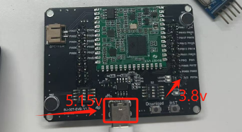

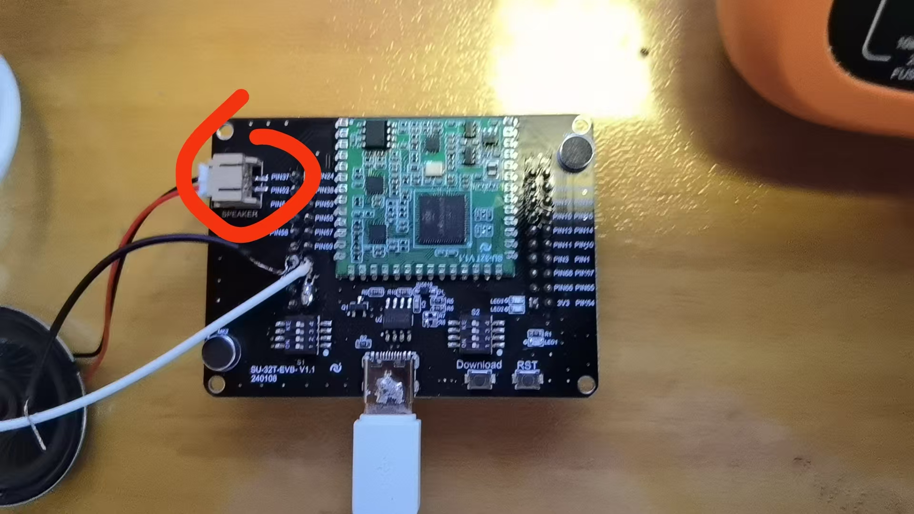

---

### SU-32T模块的排针间距是多少？

**问题描述：**

收到的SU-32T模块未配备排针，需要自行购买，需要确认排针间距规格。

**解决方案：**

- SU-32T模块的排针间距为 2.0mm
- 需要自行购买2.0间距的排针进行焊接

**注意事项：**

- 确保2.0mm排针质量可靠
- 焊接时注意避免短路

---

### SU-32T模块出现短路故障如何判断？

**问题描述：**

测试SU-32T模块时发现存在短路，需要确认模块是否已损坏。

**解决方案：**

**故障排查步骤：**

1. **分离测试**：

    - 将模块从转接板上拔下
    - 使用万用表单独测试模块引脚
    - 排除转接板问题

2. **短路检测**：

    - 使用万用表蜂鸣档检测各引脚对地阻值
    - 3.3V对地应有正常阻值（通常1kΩ以上）
    - 如显示直接短路（阻值为0），说明模块已损坏

3. **更换判断**：

    - 如确认模块短路，需更换新模块
    - 短路通常是硬件损坏，无法通过软件修复

**注意事项：**

- 测试时确保模块断电
- 避免使用过大电流测试，防止进一步损坏

---

### SU-32T烧录后卡机、声音播放异常及拨码开关设置

**问题描述：**

烧录固件后模块出现卡机现象，声音播放断断续续，无法正常运行。拨码开关设置不当也会导致功能异常。

**解决方案：**

**拨码开关设置：**

- SU-32T的S1、S2拨码开关应拨到字母一侧
- 拨到数字一侧会导致功能异常

**烧录后问题排查：**

1. **检查拨码开关位置**：

    - 确认S1、S2开关都在字母位置
    - 重新上电测试

2. **声音播放异常处理**：

    - 检查音频文件是否完整烧录
    - 确认喇叭接线正确无虚焊
    - 测试供电电压是否稳定

**注意事项：**

- 拨码开关必须设置正确，否则模块无法正常工作
- 如使用SU-03T的板子测试正常，说明程序逻辑没问题，重点检查SU-32T的硬件设置

---

### 如何获取SU-32T开发包的完整资料？

**问题描述：**

需要获取SU-32T开发包的完整技术资料，确认资料是否齐全。

**解决方案：**

**开发包内容获取：**

1. **下载渠道**：

    - 从智能公元官网下载SU-32T开发包
    - 开发包包含所有必要的技术文档

2. **资料清单**：
    开发包通常包含以下完整资料：

    - 模块规格书
    - 芯片资料
    - 烧录资料
    - 相关图片资源
    - 原理图
    - 固件文件
    - PCB文件
    - 声学规范
    - 开发手册

**注意事项：**

- 开发包资料齐全，可直接使用
- 建议下载最新版本的开发包
- 保存好开发包文件，便于后续开发参考

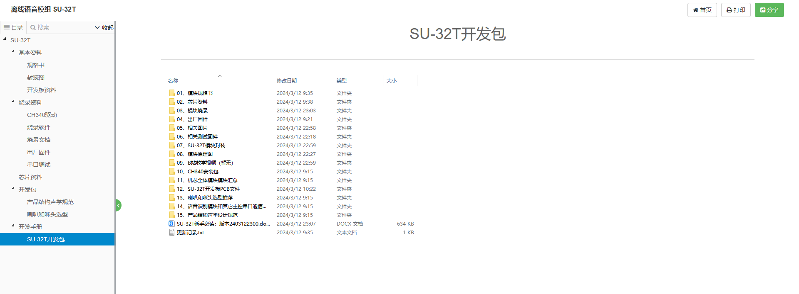

---

### SU-32T模块烧录端口电路需要连接其他元件吗？

**问题描述：**

将SU-32T模块集成到PCB电路板时，不确定烧录端口电路是否需要额外元件，以及如何通过端子和CH340进行烧录。

**解决方案：**

SU-32T模块烧录端口电路设计简单，不需要额外的附加元件：

- **P51引脚**：需要接一个开关到GND，用于进入烧录模式
- **其他引脚**：5V、RXD、TXD、GND直接连接到测试点即可
- **烧录方式**：通过CH340转换器连接到PC端进行烧录

**具体连接方式：**

| CH340引脚 | SU-32T模块引脚 | 说明 |
|----------|---------------|------|
| 5V | 5V | 电源正极 |
| RXD | TXD测试点 | 串口接收 |
| TXD | RXD测试点 | 串口发送 |
| GND | GND | 电源负极 |
| - | P51 | 通过开关控制到GND |

**烧录操作步骤：**

1. 连接CH340到SU-32T的测试点
2. 打开烧录软件
3. 按下P51到GND的开关（进入烧录模式）
4. 开始烧录固件
5. 烧录完成后松开开关

**注意事项：**

- P51引脚仅在烧录时需要使用，正常工作时可悬空
- 确保电源供电稳定（4.5-5.5V）
- 烧录时断开其他外接设备避免干扰
- 如烧录失败，检查P51开关是否正常导通

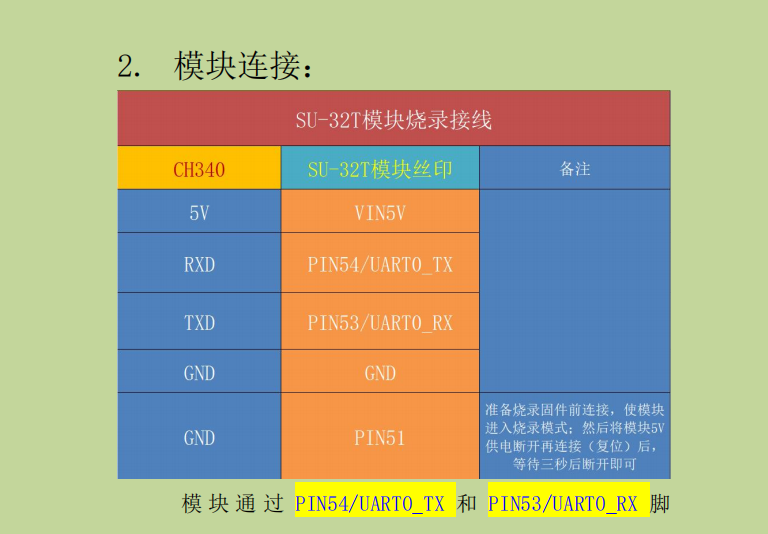

---

### SU-32T模块的邮票孔规格是多少？

**问题描述：**

需要了解SU-32T模块的邮票孔孔径和焊盘尺寸，但规格书中未提供相关信息。

**解决方案：**

**获取封装文件：**

- SU-32T V1.1版本的完整封装文件已包含在开发包中
- 文件名：SU-32T V1.1；AD渲染图;终稿；版本2402221634.PcbDoc
- 可直接导入使用，无需手动测量尺寸

**封装获取方式：**

1. **官方开发包下载**：

    - 从智能公元官网下载SU-32T开发包
    - 开发包包含完整的PCB封装文件
    - 支持Altium Designer等主流EDA工具

2. **直接使用封装**：

    - 将提供的.PcbDoc文件中的封装复制到设计库
    - 直接在PCB设计中使用该封装
    - 确保版本匹配（V1.1）

**设计注意事项：**

- 邮票孔设计符合标准工艺要求
- 焊盘尺寸已考虑焊接强度和可靠性
- 建议使用官方封装避免尺寸误差

**兼容性说明：**

- 如使用Protel 99SE等旧版本软件，无法直接打开.PcbDoc文件
- 建议升级到Altium Designer或请他人转换格式
- 也可联系厂家获取其他格式的封装文件

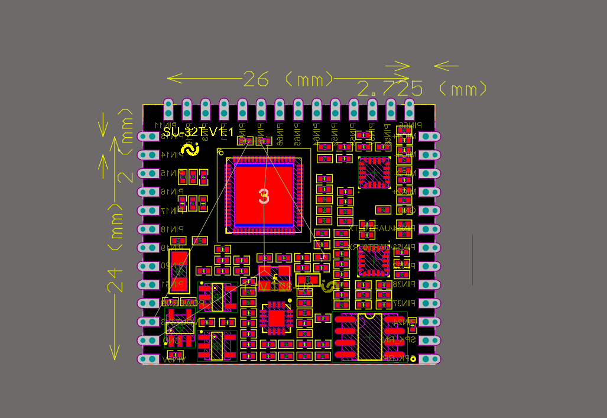

---

### SU-32T烧录时显示通信失败怎么办？

**问题描述：**

在使用SU-32T芯片进行固件烧录时，烧录工具显示"通信失败"，尝试了多种操作方式（先按Download再按RET、一直按Download等）均无法成功烧录固件。

**解决方案：**

**问题分析：**

- **拨码开关设置错误**：S1、S2开关位置不正确
- **烧录时序问题**：Download按键操作时机不当
- **硬件连接问题**：串口线或电源连接不稳定

**解决步骤：**

1. **检查拨码开关设置**
    - S1开关拨到字母一侧（远离数字）
    - S2开关拨到字母一侧（远离数字）
    - 确保两个开关都在正确位置
    - 重新上电后再次尝试

2. **正确的烧录操作流程**
    - 长按Download键不放
    - 观察数字变化，数字不变时保持按住
    - 当看到数字开始变化时，可以松开Download键
    - 等待烧录自动完成

3. **硬件连接检查**
    - 确认串口线连接正确（TX-RX交叉）
    - 检查5V电源供电稳定
    - 使用质量良好的USB转串口模块
    - 避免使用过长的连接线

4. **替代操作方法**
    - 方法一：先按Download 2秒，再按RET，然后点击烧录
    - 方法二：点击烧录后立即长按Download不放
    - 方法三：保持按Download，然后上电

**注意事项：**

- 拨码开关位置错误是常见问题，必须设置正确
- 烧录时序很重要，需要耐心尝试
- 如果持续失败，可能是硬件接触问题
- 建议使用官方推荐的烧录工具和连接线

---

### SU-32T烧录工具显示按钮禁用怎么办？

**问题描述：**

使用云知声UniOne蜂鸟烧录工具烧录SU-32T时，设备已识别到COM1端口，但烧录按钮处于禁用状态，无法执行烧录操作。

**解决方案：**

**1. 检查固件文件路径**

- 确保固件文件路径中不包含中文字符
- 将固件文件移动到纯英文路径下
- 避免路径过深或包含特殊符号

**2. 重新选择固件文件**

- 在烧录工具中重新浏览选择固件文件
- 确认文件格式正确（bin文件）
- 检查文件是否完整，无损坏

**3. 检查设备连接状态**

- 确认COM端口识别正常
- 检查USB连接是否稳定
- 验证烧录使能脚（P51）是否接地

**4. 重启烧录工具**

- 完全关闭烧录工具
- 重新启动工具软件
- 重新加载固件文件

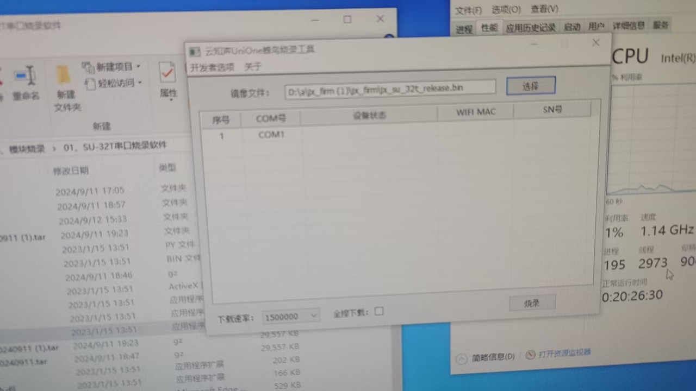

**注意事项：**

- 路径包含中文是导致按钮禁用的常见原因
- 如仍无法解决，尝试更换其他USB端口
- 确保使用管理员权限运行烧录工具

---

### SU-32T烧录失败提示"下载异常，接收端出现了额外的状态"怎么办？

**问题描述：**

使用云知声UniOne蜂鸟烧录工具烧录SU-32T模块时，烧录进度卡在70%，并提示"下载异常，接收端出现了额外的状态"的错误信息。

**解决方案：**

**问题排查步骤：**

1. **降低波特率烧录**：

    - 烧录工具提示建议降低波特率
    - 在烧录工具中选择较低的波特率选项
    - 重新尝试烧录操作

2. **检查固件文件路径**：

    - 确保固件文件路径中没有中文字符
    - 避免路径过深或包含特殊符号
    - 将固件文件复制到简单的英文路径下

3. **检查烧录线连接**：

    - 确认TX/RX引脚连接正确（交叉连接）
    - 检查GND是否可靠连接
    - 尝试更换质量更好的USB转串口线

4. **电源和复位时序**：

    - 点击烧录按钮后，及时给模块上电
    - 确保上电时机与烧录开始同步
    - 避免过早或过晚上电

5. **尝试不同的串口**：

    - SU-32T有多个串口选项
    - 尝试使用其他串口（如COM3）进行烧录
    - 检查设备管理器中显示的可用串口

**技术要点：**

- 70%位置失败通常是在数据传输阶段
- "接收端出现额外状态"可能是通信异常
- 降低波特率可以提高烧录稳定性
- 确保使用正确的SU-32T固件文件

**注意事项：**

- 烧录失败不影响模块硬件，可重复尝试
- 如持续失败，可尝试在另一台电脑上烧录
- 保留烧录过程的错误信息截图便于分析
- 确认烧录工具版本为最新版

---

### US513U6模块烧录失败和串口通信异常如何处理？

**问题描述：**

US513U6模块烧录时出现串口通信异常，电脑端发送全0数据但模块端无回文，需要正确的烧录操作流程。

**解决方案：**

**正确的烧录操作流程：**

1. **烧录准备**：

    - 确保PIN51引脚先连接到GND
    - 保持5V电源断开状态
    - 确认串口线连接正确（TX-RX交叉）

2. **开始烧录**：

    - 在烧录软件中点击"开始烧录"
    - 然后给模块接上5V电源
    - PIN51可以保持连接GND，无需断开

3. **通信参数**：

    - 串口电平：3.3V（模块内部无电平转换）
    - 禁止使用5V串口直接连接，可能损坏模块
    - 确保使用正确的USB转TTL工具

**串口通信验证方法：**

1. **下载出厂固件**：

    - 下载SU-32T的开发包
    - 导入平台查看出厂固件的配置
    - 经配置后调试串口功能是否有效

2. **测试串口功能**：

    - 使用串口助手发送测试数据
    - 观察模块是否有响应
    - 验证TX/RX通路是否正常

**常见问题处理：**

1. **无回文问题**：

    - 检查串口线序是否正确
    - 确认波特率设置匹配
    - 验证模块是否已进入烧录模式

2. **烧录器选择**：

    - 推荐使用CH340烧录器
    - 确认烧录器工作电压为3.3V
    - 避免使用5V电平的烧录工具

**注意事项：**

- 严格按照上电时序操作：先烧录命令，后上5V电源
- 模块内部的语音提示不影响烧录过程
- 如串口通信仍异常，可能是硬件连接问题
- 建议使用官方推荐的烧录工具和线缆

---

### SU-32T第一次烧录成功，第二次烧录失败怎么办？

**问题描述：**

SU-32T模块第一次串口烧录可以成功，但第二次烧录时失败，无法正常烧录固件。

**解决方案：**

**可能原因分析：**

1. **模块状态问题**：

    - 第一次烧录后模块未正确复位
    - 模块进入了异常保护状态
    - IO口状态影响第二次烧录

2. **烧录条件变化**：

    - 供电电压或电流发生变化
    - 连接线接触不良
    - 烧录工具识别异常

**解决方法：**

1. **完全断电重启**：

    - 断开所有连接线
    - 等待10秒以上重新上电
    - 确保模块完全复位

2. **检查烧录流程**：

    - PIN51引脚确保连接到GND
    - 先点击烧录，再接通5V电源
    - 保持正确的时序操作

3. **更换烧录工具**：

    - 尝试使用另一个CH340模块
    - 检查USB接口供电是否稳定
    - 排除工具故障可能性

4. **模块隔离测试**：

    - 将SU-32T从底板拆下单独测试
    - 排除外围电路影响
    - 验证模块本身是否正常

**注意事项：**

- 第二次烧录失败多与模块状态或供电有关
- 确保烧录时序完全正确
- 如多次失败建议更换模块

---

### SU-32T的复用IO口能正常使用吗？

**问题描述：**

询问SU-32T模块的复用IO口功能是否正常，以及使用时的注意事项。

**解决方案：**

**当前状态说明：**

根据官方回复，SU-32T的复用IO口功能目前还不能正常使用：

1. **研发状态**：

    - 研发团队正在忙于大模型相关项目
    - 暂时没有时间检查和处理32T的问题
    - IO复用功能仍在完善中

2. **功能限制**：

    - 复用IO口可能无法按预期工作
    - 建议暂时不要依赖此功能
    - 等待官方更新通知

**临时解决方案：**

1. **使用其他可用接口**：

    - 优先使用专用功能引脚
    - 避免使用标记为"复用"的IO口
    - 查阅最新规格书确认可用引脚

2. **关注官方更新**：

    - 定期查看固件更新说明
    - 关注官网公告和发布日志
    - 及时获取功能修复信息

3. **替代方案**：

    - 如需要更多IO，考虑使用其他型号
    - 通过外部扩展芯片增加IO数量
    - 设计电路时预留功能冗余

**注意事项：**

- 在官方确认修复前，不要在产品中使用复用IO功能
- 保存好项目配置，以便功能修复后快速更新
- 如有紧急需求，可联系技术支持获取最新进展

---

### SU-32T个性化音频烧录后死机怎么办？

**问题描述：**

将个性化音频烧录进SU-32T模块后，设备出现死机现象，怀疑是个性化音频导致，需要排查原因。

**解决方案：**

**问题分析：**

- 死机问题通常与个性化音频无关，可能与固件包有关
- 个性化音频功能本身不会导致模块死机
- 需要检查固件包的完整性和兼容性

**排查步骤：**

1. **确认固件包状态**
    - 检查固件包文件是否完整
    - 确认固件版本与模块匹配
    - 验证固件包未被损坏

2. **重新烧录测试**
    - 使用官方提供的标准固件测试
    - 烧录时不包含个性化音频
    - 确认基本功能是否正常

3. **个性化音频单独测试**
    - 基本功能正常后，再添加个性化音频
    - 逐步添加音频文件，定位问题点
    - 检查音频文件格式和大小是否符合要求

**问题反馈：**

- 如问题持续存在，需要提供固件包给技术支持分析
- 记录详细的操作步骤和现象
- 保留出现问题的固件包供测试

**注意事项：**

- 个性化音频功能经过充分测试，一般不会导致死机
- 问题多出现在固件包本身或烧录过程
- 建议使用官方工具和标准流程进行烧录

---

### SU-32T固件烧录需要注意什么？

**问题描述：**

SU-32T模块进行固件烧录测试时需要注意相关操作步骤和验证方法。

**解决方案：**

- **烧录准备**：

    - 确认固件文件为正确的bin格式
    - 使用云知声UniOne蜂鸟烧录工具
    - 检查串口连接正常

- **烧录步骤**：

    1. 将固件bin文件拖到桌面
    2. 打开烧录工具选择对应串口
    3. 载入固件文件开始烧录
    4. 等待烧录完成提示

- **验证方法**：

    - 烧录成功后重新上电
    - 测试语音识别功能
    - 检查命令词响应

**注意事项：**

- 烧录过程不要断电或拔掉连接线
- 文件路径不要包含中文或特殊字符
- 烧录失败后重新检查串口连接

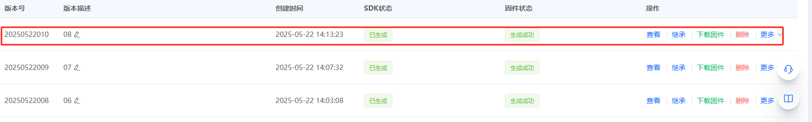

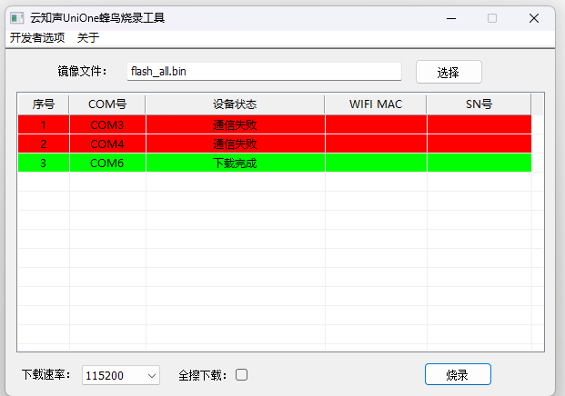

---

### SU-32T串口通信配置后无输出数据怎么办？

**问题描述：**

SU-32T芯片配置串口通信后，硬件连接正确且喇叭能正常工作，但串口无法输出数据。而相同开发板使用SU-05芯片时串口通信正常。

**解决方案：**

**1. 确认UART3引脚位置**

- UART3_TX对应PIN_37
- UART3_RX对应PIN_38
- 不是PIN_10和PIN_11

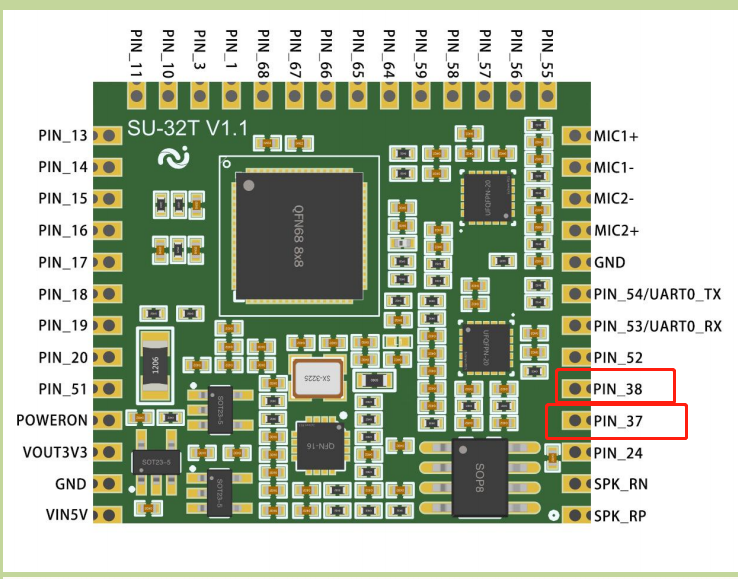

**2. 检查串口配置**

- 波特率：9600
- 数据位：8
- 停止位：1
- 校验位：无

**3. 验证数据格式**

串口输出数据格式示例：

- AB BA 00 00 00 00 00 01 CD DC


**4. 编写发送函数**

需要在平台中编写串口数据发送函数，配置串口引脚和参数后，通过函数实现数据发送。

**注意事项：**

- SU-32T与SU-05的引脚定义可能不同
- 确保引脚连接正确（TX对RX，RX对TX）
- 检查GND连接是否可靠
- 供电电压需稳定（VIN 5V）

---

### SU-32T能正常语音交互但串口无输出怎么办？

**问题描述：**

SU-32T模块能够正常进行语音交互，但串口通信无法输出数据到PC端。

**解决方案：**

**1. 检查串口配置**

- 确认波特率设置为9600
- 数据位：8，停止位：1，校验位：无
- 确认使用正确的串口端口（COM3）

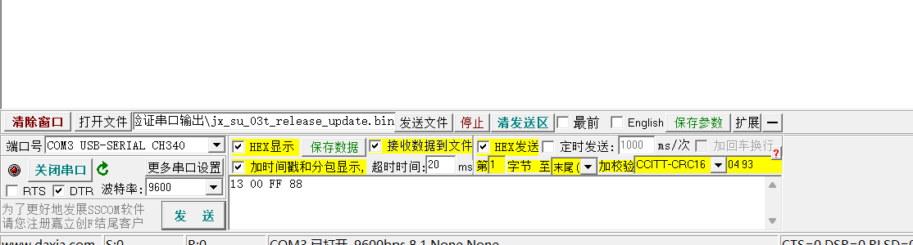

**2. 验证平台配置**

- 检查是否配置了串口数据发送
- 确认UART1_TX已配置发送参数
- 发送数据格式示例：98 A3 0B FE


**3. GPIO引脚配置检查**

- 如使用UART0，需在平台配置GPIO_05为UART0_TX
- 检查引脚复用配置是否正确
- 确认TX/RX引脚没有被其他功能占用


**4. 硬件连接验证**

- 确认TX对RX、RX对TX交叉连接
- 检查GND是否可靠接地
- 使用万用表测试线路连通性

**5. 产品型号确认**

- 确保平台选择的产品型号为SU-32T
- 不是SU-03T或其他型号
- 不同型号引脚定义可能不同


**注意事项：**

- SU-32T使用UART0时，PIN_54为TX，PIN_53为RX
- 串口通信需要在平台中编写发送函数
- 如使用UART1，引脚位置会不同
- 确保USB转TTL模块工作正常

---

### SU-32T如何通过串口协议触发指定音频播放？

**问题描述：**

需要了解SU-32T模块的串口通信协议格式，包括帧结构、波特率设置，以及如何通过串口接收固定数据来触发指定音频播放。

**解决方案：**

**1. 串口通信协议格式**

串口协议采用固定帧格式：

- 帧头：AA 55
- 消息编号：1字节（如01、10等）
- 参数数据：可变长度
- 帧尾：55 AA

示例格式：

- AA 55 10 01 55 AA：触发播报"病人跌倒"
- AA 55 01 24 55 AA：触发播报"当前温度为36摄氏度"

**2. 波特率配置**

- 默认波特率：115200
- 数据位：8
- 停止位：1
- 校验位：无

TX和RX的波特率会同步修改，需与上位机或下位机保持一致。

**3. 参数使用说明**

- 消息编号用于区分不同的触发命令
- 参数数值可以动态填入，实现通用性
- 示例：AA 55 01 25 55 AA 会播报"当前温度为37摄氏度"


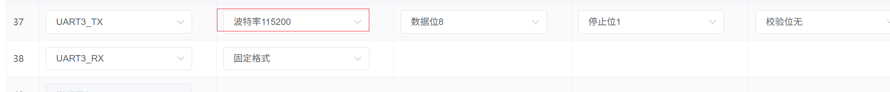

**4. 配置步骤**

1. 在平台中添加串口输入触发设置
2. 设置对应的消息编号和输入参数
3. 上传个性化音频文件
4. 配置触发行为与播报内容

**注意事项：**

- 参数只支持16进制数，不支持字符串类型
- 消息编号必须保持一致，参数数据可以变化
- 如不需要参数效果，可直接删除参数部分

---

### SU-32T如何在语音播报中添加串口参数？

**问题描述：**

需要实现通过串口发送参数，让语音播报内容能够动态显示数值（如温度值），并了解参数类型支持情况。

**解决方案：**

**1. 添加串口参数**

在配置语音播报内容时：

1. 输入基础播报文本（如"当前温度为"）
2. 点击"添加串口参数"按钮
3. 设置参数名（如temp）
4. 选择参数类型（支持unsigned等数值类型）
5. 设置测试值（如36）
6. 继续输入后续文本（如"摄氏度"）


**2. 参数类型说明**

- 支持类型：只支持16进制数值类型
- 不支持：字符串类型
- 常用类型：unsigned（无符号整数）

**3. 串口发送格式**

发送数据格式：AA 55 [消息编号] [参数值] 55 AA
- AA 55 01 24 55 AA：播报"当前温度为36摄氏度"
- AA 55 01 25 55 AA：播报"当前温度为37摄氏度"

**注意事项：**

- 参数值需要转换为16进制格式
- 同一个消息编号下，参数值可以动态变化
- 测试值仅用于平台调试，实际播报以接收到的串口数据为准

---

### SU-32T如何实现串口命令控制多档位？

**问题描述：**

需要通过一条串口命令控制1-5档位的切换，并了解如何将串口参数赋值给变量，通过变量触发相应的定时器操作。

**解决方案：**

**1. 串口命令设计**

使用固定消息编号接收档位参数：

- AA 55 01 01 55 AA：1档
- AA 55 01 02 55 AA：2档
- AA 55 01 03 55 AA：3档
- AA 55 01 04 55 AA：4档
- AA 55 01 05 55 AA：5档

**2. 实现思路**

1. 配置串口输入，设置消息编号（如01）
2. 将接收到的参数赋值给变量（如gear）
3. 通过变量触发定时器
4. 在定时器中添加档位控制逻辑

**3. 配置步骤**

1. 添加一个定时器，用于判断档位变量
2. 为每个档位（1-5档）分别配置5个定时器操作命令
3. 定时器根据gear变量值执行对应操作

**注意事项：**

- 一条串口命令即可实现档位切换
- 需要为每个档位单独配置定时器操作
- 变量赋值后可通过条件判断触发不同操作

---

### SU-32T固件生成失败怎么办？

**问题描述：**

配置检测提示有问题，但系统仍显示"正在生成"，导致固件无法成功生成。

**解决方案：**

**1. 检查配置检测结果**

- 平台发布时会进行配置检测
- 如检测有问题，必须先解决才能生成固件
- 配置检测不通过无法继续生成流程

**2. 常见配置问题**

- 命令词配置冲突
- 引脚配置错误
- 参数设置不当
- 资源超出限制

**3. 解决步骤**

1. 仔细查看配置检测的提示信息
2. 根据提示修改相关配置
3. 确保所有检测项都通过
4. 重新尝试生成固件


**注意事项：**

- 配置检测必须全部通过才能生成固件
- 不要忽略任何警告或错误提示
- 如不确定问题所在，可联系技术支持

---

### SU-32T语音播报内容如何正确配置变量？

**问题描述：**

配置语音播报内容时，不确定如何正确设置语音内容以实现"当前档位为gear档"的播报，且对变量的使用存在疑问。

**解决方案：**

**1. 正确配置步骤**

1. 第一行输入："当前档位为"
2. 第二行添加变量：gear（参数类型选择unsigned）
3. 第三行输入："档"

**2. 错误示例纠正**

错误做法：

- 在一行中写入"当前档位为gear档"
- 将"gear"作为文本而非变量添加

正确做法：

- 将内容分三行配置
- gear作为参数变量单独一行
- 不在文本中包含变量名


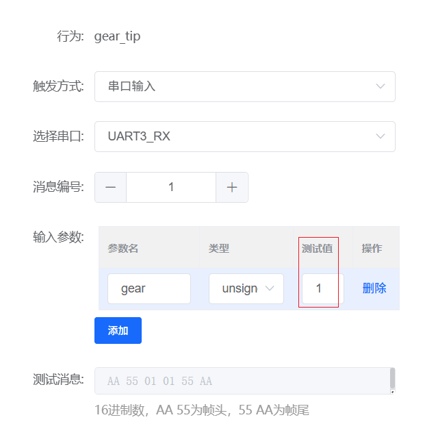

**3. 测试值说明**

- 测试值仅用于平台调试
- 实际播报以串口接收到的参数为准
- AA 55 01 01 55 AA 会播报"当前档位为1档"
- AA 55 01 02 55 AA 会播报"当前档位为2档"

**注意事项：**

- 变量需要单独作为一行添加
- 不要在文本行中包含变量名
- 测试值不影响实际使用，仅用于调试

---

### SU-32T如何配置命令词实现精确档位控制？

**问题描述：**

需要通过语音指令词控制设备档位（如1档、2档等），并了解命令词的配置方法和注意事项。

**解决方案：**

**1. 命令词配置要求**

- 必须使用中文数字（如"一档"、"二档"）
- 每个档位需要单独配置一条命令词
- 5个档位需要配置5条命令词

**2. 配置示例**

| 命令词 | 触发条件 | 执行动作 |
|---------|---------|---------|
| 调节到一档 | 档 | 已调节至1档 |
| 调节到二档 | 档 | 已调节至2档 |
| 调节到三档 | 档 | 已调节至3档 |
| 调节到四档 | 档 | 已调节至4档 |
| 调节到五档 | 档 | 已调节至5档 |


**3. 注意事项**

- 不支持使用变量名作为命令词
- 每条命令词必须准确对应具体档位
- 温度控制同样需要逐个添加（如"调节到20度"）
- 命令词需要准确配置，避免识别错误

**4. 实现建议**

对于需要数值范围的场景（如温度设置）：

- 建议使用关键词+参数的组合方式
- 通过串口发送具体数值，语音只负责触发类别

---

### SU-32T烧录后无任何响应怎么办？

**问题描述：**

SU-32T芯片烧录固件成功，但设备无任何响应，包括无声音输出。即使烧录出厂固件后仍无法正常工作，更换芯片和喇叭后问题依旧存在。

**解决方案：**

**1. 烧录状态确认**

- 检查烧录工具显示的进度是否正常
- 确认烧录过程中无报错提示
- 验证串口连接是否稳定

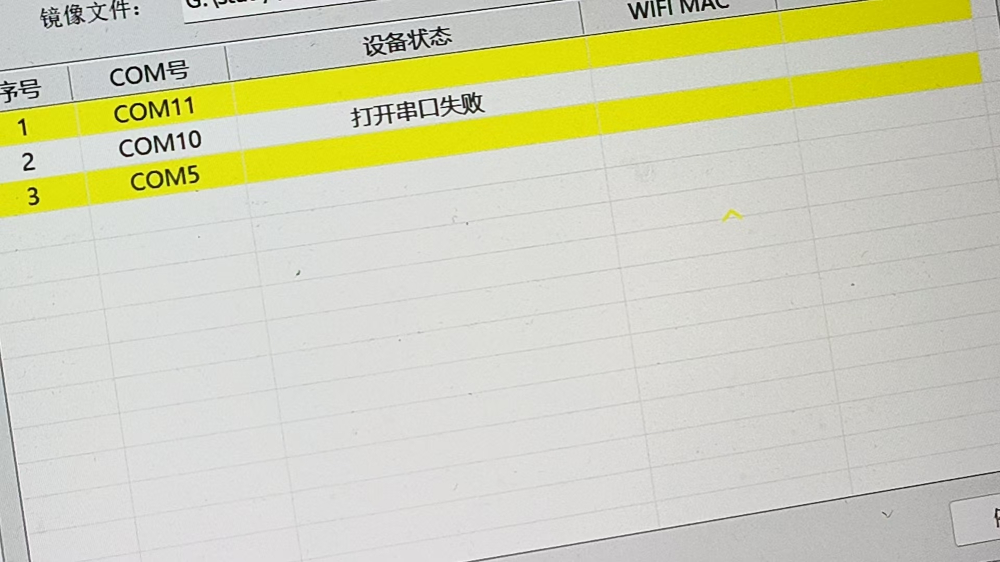

**2. 硬件连接检查**

- 确认USB转TTL模块连接正确
- 检查供电电压是否稳定（5V）
- 验证烧录线序：TX-RX, RX-TX, GND-GND

**3. 基本硬件测试**

- 测量喇叭电压（正常应为2.2-2.5V）
- 使用万用表测量喇叭阻抗（8欧姆喇叭直流电阻约6-7欧姆）
- 更换已知正常的喇叭测试

**4. 故障排查步骤**

- 烧录出厂固件验证基础功能
- 检查咪头和喇叭接线是否正确
- 测量各关键点电压是否在正常范围

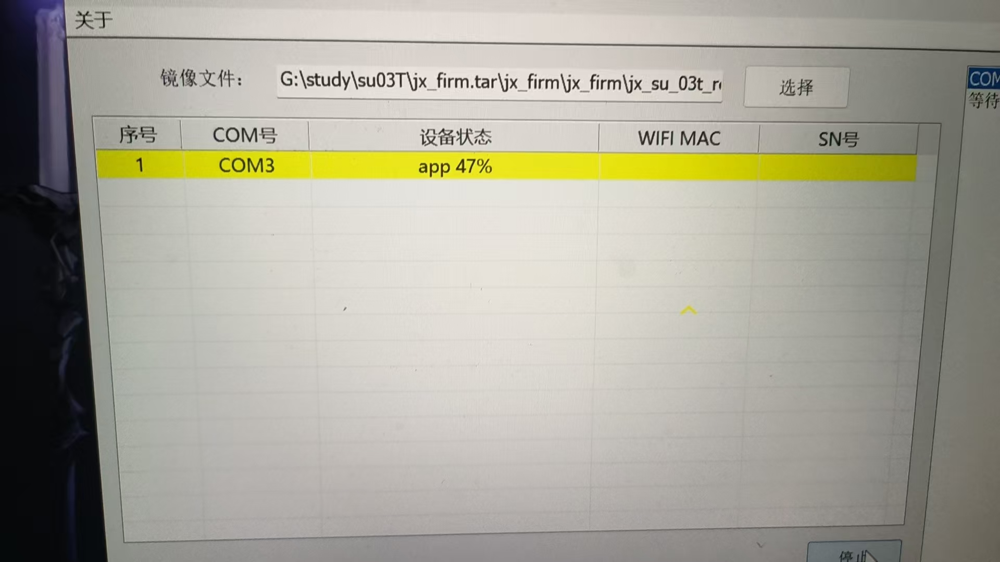

**5. 寄回检测**

如果以上排查均无效：

- 联系客服寄回检测
- 提供详细的故障现象描述
- 附上排查过程和测试数据

**注意事项：**

- 喇叭损坏不会导致串口无法接收信息
- 设备完全无响应可能是硬件故障
- 建议保留所有测试图片供技术支持分析

---

### SU-32T的GPIO引脚与SDK控制接口如何对应？

**问题描述：**

SU-32T模块的GPIO引脚与SDK控制接口的对应关系，特别是UART3_TX在SDK中的名称和模块引脚的对应关系。

**解决方案：**

**引脚对应关系确认：**

- UART3_TX对应PIN_37
- UART3_RX对应PIN_38
- 其他GPIO引脚可参考引脚映射图

**SDK与硬件对应：**

- SDK中的引脚名称与模块物理引脚一一对应
- 在平台中选择GPIO时，会自动映射到相应物理引脚
- UART3_TX可用于串口数据发送

**引脚映射图示：**

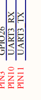


**使用注意事项：**

- 确认接线时参考正确的引脚编号
- 模块的PIN编号是物理引脚位置
- SDK中的GPIO名称与硬件引脚有明确对应关系
- 设计时需参考官方提供的引脚图

---

### SU-32T在智能平台中无法添加GPIO输入触发？

**问题描述：**

SU-32T模块在智能平台中无法添加触发，界面中没有GPIO输入选项，而SU-03T模块正常。

**解决方案：**

**问题分析：**

- SU-32T模块在智能平台中的配置界面可能与SU-03T不同
- GPIO输入触发功能的选项位置或名称有差异
- 可能是平台对SU-32T的支持不完整

**替代方案：**

1. **使用例程修改**

    - 下载SU-32T的官方例程
    - 在例程基础上修改GPIO触发逻辑
    - 重新编译生成固件

2. **SDK开发实现**

    - 使用SU-32T的SDK进行开发
    - 在代码中直接配置GPIO输入触发
    - 实现自定义的触发逻辑

3. **检查平台版本**

    - 确认使用的智能公元平台版本
    - 检查是否支持SU-32T的全部功能
    - 尝试更新到最新版本

**技术建议：**

- 优先使用官方提供的开发例程
- 确认例程中的GPIO配置方式
- 修改前备份原始例程文件

**注意事项：**

- SU-32T和SU-03T的平台配置可能存在差异
- 部分功能可能需要通过SDK实现
- 建议查看SU-32T的专用开发文档
- 如问题持续，联系技术支持获取SU-32T配置指南

---

### SU-32T是否支持中英文混合工程？

**问题描述：**

询问是否可以在同一个工程中同时配置中英文语言，还是必须分开配置。

**解决方案：**

SU-32T不支持在同一个工程中混合配置中英文语言。

**注意事项：**

- 中英文必须分别创建独立工程
- 每个工程只能选择单一语言
- 如需支持多语言，需要生成不同的固件版本

---

### SU-32T与SU-63T在蓝牙功能上有什么区别？

**问题描述：**

需要了解SU-63T是否支持蓝牙音乐功能，开发方式是否与SU-32T相同，以及在降噪和音频播放质量上的差异。

**解决方案：**

**1. 蓝牙功能支持**

- SU-63T：支持蓝牙功能，可连接手机播放音乐
- SU-32T：不支持蓝牙功能

**2. 开发方式**

- SU-63T的开发方式与SU-32T相同
- 都支持串口与其他芯片通信
- 平台配置方法一致

**3. 性能对比**

- 降噪效果：差距不大，性能相当
- 音频播放质量：两者都很不错
- 功能差异：SU-63T额外支持蓝牙音乐

**4. UART控制功能**

SU-63T可通过UART控制：

- 音乐播放/暂停
- 音乐上一首/下一首
- 音乐快进/快退
- 音量控制
- 循环播放/随机播放

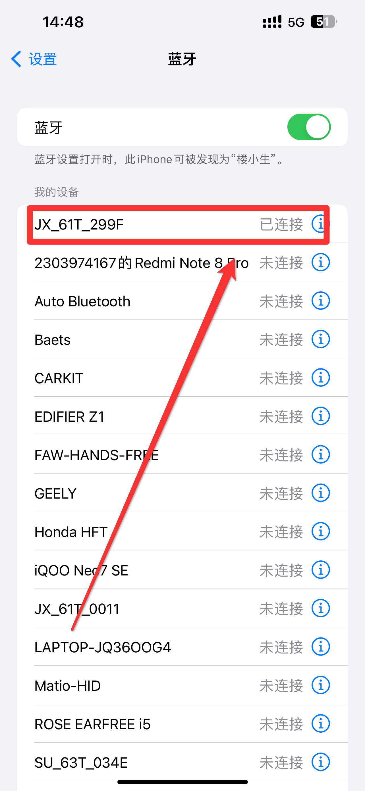


**注意事项：**

- SU-63T是集成蓝牙功能的型号
- 除蓝牙功能外，其他功能与SU-32T基本一致
- 可通过串口命令实现完整的音乐播放控制

---

### SU-32T英文版工程中稳态降噪功能无法开启怎么办？

**问题描述：**

在SU-32T英文版工程中，稳态降噪开关无法点击开启，界面无响应，而中文版工程可以正常操作。

**解决方案：**

**问题现象：**

- 英文版工程中稳态降噪开关呈灰色，无法点击
- Pin脚配置页面显示"暂无数据"
- 界面操作无任何响应

**解决方法：**

1. **刷新页面重试**：

    - 可能是页面卡顿或加载异常
    - 刷新浏览器页面后重新尝试
    - 清除浏览器缓存后再操作

2. **重新创建工程**：

    - 如刷新后仍无法解决，建议新建工程
    - 重新配置所有参数
    - 生成新的英文版固件

3. **对比中文版配置**：

    - 中文版工程可正常开启稳态降噪
    - 对比两个版本的配置差异
    - 确认英文版配置完整性

**界面示例：**


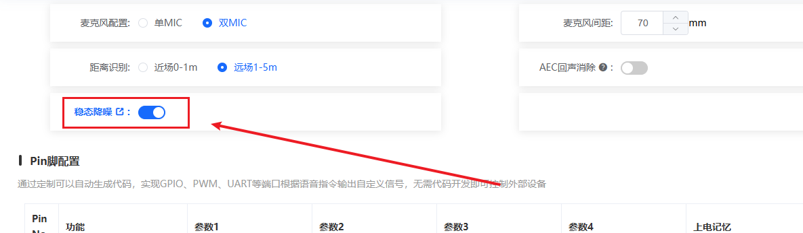

**注意事项：**

- 英文版和中文版的功能支持可能存在差异
- 确保使用最新版本的智能公元平台
- 如问题持续存在，建议使用中文版工程配置英文命令词
- Pin脚配置显示"暂无数据"说明页面加载异常，需要刷新或重进

---


### SU-32T烧录时卡在"擦写中"状态怎么办？

**问题描述：**

SU-32T模块在烧录过程中卡在"spl 擦写中..."状态，无法完成烧录。

**解决方案：**

**1. 检查硬件连接**

- 确认RX和TX引脚没有短路
- 检查焊接是否存在连焊或虚焊
- 验证连接线路是否正确

**2. 检查烧录使能脚（P51）**

- P51引脚必须接地才能进入烧录模式
- 不要给P51加上拉电阻到3.3V
- 烧录时保持P51为低电平

**3. 烧录步骤确认**

- 连接好烧录线路
- 按住复位键（保持P51接地）
- 上电进入烧录模式
- 开始烧录操作

**注意事项：**

- SU-32T烧录速度较慢是正常现象
- 烧录时间较长但不会"慢到令人发指"
- 确保烧录过程中供电稳定
- 如反复失败，检查硬件连接是否正确

---

### SU-32T串口通信配置后无输出数据怎么办？

**问题描述：**

SU-32T芯片配置串口通信后，硬件连接正确且喇叭能正常工作，但串口无法输出数据。而相同开发板使用SU-05芯片时串口通信正常。

**解决方案：**

**1. 确认UART3引脚位置**

- UART3_TX对应PIN_37
- UART3_RX对应PIN_38
- 不是PIN_10和PIN_11


**2. 检查串口配置**

- 波特率：9600
- 数据位：8
- 停止位：1
- 校验位：无

**3. 验证数据格式**

串口输出数据格式示例：

- AB BA 00 00 00 00 00 01 CD DC


**4. 编写发送函数**

需要在平台中编写串口数据发送函数，配置串口引脚和参数后，通过函数实现数据发送。

**注意事项：**

- SU-32T与SU-05的引脚定义可能不同
- 确保引脚连接正确（TX对RX，RX对TX）
- 检查GND连接是否可靠
- 供电电压需稳定（VIN 5V）

---

### SU-32T能正常语音交互但串口无输出怎么办？

**问题描述：**

SU-32T模块能够正常进行语音交互，但串口通信无法输出数据到PC端。

**解决方案：**

**1. 检查串口配置**

- 确认波特率设置为9600
- 数据位：8，停止位：1，校验位：无
- 确认使用正确的串口端口（COM3）


**2. 验证平台配置**

- 检查是否配置了串口数据发送
- 确认UART1_TX已配置发送参数
- 发送数据格式示例：98 A3 0B FE


**3. GPIO引脚配置检查**

- 如使用UART0，需在平台配置GPIO_05为UART0_TX
- 检查引脚复用配置是否正确
- 确认TX/RX引脚没有被其他功能占用


**4. 硬件连接验证**

- 确认TX对RX、RX对TX交叉连接
- 检查GND是否可靠接地
- 使用万用表测试线路连通性

**5. 产品型号确认**

- 确保平台选择的产品型号为SU-32T
- 不是SU-03T或其他型号
- 不同型号引脚定义可能不同


**注意事项：**

- SU-32T使用UART0时，PIN_54为TX，PIN_53为RX
- 串口通信需要在平台中编写发送函数
- 如使用UART1，引脚位置会不同
- 确保USB转TTL模块工作正常

---

### SU-32T如何通过串口协议触发指定音频播放？

**问题描述：**

需要了解SU-32T模块的串口通信协议格式，包括帧结构、波特率设置，以及如何通过串口接收固定数据来触发指定音频播放。

**解决方案：**

**1. 串口通信协议格式**

串口协议采用固定帧格式：

- 帧头：AA 55
- 消息编号：1字节（如01、10等）
- 参数数据：可变长度
- 帧尾：55 AA

示例格式：

- AA 55 10 01 55 AA：触发播报"病人跌倒"
- AA 55 01 24 55 AA：触发播报"当前温度为36摄氏度"

**2. 波特率配置**

- 默认波特率：115200
- 数据位：8
- 停止位：1
- 校验位：无

TX和RX的波特率会同步修改，需与上位机或下位机保持一致。

**3. 参数使用说明**

- 消息编号用于区分不同的触发命令
- 参数数值可以动态填入，实现通用性
- 示例：AA 55 01 25 55 AA 会播报"当前温度为37摄氏度"


**4. 配置步骤**

1. 在平台中添加串口输入触发设置
2. 设置对应的消息编号和输入参数
3. 上传个性化音频文件
4. 配置触发行为与播报内容

**注意事项：**

- 参数只支持16进制数，不支持字符串类型
- 消息编号必须保持一致，参数数据可以变化
- 如不需要参数效果，可直接删除参数部分

---

### SU-32T如何在语音播报中添加串口参数？

**问题描述：**

需要实现通过串口发送参数，让语音播报内容能够动态显示数值（如温度值），并了解参数类型支持情况。

**解决方案：**

**1. 添加串口参数**

在配置语音播报内容时：

1. 输入基础播报文本（如"当前温度为"）
2. 点击"添加串口参数"按钮
3. 设置参数名（如temp）
4. 选择参数类型（支持unsigned等数值类型）
5. 设置测试值（如36）
6. 继续输入后续文本（如"摄氏度"）


**2. 参数类型说明**

- 支持类型：只支持16进制数值类型
- 不支持：字符串类型
- 常用类型：unsigned（无符号整数）

**3. 串口发送格式**

发送数据格式：AA 55 [消息编号] [参数值] 55 AA
- AA 55 01 24 55 AA：播报"当前温度为36摄氏度"
- AA 55 01 25 55 AA：播报"当前温度为37摄氏度"

**注意事项：**

- 参数值需要转换为16进制格式
- 同一个消息编号下，参数值可以动态变化
- 测试值仅用于平台调试，实际播报以接收到的串口数据为准

---

### SU-32T如何实现串口命令控制多档位？

**问题描述：**

需要通过一条串口命令控制1-5档位的切换，并了解如何将串口参数赋值给变量，通过变量触发相应的定时器操作。

**解决方案：**

**1. 串口命令设计**

使用固定消息编号接收档位参数：

- AA 55 01 01 55 AA：1档
- AA 55 01 02 55 AA：2档
- AA 55 01 03 55 AA：3档
- AA 55 01 04 55 AA：4档
- AA 55 01 05 55 AA：5档

**2. 实现思路**

1. 配置串口输入，设置消息编号（如01）
2. 将接收到的参数赋值给变量（如gear）
3. 通过变量触发定时器
4. 在定时器中添加档位控制逻辑

**3. 配置步骤**

1. 添加一个定时器，用于判断档位变量
2. 为每个档位（1-5档）分别配置5个定时器操作命令
3. 定时器根据gear变量值执行对应操作

**注意事项：**

- 一条串口命令即可实现档位切换
- 需要为每个档位单独配置定时器操作
- 变量赋值后可通过条件判断触发不同操作

---

### SU-32T是否支持中英文混合工程？

**问题描述：**

询问是否可以在同一个工程中同时配置中英文语言，还是必须分开配置。

**解决方案：**

SU-32T不支持在同一个工程中混合配置中英文语言。

**注意事项：**

- 中英文必须分别创建独立工程
- 每个工程只能选择单一语言
- 如需支持多语言，需要生成不同的固件版本

---

### SU-32T固件生成失败怎么办？

**问题描述：**

配置检测提示有问题，但系统仍显示"正在生成"，导致固件无法成功生成。

**解决方案：**

**1. 检查配置检测结果**

- 平台发布时会进行配置检测
- 如检测有问题，必须先解决才能生成固件
- 配置检测不通过无法继续生成流程

**2. 常见配置问题**

- 命令词配置冲突
- 引脚配置错误
- 参数设置不当
- 资源超出限制

**3. 解决步骤**

1. 仔细查看配置检测的提示信息
2. 根据提示修改相关配置
3. 确保所有检测项都通过
4. 重新尝试生成固件


**注意事项：**

- 配置检测必须全部通过才能生成固件
- 不要忽略任何警告或错误提示
- 如不确定问题所在，可联系技术支持

---

### SU-32T语音播报内容如何正确配置变量？

**问题描述：**

配置语音播报内容时，不确定如何正确设置语音内容以实现"当前档位为gear档"的播报，且对变量的使用存在疑问。

**解决方案：**

**1. 正确配置步骤**

1. 第一行输入："当前档位为"
2. 第二行添加变量：gear（参数类型选择unsigned）
3. 第三行输入："档"

**2. 错误示例纠正**

错误做法：

- 在一行中写入"当前档位为gear档"
- 将"gear"作为文本而非变量添加

正确做法：

- 将内容分三行配置
- gear作为参数变量单独一行
- 不在文本中包含变量名


**3. 测试值说明**

- 测试值仅用于平台调试
- 实际播报以串口接收到的参数为准
- AA 55 01 01 55 AA 会播报"当前档位为1档"
- AA 55 01 02 55 AA 会播报"当前档位为2档"

**注意事项：**

- 变量需要单独作为一行添加
- 不要在文本行中包含变量名
- 测试值不影响实际使用，仅用于调试

---

### SU-32T如何配置命令词实现精确档位控制？

**问题描述：**

需要通过语音指令词控制设备档位（如1档、2档等），并了解命令词的配置方法和注意事项。

**解决方案：**

**1. 命令词配置要求**

- 必须使用中文数字（如"一档"、"二档"）
- 每个档位需要单独配置一条命令词
- 5个档位需要配置5条命令词

**2. 配置示例**

| 命令词 | 触发条件 | 执行动作 |
|---------|---------|---------|
| 调节到一档 | 档 | 已调节至1档 |
| 调节到二档 | 档 | 已调节至2档 |
| 调节到三档 | 档 | 已调节至3档 |
| 调节到四档 | 档 | 已调节至4档 |
| 调节到五档 | 档 | 已调节至5档 |


**3. 注意事项**

- 不支持使用变量名作为命令词
- 每条命令词必须准确对应具体档位
- 温度控制同样需要逐个添加（如"调节到20度"）
- 命令词需要准确配置，避免识别错误

**4. 实现建议**

对于需要数值范围的场景（如温度设置）：

- 建议使用关键词+参数的组合方式
- 通过串口发送具体数值，语音只负责触发类别

---

### SU-32T与SU-63T在蓝牙功能上有什么区别？

**问题描述：**

需要了解SU-63T是否支持蓝牙音乐功能，开发方式是否与SU-32T相同，以及在降噪和音频播放质量上的差异。

**解决方案：**

**1. 蓝牙功能支持**

- SU-63T：支持蓝牙功能，可连接手机播放音乐
- SU-32T：不支持蓝牙功能

**2. 开发方式**

- SU-63T的开发方式与SU-32T相同
- 都支持串口与其他芯片通信
- 平台配置方法一致

**3. 性能对比**

- 降噪效果：差距不大，性能相当
- 音频播放质量：两者都很不错
- 功能差异：SU-63T额外支持蓝牙音乐

**4. UART控制功能**

SU-63T可通过UART控制：

- 音乐播放/暂停
- 音乐上一首/下一首
- 音乐快进/快退
- 音量控制
- 循环播放/随机播放


**注意事项：**

- SU-63T是集成蓝牙功能的型号
- 除蓝牙功能外，其他功能与SU-32T基本一致
- 可通过串口命令实现完整的音乐播放控制

### SU-32T开发板烧录失败怎么办？

**问题描述：**

使用SU-32T开发板进行固件烧录时，烧录工具一直报错导致烧录失败。

**解决方案：**

烧录前需要正确设置开发板上的拨码开关：

1. **拨码开关设置**
    - 将开发板上的8个小拨码开关拨到靠近字母的一侧
    - 确保所有开关都远离数字的一端
    - 开关设置错误会导致烧录一直报错

2. **烧录操作步骤**
    - 先检查并设置好拨码开关位置
    - 连接USB线到电脑
    - 打开烧录工具进行固件更新
    - 确认开发板供电正常（LED灯亮起）


**注意事项：**

- 拨码开关位置错误是烧录失败的常见原因
- 如烧录失败，首先检查拨码开关设置
- 具体的烧录操作顺序可参考开发板使用指南


---

### SU-32T烧录时重新上电后仍处于等待状态？

**问题描述：**

SU-32T模块在烧录过程中，按照操作重新上电后，烧录工具仍然显示"等待设备"状态，无法继续烧录。

**解决方案：**

**问题原因分析：**

- 烧录线没有正确连接
- 线路接触不良，烧录工具未能与芯片建立连接
- USB接口或转接头问题

**处理方法：**

1. **检查连接线路**
    - 确认USB线已正确连接到电脑
    - 检查USB转串口驱动是否正常
    - 确认烧录线与模块的接触是否良好

2. **正确的烧录上电时序**
    - 先点击烧录工具的"开始烧录"按钮
    - 然后拔掉模块的5V电源线
    - 等待2秒后重新插上5V电源
    - 模块会自动进入烧录模式

3. **故障排查步骤**
    - 更换USB线或USB端口
    - 重新安装USB转串口驱动
    - 检查烧录工具的端口设置是否正确
    - 使用万用表检查供电是否正常

**注意事项：**

- 烧录时序很重要，必须严格按照"先点击烧录，后重新上电"的顺序
- 如果一直显示等待状态，大概率是连接问题
- 确保使用原配或质量良好的USB线

---

### SU-32T连接电脑后无法识别端口怎么办？

**问题描述：**

SU-32T模块通过USB连接电脑后，在设备管理器中看不到任何COM端口，导致无法进行烧录。

**解决方案：**

**1. 硬件状态检查**

- **模块供电**：红色指示灯亮起表示模块已上电
- **连接状态**：仅指示灯亮不代表USB通信正常
- **可能原因**：USB转串口芯片未被正确识别

**2. 驱动问题排查**

- **CH340驱动**：大多数USB转串口使用CH340芯片
    - 下载地址：http://www.wch.cn/downloads/CH341SER_ZIP.html
    - 安装对应操作系统的驱动程序
    - 重启电脑后重新连接

- **端口查看**：

    - 打开设备管理器
    - 展开"端口（COM和LPT）"
    - 查看是否出现新的COM端口

**3. 连接检查步骤**

1. **重新连接USB**：

    - 更换USB端口
    - 使用质量更好的USB线
    - 避免使用USB延长线

2. **检查USB线**：

    - 确认USB线支持数据传输（非仅充电线）
    - 测试USB线在其他设备上是否正常
    - 必要时更换原装USB线

3. **环境排除**：

    - 尝试连接到另一台电脑
    - 关闭杀毒软件的USB保护
    - 以管理员身份运行烧录工具

**4. 硬件确认**

如果问题持续存在：

- **测试方法**：在其他电脑上测试模块
- **模块故障**：如果多台电脑都无法识别
- **技术支持**：联系供应商更换模块

**注意事项：**

- SU-32T使用USB转UART进行通信
- 必须安装正确的驱动程序
- 确保USB线是4芯（支持数据传输）
- 设备管理器中无端口通常是驱动问题

---

### 如何确认SU-32T固件是否烧录成功？

**问题描述：**

需要确认SU-32T模块是否已成功烧录特定固件，该固件包含指定的唤醒词和产品信息。

**解决方案：**

**1. 核对固件信息**

烧录前确认固件文件信息：

- 固件文件名：jx_su_32t_release.bin
- 产品信息：科城达电子科技有限公司/汽车改装/SU-32T V1.1
- 唤醒词：汽车管家
- 开机播报：无
- 回复语：无
- MD5校验值：e207162bb42d84262fd3d042c1aa53b8

**2. 验证烧录结果**

- 完成烧录后，上电测试模块
- 说出唤醒词"汽车管家"验证响应
- 确认模块能正常识别并执行指令

**3. 固件配置确认**

- 检查固件是否包含所需的自定义词条
- 验证产品信息是否正确写入
- 确认唤醒词配置符合要求

**注意事项：**

- 烧录前建议记录固件的MD5值，用于验证文件完整性
- 固件包含的产品信息会在模块初始化时使用
- 如唤醒词无法触发，建议重新检查烧录过程

---

### CI-03T串口通信如何配置？（SU-32T参考）

**问题描述：**

需要了解CI-03T模块的串口通信配置方法，SU-32T的串口配置可以作为参考。

**解决方案：**

**1. CI-03T串口通信配置参考**

根据SU-32T的配置经验，CI-03T的串口配置类似：

- **串口引脚**：

    - CI-03T：PB5(TX)/PB6(RX)
    - 确保TX-RX交叉连接
    - 使用100Ω电阻保护电路

- **波特率设置**：

    - 默认：921600
    - 某些版本支持115200
    - 确保与接收端匹配

**2. 串口数据收发配置**

参考SU-32T的配置方法：

- **串口输入配置**：

    - 控制方式：接口触发
    - 控制类型：UART1_RX
    - 接收16进制数据

- **串口发送配置**：

    - 控制方式：端口输出
    - 控制类型：UART1_TX
    - 动作：发送16进制数

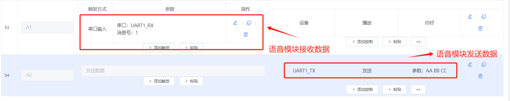

**3. 通信协议示例**

```
接收数据处理：

- 循环判断接收到的16进制数据
- 解析协议帧头、命令、数据
- 根据命令执行相应操作

发送数据格式：

- AA BB CC（示例数据）
- 支持变量替换：{变量名}
- 最大长度32字节
```

**4. 调试建议**

- 使用串口调试助手测试
- 先测试简单的数据收发
- 确认硬件连接正确
- 逐步增加功能复杂度

**注意事项：**

- CI-03T与SU-32T引脚定义可能不同
- 配置时需要参考具体型号的数据手册
- 串口通信需要交叉连接（TX接RX）
- 长距离通信建议使用232电平转换

---

### 收到的模块与资料不符如何确认型号？

**问题描述：**

收到的实物模块与提供的资料不符，需要确认正确的模块型号和相关资料。

**解决方案：**

**1. 型号确认方法**

- 检查模块上印刷的型号标识
- 对比实物与资料图片的差异
- 确认订购的型号与收到的型号是否一致

**2. 资料获取途径**

- SU-32T文档：https://help.aimachip.com/docs/offline_su32t/su-32tkfb_123
- 根据实际收到的型号查找对应文档
- 联系技术支持获取正确的技术资料

**注意事项：**

- 收货后及时核对型号和版本
- 保留好包装和标签信息便于追溯
- 如有型号不符及时联系销售或技术支持


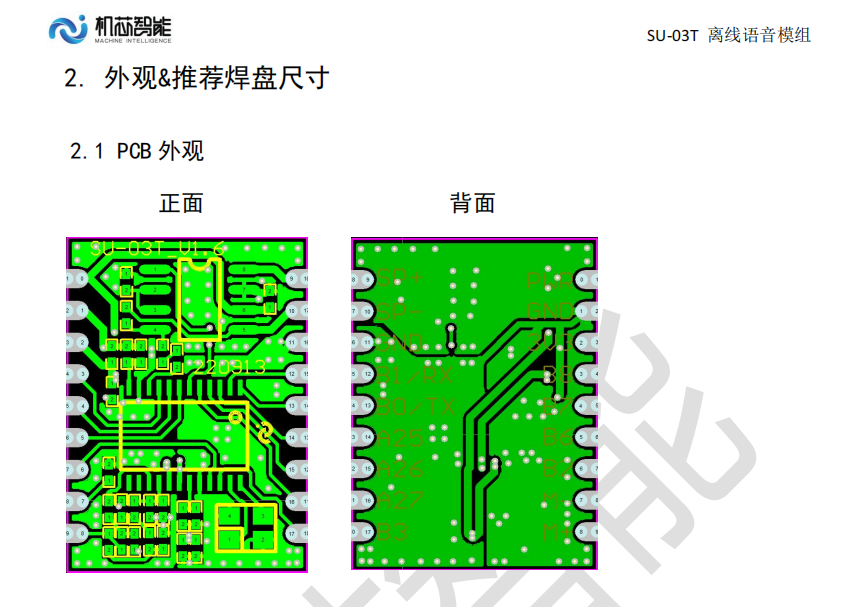

---


---

### SU-32T开发板如何购买和连接音频输出？

**问题描述：**

在购买SU-32T开发板时收到了错误的版本（开发板+喇叭），并咨询了音频输出接口的连接方式（是否需要电容隔离）以及开发板的购买渠道。

**解决方案：**

**1. 开发板购买渠道**

- 淘宝有售：https://item.taobao.com/item.htm?id=676010860983&skuId=5507490902319
- 开发板包含USB接口、麦克风和排针
- 便于调试和测试，避免频繁切换boot

**2. 音频输出连接**

- 可以直接连接音频信号到模块
- 音频输入可以连接GND和一个声道
- 具体连接参考麦克风参考电路图
- 包含TVS保护电路设计

**3. 错误版本处理**

- 收到错误版本时联系销售退换
- 保留订单号：2443722601949751377
- 记录商品链接和型号信息

**注意事项：**

- 音频连接前确认信号电平匹配
- 开发板版本差异需及时与卖家确认
- 保留好购买凭证便于售后处理

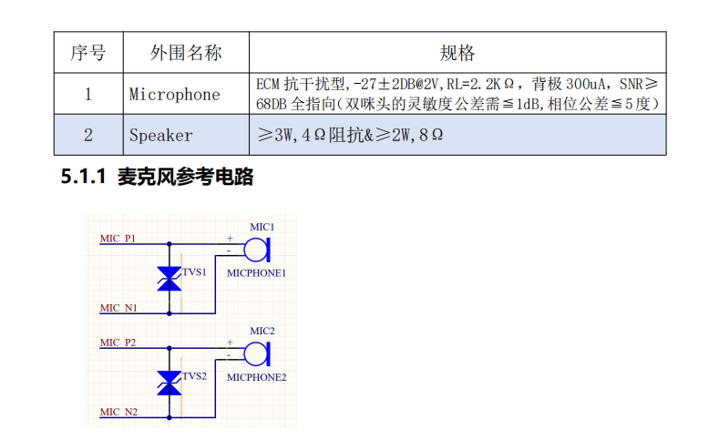


---

### SU-32T烧录出现"COM3重试30次，下载失败"错误

**问题描述：**

使用烧录工具给 SU-32T 模块烧录固件时，出现"COM3重试30次，下载失败"的错误提示，导致固件无法正常下载。

**解决方案：**

**故障现象：**

- 烧录工具显示设备状态为 "spl 6%"
- 提示"COM3重试30次，下载失败"
- 下载进度停滞在早期阶段

**排查步骤：**

1. **检查硬件连接**
    - 确认 USB 转串口模块连接正常
    - 检查串口线是否松动
    - 验证模块供电是否稳定（4.5V-5.5V）

2. **更换电脑尝试**
    - 有时可能是电脑 USB 口或驱动问题
    - 尝试更换不同电脑或 USB 接口
    - 确认 CH340 驱动已正确安装

3. **调整烧录参数**
    - 降低波特率（如从默认 1500000 降至 921600 或更低）
    - 在烧录工具中勾选"全擦除"选项
    - 确认下载速率设置正确

4. **进入下载模式**
    - 确保模块正确进入下载模式
    - 上电时按住下载键（如有）
    - 或通过特定引脚组合进入下载模式

**预防措施：**

- 使用质量良好的 USB 数据线
- 避免使用 USB 延长线
- 确保供电电源稳定
- 烧录前关闭其他占用串口的程序

---

### SU-32T固件生成速度慢怎么办？

**问题描述：**

智能公元平台生成固件时速度很慢，提示"后台排队人多"，需要等待很长时间。

**解决方案：**

**原因分析：**

- 使用在线平台生成固件，需要服务器处理
- 同时段用户较多时需要排队等待
- 复杂配置的固件生成时间更长

**解决方案：**

1. **使用 SU-03T 本地编译环境**
    - SU-03T 支持搭建本地编译环境
    - 可参考环境搭建教学视频：[SU-03T二次开发教程之环境搭建](https://www.bilibili.com/video/BV1Yr4y1R7CS/)
    - 下载相关工具链在本地编译

2. **优化配置策略**
    - 避免在高峰期生成固件
    - 简化不必要的配置项
    - 保存配置文件，分批生成测试

3. **二次开发方案**
    - 对于复杂项目，考虑二次开发
    - 自建编译环境，提高开发效率
    - 适合批量生产和快速迭代

**注意事项：**

- SU-32T 目前不支持本地编译环境
- 本地编译需要一定的技术基础
- 建议保留配置文件便于重复使用
- 可联系技术支持获取更快的生成通道

---

### SU-32T ADC 功能配置失败

**问题描述：**

在 SU-32T 配置 ADC 功能时，添加 ADC 输入检测后固件生成失败，删除 ADC 配置后恢复正常。

**解决方案：**

**问题现象：**

- 配置 ADC 输入检测后生成失败
- 提示配置错误，但无明显错误信息
- 其他 GPIO 功能配置正常

**解决方法：**

1. **检查 ADC 配置参数**
    - ADC 输入范围：0-3.3V（不能检测 5V）
    - ADC 对应值：0-4096（12位精度）
    - 确保触发值在有效范围内（0-4096）

2. **避免某些配置组合**
    - 部分功能可能与 ADC 冲突
    - 避免同时配置多个复杂功能
    - 简化配置逐步测试

3. **使用替代方案**
    - 考虑使用串口通信获取传感器数据
    - ADC 误差较大，不适合精密测量
    - 对于 5V 信号，需要分压电路

**ADC 使用建议：**

- 仅适用于 0-3.3V 电压检测
- 使用电位器调节输入电压范围
- 预留一定的误差裕量
- 建议实际测试验证精度

---

### SU-32T 如何实现温度检测与播报？

**问题描述：**

需要使用 SU-32T 检测温度并根据不同温度值进行语音播报，如播报"当前温度 20℃"。

**解决方案：**

**技术限制：**

- ADC 只能检测 0-3.3V 电压
- ADC 存在较大误差（约 ±5%）
- 不支持直接的温度传感器通信

**实现方案：**

1. **模拟量温度检测**
    ```
    温度传感器 → 0-5V信号 → 电位器分压 → ADC输入(0-3.3V)
    ```
    - 使用电位器将 0-5V 信号调节到 0-3.3V
    - ADC 读取分压后的电压值
    - 根据电压比例计算温度

2. **多阈值配置**
    - 创建多个 ADC 检测命令（如 33 条）
    - 每个 ADC 值对应一个温度点
    - 设置变量标记温度范围
    - 通过语音命令触发温度播报

3. **配置示例**
    - ADC 值 1314 → 变量 A=1 → 播报"温度 20℃"
    - ADC 值 2628 → 变量 A=2 → 播报"温度 40℃"
    - 根据实际传感器特性计算 ADC 阈值

**优化建议：**

1. **使用串口方案（推荐）**
    - 选用带串口输出的温湿度传感器
    - 通过 UART 协议直接读取温度值
    - 精度更高，使用更方便

2. **误差处理**
    - ADC 误差较大，适合范围检测
    - 设置合理的温度区间
    - 避免精确到小数点的要求

3. **硬件优化**
    - 使用高质量的温度传感器
    - 添加滤波电路减少噪声
    - 定期校准确保准确性

**注意事项：**

- 5V 信号必须经过分压才能输入 ADC
- 建议预留 10-20% 的测量裕量
- 实际应用中需要充分测试验证
---

