# SU-63T 烧录与调试 FAQ

本页用于整理 SU-63T 相关的烧录与调试问题。

## 设备识别与连接

### SU-63T使用UniOne蜂鸟M烧录工具无法识别设备怎么办？

**问题描述：**

在使用云知声UniOne蜂鸟M烧录工具为SU-63T模块烧录固件时，设备无法被识别，烧录程序卡在'等待设备..'状态，且更换USB口后问题依旧。

**解决方案：**

**问题分析：**

- 使用了错误名称的烧录器（杰里而非杰理）
- SU-63T需要使用专用的杰理烧录器
- 云知声UniOne蜂鸟M烧录工具可能不兼容SU-63T

**正确烧录方法：**

1. **使用杰理烧录器**
    - 确认购买的是"杰理烧录器"而非"杰里烧录器"
    - SU-63T模块必须搭配杰理烧录器使用
    - 通过商品详情确认烧录器要求

2. **烧录器连接**
    - 将SU-63T模块连接到杰理烧录器
    - 烧录器通过USB连接电脑
    - 确认物理连接良好

3. **烧录软件选择**
    - 使用杰理专用烧录软件
    - 或使用云知声工具但搭配杰理烧录器
    - 确保软件与烧录器匹配

**操作步骤：**

1. 连接杰理烧录器和模块
2. 打开烧录软件
3. 选择正确的固件文件
4. 断开模块电源
5. 点击烧录后重新上电

**注意事项：**

- SU-63T的烧录方式与其他型号不同
- 必须使用专用烧录器，普通USB转串口无效
- 烧录器名称容易混淆，购买时务必确认
- 正常烧录不会长时间等待设备

---

### SU-63T使用CH340驱动后设备无法被识别怎么办？

**问题描述：**

在安装CH340驱动后，将SU-63T模块连接到电脑时无法被识别，且没有任何报错信息，导致无法完成烧录操作。

**解决方案：**

1. **检查CH340驱动安装**
    - 确认CH340驱动已正确安装
    - 在设备管理器中查看端口（COM和LPT）下是否显示CH340设备
    - 如果显示未知设备或带有感叹号，需要重新安装驱动

2. **驱动安装步骤**
    - 下载官方CH340驱动安装包
    - 右键以管理员身份运行安装程序
    - 安装完成后重新插拔USB设备
    - 检查设备管理器确认COM端口号

3. **连接测试**
    - 确认SU-63T模块通过正确的烧录器连接
    - 使用质量良好的USB线缆
    - 尝试更换电脑的USB端口
    - 避免使用USB集线器，直接连接主板USB口

4. **故障排查**
    - 如果驱动安装正常但仍无法识别，检查硬件连接
    - 尝试在其他电脑上测试，排除电脑系统问题
    - 确认烧录器工作正常，指示灯有响应

**注意事项：**

- CH340驱动在某些Windows系统可能需要禁用驱动签名强制
- 建议使用官方提供的CH340驱动，避免使用第三方驱动
- 完成驱动安装后需要重启电脑以确保驱动生效
---

### SU-63T在使用云知声UniOne蜂鸟M烧录工具时设备连接不稳定怎么办？

**问题描述：**

在使用云知声UniOne蜂鸟M烧录工具时，设备已连接但无法识别，且在轻微触碰语音模块时会出现设备状态异常的情况。

**解决方案：**

**1. 连接稳定性检查**

- **USB接触问题**：USB接口接触不良会导致断连
- **供电稳定性**：供电问题可能导致串口驱动掉载
- **物理连接**：确保所有连接牢固无松动

**2. 故障排查步骤**

- **检查USB线缆**：

    - 确认USB线质量良好
    - 更换不同USB线尝试
    - 避免使用过长的USB线

- **验证USB端口**：

    - 尝试电脑的不同USB端口
    - 避免使用USB集线器
    - 直接连接到主板USB端口

- **确认烧录器状态**：

    - 检查烧录器指示灯是否正常
    - 重新插拔烧录器连接
    - 确认烧录器驱动已安装

**3. 解决方案**

- **稳定连接**：

    - 确保USB接口完全插入
    - 避免烧录过程中移动设备
    - 使用支撑物固定连接位置

- **供电改善**：

    - 使用电脑背面USB端口（供电更稳定）
    - 避免供电不足的USB扩展口
    - 必要时使用外部供电

**4. 测试验证**

- 连接成功后观察设备状态
- 轻微触碰测试连接稳定性
- 确认烧录工具能正常识别

**注意事项：**

- USB接口的物理接触直接影响连接稳定性
- 烧录过程中避免任何物理干扰
- 如问题持续，可能是烧录器硬件故障
- 建议使用原装或质量可靠的USB连接线

---

**问题描述：**

在使用云知声UniOne蜂鸟M烧录工具为SU-63T模块烧录固件时，设备无法被识别，烧录程序卡在'等待设备..'状态，且更换USB口后问题依旧。

**解决方案：**

**问题分析：**

- 使用了错误名称的烧录器（杰里而非杰理）
- SU-63T需要使用专用的杰理烧录器
- 云知声UniOne蜂鸟M烧录工具可能不兼容SU-63T

**正确烧录方法：**

1. **使用杰理烧录器**
    - 确认购买的是"杰理烧录器"而非"杰里烧录器"
    - SU-63T模块必须搭配杰理烧录器使用
    - 通过商品详情确认烧录器要求

2. **烧录器连接**
    - 将SU-63T模块连接到杰理烧录器
    - 烧录器通过USB连接电脑
    - 确认物理连接良好

3. **烧录软件选择**
    - 使用杰理专用烧录软件
    - 或使用云知声工具但搭配杰理烧录器
    - 确保软件与烧录器匹配

**操作步骤：**

1. 连接杰理烧录器和模块
2. 打开烧录软件
3. 选择正确的固件文件
4. 断开模块电源
5. 点击烧录后重新上电

**注意事项：**

- SU-63T的烧录方式与其他型号不同
- 必须使用专用烧录器，普通USB转串口无效
- 烧录器名称容易混淆，购买时务必确认
- 正常烧录不会长时间等待设备

---

### SU-63T V1.1支持小程序连接吗？

**问题描述：**

SU-63T V1.1型号无法通过小程序搜索到设备进行设置。

**解决方案：**

- **版本差异说明**：

    - SU-63T V1.1可能不支持小程序功能
    - 小程序连接通常需要特定的硬件版本
    - 需要确认产品是否支持蓝牙/WiFi功能

- **设置方式**：

    - 使用专用烧录器进行固件更新
    - 通过串口连接电脑进行配置
    - 使用官方提供的配置工具

**注意事项：**

- 不是所有SU-63T版本都支持小程序
- 确认设备型号和版本号
- 如需小程序功能，购买时确认规格
- 可联系技术支持确认功能支持情况

---

### SU-63T模块如何进行固件烧录？

### SU-63T模块如何进行固件烧录？

**问题描述：**

刚收到SU-63T模块，希望了解如何烧录固件，但不确定如何操作，特别是如何使用杰理烧录器和选择正确的固件文件。

**解决方案：**

**烧录器确认：**

1. **必须使用杰理烧录器**：

    - SU-63T是杰理芯片方案，必须使用专用的杰理USB烧录器
    - 不能使用普通的CH340等USB转串口工具
    - 杰理烧录器上有专门的USB接口用于连接

2. **烧录器接口说明**：

    ```
    杰理烧录器接口：

    - VCC：电源正极
    - GND：地线
    - IN：数据输入
    - DP：数据正负极
    ```

**烧录步骤：**

1. **连接硬件**：

    - 将SU-63T模块通过USB线连接到杰理烧录器
    - 烧录器连接到电脑的USB口
    - 电脑会识别到新的USB设备

2. **启动烧录软件**：

    - 打开杰理烧录软件（如JL USB Updater）
    - 软件会自动识别连接的SU-63T模块
    - 确认设备识别正常

3. **选择固件文件**：

    - 在软件中加载需要烧录的固件文件
    - 通常为.bin格式
    - 确认固件版本与SU-63T匹配

4. **执行烧录**：

    - 点击烧录按钮开始烧录过程
    - 等待进度条完成
    - 烧录成功后模块会自动重启

**固件获取：**

1. **出厂固件**：

    - 技术支持会提供SU-63T出厂固件
    - 包含基础功能和演示程序
    - 适合初次测试使用

2. **自定义固件**：

    - 登录智能公元平台
    - 创建新项目并选择SU-63T模块型号
    - 配置语音指令和控制逻辑
    - 生成并下载自定义固件

**注意事项：**

- SU-63T的烧录方式与CI系列不同，必须使用杰理专用烧录器
- 烧录前确保模块已正确连接到烧录器
- 固件文件必须是未压缩的.bin格式
- 烧录过程中不要断开连接
- 如烧录失败，重新尝试前先复位模块


### 添加蓝牙信号强度控制导致SU-63T固件生成失败怎么办？

**问题描述：**

在小程序平台中添加"获取蓝牙信号强度"的控制逻辑后，导致SU-63T固件生成失败。去掉该功能后固件可以正常生成。

**解决方案：**

**问题分析：**

1. **功能兼容性问题**：

    - SU-63T当前固件版本可能不支持蓝牙信号强度检测功能
    - 该功能与现有固件架构存在冲突
    - 需要等待固件版本更新支持

2. **生成时间过长**：

    - SU-63T固件生成本身较慢，通常需要30分钟或更长时间
    - 添加复杂功能会进一步延长生成时间
    - 可能误判为生成失败

**临时解决方案：**

1. **移除问题功能**：

    - 暂时从配置中移除"获取蓝牙信号强度"功能
    - 先完成其他功能的配置和测试
    - 等待固件更新支持该功能

2. **分步骤测试**：

    - 先生成基础功能固件进行测试
    - 确认基础功能正常后再逐步添加新功能
    - 每添加一个功能就生成一次测试

3. **联系技术支持**：

    - 向技术支持反馈该功能兼容性问题
    - 询问是否有支持蓝牙信号检测的固件版本
    - 获取该功能的正确配置方法

**注意事项：**

- SU-63T固件生成时间较长，需要有足够耐心等待
- 不是所有功能都兼容当前固件版本
- 建议在项目初期就测试所有需要的功能
- 保留功能配置，等待固件更新后重新生成


---

### SU-63T模块支持哪些烧录方式？

SU-63T模块仅支持专用烧录器烧录：

- **杰理烧录器**：必须使用杰理专用烧录器进行固件烧录
- **不支持串口烧录**：该模块无法通过串口方式烧录固件

**烧录器连接方式：**

1. **USB转接板连接**：

    - 烧录器通过USB连接电脑
    - 通过专用转接板连接SU-63T模块
    - 转接板提供USB转接和串口通信功能

2. **购买渠道**：

    - 淘宝官方店铺：https://item.taobao.com/item.htm?id=696689348201
    - 选择包含烧录器套装的选项
    - 确认购买的是杰理专用烧录器

**烧录连接说明：**

- VBUS：USB供电
- D-、D+：USB数据线
- GND：接地
- UART1_TX/RX：串口通信（用于调试）
- SPK+/SPK-：音频输出
- VCC：电源输入

**烧录器接口说明：**

烧录器顶部的USB接口功能：

- **接口类型**：标准USB接口
- **功能用途**：连接串口烧录线（TX、RX、VCC、GND）
- **转接功能**：将USB信号转换为串口通信
- **包含在套装中**：购买烧录器套餐包含此USB转接板

**使用方式：**

1. 烧录器通过USB连接电脑
2. USB转接板提供串口接口
3. 通过排线连接到SU-63T模块
4. 实现固件烧录功能

**注意事项：**

- 必须使用杰理原厂烧录器，不支持第三方工具
- 烧录时需要配合专用烧录软件
- 不支持串口直连烧录方式
- 购买时确认套装包含所需转接板
- USB转接板是套餐标配，无需额外购买

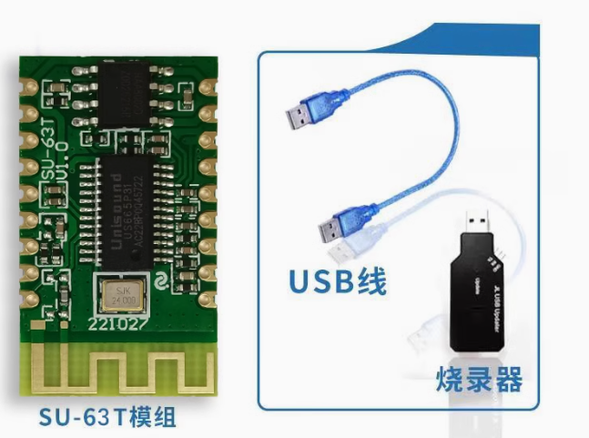

---

### SU-63T固件烧录失败、蓝牙配对异常及唤醒无响应怎么办？

**问题描述：**

使用SU-63T模块时，可能出现固件烧录成功但蓝牙配对失败、语音唤醒功能不响应以及功放使能脚电平异常等问题。

**解决方案：**

**1. 烧录问题排查**

- **烧录器选择**：必须使用杰理专用烧录器，通用USB转串口设备无法烧录
- **正确接线**：

    - VCC→VBUS（电源正极）
    - RX→D-（数据负极）
    - TX→D+（数据正极）
    - GND→GND（电源地线）
- **供电要求**：烧录时使用4.12V电源供电

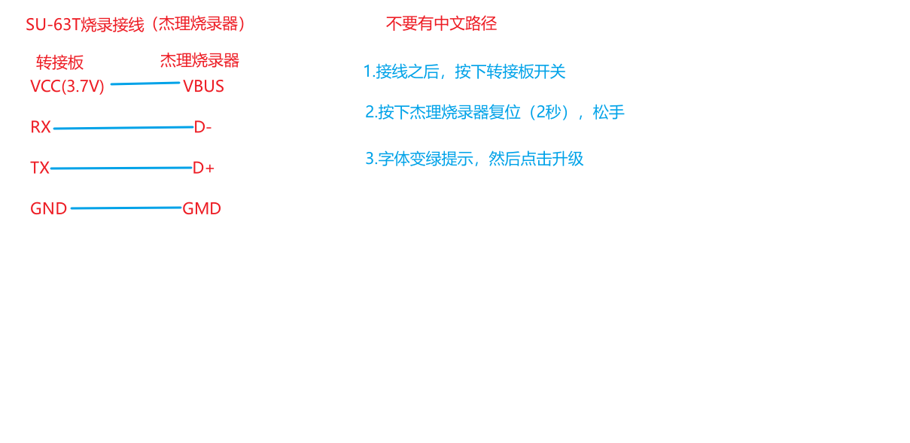

**2. 蓝牙配对失败**

- **重新上电**：断电后重新上电尝试配对
- **设备名称**：搜索设备名称为'SU_63T_XXXX(BLE)'的设备
- **避免干扰**：配对时远离其他蓝牙设备

**3. 语音唤醒无响应**

- **检查麦克风电路**：

    - 测量麦克风两端电压，应有2.4V左右
    - 确认麦克风GND连接良好
    - 必要时在麦克风电路增加电容
- **检查固件配置**：确认唤醒词已正确配置

**4. 功放使能脚（SPK_SD）电平异常**

- **电平逻辑**：功放为低电平使能，播放时为低电平，静音时为高电平
- **GPIO配置**：确保SPK_SD（GPIO17）未配置为串口功能
- **配置方法**：在平台中将GPIO17设置为默认低电平输出模式


**5. 避免开机播报被打断**

- **延时配置**：将"打开蓝牙"操作延时设置为8000ms
- **目的**：等待开机播报完成后再开启蓝牙功能
- **调整方法**：在系统控制配置中设置延时时间


**6. GPIO配置注意事项**

- **PB9/PB10引脚**：这两个引脚默认用于PWM输出，不应配置为串口
- **UART2配置**：如需使用串口，应选择其他可用引脚
- **重新生成**：修改配置后必须重新生成并烧录固件

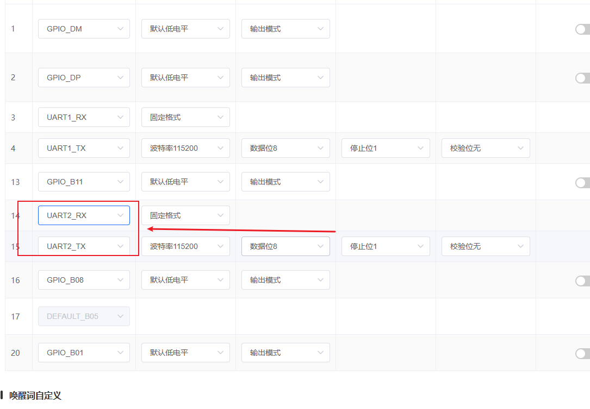

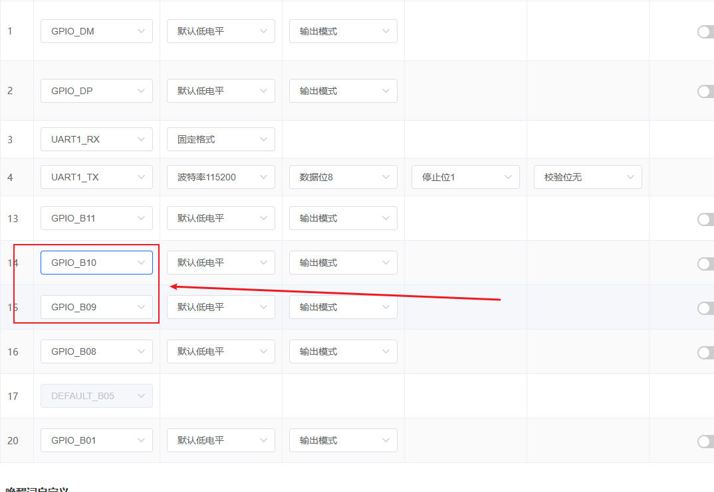

**注意事项：**

- 烧录路径不能包含中文字符
- 固件文件应使用jx_su_63t_release.fw
- SDK生成时间较长（60-180分钟），SU系列相对较慢是正常现象
- 如需快速生成，可搭建本地开发环境自行编译

---

### USB烧录器无法识别设备怎么办？

**问题描述：**

使用USB烧录器下载固件时，遇到"无法识别的USB设备"错误提示，且更换USB接口和重启电脑后问题依旧存在。

**解决方案：**

**问题排查：**

- **驱动安装**：确认杰理烧录器驱动已正确安装
- **USB接口**：尝试不同的USB接口（USB2.0/3.0）
- **连接检查**：确认烧录器与模块连接牢固
- **模块状态**：

    - 检查模块是否已损坏
    - 确认引脚连接正确（非第一脚）
    - 避免模块过热时烧录

**解决方法：**

1. **更换烧录器**：尝试使用另一个正常的烧录器
2. **重新安装驱动**：卸载后重新安装官方驱动
3. **检查模块**：

    - 使用能正常烧录的模块测试
    - 确认硬件连接无误
    - 如模块损坏需要更换

**预防措施：**

- 烧录前检查所有连接
- 避免热插拔烧录器
- 使用官方提供的烧录工具

---

### SU-63T模块是否有硬件评估板？

SU-63T模块可通过转接板进行评估测试：

**评估套件组成：**

- 模块本体
- 转接板（已焊接必要器件）
- 专用烧录器（需单独购买）
- 完整技术资料包

**烧录要求：**

- 只能使用专用烧录器进行固件烧录
- 烧录时需要配合专用烧录软件
- 按照接线图正确连接模块、转接板和烧录器

**测试配置：**

- 可外接麦克风进行语音输入测试
- 可连接喇叭播放语音回复
- 支持蓝牙功能测试（需配合手机APP）

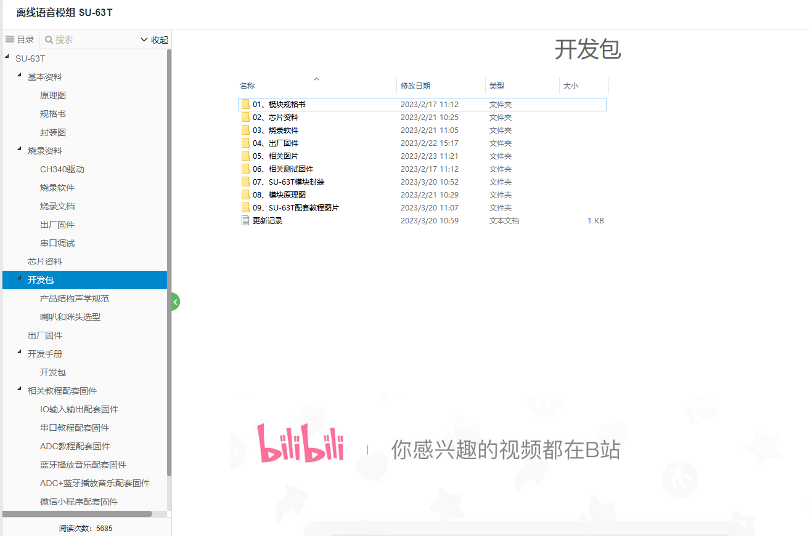

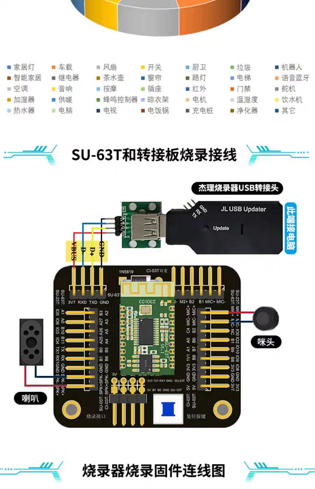

**获取方式：**

- 可直接通过淘宝购买包含模块、转接板的套装（参考价格127元）
- 购买后可获得完整的技术资料包，包含：

    - 模块规格书
    - 芯片资料手册
    - 烧录软件工具
    - 相关测试固件
    - 接线原理图

**注意事项：**

- 烧录器为必备工具，无法用其他方式替代
- 转接板方便初期评估，量产时需设计自有底板
- 评估时建议使用5V稳定电源供电

---

### 购买模块时应该选择哪种版本？

如果用户已有咪头和喇叭，建议购买**已焊接排针**的模块版本，这样可以直接使用，无需额外焊接

### 烧录时提示"设备存储容量不足，1M < 2M"怎么办？

**问题描述：**

使用烧录软件烧录固件时，出现错误提示"错误：设备存储容量不足，1M < 2M"，导致烧录失败。

**解决方案：**

**问题原因：**

1. **固件大小超出限制**：

    - 目标模块Flash容量只有1M
    - 待烧录固件大小为2M
    - 固件体积超出了硬件存储上限

2. **硬件不匹配**：

    - 可能选择了错误型号的固件
    - SU-63T可能有不同容量版本
    - 需要确认模块具体规格

**解决方法：**

1. **确认模块型号**：

    - 检查模块上的丝印标识
    - 确认是否为1M容量版本
    - 联系供应商确认规格参数

2. **使用正确固件**：

    - 生成1M容量版本的固件
    - 或选择更大容量的模块型号
    - 确保固件与硬件匹配

3. **固件优化**：

    - 删减非必要功能
    - 减小音频文件大小
    - 使用组合播报功能

**注意事项：**

- 烧录前务必确认固件版本与模块型号匹配
- 1M容量的模块无法烧录2M的固件
- 如需大容量功能，请选用相应规格的模块


### SU-63T小程序中无法修改语音指令怎么办？

**问题描述：**

在使用SU-63T小程序时，发现无法修改语音指令，尝试删除或修改指令均无效。

**解决方案：**

- **网络环境检查**：可能是网络卡顿导致操作失败，建议切换网络后重试
- **操作时间限制**：修改操作一般不超过5分钟，超时则说明操作失败
- **指令数量限制**：SU-63T最多支持50条指令，超过限制无法添加
- **使用出厂固件**：烧录标准出厂固件测试，确认是否为固件问题

**操作步骤：**

1. **网络切换测试**
    - 切换到稳定的网络环境
    - 关闭小程序重新打开
    - 重新尝试修改指令

2. **指令数量检查**
    - 查看当前指令总数
    - 如超过50条，先删除部分指令
    - 确保总数在限制范围内

3. **恢复出厂设置**
    - 烧录出厂固件进行测试
    - 确认基础功能是否正常
    - 重新配置需要的指令

**注意事项：**

- 修改指令时保持网络连接稳定
- 避免在指令数量达到上限时操作
- 如问题持续存在，可能是云之声服务器API对接问题
- 建议保存配置备份，避免数据丢失

### SU-63T不能使用CH340烧录吗？

**问题描述：**

尝试使用CH340串口工具烧录SU-63T模块，按照接线图连接但烧录失败。

**解决方案：**

- **烧录器要求**：

    - SU-63T必须使用专用烧录器（黑色JL USB Updater）
    - CH340等普通串口工具无法识别杰理芯片
    - 专用烧录器通过特定协议与芯片通信

- **烧录步骤**：

    1. 使用专用烧录器连接SU-63T
    2. 打开固件升级工具（版本1.4.5）
    3. 添加固件文件
    4. 按下烧录器上的按键
    5. 开始烧录过程

**注意事项：**

- 专用烧录器是杰理芯片的必备工具
- 接线必须按照官方提供的烧录接线图
- 烧录失败时检查是否使用了正确的烧录器

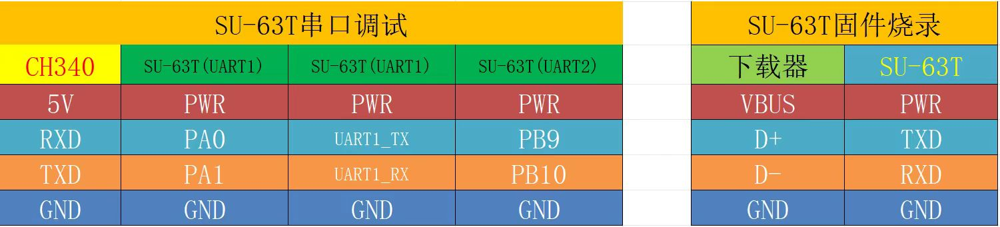

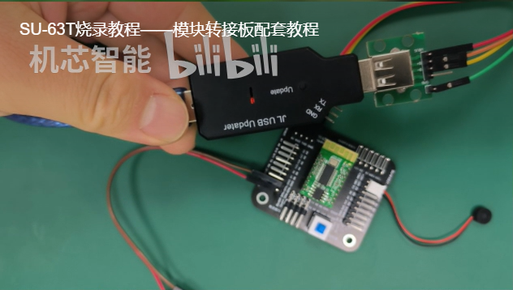

### SU-63T烧录器插入电脑无反应？

**问题描述：**

SU-63T专用烧录器插入电脑后，在设备管理器中无法识别到设备。

**解决方案：**

- **识别检查**：

    - 正常识别时设备管理器会显示"EA"设备（便携设备下）
    - 如无识别，尝试按下烧录器上的按键
    - 检查USB接口是否接触良好

- **烧录软件状态**：

    - 正确连接后烧录软件显示设备状态为"ONLINE"
    - 设备PID/VID会正确显示
    - 添加固件后可开始烧录

- **故障处理**：

    - 尝试更换电脑USB接口
    - 排除USB集线器，直连主板
    - 如仍无法识别可能是烧录器故障

**注意事项：**

- 烧录器需要按下按键才能被识别
- USB拓展坞建议只保留烧录器，避免设备冲突
- 多台电脑都无法识别时，考虑更换烧录器

---

### SU-63T烧录器连接后烧录失败？

**问题描述：**

烧录器连接电脑后在固件升级工具中显示为"ONLINE"，但烧录过程在94%左右失败。

**解决方案：**

- **接线检查**：

    - 对照官方烧录接线图确认连接
    - 重点检查VBUS、PWR、D+、D-等关键引脚
    - 确保连接牢固无松动

- **烧录步骤**：

    1. 添加固件到烧录工具
    2. 按下烧录器上的按键
    3. 等待设备识别
    4. 开始烧录过程

- **故障排查**：

    - 尝试使用不同的USB线
    - 检查电脑USB口供电能力
    - 重新插拔烧录器连接

**注意事项：**

- 烧录过程中不要移动设备
- 94%失败通常是通信或供电问题
- 建议使用电脑后置USB接口

---

### SU-63T烧录器插入电脑无反应？

**问题描述：**

SU-63T专用烧录器插入电脑后，在设备管理器中无法识别到设备。

**解决方案：**

- **识别检查**：

    - 正常识别时设备管理器会显示"EA"设备（便携设备下）
    - 如无识别，尝试按下烧录器上的按键
    - 检查USB接口是否接触良好

- **烧录软件状态**：

    - 正确连接后烧录软件显示设备状态为"ONLINE"
    - 设备PID/VID会正确显示
    - 添加固件后可开始烧录

- **故障处理**：

    - 尝试更换电脑USB接口
    - 排除USB集线器，直连主板
    - 如仍无法识别可能是烧录器故障

**注意事项：**

- 烧录器需要按下按键才能被识别
- USB拓展坞建议只保留烧录器，避免设备冲突
- 多台电脑都无法识别时，考虑更换烧录器

---

### SU-63T烧录器连接后烧录失败？

**问题描述：**

烧录器连接电脑后在固件升级工具中显示为"ONLINE"，但烧录过程在94%左右失败。

**解决方案：**

- **接线检查**：

    - 对照官方烧录接线图确认连接
    - 重点检查VBUS、PWR、D+、D-等关键引脚
    - 确保连接牢固无松动

- **烧录步骤**：

    1. 添加固件到烧录工具
    2. 按下烧录器上的按键
    3. 等待设备识别
    4. 开始烧录过程

- **故障排查**：

    - 尝试使用不同的USB线
    - 检查电脑USB口供电能力
    - 重新插拔烧录器连接

**注意事项：**

- 烧录过程中不要移动设备
- 94%失败通常是通信或供电问题
- 建议使用电脑后置USB接口

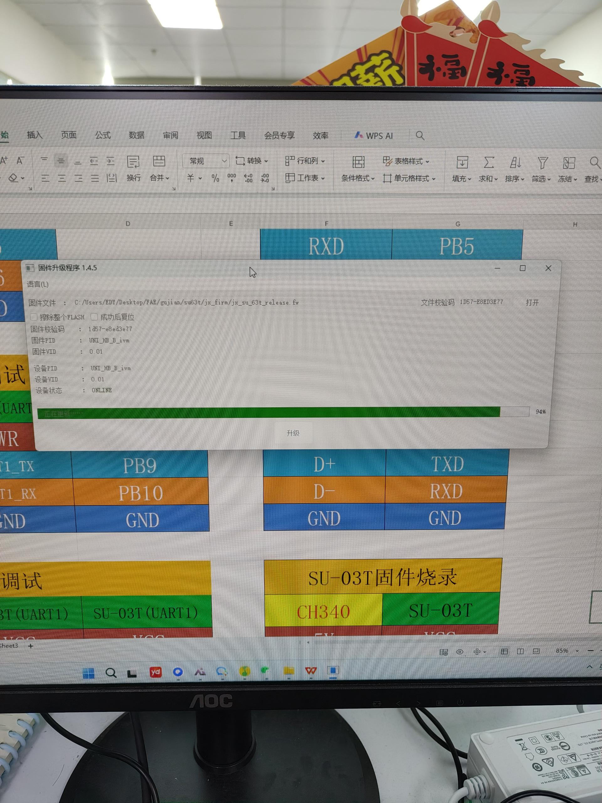

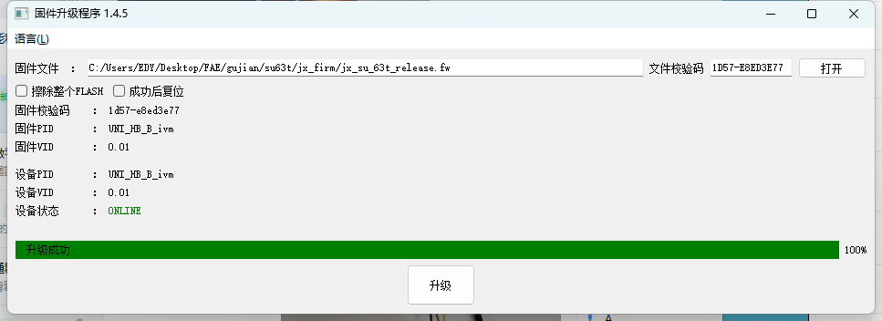

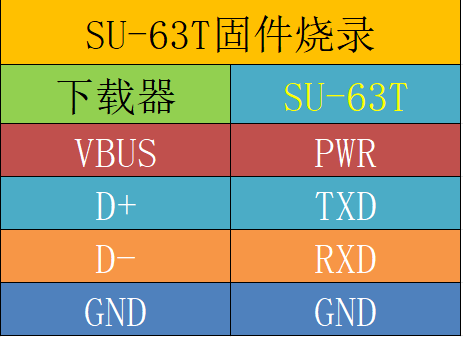

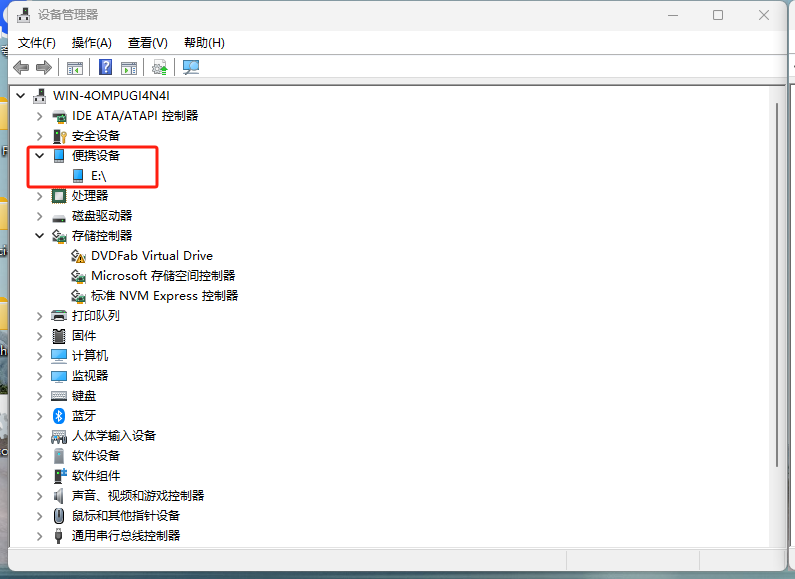


### SU-63T烧录时无反应怎么办？

**问题描述：**

使用VLink2 Lite烧录器为SU-63T芯片烧录固件时，烧录程序无反应。

**解决方案：**

- SU-63T需要使用专用的黑色烧录器
- VLink2 Lite烧录器不适用于SU-63T芯片
- 联系供应商购买SU-63T专用烧录器
- 如需批量烧录，可委托供应商进行批量烧录服务

**注意事项：**

- 不同型号的语音模块使用不同的烧录器
- 购买模块时确认对应的烧录器型号
- 第三方烧录器可能不兼容，建议使用原厂配件
- 批量生产建议考虑烧录效率和成本

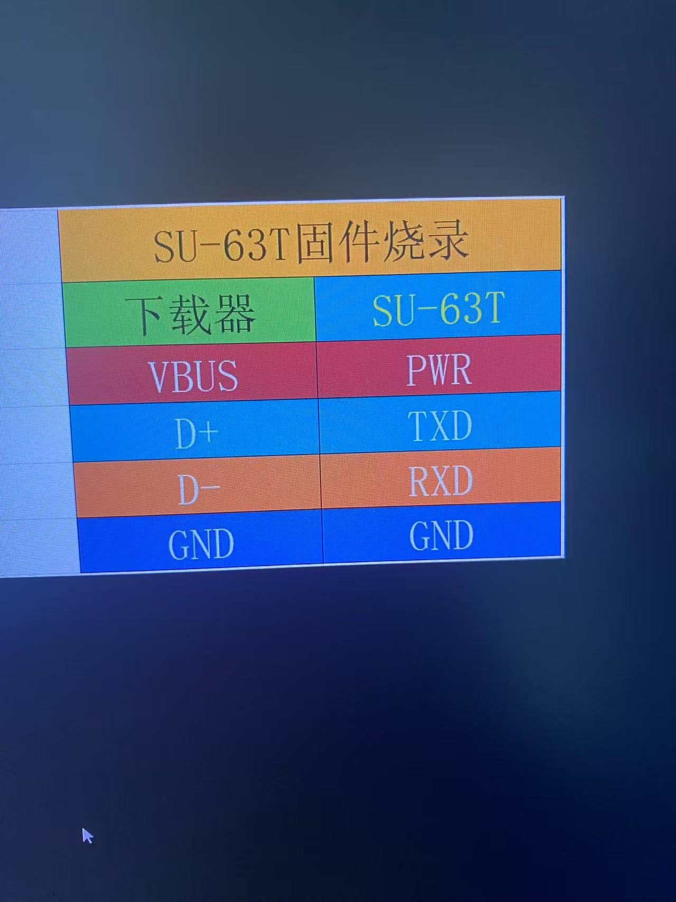

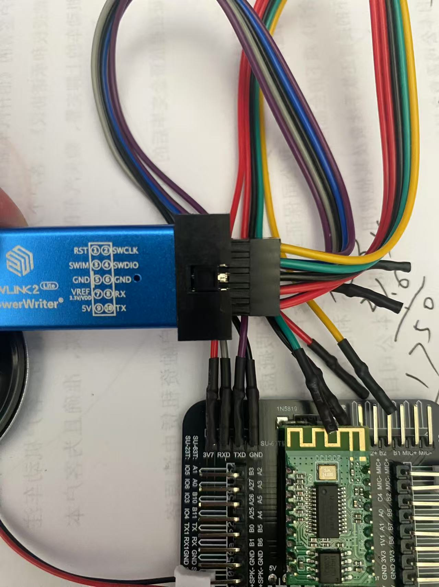

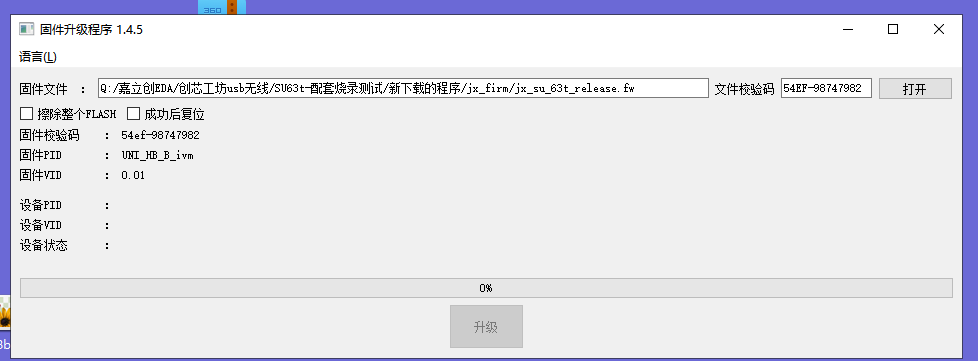

---

### 串口引脚配置为普通IO是否会影响芯片烧录？

**问题描述：**

将串口引脚配置为普通IO功能，担心是否会影响芯片的烧录功能。

**解决方案：**

- 串口引脚配置为普通IO后，仅影响日志输出功能
- 不会影响芯片的烧录功能
- SU-63T模块的烧录逻辑独立于串口配置

**注意事项：**

- 配置完成后仍可正常进行固件烧录
- 仅调试时的串口日志输出会受到影响
- 烧录时仍需按照标准烧录流程操作

---

### SU-63T下载固件时提示存储空间不足怎么办？

**问题描述：**

SU-63T设备在下载固件时提示存储空间不足（1M < 2M），导致升级失败。

**解决方案：**

- **问题原因**：

    - 开启了自学习功能会占用大量存储空间
    - 自学习功能存储用户录入的语音数据
    - 导致可用空间不足以下载新固件

- **解决步骤**：

    1. 在智能公元平台关闭自学习功能
    2. 重新生成固件
    3. 再次尝试下载固件到设备

**注意事项：**

- 自学习功能占用空间很多，如非必要建议关闭
- 关闭自学习后可释放大量存储空间
- 固件大小通常为2M左右，需要足够空间

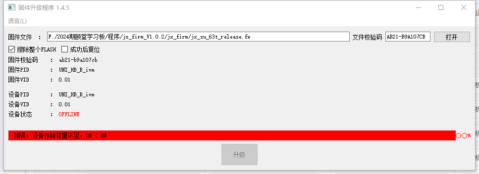

---

### SU-63T烧录时选择了错误芯片型号怎么办？

**问题描述：**

在使用固件升级程序时，因选择错误的芯片型号（如SU-03）导致固件烧录失败。

**解决方案：**

**问题定位：**

1. **型号混淆原因**：

    - SU-63T与SU-03T型号名称相似，容易混淆
    - 固件管理界面中多个型号选项并列
    - 未仔细核对模块丝印确认型号

2. **确认正确型号**：

    - 检查模块上的丝印标识
    - 确认为SU-63T而非SU-03T
    - 对应选择SU-63T的固件文件

**正确烧录步骤：**

1. **选择正确固件**：

    - 在固件管理界面找到SU-63T对应的固件
    - 确认固件文件名包含"su_63t"
    - 如：jx_su_63t_release.fw

2. **使用正确烧录器**：

    - SU-63T必须使用杰理专用烧录器
    - 普通USB转TTL模块无法烧录SU-63T

3. **执行烧录**：

    - 连接SU-63T到专用烧录器
    - 在烧录软件中选择正确的固件文件
    - 完成烧录过程

**预防措施：**

- 烧录前务必核对模块型号
- 保存固件时按型号分类管理
- 建立烧录记录，避免重复错误
- 贴标签区分不同型号的模块


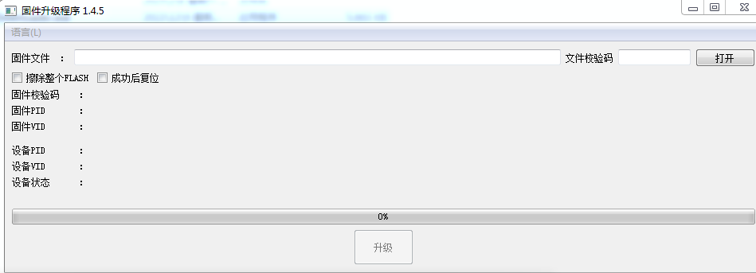

**注意事项：**

- SU-63T和SU-03T使用不同的烧录器
- 型号错误会导致烧录完全失败
- 即使固件生成成功，选错型号也无法使用
- 建议在模块上做标记以便识别

---

### SU-63T可以使用USB转TTL烧录器吗？

**问题描述：**

询问一个USB转TTL的烧录器是否可以用于烧录SU-63T芯片，同时反映在连接后烧录软件的升级按钮无法点击。

**解决方案：**

**烧录器兼容性：**

1. **专用烧录器要求**：

    - SU-63T必须使用专用的杰理烧录器
    - 普通USB转TTL模块无法烧录SU-63T
    - 两个系统不兼容

2. **烧录器区别**：

    - USB转TTL：用于通用串口通信，不支持杰理芯片协议
    - 杰理烧录器：专用工具，通过特定协议与SU-63T通信

**正确烧录方案：**

1. **购买专用烧录器**：

    - 通过官方渠道购买杰理烧录器
    - 淘宝链接：https://item.taobao.com/item.htm?id=696689348201&skuId=5111500846726
    - 确认烧录器型号与SU-63T兼容

2. **烧录操作步骤**：

    - 连接SU-63T到专用烧录器
    - 烧录器通过USB连接电脑
    - 使用杰理烧录软件进行操作

3. **替代方案**：

    - 批量生产时可联系厂家提供烧录服务
    - 购买预烧录好的模块
    - 避免自行烧录的成本和技术门槛

**常见问题说明：**

- **升级按钮无法点击**：使用了不兼容的烧录器导致
- **设备无法识别**：USB转TTL无法与SU-63T建立通信
- **接线无反应**：即使正确连接RX/TX也无法工作

**注意事项：**

- SU-63T的烧录接口为专用接口，不是标准串口
- 不要尝试使用CH340等普通USB转串口工具
- 专用烧录器投资需要根据项目规模评估
- 如需频繁烧录，建议购买原厂烧录器

---

### SU-63T如何进行批量烧录？

**问题描述：**

需要了解SU-63T模块的批量烧录服务，包括起订量、烧录流程和是否支持多种固件同时烧录。

**解决方案：**

**批量烧录服务说明：**

1. **起订量要求**

    - 100个起提供批量烧录服务
    - 100个以下需要自行烧录
    - 散装模块不支持批量烧录

2. **烧录流程**

    - 提供固件包给厂家
    - 厂家在出货前完成烧录
    - 收到后可直接使用

3. **固件要求**

    - 只能烧录同一种类型的固件
    - 不能同时烧录多种不同配置的固件
    - 每种固件需要单独批量烧录

**自行烧录建议：**

1. **小批量处理**

    - 100个以下需自行烧录
    - 购买专用烧录器进行操作
    - 建议预留烧录时间和人力成本

2. **烧录器准备**

    - 使用SU-63T专用杰理烧录器
    - 准备稳定的烧录环境
    - 建议配置多个烧录器提高效率

3. **分批策略**

    - 如需多种固件，分批采购
    - 每批使用相同固件配置
    - 标记区分不同固件的模块

**注意事项：**

- 批量烧录服务免费（100个起）
- 提前沟通好固件版本和配置
- 确保固件文件正确且完整
- 留出足够的生产和交付时间

---

### SU-63T开机语音播报不稳定怎么办？

**问题描述：**

SU-63T模块通电后，自定义的开机语音有时能正常播报，有时却无法播报，导致开机语音不稳定。

**解决方案：**

**1. 问题原因分析**

- 使用CH340等USB转串口模块供电可能导致灌电流
- 灌电流会影响模块正常复位
- 复位不完整导致开机语音无法正常触发

**2. 解决方法**

- **拔插电源线**：完全断开电源重新上电
- **拔插地线**：通过断开地线实现彻底复位
- **使用专用电源**：避免使用CH340的USB供电

**3. 操作步骤**

1. 断开所有电源连接
2. 等待2-3秒让电容完全放电
3. 重新连接电源
4. 测试开机语音是否正常播报

**注意事项：**

- 问题主要出现在使用CH340连接时
- 正常的电源供电（如适配器）不会有此问题
- 如频繁出现，建议检查电源质量
- 340芯片可能需要拔插USB线来断电

---

### SU-63T进行串口通信时应该使用哪个接口？

**问题描述：**

在进行串口通信配置时，发现提供的电路图与实际模块不符，需要确认正确的串口通信接口和配置参数。

**解决方案：**

**1. 串口接口选择**

- SU-63T模块应使用UART2接口进行串口通信
- 不是UART1接口，注意区分
- 确认硬件连接使用正确的UART端口

**2. 通信参数配置**

- **波特率**：9600
- **数据位**：8位
- **停止位**：1位
- **校验位**：无

**3. 硬件连接说明**

**基本连接：**

- VCC：3.3V电源
- GND：地线
- TXD：发送数据（模块发送）
- RXD：接收数据（模块接收）

**音频输出：**

- SPK1、SPK2：扬声器输出

**4. 注意事项**

- 确认使用UART2而非UART1
- 电压电平必须为3.3V
- 不要使用5V电平，可能损坏模块
- 如需固件微调，可联系技术支持

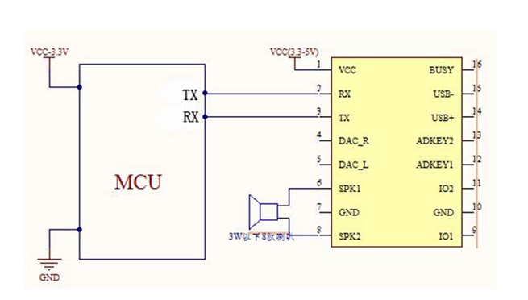

---

### SU-63T的串口引脚如何正确配置？

**问题描述：**

在天问平台配置SU-63T模块引脚时，误用了UART1的烧录和日志引脚，导致无法正常通信，需要了解正确的引脚配置方法。

**解决方案：**

**1. 错误引脚说明**

- **UART1_TX和UART1_RX**：这是烧录和日志输出引脚
- 不是用于常规串口通信
- 使用这些引脚会影响日志调试功能

**2. 正确引脚配置**

**可用串口引脚：**

- **PA0**：可配置为UART1_RX
- **PA1**：可配置为UART1_TX
- **UART2_RX和UART2_TX**：UART2专用引脚

**平台配置方法：**

1. **选择引脚**
    - 点击PA0引脚
    - 配置为UART1_RX功能
    - 点击PA1引脚
    - 配置为UART1_TX功能

2. **避免错误配置**
    - 不要使用UART1的TX/RX引脚
    - 注意区分物理引脚和功能名称
    - 天问平台的封装引脚号与实际模块可能不同

**3. 天问平台注意事项**

- 天问平台的引脚定义与SU-63T实际引脚不同
- 需要对照模块引脚图进行配置
- PB5和PB6不是串口通信引脚

**4. 引脚功能对比**

| 引脚 | 功能 | 用途 |
|-----|-----|-----|
| UART1_TX/UART1_RX | 烧录和日志 | 调试专用 |
| PA0/PA1 | 可配置串口 | 通用通信 |
| UART2_RX/UART2_TX | UART2专用 | 串口通信 |

**注意事项：**

- 配置前务必确认引脚功能
- 保留日志引脚用于后续调试
- 不同平台的引脚定义可能不同
- 如有疑问及时确认技术文档

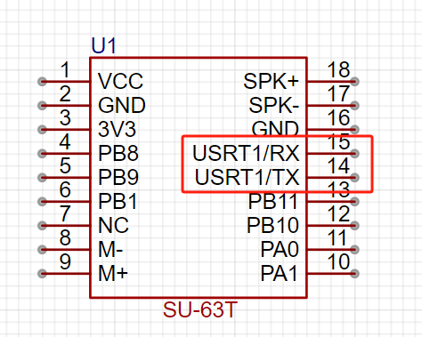

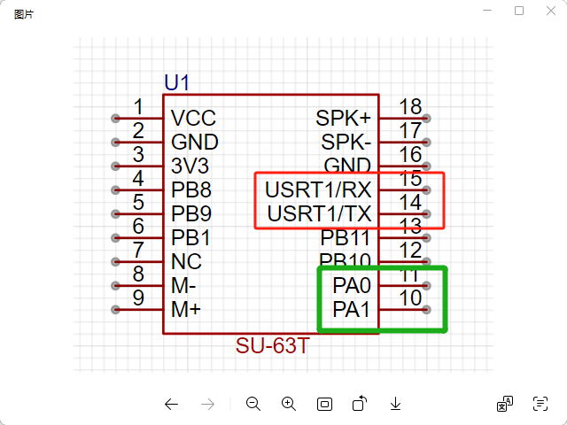

---

### 如何确认SU-63T固件文件的正确性？

**问题描述：**

需要确认SU-63T固件文件jx_su_63t_release.fw是否正确，并提交给技术支持进行代烧录。

**解决方案：**

**1. 固件文件确认**

- **文件位置**：固件文件通常位于解压后的固件包中
- **文件名称**：SU-63T的固件文件通常命名为jx_su_63t_release.fw
- **文件格式**：确保是.fw格式的固件文件

**2. 文件完整性验证**

- **使用哈希值验证**：

    - MD5: 2394722b1a00c8acbbc60b14715cc9ce
    - 可使用Hasher Lite等工具计算文件哈希值
    - 对比计算结果确认文件完整性

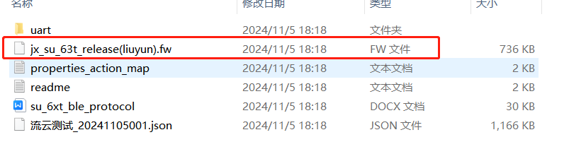


**3. 代烧录服务**

- **提交固件**：

    - 将确认无误的固件文件发送给技术支持
    - 可直接发送.fw文件，无需压缩包
    - 注明固件版本和配置信息

- **固件信息确认**：

    - 开机播报：无
    - 唤醒词：开机
    - 回复语：我在
    - MD5校验值：2394722b1a00c8acbbc60b14715cc9ce

**注意事项：**

- 提交前务必确认固件文件完整性
- 保留固件配置信息的详细记录
- 如有特殊需求，请在提交时说明
- 代烧录服务通常需要1-2个工作日

---

### SU-63T使用杰理烧录器无法识别怎么办？

**问题描述：**

使用杰理烧录器烧录SU-63T模块时，烧录器无法识别到模块。

**解决方案：**

- **烧录器兼容性**：

    - SU-63T必须使用专用烧录器
    - 不能使用通用烧录器或杰理烧录器
    - 需要配合云知声UniOne蜂鸟M烧录器

- **正确操作方法**：

    1. 下载专用SU-63T烧录工具
    2. 使用官方提供的专用烧录器
    3. 确保烧录器驱动已正确安装
    4. 检查USB连接是否牢固

- **故障排查**：

    - 更换USB端口
    - 重新安装烧录器驱动
    - 检查模块是否正常上电
    - 确认烧录器型号匹配

**注意事项：**

- SU-63T烧录需要特殊流程
- 不可使用其他型号的烧录器
- 如持续无法识别，联系专业技术人员

---


---

### SU-63T烧录固件后密码验证不通过怎么办？

**问题描述：**

设备在烧录固件后仍提示密码验证不通过，无法正常连接和使用。

**解决方案：**

**问题原因：**

- 设备之前设置了本地密码
- 重新烧录时未完全擦除Flash内容
- 旧的密码数据仍然保留在芯片中

**解决方法：**

**方法一：使用芯片擦除功能**

1. **在烧录工具中启用Chip Erase**：

    - Leapfive Flash Environment：设置"Chip Erase"为"True"
    - 固件升级程序：勾选"擦除整个FLASH"选项

2. **重新烧录固件**：

    - 启用擦除功能后烧录新固件
    - 等待完整擦除和烧录过程完成
    - 这会清除包括密码在内的所有旧数据

**方法二：烧录后重新配网**

1. **删除小程序控件**：

    - 删除手机中的小程序控件
    - 清除缓存和数据
    - 重新下载并安装

2. **重新配网连接**：

    - 使用默认密码或新密码连接
    - 完成设备配网流程
    - 测试功能是否正常

**操作示例：**

- 在固件升级程序1.4.5中勾选"擦除整个FLASH"
- 确保擦除选项已启用后再开始烧录
- 烧录完成后设备恢复出厂状态

**注意事项：**

- 必须启用完整擦除功能才能清除密码
- 擦除会删除所有数据，包括配置信息
- 烧录后需要重新配置所有功能
- 如忘记密码，擦除是唯一的解决方法

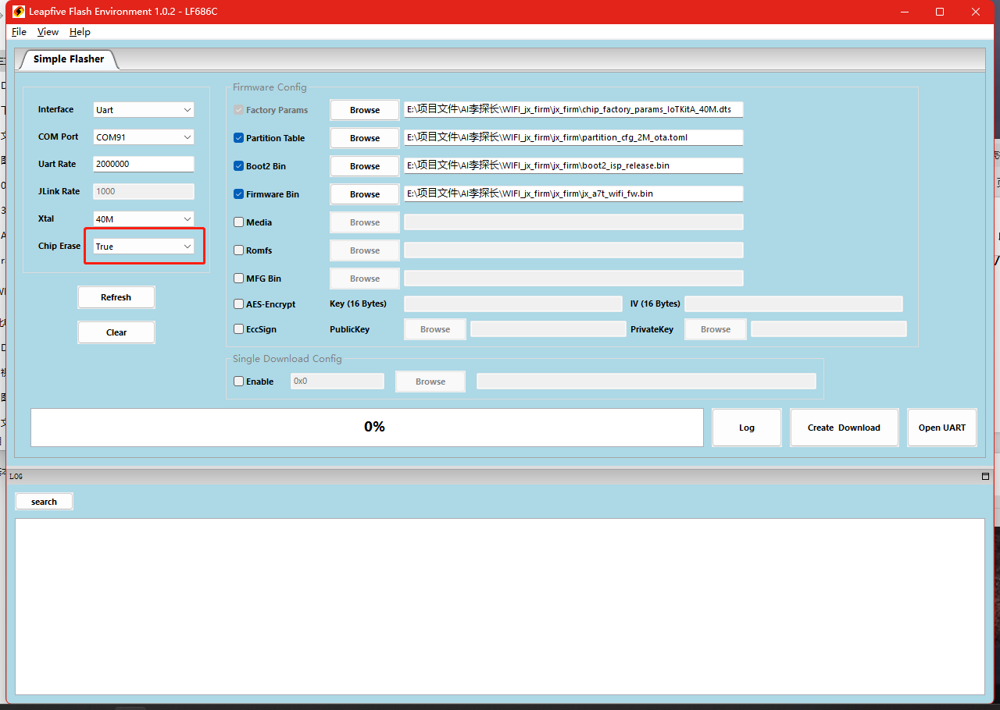

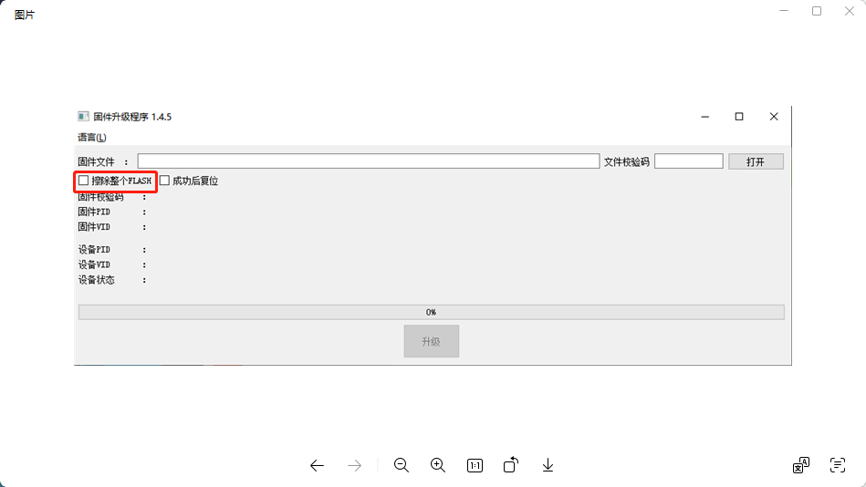

---

### 如何使用USB转TTL模块进行烧录？

**问题描述：**

不确定是否可以使用已有的USB转TTL模块进行固件烧录，还是必须购买专用烧录器。

**解决方案：**

- **模块兼容性**：

    - CI-03T系列：可以使用USB转TTL模块烧录
    - SU-63T：必须使用专用烧录器（特殊情况）
    - 其他型号：一般支持USB转TTL方式

- **USB转TTL使用方法**：

    1. 将USB转TTL模块连接到电脑USB口
    2. 通过杜邦线连接模块的UART引脚（TX、RX、GND、5V）
    3. 安装CH340或CP2102等驱动程序
    4. 在设备管理器中确认COM端口号
    5. 使用烧录工具选择对应COM口进行烧录

- **连接注意事项**：

    - TX连接RX，RX连接TX（交叉连接）
    - 确保共地（GND连接）
    - 5V供电线连接到模块电源引脚
    - 使用质量良好的杜邦线避免接触不良

**注意事项：**

- USB转TTL模块比专用烧录器成本低
- SU-63T型号特殊，需要专用调试器烧录
- 烧录时避免使用过长的连接线
- 如果USB转TTL无法识别，检查驱动安装是否正确

---

### SU-63T烧录器无法被电脑识别如何处理？

**问题描述：**

将SU-63T专用的杰理烧录器插入电脑USB接口后，电脑没有任何反应，设备管理器中未显示新增的串口设备，更换电脑和重启后问题依旧存在。

**解决方案：**

**问题分析：**

- 杰理烧录器与CH340烧录器不同，不会在电脑中显示串口设备
- SU-63T必须使用专用的杰理烧录器和Hummingbird-B-Production-Tool软件
- 使用错误的烧录软件（如天问Block）会导致无法识别

**正确操作步骤：**

1. **确认烧录器类型**

    - SU-63T使用的是杰理烧录器（如图所示）
    - 该烧录器连接电脑后不会显示串口号
    - 红灯常亮、绿灯闪烁表示正常工作状态

    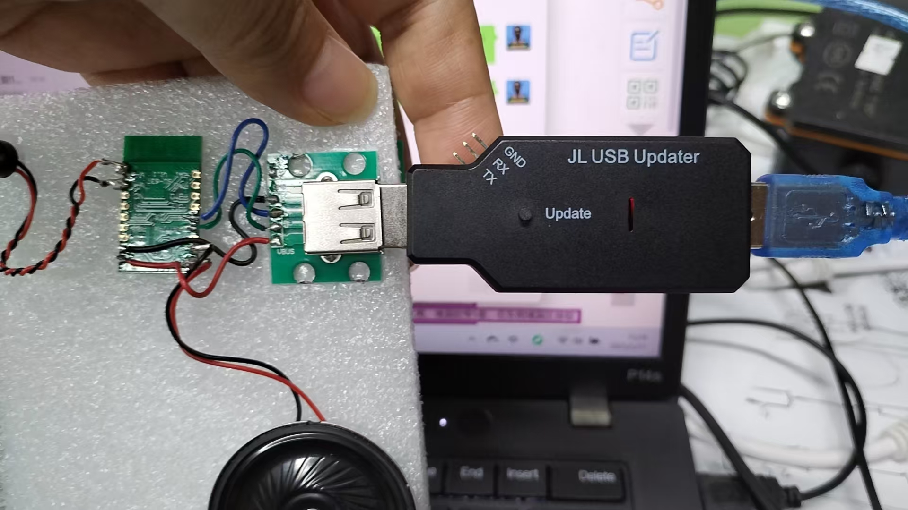

2. **使用正确的烧录软件**

    - 使用Hummingbird-B-Production-Tool软件进行烧录
    - 不要使用天问Block或其他烧录工具
    - 杰理烧录器需要配合专用软件使用

    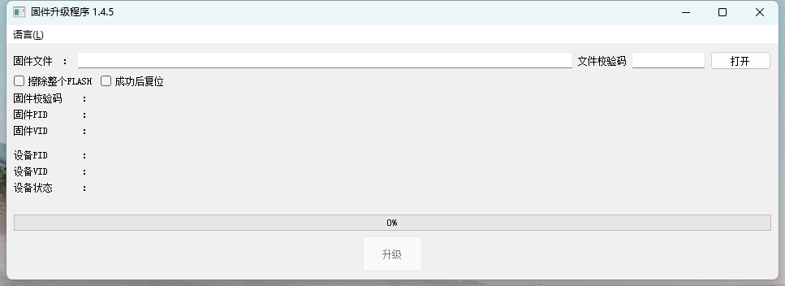

3. **烧录流程**

    - 连接烧录器和SU-63T模块
    - 打开Hummingbird-B-Production-Tool软件
    - 选择对应的固件文件
    - 按照软件提示进行烧录操作

**注意事项：**

- 杰理烧录器不会在设备管理器中显示串口
- 如果烧录器指示灯正常（红灯亮、绿灯闪），说明硬件无问题
- 确保使用专用的Hummingbird-B-Production-Tool烧录软件
- 不同型号语音模块使用的烧录器可能不同，需按型号选择


---

### SU-63T芯片全部无法烧录如何处理？

**问题描述：**

近期采购的SU-63T芯片在进行烧录时，所有芯片均无法烧录成功。

**解决方案：**

**问题排查步骤：**

1. **检查烧录器连接**
    - 确认使用JL USB Updater烧录器
    - 检查USB连接是否正常
    - 确认烧录器驱动已正确安装

2. **检查连接线处理**
    - 操作人员需正确处理连接线
    - 确保排线连接牢固，没有松动
    - 检查排线方向是否正确
    - 确认所有引脚都正确接触

3. **烧录操作验证**
    - 使用正确的固件文件
    - 确认烧录软件版本兼容
    - 按照标准流程进行烧录操作

**常见问题解决：**

- 连接线未正确处理是最常见的烧录失败原因
- 重新插拔并确保连接线固定到位
- 如问题持续，尝试更换连接线或烧录器

**注意事项：**

- SU-63T对连接质量要求较高，务必确保连接可靠
- 批量烧录前建议先测试单个芯片确认流程
- 保留良好的工作习惯，每次烧录前检查连接状态

---

### 固件烧录后如何进行留档管理？

**问题描述：**

需要确认固件烧录的合同信息，并获取已生成的固件文件用于烧录，同时要求对固件进行留档，以确保固件的正确性和完整性。

**解决方案：**

**1. 固件留档内容**

**必要信息记录**：

- 公司名称和项目名称
- 模块型号（如SU-63T、SU-03T）
- 固件文件名和版本
- 开机播报内容
- 唤醒词设置
- 回复语列表
- MD5校验值

**留档格式示例**：
```
公司名称：XXX公司
项目名称：智能语音升降机
模块型号：SU-63T-V1.1
固件文件：jx_su_63t_release.fw
开机播报：无
唤醒词：智能沙发/小度小度
回复语：主人我在/有什么可以帮到你/主人请吩咐
MD5：b1ef030104499e5fbd24809ad9955c30
```

**2. MD5校验方法**

**校验工具**：

- 使用Hasher Lite等校验工具
- 支持MD5、SHA1、SHA256等多种算法
- 可验证固件完整性

**校验步骤**：

1. 打开校验工具
2. 选择固件文件
3. 计算MD5值
4. 与留档记录对比
5. 确认一致性

**3. 合同管理**

**合同内容**：

- 确认开发费用和数量
- 明确技术要求和交付标准
- 双方签字盖章生效

**留档建议**：

- 扫描件和原件分类保存
- 建立项目档案编号
- 便于后续追溯和查询

**注意事项：**

- 固件文件必须做好备份
- MD5值是验证文件完整性的重要依据
- 建议建立版本管理系统
- 重要项目建议保留多个备份副本

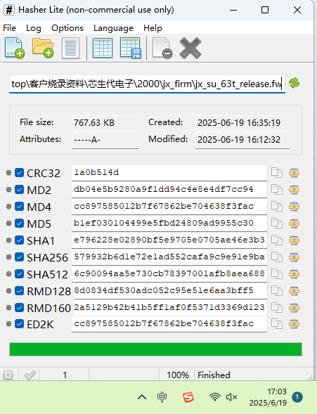
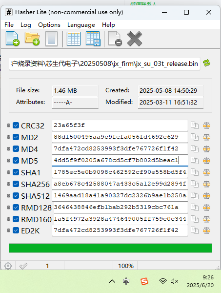

---

## 串口通信调试
---

### 固件升级时反复卡在升级界面怎么办？

**问题描述：**

使用新生成的固件进行升级时，升级过程会反复进行，一直卡在升级界面，而之前生成的固件可以正常升级。

**解决方案：**

**1. 升级过程分析**

- 显示"update success"表示升级已成功
- 反复升级可能是模块自动重启导致
- 升级成功后应取消重复升级选项

**2. 操作建议**

- 等待进度条完成后，取消"自动重复升级"选项
- 升级成功后立即断开连接
- 如使用旧版烧录工具，建议更新到最新版本

**3. 烧录工具更新**

- 推荐使用V3.9.5或更新版本
- 新版本修复了重复升级的问题
- 下载地址可联系技术支持获取

**注意事项：**

- CI-33T和CI-03T暂不支持OTA升级
- 只有SU-63T和JX-12F支持OTA升级功能
- 平台偶尔可能出现配置瑕疵，导致生成固件异常
- 使用最新版烧录工具可避免大部分升级问题

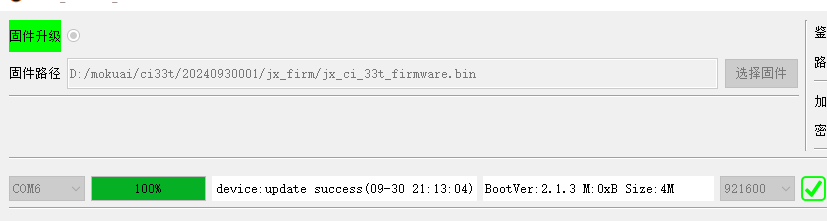
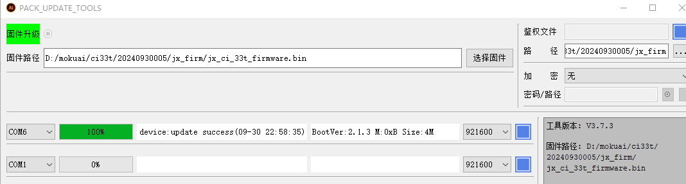

---


### SU-63T使用小程序修改唤醒词后命令顺序错乱怎么办？

**问题描述：**

在手机小程序中修改SU-63T的唤醒词后，模块内的命令词顺序出现反转或错乱。

**解决方案：**

**问题原因：**

- 蓝牙建联后，设备消息还未完全获取就点击修改唤醒词
- 操作过快导致配置数据未同步完成
- 小程序与模块通信存在延迟

**解决方法：**

1. **正确操作流程**
    - 蓝牙连接后等待2-3秒再操作
    - 确保设备信息完全加载后再修改
    - 修改后等待配置完成确认

2. **如已出现错乱**
    - 返回上一页面重新进入
    - 重新连接蓝牙设备
    - 再次进行修改操作

**注意事项：**

- 修改唤醒词和命令词时保持耐心
- 不要在连接建立后立即点击修改
- 修改完成后验证配置是否生效

---

### SU-63T在手机上无法搜索到蓝牙设备怎么办？

**问题描述：**

使用某些品牌（特别是小品牌或杂牌）的手机搜索SU-63T蓝牙设备时，无法找到设备进行连接。

**解决方案：**

**问题原因：**

- Android系统要求扫描蓝牙设备时必须开启定位权限
- 部分手机系统的蓝牙扫描策略更严格
- 定位服务未开启导致蓝牙扫描功能受限

**解决方法：**

1. **开启定位权限**
    - 在手机设置中开启定位服务
    - 授予小程序定位权限
    - 确保定位功能处于开启状态

2. **重新搜索设备**
    - 打开定位后再进行蓝牙搜索
    - 搜索SU_63T_XXXX(BLE)设备
    - 连接后可关闭定位（不影响使用）

**注意事项：**

- 这是Android系统的安全机制要求
- 不同品牌手机对蓝牙扫描的要求不同
- 小米、OPPO等品牌手机必须开启定位
- 连接成功后定位可关闭

---

### SU-63T平台配置界面不显示怎么办？

**问题描述：**

在智能公元平台中打开继承版本的SU-63T项目时，某些配置界面不显示，导致无法进行配置。

**解决方案：**

**问题原因：**

- 平台更新后可能存在兼容性问题
- 继承版本的数据未正确加载
- 浏览器缓存问题

**解决方法：**

1. **页面刷新**
    - 刷新当前页面重新加载
    - 清除浏览器缓存后重试
    - 使用无痕模式打开

2. **版本处理**
    - 确认是否为继承版本
    - 尝试创建新版本而非继承
    - 联系技术支持检查平台状态

**注意事项：**

- 平台更新后可能需要重新登录
- 继承版本有时会直接使用原配置
- 建议在平台更新后等待稳定再操作

---

### SU-63T装在主控板上开机不播报怎么办？

**问题描述：**

SU-63T模块单独测试时开机播报正常，但安装到主控板后开机无播报，语音唤醒功能正常。

**解决方案：**

**问题原因：**

- 主控板给语音模块供电的电压或电流不足
- 主控板的上电时序与模块要求不匹配
- 模块在板上的复位过程不完整

**解决方法：**

1. **检查供电**
    - 测量语音模块供电电压是否稳定
    - 确认供电电流满足模块需求（建议500mA以上）
    - 检查电源线路是否存在压降

2. **检查上电时序**
    - 确认模块先于主控板上电或同时上电
    - 检查复位电路设计
    - 必要时增加延时电路

3. **独立测试**
    - 将模块从板上拆下单独测试
    - 确认模块本身功能正常
    - 排查主控板电路设计

**注意事项：**

- 语音模块对供电质量要求较高
- 开机播报功能需要足够的电源支持
- 语音唤醒正常不代表播报功能正常
- 建议在主控板上增加独立的滤波电容

---
