# CI-03T 硬件设计 FAQ

本页用于整理 CI-03T 相关的硬件设计问题。

## 硬件设计建议

以下设计建议基于 CI-03T 模组的特性，旨在帮助硬件工程师设计出性能稳定、识别率高的产品。

### 1. 电源设计
- **独立供电**：建议使用独立的 LDO 或 DC-DC + LDO 为模组供电，避免与其他大电流设备（如电机、WiFi）共用电源网络，防止电源纹波干扰。
- **滤波电容**：在 VCC 引脚附近紧挨放置 10uF + 100nF 的滤波电容。
- **接地与布线**：

    - 数字地与模拟地在单点汇合，避免大电流回流经过音频前端。
    - 电源走线尽量短且线宽充足。

### 2. 声学设计 (MIC / SPK)
- **麦克风布局**：

    - 走线必须采用 **差分走线**，且包地处理。
    - 麦克风孔应有良好的密封性，避免漏音和回声。
    - 麦克风与喇叭之间应有良好的声学隔离（如使用减震棉），防止自激啸叫。
    - 麦克风距离声源（人嘴）的路径应尽量短且无遮挡。
- **喇叭驱动**：

    - 功放电路应远离麦克风电路。
    - 注意喇叭磁体对天线（如有）的影响。
- **进一步设计建议**：

    - 结构声学设计上，可参考官方提供的《产品结构声学规范》，其中包含模组在不同腔体、开孔方式下的推荐做法及注意事项。
    - 喇叭功率、阻抗以及咪头灵敏度的选择，可参考官方《喇叭和咪头选型推荐》文档，并结合整机响度、失真和成本要求进行评估。

### 3. 接口与防护
- **UART/IO**：预留 TX/RX 测试点以便后续升级调试；推荐在靠近模组处放置串口排针或测试座。
- **ESD 防护**：

    - 对外接口（麦克风、喇叭、按键、触摸接口等）建议放置 ESD 器件。
    - 外部走线靠近接口处注意增加地过孔与保护电阻/电容。

---

### CI-03T的UART接口如何连接？

**问题描述：**

需要了解CI-03T模块的RX、TX引脚是否可以直接与3.3V的MCU进行UART通信连接。

**解决方案：**

- **确认电压兼容性**：

    - CI-03T供电电压范围为3.6V-5.5V
    - UART通信电平与3.3V MCU兼容
    - 可以直接连接，无需电平转换

- **正确连接方式**：

    - CI-03T的RX连接MCU的TX
    - CI-03T的TX连接MCU的RX
    - 共地连接（GND）

- **注意事项**：

    - 确保波特率设置一致（默认115200）
    - 通信距离较长时建议加终端电阻
    - 避免在模块工作时进行插拔

**注意事项：**

- CI-03T的UART接口支持标准的3.3V电平
- 模块工作电压3.6-5.5V，与通信电平无关
- 如使用5V系统，需要注意电平兼容性问题

---

### CI-03T1模块电容规格确认

**问题描述：**

CI-03T1模块上某个电容丢失，需要确认其规格参数以便更换。

**解决方案：**

模块上标记的电容规格为4.7μF。

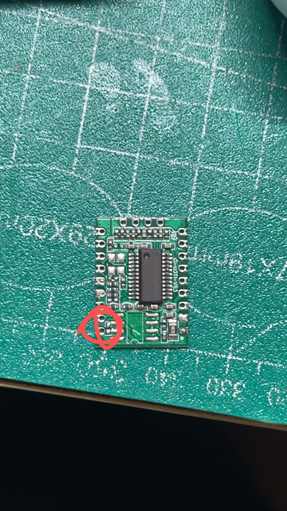

**更换注意事项：**

- 电容容值：4.7μF
- 建议使用相同容值的电容进行更换
- 注意电容的极性，避免反接

---

### CI-03T1模块无语音输出故障排查

**问题描述：**

CI-03T1模块出现无声音输出且无法语音控制的问题，但烧录功能正常。

**解决方案：**

**问题分析：**

- 功放芯片负责语音播报功能
- 烧录正常说明通信功能正常
- 重点检查功放电路和音频输出部分

**排查步骤：**

1. **功放芯片检查**：

    - 检查8002D功放芯片是否损坏
    - 测量功放芯片各引脚电压
    - 观察芯片是否有烧灼痕迹

2. **电压测试方法**：

    - 给模块5V供电
    - 测试3V3引脚是否有3.3V电压输出
    - 测量麦克风正负极电压（应为1.6-1.7V）
    - 测量喇叭正负极对GND电压（应为2.2-2.5V）

3. **外围电路检查**：

    - 检查喇叭连接是否良好
    - 确认喇叭阻抗匹配（推荐4-8Ω）
    - 检查音频输出通路元件

**解决方法：**

- 确认功放芯片8002D是否正常工作
- 更换损坏的功放芯片
- 检查并修复音频输出电路
- 确保供电电压稳定在5V

**注意事项：**

- 功放芯片损坏可能导致无声音输出
- 电压异常说明电源管理电路有问题
- 喇叭线路开路也会导致无声音

---

### CI-03T与单片机串口通信

**问题描述：**

需要了解CI-03T模组与单片机进行串口通信时的引脚连接方式，确保硬件设计正确。

**解决方案：**

**引脚连接方式：**

CI-03T模组提供多组UART接口，与单片机通信时推荐使用B1/B0引脚：

- **B1（RX）**：模组接收引脚，连接单片机的TX
- **B0（TX）**：模组发送引脚，连接单片机的RX


**连接要求：**

为确保通信稳定性，串口连接需要串联电阻：

- 在B1/RX和B0/TX引脚与单片机之间分别串联100Ω电阻
- 电阻应尽量靠近模组引脚放置


**连接示意：**

```
单片机 TX → 100Ω电阻 → B1 (CI-03T RX)
单片机 RX ← 100Ω电阻 ← B0 (CI-03T TX)
```

**B2/B3引脚说明：**

- B2/B3引脚可用于烧录接口（B7/B6为常用烧录口）
- 如不需要使用B2/B3作为串口，可预留不接
- B7/B6为标准烧录接口，推荐用于固件下载


**平台配置步骤：**

1. 登录智能公元平台
2. 选择对应的项目
3. 在引脚配置中启用B1/B0的串口功能
4. 生成并烧录固件

**注意事项：**

- 串口通信需要交叉连接（TX对RX，RX对TX）
- 确保两设备共地
- 电压电平需匹配（3.3V或5V）
- 串联100Ω电阻可有效保护IO端口并改善信号完整性
- 波特率等通信参数需要保持一致

---

### CI-03T硬件设计中的复位按键配置

**问题描述：**

在将CI-03T芯片集成到自主设计的PCB板时，需要确认是否必须保留复位按键。

**解决方案：**

**复位按键的作用：**

复位按键主要用于调试和开发阶段，生产环境中可以根据实际需求决定是否保留。

**设计建议：**

1. **开发阶段**：

    - 建议保留复位按键，便于调试和重启
    - 可连接到芯片的复位引脚（RESET）
    - 使用轻触开关，配合上拉电阻

2. **生产阶段**：

    - 可以通过软件复位替代硬件复位
    - 如需硬件复位，可保留测试点便于后期维护
    - 成本敏感产品可省去复位按键

**电路设计要点：**

- 复位引脚通常为低电平有效
- 配合10kΩ上拉电阻确保正常工作状态
- 按键按下时将复位引脚拉低实现复位

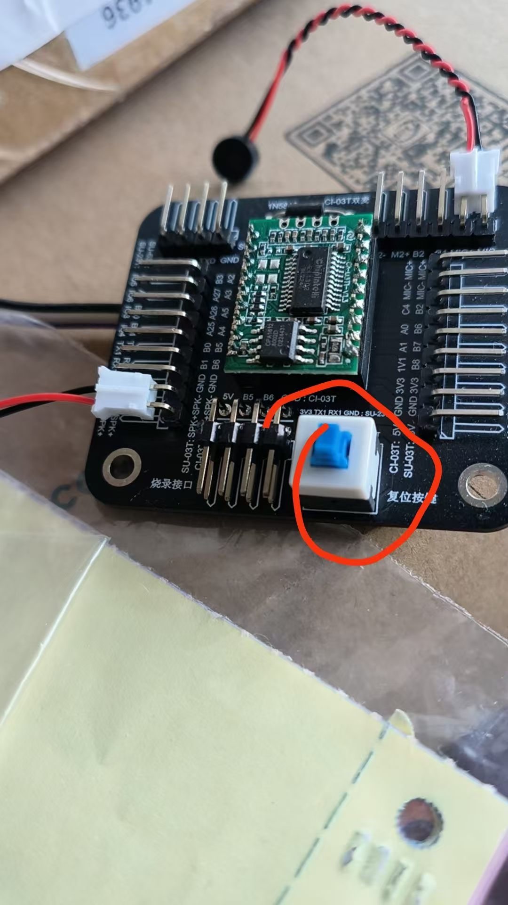

**注意事项：**

- 复位按键不是必需的，可根据产品定位决定
- 保留测试点有助于后期故障排查
- 软件复位功能可以满足大部分使用场景

---

### CI-03T晶振配置说明

**问题描述：**

需要了解CI-03T芯片的晶振配置要求，以及是否必须使用外部晶振。

**解决方案：**

**晶振配置选项：**

CI-03T芯片支持内部晶振和外部晶振两种配置方式：

1. **使用内部晶振**：

    - 芯片内置晶振，无需外部元件
    - 适合成本敏感、空间受限的应用
    - 频率精度可能受温度影响

2. **使用外部晶振**：

    - 提供更高的频率稳定性和精度
    - 可改善温漂性能
    - 需要外接晶振和负载电容

**设计建议：**

- 对精度要求不高的应用：使用内部晶振
- 对稳定性要求高的应用：添加外部晶振
- 批量生产前建议实测两种方案的识别效果

**电路连接：**

如使用外部晶振，需连接到芯片的晶振引脚（XIN/XOUT）：

- 外部晶振频率需与芯片规格匹配
- 配合合适的负载电容（典型值12-22pF）
- 晶振附近布线要短且远离噪声源

**注意事项：**

- 内部晶振可满足基本应用需求
- 外部晶振主要解决温漂和精度问题
- 切换晶振配置需要重新生成固件

---

### CI-03T B5/B6引脚固件下载功能

**问题描述：**

需要了解配置修改后，B5和B6引脚是否仍可用于固件下载。

**解决方案：**

B5/B6引脚是固定的烧录接口，不受配置影响：

- **B5/B6固定功能**：作为专用烧录口，不受用户配置影响
- **持续可用**：即使修改了模组配置，仍可通过B5/B6下载固件
- **兼容性**：与串口通信功能独立，不会相互冲突

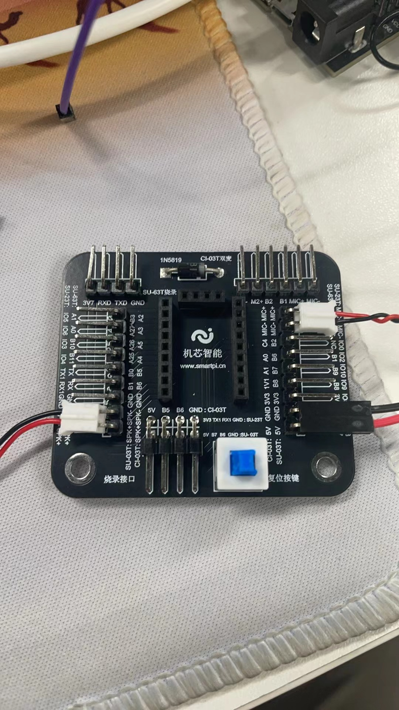

**烧录使用说明：**

1. B5/B6为固定烧录引脚，专用于固件下载
2. 配置修改后仍可正常使用烧录功能
3. 烧录时需要使用专用烧录工具或串口烧录器

**注意事项：**

- B5/B6为专用烧录接口，不建议用作其他用途
- 烧录时确保电源稳定（建议5V供电）
- 如烧录失败，检查接线是否正确和电源是否稳定

---

### CI-03T 两个9针排针间距

**问题描述：**

需要绘制CI-03T模块的封装时，确认两侧9针排针之间的精确间距。

**解决方案：**

CI-03T模块采用SMD22/DIP22封装，两侧各有一个9针的2.0mm排针：

- **排针规格**：两个9P的2.0mm排针
- **排针间距**：两个排针中心之间的距离为13mm


**注意事项：**

- 设计时请按照2.0mm的排针规格和13mm的间距进行布局
- 该尺寸为标准规格，适用于所有CI-03T系列模块

### 桌面宠物控制板电源滤波电路设计

**问题描述：**

桌面宠物控制板V1.1设计中，需要确认语音模块（SU-03T/CI-03T）的电源滤波电路和开关线路设计是否正确，特别是新增的滤波器和防呆开关线路的物料选型。

**解决方案：**

- **电源滤波电路**：

    - 使用33μH插件电感和两个680μF插件电解电容组成LC滤波电路
    - 有效滤除电源噪声，提升语音模块工作稳定性

- **开关线路设计**：

    - 采用防呆设计，不分方向，避免误操作
    - 提高用户体验，降低使用难度

- **物料清单**：

    - 电感：33μH插件电感（封装D7.5×L13mm，脚距3-3.5mm）
    - 电容：680μF/16V插件电解电容（10V耐压也可）
    - 所有物料均为通用规格，易于采购

**注意事项：**

- 电感选型时注意封装尺寸，确保与PCB匹配
- 电容耐压值10V以上即可，实际工作电压远低于此值
- 开关采用防呆设计，提升用户体验

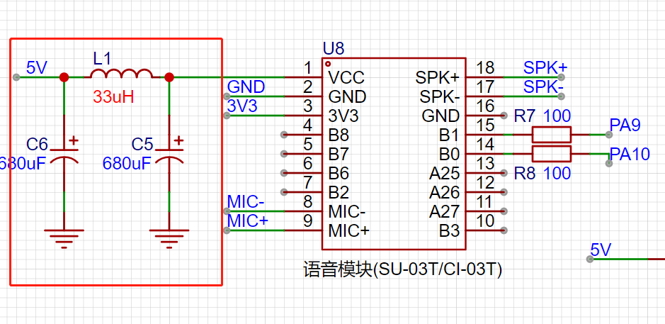

---

### CI-03T1配合米思齐平台驱动直流电机如何配置？

**问题描述：**

需要了解如何使用CI-03T1芯片配合米思齐平台驱动直流电机，以及是否需要修改R7R8电阻的阻值。

**解决方案：**

- 按照原有阻值焊接R7和R8电阻，无需修改阻值
- 确保所有电容正确焊接到电路板上
- 如原电路板上没有对应位号，按照电路图要求进行补件

**注意事项：**

- 电阻阻值应严格按照设计规格选择
- 焊接时注意避免虚焊和短路
- 完成焊接后检查电路连接再进行测试

---

### CI-03T使用的芯片型号是什么？

**问题描述：**

需要确认CI-03T模块使用的具体芯片型号，以及是否有对应的芯片规格书可供参考。

**解决方案：**

- **芯片型号**：CI-03T模块使用的是CI1302芯片
- **规格书获取**：可通过智能公元官网查找相关资料
- **搜索方式**：在智能公元网站的芯片手册栏目中查找CI1302相关信息

**注意事项：**

- 建议使用官方渠道获取最新版本的规格书
- 芯片规格书包含详细的电气特性和应用电路
- 如有特殊需求可联系工程师获取更多技术资料

---

### CI-03T的模块型号和外围接口是什么？

**问题描述：**

需要了解CI-03T模块的具体型号、封装类型以及外围接口信息。

**解决方案：**

- **模块型号**：CI-03T（包含CI-03T1和CI-03T2等子型号）
- **封装类型**：模块封装，非芯片级封装
- **主要接口**：

    - 串口通信（UART）
    - 麦克风输入接口
    - 扬声器输出接口
    - GPIO控制接口
    - 电源接口（5V）

**注意事项：**

- 具体引脚定义可参考官方开发文档
- 模块已集成必要的外围电路
- 使用模块方案可简化产品开发周期

---

### CI-03T1/2的串口（UART）引脚如何配置？

**问题描述：**

需要确认CI-03T1/2开发板的串口（UART）引脚配置，以正确连接和使用串口通信功能。

**解决方案：**

CI-03T1/2开发板的串口引脚配置如下：

- **PB6/RX**：串口接收引脚
- **PB5/TX**：串口发送引脚

在软件配置中，需要将对应的GPIO引脚配置为UART功能：

- 在GPIO配置界面中，将P15引脚选择为"UART0_RX"功能
- 将对应的发送引脚配置为UART0_TX功能

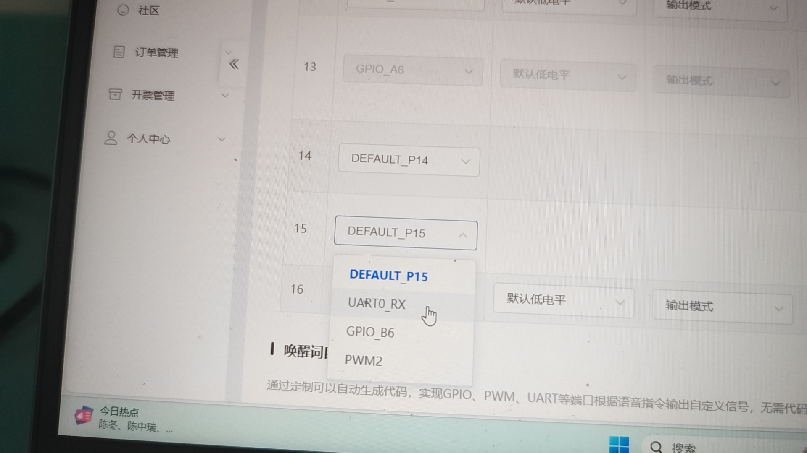

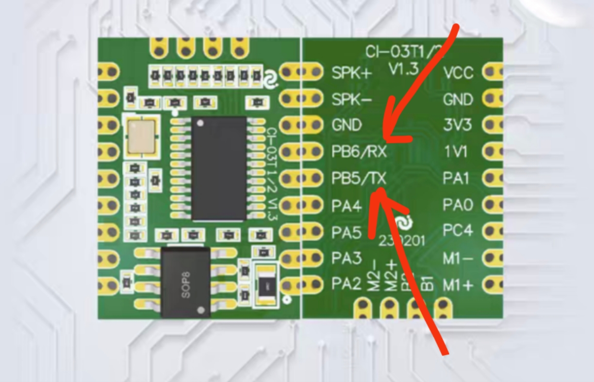

**注意事项：**

- 确保RX和TX引脚正确连接，RX应连接到对方的TX，TX应连接到对方的RX
- 配置完成后，可通过串口调试工具验证通信是否正常
- 使用串口通信时，注意波特率、数据位、停止位等参数的匹配

---

### CI-03T在机器人上使用时，识别距离变短怎么办？

**问题描述：**

将麦克风集成到机器人后，发现识别距离变短，在2米外需要大声喊才能被识别，而在室内安静环境下正常。

**解决方案：**

**1. 检查环境干扰**

排查机器人上的干扰源：

- **电机干扰**：检查麦克风是否靠近电机，电机线圈产生的磁场会影响识别效果
- **电源干扰**：机器人主板的电源噪声可能影响麦克风工作
- **结构共振**：机器人运行时产生的机械振动可能传递到麦克风

**2. 优化麦克风位置**

改善麦克风安装位置：

- 远离电机和动力系统
- 使用防震支架固定麦克风
- 考虑使用外接有源麦克风，提高信号质量

**3. 测试不同配置**

尝试多种解决方案：

- 使用不同的固件配置，测试识别效果
- 调整模块的识别灵敏度参数
- 在不同环境下测试，找出最佳配置

**注意事项：**

- 安静环境下正常说明模块本身没有问题
- 工业现场的突发噪声是主要挑战，只能通过提高灵敏度来部分解决
- 识别距离与说话音量、环境噪音大小直接相关
- 可以考虑增加降噪处理电路来改善信噪比

### CI-03T规格书中的焊盘尺寸是否正确？

**问题描述：**

按照CI-03T模组规格书中的推荐焊盘尺寸（15mm x 21mm）设计PCB后，发现芯片远小于焊盘，无法正常安装。

**解决方案：**

**问题说明：**

- 规格书中焊盘尺寸为模块尺寸，非芯片尺寸
- 贴片封装的焊盘会故意做大，方便焊接
- CI-03T1的实际芯片尺寸小于21mm × 15mm

**正确做法：**

1. **使用推荐焊盘尺寸**
    - 规格书中的15mm x 21mm是正确的焊盘尺寸
    - 这是特意设计的大焊盘，便于手工或自动焊接
    - 不要按照芯片实际尺寸缩小焊盘

2. **焊接说明**
    - 大焊盘设计有助于提高焊接可靠性
    - 便于调整芯片位置
    - 增加机械强度和散热面积

3. **设计建议**
    - 直接使用规格书推荐的焊盘尺寸
    - 焊盘宽度1.2mm，长度3mm是经过验证的
    - 引脚间距2.5mm需要保持精确

**注意事项：**

- 不要根据芯片实际尺寸修改焊盘
- 大焊盘是贴片工艺的常见做法
- 如有疑问，建议联系官方技术支持确认

---

### CI-03T转接板排母的高度和间距是多少？

**问题描述：**

需要根据转接板设计PCB，需要确认中间放置芯片的PH2.0排母的立体高度，以及各排母之间的间距。

**解决方案：**

**排母规格：**

- **排母高度**：4.3mm（与排针高度相同）
- **排针规格**：0.5×0.2mm
- **公差范围**：±0.15mm
- **排母类型**：PH2.0标准

**转接板设计参考：**

1. **尺寸信息**
    - 转接板整体尺寸：52.00mm × 45.00mm
    - 两个9针排母间距：13mm（中心到中心）
    - 下方4针排母位置：需要根据转接板实际布局测量

2. **PCB设计建议**
    - 排母下方建议预留足够空间
    - 考虑芯片插入后的高度间隙
    - 确保与外壳或其他组件不干涉

3. **间距计算**
    - 排母间距通常指中心到中心的距离
    - 4针排母与9针排母的间距需根据实际转接板测量
    - 建议参考实物转接板或联系官方技术支持获取精确尺寸

**注意事项：**

- 排母高度为立体高度，包含引脚部分
- 设计时需考虑PCB厚度（通常1.6mm）
- 总高度为排母高度+PCB厚度+器件高度
- 如需精确的4针排母间距，建议获取转接板PCB文件

---

### CI-03T模块的封装文件如何获取？

**问题描述：**

需要获取CI-03T模块的封装文件用于PCB设计，确认是否有PCB文件和原理图可用。

**解决方案：**

**1. 封装文件获取**

- 模块封装文件名称：CI-03T1&2封装图.PCB
- 该文件仅为PCB封装文件，不包含原理图
- 可从官方文档系统下载相关资料

**2. 原理图说明**

- 不提供原理图的AD格式文件
- 提供PDF格式的原理图供参考
- 可根据PDF自行绘制原理图

**3. PCB设计建议**

- 参考PDF原理图进行布局
- 注意模块的供电和接口连接
- 遵循官方推荐的PCB设计规范

**注意事项：**

- 封装文件仅包含模块的外形和焊盘定义

---

### CI-03T1或CI-03T2电路板的厚度是多少？

**问题描述：**

需要了解CI-03T1或CI-03T2离线语音识别芯片电路板的厚度，以评估是否适合模型设计。

**解决方案：**

- **电路板厚度**：1.2mm
- 该厚度设计考虑了机械强度和柔韧性的平衡
- 适合大多数嵌入式应用场景

**注意事项：**

- 设计时预留1.2mm的安装空间
- 考虑元器件焊接后的整体高度
- 1.2mm厚度有利于散热和信号传输

---

### CI-03T电源电路中电容和电感的替代要求是什么？

**问题描述：**

需要确认在CI-03T1或CI-03T2芯片的电源电路中，680uF/16V的电解电容和33uH/8*10的工字型电感是否可以作为替代品使用，同时需要确认电感的封装尺寸是否符合要求。

**解决方案：**

- **电容替代要求**：

    - 容量：680μF
    - 耐压：10V或16V均可（实际工作电压远低于此值）
    - 类型：插件电解电容

- **电感替代要求**：

    - 电感值：33μH
    - 封装：插件型，D7.5×L13mm
    - 脚距：3-3.5mm（重要，需与PCB匹配）
    - 推荐型号：0608封装（直径6mm，高11mm）

- **采购建议**：

    - 电容和电感均为通用规格，淘宝等平台可购买
    - 注意核对封装尺寸，特别是电感的脚距

**注意事项：**

- 电感封装尺寸必须匹配PCB焊盘
- 电容耐压值10V以上即可满足需求
- 避免使用过大封装的电感，可能导致安装困难

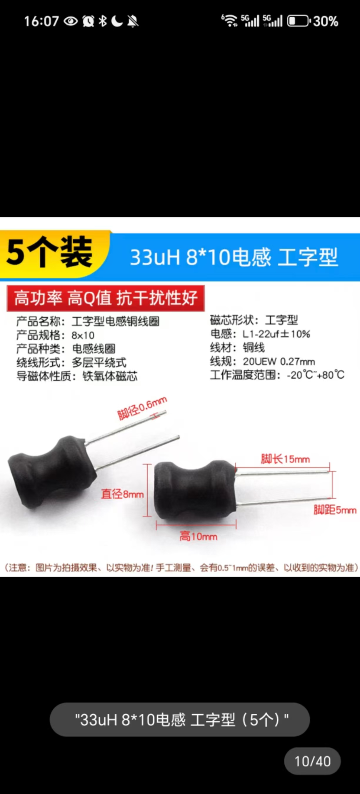
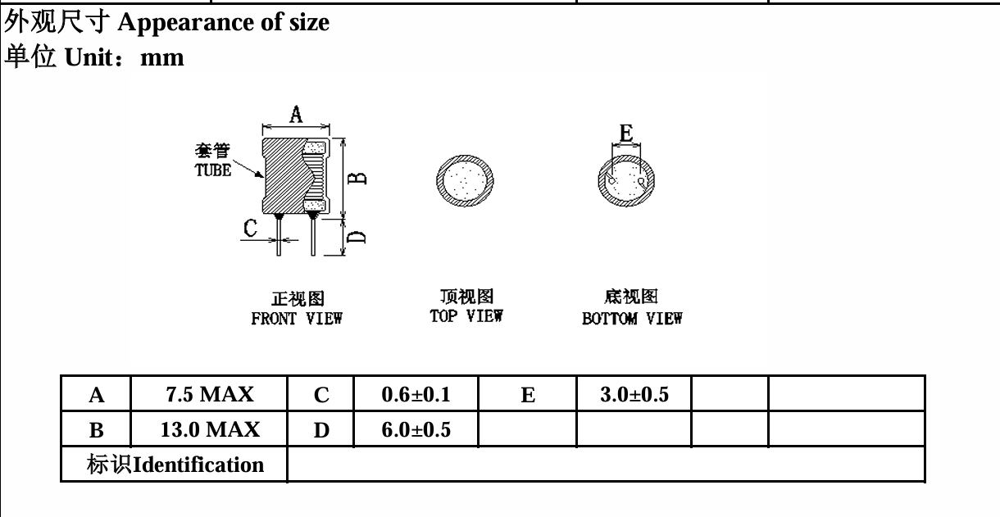


---

### CI-03T芯片的PCB设计要点是什么？

**问题描述：**

在基于CI-03T芯片（非模块）进行PCB设计时，对供电方式、外围电路设计存在疑问。

**解决方案：**

**1. 供电设计**

- **主供电**：VCC引脚接5V电源
- **内部LDO**：3.3V和1.1V由芯片内部LDO输出
- **无需外部供电**：不需要为3.3V和1.1V单独提供电源

**2. 外围电路**

- 最小系统仅需少量外围元件
- 包含电源滤波电容、麦克风接口、功放输出
- UART通信接口需要电平转换（如需连接3.3V系统）

**3. 参考设计**

- 官方提供完整的参考电路图
- 包含所有必要的外围电路设计
- 可直接参考使用，电路设计经过验证

**注意事项：**

- PCB布局时注意模拟和数字电路的隔离
- 麦克风线路尽量短且远离噪声源
- 确保良好的接地设计

---

### 如何在电源输入端增加TVS保护？

**问题描述：**

需要在电源输入端增加TVS管以防止瞬间高电压烧坏模块。

**解决方案：**

- **TVS管选型**：

    - 型号：SMF6.0A
    - 工作电压：6V
    - 封装：贴片封装（易于安装）

- **安装位置**：

    - 并联在电源输入端
    - 位于电源接口之后，滤波电路之前
    - 尽量靠近电源输入接口

- **功能说明**：

    - 防止瞬间高压脉冲
    - 响应速度快，钳位电压精确
    - 有效保护后续电路

**注意事项：**

- TVS管应尽量靠近电源输入接口
- 注意PCB布局时的接地连接
- 可在BOM清单中添加该器件

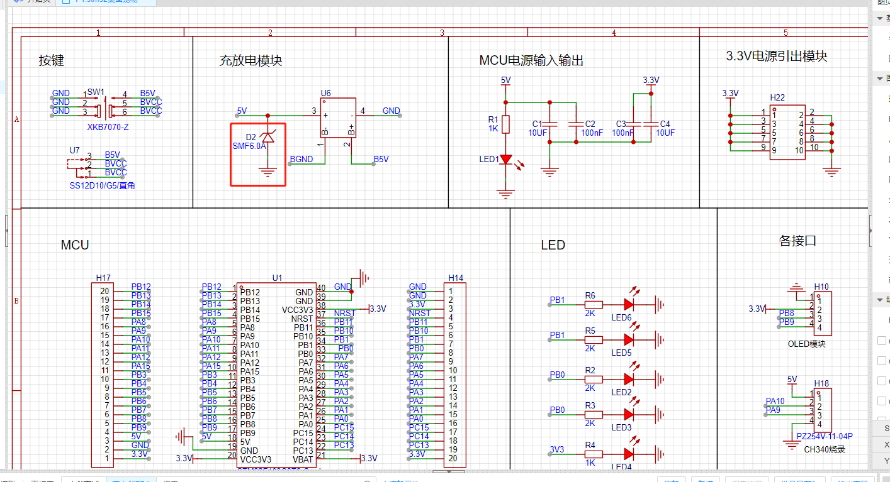

---

### 如何正确连接硅麦到CI-03T1/CI-03T2模块？

**问题描述：**

需要了解硅麦（MEMS麦克风）与CI-03T1/CI-03T2语音识别模块的正确连接方法，以及相关的参考电路设计。

**解决方案：**

**1. 硅麦基本连接方式**

- **电源连接**：硅麦VDD接2.7V电源（由模块的MICBIAS提供）
- **信号输出**：通过1μF电容耦合到模块的MIC+或MIC-引脚
- **接地**：硅麦的GND引脚接地

**2. CI1302芯片引脚定义**

- **MIC1-**：麦克风负输入（接地或单端模式下悬空）
- **MIC1+**：麦克风正输入（接硅麦输出）
- **M1+**：麦克风电源输出（提供偏置电压，典型值2.7V）

**3. 参考电路设计要点**

- 使用模块内置的MICBIAS偏置电压，不建议外接电源
- 输出耦合电容建议使用1μF
- 硅麦电源与信号线之间建议添加RC滤波网络

**注意事项：**

- 硅麦建议使用差分麦克风以获得更好的噪声抑制性能
- 单端硅麦也可以工作，但可能受到更多干扰
- 不建议使用硅麦，推荐使用柱体麦以避免兼容性问题

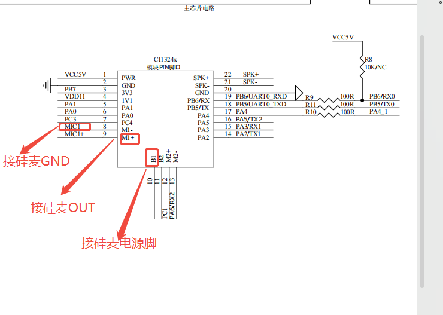
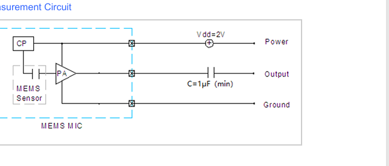
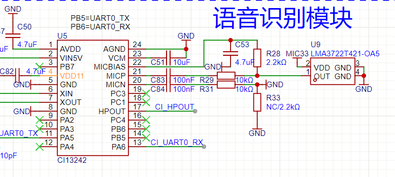

---

### CI1302芯片双麦克风接线无响应如何处理？

**问题描述：**

CI1302芯片的双麦克风电路接线后，麦克风无响应，无法进行语音识别，但设备能正常开机播报语音。

**解决方案：**

**1. 问题分析**

- 使用单端硅麦时，MIC-引脚不应接地
- 差分输入模式下需要两个差分麦克风
- 单端硅麦需要配置为单端模式

**2. 接线修改方法**

- **断开N端连接**：将MIC1-和MIC2-的接地电阻断开
- **使用单端接法**：仅使用MIC+输入，MIC-悬空
- **软件配置**：在平台中配置为单端模式

**3. 软件配置步骤**

- 进入平台的"个性化音频"设置
- 取消勾选"MIC差分/单端"选项
- 或根据平台版本选择相应的单端配置

**注意事项：**

- 双麦模式主要用于声源定位，单麦即可满足语音识别需求
- CI13242芯片用硅麦时也需要设置单端模式
- 推荐使用柱体麦而非硅麦以获得更好的兼容性

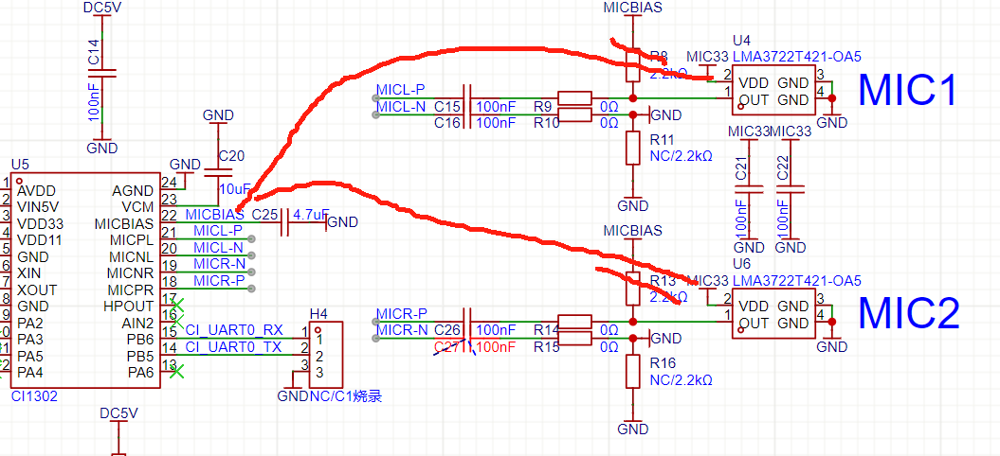
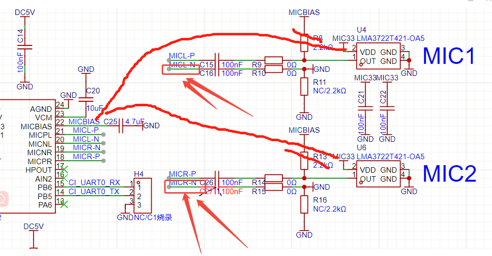
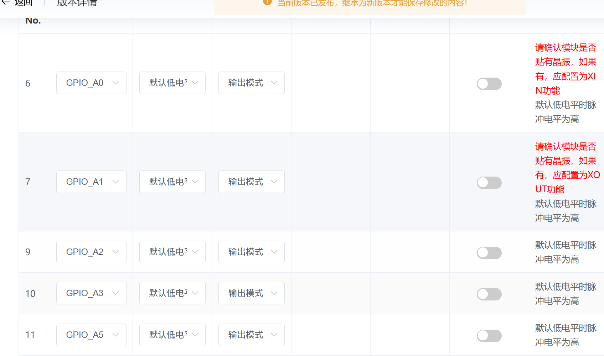

---

### 如何获取CI-03T的原理图？

**问题描述：**

希望获取CI-03T芯片的原理图，并询问是否可以基于该原理图直接将其应用于自己的产品中。

**解决方案：**

- CI-03T的原理图包含在开发包中，可从官方帮助文档下载
- 访问地址：https://help.aimachip.com/docs/offline_ci03t/offline_ci03t-1gbdve90ls902
- 原理图包含主芯片电路、功放电路、麦克风电路和模块PIN脚口等完整设计
- 可以参考原理图进行产品设计，但需注意知识产权问题

**注意事项：**

- 开发包中的原理图是完整的参考设计
- 模块上的电阻（如R12、R11、R10等）与原理图标注一致
- 直接复制设计可能涉及知识产权问题，建议作为参考进行优化设计
- 原理图中的参数和元件值经过验证，可直接使用

---

### CI-03T的IO口供电电压是多少？

**问题描述：**

需要确认CI-03T模块在5V供电时，其IO口的工作电压是否为3.3V，以及模块内部是否包含3.3V电压转换电路。

**解决方案：**

**1. IO口电压规格**

- CI-03T模块的IO口电压为**3.3V**
- 无论是5V供电还是其他电压（3.6-5.5V），IO口都输出3.3V
- IO口电压与主供电电压无关，由内部LDO稳压

**2. 内部电压转换**

- 模块内部包含3.3V LDO（低压差线性稳压器）
- 3.3V电压由芯片内部产生，用于IO口供电
- 内部还产生1.1V电压供芯片内部使用
- 3V3引脚由芯片内部LDO产生，在电路图中清晰标注

**3. 供电设计**

- **主输入**：VCC支持3.6V-5.5V宽电压输入
- **推荐供电**：5V直流供电
- **电流需求**：最大180mA（不含外设）

**注意事项：**

- 尽量不要使用内部的3.3V为外部电路供电
- 如需要3.3V电源，建议使用外部LDO
- 内部3.3V主要用于芯片本身和IO口工作
- 设计时需考虑电源噪声和稳定性

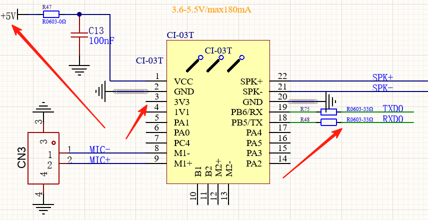


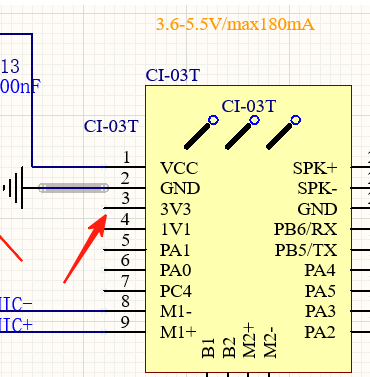

---

### CI-03T模块如何通过Line-In输入音频并配置ADC？

**问题描述：**

需要了解如何通过Line-In接口输入音频信号，并在固件开发平台中正确配置ADC功能。

**解决方案：**

**硬件接口说明：**

1. **音频输入接口**：

    - CI-03T支持MIC1和MIC2输入
    - 可通过Line-In方式输入模拟音频
    - 音频信号经过ADC转换为数字信号

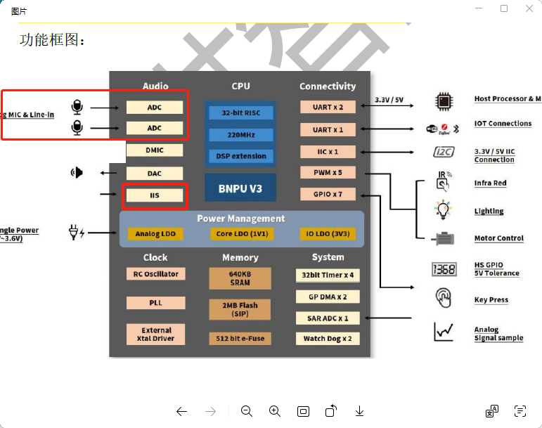

*芯片音频输入部分，MIC和Line-In连接到ADC*

2. **物理引脚位置**：

    - MIC1和MIC2引脚用于音频输入
    - 可连接外部音频线路或麦克风

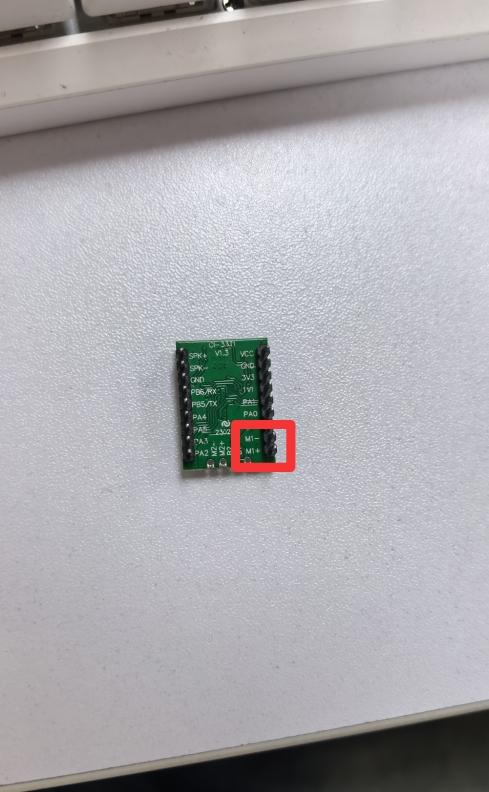

*CI-03T1模块的MIC1和MIC2引脚位置*

**平台配置步骤：**

1. **登录智能公元平台**：

    - 注册并登录智能公元账号
    - 进入固件开发平台

2. **配置ADC输入**：

    - 进入Pin脚配置界面
    - 选择对应的GPIO引脚（如GPIO_A25）
    - 设置为ADC输入模式

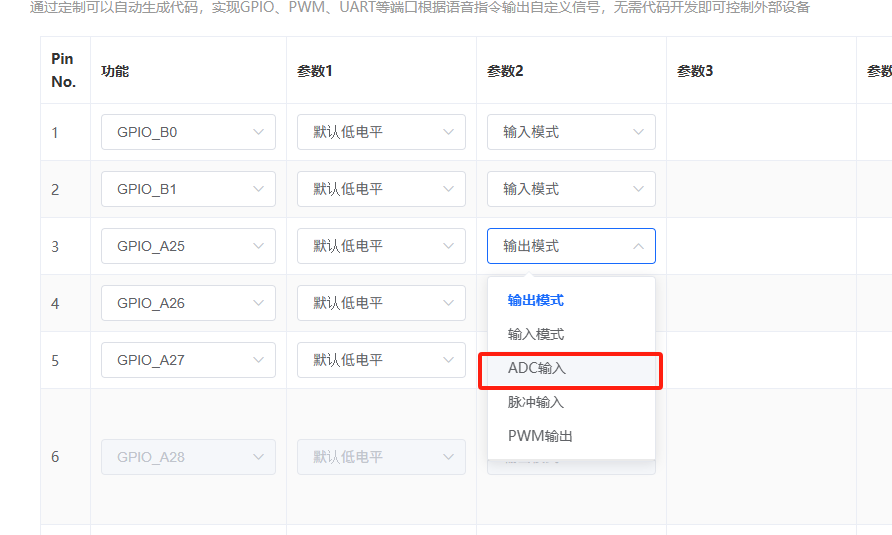

*GPIO_A25引脚配置为ADC输入模式*

3. **设置命令词**：

    - 在命令词自定义界面添加指令
    - 配置触发条件和响应动作

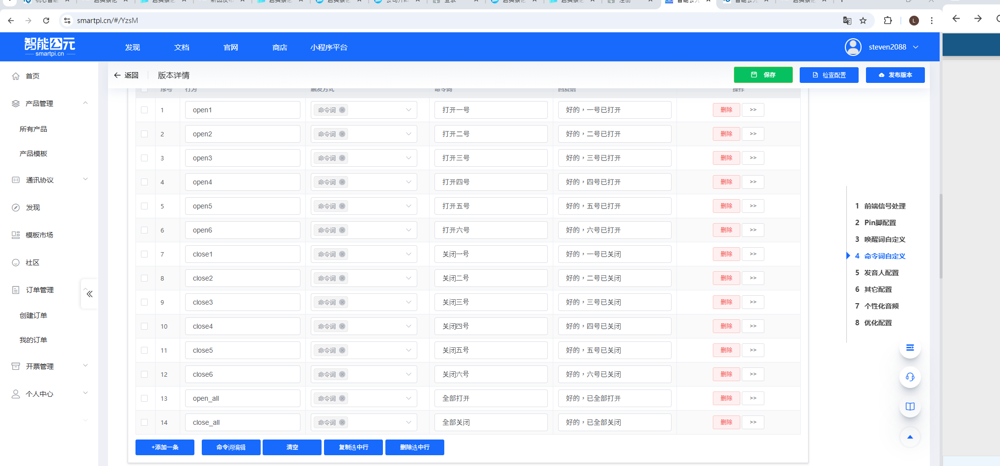

*智能公元平台的命令词自定义界面*

**Line-In连接方法：**

1. **硬件连接**：
    ```
    音频源Line-Out → 衰减电路 → CI-03T MIC输入
    ```

2. **信号调整**：

    - Line-Out电平可能过高，需要衰减
    - 建议使用分压电路降低信号幅度
    - 确保信号幅度在麦克风输入范围内

**注意事项：**

- Line-In输入使用模拟信号方式
- 需要正确配置引脚为ADC模式
- 外部音频可能需要电平转换
- 平台提供了完整的配置教程和示例

---

### CI-03T芯片的ADC输入引脚是哪个？

**问题描述：**

需要确认CI-03T芯片的ADC输入引脚具体位置，以及如何在软件中正确配置。

**解决方案：**

**ADC引脚定义：**

根据CI1303数据手册，CI-03T芯片的ADC输入引脚为：

1. **PC4引脚**：

    - 引脚号：7
    - 功能：SAR ADC input channel 2
    - 可用作ADC输入

2. **其他可选引脚**：

    - PB6（引脚15）：可作为AIN输入
    - PA5（引脚16）：AIN2输入通道

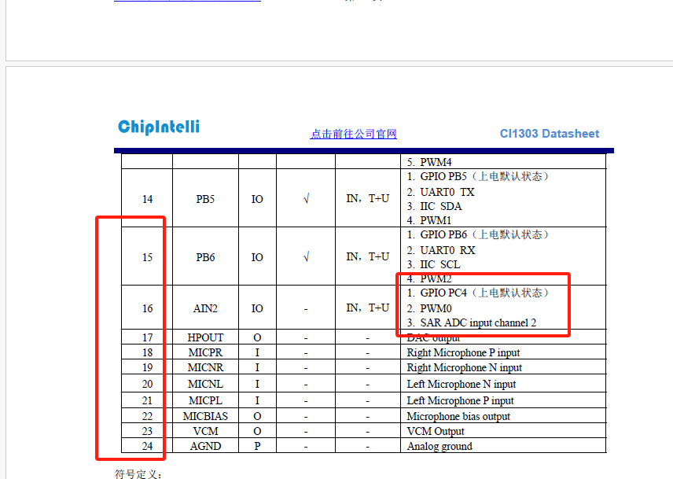

*CI1303数据手册中的引脚定义，PB6和AIN2为ADC输入*

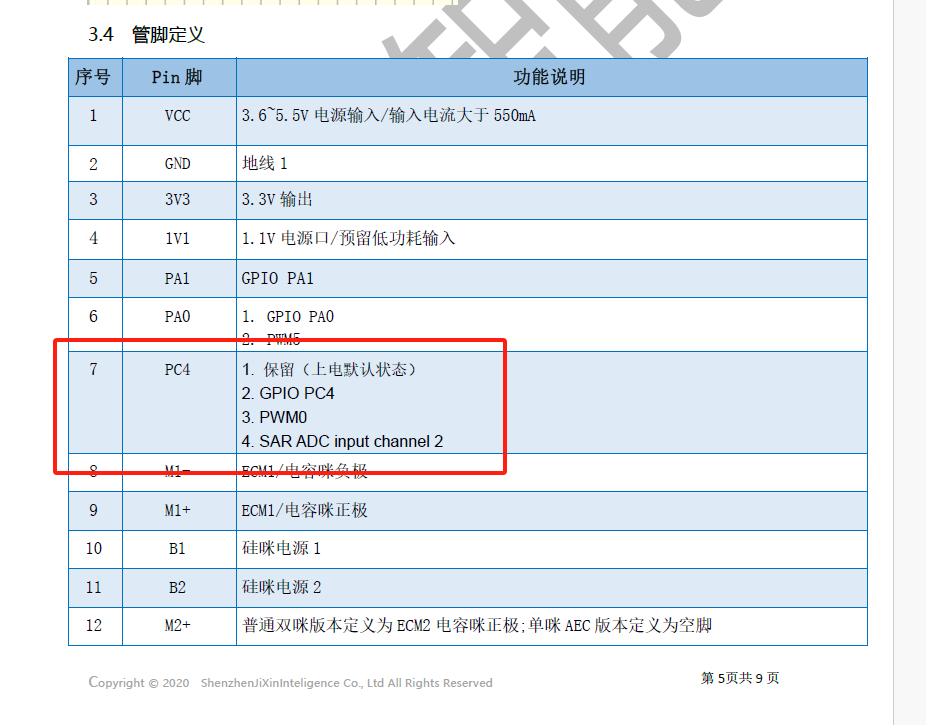

*CI-03T芯片管脚定义表，PC4包含SAR ADC input channel 2*

**平台配置方法：**

1. **选择引脚**：

    - 在Pin脚配置中选择GPIO_C4
    - 对应硬件的PC4引脚

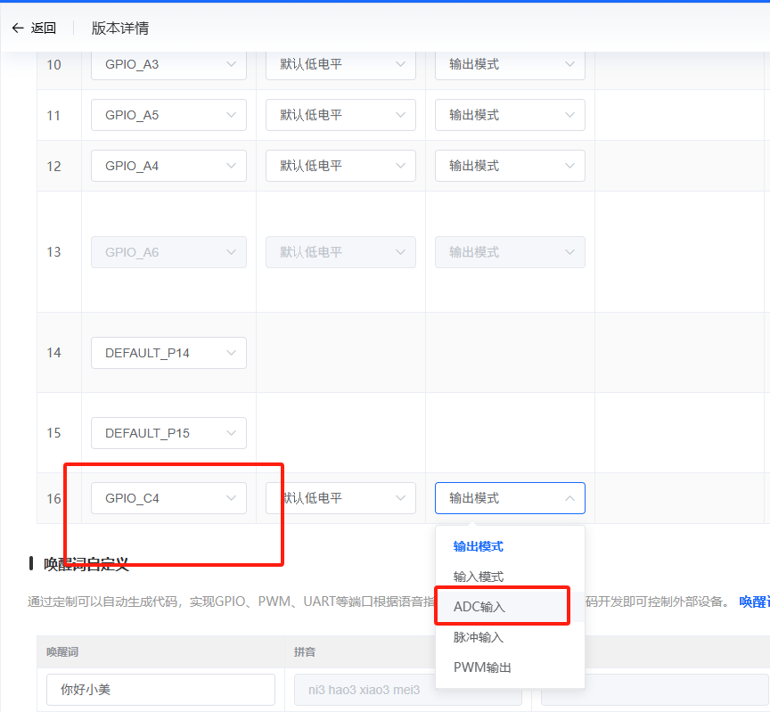

*平台中将第16个引脚配置为GPIO_C4并选择ADC输入*

2. **配置参数**：

    - 设置输入模式为ADC输入
    - 配置参考电压
    - 设置采样精度

3. **验证配置**：

    - 生成固件并烧录
    - 测试ADC输入功能
    - 确认读数正确

**硬件连接建议：**

- 使用PC4引脚作为ADC输入
- 确保输入电压在0-3.3V范围内
- 添加滤波电容提高稳定性
- 考虑添加保护电路

**注意事项：**

- CI-03T使用PC4作为主要ADC输入引脚
- 配置时必须选择ADC输入模式
- 输入电压不能超过芯片供电电压
- 建议参考官方ADC按键教程

---

### CI-03T模块的原理图上找不到ADC引脚怎么办？

**问题描述：**

在CI-03T模块的原理图上无法找到ADC输入引脚，对如何配置ADC输入存在疑问。

**解决方案：**

**原理图引脚说明：**

1. **原理图标识**：

    - 原理图可能使用GPIO编号而非ADC标识
    - ADC功能复用在GPIO引脚上
    - 需要查看引脚多功能定义

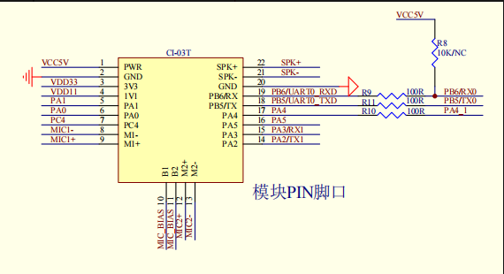

*CI-03T模块的PIN脚口原理图*

**可用ADC引脚**：

经确认，以下引脚可配置为ADC输入：

1. **PA4（引脚17）**：

    - 对应GPIO_C4
    - 支持ADC功能
    - 推荐使用此引脚

2. **PA5（引脚16）**：

    - 同样支持ADC输入
    - 可作为备选方案

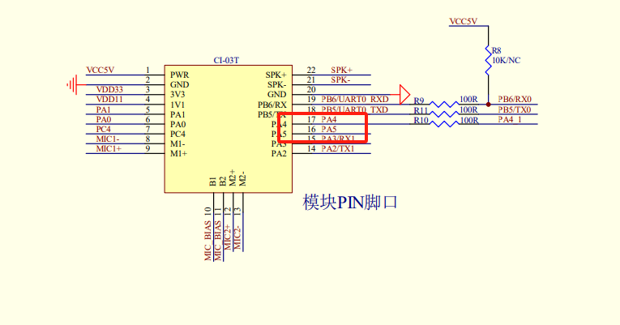

*原理图上标出的PA4和PA5引脚位置*

**软件配置步骤：**

1. **平台配置**：

    - 选择GPIO_C4（对应PA4）
    - 设置功能为ADC输入
    - 配置相关参数


*平台中将GPIO_C4配置为ADC输入*

2. **参数设置**：

    - ADC通道选择
    - 采样率设置
    - 触发方式配置

**学习资源：**

官方提供了详细的ADC按键教程：

- B站视频教程：https://www.bilibili.com/video/BV1Gj411N7sr/
- 包含硬件连接和软件配置
- 提供完整的示例代码

**注意事项：**

- ADC功能复用在GPIO引脚上
- 必须在软件中正确配置为ADC模式
- 硬件连接时注意引脚编号对应关系
- 建议观看官方教程学习配置方法

---

### CI-03T模块的Line Out音频输出如何连接？

**问题描述：**

需要了解如何将CI-03T模块的音频输出（Line Out）连接到外部设备，实现声音接收和控制功能。

**解决方案：**

**音频输出功能说明：**

1. **模块分工明确**：

    - CI-03T模块：语音识别和IO控制
    - 外部设备：接收音频信号并执行控制
    - 通过Line Out输出语音内容

2. **信号流向**：
    ```
    CI-03T语音识别 → 触发指令 → Line Out输出音频 → 外部设备接收
    ```

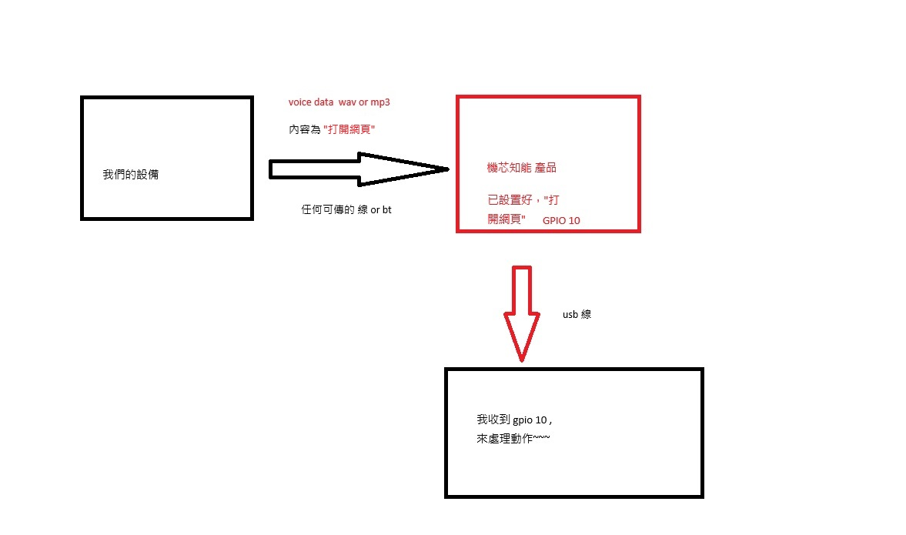

*设备通过Line-In接收语音模块输出的音频*

**应用场景示例：**

1. **语音控制流程**：

    - 对CI-03T说出指令
    - 模块识别后通过Line Out输出相应语音
    - 外部设备接收语音并解析执行

2. **控制方式**：

    - CI-03T通过GPIO发送控制信号
    - 外部设备也可通过GPIO接收指令
    - 支持双向通信

**连接方式建议：**

1. **音频连接**：

    - CI-03T的音频输出连接到外部设备的音频输入
    - 使用标准音频线连接
    - 确保阻抗匹配

2. **控制连接**：

    - GPIO引脚交叉连接（TX→RX，RX→TX）
    - 共地连接
    - 电平匹配（3.3V TTL）

**注意事项：**

- Line Out输出的是模拟音频信号
- 外部设备需要音频输入功能
- 控制信号需要正确解析
- 建议增加音频放大电路提高音量

---

### 采购CI系列模块需要哪些配件？

**问题描述：**

需要确认采购CI系列离线语音识别芯片时的完整配件清单，了解是否需要额外购买基座、面包板、耳机座、杜邦线等配件。

**解决方案：**

**推荐购买方案：**

1. **转接板烧录套装（推荐新手）**：

    - 包含完整的基础开发套件
    - 售价约34.8元
    - 适合初学者和快速原型开发

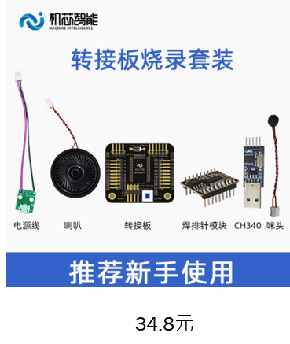

*转接板烧录套装，包含开发所需基础配件*

**套装包含内容：**

- 电源线 × 1
- 喇叭（扬声器） × 1
- 转接板 × 1
- 焊排针模块 × 1
- CH340模块 × 1
- 咪头（麦克风） × 1

**可选配件说明：**

1. **面包板**：

    - 用于原型开发和电路测试
    - 60孔标准面包板足够使用
    - 可快速搭建测试电路

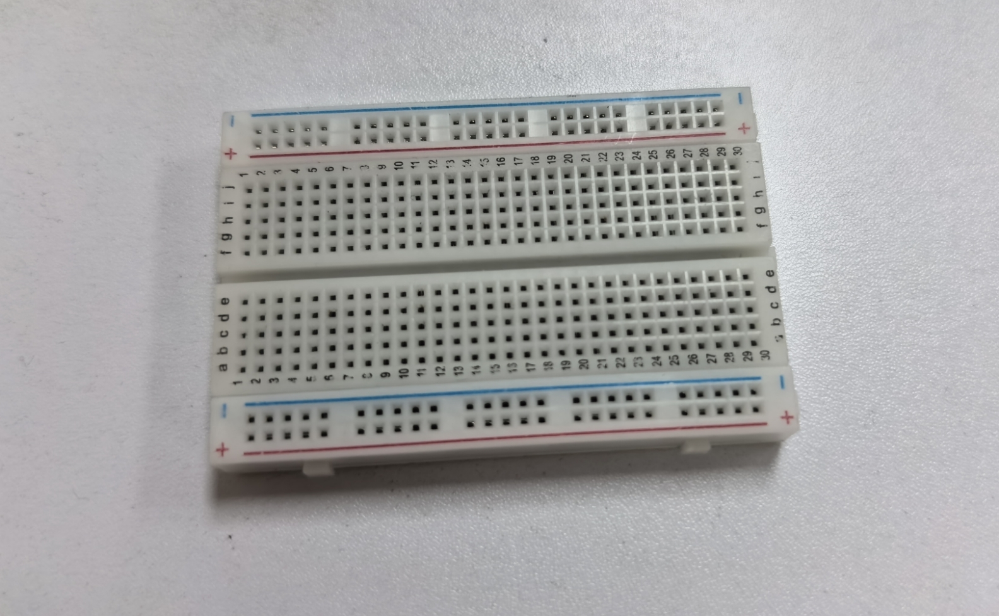

*60孔面包板，用于原型开发*

2. **杜邦线**：

    - 连接模块和面包板
    - 建议准备公对公、公对母、母对母
    - 多种颜色便于区分线路

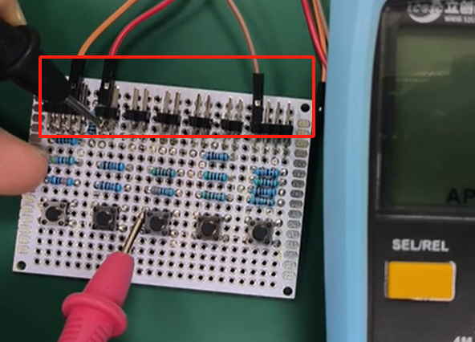

*使用杜邦线连接模块和面包板*

3. **CH340模块**：

    - USB转串口模块
    - 用于固件烧录
    - 支持Windows/Linux/Mac

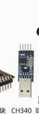

*USB转串口的CH340模块*

**开发板连接示例：**

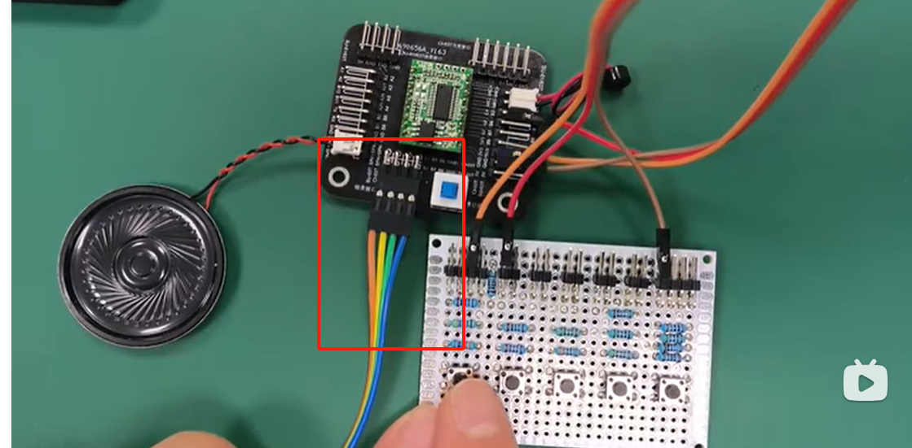

*CH340模块通过杜邦线连接到面包板，旁边连接喇叭*

**采购建议：**

1. **新手入门**：

    - 直接购买转接板烧录套装
    - 包含所有必需配件
    - 性价比最高

2. **自行采购**：

    - 如已有部分配件，可单独采购
    - 模块本身已包含基本功能
    - 根据实际需求选择配件

3. **批量生产**：

    - 直接采购模组形式
    - 自行设计外围电路
    - 降低整体成本

**注意事项：**

- 模组本身已包含语音识别功能
- 基础测试只需模块和麦克风
- 开发板适合学习和原型验证
- 量产建议直接使用模组

---

### CI-03T1在单火开关应用中功耗过高怎么办？

**问题描述：**

将CI-03T1模块用于单火开关，功耗过高导致灯闪烁，同时需要保持蓝牙可被小程序搜索到，希望了解如何降低功耗。

**解决方案：**

**问题分析：**

CI-03T1的主要功耗集中在蓝牙广播和麦克风识别上。单火开关供电能力有限，当模块功耗过大时会导致电压不稳定，引起灯闪烁。

**功耗优化方案：**

1. **移除功放电路**：

    - 如果不使用语音播报功能，可以拆除功放电路
    - 功放电路即使不工作也可能消耗静态电流
    - 拆除后可降低部分功耗

2. **蓝牙配置优化**：

    - 蓝牙保持可被发现状态需要持续广播
    - 这是功耗的主要来源之一
    - 可考虑间歇性广播（需确认产品是否支持）

3. **工作模式调整**：

    - 语音唤醒后识别完成即进入休眠
    - 通过语音触发唤醒，而非持续监听
    - 减少麦克风工作时间

4. **硬件改造建议**：

    - 测量各模块的实际功耗分布
    - 针对最大功耗部分进行优化
    - 考虑更换为低功耗版本的语音模块

---

### CI-03T系列的GPIO输出模式如何配置？

**问题描述：**

在CI-03T1/T2芯片的开发平台上配置IO输出模式，想知道如何设置推挽、开漏（OD/OC）等模式。

**解决方案：**

**IO输出模式配置：**

- **默认模式**：GPIO默认为推挽输出模式
- **串口开漏设置**：

    - 在"个性化音频"配置界面
    - 找到"串口UART0模式"选项
    - 可选择"推挽模式"或"开漏模式"
    - 此设置仅针对串口引脚

**GPIO引脚限制：**

- **普通GPIO**：平台目前只支持推挽模式，无法设置开漏
- **功能建议**：可在参数3中增加推挽/开漏选项，便于选择
- **硬件实现**：如需开漏模式，可能需要外部加下拉电阻实现

**注意事项：**

- 当前平台版本中，普通GPIO只能使用推挽模式
- 串口引脚支持推挽和开漏两种模式
- 开漏模式适用于总线应用或需要电平转换的场景

---

### CI-03T如何驱动5V LED灯？

**问题描述：**

需要使用CI-03T1/T2模块的GPIO接口驱动5V供电的LED灯，但模块的3.3V输出无法直接驱动。

**解决方案：**

**问题分析：**

- CI-03T GPIO输出电平为3.3V，无法直接驱动5V LED
- 5V LED灯需要外部供电和适当的驱动电路
- GPIO输出电流有限，大功率负载需要额外驱动

**驱动方案：**

**方案一：使用MOS管驱动**

1. **硬件连接**
    - LED正极接5V电源正极
    - LED负极接MOS管漏极（D极）
    - MOS管源极（S极）接地
    - GPIO通过限流电阻控制MOS管栅极（G极）

2. **控制逻辑**
    - GPIO输出高电平（3.3V）→ MOS导通 → LED点亮
    - GPIO输出低电平（0V）→ MOS截止 → LED熄灭

**方案二：使用继电器模块**

1. **连接方式**
    - 继电器控制端接GPIO和GND
    - 继电器输出端控制5V LED电路
    - 适合驱动较大功率的LED灯条

**GPIO配置示例：**


*配置GPIO_A0控制LED开关，对应高/低电平输出*

**注意事项：**

- GPIO不能直接驱动5V负载，必须使用驱动电路
- MOS管选择逻辑电平型（Vgs<th>3.3V即可导通）
- 大功率LED灯条需要注意电源功率余量
- 长距离传输要考虑信号衰减和干扰问题

---

### CI-03T2模块是否提供5V输出引脚？

**问题描述：**

需要确认CI-03T2双麦芯片模块是否有5V电源输出引脚，能否直接为外部设备供电。

**解决方案：**

**电源引脚说明：**

- CI-03T2模块提供5V输出引脚（位于模块右侧）
- 该5V输出主要用于为外部麦克风等小功率设备供电
- 输出能力有限，不适合驱动大功率负载

**使用限制：**

- 5V输出电流较小，不足以驱动LED灯条
- 如需驱动大功率设备，仍需外部独立供电
- GPIO输出电平仍为3.3V逻辑电平

**引脚位置：**

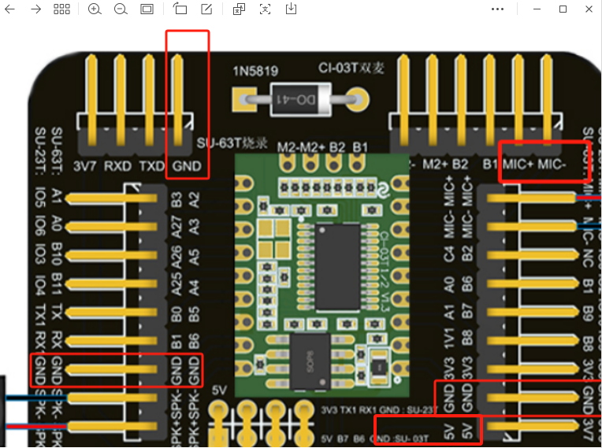

*CI-03T2模块右侧的5V输出引脚位置*

**应用建议：**

- **可用场景**：为外部麦克风、传感器等小功率设备供电
- **不可用场景**：直接驱动LED灯条、电机等大功率负载
- **替代方案**：使用外部5V电源配合MOS管或继电器驱动

**注意事项：**

- 5V输出引脚能力有限，具体参数参考规格书
- 驱动大功率负载时必须使用独立电源
- 设计电路时应预留足够的功率余量

---

### CI-03T系列如何通过变量控制PWM占空比？

**问题描述：**

希望通过命令词"亮一点"、"暗一点"动态调节PWM占空比，并在关灯后再开灯时恢复到之前的调光值。

**解决方案：**

**PWM动态调光实现方法：**

1. **添加变量**：

    - 在平台中添加数值型变量（如Val_PWM1、Val_PWM2等）
    - 用于存储当前的PWM占空比值

2. **设置占空比控制**：

    - 在"添加控制"中选择"设置占空比"动作
    - 方式选择为"变量"
    - 选择对应的变量名（如Zheng、Xiao）

3. **命令词配置**：

    - "亮一点"：增加变量值，同时设置PWM占空比为该变量
    - "暗一点"：减少变量值，同时设置PWM占空比为该变量
    - "开灯"：直接设置PWM占空比为变量当前值

**操作步骤：**

1. 在GPIO配置中启用PWM功能
2. 可选开启"掉电记忆"功能（断电重启恢复PIN脚状态）
3. 创建控制组，设置变量与PWM的关联
4. 为每个命令词配置变量增减和PWM设置动作

**注意事项：**

- 掉电记忆功能仅在断电重启时生效，运行中控制需要使用变量
- 变量值范围需根据实际PWM占空比范围设置（0-100）
- 可创建多个变量控制不同PWM引脚


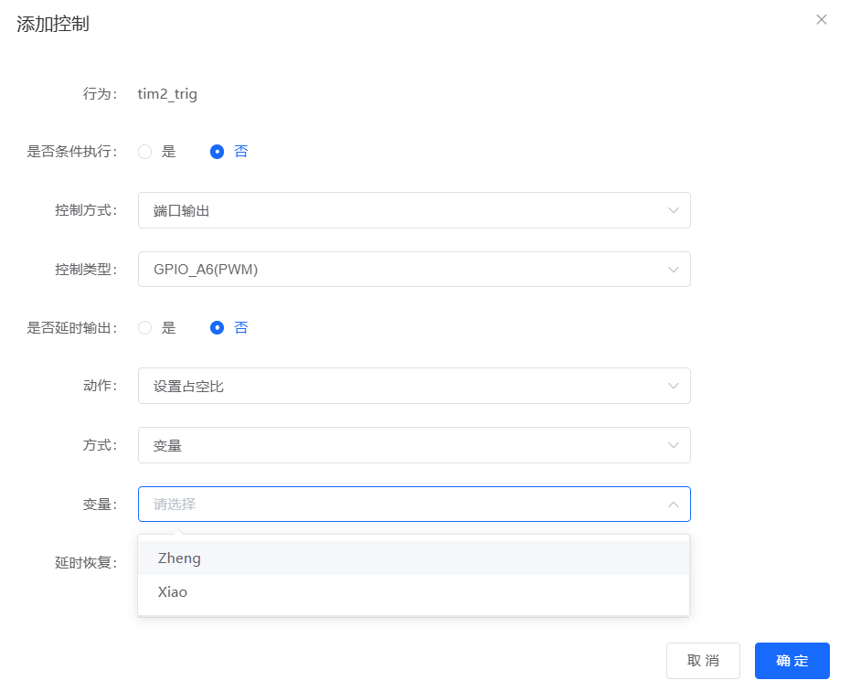

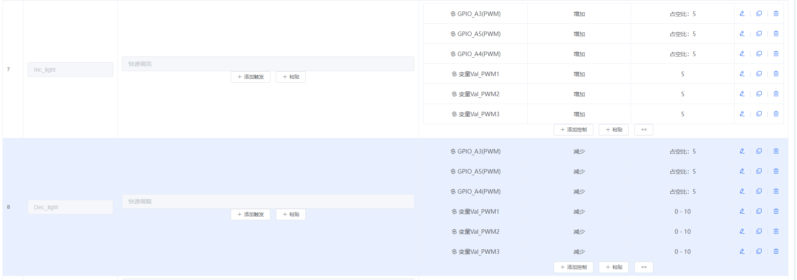

---

### CI-03T4模块的电源电流需求是多少？

**问题描述：**

需要确认400mA输出电流的电源芯片（ASM6050）是否能满足CI-03T4模块的供电需求。

**解决方案：**

**电源电流要求**

CI-03T4模块的电源电流需求超过400mA，400mA电源芯片不能满足供电要求：

- **CI-03T系列**：正常工作电流建议500mA以上
- **SU-03T系列**：正常工作电流建议600mA以上
- **ASM6050（400mA）**：输出电流不足，不建议使用

**电源选型建议：**

1. **电流余量**：

    - 选择输出电流至少600mA的电源芯片
    - 预留足够的功率余量，确保系统稳定
    - 考虑峰值电流需求

2. **电压要求**：

    - 输入电压范围：4.5-5.5V
    - 建议使用5V标准供电
    - 电源纹波应小于100mV

3. **电源质量**：

    - 选择低噪声、高稳定性的电源芯片
    - 必要时增加滤波电容
    - 避免与大功率设备共用电源

**注意事项：**

- 电流不足会导致模块工作异常或重启
- 建议选择知名品牌的电源芯片
- 如使用电池供电，需计算电池容量和续航时间

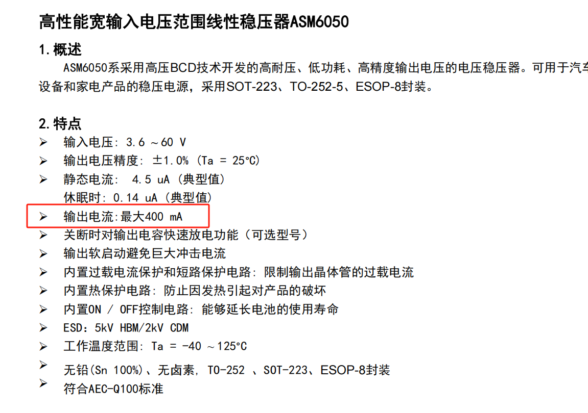


---

### CI1302芯片不接晶振能否正常工作？

**问题描述：**

CI1302芯片在不连接晶振的情况下是否会影响串口通讯和语音识别功能，以及晶振引脚应如何处理。

**解决方案：**

**晶振功能说明：**

- 晶振主要用于提供时钟基准
- CI1302内部有RC振荡器
- 可以不接外部晶振工作

**不接晶振的影响：**

- 串口通讯：**不影响**
- 语音识别：**不影响**
- 温度稳定性：**有影响**
- 长期精度：**略有影响**

**引脚处理建议：**

- 晶振引脚（XI、XO）应保持悬空
- 不建议接地或连接其他信号
- 避免引入干扰

**应用场景：**

**可以不接晶振的情况：**

- 成本敏感的应用
- 对精度要求不高的场合
- 室内恒温环境使用
- 量产产品降低成本

**建议接晶振的情况：**

- 温度变化较大的环境
- 需要高精度识别
- 工业级应用
- 对稳定性要求极高

**注意事项：**

- 不接晶振主要是温漂影响
- 实际使用中差异通常很小
- 如已布线建议保留晶振
- 引脚悬空时注意避免静电

---

**技术限制：**

- CI-03T1并非专为超低功耗场景设计
- 蓝牙广播和语音识别功能功耗相对固定
- 单火开关本身的供电能力有限

**注意事项：**

- 功耗优化需要在功能和功耗之间权衡
- 改造前先测量确认功耗分布
- 如需同时保持蓝牙可发现和低功耗，可能需要选择其他方案

---

### 如何简化两个控制模块和两组继电器的电路设计？

**问题描述：**

当前系统使用两个控制模块和两组继电器控制同一设备，导致线路杂乱，希望简化电路设计。

**解决方案：**

**1. 自制继电器板方案**

可以通过自制继电器板来优化和简化电路：

- **设计集成式继电器板**：将两组继电器集成到一块PCB板上
- **减少连接线**：通过合理布局减少模块间的连线
- **统一供电设计**：使用单一电源管理电路

**2. 电路优化建议**

- **合并控制逻辑**：评估是否可以用一个CI-03T控制所有继电器
- **使用继电器驱动模块**：选择集成度高的继电器模块板
- **优化布线路径**：使用排线或连接器减少杂乱

**3. 实施步骤**

1. 评估现有电路功能需求
2. 设计简化后的继电器控制板
3. 确认单个CI-03T的IO口是否满足控制需求
4. 制作或采购集成式继电器模块
5. 重新布线，减少交叉和重复线路

**注意事项：**

- 需要确保简化后的电路不影响原有功能
- 考虑继电器的驱动电流，选择合适的驱动方案
- 保留必要的隔离电路，避免干扰

---

### 如何优化CI-03T产品的体积？

**问题描述：**

当前产品体积过大，希望进行体积优化，但未明确具体需求和当前使用的产品型号。

**解决方案：**

**1. 明确优化需求**

首先需要确认具体优化方向：

- **产品类型**：确认是使用CI-03T、CI-03T1还是CI-03T2
- **体积要求**：目标尺寸和限制条件
- **功能需求**：需要保留的核心功能
- **应用场景**：产品的使用环境和安装要求

**2. 体积优化方案**

- **选择小型化型号**：

    - CI-03T系列相比其他系列已较为紧凑
    - 考虑使用集成度更高的模块版本
    - 评估是否需要所有功能模块

- **电路集成优化**：

    - 将多个功能模块集成到单一PCB
    - 使用贴片元件代替插件元件
    - 优化PCB布局和叠层设计

- **外壳设计优化**：

    - 采用紧凑型外壳设计
    - 减少不必要的结构余量
    - 考虑使用3D打印定制外壳

**3. 实施建议**

1. **评估现有方案**：分析当前体积占用大的原因
2. **选择合适模块**：根据功能需求选择最小配置
3. **重新设计PCB**：优化元件布局和走线
4. **集成外围电路**：将必要的外围电路集成到主控板
5. **定制外壳**：根据内部结构设计最紧凑外壳

**注意事项：**

- 体积优化可能影响散热性能
- 需要平衡尺寸与可维护性
- 确保优化后仍能正常生产和测试

---

### CI-03T的GPIO是否可以接收高低电平信号？

**问题描述：**

CI-03T1芯片的GPIO接口是否可以接收高低电平信号。

**解决方案：**

可以，将Pin脚配置成GPIO，设置成输入模式，默认高电平。

**配置方法：**

1. **进入Pin脚配置**
    - 选择目标GPIO引脚
    - 配置为GPIO功能
    - 设置为输入模式

2. **配置输入参数**
    - 默认高电平：芯片内部上拉
    - 检测低电平：外部信号拉低时触发
    - 无法检测高电平：芯片无内部下拉

3. **触发动作设置**
    - 添加控制行为
    - 设置触发条件为GPIO输入
    - 配置触发电平（高/低）

**注意事项：**

- 芯片只支持内部上拉，不支持内部下拉
- 默认高电平配置只能检测从高到低的变化
- 外部输入低电平时要确保可靠接地（<0.8V）
- 可使用VCC和GND测试输入功能

---

### CI-03T的PA0和PA2 IO口无法设置为输入功能怎么办？

**问题描述：**

在使用CI-03T1和CI-03T2芯片时，发现PA0和PA2两个IO口无法设置为输入功能，导致无法触发外部信号。

**解决方案：**

**问题确认：**

- PA0和PA2在固件中被定义为其他特殊功能
- 这两个IO口在代码层面被占用，无法作为普通GPIO输入使用
- 该问题已在后续固件版本中修复

**处理方法：**

1. **升级固件版本**
    - 更新到最新版本的固件
    - 新版本已修复PA0和PA2的输入功能问题

2. **临时解决方案**
    - 使用其他可用的IO口作为输入
    - 通过代码配置验证IO口功能

3. **测试验证**
    - 编写简单的测试程序
    - 测试各个IO口的输入响应功能
    - 对比PA0、PA2与其他IO口的差异


**注意事项：**

- 升级固件前请备份现有配置
- 如仍有问题，建议使用其他IO口替代
- 避免在项目中使用被特殊功能占用的IO口

---
## IO口配置

### CI-03T1有多少个可用IO口？GPIO-A6可以使用吗？

**问题描述：**

CI-03T1芯片看起来只有9个IO口可用，其中GPIO-A6被用作功放使能脚，导致缺少一个IO口，询问是否有其他解决方案。

**解决方案：**

CI-03T1的GPIO-A6引脚已被固定用作功放使能功能，无法作为通用IO使用。

**IO口说明：**

- **可用IO口数量**：9个（GPIO-A6被占用）
- **GPIO-A6功能**：固定作为功放使能脚
- **不可配置原因**：硬件设计已将该引脚固定连接

**解决方案：**

1. **硬件修改**
    - 如需10个IO口，只能修改硬件设计
    - 选择其他支持更多IO口的模块

2. **推荐替代型号**
    - SU-32T模块支持10个IO口
    - 可作为需要更多IO场景的替代方案

**注意事项：**

- 购买前请根据IO口需求选择合适型号
- CI-03T1适合IO口需求不超过9个的应用
- 如后续需要扩展IO，建议预留设计余量

---

### CI-03T支持PWM功能吗？

**问题描述：**

不确定CI-03T芯片是否支持PWM功能，以及如何通过程序实现PWM开关控制。

**解决方案：**

CI-03T完全支持PWM功能，可通过平台配置实现PWM开关控制。

**PWM支持情况：**

1. **硬件支持**
    - CI-03T支持5路PWM输出
    - PWM引脚：PA0、PA1、PA2、PA3、PA4
    - 可通过平台直接配置使用

2. **平台配置方法**
    - 在智能公元平台选择"PWM输出"
    - 配置PWM通道、频率和占空比
    - 支持通过语音指令动态调整PWM参数

3. **PWM应用示例**
    - LED调光：PWM频率1kHz，占空比0-100%
    - 电机调速：PWM频率10kHz，占空比0-100%
    - 舵机控制：PWM频率50Hz，占空比5-10%

**注意事项：**

- CI-03T的原生PWM功能优于GPIO模拟PWM
- PWM输出最大电流150mA，大负载需外接驱动
- SU-03T的PWM例程同样适用于CI-03T
- 建议查看B站相关PWM教程视频

---

### 如何设置舵机PWM控制的频率和占空比以实现精确角度控制？

**问题描述：**

使用CI-03T系列芯片通过PWM控制舵机时，需要设置合适的频率和占空比来实现精确的角度控制，但实际测试中发现角度控制不够准确。

**解决方案：**

**1. PWM控制原理**

- 占空比决定舵机转动角度
- 频率影响舵机转动的平稳性和精度

**2. 频率设置**

- **标准频率**：50Hz（周期20ms）
- **优化频率**：100Hz（可提高控制精度）
- 提高频率能获得更精确的角度控制

**3. 占空比计算**
舵机角度与占空比的对应关系：

计算公式：
```
脉宽(ms) = 1.5 + (角度/90) × 1.0
占空比 = (脉宽/周期) × 100%
```

常用角度对应值（50Hz）：

- 0°：脉宽1.0ms，占空比5%
- 45°：脉宽1.5ms，占空比7.5%
- 90°：脉宽2.0ms，占空比10%
- -45°：脉宽1.0ms，占空比5%

**4. 频率调整说明**

- 当频率从50Hz改为100Hz时：

    - 周期从20ms变为10ms
    - 占空比需要相应调整为原来的2倍
    - 例如：45°在50Hz时占空比7.5%，100Hz时占空比15%

**5. 实测优化建议**

- 使用示波器测量实际输出的PWM信号
- 根据实测数据微调占空比值
- 不同舵机可能需要单独校准


**注意事项：**

- 占空比设置值需使用变量类型，不能使用固定值
- 固件生成失败时，检查配置是否有冲突
- 使用100Hz频率时，确保占空比相应调整为2倍
- 不同型号舵机的参数可能略有差异，建议实测校准

---

### CI-03T2双麦版本最多支持几个控制口？B5和B6可以使用吗？

**问题描述：**

CI-03T2双麦版本需要8个控制口，但发现B6和B5引脚无法配置为控制口，实际只有7个可用。

**解决方案：**

CI-03T2双麦版本由于硬件设计限制，B5和B6引脚无法作为通用控制口使用。

**控制口限制说明：**

- **实际可用控制口**：最多7个
- **B5和B6限制**：

    - B6引脚：只能用作输出，会影响烧录功能
    - B5引脚：随意使用，但建议串接1K以上电阻隔离
- **原因分析**：

    - 双麦版本需要使用部分引脚作为晶振接口（XIN/XOUT）
    - B6和B7用于UART通信（烧录接口）
    - 硬件设计导致引脚功能固定

**使用建议：**

1. **B6引脚处理**：

    - 仅用作输出功能
    - 设置为低电平避免影响烧录
    - 不要用作输入控制

2. **B5引脚处理**：

    - 可以作为控制口使用
    - 建议串接1KΩ以上电阻隔离
    - 避免影响系统稳定性

3. **替代方案**：

    - 如需要8个以上控制口，选择其他型号
    - 使用外部扩展芯片增加IO口
    - 考虑使用SU-32T（支持10个IO）

**注意事项：**

- B6作为控制脚后会影响烧录功能
- 双麦版本因硬件设计限制，控制口数量少于单麦版本
- 设计时需预留足够的控制口余量

---

## 通信接口配置

### CI-03T1和CI-03T2是否支持串口通讯功能？

**问题描述：**

需要了解CI-03T系列芯片是否支持串口通讯功能，以及支持的通信接口数量和类型。

**解决方案：**

**是的，CI-03T1和CI-03T2系列芯片支持串口通讯功能。**

**1. 硬件支持的通信接口**

CI-03T系列芯片硬件支持以下通信接口：

- **UART串口**：2路（UART0和UART1）
    - UART0：主要用于程序下载和调试
    - UART1：用于与外部设备通信
- **I2C接口**：硬件支持I2C通信
    - 需要二次开发才能实现I2C功能
    - 智能公元平台暂不支持I2C配置
- **PWM输出**：5路PWM输出
    - 可用于模拟通信或控制信号输出

**2. 串口资源配置**

**UART0（调试串口）**：

- 引脚：B0(TX)、B1(RX)
- 用途：固件烧录、调试信息输出
- 波特率：支持多种波特率

**UART1（通信串口）**：

- 可通过三组引脚实现：

    - B6/B7（推荐）
    - B5/B6
    - B2/B3
- 注意：三组引脚不能同时使用

**3. 通信限制说明**

- **串口数量**：最多2路UART
- **变量判断**：无明确数量限制，受内存影响
- **平台支持**：仅支持串口配置，I2C需二次开发
- **TTS功能**：需要专用版本支持

**4. 扩展方案**

如需更多通信接口：

1. **使用IO模拟通信协议**
2. **外部扩展芯片**：添加专用通信芯片
3. **选择其他型号**：根据需求选择合适模块

**注意事项：**

- 串口参数需与通信方一致
- 变量使用要合理规划，避免资源不足
- I2C功能需要较强的开发能力

---

### CI-03T模块的工作电流和休眠电流是多少？

**问题描述：**

需要了解CI-03T模块在工作状态和休眠状态下的电流消耗情况。

**解决方案：**

**电流参数说明：**

CI-03T模块的电流消耗根据工作状态不同而变化：

**1. 工作状态电流**

- 播放状态：>500mA（驱动4Ω喇叭时）
- 正常工作：约60mA（待机聆听状态）
- 识别处理：会有瞬时电流增加

**2. 功耗测试参考**

- 有专门的功耗测试视频可供参考：https://www.bilibili.com/video/BV1Nz4y1e7UD/
- 视频展示了模块在不同工作状态下的实际电流测试
- 可作为设计供电电路的参考

**注意事项：**

- 工作电流受喇叭阻抗影响较大
- 4Ω喇叭是常用测试条件，实际使用时需注意
- 设计电源时要考虑峰值电流需求
- 电池供电时需要预留足够的余量

---

### CI-03T模块串口电压异常（仅1V）如何排查？

**问题描述：**

测量CI-03T模块串口引脚电压时，发现只有1V，远低于正常电平，无法正常通信。

**解决方案：**

**排查步骤：**

1. **断开连接测量**

    - 先断开串口连接，再测量引脚电压
    - 确认是否是连接外部设备导致的拉低
    - 检查是否有短路或接地问题

2. **检查供电情况**

    - 确认模块供电正常（3.6-5.5V）
    - 测量电源输入端电压是否稳定
    - 检查电源线是否接触良好

3. **检查连接电路**

    - 确认串口线没有损坏
    - 检查USB转TTL模块是否正常工作
    - 验证接线是否正确（TX/RX交叉）

**可能原因：**

- USB转TTL模块损坏或设置错误
- 串口线内部断路或接触不良
- 模块串口引脚损坏
- 供电不足导致电平异常

**注意事项：**

- 正常TTL电平应为3.3V左右
- 1V电压通常是通信异常的表现
- 建议使用万用表逐段排查电路

---

## 串口配置

### CI-03T模块的串口引脚如何配置？

**问题描述：**

需要了解CI-03T模块与单片机通信的串口引脚配置，包括UART0和UART1的引脚分配。

**解决方案：**

CI-03T模块的串口配置需要在智能公元平台的Pin脚配置中进行设置：

**1. UART0（调试/烧录串口）**

- 引脚：B0(TX)、B1(RX)
- 用途：固件烧录、调试信息输出
- 波特率：支持多种波特率（常用115200）

**2. UART1（通信串口）**

- 可通过三组引脚配置（只能选择其中一组）：

    - A2(TX)、A3(RX) - 推荐用于与单片机通信
    - B5(TX)、B6(RX)
    - B2(TX)、B3(RX)
- 注意：三组引脚不能同时使用

**3. 配置步骤**

- 在智能公元平台的"Pin脚配置"界面进行设置
- 选择需要使用的引脚组作为UART1
- 设置波特率、数据位、停止位等参数
- 常用配置：115200波特率，8数据位，1停止位，无校验

**注意事项：**

- 烧录固件时，模块的TX/RX需要与烧录器的TX/RX交叉连接
- UART0的B0/B1引脚主要用于烧录和日志输出
- 选择UART1引脚时要考虑硬件布局的便利性

---

### CI-03T模块是否引出了UART2接口？

**问题描述：**

在查看CI-03T模块的串口资源时，对是否存在UART2接口存在疑问，特别是UART2/RX引脚是否可用。

**解决方案：**

CI-03T模块仅引出了两个串口：UART0和UART1，没有UART2接口。

**串口资源说明：**

1. **UART0**：

    - 主要用于程序下载和调试
    - 对应引脚：TX0、RX0
    - 通常连接到烧录器

2. **UART1**：

    - 可用于与外部设备通信
    - 对应引脚：TX1、RX1
    - 可在平台配置为串口功能

3. **UART2**：

    - 芯片内部存在但未引出到模块引脚
    - PA6引脚被用作功放使能功能
    - 无法作为UART2/RX使用

**引脚分配说明：**

- 启英泰伦芯片确实有UART2资源
- 但CI-03T模块封装时未将UART2引出
- PA6引脚被固定配置为功放使能脚
- 这是模块的硬件设计决定

**注意事项：**

- 设计时只能使用UART0和UART1
- 如需要更多串口，考虑选择其他模块
- UART1在使用前需在平台正确配置
- 串口通信要注意电平匹配（3.3V TTL）

---

## 电平与连接

### CI-03T的TX/RX电平是多少V？是否可以与5V单片机直接连接？

**问题描述：**

需要确认CI-03T模块的TX/RX引脚电平，以及如何与5V单片机正确连接。

**解决方案：**

**电平规格：**

- CI-03T的TX/RX引脚为 **3.3V TTL电平**
- 不能直接与5V单片机连接，需要电平转换

**连接方法：**

1. **使用上拉电阻**
    - TX和RX线各加一个上拉电阻到5V
    - 电阻值：1kΩ-10kΩ
    - 可以实现3.3V到5V的电平转换

2. **专用电平转换芯片**
    - 使用TXS0108等电平转换芯片
    - 实现3.3V和5V双向转换
    - 更稳定可靠

**平台配置要求：**

- 将使用的串口配置为"开漏模式"
- 在系统设置中的串口UART配置选项
- 勾选"开漏模式"选项

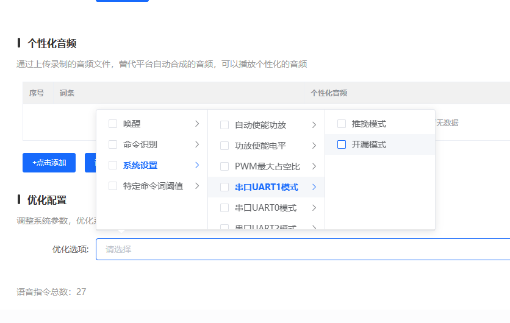

**接线示例：**

```
CI-03T TX → 上拉电阻 → 5V单片机 RX
CI-03T RX → 上拉电阻 → 5V单片机 TX
共地(GND)必须连接
```

**注意事项：**

- 不建议3.3V和5V直接连接
- 必须进行电平转换，否则可能损坏模块
- 共地连接是通信正常的基础
- 开漏模式配合上拉电阻可以实现5V输出

### CI-03T每路IO口的最大输出电流是多少？

**问题描述：**

需要确认CI-03T模块每路IO口（GPIO）的最大输出电流，以便设计合适的外围电路。

**解决方案：**

**电流规格：**

- **单路IO最大输出电流**：150mA
- **总电流限制**：所有IO口电流总和不能超过芯片总电流限制
- **供电要求**：大于500mA（驱动4欧姆喇叭时）

**设计建议：**

1. **负载电流控制**
    - 每路IO连接的负载电流不超过150mA

---

### 如何实现GPIO低电平检测与防误报逻辑？

**问题描述：**

需要使用CI-03T1的B2口检测低电平信号，并通过延迟检测防止误报，当持续低电平时触发报警。

**解决方案：**

**实现方法：**

1. **定时器超时方案**
    - 低电平时启动定时器
    - 定时器超时后变量递增
    - 变量超过阈值时触发报警
    - 高电平时停止定时器并清零变量

2. **平台配置步骤**
    - 配置B2口为GPIO输入模式
    - 添加定时器功能（使用平台提供的定时器资源）
    - 设置变量计数逻辑
    - 配置报警输出（如GPIO输出、串口发送等）

**逻辑流程：**

```
低电平检测 → 启动定时器 → 定时器超时 → 计数变量+1
                                    ↓
                                计数≥阈值 → 触发报警
高电平检测 → 停止定时器 → 清零计数变量
```

**注意事项：**

- 定时器精度取决于平台配置，建议使用硬件定时器
- 延迟时间需要根据实际干扰情况调整
- 计数阈值可根据应用需求设定
- 建议对输入信号做滤波处理，避免噪声干扰

---

### CI-03T是否有低功耗待机方案？

**问题描述：**

需要寻找CI-03T系列芯片的微安级别待机功耗锂电池供电参考设计方案，适用于电池供电应用。

**解决方案：**

**低功耗型号说明：**

- **CI-03T/CI-33T**：常规功耗型号，非专用低功耗版本
- **SU-21T**：提供低功耗版本，适合电池应用
- **功耗差异**：主要在待机模式下的电流消耗

**功耗参考：**

- **常规型号**：待机功耗在毫安级别
- **低功耗需求**：需要选择专门优化的型号
- **微安级别**：通常需要专用低功耗芯片

**设计建议：**

1. **选择合适型号**
    - 如要求微安级待机，考虑SU-21T
    - 评估实际功耗需求是否真的需要极低

2. **电源管理优化**
    - 使用高效的DC-DC转换器
    - 合理配置休眠模式
    - 优化外围电路功耗

3. **电池选型**
    - 根据实际功耗选择电池容量
    - 考虑自放电率
    - 预留足够的工作时间

**注意事项：**

- CI-03T系列主要面向市电供电应用
- 真正的低功耗应用建议选择专用低功耗型号
- 999μA虽然 technically 是微安级，但实际功耗较高
- 设计时需综合考虑成本和功耗需求

---

### 如何实现GPIO高电平持续时间超过1秒才触发执行？

**问题描述：**

在CI-03T1或CI-03T2芯片上实现检测GPIO高电平持续时间超过1秒才触发执行流程，短于1秒则忽略的逻辑。

**解决方案：**

**实现原理：**

通过定时器机制实现时间控制：

- GPIO检测到高电平时启动定时器（超时时间：1秒）
- 1秒内检测到低电平则停止定时器（取消触发）
- 持续高电平1秒后，定时器超时触发执行动作

**实现步骤：**

1. **添加定时器配置**

```c
// 定时器配置参数
#define TIMER_DURATION_MS 1000  // 1秒超时时间
timer_id duration_timer;
bool timer_running = false;
```

2. **GPIO中断处理**

```c
// GPIO上升沿处理
void gpio_rising_handler() {
    if (!timer_running) {
        // 启动定时器
        start_timer(duration_timer, TIMER_DURATION_MS);
        timer_running = true;
    }
}

// GPIO下降沿处理
void gpio_falling_handler() {
    if (timer_running) {
        // 停止定时器，取消触发
        stop_timer(duration_timer);
        timer_running = false;
    }
}
```

3. **定时器超时处理**

```c
// 定时器超时回调函数
void timer_timeout_handler() {
    timer_running = false;
    // 执行目标动作
    execute_target_action();
}
```

**配置要点：**

1. **定时器设置**
    - 超时时间：1000ms（1秒）
    - 重复模式：单次触发
    - 优先级：根据应用需求设置

2. **GPIO配置**
    - 输入模式：数字输入
    - 中断触发：双边沿触发（上升沿和下降沿）
    - 上拉/下拉：根据硬件配置

3. **状态管理**
    - 使用变量跟踪定时器状态
    - 避免重复启动定时器
    - 正确处理中断嵌套

**应用示例：**

- **长按检测**
    - 按钮按下不足1秒：无响应
    - 按钮按下超过1秒：触发功能

- **信号滤波**
    - 短脉冲干扰：自动过滤
    - 持续信号：正常处理

- **时序控制**
    - 确保信号稳定时间
    - 防止误触发

**注意事项：**

1. 定时器资源有限，合理分配使用
2. 中断处理函数应尽量简短
3. 考虑定时器精度和系统延迟
4. 测试时验证各种边界条件
5. 根据实际需求调整超时时间

**调试建议：**

1. 使用LED或串口输出调试信息
2. 验证定时器启动和停止时机
3. 测试不同脉宽的输入信号
4. 确认系统在负载下的稳定性


---

### CI-03T/33T连接3瓦扬声器时的最大功耗是多少？

**问题描述：**

需要了解CI-03T/33T芯片在连接3瓦扬声器时的最大功耗，以便设计合适的电源方案。

**解决方案：**

**功耗参考：**

- 具体功耗数据可参考官方测试视频
- 视频展示了CI-03T/33T在不同工作状态下的电流消耗
- 包含待机、识别、播放等各阶段的功耗表现

**电源设计建议：**

1. **预留足够余量**
    - 建议电源容量不低于500mA
    - 峰值电流可能达到300-400mA
    - 考虑扬声器瞬态功耗

2. **电压稳定性**
    - 使用稳压电源保证工作电压稳定
    - 避免电压波动影响音质
    - 建议使用线性稳压器或DC-DC模块

**注意事项：**

- 实际功耗取决于音量和音频内容
- 测量时建议使用示波器观察瞬态电流
- 电源设计应考虑最坏情况的功耗需求

---

**电流规格：**

- **单路IO最大输出电流**：150mA
- **总电流限制**：所有IO口电流总和不能超过芯片总电流限制
- **供电要求**：大于500mA（驱动4欧姆喇叭时）

**设计建议：**

1. **负载电流控制**
    - 每路IO连接的负载电流不超过150mA
    - 建议预留余量，按100mA以下设计
    - 避免多个IO口同时驱动大电流负载

2. **驱动能力提升**
    - 如需驱动更大负载，请使用三极管或MOSFET
    - 继电器控制需要额外驱动电路
    - 电机驱动建议使用专用驱动芯片

3. **保护措施**
    - 大电流负载建议串联限流电阻
    - 感性负载需要加续流二极管
    - 考虑加入保险丝或PTC保护

**注意事项：**

- 超过150mA可能导致IO口损坏
- 长期工作在最大电流会影响芯片寿命
- 设计时考虑最坏情况下的电流需求

---

## 时钟电路

### 如何识别CI-03T模块使用的晶振类型（有源/无源）？

**问题描述：**

在查看电路原理图时，发现晶振在图中标注为两脚连接，但实际模块上贴装的是四脚晶振，对如何判断晶振类型存在疑问。

**解决方案：**

CI-03T模块使用的是无源晶振，四脚封装中额外的两个引脚是接地（GND）。

**晶振类型识别：**

1. **无源晶振特点**：

    - 需要2个引脚连接（XIN/XOUT）
    - 需要外部负载电容
    - 依赖芯片内部振荡电路
    - 原理图通常只画2个引脚

2. **有源晶振特点**：

    - 通常有4个引脚（VCC、GND、OUT、NC）
    - 自带振荡电路，直接输出时钟信号
    - 需要外部供电

3. **四脚无源晶振说明**：

    - 引脚1和3：连接晶振本体
    - 引脚2和4：接地（GND），提供屏蔽
    - 实际使用时只连接2个有效引脚
    - 外壳接地可提高抗干扰能力

**电路设计要点：**

- 需要配置合适的负载电容（典型值12-22pF）
- 晶振应尽可能靠近芯片引脚
- 晶振下方建议铺地并提供屏蔽
- 避免晶振信号线靠近高速数字信号

**注意事项：**

- 四脚封装不等于有源晶振
- 接地引脚提供机械固定和电磁屏蔽
- 按照无源晶振设计外围电路即可

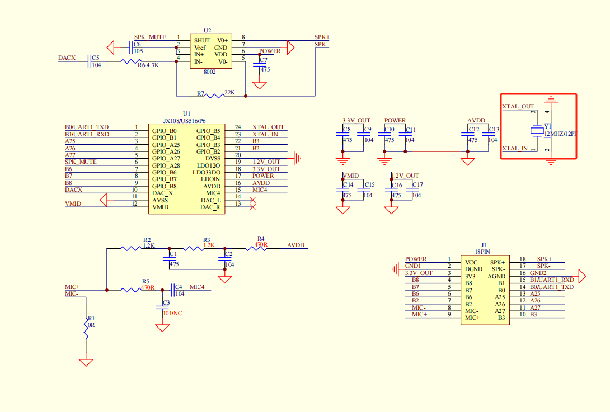

---

## 接地设计

### 为什么原理图中AGND和DGND分开设计但最终连接在一起？

**问题描述：**

在查看电路原理图时，发现模拟地（AGND）和数字地（DGND）在设计中分开走线，但最终通过元件连接在一起，对此设计存在疑问。

**解决方案：**

这是混合信号电路的标准设计方法，分开走线是为了避免数字噪声干扰模拟电路。

**设计原理：**

1. **分开走线的原因**：

    - 模拟电路（麦克风、音频前端）对噪声敏感
    - 数字电路（MCU、时钟）会产生高频噪声
    - 分开走线避免数字噪声耦合到模拟部分

2. **单点连接的原因**：

    - 必须有统一的参考地电位
    - 避免地环路产生额外噪声
    - 提供稳定的回流路径

3. **连接方式说明**：

    - 通常通过0Ω电阻或磁珠连接
    - 也可以通过二极管（单向）连接
    - 在芯片下方或特定位置单点汇合

**最佳实践：**

- AGND和DGND在PCB上分开布线
- 仅在一个精心选择的位置连接
- 避免形成大面积的混合区域
- 连接点尽量远离敏感的模拟输入

**注意事项：**

- 不要直接大面积铜箔连接
- 避免多点连接形成地环路
- 连接元件的选择影响噪声抑制效果
- 测试时可先用0Ω电阻便于调试

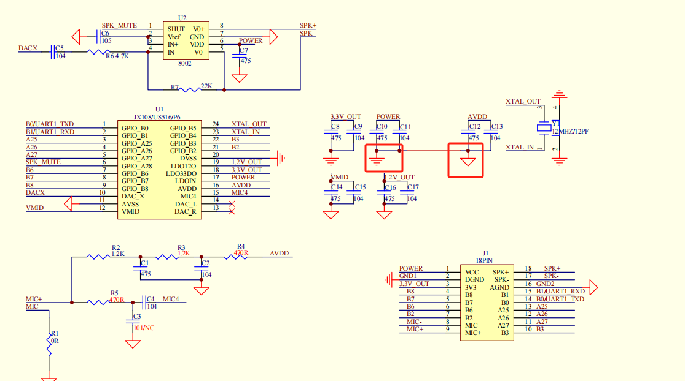

---

## 元器件识别

### 如何在原理图中识别语音模块和功放芯片？

**问题描述：**

在查看电路原理图时，需要准确识别哪个是语音模块、哪个是功放芯片，特别是当多个芯片同时存在时。

**解决方案：**

通过芯片型号和封装形式来识别不同元器件。

**识别方法：**

1. **语音模块识别**：

    - 通常为18引脚的模块封装
    - 型号标识：JX10/MUS516/P6等
    - 位置：原理图右下角的J1位置
    - 特征：连接麦克风和音频输入电路

2. **功放芯片识别**：

    - 通常为8引脚的小封装芯片
    - 型号标识：8002、8002A、8002D等
    - 位置：主芯片附近的独立芯片
    - 特征：连接音频输出和喇叭

3. **主控芯片识别**：

    - 核心处理器，通常标识为CI-03T1/CI-03T2
    - 引脚数最多，连接所有外围电路
    - 位置：原理图中心位置

**常见芯片对应：**

| 元器件 | 常见型号 | 封装特征 | 功能说明 |
|--------|-----------|---------|---------|
| 语音模块 | JX10/MUS516P6 | 18脚模块 | 语音识别和处理 |
| 功放芯片 | 8002系列 | 8脚DIP/SOP | 音频功率放大 |
| 电源管理 | 8002系列 | 8脚DIP/SOP | 音频功率放大 |

**注意事项：**

- 芯片型号通常直接印刷在封装表面
- 结合电路连接关系进一步确认功能
- 不确定的型号可查阅对应芯片的数据手册
- 模块封装通常有引脚1标识帮助定位

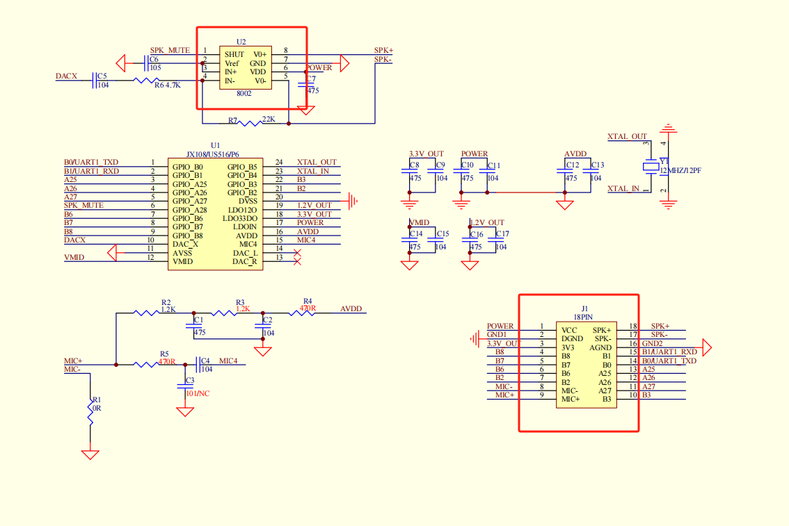

---

## 供电与声音

### CI-03T声音异常或供电不足怎么办？

**问题描述：**

模块唤醒后声音异常，回复语听不清，或串口无输出，更换供电后恢复正常。

**解决方案：**

**供电问题排查：**

1. **供电电压检查**
    - 确认供电电压为5V（非3.3V）
    - 使用万用表测量实际工作电压
    - 电压过低会导致功放异常

2. **电源功率检查**
    - 确认电源适配器输出电流≥500mA
    - 喇叭工作时需要较大电流
    - 电脑USB供电可能不足

3. **接线检查**
    - 使用粗短的电源线减少压降
    - 避免使用细长的杜邦线供电
    - 检查连接是否牢固

**声音异常处理：**

1. **喇叭检查**
    - 确认喇叭阻抗匹配（4-8欧姆）
    - 测试喇叭是否损坏
    - 尝试更换其他喇叭

2. **功放电路检查**
    - 检查功放芯片是否发热
    - 测试音频输出耦合电容
    - 确认音频线路连接

**解决方案：**

- 使用独立的5V/1A电源适配器
- 更换质量更好的电源线
- 在电源端增加滤波电容

**注意事项：**

- 供电不足会导致多种异常现象
- 声音断续和串口无输出可能是同一原因
- 建议使用专用电源而非USB供电

---

### CI-03T1模块是否可以兼容电容麦？

**问题描述：**

需要确认CI-03T1模块是否可以兼容SMD-4013类型的电容麦克风。

**解决方案：**

- **电容麦兼容性**：

    - CI-03T1模块可以使用电容麦
    - SMD-4013型号电容麦（灵敏度-32±3dB，信噪比≥65dB）可以使用
    - 电容麦的工作电压范围（1.5-3V）符合模块要求

- **注意事项**：

    1. 确认电容麦的阻抗匹配（2.2K）
    2. 验证工作电压在模块支持范围内
    3. 实际测试效果可能因环境而异
    4. 建议购买样品进行实际测试

**技术参数参考**：

- 灵敏度：-32±3dB
- 信噪比：≥65dB
- 阻抗：2.2K
- 工作电压：1.5-3V
- 工作电流：500μA


---

### CI-03T1的GPIO输出始终为高电平怎么办？

**问题描述：**

在使用CI-03T1芯片时，配置了GPIO_A25和GPIO_A26为输出模式，但无论使用唤醒词还是命令词，输出信号始终为高电平，无法正常输出低电平信号。

**解决方案：**

- **检查GPIO配置**：

    - 确认GPIO引脚配置为输出模式
    - 检查"默认高电平输出"设置是否开启
    - 关闭"默认高电平"选项试试

- **配置修改步骤**：

    1. 在配置界面找到GPIO_A25和GPIO_A26设置
    2. 检查"默认高电平输出模式"开关状态
    3. 关闭该开关或修改为"默认低电平"
    4. 重新生成固件并烧录

**注意事项：**

- 默认高电平模式下，脉冲电平会被设置为低
- 正常输出应该是高低电平变化的方波信号
- 如配置正确但问题仍在，检查外部电路是否有上拉电阻


---

### CI-03T1/CI-03T2的ADC输入电压范围是多少？

**问题描述：**

当CI-03T1或CI-03T2芯片的A25脚配置为ADC输入时，是否可以直接接入5V电压进行比较。

**解决方案：**

**电压范围说明：**

- A25脚配置为ADC输入时，不能直接接入5V电压
- 需要通过分压电路将电压降至ADC的安全测量范围内

**分压电路设计：**

1. **基本分压电路**
    - 使用两个电阻串联分压
    - 推荐：两个10KΩ电阻
    - 分压后：5V → 2.5V（安全范围内）

2. **实际应用示例**
    - 检测电池电压：4V时触发充电，5V时停止充电
    - 分压后ADC读数对应原电压的一半
    - 软件中需要将ADC值乘以2得到实际电压

**电路优化建议：**

- 可在分压后并联电容滤波，提高测量稳定性
- 有低功耗需求时，可适当调整电阻阻值（如100KΩ）
- 确保分压后的最高电压小于ADC引脚的最大测量电压

**注意事项：**

- 自带ADC精度有限，适用于一般电压检测
- 如需高精度测量（0.001V级别），建议使用专用5V ADC芯片
- 模块自带3.3V电源，也可设置引脚输出高电平作为参考

---

### CI-03T1配置GPIO后语音识别成功引脚无变化如何解决？

**问题描述：**

配置CI-03T1的GPIO_03引脚为默认高电平输出，设置语音识别成功后输出低电平脉冲，但实际测试时万用表测量引脚电压无变化。

**解决方案：**

1. **确认引脚对应关系**
    - 配置界面中的GPIO编号与模块物理引脚一一对应
    - IO3对应模块上的IO3引脚位置

2. **检查GPIO配置**
    - 确认GPIO_03设置为输出模式
    - "默认高电平"设置正确
    - 动作设置为"设置电平"和"低电平"
    - 勾选"是否条件执行"以确保触发

3. **测试方法**
    - 使用LED灯代替万用表进行快速测试
    - LED正极接IO3，负极接地，观察是否闪烁
    - 或使用低电平触发的继电器进行测试

4. **故障排查**
    - 尝试配置其他GPIO引脚对比测试
    - 检查硬件连接是否牢固
    - 重新烧录固件排除软件问题

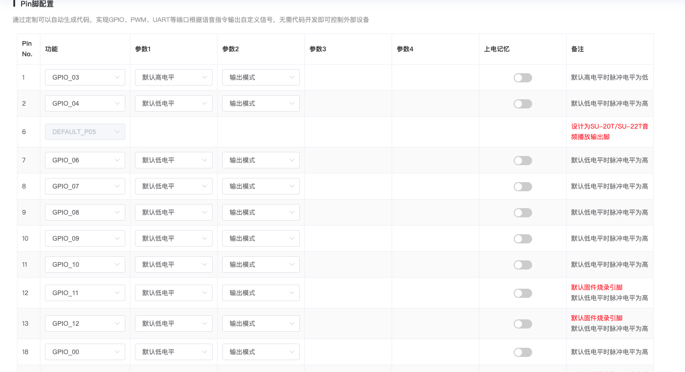

---

### PA0和PA1引脚配置为PWM输出时偶尔不输出波形怎么办？

**问题描述：**

配置PA0和PA1引脚为PWM输出时，偶尔不输出波形，尽管语音反馈已成功设置。怀疑是引脚复用或配置问题。

**解决方案：**

**1. 引脚功能确认**

- PA0和PA1是晶振引脚（XIN/XOUT）
- 如果模块贴有晶振，这两个引脚必须配置为晶振功能
- 不能同时配置为GPIO或PWM使用

**2. 正确配置方法**

- 无晶振：可配置为GPIO或PWM功能
- 有晶振：必须配置为XIN/XOUT功能
- 根据模块实际硬件确认配置

**3. PWM配置注意事项**

- 为保证占空比精确度，频率建议小于40KHz
- 占空比为高电平持续比例
- 避免使用晶振引脚作为普通GPIO

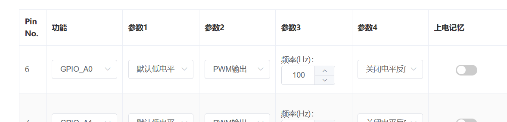

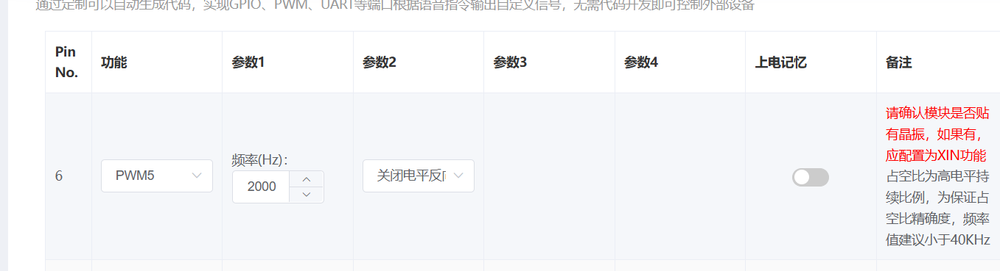

**注意事项：**

- 配置前确认模块是否有晶振
- 晶振引脚复用会导致功能异常
- 建议使用其他GPIO引脚实现PWM功能

---

### CI-03T的ADC采集精度约为6%，如何校准？

**问题描述：**

CI-03T的ADC采集精度约为6%，与万用表测量存在偏差，需要了解如何提高ADC采集的准确性。

**解决方案：**

**精度偏差分析：**

1. **ADC规格说明**：

    - CI-03T ADC精度：标称精度约6%
    - 实际测量存在误差属正常现象
    - ADC主要用于相对值测量，非精密测量

2. **误差来源**：

    - 参考电压波动
    - 环境温度影响
    - ADC本身的量化误差

**校准优化方法：**

1. **多次测量求平均**：

    - 连续采集多次数据
    - 去除异常值后计算平均值
    - 可提高测量稳定性

2. **软件滤波算法**：

    ```
    采集N次数据求平均
    或者使用滑动平均滤波
    排除突变异常值
    ```

3. **参考电压优化**：

    - 使用稳定的参考电压源
    - 在VREF引脚并联滤波电容
    - 避免电源噪声干扰

4. **应用场景优化**：

    - 用于相对值判断（如阈值检测）
    - 避免用于绝对值测量
    - 结合其他传感器数据校准

**提高精度建议：**

1. **硬件改进**：

    - 在ADC输入端添加运放缓冲
    - 使用更高精度的外部ADC
    - 改善PCB布局减少噪声

2. **选择替代方案**：

    - 使用SU-03T（支持12位ADC）
    - 外接专用ADC芯片（如ADS1115）
    - 根据精度需求选择合适方案

3. **测试验证**：

    - 与标准仪器对比测试
    - 记录环境温度对精度的影响
    - 建立校准系数补偿误差

**注意事项：**

- 6%精度是ADC的理论值
    - 实际使用中存在合理偏差
    - 适用于相对值测量和阈值判断
    - 精密测量建议使用专用ADC模块

---

---

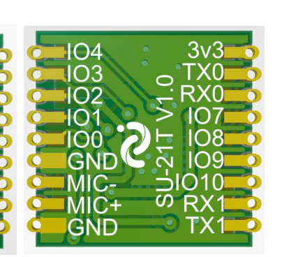

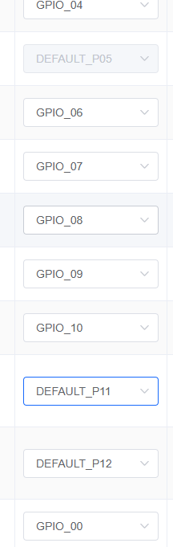

**注意事项：**

- 万用表测量2秒脉冲电平变化需要快速响应
- 使用LED测试更直观，可直接观察闪烁
- 确保语音识别命令已正确配置并触发
- 如只有单个GPIO有问题，可能是该引脚硬件故障

---

### CI-03T1模块的串口通信需要连接哪些引脚？

**问题描述：**

在使用CI-03T1模块时，需要确认实现串口通信功能所需的最少引脚连接。

**解决方案：**

- **基本串口通信连接**：

    - VCC：电源正极（5V）
    - GND：电源地线
    - B6：串口TX（发送引脚）
    - B7：串口RX（接收引脚）

- **音频设备连接**：

    - SPK+ / SPK-：喇叭正负极
    - M+ / M-：麦克风正负极

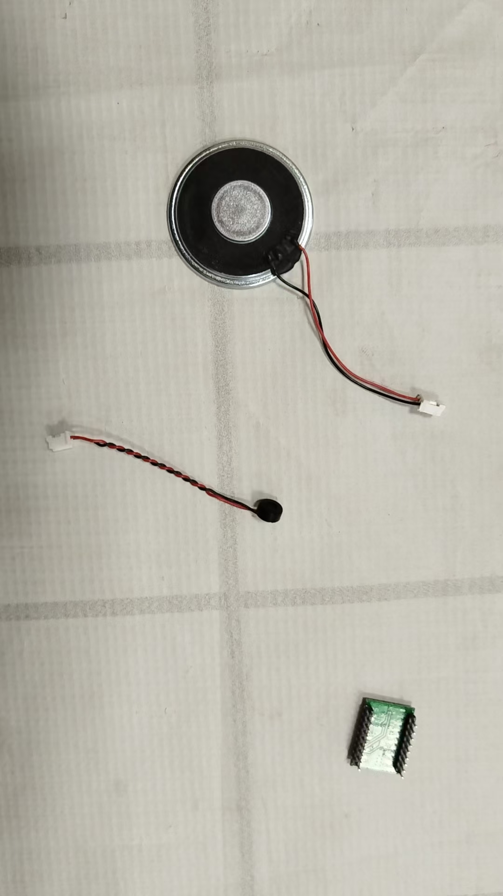

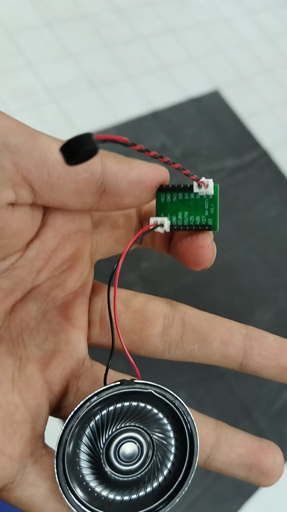

**注意事项：**

- 只需要VCC、GND、B6、B7四个引脚即可实现基本串口通信
- 不需要连接其他引脚即可正常工作
- 确保电源电压为5V以保证功放正常工作
- 麦克风和喇叭需要正确连接才能实现语音功能

---

### CI-03T焊接后冒烟如何处理？

**问题描述：**

CI-03T模块自行焊接排针后，上电即出现冒烟现象，LED指示灯仍然亮起，需要分析故障原因并处理。

**解决方案：**

**故障原因分析：**

1. **焊接短路**
    - 排针焊接时出现连锡
    - 焊锡桥接导致电源短路
    - 元件引脚间意外连通

2. **电源管理芯片损坏**
    - 短路导致电流过大
    - 电源芯片过载烧毁
    - 可能连带损坏功放电路

**应急处理步骤：**

1. **立即断电**
    - 发现冒烟后立刻切断电源
    - 避免进一步损坏元件
    - 等待模块冷却

2. **目视检查**
    - 检查排针焊点是否有连锡
    - 观察电源管理芯片是否有烧痕
    - 确认周边元件是否变色

3. **万用表检测**
    - 测量VCC与GND之间是否短路
    - 检查各引脚对地阻值
    - 定位具体的短路点

**修复建议：**

- 使用吸锡器清除多余焊锡
- 用万用表确认无短路后再上电
- 电源芯片损坏需更换主板
- 建议购买已焊接排针的模块

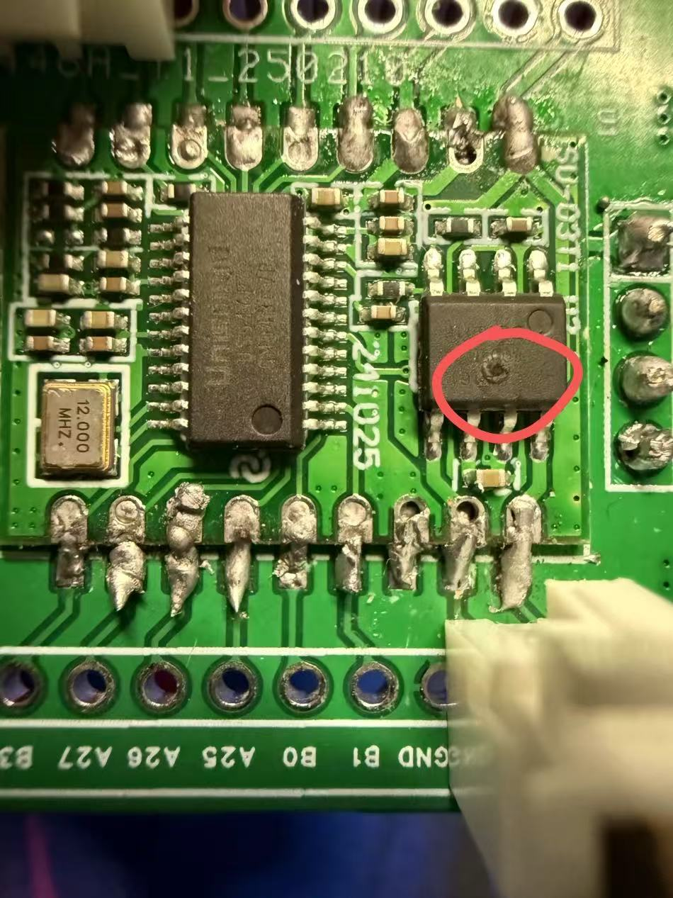

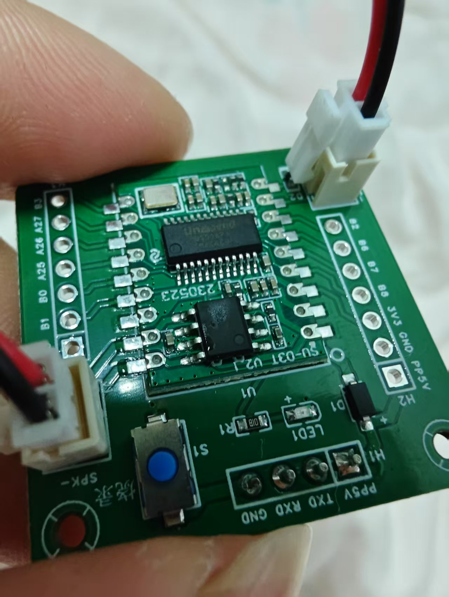

**注意事项：**

- 焊接排针需具备一定焊接经验
- 焊接后务必用万用表检查短路
- 冒烟后LED仍亮说明电源通路存在
- 5V供电短路电流较大，容易损坏元件

---

### CI-03T1焊接后VCC和GND短路怎么办？

**问题描述：**

焊接CI-03T1模块后，使用万用表测量发现VCC和GND引脚之间存在短路，导致模块无法正常工作，连接到电脑时会造成USB接口保护。

**解决方案：**

**1. 短路原因分析**

- **焊接问题**：焊接时可能产生焊锡桥接，导致相邻引脚短路
- **模块损坏**：焊接过程中的静电或过热可能损坏内部电路
- **焊盘问题**：PCB焊盘之间可能存在意外的导电物质

**2. 检查步骤**

- **目视检查**：

    - 使用放大镜仔细检查焊点之间是否有焊锡桥接
    - 重点检查IC芯片周围的引脚
    - 查看是否有焊锡残留导致短路

- **万用表测试**：

    - 断开所有外部连接
    - 测量VCC和GND之间的电阻值
    - 正常情况下应有几百欧姆以上的阻值
    - 短路时阻值接近0欧姆

**3. 处理方法**

- **清除焊锡桥接**：

    - 使用吸锡器清除多余的焊锡
    - 用尖头烙铁小心分离桥接的焊点
    - 可使用助焊剂帮助清理

- **专业工具修复**：

    - 有热风枪时，可拆下模块重新焊接
    - 使用显微镜检查微小的短路点
    - 清洁PCB表面，去除导电污染物

**4. 预防措施**

- **焊接技巧**：

    - 使用适量的焊锡，避免过多导致桥接
    - 焊接细间距引脚时使用拖焊技术
    - 焊接完成后用放大镜检查质量

- **焊接前准备**：

    - 确保烙铁温度适中（约300°C）
    - 使用细焊锡丝（0.6mm以下）
    - 保持焊点清洁，避免氧化

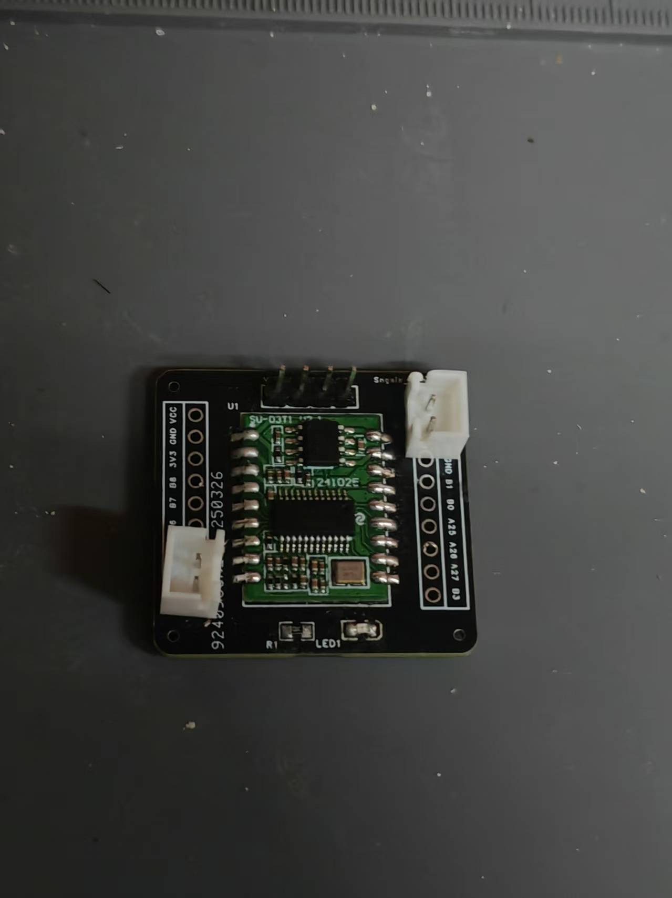

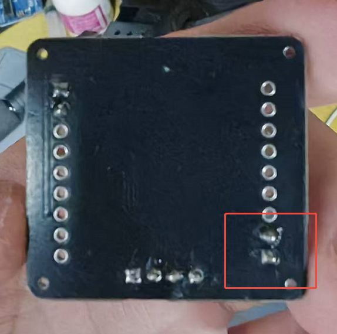

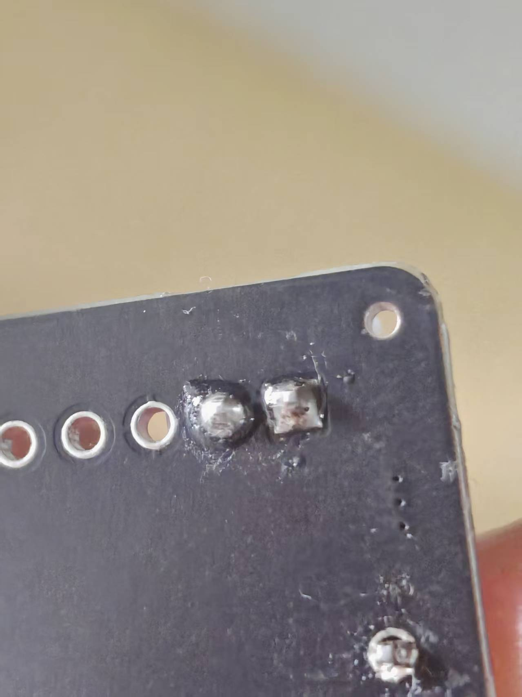

**注意事项：**

- 焊接前务必断开电源，避免带电操作
- 如模块已损坏，建议更换新模块重新焊接
- 没有焊接经验时，建议购买已焊接好排针的模块
- 短路的模块连接电脑可能触发USB保护机制

---

### CI-03T1原理图中功放输出与电源短路导致无声音

**问题描述：**

烧录CI-03T1程序后扬声器无反应，检查原理图发现功放芯片的输出端与+5V电源存在短路连接。

**解决方案：**

**问题定位：**

- 检查功放芯片（如FM8002A）的VO输出引脚
- 确认输出耦合电容连接是否正确
- 避免输出端直接连接到电源

**电路修正：**

1. **FM8002A正确连接**：

    - VO1/VO2输出端通过电容耦合到喇叭
    - 不能直接连接到+5V电源
    - 检查C20等耦合电容的容值和连接

2. **短路检查步骤**：

    - 使用万用表测量输出端对地阻值
    - 确认输出端没有直接连接到VCC
    - 检查PCB走线是否正确

**设计注意事项：**

- 功放输出必须通过电容耦合
- 避免输出端与电源短接
- 焊接后仔细检查电路连接

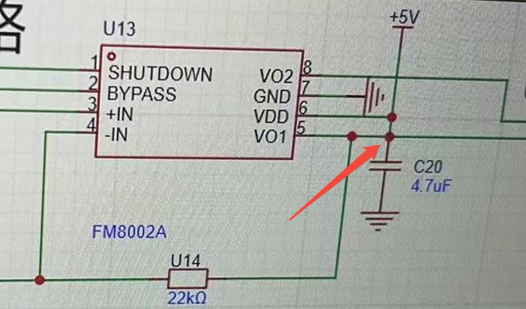

---

### CI-03T1功放电路输出电压异常怎么办？

**问题描述：**

在使用CI-03T1芯片的功放电路时，发现功放输出端（SPK+）的电压异常，怀疑电路设计或元件选型存在问题。

**解决方案：**

**功放电路检查：**

1. **8002功放芯片电路（U2）**
    - 引脚1（SHUT）应连接到VDD3.3
    - 引脚2（Vref）连接到PA6/SPK_SD
    - 引脚3（IN+）连接到HPOUT_L
    - 引脚4（IN-）连接到地
    - 引脚8（VO+）连接到SPK+

2. **FM8002A功放芯片电路（U13）**
    - 引脚1（SHUTDOWN）连接到MUTE控制
    - 引脚2（BYPASS）连接到地
    - 引脚3（+IN）连接到HPOUT_L
    - 引脚4（-IN）连接到地
    - 引脚8（VO2）连接到SPK+

**电压测量要点：**

- 正常工作时，SPK+对地电压应在2.5V左右（VCC/2）
- 静态时测量功放输出端电压
- 动态时使用示波器观察音频波形

**常见问题处理：**

1. **输出电压异常**
    - 检查功放芯片供电是否正常
    - 确认输入信号连接正确
    - 验证反馈电路元件参数

2. **无声音输出**
    - 测量功放芯片各引脚电压
    - 检查输出耦合电容
    - 验证喇叭连接极性

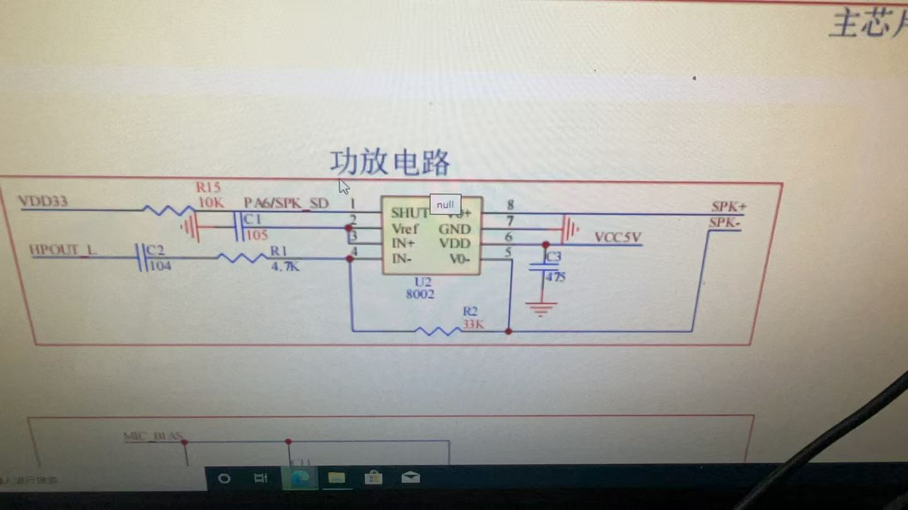

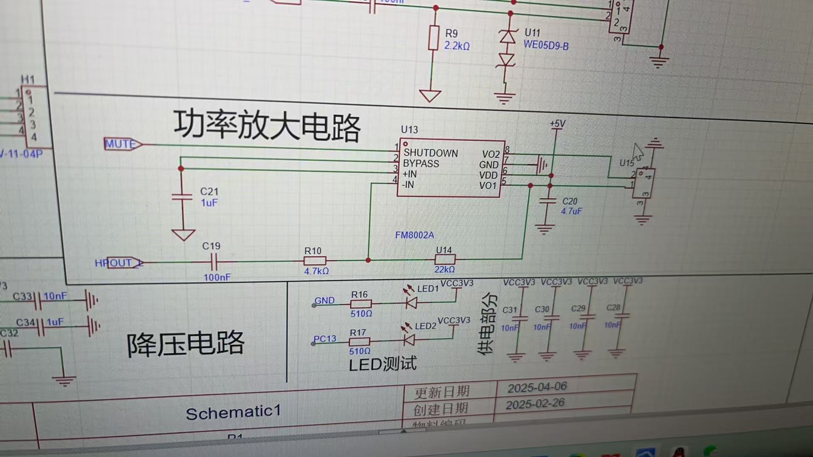

**注意事项：**

- 功放电路设计需要严格参考规格书
- 不同功放芯片的引脚定义可能不同
- 建议使用官方推荐的电路设计

---

### CI1302芯片扬声器应连接哪个引脚？

**问题描述：**

在电路设计中对主控芯片CI1302的扬声器输出引脚（HP_OUT_L）连接存在疑问，不确定应连接到17脚还是13脚。

**解决方案：**

**引脚确认：**

1. **CI1302芯片引脚定义**
    - 17脚：HP_OUT_L（左声道耳机输出）
    - 13脚：PA6/SPK_SD（扬声器静音控制）

2. **正确连接方式**
    - 扬声器应连接到17脚（HP_OUT_L）
    - 13脚是控制引脚，用于静音功能
    - 不建议将扬声器连接到13脚

**电路设计要点：**

1. **输出连接**
    - HP_OUT_L引脚输出音频信号
    - 需要外接功放电路驱动扬声器
    - 不能直接驱动扬声器负载

2. **静音控制**
    - PA6/SPK_SD用于控制功放静音
    - 高电平或低电平取决于功放芯片设计
    - 可用于实现快速静音功能

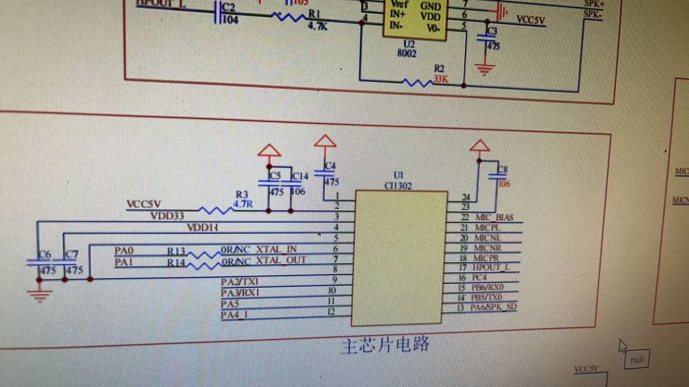

**注意事项：**

- HP_OUT_L是音频输出引脚，不是功率输出
- 必须配合外部功放电路使用
- 设计错误可能导致无声音或音质问题

---

### CI-03T连接LED时需要限流电阻吗？

**问题描述：**

将LED直接并联连接到CI-03T1/CI-03T2的IO口，未接入限流电阻，导致LED亮度过亮且有烧毁风险。

**解决方案：**

**LED限流设计：**

1. **IO口电气特性**
    - CI-03T系列IO口输出电压：3.3V
    - IO口输出电流较小，有内部限流保护
    - 直接连接LED虽不会立即烧毁，但存在风险

2. **限流电阻选择**
    - 普通LED（2V正向电压）：

        - 需要串联限流电阻
        - 建议值：100-330Ω
    - 高亮LED或并联多个LED：

        - 需要更小的电阻值
        - 建议值：47-100Ω

3. **计算方法**
    - 电阻值 = (电源电压 - LED正向电压) / LED电流
    - 例如：(3.3V - 2V) / 10mA = 130Ω
    - 实际选择最接近的标准值

**多LED并联方案：**

1. **独立限流**
    - 每个LED串联独立的限流电阻
    - 避免因亮度差异导致电流不均
    - 最稳定的连接方式

2. **电压考虑**
    - LED最大正向电压通常为2.0-2.5V
    - 超过3.3V的LED会无法正常点亮
    - 选择合适电压规格的LED

**注意事项：**

- IO口虽有一定保护能力，但不应依赖
- 并联4个0805LED时总电流较大，需谨慎
- 长时间使用大功率LED可能影响芯片寿命
- 建议测试时先使用较大阻值，再根据亮度调整

---

### CI-03T模组引脚含义是什么？

**问题描述：**

需要了解CI-03T模组的引脚含义说明，但官网资料中只有CI1302芯片资料和转接板的引脚定义。

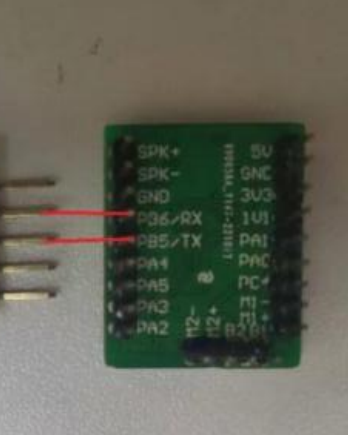

**解决方案：**

**1. 引脚功能说明**

- **主要引脚定义**：

    - SPK+、SPK-：喇叭输出正负极
    - MIC+、MIC-：麦克风输入正负极
    - PB6/RX：串口接收（B6可配置为RX）
    - PB5/TX：串口发送（B5可配置为TX）
    - 5V、GND：电源正负极
    - 3V3：3.3V电源输出

- **其他引脚**：

    - PA0-PA5：通用IO或ADC
    - PC+、PC-：可能为PWM输出
    - M0、M1：模式选择引脚

**2. 与转接板对应关系**

- **引脚顺序一致**：

    - 模组与转接板的引脚顺序相同
    - 可通过转接板的丝印查看
    - 主要引脚都在一侧便于连接

- **核心功能引脚**：

    - 电源：5V、GND、3V3
    - 音频：SPK+/-、MIC+/-
    - 通信：PB6(RX)、PB5(TX)

**3. 资料获取**

- **开发包资源**：

    - 智能公元平台有CI-03T开发包
    - 包含完整的技术文档
    - 有示例代码和调试工具

- **引脚参考**：

    - 主要参考CI1302芯片手册
    - 模组引脚是芯片引脚的扩展
    - 转接板文档有详细接线说明

**注意事项：**

- 模组引脚与转接板一一对应
- 使用时主要关注电源、音频、通信三类引脚

---

### CI-03T声源定位功能如何直接控制舵机？

**问题描述：**

利用CI-03T的声源定位功能，是否可以不依赖MCU直接接舵机控制转向角度，以及如何实现角度控制。

**解决方案：**

**功能支持确认：**

1. **声源定位功能**：

    - CI-03T支持声源定位功能
    - 可以识别声音来源的角度位置
    - 识别范围为0-180度

2. **舵机直接控制**：

    - 可以不依赖MCU直接连接舵机
    - 声源定位角度可直接控制PWM输出
    - 实现声音跟随的自动化控制

**舵机选型建议：**

1. **舵机类型**：

    - 推荐使用180度舵机
    - 360度舵机不适合此应用
    - 识别范围与舵机转动范围匹配

2. **控制实现**：

    - 声源定位的角度作为变量
    - 直接用于控制PWM模块的占空比
    - 角度与PWM占空比成正比

**技术实现：**

1. **角度映射**：

    - 识别到的角度值（0-180度）
    - 直接映射为PWM占空比
    - 实现舵机转向对应角度

2. **精度考虑**：

    - 最终精度取决于舵机本身精度
    - 不同舵机的角度分辨率可能不同
    - 需要根据实际舵机调整参数

**注意事项：**

- 舵机需要外部独立供电
- 建议使用5V电源给舵机供电
- 避免使用模块电源直接驱动舵机
- 舵机地线与模块共地

---

### CI-03T声源定位的分辨率参数是多少？

**问题描述：**

需要了解CI-03T声源定位功能在0-180度检测范围内的角度分辨率参数。

**解决方案：**

**技术参数：**

- **检测范围**：0-180度
- **角度分辨率**：10度
- **输出档位**：共19个档位（0°、10°、20°...180°）

**参数说明：**

1. **分辨率定义**：

    - 模块输出的最小角度变化单位为10度
    - 实际角度会以最接近的10度倍数输出
    - 无法提供更精细的角度分辨

2. **应用考虑**：

    - 适用于多数声源跟踪应用场景
    - 配合180度舵机使用可匹配输出精度
    - 设计机械结构时需考虑10度的最小步进

**注意事项：**

- 这是模块的硬件分辨率限制，无法通过软件设置改变
- 实际使用中会受环境噪声、反射等因素影响精度
- 如需更高分辨率，请考虑其他方案

---
- 其他IO引脚可根据需要配置使用

---

### CI-03T和SU-03T的电压检测标准是什么？

**问题描述：**

需要确认CI-03T和SU-03T模块的电压检测标准，以及模块与转接板的引脚定义是否一致。

**解决方案：**

**1. 电压检测标准**

- **麦克风电压**：

    - CI-03T模块：1.6-1.7V
    - SU-03T模块：2.4-2.5V
    - 不在此范围说明模块异常

- **喇叭电压**：

    - 两种模块喇叭电压相同：2.2-2.5V
    - 测量点：喇叭正负极对GND
    - 测量条件：喇叭不接入（空载）

**2. 模块与转接板引脚**

- **引脚一致性**：

    - 模组与转接板的引脚顺序完全一致
    - 可通过转接板的丝印层查看
    - 一一对应不会错位

- **主要引脚定义**：

    - 5V、GND：电源（两种模块相同）
    - 3V3：3.3V输出（两种模块相同）
    - SPK+/-：喇叭输出（两种模块相同）
    - MIC+/-：麦克风输入（两种模块相同）
    - PB5/TX、PB6/RX：串口通信

**3. 使用万用表检测**

- **检测步骤**：

    1. 模组上电
    2. 万用表调到直流电压档（20V）
    3. 黑表笔接GND
    4. 红表笔测量各测试点

- **异常判断**：

    - 任一电压不正常都可能模块损坏
    - 喇叭短路也会导致电压异常
    - 麦克风损坏影响电压值

**注意事项：**

- 电压检测是判断模块是否正常的最可靠方法
- 模组引脚与转接板严格对应，无需担心错位
- 两种模块除了麦克风电压不同，其他基本相同

---

### CI-03T1的UART1引脚配置冲突问题

**问题描述：**

CI-03T1芯片的网页配置工具中，同一串口(UART1)可以使用三组不同的引脚(B6/B7、B5/B6、B2/B3)，但不能同时配置多组引脚为串口功能，否则会导致功能冲突。

**解决方案：**

- **理解引脚复用规则**：

    - CI-03T1只有一个UART1串口
    - UART1可以通过三组不同的引脚实现：B6/B7、B5/B6、B2/B3
    - 三组引脚都可以配置为串口1，但不能同时存在

- **正确的配置方法**：

    - 选择其中一组引脚作为UART1使用
    - 在配置界面中，只能选择一个引脚组作为UART1_TX和UART1_RX
    - 其他引脚组可以配置为GPIO或其他功能

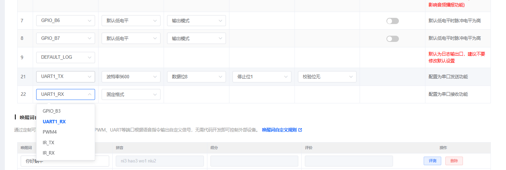

*网页配置界面显示UART1引脚选择*

**注意事项：**

- B6/B7如果用作串口，就不能再配置为GPIO功能
- 选择哪组引脚作为串口后，其他组需要配置为不同的功能
- 设计硬件时需要明确使用哪组引脚作为串口
- 串口通信时确保电平匹配(3.3V)

---

### CI-03T套装缺少32针排针怎么办？

**问题描述：**

购买的CI-03T语音识别模块套装中缺少32针排针，无法完成模块与底板的连接。

**解决方案：**

**1. 排针规格确认**

- **排针类型**：32针双排针座
- **间距规格**：2.54mm标准间距
- **安装方式**：需要焊接到底板上
- **功能作用**：用于模块的信号传输和供电

**2. 解决方案**

- **自行采购**：

    - 购买32针排针（2.54mm间距）
    - 选择铜质镀金的排针，接触更可靠
    - 确认排针高度匹配连接器

- **焊接注意事项**：

    - 使用尖头电烙铁（温度300-350°C）
    - 先焊接一端固定位置
    - 确保所有针脚垂直且对齐
    - 避免焊锡桥接

- **替代方案**：

    - 购买预焊接好的完整模块
    - 使用转接板避免直接焊接
    - 联系卖家补发缺失的排针

**3. 套装确认**

- **标准配置**：

    - 部分套装中排针为可选配件
    - 购买时需确认包含排针选项
    - 检查商品描述中的配件清单

- **采购建议**：

    - 优先购买包含排针的套装
    - 单独采购时注意规格匹配
    - 建议多备几套排针备用

**注意事项：**

---

### CI-03T原理图提供Sch文件吗？

**问题描述：**

需要获取CI-03T的原理图设计文件（Sch文件），用于自制电路板参考。

**解决方案：**

**1. 文件提供说明**

- 官方仅提供PDF格式的原理图
- 不提供可编辑的Sch（原理图设计）文件
- 需自行绘制原理图

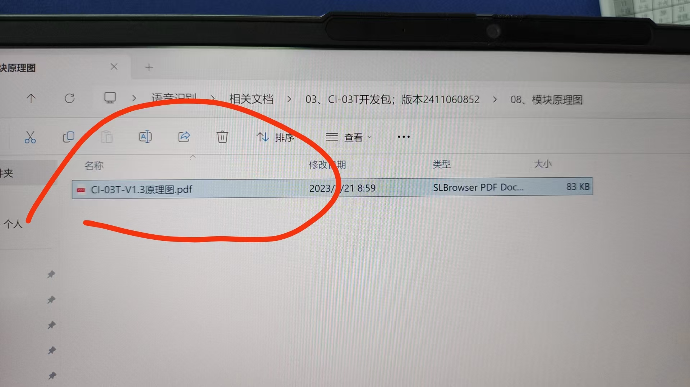

**2. 自行设计建议**

- 参考PDF原理图的连接关系
- 使用AD、KiCad等软件重新绘制
- 注意保留原有的网络标签

**3. 设计要点**

- 电源部分：3.3V LDO稳压电路
- 音频部分：麦克风输入、功放输出
- 通信部分：串口、烧录接口
- GPIO：按需配置功能引脚

**注意事项：**

- PDF原理图仅供参考，不能直接编辑
- 自制PCB时需仔细核对每个连接
- 建议使用标准封装库便于打样

**注意事项：**

- 排针焊接需要一定电子焊接基础
- 如无焊接经验，寻求专业人士帮助
- 确保焊接质量，避免虚焊或短路

---

### CI-03T1离线语音识别模块无法正常工作

**问题描述：**

CI-03T1离线语音识别芯片模块在使用过程中无法正常工作，怀疑是硬件连接或电路故障导致。

**解决方案：**

**硬件连接检查：**

1. **电源连接验证**

    - 确认5V电源供电正常
    - 检查GND是否可靠接地
    - 测量工作电压是否在4.75-5.25V范围内
    - 电压规格要求：3.6-5.5V DC
    - 负载电流限制：不能超过150mA

2. **串口连接检查**

    - TX和RX需要反接（模块TX接烧录器RX）
    - 确认波特率设置正确
    - 检查串口号是否被其他程序占用

3. **外设连接验证**

    - 麦克风连接到MIC+和MIC-
    - 喇叭连接到SPK+和SPK-
    - 确保极性正确，接线牢固

**故障排查步骤：**

1. **单独模块测试**

    - 将模块从底板拆下单独测试
    - 仅连接必要的外设（电源、麦克风、喇叭）
    - 排除底板电路干扰因素

2. **万用表检测**

    - 测量各引脚电压是否正常
    - 检查是否有短路现象
    - 验证电源纹波是否过大

3. **替换法验证**

    - 更换已知好的电源适配器
    - 使用其他麦克风或喇叭测试
    - 在另一块板子上测试该模块

**常见故障原因：**

- 供电电压不稳定或超出规格范围
- 连接线接触不良或接错位置
- 模块本身存在焊接缺陷或损坏
- 外部电路设计不当影响模块工作

### CI-03T电源可以使用78L05稳压器吗？

**问题描述：**

询问CI-03T电源是否可以使用78L05稳压器，其输出电流是否足够满足模块需求。

**解决方案：**

**78L05规格限制：**

1. **输出电流不足**：

    - 78L05最大输出电流为100mA
    - CI-03T模块正常工作电流约100mA
    - 喇叭播放时瞬间电流可达300mA以上
    - 78L05无法满足峰值电流需求

2. **喇叭驱动问题**：

    - 喇叭拉电流比较大
    - 特别是播放语音时电流需求显著增加
    - 100mA输出电流会导致供电不足

**推荐电源方案：**

1. **使用LDO稳压器**：

    - 推荐使用输出电流500mA以上的LDO稳压器
    - 如AMS1117-5.0、LM2940等型号
    - 确保有足够的电流余量

2. **电源设计要求**：

    - 输入电压：7-12V DC（取决于稳压器规格）
    - 输出电压：5.0V ±5%
    - 输出电流：≥500mA
    - 纹波：≤50mV

3. **滤波电路设计**：

    - 输入端：添加100μF电解电容
    - 输出端：并联10μF电解电容和100nF陶瓷电容
    - 去耦电容靠近模块放置

**电源连接示例：**

```
电源输入 → LDO稳压器 → 滤波电路 → CI-03T模块
                ↓
            喇叭（通过功放驱动）
```

**选型建议：**

| 稳压器型号 | 输出电流 | 特点 | 适用性 |
|------------|----------|------|--------|
| 78L05 | 100mA | TO-92封装，成本低 | ❌ 不推荐 |
| 78M05 | 500mA | TO-220封装 | ✅ 可用 |
| AMS1117-5.0 | 800mA | SOT-223封装 | ✅ 推荐 |
| LM2940-5.0 | 1A | 低压差，低噪声 | ✅ 最佳选择 |

**注意事项：**

- 不要使用78L05，电流严重不足
- 考虑喇叭工作时的峰值电流
- 留有足够的电源余量
- 注意散热设计，特别是连续播放语音时
- 电源质量直接影响语音识别和播放效果

---


---

### CI-03T1语音模块上电后LED亮但无法响应语音指令怎么办？

**问题描述：**

CI-03T1语音模块上电后LED指示灯正常亮起（红色和黄色指示灯都亮），但无法正常响应语音指令，怀疑是引脚连接存在问题。

**解决方案：**

**问题现象分析：**

1. **LED状态分析**：

    - 红色和黄色LED指示灯都亮起
    - 表明模块已正常上电
    - 基本供电系统工作正常
    - 但语音识别功能可能异常

2. **常见故障原因**：

    **引脚连接问题**：

    - 模块与主控板的排针连接松动
    - 引脚定义不匹配或连接错误
    - 排针接触不良或氧化

    **硬件电路问题**：

    - 麦克风输入电路异常
    - 音频放大电路故障
    - 电平转换电路工作异常

    **软件配置问题**：

    - 语音识别固件异常
    - 串口通信参数错误
    - 唤醒词配置丢失

**详细排查步骤：**

1. **基础连接检查**：

    **物理连接验证**：
    ```
    检查项目：排针连接状态
    - 确认排针完全插入插座
    - 检查引脚是否有歪斜或弯曲
    - 验证连接方向是否正确
    - 轻轻摇动检查是否有松动
    ```

    **引脚定义核对**：

    - 查阅CI-03T1模块引脚定义图
    - 对比主控板接口定义
    - 确认VCC、GND、TX、RX等关键引脚
    - 验证麦克风和喇叭连接引脚

2. **电气参数测试**：

    **供电电压检查**：

    - 测量VCC引脚电压（应为3.3V或5V）
    - 检查电源纹波是否过大
    - 验证功耗是否在规格范围内

    **信号质量测试**：

    - 使用示波器检查串口信号波形
    - 验证波特率是否匹配
    - 检查信号电平是否正常

3. **功能模块测试**：

    **独立测试模式**：

    - 断开与主控板的连接
    - 直接给模块供电
    - 连接喇叭和麦克风
    - 测试基本语音功能

    **固件重新烧录**：

    - 使用专用烧录工具
    - 下载最新的固件版本
    - 按照规范操作烧录
    - 烧录后重新测试

**具体处理方案：**

1. **重新连接排针**：

    - 断电后重新插拔排针
    - 清洁排针和插座接触点
    - 确保插接到位且牢固
    - 使用酒精清洁氧化层

2. **检查电平转换**：

    - 如果主控板为3.3V，模块为5V，需要电平转换
    - 检查电平转换芯片工作状态
    - 确认转换电路接线正确

3. **麦克风电路检查**：

    - 检查麦克风连接线是否牢固
    - 测量麦克风偏置电压
    - 验证麦克风输入阻抗匹配

4. **固件和配置检查**：

    - 确认固件版本是否兼容
    - 检查唤醒词是否正确配置
    - 验证串口通信参数

**注意事项：**

- LED亮只表示供电正常，不能完全确认功能正常
- 重点检查排针连接的可靠性和正确性
- 建议使用万用表和示波器进行详细检测
- 固件重新烧录是解决软件故障的有效方法

**预防措施：**

- 连接前仔细阅读技术文档和引脚定义
- 使用质量可靠的原装排针和连接器
- 定期检查连接状态，防止松动
- 保留完整的接线图和配置记录

**获取帮助**

- 保存故障现象照片和测试数据
- 记录详细的排查过程
- 联系时提供完整信息
- 必要时返厂检测或更换模块

---


---

### CI-03T模块接线错误导致无法正常工作怎么办？

**问题描述：**

在使用CI-03T模块时，因接线错误导致模块无法正常工作，需要确认正确的接线方式和模块识别方法。

**解决方案：**

**正确接线方法：**

1. **电源连接**：

    - VCC：连接5V电源正极
    - GND：连接电源负极（地）
    - 确保供电电压在3.6-5.5V范围内

2. **麦克风连接**：

    - MIC+/-：连接差分麦克风的正负极
    - 麦克风有三条线时，两条为信号线，一条为地线
    - 确保麦克风规格匹配（灵敏度-32dB到-25dB，信噪比70以上）

3. **喇叭连接**：

    - SPK+/-：连接喇叭的正负极
    - 推荐使用8Ω1.6-2W或4Ω2.4-3W喇叭
    - 避免使用5W喇叭，可能导致功放驱动不足

**模块识别方法：**

1. **查看丝印标识**：

    - 模块表面印有"CI-03T1"或"CI-03T2"字样
    - 通过主控芯片确认：CI1302X系列芯片

2. **指示灯说明**：

    - CI-03T模块通常没有工作指示灯
    - LED灯亮起主要在烧录过程中出现
    - 正常工作状态下无灯光指示

3. **功能验证**：

    - 上电后用万用表测量各点电压
    - 对着麦克风说话，用示波器查看音频信号
    - 烧录测试固件验证基本功能

**常见接线错误：**

1. **电源接反**：

    - 会导致模块发热或无法工作
    - 严重时可能永久损坏模块

2. **麦克风接错**：

    - 差分麦克风必须按极性连接
    - 单端麦克风需要正确配置电路

3. **喇叭接错**：

    - 阻抗不匹配影响音质
    - 功率过大会导致功放发热

**注意事项：**

- 接线前务必确认引脚定义
- 首次使用建议参考官方接线图
- 模块不支持热插拔，断电后再操作
- 如不确定，先拍照确认再连接

---

### CI-03T的UART0和UART1的TX接口在转接板上的什么位置？

**问题描述：**

需要了解CI-03T模块的UART0和UART1的TX接口在转接板上的具体引脚位置，以便进行串口调试和通信。

**解决方案：**

CI-03T转接板提供了两个UART串口，其引脚位置如下：

- **UART1串口位置**：

    - 位于转接板左侧的接口区
    - 标有TXD和RXD字样
    - 用于与主控芯片进行数据通信
    - 常用于固件烧录和串口调试

- **UART0串口位置**：

    - 需要查看具体的转接板丝印标识
    - 不同批次的转接板位置可能略有差异
    - 主要用于模块内部通信或特定应用

**串口调试接线表：**

| CH340模块 | CI-03T(UART1) | CI-03T(UART0) |
|-----------|---------------|---------------|
| 5V        | 5V            | 5V            |
| RXD       | TXD           | -             |
| TXD       | RXD           | -             |
| GND       | GND           | GND           |

**固件烧录接线表：**

| CH340模块 | CI-03T |
|-----------|--------|
| 5V        | 5V     |
| RXD       | TXD    |
| TXD       | RXD    |
| GND       | GND    |

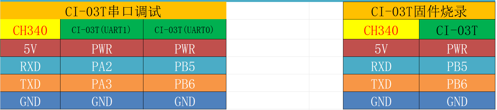

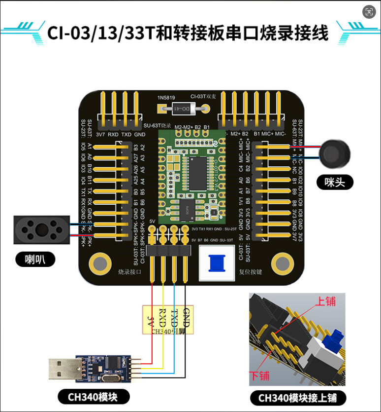

**注意事项：**

- 串口通信需要交叉连接：TX接RX，RX接TX
- UART1通常用于与外部MCU通信
- UART0多用于特殊功能或调试
- 接线前请确认转接板上的丝印标识

---

### CI-03T模块四个引脚如何接线？

**问题描述：**

使用CI-03T1或CI-03T2语音识别模块时，对模块上四个引脚的接线方式不清晰，特别是如何连接电源和信号引脚。

**解决方案：**

CI-03T模块的标准接线方式如下：

1. **电源连接**：

    - VCC：连接5V电源正极
    - GND：连接电源负极（地）

2. **串口通信**：

    - B6：连接到CH340烧录器的RXD引脚（模块接收）
    - B7：连接到CH340烧录器的TXD引脚（模块发送）

3. **接线对应表**：

    | 模块引脚 | 功能 | CH340连接 | 说明 |
    |----------|------|------------|------|
    | VCC | 电源 | 5V | 模块供电 |
    | GND | 地线 | GND | 电源地 |
    | B6 | UART1_RX | RXD | 烧录数据接收 |
    | B7 | UART1_TX | TXD | 烧录数据发送 |

**注意事项：**

- 接线前务必确认引脚定义
- 首次使用建议参考官方接线图

---

### CI-03T硬件接线设计原则

**问题描述：**

在使用CI-03T1或CI-03T2离线语音识别模块时，需要了解硬件接线的核心设计原则，确保与自身产品电路的正确集成。

**解决方案：**

硬件接线的核心原则是根据自身产品电路原理进行设计和连接：

1. **理解产品电路需求**：

    - 分析产品的整体电路架构
    - 确定电源供应方案（5V或3.3V）
    - 评估音频输入输出路径需求

2. **模块集成设计**：

    - 根据产品功能确定模块的连接方式
    - 考虑与功放、麦克风等外围电路的配合
    - 设计合适的信号调理电路

3. **参考与定制**：

    - 官方接线图可作为参考基础
    - 需根据实际产品特点进行调整
    - 保持与产品整体设计风格一致

**注意事项：**

- 不要直接复制参考设计，要结合自身产品特点
- 确保电源设计和信号完整性满足产品要求
- 留出足够的调试和测试接口

---


---

### CI-03T与SU系列引脚差异问题？

**问题描述：**

CI-03T系列模块与SU系列模块的引脚定义不一致，导致在替换或兼容设计时出现引脚不匹配的问题，且无法在官网找到相关手册。

**解决方案：**

**引脚差异说明：**

1. **CI-03T系列引脚定义**：

    - **B6/B7**：专用烧录引脚（UART1）
    - **B2/B3**：可用作GPIO或普通串口（UART1）
    - **B0/B1**：调试串口（UART0）
    - **音频接口**：SPK+/-、SPK-/-、MIC+/-、MIC-/-
    - **电源**：VCC、GND、3V3

2. **SU-03T系列引脚定义**：

    - **B6/B7**：专用烧录引脚（UART1）
    - **B2/B3**：可用作GPIO或普通串口（UART1）
    - **B0/B1**：调试串口（UART0）
    - **音频接口**：SPK+/-、SPK-/-、MIC+/-、MIC-/-
    - **电源**：VCC、GND、3V3

3. **主要差异对比**：

    | 引脚 | CI-03T系列 | SU-03T系列 | 兼容性 |
    |------|------------|------------|--------|
    | B6/B7 | 烧录口 | 烧录口 | ✓ |
    | B2/B3 | GPIO/UART1 | GPIO/UART1 | ✓ |
    | B0/B1 | UART0 | UART0 | ✓ |
    | 音频接口 | 相同定义 | 相同定义 | ✓ |
    | 电源引脚 | 相同定义 | 相同定义 | ✓ |

**引脚图参考：**


*CI-03T1/2模块的引脚布局，标注了各引脚功能和位置*

**设计适配建议：**

1. **直接替换方案**：

    - CI-03T和SU-03T的B6/B7烧录引脚兼容
    - GPIO功能引脚基本兼容
    - 可直接替换，无需修改PCB设计

2. **电路设计注意事项**：

    - 确认音频电路设计匹配
    - 验证电源供电电路兼容
    - 检查串口通信电平匹配

3. **固件兼容性**：

    - 两个系列使用不同芯片平台
    - 固件完全不兼容，无法直接替换
    - 需要重新开发固件

**获取技术资料：**

1. **官方文档**：

    - CI-03T资料：http://help.aimachip.com/docs/offline_ci03t
    - SU-03T资料：http://help.aimachip.com/docs/offline_su03t

2. **原理图和规格书**：

    - 在对应文档中查找详细引脚定义
    - 对比电气参数和时序要求
    - 参考封装尺寸和机械尺寸

3. **联系供应商**：

    - 提供具体的应用场景和需求
    - 获取选型建议和兼容性分析
    - 索取定制化的技术方案

**注意事项：**

- 引脚差异是硬件层面的不兼容问题
- 选型时需仔细对比引脚定义和电气特性
- 如需更换型号，建议评估整体方案成本
- 保留详细的设计文档便于后续维护

---

### CI-03T1和CI-03T2的引脚定义完全相同吗？

**问题描述：**

发现CI-03T1和CI-03T2模块的B2和B3引脚功能不一致，导致串口功能无法直接兼容。

**解决方案：**

**引脚差异确认：**

- CI-03T1和CI-03T2的B2、B3引脚定义确实存在差异
- 两个版本虽然是同一系列，但引脚功能不完全相同
- 主要差异在于部分复用功能的分配

**兼容性问题：**

1. **串口功能影响**
    - CI-03T1的B2/B3可能不是标准UART1引脚
    - CI-03T2的B2/B3引脚定义可能与CI-03T1不同
    - 导致直接替换后串口通信失败

2. **烧录接口**
    - 两个版本的B6/B7烧录引脚相同且兼容
    - 只有烧录接口可以直接兼容使用

**解决方案：**

1. **确认模块型号**
    - 仔细查看模块上的型号标识
    - CI-03T1和CI-03T2需要区别对待

2. **查阅对应资料**
    - 不同版本可能有独立的规格书
    - 需要使用对应版本的引脚定义图

3. **设计适配方案**
    - 如需兼容两个版本，设计灵活的连接方式
    - 考虑使用跳线或转接板适配

**注意事项：**

- 订购或替换时务必确认具体型号
- 设计PCB时预留兼容性调整空间
- 保留两种版本的原理图便于对比

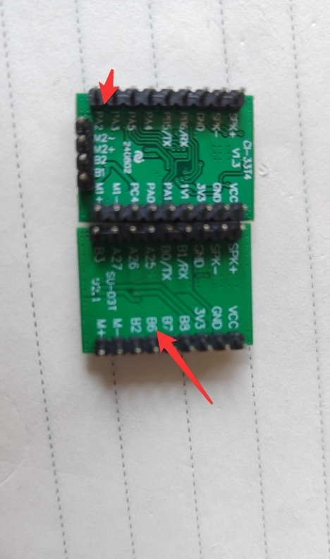

---


---

### CI-03T模块可以使用1*9P 2mm间距的排针吗？

**问题描述：**

需要确认是否可以使用1*9P 2mm间距的排针来连接CI-03T1或CI-03T2芯片的接口。

**解决方案：**

**排针规格说明：**

CI-03T系列模块的标准接口规格如下：

- **标准间距**：2.54mm（0.1英寸）
- **引脚数量**：根据型号不同（如9针、22针等）
- **封装类型**：DIP直插式

**兼容性分析：**

1. **2mm间距排针**：

    - 与模块标准2.54mm间距不匹配
    - 无法直接插入模块的焊盘孔
    - 强行使用可能导致引脚变形

2. **推荐选择**：

    - 使用2.54mm间距的标准排针
    - 确保引脚数量匹配
    - 选择合适的排针高度

**解决方案：**

1. **使用标准排针**：

    - 购买2.54mm间距的排针
    - 引脚数量需与模块匹配
    - 单排或双排根据需求选择

2. **转接方案**：

    - 如必须使用2mm间距连接器
    - 可设计转接板适配两种间距
    - 或使用转接线连接

**注意事项：**

- 排针间距不匹配会导致接触不良
- 强行插入可能损坏模块引脚
- 建议使用符合模块规格的标准连接器
- 设计时参考模块规格书的机械尺寸

---


---

### CI-03T1模块烧录成功后完全没有声音怎么办？

**问题描述：**

CI-03T1模块烧录固件后完全没有声音输出，既没有开机播报，喊唤醒词也没有任何反应。烧录过程显示成功，使用的是jx_su_03t_release_update.bin固件文件。

**问题分析：**

- 烧录进度完成且显示成功
- 模块使用的是公板，理论上不应该有虚焊问题
- 完全没有声音表明可能存在硬件或配置问题
- USB转TTL模块带有跳帽，可能影响工作模式

**排查步骤：**

1. **确认USB转TTL工作模式**：

    - 检查USB转TTL模块上的跳帽设置
    - 某些模块的跳帽可能影响工作模式
    - 确认跳帽处于正确位置（通常为3.3V或5V选择）

2. **验证固件配置**：

    - 确认固件中是否配置了开机播报功能
    - 检查音量设置是否为0或过低
    - 验证唤醒词是否正确配置

3. **硬件连接复查**：

    - 使用万用表测量各引脚连接
    - 确认喇叭连接极性正确（SP+、SP-）
    - 检查麦克风连接是否良好

4. **供电电压测试**：

    - 测量模块VCC引脚电压是否稳定在5V
    - 检查供电电流是否足够（建议500mA以上）
    - 确认电源纹波不会影响音频工作

**解决方案：**

1. **更换固件测试**：

    - 使用官方出厂固件重新烧录测试
    - 确认出厂固件包含开机播报功能
    - 如出厂固件有声音，说明是配置问题

2. **检查USB转TTL跳帽**：

    - 查看跳帽是否选择了正确的电压
    - 某些情况下可能需要取下特定跳帽
    - 参考USB转TTL模块说明书

3. **最小系统测试**：

    - 断开所有外部连接，只连接电源和喇叭
    - 烧录最简单的测试固件（仅开机播报）
    - 逐步排查功能模块

4. **对比测试**：

    - 使用相同的固件烧录到其他模块
    - 确认是固件问题还是硬件问题
    - 如其他模块正常，则当前模块可能损坏

**常见问题及解决：**

1. **音量设置为0**：

    - 在智能公元平台检查音量配置
    - 重新生成音量不为0的固件
    - 烧录新固件测试

2. **开机播报未配置**：

    - 确认在平台中勾选了开机播报选项
    - 设置合适的播报内容
    - 重新生成并烧录固件

3. **硬件损坏**：

    - 如以上排查都无效，可能是音频芯片损坏
    - 联系供应商更换模块
    - 分析损坏原因避免重复发生

**技术要点：**

- 烧录成功不代表固件配置正确
- USB转TTL的跳帽设置会影响工作状态
- 完全无声通常与音频功放或配置有关
- 使用公板仍需仔细检查每个连接点

**预防措施：**

- 烧录前确认固件包含基本测试功能
- 保留官方出厂固件作为故障对比
- 建立标准测试流程验证每个模块
- 记录USB转TTL的正确跳帽设置

**注意事项：**

- 不要完全依赖烧录成功提示
- 基本功能测试是验证的关键
- 保留详细的故障现象记录
- 同批次多模块出现问题时需要联系供应商

---


---

### CI-03T1单麦克风模块如何修改为双麦克风配置？


---

### CI-03T1单麦克风模块如何修改为双麦克风配置？

**问题描述：**

需要将CI-03T1单麦克风模块改造为双麦克风配置，以获得更好的噪声抑制效果。

**解决方案：**

**硬件修改步骤：**

1. **拆除指定电阻**：

    - 找到CI-03T1模块PCB上指定位置的电阻（如图红框所示）
    - 小心拆除该电阻，使模块支持双麦克风输入
    - 操作时注意避免损坏其他元件

2. **连接双麦克风**：

    - 使用推荐的6027型号麦克风
    - 麦克风灵敏度建议：-32dB到-25dB范围内
    - 信噪比要求：70以上
    - 电源线建议使用屏蔽线，减少干扰

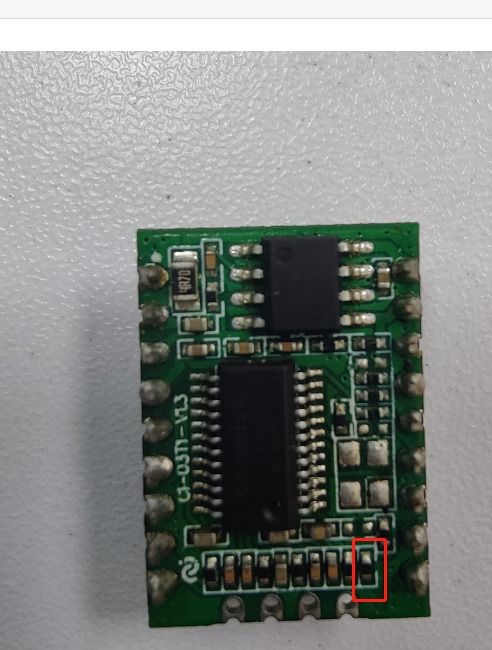

*需要拆除的电阻位置（红框标出）*

**麦克风选型参数：**

| 参数 | 推荐值 | 说明 |
|------|-------|------|
| 型号 | 6027 | 推荐型号 |
| 灵敏度 | -27dB | 推荐-32dB到-25dB范围 |
| 信噪比 | 75dB | 要求70以上 |
| 接线 | 屏蔽线 | 电源线使用屏蔽线减少干扰 |

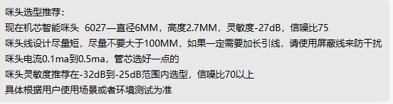

*推荐的麦克风型号及其参数要求*

**注意事项：**

- 硬件修改需要专业的焊接设备和技术
- 拆除电阻后需要清理焊盘，避免短路
- 双麦克风需要合理布局，间距建议3-5cm
- 修改后需要烧录支持双麦的固件才能正常工作

**替代方案：**

如不具备硬件修改条件，建议直接采购CI-03T2双麦克风版本，省去改装步骤，确保产品稳定性。

---


---

### CI-03T带晶振和不带晶振版本有什么区别？

**问题描述：**

CI-03T模块有带晶振和不带晶振两个版本，需要了解两者之间的区别和选择建议。

**解决方案：**

**主要区别：**

1. **温度稳定性**：

    - 带晶振版本：在温度变化大的环境中更稳定
    - 不带晶振版本：可能受温漂影响
    - 温漂会影响时钟频率稳定性

2. **环境影响**：

    - 带晶振：适合复杂多变的环境
    - 不带晶振：适合恒温环境
    - 温差大的场景建议选择带晶振版本

**技术说明：**

1. **温漂现象**：

    - 温度变化导致晶振频率偏移
    - 影响语音识别的准确性
    - 带晶振版本有更好的温度补偿

2. **识别效果**：

    - 在相同配置下，两种版本识别效果基本一致
    - 温差较大时，带晶振版本表现更稳定
    - 室内恒温环境下差异不明显

**选型建议：**

**选择带晶振版本**：

- 工作环境温度变化较大
- 户外或半户外应用
- 对稳定性要求高的场合
- 温控条件差的应用场景

**选择不带晶振版本**：

- 室内恒温环境使用
- 成本敏感的项目
- 温度变化不大的应用
- 对成本要求较严格的场合

**注意事项：**

- 两种版本使用相同的固件，无需特殊配置
- 在实际测试中，可能感觉不带晶振版本效果更好，这属于正常现象
- 建议根据实际应用环境和成本要求选择合适版本
- 量产前建议进行批量对比测试，确认最适合的版本

---


---

### CI-03T单麦模块如何改为双麦配置？

**问题描述：**

需要在单麦克风模块上实现双麦克风配置，以支持双麦算法，但需要确认硬件修改方案和相关影响。

**解决方案：**

**硬件修改步骤：**

1. **确认模块型号**

    - CI-03T1为单麦带晶振版本
    - CI-03T2为双麦带晶振版本
    - 单麦模块可通过硬件修改支持双麦功能

2. **关键元件修改**

    - 找到模块上的R12电阻（标注：22K with AEC, NC with 2micphone）
    - 焊掉R12电阻即可启用双麦功能
    - R12电阻位于SPK+和MIC2+之间

    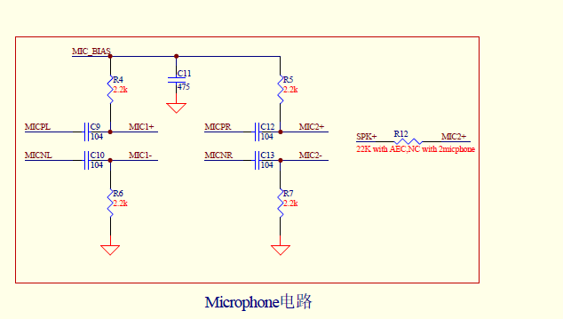

    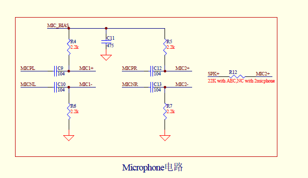

    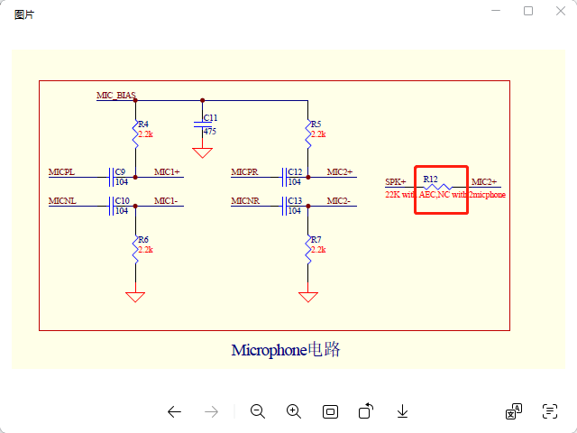

    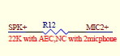

3. **焊接第二个麦克风**

    - 模块预留了4个焊针位置
    - 需要自行焊接第二个麦克风
    - 确保焊接质量，避免虚焊

**功能变化：**

- 启用双麦后，MIC2负责算法降噪，MIC1负责识别
- AEC功能将不可用（R12电阻移除后）
- 双麦配置可提供更好的噪声抑制能力

**注意事项：**

- 修改后无法返回单麦AEC模式
- 焊接操作需要专业技术人员完成
- 建议购买已改好的双麦模块以节省时间
- 如时间紧张，可直接向供应商申请双麦版本

---


---

### CI-03T双麦配置中MIC2无法识别怎么办？

**问题描述：**

在使用CI-03T-V1.3原理图设计的电路板时，发现双麦克风配置下MIC2无法正常识别语音指令，尽管硬件连接和信号输入均正常，且固件配置为双麦模式，但MIC2始终无反应。

**解决方案：**

**问题诊断：**

1. **确认芯片型号兼容性**

    - CI1302和CI1303芯片在双麦算法支持上存在差异
    - 固件必须与芯片型号完全匹配才能正常工作
    - 不同芯片型号的固件互不兼容

2. **双麦工作原理说明**

    - 双麦模式下，MIC1负责语音识别，MIC2负责算法降噪
    - 当MIC1正常工作时，MIC2不会参与识别过程
    - 拔除MIC1后，MIC2才能承担识别功能（CI1302可支持此功能）

3. **检查配置设置**

    - 确认SDK中已选择双MIC模式
    - 验证产品特性设置为"语音识别+降声人干扰"
    - 检查深度降噪功能已开启

    

    

    

**解决步骤：**

1. **确认硬件连接**

    - 按官方原理图检查电路连接
    - 使用示波器测试MICNL和MICNR引脚信号
    - 确认两个麦克风都有正常的音频信号输入

    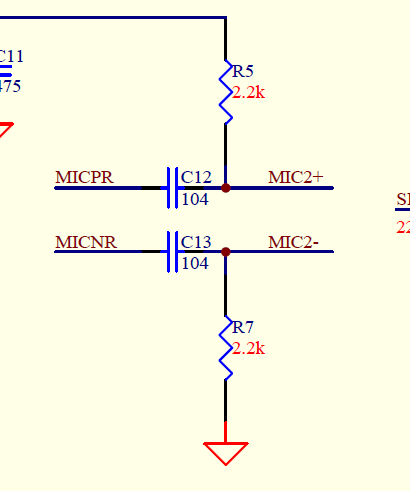

2. **验证固件匹配**

    - 确认使用的固件是为CI1303芯片生成
    - 重新创建项目并生成匹配的固件
    - 测试不同的噪声模型配置

3. **优化识别效果**

    - 启用深度降噪功能
    - 选择合适的噪声模型（如风机噪声）
    - 适当调高识别阈值以提高灵敏度

**注意事项：**

- CI1302和CI1303芯片在双麦支持上可能存在差异
- 双麦配置识别率比单麦高约3%，实际差异不明显
- 双麦主要用于声源定位和降噪，识别率提升有限
- 嘫头位置和结构设计对识别效果影响很大
- 在风扇等噪声环境下，建议开启深度降噪功能

---


---

### 如何获取CI-03T和CI-03T2模块的PCB设计文件？

**问题描述：**

需要获取CI-03T1和CI-03T2型号芯片的PCB设计文件，以便将样品焊接到测试板上进行测试。

**解决方案：**

**文件获取说明：**

1. **PCB文件不可用**：

    - 没有现成的PCB设计文件提供
    - 需要根据封装图自行设计PCB
    - 厂方仅提供封装图文件

2. **封装图文件**：

    - 文件名：CI-03T1&2封装图.PCB
    - 包含芯片的封装尺寸和焊盘定义
    - 可直接导入到EDA软件中使用

**获取方式：**

- 获取封装图文件
- 文件格式为.PCB，支持主流EDA工具
- 包含完整的尺寸标注和焊盘定义

**自行设计PCB：**

1. **导入封装**：

    - 在EDA软件中导入封装图文件
    - 检查封装尺寸是否正确
    - 根据封装设计PCB焊盘

2. **设计要点**：

    - 按照封装图的焊盘尺寸设计
    - 注意芯片的引脚顺序和方向
    - 预留足够的焊接空间

3. **测试验证**：

    - 设计完成后可制作测试板
    - 将芯片样品焊接到测试板
    - 验证引脚连接和功能是否正常

**注意事项：**

- 封装图是设计PCB的唯一参考资料
- 建议有PCB设计经验的人员进行操作
- 焊接时注意防静电措施
- 保留封装图文件作为设计依据

---


---

### CI-03T1模块电路设计审核要点

**问题描述：**

需要进行CI-03T1模块的电路设计审核，了解关键的设计要点和注意事项，确保产品可靠性和生产良率。

**解决方案：**

**审核要点清单：**

1. **电源设计审核**：

    - **供电电压范围**：必须支持3.3-5.5V宽压输入
    - **电源滤波**：在VCC引脚附近放置10μF+100nF滤波电容
    - **电源隔离**：语音部分使用独立LDO，避免数字电路干扰
    - **纹波要求**：电源纹波<100mV，保证语音质量

2. **音频电路设计**：

    - **差分走线**：麦克风必须使用差分走线
    - **功放隔离**：功放电路远离敏感的语音前端
    - **地线设计**：模拟地和数字地单点连接，最后在芯片下方汇合

3. **接口设计**：

    - **ESD保护**：所有对外接口必须添加ESD器件
    - **串口保护**：TX/RX线串接100Ω电阻
    - **GPIO预留**：保留调试和测试用测试点

4. **生产工艺要求**：

    - **SMT工艺**：推荐使用SMT贴片工艺
    - **回流焊温度控制**：严格按照规格书控制回流焊温度曲线
    - **AOI检查**：自动光学检测设备检测焊接质量

5. **测试验证**：

    - **功能测试**：完整的语音识别和播报测试
    - **环境测试**：高低温和高温工作验证
    - **老化测试**：72小时连续工作验证稳定性
    - **EMC测试**：电磁兼容性测试

**设计文档要求：**

- 提供完整的原理图和PCB布局图
- 包含详细的物料清单（BOM）
- 提供测试报告和验证标准
- 注明特殊工艺要求和质量控制点

**常见问题预防**：

1. **生产 issues**：

    - 虚焊、连锡、器件偏移
    - 错件器件、极性反接
    - 焊接温度损伤

2. **设计优化**：

    - 过孔设计避免生产困难
    - 器件布局考虑散热和维修
    - 预留足够的测试和调试接口

**审核流程：**

1. **设计文档提交**
2. **样品制作与验证**
3. **首件检验（FAI）**
4. **试产验证（PVT）
5. **量产放行（MP）

**注意事项：**

- 设计变更需经过验证确认
- 重要工艺参数需要锁定控制
- 保留完整的工程变更记录
- 建立质量问题快速响应机制

---


---

### CI-03T1模块生产红胶工艺问题如何优化？

**问题描述：**

需要审核基于CI-03T1芯片的电路设计，特别是驻极体话筒输入电路、电源电路和功放使能脚的接法是否合理，以及是否可以简化电路以降低成本。

**设计要点：**

1. **咪头电路设计**：需要按照官方参考电路设计，不能随意改动
2. **电源电路要求**：电源电路的4.7Ω/0805封装电阻不能省略，这是保证稳定供电的关键元件
3. **未使用引脚处理**：未使用的引脚不需要悬空，按官方设计处理即可
4. **电路简化原则**：建议直接按照官方图纸设计，不要随意变动，只需要考虑与485通信的电平匹配

**注意事项：**

- 功放使能脚的接法需要根据具体功放芯片型号确定
- 电路简化应以不影响功能稳定性为前提
- 电源滤波电容的位置需要靠近芯片电源引脚

---


---

### CI-03T2双麦克风模块的两个麦克风间距是多少？

**问题描述：**

需要了解CI-03T2双麦克风模块上两个麦克风之间的标准间距距离。

**解决方案：**

**官方规格说明：**

- **标准麦克风间距**：4-6cm
- 这是CI-03T2双麦克风模块的官方设计规格
- 间距设计经过声学算法优化，确保最佳降噪效果

**技术设计原理：**

1. **声源定位精度**：

    - 4-6cm间距能够提供良好的声源定位分辨率
    - 满足0~180度范围内的声源定位需求
    - 平衡了定位精度和实用性

2. **降噪算法优化**：

    - 该间距范围最适合双麦克风降噪算法
    - 能够有效区分语音信号和环境噪声
    - 提供较好的噪声抑制效果

3. **物理布局考虑**：

    - 适合大多数产品外壳尺寸
    - 便于PCB布局和结构设计
    - 考虑了实际生产的可行性

**应用建议：**

- **产品设计**：在PCB布局时严格按照4-6cm间距设计
- **结构设计**：确保两个麦克风之间无遮挡物
- **一致性要求**：批量生产时保持间距一致性
- **测试验证**：在实际使用环境中验证降噪效果

**注意事项：**

- 麦克风间距是影响双麦算法效果的关键参数
- 修改间距可能影响降噪和定位功能
- 建议遵循官方规格以确保最佳性能

---


---

### CI-03T2模块上电后无声音怎么办？

**问题描述：**

CI-03T2声纹识别芯片的门锁WIFI开发板上电后没有声音、喇叭不播报，烧录固件后仍存在异常。

**解决方案：**

**硬件检查步骤：**

1. **供电电压测量**：

    - 测量各脚位的对地电压
    - 正常工作电压应在3.3V-5V范围
    - 电压过低（如0.01V、0.2V）或不稳定说明供电异常

2. **模块状态排查**：

    - 检查模块是否正常上电
    - 观察LED指示灯状态
    - 确认电源电路连接无误

**常见问题分析：**

1. **供电问题**：

    - 部分脚位电压异常低或不稳定
    - 可能是电源管理电路故障
    - 需要检查供电线路和滤波电容

2. **功放电路问题**：

    - 即使烧录成功仍无声音输出
    - 功放电路可能存在短路或开路
    - 喇叭连接线路需要检查

3. **固件兼容性**：

    - 烧录成功但功能异常
    - 可能是固件版本不匹配
    - 需要确认固件适用于CI-03T2

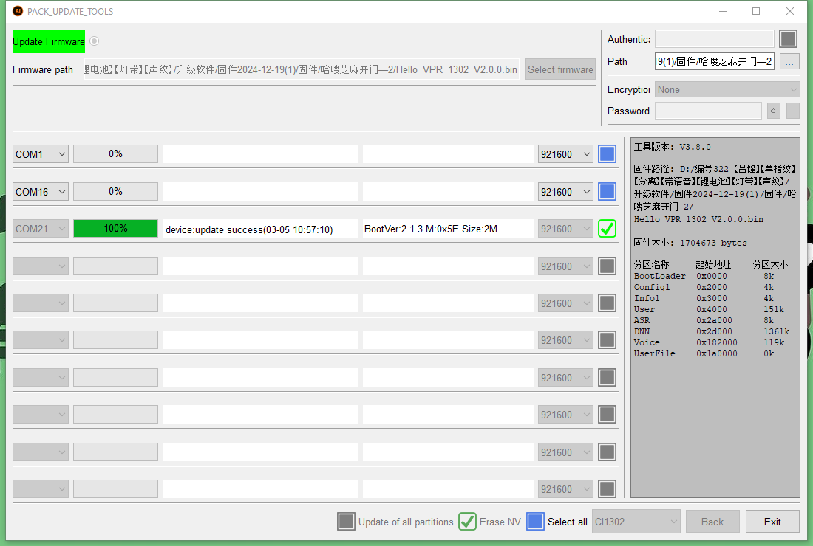

*PACK_UPDATE_TOOLS显示固件烧录成功*

**解决建议：**

1. **硬件排查**：

    - 检查电源管理芯片
    - 测量各点电压值
    - 确认无短路或虚焊

2. **固件验证**：

    - 使用确认可用的固件版本
    - 重新烧录并测试
    - 联系厂家获取供应商

3. **替换测试**：

    - 更换新的CI-03T2模块
    - 交叉测试确认问题所在
    - 排除模块个体故障

**注意事项：**

- 多个模块出现相同问题时，重点排查主板设计
- 电压异常可能是电源芯片或滤波电路问题
- 烧录成功说明通信正常，问题可能在音频功放部分
- 建议使用示波器检查音频输出信号

---


---

### CI-03T芯片的工作温度范围是多少？

**问题描述：**

需要确认CI-03T芯片的工作温度范围，特别是在高温环境下的适用性。

**解决方案：**

**最新工作温度规格：**

- **工作温度范围**：-20°C 至 80°C
- **存储温度范围**：-20°C 至 70°C
- **最大焊接温度**：260°C

**重要更新说明：**

- 早期版本的规格书显示工作温度上限为60°C
- 通过晶振替换优化，现已将工作温度上限提升至80°C
- 现有淘宝销售的模块均为改进后的-20°C至80°C版本

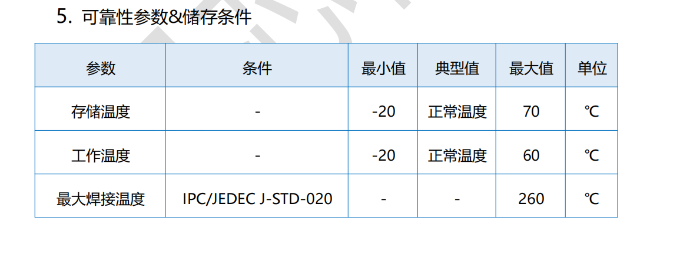

**定制温度范围：**

- 常规晶振支持温度范围：-20°C至80°C
- 如需更低温度支持（如-30°C），可进行定制
- 低温定制版本最低可支持-40°C
- 定制需要确认商务条件和最小起订量

**注意事项：**

- 选型时请确认使用环境的温度要求
- 高温应用建议留有余量，不要长期在极限温度下工作
- 低温应用需要特别定制，常规版本不支持-30°C以下

---


---

### 如何调整CI-03T1模块的音量大小？

**问题描述：**

使用CI-03T1模块时音量过小，需要将音量调至最大以满足产品需求。

**解决方案：**

**音量调整方法：**

1. **平台配置调整**：

    - 在智能公元平台生成固件时
    - 找到音量配置选项，可调节音量、语速和亮度参数
    - 音量调节范围为0-100，建议根据产品应用场景选择合适值

2. **固件版本选择**：

    - 原固件音量为55%（默认）
    - 可选择90%或100%音量版本
    - 不同音量版本需要重新生成固件并烧录

**技术要点：**

1. **功放电路确认**：

    - 确认功放电路与模块规格基本一致
    - 检查喇叭规格（推荐8Ω2W）
    - 验证供电电压稳定性

2. **音量测试方法**：

    - 烧录不同音量版本进行对比测试
    - 在实际使用环境下验证音量效果
    - 记录各版本的音量差异

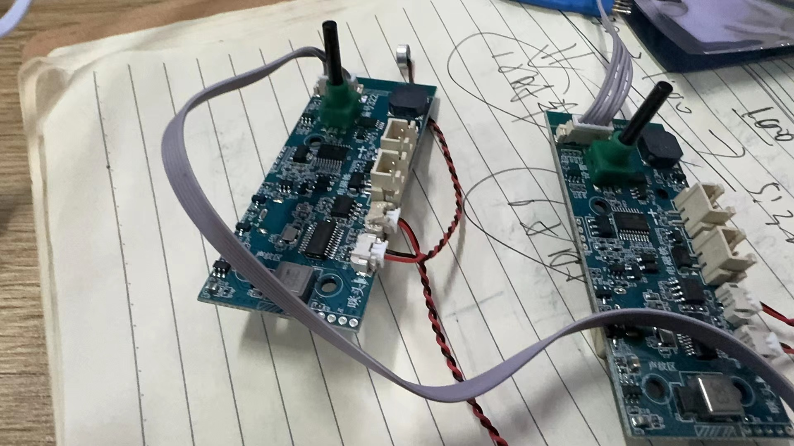

*CI-03T1模块新旧版本对比，用于确认测试结果*

**注意事项：**

- 音量配置在固件生成时设定，烧录后无法动态修改
- 如需后续调整音量，需重新生成固件并烧录
- 批量烧录前建议先测试确认音量效果
- 音量调整后建议全面测试语音识别和播报功能

---


---

### CI-03T1模块生产红胶工艺问题如何优化？

**问题描述：**

CI-03T1模块在生产过程中采用红胶工艺贴装，导致不良率过高，维修成本增加，影响生产效率。

**解决方案：**

**工艺问题分析：**

- 红胶工艺贴装不良率过高
- 维修过程费时费力
- 影响整体生产效率和成本

**推荐工艺改进：**

1. **更换为直接贴片工艺**：

    - 采用标准SMT贴片工艺
    - 避免使用红胶带来的问题
    - 提高一次通过率

2. **工艺优化建议**：

    - 评估现有贴片生产线能力
    - 与供应商沟通工艺要求
    - 重新安排送样验证

3. **质量控制措施**：

    - 加强生产过程检验
    - 优化回流焊温度曲线
    - 建立更严格的质检标准

**实施步骤：**

1. 送样测试新工艺
2. 验证工艺可行性
3. 批量转换生产工艺
4. 持续监控良品率

**注意事项：**

- 工艺转换需要重新送样给确认
- 建议与长虹等代工厂沟通工艺调整
- 新工艺需要一定验证周期

---


---

### CI-03T1使用过粗线材导致连接不稳定怎么办？

**问题描述：**

使用CI-03T1芯片进行硬件连接时，因线材过粗且布线杂乱，导致连接不稳定或无法正常工作。

**解决方案：**

**问题分析：**

1. **线材规格影响**：

    - 过粗的线材难以与模块引脚可靠连接
    - 线材过硬可能导致接触不良
    - 布线杂乱容易产生信号干扰

2. **连接可靠性问题**：

    - 引脚间距为2.0mm，粗线不易对准
    - 接触压力不足导致导通不良
    - 线材回弹造成连接松动

**解决方法：**

1. **选择合适线材**：

    - 使用规格匹配的细导线（推荐0.5mm²）
    - 优先使用专用的排线或FFC软线
    - 避免使用超过1mm²的硬质线材

2. **改进连接方式**：

    - 焊接排针过渡，使用杜邦线连接
    - 使用专用的连接器或转接板
    - 确保线材与焊盘规格匹配

3. **优化布线规范**：

    - 按功能分组整理线束
    - 使用扎带或理线带固定线缆
    - 强弱信号分开走线，避免干扰

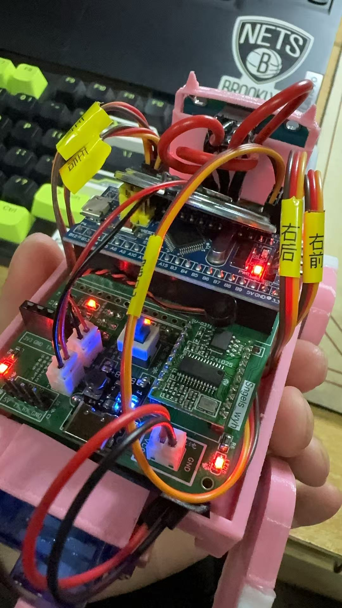

**实施建议：**

1. **开发阶段**：

    - 使用带排针的模块便于调试
    - 准备多种规格的连接线
    - 建立标准的接线文档

2. **生产阶段**：

    - 设计专用工装保证连接一致性
    - 使用端子压接替代手工焊接
    - 制定线束固定标准

3. **质量控制**：

    - 检查线材规格是否符合要求
    - 测试连接的可靠性和稳定性
    - 进行拉力和振动测试

**注意事项：**

- CI-03T系列模块引脚间距为2.0mm，需选择合适线材
- 过粗线材不仅影响连接，还可能损坏焊盘
- 建议使用弹性较好的多股细线
- 复杂项目建议设计专用转接板

---


---

### CI-03T1模块生产质检标识要求是什么？

**问题描述：**

CI-03T1模块在生产过程中需要确认质检标识要求，特别是对不良品的处理方式。

**解决方案：**

**质检标识要求：**

1. **不良品标识**：

    - 不合格产品需要打X标记
    - 标记的不良品严禁放入包装托盘
    - 确保只有合格产品进入下一工序

2. **包装前检查**：

    - 逐个检查产品外观
    - 确认功能测试通过
    - 核对标识是否清晰

3. **托盘使用规范**：

    - 托盘型号：CI-D02GS01J040301
    - 每盘固定40个位置
    - 空位需明确标注

**质量控制流程：**

1. **生产测试**：功能测试合格
2. **外观检查**：无明显缺陷
3. **标识确认**：合格品盖章/贴标
4. **包装入库**：按规格包装

**注意事项：**

- 严禁将不良品混入合格品中
- 发现不良品需及时隔离处理
- 建议建立追溯体系

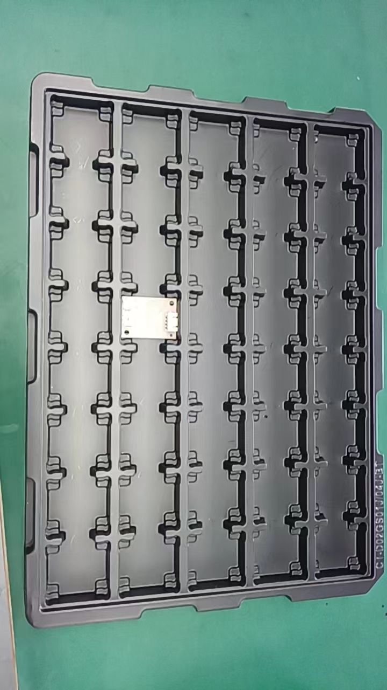

---


---

### CI-03T1模块的标准包装规格是多少？

**问题描述：**

需要了解CI-03T1模块的标准包装规格，包括每盘可容纳的模块数量。

**解决方案：**

**包装规格：**

- **每盘数量**：40个模块
- **包装形式**：专用托盘包装
- **托盘标识**：CI-D02GS01J040301

**包装特点：**

1. **托盘设计**：

    - 专用凹槽设计，确保模块固定
    - 防静电材料
    - 便于运输和存储

2. **质检要求**：

    - 打X标记的不良品不应放入托盘
    - 只有合格产品才能包装
    - 确保包装前功能测试通过

**注意事项：**

- 包装数量固定为40个/盘
- 运输时需注意防震防潮
- 存储环境应干燥阴凉

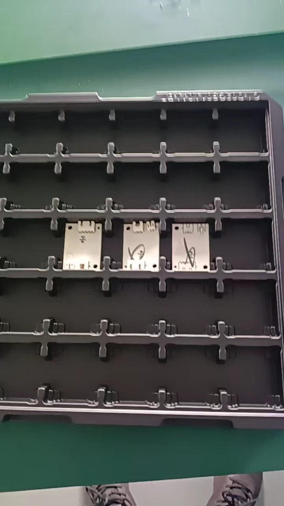

---


---

### CI-03T1在声控LED产品中的应用方案

**问题描述：**

在声控LED产品开发中使用CI-03T1离线语音识别芯片方案，需要确认技术方案和产品选型的适用性。

**解决方案：**

**技术方案确认：**

1. **模块选型适用性**：

    - CI-03T1适合声控LED产品应用
    - 支持离线语音识别，无需网络连接
    - 响应速度快，适合实时控制场景

2. **产品特点**：

    - 低功耗设计，适合电池供电产品
    - 支持多个命令词，可实现复杂的灯光控制
    - 可通过GPIO控制LED驱动电路

**硬件设计方案：**

1. **基本连接**：

    - CI-03T1模块 + 麦克风 + 扬声器
    - GPIO口连接LED驱动电路
    - 5V供电，功耗低至待机<1mA

2. **LED控制方式**：

    - 直接控制：通过IO口输出高低电平控制LED开关
    - PWM调光：支持PWM输出实现LED亮度调节
    - 组合控制：多个命令词控制不同的LED效果

**开发建议：**

1. **快速验证**：

    - 购买CI-03T1开发板进行功能验证
    - 在智能公元平台配置命令词
    - 测试语音控制LED的响应效果

2. **量产准备**：

    - 设计集成PCB，将CI-03T1贴片到主板上
    - 优化麦克风和扬声器位置
    - 考虑产品外壳的声学设计

**注意事项：**

- CI-03T1方案适合功率在100W以内的LED产品
- 开发阶段建议先用开发板验证功能
- 量产前需完成EMC测试和认证
- 如无硬件开发能力，可考虑委托开发或使用完整方案

---


---

### CI-03T1语音板喇叭正极与SPK+连锡问题如何处理？

**问题描述：**

CI-03T1语音板在生产过程中出现喇叭正极与SPK+焊点之间连锡现象，导致语音板无法正常工作。

**解决方案：**

**问题分析：**

- 喇叭正极与SPK+本身是连通的，连锡不影响电路功能
- 此类连锡属于生产工艺问题，但不会影响模块正常使用
- 所有产品在出厂前均已通过测试验证

**处理建议：**

1. **无需返工**：连锡不影响功能使用，可正常投入使用

2. **工艺改进**：

    - 如需避免连锡现象，建议调整SMT工艺参数
    - 优化钢网开孔设计
    - 控制锡膏印刷量

3. **质量检验**：

    - 出厂前已进行逐个测试
    - 确保功能正常后发货

**注意事项：**

- 连锡位置在信号通路上，不会造成短路
- 如发现其他位置连锡，需要评估是否影响功能
- 建议与供应商沟通工艺改进方案

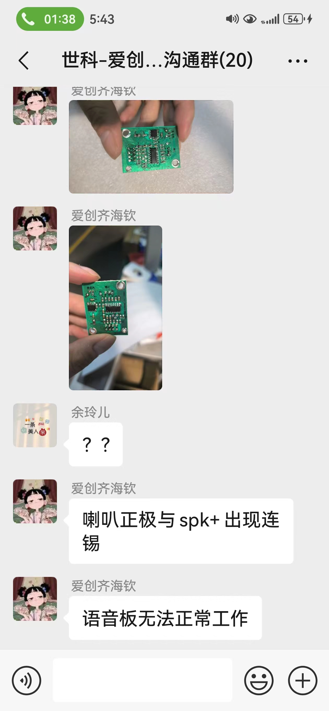

---


---

### CI-03T1模块贴片工艺质量问题如何处理？

**问题描述：**

CI-03T1模块的生产批次因贴片工艺问题导致质量不合格，需要重新送样并安排下一批生产。

**解决方案：**

**问题分析：**

- 当前贴片工艺存在缺陷，导致模块质量不稳定
- 需要更换贴片工艺才能解决根本问题
- 影响范围涉及整个生产批次

**处理措施：**

1. **立即停止出货**：

    - 暂停当前批次产品的发货
    - 通知相关方产品质量问题
    - 安排补发20个模块供临时使用

2. **工艺改进方案**：

    - 更换贴片工艺供应商
    - 重新进行送样验证
    - 与长虹重新协调生产安排

3. **质量保证措施**：

    - 新批次生产前进行严格测试
    - 建立更完善的质检流程
    - 确保工艺问题彻底解决

**注意事项：**

- 需要与生产方协调工艺改进时间
- 端已发货产品可能存在质量风险
- 建议建立更严格的首件检验制度

---


---

### CI-03T1模块出现批量质量问题怎么办？

**问题描述：**

CI-03T1模块在生产过程中出现大量质量问题，且问题具有普遍性，而非个别现象。

**解决方案：**

**问题定性：**

- 经确认，质量问题为普遍现象，非个例
- 问题范围影响整个生产批次
- 需要立即采取批量处理措施

**应急处理流程：**

1. **现场供应商**：

    - 安排技术人员前往生产现场
    - 确认问题现象和影响范围
    - 收集故障样品进行分析

2. **生产地点协调**：

    - 确认生产地点（如绵阳生产基地）
    - 与当地生产团队配合排查
    - 便于快速响应和处理

**根本解决措施：**

1. **批量隔离**：

    - 立即隔离所有问题批次产品
    - 防止不良品流入下一工序
    - 统计不良数量和比例

2. **深入分析**：

    - 对问题批次进行彻底分析
    - 找出质量问题的根本原因
    - 制定预防措施

3. **工艺改进**：

    - 优化生产流程和工艺参数
    - 加强过程质量控制
    - 建立更严格的检验标准

**注意事项：**

- 批量质量问题需要快速响应，避免影响扩大
- 建议保留问题样品供深入分析
- 与生产方建立更紧密的质量沟通机制

---


---

### CI-03T1模块次品频发问题分析与解决

**问题描述：**

CI-03T1模块在生产过程中频繁出现次品，导致无法按时发货，单批次2000个模块中出现7个次品，不良率异常偏高。

**解决方案：**

**问题统计分析：**

1. **不良率统计**

    - 记录各批次的不良品数量
    - 计算不良率并建立趋势图
    - 对比行业平均水平评估严重性

2. **现象分类记录**

    - 详细记录每种不良现象
    - 统计各类问题的出现频率
    - 识别主要问题类型

**根本原因排查：**

1. **生产工艺检查**

    - 检查SMT贴片质量
    - 验证回流焊温度曲线
    - 确认检测工序有效性

2. **来料质量检验**

    - 加强PCB板来料检验
    - 验证元器件质量
    - 检查存储环境条件

3. **操作规范评估**

    - 评估作业指导书完整性
    - 检查员工操作规范性
    - 确认设备维护状态

**改进措施：**

1. **工艺优化**

    - 调整锡膏印刷参数
    - 优化贴片机精度
    - 改进焊接温度曲线

2. **质量控制加强**

    - 增加中检工序
    - 提高抽检比例
    - 实施全检关键工序

3. **人员培训**

    - 加强操作技能培训
    - 建立质量意识教育
    - 实施技能认证制度

**预防机制：**

1. **过程监控**

    - 建立实时监控系统
    - 设置质量预警阈值
    - 及时发现异常趋势

2. **持续改进**

    - 定期回顾质量数据
    - 更新作业标准
    - 推广最佳实践

**注意事项：**

- 次品频发需要系统性解决，而非个别处理
- 建议成立专项质量改进小组
- 保留完整的改进记录便于效果评估
- 与供应商建立质量联动机制

---


---

### CI-03T1模块不良率过高与备品管理策略

**问题描述：**

CI-03T1模块在生产过程中出现较高不良率，导致备品数量不足，无法满足订单交付需求。例如单批次生产中出现大量不良品，备品不足以补偿，影响正常交货。

**解决方案：**

**不良率控制：**

1. **不良率评估**

    - 统计实际不良率并建立趋势分析
    - 对比行业标准（正常不良率应控制在1%以下）
    - 评估不良率对交付能力的影响

2. **质量改进措施**

    - 立即分析不良原因并制定改进方案
    - 优化生产工艺，减少不良产生
    - 加强来料检验和过程质量控制

**备品管理策略：**

1. **备品数量规划**

    - 根据历史不良率数据，建立备品计算公式
    - 建议备品比例：按订单数量的5-10%配置
    - 对于新项目或工艺不稳定的产品，适当提高备品比例

2. **备品使用管理**

    - 建立备品使用台账，记录每个备品的使用情况
    - 定期盘点备品库存，确保数据准确
    - 及时补充消耗的备品，维持安全库存水平

3. **应急处理方案**

    - 当备品不足时，优先安排维修可修复的不良品
    - 协商分批交付方案
    - 启动紧急生产补货流程

**预防措施：**

1. **供应商合作**

    - 与供应商建立质量共享机制
    - 要求供应商提供质量报告和改进计划
    - 必要时更换质量不达标的供应商

2. **生产监控**

    - 实施全过程质量监控
    - 建立不良率预警机制
    - 发现异常立即停线排查

3. **合同条款**

    - 在采购合同中明确质量要求和赔偿条款
    - 约定不良率超标时的处理方案
    - 建立质量保证金制度

**注意事项：**

- 备品管理是生产连续性的重要保障，需纳入整体生产计划
- 高不良率会影响成本和交付，必须从根本上解决
- 建议定期回顾备品策略，根据实际情况调整
- 保留完整的质量记录，便于追溯和改进

---


---

### CI-03T1模块工艺限制与质量控制

**问题描述：**

在使用CI-03T1模块进行产品生产时，因生产工艺限制，导致无法进行有效的质量控制和问题修复。

**解决方案：**

**工艺限制分析：**

1. **工艺约束**

    - 生产过程有固定的工艺要求
    - 不允许修改现有生产流程
    - 质量改进措施受限

2. **质量影响评估**

    - 无法优化生产参数导致不良率偏高
    - 缺乏有效的质量改进手段
    - 影响最终产品交付质量

**应对策略：**

1. **前期预防**

    - 在项目启动前充分沟通工艺要求
    - 提供详细的工艺适配建议
    - 建立质量风险评估机制

2. **过程控制**

    - 加强来料检验，确保源头质量
    - 实施严格的过程监控
    - 建立关键控制点检查

3. **质量补救**

    - 增加成品筛选工序
    - 提供额外备品补偿不良
    - 建立快速响应机制

**质量控制措施：**

1. **检验加强**

    - 实施全检替代抽检
    - 增加功能测试覆盖率
    - 建立详细的质量记录

2. **数据统计**

    - 统计各类不良现象
    - 分析不良产生规律
    - 为工艺改进提供数据支持

**沟通协调：**

1. **沟通协调**

    - 定期汇报质量状况
    - 提供质量改进建议
    - 协调工艺优化可能性

2. **供应商协调**

    - 与模块供应商沟通质量问题
    - 寻求替代解决方案
    - 建立质量联动机制

**注意事项：**

- 工艺限制下需要更多依赖检验和筛选
- 建议在合同中明确工艺约束和质量责任
- 保留完整质量记录便于问题追溯
- 考虑在项目中预留质量成本

---


---

### CI-03T1模块装机后无反应与电阻配置有关怎么办？

**问题描述：**

CI-03T1模块在生产过程中出现装机后无反应的问题，疑似与电路板上的电阻配置有关。

**解决方案：**

**问题排查：**

1. **电阻配置检查**：

    - 重点检查R20和R21电阻的阻值
    - R20应为10Ω，R21应为47Ω
    - 确认电阻焊接质量和阻值准确性

2. **电路测试**：

    - 使用万用表测量实际阻值
    - 检查是否有短路或开路
    - 验证电阻焊盘连接可靠性

**电阻配置影响：**

- R20（10Ω）：影响信号传输阻抗匹配
- R21（47Ω）：影响电路偏置和工作点
- 错误的阻值可能导致模块无法正常启动

**处理措施：**

1. **阻值确认**：

    - 对照原理图确认正确阻值
    - 使用精密万用表测量实际阻值
    - 更换不符规格的电阻

2. **焊接质量检查**：

    - 确认电阻无虚焊或连焊
    - 检查焊盘是否完好
    - 必要时重新焊接

**注意事项：**

- 电阻阻值偏差应在5%以内
- 焊接温度不宜过高，避免损坏电阻
- 建议使用1%精度的金属膜电阻

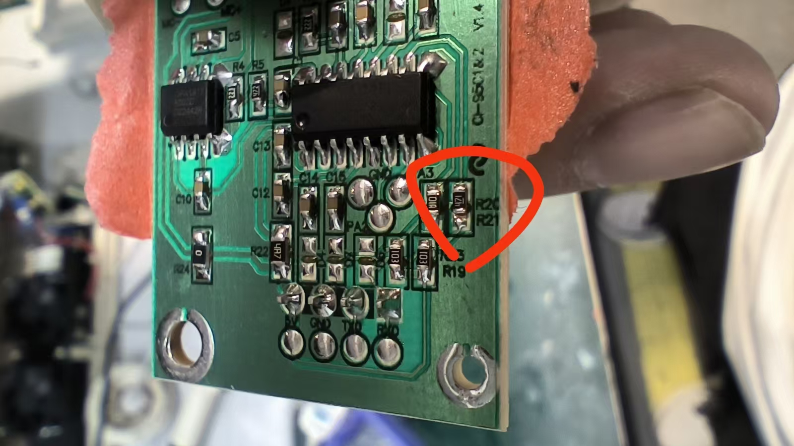

*图中红色圆圈标示R20（10Ω）和R21（47Ω）电阻位置*

---


---

### CI-03T1模块麦克风无法正常接收信号怎么办？

**问题描述：**

在生产CI-03T1模块时，发现麦克风无法正常接收信号，怀疑是电路板上的元件焊接问题，特别是R103电阻和相关电容的焊接质量。

**解决方案：**

**问题定位：**

1. **R103电阻虚焊检查**：

    - R103电阻存在明显的虚焊现象
    - 焊锡不饱满，可能导致信号传输不良
    - 这是麦克风信号接收异常的主要原因

2. **对比验证**：

    - 检查R19和R21电阻的焊接质量
    - 正常焊接的电阻应焊点饱满、光滑
    - 通过对比确认焊接标准

**虚焊现象特征：**

- 焊点呈球状，无浸润性
- 焊锡与焊盘之间有明显间隙
- 轻轻触碰可能导致接触不良

**修复措施：**

1. **重新焊接R103**：

    - 使用恒温烙铁重新焊接
    - 补充适量焊锡确保饱满
    - 控制焊接时间避免损坏元件

2. **检查相关电容**：

    - 检查R103附近的滤波电容
    - 确认电容焊接质量
    - 排除其他潜在问题

**预防措施：**

1. **工艺优化**：

    - 调整锡膏印刷参数
    - 优化回流焊温度曲线
    - 加强AOI检测覆盖率

2. **质量检验**：

    - 增加显微镜检查工序
    - 对关键信号进行功能测试
    - 建立焊接质量标准

**注意事项：**

- R103位于麦克风信号通路，焊接质量直接影响接收效果
- 建议使用有铅焊料，焊接温度控制在350°C以下
- 修复后需进行麦克风功能测试验证

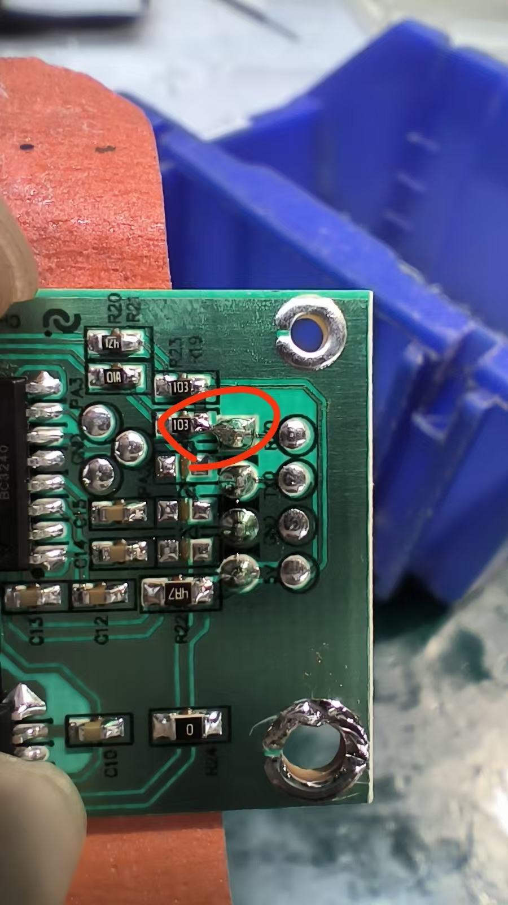

*图中可见R103电阻焊点不饱满，存在明显虚焊现象*


*R19和R21电阻的正常焊接状态，焊点饱满光滑*

---


---

### CI-03T1模块无法唤醒、有执行无回复、近距离才能接收语音怎么办？

**问题描述：**

CI-03T1模块在使用中出现无法唤醒、有执行无回复以及需要零距离才能接受语音的问题。

**解决方案：**

**问题诊断与解决：**

1. **无法唤醒问题**：

    - 可能原因：麦克风没有插好或接触不良
    - 解决方法：检查麦克风连接，确保插接到位
    - 验证方法：轻轻按压麦克风接口，确认是否恢复唤醒

2. **有执行无回复问题**：

    - 可能原因：喇叭故障或播报功能被关闭
    - 解决方法：检查喇叭是否正常工作，确认播报功能开启
    - 验证方法：使用示波器或万用表检查喇叭输出

3. **近距离才能接收语音问题**：

    - 可能原因：麦克风正负极接反
    - 解决方法：调换麦克风正负极连接
    - 验证方法：正确连接后测试有效距离恢复

**连锡问题处理：**

- 检查电路板上是否存在连锡现象
- 重点排查标注"连锡"的元件位置
- 使用万用表确认是否有短路
- 必要时进行清洁和重新焊接

**质量保证措施：**

1. **出厂检验加强**：

    - 增加麦克风连接测试
    - 逐个测试唤醒和播报功能
    - 验证有效接收距离

2. **工艺改进**：

    - 优化焊接工艺，避免连锡
    - 加强AOI光学检测
    - 建立更严格的质检标准

**注意事项：**

- 麦克风极性接反是常见问题，需重点检查
- 建议在生产线上增加极性检测工序
- 连锡问题需要使用放大镜仔细检查

---

### CI-03T1模块虚焊和连焊问题如何处理和预防？

**问题描述：**

CI-03T1模块在生产过程中出现虚焊和连焊问题，导致不良率过高。

**问题分析：**

根据实际案例分析，某批次200个模块中发现15个不良，不良率达7.5%，远超正常水平。

**不良统计：**

- 第一批：几百个模块，当时要货急只做了抽检
- 后续批次：4000个模块，已改为全检
- 问题批次：200个中有15个不良，异常偏高

**处理流程：**

1. **不良品处理**：

    - 将不良模块寄回分析
    - 技术人员现场排查原因
    - 确定是虚焊还是连焊问题

2. **供应商响应**：

    - 安排技术人员前往生产现场
    - 与生产团队共同排查
    - 提供现场技术指导

**虚焊和连焊的区别：**

1. **虚焊特征**：

    - 焊点呈球状，无浸润
    - 电气连接不可靠
    - 可能导致时好时坏的现象

2. **连焊特征**：

    - 相邻焊盘或引脚之间桥接
    - 可能造成短路
    - 影响电路正常工作

**预防措施：**

1. **工艺优化**：

    - 调整锡膏印刷厚度和均匀性
    - 优化回流焊温度曲线
    - 控制焊接气氛和湿度

2. **设备维护**：

    - 定期校准贴片机精度
    - 检查钢网开口和堵塞情况
    - 维护回流焊炉温均匀性

3. **质量检验加强**：

    - 增加X光检测关键焊点
    - 扩大AOI光学检测覆盖
    - 建立焊点质量标准图库

**质量改进方案：**

1. **标准化作业**：

    - 制定详细的标准作业指导书
    - 培训操作人员识别焊接缺陷
    - 建立首件确认制度

2. **过程控制**：

    - 设立关键控制点
    - 记录工艺参数数据
    - 实时监控不良率趋势

**注意事项：**

- 虚焊连焊问题必须从根本上解决，不能依赖全检
- 建议与供应商建立质量改进小组
- 保留典型缺陷样品用于培训和分析

---


---

### CI-03T模块连接8欧5W喇叭后无法正常唤醒，仅能轻微振动，是什么原因？

**问题描述：**

CI-03T模块连接8欧5W喇叭后，设备无法正常唤醒，仅能轻微振动，喇叭工作异常。

**问题分析：**

根据实际测试结果，8欧5W喇叭的功率超出了CI-03T模块的最佳驱动范围。模块内置的ClassAB功放对喇叭功率有特定要求：

- **4欧姆喇叭**：建议功率从2.4W起步
- **8欧姆喇叭**：建议功率从1.6W起步，不宜超过2W

**实际案例现象：**

- 使用8欧5W喇叭时，设备LED指示灯亮起，表明已上电
- 但语音唤醒功能失效，模块只能轻微振动，无法正常响应
- 更换为推荐功率的喇叭后，功能恢复正常

**解决方案：**

- 更换为推荐规格的喇叭：8欧姆2瓦（8Ω2W）
- 优先使用开发板配套的喇叭进行测试验证
- 如需更大功率输出，应考虑外接功放方案


**注意事项：**

- 功率过大的喇叭可能导致模块驱动不足，表现为无法正常唤醒或声音异常
- 典型症状是设备上电但唤醒失效，仅能轻微振动
- 喇叭阻抗和功率匹配是确保模块正常工作的关键因素
- 建议在设计阶段确认喇叭参数是否符合模块的驱动能力

---


---

### CI-03T模块喇叭发出声音不正常，听不清楚内容，是什么原因？

原因包括：1. R24电阻值太低（用了3K），应大于4.7K；2. C33电容焊接不良或容值错误，需检查105电容；3. 功放地线不通，需飞线解决。检查喇叭正负极对GND电压应为1/2VCC（约2.5V），确保功放电路正常。

---


---

### 使用CI-03T模组时，外部麦克风灵敏度过高导致误触发怎么办？

**问题描述：**

使用CI-03T模组加底板设计时，搭配非标麦克风（灵敏度高于-32dB），会导致语音模块出现误触发问题。

**解决方案：**

**麦克风规格要求：**

- 建议麦克风灵敏度：-32dB
- 信噪比要求：SNR＞70dB
- 电源纹波要求：小于100mV（实测100mV符合要求）

**处理方法：**

1. **优先方案**：更换符合规格的麦克风
    - 联系麦克风供应商调整灵敏度至-32dB
    - 注意性能调整不影响尺寸装配

2. **替代方案**：若已定型无法更换硬件
    - 通过软件算法优化来降低误触发率
    - 在电路板上增加滤波电路
    - 硬件需搭配标准配置，再优化算法才能达到最佳效果

**注意事项：**

- 咪头灵敏度是影响误识别的关键因素
- 仅通过软件或电路板滤波难以完全解决硬件不匹配问题
- 研发阶段建议多测试样板，选择最佳性能配置

---


---

### CI-03T可以驱动8欧5W喇叭和圆喇叭吗？性能有何区别？

**问题描述：**

咨询CI-03T系列芯片是否可以驱动8欧5W的喇叭和圆喇叭，以及不同喇叭在性能上是否存在区别。

**解决方案：**

**喇叭驱动能力说明：**

1. **功率要求范围**：

    - 4欧姆喇叭：功率应从2.4W起步，建议2.4W-3W
    - 8欧姆喇叭：功率应从1.6W起步，建议1.6W-2W
    - 模块最大支持5W喇叭，但超过推荐功率可能驱动不足

2. **8欧5W喇叭评估**：

    - 可以工作，但功率超出模块最佳驱动范围
    - 长期使用可能导致模块功放发热
    - 建议将音量控制在中等范围内

3. **圆喇叭规格确认**：

    - 官方圆喇叭规格：8欧姆2瓦（8Ω2W）
    - 完全在模块推荐驱动范围内
    - 可以正常驱动，性能表现良好

**性能对比分析：**

| 喇叭类型 | 阻抗 | 功率 | 驱动效果 | 发热情况 | 推荐度 |
|---------|--------|------|----------|----------|---------|
| 8Ω5W喇叭 | 8Ω | 5W | 可驱动，但音量可能不足 | 可能发热 | ⭐⭐ |
| 圆喇叭(8Ω2W) | 8Ω | 2W | 驱动良好，音质清晰 | 正常 | ⭐⭐⭐⭐⭐ |
| 4Ω3W喇叭 | 4Ω | 3W | 驱动良好，音量较大 | 略高 | ⭐⭐⭐ |

**使用建议：**

1. **优先选择**：

    - 推荐使用8Ω2W喇叭（如官方圆喇叭）
    - 匹配模块最佳工作点，稳定性高
    - 音质和音量平衡性最好

2. **大功率注意事项**：

    - 如必须使用8Ω5W喇叭，注意以下事项：

    - 音量不要设置过大，避免功放过载
    - 监控模块温度，避免过热
    - 长期使用建议选择推荐功率喇叭

3. **自购喇叭测试**：

    - 使用自购的8Ω5W喇叭需要自行测试验证
    - 确认实际音量和音质是否满足需求
    - 注意喇叭的频响范围和灵敏度

**技术提示：**

- 功率过大的喇叭不会损坏模块，但可能影响音质
- 阻抗匹配比功率更重要，建议优先选择8Ω喇叭
- 圆喇叭是经过验证的配套方案，可靠性高

---


---

### CI-03T2模块语音播报有杂音怎么改善？

**问题描述：**

CI-03T2模块在语音播报时出现杂音，希望通过软件设置或更换芯片方案来改善此问题。

**解决方案：**

1. **问题定位**：

    - 杂音通常来自喇叭本身的质量问题
    - 模块本身不会产生此类音频处理问题
    - 需要确认是播报时的杂音还是静默时的电流声

2. **硬件优化**：

    - 更换质量更好的喇叭
    - 确保喇叭功率和阻抗匹配（推荐8Ω 2W）
    - 检查音频线路连接是否良好

3. **当前限制**：

    - CI-03T2模块暂无音频美化功能
    - 没有专门的软件设置可以减少杂音
    - 现有芯片方案中暂不支持音频优化功能

**注意事项：**

- 语音播报的杂音问题主要通过硬件选型解决
- 建议在实际产品中进行充分的喇叭选型测试
- 如需要更好的音频效果，可考虑外接专业音频功放

---


---

### CI-03T2使用外部功放实现AEC功能

**问题描述：**

需要了解CI-03T2芯片的Mic2是否可以连接到另一个系统功放的输出端，以实现回声消除（AEC）功能。

**解决方案：**

- **AEC连接方式**：

    - CI-03T2的Mic2可以连接外部功放的输出端
    - 用于采集外部播放的音频作为参考信号
    - 配合内部算法实现回声消除

- **连接注意事项**：

    - 确保功放输出电压在模块承受范围内
    - 建议增加分压电路保护模块输入
    - 模块工作温度30-45度为正常现象

**应用场景**：

- **双系统音频处理**：

    - 一个系统播放音频，另一个系统进行语音识别
    - 通过AEC避免播放声音被误识别为指令
    - 实现语音打断和交互功能

- **功放兼容性**：

    - 推荐使用CLASS-AB类功放
    - D类功放可能需要额外的滤波电路
    - 确保输出信号为模拟音频信号

**注意事项：**

- 外部功放输出不要超过模块输入电压限制
- 长时间使用注意模块散热
- AEC效果取决于参考信号的质量和同步性

---

### CI-03T2双麦AEC与D类功放的兼容性问题解决方案

**问题描述：**

使用CI-03T2双麦AEC芯片时，外部功放为D类功放（如WM8960或MAX98357），导致AEC功能无法正常工作，无法实现语音打断功能。

**问题分析：**

CI-03T系列的AEC电路设计仅适用于CLASS-AB类功放，与D类功放存在兼容性问题：

- D类功放输出的是高频方波信号，需要去载波才能采样到有效的AEC信号
- 标准AEC电路无法直接处理D类功放的输出信号
- 双麦配置（CI-03T2）在AEC功能开启时可能出现无声问题

**解决方案：**

**方案一：更换为CLASS-AB类功放（推荐）**

1. **使用AB类功放模块**：

    - 选用LTK5128等AB类功放模块
    - 确保功放输出为模拟信号，便于AEC采样

2. **AEC电路连接**：

    - 按照标准AEC参考电路设计
    - 使用100nF电容（C19）、22kΩ电阻（R12）和2.2kΩ电阻（R11）连接AEC信号

    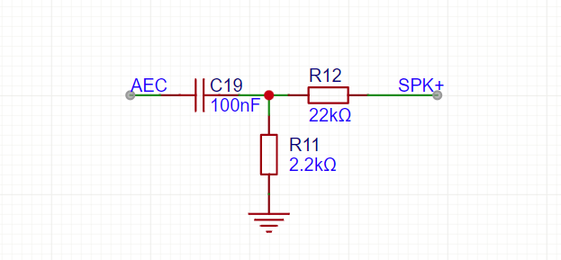

**方案二：使用单麦AEC配置**

1. **选择CI-03T3型号**：

    - CI-03T3为单麦AEC带晶振版本
    - 避免双麦配置的兼容性问题

2. **配置设置**：

    - 在平台配置中选择单麦克风模式
    - 开启AEC功能

**方案三：D类功放特殊处理（复杂度高）**

如必须使用D类功放，需要：

1. **增加去载波电路**：

    - 在AEC采样前增加低通滤波器
    - 提取D类功放的音频包络信号

2. **信号调理电路**：

    - 设计专门的信号调理电路
    - 将方波信号转换为可采样的模拟信号

3. **调试复杂度**：

    - 需要大量实验验证
    - 调试难度大，不建议首次采用

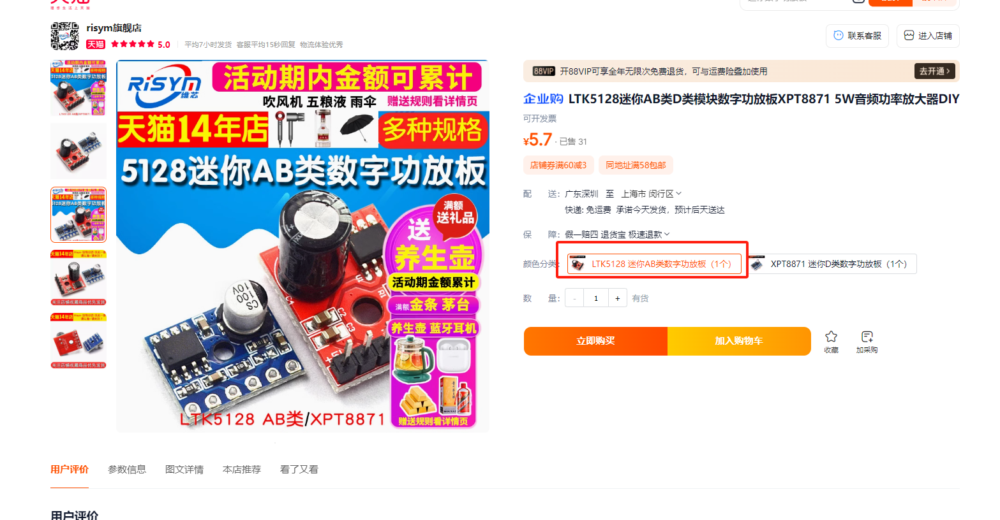

**型号选择参考：**

| 型号 | 配置 | AEC支持 | 适用场景 |
|------|------|---------|----------|
| CI-03T1 | 单麦不带晶振 | 不支持 | 基础语音识别 |
| CI-03T2 | 双麦不带晶振 | 支持（需AB类功放） | 需要降噪场景 |
| CI-03T3 | 单麦AEC带晶振 | 支持 | 推荐用于AEC应用 |
| CI-03T4 | 双麦带晶振 | 支持（需AB类功放） | 高性能降噪 |

**注意事项：**

- CI-03T2和CI-03T4（双麦版本）在使用外部AEC时，务必配合CLASS-AB类功放
- D类功放（如WM8960、MAX98357）与标准AEC电路不兼容，需要额外的信号处理电路
- 如果无法更换功放类型，建议使用单麦AEC方案（CI-03T3）
- AEC电路调试复杂，建议使用推荐配置以确保成功率

---


---

### CI-03T1模块质量问题处理流程

**问题描述：**

CI-03T1模块在生产过程中发现存在质量问题，部分产品被判定为次品需要退回，需要安排技术人员进行现场处理。

**解决方案：**

**应急响应流程：**

1. **问题上报与确认**

    - 立即停止使用该批次模块
    - 统计次品数量和不良现象
    - 保留问题样品供分析

2. **供应商安排**

    - 联系供应商团队安排技术人员
    - 确定现场处理时间
    - 准备必要的检测工具和备件

**现场处理步骤：**

1. **问题确认**

    - 现场验证不良现象
    - 记录详细的故障表现
    - 拍照存档作为分析依据

2. **初步分析**

    - 检查生产工艺环节
    - 排除操作不当因素
    - 确定质量问题的根本原因

3. **处理方案**

    - 对可修复的模块进行返工
    - 无法修复的模块进行更换
    - 提供临时备品保障生产

**质量改进措施：**

1. **工艺优化**

    - 调整SMT贴片参数
    - 优化回流焊温度曲线
    - 加强来料检验

2. **检验加强**

    - 增加功能测试覆盖率
    - 实施全检替代抽检
    - 建立质量追溯体系

**注意事项：**

- 发现批量质量问题应立即停用并上报
- 现场处理需要配合生产方质量部门
- 建议建立长期质量监控机制
- 保留完整的处理记录供后续改进参考

---


---

### CI-03T1单麦AEC导致循环响应怎么办？

**问题描述：**

在使用单麦克风（CI-03T1）芯片时，开启AEC打断功能后，设备会误识别自身回答中的语音指令，导致循环响应。

**解决方案：**

**问题分析：**

1. **AEC电路缺失**：

    - 单麦AEC需要完整的外围电路
    - 缺少SPK+到MIC2+的22K电阻
    - 导致AEC功能无法正常工作

2. **回复语触发问题**：

    - 回复语中包含命令词关键词
    - 如："increased the time"触发"Increase time"
    - 形成识别-播报-再识别的循环

**硬件修复方案：**

1. **补全AEC电路**：

    - 在SPK+和MIC2+之间添加22K电阻（R9）
    - 这是单麦AEC的必要元件
    - 不能省略或替换

    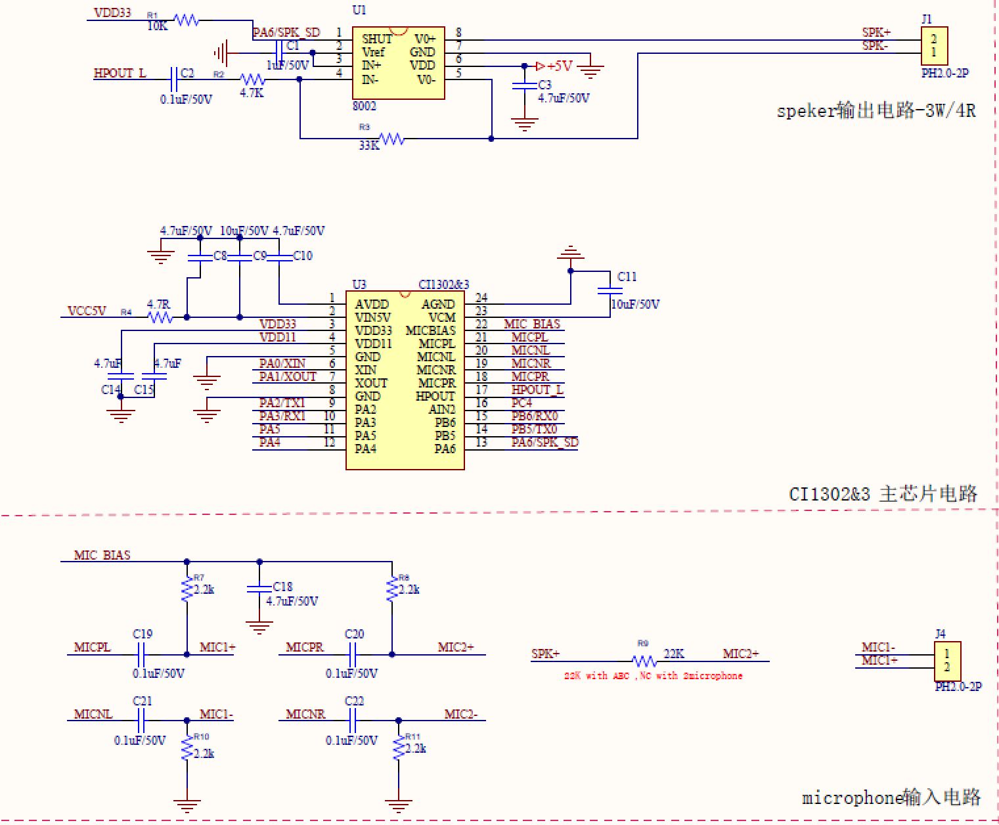

    *CI1302&3主芯片电路，R9为必需的AEC电阻*

2. **完整的麦克风2电路**：

    - 不仅需要R9电阻
    - 整个MIC2电路都需要保留
    - 包括耦合电容等元件

    

    *红色框标出R9电阻位置*

    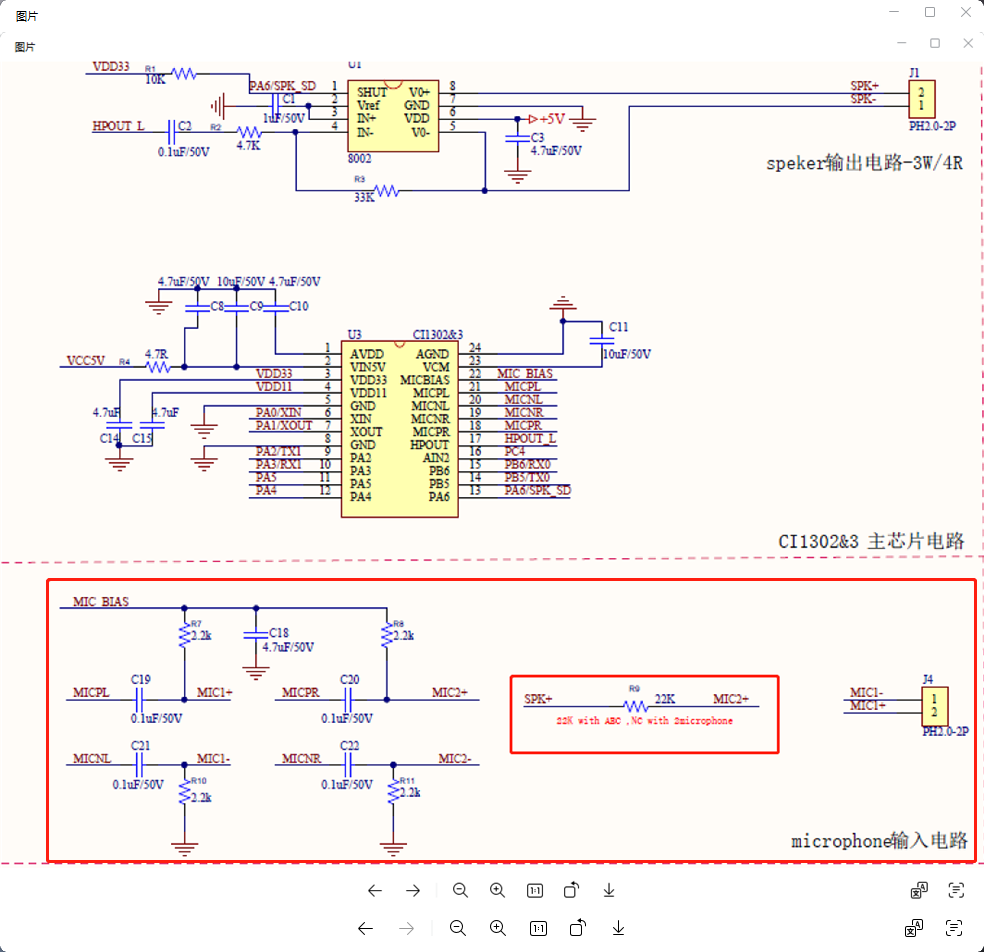

    *红色框标出完整的MIC2电路*

3. **配置确认**：

    - 确保固件已开启AEC功能
    - 选择单麦克风模式
    - 产品特性为"语音识别+AEC打断"

    

    *单MIC AEC配置界面*

**软件优化方案：**

1. **防误识别词配置**：

    - 添加回复语中容易出现的关键词
    - 如："increased"、"time"、"volume"等
    - 减少误触发概率

2. **回复语优化**：

    - 避免使用与命令词相同的词汇
    - 使用更独特的表达方式
    - 如："时间已增加"而非"increased the time"

3. **识别间隔控制**：

    - 设置播报保护时间
    - 播报期间暂停识别
    - 避免循环触发

**调试步骤：**

1. **硬件检查**：

    - 确认R9电阻已正确焊接
    - 测试SPK+到MIC2+的连通性
    - 验证阻值是否为22K

2. **功能验证**：

    - 测试AEC打断功能是否正常
    - 验证播放时不会被误识别
    - 确认语音识别灵敏度

3. **长期测试**：

    - 进行多轮对话测试
    - 验证不会出现循环响应
    - 确保系统稳定性

**注意事项：**

- 单麦AEC必须保留完整的MIC2电路
- R9电阻是AEC功能的关键，不能省略
- AEC仅适用于CLASS-AB类功放
- 如仍有问题，检查整个电路连接
- 预烧录的芯片已烧录出厂固件，支持串口烧录

---


---

### CI-03T模块支持的最小喇叭阻抗和功率是多少？

**问题描述：**

需要了解CI-03T1和CI-03T2芯片支持的喇叭最小阻抗，以及不同阻抗下的功率输出情况。

**解决方案：**

**喇叭阻抗与功率对应关系：**

- **4Ω喇叭**：2.4W起，推荐范围2.4W-3W
- **8Ω喇叭**：1.6W起，推荐范围1.6W-2W

**详细说明：**

- 4Ω喇叭能提供更大音量，但功放负担较重
- 8Ω喇叭对模块功放负担更小，工作更稳定
- 尽量不要使用超过模块驱动能力的喇叭

**注意事项：**

- 模块功放存在功率限制，过大的喇叭可能导致驱动不足
- 长期使用大功率喇叭可能影响模块寿命
- 建议在推荐功率范围内选择喇叭规格
    - 分时复用单个ADC通道

3. **多模块方案**：

    - 使用多个SU-32T模块分别采集
    - 通过串口通信汇总数据

**硬件连接示例（以PCF8591为例）：**

```
模拟信号1 → PCF8591 AIN0
模拟信号2 → PCF8591 AIN1
模拟信号3 → PCF8591 AIN2
模拟信号4 → PCF8591 AIN3
            PCF8591 SDA → SU-32T SDA
            PCF8591 SCL → SU-32T SCL
            PCF8591 VCC → 5V
            PCF8591 GND → GND
```

**注意事项：**

- 外部ADC芯片需要额外的软件驱动
- 模拟开关方案会降低采样率
- 选择方案时需考虑精度和实时性要求
- 多路模拟输入会增加系统复杂度

---


---

### CI-03T1控制SG90舵机无反应或响应异常怎么办？

**问题描述：**

使用CI-03T1芯片通过PWM控制9G舵机(SG90)时，舵机无法响应或转动角度异常，尽管PWM信号已正确输出，配置参数看似正确。

**解决方案：**

**1. PWM配置检查**：

- 确认GPIO引脚配置为原生PWM输出（非GPIO模拟）
- PWM频率必须设置为50Hz（周期20ms）
- 使用平台的原生PWM功能，不要用GPIO模拟PWM

**2. 信号连续性要求**：

- 舵机需要持续的PWM信号才能保持位置
- 短脉冲（<1秒）舵机来不及响应
- 建议发送信号后保持500ms以上

**3. 占空比设置**：

- 0.5ms脉宽（占空比2.5%）：0度位置
- 1.5ms脉宽（占空比7.5%）：90度位置
- 2.5ms脉宽（占空比12.5%）：180度位置
- 通过"设置占空比"动作精确控制

**4. 硬件检查**：

- 舵机供电电压是否稳定（建议5V独立供电）
- 检查舵机信号线连接是否正确
- 使用示波器测量PWM波形是否正常

**5. 常见问题排除**：

- 电压过低：PWM输出只有2.4V可能无法驱动舵机
- 供电不足：避免与语音芯片共用电源
- 硬件故障：更换已知良好的舵机测试

**注意事项：**

- 舵机控制需要分别设置角度和回正命令
- 避免使用GPIO模仿PWM，精度和稳定性不足
- 如需驱动多个舵机，建议使用CI-73T模块（IO口更多）
- 确认舵机型号规格，不同型号脉宽范围可能有差异


---


---

### CI-03T1模块烧录时线缆连接错误会导致什么问题？

**问题描述：**

怀疑CI-03T1模块的线缆连接错误导致设备无法正常工作，需要确认接线是否正确。

**解决方案：**

**接线检查步骤：**

1. **确认测试环境**：

    - 台式电脑的测试环境由厂家预装，一般不会有接线错误
    - 笔记本电脑测试正常，说明模块本身功能完好
    - 重点检查台式电脑测试环境的连接

2. **对比测试方法**：

    - 使用相同的模块在台式机和笔记本分别测试
    - 对比两种环境的连接方式差异
    - 确认是否存在线缆接反或接触不良

3. **关键连接点检查**：

    - 电源线：确认5V供电正负极正确
    - 信号线：检查TX/RX是否交叉连接
    - 地线：确保GND可靠连接

**可能的问题：**

- 烧录线缆内部断路或接触不良
- USB转串口驱动版本不兼容
- 台式机USB接口供电不足

**解决建议：**

- 使用笔记本的烧录线缆在台式机上测试
- 更换台式机的USB接口
- 重新安装USB转串口驱动

**注意事项：**

- 厂家预装的测试环境通常经过验证
- 如果笔记本测试正常，模块硬件应该没问题
- 保留故障时的接线照片便于分析

---


---

### CI-03T1模块烧录工具线缆长度要求

**问题描述：**

进行固件烧录时，希望延长烧录工具的线缆长度以方便操作，询问是否可以定制更长的线缆。

**解决方案：**

**线缆长度限制：**

1. **标准长度设计**：

    - 烧录工具的线缆长度经过优化设计
    - 标准长度能够保证信号完整性
    - 过长的线缆可能导致信号衰减

2. **替代方案**：

    - 将烧录主机搬到桌面上操作
    - 使用USB延长线增加灵活性
    - 调整工作台布局便于操作

**操作建议：**

- 烧录时将烧录工具放在顺手位置
- 不用时拔掉烧录工具，避免占用空间
- 可以准备多个烧录工具在不同位置使用

**定制考虑：**

- 定制长线缆需要评估信号质量
- 可能需要增加信号放大或中继
- 成本较高，不建议小批量使用

**注意事项：**

- 线缆过长可能导致烧录不稳定
- 标准线缆已经过充分测试
- 建议优化操作流程而非修改硬件

---


---

### CI-03T1模块烧毁的可能原因分析

**问题描述：**

CI-03T1模块在使用过程中出现烧毁现象，需要分析可能的烧毁原因。

**解决方案：**

**烧毁原因分析：**

1. **电源问题**：

    - 供电电压过高（超过5.5V）
    - 电源极性反接
    - 电源纹波过大或不稳定

2. **外部设备影响**：

    - 连接的外部设备短路
    - 外部设备电流过大
    - 瞬间高压脉冲

3. **使用环境**：

    - 静电击穿
    - 工作环境温度过高
    - 湿度过大导致漏电

**预防措施：**

1. **电源保护**：

    - 使用稳压电源供电
    - 加装过压保护电路
    - 确认电源正负极

2. **外部设备管理**：

    - 仔细检查外部设备规格
    - 避免连接不明的设备
    - 使用隔离电路保护

3. **操作规范**：

    - 佩戴防静电手环
    - 在额定环境温度下使用
    - 避免带电插拔连接

**故障排查：**

- 记录烧毁时的使用场景
- 检查电源输出是否异常
- 测试外部设备是否正常

**注意事项：**

- 模块正常工作电压为3.6V-5.5V
- 烧毁通常发生在电源或外部设备异常时
- 建议保留故障样品用于分析

---

### CI-03T内部AEC与外部AEC应用

**问题描述：**

在外部播放语音时需要通过CI-03T实现唤醒打断功能，应使用内部AEC还是外部AEC。

**解决方案：**

**应用场景区分：**

1. **内部AEC适用场景**：

    - 模块自身播放语音时需要打断
    - 使用内置功放驱动喇叭
    - 单麦克风配合内部AEC算法

2. **外部AEC适用场景**：

    - 需要处理外部音频源的打断
    - 使用外部功放播放音频
    - 需要额外的外部AEC电路支持

**选择建议：**

先使用内部AEC功能，如果内部AEC无法满足需求时，再考虑外部AEC方案。

**技术差异对比：**

- **内部AEC**：集成度高，使用简单
- **外部AEC**：灵活度高，但实现复杂

**实现步骤：**

1. **启用内部AEC**：

    - 在平台配置中选择单麦克风模式
    - 开启AEC功能
    - 使用内部功放和喇叭

2. **外部AEC实现**（如需要）：

    - 需要设计外部AEC电路
    - 使用CI-03T2或CI-03T4（双麦克风版本）
    - 配合CLASS-AB类功放

**注意事项：**

- 外部AEC电路设计复杂，建议在专业指导下进行
- 单麦克风版本（CI-03T1/3）更适合使用内部AEC
- 外部AEC功能会略微增加功耗

---


---

### CI-03T1模块插座松动需要点胶固定怎么办？

**问题描述：**

CI-03T1语音板在出厂和产线安装过程中，多个插座（特别是麦克风插座）存在松动问题，导致需要进行点胶固定。

**问题分析：**

- 语音板上存在3个容易松动的插座
- 麦克风插座松动会严重影响语音接收效果
- 产线安装时可能出现接触不良

**解决方案：**

**1. 点胶固定方案**

    - 使用防松动胶水固定插座
    - 对三个插座统一进行点胶处理
    - 确保点胶后完全固化

2. **操作步骤**：

    - 使用质量良好的防松动胶水
    - 在插座周围均匀涂胶
    - 等待胶水完全固化

3. **质量验证**：

    - 点胶后进行拉力测试
    - 确认插座不再松动
    - 测试麦克风连接是否正常

**4. **预防措施**：

    - 结构改进建议：

        - 增加插座固定结构设计
        - 使用更可靠的连接器（如板对板连接器）
        - 预留机械固定点

    - 工艺控制建议：

        - 点胶量控制在适当范围
        - 避免胶水溢出影响电路
        - 控制点胶环境和固化时间

**注意事项：**

- 点胶后需要充分固化才能使用
- 选择与PCB材质相容的胶水
- 点胶过程避免污染麦克风和喇叭开孔
- 如问题持续，建议联系供应商获取针对性建议

---


---

### CI-03T/CI-03T1/CI-03T2模块如何使用18650电池供电？

**问题描述：**

需要了解CI-03T系列模块是否可以直接使用18650电池供电，是否需要升压电路，以及正确的电源连接方式。

**解决方案：**

**供电方案说明：**

1. **可直接使用18650电池供电**：

    - 18650电池电压范围为3.0V-4.2V
    - CI-03T系列模块支持电压范围：3.6V-5.5V
    - 当电池电压高于3.6V时，可直接供电无需升压

2. **电压匹配情况**：

    - 满电状态（4.2V）：完全满足模块需求
    - 正常工作电压（3.7V-4.0V）：在模块工作范围内
    - 低电预警（3.6V）：达到模块最低工作电压

**连接方式：**

1. **直接并联连接**：

    ```
    18650电池正极 → 模块VCC引脚
    18650电池负极 → 模块GND引脚
    ```

2. **注意事项**：

    - 确保正负极连接正确，避免反接损坏模块
    - 建议在电源线上添加开关控制通断
    - 可考虑添加保险丝防止短路

3. **无需升压电路的原因**：

    - 18650电池标称电压3.7V，与模块典型工作电压5V接近
    - 模块内部有LDO稳压电路，可将输入电压稳定到内部所需电压
    - 简化电路设计，降低成本和功耗

**电池容量建议：**

- **标准容量**：2000mAh-2600mAh的18650电池
- **使用时间**：根据工作电流不同，可连续使用数小时到数十小时
- **续航优化**：可考虑使用两节电池并联以延长续航时间

**应用场景：**

- 便携式语音设备
- 电池供电的智能家电
- 无需外接电源的独立控制系统
- 应急语音控制设备

**注意事项：**

- 电池电压低于3.6V时，模块可能工作不稳定
- 建议添加低电量检测和提示功能
- 长期不使用时建议断开电池连接
- 电池充电时建议断开与模块的连接

---

### CI-03T模块如何选择咪头以实现远距离语音识别？

**问题描述：**

需要为CI-03T模块选择合适的咪头以实现更远距离的语音识别，了解咪头选型要求和电路连接方式。

**解决方案：**

**1. 咪头选型要求**

**基本参数要求**：

- **灵敏度**：-32dB ~ -25dB（推荐-32dB）
- **信噪比**：≥70dB（推荐75dB以上）
- **类型**：驻极体电容麦（ECM）
- **指向性**：全指向型（适合远场识别）

**远距离识别特殊要求**：

- **高灵敏度**：选择-32dB或更高灵敏度的咪头
- **低噪声**：高信噪比可减少环境噪声干扰
- **稳定性**：参数一致性好的产品，保证批量稳定性

**2. 推荐咪头型号**

**机芯智能推荐型号**：

- **型号**：JMO-627B-273C-104P+
- **类型**：插针式驻极体咪头
- **灵敏度**：-32dB
- **信噪比**：>75dB
- **封装**：带插针，便于直接连接

**其他可选规格**：

| 应用场景 | 灵敏度推荐 | 信噪比要求 | 封装类型 |
|---------|-------------|------------|----------|
| 一般距离 | -32dB ~ -28dB | ≥70dB | 插针/贴片 |
| 远距离 | -32dB ~ -25dB | ≥75dB | 插针式 |
| 超远距 | -25dB以上 | ≥75dB | 外置放大版 |

**3. 电路连接方式**

**直接连接方法**：

- **连接引脚**：咪头直接连接到模块的M1+和M1-引脚
- **无需外加电路**：模块自带麦克风电路，可直接驱动
- **注意极性**：必须按照正确正负极连接

**接线要点**：

```
咪头正极 → M1+（MIC+）
咪头负极 → M1-（MIC-）
外壳地线 → GND（如有）
```

**4. 设计注意事项**

**布局优化**：

- 咪头远离噪声源（电源、电机等）
- 使用短连接线，减少干扰
- 咪头周围保持开放空间，避免密闭

**电源考虑**：

- 确保供电稳定，纹波<100mV
- 模块自带麦克风偏置电路，无需额外供电
- 注意咪头工作电流（0.1mA-0.5mA）

**5. 测试验证**

**距离测试**：

1. **基准测试**：

    - 使用推荐咪头测试识别距离
    - 记录最大可识别距离
    - 作为优化基准

2. **对比测试**：

    - 测试不同灵敏度咪头的识别距离
    - 统计识别成功率
    - 选择效果最佳的型号

3. **环境测试**：

    - 在安静环境下测试远距离识别
    - 在有噪声环境下测试抗干扰能力
    - 验证实际使用场景效果

**6. 采购建议**

**样品获取**：

- 可联系原厂获取推荐型号样品
- 提供具体应用场景需求
- 要求提供规格书确认参数

**批量采购**：

- 确认供应商提供的参数一致性
- 要求提供测试报告
- 建立入厂检验标准

**注意事项**：

- 咪头选型对识别效果影响极大，建议优先使用推荐型号
- 距离越远，环境噪声影响越大，需要平衡灵敏度和抗噪能力
- 不同批次的咪头参数可能有差异，需要抽检验证
- 如需更远距离识别，可考虑外接放大电路的专用咪头

---


---

### CI-03T的B5/B64引脚用作GPIO后是否还能烧录？供电电压范围是多少？

**问题描述：**

将CI-03T的B5和B64引脚配置为GPIO信号输出使用，担心是否会影响烧录功能，以及询问模块是否能承受4节干电池（约6V）的供电电压。

**解决方案：**

**1. GPIO配置与烧录功能**

- **可以继续烧录**：B5和B64配置为GPIO模式后，仍具有烧录程序的功能
- **功能保留**：烧录功能是独立的基础功能，不受GPIO配置影响
- **限制说明**：仅无法查看程序运行时的日志信息

- **原因分析**：

    - 烧录功能在底层引导程序中实现
    - GPIO配置是应用程序的功能
    - 两者互不干扰

**2. 供电电压范围**

- **额定电压范围**：3.6V - 5.5V DC
- **推荐工作电压**：4.6V - 5V（保证稳定工作）
- **最大承受电压**：不超过5.5V

- **6V供电风险**：

    - 超过最大承受电压
    - 可能永久损坏模块
    - 不在保修范围内

**3. 高电压降压方案**

如必须使用6V电池供电，建议以下降压方案：

- **二极管串联降压**：

    - 使用1N4007整流二极管串联
    - 每个二极管压降约0.7V
    - 6V - 0.7V - 0.7V = 4.6V（安全范围）

- **LDO稳压器方案**：

    - 使用低压差线性稳压器（LDO）
    - 如：AMS1117-3.3（输出3.3V，需配合升压）
    - 更推荐使用5V LDO如：RT9013-5.0

- **DC-DC转换器**：

    - 使用小型降压模块
    - 输入6V，输出可调5V
    - 效率高，带负载能力强

**4. 干电池供电注意事项**

- **电压变化**：从6V（满电）逐渐降至4.2V（欠压）
- **电流需求**：工作时需要500mA以上电流
- **容量考虑**：根据续航时间选择合适容量

**注意事项：**

- 配置为GPIO后不影响烧录功能，可正常使用
- 供电电压务必保持在5.5V以内
- 过压保护：建议在电路中加入过压保护电路
- 长期在6V下工作会严重缩短模块寿命
- 电压不稳定时建议增加滤波电容（100μF以上）

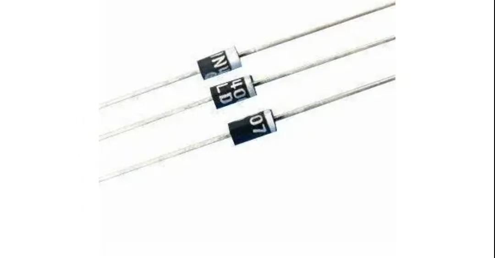

---

### CI-03T模块使用无线线圈供电时电压不稳定怎么办？

**问题描述：**

使用无线线圈为CI-03T模块供电，当控制灯亮起时线圈供电电压被拉低到4V左右，导致语音识别效果降低。

**解决方案：**

**1. 问题分析**

- **供电能力不足**：无线线圈供电时，负载增大导致电压跌落
- **电压偏低**：4V接近CI-03T工作电压下限（3.6V）
- **识别影响**：电压不足会造成识别灵敏度下降

**2. 供电参数要求**

根据CI-03T规格：

- **工作电压范围**：3.6-5.5V
- **推荐工作电压**：4.6-5.5V（保证稳定工作）
- **最低工作电压**：3.6V（极限值，不建议长期使用）
- **工作电流**：＞500mA（4Ω喇叭时）


**3. 解决方案**

**方案一：独立供电（推荐）**

- 为语音模块单独供电，不与灯光共用线圈供电
- 使用独立的5V电源适配器
- 或单独的电池供电方案

**方案二：电源优化**

1. **增加储能电容**：

    - 在模块电源端并联大容量电容
    - 推荐470μF-1000μF电解电容
    - 应对负载瞬变，稳定电压

2. **使用稳压电路**：

    - 增加DC-DC稳压模块
    - 输入：线圈供电（4-5V）
    - 输出：稳定5V给语音模块

**方案三：降低功耗**

1. **优化喇叭配置**：

    - 使用高阻抗喇叭（8Ω替代4Ω）
    - 降低播放音量以减少功耗
    - 或使用更高效的功放方案

2. **关闭非必要功能**：

    - 关闭LED指示灯等耗电功能
    - 优化固件配置减少待机功耗
    - 使用深度休眠模式

**方案四：线圈供电优化**

1. **增强线圈供电能力**：

    - 增加线圈功率或匝数
    - 优化线圈与控制电路匹配
    - 减少传输损耗

2. **分段供电控制**：

    - 灯光和语音模块分开控制
    - 语音工作时暂停灯光
    - 避免同时大电流加载

**4. 实施建议**

**测试步骤**：

1. **电压监测**：

    - 使用示波器监测电压波动
    - 记录灯光开启时的电压跌落
    - 确认最低电压值

2. **效果验证**：

    - 测试不同电压下的识别距离
    - 对比4V与5V下的识别率
    - 验证解决方案效果

3. **长期稳定性**：

    - 连续测试验证稳定性
    - 监测电压随时间的变化
    - 确保方案长期有效

**设计建议**：

- 如使用无线供电，建议预留足够功率余量（建议2倍以上）
- 考虑增加电压监测电路，实时了解供电状态
- 产品设计时将语音识别的供电稳定性作为关键指标

**注意事项：**

- 电压低于4.0V时，识别效果会明显下降
- 长期在低电压下工作可能影响模块寿命
- 独立供电是解决此类问题的最有效方法
- 电源设计需要考虑峰值电流需求，而非仅看平均电流

---

### 如何使用CH340实现CI-03T1/T2独立供电？

**问题描述：**

需要为CI-03T1/T2模块实现独立供电，以确保模块稳定工作。

**解决方案：**

**CH340独立供电方法：**

1. **所需材料**：

    - CH340模块（用于供电）
    - USB数据线或5V电源适配器
    - 杜邦线若干

2. **供电连接**：

    - CH340的5V引脚 → CI-03T的VCC
    - CH340的GND引脚 → CI-03T的GND
    - 仅连接电源线，不连接串口线

3. **独立供电优势**：

    - 避免主控电源波动影响
    - 提供稳定的5V电压
    - 减少噪声干扰

**实施步骤：**

1. **准备CH340模块**：

    - 使用USB连接CH340到电脑或电源适配器
    - 测量输出电压确保为5V
    - 确认GND良好接地

2. **连接电源线**：

    - 红线：CH340 5V → 模块VCC
    - 黑线：CH340 GND → 模块GND
    - 使用足够线径的导线承载电流

3. **测试验证**：

    - 上电后测量模块电压
    - 检查工作电流是否正常
    - 验证语音功能正常

**注意事项：**

- CH340的USB供电足以满足模块需求
- 如需更高稳定性，可使用专用5V电源适配器
- 独立供电时注意共地连接
- 避免电源反接，防止损坏模块

---


---

### CI-03T1模块指示灯不亮且无法供电怎么办？

**问题描述：**

CI-03T1模块连接后指示灯不亮，模块无法正常工作，检查发现VCC引脚未正确连接到5V电源。

**解决方案：**

**1. 问题排查**

- 检查USB转TTL模块的5V输出是否正常
- 确认模块的VCC引脚是否已连接到5V电源
- 验证GND地线是否已正确连接

**2. 正确接线方法**

```
USB转TTL模块    CI-03T1模块
        5V      →        VCC
        GND     →        GND
        TXD     →        B7(RX)
        RXD     →        B6(TX)
```

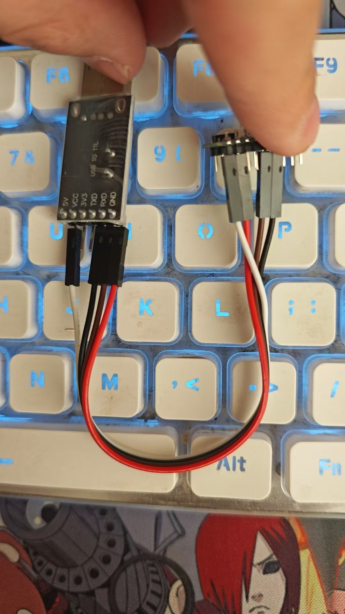

*VCC引脚未连接到5V，导致模块无供电*

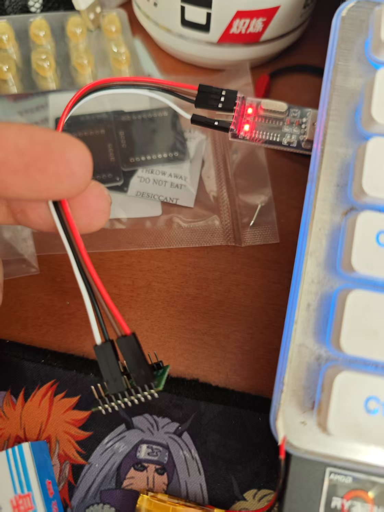

*USB转TTL模块指示灯亮起，但语音模块未供电*

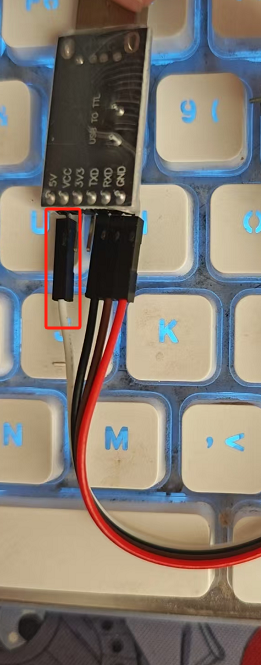

*VCC引脚应连接到5V电源（图中红色标记处）*

**3. 验证步骤**

1. **检查USB转TTL模块**：

    - 确认5V引脚输出正常
    - 使用万用表测量5V和GND之间电压

2. **验证连接**：

    - 检查杜邦线是否完好
    - 确认连接牢固，无接触不良

3. **测试模块**：

    - 正确连接后模块指示灯应亮起
    - 模块应能正常响应命令

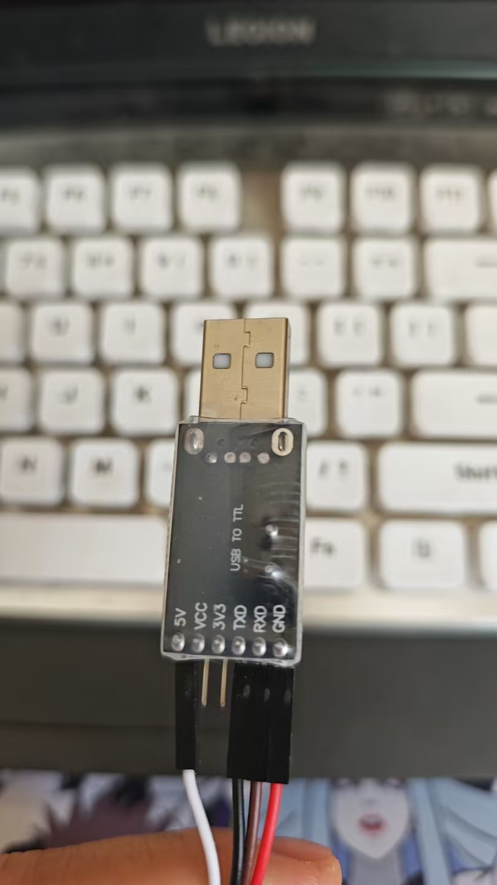

*确认5V电源输出位置*

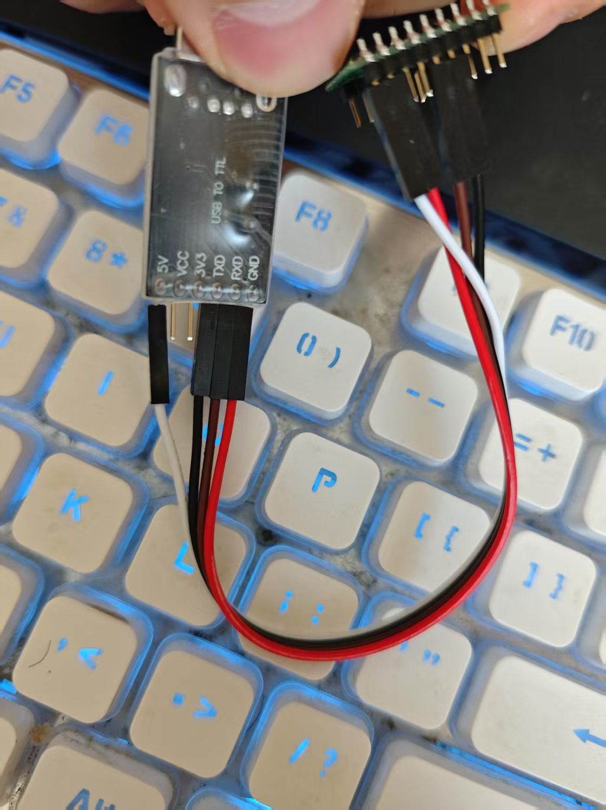

*VCC正确连接到5V后的接线状态*

**注意事项：**

- CI-03T1模块工作电压范围：3.6V-5.5V
- 必须确保VCC引脚连接到稳定的5V电源
- GND地线必须连接，否则模块无法正常工作
- 接线时要仔细核对引脚定义，避免接反

---


---

### CI-03T1芯片硬件原理图评审要点

**问题描述：**

基于CI-03T1芯片设计硬件原理图，需要确认设计是否正确，特别是麦克风电路、功放选型和电源设计。

**解决方案：**

**麦克风电路设计：**

1. **参考官方设计**

    - 向供应商索取CI-03T1官方原理图
    - 严格按照官方麦克风电路设计
    - 不要随意改动麦克风匹配电路

2. **麦克风接口**

    - 串口通信默认3.3V电平，不需要加上拉电阻
    - 麦克风输入电路要保持差分走线
    - 注意麦克风供电和信号的完整性

**功放电路设计：**

1. **功放选型**

    - CI-03T1内置2.4W功放，可直接驱动4Ω/8Ω喇叭
    - 也可外接功放芯片，如需更大功率
    - 功放使能脚通常为低电平使能

2. **电源供电**

    - POWER网络应为5V供电
    - 使用独立LDO供电，增加RC滤波
    - 确保电源纹波控制在合理范围

**晶振电路优化：**

1. **负载电容匹配**

    - 根据实际晶振规格匹配负载电容
    - 12PF负载电容的晶振需配相应电容
    - 也可空贴负载电容，影响不大

2. **滤波电容处理**

    - 麦克风输入端的滤波电容（如C3）需要焊接
    - 与电阻组成低通滤波器，改善信号质量
    - 不需要的消振电阻可以删除

**设计验证流程：**

1. **获取参考设计**

    - 联系供应商获取SU-03T-V2.1电气原理图
    - 对比官方设计和自设计的差异
    - 重点检查音频电路部分

2. **测试验证**

    - 先制作样品进行功能测试
    - 验证语音识别和播报功能
    - 根据测试结果优化设计

**注意事项：**

- 原理图设计需要充分考虑音频性能
- 电源质量对识别效果影响极大
- 建议使用推荐的元器件规格
- 保留调试接口方便后续问题排查

---
- 如使用电池供电，注意电池容量和放电能力

---


---

### CI-03T1芯片GPIO电平翻转时间不准确怎么办？

**问题描述：**

配置GPIO_A26在播音开始前进行1ms电平翻转，但在唤醒时该电平翻转的实际持续时间约为8-10ms，与配置不符，而播音结束后电平翻转时间正常（1ms）。

**问题分析：**

1. **现象差异**：

    - 唤醒时：播音前GPIO高电平持续8-10ms
    - 语音控制时：播音前GPIO高电平持续1.8ms
    - 自己退出时：播音前GPIO高电平持续1ms左右

2. **根本原因**：

    - 芯片上电瞬间所有IO口会出现短暂的高电平
    - 这是芯片初始化过程中的固有现象，无法通过固件配置消除
    - 播音结束后的电平翻转正常，说明配置本身没有问题

**解决方案：**

1. **软件过滤处理（推荐）**

    - 在接收端（MCU）增加软件滤波算法
    - 检测到高电平后，延时10-15ms再开始采集
    - 忽略上电初期的无效电平变化

2. **硬件滤波电路**

    - 在GPIO_A26输出端增加RC低通滤波
    - 合理选择R和C值，滤除短暂脉冲
    - 注意不要影响正常的1ms脉冲信号

3. **时序调整建议**

    - 将播音前的电平翻转配置改为更长延时
    - 如系统允许，可配置为10-15ms
    - 与芯片初始化时间错开，避免冲突

4. **使用其他GPIO端口**

    - 尝试使用其他GPIO引脚进行控制
    - 不同引脚的初始化时序可能有差异
    - 需要在平台重新配置并生成固件

**实施步骤：**

1. **确认当前配置**
    - 检查GPIO_A26的配置是否为1ms电平翻转
    - 确认播音开始和播音结束的设置一致

2. **测试验证**
    - 使用示波器测量实际波形
    - 分别测试唤醒、语音控制、退出等场景
    - 记录不同场景下的实际时间

3. **调整优化**
    - 根据测试结果选择最适合的方案
    - 如采用软件滤波，需要修改MCU程序
    - 如更换GPIO，需要重新生成固件

**注意事项：**

- 芯片上电初期的IO高电平是硬件特性，无法完全避免
- 软件滤波是最灵活的解决方案，不增加硬件成本
- 量产前需要充分测试各种场景下的时序一致性
- 如对时序要求极高，可联系供应商评估定制方案


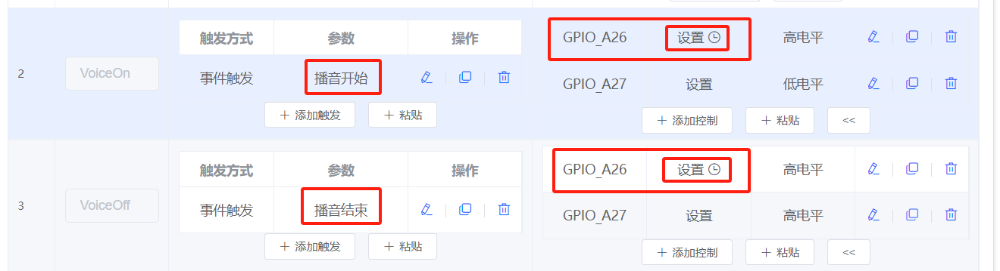

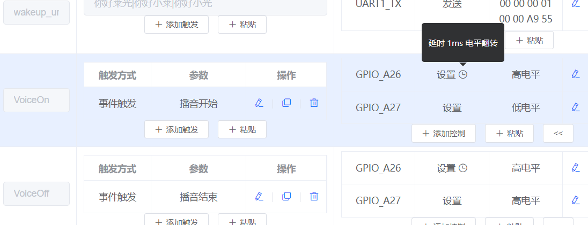

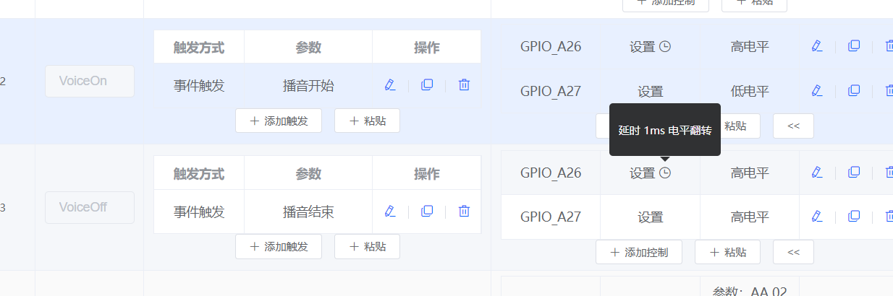

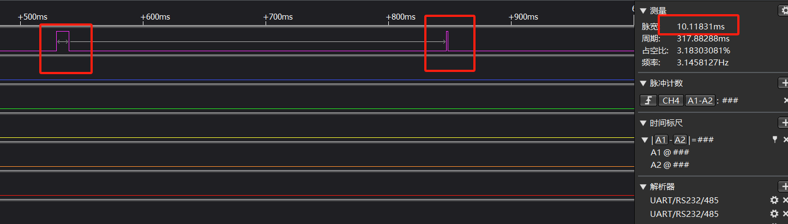

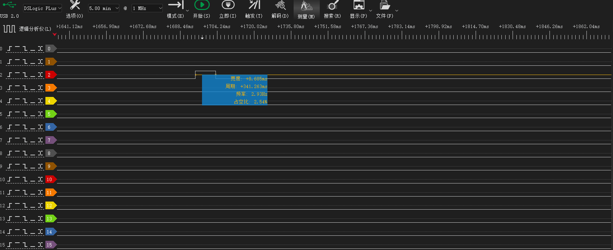

---


---

### CI-03T1音频输出电流声和音量小怎么办？

**问题描述：**

使用CI-03T1芯片开发板时，遇到音频输出有电流声和音量偏小的问题，尝试移除HPOUT脚电容后电流声消失，但音量仍较小。

**解决方案：**

**电流声处理：**

1. **HPOUT电容处理**：

    - 移除HPOUT脚的电容可消除电流声
    - 该电容可能引入了额外的噪声
    - 移除后不影响基本音频功能

2. **电源纹波检查**：

    - 检查电源的纹波情况
    - 使用示波器测量电源质量
    - 必要时在电源端加滤波电容

**音量偏小处理：**

1. **功放电路检查**：

    - 确认功放电路连接正确
    - 检查功放供电电压
    - 验证音频信号通路

2. **音量配置检查**：

    - 确认固件中音量参数设置
    - 检查功放电路配置
    - 验证音频输出通路

3. **硬件检查**：

    - 确认扬声器连接正常
    - 检查功放供电电压
    - 测试音频输出线路

**设计改进建议：**

1. **PCB优化**：

    - 检查音频走线是否合理
    - 确保模拟地和数字地正确处理
    - 避免数字信号干扰音频

2. **滤波处理**：

    - 在电源输入端增加电解电容
    - 建议使用470μF以上电容
    - 多级滤波降低纹波

**注意事项：**

- HPOUT电容的取舍需根据实际噪声情况决定
- 电源质量对音频输出影响很大
- 建议保留原理图和PCB文件供供应商分析
- 如问题持续，可寄回样品详细检测

---


---

### CI-03T1芯片模块电容规格咨询

**问题描述：**

询问其CI-03T1芯片模块上被红圈标记的电容的具体规格，因该电容已丢失，需要了解元件参数以便进行更换。

**解决方案：**

**电容规格确认：**

**1. 元件识别**

    - 根据红圈标记位置确认元件类型
    - 该电容为HPOUT音频输出滤波电容
    - 主要用于音频输出信号耦合
    - 影响音频输出的音质和稳定性


*CI-03T1模块实物图，红圈标记的位置为HPOUT音频输出滤波电容*

**2. 推荐规格参数**

    - **容值**：10μF（微法）
    - **耐压**：16V或25V
    - **封装**：0603或0805贴片封装
    - **类型**：X5R或X7R介质
    - **精度**：±10%或±20%

**3. 替换方案**

    - 使用相同规格电容直接替换
    - 如无相同规格，可选用相近容值
    - 确保耐压值不低于原规格
    - 注意封装尺寸匹配PCB焊盘

**更换操作指导：**

**1. 焊接准备**

    - 使用恒温焊台（温度控制在350°C以下）
    - 准备细头烙铁和镊子
    - 使用助焊膏提高焊接质量
    - 做好防静电措施

**2. 焊接步骤**

    - 清洁焊盘区域
    - 涂抹适量助焊膏
    - 使用镊子放置新电容
    - 先焊接一端再焊接另一端
    - 检查焊接质量和极性

**3. 功能验证**

    - 更换后测试音频输出功能
    - 检查是否有杂音或失真
    - 验证音量是否正常
    - 测试不同频率的响应

**选型建议：**

**1. 品牌推荐**

    - **村田制作所(Murata)**：质量稳定
    - **三星(Samsung)**：性价比高
    - **国巨**：国产优质选择
    - **风华高科**：专业音频电容

**2. 订货信息**

    - 完整型号：GRM188R60J106KE15D（村田10μF 16V）
    - 封装标识：0603
    - 包装形式：编带或托盘
    - 最小订购量：按供应商要求

**测试验证：**

**1. 电气测试**

    - 使用万用表确认电容值
    - 检查是否有短路或开路
    - 验证绝缘电阻
    - 测试耐压性能

**2. 功能测试**

    - 连接音频负载测试
    - 播放不同频率音频
    - 检查失真度和信噪比
    - 验证长期工作稳定性

**故障排除：**

**电容损坏症状**

    - 音频输出无声音
    - 声音变小或失真
    - 出现明显杂音
    - 频率响应异常

**应急处理：**

    - 如暂时无法获得相同规格电容
    - 可先不焊接该电容测试基本功能
    - 确认不影响其他功能
    - 尽快采购合适元件更换

**注意事项：**

- 电容极性：如有极性需严格按方向焊接
- 焊接温度：避免高温损坏电容或PCB
- 静电防护：贴片电容对静电敏感
- 备份记录：拍照记录元件位置和规格
- 专业协助：如无焊接经验建议寻求专业帮助

**供应商**

- 提供详细的电路原理图
- 协助确认元件具体规格
- 提供焊接操作指导
- 推荐可靠的元件供应商

---


---

### CI-03T1模块如何连接电池、太阳能板和充电接口？

**问题描述：**

需要将CI-03T1模块与电池、太阳能板和充电接口进行接线，但不清楚具体的连接方法，以及模块是否支持充电功能。

**解决方案：**

**基本接线方法：**

1. **模块基础接线**：

    - 咪头接在MI+/-接口
    - 喇叭接在SPK+/-接口
    - VCC接5V电源
    - GND接地

2. **电池连接**：

    - 电池红线（正极）接模块VCC
    - 电池黑线（负极）接模块GND
    - 确保电池电压在模块工作范围内（3.6-5.5V）

3. **太阳能板连接**：

    - 太阳能板应连接到充电电路，而不是直接连接到CI-03T1模块
    - 太阳能板给电池充电，电池再给模块供电
    - 需要中间增加充电管理电路

**充电功能说明：**

1. **CI-03T1模块本身**：

    - 不支持充电功能，是语音模块而非充电模块
    - USB接口只是5V供电口，用于数据线供电时使用
    - 电池供电时用不上这个USB接口

2. **充电方案**：

    - 需要额外搭建充电电路
    - 太阳能板→充电电路→电池→升压电路（如需要）→CI-03T1模块
    - 可在淘宝购买专门的充电模块

**系统架构建议：**

```
太阳能板 → 充电模块 → 电池 → 升压模块(5V) → CI-03T1模块
                                        └─→ 喇叭
```

**注意事项：**

- 太阳能板输出电流通常较小，主要用于充电补充
- CI-03T1模块工作电流较大，建议电池容量充足
- 如需充电功能，需要采购专门的充电管理模块
- 整体供电系统需要自行设计，模块厂家不提供充电方案

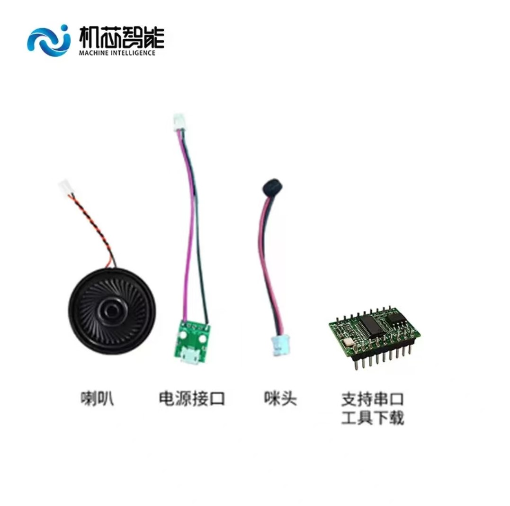

*CI-03T1模块的接口分布：喇叭接口、电源接口、咪头接口和USB供电口*

---


---

### CI-03T模块如何判断正确安装方向？

**问题描述：**

在将CI-03T模块安装到开发板时，需要确认模块的正确安装方向，避免因插反导致设备无法正常工作。

**解决方案：**

**识别模块方向的方法：**

1. **丝印标识识别**：

    - 查看模块表面的丝印信息
    - "CI-03T"或"SU-03T"字样应为正方向
    - 引脚标识（如第1脚位置）应与开发板对应

2. **引脚标识对照**：

    - 模组上的引脚1通常有特殊标记（圆点或凹槽）
    - 开发板上也有对应的引脚1标识
    - 确保两者标识对齐

3. **结构特征识别**：

    - 模组通常不对称，可通过结构特征判断方向
    - 注意元器件布局的差异
    - 某些边角可能有特殊设计

**常见错误及后果：**

1. **模块插反现象**：

    - 设备无法正常上电
    - 串口无通信响应
    - 模块发热严重
    - 可能损坏模块或开发板

2. **正确安装验证**：

    - 上电后模块有正常响应
    - 串口通信正常
    - 可以正常烧录固件

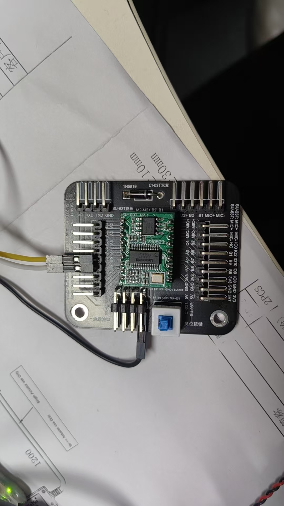

*绿色CI-03T模块正确插入开发板的示例*

**操作建议：**

1. **安装前检查**：

    - 仔细对比模块和开发板的引脚标识
    - 确认第1脚位置
    - 注意模块的结构特征

2. **安装过程**：

    - 先对齐方向再插入
    - 避免强行插入（可能方向不对）
    - 确保所有引脚正确接触

3. **安装后验证**：

    - 检查引脚是否完全插入
    - 通电前再次确认方向
    - 首次上电时密切观察

**注意事项：**

- CI-03T系列模块不支持热插拔，断电后再操作
- 插反可能导致永久性损坏，务必小心
- 如不确定，先拍照对比确认再安装
- 建议在指导下进行首次安装

---

### CI-03T1芯片需要3V供电才能正常工作？

**问题描述：**

CI-03T1芯片在5V供电时无法正常工作，测试发现需要3V供电才能正常输出log信息，与手册规定的3.6-5.5V供电电压不符。

**解决方案：**

**问题分析：**

- 正常情况下CI-03T1应支持3.6-5.5V供电
- 出现需要3V供电的异常情况，可能是芯片损坏
- 芯片内部电源管理电路故障可能导致电压要求异常

**Log输出异常说明：**

- 正常情况：上电后应立即输出log信息
- 异常情况：断电后才有log输出
- 这种现象表明芯片工作状态不稳定

**排查步骤：**

1. **测量实际电压**：

    - 使用万用表测量供电电压
    - 确认电源输出是否稳定
    - 检查是否存在电压跌落

2. **检查电源质量**：

    - 确认电源纹波小于100mV
    - 验证电源能提供足够电流（≥500mA）
    - 排除电源适配器问题

3. **更换芯片测试**：

    - 使用新的CI-03T1芯片对比测试
    - 如新芯片在5V下正常工作，确认原芯片损坏
    - 记录异常芯片的行为特征

**芯片损坏的可能原因：**

- 过压冲击（超过5.5V）
- 电源反接
- 静电损坏
- 长期在极限条件下工作

**建议处理方式：**

1. 立即停止使用异常芯片
2. 更换新芯片进行测试
3. 加强电源保护电路设计
4. 添加过压和反接保护

**注意事项：**

- CI-03T1正常工作电压范围应为3.6-5.5V
- 出现需要3V供电的情况属于异常，非正常工作状态
- 建议保留故障样品用于分析原因

---

### CI-03T1芯片能否使用3.7V电池供电？

**问题描述：**

需要确认CI-03T1芯片是否支持3.7V电池供电，以及电压不足时可能对模块工作产生的影响。

**解决方案：**

**供电电压要求：**

- **工作电压范围**：3.6-5.5V
- **最低启动电压**：3.6V
- **推荐工作电压**：4.5-5.5V

**3.7V供电分析：**

1. **可行性评估**：

    - 3.7V略高于最低电压3.6V，理论上可以工作
    - 但电压余量过小（仅0.1V），可能导致工作不稳定
    - 电池放电时电压会下降，可能触发欠压保护

2. **潜在问题**：

    - 电压跌落：电池使用过程中电压逐渐降低
    - 工作异常：电压接近下限时识别效果下降
    - 功能限制：某些功能可能因电压不足无法正常工作

**建议方案：**

1. **使用4.2V锂电池**：

    - 充满电压4.2V，提供充足电压余量
    - 放电过程中仍能保持在安全工作范围内
    - 确保模块稳定运行

2. **增加升压电路**：

    - 3.7V → 升压模块 → 稳定5V输出
    - 推荐使用输出电流≥1A的升压模块
    - 确保电压稳定，避免影响识别效果

3. **电源监控设计**：

    - 增加电压监测电路
    - 低电压时提示充电或更换电池
    - 设置合理的低电压告警阈值（如3.7V）

**实际应用建议：**

- 短期测试：可用3.7V进行功能验证
- 长期使用：建议4.2V电池或升压方案
- 产品设计：预留充足的电源余量，确保稳定性

**注意事项：**

- 长期在低电压下工作可能影响模块寿命
- 语音播报时功耗增加，电压跌落更明显
- 建议定期检查电池电压，及时充电或更换
- 产品设计时应考虑电池的放电曲线特性

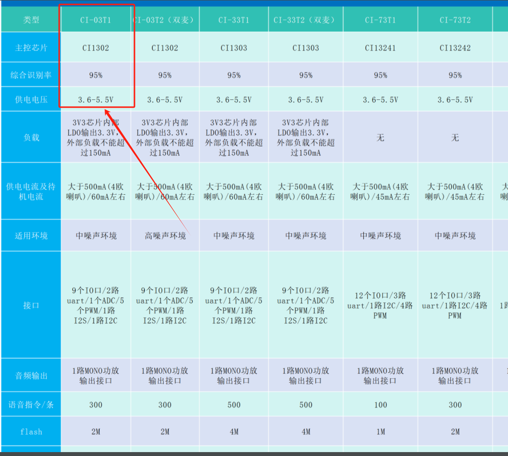

*CI-03T1和CI-03T2的供电电压范围均为3.6-5.5V*

---


---

### CI-03T1模块可以替换哪些规格的喇叭？

**问题描述：**

需要了解CI-03T1模块支持的喇叭规格范围，包括阻抗、功率等参数，以及是否可以替换现有喇叭。

**解决方案：**

**喇叭规格要求：**

1. **4欧姆喇叭**：

    - 功率范围：2.4W起步，建议不超过3W
    - 适合需要较大音量的应用场景
    - 模块驱动相对吃力，功耗较高

2. **8欧姆喇叭**：

    - 功率范围：1.6W起步，建议不超过2W
    - 模块驱动较轻松，功耗相对较低
    - 推荐用于一般应用场景

**功率限制说明：**

- 4Ω5W喇叭：模块可能带不动，不建议使用
- 推荐配置：4Ω2.4-3W或8Ω1.6-2W
- 功率过高会导致功放发热，影响长期稳定性

**选型建议：**

1. **优先使用8Ω喇叭**：

    - 模块驱动更容易，音质表现稳定
    - 功耗更低，有利于电池供电产品
    - 发热问题较少，系统更稳定

2. **4欧姆喇叭使用场景**：

    - 需要较大音量输出的场合
    - 对音量有特殊要求的应用
    - 确保功放散热良好

**实际应用案例：**

- 8Ω2W喇叭：音质清晰，工作稳定
- 4Ω3W喇叭：可能驱动不足，音量偏小
- 4Ω5W喇叭：模块无法正常驱动，不建议使用

**供电电池选择：**

- 电压：3.7V锂电池（需要确认电压稳定性）
- 容量：根据产品使用时间选择
- 建议：选择容量充足的电池以保证续航

**注意事项：**

- 喇叭阻抗必须与模块功放匹配
- 功率过大会导致模块发热严重
- 优先使用模块标配的喇叭进行测试验证
- 如需特殊音量，考虑外接功放方案

---


---

### CI-03T带晶振与不带晶振版本有什么区别？

**问题描述：**

需要了解CI-03T模块带晶振和不带晶振版本在功能上的差异，特别是对温漂性能的影响。

**解决方案：**

**主要差异说明：**

带晶振和不带晶振版本的主要区别在于温度稳定性表现：

- **带晶振版本**：温漂性能更好，温度变化时频率更稳定
- **不带晶振版本**：受温度影响较大，可能产生频率偏移

**温漂影响分析：**

1. **频率稳定性**：

    - 带晶振：内部时钟经过外部晶振校准，精度更高
    - 不带晶振：依赖内部RC振荡器，受温度影响明显

2. **工作温度范围**：

    - 两个版本的标称工作温度范围相同：-20°C 至 80°C
    - 但在温度变化较大的环境中，带晶振版本表现更稳定

3. **应用场景考虑**：

    - **室内常温环境**：两个版本差异不明显
    - **温度变化较大环境**：建议选择带晶振版本
    - **工业应用**：优先考虑带晶振版本

**版本选择建议：**

1. **CI-03T1（单麦不带晶振）**：

    - 适合成本敏感型应用
    - 使用环境温度相对稳定
    - 基础语音识别功能

2. **CI-03T2（双麦不带晶振）**：

    - 适合需要降噪功能的应用
    - 成本相对较低
    - 温度稳定性一般

3. **CI-03T3（单麦带晶振）**：

    - 适合对稳定性要求高的应用
    - 支持AEC功能
    - 推荐用于工业环境

4. **CI-03T4（双麦带晶振）**：

    - 高端应用首选
    - 最佳的降噪和稳定性
    - 适合恶劣环境使用

**实际应用建议：**

- 消费电子产品：室内使用，可选不带晶振版本降低成本
- 工业控制设备：环境温度变化大，建议带晶振版本
- 汽车电子：温度变化剧烈，必须使用带晶振版本
- 户外设备：考虑温度范围，优先带晶振版本

**成本效益分析：**

- 带晶振版本成本略高，但提供更好的稳定性
- 不带晶振版本成本优势明显，适合批量应用
- 选型时应综合考虑应用环境和成本预算

**注意事项：**

- 两个版本在常温下性能基本相同
- 温漂主要体现在极端温度或温度剧变时
- 建议根据实际应用环境选择合适版本
- 保留一定的设计余量应对温度变化

---


---

### CI-03T1/CI-03T2芯片继电器控制Pin脚电平如何配置？

**问题描述：**

使用CI-03T1或CI-03T2芯片控制继电器时，出现继电器动作异常，需要确认是高电平控制还是低电平控制，并进行相应的电平反转配置。

**解决方案：**

**1. 确认继电器控制电平**

首先检查控制继电器的Pin脚配置的是高电平有效还是低电平有效：

- 高电平有效：Pin脚输出高电平时继电器吸合
- 低电平有效：Pin脚输出低电平时继电器吸合

**2. 电平反转配置方法**

如果原配置与实际需求不符，需要进行电平反转：

- 将原本配置为高电平的改为低电平
- 将原本配置为低电平的改为高电平
- 确保配置与继电器模块的实际控制逻辑相反

**3. 验证步骤**

配置完成后：

1. 重新上电测试
2. 观察继电器动作是否正常
3. 如仍异常，再次检查电平配置

**注意事项：**

- 不同继电器模块可能有不同的控制逻辑（高/低电平有效）
- 配置修改后需要重新烧录固件
- 建议在确认继电器控制逻辑后再进行最终配置

---


---

### CI-03T1模块的原理图是官方设计吗？

**问题描述：**
需要确认提供的CI-03T1模块原理图是否为官方参考设计，并询问是否有对应的PCB文件。

**解决方案：**

是的，该原理图是CI-03T1模块的官方参考设计。

原理图主要包含以下几个部分：

1. **主芯片电路**：

    - CI1302主控芯片
    - 晶振电路（Y1）
    - 电源管理（VCC5V, VDD33）
    - 复位电路（RST）

2. **功放电路**：

    - U2：8002功放芯片
    - 连接主芯片的HPOUT L/R音频输出
    - 驱动喇叭（SPK+/SPK-）

3. **麦克风电路**：

    - 支持双麦克风输入（MIC1+/MIC1-、MIC2+/MIC2-）
    - 麦克风偏置电压（MIC BIAS）
    - 滤波电容（C9-C13）

4. **IO口资源**：

    - PA0-PA4
    - PB0-PB5
    - PC4

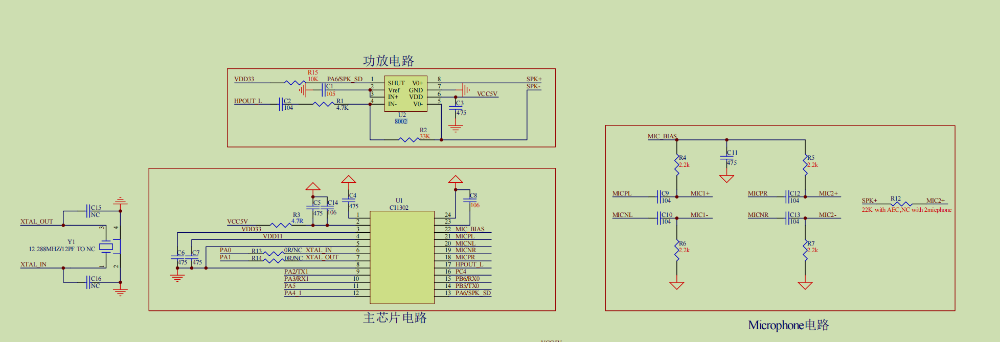

**注意事项：**

- 如需PCB文件，请联系供应商获取
- 设计时注意电源和地的布局，确保音频质量
- 麦克风走线应尽量短，避免干扰

---


---

### CI-03T的音频输出接口如何正确连接外部功放？

**问题描述：**

在使用CI-03T系列芯片时，音频输出接口无法直接连接外部功放，需要了解正确的音频信号引出方式。

**解决方案：**

**音频输出连接原则：**

1. **直接连接喇叭**：

    - 模块的SPK+和SPK-输出端设计用于直接连接喇叭
    - 推荐使用4Ω或8Ω喇叭，功率在模块规格范围内
    - 不需要额外电路，简单可靠

2. **连接外部功放的注意事项**：

    - **不能**从SPK+和SPK-端连接到其他功放
    - 这样会形成二级功放，容易烧毁功放IC
    - 喇叭输出端已经过功放电路，不能再输入其他功放

**正确的音频信号引出方法：**

如需外接功放，应从功放IC的第4脚引出音频信号：

1. **信号源选择**：

    - 从功放IC（如8002）的第4脚引出音频信号
    - 该脚是功放的输入端，未经放大的原始音频信号
    - 适合作为外部功放的输入源

2. **连接方式**：
    ```
    CI-03T内部 → 功放IC第4脚 → 外部功放 → 喇叭
    ```
    - 使用飞线从IC第4脚引出
    - 注意信号线屏蔽，避免干扰
    - 确保良好的接地连接

3. **电路修改建议**：

    - 如需批量生产，建议在PCB上预留测试点
    - 可增加跳线选择内置/外置功放
    - 保留原喇叭输出作为备用方案

**实际应用案例：**

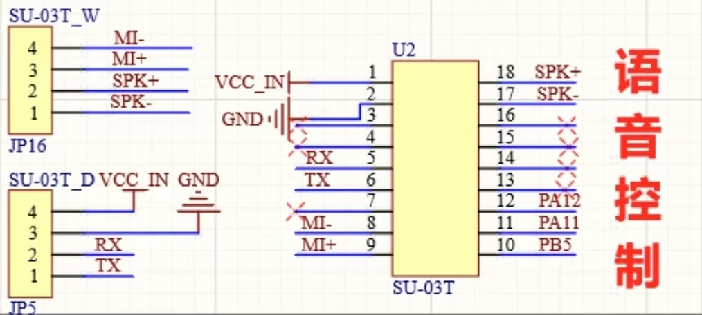

*图中展示了SPK+和SPK-直接连接喇叭的正确方式*

**技术要点：**

- SPK输出是功放输出，不能作为其他功放的输入
- 音频信号应从功放IC前级引出
- 二级功放会导致信号过载，损坏器件
- 外接功放可获得更大功率，但需要正确引出信号

**注意事项：**

- 从IC第4脚引出信号需要专业的焊接技术
- 外接功放时注意阻抗匹配
- 保留原内置功放功能作为备用
- 建议使用专业的音频功放模块

---


---

### CI-03T在米思奇平台中可以使用吗？

**问题描述：**

需要确认CI-03T芯片是否可以在米思奇平台中使用，以及如何操作。

**解决方案：**

**支持确认：**

- CI-03T完全支持米思奇平台
- 可通过米思奇进行图形化编程
- 支持与Arduino等主控板的串口通信

**使用步骤：**

1. **环境准备**：

    - 下载并安装米思奇软件（Mixly 2.0 rc4）
    - 安装CI-03T专用的板卡支持包
    - 配置智能公元平台账号信息

2. **板卡导入**：

    - 打开米思奇软件
    - 在右上角板卡选择列表中选择CI-03T
    - 确认板卡已正确加载

3. **硬件连接**：

    ```
    CI-03T模块    CH340/USB转串口
    TX        →    RX
    RX        →    TX
    GND       →    GND
    5V/3.3V   →    5V/3.3V
    ```

4. **图形化编程**：

    - 拖拽语音识别积木块
    - 配置唤醒词和命令词
    - 设置串口输出命令
    - 点击上传生成固件

**功能特点：**

- 支持离线语音识别
- 可通过串口与Arduino通信
- 支持GPIO、PWM等硬件控制
- 无需编写C代码即可开发

**注意事项：**

- 必须使用Mixly 2.0 rc4或更新版本
- 确保正确导入CI-03T板卡
- 烧录完成后需要重新上电
- 查看米思奇平台的详细教程获取更多信息

---


---

### CI-03T模块芯片发烫烧毁的原因和预防措施

**问题描述：**

CI-03T1模块在正常供电且线路未接反的情况下，出现严重发热并导致主芯片烧毁，询问是否可以保修以及故障原因。

**问题分析：**

1. **发热现象**：

    - 模块上电后主控芯片（CI1302）迅速发热
    - 温度过高导致芯片永久性损坏
    - OPA1612音频芯片也有烧毁痕迹
    - 设备完全无法工作

2. **可能原因**：

    - **连接外部负载**：模块设计用于语音处理，不应驱动大功率负载
    - **电源问题**：供电不稳定或含有较大纹波
    - **短路故障**：线路连接错误或元器件短路

3. **实际案例参考**：

    - 使用ASR-PRO连接舵机或光耦继电器导致烧毁
    - 连接两个继电器也会出现严重发热问题
    - 直接连接965舵机超出模块驱动能力

**解决方案：**

**1. 立即断电处理**：

    - 发现芯片发热立即切断电源
    - 避免进一步损坏模块
    - 等待芯片冷却后再检查

**2. 故障排查**：

    - 使用万用表测量各引脚电压
    - 检查是否有元器件因断电损坏
    - 确认电源供应稳定可靠
    - 检查是否存在短路现象

**3. 使用限制说明**：

    - CI-03T是语音识别专用模块
    - 不应直接驱动继电器、舵机等大功率负载
    - 如需驱动外部负载，必须通过中间电路隔离

**预防措施：**

1. **合理使用负载**：

    - CI-03T输出控制能力有限
    - 需要驱动负载时，应使用专用的驱动电路
    - 或选择带驱动能力更强的模块

2. **电源设计要求**：

    - 使用稳定可靠的5V电源供电
    - 确保电源纹波小于100mV
    - 避免使用开关电源或质量不佳的适配器

3. **保护电路设计**：

    - 在输出端增加限流电阻
    - 使用光耦或继电器隔离大功率负载
    - 考虑添加过压和过流保护

4. **测试验证方法**：

    - 单独测试语音模块功能（不接负载）
    - 确认工作正常后再连接外部电路
    - 监测模块温度变化，避免过热

**注意事项：**

- 模块烧毁后通常无法修复，只能更换
- 保留完整的故障记录和批次信息
- 如出现连续烧毁问题，应暂停使用并分析根本原因
- 建议联系供应商获取供应商

---

**问题描述：**

需要确认CI-03T芯片是否可以在米思奇平台中使用，以及如何操作。

**解决方案：**

**支持确认：**

- CI-03T完全支持米思奇平台
- 可通过米思奇进行图形化编程
- 支持与Arduino等主控板的串口通信

**使用步骤：**

1. **环境准备**：

    - 下载并安装米思奇软件（Mixly 2.0 rc4）
    - 安装CI-03T专用的板卡支持包
    - 配置智能公元平台账号信息

2. **板卡导入**：

    - 打开米思奇软件
    - 在右上角板卡选择列表中选择CI-03T
    - 确认板卡已正确加载

3. **硬件连接**：

    ```
    CI-03T模块    CH340/USB转串口
    TX        →    RX
    RX        →    TX
    GND       →    GND
    5V/3.3V   →    5V/3.3V
    ```

4. **图形化编程**：

    - 拖拽语音识别积木块
    - 配置唤醒词和命令词
    - 设置串口输出命令
    - 点击上传生成固件

**功能特点：**

- 支持离线语音识别
- 可通过串口与Arduino通信
- 支持GPIO、PWM等硬件控制
- 无需编写C代码即可开发

**注意事项：**

- 必须使用Mixly 2.0 rc4或更新版本
- 确保正确导入CI-03T板卡
- 烧录完成后需要重新上电
- 查看米思奇平台的详细教程获取更多信息

---


---

### CI-03T1模块严重发热导致芯片烧毁如何处理？

**问题描述：**

CI-03T1模块在正常供电且线路未接反的情况下，出现严重发热并导致主芯片烧毁，询问是否可以保修以及故障原因。

**解决方案：**

**故障现象分析：**

1. **严重发热**：

    - 芯片和功放部分温度异常高
    - 连带喇叭都出现发烫现象
    - 模块无法正常响应语音命令

2. **损坏痕迹**：

    - 主控芯片有明显烧灼痕迹
    - OPA1612功放芯片也损坏
    - 模块已无法正常工作

**可能原因分析：**

1. **负载问题**：

    - 可能连接了超出模块驱动能力的负载
    - 舵机、舵机等大功率器件
    - 瞬间负载电流过大导致发热

2. **电源异常**：

    - 供电不稳定可能影响芯片工作
    - 瞬间电压波动可能损坏芯片
    - 电源纹波可能干扰电路正常工作

3. **短路风险**：

    - SPK-引脚与GND短路会导致模块烧毁
    - 其他引脚短路可能损坏相关电路

**排查步骤：**

1. **断电检查**：

    - 立即断开所有连接
    - 等待电容完全放电
    - 检查是否有短路现象

2. **测量电压**：

    - 使用万用表测量各引脚电压
    - 确认电源电压在规格范围内
    - 重点检查功放供电和音频输出电压

3. **隔离测试**：

    - 断开所有外部连接，仅保留基础供电
    - 单独测试模块功能
    - 如发热仍存在，说明模块内部故障

4. **更换验证**：

    - 使用确认正常的模块进行对比测试
    - 如新模块工作正常，说明原模块已损坏
    - 更换损坏的模块

**处理建议：**

1. **立即停止使用**：

    - 停止使用发热的模块
    - 避免进一步损坏扩大
    - 断开电源并隔离模块

2. **联系供应商**：

    - 提供详细的故障现象和图片
    - 说明使用环境和连接方式
    - 获取维修或更换服务

**注意事项：**

- 严重发热通常不可逆，可能导致永久性损坏
- 保留故障照片和测试记录便于分析
- 烧录前务必确认电气连接正确
- 批量生产前建议进行充分测试

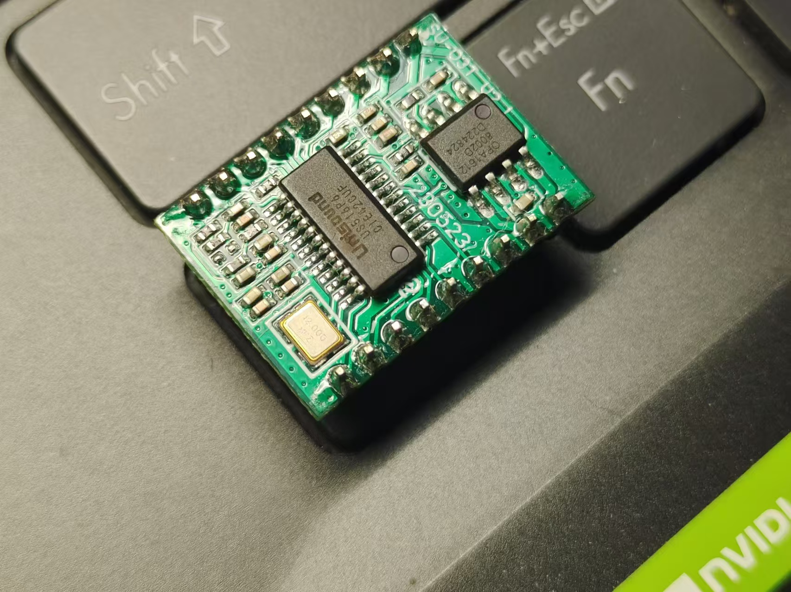

---


---

### CI-03T模块在5V供电下功放发热怎么办？

**问题描述：**

CI-03T模块在5V供电下通电后，功放部分迅速发热甚至烫手，严重时出现冒烟现象，更换模块后在同一位置仍出现发热问题。

**解决方案：**

**问题现象分析：**

1. **发热特征**：

    - 通电3-5秒后功放部分明显发热
    - 温度快速上升至烫手程度
    - 部分模块严重到冒烟损坏

2. **问题定位**：

    - 同一模块在不同板子上都发热：说明模块本身问题
    - 更换模块后仍发热：说明外围电路或供电问题

**排查步骤：**

1. **供电质量检查**：

    - 测量供电电压是否稳定在5V
    - 使用示波器检查电源纹波
    - 确认电源在负载下无波动
    - 不稳定的供电是导致发热的常见原因

2. **模块状态判断**：

    - 检查模块是否已损坏（冒烟通常已损坏）
    - 测试新模块在确认正常的板子上
    - 区分是模块问题还是外围电路问题

3. **负载检查**：

    - 确认喇叭阻抗匹配（推荐8Ω）
    - 检查喇叭功率是否在推荐范围内
    - 断开喇叭测试，看是否仍发热

**可能原因分析：**

1. **电源问题**：

    - 电压波动过大，超过模块承受范围
    - 电源纹波大，影响功放电路稳定
    - 瞬时过压导致功放芯片异常

2. **模块损坏**：

    - 功放芯片已部分损坏
    - 内部短路导致电流过大
    - 需要更换新模块

3. **设计问题**：

    - PCB设计不当导致干扰
    - 散热设计不足
    - 周边元件影响功放工作

**解决建议：**

1. **电源优化**：

    - 使用质量可靠的5V/2A电源适配器
    - 在电源输入端增加滤波电容
    - 确保电源在满负载下电压稳定
    - 添加过压保护电路

2. **降压方案**（根据供应商建议）：

    - 将供电电压降至4.2V使用
    - 可完美运行并显著降低发热
    - 功率降低但可满足基本需求

3. **模块更换**：

    - 已冒烟的模块必须更换
    - 建议批量问题统一返厂检测
    - 保留故障样品用于分析

**预防措施：**

1. **设计阶段**：

    - 预留充足的散热空间
    - 合理设计PCB电源层
    - 添加温度监控电路

2. **生产测试**：

    - 上电前测量电源参数
    - 逐步增加负载测试
    - 监控工作温度变化

3. **使用规范**：

    - 使用推荐规格的电源
    - 避免在极限条件下长期工作
    - 定期检查工作状态

**注意事项：**

- 4.2V供电可显著降低发热和功耗
- 正常工作温度应在40-50℃范围内
- 发热严重时立即断电，避免损坏扩大
- 批量问题建议联系供应商进行根本原因分析

---


---

### 使用8欧5瓦喇叭对CI-03T模块功放的影响

**问题描述：**

使用8欧5瓦的喇叭连接CI-03T1/T2芯片的功放输出，担心长期使用是否会对模块功放造成损害，以及是否能充分发挥喇叭性能。

**解决方案：**

**风险评估：**

1. **长期使用风险**：

    - 8Ω5W喇叭功率超出CI-03T模块推荐范围（推荐8Ω1.6W-2W）
    - 短时间内可以工作，但长期使用会损坏模块功放
    - 太长时间使用会导致功放发热甚至烧毁

2. **性能表现**：

    - 模块功放无法充分发挥5W喇叭的性能
    - 在低音量使用时可能表现正常
    - 但大功率需求时会出现驱动不足

**建议方案：**

1. **推荐配置**：

    - 优先使用8Ω2W喇叭，与模块功放最佳匹配
    - 或使用4Ω2.4W-3W喇叭（需要更大音量时）
    - 确保喇叭功率在模块推荐范围内

2. **临时使用方案**：

    - 若只能使用5W喇叭，必须将音量调至最小或略高
    - 避免长时间大音量播放
    - 持续监听功放温度，防止过热

3. **结构限制解决方案**：

    - 喇叭盒尺寸受限时，选择小口径的2W喇叭
    - 重新设计喇叭盒以适配标准功率喇叭
    - 考虑使用更高效率的喇叭型号

**技术细节：**

- CI-03T1/T2内置Class AB功放，标称输出功率约2.4W@5V4Ω
- 8Ω5W喇叭虽然阻抗匹配，但功率需求过高
- 功放长期超负荷工作会导致芯片寿命缩短

**注意事项：**

- 即使音量调小，长期使用仍存在风险
- 建议更换为符合规格的喇叭以确保可靠性
- 如确需大音量输出，考虑外接独立功放方案
- 选择喇叭时，阻抗和功率两个参数都要匹配

---


---

### 如何实现CI-03T模块的GPIO互锁功能？

**问题描述：**

需要在CI-03T1或CI-03T2芯片上实现GPIO互锁功能，即当GPIO_A25输出高电平且GPIO_A26检测到特定命令词时，自动将GPIO_A25切换为低电平。

**解决方案：**

**实现原理：**

通过事件触发机制和GPIO控制功能实现互锁逻辑：

- 使用命令词触发事件
- 检测GPIO状态条件
- 执行GPIO电平切换动作

**配置步骤：**

1. **初始配置GPIO_A25**：

    - 设置为输出模式
    - 配置默认低电平
    - 通过命令词或事件触发输出高电平

2. **配置互锁命令词**：

    - 在平台添加特定命令词
    - 设置触发条件：GPIO_A25为高电平
    - 执行动作：将GPIO_A25设为低电平

3. **事件触发配置**：

    - 可选择"上电启动系统启动"事件
    - 触发GPIO输出，实现初始状态设置
    - 为后续互锁操作准备条件


*通过事件触发机制配置GPIO_A2（即GPIO_A1）在上电时输出高电平*

**实现示例：**

以下是一个具体的互锁实现步骤：

1. **初始状态设置**：

    - 通过"上电启动系统启动"事件
    - 触发GPIO_A25输出高电平

2. **互锁命令词配置**：

    - 添加命令词（如"关闭设备"）
    - 设置条件：当GPIO_A25为高电平时
    - 执行动作：将GPIO_A25设为低电平

3. **测试验证**：

    - 上电后GPIO_A25输出高电平
    - 说出互锁命令词后GPIO_A25自动切换为低电平

**注意事项：**

- 互锁功能需要通过软件逻辑实现，平台提供基础控制功能
- 命令词识别时可检测当前GPIO状态，实现条件判断
- 复杂的互锁逻辑可能需要多次事件触发组合
- 配置完成后需要重新生成固件并测试验证
- GPIO_A25和GPIO_A26需要根据实际模块型号确认可用性

---


---

### CI-03T-V1.3模块的元器件位置如何查找？

**问题描述：**

需要定位CI-03T-V1.3模块上的上拉电阻R8的具体位置，以便进行硬件修改或调试。

**解决方案：**

**资料获取途径：**

1. **官方开发包下载**：

    - 访问CI-03T开发包页面
    - 网址：http://help.aimachip.com/docs/offline_ci03t/ci_03t_kfb
    - 包含原理图、模块技术手册、接线资料等

2. **查找所需资料**：

    - 原理图：查看元器件布局和连接关系
    - 模块+芯片技术手册：详细的电路设计
    - 接线+烧录资料：硬件接口说明

**元器件定位方法：**

1. **使用原理图定位**：

    - 在原理图中搜索"R8"标识
    - 查看R8在电路中的具体位置和功能
    - 确认阻值和连接的网络

2. **参考实物图标记**：

    - 开发包中可能包含实物布局图
    - 对比原理图和实际PCB布局
    - 注意版本差异，确保使用V1.3对应资料

3. **技术文档查阅**：

    - 仔细阅读模块技术手册
    - 查看关键元器件的说明
    - 注意版本更新的变化

**常见上拉电阻位置：**

- 通常位于芯片的关键信号线上
- 用于确保信号在空闲状态的稳定电平
- 可能在I2C、UART或其他接口附近

**操作注意事项：**

1. **防静电措施**：

    - 操作前佩戴防静电手环
    - 使用防静电工作台
    - 避免直接接触元器件引脚

2. **焊接工具选择**：

    - 使用恒温焊台，温度控制在350°C以下
    - 选择细头焊锡丝或焊锡膏
    - 避免长时间加热导致PCB损坏

3. **元器件替换规格**：

    - 确认新电阻的阻值和精度
    - 选择合适的封装尺寸（0402、0603等）
    - 注意电阻的功率等级

**调试建议：**

- 操作前拍照记录原始状态
- 使用万用表验证焊接效果
- 测试功能是否恢复正常
- 保留修改记录便于后续维护

**注意事项：**

- 不同版本的模块布局可能有差异
- 私自拆卸可能影响保修
- 建议先在废板上进行练习
- 如不确定，联系供应商获取详细指导

---


---

### CI-03T数字麦克风连接方案

**问题描述：**

需要了解CI-03T芯片是否支持连接数字麦克风（如ICS43434），以及连接方式、外部元件需求和信号处理能力。

**连接方案说明：**

**IIS数字音频接口：**

CI-03T芯片配备IIS数字音频接口，支持数字音频数据传输，但连接数字麦克风需要注意以下要点：

1. **接口特性**：

    - 支持标准IIS数字音频协议
    - 可输出数字音频信号到外部设备
    - 主要用于连接数字功放模块

2. **连接要求**：

    - 数字麦克风需符合IIS协议规范
    - 数据格式必须与IIS接口兼容
    - 可能需要外部信号转换电路

**实现方案：**

1. **直接连接方案**：
    ```
    数字麦克风 → 信号转换电路 → CI-03T IIS接口
    ```

2. **完整信号链**：
    ```
    数字麦克风 → CI-03T处理 → IIS输出 → 数字功放 → 扬声器
    ```

**技术限制：**

1. **内部处理能力**：

    - CI-03T主要设计用于模拟麦克风输入
    - 内部是否有完整的数字麦克风处理电路需要确认
    - 可能需要额外的信号调理电路

2. **兼容性问题**：

    - 并非所有数字麦克风都能直接连接
    - 需要验证数据格式和时序匹配
    - 某些型号可能需要外部转换元件

**推荐方案：**

1. **使用模拟麦克风**：

    - CI-03T默认支持模拟麦克风
    - 电路简单，成本较低
    - 性能经过充分验证

2. **数字麦克风验证**：

    - 先进行小批量测试
    - 确认具体数字麦克风型号的兼容性
    - 评估所需的外部元件成本

**注意事项：**

- 数字麦克风方案成本较高（10倍以上模拟麦克风）
- 需要详细的硬件设计和信号完整性分析
- 建议联系供应商确认具体型号的兼容性
- 量产前进行充分的兼容性测试


---

### CI-03T1芯片偶尔无法工作、串口通信不稳定如何解决？

**问题描述：**

使用CI-03T1芯片进行开发时，遇到设备偶尔无法工作、串口通信不稳定以及烧录困难的问题，同时存在功放启动有杂音和串口通信电平不稳定的硬件设计缺陷。

**解决方案：**

**1. 串口通信问题解决**

- 检查串口通信电平是否在3V-3.6V范围内
- 电平过高或过低都会导致芯片死机
- 在串口通信线上添加阻尼电阻（建议值尽量选大）
- 避免上电瞬间受到干扰导致系统死机

**2. 功放杂音问题处理**

- 检查DAC输出口是否缺少滤波电路设计
- 该芯片输出PCM方式信号，需要适当的滤波处理
- 功放使能脚（GPIO10）的时序控制需要优化
- 避免直接电池供电导致的杂音问题

**3. 烧录困难问题解决**

- 确保3.3V供电和1.2V供电都正常
- 检查烧录时串口连接的稳定性
- 避免在烧录过程中连接其他串口设备
- 必要时重新拔插烧录线缆重新尝试

**电路设计优化建议：**

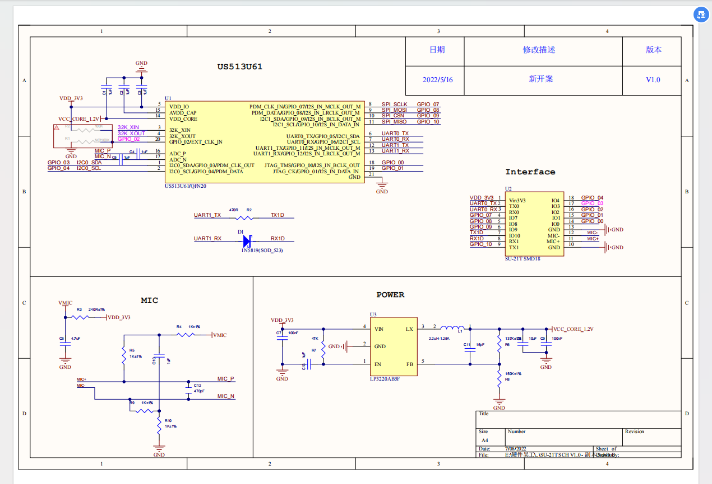

**问题分析：**

- 串口通信使用了1N5819二极管和470R电阻，但未添加阻尼电阻
- 功放使能脚连接至GPIO10，时序控制可能导致杂音
- 喇叭的DAC输出口缺少必要的滤波电路

**改进方案：**

1. **串口电路优化**

    ```
    MCU_TX --[100Ω]--[IN5819]--> SU_RX
    MCU_RX <------------------- SU_TX
    ```

2. **功放电路改进**

    - 在DAC输出端增加RC低通滤波电路
    - 优化功放使能时序，避免开启瞬间杂音
    - 考虑使用5V升压电路供电，减少电池供电噪声

**固件配置参考：**


**注意事项：**

- 串口通信电平必须严格控制在3V-3.6V之间
- 阻尼电阻对于系统稳定性至关重要
- 建议参考SU-23T的设计资料进行电路优化
- 使用稳定的电源供电，避免电池直接供电导致的噪声问题

---


---

### CI-03T系列芯片麦克风可以增加放大电路吗？

**问题描述：**

CI-03T1或CI-03T2芯片在使用时语音识别距离过近（1米后无法识别），询问是否可以在麦克风信号进入芯片前增加放大电路。

**解决方案：**

**硬件限制说明：**

1. **不可外接放大电路**：

    - 不可以在麦克风输入端增加外部放大电路
    - 芯片内部的ADC已经配置了合适的增益
    - 外部放大可能导致信号过载失真

2. **识别距离问题分析**：

    - 正常识别距离应为3-5米
    - 1米后无法识别说明存在异常
    - 需要从其他方面排查问题

**问题排查步骤：**

1. **环境检查**：

    - 确认测试环境噪音水平
    - 避免在强噪声环境下测试
    - 确保说话音量正常

2. **硬件检查**：

    - 检查麦克风连接是否正确
    - 确认麦克风供电电压正常
    - 验证麦克风本身质量

3. **软件配置**：

    - 检查识别灵敏度设置
    - 调整降噪参数
    - 优化唤醒词识别阈值

**优化建议：**

1. **提高识别性能**：

    - 选择合适的麦克风型号
    - 优化麦克风安装位置
    - 使用防风罩减少噪声

2. **参数调整**：

    - 在平台中调高识别灵敏度
    - 选择合适的降噪模式
    - 测试不同参数组合

**注意事项：**

- 严禁在麦克风输入端增加外部放大电路
- 识别距离过短通常是配置或环境问题
- 建议在标准环境下测试识别效果
- 如问题持续，联系供应商进行详细分析

---


---

### CI-03T1或CI-03T2芯片的GPIO口是否可以直接连接A4988等电机驱动器？

**问题描述：**

CI-03T1或CI-03T2芯片的GPIO口输出的PWM信号是否可以直接连接A4988等电机驱动器来控制电机？

**解决方案：**

**可行性分析**

CI-03T1或CI-03T2芯片的GPIO口可以输出PWM信号，但直接连接A4988等电机驱动器时需要注意以下限制：

**1. 信号兼容性**

- **电平匹配**：CI-03T系列工作电压为3.3V，A4988通常支持3.3V-5V逻辑电平，电平兼容
- **PWM频率**：CI-03T的软件PWM频率建议在100Hz-1kHz范围内，适合步进电机的慢速控制
- **信号类型**：A4988需要STEP（步进）和DIR（方向）两个控制信号，需要占用两个GPIO

**2. 驱动能力评估**

- **GPIO输出能力**：CI-03T的GPIO驱动能力有限，最大输出电流约10mA
- **A4988输入阻抗**：A4988的控制输入引脚阻抗较高（约100kΩ），GPIO可直接驱动
- **无需额外缓冲**：由于是控制信号而非功率信号，无需额外驱动电路

**3. 实现方案**

```
CI-03T模块          A4988驱动器           步进电机
GPIO1     →         STEP               →         步进控制
GPIO2     →         DIR                →         方向控制
GND       →         GND                →         共地
3.3V      →         VDD（逻辑电源）
```

**注意事项：**

- 小功率步进电机可以直接使用此方案
- 大功率步进电机需要确保A4988的供电充足
- PWM频率不宜过高，避免步进电机失步
- 建议添加100Ω串联电阻限流，保护GPIO口
- 共地连接非常重要，确保信号稳定

**应用建议**

对于简单的语音控制小车或小型机械臂，此方案可行。可以通过语音指令控制GPIO输出PWM信号，实现：

- 语音控制前进/后退（通过DIR引脚控制方向）
- 语音控制速度（通过PWM频率控制步进速度）
- 语音控制转动角度（通过PWM脉冲数量控制）

**4. 语音小车应用实例**

基于上述原理图，可以搭建完整的语音控制系统：

```
语音识别 → 控制逻辑 → 前级驱动 → 电机驱动 → 电机执行
        ↓           ↓          ↓         ↓          ↓
    CI-03T     GPIO控制   A4988等   步进/直流   轮子/机械结构
```

**关键实现要点：**

1. **控制逻辑实现**：

    - IN1/IN2作为方向控制信号
    - PWM信号控制电机速度
    - 通过不同PWM占空比实现调速

2. **驱动电路设计**：

    - 前级驱动：使用三极管或MOSFET进行功率放大
    - 电流检测：通过采样电阻实现过流保护
    - 热关断：温度过高时自动停止输出

3. **语音控制方案**：

    - 唤醒词："小智小智"
    - 控制指令："前进"、"后退"、"左转"、"右转"
    - 反馈播报："正在前进"、"已停止"等

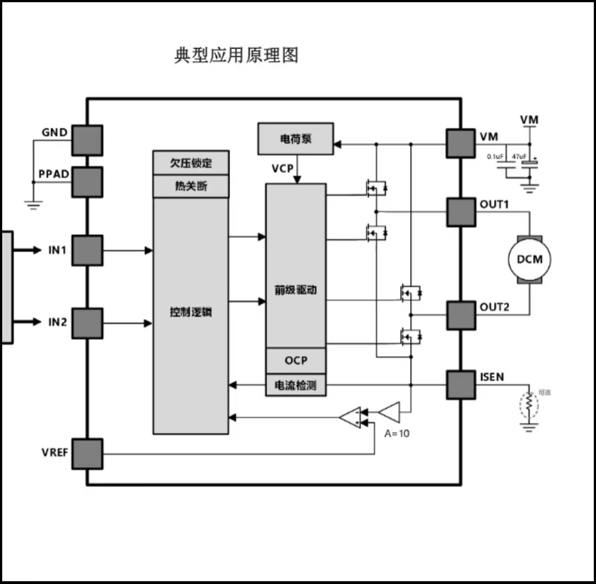

*典型电机驱动应用原理图，展示了控制逻辑、前级驱动、电流检测和电机的连接方式*


---

### CI-03T1模块8002B功放芯片在特定喇叭下死机怎么办？

**问题描述：**

CI-03T1功放芯片在驱动特定喇叭且音量较大时出现死机现象，经排查发现是8002B功放芯片存在故障，需要确定故障原因并寻找可替代的功放芯片。

**解决方案：**

**问题原因分析：**

1. **芯片批次问题**：

    - 8002B芯片可能存在批次性质量问题
    - 特定负载条件下工作不稳定
    - 大电流时触发保护机制导致死机

2. **负载匹配问题**：

    - 8002B与某些喇叭阻抗不匹配
    - 8Ω2W喇叭在最大音量时电流过大
    - 电流超过80mA时容易复现故障

3. **硬件设计因素**：

    - PCB布局可能影响功放稳定性
    - 电源滤波不足导致瞬态响应异常
    - 散热设计不够充分

**替代芯片方案：**

1. **8002系列替代**：

    - **8002A**：基本版本，成本较低
    - **8002D**：改进版本，稳定性更好
    - 需要确认封装和引脚兼容性

2. **AD8002D推荐方案**：

    - 品牌：TC（国产）
    - 优势：稳定性好，支持8Ω2W负载
    - 购买渠道：嘉立创商城可搜索购买

3. **选型参考**：

    | 型号 | 特点 | 适用场景 |
    |------|------|----------|
    | 8002B | 原方案，成本低 | 一般应用 |
    | 8002D | 改进版，稳定性提升 | 替代升级 |
    | AD8002D | 工业级，高稳定 | 高要求应用 |

**解决步骤：**

1. **临时解决方案**：

    - 降低系统最大音量限制
    - 避免使用高阻抗喇叭
    - 增加散热措施

2. **硬件替换**：

    - 更换为AD8002D芯片
    - 检查PCB布局是否需要优化
    - 增加必要的滤波电容

3. **测试验证**：

    - 使用不同喇叭测试
    - 测量最大工作电流
    - 进行老化测试验证稳定性

**预防措施：**

1. **来料检验**：

    - 对功放芯片进行抽样测试
    - 建立老化测试流程
    - 保留可追溯性记录

2. **设计优化**：

    - 增加电源去耦电容
    - 优化功放散热设计
    - 预留足够的电流余量

3. **生产控制**：

    - 选择质量稳定的供应商
    - 建立严格的来料检验标准
    - 定期进行可靠性测试

**注意事项：**

- 8002B芯片问题可能具有批次性
- 更换AD8002D前确认引脚兼容性
- 8Ω喇叭建议选择功率>1.6W的功放芯片
- 4Ω喇叭建议选择功率>2.4W的功放芯片
- 更换芯片后需要进行充分的音频测试

---


---

### CI-03T英文语音播放失真如何改善？

**问题描述：**

使用CI-03T模块时，英文语音播放效果失真，不如中文语音清晰。

**解决方案：**

- 更换带腔体的喇叭
- 选择规格在推荐范围内的喇叭（8欧1瓦）
- 确保喇叭功率与模块输出匹配

**注意事项：**

- 英文语音对喇叭要求更高
- 建议使用专用音频腔体结构
- 避免使用开发套件自带的简单喇叭
- 模块可以直接驱动8欧1瓦的喇叭

---

### CI-03T语音控制舵机不动作如何排查？

**问题描述：**

CI-03T语音控制舵机时，虽然有语音回复但舵机不动作，且上电时舵机能正常转动，但语音命令无法触发舵机动作。

**解决方案：**

**问题分析：**

语音控制舵机不动作可能涉及供电、PWM设置、硬件连接等多个方面，需要系统排查。

**排查步骤：**

1. **供电问题检查**：

    - 确认是否使用了单独供电
    - 电脑USB供电可能电流不足
    - 建议使用外部5V电源单独给舵机供电
    - 注意共地连接，确保通信正常

2. **PWM占空比检查**：

    - "舵机四十五度"指令对应PWM占空比为5%，这是一个较小的临界值
    - 舵机即使识别到语音指令，也可能因占空比太小而转不起来
    - 建议直接喊"舵机一百三十五度"测试（占空比10%）

3. **硬件连接验证**：

    - PWM引脚（如A5）连接到舵机信号线（黄线）
    - GND连接舵机地线（黑线）
    - 5V连接舵机电源线（红线）
    - 使用万用表测量PWM输出波形

4. **使用示波器验证**：

    - 万用表无法准确测量PWM信号
    - 必须使用示波器查看PWM波形
    - 确认是否输出了预期的PWM波
    - 如果输出了PWM波但舵机还是不转，说明是舵机问题

**进一步解决方案：**

1. **提高占空比测试**：

    - 从12.5%开始测试，确认舵机能否转动
    - 可以尝试更高的占空比（如15%、20%等）
    - 记录舵机能够响应的最小占空比值

2. **缓慢增加占空比**：

    - 避免PWM突变过大
    - 可以从低到高慢慢调整
    - 观察舵机在不同占空比下的响应

3. **更换舵机测试**：

    - 使用已知良好的舵机进行对比测试
    - 排除舵机本身故障的可能性
    - 确认是控制问题还是舵机问题

**接线规范参考：**

```
CI-03T模块    舵机
PWM引脚(A5)  →  信号线（黄色）
GND          →  地线（黑色）
5V           →  电源线（红色）
```

**注意事项：**

- 舵机控制需要分别设置角度和回正命令
- 避免使用GPIO模仿PWM，精度和稳定性不足
- 电流不足是常见问题，建议使用独立供电
- 占空比5%接近临界值，可能导致舵机无法响应

---


---

### CI-03T鼾声检测应用原理图设计常见问题

**问题描述：**

使用CI-03T芯片设计鼾声检测应用时，出现电源电压异常、晶振脚位错误、SGND与GND未连通、麦克风极性接反等问题，导致芯片引脚无输出。

**解决方案：**

**1. 晶振电路设计**

晶振脚位必须正确连接，常见错误包括：

- 晶振脚位画反导致需要朝天焊接
- 晶振虽然有波形但芯片无法正常工作
- 必须使用带外部晶振的CI-03T版本（CI-03T3或CI-03T4）


*晶振脚位错误，焊接时需要朝天安装*

**2. 接地设计**

SGND（模拟地）和GND（数字地）必须正确连接：

- SGND和GND需要在单点汇合
- 未连通会导致模电电路异常（22、23脚无电压）
- C19电容只有1.1V（正常应更高）表明模电电路有问题

**3. 麦克风电路**

麦克风连接注意事项：

- 鼾声检测固件只支持单麦克风
- 只有MIC2接口生效（MIC1在硬件上未连接）
- 麦克风极性不能接反：芯片21脚接麦克风正极

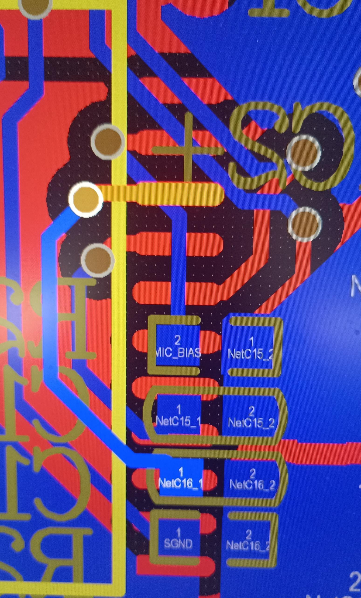

*麦克风极性接反，21脚需要接麦克风正极*

**4. 功率电阻选择**

功放电路的功率电阻必须满足要求：

- R14（4.7Ω）电阻需要使用0805以上封装
- 功率不足会导致电阻过热损坏
- 影响音频输出质量

**5. 电压检测参考**

正常工作电压：

- C18电容：3.3V（正常）
- C19电容：应高于1.1V（异常表明模电电路问题）
- 22、23脚：模电输出，应有正常电压

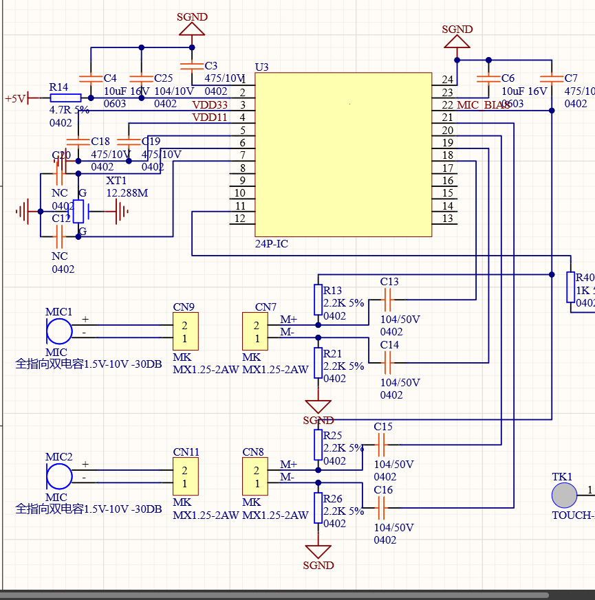

*提供的CI-03T鼾声检测应用原理图*

**注意事项：**

- 鼾声检测功能必须使用带晶振版本
- 麦克风电路的LAYOUT会影响检测效果
- SGND和GND的汇合点要靠近芯片
- 互换模块上的芯片验证是否为固件问题

---

### CI-03T模块哭声/鼾声检测需要外部晶振吗？

**问题描述：**

使用CI-03T模块烧录哭声或鼾声检测固件后，示波器无法捕捉到电平变化，串口也无输出，怀疑是模块缺少外部晶振导致功能异常。

**解决方案：**

**硬件要求确认：**

哭声/鼾声检测功能必须使用带外部晶振的CI-03T模块版本：

- **CI-03T3**：单麦克风带晶振版本
- **CI-03T4**：双麦克风带晶振版本
- 不带晶振的版本无法正常工作

**功能说明：**

1. **检测输出**：

    - 检测到哭声或鼾声后，串口1输出固定协议
    - 协议格式：A5 FA 00 81 20 FB（9600波特率）
    - GPIO_A5平时为高，检测时输出100ms低电平
    - GPIO_A6平时为高，检测时输出100ms低电平

2. **与语音识别的互斥性**：

    - 开启哭声/鼾声检测功能后，不支持语音识别
    - 无法同时配置唤醒词和命令词
    - 模块专用于声音检测功能

**晶振规格要求：**

- **频率**：12.288MHz
- **类型**：无源晶振
- **封装**：SMD3225-4P
- CI-03T1-T4封装相同，晶振位置一致

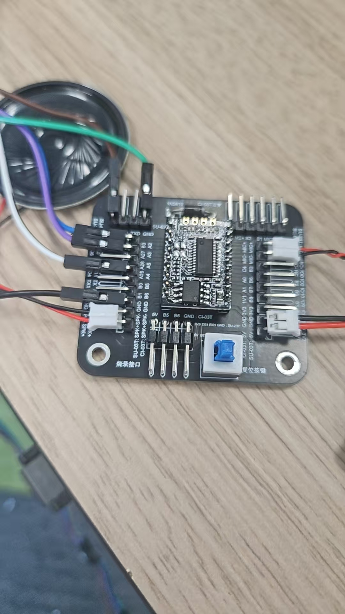

*模块上缺少外部晶振，导致检测功能无法正常工作*

**选购注意事项：**

1. **确认型号选择**：

    - 下单时选择带晶振的版本
    - CI-03T3（单麦）或CI-03T4（双麦）
    - 带晶振版本会明确标注

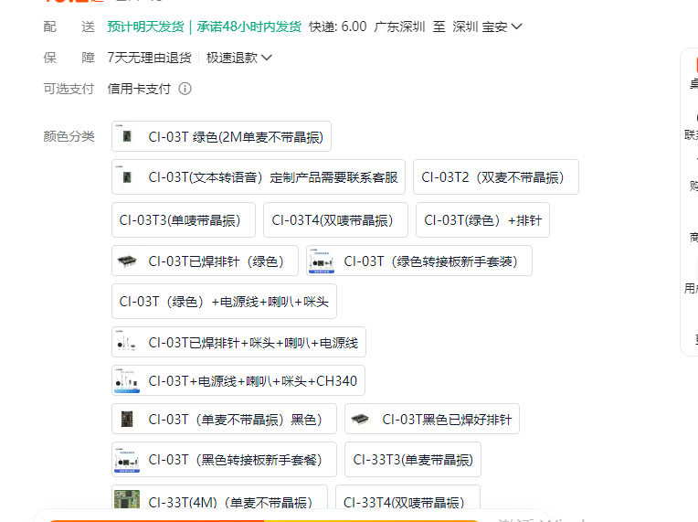

*产品页面显示的带晶振版本选项*

2. **自行焊接方案**：

    - 如已有无晶振版本，可自行焊接12.288MHz晶振
    - 需要3225封装的4脚无源晶振
    - 焊接时注意温度控制，避免损坏模块

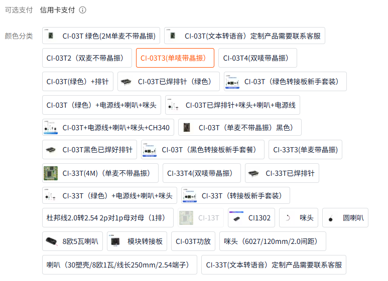

*红色箭头指向的CI-03T3和CI-03T4是带晶振版本*

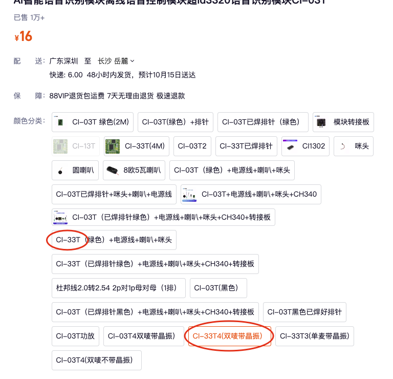

**声纹识别功能说明：**

- 声纹识别功能需要购买授权才能正常使用
- 未授权版本每5分钟会自动重启一次
- 这是授权限制机制，不是硬件故障
- 正式产品需要批量购买授权以解除重启限制

**CI-03T3与CI-03T4主要区别：**

1. **麦克风配置**：

    - CI-03T3：单麦克风版本
    - CI-03T4：双麦克风版本

2. **晶振配置**：

    - 两款都是带晶振版本，时钟精度更高
    - 温度稳定性优于不带晶振版本

3. **功能支持**：

    - 基础功能与CI-03T1/CI-03T2相同
    - 哭声/鼾声检测功能必须使用带晶振版本

**验证方法：**

1. **示波器检测**：

    - 检测A5/A6引脚在声音触发时的电平变化
    - 应能看到100ms的低电平脉冲

2. **串口监听**：

    - 连接串口助手监听UART1
    - 波特率设置为9600
    - 触发时应收到A5 FA 00 81 20 FB

3. **功能测试**：

    - 播放哭声或鼾声音频
    - 观察模块是否有正确输出
    - 确认电平变化和串口输出同步

**注意事项：**

- SU-03T不支持哭声/鼾声检测功能
- 带晶振和不带晶振版本外观相同，需根据型号区分
- 晶振是检测功能正常工作的必要条件
- 功能开启后无法使用语音识别功能
- 建议购买时就选择带晶振的版本，避免后期改装

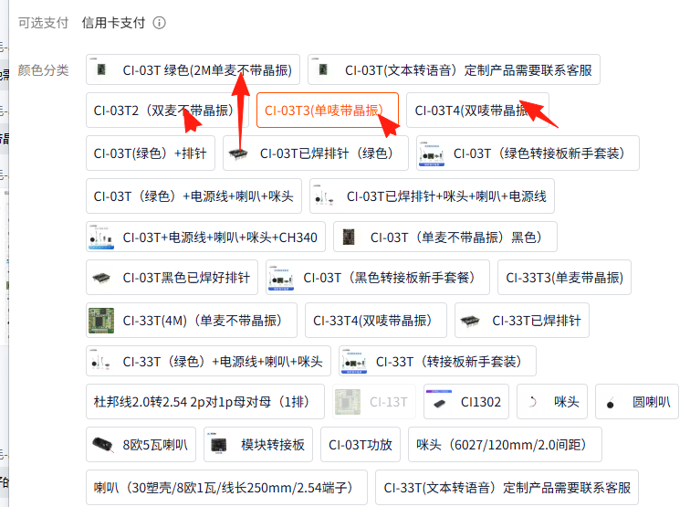

*CI-03T3和CI-03T4是带晶振的版本，而CI-03T1和CI-03T2不带*

---

### CI-03T连接串口无法通信怎么办？

**问题描述：**

CI-03T模块单独调试时能正常收发数据，但插入到主控板后无法通信，波特率设置正常（9600），怀疑是供电功率不足导致。

**解决方案：**

**1. 供电功率检查**

- 测量模块供电电压是否稳定在3.3V
- 检查供电电流是否满足需求（至少150mA）
- 确认电源纹波是否过大，影响模块工作

**2. 功率不足原因分析**

- 主控板通过USB供电时电流限制
- 长线缆导致压降过大
- 电源适配器输出功率不足
- 多个器件共享电源导致电流分配不均

**3. 解决方案**

**增加供电能力**：

- 使用独立的外部电源供电
- 更换更大功率的电源适配器
- 缩短供电线缆减少压降
- 在电源端增加滤波电容

**测量验证**：

- 上电时测量模块电压跌落
- 串口通信时观察电压波动
- 确认电压不低于3.0V

**注意事项：**

- 模块峰值电流可能超过150mA
- USB口供电通常限制在500mA
- 建议预留30%以上的功率余量
- 如使用LDO，确保其压差和电流满足要求

---

### 模块连接主控板后无法通信的排查步骤是什么？

**问题描述：**

模块在独立测试时工作正常，连接到主控板后串口无法通信，需要系统性的排查方法。

**解决方案：**

**步骤1：隔离测试**

- 将模块从主控板拆下单独测试
- 仅连接电源和串口，确认功能正常
- 排除模块本身故障

**步骤2：逐步连接**

- 先连接电源线，测试模块启动
- 再连接GND，观察是否有变化
- 最后连接串口线，测试通信

**步骤3：电源检查**

- 测量主控板提供给模块的电压
- 检查电源能力是否足够
- 确认其他器件不影响供电

**步骤4：信号检查**

- 确认串口线序正确（TX-RX交叉）
- 检查电平匹配（3.3V/5V）
- 排除信号干扰

**步骤5：软件确认**

- 检查串口号是否正确
- 确认波特率匹配（9600）
- 测试其他串口工具

**注意事项：**

- 每次只改变一个条件进行测试
- 使用万用表实时监测电压
- 保留详细的测试记录
- 复杂问题建议使用示波器分析

---


---

### CI-03T芯片3.3V输出引脚的最大输出电流是多少？

**问题描述：**

需要了解CI-03T芯片第3脚（3.3V输出）的最大输出电流规格，以便进行电源设计和外围电路选型。

**解决方案：**

**电气规格说明：**

CI-03T芯片第3脚的3.3V输出引脚最大输出电流为150毫安（mA）。

**技术参数：**

- **输出电压**：3.3V（稳压输出）
- **最大输出电流**：150mA
- **引脚位置**：第3脚（Pin 3）
- **输出类型**：LDO稳压输出

**应用场景：**

1. **为外设供电**：

    - 为小功率传感器供电
    - 驱动低功耗MCU
    - 为外部EEPROM等存储器件供电

2. **电源设计参考**：

    - 总负载电流不应超过150mA
    - 建议预留20%余量，实际负载控制在120mA以内
    - 必要时考虑使用外部电源方案

**设计注意事项：**

- 超过150mA可能导致输出电压下降或芯片损坏
- 长期工作在最大电流附近会影响芯片寿命
- 建议在输出端添加滤波电容，提高电源稳定性
- 若需要更大电流，应使用外部LDO或DC-DC转换器

### CI-03T芯片内置LDO能否提供3.3V 500mA输出？

**问题描述：**

询问CI-03T芯片内置的LDO（低压差线性稳压器）能否稳定输出3.3V 500mA的电流，以满足外部负载需求。

**解决方案：**

**LDO输出能力说明：**

CI-03T芯片内置的LDO最大输出电流为150mA，无法提供500mA的输出能力。

**技术限制：**

- **内置LDO最大输出**：150mA（极限值）
- **推荐负载**：≤120mA（预留20%余量）
- **500mA需求**：超出芯片规格，无法实现

**原因分析：**

1. **芯片设计限制**：

    - 内置LDO仅为芯片内部电路和小负载设计
    - 150mA是芯片能够安全提供的最大电流
    - 超出此限制会导致电压跌落或芯片保护

2. **热设计考虑**：

    - 大电流输出会产生大量热量
    - 芯片封装无法有效散热
    - 可能导致芯片过热损坏

**推荐方案：**

1. **使用外部LDO**：

    - 选择AMS1117-3.3或类似器件
    - 输出电流能力：800mA-1A
    - 注意散热设计

2. **使用DC-DC转换器**：

    - 效率更高，发热更小
    - 输出电流可达1A以上
    - 适合对效率要求高的应用

3. **电源分配方案**：

    - 芯片内部电路使用内置LDO
    - 大功率外设使用独立电源
    - 避免共用电源造成干扰

**注意事项：**

- 不要尝试让内置LDO输出超过150mA电流
- 外部负载较大时必须使用独立供电方案
- 设计电源系统时要考虑峰值电流需求
- 建议在电源输出端添加过流保护电路

### CI-03T芯片PCB布局设计要点

**问题描述：**

进行CI-03T1芯片的PCB设计时，需要确认电源、地线、滤波电容和天线布局是否符合芯片的电气和机械要求。

**解决方案：**

**PCB布局基本原则：**

1. **电源设计**

    - VCC供电：5V±5%，建议在电源入口放置100μF电解电容
    - 3.3V滤波：在芯片3.3V引脚附近放置10μF+100nF并联电容
    - 滤波电容应尽量靠近芯片电源引脚，减少寄生电感

2. **地线设计**

    - 使用完整的地平面，确保低阻抗回路
    - 模拟地和数字地单点连接，避免干扰
    - 麦克风和功放部分的地线要特别处理

3. **滤波电容布局**

    - C1-C6滤波电容按功能分区放置
    - 电源滤波电容靠近电源入口
    - 去耦电容紧贴芯片引脚
    - 音频滤波电容靠近音频接口

4. **音频部分布局**

    - 麦克风输入线尽量短，采用差分走线
    - 远离数字信号线，避免干扰
    - 喇叭输出线适当加宽，降低阻抗

**设计验证要点：**

1. **电气检查**

    - 确认所有电源连接正确
    - 检查滤波电容容值和耐压
    - 验证音频走线的阻抗匹配

2. **机械检查**

    - 芯片封装尺寸匹配
    - 引脚间距正确（2.0mm）
    - 预留足够的焊接空间

**常见布局错误：**

- 滤波电容离芯片过远，失去滤波效果
- 地线分割过多，形成地弹
- 音频线靠近开关信号，引入噪声
- 电源走线过细，造成压降

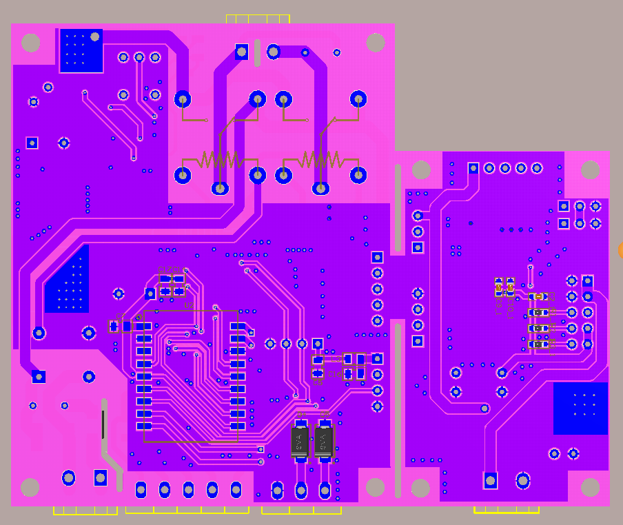

*CI-03T1芯片的PCB布局示例，展示了芯片、滤波电容和接口的合理布置*

**优化建议：**

- 采用4层板设计，专用电源层和地层
- 关键信号线进行阻抗控制
- 在敏感电路周围添加保护地
- 预留测试点方便调试

**应用场景：**

1. **为外设供电**：

    - 为小功率传感器供电
    - 驱动低功耗MCU
    - 为外部EEPROM等存储器件供电

2. **电源设计参考**：

    - 总负载电流不应超过150mA
    - 建议预留20%余量，实际负载控制在120mA以内
    - 必要时考虑使用外部电源方案

**设计注意事项：**

1. **负载计算**：

    - 统计所有外设的功耗
    - 考虑启动瞬态电流
    - 留足安全余量

2. **散热考虑**：

    - 大电流输出时芯片会有发热
    - 保证足够的散热空间
    - 避免长时间满载工作

3. **电路保护**：

    - 可添加限流电阻保护
    - 考虑添加滤波电容
    - 防止负载短路损坏芯片

---


---

### CI-03T模块是否有使能引脚可以控制模块工作？

**问题描述：**

需要了解CI-03T模块是否有使能引脚，以及是否可以通过拉低电平来禁用模块功能。

**解决方案：**

**引脚功能说明：**

CI-03T模块的PA4引脚具有双重功能：

- **GPIO功能**：可作为普通GPIO使用
- **PG_EN功能**：根据上电时电平状态判断是否进行编程
- **内部上拉**：引脚内部有上拉电阻，默认为高电平

**功能限制：**

PA4引脚不能作为使能引脚使用：

- **拉低电平效果**：仅延长开机时间（从350ms延长到850ms）
- **无法禁用模块**：拉低PA4不能禁用语音识别功能
- **模块正常工作**：PA4引脚浮空或拉高/拉低，模块均能正常工作

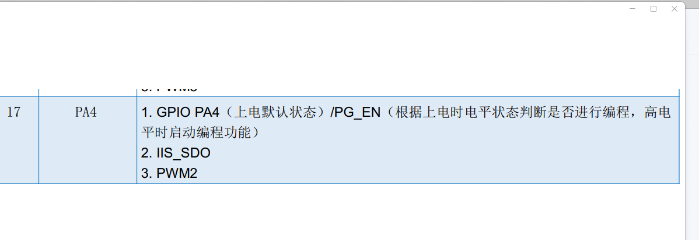

*规格书中PA4引脚标注为GPIO PA4（上电默认状态）/PG_EN*

**实际验证：**

- **浮空状态**：模块正常工作，唤醒词响应正常
- **拉低到地**：模块仍能正常识别和响应唤醒词
- **拉高到VCC**：模块正常工作，无特殊影响

**外部控制方案：**

如需要通过外部信号控制模块的开关，推荐以下方案：

1. **电源控制方案**：

    - 使用MOS管或继电器控制模块的5V电源
    - 断电时模块完全停止工作
    - 上电时模块恢复正常工作

2. **控制电路设计**：

    ```
    外部控制信号 → MOS管/继电器 → CI-03T模块VCC
                                ↓
                            GND保持连接
    ```

3. **实现要点**：

    - 选择合适的MOS管（如N沟道MOSFET）
    - 考虑开关频率和电流需求
    - 加入必要的保护电路

**注意事项：**

- PA4引脚主要用于编程模式判断，不适用于模块使能控制
- 内部上拉确保浮空时为高电平
- 如需完全禁用模块，只能通过控制电源实现
- 设计控制电路时注意开关器件的导通电阻和功耗

---


---

### CI-73T和CI-03T1的硬件封装是否兼容，是否可以将CI-03T1直接焊接在为CI-73T设计的PCB上？

**问题描述：**

需要确认CI-73T和CI-03T1模块的硬件封装兼容性，以及是否可以在为CI-73T设计的PCB上直接焊接使用CI-03T1模块。

**解决方案：**

**封装兼容性确认：**

CI-73T和CI-03T1使用相同的PCB封装，引脚位置和尺寸完全兼容：

- **PCB设计**：两款模块可以使用相同的PCB布局
- **引脚数量**：引脚数量和间距一致
- **焊接兼容**：可以直接互相替换焊接

**引脚差异说明：**

虽然封装兼容，但引脚功能定义存在差异：

- 部分引脚的功能名称可能不同
- 实际电气特性保持一致
- 不影响基础功能的实现

**使用建议：**

1. **直接替换**：

    - CI-03T1可以直接焊接到为CI-73T设计的PCB上
    - 能插CI-73T的接口，就可以插CI-03T1
    - 无需修改PCB设计

2. **功能配置**：

    - 在智能公元平台选择对应的模块型号
    - 根据实际使用的模块生成固件
    - 确保功能配置与硬件匹配

**注意事项：**

- 焊接前确认模块型号，避免混用
- 两款模块的Flash容量和支持词条数不同
- 固件必须选择正确的型号才能正常工作

---


---

### CI-03T1或CI-03T2芯片的功放输出能否与外部已有的喇叭共用，是否需要额外的保护电路？

**问题描述：**

在产品设计中已有播放喇叭，需要了解CI-03T1或CI-03T2芯片的功放输出是否可以与外部喇叭共用，以及是否需要额外的保护电路。

**解决方案：**

**音频输出共用方案：**

CI-03T1/CI-03T2的功放输出可以直接与外部喇叭共用：

- **直接并联**：两个功放输出可以直接并联到同一个喇叭
- **无需保护电路**：不需要额外的二极管或其他保护元件
- **正常工作**：两个功放可以同时连接到同一个喇叭而不冲突

**技术原理说明：**

1. **功放输出特性**：

    - CI-03T1/CI-03T2内置Class AB功放
    - 输出阻抗相对较高，具有自保护能力
    - 两个功放并联不会相互损坏

2. **共用工作方式**：

    - 当其中一个功放工作时，另一个处于静默状态
    - 由于输出阻抗的存在，不会产生大的反向电流
    - 喇叭会响应正在工作的功放信号

**应用建议：**

1. **电路连接**：

    - 将CI-03T的SPK+和SPK-直接连接到喇叭
    - 外部功放的输出也直接连接到同一喇叭
    - 无需添加隔离元件或保护电路

2. **时序控制**：

    - 通过软件控制确保两个功放不会同时播放
    - 避免音频信号叠加影响音质
    - 建议在不同时段使用各自的音频输出

**注意事项：**

- 虽然可以直接共用，但同时播放会影响音质
- 建议在系统中加入播放状态管理，避免冲突
- 如果对音质要求很高，可考虑使用音频切换开关
- 共用方案适合成本敏感且音质要求不高的应用

---


---

### CI-03T1模块如何连接外部功放并处理回音问题？

**问题描述：**

需要通过拆件和飞线的方式将CI-03T1模块的音频输出连接到外部功放，并解决由此引起的回音问题。

**解决方案：**

**拆件和飞线方案：**

1. **移除内置功放元件**：

    - 卸掉IC和部分元器件
    - 包括U2 8002功放芯片及相关元件
    - 为外部功放连接腾出空间

    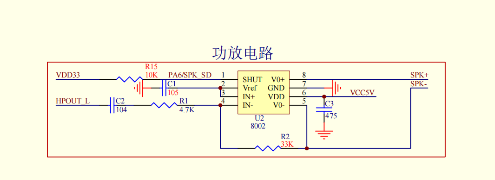

    *CI-03T1模块内部的功放电路，需要移除U2等元件*

2. **飞线连接方案**：

    - **方案一**：直接从喇叭+或喇叭-取单端信号
    - 通过RC滤波后接外部功放输入
    - 取单端信号即可，+或-都可以

    - **方案二**：断开内部功放电路
    - 将DAC输出直接接到外部功放
    - 需要找到DAC输出引脚

    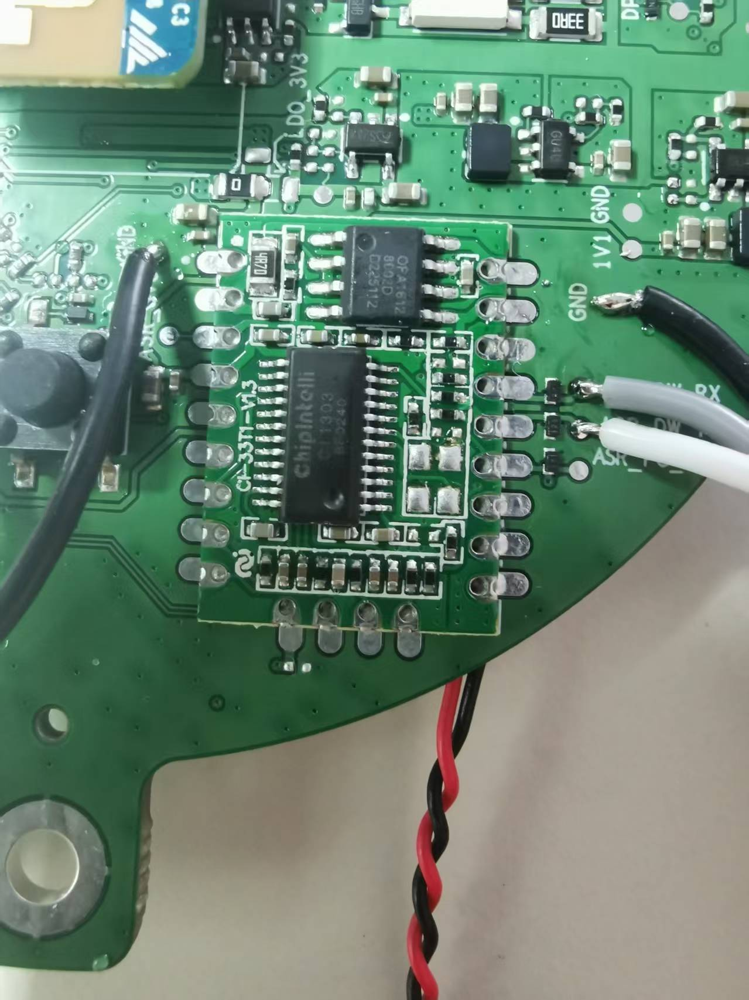

    *CI-03T1-V1.3模块实物，显示主控和功放芯片*

    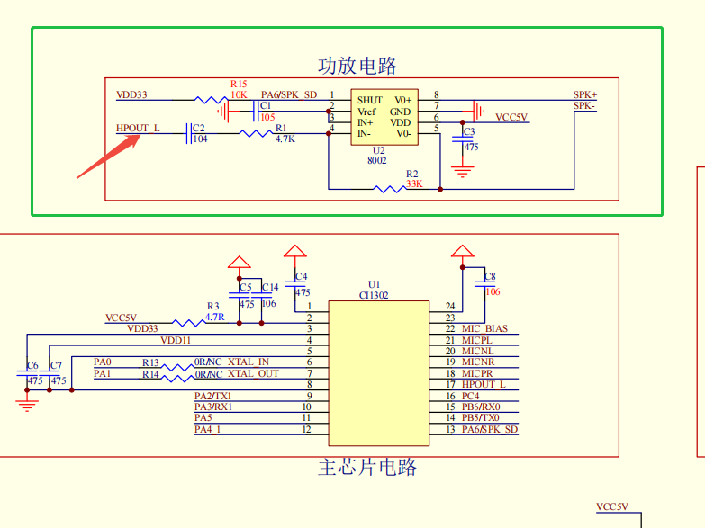

    *CI-03T1模块的完整电路原理图*

**回音问题解决：**

使用外部功放后可能出现自唤醒问题，可通过以下方法解决：

1. **降低唤醒词灵敏度**：

    - 在平台优化选项中调整唤醒词阈值
    - 适当降低灵敏度，减少误唤醒

2. **配置播报期间禁用唤醒词**：

    - 播音开始事件：禁止识别唤醒词
    - 播音结束事件：允许识别唤醒词
    - 需要在平台中配置相应的事件触发

3. **AEC回采处理**（推荐）：

    - 将外部功放输出的音频信号回采到MIC2+
    - 断开原有的R12电阻连接
    - 直接从扬声器输出端通过电阻连接到MIC2+

    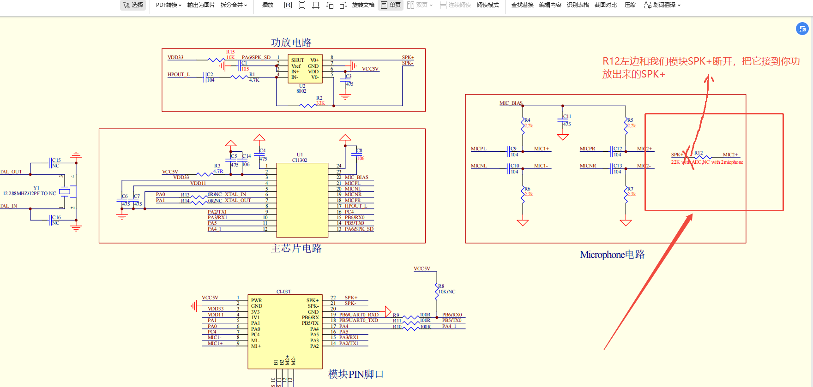

    *将SPK+信号连接到MIC2+以实现回采，解决回音问题*

**具体操作步骤：**

1. **硬件修改**：

    - 卸除U2 8002功放芯片
    - 移除R1、R2、C1、C2、C3等外围元件
    - 从SPK+或SPK-引脚飞线到外部功放

2. **AEC回采连接**：

    - 断开原有R12电阻
    - 从外部功放输出端（扬声器端）串联电阻到MIC2+
    - 电阻值建议10k-22kΩ

3. **软件配置**：

    - 开启AEC功能
    - 配置播音开始禁用唤醒词
    - 配置播音结束启用唤醒词

**音量记忆功能：**

- 模块支持音量调节记忆功能
- 通过语音调整音量后断电，设置会被保存
- 重新上电后保持之前的音量设置

**注意事项：**

- 拆件需要专业的焊接设备和技术
- 使用外部功放时，功放选择需注意与模块的兼容性
- AEC回采是解决回音问题的有效方法
- 修改后需要充分测试各项功能
- MIC引脚输入电压范围在3.3V内，注意信号幅度控制

---


---

### 如何使用CI-03T系列芯片的PWM功能控制舵机实现自动化控制？

**问题描述：**

需要使用CI-03T1或CI-03T2芯片的PWM功能控制舵机，并通过定时器实现语音指令触发后舵机转动到0度，延迟2秒后转回90度的自动化控制。

**解决方案：**

**硬件连接：**

1. **舵机直接连接**：

    - CI-03T系列支持直接驱动舵机
    - 不需要额外的舵机驱动板
    - PWM输出引脚直接连接舵机信号线

2. **电源要求**：

    - 舵机使用外部5V电源供电
    - 舵机地线与模块共地
    - 确保电源电流足够驱动舵机

**平台配置方法：**

1. **添加定时器**：

    - 在定时器管理中创建新定时器
    - 设置定时器名称（如timer_servo）
    - 配置超时时间（2000ms）

2. **配置语音触发动作**：

    - 添加语音命令触发行为
    - 设置PWM输出：占空比5%（对应0度）
    - 启动定时器（timer_servo）

3. **配置定时器超时动作**：

    - 添加定时器超时事件
    - 设置PWM输出：占空比7.5%（对应90度）
    - 实现延时2秒后自动转回

**PWM占空比与舵机角度对应关系：**

| 角度 | PWM占空比 | 脉冲宽度 |
|------|-----------|----------|
| 0度 | 5% | 1ms |
| 45度 | 6.25% | 1.25ms |
| 90度 | 7.5% | 1.5ms |
| 135度 | 8.75% | 1.75ms |
| 180度 | 10% | 2ms |

**定时器配置说明：**

- **延时含义**：定时器的延时时间是指延迟输出，不是持续输出
- **输出模式**：PWM输出是持续的，直到下次修改占空比
- **占空比切换**：可以直接切换占空比，无需先设为0

**实际应用示例：**

```
语音指令："舵机动作"
执行流程：

1. 识别到指令 → 设置PWM占空比为5%（舵机转到0度）
2. 启动定时器timer_servo（2000ms）
3. 2秒后定时器超时 → 设置PWM占空比为7.5%（舵机转回90度）
```

**固件导入与查看：**

- 固件包解压后包含JSON配置文件
- 可导入智能公元平台查看配置
- 便于学习和参考现有设置

**注意事项：**

- CI-1301和CI-1302可以互相替换，引脚定义相同
- CI-1302内存更大，支持自学习功能
- 舵机需要外部供电，模块仅提供PWM信号
- 定时器最多支持5个，合理分配使用
- PWM频率建议设置为50Hz（20ms周期）

---


---

### CI-03T实际有多少个IO口可以使用？

**问题描述：**

CI-03T平台上只看到7个IO口可作为输入输出控制，设计一款电路，正好缺一个输入口，询问是否有其他方式扩展IO口功能。

**解决方案：**

CI-03T实际上有9个IO口可供使用，不是7个：

- **可用IO口**：GPIO_A0、GPIO_A1、GPIO_A2、GPIO_A3、GPIO_A4、GPIO_A5、GPIO_A6、GPIO_B5、GPIO_B6
- **特殊功能引脚**：PA4/PG_EN、PA6（功放使能）等
- **串口引脚**：UART0_TX、UART0_RX、UART1_TX、UART1_RX

**引脚配置表：**

| 引脚名称 | 引脚号 | 功能类型 | 说明 |
|---------|--------|---------|------|
| GPIO_A0 | Pin 6 | 通用IO | 可配置输入/输出 |
| GPIO_A1 | Pin 7 | 通用IO | 可配置输入/输出 |
| GPIO_A2 | Pin 8 | 通用IO | 可配置输入/输出 |
| GPIO_A3 | Pin 9 | 通用IO | 可配置输入/输出 |
| GPIO_A4 | Pin 10 | 通用IO | 可配置输入/输出 |
| GPIO_A5 | Pin 11 | 通用IO | 可配置输入/输出 |
| GPIO_A6 | Pin 12 | 通用IO | 可配置输入/输出 |
| GPIO_B5 | Pin 15 | 通用IO | 可配置输入/输出 |
| GPIO_B6 | Pin 16 | 通用IO | 可配置输入/输出 |

**IO口数量说明：**

- 总计9个通用IO口（A组6个 + B组2个）
- 不包括串口和特殊功能引脚
- 所有IO口均支持5V电平输入
- 支持中断、上拉/下拉等配置

**实际应用建议：**

1. **引脚分配规划**：

    - 预留部分IO口用于关键功能
    - 考虑引脚位置和布线便利性
    - 避免使用特殊功能引脚作为普通IO

2. **扩展方案**：

    - 如需要更多IO口，可使用IO扩展芯片（如PCA9555、MCP23017）

---

### 如何通过多个IO口控制语音播放功能？

**问题描述：**

设计一个电路，通过CI-03T1或CI-03T2芯片的PA6、PA7、PA8、PB5、PB8、PB12六个IO口控制播放相应的语音内容。

**解决方案：**

**设计思路：**

1. **IO口配置方案**
    - 将PA6、PA7、PA8、PB5、PB8、PB12配置为输入模式
    - 设置默认高电平状态
    - 通过外部电路拉低触发

2. **触发控制逻辑**
    - 每个IO口对应一条特定的语音内容
    - 检测到低电平输入时触发对应语音播放
    - 支持同时触发或多路触发

**电路设计注意事项：**

1. **电平匹配**
    - 确保外部控制电路电平与模块兼容（3.3V/5V）
    - 使用上拉电阻保持默认高电平状态
    - 考虑加入滤波电容防止误触发

2. **隔离保护**
    - 在IO口和外部电路间加入限流电阻
    - 必要时使用光耦进行电气隔离
    - 避免外部干扰影响模块正常工作

3. **软件配置**
    - 在平台中添加GPIO触发行为
    - 设置对应的语音播放内容
    - 配置触发条件和响应逻辑

**实施步骤：**

1. **硬件连接**
    - 确认各IO口的物理引脚位置
    - 按照设计图完成电路连接
    - 检查焊接质量和接触可靠性

2. **平台配置**
    - 选择对应的GPIO引脚
    - 设置为输入模式，默认高电平
    - 添加GPIO触发行为和播放内容

3. **功能测试**
    - 逐个测试每个IO口的触发功能
    - 验证语音播放内容正确
    - 测试多路同时触发的情况

**注意事项：**

- PA6是功放使能引脚，谨慎用作通用IO
- 确保所有IO口的电压不超过规格要求
- 建议在实际应用前进行充分的功能验证
    - 通过I2C或串口扩展，仅需2-3个主控IO口
    - 可扩展16个或更多IO口

3. **设计示例**：
    ```
    CI-03T          IO扩展芯片
    GPIO_A0  ←→  SCL     ←→  扩展输出0
    GPIO_A1  ←→  SDA     ←→  扩展输出1
    GPIO_A2  ←→  中断信号  ←→  扩展输出2
    ```

**注意事项：**

- 确保不要将PA4/PG_EN用作普通IO
- PA6是功放使能引脚，谨慎使用
- 串口引脚在调试时可复用为普通IO
- 配置完成后需要重新生成并烧录固件

---

### CI-03T1的GPIO-A6可以用作普通IO吗？

**问题描述：**

CI-03T1芯片宣称有9个IO口，但实际使用时发现GPIO-A6(引脚14)已被用作功放使能脚，无法配置使用，导致实际可用的IO口只有8个。

**解决方案：**

**1. 引脚功能说明**

- GPIO-A6(引脚14)在CI-03T1中固定为功放使能功能
- 该引脚无法配置为普通GPIO输入/输出
- 实际可用IO口为8个：GPIO_A0至GPIO_A5、GPIO_A7、GPIO_A8

**2. 替代方案**

- 如确实需要10个IO口，建议选择SU-32T模块
- SU-32T提供更多可用IO资源
- 根据项目需求评估是否需要更换型号

**3. 硬件修改**

- 如必须使用CI-03T1且需要更多IO
- 可考虑通过I2C或串口扩展芯片增加IO数量
- 或使用其他主控MCU配合使用

**注意事项：**

- 设计前需确认实际可用IO数量
- PA6引脚连接功放电路，不应作他用
- 选择模块时需综合考虑IO需求和功能要求

---


---

### CI-03T1产品的具体参数信息是什么？

**问题描述：**

需要获取CI-03T1产品的详细技术参数，包括主控芯片、供电电压、接口类型、语音指令数量、Flash容量、功放功率等关键信息。

**解决方案：**

**CI-03T1产品详细参数表：**

| 参数项目 | 参数值 | 说明 |
|---------|--------|------|
| **主控芯片** | CI1302 | 32位RISC + BNPU V3神经网络处理器 |
| **封装形式** | SMD22/DIP22 | 22引脚表贴封装 |
| **供电电压** | 3.6-5.5V | 典型值5V，宽电压设计 |
| **识别率** | 95% | 典型环境下识别准确率 |
| **语音指令数** | 300条 | 支持离线指令词数量 |
| **Flash容量** | 2M | 存储语音模型和程序 |
| **AEC支持** | ✓ | 支持声学回声消除 |
| **麦克风配置** | 单麦克风 | 单输入配置 |
| **功放功率** | 2.4W@5V4Ω | 内置Class AB功放 |
| **音频接口** | 1路ADC + 1路DAC | 8k~48kHz采样率 |
| **GPIO数量** | 9个可用IO | 不包括串口引脚 |
| **UART接口** | 2路 | 用于通信和烧录 |
| **PWM输出** | 5路 | 可控制亮度、速度等 |
| **I2C接口** | 1路 | 速率400kHz |
| **ADC输入** | 1路12位 | 450kHz采样率 |
| **待机电流** | ~60mA | 典型待机功耗 |
| **工作电流** | >500mA | 驱动喇叭时 |
| **适用环境** | 中噪声环境 | 家庭、办公室等场景 |

**版本说明：**

- CI-03T1：单麦克风版本，不带晶振
- CI-03T2：单麦克风版本，带晶振
- CI-03T1支持AEC回声消除功能

**关键特性：**

1. **BNPU V3神经网络处理器**：支持DNN/TDNN/RNN等神经网络
2. **内置功放**：可直接驱动4Ω喇叭，无需外部功放
3. **低延时识别**：本地离线处理，响应迅速
4. **丰富接口**：支持多种外设连接和控制

**应用场景：**

- 智能家电控制
- 玩具语音交互
- 智能照明控制
- 语音遥控器

**获取资料：**
完整规格书可向供应商申请，包含详细的引脚定义、电气特性和应用电路。

---

### CI-03T1和CI-03T2的正常工作电流是多少？

**问题描述：**

需要了解CI-03T1和CI-03T2芯片在正常工作时的电流数据，以便计算整个系统的功耗。

**解决方案：**

根据规格书和实测数据，CI-03T1和CI-03T2的电流参数如下：

**工作电流数据：**

1. **待机电流**
    - 典型值：约60mA
    - 无语音识别和播放时的基础功耗

2. **正常工作电流**
    - 典型值：约100mA
    - 语音识别激活但未播放音频时

3. **播放音频时电流**
    - 4Ω喇叭：>500mA（峰值可达800mA以上）
    - 8Ω喇叭：约300-400mA（峰值约600mA）

**功耗计算建议：**

1. **电源设计**
    - 建议电源输出能力：≥1A
    - 预留足够余量应对峰值电流

2. **电池供电计算**
    - 2000mAh电池：连续工作约3-4小时（含语音播放）
    - 3000mAh电池：连续工作约5-6小时

3. **系统功耗预算**
    - 考虑外设功耗（LED、传感器等）
    - 预留20-30%的电源余量

**注意事项：**

- 电流数据会根据音量大小、喇叭阻抗等因素变化
- 峰值电流通常出现在音频播放的瞬间
- 实际功耗建议通过实测确认
- 规格书中有完整的测试数据供参考

---

### CI-03T的SPK+和SPK-引脚频繁短接怎么办？

**问题描述：**

设备的SPK+和SPK-引脚出现短接现象，已连续发生四次，怀疑是设备易损坏或存在设计缺陷。

**解决方案：**

**问题分析：**

1. **短接原因**
    - 喇叭线路短路
    - 焊接问题导致连锡
    - 外部接线错误

2. **检测方法**
    - 使用万用表测量SPK+和SPK-之间电阻
    - 正常时应为喇叭阻抗（如4Ω或8Ω）
    - 短接时电阻接近0Ω

**预防措施：**

1. **正确接线**
    - 确保喇叭正负极正确连接
    - 避免引脚意外接触
    - 使用绝缘套管保护连接点

2. **焊接注意事项**
    - 焊接时避免焊锡桥接
    - 清理多余焊锡
    - 检查是否有连锡现象

3. **外部保护**
    - 在喇叭线路串联小电阻（如1Ω）
    - 添加保险丝（如100mA）
    - 使用带保护的功放电路

**损坏处理：**

1. **模块检查**
    - 测量SPK+和SPK-对地电压
    - 正常应为2.2-2.5V左右
    - 短接后电压可能异常

2. **更换建议**
    - 频繁短接说明可能存在设计问题
    - 考虑更换喇叭或检查线路
    - 必要时更换模块

**注意事项：**

- 喇叭短路不会立即烧毁芯片
- 但频繁短路可能损坏功放电路
- 建议使用标准接口避免接线错误
- 发现短接立即断电检查

---

### CI-03T喇叭引脚对地无电压是什么原因？

**问题描述：**

在测试设备喇叭时，发现喇叭正负极对地均无电压，无法正常工作，怀疑设备可能存在故障。

**解决方案：**

**电压检测标准：**

1. **正常电压范围**
    - SPK+对GND：2.2-2.5V
    - SPK-对GND：2.2-2.5V
    - 两端电压差应<0.1V

2. **检测条件**
    - 模块正常供电（3.6-5.5V）
    - 连接正常喇叭负载
    - 静音状态下测量

**无电压原因分析：**

1. **功放电路故障**
    - 内部功放芯片损坏
    - 输出级开路
    - 静态工作点异常

2. **供电问题**
    - 模块供电不足
    - 内部稳压电路故障
    - 功放部分无供电

3. **外部连接问题**
    - 喇叭线路断路
    - 接触不良或虚焊
    - 测量方法错误

**排查步骤：**

1. **基础检查**
    - 确认模块供电正常
    - 检查指示灯状态
    - 测量VCC电压

2. **功放测试**
    - 断开外部喇叭
    - 测量空载电压
    - 检查是否有音频输出

3. **硬件检修**
    - 检查喇叭线路连接
    - 测量喇叭线圈电阻
    - 验证功放输出电路

**处理方案：**

1. **简单故障**
    - 重新连接喇叭线
    - 检查焊点质量
    - 确保接触良好

2. **模块损坏**
    - SPK电压为0说明功放故障
    - 需要更换整个模块
    - 功放部分无法单独维修

**注意事项：**

- 测量电压时必须连接喇叭
- 空载时电压可能不正常
- 功放损坏通常是不可逆的
- 避免短路导致同类问题

---

### 如何避免CI-03T模块烧毁？

**问题描述：**

如何避免CI系列离线语音识别芯片（如CI-03T1/T2）在使用过程中因供电或负载问题导致设备烧毁？

**解决方案：**

**供电设计要求：**

1. **电压范围**
    - 工作电压：3.6-5.5V
    - 推荐电压：4.5-5.0V
    - 最大电压：不超过5.5V

2. **电源质量**
    - 纹波：<100mV
    - 电流能力：≥500mA
    - 稳定性：无剧烈波动

**防烧毁措施：**

1. **电源保护**
    - 添加TVS管（如SMBJ5.0A）
    - 串联保险丝（500mA）
    - 使用LDO稳压器

2. **负载管理**
    - 避免喇叭短路
    - 匹配喇叭阻抗（4-8Ω）
    - 不超过额定功率

3. **操作规范**
    - 断电操作连接
    - 避免热插拔
    - 静电防护

**常见烧毁原因：**

1. **电压过高**
    - 使用12V等高电压
    - 电源故障输出异常
    - 瞬间高压脉冲

2. **电流过大**
    - 喇叭短路
    - 多个负载并联
    - 功放自激振荡

3. **操作失误**
    - 电源反接
    - 引脚短接
    - 焊接短路

**设计建议：**

1. **电路保护**
    - 输入端加滤波电容
    - 关键信号加限流电阻
    - 预留测试点

2. **PCB设计**
    - 合理的走线宽度
    - 电源和地平面完整
    - 避免锐角走线

**应急处理：**

- 发现异常立即断电
- 不要反复通电测试
- 记录故障现象
- 寻求供应商

---

### CI-03T喇叭正负极接反会有什么影响？

**问题描述：**

在使用CI-03T1或CI-03T2芯片的语音识别模块时，遇到喇叭声音异常的问题，怀疑是喇叭正负极接反导致，需要确认喇叭接反是否会导致声音变小或损坏设备。

**解决方案：**

**喇叭极性说明：**

1. **基本原理**
    - 喇叭为交流负载，无正负极性
    - 大多数喇叭不区分极性
    - 接反主要影响相位

2. **CI-03T输出特性**
    - 采用BTL功放输出
    - SPK+和SPK-为差分输出
    - 理论上无正负之分

**接反影响分析：**

1. **声音影响**
    - 可能导致声音变小
    - 低频响应可能受影响
    - 不会完全无声

2. **设备安全**
    - 不会烧毁芯片
    - 不会损坏功放电路
    - 不会损坏喇叭

**实际测试结果：**

1. **音量变化**
    - 接反时音量略小
    - 差异约10-20%
    - 人耳可感知差异

2. **相位影响**
    - 在立体声应用中重要
    - 单声道应用影响较小
    - 多喇叭时需统一相位

**正确做法：**

1. **标识识别**
    - 喇叭通常有+/-标记
    - 红线为正，黑线为负
    - 遵循模块标注

2. **测试验证**
    - 先按标识连接
    - 试听效果
    - 如音量小可尝试对调

3. **多喇叭系统**
    - 确保所有喇叭相位一致
    - 统一正负极连接
    - 避免相位抵消

**注意事项：**

- CI-03T的功放设计已考虑极性
- 接反不会造成硬件损坏
- 音质影响有限，不必过度担心
- 批量生产时建议统一标准

---

### CI-03T喇叭正负极接反会有什么影响？

**问题描述：**

在使用CI-03T1或CI-03T2芯片的语音识别模块时，遇到喇叭声音异常的问题，怀疑是喇叭正负极接反导致，需要确认喇叭接反是否会导致声音变小或损坏设备。

**解决方案：**

**喇叭极性说明：**

1. **基本原理**
    - 喇叭为交流负载，无正负极性
    - 大多数喇叭不区分极性
    - 接反主要影响相位

2. **CI-03T输出特性**
    - 采用BTL功放输出
    - SPK+和SPK-为差分输出
    - 理论上无正负之分

**接反影响分析：**

1. **声音影响**
    - 可能导致声音变小
    - 低频响应可能受影响
    - 不会完全无声

2. **设备安全**
    - 不会烧毁芯片
    - 不会损坏功放电路
    - 不会损坏喇叭

**实际测试结果：**

1. **音量变化**
    - 接反时音量略小
    - 差异约10-20%
    - 人耳可感知差异

2. **相位影响**
    - 在立体声应用中重要
    - 单声道应用影响较小
    - 多喇叭时需统一相位

**正确做法：**

1. **标识识别**
    - 喇叭通常有+/-标记
    - 红线为正，黑线为负
    - 遵循模块标注

2. **测试验证**
    - 先按标识连接
    - 试听效果
    - 如音量小可尝试对调

3. **多喇叭系统**
    - 确保所有喇叭相位一致
    - 统一正负极性连接
    - 避免相位抵消

**注意事项：**

- CI-03T的功放设计已考虑极性
- 接反不会造成硬件损坏
- 音质影响有限，不必过度担心
- 批量生产时建议统一标准

---


---

### CI-03T1芯片引脚表中显示16个引脚，但产品规格说只有9个IO口，存在矛盾吗？

**问题描述：**

查看CI-03T1芯片引脚功能表时，发现表格列出了16个引脚（Pin No. 6-16等），但产品规格中提到只有9个IO口，对此感到困惑。

**解决方案：**

**引脚数量解析：**

CI-03T1芯片共有22个引脚（SMD22/DIP22封装），其中：

**1. 专用功能引脚（占用13个）**：

- **电源引脚**：VDD、VSS、VDDA、VSSA等
- **音频引脚**：MICN、MICP、HPOUT、HPGND
- **串口引脚**：UART_TX、UART_RX（用于烧录和调试）
- **时钟引脚**：X1、X2（晶振引脚，CI-03T1不带晶振）
- **复位引脚**：RESET
- **测试引脚**：TEST（工厂测试用）

**2. 可用GPIO引脚（9个）**：
除去上述专用功能引脚后，剩余的9个引脚可作为通用IO使用：
```
GPIO_A0、GPIO_A1、GPIO_A2、GPIO_A3
GPIO_A4、GPIO_A5、GPIO_A6、GPIO_A7
GPIO_A8
```

**3. 引脚功能分配表示例**：

| 引脚号 | 引脚名称 | 类型 | 功能说明 |
|--------|---------|------|---------|
| Pin 1 | VDD | 电源 | 3.6-5.5V供电 |
| Pin 2 | VSS | 电源 | 地线 |
| Pin 3 | MICP | 音频 | 麦克风正极 |
| Pin 4 | MICN | 音频 | 麦克风负极 |
| Pin 5 | HPOUT | 音频 | 喇叭输出 |
| Pin 6 | GPIO_A0 | IO | 可配置IO |
| Pin 7 | GPIO_A1 | IO | 可配置IO |
| Pin 8 | GPIO_A2 | IO | 可配置IO |
| Pin 9 | GPIO_A3 | IO | 可配置IO |
| Pin 10 | GPIO_A4 | IO | 可配置IO |
| Pin 11 | GPIO_A5 | IO | 可配置IO |
| Pin 12 | UART_TX | 串口 | 固定功能 |
| Pin 13 | UART_RX | 串口 | 固定功能 |
| Pin 14 | GPIO_A6 | IO | 可配置IO |
| Pin 15 | GPIO_A7 | IO | 可配置IO |
| Pin 16 | GPIO_A8 | IO | 可配置IO |
| ... | 其他引脚 | 专用功能 | 电源、时钟等 |

**关键说明：**

- **总引脚数**：22个（全部引脚）
- **可用IO数**：9个（GPIO_A0至GPIO_A8）
- **专用引脚**：13个（电源、音频、串口等）

**Li龙的解释**："不要串口不就有九个了" - 意思是如果不计算UART_TX和UART_RX这两个固定功能的串口引脚，剩下的就是9个可用的GPIO。

**应用建议：**

1. **GPIO配置**：9个GPIO可配置为输入/输出/PWM等功能
2. **串口保留**：UART通常用于调试，不建议用作普通IO
3. **资源规划**：设计时需注意实际可用IO为9个
4. **扩展方案**：如需更多IO，可考虑I2C扩展芯片

**注意事项：**

- 引脚功能表展示的是全部引脚，包括专用和通用引脚
- 产品规格中说的"9个IO口"指的是可自由编程的GPIO数量
- 设计电路时需区分专用引脚和可配置引脚

---


---

### CI-03T1和CI-03T2开发板的尺寸是多少？

**问题描述：**

需要获取CI-03T1和CI-03T2型号开发板的尺寸信息，用于硬件设计。

**解决方案：**

**官方资料范围：**

1. **提供的模块资料**：

    - 蜂鸟M芯片和SU-03T模块的尺寸封装数据
    - CI-03T模块规格书（21×15mm）
    - 相关原理图和电气参数

2. **未提供的资料**：

    - CI-03T1和CI-03T2开发板的详细尺寸图
    - 开发板级的机械图纸
    - 开发板封装文件

**获取尺寸的建议：**

1. **联系供应商**：

    - 通过官方渠道咨询开发板尺寸
    - 说明具体项目需求和设计用途
    - 获取开发板的机械图纸或3D模型

2. **参考模块尺寸**：

    - CI-03T1/CI-03T2模块：21mm × 15mm
    - 封装：SMD22/DIP22
    - 引脚间距：标准2.54mm

3. **实际测量方案**：

    - 如已拥有开发板，可使用游标卡尺测量
    - 记录长、宽、高等关键尺寸
    - 注意排针位置和接口位置

**设计建议：**

1. **优先使用模块**：

    - 开发板主要用于开发调试
    - 批量产品建议直接使用模块
    - 模块尺寸更小，便于集成

2. **如需开发板功能**：

    - 设计插座或连接器
    - 预留足够空间容纳开发板
    - 考虑调试接口的布局

**注意事项：**

- 官方主要提供模块级资料，开发板资料有限
- 开发板尺寸可能因版本而异，建议确认具体型号
- 设计PCB时优先考虑模块的直接集成方案

---


---

### CI-03T待机时出现周期性电流声怎么办？

**问题描述：**

CI-03T模块在待机状态下，每隔20-30秒会发出一次电流声（类似"嘚"的声音），即使更换了不同规格的喇叭和电源，问题依然存在。

**解决方案：**

**问题原因分析：**

这是由于固件中启用了深度休眠功能导致的正常现象。

**解决方法：**

1. **关闭深度休眠功能**：

    - 登录智能公元平台
    - 进入对应项目的固件配置
    - 找到"优化选项"或"系统设置"
    - 取消勾选"深度休眠"选项
    - 重新生成并烧录固件

2. **配置效果确认**：

    - 关闭深度休眠后，周期性电流声消失
    - 模块保持常醒状态，响应更及时
    - 功耗会略有增加，但提供了更好的用户体验

**技术说明：**

- 深度休眠是模块为了降低功耗而设计的功能
- 进入和退出深度休眠时，功放电路会产生瞬态声音
- 这是硬件特性，不是故障或损坏
- 电流声通常持续很短时间，不影响正常功能

**注意事项：**

- 如果对功耗要求不高，建议保持深度休眠关闭
- 如需兼顾功耗，可调整休眠时间参数而非完全禁用
- 更换喇叭和电源无法解决此问题，因为是系统行为
- 在对静音要求高的应用中，建议关闭此功能

---


---

### CI-03T模块功放芯片OPA1612烧毁如何处理？

**问题描述：**

CI-03T模块上的功放芯片OPA1612烧毁，需要了解是否可以单独购买功放芯片进行更换，以及模块型号确认。

**问题分析：**

1. **功放芯片识别**：

    - 照片显示功放芯片标识为"8002D"而非OPA1612
    - 8002D是实际使用的功放芯片型号
    - CI1302主控芯片清晰可见

    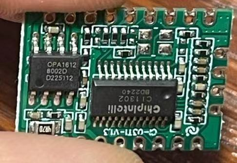

    *CI-03T模块上烧毁的功放芯片，可见8002D标识和CI1302主控*

2. **模块型号确认**：

    - 确认为CI-03T模块
    - 使用的是标准功放配置
    - 需要确认功放芯片的兼容性

**解决方案：**

1. **功放芯片更换**：

    - 8002D功放芯片可以单独更换
    - 需要具备一定的焊接技术
    - 建议使用热风枪进行拆卸和焊接

2. **采购渠道**：

    - 通过官方渠道购买模块
    - 官方淘宝店可提供完整模块
    - 如需芯片单独购买，需确认型号兼容性

3. **临时处理**：

    - 如有备用模块，可先更换使用
    - 烧毁的模块可返厂维修
    - 保留故障样本用于分析

**技术要点：**

- 8002D是常用的音频功放芯片
- 更换时注意芯片方向和引脚定义
- 焊接温度控制在250°C以内，避免损坏PCB
- 更换后测试音频输出功能是否正常

**预防措施：**

1. **负载匹配**：

    - 确保喇叭阻抗匹配（推荐8Ω）
    - 避免短路或过载
    - 检查喇叭功率是否在功放承受范围内

2. **电源稳定**：

    - 确保供电电压稳定（5V±5%）
    - 避免电源纹波过大
    - 检查电源适配器质量

3. **散热设计**：

    - 功放芯片周围保持良好散热
    - 避免长时间大音量工作
    - 必要时增加散热片

**注意事项：**

- 功放芯片烧毁通常是负载问题导致
- 更换后需测试所有功能是否正常
- 批量问题建议联系供应商分析原因
- 保留故障记录便于质量改进

---


---

### 如何实现CI-03T系列芯片的按键双击功能？

**问题描述：**

需要在CI-03T1或CI-03T2芯片上实现模拟按键双击功能，包括具体的配置步骤和注意事项。

**解决方案：**

**双击检测原理：**

通过检测连续两次按键的时间间隔来判断是否为双击操作：

- 第一次按键：记录按下时间
- 第二次按键：判断时间间隔是否在设定范围内
- 触发条件：两次按键间隔小于设定值（如2秒）

**配置步骤：**

1. **定义变量**：

    - 创建计数变量：__a_1（unsigned char类型）
    - 初始值设为0，用于记录按键次数
    - 定时器变量：__Timer_01，用于时间控制

    

    *变量定义界面，设置__a_1为无符号字符类型，初始值为0*

2. **添加定时器**：

    - 定时器名称：__Timer_01
    - 超时时间：2000ms（2秒）
    - 用于检测双击的时间窗口

    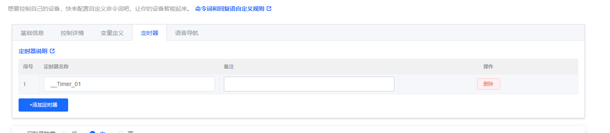

    *定时器配置界面，设置2秒超时时间*

3. **配置控制逻辑**：

    - **第一次按键按下**：

        * 停止定时器
        * 设置变量__a_1为1
        * 启动定时器（2秒）

    - **第二次按键按下**：

        * 检查变量__a_1是否为1
        * 如果是且定时器未超时，判定为双击
        * 执行双击对应的动作

    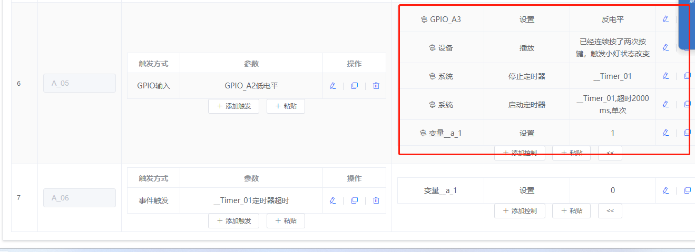

    *控制逻辑配置界面，包含GPIO输入、定时器控制和变量设置*

**关键配置要点：**

1. **顺序不能错乱**：

    - 必须按照停止定时器→设置变量→启动定时器的顺序
    - 顺序错误会导致逻辑异常

2. **时间间隔设置**：

    - 推荐双击间隔：≤2秒
    - 可根据实际需求调整时间窗口
    - 超过时间窗口则视为两次单击

3. **状态重置**：

    - 定时器超时后自动重置变量__a_1为0
    - 双击触发后也需要重置状态
    - 确保下次检测的准确性

**实际工作流程：**

```
按键1按下 → 停止定时器 → __a_1=1 → 启动2秒定时器
    ↓
    （2秒内）
    ↓
按键2按下 → 检测__a_1=1 → 定时器未超时 → 触发双击动作
    ↓
重置所有状态 → 等待下次按键
```

**注意事项：**

- 定时器超时时间需要根据实际应用场景调整
- 按键消抖处理是必要的，避免误触发
- 配置顺序必须严格按照文档执行，否则逻辑会出错
- 测试时验证不同按键速度下的双击识别率
- 适用于CI-03T1和CI-03T2等支持定时器和变量功能的芯片

---


---

### CI-03T1模块功放芯片突然无声是什么原因？

**问题描述：**

使用CI-03T1模块时，上午工作正常有声音，下午突然无声，测量SPK+引脚只有0.1V电压，怀疑功放芯片烧坏。

**问题分析：**

功放芯片突然无声通常由以下原因导致：

1. **功放芯片烧毁**：

    - SPK+引脚电压异常低（正常应在工作电压范围）
    - 可能是喇叭阻抗不匹配或功率过大导致
    - 长时间过载工作可能损坏功放芯片

2. **硬件连接问题**：

    - SPK+到芯片引脚断路
    - 喇叭线圈烧毁
    - 焊接点虚焊或脱落

**解决方案：**

1. **电压测量**：

    - 测量SPK+引脚对地电压
    - 正常工作时应有合适的工作电压
    - 0.1V电压表明功放输出异常

2. **线路检查**：

    - 检查SPK+到芯片的连接通路
    - 确认喇叭线圈完好（测量阻抗）
    - 检查焊接点是否牢固

3. **更换验证**：

    - 更换确认正常的喇叭测试
    - 如仍有问题，可能是功放芯片损坏
    - 更换模块或返厂维修

**喇叭参数限制：**

- **4Ω喇叭**：功率从2.4W起步
- **8Ω喇叭**：功率从1.6W起步
- **重要提醒**：尽量不要使用过大功率的喇叭（如4Ω5W），模块可能带不动

**注意事项：**

- 使用笔记本USB口供电相对稳定，但需确保电流足够
- 避免长时间大音量使用，防止功放过热
- 选择推荐规格的喇叭，避免因参数不匹配损坏模块
- 突然无声通常是硬件故障，需先排查外部电路

---


---

### CI-03T和CI-33T模块是否需要外接晶振？

**问题描述：**

需要了解CI-03T和CI-33T系列模块是否需要外接晶振，以及带晶振和不带晶振的模块有什么区别。

**解决方案：**

**晶振选择说明：**

1. **按需求选择**：

    - 有外部晶振需求：选择带晶振版本
    - 无特殊需求：选择不带晶振版本
    - 两种版本功能完全相同

2. **功能差异**：

    - 基础功能：两版本无区别
    - 定时精度：带晶振版本更稳定
    - 温度稳定性：带晶振表现更好

**应用场景建议：**

1. **需要晶振的场景**：

    - 对定时精度要求高的应用
    - 温度变化较大的环境
    - 需要稳定时钟的场合
    - 哭声/鼾声检测等特殊功能（必须使用带晶振版本）

2. **不需要晶振的场景**：

    - 一般语音识别应用
    - 室内稳定环境
    - 成本敏感的项目

**技术参数：**

- **带晶振版本**：

    - 提供更精确的时钟基准
    - 温漂特性更好
    - 适合工业应用

- **不带晶振版本**：

    - 使用内部时钟
    - 成本更低
    - 适合消费类产品

**各系列型号说明：**

**CI-03T系列**：

- CI-03T1：单麦不带晶振
- CI-03T2：双麦不带晶振
- CI-03T3：单麦带晶振
- CI-03T4：双麦带晶振

**CI-33T系列**：

- CI-33T3：单麦带晶振
- CI-33T4：双麦带晶振

**选择建议：**

- 根据产品定位选择合适版本
- 考虑使用环境和精度需求
- 评估成本与性能的平衡
- 特殊功能（如哭声检测）必须选择带晶振版本

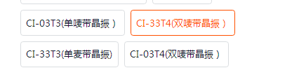

*图中展示了CI-03T和CI-33T系列的不同型号选项，带晶振版本具有更好的温度稳定性*

---

### 启用哭声检测功能后还能支持语音播报和识别吗？

**问题描述：**

在使用CI-03T1或CI-03T2芯片模块时，启用哭声检测功能后，是否还能同时支持语音播报和语音识别功能。

**解决方案：**

**功能限制说明**

启用哭声检测功能后，模块将无法同时支持以下功能：

- **语音识别功能**：无法识别命令词
- **语音播报功能**：无法进行TTS播报
- **其他语音功能**：免唤醒、自学习等功能不可用

**工作原理**

- **哭声检测模式**：

    - 模块专注于检测婴儿哭声特征
    - 使用专用算法分析声音频谱
    - 检测到哭声后触发相应输出

- **单一功能运行**：

    - 哭声检测需要占用全部DSP资源
    - 无法与其他语音功能并行运行
    - 这是硬件资源限制导致

**硬件选型建议**

- **必须选择带晶振版本**：

    - CI-03T3（单麦带晶振）
    - CI-03T4（双麦带晶振）
    - CI-33T3（单麦带晶振）
    - CI-33T4（双麦带晶振）

- **哭声检测应用场景**：

    - 婴儿监护器
    - 智能摇篮
    - 儿童安全产品
    - 护理辅助设备

**替代方案**

如果需要同时支持哭声检测和语音功能：

- **使用双模块方案**：

    - 一个模块专用于哭声检测
    - 另一个模块处理语音交互
    - 通过MCU协调两个模块工作

- **分时工作模式**：

    - 设计切换机制
    - 一段时间内只运行一种功能
    - 根据需求动态切换

**注意事项：**

- 哭声检测是独立功能，不能与语音功能同时使用
- 选型时务必确认实际功能需求
- 如需要复合功能，考虑使用两个模块方案
- 带晶振版本才能保证哭声检测的准确性

---


---

### CI-03T1和CI-03T2芯片的脉冲输出（PWM）功能如何使用？

**问题描述：**

需要了解CI-03T1和CI-03T2芯片的脉冲输出功能使用方法，包括PWM输出的配置和应用场景。

**解决方案：**

CI-03T1和CI-03T2芯片均支持5路PWM输出，可用于控制LED亮度、电机速度、蜂鸣器音调等需要脉宽调制控制的应用场景。

**PWM功能特点：**

1. **输出路数**：

    - 支持5路独立的PWM输出
    - 可单独配置每路的频率和占空比
    - 支持同时运行不同参数的PWM输出

2. **性能参数**：

    - 频率范围：1Hz-20kHz可调
    - 占空比范围：0%-100%可调
    - 输出电平：3.3V

**硬件连接说明：**

1. **PWM引脚定义**：

    | PWM通道 | CI-03T1/CI-03T2引脚 | 说明 |
    |---------|-------------------|------|
    | PWM0 | PA0 | 第一路PWM输出 |
    | PWM1 | PA1 | 第二路PWM输出 |
    | PWM2 | PA2 | 第三路PWM输出 |
    | PWM3 | PA3 | 第四路PWM输出 |
    | PWM4 | PA4 | 第五路PWM输出 |

2. **负载连接方式**：

    ```
    语音模块PWM引脚 → 限流电阻 → 负载 → GND
    ```

3. **电流限制**：

    - 芯片内部LDO输出3.3V电压
    - 单路最大输出电流：150mA
    - 总输出电流不超过300mA

**软件配置方法：**

1. **平台配置**：

    - 在智能公元平台选择"PWM输出"功能
    - 配置PWM通道、频率和占空比
    - 设置触发条件（如语音指令）

2. **参数设置示例**：

    | 应用场景 | 推荐频率 | 推荐占空比 |
    |---------|----------|------------|
    | LED调光 | 1kHz | 0-100% |
    | 电机调速 | 10kHz | 0-100% |
    | 蜂鸣器 | 2kHz-5kHz | 50% |
    | 舵机控制 | 50Hz | 5-10% |

**应用示例：**

1. **LED亮度调节**：

    - 语音指令："灯光调亮"
    - PWM配置：频率1kHz，占空比80%
    - 实现效果：LED亮度达到80%

2. **蜂鸣器音调控制**：

    - 语音指令："播放提示音"
    - PWM配置：频率2kHz，占空比50%
    - 实现效果：蜂鸣器发出2kHz音调

3. **电机速度控制**：

    - 语音指令："风扇低速"
    - PWM配置：频率10kHz，占空比30%
    - 实现效果：电机以30%功率运行

**电路设计注意事项：**

1. **直接驱动（小负载）**：

    ```
    PWM引脚 → [220Ω电阻] → LED → GND
    ```

2. **三极管驱动（中等负载）**：

    ```
    PWM引脚 → [1kΩ电阻] → NPN三极管基极
    三极管发射极 → GND
    三极管集电极 → 负载 → VCC
    ```

3. **MOS管驱动（大负载）**：

    ```
    PWM引脚 → [100Ω电阻] → MOS管栅极
    MOS管源极 → GND
    MOS管漏极 → 负载 → 电源正极
    ```

**实际代码示例：**

```c
// 配置PWM输出（伪代码示例）
void setupPWM() {
    // 设置PWM0为1kHz，50%占空比
    PWM_SetChannel(0, 1000, 50);

    // 设置PWM1为10kHz，30%占空比
    PWM_SetChannel(1, 10000, 30);

    // 启用PWM输出
    PWM_Enable(0);
    PWM_Enable(1);
}

// 语音指令触发PWM调节
void voiceCommandHandler(char* command) {
    if (strcmp(command, "灯光调亮") == 0) {
        PWM_SetDutyCycle(0, 80);  // 调到80%亮度
    } else if (strcmp(command, "灯光调暗") == 0) {
        PWM_SetDutyCycle(0, 20);  // 调到20%亮度
    }
}
```

**故障排查：**

1. **PWM无输出**：

    - 检查引脚配置是否正确
    - 确认PWM功能已启用
    - 验证负载连接是否正常

2. **输出不稳定**：

    - 检查电源供电是否稳定
    - 确认负载电流未超限
    - 检查接线是否牢固

3. **负载不工作**：

    - 检查负载是否需要驱动电路
    - 确认电平匹配（3.3V）
    - 测试PWM输出波形

**注意事项：**

- 大电流负载必须外接驱动电路
- 避免PWM输出短路，可能损坏芯片
- 设计时要预留足够的电流余量
- 感性负载（如电机）建议加续流二极管
- 高频PWM可能产生干扰，注意EMC设计

**典型应用场景：**

- 智能照明：LED灯调光、色温调节
- 家电控制：风扇调速、水泵控制
- 音频输出：蜂鸣器提示音、简单音效
- 伺服控制：舵机角度控制
- 电源管理：DC-DC转换控制

---


---

### CI-03T1喇叭输出电压为0怎么办？

**问题描述：**

CI-03T1模块的喇叭输出电压为0（SPK+端），麦克风电压正常（2.3V左右），怀疑音频输出部分损坏。

**解决方案：**

**问题定位：**

SPK+电压为0V而SPK-为2.47V是不正常状态，正常情况下两端都应在2.4V左右。

**详细检测步骤：**

**步骤1：确认测量方法**

1. **正确测量方式**：
    ```
    测量步骤：

    1. 模块正常上电
    2. 万用表黑表笔接模块GND
    3. 红表笔分别测量SPK+和SPK-
    4. 记录两个电压值
    ```

2. **正常电压范围**：

    - SPK+：约2.4V±0.2V
    - SPK-：约2.4V±0.2V
    - 两端电压差应<0.1V

**步骤2：故障分析**

1. **SPK+为0V的可能原因**：

    - 功放芯片损坏
    - 输出电路断路
    - 静音功能被错误触发
    - 保护电路动作

2. **进一步检测**：

    - 测量SPK+到芯片的通路电阻
    - 检查功放IC温度
    - 确认功放供电电压

**步骤3：电路检查**

1. **线路通断测试**：
    ```
    使用万用表电阻档：

    - 黑表笔：功放IC输出脚
    - 红表笔：SPK+焊盘
    - 正常电阻：<10Ω
    - 开路：∞或很大
    ```

2. **功放IC检查**：

    - 目视检查是否有烧毁痕迹
    - 测量IC各引脚电压
    - 检查外围元件

**解决方案：**

**方案1：软件检查**

1. **检查静音设置**：

    - 查看是否配置了自动静音
    - 检查GPIO控制是否错误触发静音
    - 重新生成不含静音的固件测试

2. **测试音频输出**：

    - 烧录测试固件（含开机播报）
    - 上电后立即测量电压
    - 确认播报时的电压变化

**方案2：硬件修复**

1. **通路修复**：
    ```
    如果发现断路：

    1. 找到断路点
    2. 使用细导线飞线连接
    3. 测试确认恢复
    ```

2. **元件更换**：

    - 如确认功放IC损坏，需要更换
    - 查找同型号功放IC
    - 热风枪拆下，重新焊接

**技术细节：**

1. **功放工作原理**：

    - BTL桥接输出
    - SPK+和SPK-反相输出
    - 直流偏置VCC/2

2. **典型故障**：

    - 输出管击穿（一端接地）
    - 输出管开路（电压为0）
    - 偏置电路故障

**测试验证：**

1. **使用测试固件**：

    - 下载调试固件（有持续输出）
    - 测量SPK+电压变化
    - 确认功放基本功能

2. **外接音频源**：

    - 从外部输入音频信号
    - 观察SPK+响应
    - 判断功放是否工作

**维修建议：**

1. **DIY修复**：

    - 确认断路点可尝试飞线
    - 使用细漆包线（如0.1mm）
    - 注意绝缘和固定

2. **专业维修**：

    - 如无维修经验，建议送修
    - 或直接更换模块
    - 记录故障原因

**预防措施：**

1. **使用注意**：

    - 避免长时间短路
    - 不要使用过大功率喇叭
    - 确保喇叭阻抗匹配

2. **设计建议**：

    - 添加输出保护电路
    - 考虑使用外部功放
    - 预留测试点

**注意事项：**

- 上午有声下午无声可能是热稳定性问题
- 正常使用模块不应发烫
- SPK+为0V大概率是硬件故障
- 测量时确保表笔接触良好，避免误判

---


---

### CI-03T芯片如何设置端口无限循环定时输出高电平？

**问题描述：**

需要在CI-03T芯片上设置一个端口，实现无限循环定时输出高电平的功能。

**解决方案：**

CI-03T支持通过定时器功能实现循环输出，具体配置方法如下：

**1. 配置语音指令触发**

- 添加语音指令词，如"开启定时器"
- 配置触发动作：启动定时器


*配置语音指令"开启定时器"来触发定时器启动*

**2. 设置定时器参数**

- 定时器名称：_Timer_1（可自定义）
- 超时时间：10000ms（10秒）
- 触发模式：重复触发
- 操作选项：立即重复


*定时器配置界面，设置10秒重复触发*

**3. 配置定时器动作**

- 添加控制动作：设置GPIO输出高电平
- GPIO引脚：选择需要控制的端口
- 输出电平：高电平（3.3V）

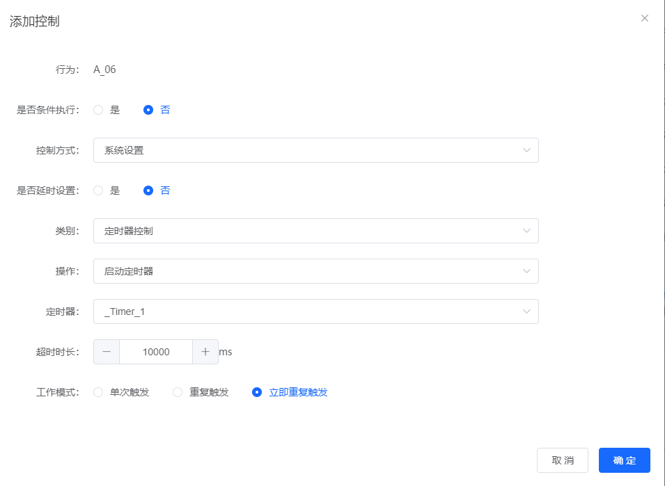

*配置定时器超时后设置GPIO输出高电平*

**4. 实现循环逻辑**

定时器每次超时后：

1. 自动输出高电平到指定GPIO
2. 重新启动定时器（10秒倒计时）
3. 10秒后再次触发，形成无限循环

**工作原理：**

- 语音指令"开启定时器"→ 启动Timer_1
- Timer_1超时（10秒）→ GPIO输出高电平
- 系统自动重启Timer_1→ 10秒后再次触发
- 形成连续的高电平输出（可改为方波）

**注意事项：**

1. **GPIO配置要求**

    - 确认目标GPIO配置为输出模式
    - 检查GPIO驱动能力（最大150mA）
    - 大电流负载需要外接驱动电路

2. **定时器限制**

    - 每个定时器独立工作
    - 最多支持5个定时器同时运行
    - 合理规划定时器资源

3. **安全考虑**

    - 避免GPIO短路，可能损坏芯片
    - 长时间运行注意发热问题
    - 必要时添加限流电阻

4. **扩展功能**

    - 可配合变量实现更复杂的控制逻辑
    - 支持设置占空比产生PWM效果
    - 可通过多个定时器级联实现时序控制

**应用场景：**

- **LED闪烁**：设置高电平2秒，低电平2秒，循环往复
- **蜂鸣器提示**：定时输出短促的高电平脉冲
- **继电器控制**：控制继电器吸合时间
- **状态指示**：作为设备运行状态的视觉指示

---


---

### CI-03T1模块IO电平信号不稳定怎么办？

**问题描述：**

CI-03T1芯片的IO引脚在休眠状态下保持高电平，有声音时电平变低，无声音10秒后又自动拉高，导致电平信号周期性跳变，无法作为稳定的唤醒触发源。

**解决方案：**

1. **使用事件触发其他引脚**

    - 选择其他未被占用的IO引脚作为稳定的触发源
    - 在平台配置中设置事件触发功能
    - 将语音识别事件映射到指定IO引脚

2. **配置功放使能引脚**

    - 确认使用的IO引脚是否为功放使能引脚（如IO4）
    - 功放使能引脚会根据音频输出状态自动切换电平
    - 如需稳定触发，建议选择非功放相关的IO引脚

3. **修改平台配置**

    - 导出当前平台配置
    - 检查IO引脚的功能分配
    - 重新配置IO引脚触发方式

**注意事项：**

- 功放使能引脚的特性是随音频输出自动切换，不适合用作稳定触发源
- 选择IO引脚时应避开具有自动管理功能的引脚
- 如需要稳定的唤醒信号，建议使用专用的GPIO输入功能

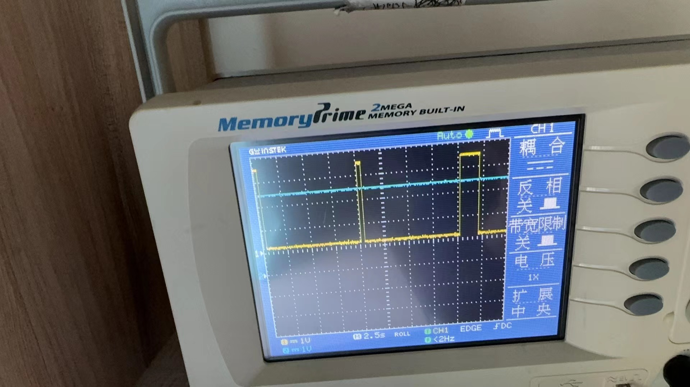

---

## SU-21T模块IO引脚电平自动跳变问题

**问题描述：**

SU-21T模块的IO引脚（如IO4）在静音超过一分钟时电平会自动拉高，导致无法作为稳定的触发源使用。


**技术分析：**

- **现象**：模块在静音状态超过一分钟后，IO引脚电平自动从低电平拉高至高电平
- **影响**：这种周期性的电平跳变使得IO引脚无法作为可靠的外部唤醒触发源
- **原因**：模块内部的功耗管理机制在长时间无声音输入时自动调整IO状态

**解决方案：**

1. **使用事件触发其他引脚**

    - 如需要稳定的触发源，建议配置事件触发到其他专用引脚
    - 避免使用具有自动功耗管理功能的IO引脚作为触发源

2. **硬件设计优化**

    - 在设计阶段明确各IO引脚的功能特性
    - 选择适合作为触发源的专用引脚，避免使用功放使能引脚

3. **配置检查**

    - 检查平台配置文件中的IO引脚功能定义
    - 确认所使用的引脚是否支持稳定的触发功能

**注意事项：**

- SU-21T作为超低功耗模组，内置了多级功耗管理机制
- 部分IO引脚可能会因为功耗管理策略而产生状态变化
- 建议在项目设计阶段详细评估各IO引脚的电气特性

---


---

### CI-03T芯片贴装在有過孔的PCB板上会有影响吗？

**问题描述：**

将CI-03T芯片贴装在带有过孔的PCB板上，担心过孔位置对芯片正常工作产生潜在影响。

**解决方案：**

**问题分析：**

1. **过孔对芯片的潜在影响**：

    - 过孔可能影响PCB的机械强度
    - 贴装区域下方的过孔影响散热
    - 可能导致焊接时虚焊或气泡问题

2. **信号完整性考虑**：

    - 过孔可能影响射频信号传输
    - 高频信号路径上的过孔造成阻抗不连续
    - 数字信号可能因过孔产生反射

**设计建议：**

1. **过孔布局原则**：

    - 避免在芯片正下方布置过孔
    - 重要信号线下方尽量减少过孔
    - 电源和地平面过孔应均匀分布

2. **贴装区域优化**：

    - 在芯片下方设置禁布区
    - 使用过孔塞工艺避免焊料流失
    - 确保贴装面平整无凹陷

3. **热管理考虑**：

    - 过孔位置要有利于散热
    - 避免影响热传导路径
    - 考虑热膨胀系数匹配

**风险评估：**

1. **低风险情况**：

    - 过孔位于芯片外围区域
    - 使用了过孔塞工艺
    - 过孔不涉及关键信号线

2. **高风险情况**：

    - 过孔直接在芯片下方
    - 涉及高频信号线路
    - 过孔未做塞孔处理

**解决方案：**

1. **设计阶段预防**：

    - 设计时设置贴装禁布区
    - 使用多层板优化过孔布局
    - 重要信号线避免过孔

2. **制造工艺优化**：

    - 采用过孔塞工艺
    - 控制焊接温度曲线
    - 增加AOI检测环节

3. **测试验证**：

    - 进行电气性能测试
    - 验证散热效果
    - 检查长期可靠性

**预防措施：**

- 设计评审时重点关注过孔布局
- 与PCB厂商沟通工艺能力
- 保留充分的制造裕量
- 建立标准的设计检查清单

**注意事项：**

- 过孔对性能的影响因设计而异
- 高频应用需要更严格的过孔控制
- 建议参考芯片厂商的布局指南
- 如有疑问可提供具体设计图纸进行分析

---


---

### 如何在嘉立创EDA平台获取CI-03T模块图？

**问题描述：**

在嘉立创EDA平台上搜索CI-03T模块，但找不到可用的模块图，无法进行PCB设计。

**解决方案：**

**获取方式：**

1. **嘉立创EDA平台搜索**：

    - 访问嘉立创EDA平台（专业版）
    - 在元件库中搜索"CI03T"或"CI-03T"
    - 可以找到官方提供的CI-03T元件

2. **立创商城采购**：

    - 访问立创商城（https://lcsc.com）
    - 搜索"CI03T"
    - 平台提供现货供应，支持批量采购

**模块图获取：**

1. **官方提供的模块图**：

    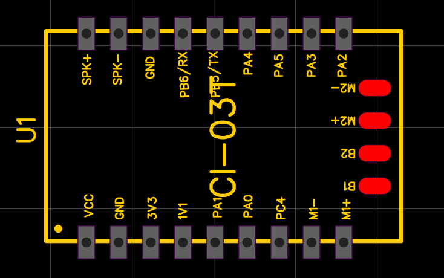

    *CI-03T模块的原理图，显示芯片U1的引脚布局*

2. **模块封装信息**：

    - 封装尺寸：21mm × 15mm
    - 引脚间距：2.54mm（标准DIP封装）
    - 引脚定义：VCC、GND、3V3、PA0-PA5、PB6/RX、PB7/TX、SPK+/-、M1+/-、M2+/-、B1-B3

**设计建议：**

1. **直接使用官方模块图**：

    - 在嘉立创EDA中导入官方提供的元件
    - 元件包含完整的引脚定义和封装
    - 可直接拖拽到原理图中使用

2. **PCB布局要点**：

    - 预留足够的布局空间（25×20mm）
    - 注意音频线路的布局，避免干扰
    - 电源部分增加滤波电容
    - 麦克风输入走线要短而直接

3. **连接器设计**：

    - 可设计2.54mm排母座便于插拔
    - 或设计焊盘直接焊接模块
    - 预留调试接口的测试点

**替代方案：**

如果嘉立创EDA中没有现成的元件图：

1. **手动创建封装**：

    - 根据规格书创建自定义封装
    - 引脚数量：22个
    - 引脚间距：2.54mm
    - 焊盘尺寸：参考IPC-7351标准

2. **导入原理图符号**：

    - 创建原理图符号
    - 定义所有引脚功能
    - 添加3D模型便于预览

**注意事项：**

- 嘉立创EDA中的元件名可能是"CI03T"（去掉横线）
- 确保使用正确的封装尺寸
- 设计时注意模块的安装方向
- 预留足够的焊接和维修空间

**供应商**

- 如在嘉立创平台找不到元件，可联系官方供应商
- 提供完整的原理图和PCB设计文件
- 获取官方的技术文档和设计指南

**嘉立创EDA元件库：**


---


---

### CI-03T1/CI-03T2平铺引脚焊接注意事项

**问题描述：**

在焊接CI-03T1或CI-03T2芯片的平铺引脚时，因焊锡短路导致芯片损坏，需要了解正确的焊接方法和注意事项。

**解决方案：**

**焊接温度控制：**

- 推荐烙铁温度：300-350°C
- 避免使用过高温度（如440°C），容易烫坏焊盘和芯片
- 温度过高会导致焊盘脱落、芯片损坏

**焊锡丝选择：**

- 推荐使用含锡63%的焊锡丝（Sn63Pb37）
- 优质焊锡丝熔点低、流动性好，不易产生连锡
- 避免使用劣质焊锡，熔点高且难以控制

**焊接技巧：**

1. **准备工作**：

    - 使用松香助焊剂改善焊接效果
    - 确保烙铁头清洁、上锡良好
    - 准备细头烙铁便于精确操作

2. **焊接步骤**：

    - 先焊接单个引脚定位芯片
    - 从对角引脚开始，逐步完成所有引脚
    - 每个焊点控制在2-3秒内完成

3. **避免连锡方法**：

    - 使用少量焊锡，避免过多
    - 如有连锡，使用吸锡线清理
    - 保持烙铁头与焊盘成45度角

**故障处理：**

- **轻微连锡**：使用吸锡线或吸锡器清除
- **严重短路**：返修风险高，建议更换芯片
- **芯片损坏**：重新焊接新芯片，注意控制温度

**注意事项：**

- 平铺引脚间距小，焊接难度较大，需要耐心和细心
- 如不熟悉贴片焊接，建议先使用转接板练习
- 批量生产建议使用回流焊工艺提高一致性

---

### CI-03T模块可以直接插接使用而不焊接吗？

**问题描述：**

发现CI-03T1或CI-03T2芯片模块通过插针直接插入开发板，未进行焊接，询问这种连接方式是否会导致问题。

**解决方案：**

**连接方式确认：**

- 插针连接是可行的临时方案
- 模块通过排针与开发板插接
- 无需焊接即可进行功能测试

**可靠性验证：**

- 实际测试表明插接方式工作正常
- 不会导致屏幕不亮或功能异常
- 适合开发调试阶段使用

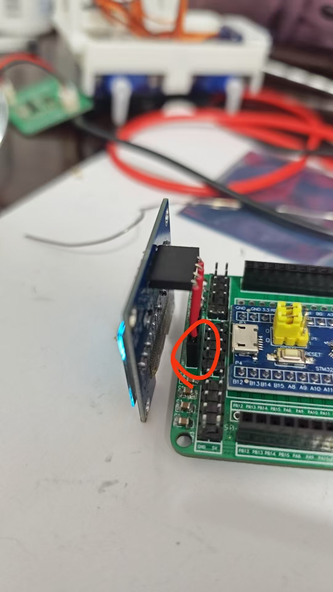

*CI-03T模块通过插针直接插入开发板，红色圆圈标记连接处*

**连接注意事项：**

1. **接触质量**：

    - 确保插针完全插入插座
    - 检查是否有松动或接触不良
    - 避免偏斜插入导致引脚接触不全

2. **固定措施**：

    - 开发阶段可使用胶带固定
    - 长期使用建议焊接固定
    - 避免振动导致接触问题

3. **引脚对齐**：

    - 确认排针与插座对齐
    - 避免强制插入导致引脚弯曲
    - 检查引脚是否有变形

**适用场景：**

- **开发调试**：快速测试功能，无需焊接
- **原型验证**：功能验证阶段，便于修改
- **小批量测试**：少量产品验证，节省成本

**生产建议：**

- 批量生产建议采用焊接方式
- 焊接提供更可靠的电气连接
- 避免长期使用中的接触问题

**注意事项：**

- 插接仅适合短期测试使用
- 长期使用建议焊接固定
- 插拔时注意防静电，避免损坏芯片
- 如发现接触不良，检查引脚是否氧化

---


---

### CI-03T如何实现开机关机继电器控制？

**问题描述：**

需要通过CI-03T1或CI-03T2离线语音识别芯片实现开机和关机时对继电器的控制，即在设备开机时触发继电器，关机时关闭继电器。

**解决方案：**

**功能支持确认：**

CI-03T系列模块**完全支持**开机和关机继电器控制功能：

1. **支持型号**：

    - CI-03T：支持开机关机继电器控制
    - CI-03T1：支持开机关机继电器控制
    - CI-03T2：支持开机关机继电器控制
    - CI-33T：支持开机关机继电器控制

2. **实现方式**：

    - 由贵公司直接烧录好语音控制命令
    - 开机时自动触发继电器
    - 关机时自动关闭继电器

**技术实现：**

1. **开机控制逻辑**：

    - 设备上电时，模块自动识别为开机状态
    - GPIO引脚输出预设电平（高或低）
    - 继电器吸合，接通外部设备

2. **关机控制逻辑**：

    - 设备断电前，模块检测到关机信号
    - GPIO引脚输出相反电平
    - 继电器释放，断开外部设备

3. **GPIO配置**：

    - 选择合适的GPIO引脚（如GPIO_A0）
    - 配置为输出模式
    - 设置默认电平和触发逻辑

**应用场景：**

- **智能家电**：开机自动启动主设备
- **电源管理**：关机切断所有外设电源
- **安全保护**：断电时自动断开负载
- **节能设计**：避免待机功耗

**注意事项：**

- 此功能需要定制固件，由厂家烧录
- 继电器类型需与GPIO输出电平匹配
- 建议在继电器线圈并联续流二极管
- 确保GPIO驱动能力满足继电器要求

---

## CI1302芯片使能控制功能应用

**问题描述：**


---

## 焊接后设备无法上电故障排查

**问题描述：**

焊接完成后设备无法上电，指示灯不亮，检查发现存在元件焊接错误和使用旧版PCB图纸的问题。

**解决方案：**

1. **检查焊接质量**：

    - 清理过多的松香残留
    - 确认电容、电阻等元件位置正确
    - 检查是否有短路或虚焊

2. **核对PCB版本**：

    - 确认使用的PCB图纸为最新版本
    - 对比实物与图纸的元件布局
    - 旧版PCB可能存在元件位置差异

3. **重点检查开关焊接**：

    - 开关是上电的关键元件
    - 确保引脚焊接牢固
    - 测试开关通断功能正常

4. **逐步排查流程**：

    - 使用万用表测量关键点电压
    - 检查电源通路是否完整
    - 确认LED指示灯极性正确

**注意事项：**

- 使用合适的电烙铁温度，避免元件过热损坏
- 焊接前务必核对元件规格和位置
- 旧版PCB图纸可能包含过时的设计，建议获取最新版本
- 焊接完成后清理残留助焊剂，防止短路

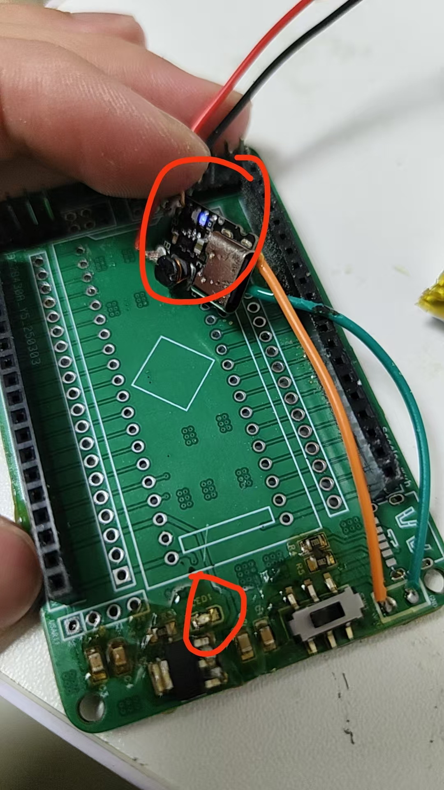

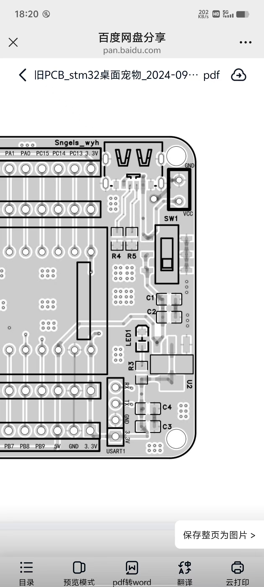


---


---

### CI-03T1功耗异常如何排查？

**问题描述：**

CI-03T1离线语音识别芯片出现功耗异常，供电电流高达0.2A（200mA），远超正常待机电流60mA。

**解决方案：**

**问题排查：**

1. **检查麦克风与喇叭连接**：

    - 确认麦克风连接到MIC接口
    - 喇叭应连接到SPK接口
    - 两者接反会导致功耗异常

2. **测量实际电流**：

    - 使用万用表测量供电电流
    - 正常待机电流应为60mA左右
    - 200mA表明存在硬件连接问题

**处理步骤：**

1. **检查接线**：

    - 对照原理图确认所有连接
    - 重点检查音频接口接线
    - 确保没有接反或错接

2. **修正接线后复测**：

    - 断开电源，修正错误接线
    - 重新上电测量电流
    - 确认电流恢复到正常范围

**实际案例：**

- 初始测量：0.2A（200mA）
- 修正接线后：0.13A（130mA）
- 完全修正后：恢复到正常60mA

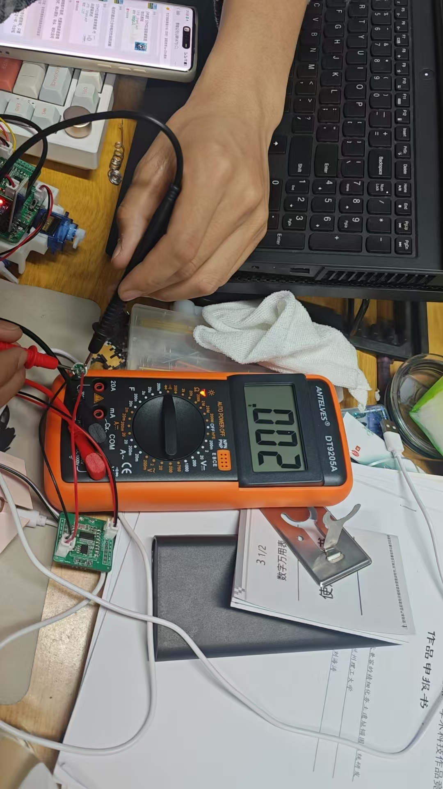

*万用表显示电流高达202mA，表明存在接线问题*

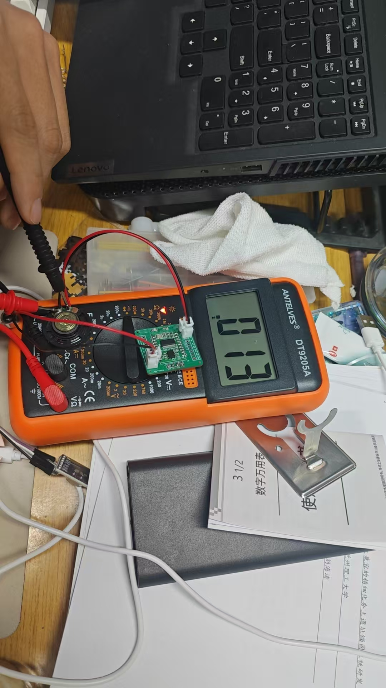

*修正部分接线后，电流降至130mA，但仍需进一步检查*

**技术要点：**

- 麦克风接口：输入信号接口，高阻抗
- 喇叭接口：输出功率接口，低阻抗
- 两者接反会影响电路工作点
- 导致功放部分异常工作，增加功耗

**注意事项：**

- 严格按照规格书接线
- 使用万用表验证接线正确性
- 功耗异常时优先检查音频接口
- 如修正后仍有问题，检查其他外围电路

---

### CI-03T1与继电器共用电源会导致模块损坏吗？

**问题描述：**

CI-03T1离线语音识别模块与继电器共用同一5V电源，使用约1小时后模块突然无法工作且无法烧录。

**解决方案：**

- **电源隔离设计**：

    - 模块电源输入端需加装滤波电路
    - 防止继电器线圈波动影响主控
    - 继电器开关时易产生干扰

- **硬件布局优化**：

    - 喇叭应尽量靠近模块
    - 喇叭下方不要走线
    - 减少电磁干扰影响

- **供电方案改进**：

    - 单个继电器影响较小
    - 多个继电器建议独立供电
    - 使用低电平输入有效模式

**注意事项：**

- 继电器线圈通断会产生电压波动
- 多个继电器同时工作干扰更大
- 模块损坏后通常无法烧录，补救成本高于购买新模块

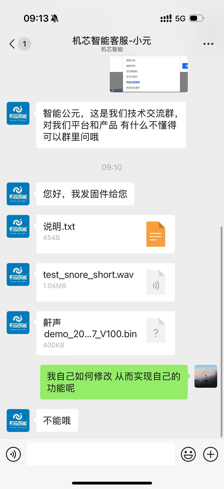

---

### CI-03T如何加装外部晶振？

**问题描述：**

CI-03T不带外部晶振版本需要加装12.288MHz晶振以提升性能。

**解决方案：**

- **晶振规格**：

    - 频率：12.288MHz
    - 封装：根据板子预留位置选择
    - 配套电容：12pF（C15、C16）

- **焊接方法**：

    1. 定位板子上预留的晶振焊盘
    2. 焊接晶振到对应位置
    3. 添加两个12pF电容到XTAL IN和XTAL OUT

- **注意事项**：

    - 晶振方向可能需要旋转调整
    - 焊接时注意温度控制
    - 加装晶振后不需要修改固件配置

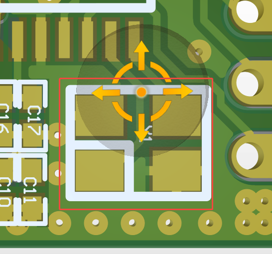
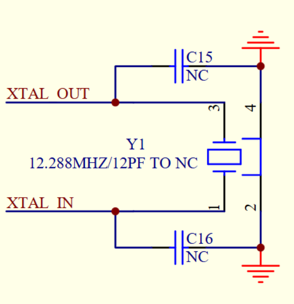


---


---

### CI-03T3麦克风拾音距离过短怎么办？

**问题描述：**

使用CI-03T3模块时，发现麦克风的拾音距离很短，约不到50cm，影响正常使用。

**解决方案：**

**灵敏度调整方法：**

1. **进入固件配置界面**：

    - 登录智能公元平台
    - 选择对应的产品项目
    - 进入唤醒词配置页面

2. **调整唤醒灵敏度**：

    - 找到"唤醒灵敏度"设置选项
    - 可选择"低"、"中"、"高"三个档位
    - 根据实际需求调整到合适档位

    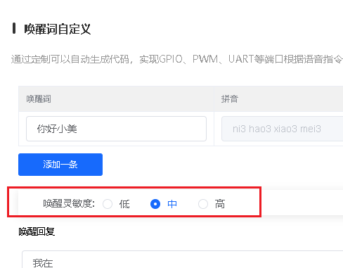

    *唤醒词自定义界面中的唤醒灵敏度设置选项，当前设置为"中"档*

**调整效果分析：**

1. **低灵敏度档位**：

    - 拾音距离较短（约0.5-1米）
    - 误唤醒率较低
    - 适合安静环境使用

2. **中灵敏度档位**：

    - 拾音距离适中（约1-2米）
    - 平衡识别率和误唤醒率
    - 适合大多数应用场景

3. **高灵敏度档位**：

    - 拾音距离较远（约2-3米）
    - 误唤醒率会相应提高
    - 适合远场识别需求

**注意事项：**

- 灵敏度调高会增加误唤醒率
- 建议先从中等档位开始测试
- 根据实际使用环境调整到最佳档位
- 如灵敏度调整后仍不满足需求，可考虑更换高性能麦克风

**其他优化建议：**

- 确保麦克风安装位置合理
- 避免遮挡麦克风孔位
- 减少环境噪声干扰
- 使用质量可靠的麦克风线缆

---


---

### CI-03T1模块串口引脚B10/B11与STM32通信无反应怎么办？

**问题描述：**

使用CI-03T1模块时，将串口通信引脚错误地连接到了B10和B11，导致无法通过示波器检测到数据波形，询问其电路连接是否正确。

**解决方案：**

**问题分析：**

1. **引脚功能混淆**：

    - B10/B11引脚被错误地当作串口引脚使用
    - 实际上B10/B11是GPIO通用输入/输出引脚
    - 正确的串口通信引脚是B6/B7

2. **连接错误导致**：

    - STM32的UART连接到错误的模块引脚
    - 导致无法建立正常的串口通信
    - 示波器检测不到数据波形

**正确的串口引脚配置：**

根据对话中的信息，CI-03T1模块的桌宠设置使用B6/B7作为通信脚：

- **B6引脚**：UART1_TX（串口发送）
- **B7引脚**：UART1_RX（串口接收）

**正确的连接方式：**

```
STM32F103C8T6    CI-03T1模块
-------------    -------------
UART1_TX     →    B7 (UART1_RX)
UART1_RX     ←    B6 (UART1_TX)
GND          ←→    GND
```

**技术要点：**

1. **引脚功能确认**：

    - B6/B7：专用UART1串口，支持高速通信
    - B10/B11：通用GPIO，可配置为其他功能
    - 选择正确引脚对通信至关重要

2. **串口参数配置**：

    - 波特率：9600/115200等（根据需求配置）
    - 数据位：8位
    - 停止位：1位
    - 校验位：无

3. **电平匹配**：

    - CI-03T1串口电平：3.3V
    - 与STM32的3.3V串口电平完全匹配
    - 无需电平转换电路

**调试步骤：**

1. **检查硬件连接**：

    - 使用万用表测试连通性
    - 确认B6连接到STM32的RX
    - 确认B7连接到STM32的TX

2. **使用示波器**：

    - 将示波器探头连接到B6/B7引脚
    - 发送测试数据观察波形
    - 验证数据正常传输

3. **串口助手验证**：

    - 使用串口调试工具发送测试数据
    - 观察CI-03T1的响应
    - 确认通信建立成功

**注意事项：**

- 必须使用B6/B7专用串口引脚进行通信
- B10/B11是GPIO引脚，不支持默认串口功能
- 连接前仔细核对模块引脚定义
- 保留模块规格书便于查询引脚功能

---


---

### CI-03T1模块上丢失的电容规格是多少？

**问题描述：**

CI-03T1芯片模块上的一个电容不小心丢失，需要确认该电容的具体规格以便更换。

**解决方案：**

**电容规格确认：**

- **容值**：4.7μF
- **类型**：电解电容
- **封装**：贴片封装（具体尺寸参考规格书）
- **耐压值**：建议选择16V或25V（原设计通常为10V-16V）

**更换注意事项：**

1. **电容极性**：

    - 电解电容有正负极性，必须按原方向焊接
    - 正极通常标记为"+"或有色带一侧
    - 反接会导致电容损坏甚至爆裂

2. **焊接温度**：

    - 使用恒温烙铁，温度控制在300°C以内
    - 焊接时间不超过3秒
    - 避免过热损坏PCB焊盘

3. **品质选择**：

    - 选择知名品牌的电容（如三星、村田、风华高科等）
    - 温度特性：X5R或X7R（根据应用环境选择）
    - 误差范围：±10%或±20%

**应用说明：**

该电容位于CI-03T1模块的电源滤波电路中，主要作用：

- **电源滤波**：滤除电源纹波，提供稳定的工作电压
- **储能作用**：为瞬时大电流提供缓冲
- **EMC抑制**：减少电源噪声对其他电路的干扰

**替代方案：**

如无法获取完全相同的电容，可考虑以下替代：

1. **相近容值**：

    - 4.7μF标准值，也可使用3.3μF或6.8μF
    - 容值偏差会影响滤波效果，不建议偏差超过20%

2. **更高耐压**：

    - 可使用更高耐压值（如25V替代16V）
    - 不建议使用更低耐压值

3. **更好的材质**：

    - 使用X7R温度特性替代X5R
    - 选择低ESR型号提高滤波效果

**不焊接的风险：**

- **电源不稳定**：可能导致模块工作异常或复位
- **干扰增加**：影响语音识别的准确度
- **长期可靠性**：可能缩短模块寿命


*CI-03T1模块上红圈标记的电容位置，规格为4.7μF*

**供应商建议：**

- 如不确定电容规格，建议联系供应商确认
- 可发送模块照片获取更详细的指导
- 批量维修建议采购原厂电容确保一致性

**注意事项：**

- 更换前务必断电并放电
- 焊接时注意ESD防静电保护
- 如无焊接经验，建议寻求专业人员帮助

---


---

### CI-03T按键控制继电器时松开无法断开怎么办？

**问题描述：**

使用CI-03T模组时，两个按键（A4、A5）控制两个继电器（A0、A1），当按键松开后继电器无法正常断开，出现卡顿现象。

**解决方案：**

**问题分析：**

1. **GPIO配置问题**：

    - A4、A5配置为输入模式，默认高电平
    - 按键按下时输入低电平触发动作
    - 按键松开时没有配置对应的断开动作

2. **输出控制逻辑缺失**：

    - A0、A1配置为输出模式，默认低电平
    - 只配置了按键按下时的动作
    - 缺少按键松开时的复位动作

**解决方法：**

1. **配置按键松开检测**：

    - 在智能平台中为每个按键配置两个动作
    - 动作一：按键按下（低电平）→ 继电器吸合
    - 动作二：按键松开（高电平）→ 继电器断开

2. **使用变量控制状态**：

    - 创建状态变量记录按键状态
    - 通过变量判断是按下还是松开
    - 根据状态控制继电器输出

3. **硬件上拉电路**：

    - 为A4、A5添加外部上拉电阻（10KΩ）
    - 确保按键松开时为稳定的高电平
    - 避免信号浮动导致误触发

**配置示例：**

在智能公元平台控制配置中：

1. **按键1（A4）控制继电器1（A0）**：

    ```
    触发条件：GPIO_A4 = 0（按下）
    执行动作：GPIO_A0 = 1（吸合）

    触发条件：GPIO_A4 = 1（松开）
    执行动作：GPIO_A0 = 0（断开）
    ```

2. **按键2（A5）控制继电器2（A1）**：

    ```
    触发条件：GPIO_A5 = 0（按下）
    执行动作：GPIO_A1 = 1（吸合）

    触发条件：GPIO_A5 = 1（松开）
    执行动作：GPIO_A1 = 0（断开）
    ```

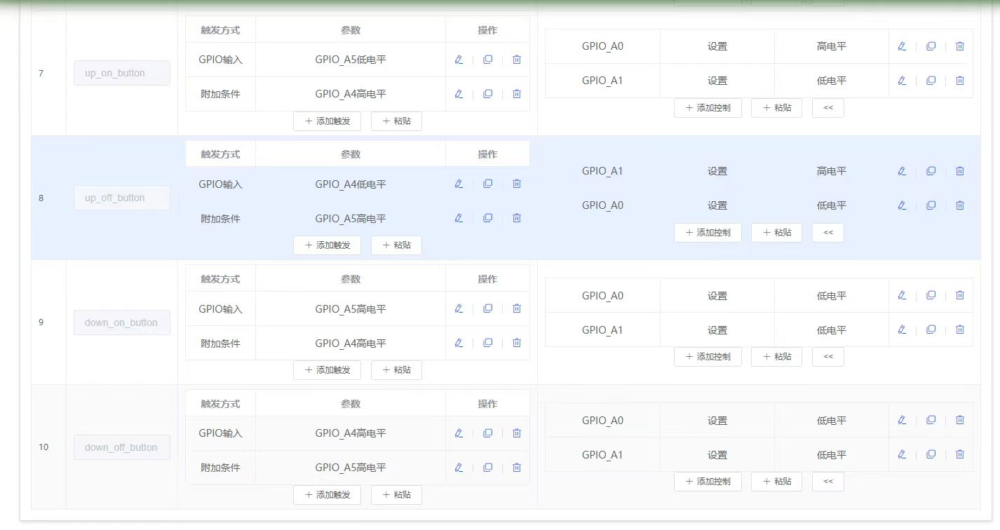

*CI-03T模组的网页配置界面，显示按键与继电器的控制逻辑*

**硬件连接：**

```
按键1 → A4（输入，外部10K上拉）
按键2 → A5（输入，外部10K上拉）
继电器1 → A0（输出，低电平有效）
继电器2 → A1（输出，低电平有效）
```

**调试步骤：**

1. **验证输入信号**：

    - 使用万用表测量A4、A5电平变化
    - 确认按键按下为0V，松开为3.3V
    - 检查上拉电阻是否工作正常

2. **测试输出响应**：

    - 观察按键时继电器是否立即动作
    - 验证松开时继电器是否立即断开
    - 测试多次按键的稳定性

3. **检查配置文件**：

    - 导出JSON配置文件检查逻辑
    - 确认是否配置了松开动作
    - 验证变量设置是否正确


*CI-03T模组的配置JSON文件，可用于调试和修改*


*智能公元平台的产品管理界面，可导出和查看配置*

**注意事项：**

- 必须为每个GPIO配置按下和松开两个动作
- 外部上拉电阻确保信号稳定性
- 继电器类型注意是高电平还是低电平触发
- 建议在平台中使用可视化配置而非直接编辑JSON
- 测试时先断开负载，仅用万用表验证输出

---


---

### CI-03T1 GPIO按键快速触发不稳定怎么办？

**配置示例：**

```
GPIO配置：

- 引脚：选择GPIO_Ax（根据实际连接）
- 模式：输入
- 默认电平：高电平
- 触发方式：低电平触发
- 上拉电阻：外部10KΩ上拉
```

**调试步骤：**

1. **基础测试**：

    - 使用万用表测量GPIO电平变化
    - 慢速按下按键，确认能正常触发
    - 观察指示灯是否正常亮起

2. **快速触发测试**：

    - 逐步加快按键频率
    - 记录能够稳定触发的最大频率
    - 调整去抖动参数（如有）

3. **异常声音排查**：

    - 检查喇叭连接是否正确
    - 确认功放电路工作正常
    - 测量音频输出电压

**注意事项：**

- GPIO口内部没有上拉，必须外部添加
- 触发信号脉宽建议大于10ms
- 如需要更快的响应，可考虑硬件消抖电路
- 供电不稳定是导致异常的常见原因

---


---

### CI-03T1/CI-03T2模块如何正确使用18650电池供电？

**问题描述：**

需要了解CI-03T1或CI-03T2模块是否可以直接使用18650电池供电，是否需要升压电路，以及正确的电源连接方式。

**解决方案：**

**供电方案确认：**

1. **可直接使用18650电池供电**：

    - 18650电池电压范围：3.0V-4.2V
    - CI-03T1/CI-03T2模块支持电压范围：3.6V-5.5V
    - 当电池电压高于3.6V时，可直接供电无需升压

2. **电压匹配情况**：

    - 满电状态（4.2V）：完全满足模块需求
    - 正常工作电压（3.7V-4.0V）：在模块工作范围内
    - 低电预警（3.6V）：达到模块最低工作电压

**连接方式：**

1. **直接并联连接**：

    ```
    18650电池正极 → 模块VCC引脚
    18650电池负极 → 模块GND引脚
    ```

2. **连接注意事项**：

    - 确保正负极连接正确，避免反接损坏模块
    - 建议在电源线上添加开关控制通断
    - 可考虑添加保险丝防止短路

3. **无需升压电路的原因**：

    - 18650电池标称电压3.7V，与模块工作电压接近
    - 模块内部有LDO稳压电路，可将输入电压稳定到内部所需电压
    - 直接连接简化电路设计，降低成本和功耗

**电池容量建议：**

- **标准容量**：2000mAh-2600mAh的18650电池
- **使用时间**：根据工作电流不同，可连续使用数小时到数十小时
- **续航优化**：可考虑使用两节电池并联以延长续航时间

**应用场景：**

- 便携式语音设备
- 电池供电的智能家电
- 无需外接电源的独立控制系统
- 应急语音控制设备

**技术优势：**

- 18650电池电压足够，无需额外升压电路
- 电池供电方案简洁可靠
- 模块内部稳压电路保证工作稳定
- 便于实现便携式和无线应用

**注意事项：**

- 电池电压低于3.6V时，模块可能工作不稳定
- 建议添加低电量检测和提示功能
- 长期不使用时建议断开电池连接
- 电池充电时建议断开与模块的连接

---


---

### CI-03T芯片哪些引脚可以接入电机AB相编码器？如何编程实现？

**问题描述：**

使用CI-03T模块时，需要了解哪些引脚可以连接电机的AB相编码器，以及如何编写程序来读取编码器信号。

**解决方案：**

**引脚配置方案：**

CI-03T模块的引脚可以通过智能公元平台进行灵活配置，支持将特定引脚设置为GPIO输入模式来读取AB相编码器信号：

1. **可用引脚选择**：

    - **GPIO_A0 - GPIO_A6**：7个可编程IO口
    - **GPIO_B5、GPIO_B6**：2个可编程IO口
    - **总计9个通用IO口**可配置为编码器输入

2. **推荐配置方案**：

    ```
    编码器A相 → GPIO_A0（或GPIO_A1）
    编码器B相 → GPIO_A1（或GPIO_A2）
    编码器Z相（可选）→ GPIO_A2
    ```

**平台配置方法：**

**1. 登录智能公元平台**

- 访问：https://www.smartpi.cn/#/
- 选择对应项目和CI-03T模组
- 进入引脚配置界面

**2. 配置GPIO功能**

- 将选择的GPIO引脚配置为"输入"模式
- 使能中断功能（如果平台支持）
- 设置合适的触发方式（上升沿/下降沿）

**3. 生成固件**

- 完成配置后生成bin文件
- 下载固件并烧录到CI-03T模块

**编程实现方案：**

**方案一：直接GPIO读取（简单应用）**

```c
// 伪代码示例，具体语法需参考平台文档
void encoder_init() {
    // 配置GPIO为输入模式
    gpio_set_mode(ENCODER_A_PIN, GPIO_INPUT);
    gpio_set_mode(ENCODER_B_PIN, GPIO_INPUT);
}

void read_encoder() {
    int a_state = gpio_read(ENCODER_A_PIN);
    int b_state = gpio_read(ENCODER_B_PIN);

    // 根据AB相信号判断旋转方向
    if (a_state != last_a_state) {
        if (b_state != a_state) {
            encoder_count++;  // 正向旋转
        } else {
            encoder_count--;  // 反向旋转
        }
        last_a_state = a_state;
    }
}
```

**方案二：中断方式（推荐）**

```c
// 配置外部中断
void encoder_interrupt_init() {
    // A相上升沿触发中断
    gpio_interrupt_config(ENCODER_A_PIN, RISING_EDGE);
    // 设置中断回调函数
    gpio_set_callback(ENCODER_A_PIN, encoder_callback);
}

void encoder_callback() {
    if (gpio_read(ENCODER_B_PIN) == HIGH) {
        encoder_count++;
    } else {
        encoder_count--;
    }
}
```

**方案三：定时器捕获（高级应用）**

如果平台支持定时器输入捕获功能：

```c
// 配置定时器输入捕获
void timer_capture_init() {
    // 使用定时器捕获AB相的脉冲
    timer_config_input_capture(TIMER_CH1, ENCODER_A_PIN);
    timer_config_input_capture(TIMER_CH2, ENCODER_B_PIN);
}
```

**硬件连接要点：**

1. **信号电平匹配**：

    ```
    编码器（5V） → 电平转换电路 → CI-03T（3.3V）
    ```

2. **滤波电路**：

    ```
    编码器输出 → RC滤波 → CI-03T GPIO
    (R=1kΩ, C=0.1μF)
    ```

3. **抗干扰措施**：

    - 使用屏蔽线连接编码器
    - 在编码器信号线并联去耦电容
    - 远离电机电源线布线

**实际应用建议：**

**1. 电机选型参考**

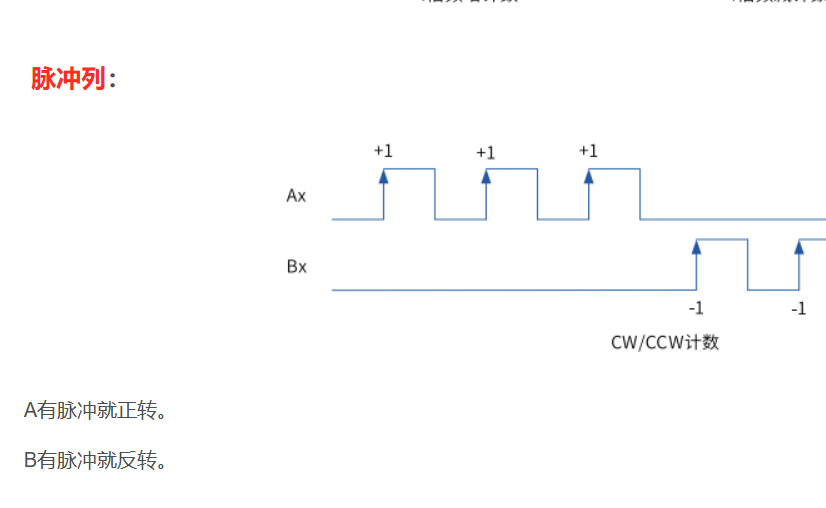

*典型的AB相编码器电机控制示意图*

**2. 编码器参数配置**

- **分辨率**：根据实际精度要求选择
- **工作电压**：3.3V-5V，需与CI-03T匹配
- **输出类型**：推挽输出或开集输出

**3. 系统集成方案**

```
完整的电机控制系统：

CI-03T（控制核心）
├── 语音识别模块
├── GPIO（编码器输入）
├── PWM输出（电机控制）
└── 串口通信（与上位机通信）

电机控制模块
├── H桥驱动电路
├── AB相编码器
└── 电源管理
```

**注意事项：**

1. **平台限制**：

    - 智能公元平台主要针对语音控制功能
    - 复杂的编码器处理可能需要配合其他MCU
    - 建议先在平台上测试GPIO功能

2. **性能考虑**：

    - GPIO中断响应速度有限
    - 高速编码器可能丢失脉冲
    - 建议编码器频率不超过1kHz

3. **替代方案**：

    如果需要精确的编码器读取，可考虑：

    - 使用CI-03T处理语音识别
    - 通过串口将指令发送给专用MCU
    - MCU负责精确的编码器读取和电机控制

**参考资料：**

- 智能公元平台使用教程：[平台使用指南](https://www.smartpi.cn/#/)
- CI-03T技术规格书：[查看详细文档](./ci-03t-specs.md)
- 编码器应用笔记：[编码器设计指南](./encoder-guide.md)

---


---

### CI-03T1模块串口引脚B10/B11与STM32通信无反应怎么办？

---


---

### CI-03T1/CI-03T2芯片如何选择喇叭规格？

**问题描述：**

需要为CI-03T1或CI-03T2芯片选择合适的喇叭规格，咨询4Ω3W或8Ω3W喇叭是否适用。

**解决方案：**

**功放规格说明：**

CI-03T系列模组内置ClassAB功放电路，具体参数如下：

- 输出功率：2.4W@5V4Ω
- 支持阻抗：4-8Ω
- 最大功率：不超过3W
- 工作电流：>500mA（4Ω喇叭时）

**喇叭选型建议：**

1. **阻抗选择**：

    - 4Ω喇叭：可获得更大输出功率，音量更大
    - 8Ω喇叭：功耗较低，对功放负载较小
    - 两者均在支持范围内，可根据需求选择

2. **功率选择**：

    - 推荐喇叭功率：1-3W
    - 不建议超过3W，可能影响音质
    - 喇叭额定功率应大于功放输出功率

3. **口径选择**：

    - 根据产品尺寸选择合适喇叭口径
    - 小型产品可选40-50mm口径
    - 对音质要求高可选用57mm以上口径

**应用场景推荐：**

1. **4Ω3W喇叭适用场景**：

    - 需要较大音量的产品
    - 空间较大的智能家居产品
    - 对音质要求不高的场合

2. **8Ω3W喇叭适用场景**：

    - 功耗敏感的电池供电产品
    - 空间受限的小型设备
    - 对音质要求较高的产品

**注意事项：**

- 喇叭阻抗过低（如2Ω）会导致功放过载
- 喇叭功率过大（超过5W）可能造成失真
- 建议进行实际音质测试后确定最终选型
- 如需驱动更大功率喇叭，建议外接专用功放电路

---


---

### CI-03T1/T2模块烧录脚线路直角是否会导致烧录失败？

**问题描述：**

在使用CI-03T1或CI-03T2芯片板时，发现烧录脚（TX/RX）的线路存在直角走线，且部分线路被切断，导致无法烧录，询问这是否是导致烧录失败的原因。

**解决方案：**

**1. 直角走线影响分析**

- **信号完整性**：直角走线会造成阻抗突变，影响信号传输质量
- **反射问题**：高速信号在直角处容易产生反射
- **EMI影响**：直角处可能产生电磁辐射干扰
- **对烧录的影响**：可能导致通信不稳定，但不是烧录失败的直接原因

**2. 烧录失败的真正原因**

- **线路被切断**：烧录脚线路被切断是导致无法烧录的直接原因
- **连接问题**：物理断路导致通信中断
- **信号传输**：即使有微弱连接，信号也无法正常传输

**3. 设计规范建议**

**走线设计原则**：

- 避免使用90°直角走线
- 使用45°角或圆弧过渡
- 保持走线宽度一致性
- 高频信号线需要特别注意

**最佳实践**：

- 使用两个45°角代替一个90°角
- 或使用圆弧过渡，半径≥3倍线宽
- 关键信号线优先优化布线
- 避免在直角附近放置敏感器件

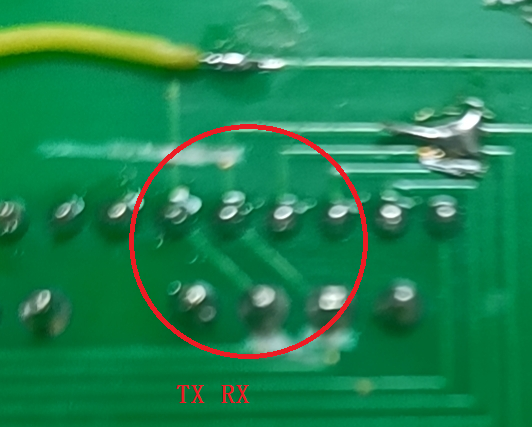

*红色圆圈标出TX和RX烧录引脚区域，该区域的走线呈现直角*

**4. 故障排查步骤**

1. **检查线路连通性**：

    - 使用万用表测量TX/RX线路是否连通
    - 确认没有断路或短路情况
    - 检查焊点是否牢固

2. **修复线路连接**：

    - 重新焊接被切断的线路
    - 使用飞线连接断路部分
    - 确保焊点饱满可靠

3. **优化走线设计**：

    - 如需重新设计PCB，避免直角走线
    - 使用差分走线提高信号质量
    - 增加地线屏蔽减少干扰

**5. 烧录验证方法**

1. **连通性测试**：

    - 修复后测试线路连通性
    - 验证信号线电阻正常
    - 确认对地绝缘良好

2. **烧录测试**：

    - 使用标准烧录工具测试
    - 观察烧录过程是否稳定
    - 验证烧录成功率

**注意事项：**

- 线路被切断是烧录失败的主要原因，必须修复
- 直角走线虽不是直接原因，但会影响信号质量
- 建议在PCB设计时遵循高速信号布线规范
- 修复后进行全面测试验证功能正常

---


---

### CI-03T1模块喇叭无声音故障排查

**问题描述：**

使用CI-03T1芯片模块时，烧录了程序，但外接的4欧3W喇叭没有声音，而同样的喇叭在板载模块上可以正常发声，需要排查喇叭无声音的原因。

**解决方案：**

**问题排查步骤：**

1. **确认固件匹配性**

    - 检查固件是否为对应芯片型号编译
    - CI1302芯片需要使用CI1302专用固件
    - CI1312固件无法在CI1302上运行

2. **检查硬件配置**

    - CI-03T1模块使用PA6引脚控制功放使能
    - 功放芯片TC8002D低电平有效
    - 确认PA6初始化为低电平

3. **晶振配置确认**

    - CI-03T1模块无外部晶振
    - 固件需配置为内部晶振模式
    - 外部晶振配置会导致程序无法启动

4. **串口日志检查**

    - 使用UART0查看调试日志
    - 波特率设置为921600
    - 全0输出表示程序未正常运行

**解决方法：**

1. **使用正确固件**

    - 下载CI1302芯片专用固件
    - 确认固件支持内部晶振
    - 验证功放使能引脚配置为PA6

2. **硬件连接检查**

    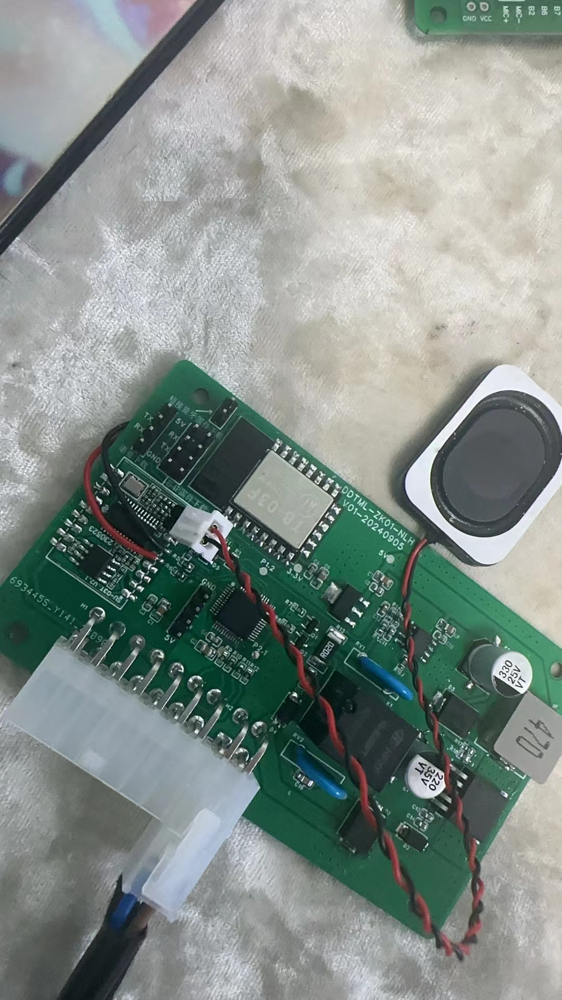

    - 如上图所示，检查模块与喇叭的连接
    - 确认喇叭正负极正确连接
    - 验证供电电压稳定

    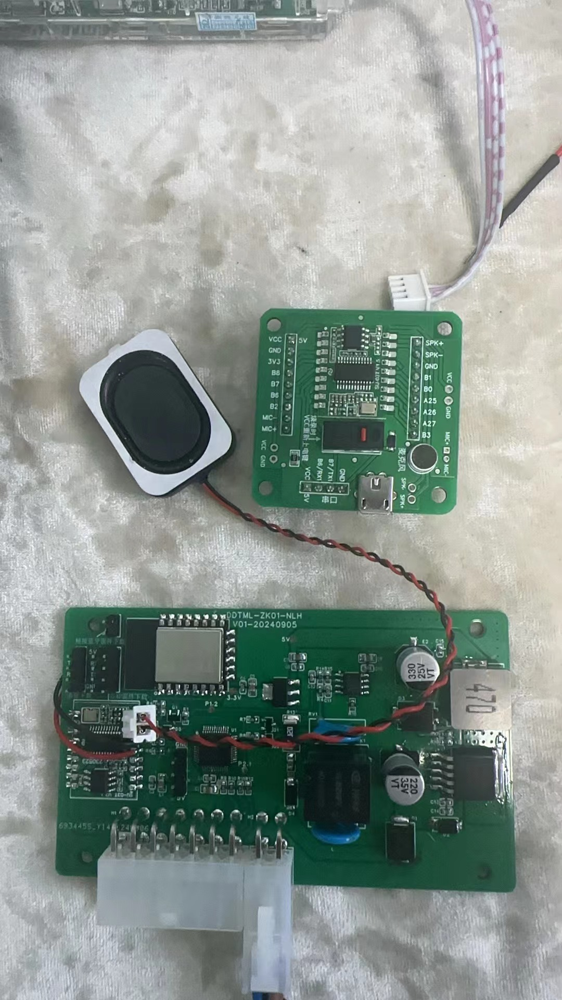

    - 对比开发板与模块的使用情况
    - 检查两者硬件配置差异
    - 确认供电和接线方式一致

3. **使用调试固件测试**

    - 在智能公元平台生成简单测试固件
    - 包含开机播报功能
    - 烧录后验证是否正常发声

**技术要点：**

- CI-03T1是定制版本，与公版模块引脚不同
    - PA6引脚必须配置为低电平才能使能功放
    - 内部晶振模式是CI-03T1的标准配置
    - 串口日志是排查程序运行状态的重要工具

**注意事项：**

- 烧录前务必确认芯片型号（CI1302/CI1312）
- 程序正常启动时应有完整的串口日志输出
- 建议保留UART0日志输出便于问题排查
- 如确认硬件问题，及时联系供应商处理

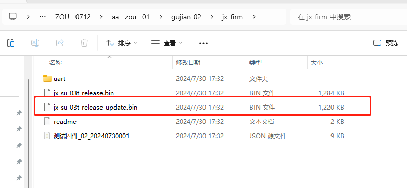

*选择jx_su_03t_release_update.bin文件进行串口烧录*

**喇叭选型建议：**

- 4欧喇叭：功率建议2.4W-3W
- 功率过大可能导致模块发热
- 功率过小可能导致音量不足
- 推荐使用模块配套的喇叭进行测试

---


---

### 如何在CI-03T1或CI-03T2芯片上设置GPIO端口连续输出高电平0.5秒两次？

**问题描述：**

需要在CI-03T1或CI-03T2芯片上设置一个GPIO端口（如GPIO_A0）连续输出高电平0.5秒两次，之后变为低电平。

**解决方案：**

**方法一：使用两次延时电平翻转**

1. **第一次输出配置**：

    - 控制类型：GPIO_A0
    - 动作：设置电平
    - 参数：高电平
    - 延时时间：500ms（0.5秒）
    - 勾选"延时电平翻转"

2. **第二次输出配置**：

    - 控制类型：GPIO_A0
    - 动作：设置电平
    - 参数：高电平
    - 延时时间：500ms（0.5秒）
    - 勾选"延时电平翻转"


*GPIO控制配置界面，显示GPIO_A0端口被设置为高电平输出*


*延时输出配置界面，设置延时时间为50ms，并启用延时电平翻转功能*

**方法二：连续输出间隔1秒**

如需要两次高电平输出之间间隔1秒：

1. **第一个控制动作**：

    - GPIO_A0设置为高电平
    - 延时50ms

2. **第二个控制动作**：

    - GPIO_A0设置为高电平
    - 延时1000ms（1秒）

3. **第三个控制动作**：

    - GPIO_A0设置为低电平
    - 无延时

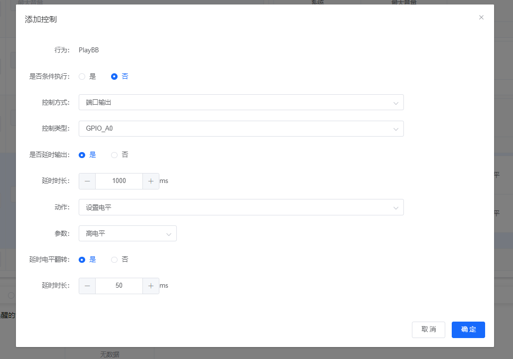

*添加第二个控制动作配置界面，延时时间设置为1000ms（1秒）*

**配置示例：**

```
语音指令："输出两次"
├── 动作1：GPIO_A0=高电平，延时50ms
├── 动作2：GPIO_A0=高电平，延时1000ms
└── 动作3：GPIO_A0=低电平
```

**注意事项：**

- 延时时间单位为毫秒（ms）
- 0.5秒=500ms，1秒=1000ms
- 使用"延时电平翻转"可自动恢复
- 多个动作会按顺序执行
- CI-03T1和CI-03T2配置方法相同

---


---

### CI-03T1/CI-03T2模块四个引脚如何接线？VDD11引脚作用是什么？

**问题描述：**

使用CI-03T1或CI-03T2语音识别模块时，对模块上四个引脚的接线方式不清晰，特别是如何连接电源和信号引脚，以及为何VDD11引脚需要引出到邮票口。

**解决方案：**

**模块引脚说明：**

CI-03T1/CI-03T2模块通过4个引脚与外部连接：

1. **VCC**：电源正极（3.6-5.5V）
2. **GND**：电源负极（地线）
3. **TX**：串口发送（连接到CH340的RX）
4. **RX**：串口接收（连接到CH340的TX）

**标准接线方式：**

```
模块引脚    CH340烧录器    说明
VCC    →    5V        模块供电
GND    →    GND        共地
TX     →    RX         数据发送
RX     →    TX         数据接收
```

**VDD11引脚详解：**

1. **引脚功能**：

    - VDD11是芯片内部产生的1.1V电压
    - 通过内部LDO稳压得到
    - 引出到邮票口是为了方便使用

2. **使用场景**：

    - 为后级电路提供1.1V参考电压
    - 为外部低电压器件供电
    - 作为ADC参考电压等精密应用

3. **电气特性**：

    - 输出电压：1.1V ±3%
    - 最大输出电流：较小（仅适合参考用途）
    - 纹波：低噪声设计

**滤波电容重要性：**

根据电路图，VDD11引脚需要接滤波电容（如C7）：

- **不能省略**：保证芯片内部1.1V电路稳定工作
- **电容选择**：在规格书选型范围内均可
- **作用**：滤除电源噪声，提高系统稳定性

**实物连接示例：**


*CI-03T1/CI-03T2模块的4引脚连接方式，使用颜色区分不同功能*

**接线注意事项：**

1. **电源要求**：

    - 务必使用3.6V-5.5V稳定电源
    - 电流容量不低于500mA
    - 避免使用不稳定的电源

2. **串口连接**：

    - 必须交叉连接（TX→RX，RX→TX）
    - 波特率通常设置为115200
    - 确保共地连接

3. **VDD11使用**：

    - 仅作为参考电压使用
    - 不要用于驱动大电流负载
    - 保留滤波电容确保稳定性

**常见问题：**

- 如果模块无响应，先检查电源电压是否正常
- 串口通信异常，确认TX/RX没有接反
- VDD11电压异常，检查滤波电容是否焊接正确

---

## 嘉立创EDA中搜索不到SU-03T且封装文件有误怎么办？

**问题描述：**

在嘉立创EDA中搜索SU-03T模块但找不到，同时尝试放置元件时提示"封装属性有误"，下载的固件文件为.gz压缩包格式，无法正常使用。

**解决方案：**

**问题分析：**

1. **元件库问题**：

    - 嘉立创EDA可能未收录SU-03T
    - 库中只有SU-03T1，版本可能不匹配
    - 元件命名规则导致搜索困难

2. **封装文件格式错误**：

    - 提示"封装属性有误"
    - 可能是软件版本兼容性问题
    - 下载的.gz文件非标准封装格式

**解决方法：**

1. **搜索替代元件**：

    - 搜索"SU-03T"或"SU03T"
    - 查找类似的18引脚SMD封装
    - 选择引脚数和间距匹配的替代元件

2. **手动创建封装**：

    - 新建SMD18封装
    - 设置尺寸：21×15×3mm
    - 引脚数：18
    - 引脚间距：2.0mm
    - 两排间距：15mm

3. **固件文件处理**：

    - 解压.gz文件获取.bin固件
    - 压缩包通常包含：

        - .bin固件文件
        - .json配置文件
        - 版本信息文件

**替代方案：**

1. **使用库中SU-03T1**：

    - 如果库中有SU-03T1
    - 检查封装兼容性
    - 可能需要微调引脚定义

2. **联系供应商**：

    - 联系嘉立创供应商
    - 提供错误截图和详细信息
    - 获取SU-03T官方封装文件

3. **更新EDA软件**：

    - 确保使用最新版本
    - 检查软件兼容性设置
    - 重启软件后重试

**注意事项：**

- 嘉立创EDA专业版功能更强大
- 标准版可能限制某些功能
- 保存项目文件便于后续修改
- 建议定期备份重要项目

**封装文件参考**：

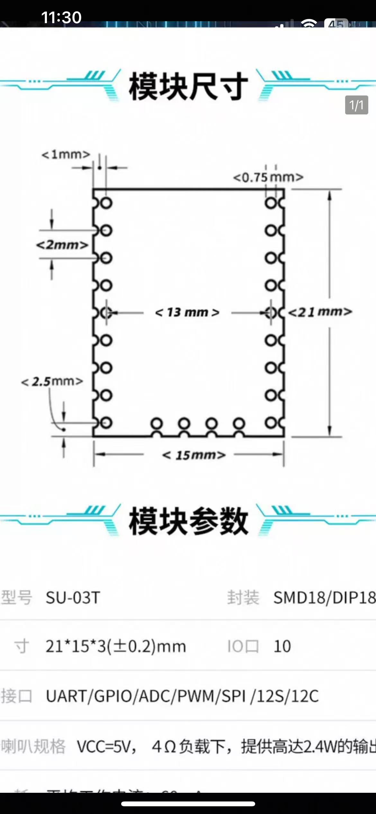

*SU-03T模块尺寸图，标注了引脚间距和关键尺寸*

---

## 嘉立创EDA中如何创建SU-03T模块的封装？

**问题描述：**

需要在嘉立创EDA中绘制SU-03T模块的PCB封装，但库中搜索不到SU-03T，且下载的固件文件格式不正确。

**解决方案：**

**封装创建方法：**

1. **手动创建封装**：

    - 新建封装：SU-03T_SMD18
    - 封装类型：SMD
    - 引脚数：18
    - 尺寸设置：

        - 长度：21mm
        - 宽度：15mm
        - 高度：3mm
    - 引脚间距：2.0mm

2. **引脚布局**：

    - 两排引脚，每排9个
    - 间距：15mm（两排之间）
    - 相邻引脚间距：2mm
    - 参考模块实物图确定引脚顺序

**技术参数来源：**

1. **官方尺寸图**：

    - 模块长度：21.0mm
    - 模块宽度：15.0mm
    - 引脚1到边缘：2.0mm
    - 最后引脚到边缘：2.0mm

2. **封装类型**：

    - 支持SMD18和DIP18两种
    - 根据需求选择合适类型
    - DIP版本带排针，SMD版本为贴片

**操作步骤：**

1. **放置焊盘**：

    - 按照2.0mm间距放置18个焊盘
    - 焊盘尺寸：1.5×0.8mm（椭圆形）
    - 确保所有焊盘对齐

2. **绘制轮廓**：

    - 绘制21×15mm的矩形轮廓
    - 添加定位孔或标记
    - 添加1脚位置标识

3. **添加3D模型**：

    - 设置封装高度3mm
    - 创建立体模型便于预览
    - 添加丝印标识

**固件文件处理：**

1. **文件格式说明**：

    - .gz文件是压缩包，需解压
    - 解压后找到.bin固件文件
    - 烧录工具只支持.bin文件

2. **正确获取方式**：

    - 在智能公元平台重新下载
    - 选择直接下载.bin文件
    - 避免下载压缩包格式

**注意事项：**

- 确保封装尺寸与实物一致
- 保留封装文件便于后续使用
- 建议创建DIP和SMD两种版本
- 绘制时参考官方规格书

---

## JX-A7T模块的三个引脚如何识别？

**问题描述：**

JX-A7T模块有三个引脚，但表面没有丝印标识，无法区分GPIO_A25、GPIO_A26、GPIO_A27的具体位置，导致无法正确连接和测试。

**解决方案：**

**1. 查阅官方文档**：

    - 下载JX-A7T技术规格书
    - 查看引脚定义图
    - 确认每个引脚的具体位置

**2. 使用万用表测试**：

    - 模块上电后测量各引脚电平
    - 通过配置改变某个GPIO输出
    - 观察哪个引脚电平发生变化

**3. 参考标准封装**：

    - JX-A7T采用标准封装
    - 引脚间距符合标准规范
    - 可参考官方封装图确定位置

**识别方法**：

1. **标记法**：

    - 在模块边缘做临时标记
    - 记录引脚1、2、3的位置
    - 对应到GPIO_A25、A26、A27

2. **电路追踪法**：

    - 查看连接到引脚的PCB走线
    - 根据走线连接确定功能
    - 验证与配置文档对应

**3. **测试验证法**：

    - 逐个配置GPIO输出
    - 用示波器或万用表观察
    - 确认物理位置与功能对应

**注意事项：**

- 模块版本不同可能有细微差异
- 建议保留官方文档作为参考
- 如无法确定，可联系供应商获取供应商

---

## 封装文件无法导入嘉立创EDA怎么办？

**问题描述：**

在尝试将官方提供的封装文件导入嘉立创EDA时，提示"暂不支持二进制文件导入"，无法使用封装文件。

**解决方案：**

**1. 格式转换方法**：

    - 使用Altium Designer等软件打开文件
    - 另存为Gerber格式
    - 嘉立创EDA可导入Gerber文件
    - 保留所有层信息

**2. 手动创建封装**：

    - 根据规格书手动创建
    - 使用EDA向导绘制工具
    - 确保尺寸精确

**3. 版本兼容性**：

    - 更新嘉立创EDA到最新版本
    - 检查软件更新日志

---


---

### CI-03T1模块无提示音但可以正常烧录，如何排查？

**问题描述：**

CI-03T1模块插电时没有"你好小智"的提示音，但是能正常烧录固件，需要排查原因。

**问题分析：**

1. **提示音功能说明**：

    - 正常情况下，模块上电应有开机提示音
    - 提示音功能在固件中配置
    - 无提示音可能是功能未启用或硬件问题

2. **可能原因**：

    - 固件未配置开机播报功能
    - 喇叭连接问题或损坏
    - 音频输出通路异常
    - 模块工作状态异常

**排查步骤：**

1. **确认固件配置**：

    - 检查是否配置了开机播报功能
    - 确认唤醒词设置正确
    - 验证音量设置不为零

2. **检查喇叭连接**：

    - 确认喇叭正负极连接正确
    - 使用万用表测试喇叭通断
    - 更换已知正常的喇叭测试

3. **测量功放电压**：

    - 分别测量SPK+和SPK-对GND电压
    - 正常值应在2.2V-2.5V左右
    - 电压异常说明功放电路问题

4. **测试音频输出**：

    - 烧录测试固件（含强制播报）
    - 监控播报时的电压变化
    - 使用示波器查看音频信号

**解决方法：**

1. **固件配置修正**：

    - 重新生成固件，启用开机播报
    - 设置合适的播报音量
    - 确认音频输出通路配置

2. **硬件问题处理**：

    - 修复或更换损坏的喇叭
    - 检查并修复音频输出通路
    - 如模块损坏，更换新模块

3. **验证步骤**：

    - 烧录修正后的固件
    - 断电后重新上电测试
    - 确认提示音正常播放

**注意事项：**

- 开机提示音需要固件支持
- 喇叭连接错误会导致无声
- 功放电路损坏需要专业维修
- 保留完整的测试记录

---


---

### CI-03T1硬件连接电压检测
    - 尝试不同版本的软件

**注意事项：**

- 官方封装文件可能使用特殊格式
- 保留多个备份版本
- 手动创建时务必验证尺寸
- 如问题持续，联系供应商获取帮助

---


---

### CI-03T3麦克风拾音距离过短如何调节？

**问题描述：**

CI-03T3模块的麦克风拾音距离很短，约不到50cm，需要调整灵敏度以改善拾音距离。

**解决方案：**

**问题分析：**

拾音距离不足通常由以下原因造成：

1. 麦克风灵敏度设置过低
2. 环境噪声影响识别效果
3. 固件配置参数不当

**调节方法：**

**1. 固件调节唤醒灵敏度**

在智能公元平台配置界面中调整唤醒灵敏度：

- 进入唤醒词自定义界面
- 找到"唤醒灵敏度"设置选项
- 可选择档位：低、中、高
- 当前设置为"中"档时，可调整为"高"档


*智能公元平台中的唤醒灵敏度设置选项，可选择"低"、"中"、"高"三档*

**2. 调整注意事项**

- **灵敏度影响**：调高灵敏度会增加误唤醒率
- **平衡建议**：需要在拾音距离和误唤醒之间找到平衡
- **测试环境**：在实际使用环境中测试调节效果

**3. 其他优化建议**

1. **麦克风选型**：

    - 确保使用高质量麦克风
    - 推荐灵敏度：-32dB~-38dB
    - 信噪比≥60dB

2. **结构优化**：

    - 麦克风拾音孔正对外部
    - 避免密闭腔体结构
    - 减少声音传播障碍

3. **环境改善**：

    - 降低背景噪声
    - 避免风扇、空调等噪声源
    - 保持相对安静的测试环境

**技术要点：**

- CI-03T3为单麦克风AEC带晶振版本
- 支持固件级别的灵敏度调节
- 调节后需要重新生成并烧录固件
- 高灵敏度设置可能增加误触发概率

**验证方法：**

1. 使用标准测试语音（如"你好小智"）
2. 在不同距离测试唤醒成功率
3. 记录有效拾音距离范围
4. 测试误唤醒率是否可接受

---


---

### CI-03T1硬件连接电压检测

---


---


---

### CI-03T模块长时间待机发热量大吗？

**问题描述：**

询问CI-03T1和CI-03T2模块在长时间待机时是否会产生较大热量，以及在供电方式上应如何选择以减少发热问题。

**解决方案：**

模块正常工作时发热量不大，待机状态更无明显发热：

**发热特性：**

- **工作状态**：正常工作时略有温升，但不烫手
- **待机状态**：发热量很小，几乎无温感
- **长时间运行**：稳定工作后温度不会再上升

**供电建议：**

1. **锂电池供电**：

    - 适合便携式应用
    - 电压稳定，纹波小
    - 支持长时间待机

2. **干电池供电**：

    - 适合低功耗场景
    - 更换方便，即插即用
    - 不适合频繁使用场景

**优化建议：**

- 模块本身功耗较低，无需特别考虑散热
- 长时间待机时，任何供电方式都可以
- 如需散热，可预留少量通风孔
- 避免在密闭环境中连续大功率使用

**注意事项：**

- 模块工作温度范围：-10℃到+70℃
- 发热主要与音频输出功率有关
- 待机时功耗极低，几乎不发热

---

### 功放电路使用8欧喇叭时音量小怎么办？

**问题描述：**

在使用CI-03T1芯片的功放电路中，使用4欧喇叭时声音正常，但更换为8欧喇叭后声音变得很小，需要调整电路参数以改善音量表现。

**解决方案：**

**问题分析：**

1. **阻抗与功率关系**

    - 4欧喇叭：阻抗较低，输出功率较大
    - 8欧喇叭：阻抗较高，输出功率相对较小
    - 相同功放输出电压下，8欧喇叭的功率约为4欧的一半

2. **功放芯片特性**

    - 8002A功放芯片在不同负载阻抗下输出特性不同
    - 需要根据喇叭阻抗调整外围电路参数

**解决方法：**

1. **调整反馈电阻**

    - 适当减小反馈电阻阻值
    - 可提高功放增益，增大输出功率
    - 建议从原值逐步减小，避免失真

2. **提高供电电压**

    - 在功放芯片允许范围内提高供电电压
    - 较高的供电电压可提供更大的输出功率
    - 注意不要超过芯片最大额定电压

3. **使用BTL电路**

    - 如需要更大功率，可考虑改用BTL桥接电路
    - BTL电路在相同供电下可提供4倍功率
    - 需要两个功放通道驱动

**电路调整建议：**

1. **反馈电阻调整**

    ```
    原始设计：R18 = 20kΩ, R16 = 100kΩ
    调整方案：R18 = 15kΩ（减小增益）
                或 R16 = 82kΩ（减小反馈）
    ```

2. **电源滤波优化**

    - 增大电源滤波电容容值
    - 添加退耦电容降低电源内阻
    - 确保大动态时供电稳定

3. **输出耦合调整**

    - 适当增大输出耦合电容
    - 改善低频响应
    - 注意电容耐压要足够

**设计注意事项：**

1. **功率匹配**

    - 4欧喇叭：建议功率 > 2.4W
    - 8欧喇叭：建议功率 > 1.6W
    - 留有充足的功率余量

2. **热管理**

    - 8欧喇叭时功放发热可能更大
    - 确保足够的散热面积
    - 必要时添加散热片

3. **音质平衡**

    - 不要过度追求音量而牺牲音质
    - 避免产生削波失真
    - 保持适当的动态范围

**实际测试验证：**

1. **音量测试**

    - 使用标准测试音频（1kHz正弦波）
    - 测量输出功率和失真度
    - 对比4欧和8欧的表现差异

2. **长期稳定性**

    - 长时间播放测试发热情况
    - 验证电路稳定性
    - 确认无异常噪声或振荡

**替代方案：**

- 如需要更大音量，可考虑使用专门的高效功放IC
- 或使用D类数字功放提高效率
- 评估是否需要更换为更合适的喇叭型号

**注意事项：**

- 调整电路参数要逐步进行，避免损坏设备
- 注意功放芯片的最大功耗限制
- 保留调整记录，便于批量生产时复制
- 音量和音质需要找到最佳平衡点

---


---


---

### 关闭深度休眠后仍有电流声怎么办？

**问题描述：**

按照之前的说明将深度休眠功能关闭后，CI-03T模块仍然存在周期性电流声。

**问题分析：**

这表明配置可能未正确生效，或者存在其他配置项影响该功能。

**解决方案：**

**完整配置检查：**

1. **确认配置文件路径**
    - 确保修改的是正确的配置文件
    - 检查是否有多个配置文件需要同步修改

2. **验证配置格式**
    - 确认JSON格式正确，无语法错误
    - 检查配置项是否在正确的层级结构中

3. **其他可能影响深度休眠的配置**
    ```json
    {
        "system": {
        "deep_sleep_enable": false,
        "power_management": {
            "auto_sleep": false,
            "low_power_mode": false
        }
        }
    }
    ```

4. **重启验证**
    - 修改配置后需要完全重启模块
    - 建议断电重启而非软重启

5. **固件版本检查**
    - 确认使用的固件版本支持深度休眠配置
    - 如有必要，尝试更新到最新固件

如果按照以上步骤仍无法解决问题，建议提供具体的配置文件内容和固件版本信息，以便进一步分析。


---


---

### 如何获取语音模块的3D打印外壳？

**问题描述：**

需要为语音模块制作或获取3D打印外壳，保护电路并提升外观。

**解决方案：**

可以通过在线平台获取现成的3D打印外壳设计文件。

**1. 外壳资源获取：**

- **MakerWorld平台**：

    - 访问：https://makerworld.com.cn/zh
    - 搜索对应模块型号的外壳设计
    - 提供STL文件直接下载打印

- **外壳特点**：

    - 专为CI-03T1/CI-03T2等型号设计
    - 提供稳固的安装结构
    - 预留麦克风和接口开孔

**2. 打印建议：**

- **材料选择**：

    - 推荐使用PLA或PETG材料
    - 层高设置0.2mm获得较好精度
    - 填充率20%即可满足强度需求

- **后期处理**：

    - 清除支撑结构
    - 打磨接口边缘确保装配
    - 可根据需要喷漆美化

**3. 注意事项：**

- 打印前检查模型尺寸与模块匹配
- 确保打印精度，避免接口错位
- 保留散热孔设计，避免过热
- 如需定制，可使用3D建模软件修改

---


---


---

### 新芯片模块接电无响应且有电流声怎么办？

**问题描述：**

新到的芯片模块接上电后无任何响应，且喇叭中持续传出"滋滋滋"的电流声，无法正常工作。

**解决方案：**

**问题分析：**

1. **电流声原因**：

    - 功放电路异常工作导致自激振荡
    - 音频输出回路设计不当
    - 可能存在电源或接地问题

2. **无响应原因**：

    - 芯片未正常启动或初始化失败
    - 固件可能损坏或未烧录
    - 硬件连接存在严重问题

**排查步骤：**

1. **基础检查**：

    - 测量供电电压是否在规格范围内（3.6-5.5V）
    - 检查电源正负极是否接反
    - 确认所有引脚连接牢固无虚焊

2. **功放电路检查**：

    - 暂时断开功放输出，看电流声是否消失
    - 检查功放引脚连接是否正确
    - 验证功放使能信号是否正常

3. **芯片状态检查**：

    - 测量芯片各引脚电压
    - 检查时钟信号是否正常
    - 确认复位电路工作正常

**解决方法：**

1. **重新烧录固件**：

    - 使用官方提供的出厂固件测试
    - 确认烧录工具和参数设置正确
    - 尝试不同版本的固件

2. **硬件替换方案**：

    - 更换另一个已知正常的模块测试
    - 对比确认是模块问题还是其他电路问题
    - 如模块批量问题，及时联系供应商

3. **电路优化建议**：

    - 在功放输出端增加RC滤波电路
    - 检查音频输出回路的稳定性
    - 确保良好的接地和电源去耦

**图片参考：**

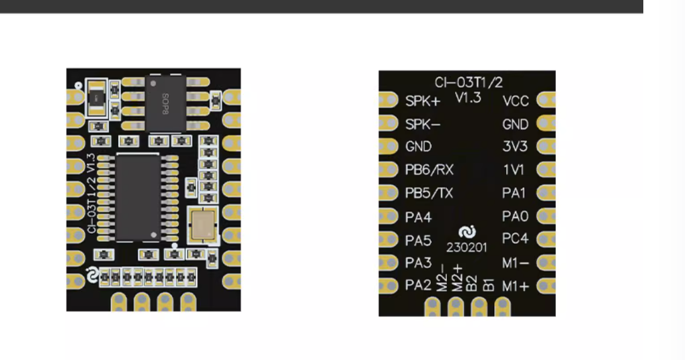

*左侧展示CI-03T1/2模块实物图，右侧为引脚定义图，标注了各引脚名称和版本信息V1.3*

**预防措施：**

- 使用前进行模块功能测试
- 保留详细的测试记录
- 建议可靠供应商的模块
- 严格按照规格书和原理图设计

**注意事项：**

- 电流声通常是功放自激的表现
- 新模块可能存在质量问题，建议批量测试
- 保留问题模块用于故障分析
- 如问题持续，考虑更换模块型号或供应商

---


---


---

### 设备无法正常工作，如何排查接线故障？

**问题描述：**

设备在使用过程中突然无法正常工作，需要检查是否存在接线故障或信号线脱落问题。

**解决方案：**

**故障排查步骤：**

1. **检查信号线连接**

    - 逐一检查所有信号线是否牢固连接
    - 重点关注容易松动的接口部位
    - 确认没有信号线脱落或接触不良

2. **检查电源线连接**

    - 验证电源线正负极是否正确连接
    - 检查电源接口是否有松动
    - 使用万用表测量供电电压是否稳定

3. **检查通信线路**

    - 确认TX/RX等通信线连接正确
    - 检查是否有交叉连接或反接
    - 验证波特率等通信参数匹配

**图片参考：**


*左侧展示CI-03T1/2模块实物图，右侧为引脚定义图，标注了各引脚名称和版本信息V1.3*

**预防措施：**

- 使用前进行模块功能测试
- 保留详细的测试记录
- 建议可靠供应商的模块
- 严格按照规格书和原理图设计

**注意事项：**

- 电流声通常是功放自激的表现
- 新模块可能存在质量问题，建议批量测试
- 保留问题模块用于故障分析

**快速定位方法：**

1. **目视检查法**

    - 仔细观察所有连接点
    - 查看是否有明显脱落的线缆
    - 注意是否有异常弯折或拉扯的线路

2. **轻轻摇动测试**

    - 轻轻摇动各个连接线
    - 观察设备是否有反应变化
    - 定位可能的接触不良点

3. **替换验证法**

    - 使用已知良好的线缆替换
    - 逐一替换可疑的连接线
    - 确认是否为线缆本身问题

**预防措施：**

- 使用带锁扣的连接器，避免意外脱落
- 重要连接处使用热缩管或胶带加固
- 定期检查和维护连接线路
- 避免线缆承受过大拉力

**注意事项：**

- 信号线脱落是最常见的硬件故障之一
- 检查时务必先断电，确保安全
- 发现脱落的线缆需要重新焊接或固定
- 如果频繁脱落，建议改进连接方式

---


---


---

### 转接板无反应怎么办？

**问题描述：**

使用转接板时，CI-03T1和CI-03T2芯片设备插入后均无任何反应，无法正常播报，而另一块转接板工作正常。

**解决方案：**

1. **转接板故障判断**：

    - 多个模块在同一转接板上无反应，很可能是转接板故障
    - 更换另一块正常的转接板后模块能正常工作，可确认是转接板问题
    - 转接板可能存在接触不良或内部电路故障

2. **初步排查**：

    - 检查转接板上的开关是否处于正确位置
    - 确认电源连接是否正常（推荐5V供电）
    - 检查模块与转接板的接触是否良好

3. **解决方案**：

    - 优先使用确认正常的转接板
    - 如有故障转接板，联系客服进行检测或更换
    - 建议采购备用转接板，避免影响开发进度

**注意事项：**

- 转接板是易损件，建议准备备用
- 不同批次的转接板可能存在质量差异
- 保留购买记录，便于售后服务

---


---


---

### A29P降噪模块的输出信号如何与语音模块匹配？

**问题描述：**

A29P降噪模块的输出信号幅度为1.5Vrms，而语音模块的输入信号最大幅度为1.2Vrms，导致信号不匹配和识别效果变差。

**解决方案：**

**问题分析：**

- A29P模块输出阻抗：10kΩ，输出幅度：1.5Vrms
- 语音模块输入阻抗：2.2kΩ，最大输入幅度：1.2Vrms
- 信号幅度过大导致输入过载，可能引起失真或损坏

**信号匹配方案：**

1. **简单衰减方案**：

    - 在输出端串联10k电阻
    - 初步测试信号幅度是否合适

2. **分压衰减方案（推荐）**：

    - 输出端串联10k电阻
    - 对地并联2.2k电阻形成分压电路
    - 可根据实际需要调整并联电阻阻值

**实施步骤：**

1. 先串联10k电阻测试效果
2. 如信号仍过大，增加对地并联电阻
3. 通过录音功能确认信号是否正常
4. 调整电阻值直到获得最佳识别效果

**注意事项：**

- 阻抗匹配可减少低频反射，提高信号质量
- 建议在正式使用前进行充分测试
- 分压电阻的功率选择要留有余量

    - 通过官方淘宝店铺或授权经销商购买
    - 确保产品正宗性和售后保障
    - 获得完整的技术文档和支持

2. **选择双MIC方案**：

    - 官方现已提供CI-03T2双麦克风版本
    - 性能与价格相比单麦版本更有优势
    - 直接使用官方产品避免兼容性问题

**注意事项：**

- 外观相似不能证明是同款产品
- 硬件设计细节的差异是重要判断依据
- 建议通过官方渠道采购以确保产品质量
- 第三方芯片的API对接需求无法得到支持

---


---


---

### 如何设计TVS和ESD防护电路？

**问题描述：**

在CI-03T电路设计中使用了TVS二极管和ESD器件进行静电防护，但设备工作10天后突然无法识别语音指令，需要分析原因并提供正确的防护方案。

**解决方案：**

**问题排查要点：**

1. **麦克风极性检查**：

    - 麦克风焊反会导致无法正常拾音
    - 确认麦克风的正负极标识
    - 使用万用表二极管档验证极性

2. **TVS器件选型问题**：

    - SMBJ8.5CA的钳位电压（Vc）为14.4V，过高
    - 无法有效保护麦克风接口
    - 建议选择Vc=10V左右的TVS器件

**正确防护方案：**

1. **ESD防护**：

    - ESD08V32D-C二极管选择合适
    - 连接方式正确：信号线→ESD→GND
    - 提供快速的静电放电路径

2. **TVS选型建议**：

    - 选择低钳位电压的TVS器件
    - 工作电压应高于信号电平
    - 响应时间要快（纳秒级）

**电路设计要点：**

- 麦克风工作电压不超过5V
    - TVS击穿电压应略高于工作电压
    - 确保防护器件不会影响正常信号

**替代方案：**

- 使用集成ESD/TVS功能的专用保护芯片
- 选择专为音频接口设计的保护器件
- 考虑使用带TVS功能的麦克风接口

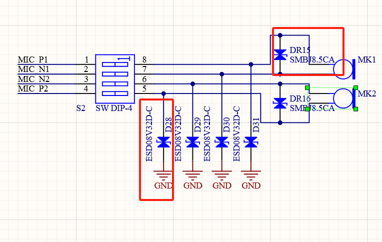

**注意事项：**

- 麦克风极性错误是常见问题，务必仔细确认
- TVS器件的钳位电压是关键参数
- 防护电路不应影响音频信号质量

---


---


---

### PCB封装中麦克风负极引脚无法连接怎么办？

**问题描述：**

导入CI-03T模块的PCB封装文件后，发现麦克风（咪头）的负极引脚被禁用或无法连接线路。

**解决方案：**

1. **检查封装规则设置**：

    - 某些EDA软件有自动规则检查
    - 可能将负极引脚标记为不可连接
    - 需要修改封装库的规则设置

2. **封装文件修改方法**：

    - 在EDA软件中打开封装文件
    - 检查麦克风负极引脚属性
    - 确保引脚类型设置为可连接

3. **验证修改效果**：

    - 修改后保存新的封装文件
    - 重新导入到PCB设计中
    - 测试是否可以正常布线

**技术说明**：

- 麦克风通常需要正负极连接
- 负极引脚应该可以正常布线
- 问题可能出在EDA软件的规则限制

**注意事项：**

- 不同EDA软件操作方法略有差异
- 修改封装前建议备份原文件
- 如仍有问题，可尝试手动调整引脚属性

---


---


---

### LED控制与语音播报时序如何调整？

**问题描述：**

使用CI-03T1模块时，语音功能正常但LED灯不亮，需要修改程序实现LED与语音播报的时序控制。

**解决方案：**

**硬件检查：**

1. **确认GPIO连接**：

    - 检查LED连接的GPIO引脚（如PA4）
    - 确认电路连接正确
    - 验证LED硬件完好

2. **排查可能原因**：

    - GPIO引脚连接错误
    - LED灯珠损坏
    - 固件程序逻辑问题

**程序修改：**

1. **时序控制要求**：

    - 唤醒词：仅回复语音，不控制LED
    - 开灯指令：先回复语音，延时后再点亮LED
    - 关灯指令：先关闭LED，延时后再回复语音

2. **延时参数设置**：

    - 开灯：语音播报完成后延时1秒再点亮LED
    - 关灯：关闭LED后延时1秒再回复语音
    - 延时时间可根据实际语音长度调整

3. **实现方法**：

    - 在固件工程中修改GPIO控制逻辑
    - 添加sleep延时函数
    - 调整动作执行顺序

**注意事项：**

- 避免语音播报和LED动作同时进行，防止电源波动影响音质
- 延时时间需要根据实际语音文件长度精确调整
- 修改固件前确认GPIO引脚定义
- 建议先烧录测试样品验证效果

---


---


---

### 焊接操作不当导致焊盘烧毁和锡渣残留如何修复？

**问题描述：**

焊接CI-03T1模块时，因操作不当导致焊盘烧毁、焊点短路，焊盘内残留锡渣难以清理，询问修复方法。

**解答：**

**焊盘损坏评估：**

1. **损坏程度判断**：

    - **轻度损坏**：焊盘变色但未脱落
    - **中度损坏**：焊盘部分脱落但铜箔尚在
    - **重度损坏**：焊盘完全脱落，铜箔断裂

2. **可修复性评估**：

    | 损坏类型 | 可修复性 | 推荐方案 |
    |---------|---------|---------|
    | 焊盘变色 | 高 | 清理后重新焊接 |
    | 焊盘脱落 | 中 | 飞线连接 |
    | 铜箔断裂 | 低 | 更换模块 |

**修复工具准备：**

1. **必需工具**：

    - 恒温烙铁（温度控制在300-350°C）
    - 吸锡器或吸锡带
    - 助焊剂或焊锡膏
    - 细导线（漆包线或导线）
    - 放大镜或显微镜
    - 镊子和尖嘴钳

2. **辅助材料**：

    - 酒精或洗板水
    - 棉签
    - 热熔胶
    - 防静电手环

**修复步骤详解：**

**第一步：清理残留焊锡**

1. **加热清理**：

    - 将烙铁温度设定在320°C
    - 使用吸锡器逐个清理焊盘
    - 对顽固锡渣使用吸锡带

2. **化学清理**：

    - 涂抹助焊剂软化残留焊锡
    - 使用酒精棉签擦除助焊剂残留
    - 用放大镜检查清理效果

**第二步：焊盘修复处理**

1. **飞线连接法**（推荐）：

    ```
    操作步骤：

    1. 选择0.3mm漆包线作为飞线
    2. 刮除两端绝缘漆（约2-3mm）
    3. 一端焊接芯片引脚
    4. 另一端焊接PCB走线
    5. 使用热熔胶固定
    ```

2. **背面包围法**：

    - 如模块有通孔设计
    - 导线从正面穿到背面
    - 在背面焊盘处固定连接
    - 折弯导线防止脱落

**第三步：焊接新连接**

1. **焊接要点**：

    ```cpp
    // 焊接参数设置
    温度：320-350°C
    时间：3-5秒/点
    焊锡：0.8mm含铅焊锡丝
    助焊：免清洗助焊膏
    ```

2. **质量控制**：

    - 焊点应呈小山丘状
    - 表面光亮无裂纹
    - 无连锡或虚焊现象

**预防措施建议：**

1. **焊接前准备**：

    - 佩戴防静电手环
    - 确认烙铁温度正常
    - 准备好所有工具
    - 在废板上先练习

2. **焊接技巧**：

    - 使用合适的焊锡量
    - 控制焊接时间
    - 避免烙铁接触过久
    - 及时清理多余焊锡

3. **焊接后检查**：

    - 使用放大镜检查焊点
    - 万用表测试连通性
    - 检查是否有短路
    - 固定松动导线

**常见错误及纠正：**

1. **温度过高**：

    - 现象：焊盘变色、脱落
    - 纠正：降低烙铁温度，减少接触时间

2. **焊锡过多**：

    - 现象：相邻引脚短路
    - 纠正：使用吸锡器吸除多余焊锡

3. **清理不彻底**：

    - 现象：焊盘间有锡渣残留
    - 纠正：重复清理，使用助焊剂辅助

**成本效益分析：**

| 修复方案 | 成本 | 成功率 | 耗时 |
|---------|------|--------|------|
| 自行修复 | 低（工具费） | 60-70% | 1-2小时 |
| 专业维修 | 中（服务费） | 90% | 1天 |
| 更换新模块 | 高（材料费） | 100% | 即时 |

**技术建议：**

- 优先选择飞线连接，成功率较高
- 如无焊接经验，建议寻求专业帮助
- 修复后进行全面功能测试
- 记录修复过程便于后续维护

**注意事项：**

- 焊盘脱落后不要强行焊接
- 使用助焊剂时注意通风
- 修复失败可能需要更换模块
- 保存好维修记录和图片

---


---


---

### 关于语音模块的喇叭匹配问题，比如喇叭声音小、失真或不响，应如何选型喇叭？

建议先使用发货时配套的喇叭或开发板跟随的喇叭进行测试，以排除喇叭不匹配的问题。关于喇叭选型，模块对喇叭的负载有明确要求：

**喇叭选型规格要求：**

- **4欧姆（4R）喇叭**：功率应从2.4W起步，建议范围2.4W-3W
- **8欧姆（8R）喇叭**：功率应从1.6W起步，建议范围1.6W-2W
- **功率限制**：尽量不要使用3W以上的喇叭（如4Ω5W），模块可能带不动

**推荐选择：**

- 8欧姆2瓦（8Ω2W）喇叭（推荐）
- 4欧姆2.4W以上喇叭（需注意发热问题）
- 优先使用模块配套的喇叭进行测试验证

**CI-03T1/CI-03T2模块支持说明：**

- 支持4Ω 2W喇叭输出，但可能出现发热问题
- 4Ω喇叭建议功率从2.4W起步，2W功率偏低可能导致负担加重
- 如需使用4Ω喇叭，建议选择2.4W-3W功率范围

**实际案例参考：**

- 使用8Ω2W喇叭（物料编号3070BOX-8Ω2W-2.0-2P）时出现驱动问题，需确认喇叭参数是否在模块驱动能力范围内
- 4Ω2W喇叭可能因功率偏低导致功放负担加重，长期使用会发热
- 4Ω喇叭在2.4W-3W范围内工作时，可能感觉功率偏小，这是正常现象
- 如需更大音量，建议更换为8Ω2W喇叭或外接功放
- 遇到喇叭不工作时，优先使用开发板配套的圆喇叭进行验证，避免因喇叭不匹配导致误判模块故障
- 4Ω5W喇叭模块可能带不动，8Ω5W喇叭可能会发热严重，建议尽量控制在3W以内

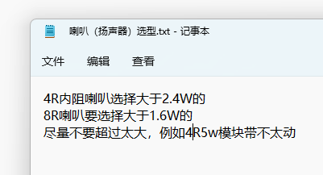


---

### 插件式电路板是否可以改用贴片封装语音芯片？

**问题描述：**

现有电路板使用插件式语音芯片（如KXHS-1907W-P），需要改用贴片封装的语音芯片，询问是否可以提供贴片版本。

**解决方案：**

**封装类型确认：**

1. **插件式与贴片式区别**：

    - 插件式（DIP）：适合手工焊接和原型调试
    - 贴片式（SMT）：适合批量生产，节省空间

2. **现有产品分析**：

    - KXHS-1907W-P为插件式封装
    - 需要确认PCB设计是否支持贴片工艺

**替换方案：**

1. **直接替换**：

    - 如有贴片版本同型号芯片，可直接替换
    - 需重新设计PCB焊盘布局
    - 考虑生产流程改为SMT

2. **模块化方案**：

    - 使用贴片封装的语音模块（如CI-03T1）
    - 模块已集成必要外围电路
    - 简化整体设计复杂度

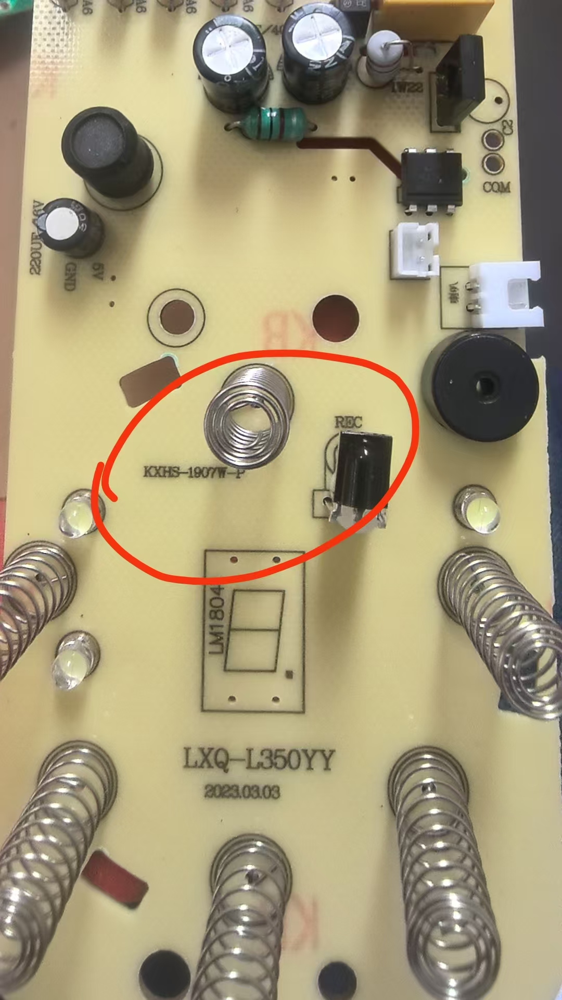

*插件式语音芯片（红色圆圈标记）与贴片封装的区别*

**实施步骤：**

1. **评估现有设计**：

    - 分析当前电路原理
    - 确认空间尺寸限制
    - 评估改版成本

2. **选择合适方案**：

    - 小批量：可继续使用插件式
    - 量产：建议改用贴片式
    - 考虑长期维护性

3. **PCB重新设计**：

    - 按照贴片封装设计焊盘
    - 优化布局减少信号干扰
    - 预留测试点

**注意事项：**

- 贴片封装生产成本低，适合大批量
- 插件式便于研发调试和维修
- 改版需要充分的测试验证
- 考虑供应链稳定性

----


---


---

### 如何为离线语音识别产品选择合适的贴片式麦克风和喇叭？

**问题描述：**

需要为离线语音识别产品选择贴片式麦克风和贴片式喇叭，了解将麦克风与语音芯片集成在同一板上的效果提升程度。

**解决方案：**

**贴片式麦克风推荐：**

1. **4013规格贴片麦克风**：

    - 封装尺寸：4.0mm × 1.3mm
    - 灵敏度：-32dB（推荐值）
    - 信噪比：>70dB
    - 适用于紧凑型产品设计

2. **集成优势**：

    - 将麦克风与语音芯片做在同一板上可减少信号传输距离
    - 连接距离越短，信号质量越好
    - 虽然效果会有提升，但不一定是"显著"提升


*4013贴片麦克风尺寸图（直径4.0±0.2mm，高度1.3±0.2mm）*


*4013贴片麦克风实物外观*

**贴片式喇叭选型要点：**

1. **功率参数**：

    - CI-03T内置功放支持：8Ω 2W 或 4Ω 3W
    - 尺寸限制：半径10mm以下
    - 根据产品空间选择合适尺寸

2. **选型注意事项**：

    - 目前暂无贴片式喇叭供应商推荐
    - 建议在淘宝等平台搜索合适规格
    - 重点考虑功率与尺寸匹配

**供应商渠道：**

- 贴片麦克风可通过原厂直供，提供样品
- 需要样品可联系供应商安排寄送
- 批量采购需确认最小起订量

**注意事项：**

- 贴片方案适合空间受限的产品设计
- 麦克风与芯片集成需要考虑PCB布局优化
- 喇叭选型需兼顾功率和物理尺寸限制
- 建议在设计阶段进行充分测试验证

---


---


---

### 单麦克风配置下如何实现外部AEC功能

**问题描述：**

需要在单麦克风配置下实现外部AEC（回声消除）功能，以解决语音唤醒被自身播放声音打断的问题。

**AEC原理说明：**

AEC（回声消除）的基本原理是通过采集喇叭播放的信号，从麦克风接收到的总信号中减去播放信号，从而得到纯净的语音信号：

- 麦克风接收信号 = 喇叭播放信号 + 语音说话信号
- AEC处理：麦克风信号 - 喇叭信号 = 纯净语音信号
- 提升系统在播放背景音时的语音识别灵敏度

**解决方案：**

**方案一：使用单麦AEC模块（推荐）**

1. **选择合适型号**：

    - 使用CI-03T3（单麦AEC带晶振）
    - 在平台配置中选择单麦克风模式

2. **AEC电路连接**：

    - 将喇叭输出信号通过RC低通滤波器接入AEC输入
    - 使用100nF电容耦合信号

**方案二：I2S功放配合AEC（适用于DAC+功放分离）**

1. **DAC+功放方案**：

    - 使用ES7148等DAC芯片将I2S转换为模拟信号
    - 后级连接CLASS-AB功放（如AD8002D）

    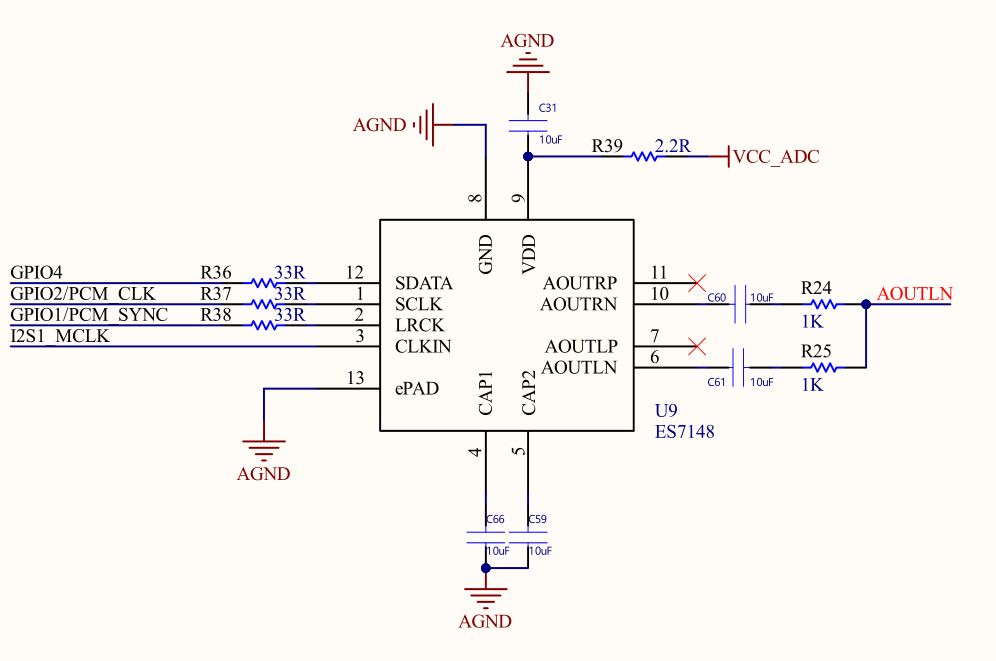

    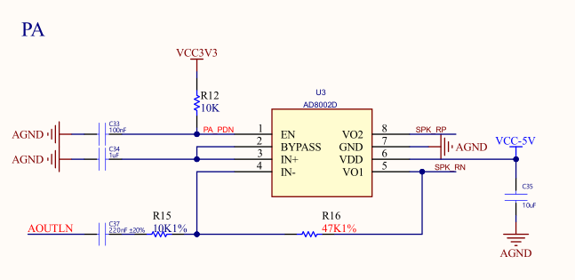

2. **信号求和设计**：

    - 在DAC输出端（AOUTLN）将语音模组音频与主控音频求和
    - 确保AEC能采样到正确的播放信号

3. **AEC采样电路**：

    - 从功放输出端采样信号
    - 通过双路差分输入（M2+和M2-）采集

    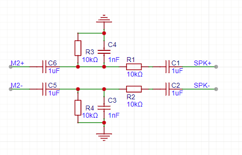

**方案三：简化AEC电路（适用于单功放）**

1. **基本AEC连接**：

    - 从喇叭正极（SPK+）通过RC滤波器采样
    - R12=22kΩ，R11=2.2kΩ，C19=100nF

    

2. **配置要求**：

    - 在平台中开启AEC功能
    - 选择单麦克风模式

**技术要点：**

**① 音频系统设计**

- 避免使用继电器频繁切换功率通道
- 推荐使用音频求和电路而非物理切换
- 确保功放工作在CLASS-AB模式

**② 信号质量保证**

- 功放输出失真要小
- AEC采样信号幅度要适当
- 分压电阻需要精确匹配

**③ 调试步骤**

1. 先断开AEC电路，测试基础语音识别性能
2. 确保在安静环境下有8米左右的接收距离
3. 恢复AEC电路，逐步调整参数
4. 测试播放背景音时的打断效果

**注意事项：**

- 单麦AEC需要将喇叭信号接入AEC输入端，否则无法实现打断功能
- D类功放需要特殊处理，建议使用CLASS-AB功放
- I2S功放系统需要考虑音频求和问题
- 故事机等低噪声场景，单麦AEC通常能满足需求
- 调试时建议先确保基础语音功能正常，再开启AEC

---


---


---

### CI系列模块直接控制舵机的实现方法

**问题描述：**

询问是否可以使用CI系列模块的IO口直接控制舵机，特别是如何通过软件设置IO口作为PWM输出来实现舵机角度控制。

**解决方案：**

**硬件支持确认：**

1. **PWM接口数量**：

    - CI-03T1和CI-03T2模块支持5个PWM输出接口
    - 可直接用于控制舵机，无需额外硬件
    - 模块提供9个IO口，其中5个支持原生PWM输出

2. **电气特性**：

    - 供电电压范围：3.6V-5.5V
    - 适合大多数标准舵机的工作电压
    - PWM输出电平与模块供电一致

**软件配置方法：**

1. **PWM参数设置**：

    - PWM频率：必须设置为50Hz（周期20ms）
    - 占空比范围：5%-12.5%
    - 0.5ms脉宽（占空比2.5%）：0度位置
    - 1.5ms脉宽（占空比7.5%）：90度位置
    - 2.5ms脉宽（占空比12.5%）：180度位置

2. **平台配置步骤**：

    - 在智能公元平台选择"控制"→"PWM输出"
    - 选择对应的PWM通道
    - 设置频率为50Hz
    - 通过"设置占空比"动作精确控制角度

**代码实现示例：**

```c
// 舵机控制伪代码示例
#include "ci03t.h"

void servo_control_init() {
    // 初始化PWM输出
    PWM_Init(PWM_CHANNEL_1, 50, 5); // 50Hz, 初始5%占空比
}

void set_servo_angle(uint8_t channel, float angle) {
    float duty;
    // 角度转换为占空比
    duty = 5.0 + (angle / 180.0) * 7.5; // 0°→5%, 180°→12.5%
    PWM_SetDuty(channel, duty);
}

void main() {
    servo_control_init();

    // 控制舵机转动到不同角度
    set_servo_angle(PWM_CHANNEL_1, 0);    // 0度
    delay(1000);
    set_servo_angle(PWM_CHANNEL_1, 90);   // 90度
    delay(1000);
    set_servo_angle(PWM_CHANNEL_1, 180);  // 180度
    delay(1000);
}
```

**硬件连接要点：**

1. **信号线连接**：

    - 舵机信号线→模块PWM输出口
    - 舵机电源正极→外部5V电源正极
    - 舵机电源负极→外部电源负极（共地）

2. **供电要求**：

    - 建议舵机使用独立5V供电
    - 避免与语音模块共用电源
    - 确保电源电流足够驱动舵机

**注意事项：**

- 使用原生PWM功能，不要用GPIO模拟PWM
- 舵机需要持续的PWM信号才能保持位置
- 建议发送信号后保持500ms以上确保响应
- 如需驱动多个舵机，建议使用CI-73T模块（IO口更多）
- 不同型号舵机的脉宽范围可能有差异，需要根据规格调整

---


---


---

### 串口输入触发的语音播放内容对内存有影响吗？

**问题描述：**

使用CI-033T芯片时，通过串口输入触发的语音播放内容是否会占用内存，如果存储100条类似的语音指令是否会影响芯片的内存使用。

**解决方案：**

**内存占用分析**

1. **语音内容存储方式**

    - 语音播放内容存储在Flash中，不占用运行内存
    - CI-033T的Flash容量为2MB，CI-033为4MB
    - 每条语音内容独立存储，按需调用播放

2. **内存使用情况**

    - 命令词和回复语音都占用Flash存储空间
    - 100条语音指令应该可以容纳
    - CI-033T的2MB Flash足够使用

    

    *语音内容配置界面，输入"现在水箱温度是"作为示例*

**容量评估**

1. **存储需求计算**

    - 每条语音平均大小：10-20KB（取决于内容长度）
    - 100条语音总需求：约1-2MB
    - CI-033的4MB Flash可轻松容纳

2. **实际测试反馈**

    - 供应商确认100条语音内容可以容纳
    - Flash空间足够，不会影响系统运行
    - 建议合理规划语音内容长度

**优化建议**

1. **内容精简**

    - 使用简洁的语音提示
    - 避免过长的回复内容
    - 合并相似的语音提示

2. **分段播报**

    - 将长内容拆分为多个短内容
    - 使用动态数据组合播报
    - 减少固定语音的存储需求

3. **容量规划**

    - CI-03T（2MB Flash）：适合200条以内语音
    - CI-033T（4MB Flash）：可支持500条语音
    - 根据实际需求选择合适型号

**注意事项：**

- 语音内容长度影响Flash占用，建议控制在合理范围
- 100条类似内容在CI-033T上完全可以容纳
- 如语音内容特别多，建议选用CI-033T或CI-33T
- 定期清理不需要的语音内容释放存储空间

---


---


---

### CI1302芯片烧毁的原因是什么？

**问题描述：**

多个CI-03T1和CI-03T2控制板套件中的主控芯片CI1302被烧毁，经确认电路设计无异常，需排查具体烧毁原因。

**解决方案：**

**主要原因分析：**

1. **引脚短路导致烧毁**：

    - 万用表表笔接触芯片引脚时间过长会造成短路
    - 瞬间接触通常不会造成问题
    - 接触过久（如持续测量）会导致芯片烧毁

2. **芯片引脚背短路**：

    - 芯片引脚之间可能存在意外短路
    - 焊接过程中的锡渣可能导致短路
    - 静电击穿也是可能原因之一

**预防措施：**

1. **测试操作规范**：

    - 使用万用表测量时避免表笔长时间接触引脚
    - 测量时间控制在最短范围内
    - 避免在芯片通电时进行接触式测量

2. **生产过程控制**：

    - 焊接后仔细检查是否有锡渣残留
    - 使用放大镜检查引脚间是否有桥连
    - 加强防静电措施

3. **设计优化建议**：

    - 在关键测试点添加测试焊盘
    - 避免直接接触芯片引脚进行测量
    - 考虑增加保护电路

**经验总结：**

- 已出货1000多个产品，个别芯片烧毁多为操作不当导致
- 功放芯片（8002D）相对较少出现烧毁情况
- 如批量出现烧毁，需要重点检查生产工艺和测试流程

**注意事项：**

- 芯片一旦烧毁无法修复，只能更换
- 保留故障样品用于分析具体原因
- 建议制定标准作业指导书规范操作流程

---


---


---

### AD8002D功放驱动8Ω喇叭需要多大电流？

**问题描述：**

使用CI-03T1或CI-03T2芯片搭配AD8002D功放驱动8Ω 2W喇叭时，电源需要提供多大电流以确保正常工作。

**解决方案：**

**电流需求分析：**

1. **最小电流要求**：

    - 电源最大电流需要大于500mA
    - 8Ω 2W喇叭的峰值电流需求较高
    - 建议保留足够的电流余量

2. **推荐电源规格**：

    - 输出电压：5V DC
    - 输出电流：≥1A（推荐2A）
    - 纹波：<100mV

**电源选择建议：**

1. **标准适配器**：

    - 使用5V/2A电源适配器
    - 确保能稳定提供500mA以上电流
    - 避免使用小功率充电头

2. **电池供电方案**：

    - 锂电池方案需考虑放电能力
    - 3.7V电池需配合升压模块
    - 升压模块输出电流≥2A

**实际测试验证：**

- 连接8Ω 2W喇叭测试音量
    - 检查电源是否发热严重
    - 验证大音量时是否断音
    - 测试连续播放的稳定性

**注意事项：**

- 电源电流不足会导致声音失真
- 峰值电流可能达到1A以上
- 建议使用额定电流2倍于需求的电源
- 长期使用需关注电源发热情况

---


---


---

### WiFi模块与语音模块干扰及语音导航设置问题

**问题描述：**

CI-03T语音模块与WiFi模块靠近时，喇叭出现杂音，且语音导航功能存在播报延迟和卡顿问题。

**解决方案：**

**1. 干扰问题处理：**

- **物理隔离**：将WiFi模块与语音模块保持一定距离，避免射频干扰
- **电路设计优化**：参考官方电路设计，增加必要的滤波和屏蔽措施
- **电源隔离**：为语音模块和WiFi模块分别提供独立的电源滤波电路
- **接地处理**：确保良好的接地设计，避免共地干扰

**2. 语音导航优化方案：**

- **使用个性化语音**：将语音导航内容制作成音频文件，通过个性化语音功能替换
- **简化导航内容**：减少单次播报的文字数量，避免因任务过多导致卡顿
- **关闭AEC功能**：如使用外部功放且出现异常，可尝试关闭AEC功能
- **调整语速设置**：适当降低语音播报语速，给喇叭留出足够的响应时间

**具体操作步骤：**

1. **制作个性化语音文件**：

    - 在平台中选择"个性化语音"功能
    - 上传录制好的音频文件（MP3格式）
    - 将语音导航内容替换为个性化音频

2. **配置语音导航**：

    - 进入命令词配置界面
    - 为需要导航的命令词添加语音导航
    - 选择"使用个性化语音"选项
    - 上传对应的音频文件

**注意事项：**

- WiFi干扰属于射频干扰问题，需要从硬件设计层面解决
- 语音导航延迟主要是因为播报内容过多，其他任务同时在执行
- 个性化语音功能可以有效避免播报延迟和语调变化问题
- 如使用D类功放，需注意与AEC功能的兼容性问题

---


---


---

### 语音控制两个电机正反转需要哪些配件？

**问题描述：**

需要实现语音控制两个电机的正反转功能，询问所需的配件组成和系统架构。

**解决方案：**

**系统组成架构**

语音控制电机系统需要以下核心配件：

1. **拾音器件**
    - 麦克风：用于采集语音信号
    - 推荐使用驻极体电容麦，灵敏度-32dB

2. **语音处理模块**
    - 语音模块：处理语音识别
    - 功能：识别指令、控制输出

3. **数字通信**
    - 杜邦线：连接语音模块和单片机
    - 实现数字信号传输

4. **控制执行**
    - 单片机（MCU）：控制电机工作状态
    - 驱动电路：驱动电机正反转

5. **语音反馈**
    - 喇叭：播报电机工作状态

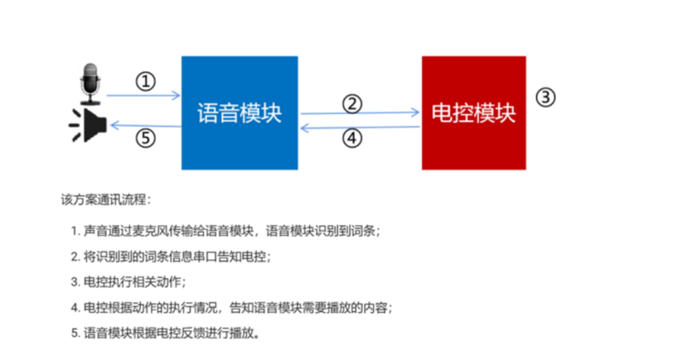

*语音控制系统架构：语音输入→语音处理→数字通信→MCU控制→电机执行，同时支持状态反馈播报*

**配件选型清单**

**1. 麦克风**

- 型号：推荐6027或同等规格
- 灵敏度：-32dB
- 信噪比：≥70dB

**2. 语音模块**

- CI-03T/CI-03T2：基础语音识别
- SU-03T：带功放，可直推喇叭
- 支持词条：根据需求选择300/500条

**3. 单片机**

- STM32系列：功能强大，易开发
- Arduino：简单易用，适合原型
- 51单片机：成本低，简单应用

**4. 驱动方案**
```
方案一：H桥驱动电路
- 使用4个三极管/MOSFET
- 实现正反转控制
- 成本低，需自行设计

方案二：电机驱动模块
- L298N模块：成熟方案
- 支持两路电机
- 集成保护电路

方案三：继电器方案
- 两个继电器控制一个电机
- 电路简单，成本低
- 有机械寿命限制
```

**5. 电源系统**

- 5V电源：给语音模块供电
- 电机电源：根据电机规格选择（如6V/12V/24V）
- 注意：电机电源要与控制电源隔离

**实现流程**

1. **语音识别阶段**
    - 麦克风采集声音
    - 语音模块识别指令
    - 输出控制信号

2. **指令处理阶段**
    - 单片机接收串口数据
    - 解析语音指令内容
    - 判断控制动作

3. **电机控制阶段**
    - 控制H桥输出
    - 实现电机正转/反转
    - 可调速或定时

4. **状态反馈阶段**
    - 电机执行动作
    - 单片机检测状态
    - 通过语音模块播报

**注意事项：**

- 电机功率较大时，建议使用成品驱动模块
- 注意电源隔离，避免电机干扰影响语音识别
- 继电器方案有寿命限制，适合低频应用
- 开发时建议先测试单电机，再扩展到双电机

---


---


---

### 语音模块严重发热故障排查

**问题描述：**

CI-03T芯片识别阿拉伯数字时识别率低，询问麦克风选型（贴片vs拉线）、双麦克风配置对识别率的影响，以及如何通过调整阈值优化识别效果。

**解决方案：**

**麦克风选型对比：**

1. **贴片式麦克风（推荐）**：

    - 型号：机芯智能定制413B贴片麦
    - 优势：集成度高，信号传输距离短
    - 适用：对空间要求严格的产品

2. **拉线式麦克风**：

    - 优势：安装灵活，可调整位置
    - 类型：带线的电容麦或插针麦
    - 注意：线长控制在100mm以内

3. **识别率对比**：

    - 10cm内距离：贴片式略有优势
    - 超过10cm：两者识别率基本相当
    - 建议：根据产品结构选择合适类型

**双麦克风配置效果：**

1. **降噪优势**：

    - 双麦克风可利用阵列算法进行噪声抑制
    - 在嘈杂环境下识别效果更稳定
    - 提升：方向性识别，减少环境干扰

2. **方向性增强**：

    - 可区分声源方向，提升目标语音识别
    - 减少：来自非目标方向的噪声干扰
    - 适用：风扇、空调等有噪声场景

**双麦克风选型建议：**

1. **适用场景**：

    - 嘈杂环境：双麦克风效果更佳，能有效抑制环境噪声
    - 正常环境：单麦克风已能满足基本识别需求
    - 空间较大的场景：双麦克风可提供更好的声源定位

2. **性能对比**：

    - 识别率：双麦克风在嘈杂环境下比单麦克风高约3%
    - 成本差异：双麦克风方案成本更高，但降噪效果明显
    - 复杂度：双麦克风需要更复杂的硬件布局和调试

**线长对识别率的影响：**

1. **推荐长度**：

    - 咪头线长度：≤100mm（10cm）
    - 超过100mm：干扰明显增加，识别率下降

2. **线材要求**：

    - 必须使用屏蔽线或双绞线
    - 避免与电源线、信号线并行布线
    - 确保连接器接触良好

3. **物理接触影响**：

    - 手握咪头线会引入干扰，影响识别效果
    - 人体感应会增加噪声，降低信噪比
    - 线长超过10cm时，手握影响更明显
    - 50cm长线时手握会造成严重干扰

4. **延长线处理**：

    - 线长100mm内：基本无区别
    - 线长超过100mm：必须使用屏蔽线
    - 双绞线可有效抑制共模干扰
    - 屏蔽层需要可靠接地

5. **实际应用建议**：

    - 咪头尽量靠近模块安装，缩短引线长度
    - 如必须延长，推荐使用同轴屏蔽线
    - 避免咪头线靠近电机、电源等干扰源
    - 产品结构设计时考虑咪头位置优化

**注意事项**：

    - 线越长越容易受干扰
    - 屏蔽线的屏蔽效果需要确认
    - 必要时可在接口处增加滤波电容
    - 手握测试仅用于验证，实际产品应避免

**阈值调整方法：**

1. **找到阈值设置**：

    - 在平台"优化配置"菜单
    - 选择"命令词阈值"选项
    - 可单独调整特定命令词的识别灵敏度

2. **调整策略**：

    - 识别困难时：调高阈值（如0.2→0.3）
    - 误识别多时：调低阈值（如0.2→0.1）
    - 阈值范围：0.01-0.3，默认0.2

3. **注意事项**：

    - 阈值越大越敏感，但误识别率也会增加
    - 单字识别（如数字）本身具有挑战性
    - 需要在识别率和误触发之间找到平衡

**综合优化建议：**

1. **硬件优先**：

    - 选择高信噪比麦克风（SNR＞70dB）
    - 确保电源供电稳定，纹波＜100mV
    - 结构设计避免将麦克风放入密闭空间

2. **软件配合**：

    - 选用合适的降噪算法模型
    - 设置远场识别模式（0-1.5m）
    - 根据实际环境选择识别距离

3. **测试验证**：

    - 分场景测试（安静/嘈杂）
    - 多人测试，考虑不同发音习惯
    - 记录测试数据，量化改善效果

**注意事项：**

- 贴片麦克风适合量产，一致性较好
- 拉线麦克风适合研发，便于调整测试
- 双麦克风方案成本更高，但降噪效果明显
- 阈值调整需要在实际使用环境中反复验证

---


---


---

### 8002A功放芯片SHUTDOWN引脚应该如何连接？

**问题描述：**

在CI-03T2芯片电路图中，8002A芯片的SHUTDOWN引脚连接了10K电阻到VDD_3.3V，但未连接到MCU的控制引脚，需要了解该设计是否合理，以及如何正确实现拉低使能功能。

**解决方案：**

**当前设计分析：**

- SHUTDOWN引脚通过10K上拉电阻连接到3.3V
- 这种设计使功放始终处于使能状态（正常工作）
- 缺少MCU控制，无法通过软件关闭功放

**正确的设计方案：**

**方案一：MCU控制使能（推荐）**

1. **引脚连接**：

    - 将8002A的SHUTDOWN引脚（第1脚）连接到MCU的GPIO
    - 保留上拉电阻（10K）到3.3V，确保默认使能
    - MCU可以控制拉低以关闭功放

2. **电路原理**：

    ```
    SHUTDOWN引脚 ───┬── 10K电阻 ─── VDD_3.3V
                    │
                    └── MCU GPIO
    ```

3. **控制逻辑**：

    - GPIO输出高电平（或悬空）：功放使能
    - GPIO输出低电平：功放关闭，消除静态噪声

**方案二：始终使能设计**

1. **适用场景**：

    - 不需要功放开关控制的简单应用
    - 对静态噪声不敏感的产品
    - 成本敏感的设计

2. **设计要点**：

    - 保持原有的10K上拉电阻连接
    - 确保SHUTDOWN引脚稳定接在3.3V
    - 无需额外的MCU引脚占用

**技术注意事项：**

1. **SHUTDOWN引脚特性**：

    - 8002A的SHUTDOWN为低电平使能
    - 高电平或悬空时功放关闭
    - 响应时间快速，适合动态控制

2. **PCB设计建议**：

    - 上拉电阻应靠近8002A芯片放置
    - 如使用MCU控制，走线应尽量短
    - 避免与其他高频信号平行走线

3. **软件控制配合**：

    - 如使用CI-03T2，可利用PA6引脚（功放使能脚）
    - 在语音交互前开启功放
    - 静默期间可关闭功放以省电和消除噪声

**设计选择建议：**

- **需要节能或降噪**：选择方案一，使用MCU控制
- **成本优先、简单应用**：可选择方案二，始终使能
- **推荐做法**：预留MCU控制接口，便于后期功能扩展

---


---


---

### 使用4欧喇叭正常但8欧喇叭声音很小怎么办？

**问题描述：**

在使用CI-03T系列芯片的功放电路中，使用4欧喇叭时声音正常，但使用8欧喇叭时声音很小，如何调整电路参数以优化8欧喇叭的音量表现。

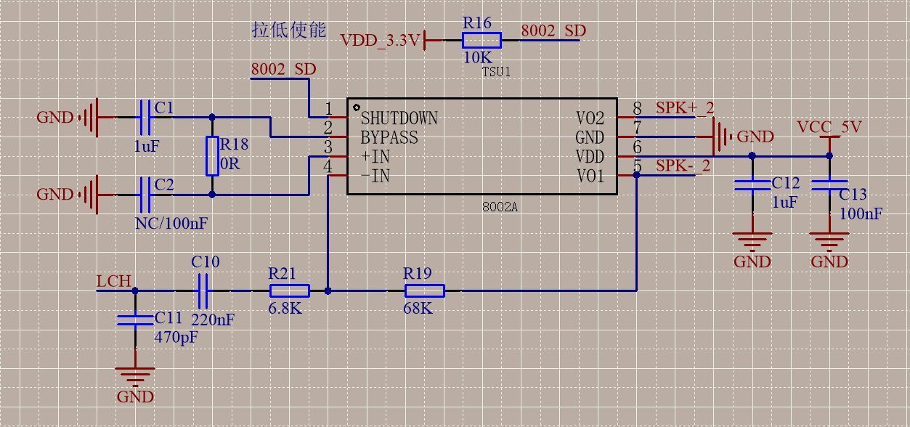

*使用8002A功放芯片的电路设计，包含输入滤波网络（C1, R18, C2）和电源滤波电容（C12, C13），以及用于拉低使能的上拉电阻（R16）*

**问题分析：**

1. **阻抗匹配原理**：

    - 功放输出功率与喇叭阻抗成反比关系
    - 4欧喇叭：P = V²/4Ω，获得较大功率
    - 8欧喇叭：P = V²/8Ω，功率减半
    - 相同电压下，8欧喇叭获得的功率仅为4欧的一半

2. **电路参数影响**：

    - 现有电路中的R18电阻值影响输出阻抗匹配
    - C1、C2组成的滤波网络可能存在频率衰减
    - 需要针对8欧喇叭优化参数

**解决方案：**

1. **调整输出匹配电阻**：

    - 减小R18阻值以降低输出阻抗
    - 建议R18从当前值调整为更小阻值（如1Ω或更小）
    - 可尝试0Ω（直接短接）以获得最大输出

2. **优化输入耦合电路**：

    - 调整C1、C2电容值以改善频响
    - C1建议增大至10μF以改善低频响应
    - C2可保持不变或微调

3. **检查功放供电**：

    - 确保功放芯片供电电压充足
    - 5V供电下，8002A可输出约2W功率到4欧负载
    - 8欧负载时功率约1W，需确认是否满足需求

4. **考虑并联喇叭方案**：

    - 如需要更大音量，可将两个8欧喇叭并联
    - 并联后总阻抗为4欧，功率翻倍
    - 注意功放负载能力是否足够

**电路修改建议：**

```
原电路优化后：
C1: 2.2μF → 10μF（改善低频）
R18: 根据测试调整，可尝试0-1Ω
C2: 保持不变
其他元件保持原设计
```

**测试验证步骤：**

1. 使用可调电阻测试R18最佳阻值
2. 测量8欧喇叭两端电压，计算实际输出功率
3. 对比4欧和8欧喇叭的频响曲线
4. 在不同音量设置下测试失真度

**注意事项：**

- 8欧喇叭音量小是物理特性，非故障现象
- 调整R18时注意功放芯片的散热情况
- 如需要持续大音量，建议保持使用4欧喇叭
- 修改电路后需要全面测试各项指标

---


---


---

### 8欧姆0.5W扬声器可以使用吗？

**问题描述：**

咨询是否可以使用8欧姆0.5瓦的扬声器喇叭连接到CI-03T1或CI-03T2芯片模块。

**解决方案：**

**功率匹配分析：**

- **8Ω喇叭推荐功率**：应从1.6W起步，建议范围1.6W-2W
- **0.5W功率问题**：远低于模块推荐功率范围
- **可能导致的问题**：

    - 音量过小，无法满足使用需求
    - 可能影响音质表现
    - 在嘈杂环境中无法听清

**技术规格对比：**

| 阻抗 | 推荐功率范围 | 最低功率 | 查询功率 |
|------|--------------|----------|----------|
| 4Ω | 2.4W - 3W | 2.4W | - |
| 8Ω | 1.6W - 2W | 1.6W | 0.5W（不推荐） |

**建议方案：**

1. **更换推荐喇叭**：

    - 使用8Ω 2W喇叭（推荐选择）
    - 确保音量充足，音质清晰
    - 满足模块的驱动要求

2. **临时使用注意事项**：

    - 如必须使用0.5W喇叭，需降低音量使用
    - 避免在嘈杂环境使用
    - 考虑更换为更大功率的喇叭

**替代选择：**

- **8Ω 1.6W**：最低可接受功率
- **8Ω 2W**：最佳选择，性能平衡
- **4Ω 2.4W**：如需更大音量，注意发热问题

**注意事项：**

- 0.5W功率过小，无法发挥模块性能
- 建议选择符合推荐功率范围的喇叭
- 功率不足会导致音量偏小
- 长期使用建议更换为标准规格喇叭

---


---


---

### 可以将两个3W喇叭并联连接吗？

**问题描述：**

咨询是否可以将两个3W的喇叭并联连接到CI-03T1或CI-03T2芯片的音频输出接口上。

**解决方案：**

**并联连接分析：**

1. **阻抗变化计算**：

    - 两个相同阻抗喇叭并联：总阻抗为单个阻抗的一半
    - 例如：两个8Ω喇叭并联 = 4Ω总阻抗
    - 两个4Ω喇叭并联 = 2Ω总阻抗

2. **功率分配**：

    - 总功率会分配到两个喇叭上
    - 每个喇叭获得一半的功率
    - 总音量会比单个喇叭略大

**技术可行性评估：**

1. **8Ω喇叭并联**：

    - 总阻抗：4Ω（在模块支持范围内）
    - 单个喇叭功率：1.5W（总功率3W）
    - **可行**：模块可以驱动

2. **4Ω喇叭并联**：

    - 总阻抗：2Ω（超出模块推荐范围）
    - 可能导致功放过载
    - **不推荐**：存在损坏风险

**实施建议：**

1. **推荐配置**：

    - 使用两个8Ω 3W喇叭并联
    - 总阻抗4Ω，在模块安全范围内
    - 获得更好的声音扩散效果

2. **连接方式**：
    ```
    模块音频输出+ ──┬─→ 喇叭1+
                    └─→ 喇叭2+
    模块音频输出- ──┬─→ 喇叭1-
                    └─→ 喇叭2-
    ```

3. **注意事项**：

    - 确保喇叭相位一致（+对+，-对-）
    - 使用质量可靠的喇叭
    - 避免不同阻抗/功率的喇叭并联

**性能影响：**

1. **优点**：

    - 声音覆盖范围更广
    - 单个喇叭负载降低，寿命更长
    - 音质可能更均匀

2. **缺点**：

    - 总阻抗降低，功放负担增加
    - 可能影响音质平衡
    - 功耗增加

**替代方案**：

- 如需更大音量，建议外接独立功放
- 使用单个更高功率的喇叭（在推荐范围内）
- 考虑使用双声道音频放大方案

**注意事项：**

- 并联后总阻抗不能低于模块最低要求
- 避免混用不同规格的喇叭
- 长期使用需监听功放温度
- 如出现异常发热，应立即断电检查

---


---


---

### 是否可以并联两个3W喇叭使用？

**问题描述：**

咨询是否可以将两个3W的喇叭并联连接到CI-03T1或CI-03T2芯片的音频输出接口上。

**解决方案：**

**技术分析：**

1. **并联阻抗变化**：

    - 两个相同阻抗喇叭并联后，总阻抗为单个喇叭的一半
    - 例如：两个8Ω喇叭并联 = 4Ω总阻抗
    - 两个4Ω喇叭并联 = 2Ω总阻抗

2. **功率分配**：

    - 每个喇叭获得一半的输出功率
    - 总功率输出会增加，但对模块的负载也更重

**风险评估：**

1. **阻抗过低问题**：

    - 并联后阻抗可能过低，超出模块驱动能力
    - 2Ω阻抗对模块功放负担过重
    - 可能导致功放过热或损坏

2. **电流需求**：

    - 并联连接需要更大驱动电流
    - 可能超出模块的最大输出电流能力
    - 长期使用稳定性无法保证

**建议方案：**

1. **单喇叭方案**：

    - 推荐使用单个8Ω 2W喇叭
    - 或使用单个4Ω 3W喇叭（注意发热）
    - 匹配模块最佳负载范围

2. **串联方案**（如需双喇叭）：

    - 两个相同喇叭串联，总阻抗翻倍
    - 两个4Ω喇叭串联 = 8Ω总阻抗
    - 音量会略有降低，但更安全

3. **外接功放方案**：

    - 如确实需要双喇叭，建议使用外接功放
    - 模块输出作为信号源输入功放
    - 由功放驱动多个喇叭

**注意事项：**

- 不推荐直接并联两个3W喇叭
- 并联后阻抗过低可能损坏模块
- 建议优先使用单喇叭或串联方案
- 多喇叭应用建议考虑外接功放方案

---


---


---

### 如何避免串口通信电平不稳定导致芯片死机？

**问题描述：**

CI-03T1芯片在使用串口通信时，电平不稳定导致芯片偶尔死机，特别是在连接串口助手调试时更为明显。

**解决方案：**

**电平控制要求：**

- 串口通信电平必须严格控制在3V-3.6V之间
- 稍微超出范围（偏高或偏低）都会导致芯片死机
- 该芯片对电平要求极高，设计时需要特别注意

**硬件设计要点：**

1. **电平转换电路**

    - 使用5V供电的MCU需要增加电平转换电路
    - 推荐使用专用的电平转换芯片（如TXS0102）
    - 或使用分压电路确保高电平不超过3.6V

2. **保护电路设计**

    - 在串口线上添加TVS管进行过压保护
    - 串联适当的限流电阻（100-220Ω）
    - 考虑添加保险丝防止过流损坏

3. **电源稳定性**

    - 确保3.3V电源纹波小于100mV
    - 在电源输入端增加足够的滤波电容
    - 使用LDO稳压器提供稳定电压

**调试注意事项：**

- 调试时避免使用5V电平的串口工具直接连接
- 使用专用调试器或隔离型串口工具
- 监测串口电平，确保在安全范围内

**测试验证：**

- 上电后测量工作电流（正常约33mA）
- 如电流异常（如18mA），说明芯片未正常工作
- 检查各引脚电压是否符合规格要求

---


---


---

### CI系列芯片产品是否包含串口保护电路？

**问题描述：**

需要确认CI系列芯片产品（如CI-03T1和CI-03T2）的TTL串口是否包含保护电路设计。

**解决方案：**

CI系列芯片的串口保护电路设计需要根据具体型号确认：

1. **CI-03T系列**：

    - CI-03T1/CI-03T2的串口引脚内部包含基本保护
    - 建议在外部电路中增加保护措施
    - 串口通信电平必须严格控制在3V-3.6V之间

2. **外部保护设计建议**：

    - 在串口线上添加TVS管进行过压保护
    - 串联适当的限流电阻（100-220Ω）
    - 使用IN5819二极管防止电压反接
    - 考虑添加保险丝防止过流损坏

3. **电平控制要求**：

    - 串口通信电平必须严格控制在3V-3.6V之间
    - 稍微超出范围（偏高或偏低）都会导致芯片死机
    - 该芯片对电平要求极高，设计时需要特别注意

**硬件设计要点：**

1. **电平转换电路**

    - 使用5V供电的MCU需要增加电平转换电路
    - 推荐使用专用的电平转换芯片（如TXS0102）
    - 或使用分压电路确保高电平不超过3.6V

2. **保护电路设计**

    ```
    推荐的保护电路设计：
    MCU_TX --[100Ω]--[IN5819]--> CI_RX
    MCU_RX <------------------- CI_TX
    ```

3. **电源稳定性**

    - 确保3.3V电源纹波小于100mV
    - 在电源输入端增加足够的滤波电容
    - 使用LDO稳压器提供稳定电压

**调试注意事项：**

- 调试时避免使用5V电平的串口工具直接连接
- 使用专用调试器或隔离型串口工具
- 监测串口电平，确保在安全范围内

**测试验证：**

- 上电后测量工作电流（正常约33mA）
- 如电流异常（如18mA），说明芯片未正常工作
- 检查各引脚电压是否符合规格要求

---


---


---

### 如何通过GPIO高低电平控制电机正反转？

**问题描述：**

需要了解如何通过设置引脚高低电平来控制电机正反转，以及是否有相关的固件参考。

**解决方案：**

**1. 基本控制原理**

电机正反转控制是通过改变电机两端电压极性实现的：

- **正转**：A端为正，B端为负
- **反转**：A端为负，B端为正
- **停止**：两端都为负或断电

**2. GPIO控制实现**

通过两个GPIO引脚控制H桥或电机驱动模块：

```
GPIO控制方式：
GPIO1    GPIO2    电机状态
高电平    低电平    正转
低电平    高电平    反转
低电平    低电平    停止（刹车）
高电平    高电平    禁止（避免短路）
```

**3. 参考视频教程**

- **CI-03T语音模块驱动电机转动教学**
    - 链接：https://www.bilibili.com/video/BV1nL411z7J6/
    - 内容：详细的接线方法和控制代码演示
    - 适合初学者快速上手

**4. 平台配置示例**

在智能公元平台中配置：

1. **设置两个GPIO输出**：

    - GPIO_A25：控制电机方向1
    - GPIO_A26：控制电机方向2

2. **语音指令配置**：

    - "前进"：A25=高，A26=低
    - "后退"：A25=低，A26=高
    - "停止"：A25=低，A26=低

3. **可选功能扩展**：

    - 添加PWM调速功能
    - 设置定时自动停止
    - 增加状态反馈播报

**5. 注意事项**

- 避免同时设置两个GPIO为高电平，防止电源短路
- 大功率电机需要使用专门的电机驱动模块
- 电机换向时可能产生反向电动势，需要保护电路
- 测试时先使用小功率电机验证逻辑

---


---


---

### 如何识别设备使用的是单麦还是双麦配置？

**问题描述：**

设备中包含两个麦克风，需要确认该设备使用的是单麦还是双麦型号的离线语音识别芯片。

**解决方案：**

**识别方法：**

1. **观察麦克风连接方式**：

    - 单麦模块：通常只有一个麦克风输入接口
    - 双麦模块：支持两个麦克风同时输入
    - 物理接口数量可以反映模块类型

2. **检查连接线缆**：

    - 两个独立插头：可能是双麦配置
    - 单个连接器：可能是单麦配置或特殊设计
    - 需要结合模块型号判断

**配置确认步骤：**

1. **查看模块型号**：

    - CI-03T1：单麦克风版本
    - CI-03T2：双麦克风版本
    - CI-73T2：双麦克风版本

2. **功能测试验证**：

    - 单麦模块：基础语音识别功能
    - 双麦模块：具备降噪和声源定位功能
    - 测试唤醒距离和识别准确率

**技术差异：**

1. **单麦模块特点**：

    - 成本较低
    - 功耗较小
    - 适合简单应用场景

2. **双麦模块特点**：

    - 更好的噪声抑制
    - 支持AEC（声学回声消除）
    - 适合复杂环境使用

**注意事项：**

- 仅凭麦克风数量不能完全确定模块类型
- 需要结合具体型号和功能进行判断
- 双麦模块需要烧录对应固件才能发挥优势
- 采购时明确标注单麦或双麦需求

---

### ESP32模块(MAX98357功放)如何接入CI-03T的AEC电路？

**问题描述：**

使用ESP32模块配合MAX98357 D类功放，需要将音频输出信号接入CI-03T模组的AEC电路，以实现语音播报时的唤醒打断功能，解决在播放声音时难以打断的问题。

**问题分析：**

ESP32使用的MAX98357是D类功放，其输出特性与CI-03T的AEC电路设计存在兼容性问题：

- MAX98357输出的是高频PWM方波信号，包含载波成分
- CI-03T的AEC电路设计用于处理模拟音频信号
- 直接连接会导致AEC无法正确采样参考信号
- 简单的分压电路（如直接接22k电阻）无法工作，可能导致系统失效

**解决方案：**

**方案一：使用AB类功放（推荐）**

1. **更换功放芯片**：

    - 使用8002D等AB类功放芯片
    - AB类功放输出为模拟信号，可直接接入AEC电路
    - 电路简单，可靠性高

2. **AEC连接方式**：

    - 功放输出通过100nF电容耦合
    - 经22kΩ电阻分压后接入CI-03T的Mic2-IN引脚
    - 按照标准AEC参考电路设计

**方案二：D类功放去载波处理（复杂）**

如必须使用MAX98357 D类功放，需要增加去载波电路：

1. **低通滤波器设计**：

    - 在功放输出端增加RC低通滤波网络
    - 截止频率设置在20-30kHz，滤除高频载波
    - 保留音频包络信号供AEC使用

2. **信号调理电路**：

    - 使用运放构建有源低通滤波器
    - 将PWM信号转换为平滑的模拟信号
    - 调整信号幅度匹配AEC输入要求

3. **调试要点**：

    - 需要反复调整滤波器参数
    - 验证AEC采样信号的准确性
    - 测试唤醒打断功能的实际效果

**参考连接图：**

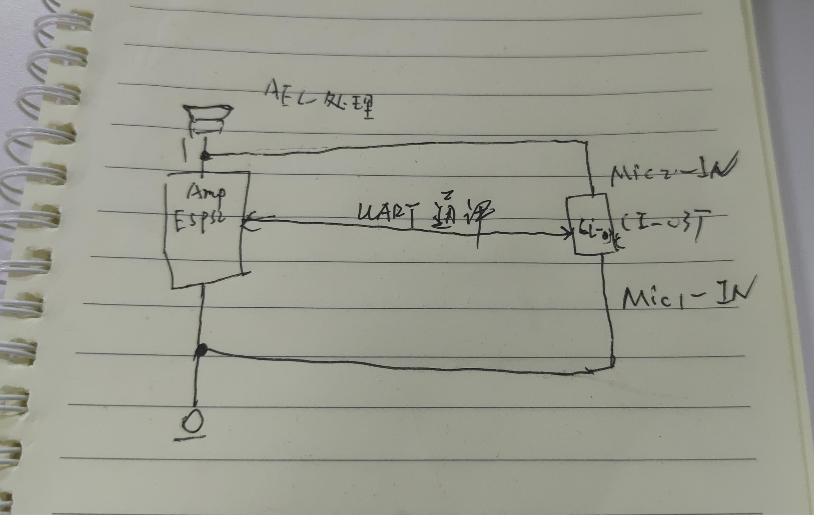

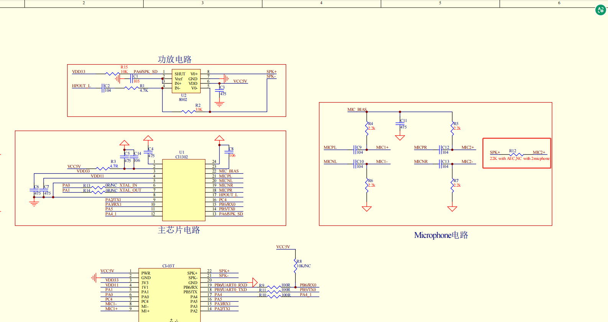

**方案三：选择合适模块型号**

根据应用需求选择合适的CI-03T型号：

- **CI-03T1**：单麦不带晶振，不支持AEC
- **CI-03T2**：双麦配置，AEC需要AB类功放
- **CI-03T3**：单麦AEC带晶振，推荐用于AEC应用
- **CI-03T4**：双麦带晶振，AEC需要AB类功放

**注意事项：**

- D类功放（如MAX98357）不能直接接入标准AEC电路
- 直接连接22k电阻会导致系统不工作
- 去载波电路设计复杂，建议有经验的技术人员实施
- 如项目允许，优先选择AB类功放方案
- 开发过程中需要充分测试，确保AEC功能正常工作

---

### CI-03T1模组的AEC功能如何正确验证？

**问题描述：**

CI-03T1模组在固件中启用了AEC功能，但实际效果不明显或无效，无法实现预期的降噪和唤醒打断效果。

**问题分析：**

CI-03T1作为单麦AEC模组，其AEC功能验证需要满足特定条件：

- **内部连接**：CI-03T1内部已经连接了完整的AEC电路
- **完整性要求**：需要使用未改动的完整模组进行验证
- **信号路径**：AEC需要正确的参考信号输入
- **验证条件**：需要合适的测试环境和测试方法

**解决方案：**

**1. 使用完整模组验证**

使用未改动的标准CI-03T1模组：

- 不要拆卸或修改模组内部电路
- 确保AEC相关元件完整
- 使用标准配置进行测试

**2. 正确的测试设置**

按照以下步骤设置测试环境：

1. **基础连接**：

    - 连接标准测试麦克风
    - 连接外部功放或扬声器
    - 确保电源供电稳定

2. **AEC信号连接**：

    - 将功放输出信号接入AEC输入
    - 使用推荐的耦合电路
    - 调整合适的信号幅度

3. **固件配置**：

    - 在平台中启用AEC功能
    - 选择单MIC配置
    - 确认固件版本支持AEC

**3. 验证测试方法**

进行有效的AEC功能验证：

1. **播报测试**：

    - 播放较长的语音内容（5-10秒）
    - 内容应包含连续的语音信号
    - 音量适中，不要过大或过小

2. **打断测试**：

    - 在播报过程中说出唤醒词
    - 测试是否能成功打断播报
    - 验证唤醒响应时间

3. **效果评估**：

    - 对比开启/关闭AEC的差异
    - 测试不同环境下的效果
    - 记录测试结果

**4. 常见问题处理**

AEC效果不佳的可能原因：

- **信号问题**：AEC参考信号未正确接入
- **幅度问题**：参考信号幅度不合适
- **测试时间**：播报时间太短，难以观察效果
- **环境因素**：测试环境噪声过大

**注意事项：**

- 使用完整模组进行验证，不要改动内部
- 确保外部功放与AEC电路兼容
- 播报内容要有足够的长度和时间
- 建议在标准测试环境中验证
- 如问题持续，联系供应商获取帮助

---

---


---


---

### CI模块插反了怎么办？

**问题描述：**

CI系列语音识别模块在安装时被插反，导致无法正常工作。

**解决方案：**

**1. 插反的后果**

- **无法工作**：模块通电后无任何反应
- **功能异常**：串口无通信，语音识别失效
- **潜在损坏**：可能造成模块或外围电路损坏
- **维修困难**：需要拆卸重新安装

**2. 预防插反的方法**

1. **识别模块方向标识**：

    - 查看模块表面的丝印信息
    - "CI-03T"、"CI-33T"等型号标识应为正方向
    - 注意引脚1的标记（圆点或凹槽）

2. **对照引脚定义**：

    - 模块上的引脚1通常有特殊标记
    - 开发板或PCB上也有对应标识
    - 确保引脚1对齐，避免方向错误

3. **观察结构特征**：

    - 模块通常不对称设计
    - 注意麦克风接口位置
    - 观察元器件布局差异

**3. 正确安装步骤**

1. **安装前检查**：

    - 仔细对比模块和安装位置的标识
    - 确认第1脚位置对应
    - 注意模块的结构特征

2. **对齐插入**：

    - 先对齐方向再插入
    - 避免强行插入（可能方向不对）
    - 确保所有引脚正确接触

3. **安装后验证**：

    - 检查引脚是否完全插入
    - 通电前再次确认方向
    - 首次上电时密切观察


*模块插反的实物示例，可以看到模块上的型号标识与正确方向相反*

**4. 已插反的处理方法**

1. **立即断电**：

    - 发现插反应立即切断电源
    - 避免长时间通电造成损坏
    - 等待电路放电后再操作

2. **小心拆卸**：

    - 使用专业工具拆卸
    - 避免损坏引脚或焊盘
    - 记录当前状态便于分析

3. **检查损伤**：

    - 检查模块引脚是否完好
    - 查看PCB焊盘是否有损坏
    - 测试相关电路是否正常

4. **重新正确安装**：

    - 确认方向无误后重新安装
    - 通电测试功能是否恢复
    - 如仍有问题需进一步检修

**5. 设计防呆措施**

为防止插反，建议在设计时采用防呆措施：

1. **非对称设计**：

    - 采用不对称的引脚布局
    - 使用不同位置的定位孔
    - 增加机械导向结构

2. **明显标识**：

    - 在PCB上标注清晰的引脚1标识
    - 使用不同颜色或丝印区分
    - 提供安装示意图

3. **物理防呆**：

    - 设计特殊的连接器接口
    - 使用导向槽或定位柱
    - 考虑使用防呆连接器

**注意事项：**

- CI系列模块不支持热插拔，操作前必须断电
- 插反可能导致永久性损坏，务必小心
- 如不确定，先拍照对比确认再安装
- 批量生产建议制作防呆工装
- 保留安装说明文档供操作人员参考

---


---


---

### 语音模块可以直接控制WS2812 LED灯吗？

**问题描述：**

希望语音模块能够直接控制WS2812 LED灯改变颜色，而无需额外的MCU或控制器。

**解决方案：**

**技术可行性分析：**

1. **实现难度**：

    - WS2812需要精确的时序控制（0码1.25μs，1码0.375μs）
    - 需要计算0、1码的精确时序
    - 实现较为复杂，不建议直接控制

2. **性能影响**：

    - 时序控制会占用大量CPU资源
    - 可能影响语音识别的实时性
    - CI系列模块性能有限，难以兼顾

**推荐方案：**

1. **使用外部MCU**：

    - 语音模块仅作为触发源
    - 通过GPIO或串口控制外部MCU
    - MCU专门负责WS2812驱动

2. **硬件连接方式**：

    ```
    语音模块    →    外部MCU    →    WS2812灯带
    GPIO输出   →    控制信号   →    DIN
    ```

3. **控制逻辑**：

    - 语音识别成功后，模块发送控制信号
    - MCU接收信号并控制WS2812颜色
    - 可以实现多种颜色变化效果

**技术实现要点：**

1. **时序精度要求**：

    - WS2812采用NRZ通信协议
    - 每个LED需要24位数据（GRB顺序）
    - 复位信号需要>50μs低电平

2. **性能优化建议**：

    - 使用专门的WS2812驱动芯片（如WS2811）
    - 或者选择带PWM输出的语音模块
    - 考虑使用SPI模拟WS2812时序

**实际应用案例：**

有开发者使用Arduino控制WS2812实现音乐律动效果，通过语音模块作为触发事件改变灯光模式。这证明了外部MCU方案的可行性。

**CI系列模块时序能力：**

- CI-03T可以实现定时13μs中断
- 虽然理论上可以生成WS2812时序
- 但会严重影响语音识别性能
- CPU资源被大量占用，不建议实际应用

**设计思路建议：**

1. **语音事件触发**：

    - 语音模块仅负责识别语音命令
    - 识别成功后通过GPIO或串口发送信号
    - 将LED控制逻辑完全交给外部MCU

2. **模块化设计**：

    - 语音识别模块：专注语音处理
    - LED控制模块：专门负责WS2812驱动
    - 通过简单通信协议协调工作

**注意事项：**

- 直接控制WS2812技术难度高，不推荐
- 语音模块主要功能是语音识别，不适合复杂时序控制
- 如需要WS2812控制，建议增加外部MCU
- CI-03T可以实现定时13μs中断，但资源紧张
- 系统设计时考虑语音模块和LED控制的分工
- 外部MCU方案可以实现更丰富的灯光效果

---


---


---

### PWM模式设置后无法正常工作怎么办？

**问题描述：**

在使用CI-03T芯片时，设置脉冲功能可以正常工作，但设置为PWM模式时无法正常输出。

**解决方案：**

**问题分析：**

PWM模式与脉冲模式的区别：

- **脉冲模式**：输出固定的高/低电平，持续时间可配置
- **PWM模式**：输出连续的方波，通过占空比控制有效电压

**可能原因：**

1. **配置错误**

    - PWM频率设置过高或过低
    - 占空比设置不正确
    - GPIO引脚未正确配置为PWM模式

2. **硬件连接问题**

    - 负载设备不支持PWM输入（如某些类型的LED）
    - 连接线接触不良或阻抗不匹配
    - 缺少必要的上拉或下拉电阻

3. **负载特性**

    - 负载阻抗过低导致电流过大
    - 容性负载影响PWM波形
    - 感性负载（如电机）产生反向电动势

**解决步骤：**

**1. 检查PWM配置**

    - 确认PWM频率在合适范围（1Hz-20kHz）
    - 设置适当的占空比（0%-100%）
    - 验证GPIO引脚已选择PWM功能

**2. 验证硬件连接**

    - 检查负载设备是否支持PWM输入
    - 测量负载阻抗，确保匹配
    - 确认所有连接线牢固可靠

**3. 使用脉冲模式替代**

    - 如果负载不需要连续可调电压
    - 可使用脉冲模式实现开关控制
    - 脉冲宽度和周期可精确控制

**4. 测试验证**

    - 使用示波器观察PWM输出波形
    - 测试不同占空比下的输出电压
    - 验证负载设备响应是否正确

**配置示例：**

- **LED调光**：PWM频率1kHz，占空比0-100%可调
- **电机调速**：PWM频率10kHz，占空比0-100%可调
- **蜂鸣器音调**：PWM频率2kHz-5kHz可调音调

**注意事项：**

- PWM输出最大电流150mA，大电流负载需外接驱动
- 高频PWM可能产生EMI干扰，注意滤波设计
- 感性负载建议并联续流二极管保护芯片
- 测试时从低占空比开始，逐步增加以避免突变冲击

---


---


---

### 咪头灵敏度不足怎么办？

**问题描述：**

搭载CI-03T1或CI-03T2芯片的设备中，麦克风（咪头）灵敏度不足，需要并联另一个咪头才能正常工作。

**解决方案：**

**问题分析：**

咪头灵敏度不足通常由结构设计、电路匹配和环境因素共同导致。并联咪头虽然可以提升信号强度，但不是最佳解决方案。

**详细解决方案：**

1. **结构优化措施：**

    **咪头位置设计：**

    - 将咪头引出，避免被塑料外壳或其他物体覆盖
    - 确保咪头正对使用方向
    - 在咪头位置开设通孔，保证声音采样通畅

    **声学结构设计：**
    ```
    推荐设计：

    - 咪头与外壳之间设置声学腔体
    - 腔体内壁添加吸音材料
    - 开孔直径建议3-5mm
    - 开孔位置正对咪头振膜
    ```

2. **电路优化方案：**

    **阻抗匹配：**

    - 检查咪头与芯片输入端的阻抗匹配
    - 必要时添加耦合电容或偏置电阻
    - 确保工作电压符合咪头规格

    **信号放大：**
    ```
    如需放大信号，可添加前置放大电路：
    咪头 → 耦合电容 → 运放放大 → 滤波电路 → 芯片输入
    ```

3. **软件参数调节：**

    **识别阈值优化：**

    - 在智能公元平台调节命令词识别阈值
    - 逐步降低阈值，测试识别率
    - 平衡灵敏度与误触发率

    **音频参数配置：**

    - 增加麦克风增益
    - 调整AGC（自动增益控制）参数
    - 优化降噪算法强度

4. **环境因素改善：**

    **使用环境优化：**

    - 尽量保证使用时周围环境安静
    - 减少背景噪声干扰
    - 避免在空调出风口等位置使用

    **使用方式指导：**

    - 普通话尽量标准
    - 命令词使用日常高频词汇
    - 正对咪头发声，距离控制在0.5-2米

5. **硬件选型建议：**

    **咪头选型：**

    - 选择灵敏度更高的全向咪头
    - 考虑使用数字麦克风替代模拟咪头
    - 注意咪头的频率响应特性

    **替代方案：**

    - 使用双咪头阵列，形成指向性拾音
    - 考虑使用MEMS数字麦克风
    - 评估使用专用语音识别芯片的可能性

6. **测试验证方法：**

    **灵敏度测试：**

    - 在标准距离（1米）测试识别率
    - 从不同角度测试拾音效果
    - 记录最小可识别音量

    **稳定性测试：**

    - 长时间连续工作测试
    - 不同温度、湿度环境测试
    - 多人发音适应性测试

7. **并联咪头的注意事项：**

    **如必须并联：**
    ```
    正确并联方式：

    - 使用相同型号的咪头
    - 每个咪头串联耦合电容
    - 并联后总阻抗需匹配输入端
    - 注意相位一致性
    ```

    **潜在问题：**

    - 并联会改变频率响应特性
    - 可能引入相位差影响音质
    - 增加功耗和电路复杂度

---

### 批量生产时产品灵敏度不一致问题

**问题描述：**

批量生产的产品（如2905套）出现灵敏度不足，而手工样品正常，芯片、咪头和固件均未发生变化。

**解决方案：**

**1. 装配工艺检查**

- 焊接质量：虚焊、冷焊影响连接可靠性
- 元件一致性：确保批次参数一致
- 装配应力：避免损坏咪头内部结构
- 清洁度：焊盘残留物影响接触

**2. 结构差异分析**

- 外壳影响：批量外壳与样品不一致
- 开孔位置：麦克风孔位偏差或遮挡
- 密封材料：防水膜透声性能差异
- 内部空间：反射和共振效应变化

**3. 固件配置验证**

- 灵敏度设置：确认固件中灵敏度参数
- 配置文件：检查是否使用了正确配置
- 校准数据：验证生产校准流程
- 版本确认：确保使用相同固件版本

**4. 测试方法标准化**

- 测试环境：统一测试条件
- 测试距离：标准化测试距离
- 音量标准：使用标准音源测试
- 判定标准：明确合格/不合格界限

**5. 改进措施**

- 生产工装：设计专用测试工装
- 过程控制：关键工序重点监控
- 抽检比例：增加抽检频次
- 返工标准：制定明确返工流程

**注意事项：**

- 反馈"换样板OK"说明问题在批次差异
- 重点排查装配工艺和结构一致性
- 建议保留不良品进行详细分析
- 建立完整的生产追溯体系

---

### 工厂噪音环境下鼾声检测灵敏度不足

**问题描述：**

在工厂环境中使用鼾声检测产品时，持续的嗡嗡声（电机或水泵噪音）导致检测功能不灵敏，无法正常触发工作。

**解决方案：**

**1. 噪音源分析**

- 常见噪音源：电机、水泵、空调、机械设备
- 噪音特征：持续的嗡嗡声（50/60Hz及其谐波）
- 影响机制：背景噪声覆盖鼾声信号，降低信噪比

**2. 硬件优化方案**

**麦克风选型优化：**

- 使用指向性麦克风，减少背面噪音拾取
- 选择更低灵敏度的麦克风，避免过度拾取环境音
- 考虑使用带防风罩的麦克风
- 麦克风位置远离噪音源

**电路滤波设计：**

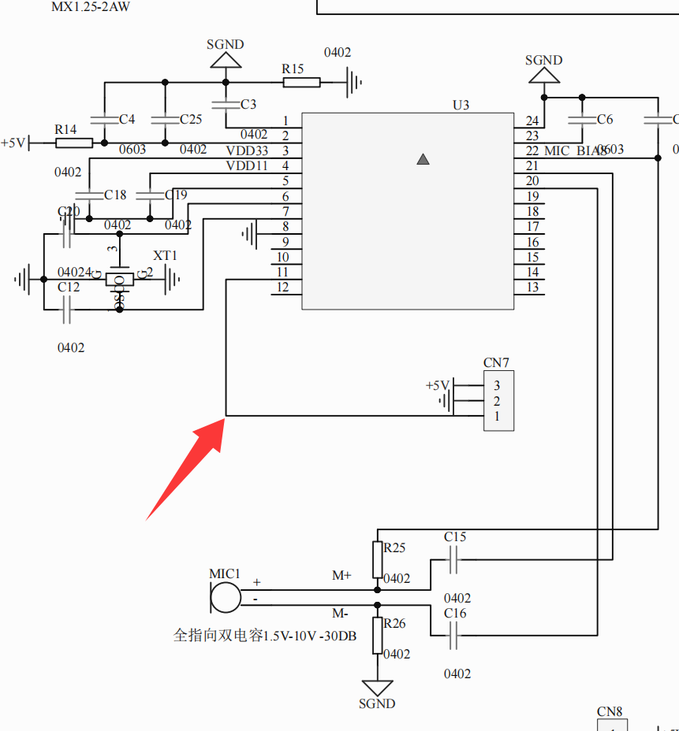

*CI1302芯片的外围电路设计，注意麦克风信号输入部分*

- 增加高通滤波器，滤除低频噪声
- 在麦克风输入端加入陷波滤波器（针对50/60Hz）
- 使用带通滤波器，保留鼾声频率范围（100-2000Hz）
- 增加屏蔽措施，避免电磁干扰

**3. 软件算法优化**

**阈值调整：**

- 根据环境噪声动态调整检测阈值
- 实现自适应阈值算法
- 增加噪声基准线和补偿机制
- 设置最小触发持续时间，避免瞬时干扰

**信号处理改进：**

- 增加频谱分析功能，识别鼾声特征
- 使用小波变换提取鼾声的时频特征
- 实现多帧判决机制，提高准确性
- 加入机器学习算法，持续优化识别效果

**4. 结构优化措施**

**物理隔离：**

- 麦克风使用减振支架，避免结构传导噪声
- 产品内部增加隔音材料
- 麦克风孔道设计，形成声学滤波
- 整机做防震处理，减少机械振动

**安装位置优化：**

- 远离电机、水泵等噪音源安装
- 使用软连接减少振动传递
- 避免安装在金属面板上
- 考虑使用悬挂式安装

**5. 测试验证**

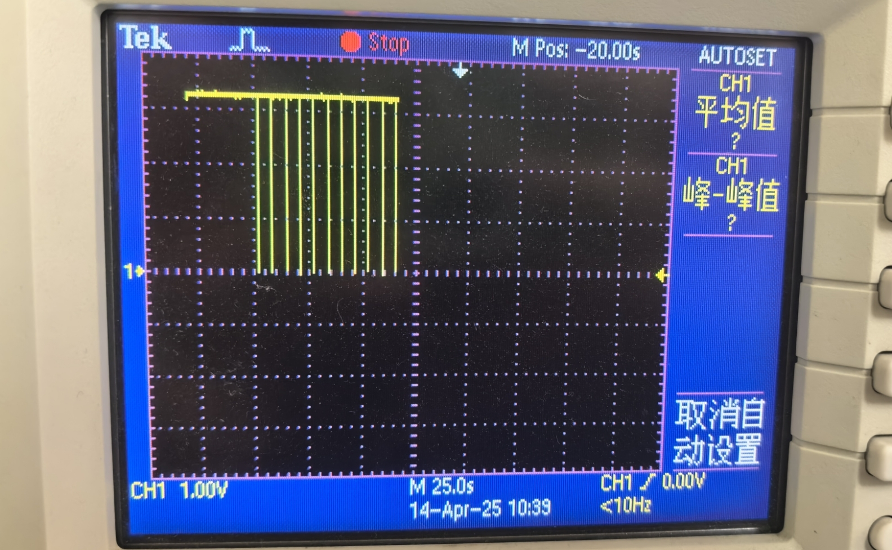

*检测到鼾声后输出的3.3V脉冲信号，脉宽100ms*

- 静态测试：无鼾声时的基线噪声测试
- 动态测试：播放鼾声测试检测功能
- 环境测试：在不同噪音水平下验证
- 长期测试：24小时连续运行验证稳定性


**6. 应用建议**

**环境评估：**

- 评估现场噪声水平（分贝计测量）
- 分析噪声频谱特征
- 确定主要噪声源和传播路径
- 制定针对性的降噪方案

**产品选型：**

- 超高噪音环境：考虑专用工业级方案
- 中等噪音：优化硬件参数即可满足
- 特殊频段：设计针对性的滤波器
- 极端环境：建议采用隔声罩或远程拾音

**注意事项：**

- 工厂环境下的阈值设置需要现场调试
- 定期检查麦克风防尘罩的清洁度
- 考虑季节变化对噪声环境的影响
- 保留测试模式，便于现场调试

---

### 鼾声检测触发频率异常问题

**问题描述：**

实际使用时鼾声检测触发频率远低于测试结果（30-69秒才触发一次，正常应为10秒左右），IO口有时无信号输出。

**解决方案：**

**1. 触发条件分析**

**触发机制说明：**

- 鼾声需要持续一定时间才会触发
- 不是每次鼾声都立即触发
- 需要达到算法的判定阈值

**影响触发频率的因素：**

- 鼾声强度：轻微鼾声可能不触发
- 鼾声特征：算法识别特定频率范围
- 环境噪声：干扰特征提取
- 麦克风距离：远距离信号衰减

**2. 优化措施**

**硬件检查：**

- 验证IO输出电路连接正确
- 检查供电稳定性
- 确认麦克风无遮挡
- 测试信号传输路径

**软件参数调整：**

- 降低触发阈值，提高灵敏度
- 调整最小触发持续时间
- 优化特征提取算法参数
- 增加自适应增益功能

**音频文件验证：**

- 使用实际鼾声音频测试
- 对比测试音频和实际鼾声差异
- 确认音频格式和采样率正确
- 验证音频文件完整性

**3. 测试方法标准化**

**标准测试音频：**

```
test_snore_short.wav - 短时间鼾声测试
test_snore_long.wav - 持续鼾声测试
```

- 短音频：测试快速触发能力
- 长音频：测试持续检测功能
- 混音测试：验证抗干扰能力
- 间隔测试：验证重复触发性能

**4. 故障排查**

**IO无输出检查：**

- 测量IO口电平变化
- 检查上拉/下拉电阻配置
- 验证驱动能力是否足够
- 确认外部负载正常

**触发间隔长分析：**

- 记录触发时间戳
- 分析鼾声与触发的时间关系
- 检查是否存在漏触发
- 验证算法处理时间

**5. 应用建议**

- 现场调试时使用实际鼾声测试
- 保留测试音频便于现场验证
- 建议增加触发指示LED
- 考虑增加串口调试信息输出

---

### 智能桌宠项目硬件设计优化有哪些要点？

**问题描述：**

智能桌宠项目在硬件设计中遇到焊接困难、咪头识别灵敏度低、电源滤波不足，以及与CI-03T语音模块兼容性等问题，需要优化设计以提升产品可靠性和用户体验。

**解决方案：**

**1. 焊接优化方案**

- **使用排针/排母连接**：避免直接焊接，减少焊接错误
- **提供预焊接模块**：减少焊接操作难度
- **优化焊盘设计**：贴片封装焊盘故意做大，方便焊接
- **焊接温度控制**：控制在350°C以下，避免损坏元件

**2. 咪头选型与布局**

- **推荐咪头规格**：

    - 灵敏度：-32dB到-25dB
    - 信噪比：70以上
    - 电流：0.1mA-0.5mA
    - 类型：机芯智能定制咪头6027（直径6mm，高度2.7mm）

- **咪头布局优化**：

    - 咪头线长度≤100mm，超过需使用屏蔽线
    - 咪头远离电源、电机等干扰源
    - 避免密闭空间，保证声音采样通畅
    - 可使用带针咪头直接焊到PCB上

**3. 电源滤波设计**

- **滤波电容配置**：

    - 靠近模组电源引脚放置滤波电容
    - 一颗靠近模组，一颗靠近MCU
    - 推荐值：10μF+100nF并联

- **电源要求**：

    - 电压：5V±5%
    - 纹波：<100mV
    - 电流：≥500mA，建议600mA以上

**4. CI-03T与SU-03T兼容性设计**

- **引脚对应关系**：

    - SU-03T的B0、B1 ↔ CI-03T的PB5、PB6（烧录口）
    - 通讯口可改到B0、B1以实现兼容

- **PCB设计建议**：

    - 预留两种模块的焊盘位置
    - 使用跳帽或跳线选择不同模块
    - 烧录口单独引出，标注清晰

**5. 走线优化**

- **串口走线**：远离咪头信号线，避免干扰
    - 可用三边GND包裹串口走线
    - 或在PA9、PA10间加100Ω阻尼电阻

- **喇叭线加粗**：减少压降和干扰

- **电源线布局**：使用星型连接，减少串扰

**注意事项：**

- 焊接后务必用万用表检查短路
- 咪头极性不能反接，会影响接收性能
- 电源质量直接影响语音识别和播放效果
- 舵机等大功率负载建议使用独立电源
- D类功放与AEC电路可能存在兼容性问题，需额外滤波处理

---

**注意事项：**

- 不同人的鼾声特征差异很大
- 算法需要一定时间学习和适应
- 批量差异可能与学习数据有关
- 建议收集多种鼾声样本优化

---

### PCB设计常见问题与优化建议

**问题描述：**

PCB设计存在多处硬件设计缺陷，包括限流电阻规格错误、麦克风信号线布线不合理、电源线设计不当以及模拟地与数字地未分离，导致系统干扰高、误识别率高。

**解决方案：**

**1. 限流电阻设计**

**问题分析：**

- R14限流电阻规格错误，封装过小
- 瞬间电流可能烧毁芯片
- 需要考虑功率和散热要求

**设计要求：**

- 封装规格：至少0805或更大
- 功率计算：根据最大电流选择
- 留有余量：功率额定值应有30%以上余量
- 考虑温度：高温环境下功率需要降额使用

**2. 麦克风信号线布线**

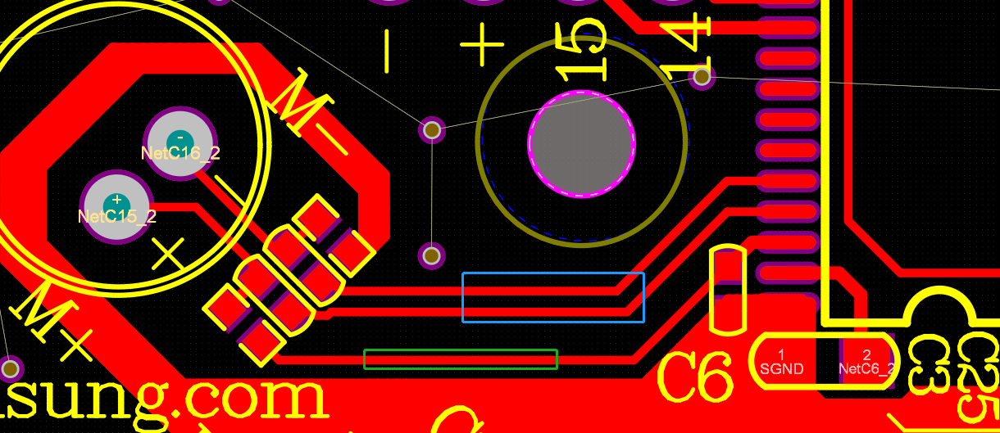

*麦克风信号线与电源线交叉，存在电磁干扰风险*

**设计原则：**

- 信号线尽量短，减少天线效应
- 避免与电源线平行走线
- 使用地线包裹信号线，提供屏蔽
- 差分信号线等长、等距布线


*麦克风电源线与信号线未用地线包裹，走线过长*

**具体优化：**

- 麦克风线缩短到最小长度
- 信号线两侧布置地线
- 避免90度直角走线
- 过孔数量最小化

**3. 电源线设计**

**线宽要求：**

- 电源主线：根据电流计算线宽
- Type-C接口：使用更粗的电源线
- 考虑压降：长走线需要加宽

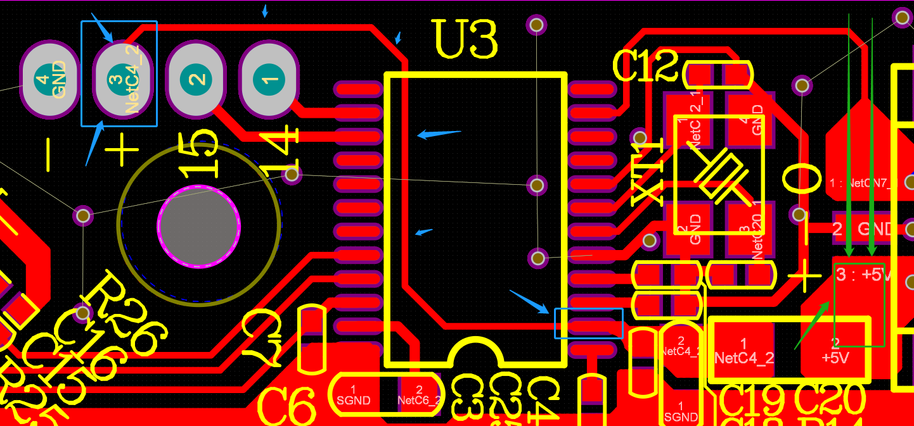

*烧录测试点直接从芯片引脚供电，存在烧毁风险*

**设计要点：**

- 电源先到滤波电容，再到芯片
- 避免测试点直接连接芯片引脚
- 增加过流保护电路
- 考虑热插拔防护

**4. 接地设计**

**地线分离原则：**

- 模拟地（AGND）：用于音频电路
- 数字地（DGND）：用于数字电路
- 单点连接：在电源入口处汇合
- 避免模拟地被数字噪声污染

**布线要求：**

- 模拟地走线单独区域
- 数字地平面完整覆盖
- 关键信号下方布置完整地平面
- 避免地线分割信号回流路径

**5. 干扰抑制措施**

**屏蔽设计：**

- 敏感信号加地屏蔽
- 接口位置增加磁珠
- 使用屏蔽连接器
- 金属外壳良好接地

**滤波设计：**

- 电源入口增加π型滤波
- 关键IC电源引脚加去耦电容
- 晶振电路加匹配电容
- 时钟信号加终端电阻

**6. 设计评审检查项**

**电气规则检查：**

- 线宽/间距是否满足载流能力
- 差分对是否等长等距
- 阻抗是否连续匹配
- 过孔数量是否合理

**物理规则检查：**

- 元件布局是否便于生产
- 热设计是否合理
- 结构是否考虑EMI要求
- 测试点是否便于调试

**注意事项：**

- 设计阶段考虑生产工艺能力
- 保留调试接口便于问题排查
- 重要信号设计测试点
- 完成后进行设计规则检查（DRC）

---

### 自制PCB板外接喇叭无声音怎么办？

**问题描述：**

使用CI-03T1芯片在自制PCB板上烧录程序后，外接的4欧3W喇叭没有声音，但同样的喇叭在官方开发板上可以正常发声。

**解决方案：**

**问题排查步骤：**

1. **写调试固件测试**

    - 在智能公元平台创建简单的调试固件
    - 添加开机播报功能
    - 不配置复杂功能，仅验证基础硬件

2. **固件文件选择**

    - 使用串口烧录时，选择带update后缀的固件文件
    - 如：jx_su_03t_release_update.bin
    - 确保固件文件路径不含中文字符


*文件夹中的固件文件，串口烧录应选择带update后缀的版本*

3. **硬件连接验证**

    - 确认喇叭连接正确（正负极性）
    - 检查焊接质量，避免虚焊
    - 使用示波器测量音频输出信号

**自制板与开发板差异分析：**

1. **电源设计差异**：

    - 开发板：可能包含完整的电源滤波电路
    - 自制板：电源设计可能不够完善
    - 建议：增加滤波电容，确保供电稳定

2. **音频输出电路**：

    - 检查音频输出通路的元件
    - 确认耦合电容、电阻等元件规格
    - 对比开发板电路设计

3. **PCB布局影响**：

    - 音频信号走线远离数字信号
    - 模拟地与数字地单点连接
    - 避免音频通路过孔过多

**调试方法：**

1. **基础功能验证**：

    - 先测试最简单的开机播报
    - 逐步添加其他功能
    - 定位问题出现的具体环节

2. **对比测试**：

    - 使用相同固件在开发板测试
    - 对比两块板的音频输出波形
    - 找出差异点并修改

3. **使用官方参考设计**：

    - 参考官方开发板的原理图
    - 对比关键电路设计
    - 按官方设计修改自制板

**注意事项：**

- 4Ω3W喇叭在参数范围内，应能正常工作
- 优先使用官方推荐的喇叭规格进行测试
- 自制板设计时特别注意音频电路的布局
- 如问题持续，建议使用官方开发板验证功能

---


---


---

### 桌宠项目语音识别正常但舵机不动作怎么办？

**问题描述：**

桌宠项目能正常接收语音指令并给出反馈，但舵机无法执行相应动作，需要排查硬件连接和供电问题。

**解决方案：**

**问题排查步骤：**

**1. 检查舵机连接**

- 检查舵机信号线、电源线连接是否正确
- 确认TX/RX线没有接反（交叉连接原则）
- 使用万用表测试连接线通断

**2. 验证供电能力**

- 检查开发板是否能提供足够电流驱动多个舵机
- 单个舵机工作电流约50-70mA，5个舵机需要350mA以上
- 建议使用外部5V电源独立供电

**3. 硬件检查要点**

- 舵机信号线连接到正确的GPIO口
- 确认所有舵机的GND共地连接
- 检查舵机本身是否正常工作（可单独测试）

**常见解决方案：**

**方案一：使用舵机驱动板**

- 添加专用的舵机驱动板（如PCA9685）
- 通过I2C控制，减少主控负担
- 提供更稳定的舵机驱动能力

**方案二：增加滤波电容**

- 在电源端增加1000μF以上电解电容
- 减少舵机动作时的电压波动
- 提高系统稳定性

**方案三：优化程序控制**

- 确保程序中舵机控制逻辑正确
- 检查PWM频率设置（应为50Hz）
- 验证占空比范围（5%-10%）

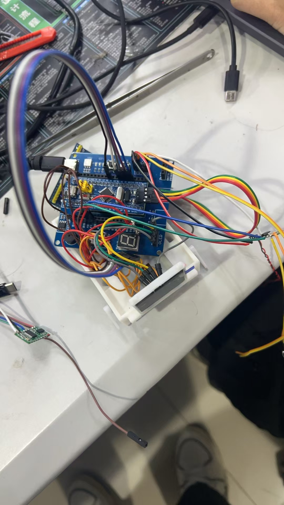

*桌宠项目的硬件连接示意图，包含多个舵机和显示屏*

**调试技巧：**

1. **逐个测试舵机**：

    - 先连接一个舵机测试是否正常
    - 确认单个舵机工作后再增加数量
    - 找出是舵机故障还是供电问题

2. **使用示波器检查**：

    - 观察PWM信号是否正常输出
    - 检查电源电压是否稳定
    - 验证信号线是否有干扰

3. **对比测试**：

    - 使用相同的程序测试其他舵机
    - 排除程序问题
    - 确认是硬件问题

**注意事项：**

- 开发板的USB供电通常不足以驱动多个舵机
- 舵机动作时会产生较大电流冲击
- 长时间使用需要注意散热问题
- 建议为舵机配置独立的稳压电源

**预防措施：**

- 设计阶段预留足够的电源余量
- 使用质量好的连接线和接插件
- 在PCB设计时考虑电源分配
- 建立标准的测试流程验证每个舵机

*嘉立创EDA平台元件库中的CI-03T元件，可直接用于PCB设计*

---


---


---

### 如何实现物联网小程序控制音响功能？

**问题描述：**

需要通过物联网小程序远程控制音响的开关、音量、歌曲选择和定时预约功能，其中歌曲选择需从音响内置内存卡中读取曲目。

**解决方案：**

**技术架构设计：**

1. **系统组成**：

    - 语音模块（如CI-03T系列）：负责本地语音识别和音频播放
    - WiFi模块（如JX-A7T）：提供物联网连接能力
    - 小程序：交互界面
    - 云端服务：数据中转和存储

2. **通信链路**：

    ```
    小程序 ←→ 云端服务 ←→ WiFi模块 ←→ 语音模块
    ```

**功能实现方案：**

1. **开关控制**：

    - **硬件实现**：通过GPIO控制功放电源
    - **软件实现**：小程序发送开关指令，WiFi模块接收后转发给语音模块
    - **控制指令**：
        ```
        开机：AA 55 01 01 55 AA
        关机：AA 55 02 00 55 AA
        ```

2. **音量调节**：

    - **平台配置**：在智能公元平台配置音量控制功能
    - **指令格式**：
        ```
        音量+：AA 55 03 [音量值] 55 AA
        音量-：AA 55 04 [音量值] 55 AA
        ```
    - **音量范围**：0-100级可调

3. **歌曲选择功能**：

    - **内存卡读取**：

        - 使用SPI或SDIO接口连接SD卡
        - 通过文件系统读取曲目列表
        - 建立曲目索引表

    - **选曲实现**：
        ```
        播放第N首：AA 55 05 [曲目号] 55 AA
        下一首：AA 55 06 00 55 AA
        上一首：AA 55 07 00 55 AA
        ```

    - **曲目管理**：

        - 上传时给音频文件编号
        - 支持MP3、WAV等格式
        - 建议使用压缩格式节省空间

4. **定时预约功能**：

    - **定时器配置**：

        - 使用语音模块内置定时器
        - 最多支持5个定时器同时运行
        - 可设置单次或循环定时

    - **预约指令**：
        ```
        设置定时：AA 55 08 [时间] [功能] 55 AA
        取消定时：AA 55 09 [定时器ID] 55 AA
        ```

**硬件连接方案：**

1. **模块连接**：

    - WiFi模块UART连接语音模块串口
    - SD卡连接到语音模块的SPI接口
    - 功放控制GPIO连接到电源开关电路

2. **电源设计**：

    - 独立5V供电给功放电路
    - 3.3V稳压给语音模块
    - 考虑整体功耗，预留余量

**软件实现要点：**

1. **小程序开发**：

    - 使用微信小程序或独立APP
    - 提供简洁的控制界面
    - 支持设备配对和网络设置

2. **通信协议**：

    - 采用标准帧格式（AA 55开头，55 AA结尾）
    - 包含校验和确保数据完整性
    - 支持心跳包维持连接

3. **云端服务**：

    - 设备注册和认证
    - 指令转发和状态同步
    - 可选的离线消息推送

**开发步骤：**

1. **基础功能实现**：

    - 先实现开关和音量控制
    - 验证通信链路稳定
    - 测试响应延迟

2. **扩展功能添加**：

    - 实现歌曲选择功能
    - 添加定时预约功能
    - 完善错误处理

3. **体验优化**：

    - 添加状态反馈
    - 实现断线重连
    - 优化界面响应

**技术优势：**

- **远程控制**：突破距离限制，随时随地控制
- **功能丰富**：支持音响的全部核心功能
- **易于扩展**：可添加更多智能化功能
- **成本可控**：使用成熟模块降低开发难度

**注意事项：**

- SD卡容量建议不超过32GB，FAT32格式
- 音频文件建议统一格式，便于管理
- 网络不稳定时需要有本地降级方案
- 定时功能需要RTC时间同步
- 考虑功耗优化，特别是电池供电场景

---


---


---

### 必须使用公司指定的麦克风和喇叭吗？

**问题描述：**

使用CI-03T1或CI-03T2芯片时，是否必须使用公司指定的麦克风和喇叭，使用其他品牌的产品是否会影响功能。

**解决方案：**

**麦克风选择：**

1. **兼容性说明**
    - 不强制必须使用公司指定的麦克风
    - 但需要符合技术规格要求
    - 不同麦克风会影响识别效果

2. **选型要点**
    - 灵敏度：建议-42dB~-38dB
    - 指向性：全指向或单指向
    - 尺寸：适合产品结构设计
    - 推荐使用测试过的型号

**喇叭选择：**

1. **规格要求**
    - 阻抗：4Ω或8Ω
    - 功率：4Ω建议2.4W-3W，8Ω建议1.6W-2W
    - 避免使用过大功率喇叭

2. **兼容性说明**
    - 符合规格的喇叭都可以使用
    - 不同品牌音质可能有差异
    - 推荐使用验证过的型号

**实际建议：**

1. **优先选择**
    - 使用公司推荐的型号更稳定
    - 已经过充分测试验证
    - 可避免兼容性问题

2. **替代方案**
    - 如使用其他品牌，先采购样品测试
    - 确认识别距离和音质满足需求
    - 小批量验证后再批量采购

**注意事项：**

- 虽然不强制使用指定品牌，但规格必须匹配
- 不同厂家的麦克风性能差异较大，需要测试
- 喇叭功率过大可能导致模块损坏
- 建议保留测试记录，便于后续批量采购

---


---


---

### 如何选择合适的焊锡丝进行芯片焊接？

**问题描述：**

在焊接CI-03T1或CI-03T2芯片时，发现焊盘容易被烫坏，且焊锡丝难以熔化，怀疑是所用焊锡丝质量或型号不合适。

**解决方案：**

**焊锡丝规格选择：**

1. **含锡量选择**：

    - 推荐使用Sn63Pb37（含锡63%）
    - 熔点约183°C，流动性好
    - 适合精细的贴片焊接

2. **直径规格**：

    - 推荐0.6mm-0.8mm直径
    - 过粗不易控制焊锡量
    - 过细可能熔化过快

**优质焊锡丝识别：**

1. **产品标识**：

    - 包装上明确标注"Sn63"或"63%锡"
    - 应含有松香助焊剂芯
    - 避免购买成分不明的廉价产品

2. **熔点测试**：

    - 优质焊锡在300°C下应快速熔化
    - 如需要440°C仍不熔化，说明质量有问题
    - 高温不仅损坏芯片，还会烫坏焊盘

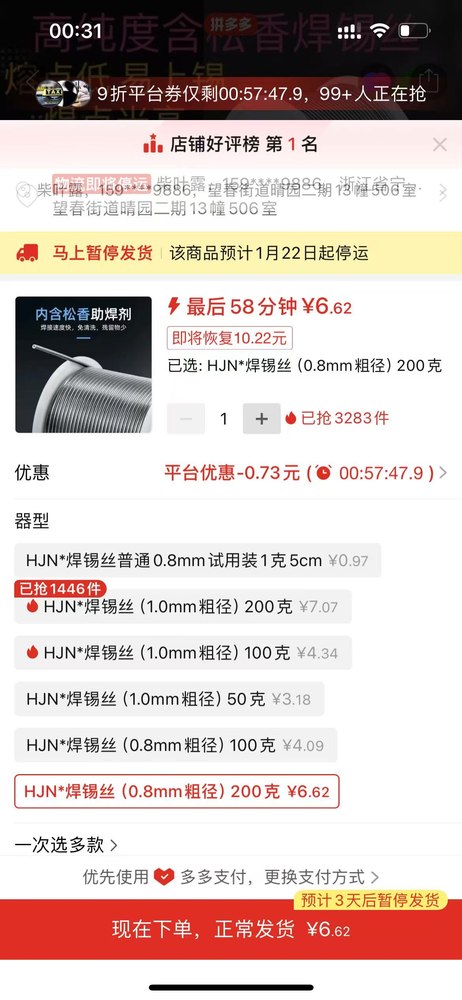

*包装未标注含锡量的廉价焊锡丝，不建议用于芯片焊接*

**焊接操作要点：**

1. **温度控制**：

    - 烙铁温度设定在300-350°C
    - 温度过高会损坏芯片和焊盘
    - 使用优质焊锡可在较低温度下完成焊接

2. **助焊剂使用**：

    - 选择内含松香芯的焊锡丝
    - 必要时可额外使用液体助焊剂
    - 改善润湿性，降低焊接难度

**替代方案：**

1. **专业代焊**：

    - 如焊接经验不足，可找专业维修店
    - 手机维修店或电器维修店经验丰富
    - 几分钟即可完成，成本不高

2. **使用转接板**：

    - 购买已焊接排针的转接板
    - 避免直接焊接芯片的风险
    - 适合开发和小批量生产

**注意事项：**

- 不要贪图便宜购买劣质焊锡丝
- 高温焊接会永久损坏芯片和PCB
- 建议购买知名品牌的焊锡材料
- 保存好焊锡丝，避免氧化影响焊接质量

---


---


---

### 如何更换CI系列模块的麦克风插针？

**问题描述：**

需要将CI-03T等模块上原有的白色麦克风插针拆下，更换为带插针的麦克风，询问拆解和更换方法。

**解决方案：**

**1. 麦克风插针更换确认：**

- 可以将白色插针拔下更换
- 支持使用插针式麦克风
- 更换后需要重新焊接

**2. 拆解方法：**

- **方法一：剪除法**（适合硬拆）：

    - 使用钳子剪掉语音模块
    - 一点一点剪边，露出插针
    - 使用刀具切下白色插针

- **方法二：掰除法**（需谨慎）：

    - 使用两把老虎钳硬掰
    - 风险较高，可能损坏PCB

**3. 焊接新插针：**

- 预先给新插针上锡
- 对齐位置，快速焊接
- 注意焊接温度和时间控制

**4. 注意事项：**

- 如不熟悉拆解，建议购买新模块
- 拆解有风险，可能损坏模块
- 可以找专业维修店协助


*52DB拾音器带引脚的6*2.2mm咪头，用于替换*

**操作建议：**

1. **评估风险**：

    - 确认有足够的焊接经验
    - 准备备用模块以防失败
    - 考虑成本效益

2. **替代方案**：

    - 直接购买已焊接插针的模块
    - 使用转接板避免直接焊接
    - 寻求专业代焊服务

**预防措施：**

- 使用合适的工具和温度
- 操作前充分练习
- 保留原模块作为备用

---


---


---

### 特定喇叭导致语音识别失效如何解决？

**问题描述：**

使用特定喇叭时，CI-03T1模块出现语音识别功能失效，更换为天问品牌喇叭后问题解决。

**问题分析：**

- 某些喇叭的内部接线方式可能影响语音模块的正常工作
- 喇叭内部电路结构不当会干扰语音识别功能
- 不是所有喇叭都完全兼容语音识别模块

**喇叭选型要点：**

1. **内部结构检查**：

    - 确认喇叭内部MIC（麦克风）负极是否接地
    - 检查SPK（喇叭）负极是否保持独立
    - 避免使用内部电路特殊的喇叭

2. **推荐规格**：

    - 阻抗：8Ω
    - 功率：2W
    - 频响：适合语音播报范围
    - 选择经过验证的品牌产品

3. **接线要求**：

    - MIC- 应接地（GND）
    - SPK- 不应接地，保持独立
    - 确保接线正确，避免短路

**解决步骤：**

1. **更换兼容喇叭**：

    - 优先使用天问等验证过的品牌
    - 测试确认喇叭内部接线正确
    - 避免使用未知来源的喇叭

2. **验证功能**：

    - 更换后测试语音识别功能
    - 确认唤醒词识别正常
    - 检查语音播报是否清晰

3. **批量应用建议**：

    - 采购前进行样品测试
    - 建立合格供应商名单
    - 保留测试记录便于追溯

**注意事项：**

- 不同品牌的喇叭可能存在兼容性差异
- 喇叭内部电路设计会影响整体功能
- 建议使用官方推荐的喇叭型号
- 如发现兼容性问题，及时更换喇叭品牌

---


---


---

### 1. **内部AEC的工作原理**

CI-03T的内部AEC需要获取参考信号（即要播放的音频）才能进行回声消除：

- **PWM输出方式**：当使用PWM输出时，内部AEC可以直接获取到播放的音频作为参考信号
- **I²S输出方式**：当使用I²S输出到外部DAC时，CI-03T无法直接获取播放的音频信号


---


---

### 2. **内部AEC的应用场景**

**适用情况（PWM输出）：**

```
音频处理流程：
CI-03T内部 → PWM输出 → 喇叭
     ↑
   内部AEC（有参考信号）
```

- CI-03T内部处理音频
- 通过PWM直接驱动喇叭
- 内部AEC可以获取到播放的音频作为参考
- 单MIC可以实现较好的回声消除效果


---


---

### 3. **需要外部AEC的应用场景**

**适用情况（I²S输出+外部功放）：**

```
音频处理流程：
CI-03T内部 → I²S输出 → 外部DAC → 功放 → 喇叭
     ↑                        ↑
   无法获取                  需要外部AEC
```

- CI-03T通过I²S输出音频到外部DAC
- 经过外部功放放大后驱动喇叭
- CI-03T内部无法获取功放后的音频作为参考
- 此时内部AEC效果有限，需要外部AEC方案


---


---

### 4. **外部AEC实现方案**

**方案一：硬件AEC芯片**

```
连接方式：
MIC → 外部AEC芯片 → CI-03T MIC输入
喇叭输出 → 分压电路 → 外部AEC芯片参考输入
```

**推荐AEC芯片：**

- WM8731：音频编解码器，内置AEC功能
- TLV320AIC3100：低功耗音频编解码器
- CS42L52：立体声编解码器

**方案二：软件AEC算法**

在外部MCU上实现AEC算法：

```
处理流程：

1. CI-03T MIC输入 → 外部MCU ADC
2. 播放音频 → 外部MCU（作为参考）
3. 外部MCU执行AEC算法
4. 处理后的音频 → CI-03T或直接输出
```


---


---

### 5. **设计建议**

**推荐使用PWM输出方案：**

- 简化设计，降低成本
- 利用CI-03T内部AEC
- 单MIC即可满足需求
- 功耗更低

**使用I²S输出时的注意事项：**

- 如需更好的AEC效果，建议增加外部AEC
- 可以考虑使用双MIC方案，利用波束成形增强效果
- 外部AEC需要精确的参考信号同步


---


---

### 1. **电流声产生原因**

**根本原因：**

- 功放电路的静态工作电流产生的噪声
- 电源纹波和噪声耦合到音频通路
- 电磁干扰（EMI）影响

**模块特性对比：**
| 模块型号 | 放大倍数 | 电流声风险 | 说明 |
|----------|----------|------------|------|
| CI-03T | 较小 | 低 | 内置功放增益适中 |
| CI-23T | 较大 | 高 | 内置功放增益较高 |


---


---

### 8. **结论**

**关于电流声的结论：**

1. 完全消除电流声是不现实的
2. CI-03T模块的电流声控制已较好
3. 贴耳才能听到的轻微电流声属于正常
4. 通过优化设计可以进一步改善
5. 最终以不影响使用为判断标准

**沟通要点：**

- 说明轻微电流声是正常现象
- 强调产品符合工程标准
- 提供优化建议供参考
- 避免过度承诺"完全消除"

---

## QA9: CI-03T外部AEC电路设计

**问题：**
如何为CI-03T芯片设计外部AEC电路，以解决在使用外部音频源时内部AEC无法正常工作的问题，特别是在双麦克风配置下无法唤醒的问题。

**解答：**
当CI-03T使用外部音频源播放时，内部AEC无法获取参考信号，需要设计外部AEC电路来实现回声消除。


---


---

### 1. **问题背景分析**

**应用场景：**

- 使用CI-03T模块
- 外部驱动其他器件发声
- 双MIC配置时无法唤醒
- 内部AEC功能失效

**技术原理：**

- 内部AEC需要获取播放的音频作为参考信号
- 外部音频播放时，CI-03T无法获取参考信号
- 双MIC配置可能对AEC更敏感


---


---

### 2. **外部AEC电路方案**

**方案一：专用AEC芯片方案**

```
电路连接图：
                +---------------------+
                |    外部AEC芯片      |
                |  (如WM8731等)    |
+--------+       |                     |       +--------+
| MIC1   |------>| MIC1 Input          |       | CI-03T |
+--------+       |                     |<------| MIC    |
                |      AEC Process     |       +--------+
+--------+       |                     |
| MIC2   |------>| MIC2 Input          |
+--------+       |                     |
                |                     |
+---------+      | Ref Input           |
| Audio   |------|-------------------|
| Source  |      |                     |
+---------+      | Line Output         |
                 |-------------------|------> AMP → Speaker
                +---------------------+
```

**推荐AEC芯片：**
| 型号 | 特点 | 备注 |
|------|------|------|
| WM8731 | 内置AEC，低功耗 | 需要I²S控制 |
| TLV320AIC3100 | 高性能，可编程 | TI生态支持好 |
| CS42L52 | 立体声，小封装 | 适合紧凑设计 |
| ADAU1761 | DSP处理，灵活 | 需要编程配置 |

**方案二：MCU+ADC方案**

```
实现架构：
                +-------------+
                |    MCU      |
                | (STM32F4等) |
+--------+       |             |       +--------+
| MIC1   |------>| ADC1        |       | CI-03T |
+--------+       |             |       +--------|
                | AEC Algo    |<------| MIC    |
+--------+       |             |       +--------|
| MIC2   |------>| ADC2        |               |
+--------+       |             |               |
                |             |               |
+---------+      | DAC         |               |
| Audio   |------|-------------|               |
| Source  |      |             |               |
+---------+      | PWM Output  |               |
                 |-------------|------> AMP → Speaker
                +-------------+
```


---


---

### 10. **总结建议**

**选型建议：**

1. 小批量：使用专用AEC芯片
2. 成本敏感：采用MCU方案
3. 高性能：考虑FPGA实现
4. 快速原型：购买现成模块

**注意事项：**

- 外部AEC会增加系统复杂度
- 需要仔细调试参数
- 双MIC系统需要特别优化
- 建议先做方案验证

**实施路线图：**
```
阶段1：方案评估（1周）
- 技术调研
- 器件选型
- 仿真验证

阶段2：原型开发（2-3周）
- 原理图设计
- PCB制作
- 基础测试

阶段3：集成调试（2周）
- 软件开发
- 系统联调
- 性能优化

阶段4：验证测试（1周）
- 全面测试
- 可靠性验证
- 文档整理
```

---

## QA10: CI-03T2双麦克风开启AEC后无法唤醒

**问题：**
使用CI-03T2双麦克风模块时，开启内部AEC功能后，同时连接两个麦克风无法唤醒设备，而仅连接一个麦克风时可以唤醒，但AEC功能似乎未生效。

**解决方案：**


---


---

### 1. **问题原因分析**

CI-03T2双麦克风版本在AEC配置上存在特殊限制：

- **双麦版本不支持内部AEC**：CI-03T2作为双麦克风版本，主要设计用于阵列降噪，不支持内部AEC功能
- **硬件架构限制**：双麦克风配置下，硬件资源主要用于降噪算法，无法同时处理AEC
- **单麦工作模式**：当只接一个麦克风时，模块退化为单麦模式，可以工作但无法启用AEC


---


---

### 2. **解决方案选择**

**方案一：更换为单麦AEC版本（推荐）**

1. **选择CI-03T1或CI-03T3**：

    - CI-03T1：单麦克风，支持内部AEC
    - CI-03T3：单麦AEC带晶振版本，专门优化用于AEC应用

2. **配置步骤**：

    - 在智能公元平台选择正确的单麦克风型号
    - 开启AEC功能配置
    - 重新生成固件并烧录

**方案二：外部AEC电路设计**

如必须使用双麦克风，需要设计外部AEC电路：

1. **外部AEC参考信号接入**：

    - 将功放输出信号通过RC滤波器接入模块的AEC输入引脚
    - 使用100nF电容耦合，22kΩ和2.2kΩ电阻分压

2. **功放类型要求**：

    - 必须使用CLASS-AB类功放
    - D类功放需要额外的信号处理电路

**方案三：双麦克风用于降噪，单麦克风用于AEC**

1. **硬件配置**：

    - 使用双麦克风实现环境降噪
    - 将参考音频信号接入AEC输入
    - 配合外部音频处理电路


---


---

### 3. **技术对比**

| 特性 | CI-03T1（单麦） | CI-03T2（双麦） |
|------|----------------|----------------|
| AEC支持 | ✓ 内置AEC | ✗ 不支持 |
| 降噪能力 | 基础降噪 | 双麦阵列降噪 |
| 唤醒打断 | 支持 | 不支持 |
| 抗噪环境 | 中等噪声 | 高噪声环境 |
| 成本 | 较低 | 略高 |


---


---

### 4. **配置建议**

**根据应用场景选择：**

1. **需要AEC功能**：

    - 选择CI-03T1单麦版本
    - 适合音响、故事机等需要回声消除的应用

2. **高噪声环境**：

    - 选择CI-03T2双麦版本
    - 适合工厂、户外等嘈杂环境

3. **同时需要降噪和AEC**：

    - 考虑使用外部AEC方案
    - 或选择更高级的CI-33T系列


---


---

### PWM控制舵机和电机的方法

**问题描述：**

需要了解如何使用PWM占空比控制舵机和电机，以及相关的配置方法和注意事项。

**技术原理：**

PWM（脉宽调制）通过改变信号的占空比来控制输出功率：

1. **对于舵机控制**：

    - 使用50Hz的PWM信号
    - 占空比范围：5%~10%（对应0°~180°）
    - 5%占空比对应0度位置
    - 7.5%占空比对应90度位置
    - 10%占空比对应180度位置

2. **对于电机控制**：

    - 占空比决定电机转速
    - 0%占空比：电机停止
    - 50%占空比：电机半速运行
    - 100%占空比：电机全速运行

**硬件连接方案：**

1. **使用SmartPi模块的PWM接口**：

    - CI-03T1/CI-03T2芯片提供5个PWM接口（PWM1~PWM5）
    - 将舵机或电机驱动模块连接到PWM引脚
    - 确保信号线连接正确

2. **电源配置**：

    - 舵机和电机建议使用外部电源供电
    - 避免使用模块内部电源，防止过载
    - 确保电源电压与设备要求匹配（通常5V或6V）

3. **电机驱动方案**：

    - 小功率电机：可直接使用PWM控制
    - 大功率电机：需配合L298N等驱动模块
    - 使用光耦隔离保护模块

**软件实现示例：**

```c
// PWM初始化配置
pwm_init(PWM_CHANNEL_1, 50, 7.5);  // 50Hz, 7.5%占空比（舵机中位）

// 舵机角度控制
void servo_control(int angle) {
    float duty = 5.0 + (angle / 180.0) * 5.0;  // 角度转换为占空比
    pwm_set_duty(PWM_CHANNEL_1, duty);
}

// 电机速度控制
void motor_speed(int speed) {
    pwm_set_duty(PWM_CHANNEL_2, speed);  // speed: 0-100
}
```

**注意事项：**

1. **频率选择**：

    - 舵机：固定50Hz，不可更改
    - 电机：可根据需求调整（推荐1kHz-20kHz）

2. **电源保护**：

    - 在电源输入端添加滤波电容
    - 使用反向二极管防止反电动势
    - 考虑添加保险丝保护

3. **调试技巧**：

    - 使用示波器观察PWM波形
    - 逐步调整占空比，观察设备响应
    - 记录最佳的PWM参数

**学习资源：**

- B站搜索"su03t PWM控制舵机"可找到相关教学视频
- 参考官方技术文档了解更多PWM配置细节
- 社区论坛中有大量实际应用案例分享

---

### CI-03T功放芯片8002B导致大音量死机怎么办？

**问题描述：**

CI-03T驱动特定喇叭且音量较大时出现死机现象，电流超过80mA时故障率高。

**问题分析：**

- 使用特定喇叭+最大音量时容易复现
- 更换喇叭或降低音量后现象消失
- 经交叉验证确认8002B芯片为故障源

**解决方案：**

1. **替换芯片**：

    - 停止使用8002B芯片
    - **推荐替代：AD8002D**（英锐芯，与8002B引脚兼容）
    - 可从嘉立创商城采购

2. **芯片对比**：

    | 型号 | 说明 |
    |------|------|
    | 8002B | 存在已知问题，不推荐 |
    | 8002D | 改进版本 |
    | AD8002D | 英锐芯版本，推荐替代 |

3. **喇叭匹配要求**：

    - 4欧喇叭：功率 > 2.4W
    - 8欧喇叭：功率 > 1.6W

**焊接注意事项：**

- 使用防静电烙铁，温度250-300℃
- 焊接时间不超过3秒/引脚
- 检查有无虚焊、连焊

**验证测试：**

- 不同音量播放测试
- 最大音量连续播放测试
    - 监控电流是否稳定

### 如何在CI-03T上实现电量显示功能？

**问题描述：**

需要在CI-03T1和CI-03T2语音芯片上实现电量显示功能，并了解其控制逻辑。

**解决方案：**

CI-03T系列芯片支持4档电量显示功能，具体实现方式如下：

**硬件连接：**

1. **电量检测位置**：

    - 电量检测电路位于稳压电路下方
    - 通过ADC检测电池电压
    - 支持4个档位的电量显示

2. **控制功能**：

    - 支持开关控制功能
    - 可提高输出电流驱动能力
    - 便于实时监控电池状态

**功能特点：**

- **4档电量显示**：清晰显示当前电池电量水平
- **开关控制**：可通过命令控制电源开关
- **电流提升**：满足较大功率的输出需求
- **使用便捷**：简化了外部电路设计

**注意事项：**

- 电量检测需要配合相应的软件配置
- 4档显示可根据实际需求定义电压阈值
- 开关控制功能需要正确配置GPIO引脚

### CI-03T如何设置温度值？

**问题描述：**

在使用Block积木编程软件时，界面仅显示读取当前温度的操作（getTen指令：07 00 FF），需要了解如何设置温度值。

**解决方案：**

- CI-03T模块仅支持读取温度，不支持设置温度值
- getTen指令（07 00 FF）用于获取当前温度数据
- 响应数据12 11 16为温度读取结果

**注意事项：**

- CI-03T是语音识别模块，不具备温度控制功能
- 如需温度控制，需要外接温度控制器
- 可通过语音指令触发其他设备进行温度设置

---

### 如何通过语音指令控制温度设置并发送数据？

**问题描述：**

需要通过CI-03T语音模块实现语音指令控制温度设置，并将设定的温度值通过串口发送出去。

**解决方案：**

1. **配置语音识别指令**
    - 在智能公元平台设置温度控制命令词
    - 如"温度设置100度"等自定义指令

2. **设置串口输出功能**
    - 配置UART1发送功能
    - 将温度值转换为十六进制格式
    - 通过串口发送给下位机

3. **数据格式示例**
    - 语音识别"设置温度100度"
    - 发送数据：自定义格式包含温度值
    - 下位机接收并执行温度控制

**注意事项：**

- 需要在平台中正确配置语音指令和串口输出
- 温度值的数据格式需与下位机协商一致
- 建议添加校验位确保数据传输可靠性

---

### 如何使用语音芯片驱动温度传感器？

**问题描述：**

需要了解如何通过CI-03T语音芯片驱动温度传感器，并实现温度播报功能或通过串口发送到上位机。

**解决方案：**

CI-03T系列芯片可以通过以下方式连接温度传感器：

**硬件连接方案：**

1. **ADC接口连接**：

    - 使用芯片的ADC（模数转换）引脚
    - 连接模拟温度传感器（如LM35、NTC热敏电阻等）
    - 通过分压电路将温度值转换为电压信号

2. **I2C/SPI接口连接**：

    - 使用芯片的I2C或SPI接口
    - 连接数字温度传感器（如DS18B20、DHT11/21/22等）
    - 需要相应的软件驱动支持

3. **外接MCU方案**（推荐用于单总线协议）：

    - 通过外接MCU读取DHT21等单总线温湿度传感器
    - MCU通过串口将数据发送给CI-03T
    - CI-03T再将数据通过串口转发到上位机或进行语音播报

**实现步骤：**

1. **传感器选型**：

    - 根据精度要求选择合适的传感器
    - 考虑接口类型（模拟/数字）
    - 确认工作电压范围
    - DHT21相比DHT11具有更高的精度

2. **电路设计**：

    - 对于单总线传感器（如DHT21），建议外接MCU
    - MCU与DHT21连接，实现温湿度数据采集
    - MCU通过UART与CI-03T通信
    - 添加必要的滤波和保护元件

3. **软件实现**：

    - 在MCU上编写DHT21驱动程序
    - 配置数据采集频率（如每秒一次）
    - 通过串口将温湿度数据发送给CI-03T
    - CI-03T接收数据后可选择语音播报或转发到上位机

**注意事项：**

- CI-03T平台不直接支持单总线协议，建议使用外接MCU方案
- 外接MCU可使用STM32、Arduino等常用微控制器
- 有现成的参考案例【CI-03T串口播报温湿度教程】可供参考
- 串口通信协议需预先定义好数据格式
- 需要考虑传感器的功耗和精度要求
- 单麦克风模组同样支持此方案

---

### CI-03T能否直接连接串口SHT31温湿度模块？

**问题描述：**

需要了解CI-03T模块能否直接连接基于串口的SHT31/SHT30温湿度模块，以及相关的硬件连接和配置方法。

**解决方案：**

**模块特性：**

串口SHT31温湿度模块是一种集成了SHT31传感器的串口输出模块，具有以下特点：

| 参数项 | 参数值 |
|--------|--------|
| 供电电压 | 3.3V - 5V |
| 工作电流 | <10mA |
| 通讯协议 | TTL串口（UART） |
| 波特率 | 9600 |
| 自动上报速率 | 1Hz（每秒发送一次数据） |
| 温度量程 | -40℃ ~ 125℃ |
| 温度精度 | ±0.3℃ |
| 湿度量程 | 0%RH ~ 100%RH |
| 湿度精度 | ±2%RH |

**引脚定义：**

| 引脚名称 | 功能描述 |
|---------|---------|
| VCC | 电源输入（3.3V-5V） |
| GND | 接地 |
| RX | 串口接收（连接模块的TX） |
| TX | 串口发送（连接模块的RX） |

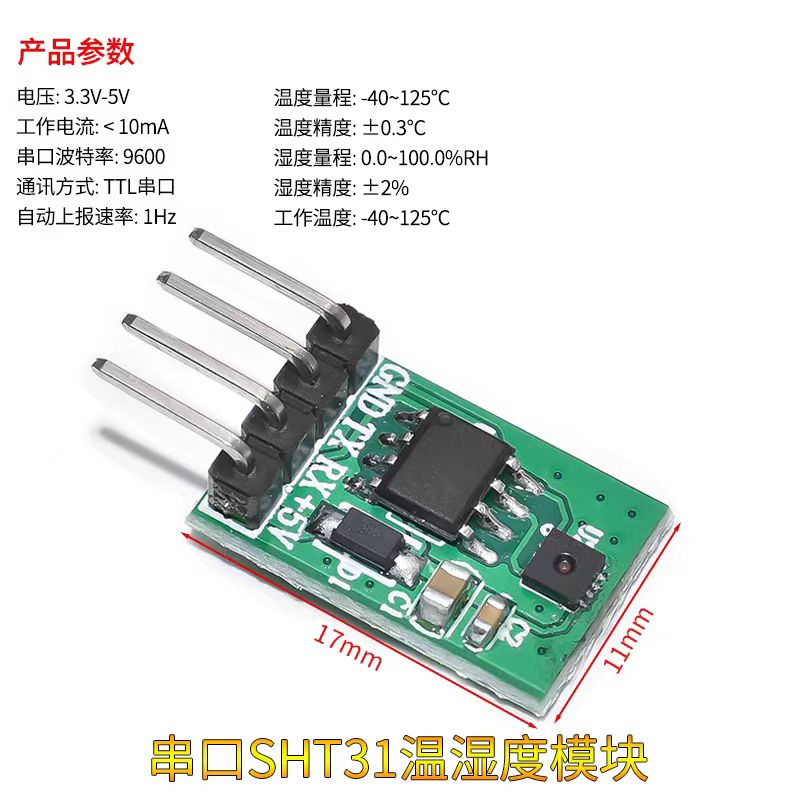

**与CI-03T连接方案：**

**方案一：直接连接（自动上报模式）**

```
SHT31模块        CI-03T模块
---------        ---------
VCC     →        3.3V/5V
GND     →        GND
TX      →        UART_RX（如PB6）
RX      →        不连接（模块自动上报，无需发送命令）
```

- 模块会以1Hz的频率自动发送温湿度数据
- CI-03T通过串口接收功能解析数据
- 无需主动轮询，简化软件设计

**方案二：通过MCU中转**

```
SHT31模块        MCU          CI-03T模块
---------        ---          ---------
VCC     →       VCC
GND     →       GND
TX      →       UART_RX
RX      →       UART_TX        UART_RX
              UART_TX    →    UART_TX
```

- MCU负责数据解析和处理
- 可实现更复杂的数据处理逻辑
- 支持自定义数据格式和触发条件

**配置建议：**

1. **串口配置**：
   - 波特率：9600
   - 数据位：8
   - 停止位：1
   - 校验位：无

2. **数据解析**：
   - 根据模块输出协议编写解析逻辑
   - 通常格式为：`温度值,湿度值` 或自定义格式
   - 需参考具体模块的数据手册

3. **变量设置**：
   - 创建温度和湿度变量
   - 将解析后的数据赋值给变量
   - 可通过语音命令查询或自动播报

**注意事项：**

- 确认模块供电电压与系统匹配
- 模块TX输出为TTL电平，可直接连接CI-03T的UART_RX
- 如使用5V供电的SHT31模块，需确认TX输出电平与3.3V系统兼容
- 自动上报模式下无需查询，但需要注意串口数据缓冲
- 建议先通过串口助手验证模块输出格式

---

### CI-03T的3.3V输出能否驱动STM32和与门芯片？

**问题描述：**

需要确认CI-03T模块的3.3V输出引脚能否驱动STM32单片机、与门芯片以及隔离电源等外部负载。

**解决方案：**

CI-03T的3.3V输出**不能**稳定提供500mA电流，最大输出电流为150mA。

**负载能力分析：**

1. **典型功耗对比**：

    | 设备类型 | 典型工作电流 | 备注 |
    |---------|--------------|------|
    | STM32F103C8T6 | 30-50mA | 运行状态，不含外设 |
    | 与门芯片（74HC08） | 1-5mA | 逻辑门电路 |
    | 隔离电源模块 | 10-30mA | 取决于隔离度 |
    | 合计典型值 | 41-85mA | 不考虑其他外设 |

2. **实际测试结果**：

    - CI-03T的3.3V输出不要超过150mA
    - 超过150mA可能导致输出电压跌落
    - 长时间过载可能损坏模块

**供电方案建议：**

1. **轻负载场景（<100mA）**：

    - 可直接使用CI-03T的3.3V输出
    - 适合：仅有STM32+少量逻辑电路
    - 建议添加100nF去耦电容

2. **中等负载场景（100-150mA）**：

    - 谨慎使用CI-03T的3.3V输出
    - 需精确计算所有器件功耗
    - 建议预留20%安全余量

3. **重负载场景（>150mA）**：

    - **必须使用外部3.3V电源**
    - 推荐方案：LDO稳压芯片（如AMS1117-3.3）
    - 或使用DC-DC降压模块

**外部供电方案：**

1. **LDO线性稳压**：

    ```
    5V输入 → AMS1117-3.3 → 3.3V输出（最大1A）
    ```

2. **DC-DC降压**：

    ```
    5V输入 → MP1584EN → 3.3V输出（最大3A）
    ```

3. **系统电源架构**：

    ```
    CI-03T（主控）←→ 串口通信
    外部3.3V电源 → STM32 + 与门芯片 + 隔离电源
    ```

**设计注意事项：**

1. **电源隔离**：

    - 如需要电气隔离，使用隔离电源模块
    - 注意隔离电源的效率（通常70-80%）
    - 考虑隔离电源的静态功耗

2. **电源时序**：

    - 确保STM32上电时序正确
    - 考虑使用PG（Power Good）信号
    - 避免总线竞争

3. **去耦和滤波**：

    - 每个芯片电源引脚就近放置去耦电容
    - 3.3V主电源使用10-100μF电解电容
    - 高频噪声使用100nF陶瓷电容

**验证方法：**

1. **电流测量**：

    - 使用万用表串联测量总电流
    - 测试STM32在不同工作模式下的电流
    - 验证峰值电流不超过150mA

2. **电压稳定性测试**：

    - 监测3.3V输出电压波动
    - 测试负载突变时的电压恢复
    - 确认电压稳定在3.3V±5%范围内

**注意事项：**

- 不要将CI-03T的3.3V输出用于驱动大电流负载
- 外部电源方案更可靠，适合产品化应用
- 设计时要考虑电源余量和扩展需求
- 批量生产前进行充分的电源测试

---

### CI-03T功放芯片出现滋啦噪音和接触不良怎么办？

**问题描述：**

CI-03T1或CI-03T2模块在使用功放芯片时出现严重的滋啦噪音，甚至出现接触不良导致无声音输出的问题。

**解决方案：**

- **检查功放芯片状态**：

    - 观察SOP8封装的功放芯片是否有发烫现象
    - 检查芯片表面是否有烧坏痕迹（如小黑点）
    - 用万用表测量功放输出对地电压

- **连接质量改善**：

    - 避免使用杜邦线连接，容易接触不良
    - 建议直接焊线连接，确保接触可靠
    - 焊接时注意人体静电，避免引入干扰

- **替代方案**：

    - 如确认功放芯片损坏，建议更换模块
    - 成品模块出现质量问题应由商家处理
    - 重新焊接功放芯片需要专业设备和技术

**注意事项：**

- 功放芯片对连接质量要求较高，接触不良容易产生噪音
- 用手按压电路板可能引入人体电磁干扰，影响判断
- 不要过度拧螺丝固定，避免损坏PCB或元件
- 成品建议联系售后，自行维修有风险

---

### CI-03T如何将反电平信号改为高电平？

**问题描述：**

需要将CI-03T1或CI-03T2模块的反电平输出信号配置为高电平输出。

**解决方案：**

**信号电平配置方法：**

1. **理解电平类型**：

    - 反电平：默认高电平，触发时输出低电平
    - 高电平：默认低电平，触发时输出高电平

2. **配置步骤**：

    - 进入平台配置界面
    - 找到GPIO或输出信号配置选项
    - 将输出模式从"反电平"改为"高电平"
    - 保存配置并生成固件

3. **硬件连接调整**：

    - 确认后续电路能正确响应高电平信号
    - 检查电平匹配（3.3V逻辑）
    - 验证驱动能力是否满足需求

**应用场景：**

- 驱动需要高电平触发的继电器模块
- 控制某些特定的数字逻辑电路
- 与其他3.3V系统的电平匹配

**注意事项：**

- 修改配置后需要重新烧录固件
- 确保负载不超过IO口最大输出电流
- 某些特殊功能引脚可能不支持电平类型修改
- 测试时建议先不连接负载，验证信号正确性

---

### CI-03T麦克风引脚无电压输出怎么办？

**问题描述：**

使用万用表测试CI-03T模块的麦克风引脚，发现没有电压输出，需要判断模块是否异常。

**解决方案：**

**电压检测步骤：**

1. **准备工作**：

    - 将万用表调至直流电压档（20V量程）
    - 确保模块已正确接入5V电源
    - 模块处于正常工作状态

2. **关键电压测试点**：

    - VCC-GND：检查供电是否正常（应为5V）
    - 3.3V引脚对GND：测试LDO输出（应为3.3V）
    - 麦克风正负极对GND：

        - CI-03T：1.6-1.7V范围
        - SU-03T：2.4-2.5V范围
    - 喇叭正负极对GND：2.2-2.5V范围

3. **故障判断**：

    - 如果某个测试点电压不正常，可能是模块异常
    - 首先用蜂鸣档测试VCC和GND是否被击穿
    - 检查是否存在短路或开路现象

**可能的问题：**

- 模块内部LDO损坏，导致3.3V输出异常
- 麦克风偏置电路故障
- 静电损坏或过压损坏

**注意事项：**

- 测试时表笔要稳定接触，避免读数误差
- 发现电压异常时，立即断电检查
- 确认万用表电池电量充足，避免测量误差
- 如发现模块损坏，建议联系售后处理

---

### CI-03T如何选择合适的麦克风？

**问题描述：**

在离线语音识别芯片项目中，需要选择适用于CI-03T1或CI-03T2型号的麦克风（咪头）。

**解决方案：**

- **推荐型号**：

    - 使用标准全指向性麦克风
    - 推荐灵敏度：-38dB至-42dB
    - 频率响应：100Hz-10kHz

- **采购建议**：

    - 可通过淘宝等平台搜索"语音识别麦克风"
    - 选择知名品牌的产品质量更有保障
    - 注意查看产品评价和销量

- **技术参数**：

    - 工作电压：2.0-5.0V
    - 输出阻抗：2.2kΩ或更低
    - 信噪比：>58dB
    - 尺寸：9.7mm直径标准封装

**注意事项：**

- 麦克风质量直接影响语音识别率
- 避免使用高阻抗或灵敏度异常的型号
- 焊接时注意极性，通常有标记的一端为负极
- 建议购买带防尘网的型号，延长使用寿命

---

### CI-03T1第二次烧录后功放芯片发烫怎么办？

**问题描述：**

芯片第一次烧录正常，第二次烧录后功放芯片区域发烫并伴有滋滋声，无法正常工作。

**解决方案：**

1. **立即断电检查**

    - 立即断开所有电源连接
    - 等待芯片完全冷却
    - 不要再次尝试上电测试

2. **故障分析**

    - 功放芯片可能已过流损坏
    - 检查喇叭阻抗是否匹配（通常8欧姆）
    - 确认平台音量设置是否过大

3. **损坏原因排查**

    - 喇叭接线短路导致功放过载
    - 音量配置超出功放芯片承受范围
    - 烧录过程中可能存在异常

4. **维修建议**

    - 功放芯片损坏后需要更换
    - 检查同一批次的其他模块
    - 使用默认音量配置进行测试

**注意事项：**

- 功放芯片对负载和音量敏感
- 烧录前应断开喇叭避免意外
- 如频繁出现此问题，建议检查硬件设计

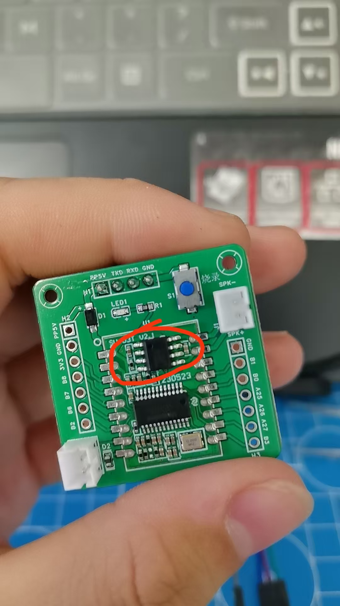

*红色圆圈标记为异常发烫的功放芯片位置*

---

### CI-03T1/CI-03T2的蓝牙功能如何控制？

**问题描述：**

CI-03T1和CI-03T2芯片模块烧录蓝牙固件后，询问蓝牙功能默认是否开启以及如何关闭。

**解决方案：**

**蓝牙功能状态**：

- **默认状态**：烧录蓝牙固件后，蓝牙功能默认开启
- **功能控制**：通过PA6引脚电平控制蓝牙开关

**控制方式**：

- **PA6低电平**：

    - 开启功放输出
    - 蓝牙音频可以通过功放播放
    - 正常工作状态

- **PA6高电平**：

    - 关闭功放输出
    - 实现静音/关断功能
    - 等效于关闭蓝牙输出

**电路连接**：

- PA6通过10K电阻上拉到VDD33
- 低电平时功放使能，高电平时功放禁用
- 可直接将PA6接地实现常开状态

**注意事项：**

- PA6是功放静音控制引脚，不是直接的蓝牙开关
- 此控制仅影响音频输出，不影响蓝牙连接
- 如需完全关闭蓝牙，需要在固件层面配置

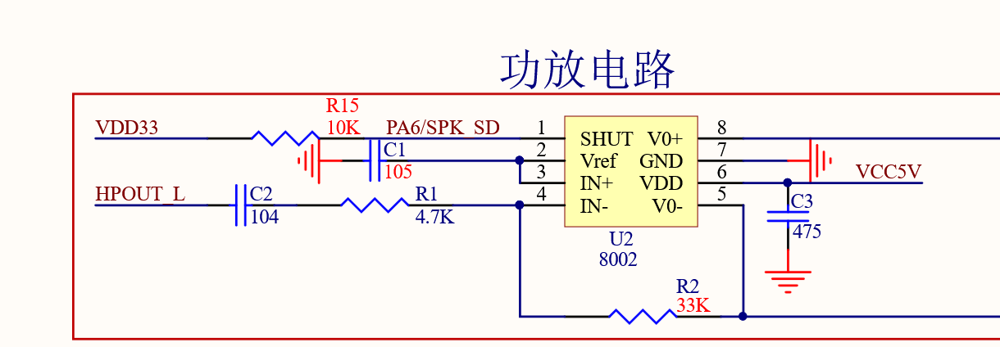

---

### CI-03T1喇叭无声音输出，功放电路故障排查

**问题描述：**

使用CI-03T1离线语音识别模块时，喇叭无声音输出。使用万用表测量喇叭输出引脚（SPK+和SPK-）对地电压，发现两个引脚电压均为0.285V左右，表明功放电路可能存在故障。

**解决方案：**

**故障诊断步骤：**

1. **电源系统检查**

    - 测量模块3V3引脚输出电压，正常应为3.3V（实测3.5V也属正常范围）
    - 确认主控芯片工作正常（3.3V电源稳定）
    - 检查5V供电是否在4.75-5.25V范围内

2. **功放电路检测**

    - 测量SPK+和SPK-对地电压：

        - 正常工作时：两引脚电压应有明显差异（交流信号）
        - 故障状态：两引脚电压相同且异常（如均为0.285V）
        - 此现象表明功放芯片可能已损坏

3. **语音执行IO口检查**

    - 测量语音执行IO口控制电压（实测0.243V为正常）
    - 确认控制信号能够正常输出
    - 验证软件层面的控制功能正常

4. **麦克风输入验证**

    - 测量MIC+和MIC-对地电压（0.000V为正常）
    - 确认麦克风输入电路无异常

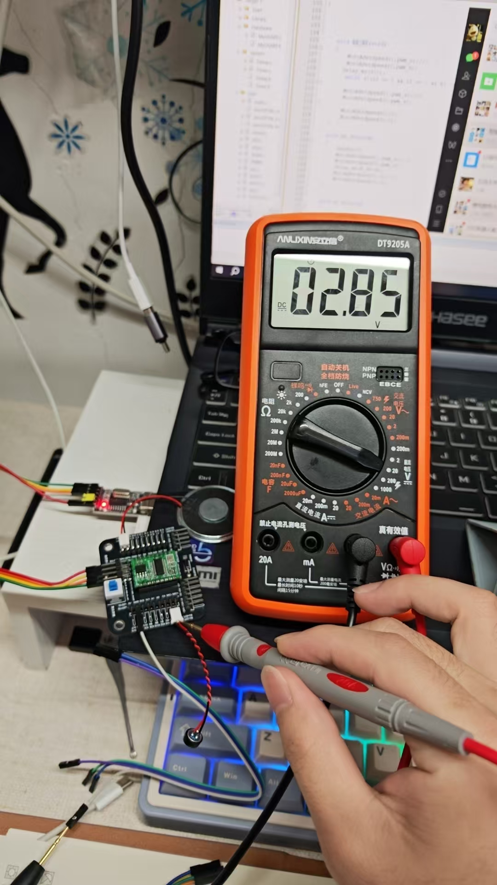

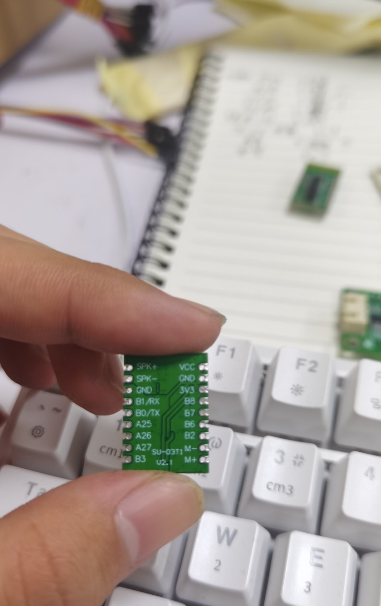

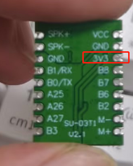

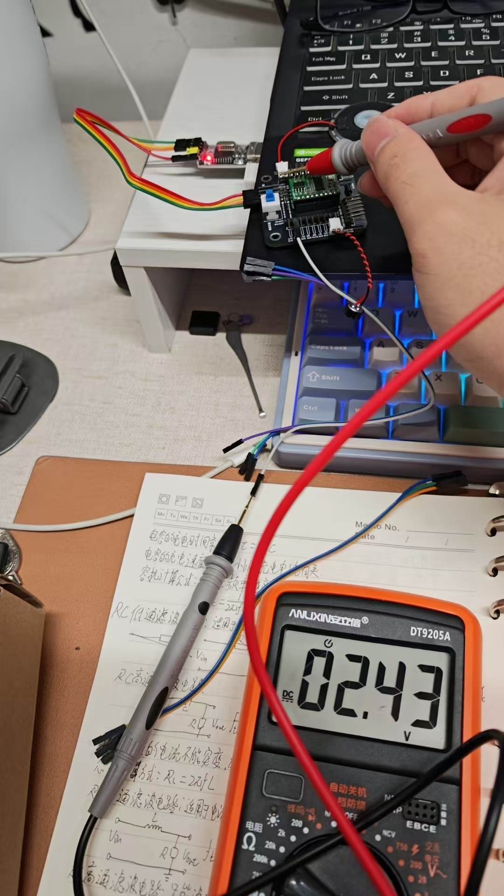

**故障处理方案：**

1. **功放芯片损坏确认**

    - 若模块3.3V电源正常，但SPK+和SPK-电压相同且无音频输出
    - 可确认功放芯片已损坏
    - 需要更换模块或返厂维修

2. **临时解决方案**

    - 使用外部功放模块：

        - 从模块的音频输出引脚（如DAC输出）获取音频信号
        - 外接功放电路驱动喇叭
        - 注意电平匹配和阻抗匹配

3. **预防措施**

    - 避免喇叭短路（正负极不能直接相碰）
    - 使用功率匹配的喇叭（通常8Ω，0.5W）
    - 避免长时间大音量工作
    - 注意电源极性，防止反接损坏

**注意事项：**

- 功放芯片一旦损坏，无法自行修复，需要更换整个模块
- 测量电压时需要在连接喇叭的状态下进行
- 若确认功放损坏，建议检查外部电路是否有过载、短路等问题
- 更换新模块后，先单独测试（不连接其他负载），确认正常后再接入系统

---

### CI-03T1能接收指令但喇叭没声音怎么办？

**问题描述：**

CI-03T1模块的麦克风能够正常接收语音指令，但连接的喇叭没有声音输出。

**解决方案：**

- **使用万用表检测**：

    - 测量喇叭接口（SPK+和SPK-）两端是否有音频信号输出
    - 有信号输出但喇叭不响，说明喇叭可能损坏
    - 无信号输出，可能是焊接或模块问题

- **喇叭故障排查**：

    - 更换一个正常的喇叭测试
    - 确认喇叭规格匹配（推荐使用0.5W、8Ω喇叭）
    - 检查喇叭连接线是否牢固

- **焊接质量检查**：

    - 检查SPK+和SPK-焊点是否牢固
    - 确保没有虚焊或接触不良
    - 重新加焊可疑的连接点

**注意事项：**

- 测量时使用万用表的交流电压档
- 喇叭接口输出的是音频信号，电压会随声音变化
- 如果确认模块输出正常，问题通常在喇叭或连接线上

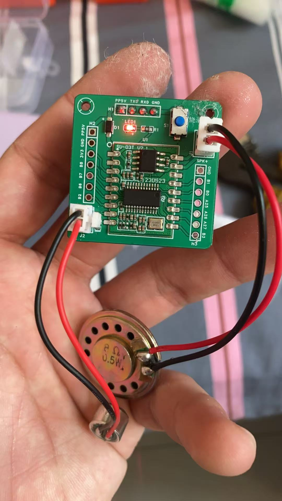
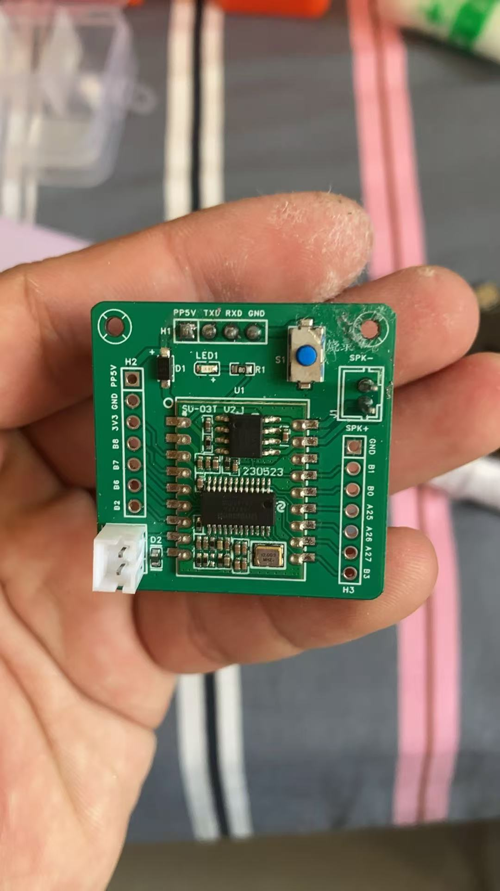

---

### 配置GPIO输入时看不到可用的IO选项怎么办？

**问题描述：**

在智能平台配置GPIO输入触发时，下拉菜单显示"暂无数据"，无法选择可用的GPIO引脚。

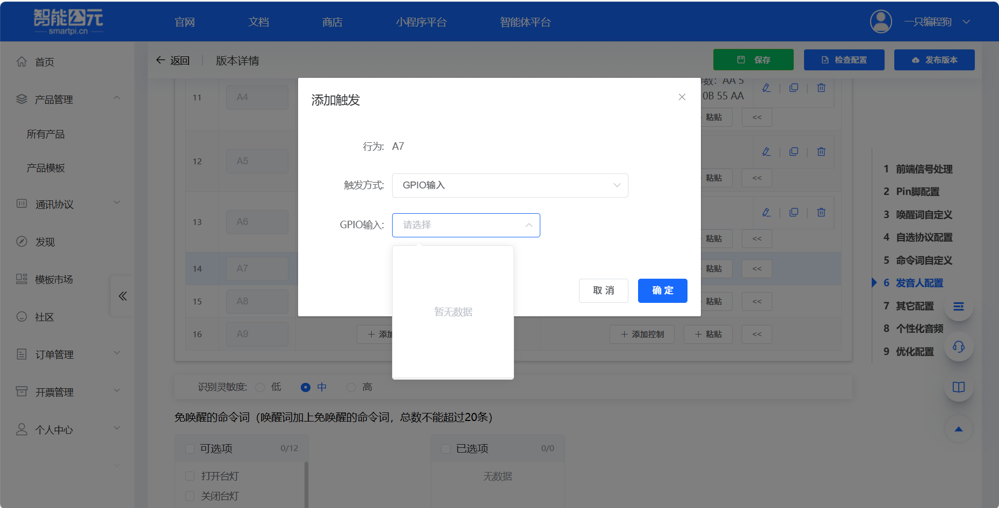

**解决方案：**

**问题原因：**

1. **IO未配置为输入模式**
    - IO引脚默认可能是输出模式或其他功能
    - 需要先在引脚配置中设置为输入
    - 平台才能识别为可用的GPIO输入

2. **引脚功能冲突**
    - 某些引脚可能被串口、PWM等功能占用
    - 需要释放这些引脚的GPIO功能
    - 确保没有功能冲突

**解决步骤：**

1. **检查引脚配置**
    - 进入模块的引脚配置界面
    - 将需要使用的IO设置为GPIO输入模式
    - 保存配置并重新生成固件

2. **可用GPIO引脚**
    - CI-03T可用GPIO：GPIO_A0至GPIO_A6、GPIO_B5、GPIO_B6
    - 总共9个可编程IO口
    - 注意B6/B7如果用作串口就不能作为GPIO

3. **配置触发功能**
    - 返回触发配置界面
    - 选择"GPIO输入"触发方式
    - 此时应该能看到可用的GPIO选项

**组合输出应用：**

如果需要使用两个IO组合输出3种不同状态：

- 00：状态1
- 01：状态2
- 10：状态3
- 11：不使用或作为状态4

注意：只有输出功能可以组合，输入需要分别配置。

**注意事项：**

- 配置前先确认引脚的默认功能
- 避免与串口、PWM等必要功能冲突
- 修改引脚配置后需要重新烧录固件
- 建议使用平台默认的GPIO引脚配置

---

### CI-03T上电后喇叭有杂音

**问题描述：**

CI-03T1语音识别模块上电后喇叭出现杂音，需要了解原因和解决方案。

**解决方案：**

**杂音原因分析**

1. **喇叭质量问题**
    - 使用的喇叭（如FS1508MB0810-H8.0）质量可能不佳
    - 喇叭阻抗与模块不匹配
    - 喇叭灵敏度太高，容易产生噪声

2. **电路设计问题**
    - 功放电路增益设置过高
    - 电源滤波不足
    - 接地回路设计不合理

**解决方法**

1. **更换喇叭**
    - 选择质量更好的喇叭
    - 推荐使用8Ω、0.5W-1W的喇叭
    - 避免使用廉价的塑料振膜喇叭

2. **调整电路参数**
    - 调整功放增益电阻（原理图中的相关电阻）
    - 在电源端增加滤波电容
    - 改善接地，尽量使用星型接地

3. **软件设置**
    - 在固件配置中降低默认音量
    - 调整音频输出参数
    - 重新生成并烧录固件

**注意事项：**

- 杂音问题通常是硬件和软件综合影响
- 建议先更换喇叭测试效果
- 如调整电路参数需要具备电子技术基础
- 可以通过串口播放测试音频进一步定位问题

---

### CI-03T连接OLED屏幕无法点亮

**问题描述：**

CI-03T1或CI-03T2连接1.30英寸OLED屏幕后，屏幕无法点亮，已确认引脚连接正确且无虚焊问题。

**解决方案：**

**硬件确认步骤：**

1. **模块真伪验证**
    - 检查模块主控芯片标识
    - PCA9685为PWM控制器，非语音识别芯片
    - 确认使用的是真正的CI-03T模块

2. **OLED屏幕检查**
    - 确认OLED屏幕型号为1.30寸IIC接口
    - 检查屏幕版本信息（如Ver: 3.1）
    - 测试OLED屏幕本身是否完好

3. **连接线路检查**
    - 确认SDA、SCL、VCC、GND四线连接正确
    - 检查I2C地址设置是否正确
    - 使用万用表测试各引脚电压是否正常

4. **软件配置确认**
    - 在智能公元平台配置OLED显示功能
    - 确认I2C地址与屏幕匹配（通常为0x3C或0x3D）
    - 检查显示内容配置是否正确

**常见问题处理：**

1. **OLED无反应**
    - 检查供电电压是否为3.3V
    - 确认I2C上拉电阻（通常为4.7kΩ）
    - 尝试更换I2C地址设置

2. **显示异常**
    - 检查接线顺序是否正确
    - 确认屏幕驱动芯片型号（如SSD1315）
    - 重新烧录固件测试

**注意事项：**

- 必须使用真正的CI-03T模块，PCA9685为其他功能芯片
- OLED屏幕需要3.3V供电，不可使用5V直接供电
- I2C通信需要上拉电阻才能正常工作
- 建议先使用已知正常的OLED屏幕进行测试

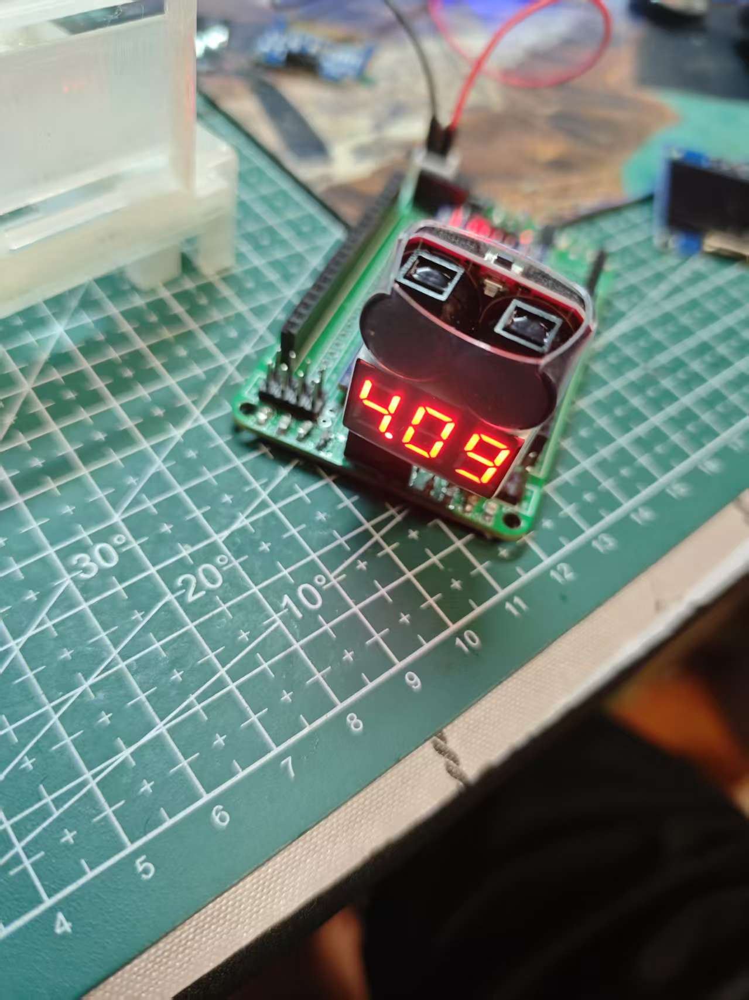

*CI-03T连接OLED屏幕，屏幕显示数字但未点亮*

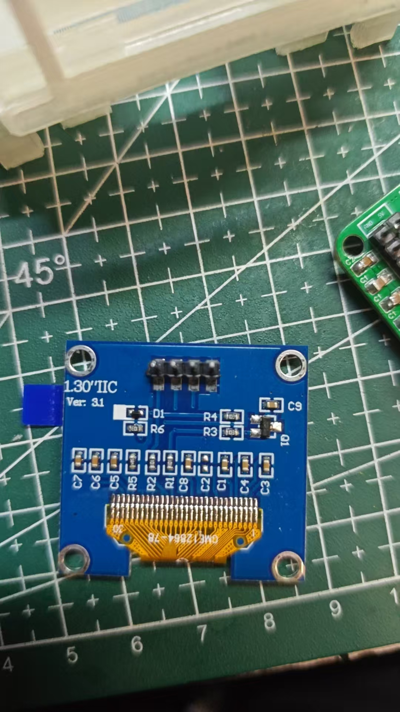

*1.30寸I2C接口OLED屏幕模块（Ver: 3.1）*

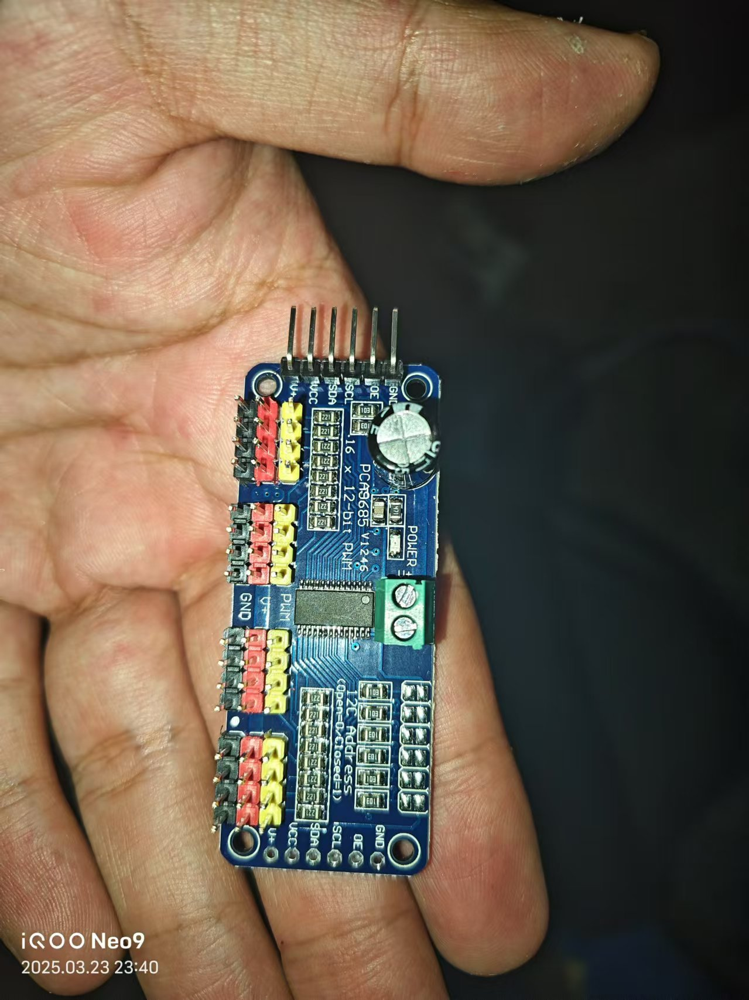

*错误模块示例：PCA9685为PWM控制器，非语音识别芯片*

---

### CI-03T1连接屏幕时无法点亮怎么办？

**问题描述：**

连接CI-03T1离线语音识别芯片的屏幕时，发现屏幕无法点亮，需要排查硬件连接故障。

**解决方案：**

**1. 检查焊接质量**

- **查看焊点连接**：

    - 检查屏幕排线与主控板的连接点
    - 确认每个焊点都有良好的锡接触
    - 避免虚焊或连锡现象


*红色圆圈标出疑似焊接不良的连接点*

- **检查排线插入**：

    - 确认排线完全插入接口
    - 检查排线方向是否正确
    - 确保锁定机制正常工作

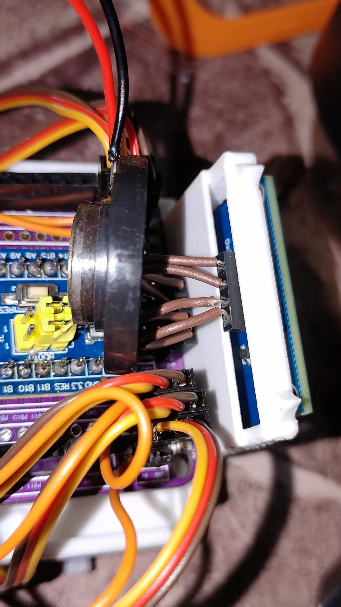

*屏幕排线与主控板的连接情况*

**2. 排查硬件故障**

- **测试屏幕本身**：

    - 更换一块确认正常的屏幕测试
    - 如果新屏幕能点亮，说明原屏幕损坏
    - 如果新屏幕仍不亮，继续排查其他原因

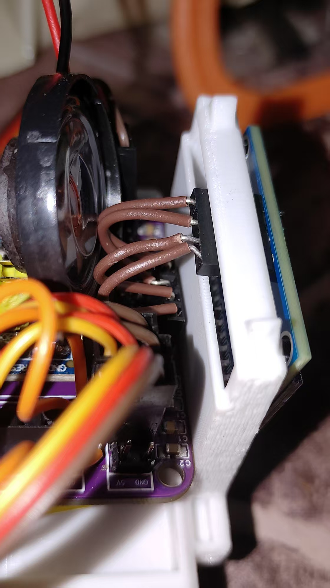

*排线插入接口的细节展示*

- **检查连接线路**：

    - 用万用表测试连通性
    - 确认没有短路或断路
    - 检查供电电压是否正常

**3. 常见问题处理**

- **连锡问题**：

    - 如果焊点之间有锡连接，需要清理
    - 使用吸锡线或焊接工具修复
    - 确保每个焊点独立

- **接触不良**：

    - 重新插拔排线连接器
    - 清洁接触点上的氧化层
    - 确保连接器锁定到位

**注意事项：**

- 焊接时避免过多的焊锡，防止连锡
- 排线插入时要对准接口，不可强行插入
- 如果所有硬件排查无问题，可能需要检查固件配置
- 建议使用放大镜检查微小焊点的质量

---


---

### CI-03T1/CI-03T2使用时喇叭烧毁的原因是什么？

**问题描述：**

在使用CI-03T1或CI-03T2离线语音识别芯片时，喇叭在语音播报过程中突然无声，更换喇叭后恢复正常，但不确定导致喇叭烧毁的具体原因。

**解决方案：**

**可能原因分析：**

1. **功放电路故障**：

    - 模块内部功放电路异常，输出直流电压或异常信号
    - 功放短路导致大电流直接流过喇叭线圈
    - 静态工作点偏移，造成单边电流过大

2. **喇叭参数不匹配**：

    - 使用了阻抗不匹配的喇叭（如4Ω喇叭接到8Ω系统）
    - 喇叭功率额定值过小，无法承受模块输出功率
    - 喇叭质量差，线圈耐压不足

3. **信号异常**：

    - 音频信号幅度过大，超出喇叭承受范围
    - 含有直流分量的音频信号
    - 上电瞬间的冲击信号

**排查步骤：**

1. **测量功放输出电压**：

    - 万用表测量SPK+、SPK-两端对GND电压
    - 正常值应在2.2V-2.5V范围内（静态）
    - 如有明显偏差，说明功放电路异常

2. **检查喇叭参数**：

    - 使用万用表蜂鸣档测量喇叭阻值
    - 确认喇叭阻抗为8Ω（标准配置）
    - 检查喇叭功率额定值是否匹配

3. **测试音频输出**：

    - 示波器观察输出波形是否正常
    - 检查是否有直流偏置
    - 测量输出信号幅度

**预防措施：**

1. **正确选型**：

    - 使用8Ω、额定功率≥1W的喇叭
    - 避免使用劣质或参数不明的喇叭
    - 确认喇叭工作电压范围

2. **保护设计**：

    - 在喇叭回路串联适当保险丝（如100mA）
    - 添加耦合电容隔离直流分量
    - 考虑使用音频变压器隔离

3. **调试建议**：

    - 上电前先检查喇叭连接是否正确
    - 首次测试时使用较低音量
    - 避免长时间大音量测试

**注意事项：**

- 模块SPK输出为差分信号，不要将任一端直接接地
- 不要使用有源音箱，只能使用无源喇叭
- 如连续烧毁喇叭，必须更换模块
- 建议使用原厂推荐的喇叭型号

### CI-03T1是否支持"语音识别+自学习+AEC打断"功能？

**问题描述：**

咨询CI-03T1模块是否可以启用"语音识别+自学习+AEC打断(限单MIC)"功能。

**解决方案：**

- CI-03T1支持该功能组合
- 在平台配置中开启自学习和AEC功能
- 该功能限于单麦克风配置使用

**注意事项：**

- AEC（声学回声消除）功能需要单麦克风环境
- 自学习功能可以提升语音识别准确率
- 使用该功能时需确保环境噪声相对较小
- 具体配置参数可根据实际应用场景调整

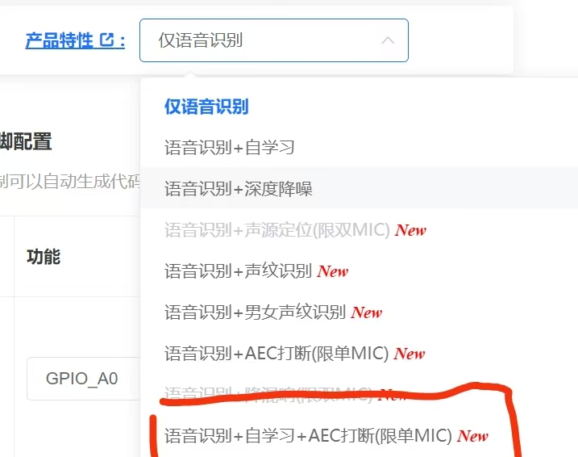

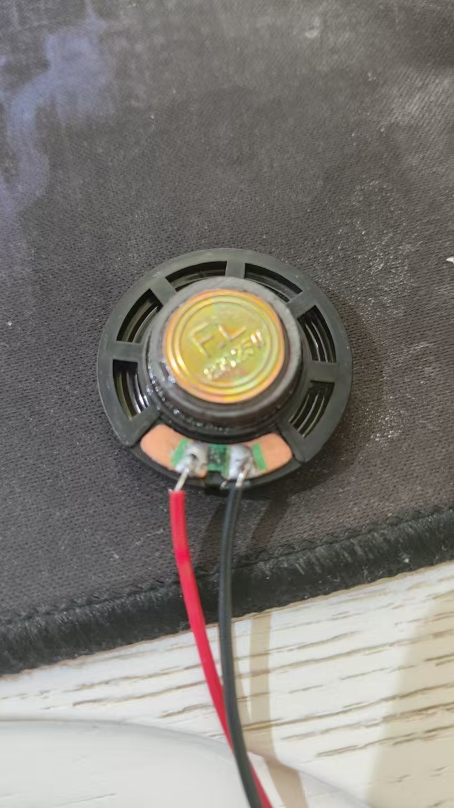

### CI-03T1芯片的麦克风和喇叭连接到哪个引脚？

**问题描述：**

需要了解CI-03T1芯片上麦克风和喇叭的具体引脚连接位置，以及在烧录固件后扬声器无反应的问题排查方法。

**解决方案：**

**引脚连接说明：**

- **MIC+ 和 MIC-**：连接差分麦克风的正负极
- **SPK+ 和 SPK-**：连接喇叭的正负极
- 麦克风连接到CI1302芯片的MIC输入电路
- 喇叭通过外部功放芯片（如8002、FM8002A）驱动


**固件选择与烧录：**

1. **固件文件说明**：

    - 从平台下载"下载固件"压缩包
    - 使用压缩包内的.bin文件（非SDK中的文件）
    - CI-03T系列不需要带update的固件

2. **烧录方法**：

    - 使用CH340串口工具连接
    - 选择正确的COM端口
    - 加载.bin文件进行烧录

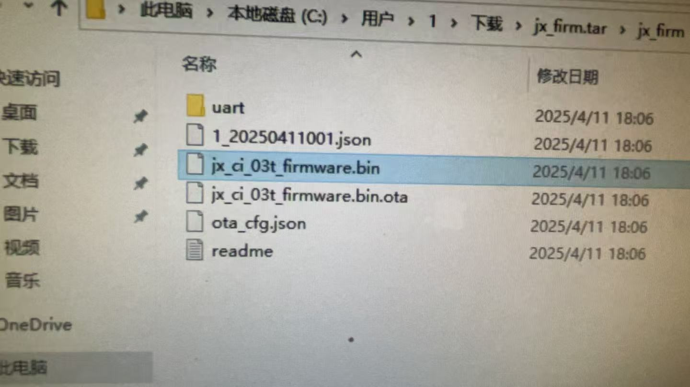

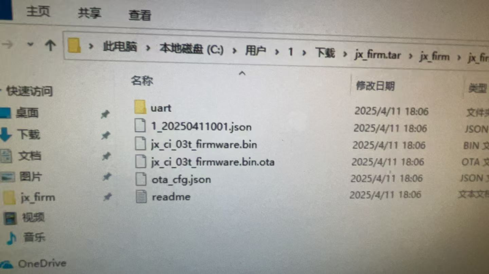

**故障排查步骤：**

1. **硬件检查**：

    - 确认麦克风和喇叭连接正确
    - 检查功放电路供电
    - 测量各关键点电压

2. **固件确认**：

    - 确保使用正确的.bin文件
    - 检查烧录过程是否成功
    - 尝试重新烧录固件

3. **音频测试**：

    - 使用示波器检查音频输出
    - 确认功放芯片工作正常
    - 测试喇叭本身是否损坏

**注意事项：**

- CI-03T和SU-03T的固件不通用
- 自己搭建功放时注意阻抗匹配
- 烧录固件后需要断电重启生效
- 如使用不同功放芯片，需要相应调整电路

---

### CI-03T1/T2使用8Ω1W喇叭的风险

**问题描述：**

使用8Ω1W喇叭连接到CI-03T1/T2功放输出时，担心功率过低导致驱动不足，或者功率过高烧毁功放芯片。

**技术风险分析：**

1. **功率计算公式**：

    - P = U²/R（功率 = 电压²/阻抗）
    - U = 3.3V（功放输出电压）
    - 8Ω1W时：P = 3.3²/8 = 1.365W
    - 8Ω1.6W时：P = 3.3²/1.6 = 6.8W（已超规格）

2. **电流计算**：

    - 8Ω1W时：I = 1.365W / 3.3V = 0.413A
    - 8Ω1.6W时：I = 6.8W / 3.3V = 2.06A（危险值）

3. **对比额定值**：

    - CI-03T功放设计用于4Ω喇叭（约2.7W）
    - 8Ω喇叭属于严重不匹配情况

**损坏机制：**

1. **过热损坏**：

    - 电流过大导致功放芯片温度急剧上升
    - 持续工作会永久性损坏
    - 可能表现为声音逐渐变小直至无声

2. **过流保护**：

    - 某些功放有电流限制保护
    - 超限值通常在1-1.5A之间
    - 8Ω1.6W远超保护阈值，可能不会触发保护

3. **静电击穿**：

    - 瞬态或操作不当可能产生高压脉冲
    - 功放芯片输入端对ESD敏感
    - 可能导致瞬间损坏

**实际测试案例：**

1. **正常工作状态**：

    - 4Ω/3W喇叭工作正常
    - 功放温度适中，无明显发热
    - 音量输出稳定，无失真

2. **8Ω1W喇叭初期表现**：

    - 初期能工作，音量可接受
    - 长时间使用后音质下降
    - 功放逐渐发热，影响寿命

3. **8Ω1.6W喇叭故障现象**：

    - 短时即出现保护或无声
    - 功放异常发热甚至烫手
    - 电流测量显示超载

**处理建议：**

1. **立即停止使用**：

    - 发现问题立即断电
    - 检查功放和喇叭是否损坏
    - 更换符合规格的喇叭

2. **选型要求**：

    - 喇叭功率必须≥最低要求（见规格书）
    - 优先选择4Ω或2.4W喇叭
    - 避免使用来路不明的廉价产品

3. **预防措施**：

    - 上电前再三检查接线
    - 使用万用表测量实际阻抗
    - 从小音量开始测试，逐步增加
    - 长时间监控功放温度

4. **替代方案**：
    ```
    方案1：4Ω3W喇叭（推荐）

    方案2：8Ω1.6W + 串联电阻
        - 需要2W/1W功率电阻
        - 电阻功率：P = I²×R = 0.413²×2 ≈ 0.34W
        - 优点：阻抗提高，电流降低
        - 缺点：输出功率进一步减小

    方案3：更换为8Ω2.4W或更高功率喇叭
    ```

**注意事项：**

- 不要存在侥幸心理，低功率喇叭损坏率极高
- 功放损坏通常是不可逆的
- 成本考虑远低于更换设备的损失
- 使用不匹配的硬件可能导致连锁损坏

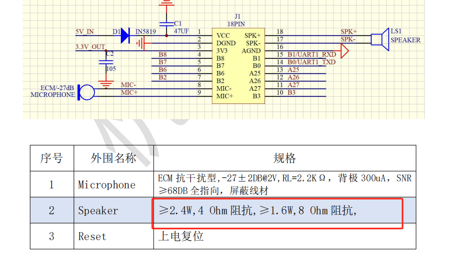

---

### CI-03T1如何连接GPIO控制外部LED？

**问题描述：**

需要确认CI-03T1模块哪个引脚可用于连接外部LED灯，以及如何进行硬件连接。

**解决方案：**

**1. 使用空闲的GPIO引脚**

- GPIO_A0 至 GPIO_A4 可用作输出控制
- 这些引脚默认配置为GPIO输出模式
- 可直接连接LED等外部设备

**2. 引脚位置参考**

根据引脚功能配置界面：

- Pin No. 6: GPIO_A0
- Pin No. 7: GPIO_A1
- Pin No. 8: GPIO_A2
- Pin No. 9: GPIO_A3
- Pin No. 10: GPIO_A4

**3. 硬件连接方式**

```
LED正极 → 限流电阻 → GPIO引脚
LED负极 → GND
```

- 使用220-330Ω限流电阻保护LED
- 注意LED极性，避免反接

**注意事项：**

- 确认使用未被其他功能占用的GPIO
- 低电平点亮或高电平点亮需在配置中设置
- 多个LED可并联使用不同GPIO控制

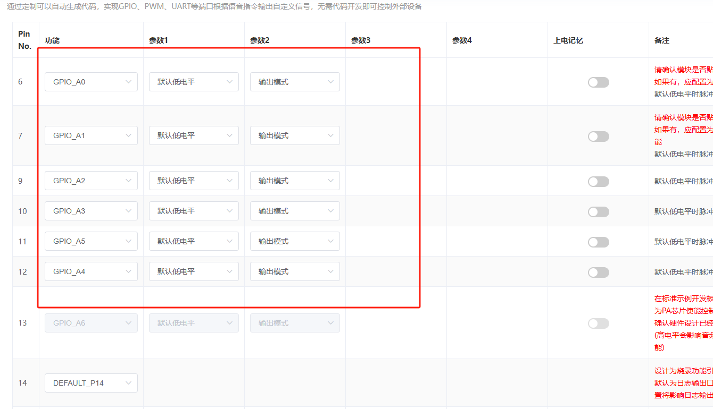

---

### CI-03T串口通信返回随机数据怎么办？

**问题描述：**

语音模块识别到指令时，串口返回随机的十六进制数值，而不是预期的固定值（如0x01）。

**解决方案：**

**问题排查：**

1. **检查接线连接**：

    - 确认模块TX连接到USB转TTL的RX
    - 确认模块RX连接到USB转TTL的TX
    - 检查GND线连接牢固
    - 验证5V供电正常

2. **验证波特率设置**：

    - 串口助手和模块波特率需一致
    - 常用波特率为9600
    - 波特率不匹配会导致数据解析错误

3. **检查引脚配置**：

    - 在平台中确认串口引脚配置
    - B5、B6默认为串口1
    - 如使用其他引脚需相应调整

**硬件连接示例：**

- 模块B5(TX) → CH340 RXD
- 模块B6(RX) → CH340 TXD
- 模块VCC → CH340 5V
- 模块GND → CH340 GND

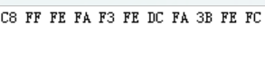

*模块返回随机十六进制数据*

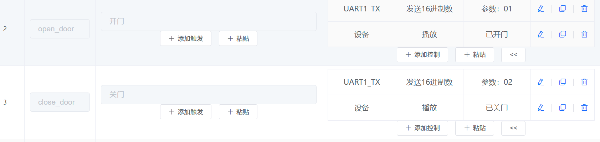

*开门指令配置为发送01*

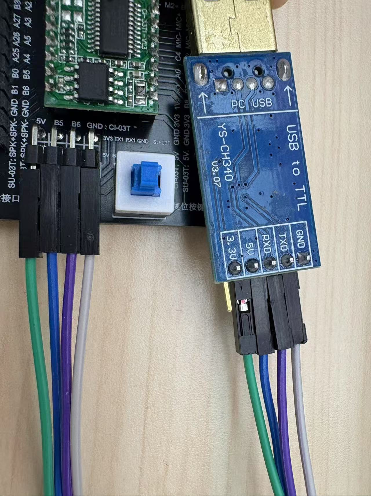

*CI-03T与CH340的连接方式*

**注意事项：**

- TX/RX线必须交叉连接，不能直连
- 确保使用稳定的5V电源供电
- 如果连接正确仍有问题，尝试更换USB转TTL模块
- 波特率不匹配是常见的数据异常原因

---

### CI-03T与5V单片机通信如何进行电平转换？

**问题描述：**

CI-03T模块的GPIO口为3.3V电平，与5V单片机通信时需要电平转换措施。

**解决方案：**

1. **电平匹配确认**：

    - CI-03T GPIO口电平为3.3V
    - 5V单片机GPIO口电平为5V
    - 必须进行电平转换以保护模块

2. **电平转换方法**：

    - 使用串联电阻（简单方案）
    - 使用专用电平转换芯片（推荐）
    - 使用光耦隔离（安全可靠）

3. **常用转换方案**：

    - TXS0102：双向电平转换芯片
    - 74LVC245：8路电平转换
    - 电阻分压：简易但精度有限

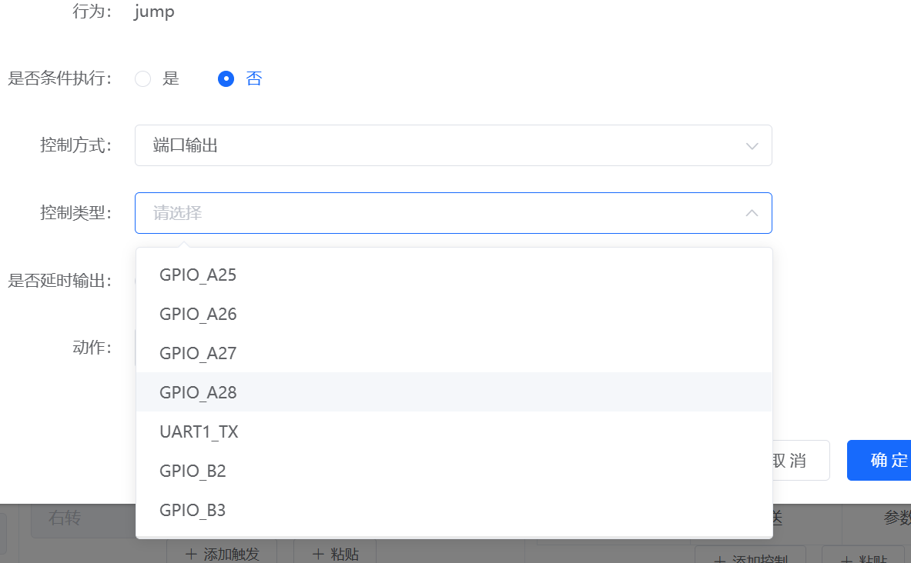

**注意事项：**

- 直接连接可能损坏CI-03T的GPIO口
- 3.3V转5V可使用 MOSFET 方案
- 建议使用成品电平转换模块
- 确保两设备共地

---

### CI-03T如何实现按键的长按和双击功能？

**问题描述：**

需要在CI-03T芯片上实现按键的长按和双击功能，用于区分不同的按键操作。

**解决方案：**

按键的长按和双击功能应该由主控MCU实现，而非CI-03T芯片本身处理。

**实现原理：**

1. **CI-03T的功能定位**：

    - CI-03T是语音识别芯片，专注于语音处理
    - 不负责按键识别的高级功能
    - 只能检测到简单的按键触发信号

2. **主控MCU实现方案**：

    - 按键信号输入到主控MCU
    - MCU进行按键时序检测
    - MCU根据按键类型发送不同指令给CI-03T

**硬件连接方案：**

```
按键 → 主控MCU → CI-03T
            ↓
        (长按/双击检测)
```

**软件实现逻辑**：

- **长按检测**：检测按键持续按下时间（如>1秒）
- **双击检测**：检测两次按键间隔时间（如<500ms）
- **单击检测**：正常的单次按键触发

**注意事项：**

- CI-03T只负责语音识别，不处理复杂按键逻辑
- 建议使用外部中断或定时器实现按键检测
- 需要合理设置按键去抖动时间
- 根据应用需求调整长按和双击的时间阈值

---

### CI-03芯片如何实现按键的长按和双击功能？

**问题描述：**

需要使用CI-03芯片实现按键的长按和双击功能，了解实现方法。

**解决方案：**

**1. 硬件连接方案**

- 按键连接到外部MCU的GPIO口
- MCU通过串口或I2C与CI-03通信
- CI-03专注于语音处理，按键由MCU处理

**2. 软件实现逻辑**

- **长按检测**：

    - 设置定时器检测按键按下时间
    - 超过设定阈值（如1秒）判定为长按
    - 长按可以触发特定功能或退出

- **双击检测**：

    - 记录第一次按键释放时间
    - 在时间窗口内（如500ms）检测第二次按下
    - 符合条件判定为双击操作

**3. 实现要点**

- 使用中断方式检测按键状态变化
- 添加按键去抖动处理（10-50ms）
- 合理设置长按和双击的时间参数
- 考虑不同操作的优先级和互斥性

**4. 与CI-03的配合**

- MCU检测到按键后，可控制CI-03的工作模式
- 长按可用于进入配置模式
- 双击可用于切换识别场景
- 单击用于常规语音唤醒

**注意事项：**

- CI-03本身不处理复杂按键逻辑
- 需要配合外部MCU实现按键功能
- 建议使用低功耗MCU以降低整体功耗
- 按键硬件需要做防抖和防静电处理

---

### CI-03T是否可以实现语音直通喇叭功能？

**问题描述：**

需要实现麦克风声音直接输出到喇叭的直通功能，同时要避免产生啸叫。

**解决方案：**

**1. 功能限制说明**

- CI-03T标准固件不支持语音直通功能
- 该功能需要定制固件实现
- 标准平台配置无法开启此功能
- 定制需要额外费用

**2. 回声消除（AEC）支持**

- CI-03T支持硬件回声消除功能
- 可消除喇叭播放声音的回声
- 避免识别到自己的输出声音
- 有效防止自激啸叫

**3. 硬件实现方案**

如需实现类似功能，可考虑以下方案：

- **方案一：使用双麦克风**
    - MIC1：用于语音识别
    - MIC2：通过耦合电路接收喇叭信号
    - 利用AEC算法消除回声

- **方案二：外部电路实现**
    - 使用模拟开关切换音频路径
    - 配合外部控制逻辑
    - 需要额外MCU控制

**4. 替代方案**

- 使用带扩音功能的专用模块
- 外接独立功放电路
- 考虑使用SU-63T等支持直通的型号

**注意事项：**

- 语音直通不是标准功能
- 定制固件起订量有要求
- AEC主要消除喇叭回声，不是环境回声
- 如需此功能，建议联系销售咨询定制方案

---

## 晶振选型

### CI-03T1和CI-03T2晶振电路是否必须添加12pF电容？

**问题描述：**

在CI-03T1和CI-03T2芯片的晶振电路设计中，需要确认是否必须在晶振两端添加两个12pF的电容。

**解决方案：**

- 如果空间充足，可以预留两个12pF电容
- 空间受限的情况下，可以不加这两个电容，不影响功能
- 已有出货的产品未添加晶振电容，工作正常
- 建议根据实际PCB空间和设计需求决定是否添加

**注意事项：**

- 晶振电容主要用于匹配负载和稳定频率
- 不加晶振电容不会导致模块无法工作
- 出现时钟问题时，可考虑添加12pF电容进行调试
- 设计时预留焊盘，便于后期调试优化

---

### CI-03T带晶振和不带晶振有什么区别？

**问题描述：**

询问CI-03T2模块带晶振与不带晶振在使用和稳定性上的区别，以及两个不带晶振的模块不工作的原因排查。

**解决方案：**

**1. 晶振作用说明**

- 芯片内部包含基础晶振电路
- 外部晶振提供更高精度时钟源
- 主要影响高低温环境下的稳定性

**2. 带晶振与不带晶振的区别**

- **带晶振版本**：

    - 高低温环境下更加稳定
    - 时钟精度更高
    - 适合工业级应用
    - 成本略高

- **不带晶振版本**：

    - 常温下性能相同
    - 功耗略低
    - 适合消费级应用
    - 成本更低

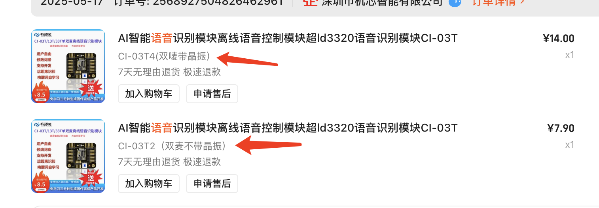

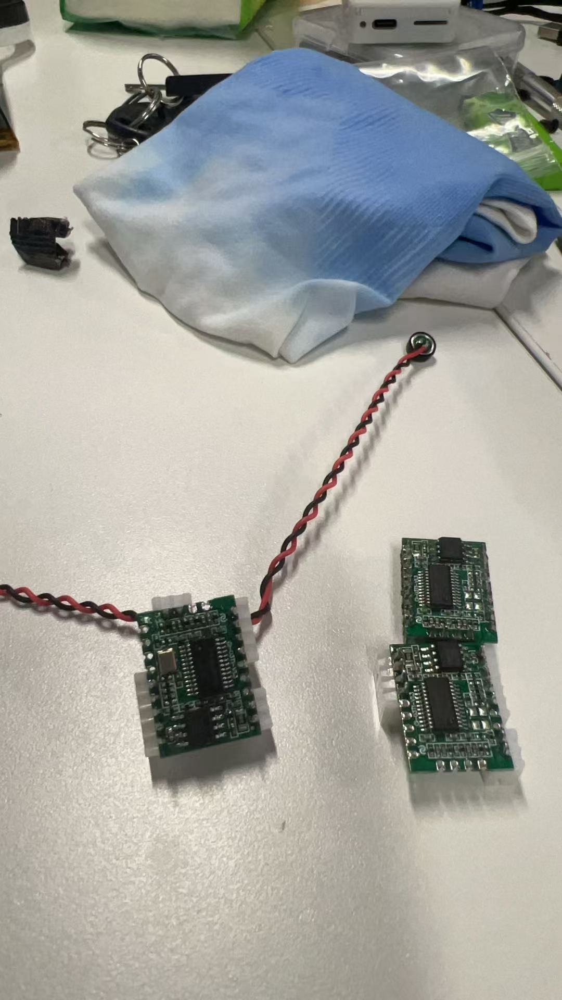

**3. 模块不工作排查步骤**

**电压检测方法**：

- 万用表蜂鸣档测量VCC/GND是否短路
- 给模块5V供电
- 测量3V3引脚是否有3.3V输出
- 麦克风正负电压：1.6-1.7V（正常）
- 喇叭正负对GND电压：2.2-2.5V（正常）

**4. 可能原因分析**

- **供电问题**：

    - 电压不稳定或过低
    - 接线接触不良
    - 电源纹波过大

- **硬件故障**：

    - 静电损坏
    - 焊接问题
    - 元器件失效

- **配置错误**：

    - 固件未正确烧录
    - 配置参数错误
    - 唤醒词设置问题

**5. 处理建议**

- 优先检查供电和接线
- 使用万用表逐点测量电压
- 尝试重新烧录官方固件
- 多个模块故障考虑批次问题

**注意事项：**

- 不带晶振版本常温下完全够用
- 故障率不应该这么高，可能是其他问题
- 测试时先确保基础电路正常
- 保留正常模块作为对比参考

---

### CI-03T模块排针未焊接导致无法工作？

**问题描述：**

CI-03T模块的排针未焊接到底板，导致所有引脚电压为0，模块无法正常工作。

**解决方案：**

- 确认购买的模块是否已预焊排针
- 如未焊接，需要自行焊接排针
- 或购买已焊接好的模块版本

**焊接要求：**

- 使用适当的烙铁温度（300-350°C）
- 焊接时间每个引脚不超过3秒
- 确保焊点光滑、无虚焊

**注意事项：**

- 未焊接的模块无法直接使用
- 焊接时注意静电防护
- 如不熟悉焊接操作，建议购买已焊接版本

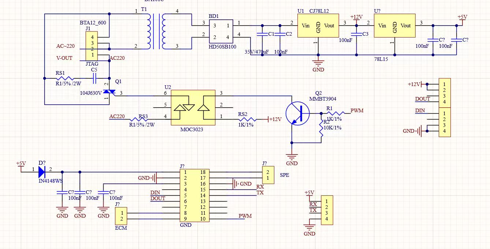

---

### CI-03T1芯片上电运行时严重发烫怎么办？

**问题描述：**

CI-03T1芯片模块在上电运行时出现严重发烫现象，虽然能正常工作但无法持续，怀疑是硬件故障或设计问题。

**解决方案：**

**1. 电压检测步骤**

使用万用表进行以下检测：

- 测量VCC和GND是否被击穿（使用蜂鸣档）
- 给模块5V供电，测试3V3引脚是否有3.3V电压输出
- 测量麦克风正负电压：应在1.6-1.7V范围（CI-03T）
- 测量喇叭正负对GND电压：应在2.2-2.5V范围内

**2. 故障排查**

- 各测试电压不正常可能是模块烧坏或异常
- 如果电压正常但仍发烫，可能是运放损坏
- 正常工作温度应在60度以内

**3. 硬件连接检查**

- 检查喇叭功率是否匹配（推荐8R2W）
- 确认电源供电能力足够（建议5V/600mA以上）
- 验证接线是否正确

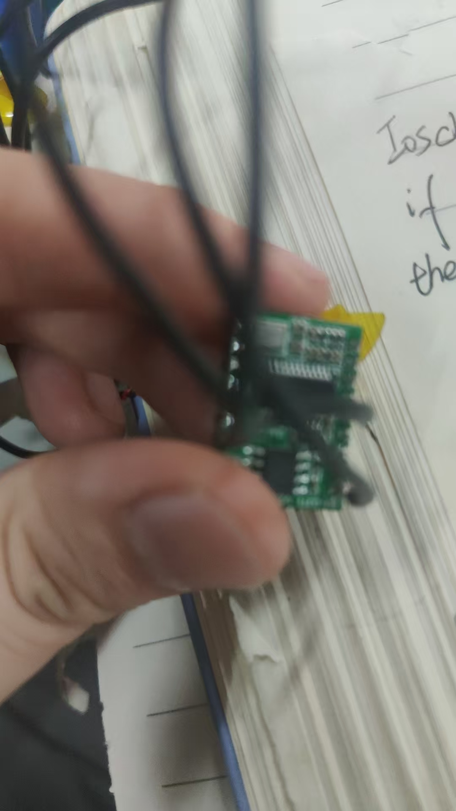
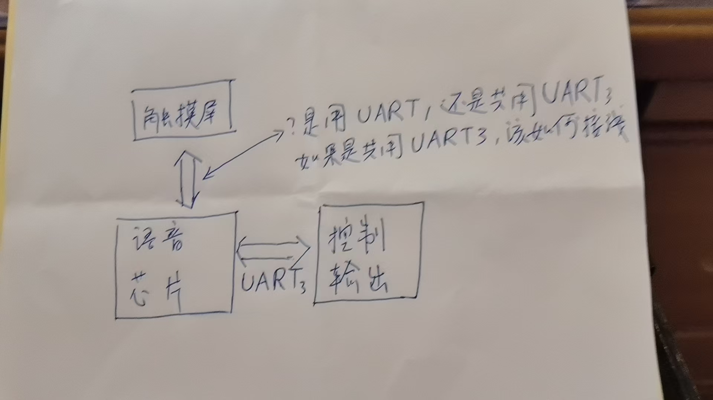

**注意事项：**

- 严重发烫（超过60度）属于异常现象
- 可能的故障原因：模块损坏、运放故障、电源负载过大
- 建议更换模块进行测试
- 长期高温运行可能存在安全隐患

---

### CI-03T系列如何选择电源模块？

**问题描述：**

需要为CI-03T1或CI-03T2语音识别模块选择合适的AC转DC电源模块，要求明确模块的最大输入电流以确保电源模块的功率足够。

**解决方案：**

**电源规格要求：**

- **输入电压**：5V DC
- **最小电流**：600mA以上
- **推荐功率**：3W以上（留有余量）

**负载考虑：**

- 模块自身功耗：约200-300mA
- 8Ω2W喇叭：峰值电流约400mA
- 总功耗：建议按600mA以上设计

**电源选型建议：**

1. **标准5V/1A电源适配器**
    - 功率充足，有较大余量
    - 适合长期稳定运行

2. **开关电源模块（AC-DC）**
    - 输入：AC 220V
    - 输出：DC 5V/1A
    - 适合集成到产品中

**注意事项：**

- 不建议使用5V/500mA以下的电源
- 喇叭功率较大时需要相应提高电源电流
- 建议选择有过流保护功能的电源
- 电源纹波过小会影响音频质量

---

### CI-03T串口通讯数据格式是怎样的？

**问题描述：**

需要了解CI-03T系列芯片在串口通讯时发送的十六进制数据是否包含换行符或帧头帧尾，以及接收端应如何判断数据完整性。

**解决方案：**

**1. 数据格式说明**

CI-03T系列芯片的串口通讯特点：

- **无帧头帧尾**：芯片不会自动添加帧头帧尾标识
- **无换行符**：发送的是纯十六进制数据，不含换行符
- **直接传输**：发送什么就接收什么，不做额外处理

**2. 数据长度限制**

- 单次数据长度建议控制在16个字节以下
- 超过16字节可能导致传输异常
- 长数据需要分多次发送

**3. 通讯协议设计**

**方案一：自定义帧结构**

```
数据包格式：
帧头（2字节） + 数据内容（N字节） + 校验（1字节）

示例：
AA 55 [数据内容] CS
```

**方案二：添加结尾标识**

- 在数据末尾添加特殊标识符（如0x0D）
- 接收端检测特定标识符判断数据结束
- 确保标识符不会出现在正常数据中

**方案三：固定长度传输**

- 约定每次发送固定字节数
- 接收端按固定长度读取
- 适合命令类型固定的场景

**4. 接收端处理建议**

```
处理流程：

1. 初始化串口（波特率9600，8位数据，1位停止）
2. 循环读取串口数据
3. 根据协议判断数据完整性
4. 验证数据后执行相应操作
```

**注意事项：**

- 发送端和接收端必须使用相同的协议约定
- 考虑添加校验机制确保数据可靠性
- 串口通信要共地连接
- 建议增加超时处理机制

---

### CI-03T2的GPIO12和GPIO13对应哪些物理引脚？

**问题描述：**

需要了解CI-03T2（双麦）芯片中GPIO12和GPIO13对应的物理引脚编号。

**解决方案：**

CI-03T2的GPIO引脚映射：

- **GPIO12** → PIN59
- **GPIO13** → PIN66

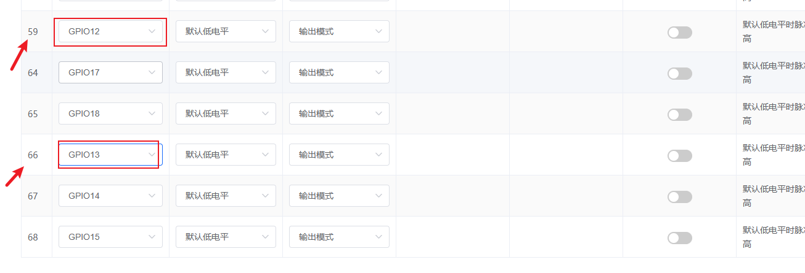

**注意事项：**

- 不同型号的引脚映射可能不同
- 配置时请确认使用正确的引脚编号
- 物理连接时要对照引脚定义图
- CI-03T1（单麦）与CI-03T2（双麦）的引脚定义有差异

---

### CI-03T系列喇叭选型推荐

**问题描述：**

CI-03T系列模块需要选择合适的喇叭，需要了解不同阻抗和功率配置的优缺点及适用场景。

### CI-03T1的IO3引脚配置后电压无变化怎么办？

**问题描述：**

配置CI-03T1芯片的IO3引脚为语音识别成功后输出低电平控制，但语音识别成功后，万用表测量引脚电压没有变化，始终维持在高电平。

**解决方案：**

**1. 检查配置参数**

    - 确认控制类型设置为"设置电平"
    - 参数设置为"低电平"
    - 检查是否启用了"延时电平翻转"功能

**2. 验证触发条件**

    - 确认行为选择正确（如TurnOn）
    - 检查对应的命令词或唤醒词是否触发成功
    - 通过串口调试信息确认触发状态

**3. 硬件排查**

    - 使用万用表确认引脚号对应正确
    - 检查外部电路是否影响引脚电平
    - 确认负载电路没有强制拉高

**4. 配置优化**

    - 尝试其他GPIO引脚测试
    - 重新生成固件并完整烧录
    - 检查固件版本是否为最新

**注意事项：**

- IO3引脚默认为输入模式，必须配置为输出
- 外部上拉电阻会影响输出电平变化
- 建议断开外部电路单独测试引脚
- 如问题持续，可能是硬件故障需要更换


---

### CI-03T串口TTS播报功能支持哪些数据格式？

**问题描述：**

询问CI-03T模块的串口TTS播报功能是否支持直接播放非十六进制的串口数据，以及能否实现离线文字转语音播报。

**解决方案：**

1. **数据格式限制**
    - CI-03T串口通信只支持十六进制数据格式
    - 不支持直接发送ASCII字符或中文字符
    - 所有数据必须转换为十六进制格式发送

2. **TTS功能实现**
    - CI-03T可以离线实现文字转语音（TTS）功能
    - 需要在智能公元平台配置TTS播报
    - 支播报预定义的文本内容

3. **配置方法**
    - 在平台中设置串口触发输入
    - 配置触发后执行TTS播报动作
    - 可以使用变量动态改变播报内容

4. **使用限制**
    - 只能播报预设的文本，不能播报任意串口内容
    - 字符需要在模块支持的词典范围内
    - 播报内容需要在固件中预编译

**注意事项：**

- 想要CI-03T作为通用TTS模块使用有限制
- 合宙780e等设备发送的数据需要转换为十六进制
- 如需播报随机文本，建议使用其他专门的TTS模块
- 生成分词不在字典内的错误时，需要检查文本内容

---

### 如何配置CI-03T模块与两个780e模块通过串口进行通信，以实现上电时播放开机信息

**问题描述：**

需要使用两个780e模块对应一个CI-03T模块，利用CI-03T的两个串口（UART1_RX和UART0_RX）来实现语音播放开机信息的功能。

**解决方案：**

1. **硬件连接**
    - CI-03T模块支持两个串口接口
    - 每个串口可以连接一个780e模块
    - 确保串口线正确连接：TXD接RXD，RXD接TXD

2. **串口配置**
    - 在智能公元平台配置串口触发器
    - 设置两个触发器A1和A2
    - A1触发器对应UART1_RX
    - A2触发器对应UART0_RX
    - 配置触发后播放预设的语音信息

3. **通信流程**
    - 780e模块上电时自动发送串口消息
    - CI-03T接收到串口消息后触发对应语音播报
    - 可以根据不同的串口消息播放不同的开机信息

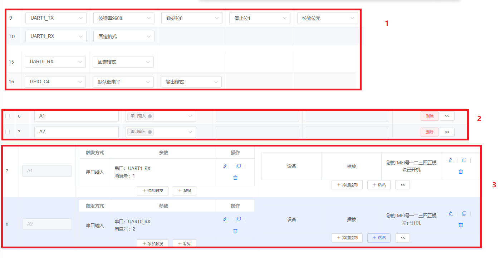

**注意事项：**

- 780e模块需要支持串口通信功能
- 串口消息格式需要与CI-03T配置的触发条件匹配
- 语音播报内容需要预先在CI-03T中配置
- 确保两个780e模块的串口波特率与CI-03T一致

---

### CI-03T模块能否从下位机读取温度值，并实现语音播报，以及如何处理Modbus协议的发送与接收格式差异问题？

**问题描述：**

需要使用CI-03T从下位机读取温度值并通过语音播报，同时发现CI-03T发送Modbus标准协议，但接收数据格式要求帧头帧尾，存在协议差异问题。

**解决方案：**

1. **数据读取功能确认**
    - CI-03T可以通过串口从下位机读取数据
    - 支持读取温度等传感器数据
    - 读取的数据可用于触发语音播报

2. **Modbus协议发送格式**
    - 发送时：直接发送Modbus标准协议（如01 03 00 C8 00 01 05 F4）
    - 不需要添加帧头帧尾
    - 可发送任意十六进制数据

3. **接收数据格式要求**
    - 接收时：必须有固定格式 AA 55 [数据] 55 AA
    - 帧头：AA 55
    - 帧尾：55 AA
    - 中间为消息编号+实际数据

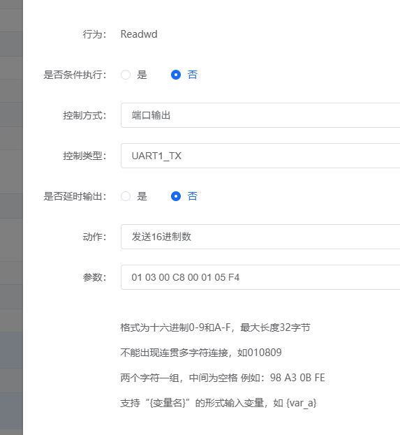

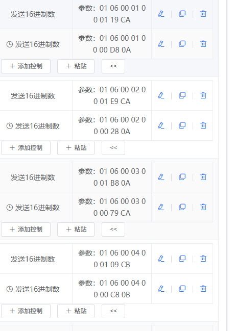


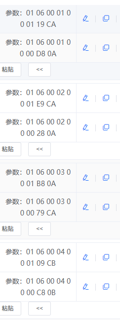

**注意事项：**

- 发送和接收的数据格式不同，需要进行协议转换
- 下位机发送数据给CI-03T时必须包含帧头帧尾
- 如果发送和接收都使用标准Modbus协议会更方便
- 语音播报内容需要预先在模块中配置

---

### CI-03T模块支持的最大扬声器功率是多少？

**问题描述：**

需要了解CI-03T模块支持的最大扬声器功率，以便选择合适的扬声器。

**解决方案：**

**功率参数说明：**

1. **推荐功率范围**：

    - **4Ω扬声器**：2.4W起
    - **8Ω扬声器**：1.6W起
    - 建议不要超过推荐功率太多

2. **功率限制说明**：

    - 功率过大会导致模块驱动困难
    - 4Ω 5W扬声器模块可能带不动
    - 功率过大可能损坏模块或扬声器

3. **功率与阻抗关系**：

    - 阻抗越小，需要越大功率
    - 4Ω扬声器需要更大驱动能力
    - 8Ω扬声器相对容易驱动

**选型建议：**

1. **常规应用**：

    - 选择4Ω 3W或8Ω 2W扬声器
    - 满足大多数应用场景需求
    - 保证良好的音质和可靠性

2. **大功率需求**：

    - 如需更大音量，考虑外接功放
    - 使用CI-03T的音频输出信号
    - 通过外部功放驱动大功率扬声器

3. **特殊环境**：

    - 噪音环境可适当提高功率
    - 室内环境不需要过大功率
    - 根据实际应用场景选择

**注意事项：**

- 不要选择功率过大的扬声器
- 4Ω 5W可能超出模块驱动能力
- 建议留有余量，不要满负荷使用
- 如需要大功率输出，考虑使用外部功放方案

---

### CI-03T如何连接数字麦克风？

**问题描述：**

在CI-03T1芯片上连接数字麦克风时，询问是否只需将第20脚MICNR接地即可实现功能。

**解决方案：**

**数字麦克风接线方法：**

1. **正确接线方式**：
    ```
    数字麦克风 → CI-03T1连接
    VDD → MICBIAS（2.8V电源）
    OUT → MICP_L（麦克风输入正极）
    GND → GND（地线）
    ```

2. **不需要的操作**：

    - 不需要将MICNR（第20脚）接地
    - MICNR用于模拟麦克风的降噪输入
    - 数字麦克风不使用此引脚

**电压参数说明：**

1. **MICBIAS电压**：

    - 输出电压为2.8V
    - 为数字麦克风提供工作电源
    - 确保麦克风工作电压匹配

2. **电源要求**：

    - 2.8V可满足大多数数字麦克风需求
    - 检查麦克风的工作电压范围
    - 确认兼容性后再连接

**实际应用考虑：**

1. **距离限制**：

    - 直接连接可能拾音距离较近
    - 建议增加放大电路提升距离
    - 根据实际需求决定是否需要

2. **效果测试**：

    - 连接后测试语音识别效果
    - 对比模拟麦克风的表现
    - 根据测试结果优化设置

**注意事项：**

- MICNR引脚用于模拟麦克风，数字麦克风不需要
- 确保数字麦克风工作电压与2.8V兼容
- 直接连接可能拾音距离有限，根据需求评估
- 建议保留连接图便于后续维护


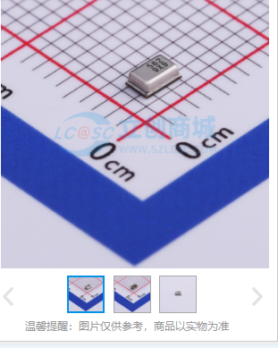

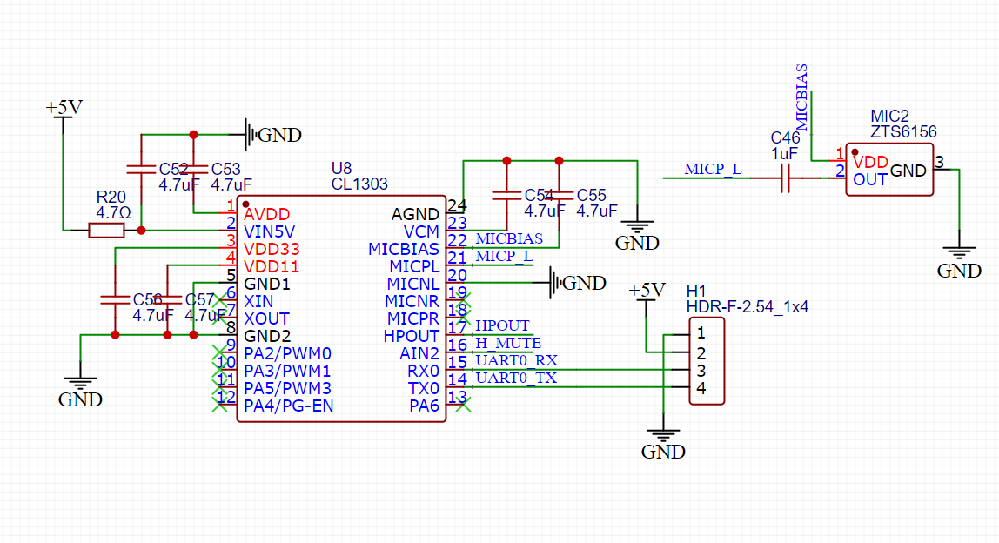

---

### CI-03T IO口可以直接输入5V电压吗？

**问题描述：**

CI-03T1和CI-03T2系列芯片的IO口作为输入时，是否可以直接输入5V电压，还是需要使用3.3V进行电平匹配。

**解决方案：**

1. **规格书确认**
    - 首先查看芯片规格书中的IO口电平规格
    - 确认输入电压的绝对最大额定值
    - 了解IO口的保护电路设计

2. **电压兼容性分析**
    - 按理论，5V供电时IO口可能支持5V输入
    - 但不建议长期在极限条件下使用
    - 可靠性考虑建议使用电平匹配

3. **推荐方案**
    - 优先使用3.3V进行电平匹配
    - 如必须输入5V，建议添加限流电阻
    - 考虑使用分压电路或电平转换芯片

**注意事项：**

- 直接输入5V可能影响IO口寿命
- 建议查阅具体型号的技术规格书
- 长期可靠性考虑应做电平转换
- 添加限流电阻可以提供额外保护

---

### CI-03T芯片的PB5/PB6引脚电平输入参数说明

**问题描述：**

CI-03T芯片的PB5/PB6引脚用作电平输入时，需要了解其最低有效输入电平。当使用4.8V电平通过二极管连接后，输入电平降至0.9V导致控制失效。

**解决方案：**

**1. 输入电平规格**

- **输入电平范围**：0V-3.3V
- **高电平识别**：约3.3V（或>2.5V）
- **低电平识别**：0V
- **0.9V电平**：处于不确定状态，无法被可靠识别

**2. 二极管压降问题**

- **硅二极管正向压降**：约0.7V
- **计算过程**：4.8V - 0.7V × 2（两个二极管）= 3.4V
- **实际测量0.9V**：可能存在其他电路问题或连接错误

**3. 正确连接方式**

- **直接连接**：3.3V系统可直接连接PB5/PB6
- **5V系统**：需要电平转换或分压电路
- **避免串联多个二极管**：会显著降低电平

**4. 电平转换方案**

- **电阻分压**：使用两个电阻实现5V到3.3V转换
- **专用电平转换芯片**：如TXS0108E
- **二极管OR门**：只使用一个二极管，配合上拉电阻

**注意事项：**

- PB5/PB6输入电平必须在0-3.3V范围内
- 0.9V电平无法被可靠识别为高电平或低电平
- 建议5V系统通过适当电平转换电路连接
- 如必须使用二极管，建议只使用一个并配合上拉电阻

---


### CI-03T的PC4脚通电时出现高电平正常吗？

**问题描述：**

CI-03T芯片的PC4脚在通电时会先输出约一秒钟的高电平，随后才转为低电平，使用原厂固件也存在此现象。

**解决方案：**

**1. 现象说明**

- **正常现象**：PC4脚通电瞬间的高电平是芯片正常初始化过程
- **持续时间**：约1秒钟
- **后续状态**：恢复正常工作电平（通常为低电平）
- **仅PC4脚**：其他IO口通常无此现象

**2. 原因分析**

- **芯片初始化**：所有IO口在启动时会有初始化过程
- **PC4特殊功能**：可能与功放使能或其他功能相关
- **无法修改**：这是芯片内部的初始化逻辑，无法通过软件改变

**3. 影响评估**

- **对大部分应用无影响**：1秒的高电平通常不会影响功能
- **敏感电路需注意**：如连接到快速响应设备可能产生误触发
- **外围电路设计**：考虑加入延时或滤波电路

**4. 处理建议**

- **方案一：外围电路处理**
    - 在PC4输出端增加RC延时电路
    - 使用施密特触发器整形信号
    - 加入二极管隔离防止反向影响

- **方案二：软件层面处理**
    - 上电延时1-2秒后再读取PC4状态
    - 忽略初始化期间的信号变化
    - 建立稳定的基准状态后再正常工作

**5. 功放使能配置**

- 平台可配置功放使能电平
- 可选择"低电平（默认）"或"高电平"
- 此配置影响正常工作时的PC4电平状态

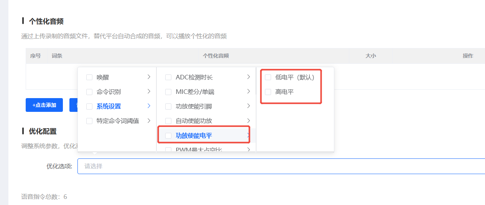

**注意事项：**

- 这是芯片的正常现象，非硬件故障
- 无法通过固件配置或软件修改此行为
- 如外围电路对此敏感，建议增加保护电路
- 设计电路时应预留1秒的初始化时间容差

---

### CI-03T的PC4脚通电时出现高电平正常吗？

**问题描述：**

CI-03T芯片的PC4脚在通电时会先输出约一秒钟的高电平，随后才转为低电平，使用原厂固件也存在此现象。

**解决方案：**

**1. 现象说明**

- **正常现象**：PC4脚通电瞬间的高电平是芯片正常初始化过程
- **持续时间**：约1秒钟
- **后续状态**：恢复正常工作电平（通常为低电平）
- **仅PC4脚**：其他IO口通常无此现象

**2. 原因分析**

- **芯片初始化**：所有IO口在启动时会有初始化过程
- **PC4特殊功能**：可能与功放使能或其他功能相关
- **无法修改**：这是芯片内部的初始化逻辑，无法通过软件改变

**3. 影响评估**

- **对大部分应用无影响**：1秒的高电平通常不会影响功能
- **敏感电路需注意**：如连接到快速响应设备可能产生误触发
- **外围电路设计**：考虑加入延时或滤波电路

**4. 处理建议**

- **方案一：外围电路处理**
    - 在PC4输出端增加RC延时电路
    - 使用施密特触发器整形信号
    - 加入二极管隔离防止反向影响

- **方案二：软件层面处理**
    - 上电延时1-2秒后再读取PC4状态
    - 忽略初始化期间的信号变化
    - 建立稳定的基准状态后再正常工作

**5. 功放使能配置**

- 平台可配置功放使能电平
- 可选择"低电平（默认）"或"高电平"
- 此配置影响正常工作时的PC4电平状态


**注意事项：**

- 这是芯片的正常现象，非硬件故障
- 无法通过固件配置或软件修改此行为
- 如外围电路对此敏感，建议增加保护电路
- 设计电路时应预留1秒的初始化时间容差

---
## Flash与OTA升级

### CI-03T1/CI-03T2的2M Flash容量是否足够OTA升级？

**问题描述：**

CI-03T1和CI-03T2型号配备2M Flash，担心容量太小无法满足OTA升级需求。

**解决方案：**

**Flash容量说明：**

- **CI-03T1/CI-03T2**：标配2M Flash
- **容量分配**：

    - 系统程序区：约1MB
    - 数据区：约1MB
    - 支持OTA差分升级和整包升级

**OTA升级支持：**

- **差分升级**：仅传输变更部分，占用空间小
- **整包升级**：需要完整固件包，但支持外置存储
- **升级策略**：

    - 优化固件大小，减少Flash占用
    - 支持分模块升级，降低单次升级需求
    - 提供固件压缩功能

**注意事项：**

- 2M Flash可满足基本OTA升级需求
- 如需更大应用空间，考虑选择CI-33T（4M Flash）
- 优化代码和资源可提升升级效率
- 大型应用建议采用差分升级方式

---


### CI1302芯片通过8002B运放驱动8Ω1W扬声器时发热严重怎么办？

**问题描述：**

在使用CI1302芯片通过8002B运放驱动8Ω1W扬声器时，发现芯片发热严重，手感发烫，尽管芯片仍能正常工作。

**解决方案：**

**1. 检查阻抗匹配**

- 8Ω1W扬声器阻抗较低，可能导致功放负载过大
- 建议使用更高阻抗的扬声器（如16Ω）
- 或使用功率较小的扬声器（如0.5W）

**2. 电源供电检查**

- 确保供电电压稳定，避免过压
- 检查电源纹波是否过大
- 建议使用稳定的线性电源而非开关电源

**3. 散热优化**

- 在8002B芯片上增加散热片
- 确保模块周围有良好的空气流通
- 避免在密闭空间内长时间使用

**4. 替代方案**

- 考虑使用8002D或AD8002D替代8002B
- 8002D和AD8002D具有更好的稳定性和散热特性
- AD8002D为工业级版本，可靠性更高

**注意事项：**

- 芯片轻微发热属正常现象，但烫手说明异常
- 长期高温工作会影响芯片寿命
- 如果发热严重，应立即断电检查
- 可以尝试降低音量使用以减少发热

---

### CI-03T模组待机温度过高怎么办？

**问题描述：**

CI-03T芯片在正常工作时会发热，询问这是否属于正常现象。

**解决方案：**

是的，芯片工作时发热是正常现象。

**1. 正常工作温度**

- CI-03T芯片正常工作时温度为30-45度
- 这个温度范围属于完全正常的散热情况
- 不影响模块的稳定性和寿命

**2. 发热原因**

- 芯片进行语音识别处理时产生热量
- 内部电路工作时消耗功率并转化为热能
- 这是电子产品的普遍现象

**3. 散热建议**

- 确保模块周围有良好的空气流通
- 避免在高温环境下长时间使用
- 不要覆盖散热孔或阻碍空气流动

**注意事项：**

- 如果温度超过45度，建议检查供电是否稳定
- 避免阳光直射或靠近其他热源
- 如温度异常升高，可能是模块故障


---


### CI-03T模块接错电压会损坏吗？

**问题描述：**

给CI-03T系列模块（如CI1324）接5V电压导致模块损坏，询问电压接错的影响。

**解决方案：**

是的，接错电压会导致模块损坏。

**1. 正确工作电压**

- CI-03T系列模块工作电压为3.3V
- 绝对不能接入5V电压
- 电压过高会烧毁芯片内部电路

**2. 损坏原因分析**

- 5V电压超过了芯片的最大承受电压
- 内部保护电路可能无法及时响应
- 导致关键元器件永久性损坏

**3. 电压接线注意事项**

- 使用CH340模块时，选择3.3V输出
- 如只有5V输出，需要增加3.3V稳压电路
- 接线前务必使用万用表确认电压

**4. 模块识别**

- CI-03T系列多个型号外观相似
- 不同型号可能有不同的电压要求
- 使用前请确认具体型号规格

**注意事项：**

- 因电压接错导致的损坏不在保修范围内
- 建议购买专用转接板避免接错电压
- 如模块已损坏，需要重新购买更换

---


### 模块转接板支持哪些型号？

**问题描述：**

询问模块转接板是否适配各个型号的芯片。

**解决方案：**

模块转接板支持多个型号的语音模块。

**1. 支持的型号列表**

- CI-03T
- SU-03T
- SU-23T
- SU-63T

**2. 转接板功能**

- 提供标准的烧录接口
- 支持3.3V/5V电压选择
- 集成USB转串口功能
- 简化模块连接过程

**3. 使用说明**

- 将对应型号的语音模块安装到转接板
- 通过USB连接到电脑
- 使用专用烧录软件进行固件更新
- 无需复杂接线操作

**注意事项：**

- 确认模块型号与转接板兼容
- 使用前检查电压设置是否正确
- 不同型号可能需要不同的烧录软件
- 转接板主要方便开发和调试使用


---

### CI-03T如何通过GPIO引脚控制变量状态？

**问题描述：**

需要配置GPIO引脚为输入模式，通过引脚电平的高低变化来控制变量状态的改变，但在配置中找不到相关设置选项。

**解决方案：**

**1. GPIO输入功能说明**

- GPIO输入模式需要在GPIO触发中配置
- 不能直接在变量设置中关联GPIO输入
- 需要通过命令词触发来间接实现

**2. 配置步骤**

- 在命令词配置中选择"GPIO输入"作为触发方式
- 设置对应的GPIO引脚为输入模式
- 在控制动作中修改变量的数值

**3. 实现原理**

- GPIO输入触发后执行预设的控制动作
- 控制动作可以改变变量的值
- 变量值变化可用于控制其他功能

**注意事项：**

- GPIO引脚需要配置为正确的输入模式
- 改变变量数值的控制是在触发动作中设置
- 平台中的GPIO输入模式主要用于触发命令词
- 如需直接控制变量，需要通过命令词作为中继

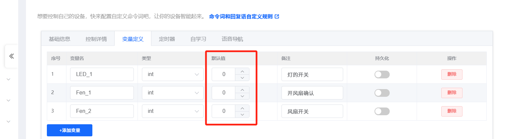


---

## 机械尺寸

### CI-03T1模块的排母间距是多少？

**问题描述：**

需要了解CI-03T1模块排母的具体间距规格，以便进行PCB设计或连接器选型。

**解决方案：**

**模块尺寸规格：**

- **模块整体尺寸**：15mm × 21mm
- **排母引脚间距**：2.0mm
- **其他间距规格**：

    - 0.75mm、1.0mm、2.0mm、2.5mm（用于不同位置）

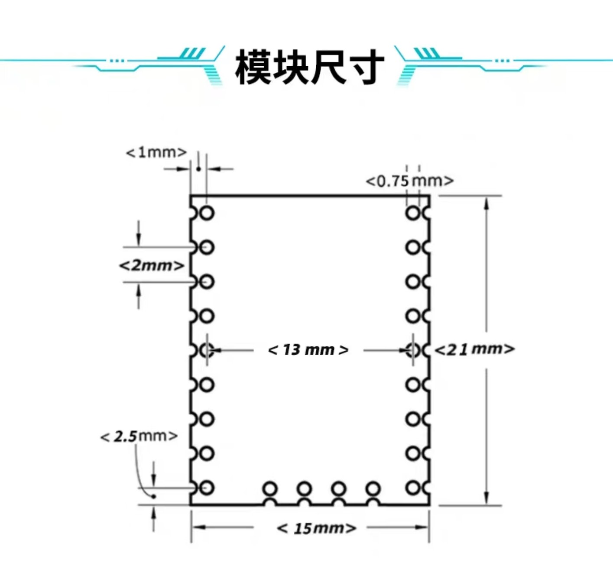

*CI-03T1模块尺寸与引脚间距示意图*

**设计建议：**

1. **连接器选型**
    - 使用2.0mm间距的排针/排母连接器
    - 注意与标准2.54mm（100mil）间距的区别
    - 确保连接器与模块引脚匹配

2. **PCB设计**
    - 如需焊接排针，建议使用2.0mm间距的排针
    - 设计时预留足够的焊接空间
    - 考虑模块的安装方式和固定方式

3. **替代方案**
    - 如不方便使用2.0mm连接器，可使用飞线连接
    - 定制转接板将2.0mm间距转换为2.54mm
    - 选择带连接器的模块版本

**注意事项：**

- CI-03T1使用的是2.0mm非标准间距
- 与常用的2.54mm（100mil）间距不兼容
- 设计时务必确认间距规格，避免连接问题
- 模块版本不同，规格可能有差异，以实物为准

---

## 资料获取

### 如何获取CI-03T系列模块的原理图和技术资料？

**问题描述：**

需要获取CI-03T系列模块的原理图，包括外设部分，以及相关的技术手册和开发资料。

**解决方案：**

**官方资料下载：**

1. **官网下载**
    - 官网提供完整的技术资料下载
    - 包括原理图、模块技术手册、芯片手册等

2. **SU-03T开发包（含类似资料）**
    - 开发包内容：原理图、模块+芯片技术手册、接线+烧录软件、烧录资料
    - 下载地址：http://help.aimachip.com/docs/offline_su03t/su_03t_kfb

**资料内容包括：**

- **原理图**：包括模块和外设部分的完整电路图
- **技术手册**：模块和芯片的详细规格说明
- **接线指南**：标准接线方式和注意事项
- **烧录软件**：专用烧录工具和驱动程序
- **烧录资料**：烧录操作说明和常见问题

**注意事项：**

- 建议从官网下载最新版本的资料
- 不同批次的模块可能有细微差异，以最新资料为准
- 开发包适用于多个SU系列模块，资料具有通用性
- 如下载失败，尝试更换浏览器或下载时段
- 下载后请验证文件完整性，确保资料齐全

---

## 声音输出

### CI-03T硬件连接正常但无声音输出怎么办？

**问题描述：**

按照原理图完成了硬件连接，工程能够成功下载到模块，但是设备没有声音输出，无法正常工作。

**解决方案：**

**1. 检查开机播报**

    - 确认是否有开机播报声音
    - 开机播报是验证声音输出的基本方法
    - 无开机播报说明音频输出存在问题

**2. 硬件连接检查**

    - 检查喇叭连接是否正确
    - 确认功放使能引脚（GPIO-A6）配置
    - 验证喇叭正负极性连接

**3. 工程配置检查**

    - 确认音频输出通道配置
    - 检查音量设置是否为0
    - 验证TTS或语音文件配置

**4. 常见问题排查**

    - 喇叭阻抗是否匹配（建议8欧姆）
    - 功放供电是否充足
    - 音频输出引脚是否有短路

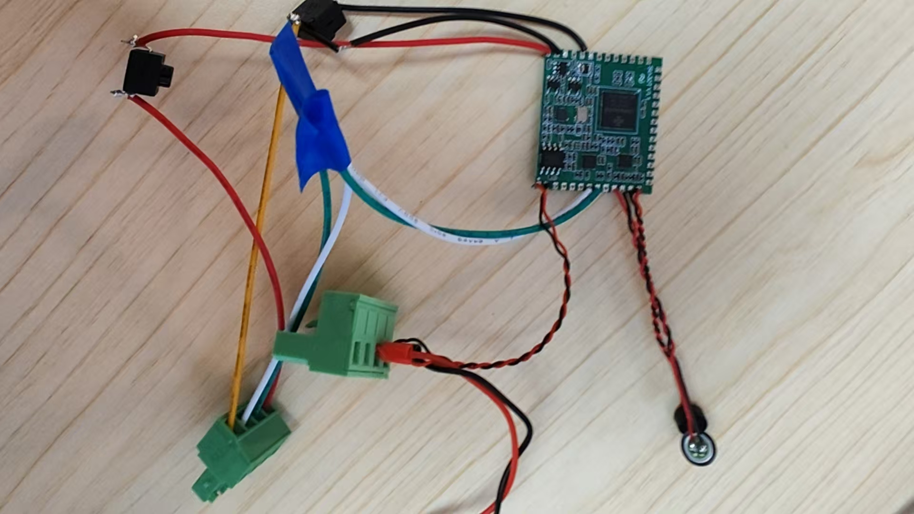

*CI-03T模块硬件连接示意图*

**调试步骤：**

1. **基础测试**
    - 上电后听是否有开机播报
    - 使用万用表测量喇叭两端电压
    - 检查功放芯片是否发热

2. **配置优化**
    - 在平台中设置"有开机播报"
    - 调整输出音量到合适值
    - 确认音频输出模式设置

3. **硬件验证**
    - 尝试更换已知正常的喇叭
    - 检查连线是否牢固
    - 使用示波器查看音频信号

**注意事项：**

- CI-03T1的GPIO-A6已被固定为功放使能，不可更改
- 确保使用匹配的喇叭规格
- 连接无误但无声音，可能是功放配置问题
- 建议先用最简单的配置测试

---

### 两个CI-03T1模块如何控制同一组继电器？

**问题描述：**

使用两个CI-03T1模块分别控制两组继电器，导致线路杂乱、体积过大，希望用两个模块共同控制一组继电器。

**解决方案：**

**实现方案：**

1. **串口通信方式**
    - 两个CI-03T1通过串口进行通信
    - 主模块接收语音指令，通过串口通知从模块
    - 从模块收到信号后控制对应的继电器

2. **自定义继电器板**
    - 设计专用的继电器控制板
    - 简化布线，减少体积
    - 将两个模块的控制信号整合到一块板子上

**串口通信实现：**

1. **硬件连接**
    - 主模块的TX连接从模块的RX
    - 主模块的RX连接从模块的TX
    - 共地连接

2. **编程逻辑**
    - 主模块识别语音指令
    - 通过串口发送控制指令给从模块
    - 从模块解析指令并控制GPIO输出

**注意事项：**

- 需要编写串口通信协议
- 模块间的通信需要可靠的错误处理
- 建议使用标准的继电器驱动电路
- 自制PCB时注意电源和信号隔离

---

### 多个CI-03T模块之间的串口通信如何实现？

**问题描述：**

需要实现多个CI-03T模块之间的串口通信，以及了解最多支持多少个模块进行通信。

**解决方案：**

**通信实现：**

1. **硬件连接**
    - 使用UART串口进行模块间通信
    - 主模块TX连接从模块RX
    - 主模块RX连接从模块TX
    - 所有模块共地

2. **编程方法**
    - 接收变量获取串口数据
    - 使用变量判断进行GPIO控制
    - 参考B站串口通信教程

**模块数量限制：**

- **支持数量**：最多支持两个模块进行串口通信
- **串口资源**：每个模块有两个串口（UART0、UART1）
- **实际应用**：一般一个主控带多个从模块

**学习资源：**

- B站搜索"机芯智能"查看SU-03T教程
- 参考官方提供的串口通信示例
- 可咨询AI助手了解具体实现细节

**注意事项：**

- 需要基础的串口通信知识
- 建议先学习相关教程再实践
- 通信协议需要自行设计和实现

---

### CI-03T系列芯片如何配置AEC回声消除功能？

**问题描述：**

询问CI-03T系列芯片是否支持AEC回声消除功能，以及如何在平台中配置该功能，但发现平台界面与视频教程中的界面不一致。

**解决方案：**

**功能支持：**

CI-03T系列芯片支持AEC（声学回声消除）功能。

**配置方法：**

1. **新版平台配置**
    - 在"产品特性"下拉菜单中选择支持AEC的模型
    - 选择"语音识别+AEC打断(限单MI）"选项
    - 保存配置并生成固件

2. **界面差异说明**
    - 视频教程展示的是旧版平台界面
    - 新版平台将AEC功能集成到产品特性选择中
    - 功能位置变化，但配置效果相同

**使用注意事项：**

- AEC功能仅在单麦克风输入时有效
- 使用双麦克风时不支持AEC打断功能
- 确保硬件连接正确，麦克风输入正常
- AEC功能需要一定的系统资源支持

**配置验证：**

- 生成固件后烧录到模块
- 测试回声消除效果
- 如有问题，检查产品特性选择是否正确

---

### CI-03T2双麦如何正确使用？

**问题描述：**

需要了解CI-03T2双麦版本的正确使用方法，以及是否可以直接插入两个麦克风即可工作。

**解决方案：**

CI-03T2双麦版本需要配合转接板或正确的硬件连接才能使用双麦克风功能：

- **使用转接板**：推荐使用CI-03T专用转接板，转接板上提供M2+、M2-接口用于连接第二个麦克风
- **麦克风连接**：两个麦克风不能简单并联，需要按照双麦电路设计正确连接
- **固件配置**：必须烧录支持双麦算法的固件版本

**注意事项：**

- 双麦版本中MIC1负责语音识别，MIC2负责算法降噪
- 不支持内部AEC回声消除功能
- 建议麦克风间距保持在3-5cm以获得最佳降噪效果
- 如不熟悉硬件连接，建议直接采购已配置好的双麦模块

---

### CI-03T转接板如何正确连接双麦克风？

**问题描述：**

需要了解CI-03T转接板上双麦克风的正确连接方式，以及相关功能限制。

**解决方案：**

**硬件连接：**

1. **麦克风接口位置**
    - 转接板上提供M2+、M2-接口
    - 这是双麦克风的专用接口
    - 可同时连接两个麦克风

2. **连接方式**
    - 将两个麦克风并联连接到M2+、M2-
    - 确保麦克风极性正确
    - 使用配套线材或转接头

**功能限制：**

- **不支持AEC打断**：双麦克风配置下不支持回声消除打断功能
- **录音功能**：双麦克风主要用于降噪和录音
- **识别效果**：在某些环境下可能提升识别准确率

**替代方案：**

- 如需AEC功能，建议使用单麦克风配置
- 或选择其他支持双麦克风+AEC的模块型号
- 根据实际需求选择合适的麦克风配置

**注意事项：**

- 双麦克风并联会影响输入阻抗
- 确保两个麦克风参数一致
- 测试实际效果是否符合预期
- 如有疑问，可联系供应商获取更多指导

---

### CI-03T模块如何与底板进行飞线焊接测试？

**问题描述：**

需要将CI-03T1或CI-03T2模块飞线焊接到底板上进行测试，但目前没有现成的模块可用，需先制作样品进行测试。

**解决方案：**

**1. 测试方案选择**

- 寄样机测试：将4台样机寄给厂商，由厂商完成模块焊接和测试
- 厂商组装测试：焊接完成后进行功能验证，确保正常工作
- 寄回测试：将组装好的模块寄回进行最终测试

**2. 飞线焊接要点**

- **引脚对应**：确认模块引脚与底板焊盘的正确对应关系
- **短线连接**：使用优质的短线进行飞线连接，避免信号干扰
- **焊接温度**：控制焊接温度，避免烫坏模块
- **绝缘处理**：注意飞线间的绝缘，避免短路

**3. 后续量产方案**

- **贴片设计**：后期会做成贴片形式，便于直接使用
- **转接板兼容**：设计兼容的转接板，可直接使用
- **简化生产**：减少飞线工序，提高生产效率

**注意事项：**

- 飞线焊接需要专业操作，建议由经验丰富的人员完成
- 焊接过程中注意防静电措施
- 确认底板电源设计符合模块要求
- 保留完整的测试记录便于问题追踪

---

### CI-03T模块兼容性测试确认

**问题描述：**

询问当前使用的03T模块线路板程序是否可以直接用于新模块，以及新模块的电机接口和转接板兼容性问题。

**解决方案：**

**1. 程序兼容性**

- 可以直接使用：现有的03T线路板程序可以直接在新模块上使用
- 无需修改：固件程序保持兼容性，无需额外开发

**2. 硬件兼容性**

- 转接板兼容：最终会提供兼容的转接板设计
- 电机接口：保持现有的电机接口标准不变
- 逐步过渡：可先使用飞线方案，后续使用贴片版本

**3. 测试验证**

- 功能测试：使用现有程序验证新模块的各项功能
- 兼容性确认：确保与现有系统完全兼容
- 性能验证：测试响应速度和稳定性是否符合要求

**注意事项：**

- 新模块设计时会考虑向后兼容性
- 如有特殊需求，及时与供应商沟通
- 保留原有接口标准便于升级
- 建议小批量测试后再大规模使用

---

### 新模块喇叭输出规格确认

**问题描述：**

询问喇叭接功放输出的电压规格，以便正确设计匹配的功放电路。

**解决方案：**

**输出电压规格**

- **输出电压**：约2.5V（给喇叭）
- **功放供电**：5V
- **连接方式**：喇叭直接连接到功放输出

**设计建议**

- 匹配阻抗：确保喇叭阻抗与功放输出匹配
- 功率选择：根据喇叭功率选择合适功放
- 电源隔离：功放供电建议独立，避免干扰

**注意事项：**

- 喇叭额定功率应与功放输出匹配
- 注意供电电压稳定性，避免音质失真
- 留足设计余量，应对不同规格喇叭

---

### 如何获取CI-03T1/CI-03T2芯片的详细技术手册？

**问题描述：**

需要获取CI-03T1或CI-03T2芯片的更详细技术手册，特别是关于供电电压和内部LDO输出的说明。

**解决方案：**

**可用技术文档：**

1. **蜂鸟M(US516P6) SOC产品手册(补充)**：

    - 包含芯片的详细电气特性
    - 供电电压范围说明
    - 内部LDO输出参数
    - 下载链接：[蜂鸟M SOC产品手册](https://help.aimachip.com/attach_files/chip/461)

2. **蜂鸟M离线方案开发指导手册**：

    - 硬件设计指导
    - 应用电路参考
    - 下载链接：[开发指导手册](https://help.aimachip.com/attach_files/chip/34)

3. **蜂鸟M常见语音性能问题优化指导手册**：

    - 性能调优方法
    - 常见问题解决方案
    - 下载链接：[优化指导手册](https://help.aimachip.com/attach_files/chip/33)

**获取方式：**

- 通过智能公元平台技术文档专区下载
- 联系供应商获取最新版本
- 访问help.aimachip.com官方文档库

**手册包含的关键信息：**

- 工作电压范围：3.6-5.5V
- 内部LDO输出电压和电流能力
- 引脚定义和电气特性
- 参考设计电路
- 应用注意事项

**注意事项：**

- CI-03T1/CI-03T2使用蜂鸟M(US516P6)主控芯片
- 建议下载最新版本的手册以获取准确信息
- 设计前务必仔细阅读产品手册的电气特性部分
- 如有特殊技术问题，可联系供应商获取帮助

---

### 自行设计CI2302芯片PCB板烧录固件后无反应怎么办？

**问题描述：**

自行设计并焊接了CI2302芯片的PCB板，烧录固件后设备无反应，需要排查硬件设计和固件配置问题。

**解决方案：**

**1. 电源电压检查**

- 测量VDD33引脚是否有3.3V电压
- 测量VDD11引脚是否有1.1V电压
- 电压异常时检查电源电路设计

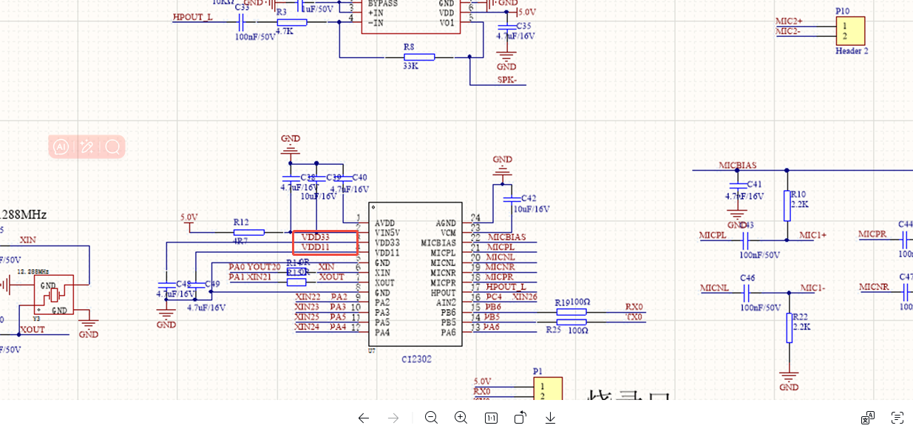

**2. 功放使能信号检查**

- 添加开机播报功能测试功放
- 测量功放使能脚是否有低电平输出
- FM8002A功放是低电平使能

**3. 硬件设计验证**

- 原理图基本符合参考设计
- 功放芯片可用FM8002A替代AD8002D
- 确保晶振、麦克风等外围电路正确

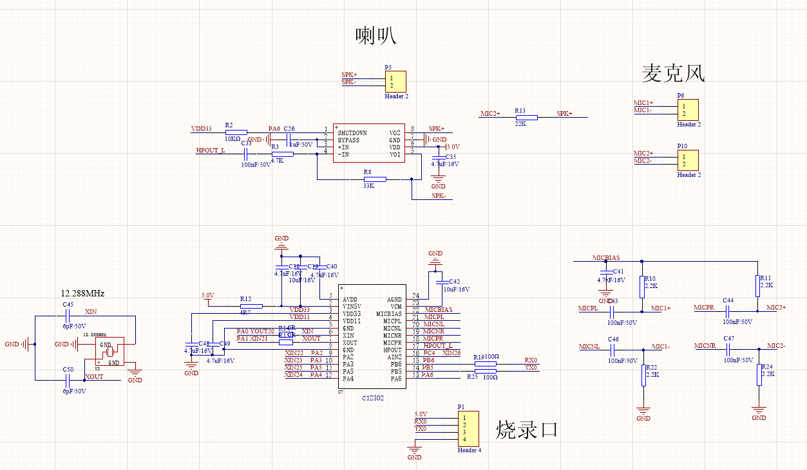

**4. 固件配置建议**

- 先使用出厂固件测试硬件
- 确认基础功能正常后再使用自定义固件
- 固件需要在智能公元平台生成

**注意事项：**

- 电源电压是首要检查项目
- 功放使能信号直接影响声音输出
- 确保所有外围器件焊接正确
- 建议使用示波器测量关键信号

---

### CI-03T双麦开发板如何选型和配置？

**问题描述：**

需要选择适合的双麦克风离线语音识别开发板，了解双麦带晶振的含义，以及批量生产时是否可以直接使用芯片。

**解决方案：**

**1. CI-03T系列型号选择**

CI-03T系列提供多种配置：

- **CI-03T**：单麦不带晶振
- **CI-03T2**：双麦不带晶振
- **CI-03T4**：双麦带晶振（推荐）

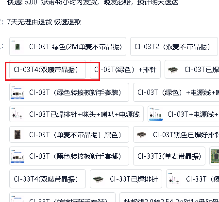

**2. 晶振的作用**

带晶振版本的优势：

- **效果更好**：提供更精准的时钟基准
- **温度稳定性**：在温度变化较大的环境中表现更稳定
- **识别精度**：长期使用精度更高

**3. 开发板配置**

完整开发套件包括：

- **核心模块**：CI-03T4双麦模块
- **底板**：用于测试和开发的大板
- **麦克风**：需要额外配置2个咪头

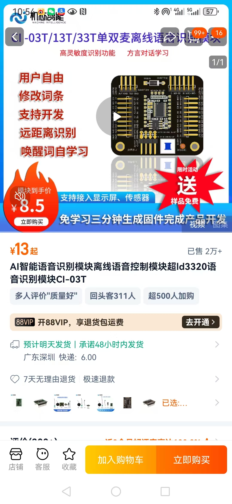

**4. 批量生产方案**

开发阶段：

- 使用完整开发板进行功能验证
- 便于调试和测试
- 快速验证设计方案

批量生产：

- **直接使用芯片**：批量时可只采购CI1302芯片
- **转接板工艺**：芯片直接集成到产品PCB
- **成本优化**：减少中间环节，降低成本

**5. 配件建议**

双麦配置需要：

- **2个麦克风**：需自行配置咪头
- **底板**：开发测试用，量产不需要
- **连接线**：根据麦克风位置选择合适的长度

**注意事项：**

- 带晶振版本成本略高，但稳定性更好
- 批量生产时建议直接使用芯片方案
- 双麦版本在嘈杂环境中效果更佳
- 麦克风的摆放位置对降噪效果影响很大

---

### CI-03T模块的IO口间距是多少？

**问题描述：**

需要了解CI-03T模块IO口之间的间距尺寸，以便选择合适的烧录夹具或连接器。

**解决方案：**

CI-03T模块的针脚规格如下：

- **针脚间距**：2.0mm
- **连接方式**：4Pin排针接口
- **常见应用**：烧录、调试、外部设备连接

**选择烧录夹具建议：**

- 选择2.0mm间距的测试夹或烧录座
- 确保4针（4P）规格匹配
- 注意夹具的接触压力要适中

**注意事项：**

- CI-03T使用2.0mm间距，非常见的2.54mm标准
- 购买烧录工具时特别注意间距规格
- 错误的间距可能导致接触不良或损坏针脚
- 开发包中有完整的模块封装图可供参考

---

### CI-03T模块的输出接口如何控制？

**问题描述：**

需要了解CI-03T模块的输出接口（如连接功放板的接口）是否可以通过语音模块进行控制。

**解决方案：**

CI-03T模块的输出接口控制能力取决于引脚配置：

- **可配置引脚**：如果某个引脚可以在配置平台中设置为输出控制，则该引脚可以通过语音指令控制
- **不可配置引脚**：如果平台中无法配置某个引脚的功能，则该引脚不能通过语音控制

**配置方法：**

1. 在配置平台中查看目标引脚是否支持配置为输出
2. 如支持，设置为相应的控制功能（如高/低电平输出）
3. 通过语音指令触发对应的动作

**注意事项：**

- 引脚控制功能需要在平台配置时提前设定
- 并非所有引脚都支持输出控制功能
- 具体可配置的引脚请参考使用手册中的引脚定义

---

### 如何配置CI-03T1/T2的点动模式？

**问题描述：**

需要配置CI-03T1/T2芯片的点动模式，使其在外部GPIO输入低电平时触发特定动作。

**解决方案：**

1. **配置GPIO输入模式**：

    - 在GPIO配置界面找到GPIO_A25
    - 设置为输入模式
    - 配置默认高电平时脉冲电平为低

2. **设置触发命令**：

    - 在命令列表界面创建或编辑命令
    - 设置触发方式为"GPIO输入"
    - 选择对应的GPIO引脚（如GPIO_A_05）

3. **配置触发条件**：

    - 在触发配置详情中确认GPIO设置
    - 设置低电平触发对应动作
    - 保存配置并下载固件到模块

**工作原理：**

- 芯片内部会自动将A25引脚拉高
- 当外部给A25引脚一个低电平输入时
- 芯片检测到电平变化，触发一次对应的动作

**注意事项：**

- 点动模式需要外部电路配合，提供低电平触发信号
- 触发后需要恢复高电平才能再次触发
- 适用于按键、传感器等需要瞬时触发的场景

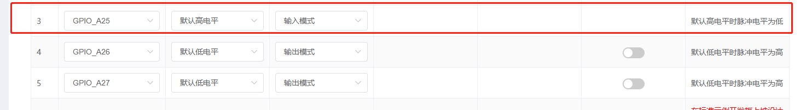

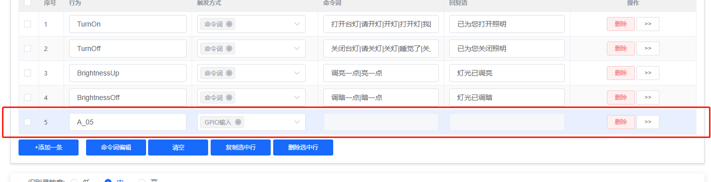


---

### CI-03T按键触发偶尔执行两次怎么办？

**问题描述：**

CI-03T模块在按键触发时，输出信号偶尔会执行两次，即使已添加硬件防抖电容。

**解决方案：**

**1. 问题分析**

- 硬件消抖对CI-03T模块效果有限
- 模块内部未做消抖处理
- 必须通过软件消抖解决问题

**2. 软件消抖方法**

- **延时消抖**：在检测到按键触发后增加延时
- **定时器消抖**：使用定时器实现稳定的消抖逻辑
- **多次检测**：多次检测电平状态确认触发

**3. 配置示例**

在固件配置平台中设置软件消抖逻辑：

- GPIO输入检测配置
- 定时器超时设置
- 设备播放动作触发

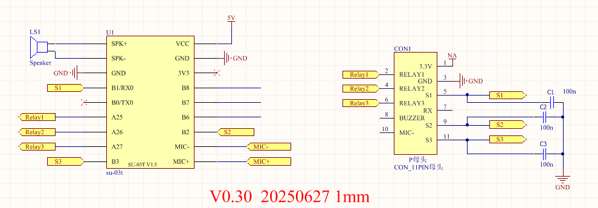

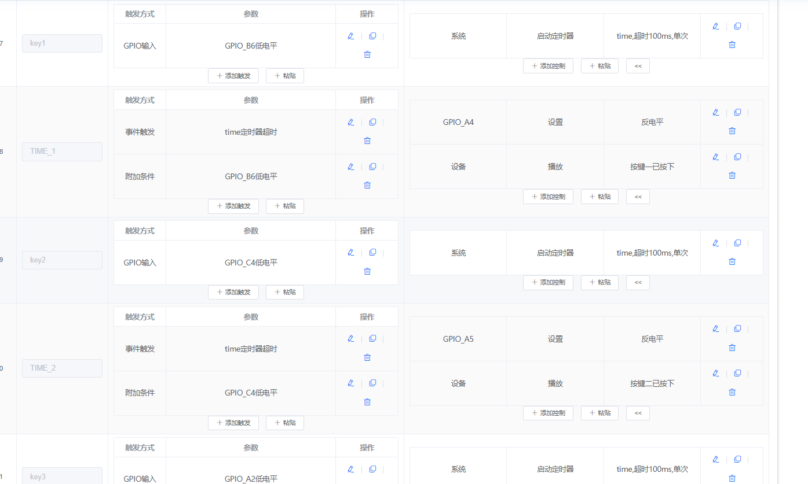

**注意事项：**

- 硬件防抖电容可以保留但不能完全依赖
- 软件消抖延时时间需要根据实际按键调整
- 建议延时10-50ms范围进行测试
- 如问题持续，检查按键机械结构和接触质量

---

### CI-03T1单麦克风电路如何配置？

**问题描述：**

在使用CI-03T1单麦克风芯片进行电路设计时，需要正确配置麦克风引脚、功放电源以及烧录引脚，以确保电路正常工作。

**解决方案：**

**1. 麦克风配置**

- 单麦克风使用M1引脚（MICPR）
- M2（MICNR）引脚可以悬空处理
- 在SDK中选择"单MIC"配置模式

**2. 功放电源配置**

- 功放芯片的VCC引脚必须连接到5V电源
- 若连接3.3V会导致功放无输出、没有声音
- 确保功放电源满足芯片工作要求

**3. 烧录引脚注意事项**

- 尽量避免使用PA4作为控制引脚
- PA4连接GND会影响烧录功能
- PA4内部默认有上拉电阻，烧录时无需额外处理

**电路设计要点：**

- 麦克风输入电路做好滤波和阻抗匹配
- 功放部分按芯片手册要求供电
- 保留烧录接口的可达性
- 关键信号线做好PCB布局优化

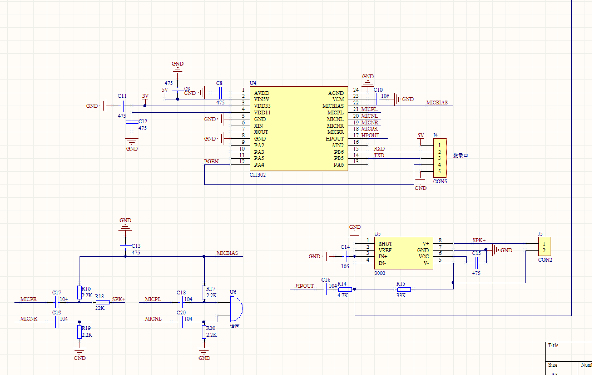

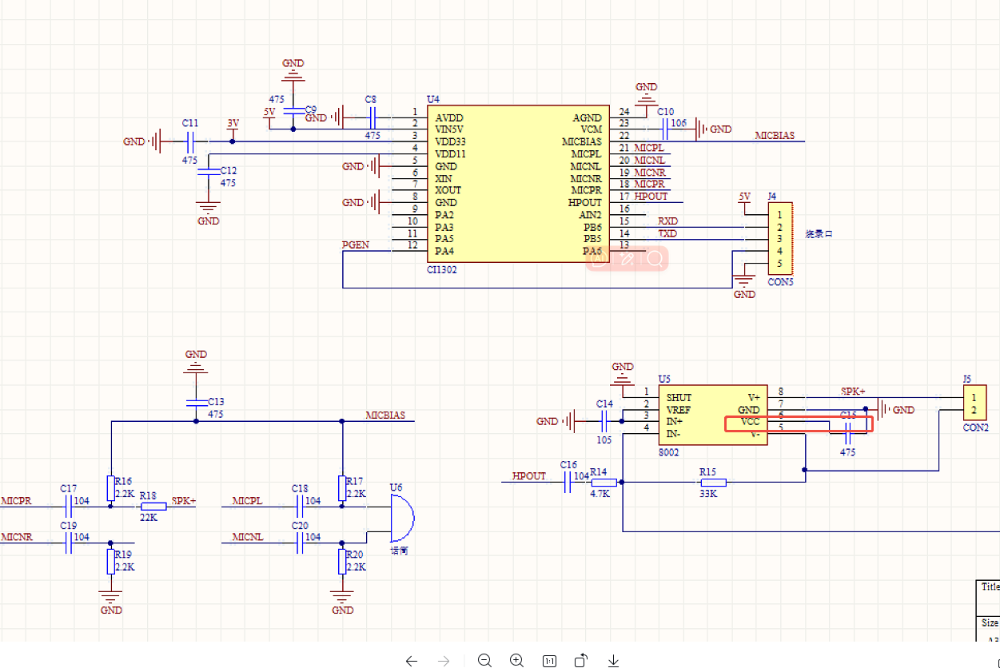

**注意事项：**

- 单麦克风应用时，M2引脚可不做处理
- 功放电源电压必须与芯片规格匹配
- 烧录时确保PA4不被强制拉低
- 电路设计完成后进行完整的功能测试

---

### CI-03T单麦克风时22K反馈电阻需要使用吗？

**问题描述：**

在单麦克风应用中，不确定是否需要外接22K的AEC反馈电阻。

**解决方案：**

单麦克风使用时，22K反馈电阻不需要外接，原因如下：

- **内部已集成**：模块内部已经贴装了22K反馈电阻
- **AEC功能**：反馈电阻用于回声消除（AEC）功能
- **单麦克风场景**：单麦克风通常不需要AEC功能

**设计说明：**

- 单麦克风应用场景中，主要任务是语音采集
- 无需考虑扬声器反馈的消除问题
- 内部电阻已满足基本电路需求

**注意事项：**

- 双麦克风应用时可能需要外接反馈电阻
- 具体配置根据实际声学结构决定
- 如有特殊需求可咨询供应商

---

### 双芯片方案中功放芯片发热严重怎么办？

**问题描述：**

在CI-03T1和CI-03T2双芯片方案中，接入5V电源后功放芯片立即出现严重发热现象，影响正常使用。

**解决方案：**

**1. 问题排查**

- **检查电源连接**：确认5V电源正负极连接正确
- **测量电流**：使用万用表测量实际工作电流
- **短路检查**：检查PCB是否存在短路或设计缺陷
- **对比测试**：使用官方开发板验证功能正常

**2. 可能原因**

- **PCB设计问题**：自行设计的板子可能存在布局或布线问题
- **电源纹波过大**：5V电源质量不稳定导致功放异常
- **负载不匹配**：功放电路设计不当导致过载
- **芯片损坏**：芯片可能已因异常情况损坏

**3. 解决方案**

- **使用官方开发板**：先用官方开发板验证功能
- **检查PCB设计**：对照官方原理图检查设计差异
- **增加保护电路**：在电源输入端增加过流保护
- **逐步测试**：分模块上电排查问题点

**注意事项：**

- 功放芯片严重发热属于异常现象，应立即断电检查
- 不要在未排除问题前长时间通电，避免损坏元件
- 如对硬件设计不熟悉，建议使用官方模块而非自行设计PCB

---


---

### 如何选择和使用咪头（麦克风）？

**问题描述：**

需要了解适用于CI-03T1和CI-03T2芯片的咪头选型参数，以及如何正确焊接和接线。

**解决方案：**

**1. 推荐咪头型号**

机芯智能定制咪头6027：

- **规格**：直径6mm，高度2.7mm
- **灵敏度**：-27dB
- **信噪比**：75dB
- **电流**：0.5mA
- **接口**：2.0端子+双绞线60mm

**2. 咪头选型要求**

- **灵敏度范围**：-32dB到-25dB
- **信噪比**：70以上
- **电流范围**：0.1mA到0.5mA
- **管芯质量**：建议选择进口管芯
- **厂家实力**：考虑出厂检测和长期供货能力

**3. 接线设计要求**

- **线长限制**：尽量短，不要超过100mm
- **延长处理**：如需加长，必须使用双绞线或屏蔽线
- **正负极**：务必按正确极性接线，反接会影响拾音性能
- **并联问题**：不建议使用咪头并联方案，会影响拾音性能

**4. 结构设计注意事项**

- **开孔设计**：避免将咪头放入密闭空间
- **防水膜**：如需防水，选择质量好的防水膜
- **固定方式**：确保咪头固定牢固，避免振动影响


---


---

### 如何配置PWM控制舵机角度？

**问题描述：**

需要配置CI-03T1的PWM3输出50Hz频率和10%占空比，以控制舵机转动到45度位置。

**解决方案：**

**1. 舵机控制原理**

舵机通过PWM信号控制角度：

- 周期：20ms（50Hz）
- 0.5ms高电平：0度
- 1.5ms高电平：中间位置（通常45-90度）
- 2.5ms高电平：最大角度（通常180度）

**2. PWM配置要点**

- 频率设置：50Hz（周期20ms）
- 45度对应：约2ms高电平时间
- 占空比计算：2ms/20ms = 10%

**3. 配置步骤**

1. 在Pin脚配置中设置PWM3
    - 频率：50Hz
    - 占空比：10%

2. 在命令词中添加控制行为
    - 选择PWM3输出
    - 动作：设置占空比
    - 数值：10（代表10%）

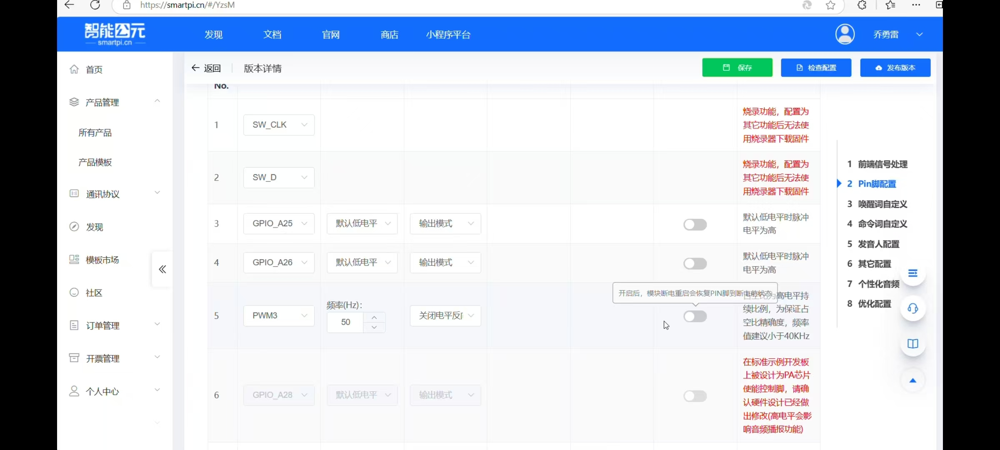

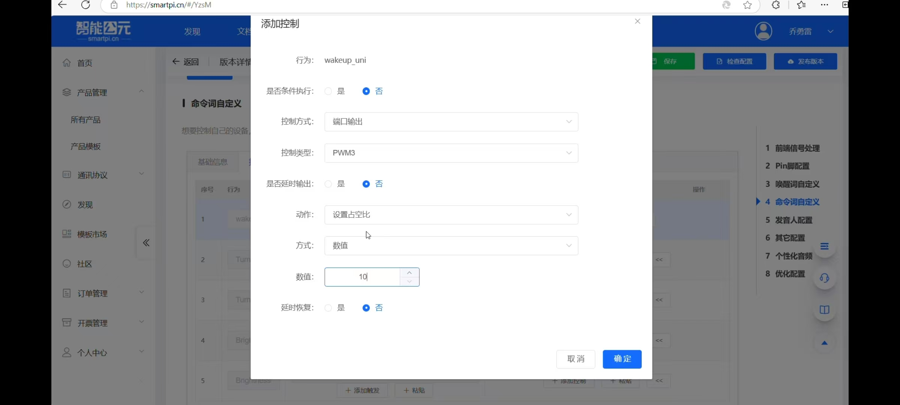

**4. 舵机角度对照**

| 角度 | 高电平时间 | 占空比 |
|-------|-------------|---------|
| 0度   | 0.5ms      | 2.5%    |
| 45度  | 1.0-1.5ms  | 5-7.5%  |
| 90度  | 1.5ms      | 7.5%     |
| 135度 | 2.0ms      | 10%      |
| 180度 | 2.5ms      | 12.5%    |

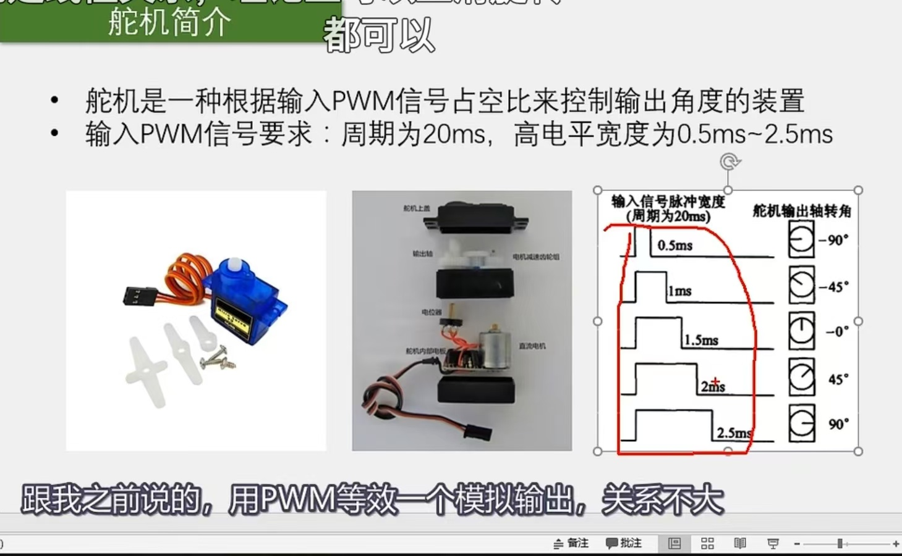

**注意事项：**

- 不同型号舵机角度范围可能有差异
- 建议先用小角度测试，避免舵机损坏
- 5V供电时舵机扭矩较大，注意安全
- 占空比设置范围通常在2.5%-12.5%之间

---


---

### CI-03T1的GPIO7和GPIO8没有电压输出怎么办？

**问题描述：**

使用CI-03T1芯片时，GPIO7和GPIO8引脚没有电压输出，而同一芯片在参考板上工作正常。

**解决方案：**

- **检查硬件连接**：确认引脚与芯片正确连接，无虚焊或短路
- **验证电源供电**：确保3.3V电源稳定，电压在规格范围内
- **检查外部负载**：确认外部负载不超过GPIO驱动能力
- **对比测试**：将相同固件烧录到官方参考板验证

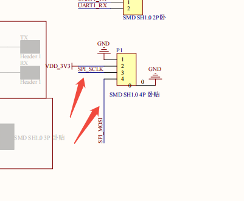

**排查步骤：**

1. 使用万用表测量引脚与芯片之间的导通性
2. 测量电源电压是否稳定在3.3V
3. 检查PCB布线是否有短路或开路
4. 尝试空载状态下是否有电压输出

**注意事项：**

- 这是硬件问题，非固件或软件配置问题
- 电路图设计正确但实际PCB可能存在制造缺陷
- 建议检查多个样板确认问题一致性


---

### CI-03T控制多个舵机时断电重启怎么办？

**问题描述：**

使用CI-03T开发板控制两个SG90舵机时，由于引脚不足将舵机并联，导致舵机同时工作时开发板频繁断电重启。

**解决方案：**

**问题原因分析：**

1. **电源供电不足**
    - 单节18650电池电压3.7V-4.2V，无法满足模块5V供电需求
    - 两个SG90舵机同时工作时电流较大，导致电压跌落
    - 模块供电电压低于3.3V时会停止工作

2. **错误的并联方式**
    - 舵机不能简单并联（只能共地）
    - 每个舵机需要独立的信号线控制

**解决方法：**

1. **电源方案改进**
    - 使用两节18650电池并联（增加容量）
    - 或增加升压电路（3.7V升压至5V）
    - 推荐使用专用的升压模块


2. **正确连接方式**
    - 舵机信号线分别连接不同的GPIO引脚
    - 舵机电源线可并联到5V供电
    - 所有舵机共地连接

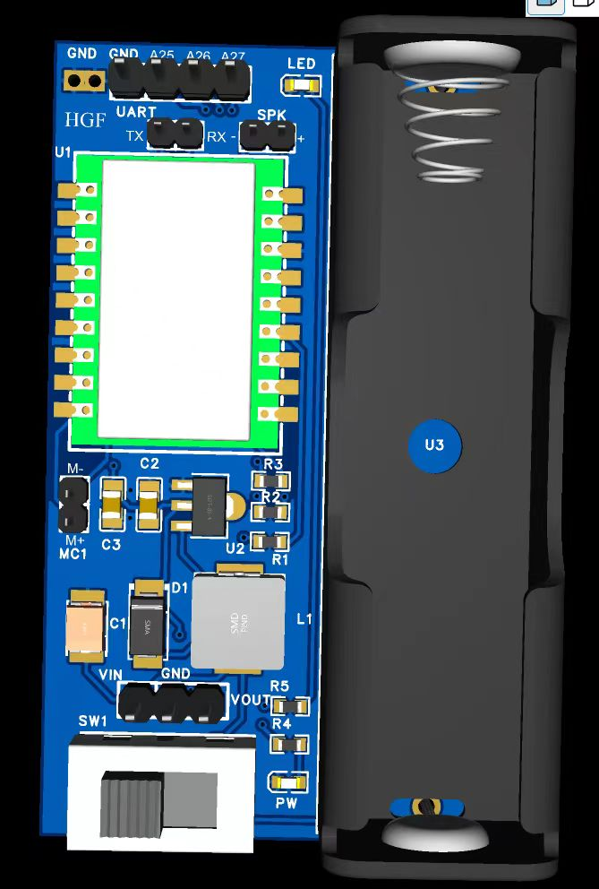

3. **烧录口使用**
    - 烧录口的VCC和GND可为舵机供电
    - 可配置为GPIO或PWM输出模式
    - 注意烧录时需要断开舵机连接

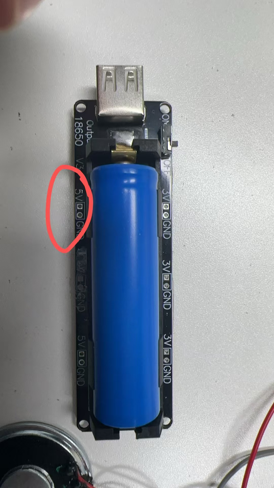

**技术说明：**

- SG90舵机工作电压：4.8V-6V
- 舵机堵转电流：约500-700mA
- 两个舵机同时工作需要至少1A以上电流
- 模块最低工作电压：3.3V

**注意事项：**

- 锂电池满电4.2V，低于3.3V时模块无法工作
- 两节电池只能并联，串联会产生8.4V损坏模块
- 建议使用专用的5V升压模块稳定供电
- 如需长时间工作，建议选择更大容量的电池

---

## GPIO控制


---

### CI系列模块的UART0可以直接连接锂电池供电的MCU吗？

**问题描述：**

询问CI系列离线语音识别模块的UART0接口是否可以直接连接到由锂电池供电（3.7V-4.2V）的MCU上。

**解决方案：**

**可以连接，但需要注意电平匹配**

1. **UART0接口特性**
    - CI-03T1/CI-03T2的UART0自带电平转换电路
    - 通过SIO302芯片实现电平转换
    - 可直接连接3.3V系统的MCU

2. **锂电池供电MCU的兼容性**
    - 锂电池供电的MCU工作电压通常是3.3V或1.8V
    - MCU的串口电平一般是3.3V TTL
    - 与UART0的电平转换输出兼容

3. **电平转换电路说明**
    - 电路图中的TXD/RXD经过电平转换
    - 自动适配到3.3V电平
    - MCU主控如何供电不影响串口通信

**连接方式：**

```
CI模块 UART0 TXD → MCU RXD (3.3V)
CI模块 UART0 RXD → MCU TXD (3.3V)
CI模块 GND → MCU GND (共地)
```

**注意事项：**

- 确保MCU串口为3.3V电平（非5V）
- 必须共地连接
- MCU的供电方式不影响通信
- 不需要额外的电平转换电路

---


---

### CI-03T开机有语音播报但无法唤醒怎么办？

**问题描述：**

离线语音模块开机后有语音播报，但无法被唤醒，怀疑是麦克风选型或电路连接问题。

**解决方案：**

**1. 检查MICNR引脚连接**

- CI-03T（CI1302）芯片的第20脚（MICNR）不能直接接地
- 必须通过一个104电容（0.1μF）连接到GND
- 直接接地会导致麦克风电路工作异常，无法拾取声音

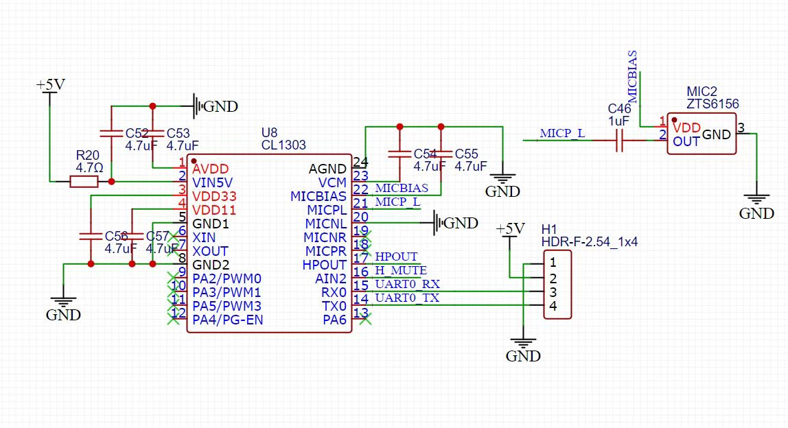

**2. 正确的接线方式**

- MICNR引脚 → 104电容（0.1μF）→ GND
- 或将MICNR引脚悬空（不连接）
- 确保使用数字麦克风时有正确的偏置电路


**3. 麦克风选型注意事项**

- 确认使用的是数字麦克风还是有源模拟麦克风
- 数字麦克风和模拟麦克风的接口电路不同
- 推荐使用官方验证过的麦克风型号

**注意事项：**

- MICNR引脚用于噪声抑制，错误连接会影响唤醒
- 如使用模拟麦克风，需要按照模拟麦克风电路设计
- 唤醒失败时首先检查MICNR引脚连接是否正确

---

## GPIO配置


---

### CI-03T1可以直接控制WS2812灯带吗？

**问题描述：**

询问CI-03T1芯片是否支持直接控制WS2812灯带。

**解决方案：**

**1. CI-03T1功能限制**

- CI-03T1是专用语音识别芯片
- 不支持直接控制WS2812灯带
- 缺少WS2812所需的时序控制功能

**2. 推荐方案**

- **串口转ESP8266**：通过串口连接ESP8266控制WS2812
- **使用ESP32**：直接使用ESP32控制WS2812
- **外接控制器**：使用专用的LED控制器

**3. 实现方式**
```
CI-03T1 → 串口发送 → ESP8266/ESP32 → WS2812灯带
```

**注意事项：**

- WS2812需要精确的时序控制
- CI-03T1无法产生WS2812所需的控制信号
- 建议根据实际需求选择合适的控制方案

---


---

### 如何获取CI-03T系列芯片的原理图资料？

**问题描述：**

需要获取CI-03T系列芯片的原理图资料用于硬件设计参考。

**解决方案：**

**官方文档中心**：

- 访问智能公元文档中心：https://help.aimachip.com/
- 在文档中心可以查找和下载产品相关资料文件
- 提供包括原理图、数据手册、应用笔记等技术资料

**查找方法**：

1. 在文档中心搜索具体型号（如CI-03T）
2. 查看产品相关的技术文档分类
3. 下载所需的原理图和设计资料

**注意事项：**

- 部分资料可能需要注册账号后下载
- 确保下载的资料版本与使用的芯片型号匹配
- 如有特殊需求可查阅产品手册或联系销售获取更多资料

---

## 芯片识别与确认


---

### 如何识别CI-03T1芯片型号？

**问题描述：**

拿到一块电路板后，需要确认芯片的具体型号和功能。

**解决方案：**

- **查看芯片丝印**：

    - 在芯片表面直接查看型号标识
    - CI-03T1 芯片会清晰标注 "CI-03T1" 字样
    - 注意区分 CI-03T 和 CI-03T1 的差异

- **功能确认**：

    - CI-03T1 是离线语音识别芯片
    - 支持命令词识别和语音控制
    - 可通过串口进行通信和控制

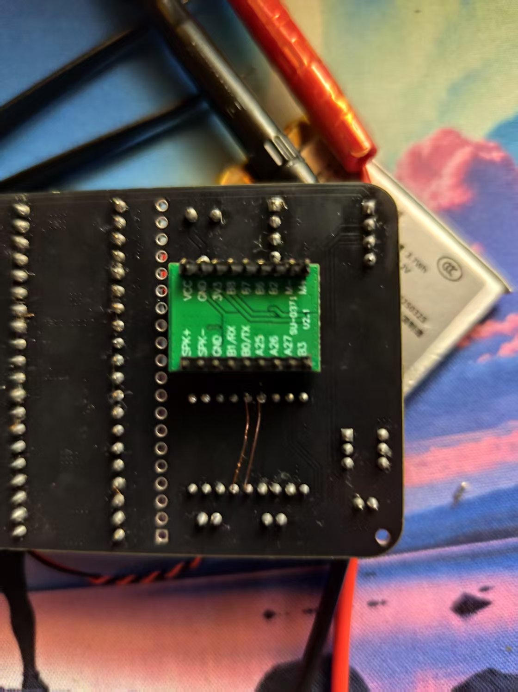

**注意事项：**

---


---

### CI-03T可以控制220V继电器吗？

**问题描述：**

需要确认CI-03T语音模块是否可以直接控制220V继电器，实现开关灯等家电控制功能。

**解决方案：**

- **完全可行**：

    - CI-03T的IO引脚可以直接控制继电器模块
    - 通过语音指令触发引脚输出高低电平
    - 继电器模块控制220V负载的通断

- **连接方式**：

    1. 继电器控制端连接CI-03T的IO引脚
    2. 继电器输出端控制220V电路
    3. 注意继电器模块的供电电压匹配

- **安全注意事项**：

    - 继电器和220V电路部分需做好绝缘
    - 确保继电器额定电流大于负载电流
    - 220V接线需专业电工操作

**注意事项：**

- 控制端和高压端完全隔离，使用安全
- 选择带光耦隔离的继电器模块更安全
- 大功率负载建议使用固态继电器(SSR)

---


---

### 如何配置CI-03T1/T2芯片的GPIO输出高低电平？

**问题描述：**

需要配置GPIO_A25引脚，使其在执行'打开灯光'指令时输出高电平，在执行'关闭灯光'指令时输出低电平。

**解决方案：**

- **打开灯光配置**：

    1. 选择'TurnOn'行为
    2. 添加控制项：GPIO_A25
    3. 控制方式：端口输出
    4. 动作：设置电平为高电平
    5. 条件执行：选择"否"

- **关闭灯光配置**：

    1. 选择'TurnOff'行为
    2. 添加控制项：GPIO_A25
    3. 控制方式：端口输出
    4. 动作：设置电平为低电平
    5. 条件执行：选择"否"

**注意事项：**

- 确保删除任何不必要的条件子项
- GPIO会根据指令自动设置相应电平
- 配置完成后可测试验证电平输出是否正确

---


---

### 如何控制3线风扇的正反转？

**问题描述：**

需要通过CI-03T1/T2芯片控制一个3线风扇（电源正、电源负、FG信号）的正反转。

**解决方案：**

- **风扇类型确认**：

    - 3线风扇通常无法通过PWM控制正反转
    - FG信号是转速反馈信号，不是控制信号
    - 正反转需要改变供电极性

- **控制方案**：

    1. 使用H桥驱动电路控制正反转
    2. 使用继电器切换电源极性
    3. 选用支持正反转控制的专用风扇

- **硬件需求**：

    - 需要额外的电机驱动模块（如L298N）
    - CI-03T的PWM只能控制风速，不能控制方向
    - 通过两个IO口控制H桥或继电器

- **实现建议**：

    - 方案1：电机驱动模块 + CI-03T PWM控制
    - 方案2：继电器模块 + 双IO控制
    - 方案3：购买带正反转控制的风扇模块

**注意事项：**

- 单纯的PWM输出无法实现风扇正反转
- 直接切换电源极性可能损坏风扇或模块
- 建议使用成熟的电机驱动方案

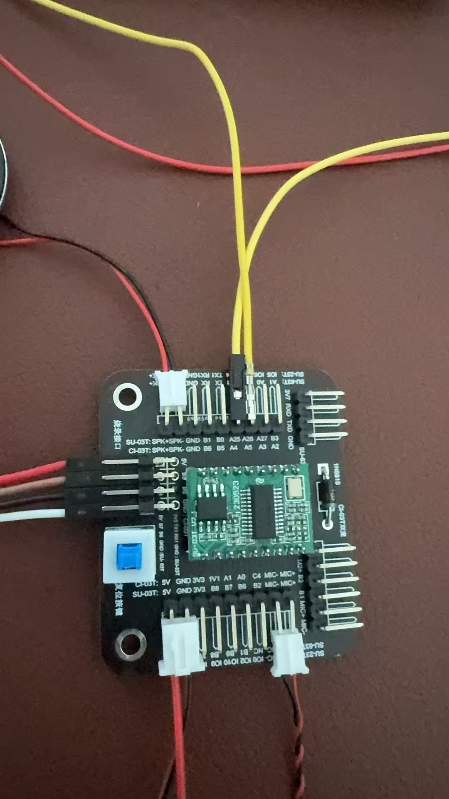

---


---

### CI-03T1连接8欧2瓦喇叭音量很小怎么办？

**问题描述：**

使用CI-03T1芯片连接8欧2瓦的喇叭，即使将音量设置为80，声音仍然很小。

**解决方案：**

**1. 喇叭功率匹配检查**

- CI-03T1功放输出功率有限，建议使用4欧3瓦以上喇叭
- 8欧喇叭阻抗较高，可能导致输出功率不足
- 确认喇叭灵敏度参数，选择高灵敏度型号

**2. 音量设置优化**

- 检查固件中音量设置是否生效
- 尝试使用命令词动态调节音量
- 确认音频文件本身的音量级别

**3. 硬件改进方案**

- 使用更高功率的喇叭（4欧3-5瓦）
- 增加外部功放电路提升输出功率
- 考虑使用有源喇叭或音频功放模块

**4. 其他可能原因**

- 喇叭效率低，建议更换高灵敏度喇叭
- 音频输出线路阻抗过大
- 供电电压不足影响功放输出

**注意事项：**

- 模块内置功放功率有限，不适合驱动大功率喇叭
- 优先选择4欧姆喇叭以获得更大输出功率
- 音量设置80已是较高值，如仍偏小应从硬件层面解决

---


---

### 如何使用CI-03T系列语音模块驱动电机或舵机？

**问题描述：**

需要使用CI-03T系列语音模块通过PWM信号控制电机或舵机，实现语音控制功能。

**解决方案：**

**1. 硬件连接**

- 语音模块需要连接电机驱动板才能驱动电机
- 单独的语音模块电压太低，无法直接驱动电机
- 使用PWM输出控制电机驱动板
- 舵机可直接连接（注意供电）

**2. 平台配置**

- 在语音平台配置PWM输出
- 设置"控制类型"为PWM端口（如PWM4）
- 配置"增加占空比"和"减少占空比"动作
- 数值设置建议为30（可根据需要调整）

**3. 参考教程**

- CI-03T语音模块驱动电机转动教学视频
- SU-03T控制步进电机配套教程
- 六路继电器控制教程

**注意事项：**

- 必须使用电机驱动板，不能直接连接电机
- PWM输出只能控制正转和速度，不能控制反转
- 舵机控制需要单独提供合适电压
- 确保驱动板供电满足电机功率需求

---


---

### PWM可以直接控制直流电机吗？

**问题描述：**

询问是否可以使用CI-03T系列芯片的PWM接口直接控制直流电机或风扇。

**解决方案：**

- **PWM输出限制**：

    - 单纯靠语音模块无法直接驱动电机
    - PWM只能输出信号，不具备驱动能力
    - 语音模块适合作为指令输入端

- **电机驱动方案**：

    1. 使用电机驱动板：

        - 语音模块输出PWM或开关信号
        - 驱动板实现功率驱动
        - 适合复杂控制应用

    2. 继电器控制方案：

        - 继电器只能实现开关控制
        - 无法实现PWM调速功能
        - 适合简单的启停控制

- **引脚说明**：

    - A25、A26、A27可配置为PWM输出
    - 控制类型选择PWM模式
    - 可输出PWM波形调节速度

**注意事项：**

- 控制直流电机需要专门的电机驱动
- 继电器无法实现调速，只能开关控制

---


---

### CI-03T1模块可以控制舵机吗？

**问题描述：**

使用CI-03T1模块烧录固件后，无法正常控制舵机转动。

**解决方案：**

- **功能限制说明**：

    - CI-03T1是纯语音识别芯片，不支持舵机控制
    - 舵机控制需要生成特定PWM波形（50Hz，0.5-2.5ms脉宽）
    - 语音平台无法生成这种精确的PWM时序

- **技术原因**：

    - 舵机控制需要专门的PWM时序
    - 语音模块的PWM功能不适合舵机控制
    - 需要单片机代码来实现舵机控制逻辑

- **替代方案**：

    1. **使用专用舵机控制器**：

        - CI-03T1通过串口发送指令给舵机控制器
        - 舵机控制器负责生成正确的PWM信号

    2. **配合单片机使用**：

        - CI-03T1识别语音指令
        - 通过串口发送指令给单片机
        - 单片机控制舵机转动

    3. **使用带舵机控制的模块**：

        - 选择支持舵机控制的专用模块
        - 如需要舵机控制，建议使用其他方案

**注意事项：**

- 舵机需要独立供电，不要使用模块的3.3V供电
- 舵机控制需要精确的时序，语音平台无法实现
- 如必须使用语音控制舵机，需要额外的控制器硬件

---

## AEC回声消除相关


---

### CI-03T2的AEC参考信号如何连接？

**问题描述：**

在使用CI-03T2进行AEC回声消除时，不确定Mic2应该连接到另一个系统功放的输入端还是输出端。

**解决方案：**

- Mic2（参考麦克风）应连接到另一个系统功放的**输出端**
- 从功放输出端获取参考信号可以获得更好的回声消除效果
- 这样可以让AEC算法准确知道扬声器播放的内容

**注意事项：**

- 不要连接到功放的输入端
- 参考信号应尽可能接近实际播放的音频
- 确保连接稳定，避免噪声干扰

---


---

### CI-03T 可以用 3.7V 电池供电吗？

**问题描述：**

询问 CI-03T 的 VCC 是否可以直接使用 3.7V 电池供电。

**解决方案：**

**电压范围说明**

- 推荐供电电压：4.7V - 5.1V
- 3.7V 低于推荐电压范围
- 电压过低可能影响某些功能

**功能影响**

- 喇叭播报功能可能受影响较大
- 唤醒功能在低电压下通常可以正常工作
- 咪头功耗不高，低电压影响较小

**实际验证**

- 如果只使用唤醒功能，3.7V 可能可用
- 建议实际测试验证唤醒效果
- 如需播报功能，应使用推荐电压

**注意事项：**

- 优先使用模块规格书推荐的电压
- 低电压使用时注意功能完整性
- 电池供电时考虑电压衰减问题
- 建议使用 5V 稳压电源获得最佳性能

---


---

### CI-03T1模块烧录固件后喇叭不响怎么办？

**问题描述：**

两个CI-03T1模块烧录相同固件，一个正常工作，另一个喇叭不响，测量喇叭正极对地2.8V，负极对地0V。

**解决方案：**

1. **故障原因判断**

    喇叭正极对地电压为2.8V，负极对地电压为0V，表明模块存在硬件故障：

    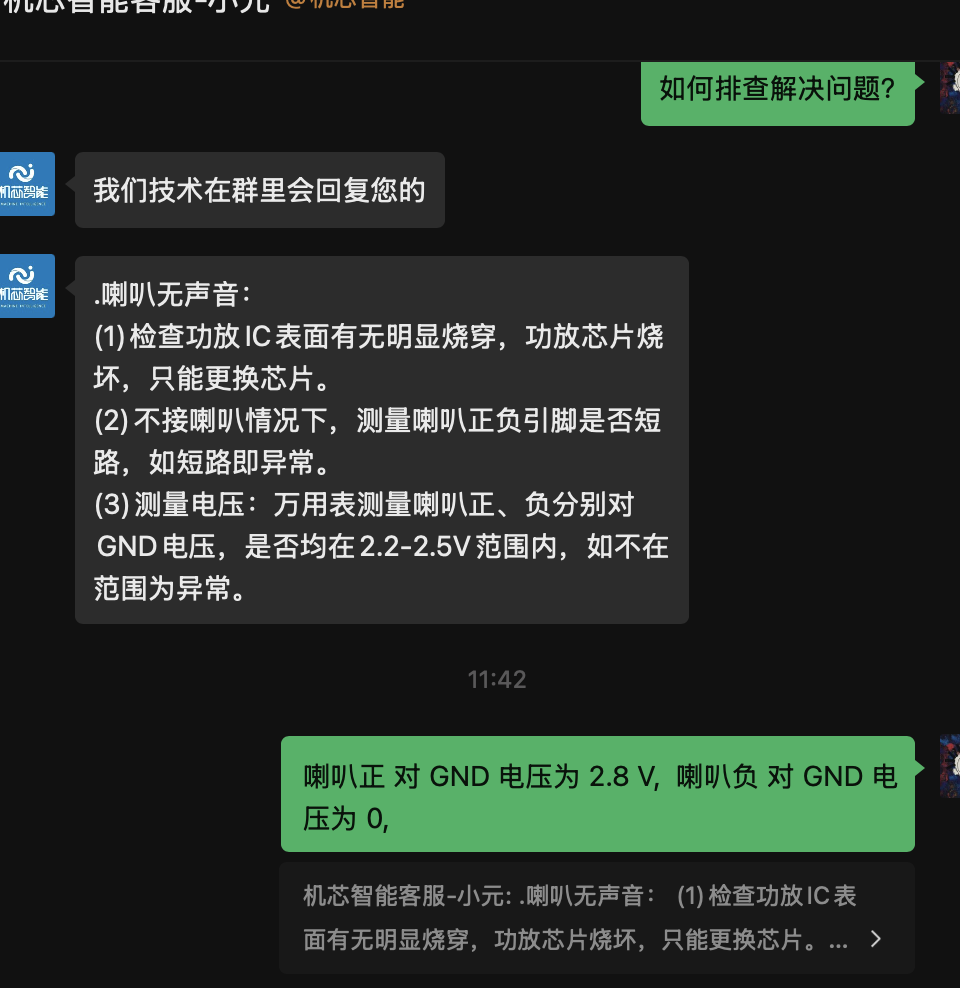

2. **故障定位**

    经检查为功放芯片（CFA1612）损坏：

    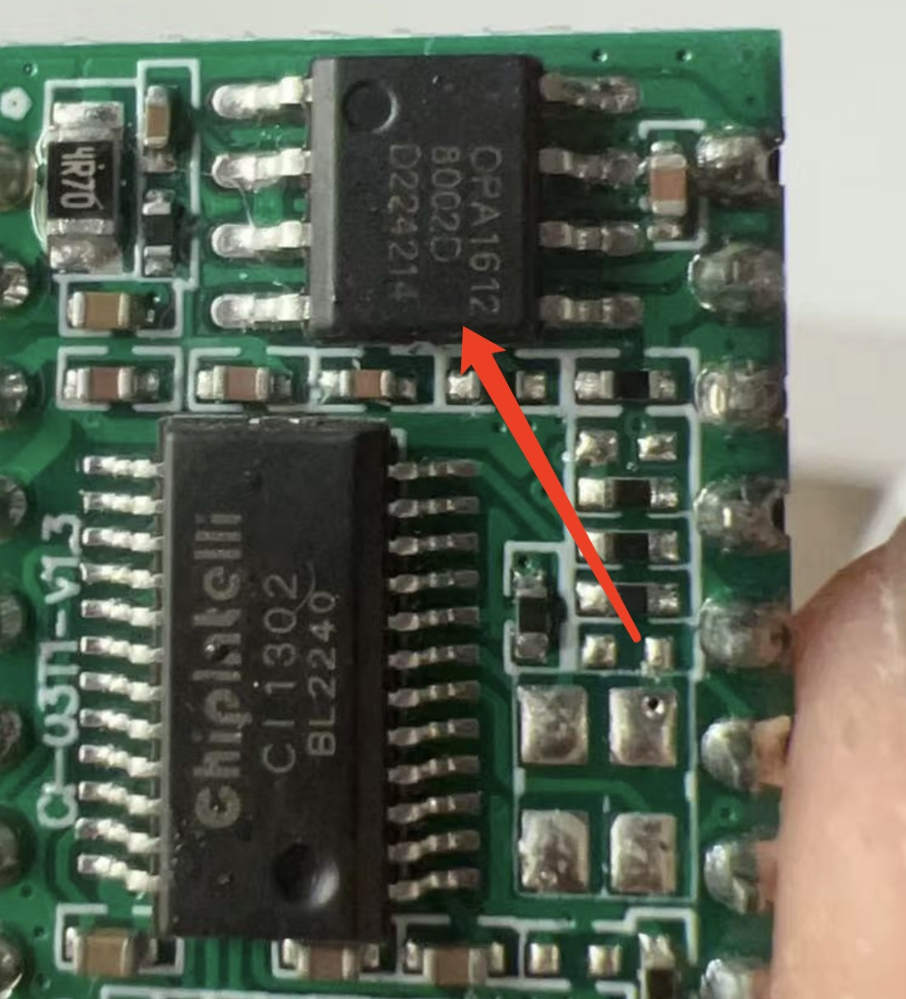

3. **损坏原因**

    - 接低功率喇叭导致功放过载
    - 喇叭短路（正负极接地或相接）
    - 喇叭阻抗不匹配

4. **喇叭选型要求**

    - 4欧姆喇叭：功率需大于2.4W
    - 8欧姆喇叭：功率需大于1.6W

    

    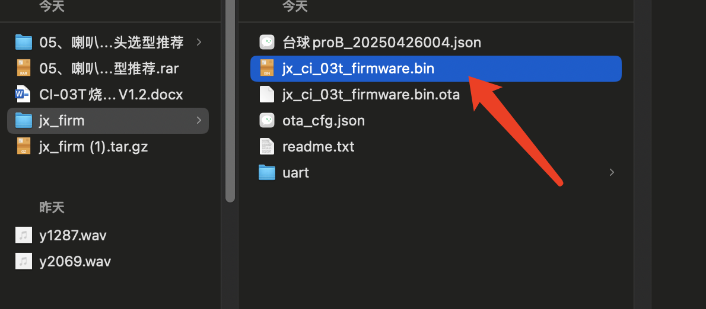

    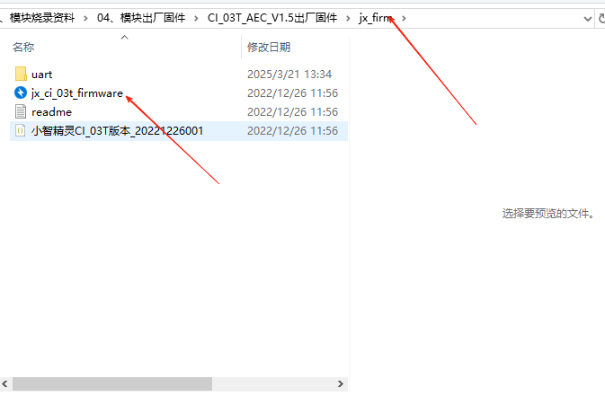

**注意事项：**

- 量产后避免接低功率喇叭或短路
- 不要将SPK+和SPK-短接
- 选择合适功率的喇叭，避免损坏功放芯片


---


---

### 如何设计四路互锁开关？

**问题描述：**

需要设计一个四路互锁开关，实现多路控制信号之间的互锁功能，避免多个输出同时激活。

**解决方案：**

**1. 设计思路**

- 互锁原则：任一时刻只允许一路输出激活
- 当某一路激活时，自动关闭其他三路
- 可以通过软件或硬件实现

**2. 软件实现方案**
使用语音模块（如JX-A7T、CI-03T系列）的GPIO控制功能：

- **方案一：使用变量控制**
    1. 创建状态变量记录当前激活通道
    2. 每个指令执行前检查其他通道状态
    3. 激活新通道前先关闭所有通道

- **方案二：直接GPIO互锁**
    1. 配置每个指令控制对应的GPIO
    2. 在每个指令中添加关闭其他GPIO的动作
    3. 使用"条件执行"确保逻辑正确

**3. 推荐模块**

- **JX-A7T**：WiFi+语音模块，支持多GPIO控制
- **CI-03T/CI-33T**：纯离线语音模块，GPIO资源丰富
- **SU-03T**：基础语音控制模块，性价比高

**4. 硬件连接示例**
```
通道1 -> GPIO_A25
通道2 -> GPIO_A26
通道3 -> GPIO_A27
通道4 -> GPIO_A28
```

**5. 配置步骤**

1. 在智能公元平台创建四个语音指令
2. 每个指令配置对应的GPIO输出
3. 为每个指令添加关闭其他三个GPIO的动作
4. 设置合适的输出电平（高/低电平根据实际电路）

**应用场景：**

- 多路灯光控制（只能亮一盏）
- 电机正反转控制（防止同时动作）
- 音频源切换（避免信号冲突）
- 模式选择电路

**注意事项：**

- 确保GPIO驱动能力满足负载要求
- 考虑添加硬件保护电路
- 重要应用建议增加硬件互锁作为备份
- 测试所有可能的切换顺序

---


---

### CI-03T1支持的喇叭功率范围是多少？

**问题描述：**

需要了解CI-03T1模块支持的喇叭功率范围，以便选择合适的喇叭。

**解决方案：**

CI-03T1模块支持的喇叭功率范围：

- **4欧姆喇叭**：2.4W - 5W
- **8欧姆喇叭**：1.6W - 3W

**注意事项：**

- 不要超过最大功率限制，模块带不动过大功率喇叭
- 小于最小功率可能损坏功放芯片
- 建议选择标称功率在中间范围的喇叭
- 如需驱动更大功率喇叭，请外接功放电路
- CI-03T1/CI-03T2最大只能驱动3W功率的喇叭，无法驱动8欧5W或4欧10W等大功率喇叭

---


---

### CI-03T模块可以驱动8欧5W或4欧10W的喇叭吗？

**问题描述：**

想了解CI-03T1和CI-03T2芯片是否能驱动8欧5W和4欧10W的无源喇叭，以及哪种喇叭音量更大。

**解决方案：**

CI-03T系列模块无法驱动8欧5W或4欧10W的大功率喇叭：

- **最大支持功率**：3W
- **8欧5W喇叭**：功率过大，模块无法驱动
- **4欧10W喇叭**：功率过大，模块无法驱动

**音量对比说明：**

在模块可驱动范围内，喇叭音量主要取决于喇叭的灵敏度而非功率大小。由于上述两种喇叭功率都超过了模块的最大驱动能力，都无法正常使用。

**注意事项：**

- 选择喇叭时功率不应超过模块的最大输出能力
- 4欧姆喇叭在相同功率下通常比8欧姆喇叭音量更大
- 建议选择4欧3W或8欧2-3W的喇叭配合CI-03T使用

---


---

### 如何配置10ms脉冲输出？

**问题描述：**

需要配置一个10ms周期的脉冲输出来驱动可控硅，但因周期过短导致脉冲无法正常输出。

**解决方案：**

**1. 配置方法**

在添加控制界面设置以下参数：

- 行为：选择对应的GPIO端口（如A14）
- 控制方式：端口输出
- 控制类型：选择对应的GPIO（如GPIO_A25）
- 动作：输出脉冲
- 周期：10ms
- 次数：1

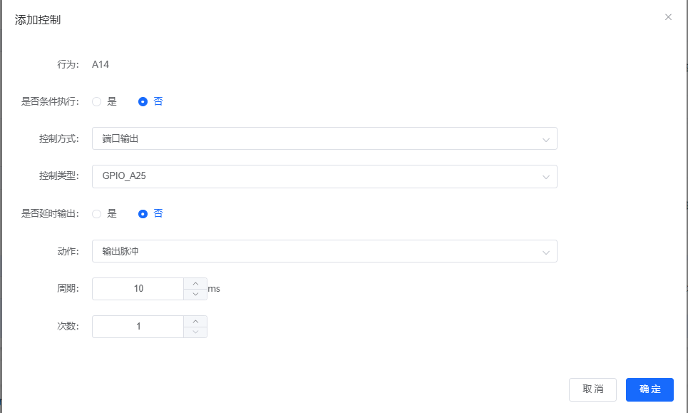

**2. 硬件限制**

- 10ms脉冲周期过短，芯片硬件无法支持
- 最小脉冲周期受限于芯片的定时器精度
- 过短的脉冲可能导致输出不稳定

**注意事项：**

- CI-03T系列不支持10ms这么短的脉冲输出
- 如需要短脉冲控制，建议考虑使用外部硬件电路实现
- 或选择其他支持更短脉冲的控制芯片

---


---

### CI-03T1芯片多个引脚之间显示导通是正常现象吗？

**问题描述：**

在测试CI-03T1芯片时发现，引脚17和18、1和2以及16和SPK之间的正负极均显示通路，怀疑是电路问题。

**解决方案：**

**1. SPK引脚导通原因**

- SPK引脚显示导通是因为连接了扬声器
- 扬声器具有阻抗，用万用表测量时会显示通路
- 这是正常现象，不是短路

**2. 其他引脚对导通**

- 某些引脚对在芯片内部可能存在连接关系
- 17和18、1和2等引脚对可能是内部功能引脚
- 具体导通情况需要参考芯片数据手册

**3. 检查建议**

- 确认芯片供电正常（3.3V或5V）
- 检查是否有明显的短路现象
- 使用万用表二极管档测量压降
- 参考官方评估板电路设计

**注意事项：**

- 芯片内部某些引脚相连是正常设计
- 扬声器阻抗会导致SPK引脚显示导通
- 如有疑虑可对比多块芯片的测试结果
- 测试时确保芯片未上电，避免损坏测量设备

---

## 麦克风选型


---

### CI-03T模块两排针脚的间距是多少？

**问题描述：**

需要确认CI-03T系列芯片封装上两排针脚的间距，以便进行PCB设计。

**解决方案：**

**1. 封装尺寸**

- **两排针脚间距**：15mm
- **引脚总数**：18个（双列9引脚）
- **封装类型**：SMD22/DIP22

**2. 设计注意**

- **库文件修正**：某些库文件标注13.6mm是错误的
- **正确尺寸**：15mm
- **PCB设计**：按15mm布局

**3. 获取标准封装**

- **嘉立创标准封装**：有SU-03T标准封装库
- **可直接使用**：无需自己绘制
- **兼容设计软件**：支持主流EDA工具

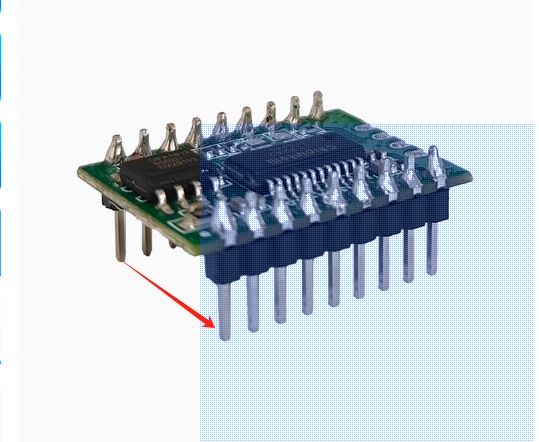

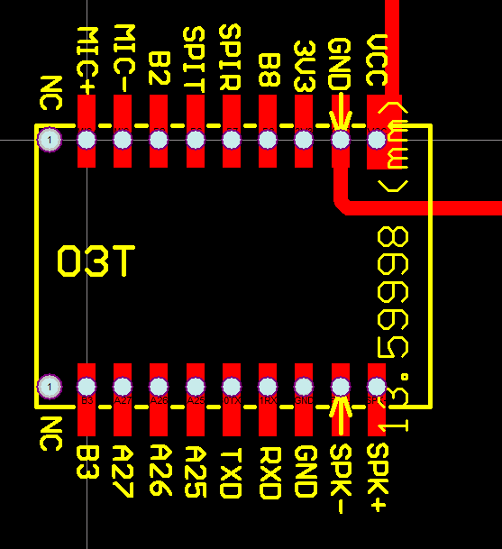

**注意事项：**

- 设计前确认最新封装图纸
- 使用嘉立创等平台标准库避免错误
- 手工绘制封装时仔细核对尺寸

---


---

### AI芯片无法驱动5V继电器怎么办？

**问题描述：**

使用Arduino 5V供电时，AI芯片（如CI-03T）发送信号给5V继电器，继电器能接收到信号但无法打开，而直接使用单片机驱动时可以正常工作。

**解决方案：**

**1. 问题原因分析**

AI芯片与单片机的驱动能力差异：

- **输出电压**：AI芯片GPIO输出可能低于5V
- **输出电流**：AI芯片的驱动电流较小
- **信号特性**：可能输出PWM信号而非直流电平

**2. 解决方案**

**方案一：增加驱动电路**

- **三极管驱动**：使用NPN三极管（如S8050）作为开关
    - 继电器线圈接电源正极
    - 三极管集电极接继电器另一端
    - IO输出高电平，三极管导通，继电器吸合

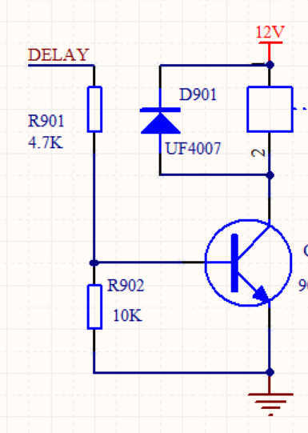

**方案二：MOSFET驱动**

- **使用MOS管**：如AO3400等N沟道MOSFET
- **优势**：导通电阻小，驱动能力强
- **连接方式**：

    - Source接地
    - Drain接继电器
    - Gate接AI芯片GPIO

**方案三：光耦隔离**

- **增加光耦**：如PC817等光耦器件
- **优点**：隔离保护，避免干扰
- **电路设计**：AI芯片驱动光耦LED端，光耦输出端驱动继电器

**3. 电路设计要点**

**推挽输出建议：**

- 使用低功率推挽输出电路
- 确保输出电压达到5V
- 提供足够的驱动电流

**注意事项：**

- 继电器线圈电压要与供电电压匹配
- 续流二极管必不可少，保护驱动器件
- 测试时先用小电流继电器
- 如继电器自带光耦，可能需要更高驱动电压

**4. 元件选型**

| 元件类型 | 推荐型号 | 特点 |
|---------|----------|------|
| NPN三极管 | S8050、2N2222 | 成本低，电路简单 |
| MOSFET | AO3400、2N7002 | 驱动强，效率高 |
| 光耦 | PC817、EL817 | 隔离好，抗干扰 |

**5. 调试建议**

- 先用万用表测量AI芯片输出电压
- 确认继电器工作电流需求
- 分步测试：先测试驱动电路，再接继电器
- 如有条件，使用示波器观察信号波形

---


---

### CI-03T1的B3引脚输出不稳定导致继电器无法正常工作？

**问题描述：**

语音芯片CI-03T1的B3引脚输出信号不稳定，无法可靠驱动5V继电器模块，且存在唤醒后系统中断需断电重启的问题。

**解决方案：**

**1. 输出信号问题分析**

CI-03T1的GPIO输出特性：

- **信号类型**：可能输出PWM信号而非纯直流电平
- **驱动能力**：输出电流有限，不足以直接驱动继电器
- **电压不匹配**：输出电压可能低于继电器工作电压

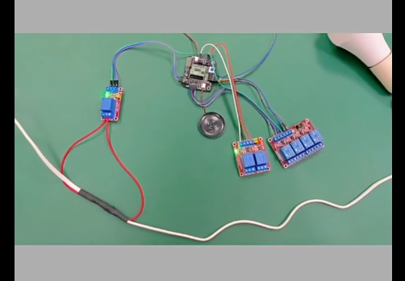

**2. 系统中断问题**

唤醒后需要断电重启的可能原因：

- **系统死锁**：程序运行异常导致死循环
- **资源冲突**：GPIO配置冲突导致系统异常
- **电源问题**：继电器吸合瞬间电流过大导致芯片复位

**3. 硬件解决方案**

**方案一：增加中间驱动电路**

- **光耦隔离模块**：使用带光耦的继电器模块
- **优点**：隔离保护，减少对芯片的影响
- **选型**：选择JQC3F-05VDC-C等5V光耦继电器

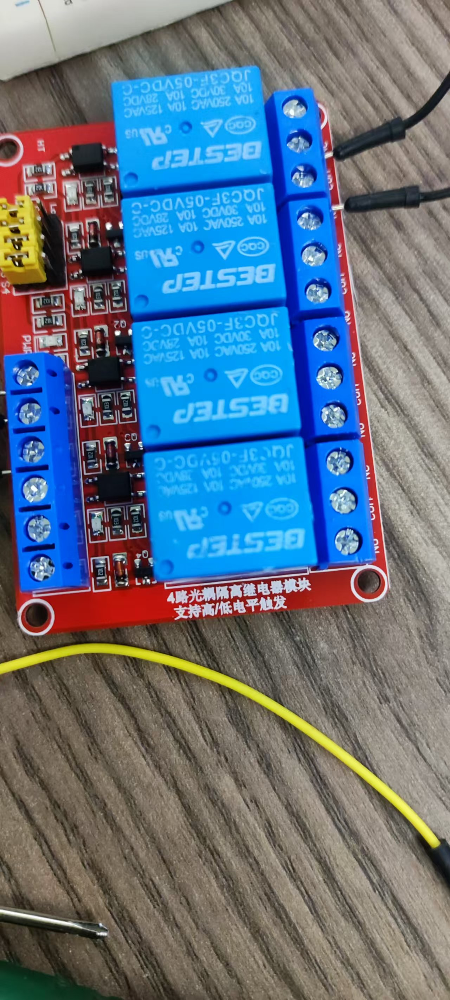

**方案二：三极管驱动**

- 使用NPN三极管（如S8050）作为中间驱动
- B3引脚控制三极管基极
- 三极管驱动继电器线圈

**方案三：专用驱动芯片**

- 使用ULN2003、ULN2803等达林顿管阵列
- 可提供更大的驱动电流
- 支持多路继电器驱动

**4. 软件配置优化**

在配置平台中优化GPIO设置：

- **输出模式**：设置为推挽输出而非开漏输出
- **初始状态**：配置明确的默认电平
- **响应速度**：适当降低GPIO切换速度

**5. 测试建议**

分步测试定位问题：

- **第一步**：不接继电器，测量B3引脚输出波形
- **第二步**：使用LED测试，确认输出控制正常
- **第三步**：接光耦继电器，观察是否稳定
- **第四步**：增加续流二极管，测试系统稳定性

**6. 注意事项**

- 继电器线圈必须并联续流二极管
- 避免在芯片初始化期间操作继电器
- 如需频繁切换，建议使用固态继电器
- 系统中断问题可能需要更新固件版本

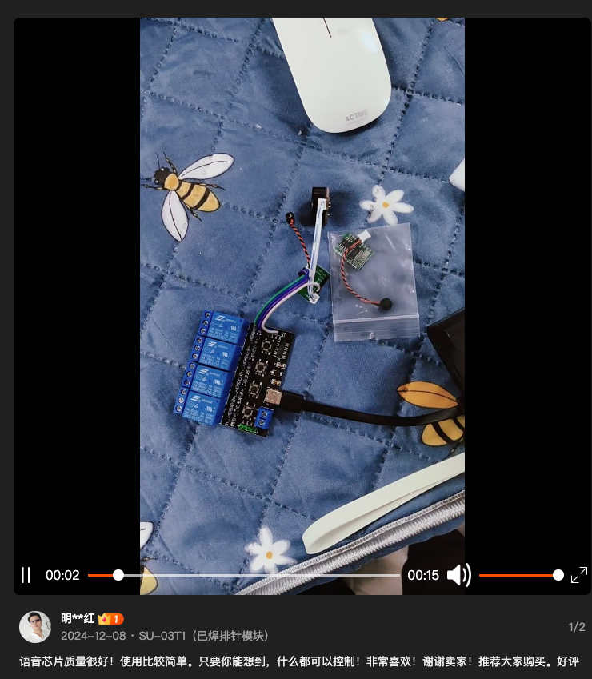

**7. 元件选型参考**

| 元件 | 型号 | 特点 |
|------|------|------|
| 光耦继电器 | JQC3F-05VDC-C | 5V驱动，内置光耦 |
| 达林顿管 | ULN2003 | 7路驱动，500mA/路 |
| 三极管 | S8050 | 通用NPN，成本低 |
| MOSFET | IRLML2502 | 逻辑电平驱动，内阻低 |

---

## 功耗管理


---

### 如何获取CI系列语音模块的电路图？

**问题描述：**

需要获取CI系列语音模块（如CI-03T1、CI-03T2等）的电路设计资料，用于硬件开发和调试。

**解决方案：**

1. **官方渠道获取**：

    - 访问智能公元网站
    - 查找对应型号的产品页面
    - 下载相关技术文档

2. **可获取的资料类型**：

    - 规格书（含引脚定义）
    - 应用笔记
    - 参考设计
    - PCB封装库

3. **注意事项**：

    - 核心电路图可能受保护
    - 公开资料多为应用级参考
    - 详细原理图需寻求专业技术协助

**替代方案：**

1. **参考开发板**：

    - 购买官方开发板
    - 参考其电路设计
    - 学习最佳实践

2. **技术团队申请**：

    - 联系官方支持
    - 说明项目需求
    - 申请获取更详细的资料

3. **社区资源**：

    - 查看开源项目参考
    - 参考其他项目的设计
    - 注意版权和使用条款

**建议：**

- 使用官方提供的评估板进行开发
- 关注官方文档更新
- 加入技术交流群获取经验分享

---

## 电源供电


---

### CI-03T系列芯片如何处理5V供电过高的问题？

**问题描述：**

CI-03T1或CI-03T2芯片在使用5V供电时出现工作不稳定的情况，需要安全可靠的供电方案。

**解决方案：**

**问题分析：**

- 模块工作电压建议为3.3V
- 5V电压可能导致芯片工作不稳定
- 需要进行降压处理

**方案一：使用二极管降压**

- **电路设计**：在5V供电线上串联一个二极管
- **降压效果**：普通二极管正向压降约0.7V
- **输出电压**：5V - 0.7V = 4.3V（接近3.3V）
- **优点**：成本低，实现简单

**方案二：专用降压电路**

- **独立降压**：使用专门的LDO或DC-DC降压模块
- **稳定输出**：提供稳定的3.3V电压
- **优点**：电压稳定，更可靠

**方案三：电源分配**

- **分路供电**：从主电源分出一路专门给语音芯片
- **独立调节**：便于单独控制和优化
- **优点**：不影响其他电路供电

**注意事项：**

- 二极管方案成本低但精度有限
- 专用降压电路效果更好但成本较高
- 建议根据项目成本和可靠性要求选择方案
- 降压后需确认电压在芯片允许范围内

---


---

### CI-03T1芯片能直接控制WS2812灯带吗？

**问题描述：**

需要确认CI-03T1芯片是否支持直接控制WS2812可编程LED灯带。

**解决方案：**

- **不支持直接控制**：CI-03T1芯片无法直接控制WS2812灯带
- **硬件限制**：WS2812需要特殊的单线通信协议和精确时序控制
- **替代方案**：

    - 使用串口转ESP8266模块控制WS2812
    - 选用ESP32等支持WS2812的芯片
    - 添加专用的WS2812驱动控制器

**实现方案：**

1. **串口转接方案**
    - CI-03T1通过串口发送控制指令
    - ESP8266接收指令并控制WS2812
    - 需要编写中间转接程序

2. **更换芯片方案**
    - 直接使用ESP32替代CI-03T1
    - ESP32原生支持WS2812控制
    - 需要重新设计语音部分

**注意事项：**

- WS2812对时序精度要求高
- 普通串口无法满足WS2812的通信需求
- 转接方案会增加系统复杂度

---


---


---

### CI-03T4双麦模块麦克风功能区分

**问题描述：**

CI-03T4双麦模块中，遮挡M1麦克风（M1+和M1-）会导致识别完全失效，而遮挡M2麦克风则不影响识别。

**解决方案：**

**1. 麦克风功能分工**

    - M1麦克风：用于语音识别
    - M2麦克风：用于算法处理
    - 两个麦克风功能不同，不是冗余设计

**2. 算法处理功能**

    - 降噪处理
    - 声源定位
    - 回声消除
    - 其他音频增强算法

**3. 应用注意事项**

    - 确保M1麦克风安装位置易于接收语音
    - M1麦克风需要远离噪声源
    - 不要遮挡M1麦克风的收音孔
    - M2麦克风的安装位置相对灵活

**注意事项：**

- 双麦设计是为了提高识别准确率
- M1是主麦克风，必须保证其正常工作
- 如需了解具体算法参数，可在开发平台查看
- 双麦版本比单麦版本有更好的抗干扰能力

---


---

### 如何在AI语音模块的麦克风输入端实施ESD防护？

**问题描述：**

在使用CI-03T1和CI-03T2等离线语音识别模块时，麦克风输入端容易因静电放电（ESD）导致模块被击穿损坏，需要设计有效的防护电路。

**解决方案：**

**1. ESD防护位置**

- **防护位置**：在麦克风输入端（MIC+和MIC-）与地之间添加ESD防护器件
- **关键点**：防护器件应尽可能靠近模块接口，避免静电逆流进入内部电路
- **防护原理**：将高压静电快速泄放到地，保护后级芯片

**2. 推荐ESD器件**

- **型号推荐**：PESD5V0S2BT（Nexperia）
    - 封装：TO-236AB（SOT23）
    - 特性：双向防护，响应时间快
    - 防护能力：可承受6KV高压静电
    - 引脚定义：引脚1(K1)和2(K2)为阴极，引脚3(K)为双阴极

- **替代方案**：

    - 0402ESDA-05N(TVS)
    - 其他符合5V工作电压的TVS二极管

- **选型要点**：

    - 响应时间：选择皮秒级响应时间的器件
    - 结电容：低结电容（通常<5pF），避免影响音频信号
    - 漏电流：低漏电流，减少功耗影响
    - 封装：根据PCB空间选择合适封装（SOT23、0402、0603等）

**3. 典型防护电路**

```
MIC+ ────┬── D1 (TVS二极管) ─── GND
            │
MIC- ────┼── D2 (TVS二极管) ─── GND
            │
        模块输入端
```

**4. 元器件选型要求**

- **响应时间**：选择响应时间尽可能短的ESD器件
- **工作电压**：5V（匹配音频信号电平）
- **防护等级**：至少4KV，推荐6KV以上
- **封装形式**：优先选择小封装（如SOT23、0402等）

**5. PCB布局建议**

- ESD器件尽量靠近模块接口位置
- 走线短而直，减少寄生电感
- 避免在ESD器件前增加不必要的元件

**注意事项：**

- ESD防护会增加少量成本，但能有效降低模块损坏率
- 对于高静电环境（如负离子发生器附近），必须加强ESD防护
- CI-73T模块的麦克风防静电能力有所增强，可达4KV
- 除了硬件防护，还应注意生产过程中的防静电措施

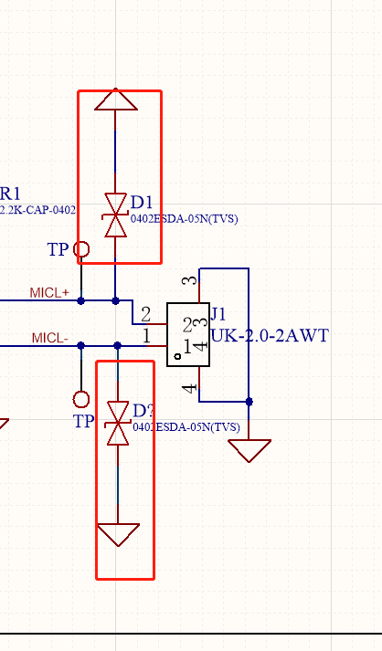

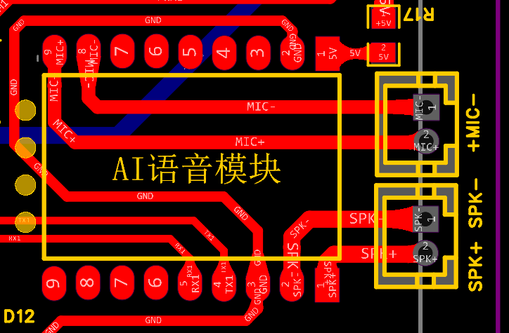

---


---

### 如何计算CI-03T1模块在24V供电下的待机功耗？

**问题描述：**

需要计算CI-03T1模块在24V供电条件下的待机功耗，以便评估系统的整体能耗。

**解决方案：**

**1. 功耗计算公式**

待机功耗需要基于正常工作电流和待机工作电流的差值进行计算：

```
功耗差值 = 正常工作功耗 - 待机工作功耗
电流差值 = 功耗差值 / 供电电压
```

**2. 参数说明**

- **正常工作参数**：3.3V × 3.5mA = 11.55mW
- **待机工作参数**：3.3V × 0.8mA = 2.64mW
- **目标供电电压**：24V

**3. 计算过程**

- **正常工作时电流**：11.55mW ÷ 24V = 0.48mA
- **待机时电流**：2.64mW ÷ 24V = 0.11mA
- **待机功耗电流差值**：0.48mA - 0.11mA = 0.37mA

**4. 结论**

在24V供电条件下，CI-03T1模块的待机功耗电流差值为0.37mA。

**注意事项：**

- 以上计算基于芯片的典型工作电流和待机电流
- 实际值可能因具体应用环境、温度等因素而有所差异
- 建议在实际应用中进行实测以验证功耗值
- 系统设计时应考虑电源管理，以进一步降低整体功耗
- 计算结果适用于CI-03T1型号，其他型号可能有所不同

---


---

### 产品电路设计阶段如何获得供应商？

**问题描述：**

在产品电路设计阶段，希望获得技术团队的建议，确保电路设计与离线语音识别芯片（如CI-03T1/CI-03T2）的硬件接口和功能特性匹配。

**解决方案：**

**1. 技术对接渠道**

- 建立专项技术沟通群，确保设计问题得到及时响应
- 提供详细的电路设计文档，便于进行全面的技术评审
- 在设计关键节点及时沟通，避免设计偏差

**2. 设计评审要点**

- 确保电源设计满足芯片供电要求（电压稳定性、功率余量）
- 验证音频电路设计（麦克风输入、喇叭输出）的合理性
- 检查接口电路兼容性（UART、GPIO等电平匹配）
- 评估PCB布局的信号完整性和EMI/EMC合规性

**3. 匹配性验证**

- 对照芯片规格书确认外部元件选型
- 验证关键参数设计（阻抗匹配、滤波电路等）
- 评估热设计是否满足长时间稳定运行要求

**注意事项：**

- 设计阶段的技术评审能够显著降低后续开发风险
- 建议在打样前完成技术评审，减少试错成本
- 保留完整的设计文档和沟通记录，便于追溯和优化

---


---

### B6/B7烧录脚需要增加上拉电阻吗？

**问题描述：**

在CI-03T1和CI-03T2芯片的B6脚（烧录口）是否需要增加4.7K上拉电阻，以及管脚悬空是否会引入干扰。

**解决方案：**

- **电阻配置**：B6/B7烧录口不需要增加4.7K上拉电阻
    - 电路图中标注的4.7K电阻为可选元件（X4标记）
    - 实际应用中可以不焊接此电阻

- **悬空处理**：B6/B7管脚悬空不会引入干扰
    - 芯片内部有相应的处理电路
    - 正常使用情况下不会影响模块功能

**注意事项：**

- 如B6/B7引脚外接到其他设备（如CH340转USB），需确保连接正确
- 烧录时按照标准连接方式即可，无需额外增加电阻
- 若原理图中标注为可选元件，表示可根据实际需求决定是否安装

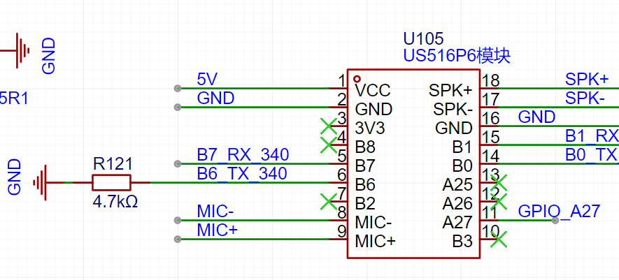

---


---

### CI-03T的GPIO输出电平和驱动能力是多少？

**问题描述：**

需要了解CI-03T1和CI-03T2芯片的GPIO高电平输出电压值，以及其最大驱动能力。

**解决方案：**

- **输出电平**：

    - GPIO高电平输出电压为3.3V
    - 低电平接近0V

- **驱动能力**：

    - 单个GPIO最大输出电流：5-20mA
    - 驱动能力有限，仅适合驱动小功率负载

**应用建议：**

- **可直接驱动**：

    - LED指示灯（需串接限流电阻）
    - 光耦
    - 三极管基极

- **需外部驱动**：

    - 继电器线圈
    - 电磁阀
    - 直流电机
    - 其他大功率负载

**注意事项：**

- 驱动大功率负载时，必须使用外部驱动电路（如三极管、MOSFET、专用驱动芯片）
- GPIO口主要用于控制信号输出，不适合作为电源使用
- 设计电路时应预留足够的驱动裕量，避免过载

---

### CI-03T1单麦克风板如何连接两个麦克风？

**问题描述：**

需要在CI-03T1单麦克风板上连接两个麦克风，实现双麦克风输入。

**解决方案：**

可以通过添加外围电路的方式实现双麦克风连接：

1. **电路原理**

    - 在现有麦克风电路基础上，并联一组相同的麦克风电路
    - 两组电路共享相同的偏置电压和信号线

2. **所需外围元件**

    每个麦克风通道需要以下元件：

    - 电阻：2.2kΩ（2个，用于偏置）
    - 电容：104（即0.1μF，2个，用于耦合）

3. **接线方式**

    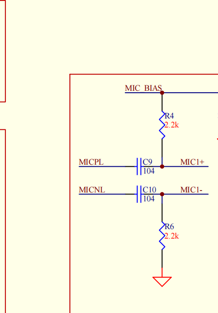

    - 将两组麦克风电路并联连接
    - MIC BIAS：麦克风偏置电压
    - MICPL/MICNL：麦克风差分信号正负端
    - MIC1+/MIC1-：第一路麦克风差分信号
    - 第二路麦克风连接到相同的信号线

**注意事项：**

- 需要合理设计PCB布局，避免信号干扰
- 确保两组麦克风的参数一致，保证效果
- 建议使用同型号、同批次的麦克风

---

### CI-03T模块的红外功能收发接口应连接到哪两个引脚？

**问题描述：**

CI-03T模块需要实现红外收发功能，用于控制家电设备，需要了解红外发射和接收应连接到哪些引脚。

**解决方案：**

- **红外发射**：需要连接到PWM口
- **红外接收**：使用普通IO口即可
- **推荐引脚**：使用PC4和PA5，这两个引脚收发都可以用，通过平台配置即可

**接口连接示例：**


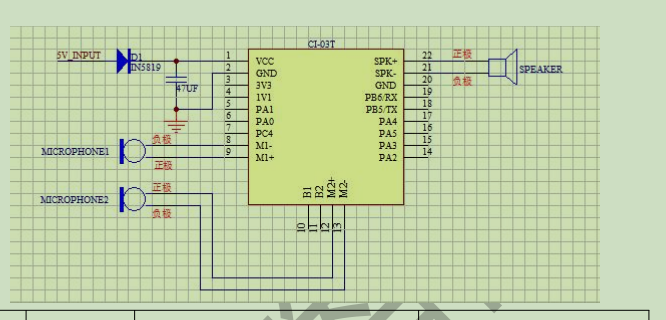

**注意事项：**

- 发射电路需要支持PWM输出功能
- 接收电路可以使用普通GPIO口
- 具体引脚配置需要在平台软件中设置
- 根据实际硬件设计选择合适的引脚

---

### CI-03T红外发射管驱动电路设计

**问题描述：**

使用CI-03T1芯片开发空调控制项目时，直接将红外发射管连接到PA5引脚导致发射功率不足，控制距离仅能达到1米，无法满足3米距离的控制需求。

**解决方案：**

**1. 使用MOS管驱动电路**

直接连接PA5引脚的方案功率不足，需要通过MOS管驱动电路来增强发射功率：

- **MOS管选型**：使用SI2302或AO3400(N)等N沟道MOS管
- **限流电阻**：单个发射管使用33Ω/0603封装电阻
- **栅极电阻**：使用10kΩ上拉电阻确保MOS管可靠关断

**2. 三个发射管并联电路**

当需要多个方向的发射管时，可采用并联连接：

- **独立限流**：每个发射管串联独立的限流电阻（R5、R6、R7）
- **共用驱动**：所有发射管通过同一个MOS管（Q3）驱动
- **控制信号**：PA5引脚控制MOS管栅极

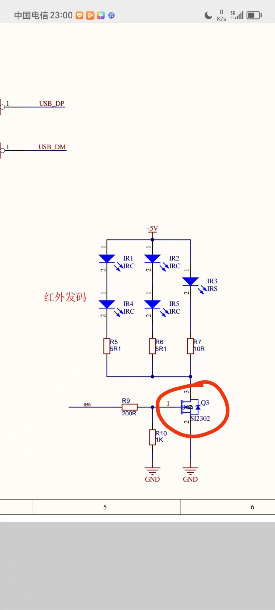

**3. 元器件清单**

| 元器件 | 型号/规格 | 数量 |
|--------|-----------|------|
| 红外发射管 | IR204C-A-L | 3个 |
| MOS管 | SI2302/AO3400(N) | 1个 |
| 限流电阻 | 10Ω/0603 | 3个 |
| 栅极电阻 | 10kΩ/0603 | 1个 |

**4. MOS管引脚连接**

- **G（栅极）**：连接PA5引脚
- **D（漏极）**：连接红外发射管负极
- **S（源极）**：连接GND


**注意事项：**

- 电源电压可以使用5V，确保MOS管工作在正常区域
- 每个发射管必须独立串联限流电阻，禁止直接并联
- 检查MOS管引脚顺序，不同型号封装可能不同
- 如单个发射管工作正常但多个不工作，检查MOS管是否充分导通
- 限流电阻可根据实际需求调整（10Ω-100Ω均可尝试）

---

### CI-03T红外发射管MOS管接线问题排查

**问题描述：**

按照推荐的MOS管驱动电路连接后，红外发射管仍无法正常工作，检查发现MOS管的G极（栅极）和S极（源极）接反，导致电路无法正常导通。

**解决方案：**

**1. 确认MOS管引脚顺序**

- **AO3400(N)封装识别**：

    - 平面一侧为正面，引脚从左到右为：G（栅极）、D（漏极）、S（源极）
    - 圆弧一侧为背面，不应作为引脚识别依据


**2. 正确的接线方式**

- **G极（栅极）**：通过10kΩ电阻连接到PA5控制引脚
- **D极（漏极）**：连接红外发射管的负极
- **S极（源极）**：连接到GND
- **注意**：10Ω限流电阻应在发射管的正极回路中

**3. 排查步骤**

当电路不工作时，按以下顺序排查：

1. **检查MOS管方向**：

    - 确认平面朝上时的引脚顺序
    - 使用万用表二极管档确认各引脚功能

2. **测量关键点电压**：

    - PA5输出高电平时，G极应有电压
    - D极与S极之间应导通
    - 发射管两端应有压降

3. **验证限流电阻**：

    - 检查10Ω电阻是否完好
    - 确认阻值是否符合要求（可尝试100Ω、1kΩ）

**4. 多个发射管并联注意事项**

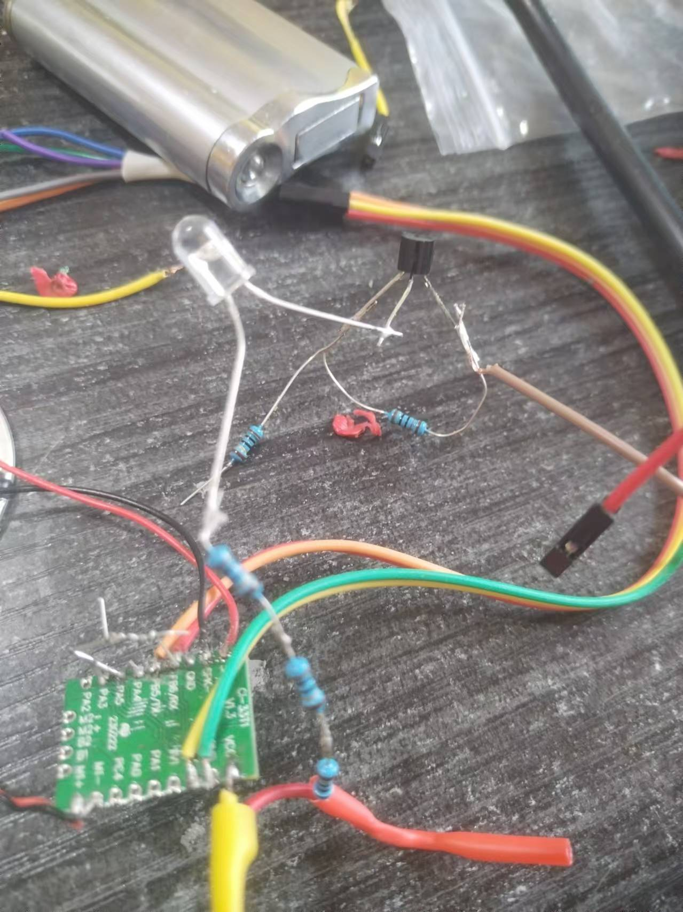

- 每个发射管必须有独立的限流电阻
- 所有发射管负极共同连接到MOS管D极
- 避免长导线连接，减少干扰

**注意事项：**

- MOS管不同型号引脚定义可能不同，务必查看 datasheet
- 接反时MOS管无法导通，发射管不会工作
- 如问题依旧，检查PA5引脚是否正常输出PWM信号
- 建议在焊接前先用万用表确认MOS管引脚功能

---

### CI-03T1与ESP8266模块连接导致启动异常怎么办？

**问题描述：**

将ESP8266模块的TX引脚连接到CI-03T1芯片的PA3引脚时，CI-03T1在开机时无法正常工作，表现为指示灯不亮或工作异常。断开TX线后重新上电即可恢复正常。

**解决方案：**

**1. 问题原因分析**

- **启动冲突**：CI-03T1上电初始化期间，PA3（RX）引脚被外部信号拉高/拉低
- **初始化干扰**：ESP8266在开机时可能输出信号，干扰CI-03T1的启动流程
- **时序冲突**：两个模块的启动时序不同步

**2. 正确的连接方法**

- **延迟连接**：先给CI-03T1单独上电，等待完全启动后再连接ESP8266的TX线
- **使用开关**：在TX线上加装开关，控制连接时机
- **隔离电路**：使用光耦或三极管进行信号隔离

**3. 连接注意事项**

- **引脚确认**：

    - CI-03T1：PA3为RX，PA2为TX
    - ESP8266：TX连接到CI-03T1的PA3（RX）

- **电平匹配**：

    - CI-03T1：3.3V逻辑电平
    - ESP8266：3.3V逻辑电平（兼容）

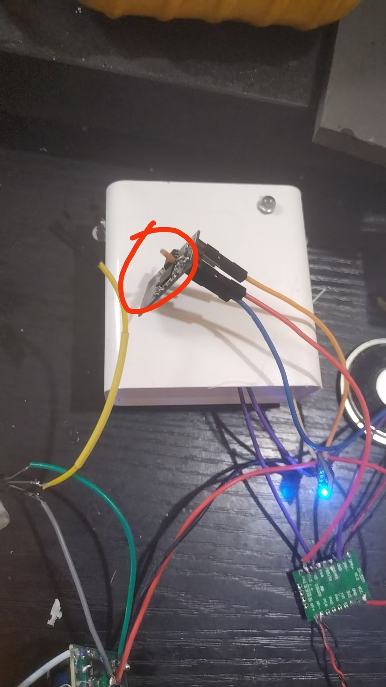

**4. 替代方案**

- **软件解决方案**：在ESP8266初始化完成后，通过软件控制TX输出
- **硬件方案**：使用74HC125等总线驱动器进行缓冲
- **时序控制**：通过MCU控制两个模块的启动顺序

**注意事项：**

- CI-03T1完全启动前，避免向PA3输入信号
- 如必须常连接，建议在TX线串联1kΩ电阻限流
- 长期连接建议使用专业的电平转换模块
- 该问题不影响正常的串口通信功能

---

### CI-03T红外接收管如何正确接线？

**问题描述：**

使用红外接收管时，按照常规接法（长脚接3.3V，短脚接PA4）连接后无反应，且空调匹配成功后无法控制空调。

**解决方案：**

**1. 正确的接线方式**

- **5V电源供电**：通过100Ω限流电阻连接到接收管长脚（阳极）
- **信号输出**：接收管短脚（阴极）连接到PA4引脚
- **接地**：确保接收管外壳或接地引脚可靠接地

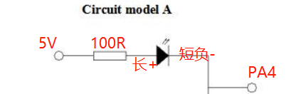

**2. 接收管选型建议**

- **推荐型号**：使用专业的红外接收头（如IRMD-56384）
- **避免使用**：普通光电二极管，接收效果差
- **封装选择**：优先选择3P（三引脚）标准封装

**3. 三脚接收管接线**

标准三脚红外接收管引脚定义：

- **VCC**：电源正极（通常5V）
- **GND**：电源负极（地）
- **OUT/IR_RX**：信号输出端

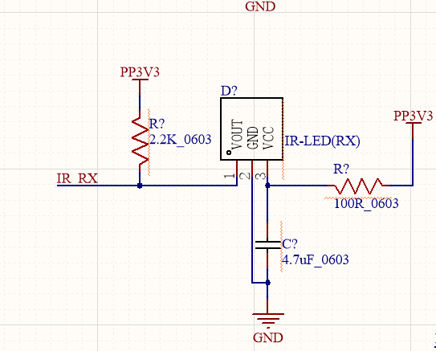

**4. 注意事项**

- **必须使用限流电阻**：100Ω（可尝试200Ω）
- **避免3.3V供电**：电压过低可能导致接收灵敏度下降
- **滤波电容**：可在VCC和GND之间并联104电容滤除干扰
- **屏蔽处理**：接收管应远离红外发射管，避免干扰

**5. 常见问题排查**

- 无反应：检查供电电压和接线顺序
- 灵敏度低：增加限流电阻到200Ω或调整供电电压
- 干扰严重：加装屏蔽罩，远离干扰源

---

### CI-03T2双麦模块如何配置AEC功能？

**问题描述：**

需要配置CI-03T2双麦模块实现由外部模块播报语音，同时避免芯片将播报内容误识别为唤醒词，并解决播报时命令词不灵敏的问题。

**解决方案：**

CI-03T2双麦模块可通过AEC（回声消除）功能解决此问题：

**1. AEC原理**

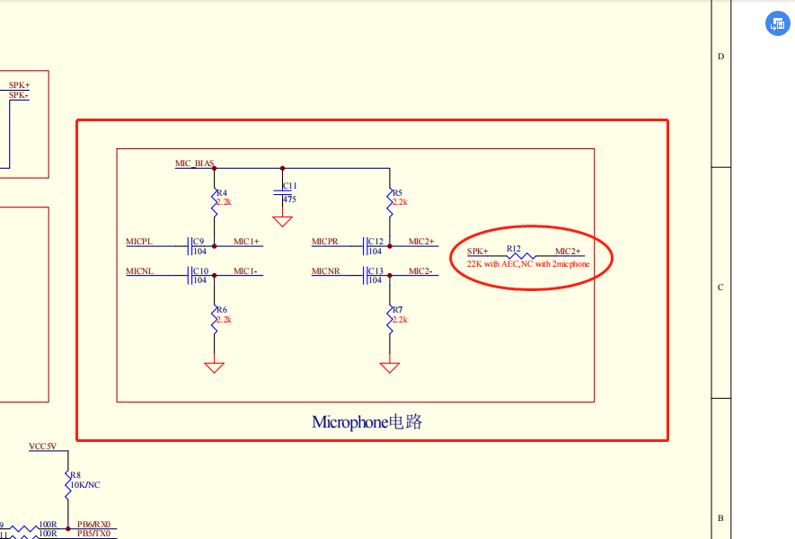

- **MIC1**：用于语音识别的麦克风
- **MIC2**：用于回声消除的参考麦克风
- **R12电阻**：22K with AEC配置电阻
- AEC功能需要一个麦克风做识别，另一个收集禁止识别的音频

**2. 配置方案**

**方案一：双麦AEC配置**

- 购买CI-03T2双麦克风版本
- MIC1连接用于语音识别
- MIC2连接外部播报模块的音频输出
- 在固件中启用AEC功能

**方案二：单麦配置+外部播报**

- 购买双麦模块但程序配置为单麦
- 使用MIC1进行语音识别
- 外部播报模块音频线连接到MIC2位置
- 固件配置单麦模式并启用AEC

**3. 实现步骤**

- 硬件连接：将播报音频输出接到MIC2
- 固件配置：选择单麦克风模式
- 启用AEC功能：防止播报内容被误识别
- 测试验证：确认播报时不影响唤醒词识别

**4. 注意事项**

- AEC功能需要专用固件支持
- 双麦模块的MIC2输入阻抗需要匹配
- 建议使用22K电阻进行AEC配置
- 播报音频质量会影响AEC效果

---

### CI-03T1/T2语音指令输出高脉冲信号的参数是什么？

**问题描述：**

需要了解语音模块在检测到语音指令时输出的高脉冲信号的频率和时长，以及如何通过高电平触发手势识别功能的休眠唤醒脚。

**解决方案：**

1. **高脉冲信号参数**：

    - 脉冲宽度：500ms（半秒）
    - 信号类型：高电平脉冲
    - 默认状态：平常保持高电平
    - 触发方式：识别到特定指令后输出高脉冲

    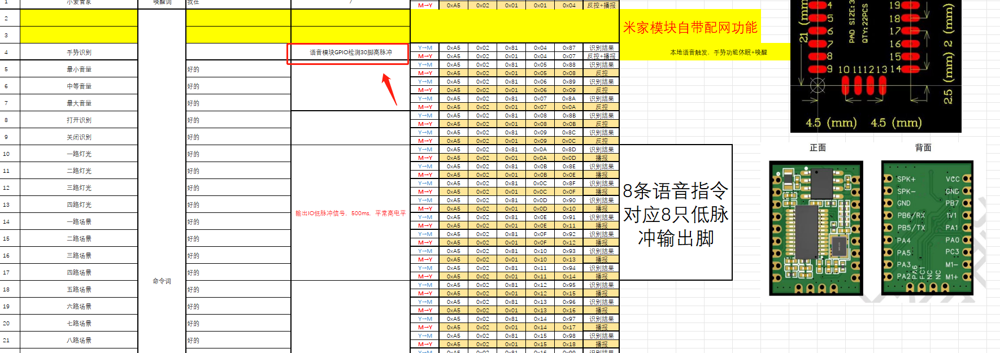

2. **GPIO输出配置**：

    - 每个语音指令可配置对应的GPIO输出
    - 支持8路独立的低脉冲输出脚
    - 可配置脉冲宽度（如500ms）
    - 初始电平状态可设为高电平

3. **手势识别唤醒控制**：

    - 指定专用GPIO脚作为唤醒输出
    - 配置"手势识别"指令触发高脉冲输出
    - 脉冲信号驱动手势功能的休眠唤醒脚
    - 实现语音控制唤醒手势识别模块

**注意事项：**

- 高脉冲输出需要外部电路检测下降沿来识别触发
- 确保被控设备的唤醒脚兼容高电平触发
- 500ms脉冲宽度为典型值，可根据实际需求调整
- 多个指令使用不同GPIO口，避免信号冲突

---

### 音箱产品集成语音模块的量产化方案是什么？

**问题描述：**

了解在现有音箱产品中集成CI-03T语音控制功能的量产化方案，包括硬件设计、开模需求和多机型扩展考虑。

**解决方案：**

**Demo阶段集成方案**

当前可实现的演示级集成：

1. **飞线集成方式**
    - 在外壳开孔用于麦克风拾音
    - 模块固定后通过飞线连接到原电路
    - 模块音频输出连接到音箱喇叭

2. **功能实现**
    - 语音控制模拟原按键功能
    - 实现基础的播放控制命令
    - 保留物理按键作为备选操作

**量产化方案要求**

1. **PCB重新设计**
    - 将语音模块功能集成到主PCB
    - 优化音频信号路径设计
    - 考虑AEC算法的硬件支持

2. **结构重新设计**
    - 麦克风位置的声学优化设计
    - 喇叭与麦克风的隔离处理
    - 外壳开孔的防尘和音效考虑

**多机型扩展策略**

每款新机型都需要专门考虑：

- **声学环境差异**：不同腔体影响识别效果
- **麦克风位置**：需要针对每款产品优化
- **成本控制**：批量生产时的成本优化
- **标准化设计**：建立可复用的集成模板

**开发建议**

- **先做Demo验证**：确认功能可行性和使用效果
- **分阶段实施**：先高端机型，再逐步普及
- **测试充分**：各种使用场景的全面验证
- **预留接口**：为未来功能升级留出空间

**注意事项：**

- 飞线方案仅适合样品展示，不能直接量产
- 每款产品都需要重新开模，成本较高
- 麦克风位置是成功的关键因素
- 建议建立标准化的集成流程

---


---

### CI-03T模组待机温度过高怎么办？

**问题描述：**

CI-03T芯片在正常工作时会发热，询问这是否属于正常现象。

**解决方案：**

**温度情况分析**

- **正常待机温度**：模块工作温度应在30-45℃范围内
- **当前温度**：50-60℃明显偏高，需要检查原因
- **长期影响**：持续高温可能影响模块寿命和稳定性

**排查步骤**

1. **工作电压和电流检查**

    - 测量供电电压是否在额定范围内（推荐5V）
    - 检查工作电流是否异常偏高
    - 使用万用表确认电源稳定性

2. **硬件连接检查**

    - 确认没有短路或接错线
    - 检查负载是否在模块承受范围内
    - 验证所有连接线正确可靠

3. **温度测量验证**

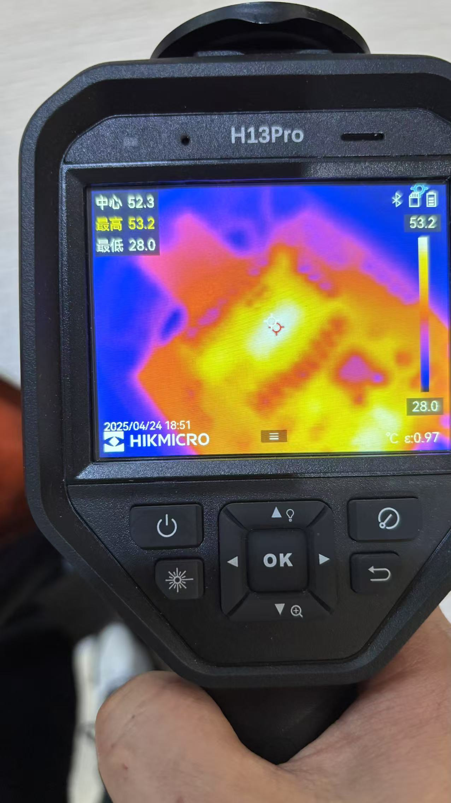

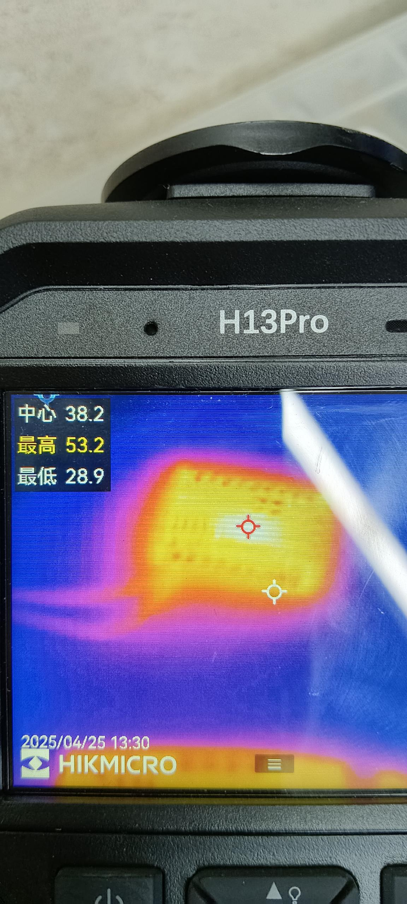

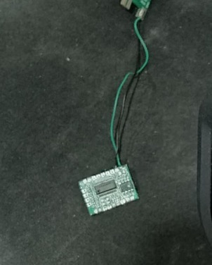

**可能原因**

- **供电异常**：电压过高或纹波过大导致发热
- **外部负载**：连接了超出规格的负载
- **散热不良**：安装位置通风不佳
- **模块故障**：内部元件异常导致发热

**处理建议**

1. **电源优化**

    - 使用稳定的5V电源，电压控制在4.8-5.2V
    - 确保电源能够提供足够电流（建议600mA以上）
    - 如使用开关电源，注意纹波控制

2. **散热改善**

    - 确保模块周围有良好通风
    - 避免在密闭环境中使用
    - 必要时可增加散热孔

3. **负载检查**

    - 确认连接的负载符合规格要求
    - 如驱动外部设备，建议增加缓冲电路
    - 测试断开外部负载后的温度变化

**注意事项：**

- 如果裸模组温度仍超过50℃，可能是模块故障
- 长期在高温下工作会影响模块寿命
- 如问题持续，建议联系供应商进行检测

---

### CI-03T芯片工作温度范围及高温处理

**问题描述：**

需要确认CI-03T芯片的正常工作温度范围，以及50-60度高温是否正常。

**解决方案：**

**供应商确认**

- **一般正常工作温度**：45℃左右
- **长时间50多度也没问题**：模块可在此温度下稳定工作
- **无需过度担心**：50-60℃虽然偏高但不会立即损坏

**温度范围说明**

- **标称工作温度**：-20°C 至 80°C
- **最佳工作温度**：-10°C 至 50°C
- **短期耐温**：可承受更高温度（不超过80°C）
- **存储温度**：-20°C 至 70°C

**实际应用建议**

1. **温度监测**

    - 定期检查模块工作温度
    - 使用热成像仪或温度计测量
    - 记录不同负载下的温度变化

2. **高温环境处理**

    - 保证良好通风散热
    - 避免阳光直射
    - 考虑增加散热设计

3. **长期稳定性**

    - 50-60℃下可以长期工作
    - 建议控制在55℃以内以延长寿命
    - 定期检查工作状态是否正常

**注意事项：**

- 温度略高不影响功能，但建议优化散热
- 如果温度持续上升，应检查供电和负载
- 极端高温环境（>60℃）建议采取降温措施
- 模块设计已考虑温度余量，正常使用无需担心

---

### CI-03T1/CI-03T2启动模式IO8引脚如何处理？

**问题描述：**

在启动模式下，CI-03T1和CI-03T2芯片的IO8引脚是否可以悬空不接地，以简化产品设计。

**解决方案：**

**引脚处理说明**

- **启动模式IO8可以悬空不接地**
- 作为产品化设计时，无需为IO8预留线路
- IO8仅在烧录时需要接地，正常运行时悬空即可

**设计建议**

1. **烧录阶段**

    - 烧录时将IO8接地进入烧录模式
    - 烧录完成后断开IO8与GND的连接

2. **产品化设计**

    - IO8引脚可以不引出到底板
    - 如需保留烧录功能，可预留测试点
    - 正常工作时IO8保持悬空状态

**注意事项：**

- IO8悬空不影响模块正常启动和运行
- 简化产品设计时可忽略此引脚
- 仅在需要重新烧录时才需要处理IO8

---

### CI-03T双麦克风应用原理图及外围电路设计

**问题描述：**

需要了解CI-03T双麦克风应用的原理图设计，以及第二个麦克风是否可以直接连接到芯片的18和19脚而无需外围元件。

**解决方案：**

**双麦克风原理图设计**

按照标准双麦克风应用原理图进行设计：

- **第二个麦克风不能直接连接18和19脚**
- 必须通过外围电路连接
- 每个麦克风都需要100nF电容和2.2K电阻
- 麦克风信号连接到芯片的MICP和MICN引脚

**电路设计要点**

1. **麦克风输入电路**
    - MIC1和MIC2各通过100nF电容耦合
    - 配备2.2K偏置电阻
    - 差分输入方式连接到芯片

2. **偏置电压**
    - 使用MIC_BIAS提供麦克风偏置
    - 确保偏置电压稳定
    - 满足麦克风工作电压需求

3. **AEC功能预留**
    - 双麦设计支持声学回声消除
    - 预留AEC算法处理能力
    - 提升远场语音识别效果

**注意事项：**

- 严格按照提供的原理图连接，不可简化外围电路
- 第二个麦克风必须完整的外围元件支持
- 正确的硬件设计是实现双麦功能的基础
- 如有疑问应及时咨询供应商

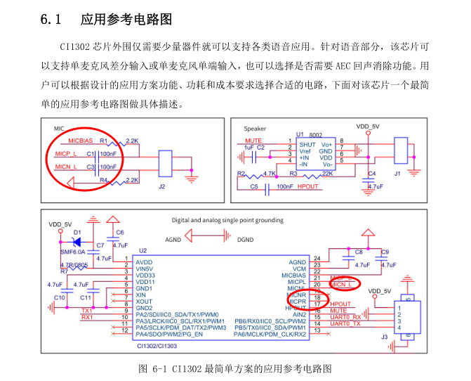

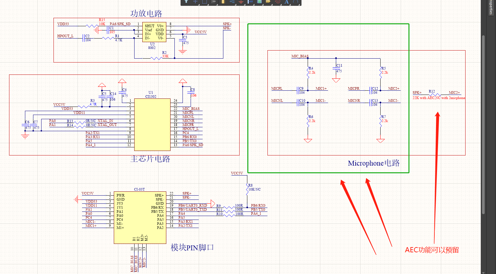

---

### CI1302的管脚6和7可以作为普通IO口使用吗？

**问题描述：**

CI1302芯片的管脚6（XIN）和管脚7（XOUT）是外部晶振输入/输出脚，询问是否可以将这两个管脚当作普通IO口使用。

**解决方案：**

这两个管脚是否可以作为IO口使用，取决于芯片版本：

- **无晶振版本**：管脚6和7可以作为普通IO口使用
- **有晶振版本**：管脚6和7专用于晶振，不能作为IO口使用

购买CI1302芯片时，可以选择无晶振版本，此时芯片内部有震荡电路，不需要外接晶振。

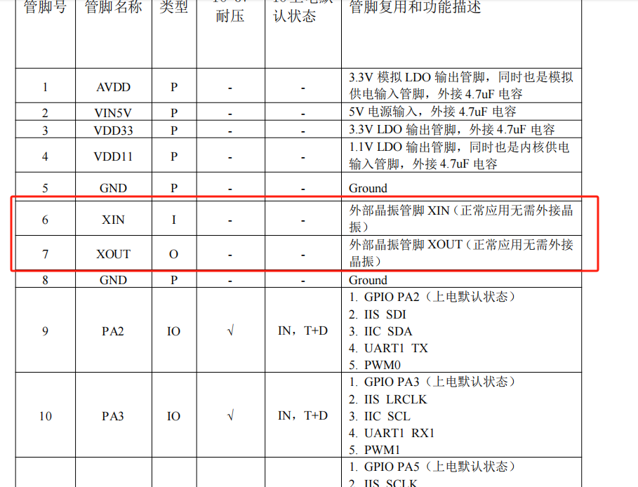

**注意事项：**

- 如果购买的模块已经焊接了晶振，则管脚6和7不能改作IO口
- 内部震荡电路的性能可满足大多数应用需求
- 设计时应提前确定是否需要将这些管脚用作IO功能

---

### CI1302可以不接晶振吗？13脚可以作为IO口使用吗？

**问题描述：**

询问CI1302是否可以不接晶振，以及芯片的13脚（GPIO_A6）是否可以作为通用IO使用。

**解决方案：**

CI1302芯片内置震荡电路，可以不外接晶振正常工作：

- 芯片内部有高品质的震荡电路
- 不需要外接晶振即可正常工作
- 管脚6和7在无晶振版本中可作为IO使用

关于13脚（GPIO_A6）的功能：

- 该管脚在标准示例开发板上被设计为功放使能控制脚
- 不能直接作为通用IO口使用
- 修改配置需要二次开发

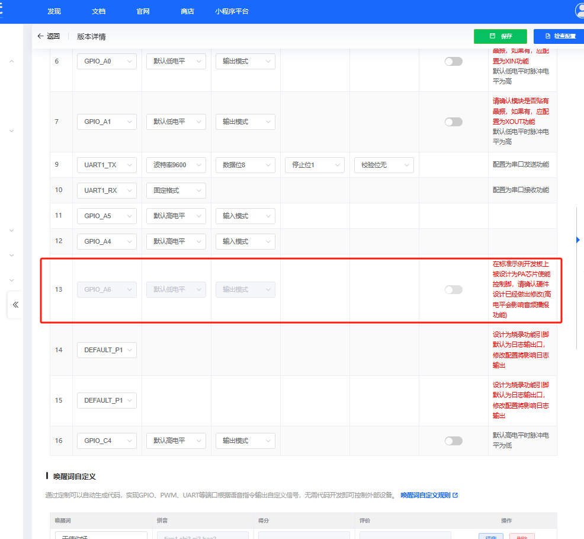

**注意事项：**

- 13脚与音频播报功能相关，修改配置会影响音频输出
- 如需使用13脚作为通用IO，需要进行二次开发
- 建议优先使用其他GPIO管脚

---

### CI1302电源输入端的电阻可以省略吗？

**问题描述：**

CI1302芯片电源输入端串联的4Ω电阻（R25）是否可以省略不用。

**解决方案：**

该电阻不能省略，必须保留：

- **作用**：限流保护，防止上电瞬间大电流
- **规格要求**：必须使用0805封装或更大的电阻
- **阻值**：4Ω（根据参考设计）

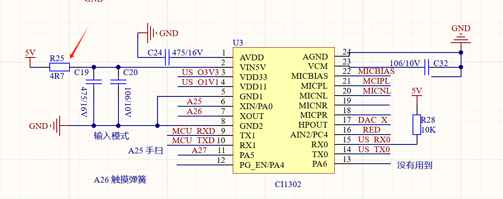

**注意事项：**

- 电源输入电阻是重要的保护元件
- 使用更小封装（如0603）可能导致过热损坏
- 上电瞬间电流较大，没有限流电阻可能损坏芯片
- 严格按照参考设计选择元件参数

---

### CI-03T悬空引脚无法配置输出电平怎么办？

**问题描述：**

在原理图中将未使用的引脚（悬空引脚）用于连接功放芯片的使能引脚，但通过平台配置后，这些引脚的输出电平无法控制。

**解决方案：**

**问题分析：**

- 未在模块上引出的悬空引脚无法通过万用表测量
- 芯片引脚过小，直接测量可能接触不良
- 平台配置对未引出引脚无效

**处理建议：**

1. **确认引脚是否引出**
    - 检查模块版本和引脚定义
    - 确认目标引脚是否已引出到焊盘
    - 参考模块原理图和引脚标注

2. **使用已引出的GPIO**
    - 选择明确引出的GPIO引脚
    - 避免使用未明确标注的悬空脚
    - 参考官方模块的引脚布局

3. **功放使能控制方案**
    - 使用官方支持的功放使能引脚
    - 或选择其他可用的GPIO引脚
    - 确保引脚支持输出功能

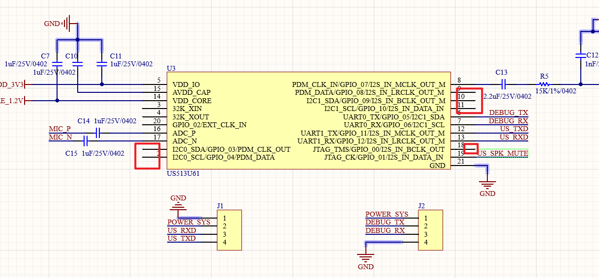

---

### 如何在CI-03T系列模块上实现使用外部音频作为参考输入的回声消除（AEC）功能？

**问题描述：**

需要在CI-03T系列模块上实现AEC功能，使用外部音频源作为参考信号输入，而不是使用模块自身的音频输出。

**解决方案：**

CI-03T和CI-33T系列模块都支持AEC功能，实现方法如下：

**1. 使用双麦克风模块实现外部AEC**

- 购买CI-03T2或CI-03T4双麦克风版本
- 将外部音频信号经过分压电路后接入MIC2引脚
- 开启AEC功能，MIC1用于语音识别，MIC2用于收集参考信号

**2. 分压电路设计**

- 外部音频信号通过电阻分压网络接入
- 推荐分压电阻值：R12=22kΩ，R11=2.2kΩ
- 确保MIC2输入电压在0.2V-0.5V范围内
- 使用100nF电容（C19）进行信号耦合

**3. 具体实现步骤**

- 购买双麦克风版本的CI-03T模块
- 将外部功放输出端连接到分压电路
- 分压后信号接入MIC2+引脚
- MIC2-引脚根据需要接地或悬空
- 配置固件开启AEC功能

**4. 单麦克风AEC方案**

- 如需使用单麦克风，可选择CI-03T3（单麦AEC带晶振版本）
- 该版本内部已集成AEC功能，无需外部电路
- 配置为单麦克风模式并启用AEC即可

**型号差异：**

- CI-03T和CI-33T：同一系列，仅Flash容量不同（300条 vs 500条词条）
- AEC功能和实现方式完全相同
- 可根据所需词条数量选择合适型号

**注意事项：**

- 双麦克风模块的普通版本内部不支持AEC功能
- 需要使用AEC时，务必选择支持AEC的型号
- 外部音频信号幅度必须控制在规定范围内
- D类功放可能需要额外的滤波电路处理

**注意事项：**

- 悬空引脚未在模块上引出时无法使用
- 直接在芯片引脚上测量存在风险且不可靠
- 建议使用官方明确的GPIO引脚进行功能实现
- 设计PCB时应参考官方模块的引脚布局

---

### 功放使能电平不兼容怎么办？

**问题描述：**

使用的功放要求低电平开启、高电平关闭，而平台默认功放使能为高电平开启、低电平关闭，导致无法正常控制功放。

**解决方案：**

**兼容方案：**

1. **使用官方推荐功放**
    - LPA4871：高电平使能（与平台默认匹配）
    - NS4890B/BL6281：高电平使能
    - 直接使用参考设计中的功放型号

2. **硬件反相方案**
    - 添加一个NPN三极管进行电平反相
    - 或使用专用反相器芯片（如74HC系列）
    - 实现低电平使能到高电平使能的转换

3. **软件配置方案**
    - 使用其他GPIO引脚自定义控制
    - 通过平台配置反向控制逻辑
    - 注意需要固件支持

**参考设计：**

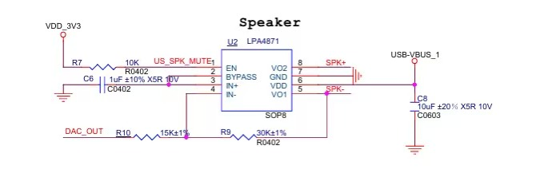

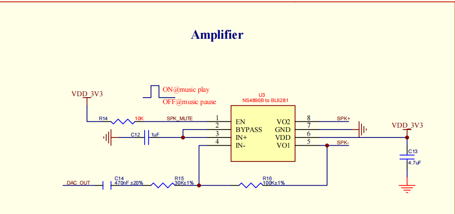


**注意事项：**

- 默认功放使能脚（US_SPK_MUTE）为高电平使能
- 修改功放控制逻辑需要代码支持
- 使用硬件反相时注意三极管选型和驱动能力
- 建议优先使用兼容的功放型号简化设计

---

### CI-03T1/T2可以直接使用芯片进行设计吗？

**问题描述：**

需要确认是否可以直接使用CI-03T1/CI-03T2芯片进行电路设计，并获取原理图以配合外部语音芯片和放大器进行TTS功能开发。

**解决方案：**

**芯片方案确认：**

- **可直接使用芯片**：CI-03T1/T2可提供芯片级方案
- **原理图提供**：可提供CI-03T1-V1.3原理图供参考
- **功放自设计**：功放部分电路需要自行搭建

**设计要点：**

1. **芯片获取**
    - 使用CI-03T1主芯片而非完整模块
    - 获取对应版本的规格书和原理图
    - 定制TTS固件烧录到芯片

2. **功放电路设计**
    - 自行设计功放电路以驱动外部喇叭
    - 可灵活控制放大倍数和音量
    - 支持多路音频输入切换

3. **音频切换方案**
    - 在功放前级实现多音频源切换
    - 使用模拟开关或继电器
    - 实现与外部语音芯片共用喇叭

**接口电平说明：**

- **功放使能**：PA6引脚，低电平有效（平台固定要求）
- **通信接口**：B5(B6)，可复用为刷固件和MCU通信
- **IO电平**：B5、B6、PA2、PA3均为3.3V电平
- **供电范围**：3.6V-5.5V直流输入

**注意事项：**

- 芯片方案需要具备一定的硬件设计能力
- 功放电路设计需考虑音频质量和散热
- 原理图仅供参考，可根据实际需求调整
- 定制TTS固件需要联系官方技术支持

---

### CI-03T的晶振是否可以不焊接？

**问题描述：**

观察到模块上没有焊接晶振，询问在设计电路时是否可以不焊接晶振。

**解决方案：**

**1. 晶振配置说明**

- CI-03T支持内部晶振和外部晶振两种配置
- 如果使用不焊晶振版本的模块，可使用内部晶振
- 内部晶振精度满足一般应用需求

**2. 设计注意事项**

- 根据模块版本决定是否焊接外部晶振
- 使用内部晶振时，外部晶振位置可留空
- 保留晶振焊盘以便后续需要时使用

**3. 性能影响**

- 内部晶振：满足基本应用，成本低
- 外部晶振：精度更高，适合对时钟精度要求高的场景

**注意事项：**

- 确认采购的模块版本是否已配置内部晶振
- 保留外部晶振的PCB布局以保持灵活性
- 如对时钟精度有特殊要求，建议焊接外部晶振

---

### 如何购买授权的CI-03T芯片样品？

**问题描述：**

需要购买少量授权的CI-03T芯片用于测试，但授权芯片暂时无货，询问替代方案和购买渠道。

**解决方案：**

**1. 样品获取方案**

- 授权芯片最小起订量为100个
- 样品需求可先购买授权模块测试
- 可从授权模块拆下芯片用于测试

**2. 临时替代方案**

- 购买淘宝上的授权模块进行测试
- 模块测试确认功能后再设计PCB
- 等待板子设计完成时，授权芯片通常已到货

**3. 采购流程**

- 月采购量1000左右可申请样品
- 批量采购直接联系销售
- 起订量不足时可协商解决方案

**4. 成本考虑**

- 授权芯片价格高于普通芯片
- 模组形式成本更高但可快速验证
- 建议项目确认后再批量采购

**注意事项：**

- 授权芯片出货需要额外时间
- 提前规划采购周期
- 确认年用量以获得更好的价格支持

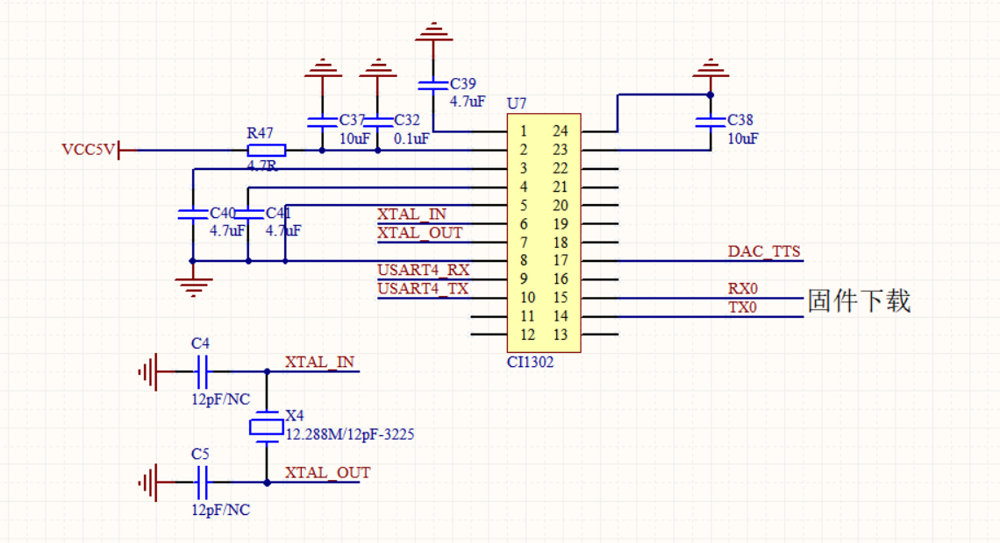

---

### CI-03T的串口电平是多少？

**问题描述：**

需要确认CI-03T芯片的串口通信电平是3.3V还是5V，以及是否支持5V电平。

**解决方案：**

**1. 电平规格**

- CI-03T芯片串口电平为3.3V
- 默认支持3.3V电平通信
- 可通过外围电路支持5V电平

**2. 电平兼容性**

- 3.3V MCU：可直接连接
- 5V MCU：需要电平转换电路
- 建议使用电平转换芯片或电阻分压

**3. 硬件设计建议**

**直接连接（3.3V系统）：**

- MCU为3.3V系统时可直接连接
- 无需额外电平转换电路
- 注意共地连接

**电平转换（5V系统）：**

- 添加专用电平转换芯片
- 使用电阻分压网络（简单方案）
- 或使用逻辑电平转换器

**4. 转换电路示例**

使用电阻分压实现5V到3.3V转换：

- 上拉电阻：2.2kΩ（5V侧）
- 下拉电阻：3.3kΩ（3.3V侧）
- 分压后得到约3.3V电平

**注意事项：**

- 直接连接5V可能损坏芯片
- 建议使用专用电平转换芯片
- 确保信号质量和可靠性

---

### 单麦克风和双麦克风版本在拾音性能上有何差异？

**问题描述：**

使用单麦克风版本时发现拾音距离和识别率不理想，考虑是否需要改用双麦克风版本。

**解决方案：**

**性能差异说明：**

- **双麦克风优势**：

    - 更好的拾音距离
    - 更高的识别率
    - 更强的噪声抑制能力
    - 支持声源定位和波束成形

- **单麦克风特点**：

    - 成本较低
    - 电路简单
    - 适合近距离应用

**选择建议：**

- 对拾音距离和识别率要求高的场景，建议使用双麦克风版本
- 成本敏感或近距离应用场景，单麦克风版本可能满足需求
- 需要综合考虑实际应用环境和预算

**影响因素：**

- 麦克风本身的品质和灵敏度
- 安装位置和朝向
- 环境噪声水平
- 电路设计和匹配

**注意事项：**

- 双麦克风需要正确的布局和间距
- 建议使用官方推荐的麦克风型号
- 实际效果受多种因素影响，建议测试验证

---

### 如何获取CI-03T的原理图？

**问题描述：**

需要获取CI-03T的原理图，以便将芯片直接集成到自己的电路板上。

**解决方案：**

**原理图获取方式：**

1. **联系官方技术支持**：

    - 通过官方渠道申请原理图
    - 提供项目背景和使用需求
    - 签署保密协议（如需要）

2. **获取流程**：

    - 提交申请后，技术人员会审核
    - 审核通过后会提供原理图文件
    - 通常提供PDF格式的完整原理图

3. **提供内容**：

    - CI-03T-V1.3完整原理图
    - 包含芯片外围电路设计
    - 标注关键器件参数

**集成设计建议：**

1. **参考设计**：

    - 可以直接参考官方原理图设计
    - 保持关键电路的一致性
    - 注意电源和音频电路的设计

2. **PCB布局**：

    - 遵循原理图中的布线建议
    - 注意模拟和数字电路的隔离
    - 保留足够的调试接口

3. **器件选型**：

    - 关键器件建议使用相同型号
    - 替代器件需要确认参数匹配
    - 注意封装和尺寸兼容性

**注意事项：**

- 原理图属于技术资料，需要正式申请
- 获得原理图后请妥善保管，避免外传
- 设计过程中遇到问题可及时咨询官方技术支持
- 直接集成芯片需要具备一定的硬件设计经验

---

### 开机时声音不清晰，第一个字说不清楚怎么办？

**问题描述：**

CI-03T1模块开机时第一个字声音不清晰，可能是功放芯片开启关闭的问题。

**解决方案：**

**问题分析：**

- 可能是功放使能信号延迟导致
- 程序开始播放时功放还未完全开启
- 第一个字的部分音频被丢失

**解决方法：**

1. **关闭自动功放使能**
    - 在平台配置中关闭"自动功放使能"功能
    - 让功放保持常开状态
    - 避免每次播放前的开关延迟

2. **使用模块自带功放**
    - CI-03T模块自带功放功能
    - 可直接驱动8Ω、3W以下的喇叭
    - 无需外接功放芯片

3. **外接功放优化**
    - 如必须外接功放，确保使能信号时序正确
    - 提前开启功放电源
    - 或使用硬件常开电路

**模块功放规格：**

- 输出功率：3W（8Ω负载）
- 支持阻抗：4-8Ω
- 无需外部功放即可满足多数应用场景

**注意事项：**

- 关闭自动功放使能会增加功耗
- 外接功放时注意电平匹配
- 建议优先使用模块自带功放
- 设计过程中遇到问题可及时咨询官方技术支持

---

### CI-03T1开机后喇叭持续发出底噪是什么原因？

**问题描述：**

CI-03T1模块在打开电源后，喇叭持续发出"斯斯"的底噪声，而SU-03T模块没有此现象。

**解决方案：**

- **正常现象**：电路存在底噪是正常现象，SU-03T也有底噪，只是较小听不到
- **原因分析**：CI-03T1的功放驱动能力较强，底噪相对更大一些
- **解决方法**：

    - 可以通过增加播报延时来减少底噪影响
    - 检查喇叭规格是否符合要求（4Ω阻抗＞2.4W，8Ω阻抗＞1.6W）
    - 确保不要超过功率上限（如4.5W）

**注意事项：**

- 底噪在未播报时也会通过喇叭电路传出，这是自动功放使能关闭后的正常现象
- 选择合适的喇叭规格可以有效改善使用体验

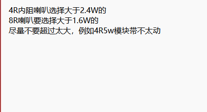

---

### CI-03T1是否支持在播报过程中打断当前播报？

**问题描述：**

在使用语音播报功能时，是否可以通过语音指令打断当前播报并执行下一个命令。

**解决方案：**

- **支持打断**：CI-03T1支持在播报过程中进行打断操作
- **操作方式**：需要先说出唤醒词，然后再说出下一个指令
- **实现流程**：

    1. 在播报过程中说出唤醒词
    2. 系统识别唤醒词后停止当前播报
    3. 说出新的语音指令
    4. 系统执行新的指令

**注意事项：**

- 必须使用唤醒词才能打断播报，直接说指令无效
- 确保唤醒词清晰、标准，避免打断失败

---

### CI-03T1长时间未使用后唤醒响应会变慢吗？

**问题描述：**

CI-03T1模块在长时间未使用后，再次唤醒时感觉响应速度变慢，怀疑是休眠导致。

**解决方案：**

- **静默状态**：CI-03T1在长时间未使用后会进入静默状态，而非休眠
- **识别性能**：进入静默状态后，语音识别性能不会有差距
- **响应速度**：实际唤醒和识别速度保持一致，感知变慢可能是心理作用

**注意事项：**

- 静默状态是模块的正常工作机制，不影响功能使用
- 如确实感觉响应异常，可检查：

    - 麦克风是否正常工作
    - 环境噪声是否过大
    - 唤醒词发音是否标准

---

### CI-03T1支持读取Arduino避障传感器的模拟量值吗？

**问题描述：**

需要确认CI-03T1语音模块是否支持读取Arduino小车避障传感器的模拟量值，以实现避障功能。

**解决方案：**

CI-03T1不支持直接读取模拟量值，但可以通过以下方式实现避障功能：

**1. 支持的输入类型**

- **数字量输入**：支持高低电平检测
- **串口通信**：可接收Arduino发送的数据
- **I2C/SPI**：不支持这些复杂通信协议

**2. 推荐实现方案**

**方案一：数字量避障**

- Arduino使用比较器将模拟量转换为数字量
- 设置合适的阈值（如2.5V）
- 超过阈值时输出高电平，连接到CI-03T1的IO口
- CI-03T1配置"检测到高电平"触发相应动作

**方案二：串口通信方案**

- Arduino读取传感器的模拟量值
- 通过串口将距离值发送给CI-03T1
- CI-03T1根据距离值执行不同动作
- 通信格式：如"OBSTACLE:30"表示30cm有障碍物

**3. 具体电路连接**

```
Arduino模拟输入(A0) --- [避障传感器]
                        |
                    [比较器(LM393)] --- CI-03T1 IO口
                        |
                Arduino设置参考电压(2.5V)
```

**4. 配置示例**

**CI-03T1平台配置：**

- 添加GPIO输入检测
- 设置触发条件为"高电平"
- 配置触发后的动作（如"后退"、"停止"）

**注意事项：**

- 不支持直接读取模拟量，需要转换电路
- 数字量方案简单可靠，推荐使用
- 串口通信需要双方约定协议格式
- 传感器供电要与系统共地

---

### CI-03T双麦声源定位角度范围是多少？

**问题描述：**

需要了解CI-03T双麦克风模块的声源定位角度识别范围，以及背面声源如何识别。

**解决方案：**

**角度识别范围：**

- **有效范围**：0-180度
- **识别原理**：基于双麦克风阵列的时延差计算
- **镜像问题**：无法区分正面和背面，会在对面角度输出相同值

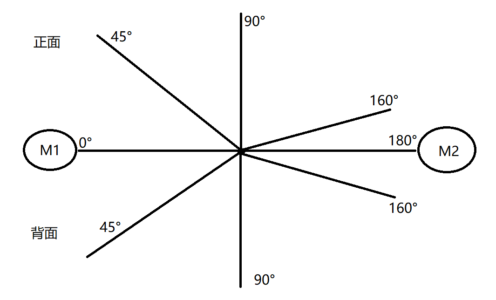

**实际应用说明：**

1. **角度输出特性**
    - 正面0度到背面180度全覆盖
    - 背面发声会输出对应的前方角度
    - 例如：背面30度会输出150度

2. **使用建议**
    - 如需区分前后方向，需要其他方案配合
    - 可考虑使用两个模块实现360度覆盖
    - 大部分应用只需知道声源相对位置即可


**技术细节：**

- **麦克风配置**：M1和M2两个麦克风
- **定位算法**：TDOA（到达时间差）
- **输出格式**：角度值（0-180）

**注意事项：**

- 单个模块无法实现真正的360度定位
- 背面声源会镜像到前方角度
- 如果应用需要区分前后，建议增加传感器辅助判断

---

### CI1302芯片功放控制IO引脚可以修改吗？

**问题描述：**

在硬件设计中，功放控制的引脚不是默认的PA6，需要了解是否可以通过配置或其他方式将功放控制引脚修改为其他IO口。

**解决方案：**

**硬件限制说明：**

- **PA6引脚功能**：在CI1302芯片及CI-03T模块中，PA6引脚被硬件固定连接为功放使能控制脚（SPK_SD）
- **不可更改原因**：这是芯片内部的硬件设计决定，无法通过软件配置修改
- **物理连接**：PA6引脚在模块内部已直接连接到功放电路的使能端

**可选解决方案：**

1. **使用SDK二次开发**
    - 如果确实需要使用其他引脚控制功放，可以通过SDK二次开发实现
    - 需要在硬件层面修改连接，将功放使能信号连接到目标引脚
    - 二次开发需要一定的开发经验和技术能力

2. **平台配置限制**
    - 图形化配置平台支持修改的引脚有限
    - 功放使能等核心功能引脚通常不允许修改
    - 平台主要针对常用功能配置，不支持底层硬件修改

3. **硬件适配方案**
    - 如硬件设计已完成，建议调整硬件连接以匹配PA6引脚
    - 或通过外部电路实现信号转换
    - 确保信号时序和电平匹配

**注意事项：**

- PA6引脚的功放使能功能是硬件级设计，无法绕过
- SDK二次开发需要专业的嵌入式开发经验
- 修改硬件连接可能影响产品稳定性，建议充分测试
- 如需更多IO口，可考虑使用IO扩展芯片

---

### CI-03T声源定位需要晶振吗？

**问题描述：**

了解CI-03T双麦模块是否必须焊接晶振才能实现声源定位功能。

**解决方案：**

**晶振作用：**

- 提供精确的时钟频率
- 确保音频采样时序准确
- 提高声源定位精度

**使用要求：**

- **硬性要求**：声源定位功能必须使用晶振
- **可选配置**：非声源定位应用可不焊接晶振
- **实测验证**：建议先测试无晶振效果

**技术说明：**

- 有晶振：定时更准确，声源定位精度更高
- 无晶振：可运行，但定位精度可能下降
- 成本考虑：晶振成本较低，建议保留

**注意事项：**

- 声源定位应用强烈建议焊接晶振
- 如对精度要求不高，可尝试无晶振方案
- 批量生产前建议进行对比测试

---

### 舵机可以直接连接到语音模块的GPIO引脚吗？

**问题描述：**

询问是否可以将舵机直接连接到CI-03T1等语音模块的B8B2等GPIO引脚上。

**解决方案：**

**1. 正确的连接方式**

- 3线舵机需要分别连接：

    - 信号线：连接到模块的GPIO引脚
    - 电源线（VCC）：连接到外部电源（5V或6V）
    - 地线（GND）：与外部电源地线共地

**2. 注意事项**

- 舵机不能直接由模块供电
- 模块GPIO输出电流有限，无法驱动舵机
- 必须使用外部独立电源为舵机供电
- 信号线只需要连接一根，控制PWM输出

**3. 电源隔离**

- 舵机电源与模块电源分开
- 共地连接确保信号参考电平一致
- 避免舵机噪声干扰模块工作

---


---

### CI-03T模块能否驱动5W喇叭？

**问题描述：**

需要确认CI-03T1或CI-03T2模块是否能驱动5W喇叭，以及功率与声音大小的关系。

**解决方案：**

**驱动能力说明：**

- CI-03T系列模块可以驱动5W喇叭
- 但功率越大不代表声音越大
- 声音大小主要取决于喇叭的灵敏度

**功率与音量的关系：**

- **灵敏度决定音量**：高灵敏度喇叭在较小功率下就能产生较大音量
- **功率承受能力**：功率越大，喇叭能承受的最大输入功率越大
- **实际音量**：需要看喇叭的具体灵敏度参数（dB值）

**选型建议：**

- 优先关注喇叭灵敏度参数而非功率
- 选择85dB以上灵敏度的喇叭获得更好音量
- 5W喇叭可以使用，但需确认阻抗匹配（推荐8欧姆）

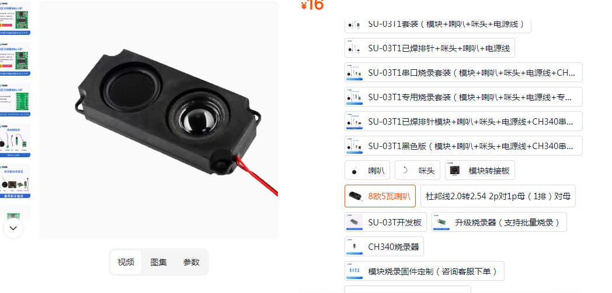

---


---

### 如何在嘉立创打样时节省打样费用？

**问题描述：**

需要打样两款不同的PCB板（如CI-03T1和CI-03T2），希望通过特殊设计节省一块打样费用。

**解决方案：**

**1. 拼板设计方法**

- 将两块独立板子设计在同一块PCB上
- 通过预留的连接区域保持拼板整体性
- 使用覆铜连接而非邮票孔

**2. 设计要求**

**连接方式：**

- 必须用覆铜将两块板连起来
- 不能使用邮票孔或V-CUT
- 覆铜连接后板厂会认为是一块板

**分离准备：**

- 在连接处预留切割线
- 设计时考虑后期手工分离的便利性
- 避免关键元件过于靠近连接处

**3. 分离步骤**

1. **切割分离**
    - 使用美工刀沿预设切割线划开
    - 逐渐加深，避免一次切断
    - 注意安全，防止划伤

2. **打磨处理**
    - 使用砂纸打磨切割边缘
    - 去除毛刺和锐边
    - 确保板边缘平整光滑

**4. 注意事项**

- 覆铜连通是关键，否则会被识别为两块板
- 分离时注意不要损伤板上元件
- 打样前与板厂确认拼板规则
- 适合小批量开发阶段使用

---

### 模块长时间待机发热量大吗？

**问题描述：**

需要了解CI-03T/CI-03T1/CI-03T2模块在长时间待机或工作状态下的发热情况，以及选择合适的供电方式。

**解决方案：**

**发热情况：**

- 模块待机和工作时发热量都不大
- 正常使用时手触摸仅温热，不会烫手
- 长时间待机温度稳定，无明显温升

**供电方式选择：**

- **锂电池供电**：适合移动便携应用，续航持久
- **干电池供电**：更换方便，适合低频使用场景
- **USB直流供电**：适合固定场景，供电稳定

**电池选择建议：**

- 长时间待机建议使用锂电池
- 锂电池能量密度高，体积小重量轻
- 可配合充电管理电路使用
- 如需低频使用，干电池也是可行选择

**注意事项：**

- 模块最大工作电流约500mA（带4欧喇叭）
- 待机电流约60mA，功耗较低
- 供电电压范围3.6-5.5V，建议使用5V供电
- 避免使用超过6V的电压，可能损坏模块

---

### 如何为电子DIY项目集成人体感应和语音控制功能？

**问题描述：**

需要实现一个电子DIY产品，要求：①感知到有人靠近时，灯光自动亮起，且距离越近亮度越亮②也可以通过语音控制亮起的灯光亮度增加/减少，以及切换灯光颜色。

**解决方案：**

**1. 系统架构设计**

由于语音模块不能直接读取距离传感器数据，需要增加主控MCU：

- **主控MCU**：读取距离传感器数据，通过串口发送给语音模块
- **语音模块**：接收传感器数据进行播报，识别语音命令并控制灯光
- **距离传感器**：可选择人体感应模块或超声波模块
- **执行器**：PWM控制的LED灯带

**2. 硬件连接方案**

**传感器选型**：

- 人体感应模块：输出电平信号，适合检测有人/无人
- 超声波模块：可输出距离数据，适合实现距离分级控制

**连接方式**：
```
[距离传感器] → [主控MCU] → [串口] → [语音模块]
                                        ↓
                                    [PWM输出] → [LED灯带]
```

**3. 软件实现逻辑**

**自动感应逻辑**：

- 主控读取距离传感器数据
- 根据距离值设置PWM占空比（距离越近，亮度越高）
- 通过串口发送距离值给语音模块进行播报

**语音控制逻辑**：

- 语音模块识别"调高亮度"/"调低亮度"/"切换颜色"等命令
- 直接控制PWM输出调节灯光
- 可配合TTS播报确认操作

**4. 注意事项**

- 语音模块不能直接读取传感器数据，需要主控进行数据转发
- 带协议的灯带需要额外的主控进行协议转换
- PWM输出频率建议设置在200Hz-2kHz之间，避免频闪
- 传感器安装位置需考虑检测范围和避免误触发

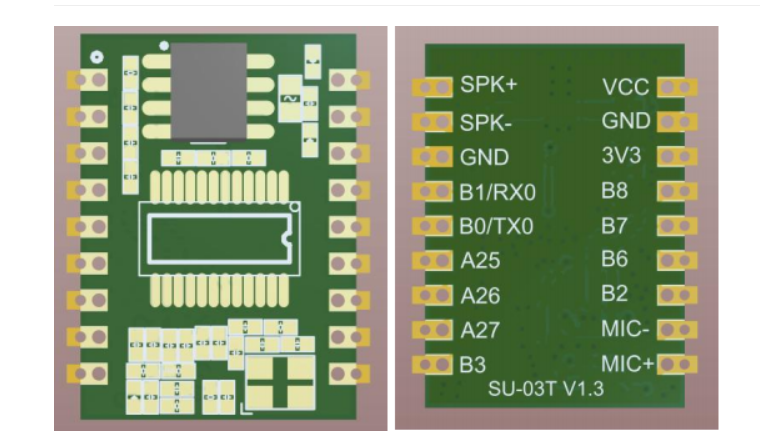

---

### 如何通过语音指令控制灯具的亮度和色温PWM信号？

**问题描述：**

需要实现灯具亮度和色温的语音控制，当语音指令为调节亮度至一档、二档、三档或四档时，语音模块能够输出不同频率或占空比的PWM信号来控制灯具。

**解决方案：**

语音模块可以通过配置PWM输出来实现灯具亮度和色温的分级控制：

**1. PWM配置方法**

**频率设置**：

- PWM频率设置为10kHz
- 该频率适用于大多数LED驱动器
- 频率过高可能导致驱动器工作异常

**占空比控制**：

- 同一PWM引脚可以输出不同占空比信号
- 通过调节占空比实现亮度分级控制
- 占空比范围通常为0%-100%

**2. 多档位控制实现**

**亮度控制**：

- 一档：设置25%占空比
- 二档：设置50%占空比
- 三档：设置75%占空比
- 四档：设置100%占空比

**色温控制**：

- 暖白模式：低色温对应占空比
- 正常模式：中等色温对应占空比
- 冷白模式：高色温对应占空比

**3. 硬件连接方案**

**单路PWM控制**：

- 使用一个PWM引脚控制亮度
- 通过占空比变化实现多档调节
- 适用于单色温LED灯具

**双路PWM控制**：

- PWM1：控制亮度（占空比调节）
- PWM2：控制色温（占空比或频率调节）
- 适用于双色温LED灯具

**4. 驱动器兼容性**

根据LED驱动器的输入要求：

- 电压范围：0-5V输入通常兼容
- 控制方式：支持PWM调光的驱动器
- 频率响应：确认驱动器对10kHz的响应

**5. 平台配置步骤**

在智能公元平台中：

- 选择PWM输出功能
- 设置PWM频率为10kHz
- 为每个命令词配置对应的占空比值
- 设置语音播报反馈功能

**注意事项：**

- 占空比具体数值需根据实际LED驱动器规格调试
- 不同档位的切换应避免频繁闪烁
- 建议添加延时，确保PWM信号稳定后再切换
- 调试时使用示波器观察实际输出波形

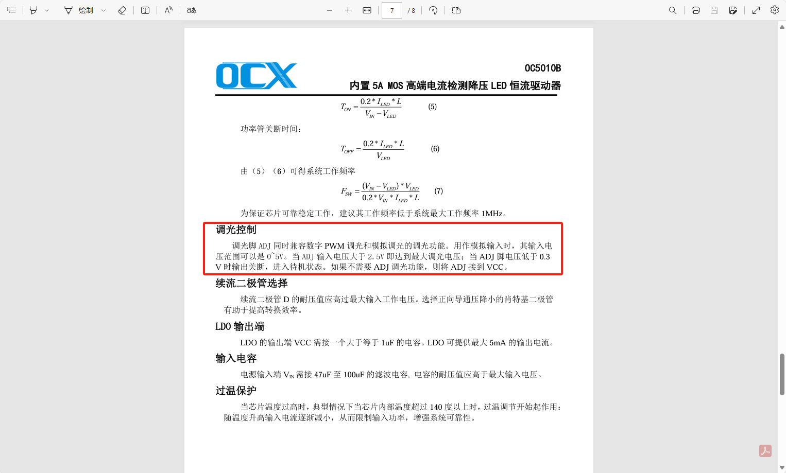

---


---

### 模块长时间工作是否需要散热措施？

**问题描述：**

CI-03T1和CI-03T2模块在长时间工作时会有轻微发热，担心是否需要额外的散热措施。

**解决方案：**

- 模块正常工作时产生轻微发热是正常现象
- CI-03T系列模块设计时已考虑发热问题，无需额外散热
- 模块内部具有过热保护机制
- 在常温环境下长时间使用不会影响寿命

**注意事项：**

- 避免在高温环境下使用（如阳光直射）
- 保持模块周围通风良好
- 不要覆盖模块的散热区域
- 如环境温度过高，可考虑增加被动散热（如散热片）

---### CI-33T模块输出脉冲时序不平分怎么办？


---
### 如何在嘉立创打样时节省打样费用？

**问题描述：**

需要打样两款不同的PCB板（如CI-03T1和CI-03T2），希望通过特殊设计节省一块打样费用。

**解决方案：**

**1. 拼板设计方法**

- 将两块独立板子设计在同一块PCB上
- 通过预留的连接区域保持拼板整体性
- 使用覆铜连接而非邮票孔

**2. 设计要求**

**连接方式：**

- 必须用覆铜将两块板连起来
- 不能使用邮票孔或V-CUT
- 覆铜连接后板厂会认为是一块板

**分离准备：**

- 在连接处预留切割线
- 设计时考虑后期手工分离的便利性
- 避免关键元件过于靠近连接处

**3. 分离步骤**

1. **切割分离**
    - 使用美工刀沿预设切割线划开
    - 逐渐加深，避免一次切断
    - 注意安全，防止划伤

2. **打磨处理**
    - 使用砂纸打磨切割边缘
    - 去除毛刺和锐边
    - 确保板边缘平整光滑

**4. 注意事项**

- 覆铜连通是关键，否则会被识别为两块板
- 分离时注意不要损伤板上元件
- 打样前与板厂确认拼板规则
- 适合小批量开发阶段使用

---


---

### 使用降压模块时如何避免芯片烧毁？

**问题描述：**

使用XL4015降压模块将20V电池转换为5V时，导致CI-03T1芯片烧毁，问题发生在启动和停止瞬间。

**解决方案：**

**1. 问题分析**

- 降压模块在启动/停止瞬间可能产生电压尖峰
- 继电器开关时会产生反向感应电动势
- 尖峰电压可能超过芯片承受范围

**2. 改进方案**

**增加稳压措施**：

- 在降压模块后加一级线性稳压（如AMS1117-3.3）
- 或将电压调至4.3V后串联二极管降压
- 在输出端并联TVS管吸收浪涌

**优化连接方式**：

- 为继电器线圈添加反向续流二极管
- 继电器控制端和负载端隔离供电
- 模块和继电器使用独立的电源回路

**3. 预防措施**

- 降压模块输出电压不要设置过高
- 在电源输入端加大容量滤波电容
- 避免大功率负载和模块共用电源

**注意事项：**

- 启动和停止瞬间是最危险的时段
- 继电器必须安装反向续流二极管
- 建议使用示波器检查电源纹波和尖峰
- 如无法避免尖峰，考虑使用开关电源模块替代

---


---

### CI-03T1/CI-03T2的P05和P06引脚可以配置为UART功能吗？

**问题描述：**

询问CI-03T1和CI-03T2型号芯片的P05和P06引脚是否可以配置为UART功能。

**解决方案：**

**引脚功能确认**

1. **查看平台配置选项**
    - 在智能公元平台上查看引脚复用选项
    - 如果平台上无法选择UART功能，则该引脚不支持
    - P05和P06引脚的具体功能取决于芯片型号

2. **P06引脚的特殊性**
    - P06引脚在某些型号中被配置为GPIO_06
    - 可能被复用为音频播放输出脚（如SU-20T）
    - 一旦被音频功能占用，无法用作UART

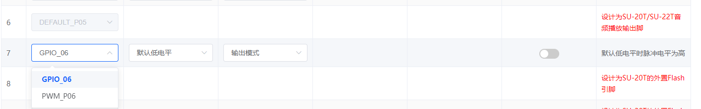


**判断方法**

1. **平台测试法**
    - 在智能公元平台创建产品配置
    - 查看P05/P06引脚的可用功能选项
    - 如果UART选项不可选，说明不支持

2. **查阅数据手册**
    - 查看对应芯片的引脚定义说明
    - 确认引脚的复用功能列表
    - 注意不同批次芯片可能有差异

**替代方案**

- 使用其他明确支持UART的引脚
- 通过GPIO模拟UART通信（需要额外开发）
- 考虑使用支持更多UART引脚的芯片型号

**注意事项：**

- 不同芯片型号的引脚功能可能不同
- 平台配置选项反映了芯片的实际功能限制
- 音频功能和UART功能可能存在互斥关系
- 设计时需预留足够的引脚余量

---


---
 
### CI-03T2模块详细尺寸参数与PCB文件导入问题

**问题描述：**

需要获取CI-03T2模块底部的详细尺寸参数，包括孔径、孔心距和孔到边缘的距离。同时，在尝试导入立创EDA时遇到PcbDoc文件格式不支持的问题。

**解决方案：**

**模块尺寸参数：**

1. **基本尺寸**
    - 模块总长度：21mm
    - 模块总宽度：15mm
    - 焊盘尺寸：3×1.2mm

2. **底部焊盘参数**
    - 焊盘孔径：2.0mm
    - 引脚间距：2.5mm（标准2.54排针）
    - 焊盘到边缘距离：

        - 长边方向：<1mm、<2mm、<2.5mm（根据位置不同）
        - 短边方向：适当间距，确保机械强度

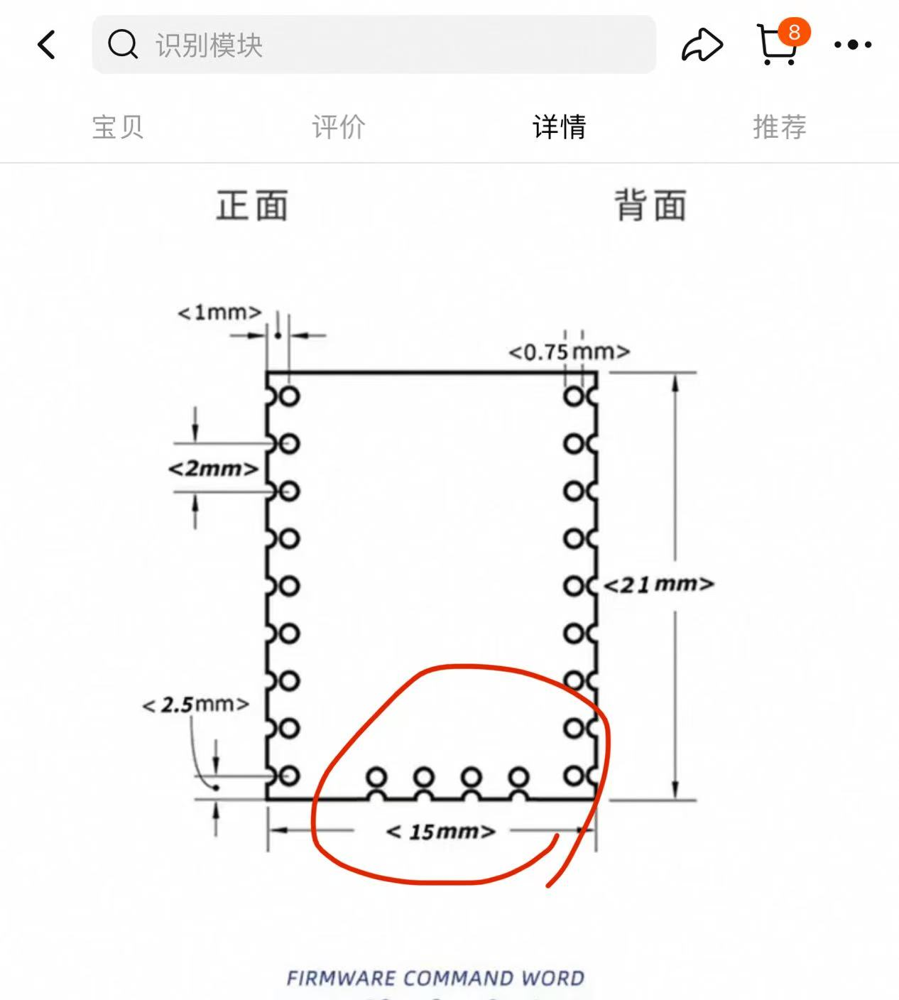

*CI-03T2模块的正面和背面视图，标注了关键尺寸参数*

**PCB文件导入方案：**

1. **立创EDA兼容性问题**
    - 立创EDA目前不支持.PcbDoc格式导入
    - 该格式是Altium Designer的私有格式
    - 需要转换或使用其他EDA工具

2. **解决方案**

    **方案一：使用开发包中的转接板文件**

    - 开发包中包含"模块转接板"PCB文件
    - 可直接用于参考设计
    - 文件位置：开发包→PCB文件→模块转接板

    **方案二：格式转换**

    - 使用Altium Designer导出为Gerber格式
    - Gerber文件可被大多数EDA软件导入
    - 包含所有层信息，便于生产

    **方案三：使用封装图**

    - 从官方获取封装图（.PCB格式）
    - 导入封装进行手动布局
    - 根据尺寸参数自行绘制

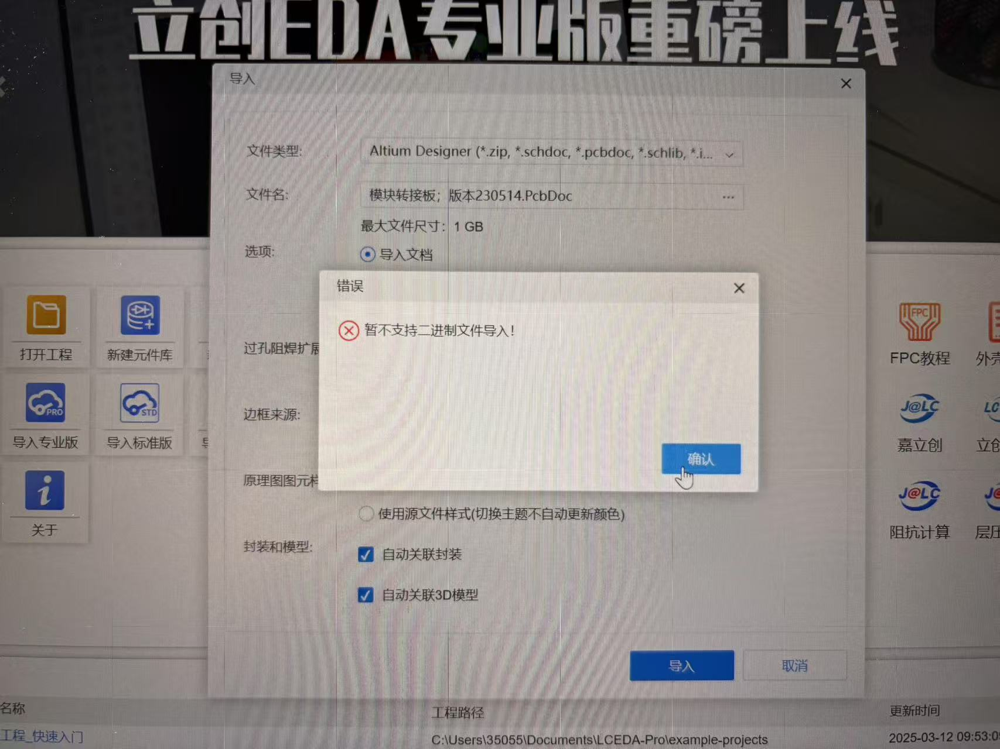

*立创EDA提示"暂不支持二进制文件导入"*

**设计建议：**

1. **焊盘设计**
    - 按照标准2.54mm间距布局
    - 孔径2.0mm，环径3.0-3.5mm
    - 表面处理：喷锡或沉金

2. **定位设计**
    - 可在模块四角增加定位孔
    - 确保焊接时的精确对位
    - 考虑增加丝印标识方向

3. **生产文件输出**
    - 输出Gerber X2格式
    - 包含钻孔文件（NC Drill）
    - 提供贴片坐标文件（Pick and Place）

**注意事项：**

- 不同批次的模块可能有微小差异，建议实际测量验证
- 焊盘温度敏感，焊接时注意控制温度和时间
- PCB设计时预留足够的维修空间
- 如需大批量生产，建议先制作样板测试

---

### CI-03T的UART接口如何连接？

**问题描述：**

需要了解CI-03T模块的RX、TX引脚是否可以直接与3.3V的MCU进行UART通信连接。

**解决方案：**

- **确认电压兼容性**：

    - CI-03T供电电压范围为3.6V-5.5V
    - UART通信电平与3.3V MCU兼容
    - 可以直接连接，无需电平转换

- **正确连接方式**：

    - CI-03T的RX连接MCU的TX
    - CI-03T的TX连接MCU的RX
    - 共地连接（GND）

- **注意事项**：

    - 确保波特率设置一致（默认115200）
    - 通信距离较长时建议加终端电阻
    - 避免在模块工作时进行插拔

**注意事项：**

- CI-03T的UART接口支持标准的3.3V电平
- 模块工作电压3.6-5.5V，与通信电平无关
- 如使用5V系统，需要注意电平兼容性问题

---

### CI-03T有播报声音但无法识别语音指令且固件生成排队时间过长怎么办？

**问题描述：**

CI-03T1模块上电后喇叭有播报声音，但语音指令无法被识别。同时，在尝试烧录固件时遇到生成时间过长的排队情况（如158分钟）。

**解决方案：**

**1. 语音识别问题排查**

硬件和配置检查：

- 确认麦克风已正确连接
- 检查麦克风是否被拔除导致无法拾音
- 测试使用32单片机验证串口通信正常
- 尝试更换供电电源排除供电问题

**2. 固件生成排队处理**

应对长时间排队：

- 避开高峰时段（下午3-6点）生成固件
- 系统显示的预计时间可能不准确，实际可能更快
- 可以先进行其他测试准备工作
- 考虑升级到更高性能模块减少等待时间


*固件生成排队显示需要158分钟，实际等待时间可能更短*

**3. 快速验证方法**

临时测试方案：

- 使用之前生成的成功固件先测试硬件
- 用51或32单片机验证模块基本功能
- 确认模块硬件没有损坏
- 排除硬件问题后再重新生成固件

**4. 替代方案**

如问题持续存在：

- 考虑使用CI-33T（4MB Flash，处理更快）
- 选择非高峰时段进行固件生成
- 联系技术支持申请优先处理
- 使用本地编译环境生成固件

**注意事项：**

- 播报正常说明功放和喇叭工作正常
- 无法识别可能是麦克风连接或配置问题
- 固件生成排队是平台资源限制，非技术故障
- 建议提前规划固件生成时间，避免影响项目进度

---

### CI-03T模块拾音正常但无法识别语音指令怎么办？

**问题描述：**

CI-03T模块拾音器和喇叭都正常，烧录后能正常播报，但无法识别语音指令。

**解决方案：**

**问题分析：**

- 硬件基本功能正常（拾音、播报）
- 烧录成功表明通信无问题
- 语音识别功能失效可能是芯片或固件问题

**排查步骤：**

1. **硬件检查**：

    - 测试3.3V脚输出电压是否正常
    - 检查麦克风引脚是否有虚焊
    - 确认喇叭连接可靠

2. **固件验证**：

    - 烧录出厂固件测试
    - 确认上电启动系统播放功能
    - 测试唤醒词和指令响应

3. **交叉对比**：

    - 使用相同固件测试其他模块
    - 对比正常模块和故障模块
    - 排除固件配置问题

**可能原因：**

- 芯片内部识别电路损坏
- 麦克风灵敏度异常
- 固件配置错误
- 环境噪声过大

**解决方案：**

1. **更换模块**：

    - 如果确认是芯片问题
    - 使用同型号替换
    - 保留故障模块用于分析

2. **环境优化**：

    - 降低环境噪声
    - 调整麦克风位置
    - 确保说话音量适中

3. **重新配置**：

    - 检查唤醒词设置
    - 调整识别灵敏度
    - 重新生成和烧录固件

**注意事项：**

- 烧录成功不代表芯片完全正常
- 识别功能比播报功能更复杂
- 相同硬件下不同模块表现差异可能指向芯片问题
- 批量问题需要检查生产工艺和固件版本

### CI03T2唤醒后无法响应指令怎么办？

**问题描述：**

CI03T2芯片可以正常响应唤醒词，但无法识别和执行其他语音指令。

**解决方案：**

**问题分析：**

- 唤醒功能正常说明基本硬件工作
- 仅识别功能失效说明问题特定
- 可能与固件配置或芯片状态有关

**排查步骤：**

1. **唤醒词验证**：

    - 确认唤醒词能正常触发
    - 检查唤醒后的提示音
    - 验证识别指示灯响应

2. **指令词测试**：

    - 逐个测试所有指令词
    - 注意发音清晰度和音量
    - 记录哪些指令有响应

3. **固件配置检查**：

    - 查看指令词是否正确配置
    - 确认识别阈值设置
    - 验证词条数量限制

**可能原因：**

- 固件中指令词配置错误
- 识别灵敏度设置不当
- 噪声环境干扰
- 麦克风位置或方向问题
- 芯片内部识别电路异常

**解决建议：**

1. **优化使用环境**：

    - 降低背景噪声
    - 调整说话距离（15-30cm）
    - 保持标准发音音量

2. **重新生成固件**：

    - 检查指令词配置
    - 调整识别参数
    - 使用测试固件验证

3. **硬件检查**：

    - 测试麦克风工作状态
    - 检查音频输入电路
    - 验证电源稳定性

**注意事项：**

- CI03T2支持300条词条
- 唤醒和指令使用相同识别引擎
- 如问题持续，可能需要更换模块
- 保留详细的测试现象用于分析

### CI-03T1模块电容规格确认

**问题描述：**

CI-03T1模块上某个电容丢失，需要确认其规格参数以便更换。

**解决方案：**

模块上标记的电容规格为4.7μF。


**更换注意事项：**

- 电容容值：4.7μF
- 建议使用相同容值的电容进行更换
- 注意电容的极性，避免反接


### CI-03T与单片机串口通信

**问题描述：**

需要了解CI-03T模组与单片机进行串口通信时的引脚连接方式，确保硬件设计正确。

**解决方案：**

**引脚连接方式：**

CI-03T模组提供多组UART接口，与单片机通信时推荐使用B1/B0引脚：

- **B1（RX）**：模组接收引脚，连接单片机的TX
- **B0（TX）**：模组发送引脚，连接单片机的RX


**连接要求：**

为确保通信稳定性，串口连接需要串联电阻：

- 在B1/RX和B0/TX引脚与单片机之间分别串联100Ω电阻
- 电阻应尽量靠近模组引脚放置


**连接示意：**

```
单片机 TX → 100Ω电阻 → B1 (CI-03T RX)
单片机 RX ← 100Ω电阻 ← B0 (CI-03T TX)
```

**B2/B3引脚说明：**

- B2/B3引脚可用于烧录接口（B7/B6为常用烧录口）
- 如不需要使用B2/B3作为串口，可预留不接
- B7/B6为标准烧录接口，推荐用于固件下载


**平台配置步骤：**

1. 登录智能公元平台
2. 选择对应的项目
3. 在引脚配置中启用B1/B0的串口功能
4. 生成并烧录固件

**注意事项：**

- 串口通信需要交叉连接（TX对RX，RX对TX）
- 确保两设备共地
- 电压电平需匹配（3.3V或5V）
- 串联100Ω电阻可有效保护IO端口并改善信号完整性
- 波特率等通信参数需要保持一致

### CI-03T硬件设计中的复位按键配置

**问题描述：**

在将CI-03T芯片集成到自主设计的PCB板时，需要确认是否必须保留复位按键。

**解决方案：**

**复位按键的作用：**

复位按键主要用于调试和开发阶段，生产环境中可以根据实际需求决定是否保留。

**设计建议：**

1. **开发阶段**：

    - 建议保留复位按键，便于调试和重启
    - 可连接到芯片的复位引脚（RESET）
    - 使用轻触开关，配合上拉电阻

2. **生产阶段**：

    - 可以通过软件复位替代硬件复位
    - 如需硬件复位，可保留测试点便于后期维护
    - 成本敏感产品可省去复位按键

**电路设计要点：**

- 复位引脚通常为低电平有效
- 配合10kΩ上拉电阻确保正常工作状态
- 按键按下时将复位引脚拉低实现复位


**注意事项：**

- 复位按键不是必需的，可根据产品定位决定
- 保留测试点有助于后期故障排查
- 软件复位功能可以满足大部分使用场景

### CI-03T晶振配置说明

**问题描述：**

需要了解CI-03T芯片的晶振配置要求，以及是否必须使用外部晶振。

**解决方案：**

**晶振配置选项：**

CI-03T芯片支持内部晶振和外部晶振两种配置方式：

1. **使用内部晶振**：

    - 芯片内置晶振，无需外部元件
    - 适合成本敏感、空间受限的应用
    - 频率精度可能受温度影响

2. **使用外部晶振**：

    - 提供更高的频率稳定性和精度
    - 可改善温漂性能
    - 需要外接晶振和负载电容

**设计建议：**

- 对精度要求不高的应用：使用内部晶振
- 对稳定性要求高的应用：添加外部晶振
- 批量生产前建议实测两种方案的识别效果

**电路连接：**

如使用外部晶振，需连接到芯片的晶振引脚（XIN/XOUT）：

- 外部晶振频率需与芯片规格匹配
- 配合合适的负载电容（典型值12-22pF）
- 晶振附近布线要短且远离噪声源

**注意事项：**

- 内部晶振可满足基本应用需求
- 外部晶振主要解决温漂和精度问题
- 切换晶振配置需要重新生成固件

### CI-03T B5/B6引脚固件下载功能

**问题描述：**

需要了解配置修改后，B5和B6引脚是否仍可用于固件下载。

**解决方案：**

B5/B6引脚是固定的烧录接口，不受配置影响：

- **B5/B6固定功能**：作为专用烧录口，不受用户配置影响
- **持续可用**：即使修改了模组配置，仍可通过B5/B6下载固件
- **兼容性**：与串口通信功能独立，不会相互冲突


**烧录使用说明：**

1. B5/B6为固定烧录引脚，专用于固件下载
2. 配置修改后仍可正常使用烧录功能
3. 烧录时需要使用专用烧录工具或串口烧录器

**注意事项：**

- B5/B6为专用烧录接口，不建议用作其他用途
- 烧录时确保电源稳定（建议5V供电）
- 如烧录失败，检查接线是否正确和电源是否稳定

### CI-03T唤醒词误触发问题优化

**问题描述：**

CI-03T模组在使用短唤醒词时出现误触发，测试版固件存在误报，需要优化固件实现"先唤醒后执行命令"逻辑。

**解决方案：**

**唤醒词长度优化：**

- 建议使用3-6个字的中文唤醒词
- 过短的唤醒词容易导致误识别
- 避免使用日常对话中的高频词汇


**识别阈值调整：**

1. **命令识别阈值调低**：

    - 适当降低命令识别阈值可减少误触发
    - 建议从0.4开始调整，根据实际效果微调
    - 阈值越小越不敏感，可降低误识别率

2. **唤醒灵敏度设置**：

    - 默认唤醒灵敏度为0.2
    - 如误识别率高，可降低至0.1
    - 需要在实际环境中测试验证

**固件版本选择：**

- 测试版固件可能存在误报问题
- 建议使用正式版固件确保稳定性
- 正式版固件经过全面测试，误触发率更低

**防误识别配置：**

- 在平台中添加容易误识别的词汇到禁止列表
- 多个禁止识别词用"|"分隔
- 可有效避免特定场景下的误触发

**注意事项：**

- 唤醒词和命令词的配置需要在智能公元平台完成
- 配置修改后需要重新生成并烧录固件
- 建议在典型使用环境下进行充分测试
- 平衡识别率和误识别率，找到最适合的阈值设置

### 如何配置唤醒词和命令词均为"救命救命"并设置自动超时退出

**问题描述：**

需要修改离线语音识别芯片的固件，将唤醒词和触发命令词均设置为"救命救命"，并确保设备在唤醒后100秒自动退出唤醒状态，同时解决因上电时禁止超时退出唤醒导致的误报问题。

**解决方案：**

**基础配置要求：**

1. **唤醒词设置**：

    - 唤醒词：救命救命
    - 唤醒回复语：我在

2. **命令词设置**：

    - 触发命令词：救命救命
    - 灵敏度设置：中等

3. **超时退出配置**：

    - 唤醒后超时时间：100秒
    - 超时后自动退出唤醒状态


**关键配置调整：**

1. **删除禁止超时退出唤醒配置**：

    - 之前的固件设置了"禁止超时退出唤醒"
    - 该配置导致上电后无法自动退出，引起误报
    - 必须删除此配置项才能正常工作


2. **删除上电启动禁止退出**：

    - 在B01触发项中删除"禁止超时退出唤醒"系统控制
    - 确保唤醒后可以正常超时退出


**工作逻辑说明：**

1. **正常工作流程**：

    - 设备上电后处于待机状态
    - 说出"救命救命"唤醒设备，设备回复"我在"
    - 唤醒后100秒内说出"救命救命"触发执行命令
    - 100秒内无操作自动退出唤醒状态

2. **重复使用**：

    - 退出唤醒状态后，需要再次说出"救命救命"唤醒
    - 每次唤醒都有100秒的有效时间

**固件生成与烧录：**

1. 在智能公元平台完成上述配置
2. 生成固件文件（包含.bin和_update.bin两种版本）
3. 使用烧录工具进行固件更新


**注意事项：**

- 确保删除了"禁止超时退出唤醒"配置，避免误报
- 唤醒词和命令词相同不会造成功能冲突
- 100秒超时时间可根据实际需求调整
- 配置修改后需要重新生成并烧录固件

---

### 如何获取CI-03T系列的技术资料和开发资源？

**问题描述：**

需要获取CI-03T系列离线语音识别模块的详细技术资料、开发资源和平台使用指南。

**解决方案：**

- **智能公元文档中心**：包含所有模块/芯片资料，图文指导
    - 网址：https://help.aimachip.com/docs/offline_ci03t/ci_03t_kfb
    - 提供模块开发包、原理图等硬件资料

- **原理图获取**：

    - 可在开发包中获取详细的原理图文件
    - 包含总原理图、主芯片和晶振电路图、功放电路图、麦克风电路图等
    - 支持参考原理图进行自主PCB设计

- **PCB源文件政策**：

    - 原理图文件公开提供，可供参考设计
    - PCB源文件（如.PCB、.PDB等格式）不对外公开
    - 建议根据原理图重新绘制PCB，以满足具体项目需求

- **平台入门视频**：认识平台功能配置位置和固件生成流程
    - B站视频：https://www.bilibili.com/video/BV1e8411T77q/
    - 搜索UP主【机芯智能】获取更多指导视频和案例教学
    - **自学习功能视频**：https://www.bilibili.com/video/BV1pB4y147tn/

- **智能公元平台**：在线配置和固件生成平台
    - 网址：http://www.smartpi.cn/#/
    - 支持词条编辑、回复语设置、阈值配置和固件生成

- **机芯智能官网**：产品信息和技术支持
    - 提供最新产品资讯和技术文档下载

**注意事项：**

- 建议先观看入门视频，了解平台基本操作流程
- 模块资料（开发包）中包含详细的原理图和硬件接口说明
- 遇到技术问题可在B站机芯智能频道查找相关教学视频
- 原理图可供参考使用，但PCB源文件不公开，需要自行设计
- 自主设计PCB时，请严格按照原理图的电路连接和电气参数要求

---

## 双麦克风设计

### CI-03T4如何连接双麦克风？

**问题描述：**

需要了解CI-03T4模块如何连接双麦克风，以及双麦克风设计的注意事项。

**解决方案：**

**双麦支持说明：**

- CI-03T4支持双麦克风连接
- 购买时可以选择焊接好排针的版本或未焊接排针的版本
- 双麦克风可以提供更好的噪声抑制和声源定位能力

**连接方案：**

1. **硬件连接**：

    - 确认模块版本是否支持双麦输入
    - 按照模块引脚定义连接两个麦克风
    - 保持差分走线并做好包地处理

2. **布局建议**：

    - 两个麦克风之间保持适当距离（建议3-5cm）
    - 麦克风与喇叭保持声学隔离
    - 避免麦克风之间的直接声学耦合

**注意事项：**

- 双麦设计需要考虑算法支持
- 确保两个麦克风的特性一致
- 测试时注意验证双麦算法的有效性


### CI-03T支持I2S接口吗？

**问题描述：**

询问CI-03T模块是否支持I2S接口输入输出，以及能否作为audio codec使用。

**解决方案：**

**I2S接口支持情况：**

CI-03T模块**不使用I2S接口**，目前所有模块都使用ADC信号处理音频。

**技术说明：**

1. **音频处理方式**
    - CI-03T使用ADC进行音频采集
    - 不支持I2S数字音频接口
    - 内部集成专用的音频处理电路

2. **引脚复用情况**
   
    虽然部分引脚支持I2S功能复用（如引脚8-13），但实际应用中：

    - PA2/PA3: 可复用为I2S接口（未激活）
    - PA4/PA5: 可复用为I2S接口（未激活）
    - PA6: 可复用为I2S接口（未激活）


3. **应用场景分析**

对于需要与外部MCU配合使用的场景：

**推荐方案：**

- CI-03T：负责语音识别和音频输出
- 外部MCU：通过串口接收识别结果，控制其他外设

**通信方式：**
```
语音输入 → CI-03T识别 → 串口输出 → MCU处理 → 控制外设
```

**4. 替代解决方案**

如果确实需要I2S接口：

- 考虑使用支持I2S的专用音频芯片
- 使用带I2S功能的MCU（如ESP32、STM32等）
- CI-03T仅作为语音识别模块使用

**注意事项：**

- CI-03T专注于语音识别功能
- 不作为通用audio codec使用
- 建议通过串口与外部MCU通信
- 如需数字音频接口，请选择其他方案

---

### CI-03T的功放芯片可以用SU-63T的功放替代吗？

**问题描述：**

询问CI-03T模块上的功放芯片是否可以用SU-63T的功放芯片进行替代。

**解决方案：**

**功放芯片兼容性说明：**

1. **芯片型号对比**
    - CI-03T：使用TC8002功放芯片
    - SU-63T：使用不同型号的功放芯片

2. **替代兼容性**
    - SU-63T的功放芯片**可以替代**CI-03T的TC8002
    - CI-03T的TC8002**不能替代**SU-63T的功放芯片
    - 替代时需要确认引脚定义是否一致

3. **外部短路保护特性**
    - TC8002在输出短路时有一定保护能力
    - 但任何功放芯片在短路情况下都可能损坏
    - 外部短路是否烧毁功放取决于具体情况和概率

4. **功放选型建议**
    - 如需更可靠的短路保护，建议选择带有保护功能的功放
    - 增加外部保护电路（如自恢复保险丝）
    - 确保喇叭线路连接正确，避免短路

**注意事项：**

- 功放芯片损坏通常由外部短路或负载异常引起
- 更换功放芯片前需排查故障原因，避免再次损坏
- 不同型号功放的引脚定义可能不同，替换时需确认
- SU-63T功放成本较高，建议按需选择

---
