# CI-33T 硬件设计 FAQ

本页用于整理 CI-33T 相关的硬件设计问题。

### CI-33T模块的两个串口是否可以同时使用？

**问题描述：**

需要了解CI-33T模块的两个串口是否可以同时工作，分别用于发送和接收不同的数据。

**解决方案：**

CI-33T模块的两个串口可以同时使用。

**功能说明：**

- 支持双串口同时工作
- 串口0和串口1可独立配置
- 可分别用于不同的数据传输任务
- 互不干扰，并行通信

**应用场景：**

- 连接多个外部设备
- 同时进行数据收发
- 多协议通信需求
- 主从设备控制

**注意事项：**

- 确保正确的引脚连接
- 注意波特率配置匹配
- 避免数据冲突

---

### CI-33T的待机功耗如何优化？

**问题描述：**

CI-33T芯片关机后进入待机模式，待机电流为50mA，需要了解是否有更低功耗的模式。

**解决方案：**

**待机模式说明：**

CI-33T在关机后确实会进入待机模式，待机电流约为50mA。如果需要保持随时唤醒功能，这是芯片的最低功耗状态。

**低功耗方案：**

1. **外部电源控制**：

    - 使用外部MOS管或继电器控制模块供电
    - 不需要语音功能时完全切断电源
    - 需要工作时再给模块上电
    - 这样可将功耗降至接近0

2. **应用场景建议**：

    - 对于需要随时唤醒的应用：只能使用待机模式
    - 对于定时工作应用：可采用外部电源控制方案
    - 电池供电场景：建议使用外部控制延长续航

**功耗对比：**

- **待机模式**：50mA（可随时唤醒）
- **断电模式**：0mA（需要重新上电启动）

**注意事项：**

- 如需保持随时唤醒功能，必须使用待机模式
- 外部电源控制方案需要额外的控制电路
- 断电后重新启动需要一定时间（取决于初始化流程）

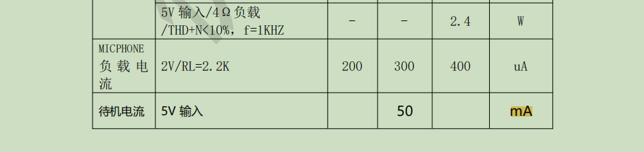

---

### CI-33T如何获取声源定位数据？

**问题描述：**

语音模块需要靠近才能识别，拾音距离明显短于正常范围，影响使用体验。

**解决方案：**

**主要原因分析：**

拾音距离短通常由以下三个主要问题导致：

1. **麦克风装反或极性错误**

    - 麦克风正负极接反会导致灵敏度大幅下降
    - 装反后基本无法正常拾音
    - 需要重新检查接线极性

2. **麦克风本身损坏**

    - 麦克风内部元件损坏，灵敏度降低
    - 可能因静电、过压或焊接温度过高导致
    - 需要更换新的麦克风

3. **麦克风选型不当**

    - 使用了不匹配的麦克风规格
    - 灵敏度过低或阻抗不匹配
    - 信噪比不足，影响识别距离

**故障排查步骤：**

1. **检查麦克风接线**

    - 确认MIC+和MIC-连接正确
    - 查看麦克风规格书确认引脚定义
    - 使用万用表检测连通性

2. **测试麦克风性能**

    - 在安静环境下测试基础功能
    - 对比新旧麦克风的灵敏度
    - 使用示波器观察输出信号

3. **验证硬件连接**

    - 检查麦克风供电是否正常
    - 确认耦合电容等外围元件
    - 测量各点电压是否在规格范围内

**解决方法：**

1. **纠正接线错误**

    ```
    标准接线方式：
    MIC+ → 麦克风正极
    MIC- → 麦克风负极
    GND  → 屏蔽层（如有）
    ```

2. **更换损坏麦克风**

    - 使用推荐型号：6027硅胶麦克风
    - 灵敏度规格：-32dB到-25dB
    - 信噪比：≥70dB

3. **优化安装位置**

    - 麦克风远离噪声源
    - 避免放入密闭空间
    - 保证适当的开孔面积

**预防措施：**

- 生产时做好极性标识
- 使用防呆接口设计
- 保留麦克风向安装图示
- 定期进行抽检测试

**注意事项：**

- 麦克风质量直接影响识别距离
- 装反是导致距离短的常见原因
- 更换麦克风时注意防静电措施
- 如问题持续，建议寻求专业技术协助

---


---

### CI-33T芯片3号引脚的最大输出电流是多少？

**问题描述：**

需要了解CI-33T芯片3号引脚的最大输出电流能力，确认是否可以为外部负载供电。

**解决方案：**

CI-33T芯片3号引脚的输出电流较小，不能用于为外部负载供电。

**技术规格：**

- **输出电流能力**：较小，具体数值未在规格书中明确标注
- **供电能力**：不足以驱动外部负载
- **引脚功能**：主要作为信号控制引脚使用

**设计注意事项：**

1. **负载限制**：

    - 不能使用3号引脚为外部设备供电
    - 如需驱动负载，应使用专用的电源电路
    - 可考虑使用MOS管或继电器进行功率驱动

2. **替代方案**：

    - 使用PWM输出引脚控制外部设备
    - 通过GPIO控制专用的驱动芯片
    - 采用外部电源为负载供电，仅用模块引脚发送控制信号

3. **电路设计建议**：

    ```
    控制方案示例：
    CI-33T GPIO → 限流电阻 → MOS管栅极
    MOS管源极 → 外部电源
    MOS管漏极 → 负载 → 地
    ```

**注意事项：**

- 芯片引脚主要用于信号传输，不具备功率输出能力
- 强行驱动大电流负载可能损坏芯片
- 设计电路时应遵循负载与信号分离的原则
- 如需驱动大功率负载，必须使用外部驱动电路

---

**问题描述：**

在配置CI-33T模块的PWM输出功能时，对"开启电平反向"选项和数值参数的设置方法存在疑问。

**解决方案：**

**PWM配置参数说明：**

1. **电平反向选项**：

    - **关闭电平反向**：PWM输出高电平有效
        - 占空比高时输出电压高
        - 适用于控制高电平驱动的设备
        - 如：共阳极LED、高电平有效的继电器

    - **开启电平反向**：PWM输出低电平有效
        - 占空比高时输出电压低
        - 适用于控制低电平驱动的设备
        - 如：共阴极LED、低电平有效的继电器

2. **数值参数设置**：

    - **动作类型**：

        - "设置占空比"：直接设置固定占空比值（0-100）
        - "增加占空比"：在当前占空比基础上增加指定值
        - "减少占空比"：在当前占空比基础上减少指定值

    - **数值范围**：

        - 占空比范围：0-100（0%到100%）
        - 建议增量值：5-20（根据应用需求调整）
        - 避免设置过大导致变化过于剧烈

**应用场景举例：**

1. **LED灯光控制**：

    - 设置占空比50：LED亮度50%
    - 增加占空比10：亮度从50%提升到60%
    - 减少占空比20：亮度从60%降到40%

2. **电机调速控制**：

    - 初始占空比30：电机低速启动
    - 每次增加10：逐级加速
    - 设置占空比80：电机高速运行

**配置步骤：**

1. **在智能公元平台配置**：

    - 选择PWM输出功能
    - 设置PWM频率（如2000Hz）
    - 根据负载选择是否开启电平反向

2. **命令词配置**：

    - 为每个动作配置对应的命令词
    - 设置合适的数值变化量
    - 确认动作与功能需求匹配

**调试建议：**

- 使用示波器测量PWM波形确认输出正确
- 根据实际负载响应调整占空比步进值
- 测试不同频率下负载的运行效果
- 确认电平逻辑与负载驱动要求一致

**注意事项：**

- 电平反向选择错误会导致控制逻辑相反
- 占空比变化过大可能造成机械冲击
- 不同频率对电机和LED的影响不同
- 负载电流不应超过模块最大输出能力（150mA）
- 定制方案需要考虑最小起订量
- 贴片精度要求高的项目建议直接选择编带或定制方案

---

### CI-33T转接板引脚定义与使用方法

**问题描述：**

在使用CI-33T模块配合转接板时，需要明确转接板上的引脚定义和CI-33T模块的对应关系，以便正确进行硬件连接。

**解决方案：**

**引脚兼容性说明：**

CI-33T与CI-03T的引脚定义完全兼容，主要区别在于Flash容量：

- **CI-03T**：支持300条词条
- **CI-33T**：支持500条词条

两款模块可以使用相同的转接板和硬件连接方式。

**转接板引脚定义：**

根据转接板PCB设计图，主要引脚定义如下：

| 转接板标注 | 引脚功能 | 电压/类型 | 说明 |
|------------|----------|-----------|------|
| 3V7 | 电源正极 | 3.7V | 模块供电（可接3.3V-5V） |
| GND | 电源负极 | - | 系统地线 |
| RXD | 串口接收 | 3.3V | UART接收端，连接TX |
| TXD | 串口发送 | 3.3V | UART发送端，连接RX |
| M2 | 麦克风2正极 | - | 双麦配置的第二个麦克风 |
| M2+ | 麦克风2负极 | - | 双麦配置的第二个麦克风 |
| B2 | 麦克风1正极 | - | 主麦克风正极 |
| B1 | 麦克风1负极 | - | 主麦克风负极 |

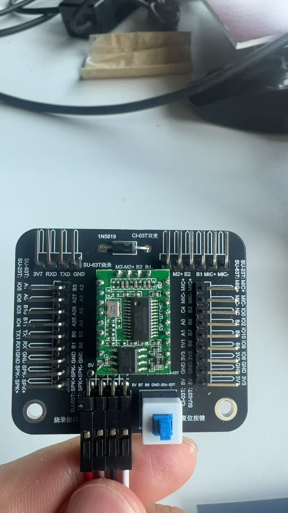

*转接板实物图，标注了各引脚位置*

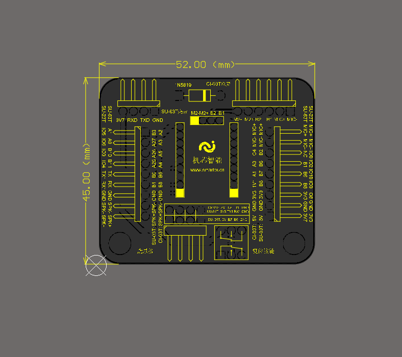

*转接板PCB设计图，尺寸52.00mm x 45.00mm*

**硬件连接要点：**

1. **串口连接**：

    ```
    转接板    CH340/USB转串口
    RXD   ←→  TX
    TXD   ←→  RX
    GND   ←→  GND
    ```

2. **电源连接**：

    - 支持3.3V-5V宽电压供电
    - 建议使用5V供电以保证稳定性
    - 供电电流不小于100mA

3. **麦克风连接**：

    - 单麦应用：仅连接B1、B2
    - 双麦应用：全部连接（B1、B2、M2、M2+）
    - 确保麦克风极性正确

**使用注意事项：**

- 转接板标识中没有直接标注CI-33T，但与CI-03T通用
- 设计电路时可参考CI-03T的原理图和引脚定义
- 如需更高词条容量，选择CI-33T；否则CI-03T即可满足需求
- 两者封装完全相同，可以互相替换

---


---

### CI-33T的ADC引脚电压范围是多少？

**问题描述：**

需要确认CI-33T芯片第7脚ADC的输入电压范围，以便正确设计外围电路。

**解决方案：**

CI-33T第7脚ADC的输入电压范围为0-3.3V，不是0-5V。

**技术规格：**

- **ADC输入范围**：0-3.3V
- **最大输入电压**：不应超过3.3V
- **参考电压**：内部3.3V基准

**设计注意事项：**

1. **电压限制**：

    - 输入信号必须控制在3.3V以内
    - 超过3.3V可能损坏ADC引脚
    - 建议加入保护电路

2. **信号调理**：

    - 如需测量0-5V信号，需加分压电阻
    - 分压比例建议：2:1（5V→3.3V）
    - 使用精密电阻保证测量精度

3. **滤波设计**：

    - ADC输入端建议加RC滤波
    - 减少噪声干扰
    - 提高测量稳定性

**应用示例：**

```
0-5V信号测量电路：
信号源 → 10k电阻 → ADC引脚 → 20k电阻 → GND
```

**注意事项：**

- 严格按照3.3V范围设计电路
- 过压会永久损坏ADC功能
- 测量时注意信号源的稳定性

---

### CI-33T的ADC键盘可以使用5V电压吗？

**问题描述：**

需要确认CI-33T模块的ADC键盘是否支持5V电压输入。

**解决方案：**

- ADC键盘必须使用3.3V电压
- 不能直接使用5V电压
- 模块IO口高电平为3.3V

**设计注意事项：**

- 使用3.3V供电给ADC键盘
- 如需连接5V系统，必须进行电平转换
- 过高电压会损坏模块引脚

---

### CI-33T串口通信电平兼容性如何？

**问题描述：**

需要了解CI-33T模块串口通信的电平要求，以及错误连接是否会造成损坏。

**解决方案：**

CI-33T模块使用3.3V TTL电平标准：

- **串口电平**：3.3V TTL
- **通信兼容性**：与3.3V系统直接通信
- **电压范围**：0-3.3V逻辑电平

**电平匹配说明：**

- 连接相同3.3V电平设备：可直接连接
- 连接5V设备：需要电平转换电路
- 错误连接不会损坏模块（电平相同时）

**注意事项：**

- 确保通信双方电平一致
- 使用电平转换芯片时注意方向
- 不要直接连接5V信号到模块串口

---

### CI-33T是否支持DAC输出功能？

**问题描述：**

需要确认CI-33T模块是否支持DAC输出功能，为什么在模块引脚上看不到DAC输出引脚。

**解决方案：**

CI-33T芯片本身支持DAC输出功能，但模块引脚没有开放出来。

**技术说明：**

1. **芯片功能**：

    - CI1303芯片确实支持DAC输出
    - DAC功能已连接到内部功放电路
    - 用于驱动喇叭播放语音

2. **模块设计**：

    - DAC输出已内部连接到功放IC
    - 模块引脚不开放DAC引脚
    - 通过SPK+、SPK-输出音频信号

3. **设计原因**：

    - 简化模块应用电路
    - 确保音频输出质量
    - 减少外部电路设计复杂度

**获取音频信号的方法：**

1. **标准应用**：

    - 直接连接喇叭到SPK+、SPK-
    - 使用内置功放功能
    - 支持4Ω或8Ω喇叭

2. **外部功放方案**：

    - 从功放IC输入端引出音频信号
    - 需要了解具体功放型号和引脚
    - 建议寻求专业技术协助获取原理图

3. **耳机监听**：

    - 可串联电阻连接耳机
    - 注意音量控制
    - 仅用于调试测试

**注意事项：**

- DAC功能不可从模块引脚直接访问
- 如需外部音频处理，建议从功放前端取信号
- 修改内部电路可能影响模块稳定性
- 批量应用建议使用标准音频输出方式

---

### CI-33T的UART1引脚是B2和B3吗？

**问题描述：**

在配置CI-33T的UART1接口时，需要确认UART1_TX和UART1_RX对应的引脚是否为B2和B3。

**解决方案：**

**引脚定义确认：**

- **UART1_TX**：对应B2引脚
- **UART1_RX**：对应B3引脚
- 这两个引脚固定用作UART1通信功能

**串口参数配置：**

- **波特率**：支持9600（可配置其他波特率）
- **数据位**：8位
- **停止位**：1位
- **校验位**：无（可配置）

**硬件连接示例：**

```
CI-33T    →    MCU/上位机
B2 (TX)   →    RX
B3 (RX)   →    TX
GND        →    GND
VCC        →    3.3V/5V
```

**使用注意事项：**

- B2和B3是专用串口引脚，不能用作GPIO
- 串口通信电平为3.3V
- 如需连接5V系统，需要进行电平转换
- 这两个引脚不占用麦克风接口

**与烧录接口的关系：**

- UART1与烧录接口是独立的
- 烧录使用专用的B6、B7引脚
- 可以同时保留烧录和串口通信功能

---

### CI-33T产品规格书如何获取？

**问题描述：**

需要获取CI-33T产品规格书和技术资料。

**解决方案：**

CI-33T与CI-03T共用技术文档，主要区别在于Flash容量：

- **CI-03T**：支持300条词条，2M Flash
- **CI-33T**：支持500条词条，4M Flash

**资料获取方式：**

1. **官方文档访问**：

    - CI-03T开发包包含原理图、模块+芯片技术手册
    - 访问地址：http://help.aimachip.com/docs/offline_ci03t/ci_03t_kfb
    - 包含接线、烧录软件和烧录资料

2. **基本资料下载**：

    - 原理图：[CI-03T-V1.3-原理图.pdf](https://help.aimachip.com/attach_files/offline_ci03t/1006)
    - 规格书：[CI-03T-V1.3-模组规格书.pdf](https://help.aimachip.com/attach_files/offline_ci03t/1007)
    - 封装图：[CI-03T封装图.PCB](https://help.aimachip.com/attach_files/offline_ci03t/1008)

**注意事项：**

- CI-33T与CI-03T封装完全相同，可互相替换
- 硬件设计时可参考CI-03T的原理图和引脚定义
- 如需更高词条容量，选择CI-33T；否则CI-03T即可满足需求

---


---

### CI-33T播放音频时出现电流声怎么办？

**问题描述：**

CI-33T模块播放音频时出现明显的电流声，已经尝试更换多个喇叭但问题依旧，怀疑是模块或硬件问题。

**解决方案：**

**问题排查步骤：**

1. **喇叭规格检查**：

    - 4欧姆喇叭：功率从2.4W起步，建议不超过3W
    - 8欧姆喇叭：功率从1.6W起步，建议不超过2W
    - 避免使用功率过大的喇叭（如4欧姆5W）

2. **电源供电检查**：

    - 确保供电电压在4.5-5.5V范围内
    - 检查电源纹波是否小于100mV
    - 验证电源能提供足够的峰值电流（>500mA）

**喇叭负载匹配分析：**

1. **阻抗匹配问题**：

    - 喇叭阻抗与模块功放不匹配会产生电流声
    - 4欧姆喇叭负载较大，容易导致失真
    - 优先推荐使用8欧姆喇叭

2. **功率匹配验证**：

    ```
    推荐配置：

    - 8Ω 2W喇叭：匹配良好，音质清晰
    - 4Ω 3W喇叭：可接受，但功耗较高
    - 4Ω 5W喇叭：不推荐，模块驱动困难
    ```

**优化解决方案：**

**方案一：更换喇叭规格**

1. **优先选择8欧姆喇叭**：

    - 使用8欧姆1.6-2W喇叭
    - 负载匹配更合理
    - 功耗更低，发热更少

2. **避免过大功率**：

    - 不要使用超过推荐功率的喇叭
    - 大功率喇叭会导致功放失真
    - 可能产生额外的电流噪声

**方案二：电源优化**

1. **使用独立电源**：

    - 为语音模块提供独立的5V电源
    - 避免与其他大功率设备共用电源
    - 确保电源能提供足够的峰值电流

2. **增加滤波电容**：

    - 在电源输入端并联100μF电解电容
    - 并联0.1μF陶瓷电容滤除高频噪声
    - 电容尽量靠近模块电源引脚

**方案三：硬件检查**

1. **模块质量确认**：

    - 寻求专业技术协助获取官方测试喇叭
    - 对比测试确认是否为模块问题
    - 如确认质量问题，申请更换

2. **连接线路检查**：

    - 确保喇叭线连接牢固
    - 检查是否有接触不良或虚焊
    - 使用屏蔽线减少电磁干扰

**测试验证方法：**

1. **对比测试**：

    - 使用官方推荐的喇叭进行测试
    - 记录不同喇叭下的表现
    - 找到最佳配置方案

2. **电源质量测试**：

    - 使用示波器监测电源纹波
    - 测试播放时的电压跌落
    - 确认电源稳定性

**实际应用案例：**

根据实际反馈，延长喇叭线可以改善电流声：

- **现象**：将喇叭线延长后，电流声有所改善
- **原因**：增加了线路阻抗，降低了功放负载
- **建议**：作为临时解决方案，但应寻找根本原因

**注意事项：**

- 电流声问题通常与喇叭负载匹配有关
- 电源质量对音频输出影响很大
- 优先使用官方推荐的喇叭规格
- 如问题持续存在，寻求专业技术协助进行深入分析

---


---

### 如何获取CI-33T的原理图和PCB文件？

**问题描述：**

需要获取CI-33T模块的原理图和PCB制版文件（如嘉立创可导入的格式），以便在不改变硬件布局的情况下，直接替换原有模块的电路设计。

**解决方案：**

**官方资料获取方式：**

1. **基本资料下载**：

    - 原理图：[CI-33T-V1.3-原理图.pdf](https://help.aimachip.com/attach_files/offline_ci33t/1006)
    - 规格书：[CI-33T-V1.3-模组规格书.pdf](https://help.aimachip.com/attach_files/offline_ci33t/1007)
    - 封装图：[CI-33T封装图.PCB](https://help.aimachip.com/attach_files/offline_ci33t/1008)

2. **文档访问地址**：

    - 官方文档首页：https://help.aimachip.com/docs/offline_ci33t
    - 开发包和示例：[CI-33T开发包](https://help.aimachip.com/attach_files/offline_ci33t/999)

**文件格式说明：**

1. **提供格式**：

    - **原理图**：PDF格式，包含完整电路设计
    - **封装图**：PCB格式，可用于PADS等EDA软件
    - **规格书**：PDF格式，包含详细电气参数

2. **嘉立创兼容性**：

    - PCB文件可直接导入嘉立创EDA
    - 支持标准EDA工具（Altium Designer、PADS等）
    - 包含完整的焊盘定义和封装尺寸

**替代方案（源文件不提供时）：**

1. **手动创建封装**：

    - 根据规格书中的尺寸图创建封装
    - 模块尺寸：21×15mm
    - 引脚间距：标准2.54mm

2. **参考设计要点**：

    - 使用官方原理图作为参考
    - 保持关键电路设计不变
    - 注意电源和音频电路的布局

3. **设计验证**：

    - 创建封装后打印1:1图纸验证
    - 与实际模块对比确认尺寸
    - 注意引脚定义和方向

**硬件替换建议：**

1. **直接替换方案**：

    - 如封装兼容，可直接替换
    - 注意引脚定义是否一致
    - 验证供电电压匹配

2. **修改设计方案**：

    - 根据CI-33T接口重新设计PCB
    - 利用官方原理图参考电路设计
    - 保持外部接口不变

**注意事项：**

- 官方不提供源文件（如PADS或Altium工程文件）
- 封装图文件可直接用于PCB设计

---

### CI-33T上电有嘟嘟声但无法唤醒怎么办？

**问题描述：**

CI-33T芯片上电后有嘟嘟声，但无法被唤醒，未进行固件烧录。

**解决方案：**

1. **断开外设测试**

    - 先断开喇叭连接，仅保留麦克风
    - 检查是否喇叭短路导致问题
    - 确认电源供电正常（5V）

2. **麦克风检查**

    - 使用串口助手发送命令：40
    - 查看返回数据确认麦克风状态
    - 参考文档中的测试方法

3. **硬件连接验证**

    - 检查麦克风接线是否正确（MIC+和MIC-）
    - 确认没有接反或接触不良
    - 测量麦克风偏置电压

4. **故障排除步骤**

    - 拔掉喇叭后测试是否能唤醒
    - 更换已知好的麦克风测试
    - 录制视频发送给技术支持分析

**注意事项：**

- 嘟嘟声可能表示功放部分工作异常
- 麦克风正常是唤醒功能的基础
- 如问题持续，需要技术支持介入分析

---
- 建议先申请样品验证封装匹配性
- 如需特殊格式，可能需要格式转换
- 保留官方文档以备设计参考

---


---

### 如何从CI-33T模块读取麦克风环境噪声信号？

**问题描述：**

需要从CI-33T模块中获取麦克风的环境噪声信号，用于外部处理或监测。

**解决方案：**

可以从麦克风的正极（MIC+）引脚直接读取交流信号电压值，但需要进行信号调理才能正常使用。

**信号调理电路设计：**

1. **基本连接方法**：

    - 从MIC+引脚获取原始麦克风信号
    - 信号为微弱的交流电压信号
    - 需要放大才能被ADC或其他设备读取

2. **推荐电路方案**：

    - MIC+接上拉电阻（约1.5K-2.2K）
    - 串联耦合电容（如10nF）隔离直流
    - 通过运算放大器进行信号放大
    - 建议使用两级放大以获得足够增益

3. **电路参数调整**：

    - 放大倍数通过反馈电阻调节
    - 根据实际信号幅度调整增益
    - 可使用单级或两级放大电路

**设计参考：**

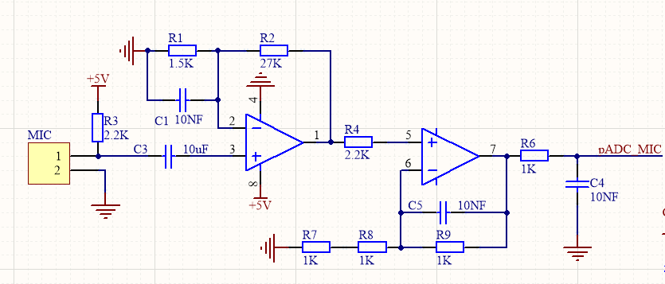

**注意事项：**

- 麦克风输出信号幅度较小（mV级）
- 需要合适的放大倍数才能有效检测
- 运放选择应考虑噪声和带宽要求
- 注意电路的供电和滤波设计

---

### CI-33T模块麦克风信号采集电路如何简化？

**问题描述：**

在使用CI-33T模块的麦克风信号采集电路时，发现放大电路复杂，希望简化设计。

**解决方案：**

可以只使用单级放大电路，删除不必要的复杂部分，简化后的电路仍然能够满足基本的信号采集需求。

**简化方案：**

1. **保留核心部分**：

    - 麦克风偏置电路（R1: 1.5K上拉电阻）
    - 耦合电容（C1: 10nF）
    - 单级运算放大器电路
    - 基本的反馈网络（R2: 27K, R3: 2.2K）

2. **可以删除的部分**：

    - 第二级放大电路
    - 复杂的滤波网络
    - 额外的缓冲级

**简化后的电路特点：**

- 电路结构更简单，PCB布局更容易
- 仍然提供足够的信号增益
- 降低了噪声引入的风险
- 适合对噪声要求不高的应用场景

**设计参考：**

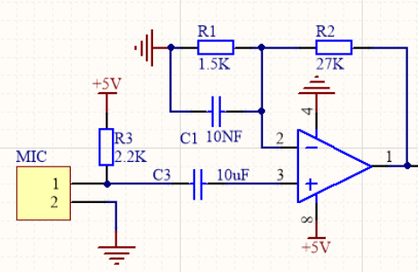

**注意事项：**

- 简化后的电路增益可能降低，需根据实际需求调整
- 如对噪声敏感，建议保留完整的两级放大设计
- 单级放大适合信号幅度较大或后端灵敏度高的场景

---

### CI-33T单麦与双麦方案如何选择？

**问题描述：**

CI-33T单麦模块在嘈杂环境和空旷房间中识别率低，希望了解如何改进识别效果，特别是双麦方案与单麦+AEC方案的对比，以及双麦的布局要求。

**解决方案：**

**方案对比分析：**

1. **单麦+AEC方案**：

    - 适用于需要自打断功能的应用场景
    - 可以实现播放过程中识别新指令并打断当前播报
    - AEC功能通过第二个麦克风实现回声消除
    - 适合需要交互体验的应用

2. **双麦方案**：

    - 显著提升识别灵敏度，嘈杂环境下效果更好
    - 通过双麦克风阵列实现噪声抑制
    - 识别距离更远，空旷环境中表现更佳
    - 无法使用内置AEC功能（如需AEC需外部电路）

**方案选择建议：**

- **嘈杂环境优先选择双麦**：双麦的降噪效果更明显
- **需要打断功能选择单麦+AEC**：如智能音响等需要交互的场景
- **远场识别优先双麦**：双麦对远距离拾音效果更好

**双麦布局要求：**

1. **麦克风距离**：

    - 两个麦克风之间距离建议为40-80mm
    - CI-03T模块推荐距离为40-120mm
    - 最佳效果距离为40-80mm（4-8cm）

2. **安装方向**：

    - 两个麦克风必须朝向同一方向
    - 保持同一水平平面，不要背靠背安装
    - 避免一个朝门内、一个朝门外的布局

3. **硬件连接**：

    - B1、B2、M2、M2+都需要连接（双麦配置）
    - 两个麦克风需保持一致性（同型号、同规格）
    - 推荐使用全指向麦克风

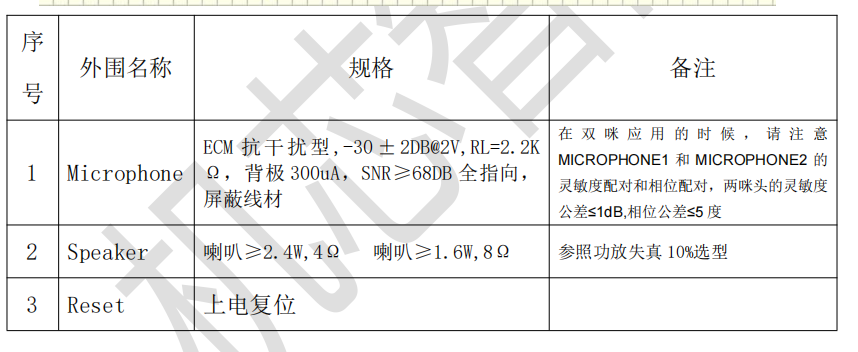

**其他优化建议：**

1. **调整灵敏度**：

    - 将识别灵敏度从"中"调高可改善识别效果
    - 灵敏度调高后，对发音不规范的指令也能更好识别

2. **选择合适模型**：

    - 嘈杂环境可尝试烟机专用模型+深度降噪
    - 小房间可启用降混响功能
    - 根据实际场景选择Pro模型进行测试

**注意事项：**

- 双麦方案的AEC功能需要外部7243e codec芯片
- 外部AEC需要额外的硬件设计和成本
- 单麦+AEC等效于用一个麦克风做回声抑制
- 深度降噪功能仅针对烟机和窗帘等特定场景
---

### CI-33T咪头如何选型？

**问题描述：**

咨询CI-33T模块的咪头选型标准、安装布局要求以及如何优化识别性能，特别是关于咪头质量、推荐型号、结构开孔设计和喇叭与咪头的距离要求。

**解决方案：**

**咪头选型标准：**

1. **关键参数要求**：

    - 灵敏度范围：-32dB到-25dB（推荐-27dB）
    - 信噪比：70以上（推荐75dB）
    - 工作电流：0.1mA到0.5mA
    - 阻抗：2.2KΩ匹配

2. **推荐型号**：

    - 机芯智能定制咪头6027：直径6mm，高度2.7mm
    - 11号咪头：灵敏度-32dB，尺寸较大效果更好
    - 尽量选择尺寸大的咪头，性能通常更优

3. **选型注意事项**：

    - 现阶段国内市场咪头参差不齐，规格书与实物可能不符
    - 选型时需参考厂家实力、出厂检测和供货能力
    - 有条件可选用进口管芯的咪头

**安装布局要求：**

1. **结构开孔设计**：

    - 声音通过空气传播，避免将咪头放入密闭空间
    - 需要合适的开孔面积，保证声音传入
    - 如需防水膜，应选择质量好的产品

2. **喇叭与咪头距离**：

    - 喇叭与咪头尽量远离
    - 避免喇叭直接对着咪头
    - 将喇叭视为噪声源，做好隔离

3. **接线要求**：

    - 咪头线尽量短，不超过100mm
    - 如需延长，必须使用双绞线或屏蔽线
    - 注意咪头极性，反接会导致灵敏度下降

**常见问题处理：**

1. **灵敏度低**：

    - 检查咪头是否损坏或老化
    - 确认供电电压是否正常
    - 验证接线极性是否正确

2. **识别失灵**：

    - 可能是咪头并联导致电流减小
    - 不建议使用咪头并联方案
    - 检查电源供电是否稳定

3. **环境干扰**：

    - 咪头远离电磁干扰源
    - 使用屏蔽线减少干扰
    - 优化PCB布局，避免数字信号影响

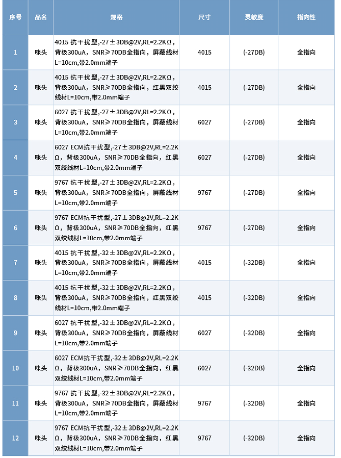

**注意事项：**

- 咪头质量直接影响识别效果，建议使用官方推荐型号
- 12号咪头灵敏度为-32dB，比默认咪头（-27dB）灵敏度低
- 不同批次的咪头可能存在性能差异，使用前需测试
---

### 更换12号咪头后识别灵敏度下降怎么办？

**问题描述：**

更换为12号咪头后，设备识别灵敏度明显下降，怀疑是咪头选型或参数问题。

**解决方案：**

**原因分析：**

1. **灵敏度差异**：

    - 12号咪头灵敏度为-32dB
    - 默认咪头灵敏度为-27dB
    - 灵敏度数值越小，表示需要的声音强度越大
    - 5dB的差异会导致识别距离明显缩短

2. **咪头质量问题**：

    - 同一批次的咪头可能存在个体差异
    - 部分咪头可能存在制造缺陷
    - 需要通过实际测试验证

**解决方法：**

1. **更换咪头测试**：

    - 更换另一个12号咪头进行对比
    - 如效果明显改善，说明原咪头存在问题
    - 建议使用前先对咪头进行抽检

2. **灵敏度调整**：

    - 在平台中调高识别灵敏度设置
    - 从"中"调至"高"可部分补偿灵敏度不足
    - 注意调高后可能增加误触发概率

3. **选型建议**：

    - 优先选择灵敏度更高的咪头（-27dB左右）
    - 如需使用12号咪头，应确认批次一致性
    - 考虑使用官方推荐的6027型号

**预防措施：**

- 采购时要求供应商提供批次测试报告
- 批量使用前进行抽样测试
- 保留咪头包装和规格书以便追溯
- 建立咪头入库检验流程

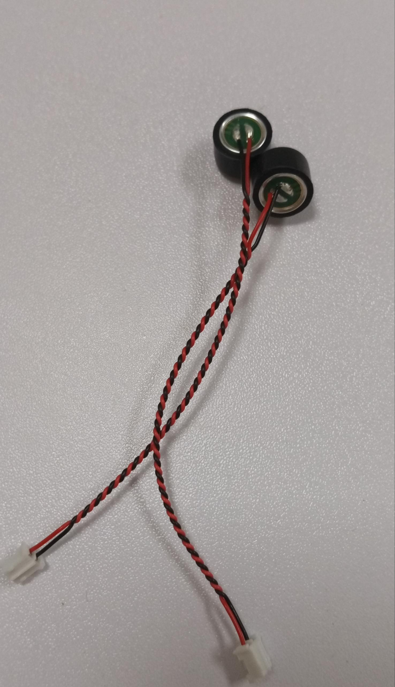

**注意事项：**

- 咪头灵敏度是影响识别距离的关键因素
- -32dB咪头在远距离识别场景中效果受限
- 更换咪头后如问题依旧，需检查电路连接
---

### CI-33T如何记录IO口电平变化次数？

**问题描述：**

需要使用CI-33T模块记录IO口的高/低电平变化次数，用于统计霍尔信号，信号频率最高达到100Hz，但配置后无法准确记录电平变化。

**解决方案：**

**问题分析：**

CI-33T模块在记录高频电平变化时存在以下限制：

1. **输入触发频率限制**：

    - GPIO输入触发的检测频率为20ms一次（50Hz）
    - 低于20ms的脉冲会被过滤掉
    - 无法准确记录100Hz频率的信号

2. **信号电平要求**：

    - 输入信号高电平不应超过3.3V
    - 低电平应在0.4V以下
    - 原始霍尔信号高电平4.8V、低电平0.6V超出规格

**硬件信号调理：**

1. **电平转换**：

    - 使用分压电路将4.8V降至3.3V
    - 确保高电平不超过模块IO耐压（虽支持5V耐压）
    - 低电平0.6V需进一步降低至0.4V以下

2. **信号整形**：

    - 添加施密特触发器改善信号边沿
    - 使用比较器设定合适的阈值
    - 确保信号满足TTL电平标准

**软件配置方法：**

根据实际测试，当前配置只能记录信号的状态变化：

- 高电平有效触发：仅在电机停止时记录一次
- 低电平有效触发：仅在电机启动时记录一次
- 中间过程的电平变化无法被捕获


*Pin 6设置为GPIO_A，默认高电平，输入模式*


*Pin 8设置为GPIO输入，参数1为A8*


*高电平触发配置：GPIO_A2高电平时变量a1增加1*


*高电平触发参数设置*


*低电平触发配置：GPIO_A0低电平时变量a1增加1*


*低电平触发参数设置*

**解决方案：**

1. **降低信号频率**：

    - 如可能，通过硬件分频降低信号频率
    - 使用分频器或计数器电路
    - 使信号频率降至50Hz以下

2. **定制固件方案**：

    - 联系技术支持定制高频触发功能
    - 需根据具体需求评估开发成本
    - 起步费用约1K（根据功能复杂度）

3. **外部计数方案**：

    - 使用外部计数器芯片（如74HC4040）
    - 通过MCU或单片机处理高频信号
    - CI-33T仅读取最终计数值

**注意事项：**

- 平台当前的触发检测频率（50Hz）无法满足100Hz信号记录需求
- 输入信号必须符合3.3V TTL电平标准
- 低电平0.6V偏高，可能导致触发不稳定
- 对于高频信号记录，建议采用外部硬件处理方案
- 定制固件需评估实际需求和批量规模
---

### CI-33T模块焊孔堵塞怎么办？

**问题描述：**

收到的CI-33T模块部分焊孔被焊锡堵塞，影响正常焊接操作，怀疑是返修件。

**解决方案：**

**1. 焊接处理**

- 使用吸锡器清理堵塞的焊孔
- 用烙铁小心加热并清除多余焊锡
- 确保焊孔完全通透后再进行焊接

**2. 连接验证**

- 确保引脚没有连锡现象
- 使用万用表测试连接通断
- 验证焊接后功能正常

**3. 模块状态说明**

- 测试样品可能是之前焊接过的模块
- 不影响功能使用，仅增加焊接难度
- 正式产品不会有焊孔堵塞问题

**注意事项：**

- 焊孔堵塞不影响模块功能
- 清理焊孔时避免过热损坏焊盘
- 焊接时注意静电防护
- 如有条件，使用助焊膏改善焊接效果

---

### CI-33T有语音输出时自动变化的引脚吗？

**问题描述：**

需要寻找一个在语音输出时会自动产生高低电平变化的引脚，且无需额外设置，用于指示语音输出状态。

**解决方案：**

**引脚功能说明：**

- **CI-33T模块**：没有语音输出时自动产生电平变化的专用引脚
- **所有GPIO引脚**：都需要通过配置才能产生相应的电平变化
- **语音输出功能**：模块直接驱动喇叭，没有独立的状态输出引脚

**替代方案：**

**1. 使用GPIO配置输出状态**

- **配置方法**：在平台中为每个语音指令添加GPIO控制
- **设置步骤**：

    1. 选择需要监控的语音指令
    2. 添加GPIO控制项
    3. 设置为语音播放时输出高电平
    4. 播放结束时设置为低电平

**2. 利用BUSY引脚（如硬件支持）**

- **检查硬件规格**：确认模块是否提供BUSY状态输出
- **功能说明**：BUSY引脚通常在语音处理期间保持特定电平
- **接线方式**：需要查看具体模块的引脚定义文档

**3. 通过音频检测电路**

- **外部检测**：使用比较器检测音频信号
- **简单方案**：在音频输出端加装整流和滤波电路
- **阈值检测**：设置合适的检测阈值判断语音活动

**注意事项：**

- CI-33T没有专用的语音状态输出引脚
- 所有功能都需要通过平台配置实现
- 建议使用GPIO配合定时器实现语音指示功能
- 如需要实时状态反馈，可考虑选用带状态输出的模块型号

---


---

### CI-33T支持ADC输入作为触发条件吗？

**问题描述：**

希望在CI-03T1芯片上使用ADC输入功能来实现自定义小程序控制，但对ADC的精度和可靠性存在疑虑。

**解决方案：**

**ADC支持情况：**

- CI-33T支持ADC输入功能
- 电压检测范围：0~3.3V
- 对应数值：0~4096（12位ADC）
- 可用作触发条件

**配置步骤：**

1. **引脚配置**
    - 在PIN脚配置中将目标GPIO设置为ADC输入模式
    - 例如：GPIO_C4配置为ADC输入，可设置偏移量

2. **触发条件设置**
    - 在唤醒词自定义规则中添加触发方式
    - 选择"ADC输入"作为触发条件
    - 设置触发阈值（如2000，约1.61V）

3. **行为绑定**
    - 将ADC触发与具体行为绑定
    - 配置触发后的响应动作

**注意事项：**

- ADC误差较大，不建议用于精密检测
- 建议阈值设置留有余量，避免误触发
- 如需高精度检测，建议使用IO-IN高低电平判断
- ADC值会受到温度和电源波动影响

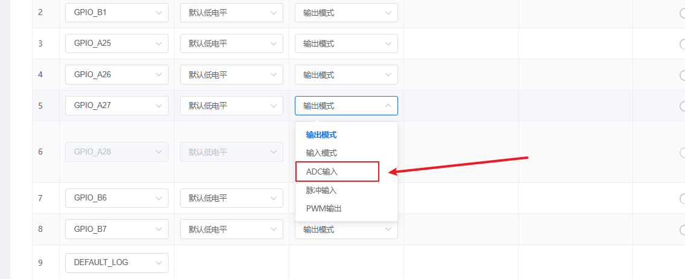


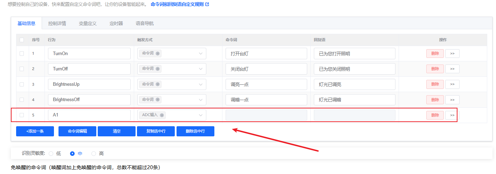

---

## 资料获取


---

### 多个功放可以并联驱动一个喇叭吗？

**问题描述：**

两个不同CI-33T模块的功放输出端并联连接同一个喇叭，导致功放烧毁，需要安全的多模块共用喇叭方案。

**解决方案：**

**问题分析：**

- **功放并联风险**：不同模块的功放输出直接并联会造成相互干扰
- **相位差问题**：两个功放输出的音频信号相位可能不一致
- **负载异常**：并联改变了功放的负载特性，可能导致过载
- **烧毁原因**：功放输出端短路或负载异常导致电流过大

**安全方案：**

**1. 添加音频切换电路**

- **继电器切换**：使用继电器选择不同模块的音频输出
- **模拟开关**：使用音频专用的模拟切换芯片
- **二极管隔离**：在每个功放输出端串联隔离二极管（效果有限）

**2. 使用音频混合器**

- **有源混合器**：将多个音频源混合后输出到功放
- **无源混合器**：使用电阻网络混合音频信号
- **专用芯片**：使用音频混合专用IC实现安全混合

**3. 独立功放方案**

- **共用喇叭，独立功放**：

    - 每个模块输出线路电平信号
    - 使用外部独立功放驱动喇叭
    - 通过切换电路选择信号源

**4. 软件控制方案**

- **分时工作**：确保同一时间只有一个模块输出音频
- **使能控制**：通过GPIO控制功放的使能端
- **mute功能**：利用功放的mute功能避免冲突

**注意事项：**

- 切勿直接将两个功放的输出端并联
- 音频切换电路应选用低失真类型的器件
- 考虑使用音频变压器实现隔离
- 设计前应参考音频电路设计规范
- 如无相关经验，建议寻求专业硬件技术人员协助

---

## GPIO 配置相关


---

### CI-33T的PCB封装图如何导入嘉立创？

**问题描述：**

CI-33T的PCB封装图文件无法直接导入嘉立创平台，且提供的封装文件缺少尺寸信息。

**解决方案：**

**1. 封装文件兼容性**

- AD格式的PCB文件无法直接导入嘉立创
- 需要手动创建封装

**2. 创建方法**

**使用SU-03T封装作为参考**：

- 在嘉立创EDA专业版中搜索"SU-03T"
- 尝试不同搜索词（如"SU03T"，去掉横线）
- 直接使用SU-03T的现成封装
- CI-33T与SU-03T封装兼容

**手动创建封装**：

- 自己画CI-33T的原理图封装
- PCB封装使用SU-03T的即可
- 两者封装尺寸相同
- 可将自制封装共享到元件库

**3. 获取尺寸信息**

- 在嘉立创元件库中找到SU-03T
- 查看3D模型和封装尺寸
- 或查阅产品规格书获取尺寸图

**注意事项：**

- CI-33T的PCB文件(AD格式)与嘉立创不兼容
- SU-03T在嘉立创中可直接搜索使用
- 搜索时尝试专业版而非标准版
- 两个型号的封装尺寸一致
- 原理图封装需要自己创建
- 如果搜索不到，可联系官方技术团队

---

## 封装与引脚


---

### CI-33T4双麦如何实现任意麦克风接入识别？

**问题描述：**

在CI-33T4双麦模块中，需要实现两个麦克风任意接入都能正常进行语音控制的功能，以解决车辆较大时车尾语音识别率低的问题。

**解决方案：**

**双麦克风配置方案**

CI-33T4的双麦克风功能分配如下：

- **M1麦克风**：用于语音识别
- **M2麦克风**：用于算法处理（如声源定位、降噪等）

**实现任意麦克风识别的方法：**

1. **并联M1麦克风**：

    - 将M1麦克风的信号线并联出两个接口
    - 车头和车尾各安装一个麦克风
    - 两个麦克风都连接到M1通道

2. **硬件连接方式**：

    - 在MIC1输入电容前并联两个麦克风
    - 两个麦克风共用同一个MIC_BIAS偏置
    - 添加相应电阻（如4.7K）和电容（如10uF）

**电路参考设计：**

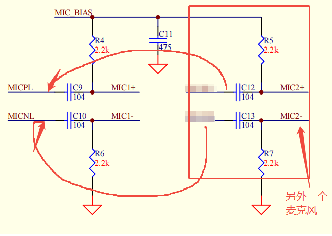

**性能影响说明：**

- **电压衰减**：两个麦克风并联后电压会减半
- **识别效果**：可能影响识别灵敏度和距离
- **适用场景**：适用于对识别率要求不高的应用

**替代方案建议：**

1. **使用双麦克风阵列**：

    - 利用M1和M2形成麦克风阵列
    - 实现声源定位和降噪
    - 提升整体识别效果

2. **单麦克风+外部放大**：

    - 在远端使用前置放大器
    - 通过线路传输到主模块
    - 保持信号强度

**注意事项：**

- 并联方案会影响识别效果，需实际测试验证
- 建议先进行小批量测试
- 如需高识别率，建议使用专业的麦克风阵列方案

---

### 双麦克风电路中M1-和M2-可以共用接地线吗？

**问题描述：**

在双麦克风电路设计中，希望将两个麦克风的负极（M1-和M2-）共用接地线以减少布线。

**解决方案：**

- **正确接线方式**：每个麦克风必须独立连接，不能共用负极
- **M1麦克风**：接 M1+ 和 M1-
- **M2麦克风**：接 M2+ 和 M2-（独立连接，不能与M1-共用）
- **并联方案**：如需减少接线，可考虑将两个同型号麦克风并联，但需要单独配置

**注意事项：**

- 共用接地线会导致麦克风工作异常，影响音频采集质量
- CI-33T1等支持双麦克风的芯片，M1和M2是独立的麦克风通道
- 设计时需严格按照芯片手册的引脚定义进行接线

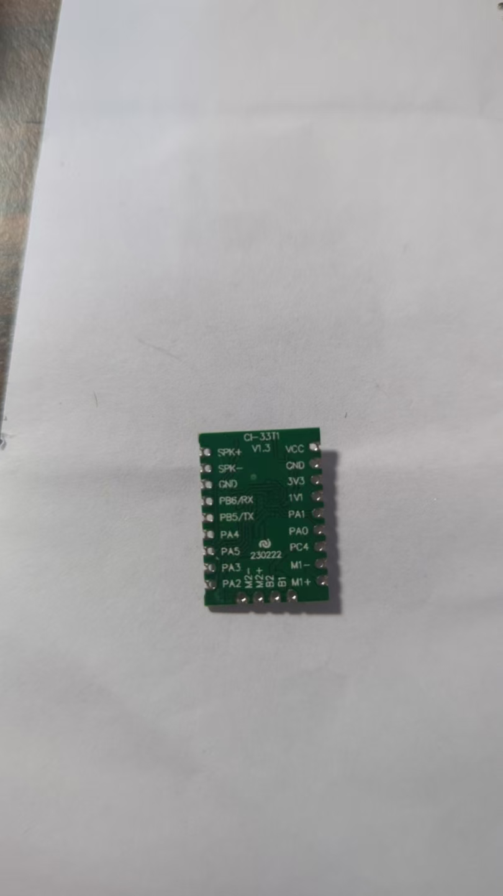

---

### CI-33T4模块支持双喇叭并联吗？

**问题描述：**

需要在CI-33T4模块上使用两个8欧姆4瓦的喇叭并联输出，以实现车内左右两边各一个喇叭的布局。

**解决方案：**

**喇叭并联方案**

CI-33T4模块支持两个喇叭并联使用，但需要满足阻抗要求：

- **阻抗计算**：两个8欧姆喇叭并联后总阻抗为4欧姆
- **最小阻抗要求**：并联后内阻不能低于4欧姆
- **功率建议**：推荐使用8欧姆2瓦的喇叭，而非4瓦

**功率匹配说明：**

- **8欧姆4瓦喇叭**：功率过大，模块可能驱动困难
- **8欧姆2瓦喇叭**：匹配良好，推荐使用
- **4欧姆喇叭**：可直接使用单个，无需并联

**长线传输设计：**

- **喇叭线**：对长度要求不高，可根据实际需要布线
- **磁珠/电感**：一般情况下不需要额外添加滤波元件
- **麦克风线**：建议尽量短，必须使用双绞线或屏蔽线

**注意事项：**

- 并联使用时无法实现立体声效果
- 如需更高功率，可考虑更换功放芯片
- 麦克风布线应远离喇叭等噪声源

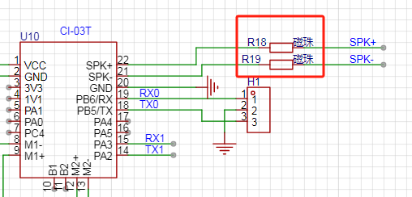

---

### CI-33T是否支持单麦克风配置？

**问题描述：**

需要确认CI-33T模块是否支持只连接一个麦克风，以及单麦克风配置对功能的影响。

**解决方案：**

**单麦克风支持确认：**

- CI-33T支持单麦克风配置
- 可以只连接一个麦克风（MIC1或MIC2任选其一）
- 单麦克风模式下仍可正常工作

**配置方法：**

1. **硬件连接**
    - 仅连接MIC1+和MIC1-（主麦克风）
    - MIC2接口保持悬空不连接
    - 确保麦克风极性正确

2. **固件配置**
    - 在生成固件时选择单麦克风模式
    - 平台支持单/双麦克风配置选项

**功能影响：**

- **基本功能**：语音识别、命令执行正常
- **AEC功能**：单麦克风无法实现回声消除
- **降噪效果**：相比双麦克风会有所降低
- **识别距离**：可能略有影响

**使用建议：**

- 对成本敏感的应用可使用单麦克风
- 如需AEC功能必须使用双麦克风
- 单麦克风设计更简单，成本更低

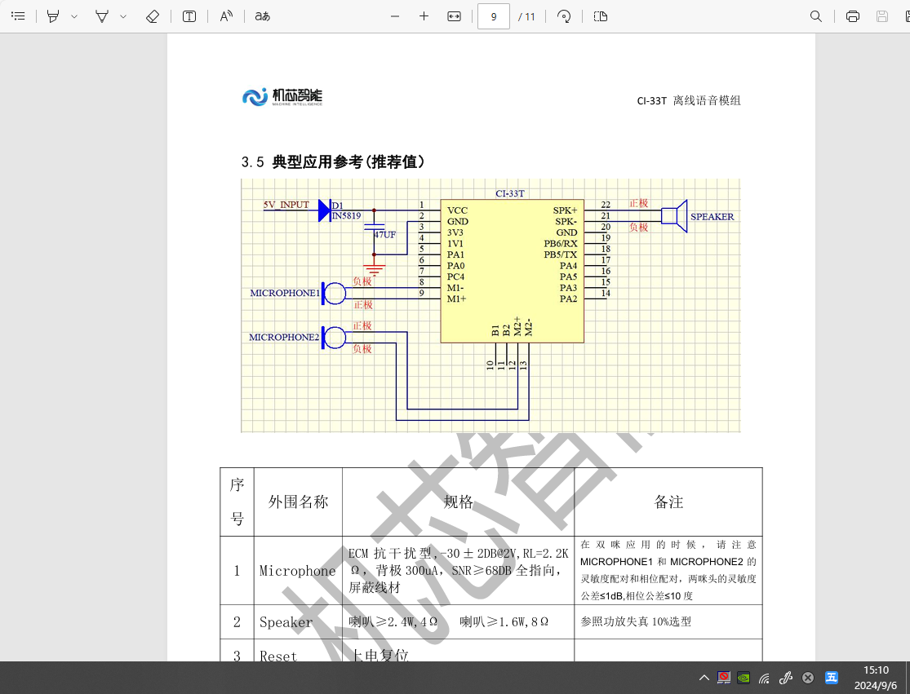

---

### CI-33T模块输出脉冲时序不平分怎么办？

**问题描述：**

配置输出脉冲时，设置的脉冲时长实际执行时前半段时间为延迟，后半段时间为有效脉冲，导致实际有效输出时间仅为配置时间的一半。

**解决方案：**

- 这是脉冲功能的设计特性，一个完整脉冲周期被平分
- 前半段为低电平（延迟），后半段为高电平（脉冲）
- 如果无法接受这种时序，建议使用电平输出代替脉冲输出

**注意事项：**

- 脉冲时序平分的设计无法修改
- 需要精确控制输出时间时，应选择电平控制方式
- 配置脉冲时需考虑实际有效时间只有设定时间的一半


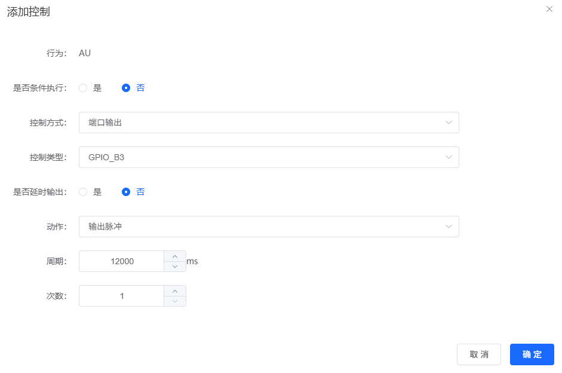
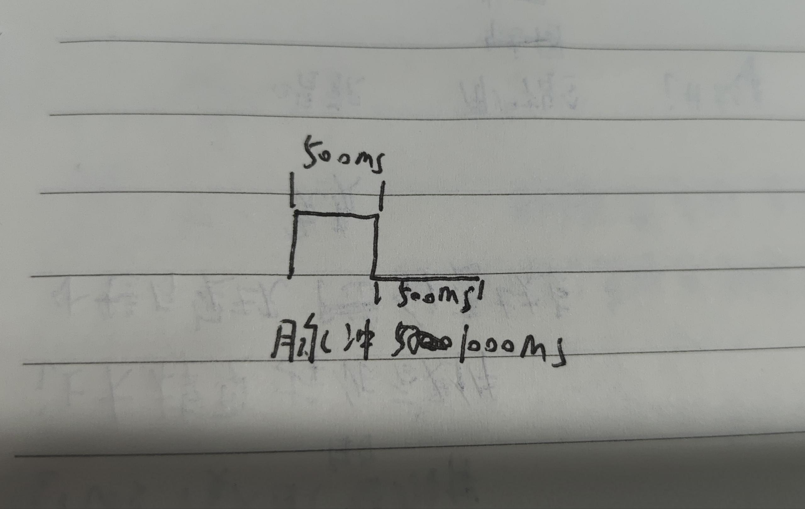

---


---

### GPIO输入信号的频率限制是多少？

**问题描述：**

使用CI-33T模块记录IO口电平变化次数，当输入信号频率达到100Hz时（如电机霍尔信号），无法准确记录电平变化。

**解决方案：**

**1. 频率限制说明**

- GPIO输入触发的检测频率为20ms一次（50Hz）
- 低于20ms间隔的电平变化会被过滤掉
- 这是平台固件的设计限制，暂时无法修改

**2. 信号电平要求**

- **高电平**：最大3.3V（虽然IO口有5V耐压）
- **低电平**：需低于0.4V，0.6V过高可能导致识别异常
- 霍尔信号高电平4.8V必须通过分压降至3.3V

**3. 实现方案**

**分压电路设计：**
```
霍尔信号 → 分压电阻 → CI-33T GPIO
4.8V  →  R1/R2分压  →  3.3V
```

**触发配置：**

- IO模式：输入
- 默认电平：根据信号默认状态设置
- 触发方式：GPIO输入
- 触发参数：高电平或低电平

**配置示例：**


**4. 频率问题解决**

**方案一：降低信号频率**

- 使用齿轮减速机构降低信号频率
- 通过分频电路对信号进行分频

**方案二：外部计数器**

- 使用外部计数器IC记录高频信号
- 通过低速接口读取计数值

**方案三：定制固件**

- 针对高频计数需求定制固件
- 需要评估具体需求量和费用（一般1K起步）

**注意事项：**

- 100Hz的霍尔信号无法直接使用GPIO触发记录
- 信号电平必须匹配模块的3.3V逻辑电平
- 频率限制是硬件设计决定的，无法通过配置修改
- 如需高频计数功能，建议考虑定制固件方案

---

### CI-33T播放音频时出现电流声怎么办？

**问题描述：**

CI-33T模块播放音频时出现明显的电流声，已经尝试更换多个喇叭但问题依旧，影响正常使用。

**解决方案：**

**问题排查步骤：**

1. **喇叭规格检查**：

    - 4欧姆喇叭：功率从2.4W起步，建议不超过3W
    - 8欧姆喇叭：功率从1.6W起步，建议不超过2W
    - 避免使用功率过大的喇叭（如4欧姆5W）

2. **电源供电检查**：

    - 确保供电电压在4.5-5.5V范围内
    - 检查电源纹波是否小于100mV
    - 验证电源能提供足够的峰值电流（>500mA）

**喇叭负载匹配分析：**

1. **阻抗匹配问题**：

    - 喇叭阻抗与模块功放不匹配会产生电流声
    - 4欧姆喇叭负载较大，容易导致失真
    - 优先推荐使用8欧姆喇叭

2. **功率匹配验证**：

    ```
    推荐配置：

    - 8Ω 2W喇叭：匹配良好，音质清晰
    - 4Ω 3W喇叭：可接受，但功耗较高
    - 4Ω 5W喇叭：不推荐，模块驱动困难
    ```

**优化解决方案：**

**方案一：更换喇叭规格**

1. **优先选择8欧姆喇叭**：

    - 使用8欧姆1.6-2W喇叭
    - 负载匹配更合理
    - 功耗更低，发热更少

2. **避免过大功率**：

    - 不要使用超过推荐功率的喇叭
    - 大功率喇叭会导致功放失真
    - 可能产生额外的电流噪声

**方案二：电源优化**

1. **使用独立电源**：

    - 使用专用电源适配器供电
    - 避免与其他设备共享电源
    - 确保电源稳定输出

2. **增加滤波电容**：

    - 在模块电源输入端并联1000μF电解电容
    - 减少电源纹波对音频的影响
    - 提高供电稳定性

**方案三：线路检查**

1. **喇叭连接优化**：

    - 使用短而粗的喇叭线
    - 确保连接牢固，接触良好
    - 避免使用过长的连接线

2. **接地检查**：

    - 确保模块和喇叭共地良好
    - 检查地线是否有松动
    - 避免地线回路产生噪声

**技术要点：**

- CI-33T内置Class AB功放，对喇叭阻抗敏感
- 电流声通常是阻抗不匹配或供电不稳定导致
- 8欧姆喇叭是较优选择，匹配性好
- 功率过大的喇叭会增加失真风险

**验证步骤：**

1. 使用推荐规格的喇叭测试
2. 测量供电电压稳定性
3. 在不同音量下测试音质表现
4. 记录最佳配置参数供量产使用

**注意事项：**

- 优先使用模块配套的喇叭进行测试
- 如问题持续，建议联系技术支持
- 不同批次的模块可能有细微差异
- 量产前建议进行充分的可靠性测试

---

### CI-33T的PB5、PB6引脚可以作为串口使用吗？

**问题描述：**

需要确认CI-33T的PB5、PB6引脚是否可以配置为串口功能，以及为什么在配置界面上看不到18、19管脚的配置选项。

**解决方案：**

**引脚功能确认：**

1. **PB5、PB6串口支持**：

    - CI-33T的PB5、PB6可以作为串口使用
    - 这两个引脚默认对应UART1功能
    - 可以通过平台配置启用串口通信

2. **烧录口复用**：

    - PB5、PB6同时也是烧录引脚
    - 烧录完成后可作为普通串口使用
    - 支持与MCU进行串口通信

**配置界面说明：**

1. **管脚编号差异**：

    - 配置界面中的数字仅作参考，无实际意义
    - 重点是配置绿色方框中的Pin功能
    - 平台配置决定了引脚的实际功能

2. **配置方法**：

    - 登录智能公元平台
    - 在GPIO配置界面选择对应引脚
    - 将引脚功能配置为UART1_TX/UART1_RX
    - 重新生成并烧录固件

3. **界面配置限制**：

    - PB5/PB6在界面上可能无法直接配置
    - 这是因为这两个引脚默认已关联串口功能
    - 实际使用时直接按串口功能连接即可

**硬件连接：**

- PB5（UART1_TX）：连接到外部设备的RX
- PB6（UART1_RX）：连接到外部设备的TX
- 烧录时：使用专用烧录器通过B0/B1接口
- 通信时：使用PB5/PB6进行数据传输

**注意事项：**

- PB5/PB6作为串口使用时，烧录需要使用专用工具
- 平台上怎么配置，使用时就按配置接线
- 确保硬件连接与软件配置一致
- 如需同时使用烧录和通信功能，建议使用其他串口引脚
- 界面上无法看到18、19管脚配置是正常现象，重点关注功能配置而非编号

