# CI-73T 硬件设计 FAQ

本页用于整理 CI-73T 相关的硬件设计问题。

### CI-73T1/CI-73T2的MICBIAS偏置电压如何配置？

**问题描述：**

CI-73T1/CI-73T2麦克风模块的电路连接中，如何正确配置MICBIAS偏置电压，以确保硅麦正常工作？

**解决方案：**

**1. MICBIAS电压规格**

- **标准电压**：2.8V（芯片内部产生）
- **测量异常**：如果测得0.9V，说明电路连接有问题

**2. 硅麦连接要求**

- **电源引脚**：硅麦VDD接3.3V（非模块MICBIAS）
- **偏置电源**：建议使用模块的MICBIAS（2.8V）而非外接3.3V
- **信号连接**：硅麦输出通过电容耦合到模块的MIC输入

**3. 电路修改要点**

- R28电阻不能连接到OUT引脚，应接地
- 硅麦应使用模块提供的MICBIAS偏置电压
- 确保MICBIAS输出电路正确连接（参考官方原理图）

**注意事项：**

- 不建议使用硅麦，推荐使用柱体麦避免兼容性问题
- 如果必须使用硅麦，务必使用模块提供的MICBIAS偏置
- 硅麦供电电压应与模块MICBIAS匹配
- **主板兼容**：如果主板上已有咪头电路，接上73T模块时需要去掉主板上的MICBAIS电路，避免产生干扰
- **LAYOUT布局**：PCB布局时注意咪头信号线的摆放，远离高频信号源

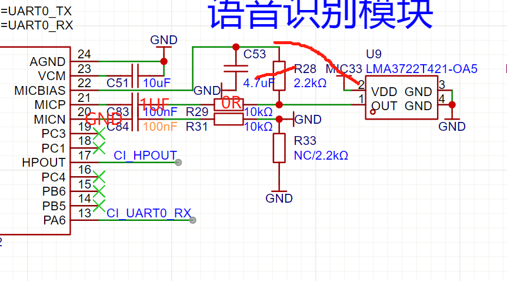

---

### CI-03T1/CI-03T2的MICBIAS电压异常如何处理？

**问题描述：**

使用CI-03T1或CI-03T2芯片模块时，发现麦克风偏置电压（MIC_BIAS）异常，仅测得0.9V，远低于芯片规格要求的2.8V。

**解决方案：**

**1. 电压规格确认**

- **正常电压**：芯片的VBIAS电压应为2.8V
- **异常现象**：测得0.9V表明电路或芯片存在问题

**2. 故障排查步骤**

- 检查外围电路连接是否正确
- 确认没有短路或负载过重
- 测量其他电源电压是否正常

**3. 解决方案**

- **更换芯片**：如果电路连接正确但电压仍异常，需要更换CI1302芯片
- **更换后验证**：更换新芯片后，麦可以正常工作

**注意事项：**

- MICBIAS电压异常会影响麦克风正常工作
- 更换芯片前先排除外围电路问题
- 建议使用推荐的柱体麦而非硅麦

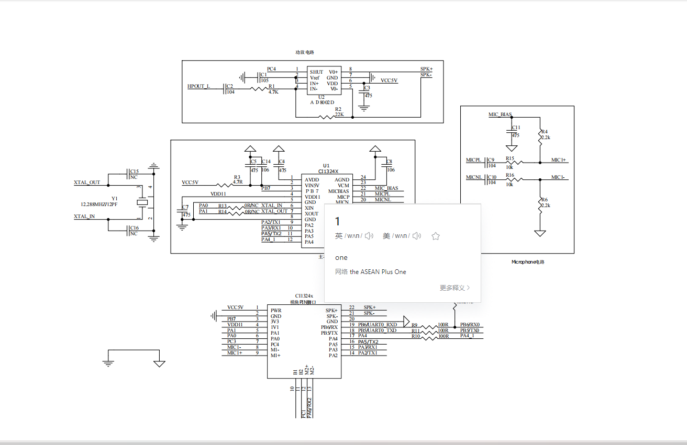
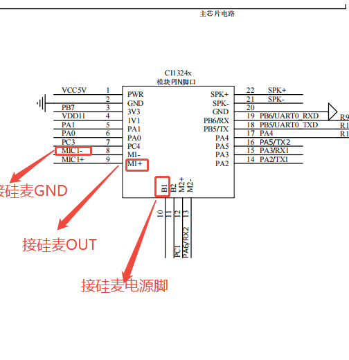

---

### CI-73T电源输入需要加开关管吗？

**问题描述：**

设计CI-73T模块电路时，咨询电源输入部分是否需要加开关管。

**解决方案：**

**电源设计说明：**

- **开关管非必需**：CI-73T模块电源输入部分不需要额外加开关管
- **可直接连接**：电源可以直接连接到模块的电源输入引脚
- **内部有保护**：模块内部已有基本的电源管理电路

**设计建议：**

1. **基本连接方案**：

    - 电源直接连接到模块的VCC引脚
    - 如需电源控制，可在前端增加开关
    - 主要用于整机电源管理，而非模块要求

2. **可选的电源控制**：

    - 如需要远程控制模块上下电
    - 可使用MOSFET或继电器控制
    - 选择合适的开关器件以满足电流需求

**注意事项：**

- 模块本身不需要开关管即可正常工作
- 添加开关管主要用于系统级电源管理
- 考虑开关管带来的压降和功耗

---

### CI-73T芯片的封装规格是什么？

**问题描述：**

需要了解CI-73T芯片本身的封装规格，而非模组的封装信息。

**解决方案：**

**封装信息获取：**

---

### CI-73T作为主控时如何使用IIC器件？

**问题描述：**

在CI-73T芯片作为主控时，如何在SDK中使用IIC（I2C）器件。

**解决方案：**

**IIC接口使用方法：**

- **SDK中查找**：IIC接口在SDK中通常通过API函数实现，需确认SDK版本是否包含IIC驱动库
- **查阅文档**：建议查阅SDK中的I2C模块文档，或联系技术支持获取I2C例程代码
- **API调用示例**：
    ```c
    // 初始化I2C
    i2c_init(I2C_PORT, I2C_SPEED);
    // 读取I2C设备数据
    i2c_read(I2C_DEVICE_ADDR, REG_ADDR, buffer, length);
    ```

**注意事项：**

- 确认使用的SDK版本包含I2C驱动库
- 引脚配置需正确设置为I2C功能
- I2C地址和速率需根据外设器件规格设置

---

- **芯片封装**：CI13241/CI13242 采用 **SOP24** 封装
- **模组封装**：SMD22/DIP22/21×15mm
- **区别说明**：芯片封装是芯片本身的封装（SOP24），模组封装是整个模组的尺寸

**获取方式：**

1. **芯片规格书**：

    - 包含芯片的详细封装尺寸
    - 引脚定义和电气特性
    - 推荐的PCB焊盘设计

2. **模组规格书**：

    - CI-73T-V1.1模组规格书.pdf
    - 包含模组整体尺寸和接口定义
    - 便于系统集成设计

**设计建议：**

- 使用Altium Designer（AD）编辑.PCB文件
- 确认封装尺寸符合0805及以上规格要求
- 参考电气原理图进行正确连接

---

### CI-73T模块是否支持2.2kΩ阻值的麦克风？

**问题描述：**

需要确认CI-73T模块是否可以使用负载电阻为2.2kΩ的麦克风。

**解决方案：**

CI-73T**支持**使用2.2kΩ阻值的麦克风。

**麦克风参数要求：**

- **灵敏度推荐**：-27dB ±4dB
- **信噪比要求**：≥75dB
- **负载电阻**：2.2kΩ是标准规格
- **尺寸规格**：推荐直径6mm，高度2.7mm以下

**硬件连接注意事项：**

- **引线要求**：如需加长连接线，必须使用屏蔽线
- **干扰防护**：避免引入外部噪声影响识别效果
- **接触良好**：确保麦克风与模块连接可靠

**选型建议：**

- 推荐使用6027型号或规格相当的麦克风
- 确保参数在推荐范围内
- 不建议使用参数差异过大的型号

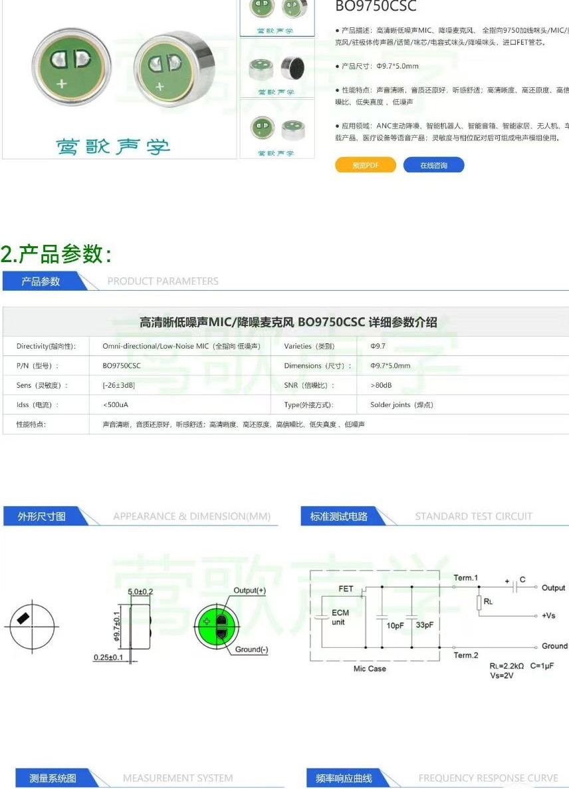

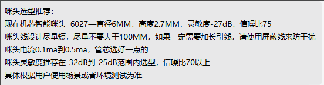

### CI-73T的PCB封装文件用什么软件编辑？

**问题描述：**

需要编辑CI-73T芯片的PCB文件，但不知道应该使用什么软件，以及如何确认封装尺寸是否正确。

**解决方案：**

**1. PCB文件编辑软件**

- **推荐软件**：Altium Designer（AD）
- **文件格式**：.PCB文件是Altium的格式
- **其他选择**：也可使用KiCad等开源软件

**2. 封装尺寸确认**

- **封装尺寸**：21.000mm × 16.000mm
- **引脚间距**：标准2.0mm间距
- **与CI-03T相同**：两模块封装完全一致

**3. 导入失败处理**

如果导入时提示"格式不正确"：

- **检查文件完整性**：确保文件未损坏
- **确认软件版本**：使用支持的AD版本
- **直接绘制**：如果导入失败，可以新建PCB文件
- **使用CI-03T封装**：两者封装相同，可直接使用

**4. 设计建议**

- **使用标准封装库**：优先使用官方提供的封装
- **验证尺寸**：设计前打印1:1图纸验证
- **注意引脚定义**：确保与芯片手册一致

**注意事项：**

- PCB设计需要一定的专业经验
- 建议使用EDA专业版本进行设计
- 如遇问题，可参考官方提供的示例文件
- CI-73T与CI-03T封装完全相同，可直接参考

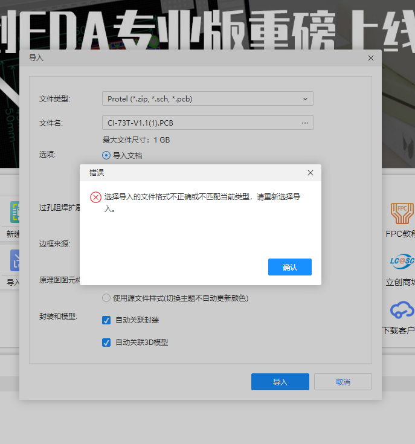

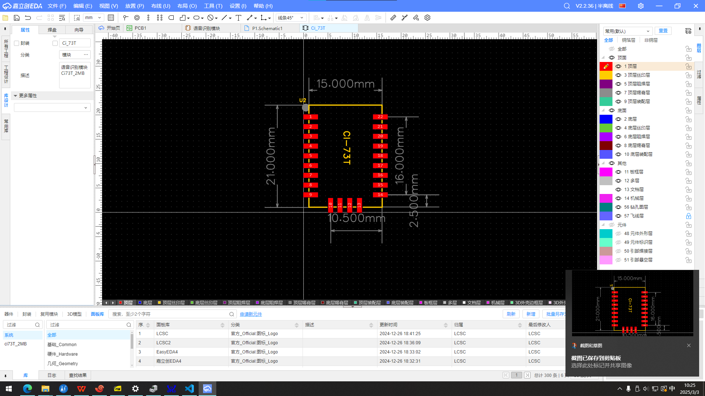

---

### CI-73T与3.3V单片机如何进行串口通信？

**问题描述：**

CI-73T语音模组（5V供电，3.3V通信）与3.3V单片机之间进行串口通信的电路设计是否正确，是否需要电平转换和上拉电阻。

**解决方案：**

**电平兼容性说明：**

- **CI-73T通信电平**：3.3V推挽输出
- **模块供电**：5V（但通信电平为3.3V）
- **直接连接**：与3.3V单片机可直接通信，无需电平转换

**电路设计建议：**

1. **直接连接方案**：

    - 两者都是3.3V电平，可直连
    - TX/RX交叉连接：模块TX连接单片机RX，反之亦然
    - GND共地：确保两地共地

2. **可选的上拉电阻**：

    - 通信稳定时可加上拉电阻
    - 典型值：1kΩ-10kΩ
    - 主要用于提高信号稳定性和抗干扰能力

3. **布线注意事项**：

    - 使用短而直接的连接
    - 避免平行走线以减少串扰
    - 必要时添加滤波电容

**通信功能确认：**

- **单向通信**：如只需接收语音模组发送的自定义内容
- **不影响学习**：串口通信不影响语音自学习功能
- **学习机制**：通过咪头识别语音实现，与串口无关

**注意事项：**

- 确认使用正确的串口（如UART1）
- 不使用小程序时，串口是主要的交互方式
- 如通信距离较远，建议使用232转换或485通信

---

### CI-73T的VDD1电源引脚需要加去耦电容吗？

**问题描述：**

在CI-73T2芯片外围电路设计中，VDD1电源引脚处是否需要添加去耦电容，以及如何正确配置电源滤波电路。

**解决方案：**

**去耦电容必要性：**

- **必须添加**：VDD1电源引脚需要加去耦电容
- **目的**：滤除电源噪声，提高系统稳定性
- **位置**：尽可能靠近VDD1引脚放置

**电容配置建议：**

1. **基本去耦方案**：

    - **100nF陶瓷电容**：用于高频去耦
    - **10μF电解电容**：用于低频滤波
    - 并联使用，覆盖宽频率范围

2. **布局要求**：

    - 电容尽量靠近VDD1引脚
    - 走线短而粗，降低寄生电感
    - 先经过去耦电容再给其他电路供电

3. **电源滤波设计**：

    - 输入端添加较大容量电解电容（如47μF）
    - 各电源引脚分别配置去耦电容
    - 形成多级滤波网络

**技术要点：**

- 去耦电容可抑制电源纹波和噪声
- 提高语音识别的稳定性
- 减少数字电路对模拟电路的干扰

**注意事项：**

- 使用X7R或X5R材质的陶瓷电容
- 电容电压等级应高于工作电压
- 参考官方设计文档进行具体配置

---

### CI-73T的日志串口可以当作普通串口使用吗？

**问题描述：**

询问CI-73T输出日志的串口是否可以当作正常的串口来使用。

**解决方案：**

CI-73T的P14和P15引脚可以配置为串口使用。

- **默认配置**：

    - P14/P15默认为日志输出口
    - 用于输出调试信息
    - 便于问题排查

- **串口配置**：

    - 可在平台配置为烧录功能引脚
    - 配置为串口后会影响日志输出
    - 需要权衡使用需求

**注意事项：**

- 配置为串口后无法输出日志
- 建议调试完成后再改为串口功能
- 日志对问题定位很有帮助

---

### CI-73T的"端口输出"是指什么方向？如何通过串口触发语音播报？

**问题描述：**

在使用CI-73T1语音模块平台时，对"端口输出"的控制方向存在困惑，不清楚是单片机向语音模块输出还是语音模块向单片机发送信号。希望通过串口输入触发语音模块播报特定内容。

**解决方案：**

**控制方向说明：**

在语音模块的控制方式中，**"端口输出"指的是语音模块向单片机发送信号**。

- 端口输出：语音模块 → 单片机（语音模块输出控制信号）
- 端口输入：单片机 → 语音模块（单片机发送控制指令）

**串口触发语音播报设置：**

1. **添加触发设置**：

    - 行为：选择要触发的动作（如Trash1Full）
    - 触发方式：选择"串口输入"
    - 串口选择：UART1_RX
    - 消息编号：设置接收的消息编号（如5）

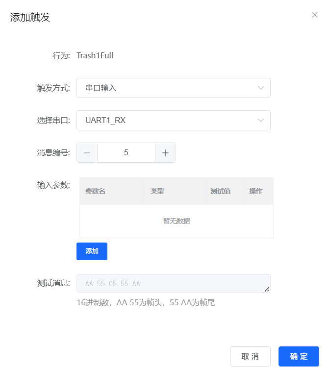

2. **添加控制设置**：

    - 行为：选择要执行的动作（如TurnOnTrash1）
    - 控制方式：选择"端口输出"
    - 控制类型：UART1_TX
    - 动作：发送
    - 参数：设置发送的数据（如01）

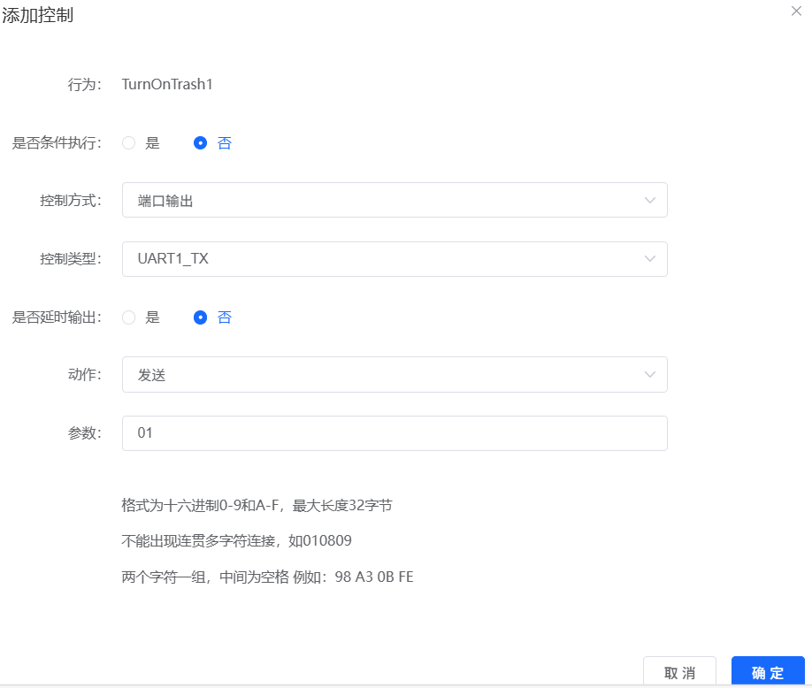

3. **验证配置**：

    - 检查触发列表确认设置正确
    - 检查控制列表确认输出配置


**注意事项：**

- 串口通信时确保波特率匹配（默认9600）
- TX和RX引脚需要交叉连接（模块TX接单片机RX）
- 确保双方供电电压匹配（通常为3.3V或5V）
- 消息编号需要在发送端和接收端保持一致

---

### CI-73T2如何通过PWM控制RGB灯（共阳极）？

**问题描述：**

需要通过CI-73T2的三个PWM输出来控制RGB灯（共阳极）实现任意颜色显示，并在智能公元平台的控制方式中进行配置。

**解决方案：**

**硬件连接说明：**

1. **RGB灯类型确认**
    - 使用共阳极RGB灯（公共端接VCC）
    - 三个阴极分别通过限流电阻接PWM引脚
    - 推荐限流电阻值：220Ω-330Ω

2. **PWM引脚分配**
    - PWM1：控制红色（R）通道
    - PWM2：控制绿色（G）通道
    - PWM3：控制蓝色（B）通道

**平台配置步骤：**

1. **进入控制方式配置**
    - 在智能公元平台选择对应的行为动作
    - 点击"添加控制"
    - 控制方式选择"PWM输出"

2. **PWM参数设置**
    - 选择对应的PWM引脚（PWM1/PWM2/PWM3）
    - 设置占空比（0-100%）控制亮度
    - 不同占空比组合可产生不同颜色

**颜色控制原理：**

- **红色**：PWM1=100%，PWM2=0%，PWM3=0%
- **绿色**：PWM1=0%，PWM2=100%，PWM3=0%
- **蓝色**：PWM1=0%，PWM2=0%，PWM3=100%
- **黄色**：PWM1=100%，PWM2=100%，PWM3=0%
- **紫色**：PWM1=100%，PWM2=0%，PWM3=100%
- **青色**：PWM1=0%，PWM2=100%，PWM3=100%
- **白色**：PWM1=100%，PWM2=100%，PWM3=100%

**注意事项：**

- 确保使用"没有晶体"的管脚配置
- 共阳极RGB灯的公共端需要接3.3V或5V电源
- 不同的占空比组合可以混合出任意颜色
- PWM频率建议设置在1kHz-10kHz之间以避免闪烁
- 如需更复杂的颜色变化，可以通过串口或变量控制PWM值

---

### CI-73T2模块发货时包含哪些配件和固件信息？

**问题描述：**

需要了解CI-73T2模块发货时的标准配置，包括固件版本、配件规格和发货清单等信息。

**解决方案：**

**标准发货配置：**

1. **CI-73T2模块规格**：

    - **型号**：CI-73T2（双麦克风版本）
    - **固件**：出厂固件（预烧录基础程序）
    - **Flash容量**：2MB
    - **支持词条数**：100条

2. **配套配件**：

    - **咪头**：柱体麦克风，规格60*27
        - 端子：2.0mm
        - 线长：120mm
    - **喇叭**：圆喇叭
        - 功率：8欧姆2瓦
        - 端子：2.0mm（不带耳朵）
        - 线长：150mm

**发货清单示例：**

| 物料 | 数量 | 规格 | 备注 |
|------|------|------|------|
| CI-73T2模块 | 1000个 | 出厂固件 | 双麦克风版本 |
| 柱体咪头 | 1000个 | 60*27，2.0端子，120mm线长 | 麦克风输入 |
| 圆喇叭 | 1000个 | 8欧2瓦，2.0端子，150mm线长 | 音频输出 |

**发货信息记录：**

- **生产批号**：20250731
- **发货日期**：7月31日
- **快递单号**：顺丰 SF 155 814 919 3989
- **收货信息**：

    - 单位：无锡市杰蒂诺自动化设备有限公司
    - 地址：无锡市梁溪区金山四支路11-1
    - 联系人：符向红 18951575337

**注意事项：**

- CI-73T2出厂已烧录基础固件，用户可自行更新应用固件
- 配套的咪头和喇叭线缆长度为标准规格，如需特殊长度需提前定制
- 模块为双麦克风版本，支持更好的降噪效果
- 收货后建议先进行小批量测试，确认功能正常后再投入生产

**质量检验：**

- 每批模块出厂前均经过功能测试
- 咪头和喇叭配件均已验证规格匹配
- 保留完整的发货记录便于质量追溯

---


---

### CI-73T2串口日志异常且端子不兼容怎么办？

**问题描述：**

CI-73T2模块在测试时发现串口日志中出现异常，且硬件端子不兼容，需要确认串口日志异常原因并解决端子兼容性问题。

**解决方案：**

**问题分析：**

1. **日志异常现象**：

    - 串口输出出现异常字符或乱码
    - 模块通信数据异常
    - 可能是固件配置或硬件连接问题

2. **端子兼容性问题**：

    - 样品端子为2.54-2P规格
    - 现有设备使用2.0mm间距插座
    - 2.54mm端子无法插入2.0mm插座

**排查步骤：**

1. **日志问题定位**：

    - 检查串口波特率设置是否正确（默认9600）
    - 确认串口线连接（TX-RX交叉）
    - 验证模块供电稳定性

2. **端子兼容性解决**：

    - 方案一：更换为2.0mm间距端子
    - 方案二：使用转接板适配不同间距
    - 方案三：修改PCB设计以匹配2.54mm端子

**端子规格对比：**

| 规格 | 2.0mm间距 | 2.54mm间距 |
|------|------------|------------|
| 插针间距 | 2.0mm | 2.54mm |
| 通用性 | 应用广泛 | 标准规格 |
| 兼容性 | 可插入2.0mm | 无法插入2.0mm |
| 成本 | 较低 | 稍高 |

**处理建议：**

1. **优先使用2.0mm规格**：

    - 与现有设备兼容性最好
    - 无需修改PCB设计
    - 采购和维护成本较低

2. **如需使用2.54mm规格**：

    - 必须同时更新连接器为2.54mm
    - 考虑使用转接线方案
    - 评估改造成本和周期

**测试验证：**

1. **功能测试**：

    - 使用正常端子连接测试语音功能
    - 验证串口通信稳定性
    - 确认所有功能正常工作

2. **可靠性测试**：

    - 进行多次插拔测试
    - 检查接触电阻和连接可靠性
    - 长期使用验证稳定性

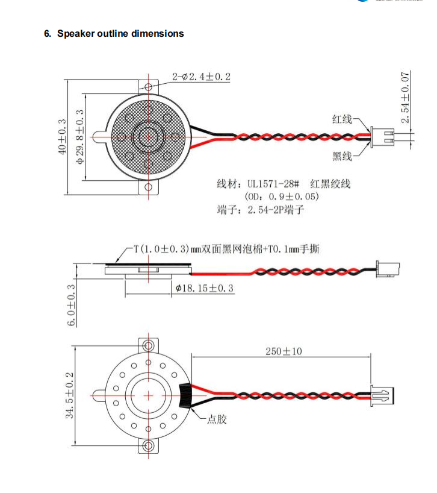

*样品端子为2.54-2P规格，与现有2.0mm设备不兼容*

**注意事项：**

- 端子规格变更需要同步更新所有相关连接器
- 2.54mm为工业标准，更易采购
- 混用不同规格端子可能导致接触不良
- 建议在量产前进行充分的兼容性测试

---


---

### CI-73T2语音控制无声音且喇叭线脱落怎么办？
- 长期使用中仍需关注线缆老化问题

---

### 音乐律动灯条的实现要点

**核心原理**：

1. **声音采集**：

    - 使用语音模块的ADC采集环境声音
    - ADC将模拟音频转换为数字值
    - 主控MCU读取ADC数值

2. **律动控制**：

    - 根据声音强度和节奏控制LED效果
    - 支持多种灯光效果（呼吸、流水、分区等）

3. **硬件架构**：

    ```
    语音模块 → MCU → LED驱动电路 → LED灯带
    ADC → MCU（采集声音数据）
    MCU → 算法处理 → 控制逻辑
    ```

4. **控制流程**：

    - 声音强分析（低、中、高）
    - 阈值检测（节拍）
    - 频率分析（频率特征）
    - LED效果控制（亮度、颜色、模式）

**应用示例**：

1. **呼吸灯效果**：

    - 低音量时LED缓慢闪烁
    - 高音量时LED常亮
    - 节奏控制：音乐节奏同步

2. **流水灯效果**：

    - LED依次点亮，营造流动感
    - 颜色循环：红→绿→蓝→黄→红

3. **分区控制**：

    - 左侧灯显示一种颜色，右侧显示另一种
    - 通过GPIO或PWM分别控制

**设计建议**：

- MCU选型建议使用带ADC功能
- 留意采样率和处理能力
- 优先使用硬件资源节省
- 根据实际效果调整算法参数

**技术优势**：

- 智能直接响应声音变化，实时性好
- 无需额外音频处理芯片
- 成本低，适合批量应用

**问题描述：**

多个CI-73T2语音模块出现烧毁现象，模块上电后5V和GND短路，功放芯片1脚和5脚短路，导致设备无法正常工作。

**问题分析：**

1. **短路现象确认**：

    - 上电前5V和GND已经短路
    - 功放1脚与地未短路，但与5脚短路
    - 多个模块出现相同问题，非个例

2. **故障特征**：

    - 刚上电就出现异常
    - 喇叭声音异常小
    - 无线功能正常，但语音控制失效
    - 功放芯片明显烧毁

**原因分析：**

1. **功放电路故障**：

    - 大部分情况是功放烧坏导致
    - 芯片本身一般不会烧毁
    - 功放1脚和5脚短路表明内部损坏

2. **可能的触发因素**：

    - 电源电压异常
    - 负载短路或过载
    - PCB设计问题
    - 静电或浪涌冲击

**解决方案：**

1. ** immediate处理**：

    - 寄回烧毁模块进行故障分析
    - 测量确认短路位置和程度
    - 记录故障现象和使用环境

2. **预防措施**：

    - **电源保护**：

        - 增加过压保护电路
        - 添加电流限制保护
        - 确保电源纹波在规格范围内

    - **功放电路优化**：

        - 检查PCB布局是否合理
        - 确认散热设计充足
        - 增加短路保护功能

    - **生产测试**：

        - 上电前进行短路检查
        - 增加老化测试环节
        - 抽样进行极限测试

3. **设计改进建议**：

    - 选用可靠性更高的功放芯片
    - 增加温度监控和保护
    - 考虑增加保险丝或PTC保护
    - 优化PCB铜箔宽度以承受更大电流

**检测方法：**

1. **常规检查**：

    - 使用万用表测量各脚对地阻值
    - 检查外观是否有烧灼痕迹
    - 确认外围元件是否正常

2. **深入分析**：

    - 解剖分析故障芯片
    - 进行失效分析（FA）
    - 统计故障率寻找规律

**注意事项：**

- 模块烧毁通常与功放电路密切相关
- 多个模块同时出现问题需要系统性排查
- 建议建立失效品分析流程
- 保留故障样品供后续分析

---

### CI-73T串口发送变量为什么会失败？

**问题描述：**

尝试在CI-73T模块上通过串口发送包含变量的十六进制数据，但无法实现变量拼接。

**解决方案：**

1. **变量发送限制**：

    - 平台目前不支持在十六进制中直接使用变量
    - {变量名}格式仅在特定功能中生效
    - 需要使用其他方式实现可变数据

2. **替代方案**：

    - 使用多条控制指令，每条对应不同数值
    - 通过外部MCU处理变量逻辑
    - 使用串口触发+GPIO组合控制

3. **控制条件上限**：

    - 平台支持多条控制条件
    - 实际上限取决于固件大小和资源
    - 1000条控制通常在可支持范围内

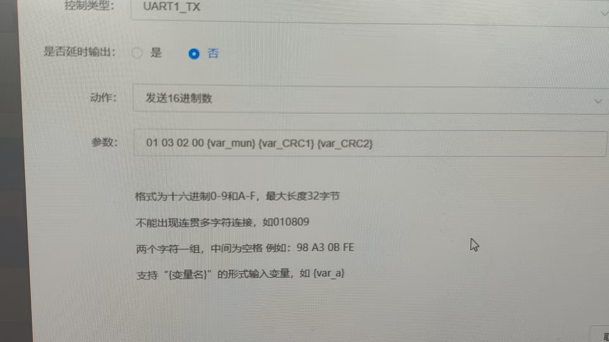

**注意事项：**

- CI-73T支持变量功能，但格式可能有特殊要求
- 建议将变量拆分为多个固定指令
- 确认固件版本是否支持高级功能
- 如需复杂控制，考虑使用外部MCU处理

---

### CI-73T的GPIO A0和A1引脚是否可用？

**问题描述：**

询问CI-73T芯片的GPIO A0和A1引脚是否可用，以及贴上晶振后是否会影响其作为GPIO的功能。

**解决方案：**

CI-73T的GPIO A0和A1引脚的使用取决于晶振的配置：

- **未贴晶振时**：A0和A1可以正常作为GPIO使用
- **贴上晶振后**：需要在平台配置为晶振功能，此时A0和A1不可用作GPIO

**配置说明：**

1. **晶振配置**：

    - 贴有晶振的模块必须在平台配置为"晶振口"
    - 配置后A0和A1专用于时钟功能
    - 无法同时用作GPIO和晶振

2. **GPIO配置**：

    - 需要使用GPIO功能时，选择未贴晶振的版本
    - 在平台中配置相应的GPIO控制
    - 可正常实现输入输出功能

**注意事项：**

- 硬件版本决定了引脚功能，贴晶振版本无法用作GPIO
- 采购时需明确告知用途（需要GPIO功能还是晶振功能）
- 如无法确定是否贴晶振，可咨询客服确认

---

### CI-73T1在UART模式下端口的默认状态是什么？

**问题描述：**

在使用CI-73T1模块的UART功能时，观察到端口可能处于高阻态，需要确认UART模式下端口的默认工作模式是开漏还是推挽。

**解决方案：**

**端口默认状态：**

- CI-73T1的UART端口默认为**推挽模式**
- 不是开漏模式，也不是高阻态
- 串口模式下一般都有低电压输出

**端口配置说明：**

1. **默认配置**

    - UART端口出厂默认配置为推挽输出
    - TX和RX端口正常工作在标准UART电平
    - 不需要额外配置即可使用

2. **模式切换**

    如需切换到开漏模式：

    - 进入配置平台，滑到最底部
    - 选择"优化配置"
    - 在模式选择中选择"开漏模式"

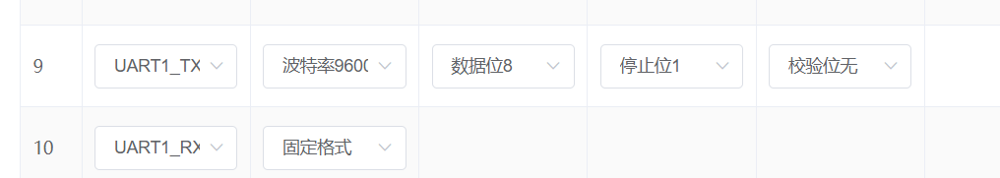

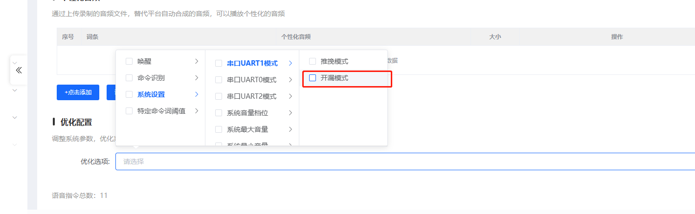

**状态判断：**

- 如果检测到高阻态，可能是：

    - 配置错误或未正确配置
    - 硬件连接问题
    - 模块工作异常

**注意事项：**

- 串口模式下端口不应处于高阻态
- 如需特殊配置，通过平台进行模式切换
- 配置完成后需要重新生成和烧录固件

---

### CI-73T是否可以使用任意GPIO配置为I2C通信？

**问题描述：**

希望了解CI-73T芯片是否可以将任意两个GPIO引脚配置为I2C通信的SCL和SDA引脚，以实现与主控芯片的串行通信。

**解决方案：**

**通信方式支持：**

- **UART通信**：CI-73T支持使用任意GPIO配置为串口通信
- **I2C通信**：平台目前不支持I2C通信配置
- 只能通过串口（UART）与主控芯片进行通信

**实现方案：**

1. **串口通信配置**

    - 可选择任意两个可用GPIO作为TX和RX
    - 在平台中配置为UART功能
    - 支持与外部MCU进行数据交换

2. **通信协议**

    - 需要自定义通信协议格式
    - 支持发送指令和接收反馈
    - 可实现控制命令的传输

**注意事项：**

- I2C功能目前平台无法配置，不能直接使用
- 如需I2C通信，建议通过外部MCU进行协议转换
- 串口通信是最简单直接的通信方案
- 确保通信双方的电平匹配（3.3V）

---

### CI-73T模块原理图接口如何使用？

**问题描述：**

需要了解CI-73T模块原理图中各接口的使用方法和正确连接方式。

**解决方案：**

**接口配置方法：**

- 通过智能公元平台进行配置
- 访问地址：http://www.smartpi.cn/#/
- 在平台中根据需求配置各个引脚功能

**配置步骤：**

1. 登录智能公元平台
2. 选择CI-73T对应的配置界面
3. 根据硬件设计配置引脚功能：

    - PA0、PA4等可配置为通信端口
    - 支持UART、PWM、GPIO等多种功能
4. 生成固件并烧录到模块

**注意事项：**

- 接口功能需要在平台中正确配置才能使用
- 不同的引脚支持的功能可能不同
- 配置完成后需要重新烧录固件
- 原理图设计需参考官方推荐的连接方式

---

### CI-73T1模块与外部设备连接时电平匹配问题

**问题描述：**

CI-73T1模块与外部WiFi模块连接时，需要确认串口通信的电平匹配问题，以及正确的接线方式。

**解决方案：**

**电平匹配要求：**

- **CI-73T1串口电平**：3.3V
- **外部设备电平**：必须为3.3V才能正常通信
- **供电独立性**：供电电压与通信电平是两个独立概念

**连接要点：**

1. **串口连接**

    - PA0（引脚15）可连接到Port1作为TX/RX
    - PA4（引脚14）可连接到Port2作为TX/RX
    - 建议TX和RX线上预留100Ω电阻

2. **电源连接**

    - 模块支持5V供电输入
    - 内部会转换为3.3V工作电压
    - 通信电平固定为3.3V

**注意事项：**

- 通信双方电平必须一致（3.3V）
- 即使外部设备提供5V供电，串口通信仍需3.3V电平
- 如外部设备为5V电平，需要加电平转换电路
- 通信口建议不要与烧录口共用

---

### CI-73T2不使用低功耗模式时，1V1引脚如何处理？

**问题描述：**

CI-73T2芯片在不使用低功耗模式时，1V1引脚是否需要外部供电，以及芯片内部是否能提供内核供电。

**解决方案：**

- **1V1引脚处理**：

    - 不使用低功耗模式时，1V1引脚可以直接悬空
    - 不需要单独给1V1供电
    - 芯片内部会提供内核供电
    - 实际应用中都是直接悬空处理

- **低功耗模式说明**：

    - 仅在需要使用低功耗功能时，才需要给1V1供电
    - 正常工作模式下，该引脚可保持悬空状态

**注意事项：**

- 如果不确定是否使用低功耗，建议先保持悬空
- 低功耗模式需要额外的硬件设计支持
- 正常工作模式芯片内部供电已经足够
- 无需担心1V1引脚的供电问题，悬空即可正常工作

---


---

### CI-03T和CI-73T2的PCB封装是否相同？

**问题描述：**

需要确认CI-03T和CI-73T2的PCB封装是否相同，以及是否可以互相替换。

**解决方案：**

**1. 封装规格确认**

- **CI-03T和CI-73T2的PCB封装不同**
- CI-73T2的封装/尺寸为：SMD22/DIP22/21*15mm
- 两者虽然外观相似，但存在差异

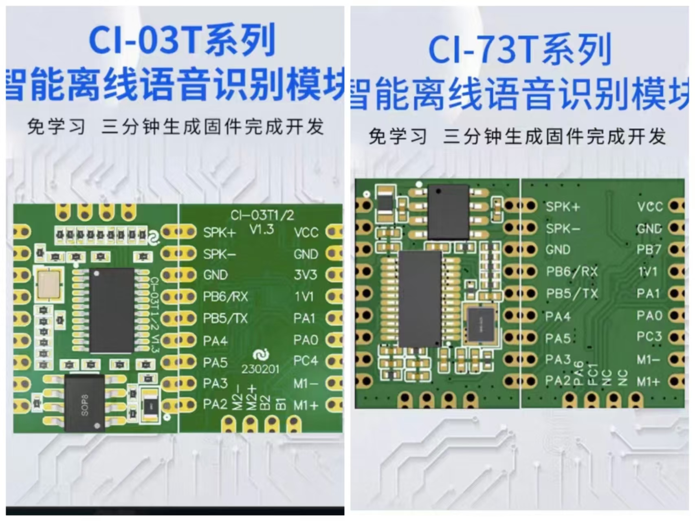

**2. 主要差异**

虽然封装可以共用，但需要注意：

- **引脚功能差异**：某些IO口的功能定义不同
- **内部电路设计**：存在细微差别
- **兼容性考虑**：直接替换可能需要调整

**3. 替换建议**

如需替换使用：

- **封装兼容**：物理封装可以共用，焊接兼容
- **引脚确认**：需要仔细核对引脚定义
- **固件适配**：可能需要修改固件配置
- **功能验证**：替换后需全面测试各功能

**4. 应用场景**

- **原型开发**：可以使用相同封装的型号快速测试
- **量产替换**：建议严格按原型号使用
- **成本考虑**：选择合适的型号控制成本

**注意事项：**

- 封装共用不代表完全兼容
- 替换前务必确认关键引脚功能
- 建议保留一定的设计余量
- 批量使用前先进行小批量测试

---


---

### CI-73T1的供电电压范围是多少？

**问题描述：**

需要了解CI-73T1芯片的最低供电电压要求，确认使用4.6V供电是否可行。

**解决方案：**

**1. 供电电压范围**

- CI-73T1标准供电电压：5V
- 可工作电压范围：4.5V - 5.5V
- 最低工作电压：约4.5V

**2. 4.6V供电评估**

- 4.6V在可工作电压范围内
- 可以正常工作，但可能影响性能
- 长期使用建议保持在5V标称电压

**3. 电源设计建议**

- 推荐使用5V±5%的稳定电源
- 如用电池供电，需考虑电压衰减
- 避免电压过低导致不稳定或重启

**注意事项：**

- 电压低于4.5V可能导致模块工作异常
- 电压过高（超过5.5V）会永久损坏模块
- 测量时要在负载状态下测量电压
- 4.6V虽可工作，但不推荐长期使用

### CI-73T的开发包和PCB设计文件如何获取？

**问题描述：**

需要获取CI-73T系列模块的PCB设计文件、原理图和相关技术资料，以便进行功能扩展和硬件修改。

**解决方案：**

**开发包获取方式：**

- **CI-73T2开发包下载链接**：https://help.aimachip.com/docs/ci73t/ci73t-1ga9ln8gktcu1
- **开发包内容包含**：

    - 原理图文件
    - 模块和芯片技术手册
    - 接线说明文档
    - 烧录软件工具
    - 烧录操作资料
    - PCB设计文件（.pcb格式）

**PCB文件编辑说明：**

- **推荐软件**：Altium Designer（AD）
- **文件格式**：.PCB文件是Altium专有格式
- **封装尺寸**：21.000mm × 16.000mm
- **兼容性**：CI-73T与CI-03T封装相同，可互相参考

**功能扩展建议：**

- 在修改PCB设计前，建议先详细了解原电路原理
- 扩展功能时注意电源容量和信号完整性
- 保留原有功能接口，确保基本功能不受影响
- 新增功能建议通过扩展接口实现，避免直接修改核心电路

**注意事项：**

- 修改PCB设计需要具备专业硬件设计经验
- 建议在原型阶段充分测试后再投入量产
- 开发包中的技术资料包含了必要的设计约束和注意事项
- 如有技术问题，可参考开发包中的文档或咨询技术支持

---

### CI-73T2的PWM输出频率如何设置高于5kHz？

**问题描述：**

CI-73T2的PWM输出最高频率为5kHz，需要了解如何通过软件方式实现更高频率的输出，以及该方式的精度和限制。

**解决方案：**

**1. 硬件PWM与软件PWM区别**

- **硬件PWM**：模块硬件本身支持PWM功能，精度高，但最高频率仅支持5kHz
- **软件PWM**：通过软件模拟实现PWM输出，可设置更高频率，但精度相对较低

**2. 软件PWM配置方法**

在智能公元平台配置界面：

- 选择引脚功能为PWM5（或其他PWM引脚）
- 设置所需频率（可高于5kHz）
- 配置占空比（0-100%）

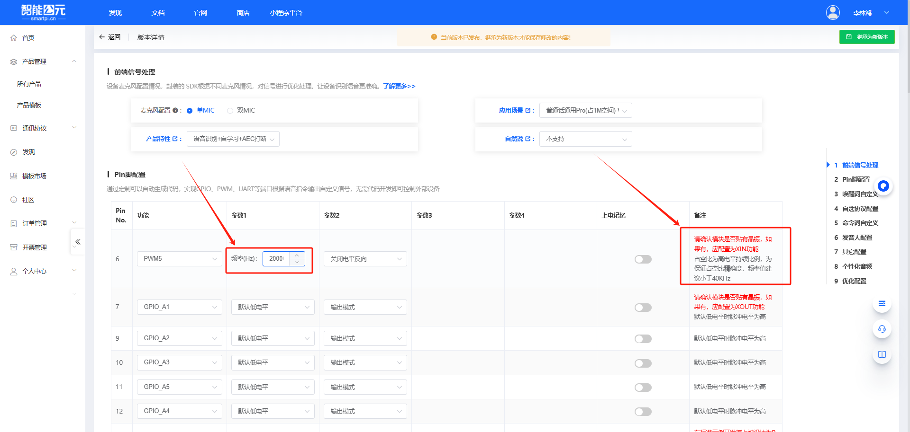

**3. 软件PWM特性**

- **实现方式**：IO口通过软件定时模拟PWM波形
- **频率范围**：可以设置高于5kHz的频率
- **应用场景**：适用于控制舵机等对精度要求不高的场合

**4. 技术限制**

- **精度较低**：相比硬件PWM，软件PWM的频率精度和稳定性较差
- **频率不稳**：输出频率可能受到晶振温漂等因素影响
- **推荐用途**：建议用于对频率精度要求不高的控制场景

**5. PWM通道数量**

不同模块支持的PWM通道数不同：

- 有些模块只有一路软件PWM
- 有些模块支持多路软件PWM
- 具体数量需根据实际模块确认

**注意事项：**

- 软件PWM适用于对频率精度要求不高的应用
- 如需精确和稳定的频率，建议使用硬件PWM（最高5kHz）
- 频率设置建议小于40kHz以保证稳定性
- 使用软件PWM时，避免对时序要求严格的应用

### CI-73T2的IO口支持5V输入吗？

**问题描述：**

需要确认CI-73T2模块的IO口输入电压限制，以及是否可以直接输入5V高电平信号。

**解决方案：**

**输入电压限制**

- **最高输入电压**：3.3V
- **耐压说明**：虽然IO口可能标注5V耐压，但输入模式工作电压为3.3V
- **风险警告**：输入超过3.3V可能损坏IO口

**电平匹配要求**

- **输入电平**：最高3.3V
- **输出电平**：3.3V推挽输出
- **电平转换**：如外部设备为5V，需要加装电平转换电路

**设计建议**

1. **5V转3.3V方案**：

    - 使用专用的电平转换芯片
    - 或采用分压电阻网络
    - 确保转换后电压不超过3.3V

2. **直接连接方案**：

    - 确保信号源为3.3V电平
    - 如使用3.3V单片机可直接连接
    - 注意共地连接

**注意事项：**

- IO口输入模式最高承受3.3V
- 5V输入会造成永久性损坏
- 设计电路时必须考虑电平匹配
- 建议在输入端增加保护电路

---

### CI-73T2的IO口可以供电吗？

**问题描述：**

询问CI-73T2模块的IO口是否可以作为电源输出，为外部传感器供电，以及最大输出电流能力。

**解决方案：**

**IO口供电能力**

- **驱动能力有限**：IO口只能驱动LED等小负载
- **无法驱动传感器**：不能为外部传感器提供足够电流
- **最大电流**：仅能驱动LED指示灯级别的负载

**具体限制**

1. **不支持舵机驱动**：

    - SG90等常用舵机无法驱动
    - 舵机启动电流和保持电流都超出IO口能力
    - 必须使用独立电源为舵机供电

2. **传感器供电限制**：

    - 小型传感器也无法稳定供电
    - 建议使用专用电源为传感器供电
    - IO口仅适合用作信号传输

**供电方案建议**

1. **独立供电设计**：

    - 为传感器提供独立的3.3V或5V电源
    - 根据传感器功耗选择合适电源方案
    - IO口仅用于信号通信

2. **共地要求**：

    - 模块与外部设备必须共地
    - 确保信号基准一致
    - 避免地环路干扰

**注意事项：**

- IO口设计用于信号传输，非功率输出
- 强行驱动大负载可能损坏IO口
- 如需驱动多路设备，建议增加驱动电路
- 系统设计时应预留充足的电源余量

---

## GPIO与控制输出

### CI-73T的麦克风输入方式是否可以改为单端输入？

**问题描述：**

需要了解CI-73T芯片的麦克风输入是否可以从差分输入改为单端输入，以及相应的实现方案。

**解决方案：**

**输入方式支持：**

- **默认设计**：CI-73T采用差分输入设计（MICP+和MICP-）
- **可改为单端**：支持将差分输入改为单端输入
- **效果对比**：差分输入效果更好，抗干扰能力更强

**改装方案：**

1. **参考单端设计**：

    - 可参考JX-B5C2的单端输入设计
    - 查看音频求和电路设计方案
    - 根据实际需求调整电路参数

2. **改装注意事项**：

    - 改为单端后效果需要自行调试
    - 可能影响识别率和抗干扰能力
    - 建议保留测试点以便调试

**平台调整：**

- **阈值调节**：可通过平台软件调整命令词和唤醒词的阈值
- **识别优化**：使用平台优化功能补偿硬件改动带来的影响
- **无需额外电路**：优先通过软件优化而非硬件改动

**注意事项：**

- 差分输入具有更好的共模抑制比
- 单端输入对布线和屏蔽要求更高
- 如必须使用单端，建议做好屏蔽和接地设计


---

### CI-73T1如何连接LMA3722T421-OA5贴片模拟麦克风？

**问题描述：**

需要了解CI-73T1模块连接LMA3722T421-OA5贴片模拟麦克风的正确接线方案，特别是MIC+和MIC-引脚的连接方式以及是否需要外部电容。

**解决方案：**

**推荐接线方案：**

1. **基本连接**：

    - 麦克风VDD → 3.3V电源
    - 麦克风GND → 模块GND
    - 麦克风OUT → CI-73T1的MIC+引脚
    - CI-73T1的MIC-引脚 → GND

2. **电容配置**：

    - 模块内部已有耦合电容
    - 外部不需要额外添加电容
    - 可直接连接，无需隔直电容

**技术说明：**

1. **模块内部设计**：

    - CI-73T1模块内部已包含耦合电容
    - 支持直接连接单端麦克风
    - 无需外部DC隔直处理

2. **阻抗匹配**：

    - LMA3722T421-OA5为标准模拟麦克风
    - 与CI-73T1输入阻抗基本匹配
    - 可正常工作但可能存在细微差异

**注意事项：**

- 贴片麦克风与推荐麦克风规格可能存在差异
- 使用非推荐麦克风可能影响识别效果
- 建议测试后验证实际识别率
- 如效果不佳，建议使用推荐型号麦克风

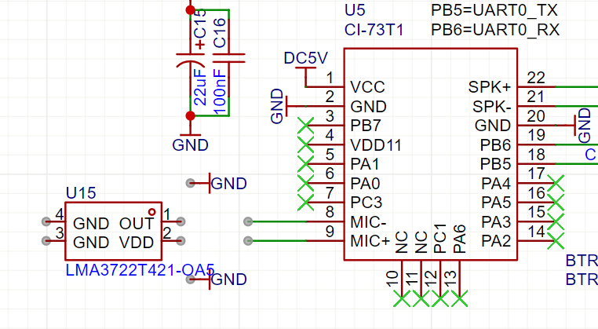

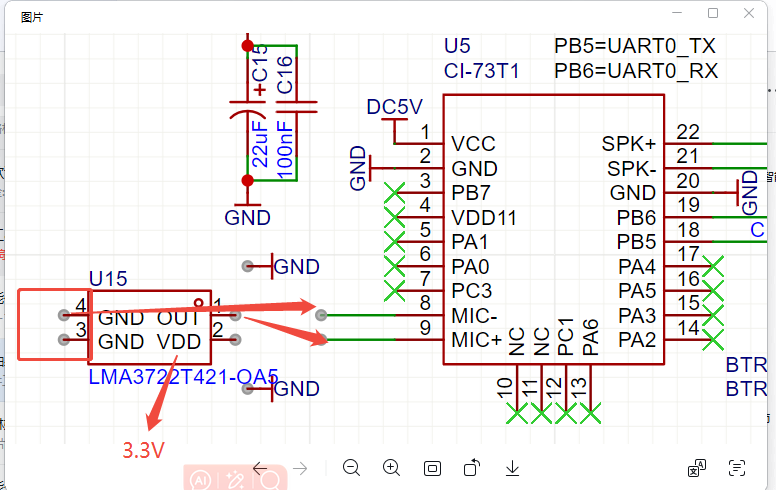

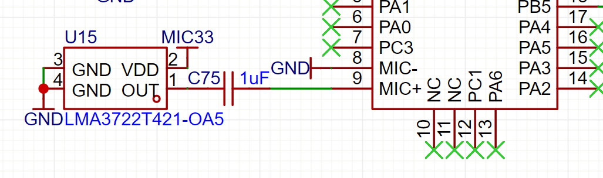

---

### CI-73T2与CI-73T的引脚兼容性如何？

**问题描述：**

需要确认CI-73T2芯片的引脚是否与CI-73T兼容，以及是否需要修改现有板子设计。

**解决方案：**

**引脚兼容性说明：**

- **部分引脚需要改动**：CI-73T2与CI-73T的引脚并非完全通用
- **封装相同**：两者使用相同的封装尺寸，可焊接在同一PCB位置
- **功能差异**：某些引脚的功能定义有所不同

**改动建议：**

1. **评估现有库存**：

    - 如有十几万套现有板子，建议评估具体改动成本
    - 可提供现有板子的固件配置供技术支持分析
    - 寻找最小改动的解决方案

2. **技术支持方案**：

    - 提供现有板子的原理图和固件配置
    - 技术支持人员可协助评估兼容性
    - 判断是否可通过软件配置解决引脚差异

**存储容量规格：**

CI-73T2提供两种存储容量版本：

- **2M版本**：适用于复杂应用，存储空间更大
- **1M版本**：适用于基础应用，成本更低

**注意事项：**

- 引脚改动需要重新布线和测试
- 建议先采购样品进行兼容性测试
- 批量改动前务必进行小批量验证
- 保留原有的PCB设计文件以便修改

---

### CI系列芯片可以不使用外部晶振吗？

**问题描述：**

CI系列芯片是否可以不使用外部晶振，以及在不使用外部晶振的情况下如何进行固件升级。

**解决方案：**

**晶振配置说明：**

- **可不要外部晶振**：CI系列芯片支持使用内部RC振荡器
- **内部RC优势**：减少外部元件，降低成本和PCB面积

**固件升级方法：**

1. **CI系列烧录方式**：

    - 使用CH340转换芯片连接
    - 配合专用上位机烧录工具
    - 通过串口进行固件更新

2. **与SU系列差异**：

    - CI系列：CH340+上位机工具
    - SU系列：不同的烧录方式
    - 通信接口：使用串口通信

**烧录步骤：**

1. **硬件连接**：

    - CH340的TX连接芯片的RX
    - CH340的RX连接芯片的TX
    - 共地连接确保通信正常

2. **软件操作**：

    - 安装CH340驱动程序
    - 运行专用烧录软件
    - 选择固件文件并开始烧录

**注意事项：**

- 内部RC精度略低于外部晶振
- 如对时钟精度要求高，建议使用外部晶振
- 烧录工具可向技术支持索取
- 确保烧录过程中电源稳定

---

### CI-73T1芯片的IO口驱动电流能力是多少？

**问题描述：**

需要了解CI-73T1芯片IO口的驱动电流能力，以及是否可以直接驱动继电器。

**解决方案：**

CI-73T1芯片不同IO口的驱动能力有所差异，具体规格如下：

**IO口驱动电流规格：**

1. **I5V10（5V耐压）IO口**：

    - 输出3.3V时：驱动电流20mA/33mA
    - 适合驱动较大负载

2. **I33V10（3.3V耐压）IO口**：

    - 输出3.3V时：驱动电流14mA/24mA
    - 适合一般驱动需求


**继电器驱动方案：**

由于IO口驱动电流有限，驱动继电器时需要注意：

- **建议增加驱动电路**：如三极管或MOSFET
- ** IO口内部结构**：采用对管设计，高低电平驱动能力相当
- **低电平输入**：支持与高电平相当的输入电流

**5V耐压引脚说明：**

- **A0、A1引脚**：不支持5V耐压
- **其他IO口**：支持OD（开漏）方式上拉至5V
- **使用注意事项**：采用OD方式时需要外接上拉电阻

**注意事项：**

- 驱动继电器建议添加三极管或MOSFET驱动电路
- 5V耐压引脚除外，其他IO口可使用OD方式上拉到5V
- 设计时要考虑IO口的最大驱动能力限制
- 长期使用建议留有足够的电流余量

---

### 智能公元平台管脚配置与实物对应关系

**问题描述：**

如何将智能公元平台上的管脚配置（如GPIO_A5）与实物芯片的管脚对应起来。

**解决方案：**

- 平台的GPIO_Ax对应实物PAx引脚（如GPIO_A5对应PA5）
- 平台的GPIO_Bx对应实物PBx引脚
- 平台的GPIO_Cx对应实物PCx引脚

**注意事项：**

- 具体对应关系可查看平台管脚配置表
- 实物接线时请参考CI-73T规格书中的引脚图

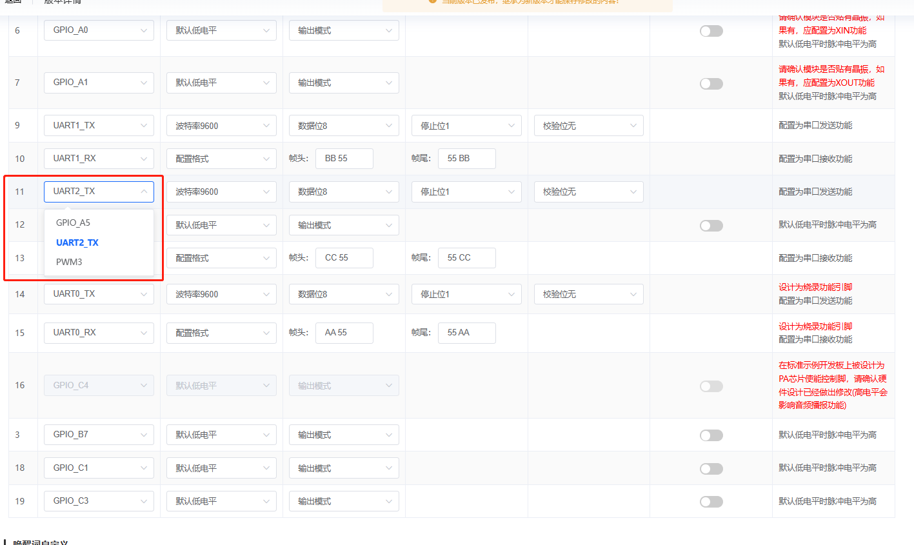

---

### CI-73T扬声器信号放大与原理图获取

**问题描述：**

需要了解CI-73T扬声器管脚是否支持信号放大，并获取相关原理图。

**解决方案：**

- CI-73T内置集成PA功率放大器，支持2.4W@5V4Ω输出
- 扬声器接口为SPK+和SPK-，直接连接即可使用
- 原理图可通过官方文档页面下载

**注意事项：**

- 模组内部已包含功放电路，无需外接功放
- 推荐使用4Ω/8Ω扬声器，功率不超过2.4W
- 详细的硬件设计请参考《CI-73T原理图V1.1》

> 相关资料下载：
> - [CI-73T原理图V1.1](https://help.aimachip.com/attach_files/ci73t/835)
> - [产品结构声学规范](https://help.aimachip.com/docs/ci73t/ci73t-1ga9mf9dm92pd)
> - [喇叭和咪头选型](https://help.aimachip.com/docs/ci73t/ci73t-1ga9mg1drm94b)

---
### CI-73T使用4R3W喇叭后出现功放烧毁怎么办？

**问题描述：**

使用CI-73T模块连接4Ω 3W喇叭后，使用几次后喇叭失效，更换其他板子可以正常工作，怀疑是功放芯片烧毁。

**问题分析：**

**1. 喇叭虚标问题**

- **虚标现象**：部分喇叭标注功率为3W，实际承受功率远低于标称值
- **材质差异**：喇叭材质和工艺差异导致实际功率承受能力不足
- **阻抗不匹配**：标注4Ω的喇叭实际阻抗可能偏高或偏低

**2. 故障表现**

- 使用几次后喇叭突然无声
- 更换喇叭后问题依旧
- 更换到其他板子可以正常工作
- 测量发现功放芯片可能已烧毁

**解决方案：**

**1. 喇叭选型建议**

- **使用官方推荐喇叭**：优先使用官方推荐的喇叭规格
- **功率余量**：喇叭标称功率应大于模块输出功率
- **阻抗匹配**：严格按照4Ω或8Ω规格选型

**2. 预防措施**

- **测试验证**：批量使用前先进行小批量测试
- **采购渠道**：从可靠渠道购买喇叭，避免使用劣质产品
- **功率匹配**：4R3W喇叭需确认真实功率能达到3W

**3. 故障排查**

- 测量喇叭实际阻抗（使用万用表）
- 更换已知正常的喇叭测试
- 检查功放芯片是否发烫
- 测量喇叭输出端电压是否正常

**注意事项：**

- 喇叭虚标是常见问题，采购时需注意
- 功放烧毁后需要更换整个模块
- 建议使用官方配套喇叭避免兼容性问题
- 使用大功率喇叭时建议外接独立功放

---

### CI-73T生成固件时提示内存不足怎么办？

**问题描述：**

CI-73T在平台生成固件时提示内存不足，即使指令数没有达到300条的上限。

**解决方案：**

**1. 内存占用说明**

CI-73T的内存限制不仅仅是Flash限制，还包括芯片运行内存（RAM）：

- **Flash容量**：2M（用于存储固件和音频数据）
- **运行内存**：芯片内部RAM，用于运行时指令识别
- **内存占用因素**：指令数 + 泛化词 + 回复语 + 防误识别词

**2. 泛化词占用内存**

泛化词会显著占用运行内存：

- 每条指令的泛化词都会增加内存占用
- 泛化词数量越多，内存占用越大
- 这是导致内存不足的主要原因

**3. 解决方案**

**方案一：减少泛化词**

- 删除不必要的泛化词配置
- 只保留必要的泛化词
- 减少每条指令的泛化词数量

**方案二：减少回复语**

- 使用简短的回复语
- 合并相似的回复语
- 部分指令不使用回复语

**方案三：更换型号**

- 考虑使用CI-33T（内存更大）
- 或减少功能需求

**4. 300条指令的真实含义**

宣传的300条指令是指在以下条件：

- 只有命令词，没有泛化词
- 没有回复语
- 没有防误识别词

实际使用时，由于泛化词和回复语的存在，可用指令数会减少。

**注意事项：**

- 泛化词会占用内存
- 防误识别词也会占用内存
- 具体可用指令数根据实际配置而变化
- 建议从小规模开始测试

---


### CI-73T晶振电路中空脚(NC)和贴电容引脚有什么区别？

**问题描述：**

在查看CI-73T模块原理图时，发现晶振电路中有标注为NC（空脚）和需要贴电容的引脚，需要了解两者的区别以及贴电容的容值要求。

**解决方案：**

**1. NC引脚与贴电容引脚的区别**

- **空脚（NC）**：晶振的引脚4和引脚2为空脚（No Connection），未连接有效信号，仅作为机械支撑或预留
- **贴电容引脚**：XTAL OUT（晶振输出）和XTAL IN（晶振输入）为贴电容引脚，需外接负载电容以匹配晶振的负载电容要求

**2. 负载电容容值计算**

CI-73T模块使用12.288MHz晶振，晶振标注为"12.288MHz/12pF"，其中12pF为负载电容（CL）：

- **负载电容公式**：CL = (C15 × C16) / (C15 + C16) + Cstray
- **典型配置**：若C15=C16，则C ≈ CL × 2
- **推荐容值**：C15和C16使用**22pF-27pF**电容（常用值为22pF或24pF）

**3. 电容选型要求**

- **材质**：推荐使用NP0/C0G材质陶瓷电容
- **精度**：容值精度±5%以内
- **电压等级**：16V或50V均可

**4. PCB布局要求**

- 电容（C15、C16）应尽量靠近MCU的XTAL引脚放置
- 走线长度建议≤5mm，减少寄生电容
- 电容接地端需直接连接到MCU的GND引脚

**5. 设计注意事项**

- 严格匹配晶振的负载电容，否则会导致频率偏移
- PCB走线会产生1-3pF寄生电容，需在计算时预留余量
- 若使用内部晶振，则无需外部晶振和电容

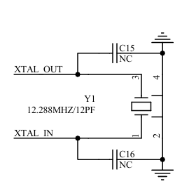

**注意事项：**

- 负载电容不匹配会影响时钟精度，可能导致通信异常
- 如遇时钟不稳定问题，可使用示波器测量XTAL OUT/IN波形
- 设计时预留焊盘，便于后期调试优化

---


### CI-73T2串口命令不执行怎么办？

**问题描述：**

使用CI-73T2模块时，部分模块串口命令不执行。例如20块板子中有4块运作不正常，使用同一固件，大部分正常但个别存在问题。

**解决方案：**

**1. 电源纹波检查**

电源纹波过大是导致串口通信异常的常见原因：

- 使用示波器测量模块电源纹波
- 建议电源纹波控制在100mV以内
- 检查电源滤波电路是否充足

**2. 串口电平转换**

串口电平不匹配会导致通信失败：

- 确认主控与模块的串口电平是否一致
- CI-73T2串口电平为3.3V
- 如主控为5V电平，需加装电平转换电路

**3. 供电设计检查**

共用电源可能导致干扰：

- 避免语音模块与大功率电路（如解码板、LED驱动）共用电源
- 建议使用独立的LDO为语音模块供电
- 检查电源走线是否合理，避免长距离走线

**4. 硬件排查步骤**

1. **替换测试**：将有问题的模块更换到正常的板子上验证
2. **电源测量**：在负载状态下测量电源纹波和稳定性
3. **串口波形**：使用示波器观察串口信号波形是否正常
4. **对比测试**：对比正常板和异常板的硬件差异

**注意事项：**

- 个别模块异常通常是电源或电平转换问题导致
- 大部分正常说明固件本身没有问题
- 需要从根源上解决电源纹波和电平匹配问题
- 建议使用独立的供电回路，避免与其他设备共享电源

---

### CI-73T芯片5V输入端需要加防浪涌电阻吗？

**问题描述：**

CI-73T模组在设计应用电路时，5V电源输入端是否需要增加保护元件防止浪涌冲击。

**解决方案：**

**电源设计要求：**

- **必须增加防浪涌电阻**：芯片5V输入端需要串联一颗电阻
- **电阻规格**：4.7Ω，0805及以上封装
- **保护目的**：防止电源浪涌冲击损坏芯片

**设计说明：**

1. **电阻选型要求**：

    - 阻值：4.7Ω（典型值）
    - 封装：0805或更大（1206、1210等）
    - 功率：根据工作电流选择，通常1/8W或1/10W即可满足

2. **安装位置**：

    - 电阻应串联在5V电源输入线上
    - 尽量靠近模组的5V输入引脚
    - 在电阻前端可配合增加滤波电容

3. **参考设计**：

    - 直接按照模组官方原理图原样抄板
    - 官方原理图已包含完整的保护电路设计
    - 参考文档：《CI-73T电气原理图V1.1》

**注意事项：**

- 防浪涌电阻是必要元件，不可省略
- 封装过小可能导致电阻在大电流下过热
- 设计时应参考官方原理图，确保保护电路完整
- 电源输入端也可考虑增加TVS管进一步保护

---

### CI-73T功放芯片的引脚如何连接？

**问题描述：**

CI-73T模组使用外部功放或参考模组原理图设计时，功放芯片的引脚如何正确连接。

**解决方案：**

**功放引脚连接要求：**

- **功放1脚**：需要连接到芯片的PC4引脚
- PC4是功放使能/控制信号引脚
- 该连接对音频输出功能正常工作至关重要

**连接说明：**

1. **参考模组原理图**：

    - 官方模组原理图已包含完整的功放连接设计
    - 直接按照模组原理图原装原样抄板即可
    - 参考文档：《CI-73T-V1.1电气原理图.pdf》

2. **PC4引脚功能**：

    - PC4可配置为功放使能控制信号
    - 在平台配置中需正确设置功放使能功能
    - 硬件连接需与软件配置一致

3. **设计建议**：

    - 如使用模组内置功放，无需额外设计功放电路
    - 如需外接功放，PC4可用作功放使能控制
    - 确保功放供电电压和功率与喇叭匹配

**注意事项：**

- 功放电路设计应严格按照官方原理图
- PC4连接错误可能导致无声音输出
- 参考官方设计可避免大部分硬件设计问题
- 如需外接大功率功放，建议使用独立功放模块

---
