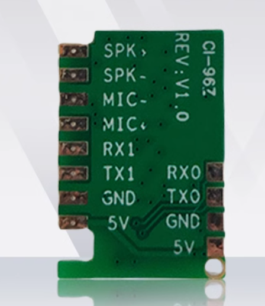

# CI-96Z 硬件设计 FAQ

本页用于整理 CI-96Z 相关的硬件设计问题。

### CI-96Z模块是否支持插拔式连接？

**问题描述：**

希望了解CI-96Z1&2模块的金手指设计是否支持插拔式使用，以及是否有对应的插槽可以购买。

**解决方案：**

CI-96Z1&2模块需要通过焊接方式集成到电路板上，不支持插拔式连接。

- 模块设计为焊接固定，并非为插拔使用
- 目前没有配套的金手指插槽可供购买
- 如需更换模块，建议设计可拆卸的连接方案或使用转接板

**注意事项：**

- 设计PCB时需预留焊接位置和布线空间
- 焊接时应注意防静电保护，避免损坏模块

### CI-96Z61/62的金手指接口如何安装？

**问题描述：**

需要了解CI-96Z61/62模组的金手指接口安装方式，是否可以竖直焊接或像邮票孔一样贴装在PCB上。

**解决方案：**

**接口类型：金手指接口**

**安装方式说明：**

1. **竖直焊接**
    - 可以将金手指接口竖直焊接在PCB上
    - 类似内存条的安装方式
    - 需要预留对应的插槽

2. **贴装方式**
    - 不支持直接像邮票孔一样贴装
    - 金手指设计用于插接连接
    - 贴装可能导致接触不良

**接口定义：**

**引脚说明：**

- **音频接口**：SPK+、SPK-（喇叭输出）
- **麦克风接口**：MIC+、MIC-（麦克风输入）
- **串口通信**：RX0/TX0、RX1/TX1
- **电源接口**：5V、GND
- **版本标识**：REV:V1.0

**PCB设计建议：**

1. **连接器方案**
    - 设计对应插槽，支持插拔
    - 推荐使用板对板连接器
    - 便于生产维护

2. **焊接方案**
    - 设计金手指焊接焊盘
    - 留意焊接温度控制
    - 避免虚焊和短路

3. **注意事项**
    - 确保金手指与PCB对齐
    - 控制焊锡用量，避免桥连
    - 焊接后进行电气测试

**优缺点对比：**

| 方式 | 优点 | 缺点 |
|------|------|------|
| 竖直焊接 | 连接可靠 | 不可拆卸 |
| 插接连接 | 可拆卸维护 | 需要连接器 |
| 邮票孔贴装 | 成本低 | 接触不良 |

**注意事项：**

- 金手指接口设计主要用于插接
- 不推荐直接贴装方式
- 生产时根据需求选择合适方案
- 确保接口定义与原理一致

------

