# JX-12F 硬件设计 FAQ

本页用于整理 JX-12F 相关的硬件设计问题。

### JX-12F模块技术手册和原理图获取

**问题描述：**

需要获取JX-12F模块的技术手册、原理图和PCB封装资料用于硬件开发。

**解决方案：**

- **技术手册**：访问 https://help.aimachip.com/docs/jx12f 获取完整技术文档
- **WiFi相关资料**：BL62B相关资料可参考 https://help.aimachip.com/docs/wifi_bl62b/wifi_bl62b-1e9f7jb3imq6u
- **原理图获取**：需联系硬件团队提供
- **JX-12F2原理图**：JX-12F2模块的原理图展示了主控芯片U2（JX-12F2）、电源电路（+12V和3.3V）、LED指示灯（LED1, LED2, LED3）、按键（SW1）以及多个接口（J1, J3, J5, J22）的详细连接关系

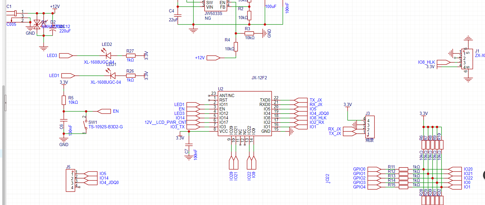

**注意事项：**

- 技术手册包含引脚定义、电气参数等关键信息
- 原理图需要通过正式渠道申请获取
- PCB封装资料通常包含在技术手册中
- JX-12F2的原理图包含了完整的电源管理和接口连接信息

---

### JX-12F模块与主控单片机的串口通信接线

**问题描述：**

需要了解如何正确连接JX-12F模块与主控单片机以实现串口通信，以及如何区分烧录口和通信口。

**解决方案：**

**引脚功能区分：**

- **烧录口（引脚22/23）**：专用烧录接口，用于固件下载和日志查看
- **通信口（引脚8/18）**：用于与主控MCU进行数据通信

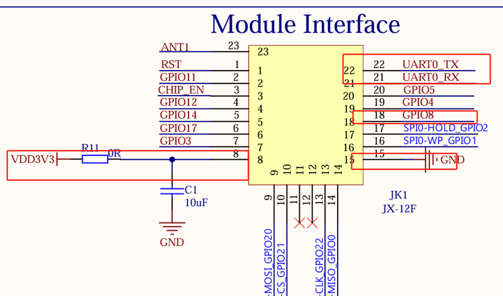

**串口连接方法：**

1. **推荐使用UART1（串口1）**：

    - IO2（引脚18）：RXD，接收数据
    - IO3（引脚8）：TXD，发送数据
    - 连接方式：MCU_TX → IO3，MCU_RX ← IO2

2. **UART0（烧录口）说明**：

    - 引脚22（RXD0）和引脚23（TXD0）
    - 主要用于控制台日志输出
    - 不推荐用于与主控通信

3. **硬件连接示例**：

```
主控MCU    ←→    JX-12F模块
TX (发送)   →    IO3 (UART1_TX)
RX (接收)   ←    IO2 (UART1_RX)
GND        →    GND
VCC        →    VDD (3.3V)
```

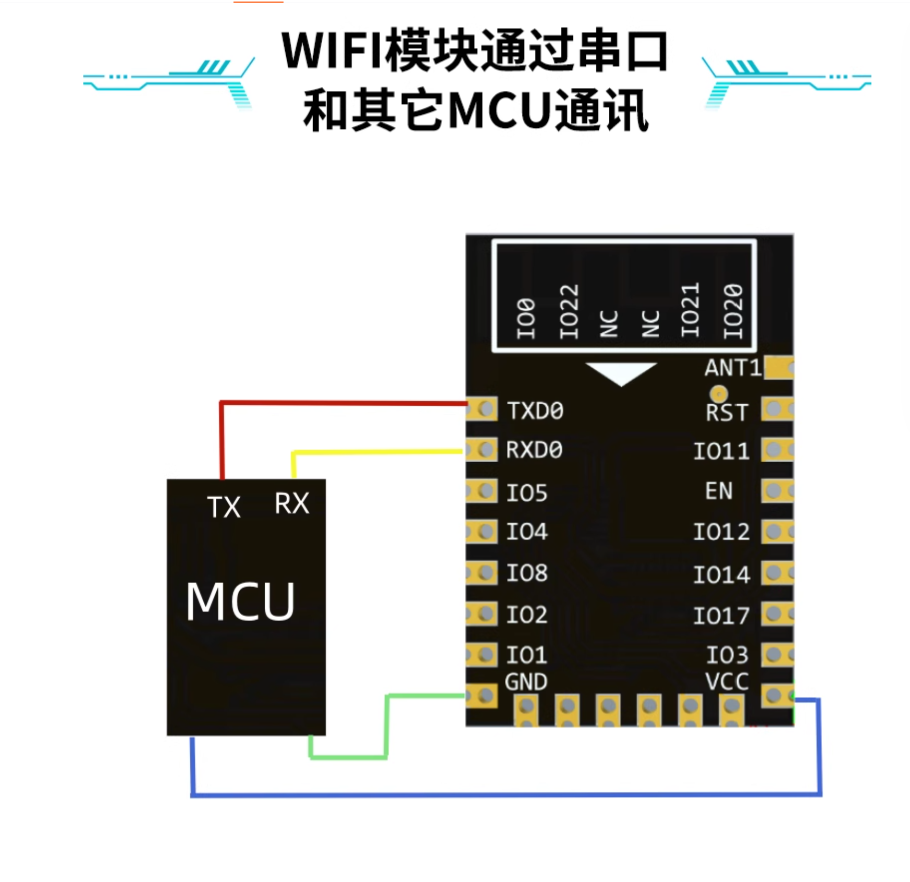

**注意事项：**

- 必须使用交叉连接：TX接RX，RX接TX
- UART0是控制台专用，用于查看调试日志
- UART1是标准串口，适合与外设通信
- 确保电平匹配（3.3V）
- 连接前确认引脚功能配置正确

---

### 如何识别JX-12F模块的板载天线和其他元件？

**问题描述：**

在JX-12F WiFi模块的电路板上无法识别板载天线的具体位置，以及被红圈标记的其他元件类型。

**解决方案：**

**板载天线识别：**

1. **天线位置特征**：

    - **外观特征**：

        - 通常为曲折的铜箔走线
        - 位于PCB边缘或角落
        - 呈现特殊的天线图案形状

    - **常见天线类型**：

        - **F型天线**：F形状的铜箔走线
        - **倒F型天线**：类似倒置的F形
        - **曲折型天线**：多个弯折的线路
        - **蛇形天线**：连续的S形走线

2. **JX-12F天线位置**：

    - 位于模块特定区域
    - 避开金属元件和屏蔽罩
    - 周围有净空区域，无其他元件

**其他元件识别：**

1. **电感元件**：

    - 通常为方形或圆形封装
    - 颜色多为黑色或深色
    - 丝印标记包含"L"或数字

2. **匹配电容/电阻**：

    - 0402或0603等小型封装
    - 用于天线阻抗匹配
    - 位置靠近天线馈点

3. **射频开关/控制器**：

    - 较大的IC封装
    - 用于天线切换控制
    - 丝印标记通常为IC编号

**识别方法：**

1. **查看原理图**：

    - 对比官方原理图确认位置
    - 天线通常标记为ANT或ANTENNA

2. **使用万用表测试**：

    - 测量与50欧姆阻抗匹配
    - 天线馈点处有特定阻抗

3. **网络分析仪验证**：

    - 测量回波损耗（S11参数）
    - 确认天线谐振频率

**天线布局要求：**

- 天线周围保持15mm净空距离
- 避免金属遮挡
- 远离噪声源
- 保持合适的离地高度

**注意事项：**

- 板载天线是精密设计的RF元件
- 不要随意修改天线走线
- 外壳设计需考虑天线辐射区域
- 如需更换，使用相同规格的天线

---

### JX-12F2使用线性电源无法正常上电怎么办？

**问题描述：**

使用线性电源3.3V/1A为JX-12F2模块供电时，模块上电异常，电流为0A。

**解决方案：**

1. **EN引脚控制问题**：模组内部EN引脚有上拉电阻，外部下拉会导致模块关闭  
2. **MCU输出配置**：推荐使用开漏（Open-Drain）输出模式  
3. **启动时序**：MCU上电稳定后延时500ms再拉高EN引脚


**注意事项：**

- 模组内部有EN引脚上拉电阻（约4.7kΩ）  
- MCU控制时推荐使用开漏输出模式

---

### JX-12F2的UART0和UART1如何区分使用？

**串口功能定义：**

1. **UART0（TXD0/RXD0）**：固件烧录口，引脚位置固定  
2. **UART1（可配置）**：与外部MCU通信，可配置到IO4/IO5


**使用建议：**

- 固件烧录：使用UART0，波特率115200bps  
- MCU通信：使用UART1（IO4/IO5）

---

### JX-12F模块支持回流焊吗？

**解决方案：**

JX-12F模块支持机器回流焊。

**回流焊温度参数：**

- **预热区**：140-160°C，持续60-90秒  
- **恒温区**：180-200°C，持续60-90秒  
- **回流区**：最高温度235°C，持续40-50秒  
- **冷却区**：自然冷却，速率控制在2-4°C/秒

**注意事项：**

- 峰值温度不应超过240°C  
- 235°C以上持续时间不超过60秒

---


---

### JX-12f日志口GPIO7/GPIO16不能作为串口使用怎么办？

**问题描述：**

JX-12f模块的日志口（GPIO7和GPIO16）不能作为串口使用，需要确认是否可以替换为其他串口进行通信。

**解决方案：**

**日志口功能说明：**

1. **专用功能限制**：

    - GPIO7和GPIO16是专用日志输出口
    - 不支持配置为串口通信功能
    - 仅用于输出调试日志信息

2. **日志格式特点**：

    - 输出固定的调试信息
    - 不可自定义输出内容
    - 波特率固定，用户无法调整

**替代通信方案：**

1. **使用UART1通信**：

    - JX-12f支持UART1功能
    - 可通过平台配置为标准串口
    - 支持与其他设备进行数据通信

2. **串口配置方法**：

    - 在智能公元平台选择UART1功能
    - 配置对应的引脚作为TX/RX
    - 设置波特率、数据位等参数

3. **其他GPIO口**：

    - 除了GPIO7/16外，还有多个GPIO口可用
    - 可选择其他GPIO口配置为串口功能
    - 实现自定义的通信协议

**技术建议：**

1. **优先选择UART1**：

    - UART1是标准通信接口
    - 协议成熟，开发简单
    - 与大多数外设兼容性好

2. **日志口保留**：

    - 保留日志口用于调试
    - 开发阶段可查看系统运行状态
    - 量产时可关闭日志输出

3. **硬件连接**：

    ```
    外设设备 ←→ UART1_TX → JX-12f模块
    外设设备 ←→ UART1_RX ← JX-12f模块
    ```

**注意事项：**

- GPIO7/16是日志专用引脚，无法改为串口使用
- 选择UART1或其他GPIO时需要在平台正确配置
- 通信协议需要外设设备配合开发
- 建议使用标准串口接口，兼容性更好

---

## QA5: CI-03T内部AEC与外部AEC应用

**问题：**
CI-03T单MIC方案如何实现回声消除？内部AEC和外部AEC应该如何应用？

**解答：**
CI-03T内部自带了AEC（声学回声消除）算法，但回声消除的效果依赖于参考信号的获取方式。

---

### JX-12F模块的低功耗电流参数和IO中断支持？

**问题描述：**

需要了解JX-12F WiFi+BLE模块在低功耗模式下的电流消耗大小，以及是否支持IO中断检测功能，以便进行低功耗应用设计。

**解决方案：**

**低功耗电流参数：**

根据JX-12F模块规格书，不同工作模式下的电流消耗如下：

- **Hibernate模式**：0.1 μA（典型值）
- **Sleep模式**：0.5 μA（典型值）
- **MCU模式**：视具体应用而定
- **RX模式**：视信号强度而定
- **TX模式**：视发射功率而定

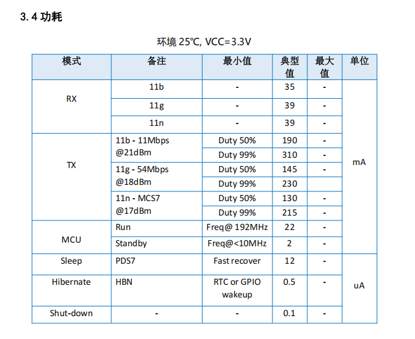

**IO中断支持：**

- JX-12F模块**支持IO中断检测**功能
- 可配置多个GPIO引脚为中断输入
- 支持电平触发和边沿触发
- 中断唤醒功能可从低功耗模式快速恢复

**功耗优化建议：**

1. **合理选择工作模式**：

    - 不需要通信时使用Sleep或Hibernate模式
    - 定期唤醒处理数据，然后休眠
    - 使用IO中断触发唤醒，避免轮询

2. **注意功耗限制**：

    - 正常工作电流根据使用场景变化
    - 设计系统时需要计算总功耗
    - 实测功耗以实际使用为准

**注意事项：**

- 规格书中的测试条件为25°C、VCC=3.3V
- 实际功耗受工作环境影响
- IO中断配置需在平台上正确设置
- 建议在硬件设计时预留低功耗测试点

---

### JX-12F模块是否支持MQTT协议？

**问题描述：**

在配置JX-12F模块时，需要在智能公元平台选择通讯协议，询问是否支持MQTT协议以及如何配置使用。

**解决方案：**

**MQTT协议支持：**

- JX-12F模块**支持MQTT协议**
- 可在智能公元平台的"通讯协议"下拉菜单中选择MQTT
- 支持标准的MQTT 3.1.1协议

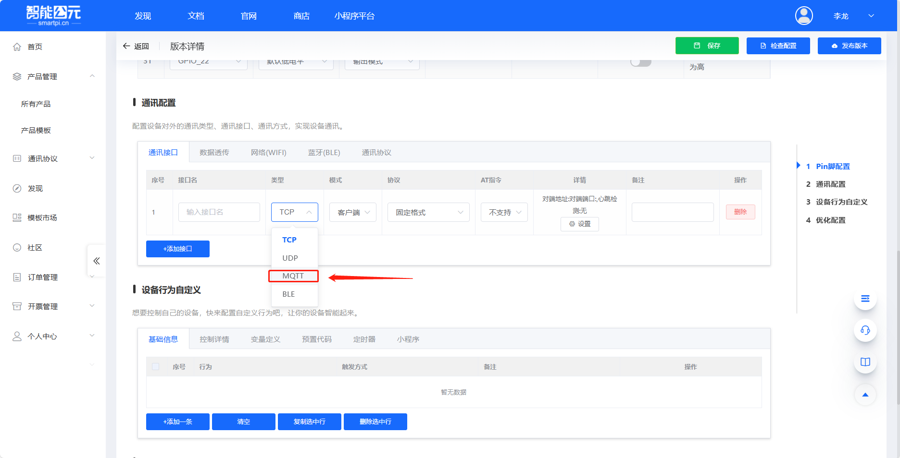

**配置说明：**

1. **平台配置**：

    - 登录智能公元平台（smartpi.cn）
    - 在通讯配置界面选择MQTT协议
    - 填写MQTT服务器地址、端口、主题等信息

2. **服务选项**：

    - 可使用自建的MQTT服务器
    - 也可使用平台提供的MQTT服务
    - 根据实际需求选择合适的服务方案

**技术要点：**

- MQTT是轻量级的物联网通信协议
- 适合低带宽和不稳定网络环境
- 支持发布/订阅模式，便于设备管理
- 可与多种云端平台集成

**注意事项：**

- MQTT服务器可能产生服务费用
- 自建服务器需要维护成本
- 配置时确保网络连接正常
- 主题命名建议使用有意义的前缀

---

### JX-12F模块在平台上找不到低功耗配置选项？

**问题描述：**

在智能公元平台配置JX-12F模块时，浏览Pin脚配置页面，但没有找到低功耗相关的配置选项，需要了解如何进行低功耗设置。

**解决方案：**

**自动低功耗机制：**

- JX-12F模块具有**自动进入低功耗**的功能
- 当没有网络活动或IO操作时，自动进入Sleep模式
- 不需要在平台上手动配置低功耗选项

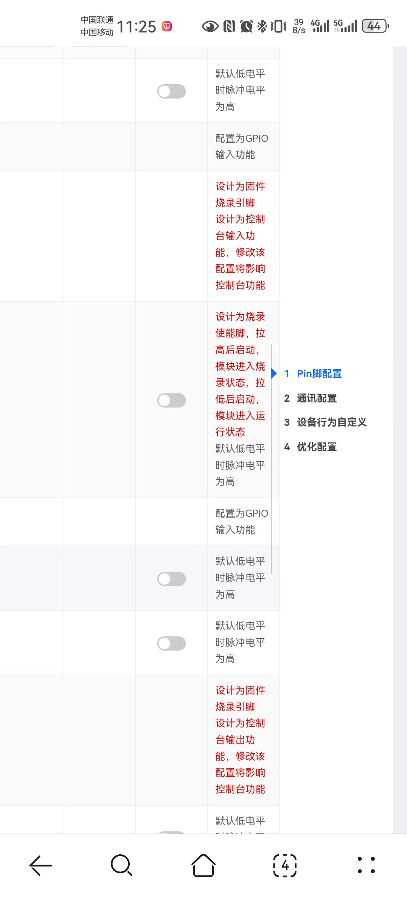

**功耗说明：**

1. **工作电流参考**：

    - 不同工作模式电流不同（详见规格书）
    - 实际电流取决于具体应用场景
    - 保持WiFi连接时功耗较高
    - 休眠时功耗最低可达微安级

2. **优化建议**：

    - 减少不必要的网络通信
    - 合理设置数据采集间隔
    - 使用IO中断触发，而非轮询
    - 优化WiFi信号强度

**实测方法：**

- 规格书提供理论值参考
- 实际功耗需要自行测试
- 使用万用表或功耗分析仪测量
- 在实际应用场景下进行测试

**注意事项：**

- 平台不显示低功耗配置是正常现象
- 模块会根据工作状态自动调节功耗
- 系统设计时应考虑峰值电流
- 电池供电时需要计算续航时间

### JX-12F模块如何配置GPIO引脚实现信号检测与控制？

**问题描述：**

需要使用JX-12F模块通过网页端配置GPIO引脚，实现高电平或低电平信号的检测与控制，并将信号发送至后台。

**解决方案：**

**1. GPIO配置方法**

- 在智能公元平台直接配置引脚输入输出
- 选择需要的GPIO引脚
- 设置为输入或输出模式

**2. 配置步骤**

1. **选择引脚功能**：

    - 在Pin脚配置页面选择目标GPIO
    - 配置为输入模式（检测信号）
    - 或配置为输出模式（控制信号）

2. **输入检测配置**：

    - 设置触发条件（高电平/低电平）
    - 配置触发后的动作
    - 绑定变量或发送消息

3. **输出控制配置**：

    - 设置输出电平（高/低）
    - 关联到控制指令
    - 通过网页端或小程序控制

**3. 信号传输方案**

- 检测到输入信号后，通过TCP/UDP发送到后台
- 后台处理后再发送控制信号
- 实现输入检测→后台处理→输出控制的完整流程

**注意事项：**

- 网页端配置简单直观，无需编程
- 确保GPIO引脚未被其他功能占用
- 测试时验证信号响应的实时性
- 建议使用官网提供的入门例程学习

---

### JX-12F模块与单片机连接时应选择哪个IO口作为串口通信接口？

**问题描述：**

需要了解JX-12F模块与单片机连接时，应选择哪个IO口作为串口通信接口比较合适。

**解决方案：**

**串口选择建议**

- **推荐使用UART1**：根据实际应用需求选择合适的串口
- **可选多个串口**：JX-12F支持多个串口配置
- **常用选择**：一般使用UART1进行通信

**串口配置灵活性**

- **根据自己需求来选择**：串口选择应根据具体应用需求
- **平台配置**：在智能公元平台配置所需串口功能
- **引脚映射**：不同串口对应不同的GPIO引脚

**选择考虑因素**

1. **通信速率需求**：

    - 高速通信选择支持高波特率的串口
    - 低速通信可选择任意可用串口

2. **引脚可用性**：

    - 确认选择的串口引脚未被其他功能占用
    - 检查硬件连接是否方便

3. **兼容性考虑**：

    - 与单片机的串口电平匹配
    - 连接线长度和信号完整性

**注意事项：**

- 串口选择后需要在平台正确配置
- 确保TX/RX交叉连接
- 不同串口可能支持的功能略有差异
- 建议参考技术手册了解各串口特性

---

### JX-12F模块与单片机连接时需要几根线，具体如何连接？

**问题描述：**

需要了解JX-12F模块与单片机连接时所需的线数以及具体的连接方式。

**解决方案：**

**所需连接线数：5根**

- **供电两根**：VCC（3.3V）和GND
- **串口通讯两根**：TXD和RXD（交叉连接）
- **模式转换一根**：IO8（烧录/运行模式控制）

**具体连接方法：**

1. **供电连接**：

    - VCC → 3.3V电源正极
    - GND → 电源负极

2. **串口连接**：

    - 单片机TX → JX-12F的RXD（引脚18/IO2）
    - 单片机RX ← JX-12F的TXD（引脚8/IO3）

3. **模式控制（IO8）**：

    - 正常工作：IO8拉低或悬空
    - 烧录模式：IO8拉高（上电瞬间给3.3V）


**硬件连接要求：**

根据技术开发手册，JX-12F模块的硬件连接包括：

- 供电（VCC, GND）：提供模块工作电源
- 串口通讯（TXD0, RXD0）：用于数据传输
- 烧录/运行状态切换（IO8）：控制模块工作模式
- 模块服务复位（RST）：可选，用于模块复位

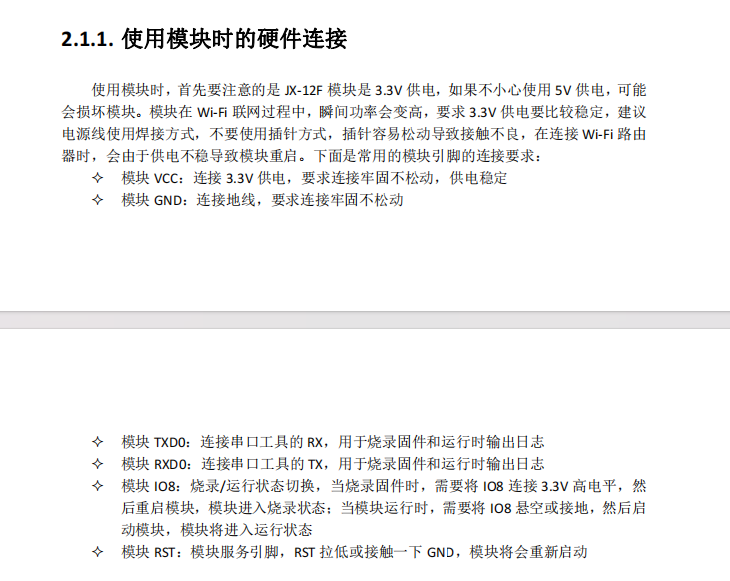

**注意事项：**

- IO8仅在烧录时需要拉高，正常工作时保持低电平
- 串口连接必须交叉：TX接RX，RX接TX
- 确保电平匹配，JX-12F工作电压为3.3V
- 如需复位功能，可连接RST引脚到单片机GPIO

---

### JX-12F模块的EN使能管脚需要连接吗？

**问题描述：**

使用JX-12F模块时，EN使能管脚是否需要连接。

**解决方案：**

**可以不连接**：

- EN（Enable）使能管脚是可选连接
- 不连接EN管脚模块也能正常工作
- 该管脚用于控制模块的使能状态

**EN管脚功能说明：**

1. **使能控制**：

    - 高电平：模块使能（正常工作）
    - 低电平：模块禁用（低功耗模式）
    - 可用于电源管理

2. **可选功能**：

    - 大多数应用场景下可不连接
    - 适合需要精确控制功耗的场景
    - 可悬空处理

**应用场景：**

**不需要连接EN**：

- 常规语音控制应用
- 持续工作状态
- 简化设计需求

**建议连接EN**：

- 电池供电设备
- 需要休眠唤醒功能
- 多模块电源管理系统

**注意事项：**

- EN管脚内部通常有上拉或下拉
- 不连接时默认为使能状态
- 如需控制功耗，可连接到MCU GPIO

---

### JX-12F模块的蓝牙信号名称是什么？联网时需要用到吗？

**问题描述：**

询问JX-12F模块的蓝牙信号名称是什么，以及在联网时是否需要使用这个名称。

**解决方案：**

**JX-12F是离线语音模块**：

- 不支持蓝牙功能
- 不存在蓝牙信号名称
- 联网功能与JX-12F无关

**功能确认**：

1. **离线识别**：

    - JX-12F专注于离线语音识别
    - 无需联网即可工作
    - 不包含蓝牙通信模块

2. **可能的混淆**：

    - 可能与JX-B5C混淆（支持蓝牙）
    - 或误认为其他带WiFi/蓝牙的模块

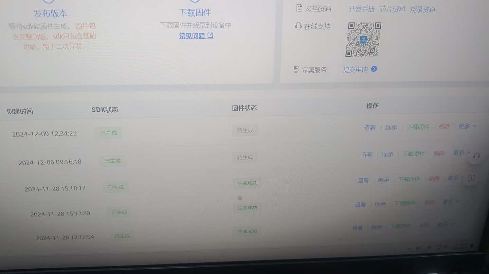

*固件生成界面，与蓝牙信号名称无关*

**选型建议**：

- 如需蓝牙功能，选择其他型号
- JX-B5C：支持蓝牙音乐播放
- 确认产品需求后再选型

**注意事项：**

- JX-12F是纯离线语音模块
- 不产生蓝牙信号，无需搜索连接
- 如需联网功能，需配合其他模块
- 选型时仔细阅读产品规格

---

### JX-12F的EN使能管脚需要连接吗？

**问题描述：**

询问使用JX-12F模块时，EN（Enable）使能管脚是否需要连接。

**解决方案：**

EN使能管脚可以不连接，具体说明如下：

- **可选连接**：EN引脚是模块使能控制，可以不接
- **默认状态**：不连接时模块默认使能工作
- **控制功能**：连接后可通过高低电平控制开关

**使用建议：**

- 一般应用直接悬空或接高电平
- 如需控制模块开关可连接到MCU
- 不需要开关控制时保持悬空状态

**注意事项：**

- EN引脚内部可能有上拉或下拉电阻
- 具体设计请参考模块规格书
- 不影响模块正常功能使用

---

### JX-12F模块的蓝牙信号名称是什么？

**问题描述：**

询问JX-12F模块的蓝牙信号名称，以及联网时是否需要使用。

**解决方案：**

JX-12F是纯离线语音模块，不具备蓝牙功能：

- **无蓝牙功能**：JX-12F不支持WiFi或蓝牙连接
- **离线工作**：所有语音处理在本地完成
- **无需联网**：不需要搜索蓝牙信号


**选型建议**：

- 如需蓝牙功能，选择其他型号
- JX-B5C：支持蓝牙音乐播放
- 确认产品需求后再选型

**注意事项：**

- JX-12F是纯离线语音模块
- 不产生蓝牙信号，无需搜索连接
- 如需联网功能，需配合其他模块
- 选型时仔细阅读产品规格

---

---

### JX-12F模块是否支持5V供电？

**问题描述：**

需要确认JX-12F模块是否有5V供电版本，以及如何解决5V单片机串口与模块之间的电平兼容问题。

**解决方案：**

**供电规格说明：**

- JX-12F模块**没有5V供电版本**
- 模块工作电压：3.3V（不支持5V直接供电）

**5V系统兼容方案：**

**1. 电平转换电路**：

使用电平转换芯片实现5V与3.3V之间的转换：

- 推荐使用TXS0108E、TXB0108等双向电平转换芯片
- 或使用简单的电阻分压电路（仅适用于低速信号）

**2. 串口连接方案**：

```
5V单片机    ←→    电平转换    ←→    JX-12F模块
TX (5V)   →    转换为3.3V   →    RX (3.3V)
RX (5V)   ←    转换为5V    ←    TX (3.3V)
GND        →                →    GND
```

**3. 串联电阻方案**：

对于低速串口通信（如9600bps），可使用：

- 在TX线上串联100Ω电阻
- 利用JX-12F内部保护二极管进行电平钳位
- 仅适用于低频通信场景

**注意事项：**

- 不能直接将5V信号连接到JX-12F模块
- 5V供电会损坏模块
- 建议使用专用电平转换芯片确保可靠性
- 设计前务必参考模块规格书中的电气参数

---

### JX-12F1如何选择外置天线？

**问题描述：**

在使用金属外壳设备时遇到信号屏蔽问题，需要通过外置天线解决，并询问关于天线接口类型（IPEX二代）、阻抗匹配（50Ω）和增益（dBi）等技术选型要求。

**解决方案：**

**1. 天线接口类型**

- JX-12F1使用IPEX二代座接口（母头）
- IPEX一代接口可以兼容插入
- 选购时注意接口匹配

**2. 天线参数要求**

- **阻抗**：50欧姆（越接近50越好）
- **接口**：IPEX-2代或兼容的1代接口
- **频段**：WiFi 2.4GHz专用天线
- **增益**：越高越好（建议5dBi以上）

**3. 信号屏蔽解决方案**

- 金属外壳会屏蔽WiFi信号
- 使用磁吸或粘贴式外置天线
- 将天线引出并贴在设备外壳外侧
- 确保天线朝向路由器方向

**4. 天线安装注意事项**

- 天线与屏蔽壳接触无影响
- 转动天线贴到屏蔽壳属于正常现象
- 确保天线连接牢固，避免松动

**注意事项：**

- 市面上IPEX二代天线供应较少
- IPEX一代天线可作为替代选择
- 高增益天线可显著改善信号接收能力
- 定制JX-12F1模组可获得标准天线接口

---

### JX-12F1天线座与屏蔽壳接触是否正常？

**问题描述：**

JX-12F1模块的天线头在转动时会贴到旁边的屏蔽壳上，担心这种接触会影响信号传输。

**解决方案：**

- **接触无影响**：天线头与屏蔽壳接触属于正常现象
- **设计考虑**：模块设计时已考虑此情况
- **信号传输**：不会影响WiFi信号正常传输
- **使用建议**：正常使用，无需特殊处理

**注意事项：**

- 确保天线连接牢固即可
- 天线接口为IPEX二代座
- 定期检查天线连接状态

---

### JX-12F模块尺寸与外壳如何适配？

**问题描述：**

JX-12F2 WiFi模块长度为55.09mm，在有限的外壳空间内安装时会顶住上方的舵机，需要解决尺寸适配问题。

**解决方案：**

**1. 模块尺寸确认**

- 标准长度：55.09mm（含排针）
- 移除一侧排针后：约52.19mm
- 宽度：约15mm（需考虑排针宽度）
- 高度：约5mm（不含元件）

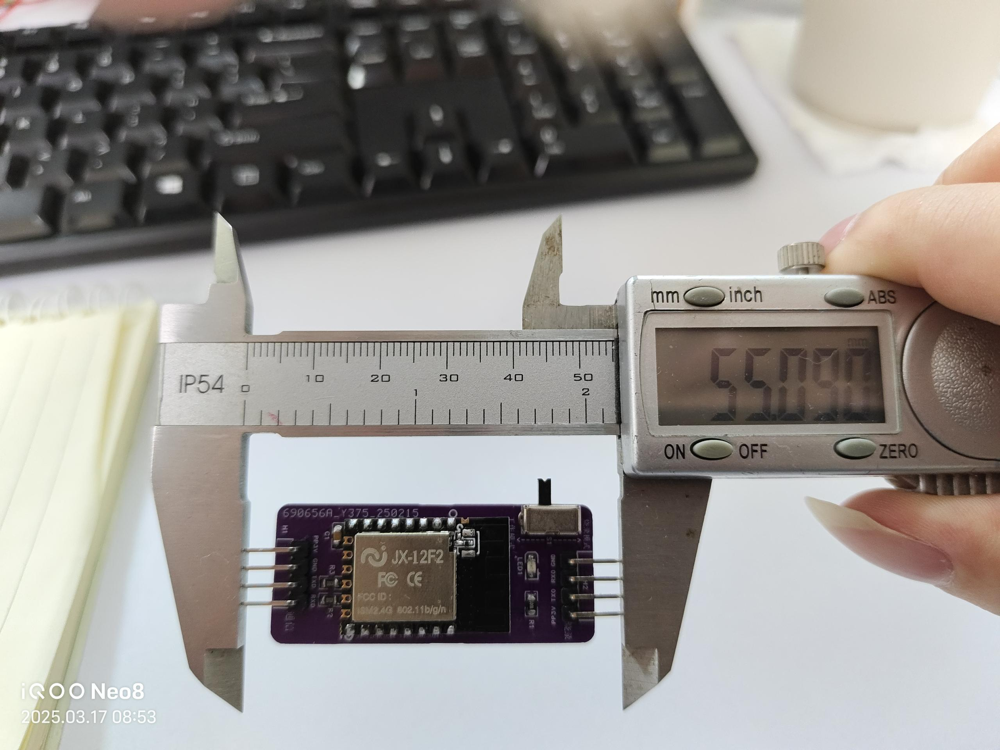

*JX-12F2模块实际长度55.09mm*


**2. 空间优化方案**

- 方案一：模块倾斜安装
    - 将模块以斜角方式安装
    - 降低有效高度占用
    - 适合内部空间狭小的产品

- 方案二：PCB布局调整
    - 将4P排母向内移动
    - 靠近PCB边缘放置
    - 减少对整体空间的占用

- 方案三：外壳加宽
    - 增加外壳内部宽度
    - 保持模块水平安装
    - 可能影响外观设计

**3. 替代安装方案**

- 使用外壳卡扣固定
    - 在外壳上设计模块卡槽
    - 通过杜邦线连接到PCB
    - 安装一次即可，后续维护方便
    - 需要适当长度的连接线

**4. 设计建议**

- 内部空间规划：约8.5×5×4cm（长×宽×高）
- 考虑尾部舵机占用的高度空间
- 留出线缆弯曲半径（至少10mm）

**注意事项：**

- WiFi模块比蓝牙模块更宽，需特别注意宽度
- 移除排针会影响模块稳定性
- 倾斜安装可能影响信号质量
- 外壳修改优先于PCB修改
- 建议制作3D打印样件验证方案

---

### JX-12F模块安装有哪些创新方案？

**问题描述：**

需要为JX-12F模块寻找更多安装方案，特别是当内部空间受限时的创新解决方案。

**解决方案：**

**1. 外壳卡扣固定方案**

- 设计理念：模块外置，通过连接线与PCB通信
- 实现方式：

    - 在外壳内侧设计专用卡槽
    - 模块通过卡扣固定
    - 使用公对母杜邦线连接
- 优点：完全释放内部空间
- 缺点：仅初次安装较麻烦

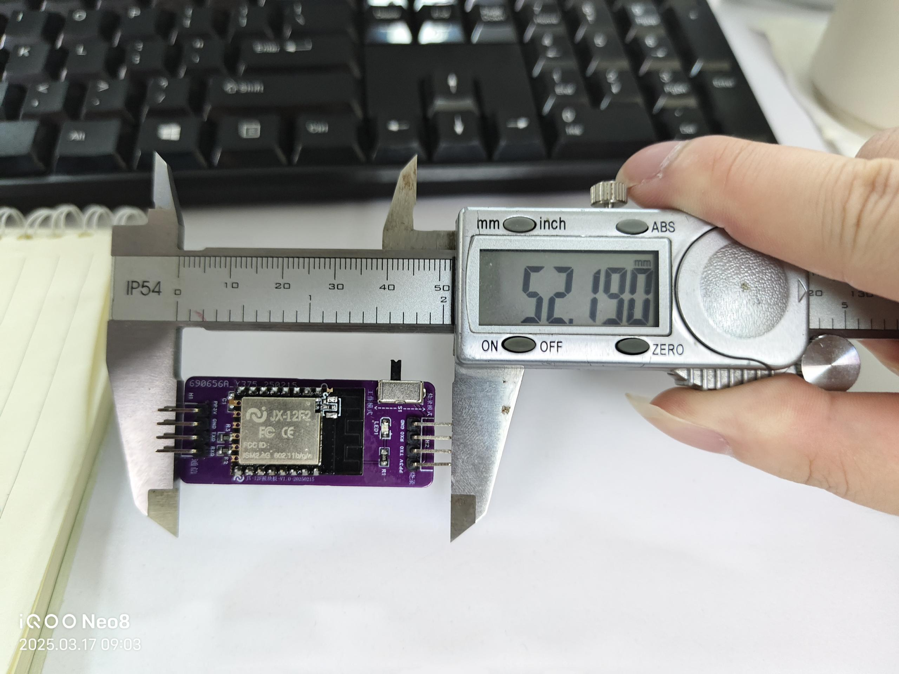

*移除一侧排针后长度仍为52.19mm*

**2. 安装注意事项**

- 连接线选择：使用稍长的杜邦线，便于插拔
- 线缆管理：合理规划走线，避免缠绕
- 固定方式：确保卡扣牢固，避免松动
- 维护考虑：虽然初次麻烦，但后续维护方便

**3. 其他可行方案**

- 柔性PCB转接板：使用软板连接，可弯曲适应空间
- 模块平放：将排针弯折90度使模块平贴PCB
- 分体式设计：将WiFi部分独立出来，仅天线外置

**4. 方案选择建议**

- 优先级1：如果允许外观改动，选择外壳加宽
- 优先级2：如果注重安装便利，选择卡扣方案
- 优先级3：如果空间极度受限，考虑分体设计

**注意事项：**

- 卡扣方案适合量产产品，标准化安装流程
- 弯折排针有风险，可能导致焊盘脱落
- 所有方案都需考虑信号完整性
- 建议根据产品定位选择合适方案
- 保留3D模型文件，便于后期优化

---

### JX-12F模块ADC检测频率与触发配置

**问题描述：**

使用JX-12F模块时，发现ADC检测仅在开机会执行一次，后续没有持续检测，需要了解ADC的检测频率以及如何配置持续检测或触发检测的机制。

**解决方案：**

**ADC触发机制说明：**

1. **默认检测行为**：

    - ADC检测不是自动持续进行的
    - 开机时的检测是一次性初始化行为
    - 需要配置触发规则来实现后续检测

2. **触发配置方法**：

    在平台的"优化配置"界面添加ADC触发规则：

    - 设置触发方式：ADC输入
    - 配置触发条件：GPIO引脚的ADC值范围
    - 定义触发动作：设置变量或执行控制操作

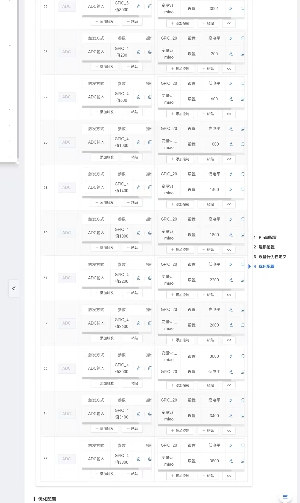

**ADC引脚配置步骤：**

1. **引脚功能设置**：

    - 在Pin脚配置页面选择目标GPIO（如GPIO_4）
    - 配置为ADC输入功能
    - 设置合适的偏差值范围

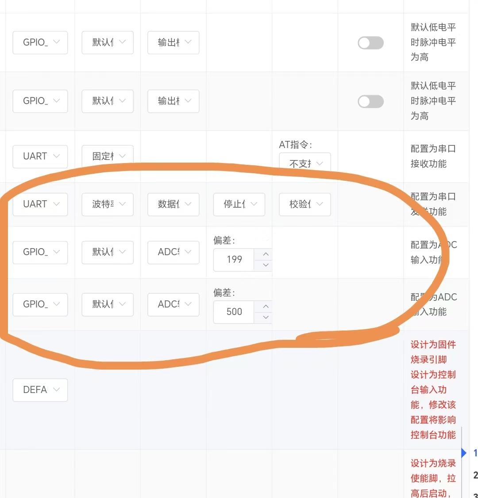

2. **触发规则配置**：

    - 在"优化配置"中添加新规则
    - 设置ADC触发的取值范围
    - 当ADC值在指定范围内时触发相应动作

**推荐引脚选择：**

- IO11和IO14的ADC采样效果比IO4和IO5更好
- IO4和IO5可能存在软件冲突，采样精度不理想
- 建议优先使用IO11、IO14作为ADC输入引脚

**ADC引脚选择建议：**

当需要多个ADC输入时：

1. **引脚优先级**：

    - 推荐使用IO11和IO14作为ADC输入
    - IO11、IO14采样精度更高，稳定性更好
    - 避免使用IO4、IO5，可能存在软件冲突

2. **多ADC配置**：

    - 可同时配置两个ADC输入（如IO11和IO14）
    - 每个ADC需要单独配置触发规则
    - 根据实际需求选择引脚数量

3. **硬件连接**：

    - 确保传感器输出电压在ADC输入范围内（0-3.3V）
    - 光敏电阻配合分压电路使用
    - 输入电压范围0.3-2.6V较为理想

**ADC自动检测问题排查：**

即使配置了IO11、IO14作为ADC输入，仍可能出现上电后无法自动检测的问题：

1. **确认触发规则配置**：

    - 检查是否在"优化配置"中添加了触发规则
    - 确认ADC触发范围设置合理
    - 验证触发动作已正确绑定

2. **验证引脚功能**：

    - 确认Pin脚配置中IO11、IO14已设为ADC
    - 检查偏差值设置是否合适
    - 确保没有其他功能冲突

3. **测试建议**：

    - 使用可变电压源测试ADC响应
    - 监控触发条件是否满足
    - 检查变量是否按预期更新

**注意事项：**

- ADC检测需要配置触发规则，不会自动持续检测
- 不同GPIO引脚的ADC采样精度可能有差异
- 建议在实际硬件上测试验证ADC值的稳定性
- 触发规则的取值范围需要根据实际传感器输出调整
- 使用IO11、IO14可获得更好的采样效果
- 配置完成后需要重新生成并烧录固件

---

### JX-12F模块蓝牙通讯如何配置？

**问题描述：**

需要实现两个JX-12F模块之间的蓝牙通讯，一个作为客户端发送数据，另一个作为服务端接收数据并执行GPIO控制。

**解决方案：**

**配置前提说明：**

JX-12F模块的蓝牙功能主要用于WiFi配网，不是为设备间通讯设计：

1. **蓝牙功能限制**：

    - 蓝牙功能主要用于配网使用
    - 没有实现设备间蓝牙通讯的成功案例
    - 平台配置主要围绕WiFi功能展开

**配置尝试方法：**

1. **固件分别配置**：

    - 客户端固件：配置蓝牙连接功能
    - 服务端固件：配置启动蓝牙服务端
    - 两个模块需要使用不同的固件

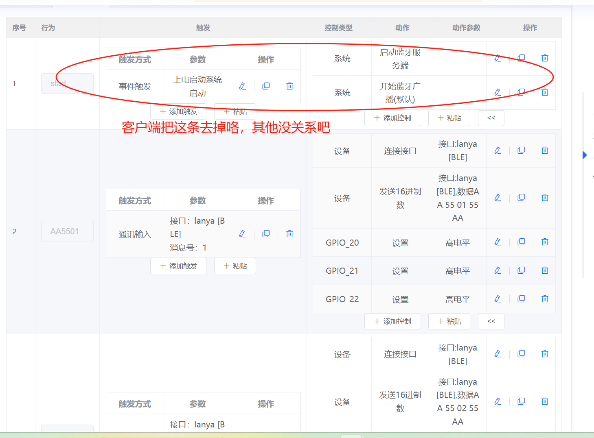

2. **客户端配置**：

    - 移除"启动蓝牙服务端"配置
    - 配置"连接接口"为蓝牙设备
    - 设置要发送的十六进制数据

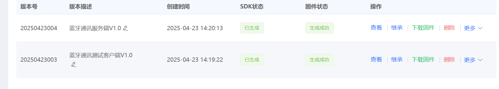

3. **服务端配置**：

    - 保留"启动蓝牙服务端"和"开始蓝牙广播"
    - 配置通讯输入触发相应的GPIO操作
    - 设置数据接收的处理逻辑

**实际测试结果：**

- 两个模块难以建立稳定的蓝牙连接
- 蓝牙通讯功能未经过充分验证
- 平台主要针对WiFi应用优化


**替代方案建议：**

1. **使用WiFi通讯**：

    - 利用JX-12F的WiFi功能进行设备间通讯
    - 通过TCP/UDP协议实现数据传输
    - 配置简单，稳定性更好

2. **使用纯蓝牙模块**：

    - 选择专门支持蓝牙通讯的模块
    - 确保模块支持SPP或BLE通讯
    - 参考成功的蓝牙应用案例

**注意事项：**

- JX-12F的蓝牙主要用于配网，不建议用于设备间通讯
- 如必须尝试蓝牙通讯，需要充分测试验证
- WiFi通讯是更可靠的选择
- 建议联系技术支持确认最新功能支持情况

---

### JX-12F模块的双串口都可以使用吗？

**问题描述：**

需要了解JX-12F模块的两路串口是否都可以用作通信接口。

**解决方案：**

**1. 串口功能说明**

- JX-12F模块确实有两路串口
- 如果不考虑日志输出功能，两路串口都可以使用
- 其中一路串口已与语音模块硬件连接

**2. 实际使用限制**

- 当需要保留日志功能时，只有一路串口可供外部通信
- 烧录口/日志口（引脚22/23）不建议用作通信串口
- 通信口（引脚8/18）可用于与主控MCU通信

**3. 串口配置建议**

- 优先使用专用通信口（IO2/IO3）进行外部通信
- 保留日志口用于调试和固件更新
- 如确实需要双串口，需要关闭日志功能

**注意事项：**

- 使用控制台作为串口会影响WiFi和蓝牙功能
- WiFi程序较复杂，需要通过日志定位问题
- 建议产品设计时保留日志调试接口

---

### JX12F模块IO端口模拟电压采集不灵敏如何处理？

**问题描述：**

JX12F模块的IO端口模拟电压采集存在不灵敏的问题，影响正常使用。

**解决方案：**

**1. ADC误差值调整**

- 进入模块配置界面
- 找到ADC相关的误差值设置
- 将误差值改小以提高灵敏度
- 测试不同误差值的效果

**2. 硬件连接检查**

- 确认IO端口与传感器连接可靠
- 检查电压信号范围是否在0-3.3V内
- 验证供电电压稳定（建议3.3V）
- 排除接触不良或干扰问题

**3. 软件配置优化**

- 确认ADC采样率设置合理
- 检查是否启用了滤波功能
- 验证触发阈值设置
- 考虑使用多次采样平均

**注意事项：**

- IO口高电平正常范围为2.9-3.3V
- 误差值过小可能导致误触发
- 建议从小到大逐步调整误差值
- 保持模块供电稳定有助于提高精度

---

### JX-12F2模块屏蔽盖焊接质量检测方法

**问题描述：**

JX-12F2模块的屏蔽盖焊接不良可能导致信号干扰或性能问题。需要了解如何检测屏蔽盖的焊接质量以及排查相关问题。

**解决方案：**

**1. 焊接质量检查要点**

- 检查屏蔽盖四周的焊点是否完整、无虚焊
- 确认焊膏涂抹均匀，无过多或过少现象
- 检查焊接后屏蔽盖是否平整、无翘起
- 使用放大镜检查焊点光泽度，应有良好的金属光泽

**2. 电气测试方法**

- 使用万用表测试屏蔽盖与地线的连通性
- 检查屏蔽盖与PCB地平面的电阻值（应接近0Ω）
- 测试模块在屏蔽盖焊接前后的信号强度变化


**3. 常见问题及处理**

- **虚焊现象**：重新加热焊接点，补充焊膏
- **短路问题**：检查是否有焊料桥接，需要清理
- **屏蔽盖翘起**：重新对位并焊接固定点

**注意事项：**

- 屏蔽盖焊接建议使用回流焊工艺，温度曲线需符合规范
- 手工焊接时注意控制温度，避免损坏PCB
- 焊接后清洁残留焊剂，防止长期腐蚀
- 批量生产时建议首件检查和抽检相结合

---

### JX-12F2模块输入信号异常排查方法

**问题描述：**

JX-12F2模块出现输入信号异常（如无信号输入、信号不稳定等），需要系统性的排查方法。

**解决方案：**

**1. 基础检查步骤**

- 确认模块供电正常（3.3V±5%）
- 检查信号源是否工作正常
- 验证连接线缆无断路、短路现象
- 确认信号电平范围（0-3.3V）

**2. 输入配置验证**

- 检查GPIO配置为输入模式
- 确认上下拉电阻设置正确
- 验证触发阈值是否合理
- 检查是否启用了输入滤波功能

**3. 使用万用表检测**

- 万用表设置到相应测量档位（电压/电阻）
- 表笔正确连接到测试点
- 注意万用表电池电量，低电量可能导致读数异常
- 测试时避免手抖造成接触不良

**4. 软件调试方法**

- 启用模块日志输出功能
- 查看输入引脚的实时状态
- 使用ADC功能读取模拟电压值
- 记录异常发生时的具体条件

**注意事项：**

- 测试时先断电连接，避免短路损坏模块
- 高频信号测量需要使用示波器
- 长距离传输需要考虑信号衰减
- 环境干扰可能影响输入稳定性，必要时加屏蔽措施

---
