# JX-A7T 硬件设计 FAQ

本页用于整理 JX-A7T 相关的硬件设计问题。

### 无线麦克风连接后设备无法正常工作怎么办？

**问题描述：**

连接无线麦克风和开发板后，设备无法正常工作，需要确认连接是否正确以及如何进行测试。

**解决方案：**

1. **连接确认步骤**：

    - 检查无线麦克风是否正确连接到模块的麦克风输入接口
    - 确认开发板与模块的通信连接正常
    - 验证电源供电是否稳定

2. **无线麦克风测试**：

    - 使用万用表测试无线麦克风的输出信号
    - 检查无线麦克风与模块的通信协议是否匹配
    - 确认无线麦克风供电充足

3. **调试方法**：

    - 先连接有线麦克风测试基本功能
    - 确认有线模式下工作正常后再接入无线麦克风
    - 通过串口日志查看连接状态和错误信息

**注意事项：**

- 无线麦克风可能需要特定的驱动或配置
- 不同型号的无线麦克风兼容性可能不同
- 建议使用官方推荐或测试过的无线麦克风型号
- 供电稳定性对无线设备工作影响较大

---

### JX-A7T开发板的原理图是哪个版本？

**问题描述：**

需要确认JX-A7T开发板对应的原理图文件版本，以便进行硬件设计和参考。

**解决方案：**

**原理图版本确认：**

JX-A7T开发板对应的原理图版本为 JX-A7T_EVB_V1.5。

**原理图包含内容：**

1. **主要功能模块**
    - USB Type-C接口电路
    - CH340烧录芯片电路
    - 模块连接接口
    - 开关和指示灯电路
    - 开发板排针定义

2. **详细设计说明**
    - 完整的电气原理图
    - 元器件清单和规格
    - 接口定义和连接方式
    - 电源管理电路

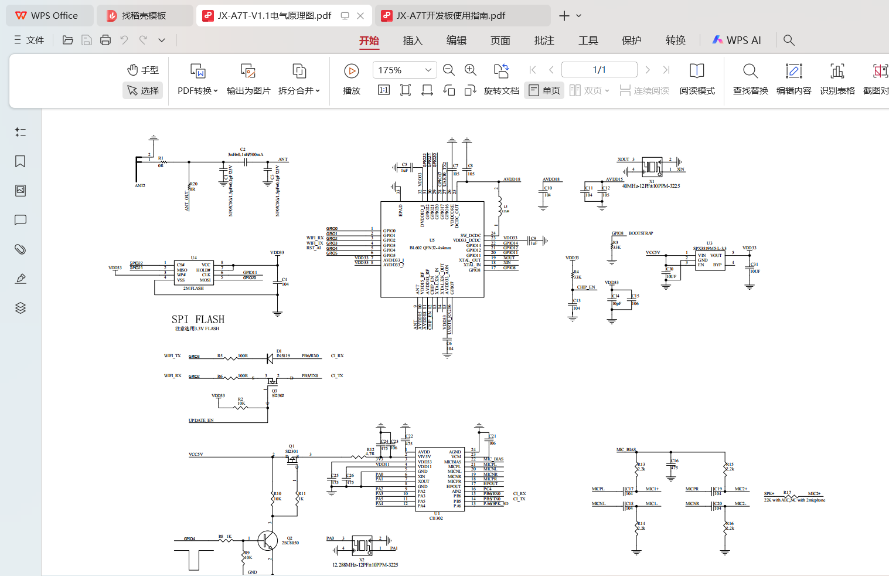

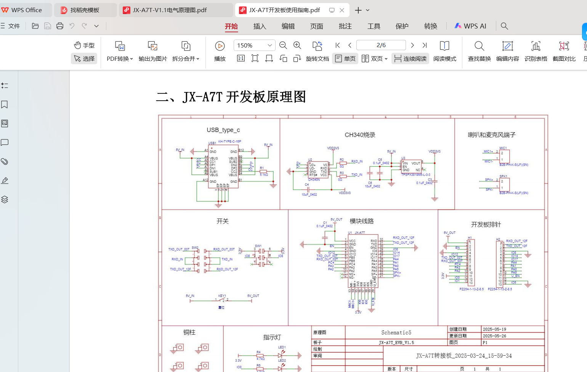

**获取方式：**

- 原理图通常在开发资料包中提供
- 可申请获取最新版本
- 确认使用V1.5版本进行设计参考

**注意事项：**

- 设计参考时请确认版本号匹配
- 不同版本可能存在细微差异
- 建议使用官方提供的最新原理图

---

### GPIO_A26引脚电平是默认值还是实时状态？

**问题描述：**

GPIO_A26引脚的低电平或高电平是设置的默认值还是变化后的实时电平？

**解决方案：**

**电平输出特性**

    - GPIO_A26是可编程的输出引脚
    - 上电时输出默认设置的电平
    - 运行中可根据程序改变输出状态

**工作模式说明**

**1. 默认电平状态**

    - 模块上电初始状态
    - 由配置中的默认设置决定
    - 未修改时保持初始电平

**2. 实时电平变化**

    - 程序执行过程中改变电平
    - 根据触发条件或控制指令变化
    - 引脚会实时反映当前输出状态

**3. 实际应用场景**

    - 默认低电平，触发后变高电平
    - 或默认高电平，触发后变低电平
    - 完全由配置决定

**使用建议**

- 明确初始需求的默认电平
- 合理设计电平变化逻辑
- 测试验证电平变化是否符合预期
- 注意引脚的最大驱动能力

**注意事项：**

- 电平状态实时反映引脚输出
- 可通过配置设置默认值
- 运行中改变会立即生效
- 建议使用万用表实际测量验证

---

### JX-A7T模块的蓝牙和WiFi连接方式是怎样的？

**问题描述：**

需要了解JX-A7T模块的蓝牙连接功能是否可用，以及在没有WiFi时如何通过蓝牙实现手机联网数据通信。

**解决方案：**

**网络连接机制：**

JX-A7T模块支持双模网络连接，根据环境自动选择最优连接方式：

1. **连接优先级**：

    - **有WiFi环境**：优先使用WiFi连接
    - **无WiFi环境**：自动切换到蓝牙连接
    - **智能切换**：模块会根据网络状态自动选择连接方式

2. **蓝牙连接功能**：

    - 支持BLE 5.0蓝牙连接
    - 可与手机建立稳定通信
    - 适合无WiFi环境下的数据传输

**通信实现方式：**

1. **WiFi连接模式**：

    - 通过2.4GHz WiFi网络连接互联网
    - 支持智能公元小程序远程控制
    - 实现完整的在线AI对话功能

2. **蓝牙连接模式**：

    - 直接与手机建立蓝牙连接
    - 通过手机网络实现数据通信
    - 适用于没有WiFi覆盖的场景

---

### JX-A7T模块UART通信数据累加怎么办？

**问题描述：**

在使用JX-A7T芯片进行UART通信时，接收数据出现异常，表现为数据被累加或拼接。例如，第一次命令返回0x29，第二次命令返回0x30，但后续执行时会变成0x2930或0xff2965321等异常数值。

**解决方案：**

**1. 问题定位**

- 确认问题出现在MCU端的数据处理逻辑
- 使用官方串口工具验证模块输出正常
- 检查是否是数据类型转换错误导致

**2. 代码问题排查**

- 检查串口读取缓冲区是否及时清空
- 确认每次只读取新发送的数据
- 避免将历史数据与新数据拼接

**3. 数据处理建议**

- 使用整型变量直接接收数据，避免类型转换
- 如需使用十六进制，确保转换逻辑正确
- 考虑使用utime.sleep_ms()进行毫秒级延时

**4. 测试验证**

- 对比使用整型和十六进制接收的区别
- 在MicroPython中测试utime.sleep()函数的行为
- 使用不同串口工具交叉验证

**注意事项：**

- UART数据本身不会累加，问题出在接收端处理
- MicroPython中utime.sleep(1)是1秒，不是1毫秒
- 如需毫秒延时，应使用utime.sleep_ms(1000)
- 该问题与模块硬件无关，是软件逻辑问题

---

### UART通信时延时函数使用错误怎么办？

**问题描述：**

语音模块的UART通信异常，导致MCU持续接收到相同的命令（intval=48），无法执行预期的熄灭灯光操作，原因是代码中对延时函数的单位理解错误。

**解决方案：**

**1. 问题定位**

- 问题出现在MCU端的软件逻辑
- utime.sleep(1000)实际是1000秒，不是1000毫秒
- 导致程序在16.7分钟后才执行熄灭操作

**2. 代码修正**
```python
# 错误写法
utime.sleep(1000)  # 1000秒

# 正确写法
utime.sleep(1)     # 1秒
# 或者
utime.sleep_ms(1000)  # 1000毫秒
```

**3. 验证方法**

- 修改代码后重新烧录到MCU
- 测试LED是否在1秒后熄灭
- 观察串口输出确认执行时序

**注意事项：**

- MicroPython中utime.sleep()的单位是秒
- 如需毫秒级延时，使用utime.sleep_ms()
- 该问题与语音模块硬件无关，是常见的误解
- 建议在代码中添加注释说明延时单位

**应用场景：**

1. **家庭环境**：

    - 有WiFi时使用WiFi连接
    - 支持远程控制和AI对话
    - 稳定可靠的连接方式

2. **移动/户外环境**：

    - 无WiFi时自动切换蓝牙
    - 通过手机网络保持连接
    - 实现基本的数据通信功能

**开发配置：**

1. **示例代码获取**：

    - 在智能公元平台配置相关功能
    - 生成包含蓝牙和WiFi切换的固件
    - 参考官方示例代码进行二次开发

2. **功能集成**：

    - 蓝牙和WiFi功能可同时存在
    - 模块自动管理连接状态
    - 应用层无需关心底层切换逻辑

**注意事项：**

- 蓝牙和WiFi功能在固件中同时支持
- 连接切换由模块自动处理，应用无需干预
- 蓝牙连接主要用于数据传输，不直接支持音频播放
- 如需示例代码，可在平台生成固件后获取相关工程

---


---

### JX-A7T模块如何正确连接外接电源？

**问题描述：**

在使用JX-A7T模块连接外接电源时，接线方式不正确导致主板无法上电，仅充放电模块亮灯。

**解决方案：**

**1. 正确的接线方法**

- 外接电源需要连接到主控板的电源输入端
- 不能直接连接到充放电模块
- 需要确保电源开关处于闭合状态

**2. 接线步骤**

1. **电源连接**：

    - 将外接电源正极连接到主板电源输入正极
    - 将外接电源负极连接到主板电源输入负极
    - 确保连接牢固，接触良好

2. **开关检查**：

    - 检查电源开关是否已安装
    - 确认开关处于可操作状态
    - 测试开关通断功能正常

**3. 常见错误分析**

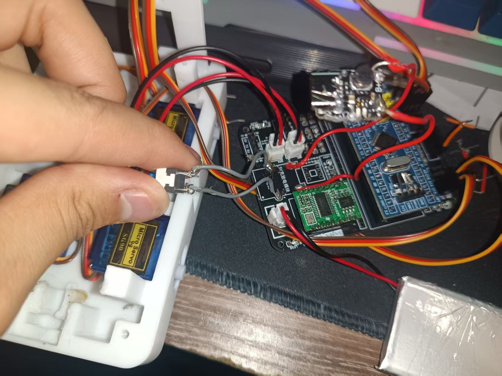

*错误的接线方式：电源直接连接充放电模块，未通过主控板*

- **错误1**：电源接到充放电模块
    - 仅充放电模块亮灯
    - 主控板无供电
    - 设备无法正常工作

- **错误2**：未使用电源开关
    - 无法控制设备通断
    - 影响使用便利性

**4. 正确接线原理**

```
外接电源 → 电源开关 → 主控板 → 充放电模块
                        ↓
                        各功能模块供电
```

**注意事项：**

- 外接电源电压应符合模块规格要求（通常为5V）
- 建议使用带开关的电源线便于控制
- 接线前请确认电源极性，避免反接损坏设备
- 如不确定接线方法，建议参考产品规格书或寻求专业技术协助

---

### 如何配置App通过蓝牙与语音模块通信？

**问题描述：**

需要实现App通过蓝牙与语音模块通信，再由语音模块通过串口与另一个模块（如JX-A7T）通信，但蓝牙通信无法正常工作。

**解决方案：**

**硬件连接方案：**

1. **模块连接架构**：

    - App（手机）→ 蓝牙通信 → 语音模块 → 串口通信 → JX-A7T模块
    - App作为数据发送端
    - 语音模块作为蓝牙接收和串口转发中继
    - JX-A7T作为最终执行模块

2. **蓝牙接口配置**：

    - 在智能体平台添加蓝牙通讯接口
    - 接口类型：BLE（蓝牙低功耗）
    - 模式：端模式
    - 协议：固定格式
    - 对端UUID：FEE0（根据实际设备配置）


*通讯接口配置界面，显示串口数据透传规则配置*

**蓝牙配置步骤：**

1. **添加BLE通讯接口**：

    - 进入通讯接口配置页面
    - 点击"添加"按钮
    - 接口名称：自定义（如"ble"）
    - 类型选择：BLE
    - 模式选择：端
    - 协议选择：固定格式

2. **配置蓝牙参数**：

    - AT指令设置：不支持
    - 对端UUID：FEE0（标准蓝牙服务UUID）
    - 确认接口已启用

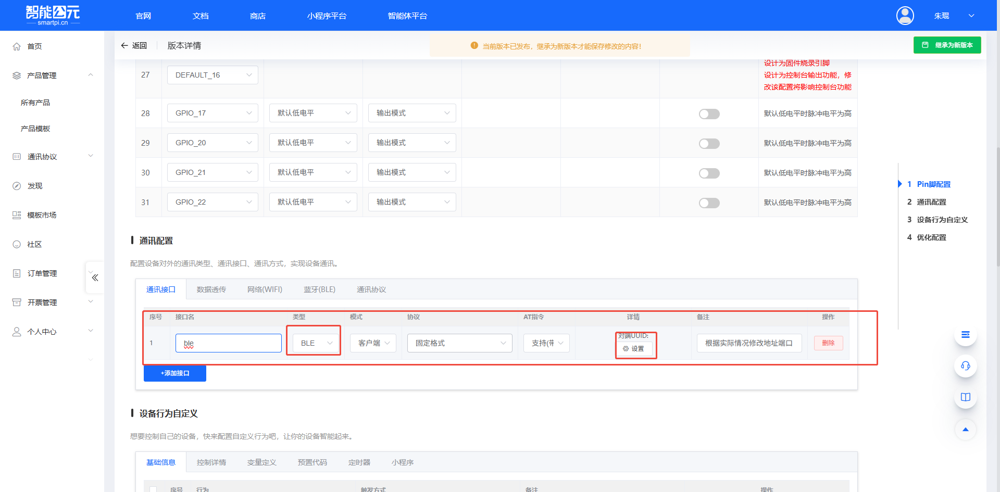

*BLE通讯接口配置，设置名称为ble，类型为BLE，模式为端*

**数据转发配置：**

1. **串口透传规则**：

    - 源接口：UART1_RX
    - 目标接口：UART1_TX
    - 启用状态：开启
    - 实现蓝牙数据到串口数据的转发

2. **数据流向**：

    - App蓝牙发送数据 → 语音模块BLE接收 → 串口TX发送 → JX-A7T串口RX接收

**调试与验证：**

1. **通信测试**：

    - 使用蓝牙调试App（如nRF Connect）
    - 连接到语音模块的BLE服务
    - 发送测试数据验证通信链路

2. **问题排查**：

    - 确认BLE服务是否正常广播
    - 检查UUID配置是否正确
    - 验证串口连接和数据格式

**注意事项：**

- 蓝牙通信需要在平台中正确配置BLE接口
- 确保UUID配置与App端匹配
- 串口波特率等参数需要与目标模块一致
- 建议使用官方提供的示例工程作为参考

---


---


---

### 购买模组后需要自行设计原理图吗？

**问题描述：**

购买JX-A7T等模组后，不确定是否需要自行设计原理图，以及是否有现成的参考设计可供使用。

**解决方案：**

**模组使用方式说明：**

1. **直接使用模组**：

    - 不需要自行设计模组内部的原理图
    - 模组已是完整的功能单元
    - 直接通过接口与外部电路连接

2. **需要设计的部分**：

    - 模组外围电路（如电源、功放等）
    - 主控板与模组的接口电路
    - 产品整体的系统集成

**参考设计资源：**

1. **官方提供的参考设计**：

    - 开发板原理图和PCB文件
    - 产品结构声学设计规范
    - 典型应用电路参考

2. **可获取的资料**：

    - 模组规格书：包含引脚定义和电气参数
    - 电气原理图：展示模组内部电路连接
    - 开发板资料：提供完整的设计参考

**设计流程建议：**

1. **获取完整资料**：

    - 下载模组规格书和原理图
    - 参考开发板设计
    - 了解接口定义和电气特性

2. **外围电路设计**：

    - 电源电路：根据模组供电要求设计
    - 音频电路：参考官方的功放和麦克风电路
    - 接口电路：UART、I2C、GPIO等接口连接

3. **系统集成**：

    - 将模组作为子系统整合到产品中
    - 设计必要的保护和滤波电路
    - 考虑整体EMC和安规要求

**注意事项：**

- 不需要也不建议修改模组内部电路
- 重点关注外围电路和系统级设计
- 充分利用官方提供的参考设计
- 批量生产前建议先使用开发板验证功能

---

### JX-A7T蓝牙模块3.3V输出异常怎么办？

**问题描述：**

在给板子正常供电的情况下，测量蓝牙模块的3.3V输出引脚电压仅为0.56V。

**解决方案：**

**1. 电压异常原因**

- 3.3V输出需要在系统启动后才有电压
- 仅给板子供电但未连接主控时无输出
- 该输出是由主控板控制，非独立电源

**2. 正确的测量方法**

- 需要将模块连接到STM32开发板
- 确保主控板正常工作
- 主控板启动后3.3V输出才会正常

**3. 接线验证**

- 确认连接到正确的3.3V引脚
- 检查GND是否良好接地
- 验证连接线质量

**注意事项：**

- 3.3V输出受主控控制，不是独立电源
- 测量前确保整个系统已启动
- 如电压异常，检查主控板是否正常工作
- 建议使用万用表验证连接导通性

---


---


### JX-A7T模块连接Arduino后持续传输十六进制数据怎么办？

**问题描述：**

JX-A7T模块连接到Arduino UNO后，唤醒小智后发现串口一直有十六进制数据传输，但预期只有在执行特定指令（如打开台灯、关闭台灯等）时才传输数据。

**解决方案：**

**问题原因分析：**

1. **串口连接错误**：

    - 错误地连接到了UART0（语音与WiFi通信口）
    - UART0用于语音芯片和WiFi芯片之间的内部通信
    - 该接口会持续传输内部通信数据

2. **正确的串口选择**：

    - **UART1**：用于外部通信的串口
    - A2引脚：UART1_TX（发送）
    - A3引脚：UART1_RX（接收）
    - 这是专门用于与外部设备（如Arduino）通信的接口

**正确连接方式：**

```
JX-A7T模块          Arduino UNO
A2 (UART1_TX)  →  RX (引脚0)
A3 (UART1_RX)  ←  TX (引脚1)
GND            →  GND
VCC (3.3V/5V)  →  5V (根据模块电压要求)
```

**UART接口功能说明：**

1. **UART0**：

    - 用于语音芯片和WiFi芯片之间的通信
    - 内部协议通信，包含网络、控制等数据
    - 不建议用于外部设备连接

2. **UART1**：

    - 专用的外部通信接口
    - 用于与MCU、Arduino等外部设备通信
    - 只在执行特定指令时传输数据

**验证方法：**

1. **检查连接**：

    - 确认使用的是A2和A3引脚
    - 不要连接到模块底部的其他串口引脚
    - 使用万用表测试连通性

2. **数据测试**：

    - 正确连接后，唤醒后不应有持续数据
    - 只在说出"打开台灯"等指令时才有数据输出
    - 数据格式应符合协议规范（如AA 55 XX 55 AA）

**注意事项：**

- UART0和UART1功能不同，不可混用
- 连接前请确认模块的引脚定义
- 如果持续有数据传输，首先检查是否接错了串口
- 建议使用逻辑分析仪或串口助手验证数据内容

---

### JX-A7T模块的排针间距是多少？

**问题描述：**

需要确认JX-A7T模块的排针间距是否为2.0mm，以便正确设计连接器和PCB布局。

**解决方案：**

**排针规格说明：**

- JX-A7T模块采用标准2.0mm间距排针设计
- 排针类型：双排针，每排数量根据具体功能而定
- 引脚间距：2.54mm（0.1英寸）为标准，但JX-A7T使用2.0mm间距

**设计建议：**

1. **连接器选型**：

    - 使用2.0mm间距的连接器或排母
    - 确保连接器引脚数与模块匹配
    - 推荐使用带锁扣的连接器，提高连接可靠性

2. **PCB设计**：

    - 焊盘间距按2.0mm设计
    - 考虑连接器高度，留出足够空间
    - 预留定位孔或定位柱，确保插接准确

3. **转接方案**：

    - 如需转换为2.54mm标准间距，可使用转接板
    - 市场有现成的2.0mm转2.54mm转接器
    - 自行设计转接板时注意信号完整性

**注意事项：**

- 2.0mm间距与常用的面包板（2.54mm）不兼容
- 插拔时注意对准，避免引脚弯折或损坏
- 确认排针方向，避免反插导致模块损坏
- 如需频繁插拔，建议使用带锁定装置的连接器

---

### JX-A7T语音唤醒与GPIO输入冲突怎么办？

**问题描述：**

在使用JX-A7T模块时，语音唤醒与GPIO输入（如光敏电阻检测光线）存在冲突，导致GPIO输入状态（如A2低电平）限制或打断语音唤醒功能。

**解决方案：**

- 检查并修正控制流程中的条件判断逻辑
- 将GPIO输入和语音唤醒设置为独立的触发条件
- 避免GPIO输入状态影响语音唤醒的执行

**注意事项：**

- 两种触发方式不能设置互斥条件
- 建议分别配置不同的控制流程
- 保留完整的配置记录便于问题排查

---

### JX-A7T模块GPIO唤醒信号配置异常怎么办？

**问题描述：**

配置JX-A7T模块GPIO唤醒信号时，模块在未断电的情况下无法正常唤醒，且GPIO_A25引脚在唤醒后保持高电平。

**解决方案：**

- 检查GPIO_A25的配置，确认每次唤醒时都被设置为高电平输出
- 修改配置逻辑，避免在每次唤醒时强制设置GPIO_A25为高电平
- 如需要外部控制，建议将GPIO_A25配置为输入或双向模式

**注意事项：**

- 唤醒后自动设置GPIO为高电平会覆盖外部控制信号
- 单片机控制时应使用脉冲信号，而非持续电平
- 确认GPIO配置不会与外部控制信号产生冲突

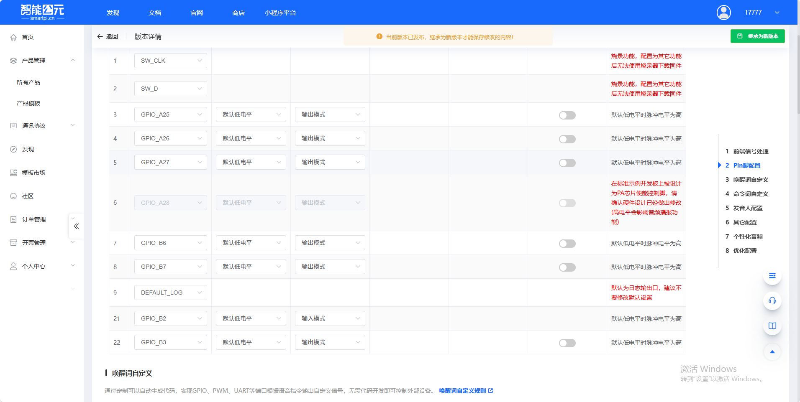

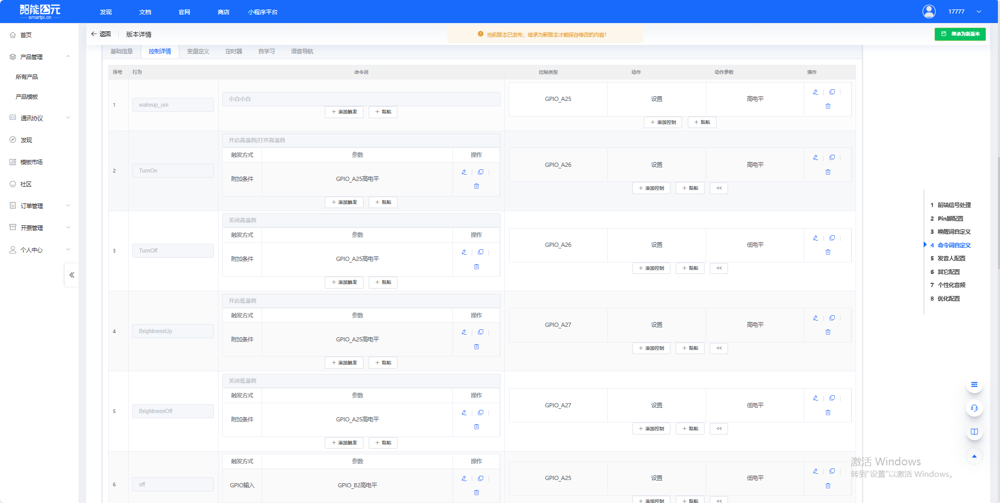

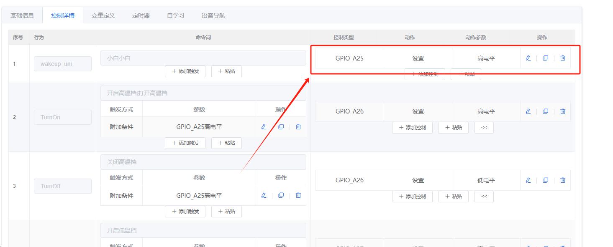

---

### JX-A7T如何实现串口文本输出功能？

**问题描述：**

希望通过串口将语音识别结果以文本形式同步输出，以便外接单片机进行文字处理，类似于WebSocket协议的文本输出功能。

**解决方案：**

1. **修改大模型输出格式**
    - 在大模型配置中设置输出文字的编码格式
    - 将需要输出的文本内容转换为特定编码
    - 确保编码格式可以被单片机正确解码

2. **串口连接配置**
    - 将JX-A7T的串口引脚（A2、A3）连接到单片机
    - A2为TX（发送），A3为RX（接收）
    - 确保两个设备的电平匹配和波特率一致

3. **数据透传实现**
    - JX-A7T固件支持串口透传功能
    - 直接将编码后的文本通过串口发送
    - 单片机接收数据后进行解码处理

4. **单片机解码处理**
    - 编写解码程序将接收到的编码还原为文本
    - 根据应用需求进行相应的文字处理
    - 可实现显示、存储或其他处理功能

**注意事项：**

- JX-A7T串口不能直接输出ASCII文本，需要通过编码转换
- 需要定制固件以支持特定的编码输出格式
- 硬件连接仅需将两个串口交叉连接（TX接RX，RX接TX）
- 编码格式应在项目前期进行充分测试验证

---

### JX-A7T模块的UART1串口引脚是哪几个？

**问题描述：**

需要确认JX-A7T模块的UART1串口引脚具体是PIN57与PIN58，还是PIN68与PIN1。

**解决方案：**

UART1串口引脚定义需要参考官方最新的规格书或引脚图。

**引脚确认方法：**

1. **查看官方规格书**
    - 下载JX-A7T模块的最新规格书
    - 在引脚定义章节查找UART1相关引脚
    - 确认TX和RX的具体引脚编号

2. **参考开发板设计**
    - 查看官方开发板的原理图
    - 对应UART1的连接位置
    - 验证引脚编号的正确性

3. **寻求专业技术协助**
    - 如规格书信息不明确
    - 可申请确认
    - 提供具体的应用场景以获得准确指导

**注意事项：**

- 不同批次的模块可能存在引脚定义差异
- 建议以最新版本的官方文档为准
- 设计PCB时预留调试接口以便验证

---

## 唤醒方式

### JX-A7T支持哪些唤醒方式？

**问题描述：**

询问JX-A7T模块是否支持通过蓝牙或IO口信号进行AI唤醒，而不仅限于语音唤醒词。

**解决方案：**

**1. 支持的唤醒方式**

- **语音唤醒**（默认）：

    - 通过特定唤醒词触发
    - 支持自定义唤醒词
    - 最常用的唤醒方式

- **蓝牙唤醒**：

    - 通过手机蓝牙信号唤醒
    - 在智能公元平台配置
    - 需要手机建立连接

- **GPIO唤醒**：

    - 通过IO口电平变化唤醒
    - 支持高/低电平触发
    - 适合硬件联动控制

**2. 平台配置说明**

- 智能公元平台可快速扩展支持
    - 需要蓝牙和GPIO唤醒功能
    - 可以通过平台配置实现
    - 寻求专业技术协助获取帮助

**3. 配置步骤**

1. 登录智能公元平台
2. 选择JX-A7T模块配置
3. 在唤醒设置中添加GPIO和蓝牙选项
4. 配置具体的触发条件和响应
5. 生成并烧录新固件

**注意事项：**

- 当前固件默认仅支持语音唤醒
- 需要定制固件支持其他唤醒方式
- GPIO唤醒时注意电平匹配
- 蓝牙唤醒需要保持连接状态

---

### 如何使用按键实现JX-A7T模块的唤醒功能？

**问题描述：**

需要在产品设计中通过按键触发唤醒功能，替代语音唤醒或作为补充唤醒方式。

**解决方案：**

**1. 按键唤醒实现原理**

- 按键按下时输入低电平信号
- 通过GPIO引脚检测电平变化
- 触发模块进入工作状态

**2. 硬件连接设计**

- 将按键一端连接到GPIO引脚
- 按键另一端接地（GND）
- GPIO引脚内部需要上拉电阻
- 或使用外部上拉电阻（10KΩ）

**3. 软件配置**

- 在智能公元平台配置GPIO唤醒功能
- 设置对应的GPIO引脚为输入模式
- 配置低电平触发作为唤醒条件
- 生成并烧录新固件

**4. 电路设计要点**

- 确保按键电路有防抖动处理
- GPIO引脚电压与模块工作电压匹配（3.3V）
- 考虑加入电容滤波提高稳定性

**注意事项：**

- 按键唤醒需要定制固件支持
- 设计时应考虑功耗控制
- 按键应有良好接地以避免干扰
- 产品开发时需要预留调试接口

---

### JX-A7T模块的输出脉冲参数如何配置？

**问题描述：**

在配置JX-A7T模块的输出脉冲时，对周期和次数参数的含义存在疑问，特别是当周期设置为10ms、次数设置为1时，是每10ms重复输出一个脉冲，还是仅输出一次脉冲。

**解决方案：**

**1. 输出脉冲参数说明**

输出脉冲的配置包含两个关键参数：

- **周期**：单个脉冲的高电平持续时间
- **次数**：脉冲的重复发送次数

**2. 参数组合效果**

| 配置示例 | 效果说明 |
|----------|----------|
| 周期10ms，次数1 | 输出一个10ms宽度的单次脉冲 |
| 周期10ms，次数10 | 连续输出10个脉冲，每个脉冲宽度10ms |
| 周期500ms，次数10 | 连续输出10个脉冲，每个脉冲宽度500ms |

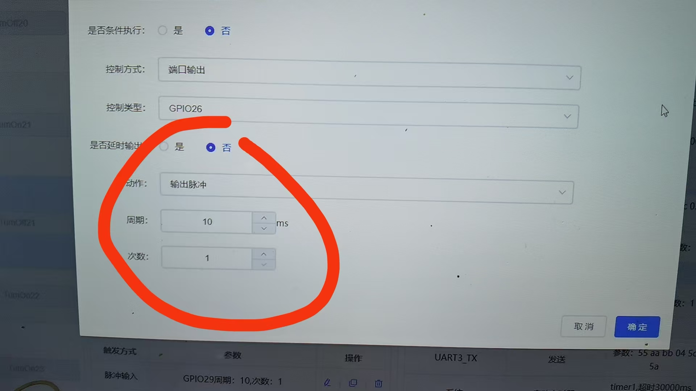

**3. 工作原理**

- 当次数设置为1时，仅发送一个指定宽度的脉冲
- 脉冲宽度由周期参数决定，不是重复间隔
- 脉冲之间的间隔由系统自动处理

**注意事项：**

- 周期参数决定脉冲宽度，不是脉冲间隔
- 次数为1时表示单次脉冲，不是重复触发
- 需要多次脉冲时，相应增加次数参数
- 具体的脉冲时序要求应根据实际硬件规格确定

---

### 如何配置JX-A7T模块的输出脉冲次数以实现多次发送？

**问题描述：**

需要了解如何配置JX-A7T模块的输出脉冲次数，以实现多次脉冲发送功能。

**解决方案：**

**1. 多次脉冲配置方法**

要实现多次脉冲发送，只需调整"次数"参数：

- 增加次数参数到所需数量
- 保持周期参数为单个脉冲的宽度
- 系统会按配置自动发送相应次数的脉冲

**2. 配置示例**

如需要半秒内发送10个脉冲：

- **周期**：500ms（每个脉冲持续500ms）
- **次数**：10（连续发送10次）

**3. 实际应用**

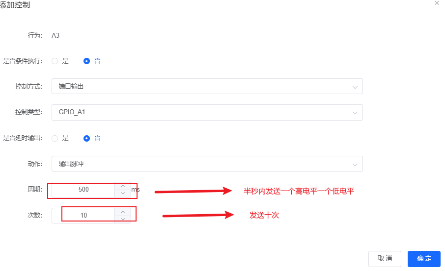

如图所示的配置：

- 周期：500ms（半秒内的高电平）
- 次数：10（发送十次）
- 实现每500ms发送一个脉冲，连续发送10次

**注意事项：**

- 脉冲次数应根据实际控制需求设置
- 过多的脉冲可能导致响应延迟
- 测试时建议从小次数开始，逐步调整
- 确认接收端能正确处理连续脉冲信号

---

### JX-A7T连接扬声器后出现滋滋声怎么办？

**问题描述：**

JX-A7T模块连接扬声器后，音频输出中出现滋滋的异常噪声，声音类似机械表快速滴答的声音。

**解决方案：**

**1. 检查音频连接**

- 确认扬声器连接牢固
- 检查音频线材质量
- 避免使用过长的音频线

**2. 排查干扰源**

- 远离强电磁干扰源
- 检查电源纹波是否过大
- 确认接地良好

**3. WiFi配置获取**

JX-A7T的WiFi测试文件可在智能公元平台获取：

1. 访问智能公元官网：https://www.smartpi.cn/#/example
2. 搜索"JX-A7T WiFi入门例程"
3. 点击"导入"按钮直接使用

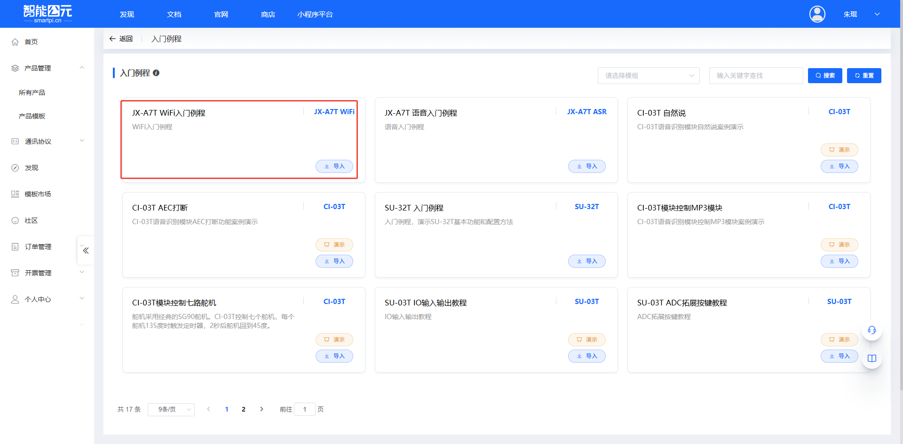

**注意事项：**

- 滋滋声可能是由于音频接地回路或电源噪声引起
- 如问题持续，建议更换不同规格的扬声器测试
- 平台提供的示例代码可直接导入使用，无需手动配置

---

### JX-A7T模块的拨码开关如何设置？

**问题描述：**

JX-A7T模块需要正确设置拨码开关位置，WiFi模式与ASR模式对应不同的功能，错误设置会导致无法正常工作。

**解决方案：**

**1. 拨码开关功能说明**

JX-A7T模块的拨码开关用于选择工作模式：

- **WiFi位置**：使用WiFi连接和在线AI功能
- **ASR位置**：使用离线语音识别功能

**2. 正确设置方法**

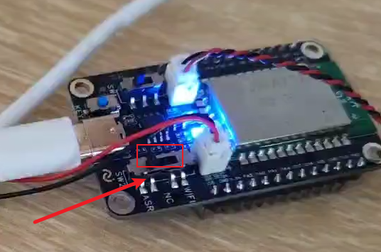

- **WiFi模式**：拨码开关拨向WiFi标识侧
- **ASR模式**：拨码开关拨向ASR标识侧

**3. 模式功能对比**

| 模式 | 功能特点 | 适用场景 |
|-------|----------|----------|
| WiFi模式 | 在线AI对话、远程控制 | 需要网络环境 |
| ASR模式 | 离线语音识别、本地控制 | 无需网络连接 |

**4. 切换注意事项**

- 切换模式前需要断电
- 上电后根据拨码位置确定工作模式
- 不同模式下固件配置可能不同

**常见问题：**

- 语音模块无反应：检查是否在ASR模式
- 无法连接网络：检查是否在WiFi模式
- 功能异常：确认模式与固件配置匹配

**注意事项：**

- 拨码开关只是硬件模式选择
- 具体功能实现需要相应的固件支持
- 如模式切换后异常，先检查拨码位置是否正确

---


---

### JX-A7T模块的IO引脚如何区分和使用？

**问题描述：**

需要了解JX-A7T模块中IO开头的引脚和P开头的引脚分别代表什么功能，以及如何正确配置和使用这些IO口。

**解决方案：**

**IO引脚分类说明**

JX-A7T模块的IO引脚分为两类：

1. **IO开头的引脚**：

    - WiFi部分的IO口
    - 用于WiFi相关功能控制
    - 支持网络通信相关的IO操作

2. **P开头的引脚**：

    - 离线部分的IO口
    - 用于本地语音识别相关的控制
    - 支持离线模式下的IO操作

**功能配置方法**

1. **平台配置**：

    - 在智能公元平台配置IO控制
    - 两类IO口都可以独立配置
    - 支持输入、输出、中断等多种模式

2. **串口透传配置**：

    - 在优化选项中配置透传功能
    - 可通过串口控制IO状态
    - 实现外部设备联动控制

**使用场景示例**

1. **WiFi部分IO（IO开头）**：

    - 网络状态指示
    - 远程控制输出
    - 云端数据采集

2. **离线部分IO（P开头）**：

    - 本地控制输出
    - 语音触发动作
    - 离线状态指示

**注意事项：**

- 两类IO口功能独立，可同时使用
- 配置时需要明确选择IO类型
- 建议根据应用需求选择合适的IO口
- 如需复杂控制，可组合使用两类IO口

---

### JX-A7T模组的AEC功能如何正确配置和使用？

**问题描述：**

在固件配置中开启了AEC（回声消除）功能，并按照指导进行了接线，但AEC功能没有达到预期效果，无法实现唤醒打断。

**问题分析：**

JX-A7T模组的AEC功能有特定的使用要求：

- **固件要求**：AEC功能需要配合特定的大模型固件才能生效
- **配置限制**：仅在单MIC模式下支持AEC功能
- **接线要求**：需要正确连接外部音频参考信号
- **功能特性**：AEC主要用于实现语音播报时的唤醒打断

**解决方案：**

**1. 固件配置确认**

在智能公元平台配置时：

- 选择"单MIC"麦克风配置
- 产品特性设置为"语音识别+AEC打断(限单MIC)"
- 确保使用支持AEC的大模型固件版本

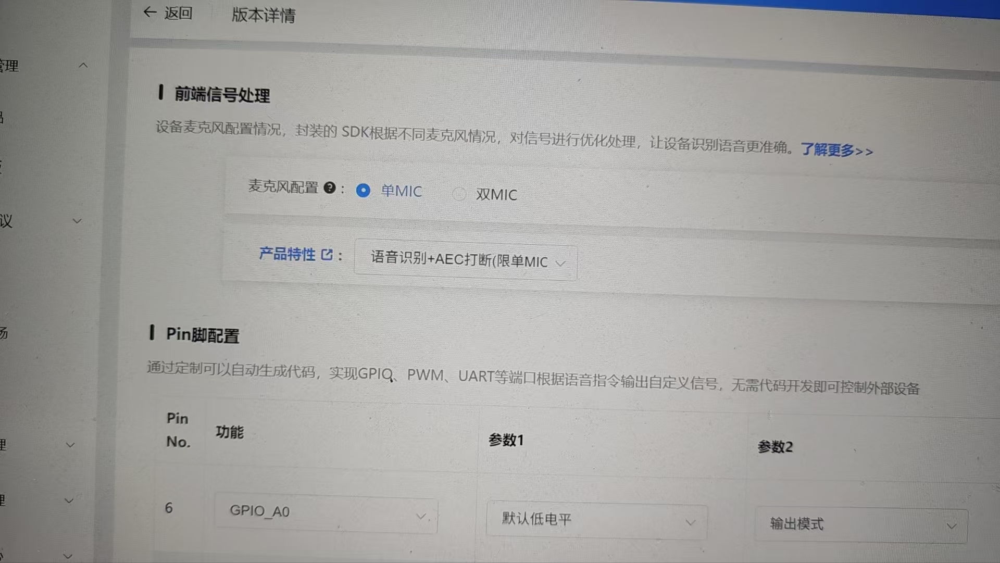

**2. 硬件连接要求**

正确连接AEC参考信号：

- 将外部功放输出信号接入模块的AEC输入端
- 确保信号幅度和阻抗匹配
- 使用合适的耦合电容

**3. 功能验证步骤**

验证AEC功能是否正常：

1. 播放语音内容时尝试唤醒
2. 观察是否能成功打断播报
3. 确认唤醒识别的准确性
4. 测试不同音量下的效果

**4. 常见问题排查**

如果AEC功能无效：

- 确认使用的是大模型固件
- 检查硬件接线是否正确
- 验证固件配置是否启用AEC
- 测试外部功放输出信号是否正常

**注意事项：**

- AEC功能仅在大模型固件中完全支持
- 必须使用单MIC配置模式
- 外部功放类型需要与AEC电路兼容
- 如问题持续，建议使用标准测试环境验证

---

---

### JX-A7T模块是否支持播放智能体音乐？

**问题描述：**

需要确认JX-A7T模块是否支持播放智能体中的音乐功能。

**解决方案：**

**音乐播放支持情况**

1. **自建智能体**：

    - 如果智能体中实现了音乐播放功能
    - JX-A7T模块可以正常播放
    - 需要在智能体平台中配置音乐相关功能

2. **官方智能体**：

    - 官方智能体的音乐功能正在优化中
    - 当前版本暂时不支持音乐播放
    - 后续版本会逐步完善音乐功能

**实现方法**

1. **自建智能体音乐播放**：

    - 在智能体平台（如扣子Coze）中配置音乐播放节点
    - 上传音乐资源或使用在线音乐服务
    - 设置音乐播放的触发条件

2. **语音控制播放**：

    - 通过语音指令触发音乐播放
    - 支持播放、暂停、切歌等控制
    - 可结合场景实现智能音乐推荐

**功能限制**

- 官方智能体音乐功能尚未完全开放
- 音乐播放需要网络连接支持
- 音频格式需要模块支持
- 播放质量取决于网络状况

**注意事项：**

- 自建智能体可以实现音乐播放功能
- 官方智能体的音乐功能正在开发中
- 建议关注平台更新获取最新功能
- 如需音乐功能，可优先考虑自建智能体方案

---


### JX-A7T模块的引脚定义如何获取？

**问题描述：**

需要获取JX-A7T模块的引脚定义和接线方法，以了解各引脚的功能和连接方式。

**解决方案：**

**引脚定义获取方式：**

1. **Excel文件获取**：

    - 引脚定义以Excel表格形式提供
    - 包含完整的引脚功能说明
    - 可申请获取最新版本

2. **引脚功能概览**：

    - GPIO引脚：支持UART、PWM、ADC、I2C等接口
    - 电源引脚：VCC、GND等供电接口
    - 专用引脚：UART、I2S等专用功能接口

**接线方法参考：**

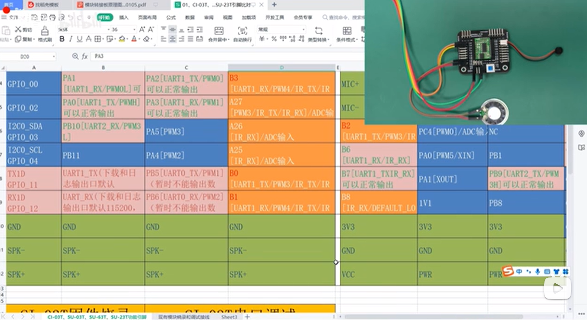

*JX-A7T模块的实物接线图和引脚定义Excel表格*

**主要接口说明：**

1. **GPIO系列引脚**：

    - GPIO_00、GPIO_02等通用输入输出引脚
    - 可配置为UART、PWM、ADC等功能
    - 支持上拉、下拉、中断等模式

2. **通信接口引脚**：

    - UART：串口通信引脚
    - I2C：两线制通信接口
    - SPI：高速串行外设接口

3. **电源管理引脚**：

    - VCC：电源输入（通常为3.3V或5V）
    - GND：电源地
    - RESET：复位引脚

**注意事项：**

- 接线前请确认引脚定义和电压等级
- 避免输出引脚短路，可能损坏模块
- 建议使用官方提供的最新引脚定义文档
- 如不确定，可申请获取帮助

---

### JX-A7T模块对未设定的指令如何响应？

**问题描述：**

需要了解JX-A7T模块在接收到未设定的语音指令时的响应方式，是否可以设置默认回复。

**解决方案：**

**响应机制说明：**

JX-A7T模块对未设定的指令采用静默处理方式：

1. **不回复**：

    - 未设定的指令不会触发任何语音回复
    - 模块保持静默，不输出任何音频

2. **不触发**：

    - 不会触发任何GPIO输出
    - 不执行串口发送等动作
    - 保持当前状态不变

**功能限制：**

- **无法设置默认回复**：不能设置"我没有这个指令"等例外回复
- **静默处理**：所有未识别的指令都被忽略
- **无反馈机制**：无法知道指令未被识别

**使用建议：**

1. **完善指令集**：

    - 尽可能覆盖可能使用的指令
    - 考虑同义词和不同表达方式
    - 定期更新优化指令列表

2. **使用引导**：

    - 在产品说明中明确支持的指令列表
    - 提供指令卡片或贴纸作为提示
    - 建议使用标准、清晰的指令发音

3. **替代方案**：

    - 使用在线模式时，可接入大模型实现自然对话
    - 设置帮助指令，询问支持的功能
    - 通过LED或其他方式提示识别状态

**注意事项：**

- 这是离线语音识别的固有特性，无法通过配置改变
- 在线模式下的大模型可以处理未设定的指令
- 建议在产品设计中考虑这一限制
- 如需要更智能的交互，建议使用在线模式

---

### JX-A7T模块是否支持方言定制化和语言切换？

**问题描述：**

需要了解是否可以对JX-A7T模块进行台湾话（中文方言）的定制化，以及是否支持通过语音指令切换语言。

**解决方案：**

**方言定制化支持：**

1. **可定制方言**：

    - 支持台湾话等中文方言定制
    - 需要提供足够的方言语音数据
    - 属于定制化服务范畴

2. **定制流程**：

    - 提供方言语音样本
    - 技术团队评估可行性
    - 定制开发专用固件
    - 测试验证方言识别效果

**语言切换功能：**

1. **唤醒词切换**：

    - 支持通过唤醒词切换语言
    - 可以使用语音指令切换语系
    - 词语不能过长，建议简洁明确

2. **切换示例**：

    - 中文环境下说"请你换英文"可切换到英文
    - 英文环境下说对应指令可切换回中文
    - 切换指令需要在平台中预先配置

**实现步骤：**

1. **平台配置**：

    - 在智能公元平台配置多语言支持
    - 设置各语言的唤醒词和指令集
    - 配置语言切换的触发条件

2. **固件生成**：

    - 生成包含多语言功能的固件
    - 烧录到模块进行测试
    - 验证语言切换的准确性

**使用限制：**

1. **指令简洁性**：

    - 语言切换指令不能过于复杂
    - 建议使用简短明确的短语
    - 避免使用长句子作为切换指令

2. **定制成本**：

    - 方言定制属于定制服务
    - 需要额外的开发成本
    - 建议有批量需求时考虑

**注意事项：**

- 方言定制需要提前沟通
- 语言切换功能需要在固件中预置
- 切换指令应易于发音和识别
- 如需要方言定制，建议提前准备语音样本

---

### JX-A7T模块是否支持数字音频输入（I2S）？

**问题描述：**

希望将蓝牙设备采集的WAV或MP3音频数据直接输入到语音识别模块中进行处理，询问是否支持数字音频输入（如I2S）以及如何实现。

**解决方案：**

**音频输入方式说明：**

1. **仅支持模拟输入**：

    - 常规模块只支持模拟信号输入
    - 通过麦克风或Line-in接口接收模拟音频
    - 不支持直接接收数字音频数据（WAV/MP3）

2. **硬件接口确认**：

    - 模块确实有I2S（IIS）接口标记
    - 但常规固件未开放数字音频输入功能
    - Analog MIC & Line-in是可用的音频输入接口

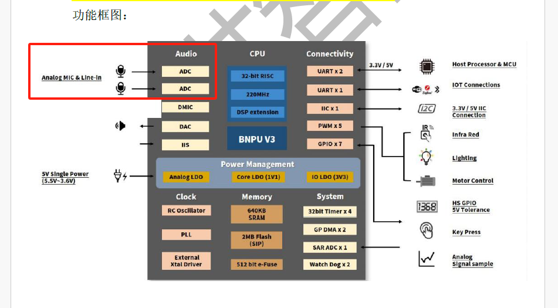

*产品功能框图，红色框标出"Analog MIC & Line-in"接口*

**推荐实现方案：**

1. **模拟信号传输方案**：


*系统流程图，希望直接传输数字音频*

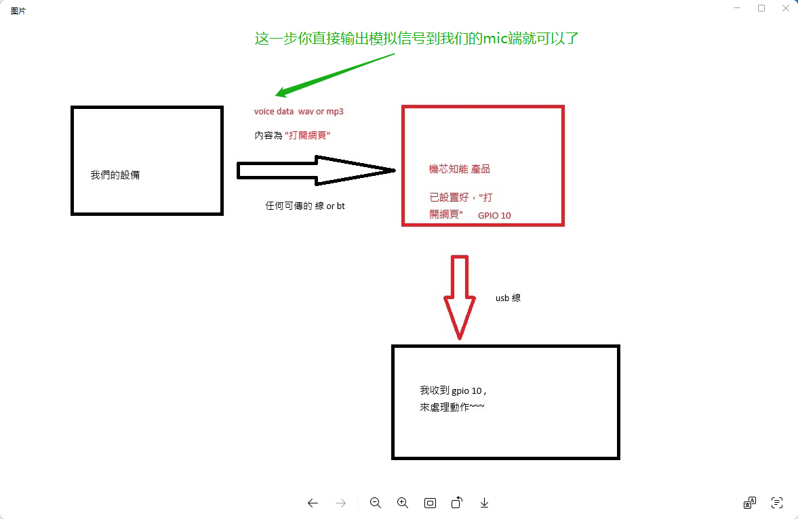

*修改的流程图，建议使用模拟信号传输*

2. **具体实现方法**：

    - 蓝牙模块接收WAV/MP3文件
    - 通过DAC转换为模拟信号
    - 播放音频，由模块麦克风接收
    - 模块进行语音识别处理

3. **接线方式**：
    ```
    蓝牙模块音频输出 → 扬声器播放 → 模块麦克风接收
    ```

**技术对比分析：**

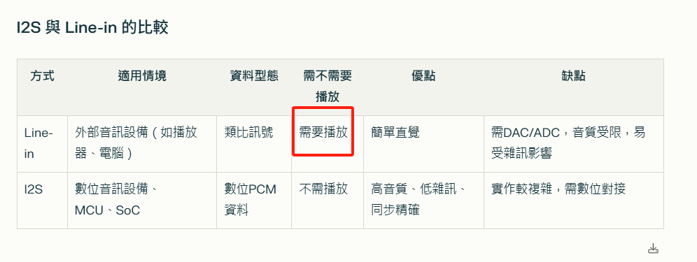

*I2S与Line-in的比较表格*

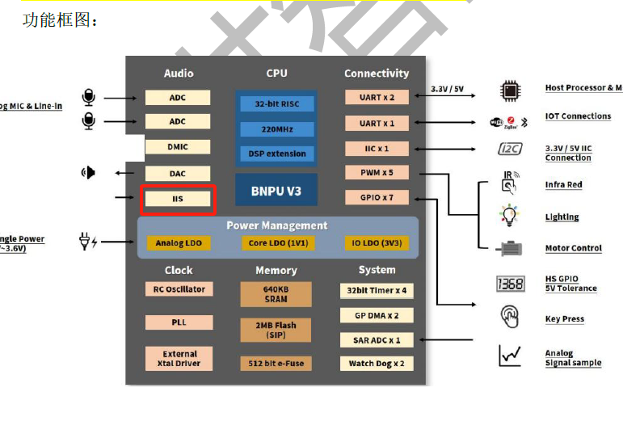

*产品功能框图中标出的I2S接口位置*

**定制开发说明：**

1. **数字音频输入开发**：

    - 需要定制开发固件
    - 开发周期较长
    - 属于定制服务范畴

2. **开发难度**：

    - 需要修改底层驱动
    - 涉及音频处理链路重构
    - 测试验证工作量大

3. **成本考量**：

    - 定制开发费用较高
    - 适合大批量需求
    - 小批量建议使用模拟方案

**快速实现建议：**

如果需要音频接收功能：

1. **使用平台配置**：

    - 在智能公元平台配置MIC模拟信号输入
    - 无需额外开发，直接可用
    - 快速实现功能验证

2. **硬件连接**：

    - 音频源输出连接到扬声器
    - 扬声器对准模块麦克风
    - 确保音频清晰可识别

3. **优化建议**：

    - 使用有线音频传输减少干扰
    - 调整合适的音量
    - 考虑使用定向麦克风

**注意事项：**

- 常规产品建议使用模拟信号方案
- 数字音频输入需要定制开发
- 模拟方案简单可靠，成本低
- 如确实需要I2S输入，需评估开发周期和成本

---

### JX-A7T模块是否支持Line-In接口输入？

**问题描述：**

需要了解JX-A7T模块是否支持Line-In接口连接，以及如何将外部音频信号接入模块进行处理。

**解决方案：**

**Line-In接口确认：**

1. **支持Line-In输入**：

    - 模块MIC部分已有ADC算法处理
    - 支持48kHz采样率输入
    - 通过MIC1和MIC2接口实现

2. **硬件接口位置**：

    - MIC1和MIC2引脚可用于Line-In
    - 2.0mm间距排针接口
    - 需要自行拉线连接

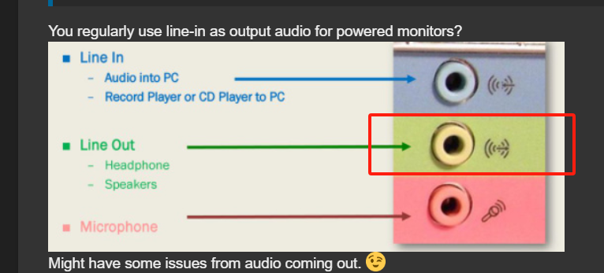

*音频接口示意图，展示Line-In、Line-Out和Microphone接口*

**音频处理路径：**

1. **信号流向**：

    - 外部音频从Line-In输入
    - 经过ADC转换为数字信号
    - 通过IIS接口传输给主控芯片

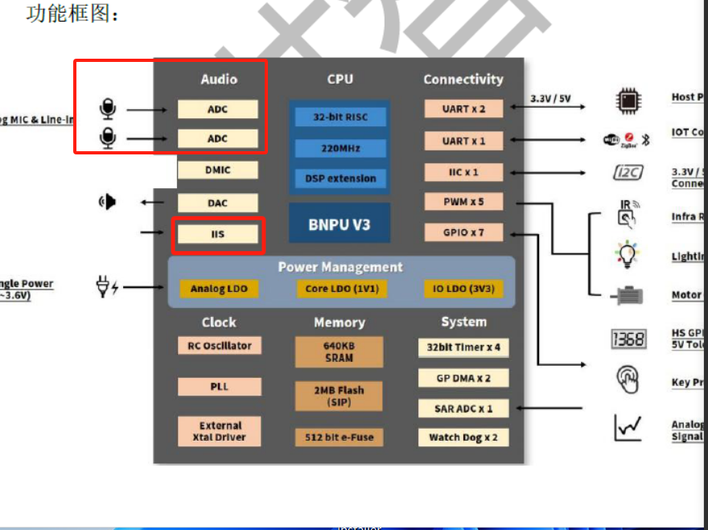

*JX-A7T功能框图，展示ADC和IIS接口*

2. **物理连接**：

    - 使用排针接口的MIC1/MIC2引脚
    - 可使用杜邦线或定制连接器

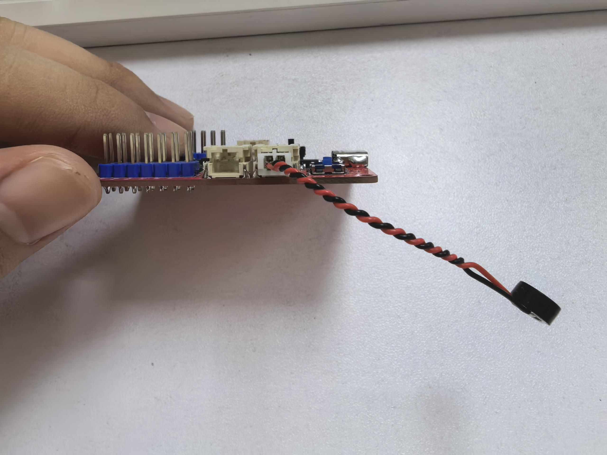

*JX-A7T模块侧面的2.0mm间距排针接口*

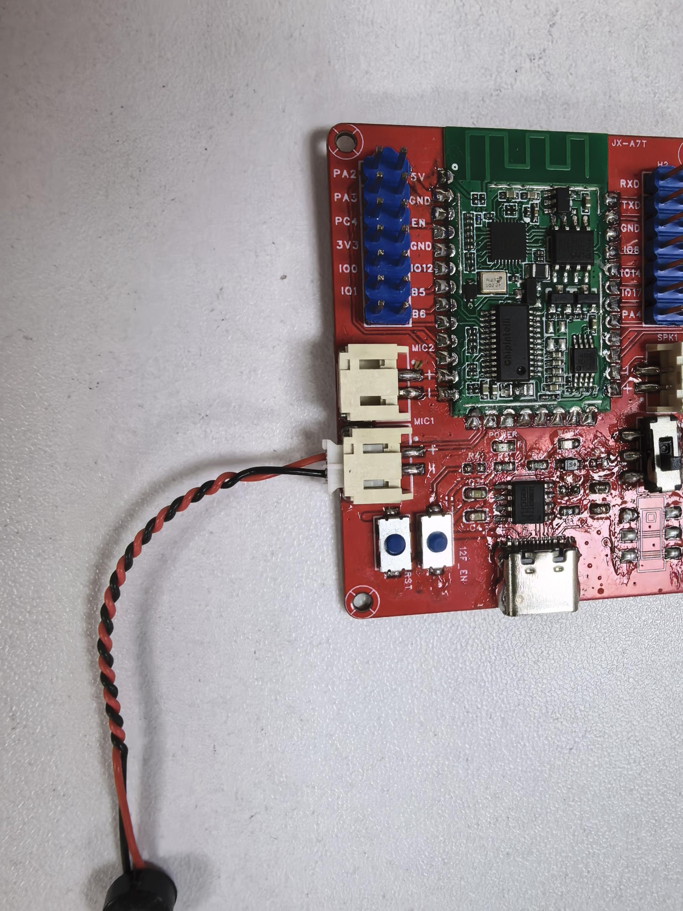

*JX-A7T模块俯视图，展示MIC1和MIC2接口*

**连接方式建议：**

1. **使用3.5mm音频线**：

    - 标准3.5mm立体声插头
    - 需要转接板或转接线


*标准3.5mm立体声插头*

2. **AUX音频线连接**：

    - 使用3.5mm AUX音频线
    - 公对公连接器


*3.5mm立体声AUX音频传输线*

**技术参数支持：**

- **采样率**：支持48kHz
- **信号类型**：模拟音频信号
- **输入阻抗**：匹配标准Line-Out输出
- **电压范围**： typical 1Vpp

**注意事项：**

- Line-In功能通过MIC接口实现
- 需要在固件中正确配置ADC
- 外部音频可能需要电平匹配
- 建议使用屏蔽线减少干扰

---

### JX-A7T支持标准485通信协议吗？

**问题描述：**

需要了解JX-A7T模块的串口通信是否支持标准485协议，以及如何与PLC等设备进行通信。

**解决方案：**

**1. 通信协议说明**

- JX-A7T模块的串口通信为TTL电平
- 如需485通信，必须外接TTL转485转换电路
- 模块本身不是标准485协议，而是自由口协议

**2. 硬件连接方式**

- TTL串口 → 转换电路 → 485总线
- RS485的A、B线连接到485设备的对应端口
- 确保共地连接

**3. 与PLC通信配置**

- 使用自由口模式进行通信
- 需要根据PLC的通信协议编写数据帧格式
- 支持自定义波特率、数据位、停止位等参数

**注意事项：**

- 不能直接连接485总线，必须经过电平转换
- 自由口协议需要自行定义通信格式
- 转换电路可选择MAX485或类似芯片
- 长距离通信建议使用带隔离的转换模块

---

### JX-A7T模块的串口功能如何分配？

**问题描述：**

需要确认JX-A7T模块上语音串口和WiFi串口的物理连接功能，特别是哪些串口可以连接外部单片机，哪些用于烧录程序。

**解决方案：**

**串口功能分配说明：**

JX-A7T模块有4个串口，功能分配如下：

**1. 可连接外部单片机的串口：**

- **WiFi的串口0**（RXD_OUT_12F, TXD_OUT_12F）
- **语音的串口1**（TXD_OUT_03T, RXD_IN_03T）
- 这两个串口可用于与外部单片机通信

**2. 不可连接外部单片机的串口：**

- **语音的串口0**（TXD_OUT_03T, RXD_IN_03T）
- **WiFi的串口1**（RXD_OUT_03T, TXD_OUT_03T）
- 这两个串口用于内部通信，不能连接外部设备

**3. 烧录程序专用串口：**

- **语音的串口0**：用于烧录语音部分固件
- **WiFi的串口0**：用于烧录WiFi部分固件
- 这两个串口兼具烧录功能


*JX-A7T模块原理图，标注了四个串口的位置*

**串口连接总结：**

| 串口类型 | 功能说明 | 可接外部设备 | 烧录功能 |
|----------|----------|-------------|----------|
| WiFi串口0 | 外部通信 | ✓ | ✓ |
| WiFi串口1 | 内部通信 | ✗ | ✗ |
| 语音串口0 | 内部通信/烧录 | ✗ | ✓ |
| 语音串口1 | 外部通信 | ✓ | ✗ |

**注意事项：**

- 连接错误可能导致通信异常或无法烧录
- 设计时请严格按照串口功能进行连接
- 烧录时使用对应的烧录串口
- 如不确定，可参考官方开发板连接方式

---

### JX-A7T模块如何配置ADC功能？

**问题描述：**

在JX-A7T模块的引脚配置中，无法找到支持ADC功能的引脚。

**解决方案：**

**ADC引脚配置说明：**

**1. CI系列模块ADC配置：**

- ADC引脚通常为PC4
- 在引脚配置中选择PC4
- 输入模式设置为：ADC输入

**2. SU系列模块ADC配置：**

- SU系列多个引脚都支持ADC功能
- 可选择更多引脚作为ADC检测
- 同样需要设置输入模式为ADC输入

**3. 配置步骤：**

1. **进入引脚配置界面**
    - 在智能公元平台选择引脚配置
    - 找到对应的引脚编号

2. **设置输入模式**
    - 选择"输入模式"
    - 设置为"ADC输入"

3. **配置ADC参数**
    - 设置参考电压
    - 配置采样精度
    - 设置触发条件

**视频教程参考：**

官方提供了ADC配置的视频教程，可参考学习：

- 详细的配置步骤演示
- 实际应用场景展示
- 常见问题解答

**注意事项：**

- CI系列模块（如CI-03T）使用PC4作为ADC引脚
- SU系列模块有更多ADC引脚可选
- 必须将引脚模式设置为ADC输入才能使用
- 建议参考官方视频教程进行配置

---

### JX-A7T模块的预留天线引脚为什么封装中没有对应焊盘？

**问题描述：**

发现JX-A7T模块上有一个预留的外接天线引脚，但在提供的封装设计中该位置没有对应的焊盘。

**解决方案：**

**预留引脚说明：**

- 该引脚是预留的外接天线脚位
- 用于信号增强时的天线连接
- 在标准信号环境下可以不使用

**封装设计原因：**

- 原始封装设计中包含了这个天线脚的焊盘
- 考虑到如果不使用该引脚但存在焊盘时
- 可能会对信号质量产生潜在影响
- 为了避免对正常信号的干扰，取消了该焊盘设计

**使用建议：**

- 在信号达到标准的场景下，无需使用外接天线
- 天线调试较为复杂，需要专业设备和经验
- 如确需增强信号，建议咨询获取专业方案


**注意事项：**

- 预留天线脚位需要专业调试，不建议自行连接
- 封装设计已优化，移除可能影响信号的焊盘
- 标准应用场景下无需额外天线配置

---

### JX-A7T产品有哪些功能特点？

**问题描述：**

需要了解JX-A7T产品的主要功能特点和技术特性。

**解决方案：**

**核心功能特点：**

1. **双模式工作方式**：

    - **离线指令模式**：支持本地语音识别，无需网络连接
    - **在线指令模式**：搭载大模型运行，提供更智能的交互体验

2. **模式对比说明**：

    | 特性 | 离线指令模式 | 在线指令模式 |
    |------|-------------|-------------|
    | 网络要求 | 无需网络 | 需要网络连接 |
    | 响应速度 | 快速响应（本地处理） | 依赖网络延迟 |
    | 功能复杂度 | 基础指令控制 | 复杂对话和语义理解 |
    | 功耗 | 较低 | 较高（WiFi/蓝牙活跃） |
    | 适用场景 | 基础控制、隐私要求高 | 智能对话、知识问答 |

3. **大模型支持**：

    - 在线模式集成大模型能力
    - 支持更自然、更智能的对话体验
    - 可处理复杂的语音指令和语义理解
    - 带来更高效的使用体验

**产品状态与文档获取：**

1. **产品发布状态**：

    - JX-A7T为新发布的语音模块产品
    - 目前例程和文档已陆续上传至智能公元平台
    - 产品已正式上线，可进行项目开发

2. **智能公元平台资源**：

    - 官方文档地址：https://help.aimachip.com/docs/jx_a7t_v1/jx_a7t_v1-1ghc1h40pidif
    - 平台提供完整的例程和开发文档
    - 包含产品功能说明和操作指南

3. **文档内容涵盖**：

    - 产品规格和技术参数
    - 开发环境和工具使用
    - 示例代码和应用案例
    - 接口定义和调试方法

**产品应用场景：**

1. **智能家居控制**：

    - 支持离线语音指令控制家电
    - 在线模式下可执行更复杂的场景联动
    - 适合需要快速响应和智能判断的应用

2. **智能语音助手**：

    - 离线模式保证基础功能可用性
    - 在线模式提供AI对话和知识问答
    - 可根据网络环境自动切换工作模式

3. **智能时钟方案**：

    - 适用于智能时钟等应用场景
    - 双模式保证不同环境下的功能可用性
    - 支持本地和网络结合的智能交互

**开发支持与合作：**

- 官方提供完整的开发资料包
- 平台支持图形化配置和代码生成
- 可获取支持和项目合作咨询
- 适合快速原型开发和产品量产
- 支持项目需求定制和合作方案

**文档资源获取：**

- 完整产品文档：https://help.aimachip.com/docs/jx_a7t_v1/jx_a7t_v1-1ghc1h40pidif
- 开发示例代码和应用案例
- 技术规格书和原理图资源
- 可随时登录平台查看最新资料

**产品演示与资料：**

- **演示视频**：提供JX-A7T大模型功能的演示视频，展示实际使用效果
- **规格书**：JX-A7T-V1.1模组规格书，详细列出了产品的技术参数、功能特性、接口定义和应用场景等信息
- **价格福利**：当前入手享超值价格福利，具体价格可咨询官方渠道
- **合作咨询**：如有项目需求或合作意向，可联系团队获取帮助

**产品技术特性：**

JX-A7T是新发布的大模型语音模块产品，支持离线和在线双模式工作。

**最新动态：**

- JX-A7T新品大模型已正式上线
- 例程和文档已陆续上传至智能公元平台
- 提供完整的产品功能说明和操作指南
- 支持项目需求定制和合作方案

**技术支持：**

- 提供完整的技术文档和开发指导
- 支持在线技术咨询和问题解答
- 提供项目开发全周期支持

---

### JX-A7T如何实现智能台灯控制？

**问题描述：**

需要在台灯产品中集成智能AI功能，实现语音控制开关灯、调节亮度和色温，支持娱乐聊天，并满足4路PWM输出控制灯光、1路集联幻彩控制以及4个按键和4个按键灯的接口需求。

**解决方案：**

**硬件接口配置：**

JX-A7T模块完全可以满足智能台灯的控制需求：

1. **PWM控制接口**
    - 模块提供多路PWM输出
    - 可实现4路独立PWM控制，分别控制不同灯光
    - 支持占空比调节，实现灯光亮度精确控制
    - 可通过语音指令实时调节PWM输出

2. **幻彩控制支持**
    - 支持1路集联幻彩控制
    - 可控制RGB/RGBW灯带实现彩色效果
    - 支持多种颜色模式切换
    - 语音控制颜色变换和动态效果

3. **按键接口方案**
    - 4个物理按键：调节色温、调节亮度、选择灯路、开关灯
    - 4个按键指示灯：提供按键状态反馈
    - 按键按下时指示灯亮起，松开后熄灭
    - 开关灯键在待机时闪烁，工作时常亮

**功能实现方案：**

1. **语音控制功能**
    - 离线指令：基础控制（开灯、关灯、调亮、调暗）
    - 在线大模型：智能对话、娱乐聊天、复杂场景控制
    - 支持自然语言理解，如"灯光再亮一点"、"切换到暖光"等

2. **双重控制模式**
    - 语音控制和按键控制可同时使用
    - 本地按键保证在语音无法使用时的基本操作
    - 两种控制方式相互补充，提升使用体验

3. **智能交互增强**
    - 接入豆包等大模型，支持娱乐对话
    - 可回答问题、播放音乐、讲故事等
    - 支持多轮对话，提供更自然的交互体验

**开发建议：**

1. **硬件设计要点**
    - 合理分配PWM通道到不同灯光控制
    - 确保按键去抖动处理，避免误触发
    - 指示灯电路设计要考虑功耗和可见性

2. **软件开发重点**
    - 离线命令词配置要覆盖所有基础操作
    - 在线模式下的异常处理和离线切换
    - 按键和语音控制的状态同步

3. **使用体验优化**
    - 提供清晰的语音反馈提示
    - 按键操作要有明确的响应
    - 待机状态下的低功耗设计

**注意事项：**

- 大模型功能需要网络连接，离线模式保证基本功能可用
- PWM输出频率要避免人眼可感知的频闪
- 幻彩控制需要额外的驱动电路，注意电流匹配
- 按键指示灯的亮度要适中，避免在暗环境下过于刺眼

---

### JX-A7T模块的尺寸规格是多少？

**问题描述：**

需要了解JX-A7T模块的最小可实现尺寸，并询问是否可以将尺寸缩小至2*3cm。

**解决方案：**

**模块尺寸规格：**

- **标准尺寸**：19mm × 32mm（长×宽）
- **厚度规格**：参考规格书中的详细尺寸
- **焊盘间距**：2.5mm和2mm
- **公差范围**：+/-0.2mm

**尺寸限制说明：**

1. **当前无法提供2*3cm**：

    - 现有模组尺寸为19×32mm
    - 双芯片架构限制了最小尺寸
    - 目前没有更小尺寸的版本

2. **使用开发板还是模组**：

    - 开发板尺寸较大，包含外围电路
    - 模组尺寸较小，仅为核心功能
    - 根据产品需求选择合适形式

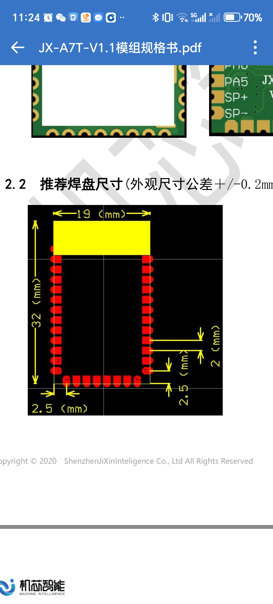

**设计建议：**

- 直接使用模组以获得最小尺寸
- 参考官方规格书进行PCB设计
- 考虑模组的布局和散热需求

**注意事项：**

- 2*3cm尺寸当前无法实现
- 如有特殊需求，可联系官方讨论定制
- 设计时留出足够的焊接和维修空间

---

### JX-A7T1和JX-A7T2如何选择？

**问题描述：**

需要尺寸更小的JX-A7T模块，并咨询在JX-A7T1和JX-A7T2两款模块中应选择哪一款。

**解决方案：**

**两款模块对比：**

JX-A7T1和JX-A7T2在功能上完全相同，主要区别在于价格：

- **功能相同**：两款模块功能完全一样
- **尺寸相同**：物理尺寸无差异
- **性能相同**：硬件规格一致

**选择建议：**

1. **价格优先**：

    - 选择价格更便宜的版本
    - 当前有特价活动版本
    - 功能完全相同的情况下选择优惠版本

2. **购买渠道**：

    - 在电商平台查看实时价格
    - 选择标注"特价体验版"的版本
    - 确认是模组而非开发板

**注意事项：**

- 两款模块在功能和尺寸上无区别
- 仅根据价格选择更优惠的版本
- 确认购买的是模组形式而非开发板
- 如有大量采购需求，可联系销售获取批量价格

---

### JX-A7T单模块和开发板功能是否相同？

**问题描述：**

单模块和开发板在功能上是否相同，以及它们之间的主要区别是什么？

**解决方案：**

**功能对比：**

- **核心功能完全相同**：单模块和开发板实现的功能一样
- **开发板扩展**：开发板在模块基础上增加了控制板
- **接口差异**：开发板直接焊接了端子，模块需要自行连接

**主要区别：**

1. **开发板优势**：

    - 直接提供标准接口（端子已焊接）
    - 无需额外电路即可使用
    - 适合快速原型开发

2. **模块优势**：

    - 尺寸更小，适合集成到产品
    - 成本更低
    - 可根据产品需求灵活设计外围电路

**使用方式：**

- **单独使用模块**：

    - 需要自行连接电源、喇叭、咪头
    - 参考官方原理图设计
    - 适合量产产品

- **使用开发板**：

    - 直接使用板载接口
    - 无需额外电路
    - 适合开发测试

**选择建议：**

- **开发阶段**：使用开发板
- **量产阶段**：使用模块
- **尺寸敏感**：选择模块
- **快速验证**：选择开发板

**注意事项：**

- 两者功能完全相同，根据应用场景选择
- 开发板增加了便利性，模块提供了灵活性
- 设计时参考官方提供的原理图和规格书

### JX-A7T是否支持离线与在线指令双重模式？

**问题描述：**

需要了解JX-A7T是否同时支持离线指令与在线指令双重模式，以及如何获取相关例程和文档。

**解决方案：**

**双模式功能确认：**

JX-A7T产品同时拥有离线指令与在线指令双重模式：

1. **离线指令模式**：

    - 支持本地语音识别，无需网络连接
    - 响应快速，保证基础功能可用性
    - 适合隐私要求高的应用场景

2. **在线指令模式**：

    - 搭载大模型运行
    - 提供更智能、更高效的使用体验
    - 支持复杂对话和语义理解

**文档获取方式：**

1. **智能公元平台访问**：

    - 官方文档地址：https://help.aimachip.com/docs/jx_a7t_v1/jx_a7t_v1-1ghc1h40pidif
    - 可随时登录平台查看
    - 包含完整的产品功能说明和操作指南

2. **平台资源内容**：

    - 例程和文档已陆续上传
    - 提供产品功能初步了解
    - 包含开发指导和配置说明

**产品状态：**

- JX-A7T为已正式发布的新品
- 大模型功能已上线运行
- 相关开发资料持续完善中

**注意事项：**

- 在线模式需要网络连接支持
- 离线模式保证基本功能不受网络限制
- 开发前建议先在平台了解完整功能特性

---

## 音频处理功能

### JX-A7T是否支持语音唤醒和回音消除后的音频输出？

**问题描述：**

需要支持语音唤醒和回音消除（AEC），并将处理后的音频数据通过模拟信号或I2S接口输出。

**解决方案：**

1. **功能确认**

    - JX-A7T支持语音唤醒功能
    - 支持回音消除（AEC）处理
    - 处理后的音频可以通过串口格式输出

2. **输出方式**

    - 支持串口格式输出音频数据
    - 需要对接双方进行协议通信
    - 可根据需求定制输出格式

3. **定制化需求**

    - 标准产品通过串口输出
    - I2S或模拟信号输出需要定制
    - 属于定制项目范畴

**注意事项：**

- 需要双方对接通信协议
- 定制功能需要评估具体需求
- 建议联系技术支持详细讨论方案

---

### 如何连接JX-A7T模块与开发板的UART接口？

**问题描述：**

需要将开发板上的UART接口（RX、TX、5V、GND）连接到JX-A7T模块以实现信号通信。

**解决方案：**

**1. 确认UART引脚位置**

JX-A7T模块上的UART接口位置：

- **RXD**：串口接收引脚
- **TXD**：串口发送引脚
- 位于模块的引脚区域

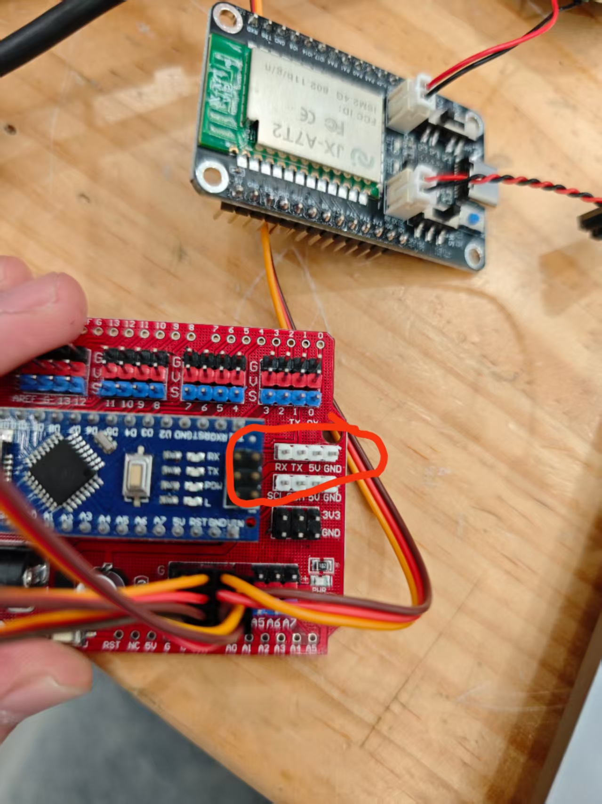

*开发板上标有RX TX 5V GND的排针接口*

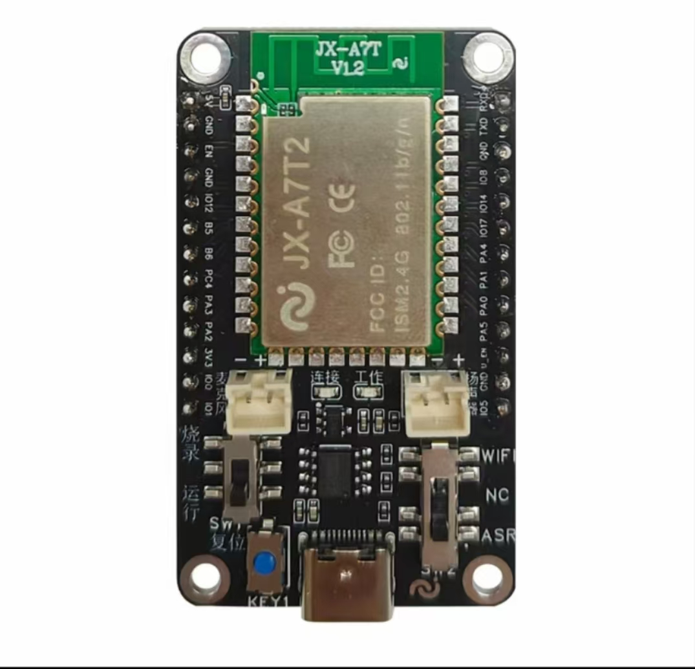

*JX-A7T2模组上的引脚定义，RXD和TXD用于串口通信*

**2. 连接方式**

按照UART通信规则进行连接：

```
开发板          JX-A7T模块
TX   →   RXD
RX   ←   TXD
5V   →   VCC（如需要供电）
GND  →   GND
```

**3. 使用默认配置**

如果采用平台默认配置：

- **UART1**：默认使用GPIO_A2（TX）和GPIO_A3（RX）
- **波特率**：默认9600
- **数据格式**：8位数据位，1位停止位，无校验

**4. 配置验证**

在智能公元平台确认配置：

- 进入Pin脚配置页面
- 查看UART1_TX和UART1_RX的引脚分配
- 确认与实际连接一致

**注意事项：**

- TX与RX需要交叉连接
- 确保两个设备共地
- 电压等级需要匹配（3.3V TTL）
- 如果需要5V供电，确认模块支持该电压

---

### 如何将JX-A7T的引脚配置迁移至与SU-03T相同的串口方案？

**问题描述：**

需要将JX-A7T芯片的引脚配置调整为与SU-03T相同的串口通信方案，以实现与外部设备的正常通信。

**解决方案：**

**1. 确认串口使用差异**

- **SU-03T**：使用UART1进行外部通信
- **JX-A7T**：UART0用于WiFi通信，UART1用于语音部分的外部通信

**2. JX-A7T正确配置方法**

在智能公元平台配置JX-A7T：

- 将GPIO_A2配置为UART1_TX
- 将GPIO_A3配置为UART1_RX
- 波特率设置为9600（与SU-03T一致）

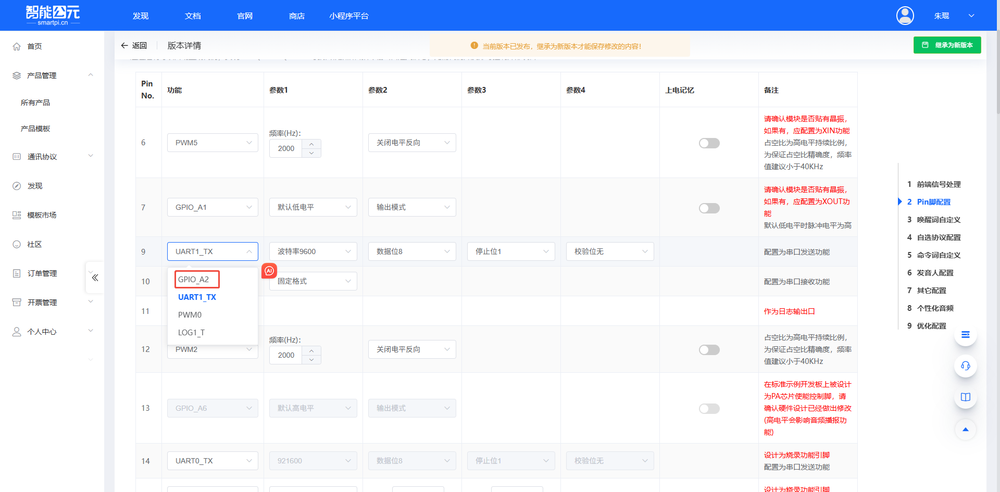

*SU-03T的UART1_TX配置，波特率9600*

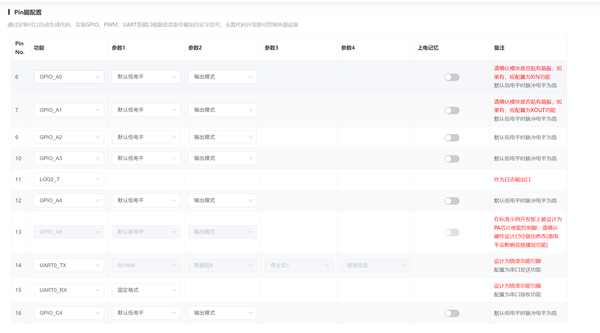

*JX-A7T的GPIO_A2和A3被配置为UART1_TX和UART1_RX*

**3. 语音指令参数配置**

在控制详情中配置串口发送：

- 设置触发条件为对应的语音指令
- 操作类型选择"发送UART1_TX"
- 参数类型设置为16进制数

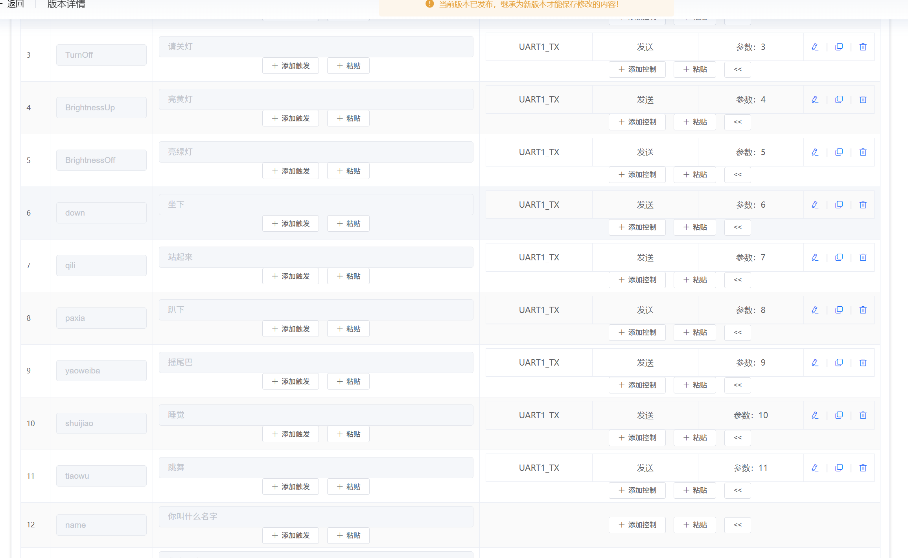

*SU-03T的语音指令配置，通过串口发送16进制参数*

**4. 连接方式**

物理连接与SU-03T相同：

```
外部设备          JX-A7T
TX      →      A2 (UART1_RX)
RX      ←      A3 (UART1_TX)
GND     →      GND
```

**注意事项：**

- 不要使用UART0（RXD/TXD）进行外部通信，这是烧录接口
- JX-A7T的GPIO_A2/A3等同于SU-03T的UART1接口
- 确保平台配置与实际硬件连接一致
- 波特率等参数需要与对接设备匹配

---

### JX-A7T麦克风电路方案和充放电模块如何接入？

**问题描述：**

需要了解JX-A7T麦克风的内部电路方案，并咨询如何接入充放电模块以实现电源管理。

**解决方案：**

**1. 内部电路方案获取**

- 可联系技术支持获取JX-A7T的原理图
- 原理图版本：JX-A7T_EVB_V1.5
- 包含完整的麦克风电路设计和接口定义

**2. 充放电模块接入方案**

**供电要求确认**：

- JX-A7T模块工作电压：5V
- 需要确保充放电模块能提供足够的输出电流
- 两节18650电池串联可提供约7.4V，需要降压到5V

**发热问题分析**：

- 使用充放电模块为CI-03T1/T2供电时芯片发热严重
- 可能原因：电压不稳定、电流不足、转换效率低
- 需要确认充放电模块的输出质量和稳定性

**3. 供电方案建议**

**方案一：直接电池供电**
```
18650电池(2节) → 降压模块(7.4V→5V) → JX-A7T模块
```

**方案二：使用标准电源模块**

- 选择质量可靠的5V电源模块
- 确保输出电流≥500mA
- 添加滤波电容减少纹波

**方案三：USB供电**

- 使用5V/2A USB电源适配器
- 通过Type-C接口供电
- 适合开发和测试场景

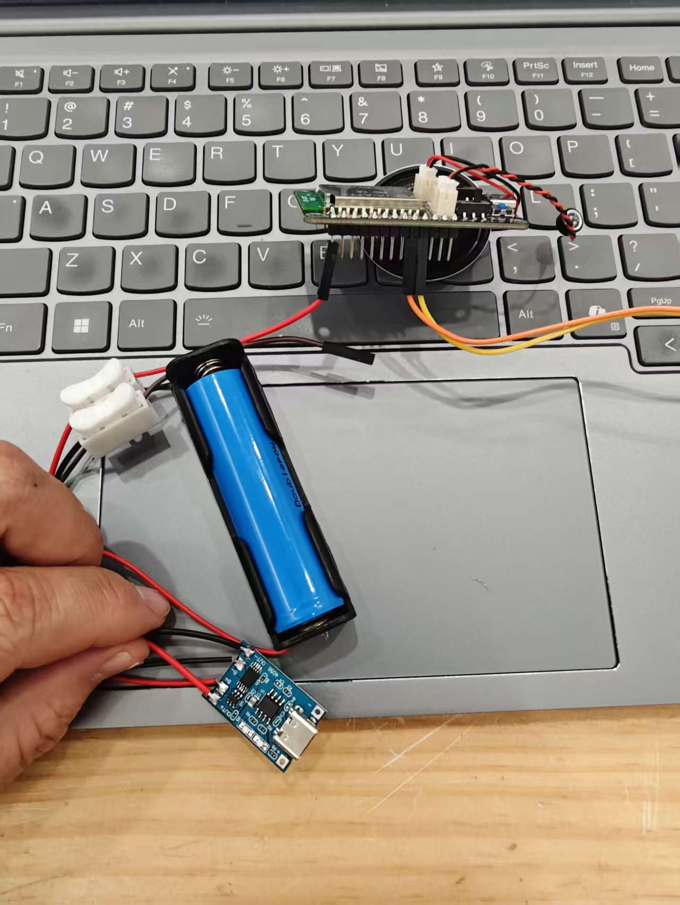

*使用18650电池和充放电模块的供电方案示例*

**4. 注意事项**

- 发热问题可能影响模块稳定性，需要充分散热
- 不稳定的供电会导致语音识别异常
- 建议使用原装或经过验证的电源方案
- 量产前进行长时间稳定性测试

---

### 如何为JX-A7T开发板连接外部设备和供电？

**问题描述：**

需要通过开发板给外部模块供电，并了解如何为开发板外接锂电池。

**解决方案：**

**1. 外部设备供电连接**

通过开发板的电源接口为外部设备供电：

- **5V接口**：连接到外部设备的VCC或5V输入
- **GND接口**：连接到外部设备的GND
- 确保电压匹配：外部设备支持5V供电

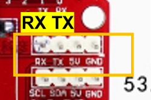

*开发板上的RX、TX、5V、GND四个接口*

**2. 供电注意事项**

- **电流能力**：确认开发板能提供足够电流
- **电源稳定性**：避免电压波动影响外部设备
- **共地连接**：必须连接GND确保信号参考电平一致

**3. 外接锂电池方案**

开发板外接锂电池需要硬件设计：

- **目前限制**：标准开发板不支持直接连接锂电池
- **解决方案**：需要基于模块进行外围硬件设计
- **设计要点**：

    - 添加锂电池充电管理电路
    - 设计电压转换电路（如需要）
    - 考虑电池保护和开关电路

**4. 电池供电设计建议**

如需电池供电功能：

- 使用JX-A7T模块而非完整开发板
- 自行设计电源管理电路
- 包含充电、保护、电量检测等功能
- 参考模块的电气特性进行设计

**注意事项：**

- 直接连接锂电池前需确认电路设计
- 供电能力不足会导致设备工作异常
- 建议专业人员进行硬件改装
- 电池供电设计需要考虑安全保护

---

### 如何获取A7T模块的PCB封装文件？

**问题描述：**

需要获取A7T模块的PCB封装文件，用于在Altium Designer中画板，但收到的.elib格式无法直接打开。

**解决方案：**

- **封装文件获取**：

    - 可以申请封装文件
    - 提供需要的格式（嘉立创或AD格式）
    - 包含模块的尺寸和引脚定义

- **文件格式转换**：

    - .elib文件：嘉立创格式
    - .pcbdoc文件：Altium Designer格式
    - .schdoc文件：原理图文件
    - .PCB文件：可直接在Altium Designer中打开的PCB文件


- **使用建议**：

    1. 确认PCB设计软件版本
    2. 选择匹配的封装文件格式
    3. 检查封装尺寸与实际模块是否一致
    4. 注意模块的安装方向和定位标记

- **设计注意事项**：

    - 确保焊盘尺寸正确
    - 预留足够的空间散热
    - 考虑天线布局对性能的影响
    - 遵循推荐的PCB叠层设计

---

### JX-A7T模组的技术文档如何获取？

**问题描述：**

需要获取JX-A7T模组的技术文档，包括规格书、原理图等资料，并了解文档中心中不同选项的含义。

**解决方案：**

**技术文档获取方式：**

1. **智能公元文档中心**：

    - 访问官方文档中心获取完整资料
    - 文档地址：https://help.aimachip.com/docs/jx_a7t_v1/jx_a7t_v1-1gfqjpp5sdmt9
    - 包含规格书、原理图、demo操作文档等

2. **文档类型说明**：

    - **JX-A7T ASR（CI1302）**：指使用CI1302语音芯片的ASR版本
    - **JX-A7T WiFi（JX1001）**：指使用JX1001 WiFi芯片的WiFi版本
    - JX-A7T模组实际是WiFi芯片和语音芯片两个集成在板子上

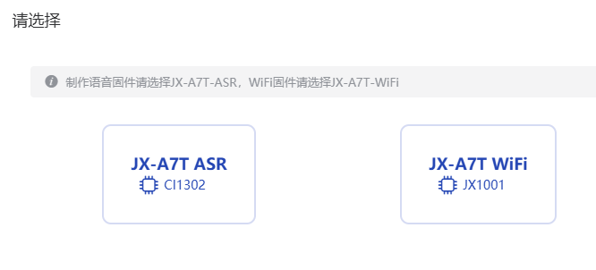

*文档中心显示的JX-A7T ASR和JX-A7T WiFi两个选项*

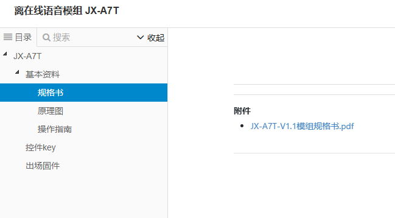

*文档中心提供的JX-A7T产品资料列表*

3. **可用文档资料**：

    - JX-A7T-V1.1-模组规格书.pdf
    - JX-A7T模组demo操作指示文档.pdf
    - 电气原理图
    - PCB封装文件
    - 引脚定义Excel表格

**开发板获取：**

- 开发板已在淘宝上架：https://item.taobao.com/item.htm?id=918163910156
- 后续会开放更多购买渠道
- 开发板包含完整的外围电路，适合开发测试

**PCB封装文件使用：**

- 收到.PCB格式的封装文件可直接在Altium Designer中打开
- 如需转换格式，可创建新封装并将内容复制进去
- 推荐焊盘尺寸图可在规格书中查看

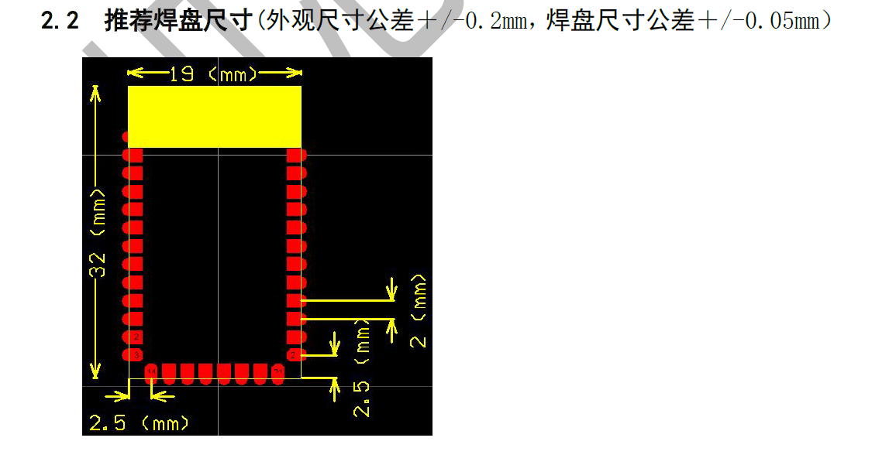

*JX-A7T模组的推荐焊盘尺寸图，如需更详细的焊盘间距信息可联系技术支持*

**注意事项：**

- JX-A7T是WiFi+语音二合一模组，两个芯片集成在同一板子上
- 规格书中的焊盘尺寸可能不包含所有细节，如需详细信息可申请PCB封装文件
- 开发板适合初期开发，量产时建议使用模组自行设计外围电路
- 文档会持续更新，建议定期查看最新版本

---

### JX-A7T触摸屏台灯项目需要额外MCU吗？

**问题描述：**

设计JX-A7T触摸屏台灯项目时，不确定是否需要额外MCU、触摸按键实现方式、金属外壳对信号的影响以及蓝牙功能的可行性。

**解决方案：**

**硬件架构设计：**

1. **MCU需求评估**
    - JX-A7T（博流方案）本身不支持触摸按键功能
    - 需要5个触摸按键时必须增加额外MCU
    - 触摸功能由MCU实现，JX-A7T负责语音处理

2. **触摸按键实现**
    - 使用专用MCU的触摸功能
    - 5个触摸按键分别实现：

        - 第一个：10个AI家教老师切换
        - 第二个：轻按开关下灯光，长按无极调光
        - 第三个：轻按开关上灯光，长按无极调光
        - 第四个：切换模式（学习护眼、休闲、睡眠）
        - 第五个：长按开关机，开机进入配网，按一下打断/唤醒

3. **通信协议**
    - 语音模块识别到命令后，通过串口发送协议给MCU
    - MCU控制所有灯光和触摸功能
    - 屏幕同步显示当前灯光模式

**金属外壳影响：**

- 金属外壳会对无线信号产生屏蔽作用
- 需要在天线位置预留非金属区域
- 建议将天线贴在亚克力或塑料区域
- 外壳为铁和铝合金时需特别注意信号通透性

**蓝牙功能限制：**

- JX-A7T大模型模组不支持蓝牙A2DP功能
- 如需蓝牙播放音乐功能，需要增加另一颗经典蓝牙芯片
- 可根据成本和需求决定是否保留蓝牙功能

**注意事项：**

- 博流方案需要配合MCU实现完整功能
- 金属外壳设计时必须考虑天线信号穿透
- 触摸按键需使用MCU专用触摸功能
- 语音和触摸功能通过串口协议协同工作

---

### 灯控板设计时如何避免麦克风干扰？

**问题描述：**

灯控板原理图中麦克风与其他电路共用，可能产生信号干扰，需要确认设计方案和注意事项。

**解决方案：**

**麦克风设计要点：**

1. **PCB布局优化**
    - 麦克风线路远离高频信号源
    - 使用独立的GND平面
    - 麦克风信号线使用差分走线
    - 避免与电源线平行走线

2. **AEC（声学回声消除）设计**
    - 在原理图中增加AEC电路
    - 确保硬件支持回声消除功能
    - 提高语音识别准确率

3. **电路隔离措施**
    - 麦克风输入端增加滤波电容
    - 使用独立的LDO供电
    - 在麦克风周围敷设屏蔽铜箔

4. **机械结构考虑**
    - 麦克风位置远离喇叭
    - 使用物理隔离减震结构
    - 麦克风开孔避免声学反射

**设计验证：**

- 先测试无AEC版本的基础功能
- 增加AEC后对比识别效果
- 通过实际环境测试验证抗干扰能力

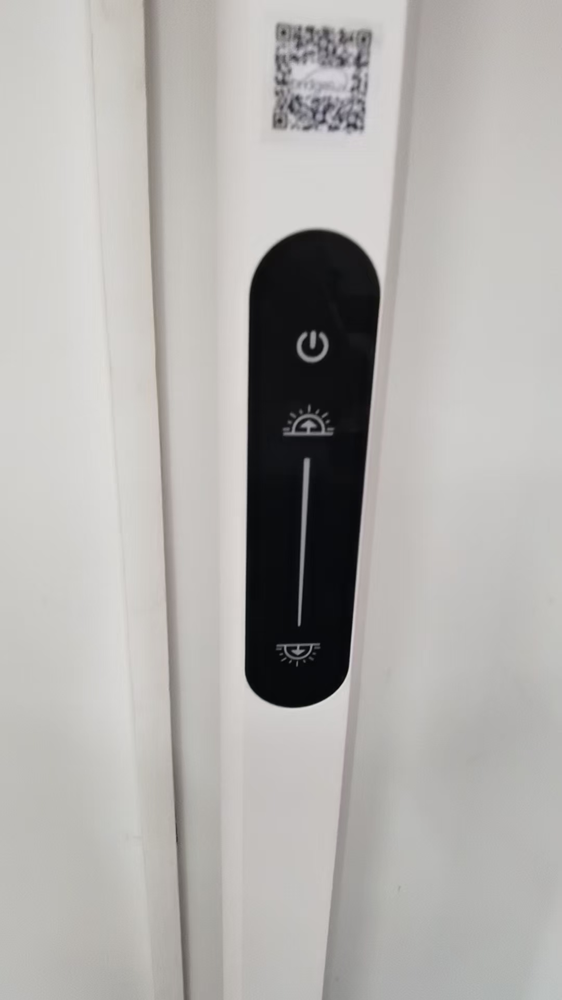

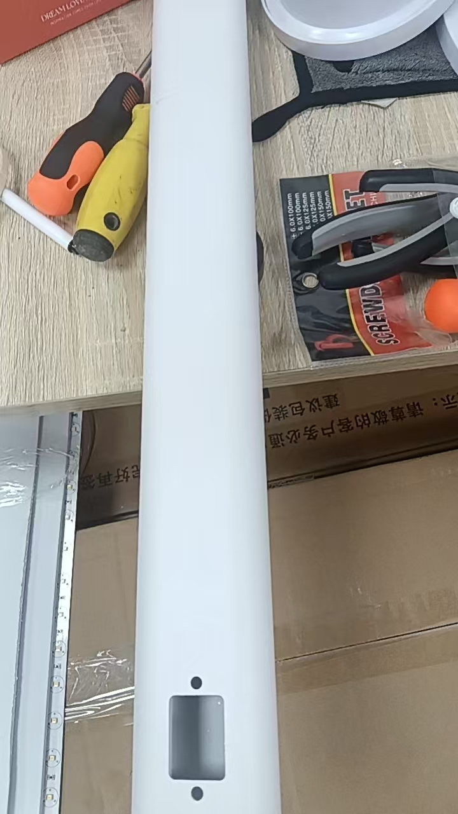

**注意事项：**

- 共用麦克风时必须考虑信号干扰
- AEC电路可显著改善语音交互体验
- PCB布局对信号质量影响较大
- 建议预留调试接口方便问题排查

---

### 如何修改旋钮开关的引脚连接？

**问题描述：**

原理图中旋钮开关（SW1）连接在PB0和PB3引脚，但因功能冲突需要改接到PC6和PC7引脚。

**解决方案：**

**引脚修改步骤：**

1. **原理图修改**
    - 将SW1（VR1、VR2）从PB0、PB3断开
    - 重新连接到PC6、PC7引脚
    - 确保V33_EN1、V33_EN2信号正确路由

2. **硬件连接确认**
    - PB0、PB3可能有其他复用功能
    - PC6、PC7为通用IO引脚，适合旋钮输入
    - 检查引脚电气特性是否匹配开关信号

3. **软件配置更新**
    - MCU程序中更新GPIO初始化配置
    - 修改按键扫描函数的引脚定义
    - 确保中断配置正确

**设计建议：**

- 在改版时同步更新BOM清单
- 保留原有引脚的丝印标注便于调试
- 在新版本原理图中标注修改原因

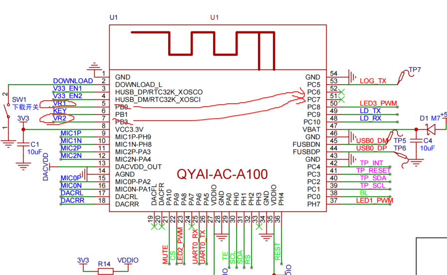

**注意事项：**

- 引脚修改后必须同步更新软件代码
- 确认新引脚无功能冲突
- 建议在硬件改版前进行充分测试
- 保留修改记录便于后续维护

---


## 应用方案

### JX-A7T在AI小玩具中的应用方案

**解决方案：**

JX-A7T是专为AI小玩具等在线语音交互场景设计的理想方案：

**1. 硬件架构优势**

- **双芯片设计**：语音芯片 CI1302 + WiFi芯片
- **麦克风接口**：支持I2S接口连接麦克风阵列
- **音频处理**：内置DSP处理单元，支持音频预处理
- **网络连接**：集成WiFi 802.11b/g/n + BLE 5.0

**2. AI小玩具集成方案**

```
麦克风 → JX-A7T（音频采集+处理） → WiFi → 云端AI大模型
                                            ↓
语音输出 ← JX-A7T（TTS播放） ← 云端响应
```

**3. 核心功能支持**

- **离线唤醒**：支持本地唤醒词识别，降低功耗
- **在线对话**：连接云端AI大模型，实现智能对话
- **声音采集**：高质量麦克风采集，支持远场拾音
- **语音播报**：内置TTS功能，自然语音输出
- **OTA升级**：支持在线更新，持续优化功能

**4. 技术规格**

| 参数 | 规格 | 说明 |
|------|------|------|
| 供电电压 | 3.6-5.5V | 适合电池供电的玩具应用 |
| 工作电流 | ~55mA（待机） | 低功耗设计 |
| 识别率 | 95%+ | 高准确率语音识别 |
| 离线词条 | 300条 | 本地命令词支持 |
| 封装尺寸 | 28×31.5mm | 小尺寸，易于集成 |

**5. 开发支持**

- **智能公元平台**：提供图形化配置界面
- **开发包**：包含SDK和示例代码
- **技术文档**：完整的规格书和设计指南
- **规格书下载**：JX-A7T-V1.1-模组规格书.pdf

**注意事项：**

- 需要稳定的网络环境以支持在线AI对话功能
- 麦克风选型建议使用推荐规格的驻极体麦克风
- 开发前建议获取完整规格书进行硬件设计评估
- 可通过官方渠道获取开发指导

### JX-A7T断网情况下是否支持大模型对话功能？

**解决方案：**

**功能模式说明：**

JX-A7T支持离线指令与在线指令双重模式：

1. **离线模式功能**：

    - 支持本地语音识别，断网也能使用
    - 可响应300条离线命令词
    - 适合基础控制和快速响应场景

2. **在线模式功能**：

    - 搭载AI大模型运行，提供智能对话体验
    - 支持自然语言理解和复杂对话
    - 大模型可直接操作硬件设备

3. **网络依赖**：

    - 大模型对话功能需要联网支持
    - 断网时只能使用离线指令功能
    - 无法进行AI大模型对话

**小程序使用说明：**

1. **配网方式**：

    - 通过微信小程序进行蓝牙配网
    - 需要先将设备连接到WiFi网络
    - 配网成功后可使用小程序远程控制

2. **功能支持**：

    - 支持小程序实现远程控制设备
    - 可查看设备状态和进行参数调节
    - 支持OTA在线升级功能

**使用场景建议：**

1. **网络良好环境**：

    - 优先使用在线大模型模式
    - 享受智能对话和自然语言交互
    - 可通过小程序进行远程管理

2. **网络断开环境**：

    - 自动切换到离线指令模式
    - 保证基础控制功能正常使用
    - 响应速度快，隐私性好

**技术特点：**

- 离线识别能力：支持300条本地词条
- AEC唤醒打断：支持回声消除和唤醒打断
- 混合模式：根据网络状态自动切换工作模式
- 硬件控制：大模型可直接操作硬件设备

**注意事项：**

- 大模型对话功能必须连接2.4G WiFi网络
- 断网情况下仅支持离线指令识别
- 小程序控制需要先完成蓝牙配网
- 建议根据实际使用场景选择合适的工作模式

---

## 常见问题

### JX-A7T支持哪些指令模式？

**解决方案：**

JX-A7T同时拥有离线指令与在线指令双重模式：

- **离线指令模式**：

    - 支持本地语音识别，断网也能使用
    - 支持300条词条的离线指令
    - 响应速度快，隐私性好

- **在线指令模式**：

    - 搭载AI大模型运行
    - 提供更智能、更高效的使用体验
    - 支持自然语言理解和复杂对话
    - 大模型可直接操作硬件设备

**注意事项：**

- 两种模式可以根据实际需求灵活切换使用
- 在线模式需要网络连接，离线模式无需网络
- 相关例程和文档可在智能公元平台获取

---

### JX-A7T技术文档获取方式

**解决方案：**

JX-A7T的技术文档和开发资源已上传至智能公元平台，可通过以下方式获取：

- **官方文档首页**：https://help.aimachip.com/docs/jx_a7t_v1
- **详细文档**：https://help.aimachip.com/docs/jx_a7t_v1/jx_a7t_v1-1ghc1h40pidif
- **智能公元平台**：https://smartpi.cn

**可获取的资源包括：**

- 产品规格书和电气原理图
- 开发指南和操作手册
- 例程代码和API接口文档
- 固件下载和烧录工具
- 常见问题解答

**注意事项：**

- 查看完整文档需要注册智能公元平台账号
- 技术文档和资源可通过官方渠道获取
- 建议关注平台更新，获取最新技术资料

---

## 实操与排障补充

### 如何通过JX-A7T实现语音控制舵机？

**问题描述：**

需要了解JX-A7T模块是否支持控制舵机，以及如何通过语音指令控制舵机动作。

**解决方案：**

**功能支持确认：**

JX-A7T模块支持直接控制舵机功能：

1. **离线指令模式**：

    - 支持300条离线命令词
    - 可直接配置舵机控制动作
    - 响应速度快，无需网络

2. **在线大模型模式**：

    - 通过AI大模型理解舵机控制需求
    - 支持自然语言控制（如"转30度"）
    - 可实现复杂动作序列

**硬件连接方式：**

1. **直接连接**：

    ```
    JX-A7T模块
    ├─ 舵机控制引脚（PWM1-PWM4）
    └─ 舵机电源（+VCC）
    └─ 舵机地线（GND）
    ```

2. **参数设置**：

    - PWM频率：50Hz-20kHz可调
    - PWM占空比：0%-100%
    - 支持连续旋转和角度控制

**平台配置方法：**

1. **离线模式配置**：

    - 添加舵机控制命令词
    - 在控制详情中选择"舵机控制"
    - 设置PWM参数：角度、速度、方向

2. **在线模式配置**：

    - 在智能体配置中描述舵机控制需求
    - AI模型会自动生成控制指令
    - 支持舵机保护和限制设置

**应用场景：**

- 智能机器人：

    - 语音控制头部转动
    - 手臂关节控制
    - 舞蹈动作编排

- 智能家居控制：

    - 窗帘开合控制
    - 空调风门叶片角度
    - 门锁控制

- 互动玩具：

    - 舵机翅膀扇动
    - 尾巴摆动
    - 表情变化配合

**技术要点：**

1. **PWM控制**：

    - 使用硬件PWM实现精确控制
    - 避免抖动，运行平稳
    - 支持速度和位置闭环控制

2. **电源管理**：

    - 舵机工作电流较大，注意电源容量
    - 空闲时可断电节能
    - 避免堵转损坏

3. **软件保护**：

    - 设置角度限位保护
    - 实现软启动/停止
    - 防止异常指令损坏硬件

**示例配置：**

**离线命令词配置**：

- "向左转30度" → PWM1输出30度
- "向右转45度" → PWM1输出45度
- "停止转动" → PWM1停止输出

**AI对话示例**：

- "把窗帘打开一半" → PWM1输出45度并保持
- "空调吹摆风向右" → PWM2周期性摆动

**注意事项：**

- 不同型号的JX-A7T引脚定义可能略有差异
- 建议使用官方提供的规格书确认引脚
- 舵机控制需要预留足够的电源余量
- 首次上电前确保舵机在安全位置

---

### JX-A7T模块插入大板时过热怎么办？

**问题描述：**

JX-A7T模块插入大板时出现严重过热现象，而直接插入电脑时正常，怀疑因电路短路导致。

**解决方案：**

**1. 排查短路原因**

    - 检查模块底部的4针排针是否接触到金属部分
    - 重点确认排针与大板金属面的接触情况
    - 查看是否有焊锡或金属碎屑导致短路

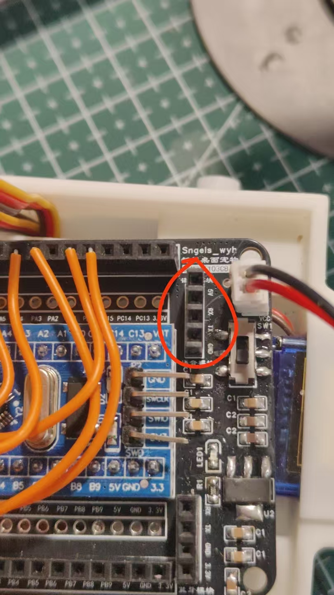

*红圈标出的4针排针可能是短路源头*

**2. 隔离措施**

    - 使用绝缘垫片隔离模块与大板
    - 在模块下方垫上纸张或胶带
    - 最经济的方法：使用纸张遮挡排针区域

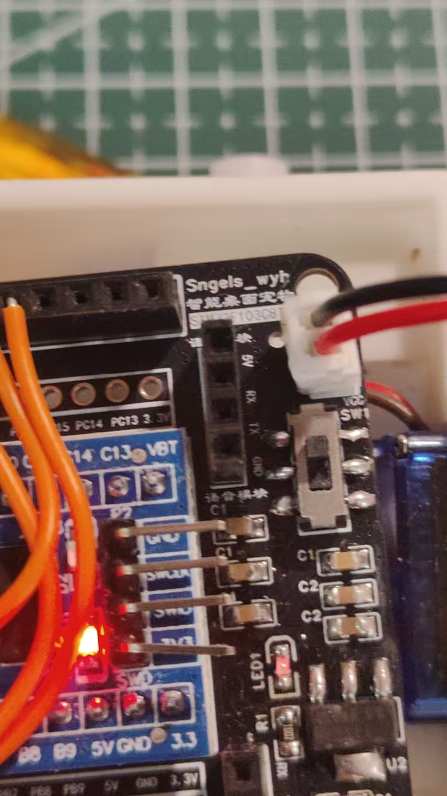

*模块正常工作时的状态，LED1指示灯亮起*

**3. 其他处理方案**

    - 使用热熔胶固定隔离
    - 定制专用的转接板，避免排针接触
    - 考虑使用更薄的连接器

**关于转接板说明：**

- **官方状态**：目前暂无单独的转接板配套产品
- **自行设计**：需要根据具体应用需求自行设计转接板
- **设计要点**：

    - 避开底部4针排针区域
    - 考虑模块散热需求
    - 预留必要的接口引出
    - 确保机械固定牢固

**注意事项：**

- 过热是短路的重要信号，需立即断电
- 模块单独供电时正常说明硬件未损坏
- 长期使用建议焊接固定排针或使用转接板
- 五毛钱的热熔胶也是很好的解决方案

---

### JX-A7T如何实现连续对话功能？

**问题描述：**

JX-A7T绑定大模型后无法实现连续对话，每次对话结束后需要重新唤醒才能进行下一次对话。

**解决方案：**

**1. 对话流模式配置**

- 在智能体配置中找到"对话流模式"设置
- 选择"单Agent（对话流模式）"
- 这是实现连续对话的关键配置

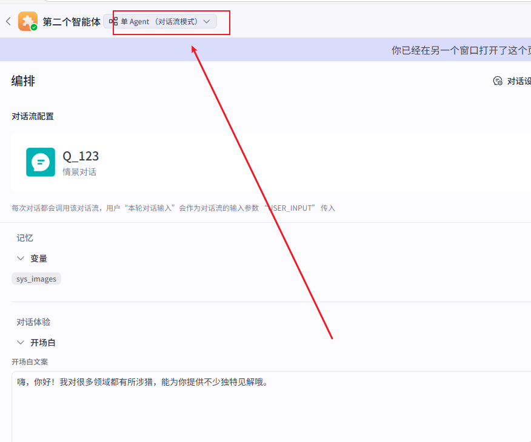

**2. 前置条件检查**

- 在PC端试运行工作流，确认可以连续对话
- 如果PC端不能连续对话，绑定后也不会支持
- 确认使用的大模型支持连续对话功能

**3. 超时时间设置**

- 在ASR配置中设置超时退出时间（如20秒）
- 合理的超时时间可以实现连续对话效果
- 超时后需要重新唤醒是正常机制

**4. 功能限制说明**

- 免费大模型暂时不支持连续对话
- 需要使用支持连续对话的第三方大模型（如扣子）
- 连续对话功能依赖大模型本身的能力

**注意事项：**

- 对话流模式是实现连续对话的必要条件
- PC端测试是验证功能的重要步骤
- 不同大模型的连续对话支持能力不同
- 超时时间设置需要根据实际使用场景调整

---

### JX-A7T模块串口通信配置

**问题描述：**

需要了解JX-A7T模块内部串口通信的对应关系，以及对外串口通信应使用哪些引脚。

**解决方案：**

**内部串口通信关系：**

JX-A7T模块内部包含语音模块和WiFi模块，它们的串口连接关系如下：

- **语音模块**：使用UART0
- **WiFi模块**：使用UART1
- **内部连接**：两个模块的UART引脚已在硬件上连接在一起

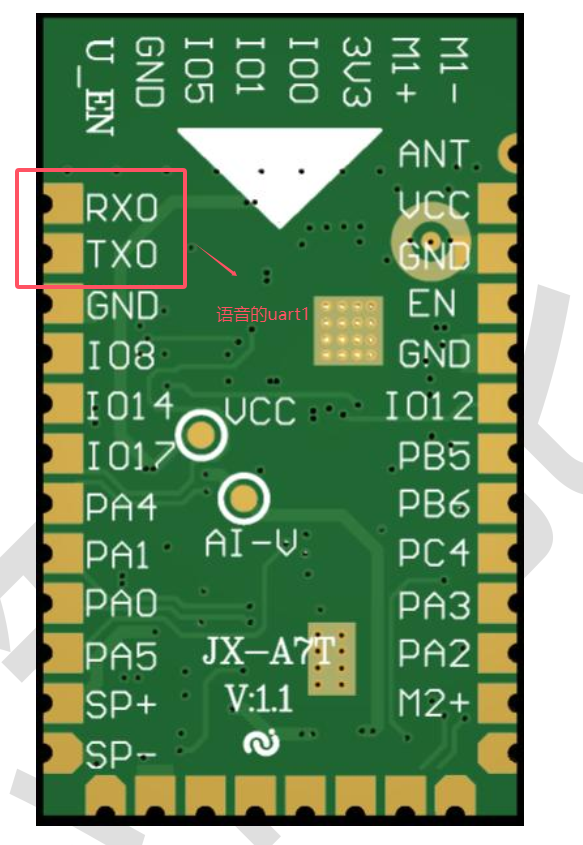

**对外串口通信引脚：**

如需与外部设备进行串口通信，可使用以下引脚：

- **PA3/语音**：对应UART1_RX1
- **PA2/语音**：对应UART1_TX

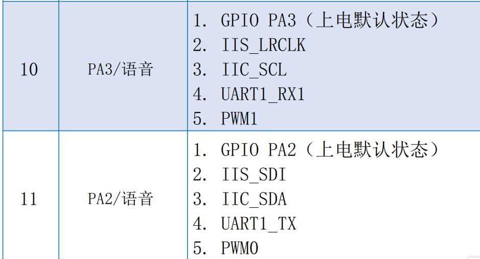

**串口使用说明：**

1. **内部通信**

    - 语音模块的UART0与WiFi模块的UART1已硬件连接
    - 可视为透传关系，用于模块间数据传输

2. **对外通信**

    - 使用PA2（TX）和PA3（RX）引脚
    - 这两个引脚对应WiFi模块的对外串口

3. **引脚复用**

    - IO7和IO16也是WiFi的串口引脚
    - 与烧录口共用，不影响烧录功能
    - 可配置为串口使用

**注意事项：**

- 内部模块的串口通信已在硬件层面连接
- 对外串口通信使用PA2/PA3引脚
- 串口与烧录口复用时不影响正常烧录
- 确保外部设备的电平匹配

---

### JX-A7T是否需要配置TCP通信才能通过小程序控制？

**问题描述：**

在通讯配置界面看到"暂无数据"，不确定是否需要配置TCP通信才能使用小程序控制功能。

**解决方案：**

**配置说明：**

1. **智能体绑定后无需额外配置**

    - 绑定智能体后可直接运行，无需配置TCP通信
    - 例程中未配置TCP是因为智能体已包含相关功能
    - 蓝牙配网的控制也不再需要

2. **小程序控制方式**

    - 与正常WiFi模块操作相同
    - 通过标准配网流程连接小程序
    - 智能体功能正常即可使用小程序控制

3. **通讯配置选项**

    - TCP配置主要用于特定应用场景
    - 一般使用场景下不需要手动配置
    - 如有特殊需求可联系技术人员


**注意事项：**

- 绑定智能体是使用小程序控制的前提
- 确保设备已连接2.4G WiFi网络
- 大模型功能正常时，小程序控制即可正常使用

---

### JX-A7T小程序多按键控件指令格式配置

**问题描述：**

如何为小程序中的多按键控件（如窗帘的上升/下降按钮）编写正确的指令格式。

**解决方案：**

**指令格式说明：**

JX-A7T小程序的语音指令使用标准JSON格式：

```json
{
  "name": "语音指令内容",
  "data": [
    {
      "id": "控件标识ID",
      "value": "执行值"
    }
  ]
}
```

**配置步骤：**

1. **获取控件标识ID**

    - 在小程序配置界面找到目标控件
    - 记录控件的"标识(id)"字段
    - 确保ID唯一性

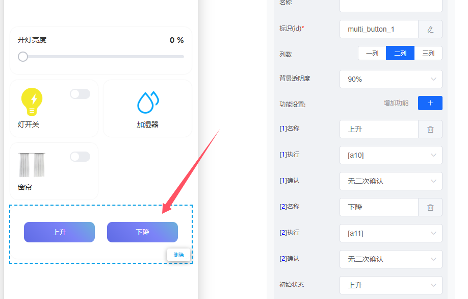

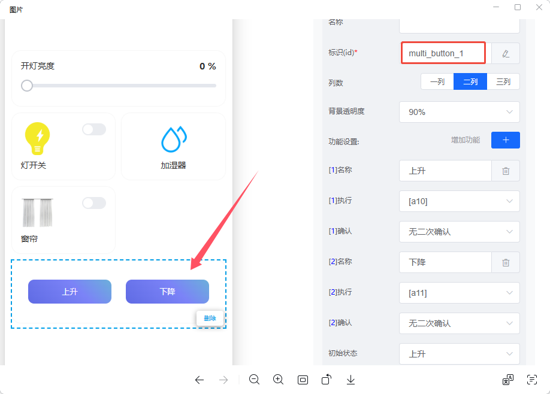

2. **设置正确的value值**

    - 多按键控件需要不同的value值区分按键
    - 上升按键：value设为1
    - 下降按键：value设为2
    - 根据实际按键功能设置

3. **配置示例**

```json
## 1-13
{"name":"我要窗帘上升","data":[{"id":"multi_button_1","value":1}]}

## 1-14
{"name":"我要窗帘下降","data":[{"id":"multi_button_1","value":2}]}
```

**注意事项：**

- 同一组多按键使用相同的id
- 不同按键必须使用不同的value值
- 指令name要包含完整的功能描述
- 建议使用例程中的控件进行初步测试

---

### JX-A7T创建密钥时如何获取private_key.pem文件？

**问题描述：**

创建密钥时未能找到自动生成的私钥文件private_key.pem。

**解决方案：**

**文件获取方式：**

1. **自动下载**

    - 网页会在创建密钥时自动下载文件
    - 检查浏览器的下载文件夹
    - 文件名为private_key.pem

2. **下载位置**

    - Windows：C:\Users\[账户名]\Downloads\
    - Mac：/Users/[账户名]/Downloads/
    - 手机：浏览器或下载管理器的默认位置


**操作步骤：**

1. 完成密钥创建流程
2. 等待页面自动下载文件
3. 如未自动下载，检查浏览器下载设置
4. 保存好私钥文件，避免丢失

**注意事项：**

- 私钥文件很重要，请妥善保管
- 每次创建密钥都会生成新的私钥文件
- 如多次未找到文件，尝试更换浏览器或检查下载设置
- 文件通常在创建密钥后几秒内开始下载

---

### JX-A7T如何实现语音控制后小程序状态同步？

**问题描述：**

JX-A7T模块中，语音识别通过UART1_TX发送16进制数据（如CC 77 01 01 77 CC）控制硬件动作后，如何确保小程序端能正确显示设备状态。

**解决方案：**

**1. UART通信接口说明**

JX-A7T模块有两个UART接口：

- **UART0**：与WiFi模块通信，用于小程序数据传输
- **UART1_TX（PA2）**：独立串口，可用于连接外部MCU

**2. 状态同步实现方法**

要实现语音控制后小程序状态同步，需要通过UART0向WiFi模块发送状态数据：

- 语音命令触发后，配置UART0_TX发送数据
- 使用格式：AA 55 [数据] 55 AA
- WiFi模块接收后会更新小程序对应控件状态

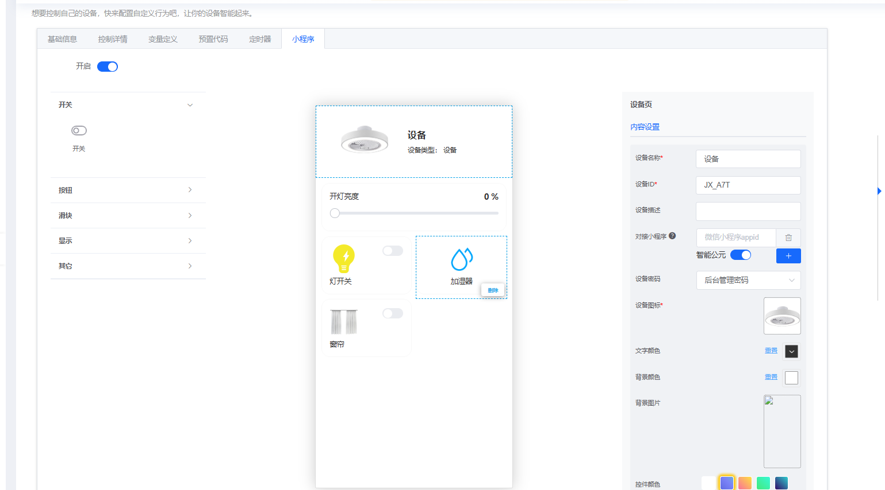

**3. 配置步骤**

1. **语音命令触发配置**

在控制详情中配置语音命令的触发动作：

- 设置UART1_TX输出（如CC 77 01 01 77 CC）
- 同时配置UART0_TX输出状态同步数据

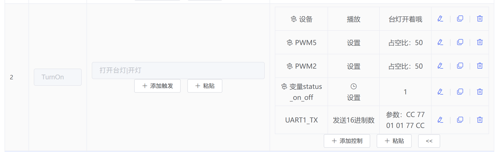

2. **状态回传配置**

- 在同一命令词的配置中添加UART0_TX输出
- 使用AA 55开头、55 AA结尾的固定格式
- 数据内容根据需要同步的状态设置

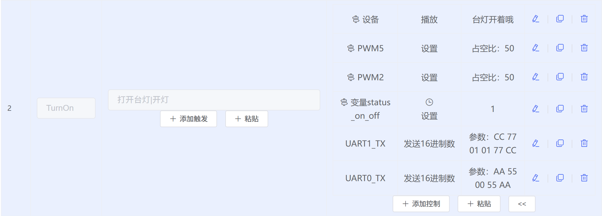

**注意事项：**

- UART0是语音模块与WiFi模块的通信接口
- 小程序控件状态更新需要通过WiFi模块接收数据
- 语音控制硬件后必须通过UART0发送状态才能同步显示
- 出厂固件已集成此功能，可直接使用

---


## 更多常见问题

### JX-A7T支持大模型接入吗？相关教程在哪里？

**解决方案：**

**1. 大模型支持确认**

- JX-A7T ASR和JX-A7T WiFi两款产品均支持接入大模型
- 支持大模型直接操作硬件设备
- 具备在线AI对话能力

**2. 获取教程和资料**

- **智能公元平台**：登录https://smartpi.cn获取产品功能与操作指南
- **官方文档**：访问https://help.aimachip.com/docs/jx_a7t_v1
- **教学资料**：技术人员正在制作详细的教学资料

**3. 产品状态**

- 预计量产时间为2025年5月份
- 资料整理完成后会上传到智能公元平台
- 可关注平台更新获取最新教程

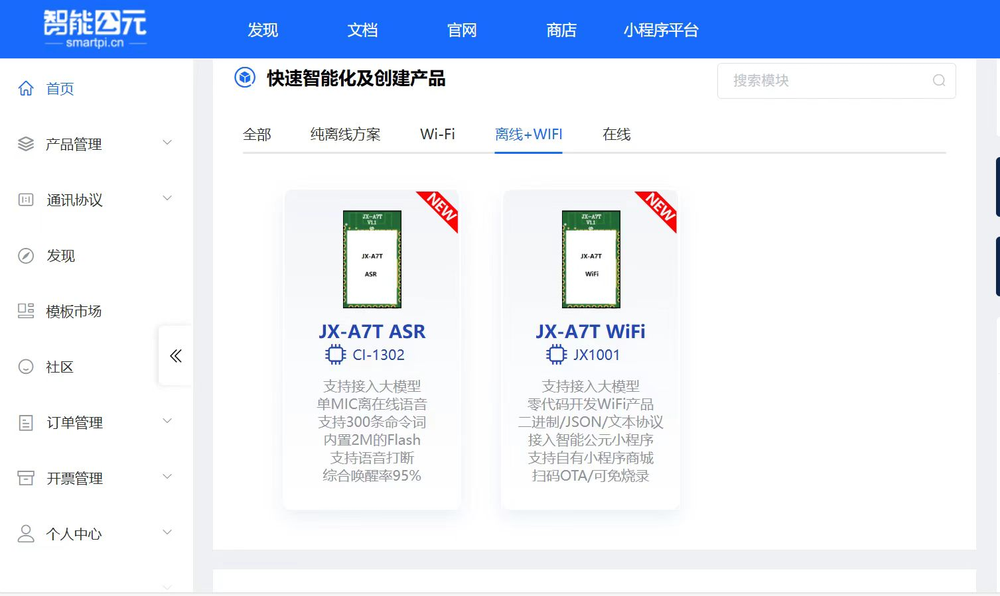

**注意事项：**

- JX-A7T同时支持离线指令（300条词条）和在线大模型
- 大模型功能需要网络连接支持
- 建议收藏官方文档地址以便随时查阅

---

### JX-A7T如何购买？量产时间和教程发布时间？

**解决方案：**

**1. 购买信息**

- **当前状态**：产品尚未上架销售
- **量产计划**：2025年5月份开始量产
- **购买渠道**：后续可通过官方店铺购买

**2. 教程发布时间**

- **教学资料**：5月份发布
- **上传平台**：智能公元平台
- **内容包含**：大模型接入教程、例程代码

**3. 资料获取**

- 持续关注智能公元平台更新
- 关注官方文档动态
- 可提前学习离线功能相关文档

**注意事项：**

- JX-A7T ASR和JX-A7T WiFi两款都支持大模型
- 量产前可先熟悉产品架构和开发流程
- 相关资料正在加急整理中

---

