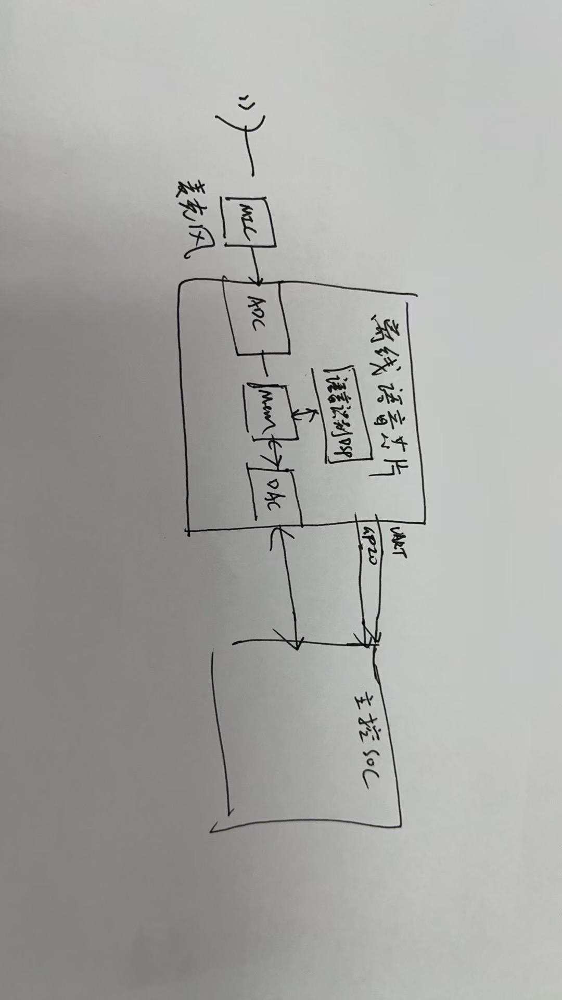
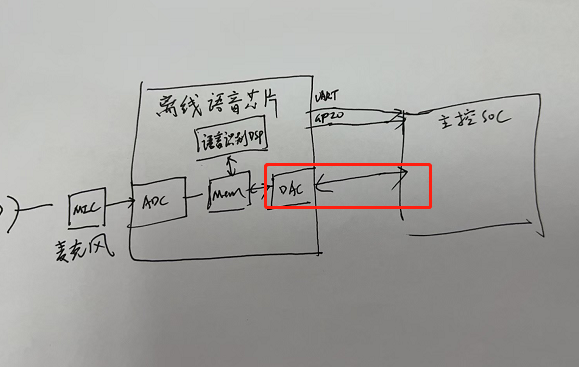

# JX-B5C 硬件设计 FAQ

本页用于整理 JX-B5C 相关的硬件设计问题。

### 离线语音模块是否支持音频直通功能？

**问题描述：**

希望确认离线语音模块是否可以实现音频直通功能，即在进行语音识别的同时，将原始音频信号直接输出到主控芯片的麦克风输入端，以实现音频的实时监听和处理。

**解决方案：**

**技术可行性分析：**

音频直通功能目前无法实现，主要原因如下：

1. **芯片架构限制**：

    - 离线语音模块内部采用专用的音频处理架构
    - 音频信号经过ADC处理后直接进行识别算法处理
    - 内部codec未设计直通功能

2. **输出格式限制**：

    - 模块DAC输出不是标准MP3或WAV格式
    - 无法直接输出原始音频数据
    - 内部处理后的音频不适合直通

**用户需求理解：**

*用户期望的音频直通方案：麦克风信号经过语音芯片处理，同时输出识别结果和原始音频*

**技术方案分析：**

1. **二合一模组方案**：

    - JX-B5C2等二合一模组集成WiFi和语音功能
    - 1303（差分麦）和US665（单端麦）麦克风合一设计
    - 但仍不支持音频直通功能

2. **定制开发可能性**：

    - 音频直通功能需要定制开发
    - 涉及芯片层面的硬件修改
    - 当前平台配置无法实现此功能

3. **替代方案**：

    - 使用独立的人声识别算法（正在开发中）
    - 通过I2S或串口输出识别结果
    - 但无法输出原始音频信号

*红色标注路径表示无法实现的音频直通功能*

**应用场景说明：**

用户需求主要源于以下场景：

- 主控芯片只有麦克风输入，没有I2S接口
- 需要实时监听和传输语音数据
- 希望同时进行本地识别和云端处理

**当前解决方案：**

1. **硬件接口调整**：

    - 建议主控增加I2S接口
    - 或使用支持I2S的语音模块
    - 通过标准音频接口传输数据

2. **分路处理方案**：

    - 麦克风信号分两路处理
    - 一路给语音模块进行识别
    - 一路直接给主控进行处理

3. **云端方案**：

    - 使用离在线兼容方案
    - 后端通过在线ASR处理
    - 前端仅保留唤醒功能

**注意事项：**

- 音频直通功能短期内无法通过配置实现
- 需要芯片层面的架构修改才可能支持
- 建议根据项目需求选择合适的替代方案
- 如有特殊需求，可寻求专业技术协助评估定制可能性

---

---

