### SU-03T的SPK引脚电压异常是什么原因？

**问题描述：**

测量SU-03T模块的SPK+和SPK-引脚对GND的电压，发现电压值为5V，而不是正常的2.4V左右。

**解决方案：**

SPK引脚电压异常通常表示音频功放电路存在问题，需要及时排查和维修。

**1. 正常电压标准**

- SPK+对GND正常电压：2.4V - 2.5V
- SPK-对GND正常电压：2.4V - 2.5V
- 两个引脚电压应该基本相等
- 电压差在0.1V以内为正常

**2. 电压异常原因分析**

- **5V电压异常**：

    - 功放芯片可能已经损坏
    - 内部电路短路导致电压异常
    - 模块受到静电或高压冲击

- **无电压或电压过低**：

    - 功放芯片供电异常
    - 内部电路开路
    - 器件虚焊或损坏

**3. 故障排查步骤**

1. **断电测量**：

    - 断开电源
    - 用万用表测量SPK引脚对GND的电阻
    - 检查是否有短路现象

2. **通电测量**：

    - 给模块正常上电
    - 分别测量SPK+和SPK-对GND电压
    - 记录测量值进行对比

3. **播放测试**：

    - 让模块播放音频
    - 观察SPK引脚电压变化
    - 正常播放时应有交流信号

**4. 可能的解决方案**

- **芯片损坏**：

    - 如果确认功放芯片损坏，需要更换模块
    - 联系供应商进行维修或更换
    - 记录损坏原因以便改进防护

- **外部电路问题**：

    - 检查外部连接是否正确
    - 确认扬声器阻抗匹配
    - 排除外部电路短路可能

**5. 预防措施**

- 避免在通电状态下插拔音频线
- 使用合适功率的扬声器（通常4Ω或8Ω）
- 避免音频输出短路
- 注意静电防护

**注意事项：**

- 功放芯片损坏后无法自行修复
- 5V电压说明芯片内部已损坏
- 继续使用可能影响其他功能
- 建议及时更换新模块

---

# SU-03T 硬件设计 FAQ

本页用于整理 SU-03T 相关的硬件设计问题。

### 如何预防和处理模块功放芯片烧毁问题？

**问题描述：**

模块在使用过程中出现功放芯片烧毁，导致引脚直接输出3.3V，语音功能失效，同时模块上有发黄痕迹。

**解决方案：**

功放芯片烧毁是严重的硬件故障，需要通过正确的使用方法和预防措施来避免。

**1. 功放芯片烧毁的常见原因**

- **外部高电压冲击**：

    - 扬声器线缆接触到高压电源
    - 静电放电（ESD）损坏
    - 瞬间电压脉冲

- **扬声器短路**：

    - 扬声器接线短路到GND
    - 扬声器线圈内部短路
    - 音频线接反导致的短路

- **过载使用**：

    - 扬声器阻抗过低
    - 长时间大音量使用
    - 频繁的音频冲击

**2. 故障识别方法**

- **电压检测**：

    - 正常：SPK±对GND为2.4V-2.5V
    - 异常：SPK±对GND为5V或0V
    - 3.3V引脚电压异常（正常应为3.3V）

- **外观检查**：

    - 8脚功放芯片周围发黄
    - PCB板变色或有烧焦痕迹
    - 元器件松动或脱落

- **功能测试**：

    - 无法播放语音
    - 语音识别功能正常
    - 其他功能正常

**3. 预防措施**

**硬件保护：**

- 在音频输出端串联保护电阻
- 加入音频保险丝（100mA）
- 使用TVS二极管进行瞬态保护
- 确保扬声器阻抗匹配（4-8Ω）

**使用规范：**

- 避免在通电时插拔音频线
- 音量调节要适中，避免过大音量
- 使用质量可靠的扬声器
- 远离强电磁干扰源

**环境要求：**

- 保持干燥的使用环境
- 避免高温高湿环境
- 做好静电防护措施
- 定期检查连接状态

**4. 损坏后的处理**

- **立即断电**：

    - 发现异常立即切断电源
    - 检查外部连接是否有问题
    - 排除外部故障后再上电测试

- **维修方案**：

    - 功放芯片损坏无法现场修复
    - 需要返厂维修或更换模块
    - 记录故障现象便于分析

- **数据备份**：

    - 如有重要配置需要备份
    - 保存故障发生时的操作记录
    - 为售后提供详细信息

**5. 设计建议**

对于新产品设计，建议：

- 添加音频输出保护电路
- 使用独立的音频功放模块
- 增加过压过流检测
- 提供音频隔离措施

**注意事项：**

- 功放芯片烧毁后模块无法正常工作
- 不要尝试自行焊接维修
- 购买时确认供应商的质保政策
- 批量使用前先进行可靠性测试

---

### SU-03T1电路板如何连接按键？

**问题描述：**

需要了解如何将两脚按键连接到SU-03T1电路板，以及连接方式。

**解决方案：**

按键连接到电路板的方式取决于具体的应用需求和电路设计。

**连接方式分析：**

1. **并联连接方式**：

    - 与六脚开关的正负极并联
    - 保持相同的电平逻辑
    - 适合需要相同功能的场景

2. **直接连接方式**：

    - 直接连接到电路板的正负极
    - 通过电路板的按键检测电路
    - 需要了解电路板的按键接口定义

**电路板结构：**

从图片可以看出SU-03T1电路板包含：

- 语音模块（SU-03T1）
- 蓝牙模块
- 电源开关
- 充电管理模块
- 各类接口和按键检测电路

**按键连接建议：**

1. **查看电路图**：

    - 找到按键检测电路的具体位置
    - 确认检测引脚定义
    - 了解触发方式和电平要求

2. **按键特性**：

    - 两脚按键通常为瞬时开关
    - 无正负极区分（起导通作用）
    - 触发时需要稳定的电平变化

3. **连接验证**：

    - 连接后测试按键功能
    - 确认触发响应正常
    - 检查是否有抖动或误触发

**注意事项：**

- 按键起导通作用，通常不需要区分正负
- 连接前确认电路板的按键检测方式
- 避免长时间按键导致误触发
- 如需要特定功能，可能需要额外的电路设计

---

### 如何驱动风扇等大负载设备？

**问题描述：**

SU-03T模块的IO口需要驱动风扇，但模块的IO驱动能力不足，直接连接后无法有效控制风扇的启停。

**解决方案：**

SU-03T的IO口驱动能力较弱（不足20mA），无法直接驱动风扇等大负载设备，需要外接驱动电路。

**1. 驱动能力说明**

- SU-03T IO口最大驱动电流：约20mA
- 风扇等电机负载通常需要几百mA
- 3.3V电压也无法有效驱动大多数风扇

**2. 驱动电路方案**

**方案一：MOS管驱动电路**

- 使用N沟道MOS管（如AD3400）
- 模块IO控制MOS管栅极
- MOS管作为开关控制风扇通断

**方案二：三极管驱动电路**

- 使用NPN三极管（如S8050）
- IO通过限流电阻控制三极管基极
- 三极管驱动风扇，提供足够电流

**方案三：专用驱动板**

- 购买现成的电机驱动模块
- 几块钱即可购买，使用方便
- 集成保护电路，更安全可靠

**3. 连接注意事项**

- 风扇三线说明：

    - G（地线）：接电源负极
    - V（电源）：接5V或12V正极
    - S（控制）：接驱动电路输出

**4. 参考电路**
```
模块IO → 1kΩ电阻 → MOS管栅极
风扇负极 → MOS管漏极
风扇正极 → 5V/12V电源
MOS管源极 → 地
```

**注意事项：**

- 不能将风扇直接接在模块VCC和GND上
- 3线风扇的S线是控制线，不是电源线
- 驱动大功率设备时注意散热问题
- 建议使用官方提供的驱动板方案

---

### SU-03T上电时蜂鸣器为什么会响？

**问题描述：**

SU-03T模块上电瞬间，蜂鸣器会发出短暂的声音，这是正常现象还是故障？

**解决方案：**

**原因分析：**

- **上电初始化**：模块上电时进行系统初始化
- **GPIO状态变化**：初始化过程中GPIO引脚状态可能瞬间变化
- **功放启动**：音频功放芯片启动时产生瞬时输出

**解决方案：**

1. **检查供电质量**
    - 确保电源电压稳定（3.3V-5.5V范围）
    - 避免上电瞬间电压波动过大
    - 使用质量好的电源适配器

2. **硬件检查**
    - 确认蜂鸣器连接正确
    - 检查是否有短路或接触不良
    - 测量上电时电源波形

3. **软件配置**
    - 在固件中设置GPIO初始状态
    - 避免初始化时的意外输出

**注意事项：**

- 如果只是瞬间响一声后正常工作，属于正常现象
- 持续响或不规律响可能是供电或硬件问题
- 建议使用示波器观察上电时的电源和信号波形
- 已确认是供电问题的，更换稳定电源即可解决

---

### SU-03T支持哪种类型的麦克风？

**问题描述：**

需要了解SU-03T模块是否支持3.5mm接口的麦克风，还是仅支持驻极体麦克风。

**解决方案：**

**麦克风类型说明：**

- **仅支持驻极体麦克风**：SU-03T模块设计用于连接驻极体电容麦克风
- **不支持3.5mm麦克风**：不支持常见的动圈麦克风或3.5mm接口的耳机麦克风
- **专用接口设计**：模块提供专门的麦克风输入接口

**硬件接口特点：**

- 输入阻抗匹配驻极体麦克风特性
- 提供偏置电压供驻极体麦克风工作
- 优化的前置放大电路适配驻极体信号

**选型建议：**

1. **使用配套麦克风**：优先使用官方提供的驻极体麦克风
2. **替代选择**：如需更换，必须选择相同类型的驻极体麦克风
3. **参数匹配**：注意灵敏度、频率响应等参数匹配

**注意事项：**

- 错误的麦克风类型可能导致无声音或噪声大
- 3.5mm接口麦克风需要额外电路，不建议使用
- 咪头线如需延长，超过100mm必须使用屏蔽线

---

### SU-03T的排针间距是多少？

**问题描述：**

购买的杜邦线无法插入SU-03T的排针，需要了解排针的具体间距规格。

**解决方案：**

**排针规格：**

- **排针间距**：2.0mm
- **排针类型**：PH2.0接口
- **常见问题**：市面上标准的杜邦线多为2.54mm间距，无法直接使用

**解决方案：**

1. **购买2.0mm间距的杜邦线**
    - 搜索关键词："PH2.0 杜邦线" 或 "2.0mm 杜邦线"
    - 确认包装标注2.0mm间距

2. **使用转接线**
    - 2.54mm转2.0mm的转接板
    - 2.54mm转PH2.0的转接线

3. **自制连接线**
    - 购买PH2.0的端子和线材
    - 使用专用压线工具制作

**注意事项：**

- 不要强行插入2.54mm杜邦线，可能导致排针变形
- PH2.0是常见于航模、遥控器的接口标准
- 长期使用建议购买专用的PH2.0连接器

---

### SU-03T模块音量比CI-03T大吗？

**问题描述：**

SU-03T模块的音量比CI-03T大，且通过平台调节音量参数效果不明显，需要了解音量调节方法。

**解决方案：**

**1. 音量差异说明**

    - SU-03T和CI-03T使用相同的功放IC（8002D）
    - 音量差异可能来自底层软件配置
    - 硬件层面无法直接调整

**2. 音量调节方法**

    - 在智能云元平台调节音量参数
    - 找到语音配置中的"音量"滑块
    - 可调节范围0-100


**3. 注意事项**

    - 平台调节的是生成语音的音量
    - 加大供电电流对提升音量无效
    - 如调节到100效果仍不明显，可能是硬件限制

**优化建议：**

    - 确认喇叭功率匹配
    - 检查音频连接线路
    - 考虑更换更高灵敏度的喇叭

---

### SU-03T的3.3V输出电流是多少？

**问题描述：**

需要确认SU-03T模块的3.3V输出引脚（3V3）能提供的最大电流，是否可以达到1A。

**解决方案：**

根据SU-03T模块规格书，在5V输入时：

- **3.3V输出驱动电流最大为150mA**
- 无法达到1A的输出电流

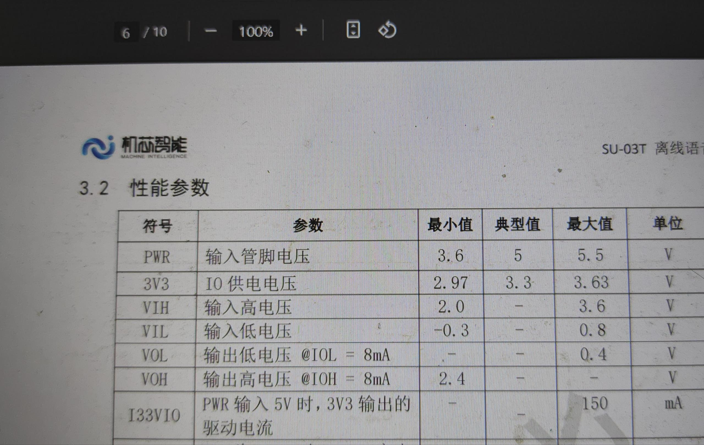

**设计建议：**

1. **负载限制**
    - 连接到3.3V引脚的负载总电流不应超过150mA
    - 避免驱动大功率器件或多个模块并联

2. **替代方案**
    - 如需要更大电流，建议使用外部LDO稳压电路
    - 或使用专用的电源管理模块

**注意事项：**

- 150mA是模块内部LDO的最大输出能力
- 超载可能导致模块工作不稳定或损坏
- 设计电路时需预留足够的余量

---

### SU-03T功放芯片损坏的原因和预防

**问题描述：**

SU-03T模块的功放芯片烧毁，更换后喇叭仅有电流声且发烫，需要了解损坏原因和预防措施。

**解决方案：**

1. **故障原因分析**
    - 喇叭正负极对GND短路是功放芯片损坏的主要原因
    - **电源不稳定/接触不良**也会导致功放烧毁（VCC电压跳动）
    - 短路会导致功放芯片瞬间烧毁
    - 短路通常发生在喇叭连接或调试过程中

2. **典型故障现象**

    **症状一：短路导致的功放烧毁**
    - 功放芯片外观可能无明显变化
    - 喇叭对GND电压异常（正常2.2-2.5V，异常时4.59-4.60V）
    - 更换功放芯片后如仍有问题，需检查喇叭本身

    **症状二：电源不稳定导致的功放烧毁**
    - 无开机语音提示
    - 扬声器发出沙沙声（底噪）
    - VCC电压跳动（在3-4V范围内不稳定）
    - **SPK引脚电压为0V**（正常应为2.4V左右）
    - 模块通电后快速发热

    
    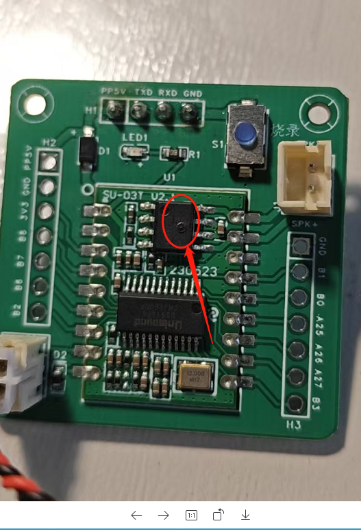

3. **故障诊断方法**
    - 测量SPK+和SPK-引脚对GND电压，正常应为2.4V左右
    - 若SPK引脚电压为0V，说明功放已烧毁
    - 测量VCC供电电压稳定性，跳动说明电源接触不良

4. **维修方案**
    - **更换功放芯片**：功放芯片（HAA8002D）可单独更换
    - 需要具备SOP-8封装焊接技术
    - 更换前需确认并排除电源问题
    - 严重情况需更换整个模块

5. **预防措施**
    - 连接喇叭前务必测量阻抗
    - 确保喇叭正负极不会意外接触到GND
    - 使用绝缘套管保护喇叭接线端子
    - 调试时避免使用金属工具触碰喇叭端子
    - **确保电源供电稳定，避免接触不良**
    - 上电前检查VCC电压是否稳定在5V

**注意事项：**

- 功放芯片（HAA8002D）可单独更换，无需更换整个模块
- 更换芯片后仍需排查外部短路原因或电源问题
- 建议在电路中加入过流保护措施
- 喇叭选型时注意阻抗和功率匹配
- 电源接触不良是导致功放烧毁的常见原因，需重点检查供电线路

---

### SU-03T功放芯片引脚布局是怎样的？

**问题描述：**

在使用SolidWorks绘制SU-03T的3D模型时，需要确认功放芯片HAA8002D的正确引脚数量和布局。

**解决方案：**

SU-03T模块上的功放芯片（HAA8002D）引脚布局如下：

**功放芯片引脚说明：**

- **封装形式**：SOP-8封装
- **引脚数量**：每边4个引脚，共8个引脚
- **芯片型号**：HAA8002D ZOB332100

**常见设计错误：**

在3D建模时容易出现的错误：

- 错误地将功放芯片一边绘制成3个引脚
- 实际应为每边4个引脚的对称布局

**设计参考：**

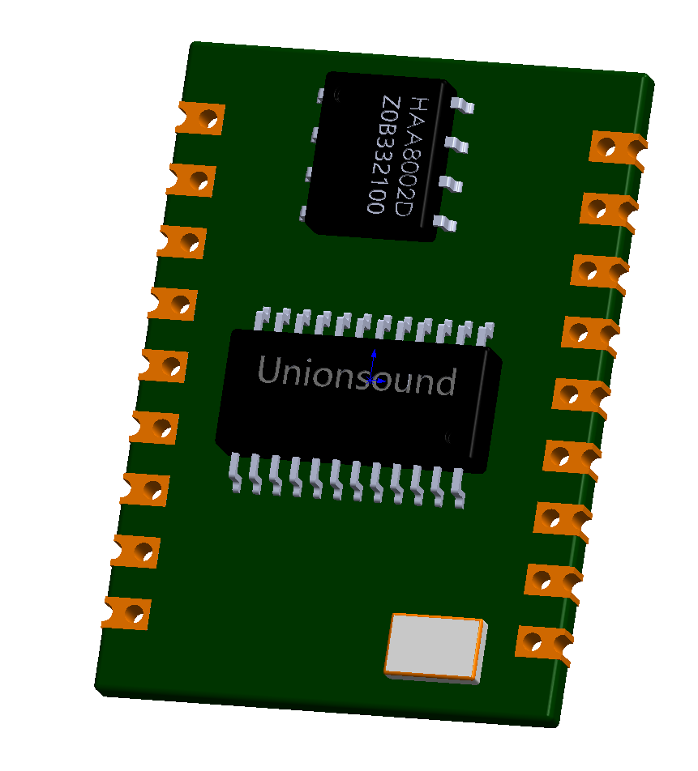

*SU-03T模块3D模型示意图，展示了主控芯片和8引脚功放芯片的布局*

**注意事项：**

- 功放芯片为标准8引脚封装，非6引脚
- 3D建模时需仔细核对实际硬件
- 建议使用实物照片或官方资料作为参考
- PCB布局设计时需注意引脚间距和尺寸精度

---

### SU-03T模块可以直接使用5V供电吗？

**问题描述：**

询问SU-03T模块是否可以直接使用5V供电，而不需要额外的电源管理。

**解决方案：**

**供电规格**

- SU-03T模块工作电压：3.3-5.5V
- 不建议直接使用5V供电

**供电方案**

1. **推荐方案**：使用3.3V或3.7V LDO
    - 稳定可靠
    - 噪声较低

2. **如必须使用5V**
    - 需要添加LDO降压到3.3V
    - 增加滤波电容保证稳定

3. **电源要求**
    - 供电电流要求：≥100mA
    - 建议留有余量

**注意事项：**

- 过高的电压可能损坏模块
- 不稳定的供电会影响语音识别效果
- 使用合适的电源是保证稳定工作的基础

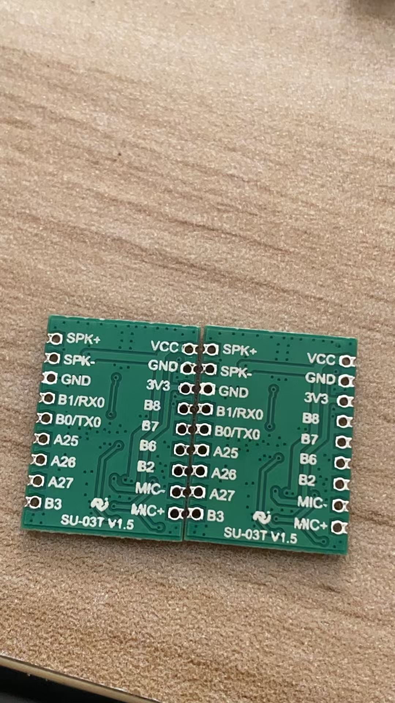

---

### SU-03T上电时GPIO引脚状态异常？

**问题描述：**

上电时B7和B8引脚出现高电平，与预期不符。

**解决方案：**

这是正常现象。原因如下：

- 部分IO口上电时有特殊功能
- B6/B7引脚会先初始化成串口准备烧录
- 配置成GPIO模式、默认低电平后，上电时B7脚仍会产生短暂的高电平脉冲

**注意事项：**

- 这是模块的初始化特性，不是故障
- 如果应用对电平敏感，建议在软件上增加延时处理
- 烧录完成后，引脚功能会恢复正常配置状态

---

### 如何获取SU-03T模块的原理图和PCB库文件？

**问题描述：**

需要SU-03T模块的原理图和AD格式的PCB库文件用于产品设计。

**解决方案：**

**设计资料获取：**

1. **官方资料提供**
    - 原理图：部分提供，需联系技术支持
    - PCB库文件：不对外提供AD格式库文件
    - 尺寸图纸：可提供模块尺寸和引脚定义

2. **替代方案**
    - 参考现有文档中的引脚图和尺寸标注
    - 根据实物照片自行绘制PCB封装
    - 使用标准的引脚间距和尺寸参数

3. **设计参考**
    - 模块尺寸：56.65mm × 29.87mm
    - 引脚间距：标准2.54mm排针
    - 可参考社区用户分享的设计经验

**自行设计建议：**

- 使用万用表测量确认引脚定义
- 制作准确的PCB封装和3D模型
- 建议先制作测试板验证设计

**注意事项：**

- 官方不提供AD格式的库文件
- 设计时需仔细核对实物尺寸

---

### SU-03T的麦克风引脚悬空会烧芯片吗？

**问题描述：**

SU-03T的麦克风两个引脚悬空是否会烧毁芯片，担心未使用的引脚可能影响模块正常工作。

**解决方案：**

**引脚悬空影响**

- 麦克风引脚悬空不会烧毁芯片
- 模块内部有保护电路，悬空是安全的
- 但建议将未使用的引脚做适当处理

**设计建议**

- MIC+和MIC-引脚可以悬空不使用
- 为提高抗干扰能力，建议通过电容接地
- 或在PCB设计时预留焊盘位置

**实际应用**

- 不使用内置麦克风时，可使用外部麦克风
- 悬空引脚不会影响其他功能正常工作
- 模块在出厂时已有相关保护设计

**注意事项：**

- 引脚悬空不会导致芯片损坏
- 但长期悬空可能引入干扰
- 建议根据实际应用需求决定是否处理悬空引脚
- 重要项目建议申请官方技术支持

---

### SU-03T的RXD引脚可以接5V吗？

**问题描述：**

询问将SU-03T模组的RXD引脚直接连接到5V电源是否会损坏板子。

**解决方案：**

**绝对不能连接5V！**

1. **电压规格限制**
    - SU-03T的VIH（输入高电平电压）最大值为3.6V
    - 5V远超过芯片承受范围
    - 直接连接会造成永久性损坏

2. **即使配置为GPIO也不行**
    - 即使将RXD配置为GPIO模式
    - 高电平触发时电压输入值也不应过高
    - 芯片的IO口电压限制是硬件特性

3. **电路保护说明**
    - UART0接口的IN5819二极管仅防止反向电压
    - 不提供5V输入保护
    - 不能替代电平转换电路

**正确做法：**

- 使用3.3V逻辑电平
- 如需连接5V系统，必须加电平转换电路
- 确保信号电压不超过3.6V

**注意事项：**

- 超过电压限制会立即或渐进性损坏芯片
- 即使暂时还能工作，芯片寿命也已受损
- 设计电路时必须严格遵守电压规格

---

### SU-03T模块的麦克风和喇叭如何选型？

**问题描述：**

使用SU-03T芯片自制电路板时，需要了解麦克风和喇叭的选型要求，以及连接座规格。

**解决方案：**

**1. 喇叭选型**

- **推荐规格**：8欧姆2瓦喇叭
- **阻抗匹配**：模块功放电路按8欧设计
- **功率范围**：1-3W均可，推荐2W
- **接口类型**：PH2.0mm连接座

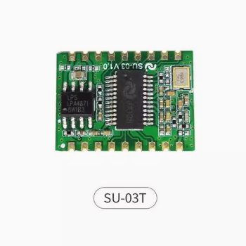

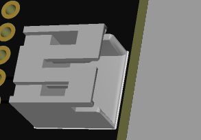

**2. 麦克风选型**

- **类型要求**：必须使用驻极体电容麦克风
- **供电需求**：模块提供偏置电压
- **接口规格**：2.0mm排针连接
- **灵敏度**：推荐-38dB至-42dB

**3. 接口说明**

- 喇叭接口为PH2.0mm白色塑料母座
- 麦克风为2.0mm排针，红正黑负
- 推荐购买配套线材或转接头

**4. 设计建议**

- 参考官方规格书进行PCB设计
- 注意音频信号的走线屏蔽
- 预留调试测试点

**注意事项：**

- 不支持3.5mm等通用音频接口
- 喇叭功率过小可能导致音量不足
- 麦克风类型错误会影响识别效果
- 淘宝购买的通用喇叭和咪头可能存在兼容性问题，建议按规格要求选购
- **无法检测外设连接状态**：模块不具备检测麦克风或扬声器是否连接的功能。咪头未连接时无法进行语音识别，扬声器未连接时模块仍可正常识别和通过串口通信，只是无法播报声音。如需实现防盗检测（检测外设是否被拆除），需要通过外部电路设计实现

---

### SU-03T模块是否兼容淘宝购买的通用喇叭和咪头？

**问题描述：**

在淘宝购买通用喇叭和咪头用于SU-03T模块时，是否存在兼容性问题。

**解决方案：**

**兼容性分析**

SU-03T模块对音频组件有明确的技术规格要求，淘宝购买的通用配件需要满足以下条件才能兼容：

**喇叭兼容性要求：**

- 阻抗：必须为8欧姆（4欧姆不兼容）
- 功率：推荐1-3W，最佳2W
- 接口：需要PH2.0mm连接座或自行改装

**咪头兼容性要求：**

- 类型：必须为驻极体电容麦克风
- 灵敏度：推荐-38dB至-42dB
- 供电：需要模块提供偏置电压
- 接口：需要2.0mm排针或转接线

**选购建议：**

1. 优先选择标注明确参数的喇叭和咪头
2. 避免购买仅标注"通用"而无具体规格的产品
3. 建议购买提供技术参数的商家产品
4. 可考虑购买官方配套线材以简化连接

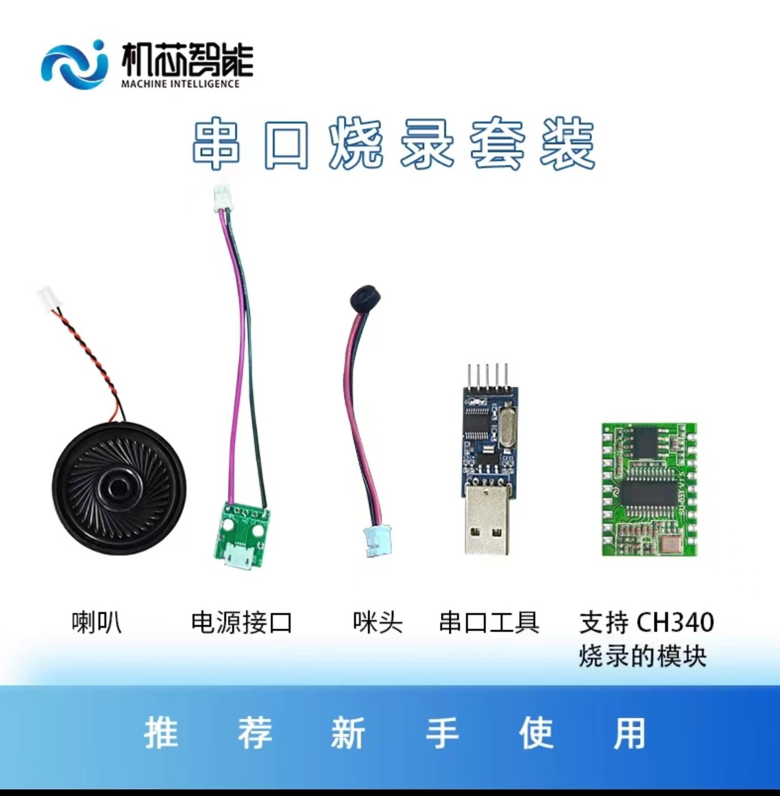

*SU-03T串口烧录套装包含模块、喇叭、咪头等配套组件*

**注意事项：**

- 淘宝通用配件质量参差不齐，建议先购买样品测试
- 不符合规格的配件可能导致音量小、识别率低等问题
- 如需稳定性能，建议使用官方推荐的配件规格

---

### SU-03T模块是否支持AEC（回声消除）功能？

**问题描述：**

需要确认SU-03T模块是否支持AEC（声学回声消除）功能。

**解决方案：**

SU-03T模块不支持AEC（回声消除）功能。

**功能说明：**

- AEC（Acoustic Echo Cancellation）是用于消除扬声器播放声音与麦克风拾音之间的回声的技术
- SU-03T模块设计中未包含AEC硬件或软件处理功能
- 如需回声消除功能，建议选择其他支持AEC的模块型号

**注意事项：**

- SU-03T适用于不需要回声消除的应用场景
- 在嘈杂环境或需要全双工通信的应用中，应考虑选择支持AEC的模块
- 设计产品时需根据实际需求选择合适的语音模块

---

### SU-03T模块是否可以同时使用两个串口？

**问题描述：**

需要了解SU-03T模块是否支持双串口同时工作，以及为什么设置串口1时串口2会自动变回IO口。

**解决方案：**

SU-03T模块仅支持一个UART外设（UART1），不能同时使用两个独立的串口。

**硬件限制说明：**

- SU-03T芯片只有一个UART1外设
- 串口功能复用到一组引脚上
- 不能同时配置两个独立的串口

**引脚配置说明：**

- UART1功能可以在不同引脚组之间切换
- 配置UART1时，其他引脚自动恢复为GPIO功能
- 这是芯片硬件设计的限制

**注意事项：**

- 如需多个串口通信，考虑使用其他型号（如CI-33T）
- 或通过GPIO模拟串口通信（速度较慢）
- 或使用外部串口扩展芯片

---

## 供电设计

### SU-03T模块的供电电路设计建议

**问题描述：**

需要为SU-03T模块设计合适的供电电路，确保稳定工作。

**解决方案：**

**1. 基本供电方案**

- **输入电压**：5V（常见）
- **稳压方案**：LDO或DCDC转换
- **输出电压**：3.3-5.5V
- **输出电流**：≥100mA（建议200mA以上）

**2. 推荐稳压芯片**

- **LM1117系列**：3.3V LDO，输出电流800mA
- **AMS1117系列**：3.3V LDO，低噪声
- **RT9013系列**：3.3V LDO，高PSRR

**3. 滤波电路设计**

- **输入电容**：10-22μF（电解电容）
- **输出电容**：10-47μF（电解电容）
- **去耦电容**：0.1μF（陶瓷电容）靠近模块

**4. 保护电路**

- **TVS二极管**：防止反向电压
- **保险丝**：500mA（过流保护）
- **瞬态电压抑制器**：TVS阵列或专用器件

**注意事项：**

- 电源走线尽量短而粗
- 模拟地和数字地单点接地
- 避免电源线与信号线平行走线
- 测量电源纹波：<50mVpp

### SU-03T使用7805稳压器发热严重怎么办？

**问题描述：**

使用7805等LDO稳压器为SU-03T供电时，发热严重，且在播放语音时出现供电不足的问题。

**解决方案：**

**1. 问题原因分析**

- 7805等线性稳压器效率低，压差大时发热严重
- 24V输入时，即使100mA电流，功耗可达(24-5)V×0.1A=1.9W
- 电流超过500mA时，7805发热量过大，无法正常工作

**2. 推荐供电方案**

- **DC-DC降压模块**（推荐）
    - 效率高（通常>90%）
    - 发热小
    - 支持2A输出电流
    - 如：K7805-500R等模块

- **专用开关稳压芯片**
    - 平芯微等品牌的降压芯片
    - 性价比高
    - 带电感的电路设计

**3. LDO使用限制**

- 适合小电流应用（<500mA）
- 输入输出压差较小时使用
- 仅适合给芯片本身供电，不宜驱动大负载

**注意事项：**

- 12V输入时，7805在100mA电流下温度可达60多度
- 选择电源方案时要考虑最大电流需求
- 建议预留足够的电源余量（至少2A）

### A28引脚可以用作输出引脚吗？

**问题描述：**

希望将A28引脚设置为输出引脚使用。

**解决方案：**

不建议使用A28作为输出引脚，原因如下：

**引脚功能说明：**

- A28在标准示例开发板上被设计为PA芯片使能控制脚
- 该引脚与音频播报功能相关
- 使用A28作为输出会影响喇叭播报功能

**替代方案：**

1. **使用其他GPIO引脚**
    - 选择可用的GPIO引脚作为输出
    - 避免使用A28和A27（PA相关引脚）

2. **引脚复用策略**
    - 添加"附加条件"
    - 利用变量实现引脚复用
    - 在不同条件下切换引脚功能

3. **控制逻辑示例**
    - 触发方式：GPIO输入（如B6/B7低电平）
    - 操作：设置其他GPIO（如A27）输出
    - 避免使用A28

**注意事项：**

- A28引脚不可修改为普通输出
- 硬件设计已固定该引脚功能
- 强制使用会导致音频播报异常

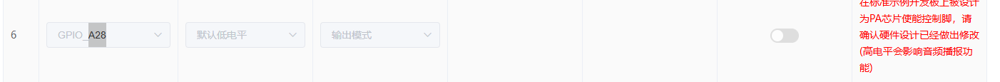

*A28引脚在标准示例开发板上被设计为PA芯片使能控制脚*

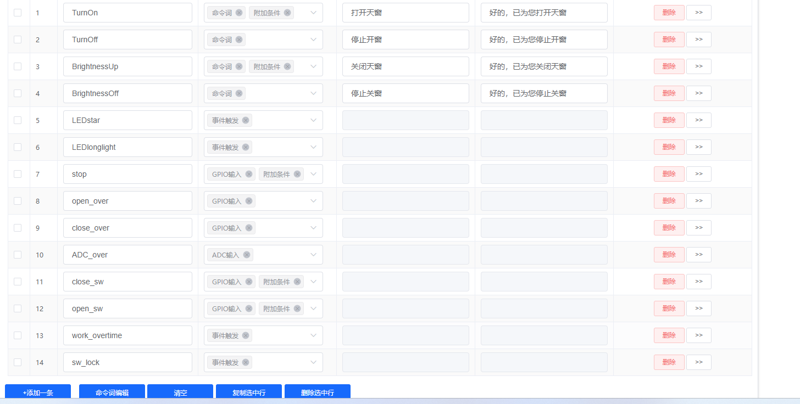

*指令配置界面示例*

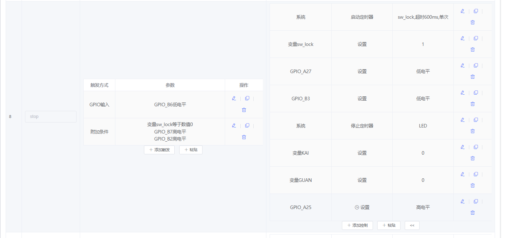

*GPIO_B6低电平触发，设置GPIO_A27为低电平*

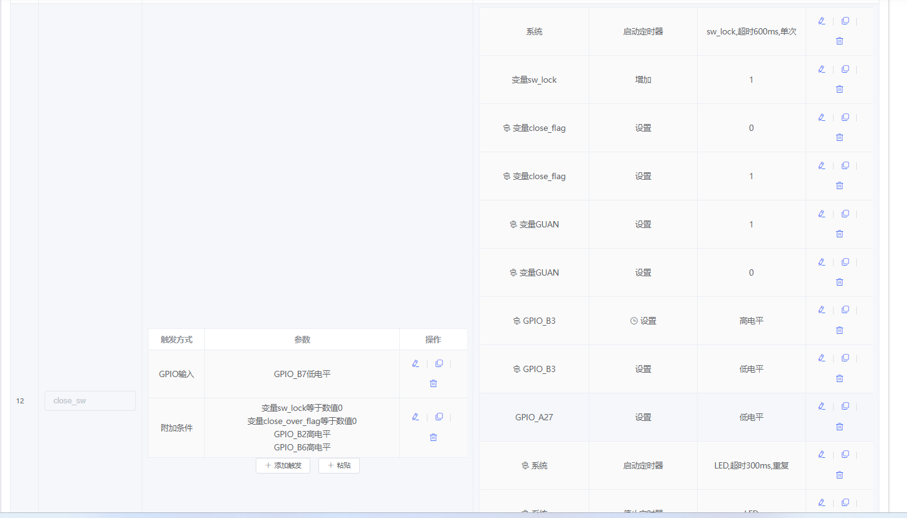

*GPIO_B7低电平触发，设置GPIO_A27为低电平*

---

### SU-03T模块的DGND和AGND应该如何连接？

**问题描述：**

询问SU-03T模块的数字地（DGND）和模拟地（AGND）的连接方式，是否可以将它们直接接在一起。

**解决方案：**

在混合信号电路中，正确处理DGND和AGND的连接对于保证信号完整性、减少噪声干扰至关重要。

**连接原则：**

- DGND和AGND在系统中应保持电气隔离，但在最终系统中需要连接以形成统一的参考地
- 通常建议采用单点接地方式，避免地环路引入噪声

**推荐连接方法：**

1. **AGND通过0Ω电阻连接至GND**：

    - 在AGND引脚与系统GND之间串联一个0Ω电阻（即跳线电阻）
    - 这种方式可以实现AGND与GND的连接，同时保留后续修改或测试的灵活性
    - 0Ω电阻的作用是提供一个可选的连接点，便于调试和故障排查

2. **DGND直接连接至系统GND**：

    - 数字地（DGND）直接连接到系统的公共地（GND）

**连接示意图：**

```
SU-03T模块

AGND ──[0Ω电阻]── GND (系统地)
DGND ─────────────── GND (系统地)
```

**注意事项：**

- 避免多点接地：DGND和AGND不应在多个点连接，否则可能形成地环路，引入噪声
- 0Ω电阻的作用：使用0Ω电阻可以方便后续测试，例如在需要隔离AGND时，可以轻松断开连接
- 信号完整性：确保连接线尽量短，减少引线电感对高频信号的影响

---

### SU-03T的ADC按键可以使用外部3.3V电源吗？

**问题描述：**

需要为SU-03T的ADC按键电路供电，询问是否可以使用外部5V转3.3V的电源模块，而不是使用芯片内置的3.3V电源。

**解决方案：**

可以使用外部3.3V电源为ADC按键供电。

**供电方案：**

1. **外部电源可行性**
    - 可以使用独立的5V转3.3V电源模块
    - 与芯片内置3.3V电源隔离使用
    - 保证供电稳定性

2. **ADC按键电路设计**
    - 上拉电阻：10kΩ连接到3.3V
    - 下拉电阻：1.8kΩ通过开关连接到GND
    - 按键按下时触发低电平

3. **电源选择建议**
    - 输出电压：3.3V ±5%
    - 输出电流：≥50mA
    - 纹波：<50mV
    - 推荐使用LDO或DCDC模块

**注意事项：**

- 外部电源与模块共地
- 确保电源稳定性和纹波要求
- 避免使用开关电源的噪声干扰ADC采样

### SU-03T模块直接连接LED时的输出电压和限流电阻计算

**问题描述：**

需要了解SU-03T模块IO口的输出电压，以及如何正确连接LED并计算限流电阻值。

**解决方案：**

**1. 模块输出电压**

SU-03T模块的IO口输出电压为3.3V，这是由芯片内部LDO稳压器提供的。该电压适用于大多数标准LED的驱动需求。

**2. LED连接注意事项**

- **LED压降**：需确认所用LED的正向压降（通常为1.8V-3.3V），确保其与3.3V输出电压匹配。
- **限流电阻**：必须串联限流电阻以防止LED过流损坏。建议根据LED工作电流（通常为10-20mA）和供电电压计算电阻值，公式为：

    ```
    R = (Vcc - Vf) / If
    ```

    其中：

    - Vcc = 3.3V
    - Vf = LED正向压降
    - If = LED工作电流

    例如，对于Vf=2.0V、If=15mA的LED：

    ```
    R = (3.3 - 2.0) / 0.015 = 86.7Ω
    ```

    可选用标准值82Ω或100Ω。

**3. 模块负载能力**

- SU-03T模块的IO口最大输出电流通常为15-20mA，单个IO口驱动能力有限。
- 若需驱动多个LED或高亮度LED，建议使用晶体管或MOSFET进行电流放大。

**4. 参考资料**

- 开发包中包含SU-03T模块的规格书，详细说明了电气特性、IO口参数和推荐应用电路。

**注意事项：**

- 请勿直接将LED连接到3.3V电源而不加限流电阻，否则可能导致LED烧毁。
- 验证LED的电气参数（压降、电流）与模块输出能力匹配。
- 若使用高亮度LED或多个LED，建议使用外部驱动电路。

---

### SU-03T的IO口如何正确驱动LED？

**问题描述：**

需要了解如何使用SU-03T的IO口驱动LED，以及高电平驱动和低电平驱动的区别和注意事项。

**解决方案：**

**驱动方式对比：**

1. **高电平驱动（推荐）**
    - LED负极接地
    - IO输出高电平时LED点亮
    - 优点：方便、直观
    - 缺点：系统上电时LED可能闪亮一下

2. **低电平驱动**
    - LED正极接3.3V（注意：不能接5V）
    - IO输出低电平时LED点亮
    - 优点：上电时不会闪亮
    - 缺点：两侧都为3.3V时LED不亮

**电源带载能力：**

- SU-03T的3.3V可驱动多个LED
- 驱动普通LED（20mA以内）没有问题
- 需要考虑总电流不超过模块带载能力

**注意事项：**

- LED正极绝对不能接5V，会损坏模块
- 高电平驱动时注意上电瞬间的闪亮
- 低电平驱动时确保IO能可靠拉低
- 建议根据实际应用场景选择合适的驱动方式

---

## 接口设计

### SU-03T的UART串口通信距离限制是多少？

**问题描述：**

需要了解SU-03T模块的UART通信可靠传输距离，以便进行PCB布局设计。

**解决方案：**

**1. 理论传输距离**

- **RS-232标准**：15米（@9600bps）
- **RS-485标准**：1200米（@9600bps）
- **TTL电平**：建议控制在20-30厘米内

**2. 影响因素**

- 波特率越高，传输距离越短
- 线缆质量：使用屏蔽双绞线
- 環境干扰：远离强电磁干扰源
- 终端匹配：保证阻抗匹配（120Ω）

**3. 实际应用建议**

- 板级通信：10-20cm
- 机箱内通信：30-50cm
- 长距离通信：使用RS-485或加装收发器

**4. 提升方法**

- 降低通信波特率（如115200bps降至9600bps）
- 使用差分传输（如RS-485）
- 增加信号调理电路
- 使用高质量连接器和线缆

**注意事项：**

- 超过建议距离可能导致通信不稳定
- 长距离通信需要额外硬件支持
- 高速通信时建议进行信号完整性测试

---

### SU-03T如何配置GPIO输入检测？

**问题描述：**

需要配置GPIO引脚（如A25）检测外部电平信号，当检测到高电平或低电平时触发相应动作。

**解决方案：**

**1. 配置GPIO为输入模式**

    - 进入Pin脚配置界面
    - 选择目标GPIO（如A25）
    - 配置为输入模式

**2. 设置触发条件**

    - 默认高电平：芯片内部自动上拉
    - 检测低电平：当检测到低电平信号输入时触发动作
    - 无法检测高电平：芯片无内部下拉电阻

**3. 配置触发动作**

    - 添加控制项，设置触发方式为"GPIO输入"
    - 选择对应的GPIO引脚
    - 设置电平条件（高电平/低电平）
    - 配置执行动作（如设置其他GPIO、播放语音等）

**注意事项：**

- 芯片只支持内部上拉，不支持内部下拉
- 默认高电平配置只能检测低电平输入
- 如需同时检测高、低电平，需要手工修改代码
- 外部输入低电平时，确保可靠接地（<0.8V）
- 测试时可用VCC和GND验证功能

---

### 如何通过高低电平信号控制智能开关？

**问题描述：**

需要使用高低电平信号去控制智能开关的开关动作。

**解决方案：**

**实现原理：**

将某个IO口配置成输入模式，当检测到特定的电平变化时，触发对应的控制动作。

**配置方法：**

1. **GPIO输入配置**
    - 选择目标GPIO（如A27）
    - 配置为输入模式
    - 设置默认高电平（内部上拉）

2. **触发条件设置**
    - 检测低电平输入时触发动作
    - 当开关按下拉低电平时执行
    - 可配置多个控制动作

3. **参考配置**
    - 导入"按键延时__demo_2.json"配置文件
    - 学习配置逻辑
    - 根据实际需求修改

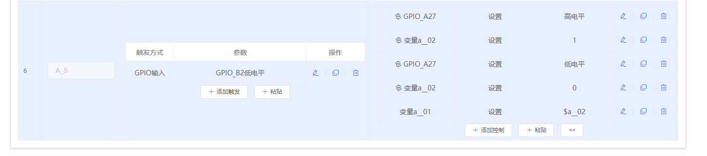

*GPIO_A27配置为输入模式，检测低电平触发*

**应用场景：**

- 物理按键控制
- 外部设备信号触发
- 继电器状态检测
- 开关量信号输入

**注意事项：**

- 默认高电平配置只能检测低电平输入
- 确保外部开关能可靠拉低电平
- 可根据需要调整触发动作和控制逻辑

---

### 为什么GPIO输入配置后触发条件不生效？

**问题描述：**

将GPIO（如B8）配置为输入模式后，设置"GPIO_B8高电平"作为触发条件，但发现即使外部已经输入高电平，触发条件仍然不生效。

**原因分析：**

这是一个常见的配置误区。触发条件中的"GPIO_B8高电平"是指B8作为**输出**时的电平状态判断，而不是检测**外部输入**的电平。

**正确配置方法：**

**1. 检测外部输入信号（正确方式）**

- 在Pin脚配置中，将GPIO配置为**输入模式**
- 在触发条件中，选择触发方式为**"GPIO输入"**（而非直接选择GPIO_B8高电平）
- 然后选择对应的GPIO引脚作为触发源

**2. 判断自身输出电平（误用场景）**

- 如果触发条件选择的是"GPIO_B8高电平"
- 这是用来判断模块**自身输出**到B8引脚的电平状态
- 当B8被配置为输入模式时，这个条件就失效了

**配置对比：**

| 场景 | Pin脚配置 | 触发条件选择 |
|------|-----------|-------------|
| 检测外部输入 | 输入模式 | GPIO输入 → 选择对应引脚 |
| 判断自身输出 | 输出模式 | GPIO_B8高电平（或低电平） |


*B8配置为输入模式后，不能使用"GPIO_B8高电平"作为触发条件*


*GPIO_B8配置为输入模式，默认低电平*

**参考教程：**

- [SU-03T IO输入输出教程](https://www.bilibili.com/video/BV19K411B7ib/)

**注意事项：**

- 区分"GPIO输出电平判断"和"GPIO输入触发"两种不同的配置方式
- 检测外部信号时必须使用"GPIO输入"触发方式
- 建议先学习官方教程了解配置逻辑


### 如何实现根据设备开关状态播报不同内容？

**问题描述：**

希望在开机状态下喊"开机"时回复"机器开着呢"，在关机状态下喊"关机"时回复"机器关着呢"。主控MCU通过GPIO引脚输出高/低电平表示开关机状态。

**方案说明：**

这个逻辑应该由**主控MCU来判断**，而不是语音模块。语音模块只负责执行语音播报。

**硬件连接：**

- 主控MCU → GPIO_B8（或其它可用GPIO）
- 开机状态：主控输出高电平
- 关机状态：主控输出低电平

**配置步骤：**

**1. 配置GPIO输入检测**

- 在Pin脚配置中，将GPIO（如B8）配置为**输入模式**
- 默认电平根据实际硬件设置（如低电平）

**2. 创建两个GPIO输入触发命令**

| 触发方式 | GPIO引脚 | 播报内容 |
|---------|---------|---------|
| GPIO输入 | GPIO_B8高电平 | "机器开着呢" |
| GPIO输入 | GPIO_B8低电平 | "机器关着呢" |

**3. 注意事项**

- **状态判断由主控完成**：主控根据设备实际状态控制GPIO输出，语音模块只负责播报
- **电平匹配**：确保主控输出的高/低电平与语音模块GPIO输入的默认配置一致
- **无需语音命令词**：GPIO输入触发的播报不需要配置唤醒词或命令词，直接通过电平变化触发

**替代方案（串口通信）：**

如果主控与语音模块之间已有串口通信，也可以通过串口命令控制播报：

- 主控检测到开机状态 → 发送串口命令 → 模块播报"机器开着呢"
- 主控检测到关机状态 → 发送串口命令 → 模块播报"机器关着呢"


### SU-03T引脚输出电压是多少？

**问题描述：**

在5V供电情况下，SU-03T芯片的引脚输出电压是多少，以及能否直接用其3.3V信号驱动5V继电器模块。

**解决方案：**

**1. 引脚输出电压**

- SU-03T内部有LDO（低压差线性稳压器）
- 即使5V供电，引脚输出电压仍为3.3V
- 这是芯片的设计特性，与外部供电电压无关

**2. 驱动5V继电器方案**

- 不能直接用3.3V信号驱动5V继电器模块
- 需要添加三极管进行电平转换和驱动放大

**3. 电平转换电路**

- 使用NPN三极管（如S8050、2N2222）
- 基极通过1-10kΩ电阻连接SU-03T输出
- 集电极连接继电器模块控制端
- 发射极接地

**注意事项：**

- 3.3V信号可能不足以可靠触发5V继电器
- 使用三极管可实现信号隔离和电平匹配
- 继电器线圈两端需并联续流二极管保护三极管

---

### SU-03T的3.3V信号能否直接驱动5V继电器？

**问题描述：**

询问是否可以用SU-03T的3.3V输出信号直接连接5V继电器模块的信号引脚来驱动继电器。

**解决方案：**

不建议直接连接，原因和解决方案如下：

**1. 电平不匹配问题**

- SU-03T输出高电平为3.3V
- 5V继电器模块通常需要3.5V以上触发电压
- 3.3V可能无法可靠触发继电器

**2. 推荐解决方案**

- 添加NPN三极管做驱动电路
- 实现3.3V到5V的电平转换
- 同时提供足够的驱动电流

**3. 具体电路设计**

```
SU-03T GPIO → 1-10kΩ电阻 → 三极管基极
                                三极管发射极 → GND
                                三极管集电极 → 5V继电器控制端
                                继电器VCC → 5V
```

**注意事项：**

- 三极管选择通用NPN型即可（如S8050）
- 基极电阻限流保护SU-03T GPIO
- 继电器线圈并联续流二极管防止反向电动势

---

### 如何使用GPIO输出高低高电平脉冲模拟按键？

**问题描述：**

需要使用GPIO_A0引脚输出高低高电平的脉冲信号，以模拟点触型按键的按下动作，并最终保持高电平状态。

**解决方案：**

1. **使用光耦继电器隔离**：

    - 不能直接将GPIO连接到按键电路
    - 推荐使用光耦继电器（如CPC1006N）
    - 实现电气隔离和可靠模拟

2. **光耦继电器接线方式**：

    - 两个引脚接语音模块的GPIO_A0
    - 两个引脚接按键两端
    - 可以完全模拟手动按键动作

3. **GPIO脉冲配置方法**：

    - 方法一：使用"延时电平翻转"功能
        - 设置GPIO_A0为高电平
        - 启用延时翻转，延时1000ms
        - 可实现高→低→高的脉冲

    - 方法二：使用定时器控制
        - 设置定时器延时后自动恢复高电平
        - 更灵活可控

4. **具体实现步骤**：

    - 在控制逻辑中添加行为
    - 设置为"端口输出"→GPIO_A0
    - 动作：设置电平→高电平
    - 根据需要配置延时或定时器

**注意事项：**

- 点触型按键需要短暂的闭合信号
- 直接连接可能损坏语音模块
- 光耦继电器能提供可靠的电气隔离
- 脉冲宽度根据实际按键需求调整（通常100-500ms）

---

### SU-03T1的功放是否支持8欧姆2W以上的喇叭？

**问题描述：**

需要确认SU-03T1模块的功放是否能够支持8欧姆2W以上的喇叭，以及如何计算合适的功率配置。

**解决方案：**

**功放规格分析：**

1. **SU-03T1功放参数**：

    - 输出功率：2.4W（标称值）
    - 推荐负载：8欧姆喇叭
    - 输出配置：固定增益，不可调
    - 输出类型：单端音频输出

2. **功率匹配计算**：

    ```
    P = V² / R
    其中：
    P = 功率（W）
    V = 电压（V）
    R = 阻抗（Ω）
    ```

3. **实际输出能力**：

    - 8欧姆负载：约2.4W输出
    - 4欧姆负载：约3.5W输出（超规格）
    - 16欧姆负载：约1.8W输出

**喇叭支持情况：**

1. **8欧姆2W喇叭**：

    - ✅ 完全兼容，推荐配置
    - 音量适中，音质良好
    - 功放工作在安全范围内

2. **4欧姆2W喇叭**：

    - ⚠️ 阻抗过低，可能过载
    - 长期使用可能损坏功放
    - 不建议用于此型号

3. **8欧姆3W以上喇叭**：

    - ❌ 功率过大，不支持
    - 可能触发保护机制
    - 有损坏模块风险

**配置建议：**

1. **优先选择**：

    - 8欧姆2W：最佳匹配
    - 8欧姆1.5W-2W：安全范围
    - 避免4欧姆及以下低阻抗

2. **音量控制**：

    - 通过软件音量控制
    - 避免长期最大音量输出
    - 保护功放和喇叭

3. **保护措施**：

    - 添加限流保护电路
    - 监控功放温度
    - 设置合理的音量上限

**测试验证：**

1. **功率测试**：

    - 测量不同音量下的工作电流
    - 确认无削波失真
    - 验证热稳定性

2. **音质测试**：

    - 在不同音量下测试音质
    - 检查是否有异常噪声
    - 确认频率响应正常

**注意事项：**

- SU-03T1功放为固定增益设计
- 超规格使用可能永久损坏
- 建议留有20%以上的功率余量
- 长期大功率使用需要额外散热

---

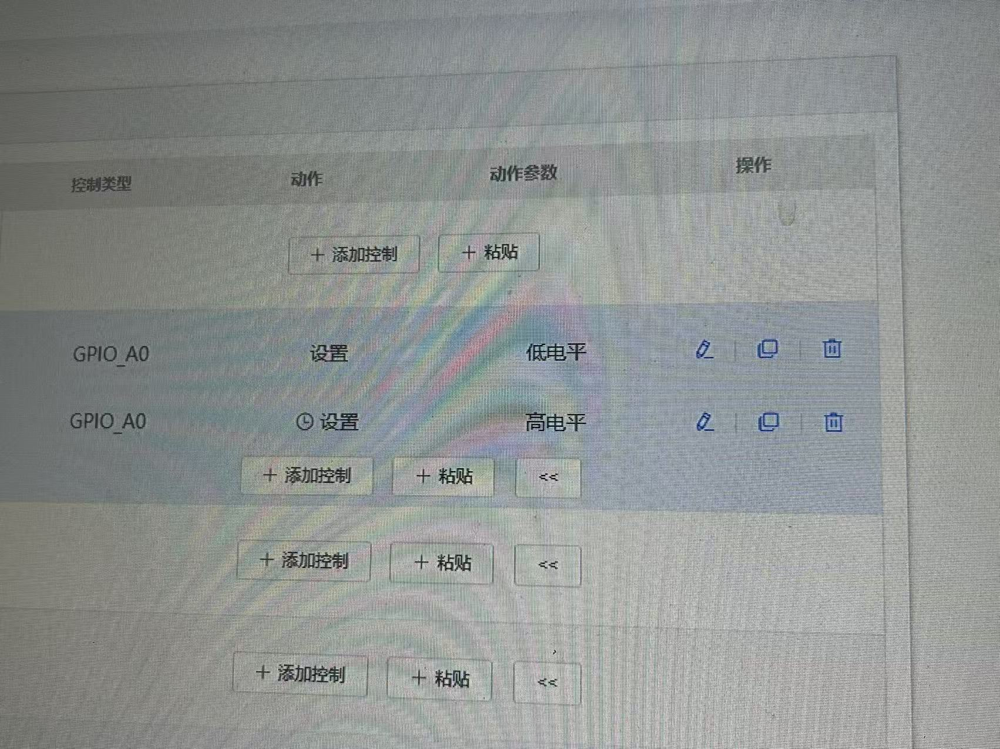


---

### 如何设计SU-03T的220V供电电源模块？

**问题描述：**

需要设计集成220V转5V的电源模块，用于SU-03T供电，希望在PCB设计中了解注意事项。

**解决方案：**

1. **电源方案选择**
    - 方案一：使用现成的AC-DC模块（推荐）
    - 方案二：自行设计开关电源电路
    - 方案三：使用线性电源（简单但效率低）

2. **现成模块方案**
    - 采购认证的AC-DC模块（如BARY品牌）
    - 输入220V AC，输出5V DC
    - 选择有CE、RoHS认证的产品

3. **自行设计注意事项**
    - 需要添加EMI滤波电路
    - 必须包含过压、过流保护
    - 考虑安规认证要求
    - PCB布局需符合安全规范

4. **PCB设计要点**
    - 高低压区域严格隔离
    - 留足爬电距离和电气间隙
    - 使用合适的铜箔厚度
    - 考虑散热设计

**推荐方案：**

- 自用开发建议购买现成模块
- 批量生产可考虑定制方案
- 必须满足安全规范要求

**注意事项：**

- 220V电路设计有安全风险
- 简易方案缺少保护机制
- 长期通电建议使用成熟方案
- 商用产品需要通过安规认证

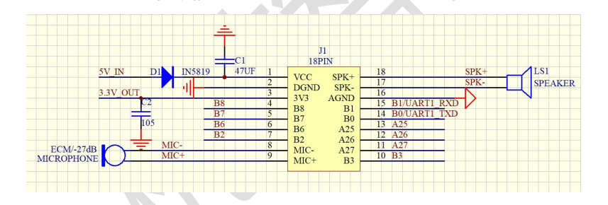

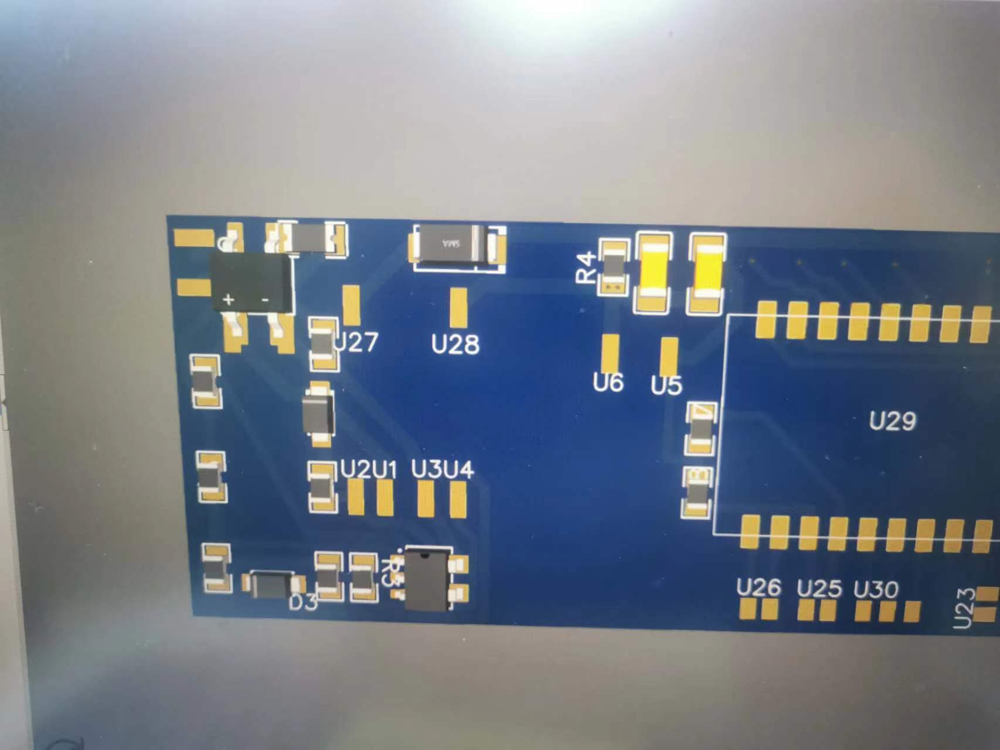

---

## 接口资源

### SU-03T1模块有哪些可用接口资源？

**问题描述：**

需要了解SU-03T1模块提供的IO口、串口、特殊接口等资源，以便进行产品设计和开发。

**解决方案：**

**1. GPIO接口资源**

- **GPIO数量**：提供多个可配置GPIO口
- **常用GPIO**：

    - A组：A0-A25（模拟输入/数字IO）
    - B组：B0-B8（数字IO/特殊功能）
    - 特殊GPIO：部分引脚有复用功能

- **GPIO功能配置**：

    - 输入模式：数字输入、模拟输入
    - 输出模式：推挽输出、开漏输出
    - 特殊功能：PWM、UART、I2C等

**2. 串口通信接口**

- **UART1**：主要通信接口
    - TX：B6引脚（可复用）
    - RX：B7引脚（可复用）
    - 支持标准波特率（9600-115200）

- **UART2**：辅助串口
    - 部分GPIO可配置为第二串口
    - 适合多设备通信

**3. 特殊功能接口**

- **I2C接口**：

    - SCL、SDA引脚可配置
    - 支持连接外部设备

- **PWM输出**：

    - 多个GPIO支持PWM功能
    - 可用于调光、调速等

- **ADC输入**：

    - 部分GPIO支持模拟输入
    - 用于电压检测等

**4. 音频接口**

- **麦克风输入**：

    - 标准咪头接口
    - 支持2.0mm间距

- **音频输出**：

    - 内置功放输出
    - 支持8Ω 2W喇叭

**5. 电源接口**

- **供电范围**：3.3-5.5V
- **工作电流**：≥100mA
- **功耗**：待机约XXmA，工作约XXmA

**接口配置建议：**

1. **规划接口使用**
    - 列出所需功能
    - 分配对应GPIO
    - 避免功能冲突

2. **引脚选择原则**
    - 优先选择专用功能引脚
    - 保留常用GPIO备用
    - 注意特殊引脚限制

3. **扩展应用**
    - 通过I2C扩展更多IO
    - 使用GPIO扩展芯片
    - 配合MCU实现复杂功能

**注意事项：**

- 部分GPIO有上电初始化状态
- B6/B7默认为串口功能
- 除烧录口和串口外，其他引脚都可以配置为IO输入
- 配置前查看引脚复用说明
- 保留足够的GPIO余量

---

### SU-03T转接板如何为多个继电器供电？

**问题描述：**

SU-03T转接板需要连接多个继电器，询问5V和GND引脚是否可以同时为多个继电器供电，是否需要外接独立电源。

**解决方案：**

1. **供电能力评估**
    - SU-03T转接板通过USB供电时提供5V电源
    - 5V和GND引脚可以同时为多个继电器供电
    - 需计算总电流消耗是否在供电范围内

2. **连接方式**
    - 将多个继电器的VCC并联到转接板的5V引脚
    - 将所有继电器的GND连接到转接板的GND引脚
    - 每个继电器的控制端独立连接到不同的GPIO

3. **电源建议**
    - 如果继电器数量较多（超过3-4个），建议外接独立5V电源
    - 单个继电器工作电流约50-70mA，需计算总电流
    - 确保供电容量充足，避免电压不稳


*转接板的5V和GND引脚可用于为继电器供电*

**注意事项：**

- 转接板供电能力有限，过多继电器可能导致电压下降
- 继电器线圈需并联续流二极管保护电路
- 如驱动大功率继电器，建议使用独立电源
- 测试时注意观察继电器动作是否正常

---

### SU-03T可以接3.3V供电的硅麦吗？

**问题描述：**

需要确认SU-03T是否支持连接3.3V供电的硅麦克风，以及如何正确选型和接线。

**解决方案：**

**1. 咪头选型推荐**

- **推荐型号**：机芯智能定制咪头6027
- 规格参数：

    - 直径：6MM
    - 高度：2.7MM
    - 电流：0.5mA
    - 灵敏度：-27dB
    - 信噪比：75dB
    - 接口：2.0端子+双绞线60mm

**2. 选型要求**

- 灵敏度范围：-32dB到-25dB
- 信噪比：70以上
- 电流范围：0.1mA到0.5mA
- 供电电压：支持3.3V

**3. 接线注意事项**

- 咪头线设计尽量短，不建议超过100mm
- 必须按照正确极性接线（模块为单端结构）
- 如需延长引线，使用双绞线或屏蔽线
- 咪头极性反接会导致灵敏度下降或不识别

**4. 常见问题处理**

- **咪头并联**：电流减小影响拾音性能，不建议使用
- **电源问题**：供电不足或不稳会造成识别失灵
- **外壳影响**：避免将咪头放在密闭空间
- **防水膜**：如需覆盖，选择质量好的防水膜

**5. 供电说明**

- SU-03T可支持3.3V供电的硅麦
- 硅麦相比传统咪头有更好的稳定性
- 选型时要关注厂家实力和产品一致性

**注意事项：**

- 国内市场咪头质量参差不齐，规格书可能与实物不符
- 建议采购样品实测后再批量使用
- 具体选型应根据实际使用场景和环境测试确定

---

### SU-03T正常工作时严重发热是正常现象吗？

**问题描述：**

SU-03T芯片在正常使用过程中严重发热，感觉供电电流被大量消耗，询问是否正常。

**解决方案：**

**1. 发热现象分析**

- SU-03T在正常工作时会有一定发热
- 发热严重可能是工作电流过大导致
- 需要区分正常发热和异常发热

**2. 正常工作参数**

- 工作电压：3.3V-5V
- 工作电流：根据负载不同而变化
- 语音识别时：约100-200mA
- 播放音频时：电流会增加
- 发热温度：通常在40-60°C范围

**3. 异常发热排查**

- 检查供电电压是否过高（超过5.5V）
- 确认喇叭阻抗是否过低（短路风险）
- 查看是否有短路或虚焊
- 测量实际工作电流是否过大

**4. 散热建议**

- 保证良好的通风散热
- 避免在密闭环境中使用
- 如发热严重，可添加散热片
- 检查PCB布局是否合理

**注意事项：**

- 轻微发热属于正常现象
- 如果烫手无法触摸，说明存在异常
- 长时间大电流工作可能损坏模块
- 建议在规格参数范围内使用

---

### SU-03T模块过热并伴有烧焦气味怎么办？

**问题描述：**

SU-03T模块在使用过程中出现严重发热，并伴有烧焦气味，经检测发现模块在电路板上存在短路现象。

**解决方案：**

**1. 立即断电检查**

- **断开电源**：立即停止供电，防止进一步损坏
- **检查短路点**：使用万用表测量模块各引脚
- **重点检查**：VCC和GND之间、喇叭输出端

**2. 短路排查步骤**

- **独立测试模块**：

    - 将模块从电路板取下
    - 单独测试模块引脚间电阻
    - 确认模块本身是否短路

- **检查外部电路**：

    - 模块单独正常时，问题在外部电路
    - 检查PCB布线是否有短路
    - 查看焊接是否有多余焊锡

**3. 喇叭短路处理**

- **断开喇叭测试**：

    - 将喇叭连接线拔掉
    - 测量喇叭两端阻抗
    - 正常值应为4Ω或8Ω

- **喇叭短路确认**：

    - 阻抗接近0Ω表示喇叭短路
    - 更换短路喇叭后再测试
    - 喇叭短路会烧毁模块功放

**4. 常见短路原因**

- **焊锡桥接**：

    - 引脚间焊锡过多造成短路
    - 使用吸锡器清除多余焊锡
    - 放大镜检查焊接质量

- **PCB设计问题**：

    - 铜皮间距过近
    - 阻焊层开路
    - 需要重新设计PCB

- **元件损坏**：

    - 电容击穿短路
    - 其他元件故障导致短路
    - 逐个排查外围元件

**注意事项：**

- 模块过热通常伴随大电流，可能损坏电源
- 烧焦气味表示元件已损坏，需更换
- 发现短路后，不要反复通电测试
- 建议在电源端加限流保护电路

---

### SU-03T支持3.3V供电吗？串口电平是多少？

**问题描述：**

了解SU-03T模块的工作电压和串口电平，以便与不同电压的MCU进行通信。

**解决方案：**

**1. 供电电压**

- SU-03T模块工作电压为5V，不支持3.3V供电
- 5V供电是由芯片内部决定的，主要因为功放模块需求
- 模块内部有LDO（低压差线性稳压器），将5V转换为3.3V供数字电路使用

**2. 串口电平**

- SU-03T的串口电平为3.3V
- 可直接与3.3V的MCU通信，无需电平转换
- 如果MCU工作在5V，则需要添加电平转换电路

**注意事项：**

- 串口通信时注意电平匹配，避免损坏模块
- 选择电平转换芯片时注意转换速度和驱动能力
- 模块输入5V后，数字IO引脚都是3.3V电平

---

### SU-03T的GPIO输出延时正常吗？

**问题描述：**

SU-03T模块设置GPIO_A25为开机输出高电平，实测从上电到输出高电平有约2秒延时。

**解决方案：**

- 2秒延时偏长，正常情况下应该更快
- 检查以下方面：

    - 固件配置是否正确
    - 电源上电的初始化时间
    - GPIO配置是否有延时设置

**注意事项：**

- 如果延时过长，建议重新检查固件配置
- 电源稳定性也会影响初始化时间
- 可通过示波器实际测量GPIO输出波形

---

### SU-03T的最大输出功率是多少？

**问题描述：**

SU-03T模块在5V供电、连接8欧喇叭时的最大输出功率。

**解决方案：**

- **SU-03T最大输出功率**：2W
- **理论计算值**：P = U²/R = 5²/8 = 3.125W（理论最大值）
- **实际输出功率**：受模块功放电路限制，实际最大输出为2W

**注意事项：**

- 理论功率计算未考虑功放效率和损耗
- 实际应用中建议预留20%以上余量
- 长时间大功率输出可能影响模块稳定性
- 选择喇叭时注意功率匹配，避免过载

---

### SU-03T可以连接耳机播放音频吗？

**问题描述：**

询问SU-03T芯片是否支持连接耳机进行音频播放，以及如何实现耳机输出功能。

**解决方案：**

SU-03T支持连接耳机播放音频。

**实现方式：**

**1. 音频输出接口**

- SU-03T具有音频输出功能
- 可以通过相应的接口连接耳机
- 支持标准3.5mm耳机接口

**2. 连接方法**

- 找到模块的音频输出引脚
- 通过音频放大电路连接耳机接口
- 或使用音频解码芯片实现耳机驱动

**3. 应用场景**

- 语音提示的私密播放
- 调试时使用耳机监听
- 需要音频输出的应用

**注意事项：**

- 耳机阻抗需要匹配输出电路
- 可能需要添加音量控制电路
- 确保音频输出功率适合耳机
- 设计时考虑音频质量和抗干扰

### SU-03T不使用喇叭时的功耗是多少？100mA的LDO供电是否足够？

**问题描述：**

SU-03T模块在不使用喇叭功能、仅通过串口通信时的实际功耗情况，以及使用100mA电流的LDO供电是否可行。

**解决方案：**

**功耗分析：**

1. **基础功耗**
    - 数据手册标注平均功耗为60mA（包含典型使用场景）
    - 不使用喇叭时，功耗会进一步降低
    - 实际串口通信场景下功耗通常在40-50mA左右

2. **供电需求**
    - 100mA的LDO供电完全满足使用需求
    - 建议保留至少30%的余量，确保稳定性
    - 峰值功耗（如唤醒瞬间）可能达到70-80mA

**供电建议：**

1. **LDO选型**
    - 输出电流≥100mA
    - 输出电压3.3V（确认模块电压要求）
    - 选择低噪声、高PSRR的LDO

2. **电路设计**
    - 在LDO输入和输出端添加滤波电容
    - 推荐10μF钽电容+0.1μF陶瓷电容组合
    - 走线尽量短粗，减少压降

**注意事项：**

- 虽然平均功耗较低，但设计时要考虑峰值电流
- 不同批次模块的功耗可能有±10%的差异
- 如使用其他外设（如LED指示），需额外计算功耗
- 建议实际测量功耗来验证供电设计
- **不接喇叭不会损坏模块**：模块在唤醒、识别或播报时，即使没有连接喇叭也不会导致模块损坏，可以正常进行语音识别和串口通信

---

### 如何优化SU-03T的待机电流？

**问题描述：**

SU-03T模块当前待机电流约5mA，希望降低至更低水平以适用于电池供电的应用场景。

**解决方案：**

**1. 硬件优化方案**

- **选用低功耗麦克风**：使用低电流规格的麦克风
- **确保安静环境**：模块在安静环境下10-15秒自动进入休眠
- **正确连接麦克风**：麦克风必须连接，否则无法进入低功耗模式

**2. 实际测试数据**

- **带配套麦克风**：在安静环境下待机电流可低于1mA
- **去除麦克风**：待机电流约2.8mA（无法进入休眠）
- **休眠状态**：电流稳定在0.25-1mA之间

**3. 进一步优化建议**

- **环境要求**：保持相对安静，避免连续噪声干扰
- **定期重启**：可通过定时供电方式重启模块
- **硬件开关**：在不需要时彻底切断电源

**注意事项：**

- 麦克风规格直接影响待机电流
- 去除麦克风会导致模块无法进入休眠状态
- 低功耗咪头可联系客服定制（需起订量）
- 智能垃圾桶等应用建议选用SU-23T等低功耗型号

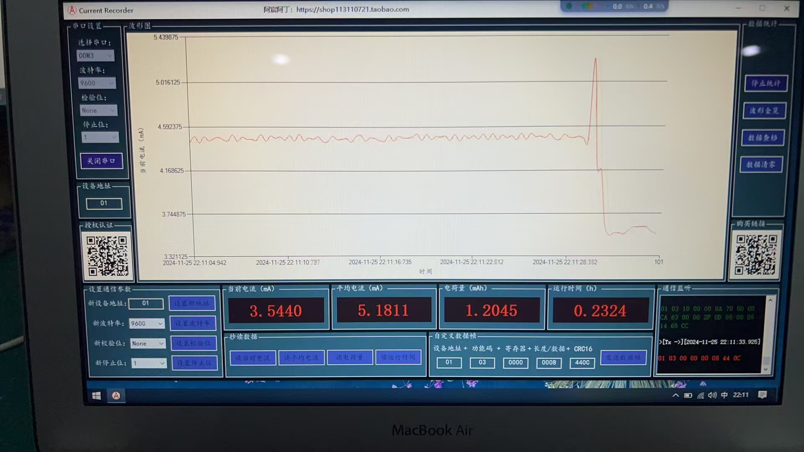

*待机电流测试波形，显示平均电流约5.18mA*

---

### SU-03T扩展版UART1引脚如何正确接线？

**问题描述：**

使用SU-03T扩展版时，需要了解如何正确连接UART1的TX和RX引脚，以及如何根据平台配置确定正确的接线方式。

**解决方案：**

根据平台配置中的引脚分配进行接线，TX接外部设备的RX，RX接外部设备的TX。

**接线步骤：**

1. **确认引脚配置**
    - 在平台配置中查看UART1_TX和UART1_RX对应的GPIO引脚
    - 例如：GPIO_B2配置为UART1_TX，GPIO_B3配置为UART1_RX

2. **正确连接线路**
    - 模块UART1_TX（如B2）→ 外部设备RX
    - 模块UART1_RX（如B3）→ 外部设备TX
    - 连接GND保证共地

3. **电源连接**
    - 5V和GND为供电线路
    - 3.3V如不使用可悬空
    - 确保供电电压在3.3-5.5V范围内

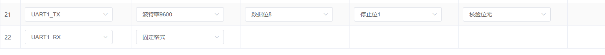

*UART1_TX和UART1_RX的配置参数*

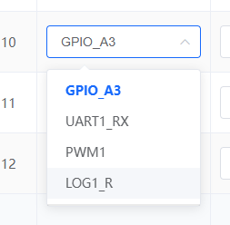

*GPIO引脚功能选择界面*

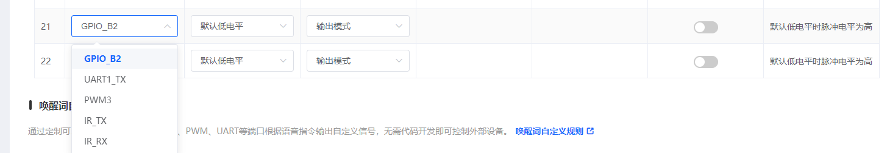

*B2引脚配置为UART1_TX，应接外部设备RX*

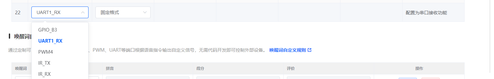

*B3引脚配置为UART1_RX，应接外部设备TX*

**注意事项：**

- 平台配置的引脚功能决定了实际接线方式
- TX（发送）必须连接到对方的RX（接收）
- RX（接收）必须连接到对方的TX（发送）
- 连接前务必确认共地

---

### 如何确认UART引脚配置与实际连接对应？

**问题描述：**

在使用扩展版时，对UART接口的引脚配置和接线方法存在困惑，特别是如何正确配置GPIO引脚为UART功能以及如何连接外部设备。

**解决方案：**

通过平台配置查看引脚功能，按照配置结果进行实际接线。

**操作步骤：**

1. **查看平台配置**
    - 进入Pin脚配置界面
    - 查看每个UART功能对应的GPIO引脚
    - 平台会显示具体引脚分配

2. **理解配置逻辑**
    - 平台怎么配置，实际就怎么接线
    - 芯片丝印仅供参考，以平台配置为准
    - 可以将任意可用GPIO配置为UART功能

3. **实际接线方法**
    - B2配置为UART1_TX → 接外部设备RX
    - B3配置为UART1_RX → 接外部设备TX
    - 如使用B0/B1作为UART，按相同方式连接

4. **电源连接**
    - 5V：主供电，必须连接
    - GND：公共地线，必须连接
    - 3.3V：如不需要可悬空

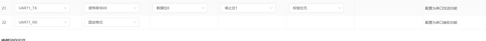

*UART1的波特率和数据格式配置*

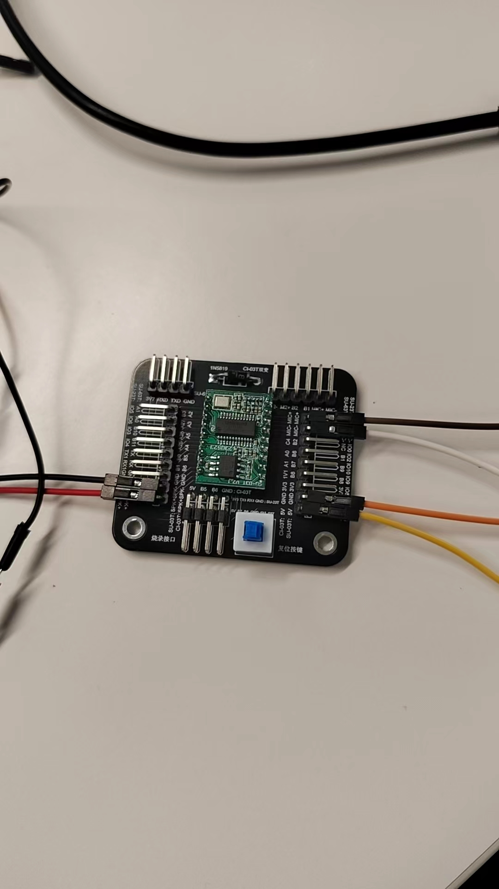

*CI-03T模块与扩展板的实际连接*

**注意事项：**

- 扩展板上的丝印只是默认标识
- 实际功能以平台配置为准
- 可以灵活选择不同的GPIO对作为UART使用
- 确保外部设备与模块共地

---

### UART串口接线时如何连接电源？

**问题描述：**

不清楚UART串口接线时的电源连接方式，特别是5V、3.3V和GND的接线方法。

**解决方案：**

根据实际需求连接必要的电源线，不需要使用的电源线可以悬空。

**电源连接说明：**

1. **必须连接的线路**
    - 5V：主电源，为模块供电
    - GND：公共地线，保证电平参考

2. **可选连接的线路**
    - 3.3V：如外部设备需要3.3V供电时连接
    - 不需要时可以悬空，不影响使用

3. **连接建议**
    - 使用USB转串口时，只需连接TX、RX、GND
    - 如需供电，再连接5V或3.3V
    - 避免同时连接5V和3.3V到同一设备

**注意事项：**

- 5V和3.3V不能同时给同一设备供电
- 确保所有设备共地
- 供电电压要在模块规格范围内（3.3-5.5V）

---

### 芯片丝印与实际配置不符怎么办？

**问题描述：**

芯片上标注的引脚功能（如B1/RX, B2/TX）与实际平台配置不符，不确定该如何处理。

**解决方案：**

以平台配置为准，芯片丝印仅为参考标识。

**说明：**

1. **引脚功能可配置**
    - GPIO引脚的功能可以通过平台配置
    - 不局限于芯片上的默认丝印标识
    - 可根据需求灵活分配功能

2. **配置优先原则**
    - 平台配置 > 芯片丝印
    - 实际接线按照配置结果进行
    - 支持自定义引脚功能分配

3. **示例说明**
    - 芯片标注B2/TX，但可配置为其他功能
    - 芯片标注B1/RX，但可用作普通GPIO
    - B0/B1也可配置为UART功能


*查看UART1_TX对应的GPIO引脚选项*

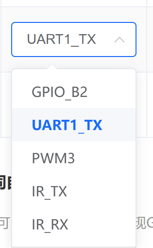

*GPIO_B2可选择多种功能，包括UART1_TX*

**注意事项：**

- 丝印是默认功能提示，不是固定限制
- 可以根据需要将任意GPIO配置为UART功能
- 配置完成后，按照实际分配的功能进行接线
- 避免将功能固定的引脚（如烧录脚）配置为其他用途

---

### 如何配置GPIO引脚的下拉输入模式？

**问题描述：**

在配置GPIO输入模式时，输入选项中只有"输入"模式，没有找到"下拉输入"选项，不清楚如何设置下拉输入。

**解决方案：**

**1. 下拉输入配置方法**

- **选择输入模式**：在引脚配置中选择"输入"
- **设置默认低电平**：勾选"默认低电平"选项
- 这就是下拉输入模式，芯片内部会自动下拉

**2. 配置步骤**

1. 进入Pin脚配置界面
2. 选择目标GPIO引脚（如B6）
3. 功能设置为"输入"
4. 勾选"默认低电平"选项
5. 保存配置

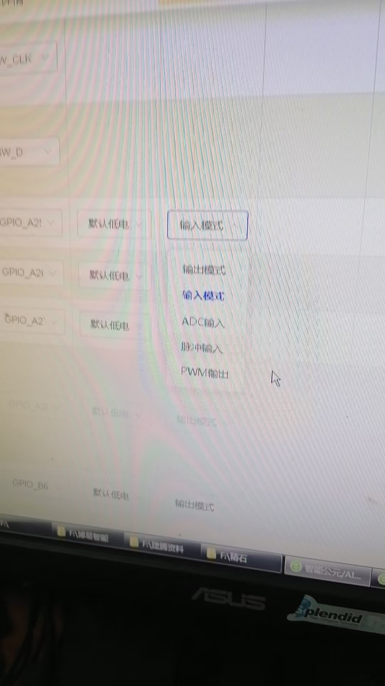

*GPIO输入模式配置界面，显示"默认低电平"选项*


*"默认低电平"即下拉输入模式*

**3. 应用场景**

- **按键检测**：按键一端接GPIO，另一端接地
- **开关检测**：外部开关断开时为高电平，闭合时为低电平
- **安全设计**：避免悬空状态导致的误触发

**4. 电平逻辑**

- 默认低电平（下拉）：未触发时为低电平
- 触发时：输入高电平信号
- 适用于外部上拉或直接接高电平的场合

**注意事项：**

- 芯片不支持内部下拉电阻，通过"默认低电平"实现
- 上电初始化时引脚状态可能不稳定，建议增加软件延时
- 测试时可用VCC和GND验证输入功能是否正常

---

### SU-03T驱动继电器时低电平触发异常怎么办？

**问题描述：**

使用SU-03T模块驱动继电器时，选择低电平触发模式，继电器始终处于吸合状态，无法正常控制；而高电平触发模式工作正常。

**解决方案：**

**问题分析：**

- SU-03T通过PNP三极管驱动继电器
- 继电器工作电压应选择3V小功率继电器
- 使用5V继电器可能导致一直吸合

**处理方法：**

1. **电平调整方案**

- 在IO口与继电器模块之间串联绿色发光二极管
- 负极接IO，正极接继电器模块
- 利用二极管压降调整电平，约0.7V

2. **上拉电阻方案**

- 在IO口添加上拉电阻
- 电阻值建议：10kΩ
- 确保IO口在悬空状态时为高电平

3. **继电器选型建议**

- 优先选择3V工作电压的继电器
- 如必须使用5V继电器，确保驱动电路匹配
- 避免使用触发电压要求过高的继电器模块

**临时解决方案：**

- 使用高电平触发模式替代
- 更换为3V继电器模块
- 添加三极管驱动电路进行电平转换

**注意事项：**

- SU-03T的IO口输出电平约为3V
- 不同厂家的继电器模块触发电压可能不同
- 继电器模块光耦输入通常需要2-5V触发电压
- 测试时可用万用表测量实际触发电压

---

### 如何确认SU-03T配置界面中的串口引脚与实际硬件对应？

**问题描述：**

在配置SU-03T的串口功能时，软件界面中显示的引脚编号（如1和2）与实际硬件板上的引脚位置不匹配，导致无法确定正确的接线方式。

**解决方案：**

通过查看串口功能下拉菜单中的原始IO口名称来确定实际引脚位置。

**操作步骤：**

1. **查看串口配置选项**

    - 在引脚配置界面中，点击串口功能的下拉菜单
    - 查看显示的原始GPIO名称（如GPIO_B0、GPIO_B1等）
    - 这些名称对应实际的硬件引脚位置

2. **引脚对应关系确认**

    - 软件界面的引脚编号仅为配置序号
    - 实际接线需要根据GPIO名称确定
    - 参考开发板丝印或引脚图找到对应位置

3. **实际接线方法**

    - 根据GPIO名称找到硬件板上的对应引脚
    - UART_TX连接外部设备的RX
    - UART_RX连接外部设备的TX
    - 确保共地连接

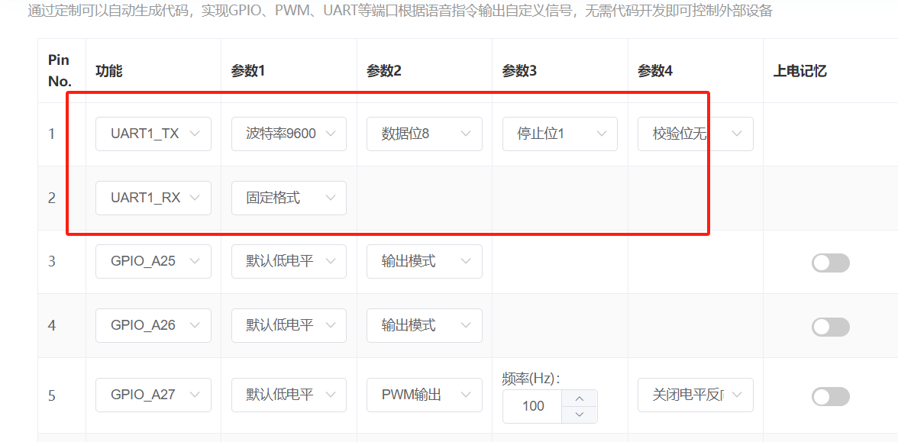

*配置界面显示UART1_TX和UART1_RX设置为引脚1和2，但需要通过下拉菜单查看实际GPIO名称*

**注意事项：**

- 配置界面的数字序号不代表实际物理引脚位置
- 务必通过下拉菜单确认实际的GPIO引脚名称
- 不同版本的配置界面显示方式可能略有差异
- 接线前建议用万用表确认引脚位置

---

### SU-03T驱动继电器时LED不亮是什么原因？

**问题描述：**

使用5V供电时，配置低电平触发，连接LED后继电器不吸合，LED也不亮，无法正常工作。

**解决方案：**

**问题排查：**

1. **LED极性检查**

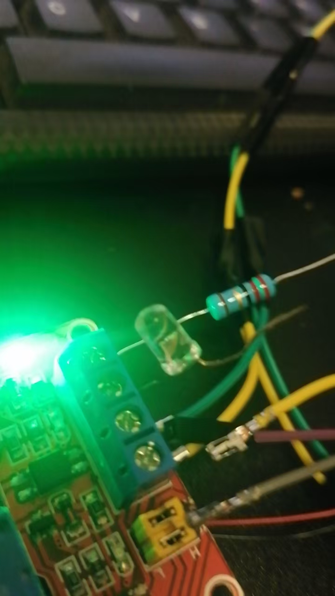

- 确认LED正负极性是否正确
- 绿色LED负极（短脚）应接IO口
- 绿色LED正极（长脚）应接继电器模块
- 极性反接会导致LED不导通点亮

2. **供电电压验证**
- 确认5V供电稳定
- 检查供电电流是否足够
- 测量继电器模块实际工作电压

3. **连接质量检查**
- 检查杜邦线接触是否良好
- 确认线路没有虚焊或断路
- 验证继电器模块功能正常

**正确接线方法：**

```
SU-03T IO口 → LED负极（短脚）
LED正极（长脚）→ 继电器模块控制端
```

**测试步骤：**

1. 先用手机充电器5V供电测试
2. 确认LED能正常点亮
3. 再连接到目标设备测试
4. 对比两次测试结果

**注意事项：**

- LED具有单向导通特性，极性必须正确
- 不同颜色LED的导通电压略有不同
- 如LED仍不亮，尝试更换LED或检查模块
- 确保所有连接线接触良好

---

### SU-03T上电时B7口出现短暂高电平怎么办？

**问题描述：**

使用B6和B7口高电平输出控制继电器，B6口正常，但每次上电B7口都出现短暂的高电平，导致继电器误动作。

**解决方案：**

**1. 问题原因分析**

- 上电瞬间GPIO引脚可能处于浮空状态
- 芯片初始化期间引脚电平不稳定
- B7口的初始化时序可能与B6略有不同
- 这是上电过程中的正常现象，但会影响敏感负载

**2. 硬件解决方案**

- **增加上拉/下拉电阻**：

    - 在B7口加10kΩ下拉电阻到GND
    - 确保上电前保持低电平状态
    - 电阻值根据驱动能力调整（5-10kΩ）

- **使用RC滤波电路**：

    - 在B7输出端串联100Ω电阻
    - 并联0.1μF电容到地
    - 滤除上电瞬间的尖峰脉冲

- **继电器端加缓冲**：

    - 在继电器控制端并联二极管（1N4148）
    - 增加延时电容（如10μF）
    - 防止短暂脉冲触发继电器

**3. 软件配置优化**

- **初始化设置**：

    - 在配置平台设置B7为"默认低电平输出"
    - 检查是否有上电延时设置
    - 确保初始化完成后才输出控制信号

- **逻辑修改**：

    - 增加上电延时（如500ms）再响应输入
    - 设置双触发确认机制
    - 添加软件滤波防抖动

**重要说明：**

- **烧录口（B6/B7）不建议作为IO口输出使用**
- 烧录口上电时肯定会有脉冲输出
- 这是模块初始化时的正常行为，用于准备烧录功能
- **B6/B7作为输入时也会有脉冲，可能误触发**
- 如需IO控制，建议使用A25、A26等其他普通IO口

如必须使用B6/B7作为IO口，请确保硬件电路能容忍上电瞬间的脉冲，或增加延时/滤波电路。


**4. 替代方案**

- **更换引脚**：

    - 使用确认正常的B6口
    - 或使用A25、A26等其他IO口
    - 避免使用有问题的B7口

- **使用专用驱动**：

    - 在IO口和继电器间加三极管驱动
    - 提供更稳定的控制信号
    - 增加系统可靠性

**注意事项：**

- 上电瞬间的高电平通常持续几毫秒到几十毫秒
- 继电器吸合时间一般为10-20ms，可能被误触发
- 加硬件电路时注意不影响正常开关速度
- 如有多套设备，建议统一修改避免个别差异

---

### SU-03T调光应用上电时灯会短暂亮起怎么办？

**问题描述：**

SU-03T模块用于PWM调光控制时，每次上电启动灯会亮1-2秒，即使配置了事件触发或加了下拉电阻也无法完全解决。

**解决方案：**

**1. 问题原因分析**

- 上电瞬间PWM引脚处于浮空状态或内部上拉状态
- 芯片初始化期间，GPIO引脚电平可能不稳定
- PWM驱动电路在初始化前可能产生输出
- 这是芯片上电过程中的正常现象，但会影响调光应用

**2. 硬件解决方案**

- **在PWM输出端加强下拉电阻**：
    - 使用较小阻值的下拉电阻（如1kΩ-2.2kΩ）
    - 10kΩ下拉电阻可能不足以克服内部上拉
    - 将下拉电阻直接连接在PWM输出引脚和GND之间

- **在驱动级加下拉**：
    - 在MOS管或三极管的栅极/基极加下拉电阻
    - 确保驱动级在上电前保持关闭状态
    - 下拉电阻阻值建议为4.7kΩ-10kΩ

- **增加RC延时电路**：
    - 在PWM控制端串联电阻（如1kΩ）
    - 并联电容到地（如1μF-10μF）
    - 利用RC延时过滤上电瞬间的异常信号

**3. 软件配置优化**

- **设置初始PWM为0**：
    - 在平台配置中设置PWM初始值为0
    - 确保上电启动时输出占空比为0

- **使用上电延时触发**：
    - 配置上电延时（如1-2秒）后再响应控制
    - 在延时期间保持PWM输出为0

- **使用定时器延时开启**：
    - 通过定时器设置延时输出
    - 避开上电初始化的不稳定期

**4. 电路设计建议**

- 对于调光应用，建议在驱动级（MOS管栅极）加下拉
- 下拉电阻阻值需要综合考虑：过小影响开关速度，过大效果不佳
- 如使用光耦隔离，可在光耦输出端加下拉确保关断
- 调试时可用示波器观察上电波形确定最佳方案

**注意事项：**

- 如果已加10kΩ下拉仍有问题，尝试减小阻值到1kΩ-2.2kΩ
- 驱动级的下拉比芯片引脚下拉更有效
- RC延时电路会增加响应延迟，需权衡应用场景
- 多套设备建议统一硬件设计确保一致性


---

### SU-03T与单片机485通信波特率不匹配怎么办？

**问题描述：**

SU-03T与单片机通过485通信时，由于语音芯片最高波特率仅115200，而单片机端波特率为1Mbps，导致通信不匹配，无法正常通信。

**解决方案：**

**1. 问题分析**

- **波特率差异**：SU-03T最高支持115200，单片机为1Mbps
- **通信障碍**：波特率不匹配导致数据无法正确传输
- **硬件限制**：语音芯片的串口硬件限制在115200

**2. 解决方案**

**方案一：降低单片机波特率**

- 将单片机UART波特率改为115200或以下
- 修改单片机代码重新配置串口参数
- 确保通信双方波特率一致

**方案二：使用波特率转换芯片**

- 在单片机和SU-03T之间增加波特率转换芯片
- 转换芯片将1Mbps转换为115200
- 实现双向通信速率匹配

**方案三：使用专用485转UART模块**

- 选择支持高波特率的485转UART模块
- 模块自动处理速率转换
- 保留原有单片机配置不变

**3. 配置示例**

**单片机端修改（示例）：**


**SU-03T端配置：**

- 在平台中设置UART波特率为115200
- 确保数据格式和校验设置正确
- 测试串口通信稳定性

**4. 注意事项**

- SU-03T的UART引脚最高波特率为115200
- 超高波特率通信可能导致数据错误
- 建议使用标准波特率（9600、19200、38400、57600、115200）
- 通信距离较长时考虑增加信号调理电路

**5. 选型建议**

如需高速通信场景：

- 考虑使用支持更高波特率的模块型号
- 或设计专用的通信接口转换电路
- 评估项目对通信速率的实际需求


### SU-03T与单片机485通信波特率不匹配如何解决？

**问题描述：**

SU-03T模块的最大波特率仅为115200，而单片机端使用的是1Mbps波特率，导致485通信失败，询问如何解决波特率不匹配的问题。

**解决方案：**

**1. 问题分析**

- SU-03T模块硬件限制：最大支持波特率115200
- 单片机设置：1Mbps（1000000bps）
- 通信协议：485总线通信
- 波特率差异过大，无法正常通信

**2. 解决方案**

**方案一：降低单片机波特率（推荐）**

1. **修改单片机代码**：
    \`\`\`c
    // 将单片机波特率从1Mbps改为115200
    // 原代码
    UART_setBaudRate(1000000);
   
    // 修改后
    UART_setBaudRate(115200);
    \`\`\`

2. **重新烧录单片机程序**：

    - 更新波特率配置
    - 保留其他通信参数（数据位、停止位、校验位）
    - 测试通信功能

**方案二：使用波特率转换芯片**

1. **硬件方案**：

    - 添加专用UART波特率转换芯片
    - 使用CH438等支持高速UART的芯片
    - 实现115200与1Mbps之间的转换

2. **电路设计**：
    \`\`\`
    SU-03T(115200) → 转换芯片 → 单片机(1Mbps)
                    CH438/CP2102
    \`\`\`

**方案三：升级模块型号**

1. **选择支持高速波特率的模块**：

    - 查询支持更高波特率的语音模块型号
    - 确认新模块的波特率范围
    - 评估升级成本和开发周期

**注意事项：**

- SU-03T的115200波特率限制是硬件特性，无法通过软件修改
- 485通信要求所有设备使用相同的波特率
- 降低单片机波特率是最简单经济的解决方案
- 使用转换芯片会增加硬件成本和开发复杂度
- 通信距离较长时，建议使用较低的波特率以提高稳定性
- 修改波特率后需要重新测试整个通信系统的稳定性

### SU-03T芯片使用了哪些算法，如何进行降噪的结构设计？

**问题描述：**

咨询SU-03T芯片内部使用的算法类型，以及如何进行硬件结构设计以实现降噪效果。

**解决方案：**

SU-03T芯片集成了多种语音处理算法，具体包括：

**1. 核心算法**

- **语音识别算法**：基于深度学习的端到端语音识别模型
- **降噪算法**：多麦克风阵列降噪和单通道降噪算法
- **回声消除（AEC）**：自适应声学回声消除算法
- **唤醒词检测**：低功耗关键词唤醒算法
- **语音活动检测（VAD）**：检测语音信号的起止点

**2. 降噪结构设计建议**

- **麦克风阵列设计**：

    - 双麦克风配置可实现基础降噪效果
    - 麦克风间距建议在20-50mm之间
    - 确保麦克风具有相同频响特性

- **PCB布局优化**：

    - 模拟信号线路尽量短且平行
    - 数字和模拟部分分开布局
    - 使用独立的地平面屏蔽干扰

- **结构设计要点**：

    - 避免麦克风直接面对扬声器
    - 在麦克风和扬声器之间设置物理隔断
    - 使用防风罩减少气流噪声

**注意事项：**

- 降噪效果与麦克风质量密切相关，建议使用灵敏度匹配的麦克风
- 结构设计需要考虑实际使用场景的声学环境
- 双麦克风方案相比单麦克风有明显的降噪优势
- AEC功能仅在双麦克风配置下可用
- 建议进行多次实际环境测试以优化结构设计

---

### SU-03T模块的引脚间距和焊接兼容性问题

**问题描述：**

SU-03T模块的引脚间距为2.0mm，无法直接焊接到标准的2.54mm洞洞板上，需要解决兼容性问题。

**解决方案：**

**1. 引脚间距说明**

- SU-03T模块采用2.0mm间距排针设计
- 标准洞洞板为2.54mm间距
- 存在0.54mm的间距差，无法直接对齐焊接

**2. 解决方案**

**方案一：使用转接底座**

- 购买2.0mm排针底座，模块可正常插入
- 底座需要焊接到2.54mm间距的PCB上时需特殊处理
- 可通过飞线连接各个引脚到目标焊盘

**方案二：飞线连接**

- 使用细导线（如漆包线）逐个连接引脚
- 引线长度尽量短，避免信号干扰
- 焊接后使用热缩管保护连接点

**方案三：定制转接板**

- 设计2.0mm转2.54mm的转接PCB
- 批量生产时成本较低
- 可实现可靠的标准间距转换

**3. 实际案例**

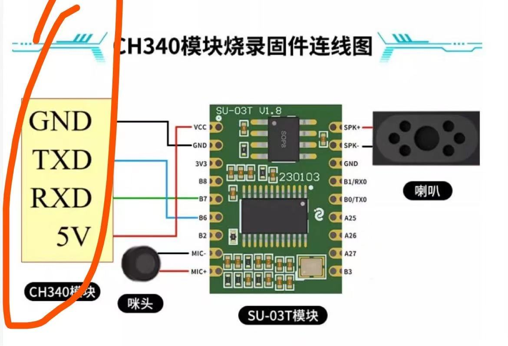

*SU-03T1模块通过CH340烧录器连接，展示了串口通信方式*

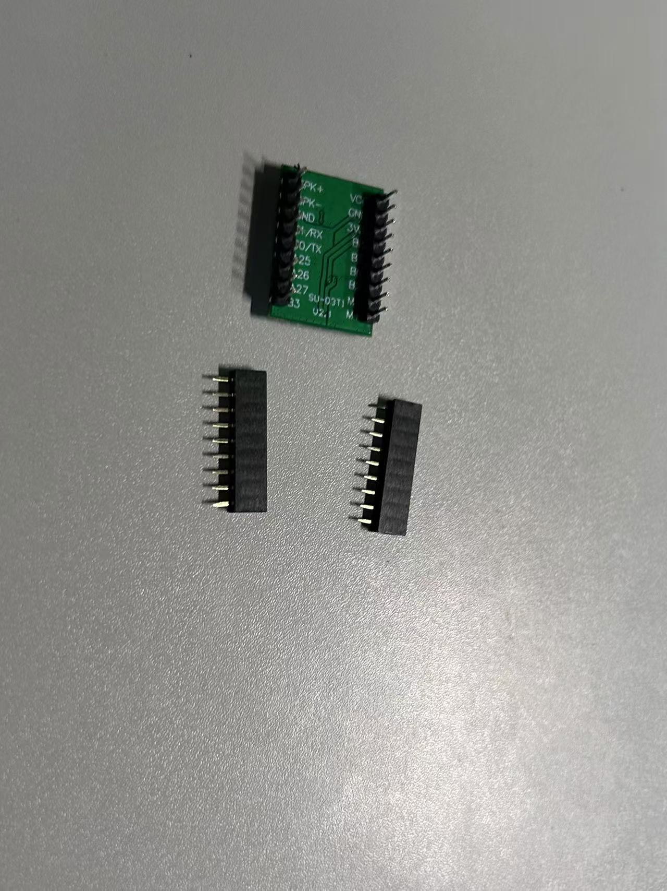

*SU-03T1模块已插入2.0mm底座，但底座无法直接焊接到2.54mm板*

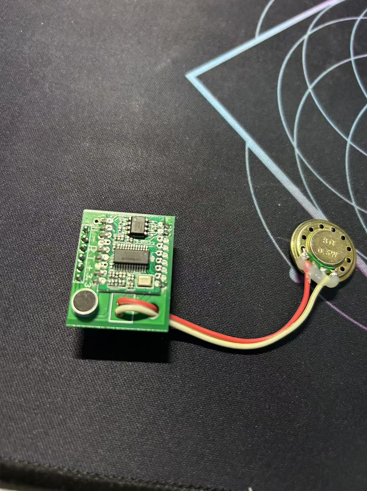

*SU-03T1模块与喇叭的连接方式，展示模块正面的布局*

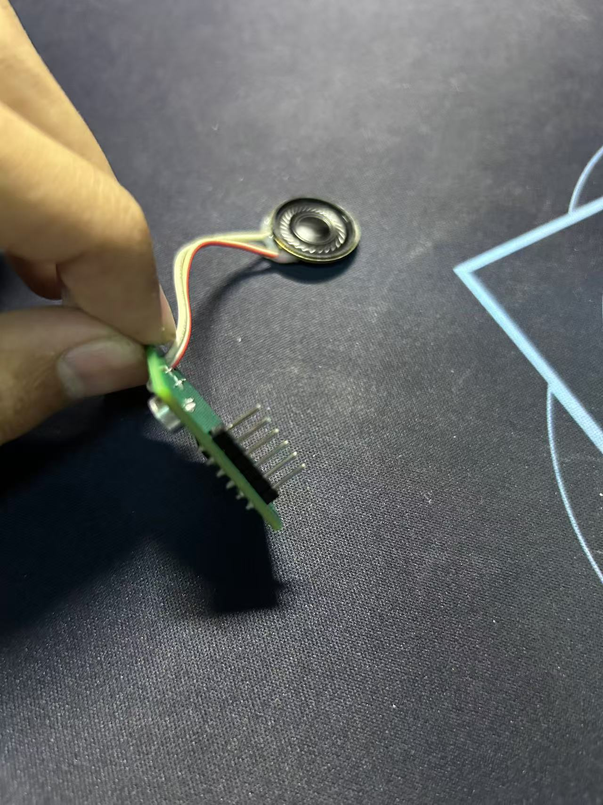

*SU-03T1模块侧面，清晰可见2.0mm间距的排针和底座*

**4. 焊接注意事项**

- 使用25W以下电烙铁，避免过热损坏模块
- 焊接时间控制在3秒内每个引脚
- 飞线时使用不同颜色导线便于识别
- 焊接完成后检查无短路和虚焊

**注意事项：**

- SU-03T的2.0mm间距是固定设计，无法改变
- 强行将2.0mm底座焊接到2.54mm板会导致引脚应力
- 长期使用可能因应力导致焊点开裂
- 建议优先考虑方案一或方案三确保可靠性

---

### SU-03T模块如何与外部设备连接实现语音控制？

**问题描述：**

需要了解SU-03T模块与单片机或其他外部设备的连接方式，以及如何通过语音指令控制LED等外部设备。

**解决方案：**

**1. 通信方式选择**

- SU-03T模块通过串口（UART）与外部设备通信
- 支持标准波特率：9600、19200、38400、57600、115200
- 可发送控制指令或接收状态反馈

**2. 硬件连接方法**

- 串口连接：模块TX连接外部设备RX，模块RX连接外部设备TX
- 共地连接：确保双方GND相连
- 电平匹配：模块串口为3.3V电平，与5V设备需电平转换

**3. 语音控制LED配置**

- 使用SU-03T的GPIO口直接驱动LED
- 高电平驱动：LED负极接地，正极通过限流电阻接GPIO
- 限流电阻计算：R = (3.3V - Vf) / If，通常使用82-100Ω电阻

**4. 模块版本说明**

SU-03T提供两种版本：

- 标准模块：纯模块形式，需要自行焊接底座
- 开发板版本：已焊接排针，可直接使用杜邦线连接

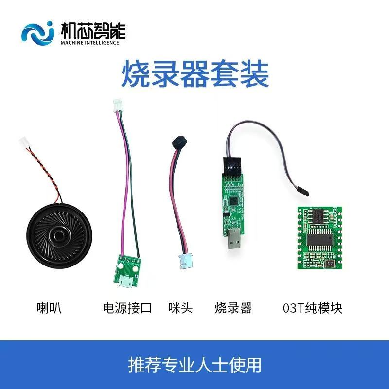

*SU-03T标准模块套件包含喇叭、咪头、烧录器和纯模块*

**5. 连接器选择**

- 标准SU-03T使用2.0mm间距排针
- 建议购买2.0mm单排母座（9针）连接
- 2.54mm母座会松动，连接不稳定

**注意事项：**

- SU-03T模块引脚间距为2.0mm，非常规格式
- 焊接时需使用2.0mm底座，无法直接焊接到2.54mm洞洞板
- 使用不匹配的连接器可能导致接触不良或损坏模块
- 建议通过飞线方式解决间距不匹配问题

---

### SU-03T如何与单片机正反转控制接口对接？

**问题描述：**

需要将SU-03T语音模块与单片机的正反转控制接口进行对接，实现通过语音指令控制单片机的IO口以驱动继电器，从而实现正反转功能。

**解决方案：**

**1. 对接方案选择**

根据现有单片机系统的按键控制原理（上电高电平，拉低后相应端口输出高控制继电器），可选择以下两种对接方式：

- **GPIO直连方案**：SU-03T的GPIO口直接连接单片机的按键输入口
- **串口通信方案**：通过UART串口发送控制指令给单片机

**2. GPIO直连方案实现**

- 连接方式：SU-03T的GPIO输出连接到单片机的手动按键控制IO口
- 电平匹配：确保双方电平兼容（SU-03T为3.3V输出）
- 控制逻辑：配置GPIO输出高低电平模拟按键按下/释放

**3. 串口通信方案实现**

- 硬件连接：SU-03T的TX连接单片机RX，RX连接单片机TX，共地
- 波特率设置：在平台配置中选择合适的波特率（如9600、115200）
- 通信协议：定义简单的控制指令格式（如"FORWARD"、"REVERSE"）

**4. 平台配置方法**

- 在智能云元平台中配置相应的控制功能
- GPIO方案：配置引脚为输出模式，设置触发条件
- 串口方案：配置串口功能，自定义发送内容

**注意事项：**

- 单片机需要预留额外的IO口用于接收语音模块的控制信号
- 如使用GPIO直连，需注意电平转换和隔离保护
- 建议在软件中加入防抖处理，避免误触发
- 正反转控制应考虑加入互锁逻辑，防止同时动作

---

### SU-03T1模块的排针是焊接好的吗？

**问题描述：**

需要确认SU-03T1型号产品在出厂时是否已经焊接好排针，以及是否需要自行焊接。

**解决方案：**

SU-03T1模块提供两种配置：

- **标准模块**：排针未焊接，需要自行焊接
- **已焊接版本**：排针已焊接好，可直接使用

**选型说明：**

- 购买时需明确选择"已焊排针"版本
- 已焊排针版本包含：模块 + 2.0mm间距咪头 + 喇叭
- 如需自行焊接，需使用2.0mm间距排针底座

**注意事项：**

- SU-03T模块使用2.0mm间距排针，非标准2.54mm间距
- 焊接时需使用25W以下电烙铁，避免过热损坏模块
- 如不熟悉焊接操作，建议购买已焊接版本

---

### SU-03T功放IC声音沙哑是什么原因？

**问题描述：**

SU-03T1语音模块出现声音沙哑的问题，经排查确认为功放IC不良，需要分析可能原因。

**解决方案：**

**1. 可能原因分析**

- **供电问题**：功放IC的供电不稳定或电压过大，可能导致IC损坏
- **散热不良**：功放IC工作时产生热量，散热不够会导致功能异常
- **外界干扰**：强电磁干扰可能影响功放IC正常工作
- **扬声器匹配问题**：扬声器阻抗或功率不匹配可能导致负载异常

**2. 功放IC损坏原因**

功放IC作为音频放大的关键元件，承受较大工作压力：

- 承担音频信号放大任务，工作条件相对严苛
- 易受供电电压波动、过载或温度等因素影响
- 瞬时电压波动（如电源降压不良、浪涌电压）可能导致损坏

**3. 预防措施**

- **确保供电稳定**：使用稳定的电源，避免电压波动
- **合理配置扬声器**：使用8欧1W或2W扬声器，避免功率不匹配
- **改善散热条件**：保证模块通风良好，避免高温环境
- **添加保护电路**：在功放输出端添加保险丝或限流保护

**注意事项：**

- 功放IC损坏而其他芯片正常，是因为功放工作压力更大
- 不完全是质量问题，更多是工作环境和使用条件导致
- 怀疑功放IC问题时，建议检查电源和扬声器配置
- 如频繁出现功放IC损坏，需要重新评估硬件设计

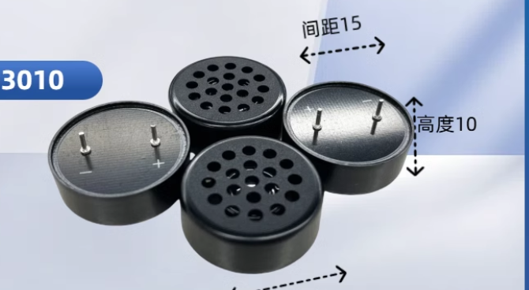

---

### SU-03T模块的电源电流需求是多少？

**问题描述：**

需要了解SU-03T模块的工作电流需求，以便选择合适的电源方案。

**解决方案：**

SU-03T模块的电源规格如下：

- **工作电流**：600mA以上
- **供电电压**：5V直流
- **推荐电源容量**：1.5-2A

**不同负载下的电源需求：**

- **独立模块**：5V 600mA以上
- **模块+1个继电器**：5V 1A（较极限）
- **模块+3个继电器**：5V 1.5-2A（推荐）

**电源选择建议：**

- 使用ACDC适配器时选择1.5-2A规格
- 避免使用5V 700mA以下电源
- 继电器会增加额外电流消耗

**注意事项：**

- 继电器工作电流较大，需计入总功耗
- 电源效率不足会导致模块重启
- 建议使用质量可靠的ACDC电源适配器
- 避免电源工作在极限状态，保留余量

---

### 如何将外部麦克风阵列连接到SU-03T开发板？

**问题描述：**

需要将8-HP-M730麦克风阵列定向消回音模组连接到SU-03T开发板，作为外部音源输入。

**解决方案：**

将麦克风阵列的Lineout信号通过串联电容的方式连接到SU-03T开发板的MIC引脚：

- **连接方式**：Lineout信号串联0.1μF电容后接入MIC+和MIC-引脚
- **电容规格**：0.1μF贴片电容，10V电压即可
- **接口位置**：J1 18PIN接口中的MIC+和MIC-引脚

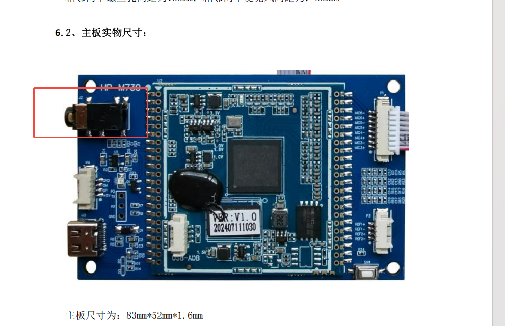


**注意事项：**

- 电容用于直流隔离，保护SU-03T的麦克风输入电路
- 推荐使用贴片电容（0805封装），体积小且便于焊接
- 10V电压规格已足够，无需选择过高电压
- 确保连接极性正确，MIC+和MIC-对应连接

---

### 连接外部麦克风阵列时电容规格如何选择？

**问题描述：**

在连接外部麦克风阵列到SU-03T开发板时，需要确认串联电容的规格，特别是电压和封装类型的选择。

**解决方案：**

连接外部麦克风阵列所需的电容规格如下：

- **容值**：0.1μF（或0.1uF）
- **电压**：10V即可（无需选择过高电压）
- **封装类型**：推荐贴片电容（如0805封装）
- **类型**：直插式或贴片式均可，贴片式更便于焊接

**电容选型建议：**

- 优先选择贴片电容，体积小且便于安装
- 10V电压规格已满足使用要求
- 避免选择过低电压（如6.3V），保留一定余量

**注意事项：**

- 电容用于直流隔离，保护SU-03T麦克风输入电路
- 贴片电容焊接时注意温度控制
- 如使用直插电容，注意引脚长度和安装空间

---

### SU-03T模块通电后震动但无声音输出怎么办？

**问题描述：**

SU-03T模块通电后喇叭只震动一下，没有声音输出，更换供电源后问题依旧存在。

**解决方案：**

**1. 供电问题排查**

- 使用万用表测量供电电压是否稳定在5V
- 确保电源功率足够（建议1A以上）
- 避免使用电脑USB接口供电，电流可能不足
- 将电源直接接到主板原生USB接口或使用手机充电头
- 测试时使用不同的电源，排除电源故障

**2. 硬件连接检查**

- 检查喇叭线是否正确连接到Spk+和Spk-
- 确认喇叭规格为8欧姆2瓦
- 检查线路接触是否良好
- 排除喇叭短路问题
- 使用万用表检测喇叭线圈是否正常

**3. 模块状态判断**

- 烧录调试固件测试，应有开机播报
- 快速插拔5V电源，有咔咔响声说明喇叭正常
- 如完全没反应，可能模块已损坏
- 播报不完整的现象最常见就是供电的问题

**注意事项：**

- SU-03T采用5V供电，电压过低会导致喇叭无法正常工作
- 供电不足时模块可能只震动而无法播放声音
- 模块按规定使用很耐用，但IO接线错误可能导致损坏
- 如确认供电和喇叭都正常，则需要更换模块
- 没有万用表时，可尝试多个已知正常的电源进行测试

---


---

### 立创EDA中有SU-03T模块的元件库吗？

**问题描述：**

需要在立创EDA中查找SU-03T模块的元件库，但搜索未找到，询问是否有可用的元件库。

**解决方案：**

SU-03T模块在立创EDA元件库中存在，可以通过以下方式找到：

**查找方法：**

1. **直接搜索**
    - 在立创EDA搜索框中输入"SU-03T"
    - 确认搜索范围包括"元件库"

2. **查看元件信息**
    - 找到SU-03T元件后，可查看封装信息
    - 封装类型：COMM-SMD_18...
    - 制造商：MACHINE INTEL...

3. **元件预览**
    - 提供封装示意图和3D预览图
    - 可直接用于原理图和PCB设计

**其他选择：**

- 如果搜索不到，可以自行绘制元件
- 绘制完成后可共享到元件库供使用者使用

**注意事项：**

- 确保使用最新版本的立创EDA
- 搜索时使用完整型号名称
- 自行绘制时注意封装尺寸准确性

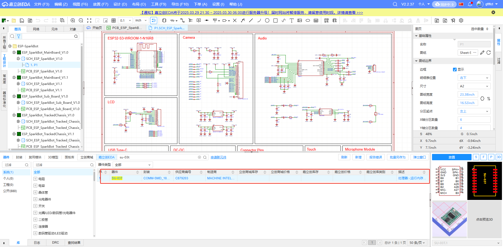

*SU-03T模块在立创EDA中的搜索结果和元件预览*

---


---

### SU-03T1支持485通信吗？

**问题描述：**

需要确认SU-03T1模块是否支持485通信，以及是否需要额外添加485模块。

**解决方案：**

**1. 串口电平说明**

- SU-03T1自带的是TTL电平串口
- 不是485差分电平信号
- 不能直接连接485总线

**2. 485通信方案**

如需使用485通信，需要：

- **添加485转换模块**：在TTL串口后加485转换芯片
- **使用转接设备**：通过串口转485模块连接
- **主控协助**：使用其他MCU做协议转换

**3. 通信距离考虑**

- **TTL串口**：适合短距离通信（米级）
- **485总线**：适合长距离通信（千米级）
- **根据实际需求选择方案**


**注意事项：**

- 485通信需要额外的转换硬件
- 转换模块需要注意供电和隔离
- 长距离通信要考虑抗干扰措施

---

## 麦克风电路


---

### SU-03T和CL-03T需要电源适配器吗？

**问题描述：**

需要确认SU-03T和CL-03T模块是否需要连接电源适配器，以及7.5V 5A的电源适配器是否适用于该模块。

**解决方案：**

**1. 供电方式说明**

- **模块工作电压**：一般使用5V供电
- **电流需求**：工作电流通常小于500mA
- **接口类型**：通常通过USB或排针供电

**2. 电源适配器使用**

- **7.5V过高**：超过模块额定工作电压
- **5A电流过大**：远超模块实际需求
- **推荐电源**：5V 1A或5V 2A已经足够

**3. 供电注意事项**

- **电压匹配**：必须使用模块规定的电压
- **避免过压**：高电压会损坏模块
- **电源质量**：建议使用稳定可靠的电源

**注意事项：**

- 不推荐使用7.5V电源适配器
- 如需外部供电，请使用5V电源
- 具体参数以模块规格书为准

---


---

### SU-03T和CL-03T是否需要电源适配器？

**问题描述：**

询问SU-03T和CL-03T模块是否需要连接电源适配器，以及7.5V 5A的电源适配器是否适用于该模块。

**解决方案：**

**1. 供电要求**

- 模块工作电压：5V
- 工作电流：通常小于500mA
- 7.5V电压过高，会损坏模块
- 5A电流过大，远超需求

**2. 电源选择**

- 推荐使用：5V 1A或5V 2A电源
- 不推荐：7.5V 5A电源适配器
- 可通过USB或排针供电

**注意事项：**

- 必须使用匹配的电压，避免过压损坏
- 电流不需要太大，1-2A已经足够
- 电源质量要稳定可靠
- 如需外部供电，务必使用5V

---


---

### SU-03T模块是否兼容淘宝购买的喇叭和咪头？

**问题描述：**

SU-03T模块是否可以使用淘宝上购买的任意喇叭和咪头，是否存在兼容性问题。

**解决方案：**

**咪头兼容性要求：**

- **电流范围**：0.1mA-0.5mA（普通咪头约0.5-2mA）
- **灵敏度**：-32dB到-25dB
- **信噪比**：70以上
- **推荐型号**：机芯智能定制6027电容麦（6mm直径，2.7mm高度）

**喇叭兼容性要求：**

- **阻抗**：8欧姆（推荐）或4欧姆
- **功率范围**：

    - 8欧姆喇叭：1.6W-5W（建议2W以上）
    - 4欧姆喇叭：2.4W-5W（建议3W以上）
- **功率匹配**：避免使用1W及以下的小功率喇叭


**注意事项：**

- 国内市场咪头质量参差不齐，规格书可能与实际不符
- 咪头线长不宜超过100mm，需使用双绞线或屏蔽线
- 喇叭短路可能损坏功放IC，使用前需测量阻抗
- 8欧姆喇叭直流电阻应为6-7欧姆（使用万用表测量）
- 优先选择官方配件或经过测试的品牌产品

---


---

### 麦克风正负极如何确认？

**问题描述：**

需要确认麦克风的正负极接线方式，确保正确连接到电路中。

**解决方案：**

**1. 麦克风极性识别**

- **查看标识**：

    - 麦克风底部通常有"+RC"标识
    - 带有"+"号的触点为正极
    - 另一个触点为负极

- **接线确认**：

    - 红色线连接到正极（+）
    - 黑色线连接到负极
    - 确保焊接牢固无虚焊

**2. 接线影响**

- **正确接线**：

    - 麦克风正常工作
    - 语音识别准确
    - 电压在正常范围

- **接反影响**：

    - 实际上不影响功能
    - 麦克风仍能正常工作
    - 但建议按标识正确接线

**3. 电压参考**

不同型号麦克风的正常电压：

- **CI-03T**：1.6-1.7V
- **SU-03T**：2.4-2.5V


---

### SU-03T的供电电压范围是多少？

**问题描述：**

需要确认SU-03T芯片支持的供电电压范围，以及5.5V供电是否可用。

**解决方案：**

- **供电电压范围**：3.6V - 5.5V
- **推荐工作电压**：建议在5V附近使用
- **电压稳定性**：避免电压波动过大，保持稳定供电

**注意事项：**

- 虽然5.5V在规格范围内，但建议保持在5V以获得最佳性能
- 芯片内部有LDO，输出3.3V，外部负载不超过150mA
- 使用锂电池时需注意电压变化对性能的影响

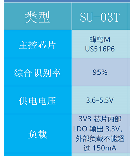

**注意事项：**

- 即使接反一般也不影响使用
- 为规范起见，建议按标识接线
- 焊接时注意温度不要过高
- 留意麦克风的供电电压范围

- 芯片型号通常印在绿色模块的表面上
- CI-03T 系列有多个子型号，功能略有差异
- 确认型号后需使用对应的固件和工具

---


---

### 如何识别SU-03T语音模块？

**问题描述：**

无法确认硬件板上使用的语音模块型号时，建议查阅产品标识文档或联系供应商协助识别。

**解决方案：**

**1. 外观识别**

- **模块颜色**：SU-03T通常为绿色模块
- **引脚分布**：查看模块两侧的引脚定义
- **尺寸规格**：标准DIP封装，便于焊接

**2. 硬件板特征**

- 板载多个蓝色继电器（SONGLE SRD-05VDC-SL-C）
- 集成电源开关和指示灯
- 预留麦克风和喇叭接口

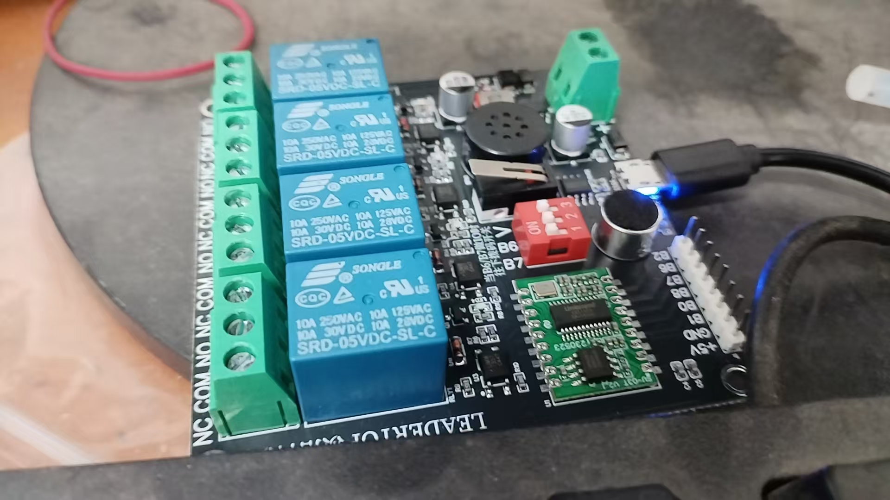

**3. 技术特征**

- 支持离线语音识别
- 内置语音播报功能
- 可通过串口进行控制
- 支持多个GPIO输出控制

**4. 确认方法**

- 查看模块表面的丝印标识
- 测试基本功能（语音唤醒、播报）
- 确认引脚定义与官方文档一致

**注意事项：**

- 自制板子可能存在引脚定义差异
- 建议购买官方转接板确保兼容性
- 使用前先测试基本功能是否正常

---

## 基础电路连接


---

### 麦克风无响应但喇叭正常如何排查？

**问题描述：**

连接喇叭后有声音输出，但麦克风无响应，初步怀疑是麦克风或相关电路故障。

**解决方案：**

- **基础测试**：

    - 将麦克风和喇叭直接连接到语音模块上测试
    - 确认麦克风本身是否正常工作
    - 检查连接线是否接触良好

- **电压检测**：

    - 使用万用表测试模块3V3引脚是否有3.3V电压输出
    - 直接测量麦克风正负电压：

    - CI-03T：应在1.6-1.7V范围
    - SU-03T：应在2.4-2.5V范围
    - 测量喇叭正负对GND电压，应在2.2-2.5V范围内

- **故障判断**：

    - 若各测试电压都在正常范围，可能是麦克风损坏
    - 某个电压不正常，可能是模块烧坏或异常
    - 检查是否有虚焊现象（常见问题，可能导致突然失效）

**注意事项：**

- 测量电压时需确保模块处于上电状态
- 不同型号的模块工作电压范围不同
- 更换麦克风前先确认连接无误

---


---

### 麦克风无响应但电压正常怎么办？

**问题描述：**

JX-A7T等语音模块的麦克风没有反应，喇叭正常工作，且各测试电压均在正常范围内。

**解决方案：**

- **全面检测流程**：

    1. 上电测试模块3V3引脚是否有3.3V电压输出
    2. 直接测量麦克风正负电压（CI-03T:1.6-1.7V，SU-03T:2.4-2.5V）
    3. 测量喇叭正负对GND电压（应在2.2-2.5V范围内）

- **故障排查**：

    - 如所有电压值都在正常范围，可能是麦克风损坏
    - 检查模块与麦克风之间的连接线
    - 确认麦克风规格是否匹配（如阻抗、灵敏度）

- **硬件测试**：

    - 将已知正常的喇叭和麦克风直接接到模块上
    - 检查模块接口是否有氧化或接触不良
    - 尝试使用外部麦克风测试

- **其他可能**：

    - 检查固件中是否正确配置了麦克风功能
    - 确认没有设置为静音或特定模式
    - 尝试重新烧录固件

**注意事项：**

- 电压正常的情况下，问题多出在麦克风本身
- 更换麦克风时注意极性不要接反
- 保留原麦克风作为备用对比

---


---

### 如何通过硬件修改降低SU-03T模块的音量？

**问题描述：**

SU-03T模块音量过大，电流消耗较高，希望通过硬件修改降低音量输出。

**解决方案：**

- **串联阻抗法**：

    - 在喇叭电路中串联适当的阻抗
    - 可降低通过喇叭的电流，减少音量
    - 方法简单直接，但可能影响音质

- **修改功放电阻**：

    - SU-03T使用LPM871功放芯片
    - 功放放大倍数 = 1 + R7/R6
    - 降低R7的阻值可减小放大倍数

- **具体操作**：

    1. 找到功放电路中的R7电阻
    2. 更换为较小阻值的电阻
    3. 或串联可调节电阻器进行微调

**注意事项：**

- 修改电路需要电子工程知识
- 操作不当可能损坏模块
- 建议先测试小范围修改效果
- 不使用8002功放时，芯片只能驱动耳机喇叭

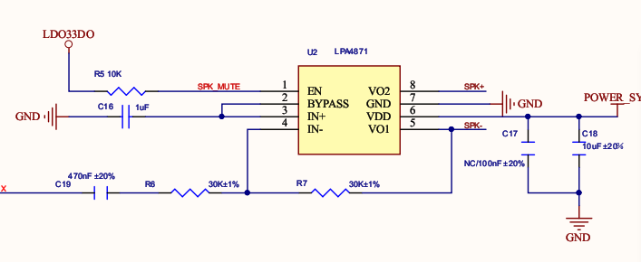

---


---

### SU-03T在锂电池供电下无法正常工作怎么办？

**问题描述：**

使用锂电池供电时，当多个舵机同时工作，SU-03T无法正常工作。

**解决方案：**

- **问题分析**：

    - 不是电压问题（锂电池满电4.2V足够）
    - 是电流供应不足问题
    - 多个舵机同时工作电流过大

- **解决方法**：

    1. **升流方案**：

        - 使用更大容量的锂电池
        - 并联多个锂电池增加电流输出能力

    2. **电源管理**：

        - 为舵机提供独立的电源路径
        - 避免大电流影响语音模块供电

    3. **电容缓冲**：

        - 在电源端并联大电容缓冲瞬时电流
        - 减少舵机启动时的电压跌落

**注意事项：**

- SU-03T最低工作电压不是主要限制因素
- 重点是保证足够的电流供应能力
- 舵机与语音模块建议分开供电

---


---

### 模块电压异常时如何判断是否损坏？

**问题描述：**

模块工作异常，需要通过电压测试判断是否已经损坏，以及是否可以修复。

**解决方案：**

- **电压测试步骤**：

    1. 模块上电后用万用表测试各引脚
    2. 3V3引脚：正常应有3.3V电压输出
    3. 麦克风正负极：

        - CI-03T：正常1.6-1.7V
        - SU-03T：正常2.4-2.5V
    4. 喇叭正负对GND：正常2.2-2.5V

- **故障判断**：

    - 某项电压不正常：模块可能烧坏或异常
    - 所有电压都为0：模块电源部分损坏
    - 电压波动大：供电不稳定或模块内部短路

- **常见故障现象**：

    - 功放烧穿：喇叭引脚电压为0V
    - 麦克风电路损坏：麦克风电压异常
    - 整体无响应：3V3无输出

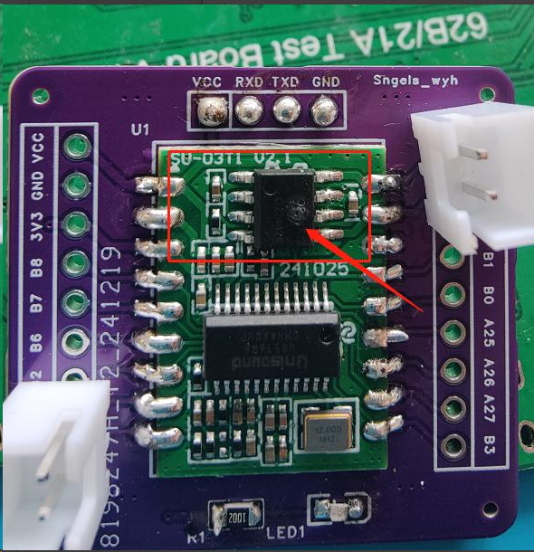

**注意事项：**

- 电压测试需要使用数字万用表
- 测试时避免短路，防止二次损坏
- 大部分电压异常的模块无法修复，需要更换
- 如不确定测试方法，建议查阅官方测试指南

---

## 过热与故障处理


---

### 2. 上电测试电压输出

如果未击穿，进行进一步测试：

**给模块供电测试：**

1. **供电要求**：

    - 提供5V稳定电源
    - 确保电流充足（至少500mA）

2. **测试关键点电压**：

    - **3V3引脚**：应有3.3V电压输出
    - **麦克风正负极电压**：

        - CI-03T系列：1.6-1.7V范围
        - SU-03T系列：2.4-2.5V范围
    - **喇叭正负极对GND电压**：2.2-2.5V范围


---

### GPIO默认高电平输出电压是多少？

**问题描述：**

需要了解SU-03T模块GPIO引脚的默认输出电平电压。

**解决方案：**

SU-03T模块的GPIO默认高电平输出为3.3V：


从技术参数表可以看到：

- 3V3 IO供电电压：3.3V
- 输出高电平（VOH）：2.4V（最小值/典型值）

**注意事项：**

- GPIO不能输出5V高电平
- 如需驱动5V继电器，需要额外的电平转换电路
- 设计电路时注意电平匹配，避免损坏器件

---

## CI-03T1硬件故障


---

### 如何获取正确的SU-03T封装库？

**问题描述：**

在使用99se软件绘制SU-03T芯片封装库时，发现封装尺寸标注错误，需要获取正确尺寸。

**解决方案：**

**1. 标准封装获取**

- **嘉立创EDA**：提供SU-03T标准封装
- **直接调用**：无需自己绘制
- **官方验证**：尺寸准确无误

**2. 手工绘制修正**

- **正确间距**：15mm（非13.6mm）
- **参考实物**：以实际模块为准
- **仔细测量**：使用卡尺等工具确认

**3. 兼容性问题**

- **99se限制**：部分新款EDA不支持
- **替代方案**：使用其他EDA工具设计
- **文件转换**：完成后可导出99se格式

**注意事项：**

- 优先使用官方标准封装库
- 自建封装时多次核对关键尺寸
- 保存好封装文件供后续使用

---


---

### SU-03T模块VCC和GND引脚短路怎么办？

**问题描述：**

SU-03T贴片模块的VCC和GND引脚之间测量显示导通，怀疑是内部损坏导致短路，且贴片芯片难以拆卸。

**解决方案：**

**1. 短路确认**

- 使用万用表测量VCC和GND之间电阻
- 0欧姆或接近0欧姆表示存在短路
- 正常情况下两个引脚不应导通

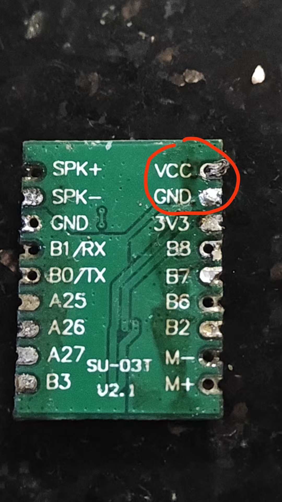

*VCC和GND引脚之间存在焊锡短路*

**2. 可能原因**

- **焊接问题**：焊锡连接导致VCC和GND短路
- **芯片损坏**：内部电路损坏导致引脚间短路
- **PCB问题**：电路板内部存在短路路径

**3. 处理方法**

- **外观检查**：检查VCC和GND之间是否有焊锡连接
- **清洁处理**：使用吸锡器清除多余焊锡
- **芯片更换**：如确认内部损坏，需更换模块

**4. 预防措施**

- 焊接时避免焊锡过量
- 使用放大镜检查焊接质量
- 焊接前断电，防止静电损坏

**注意事项：**

- VCC和GND短路会供电时造成大电流
- 不排除短路前不要通电测试
- 贴片芯片拆卸需要热风枪，建议谨慎操作

---


---

### SU-03T和CL-03T模块如何选择电源适配器？

**问题描述：**

需要为SU-03T和CL-03T模块选择合适的电源适配器，不确定电压和电流要求。

**解决方案：**

1. **电源规格要求**
    - **输入电压**：5V DC（不能使用7.5V）
    - **电流要求**：≥150mA
    - **兼容性**：5V1A或5V2A都可以使用

2. **电源适配器选型**
    - 5V1A电源适配器：完全满足要求
    - 5V2A电源适配器：完全满足要求
    - 7.5V电源适配器：电压过高，不能使用

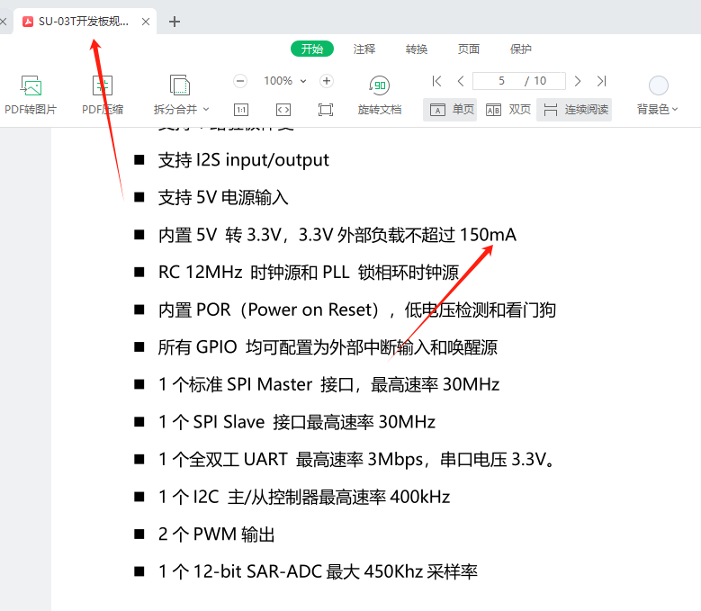

3. **连接注意事项**
    - 使用模块转接板时，电源要求相同
    - 确保DC插头与转接板匹配（需要母座）
    - 4mm中头需要确认兼容性

4. **接线方式**
    - 电源适配器连接到DC插座
    - 或直接连接到模块的VCC和GND引脚
    - 注意正负极不要接反

**注意事项：**

- 电压过高会损坏模块
- 电流过大的电源适配器也可以使用（模块只会取用所需电流）
- 快充电源适配器可能影响模块工作
- 建议使用普通稳压电源

---


---

### SU-03T芯片的ADND和DGND都需要接地吗？

**问题描述：**

在SU-03T芯片应用中，ADND（模拟地）和DGND（数字地）是否都需要接地，以及如何正确连接以避免电路发热问题。

**解决方案：**

**接地原则：**

- ADND和DGND都是地线，本质都是GND
- 两个地线之间需要通过0R电阻连接
- 简单应用时可以直接连接到一起

**连接方式：**

1. **推荐方案**：ADND和DGND之间接0R电阻
    - 实现模拟地和数字地的隔离
    - 减少数字噪声对模拟电路的干扰
    - 提高系统稳定性

2. **简化方案**：两地直接短接
    - 适用于对噪声不敏感的应用
    - 仅接其中一个地会导致电路异常
    - 可能引起器件发热

**注意事项：**

- 只接一个地线会导致电路工作异常，可能引起发热
- 对于学习或测试场景，可以将两地直接短接
- 产品级应用建议使用0R电阻隔离
- 确保地线连接牢固，避免接触不良

---


---

### 功放模块LTK4871频繁烧毁问题分析

**问题描述：**

LTK4871功放模块在使用过程中频繁烧毁，已发生多次损坏，需要分析原因并提供解决方案。

**解决方案：**

**功放烧毁的主要原因：**

- 供电电压瞬间高于5.5V
- 长时间供电电压超过5.5V
- 电源正负极短路几秒钟
- 电容脱焊导致电压异常（如从5V升至5.6V）

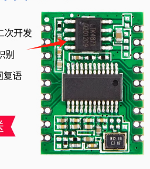

**预防措施：**

- 严格控制供电电压在5.5V以内
- 使用稳压电源，避免电压波动
- 检查电路焊接质量，防止脱焊
- 在电源输入端添加过压保护电路
- 避免电源正负极意外短路
- 选择符合功率和阻抗要求的喇叭

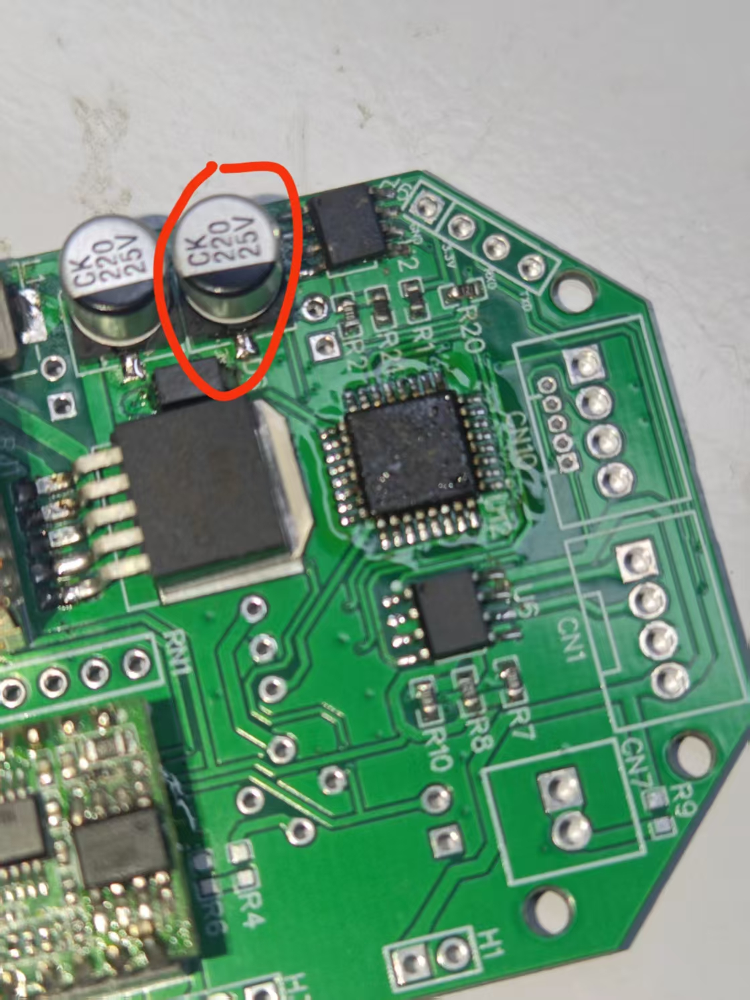

**喇叭选型要求：**

- **4Ω喇叭**：功率需≥2.4W
- **8Ω喇叭**：功率需≥1.6W
- 尽量不要选择功率过大的喇叭（如4Ω5W模块可能带动困难）
- 不符合参数的喇叭容易烧毁，进而导致功放损坏

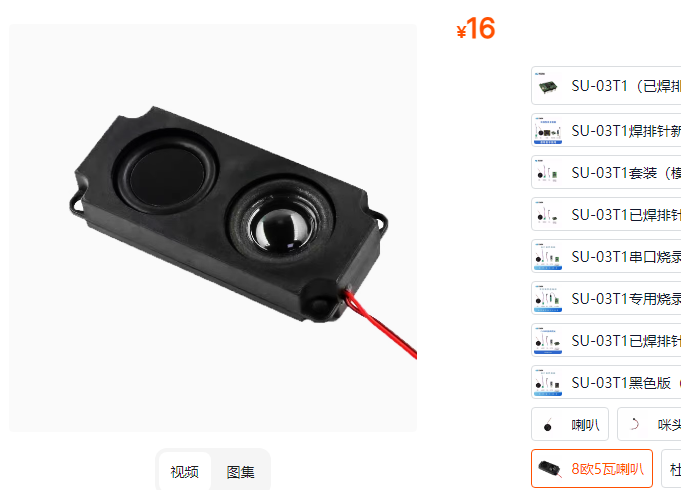

**注意事项：**

- 功放芯片非常脆弱，操作时需格外小心
- 几毫秒的过压就可能导致损坏
- 建议在电源端增加TVS管或压敏电阻进行保护
- 定期检查电源电路的稳定性
- 目前市场上没有完全不会损坏且能自我恢复的功放芯片
- 选择功放芯片时应优先考虑可靠性而非成本
- 严格按照规格书使用，避免超规格操作

---


---

### SU-03T定制咪头线长不符合要求怎么办？

**问题描述：**

定制的咪头线长与价格调整后，收到的产品线长不符合要求，且价格已上调。

**解决方案：**

**问题处理：**

1. **确认定制要求**
    - 检查原始订单中的线长要求
    - 确认是否已明确标注线长规格
    - 保留沟通记录和确认文件

2. **核实收货问题**
    - 测量实际收到的线长
    - 对比定制要求的长度
    - 记录差异大小和方向

3. **价格调整确认**
    - 核实价格上调的原因
    - 确认是否包含线长调整费用
    - 要求提供价格明细

**解决方案：**

1. **重新生产**
    - 联系供应商重新生产正确规格
    - 确认线长、价格等所有参数
    - 要求优先处理并尽快发货

2. **退款处理**
    - 如无法重新生产或时间紧急
    - 申请全额退款
    - 另寻供应商满足需求

**预防措施：**

1. **明确技术要求**
    - 下单时详细注明线长规格
    - 要求确认邮件回执技术参数
    - 保留所有沟通记录

2. **样品确认**
    - 大批量生产前先做样品
    - 确认样品符合所有要求
    - 再进行批量生产

3. **合同约束**
    - 在合同中明确技术参数
    - 约定不符合要求的处理方式
    - 保障双方权益

**注意事项：**

- 定制产品务必在下单前确认所有细节
- 价格变动应事先沟通并获得确认
- 保留完整的订单和沟通记录
- 遇到问题及时沟通解决，避免延误

---

### 是否可以只使用SU-03T模块上的主控IC自行设计电路板？

**问题描述：**

希望了解是否可以仅使用SU-03T模块上的主控IC自行设计电路板，以及需要获取相关原理图和PCB布线注意事项。

**解决方案：**

**设计可行性**

- 支持集成化设计
- 可以仅使用主控IC进行自主设计
- 需要采购对应的主控IC芯片

**资料获取**

- 文档中心提供现成的原理图
- 可按照原理图100%照抄设计
- 包含完整的外围电路设计

**PCB布线注意事项**

- **模电部分重点注意**：

    - 咪头电路尽量短，防止外部信号干扰
    - 音频信号线需要屏蔽处理
    - 电源滤波电容靠近IC放置

- **数电部分常规设计**：

    - 数字信号线按常规间距布线
    - 注意时钟信号走线
    - 避免过长的并行总线

**设计支持**

- 设计完成后可发检查
- 提供技术支持确认设计合理性
- 建议小批量试产验证

**采购信息**

- 主控IC需要单独采购
- 可联系供应商获取芯片信息
- 提供预估产量以便准备库存

**注意事项：**

- 咪头电路设计是关键，直接影响语音识别效果
- 电源设计需要稳定，避免噪声干扰
- 首次设计建议参考官方评估优化

---

### SU-03T是否支持红外遥控功能？

**问题描述：**

需要确认SU-03T芯片是否支持红外遥控功能，以及如何实现红外遥控开关控制。

**解决方案：**

**功能支持说明：**

- SU-03T支持红外发射功能
- 通过PWM口控制红外发射二极管
- 不支持红外接收（RX）解码功能
- 红外控制需要通过平台配置实现

**红外发射电路设计：**

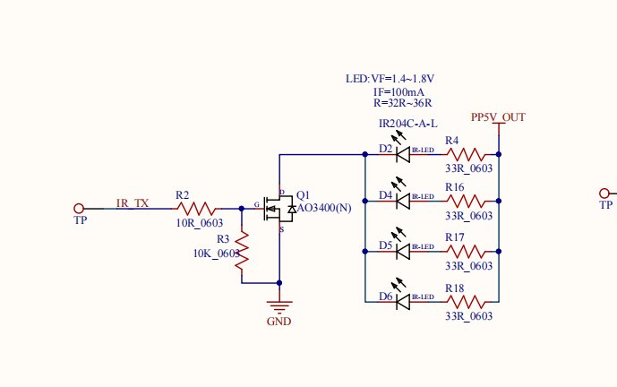

- 使用PWM口驱动红外LED
- 通过N沟道MOSFET（Q1）作为开关
- R2（10KΩ）电阻连接到芯片IO口
- 根据需要并联多个红外LED（不超过6个）

**引脚连接参考：**


**实现方式：**

1. **语音控制红外**：

    - 通过语音命令触发PWM输出
    - 发送对应的红外编码信号

2. **组合控制方案**：

    - 语音控制：通过SU-03T实现
    - 遥控控制：需要外部解码模块
    - 状态同步：通过IO引脚通信

**注意事项：**

- 红外电路需要自行设计和搭建
- 确保PWM口配置正确
- 红外LED数量不宜超过6个
- 需要配置合适的载波频率（通常38kHz）

---

### 如何实现红外遥控与语音控制的状态同步？

**问题描述：**

使用外部遥控解码器控制SU-03T引脚时，状态同步出现问题，且SU-03T无法直接进行红外RX解码。

**解决方案：**

**问题分析：**

- SU-03T不支持红外接收（RX）解码功能
- 外部遥控解码器直接控制继电器会导致状态不同步
- 需要通过IO引脚实现状态通信

**硬件连接方案：**

**实现方案：**

1. **外部解码模块方案**：

    - 使用独立的红外遥控解码模块
    - 解码模块输出控制SU-03T的IO引脚
    - SU-03T通过检测IO电平变化获取遥控指令

2. **状态同步方法**：

    - 遥控解码模块控制引脚输出特定脉冲
    - SU-03T设置定时器检测脉冲次数
    - 通过计数判断遥控指令类型
    - 使用变量记录当前状态

3. **电路连接**：

    - 红外解码模块输出 → SU-03T任意IO引脚
    - SU-03T输出控制继电器
    - 确保共地连接

**引脚选择参考：**

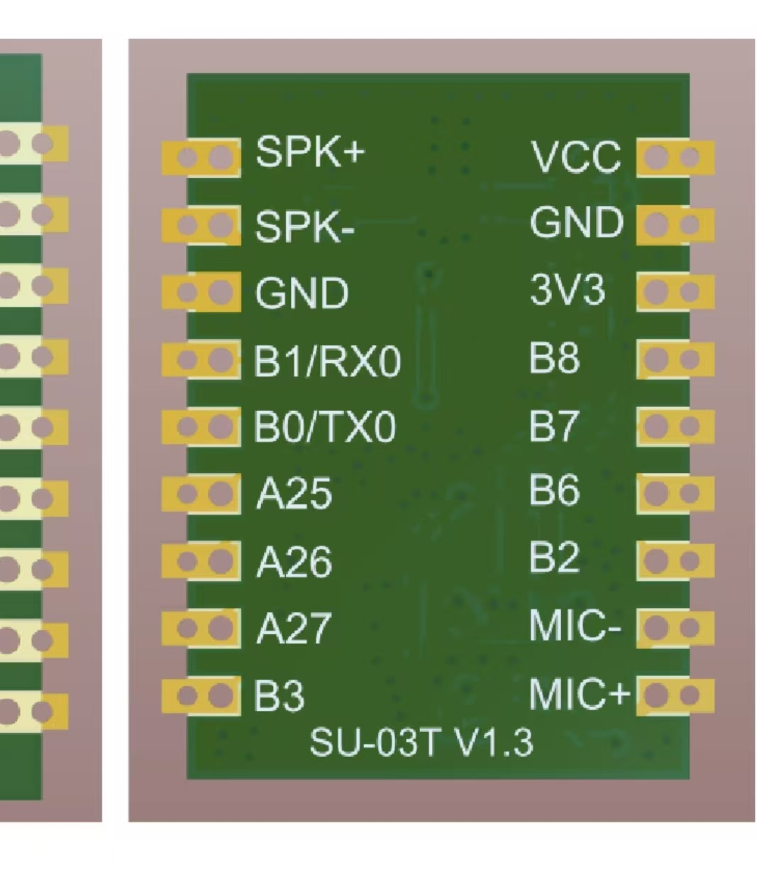

- 可使用任意可配置IO引脚（如A25、A26、A27等）
- 选择未作他用的引脚避免冲突
- 配置为输入模式检测电平变化

**软件逻辑示例：**

```c
// 检测遥控脉冲
if (pin_level_change) {
    pulse_count++;
    if (time_elapsed > 1000ms) {
        if (pulse_count == 1) {
            // 处理单击指令
        } else if (pulse_count == 2) {
            // 处理双击指令
        }
        pulse_count = 0;
    }
}
```

**注意事项：**

- 需要额外的红外解码模块（如433M超再生模块）
- SU-03T只能检测IO电平，不能直接解码红外信号
- 脉冲检测需要设定合适的时间窗口（如1秒）
- 确保外部模块输出电平与SU-03T兼容（3.3V）

---

### 如何使用433M模块与SU-03T实现遥控语音双控？

**问题描述：**

需要实现遥控器语音双控灯开关功能，使用固定码遥控器配合SU-03T，解决SU-03T无法直接解码红外信号的问题。

**解决方案：**

**系统架构说明：**

- 遥控控制：433M超再生模块接收固定码遥控器信号
- 语音控制：SU-03T实现离线语音识别
- 控制输出：SU-03T统一控制继电器开关
- 状态管理：通过IO引脚通信实现状态同步

**硬件连接：**

1. **433M模块连接**：

    - VCC → 5V电源
    - GND → 共地
    - DATA → SU-03T任意IO引脚（如A25）

2. **SU-03T连接**：

    - 语音识别功能正常连接
    - IO引脚接收433M模块数据
    - 输出引脚控制继电器

**实现步骤：**

1. **遥控器脉冲编码**：

    - 单击：1秒内1次高电平脉冲（持续1ms）
    - 双击：1秒内2次高电平脉冲
    - 长按：持续高电平超过1秒

2. **SU-03T程序逻辑**：
    ```c
    // 遥控检测中断处理
    void REMOTE_ISR() {
        if (digitalRead(REMOTE_PIN) == HIGH) {
            pulse_count++;
            timer_start();
        }
    }

    // 定时器中断处理
    void TIMER_ISR() {
        if (timer_expired) {
            switch(pulse_count) {
                case 1: toggle_light(); break;  // 单击切换
                case 2: // 其他功能
            }
            pulse_count = 0;
        }
    }
    ```

3. **状态同步机制**：

    - 遥控操作时更新状态变量
    - 语音操作时读取状态变量
    - 统一通过SU-03T输出控制

**配置要点：**

1. **遥控器选择**：

    - 使用固定码遥控器（无需解码）
    - 确保与433M模块频率匹配
    - 支持按键编码功能

2. **引脚配置**：

    - 遥控接收引脚：输入模式，上拉
    - 控制输出引脚：输出模式
    - 避免与语音功能引脚冲突

3. **时序设置**：

    - 脉冲检测窗口：500ms-1s
    - 防抖延时：10-50ms
    - 状态更新延时：100ms

**注意事项：**

- 433M模块直接输出数字信号，无需解码
- 遥控器必须使用固定编码类型
- 建议添加硬件滤波电路防干扰
- 测试时先验证遥控功能再整合语音
- 确保供电稳定，避免模块复位

---

### SU-03T模块在底座上的正确安装方向是什么？

**问题描述：**

在使用SU-03T模块时，发现产品示意图中的安装方向与实物不符，需要确认模块在底座上的正确安装方向。

**解决方案：**

**正确安装方向：**

- **芯片面（丝印面）朝下**：SU-03T模块安装到底座时，芯片面应朝向底座内部
- **引脚朝上**：模块的引脚部分朝上，与底座上的连接器接触
- **对齐定位**：确保模块与底座的定位孔对齐

**常见错误：**

部分示意图中错误地将芯片面朝上显示，这种安装方式是错误的，会导致引脚无法正确连接。

**安装示意图对比：**

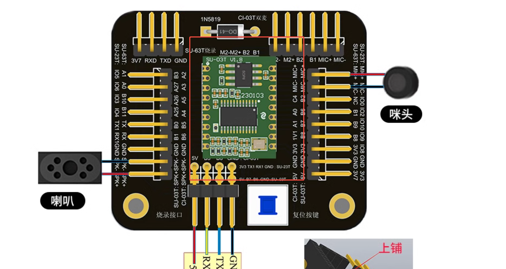

*错误的安装方式：芯片面朝上*


*正确的安装方式：芯片面朝下*

**注意事项：**

- 安装时轻拿轻放，避免用力过猛损坏引脚
- 确认模块完全插入底座，无松动现象
- 如发现示意图与实物不符，以实物为准
- 安装完成后检查各引脚是否正确接触

---

### 如何将SU-03T的差分SPK输出转换为单端信号？

**问题描述：**

需要将SU-03T的差分SPK+/-输出转换为单端信号，并通过外接功放（如TPA3118D2）实现硬件音量控制。

**解决方案：**

**1. 差分输出特性**

SU-03T的SPK+和SPK-是对称的反向波形输出，这是差分音频信号的标准设计。由于这种对称特性，可以直接取其中一端作为单端信号使用。

**2. 转换方法**

- **单端信号提取**：将SPK-悬空，只使用SPK+作为单端音频信号输出
- **共地连接**：确保SU-03T与功放电路共地
- **信号调理**：SPK+输出端需要添加RC滤波电路

**3. 具体连接方案**

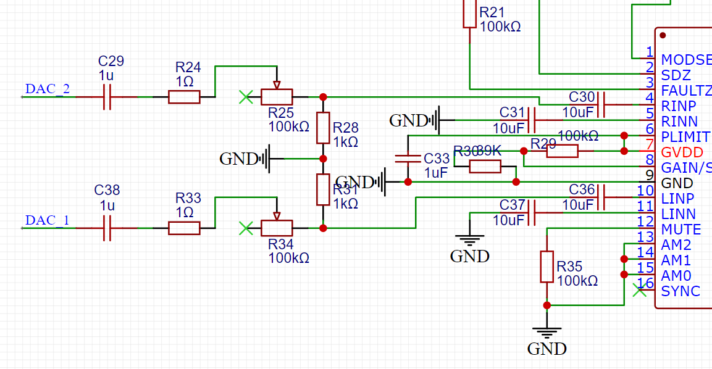

**连接要点：**

- SU-03T的SPK+连接到功放的DAC_1输入端（通过电容耦合）
- SU-03T的GND与功放的GND相连
- SPK-引脚悬空不使用
- 功放电路通常已有隔直流处理，无需额外添加隔直电容

**注意事项：**

- 使用双声道功放时，单端信号只能驱动一个声道，另一个声道将无输出
- 电位器音量控制可能存在关不死的问题（最小音量仍有输出）
- 建议在SPK+输出端添加简单的RC滤波网络（如10kΩ电阻+0.1μF电容）
- 确保功放输入阻抗与SU-03T输出匹配

---

### SU-03T模块如何配置串口与外接大功率喇叭？

**问题描述：**

需要配置SU-03T模块的串口功能实现与单片机通信，同时了解模块的喇叭驱动能力，以及在高噪声环境（如收割机、拖拉机）下外接大功率喇叭的方案。

**解决方案：**

**1. 串口通信配置**

SU-03T模块支持通过串口与单片机通信：

- **串口引脚**：使用B6（UART1_RXD）和B7（UART1_TXD）作为串口通信引脚
- **连接方式**：

    - 单片机TX → SU-03T的B6（RXD）
    - 单片机RX → SU-03T的B7（TXD）
- **通信协议**：模块可以识别单片机发送的串口指令并播报相应语音


**2. 喇叭驱动能力**

SU-03T内置功放的驱动能力有限：

- **4Ω喇叭**：支持大于2.4W的功率
- **8Ω喇叭**：支持大于1.6W的功率
- **测试标配**：8Ω/2W喇叭
- **不建议**：使用过大功率的喇叭（如4Ω/5W），模块可能无法驱动


**3. 高噪声环境下的扩音方案**

针对收割机、拖拉机等高噪声环境：

- **问题**：内置功放无法满足大功率需求，运行时噪声大影响语音识别
- **解决方案**：外接功放电路
    - 取模块的喇叭信号作为输入
    - 通过外部功放电路放大信号
    - 驱动更大功率的喇叭

**注意事项：**

- B6/B7是固定的烧录脚，但也可以用作通信
- 在高噪声环境下，建议仅在停车时进行语音配置
- 运行时可只使用语音播报功能，不进行语音识别
- 外接功放需要自行选型，取模块喇叭信号进行放大

---

### SU-03T模块烧录无反应如何排查？

**问题描述：**

SU-03T模块在烧录时完全没有反应，疑似因短路或虚焊导致模块损坏。

**解决方案：**

**1. 模块自检流程**

按照以下步骤逐步排查：

- 检查接线：TX和RX接烧录器需要反接，确认5V、GND是否接对
- 检查设备管理器是否有COM口
- 确认bin文件是否单独放到桌面路径，文件名是否为update.bin
- 烧录时，在等待设备状态下，是否有拔插GND操作

**2. 硬件检测**

如烧录仍不成功，进行以下硬件检测：

- 用万用表蜂鸣挡测量5V和GND是否短路
- 不接喇叭情况下，测量喇叭正负是否短路
- 测量模块3V3引脚是否有3.3V电压输出
- 直接测麦克风正负电压是否在1.6-1.7V范围
- 测量喇叭正负对GND电压是否在2.2-2.5V范围内

**3. 常见问题处理**

短路问题：

- 检查模块焊点是否有锡珠导致短路
- 注意排针是否被压下接触到下方电路
- 长时间短路会烧坏芯片

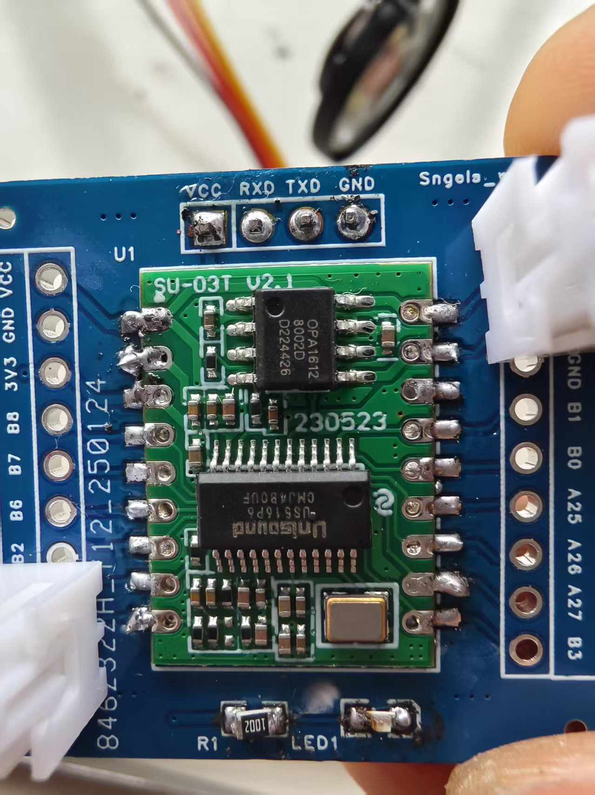

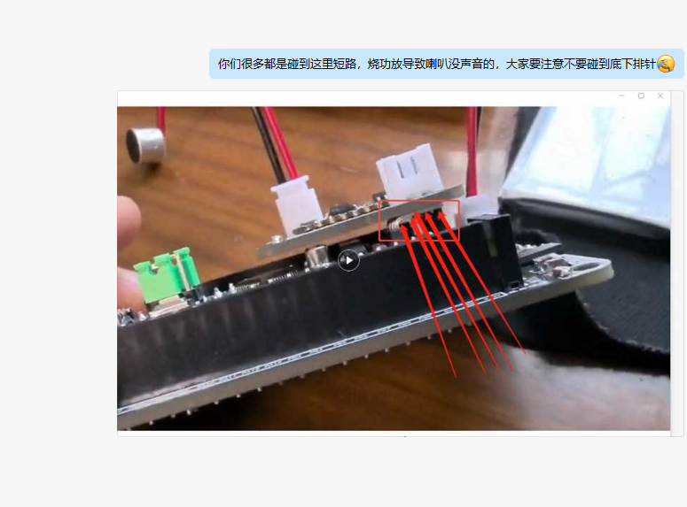

**注意事项：**

- 如果各测试电压某个电压不正常，可能是模块烧坏或异常
- 博主的底板要正接，买焊接好的需要按照丝印反接
- 重新补焊可能有修复机会，但严重损坏需要更换模块

---

### SU-03T控制舵机时语音识别失效怎么办？

**问题描述：**

使用SU-03T模块控制舵机实现垃圾分类功能，语音识别正常但舵机不响应，添加PWM控制后语音唤醒功能失效。

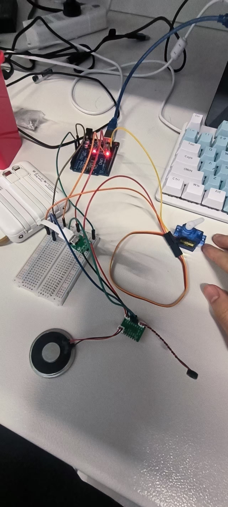

**解决方案：**

**1. 电源问题排查**

- **PWM驱动能力不足**：

    - SU-03T的PWM输出驱动能力有限
    - 舵机工作电流较大（约100-200mA）
    - 直接驱动可能导致电源电压跌落

- **解决方法**：

    - 为舵机提供独立电源（5V或6V）
    - 在PWM信号线上加三极管或MOSFET驱动
    - 使用舵机驱动板（如PCA9685）

**2. 硬件连接优化**

```
SU-03T PWM输出 → 驱动电路 → 舵机信号线
独立电源5V → 舵机电源线
所有GND共地
```

**3. 软件配置检查**

- **平台配置**：

    - 确认PWM输出引脚配置正确
    - 检查PWM频率设置（舵机通常用50Hz）
    - 验证占空比范围（5%-10%对应0-180度）

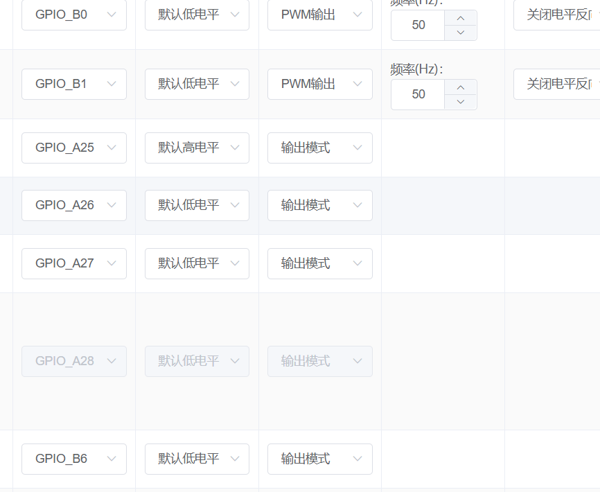

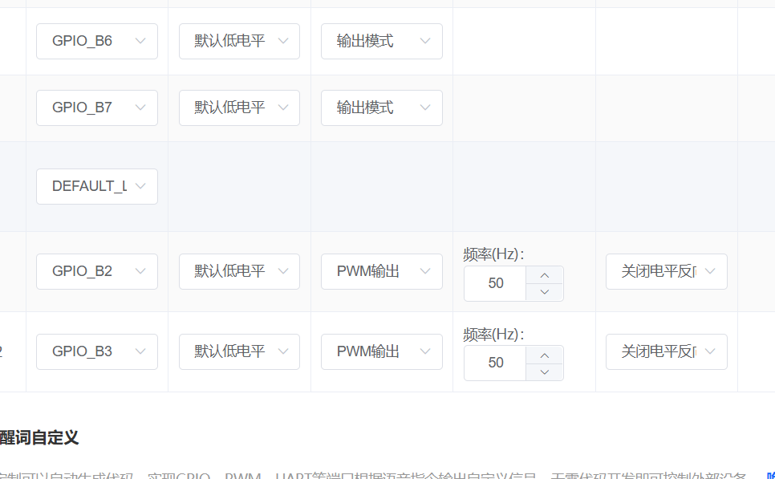

- **避免引脚冲突**：

    - 不要使用与麦克风相关的引脚
    - PWM引脚不要与UART引脚冲突
    - B6/B7保留给串口通信使用

**4. 恢复语音功能**

如果添加PWM后无法唤醒：

- 烧录之前的固件验证麦克风功能
- 逐步添加PWM功能，定位问题点
- 检查是否有电源噪声干扰麦克风

**注意事项：**

- 舵机与语音模块建议分开供电
- PWM信号线上建议加104电容滤波
- 避免多个大电流设备同时启动
- 使用外部驱动可以提高系统稳定性

---

### SU-03T如何通过PWM控制舵机角度？

**问题描述：**

需要通过SU-03T的PWM输出功能精确控制舵机转动角度，实现垃圾桶盖的开关控制。

**解决方案：**

**1. PWM参数设置**

- **频率**：50Hz（周期20ms）
- **脉宽范围**：

    - 0.5ms（占空比2.5%）→ 0度
    - 1.0ms（占空比5%）→ 45度
    - 1.5ms（占空比7.5%）→ 90度
    - 2.0ms（占空比10%）→ 135度
    - 2.5ms（占空比12.5%）→ 180度

**2. 平台配置步骤**

1. 进入智能公元平台
2. 选择GPIO配置
3. 设置GPIO为PWM输出模式
4. 配置PWM频率为50Hz
5. 设置不同命令对应的占空比

**3. 控制逻辑示例**

```
命令词：打开盖子 → PWM占空比10%（135度）
命令词：关闭盖子 → PWM占空比5%（45度）
保持时间：3秒
自动复位：返回初始位置
```

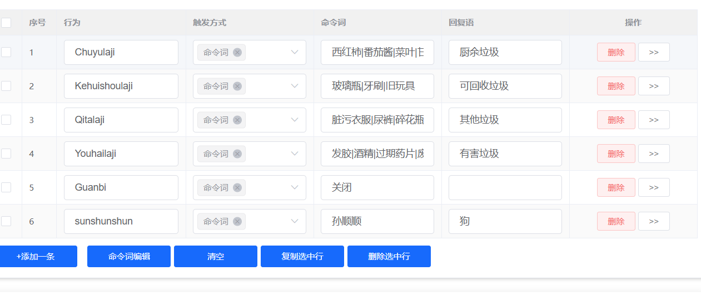

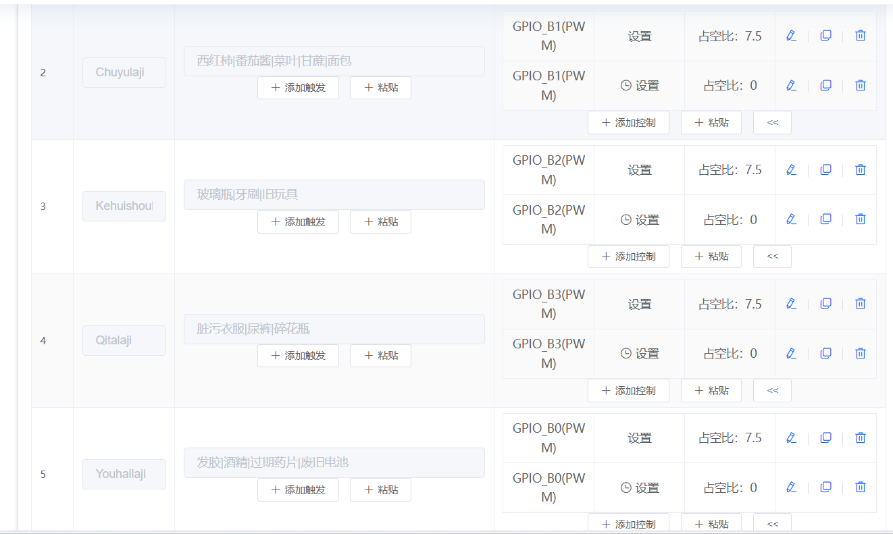

**4. 硬件连接**

```
SU-03T PWM引脚 → 舵机信号线（橙色）
SU-03T GND → 舵机地线（棕色）
外部5V电源 → 舵机电源线（红色）
```

**注意事项：**

- 舵机需要额外供电，不要用模块的3.3V
- 确保所有地线连接在一起
- 舵机不要堵转，容易损坏
- 建议在信号线和地线之间接104电容抗干扰

---

### SU-03T如何实现0.9mA低功耗待机？

**问题描述：**

SU-03T模块实际测试待机电流为2-3mA，与官方宣称的0.9mA待机电流不符。

**解决方案：**

1. **选择合适的麦克风**
    - 使用功耗较低的麦克风型号
    - 麦克风功耗直接影响整体待机电流

2. **确保模块进入休眠状态**
    - 模块需要在相对安静的环境下自动进入休眠
    - 休眠后才能达到标称的低功耗状态

3. **优化硬件设计**
    - 检查外围电路是否有漏电流
    - 确保无其他外设消耗电流
    - 优化上拉/下拉电阻配置

4. **软件配置优化**
    - 关闭不必要的功能模块
    - 配置合适的休眠参数
    - 降低系统工作频率

**注意事项：**

- 0.9mA是模块在深度休眠状态下的理想值
- 实际待机电流受使用环境影响
- 有噪声或振动时模块会保持较高功耗状态
- 建议在安静环境下测试待机电流

---

### SU-03T如何配置串口和IO口实现与单片机通信？

**问题描述：**

需要配置SU-03T模块的串口与IO口，实现与单片机的通信，同时了解模块的喇叭驱动能力及外接大功率喇叭的方案。

**解决方案：**

**1. 串口通信配置**

SU-03T模块可通过B6、B7引脚实现与单片机的串口通信：

- **B6引脚**：UART1_TXD（发送）
- **B7引脚**：UART1_RXD（接收）
- **通信电平**：3.3V TTL电平
- **支持波特率**：9600-115200bps


**2. 硬件连接**

```
单片机          SU-03T
TX     <------> B7 (RX)
RX     <------> B6 (TX)
GND    <------> GND
```

**3. 喇叭驱动能力**

SU-03T内置功放的驱动能力有限：

- **4欧姆喇叭**：需大于2.4W功率
- **8欧姆喇叭**：需大于1.6W功率
- **不建议使用**：4欧姆5W等大功率喇叭（模块驱动困难）


**4. 大功率喇叭方案**

如需驱动更大功率喇叭（如农机等高噪声环境）：

- **方案一**：选择合适功率的喇叭（8欧姆2W-3W）
- **方案二**：外接功放电路
    - 取模块音频信号进行放大
    - 需自行选型功放芯片或模块
    - 注意阻抗匹配和信号耦合

**注意事项：**

- B6/B7引脚同时支持烧录和通信功能
- 高噪声环境建议优先选择大功率喇叭方案
- 外接功放时注意音频信号的耦合方式
- 农机等应用场景需考虑防水防尘设计

---

### SU-03T模块的功放能力与外接大功率喇叭方案

**问题描述：**

SU-03T模块的内置功放无法驱动大功率喇叭，在收割机或拖拉机等高噪声环境下需要更大的声音输出，询问如何实现以及最大可接喇叭功率。

**解决方案：**

**1. SU-03T内置功放规格**

- **功放芯片型号**：HAA8002D
- **最大输出功率**：2W（标称值）
- **推荐负载**：8欧姆喇叭
- **输出配置**：固定增益，不可调

**2. 喇叭选型要求**

根据内置功放能力，喇叭选择需满足：

- **8欧姆喇叭**：功率需≥1.6W（推荐2W）
- **4欧姆喇叭**：功率需≥2.4W（但不建议使用）
- **功率限制**：不建议超过3W的喇叭


**3. 外接功放方案**

对于高噪声环境（如农机应用），可采用以下方案：

**方案一：音频信号放大**

- 从模块的SPK+/-输出端取音频信号
- 外接功放电路进行功率放大
- 注意音频信号的耦合方式（通常需要隔直电容）

**方案二：成品功放模块**

- 购买现成的音频功放模块
- 输入端连接模块音频输出
- 输出端驱动大功率喇叭

**方案三：专用功放选型**

- 根据喇叭参数选择合适功放
- 考虑供电电压（通常12V-24V）
- 注意散热和防护设计

**4. 实际应用建议**

对于农机等特殊环境：

- **喇叭选择**：8欧姆3W-5W防水喇叭
- **功放功率**：10W-20W（留足余量）
- **安装位置**：避免雨水直接冲刷
- **防护等级**：IP65或以上

**注意事项：**

- SU-03T自带功放无法驱动超过3W的喇叭
- 外接功放时需要额外的供电电路
- 高噪声环境建议选择防水喇叭
- 长期大功率输出需考虑散热问题
- 可在固件中调节音量以匹配不同环境

---

## 硬件设计与开发板/转接板（从SU-03T文档迁移）

## 硬件设计指南
1. 电源：独立 LDO，加 RC 滤波，保持语音前端稳定。
2. 麦克风/喇叭：差分走线、保持对称，严格按照推荐距离布置。
3. 串口/IO：预留调试接口并加 ESD 保护。

### 电气特性


---

## SU-03T_EVB开发板使用指南

### SU-03T开发板固件烧录教程

**问题描述：**

需要了解SU-03T开发板的功能特性，以及如何进行固件烧录。

**解决方案：**

**开发板特性：**

- **远距离唤醒**：支持5米远距离语音唤醒
- **多种音色**：支持多种音色选择
- **高识别率**：人声识别率98%以上
- **USB烧录**：支持USB线直接烧录程序

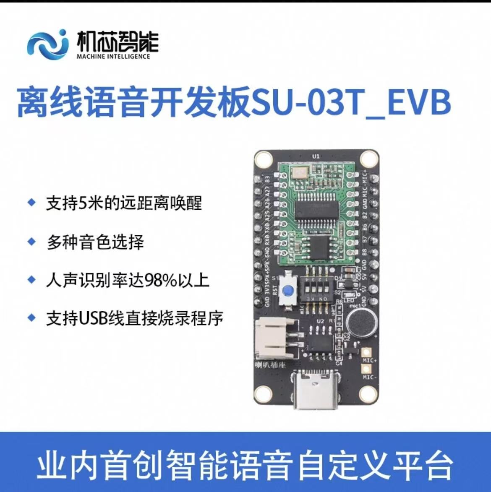

*SU-03T_EVB离线语音开发板实物图*

**视频教程：**

详细的固件烧录教程可参考视频：[SU-03T开发板固件烧录教程](https://www.bilibili.com/video/BV1z84y1t7Bn/)

该视频包含以下内容：

- 开发板外观介绍
- 硬件连接方法
- 烧录软件使用
- 常见问题解决

### SU-03T_EVB开发板如何正确接线和供电？

**问题描述：**

需要了解SU-03T_EVB开发板的接线方法，包括供电引脚选择和拨码开关功能。

**解决方案：**

**开发板供电方式：**

1. **USB-C供电（推荐）**：

    - 使用USB-C接口供电，可同时进行烧录
    - 电压为5V，满足模块工作需求
    - 烧录时仅需连接USB线即可

2. **引脚供电（集成到自有板卡时）**：

    - 使用背面排针引脚供电
    - 可选5V或3.3V供电（根据系统设计选择）
    - 多个5V、GND引脚并联，方便布线

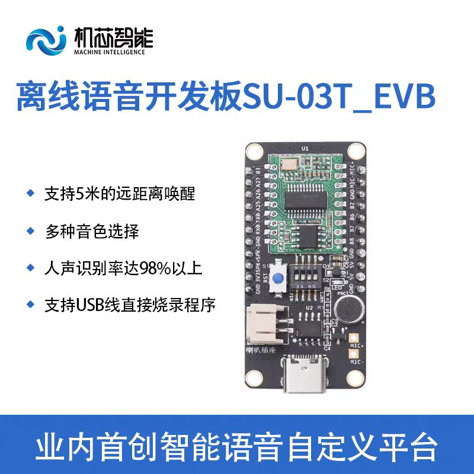

*SU-03T_EVB离线语音开发板，板载麦克风、USB接口、LED指示灯和拨码开关*

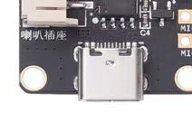

*USB-C接口可用于供电和固件烧录*

**音频设备连接：**

- **麦克风**：开发板已内置麦克风，无需外接
- **喇叭**：需要外接喇叭，连接到SPK+和SPK-引脚
- **推荐喇叭规格**：8Ω 2W

**拨码开关功能说明：**

开发板配备4个拨码开关，具体功能如下：

| 开关 | ON位置 | 数字位置 | 功能说明 |
|------|---------|-----------|----------|
| 开关1 | MIC连接 | MIC断开 | 控制板载麦克风连接 |
| 开关2 | MIC断开 | MIC连接 | 控制板载麦克风连接（与开关1配合） |
| 开关3 | 串口烧录模式 | 调试器模式 | 选择烧录方式 |
| 开关4 | 保留功能 | 保留功能 | 预留扩展功能 |

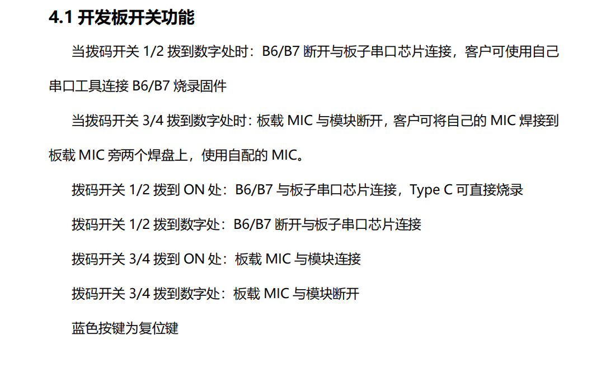

*开发板开关功能说明，1/2控制MIC，3/4控制烧录模式*

**物理规格：**

- **尺寸**：25.4mm × 53.3mm
- **封装**：DIP22（2.54间距标准排针）
- **工作温度**：-10℃ ~ +70℃


*开发板详细参数，包含尺寸、接口、功耗等信息*


*开发板采用DIP22封装，2.54mm标准排针间距*

**注意事项：**

- 开发板默认带排针，可直接使用杜邦线连接
- 集成到产品时，可通过背面排针焊接到PCB
- 拨码开关默认设置即可满足大多数应用场景
- 如需外接麦克风，需通过拨码开关断开内置麦克风

---

### SU-03T模块的2.0mm排母如何与2.54mm杜邦线转接？

**问题描述：**

SU-03T模块使用2.0mm间距的排母，无法直接使用标准的2.54mm间距杜邦线连接，需要找到合适的转接方案。

**解决方案：**

**1. 使用转接板**

    - 购买2.0mm转2.54mm的专用转接板
    - 转接板一面焊接2.0mm排针，另一面标准2.54mm排母
    - 这样可以使用标准杜邦线连接

**2. 使用转接线**

    - 购买现成的2.0mm母头转2.54mm母头转接线
    - 注意2.0mm端通常是2P合并的排母
    - 可以直接使用，无需焊接

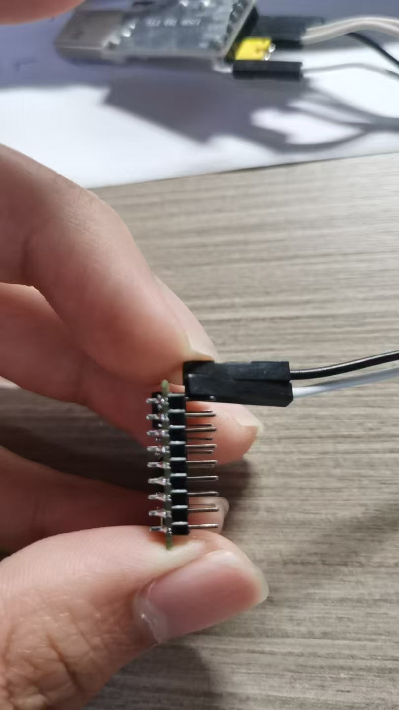

*使用杜邦线连接SU-03T模块的场景*

**3. 直接焊接排针**

    - 购买2.0mm间距的排针自行焊接
    - 焊接到模块背面或其他位置
    - 需要一定的焊接经验


*市售的2.0mm母头转2.54mm母头转接线*

**注意事项：**

- 模块使用2.0mm间距是为了控制整体尺寸
- 2.0mm和2.54mm都是常用规格，容易找到转接方案
- 转接时注意引脚顺序，避免接反
- 长期使用建议焊接固定，更可靠

---

### SU-03T转接板连接多个继电器如何供电？

**问题描述：**

使用SU-03T转接板连接多个5V继电器时，不确定如何给继电器供电，以及是否需要外接独立电源。同时需要确认转接板的供电能力。

**解决方案：**

**供电方案：**

1. **继电器供电方式**
    - 继电器5V和GND应连接到外部独立电源
    - 不建议使用SU-03T转接板直接供电多个继电器
    - 模块供电能力有限，无法提供足够电流

2. **电源接线方法**
    - 外部5V电源正极→所有继电器VCC并联
    - 外部电源地线→所有继电器GND并联
    - 继电器控制信号→分别连接到SU-03T的GPIO口

3. **转接板供电分配**
    - SU-03T转接板自身需要5V供电
    - 其他设备可从转接板的5V口取电
    - 但总电流不能超过转接板的供电能力


*多个继电器的5V和GND并联连接示意图*

**具体步骤：**

1. **电源容量计算**
    - 单个5V继电器工作电流约50-70mA
    - 多个继电器总电流=数量×单只电流
    - 选择合适功率的外部电源

2. **接线步骤**
    - 先连接所有继电器的VCC到外部5V电源正极
    - 连接所有继电器的GND到外部电源负极
    - 最后连接控制信号到模块GPIO口

3. **共地处理**
    - 外部电源地线需要与SU-03T的GND相连
    - 确保控制信号有共同的参考地
    - 避免地环路带来的干扰

**注意事项：**

- 继电器线圈会产生反向电动势，建议在继电器线圈两端并联二极管
- 如果控制感性负载，还需要在负载端加浪涌保护
- 测试时应先单个继电器，再逐步增加数量
- 外部电源建议带过流保护，提高系统安全性

---

### SU-03T转接板供电后其他设备能否共用电源？

**问题描述：**

SU-03T转接板通过USB供电后，其他设备是否能从转接板的5V和GND口取电，以及转接板本身的供电能力如何。

**解决方案：**

**供电能力分析：**

1. **转接板供电来源**
    - USB供电：提供5V/500mA电流
    - 有限制：主要供给SU-03T模块使用
    - 余量：约100-200mA可供外部设备使用

2. **电源分配方案**
    - 方案一：外部设备使用USB余量供电
    - 方案二：外部设备独立供电，避免干扰
    - 根据设备功耗选择合适方案

**具体接线方法：**

1. **从转接板取电**
    - 其他设备VCC→转接板5V口
    - 其他设备GND→转接板GND口
    - 适用于小功耗设备（<100mA）

2. **独立供电方案**
    - 外部设备使用独立5V电源
    - 所有地线连接在一起（共地）
    - 避免电源噪声相互干扰

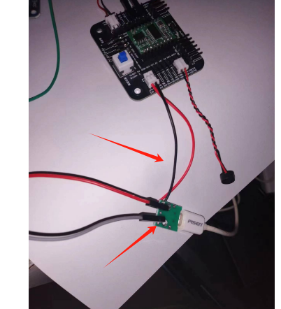

*SU-03T转接板通过USB供电，红线和黑线连接到继电器模块*


*转接板5V和GND引脚位置，可用于为外部设备供电*

**电流计算参考：**

- SU-03T模块功耗：约300mA
- USB总供电能力：500mA
- 可供外部设备：200mA（500-300）
- 同时支持设备数量：2-3个小功率设备

**注意事项：**

- 大功率设备（如舵机、电机）建议独立供电
- 共用电源时注意总电流不超过USB限制
- 使用独立电源时，所有地线必须连接
- 如设备工作异常，优先检查供电是否稳定

### SU-03T转接板3V7引脚功能

**引脚定义：**

SU-03T转接板上TTL通讯接口旁边的3V7引脚是**电源输入引脚**，不是输出引脚。

**电气规格：**

- **引脚类型**：电源输入
- **电压范围**：3.7V-5V直流电压
- **用途**：为转接板和SU-03T模块提供供电

**使用说明：**

1. **供电方式**：

    - 可使用3.7V锂电池直接供电
    - 也可使用5V直流电源供电
    - 不需要额外的稳压电路

2. **连接方法**：

    - 3V7引脚连接电源正极
    - 相应的GND引脚连接电源负极
    - 确保电压在规定范围内

3. **注意事项**：

    - 该引脚仅用于输入电源
    - 不要将其作为输出引脚使用
    - 供电电压不能超过5.5V上限
    - 使用锂电池时注意电压稳定性

**应用场景：**

- 电池供电的便携设备
- USB转接板供电
- 集成到其他PCB板时的供电接口
- 调试测试时的电源接入点

---

## 温度范围与晶振规格（从SU-03T文档迁移）

### SU-03T的工作温度范围是多少？

**问题描述：**

需要确认SU-03T模块的工作温度范围是否满足-20℃至70℃的要求，以及是否需要更换晶振。

**解决方案：**

SU-03T模块满足-20℃至70℃的工作温度要求：

- **工作温度范围**：-20℃ 至 70℃
- **存储温度范围**：-40℃ 至 85℃
- **晶振规格**：-30℃ 至 85℃，完全满足工作温度需求


*原规格书中显示的工作温度范围*

**技术要点：**

1. **晶振无需更换**：

    - 原配晶振为-30~85℃工业级规格
    - 完全覆盖-20~70℃工作温度范围
    - 不需要额外定制晶振

2. **规格书更新**：

    - 早期规格书未及时更新温度参数
    - 最新规格书已修正为正确温度范围
    - 使用时以最新版规格书为准

**注意事项：**

- 批量使用前建议进行实际温度测试验证
- 极端温度环境下注意散热和通风设计
- 如需更宽温度范围，可联系技术支持定制方案

### SU-03T规格书温度参数如何更新？

**问题描述：**

规格书中的工作温度和存储温度参数未及时更新，与实际支持的温度范围不符，需要获取更新后的规格书。

**解决方案：**

**温度参数更新过程：**

1. **原规格书问题**：

    - 工作温度显示：-20℃ 至 60℃（错误）
    - 存储温度显示：-20℃ 至 70℃（错误）
    - 实际支持温度范围更宽

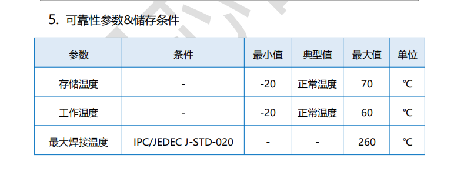

*规格书中未更新的可靠性参数表*

2. **实际温度规格**：

    - **工作温度**：-30℃ 至 70℃
    - **存储温度**：-40℃ 至 80℃
    - 符合工业级应用标准

3. **规格书获取**：

    - 联系技术支持获取最新版规格书
    - 确认文件版本为SU-03T1-V2.1-20250710-001或更新
    - 新版规格书已修正所有温度参数

4. **扬声器参数说明**：

    - 旧版：≥3W，4Ω
    - 新版：≥2.4W，4Ω 或 ≥1.6W，8Ω
    - 实际使用参数未变化，仅标注更详细

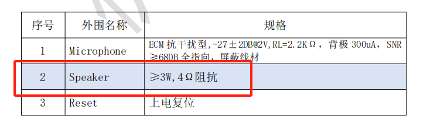

*旧版扬声器规格标注*

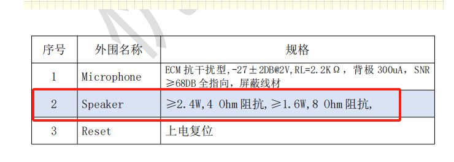

*新版更详细的扬声器规格说明*

**定制晶振说明：**

- 标准晶振已满足大多数工业应用需求
- 如需特殊温度范围（如军品级），需要定制：

    - 最小订购量：3K片
    - 成本会相应增加
    - 需要提前确认交付周期

**注意事项：**

- 设计产品时以最新版规格书为准
- 批量生产前使用小批量验证温度性能
- 保留好规格书版本号用于产品追溯

### 回流焊曲线图


### 应用电路图


---

### SU-03T模块使用升压电路供电时严重发热如何处理？

**问题描述：**

使用SU-03T模块时，语音芯片和功放芯片严重发烫，甚至导致模块不工作。使用boost升压芯片从单节锂电池升压至5V供电。

**解决方案：**

**1. 问题原因分析**

- 升压模块的滤波效果不佳
- 电源纹波过大导致芯片异常发热
- 升压电路可能输出不稳定

**2. 直接供电方案**

- 使用单节3.7V锂电池直接供电
- SU-03T模块支持3.3V-5V电压范围
- 电池电压在3.4V-4.2V之间均可正常工作

**3. 电源设计建议**

- 优先使用电池直接供电，避免升压
- 如必须升压，选择低纹波的LDO方案
- 在电源输入端增加滤波电容

**注意事项：**

- 电池电压不应低于3.3V
- 满电4.2V也在模块承受范围内
- 电源纹波是导致发热的主要原因
- 建议在电源输入端并联100uF电解电容

---


---

### SU-03T音频输出异常故障排查

**问题描述：**

SU-03T模块连接喇叭后无声音输出，或声音异常，需要系统化的故障排查方法。

**故障现象：**

1. 完全无声音输出
2. 声音断断续续
3. 声音失真或有杂音
4. 单边有声（立体声配置时）

**排查步骤：**

**1. 基础检查**

- **电源检查**：确认模块供电正常（3.3V-5V）
- **连接检查**：检查SPK+、SPK-、GND连接是否正确
- **喇叭检查**：使用万用表测试喇叭阻抗（8Ω/4Ω）

**2. 电压测量**

使用万用表测量关键测试点：

```
测试点            正常值        异常说明
SPK+ 对 GND       1.2V-1.5V    音频中点电压
SPK- 对 GND       1.2V-1.5V    音频中点电压
SPK+ 对 SPK-      0V           静态无差分
VDD 对 GND        3.3V/5V      供电电压
```

**3. 放大器故障诊断**

**常见故障：放大器短路**

- **症状**：测量SPK和GND电压超过2.4V
- **原因**：功率放大器内部短路
- **处理**：更换模块或修复功放电路

**诊断流程：**

```c
// 伪代码：音频输出自检
void audio_self_test() {
    // 1. 检测音频数据
    if (is_audio_data_present()) {
        printf("音频数据正常\n");
    } else {
        printf("无音频数据输出\n");
    }
    
    // 2. 检测功放状态
    float voltage = measure_spk_voltage();
    if (voltage > 2.4) {
        printf("功放短路故障\n");
    } else {
        printf("功放正常\n");
    }
}
```

**4. 硬件解决方案**

**功放保护电路：**

```
VDD ──┬── 100Ω ──┬── SPK+
        │          │
        └── 10uF ───┘
        │
        └── 功放IC
        │
GND ──┴── 100Ω ──┴── SPK-
```

**推荐的喇叭规格：**

- **阻抗**：8Ω（推荐）/4Ω（可支持）
- **功率**：0.5W-2W
- **类型**：动圈式扬声器
- **频率响应**：300Hz-4kHz

**5. 软件调试**

**音频测试命令：**

```
AT+TESTAUDIO=1    // 播放测试音频
AT+VOL=50         // 设置音量（0-100）
AT+SPK=1          // 启用喇叭输出
AT+SPK=0          // 禁用喇叭输出
```

**音频相关寄存器：**

```
地址      功能              正常值
0x40     音频使能          0x01
0x41     音量控制          0x32-0x64
0x42     功放状态          0x00/0x01
```

**6. 常见问题处理**

**问题1：完全无声音**

- 检查音量设置（AT+VOL?）
- 检查喇叭输出是否启用（AT+SPK?）
- 测量功放供电是否正常
- 检查音频时钟是否工作

**问题2：声音小**

- 增加音量设置（AT+VOL=100）
- 检查喇叭阻抗是否匹配
- 检查音频信号幅度

**问题3：有杂音**

- 检查电源纹波
- 增加滤波电容
- 检查接地是否良好
- 远离干扰源

**7. 返修判断标准**

符合以下条件建议返修：

1. SPK电压持续超过2.4V
2. 无音频数据输出（排除配置问题）
3. 上电瞬间功放芯片异常发热
4. 音频输出自检失败

**预防措施：**

1. **设计阶段**：

    - 增加过流保护
    - 添加音频隔离电路
    - 预留测试点

2. **生产阶段**：

    - 严格执行音频测试
    - 抽检功放参数
    - 老化测试

3. **使用阶段**：

    - 避免短路
    - 匹配正确负载
    - 定期检查

**维修建议：**

- 功放IC损坏：不建议自行维修，建议更换模块
- 假焊问题：可重新焊接相关引脚
- 配置错误：通过AT命令重新配置
- 外部损坏：检查外围电路和连接

---

### SU-03T与CI-96Z音频性能对比

**问题描述：**

需要了解SU-03T和CI-96Z在音频输出方面的差异，以便选择合适的方案。

**性能对比表：**

| 特性 | SU-03T | CI-96Z | 说明 |
|------|--------|--------|------|
| 输出功率 | 1.5W | 1W | SU-03T功率更大 |
| 支持负载 | 4Ω/8Ω | 8Ω | CI-96Z推荐8Ω |
| 音质表现 | 优秀 | 良好 | SU-03T信噪比更高 |
| 功耗 | 较高 | 较低 | CI-96Z更省电 |
| 价格 | 较低 | 较高 | SU-03T性价比高 |

**选择建议：**

- **音质优先**：选择SU-03T
- **功耗敏感**：选择CI-96Z
- **成本控制**：选择SU-03T
- **小体积设计**：选择CI-96Z

---

### SU-03T模块间歇性唤醒失效怎么办？

**问题描述：**

SU-03T模块出现时而可以唤醒、时而无法唤醒的问题，即使不连接串口也无法正常唤醒。

**解决方案：**

这个问题通常是电源供电不稳定导致的，需要检查电源连接特别是负极（GND）端子的接触情况。

**排查步骤：**

1. **检查电源电压**

    - 使用万用表测量M1+和GND之间的电压
    - 确保电压在模块工作范围内（3.3V-5.5V）
    - 电压过低或不稳定会导致唤醒功能异常

2. **检查电源连接**

    - 重点检查负极（GND）端子的连接是否牢固
    - 轻轻按压模块，观察是否能够正常唤醒
    - 如果按压时能唤醒而松开后失效，说明接触不良

3. **常见问题及处理**

    - **端子松动**：重新焊接或更换接线端子
    - **接触不良**：清洁接触点，确保金属面良好接触
    - **线材问题**：使用足够粗的电源线，避免线阻过大

**测试方法：**

- 模块单独测试：将模块从成品板上拆下，单独供电测试
- 短接测试：使用短接线直接连接电源，排除中间连接问题
- 替换测试：使用已知良好的电源模块进行对比测试

**预防措施：**

- 使用质量可靠的接线端子
- 确保焊接牢固，避免虚焊
- 成品板设计时考虑电源连接的可靠性
- 定期检查电源连接状况

---


### SU-03T模块焊接到PCB后无法烧录怎么办？

**问题描述：**

SU-03T模块焊接到产品主板后，使用CH340串口烧录器无法进行固件下载，需要拆下模块才能正常烧录。

**解决方案：**

**当前情况说明：**

- SU-03T理论上不影响在产品上直接烧录
- 实际使用中可能存在某些设计导致无法烧录

**建议排查步骤：**

1. **检查原理图设计**
    - 确认UART烧录引脚（TX/RX）是否有其他外设连接
    - 检查是否有引脚被意外拉高或拉低
    - 验证BOOT引脚的电平设置是否正确

2. **硬件检查**
    - 测量模块供电是否稳定（建议5V）
    - 检查串口线路是否通畅
    - 确认GND连接良好

3. **烧录参数设置**
    - 使用正确的波特率（通常为115200）
    - 选择正确的芯片型号
    - 确保烧录工具配置正确

**临时解决方案：**

- 设计烧录接口，方便后续固件更新
- 使用测试点预留烧录接口
- 考虑使用烧录座进行批量生产

**注意事项：**

- SU-03T与CI-03T不同，一般不存在特殊的引脚限制
- 如问题持续存在，需要检查具体电路设计
- 建议保留模块的烧录接口以便后期维护

---

---

### SU-03T可以使用8欧1W喇叭吗？

**问题描述：**

由于结构尺寸限制，无法使用推荐的8欧2W喇叭，询问是否可以使用8欧1W喇叭。

**解决方案：**

可以使用8欧1W喇叭，但需要注意以下事项：

**1. 功率匹配**

- **推荐规格**：8欧2W喇叭（最佳效果）
- **可用规格**：8欧1W喇叭（可用，但音量较小）
- 模块内置功放可以驱动1W喇叭，不会损坏

**2. 使用1W喇叭的注意事项**

- 音量会比2W喇叭小
- 适合小腔体、近距离应用场景
- 不会造成失真（有喇叭腔体的情况下）

**3. 声学设计建议**

- 使用带腔体的喇叭可以改善音质
- 腔体设计可以弥补功率不足的问题
- 无腔体时可能存在音质问题

**选型建议：**

| 应用场景 | 推荐喇叭 | 说明 |
|---------|---------|------|
| 标准应用 | 8Ω 2W | 最佳音量和音质 |
| 小尺寸产品 | 8Ω 1W | 可用，音量略小 |
| 远距离控制 | 8Ω 2W或更大 | 确保音量足够 |

**注意事项：**

- 1W喇叭音量较小，适合安静环境
- 如果需要更大音量，考虑使用外部功放
- 喇叭阻抗必须匹配（8Ω）

---

### SU-03T的B0/B1和B6/B7引脚有什么区别？

**问题描述：**

SU-03T模块上有两组串口引脚B0/B1和B6/B7，需要了解它们的区别和用途。

**解决方案：**

**1. 引脚功能区分**

| 引脚 | 功能 | 用途 |
|-----|------|------|
| B0/B1 | 调试器烧录口 | 使用专用调试器烧录时使用 |
| B6/B7 | 串口烧录口 | 使用USB转串口（如CH340）烧录时使用 |

**2. 烧录方式**

**USB转串口烧录（CH340）**：

- 使用引脚：B6(TX)、B7(RX)
- 连接方式：CH340 TXD → SU-03T B6，CH340 RXD → SU-03T B7

**调试器烧录**：

- 使用引脚：B0、B1
- 适用于批量生产或专业开发

**3. 串口通信**

- 正常运行时串口通信使用B6/B7引脚
- B6为模块TX，B7为模块RX

**注意事项：**

- 使用USB转串口烧录时必须使用B6/B7
- B0/B1仅适用于专用调试器

---

### SU-03T串口与5V MCU连接需要电平转换吗？

**问题描述：**

SU-03T模块与5V供电的MCU进行串口通信时，是否需要添加电平转换电路。

**解决方案：**

**1. 电平规格**

- **SU-03T串口电平**：3.3V
- **模块引脚宽电压**：3.3V~5V（引脚可耐受5V）
- **串口输出**：固定3.3V电平

**2. 连接方案**

**方案一：使用电平转换**

- MCU(5V TX) → [电平转换] → SU-03T(3.3V RX)
- SU-03T(3.3V TX) → 直接连接 → MCU(5V RX)

**方案二：开漏输出+上拉**

可在智能公元平台优化选项中配置串口为开漏模式：

1. 将串口设置为开漏模式
2. 电路上将串口线上拉到5V
3. 上拉电阻值：4.7KΩ~10KΩ

**注意事项：**

- MCU的5V TX输出不应直接连接SU-03T的RX（可能损坏引脚）
- 建议使用电平转换或电阻分压电路保护模块

---

### SU-03T模块是否支持芯片供应和自贴片方案？

**问题描述：**

需要将SU-03T模块的芯片直接贴片到产品PCB上，询问是否可以提供芯片。

**解决方案：**

**1. 芯片供应方案**

- **可提供芯片**：支持提供主芯片供客户自行贴片
- **芯片状态**：芯片需要预先烧录基础程序
- **限制说明**：SU-03T芯片不能作为空片出售，必须由厂商预烧基础程序

**2. 自贴片流程**

1. 联系供应商获取芯片
2. 芯片已预烧基础程序
3. 客户自行SMT贴片到PCB

**3. 技术资料支持**

- 提供完整的硬件设计资料
- 包括原理图、封装尺寸等
- 可参考开发包中的PCB资料

**注意事项：**

- SU-03T芯片不能买空片自行串口烧录
- 必须由厂商预烧基础程序
- 建议先用模块验证方案后再考虑自贴片

---

### SU-03T外部模块输出3.3V通过A25引脚唤醒导致间断唤醒卡死怎么办？

**问题描述：**

使用SU-03T板载的3.3V通过A25引脚可以正常唤醒模块，但使用外部模块（如海凌科LD2401雷达模块）输出的3.3V通过A25引脚唤醒时，模块会间断唤醒并最终卡死。

**原因分析：**

外部模块输出的3.3V信号可能存在以下问题：

1. **信号纹波或抖动**：外部模块输出的3.3V可能不够稳定，存在纹波或抖动
2. **驱动能力不足**：外部模块输出驱动能力可能较弱，电平不稳定
3. **地电位差**：外部模块与SU-03T之间存在地电位差
4. **信号上升沿缓慢**：外部模块输出的上升沿可能较缓，导致多次触发

**解决方案：**

**1. 添加信号调理电路**

- 在外部模块输出和A25引脚之间增加滤波电容（如0.1μF）
- 添加上拉或下拉电阻确保空闲时电平稳定
- 使用施密特触发器整形信号

**2. 共地处理**

- 确保外部模块与SU-03T共地
- 检查两地之间的电位差，必要时使用光耦隔离

**3. 软件防抖**

在平台配置中添加防抖处理：
- 设置触发后的保持时间
- 添加触发间隔限制

**4. 使用隔离方案**

- 采用光耦（如PC817）隔离外部信号
- 使用继电器隔离外部信号
- 确保隔离后的信号电平稳定

**注意事项：**

- A25引脚唤醒功能对信号质量要求较高
- 外部模块输出必须稳定可靠
- 建议先用示波器观察外部模块输出的波形
- 如问题持续，考虑使用模块板载3.3V作为唤醒源

---

