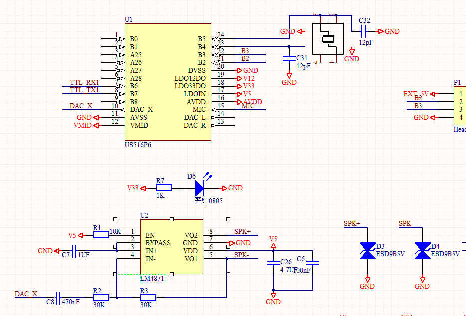
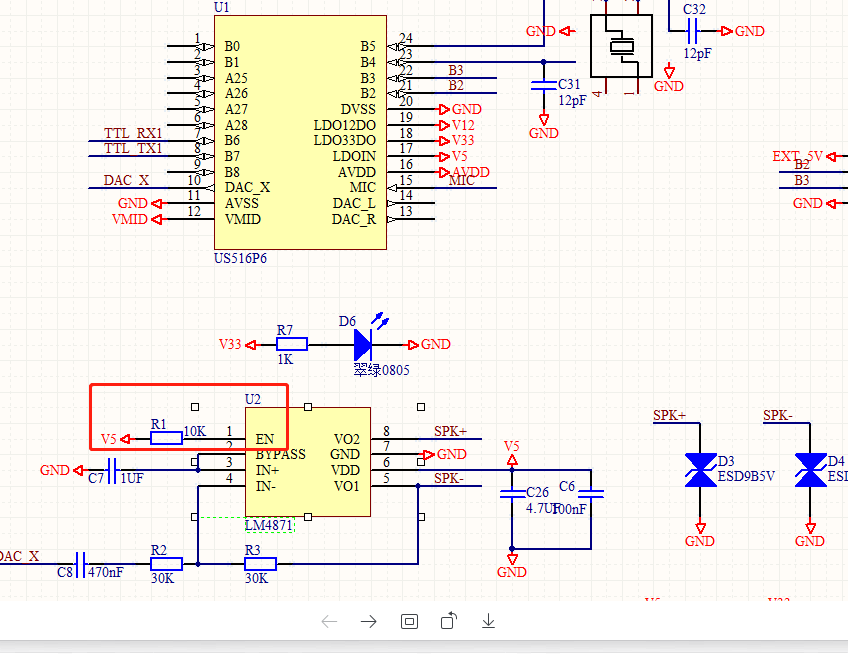
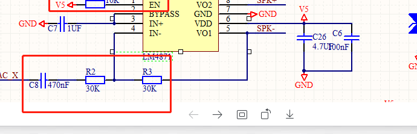

# SU-10A 硬件设计 FAQ

本页用于整理 SU-10A 相关的硬件设计问题。

### SU-10A 模块 DAC 和功放均有信号但喇叭无声音

**问题描述：**

使用 SU-10A 模块时，示波器检测到 US516P6 芯片的 DAC 输出有信号，LM4871 功放芯片的 SPK+ 与 SPK- 也有输出波形，但连接喇叭后没有声音。

**解决方案：**

- 检查 LM4871 功放芯片的使能脚（EN）连接，确保正确接地（低电平使能）
- 如果使能脚接 5V，需要切断电源或将 EN 脚悬空
- 调整输入耦合电容和电阻匹配参数：

    - 将耦合电容 C8 从 470nF 改为 100nF
    - 将分压电阻 R2 改为 20kΩ，调整增益
- D3、D4 为 ESD 防护二极管，不影响音频输出功能

**注意事项：**

- 喇叭规格建议使用 8Ω 1W
- 如果上述调整后仍无法解决，建议直接使用成品 SU-10A 模块
- 功放电路的参数匹配对音频输出质量影响较大，需严格按照规格书设计
