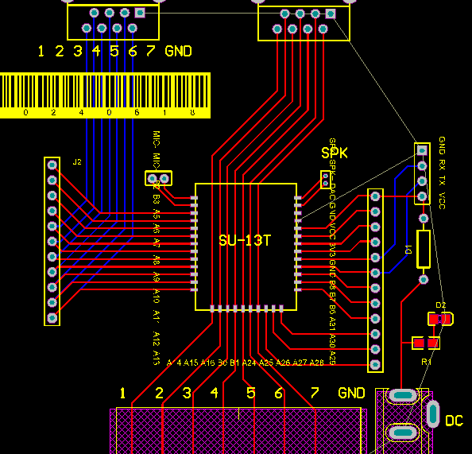

# SU-13T 硬件设计 FAQ

本页用于整理 SU-13T 相关的硬件设计问题。

### SU-13T使用5V供电无法启动怎么办？

**问题描述：**

SU-13T模块使用5V供电时无法正常启动，但使用3.3V供电可以启动，不过芯片发热严重。

**解决方案：**

- 立即停止使用5V供电
- SU-13T模块应使用3.3V标准供电电压
- 如使用3.3V供电后发热严重，可能是模块已损坏

**设计注意事项：**

- 严格按照规格书要求的3.3V供电设计
- 供电电压过高会损坏模块
- 建议使用稳定的3.3V LDO供电
- 如需从5V转换，使用线性稳压器

**故障排查：**

1. 检查电源输出是否为稳定的3.3V
2. 测量模块工作电流是否正常
3. 如3.3V供电仍发热异常，建议更换模块

---

### SU-13T的DAC引脚如何使用？

**问题描述：**

需要将SU-13T的DAC引脚连接到低音炮功放，以实现音频输出功能。

**解决方案：**

**DAC引脚说明：**

SU-13T模块提供DAC（数字模拟转换）输出引脚，用于输出高质量的模拟音频信号：

- **DAC+**：音频信号正极输出
- **DAC-**：音频信号负极输出（差分信号）
- **输出电平**：标准线路电平
- **频率响应**：20Hz-20kHz

**连接功放的方法：**

1. **单端连接**（推荐）：

    - DAC+连接到功放音频输入正极
    - DAC-连接到功放音频输入地线
    - 适用于大多数功放设备

2. **差分连接**：

    - DAC+和DAC-分别连接到功放的差分输入
    - 需要功放支持差分输入
    - 共模抑制更好，抗干扰能力更强

**接线注意事项：**

1. **电平匹配**：

    - 确认功放输入电平与DAC输出匹配
    - 如电平不匹配，需要增加衰减或放大电路
    - 标准线路电平约为0.775Vrms

2. **阻抗匹配**：

    - 功放输入阻抗通常为10kΩ-47kΩ
    - DAC输出阻抗较低（约100Ω）
    - 一般不需要额外的阻抗匹配

3. **线缆选择**：

    - 使用屏蔽音频线减少干扰
    - 线缆尽量短，避免信号损失
    - 远距离传输考虑使用平衡连接

**功放配置建议：**

- 输入增益设置在中档位置
- 开启低音增强功能（如果支持）
- 注意音量不要过大避免失真
- 测试时先用小音量

**注意事项：**

- DAC输出仅支持音频信号，不可用于控制
- 连接前先断开电源
- 确认功放电源与SU-13T共地
- 如有噪音，检查接地和屏蔽

---

### SU-13T模块硬件连接不规范导致问题怎么办？

**问题描述：**

SU-13T芯片模块在硬件连接和调试过程中，因接线不规范导致设备无法正常工作，需要指导正确的连接方法和调试技巧。

**解决方案：**

**接线规范要求：**

1. **电源连接规范**

    - 使用5V直流稳压供电
    - 确保电源纹波小于100mV
    - 添加必要的滤波电容（建议100μF以上）
    - 避免与大功率电路共用电源

2. **音频接口连接**

    - 麦克风使用驻极体咪头，灵敏度推荐-27dB
    - 扬声器推荐8欧姆2W规格
    - 音频线路使用屏蔽线减少干扰
    - 保持音频线路远离电源线和数字信号

3. **数字接口连接**

    - UART接口交叉连接（TX→RX，RX→TX）
    - I2C接口需要上拉电阻（通常4.7kΩ）
    - GPIO连接注意电平匹配（3.3V逻辑）
    - 预留调试接口便于后期测试



*SU-13T芯片的接线布局，包含J2、MIC、SPK等接口的正确连接方式*

**设计检查清单：**

1. **PCB设计检查**

    - 确认所有接口引脚定义正确
    - 检查电源和地线宽度足够
    - 验证音频走线差分对称
    - 添加必要的测试点

2. **连接质量验证**

    - 使用万用表测试连通性
    - 检查是否存在短路或开路
    - 验证关键点位电压
    - 进行拉力测试确保连接可靠

3. **信号完整性测试**

    - 使用示波器检查关键信号波形
    - 验证电源纹波在允许范围内
    - 检查数字信号边沿质量
    - 测试音频信号无失真

**常见错误及纠正：**

1. **接线错误**

    - **错误**：TX接TX，RX接RX
    - **纠正**：TX接RX，RX接TX（交叉连接）

2. **电源问题**

    - **错误**：使用不稳定的开关电源
    - **纠正**：使用线性稳压电源，增加滤波电路

3. **音频干扰**

    - **错误**：音频线与电源线平行走线
    - **纠正**：音频线使用屏蔽线，远离干扰源

**调试建议：**

1. **分步调试**

    - 先测试电源部分是否正常
    - 再验证基本通信功能
    - 最后测试音频输入输出

2. **使用标准工具**

    - 使用逻辑分析仪检查数字信号
    - 使用音频分析仪测试音频质量
    - 保留测试波形便于对比

3. **记录调试数据**

    - 记录各测试点的电压值
    - 保存关键信号的波形图
    - 建立问题排查清单

**注意事项：**

- SU-13T为SMD封装，需要专业焊接设备
- 设计阶段就要考虑可测试性和可生产性
- 批量生产前进行充分的样品验证
- 保留完整的设计文档和测试记录

### 如何在SU-13T上设置限位开关输入？

**问题描述：**

需要在SU-13T设备上设置输入端口作为限位开关，并通过串口输出控制信号。

**解决方案：**

**1. 使用ADC按键输入**

限位开关可以通过ADC按键输入引脚连接：

- 选择ADC按键输入引脚连接限位开关
- 限位开关一端接ADC输入，另一端接地
- 使用上拉或下拉电阻确保默认状态稳定

**2. 配置GPIO端口**

在平台中配置GPIO端口：

- 进入GPIO端口设置页面
- 选择相应引脚作为ADC按键输入
- 设置触发阈值和触发方式
- 配置串口输出功能

**3. 串口消息输出**

配置限位开关触发后的串口输出：

- 在控制详情中添加串口输出动作
- 自定义串口消息格式
- 设置输出时机（触发时/释放时）

**接线示例：**

```
限位开关 ───┬── ADC输入引脚
            │
            ─┴── 上拉电阻（10kΩ）── VCC
            │
            GND
```

**注意事项：**

- 确保限位开关的触发电压在ADC输入范围内
- 合理设置ADC阈值避免误触发
- 串口输出消息格式需与接收端设备匹配
- 可以在B站查找相关视频教程参考具体配置步骤

---

### SU-13T的B6/B7引脚可以配置为串口吗？

**问题描述：**

询问SU-13T芯片是否仍需将B6和B7引脚配置为串口功能。

**解决方案：**

**引脚配置说明**

- SU-13T的B6和B7引脚可以配置为UART1串口功能
- B6可配置为UART1_RX（接收）
- B7可配置为UART1_TX（发送）

**配置方法**

- 在智能公园配置平台的GPIO配置页面
- 找到B6和B7引脚的配置选项
- 将B6设置为UART1_RX功能
- 将B7设置为UART1_TX功能

**使用注意事项**

- 配置为串口后，B6/B7将无法作为普通GPIO使用
- 串口通信参数需在平台中正确设置
- 与外部设备通信时注意电平匹配
- 建议使用3.3V电平，避免损坏芯片

---

### 如何识别SU-13T模块？

**问题描述：**

需要确认手中的模块是否为SU-13T型号，以及如何识别模块版本。

**解决方案：**

**1. 模块识别方法**

- **查看丝印**：模块背面印有"SU-13T V1.0"字样
- **主控芯片**：板上主芯片为Unisound US51611 CSJ16CWF02
- **引脚定义**：模块上有SPK+、SPK-、MIC+、MIC-、VCC、GND等标识

**2. 物理特征**

- **版本标识**：V1.0表示版本号
- **封装形式**：标准模块封装
- **引脚数量**：具备多个IO引脚和功能引脚
- **接口类型**：支持麦克风输入和扬声器输出

**3. 功能验证**

- **语音识别**：可进行离线语音命令识别
- **控制功能**：支持继电器、LED等负载控制
- **通信接口**：支持UART串口通信

**注意事项：**

- 确认模块上的丝印标识是最直接的识别方法
- US51611是灵汐科技的声音处理芯片
- 如标识不清，可通过功能测试确认型号

---