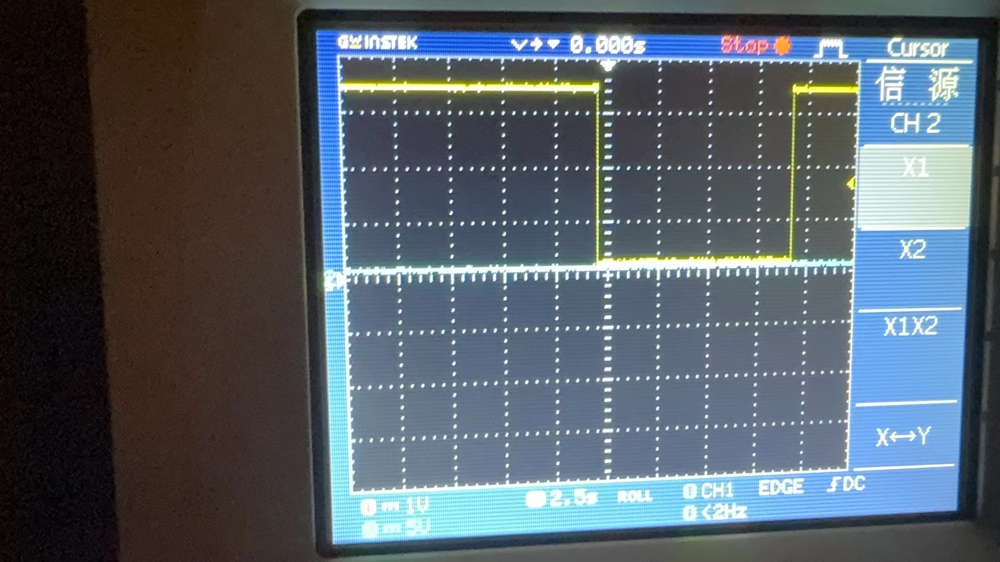
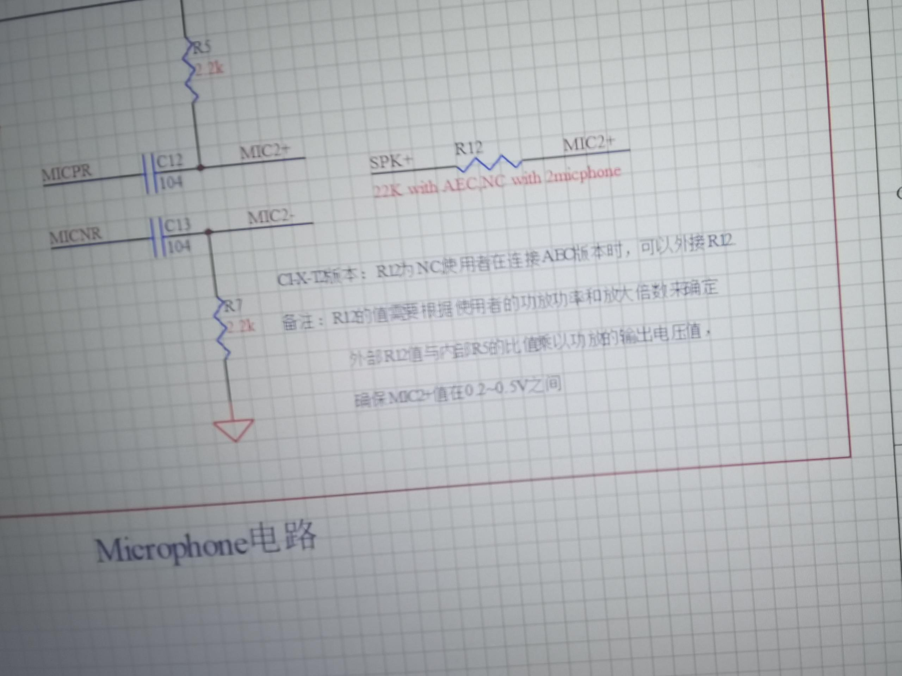
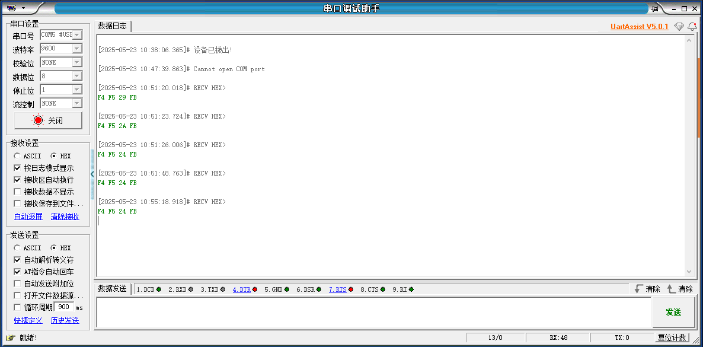
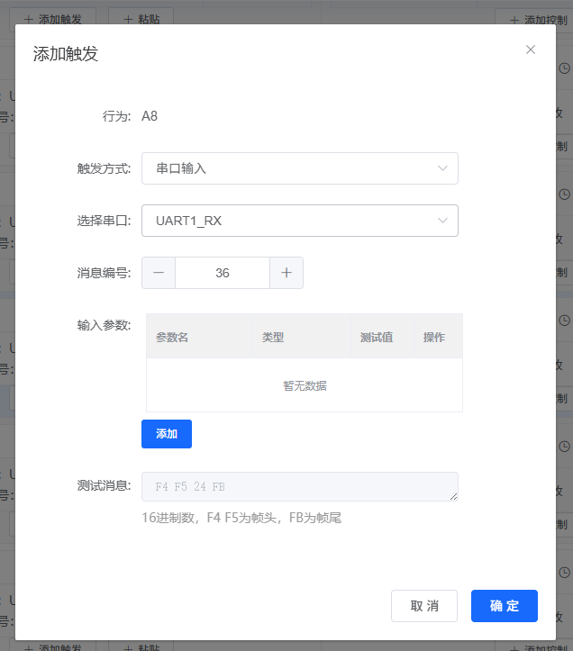
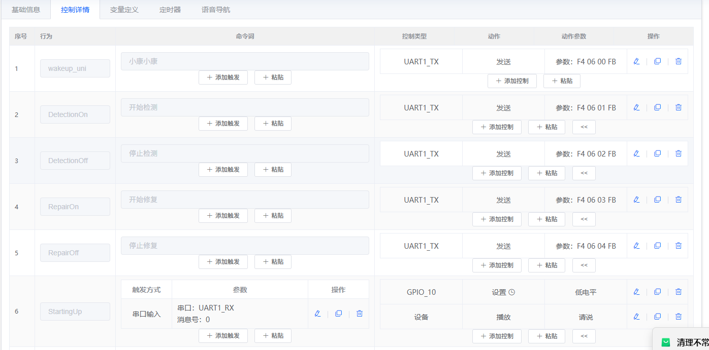
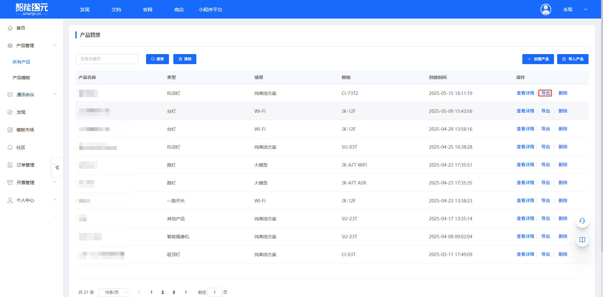

# SU-21T 硬件设计 FAQ

本页用于整理 SU-21T 相关的硬件设计问题。

### SU-21T模块如何实现喇叭输出声音？

**问题描述：**

需要了解SU-21T模块是否支持喇叭直接输出声音，以及如何实现音频输出功能。

**解决方案：**

SU-21T模块**无内置功放**，需要外接功放电路才能驱动喇叭：

1. **硬件连接方案**：

    - 使用DAC输出接口连接外部功放
    - 通过外接功放电路驱动喇叭
    - DAC输出为音频信号，需要功放放大后才能驱动喇叭

2. **设计注意事项**：

    - 功放电路需匹配喇叭阻抗参数
    - 注意电源滤波，避免噪声干扰
    - 建议使用专用音频功放IC

3. **参考设计**：

    - 可参考官方开发包中的参考电路
    - 选择适合的低功耗功放方案
    - 考虑SU-21T的低功耗特性，搭配低静态电流功放

**注意事项：**

- SU-21T的功放引脚为空，必须外接功放
- 选型功放时考虑工作电压和功耗要求
- 喇叭功率不宜过大，以免影响整体功耗
- 注意音频布线的抗干扰设计

---

### SU-21T芯片在电池供电产品中的低功耗应用设计

**问题描述：**

电池版电动窗帘产品需要集成低功耗语音控制功能，要求待机功耗低于1mA，并支持休眠模式以延长电池使用时间。

**解决方案：**

**芯片选型依据：**

1. **SU-21T低功耗特性**：

    - 待机功耗：亚毫瓦级（远低于1mA要求）
    - 工作功耗：几毫瓦级别
    - 支持50条本地指令离线识别
    - 3.3V供电（严禁5V）

2. **功耗优化设计**：

    - 采用独立LDO供电，加RC滤波保持电源稳定
    - 默认10秒无操作自动退出唤醒状态
    - 支持硬件开关控制实现手动休眠

3. **通信协议设计**：

    - 通过串口协议与主控MCU通信
    - 协议格式：0xAA 0x55 CMD LEN DATA CS
    - 可根据主控需求自定义协议内容

**休眠模式实现方案：**

1. **自动休眠**：

    - 默认10秒无操作后自动退出唤醒
    - 环境音不会持续唤醒，降低误触发

2. **手动休眠**：

    - 增加物理开关控制语音模块电源
    - 特殊情况下可完全关闭语音功能
    - 适用于夜间或长时间不使用场景

**成本控制建议：**

- US513U61芯片批量价格：体费用请联系官方客服评估
- 直接使用芯片而非模组，自行PCB设计
- 简化外围电路，仅保留必要功能

**注意事项：**

- 电池供电设计需考虑电压稳定性，建议使用3.3V LDO
- 咪头选型建议灵敏度-32dB，避免环境音误触发
- 结构设计避免将咪头置于密闭空间
- 需要根据实际语音命令数量确认50条指令是否满足需求

---


---

### SU-21T原理图引脚标识错误怎么办？

**问题描述：**

查看SU-21T产品原理图时，发现引脚标识存在错误，需要确认原理图中引脚定义的正确性。

**问题分析：**

- 原理图中的线路连接是正确的
- 引脚定义和功能分配也是正确的
- 仅原理图上使用的标识符（符号）存在错误
- 不影响实际的硬件设计和功能实现

**具体错误说明：**

- 引脚7（TX1D）和引脚8（RX1D）的网络标签错误标记为IO10和IO11
- 实际应为TX1和RX1
- 这是Layout设计与原理图未同步更新导致的标识错误

**解决方案：**

**1. 确认设计正确性**：

    - 原理图的电气连接完全正确
    - 引脚功能分配符合实际设计
    - 可以按照现有原理图进行PCB设计

**2. 标识符处理**：

    - 原理图中的引脚标识符错误仅为文档显示问题
    - 不影响实际的硬件连接和功能
    - 设计时可参考引脚位置而非标识符名称

**3. 设计验证建议**：

    - 结合官方规格书确认引脚定义
    - 参考模块实物丝印标识
    - 使用万用表测试验证关键引脚

**技术团队确认：**

- 已确认这是网络标签错误
- PCB布局设计已经调换位置
- 原理图未修改，直接调整的Layout
- 模块本身没有问题，可以正常使用

**注意事项：**

- 这是文档层的标识错误，不是硬件设计错误
- 实际PCB设计时按照正确的引脚位置连接
- PCB布局已经按照TX1/RX1正确布线
- 如有疑问，可联系官方获取最新原理图

**预防措施：**

- 设计时多渠道验证引脚定义
- 保留设计决策记录
- 定期关注官方文档更新
- 建立设计检查清单

---


---

### SU-21T芯片是否包含串口保护电路？

**问题描述：**

需要确认SU-21T芯片的TTL串口是否包含保护电路设计。

**解决方案：**

SU-21T芯片的TTL串口包含保护电路：

1. **保护电路组成**：

    - UART1 TX和RX引脚均配置了保护电路
    - 包含470Ω限流电阻（R2）
    - 包含IN5819二极管（D1）用于防反接和过压保护

2. **电路设计详情**：

    

    该保护电路可以有效防止：

    - 静电放电（ESD）损害
    - 电压反接造成的损坏
    - 过压或过流对芯片的冲击

**设计建议：**

1. **外部电路设计**：

    - 虽然芯片内部有保护电路，仍建议在外部电路中增加适当的保护措施
    - 可以增加TVS管进行更强的ESD保护
    - 根据实际应用环境考虑是否需要额外的滤波电路

2. **连接注意事项**：

    - 确保连接电压符合3.3V TTL电平标准
    - 避免直接连接5V电平设备
    - 使用合适的电平转换电路进行连接

**注意事项：**

- SU-21T的串口保护电路为基本保护，适用于一般应用场景
- 在恶劣环境下使用时，建议增加额外的保护电路
- 设计时仍需遵循标准的设计规范，确保系统可靠性

---


---

### SU-21T芯片原理图引脚名称与实际PCB不一致怎么办？

**问题描述：**

SU-21T芯片原理图中引脚名称与实际PCB布局不一致，存在网络标签错误，导致设计参考错误。

**问题确认：**

1. **错误位置**：

    - 原理图中引脚7（TX1D）和引脚8（RX1D）的网络标签错误
    - 被错误地标记为IO10和IO11
    - 实际引脚应为TX1和RX1

2. **PCB布局正确**：

    - 实际PCB布局已经正确调整
    - Layout部门已调换位置
    - 模块功能没有问题

**解决方案：**

1. **确认正确连接**：

    - 以PCB布局和实际引脚功能为准
    - 引脚7应连接为TX1功能
    - 引脚8应连接为RX1功能
    - 忽略原理图中的错误网络标签

2. **设计参考**：

    - 参考最新的官方文档
    - 使用验证过的设计参考图
    - 必要时联系官方确认

3. **文档更新说明**：

    - 这是已知的历史文档错误
    - Layout已经修正但原理图未同步更新
    - 后续版本会修正此问题

**技术要点：**

- 引脚功能定义是正确的，仅网络标签标识错误
- 实际使用时按照引脚功能（TX1/RX1）进行连接
- 不影响模块的正常功能和使用

**注意事项：**

- 设计时应以实际引脚功能为准，不必纠结于网络标签名称
- 如有疑问，及时与官方确认
- 建议关注官方文档更新获取最新版本

---


---

### SU-21T芯片的IO4口在静音时为什么会输出高电平？

**问题描述：**

SU-21T芯片的IO4口在静音环境下会持续输出高电平（约3.3V），当有声音时电平会变低，这种现象是否正常？

**可能原因分析：**

根据SU-21T芯片的工作特性，IO4口在静音时输出高电平可能是以下原因：

**1. IO配置模式错误**

- IO4可能被误配置为输出模式而非输入模式
- 芯片内部默认状态导致输出高电平
- 配置文件中IO4设置不正确

**2. 芯片内部状态机制**

- SU-21T可能有特殊的电源管理机制
- 静音时进入低功耗模式，IO状态改变
- 声音触发时退出低功耗模式，IO电平变化

**3. 声音检测与IO联动**

- 芯片可能通过检测声音信号来控制IO状态
- 无声音时默认输出高电平作为待机指示
- 检测到声音后切换为低电平


*示波器截图显示IO4口在静音时保持高电平，有声音时电平下降*

**解决方案：**

**1. 检查IO配置**

- 确认IO4在平台中配置为输入模式
- 如不需要输出功能，设置为高阻态输入
- 检查是否有上拉/下拉电阻配置

**2. 验证固件配置**

- 重新生成固件，确保IO4配置正确
- 检查是否与其他功能存在冲突
- 使用最新版本的配置工具

**3. 硬件检查**

- 测量IO4引脚对地电阻
- 检查是否有外部电路影响电平
- 确认供电电压稳定（3.3V）

**4. 替代测试**

- 使用另一个IO引脚测试相同功能
- 对比正常工作模块的配置
- 如问题持续存在，可能是芯片特性

**注意事项：**

- SU-21T是3.3V供电芯片，严禁接入5V
- IO口电平为3.3V逻辑电平
- 静音时的高电平输出可能是芯片的正常工作模式
- 如影响功能使用，需要通过软件配置调整

**建议处理方式：**

- 如确认是配置问题，重新生成固件并烧录
- 若为芯片固有特性，可在软件中处理该电平变化
- 联系官方获取更详细的芯片工作原理说明

---


---

### SU-21T芯片的IO4口静音时为什么会输出高电平？

**问题描述：**

SU-21T芯片的IO4口在静音环境下会持续输出高电平（约3.3V），当有声音时电平会变低，这种现象是否正常？

**可能原因分析：**

根据SU-21T芯片的工作特性，IO4口在静音时输出高电平可能是以下原因：

**1. IO配置模式错误**

- IO4可能被误配置为输出模式而非输入模式
- 芯片内部默认状态导致输出高电平
- 配置文件中IO4设置不正确

2. **芯片内部状态机制**

- SU-21T可能有特殊的电源管理机制
- 静音时进入低功耗模式，IO状态改变
- 声音触发时退出低功耗模式，IO电平变化

**3. 声音检测与IO联动**

- 芯片可能通过检测声音信号来控制IO状态
- 无声音时默认输出高电平作为待机指示
- 检测到声音后切换为低电平


*示波器截图显示IO4口在静音时保持高电平，有声音时电平下降*

**解决方案：**

**1. 检查IO配置**

- 确认IO4在平台中配置为输入模式
- 如不需要输出功能，设置为高阻态输入
- 检查是否有上拉/下拉电阻配置

**2. 验证固件配置**

- 重新生成固件，确保IO4配置正确
- 检查是否与其他功能存在冲突
- 使用最新版本的配置工具

**3. 硬件检查**

- 测量IO4引脚对地电阻
- 检查是否有外部电路影响电平
- 确认供电电压稳定（3.3V）

**4. 替代测试**

- 使用另一个IO引脚测试相同功能
- 对比正常工作模块的配置
- 如问题持续存在，可能是芯片特性

**注意事项：**

- SU-21T是3.3V供电芯片，严禁接入5V
- IO口电平为3.3V逻辑电平
- 静音时的高电平输出可能是芯片的正常工作模式
- 如影响功能使用，需要通过软件配置调整

**建议处理方式：**

- 如确认是配置问题，重新生成固件并烧录
- 若为芯片固有特性，可在软件中处理该电平变化
- 联系官方获取更详细的芯片工作原理说明

---


---

### SU-21T唤醒时未产生高电平信号怎么办？

**问题描述：**

SU-21T芯片在唤醒时未产生预期的高电平信号，导致无法正常触发外部设备。示波器显示唤醒事件发生时，电平信号未按预期变化，保持在低电平状态。

**问题分析：**

根据示波器波形显示，CH2通道在唤醒事件发生时未输出高电平，可能原因包括：

- 唤醒输出引脚配置错误
- 唤醒功能未正确启用
- 引脚复用功能冲突
- 硬件连接问题



*示波器显示CH2通道在唤醒事件时未产生高电平输出*

**解决方案：**

**1. 配置检查：**

    - **智能公元平台配置**：

        - 检查"唤醒输出"功能是否已启用
        - 确认唤醒输出引脚选择正确（IO0-IO5）
        - 验证输出电平模式设置（高电平/低电平有效）

    - **引脚功能配置**：

        - 确认所选引脚未被其他功能占用
        - 检查引脚方向设置为输出模式
        - 验证没有与其他功能产生冲突

**2. 硬件检查：**

    - **连接验证**：

        - 测量引脚对地电阻，排除短路
        - 检查外部电路是否正常
        - 确认示波器探头的正确连接

    - **供电检查**：

        - 确认芯片供电电压稳定（3.0-3.6V）
        - 检查电源纹波是否在规格范围内
        - 验证GND连接的可靠性

**3. 软件调试：**

    - **测试固件配置**：

        - 使用带有唤醒功能的测试固件
        - 配置简单的唤醒输出测试
        - 添加串口调试信息输出

    - **逐步验证**：

        1. 先测试基础GPIO输出功能
        2. 然后测试定时唤醒输出
        3. 最后测试语音唤醒输出

**4. 替代方案：**

    - **更换引脚**：尝试使用其他IO引脚作为唤醒输出
    - **软件处理**：通过串口或I2C通信方式获取唤醒状态
    - **外部电路**：使用其他可用的状态指示信号

**调试建议：**

- 使用智能公元平台的标准配置模板进行测试
- 保存详细的配置文件以便对比分析
- 记录不同配置下的实际输出波形
- 联系技术支持时提供完整的配置和测试数据

**注意事项：**

- SU-21T为3.3V系统，示波器设置需匹配
- 某些引脚可能有默认的上拉或下拉电阻
- 唤醒功能可能需要在特定模式下才能正常工作
- 建议先验证芯片基础功能再排查唤醒问题


---

### SU-21T上电时固件丢失怎么办？

**问题描述：**

SU-21T模组在上电时若环境嘈杂或RX1引脚悬空，会导致固件丢失，无法正常唤醒和运行，需重新烧录固件才能恢复。

**解决方案：**

**问题分析：**

- SU-21T模组对上电时的初始状态较为敏感
- RX1引脚在开漏模式下若处于悬空状态，会导致模块工作异常
- 环境噪声过大时，可能影响模块的正常初始化过程

**解决方法：**

1. **RX1引脚处理**

    - 在RX1引脚加上拉电阻到3.3V
    - 推荐阻值：10kΩ
    - 确保引脚不会处于悬空状态

2. **环境优化**

    - 上电时保持环境相对安静
    - 避免在嘈杂环境中测试或使用
    - 如必须在嘈杂环境使用，考虑增加声学隔离

3. **硬件设计改进**

    - PCB设计时预留上拉电阻位置
    - 使用开漏模式时确保所有相关引脚都有正确处置
    - 在原理图明确标注RX1引脚的上拉要求

**预防措施：**

- 使用智能公元平台生成固件时，注意串口配置模式
- 开漏模式对引脚状态要求严格，需确保硬件设计符合要求
- 批量生产前进行充分的上电测试验证

**注意事项：**

- 这是SU-21T模组的硬件特性，需要通过硬件改动解决
- 上拉电阻是必要的，不能仅通过软件配置修复
- 如问题持续，可考虑使用推挽模式替代开漏模式

---


---

### SU-21T芯片IO4口在静音时异常输出高电平怎么办？

**问题描述：**

SU-21T芯片的IO4口在静音环境下持续输出高电平（约3.3V），当有声音时电平下降为低电平，这种异常状态影响正常使用。

**解决方案：**

**问题分析：**

1. **正常工作状态**：

    - IO口在无触发时应保持稳定状态
    - 不应出现长时间的高电平输出
    - 有声音时的电平变化表明IO口在工作

2. **可能原因**：

    - 固件配置错误或内部状态异常
    - IO口被错误配置为音频输出模式
    - 芯片内部电路工作异常

**排查步骤：**

1. **检查配置设置**：

    - 确认IO4在平台中配置的功能
    - 验证是否被设置为音频相关输出
    - 检查触发条件和响应逻辑

2. **固件重新烧录**：

    - 使用官方出厂固件测试
    - 重新生成配置文件并烧录
    - 确认固件完整性

3. **硬件验证**：

    - 测量IO4口对地电阻
    - 检查是否有短路或漏电
    - 验证供电电压稳定性

4. **功能隔离测试**：

    - 暂时断开外部连接电路
    - 单独测试IO4口输出状态
    - 排除外围电路影响

**处理方法：**

1. **重新配置IO口**：

    - 将IO4配置为标准GPIO输出
    - 设置正确的初始电平状态
    - 配置合适的触发条件

2. **更新固件版本**：

    - 联系供应商获取最新固件
    - 使用稳定版本的固件文件
    - 避免使用测试版本固件

3. **硬件检查**：

    - 检查PCB走线是否有干扰
    - 验证去耦电容是否正常
    - 确认无虚焊或接触不良


*示波器显示IO4在静音时持续高电平，有声音时变低*

**工作原理说明：**

正常情况下，IO口应该：

- 静音状态：保持稳定的默认电平（低电平）
- 触发状态：根据配置输出相应电平
- 恢复状态：触发结束后返回默认状态

异常现象可能是：

- 内部寄存器配置错误
- IO口模式设置不当
- 固件bug导致状态机异常

**注意事项：**

1. **配置要求**：

    - 确保IO口功能配置正确
    - 避免将其配置为音频输出
    - 保留合理的触发和恢复机制

2. **测试验证**：

    - 使用多个IO口对比测试
    - 验证不同固件版本的表现
    - 保留完整的测试记录

3. **长期稳定性**：

    - 进行长时间老化测试
    - 监测IO口状态是否会漂移
    - 确认在所有环境下稳定工作

---

### 如何计算语音模块的功耗和电池续航？

**问题描述：**

需要计算语音模块的每日耗电量，以及电池电量单位（毫安时）与能量单位（瓦时）之间的换算关系。

**解决方案：**

**功耗计算方法：**

1. **功率计算**：

    - 公式：功率(W) = 电压(V) × 电流(A)
    - 示例：5V × 0.2A = 1W

2. **每日耗电量计算**：

    - 公式：耗电量(Wh) = 功率(W) × 时间(h)
    - 示例：0.34W × 24小时 = 8.16Wh
    - 换算为度电：8.16Wh ÷ 1000 = 0.00816度电

3. **电池容量换算**：

    - 毫安时(mAh)与瓦时(Wh)换算公式：
        ```
        Wh = mAh × V ÷ 1000
        mAh = Wh × 1000 ÷ V
        ```
    - 示例：2000mAh × 3.7V ÷ 1000 = 7.4Wh

**实际计算示例：**

以0.34W功耗的语音模块为例：

1. **每日耗电**：

    - 功耗：0.34W
    - 24小时耗电：0.34 × 24 = 8.16Wh
    - 折合度电：0.00816度/天

2. **电池续航计算**：

    - 使用2000mAh/3.7V锂电池（7.4Wh）
    - 理论续航：7.4Wh ÷ 0.34W ≈ 21.8小时
    - 考虑80%放电深度：约17.5小时

3. **不同容量电池续航对比**：

| 电池容量 | 电压 | 总能量(Wh) | 理论续航(h) | 实际续航(h) |
|---------|-------|------------|-------------|-------------|
| 2000mAh | 3.7V | 7.4 | 21.8 | 17.5 |
| 3000mAh | 3.7V | 11.1 | 32.6 | 26.1 |
| 5000mAh | 3.7V | 18.5 | 54.4 | 43.5 |

**功耗优化建议：**

1. **选择低功耗模块**：

    - SU-21T：待机电流<1mA
    - SU-23T：约3mA（实测0.34W）
    - CI-03T系列：约45-60mA（规格书标称值）
    - 注意：不同型号的待机电流差异较大，选型时需重点关注

2. **电源管理优化**：

    - 不使用时完全断电
    - 使用定时开关机功能
    - 优化固件配置，减少功能开启

3. **硬件设计优化**：

    - 选择高效的电源转换电路
    - 添加合适的滤波电容
    - 避免待机时的额外功耗

**注意事项：**

- 计算时需考虑电源转换效率（通常80-90%）
- 实际续航受使用频率、温度等因素影响
- 锂电池不建议完全放电，建议保留20%电量
- 冬季低温环境会显著降低电池有效容量

---

### SU-21T串口指令有时无响应怎么办？

**问题描述：**

SU-21T模块在使用过程中，MCU发送的串口指令有时无法被模块正确接收，导致语音播报不响应。

**解决方案：**

**1. 检查串口配置**

- 确认波特率设置是否一致（默认9600）
- 验证数据格式：帧头F4 F5，帧尾FB
- 检查数据位、停止位、校验位配置


**2. 硬件连接检查**

- 确认RX/TX线连接正确
- 检查共地连接
- 验证信号电平匹配

**3. 数据格式验证**

- 使用串口助手发送相同数据测试
- 确认数据格式：F4 F5 1F FB
- 检查模块是否正常接收


**4. 触发配置检查**

- 确认串口输入触发已正确配置
- 验证消息编号匹配（31号）
- 检查播放操作是否正确关联


**注意事项：**

- SU-21T是低功耗模块，可能进入深度休眠
- 唤醒词可以退出深度休眠模式
- 通信异常时先排除休眠状态影响
- 建议预留调试接口便于问题排查

---

### 如何给模块的麦克风电路输入音频信号？

**问题描述：**

询问模块的麦克风电路接口是否可以直接输入音频信号。

**解决方案：**

可以直接输入音频信号，但需要进行分压处理：

**1. 分压电路设计**

- 使用电阻分压网络降低音频信号幅度
- 分压比根据功放电压和放大倍数确定
- 确保MIC2+引脚电压在0.2~0.5V之间



**2. 计算公式**

- 输出电压 = (R12 / (R12 + R5)) × 功放电压
- 调整R12和R5阻值达到合适分压比
- 建议使用可调电阻进行精确调节

**3. 注意事项**

- 必须确保分压后电压在规定范围
- 过高电压可能损坏麦克风输入电路
- 过低电压会导致录音质量差
- 建议先接分压电路测试效果

---

### SU-21T什么条件下会进入深度休眠？

**问题描述：**

需要了解SU-21T低功耗模块进入深度休眠的条件，以及如何唤醒退出休眠状态。

**解决方案：**

**1. 进入深度休眠条件**

- 长时间没有唤醒操作会自动进入
- 正常工作情况下约10秒无操作触发
- 深度休眠可以显著降低功耗

**2. 退出深度休眠方法**

- 说出唤醒词可以立即退出深度休眠
- 唤醒后模块恢复正常工作状态
- 无需硬件复位或重新上电


**3. 禁用深度休眠**

- 在平台系统设置中找到"深度休眠"选项
- 勾选"不支持"可禁用深度休眠功能
- 导出配置并重新生成固件

**注意事项：**

- 深度休眠是SU-21T的低功耗特性
- 禁用深度休眠会增加待机功耗
- 如需常工作状态建议禁用此功能
- 设置生效需要重新烧录固件
- **深度休眠会影响GPIO输出电平**：模块进入深度休眠后，GPIO引脚的电平状态可能发生变化（如高电平自动变为低电平），检测到声音时会短暂恢复原电平。如果需要GPIO保持稳定的输出状态，建议禁用深度休眠功能。

**典型现象：**

- GPIO设置为高电平后，约1分钟左右自动变为低电平
- 检测到麦克风有声音输入时，GPIO短暂恢复高电平几秒钟
- 这是模块进入深度休眠后的正常低功耗行为

---

### SU-21T语音命令词无法触发串口数据发送怎么办？

**问题描述：**

使用SU-21T模块时，语音命令词无法触发预期的串口数据发送，尽管咪头电压正常，但模块未发送数据包，怀疑是硬件设计问题。

**解决方案：**

**问题分析：**

- 咪头电压2.3V属于正常范围（典型值为2.0-2.5V）
- 串口助手接收到MCU发给模块的数据，但模块未发送响应数据
- 问题集中在语音识别后的数据发送环节

**硬件设计检查：**

1. **咪头电路设计问题**

    - 咪头电路设计过于复杂，影响抗干扰性能
    - LAYOUT时未考虑抗干扰性，导致识别率下降
    - 需要简化咪头回路，提高信噪比

2. **PCB布局优化建议**

    - 咪头回路尽量要短
    - 咪头差分走线尽量走一个方向
    - 使用三边GND包裹信号线，提高抗干扰能力

**设计改进方案：**

1. **参考官方设计**

    - 使用SU-23T的官方设计资料作为参考
    - 下载SU-23T V1.1电气原理图进行对比
    - 按照最简化运用原则重新设计

2. **咪头电路优化**

    ```
    简化设计原则：

    - 减少不必要的元器件
    - 差分走线等长等距
    - 地线完整包围
    ```

**串口配置验证：**



从图中可以看到，模块接收到MCU发送的数据（F4 F5 XX FB），但没有发送任何数据。

**触发方式配置检查：**




确认配置为"串口输入"触发，消息号为36，与发送数据匹配。

**控制详情检查：**



所有命令词都配置为UART1_TX发送，参数为特定十六进制数据。

**串口参数配置：**


发送和接收串口参数配置一致（波特率9600，数据位8，停止位1，无校验）。

**软件验证结果：**

- 单模块烧录测试，数据发送正常
- 说明软件配置无误，问题出在硬件设计

**解决方案总结：**

1. **重新设计PCB**

    - 按照SU-23T官方设计进行布局
    - 简化咪头电路设计
    - 优化差分走线和地线包裹

2. **设计流程规范**

    - 先绘制原理图，再进行PCB设计
    - 邀请硬件工程师审核设计
    - 制作样品进行全面测试

3. **抗干扰措施**

    - 咪头远离高频信号源
    - 增加滤波电路
    - 使用屏蔽线连接咪头

**注意事项：**

- SU-21T对硬件设计要求较高，建议严格按官方资料设计
- 咪头电路的复杂度会直接影响语音识别效果
- PCB布局时必须考虑抗干扰设计
- 量产前建议先进行小批量验证



---

### SU-21T模块IO引脚电平异常怎么办？

**问题描述：**

SU-21T模块的IO引脚（如IO4）在静音超过一分钟时电平会自动拉高，导致无法作为稳定的触发源。

**问题分析：**

- 这是SU-21T的省电机制导致
- 静音时间过长时，模块进入深度睡眠模式
- IO引脚状态会随着模块状态变化

**解决方案：**

**1. 使用功放使能引脚**：

    - IO4等引脚默认配置为功放使能功能
    - 如需稳定的触发信号，建议使用其他GPIO引脚
    - 在智能公元平台中重新配置引脚功能

**2. 配置事件触发**：

    - 使用语音识别事件代替电平触发
    - 在平台中设置"事件触发"方式
    - 配置相应的动作或输出

**3. 硬件解决方案**：

    - 在IO输出端添加锁存器保持状态
    - 使用外部触发器电路
    - 增加RC延时电路稳定信号

**4. 软件逻辑处理**：

    - 在主控端增加状态判断
    - 使用定时器管理触发信号
    - 实现去抖动算法

**注意事项：**

- SU-21T的省电机制是设计特性，无法完全关闭
- 建议在产品设计时选择合适的触发方式
- 事件触发比电平触发更可靠
- 静音超过一分钟后电平变化属于正常现象

---

### SU-21T的UART1 RX需要接上拉电阻吗？

**问题描述：**

SU-21T芯片的UART1 RX引脚在悬空时无法正常启动，接上拉电阻后可以正常启动。

**解决方案：**

- **正常情况下不需要**：UART1 RX通常不需要外接上拉电阻
- **检查硬件设计**：确认电路连接正确，无干扰或短路
- **验证启动时序**：上电后等待足够时间再进行通信

**可能原因：**

- PCB布局导致的信号干扰
- 电源时序问题
- 芯片内部特性差异

**注意事项：**

- 如果特定硬件需要上拉，阻值建议为10kΩ-47kΩ
- 上拉电压应与IO口电平匹配（通常3.3V）
- 启动后可以断开上拉，不影响正常唤醒功能
