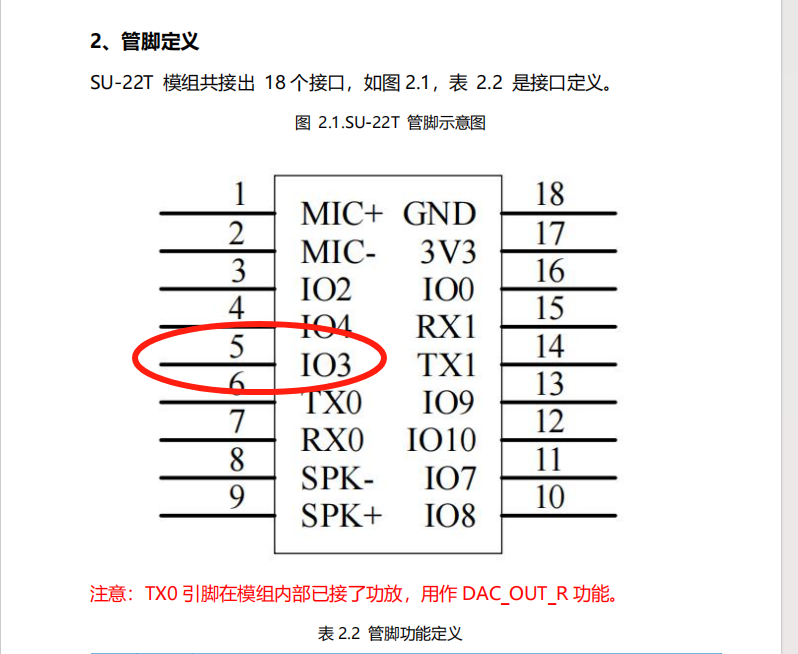
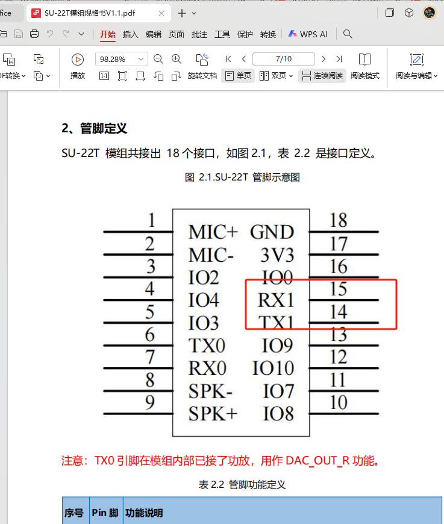

# SU-22T 硬件设计 FAQ

本页用于整理 SU-22T 相关的硬件设计问题。

### 配置GPIO_04控制为什么没有输出？

**问题描述：**

在配置GPIO控制时，将控制类型设置为GPIO_04，但IO4引脚无输出，而IO3引脚有正常输出，怀疑配置错误或引脚不可用。

**解决方案：**

1. **引脚功能确认**

    - IO4引脚（引脚5）在SU-22T模块上被复用为TX0功能
    - TX0引脚在模块内部已连接功放，用作DAC_OUT_R功能
    - 因此IO4不能作为通用GPIO使用

2. **可用GPIO引脚**

    - 推荐使用IO3（引脚6）作为GPIO输出
    - IO3是标准的通用GPIO引脚，功能正常
    - 其他可用GPIO请参考模块引脚定义图

3. **配置修改方法**

    - 将控制类型从GPIO_04改为GPIO_03
    - 确认软件配置与硬件引脚对应
    - 测试修改后的配置是否正常工作

**注意事项：**

- 配置GPIO前必须先了解引脚的复用功能
- 音频相关引脚（如TX0）通常不能用作普通GPIO
- 如需多个GPIO，请选择未被复用的引脚

---

### SU-22T模块手册与平台管脚定义不一致怎么办？

**问题描述：**

SU-22T模块的管脚定义在硬件手册和平台配置界面中不一致，导致无法正确配置引脚功能。

**解决方案：**

**1. 确认正确的引脚定义**

- 平台配置中的引脚12和13对应硬件手册的P11、P12
- 这两个引脚在平台上标注为"DEFAULT_P11"和"DEFAULT_P12"
- 硬件手册中，引脚14为TX1，引脚15为RX1

*平台配置中引脚12和13被配置为log调试脚*

*硬件手册中TX1为引脚14，RX1为引脚15*

**2. 引脚对应关系**

| 平台配置 | 硬件手册 | 功能说明 |
|---------|---------|---------|
| 引脚12 | P11 | log调试脚 |
| 引脚13 | P12 | log调试脚 |
| 引脚14 | TX1 | 串口发送 |
| 引脚15 | RX1 | 串口接收 |

**3. 重要注意事项**

- TX0引脚在模块内部已接功放，用作DAC_OUT_R功能
- 不能将TX0引脚用作其他用途
- 配置引脚时以平台标注的引脚号为准

**配置建议：**

- 使用log调试功能时，选择平台上的引脚12、13
- 使用串口通信时，选择平台上的引脚14、15
- 如有疑问，以平台配置界面的标注为准

**注意事项：**

- 硬件手册和平台配置可能存在版本差异
- 以平台配置为准可避免配置错误
- 保留最新版本的引脚定义文档供参考
