# SU-23T 硬件设计 FAQ

本页用于整理 SU-23T 相关的硬件设计问题。

### SU-23T出现不规律误动作怎么办？

**问题描述：**

SU-23T模块在无用户指令时，出现不规律的自行动作（如控制灯开关），疑似由语音误识别引起。

**解决方案：**

**问题分析：**

- 现象：设备在安静环境下自行触发控制命令
- 原因：模块误识别环境噪声为有效命令
- 特点：动作无规律性，随机发生

**优化方法：**

1. **调整命令识别阈值**

在智能公元平台中：

- 进入"优化配置"界面
- 找到"命令识别阈值"设置
- 默认值为0.2，可尝试调低至0.1、0.05、0.04、0.02、0.01

2. **阈值选择建议**

- 0.2（默认）：标准灵敏度，易误触发
- 0.1：降低灵敏度，减少误识别
- 0.05-0.01：低灵敏度模式，适合安静环境

3. **环境优化**

- 减少背景噪声干扰
- 调整麦克风位置和方向
- 避免靠近噪声源（如电器、风扇）

**注意事项：**

- SU-23T为低功耗芯片，识别性能相对较弱
- 需要平衡灵敏度与误识别率
- 建议根据实际使用场景选择合适的阈值
- SU-03T等高性能型号误识别率较低


*平台中的命令识别阈值配置选项*

---

### SU-23T在什么电压条件下会重启？

**问题描述：**

需要了解SU-23T芯片在电压低于多少时会关机或重启，以便进行合适的电源设计。

**解决方案：**

**电压条件说明：**

1. **最低工作电压**
    - SU-23T的正常工作电压范围为3.0V-5.5V
    - 当电压低于3.0V时，模块可能无法正常工作
    - 电压过低会触发保护机制导致重启

2. **重启触发条件**
    - 电压跌落至3.0V以下
    - 电源波动导致瞬时电压过低
    - 模块断电后重新上电

3. **电压波动原因**
    - 电源线过长导致压降
    - 电源供电能力不足
    - 瞬时大电流消耗

**电源设计建议：**

---

### SU-23T与单片机通信后断电重启无法唤醒？

**问题描述：**

SU-23T在与单片机通过RX/TX通信主板一起断电重启后无法正常唤醒，需要断开语音模块与RX/TX的连接才能唤醒。同时检测到语音模块TX引脚电压为6V，而模块实际供电为3.3V。

**解决方案：**

**问题排查步骤：**

1. **电平匹配检查**：

    - 确认单片机的串口电平是否为3.3V
    - 检查是否存在电平不匹配问题
    - 如单片机为5V电平，需要添加电平转换电路

2. **电源时序分析**：

    - 检查SU-23T与单片机的上电时序
    - 确认是否存在上电冲突
    - 建议SU-23T先上电，单片机后上电

3. **硬件连接验证**：

    - 检查TX/RX连接是否正确
    - SU-23T的TX应连接单片机的RX
    - 确认GND共地连接良好

**电压异常处理：**

1. **TX电压6V的问题**：

    - 正常情况下，SU-23T的TX输出应为3.3V
    - 6V电压说明存在电平不匹配或损坏
    - 可能是单片机为5V电平导致倒灌电流

2. **解决方案**：

    - **方案一**：使用电平转换模块
        ```
        SU-23T(TX) → 电平转换 → 单片机(RX)
        ```

    - **方案二**：在TX线上串联限流电阻
        - 使用1KΩ电阻限制电流
        - 保护SU-23T的TX引脚

    - **方案三**：检查模块是否损坏
        - 断开所有连接测试TX电压
        - 如仍异常，可能需要更换模块

**断电重启问题解决：**

1. **独立供电测试**：

    - 给SU-23T单独供电，不与单片机共电
    - 测试断电重启后是否能正常唤醒
    - 排除电源相互干扰

2. **软件配置调整**：

    - 检查智能公元平台的配置
    - 确认UART功能配置正确
    - 尝试禁用UART功能测试唤醒

3. **硬件隔离方案**：

    - 在TX/RX线上加二极管隔离
    - 防止断电时电流倒灌
    - 使用光耦实现电气隔离

**注意事项：**

- SU-23T工作电压为3.3V，严禁5V直接连接
- 长期电平不匹配可能导致模块永久损坏
- 建议在设计中加入电平转换电路
- 如模块已损坏，需要更换新模块并正确连接

1. **供电稳定性**
    - 确保供电电压稳定在3.3V或5V
    - 预留足够的电压余量（至少0.5V）
    - 使用低ESR电容滤波

2. **电源能力**
    - 电源输出电流应满足模块峰值需求
    - 考虑语音播放时的瞬时电流
    - 避免使用 borderline 电源设计

3. **布线优化**
    - 减少电源线路长度
    - 使用较粗的电源线
    - 确保良好的接地连接

**注意事项：**

- 模块具备欠压保护功能
- 电压过低时自动关机是保护机制
- 长期在低压下工作可能损坏模块
- 建议增加电压监测电路

---

### SU-23T如何增大喇叭外放音量？

**问题描述：**

SU-23T模块固件音量已调至最高，但仍无法满足窗帘遥控器等应用对音量的要求，需要通过硬件修改来实现更大的音量输出。

**解决方案：**

**问题分析：**

- SU-23T内置功放功率有限（0.62W@3.3V4Ω）
- 固件调节已达上限，无法进一步提升音量
- 需要通过增加外部功放电路来增大输出功率

**方案一：使用TC8002D功放芯片（推荐）**

TC8002D是单声道3W音频功率放大器，工作电压2V~5.5V，非常适合SU-23T的音量提升需求。

**电路连接方式：**

1. **信号获取**：

    - 从SU-23T的SPK+引脚获取单端音频信号
    - SPK-可以不接（单声道功放）
    - SPK_MUTE引脚可以与功放使能脚相连

2. **功放电路设计**：

    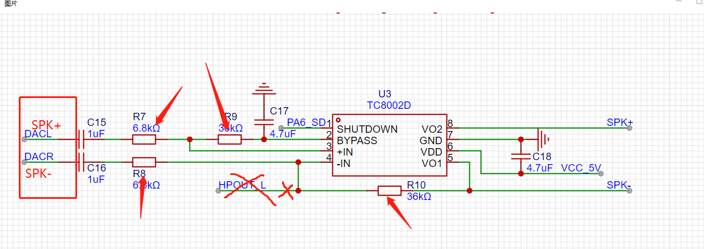

    *SU-23T通过DAC输出驱动TC8002D功放芯片的连接方式*

3. **关键元件参数**：

    - C15、C16：耦合电容，根据音频频响选择
    - R7、R8：分压电阻，设置输入偏置
    - R9、R10：上拉电阻，提供偏置电流

4. **使能脚处理**：

    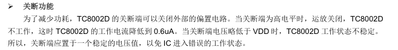

    - SHUTDOWN为高电平时芯片关闭，工作电流降至0.6μA
    - 如对功耗无要求，可接GND或悬空
    - 需要保持稳定电平，避免工作状态不稳定

**方案二：直接使用BL6281功放模块**

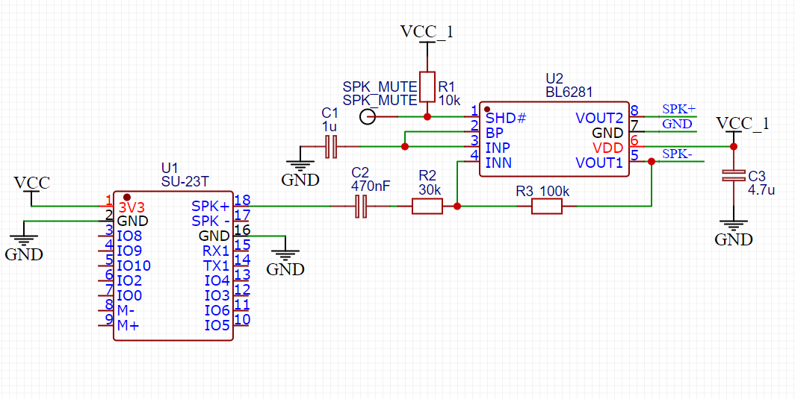

*SU-23T直接驱动BL6281功放模块的连接方式*

**注意事项：**

- BL6281模块有上拉电阻，增益提升有限
- 如需要更大音量，建议更换为其他功放芯片

**方案三：NS4890B+BL6281两级放大**

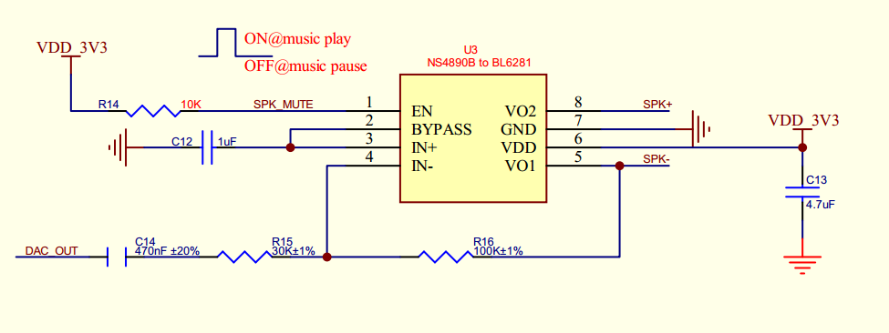

*SU-23T通过NS4890B芯片驱动BL6281功放模块的连接方式*

**功放芯片选型对比**：

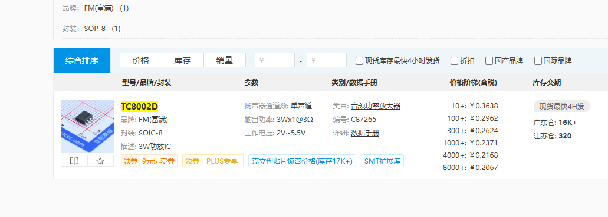

*TC8002D音频功率放大器的详细参数：3W@1Ω输出功率，2V~5.5V工作电压*

**实施建议：**

1. **电源设计**：

    - 确保电源能提供足够电流（至少1A）
    - 添加滤波电容减少电源纹波
    - 考虑功放工作时的大电流需求

2. **PCB布局**：

    - 功放芯片靠近喇叭输出端
    - 音频信号线尽量短，避免干扰
    - 留意散热设计

3. **调试要点**：

    - 四个电阻需要根据实际进行匹配
    - 先画PCB，不影响调试
    - 测试不同阻值对音质的影响

**替代方案：**

如果硬件修改不可行，可考虑：

1. **更换模块**：

    - 选择SU-03T（内置2.4W功放）
    - 需要重新设计电路

2. **外接功放**：

    - 从SPK+获取音频信号
    - 使用成品功放模块

**注意事项：**

- SU-23T为低功耗设计，增加功放会显著增加功耗
- 窗帘遥控器等电池应用需要平衡音量和续航
- 硬件修改需要专业的电子设计经验
- 确保喇叭功率与功放输出功率匹配
- TC8002D的SHUTDOWN脚需要稳定电平控制

---


---

### SU-23T模块通信不稳定和电源问题排查

**问题描述：**

SU-23T语音模块在使用过程中出现通信不稳定、无法响应的问题，部分模块在测试中出现异常，TX电压异常升高（达到8V），怀疑是电源或硬件设计问题导致。

**解决方案：**

**1. 电源电路检查**

- 确认电源方案：使用5V转3.3V LDO（如AMS1117-3.3）
- 检查供电能力：模块需要600mA以上电流，建议使用1A以上电源
- 测量电压稳定性：空载和负载时电压应保持稳定

**2. 电源纹波测量**

- 使用示波器测量负载情况下的电源纹波
- 纹波过大可能导致模块工作异常
- 建议在电源端增加滤波电容（470μF电解电容并联0.1μF陶瓷电容）

**3. 串口通信优化**

- 在串口通信线间串联100-220Ω电阻
- RX和TX线各串联一个电阻
- 可有效抑制反射和干扰，提高通信稳定性

**4. 模块配置优化**

- 提高唤醒识别阈值至0.8，避免误触发
- 关闭深度睡眠模式，防止进入休眠后无法唤醒
- 检查固件版本，确保使用稳定版本

**5. 硬件连接检查**

- 确认TX引脚电压正常（应为3.2V左右）
- 如TX电压异常（如8V），说明模块已损坏
- 检查是否有电平倒灌现象

**注意事项：**

- SU-23T是低功耗模块，工作电压范围为3.0-3.6V
- 喇叭阻抗选择8Ω4W较为合适
- 多个模块出现问题时，重点排查电源设计
- 建议使用质量更好的LDO，避免使用廉价电源芯片
- 如问题持续，可考虑更换为SU-03T等标准电压模块

---


---

### SU-23T模块只有2路PWM输出，如何解决PWM数量不足的问题？

**问题描述：**

SU-23T模块仅提供2路PWM输出，无法满足项目需要多路PWM控制的应用场景。

**解决方案：**

**1. 使用软件PWM（GPIO模拟）**

SU-23T支持通过GPIO输出来模拟PWM信号：

- **实现原理**：通过快速切换GPIO的高低电平来模拟PWM波形
- **可用GPIO数量**：11个GPIO（扣除已用引脚）
- **频率范围**：建议100Hz-1kHz，频率过高会影响CPU性能
- **占空比控制**：通过调节高低电平的时间比例实现

**2. 软件PWM实现方法**

1. **定时器中断方式**：
    ```c
    // 伪代码示例
    void timer_interrupt() {
        static uint8_t pwm_counter = 0;
        static uint8_t pwm_duty = 50; // 50%占空比

        pwm_counter++;
        if (pwm_counter >= 100) {
        pwm_counter = 0;
        }

        // 输出PWM波形
        if (pwm_counter < pwm_duty) {
        GPIO_SetHigh(PWM_PIN);
        } else {
        GPIO_SetLow(PWM_PIN);
        }
    }
    ```

2. **延时循环方式**：
    ```c
    // 适用于对精度要求不高的场景
    void software_pwm(uint8_t pin, uint8_t duty, uint16_t period_us) {
        uint16_t high_time = period_us * duty / 100;
        uint16_t low_time = period_us - high_time;

        while(1) {
        GPIO_SetHigh(pin);
        delay_us(high_time);
        GPIO_SetLow(pin);
        delay_us(low_time);
        }
    }
    ```

**3. 多路PWM扩展方案**

如果需要更多路PWM控制，可以考虑：

- **方案一：使用外部PWM芯片**
    - PCA9685：16路PWM驱动芯片，I2C接口控制
    - TLC5940：12路PWM驱动芯片，I2C接口控制
    - 优势：硬件PWM，精度高，不占用CPU资源

- **方案二：使用SU-32T模块**
    - SU-32T提供更多路PWM输出
    - 支持硬件PWM，性能更好
    - 但功耗相对较高

**4. 注意事项与限制**

1. **软件PWM限制**：

    - CPU占用率高，可能影响语音识别
    - 频率受限，不适合高频应用
    - 占空比精度有限，建议以5%为步进

2. **性能优化建议**：

    - 选择合式的PWM频率（如200Hz-500Hz）
    - 在PWM输出时暂时关闭语音识别
    - 使用DMA或硬件定时器减少CPU负担

3. **硬件连接**：

    - 确保GPIO驱动能力满足负载需求
    - 大功率负载需要外加驱动电路
    - 添加滤波电路减少高频干扰

**5. 实际应用示例**

- **LED调光应用**：
    ```c
    // 使用3个GPIO分别控制RGB三色LED
    software_pwm(GPIO_R, red_duty, 1000);  // 红色
    software_pwm(GPIO_G, green_duty, 1000);  // 绿色
    software_pwm(GPIO_B, blue_duty, 1000);  // 蓝色
    ```

- **舵机控制应用**：
    ```c
    // 20ms周期，对应50Hz舵机频率
    // 1ms高电平对应5度，2ms高电平对应10度
    software_pwm(SERVO_PIN, angle_to_duty(angle), 20000);
    ```

**6. 选型建议**

根据实际需求选择合适方案：

| 需求场景 | 推荐方案 | 说明 |
|-----------|----------|------|
| 2-3路PWM，低功耗要求 | SU-23T + 软件PWM | 成本最低，功耗最低 |
| 4-8路PWM，精度要求高 | SU-23T + PCA9685 | 硬件PWM，精度高 |
| 多路PWM+语音识别 | SU-32T | 硬件PWM，不影响语音 |
| 成本敏感项目 | 软件PWM | 无需额外硬件成本 |

**注意事项：**

- 软件PWM会占用一定的CPU资源，可能影响语音识别的实时性
- 建议在实际硬件上测试软件PWM的效果和稳定性
- 如对PWM精度要求很高，建议选择硬件PWM方案
- 外部PWM芯片需要额外的I2C接口资源

---


---

### SU-23T上电后引脚初始电平异常如何解决？

**问题描述：**

SU-23T模块上电后，B8引脚出现约1秒的高电平，之后才变为配置的低电平，影响外围电路的正常工作。

**解决方案：**

**问题原因分析：**

- 上电瞬间部分引脚会出现短暂的上拉现象
- 这是芯片初始化过程的正常表现
- 约1秒后引脚电平会恢复到配置状态

**解决方法：**

1. **硬件解决方法（推荐）**

    - 在B8引脚与地之间连接下拉电阻
    - 推荐阻值：2.2kΩ-10kΩ
    - 可有效抑制上电瞬间的高电平

2. **软件处理方案**

    - 在外围电路设计中忽略初始1秒的信号
    - 增加软件延时，等待模块稳定
    - 仅在1秒后读取引脚状态

3. **更换引脚方案**

    - 选择其他没有此现象的引脚
    - 如IO2、IO3、IO4、IO5等
    - 通过平台重新配置引脚功能

**硬件设计建议：**

```
B8引脚 ────┬─── 外围电路
            │
            4.7kΩ
            │
            GND
```

**注意事项：**

- 下拉电阻不宜过小，避免增加功耗
- 建议使用4.7kΩ或10kΩ标准阻值
- 此现象不影响模块长期稳定工作
- 批量设计时应考虑此初始化特性

**选型参考：**

- 对于电平敏感的应用，建议避开有此现象的引脚
- 或在设计时预留足够的初始化时间
- 严格的应用可结合硬件和软件双重处理


*B8引脚在平台中配置为低电平输出模式*

---

### 3.3V供电系统如何搭配需要5V的功放模块？

**问题描述：**

使用3.3V稳压电源供电，但功放模块需要5V供电，导致无法正常工作，需要解决方案。

**解决方案：**

**问题分析：**

- CI-03T等模块的功放需要5V供电电压
- 3.3V系统无法直接驱动5V功放
- 需要额外的升压电路或选择低功耗方案

**方案一：增加升压电路**

1. **升压模块选择**：

    - 3.3V转5V升压模块
    - 输出电流：根据功放需求选择（建议≥1A）
    - 注意升压模块的效率和纹波

2. **电路设计要点**：

    - 在3.3V电源后增加升压电路
    - 添加滤波电容确保电源稳定
    - 预留足够的散热空间

**方案二：选择低功耗模块（推荐）**

1. **SU系列低功耗模块**：

    - SU-20T、SU-21T、SU-22T、SU-23T
    - 供电电压：3.0-3.6V，可直接使用3.3V
    - 无需升压，简化电路设计

2. **模块对比**：

| 型号 | 供电电压 | 功放类型 | 特点 |
|------|----------|----------|------|
| CI-03T | 3.6-5.5V | 8002（需5V） | 功能丰富 |
| SU-23T | 3.0-3.6V | 6281（内置） | 超低功耗 |

**实际案例参考：**

- 使用者反馈：4.2V电池稳压3.3V，使用8002功放需要5V
- 解决方案：选择SU-23T低功耗模块，支持3.6V供电
- 效果：省去升压电路，降低系统复杂度和成本

**设计注意事项：**

- 升压方案会增加功耗和成本
- 低功耗模块支持更少词条（约150条）
- 如需更多功能，需评估实际需求优先级

**建议方案：**

- 电池产品优先选择SU-23T等低功耗模块
- 保留足够电流裕量（建议2A输出能力）
- 在3.3V和5V之间做好电平匹配设计

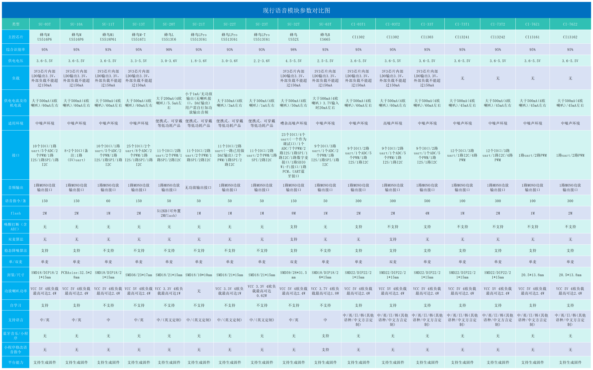
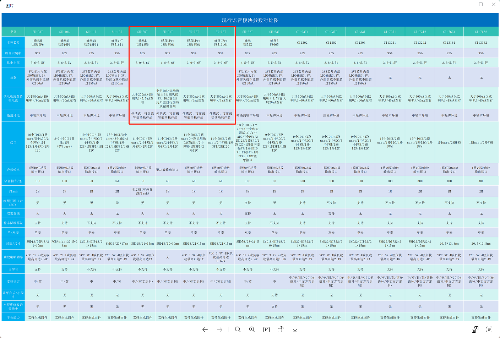

---

## 电源相关


---


---

### US516P6芯片可以使用3.3V供电吗？

**问题描述：**

询问US516P6芯片是否可以输入3.3V电压进行供电。

**解决方案：**

**电压规格要求：**

- **推荐供电电压**：4.5V - 5.1V
- **不支持3.3V供电**：3.3V电压低于芯片正常工作所需电压
- **绝对最小电压**：2.5V（但在此电压下无法保证正常工作）

**技术说明：**

1. **电源设计要求**：

    - US516P6是蜂鸟M系列芯片
    - 内部LDO需要较高输入电压进行稳压
    - 3.3V输入可能导致内部电压不足

2. **工作电压范围**：

    - 正常工作范围：2.5V - 5.5V
    - 推荐工作电压：4.5V - 5.1V
    - 最佳性能电压：5.0V

**供电方案建议：**

1. **标准5V供电**：

    - 使用5V电源适配器
    - USB 5V供电
    - 4.2V锂电池升压至5V

2. **3.3V系统适配**：

    - 如系统只有3.3V，需要升压电路
    - 使用3.3V转5V升压模块
    - 或选择支持3.3V的低功耗芯片（如SU-23T）

3. **电池供电方案**：

    - 单节锂电池：3.0V-4.2V（需要升压）
    - 两节串联：6.0V-8.4V（需要降压）
    - 建议使用专用电源管理芯片

**注意事项：**

- 3.3V供电可能导致芯片无法启动或工作不稳定
- 长期在低电压下工作可能影响芯片寿命
- 建议在设计时预留足够的电压裕量
- 如必须使用3.3V系统，考虑更换其他芯片型号

---


---


---

### GPIO高电平持续触发导致重复执行如何处理？

**问题描述：**

使用SU-23T模块的GPIO输入功能时，设置为高电平触发，但高电平持续保持时模块会重复执行指令，导致语音识别功能无法正常使用。

**解决方案：**

**问题原因分析：**

1. **触发机制说明**：

    - GPIO输入模式通过检测电平状态执行动作
    - 高电平持续保持时，模块认为触发条件一直成立
    - 导致指令被重复执行，影响其他功能

2. **输入模式特性**：

    - 输入模式是电平检测而非边沿检测
    - 只要电平条件满足就会持续触发
    - 与用户期望的"单次触发"需求不符

**解决方案：**

**方法一：硬件信号优化**

1. **脉冲信号设计**：

    - 将持续的高电平改为脉冲信号
    - 脉冲宽度建议：10-100ms
    - 避免长时间保持高电平

2. **外部电路处理**：

    - 添加微分电路，将电平变化转换为脉冲
    - 使用RC电路产生短促的触发信号
    - 采用单稳态电路限制输出脉冲宽度

**方法二：软件逻辑处理**

1. **上升沿检测逻辑**：

    ```
    实现思路：

    1. 记录上一次的GPIO状态
    2. 检测电平从低到高的变化（上升沿）
    3. 仅在上升沿时执行一次动作
    4. 高电平保持期间不再重复执行
    ```

2. **状态管理方案**：

    - 设置标志位记录触发状态
    - 首次触发后置位，阻止重复执行
    - 电平恢复低电平时复位标志位

**方法三：模块配置优化**

1. **触发条件调整**：

    - 如支持边沿触发，优先选择上升沿触发
    - 调整触发灵敏度，避免误触发
    - 合理设置消抖时间

2. **延时配置**：

    - 配置触发后的锁定时间
    - 在锁定时间内不响应新的触发
    - 平衡响应速度和防重复需求

**实际应用建议：**

1. **按键场景**：

    - 使用按键开关产生瞬时脉冲
    - 避免按键长按导致重复触发
    - 添加硬件消抖电路

2. **传感器触发**：

    - 传感器信号需转换为脉冲形式
    - 使用比较器或施密特触发器整形
    - 确保触发信号的干净和单一

3. **电平转换电路**：

    ```
    推荐电路：
    信号输入 → 微分电路 → 限幅 → GPIO输入
                ↓
            电容（产生脉冲）
    ```

**注意事项：**

- GPIO输入模式设计用于电平检测，持续触发的行为是正常机制
- 单次触发需求需要通过硬件或软件方法实现
- 脉冲宽度不宜过短，建议>10ms确保可靠检测
- 如边沿触发可用，优先选择边沿触发模式
- 设计时应明确触发需求，选择合适的触发方式

---

### SU-23T模块通电后喇叭有异常噪音怎么办？

**问题描述：**

SU-23T模块通电后，喇叭持续发出类似机械表摆轮的快速噪音，怀疑是模块硬件故障。

**解决方案：**

**1. 故障确认**

- 确认多个模块中是否只有单个出现此问题
- 检查模块供电是否稳定
- 排除外部干扰因素

**2. 可能原因**

- 模块内部硬件故障
- 功放电路异常
- 音频输出部分短路

**3. 处理方法**

- 收集出现问题的模块，联系售后进行更换
- 如已焊接排针，保留问题模块作为故障样品
- 记录故障现象和出现条件

**故障识别示例：**

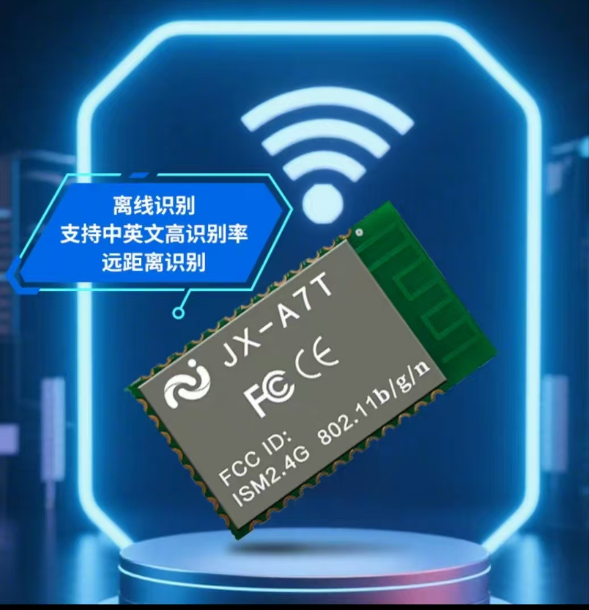

*模块正常外观示例*

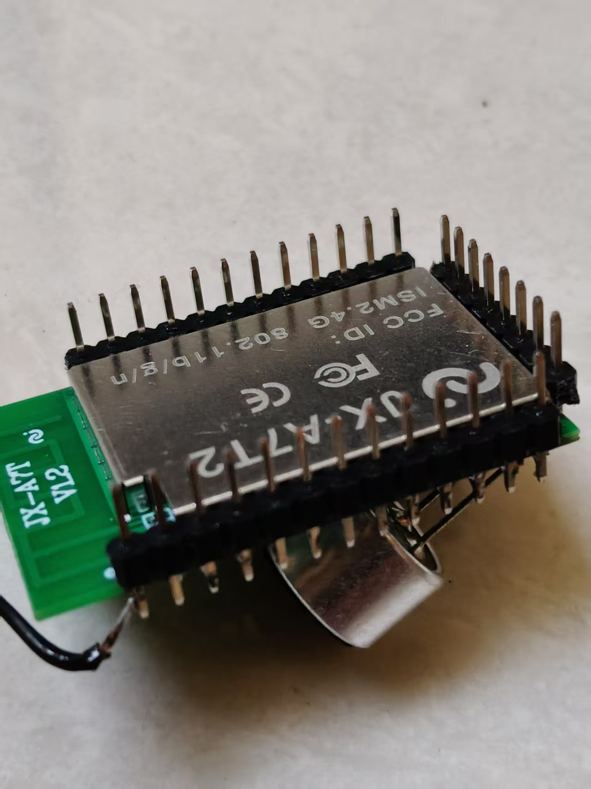

*模块背面引脚标识*

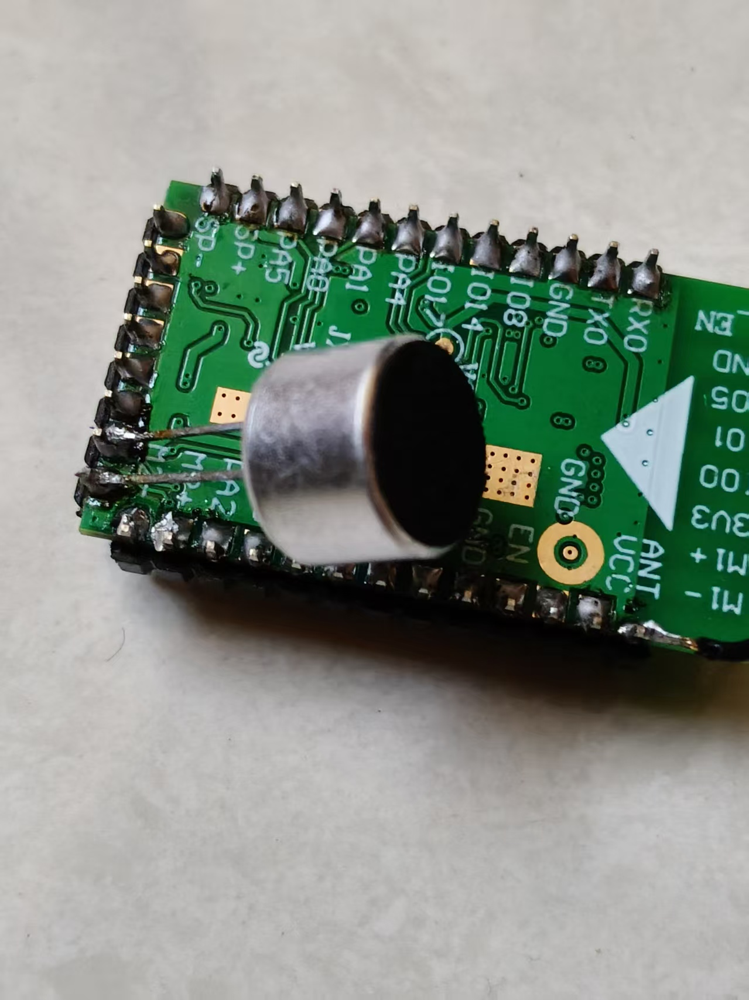

*模块正面元器件布局*

**注意事项：**

- 此类异常噪音通常表明硬件故障
- 不要继续使用有故障的模块，避免影响整体系统
- 焊接不影响售后更换，保留故障模块即可
- 建议对所有新模块进行上电测试，及时发现问题

---

### SU-23T在3.3V下去除功放后的实际功耗是多少？

**问题描述：**

在去除功放芯片、3.3V供电条件下，实际测试待机电流约为3.6mA，希望了解芯片在休眠状态下的最小功耗是否能达到50μA。

**解决方案：**

根据技术规格和实际测试，SU-23T的功耗表现如下：

- **标称待机电流**：1mA（3.3V输入条件下典型值）
- **实测待机电流**：3.3-3.6mA（去除功放芯片后）
- **深度休眠功耗**：约800μA（模块自动进入深度休眠后）

**功耗特性说明：**

- SU-23T采用超低功耗制程工艺，在语音识别模组中属于较低功耗
- 模组支持多级启动模式，静默一段时间后会自动进入深度休眠
- 即使在深度休眠模式下，仍可通过唤醒词正常唤醒

**注意事项：**

- SU-23T作为纯离线语音识别模组，需要持续监听唤醒词，因此功耗无法做到像普通MCU那样的μA级
- 50μA的功耗水平对于需要持续监听的语音识别模组来说难以实现
- 如果应用对功耗有极端要求，建议考虑其他唤醒方式或使用分时唤醒方案

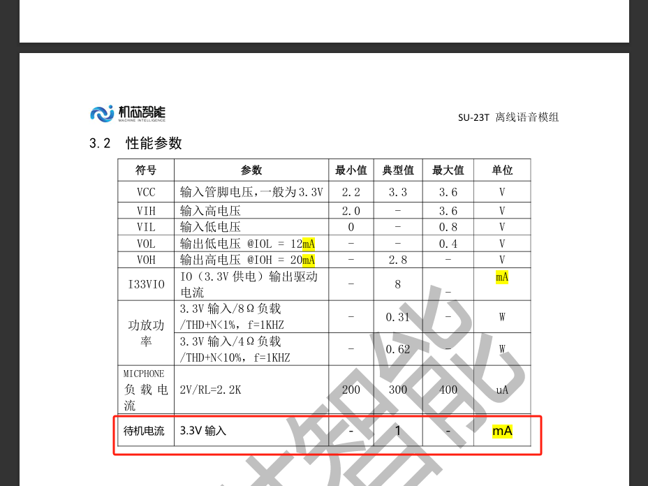

*SU-23T模组性能参数表，标称待机电流为1mA*

---

### SU-23T模块如何实现0.9mA待机电流？

**问题描述：**

SU-23T模块官方标称待机电流为0.9mA，但实际测试为2-3mA，需要了解如何达到标称的待机电流。

**解决方案：**

**1. 硬件配置要求**

- 选择低功耗的咪头（麦克风）
- 确保模块能够进入深度休眠状态
- 优化外围电路的功耗设计

**2. 休眠条件设置**

- 模块需要在相对安静的环境下自动进入休眠
- 休眠状态下功耗最低，可实现0.9mA待机电流
- 避免持续的环境噪声干扰休眠

**3. 休眠功能配置**

- 如需禁止模块休眠，可在软件中关闭休眠功能
- 关闭休眠后会增加功耗，但保持随时响应
- 根据实际应用需求选择合适的休眠策略

**4. 功耗优化建议**

- 使用高质量的咪头，提高信噪比
- 合理设置唤醒阈值，避免误唤醒
- 优化供电电路，减少静态功耗

**注意事项：**

- 2-3mA的电流可能是模块未进入深度休眠状态
- 环境噪声过大会导致模块频繁唤醒，增加功耗
- 如需快速响应可关闭休眠，但需接受较高的待机电流
- 批量产品建议进行实际的功耗测试验证

---


---

### SU-23T的供电电压范围是多少？

**问题描述：**

SU-23T规格书显示VCC最大3.6V，询问是否可以直接连接单节锂电池使用。

**解决方案：**

**1. 供电电压范围**

- SU-23T最大供电电压：3.6V
- 单节锂电池电压：3.0V-4.2V
- 充满状态：4.2V（超过模块最大值）

**2. 电源方案选择**

**不推荐方案：**

- 直接连接单节锂电池（可能超过3.6V）

**推荐方案：**

- 使用3.3V LDO稳压供电
- 通过降压电路（如AMS1117-3.3）供电
- 使用两节AA电池串联（约3.0V）

**3. 注意事项**

- 锂电池充满时电压可达4.2V，会损坏模块
- 建议使用稳压电路确保供电稳定
- 长期使用建议选择专用3.3V电源模块

---

### SU-23T芯片丝印不同是否影响使用？

**问题描述：**

发现SU-23T模块上的芯片丝印与之前版本不同（US513U61 vs GX8002D），担心芯片型号变更导致兼容性问题或无法烧录。

**解决方案：**

**1. 丝印差异说明**

- **旧版本丝印**：GX8002D
- **新版本丝印**：US513U61
- **芯片实质**：两款丝印对应的是同一款芯片

**2. 官方确认**

经仓库和技术部门确认：

- 产品芯片完全相同
- 仅丝印标识进行了更新
- 新丝印为US513U61是正式版本标识

**3. 兼容性保证**

- **功能完全一致**：所有功能、参数、特性保持不变
- **引脚定义相同**：封装和引脚定义完全兼容
- **固件通用**：新旧版本使用相同固件
- **烧录方式不变**：烧录工具和操作步骤完全相同

**4. 烧录问题排查**

如果使用US513U61芯片的电路无法烧录，需要检查：

- **硬件连接**：确认TX/RX交叉连接正确
- **供电电压**：确保3.3V-5V稳定供电
- **电路设计**：对比官方模块原理图
- **外围元件**：检查影响烧录的外围电路

**5. 电路设计要点**

自行设计电路板时的注意事项：

- 严格按照官方提供的参考设计
- 关注关键信号线的走线
- 确保复位电路正常工作
- 避免外围电路对烧录接口的干扰

**注意事项：**

- 丝印变更属于正常的产品迭代
- 芯片功能和性能没有变化
- 如遇到烧录问题，重点检查硬件电路
- 可以联系技术支持获取设计参考

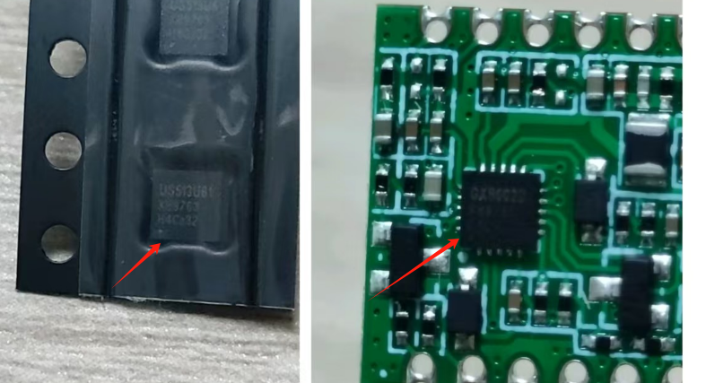

*左侧：US513U61芯片，右侧：GX8002D丝印（实为同一芯片）*

---

### SU-23T哪些GPIO引脚可以输出高电平？

**问题描述：**

需要了解SU-23T模块哪些GPIO引脚可以配置为输出高电平，用于控制外部设备。

**解决方案：**

SU-23T模块的多个GPIO引脚都可以配置为输出高电平，具体如下：

**可输出高电平的GPIO引脚列表：**

- GPIO_00
- GPIO_02
- GPIO_03
- GPIO_04
- GPIO_05
- GPIO_06
- GPIO_08
- GPIO_09
- GPIO_10

**配置方法：**

1. 登录智能公元平台
2. 进入项目的Pin脚配置界面
3. 选择需要配置的GPIO引脚
4. 将引脚功能设置为"输出模式"
5. 在控制详情中配置触发条件（如语音命令词触发）
6. 设置输出电平为"高电平"或"低电平"

**注意事项：**

- GPIO引脚的驱动能力有限（通常不足20mA）
- 驱动大负载设备需要外接驱动电路
- 部分GPIO引脚可能与其他功能复用
- 配置前请确认引脚未被其他功能占用

**参考资料：**

- [SU-23T IO输入输出教程](https://www.bilibili.com/video/BV1L8411D7JC/)

---

