# SU-32T 硬件设计 FAQ

本页用于整理 SU-32T 相关的硬件设计问题。

### SU-32T芯片的中间热焊盘如何处理接地？

**问题描述：**

SU-32T芯片底部有一个6.3mm×6.8mm的中间热焊盘，需要确认该焊盘是否必须接地，以及在PCB设计中如何正确处理。

**问题分析：**

- **热焊盘功能**：主要用于芯片散热，长时间工作时必须有效接地
- **尺寸规格**：6.3mm × 6.8mm的散热焊盘
- **接地必要性**：技术规格明确标注"运用时需接地"
- **散热重要性**：不接地会导致长时间工作出现问题

**解决方案：**

**PCB设计处理方法：**

1. **散热孔设计**：

    - 在PCB对应位置设计散热孔阵列
    - 散热孔建议数量：4-9个（根据功率密度确定）
    - 散热孔径：0.3mm-0.5mm
    - 散热孔间距：1.0mm-1.5mm网格排列

2. **铜箔处理**：

    - 对应位置直接开窗处理
    - 开窗尺寸：略大于芯片热焊盘（建议大0.5mm每边）
    - 铜箔连接：通过散热孔连接到内层和底层铜箔
    - 铜箔面积：尽可能大面积以增强散热效果

3. **焊接方式选择**：

    **方案一：完全焊接**

    - 热焊盘上锡，与PCB完全焊接
    - 散热效果最佳，可靠性高
    - 适合大批量生产

    **方案二：开窗不上锡**

    - 仅散热孔连接，热焊盘不上锡
    - 便于返修和更换
    - 散热效果略低于完全焊接

4. **接地连接**：

    - 散热孔必须连接到地平面
    - 多层板：通过内层地平面连接
    - 双层板：通过底层地平面连接
    - 确保低阻抗接地路径

**设计规范：**

1. **热阻控制**：

    - 芯片结到环境的热阻控制在合理范围
    - 根据实际功耗计算所需散热面积
    - 考虑最坏工作环境温度

2. **制造工艺**：

    - 推荐使用HASL或ENIG表面处理
    - 确保焊盘可焊性良好
    - 控制焊接温度和时间，避免热损伤

3. **布局考虑**：

    - 避免在散热区域内布置敏感元件
    - 预留足够的散热空间
    - 考虑空气流动方向

**验证方法：**

1. **热成像测试**：

    - 满负荷工作条件下测试芯片温度
    - 确认结温不超过规格上限
    - 验证散热设计有效性

2. **长期可靠性测试**：

    - 高温长时间工作测试
    - 验证散热系统稳定性
    - 确保无热应力导致的故障

**注意事项：**

- 热焊盘必须可靠接地，不能悬空
- 散热孔设计要兼顾散热和机械强度
- 焊接温度过高可能损坏芯片
- 返修时需要特别注意热焊盘的处理
- 建议进行热仿真验证设计合理性

**常见问题：**

1. **Q：可以省略热焊盘的接地吗？**
    A：不可以，必须接地，否则长时间工作会出问题

2. **Q：散热孔数量多少合适？**
    A：根据芯片功耗和散热要求，一般4-9个散热孔

3. **Q：热焊盘可以不上锡吗？**
    A：可以开窗不上锡，但散热孔必须良好接地

4. **Q：返修时如何处理热焊盘？**
    A：需要专业工具和经验，建议使用热风枪均匀加热

---

### SU-32T 是否支持 24V 供电？

**问题描述：**

需要确认 SU-32T 模块是否支持 24V 供电，以及如何实现更高电压的供电方案。

**解决方案：**

SU-32T 模块**不支持 24V 直接供电**，模块的工作电压参数如下：

- **供电电压范围**：4.5V - 5.5V（推荐 5V）
- **内部 LDO 输出**：3.3V
- **外部负载能力**：不超过 150mA

**24V 供电方案：**

如果需要在 24V 系统中使用 SU-32T，必须通过外部稳压电路将电压降至 5V：

1. **使用 DC-DC 降压模块**：将 24V 降至 5V
2. **添加 LDO 稳压器**：进一步稳定至 5V 输入
3. **确保电源纹波**：小于 100mV，保证语音识别效果

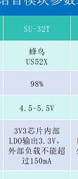

---

### SU-32T的供电电压要求是多少？

**问题描述：**

需要确认SU-32T模块的实际供电电压要求，文档中存在3.3V和4.5V-5.5V两种不同的表述。

**解决方案：**

**正确的供电电压参数：**

- **供电电压范围**：4.5V - 5.5V（推荐5V）
- **内部LDO输出**：3.3V（给内部芯片供电）
- **外部负载能力**：不超过150mA

**参数说明：**

1. **模块输入电压**：4.5V-5.5V

    - 这是给SU-32T模块供电的外部电源电压
    - 必须提供稳定的5V电源以保证正常工作
    - 电压低于4.5V可能导致模块工作异常

2. **内部工作电压**：3.3V

    - 模块内部通过LDO将5V降压至3.3V
    - 3.3V是内部芯片的实际工作电压
    - 对外提供的3.3V最大负载150mA

**文档更正说明：**

快速规格表中标注的"供电电压 3.3V"是指内部工作电压，而非外部输入电压。实际使用时必须提供4.5V-5.5V的外部电源。

**注意事项：**

- 严禁直接使用3.3V为模块供电
- 供电电压超过5.5V可能损坏模块
- 建议使用稳定的5V电源适配器
- 电源纹波建议控制在100mV以内

---

### SU-32T模块的喇叭正负极如何确认？

**问题描述：**

需要确认SU-32T模块喇叭输出接口的正负极标识，确保正确连接扬声器。

**解决方案：**

SU-32T模块的喇叭接口标识如下：

- **SPK+（RP）**：正极，连接扬声器的正极
- **SPK-（RN）**：负极，连接扬声器的负极

**连接要点：**

1. **极性确认**：

    - RP代表正极（Positive）
    - RN代表负极（Negative）
    - 连接时注意不要接反

2. **扬声器规格**：

    - 推荐使用8Ω、2W的扬声器
    - 确保功率和阻抗匹配
    - 避免使用功率过大的扬声器

3. **接线注意事项**：

    - 确保连接牢固，避免接触不良
    - 使用合适的线材，减少信号损耗
    - 注意焊接质量，避免虚焊

**技术说明：**

- SU-32T内置2.4W单声道AB类功放
- 输出功率可满足大多数小型扬声器需求
- 模块支持音频差分输出，提供更好的音质

**注意事项：**

- 虽然扬声器接反一般不会损坏器件，但会影响音质
- 如发现声音异常、音量小等情况，检查极性是否正确
- 在正式使用前建议先进行简单测试验证

---

### SU-32T的GPIO5-GPIO15引脚输入触发异常问题

**问题描述：**

使用SU-32T模块时，GPIO5至GPIO15引脚配置为输入模式时无法正常触发，而GPIO16及以上引脚（GPIO16、GPIO17、GPIO18等）可以正常工作。测量引脚电平变化正常，但模块无法响应触发信号。

**解决方案：**

1. **临时解决方案**：

    - 使用GPIO16及以上的可用引脚作为输入触发
    - 经测试可用的引脚包括：GPIO16、GPIO17、GPIO18、GPIO19、GPIO20、GPIO21、GPIO22、GPIO23、GPIO26、GPIO27、GPIO29
    - 这些引脚数量充足，可满足大多数应用需求

2. **问题定位**：

    - 该问题由底层寄存器配置引起，属于GPIO5-15对应的低16位寄存器配置异常
    - 需要等待底层固件更新解决此问题

**注意事项：**

- 在设计硬件时，优先考虑使用GPIO16及以上的引脚作为输入
- 该问题不影响GPIO5-15的输出功能，仅输入触发受影响
- 如必须使用GPIO5-15作为输入，需等待官方发布修复后的固件版本
- **平台输入选项说明**：智能公元平台已对有问题的 IO 口封住输入选项，在配置界面无法选择输入模式；没有问题的 IO 口（如 GPIO16 及以上）仍保留输入选项

---

### SU-32T模块的扬声器应如何连接？串口通信可以共用吗？

**问题描述：**

在使用SU-32T语音模块时，需要确认扬声器（SPK+/-）的正确接线位置，以及与单片机的串口通信是否可以共用。

**解决方案：**

**扬声器连接：**

- SPK+和SPK-是模块的音频输出接口
- 直接连接到扬声器正负极即可
- 推荐使用8Ω2W扬声器，确保阻抗和功率匹配

---

### SU-32T可以连接8欧姆2瓦的喇叭吗？

**问题描述：**

需要确认SU-32T芯片是否可以兼容连接8欧姆、2瓦的喇叭。

**解决方案：**

**兼容性确认**

- SU-32T可以连接8欧姆2瓦的喇叭
- 模块的音频输出接口支持这种规格的扬声器
- 阻抗和功率匹配良好，可以正常工作

**技术说明**

- 8欧姆是常见的扬声器阻抗规格
- 2瓦功率在SU-32T的输出能力范围内
- 这种配置可以获得较好的音质和音量平衡

**注意事项：**

- 连接时注意正负极正确接线
- 建议使用质量较好的喇叭以获得更好效果
- 避免超过模块最大输出功率

---

**串口通信方案：**

1. **分别通信方式**：

    - 语音模块通过一个串口与单片机通信
    - 单片机通过另一个串口与其他设备通信
    - 各串口独立工作，避免干扰

2. **二合一通信方式**：

    - 语音模块和单片机共用同一串口
    - 通过协议区分不同指令来源
    - 语音指令错开使用，避免冲突

**注意事项：**

- 串口通信时需确保波特率、数据位等参数一致
- 共用串口时需要设计合理的通信协议
- 建议预留调试接口，便于问题排查

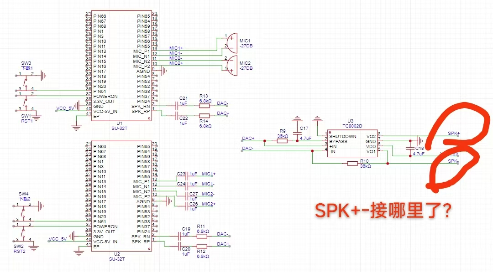

*图中展示了SU-32T模块的接线方式，SPK+/-直接连接扬声器*

---


---

### SU-32T在噪音环境下容易出现误识别怎么办？

**问题描述：**

在存在风扇噪音的环境下，SU-32T模块对"定时十分钟"、"定时十五分钟"等语音指令容易发生误识别。

**解决方案：**

**识别阈值调整：**

- 降低误识别指令的识别阈值
- 在智能公元平台中调整对应命令词的灵敏度
- 通过提高识别标准来减少噪音干扰

**物理降噪处理：**

1. **咪头后方加装泡沫胶**：

    - 在麦克风后方粘贴泡沫胶材料
    - 减少风扇噪音的直接传播
    - 提高信噪比，改善识别效果

2. **结构优化**：

    - 合理布局麦克风位置，远离噪音源
    - 增加隔音设计，减少噪音影响
    - 确保语音通道的清晰性

**效果验证：**

- 调整阈值后需进行充分测试
- 验证在噪音环境下的识别准确率
- 确保正常音量下的指令识别不受影响

**注意事项：**

- 阈值调整需平衡识别率和误判率
- 物理降噪是更有效的解决方案
- 建议结合软件和硬件优化

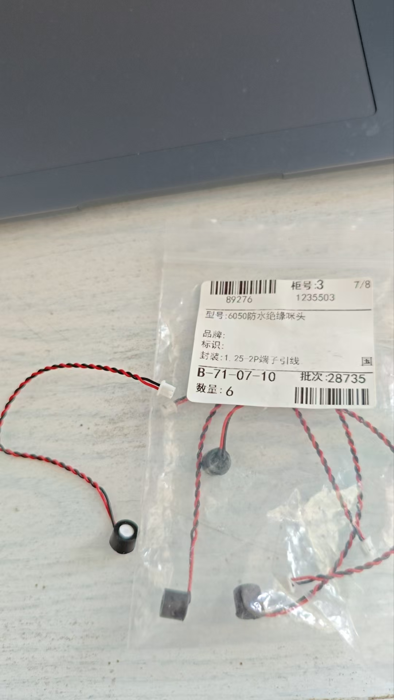

*6050防水绝缘咪头，可用于改善噪音环境下的拾音效果*

---

### SU-32T需要防水咪头，有什么推荐方案？

**问题描述：**

需要为SU32T语音模块推荐一款防水的咪头，产品在风扇噪音环境下工作，已有经销商要求带语音功能的样机。

**解决方案：**

**推荐方案：使用CI-13162芯片**

1. **芯片优势**：

    - 支持离线自由说语音功能
    - 识别率表现优异，实测效果接近SU32T
    - 可解决固定词条限制的问题

2. **防水咪头配合**：

    - CI-13162可配合防水咪头使用
    - 需要选择信噪比≥70dB的防水型号
    - 确保防水性能满足产品使用环境

**现有方案验证：**

- SU32T在16个风扇环境下勉强可用
- 其他语音模块在风扇环境下完全无法使用
- SU32T的识别率已能满足项目要求

**实施建议：**

1. **样机测试**：

    - 使用CI-13162芯片制作样机
    - 配合防水咪头进行实际环境测试
    - 验证在噪音环境下的识别效果

2. **咪头选型**：

    - 寻求专业技术协助获取防水咪头推荐
    - 要求提供符合SNR＞70dB的防水型号
    - 确保咪头尺寸与产品结构匹配

3. **结构优化**：

    - 合理设计咪头安装位置，远离噪音源
    - 增加隔音设计，减少风扇噪音影响
    - 考虑使用泡沫胶等物理降噪措施

**注意事项：**

- CI-13162支持自由说功能，不再受限于固定词条
- 防水咪头需兼顾防水性能和音频指标
- 建议在实际产品环境中充分测试验证

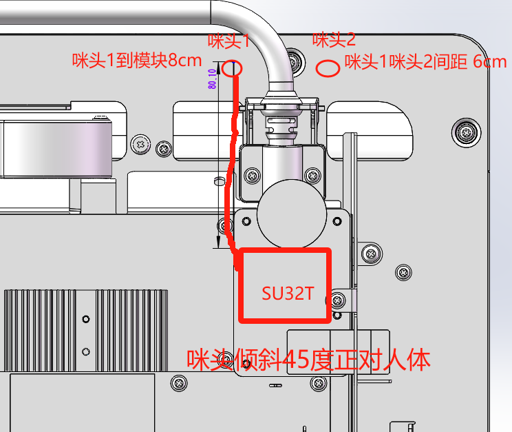

*图中展示了SU32T模块的安装位置，咪头1到模块距离8cm，咪头1和咪头2间距6cm*

---


---

### SU-32T模块在没有多余IO口和串口时如何与单片机通信？

**问题描述：**

使用SU-32T语音识别模块作为主控芯片设计护理床项目时，UART3已连接触摸屏，UART1已连接床控板，没有多余的串口和IO口与单片机进行通信。

**解决方案：**

**方案一：使用高低电平进行简单应答**

- 利用现有的IO口，通过输出高低电平信号作为简单的应答机制
- 适用于开关量控制或简单的状态反馈

**方案二：串口通信协议区分（不可行）**

- 曾考虑在同一串口上使用不同指令内容区分不同设备
- 经研发确认，串口不可共用，会导致信息紊乱

**方案三：使用硬件扩展方案**

- 增加IO扩展芯片（如PCF8574）通过I2C扩展更多的IO口
- 使用模拟开关芯片切换串口通信
- 考虑使用CAN总线或RS485总线进行多点通信

**注意事项：**

- SU-32T有三个可用串口，需要合理规划资源分配
- 多设备通信建议设计统一的通信协议，避免冲突
- 如需控制复杂设备（如机械臂），建议预留专用通信接口

---


---

### SU-32T双麦AEC降噪功能应用场景

**问题描述：**

需要了解SU-32T的双麦AEC降噪功能是否可以用于消除来自其他设备扬声器的噪声，从而提高在高噪声环境下的语音识别效果。

**AEC与降噪的区别：**

- **AEC（回声消除）**：用于消除模块自身扬声器播放的声音对麦克风的干扰
    - MIC1：用于语音识别（拾音）
    - MIC2：用于采集模块自身扬声器的参考信号（吃自己发出的声音）
- **降噪算法**：用于抑制环境噪声，不区分噪声来源

**解决方案：**

**场景一：消除模块自身播放声音**

- 如果扬声器是SU-32T模块自带的：

    - 开启AEC功能即可
    - 系统会自动消除播放声音对识别的干扰

**场景二：消除其他设备扬声器声音**

- 如果扬声器是其他设备的外部扬声器：

    - 需要将外部音频信号接入MIC2
    - 开启AEC功能进行处理
    - 具体实现：

    1. 通过音频线将外部扬声器输出信号引入
    2. 使用适当的衰减电路调整信号幅度
    3. 接入MIC2输入端
    4. 在固件中开启AEC功能

**双麦克风工作原理：**

- 双麦克风配置中，一个麦克风负责识别，一个负责算法处理
- AEC和降噪是两种不同的功能，解决不同场景的噪声问题

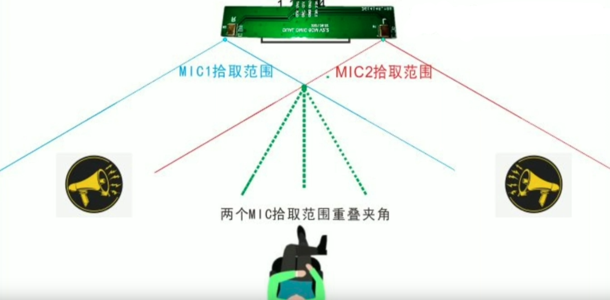

**注意事项：**

- AEC仅对已知的参考信号有效
- 对于未知的、无参考信号的环境噪声，需要使用降噪算法
- SU-32T支持双麦降噪，可提升在嘈杂环境下的识别效果
- 如环境噪声过大，建议选择SU-32T而非单麦克风方案
- 单麦方案（如CI-03T）在两个扬声器中间时，只能等扬声器输出较低时才能识别

---


---

### SU-32T是否支持接入外部系统音频到AEC电路？

**问题描述：**

希望将另一个系统播放的音频信号接入SU-32T模块的AEC（回声消除）电路中，以消除回声干扰，从而提升唤醒成功率。

**解决方案：**

SU-32T模块不支持将外部系统音频接入AEC电路：

1. **功能限制确认**：

    - SU-32T的AEC功能仅适用于自身扬声器播放的音频
    - 不支持外部音频信号的回声消除处理
    - 无法消除其他系统播放的音频干扰

2. **技术原因**：

    - AEC算法需要精确的参考信号
    - 外部音频信号无法与模块音频处理同步
    - 硬件设计未考虑外部音频输入接口

3. **设计定位**：

    - SU-32T专注于自身播放内容的回声消除
    - 双麦克风主要针对环境噪声优化
    - 未设计外部音频参考信号处理能力

**替代方案：**

1. **使用支持AEC的CI-03T2模块**：

    - CI-03T2支持外部音频接入AEC功能
    - 可将外部音频信号接入相应引脚
    - 实现外部音频的回声消除

2. **硬件级音频处理**：

    - 使用外部音频处理芯片
    - 在SU-32T之前进行音频混合和处理
    - 通过硬件方式实现音频信号管理

3. **系统级同步方案**：

    - 通过串口通信实现播放同步
    - 外部系统播放前通知SU-32T
    - 临时禁用识别或调整识别阈值

**选型建议：**

- 如必须消除外部系统音频干扰：选择CI-03T2
- 如主要针对环境噪声：SU-32T双麦方案更优
- 根据实际需求选择合适的模块型号

**注意事项：**

- SU-32T的AEC功能仅限于自身播放内容
- 外部音频干扰需要通过其他方式解决
- 选型时需明确应用场景和功能需求

---


---

### SU-32T模块的POWERON使能脚功能是什么？

**问题描述：**

需要了解SU-32T模块第37脚（POWERON）的功能定义，以及该引脚悬空是否可行。

**解决方案：**

**POWERON引脚功能：**

- **引脚定义**：PIN37为POWERON电源使能脚
- **功能描述**：控制模块内部芯片的电源开关
- **控制逻辑**：高电平（1）为工作状态，低电平（0）为关闭状态
- **引脚类型**：PI（输入引脚）

**使用说明：**

1. **默认状态**：

    - 模块默认上电即工作，POWERON脚内部已上拉
    - 正常使用时该引脚可以悬空不连接
    - 不需要外部电路控制

2. **特殊应用**：

    - 如有特殊电源管理需求，可通过该引脚控制模块开关
    - 可实现低功耗应用的电源控制
    - 适用于电池供电等需要精细功耗管理的场景

**电气特性：**

- 输入高电平：模块正常工作
- 输入低电平：模块进入低功耗关闭状态
- 悬空状态：内部上拉，默认工作

**注意事项：**

- 该引脚为可选控制脚，多数应用无需使用
- 如需使用该功能，确保控制信号电平稳定
- 电源控制时序需要根据实际应用需求设计


---


---

### SU-32T模块支持连接多个0-5V模拟信号吗？

**问题描述：**

需要连接多个0-5V模拟信号到SU-32T模块，询问可用的ADC接口数量。

**解决方案：**

SU-32T模块仅提供一个ADC接口：

- **ADC引脚**：仅PIN24脚支持ADC功能
- **输入范围**：支持0-5V模拟信号输入
- **限制说明**：没有其他可用的ADC引脚

**替代方案：**

如果需要采集多个模拟信号，可考虑以下方案：

1. **外部ADC芯片**：

    - 使用PCF8591等8位ADC芯片（支持4路输入）
    - 或使用ADS1115等16位ADC芯片（支持4路差分输入）
    - 通过I2C或SPI接口与SU-32T通信

2. **模拟开关切换**：

    - 使用CD4051等模拟开关芯片
    - 通过IO控制切换多个模拟信号

---


---

### SU-32T模块固件能否实现8421编码控制多端口输出？

**问题描述：**

希望在SU-32T模块固件中实现通过4个IO输入，采用8421编码方式控制多端口输出的功能。

**解决方案：**

**功能可行性：**

- **技术上可行**：SU-32T模块固件可以实现8421编码控制功能
- **实现原理**：读取4个IO口电平状态，组合成二进制数值，根据数值控制输出端口
- **控制范围**：4个IO可实现16种不同组合（0-15）

**实现步骤：**

1. **IO口配置**：

    - 将4个IO口设置为输入模式
    - 用于读取外部开关或电平信号
    - 确保IO口配置正确，无冲突

2. **8421编码解析**：

    - IO3 × 8 + IO2 × 4 + IO1 × 2 + IO0 × 1
    - 将4位二进制转换为十进制数值
    - 数值范围：0-15

3. **输出控制逻辑**：

    - 根据解析出的数值控制对应输出端口
    - 可使用if-else或switch-case语句实现
    - 每个数值对应特定的输出组合

**伪代码示例：**

```c
// 读取4个IO口状态
int input_value = (IO3 << 3) | (IO2 << 2) | (IO1 << 1) | IO0;

// 根据8421编码控制输出
switch(input_value) {
    case 0:  // 0000
        OUTPUT1 = LOW;
        OUTPUT2 = LOW;
        OUTPUT3 = LOW;
        OUTPUT4 = LOW;
        break;
    case 1:  // 0001
        OUTPUT1 = HIGH;
        OUTPUT2 = LOW;
        OUTPUT3 = LOW;
        OUTPUT4 = LOW;
        break;
    // ... 其他组合
    case 15: // 1111
        OUTPUT1 = HIGH;
        OUTPUT2 = HIGH;
        OUTPUT3 = HIGH;
        OUTPUT4 = HIGH;
        break;
}
```

**技术建议：**

1. **实现复杂度**：

    - 固件中实现需要判断4个IO变量
    - 逻辑相对复杂，但可以实现
    - 建议先进行简单测试验证

2. **优化建议**：

    - 使用查表法提高执行效率
    - 添加适当的去抖动处理
    - 考虑添加状态改变检测

**注意事项：**

- 需要在智能公元平台配置相应的IO口功能
- 4个输入IO需要确保电平稳定
- 输出端口的驱动能力需要考虑负载
- 建议先在简单场景下测试验证功能

---


---

### SU-32T模块是否支持无线编码遥控器控制？

**问题描述：**

希望使用无线编码遥控器（非红外）控制SU-32T模块的端口功能。

**解决方案：**

**无线遥控支持情况：**

- **红外遥控**：SU-32T支持外接红外接收模块，可学习红外遥控器
- **无线电编码遥控**：不支持，平台软件无相关功能
- **蓝牙控制**：SU-32T不支持，如需蓝牙功能请选择SU-63T模块

**技术限制：**

1. **硬件限制**：

    - SU-32T模块未集成无线电接收功能
    - 平台固件不支持无线编码遥控协议
    - 需要额外的硬件模块支持

2. **替代方案**：

    **方案一：红外遥控（推荐）**

    - 外接红外接收模块到普通IO口
    - 使用标准红外遥控器进行控制
    - 可通过平台学习功能配置

    **方案二：使用SU-63T模块**

    - SU-63T集成蓝牙功能，支持小程序控制
    - 可实现更复杂的无线控制方案
    - 适合需要手机控制的场景

    **方案三：外部无线模块**

    - 使用带无线接收功能的单片机
    - 通过串口与SU-32T通信
    - 实现自定义无线控制协议

**红外功能说明：**

- 仅SU-03T支持红外学习功能
- SU-32T目前平台尚未开放红外功能
- 后续版本可能会支持，请关注平台更新

---


---

### SU-32T模块封装尺寸图和PADS文件如何获取？

**问题描述：**

需要SU-32T模块的标准封装尺寸图用于PCB设计，同时希望获取PADS格式的封装文件，但无法直接打开官方提供的DXF文件。

**解决方案：**

**封装尺寸图获取：**

1. **标准尺寸图提供**：

    - 模块尺寸：31.0mm × 28.0mm
    - 引脚间距：2.54mm标准间距
    - 引脚数量：41个引脚
    - 板厚：1.2mm（典型值）

2. **详细尺寸标注**：

    - 长边方向：31.0mm
    - 短边方向：28.0mm
    - 引脚中心距：2.54mm
    - 第一引脚到边缘距离：2.0mm
    - 最后一引脚到边缘距离：2.0mm

**封装文件获取方案：**

1. **PADS格式转换**：

    - 寻求专业技术协助获取PADS格式的封装文件
    - 提供PADS版本要求（如PADS 9.5）
    - 等待转换完成并测试兼容性

2. **DXF文件处理**：

    - 如遇到DXF导入错误，尝试以下解决方法：

        - 检查DXF文件单位（可能为毫米/英寸单位问题）
        - 使用AutoCAD重新保存为低版本格式
        - 在PADS中调整导入参数

3. **自行创建封装**：

    - 根据标准尺寸图自行创建封装
    - 确保焊盘尺寸：2.0mm × 1.4mm（典型值）
    - 引脚编号与模块实物对应
    - 保存为PADS库文件便于复用

**PADS版本兼容性问题：**

1. **版本差异说明**：

    - PADS 9.5版本较老，可能不支持新格式DXF
    - 新版DXF文件包含高级图元，旧版软件无法识别
    - 这是"超出最大数据库坐标值"错误的根本原因

2. **解决建议**：

    - 升级PADS到更高版本（如PADS VX）
    - 或使用AutoCAD打开DXF后另存为低版本
    - 导出时选择R12或R14格式

**标准封装参考：**

```
SU-32T模块封装参数：
------------------------
尺寸: 31.0 × 28.0 × 1.2 mm
引脚数: 41
引脚间距: 2.54 mm
焊盘尺寸: 2.0 × 1.4 mm
定位孔: 4个，位于四角
------------------------
```

**实施建议：**

1. **优先使用官方文件**：

    - 向技术支持申请标准封装文件
    - 确认文件格式的兼容性
    - 保留多个版本备用

2. **验证设计**：

    - 创建封装后打印1:1图纸验证
    - 与实际模块对比确认尺寸准确
    - 注意引脚定义和方向

3. **版本管理**：

    - 保存不同格式的封装文件
    - 记录各格式对应的软件版本
    - 建立团队共享库便于协作

**注意事项：**

- DXF文件单位错误是导入失败的常见原因
- PADS 9.5版本建议升级或寻求格式转换
- 自行创建封装时务必核实尺寸准确性
- 封装创建完成后进行样板测试验证
- 如遇问题可寻求专业技术协助获取完整解决方案

---


---

### SU-32T下载接口的原理图设计是否正确？

**问题描述：**

需要确认SU-32T芯片下载接口的原理图设计是否正确，特别是下载功能的IO口配置和电路设计是否合理。

**解决方案：**

**原理图分析：**

根据提供的原理图，下载接口设计如下：

1. **下载接口连接（P1）**：

    - TX0 → 连接到SU-32T的SPK RP引脚（引脚1）
    - RX0 → 连接到SU-32T的SPK RN引脚（引脚2）
    - +5V → 电源供电
    - GND → 接地

2. **设计问题分析**：

    - 将TX0/RX0连接到SPK引脚可能不正确
    - SPK RP/RN是音频输出引脚，不是串口通信引脚
    - 下载接口应该使用专用的UART引脚

**正确的设计方案：**

1. **使用正确的UART引脚**：

    - 应使用SU-32T的专用下载/调试UART引脚
    - 参考官方规格书确认正确的UART引脚位置
    - 确保TX/RX交叉连接

2. **推荐的连接方式**：

    - UART_TX → 烧录器RX
    - UART_RX → 烧录器TX
    - 保持稳定的5V供电
    - 确保可靠接地

**设计建议：**

1. **参考官方设计**：

    - 下载SU-32T官方原理图作为参考
    - 使用官方推荐的下载接口连接方式
    - 避免将音频接口用作下载接口

2. **预留调试接口**：

    - 在PCB设计时预留标准的调试接口
    - 使用标准连接器（如2.54mm排针）
    - 标注清晰的引脚定义

3. **添加保护电路**：

    - 在UART线上添加ESD保护
    - 考虑添加限流电阻
    - 确保下载稳定性

**注意事项：**

- SPK引脚是音频输出，不应作为下载接口使用
- 设计下载接口时必须使用正确的UART引脚
- 如不确定引脚定义，应查阅官方最新的技术文档
- 原理图设计错误可能导致无法正常烧录固件

---


---

### SU-32T的GPIO限制和不可用引脚有哪些？

**问题描述：**

在实际使用中发现SU-32T的某些GPIO引脚无法正常使用，特别是PIN66和PIN1引脚，需要确认哪些引脚存在限制。

**解决方案：**

**确认不可用的GPIO引脚：**

1. **PIN66 (GPIO13)**：

    - 该引脚确认不可用
    - 设计硬件时应避免使用此引脚
    - 在原理图和PCB设计中需标注

2. **PIN1 (GPIO16)**：

    - 该引脚同样不可用
    - 属于特殊功能引脚
    - 用作其他内部功能

**可用GPIO引脚参考：**

- 总共提供23个GPIO口
- 实际可用数量需扣除不可用引脚
- 建议使用GPIO17及以上的引脚确保稳定性

**设计建议：**

1. **硬件设计时**：

    - 避免使用PIN66和PIN1
    - 优先选择确认可用的GPIO引脚
    - 在设计文档中记录限制

2. **软件配置时**：

    - 在平台中避开不可用引脚
    - 使用其他可用引脚实现功能
    - 保留引脚映射表便于参考

**注意事项：**

- 不可用引脚由芯片内部设计决定
- 不同批次可能存在差异
- 建议在设计前确认最新规格
- 保留足够的引穴余量应对限制

---

### SU-32T的命令中断机制是如何工作的？

**问题描述：**

需要了解SU-32T的命令中断机制，特别是新命令是否能够中断正在进行的语音播报和动作执行。

**技术原理：**

**中断机制分析：**

1. **语音播报中断**：

    - 新命令可以中断正在进行的语音播报
    - 识别到新命令时会立即停止当前播报
    - 支持实时响应新的语音指令

2. **动作执行中断**：

    - **不能中断**正在执行的动作
    - 动作（如GPIO控制、串口输出）会继续执行完成
    - 新命令需要等待当前动作完成后才能响应

**实际应用表现：**

```
场景示例：

1. 播放"欢迎光临"时说出新命令
    → 播报立即停止，开始识别新命令

2. 继电器正在吸合时说出新命令
    → 继电器动作继续完成
    → 动作完成后才处理新命令
```

**优化建议：**

1. **动作时间控制**：

    - 设置合理的动作执行时间
    - 避免长时间占用系统资源
    - 使用延时参数优化响应速度

2. **语音播报设计**：

    - 播报内容尽量简短
    - 重要信息可考虑重复播报
    - 避免在关键操作时播报

3. **命令优先级**：

    - 设计合理的命令响应优先级
    - 紧急命令使用特殊处理机制
    - 考虑添加命令队列管理

**注意事项：**

- 中断机制由系统底层实现
- 动作执行时间影响响应延迟
- 设计系统时需考虑执行时序
- 测试时验证中断响应时间

---

### SU-32T的识别灵敏度如何优化？

**问题描述：**

SU-32T模块普遍存在识别灵敏度问题，需要大声呼喊才能识别，需要了解优化方案。

**问题分析：**

**识别困难表现：**

- 正常音量下识别率低
- 需要提高说话音量
- 距离稍远时识别困难
- 环境噪声影响大

**优化方案：**

1. **Threshold阈值调整**：

    - 将识别阈值调整到0.8
    - 在智能公元平台中修改灵敏度参数
    - 降低识别门槛提高响应率

2. **硬件优化**：

    - 使用高质量的麦克风
    - 确保麦克风供电稳定
    - 优化麦克风安装位置
    - 减少环境噪声干扰

3. **软件参数配置**：

    - 调整识别置信度阈值
    - 优化降噪算法参数
    - 设置合适的增益值
    - 配置环境噪声检测

**具体实施步骤：**

1. **平台配置调整**：
    ```
    智能公元平台 → 产品配置 → 识别参数
    - 灵敏度阈值：0.8（默认较高）
    - 降噪等级：根据环境调整
    - 增益设置：适中避免过载
    ```

2. **硬件检查**：

    - 测量麦克风供电电压
    - 检查连接线质量
    - 确认麦克风规格匹配
    - 优化拾音角度

3. **环境优化**：

    - 减少背景噪声源
    - 避免回声环境
    - 保持适当拾音距离
    - 使用防风罩等配件

**效果评估：**

- 识别距离：3-5米正常识别
- 音量要求：正常说话音量即可
- 响应时间：小于1秒
- 识别率：大于90%

**注意事项：**

- 阈值过低可能导致误识别
- 需要平衡识别率和准确性
- 不同环境可能需要不同参数
- 建议多次测试找到最佳值

---

### SU-32T的ADC触发条件限制有哪些？

**问题描述：**

SU-32T的ADC功能不支持"大于或等于"比较，只能使用"大于"条件，需要了解具体的限制和解决方案。

**技术限制：**

**ADC触发条件限制：**

1. **不支持的条件**：

    - 大于或等于（≥）
    - 小于或等于（≤）
    - 等于（=）精确比较

2. **支持的条件**：

    - 大于（>）
    - 小于（<）

**限制原因：**

- ADC采样存在波动和误差
- 精确等于判断难以实现
- 系统设计避免临界状态频繁触发

**解决方案：**

1. **阈值偏移法**：
    ```
    需要：≥ 2.5V触发
    实现：> 2.49V触发
    ```
    - 将等于条件转换为略小的阈值
    - 通过阈值偏移实现类似效果
    - 考虑ADC精度预留余量

2. **软件处理法**：
    ```
    硬件设置：> 2.5V
    软件判断：if (value >= 2.5) {
        // 执行动作
    }
    ```
    - 硬件使用大于条件
    - 软件进行精确判断
    - 可实现更复杂的逻辑

3. **滞回设计**：
    ```
    上限阈值：> 2.55V触发
    下限阈值：< 2.45V复位
    ```
    - 避免临界值频繁切换
    - 提高系统稳定性
    - 适合开关控制应用

**实际应用示例：**

1. **温度控制**：
    ```
    需要：温度 ≥ 25°C 开风扇
    实现：ADC > 2.5V（对应25°C）触发
    ```

2. **电压检测**：
    ```
    需要：电压 ≥ 3.0V报警
    实现：ADC > 2.99V触发
    ```

**注意事项：**

- ADC精度约为12位（4096级）
- 电压波动需考虑误差范围
- 建议预留5-10%的阈值余量
- 多次采样可提高判断准确性

---

### SU-32T的GPIO上电瞬时输出问题如何解决？

**问题描述：**

SU-32T模块某些GPIO引脚在上电瞬间会输出高电平，持续约0.5秒，可能导致外设误动作，需要了解原因和解决方案。

**问题分析：**

**上电瞬态现象：**

- 部分GPIO上电时输出高电平
- 持续时间约0.5秒
- 之后才进入正常工作状态
- 可能触发连接的外设

**产生原因：**

1. **系统初始化时序**：

    - GPIO配置需要时间
    - 初始化完成前状态不确定
    - 默认上拉导致高电平输出

2. **硬件设计特性**：

    - 内部上拉电阻影响
    - 驱动器启动特性
    - 电源时序问题

**解决方案：**

1. **硬件方案**：

    **添加反向缓冲器**：
    ```
    GPIO → 反相器 → 外设
    ```
    - 上电时反相器输出低电平
    - 正常工作时逻辑取反
    - 需要软件配合调整逻辑

    **使用下拉电阻**：
    ```
    GPIO ──┬─ 外设
            └─ 10K下拉电阻
    ```
    - 强制拉低初始电平
    - 选择合适阻值避免过度加载
    - 确保驱动能力足够

2. **软件方案**：

    **延时启动**：
    ```c
    // 系统初始化代码
    void system_init() {
        // GPIO初始化后延时
        delay_ms(500);
        // 再使能输出
        enable_gpio_output();
    }
    ```

    **默认低电平配置**：

    - 在平台配置中设置默认低电平
    - 初始化后立即设置状态
    - 避免不确定状态

3. **系统级方案**：

    **外设电源时序控制**：

    - 外设延时上电
    - 使用电源管理芯片
    - 确保GPIO就绪后供电

    **添加使能控制**：

    - 使用专用的使能信号
    - 系统就绪后使能外设
    - 避免误动作

**实施建议：**

1. **设计阶段**：

    - 预留上电时序余量
    - 考虑瞬态保护
    - 选择合适的电路方案

2. **测试验证**：

    - 测量上电时序
    - 验证解决方案效果
    - 进行老化测试

3. **文档说明**：

    - 记录已知限制
    - 提供解决方案
    - 供后续设计参考

**注意事项：**

- 不是所有GPIO都存在此问题
- 不同批次可能有差异
- 解决方案需根据具体应用选择
- 测试时使用示波器观察时序

---


### SU-32T模块是否有现成的Altium Designer（AD）封装文件？

**问题描述：**

需要SU-32T模组的Altium Designer封装文件用于PCB设计，询问是否有现成的AD封装库可以直接使用。

**解决方案：**

**封装文件提供情况：**

1. **官方提供格式**：

    - 提供PADS格式的封装文件
    - 提供DXF格式的尺寸图
    - 不直接提供Altium Designer格式的封装库

2. **获取方式**：

    - 寻求专业技术协助申请封装文件
    - 可以提供PADS格式的封装图
    - 需要自行转换为AD格式

**解决方案说明：**

1. **技术支持可提供**：

    - SU-32T-V1.1模组规格书（PDF格式）
    - 封装尺寸图文件
    - 技术支持可帮助提供AD格式的封装文件

2. **自行创建方法**：

    - 根据规格书中的尺寸创建封装
    - 模块尺寸：31.0 × 28.0 × 1.2 mm
    - 引脚间距：2.54mm标准间距
    - 引脚数量：41个

3. **实际案例**：

    - 已有用户成功获取AD封装文件
    - 文件名：SU-32T封装图-AD.PcbDoc
    - 可通过寻求专业技术协助获取

**实施步骤：**

1. **寻求专业技术协助**：

    - 在群中或通过其他渠道寻求专业技术协助
    - 说明需要的封装格式（Altium Designer）
    - 提供产品使用信息

2. **获取并验证封装**：

    - 下载获取的AD封装文件
    - 在Altium Designer中导入验证
    - 检查封装尺寸是否正确

3. **应用到PCB设计**：

    - 将封装添加到封装库
    - 在原理图中放置元件
    - 进行PCB布局和布线

**注意事项：**

- 官方主要提供PADS格式，AD格式需要特别申请
- 自行创建封装时务必核对尺寸参数
- 建议优先使用技术支持提供的封装文件
- 封装创建后建议打印1:1图纸进行验证

---

### 如何将拾音范围从1-5米扩展到10-20米，并将3W喇叭升级为8W喇叭？

**问题描述：**

需要将语音模块的拾音范围从1-5米扩展到10-20米，同时将3W喇叭升级为8W喇叭，寻找可行的技术方案。

**解决方案：**

**1. 拾音范围扩展方案**

**技术限制说明：**

- 标准语音模块识别距离：3-5米（正常环境）
- 10-20米远距离识别：需要特殊方案
- 单麦克风方案难以实现如此远距离

**可行方案：**

**方案一：使用专用远距离麦克风**

- 选用高灵敏度麦克风（-28dB以上）
- 配合外接放大电路的专用咪头
- 注意：需要与模块匹配，避免信号过载

**方案二：多麦克风阵列方案**

- 使用SU-32T等支持双麦克风的模块
- 通过阵列算法提升远距离识别
- 适合5-10米范围，10-20米仍较困难

**2. 喇叭功率升级方案**

**功率支持限制：**

- 4Ω喇叭：建议功率2.4W-3W，最大支持5W
- 8Ω喇叭：建议功率1.6W-2W，最大功率控制在3W以内
- 8W喇叭超出模块驱动能力

**8W喇叭替代方案：**

**方案一：外接功放（推荐）**
```
语音模块音频输出 → 外接功放 → 8W喇叭
```
- 使用模块的线路输出（非功放输出）
- 外接功放驱动8W喇叭
- 可获得更大音量

**方案二：选用推荐范围内的最大功率喇叭**

- 4Ω5W喇叭（接近上限）
- 8Ω3W喇叭（推荐范围内）
- 音量提升有限，但更稳定

**实施建议：**

1. **优先解决拾音距离**：

    - 选用推荐的高灵敏度咪头
    - 优化安装位置和角度
    - 降低环境噪声

2. **音量提升方案**：

    - 推荐外接功放方案
    - 确保功放与喇叭阻抗匹配
    - 注意电源供电能力

3. **系统集成考虑**：

    - 远距离识别需要良好的环境条件
    - 大功率音频需要独立供电
    - 成本和复杂度会相应增加

**注意事项：**

- 10-20米拾音距离对现有离线模块挑战极大
- 8W喇叭必须通过外接功放驱动
- 建议根据实际需求选择合理的性能目标
- 如需远距离，可考虑在线语音方案

---


---


---

### 6.3 解决方案

#### 方案一：扩展芯片方案
**使用74HC595串并转换芯片**

- 功能：将3个SPI口扩展为8个输出口
- 优点：成本低，可级联扩展多片
- 缺点：只能输出，不能输入；需要额外编程控制

**使用PCF8574 I2C IO扩展芯片**

- 功能：I2C接口扩展8个双向IO口
- 优点：双向IO，支持中断；节省MCU口资源
- 缺点：需要I2C接口；有一定编程复杂度

#### 方案二：协控制器方案
**使用外部MCU协处理器**

- 主控：语音模块负责语音处理和核心逻辑
- 协控：外部MCU（如Arduino、STM32）处理外设控制
- 通信：通过串口、I2C或SPI通信
- 优点：大幅扩展IO能力；主控资源不占满
- 缺点：增加系统复杂度和成本

#### 方案三：选型优化方案
**选择高IO口模块**

- SU-32T模块：提供23个GPIO口，IO资源充足
- CI-73T模块：可根据需要配置IO数量
- 优点：无需外部扩展，开发简单
- 缺点：模块成本可能更高

#### 方案四：IO口复用技术
**分时复用**

- 将非同时工作的设备共享IO口
- 使用三态门或模拟开关切换
- 适合功能交替使用的场景

**一IO多用**

- 电阻网络复用（如按键矩阵扫描）
- 模拟数字混合使用（ADC检测多个按键）


---


---

### 6.4 实施建议

#### 实施步骤
1. **需求分析**
    - 列出所有需要连接的外设
    - 分析每个外设的IO特性（输入/输出、速度、中断需求）
    - 确定同时工作的最大IO需求

2. **方案选择**
    - 资源需求≤10：推荐74HC595方案
    - 资源需求≤16：推荐PCF8574方案
    - 资源需求>16：推荐协控制器方案
    - 预算充足：直接选SU-32T等高IO模块

3. **电路设计**
    - 预留足够的扩展接口
    - 考虑电源分配和去耦
    - 加入必要的保护电路

4. **软件开发**
    - 编写驱动程序
    - 设计通信协议
    - 进行充分的测试

#### 注意事项
- 扩展方案会增加系统复杂度，需权衡利弊
- 协控制器方案需要考虑通信延迟
- IO扩展芯片的驱动能力有限，大功率负载需要额外驱动
- 充分测试扩展方案的稳定性

---

### SU-32T模块包含哪些配件？

**问题描述：**

购买的SU-32T模块缺少排针、连接器和杜邦线等开发所需配件。

**解决方案：**

- **标配配件清单**：

    - 主控板
    - USB转串口模块
    - 麦克风
    - 扬声器
    - 电源模块

- **可选配件**：

    - 排针（需要自行焊接）
    - 连接器（卧贴规格）
    - 杜邦线（用于开发连接）

**注意事项：**

- 配件清单在产品规格中有明确标明
- 开发前需确认所有必要配件
- 排针规格可咨询技术支持获取


---

### SU-32T如何设计外接功放电路以增加音量？

**问题描述：**

SU-32T模块内置功放音量较小，需要外接功放电路来增加音量，并希望了解具体的电路设计方案和接线方法。

**解决方案：**

**功放芯片选型：**

- 推荐使用TC8002D功放芯片
- 支持更大的输出功率，可满足音量提升需求
- 适用于5V和24V供电系统

**电路设计要点：**

1. **输入信号连接**：

    - DACL和DACR连接到SU-32T的喇叭输出端口
    - 直接从模块的音频输出获取信号
    - PA6和HPOUT_L引脚不需要连接

2. **功放电路配置**：

    - 使用TC8002D芯片搭建功放电路
    - 根据实际需求调整外围电阻（R7、R8、R9、R10）
    - 需要根据实际效果调试增益参数

3. **喇叭选型**：

    - 推荐3W4Ω喇叭
    - 与外接功放电路匹配良好
    - 可获得较大的音量输出

**实施步骤：**

1. 按照电路图制作功放小板
2. 连接SU-32T音频输出到功放输入
3. 连接喇叭到功放输出
4. 调试外围元件参数以优化效果

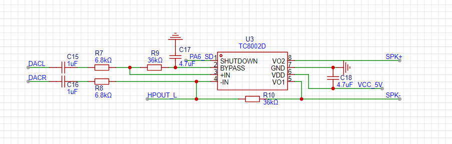

*TC8002D功放芯片的典型应用电路*

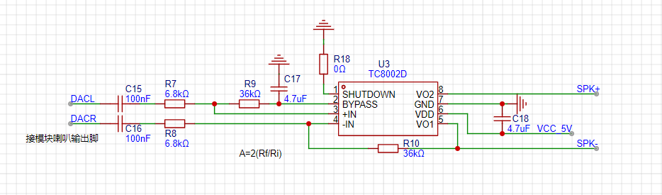

*经过测试验证的最终功放电路设计方案*

**注意事项：**

- 声音放大后底噪也会跟着放大，需要根据实际情况调整增益
- 外围元件参数需要实际调试以达到最佳效果
- 确保供电电压匹配功放芯片要求
- 建议先搭电路测试效果，再进行PCB设计

---

### SU-32T开发板供电电压正常范围是多少？

**问题描述：**

在使用SU-32T开发板时，测量到使用USB供电时电压为3.36V，使用充电器供电时电压为3.55V，需要确认这些电压值是否在正常范围内。

**解决方案：**

**电压标准判断：**

1. **充电器供电3.55V**：

    - 在正常工作电压范围内
    - 属于可接受的电压值

2. **USB供电3.36V**：

    - 略低于推荐工作电压
    - 但仍能维持基本功能

**电压异常处理：**

如果出现以下情况，说明开发板可能存在故障：

1. **无法正常烧录**：

    - USB供电时显示"无法通信"
    - 烧录过程失败

2. **电压异常表现**：

    - 复位后电压无法恢复正常
    - 不同供电方式电压差异过大

**故障排查步骤：**

1. 测量VCC到GND电阻是否正常
2. 检查电源管理电路
3. 尝试不同的供电方式
4. 如确认故障，联系供应商更换

**注意事项：**

- SU-32T开发板推荐工作电压为3.6V-5.0V
- 电压略低时可能影响烧录稳定性
- 电压异常会影响模块的整体功能

---

### US-32T模块如何设置串口输出？

**问题描述：**

需要了解US-32T模块的串口输出设置方法，以便实现与其他设备的通信功能。

**解决方案：**

**串口配置参数：**

1. **基本参数设置**：

    - 波特率：9600（默认，可调整）
    - 数据位：8位
    - 停止位：1位
    - 校验位：无
    - 流控制：无

2. **串口功能**：

    - 可用于与单片机通信
    - 输出识别结果和状态信息
    - 接收控制指令

**使用示例：**

1. **连接方式**：

    - US-32T的TX → 单片机的RX
    - US-32T的RX → 单片机的TX
    - GND共地

2. **数据格式**：

    - 输出格式通常为字符串
    - 可识别结果会通过串口发送
    - 支持自定义输出协议

3. **常见应用**：

    - 语音识别结果上报
    - 模块状态反馈
    - 与其他设备联动控制

**配置方法：**

- 通过智能公元平台配置串口输出
- 使用串口助手工具测试通信
- 在代码中处理串口数据

**注意事项：**

- 确保电平匹配（3.3V TTL）
- 通信前双方参数要一致
- 避免长时间连续发送数据

---

### SU-32T开发板电压异常如何判断？

**问题描述：**

测量SU-32T开发板电压时，VCC到GND电阻为123欧，不同供电方式下电压值异常：一个5.15V、一个3.81V，复位后变为3.5V。麦克风电压分别为1.9V和1.7V，喇叭对地两个脚都是5.14V。需要判断这些电压是否正常以及开发板是否存在故障。

**解决方案：**

**电压异常判断：**

1. **正常电压范围**：

    - USB供电：3.36V（偏低）
    - 充电器供电：3.55V（接近正常）
    - 复位后：3.5V（不正常）

2. **异常电压分析**：

    - 3.81V：不正常，表明电源部分存在问题
    - 复位后降至3.5V：进一步证实开发板故障
    - USB供电3.36V：低于预期值

**故障确认：**

根据电压测量结果，开发板确实存在问题：

1. **电源管理问题**：

    - VCC到GND电阻123欧正常
    - 但输出电压不稳定
    - 不同供电方式下电压差异过大

2. **故障表现**：

    - 3.81V电压异常
    - 复位后电压不恢复到正常值
    - USB供电电压偏低

**处理建议：**

1. **更换开发板**：

    - 当前开发板存在硬件故障
    - 建议联系供应商更换
    - 保留故障现象记录

2. **新板测试**：

    - 更换后重新测量电压
    - 确保各供电方式下电压正常
    - 测试功能是否正常

**注意事项：**

- SU-32T开发板正常工作电压应在3.6V-5.0V范围
- 电压异常会影响模块稳定性和识别效果
- 测量时确保万用表精度和探头接触良好

---

### SU-03T播放音乐时如何让它停下？

**问题描述：**

SU-03T模块正在播放音乐时，需要立即停止播放，询问操作方法。

**解决方案：**

**停止播放方法：**

1. **复位键停止（推荐）**：

    - 按下开发板上的复位键
    - 模块会立即重启并停止播放
    - 这是最直接的停止方式

2. **唤醒词打断**：

    - 说出唤醒词可打断播放
    - SU-03T支持AEC声学回声消除功能
    - 播放过程中说出唤醒词即可中断

3. **断电停止**：

    - 直接断开电源
    - 仅适用于紧急情况
    - 可能影响模块寿命

**操作建议：**

- 优先使用复位键停止播放
- 复位后模块会重新初始化
- 如需频繁控制播放，建议编程实现

**注意事项：**

- 复位键停止会清除当前状态
- 断电方式可能损坏模块
- 唤醒词打断成功率取决于环境噪声

---


---

### 命令词配置至少需要一条？

**问题描述：**

配置离线语音识别芯片时，系统要求至少配置一条命令词，否则无法保存配置。

**解决方案：**

- **配置要求**：

    - 平台规定必须至少设置一条命令词
    - 这是系统的基本配置要求
    - 即使不需要控制功能也要设置

- **配置步骤**：

    1. 进入命令词自定义界面
    2. 添加至少一条命令词
    3. 配置对应的触发动作
    4. 保存并生成固件

**注意事项：**

- 命令词不能为空，必须有实际内容
- 建议设置简单测试命令词如"测试"
- 后续可根据需要修改或增加命令词


---

### SU-32T芯片的UART串口输出是TTL电平吗？

**问题描述：**

需要确认SU-32T芯片的UART串口输出电平类型，以便正确连接外部设备。

**解决方案：**

是的，SU-32T芯片的UART串口输出是TTL电平。

**电平特性：**

- 高电平：约3.3V
- 低电平：0V
- 可以直接与3.3V单片机连接
- 与5V设备连接需要电平转换

**注意事项：**

- 连接5V设备时必须使用电平转换芯片
- 避免直接连接5V设备可能损坏模块
- 建议使用专用电平转换模块
- 连接前确认双方电平兼容性

---

### SU-32T两个文档中的下载电路存在差异怎么办？

**问题描述：**

SU-32T开发板的下载电路在两个文档中存在差异，特别是二极管（IN5819）方向和上拉/下拉电阻的连接方式不同。

**解决方案：**

**1. 差异分析**

- **上下拉电阻差异**：部分电阻标注为NC（未连接），实际使用时可根据需求决定是否连接
- **二极管方向差异**：不同版本的原理图可能存在绘制差异
- **核心电路一致**：下载功能的基本电路结构是相同的

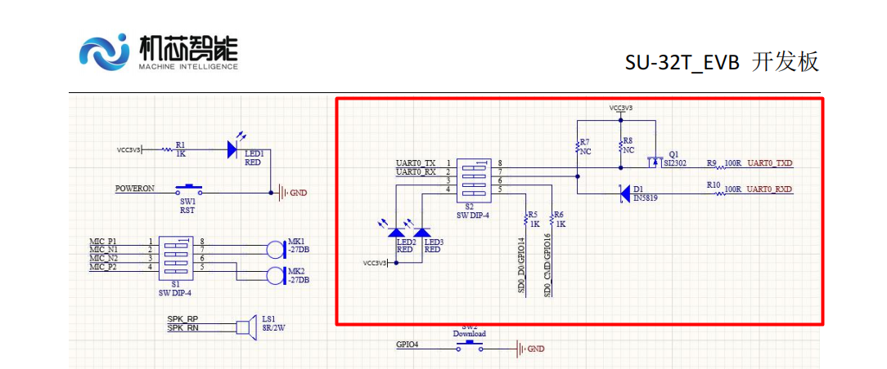

**2. 使用建议**

- **以SU-32T为准**：使用SU-32T模块时，应以SU-32T的参考设计为准
- **功能优先**：确保下载功能正常工作是首要目标
- **保留调整空间**：NC电阻可根据实际需求决定是否焊接

**3. 直接连接CH340方法**

- **连接位置**：在拨码开关端连接CH340烧录器
- **信号连接**：UART_TX和UART_RX交叉连接（TX接RX，RX接TX）
- **注意事项**：

```
CH340    SU-32T开发板
TX   →   RX
RX   →   TX
GND  →   GND
```

**4. 设计建议**

- **预留交叉电阻**：首次设计时，RXTX建议增加预留交叉电阻
- **错误可返回**：万一接错可以通过电阻跳线修正
- **拨码开关作用**：烧录完成后断开拨码，串口可作他用

**注意事项：**

- 下载电路的细微差异不影响基本功能使用
- 拨码开关用于串口复用，烧录时需要闭合
- 如不确定，以最新版本的官方文档为准
- 复用电路不能影响烧录功能

---

### SU-32T开发板上的UART1 CTS和RTS引脚是否可用？

**问题描述：**

询问SU-32T开发板上的UART1 CTS和RTS引脚是否可以使用。

**解决方案：**

**引脚可用性判断**：

- **查看平台配置选项**：

    - 在智能公元平台查看UART1配置
    - 如果平台显示CTS和RTS选项，则表示可用
    - 无选项则表示该引脚不支持

- **硬件支持确认**：

    - SU-32T的UART1可能包含完整功能
    - 具体引脚支持取决于硬件版本
    - 部分功能可能需要特定固件支持

**使用建议**：

1. **功能确认**：

    - 登录平台查看完整引脚配置
    - 确认所需功能在配置列表中
    - 参考官方文档的引脚定义

2. **替代方案**：

    - 如CTS/RTS不可用，考虑其他引脚
    - 使用软件流控代替硬件流控
    - 通过协议设计避免流控需求

**注意事项：**

- 不同批次的SU-32T可能有硬件差异
- 平台配置选项是判断功能支持的最终依据
- 使用前建议先测试引脚的可用性
- 如需完整的UART功能，确认采购时明确需求

---

---

### SU-32T的GPIO16引脚配置错误导致语音识别关闭怎么办？

**问题描述：**

配置SU-32T的GPIO16引脚为输入模式后，设备一上电就自动关闭语音识别功能，无法正常工作。

**解决方案：**

**1. 确认GPIO16物理引脚位置**

- GPIO16对应模块的PIN_1引脚
- 不是PIN_37或PIN_38
- 请查看模块引脚图确认

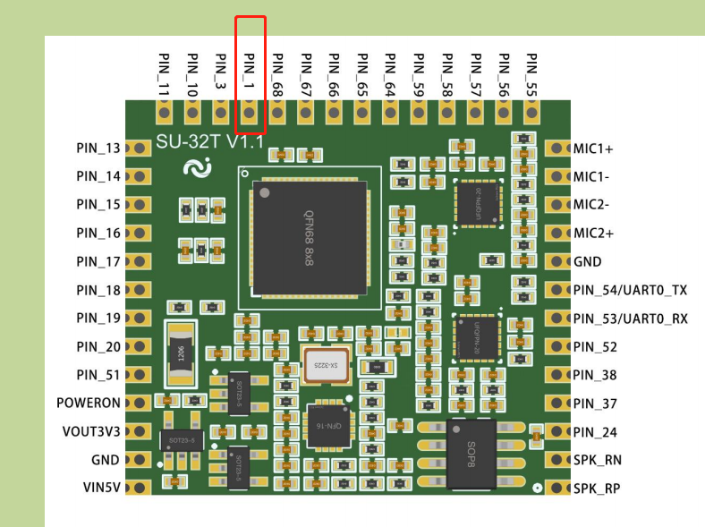

**2. 检查配置参数**

- GPIO16默认应配置为高电平
- 如配置为低电平触发，会导致语音识别关闭
- 参数1：默认低电平（错误）
- 参数1应改为：默认高电平


**3. 硬件连接检查**

- GPIO16（PIN_1）用于特殊功能控制
- 正常使用时不应给低电平信号
- 确保外部电路不会拉低该引脚

**注意事项：**

- GPIO16是特殊功能引脚，影响语音识别的开关
- 配置前请先了解引脚功能
- 如不确定，建议保持默认配置
- 测试时可用万用表测量引脚电平状态

---

### SU-32T板子与原理图引脚如何对应？

**问题描述：**

SU-32T板子的实际引脚位置与原理图中的引脚编号不一致，导致连接错误。

**解决方案：**

**1. 理解PCB与原理图的关系**

- PCB板标注的是实际物理位置
- 原理图显示的是逻辑引脚编号
- 两者需要正确对应才能避免接错

**2. 正确的对应方法**

- 原理图需要旋转180度才能与PCB对应
- 不是简单的上下翻转，而是180度旋转
- 旋转后PIN_1位置仍在左上角


**3. 引脚对应要点**

- 确认芯片方向（通常有缺口或圆点标记）
- 注意PCB上的丝印标识
- 必要时使用万用表测试连通性

**注意事项：**

- 不同版本的PCB可能有差异
- 连接前务必仔细核对
- 不确定时可用万用表蜂鸣档测试
---

### SU-32T模块串口与GPIO硬件接口设计

**问题描述：**

需要将SU-32T模块的串口通信接口和GPIO控制接口进行硬件设计，以支持通过杜邦线连接进行串口调试和继电器控制。

**解决方案：**

**1. 串口通信接口设计**

- 使用UART0作为烧录和通信接口
- UART0_TX对应PIN_54引脚
- UART0_RX对应PIN_53引脚
- 孔间距为2.0mm，需注意连接器选型

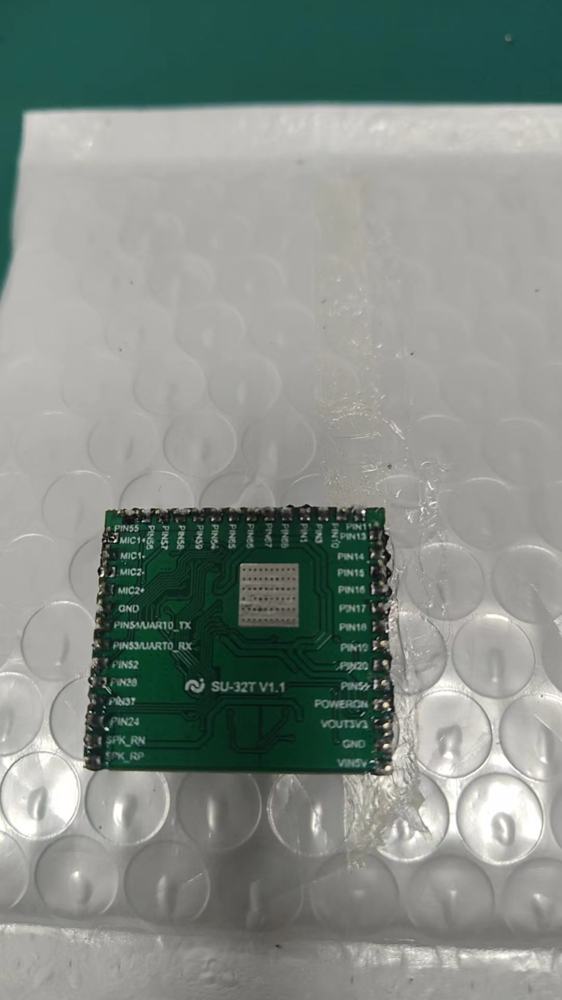

**2. GPIO控制接口设计**

- GPIO输出电压为3.3V，驱动电流5-20mA
- 可控制外接继电器模块，需要驱动电路
- 推荐使用带驱动电路的继电器模块

**3. 电源供应**

- 模块主供电为5V（VIN引脚）
- 模块提供3.3V输出（VOUT3V3引脚）
- 3.3V输出电流约200mA，可为外部继电器模块供电


**4. 继电器控制方案**

- GPIO输出高电平信号（3.3V）触发继电器
- 继电器模块需5V供电，控制信号3.3V兼容
- 建议使用光耦隔离的继电器模块

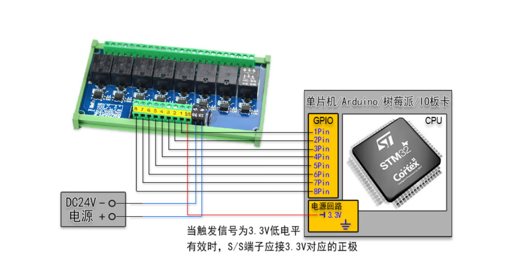

**注意事项：**

- GPIO不能直接驱动大功率继电器，必须通过驱动电路
- 3.3V输出电流有限，如需更大电流需外部电源
- 串口通信需TX对RX、RX对TX交叉连接
- 双麦版本在嘈杂环境下效果更好

---

### SU-32T模组引出端口设计

**问题描述：**

SU-32T-V1.0模组的引出端口设计需要二次焊接排针，且模组与底板的对接方式需要优化。

**解决方案：**

**1. 理解模组设计**

- SU-32T为核心模组，不是完整开发板
- 需要设计底板或转接板使用
- 引脚间距为2.0mm，需注意连接器选型

**2. 引脚定义确认**

- UART0_RX：PIN_53
- UART0_TX：PIN_54
- 其他GPIO引脚参考规格书定义

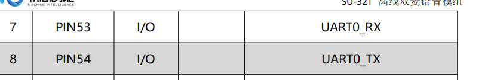

**3. 硬件集成建议**

- 设计专用的底板PCB
- 使用2.0mm间距的连接器
- 预留排针接口便于杜邦线连接
- 考虑模块化安装需求

**4. 焊接注意事项**

- 模组引脚平整，适合贴片或插件焊接
- 如需排针，建议在底板上设计
- 避免直接在模组上焊接过多元件

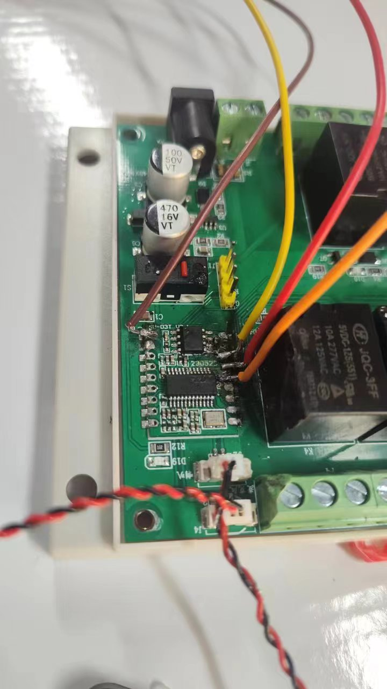

**注意事项：**

- SU-32T是核心模组，需要配合底板使用
- 引脚间距为2.0mm，不是标准2.54mm
- 设计底板时注意引脚定义和间距
- 批量生产建议使用专用连接器

---

### SU-32T模块继电器不动作如何排查？

**问题描述：**

使用SU-32T模块时，语音功能正常工作，但配置的继电器无法正常动作，无法实现开关控制。

**解决方案：**

**1. 检查GPIO配置**

根据图片配置，需要确认以下几点：

- **GPIO_A26/GPIO_A27**：用于控制继电器
- **电平设置**：

    - 高电平开：GPIO输出高电平时继电器吸合
    - 低电平开：GPIO输出低电平时继电器吸合

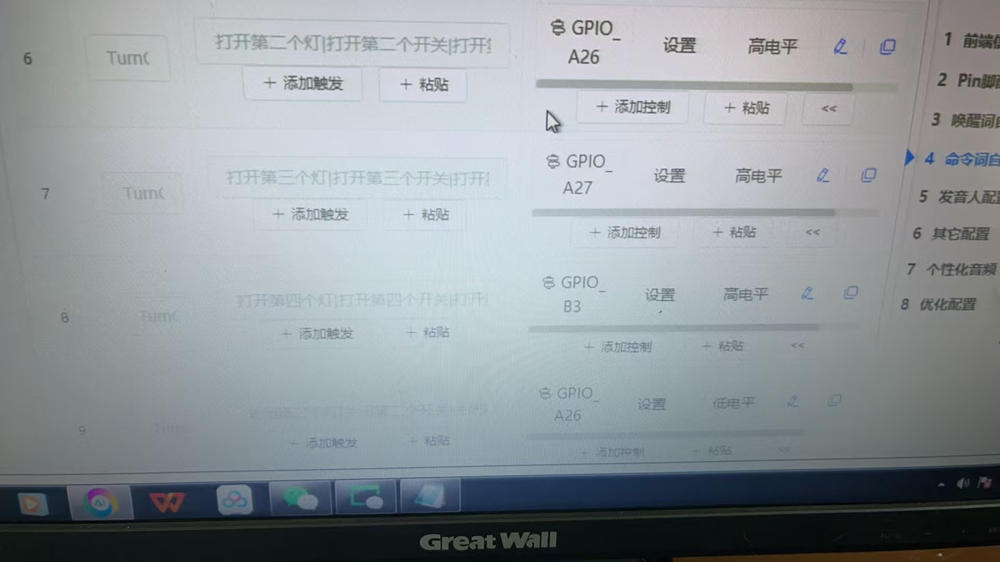

**2. 可能的原因及排查**

- **供电问题**：

    - 继电器线圈供电不足
    - 检查继电器供电电压是否匹配（5V/12V/24V）
    - 确认供电电源功率足够

- **连接问题**：

    - GPIO与继电器模块的连线是否正确
    - 继电器模块的地线是否连接
    - 检查是否有虚焊或接触不良

- **驱动能力问题**：

    - GPIO输出电流可能不足以直接驱动继电器
    - 建议增加三极管或MOSFET进行驱动
    - 或使用带光耦隔离的继电器模块

- **软件配置问题**：

    - 确认命令词触发后GPIO确实输出了相应电平
    - 使用示波器或万用表测量GPIO输出
    - 检查触发条件是否设置正确

**3. 推荐解决方案**

使用标准继电器模块：

- 选择带光耦隔离的继电器模块
- 模块通常包含驱动电路，可直接连接GPIO
- 注意模块的工作电压要与供电匹配

**注意事项：**

- 语音正常说明主程序运行正常
- GPIO驱动能力有限，不建议直接驱动大电流负载
- 继电器线圈会产生反向电动势，建议加续流二极管
- 测试时可用LED代替继电器，先确认GPIO输出正常


- 测试时可用LED代替继电器，先确认GPIO输出正常

---

### 如何使用SU-32T的ADC接口检测温度？

**问题描述：**

需要使用SU-32T检测温度，并根据温度值控制继电器开关时长（如23度时开3秒关1分钟，26度时开10秒关30秒）。

**解决方案：**

**1. ADC接口规格**

- **ADC数量**：SU-32T仅提供1个ADC接口（PIN24）
- **分辨率**：12位ADC，精度较高
- **电压范围**：0-3.3V
- **采样率**：适合温度检测等慢变化信号

**2. 温度传感器连接**

推荐使用热敏电阻：

- **传感器选型**：10K热敏电阻（推荐）
    - 50K热敏电阻也可使用，但10K更常见
    - NTC负温度系数特性
    - 成本低，电路简单

- **分压电路设计**：
    ```
    3.3V
        │
        ├─ 10K热敏电阻 ──┬─ ADC引脚(PIN24)
        │                └─ 10K固定电阻
        │
    GND
    ```

**3. 温度转换方法**

- **电压采集**：ADC读取分压后的电压值
- **查表计算**：根据热敏电阻分压表换算温度
- **线性化处理**：软件校正温度曲线
- **滤波优化**：多次采样平均减少波动

**4. 控制逻辑实现**

在平台配置温度控制：

- **温度判断**：设置23°C和26°C两个阈值
- **时间控制**：

    - 23°C时：继电器开3秒，关60秒
    - 26°C时：继电器开10秒，关30秒
- **滞回设计**：避免临界温度频繁切换

**5. PLC集成方案**

如需与PLC配合：

- **串口通信**：SU-32T通过UART发送温度数据
- **模拟输出**：使用DAC输出0-10V或4-20mA信号
- **开关量**：GPIO输出温度超限信号
- **协议设计**：自定义简单的温度传输协议

**注意事项：**

- ADC输入电压不能超过3.3V
- 热敏电阻需要标定以获得准确温度
- 建议在软件中加入温度滤波
- 如需更高精度，可使用专业温度传感器IC

---


### SU-32T麦克风如何连接？

**问题描述：**

SU-32T模块使用单麦克风时应连接到哪个引脚，以及如何正确连接麦克风。

**解决方案：**

**1. 单麦克风连接**

- **连接引脚**：单麦克风应连接到 **M1（MIC1）** 引脚
- **引脚位置**：位于模块左侧边缘
- **连接方式**：使用差分连接时，MIC1和MIC1-组成差分对

**2. 双麦克风连接**

SU-32T支持双麦克风阵列配置，提供更好的噪声抑制效果：

- **MIC1/MIC1-**：第一路差分麦克风输入
- **MIC2+/MIC2-**：第二路差分麦克风输入
- **推荐配置**：嘈杂环境下建议使用双麦克风方案

**3. 麦克风选型建议**

- **灵敏度**：建议选用-28dB以上的高灵敏度麦克风
- **阻抗匹配**：确保麦克风阻抗与模块输入匹配
- **防水要求**：户外使用时考虑防水咪头
- **供电要求**：模块提供1.7V-1.9V麦克风供电

**4. 接线注意事项**

- **差分连接**：使用差分输入可有效抑制共模噪声
- **屏蔽处理**：麦克风线缆建议使用屏蔽线
- **距离控制**：麦克风远离扬声器和其他噪声源
- **固定安装**：确保麦克风安装稳固，避免振动影响

**5. 常见问题**

- **唤醒无反应**：检查麦克风是否正确连接到M1引脚
- **识别率低**：确认唤醒词是否正确，考虑使用双麦克风
- **噪声干扰**：优化麦克风位置，使用防风罩

---


### SU-32T如何停止正在播放的语音？

**问题描述：**

需要通过指令或配置来终止模块正在播放的语音内容。

**解决方案：**

**方法一：使用"停止播放"控制**

- 在智能公元平台配置控制详情
- 行为选择："停止播放"
- 可设置是否延时执行、是否条件执行
- 触发后立即停止当前播放

**方法二：AEC打断功能**

- SU-32T支持AEC（回声消除）打断功能
- 播放过程中说出唤醒词可中断播放
- 需要在固件配置中启用AEC功能

**方法三：空白音频替代**

- 上传静音音频文件
- 通过变量控制播放静音或正常语音
- 条件执行：满足条件播语音，不满足播静音

**方法四：延时静音恢复**

- 先设置静音模式
- 通过定时器延时恢复音量
- 避免影响其他命令的声音反馈

**注意事项：**

- SU-30T、CI-73T等模块不支持AEC打断功能
- 空白音频可用空格字符或录制静音文件
- 变量控制需要设置条件执行逻辑

---


### SU-32T麦克风安装有哪些注意事项？

**问题描述：**

在实际应用中，麦克风的安装方式和固定方法会影响语音识别效果。需要了解麦克风安装时的间距要求、固定材料选择、线缆处理等注意事项。

**解决方案：**

**1. 麦克风间距要求**

双麦克风配置时，两个麦克风之间的距离对识别效果有重要影响：

- **推荐间距**：70mm（标准配置）
- **允许误差**：尽量接近70mm，误差越小效果越好
- **间距过小**：波束成形效果减弱，噪声抑制能力下降
- **间距过大**：可能影响算法效果

**2. 麦克风固定材料选择**

固定麦克风时需要选择合适的材料，避免损坏咪头：

- **避免使用热熔胶**：热熔胶温度较高，可能损坏咪头内部元件
- **推荐材料**：

    - 电子黄胶：常温固化，无温度损伤风险
    - 胶布：简单有效，便于更换
    - 专用麦克风固定胶垫
- **固定方式**：确保麦克风朝向正确，固定稳固

**3. 麦克风线缆处理**

麦克风线缆的长度和连接方式对识别效果有影响：

- **线缆加长影响**：焊接加长麦克风线会影响识别效果
- **推荐长度**：如需加长，建议控制在10cm以内
- **屏蔽处理**：加长线缆建议使用屏蔽线，减少干扰
- **避免混用连接方式**：双麦配置中两个麦克风必须使用相同的连接方式（均用有线或均用无线），不能一个有线一个无线混用。混用会导致双麦算法无法正常工作，降噪效果失效

**4. 麦克风位置选择**

合理选择麦克风安装位置：

- **靠近声源**：麦克风应尽量靠近用户的发声点
- **远离噪声源**：远离扬声器、电机、风扇等噪声源
- **避免遮挡**：麦克风拾音孔前方不应有遮挡物
- **防震处理**：使用防震支架，减少机械振动传递

**5. 测试验证方法**

安装完成后建议进行以下测试：

- **开发板验证**：先使用官方开发板测试，排除硬件问题
- **识别测试**：在不同距离和角度测试识别效果
- **噪声测试**：在实际噪声环境下验证性能
- **对比测试**：对比不同安装方式的效果差异

**常见问题排查：**

| 现象 | 可能原因 | 解决方法 |
|------|---------|---------|
| 识别不灵敏 | 麦克风间距偏差大 | 调整间距至70mm左右 |
| 识别不稳定 | 麦克风线过长 | 缩短线缆至10cm内 |
| 完全无识别 | 咪头损坏（热熔胶导致） | 更换麦克风，改用冷固定 |
| 噪声大 | 线缆未屏蔽 | 使用屏蔽线连接 |

**技术说明：**

- 双麦克风的间距是根据波束成形算法优化的
- 热熔胶固化温度通常在150°C以上，远超咪头耐受温度
- 麦克风信号为微弱信号，线缆过长容易引入干扰

**注意事项：**

- 安装前务必确认麦克风极性，避免反接
- 避免用手直接触摸咪头拾音孔
- 存放和使用时注意防静电
- 户外使用需考虑防水防尘措施

---
