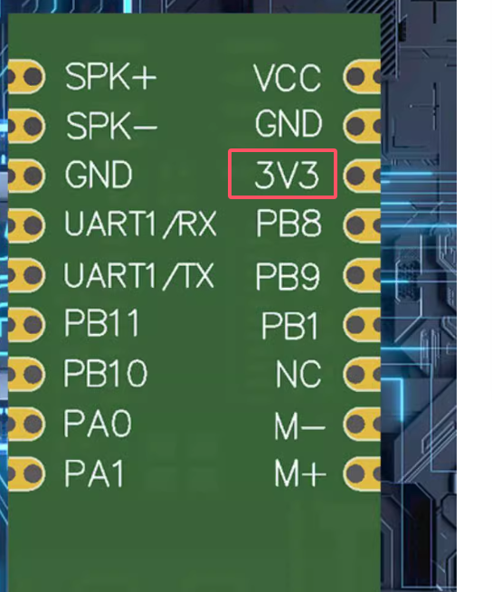
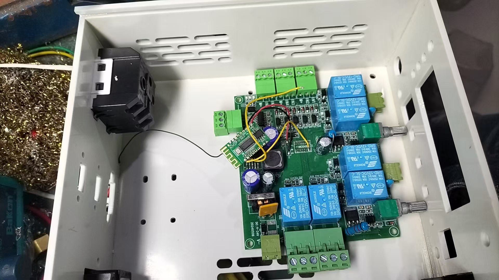
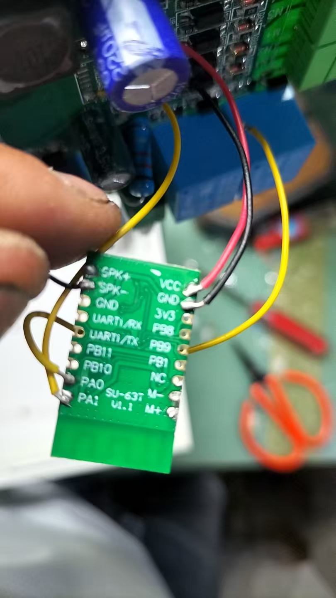
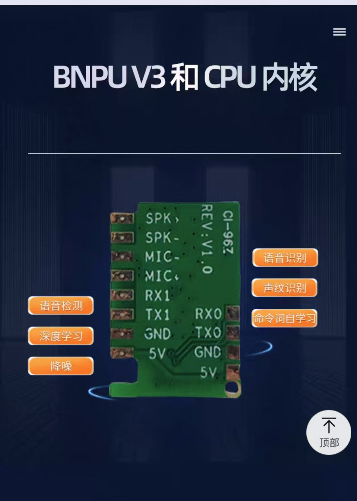

# SU-63T 硬件设计 FAQ

本页用于整理 SU-63T 相关的硬件设计问题。

## 功耗与供电

### SU-63T芯片不连接喇叭时的功耗是多少？供电电压是否可以低于3.3V？

**问题描述：**

需要了解SU-63T芯片在不连接喇叭情况下工作的功耗，以及最低供电电压要求。

**解决方案：**

**功耗说明：**

- 不连接喇叭时，SU-63T的功耗需要实际测量得出
- 建议使用万用表或功率计在实际工作条件下测量
- 功耗会因工作状态（待机/识别/播报）而不同

**供电电压范围：**

- **工作电压范围**：2.5V - 5.5V
- **支持3.3V供电**：可以在3.3V电压下正常工作
- **低于3.3V**：最低可支持2.5V，但需确保电源稳定

**测试建议：**

1. **测量功耗**：

    - 在不同工作状态下分别测量电流
    - 记录待机、唤醒、识别、播报时的功耗
    - 使用示波器观察电流波动

2. **电压验证**：

    - 从5V逐渐降低供电电压
    - 测试在2.5V、3.0V、3.3V下的工作稳定性
    - 确认功能是否正常

**注意事项：**

- 供电电压低于2.5V可能导致工作异常
- 建议留有一定余量，不要在极限电压下长期工作
- 实际功耗与具体应用场景和配置相关

---

### SU-63T在单火开关应用中功耗过高怎么办？

**问题描述：**

将SU-63T用于单火开关，仅连接麦克风（不连接喇叭），功耗过高导致灯闪烁，希望了解如何实现低功耗模式。

**解决方案：**

**问题分析：**

单火开关电路通过取电方式供电，功率有限。SU-63T作为语音模块，其工作功耗可能超过单火开关的供电能力，导致电压不稳定和灯闪烁现象。

**解决建议：**

1. **功耗优化方案**：

    - 确认SU-63T工作电流需求
    - 测量待机、唤醒、识别各状态下的实际功耗
    - 与单火开关的供电能力对比分析

2. **单火开关选择**：

    - 选择功率更大的单火开关模块
    - 确保其供电能力大于SU-63T峰值功耗
    - 考虑增加储能电容平滑功率需求

3. **工作模式调整**：

    - 如果支持，配置为低功耗工作模式
    - 降低麦克风采样率（如可配置）
    - 减少不必要的功能开启

4. **替代方案**：

    - 考虑使用专门为单火开关设计的低功耗语音模块
    - 或选择其他供电方式（如零火开关）
    - 评估是否需要保留语音控制功能

**技术限制：**

- SU-63T并非专为单火开关超低功耗场景设计
- 语音识别需要持续处理音频信号，功耗相对较高
- 仅通过软件优化可能无法完全解决功耗问题

**注意事项：**

- 单火开关供电能力有限，不适合大功率负载
- 测量实际功耗比理论计算更重要
- 如确需在单火开关上使用语音功能，建议选择专门的低功耗方案

---

## ADC采样

### SU-63T的ADC引脚是否可以用于采样电池电压？

**问题描述：**

需要确认SU-63T芯片的ADC引脚功能、采样值含义和典型应用电路。

**解决方案：**

**1. ADC功能确认**

- SU-63T支持ADC采样功能
- 可用于采样电池电压等模拟信号
- 需要在平台中正确配置GPIO

**2. 配置方法**

- 将GPIO设置为ADC输入模式
- 设置合适的偏置值（如100）
- 配置采样触发的条件


**3. 采样值说明**

- ADC返回值为数字量
- 具体数值范围取决于参考电压
- 需要根据实际电路计算对应电压

**4. 典型应用电路**

```
电池分压电路：
电池正极 → 分压电阻1 → ADC引脚 → 分压电阻2 → 地
```

选择合适的分压比，确保：

- 最大电池电压时分压后不超过ADC量程
- 有足够的分辨率检测电压变化

**5. 电压计算**

```
实际电压 = (ADC值 / ADC满量程) × 参考电压 × 分压比
```

**注意事项：**

- ADC采样需要稳定的参考电压
- 输入信号不能超过ADC的最大电压
- 建议添加滤波电容提高采样稳定性
- 具体的ADC分辨率请查看芯片手册

---

## 电源与输出

### SU-63T模块的3.3V输出引脚供电能力是多少？

**问题描述：**

需要确认SU-63T模块的3.3V输出引脚是否可以作为对外供电，以及最大输出电流是多少。

**解决方案：**

**供电能力说明：**

- **3.3V输出引脚**：可以作为对外供电使用
- **最大输出电流**：150mA
- **电压稳定性**：模块内部LDO稳压输出，电压稳定



*红色方框标出的3V3引脚是模块的3.3V电源输出引脚*

**应用场景：**

1. **适用负载**：

    - 为外部小电流传感器供电（如光照、温湿度传感器）
    - 为低功耗MCU供电（电流需求<100mA）
    - 为指示灯LED供电

---

### SU-63T模块的供电电压是多少？

**问题描述：**

咨询SU-63T产品的供电电压是多少伏特。

**解决方案：**

**供电参数：**

- **额定供电电压**：5V
- **电压范围**：2.5V-5.5V
- **接口类型**：标准5V供电接口

**电源设计建议：**

1. **供电要求**：

    - 使用稳定的5V直流电源
    - 确保电源纹波较小
    - 供电电流需满足模块工作需求

2. **电源适配**：

    - 可使用USB 5V供电
    - 或使用5V电源适配器
    - 避免使用超出范围的电压

3. **滤波设计**：

    - 在电源输入端添加滤波电容
    - 使用104或更大的电容（根据电流需求）
    - 确保电源稳定性

**注意事项：**

- 供电电压不要超过5.5V，可能损坏模块
- 电压低于2.5V可能导致工作不稳定
- 建议使用带有过流保护的电源
- 长距离供电时考虑线材压降





2. **不适用场景**：

    - 驱动继电器模块（电流需求通常>150mA）
    - 驱动大功率LED或电机
    - 为其他语音模块供电

**使用注意事项：**

1. **电流限制**：

    - 严格控制在150mA以内
    - 超过可能导致模块工作异常
    - 建议预留30%余量，实际使用<100mA

2. **电压稳定性**：

    - 3.3V输出由模块内部LDO提供
    - 负载变化时电压稳定
    - 适合对电压精度要求不高的应用

3. **系统影响**：

    - 外部负载会影响模块整体功耗
    - 电池供电时会缩短续航时间
    - 考虑总功耗预算

**替代方案：**

如需要更大电流：

- 使用外部独立3.3V LDO稳压电路
- 或使用DC-DC降压模块
- 确保供电能力满足需求

---


---

### SU-63T模块是否支持3.3V供电？

**问题描述：**

需要确认SU-63T模块是否支持3.3V供电，以及与SU-03T在供电方面的区别。

**解决方案：**

**供电电压规格：**

1. **SU-63T供电范围**：

    - 工作电压：2.5V - 5.5V
    - 支持3.3V供电
    - 内置LDO稳压，支持宽电压输入

2. **与SU-03T对比**：

    - SU-03T：额定5V，范围3.6-5.5V
    - SU-63T：更适合3.3V系统应用
    - 两者功能基本相同，供电规格不同

**供电方案选择：**

1. **使用3.3V供电**：

    - 可直接连接到3.3V电源
    - 适合与MCU共用3.3V电源
    - 减少电源转换电路

2. **使用5V供电**：

    - 需要外接LDO稳压到3.3V
    - 增加额外电路和功耗
    - 适合独立供电场景

**技术优势：**

1. **SU-63T优势**：

    - 支持更宽的供电范围
    - 内置蓝牙功能（SU-63T特有）
    - 更适合3.3V系统集成的场景

2. **应用建议**：

    - 3.3V系统：优先选择SU-63T
    - 5V系统：可选择SU-03T或SU-63T
    - 根据实际电源设计选择合适型号

**注意事项：**

- SU-63T模块丝印明确标识型号
- 确认电源电压在规格范围内
- 电压过低或过高都会影响工作稳定性
- 建议在实际应用环境中测试验证

---


---

### SU-63T芯片如何实现输出低脉冲信号？

**问题描述：**

需要使用SU-63T芯片输出一次性的低电平脉冲，模拟按键按下动作，用于控制灯光等外设。

**解决方案：**

**方法一：使用PWM输出功能**

SU-63T支持PWM输出功能，可配置为低脉冲输出：

1. **平台配置步骤**：

    - 在智能公元平台选择目标GPIO引脚（如GPIO_A25）
    - 配置为PWM输出模式
    - 设置默认高电平，关闭电平反向功能
    - 配置触发条件为语音指令识别

2. **PWM参数设置**：

    - 频率：100Hz（周期10ms）
    - 占空比：50%（产生5ms高电平、5ms低电平的脉冲）
    - 脉冲数量：设置输出1个脉冲后停止

**方法二：使用延时电平翻转功能**

1. **GPIO输出配置**：

    - 选择GPIO引脚配置为输出模式
    - 设置初始电平为高电平
    - 勾选"延时电平翻转"选项

2. **触发条件设置**：

    - 设置触发条件：识别到指定语音指令（如"打开灯"）
    - 配置延时时间：根据需要的脉冲宽度设置（如50ms）
    - 延时后自动翻转为低电平

**实际应用示例**：

1. **语音控制场景**：

    ```
    唤醒词："小智小智"
    命令词："打开灯"
    触发动作：GPIO_A25输出低脉冲（模拟按键按下）
    ```

2. **硬件连接**：

    ```
    SU-63T GPIO_A25 → 按键开关电路 → 灯光控制电路
    ```

3. **电路保护**：

    - 添加限流电阻保护GPIO口
    - 考虑使用光耦隔离强弱电
    - 大功率负载使用继电器或MOSFET驱动

**技术参数建议**：

- **脉冲宽度**：10ms-100ms（根据被控设备要求）
- **GPIO驱动能力**：最大10mA，需注意负载限制
- **供电电压**：2.5V-5.5V，确保稳定供电
- **抗干扰设计**：必要时添加滤波电路

**注意事项：**

- PWM输出模式下，不设置占空比时默认输出100%占空比方波
- 使用延时电平翻转功能时，脉冲宽度由延时时间决定
- 不同的被控设备可能需要不同的脉冲宽度和触发方式
- 建议先用示波器测试输出波形，确认满足控制要求

---

### SU-63T如何使用ADC接口读取电量信息？

**问题描述：**

需要了解SU-63T模块是否支持ADC功能，以及如何使用ADC接口来读取电池电量信息。

**解决方案：**

**ADC功能支持：**

- SU-63T模块支持ADC（模数转换）功能
- 可用于读取模拟信号，如电池电压
- 通过配置相应的GPIO引脚实现ADC采集

**配置步骤：**

1. **平台配置**
    - 在智能公元平台选择ADC功能
    - 配置对应的GPIO引脚为ADC输入模式
    - 设置采样率和精度参数

2. **硬件连接**
    - 将电池电压通过分压电路连接到ADC引脚
    - 确保输入电压在ADC允许范围内（通常0-3.3V）
    - 添加滤波电容提高采样稳定性

3. **电量计算**
    - 读取ADC原始数值
    - 根据分压比计算实际电池电压
    - 通过电压-电量映射表估算剩余电量

**注意事项：**

- 电池电压需要经过分压电路才能输入ADC
- 建议定期校准ADC读数以提高精度
- 不同电池类型的放电曲线不同，需要对应的映射表
- ADC采样可能受噪声影响，建议多次采样取平均

---

### SU-63T天线设计如何复制到自主设计的PCB上？

**问题描述：**

需要将SU-63T模块的天线设计复制到自主设计的PCB上，询问天线阻抗匹配是否已完成，以及是否可以直接参考原设计。

**解决方案：**

**天线设计说明：**

- **已完成阻抗匹配**：SU-63T模块的天线部分已经完成了阻抗匹配设计
- **可直接参考**：可以按照原设计直接复制到自主PCB上
- **关键元件**：天线匹配网络由2.7pF电容（C5）和两个电感（L1、L2）组成

**设计要点：**

1. **天线匹配网络**：

    - 使用2.7pF电容与天线连接
    - 两个电感组成滤波网络，需要预留位置
    - 元件参数应与原设计保持一致

2. **PCB布局建议**：

    - 保持天线部分走线宽度与原设计一致
    - 天线区域下方不要铺铜，避免影响射频性能
    - 射频部分走线应尽量短而直

3. **射频接口**：

    - 模组的ANT引脚直接连接到匹配网络
    - 天线连接器应靠近模块放置
    - 考虑使用50欧姆阻抗传输线

**注意事项：**

- 滤波器的两个电感位置需要预留，便于调试优化
- 如果天线类型或位置有较大变化，可能需要重新调试匹配网络
- 建议使用网络分析仪测试实际的天线驻波比
- 射频性能对PCB材质和厚度敏感，建议使用与原设计相同的板材


---

## 音频输出

### SU-63T是否支持立体声输出？

**问题描述：**

在使用SU-63T模块时，发现只有DAC_X有信号输出，DAC_L和DAC_R没有信号，无法实现立体声播放。

**解决方案：**

**音频输出限制：**

- SU-63T使用的US516P6芯片在算法层面不支持立体声输出
- 芯片硬件支持双声道，但融合算法后DAC_L和DAC_R引脚被空置
- 仅DAC_X引脚有音频信号输出
- 平台后台代码已写死，未开放立体声配置选项

**实现双声道播放的方案：**

如果需要驱动两个喇叭，可以将DAC_X的输出信号并接到两组功放上：

```
DAC_X → 功放1 → 喇叭1（左声道）
        → 功放2 → 喇叭2（右声道）
```

**设计参考：**

- 使用SU-63T芯片时，建议参考SU-03T模组的电路设计
- 芯片底层的硬件规格是正确的，但算法限制了立体声功能

**注意事项：**

- 规格书中关于DAC_L/R输出立体声的描述指的是芯片硬件能力
- 实际使用时受到算法限制，只能使用单声道输出
- 如果确实需要立体声，请选择其他支持立体声的芯片型号

---

### SU-63T模组的引脚数量与产品规格不符怎么办？

**问题描述：**

发现SU-63T模组的实际引脚数量与产品规格中列出的IO接口数量不符，无法通过现有引脚控制其他外设设备。

**解决方案：**

**引脚说明：**

- SU-63T模组实际引出的引脚主要包括：SPK+、SPK-、MIC-、MIC+、RX1、TX1、GND、5V、RX0、TX0等基本通信和音频接口
- 产品规格中提到的IO接口数量是指芯片内部支持的IO总数，并非全部引出到模组表面
- 模组设计时只引出了最常用的接口，以满足基本语音交互需求



**外设控制方案：**

1. **使用串口控制**：

    - 通过RX0/TX0串口与外部MCU（如ESP32、Arduino等）通信
    - 语音模块识别到指令后，通过串口发送相应控制码给外部MCU
    - 外部MCU根据接收到的控制码控制其他外设设备

2. **选择合适的模块**：

    - 如果需要直接控制多个外设，建议选择其他引脚更丰富的语音模块
    - 可咨询技术支持，根据具体应用场景推荐合适的模块型号

**注意事项：**

- 产品规格图示可能存在误差，实际以模组引脚为准
- 设计时需考虑实际可用的引脚数量，而非芯片理论IO数量
- 如需控制复杂外设，建议使用串口+外部MCU的方案

---

### 如何获取SU-63T外围原理图？

**问题描述：**

需要SU-63T的外围原理图来评估新模块与现有模块的兼容性。

**解决方案：**

**1. 获取途径**

- **联系技术支持**：通过微信群或邮件联系技术团队
- **说明需求**：明确需要原理图的目的（兼容性评估）
- **提供信息**：项目名称、具体应用场景

**2. 技术对接**

- **添加技术联系人**：扫描二维码或通过微信添加
- **详细沟通**：说明现有设计和改造需求
- **安排会议**：如需要可安排线上技术会议

**3. 兼容性评估**

收到原理图后可评估：

- **引脚定义**：对比新旧模块的引脚差异
- **电气特性**：供电、通信协议等参数
- **功能差异**：确认新模块支持的功能
- **改版成本**：评估硬件和软件改动工作量

**注意事项：**

- 原理图属于技术资料，需要签署保密协议
- 建议提前准备现有模块的详细规格
- 评估过程可能需要3-5个工作日
- 如需样品测试，可联系销售部门获取

