# 硬件设计 FAQ


### 咪头和喇叭是否需要自行焊接？

**问题描述：**

产品说明书中"咪头、喇叭(咪头和喇叭直接买同一家的吧，不用自己焊接了)"的描述存在歧义，容易让用户误解为需要自行焊接。

**解决方案：**

- 咪头和喇叭模块出厂时已完成焊接，无需用户自行焊接
- 建议将描述修改为："咪头、喇叭（已焊接完成，可直接使用）"
- 在产品详情页明确标注"已焊排针+咪头+喇叭"，说明产品为完整套件

**注意事项：**

- 避免使用"焊接"等词汇，以免造成用户误解
- 明确说明产品为即用型套件，减少用户疑问

---

### 市面上的扩展板是官方产品吗？

**问题描述：**

看到一款扩展板，集成了主控芯片、麦克风、串口接口和多个IO引脚，询问是否为官方产品以及购买渠道。

**解决方案：**

**官方产品说明：**

- 该扩展板**不是官方产品**
- 官方只销售自己的转接板
- 转接板附带端子的咪头和喇叭

**官方配件特点：**

1. **转接板设计**
    - 官方转接板针对模块优化设计
    - 集成必要的接口电路
    - 配套专用端子连接器

2. **配套配件**
    - 标准咪头（麦克风）
    - 匹配的扬声器
    - 连接线和端子

**购买建议：**

- 建议购买官方转接板进行开发
- 第三方扩展板可能存在兼容性问题
- 官方配件质量更有保障

**注意事项：**

- 使用非官方配件需自行验证兼容性
- 官方转接板提供完整的技术支持
- 购买时确认产品型号和配套清单

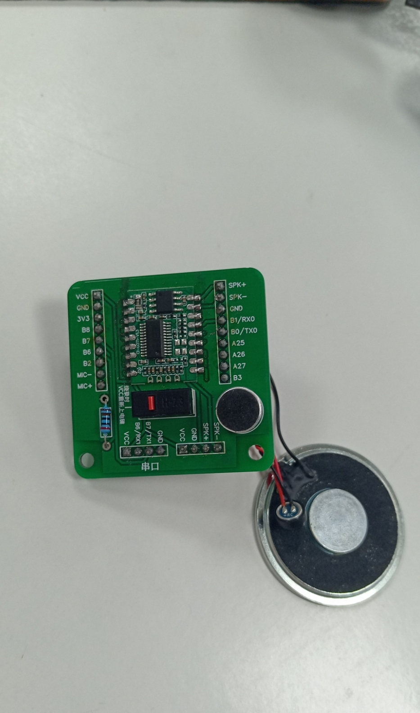

---

### 语音模块可以使用手机喇叭吗？

**问题描述：**

希望使用手机喇叭作为语音模块的音频输出设备，需要确认兼容性和选型要求。

**解决方案：**

**喇叭选型要求：**

语音模块对外部喇叭有明确的功率和阻抗要求：

- **4欧姆喇叭**：功率需大于2.4W
- **8欧姆喇叭**：功率需大于1.6W
- **阻抗匹配**：常见为4欧或8欧姆

**手机喇叭适用性：**

- 部分手机喇叭满足功率要求
- 需查看具体喇叭的参数规格
- 建议选择带音腔的手机喇叭以获得更好音质

**小型喇叭推荐：**

- 手机配件喇叭：带音腔设计，声音不小
- 注意音量不要设置太大，容易烧坏喇叭
- 尽量选择知名品牌产品

**注意事项：**

- 音量过大可能损坏小功率喇叭
- 测试时从低音量开始逐步调整
- 喇叭功率过小会导致音质差或失真
- 如无合适的小型喇叭，可考虑使用标准尺寸喇叭

---

### 喇叭使用一段时间后出现电流声或敲击声怎么办？

**问题描述：**

喇叭使用几天后出现类似电流一样的敲击声或异响，影响正常使用。

**解决方案：**

- 更换为带腔体的喇叭
- 无腔体的裸喇叭容易产生共振和异响
- 腔体可以提供稳定的声学环境，减少异常振动

**技术说明：**

- 无腔体喇叭工作时振膜自由振动，容易产生机械共振
- 长期使用后，喇叭部件可能因振动产生松动，加剧异响
- 带腔体的喇叭通过密闭或半密闭空间提供声学负载，抑制异常振动

**选型建议：**

- 优先选择带腔体的喇叭组件
- 腔体体积应与喇叭规格相匹配
- 确保腔体密封良好，避免漏气

---

### 电源噪声干扰导致语音识别异常如何解决？

**问题描述：**

系统主板连接电机驱动板后，5V电源出现杂波，导致语音识别模块需要很大声才能识别指令，但用手握住咪头后又恢复正常。

**问题分析：**

这是典型的电源噪声耦合问题，电机驱动板工作产生的开关噪声通过电源线耦合到语音模块，影响语音识别的灵敏度。

**解决方案：**

**1. 电源滤波**

- 在语音模块的电源输入端加装滤波电路
- 添加100μF-470μF电解电容滤除低频纹波
- 并联0.1μF陶瓷电容滤除高频噪声
- 使用磁珠或小电感构成LC滤波器

**2. 信号线屏蔽**

- 麦克风连接线使用屏蔽线，屏蔽层单端接地
- 让麦克风线路远离电机驱动器和功率线路
- 避免麦克风线与电机电源线平行走线

**3. PCB布局优化**

- 语音部分电路远离电机驱动等大功率器件
- 电源地线采用星形接地，避免地环路
- 模拟电源和数字电源分离

**4. 独立供电**

- 为语音模块使用独立的LDO稳压器供电
- 或在语音模块电源输入端增加二级稳压

**注意事项：**

- 电源稳定性直接影响语音识别性能
- 滤波电容要尽量靠近语音模块的电源引脚
- 手握咪头能改善识别，说明问题主要是外部干扰
- 更换更好的麦克风可能无法解决根本问题

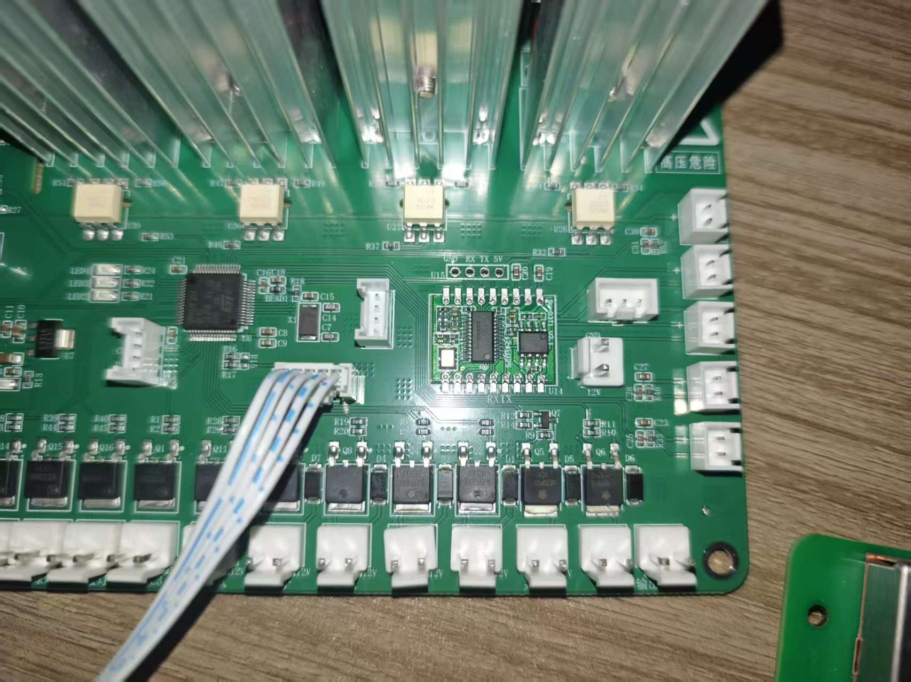

---

### 配合语音模块使用的麦克风有哪些参数要求？

**问题描述：**

需要了解与语音模块配合使用的麦克风在信噪比、阻抗等参数方面的具体要求。

**解决方案：**

**推荐麦克风参数：**

根据官方咪头选型建议：

1. **灵敏度**
    - 推荐范围：-32dB 到 -25dB
    - 常用值：-27dB
    - 灵敏度影响拾音距离和清晰度

2. **信噪比（SNR）**
    - 最低要求：>75dB
    - 信噪比越高，抗干扰能力越强
    - 推荐选择高信噪比型号

3. **工作电流**
    - 要求：≤0.5mA
    - 低功耗设计，适合电池供电设备

4. **物理尺寸**
    - 常规尺寸：直径6mm，高度2.7mm
    - 贴片封装，便于SMT生产

**选型建议：**

- **环境噪声小**：可选用一般规格麦克风
- **环境噪声大**：选择高信噪比麦克风
- **远距离拾音**：选择灵敏度较高的麦克风
- **批量生产**：建议先测试样品确认效果

**注意事项：**

- 实际效果需根据使用场景测试
- 麦克风布局也很重要
- 建议购买推荐型号以保证兼容性
- 不同厂家的参数标注方式可能有差异

**咪头安装建议：**

- **安装深度**：咪头应尽量塞到底部，紧贴外壳拾音孔
- **固定方式**：咪头背部打胶固定，避免松动和共振
- **音腔设计**：确保咪头与拾音孔之间形成密闭音腔，提升拾音效果
- **避免遮挡**：咪头受音面正对拾音孔，无遮挡物

---

### 如何连接和控制风扇模块？

**问题描述：**

连接风扇控制模块时，无论控制信号线是否连接，风扇都会自动启动，无法通过IO口控制风扇开关。

**解决方案：**

**1. 风扇模块引脚定义**

- **G（GND）**：地线
- **V（VCC）**：电源（通常接5V或3.3V）
- **S（Signal）**：控制信号（高电平导通）

**2. 正确连接方式**

- 红色线接5V电源
- 黑色线接GND
- 白色线（控制信号）接模块的IO口

**3. 控制逻辑**

- IO输出高电平：风扇启动
- IO输出低电平：风扇停止
- 控制信号必须正确连接到S引脚

**4. 故障排查**

- 检查控制线是否误接到电源（如3.3V）
- 用万用表测量控制线电压
- 确认IO口能够输出高低电平变化

**注意事项：**

- 控制信号不能接常高电平，否则风扇会一直转动
- 如果风扇在未接控制线时仍转动，可能是模块内部问题
- 建议先测试IO口的电平输出功能

---

### 两个模块（SU和MCU）如何控制一个设备？

**问题描述：**

需要设计两个模块（SU语音模块和MCU）共同控制一个设备的连接方案，有四种不同的连接方式可选。

**解决方案：**

**方案对比：**

1. **并联方案**（方案一）
    - SU和MCU直接并联控制设备
    - 优点：结构简单
    - 缺点：可能产生冲突

2. **串联方案**（方案二、三、四）
    - SU连接到MCU，MCU再连接设备
    - 优点：逻辑清晰，避免冲突
    - 缺点：需要MCU做中转

**推荐方案：**

- **选择串联方案**（SU→MCU→设备）
- 通过MCU整合两种控制信号
- MCU负责最终的控制决策

**设计考虑：**

1. **通信方式**
    - 确认SU和MCU之间的通信协议
    - UART、I2C或SPI接口选择

2. **控制逻辑**
    - MCU接收SU的语音识别结果
    - MCU根据语音指令执行相应动作
    - 可设置优先级和冲突处理机制

3. **电源设计**
    - 确保两个模块的供电需求
    - 考虑总功耗和电源容量

**注意事项：**

- 串联方案便于扩展更多功能
- 需要编写MCU的协调控制程序
- 考虑故障模式下的安全设计

---

### PCB阻焊层破损碰到GND有什么影响？

**问题描述：**

PCB板上的阻焊层破损，暴露的铜箔可能接触到GND引脚，上电后扬声器出现断续的电流脉冲声音。

**解决方案：**

**1. 问题影响分析**

    - 阻焊层破损可能导致短路
    - 扬声器断异响可能是电路异常的表现
    - 需要及时修复避免进一步损坏

**2. 修复步骤**

    - 用吸锡枪清除焊锡
    - 使用洗板水清洗干净
    - 重新涂覆绿油遮盖破损区域
    - 等待绿油固化

**3. 预防措施**

    - 操作时避免刮擦PCB表面
    - 使用合适的焊接工具和温度
    - 定期检查PCB状态

**注意事项：**

- 阻焊层是防止短路的保护层
- 破损后应及时修复，不要继续使用
- 如 unsure 修复方法，建议寻求专业帮助

---

### 关闭语音控制功能后设备是否还会耗电？

**问题描述：**

在系统中关闭语音控制功能后，设备是否还会消耗电量？

**解决方案：**

关闭语音控制功能后，模块的语音处理部分会停止工作，但模块仍会维持基本的待机状态。

**1. 功耗情况说明**

- 语音识别关闭：语音处理部分不工作
- 待机功耗：模块仍需要维持基本的待机电流
- 功耗水平：取决于具体模块型号和工作状态

**2. 进一步降低功耗**
如需完全关闭设备以实现零功耗，需要：

- 通过硬件开关切断电源
- 或使用定时供电控制
- 在安静环境下让模块进入休眠状态

**注意事项：**

- 仅关闭语音功能不会实现零功耗
- 如需实现最低功耗，建议选用低功耗型号的模块
- 在相对安静的环境下，模块可自动进入休眠状态，功耗低于1mA

---

### CI系列模块是否支持声源识别？

**问题描述：**

需要了解CI系列芯片是否具备声源识别（声源定位）功能，用于识别声音来源的方向。

**解决方案：**

**功能支持情况：**

- CI系列模块主要设计用于语音命令识别
- 目前不支持声源识别或声源定位功能
- 专注于语音内容识别而非声音来源判断

**技术限制：**

- 需要多个麦克风阵列才能实现声源定位
- 当前CI系列模块为单麦克风设计
- 声源识别需要专门的算法和硬件支持

**替代方案：**

- 如需声源定位功能，建议考虑其他方案
- 可配合外部传感器实现方向判断
- 或选用支持多麦克风阵列的方案

**注意事项：**

- 声源识别与语音识别是不同的技术方向
- CI系列优化重点在识别准确率和响应速度
- 未来版本可能会考虑增加相关功能

---

### 如何可靠地使用语音模块控制继电器？

**问题描述：**

使用语音模块IO口控制继电器时，由于输出电压波动较大（从正常电压降到1.3V），导致3V继电器受干扰，无法稳定工作。

**解决方案：**

**1. 问题原因分析**

- 语音模块IO口输出电流有限（约150mA）
- 同时控制多个继电器时造成电压跌落
- 继电器线圈工作时的反向电动势干扰

**2. 推荐解决方案**

**方案一：使用NPN三极管驱动**

- 使用S8050或2N5551等通用NPN三极管
- 基极通过1KΩ电阻连接到模块IO口
- 集电极驱动继电器线圈
- 发射极接地

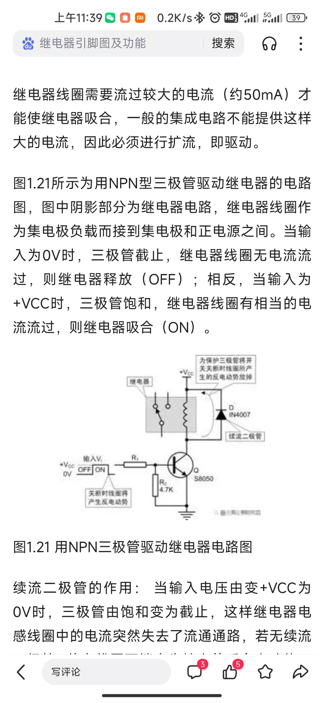

**方案二：光耦隔离**

- 使用PC817或4N25等光耦器件
- 完全隔离两侧电路，避免干扰
- 语音模块侧只需提供5-10mA电流

**方案三：MOSFET驱动**

- 使用2N7002等小信号MOSFET
- 驱动能力更强，导通电阻更小
- 适合驱动多个继电器并联

**3. 具体电路设计**

**NPN三极管驱动电路：**
```
模块IO口 ---[1KΩ]--- NPN基极
                |
                NPN集电极 --- 继电器线圈 --- VCC(5V/12V)
                |
                NPN发射极 --- GND
                |
继电器线圈并联 --- 1N4007二极管（阳极接集电极）
```

**4. 注意事项**

- 不能直接用IO口驱动继电器线圈
- 必须使用驱动元件（三极管/MOSFET/光耦）
- 继电器线圈要并联续流二极管
- 多个继电器时要考虑电源容量
- 建议独立供电避免干扰主控

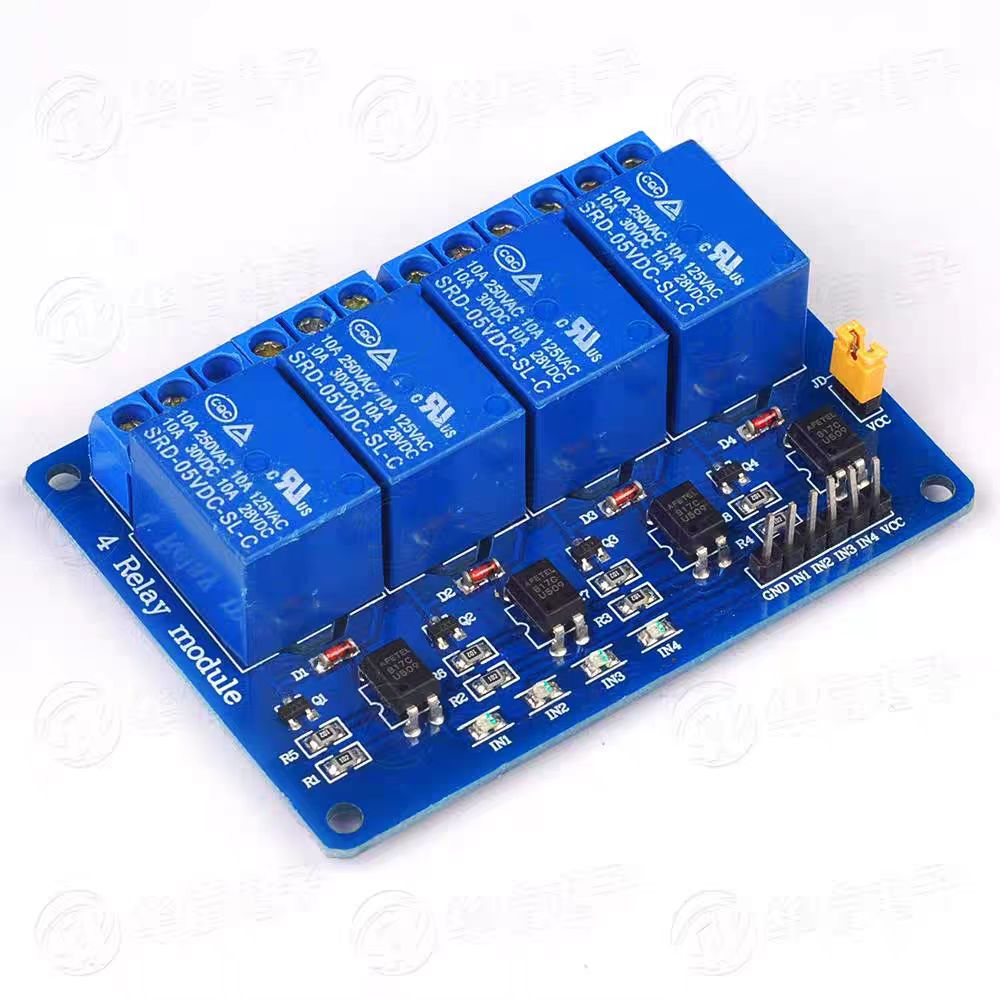
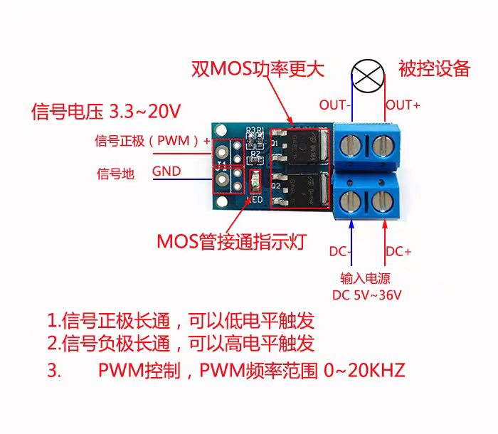

---

### 支持语音唤醒的模块待机功耗是多少？

**问题描述：**

需要了解支持语音唤醒功能的模块在待机状态下的功耗情况，以便进行电源设计。

**解决方案：**

不同模块的待机功耗有所差异，具体数值需参考各模块的技术规格书：

- 一般支持语音唤醒的模块待机功耗在几十微安到几百微安级别
- 具体数值与模块型号、配置和工作模式相关
- 可通过实际测试获得准确功耗数据

**注意事项：**

- 待机功耗受环境影响，测试时需在标准条件下进行
- 设计电源时应预留一定余量
- 长期使用时功耗可能会有微小变化

---

### 音频输出音量过大如何调节？

**问题描述：**

模块输出音量过大，即使通过软件调低音量后仍感觉声音很大，需要通过硬件方式降低音量。

**解决方案：**

在音频放大器输入端串联电阻可以有效降低音量：

**操作步骤：**

1. 定位音频放大器输入端
    - 找到音频放大器芯片的输入引脚
    - 确认音频信号传输路径

2. 添加串联电阻
    - 在放大器输入端串联合适阻值的电阻
    - 电阻值可根据实际需要调整（如1kΩ-10kΩ）
    - 建议从较小阻值开始尝试

3. 焊接注意事项
    - 确保焊接牢固，避免虚焊
    - 电阻尽量靠近放大器输入端
    - 注意避免短路

**电阻选型建议：**

- 初步建议：1kΩ-10kΩ范围内选择
- 阻值越大，音量衰减越多
- 可实际测试不同阻值效果
- 选用1/4W或1/8W金属膜电阻

**注意事项：**

- 修改硬件前务必断电
- 焊接时注意防静电
- 建议先在废板上练习
- 音量调节是线性的，但不是无限可调
- 电阻过大会导致音量过小或失真

---

### 如何选择合适的喇叭？

**问题描述：**

语音模块的喇叭声音太小，需要选择更大音量的喇叭，但不清楚如何选择合适的规格。

**解决方案：**

**1. 喇叭参数选型**

- **阻抗和功率匹配**：

    - 4Ω喇叭：2.4W起，建议不超过3W
    - 8Ω喇叭：1.6W起，建议不超过5W
    - 功率过大会导致模块驱动困难

- **音量与灵敏度的关系**：

    - 声音大小取决于喇叭灵敏度，不是尺寸
    - 高灵敏度喇叭在相同功率下音量更大
    - 选择85dB以上的灵敏度更佳

**2. 接线注意事项**

- 正确连接喇叭引脚（正负极）
- 确保焊接牢固，避免接触不良
- 使用短音频线减少信号损失

**3. 音量优化方案**

- 软件调节：在平台上设置合适的音量值
- 硬件调节：如音量仍不够，可考虑：

    - 更换更高灵敏度的喇叭
    - 添加外部功放电路
    - 修改模块功放电路（需要专业知识）

**注意事项：**

- 不要使用功率过大的喇叭（如4Ω5W）
- 大尺寸喇叭不等于大音量
- 喇叭功率超过模块承受能力可能损坏功放
- 建议购买官方推荐的喇叭规格

---

### 需要大功率音频输出（5W-10W）怎么办？

**问题描述：**

产品需要5W-10W的音频输出功率，模块内置的2.4W功放无法满足需求。

**解决方案：**

**方案一：购买芯片自行设计功放**

- 直接购买语音芯片（如CI1302、CI1303等）
- 自行设计外部功放电路，满足功率需求
- 适合大批量生产或有硬件设计能力的项目

**方案二：添加外部功放电路**

- 保留语音模块的音频处理功能
- 从模块的DAC输出引脚提取音频信号
- 连接到外部大功率功放芯片（如TPA3116、LM4863等）
- 外部功放驱动大功率扬声器

**方案三：使用模块的音频输出功能**

- 部分模块支持I2S或DAC输出
- 可直接连接外部功放系统
- 适用于需要专业音频效果的场景

**注意事项：**

- 模块内置功放功率有限（2.4W@5V4Ω）
- 大功率需求需自行设计外接功放电路
- 外接功放时注意阻抗匹配和信号电平
- 建议实测验证音频质量和功率输出

**应用场景：**

- 户外音响设备
- 大功率广播系统
- 娱乐设备（戏水、游乐设施等）

---
### 语音模块如何控制RGB灯光颜色？

**问题描述：**

希望通过语音指令控制RGB LED灯的颜色变化，实现智能灯光控制功能。

**解决方案：**

**1. 控制方案选择**

语音模块本身不能直接控制RGB颜色，需要配合单片机：

- **语音模块**：负责识别命令，输出控制信号
- **单片机**：接收命令，控制RGB LED
- **RGB LED**：通过PWM调节红绿蓝三色亮度

**2. 硬件连接**

```
语音模块TX → 单片机RX
单片机PWM口 → RGB LED限流电阻
```

- RGB LED共阴极接法：

    - 红色引脚→电阻→单片机PWM1
    - 绿色引脚→电阻→单片机PWM2
    - 蓝色引脚→电阻→单片机PWM3
    - 共阴极接地

- 限流电阻选择：

    - 5V供电：220Ω-330Ω
    - 3.3V供电：100Ω-150Ω

**3. 控制逻辑示例**

```cpp
// 接收语音模块命令
if (command == "红色") {
    analogWrite(RED_PIN, 255);   // 红色全亮
    analogWrite(GREEN_PIN, 0);
    analogWrite(BLUE_PIN, 0);
} else if (command == "蓝色") {
    analogWrite(RED_PIN, 0);
    analogWrite(GREEN_PIN, 0);
    analogWrite(BLUE_PIN, 255);  // 蓝色全亮
}
```

**4. 实现混色**

- 调节各色PWM值实现混色
- 白色：RGB全部255
- 紫色：红255，蓝255，绿0
- 通过不同组合实现多种颜色

**注意事项：**

- 语音模块只输出识别结果，不直接控制PWM
- 需要使用支持PWM的单片机（Arduino、STM32等）
- RGB LED必须加限流电阻
- 颜色控制需要编程实现，不在语音模块平台配置

---

### PWM调光功能无法正常工作怎么办？

**问题描述：**

使用PWM占空比控制灯光亮度时，调光功能未按预期工作。

**解决方案：**

**1. 检查GPIO引脚配置**

- 确认GPIO引脚支持PWM功能
- 避免使用之前配置为串口的引脚
- 检查引脚是否有复用功能冲突

**2. 验证PWM配置参数**

- 确认PWM频率设置合适（建议10kHz）
- 检查占空比设置范围（0-100%）
- 验证驱动器是否支持当前PWM频率

**3. 硬件连接检查**

- 确保PWM输出正确连接到LED驱动器
- 检查共地连接是否良好
- 验证驱动器电源电压匹配

**4. 参考配置示例**

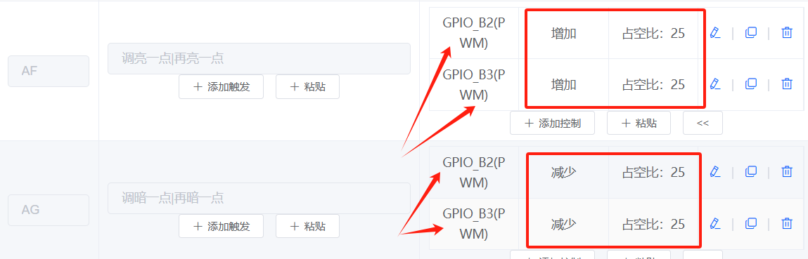


**注意事项：**

- GPIO_B2和GPIO_B3可能之前被用作串口
- 建议更换其他PWM引脚测试
- 不同LED驱动器对PWM频率要求可能不同
- 可参考官方PWM调光教程：https://www.bilibili.com/video/BV1wj411N7Tj

---

### 灯光缓亮缓灭效果如何实现？

**问题描述：**

需要实现LED开灯时渐亮、关灯时渐灭的效果（也称呼吸灯效果），询问是否有速率要求。

**解决方案：**

**1. 实现方式**

缓亮缓灭效果可通过以下方式实现：

- **PWM渐变**：通过PWM占空比从0%到100%（渐亮）或100%到0%（渐灭）逐步变化
- **定时控制**：设置渐变过程的时间长度，通常0.5-2秒可获得较好效果
- **平台配置**：在智能公元平台的PWM配置中设置渐变参数

**2. 速率设置建议**

缓亮缓灭的速率没有强制要求，可根据实际体验调整：

| 应用场景 | 建议时间 | 说明 |
|---------|---------|------|
| 室内照明 | 0.5-1秒 | 快速响应，避免等待感 |
| 卧室/夜间 | 1-2秒 | 较缓变化，保护眼睛 |
| 氛围灯 | 2-3秒 | 缓慢过渡，营造氛围 |
| 指示灯 | 0.3-0.5秒 | 快速反馈 |

**3. 调试建议**

- 初版可以先调一版效果比较平滑的参数
- 在整机调试时再根据实际效果进行微调
- 可以准备几个不同速率的固件版本供测试选择

**4. 实现要点**

- 确保LED驱动器支持PWM调光
- 渐变过程保持平滑，避免跳跃感
- 开机和关机都可以配置缓亮缓灭效果
- 部分型号模块支持直接在平台配置呼吸灯效果

---

### 屏幕颜色反转时红蓝颜色显示错误怎么办？

**问题描述：**

在调试屏幕显示镜像、翻转和颜色反转功能时，发现颜色反转效果异常，红蓝颜色显示错误。

**解决方案：**

**1. 寄存器36h配置说明**

寄存器36h（Memory Access Control）控制显示方向和颜色顺序：

- **D7（MY）**：行地址顺序（0: top-to-bottom, 1: bottom-to-top）
- **D6（MX）**：列地址顺序（0: left-to-right, 1: right-to-left）
- **D5（MV）**：行列交换（0: normal, 1: row/column exchange）
- **D4（ML）**：垂直刷新方向（0: top-to-bottom, 1: bottom-to-top）
- **D3（BGR）**：RGB-BGR顺序（0: RGB, 1: BGR）
- **D2（MH）**：水平刷新方向（0: left-to-right, 1: right-to-left）

**2. 颜色反转问题定位**

红蓝颜色显示错误通常是BGR位设置不当导致：

```c
// 正确的GC907_set_direction函数实现
static void GC907_set_direction(u8 dir) {
    WriteCOM(0x36);  // 扫描方向控制
    if (dir == ROTATE_DEGREE_0) {
        #if HORIZONTAL_SCREEN
            WriteDAT_8(0x00);
        #else
            WriteDAT_8(0xC0);
        #endif
    }
    else if (dir == ROTATE_DEGREE_180) {
        #if HORIZONTAL_SCREEN
            WriteDAT_8(0xA0);
        #else
            WriteDAT_8(0x60);
        #endif
    }
    else if (dir == ROTATE_DEGREE_90) {
        #if HORIZONTAL_SCREEN
            WriteDAT_8(0x60);
        #else
            WriteDAT_8(0xA0);
        #endif
    }
}
```

**3. 调试步骤**

- 检查寄存器36h的D3位（BGR）设置
- 确认是否需要设置为BGR模式
- 测试不同的方向配置组合
- 对比正常UI图片与实际显示效果

**4. 解决方案**

- **修改BGR位**：根据屏幕规格设置正确的颜色顺序
- **更新驱动代码**：确保所有旋转模式下的颜色正确
- **验证显示**：使用多种颜色测试确认修复效果

**注意事项：**

- 不同驱动芯片的寄存器定义可能不同
- 颜色问题也可能是数据线序错误导致
- 建议保存各方向的配置值供调试使用

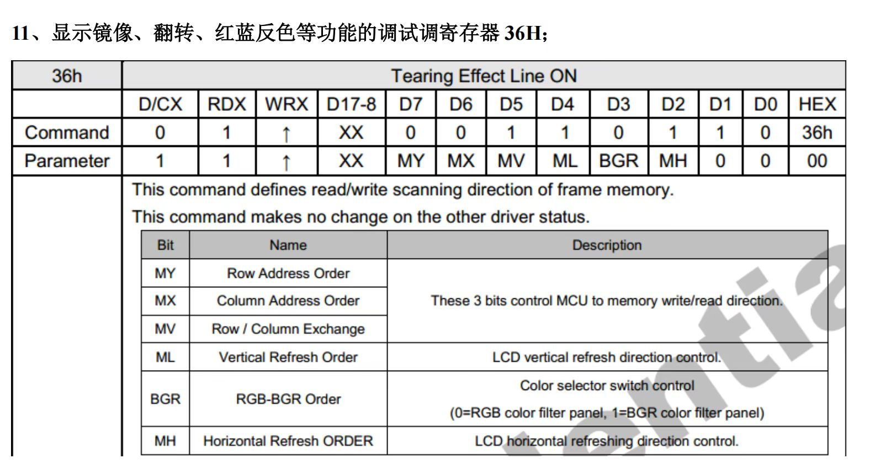


---

### CI1302双麦应用是否可以使用内部晶振

**问题描述：**

CI1302在双麦克风应用场景下，是否可以使用内部晶振。

**解决方案：**

CI1302在双麦克风应用场景下可以使用内部晶振：

- 内部晶振精度满足双麦算法要求
- 无需外接晶振，简化电路设计
- 保持正常的性能表现

**注意事项：**

- 内部晶振已校准，可直接使用
- 使用内部晶振可降低硬件成本
- 如有特殊精度要求，可考虑外接晶振方案

---

**3. 功能模块判断**

**音频处理功能：**

- 麦克风输入电路（前置放大、滤波）
- 音频输出电路（DAC、功放）
- 音频存储接口（SPI Flash用于语音资源）

**显示功能：**

- LCD驱动电路（并行或SPI接口）
- 背光驱动电路
- 触摸屏接口（I2C或SPI）

**通信功能：**

- WiFi射频前端电路
- 天线匹配网络
- 网络指示灯

**4. 实际应用建议**

**测量验证：**

- 使用万用表测量关键引脚电压
- 示波器观察时钟信号
- 逻辑分析仪分析通信协议

**文档对比：**

- 对比已知芯片的参考设计
- 查看厂商提供的评估板电路
- 参考类似产品的设计方案

**注意事项：**

- 高集成度SoC芯片的引脚功能可能通过配置改变
- 某些功能可能需要特定固件支持
- PCB版本不同可能导致电路差异
- 建议通过实际测试确认功能可用性

---

### 系统关机后灯重新点亮怎么办？

**问题描述：**

系统关机后，灯会重新点亮，需要解决关机后灯不重新点亮的问题。

**解决方案：**

1. **软件临时解决方案**

    - 系统关机时，不要切断IO电平
    - 直接将3组PWM信号置0
    - 保持IO电平输出，避免MOS管异常导通

2. **硬件问题分析**

    - 下拉电阻会分掉一部分电压，导致MOS管导通阻抗增大
    - 48V高压电路使用3.3V控制MOS管可能存在驱动电压不足
    - 高压MOS管驱动需要较高的电压差
    - 建议电路设计时考虑使用更高电压的控制信号

3. **电路设计优化建议**

    - 对于48V高压应用，建议使用专门的MOS驱动芯片
    - 控制信号电压应与MOS管驱动要求匹配
    - 避免轻易拆除MOS管的下拉电阻
    - 考虑修改硬件版本以优化驱动电路

**注意事项：**

- 软件方案是临时措施，长期建议修改硬件设计
- MOS管发热问题可能与驱动电压不足有关
- 下拉电阻的取值需要平衡驱动能力和功耗
- 高压MOS管的驱动电路设计需要特别谨慎

---

### 延时电平翻转功能如何使用？

**问题描述：**

需要了解延时电平翻转功能的工作原理和使用方法。

**解决方案：**

**1. 功能原理**

- 延时电平翻转是在指定时间后自动反转GPIO电平状态
- 适用于需要脉冲输出或定时切换的场景
- 可以实现按键一样的短时触发效果

**2. 配置方法**

- 在控制详情中启用"延时输出"功能
- 设置"延时电平翻转"为"是"
- 配置具体的延时时间（如2秒）

**3. 工作流程**

- 触发条件满足时，GPIO输出初始电平
- 延时时间结束后，自动翻转到相反电平
- 实现从高→低或低→高的自动转换

**4. 应用示例**

- 模拟按键脉冲：输出100ms高电平后自动拉低
- LED闪烁：周期性翻转实现闪烁效果
- 蜂鸣器提示：短时高电平触发发声

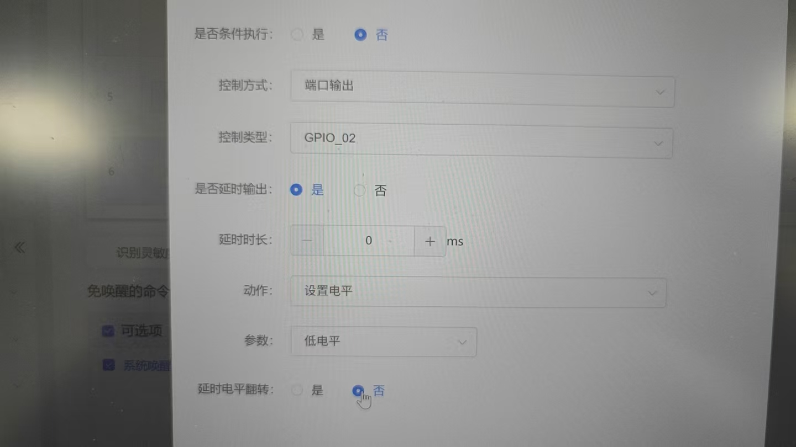

**注意事项：**

- 延时翻转不奏效时，可做2个控制实现
- 延时时间需要根据实际需求调整
- 翻转功能会增加功耗设计考虑
- 确认GPIO引脚支持翻转功能

---

### 音频线材选型与信号干扰问题

**问题描述：**

将麦克风和喇叭从主板延长到副板时，需要确认0.1平方毫米线材是否足够，以及20公分长的排线是否适合用于音频信号传输。

**解决方案：**

- **喇叭线路**：0.1平方毫米铜线基本足够，但需考虑喇叭阻抗和功率需求
- **麦克风线路**：使用屏蔽线材，因为麦克风属于微电信号，容易受到干扰
- **排线选择**：普通排线可用于喇叭信号传输，麦克风需实测验证抗干扰能力

**注意事项：**

- 喇叭阻抗较高时可能需要1A以上电流通过，需确保线材载流能力
- 20公分的传输距离较短，信号衰减不是主要问题
- 麦克风信号微弱，必须使用屏蔽线避免电磁干扰
- 建议实际测试音频质量，特别是信噪比和拾音效果


---

### 触摸屏和按键功能异常怎么办？

**问题描述：**

触摸键无法正常工作，按键需要长按4秒以上才能开机。

**解决方案：**

1. **按键长按问题分析**

    - 系统设计可能要求长按才能开机，这是正常功能
    - 如果不需要关机功能，可以保持设备常开状态
    - 长按设计可以防止误触开机

2. **触摸功能异常排查**

    - 确认最近是否修改了触摸相关功能代码
    - 检查触摸芯片的供电是否正常
    - 验证触摸信号的连接线路
    - 测试时检查是否有干扰源影响

3. **硬件检查建议**

    - 检查触摸屏与主控的连接线是否松动
    - 测量触摸芯片供电电压是否稳定
    - 确认MOS管下拉电阻未被误拆（影响其他功能）
    - 使用示波器观察触摸信号波形

**注意事项：**

- 长按开机可能是设计要求，不是故障
- 触摸功能异常可能与最近的软件改动无关
- 硬件改动（如拆除下拉电阻）可能影响其他功能
- 建议先确认哪些是设计特性，哪些是真正的问题

---

### 模块IO端口的低电平电压是多少？

**问题描述：**

需要了解模块IO端口输出低电平时的实际电压值，以便正确驱动低电平触发的设备。

**解决方案：**

- 模块IO端口输出低电平时，理论电压为0V
- 实际测量时可能有轻微压差（通常小于0.3V）
- 低电平电压在CMOS电平标准范围内，可直接驱动低电平触发设备

**注意事项：**

- 驱动敏感设备时，建议先测量实际电压
- 如需要更低的电平，可增加下拉电阻确保稳定
- 避免大电流负载，以免影响电平精度
- 设计时留出电压余量，确保触发可靠

---
### 模块IO口的输出电压可以通过软件设置吗？

**问题描述：**

模块IO口默认高电位输出约为3V，是否可以通过软件配置将输出电压设置为5V？

**解决方案：**

**IO口输出电压由硬件决定，无法通过软件改变。**

- 模块IO口的输出高电平电压固定为3.3V（由芯片内部LDO稳压器提供）
- 该电压与模块主供电电压（如5V）无关，软件配置无法改变输出电平
- IO口只能输出3.3V逻辑电平

**如需5V输出信号的解决方案：**

**方案一：使用电平转换电路**
- 3.3V IO口 → 电平转换芯片（如TXS0108E） → 5V输出
- 或使用三极管/MOSFET实现电平转换

**方案二：使用继电器模块**
- 模块IO口控制继电器线圈
- 继电器触点切换5V电路
- 注意IO口驱动能力有限，需配合三极管驱动

**方案三：硬件设计修改**
- 在PCB设计时增加电平转换电路
- 或选用支持5V IO的模块型号

**注意事项：**

- 不要尝试通过软件提高IO口输出电压
- 5V设备接入时必须进行电平转换，避免损坏模块
- 继电器指示灯不停闪烁通常是电平不匹配导致的典型现象


### 八脚语音芯片如何与主控共用麦克风？

**问题描述：**

需要将八脚语音芯片与主控共用麦克风，获取相关原理图和技术资料，并计划采购100片样品进行效果测试。

**解决方案：**

**共用麦克风方案：**

1. **硬件连接方式**
    - 使用模拟开关芯片实现麦克风信号切换
    - 或通过音频分配器将信号同时给两个芯片
    - 确保信号完整性和阻抗匹配

2. **原理图获取**
    - 可提供CI1308X典型应用方案参考原理图
    - 包含语音芯片电路、MIC电路、电源和串口电路
    - 提供详细的元器件参数和连接方式

3. **样品申请流程**
    - 确认需要100片样品
    - 提供详细的项目需求和应用场景
    - 安排技术人员对接

**电路设计要点：**

- 麦克风偏置电路设计
    - 信号放大和滤波
    - 阻抗匹配网络
    - 切换控制逻辑

**样品测试建议：**

- 先制作小批量测试板验证效果
- 测试语音识别准确率和响应速度
- 验证与主控的协同工作情况
- 评估成本和性能平衡

**注意事项：**

- 共用麦克风可能影响拾音效果
- 需要考虑时序控制和信号冲突
- 建议申请样品充分测试后再批量采购
- 可向供应商获取完整的技术资料

---

### 离线语音模块焊接后异常工作排查

**问题描述：**

自行焊接离线语音模块底板后，出现多个模块异常工作的现象，包括不出声音、插上转换器直接亮蓝灯或直接熄灭。

**解决方案：**

**1. 焊接质量检查**

- **焊点连通性**：检查相邻焊盘是否真正连接在一起
- **虚焊排查**：焊点看起来良好但可能存在接触不可靠的情况
- **短路检查**：确认没有意外的焊锡桥接导致短路

**2. 常见异常现象分析**

- **不出声音**：可能是音频输出线路焊接不良
- **直接亮蓝灯**：通常表示模块进入异常状态或工作模式错误
- **直接熄灭**：可能是电源供电异常或模块损坏

**3. 推荐焊接方法**

- **使用焊锡膏+热风枪**：效果较好，焊接质量稳定
- **温度控制**：避免过热损坏模块
- **焊锡量控制**：适量焊锡，避免连锡或虚焊

**4. 故障排查步骤**

- 使用万用表检查关键线路的连通性
- 测试供电电压是否正常
- 逐个检查焊点的质量和连接状态
- 对疑似损坏的模块进行单独测试

**注意事项：**

- 工业级产品正常良品率较高，100个中出现12个异常通常指向焊接工艺问题
- 建议购买官方已焊接好的底板，避免自行焊接带来的质量风险
- 如需自行焊接，建议先在废板上练习，掌握技巧后再进行正式焊接

---

### 烧录后可以再焊接麦克风和喇叭吗？

**问题描述：**

想知道语音模块烧录完成固件后，是否可以再焊接麦克风和喇叭，以及这样操作是否会影响模块功能。

**解决方案：**

**1. 焊接可行性**

- **完全可以焊接**：固件烧录完成后可以正常焊接麦克风和喇叭
- **时序要求**：焊接操作在固件烧录之后进行即可
- **功能正常**：焊接后不影响语音识别和播报功能

**2. 焊接注意事项**

**焊接顺序：**

- 先完成固件烧录和功能测试
- 确认模块工作正常后再焊接外围元件
- 焊接时断电操作，避免静电损坏

**焊接要点：**

- 使用恒温烙铁，温度控制在350°C以下
- 焊接时间不宜过长，避免过热损坏
- 注意麦克风和喇叭的极性方向

**3. 常见应用场景**

**生产流程：**

- 厂家先烧录固件进行测试
- 测试通过后再焊接麦克风和喇叭
- 最后进行成品功能验证

**个人开发：**

- 可以先不焊接麦克风进行功能调试
- 确认功能正常后再完整焊接
- 方便调试和更换元件

**4. 注意事项**

- 焊接前确认固件版本正确
- 留意麦克风方向，影响拾音效果
- 喇叭极性错误会导致声音异常
- 焊接后进行完整的功能测试

**5. 麦克风与喇叭极性对比**

| 元件 | 是否可反接 | 反接影响 |
|------|-----------|---------|
| 喇叭（扬声器） | ✅ 可以 | 主要影响相位，可能导致音量略小，不会损坏器件 |
| 麦克风（咪头） | ❌ 不可以 | 灵敏度大幅下降或完全无法拾音，必须按极性连接 |

> **重要提示**：麦克风（咪头）为单端结构，正负极必须正确连接。模块采用差分输入，麦克风极性反接会导致无法正常接收声音信号。

---

### 语音识别模组连接5V电源时串口输出电平是多少？

**问题描述：**

需要了解当语音识别模组连接5V电源时，其串口输出电平是5V还是3.3V，以便正确设计接口电路。

**解决方案：**

**电平规格：**

语音识别模组连接5V电源时，串口输出电平仍为**3.3V**。

**技术原理：**

- **内部集成LDO**：芯片内部集成低压差线性稳压器（LDO）
- **电压转换**：无论输入5V还是3.3V，内部都转换为3.3V工作
- **电平标准**：串口TX输出固定为3.3V电平

**设计建议：**

1. **与3.3V单片机连接**
    - 可以直接连接，无需电平转换或额外电阻
    - 双方串口电平一致，直接交叉连接（TX对RX，RX对TX）即可

2. **与5V单片机连接**
    - 模组TX（3.3V）→ 单片机RX：通常可以直接连接，5V单片机的UART一般兼容3.3V输入
    - 单片机TX（5V）→ 模组RX：需要电平转换电路或限流电阻，不应直接将5V接入模组RX引脚

3. **串口保护**
    - 虽然可以直接连接，建议增加限流电阻
    - 防止意外损坏IO口
    - 提高系统可靠性

**实际测试：**

- 多个用户实际测试表明直接连接5V单片机可正常工作
- 但从设计规范角度，建议做适当的电平保护

**注意事项：**

- 模组RX引脚不应直接接入5V电平
- 长距离传输建议使用电平转换芯片
- 设计时应查阅具体型号的技术规格书

---

### 如何配置外部 GPIO 触发控制 PWM 输出？

**问题描述：**

需要通过外部 GPIO 输入触发控制 PWM 输出，实现 PWM 占空比的动态调节。按照配置 IO 输入、GPIO 输入触发、选择 GPIO_A3(PWM)、设置占空比等步骤后，仍无法实现预期功能。

**解决方案：**

**1. IO 输入配置要点**：

- **默认电平**：IO 配置为"默认低电平"，高电平触发
- **触发方式**：选择"GPIO 输入"，参数选择"高电平"
- 避免使用"默认高电平"，可能导致触发异常

**2. PWM 配置选择**：

- **优先选择原生 PWM**：性能更好，精度更高
- **避免使用模拟 PWM**：仅适用于简单 LED 等应用，驱动精度要求高的设备可能不稳定
- 检查 PWM 类型标识，确认是否为原生 PWM

**3. 完整配置步骤**：

```
输入配置：

- IO 模式：输入
- 默认电平：低电平
- 触发电平：高电平

触发配置：

- 触发方式：GPIO 输入
- 触发参数：高电平

控制配置：

- 控制类型：GPIO_A3(PWM) 或其他 PWM 引脚
- 动作：设置
- 动作参数：占空比数值（0-100）
```

**4. 调试建议**：

- 先添加开机播报，确认模块正常工作
- 使用万用表或示波器检查 PWM 输出
- 测试不同占空比设置（如 50%、80%）
- 验证触发信号是否正常到达 IO 引脚

**注意事项：**

- 原生 PWM 和模拟 PWM 性能差异较大，需根据应用需求选择
- PWM 频率设置需考虑负载特性
- 某些 IO 引脚可能不支持 PWM 功能，需查阅引脚定义
- 高精度控制需求建议使用专门的 PWM 控制器

---

### 管脚功能设置后可以动态修改吗？

**问题描述：**

一个管脚同时支持 PWM 和 IO 功能，初始化时配置为 IO 模式，后续在应用中需要切换为 PWM 输出，询问是否可以动态切换管脚功能。

**解决方案：**

管脚功能在配置完成后**不支持运行时动态切换**：

**功能限制：**

- 管脚在固件配置时确定功能模式（IO、PWM、UART 等）
- 运行时无法将同一管脚在不同功能模式间切换
- 这是硬件架构的限制，无法通过软件配置改变

**IO 与 PWM 的关系：**

- **IO 高电平**：等效于 PWM 100% 占空比（全功率输出）
- **IO 低电平**：等效于 PWM 0% 占空比（关闭输出）

**设计建议：**

1. **功能规划**：在产品设计阶段明确每个管脚的用途
2. **简化控制**：简单开关场景可直接使用 IO 模式
3. **占空比控制**：如需调节输出强度，应直接配置为 PWM 模式

**注意事项：**

- 设置 PWM 占空比是瞬间完成的，无需担心响应速度
- 如需缓降/缓升效果，可使用定时器逐步调整占空比
- 这种限制是通用嵌入式平台的常见设计

---

### 锂电池容量有什么要求？

**问题描述：**

需要了解产品设计中对锂电池容量的具体要求，特别是最小容量要求。

**解决方案：**

根据产品规格要求：

- **最小容量要求**：锂电池容量需要达到1500mAh或以上
- **容量单位注意**：通常说的1500mA应理解为1500mAh（毫安时）

**选型建议：**

- **推荐容量**：1500mAh - 3000mAh之间较为合适
- **容量选择因素**：

    - 产品功耗水平
    - 预期使用时间
    - 产品体积限制
    - 成本考虑

**注意事项：**

- 容量越高，续航时间越长，但体积和成本也会增加
- 需要根据产品定位平衡续航与便携性
- 选择正规厂家生产的电池，确保安全性
- 考虑添加电池保护电路，提高使用安全性

---

### 5V模块如何使用干电池供电？

**问题描述：**

需要为5V供电的语音模块使用干电池供电，询问电池选型和连接方式。

**解决方案：**

**电池选型方案：**

- **3节干电池串联**：5号或7号电池均可，串联后电压约4.5V
- **电压范围**：大多数5V模块实际工作电压范围为3.6V-5.5V，4.5V在正常范围内
- **电池类型**：AA（5号）或AAA（7号）碱性电池或碳性电池

**连接方式：**

```
正极 → 电池组正极（+）→ 模块VCC（5V）
负极 → 电池组负极（-）→ 模块GND
```

- **串联连接**：将3节电池依次首尾相接
- **总电压**：约4.5V（每节1.5V）
- **接线极性**：确保正负极正确连接

**选型考虑：**

- **5号电池（AA）**：容量更大（约2000mAh），续航时间更长
- **7号电池（AAA）**：体积更小，适合空间受限的产品
- **不限型号**：两者电压相同，可根据产品空间选择

**注意事项：**

- 干电池电压会随使用时间逐渐下降，低电压可能导致模块工作异常
- 对于需要长期供电的产品，建议使用锂电池或外接电源
- 更换电池时注意极性方向
- 模块功耗较高时，干电池续航时间可能较短

---

### 如何实现变声器头盔项目？

**问题描述：**

需要实现一个变声器头盔项目，包含语音识别触发MP3播放、原声扩音器功能，并希望了解技术实现方案。

**解决方案：**

**系统架构设计：**

- **语音识别模块**：负责识别语音指令并转换为控制信号
- **MP3播放模块**：接收串口指令，播放预录制的变声音频
- **音频切换电路**：通过继电器或电子开关切换音频路径
- **喇叭输出**：共享扬声器输出不同来源的音频

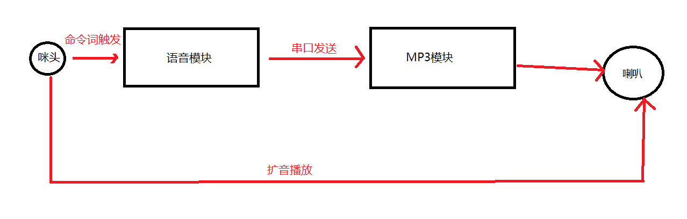

**实现方案：**

1. **变声模式流程**
    - 麦克风拾音 → 语音模块识别 → 串口发送指令 → MP3模块播放对应音频
    - 预录制100条常用语音的变声版本（每条约100KB）
    - 使用命令词匹配对应MP3文件

2. **原声模式流程**
    - 麦克风拾音 → 直接通过功放驱动喇叭
    - 实现类似扩音器的直通功能
    - 可通过软件开关或物理开关切换模式

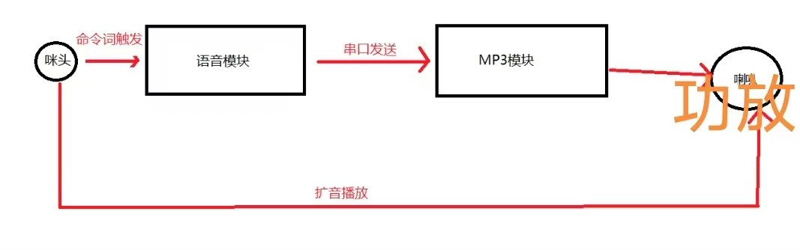

**技术要点：**

- **串口通信协议**：语音模块输出的串口内容可自定义，包括帧头帧尾
- **指令映射**：建立命令词与MP3文件的对应关系表
- **音频切换**：使用继电器或模拟开关IC实现音频路径切换
- **电源管理**：确保各模块供电稳定，避免音频干扰

**注意事项：**

- 实时变声功能需要大模型支持，成本较高，建议采用预录制方案
- 原声扩音功能需要定制开发，标准语音模块不直接支持
- 注意音频切换时的开关噪声，建议加入静音电路
- 测试时从低音量开始，避免损坏喇叭
- MP3音频文件需要统一格式和采样率

---


---

### 咪头插座安装时铜皮脱落怎么办？

**问题描述：**

咪头插座的铜皮脱落导致没有反应，通常是在安装过程中造成的问题，特别是使用纸基板时更容易出现。

**原因分析：**

1. **安装力度过大**
    - 插入咪头时用力过猛导致铜皮脱落
    - 多次插拔造成插座弹力下降和铜皮疲劳

2. **板材选择问题**
    - 纸基板强度较低，容易发生铜皮脱落
    - 插座与板材结合不够牢固

**解决方案：**

**1. 预防措施**

- **轻柔操作**：插入咪头时对准插座，垂直轻力插入
- **避免多次插拔**：减少不必要的插拔操作
- **选择优质板材**：推荐使用FR-4等环氧玻璃布基板，避免使用纸基板

**2. 问题处理**

- **铜皮脱落修复**：如果铜皮脱落，需要重新焊接或更换插座
- **插座更换**：严重损坏时建议更换整个插座
- **工艺改进**：产品设计时考虑插座的机械强度和固定方式

**3. 设计建议**

- **插座选型**：选择带加固结构的插座
- **PCB设计**：在插座周围增加过孔加固
- **装配指导**：提供详细的安装说明和注意事项

**注意事项：**

- 纸基板容易在多次插拔后出现铜皮脱落问题
- 建议在产品设计和装配时特别注意插座的机械固定
- 客户反馈的次品问题需要分析是产品质量还是安装问题

---


### PCB分板工艺问题与毛刺处理

**问题描述：**

语音模块分板后边缘存在毛刺残留，影响旁边贴片物料的正常贴装，可能导致短路或元件损伤。

**问题分析：**

**1. 分板工艺选择**

- **冲裁分板**：成本低、效率高，但易产生毛刺
- **铣刀切割（CNC铣削）**：精度较高，但摩擦会留下细微毛刺
- **激光切割**：毛刺最少，精度高，但成本较高

**2. 毛刺造成的影响**

- **物理损伤**：毛刺可能刺破贴片元件的陶瓷/塑料封装
- **电气风险**：金属碎屑导致焊盘短路或焊接时桥接
- **长期隐患**：可能引发腐蚀、氧化，造成接触不良

**解决方案：**

**1. 工艺优化**

- 优先选择激光切割或V-cut工艺
- 如使用冲裁，需优化模具精度和压力控制
- 分板后增加去毛刺工序

**2. 去毛刺方法**

- **机械处理**：振动研磨、刷磨、手工打磨
- **化学处理**：电解抛光、化学蚀刻
- **质量检测**：显微镜检查、电气测试

**3. 设计建议**

- 在分板边缘与贴片元件之间预留安全距离
- 对于0402等小封装元件，建议距离分板边缘≥1mm
- 优化PCB叠层设计，提高分板边缘强度

**注意事项：**

- 分板后必须进行毛刺检测，确保无金属碎屑残留

**毛刺问题示例：**

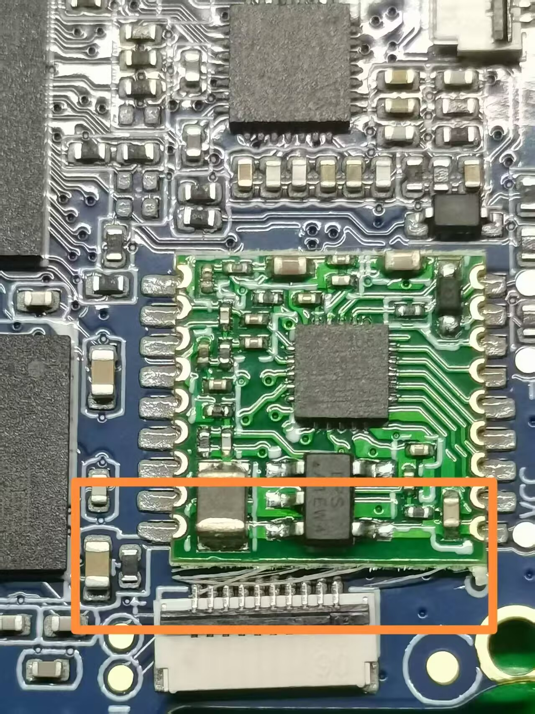
*图1：多层电路板及子板分边毛刺示意图*


*图2：分板边缘毛刺对贴片元件的影响*

- 去毛刺工序应纳入正式生产工艺流程
- 批量生产前建议先进行小批量测试
- 选择分板工艺时需平衡成本与质量要求

---

### 如何基于芯片电路图自制开发板？

**问题描述：**

希望根据提供的芯片电路图自行设计和制作PCB板，实现定制化的硬件集成。

**解决方案：**

**1. 资料获取**

- **官方文档中心**：访问 https://help.aimachip.com/ 获取完整技术资料
- **可用资料**：

    - 芯片规格书
    - 参考原理图
    - 应用电路图
    - 引脚定义图
    - PCB设计建议

**2. 设计流程**

**原理图设计**：

- 基于官方参考原理图进行设计
- 根据实际需求调整外围电路
- 注意电源、时钟、复位等关键电路

**PCB布局**：

- 参考官方PCB布局建议
- 注意射频电路（如蓝牙、WiFi）的布局要求
- 预留必要的测试点

**3. 关键注意事项**

**电源设计**：

- 确保电源稳定性和纹波要求
- 合理设计去耦电容布局
- 注意功耗和散热问题

**信号完整性**：

- 关键信号线注意阻抗匹配
- 避免信号串扰
- 预留调试接口

**生产要求**：

- 选择合适的PCB工艺和板材
- 注意最小线宽和过孔尺寸
- 考虑SMT焊接工艺要求

**4. 技术支持**

- 设计过程中可联系技术支持获取指导
- 复杂应用建议与工程师直接沟通
- 量产前建议申请样品进行验证

**注意事项：**

- 首次自制板子建议选择简单方案
- 充分理解芯片手册中的设计要求
- 注意生产良率和可靠性问题
- 保留足够的调试和修改空间

---

### 如何在智能头盔等高噪声环境中使用定向麦克风？

**问题描述：**

智能头盔产品在室外环境噪声较大时，语音识别效果明显下降，需要通过硬件设计优化拾音效果。

**解决方案：**

**定向麦克风选型：**

1. **指向性特性**
    - 频率范围：50Hz - 10kHz
    - 心形指向性图案，0°方向灵敏度最高
    - 背向（180°）衰减约12-15dB
    - 侧向（90°）有适度衰减

2. **安装角度要求**
    - 最佳角度：麦克风受音面与嘴部成90°直角
    - 麦克风位置：嘴部上前方
    - 可斜放或平放，根据结构设计确定

3. **物理规格**
    - 驻极体模拟麦克风，6027封装
    - 长度约10cm（可根据需要定制）
    - 需要定制连接器和端子

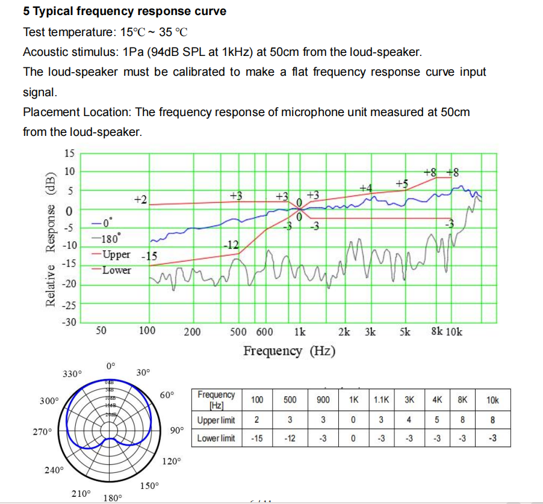

**音腔设计优化：**

**设计要点：**

- 为麦克风设计专用音腔可增强指向性
- 音腔能使衰减曲线更大，提高降噪效果
- 参考产品声学设计规范进行结构设计

**实施建议：**

1. 先测试软件优化后的固件版本
2. 如果识别效果仍不满足要求，再采用定向麦克风
3. 考虑成本因素，尽量通过软件算法解决

**降噪方案对比：**

| 方案 | 优点 | 缺点 | 适用场景 |
|------|------|------|----------|
| 软件优化 | 成本低，易于升级 | 效果有限 | 室内或低噪声环境 |
| 定向麦克风 | 降噪效果明显 | 需要结构改动，成本较高 | 室外高噪声环境 |
| 外置降噪模块 | 效果最好 | 成本高，体积大 | 专业应用场景 |

**注意事项：**

- 定向麦克风需要定制，打样周期较长
- 室内环境下，普通麦克风配合软件优化可能已足够
- 室外环境强烈建议使用定向麦克风
- 麦克风与嘴部的角度对识别效果影响很大

---

### 外置降噪模块如何选型和使用？

**问题描述：**

在高噪声环境下，如智能头盔应用场景，需要使用外置降噪模块来提升语音识别效果。

**解决方案：**

**降噪模块选型要点：**

1. **启动速度**
    - 选择通电秒启动的模块
    - 避免启动响应速度慢影响用户体验
    - 新型A-59P等模块已优化启动速度

2. **接口兼容性**
    - USB接口：可作为USB声卡使用，方便调试
    - 模拟麦克风输入：支持直插驻极体麦克风
    - 数字麦克风接口：保留原有数字麦克风兼容性

3. **功能特性**
    - 多场景模式切换：一个固件存储4个应用模式
    - AI降噪：支持近、中、远、超远距离四种拾音场景
    - 波束成形：支持30°、60°、90°、120°四种拾音角度
    - SPI调试接口：实时调节降噪参数

**连接方案：**

```
麦克风 → 降噪模块 → 语音模块
```

**实际应用效果：**

- **室内环境**：软件优化可能已足够，无需降噪模块
- **室外高噪**：降噪模块能显著提升识别率
- **成本考虑**：降噪模块增加BOM成本，需权衡必要性

**调试建议：**

1. 优先测试软件算法优化效果
2. 保留无降噪版本的测试对比
3. 使用带SPI接口的模块便于参数调节
4. 充分测试各种噪声场景下的表现

---


### 茶吧机数码管显示控制方案

**问题描述：**

茶吧机产品需要通过语音芯片控制数码管显示，了解合适的硬件方案和通信协议。

**解决方案：**

**1. 常用数码管驱动方案**

**方案一：专用驱动芯片（1650等）**

- 使用1650数码管驱动芯片
- 语音芯片通过IIC接口与1650通信
- 1650驱动数码管显示
- 成本具体费用请联系官方客服评估，性价比高

**方案二：语音芯片直驱**

- 语音芯片直接驱动数码管
- 适用于6脚LED数码管（11脚数码管需要更多IO）
- 省略外部驱动芯片，简化设计
- 需要评估芯片驱动能力

**方案三：单芯片集成方案**

- 使用集成数码管驱动的语音芯片
- 单颗芯片完成语音识别和显示控制
- 成本和体积最优
- 需要根据词条数量选择合适型号


*茶吧机数码管显示模块示例*

**2. 数码管选型要点**

**引脚数量：**

- 11脚数码管：通常为多位数码管或带符号显示
- 6脚数码管：适用于简单数字显示，驱动更简单

**显示类型：**

- 共阴极：语音芯片输出高电平驱动
- 共阳极：语音芯片输出低电平驱动
- 需确认数码管类型以匹配驱动方式

**3. 通信协议设计**

**IIC协议（使用1650时）：**
\`\`\`
语音芯片作为主机
1650作为从机
通信速率：标准100kHz或快速400kHz
数据格式：8位数据+应答位
\`\`\`

**直接驱动协议：**

- 段选信号：控制每个段（a-g, dp）的亮灭
- 位选信号：选择当前显示的数码管位
- 扫描频率：建议100Hz以上避免闪烁

**4. 显示内容定义**

根据茶吧机功能，常见显示内容：

- 温度显示：当前水温、设定温度
- 时间显示：时钟、倒计时
- 状态显示：加热中、保温、待机
- 故障代码：E1-E5等错误代码

**5. 接口设计示例**

\`\`\`
语音模块 ──┬── IIC总线 ──┬── 1650驱动芯片
            │             └── 数码管
            └── 红外接收器
\`\`\`

**6. 红外遥控集成**

- 红外接收器接收遥控信号
- 语音芯片解码红外指令
- 根据指令更新数码管显示
- 实现语音和遥控双重控制

**注意事项：**

- 使用1650芯片时，注意IIC上拉电阻的选择（通常4.7kΩ）
- 直接驱动数码管时，要核算IO口驱动能力
- 多位数码管需要动态扫描，注意刷新频率
- 红外遥控协议需预先解码和存储
- 显示内容变化不宜过于频繁，影响可读性
- 长线传输数码管信号时，考虑增加驱动电路

---


### 指向性麦克风选型与设计

**问题描述：**

在嘈杂环境下需要使用指向性麦克风提升语音识别效果，了解其选型、规格和设计要点。

**麦克风规格参数：**

**6027驻极体指向性麦克风：**

- 尺寸：直径6mm，长度约10cm（含线缆）
- 类型：单向指向性驻极体麦克风
- 灵敏度：-42dB（典型值）
- 频率响应：20Hz-16kHz
- 工作电压：2-5.5V
- 接口类型：模拟音频输出

**指向性特性：**

- 0°为正对麦克风方向，180°为背对麦克风方向
- 随角度变化声音衰减，有效抑制侧面和背面噪音
- 指向性指数（DI）：通常>6dB

**安装设计要点：**

**1. 最佳角度设置**

- 麦克风受音面与嘴部成90°效果最佳
- 受音面应略微倾斜，尽量对准声源
- 避免完全垂直（90°）或平行（0°）安装

**2. 结构设计考虑**

- 预留足够的安装空间（建议≥15mm×15mm×30mm）
- 考虑线缆走向和固定方式
- 避免遮挡麦克风受音面

**3. 音腔设计**
```
效果提升等级：
无音腔 < 简单音腔 < 优化音腔 < 专业音腔
```

**音腔设计要点：**

- 音腔可以让麦克风的指向性衰减曲线更大
- 合理的音腔设计能显著提升降噪效果
- 音腔开口尺寸影响频率响应和指向性
- 建议按照声学设计规范进行专业设计

**应用场景对比：**

| 环境条件 | 无降噪 | 指向性麦克风 | 降噪模块 | 组合方案 |
|---------|-------|-------------|---------|---------|
| 室内安静 | ✓✓✓ | ✓✓✓✓ | ✓✓ | ✓✓✓✓ |
| 室内噪音 | ✓✓ | ✓✓✓ | ✓✓✓✓ | ✓✓✓✓✓ |
| 室外76dB | ✗ | ✓✓ | ✓✓✓ | ✓✓✓✓ |
| 极端噪音 | ✗ | ✓ | ✓✓✓ | ✓✓✓✓ |

**双麦指向识别方案：**

**DM4737-223数字硅麦规格：**

- 双麦克风阵列设计
- 数字I2S输出接口
- 内置DSP处理
- 支持30°/60°/90°/120°拾音角度切换
- 近/中/远/超远距离模式

**优缺点对比：**

- 优点：更好的噪音分离能力，可调节参数
- 缺点：需要更大安装空间，成本较高

**设计建议：**

**1. 咪头选型优先级**

- 成本敏感：普通全向咪头 + 降噪模块
- 空间受限：单向指向性咪头
- 效果优先：指向性咪头 + 降噪模块
- 专业需求：双麦阵列方案

**2. 布局优化**

- 咪头尽量远离噪音源（电机、风扇等）
- 避免金属遮挡，使用非金属开孔
- 考虑防水防尘设计（如需要）

**3. 电路设计**

- 提供稳定的工作电压（建议3.3V）
- 添加RC滤波电路减少电源噪声
- 预留测试点方便调试

**测试验证：**

- 在不同噪音等级下测试识别率
- 验证不同角度的声音衰减效果
- 测试长时间工作的稳定性
- 验证温度变化对性能的影响

---

### 麦克风与拾音孔有距离导致收音效果差怎么办？

**问题描述：**

麦克风器件（咪头）安装在PCB上，外壳上的拾音孔由于结构限制无法完全对齐麦克风振膜，两者之间存在一定距离，导致产品运行过程中麦克风收音效果较差。

**问题分析：**

当麦克风振膜与外壳拾音孔之间存在间隙时，会产生以下问题：

- **声学路径损耗**：声音需要通过间隙传播到振膜，产生衰减
- **反射干扰**：间隙处的反射会干扰直达声，降低音质
- **频响失真**：间隙形成类似短管的声学结构，影响频率响应
- **指向性变差**：无法形成有效的音腔，拾音指向性变差

**解决方案：**

**方案一：设计音腔结构（推荐）**

- **密闭音腔**：在麦克风和拾音孔之间设计密闭音腔
- **音腔尺寸**：
    - 高度：尽量小（建议≤5mm），减少声学路径长度
    - 开孔：与拾音孔对齐，开孔直径2-4mm
    - 内壁：光滑处理，减少声音反射
- **密封处理**：确保音腔与外界隔离，避免漏气

**方案二：延长麦克风**

- **使用带延长管的麦克风**：选择带延长管的驻极体麦克风
- **延长管设计**：
    - 内径：2-4mm
    - 长度：根据结构确定，越短越好
    - 材料：柔软硅胶或橡胶，便于安装
- **安装方式**：延长管出口紧贴外壳拾音孔

**方案三：调整结构设计**

- **缩短距离**：重新设计结构，使麦克风尽可能靠近拾音孔
- **直接贴附**：将麦克风PCB设计为可贴附在外壳内侧
- **垂直安装**：麦克风垂直于外壳，振膜直接对准拾音孔

**方案四：软件补偿**

- **提高灵敏度**：在固件配置中提高麦克风增益
- **调整阈值**：降低词条识别阈值，弥补收音损耗
- **频响补偿**：如有条件，可通过EQ补偿频响失真

**设计建议：**

**优先级排序：**

1. **结构优化**：尽量缩短麦克风与拾音孔的距离（首选）
2. **音腔设计**：无法缩短距离时，设计合理的音腔结构
3. **延长方案**：考虑使用带延长管的专用麦克风
4. **软件补偿**：作为辅助手段，配合硬件优化使用

**设计目标：**

- 麦克风振膜与拾音孔距离：≤5mm
- 音腔密封性：良好，无漏气
- 声学路径：尽可能短且直
- 开孔面积：匹配麦克风振膜尺寸

**注意事项：**

- 音腔体积过大会产生混响，影响识别效果
- 间隙越大，收音效果越差，尽量控制在5mm以内
- 软件补偿无法完全解决硬件问题，需从结构入手
- 建议在设计阶段进行声学仿真或实际测试验证

---
## 声纹识别功能

### 离线语音模块支持声纹识别吗？

**问题描述：**

询问离线语音模块是否支持声纹识别功能，以及相关的技术参数。

**解决方案：**

**功能支持：**

- 离线语音模块支持声纹识别功能
- 已有客户批量出货，应用在实际产品中
- 需要授权才能正常使用（未授权会五分钟重启一次）

**技术参数：**

- **支持人数**：单个模块最多可注册9个人的声纹
- **识别准确率**：目前出货客户未反馈声纹识别问题，识别率稳定可靠
- **应用场景**：适用于声控开关等需要身份识别的场景

**使用方式：**

1. **测试阶段**：可以先进行功能测试
2. **量产阶段**：联系技术支持定制授权出货
3. **模块选择**：有模块和芯片两种形式可选

**注意事项：**

- 声纹识别功能需要额外授权
- 建议在量产前充分测试功能
- 可根据产品需求选择合适的硬件形式

---

## AEC线路处理

### CL1302在无功放时AEC线路如何处理？

**问题描述：**

CL1302芯片用于遥控器等无功放设备时，AEC（声学回声消除）线路如何处理。

**解决方案：**

**处理方案：**

- **AEC线路悬空**：在没有功放芯片的应用中，AEC（回声消除）线路可以直接悬空
- **无需特殊处理**：由于没有音频播放，不存在回声问题，因此不需要AEC功能
- **麦克风接口**：麦克风输入口可以正常悬空，不影响芯片工作

**应用场景：**

- 遥控器等无音频输出设备
- 仅需要语音识别不需要语音播报的设备
- 成本敏感的简化应用

**注意事项：**

- 确保应用场景确实不需要回声消除
- 如果后续添加音频播放功能，需要重新设计AEC电路
- 保持AEC引脚的合理布局，以备后续功能升级

---

## 串口控制方案

### 如何用语音模块控制继电器等外设？

**问题描述：**

需要使用语音模块控制电饭锅按键等点动开关，寻求合适的控制方案。

**解决方案：**

**控制方案对比：**

1. **MOS管方案**
    - 适合低压小电流控制
    - 响应速度快，体积小
    - 需要考虑驱动电压匹配

2. **三极管方案**
    - 成本低，电路简单
    - 适合小功率负载
    - 需要设计合适的驱动电路

3. **光耦隔离方案**
    - 安全可靠，隔离强弱电
    - 保护语音模块不受干扰
    - 适合控制非隔离设备（如电磁炉）

**推荐方案：**

- **一般应用**：三极管方案最简单，成本最低
- **安全要求高**：光耦隔离方案最稳妥
- **非隔离负载**：必须使用光耦或继电器隔离

**注意事项：**

- 电磁炉等非隔离设备必须使用隔离方案
- 继电器体积较大，适合空间充足的场景
- 设计时要考虑被控设备的电气特性
- GPIO输出电流有限，大负载需要驱动电路

---


---

## 声纹识别功能

### 离线语音模块支持声纹识别吗？

**问题描述：**

询问离线语音模块是否支持声纹识别功能，以及相关的技术参数。

**解决方案：**

**功能支持：**

- 离线语音模块支持声纹识别功能
- 已有客户批量出货，应用在实际产品中
- 需要授权才能正常使用（未授权会五分钟重启一次）

**技术参数：**

- **支持人数**：单个模块最多可注册9个人的声纹
- **识别准确率**：目前出货客户未反馈声纹识别问题，识别率稳定可靠
- **应用场景**：适用于声控开关等需要身份识别的场景

**使用方式：**

1. **测试阶段**：可以先进行功能测试
2. **量产阶段**：联系技术支持定制授权出货
3. **模块选择**：有模块和芯片两种形式可选

**注意事项：**

- 声纹识别功能需要额外授权
- 建议在量产前充分测试功能
- 可根据产品需求选择合适的硬件形式

---

## AEC线路处理

### CL1302在无功放时AEC线路如何处理？

**问题描述：**

CL1302芯片用于遥控器等无功放设备时，AEC（声学回声消除）线路如何处理。

**解决方案：**

**处理方案：**

- **AEC线路悬空**：在没有功放芯片的应用中，AEC（回声消除）线路可以直接悬空
- **无需特殊处理**：由于没有音频播放，不存在回声问题，因此不需要AEC功能
- **麦克风接口**：麦克风输入口可以正常悬空，不影响芯片工作

**应用场景：**

- 遥控器等无音频输出设备
- 仅需要语音识别不需要语音播报的设备
- 成本敏感的简化应用

**注意事项：**

- 确保应用场景确实不需要回声消除
- 如果后续添加音频播放功能，需要重新设计AEC电路
- 保持AEC引脚的合理布局，以备后续功能升级

---

## 串口控制方案

### 如何用语音模块控制继电器等外设？

**问题描述：**

需要使用语音模块控制电饭锅按键等点动开关，寻求合适的控制方案。

**解决方案：**

**控制方案对比：**

1. **MOS管方案**
    - 适合低压小电流控制
    - 响应速度快，体积小
    - 需要考虑驱动电压匹配

2. **三极管方案**
    - 成本低，电路简单
    - 适合小功率负载
    - 需要设计合适的驱动电路

3. **光耦隔离方案**
    - 安全可靠，隔离强弱电
    - 保护语音模块不受干扰
    - 适合控制非隔离设备（如电磁炉）

**推荐方案：**

- **一般应用**：三极管方案最简单，成本最低
- **安全要求高**：光耦隔离方案最稳妥
- **非隔离负载**：必须使用光耦或继电器隔离

**注意事项：**

- 电磁炉等非隔离设备必须使用隔离方案
- 继电器体积较大，适合空间充足的场景
- 设计时要考虑被控设备的电气特性
- GPIO输出电流有限，大负载需要驱动电路

---

## 蓝牙连接问题排查

### SU-63T蓝牙连接失败怎么办？

**问题描述：**

SU-63T模块可以搜索到蓝牙设备，但一直显示"连接中，请不要断开蓝牙"，无法完成连接。

**解决方案：**

**问题排查：**

1. **检查固件版本**
    - 确认使用的是从智能公元平台生成的固件
    - 不要使用SDK中的固件（SDK中的固件无法正常使用）
    - 确保固件是2024年11月之后生成的

2. **常见原因**
    - 烧录了错误的文件（如压缩包）
    - 使用了旧版本固件（24年11月之前的平台固件）
    - 底层代码损坏

3. **解决方法**
    - 使用调试器或脱机烧录器重新烧录固件
    - 从智能公元平台重新下载最新固件
    - 尽量使用转接板进行烧录，避免接触问题

**预防措施：**

- 只使用智能公元平台生成的固件
- 烧录前确认固件文件的完整性
- 保存好原始固件，以备恢复使用

**注意事项：**

- 模块卡在连接界面时，语音功能也会失效
- 如果多个模块都出现相同问题，可能是固件兼容性问题
- 底层代码乱码后需要通过专业工具恢复

---

## 串口通信故障处理

### MCU向语音模块发送串口数据导致模块死机？

**问题描述：**

MCU通过串口向语音模块发送数据时，模块出现死机现象，语音响应几次后无响应。

**解决方案：**

**问题分析：**

1. **电压匹配问题**
    - SU系列模块不支持5V串口通信
    - 确认MCU串口电压为3.3V
    - 电压不匹配可能导致模块损坏或工作异常

2. **电源波动**
    - 串口通信时的电源波动可能导致模块复位
    - 监测供电电压稳定性
    - 在电源线上增加滤波电容

3. **数据格式问题**
    - 检查串口数据格式是否正确
    - 确认波特率、数据位、停止位配置
    - 避免发送过长的数据包

**解决方案：**

1. **硬件方面**
    - 在串口线上串联50Ω电阻（两根线都串）
    - 确保电源稳定，必要时增加储能电容
    - 检查接地是否良好

2. **软件方面**
    - 减少单次发送的数据量
    - 增加发送间隔，避免连续快速发送
    - 检查变量赋值是否正确（避免1-3号消息的变量赋值问题）

3. **调试建议**
    - 先单独测试模块，不放在最终产品上
    - 逐步增加通信频率，观察稳定性
    - 使用示波器监测串口信号质量

**注意事项：**

- 确保MCU和模块共地
- 避免在模块工作时进行热插拔
- 长距离通信需要考虑信号完整性


---

## IO口功能限制

### 平台不支持哪些IO功能？

**问题描述：**

需要了解智能公元平台不支持哪些IO功能，以便在设计产品时避免不切实际的需求。

**解决方案：**

**不支持的功能：**

- **NTC测温**：平台不支持直接通过NTC进行温度测量
- **共阳数码管驱动**：平台不支持直接驱动共阳数码管
- **弹簧触摸按键**：平台不支持弹簧触摸按键功能
- **红外感应信号输入**：平台不支持直接连接红外感应器

**支持的功能：**

- 常规GPIO输入/输出控制
- PWM输出控制
- UART串口通信
- I2C、SPI等数字接口
- ADC模拟量采集（特定引脚）

**替代方案：**

对于平台不支持的功能，可以考虑：

1. **使用外部MCU**：通过串口与语音模块通信，由外部MCU实现不支持的功能
2. **简化需求**：使用平台支持的方式实现类似功能
3. **付费定制**：联系技术支持进行定制开发

**注意事项：**

- 设计产品前先确认平台支持的功能范围
- 需求超出平台能力时，考虑双模块方案或定制开发
- 实际可用IO口数量约为20个左右（喇叭、咪头等外设占用后）

---

## 电源时序设计

### 语音模块出现噪音/杂音与电源启动速度有关吗？

**问题描述：**

语音模块（如CI-86Z）在使用过程中出现噪音或杂音问题，具体表现为：
- 初期偶尔出现，断电重启后可恢复正常
- 后期发展为持续存在，断电也无法恢复
- 同一主板上，不同型号模块表现不同（如CI-86Z有问题，SU-03T/CI-96Z正常）

**问题分析：**

**1. 电源启动速度匹配问题**

主板电源的启动速度与语音模块的供电时序要求不匹配可能导致模块工作异常：

- 主板电源启动速度较慢
- 模块内部电源管理电路与外部供电时序不同步
- 不同模块型号对电源时序的敏感度不同

**2. 模块差异**

不同型号模块对电源时序的容忍度存在差异：
- CI-86Z：对电源启动时序较为敏感
- SU-03T/CI-96Z：对电源时序要求相对宽松

**3. 可能的故障原因**

- 主板DC-DC芯片的启动特性与模块不兼容
- 电源滤波回路设计不足
- 上电时序不符合模块要求

**解决方案：**

**1. 临时方案（模块侧修改）**

- 在模块电源输入端调整电阻参数
- 注意：此方案未经过长时间验证，仅作为应急措施

**2. 长期方案（主板侧修改）**

- 根据问题主板调整电源启动速度
- 优化DC-DC芯片的软启动电路
- 确保上电时序符合模块要求

**3. 调试验证步骤**

- 使用示波器对比正常板与问题板的电源上电波形
- 测量模块电源引脚的实际电压上升曲线
- 验证不同批次模块的电源特性差异
- 进行高低温环境测试，排查温度相关性

**设计建议：**

1. **电源设计阶段**
   - 参考模块规格书中的电源时序要求
   - 预留电源启动参数调整空间
   - 设计足够的电源滤波和稳压电路

2. **多模块共用场景**
   - 不同型号模块可能需要不同的电源设计
   - 建议针对每种模块单独验证
   - 统一电源设计时需考虑最严格的要求

3. **测试验证**
   - 批量生产前进行充分的电源测试
   - 模拟各种上电场景验证稳定性
   - 进行高低温、长时间老化测试

**注意事项：**

- 电源启动问题可能导致偶发性故障，难以复现和定位
- 临时修改方案需经过充分验证后再批量使用
- 如无法修改主板设计，建议更换对电源要求较低的模块型号
- 问题模块应及时返厂分析，确认批次差异

---

## 设计资料获取

### 文档中心提供哪些设计资料？

**问题描述：**

需要了解官方文档中心提供哪些硬件设计资料，以便进行产品开发。

**解决方案：**

**提供的资料：**

- **模块原理图**：包含完整的电路连接和元器件参数
- **PCB封装文件**：提供模块的封装尺寸和焊盘定义
- **引脚定义表**：Excel格式，详细列出每个引脚的功能
- **规格书**：包含电气参数、机械尺寸等技术规格

**不提供的资料：**

- **PCB源文件**：不提供模块的PCB源文件（如.PCB、.schdoc等）
- **内部设计文件**：不提供模块内部的具体PCB设计文件

**设计建议：**

1. **使用模块而非芯片**：直接使用模块进行产品设计，无需关心内部PCB设计
2. **参考开发板**：官方开发板提供了完整的外围电路设计参考
3. **自行设计外围电路**：基于提供的原理图和封装设计产品PCB

**获取方式：**

- 访问官方文档中心：https://help.aimachip.com/
- 选择对应型号查看可用资料
- 如需特定格式的封装文件，可申请获取

**注意事项：**

- PCB源文件不提供，需自行设计外围电路
- 设计参考时以官方提供的资料为准
- 批量生产前建议使用模块验证功能
