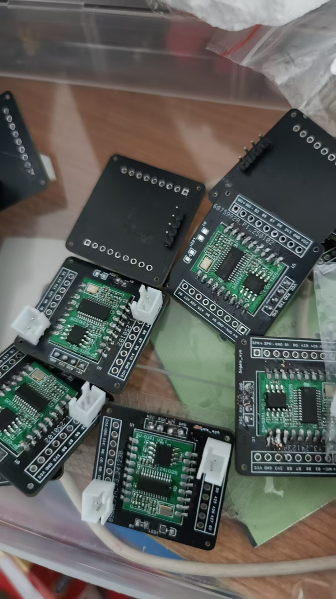
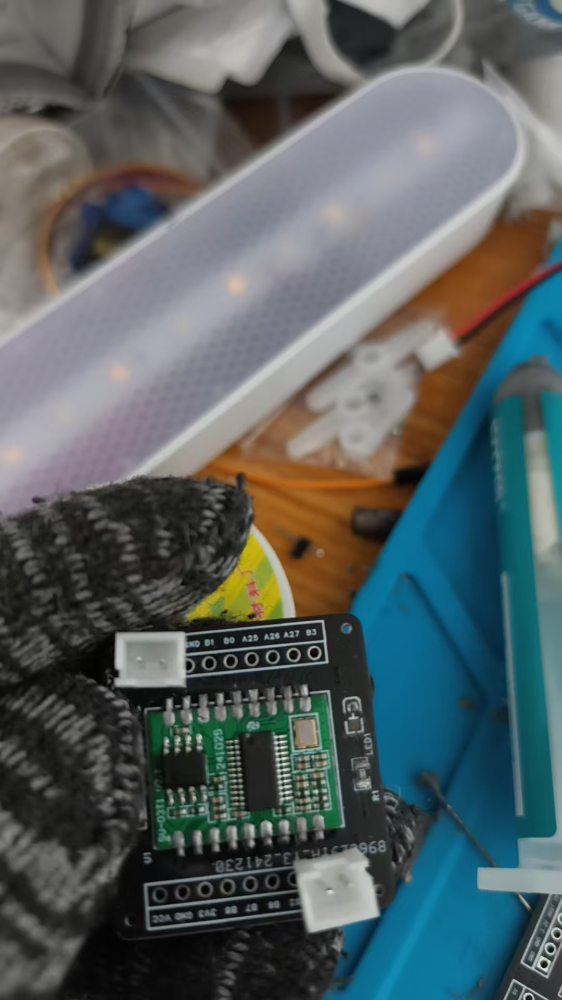

# 硬件设计 FAQ


### 咪头和喇叭是否需要自行焊接？

**问题描述：**

产品说明书中"咪头、喇叭(咪头和喇叭直接买同一家的吧，不用自己焊接了)"的描述存在歧义，容易让用户误解为需要自行焊接。

**解决方案：**

- 咪头和喇叭模块出厂时已完成焊接，无需用户自行焊接
- 建议将描述修改为："咪头、喇叭（已焊接完成，可直接使用）"
- 在产品详情页明确标注"已焊排针+咪头+喇叭"，说明产品为完整套件

**注意事项：**

- 避免使用"焊接"等词汇，以免造成用户误解
- 明确说明产品为即用型套件，减少用户疑问

---

### 市面上的扩展板是官方产品吗？

**问题描述：**

看到一款扩展板，集成了主控芯片、麦克风、串口接口和多个IO引脚，询问是否为官方产品以及购买渠道。

**解决方案：**

**官方产品说明：**

- 该扩展板**不是官方产品**
- 官方只销售自己的转接板
- 转接板附带端子的咪头和喇叭

**官方配件特点：**

1. **转接板设计**
    - 官方转接板针对模块优化设计
    - 集成必要的接口电路
    - 配套专用端子连接器

2. **配套配件**
    - 标准咪头（麦克风）
    - 匹配的扬声器
    - 连接线和端子

**购买建议：**

- 建议购买官方转接板进行开发
- 第三方扩展板可能存在兼容性问题
- 官方配件质量更有保障

**注意事项：**

- 使用非官方配件需自行验证兼容性
- 官方转接板提供完整的技术支持
- 购买时确认产品型号和配套清单


---

### 语音模块可以使用手机喇叭吗？

**问题描述：**

希望使用手机喇叭作为语音模块的音频输出设备，需要确认兼容性和选型要求。

**解决方案：**

**喇叭选型要求：**

语音模块对外部喇叭有明确的功率和阻抗要求：

- **4欧姆喇叭**：功率需大于2.4W
- **8欧姆喇叭**：功率需大于1.6W
- **阻抗匹配**：常见为4欧或8欧姆

**手机喇叭适用性：**

- 部分手机喇叭满足功率要求
- 需查看具体喇叭的参数规格
- 建议选择带音腔的手机喇叭以获得更好音质

**小型喇叭推荐：**

- 手机配件喇叭：带音腔设计，声音不小
- 注意音量不要设置太大，容易烧坏喇叭
- 尽量选择知名品牌产品

**注意事项：**

- 音量过大可能损坏小功率喇叭
- 测试时从低音量开始逐步调整
- 喇叭功率过小会导致音质差或失真
- 如无合适的小型喇叭，可考虑使用标准尺寸喇叭

---

### 配合语音模块使用的麦克风有哪些参数要求？

**问题描述：**

需要了解与语音模块配合使用的麦克风在信噪比、阻抗等参数方面的具体要求。

**解决方案：**

**推荐麦克风参数：**

根据官方咪头选型建议：

1. **灵敏度**
    - 推荐范围：-32dB 到 -25dB
    - 常用值：-27dB
    - 灵敏度影响拾音距离和清晰度

2. **信噪比（SNR）**
    - 最低要求：>75dB
    - 信噪比越高，抗干扰能力越强
    - 推荐选择高信噪比型号

3. **工作电流**
    - 要求：≤0.5mA
    - 低功耗设计，适合电池供电设备

4. **物理尺寸**
    - 常规尺寸：直径6mm，高度2.7mm
    - 贴片封装，便于SMT生产

**选型建议：**

- **环境噪声小**：可选用一般规格麦克风
- **环境噪声大**：选择高信噪比麦克风
- **远距离拾音**：选择灵敏度较高的麦克风
- **批量生产**：建议先测试样品确认效果

**注意事项：**

- 实际效果需根据使用场景测试
- 麦克风布局也很重要
- 建议购买推荐型号以保证兼容性
- 不同厂家的参数标注方式可能有差异

---

### 如何连接和控制风扇模块？

**问题描述：**

连接风扇控制模块时，无论控制信号线是否连接，风扇都会自动启动，无法通过IO口控制风扇开关。

**解决方案：**

**1. 风扇模块引脚定义**

- **G（GND）**：地线
- **V（VCC）**：电源（通常接5V或3.3V）
- **S（Signal）**：控制信号（高电平导通）

**2. 正确连接方式**

- 红色线接5V电源
- 黑色线接GND
- 白色线（控制信号）接模块的IO口

**3. 控制逻辑**

- IO输出高电平：风扇启动
- IO输出低电平：风扇停止
- 控制信号必须正确连接到S引脚

**4. 故障排查**

- 检查控制线是否误接到电源（如3.3V）
- 用万用表测量控制线电压
- 确认IO口能够输出高低电平变化

**注意事项：**

- 控制信号不能接常高电平，否则风扇会一直转动
- 如果风扇在未接控制线时仍转动，可能是模块内部问题
- 建议先测试IO口的电平输出功能

---

### 两个模块（SU和MCU）如何控制一个设备？

**问题描述：**

需要设计两个模块（SU语音模块和MCU）共同控制一个设备的连接方案，有四种不同的连接方式可选。

**解决方案：**

**方案对比：**

1. **并联方案**（方案一）
    - SU和MCU直接并联控制设备
    - 优点：结构简单
    - 缺点：可能产生冲突

2. **串联方案**（方案二、三、四）
    - SU连接到MCU，MCU再连接设备
    - 优点：逻辑清晰，避免冲突
    - 缺点：需要MCU做中转

**推荐方案：**

- **选择串联方案**（SU→MCU→设备）
- 通过MCU整合两种控制信号
- MCU负责最终的控制决策

**设计考虑：**

1. **通信方式**
    - 确认SU和MCU之间的通信协议
    - UART、I2C或SPI接口选择

2. **控制逻辑**
    - MCU接收SU的语音识别结果
    - MCU根据语音指令执行相应动作
    - 可设置优先级和冲突处理机制

3. **电源设计**
    - 确保两个模块的供电需求
    - 考虑总功耗和电源容量

**注意事项：**

- 串联方案便于扩展更多功能
- 需要编写MCU的协调控制程序
- 考虑故障模式下的安全设计

---

### PCB阻焊层破损碰到GND有什么影响？

**问题描述：**

PCB板上的阻焊层破损，暴露的铜箔可能接触到GND引脚，上电后扬声器出现断续的电流脉冲声音。

**解决方案：**

**1. 问题影响分析**

    - 阻焊层破损可能导致短路
    - 扬声器断异响可能是电路异常的表现
    - 需要及时修复避免进一步损坏

**2. 修复步骤**

    - 用吸锡枪清除焊锡
    - 使用洗板水清洗干净
    - 重新涂覆绿油遮盖破损区域
    - 等待绿油固化

**3. 预防措施**

    - 操作时避免刮擦PCB表面
    - 使用合适的焊接工具和温度
    - 定期检查PCB状态

**注意事项：**

- 阻焊层是防止短路的保护层
- 破损后应及时修复，不要继续使用
- 如 unsure 修复方法，建议寻求专业帮助

---

### 关闭语音控制功能后设备是否还会耗电？

**问题描述：**

在系统中关闭语音控制功能后，设备是否还会消耗电量？

**解决方案：**

关闭语音控制功能后，模块的语音处理部分会停止工作，但模块仍会维持基本的待机状态。

**1. 功耗情况说明**

- 语音识别关闭：语音处理部分不工作
- 待机功耗：模块仍需要维持基本的待机电流
- 功耗水平：取决于具体模块型号和工作状态

**2. 进一步降低功耗**
如需完全关闭设备以实现零功耗，需要：

- 通过硬件开关切断电源
- 或使用定时供电控制
- 在安静环境下让模块进入休眠状态

**注意事项：**

- 仅关闭语音功能不会实现零功耗
- 如需实现最低功耗，建议选用低功耗型号的模块
- 在相对安静的环境下，模块可自动进入休眠状态，功耗低于1mA

---

### CI系列模块是否支持声源识别？

**问题描述：**

需要了解CI系列芯片是否具备声源识别（声源定位）功能，用于识别声音来源的方向。

**解决方案：**

**功能支持情况：**

- CI系列模块主要设计用于语音命令识别
- 目前不支持声源识别或声源定位功能
- 专注于语音内容识别而非声音来源判断

**技术限制：**

- 需要多个麦克风阵列才能实现声源定位
- 当前CI系列模块为单麦克风设计
- 声源识别需要专门的算法和硬件支持

**替代方案：**

- 如需声源定位功能，建议考虑其他方案
- 可配合外部传感器实现方向判断
- 或选用支持多麦克风阵列的方案

**注意事项：**

- 声源识别与语音识别是不同的技术方向
- CI系列优化重点在识别准确率和响应速度
- 未来版本可能会考虑增加相关功能

---

### 如何可靠地使用语音模块控制继电器？

**问题描述：**

使用语音模块IO口控制继电器时，由于输出电压波动较大（从正常电压降到1.3V），导致3V继电器受干扰，无法稳定工作。

**解决方案：**

**1. 问题原因分析**

- 语音模块IO口输出电流有限（约150mA）
- 同时控制多个继电器时造成电压跌落
- 继电器线圈工作时的反向电动势干扰

**2. 推荐解决方案**

**方案一：使用NPN三极管驱动**

- 使用S8050或2N5551等通用NPN三极管
- 基极通过1KΩ电阻连接到模块IO口
- 集电极驱动继电器线圈
- 发射极接地


**方案二：光耦隔离**

- 使用PC817或4N25等光耦器件
- 完全隔离两侧电路，避免干扰
- 语音模块侧只需提供5-10mA电流

**方案三：MOSFET驱动**

- 使用2N7002等小信号MOSFET
- 驱动能力更强，导通电阻更小
- 适合驱动多个继电器并联

**3. 具体电路设计**

**NPN三极管驱动电路：**
```
模块IO口 ---[1KΩ]--- NPN基极
                |
                NPN集电极 --- 继电器线圈 --- VCC(5V/12V)
                |
                NPN发射极 --- GND
                |
继电器线圈并联 --- 1N4007二极管（阳极接集电极）
```

**4. 注意事项**

- 不能直接用IO口驱动继电器线圈
- 必须使用驱动元件（三极管/MOSFET/光耦）
- 继电器线圈要并联续流二极管
- 多个继电器时要考虑电源容量
- 建议独立供电避免干扰主控


---

### 支持语音唤醒的模块待机功耗是多少？

**问题描述：**

需要了解支持语音唤醒功能的模块在待机状态下的功耗情况，以便进行电源设计。

**解决方案：**

不同模块的待机功耗有所差异，具体数值需参考各模块的技术规格书：

- 一般支持语音唤醒的模块待机功耗在几十微安到几百微安级别
- 具体数值与模块型号、配置和工作模式相关
- 可通过实际测试获得准确功耗数据

**注意事项：**

- 待机功耗受环境影响，测试时需在标准条件下进行
- 设计电源时应预留一定余量
- 长期使用时功耗可能会有微小变化

---

### 音频输出音量过大如何调节？

**问题描述：**

模块输出音量过大，即使通过软件调低音量后仍感觉声音很大，需要通过硬件方式降低音量。

**解决方案：**

在音频放大器输入端串联电阻可以有效降低音量：

**操作步骤：**

1. 定位音频放大器输入端
    - 找到音频放大器芯片的输入引脚
    - 确认音频信号传输路径

2. 添加串联电阻
    - 在放大器输入端串联合适阻值的电阻
    - 电阻值可根据实际需要调整（如1kΩ-10kΩ）
    - 建议从较小阻值开始尝试

3. 焊接注意事项
    - 确保焊接牢固，避免虚焊
    - 电阻尽量靠近放大器输入端
    - 注意避免短路

**电阻选型建议：**

- 初步建议：1kΩ-10kΩ范围内选择
- 阻值越大，音量衰减越多
- 可实际测试不同阻值效果
- 选用1/4W或1/8W金属膜电阻

**注意事项：**

- 修改硬件前务必断电
- 焊接时注意防静电
- 建议先在废板上练习
- 音量调节是线性的，但不是无限可调
- 电阻过大会导致音量过小或失真

---

### 如何选择合适的喇叭？

**问题描述：**

语音模块的喇叭声音太小，需要选择更大音量的喇叭，但不清楚如何选择合适的规格。

**解决方案：**

**1. 喇叭参数选型**

- **阻抗和功率匹配**：

    - 4Ω喇叭：2.4W起，建议不超过3W
    - 8Ω喇叭：1.6W起，建议不超过5W
    - 功率过大会导致模块驱动困难

- **音量与灵敏度的关系**：

    - 声音大小取决于喇叭灵敏度，不是尺寸
    - 高灵敏度喇叭在相同功率下音量更大
    - 选择85dB以上的灵敏度更佳

**2. 接线注意事项**

- 正确连接喇叭引脚（正负极）
- 确保焊接牢固，避免接触不良
- 使用短音频线减少信号损失

**3. 音量优化方案**

- 软件调节：在平台上设置合适的音量值
- 硬件调节：如音量仍不够，可考虑：

    - 更换更高灵敏度的喇叭
    - 添加外部功放电路
    - 修改模块功放电路（需要专业知识）

**注意事项：**

- 不要使用功率过大的喇叭（如4Ω5W）
- 大尺寸喇叭不等于大音量
- 喇叭功率超过模块承受能力可能损坏功放
- 建议购买官方推荐的喇叭规格

---

### 语音模块如何控制RGB灯光颜色？

**问题描述：**

希望通过语音指令控制RGB LED灯的颜色变化，实现智能灯光控制功能。

**解决方案：**

**1. 控制方案选择**

语音模块本身不能直接控制RGB颜色，需要配合单片机：

- **语音模块**：负责识别命令，输出控制信号
- **单片机**：接收命令，控制RGB LED
- **RGB LED**：通过PWM调节红绿蓝三色亮度

**2. 硬件连接**

```
语音模块TX → 单片机RX
单片机PWM口 → RGB LED限流电阻
```

- RGB LED共阴极接法：

    - 红色引脚→电阻→单片机PWM1
    - 绿色引脚→电阻→单片机PWM2
    - 蓝色引脚→电阻→单片机PWM3
    - 共阴极接地

- 限流电阻选择：

    - 5V供电：220Ω-330Ω
    - 3.3V供电：100Ω-150Ω

**3. 控制逻辑示例**

```cpp
// 接收语音模块命令
if (command == "红色") {
    analogWrite(RED_PIN, 255);   // 红色全亮
    analogWrite(GREEN_PIN, 0);
    analogWrite(BLUE_PIN, 0);
} else if (command == "蓝色") {
    analogWrite(RED_PIN, 0);
    analogWrite(GREEN_PIN, 0);
    analogWrite(BLUE_PIN, 255);  // 蓝色全亮
}
```

**4. 实现混色**

- 调节各色PWM值实现混色
- 白色：RGB全部255
- 紫色：红255，蓝255，绿0
- 通过不同组合实现多种颜色

**注意事项：**

- 语音模块只输出识别结果，不直接控制PWM
- 需要使用支持PWM的单片机（Arduino、STM32等）
- RGB LED必须加限流电阻
- 颜色控制需要编程实现，不在语音模块平台配置

---

### PWM调光功能无法正常工作怎么办？

**问题描述：**

使用PWM占空比控制灯光亮度时，调光功能未按预期工作。

**解决方案：**

**1. 检查GPIO引脚配置**

- 确认GPIO引脚支持PWM功能
- 避免使用之前配置为串口的引脚
- 检查引脚是否有复用功能冲突

**2. 验证PWM配置参数**

- 确认PWM频率设置合适（建议10kHz）
- 检查占空比设置范围（0-100%）
- 验证驱动器是否支持当前PWM频率

**3. 硬件连接检查**

- 确保PWM输出正确连接到LED驱动器
- 检查共地连接是否良好
- 验证驱动器电源电压匹配

**4. 参考配置示例**


**注意事项：**

- GPIO_B2和GPIO_B3可能之前被用作串口
- 建议更换其他PWM引脚测试
- 不同LED驱动器对PWM频率要求可能不同
- 可参考官方PWM调光教程：https://www.bilibili.com/video/BV1wj411N7Tj

---

### 屏幕颜色反转时红蓝颜色显示错误怎么办？

**问题描述：**

在调试屏幕显示镜像、翻转和颜色反转功能时，发现颜色反转效果异常，红蓝颜色显示错误。

**解决方案：**

**1. 寄存器36h配置说明**

寄存器36h（Memory Access Control）控制显示方向和颜色顺序：

- **D7（MY）**：行地址顺序（0: top-to-bottom, 1: bottom-to-top）
- **D6（MX）**：列地址顺序（0: left-to-right, 1: right-to-left）
- **D5（MV）**：行列交换（0: normal, 1: row/column exchange）
- **D4（ML）**：垂直刷新方向（0: top-to-bottom, 1: bottom-to-top）
- **D3（BGR）**：RGB-BGR顺序（0: RGB, 1: BGR）
- **D2（MH）**：水平刷新方向（0: left-to-right, 1: right-to-left）

**2. 颜色反转问题定位**

红蓝颜色显示错误通常是BGR位设置不当导致：

```c
// 正确的GC907_set_direction函数实现
static void GC907_set_direction(u8 dir) {
    WriteCOM(0x36);  // 扫描方向控制
    if (dir == ROTATE_DEGREE_0) {
        #if HORIZONTAL_SCREEN
            WriteDAT_8(0x00);
        #else
            WriteDAT_8(0xC0);
        #endif
    }
    else if (dir == ROTATE_DEGREE_180) {
        #if HORIZONTAL_SCREEN
            WriteDAT_8(0xA0);
        #else
            WriteDAT_8(0x60);
        #endif
    }
    else if (dir == ROTATE_DEGREE_90) {
        #if HORIZONTAL_SCREEN
            WriteDAT_8(0x60);
        #else
            WriteDAT_8(0xA0);
        #endif
    }
}
```

**3. 调试步骤**

- 检查寄存器36h的D3位（BGR）设置
- 确认是否需要设置为BGR模式
- 测试不同的方向配置组合
- 对比正常UI图片与实际显示效果

**4. 解决方案**

- **修改BGR位**：根据屏幕规格设置正确的颜色顺序
- **更新驱动代码**：确保所有旋转模式下的颜色正确
- **验证显示**：使用多种颜色测试确认修复效果

**注意事项：**

- 不同驱动芯片的寄存器定义可能不同
- 颜色问题也可能是数据线序错误导致
- 建议保存各方向的配置值供调试使用


---

### CI1302双麦应用是否可以使用内部晶振

**问题描述：**

CI1302在双麦克风应用场景下，是否可以使用内部晶振。

**解决方案：**

CI1302在双麦克风应用场景下可以使用内部晶振：

- 内部晶振精度满足双麦算法要求
- 无需外接晶振，简化电路设计
- 保持正常的性能表现

**注意事项：**

- 内部晶振已校准，可直接使用
- 使用内部晶振可降低硬件成本
- 如有特殊精度要求，可考虑外接晶振方案

---

**3. 功能模块判断**

**音频处理功能：**

- 麦克风输入电路（前置放大、滤波）
- 音频输出电路（DAC、功放）
- 音频存储接口（SPI Flash用于语音资源）

**显示功能：**

- LCD驱动电路（并行或SPI接口）
- 背光驱动电路
- 触摸屏接口（I2C或SPI）

**通信功能：**

- WiFi射频前端电路
- 天线匹配网络
- 网络指示灯

**4. 实际应用建议**

**测量验证：**

- 使用万用表测量关键引脚电压
- 示波器观察时钟信号
- 逻辑分析仪分析通信协议

**文档对比：**

- 对比已知芯片的参考设计
- 查看厂商提供的评估板电路
- 参考类似产品的设计方案

**注意事项：**

- 高集成度SoC芯片的引脚功能可能通过配置改变
- 某些功能可能需要特定固件支持
- PCB版本不同可能导致电路差异
- 建议通过实际测试确认功能可用性

---

### 系统关机后灯重新点亮怎么办？

**问题描述：**

系统关机后，灯会重新点亮，需要解决关机后灯不重新点亮的问题。

**解决方案：**

1. **软件临时解决方案**

    - 系统关机时，不要切断IO电平
    - 直接将3组PWM信号置0
    - 保持IO电平输出，避免MOS管异常导通

2. **硬件问题分析**

    - 下拉电阻会分掉一部分电压，导致MOS管导通阻抗增大
    - 48V高压电路使用3.3V控制MOS管可能存在驱动电压不足
    - 高压MOS管驱动需要较高的电压差
    - 建议电路设计时考虑使用更高电压的控制信号

3. **电路设计优化建议**

    - 对于48V高压应用，建议使用专门的MOS驱动芯片
    - 控制信号电压应与MOS管驱动要求匹配
    - 避免轻易拆除MOS管的下拉电阻
    - 考虑修改硬件版本以优化驱动电路

**注意事项：**

- 软件方案是临时措施，长期建议修改硬件设计
- MOS管发热问题可能与驱动电压不足有关
- 下拉电阻的取值需要平衡驱动能力和功耗
- 高压MOS管的驱动电路设计需要特别谨慎

---

### 延时电平翻转功能如何使用？

**问题描述：**

需要了解延时电平翻转功能的工作原理和使用方法。

**解决方案：**

**1. 功能原理**

- 延时电平翻转是在指定时间后自动反转GPIO电平状态
- 适用于需要脉冲输出或定时切换的场景
- 可以实现按键一样的短时触发效果

**2. 配置方法**

- 在控制详情中启用"延时输出"功能
- 设置"延时电平翻转"为"是"
- 配置具体的延时时间（如2秒）

**3. 工作流程**

- 触发条件满足时，GPIO输出初始电平
- 延时时间结束后，自动翻转到相反电平
- 实现从高→低或低→高的自动转换

**4. 应用示例**

- 模拟按键脉冲：输出100ms高电平后自动拉低
- LED闪烁：周期性翻转实现闪烁效果
- 蜂鸣器提示：短时高电平触发发声


**注意事项：**

- 延时翻转不奏效时，可做2个控制实现
- 延时时间需要根据实际需求调整
- 翻转功能会增加功耗设计考虑
- 确认GPIO引脚支持翻转功能

---

### 音频线材选型与信号干扰问题

**问题描述：**

将麦克风和喇叭从主板延长到副板时，需要确认0.1平方毫米线材是否足够，以及20公分长的排线是否适合用于音频信号传输。

**解决方案：**

- **喇叭线路**：0.1平方毫米铜线基本足够，但需考虑喇叭阻抗和功率需求
- **麦克风线路**：使用屏蔽线材，因为麦克风属于微电信号，容易受到干扰
- **排线选择**：普通排线可用于喇叭信号传输，麦克风需实测验证抗干扰能力

**注意事项：**

- 喇叭阻抗较高时可能需要1A以上电流通过，需确保线材载流能力
- 20公分的传输距离较短，信号衰减不是主要问题
- 麦克风信号微弱，必须使用屏蔽线避免电磁干扰
- 建议实际测试音频质量，特别是信噪比和拾音效果


---

### 触摸屏和按键功能异常怎么办？

**问题描述：**

触摸键无法正常工作，按键需要长按4秒以上才能开机。

**解决方案：**

1. **按键长按问题分析**

    - 系统设计可能要求长按才能开机，这是正常功能
    - 如果不需要关机功能，可以保持设备常开状态
    - 长按设计可以防止误触开机

2. **触摸功能异常排查**

    - 确认最近是否修改了触摸相关功能代码
    - 检查触摸芯片的供电是否正常
    - 验证触摸信号的连接线路
    - 测试时检查是否有干扰源影响

3. **硬件检查建议**

    - 检查触摸屏与主控的连接线是否松动
    - 测量触摸芯片供电电压是否稳定
    - 确认MOS管下拉电阻未被误拆（影响其他功能）
    - 使用示波器观察触摸信号波形

**注意事项：**

- 长按开机可能是设计要求，不是故障
- 触摸功能异常可能与最近的软件改动无关
- 硬件改动（如拆除下拉电阻）可能影响其他功能
- 建议先确认哪些是设计特性，哪些是真正的问题

---

### 模块IO端口的低电平电压是多少？

**问题描述：**

需要了解模块IO端口输出低电平时的实际电压值，以便正确驱动低电平触发的设备。

**解决方案：**

- 模块IO端口输出低电平时，理论电压为0V
- 实际测量时可能有轻微压差（通常小于0.3V）
- 低电平电压在CMOS电平标准范围内，可直接驱动低电平触发设备

**注意事项：**

- 驱动敏感设备时，建议先测量实际电压
- 如需要更低的电平，可增加下拉电阻确保稳定
- 避免大电流负载，以免影响电平精度
- 设计时留出电压余量，确保触发可靠

---

### 八脚语音芯片如何与主控共用麦克风？

**问题描述：**

需要将八脚语音芯片与主控共用麦克风，获取相关原理图和技术资料，并计划采购100片样品进行效果测试。

**解决方案：**

**共用麦克风方案：**

1. **硬件连接方式**
    - 使用模拟开关芯片实现麦克风信号切换
    - 或通过音频分配器将信号同时给两个芯片
    - 确保信号完整性和阻抗匹配

2. **原理图获取**
    - 可提供CI1308X典型应用方案参考原理图
    - 包含语音芯片电路、MIC电路、电源和串口电路
    - 提供详细的元器件参数和连接方式

3. **样品申请流程**
    - 确认需要100片样品
    - 提供详细的项目需求和应用场景
    - 安排技术人员对接

**电路设计要点：**

- 麦克风偏置电路设计
    - 信号放大和滤波
    - 阻抗匹配网络
    - 切换控制逻辑

**样品测试建议：**

- 先制作小批量测试板验证效果
- 测试语音识别准确率和响应速度
- 验证与主控的协同工作情况
- 评估成本和性能平衡

**注意事项：**

- 共用麦克风可能影响拾音效果
- 需要考虑时序控制和信号冲突
- 建议申请样品充分测试后再批量采购
- 可向供应商获取完整的技术资料

---

### 离线语音模块焊接后异常工作排查

**问题描述：**

自行焊接离线语音模块底板后，出现多个模块异常工作的现象，包括不出声音、插上转换器直接亮蓝灯或直接熄灭。

**解决方案：**

**1. 焊接质量检查**

- **焊点连通性**：检查相邻焊盘是否真正连接在一起
- **虚焊排查**：焊点看起来良好但可能存在接触不可靠的情况
- **短路检查**：确认没有意外的焊锡桥接导致短路

**2. 常见异常现象分析**

- **不出声音**：可能是音频输出线路焊接不良
- **直接亮蓝灯**：通常表示模块进入异常状态或工作模式错误
- **直接熄灭**：可能是电源供电异常或模块损坏

**3. 推荐焊接方法**

- **使用焊锡膏+热风枪**：效果较好，焊接质量稳定
- **温度控制**：避免过热损坏模块
- **焊锡量控制**：适量焊锡，避免连锡或虚焊

**4. 故障排查步骤**

- 使用万用表检查关键线路的连通性
- 测试供电电压是否正常
- 逐个检查焊点的质量和连接状态
- 对疑似损坏的模块进行单独测试

**注意事项：**

- 工业级产品正常良品率较高，100个中出现12个异常通常指向焊接工艺问题
- 建议购买官方已焊接好的底板，避免自行焊接带来的质量风险
- 如需自行焊接，建议先在废板上练习，掌握技巧后再进行正式焊接





---

### 烧录后可以再焊接麦克风和喇叭吗？

**问题描述：**

想知道语音模块烧录完成固件后，是否可以再焊接麦克风和喇叭，以及这样操作是否会影响模块功能。

**解决方案：**

**1. 焊接可行性**

- **完全可以焊接**：固件烧录完成后可以正常焊接麦克风和喇叭
- **时序要求**：焊接操作在固件烧录之后进行即可
- **功能正常**：焊接后不影响语音识别和播报功能

**2. 焊接注意事项**

**焊接顺序：**

- 先完成固件烧录和功能测试
- 确认模块工作正常后再焊接外围元件
- 焊接时断电操作，避免静电损坏

**焊接要点：**

- 使用恒温烙铁，温度控制在350°C以下
- 焊接时间不宜过长，避免过热损坏
- 注意麦克风和喇叭的极性方向

**3. 常见应用场景**

**生产流程：**

- 厂家先烧录固件进行测试
- 测试通过后再焊接麦克风和喇叭
- 最后进行成品功能验证

**个人开发：**

- 可以先不焊接麦克风进行功能调试
- 确认功能正常后再完整焊接
- 方便调试和更换元件

**4. 注意事项**

- 焊接前确认固件版本正确
- 留意麦克风方向，影响拾音效果
- 喇叭极性错误会导致声音异常
- 焊接后进行完整的功能测试

---

### 语音识别模组连接5V电源时串口输出电平是多少？

**问题描述：**

需要了解当语音识别模组连接5V电源时，其串口输出电平是5V还是3.3V，以便正确设计接口电路。

**解决方案：**

**电平规格：**

语音识别模组连接5V电源时，串口输出电平仍为**3.3V**。

**技术原理：**

- **内部集成LDO**：芯片内部集成低压差线性稳压器（LDO）
- **电压转换**：无论输入5V还是3.3V，内部都转换为3.3V工作
- **电平标准**：串口TX输出固定为3.3V电平

**设计建议：**

1. **与5V单片机连接**
    - 可以直接连接，无需电平转换
    - 5V单片机的UART通常兼容3.3V输入
    - 5V电平输入到模组RX需要降压或限流

2. **串口保护**
    - 虽然可以直接连接，建议增加限流电阻
    - 防止意外损坏IO口
    - 提高系统可靠性

**实际测试：**

- 多个用户实际测试表明直接连接5V单片机可正常工作
- 但从设计规范角度，建议做适当的电平保护

**注意事项：**

- 模组RX引脚不应直接接入5V电平
- 长距离传输建议使用电平转换芯片
- 设计时应查阅具体型号的技术规格书

---

### 如何配置外部 GPIO 触发控制 PWM 输出？

**问题描述：**

需要通过外部 GPIO 输入触发控制 PWM 输出，实现 PWM 占空比的动态调节。按照配置 IO 输入、GPIO 输入触发、选择 GPIO_A3(PWM)、设置占空比等步骤后，仍无法实现预期功能。

**解决方案：**

**1. IO 输入配置要点**：

- **默认电平**：IO 配置为"默认低电平"，高电平触发
- **触发方式**：选择"GPIO 输入"，参数选择"高电平"
- 避免使用"默认高电平"，可能导致触发异常

**2. PWM 配置选择**：

- **优先选择原生 PWM**：性能更好，精度更高
- **避免使用模拟 PWM**：仅适用于简单 LED 等应用，驱动精度要求高的设备可能不稳定
- 检查 PWM 类型标识，确认是否为原生 PWM

**3. 完整配置步骤**：

```
输入配置：

- IO 模式：输入
- 默认电平：低电平
- 触发电平：高电平

触发配置：

- 触发方式：GPIO 输入
- 触发参数：高电平

控制配置：

- 控制类型：GPIO_A3(PWM) 或其他 PWM 引脚
- 动作：设置
- 动作参数：占空比数值（0-100）
```

**4. 调试建议**：

- 先添加开机播报，确认模块正常工作
- 使用万用表或示波器检查 PWM 输出
- 测试不同占空比设置（如 50%、80%）
- 验证触发信号是否正常到达 IO 引脚

**注意事项：**

- 原生 PWM 和模拟 PWM 性能差异较大，需根据应用需求选择
- PWM 频率设置需考虑负载特性
- 某些 IO 引脚可能不支持 PWM 功能，需查阅引脚定义
- 高精度控制需求建议使用专门的 PWM 控制器

---

### 锂电池容量有什么要求？

**问题描述：**

需要了解产品设计中对锂电池容量的具体要求，特别是最小容量要求。

**解决方案：**

根据产品规格要求：

- **最小容量要求**：锂电池容量需要达到1500mAh或以上
- **容量单位注意**：通常说的1500mA应理解为1500mAh（毫安时）

**选型建议：**

- **推荐容量**：1500mAh - 3000mAh之间较为合适
- **容量选择因素**：

    - 产品功耗水平
    - 预期使用时间
    - 产品体积限制
    - 成本考虑

**注意事项：**

- 容量越高，续航时间越长，但体积和成本也会增加
- 需要根据产品定位平衡续航与便携性
- 选择正规厂家生产的电池，确保安全性
- 考虑添加电池保护电路，提高使用安全性

---

### 如何实现变声器头盔项目？

**问题描述：**

需要实现一个变声器头盔项目，包含语音识别触发MP3播放、原声扩音器功能，并希望了解技术实现方案。

**解决方案：**

**系统架构设计：**

- **语音识别模块**：负责识别语音指令并转换为控制信号
- **MP3播放模块**：接收串口指令，播放预录制的变声音频
- **音频切换电路**：通过继电器或电子开关切换音频路径
- **喇叭输出**：共享扬声器输出不同来源的音频


**实现方案：**

1. **变声模式流程**
    - 麦克风拾音 → 语音模块识别 → 串口发送指令 → MP3模块播放对应音频
    - 预录制100条常用语音的变声版本（每条约100KB）
    - 使用命令词匹配对应MP3文件

2. **原声模式流程**
    - 麦克风拾音 → 直接通过功放驱动喇叭
    - 实现类似扩音器的直通功能
    - 可通过软件开关或物理开关切换模式


**技术要点：**

- **串口通信协议**：语音模块输出的串口内容可自定义，包括帧头帧尾
- **指令映射**：建立命令词与MP3文件的对应关系表
- **音频切换**：使用继电器或模拟开关IC实现音频路径切换
- **电源管理**：确保各模块供电稳定，避免音频干扰

**注意事项：**

- 实时变声功能需要大模型支持，成本较高，建议采用预录制方案
- 原声扩音功能需要定制开发，标准语音模块不直接支持
- 注意音频切换时的开关噪声，建议加入静音电路
- 测试时从低音量开始，避免损坏喇叭
- MP3音频文件需要统一格式和采样率

---
