# CI-03T 模块选型 FAQ

本页用于整理 CI-03T 相关的模块选型问题。

### CI-03T的TTS功能如何选型和喇叭功率如何选择？

**问题描述：**

需要选择支持TTS功能的CI-03T模块，并了解如何选择合适的喇叭功率以满足音量需求。

**解决方案：**

**TTS功能选型：**

1. **CI-03T标准版**：不支持TTS功能，仅支持预录音频播放
2. **CI-03T（TTS版本）**：支持中英文TTS功能
    - 购买时必须选择标注了"文本转语音"的型号
    - 出货时由厂商授权TTS功能
    - 需要烧录专用的TTS固件

**TTS功能使用说明：**

- 支持中英文文本输入
- 可通过串口发送文本进行实时转换
- 支持调节音量、语速、音调参数
- ASR和TTS功能不能在同一模块上同时使用

**喇叭功率选型：**

| 阻抗 | 推荐功率 | 说明 |
|------|----------|------|
| 4Ω | 2.4W起 | 不要超过太大，如4Ω 5W模块带不动 |
| 8Ω | 1.6W起 | 可选8Ω 2W圆喇叭或8Ω 5W腔体喇叭 |

**推荐喇叭型号：**

- **圆喇叭**：8Ω 2W，适合一般音量需求
- **腔体喇叭**：8Ω 5W，适合较大音量需求
- 避免使用**4Ω 5W喇叭**：模块功率可能不足

**应用场景对比：**

| 需求 | 推荐型号 | 说明 |
|------|----------|------|
| 仅离线识别 | CI-03T标准版 | 成本最低 |
| 需要TTS播报 | CI-03T(TTS版) | 支持动态文本 |
| 大音量需求 | 配合功放电路 | 外接功放驱动 |

**注意事项：**

- TTS版本需要额外授权费用
- 购买时确认是否已授权TTS功能
- 大功率喇叭建议外接功放，不要直接使用模块内置功放
- 测试确认音量是否满足产品需求

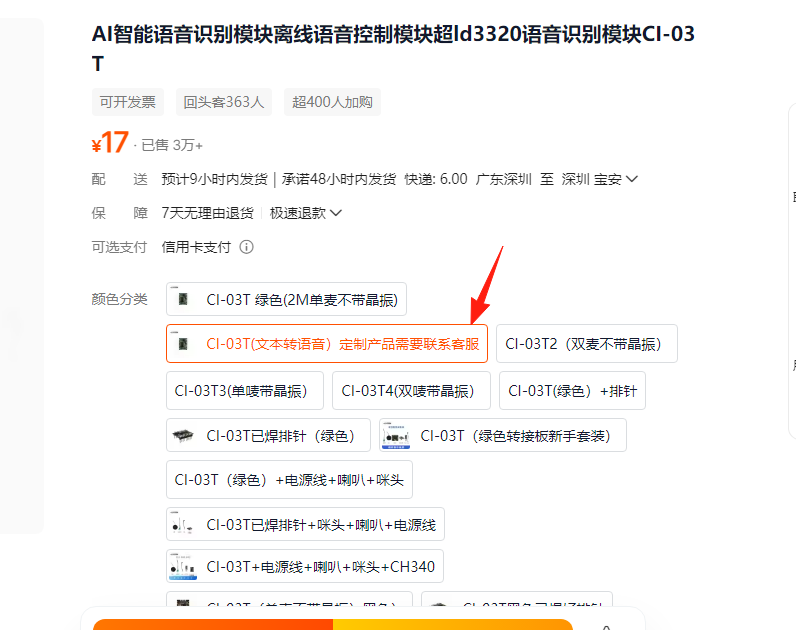

---

### CI-03T是否支持离线语音和自学习功能？

**问题描述：**

需要确认CI-03T模块是否为离线语音模块，以及是否支持用户自学习录音功能，以满足不联网场景下的应用需求。

**解决方案：**

**1. 模块类型确认**

- CI-03T是**离线语音模块**
- 无需联网即可正常工作
- 适合网络受限或需要本地处理的场景

**2. 自学习功能支持**

- CI-03T支持自学习功能
- 用户可以为每个控制指令录制自己的语音
- 支持录制带地方口音的普通话
- 自学习功能允许用户现场录音并存储到模块

**3. 功能特点对比**

| 功能 | 支持情况 | 说明 |
|------|----------|------|
| 离线识别 | ✓ 支持 | 无需联网，本地处理 |
| 自学习 | ✓ 支持 | 用户可录制自定义命令 |
| 方言适配 | ✓ 支持 | 通过自学习适配方言 |

**注意事项：**

- 自学习功能需要在安静环境下进行
- 建议每个命令词录制2-3次提高成功率
- CI-03T1和CI-03T2均支持自学习功能
- 可先购买样品进行功能验证


---

### CI-03T使用的是什么芯片？

**问题描述：**

需要确认CI-03T系列模块使用的主控芯片型号，以便了解硬件架构和技术规格。

**解决方案：**

CI-03T系列模块使用的主控芯片是CI1302。

**芯片技术资料：**

1. **模块参数对比**
    - 访问链接：https://help.aimachip.com/docs/module_parameters
    - 包含各型号模块的详细参数对比

2. **芯片详细规格**
    - 访问链接：https://help.aimachip.com/docs/chip/chip-1eec6hndetl5k
    - 包含CI1302芯片的完整技术文档

**注意事项：**

- CI1302是专用的语音识别芯片
- 所有CI-03T系列模块（包括CI-03T1、CI-03T2）均使用CI1302芯片
- 获取最新的技术资料请访问官方文档

---

### CI-03T模组和CI1302芯片的价格是多少？

**问题描述：**

需要了解CI-03T完整模组和单独CI1302芯片的价格，以便根据项目需求选择合适的形式。

**解决方案：**

**产品形态和价格：**

- **CI-03T完整模组**：7.9元/个
    - 包含CI1302芯片、喇叭及其他外围器件
    - 即买即用，无需额外硬件设计
    - 适合快速原型开发和小批量应用

- **CI1302芯片**：5.8元/个
    - 仅提供主控芯片
    - 需要自行设计外围电路
    - 适合大批量生产，可有效控制成本

**选型建议：**

1. **选择CI-03T模组的场景**：

    - 开发验证阶段
    - 小批量生产（<1000pcs）
    - 需要快速上市的产品
    - 缺乏硬件设计资源

2. **选择CI1302芯片的场景**：

    - 大批量生产（>1000pcs）
    - 有定制化硬件需求
    - 需要优化产品尺寸
    - 具备硬件设计能力

**注意事项：**

- CI1302是CI-03T模组的核心主控芯片
- 两者功能完全相同，差异仅在于产品形态
- 选择芯片形式需要考虑设计周期和NRE成本
- 价格可能随采购量和市场波动调整

---

### CI-03T系列T2、T3、T4型号有什么区别？

**问题描述：**

需要了解CI-03T系列模块中T2、T3、T4等不同型号的区别，以便选择正确的型号进行开发。

**解决方案：**

**型号说明：**

目前市面上销售的CI-03T系列模块中，T2、T3、T4等后缀主要表示不同的生产批次或版本号，在**功能上没有差异**。

**关键点：**

1. **功能完全相同**
    - 所有CI-03T系列型号（包括CI-03T2、CI-03T3、CI-03T4）功能完全一致
    - 都使用CI1302主控芯片
    - 支持300条词条、双麦克风、自学习功能

2. **购买建议**
    - 选择当前有库存的型号即可
    - 不用过分纠结型号后缀的数字差异
    - 确认是CI-03T系列就可以

3. **开发兼容性**
    - 固件完全兼容，无需区分型号后缀
    - 开发工具和配置方法相同
    - 可以互换使用

**注意事项：**

- 购买时认准CI-03T系列即可，具体看哪个型号有现货
- 如遇到特殊后缀型号，可咨询客服确认功能差异
- 开发时按照CI-03T标准文档进行即可

**补充说明：**

- T2/T3/T4主要用于区分不同的SKU，功能与性能一致
- 选型时重点关注是否带晶振和麦克风数量：

    - 需要鼾声/哭声检测：选择带晶振版本（CI-03T3/CI-03T4）
    - 普通语音识别：带或不带晶振均可
    - 单麦：CI-03T1/CI-03T3；双麦：CI-03T2/CI-03T4（支持降噪和声源定位）
- 后缀数字不影响固件和功能选择，更多是库存管理标识

---

### 新版本的CI-03T1和CI-03T2型号与旧版相比有哪些不同？

**问题描述：**

需要了解新版本CI-03T1和CI-03T2与旧版本之间的差异，以及固件兼容性问题。

**解决方案：**

**版本差异说明：**

新版本的CI-03T1和CI-03T2与旧版在**产品功能上完全相同**，没有功能差异。

**固件兼容性：**

- 如果固件是在2024年11月份之前生成的，可以直接继承升级并重新生成
- 重新生成后的固件可以直接用于新版本模块
- 无需修改原有功能配置和代码

**注意事项：**

- 硬件兼容性良好，可直接替换旧版本模块
- 开发工具和配置方式保持不变
- 建议在批量使用前进行小批量测试验证

---

### CI1302和CI1303芯片的主要区别是什么？如何选择？

**问题描述：**

需要了解CI1302和CI1303芯片之间的差异，特别是在需要支持语音指令播放和背景音乐功能时的选型考虑。

**解决方案：**

**主要区别：**

CI1302和CI1303在功能上完全相同，唯一的区别是**内置Flash容量**：

- **CI1302**：2M字节 Flash
- **CI1303**：4M字节 Flash

**选型建议：**

1. **选择CI1302的场景**：

    - 只需要语音识别功能
    - 不需要存储音频文件
    - 成本敏感的项目

2. **选择CI1303的场景**：

    - 需要播放背景音乐
    - 需要存储大量音频提示音
    - 音乐文件较大，2M Flash不足够

**注意事项：**

- 两个芯片的封装完全相同，硬件设计兼容
- 开发费用相同，差异仅在芯片采购成本
- 可根据最终的音乐文件大小确定选型

---

### CI-03T的日志输出波特率是多少？

**问题描述：**

需要了解CI-03T模块的日志输出波特率，以便正确配置串口调试工具。

**解决方案：**

- CI-03T的日志输出波特率为**921600**（与烧录波特率相同）
- 调试时请将串口工具设置为921600
- 常用调试工具：Windows（SSCOM、串口助手）、Linux（minicom）、跨平台（PuTTY）

**注意事项：**

- 确保USB转串口驱动正确安装
- 核实串口号与波特率配置，避免乱码

---

### CI-03T支持CAN总线通信吗？

**问题描述：**

在车载等需要CAN总线的场景中使用CI-03T，询问是否支持CAN通信。

**解决方案：**

- CI-03T**不支持**直接的CAN总线通信（芯片外设无CAN控制器）
- 模块串口为TTL电平，如需接入CAN需外部转换

**CAN通信方案：**

1. **硬件转换**：TTL转RS485，再由RS485转CAN；或使用TTL转CAN转换模块
2. **软件配置**：在平台配置串口输出协议，并按照CAN格式封装数据

**注意事项：**

- 需要额外硬件转换电路，评估成本与实时性

---

### CI-03T支持免唤醒词功能吗？

**问题描述：**

需要确认CI-03T是否支持免唤醒词功能及配置方式。

**解决方案：**

- CI-03T全系列支持免唤醒词
- 配置路径：智能公元平台 → 词条设置 → 选择“免唤醒词”，可直接触发命令

**数量参考：**

- SU-03T：最多约10个免唤醒词
- CI-73T2：支持约20个免唤醒词
- 免唤醒词越多，误触发概率越高

**注意事项：**

- 建议设置3-5个常用命令，避免发音相似词
- 仅在设备唤醒状态下生效

---

### 便携设备应用如何选择低功耗型号？

**问题描述：**

便携设备上使用语音模块，关注功耗问题。

**解决方案：**

- **CI-1302**：针对低功耗应用设计，适合电池供电场景，可支持鼾声检测
- **对比**：CI-03T功耗相对较大，CI-1302功耗优化更适合便携设备

**适用场景：**

- 便携枕头、手持/可穿戴设备、电池供电产品

**注意事项：**

- 根据功耗预算选择型号，平衡功能需求与续航

---

### SU-63T的固件大小限制是多少？

**问题描述：**

使用SU-63T模块时，983KB固件无法烧录成功，想了解大小限制。

**解决方案：**

- SU-63T固件大小上限约1MB，建议控制在900KB以内

**优化建议：**

- 减少命令词数量
- 压缩/减少提示音资源
- 如需更大空间可考虑CI-73T等型号

**注意事项：**

- 预留空间余量，保留源文件便于维护

---

### CI-33T双语模式下词条数量支持是多少？

**问题描述：**

需要了解CI-33T在双语模式下的词条数量限制。

**解决方案：**

| 模式 | CI-33T | CI-03T |
|------|--------|--------|
| 单语言 | 500条 | 300条 |
| 双语言（每种语言） | 约100条 | — |
| 双语言（总计） | 约200条 | — |

**补充说明：**

- 双语需要定制固件，可能有额外费用
- 小语种（如泰语）建议训练模型以提升效果
- 词条越多识别率越低，规划好两种语言的词条分配

**注意事项：**

- 双语占用Flash较多，识别效果相对单语会下降

---

### CI-03T越南语支持与选型补充

**问题描述：**

需要了解CI-03T对越南语的识别效果及相关选型建议。

**解决方案：**

- 实际项目反馈：CI-03T越南语识别效果良好，可用于越南语语音控制
- 支持多语言（含小语种），小语种可能需要定制开发
- 建议提供越南语命令词和播报内容清单以便定制

**选型建议：**

- **小语种多功能方案**：CI-03T（支持自学习、声纹等高级特性）
- **低成本方案**：CI-73T（性价比高，支持基础小语种功能）

**选型对比表：**

| 特性 | CI-03T | CI-73T | 选型建议 |
|------|--------|--------|----------|
| 小语种支持 | ✓ 优秀 | ✓ 支持 | 两者均支持 |
| 功能丰富度 | 高 | 基础 | 复杂功能选CI-03T |
| 成本 | 中等 | 低 | 成本敏感选CI-73T |
| 高级功能 | 支持 | 部分支持 | 需要高级功能选CI-03T |

**固件预烧录服务：**

- 厂商可在发货前预烧录定制固件
- 流程：

    1. 在智能公元平台生成或定制固件
    2. 购买时联系客服说明需要预烧录
    3. 确认固件版本和功能
    4. 厂商批量烧录后出货
    5. 收到后可直接使用

**注意事项：**

- 建议先小批量测试固件
- 保留固件源文件，后续调整需自行重新烧录

---

### CI-03T1和CI-03T2是否支持蓝牙功能？

**问题描述：**

询问CI-03T1和CI-03T2芯片是否支持低功耗蓝牙，以及能否连接微信小程序。

**解决方案：**

**蓝牙支持情况：**

CI-03T1和CI-03T2**不支持蓝牙功能**，这些模块是纯离线语音识别模组。

**技术说明：**

- CI-03T系列专注于本地语音识别，没有内置蓝牙芯片
- 不支持低功耗蓝牙(BLE)
- 无法直接连接微信小程序或手机APP

**需要蓝牙功能的替代方案：**

如果项目需要蓝牙功能，可以选择：

1. **SU-63T模块**
    - 内置蓝牙功能
    - 支持与手机等设备通信

2. **外接蓝牙模块**
    - CI-03T + 外置蓝牙模块的组合方案
    - 通过串口连接，实现与手机通信

**选型建议：**

- 仅需要语音控制 → CI-03T系列即可
- 需要语音+蓝牙 → SU-63T或其他带蓝牙的模块
- 需要连接微信小程序 → 选择支持蓝牙的模块方案

---

### 是否可以定制开发支持25个中文语音指令和背景音乐播放的固件？

**问题描述：**

需要基于CI1302/CI1303芯片开发定制固件，支持25个中文语音指令识别，通过串口与单片机通信，并支持背景音乐播放功能。

**解决方案：**

**支持的功能：**

1. **语音指令识别**
    - 支持25个自定义中文语音指令
    - 通过串口发送对应的指令码到单片机
    - 支持串口通信协议自定义

2. **背景音乐播放**
    - 支持多首轻音乐文件存储
    - 可通过语音指令控制音乐播放
    - 音质适中，满足背景音乐需求

3. **开发方案**
    - 提供两种开发服务选项：

        - 1千元开发费（不退还）
        - 3千元开发费（达到4万采购量后全额返还）

**开发流程：**

1. 提供详细的指令映射表（语音词条-指令码-功能对应关系）

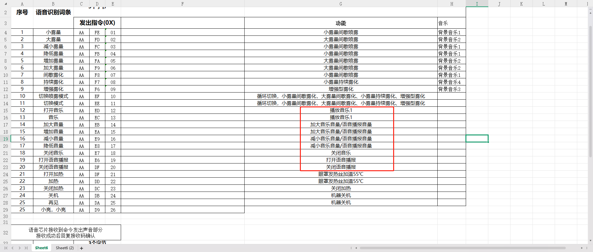

2. 确认音乐文件数量和大小
3. 根据音乐文件大小选择CI1302或CI1303
4. 硬件设计完成后进行固件开发
5. 提供最多3次主动调整和6次问题调整

**注意事项：**

- 需要提供完整的指令映射表用于固件开发
- 音乐文件大小直接影响芯片选型（CI1302或CI1303）
- 串口通信协议需要提前定义
- 开发周期需根据具体需求复杂度确定

---

### CI-03T模块支持多少条语音指令？主要技术参数是什么？

**问题描述：**

需要了解CI-03T模块支持的语音指令数量、存储容量以及主要技术特性。

**解决方案：**

**CI-03T主要技术参数：**

- **语音指令支持**：300条语音指令
- **内置Flash容量**：2M字节
- **语言支持**：支持中英文语音指令
- **高级功能**：支持语音打断（Barge-in）
- **识别性能**：综合唤醒率95%

**功能特性说明：**

1. **300条指令容量**
    - 支持最多300条自定义语音指令
    - 适合大多数智能控制场景
    - 可灵活配置各类命令词

2. **2M Flash存储**
    - 存储语音模型和指令数据
    - 支持离线识别，无需联网
    - 固件升级空间充足

3. **中英文支持**
    - 同时支持中文和英文指令
    - 可混合使用多语言命令
    - 适应国际化应用需求

4. **语音打断功能**
    - 支持在播报语音时打断
    - 提高交互响应速度
    - 改善用户体验

5. **95%唤醒率**
    - 在正常环境下达到95%识别率
    - 优化麦克风布置可进一步提升
    - 适合大多数应用场景

**注意事项：**

- CI-03T基于CI1302主控芯片

---

### CI-03T1和CI-03T2哪个更适合音箱控制？

**问题描述：**

需要了解CI-03T1和CI-03T2两款离线语音识别芯片的差异，以便选择更适合音箱控制应用的型号。

**解决方案：**

**主要差异对比：**

| 特性 | CI-03T1 | CI-03T2 |
|------|----------|----------|
| 麦克风配置 | 单麦克风 | 双麦克风 |
| 适用环境 | 安静环境 | 嘈杂环境 |
| 降噪算法 | 基础降噪 | 深度降噪 |
| 唤醒打断 | 支持 | 支持 |
| 成本 | 较低 | 略高 |

**选型建议：**

**选择CI-03T1的场景：**

- 成本敏感的应用
- 使用环境相对安静
- 对成本要求严格
- 基础语音控制需求

**选择CI-03T2的场景：**

- 环境噪声较大
- 需要更好的识别效果
- 对性能要求较高
- 专业级音箱产品

**技术参数对比：**

- 识别距离：单麦3米，双麦5米
- 识别率：安静环境下相当，嘈杂环境下双麦优势明显
- 功耗：双麦版本略高
- 尺寸：基本一致

**注意事项：**

- 两者指令数量和Flash容量相同
- 开发接口和开发工具完全兼容
- 可根据实际需求和预算选择
- 建议先进行样品测试


---
- 单麦克风设计，适合近距离交互
- 若需要更多指令，可考虑CI-33T（500条）
- 确保麦克风布置合理以达到最佳识别效果

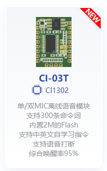

*CI-03T离线语音模块技术参数*

---

### CI-03T1/CI-03T2是否可以控制小车电机？

### CI-03T1/CI-03T2是否可以控制小车电机？
**问题描述：**

需要确认CI-03T1或CI-03T2芯片能否实现对小车电机的控制，以及多功能板是否支持该功能。

**解决方案：**

CI-03T1/CI-03T2可以通过多种方式控制小车电机：

- **直接控制能力**：

    - CI-03T1/CI-03T2芯片本身不能直接驱动电机
    - IO口输出电流有限（通常10-20mA）
    - 需要配合外部驱动电路

- **控制方案选择**：

    1. **使用电机驱动模块**
        - 直流电机：L298N、TB6612FNG等H桥驱动
        - 步进电机：A4988、DRV8825等驱动器
        - 舵机：可直接控制（需外接电源）

    2. **多功能板方案**
        - 集成电机驱动电路的扩展板
        - 简化连接，即插即用
        - 适合快速开发和验证

- **实现方式**：

    1. CI-03T通过IO输出PWM信号控制电机转速
    2. 通过高低电平控制电机正反转
    3. 配合编码器实现速度和位置反馈
    4. 使用语音命令触发不同运动模式

- **语音控制逻辑**：

    - "前进"：两个电机正转
    - "后退"：两个电机反转
    - "左转"：左电机停/右电机正转
    - "右转"：右电机停/左电机正转

**注意事项：**

- 电机电源独立供电，不要使用CI-03T的电源
- 大功率电机需加散热和过流保护
- 建议使用光电耦合器隔离控制信号
- 多功能板选型时确认驱动功率匹配电机需求

### CI-03T和CI-33T是否支持哭声检测、鼾声检测和文字转语音功能？

**问题描述：**

需要确认CI-03T和CI-33T型号是否支持哭声检测、鼾声检测以及文字转语音（TTS）功能。

**解决方案：**

**功能支持确认：**

1. **支持的型号**：

    - CI-03T：支持哭声检测、鼾声检测和TTS功能
    - CI-33T：支持哭声检测、鼾声检测和TTS功能
    - 需要使用特定的模块型号才能实现这些功能

2. **功能说明**：

    - **哭声检测**：识别婴儿哭声特征
    - 适用于智能监护场景
    - 可触发特定报警或通知

3. **鼾声检测**：

    - 识别睡眠鼾声模式
    - 用于睡眠质量监测
    - 可记录鼾声数据和统计

4. **文字转语音（TTS）**：

    - 支持将文本转换为语音播报
    - 可自定义播报内容和发音人
    - 支持多种语言和音色

**技术限制：**

- 这些是CI-03T的内置算法功能
- 不需要外部传感器或额外硬件
- 通过平台配置即可启用相应功能
- 功能启用会占用额外的Flash空间

**配置方法：**

1. **平台配置**：

    - 在智能公元平台选择CI-03T或CI-33T型号
    - 在高级功能选项中启用相应功能
    - 根据应用场景配置检测参数

2. **功能组合**：

    - 可单独启用某项检测功能
    - 支持多项功能同时使用
    - 根据实际需求灵活配置

**注意事项：**

- 这些功能仅限CI-03T和CI-33T等支持的高级型号
- 配置完成后需要重新生成并烧录固件
- 建议在项目规划阶段确认所需功能
- 功能使用时需要测试验证效果是否符合预期

---


---

### CI-03T与CI-33T产品在功能和性能上有什么区别？

**问题描述：**

需要了解CI-03T与CI-33T两款产品在功能和性能上的具体差异，以便根据项目需求选择合适的型号。

**解决方案：**

**主要差异对比：**

1. **内存容量差异**：

    - **CI-03T**：支持300条词条，2M Flash
    - **CI-33T**：支持500条词条，4M Flash

2. **功能支持差异**：

    - 两者的基础功能相同
    - 某些高级功能在配置上可能存在差异
    - CI-33T由于Flash更大，可支持更复杂的功能配置

3. **性能表现**：

    - 两者的综合识别率基本相同（95%）
    - 在相同条件下识别性能无显著差异
    - CI-33T适合需要更多词条的应用场景

4. **价格信息**：

    - **CI-03T**：单价7.9元/个（100个采购量）
    - **CI-33T**：价格略高于CI-03T，具体需根据采购量确定
    - 批量采购价格可申请优惠

5. **引脚兼容性**：

    - 两种型号封装完全相同，硬件兼容
    - CI-03T的引脚可以复用，需要看平台配置
    - 可在同一PCB设计上互相替换

**选型建议：**

- **命令词需求≤300条**：选择CI-03T，成本更优
- **命令词需求>300条**：必须选择CI-33T
- **需要复杂功能配置**：优先选择CI-33T，预留更多扩展空间
- **引脚复用需求**：确认平台配置支持相应功能


**注意事项：**

- 两种型号封装完全相同，硬件兼容
- 固件不通用，必须严格区分型号
- CI-33T的成本略高于CI-03T
- 选型时应考虑未来功能扩展需求
- 命令词超过限制会影响识别效果

---


---

### CI-03T支持混合语言识别吗？

**问题描述：**

需要确认CI-03T是否支持混合语言识别，例如同时识别中英文命令词。

**解决方案：**

CI-03T支持混合语言识别功能。

**功能说明：**

1. **多语言模型**：

    - 支持在同一固件中配置多种语言
    - 可设置中英文混合命令词
    - 识别引擎能够区分不同语言

2. **配置方式**：

    - 在智能公元平台配置时选择多语言选项
    - 分别添加不同语言的命令词
    - 唤醒词也可设置为多语言

3. **技术实现**：

    - 内置多语言识别模型
    - 无需外部模块切换
    - 实时语言识别和切换

**配置建议：**

1. **语言选择**：

    - 根据目标市场选择所需语言
    - 常见组合：中英混合、中日韩等

2. **命令词设计**：

    - 不同语言的命令词应发音差异明显
    - 避免使用发音相似的词汇
    - 测试各种语言环境下的识别效果

3. **性能优化**：

    - 混合模式可能略微降低单一语言的识别率
    - 建议在安静环境下测试
    - 调整各语言的识别阈值

**注意事项：**

- 混合语言功能会占用更多Flash资源
- 建议在项目规划阶段评估内存需求
- 测试时覆盖所有预期的使用场景

---

### CI-03T在海外市场的多语言识别效果如何？

**问题描述：**

为康复类产品选型离线语音识别模块，产品主要面向海外市场，需要支持自学习和多语言识别功能，担心非英语语言的识别率问题。

**解决方案：**

CI-03T支持多语言识别功能，适合海外市场应用：

**1. 多语言支持能力**

- 支持中英文混合识别
- 可通过平台配置其他语言包
- 自学习功能可适配不同口音和方言

**2. 针对海外市场的建议**

- 使用翻译软件辅助配置命令词
- 聘请当地语言人员协助测试
- 针对目标市场语言进行专项优化

**3. 康复产品应用方案**

- 支持10个功能，每个功能可对应多个命令词
- 如"Level to 1"、"level 1"、"level to minimum"都可对应同一功能
- 识别后通过UART输出控制信号

**注意事项：**

- 非英语语言的识别率可能受限于平台语言包支持情况
- 建议在产品定型前进行充分的语言测试
- 自学习功能有助于提升特定口音的识别效果

---


---

### CI-03T系列芯片购买渠道

**问题描述：**

需要了解如何在嘉立创平台（立创商城/立创EDA）上找到并购买CI-03T系列语音识别芯片，以及其他可行的购买渠道。

**解决方案：**

**官方购买渠道：**

1. **淘宝官方店铺**：

    - 店铺名：深圳市机芯智能有限公司
    - 搜索方式：淘宝搜索"智能公元"
    - 优势：官方直售，品质有保障
    - 小批量采购：可直接在淘宝拍下，适合100个以内的采购需求
    - 淘宝链接示例：https://item.taobao.com/item.htm?id=697462463035

2. **技术支持渠道**：

    - 可通过技术支持团队获取购买信息
    - 提供详细的产品型号和应用需求
    - 获得专业的选型建议

**立创平台购买：**

1. **立创商城搜索**：

    - 搜索关键词：CI03T 或 ci03t（不区分大小写）
    - 注意选择正确型号：CI-03T 直插
    - 已确认在立创商城有售

2. **立创EDA使用**：

    - 在复用模块中搜索"语音识别"
    - 可参考其他语音芯片的设计
    - CI-03T的封装和原理图可参考使用

**购买建议：**

1. **批量采购**：

    - 建议直接联系官方渠道
    - 可获得更优惠的价格
    - 确保货源稳定和品质一致

2. **样品测试**：

    - 小批量采购先行测试
    - 验证功能符合项目需求
    - 确认封装与PCB设计匹配

3. **技术支持**：

    - 购买前可咨询技术支持
    - 确认型号选择的合适性
    - 获取相关的技术资料

**注意事项：**

- 立创商城搜索时尝试不同关键词组合
- 购买时确认芯片型号和封装版本
- 批量采购建议提前联系供应商确认交期
- 保留采购记录便于后续质量追溯

---


---

### CI-03T和CI-03T1的尺寸和管脚兼容性

**问题描述：**

需要确认CI-03T和CI-03T1芯片的尺寸和管脚布局是否相同，是否可以互换使用。

**解决方案：**

**完全兼容确认：**

CI-03T和CI-03T1在硬件上完全兼容：

1. **封装尺寸**：

    - 两种型号封装完全相同
    - PCB设计无需任何修改
    - 引脚布局保持一致

2. **管脚定义**：

    - 所有引脚功能定义相同
    - 电气特性完全一致
    - 可以直接替换使用

**主要区别：**

1. **Flash芯片差异**：

    - CI-03T：使用旧版本Flash芯片
    - CI-03T1：使用新版本Flash芯片（容量相同）
    - 不影响功能和使用

2. **固件兼容性**：

    - 新固件（2024年10月25日后生成）：同时兼容两种型号
    - 旧固件：仅支持CI-03T，不支持CI-03T1
    - 建议统一使用新版本固件

**使用建议：**

1. **新设计项目**：

    - 可直接使用CI-03T1
    - PCB设计无需考虑兼容性
    - 建议基于新版本开发

2. **现有产品升级**：

    - CI-03T可直接替换为CI-03T1
    - 无需修改PCB或硬件
    - 需更新为新版本固件

3. **批量采购注意**：

    - 两种型号可能混合发货
    - 建议统一升级为新固件
    - 保留型号记录便于追溯

**注意事项：**

- 两种型号在功能和性能上无差异
- 焊接工艺和参数完全相同
- 如使用旧固件，务必确认芯片型号
- 推荐新项目直接使用CI-03T1

---


---

### CI-03T2和CI-03T4模块上的丝印为什么是CI-03T1？

**问题描述：**

购买CI-03T2和CI-03T4模块后，发现电路板上的丝印都是CI-03T1，对模块型号和价格差异产生疑问。

**解决方案：**

**丝印统一说明：**

- **生产批次统一**：CI-03T1、CI-03T2、CI-03T4使用相同的生产批次和丝印
- **硬件版本**：所有型号使用相同版本的硬件板，丝印统一为CI-03T1
- **功能差异**：不同型号的差异主要体现在固件和功能配置上

**型号区别说明：**

1. **CI-03T1**：基础版本，单麦克风
2. **CI-03T2**：双麦克风版本，支持降噪算法
3. **CI-03T4**：特定功能版本（具体功能需参考规格书）

**价格差异原因：**

- 固件授权费用不同
- 功能配置差异
- 软件算法支持不同

**注意事项：**

- 丝印不影响实际功能，以购买的型号为准
- 如需确认型号，可通过烧录对应固件验证功能

---

### CI-03T1和CI-03T2的具体差异是什么？

**问题描述：**

需要了解CI-03T1和CI-03T2两款芯片在功能和引脚配置上的具体差异。

**解决方案：**

**主要差异对比：**

1. **麦克风配置**：

    - **CI-03T1**：单麦克风版本
    - **CI-03T2**：双麦克风版本

2. **功能支持差异**：

    - **CI-03T1**：支持AEC（声学回声消除），支持打断功能
    - **CI-03T2**：不支持AEC，但支持双麦阵列降噪算法

3. **引脚功能差异**：

    部分引脚功能在两个型号间存在"阉割"差异：

    - CI-03T2的某些引脚功能可能受限
    - 具体差异需要参考对应的引脚定义文档

4. **适用场景**：

    - **CI-03T1**：适合需要AEC功能的场景，如播放音乐时需要语音打断
    - **CI-03T2**：适合高噪声环境，双麦克风提供更好的降噪效果

**功耗特性**：

- 两个型号的功耗基本相当，约为0.34W（实测数据）
- 待机电流和工作电流无明显差异

**选型建议：**

- 需要语音打断功能：选择CI-03T1
- 需要强降噪能力：选择CI-03T2
- 根据产品实际需求选择合适版本

---


---

### CI-03T系列是否支持自定义唤醒词和命令词？

**问题描述：**

需要确认CI-03T系列芯片是否支持用户自定义更改唤醒词和命令词。

**解决方案：**

**功能支持确认：**

CI-03T和CI-33T都支持用户自定义更改唤醒词和命令词。

**支持功能：**

1. **唤醒词自定义**：

    - 用户可以设置任意唤醒词
    - 不受默认唤醒词限制
    - 支持中英文唤醒词
    - 可根据产品需求定制

2. **命令词自定义**：

    - 支持修改所有命令词
    - 可设置产品相关的专属命令
    - 命令词数量满足模块规格限制
    - 支持多语言命令词配置

**配置方法：**

1. **平台配置**：

    - 在智能公元平台创建产品时配置
    - 在唤醒词设置中输入自定义唤醒词
    - 在命令词编辑器中添加或修改命令
    - 生成固件时包含自定义配置

2. **配置建议**：

    - 唤醒词选择发音清晰、不易误触发的词汇
    - 避免与日常对话用语相似的词汇
    - 命令词应简短明确，便于识别
    - 测试不同环境下的识别效果

**技术限制：**

- 自定义配置需要在生成固件时设定
- 烧录后无法直接修改，需重新生成固件
- 唤醒词和命令词的总数量受模块规格限制
- 建议预留足够的Flash空间

**注意事项：**

- 配置前先测试唤醒词和命令词的识别率
- 保留自定义词汇列表便于后续维护
- 批量生产前充分验证自定义配置
- 如需修改配置，需重新生成并烧录固件

---


---

### 小家电产品如何选型语音识别芯片？

**问题描述：**

小家电产品需要选型支持中英文唤醒词自定义、离线语音指令控制、可自行生成固件词条的语音识别芯片。

**解决方案：**

CI-03T是适合小家电应用的离线语音识别芯片，完全满足相关需求。

**功能支持：**

1. **唤醒词自定义**：

    - 支持中文唤醒词自定义
    - 支持英文唤醒词自定义（中英文可分开配置）
    - 适合有出口需求的产品
    - 可根据产品品牌定制专属唤醒词

2. **离线语音控制**：

    - 完全离线运行，无需联网
    - 本地语音识别，响应速度快
    - 适合家庭环境使用
    - 保护用户隐私安全

3. **自定义词条生成**：

    - 可在智能公元平台自行生成固件
    - 支持自定义命令词条
    - 灵活配置语音控制指令
    - 支持最多300条词条

**选型优势：**

- **成本效益**：模组价格7.9元，适合大批量应用
- **易于集成**：提供完整模组，无需复杂硬件设计
- **快速开发**：平台化工具，简化开发流程
- **稳定可靠**：专用语音芯片，识别率高

**注意事项：**

- 中英文唤醒词需要分别配置，不能混合使用
- 自定义词条需要在生成固件时设定
- 建议先购买样品进行功能验证
- 量产前需充分测试各种使用场景

---

### CI-03T系列是否支持ADC功能？

**问题描述：**

需要确认CI-03T系列芯片是否支持ADC功能，以及如何使用ADC进行模拟信号采集。

**解决方案：**

CI-03T系列模块不支持ADC功能，如需ADC功能应选择其他型号：

**各型号ADC支持情况：**

1. **CI-03T系列**：

    - 不支持ADC功能
    - 无法进行模拟信号采集
    - 如需ADC需外接ADC芯片

2. **SU-03T**：

    - 支持1路12位SAR ADC
    - 最高采样率：450kHz
    - 输入电压范围：0-3.3V
    - 适合需要模拟信号采集的应用

3. **SU-20T/21T/22T/23T**：

    - 支持ADC功能
    - 具体参数参考对应型号规格书
    - 适合低功耗应用场景

**CI-03T的替代方案：**

1. **外部ADC芯片方案**：

    - 使用PCF8591（8位4路ADC）或ADS1115（16位4路ADC）
    - 通过I2C接口与CI-03T通信
    - 可实现多路模拟信号采集

2. **选择支持ADC的模块**：

    - SU-03T：基础语音识别+ADC功能
    - SU-32T：高性能双麦+ADC功能
    - 根据项目需求选择合适型号

**选型建议：**

- 必须使用ADC功能：选择SU系列模块
- CI-03T+外接ADC：适合需要复杂处理的应用
- 极低功耗需求：选择SU-2x系列
- 如仅需数字控制：CI-03T仍可作为选择

---

### CI-03T1/CI-03T2是否支持AI语音识别和串口输出？

**问题描述：**

需要了解CI-03T1或CI-03T2芯片能否实现AI语音识别，并通过串口输出识别指令。

**解决方案：**

**功能支持确认：**

CI-03T1/CI-03T2支持AI语音识别和串口输出功能：

1. **AI语音识别能力**：

    - 支持离线语音识别算法
    - 可识别预设的命令词
    - 支持唤醒词+命令词的组合模式
    - 识别响应时间快（<500ms）

2. **串口输出功能**：

    - 识别结果通过串口输出命令ID
    - 支持多种串口通信协议
    - 可输出识别置信度等信息
    - 便于与外部MCU通信

3. **实现方式**：

    ```
    语音输入 → 识别处理 → 串口输出命令ID → 外部设备执行
    ```

**技术特性：**

1. **识别性能**：

    - 识别率：>95%（安静环境）
    - 支持中英文混合识别
    - 噪声抑制能力良好
    - 误唤醒率：<1次/24小时

2. **通信协议**：

    - 默认波特率：9600bps
    - 数据格式：16进制命令ID
    - 支持自定义通信协议
    - 可配置输出格式

**应用配置：**

1. **平台配置**：

    - 登录智能公元平台
    - 选择CI-03T1或CI-03T2型号
    - 配置唤醒词和命令词列表
    - 设置串口输出选项

2. **命令词设计**：

    - 每个命令词对应一个唯一ID
    - ID范围：0x00-0xFF
    - 可通过串口输出ID触发动作
    - 支持命令词分组管理

3. **硬件连接**：

    - B6/B7：串口通信引脚
    - 3.3V/5V：电源输入
    - GND：电源地
    - MIC+/MIC-：麦克风输入

**开发示例：**

1. **基础配置**：

    ```
    唤醒词："你好小美" → 0xAA
    命令词："打开灯光" → 0x01
    命令词："关闭灯光" → 0x02
    命令词："播放音乐" → 0x03
    ```

2. **串口输出格式**：

    ```
    识别成功：[0xAA 0x55 0x01 0x01 0x00 0x01]
    命令ID：0x01（打开灯光）
    ```

3. **外部处理**：

    - MCU接收串口数据
    - 解析命令ID
    - 执行对应控制动作
    - 返回执行状态

**注意事项：**

- 需要先烧录配置好的固件
- 串口通信需注意电平匹配
- 命令词发音需清晰标准
- 建议预留通信协议扩展空间

---

### 如何识别CI系列离线语音模块的型号？

**问题描述：**

需要根据设备外观识别具体的CI系列模块型号，了解其功能和特点。

**解决方案：**

**CI系列模块识别要点：**

1. **外观特征识别**：

    - **绿色PCB**：CI系列模块的标准颜色
    - **芯片标识**：查看主芯片表面的型号标识
    - **Flash芯片**：可辅助判断存储容量

2. **功能特点对比**：

    | 型号 | 词条容量 | 麦克风 | 主要特点 |
    |------|----------|--------|----------|
    | CI-03T | 300条 | 单麦克风 | 基础型号，性价比高 |
    | CI-33T | 500条 | 单麦克风 | 大容量版本 |
    | CI-73T | 300条 | 双麦克风 | 降噪版本 |
    | CI-95C | 待确认 | 待确认 | 特殊功能版本 |
    | CI-96Z | 待确认 | 待确认 | 新型号 |

3. **接口识别**：

    - **串口接口**：B0/B1或B6/B7（可用于调试）
    - **GPIO接口**：通常有多个可编程IO
    - **音频接口**：MIC+/-、SPK+/-标准接口
    - **供电接口**：3.3V-5V宽电压输入

**应用场景建议：**

1. **基础语音控制**：

    - 选择CI-03T，满足基本需求
    - 成本最低，开发简单
    - 适合玩具、简单控制器

2. **大词条需求**：

    - 选择CI-33T，支持更多命令
    - 复杂语音识别应用
    - 智能家居、多命令设备

3. **嘈杂环境**：

    - 选择CI-73T，双麦克风降噪
    - 工业环境、户外应用
    - 提高识别准确率

**技术支持资源：**

1. **官方文档**：

    - 各型号都有专属文档页面
    - 提供详细规格书和应用笔记
    - 包含原理图和PCB设计文件

2. **开发工具**：

    - 智能公元平台在线配置
    - 官方SDK开发包
    - 社区开源项目和教程

**识别技巧：**

1. **查看丝印标识**：

    - 模块PCB上通常有型号丝印
    - 芯片表面有激光打标
    - 包装标签有完整型号信息

2. **功能测试验证**：

    - 通过默认固件测试基础功能
    - 检查可配置的GPIO数量
    - 验证语音识别效果

3. **对比官方资料**：

    - 对照对比官方产品图
    - 测量关键尺寸和接口
    - 确认与标准规格一致

**注意事项：**

- CI系列模块引脚兼容，可互相替换
- 选型时考虑未来功能扩展需求
- 不同批次可能有细微差异，以官方资料为准
- 如不确定型号，可联系技术支持确认

---

### EU-03T1标识的模块是否为CI-03T1？

**问题描述：**

收到的模块上印有"EU-03T1"标识，不确定是否为公司产品CI-03T1，且上电后无语音播报。

**解决方案：**

**型号确认：**

1. **标识说明**：

    - "EU-03T1"不是标准的产品型号标识
    - 正确的CI-03T1模块应标注"CI-03T1"
    - 可能存在批次差异或特殊标记

2. **外观比对**：

    - 绿色PCB基底符合CI系列特征
    - 芯片丝印应包含CI1302等标识
    - 引脚布局应与标准CI-03T1一致

**上电无语音播报排查：**

1. **基础检查**：

    - 确认供电电压是否为3.3V-5V
    - 检查电源正负极是否正确连接
    - 验证模块是否已正确烧录固件

2. **固件确认**：

    - 新模块通常需要先烧录固件
    - 确认使用正确的固件文件
    - 烧录路径不能包含中文字符

3. **硬件连接**：

    - 麦克风需要区分正负极
    - 喇叭接线需确保接触良好
    - 检查所有连接是否牢固

**处理建议：**

1. **联系供应商确认**：

    - 提供模块实物照片
    - 确认是否为正规产品
    - 获取正确的技术资料

2. **功能测试**：

    - 使用已知良好的固件进行测试
    - 通过串口查看模块输出信息
    - 验证模块基本功能是否正常

3. **技术支持**：

    - 如确认为非正品，建议更换
    - 联系官方获取正品渠道
    - 保留相关证据便于追溯

**注意事项：**

- 购买时请认准官方渠道
- 收货后及时检查型号标识
- 保留采购凭证便于维权
- 发现异常第一时间联系供应商
---

### CI-03T上电后无语音播报如何处理？

**问题描述：**

CI-03T模块上电后没有语音播报，需要排查问题原因。

**解决方案：**

**排查步骤：**

1. **供电检查**：

    - 使用万用表测量供电电压
    - 确认电压在3.3V-5V范围内
    - 检查电源纹波是否过大

2. **固件状态**：

    - 新模块可能未烧录固件
    - 需要使用专用工具烧录
    - 确认固件版本匹配模块型号

3. **硬件连接**：

    - SPK+/SPK-连接喇叭
    - MIC+/MIC-连接麦克风
    - 确保极性正确

4. **模块状态**：

    - 观察电源指示灯
    - 检查模块是否有异常发热
    - 测量工作电流是否正常

**常见原因及解决：**

1. **未烧录固件**：

    - 使用烧录工具烧录对应固件
    - 选择正确的固件文件
    - 避免使用中文路径

2. **硬件连接错误**：

    - 重新检查所有连接
    - 确认喇叭阻抗匹配（4-8欧姆）
    - 麦克风需要有偏置电压

3. **供电问题**：

    - 使用稳定的直流电源
    - 避免使用电池供电测试
    - 确保电源电流足够（>100mA）

**测试方法：**

1. **最小系统测试**：

    - 仅连接电源和喇叭
    - 烧录测试固件
    - 观察是否有开机提示音

2. **串口调试**：

    - 连接B6/B7串口
    - 使用串口助手查看输出
    - 确认模块是否正常启动

3. **更换硬件**：

    - 尝试更换喇叭测试
    - 更换电源适配器
    - 使用另一个模块对比测试

**预防措施：**

- 严格按照规格书连接电路
- 使用经过验证的固件文件
- 保留详细的测试记录
- 建议先在开发板上验证

---

### SU-2x系列与CI系列语音模块的主要区别是什么？

**问题描述：**

需要了解SU-2x系列语音模块（如SU-20T、SU-21T、SU-22T、SU-23T、SU-32T）与CI系列语音模块（如CI-03T1、CI-03T2、CI-33T）在技术参数和功能上的具体差异。

**解决方案：**

**核心区别对比：**

1. **主控芯片架构**：

    - **SU系列**：基于蜂鸟系列芯片（US516、US52X、US513U61等）
    - **CI系列**：基于CI系列专用语音芯片（CI1302、CI1303等）

2. **词条容量差异**：

    - **SU-20T**：支持40条词条
    - **SU-21T/22T/23T**：支持50条词条
    - **SU-32T**：支持150条词条
    - **CI-03T1/03T2**：支持300条词条
    - **CI-33T**：支持500条词条

3. **供电电压范围**：

    - **SU-21T**：1.8-3.6V（超低电压）
    - **SU-22T**：3.0-3.6V
    - **SU-23T**：2.2-3.6V
    - **其他SU型号**：2.5-5.5V或4.5-5.5V
    - **CI系列**：统一3.6-5.5V

4. **功耗特性**：

    - **SU-21T**：~1mA（超低功耗，待机电流<1mA）
    - **SU-22T**：~2mA
    - **SU-23T**：~3mA（实测功耗约0.34W）
    - **SU-32T**：~50mA
    - **CI系列**：~45-60mA

5. **功放配置**：

    - **SU-21T**：无内置功放
    - **SU-22T**：1W@3.3V4Ω
    - **SU-23T**：0.62W@3.3V4Ω
    - **SU-20T/32T**：2.4W@5V4Ω
    - **CI系列**：2.4W@5V4Ω

**功能特性对比：**

| 功能特性 | SU-2x系列 | CI系列 |
|---------|-----------|--------|
| 自然说 | ✗ | ✓ |
| 声纹识别 | ✗ | ✓ |
| 声源定位 | ✗ | ✓ |
| AEC回声消除 | 仅SU-32T | CI-03T2/33T支持 |
| 双麦算法 | 仅SU-32T | CI-03T2/33T支持 |
| 稳态降噪 | 部分型号 | 多数型号支持 |
| 自学习 | ✗ | ✓ |
| 文字转语音 | ✗ | ✓ |

**适用场景建议：**

1. **选择SU-2x系列的场景**：

    - 电池供电的便携设备（选SU-21T/22T/23T）
    - 成本敏感的基础应用
    - 简单的语音控制需求
    - 对功耗要求极高的场景

2. **选择CI系列的场景**：

    - 需要大量词条（300-500条）
    - 需要高级功能（自然说、声纹识别等）
    - 复杂的语音交互场景
    - 对识别率要求较高的应用


*SU-2x系列与CI系列等现行语音模块的详细参数对比表*

**选型决策流程：**

1. **评估词条需求**：

    - ≤50条：考虑SU-2x系列
    - 100-300条：选择CI-03T系列
    - ≥500条：选择CI-33T

2. **考虑功耗要求**：

    - 电池供电：优先SU-21T/22T/23T
    - 外部供电：SU系列或CI系列均可

3. **功能需求匹配**：

    - 基础控制：SU系列足够
    - 高级功能：必须选择CI系列

4. **成本预算考量**：

    - SU系列：成本更低
    - CI系列：功能更强，成本相对较高

**注意事项：**

- SU-2x系列的低功耗型号（SU-21T/22T/23T）适合可穿戴和便携设备
- CI系列模块在噪声环境下的表现普遍优于SU系列
- 选型时需要综合考虑功能、功耗、成本三个维度
- 建议根据实际应用场景的优先级进行选择

---

### 智能对话玩具项目如何选择支持自学习功能的语音芯片？

**问题描述：**

智能对话玩具项目需要支持自学习功能的离线语音识别芯片，预计首批用量为几千片，需要了解合适的芯片选型和采购方案。

**解决方案：**

CI-03T是智能对话玩具项目的理想选择，具备完整的自学习功能：

**产品特性：**

- **自学习功能**：支持学习和替换命令词的方言发音
- **指令容量**：支持300条语音指令，满足玩具类应用需求
- **离线识别**：无需联网，保障儿童隐私安全
- **成本优势**：适合几千片批量的生产需求

**采购建议：**

1. **小批量验证阶段**：

    - 建议先在淘宝购买新手套装进行功能验证
    - 包含完整开发板和基础配件
    - 方便快速测试和评估

2. **批量采购阶段**：

    - 可直接联系原厂进行批量采购
    - 几千片用量可获得优惠价格
    - 建议建立技术支持群以便后续沟通

**开发支持：**

- 官方提供完整的技术文档和例程
- 可建立专项技术支持群，获得及时的技术支持
- 平台提供图形化配置工具，降低开发难度

**注意事项：**

- 自学习功能有助于提升儿童语音的识别率
- 玩具产品对安全性要求较高，注意材料选择
- 建议在批量生产前进行充分的环境测试

---


---


---

### 玩具公仔产品如何实现声控功能？

**问题描述：**

需要为玩具公仔产品添加声控功能，了解合适的模块选择和实现方案。

**解决方案：**

**推荐方案对比：**

1. **语音模块作为主控方案（推荐）**：

    - **选择CI-13242等IO充足的语音芯片**
    - 集成语音识别、主控、音频输出于一体
    - 可存储4种音源文件，循环播放
    - 省去外部MCU，降低整体成本

2. **语音模块+MCU方案**：

    ```
    语音模块（识别） + 外部MCU（控制）
    ```
    - 语音模块识别后发送命令ID
    - MCU接收命令并控制各功能模块
    - 需要额外的开发成本

**方案一：集成语音芯片主控**

**模块选型：**

1. **IO需求评估**：

    - 灯光控制：2-3个PWM或GPIO口
    - 电机控制：1-2个GPIO口控制电机驱动
    - 音源播放：模块内置音频输出功能
    - 总计需求：5-6个IO口

2. **推荐型号**：

    - **CI-13242**：丰富的GPIO资源，适合复杂控制
    - **CI-03T系列**：基础功能，成本较低
    - 根据功能复杂度选择合适型号

3. **硬件设计要点**：

    - 麦克风布置：远离电机等噪声源
    - 电源设计：独立供电，避免音频干扰
    - 功放匹配：根据喇叭规格选择合适功率

**方案二：语音+MCU分离方案**

1. **通信协议设计**：

    ```
    语音模块 → 串口发送命令ID → MCU解析 → 执行相应动作
    ```

2. **协议示例**：

    - 唤醒词识别：模块发送0xAA 0x55 [CMD_ID] [LEN] [DATA] [CHECKSUM]
    - MCU解析后执行对应控制功能

**技术实现：**

1. **多路控制实现**：

    ```
    CI-13242作为主控可同时控制：

    - 4路8421控制：独立控制4个9G舵机
    - 16路PWM输出：支持16路PWM同时输出
    - 1路ADC采集：用于传感器数据采集
    ```

2. **音源管理**：

    - 将4种音源文件存储到Flash中
    - 通过语音指令触发不同音效播放
    - 支持循环播放和停止控制

**开发流程：**

1. **平台配置**：

    - 登录智能公元平台
    - 选择对应语音模块型号
    - 配置唤醒词和命令词
    - 设置对应的控制动作

2. **功能配置**：

    - 配置多路控制输出
    - 设置音源播放列表
    - 关联命令词与具体动作

3. **固件生成与烧录**：

    - 生成包含所有功能的固件文件
    - 烧录到语音模块
    - 连接外围电路进行测试

**成本优化建议：**

1. **批量生产**：

    - 直接购买语音芯片，自行设计PCB
    - 适合大批量生产，成本最低

2. **小批量开发**：

    - 使用开发板快速验证功能
    - 成品模块，减少开发周期

3. **功能平衡**：

    - 根据实际功能需求选择模块
    - 避免过度配置导致成本增加

**应用场景案例：**

- **智能故事机**：语音播放不同故事，配合灯光效果
- **互动玩偶**：语音对话，动作控制，表情显示
- **教育机器人**：语音识别教学，答询互动
- **智能玩具车**：语音控制前进、后退、转向等动作

**注意事项：**

- 玩具产品对安全性要求较高，注意材料选择
- 语音识别需要在相对安静环境下测试
- 建议预留足够的IO资源用于功能扩展
- 考虑产品的使用场景和目标用户群体

### CI-03T需要哪些配件？如何选择购买套餐？

CI-03T模块使用时需要以下配件：

**必需配件：**

- **CH340烧录器**：USB转TTL模块，用于固件烧录
- **杜邦线**：2.54mm间距，用于连接模块和外部设备
- **转接板**（可选）：方便快速连接，避免飞线

**配件作用说明：**

- **CH340烧录器**：将电脑USB口转换为串口，用于固件下载和调试
- **杜邦线**：连接麦克风、喇叭、电源等外部设备
- **转接板**：将模块的2.54mm排针转换为更易连接的接口

**购买建议：**

- 选择包含"CI-03T+咪头+喇叭+电源线+CH340+转接板"的完整套餐
- 套餐内已包含一组杜邦线，如需飞线可额外购买备用
- 转接板套餐使用2.54mm转2.54mm接口，无需额外转换

**注意事项：**

- CI-03T默认出厂为T1版本（支持AEC功能）
- 套餐内的杜邦线为2.54mm间距标准
- 飞线操作时建议准备两组杜邦线以防损坏

---


---


---

### 蜂鸟B模块是否支持英文识别，以及英文选项为灰色不可选的问题

**问题描述：**

在使用蜂鸟B模块时，发现英文选项为灰色不可选，怀疑未接入英文支持。

**解决方案：**

**蜂鸟B模块不支持英文识别**：

1. **产品定位确认**：

    - 蜂鸟B是中文语音识别模块
    - 主要面向中文语音应用场景
    - 不支持英文语音识别功能

2. **英文支持需要其他模块**：

    - 如需英文识别功能，建议选择CI系列模块
    - CI-03T/CI-33T支持中英文混合语言识别
    - 可在同一固件中配置中英文命令词

3. **技术原因**：

    - 蜂鸟B使用针对中文优化的语音模型
    - 不包含英文声学特征和算法
    - 硬件设计专注于中文语音处理

**替代方案**：

1. **使用JX-B5C二合一模块**：

    - 集成CI1302语音芯片（支持英文识别）
    - 同时支持蜂鸟B蓝牙音乐播放
    - 可实现语音控制+英文识别+音乐播放

2. **选择专用英文识别模块**：

    - 根据项目需求选择支持英文的专用芯片
    - 在平台创建英文项目进行开发

**注意事项**：

- 蜂鸟B模块的英文选项灰色是正常的，不是故障
- 如需要英文功能，建议更换为支持英文的模块
- CI系列模块在英文识别方面表现更佳
- 选择模块时需根据实际语言需求确定

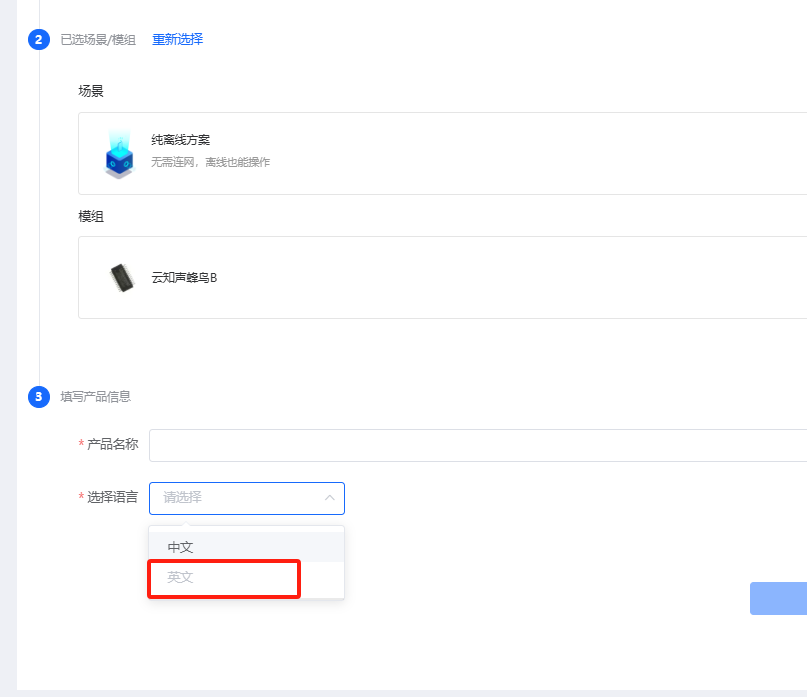

*蜂鸟B模块配置界面中英文选项为灰色不可选，表明该模块不支持英文识别*


*CI-03T模块支持英文语言识别，英文选项可选*


### CI-03T1和CI-03T2的引脚位置兼容性如何？

**问题描述：**

需要了解CI-03T1和CI-03T2两款离线语音识别芯片的引脚位置是否兼容，是否存在差异。

**解决方案：**

**引脚兼容性说明：**

- 大部分引脚兼容，个别引脚定义可能存在差异
- 焊接兼容性良好，可直接替换使用
- 建议在使用前确认具体引脚功能

**主要差异：**

1. **封装相同**：

    - CI-03T1和CI-03T2采用相同封装
    - 引脚数量和布局一致
    - 焊接时无需区分

2. **功能差异**：

    - CI-03T1：单麦克风版本，支持AEC回声消除
    - CI-03T2：双麦克风版本，支持降噪算法
    - 某些特殊功能引脚可能有差异

**使用建议：**

- 替换使用时基本兼容
- 如使用特殊功能，需查看引脚定义图
- 建议先进行测试验证

**注意事项：**

- 两个型号的Flash容量相同
- 主要区别在麦克风配置和算法支持
- 选择时根据应用场景需求决定

---

### CI-03T1和CI-03T2是否可以混用？

**问题描述：**

需要确认CI-03T1和CI-03T2芯片是否可以在同一设计中混用，以及编程配置的复杂程度。

**解决方案：**

CI-03T1和CI-03T2可以混用，编程配置简单。

**混用说明：**

1. **硬件兼容性**：

    - CI-03T1和CI-03T2封装完全相同
    - 引脚定义兼容，可直接替换
    - PCB设计无需考虑型号差异

2. **混用方式**：

    - 03T可根据需求选择安装或不安装
    - 支持在同一产品批次中混用两种型号
    - 生产时可灵活使用现有库存

3. **编程配置**：

    - 编程简单，无需特殊配置
    - 两种型号使用相同的开发工具
    - 固件生成时选择对应型号即可

**应用场景：**

1. **供应链灵活性**：

    - 某一型号缺货时可临时替代
    - 降低供应链风险
    - 提高生产灵活性

2. **功能分级**：

    - 根据产品定位选择不同型号
    - 高配版本使用CI-03T2（双麦降噪）
    - 标配版本使用CI-03T1（单麦+AEC）

3. **成本优化**：

    - 根据市场变化调整用料
    - 在保证功能的前提下优化成本

**注意事项：**

- 混用时需在固件配置中明确区分型号
- 建议在生产时做好型号标识和记录
- 两种型号的功能差异需在产品设计时考虑

---

### CI-03T模块是否可以独立实现通过离线语音识别控制红外发射模块来驱动空调风扇，而无需配合外部单片机？

**问题描述：**

需要确认CI-03T模块是否能够独立通过离线语音识别控制红外发射模块，进而驱动空调风扇，而不需要配合外部单片机。

**解决方案：**

**重要更新：平台已支持CI-03T红外功能**

智能云元平台已升级，现支持CI-03T1/CI-03T2的红外收发功能：

- 支持红外码录入（学习）
- 支持红外码发送
- 对应硬件端口：B2（IR_RX）和B3（IR_TX）

**新旧版本说明：**

- **旧版本固件**：CI-03T不支持红外发射功能，仅支持红外接收
- **新版本固件**：CI-03T1/CI-03T2已支持红外收发功能

**功能限制说明：**

1. **红外功能支持情况（新版本）**：

    - CI-03T1/CI-03T2：**支持**红外收发功能
    - 可通过平台配置红外学习、发射
    - 支持NEC协议和学习码

2. **旧版本替代方案**：

    - 如使用旧版本固件，红外控制需选择**SU-03T**模块
    - SU-03T支持完整的红外收发功能
    - 可直接通过平台配置红外协议和控制逻辑

3. **实现方案对比**：

    **方案一：使用CI-03T新版本（推荐）**
    ```
    CI-03T语音识别 → 内置红外发射 → 控制空调
    ```
    - 无需外部单片机
    - 支持红外学习功能
    - 可配置多种红外协议

    **方案二：使用SU-03T**
    ```
    SU-03T语音识别 → 内置红外发射 → 控制空调
    ```
    - 无需外部单片机
    - 支持红外学习功能
    - 可配置多种红外协议

    **方案三：CI-03T旧版本+外部单片机**
    ```
    CI-03T语音识别 → 串口输出 → MCU处理 → 红外发射
    ```
    - 需要额外开发单片机程序
    - 增加硬件成本和开发复杂度
    - 适合需要复杂控制逻辑的场景

**红外功能介绍：**

- 支持红外学习和发射
- 可学习空调遥控器编码
- 支持多种红外协议（NEC、学习码等）
- 可通过语音命令控制空调开关、温度、模式等

**空调控制的组合码说明：**

空调遥控器通常使用**组合码**进行控制，这是实现空调语音控制的重要概念：

1. **什么是组合码**：
    - 空调的每个操作（开关、温度、模式、风速）都需要一串红外编码
    - 例如：制冷26度模式下，同时包含模式=制冷、温度=26、风速=自动等信息
    - 这些信息组合成一个完整的红外码发送

2. **语音模块实现空调控制的方案**：
    - **方案一（仅语音模块）**：需要将所有可能的组合预先学习和存储
    - 例如：制冷模式 × 温度16-30度 × 风速3档 = 大量组合
    - 缺点：学习量大，存储空间占用多

    - **方案二（语音模块+码库）**：推荐方案
    - 使用带有红外码库的语音模块
    - 通过串口或内置码库动态生成组合码
    - 减少学习量，提高灵活性

    - **方案三（配合外部硬件）**：
    - 语音模块识别命令后，通过串口通知外部MCU
    - MCU使用专用空调红外芯片发送组合码
    - 适合复杂空调控制场景

**注意事项：**

- 使用红外功能需确保固件为新版本（支持红外收发）
- 旧版本固件需在平台重新生成才能获得红外功能
- 空调控制需要考虑组合码问题，不是简单的按键对应
- 开发时需测试空调品牌和型号的兼容性
- 可参考【SU-03T红外收发、红外学习配套教程】

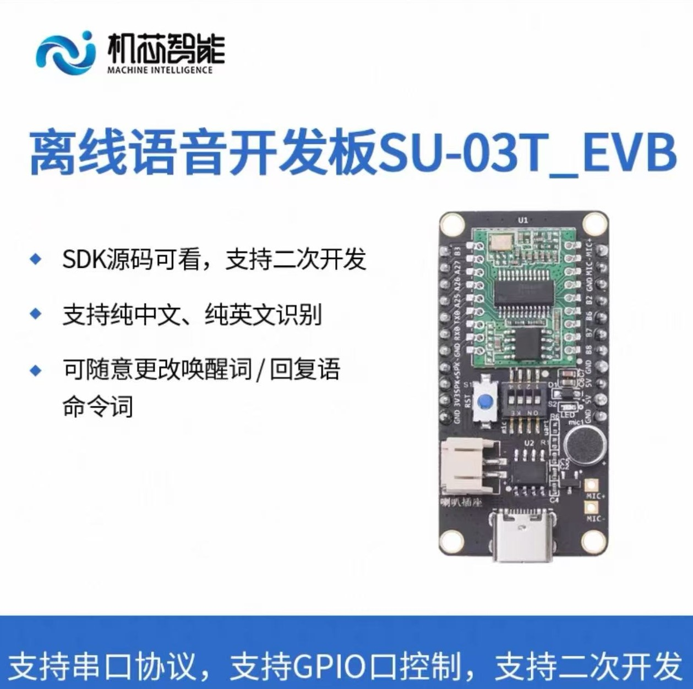

*SU-03T开发板支持红外收发功能，新版本CI-03T也已支持*

---

### CI-03T1和CI-03T2有什么区别？

**问题描述：**

需要了解CI-03T1和CI-03T2两款模块的具体差异，以便根据项目需求选择合适的型号。

**解决方案：**

**主要差异：麦克风配置**

- **CI-03T1**：单麦克风配置
- **CI-03T2**：双麦克风配置

**性能对比：**

1. **降噪能力**：

    - CI-03T2（双麦）具有更好的降噪效果
    - 双麦克风可形成阵列，实现声源定位和噪声抑制
    - 适合噪声环境较复杂的应用场景

2. **识别准确率**：

    - CI-03T2在远场识别上表现更优
    - 双麦配置可提升3-5米的识别准确率
    - CI-03T1适合近距离（1-3米）应用

3. **成本差异**：

    - CI-03T2价格略高于CI-03T1
    - 主要差异在于额外的麦克风和相关电路

**选型建议：**

- 选择CI-03T1：成本敏感、近距离应用、环境较安静
- 选择CI-03T2：要求高识别率、远距离识别、噪声环境

**注意事项：**

- 两者硬件接口和引脚定义完全相同
- 固件配置方式完全一致
- 可以根据需要灵活替换，无需修改硬件设计
- 如需升级到双麦，建议直接采购CI-03T2

---

### CI-03T1/2能否通过修改电阻改为CI-03T2？

**问题描述：**

询问是否可以通过移除CI-03T1/2电路板上的特定电阻，将其修改为CI-03T2（双麦）型号。

**解决方案：**

**硬件差异说明：**

CI-03T1和CI-03T2的硬件设计存在根本差异：

- CI-03T1：单麦克风输入电路
- CI-03T2：双麦克风输入电路
- 两者在PCB设计、电路布局上都不同

**修改可行性：**

**无法通过简单修改实现**：

- 仅移除电阻无法增加麦克风通道
- 双麦需要完整的音频前端电路支持
- 包括ADC、放大器、滤波电路等配套设计

**图示说明：**

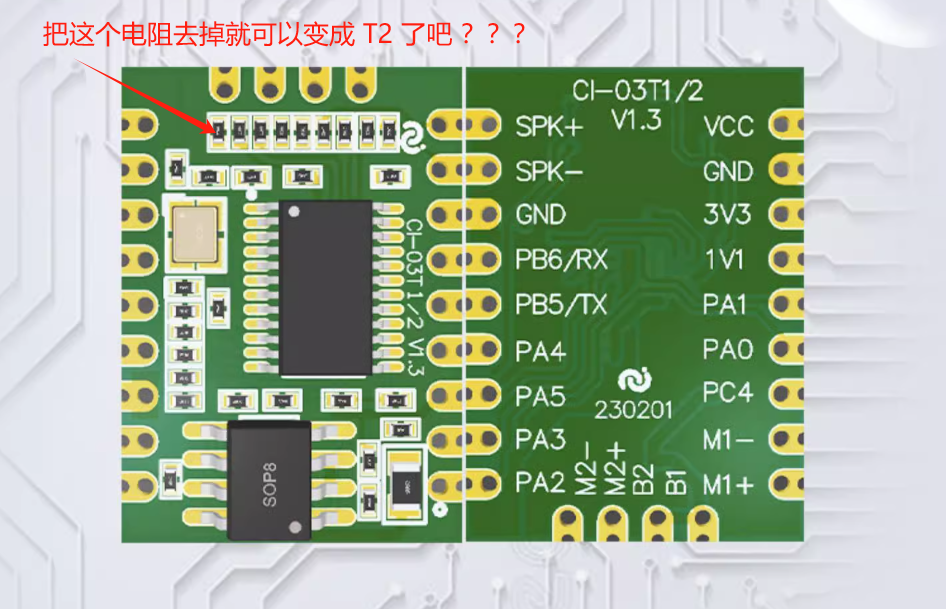

图中标识的电阻排阻用于配置麦克风选项，但：

- 移除电阻不会激活第二个麦克风通道
- 该设计可能用于生产测试或版本区分
- 硬件层面未预留第二麦克风的所有电路

**建议方案：**

1. **直接采购CI-03T2**
    - 确保硬件功能完整
    - 避免修改带来的可靠性问题
    - 获得官方技术支持和保修

2. **评估项目需求**
    - 确认是否真的需要双麦克风
    - 单麦已能满足多数应用场景
    - 权衡成本与收益

**注意事项：**

- 不建议自行修改硬件设计
- 修改可能导致模块损坏或功能异常
- 失去原厂保修和技术支持
- 双麦带来的性能提升需要配套算法支持

---

### CI-03T和SU-03T的配置是否相同？

**问题描述：**

需要了解CI-03T和SU-03T两款模块在配置上是否相同，以便进行开发选择。

**解决方案：**

CI-03T和SU-03T的配置**基本相同**，但CI-03T功能更丰富。

**配置相似性：**

1. **基础逻辑配置**：

    - 两者的逻辑配置基本一致
    - 唤醒词设置方式相同
    - 命令词配置流程相同
    - GPIO控制配置方法相同

2. **主要差异**：

    - CI-03T：功能更多，支持更多高级特性
    - SU-03T：专注基础语音识别，配置相对简单
    - 固件生成速度：CI-03T更快，SU-03T较慢

3. **功能对比**：

| 功能特性 | CI-03T | SU-03T |
|----------|----------|----------|
| 基础语音识别 | ✓ | ✓ |
| 红外发射功能 | ✗ | ✓ |
| 哭声检测 | ✓ | ✗ |
| 鼾声检测 | ✓ | ✗ |
| 文字转语音 | ✓ | ✗ |
| ADC功能 | ✗ | ✓ |
| 固件生成速度 | 快 | 慢 |

**开发建议：**

- **简单应用**：两者配置难度相当
- **高级功能**：CI-03T提供更多选项
- **红外控制**：必须选择SU-03T
- **快速开发**：CI-03T固件生成更快

**注意事项：**

- 两者的扩展板和硬件接口兼容
- 可以使用相同的底板或扩展模块
- 根据项目功能需求选择合适型号
- 配置方法基本通用，学习成本低

---

### CI-03T模块带晶振和不带晶振版本如何选择？

**问题描述：**

在淘宝上看到CI-03T模块有带晶振和不带晶振两种版本，需要了解如何根据需求选择合适的版本。

**解决方案：**

**版本选择建议：**

1. **带晶振版**：

    - 适用于对时钟精度要求较高的场景
    - 在环境温差大的环境下表现更稳定
    - 晶振可以减少温度变化带来的漂移影响
    - 时钟精度更高，环境适应性更强

2. **不带晶振版**：

    - 适用于对时钟精度要求不高的普通应用场景
    - 成本相对较低
    - 适合温度稳定的使用环境
    - 基础语音识别功能不受影响

**选择依据：**

- **环境稳定性**：

    - 环境温度变化大：选择带晶振版
    - 室内恒温环境：可选择不带晶振版

- **精度要求**：

    - 需要精确时序控制：选择带晶振版
    - 仅基础语音控制：不带晶振版即可

- **成本考虑**：

    - 批量生产：带晶振版增加少量成本
    - 性价比要求：不带晶振版更具优势

- **特殊功能需求**：

    - 需要鼾声检测功能：**必须选择带晶振版**
    - 需要哭声检测功能：**必须选择带晶振版**
    - 普通语音指令控制：两个版本均可

**技术说明：**

- 两个版本的基础语音识别功能相同
- 主要差异在时钟精度和温度稳定性
- 不影响识别率和响应速度
- 封装和引脚完全兼容

**注意事项：**

- 根据实际应用场景选择
- 工业或户外应用建议带晶振版
- 家用产品可选不带晶振版
- 两个版本价格差异不大
- 鼾声/哭声检测等功能必须使用带晶振版本


---

### CI-03T固件生成失败，提示"生成的固件超大"如何处理？

**问题描述：**

在使用CI-03T模块生成固件时，系统提示"生成失败，生成的固件超大，请删减配置项目，选用小模型或使用组合播报"。

**解决方案：**

**问题原因：**

配置项目过多或功能过于复杂，导致固件大小超出CI-03T的Flash容量限制。

**解决方法：**

1. **删减配置项目**：

    - 减少命令词数量
    - 移除不必要的功能模块
    - 简化控制逻辑
    - 删除未使用的GPIO配置

2. **优化功能配置**：

    - 减少PWM控制路数
    - 简化定时器配置
    - 减少变量使用数量
    - 优化语音播报内容

3. **使用组合播报**：

    - 将多个播报内容合并
    - 减少单独的语音文件
    - 使用参数化播报
    - 复用相同的播报片段

4. **分步实现功能**：

    - 先实现核心功能
    - 后续版本再添加扩展功能
    - 避免一次性配置所有功能

**优化建议：**

- **命令词优化**：

    - 控制在100条以内
    - 避免发音相似的词组
    - 合并功能相似的命令

- **播报优化**：

    - 减少播报内容的长度
    - 使用简洁的提示音
    - 避免长段语音播报

- **逻辑简化**：

    - 减少嵌套的判断条件
    - 简化状态机设计
    - 避免复杂的延时操作

**注意事项：**

- CI-03T的Flash容量有限
- 固件大小与配置复杂度直接相关
- 建议逐步添加功能并测试
- 如需大量功能，考虑升级到CI-33T

---

### 如何通过串口获取语音模块中命令词和播报内容的数字信号？

**问题描述：**

需要通过串口获取语音模块中命令词和播报内容对应的数字信号（如16进制数），用于外部处理。

**解决方案：**

**串口通信配置：**

1. **硬件连接**：
    ```
    语音模块RX → CH340 TX
    语音模块TX → CH340 RX
    语音模块VCC → 3.3V/5V
    语音模块GND → GND
    ```

2. **软件配置**：

    - 在智能公元平台配置固件
    - 设置串口输出功能
    - 配置对应的波特率
    - 定义命令词对应的ID号

**数据格式说明：**

1. **命令词输出**：

    - 识别成功后输出命令ID
    - 格式：16进制数字
    - 可包含置信度信息
    - 支持自定义数据格式

2. **典型输出示例**：
    ```
    唤醒成功：[0xAA 0x55 0x00 0x01]
    命令识别：[0xAA 0x55 CMD_ID LEN DATA CHECKSUM]
    ```

3. **ID映射关系**：

    - 每个命令词对应唯一ID
    - ID范围：0x00-0xFF
    - 可在平台配置时设置

**配置步骤：**

1. **平台配置**：

    - 添加命令词并设置对应ID
    - 启用串口输出功能
    - 选择输出数据格式
    - 设置通信波特率

2. **串口调试**：

    - 打开串口助手
    - 设置对应波特率（默认9600）
    - 发送测试指令验证
    - 观察识别结果输出

3. **数据解析**：

    - MCU接收串口数据
    - 解析命令ID
    - 执行对应动作
    - 可添加校验机制

**应用示例：**

```
命令词配置：

- "打开风扇" → ID: 0x01
- "关闭风扇" → ID: 0x02
- "增加转速" → ID: 0x03
- "减小转速" → ID: 0x04

串口输出：
识别"打开风扇" → 0xAA 0x55 0x01
识别"关闭风扇" → 0xAA 0x55 0x02
```

**注意事项：**

- 需要烧录配置好的固件
- 串口电平需要匹配（3.3V/5V）
- 建议添加数据校验提高可靠性
- 预留足够的通信延时

---

### 如何配置CI-03T实现风扇转速的逐步控制和语音提示？

**问题描述：**

需要配置CI-03T模块实现通过语音指令控制风扇转速的逐步增加和减少，并在达到最大或最小转速时进行语音提示，同时确保风扇不会停转。

**解决方案：**

**实现方案：**

使用变量跟踪风扇转速状态，实现逐步控制：

1. **变量定义**：

    - 定义变量`flag`记录转速档位
    - 初始值设为1（最小转速）
    - 档位范围：1-5（五档调速）

2. **PWM配置**：
    ```
    Pin 9 → PWM0输出 → 控制风扇
    频率：2000Hz
    占空比范围：20%-100%
    ```

3. **转速映射**：
    ```
    档位1 → PWM占空比20%（最小转速，不停转）
    档位2 → PWM占空比40%
    档位3 → PWM占空比60%
    档位4 → PWM占空比80%
    档位5 → PWM占空比100%（最大转速）
    ```

**命令词配置：**

1. **打开风扇**：

    - 设置PWM占空比20%
    - 变量flag=1
    - 播报："风扇已打开"

2. **增加转速**：

    - 条件：flag<5
    - 动作：flag=flag+1，设置对应PWM占空比
    - 播报："转速已增加"（flag≤4时）
    - 播报："风速已最大啦主人"（flag=5时）

3. **减小转速**：

    - 条件：flag>1
    - 动作：flag=flag-1，设置对应PWM占空比
    - 播报："转速已减小"
    - 播报："风速已最小啦主人"（flag=1时）

4. **关闭风扇**：

    - 设置PWM占空比0
    - 可选择是否保留flag值

**配置要点：**

1. **PWM设置**：

    - 使用GPIO_A0(PWM)输出
    - 频率设置为2000Hz避免噪声
    - 最小占空比设为20%确保不停转

2. **变量逻辑**：

    - 每次增加转速变量+1
    - 变量≤4时播报"转速已增加"
    - 变量≥5时播报"风速已最大"

3. **安全保护**：

    - 最小转速保持20%占空比
    - 避免风扇完全停转
    - 最大转速限制在100%

**硬件连接：**

```
CI-03T Pin 9 → PWM输出 → 风扇驱动电路
风扇驱动电路 → DC风扇
独立电源 → 风扇供电
```

**调试技巧：**

- 先测试PWM输出是否正常
- 逐步验证每个档位的转速
- 测试边界条件（最大/最小）
- 验证语音提示功能

**注意事项：**

- PWM占空比不要设置为0（除非要关闭）
- 使用变量时注意初始值设置
- 建议添加开机初始化设置
- 风扇电源独立供电，不要使用模块电源

---

### CI-03T的PWM输出占空比设置不正确如何解决？

**问题描述：**

配置PWM模块后，固件生成后PWM输出的占空比与预期不符，需要确认配置是否正确。

**解决方案：**

**PWM配置检查：**

1. **Pin脚配置确认**：

    - Pin 9：配置为PWM0
    - 频率：2000Hz
    - 占空比：高电平持续比例

2. **控制逻辑设置**：

    - 在控制行为中选择GPIO_A0(PWM)
    - 动作：设置占空比
    - 数值：20-100之间

**常见问题解决：**

1. **占空比设置错误**：

    - 确认数值在0-100范围内
    - 20表示20%占空比
    - 100表示100%占空比

2. **逻辑配置错误**：

    - 检查触发条件是否正确
    - 确认执行动作是PWM控制
    - 验证变量判断逻辑

3. **硬件连接问题**：

    - 确认风扇驱动电路连接
    - 检查PWM信号输出
    - 验证电源供电稳定

**配置示例：**

```
行为A1：打开风扇
- 条件：命令词"打开风扇"
- 动作：设置PWM0占空比为20

行为A2：增加转速
- 条件：变量flag<5 AND 命令词"增加转速"
- 动作：flag+1，PWM=flag*20
```

**调试方法：**

1. **使用示波器**：

    - 测量PWM输出波形
    - 验证频率和占空比
    - 检查信号质量

2. **串口调试**：

    - 输出当前PWM值
    - 监控变量变化
    - 确认逻辑执行

**注意事项：**

- PWM输出需要配合驱动电路
- 占空比设置为0时停止输出
- 建议预留一定的测试时间
- 不同风扇可能需要不同的占空比范围

---

### 如何确认收到的模块型号是否正确？

**问题描述：**

在电子毕设项目中，怀疑收到的模块型号与所选型号不一致，需要通过外观和技术手段确认模块型号是否正确。

**解决方案：**

**1. 外观标识检查**

- **查看模块标识**
    - 检查模块表面印刷的型号标识
    - CI-03T：通常标注"CI-03T"字样
    - SU-03T1：标注"SU-03T1"或版本信息
    - 注意新旧版本的外观差异

- **丝印信息确认**
    - 主控芯片丝印：CI1302
    - Flash容量丝印：可辅助判断
    - 生产批次信息：了解不同批次可能存在差异

**2. 技术验证方法**

- **功能测试**
    - 使用CI-03T专用测试固件验证
    - 观察是否支持CI-03T特有功能（如TTS）
    - 测试哭声检测功能是否为CI-03T1独有

- **串口通信验证**
    - 烧录对应固件验证通信功能
    - 通过串口发送指令测试响应
    - CI-03T1不支持TTS，CI-03T支持

**3. 硬件差异对比**

- **主要区别对比**：

| 特性 | CI-03T | SU-03T1 | 说明 |
|------|---------|------------|---------|
| Flash容量 | 较小 | 较大 | CI-03T1适合更多词条 |
| 麦克风配置 | 单麦克风 | 双麦克风 | CI-03T1支持降噪 |
| TTS功能 | 不支持 | 支持 | 文字转语音是CI-03T1特有 |
| 典型标识 | CI-03T | SU-03T1 | 需要区分包装和标识 |
| 功耗水平 | 相近 | 略高 | SU-03T1优化了功耗 |

**4. 确认流程**

1. **获取清晰照片**
    - 拍摄模块正面、背面和引脚特写
    - 重点拍摄型号标识区域
    - 确保所有标识清晰可辨

2. **联系技术支持**
    - 发送清晰的照片和丝印信息
    - 提供采购订单信息
    - 描述遇到的差异和疑问

3. **预防措施**
    - 采购时明确要求型号和版本
    - 收货后第一时间检查
    - 保留采购凭证和包装信息
    - 发现问题及时反馈处理

**注意事项：**

- 型号混淆是常见的产品问题
- 仔细核对产品规格书和实物
- 必要时要求供应商提供型号保证
- 批量采购建议先样品验证


*模块实物照片，用于确认型号是否正确*

---

### CI-03T现在的版本是什么？供电电流是多少？

**问题描述：**

需要确认2-3年前购买的CI-03T模块是否仍为当前在售型号，以及最新版产品的资料和供电电流参数。

**解决方案：**

**1. 版本确认**

- **封装相同**：CI-03T封装保持不变
- **更新到V2.1版本**：内部元器件有优化
- **仍为主流型号**：持续在售和升级

**2. 资料获取**

- **智能公元平台**：https://www.smartpi.cn/#/
- **平台可下载**：最新版资料和规格书
- **直接搜索"智能公元"**：可快速找到平台

**3. 供电电流参数**

- **工作电流**：100mA以上（基础工作）
- **拖喇叭时**：需要600mA以上
- **供电电压范围**：3.6-5.5V


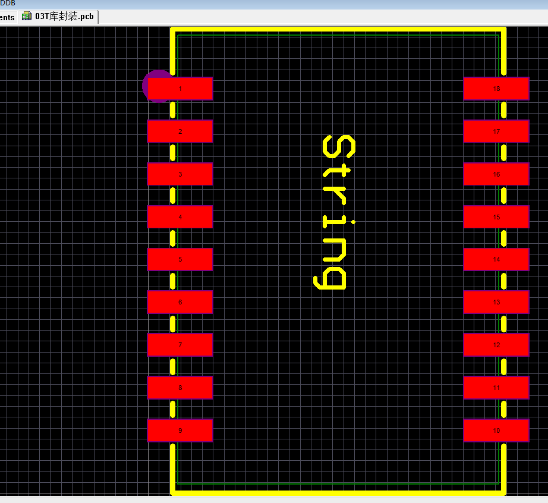

**注意事项：**

- 拖喇叭时电流消耗较大，电源设计需留足余量
- 内部元器件优化不影响引脚定义和兼容性
- 旧版本模块基本功能与新版本相同

---

### 如何确认淘宝购买的CI-03T模块是否为正品？

**问题描述：**

从淘宝购买的CI-03T1模块无法正常工作，需要确认是否为正品机芯智能产品。

**解决方案：**

**正品识别特征：**

1. **官方店铺验证**：

    - 店铺名：深圳市机芯智能有限公司
    - 搜索关键词：淘宝搜索"智能公元"
    - 避免购买非官方渠道产品

2. **模块外观检查**：

    - 绿色PCB基板（正品特征）
    - 丝印标识清晰准确
    - 元器件布局规整
    - 焊接工艺良好

3. **功能验证**：

    - 使用官方固件测试
    - 对比功能规格书参数
    - 验证识别率和响应时间
    - 检查串口通信是否正常

**常见问题及解决：**

1. **非正品模块特征**：

    - 价格明显低于市场价
    - PCB颜色或材料异常
    - 丝印模糊或错误
    - 功能不稳定或缺失

2. **验证步骤**：

    - 保留卖家提供购买凭证
    - 索取原厂测试报告
    - 要求提供技术支持
    - 对比官方产品图片

3. **问题处理**：

    - 确认为非正品：申请退换货
    - 保留所有交易记录
    - 联系平台官方举报
    - 重新通过官方渠道购买

**购买建议：**

- 优先选择官方旗舰店
- 批量采购直接联系厂家
- 保留完整的采购记录
- 收货后立即验证功能

**注意事项：**

- 非正品模块可能存在质量风险
- 技术支持服务可能受限
- 量产项目务必确保供应链可靠
- 建议与机芯智能建立长期合作关系

---

### CI-03T模块是否可用于电风扇产品开发，支持哪些定制功能？

**问题描述：**

需要了解CI-03T模块是否可以用于电风扇产品的语音控制开发，以及支持哪些定制功能如方言识别、开发周期和价格信息。

**解决方案：**

**电风扇应用支持：**

CI-03T模块完全可以用于电风扇产品的语音控制开发：

1. **基础功能支持**：

    - 离线语音识别，无需网络
    - 支持串口通讯（UART）
    - 可控制风扇开关、风速、摇头等功能
    - 支持自定义词条和唤醒词

2. **方言识别能力**：

    - 基础版本：仅支持标准普通话
    - 方言适配：不太标准的普通话会影响识别率
    - 自学习功能：可学习和替换个别命令词的方言发音
    - 建议：优先保证主要用户群体的发音准确

3. **开发流程**：

    - 在智能公元平台配置固件
    - 生成包含自定义命令的固件文件
    - 通过烧录工具写入模块
    - 测试验证功能效果

4. **批量开发服务**：

    - 可提供定制开发服务
    - 开发周期：约1周
    - 开发费用：1500元（含测试验证）
    - 支持功能定制和优化

**成本信息：**

- **模块价格**：根据采购量确定
- **芯片方案**：批量采购时芯片价格约3元起
- **开发成本**：包含在开发费用中
- **最小起订量**：根据实际需求协商

**技术优势：**

- 识别响应快（<500ms）
- 支持语音打断功能
- 可集成TTS语音播报
- 稳定可靠，适合家电产品

**注意事项：**

- 方言识别建议先进行实际测试
- 批量生产前需充分验证
- 可申请样片进行前期开发
- 技术支持可全程协助开发

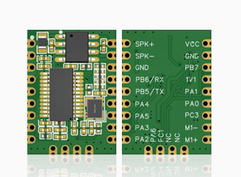

*CI-03T语音识别模块正反面，显示引脚定义和元件布局*

---

### 如何使用语音模块进行产品快速开发和迭代？

**问题描述：**

需要了解如何利用现成的语音模块方案，实现产品的快速开发和功能迭代验证。

**解决方案：**

**公板方案优势：**

使用现成的语音模块作为公板方案，可以显著加速产品开发：

1. **快速原型验证**：

    - 使用现成模块搭建功能原型
    - 无需等待硬件设计和生产
    - 可立即进行软件功能开发
    - 快速验证产品可行性

2. **开发流程优化**：
    ```
    选型 → 购买模块 → 平台开发 → 烧录测试 → 功能验证
    ```
    - 选型：根据需求选择合适模块
    - 购买：小批量采购进行测试
    - 开发：在线平台配置，无需编程
    - 测试：直接烧录验证功能

3. **迭代开发模式**：

    - 第一阶段：基础功能验证
    - 第二阶段：根据测试反馈优化
    - 第三阶段：功能完善和定型
    - 可快速响应市场和用户需求

4. **量产过渡方案**：

    - 样品阶段：使用现成模块
    - 小批量：继续使用模块
    - 量产阶段：选择芯片或定制模块
    - 灵活控制成本和交付周期

**开发建议：**

1. **模块选型要点**：

    - 根据功能需求选择合适型号
    - 预留20%的功能扩展空间
    - 考虑成本和供货稳定性
    - 优先选择有技术支持的方案

2. **开发技巧**：

    - 充分利用平台的在线配置功能
    - 建立完善的测试用例
    - 保留配置版本便于回溯
    - 及时记录问题和解决方案

3. **成本控制**：

    - 开发期使用成品模块
    - 验证通过后再考虑芯片方案
    - 批量时统一采购降低成本
    - 建立安全库存应对需求变化

**注意事项：**

- 公板方案适合快速验证和中小批量
- 量产前需完成所有功能验证
- 建议与供应商建立技术合作关系
- 保留开发过程文档便于量产转移

---

### CI-03T是否可以作为纯唤醒模块使用，将音频数据传输给外部设备进行ASR识别？

**问题描述：**

希望使用CI-03T系列芯片仅实现唤醒功能并输出音频数据，由外部设备（如ESP32）进行后续的ASR识别，咨询该方案的技术可行性。

**解决方案：**

CI-03T可以作为纯唤醒模块使用，并输出音频数据给外部设备处理。

**技术实现方案：**

1. **功能配置**：

    - CI-03T仅负责唤醒词识别和音频采集
    - 唤醒成功后，通过IIS接口输出音频数据
    - 外部设备（ESP32）接收音频流并进行ASR识别

2. **硬件连接**：

    ```
    CI-03T → IIS接口 → ESP32
    麦克风 → CI-03T音频输入 → 唤醒检测 → 音频输出
    ```

3. **实现限制**：

    - CI-03T内存有限，不能运行完整的ASR算法
    - 只能输出原始音频数据，不能输出识别结果
    - 需要外部设备完成ASR处理

**选型建议：**

1. **基础唤醒需求**：选择CI-03T即可满足

2. **开发需求**：推荐选择CI-33T
    - Flash容量更大（4M vs 2M）
    - 支持500条词条（vs 300条）
    - 开发时预留更多扩展空间

3. **产品形态**：

    - 带咪头+喇叭的配套版本
    - 包含烧录工具的完整套件

**技术说明：**

- CI-03T支持IIS音频输出接口
- 可实时采集并传输音频数据
- 支持语音打断功能
- 识别率可通过调整置信度优化

**注意事项：**

- CI-03T不能直接输出ASR识别结果
- 需要自行开发ESP32端的ASR处理代码
- 建议选择置信度较低的设置以提高唤醒灵敏度
- 开发时需注意IIS接口的时钟同步

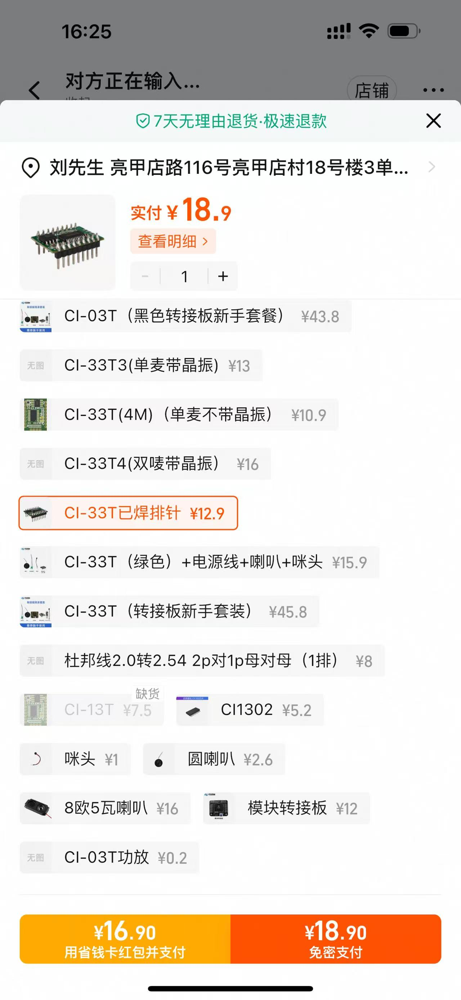

*选购带咪头和喇叭的配套版本，便于开发测试*

### 如何快速对比各型号语音模块的参数？

**问题描述：**

需要快速了解和对比不同型号语音模块的详细技术参数，包括主控芯片、供电电压、语音指令数量、Flash容量、唤醒打断、双麦算法、稳态降噪算法等关键指标，以便根据具体应用需求进行选型。

**解决方案：**

下图提供了现行语音模块的完整参数对比表，涵盖29个关键技术指标：


**主要对比维度说明：**

1. **基础硬件参数**
    - 主控芯片：决定处理性能
    - 供电电压：3.3V-5V范围
    - 封装尺寸：影响PCB设计
    - 接口类型：UART、I2C等

2. **语音功能参数**
    - 语音指令数量：100-500条不等
    - Flash容量：2M-4M，影响存储能力
    - 综合识别率：核心性能指标
    - 音频输出：PWM、DAC等

3. **算法支持**
    - 唤醒打断：支持实时打断
    - 双麦算法：增强降噪效果
    - 稳态降噪算法：提升识别准确率
    - 声源定位、声纹识别等高级功能

**选型建议：**

- **简单控制**（<100条指令）：SU系列基础型号
- **中等复杂度**（100-300条指令）：CI-03T系列
- **复杂应用**（300-500条指令）：CI-33T、CI-73T系列
- **高端需求**（需要AEC、AI等功能）：JX-A7T系列

**注意事项：**

- 根据实际词条需求选择合适容量，避免资源浪费
- 双麦版本在嘈杂环境中表现更好
- 部分高级功能仅特定型号支持

---


---

### CI-03T和CI-33T的音频容量有什么区别？

**问题描述：**

CI-03T音频存储容量限制是多少？是否有支持600k以上音乐文件的大容量替代方案？

**解决方案：**

**容量对比：**

- **CI-03T**：2M Flash容量
- **CI-33T**：4M Flash容量
- **容量差异**：CI-33T是CI-03T的两倍

**应用场景：**

1. **CI-03T适用场景**

    - 200k以内的音频文件
    - 语音提示音、简单音效
    - 指令数量较少的应用

2. **CI-33T适用场景**

    - 600k以上的音乐文件
    - 更复杂的音频内容
    - 需要存储更多音频的应用

**其他解决方案：**

如果CI-03T容量不满足需求：

- **外接MP3模块**：通过串口控制外部MP3播放大文件
- **选择CI-33T**：直接使用4M容量的模块
- **音频压缩**：使用更高效的音频格式

**注意事项：**

- CI-03T平台配置的音频大小限制约600k
- CI-33T可存储更多内容，适合复杂应用
- 外接MP3模块会增加成本和复杂度

---


---

### 什么是自然说功能，哪些芯片支持？

**问题描述：**

需要了解自然说（模糊识别）功能的工作原理，以及哪些型号支持该功能。

**解决方案：**

**自然说功能说明：**

自然说是通过泛化词技术，让用户无需严格按照预设词条发音，系统可识别意思相近的多种表达方式，使交互更自然。

**功能特点：**

- **泛化机制**：一个命令词可支持上百个泛化词
- **计数规则**：泛化词数量不计入总命令词数限制
- **仅限命令词**：唤醒词不支持泛化
- **语言支持**：目前仅支持中文普通话

**支持型号：**

- **CI系列**：

    - CI-03T：支持自然说功能
    - CI-33T：支持自然说功能
    - CI-73T、CI-76Z：暂不支持，需要付费开发
- **Flash要求**：需要2M及以上容量
- **成本考虑**：批量价格约5元以上
- **开发服务**：不支持自然说的型号可付费开发，费用约2000元

**开发方式：**

1. 在开发平台选择"自然说"功能
2. 导入系统推荐词（如"打开"、"关闭"等）
3. 系统自动生成泛化词库
4. 可查看泛化词数量和效果

**注意事项：**

- 小语种（英语、阿拉伯语等）暂不支持自然说
- 方言识别效果需要实际测试
- 带蓝牙功能的型号词条数较少，且不支持自然说
- 基础芯片可通过预设多个相似词条实现部分效果

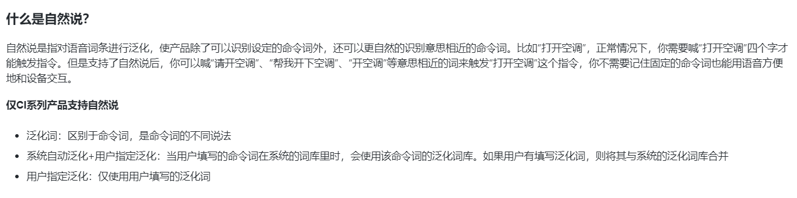

*自然说功能说明*

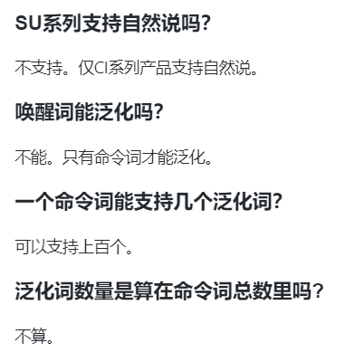

*自然说功能详细说明*

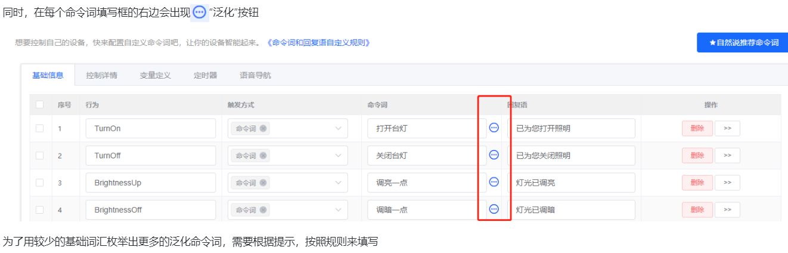

*开发平台的泛化词配置界面*

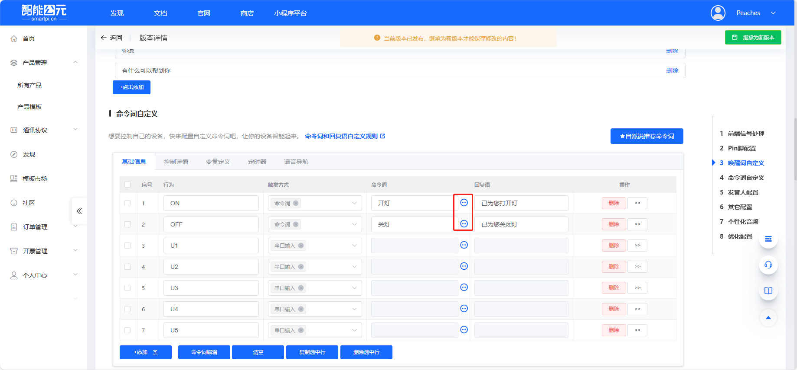

*显示泛化词数量的界面*

---


---

### CI-03T能否用于语音控制空调？

**问题描述：**

需要了解CI-03T模块是否可以实现语音控制空调的功能，以及开发方式的选择。

**解决方案：**

**CI-03T空调控制可行性：**

CI-03T模块完全可以用于语音控制空调，已有成功案例。

**实现方式对比：**

1. **平台开发方式**
    - 使用智能公元在线平台配置
    - 支持语音识别、命令词配置
    - 支持串口输出控制指令
    - 开发周期短，适合快速量产

2. **米思琪（Mixly）开发方式**
    - 图形化编程环境
    - 适合初学者和快速原型
    - 支持基础的语音控制功能
    - 扩展性相对有限

3. **SDK二次开发**
    - 提供完整SDK源代码
    - 支持深度定制功能
    - 需要嵌入式开发经验
    - 适合复杂功能和量产项目

**空调控制实现：**

1. **语音命令配置**
    - 唤醒词：如"小智"
    - 控制命令：开空调、关空调、调温度、模式切换等
    - 支持自定义命令词

2. **控制信号输出**
    - 通过串口发送控制指令
    - 可控制红外发射模块
    - 支持多路输出控制不同功能

3. **功能扩展**
    - 温度设定：18-30度范围
    - 模式切换：制冷、制热、送风、除湿
    - 风速控制：高、中、低、自动
    - 定时功能

**开发建议：**

- 初学者：优先选择平台开发，上手简单
- 快速原型：可使用米思琪图形化编程
- 量产项目：建议使用SDK深度开发
- 已有成功案例证明方案可行

**注意事项：**

- 需要额外的红外发射模块或空调适配器
- 不同空调品牌可能需要不同的控制码库
- 建议先验证目标空调的控制协议
- 语音识别率受环境噪声影响，需要合理部署麦克风
- 复杂功能建议使用MCU+语音模块组合

---

### CI-03T系列模块支持联网功能吗？

**问题描述：**

看到CI-03T、CI-73T1、CI-73T2等型号被推荐，询问这些离线语音识别模块是否支持联网功能。

**解决方案：**

CI-03T系列模块均为离线语音识别模块，不支持联网功能。

**模块特点：**

1. **工作模式**
    - 完全离线工作
    - 无需联网即可识别语音命令
    - 数据本地处理，响应快速

2. **功能限制**
    - 不支持WiFi连接
    - 不支持云端数据交互
    - 不支持在线功能扩展

**适用场景：**

- 注重隐私保护的应用
- 网络不稳定或无网络环境
- 需要快速响应的场景
- 对成本敏感的项目

**型号说明：**

- **CI-03T**：基础款，300词条
- **CI-73T1/CI-73T2**：功能增强版
- 所有CI系列模块均为离线工作模式

**如需联网功能：**

- 可选择JX-12F（WiFi+蓝牙模块）
- 或考虑在线语音识别方案

---


---

### CI-03T和CI-33T的固件是否兼容？

**问题描述：**

需要确认CI-03T的固件是否可以直接烧录到CI-33T模块上使用。

**解决方案：**

CI-03T和CI-33T的固件**不兼容**，主要原因是硬件配置不同。

**差异分析：**

1. **Flash容量不同**
    - CI-03T：2M Flash，支持300条词条
    - CI-33T：4M Flash，支持500条词条
    - 容量差异导致固件不兼容

2. **资源配置差异**
    - 虽然主控芯片相同（CI1302）
    - 但外设配置可能不同
    - 需要分别生成对应固件

**使用建议：**

1. **分别配置**
    - CI-03T使用对应配置生成固件
    - CI-33T需要独立项目配置
    - 不能混用固件文件

2. **平台选择**
    - 在平台中选择正确的模块型号
    - 确认型号后再生成固件
    - 避免烧录错误固件

**注意事项：**

- 固件兼容性不仅取决于主控芯片
- Flash大小是关键差异因素
- 错误固件可能导致功能异常
- 建议为不同型号维护独立配置

---


---

### CI-03T和CI-33T的固件是否兼容？

**问题描述：**

需要确认CI-03T的固件是否可以直接烧录到CI-33T模块上使用。

**解决方案：**

- CI-03T的固件可以直接烧录到CI-33T模块使用
- 两个模块的管脚基本一致
- 固件程序完全兼容

**注意事项：**

- CI-33T相比CI-03T支持更多的词条数量
- 如需使用更多词条功能，建议使用CI-33T专用固件

---


---

### CI-03T1和CI-03T2的主要区别是什么？

**问题描述：**

需要了解CI-03T1和CI-03T2两款模块的主要差异，特别是双麦克风配置与单麦克风配置的区别。

**解决方案：**

**主要区别对比：**

| 特性 | CI-03T1 | CI-03T2 |
|------|---------|---------|
| 麦克风配置 | 单麦克风 | 双麦克风 |
| 灵敏度 | 标准 | 更高灵敏度 |
| 噪声抑制 | 基础降噪 | 增强降噪 |
| 拾音距离 | 1-3米 | 3-5米 |
| 抗干扰能力 | 一般 | 较强 |
| 成本 | 较低 | 略高 |

**功能特点：**

**CI-03T1（单麦版）：**

- 适合安静环境使用
- 基础语音识别功能
- 性价比高
- 功耗相对较低

**CI-03T2（双麦版）：**

- 支持声纹识别
- 更好的远场识别效果
- 适合嘈杂环境
- 支持更复杂的噪声处理

**选择建议：**

- **安静室内环境**：选择CI-03T1即可满足需求
- **嘈杂环境或远距离**：推荐CI-03T2
- **需要声纹识别**：必须选择CI-03T2
- **成本敏感项目**：CI-03T1更具性价比

**注意事项：**

- 两者引脚兼容，硬件设计可通用
- CI-03T2需要两个麦克风，PCB设计需预留位置
- 软件配置时需要选择对应的硬件版本
- 双麦版本对算法支持更全面

---


---

### CI-03T1和CI-03T2的主要区别是什么？

**问题描述：**

需要了解CI-03T1和CI-03T2两款离线语音识别芯片的主要区别，特别是关于双麦克风配置、适用环境和算法支持方面的差异。

**解决方案：**

**核心差异对比：**

1. **麦克风配置**
    - **CI-03T1**：单麦克风版本
    - **CI-03T2**：双麦克风版本
    - 双麦克风版本支持更好的降噪效果

2. **算法支持**
    - **CI-03T1**：基础降噪算法
    - **CI-03T2**：增强型降噪算法
    - 双麦配合专用算法实现更好效果

3. **适用环境**
    - **CI-03T1**：

        - 适合相对安静的环境
        - 家庭、办公室等场所
        - 成本更低，功耗更小

    - **CI-03T2**：

        - 适合嘈杂环境
        - 商场、车站、工厂等场所
        - 识别率更高，抗干扰能力强

**选型建议：**

1. **环境选择**
    - 安静环境（<40dB）：选择CI-03T1
    - 一般环境（40-60dB）：推荐CI-03T2
    - 嘈杂环境（>60dB）：必须使用CI-03T2

2. **成本考虑**
    - CI-03T1价格更低
    - CI-03T2略贵但效果更好
    - 根据项目预算和性能要求选择

3. **硬件设计差异**
    - CI-03T2需要连接两个麦克风
    - 麦克风摆放距离影响降噪效果
    - 需要按照规范设计PCB布局

**应用场景：**

- **CI-03T1适用**：

    - 智能家电控制
    - 家用语音助手
    - 玩具语音交互

- **CI-03T2适用**：

    - 车载语音控制
    - 商用显示设备
    - 公共信息终端

**注意事项：**

- 两个型号引脚兼容，可互换使用
- CI-03T2需要正确配置两个麦克风
- 建议根据实际噪声环境测试选择
- 双麦版本对麦克风一致性有要求

**兼容性说明：**

1. **引脚兼容性**：

    - 两个型号引脚定义完全相同
    - 可以直接替换使用
    - 不需要修改PCB设计

2. **替换注意事项**：

    - 固件需要重新生成
    - 确保固件型号选择正确
    - 测试所有功能正常工作

**应用场景建议：**

- **SU-03T适用**：

    - 家电控制（10-50条命令）
    - 简单语音交互（50-100条命令）
    - 成本敏感型项目

- **CI-33T适用**：

    - 复杂家电控制（100-300条命令）
    - 智能家居系统（300-500条命令）
    - 需要大量词条的应用

**注意事项：**

- 两个型号针脚兼容，可直接替换
- 固件不通用，需分别生成
- CI-33T成本略高，但容量更大
- 选型时考虑未来功能扩展需求

---

**注意事项：**

- SU-03T本身只有1个硬件串口
- 多个串口需要外部扩展
- 根据项目复杂度选择合适方案
- 考虑成本和开发难度平衡

---


---

### 如何根据需求选择合适的语音模块型号？

**问题描述：**

需要了解现有语音模块的参数对比，以便根据具体需求选择合适的产品型号。

**解决方案：**

**1. 主流语音模块参数对比**

根据应用需求选择合适的模块：

| 型号 | 主控芯片 | 供电电压 | 接口 | 命令词数量 | Flash容量 | 特殊算法 | 适用环境 |
|-------|----------|----------|--------|------------|-----------|----------|----------|
| CI-03T1 | CI13242 | 3.6-5.5V | UART | 300条 | 2M | 双麦算法 | 室内 |
| CI-03T | CI13242 | 3.6-5.5V | UART | 300条 | 2M | 双麦算法 | 室内 |
| CI-33T | CI13262 | 3.6-5.5V | UART | 500条 | 4M | 双麦算法 | 室内 |
| CI-73T | CI13262 | 3.6-5.5V | UART | 300条 | 2M | 双麦算法 | 室内 |
| CI-95C | CI132 | 3.6-5.5V | UART | 150条 | 1M | 基础算法 | 室内 |
| SU-03T | CI13242 | 3.6-5.5V | UART | 150条 | 2M | 稳态降噪 | 室内 |
| SU-10A | CI13242 | 3.6-5.5V | UART | 300条 | 2M | 稳态降噪 | 室内 |
| SU-13T | CI13262 | 3.6-5.5V | UART | 300条 | 2M | 稳态降噪 | 室内 |
| SU-20T | CI13242 | 3.6-5.5V | UART | 50条 | 1M | 稳态降噪 | 室内 |
| SU-21T | CI13242 | 3.6-5.5V | UART | 150条 | 1M | 稳态降噪 | 室内 |
| SU-22T | CI13242 | 3.6-5.5V | UART | 50条 | 1M | 稳态降噪 | 室内 |
| SU-23T | CI13262 | 3.6-5.5V | UART | 300条 | 2M | 稳态降噪 | 室内 |
| SU-30T/31T | CI13262 | 3.6-5.5V | UART | 300条 | 2M | 稳态降噪 | 室内 |
| SU-32T | CI13262 | 3.6-5.5V | UART | 300条 | 2M | 稳态降噪 | 室内 |
| SU-63T | CI132 | 3.6-5.5V | UART | 50条 | 1M | 稳态降噪 | 室内 |
| JX-12F | CI132 | 3.6-5.5V | UART | 50条 | 1M | 基础算法 | 室内 |
| JX-A7T | CI132 | 3.3-5.5V | UART+WiFi | 300条 | 2M | 稳态降噪 | 室内 |
| JX-B5C | CI132 | 3.6-5.5V | UART | 50条 | 1M | 基础算法 | 室内 |
| BL-62B | - | 3.3-5.5V | UART+蓝牙 | - | - | - | 室内 |
| XR-50A | - | 3.3-5.5V | UART+WiFi | - | - | - | 室内 |


**2. 选型建议**

根据具体需求选择：

- **命令词数量要求高**：选择CI-33T（500条）
- **需要WiFi功能**：选择JX-A7T
- **需要蓝牙功能**：选择BL-62B
- **成本敏感项目**：选择CI-95C或SU-20T系列
- **高精度要求**：选择支持双麦算法的CI系列
- **简单应用**：选择SU系列基础版本

**3. 特殊功能选择**

- **双麦降噪**：CI-03T、CI-33T、CI-73T
- **稳态降噪**：SU系列全型号支持
- **离线命令词**：所有型号均支持
- **在线功能**：JX-A7T、XR-50A等带WiFi的型号


---

### CI-03T 和 CI-33T 的主要区别是什么？

**问题描述：**

需要了解 CI-03T 和 CI-33T 之间的主要差异，以便根据项目需求选择合适的型号。

**解决方案：**

CI-03T 和 CI-33T 的主要区别在于 Flash 容量和支持的词条数量：

- **CI-03T**：支持 300 条词条
- **CI-33T**：支持 500 条词条

**注意事项：**

- 其他硬件规格和功能基本相同，用户可根据所需词条数量选择合适型号

---

### CI13242芯片命令词数量不达标怎么办？

**问题描述：**

CI13242芯片标称支持300条命令词，但实际配置时只能使用20条，无法达到标称数量。

**解决方案：**

**1. 确认芯片型号和规格**

- 检查芯片表面型号标识是否为CI13242
- 核对技术文档中命令词支持数量
- 确认是否为批次差异或版本差异

**2. 检查配置平台限制**

- 确认使用的配置工具版本
- 检查固件版本是否限制命令词数量
- 验证是否需要特定的固件支持更多词条

**3. 常见命令词数量限制**

| 芯片型号 | 标称命令词数 | 实际可用数 | 说明 |
|----------|-------------|------------|------|
| CI13242 | 300条 | 20-300条 | 可能受固件限制 |
| CI-03T | 300条 | 300条 | 标准配置 |
| CI-33T | 500条 | 500条 | 高容量版本 |
| CI-73T | 300条 | 300条 | 标准配置 |

**4. 解决方法**

- **固件升级**：

    1. 下载最新版本固件
    2. 使用官方烧录工具升级
    3. 重新配置命令词

- **工具版本检查**：

    1. 更新智能公元平台到最新版
    2. 确认工具支持全部功能
    3. 清除缓存重新配置

- **技术支持**：

    1. 联系技术支持确认规格
    2. 提供芯片批次信息
    3. 申请特殊固件版本

**5. 临时方案**

- 优化命令词设计，合并相似指令
- 使用多级唤醒机制
- 通过串口扩展功能

**注意事项：**

- 芯片实际能力可能与宣传存在差异
- 不同批次产品可能有规格变化
- 建议购买前确认具体规格
- 保留技术支持沟通记录

---


---

### 哪款语音识别芯片的生成速度最快？

**问题描述：**

需要了解各型号语音识别芯片的响应速度，选择生成速度最快的型号。

**解决方案：**

**速度排名**

- **CI-03T**：生成速度最快的型号
- 识别响应时间最短
- 适合对速度要求高的应用场景

**选型建议**

1. **优先选择CI-03T的场景**
    - 实时语音交互应用
    - 需要快速响应的控制场景
    - 对延迟敏感的产品

2. **其他型号特点**
    - CI-33T：支持更多词条，速度略慢于CI-03T
    - SU系列：功能丰富，但响应速度不如CI系列
    - JX系列：主打AI对话，响应速度适中

3. **速度与功能平衡**
    - 如需要最快速度，选择CI-03T
    - 如需要更多功能，可考虑其他型号
    - 根据实际需求权衡速度与功能

**注意事项：**

- 生成速度与识别准确率需要平衡
- CI-03T支持300条词条
- 如需更多词条，可考虑CI-33T（500条）
- 建议根据具体应用场景选择合适型号

---


---

### CI-73T与CI-03T的引脚兼容性如何？

**问题描述：**

需要了解CI-73T与CI-03T的引脚是否兼容，能否将原本为CI-03T设计的电路板直接更换为CI-73T模块使用。

**解决方案：**

**引脚兼容性说明：**

- 大部分引脚定义相同，可以兼容
- 部分引脚存在差异，需根据控制方式确认
- 烧录脚（PC4/PC3）可能不同

**主要差异：**

1. **特殊功能引脚**：

    - CI-73T的某些引脚功能分配可能与CI-03T不同
    - 需要查看具体的引脚定义图
    - 控制方式会影响兼容性

2. **兼容性判断**：

    - 如果控制方式相同，大部分功能可以直接替换
    - 如果使用了特定功能引脚，需要确认兼容性

**使用建议：**

1. **串口引脚兼容性**：

    - 如果仅使用串口通信（UART），CI-03T和CI-73T2使用同一组串口引脚
    - 在单麦克风应用场景下，可以直接替换无需修改硬件
    - 但芯片不同，引脚封装可能存在差异，建议替换前确认具体引脚定义

2. **查看引脚定义**：

    - 对比CI-73T和CI-03T的引脚图
    - 确认使用的引脚功能是否一致
    - 特别关注PC3、PC4等烧录相关引脚

3. **测试验证**：

    - 先进行替换测试
    - 验证各项功能是否正常工作
    - 如有异常，检查引脚连接

4. **电路修改**：

    - 如发现引脚不兼容，需要修改电路
    - 可以设计兼容两种型号的电路
    - 使用跳线或跳帽实现灵活配置

**注意事项：**

- 建议在替换前确认具体差异
- 烧录时使用对应的烧录接口定义
- 不同批次的模块可能存在细微差异
- 如不确定，可联系技术支持获取详细的对比表


---

### CI-03T和CI-73T的引脚兼容性如何？

**问题描述：**

需要了解CI-03T和CI-73T的引脚是否兼容，能否将原本为CI-73T1设计的电路板直接更换为CI-03T模块使用。

**兼容性说明：**

- **基本兼容**：CI-73T的引脚数量多于CI-03T，如果只使用到CI-03T的那些引脚，是可以替换的
- **封装差异**：CI-73T引脚更多，封装尺寸可能略有不同
- **功能对应**：基础功能的引脚定义基本一致

**主要差异：**

1. **引脚数量**：

    - CI-03T：基础引脚配置
    - CI-73T：更多功能引脚

2. **功能支持**：

    - CI-03T：支持300条指令，基础功能
    - CI-73T：支持更多功能，但日语支持需要定制

**使用建议：**

1. **确认引脚使用**：

    - 检查当前设计使用了哪些引脚
    - 确认都在CI-03T的支持范围内
    - 特别注意电源、通信、音频等关键引脚

2. **测试验证**：

    - 先进行小批量替换测试
    - 验证所有功能正常工作
    - 检查是否有性能差异

3. **成本考虑**：

    - CI-03T成本更低，适合大批量
    - 如需日语支持，CI-03T是现成方案
    - CI-73T需要定制才能支持日语

**注意事项：**

- 替换前务必确认引脚定义图
- 保留一定的设计余量便于后续升级
- 批量更换前先进行全面的兼容性测试
- 如使用CI-73T特有功能，无法用CI-03T替换

---


---

### CI-03T1与CI-73T1芯片模组在引脚、功能和物理尺寸上是否兼容，能否直接替换？

**问题描述：**

需要了解CI-03T1与CI-73T1芯片模组在引脚定义、功能支持和物理尺寸上的兼容性，以便判断是否可以直接替换使用。

**解决方案：**

**兼容性分析：**

1. **引脚兼容性**：

    - CI-73T1的引脚数量多于CI-03T1
    - 如果只使用到CI-03T1的引脚功能，可以替换
    - 需要确认具体使用的引脚是否在CI-03T1支持范围内

2. **物理尺寸**：

    - CI-73T1：封装尺寸为2M
    - 两个模块的物理尺寸可能存在差异
    - 替换前需要确认PCB空间是否兼容

3. **功能对比**：

    - CI-03T1：支持300条指令，基础功能完备
    - CI-73T1：支持更多高级功能，但日语支持需要定制
    - CI-03T1的存储空间大于CI-73T1，可以替换CI-73T1

**替换建议：**

1. **引脚确认**：

    - 检查当前设计使用的引脚列表
    - 确认所有使用的引脚都在CI-03T1中定义
    - 特别关注电源、通信、音频等关键接口

2. **功能验证**：

    - 确认不需要CI-73T1的特有功能
    - 验证CI-03T1的300条指令是否满足需求
    - 如需日语支持，CI-03T1是现成方案

3. **成本考虑**：

    - CI-03T1成本相对较低，适合大批量生产
    - 如仅需基础语音识别功能，CI-03T1性价比更高
    - CI-73T1适合需要更多高级功能的场景

**注意事项：**

- 替换前务必对比两个模块的引脚定义图
- 物理尺寸差异可能影响PCB布局
- 建议先进行样品测试验证兼容性
- 如使用CI-73T1特有功能，无法用CI-03T1替换


---

### 哪些型号支持日语语言？

**问题描述：**

需要了解哪些型号支持日语语言，以便为需要日语功能的项目选择合适的模块。

**支持日语的型号：**

1. **CI-03T系列**：

    - 已验证支持日语
    - 平台可直接选择日语语言包
    - 引脚兼容性好，易于替换

2. **其他支持情况**：

    - CI-73T：硬件支持但平台未发布（需定制）
    - CI-33T：支持情况需咨询技术支持
    - SU系列：大部分不支持日语

**成本考虑：**

- CI-03T成本较低，适合大批量生产
- CI-73T如需日语支持会产生定制费用
- 建议优先选择已支持的型号

**注意事项：**

- 语言支持取决于平台语言包发布情况
- 硬件支持不代表平台已就绪
- 选型时参考最新的平台支持列表
- 大批量生产前务必测试日语功能
- **低功耗方案限制**：当前低功耗产品（如SU系列低功耗型号）暂不支持日语等小语种，日语支持仅限CI系列常规功耗产品


---

### 低功耗产品是否支持日语等小语种？

**问题描述：**

需要实现低功耗（5mA以内）的多语种方案（如中日英三语），但不确定是否有合适的低功耗小语种产品。

**技术限制：**

1. **当前不支持的情况**：
    - 低功耗产品暂不支持日语等小语种
    - 日语目前仅支持CI系列常规功耗产品（如CI-03T）
    - 双模型切换的模块一般不支持低功耗模式

2. **未来计划**：
    - 多语种低功耗方案正在开发中
    - 具体发布时间待定

3. **小语种定制说明**：
    - 低功耗小语种模型训练费用较高
    - 需要客户提供专业训练语料
    - 定制开发周期较长

**替代方案：**

- 如需日语等小语种：选择CI-03T等常规功耗产品
- 如需低功耗：暂时仅支持中英文双语
- 关注后续低功耗多语种产品发布信息


---

### CI-03T1 和 CI-03T2 有什么区别？

**问题描述：**

需要了解CI-03T1和CI-03T2两种型号的引脚兼容性，特别是当仅使用CI-03T1的引脚时是否可以替换。

**主要区别：**

1. **封装形式**：

    - CI-03T1：CI封装，适合SMT贴片生产
    - CI-03T2：SU封装，带排针，方便开发调试

2. **使用场景**：

    - CI-03T1：适合批量生产，成本更低
    - CI-03T2：适合原型开发，易于测试

3. **引脚定义**：

    - 核心功能引脚完全相同
    - CI-03T2通过排针引出所有引脚
    - 两者在电气特性上无差异

**兼容性说明：**

- **完全兼容**：两种型号的芯片和功能完全相同
- **封装差异**：仅封装形式不同，内部芯片一致
- **直接替换**：如不考虑封装形式，功能可直接替换

**选择建议：**

- **开发阶段**：选择CI-03T2，便于调试和修改
- **批量生产**：选择CI-03T1，降低成本
- **功能验证**：两者可交叉验证，确保功能一致

**注意事项：**

- 两种型号的性能参数完全相同
- 选择时主要考虑生产方式和成本
- 保留一定的设计余量以适应不同封装
- 如需手动焊接，CI-03T1需要专业设备

3. **专业优化**

    - 针对语音识别优化
    - 预设唤醒词识别算法
    - 支持离线语音处理

**选择建议：**

1. **纯语音识别应用**

    - 选择CI系列模块
    - 开发周期短
    - 成本相对较低

2. **复杂控制需求**

    - 选择STM32F103C8T6开发板
    - 灵活性更高
    - 可自行扩展功能

3. **混合应用**

    - 可使用CI系列+外部MCU
    - CI负责语音识别
    - 外部MCU处理复杂逻辑

**注意事项：**

- CI系列本质上是STM32+语音功能的组合
- 如只需基本控制，STM32开发板更经济
- CI系列减少了音频电路的设计工作量

---


---

### SU系列芯片有什么平替方案？

**问题描述：**

需要寻找与SU系列芯片兼容的替代方案，特别是四引脚封装且引脚布局相同的芯片，用于替代现有设计中的SU芯片。

**解决方案：**

**推荐替代型号：**

- **CI-03T**：支持300条词条，基础语音识别功能
- **CI-73T**：功能更强，支持语音打断等高级特性

**兼容性说明：**

- 大部分引脚兼容，个别引脚定义可能存在差异
- 建议使用CI系列作为SU系列的替代方案
- CI系列生成速度更快，大部分能满足需求

**功能对比：**

- SU系列：基础离线语音识别
- CI系列：增加了语音打断功能，使用体验更好
- 两者都是四引脚封装，焊接兼容性良好

**注意事项：**

- 替换前需要确认具体使用的引脚功能
- 如使用特殊功能引脚，需验证兼容性
- 建议先进行小批量测试验证
---

### CI-03T停产后的替代型号选择

**问题描述：**

CI-03T模块已停产，需要了解可用的替代型号和选型建议。

**解决方案：**

**替代型号推荐：**

1. **CI-03T3/CI-03T4**：

    - **CI-03T3**：单麦克风带晶振版本，支持AEC功能
    - **CI-03T4**：双麦克风带晶振版本，支持降噪算法
    - Flash容量与CI-03T相同
    - 引脚完全兼容，可直接替换

2. **功能对比**：

    | 型号 | 麦克风 | 晶振 | AEC支持 | 降噪算法 | Flash容量 |
    |------|--------|------|---------|----------|-----------|
    | CI-03T | 单麦 | 可选 | ✓ | - | 2M |
    | CI-03T3 | 单麦 | 带晶振 | ✓ | - | 2M |
    | CI-03T4 | 双麦 | 带晶振 | ✓ | ✓ | 2M |

3. **选型建议**：

    - **需要AEC功能**：选择CI-03T3或CI-03T4
    - **温度变化大的环境**：优先选择带晶振版本
    - **嘈杂环境**：选择CI-03T4（双麦降噪）
    - **成本敏感项目**：CI-03T3性价比更高

**采购注意事项：**

- 下单时明确标注型号（CI-03T3或CI-03T4）
- 确认封装与原设计兼容
- 采购前建议申请样品验证
- 批量采购前完成测试验证

**过渡方案：**

1. **现有库存处理**：

    - 使用现有CI-03T库存完成当前订单
    - 评估库存需求，避免缺货
    - 提前规划替代方案导入

2. **设计迁移**：

    - PCB设计无需修改（引脚兼容）
    - 固件配置需要选择对应型号
    - 验证功能完全兼容后再切换

3. **测试验证**：

    - 使用CI-03T3/CI-03T4样品测试
    - 验证所有功能正常工作
    - 确认性能参数满足需求

---


---


---


---


---

### CI-03T 和 CI-33T 的主要区别是什么？

**问题描述：**

需要在CI-03T和CI-33T之间进行选择，了解两款芯片的主要差异。

**解决方案：**

**核心差异对比**

1. **Flash容量**
    - CI-03T：支持300条词条
    - CI-33T：支持500条词条
    - CI-33T容量更大，适合更复杂的应用场景

2. **硬件规格**
    - 处理器架构：基本相同
    - 引脚定义：完全兼容
    - 封装尺寸：一致

3. **功能特性**
    - 语音识别：两者相同
    - 唤醒词：支持数量相同
    - 音频输出：相同规格

**选择建议**

- 选择**CI-03T**：

    - 项目需求简单（少于300条命令）
    - 成本敏感的应用
    - 初学者项目

- 选择**CI-33T**：

    - 需要超过300条命令
    - 复杂的交互场景
    - 需要存储更多回复语音

**注意事项：**

- 两者在软件和硬件上完全兼容
- 开发过程中可以切换型号验证
- 最终选择取决于项目需求规模


---


---

### CI-03T1或CI-03T2是否支持播放外部实时音频？

**问题描述：**

希望将单片机实时生成的非固定音频通过语音模块播放，询问是否支持将外部实时音频作为播放内容。

**解决方案：**

- 语音模块不支持直接播放外部实时音频
- 只能播放预设的固定语音指令或回复语
- 可通过设定命令词的方式实现有限的自定义

**注意事项：**

- 模块无法自主识别并播报新的音频内容
- 回复语必须是预先设定的固定语句
- 可通过自学习功能识别更改命令词，但播放内容仍为预设

---


---

### CI系列是否支持鼾声检测功能？

**问题描述：**

需要了解CI系列离线语音识别芯片是否支持鼾声检测功能，以及如何获取相关固件和说明文档。

**解决方案：**

**1. 功能支持确认**

- **CI系列支持鼾声检测**：该功能已经实现
- **获取方式**：需要联系客服获取相关固件
- **固件提供**：技术支持会提供包含鼾声检测的专用固件
- **说明文档**：配套使用说明和配置方法

**2. 应用场景**

- **睡眠监测**：用于检测睡眠状态和鼾声事件
- **健康应用**：适合睡眠质量监测设备
- **智能家居**：可集成到智能卧室或健康设备

**3. 技术特点**

- **专用算法**：优化的鼾声识别算法
- **低功耗**：保持睡眠监测的同时降低功耗
- **实时响应**：检测到鼾声可立即触发相应动作

**4. 获取流程**

1. 联系在线客服或技术支持
2. 说明需要鼾声检测功能
3. 提供设备型号（CI-03T、CI-33T等）
4. 获取专用固件文件和配置说明
5. 按照说明文档配置和测试

**注意事项：**

- 鼾声检测功能需要专用固件支持
- 普通固件版本可能不包含此功能
- 使用前请仔细阅读配套说明文档
- 如有技术问题可咨询技术支持获取帮助

---

**注意事项：**

- 误触发可能导致错误的设备动作
- 建议在领导演示前充分测试
- 考虑加入手动急停开关
- 量产后建议建立标准作业流程

---

---


---

### 如何选择支持双麦克风降噪的模块？

**问题描述：**

需要了解哪些语音模块支持双麦克风降噪功能，以及如何根据应用场景选择合适的产品。

**解决方案：**

**双麦降噪模块列表：**

根据产品规格，以下模块支持双麦克风降噪：

1. **CI-03T系列**：

    - 支持双麦算法
    - 稳态降噪功能
    - 适合嘈杂环境

2. **CI-33T系列**：

    - 支持双麦算法
    - 更强的处理能力
    - 支持更多词条

3. **CI-73T系列**：

    - 高端双麦方案
    - 支持AEC算法
    - 适合复杂场景

4. **SU-32T系列**：

    - 双麦克风设计
    - 优化降噪性能
    - 低功耗设计

**技术参数对比：**

| 型号 | 双麦支持 | 降噪类型 | 算法特点 | 适用场景 |
|------|---------|---------|---------|---------|
| CI-03T | ✓ | 稳态降噪 | 基础降噪 | 一般嘈杂环境 |
| CI-33T | ✓ | 稳态降噪 | 增强算法 | 中等嘈杂环境 |
| CI-73T | ✓ | 稳态降噪 | 高级算法 | 复杂声学环境 |
| SU-32T | ✓ | 稳态降噪 | 优化低功耗 | 电池供电场景 |

**选型建议：**

1. **根据环境噪声程度**：

    - 轻度噪声：CI-03T足够
    - 中度噪声：CI-33T更合适
    - 重度噪声：CI-73T效果最好

2. **根据应用场景**：

    - 家居控制：CI-03T/CI-33T
    - 车载系统：CI-73T（抗风噪）
    - 可穿戴设备：SU-32T（低功耗）

3. **根据功能需求**：

    - 基础命令控制：CI-03T
    - 复杂交互逻辑：CI-33T
    - 需要回声消除：CI-73T

**注意事项：**

- 双麦方案会增加成本
- 需要合理设计麦克风布局
- 降噪效果与环境密切相关
- 建议实际测试验证效果

---


---

### 哪个型号是最便宜的语音识别模块？

**问题描述：**

需要了解最便宜的语音识别模块，要求支持语音识别和喇叭输出，不考虑功耗，仅需支持普通话。

**解决方案：**

- **基础型号推荐**：

    - CI-03T系列：性价比最高的基础型号
    - 支持离线语音识别和语音播报
    - 满足基本的语音控制需求

- **功能特点**：

    - 内置语音识别算法，无需网络
    - 支持自定义唤醒词和命令词
    - 集成音频功放，直接驱动喇叭
    - 提供图形化配置平台

- **成本考虑**：

    - 无需考虑功耗时可选择标准版本
    - 批量采购成本更低
    - 开发周期短，节省人力成本

**注意事项：**

- CI-03T是入门级产品的最佳选择
- 如需更多功能可考虑CI-33T（支持更多词条）
- 纯语音识别功能无需选择高端型号
- 具体价格请联系官方客服获取最新报价

---


---

### CI-03T系列带晶振和不带晶振版本有什么区别？

**问题描述：**

需要了解CI-03T系列芯片中带晶振和不带晶振版本的区别，以及T1、T2、T3等不同版本的含义，以便根据应用场景选择合适型号。

**解决方案：**

**基本原理：**

- CI-03T芯片内部已包含晶振电路
- 不带晶振版本使用内部晶振即可正常工作
- 带晶振版本通过外部晶振提供更稳定的时钟信号

**晶振版本对比：**

1. **带晶振版本**：

    - 时钟精度更高，温度稳定性更好
    - 适用环境温差大的场景
    - 环境适应性更强，适用场景更宽泛
    - 对时钟精度要求高的应用场景
    - 可选择使用外部晶振或内部晶振

2. **不带晶振版本**：

    - 适用于对时钟精度要求不高的普通应用
    - 成本相对较低
    - 满足一般语音识别需求
    - 仅使用芯片内部晶振

**版本编号说明：**

- **T1、T2、T3**等编号主要用于区分不同的生产批次或版本
    - 核心功能保持一致
    - 可能存在细微的工艺优化
    - 选型时主要关注是否带晶振，而非版本编号

**选型建议：**

- 工业环境或温差大的场合：选带晶振版本
- 普通家居环境：可选不带晶振版本
- 对稳定性要求高的项目：推荐带晶振版本
- 成本敏感的项目：可选择不带晶振版本

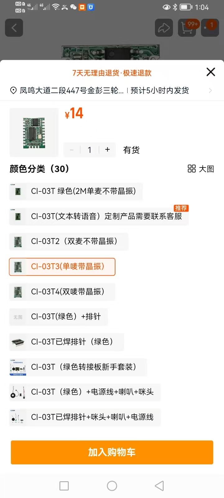

---


---

### 双麦带晶振的芯片应该使用哪个转接板？

**问题描述：**

需要为带有双麦克风和晶振的芯片选择合适的转接板。

**解决方案：**

**推荐型号：**

1. **CI-03T模块**
    - 支持双麦克风配置
    - 带有晶振电路
    - 适合一般双麦应用

2. **CI-33T模块**
    - 支持双麦克风配置
    - 带有晶振电路
    - 支持更多词条（500条）

**转接板说明：**

- 转接板指的是黑色的连接底板
- 用于将芯片引脚引出，方便连接和测试
- CI-03T和CI-33T都使用相同类型的转接板

**注意事项：**

- 确保芯片型号与双麦克风配置匹配
- 转接板主要起引脚扩展作用
- 如需量产，建议直接使用模块而非转接板方案

---

---


---

### 用于二次开发如何选择语音模块？

**问题描述：**

需要为二次开发选择合适的离线语音识别芯片，并通过现有主控板的串口来控制该芯片。

**解决方案：**

**选型建议：**

- **推荐CI系列模块**：CI-03T、CI-33T等
- 生成速度快，大部分能满足二次开发需求
- 支持通过串口与主控板通信

**功能特点：**

1. **CI系列优势**
    - 支持Mixly图形化编程
    - 生成速度快，开发效率高
    - 功能丰富，支持AEC打断
    - 适合快速原型开发

2. **通信能力**
    - 支持UART串口通信
    - 可配置波特率参数
    - 支持串口触发和数据输出
    - 方便与各类主控板对接

**应用场景：**

- 语音识别作为传感器模块
- 主控板处理复杂逻辑
- 语音模块负责识别和播报
- 通过串口进行数据交换

**注意事项：**

- CI系列比SU系列更适合二次开发
- 选择时考虑词条数量需求
- 确认串口电平匹配（3.3V/5V）
- 保留足够的IO资源用于功能扩展


---

### 哪些模块支持语音打断功能？

**问题描述：**

需要了解哪些型号的语音模块支持打断功能，以及哪些型号支持快速生成固件。

**解决方案：**

**打断功能支持情况：**

1. **不支持打断的型号**：

    - SU-03T：不支持语音打断功能
    - SU-10A/SU-11T/SU-13T等SU系列：均不支持
    - 需要说完整条指令才能识别

2. **支持打断的型号**：

    - CI系列（CI-03T/CI-33T/CI-73T等）：支持打断
    - 可在识别过程中随时打断，响应更快
    - 用户体验更自然流畅

**固件生成速度对比：**

1. **快速生成系列**：

    - CI系列：固件生成速度快，通常几分钟完成
    - CI-03T：生成速度最快，适合频繁调试
    - 适合需要快速迭代开发的项目

2. **较慢生成系列**：

    - SU-63T：生成较慢，需要30分钟或更长时间
    - SU-03T：生成速度中等
    - 可能需要排队等待，高峰期时间更长

**选型建议：**

1. **需要打断功能**：

    - 优先选择CI系列模块
    - CI-03T是性价比最高的选择
    - 适合需要快速响应的应用

2. **需要快速开发**：

    - 选择CI系列可大幅提升开发效率
    - 避免长时间等待固件生成
    - 支持快速测试和调试

3. **功能需求评估**：

    - 如不需要打断，SU系列性价比更高
    - SU-63T支持蓝牙功能，适合特定场景
    - 根据实际功能需求选择合适系列

**注意事项：**

- 打断功能影响交互体验，如需要应选择CI系列
- 固件生成速度影响开发效率，批量开发时优先考虑
- 选型前先测试小批量，确认符合需求
- 保留模块选型对比表供后续参考


---


---

### 哪些型号支持音乐播报打断功能？

**问题描述：**

需要了解CI-03T系列和SU-63T型号是否支持音乐播报功能的打断。

**解决方案：**

**功能支持情况**

- **SU-63T**：支持音乐播报打断功能
- **CI-03T/CI-03T1**：不支持音乐播报打断功能

**应用场景说明**

**SU-63T适用场景：**

- 智能音箱产品
- 蓝牙音响
- 需要语音控制音乐播放的设备
- 支持唤醒词打断音乐播放

**CI-03T系列适用场景：**

- 普通语音控制设备
- 不需要音乐播放功能
- 成本敏感的应用
- 基础语音交互需求

**技术差异**

- SU-63T在音频处理和蓝牙功能上有特殊优化
- 支持音频流的中断和恢复
- 具备更复杂的音频管理能力

**选型建议**

- 如需要音乐播报和打断功能，选择SU-63T
- 如只需要基础语音控制，CI-03T系列即可满足需求
- 根据产品最终功能需求确定型号

---


---

### 不同型号语音模块的参数如何对比？

**问题描述：**

需要了解CI-03T1、CI-03T2（双麦）等不同型号语音模块在性能、接口和适用环境上的具体差异。

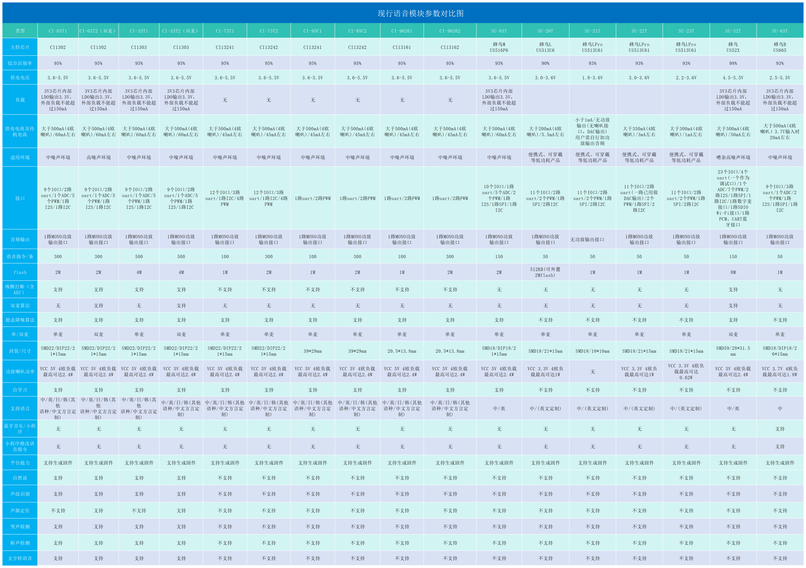

**解决方案：**

**主要参数对比：**

1. **CI-03T系列对比**
    - **CI-03T1**：单麦克风版本，适用于一般环境
    - **CI-03T2（双麦）**：双麦克风版本，支持降噪算法
    - 双麦版本在嘈杂环境下识别效果更好

2. **关键差异参数**
    - **主控芯片**：不同型号可能使用不同芯片
    - **供电电压**：通常为3.3V或5V
    - **音频输出**：支持PWM或DAC输出
    - **Flash容量**：影响存储的指令数量
    - **封装尺寸**：影响PCB设计

3. **功能特性对比**
    - **唤醒打断**：部分型号支持
    - **双麦算法**：仅双麦型号支持
    - **稳态降噪**：高端型号支持
    - **自学习功能**：部分型号支持
    - **声纹识别**：特定型号支持

**选型建议：**

1. **环境考虑**
    - 安静环境：选择单麦型号（CI-03T1）
    - 嘈杂环境：选择双麦型号（CI-03T2）
    - 远距离识别：选择带降噪的型号

2. **功能需求**
    - 基础控制：选择标准型号
    - 需要降噪：选择支持算法的型号
    - 特殊功能：确认型号支持对应特性

3. **成本考量**
    - 双麦型号成本更高
    - 根据实际需求选择合适配置
    - 避免过度设计

**注意事项：**

- 选型前查看完整的参数对比表
- 确认封装尺寸与产品结构匹配
- 考虑未来功能扩展的可能性
- 咨询技术支持获取最新信息

---


---

### LD3320可以直接换成CI-03T吗？

**问题描述：**

想知道现有LD3320语音模块是否可以直接替换为CI-03T，以及现有硬件是否需要修改。

**解决方案：**

**1. 硬件兼容性分析**

- **引脚差异**：

    - LD3320：标准SPI接口
    - CI-03T：复杂的多功能接口
    - 引脚定义完全不同
    - 不能直接替换

- **电路设计差异**：

    - LD3320：需要外部MCU控制
    - CI-03T：内置处理单元
    - 工作原理不同
    - 需要重新设计电路

**2. 替换方案**

- **最小改动方案**：

    - 保留LD3320的MCU电路
    - CI-03T作为语音识别从设备
    - 通过串口通信传递识别结果
    - 需要双MCU架构

- **完全替换方案**：

    - 使用CI-03T作为主控
    - 重新设计整个电路板
    - 利用CI-03T的完整功能
    - 降低系统复杂度

**3. 实施建议**

- **评估工作量**：

    - 直接替换：几乎不可能
    - 修改适配：工作量大
    - 重新设计：推荐方案
    - 成本效益分析

- **技术选择**：

    - 新项目：直接采用CI-03T
    - 现有项目：评估改造成本
    - 量产品：建议重新设计
    - 学习项目：可尝试改造

**注意事项：**

- LD3320和CI-03T架构完全不同
- 不建议尝试直接替换
- 考虑整体方案成本
- 新项目避免使用LD3320

---

---

### 现有语音模块可以复刻为CI-03T吗？

**问题描述：**

想了解LD3320模块的IC型号，以及是否可以复刻或替换为新型号的CI-03T芯片，现有硬件是否兼容。

**解决方案：**

**1. 芯片架构差异**

- **LD3320特点**：

    - 专用ASIC语音识别芯片
    - 固定的识别算法
    - 需要外部MCU控制
    - 无处理能力

- **CI-03T特点**：

    - CI1302系列SoC芯片
    - 内置ARM Cortex-M0内核
    - 集成识别和处理功能
    - 可独立工作

**2. 复刻可行性分析**

- **直接复刻**：

    - 芯片架构完全不同
    - 引脚定义不兼容
    - 无法直接替换
    - 需要重新设计

- **部分复用**：

    - 保留现有PCB底板
    - 重新设计核心电路
    - 适配外围电路
    - 可能成本更高

**3. 实施方案**

- **完全重新设计**：

    - 采用CI-03T作为主控
    - 利用现有电源设计
    - 重新布线连接
    - 整体性能更好

- **双MCU方案**：

    - LD3320继续处理简单逻辑
    - CI-03T负责语音识别
    - 通过串口通信
    - 开发复杂度高

**4. 成本效益分析**

- **开发成本**：

    - 重新设计：一次性投入
    - 学习新平台：时间成本
    - 长期收益：功能更强

- **建议方案**：

    - 新项目：直接采用CI-03T
    - 改造项目：评估投入产出比
    - 学习验证：可购买开发板

**注意事项：**

- LD3320和CI-03T是不同代产品
- 简单替换技术上不可行
- 考虑整体方案而非单点替换

---


---


---

### CI-03T系列支持哪些语音识别功能？

**问题描述：**

询问CI-03T系列是否支持所有列出的语音识别功能，特别是自学习功能的具体实现方式。

**解决方案：**

CI-03T系列支持完整的语音识别功能套件，包括：

**1. 支持的功能模式**

- 仅语音识别
- 语音识别 + 自学习
- 语音识别 + 深度降噪
- 以及其他组合功能模式

**2. 自学习功能说明**

- 支持用户自定义添加命令词
- 无需重新编程即可学习新指令
- 可通过特定操作模式进入学习状态
- 学习完成后立即生效

**3. 获取教程资源**

- 官方提供详细的教程视频
- B站搜索：CI-03T免唤醒和自学习教程
- 教程涵盖配置方法和使用技巧

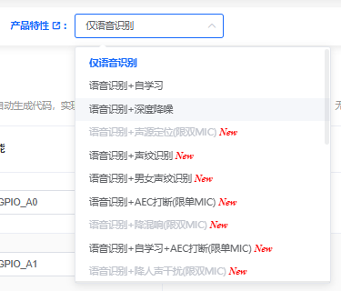

**注意事项：**

- CI-03T系列所有型号都支持上述功能
- 自学习功能有容量限制，建议合理安排命令词
- 深度降噪功能可能增加功耗
- 具体操作请参考官方教程文档

---

---


---

### CI-03T1和CI-03T2的主要区别是什么？

**问题描述：**

需要了解CI-03T1和CI-03T2两款离线语音识别芯片的技术参数和主要区别。

**解决方案：**

1. **基本配置对比**

| 项目 | CI-03T1 | CI-03T2 |
|------|-----------|-----------|
| 麦克风配置 | 单麦克风 | 双麦克风 |
| 唤醒效果 | 标准配置 | 增强配置 |
| 适用环境 | 普通环境 | 复杂噪声环境 |
| 识别精度 | 标准 | 更高 |

2. **双麦克风优势（CI-03T2）**
    - 更好的噪声抑制能力
    - 提升远场识别效果
    - 增强方向性识别
    - 适合嘈杂环境使用

3. **选择建议**

**选择CI-03T1的情况：**

    - 成本敏感型项目
    - 使用环境相对安静
    - 对识别距离要求不高
    - 基础功能需求

**选择CI-03T2的情况：**

    - 需要较高的识别精度
    - 使用环境噪声较大
    - 要求远距离识别
    - 对可靠性要求高

**注意事项：**

- 两者命令词数量和功能基本相同
- 双麦克风版本成本略高
- 根据实际应用场景选择合适型号
- 开发接口和配置方式完全兼容

---


---

### 哪些模块适合AI应用？

**问题描述：**

需要了解现有模块中哪些适合AI应用场景，以及CI-03T7是否是合适的选择。

**解决方案：**

**适合AI应用的模块推荐：**

1. **AI语音处理需求分析**：

    - **自然语言理解**：需要支持复杂语义识别
    - **多轮对话**：需要上下文记忆能力
    - **智能响应**：需要支持AI模型集成
    - **云端连接**：需要网络通信能力

2. **现有模块AI支持程度**：

    **基础语音模块（不适合纯AI应用）**：

    - SU系列、CI系列专注于离线命令词识别
    - 功能局限于固定词条的语音触发
    - 不具备自然语言理解能力
    - 无AI模型运行环境

    **带AI功能的模块**：

    - **JX-A7T**：支持在线AI语音交互
    - **XR-50A**：WiFi模块，可连接云端AI服务
    - **BL-62B**：蓝牙模块，可配合手机AI助手

3. **CI-03T7定位说明**：

    - CI-03T7是CI-03T的某个特殊版本
    - 主要功能仍是离线语音识别
    - 不直接支持AI应用场景
    - 如需AI功能需要配合其他方案

**AI应用实现方案：**

**方案一：语音识别 + MCU + AI**
```
离线语音模块 → MCU处理 → AI模块/云端
        ↓              ↓           ↓
    命令词解析    业务逻辑处理    AI推理
```

**方案二：使用带连接功能的模块**

- 选择XR-50A（WiFi）或BL-62B（蓝牙）
- 通过网络连接到云端AI服务
- 实现语音到AI的完整链路

**方案三：定制AI语音方案**

- 联系技术支持定制AI语音模组
- 集成语音识别与AI处理能力
- 适合批量生产的AI产品

**注意事项：**

- 纯离线语音模块无法直接实现AI功能
- CI-03T7仍是离线识别方案，不适合纯AI应用
- AI应用需要考虑网络连接和云端服务
- 成本敏感项目可选择离线+简单的逻辑判断


---

### 如何通过芯片丝印识别语音模块型号？

**问题描述：**

PCB板上的主控芯片丝印标识为"X80028 843"，需要确认该芯片的具体型号。

**解决方案：**

- **丝印信息分析**：

    - "X80028"可能是厂商内部代码或批次号
    - "843"可能是生产批号或版本标识
    - 这些标识通常不是标准的芯片型号

- **识别方法**：

    1. **外观对比**：

        - 对比已知型号模块的PCB布局
        - 查看外围电路设计特征
        - 比较元器件配置差异

    2. **电气特性测试**：

        - 测试工作电压和电流
        - 检查引脚功能定义
        - 对比不同型号的技术参数

    3. **功能验证**：

        - 尝试烧录不同型号的固件
        - 观察哪些固件可以正常工作
        - 测试支持的功能特性

- **常见对应关系**：

    - CI-03T1/T2：可能使用不同的内部芯片代号
    - 不同批次可能使用丝印不同的芯片
    - 功能相同的情况下可能是兼容替代料

**注意事项：**

- 芯片丝印与对外型号可能不完全对应
- 建议通过功能测试确认最终型号
- 如需精确识别，可联系原厂商获取对应表
- 保留清晰的芯片照片以便进一步确认

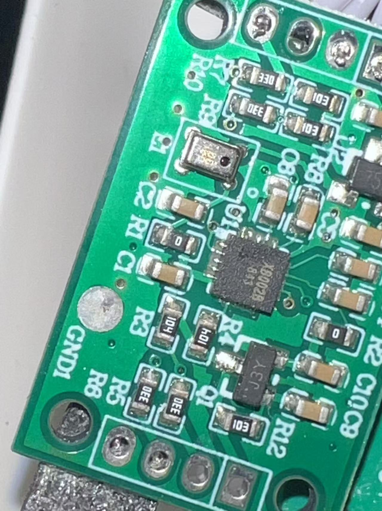

---


---

### SU23T与CI-03T1/T2是否使用相同芯片？

**问题描述：**

需要确认SU23T型号是否与CI-03T1或CI-03T2使用相同的芯片方案。

**解决方案：**

- **型号系列关系**：

    - SU23T和CI-03T系列可能属于不同的产品线
    - 即使使用相同芯片，外围电路和配置可能不同
    - 型号前缀不同通常表示应用场景差异

- **功能对比分析**：

| 特性 | SU23T | CI-03T1 | CI-03T2 |
|------|-------|----------|----------|
| 唤醒词支持 | 可能不同 | 1-2个 | 1-2个 |
| 命令词数量 | 需确认 | 300条 | 300条 |
| 麦克风配置 | 可能不同 | 单麦 | 双麦 |
| 功耗特性 | 可能更低 | 标准 | 标准 |
| 应用场景 | 待确认 | 通用 | 通用 |

- **判断方法**：

    1. **技术文档对比**：

        - 查看官方规格书对比
        - 对比引脚定义
        - 比较电气参数

    2. **实际测试**：

        - 测试固件兼容性
        - 对比功能特性
        - 验证性能差异

    3. **外观对比**：

        - PCB布局差异
        - 元器件配置
        - 接口定义

- **可能性分析**：

    - **方案1**：使用相同主控芯片，不同外围配置
    - **方案2**：使用不同芯片，功能类似
    - **方案3**：完全不同的技术方案

**注意事项：**

- 型号不同通常不建议直接替换使用
- 即使芯片相同，固件也可能不兼容
- 建议使用官方型号替换，避免兼容性问题
- 如需替换，先进行小批量测试

---


---

### CI-03T1与CI-73T1型号的主要区别是什么，以及如何根据选型指南进行选择？

**问题描述：**

需要了解CI-03T1与CI-73T1两款型号的主要技术差异，以便根据项目需求选择合适的模块。

**解决方案：**

根据选型指南对比表，CI-03T1与CI-73T1的主要区别如下：

**主要参数对比：**

| 参数 | CI-03T1 | CI-73T1 |
|------|----------|----------|
| 主控芯片 | CI1302 | CI1302 |
| 供电电压 | 3.6-5.5V | 3.6-5.5V |
| 接口 | UART | UART |
| 语音指令数量 | 300条 | 300条 |
| Flash容量 | 2M | 2M |
| 唤醒打断 | 支持 | 支持 |
| 双麦算法 | 不支持 | 支持 |
| 稳态降噪算法 | 支持 | 支持 |
| 封装尺寸 | 标准封装 | 标准封装 |
| 功放喇叭功率 | 2.4W@5V4Ω | 2.4W@5V4Ω |

**核心差异：**

1. **双麦克风算法**：

    - CI-03T1：单麦克风设计
    - CI-73T1：支持双麦克风阵列算法

2. **降噪能力**：

    - CI-03T1：支持稳态降噪算法
    - CI-73T1：同时支持双麦算法和稳态降噪

**选型建议：**

1. **选择CI-03T1的场景**：

    - 成本敏感的基础应用
    - 普通室内环境
    - 对降噪要求不高的场景

2. **选择CI-73T1的场景**：

    - 嘈杂环境下的语音识别
    - 需要更好降噪效果的应用
    - 对识别率要求较高的场景

**注意事项：**

- 两者的基础功能和性能参数基本相同
- 主要差异在麦克风配置和算法支持
- 选型时根据应用环境的噪声水平决定
- 成本方面CI-03T1更具优势


---


---

### CI-03T1与CI-73T1型号的主要区别是什么？

**问题描述：**

需要了解CI-03T1与CI-73T1两款型号之间的主要差异，以便根据项目需求进行合适的选型。

**解决方案：**

根据选型指南中的参数对比，CI-03T1与CI-73T1的主要区别如下：

- **Flash容量**：CI-03T1为较小容量，CI-73T1提供更大的Flash存储空间
- **支持词条数量**：CI-73T1相比CI-03T1支持更多的语音指令词条
- **封装尺寸**：两款模块的封装尺寸可能存在差异
- **成本差异**：CI-73T1由于容量更大，成本相对较高

**注意事项：**

- 选型时应根据项目对词条数量和存储空间的需求来决定
- 如果词条需求较少，CI-03T1更具性价比优势
- 需要大量词条或复杂功能时，建议选择CI-73T1


---


---

### 离线语音模块能否识别自然语言中的时间信息？

**问题描述：**

需要离线语音识别模块能够识别如"下午3点叫我起床"这样的自然语言指令，并提取出"3点"和"起床"两个关键词来触发相应操作。

**解决方案：**

**1. 离线模块限制**

- 离线语音模块只能识别预置的命令词
- 无法从自然语言中提取关键词
- 不支持语义理解和上下文分析

**2. 可行的替代方案**

- **方案一：预设多个时间命令**
    - 设置"3点起床"、"4点起床"、"5点起床"等多个命令
    - 最多可设置50条命令（根据型号不同）
    - 缺点是不够灵活，无法覆盖所有时间点

- **方案二：使用在线语音模块**
    - 在线语音支持自然语言理解
    - 可识别"下午3点叫我起床"等复杂语句
    - 需要联网使用

- **方案三：混合方案**
    - 离线识别简单命令词
    - 配合MCU定时功能实现复杂功能
    - 通过语音命令设置定时器

**3. 推荐型号**

- **离线型号**：CI-03T、CI-73T系列
    - 优点：响应快、本地处理、数据安全
    - 缺点：只能识别固定命令词

- **带自然语言理解的型号**
    - 需要选择支持在线语音的方案
    - 或使用带AI芯片的更高型号

**注意事项：**

- 离线模块生成固件较快，适合简单应用
- 如需自然语言理解，建议考虑在线方案
- 可根据项目实际需求选择合适的方案

---


---

### CI-03T系列支持联网功能吗？

**问题描述：**

询问CI-03T、CI-73T1、CI-73T2等离线语音识别模块是否支持联网功能。

**解决方案：**

**1. 功能说明**

- CI-03T系列为纯离线语音识别模块
- 不支持WiFi、蓝牙等无线通信功能
- 所有语音处理在本地完成

**2. 工作特点**

- **离线识别**：无需联网，响应速度快
- **本地处理**：语音数据不上传云端，保护隐私
- **固定词条**：支持预置的命令词识别

**3. 与在线模块区别**

| 特性 | CI-03T系列 | 在线语音模块 |
|------|-------------|------------|
| 网络依赖 | 无需网络 | 必须联网 |
| 响应速度 | 快（<1秒） | 慢（依赖网络）|
| 数据隐私 | 本地处理 | 云端处理 |
| 词条数量 | 固定上限 | 动态更新 |
| 成本 | 较低 | 较高 |

**4. 选型建议**

- 需要离线工作：选择CI-03T系列
- 需要联网功能：考虑其他方案
- 对隐私要求高：推荐离线模块
- 需要OTA升级：选择支持网络的型号

**注意事项：**

- 离线模块无法通过云端更新词条
- 如需联网功能，需配合其他模块
- 确认项目对联网的实际需求


---

### 如何根据噪声环境选择合适的语音模块？

**问题描述：**

需要根据不同的应用场景（中噪声环境、高噪声环境）选择合适的语音模块型号。

**解决方案：**

根据适用环境和噪声处理能力选择模块：

- **普通环境**：CI-03T、CI-33T等基础型号
- **中噪声环境**：选择支持稳态降噪算法的型号
- **高噪声环境**：选择支持双麦算法和AEC的型号

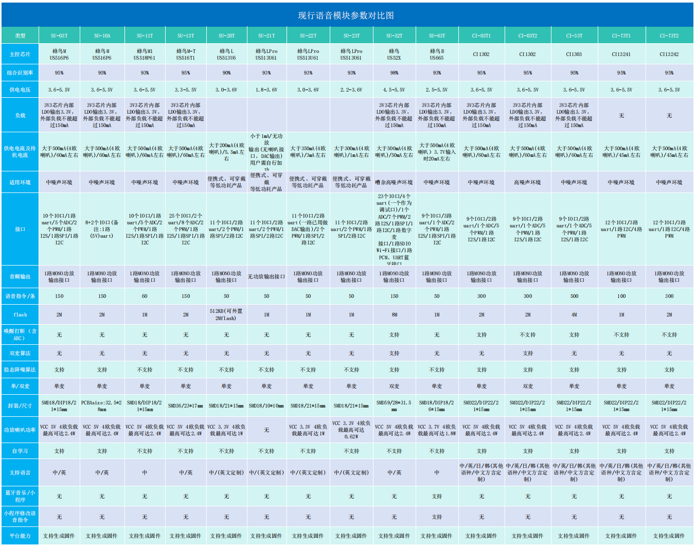

**选型要点：**

- 查看对比表中的"适用环境"列
- 确认模块是否支持双麦算法
- 考虑是否需要AEC（声学回声消除）功能
- 根据实际噪声水平选择合适的降噪算法

**注意事项：**

- 双麦模块在噪声环境中的识别效果优于单麦模块
- AEC功能可在播放音频时保持语音识别能力
- 高噪声环境建议选择具备多种降噪算法的型号

---


---

### CI-03T和CI-33T的主要区别是什么？

**问题描述：**

在选择语音模块时，需要了解CI-03T和CI-33T系列的主要差异，以便根据项目需求选择合适的型号。

**解决方案：**

CI-03T和CI-33T的主要区别在于麦克风配置和支持的词条数量：

**主要差异对比：**

| 特性 | CI-03T | CI-33T |
|------|---------|---------|
| 麦克风配置 | 单麦克风 | 双麦克风 |
| 支持词条数 | 300条 | 500条 |
| 降噪能力 | 基础降噪 | 支持双麦降噪 |
| 适用环境 | 普通环境 | 中等噪声环境 |
| 成本 | 较低 | 略高 |

**选型建议：**

- **选择CI-03T的场景**：

    - 项目成本敏感
    - 使用环境噪声较小
    - 词条需求在300条以内
    - 单麦克风满足需求

- **选择CI-33T的场景**：

    - 需要更好的降噪效果
    - 词条数量超过300条
    - 使用环境有一定噪声
    - 对识别率要求更高

**注意事项：**

- 两个型号的其他硬件规格和功能基本相同
- CI-33T的双麦配置提供更好的噪声抑制能力
- 最终选择应根据具体的项目需求和预算决定


---

### CI系列和SU系列模块有什么区别？

**问题描述：**

需要了解CI系列和SU系列语音模块的主要差异，包括价格、性能、功能等方面的对比，以便选择合适的产品。

**解决方案：**

**主要差异对比：**

| 特性 | CI系列 | SU系列 |
|------|--------|--------|
| **价格** | 更便宜 | 更贵 |
| **生成速度** | 快速，无需排队 | 较慢，需要排队 |
| **服务模式** | 在线/离线均可 | 主要在线生成 |
| **性能表现** | 基本相同 | 基本相同 |
| **功能支持** | 语音识别、控制 | 语音识别、控制 |

**详细说明：**

1. **价格差异**

    - CI系列：性价比更高，成本更低
    - SU系列：价格较高，但提供更多服务
    - 实际价格请咨询官方销售

2. **固件生成**

    - CI系列：本地快速生成，立等可取
    - SU系列：服务器生成，高峰期需排队
    - 影响开发效率和项目周期

3. **技术支持**

    - CI系列：提供离线开发包
    - SU系列：完善的在线平台支持
    - 都有官方技术支持服务

**选择建议：**

1. **选择CI系列的情况**

    - 预算有限，追求性价比
    - 需要频繁生成固件测试
    - 对开发效率要求高
    - 推荐型号：CI-03T、CI-33T

2. **选择SU系列的情况**

    - 需要完善的在线平台支持
    - 不介意固件生成等待时间
    - 希望获得更多官方服务
    - 适合初学者和快速原型开发

**性能表现：**

- 识别准确率：两个系列基本相同
- 响应速度：无明显差异
- 功耗表现：相当
- 稳定性：都能满足工业应用需求

**注意事项：**

- CI系列和SU系列的核心语音芯片相同
- 主要差异在服务模式和商业模式
- 根据项目需求和预算灵活选择
- 建议小批量试用后再批量采购

---

### 如何了解产品使用的芯片品牌？

**问题描述：**

需要了解公司产品的芯片品牌信息，特别是CI-03T系列芯片所使用的主控芯片品牌。

**解决方案：**

**1. 常见芯片品牌**

- **SU-03T**：使用松翰（Panasonic）芯片
- **CI-03T**：使用松翰（Panasonic）芯片
- 其他型号可能使用不同品牌芯片

**2. 芯片信息获取方式**

- 查看产品规格书
- 联系技术支持确认
- 查看芯片表面的丝印标识

**3. 选型考虑因素**

- 芯片品牌不是唯一选择标准
- 需要综合考虑功能需求、成本、供货情况
- 关注芯片的技术参数和算法支持

**注意事项：**

- 相同品牌不同型号的芯片可能有差异
- 选型时以实际功能需求为准
- 芯片品牌会影响部分性能表现

---


---

### Flash容量是否可以定制？

**问题描述：**

询问CI-03T1或CI-03T2型号的Flash容量是否可以定制为更大的容量。

**解决方案：**

1. **标准容量说明**

    - CI-03T1/CI-03T2标配Flash容量：2MB
    - 此容量满足大多数应用场景需求
    - 支持存储固件、语音模型和必要的音频文件

2. **容量评估**

    - 2MB Flash通常足够使用：

        - 固件程序：约800KB-1MB
        - 语音识别模型：约300-500KB
        - 剩余空间用于音频文件
    - CI-03T2的2MB容量是经过合理设计的

3. **定制可能性**

    - 标准产品不支持Flash容量定制
    - 如需更大容量，考虑以下方案：

        - 使用CI-33T（4MB Flash）
        - 评估是否真的需要更大容量
        - 优化代码和音频文件大小

**注意事项：**

- CI-03T系列只有2MB版本
- 更大容量的CI-33T是更好的选择
- 定制大容量可能需要最小起订量
- 建议先评估2MB是否真的不够用

---


---

### 物联网终端需要识别动态语音指令内容如何选型？

**问题描述：**

在物联网终端设备中需要实现语音指令的识别与内容同步编码返回功能，但现有CI-03T1/03T2离线语音识别芯片无法满足非固定、动态的语音识别需求。

**解决方案：**

**1. 需求分析**

- **核心需求**：识别语音指令内容并编码返回
- **技术要求**：需要ASR算法和在线识别能力
- **存储需求**：需要存储词海，占用空间较大

**2. 技术方案**

- **在线ASR方案**：

    - 使用JX-A7T在线定制模块
    - 支持离线+在线结合识别
    - 自家研发大模型，可定制训练

- **实现流程**：

    1. 语音指令识别（ASR）
    2. 内容编码转换
    3. 通过串口返回编码结果
    4. 单片机处理编码数据

**3. 模块选择**

| 需求类型 | 推荐模块 | 实现方式 |
|---------|----------|----------|
| 离线固定指令 | CI-03T系列 | 预设命令词库 |
| 动态内容识别 | JX-A7T | 在线ASR+大模型 |
| 混合需求 | CI-03T+JX-A7T | 双模块方案 |

**4. 定制说明**

- **ASR训练**：针对专属名词识别需要定制
- **TTS训练**：播放音色需要训练
- **模型微调**：根据应用场景优化算法
- **词库构建**：建立行业专用词库

**注意事项：**

- 完全动态的语音识别必须使用在线方案
- 离线模块只能识别预设的固定词条
- 在线方案需要网络连接支持
- 定制开发需要评估具体需求和成本

---


---

### 220V户外壁灯如何选择离线语音控制方案？

**问题描述：**

需要为220V户外壁灯选择支持语音控制（开灯/关灯）的离线语音识别芯片，且不希望使用喇叭，同时询问是否需要额外的电源转换器。

**解决方案：**

**1. 推荐型号**

根据只需开灯/关灯功能的需求，推荐使用 **CI-03T** 模块：

- **基础功能**：支持离线语音识别，可配置开灯/关灯指令
- **成本优势**：性价比高，适合简单的控制场景
- **供电要求**：5V供电，需配合电源转换电路使用

**2. 电源方案**

对于220V户外壁灯应用：

- **电源转换**：需要额外的电源转换器将220V交流电转换为5V直流电
- **推荐方案**：使用AC-DC模块（如HLK-PM01）或开关电源模块
- **功率要求**：确保电源输出电流至少500mA，建议预留30%余量

**3. 控制方案**

**继电器控制方式**：

- 语音模块输出GPIO信号控制继电器
- 继电器触点控制220V灯具通断
- 需要硬件工程师设计控制电路板

**带通断功能模块**：

- 可选择集成了通断功能的特殊模块
- 直接连接220V电路，简化设计
- 需确认具体型号的电气参数

**4. 无喇叭方案**

- CI-03T支持不连接喇叭的工作模式
- 语音识别功能正常，只是没有语音反馈
- 可通过LED指示灯提供状态反馈

**参数对比参考**：

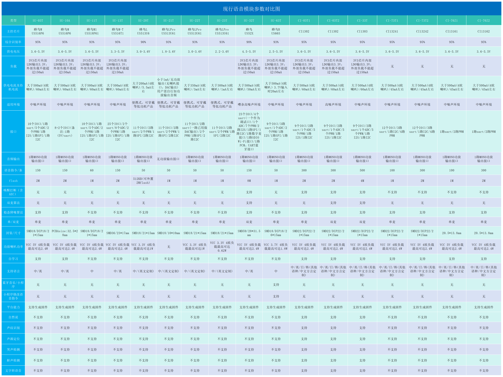

**注意事项：**

- 户外使用需考虑IP防护等级
- 220V电路设计需符合安全规范
- 建议增加过压、过流保护电路
- 如需批量生产（100个以上），建议申请样品测试后再下单

---


---

### 门控制器应用中如何实现快速启动和电池供电？

**问题描述：**

门控制器产品需要集成离线语音识别功能，要求支持全英文指令、无需唤醒词、通过IO电平输出识别结果，且芯片需在上电后0.3秒内快速进入工作状态，以适应电池供电和低功耗场景。

**解决方案：**

**1. 快速启动配置**

CI-03T支持快速启动模式，具体配置如下：

- **最快初始化速度**：350ms
- **实现条件**：需要将PA4引脚拉低
- **供电要求**：5V直流供电，模块IO为3.3V输出

**2. IO输出配置**

支持通过GPIO输出识别结果：

- 三个指令对应三个独立IO
- 默认输出低电平
- 识别到指令后输出短时间高电平（如0.1秒）
- 适合直接控制主控MCU

**3. 电池供电优化**

- 模块工作电流：约45-60mA
- 建议采用传感器触发供电方式
- 当检测到人靠近后再给模块供电
- 预留0.5秒启动时间以确保稳定工作

**4. 语音指令配置**

支持全英文指令识别：

- 开门指令：Open The Door / Open
- 关门指令：Close The Door / Close
- 停止指令：Stop
- 无需唤醒词，直接识别命令词

**注意事项：**

- 模块需要5V供电，注意与电池系统的电压匹配
- IO输出为3.3V，确保与主控MCU电平兼容
- 麦克风位置建议对准人说话位置，距离尽量近
- 英文识别时建议将灵敏度调至最高（0.8）

---


---

### 如何使用CI-03T语音模块进行开发？双麦克风版本是否支持降噪？

**问题描述：**

需要了解CI-03T语音模块的使用方法，包括指令输入方式、固件烧录流程，以及模块与主控MCU的通信方式，并询问双麦克风模块是否具备降噪功能。

**解决方案：**

**1. 开发资料获取**

- **官方文档平台**：https://help.aimachip.com/docs/offline_ci03t
- **开发包下载**：包含模块基本资料、烧录资料、芯片资料等完整文档
- **视频教程**：B站搜索"智能公元"，有新手教程和操作指导

**2. 指令配置方式**

支持在线平台直接配置：

- 访问智能公元平台
- 直接输入要识别的命令词
- 平台自动生成固件
- 支持中英文指令配置

**3. 固件烧录流程**

- 下载烧录软件（在文档平台获取）
- 连接烧录器套装（包含03T纯模块、烧录器等）
- 选择生成的固件文件
- 执行烧录到模块

**4. 与MCU通信方式**

支持多种通信方式：

- **IO电平输出**：3.3V电平，可直接控制MCU
- **串口通信**：支持协议通信
- **建议方式**：简单控制用IO，复杂交互用串口

**5. 双麦克风降噪功能**

双麦克风版本支持降噪：

- **CI-03T2**：双麦克风带晶振版本
- 支持双麦降噪算法
- 适合噪声环境应用
- 麦克风间距建议3-5cm

**注意事项：**

- 新手建议购买烧录器套装，包含所有必要组件
- 双麦克风版本需要8个控制口，B5和B6引脚不可用
- 修改单麦为双麦需要焊掉R12电阻
- 不具备硬件修改条件建议直接采购双麦版本

---

### CI-03T转接板烧录套装的黑色和绿色版本有什么区别？

**问题描述：**

需要了解CI-03T转接板烧录套装中黑色和绿色两种转接板新手套装的具体差异，以便选择合适的产品。

**解决方案：**

CI-03T转接板烧录套装的黑色和绿色版本在**功能和配置上完全相同**，没有差异。

**套装包含组件：**

- 电源线
- 喇叭
- 转接板（黑色或绿色）
- 焊排针模块
- CH340烧录器
- 咪头

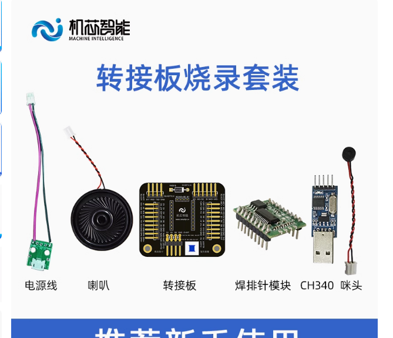

**选型建议：**

- 颜色选择仅基于个人偏好或项目需求
- 两种版本的套装价格相同
- 功能和性能完全一致

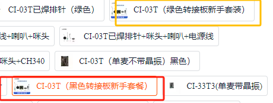

**注意事项：**

- 黑色和绿色转接板只是外观颜色不同
- 内部电路设计和接口定义完全相同
- 购买时可任选颜色，不影响使用

---

### 如何识别CI-03T1和CI-03T2以及已焊排针版本？

**问题描述：**

需要确认CI-03T芯片产品的具体型号和配置信息，特别是区分CI-03T1和CI-03T2的不同，以及确认是否为已焊排针的版本。

**解决方案：**

**型号识别方法：**

1. **CI-03T1和CI-03T2的区别**
    - CI-03T1：单麦克风版本
    - CI-03T2：双麦克风版本
    - 功能完全相同，仅麦克风数量不同

2. **产品标签识别**
    - 查看产品包装或标签上的型号标识
    - "CI-03T（单麦不带晶振）黑色" - CI-03T1
    - "CI-03T3（单麦带晶振）" - CI-03T1带晶振版本
    - "CI-03T（绿色转接板新手套装）" - 包含转接板的完整套装


**已焊排针版本识别：**

- 查看产品标签：标注"CI-03T已焊排针（绿色）"表示已焊接排针
- 已焊排针版本可直接插入杜邦线使用
- 未焊排针版本需要自行焊接或额外购买转接板


**选型建议：**

1. **根据应用环境选择**
    - 安静环境：选择CI-03T1（单麦）
    - 噪声环境：选择CI-03T2（双麦）

2. **根据使用需求选择**
    - 快速开发：选择已焊排针版本或转接板套装
    - 批量生产：选择未焊版本，降低成本

**注意事项：**

- CI-03T1和CI-03T2在软件上完全兼容
- 已焊排针版本更适合初学者和快速原型验证
- 带晶振版本时钟更稳定，建议优先选择

---


### CI-03T 是否支持鼾声检测功能？

**问题描述：**

在呼吸机项目中使用 CI-03T 模组，需要确认是否支持鼾声检测功能，以评估是否满足未来功能扩展需求。

**解决方案：**

CI-03T 模组目前**不支持**鼾声检测功能。

**功能规划：**

- 鼾声检测是未来可能实现的功能扩展
- 目前该功能尚未开发和集成到产品中
- 如需该功能，需要考虑定制开发方案

**注意事项：**

- 当前版本专注于语音识别和命令词识别功能
- 若鼾声检测是项目核心需求，建议评估其他技术方案或等待功能开发
- 可关注产品更新动态或联系技术支持了解开发进度

---

### 需要大量时间控制指令时如何选型？

**问题描述：**

需要实现继电器在不同时间点（1-60秒、1-60分钟）的精确控制，每个时间点都需要独立指令，导致指令数量严重不足。

**解决方案：**

**1. 指令数量分析**

- **CI-03T1/T2**：支持300条指令
- **需求统计**：

    - 秒数控制：60条指令（1-60秒）
    - 分钟控制：60条指令（1-60分钟）
    - 总计需求：120条指令
- **剩余空间**：180条指令可用于其他功能

**2. 优化方案建议**

**方案一：使用CI-33T**

- **指令容量**：支持500条指令
    - 更充足的指令空间
    - 可扩展更多功能
    - 无需担心指令不足

**方案二：指令优化设计**

- **分段控制**：

    - 0-10秒、10-30秒、30-60秒分段
    - 减少50%的指令数量
    - 通过组合指令实现精确控制

- **模糊指令**：

    - 使用"加"、"减"调节时间
    - 通过多次语音达到目标时间
    - 大幅减少指令数量

**方案三：混合方案**

- **时间分级**：

    - 秒级：5秒、10秒、30秒、60秒
    - 分级：5分、10分、30分、60分
    - 组合使用实现大部分需求

**3. 选型建议**

根据项目需求选择：

- **指令需求>300条**：必须选择CI-33T
- **成本优先**：优化指令设计，使用CI-03T
- **扩展性强**：选择CI-33T预留空间

**注意事项：**

- CI-33T的Flash容量更大（4M vs 2M）
- 价格差异需要评估
- 指令过多可能影响识别率
- 建议预留20%的指令余量

---

### CI-03T2双麦产品中带晶振与不带晶振版本有何区别？

**问题描述：**

需要了解CI-03T2双麦克风产品中带晶振和不带晶振版本的区别，以及在产品选型时应如何考虑。

**解决方案：**

**主要区别**

1. **温漂特性**
    - **带晶振版本**：温漂更小，频率稳定性更高
    - **不带晶振版本**：使用内部时钟，可能有轻微温漂

2. **使用场景选择**
    - 根据具体应用环境选择
    - 对频率精度要求高的场景选择带晶振版本
    - 成本敏感且要求不高的场景可选不带晶振版本

**选型建议**

- **精密控制应用**：选择带晶振版本
- **一般语音识别应用**：两个版本均可
- **极端温度环境**：建议选择带晶振版本
- **成本优化项目**：可考虑不带晶振版本

**注意事项：**

- 两个版本的基本功能相同
- 晶振主要影响时钟精度和温度稳定性
- 根据产品定位和成本预算合理选择

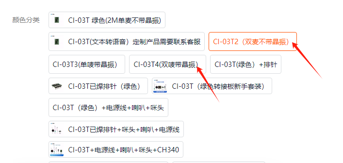

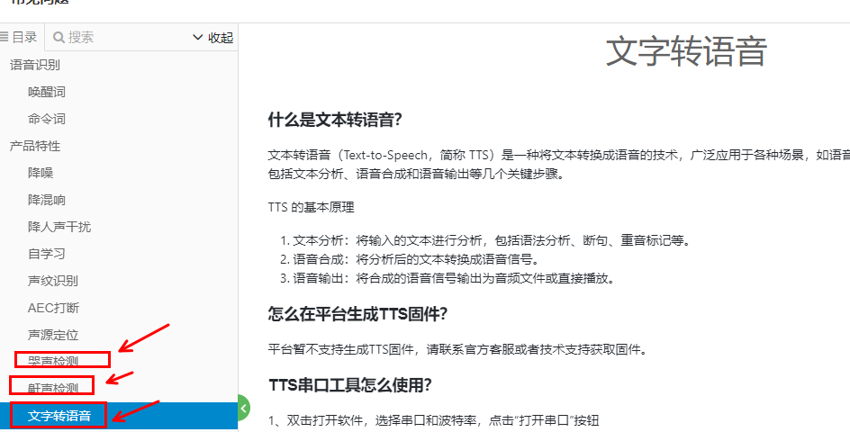

---

### CI-03T1批量采购价格是多少？

**问题描述：**

需要了解CI-03T1芯片的批量采购价格，以及样品对应的芯片型号确认。

**解决方案：**

**批量价格信息：**

- **万片批量价**：3元/片
- **样品形式**：以模块形式提供，非单独芯片
- **对应芯片**：CI13242

**样品说明：**

- **样品发货**：提供完整模块（包含芯片、外围电路）
- **芯片确认**：模块内部使用CI13242芯片
- **存储容量**：提供2M Flash版本

**采购建议：**

1. **小批量测试**：

    - 建议先采购样品模块进行测试
    - 确认功能满足需求后再批量采购
    - 评估与现有产品的兼容性

2. **批量采购**：

    - 万片以上可享受3元批量价
    - 提前规划采购周期
    - 确认质量标准和验收条件

**注意事项：**

- 批量价格与采购数量直接相关
- 样品为完整模块，包含必要的外围器件
- 确认芯片型号（CI13242）与设计需求匹配
- 2M Flash容量适用于大多数应用场景

---

## 双麦克风与AEC功能选择

### CI-03T系列双麦克风版本的AEC功能支持情况如何？

**问题描述：**

需要了解CI-03T系列双麦克风版本（如CI-03T4）是否支持AEC（回声消除）功能，以及如何选择适合的型号。

**解决方案：**

**1. 双麦克风版本AEC支持情况**

- **普通双麦克风版本**：内部不支持AEC功能
    - 一个麦克风用于语音识别，另一个用于降噪
    - 无法实现回声消除
    - 适合噪声环境但不需要AEC的场景

- **双麦克风AEC版本**：支持外部AEC功能
    - 需要配合外部电路使用
    - 可实现语音打断功能
    - 适合需要AEC的应用场景

**2. 单麦克风AEC版本**

- **CI-03T3**：单麦克风AEC带晶振版本
    - 内置AEC功能，无需外部电路
    - 直接使用内部功放即可
    - 推荐用于AEC应用

**3. 选型建议**

**根据应用场景选择：**

- **需要AEC功能**：

    - 选择CI-03T3（单麦AEC）
    - 或选择双麦克风版本+外部AEC电路
    - 适合音响、故事机等应用

- **仅需要降噪**：

    - 选择普通双麦克风版本
    - 适合工厂、户外等嘈杂环境
    - 成本相对较低

- **综合需求**：

    - 根据具体需求权衡功能与成本
    - 考虑开发复杂度
    - 优先选择成熟方案

**4. 注意事项**

- 普通双麦克风版本标注明确不支持AEC
- 购买时需确认具体型号和配置
- 双麦克风AEC需要配合CLASS-AB类功放
- 如使用外部功放，需要设计分压电路


---

### CI-03T1芯片串口播放功能配置后，使用变量无法播放语音，如何解决？

这是由于变量配置和触发设置不匹配导致的。

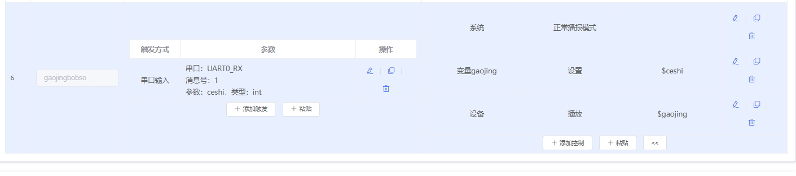

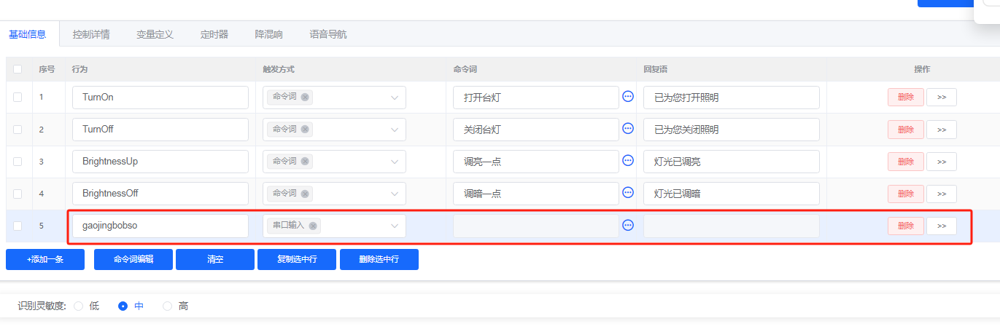

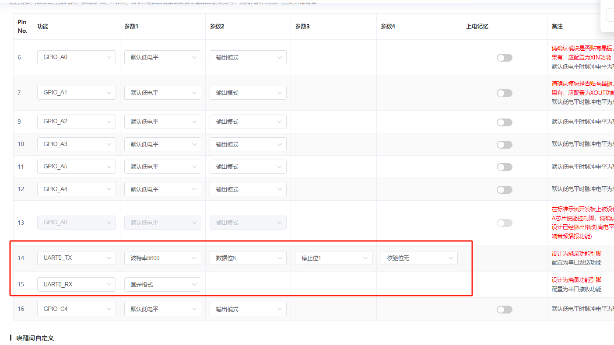

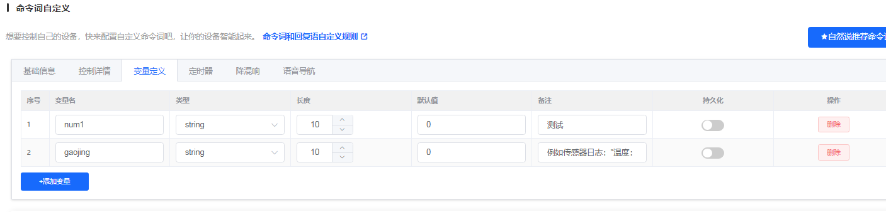

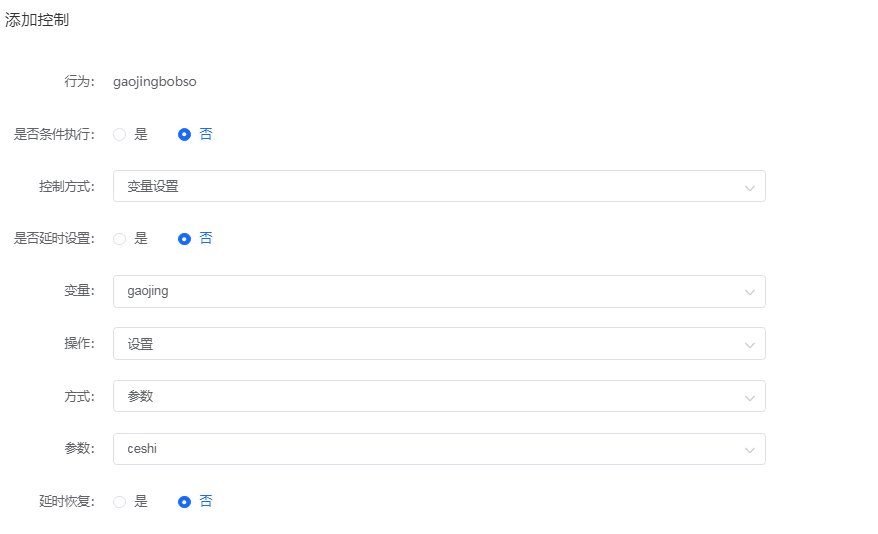

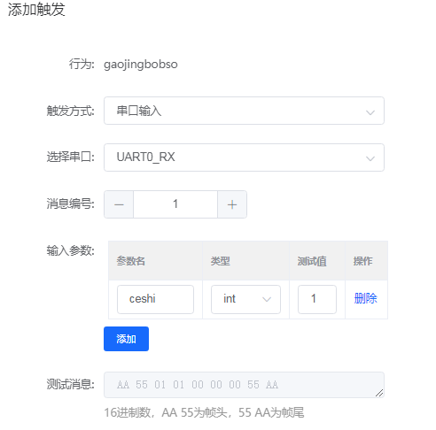

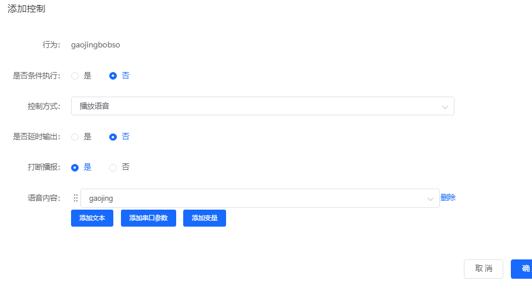

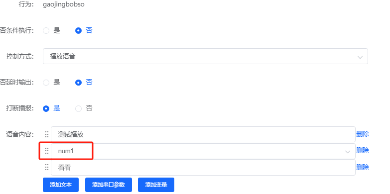

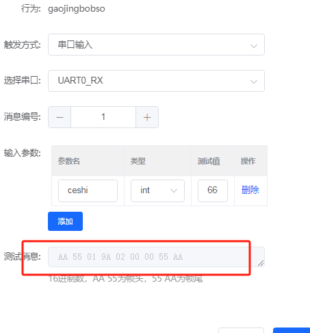

问题分析
- 串口接收到特定16进制数据时能播放预设内容
- 使用变量num1时无法播放
- 变量未被正确设置或引用

解决方案
1. **检查变量设置**：

    - 确认变量gaojing的默认值不是0
    - 变量类型应为字符串类型
    - 确保变量在触发前被正确赋值

2. **修正触发配置**：

    - 串口输入触发要匹配正确的消息编号
    - 输入参数要与接收数据完全一致
    - 避免使用特殊字符

3. **验证播放控制**：

    - 播放语音内容要引用正确的变量名
    - 确保变量值在播放时已更新
    - 测试时使用简单文本验证

配置步骤
1. 定义字符串变量：num1、gaojing
2. 设置串口触发：接收特定数据设置变量
3. 配置播放动作：引用变量内容
4. 测试验证：使用实际数据测试

常见问题
- 变量名拼写错误
- 触发条件不匹配
- 变量作用域问题
- 串口数据格式错误

注意事项
- 16进制测试数据可能触发预设功能
- 变量赋值和播放要正确配对
- 建议逐步调试各环节

---

### 声源定位功能应该如何选型？

**问题描述：**

在配置声源定位功能时遇到问题，尽管已使用双麦克风模块并进行了软件配置，但声源定位功能无法正常工作，无法识别声源角度。

**解决方案：**

**1. 硬件要求**

- **必须使用双麦模块**：CI-03T2或其他支持双麦的型号
- **需要晶振版本**：声源定位功能必须使用带晶振的模块
- **差分麦克风**：需要使用差分麦克风，不支持硅麦

**2. 软件配置**

- 选择"声源定位"模式而非"仅语音识别"
- 配置声源定位成功事件触发
- 设置正确的变量获取角度值

**3. 常见错误**

- 使用单麦模块（如CI-03T1）尝试声源定位
- 使用不带晶振的模块
- 连接单端硅麦而非差分麦克风

**注意事项：**

- 声源定位是特殊功能，需要特定硬件支持
- 硅麦无法实现声源定位，必须使用差分麦
- 购买时确认模块型号是否支持声源定位

---

### 离线语音模块可以接入大语言模型吗？

**问题描述：**

在使用CI-03T1等离线语音识别模块时，语音识别有时不准确，特别是老人使用时，希望了解是否可以接入大语言模型（LLM）提高识别准确率。

**解决方案：**

**1. 离线模块特性**

- CI-03T1是离线语音识别模块
- 本地完成语音识别和命令执行
- 不依赖云端服务，响应速度快
- 识别准确率受限于本地算法

**2. 接入LLM的可行性**

- 离线模块无法直接接入云端LLM
- 如需LLM支持，建议考虑在线语音方案
- 可通过MCU作为中转，但会增加复杂度

**3. 提高识别率的建议**

- 优化使用环境：减少背景噪音
- 调整麦克风位置：距离30-50cm最佳
- 使用标准普通话：避免方言干扰
- 重新训练命令词：适应老人发音特点

**注意事项：**

- 离线模块的优势是保护隐私、无延迟
- 老人使用建议选择唤醒词简单、发音清晰的方案
- 如需高精度识别，可考虑混合方案（离线+在线）
- 主要涉及行业知识的定制化应用

**注意事项：**

- 目前已有的模块主要支持离线语音命令识别
- AI对话功能需要联网配合云端服务
- 行业知识应用需要针对具体场景训练模型
- 如有特殊需求，可关注官方产品更新动态

---


---

### CI-03T1和CI-33T1的主要区别是什么？

**问题描述：**

需要了解CI-03T1和CI-33T1之间的差异，特别是在Flash容量、支持词条数量以及TTS功能支持方面的区别。

**解决方案：**

**主要区别对比：**

- **CI-03T1**：

    - Flash容量：2MB
    - 支持词条数：300条
    - 支持TTS功能

- **CI-33T1**：

    - Flash容量：4MB
    - 支持词条数：500条
    - 支持TTS功能

**选型建议：**

- 根据项目需要的词条数量选择
- 如需存储更多词条，选择CI-33T1
- 两个型号都支持TTS功能，可根据供货情况选择

**注意事项：**

- 其他硬件规格和功能基本相同
- 选型时主要考虑词条容量需求
- 可根据实际库存情况灵活调整选型

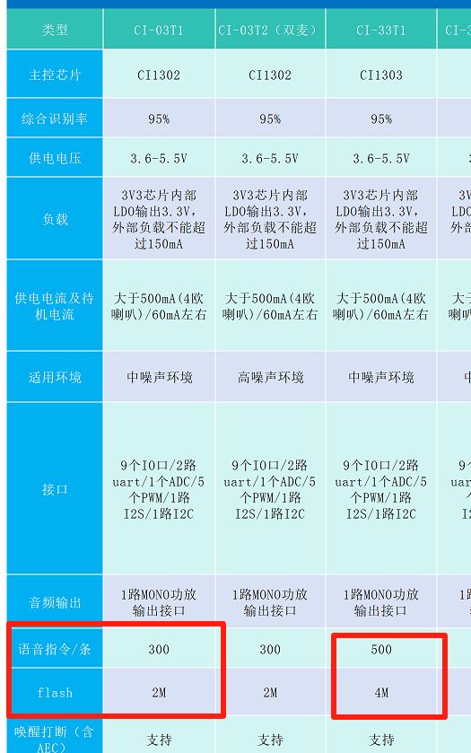

---


---

### CI-03T1和CI-03T2芯片的接口参数是否与CI-1302芯片相同？CI-1303芯片支持哪些功能？

**问题描述：**

需要了解CI-03T1和CI-03T2芯片的接口参数配置，以及CI-1303芯片的功能支持情况。

**解决方案：**

CI-03T1和CI-03T2使用的都是CI-1302芯片，CI-1303是另一款支持更多功能的芯片。

**芯片支持情况：**

- **CI-1302**：用于CI-03T1、CI-03T2等型号
- **CI-1303**：独立芯片型号，支持更多功能

**接口参数对比：**

不同型号的接口参数存在差异，具体包括：

- IO口数量和配置
- UART通信接口
- ADC采集功能
- PWM输出功能
- I2S音频接口
- I2C控制接口

**注意事项：**

- 选型时应根据具体接口需求选择合适的芯片型号
- CI-1302和CI-1303在功能和接口上可能存在差异
- 建议参考官方最新的接口参数对比表进行选型

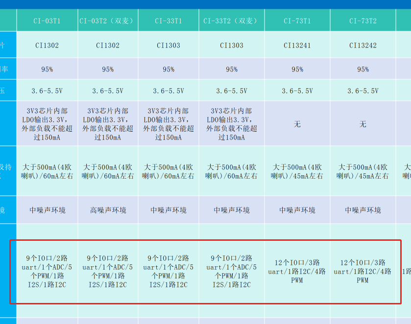

---


---

### CI-03T1芯片引脚不足怎么办？是否支持触摸按键功能？

**问题描述：**

CI-03T1芯片的16个引脚无法满足项目需求，需要更多IO口，同时希望了解是否支持触摸按键功能。

**解决方案：**

**引脚数量限制：**

- CI-03T1使用CI-1302芯片，标配16个引脚
- 如需更多引脚，建议考虑其他型号或通过IO扩展方案

**触摸按键实现方案：**

芯片本身不支持自带的触摸功能，但可通过以下方式实现：

1. **外接触摸芯片方案**
    - 选择专用的触摸按键芯片
    - 将触摸芯片的输出引脚连接到CI-03T1的GPIO口
    - 通过检测电平变化来判断按键触发

2. **支持的按键类型**
    - ADC按键：通过模拟电压值判断不同按键
    - 简单的数字输入按键：直接检测高低电平

**注意事项：**

- 选型时需评估实际需要的IO口数量
- 外接触摸芯片会增加BOM成本和PCB面积
- 建议参考官方选型手册对比不同型号的接口资源
- 具体项目需求可联系技术支持获取合适的方案建议


---


---

### CI-03T的TTS功能如何选择合适的喇叭？

**问题描述：**

需要为CI-03T模块选择合适功率的喇叭，了解阻抗和功率的匹配要求。

**解决方案：**

**喇叭参数要求：**

- **4Ω喇叭**：推荐功率2.4W起
- **8Ω喇叭**：推荐功率1.6W起
- 避免使用过大功率：如4Ω5W模块驱动困难

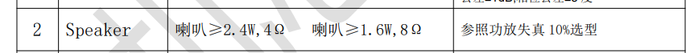

**可选喇叭类型：**

1. **圆喇叭**：8Ω2W
    - 适合一般音量需求
    - 成本较低
    - 适合空间受限场景

2. **腔体喇叭**：8Ω5W
    - 音量更大
    - 音质较好
    - 适合对音量要求较高的应用

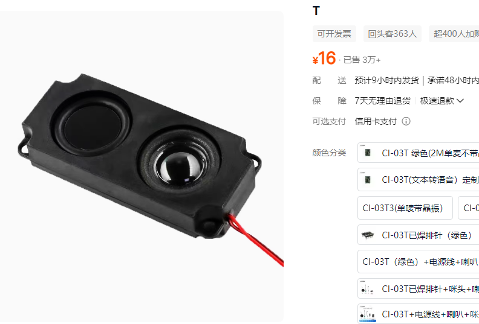

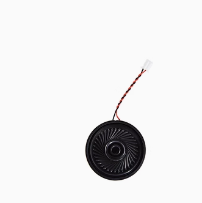

**匹配原则：**

- 阻抗匹配：确保喇叭阻抗与模块输出阻抗匹配
- 功率余量：选择略小于模块最大输出功率的喇叭
- 音质需求：根据实际应用场景选择合适类型

**注意事项：**

- 喇叭功率过大会导致失真
- 阻抗不匹配会影响音量和音质
- 建议实测验证喇叭效果
- 长期大音量使用可能损坏喇叭

---


---

### CI-03T系列芯片在语言支持上有何特点？

**问题描述：**

需要确认CI-03T系列芯片对语言的支持情况，特别是中英文支持能力。

**解决方案：**

**语言支持特点：**

- **多语言支持**：CI-03T支持中/英/日/韩及其他语种
- **中文方言**：支持定制化中文方言识别
- **混合语言**：可在同一固件中混合使用多语言

**与SU-03T对比：**


**应用建议：**

1. **纯中文应用**：可使用SU-03T或CI-03T
2. **中英文混合**：建议选择CI-03T
3. **多语言需求**：CI-03T提供更多语言选择
4. **方言需求**：CI-03T支持方言定制

**注意事项：**

- 多语言配置会增加存储空间占用
- 方言识别需要额外的训练和调优
- 确认目标市场的语言需求
- 可根据项目预算选择合适方案

---


---

### 哪些模块支持德语和法语识别？

**问题描述：**

外贸场景需要支持德语和法语识别的语音模块。

**解决方案：**

1. **多语言支持情况**
    - 部分语音模块支持多语言识别功能
    - 包括德语、法语等主要欧洲语言
    - 需要在平台中配置对应语言包

2. **支持的模块型号**
    - CI系列模块（如CI-03T、CI-33T）支持多语言
    - 部分SU系列模块通过固件更新支持
    - 建议选择最新版本的模块

3. **配置方法**
    - 在智能公元平台选择目标语言
    - 下载对应语言的固件
    - 配置相应的命令词和响应

**注意事项：**

- 多语言识别需要额外的存储空间
- 识别准确率可能因口音而异
- 建议提前测试目标语言的识别效果
- 外贸场景建议提供本地化技术支持

---


---

### CI-03T双麦声源定位版本如何采购芯片？

**问题描述：**

需要采购CI-03T双麦声源定位版本的芯片（CI1302），了解价格、MOQ、烧录服务和电路参考资料。

**解决方案：**

**芯片采购信息：**

- **芯片型号**：CI1302（CI-03T双麦声源定位版本主控芯片）
- **单价**：5.8元/片
- **购买方式**：可联系销售或通过代理商采购
- **最小起订量**：请联系销售获取具体MOQ信息

**烧录服务：**

- **芯片烧录**：提供烧录服务（1-2000片同一固件收费200元）
- **自行烧录**：支持自行烧录，需要相应的烧录工具
- **固件获取**：在智能公元平台配置完成后下载固件文件

**开发资源：**

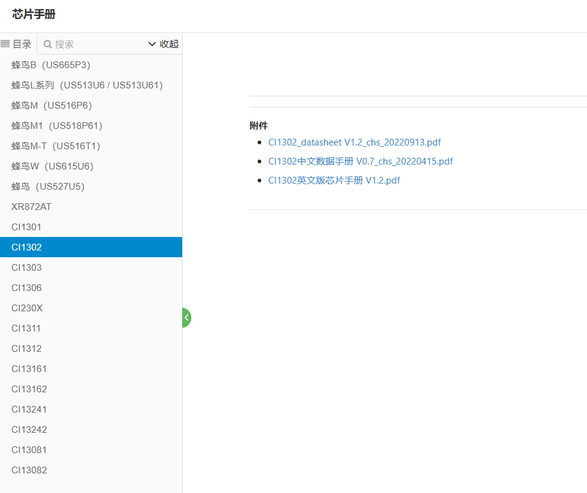

- **电路参考**：平台提供CI-03T模块的原理图
- **资料获取**：登录智能公元平台查看完整文档
- **参考链接**：https://help.aimachip.com/docs/offline_ci03t/offline_ci03t-1gbdve90ls902

**开发建议：**

1. **先使用模块测试**
    - 购买CI-03T成品模块进行功能验证
    - 熟悉模块特性和接口定义
    - 调通后再进行芯片级开发

2. **PCB设计要点**
    - 参考CI-03T模块的电路设计
    - 注意双麦克风的布局和走线
    - 预留必要的调试接口

3. **软件开发**
    - 使用智能公元平台进行固件配置
    - 支持在线编程和参数设置
    - 软件复杂度中等

**声源定位参数：**

- **定位范围**：0-180度
- **角度精度**：具体步进值需查阅规格书
- **麦克风配置**：双麦克风阵列，间距需符合设计规范

**注意事项：**

- 芯片级开发需要具备硬件设计能力
- 建议先用模块熟悉功能特性
- 声源定位功能需要双麦克风配合
- 可使用两个模块实现360度覆盖（需实测验证）

---


---

### 如何选择支持语音识别串口输出的模块？

**问题描述：**

需要选择一个支持语音识别并通过串口发送指令的模块，了解双麦克风模块的适用性和连接方式。

**解决方案：**

**推荐型号：**

- **CI-03T双麦模块**：支持语音识别+串口输出+声源定位
- **CI-73T/96Z系列**：仅支持语音识别+串口输出（低成本方案）
- **选型依据**：根据是否需要声源定位功能选择

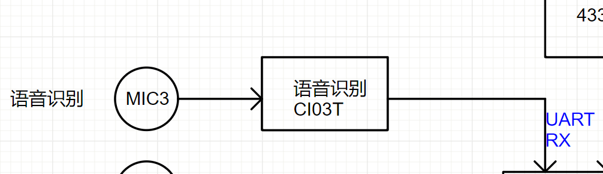

**连接方式：**

1. **基础连接**
    - 麦克风：连接到模块的MIC输入
    - 串口输出：仅需连接UART RX引脚
    - 电源：连接5V或3.3V（根据模块规格）

2. **串口通信**
    - 波特率：默认9600bps（可配置）
    - 数据格式：8N1（8数据位，无校验，1停止位）
    - 输出内容：可自定义，支持帧头帧尾

**功能特性：**

- **命令词识别**：支持最多300条命令词
- **串口输出**：识别后自动发送预设指令
- **多语言支持**：中文和英文都可识别
- **英文识别**：需要使用英文固件制作

**使用示例：**

1. **平台配置**
    - 添加命令词列表
    - 设置对应的串口输出内容
    - 下载固件到模块

2. **硬件连接**
    ```
    MCU ---- RX ----> 模块TX
            GND ----> 模块GND
            5V ----> 模块VCC
    ```

**注意事项：**

- 只需识别功能时，单麦模块成本更低
- 双麦模块额外支持声源定位
- 串口输出内容可完全自定义
- 英文命令词需要用谐音或中文制作

---

