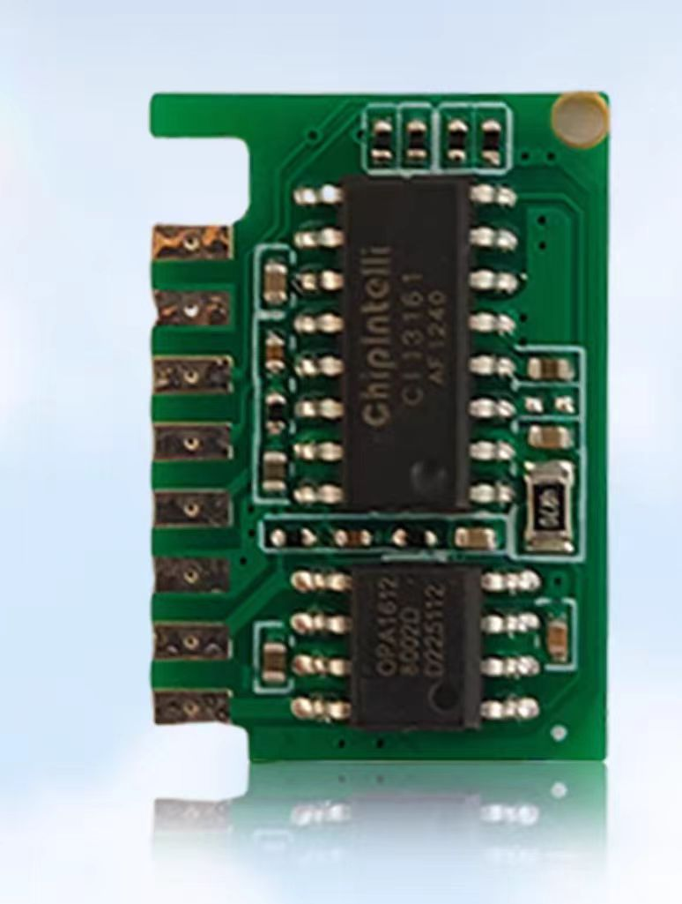
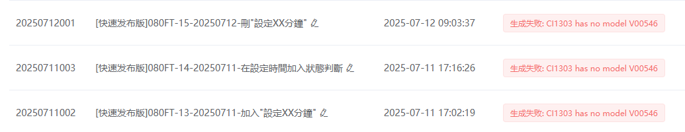
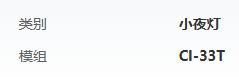
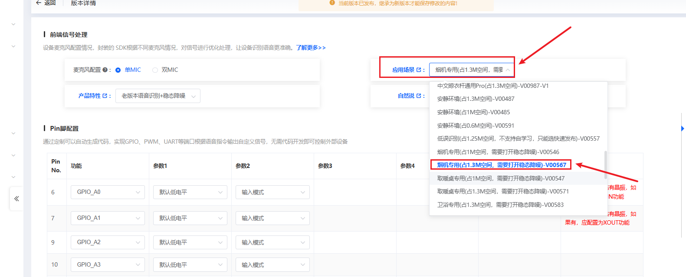

# CI-33T 模块选型 FAQ

本页用于整理 CI-33T 相关的模块选型问题。

### CI-33T样品使用的是什么固件版本？

**问题描述：**

需要确认小批量样品（如20只）使用的是否为出厂固件，与批量采购的固件是否有区别。

**解决方案：**

**样品固件说明：**

- **小批量样品**：数量未满100个时，发出厂固件
- **批量订单**：数量达到100个及以上，可烧录定制固件
- **固件区别**：出厂固件包含基础功能，定制固件可根据需求配置

**样品确认：**

- 提供的样品型号为CI-33T
- 支持单/双麦克风配置
- 支持500条语音命令词
- Flash容量为4M

**注意事项：**

- 样品阶段的出厂固件适合功能验证
- 批量采购前可先用样品确认功能
- 如需特定功能配置，批量时申请定制固件
- 样品和批量产品的硬件规格一致

---

### CI-33T样品采购时如何确保型号正确？

**问题描述：**

在采购样品时，需要确保供应商能正确识别所需型号，避免型号混淆导致发货错误。

**解决方案：**

**型号确认方法：**

1. **明确型号标识**
    - 在采购订单中明确标注：CI-33T
    - 使用完整的型号名称，避免简写
    - 可附带芯片型号CI1303作为参考

2. **规格书确认**
    - 提供CI-03T1/2-V1.3规格书作为参考
    - 说明实际需要的是CI-33T型号
    - 强调支持500条命令词的特性

3. **样品图片确认**
    - 提供CI-33T模块的实物图片
    - 确认模块上的丝印标识
    - 核对封装形式（SMD22/DIP22）

**采购要点：**

- CI-33T与CI-03T引脚兼容
- 主要区别在于Flash容量（4M vs 2M）
- 确认样品为支持500条命令词的版本
- 后续批量采购时沿用相同型号标识

**注意事项：**

- 首次采购建议索取样品确认
- 保留完整的采购沟通记录
- 如有型号混淆疑虑，及时与供应商确认
- 批量下单前再次核对型号参数

---

### CI-33T的3D模型如何获取？

**问题描述：**

需要获取CI-33T型号产品的3D模型文件，用于结构设计或产品开发。

**解决方案：**

**3D模型获取途径：**

1. **文档中心获取PCB文件**

    - 登录官方文档中心
    - 可获取CI-33T的PCB板设计文件
    - 3D模型需要基于PCB文件自行生成

2. **现有资源说明**

    - 文档中心提供基础的PCB设计文件
    - 不直接提供现成的3D模型文件
    - 需要使用专业工具进行转换

**生成3D模型的方法：**

1. **使用专业EDA软件**

    - 导入PCB设计文件
    - 在Altium Designer、KiCad等软件中打开
    - 导出为3D格式（如STEP、IGES等）

2. **第三方转换工具**

    - 使用PCB转3D的在线转换服务
    - 上传PCB文件获取3D模型
    - 调整细节和精度设置

3. **手动建模方案**

    - 根据规格书中的尺寸参数
    - 使用SolidWorks、Fusion 360等软件
    - 创建精确的3D模型

**技术参数参考：**

```
CI-33T物理规格：

- 封装：SMD22/DIP22
- 尺寸：21mm × 15mm
- 引脚数：22个
- 引脚间距：标准DIP封装间距
```

**注意事项：**

- 官方不直接提供3D模型文件
- 需要基于PCB设计文件自行创建
- 建议使用官方提供的PCB文件作为基础
- 确保3D模型的引脚定义与实际产品一致
- 复杂的3D建模可能需要专业的CAD软件支持

---

### CI-33T芯片损坏后如何更换？

**问题描述：**

CI-33T芯片在使用过程中损坏，需要了解应该更换为何种型号的芯片。

**解决方案：**

**芯片更换型号：**

- **直接替换型号**：CI-33T芯片损坏后应更换为CI1303芯片
- **完全兼容**：CI1303与CI-33T在功能和引脚上完全兼容
- **无需修改电路**：直接更换即可，不需要修改现有电路设计

**技术参数确认：**

```
CI1303芯片规格：

- 封装形式：与CI-33T相同
- 引脚定义：完全兼容CI-33T
- 功能特性：支持离线语音识别
- 性能指标：与CI-33T一致或更优
```

**更换操作要点：**

1. **确认芯片型号**
    - 确保采购的是CI1303型号
    - 核对封装形式与原芯片一致
    - 验证引脚定义匹配

2. **焊接注意事项**
    - 使用合适的焊接工具和温度
    - 避免静电损坏芯片
    - 确保焊接质量良好

3. **功能验证**
    - 更换后进行基本功能测试
    - 验证语音识别功能正常
    - 检查各项性能指标

**注意事项：**

- 务必购买正品CI1303芯片，避免使用兼容性问题
- 更换操作需要具备一定的电子技术基础
- 如无焊接经验，建议寻求专业人员帮助
- 保留损坏芯片的故障信息，便于问题分析
- 批量更换建议先进行样品测试

---

### CI-33T3模块授权和TTS功能限制

**问题描述：**

在淘宝购买CI-33T3模块因未授权，无法烧录固件和使用TTS功能，且TTS与语音识别功能无法共存。

**解决方案：**

1. **授权问题说明**

- **购买渠道**：需要从官方授权渠道购买
- **未授权限制**：无法进行固件烧录操作
- **功能验证**：购买前确认模块是否已授权

2. **TTS功能限制**

- **功能互斥**：TTS和语音识别功能不能同时使用
- **固件限制**：烧录其他固件会覆盖原有TTS功能
- **使用选择**：只能在TTS或语音识别中选择其一

3. **定制解决方案**

- **共存需求**：如需TTS与语音识别共存，需要定制固件
- **批量定制**：批量需求可联系技术支持进行定制开发
- **专属固件**：定制固件将根据具体需求开发

4. **未授权模块使用**

- **语音识别**：未授权模块仍可使用语音识别功能
- **TTS功能**：未授权模块无法使用TTS功能
- **烧录限制**：无法烧录新的固件到未授权模块

**注意事项：**

- 购买时确认模块授权状态和功能需求
- 定制固件需要额外的时间和费用
- 保留原模块固件备份，便于恢复
- 批量项目建议提前与厂商沟通技术需求

### 为什么推荐选择CI-33T？

**问题描述：**

在项目选型时，有建议推荐CI-33T模块，需要了解该型号的优势和适用场景。

**解决方案：**

**CI-33T的核心优势：**

1. **大容量存储**
    - 支持500条语音指令
    - 4M Flash容量
    - 适合复杂交互场景

2. **增强的处理能力**
    - 双麦克风降噪算法
    - 更强的抗干扰能力
    - 适合中等等噪声环境

3. **丰富的功能支持**
    - 支持AEC声学回声消除
    - 支持双麦克风阵列
    - 支持更复杂的控制逻辑

**推荐场景：**

- **复杂家电控制**：需要超过300条命令
- **智能家居系统**：多设备联动控制
- **交互式应用**：需要丰富的对话逻辑
- **中等噪声环境**：需要更好的降噪性能

**与CI-03T对比：**

| 特性 | CI-03T | CI-33T |
|------|---------|---------|
| 词条数量 | 300条 | 500条 |
| Flash容量 | 2M | 4M |
| 麦克风配置 | 单麦/双麦 | 双麦 |
| 降噪能力 | 基础 | 增强 |
| 适用场景 | 简单控制 | 复杂交互 |

**注意事项：**

- CI-33T成本略高于CI-03T
- 如不需要500条词条，CI-03T性价比更高
- 两个型号引脚兼容，可互换使用
- 选型时需考虑未来功能扩展需求

---


---

### CI-33T如何在淘宝官方店购买？

**问题描述：**

需要在淘宝官方店购买CI-33T模块，但在主页上看不到该型号。

**解决方案：**

CI-33T模块可以通过以下方式购买：

- 在CI-03T的产品链接中，选择型号选项
- 在选项中有CI-33T可选
- 选择CI-33T型号后即可下单购买

**注意事项：**

- CI-33T与CI-03T在同一个产品页面销售
- 通过选项切换型号，而不是单独的产品链接
- 确认选择的型号是CI-33T后再提交订单

---


---

### 如何获取产品的规格书和技术文档？

**问题描述：**

需要获取特定型号（如CI-33T）的产品规格书，以评估其是否满足项目需求，如串口通信能力等。

**解决方案：**

**获取途径：**

1. **智能公元平台下载**
    - 登录智能公元平台
    - 在产品管理或资源下载区查找
    - 支持下载相关规格书PDF文件

2. **技术支持申请**
    - 联系技术支持团队
    - 说明具体型号和用途
    - 可通过邮件或群内申请

3. **官方渠道获取**
    - 官方网站文档中心
    - 授权代理商处获取
    - 产品包装附带二维码或链接

**文档类型：**

- **产品规格书**：包含电气参数、引脚定义、尺寸等
- **数据手册**：详细的芯片级技术文档
- **应用笔记**：特定功能的实现指南
- **开发指南**：快速上手指导

**注意事项：**

- 部分文档需要注册或登录后下载
- 确保获取最新版本的文档
- CI-33T与CI-03T引脚兼容，只是Flash容量不同
- 规格书是评估芯片能力的重要依据

---


---

### CI-1303/CI-33T能否替代ASRPRO-4M芯片？

**问题描述：**

需要寻找ASRPRO-4M芯片的替代方案，希望了解CI系列产品中哪些型号功能兼容，并获取相关设计资料。

**解决方案：**

**替代型号选择：**

- **CI-1303芯片**：与ASRPRO-4M功能完全相同，可直接替代
- **CI-33T模块**：基于CI-1303芯片的完整模块方案，同样可替代ASRPRO-4M

**主要区别说明：**

1. **功能兼容性**
    - CI-1303与ASRPRO-4M在功能和性能上基本一致
    - 支持相同的语音识别功能和接口协议
    - 可无缝替换现有ASRPRO-4M的应用

2. **方案差异**
    - CI-1303：芯片级方案，需要自行设计外围电路
    - CI-33T：模块级方案，集成度高，直接可用

3. **资料提供**
    - 提供完整的规格书和技术文档
    - 暂不提供嘉立创原理图和PCB文件
    - 可根据规格书自行设计

**选型建议：**

- 需要最小设计改动：选择CI-33T模块
- 需要定制化设计：选择CI-1303芯片
- 两者都能完全替代ASRPRO-4M的功能



---


---

### CI-33T1是否支持中英文切换功能？

**问题描述：**

需要了解CI-33T1模块是否支持中英文切换功能，以及是否有其他支持中英文同时使用或可切换的型号推荐。

**解决方案：**

**CI-33T1模块特性：**

- **固件分离**：中文和英文需要分别烧录不同的固件
- **不支持实时切换**：无法在运行时动态切换语言
- **单一语言模式**：每次只能使用一种语言的固件

**中英文切换解决方案：**

1. **定制服务方案**：

    - 可提供中英文切换功能的定制服务
    - 需要人工处理，非免费功能
    - 推荐使用CI-33T模块（非CI-33T1）

2. **内存需求考虑**：

    - 中英文切换需要两个固件存储空间
    - 建议选择Flash容量较大的型号
    - 确保有足够空间存放多语言固件

**注意事项：**

- 标准版本CI-33T1不支持中英文切换
- 如需切换功能需要联系定制服务
- 切换功能会产生额外费用
- 选择模块时要考虑Flash容量大小

---


---

### CI-33T是否支持中英双语言定制开发？

**问题描述：**

在智能开关产品中需要支持中英双语言的语音识别功能，询问是否可以使用CI-33T模块进行定制开发。

**解决方案：**

CI-33T模块支持中英双语言的定制开发：

- **定制能力**：CI-33T可以通过定制开发实现中英双语同时识别
- **技术支持**：需要联系技术团队进行定制开发
- **开发流程**：

    1. 提供详细的双语言需求文档
    2. 技术团队评估开发方案
    3. 签订定制开发合同
    4. 进行模型训练和功能开发
    5. 测试验证和交付

**注意事项：**

- 双语言定制开发需要额外的开发周期和费用
- 建议在项目早期规划阶段确定多语言需求
- 可先评估标准版本的双固件切换方案是否满足需求

---

### 哪些模块支持TTL语音播报功能？

**问题描述：**

需要选择一款支持TTL语音播报且能播报当前温度等信息的离线语音识别芯片产品。

**解决方案：**

**支持的模块型号：**

**1. CI-03T和CI-33T系列**

- 这两个模块专门支持TTL转语音功能
- 可以通过串口接收数据并进行语音播报
- 适合需要MCU控制语音播报的应用场景

**2. 功能特性**

- 支持播报动态数据（如温度、湿度等）
- 可通过串口指令触发播报
- 离线工作，无需网络连接
- 播报内容可自定义

**3. 使用方式**

- MCU通过串口发送数据到模块
- 模块自动将数据转换为语音播报
- 支持数字、汉字等多种格式的数据
- 可设置播报音量和语速

**注意事项：**

- 选择时确认模块是否支持TTL接口
- 根据播报内容长度选择合适容量的模块
- 使用前需正确配置串口通信参数
- 如需播报复杂信息，建议选择CI-33T（容量更大）

---

### CI-33T是否支持TTS功能、自定义唤醒词和红外控制？

**问题描述：**

需要了解CI-33T模块是否支持文本转语音(TTS)功能、自定义唤醒词和词条，以及是否支持红外库功能。

**解决方案：**

**功能支持情况：**

1. **文本转语音(TTS)功能**
    - 支持通过串口接收GB2312编码的文本
    - 可以将文本合成为语音播放
    - 识别到词条后可通过串口输出相应报文

2. **自定义功能支持**
    - 唤醒词可以自定义
    - 语音词条可以修改
    - 回应内容可以自定义
    - 支持播放个性化音频文件(MP3格式)

3. **红外功能限制**
    - CI-33T模块**不支持**红外功能
    - 无法集成红外库控制空调等设备
    - 需要红外控制功能需选择其他方案或外接红外模块

**串口通信协议：**

- 可提供完整的串口通信协议文档
- 支持MCU与模块之间的数据交互
- 便于集成到现有系统中

**注意事项：**

- 使用TTS功能的固件与标准语音识别固件不同
- TTS功能需要定制开发，有最低起订量要求(如2万元起)
- 不支持红外的限制可能影响某些应用场景的选型
- 月用量1000个左右时，单价约为8.7元(含税)

---

### CI-33T3模块的交期和样品如何获取？

**问题描述：**

需要了解CI-33T3模块的最快交期，以及如何获取规格承认书和样品进行确认。

**解决方案：**

**交期信息：**

- **批量订单（1000pcs）**：需要联系客服确认具体交期
- **标准交期**：根据订单量和生产排期确定
- **加急需求**：可向销售申请加急处理

**样品申请流程：**

1. **样品数量**
    - 标准提供5PCS样品进行确认
    - 不同品牌（韩电、康佳）可分别申请

2. **申请方式**
    - 通过销售代表申请
    - 说明项目需求和样品用途
    - 提供收件地址和联系方式

3. **规格承认书获取**
    - 联系技术支持团队获取
    - 提供具体型号：CI-33T3-V1.0
    - 可获得PDF格式的规格书

**物流信息：**

- **样品发货**：通过顺丰快递寄送
- **运单号**：发货后提供单号便于追踪
- **收件确认**：收到样品后及时确认

**注意事项：**

- 样品申请通常需要1-3个工作日处理
- 规格承认书可能需要签署保密协议
- 批量订单建议提前规划交期
- 特殊需求（如不同品牌固件）需提前说明

---

### CI-33T模块生成固件时出现'CI1303 has no model V00546'错误，如何解决？

**A：** 此错误是由于选择了不兼容的应用场景模型导致的。







错误原因
- 选择的模型V00546与CI-33T模块不兼容
- 模块与应用场景配置不匹配

解决步骤
1. **检查当前配置**：

    - 确认模组选择：CI-33T
    - 确认产品类别：如"小夜灯"

2. **更换应用场景**：

    - 在"应用场景"下拉菜单中选择：

    - "烟机专用(占1.3M空间, 需要打开稳态降噪)-V00567"
    - 而不是V00546

3. **重新生成固件**：

    - 保存配置后重新生成
    - 确保没有其他冲突设置

CI-33T模块特点
- 适用于小家电控制
- 支持多档位调节
- 具备降噪功能选项
- 适用于风扇、小夜灯等产品

注意事项
- 不同模块对应不同的应用场景模型
- 选择模型时要注意空间占用和功能需求
- 如不确定，可联系技术支持获取配置建议

---

