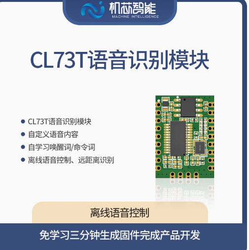
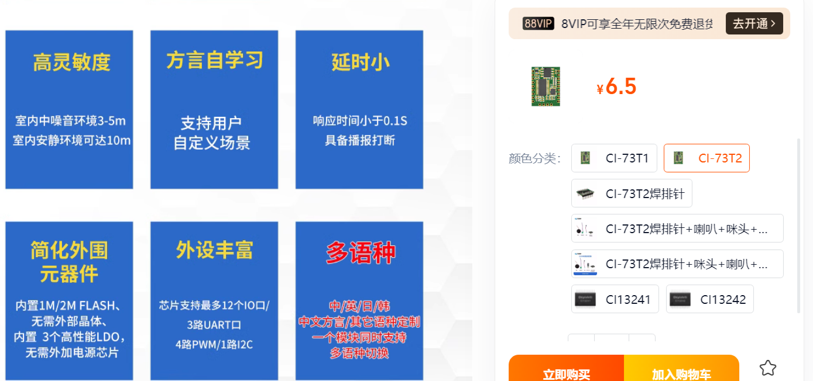
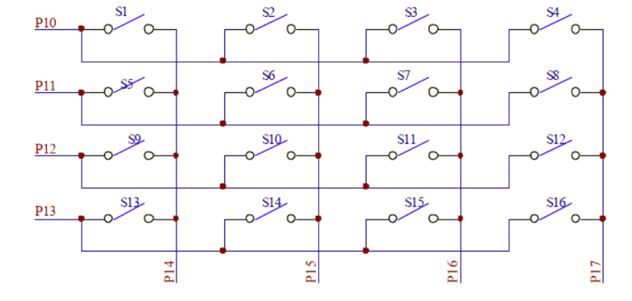
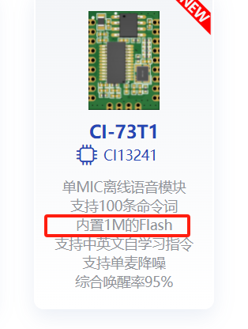
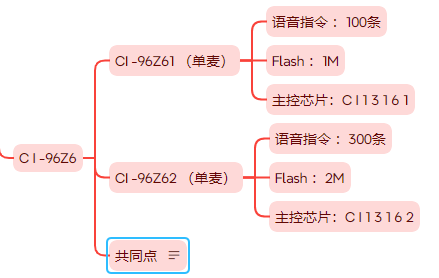
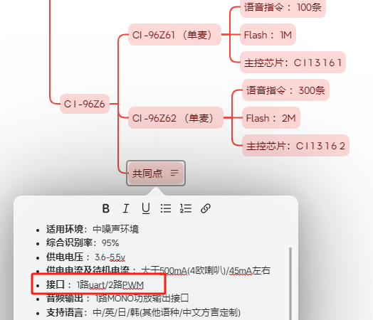
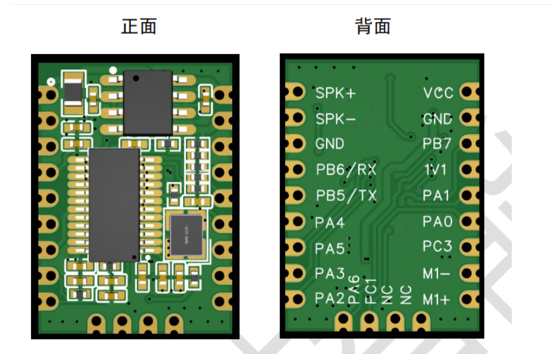

# CI-73T 模块选型 FAQ

本页用于整理 CI-73T 相关的模块选型问题。

### CI-03T1与CI-73T1型号的主要区别是什么，以及如何根据选型指南进行选择？

**问题描述：**

需要了解CI-03T1和CI-73T1两款语音模块之间的主要差异，以便根据项目需求选择合适的型号。

**解决方案：**

CI-03T1和CI-73T1的主要区别如下：

**核心参数对比：**

- **CI-03T1**：

    - 支持语音指令数量：300条
    - Flash容量：2M
    - 主控芯片：CI1302
    - 供电电压：3.3V-5V
    - 接口：UART（B6/B7）
    - 唤醒打断：支持
    - 双麦算法：不支持
    - 稳态降噪算法：支持
    - 封装尺寸：14mm×18mm×2.2mm
    - 功放喇叭功率：不支持

- **CI-73T1**：

    - 支持语音指令数量：300条
    - Flash容量：2M
    - 主控芯片：CI1302
    - 供电电压：3.3V-5V
    - 接口：UART（B6/B7）
    - 唤醒打断：支持
    - 双麦算法：支持
    - 稳态降噪算法：支持
    - 封装尺寸：14mm×18mm×2.2mm
    - 功放喇叭功率：不支持

**主要差异：**

CI-73T1相比CI-03T1的主要优势是**支持双麦算法**，能够实现更好的噪声抑制和声源定位功能，适用于噪声较大的环境或需要更远距离识别的场景。

**选型建议：**

- **选择CI-03T1**：

    - 普通室内环境
    - 成本敏感的应用
    - 基础语音控制需求

- **选择CI-73T1**：

    - 噪声较大的使用环境
    - 需要更好的抗干扰能力
    - 对识别距离有更高要求

*语音模块参数对比表（包含CI-03T1和CI-73T1）*

### CI-73T系列模块应参考哪些技术资料？

**问题描述：**

需要了解CI-73T系列模块的开发和使用应参考哪些技术文档，以及在哪里获取相关例程。

**解决方案：**

CI-73T系列模块的技术资料主要包括：

- **使用手册**：包含模块的硬件接口说明、电气特性、封装尺寸等基础信息
- **文档内的例程**：相关示例代码和配置方法已包含在技术文档中

**注意事项：**

- B站和智能公园网站上的视频教程可能尚未覆盖CI-73T系列，请以官方技术文档为准
- 使用手册中包含了完整的开发指南和示例程序

---

### CI-73T1是什么时候发布的？

**问题描述：**

了解CI-73T1新品的发布情况，以及与现有产品的关系。

**解决方案：**

**1. 产品发布情况**

CI-73T1已经发布并投入市场使用：

- 产品已正式发布，可正常采购
- 作为CI-73T系列的升级版本
- 支持双麦算法，提供更好的噪声抑制能力

---

### 原有的开发板是否兼容CI-73T芯片？

**问题描述：**

原本用于CI-03T的开发板，是否可以直接兼容CI-73T芯片。

**解决方案：**

CI-73T芯片与CI-03T1/CI-03T2系列在接口和功能上存在差异，需要确认开发板的硬件设计：

- **接口兼容性**：需确认开发板的硬件设计是否支持CI-73T的引脚定义和供电要求
- **查阅技术规格**：建议查阅CI-73T的详细技术规格书，确认其接口类型（如I2C、UART、PWM等）与开发板的匹配情况
- **通用开发板**：若开发板为通用型设计，通常支持多种芯片型号，但需进行硬件适配和固件更新

**注意事项：**

- 引脚位置可能不同，需要仔细对比
- 供电要求需保持一致（3.3V-5V）
- 必要时需更新固件以支持新芯片

---

**2. 与原有型号的关系**

CI-73T1是对现有产品线的补充：

- CI-73T1：支持双麦算法，适合嘈杂环境
- CI-73T：基础版本，单麦克风配置
- 两者可根据应用场景需求选择

**3. 选型建议**

选择CI-73T1的场景：

- 需要更好的抗噪声性能
- 环境噪声较大或干扰较多
- 对识别距离有更高要求

选择CI-73T的场景：

- 普通室内环境
- 成本敏感的应用
- 基础语音控制需求

**注意事项：**

- CI-73T1与CI-73T硬件接口兼容
- 固件配置需要在平台重新创建
- 建议根据实际使用环境选择合适型号

### CL73T模块是否支持集成语音转换和功放功能，以及如何自定义词条？

**问题描述：**

需要了解CL73T模块是否集成语音转换和功放功能，以及是否可以作为公板使用和如何自定义词条。

**解决方案：**

CL73T模块具备以下特性：

- **集成功能**：已集成语音转换和功放功能，可直接驱动喇叭
- **词条支持**：支持自定义词条，可在开发平台配置后烧录到模块
- **通讯接口**：支持串口通讯（UART）
- **公板方案**：可作为公板使用，通过平台生成固件快速响应定制需求
- **性价比**：适合大批量应用（月用量2万以上）

**开发流程：**

1. 在开发平台创建项目并配置词条
2. 生成固件文件
3. 通过烧录工具将固件烧录到模块
4. 进行功能测试验证

**注意事项：**

- 词条修改需要在开发平台重新生成固件并烧录
- 模块适用于家电控制等60个指令以内的应用场景
- 批量采购时价格更具优势

*CL73T语音识别模块，集成语音转换和功放功能*

---

### CI-73T是否支持多语种切换功能？

**问题描述：**

咨询CI-73T芯片是否支持多语种切换功能，以及其管脚是否与CI-03T兼容，以便评估是否可以作为替代方案进行测试。

**解决方案：**

**多语种支持情况：**

1. **产品功能确认**：

    - CI-73T已经支持多语种切换功能
    - 支持中、英、日、韩等多种语言
    - 可实现多语种同时支持或切换使用

2. **定制要求**：

    - 多语种功能需要定制开发
    - 每次使用时需要进行语种切换
    - 不是默认开启的通用功能

**管脚兼容性：**

1. **硬件接口**：

    - CI-73T与CI-03T管脚不完全兼容
    - 不能直接替换使用
    - 需要重新设计PCB或使用转接板

2. **开发建议**：

    - 可购买CI-73T开发包进行评估测试
    - 对比两个型号的开发板接口差异
    - 确认是否符合项目需求

**选型考虑：**

- 如需多语种功能，可选择CI-73T
- 需考虑重新设计硬件接口的成本
- 建议先获取开发包进行功能验证

**注意事项：**

- 多语种功能可能增加Flash占用
- 切换语种可能需要复位或重新初始化
- 具体实现方式需咨询技术支持

---

### CI-73T与CI-03T在管脚上是否兼容？

**问题描述：**

需要确认CI-73T与CI-03T的管脚定义是否相同，能否直接替换使用。

**解决方案：**

**管脚兼容性确认：**

- **不兼容**：CI-73T与CI-03T的管脚不完全兼容
- **设计差异**：两个型号的引脚定义存在差异
- **不能直接替换**：需要修改电路设计

**替代方案：**

1. **获取开发包**：

    - 购买CI-73T的开发包
    - 对比两个模块的管脚定义
    - 评估硬件改动的难度

2. **设计适配**：

    - 根据CI-73T的规格书重新设计PCB
    - 或设计转接板实现兼容
    - 考虑生产成本和开发周期

**选型建议：**

- 项目初期确定是否需要多语种功能
- 如需要，直接选用CI-73T进行设计
- 如已使用CI-03T，评估升级的必要性

**注意事项：**

- 管脚不兼容主要体现在电源和部分功能引脚
- 建议在项目选型阶段就确定最终方案
- 更换型号需要重新进行硬件调试

---

### CI-73T2样品申请时是否提供配套组件？

**问题描述：**

申请CI-73T2样品时，希望了解是否提供麦克风、扬声器和下载工具等配套组件。

**解决方案：**

CI-73T2样品申请时可提供以下配套组件：

- **麦克风**：可提供配套的麦克风组件
- **扬声器**：可提供配套的扬声器组件
- **下载工具**：可提供固件烧录所需的下载工具

**注意事项：**

- 样品及配套组件会在送样时一并提供
- 如有特殊需求，可在申请时说明
- 建议提前确认所需配套组件的规格和数量

---

### 如何选择支持自学习唤醒词和远距离识别的模块？

**问题描述：**

需要选择支持自学习唤醒词、识别距离超过5米、支持100条以上语音指令的离线语音识别模块。

**解决方案：**

**模块推荐：**

根据需求，推荐以下模块：

1. **CI-73T系列**（性价比首选）：

    - **自学习功能**：支持语音自学习唤醒词
    - **指令数量**：CI-73T1支持150条，CI-73T2支持300条
    - **识别距离**：安静环境下可达10米左右
    - **降噪功能**：内置降噪算法
    - **供电要求**：5V供电，500mA以上
    - **价格**：低成本方案，适合成本敏感项目

2. **JX-B5C**（功能全面）：

    - **自学习功能**：支持
    - **指令数量**：300条
    - **识别距离**：远场识别
    - **额外功能**：蓝牙小程序、蓝牙音乐、深度降噪
    - **适用场景**：需要蓝牙功能的应用

**自学习功能说明：**

- **使用方式**：通过语音指令进入学习模式
- **操作步骤**：

    1. 喊出学习唤醒词进入学习模式
    2. 喊出新唤醒词（如"小美"）
    3. 再次确认新唤醒词
    4. 系统自动更新，无需小程序操作

**选型对比：**

| 型号 | 自学习 | 指令数 | 识别距离 | 降噪 | 蓝牙 | 价格 |
|-------|--------|--------|----------|------|------|------|
| CI-73T1 | ✓ | 150条 | ~10m | ✓ | ✗ | 低 |
| CI-73T2 | ✓ | 300条 | ~10m | ✓ | ✗ | 中 |
| JX-B5C | ✓ | 300条 | 远场 | 深度降噪 | ✓ | 高 |

**电源设计建议：**

- **最低电压**：建议4V以上工作，避免在3.7V极限电压使用
- **电流需求**：500mA以上，建议使用AMS1117-5.0或更好性能的LDO
- **功率余量**：建议留有30%以上余量，确保稳定工作

**注意事项：**

- 自学习功能会占用部分存储空间
- 实际识别距离受环境噪声影响
- 如需更远距离，建议选择带双麦算法的版本
- CI-73T适合替换SU-63，电路设计需参考相应资料

---

---

### 如何申请样品并确保随订单发货？

**问题描述：**

样品未随主订单一起发出，需要了解样品申请和发货流程。

**解决方案：**

**1. 样品申请流程**

- 在订购主产品时明确提出样品需求
- 确认样品型号和数量
- 样品通常会单独安排发货

**2. 发货注意事项**

- 主产品和样品可能分开发货
- 如需随主订单发货，需提前明确说明
- 确认仓库已将样品打包进主订单包裹

**3. 样品跟踪**

- 记录样品快递单号
- 确认样品发货时间
- 如未随主订单发出，及时联系客服安排补发

**注意事项：**

- 样品申请最好在合同签订时提出
- 低成本替代型号（如CI-73T2）可作为样品提供
- 保留样品沟通记录，便于后续追溯

---

---

### 离线语音模块能否从自然语言中提取关键词？

**问题描述：**

希望找到支持自然语言理解的离线语音模块，能够从"下午3点叫我起床"这样的句子中提取出"3点"和"起床"两个关键词。

**解决方案：**

目前离线语音识别模块只能识别预置的命令词，无法从自然语言中提取关键词。

**技术限制：**

1. **离线识别原理**
    - 基于模板匹配算法
    - 只能识别预先录入的固定命令词
    - 不具备语义理解和关键词提取能力

2. **自然语言处理需求**
    - 需要在线语音识别服务
    - 通过云端NLP技术提取语义
    - 离线模块暂不支持此功能

**替代方案：**

1. **多命令词设置**
    - 将每个时间点设置为独立命令词
    - CI-03T最多支持300条词条
    - 可设置"1点起床"、"2点起床"..."24点起床"

2. **组合命令功能**
    - 部分模块支持一条语音触发多个动作
    - 可尝试将时间和动作分解为不同命令

**推荐型号：**

- **CI-03T**：300条词条，生成速度快
- **CI-73T1/CI-73T2**：更多功能选择
- 所有模块均为离线工作模式

**注意事项：**

- 离线模块不具备联网功能
- 如需自然语言理解，需考虑在线方案
- 选择前请明确具体功能需求

---

---

### 矩阵键盘应用的IO口需求如何选型？

**问题描述：**

需要连接16个按键的4x4矩阵键盘，需要占用较多IO口，需要选择具有足够IO口数量的语音模块。

**解决方案：**

**IO口需求分析：**

- 4x4矩阵键盘需要8个IO口（4行+4列）
- 加上其他功能（串口、PWM等），总计需要10个以上IO口

**推荐型号：CI-73T**

**主要优势：**

1. **充足的IO资源**
    - 具有12个GPIO口，满足键盘连接需求
    - 多余IO口可用于其他功能扩展

2. **丰富的通信接口**
    - 3路UART（可同时连接多个串口设备）
    - 1路I2C（扩展更多传感器或芯片）
    - 4路PWM（控制电机、LED等）

**选型参考：**

根据实际所需功能选择合适型号：

- CI-73T：12个IO口，适合复杂应用
- CI-03T/CI-33T：较少IO口，适合简单应用
- SU系列：IO口数量适中，根据具体型号选择

**注意事项：**

- 选型时要预留一定的IO余量
- 考虑未来功能扩展的可能性
- 综合评估Flash容量、语音性能等其他参数
- **12个GPIO口是在不使用串口配置时的最大可用数量**
- 如配置串口功能，部分GPIO会被占用，实际可用于按键的引脚会相应减少

---

---

### CI-73T1模块的Flash容量如何理解？

**问题描述：**

CI-73T1模块内置1M Flash，但在生成固件时遇到"超大(8192字节)"的错误提示，对Flash容量和限制存在困惑。

**解决方案：**

**Flash容量说明：**

1. **总容量理解**
    - CI-73T1模块内置1M Flash（1024×1024 = 1048576字节）
    - 这8192字节是指超出限制的量，不是总容量限制
    - 实际可用空间约为1M减去系统占用空间

2. **空间占用分析**
    - 系统程序：约占用0.6M空间
    - 应用场景模型：0.5M-0.6M不等
    - 用户配置：包括指令、回复语、音频数据
    - 总和不能超过1M限制

3. **优化建议**
    - 选择占用空间更小的应用模型
    - 简化回复语，减少重复内容
    - 降低音频质量（16位→8位）
    - 减少语音指令数量

**容量评估方法：**

1. **当前固件大小**
    - 在平台生成固件时会显示实际占用
    - 导出配置文件可以查看项目规模
    - 失败提示中的8192字节是超出的量

2. **选型建议**
    - 小型应用（<50条指令）：CI-73T1（1M）足够
    - 中型应用（50-200条指令）：考虑更大Flash型号
    - 大型应用（>200条指令）：需要详细评估

**注意事项：**

- Flash容量是硬限制，无法超出
- 相同内容不会自动去重，都会占用空间
- 建议先实现功能，再考虑优化

---

---

### 需要开发语音报警功能，如何选择合适的离线语音模块？

**问题描述：**

需要推荐一款适合用于开发语音报警功能的离线语音识别硬件模块，该模块需支持语音指令识别、声源定位和声纹识别，并能用于编写程序进行开发。

**解决方案：**

**功能需求分析：**
根据需求，主要需要以下功能：

- 语音指令识别：离线识别命令词
- 声源定位：识别声音方向
- 声纹识别：区分不同人的声音
- 开发友好：支持二次开发

**推荐方案：**

**方案一：CI-73T系列（推荐）**

- **优势**：支持双麦克风，可实现声源定位
- **功能**：支持声纹识别和声源定位
- **通道数**：支持150条命令词
- **开发性**：提供完整SDK和开发资料

**方案二：CI-95C/CI-96Z**

- **特点**：高性能双麦克风阵列
- **定位精度**：声源定位角度精度更高
- **适用场景**：对定位要求高的应用
- **成本**：相对较高，适合高端产品

**方案三：SU-32T**

- **IO资源**：提供23个GPIO口
- **功能全面**：双麦克风+丰富的接口
- **识别率**：98%高识别率
- **开发便利**：支持Mixly图形化编程

**选择建议：**

**1. 基础报警功能**

- 如只需要简单的语音指令触发报警
- 可选择CI-03T或SU-03T系列
- 成本较低，开发简单

**2. 高级报警功能**

- 如需要声源定位确定声源方向
- 推荐CI-73T或CI-95C
- 双麦克风方案才能实现定位

**3. 综合智能报警**

- 如需要区分人员、多级报警
- 可考虑CI-96Z配合其他传感器
- 实现更复杂的智能报警系统

**开发资源获取：**

- 官方开发包：包含原理图、PCB文件
- 技术支持：提供开发指导
- 社区资源：参考其他开发者案例

**注意事项：**

- 声源定位需要至少两个麦克风
- 声纹识别功能需要用户预先录入
- 选型时考虑产品定位和成本预算
- 建议购买样品验证功能后再批量采购

---

---

### CI-73T2支持多少条语音指令？如何控制音量？

**问题描述：**

需要了解CI-73T2模块支持的语音指令数量，以及音量控制功能的实现方式和默认值设置。

**解决方案：**

**1. 语音指令容量**

- **CI-73T2支持上限**：300条语音指令
- **与CI-03T对比**：

    - CI-03T：约100-150条（受固件大小限制）
    - CI-73T2：更大的Flash容量，支持更多指令
    - 成本差异：Flash增大会增加模块成本

- **实际使用建议**：

    - 根据应用需求选择合适型号
    - 如指令超过150条，建议直接选用CI-73T2
    - CI-73T2适合功能复杂的场景

**2. 音量控制功能**

- **控制方式**：通过串口指令调节音量
- **数值范围**：0-100（0为静音，100为最大音量）
- **默认值设置**：

    - 最小音量：40
    - 中等音量：75
    - 最大音量：100
- **调节步进**：每次增减一档，对应数值变化约10-15

**3. 配置方法**

- **平台配置**：

    - 在"播放控制"中选择音量调节操作
    - 可设置"音量+"、"音量-"等语音指令
    - 支持串口直接发送音量控制指令

- **串口控制**：

    - 发送特定指令格式调节音量
    - 可实时调节，无需重新烧录
    - 支持查询当前音量设置

**注意事项：**

- 不同批次的模块界面可能略有差异
- 如界面不一致，建议更新到最新版本
- 音量设置可能影响功耗和续航
- 音量过大会影响语音识别效果

---

---

### SU-03T与CI-73T2在免唤醒命令词数量上有什么区别？

**问题描述：**

SU-03T模块免唤醒命令词限制在10条，而CI-73T2可以达到20条，需要了解如何选择合适型号。

**解决方案：**

**1. 免唤醒命令词对比**

| 型号 | 免唤醒命令词限制 | 唤醒词+命令词总数 | 适用场景 |
|------|------------------|-------------------|----------|
| SU-03T | 10条 | 不超过50条 | 简单控制应用 |
| CI-73T2 | 20条 | 不超过60条 | 复杂控制应用 |
| SU-63T | 10条 | 不超过50条 | 基础识别应用 |

**2. 技术差异分析**

- **内存容量**：CI-73T2内置更大存储空间
- **芯片性能**：CI-73T2采用更强处理的芯片
- **识别算法**：优化了更多词条的识别逻辑
- **成本差异**：CI-73T2价格相对更高

**3. 选择建议**

**选择SU-03T的场景：**

- 命令需求较少（10条以内）
- 成本敏感的项目
- 简单的语音控制应用
- 对响应速度要求高

**选择CI-73T2的场景：**

- 需要更多免唤醒命令（10-20条）
- 复杂的控制逻辑
- 需要快速响应多条命令
- 预算相对充足

**4. 替代方案**
如需要更多命令词但预算有限：

- 使用多级唤醒机制
- 通过串口扩展控制
- 优化命令词设计减少数量

**注意事项：**

- 免唤醒命令词越多可能影响识别准确率
- 建议根据实际需求选择，不要过度追求高配置
- 可先测试SU-03T是否满足需求再升级
- 不同厂商的类似产品可能有不同的限制标准

---
- 烧录新固件前先测试硬件正常
- 十六进制数据是烧录参数的显示格式
- 保留出厂固件作为备份

---

---

### 如何提升语音产品的市场竞争力和成本效益？

**问题描述：**

语音识别产品功能单一、市场竞争力不足，且成本高、利润空间小，需要了解如何通过优化设计和选型来提升产品的市场竞争力和成本效益。

**解决方案：**

**1. 产品差异化设计**

- **外观设计创新**：

    - 保留特色设计元素（如配件外露的赛博朋克风格）
    - 避免同质化，不要做成普通玩具外观
    - 通过独特设计提升产品识别度

- **功能扩展**：

    - 在基础语音控制上增加实用功能
    - 结合AI大模型API（可选付费功能）
    - 支持在线配置和OTA升级

**2. 成本优化策略**

- **批量生产**：

    - 批量化生产可显著降低单件成本
    - 开模具量产比手工制作更具成本优势
    - 优化供应链管理

- **模块选型**：

    - 根据实际需求选择合适型号
    - 如只需简单语音控制，可选用CI-73T等低成本方案
    - 避免功能冗余造成的成本浪费

---

### CI-73T1是否适合取暖炉的语音开关控制？

**问题描述：**

需要为取暖炉项目添加语音控制功能，主要用于开关类控制，用量不多，寻求合适的离线语音识别芯片方案。

**解决方案：**

CI-73T1非常适合取暖炉的语音开关控制应用：

**功能匹配性：**

- **开关控制**：完全支持开关类语音指令控制
- **指令数量**：支持150条语音指令，满足取暖炉基本控制需求
- **响应速度**：离线识别，响应速度快，实时控制
- **抗干扰**：支持双麦算法，适合取暖炉工作环境

**应用优势：**

- **成本效益**：适合用量不大的项目，性价比高
- **开发简单**：平台化开发，快速配置固件
- **稳定性**：离线工作，不依赖网络连接
- **集成方便**：供电灵活（3.3V-5V），接口丰富

**典型应用场景：**

- 语音开关机控制
- 温度调节指令
- 定时功能控制
- 模式切换控制

**注意事项：**

- 取暖炉工作时可能有噪声，建议利用双麦算法优势
- 如需更多复杂功能，可考虑CI-73T2（支持300条指令）
- 开发时注意麦克风与取暖炉的间距，避免热影响

---

**3. 市场竞争力提升**

- **快速迭代**：

    - 缩短开发周期
    - 快速响应市场需求
    - 持续优化用户体验

- **技术集成**：

    - 考虑接入AI大模型提升智能化程度
    - 预留功能扩展接口
    - 支持个性化定制

**注意事项：**

- 保持产品核心功能的同时控制成本
- 外观设计应与目标用户群体匹配
- 考虑产品的可量产性和工艺复杂度
- 预留升级空间，延长产品生命周期

---

---

### CI系列模块的CPU架构是什么？

**问题描述：**

需要了解CI系列模块（如CI-73T）的CPU架构是RISC-V还是ARM。

**解决方案：**

**架构说明：**

- CI系列模块采用**RISC-V架构**
- 不是ARM架构
- 具体型号：CI-73T使用RISC-V处理器

**架构特点：**

- **开源架构**：RISC-V是开源指令集架构
- **低功耗设计**：适合嵌入式语音处理应用
- **高能效比**：在同等性能下功耗更低
- **可扩展性强**：模块化设计便于定制

**选型参考：**

- 选择模块时关注具体功能需求
- CPU架构不影响基本功能使用
- 开发时注意对应的编译工具链

**注意事项：**

- 规格书会明确标注架构信息
- 开发环境需要支持RISC-V
- 与ARM架构软件不兼容

---

### 中噪声环境下如何选择高性价比的离线语音识别模块？

**问题描述：**

需要为中噪声环境下的项目选择合适的离线语音识别模块，要求支持300条语音指令、2M Flash存储，并希望获得高性价比的推荐方案。

**解决方案：**

根据需求（中噪声环境、300条指令、2M Flash、高性价比），推荐选择**CI-73T2**模块。

**推荐理由：**

1. **参数匹配**：

    - 支持语音指令数量：300条（完全满足需求）
    - Flash容量：2M（满足存储需求）
    - 主控芯片：CI1302（RISC-V架构）
    - 供电电压：3.3V-5V（灵活供电）

2. **环境适应性**：

    - 支持双麦算法，具备更好的噪声抑制能力
    - 适合中噪声环境使用
    - 稳态降噪算法：支持

3. **性价比优势**：

    - 生成速度快，能够大大提高测试效率
    - 成本较低，在保证性能的同时具备极高的性价比
    - 适合成本敏感的项目

**技术参数对比：**

| 型号 | 语音指令 | Flash | 双麦算法 | 适用环境 | 性价比 |
|------|----------|-------|----------|----------|--------|
| CI-03T | 300条 | 2M | 不支持 | 普通环境 | 高 |
| **CI-73T2** | **300条** | **2M** | **支持** | **中噪声环境** | **极高** |
| CI-73T1 | 150条 | 1M | 支持 | 噪声环境 | 中 |

**开发支持：**

- 支持CH340烧录，新手友好
- 可在官方平台（http://www.smartpi.cn/）直接配置固件
- 提供新手套餐，包含必要的配件和工具

**注意事项：**

- 中噪声环境建议使用双麦算法版本以获得更好识别效果
- 首次使用可购买新手套餐，包含烧录工具和基础配件
- 如需更远距离识别或更强降噪，可考虑更高型号

*语音模块参数对比表（包含各型号详细规格）*

---

### 需要10路以上IO口应选择哪个型号？

**问题描述：**

需要设计八路输出的模块，CI系列模块的IO口数量不足，原有的SU-13T型号已停产，需要寻找替代方案。

**解决方案：**

**型号推荐：CI-73T1**

- **IO口数量**：提供10路IO接口，满足多路输出需求
- **功能支持**：支持UART串口输出，适用于多数控制场景
- **成本优势**：价格较低，性价比高

**IO资源对比：**

| 型号 | IO口数量 | 适用场景 |
|------|----------|----------|
| CI-03T1 | 16个 | 基础控制应用 |
| CI-73T1 | 10个 | 多路输出控制 |
| SU-13T | 多个（已停产） | 复杂控制应用 |

**选型建议：**

1. **评估IO需求**
    - 8路输出：CI-73T1足够使用
    - 16路模块：需要考虑IO扩展方案
    - 特殊接口：确认具体接口类型需求

2. **替代方案考虑**
    - SU-13T停产，CI-73T1是官方推荐替代
    - 保留核心功能，优化接口配置
    - 测试验证后再批量生产

**注意事项：**

- CI-73T1的10路IO可满足多数多路控制需求
- 选型时需综合考虑IO数量、成本和功能需求
- 如需更多IO口，可考虑外接IO扩展芯片
- 建议采购样品进行功能验证

---

---

### CI-73T1的内存容量是否够用？

**问题描述：**

在使用CI-03T1模块开发8路输出功能时，自学习功能未完成就将内存用完，担心CI-73T1的2M内存是否足够。

**解决方案：**

**内存容量对比：**

- **CI-03T1**：2MB Flash内存
- **CI-73T1**：2MB Flash内存（与CI-03T相同）
- **CI-73T2**：2MB Flash内存

**自学习功能影响：**

- **内存占用**：自学习功能会占用较多Flash空间
- **存储机制**：每个声纹模型需要固定存储空间
- **容量限制**：8路输出+自学习可能接近内存上限

**优化建议：**

1. **精简配置**
    - 减少不必要的命令词
    - 优化播报音频文件大小
    - 禁用未使用的功能模块

2. **分批测试**
    - 先测试基础功能，确保正常
    - 逐步添加自学习功能
    - 监控内存使用情况

3. **替代方案**
    - 如需更多命令词：选择CI-33T（500条命令词）
    - 内存持续不足：考虑外接存储方案
    - 简化需求：减少自学习用户数量

> **注意**：CI-73T系列不支持直接外接Flash存储芯片（如W25Q系列Nor Flash）来扩展存储空间。如需外扩存储功能，需要联系厂商进行付费定制开发。建议优先考虑选择Flash容量更大的型号（如CI-33T的4M Flash）或使用个性化音频功能替代。

**注意事项：**

- CI-73T1和CI-03T1内存容量相同，都是2MB
- 自学习功能确实会大幅增加内存占用
- 8路输出+自学习+播报可能接近内存极限
- 建议先用CI-73T1样品测试实际内存使用情况
- 如内存不足，需优化功能或选择更大容量型号

---

---

### 如何选择最低成本的语音识别模块？

**问题描述：**

需要选择成本最低的语音识别模块，支持100条语音指令，只需在指令触发时通过串口发送信息。

**解决方案：**

**推荐型号：CI-73T1**

- **价格**：具体费用请联系官方客服评估（优惠价具体费用请联系官方客服评估）
- **命令词数量**：100条
- **Flash容量**：1M
- **接口**：支持UART串口输出

**功能对比：**

| 型号 | CI-73T1 | CI-73T2 |
|------|----------|----------|
| 价格 | 最低 | 较高 |
| 命令词 | 100条 | 300条 |
| Flash | 1M | 2M |
| 麦克风 | 单麦 | 单麦 |
| 串口输出 | ✓ | ✓ |

**选型建议：**

1. **确定需求**
    - 只需100条命令词：选择CI-73T1
    - 后期可能扩展：考虑CI-73T2
    - 成本敏感：CI-73T1性价比最高

2. **升级路径**
    - CI-73T1可直接升级到CI-73T2
    - Flash容量1M→2M
    - 命令词100→300条

3. **使用场景**
    - 适合简单控制类应用
    - IoT设备语音控制
    - 玩具、家电等

**注意事项：**

- 1M Flash仅够存储100条命令词
- 如需播报功能，需预留Flash空间
- CI-73T1与CI-73T2硬件兼容
- 批量采购时价格可进一步优惠

---

---

### CI-73T1与CI-96Z61/62如何选型？

**问题描述：**

需要在CI-73T1和CI-96Z61/62系列中进行选型，满足100条指令、串口通信、成本最低和识别效果一致的要求。

**解决方案：**

**推荐选择：CI-96Z61**

- **价格**：具体费用请联系官方客服评估
- **成本最低**：比CI-73T1更便宜
- **功能相同**：识别效果一致

**详细对比：**

| 特性 | CI-73T1 | CI-96Z61 | CI-96Z62 |
|------|----------|-----------|-----------|
| 价格 | 具体费用请联系官方客服评估 | 具体费用请联系官方客服评估 | 更高 |
| 命令词 | 100条 | 100条 | 300条 |
| Flash | 1M | 1M | 2M |
| UART | 支持 | 支持 | 支持 |
| PWM | 2路 | 2路 | 2路 |
| 识别效果 | 一样 | 一样 | 一样 |

**接口说明：**

- **UART接口**：1路（支持串口通信）
- **PWM接口**：2路（可用于其他控制）
- **电源**：5V供电
- **安装方式**：金手指接口

**选型建议：**

1. **成本优先**
    - 选择CI-96Z61（价格最低）
    - 功能完全满足需求
    - 性价比最高

2. **功能需求**
    - 100条命令词：两者都满足
    - 需要PWM控制：两者都支持
    - 升级需求：选择CI-96Z62

**注意事项：**

- CI-96Z61优惠后价格最低
- 识别效果与CI-73T系列相同
- 根据采购量选择最优方案
- 留意金手指接口的焊接方式

---

---

### CI-73T1与CI-96Z61/62外观接口有何差异？

**问题描述：**

需要了解CI-73T1模组与CI-96Z61/62模组在外观和接口上的差异，特别是CI-73T1的正面和背面布局。

**解决方案：**

**外观差异对比：**

**CI-73T1特点：**

- **封装形式**：标准DIP封装
- **引脚排列**：双列直插式设计
- **PCB安装**：适合插件焊接或使用IC座
- **调试方便**：所有引脚清晰可见

**CI-96Z61/62特点：**

- **封装形式**：金手指接口
- **引脚排列**：单边金手指设计
- **PCB安装**：需要插座或焊接金手指
- **紧凑设计**：更小的PCB尺寸

**接口对比：**

| 特性 | CI-73T1 | CI-96Z61/62 |
|------|----------|--------------|
| 封装 | DIP插件 | 金手指 |
| 焊接方式 | 插件焊接 | 金手指焊接 |
| 成本 | 具体费用请联系官方客服评估 | 具体费用请联系官方客服评估 |
| 生产便利性 | 适合小批量 | 适合大批量 |
| 调试性 | 引脚可见 | 需要测试架 |
| 可维护性 | 可更换 | 需专业维修 |

**选型建议：**

1. **原型开发阶段**
    - 选择CI-73T1（DIP封装）
    - 便于调试和修改
    - 支持热插拔

2. **批量生产阶段**
    - 选择CI-96Z61（成本更低）
    - 生产效率更高
    - PCB尺寸更小

3. **综合考虑**
    - 单价相同但CI-96Z61优惠更多
    - 产量大时金手指方案成本优势明显
    - 小批量或开发阶段选DIP更合适

**注意事项：**

- 两者功能完全相同，只是封装不同
- CI-73T1的DIP封装更适合手工焊接
- CI-96Z61的金手指需要专门连接器
- 根据生产规模和使用场景选择合适封装

---

