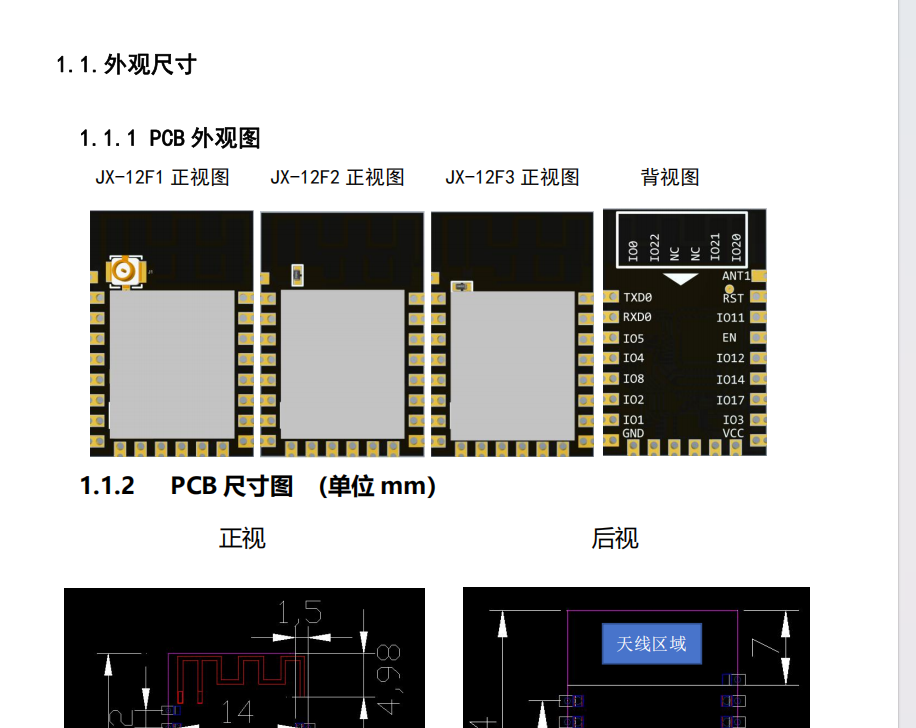

# JX-12F 模块选型 FAQ

本页用于整理 JX-12F 相关的模块选型问题。

### 如何区分设备列表中的JX-12F授权状态？

**问题描述：**

设备列表显示设备总数为15，但无法明确区分哪些设备占用授权数量，哪些不占用。

**解决方案：**

**1. 设备类型识别**

- 在设备列表中可以查看每个设备的类型
- WIFI模块设备不占用授权数量
- 蓝牙模块设备占用授权数量


**2. 授权规则说明**

- JX-12F是WIFI模块，不占用授权额度
- 只有蓝牙类模块（如SU-03T等）会占用授权
- 授权数量与蓝牙设备数量对应

**3. 执行行为下拉框显示**

- 下拉框内容基于前面的配置动态显示
- 配置了控制行为后，对应项会出现在下拉框中
- 需要先定义行为，才能在控件中绑定


**注意事项：**

- 设备列表会明确标注设备类型（WIFI/蓝牙）
- 合理规划蓝牙设备数量，避免超出授权限制
- JX-12F作为WIFI模块可以自由使用，不受授权限制

---

### JX-12F1、JX-12F2和JX-12F3有什么区别？

**问题描述：**

需要了解JX-12F系列三个型号的具体差异，以便选择合适的模块。

**解决方案：**

JX-12F系列的三个型号主要区别在于天线类型：

- **JX-12F1**：IPEX天线座版本，需要外接IPEX接口天线
- **JX-12F2**：板载天线版本，天线集成在PCB板上，无需外接
- **JX-12F3**：外置端口天线版本，提供标准天线接口

**选择建议：**

- 根据产品结构设计选择合适的天线类型
- JX-12F2适合对体积有要求的应用
- JX-12F1/JX-12F3适合需要外置天线的场景

**注意事项：**

- 三个型号的硬件规格和功能基本相同
- 仅天线配置不同，使用时请注意天线匹配



---

### 如何获取JX-12F的开发包和技术文档？

**问题描述：**

需要获取JX-12F模块的开发包、规格书、开发手册和平台协议文档。

**解决方案：**

**开发资料获取方式：**

1. **开发包下载**：

    - 文件名：06、JX-12F开发包；版本2311151441(2).zip
    - 包含完整开发环境和示例代码

2. **技术文档**：

    - JX-12F技术开发手册v1.0.pdf
    - 智能公元平台协议自定义v1.0.pdf

3. **获取渠道**：

    - 联系技术支持获取最新版本
    - 官方下载页面
    - 产品规格书同步提供

**注意事项：**

- 开发包包含完整的开发资源
- 技术手册提供详细的硬件规格
- 协议文档说明平台通信接口
- 建议保留所有文档以备开发参考

---

### 哪些模块支持语音控制和WiFi/蓝牙控制功能？

**问题描述：**

需要了解哪些模块同时支持语音控制和网络连接功能（WiFi或蓝牙），以便实现语音联网控制方案。

**解决方案：**

**支持语音+网络的模块型号：**

1. **SU-63T（语音+蓝牙）**：

    - **语音功能**：支持50条本地指令识别
    - **蓝牙功能**：支持BLE 5.1、A2DP、HFP、SPP等协议
    - **特点**：蓝牙双模设计，可同时进行语音识别和蓝牙通信
    - **应用**：智能家电、需要蓝牙连接的设备

2. **JX-12F（WiFi+BLE）**：

    - **WiFi功能**：支持2.4GHz WiFi连接
    - **蓝牙功能**：支持BLE 5.0低功耗蓝牙
    - **特点**：WiFi+BLE二合一，PIN脚兼容ESP12F/ESP8266
    - **限制**：不支持语音识别功能，仅作为网络模块

3. **JX-A7T（在线语音+WiFi）**：

    - **语音功能**：支持离线+在线混合语音识别
    - **WiFi功能**：内置802.11b/g/n WiFi
    - **特点**：支持云端AI大模型，功能最强大
    - **应用**：智能音箱、需要AI对话的设备

**组合方案建议：**

如果单一模块无法满足需求，可采用组合方案：

1. **语音芯片 + WiFi模块组合**：

    ```
    语音模块（SU-03T/CI-03T）+ WiFi模块（JX-12F/BL-62B）
    ```

    - **优势**：功能独立，选型灵活
    - **实现**：语音模块负责识别，WiFi模块负责联网
    - **通信**：通过串口进行数据交换

---


---


---

### SU32T命令词数量不够时的解决方案

**问题描述：**

SU32T在高噪声环境下识别效果优异，但150条命令词不能满足产品需求，需要在保持噪声性能的同时增加命令词数量。

**解决方案：**

**双模块方案：**

1. **方案概述**：

    - 使用两个SU32T模块并联工作
    - 每个模块独立处理150条命令词
    - 通过合理分配实现300条总命令词

2. **硬件连接方式**：

    ```
    SU32T模块A    SU32T模块B
    麦克风1 ←→ 麦克风1（并联）
    麦克风2 ←→ 麦克风2（并联）
    喇叭 ←→ 喇叭（并联）
    UART3 ←→ UART3（可并联，注意数据冲突）
    ```

3. **麦克风并联处理**：

    - 两个模块的麦克风1并联
    - 两个模块的麦克风2并联
    - 实现共享拾音，保持双麦降噪效果

4. **命令词分配策略**：

    - 模块A：150条命令词（常用功能）
    - 模块B：150条命令词（扩展功能）
    - 避免命令词重复，合理分配

5. **通信处理**：

    - UART3可考虑并联（需要防冲突处理）
    - 或分别使用不同串口避免冲突
    - 两个模块的输出可协调工作

**空间与成本考虑：**

1. **空间需求**：

    - 需要容纳两个SU32T模块
    - 麦克风和喇叭的并联布局
    - 总体积约为单个模块的2倍


*使用两个SU32T模块需要4个咪头和2个喇叭，占用空间较大*


*SU32T仅支持150条命令词，无法满足需要更多词条的应用需求*


*两个SU32T模块的并联连接方案，通过电信号求和方式处理*

2. **成本分析**：

    - 两个SU32T模块成本较高
    - 相比CI33T单模块方案仍可能有优势
    - 需要权衡功能需求与预算

3. **设计建议**：

    - 评估产品结构空间是否支持
    - 考虑供电和散热需求
    - 优化布局减少信号干扰

**替代方案对比：**

| 方案 | 命令词数量 | 噪声性能 | 成本 | 空间需求 |
|------|------------|----------|------|----------|
| 双SU32T | 300条 | 优秀 | 高 | 大 |
| 单CI33T | 300条 | 一般 | 中 | 小 |
| SU32T+CI33T | 150+300条 | 混合 | 很高 | 中 |

**实施建议：**

1. **优先测试双模块方案**：先搭建原型验证可行性
2. **优化麦克风布局**：确保并联后仍保持良好的降噪效果
3. **软件协调机制**：设计合理的通信和冲突避免机制
4. **成本控制**：批量生产时评估成本增加的可接受性

**注意事项：**

- 双模块方案增加了系统复杂度
- 需要考虑供电能力是否能支持两个模块
- 建议在实际使用环境中测试验证效果
- 如空间受限，可能需要重新设计产品结构

2. **语音芯片 + 蓝牙模块组合**：

    ```
    语音模块（SU-03T/CI-03T）+ 蓝牙模块
    ```

    - **优势**：成本相对较低，实现简单
    - **应用**：需要蓝牙连接的智能设备

**选型建议：**

1. **单芯片方案**：

    - 需要语音+蓝牙：选择SU-63T
    - 需要语音+WiFi+AI：选择JX-A7T
    - 仅需要WiFi：选择JX-12F

2. **组合方案**：

    - 成本敏感：SU-03T + JX-12F
    - 功能丰富：CI-03T + JX-12F
    - 低功耗需求：SU-23T + BLE模块

**技术实现要点：**

1. **硬件连接**：

    - 串口通信：TX/RX交叉连接
    - 共地连接：确保共地
    - 电平匹配：确认电压电平兼容

2. **软件协议**：

    - 定义简单的通信协议
    - 设置合理的数据格式
    - 考虑数据校验和重传机制

3. **电源管理**：

    - 评估总功耗需求
    - 留足电源余量
    - 考虑待机和工作的功耗差异

**注意事项：**

- SU-63T的蓝牙和语音功能可同时工作
- JX-12F仅作为网络模块，不具备语音识别能力
- 组合方案需要额外的硬件成本和开发工作
- 选型时需要考虑产品定位和成本预算

---


---


---

### 哪款WiFi模块最稳定？

**问题描述：**

需要了解在现有的WiFi模块产品中，哪一款的稳定性最佳。

**解决方案：**

**推荐型号：JX-12F**

JX-12F是当前最稳定的WiFi模块，具有以下优势：

**1. 技术特点：**

- WiFi+BLE二合一设计
- PIN脚兼容ESP12F/ESP8266系列
- 支持2.4GHz WiFi连接
- 内置BLE 5.0低功耗蓝牙
- 主控芯片：JX-1001（32位RISC CPU）

**2. 稳定性保障：**

- 先进的PMU电源管理单元
- 支持多种低功耗模式
- 完善的异常处理机制
- 经过大量产品验证的成熟方案

**3. 应用验证：**

- 已在智能家居、IoT设备中广泛应用
- 支持零投入开发，降低开发风险
- 提供免费小程序生成服务
- 官方提供完整的技术支持

**适用场景：**

- 智能开关、插座、灯具控制
- 智能家电联网改造
- 传感器数据采集上报
- 工业物联网设备监控

**注意事项：**

- JX-12F仅作为网络模块，不具备语音识别功能
- 如需语音+WiFi组合，建议配合语音模块使用
- 开发时可参考官方技术文档和例程

---

### JX-12F的EN使能管脚是否需要连接？

**问题描述：**

使用JX-12F模块时，不确定EN（Enable）使能管脚是否必须连接，以及如何处理该引脚。

**解决方案：**

**EN引脚说明：**

EN引脚是模块的使能控制引脚，用于控制模块的工作状态。

**连接建议：**

1. **可以不连接**
    - EN引脚内部有上拉电阻
    - 不连接时模块默认使能
    - 适合简单应用场景

2. **建议连接**
    - 虽然可以不接，但建议连接控制
    - 可实现电源管理和复位功能
    - 提高系统可靠性

**使用方法：**

- **高电平**：模块正常工作
- **低电平**：模块关闭/复位
- 可通过MCU GPIO控制此引脚

---

### JX-12F的蓝牙信号名称是什么？联网时需要使用吗？

**问题描述：**

需要了解JX-12F模块的蓝牙信号名称，以及在联网配置时是否需要使用该蓝牙名称。

**解决方案：**

**蓝牙功能说明：**

JX-12F的蓝牙主要用于**配网功能**，不是用于数据传输。

**主要用途：**

1. **WiFi配网**
    - 通过蓝牙快速配置WiFi连接
    - 手机APP通过蓝牙发送WiFi信息
    - 模块接收后自动连接WiFi

2. **设备发现**
    - 在配网模式下可被蓝牙设备发现
    - 信号名称通常为"JX-12F_xxxx"格式
    - xxxx为模块MAC地址后四位

**联网使用说明：**

1. **配网阶段**
    - 需要使用蓝牙功能
    - 打开手机蓝牙搜索设备
    - 使用专用APP或小程序配网

2. **正常工作**
    - 连接WiFi后蓝牙不再需要
    - 数据通过WiFi传输
    - 蓝牙可关闭以节省功耗

**注意事项：**

- JX-12F主要用于WiFi联网，蓝牙仅配网使用
- 配网成功后不再需要蓝牙连接
- 蓝牙信号名称可能因批次略有不同
- 具体配网步骤参考官方文档

---

### JX-12F支持红外功能吗？

**问题描述：**

询问JX-12F模块是否支持红外接收和发送功能，以及如何在平台上配置红外相关功能。

**解决方案：**

**JX-12F在平台上不支持红外功能。**

**功能说明：**

1. **平台支持情况**：
    - JX-12F：平台**未提供**红外功能配置
    - 硬件层面虽然有红外收发引脚（如引脚3和5标注IRRX），但平台未开放相关软件支持
    - 无法通过智能公元平台直接配置红外收发功能

2. **支持的模块对比**：
    - **SU-03T**：平台支持完整的红外收发功能，可配置红外协议
    - **CI-03T**：仅支持红外接收功能
    - **JX-12F**：平台未开放红外功能

**JX-12F引脚说明：**

虽然JX-12F的引脚定义中包含IRRX标注，但这仅表示硬件层面的引脚定义，不代表平台已提供相应的软件配置支持。

**替代方案：**

如需红外功能，建议：
1. 使用SU-03T模块实现红外控制
2. 或采用JX-A7T模块（包含CI-03T语音部分，支持红外）
3. 通过外部MCU配合实现红外功能

**注意事项：**

- 平台功能支持与硬件引脚定义是两个不同的概念
- 硬件有相应引脚不代表平台已提供软件配置
- 选型时需确认平台是否已开放所需功能的配置

---

### JX-12F是否支持随机数输出功能？

**问题描述：**

询问JX-12F模块是否支持输出范围可调的随机数，例如触发一次输出5至80之间的随机数，并支持通过串口输出数字字符。

**解决方案：**

JX-12F模块目前不支持随机数输出功能。

**功能限制说明：**

- JX-12F主要作为WiFi+BLE网络模块使用
- 不内置随机数生成功能
- 无法直接配置范围可调的随机输出

**替代方案：**

1. **外部MCU实现**：

    - 使用外部单片机生成随机数
    - JX-12F负责网络通信和数据传输
    - 通过串口将随机数发送给JX-12F

2. **实现方式**：
    ```
    外部MCU（如Arduino/STM32）→生成随机数（5-80范围）
                                    ↓串口通信
    JX-12F模块←接收随机数→网络发送
    ```

3. **程序示例**：

    - MCU端：使用rand()函数或读取ADC噪声作为随机种子
    - 生成指定范围的随机数
    - 通过串口发送给JX-12F
    - JX-12F接收到后通过网络传输

**注意事项：**

- JX-12F仅作为网络传输模块使用
- 随机数生成需要外部处理器完成
- 串口通信需要确保波特率等参数匹配
- 可考虑使用时间戳或ADC读数增加随机性

---

