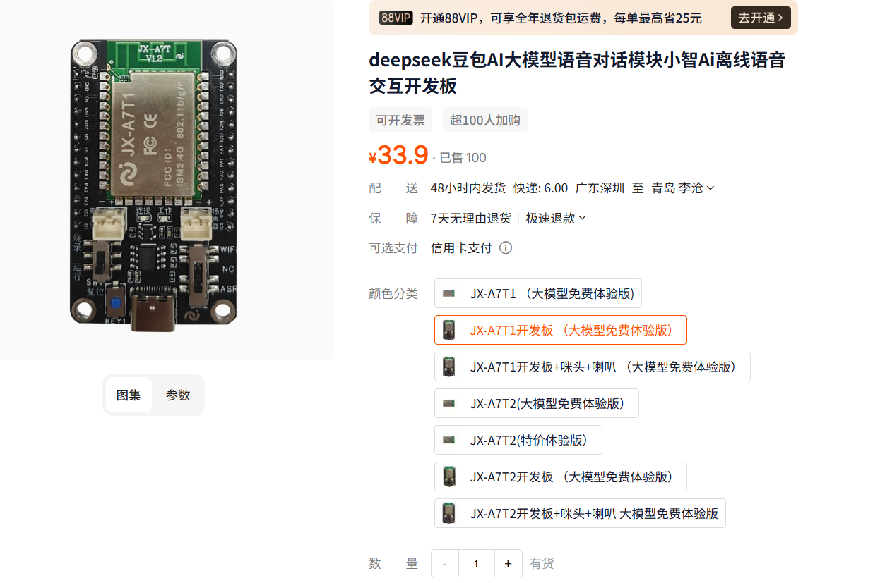
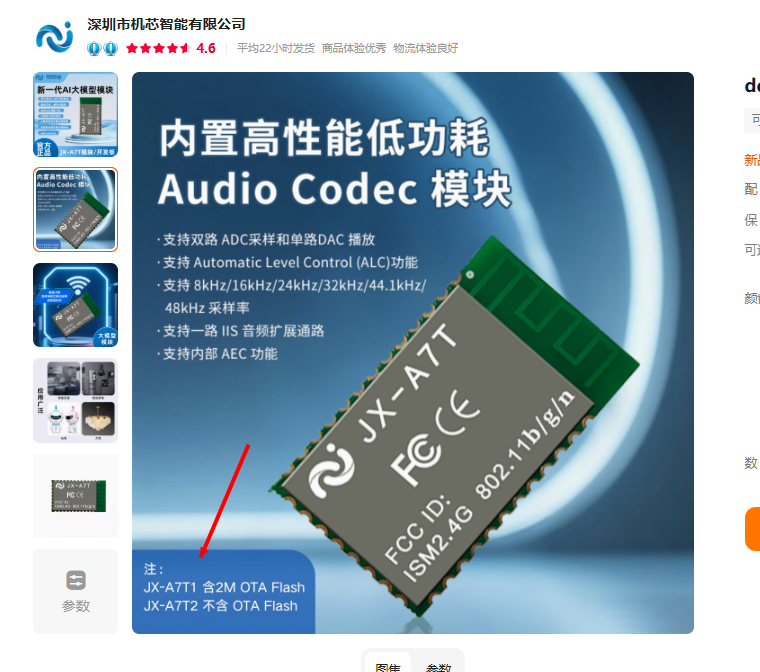
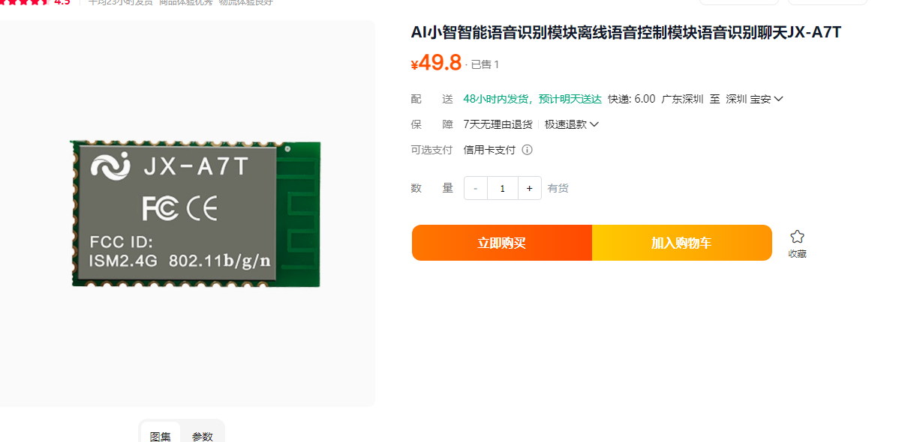
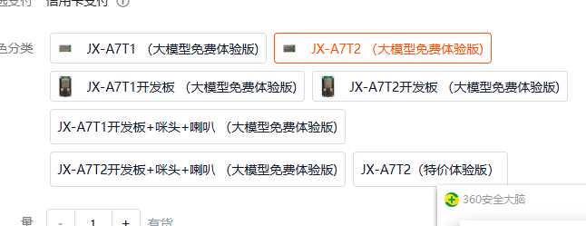
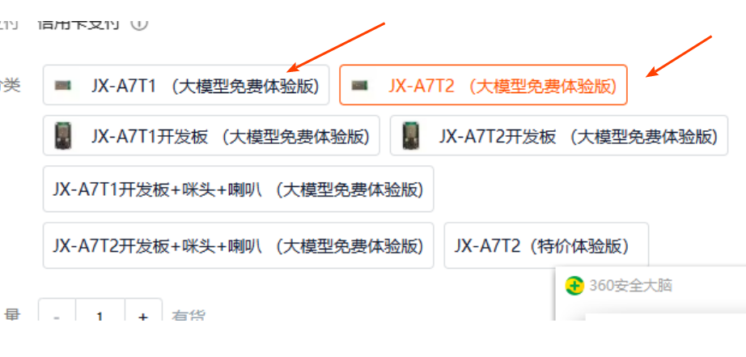
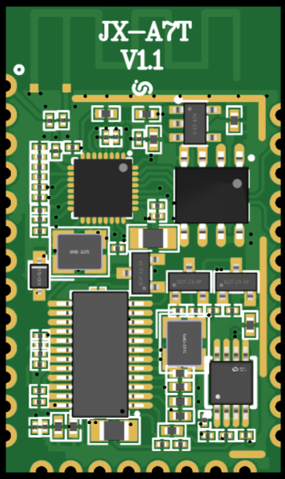
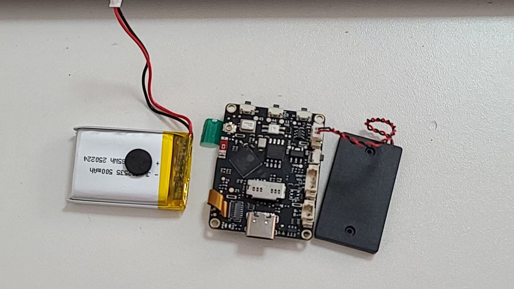
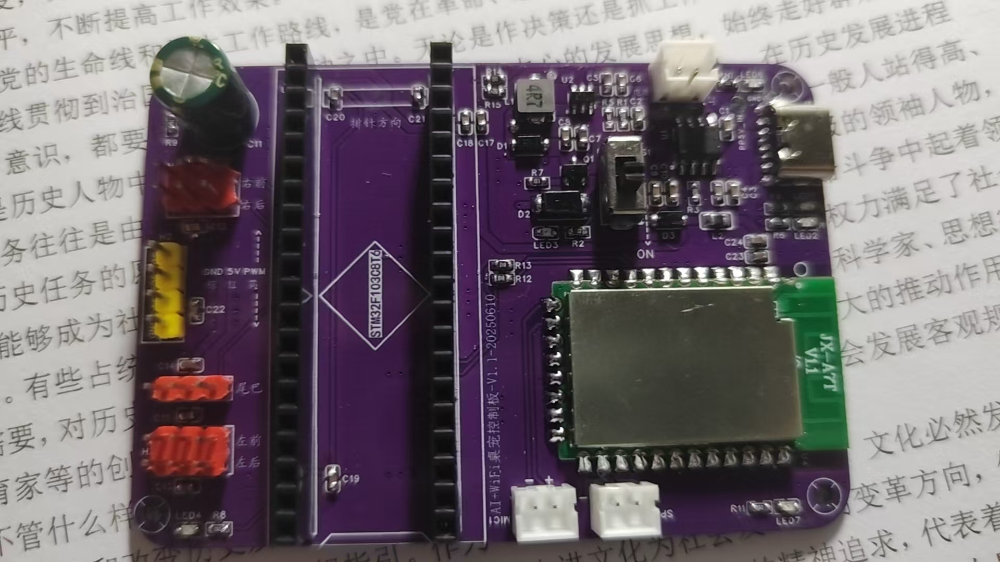

# JX-A7T 模块选型 FAQ

本页用于整理 JX-A7T 相关的模块选型问题。

### JX-A7T是什么？支持哪些指令模式？

**问题描述：**

了解JX-A7T新产品的主要功能和特点，特别是支持的指令模式以及如何获取相关文档资源。

**解决方案：**

JX-A7T是一款创新的双模AI语音模块，同时拥有离线指令与在线指令双重模式。其中在线指令搭载大模型运行，提供更智能、更高效的使用体验。

**核心功能特点：**

1. **双重工作模式**：

    - **离线指令模式**：本地识别，响应快速，保护隐私
    - **在线指令模式**：搭载大模型运行，提供智能对话能力

2. **大模型加持**：

    - 在线模式下运行大语言模型
    - 支持自然语言理解和生成
    - 可处理复杂的多轮对话
    - 提供更智能的交互体验

3. **灵活切换**：

    - 可根据应用场景自由切换工作模式
    - 离线模式确保基础功能稳定可用
    - 在线模式提供增强的智能体验

**应用场景：**

- 智能家居控制
- 服务机器人交互
- 教育陪护设备
- 教育培训课程（已有教育用户用于课堂教学）
- 智能穿戴设备


**文档与资源获取：**

- **技术文档**：https://help.aimachip.com/docs/jx_a7t_v1/jx_a7t_v1-1ghc1h40pidif
- **开发平台**：智能公元平台提供完整配置工具和例程
- **官方渠道**：通过官方授权渠道购买
- **项目合作**：有项目需求或合作意向可联系技术团队

**注意事项：**

- 例程和文档已陆续上传至智能公元平台，可随时登录查看
- 新品上市期间享有超值价格，适合项目验证

**新品上市信息：**

JX-A7T已正式发布上线，具备以下特色：

1. **当前优惠**：

    - 新品上市期间享有超值价格
    - 限时优惠活动，适合项目验证

2. **开发支持**：

    - 提供完整的技术文档和开发指南
    - 例程和资料持续更新完善
    - 支持项目需求分析和合作洽谈

3. **适用场景**：

    - 需要离线+在线双模的应用
    - 对话交互要求高的智能设备
    - 需要大模型能力的物联网产品

**注意事项：**

- 在线功能需要网络连接支持
- 离线功能不依赖网络，可独立工作
- 购买前可查看技术文档确认功能匹配
- 具体项目需求可联系技术团队咨询

---

### JX-A7T是否支持三个功能同时集成？

**问题描述：**

需要确认JX-A7T模块是否支持将离线语音识别、在线大模型对话和语音播报三个功能集成到一起，并实现在线指令的接收与播报。

**解决方案：**

**功能集成支持：**

JX-A7T模块完全支持三个功能的集成：

1. **离线语音识别**
    - 本地识别常用指令
    - 响应速度快，不依赖网络
    - 保护用户隐私

2. **在线大模型对话**
    - 接入大语言模型
    - 支持自然语言理解
    - 可处理复杂对话

3. **语音播报功能**
    - 支持在线对话结果的语音播报
    - 可播报大模型生成的回复
    - 音频输出清晰自然

**模块组成说明：**

- **硬件层面**：JX-A7T是CI-03T与JX-12F的结合体
- **功能层面**：集成了离线指令识别和在线大模型处理能力
- **资料获取**：所有技术文档已上传到智能公元平台

**配置方式：**

- 直接在智能公元平台上进行编辑配置
- 无需复杂的开发工作
- 可视化配置界面，操作简单

**注意事项：**

- 在线功能需要网络连接支持
- 离线功能可独立工作
- 三个功能可同时使用，互不干扰
- 购买前可查看demo操作指示文档了解详情

---

### 在线模块可以不接入大模型只播放指定文本吗？

**问题描述：**

询问在线模块（如JX-A7T）是否支持在不接入大模型的情况下，仅用于播放指定的文本内容。

**解决方案：**

**功能限制说明：**

- **不支持独立播放**：在线模块设计为与大模型配合工作
- **模式绑定**：在线功能与聊天机器人模式绑定
- **无法分离使用**：不能单独使用文本播放功能

**设计原因：**

- 在线模块的核心价值在于大模型对话能力
- 语音播报是大模型对话结果的输出方式
- 模块架构不支持绕过大模型直接播放文本

**可选方案：**

1. **使用离线TTS模块**
    - 选择支持纯TTS功能的离线模块
    - 可通过串口控制播放指定文本
    - 不依赖网络连接

2. **接受大模型模式**
    - 将需求转化为问答形式
    - 通过对话触发特定文本播放
    - 利用大模型生成播报内容

**注意事项：**

- 在线模块本质上是聊天机器人模型
- 需要网络连接和大模型支持
- 如仅需文本播放功能，建议选择离线TTS方案
- 使用前需确认功能需求是否匹配

---

### JX-A7T新品大模型功能特点

**问题描述：**

了解JX-A7T新品的功能特点、上线情况以及如何获取相关技术文档和资源。

**解决方案：**

JX-A7T是一款同时拥有离线指令与在线指令双重模式的AI语音模块。其中，在线指令模式搭载大模型运行，带来更智能、更高效的使用体验。

**核心功能特点：**

- **双重工作模式**：同时支持离线指令与在线指令
- **在线大模型**：搭载大模型运行，支持智能对话交互
- **离线识别**：保持离线指令功能，确保断网时基础功能可用
- **硬件控制**：可直接控制舵机、LED等外部硬件

**技术优势：**

1. **智能对话能力**

    - 支持复杂自然语言理解
    - 可处理多轮对话和上下文
    - 提供类人的交互体验

2. **灵活的部署方式**

    - 离线模式：简单控制，低延迟
    - 在线模式：智能问答，丰富功能
    - 可根据应用需求切换模式

3. **硬件控制能力**

    - 可直接控制舵机、LED等外部硬件
    - 支持 PWM 输出控制
    - 集成多种外设接口

**开发资源：**

- **例程和文档**：已陆续上传至智能公元平台，可随时登录查看
- **官方文档地址**：https://help.aimachip.com/docs/jx_a7t_v1/jx_a7t_v1-1ghc1h40pidif
- **开发工具**：智能公元平台提供完整的配置和调试工具
- **操作指南**：平台提供详细的产品功能与操作指南
- **产品介绍**：可关注官方微信公众号获取详细介绍和最新动态

**产品信息：**

- JX-A7T新品大模型已正式上线
- 当前入手享超值价格福利
- 可随时登录平台初步了解产品的强大功能与操作指南
- 如有项目需求或合作意向，可通过官方渠道联系

**注意事项：**

- 在线指令功能需要网络连接支持
- 开发前建议先查看官方文档了解完整功能列表

---

### JX-A7T是什么？

**问题描述：**

需要了解JX-A7T模块的基本功能和特性。

**解决方案：**

**模块定义**：
JX-A7T是一款离在线语音模块，支持离线指令与在线大模型双重模式。该模块集成了先进的语音识别技术和大模型能力，为产品带来更智能、更高效的使用体验。该产品是机芯智能推出的新品，已正式上线大模型功能。

**核心特点**：

- **在线大模型**：支持接入大模型，实现智能对话
- **离线指令**：支持本地命令词识别，快速响应
- **双重模式**：离在线语音功能无缝切换
- **硬件控制**：可直接控制舵机、LED等外部硬件

**主要应用场景**：

- 智能音箱控制中心
- 家电设备语音控制
- 智能照明系统
- 安防设备控制
- 环境监测设备管理

**技术规格**：

- 支持300条离线命令词
- 具备WiFi和蓝牙连接能力
- 可直接驱动外部硬件，无需额外单片机

---

### ESP32-S3开发板是否支持接入大模型？

**问题描述：**

询问ESP32-S3-N16R8开发板是否可以接入大模型，以及相关技术方案。

**解决方案：**

**技术可行性确认：**

ESP32-S3开发板可以接入大模型，但需要结合具体方案实现：

1. **硬件能力**：

    - ESP32-S3：双核Xtensa LX7处理器，最高240MHz
    - 内存：16MB PSRAM + 16MB Flash（N16R8版本）
    - 支持WiFi和蓝牙，便于联网通信
    - 具备AI加速指令，适合边缘计算

2. **接入大模型方案**：

    **方案一：连接云端大模型**

    - 通过WiFi连接OpenAI、百度文心一言等
    - 使用HTTP API或WebSocket协议
    - 需要稳定的网络连接

    **方案二：本地轻量化模型**

    - 运行量化后的轻量级模型
    - 如TinyLlama、Phi-2等
    - 受限于内存和算力

**实现步骤：**

1. **云端大模型接入**：

    - 配置WiFi连接
    - 实现HTTP/HTTPS客户端
    - 集成API密钥管理
    - 处理API响应和错误重试

2. **本地模型部署**：

    - 使用ESP32-S3的向量指令加速
    - 模型量化至INT8/INT4
    - 可能需要外部PSRAM扩展
    - 适合简单问答场景

**开发资源推荐：**

1. **官方SDK**：

    - ESP-IDF：乐鑫官方开发框架
    - Arduino Core：适合快速原型开发
    - 支持MicroPython CircuitPython

2. **开源项目**：

    - esp-llm：ESP32运行大模型的开源项目
    - llama.cpp：支持ESP32的轻量化实现
    - 各种ChatGPT客户端示例

**技术限制：**

1. **内存限制**：

    - 大模型需要大量RAM
    - 16MB PSRAM仅适合运行很小模型
    - 复杂推理可能内存不足

2. **算力限制**：

    - 推理速度较慢
    - 不适合高并发场景
    - 响应延迟可能较高

**替代方案建议：**

- **JX-A7T模块**：专为语音+大模型设计
- **树莓派 + 语音模块**：更强算力
- **专用AI开发板**：如Jetson Nano等

**注意事项：**

- ESP32适合作为大模型的接入节点而非直接运行
- 云端方案需要考虑网络延迟和API成本
- 本地方案受限于硬件性能，适合简单应用
- 开发时注意内存管理和优化

### 离线语音项目最新进展与JX-A7T新品发布

**问题描述：**

了解离线语音项目在技术、测试、应用场景方面的最新进展，以及JX-A7T新品的发布情况和功能特点。

**解决方案：**

**项目进展更新：**

机芯智能已推出新一代AI语音模块JX-A7T，标志着离线语音项目进入新阶段。

**JX-A7T新品发布：**

JX-A7T是机芯智能最新推出的AI语音模块，具备以下核心特点：

- **双重工作模式**：同时支持离线指令与在线指令
- **在线大模型**：搭载大模型运行，提供更智能、更高效的使用体验
- **离线识别**：保持离线指令功能，确保断网时基础功能可用

**技术优势：**

1. **智能化升级**
    - 在线模式支持大模型，实现智能对话
    - 离线模式保持快速响应特性
    - 可根据应用需求灵活切换

2. **应用场景扩展**
    - 智能家居控制
    - 教育辅导设备
    - 语音助手应用
    - IoT智能设备

**资源获取：**

- **官方文档**：https://help.aimachip.com/docs/jx_a7t_v1/jx_a7t_v1-1ghc1h40pidif
- **产品介绍**：可通过官方微信公众号了解详细信息
- **开发支持**：提供完整的项目需求评估和合作支持

**产品状态：**

- JX-A7T已正式上线
- 当前入手享超值价格福利
- 支持样品申请和测试评估

**注意事项：**

- 在线大模型功能需要网络连接
- 建议先申请样品测试功能效果
- 可根据项目需求选择合适的型号和配置

---

### A7T1和A7T2有什么区别？

**问题描述：**

需要了解JX-A7T的两个版本A7T1和A7T2之间的主要区别，以便选择合适的型号。

**解决方案：**

**主要区别：**

1. **OTA Flash配置**

    - **A7T1**：包含2MB OTA Flash，支持OTA在线扫码升级
    - **A7T2**：无OTA Flash，不支持OTA在线升级功能



2. **升级方式差异**

    - **A7T1**：

        - 可通过微信小程序直接OTA升级
        - 操作方便，无需物理接触
        - 适合远程批量更新

    - **A7T2**：

        - 只能通过离线方式更新固件
        - 需要使用烧录器现场升级
        - 适合固定场景应用



**功能对比：**

| 功能特性 | A7T1 | A7T2 |
|---------|-------|-------|
| OTA在线升级 | ✓支持 | ✗不支持 |
| 微信小程序升级 | ✓支持 | ✗不支持 |
| 离线烧录 | ✓支持 | ✓支持 |
| 基础语音功能 | ✓相同 | ✓相同 |
| GPIO控制 | ✓相同 | ✓相同 |
| 价格成本 | 略高 | 略低 |

**选择建议：**

1. **选择A7T1的场景**：

    - 需要远程更新功能
    - 设备部署位置难以接触
    - 产品需要频繁迭代升级
    - 个人开发者和爱好者使用

2. **选择A7T2的场景**：

    - 功能固定，很少需要更新
    - 成本敏感的项目
    - 工业控制等稳定场景
    - 有完善的现场维护体系

**注意事项：**

- A7T1通过小程序远程扫码升级时，语音固件和WiFi固件都支持升级
- A7T1的OTA Flash用于存储升级数据，支持完整的固件升级功能
- 两个版本的基础语音功能完全相同，无其他性能差异
- A7T1操作更方便，推荐大多数场景使用，特别是需要远程更新的应用
- 大批量工业应用或固定场景可考虑A7T2以降低成本
- 选择时需根据实际项目需求决定是否需要OTA功能

---

### JX-A7T的技术文档和例程在哪里获取？

**问题描述：**

需要了解JX-A7T模块的技术文档、使用例程和操作指南的获取方式。

**解决方案：**

**官方文档平台**：

- **智能公元平台**：https://help.aimachip.com/docs/jx_a7t_v1/jx_a7t_v1-1ghc1h40pidif
- 所有文档和例程已陆续上传至平台
- 可随时登录查看完整的操作指南

**文档内容包含**：

- 产品功能详细介绍
- 快速入门指南
- 硬件连接说明
- 软件开发流程
- API接口文档
- 示例代码和工程

**开发资源**：

- 离线指令配置教程
- 在线大模型接入指南
- 硬件控制示例
- 常见问题解答

**产品发布状态**：

- JX-A7T是机芯智能推出的新品，大模型功能已正式上线
- 同时拥有离线指令与在线指令双重模式
- 在线指令搭载大模型运行，提供更智能、更高效的使用体验
- 当前作为新品上市，入手享超值价格福利

**产品购买与合作**：

- 如需了解更多产品信息、项目需求或合作意向，可通过官方渠道联系
- 可关注官方微信公众号获取产品介绍和最新动态
- 新品推广期提供优惠价格和支持服务

**注意事项：**

- 文档和例程持续更新中，建议定期查看智能公元平台获取最新内容
- 新品上市期间可能有更多优惠活动，可关注官方渠道获取信息

---

### JX-A7T是否支持方言识别和定制小尺寸方案？

**问题描述：**

需要了解JX-A7T模组是否支持方言识别、采用的算法类型，以及能否提供更小尺寸的定制方案，特别是用于面板类产品时的尺寸限制。

**解决方案：**

**方言识别支持：**

- **离线部分**：可以通过自学习功能学习方言
- **学习方式**：在智能公元平台配置自学习功能，录制方言命令词
- **识别效果**：自学习后能够识别特定方言的命令词

**算法类型说明：**

- **离线语音部分**：采用神经网络算法
- **在线部分**：通过WiFi模块将音频数据上传给大模型处理
- **双模式架构**：离线和在线使用不同的算法路径

**尺寸定制方案：**

1. **当前尺寸限制**：

    - JX-A7T模组现有尺寸为规格书中的标准尺寸
    - 目前没有更小尺寸的版本
    - 模组为双芯片架构，尺寸相对固定

2. **替代方案**：

    - 如果对尺寸有特殊要求，可以单独购买两颗芯片
    - 参考官方原理图自行设计PCB
    - 这样可以根据产品需求优化尺寸布局

3. **应用建议**：

    - 面板类产品建议直接使用模组
    - 如需特殊尺寸，评估自行设计的成本和难度
    - 联系官方获取产品详情和详细规格

**注意事项：**

- 方言识别需要通过自学习功能实现，不是原生支持
- 自行设计方案需要具备一定的硬件设计能力
- 建议先使用模组评估功能，再考虑定制方案
- 如有大批量需求，可联系官方讨论定制可能性

---

### JX-A7T系统架构是公有系统还是私有系统？

**问题描述：**

需要了解JX-A7T系统架构类型以及如何接入和配置智能体。

**解决方案：**

**系统架构说明：**

- **智能公元平台**：是自主开发的开放平台
- **离线语音配置**：直接在智能公元平台上配置
- **在线大模型接入**：支持接入豆包等大模型API

**智能体接入方式：**

1. **使用豆包扣子平台**：

    - 在豆包扣子平台申请或创建智能体
    - 获取智能体的API接口信息
    - 将API接口填入智能公元后台配置

2. **平台配置步骤**：

    - 登录智能公元平台：http://www.smartpi.cn/#/
    - 选择JX-A7T模块配置
    - 在大模型设置中填入智能体API
    - 生成并烧录固件到模块

**功能特点：**

- **零代码配置**：无需编程，直接在平台配置
- **多平台支持**：已对接豆包/扣子等大模型平台
- **灵活扩展**：可根据需求切换不同智能体

**注意事项：**

- 智能公元平台是开放的，支持开发者使用
- 在线功能需要网络连接和API配置
- 建议使用官方提供的配置文档和示例

---

### JX-A7T模块是否支持128K？

**问题描述：**

询问JX-A7T模块是否支持128K的大模型功能，如在扣子智能体平台中选择的"豆包 - 1.5 - Pro - 深度思考 - 128K"。

**解决方案：**

**功能支持确认：**

- **完全支持**：JX-A7T模块可以接入和使用128K的大模型
- **平台兼容性**：在扣子智能体平台中可以选择的所有模型都可以使用
- **无硬件限制**：模块本身不会限制上下文长度

**使用方式：**

1. **通过扣子智能体平台**：

    - 在平台中选择所需的大模型（包括128K版本）
    - 配置语音指令和回复逻辑
    - 生成固件并烧录到模块

2. **模型选择说明**：

    - 128K表示模型支持的最大上下文长度
    - 可以处理更长的对话历史
    - 适合需要记忆长对话的场景

**资源说明：**

- **扣子平台**：提供了多种大模型选择
- **资源消耗**：128K模型可能消耗更多资源点
- **专业版限制**：部分高级模型可能需要升级到专业版

**注意事项：**

- 模型的上下文长度（128K）与模块无关，由云端服务决定
- 使用时注意资源点余额，及时充值或升级
- 128K模型适合复杂任务和长对话场景
- 简单任务可选择较小模型以节省资源

---

### JX-A7T是否支持SPI接口带屏功能？

**问题描述：**

咨询是否有支持SPI接口带屏的芯片产品，以及JX-A7T模块的详细信息。

**解决方案：**

**产品系列说明：**

JX系列目前按功能分为多个版本：

- **T1/T2系列**：已发布版本，不支持带屏功能
- **T3/T4系列**：带屏版本，目前还在内部测试中
- **JX-A7T**：当前主推版本，支持离线+在线双模式

**JX-A7T核心特性：**

- **双重模式**：离线指令与在线指令
- **大模型支持**：可接入国内外大模型
- **硬件控制**：直接驱动舵机、LED等外设
- **价格优势**：模块价格具体费用请联系官方客服评估，性价比高

**带屏版本规划：**

- T3/T4带屏版本正在研发测试中
- 预计将支持SPI接口屏幕显示
- 具体发布时间待官方通知


**批量价格参考：**

- 开发板/模块：需具体询价
- 批量采购：1000pcs以上可享受批量价
- 烧录费用：根据需求另计

**国外大模型接入：**

- 支持接入国外大模型（需网络支持）
- 通过智能公元平台配置
- 支持自定义智能体和对话逻辑

**4G产品规划：**

- 已有4G产品开发计划
- 目前研发项目较多，发布时间未定
- 有需求可关注官方动态或联系销售

**注意事项：**

- 带屏版本尚未正式发布
- 在线大模型功能需要稳定的网络连接
- 批量采购价格需与销售具体洽谈

---

### JX-A7T与小智相比有哪些优势？

**问题描述：**

JX-A7T与小智相比有哪些优势，是否支持语音对话聊天功能，以及是否可以像CI-03T系列一样在平台上直接配置逻辑而无需编写代码？

**解决方案：**

**核心优势对比：**

1. **零代码接入智能体**：

    - 可直接接入大模型，无需编程
    - 支持自定义智能体配置
    - 快速实现AI功能集成

2. **离线识别（断网也能用）**：

    - 支持离线命令词识别
    - 网络断开仍可基础控制
    - 双重保障系统可用性

3. **AEC唤醒打断功能**：

    - 支持回声消除
    - 可实现唤醒词打断播报
    - 提升交互体验

4. **大模型可操作硬件**：

    - AI对话可直接控制硬件
    - 无需额外MCU参与
    - 实现自然语言控制

5. **小程序实现远程控制**：

    - 支持微信小程序远程接入
    - 可实现异地控制功能
    - 扩展应用场景

6. **任意命名离线名字及指令**：

    - 自定义唤醒词
    - 个性化命令词设置
    - 灵活适配不同应用

7. **OTA升级功能**：

    - 支持固件在线升级
    - 功能持续更新优化
    - 免维护拆机升级

**平台配置支持：**

- **零代码开发**：可以在平台直接配置逻辑
- **类似CI-03T**：无需编写代码
- **可视化配置**：拖拽式操作界面
- **快速部署**：配置完成即可生成固件

**应用场景优势：**

- 智能音箱控制中心
- 家电设备语音控制
- 智能照明系统
- 安防设备控制
- 环境监测设备

**注意事项：**

- ESP32+S3+CI-03T方案占用空间较大
- JX-A7T集成度更高，方案更简洁
- 根据项目需求选择合适方案
- 大模型功能需要网络支持


**与第三方方案对比补充：**

- **服务器控制权**：使用第三方云端服务存在依赖风险，JX-A7T支持自有服务器部署，保障数据安全和服务稳定性
- **唤醒词修改**：JX-A7T在平台上可直接修改唤醒词，无需额外成本
- **代码开放性**：后续型号将支持代码开放，满足定制化开发需求
---

### JX-A7T是否支持摄像头功能？

**问题描述：**

AI玩具产品需要接入自研的扣子智能体API，并希望具备摄像头功能以实现图像识别和互动。

**解决方案：**

**当前功能支持：**

- **智能体接入**：JX-A7T可以接入自研的扣子智能体API
- **语音交互**：支持喇叭和麦克风，实现语音对话
- **硬件控制**：可直接控制外部硬件设备

**摄像头功能现状：**

- **开发中**：带摄像头的模块正在开发中，暂时无法提供
- **功能规划**：未来将支持图像识别和摄像头接入
- **实现方式**：可通过截图或实时图像采集两种方式

**临时解决方案：**

1. **智能体平台集成**：

    - 在小程序中增加图像传输接口参数
    - 智能体中添加图片参数处理
    - 与小程序参数对接实现图像功能

2. **产品方案设计**：

    - 等待新版带摄像头功能的模块发布
    - 可关注官方产品更新动态

**技术实现方向：**

- 模块加摄像头需要额外的处理器支持
- 不同应用需求各异（实时vs截图）
- 平台将提供统一的图像接口

**注意事项：**

- 摄像头功能尚在开发阶段，具体发布时间待定
- 当前可通过纯语音交互实现AI玩具功能
- 建议先完成基础功能开发，后续升级摄像头功能

---

### JX-A7T是否支持俄语等小语种？

**问题描述：**

需要了解JX-A7T模块对俄语等小语种的支持情况，以及与CI系列模块在小语种支持方面的差异。

**解决方案：**

**语言支持能力**：

JX-A7T作为搭载大模型的模块，在语言支持方面具有显著优势：

- **大模型支持**：可接入支持俄语等多种语言的大模型
- **自然语言理解**：不限于固定指令词，支持自然对话
- **多语言切换**：可在一个对话中混合使用多种语言
- **实时翻译**：借助大模型能力实现语言间翻译

**与传统模块对比**：

| 特性 | CI系列模块 | JX-A7T模块 |
|-------|------------|-------------|
| 语言支持 | 需定制语料 | 大模型原生支持 |
| 指令方式 | 固定词条 | 自然语言 |
| 小语种成本 | 需定制费用 | 无额外费用 |
| 交互方式 | 离线识别 | 在线对话 |
| 灵活性 | 受限 | 高度灵活 |

**俄语使用场景**：

1. **智能家居控制**：

    - "打开灯光"（俄语）
    - "调节温度到22度"
    - "播放俄语音乐"

2. **对话交互**：

    - 天气查询
    - 新闻播报
    - 闲聊对话

3. **设备控制**：

    - 通过自然语言描述控制需求
    - 支持复杂的组合指令
    - 可理解上下文对话

**技术优势**：

- **零代码配置**：在平台直接配置，无需编程
- **快速部署**：配置完成后即可使用
- **持续更新**：大模型能力不断升级
- **成本效益**：无需小语种定制费用

**注意事项**：

- 大模型功能需要网络连接支持
- 在线模式可能产生API调用费用
- 离线模式仍需按传统方式定制语料
- 建议根据实际需求选择合适的模块版本

---

### JX-A7T模组的产品资料和云端平台对接情况如何？

**问题描述：**

需要了解JX-A7T模组的完整产品资料、价格信息以及与云端平台的对接情况，特别是是否支持小智平台。

**解决方案：**

**产品资料获取：**

JX-A7T提供完整的技术文档包：

1. **规格书**：JX-A7T-V1.1-模组规格书.pdf
    - 详细的电气参数和机械尺寸
    - 引脚定义和接口说明
    - 功能特性列表

2. **电气原理图**：JX-A7T-V1.1电气原理图.pdf
    - 完整的硬件原理图
    - 参考设计电路
    - PCB布局参考

3. **Demo操作指南**：JX-A7T模组demo操作指示文档.pdf
    - 快速上手指南
    - 功能演示步骤
    - 调试说明



**云端平台对接：**

**当前支持情况：**

- **云端平台**：暂时仅支持Coze平台对接
- **小智平台**：目前不支持直接对接
- **操作方式**：Coze平台操作相对复杂

**技术特点：**

- **价格定位**：具体费用请联系官方客服评估（含大模型功能）
- **价值主张**：价格包含了大模型服务成本
- **集成度**：单模组解决方案，降低整体成本

**购买建议：**

1. **小批量测试**：建议先购买少量样品评估效果
2. **功能验证**：确认AEC唤醒打断等核心功能满足需求
3. **成本评估**：综合考虑产品功能与开发成本

**注意事项：**

- 云端平台对接功能正在持续扩展
- Coze平台使用需要一定的学习成本
- 价格包含大模型授权，具有性价比优势
- 技术文档可通过官方渠道申请获取

---

### JX-A7T如何购买和获取产品支持？

**问题描述：**

需要了解JX-A7T的购买渠道、价格优惠以及如何获取技术文档和支持。

**解决方案：**

**1. 购买信息**

- **新品优惠**：当前入手享有超值价格福利
- **购买渠道**：联系官方销售或代理商
- **批量采购**：支持批量订单，可咨询具体价格

**2. 技术资源**

- **在线文档**：

    - 访问地址：https://help.aimachip.com/docs/jx_a7t_v1/jx_a7t_v1-1ghc1h40pidif
    - 包含完整的产品规格和使用指南
    - 逐步更新的例程和应用案例

- **开发支持**：

    - 智能公元平台集成开发工具
    - 提供API接口和示例代码
    - 支持在线调试和测试

**3. 技术特点补充**

- **模式切换**：离线指令与在线指令无缝切换
- **大模型能力**：支持多轮对话和复杂任务处理
- **硬件接口**：丰富的GPIO和通信接口
- **开发友好**：提供完善的开发套件

**4. 合作支持**

- **项目合作**：支持定制化开发和项目合作
- **官方支持**：提供专业的技术咨询
- **培训服务**：可根据需求提供产品培训

**注意事项：**

- 大模型功能需要稳定的网络环境
- 在线模式的使用需要考虑API成本
- 建议关注官方渠道获取最新优惠信息
- 技术问题可通过官方支持渠道反馈

---

### JX-A7T支持哪些功能特性？

**问题描述：**

了解JX-A7T新品的功能特性，特别是离线与在线双重指令模式的实现方式。

**解决方案：**

**产品特性：**

JX-A7T是支持离线与在线双重模式的新型语音模块：

**1. 离线指令模式**

- 本地语音识别，无需网络
- 响应速度快，稳定性高
- 支持常用控制指令
- 适合基础控制需求

**2. 在线指令模式**

- 搭载大模型运行
- 支持更复杂的语音交互
- 可进行自然对话
- 提供更智能的使用体验

**3. 双重模式切换**

- 可根据需求选择工作模式
- 离线模式保证基础功能
- 在线模式提供增强体验
- 灵活适应不同应用场景

**获取方式：**

- **开发板**：可购买开发板进行测试
- **技术文档**：例程和文档已上传至智能公元平台（https://help.aimachip.com/docs/jx_a7t_v1/jx_a7t_v1-1ghc1h40pidif）
- **官方支持**：提供完整的项目需求和合作支持

**适用场景：**

- 需要智能对话的应用
- 要求本地可靠控制的场景
- 成本敏感且需要AI功能的项目
- 希望兼具离线稳定性和在线智能化的产品

**注意事项：**

- 在线模式需要网络连接
- 建议先购买开发板评估效果
- 详细资料参考智能公元平台文档
- 当前入手有价格优惠
- 产品已正式发布，可联系官方获取更多信息

---


---

### 各语音模块的主要参数对比？

**问题描述：**

希望了解公司现有语音模块产品的详细参数对比，特别是新推出的JX-A7T模块的特点，以便根据项目需求选择合适型号。

**解决方案：**

**主要模块系列分类：**

1. **CI系列**：经典离线语音识别
    - CI-03T：基础款，300条词条
    - CI-33T：增强款，500条词条
    - CI-73T/95C/96Z：针对特定应用优化

2. **SU系列**：简化版本，成本优化
    - SU-03T/20T/21T等：不同接口和功能组合
    - 适合成本敏感的应用

3. **JX系列**：新一代智能模块
    - JX-12F：WiFi+蓝牙双模
    - JX-A7T：AI大模型模块，支持AEC唤醒打断

**关键参数对比：**

- **主控芯片**：不同型号采用不同性能的芯片
- **供电电压**：普遍支持3.3V-5V
- **语音指令数量**：从100条到500条不等
- **Flash容量**：2M到4M，影响OTA能力
- **算法支持**：双麦算法、稳态降噪等
- **扩展功能**：部分支持蓝牙、WiFi、AI大模型

**JX-A7T特色功能：**

- 新一代AI大模型模块
- 支持离线识别，断网可用
- 支持AEC（声学回声消除）
- 支持唤醒打断功能
- 适合高端智能应用

**选型建议：**

- **基础应用**：选择CI-03T或SU系列
- **需要更多词条**：选择CI-33T或CI-73T
- **需要联网**：选择JX-12F

---


---

### 是否支持GPT类智能回答功能？

**问题描述：**

需要了解是否有模块支持GPT类智能对话和智能回答功能。

**解决方案：**

当前语音模块主要专注于本地语音识别和命令控制，不支持直接集成GPT等大语言模型。模块功能特性如下：

- **语音识别**：支持本地命令词识别（50-500条，视型号而定）
- **语音合成**：支持播报预设的语音内容
- **控制输出**：通过UART、GPIO等接口输出控制信号
- **网络功能**：部分型号（如JX-A7T、XR-50A）支持WiFi/蓝牙，可进行数据透传

如需实现智能对话功能，可通过以下方式：

1. 使用带网络功能的模块（如JX-A7T）作为语音前端
2. 将识别结果通过WiFi发送至云端服务器
3. 在云端调用GPT等大语言模型API
4. 将回答内容返回模块进行语音播报

**注意事项：**

- 实现智能对话需要自行开发云端服务和完善的应用程序逻辑
- 模块本身不具备AI对话能力，仅作为语音交互的输入输出设备
- 网络通信和云服务集成需要考虑数据安全和隐私保护

**注意事项：**

- 供电电压均为3.6-5.5V（部分型号支持3.3V）
- 接口主要为UART，部分型号支持I2C/SPI
- 命令词数量直接影响Flash容量需求
- 特殊算法需要相应硬件支持

---


---

### JX-A7T支持哪些功能特性？

**问题描述：**

咨询新品JX-A7T的购买渠道、规格书以及功能特性。

**解决方案：**

JX-A7T是新一代AI语音模块，主要特性如下：

**1. 核心功能**

- 支持大模型语音对话（如DeepSeek、豆包等）
- 具备云端AI能力，可实现自然语言交互
- 支持在线语音识别和合成
- 可连接云端服务进行智能对话

**2. 获取方式**

- **规格书**：JX-A7T-V1.1-模组规格书.pdf（可向客服索取）
- **购买渠道**：官方店铺及授权代理商
- **价格咨询**：联系官方客服或销售获取最新报价

**3. 技术特点**

- 相比ESP32-C3等传统方案，AI能力更强
- 支持更复杂的语音交互场景
- 可处理多轮对话和上下文理解
- 适合需要智能对话的产品应用

**注意事项：**

- JX-A7T为新品，建议先获取规格书确认参数
- 首次购买可能有优惠活动
- 需要网络连接才能发挥AI功能
- 开发前了解平台的配置和开发流程

---


---

### 市场挑战下如何选择合适的AI语音模块？

**问题描述：**

因市场销量问题导致项目暂停，希望了解是否有支持大模型的新产品推荐以应对市场挑战。

**解决方案：**

**1. 市场挑战分析**

- 当前市场竞争激烈，传统语音产品面临同质化问题
- 产品需要更多差异化特性来应对市场挑战
- AI大模型技术为产品带来新的竞争优势

**2. AI大模型产品推荐**

**JX-A7T - 双重模式AI模块：**

- **离线指令模式**：保证基础功能稳定可靠
    - 本地识别，响应速度快
    - 无需网络，降低使用成本
    - 适合基础控制需求

- **在线指令模式**：搭载大模型运行
    - 支持AI对话和智能问答
    - 提供更自然的交互体验
    - 可处理复杂语义理解

**3. 产品优势对比**

| 特性 | 传统语音模块 | JX-A7T |
|------|-------------|---------|
| 基础功能 | 语音识别控制 | 离线+在线双重模式 |
| AI能力 | 无 | 支持大模型对话 |
| 差异化 | 低 | 高，具有AI特色 |
| 成本 | 较低 | 适中 |
| 市场竞争力 | 一般 | 强 |

**4. 应用建议**

- **升级现有产品**：在保持离线功能基础上，增加AI对话能力
- **开发新产品**：利用JX-A7T的双重模式，打造差异化产品
- **场景拓展**：从简单的控制扩展到智能对话、陪伴等场景

**5. 产品支持**

- 完整的开发文档和示例代码
- 智能公元平台提供在线配置工具
- 官方团队提供项目合作指导

**注意事项：**

- 建议先购买开发板评估AI功能效果
- 在线模式需要稳定的网络连接
- 合理设计产品定位，突出AI特色
- 考虑目标使用者的实际需求和使用场景

---

---


---

### 哪些模块支持接入AI大模型？

**问题描述：**

询问现有的语音模块是否可以接入DeepSeek等人工智能大模型，以及如何选择支持大模型功能的模块。

**解决方案：**

**支持情况：**

1. **JX-A7T支持AI大模型**
    - 可连接云端大模型（如DeepSeek）
    - 支持与AI模型进行语音交互
    - 具备网络连接能力

2. **其他模块限制**
    - CI系列、SU系列模块不支持直接连接大模型
    - 主要为离线语音识别功能
    - 无法进行云端AI交互

**模块对比：**

| 型号 | 大模型支持 | 主要功能 | 适用场景 |
|------|-----------|----------|----------|
| JX-A7T | 支持 | 在线语音交互、AI对话 | 智能问答、云端服务 |
| CI/SU系列 | 不支持 | 离线命令识别 | 本地控制、离线应用 |

**选择建议：**

1. **需要AI对话功能**
    - 选择JX-A7T模块
    - 确保有网络连接环境
    - 配置云端API接口

2. **仅需本地控制**
    - CI/SU系列即可满足需求
    - 响应速度快，无网络依赖
    - 成本更低

**更换说明：**

- 现有模块不能通过简单更换芯片支持大模型
- JX-A7T硬件架构不同，需要完整模块
- 建议直接购买JX-A7T开发板

**注意事项：**

- AI大模型功能需要网络连接
- 云端服务可能产生额外费用
- 确认API接口兼容性

---


---

### 哪些模块支持联网功能？

**问题描述：**

需要了解不同模块是否支持联网功能，以便根据项目需求选择合适的型号。

**解决方案：**

**联网功能对比：**

| 模块型号 | 联网支持 | 网络类型 | 适用场景 |
|---------|---------|---------|---------|
| SU-03T | ✗ | 无 | 纯离线本地控制 |
| SU-10A/11T/13T | ✗ | 无 | 离线语音控制 |
| SU-63T | ✗ | 无 | 离线语音控制 |
| JX-12F | ✓ | Wi-Fi | 需要联网的应用 |
| JX-A7T | ✓ | Wi-Fi | AI语音助手 |

**模块选择建议：**

**1. 离线模块（SU系列）**

- 适用场景：玩具、简单家电控制
- 优势：响应快、无网络依赖、数据安全
- 限制：无法获取网络信息、不能远程控制

**2. 联网模块（JX系列）**

- 适用场景：智能家居、AI助手、信息服务
- 优势：可获取天气、新闻、控制云端设备
- 功能：支持在线TTS、语音识别增强

**注意事项：**

- 联网模块成本相对较高
- 需要稳定的Wi-Fi环境
- 根据实际需求选择是否需要联网功能

**2. 触发方式配置**

**GPIO电平触发：**

- 高电平触发：检测到高电平信号时执行
- 低电平触发：检测到低电平信号时执行
- 电平变化触发：检测到电平跳变时执行

**脉冲宽度检测：**

- 短脉冲过滤：忽略小于设定时间的脉冲
- 长脉冲触发：检测持续一定时间的信号
- 可配置时间阈值（毫秒级）

**3. 典型应用场景**

**工业控制：**

- 传感器信号触发语音播报
- 设备状态变化通知
- 安全报警语音提示

**智能家居：**

- 开关状态检测
- 门窗开闭提醒
- 人体感应触发

**自动化系统：**

- 流水线作业提示
- 设备故障报警
- 流程完成通知

**4. 选型建议**

**简单触发应用：**

- 选择CI-03T基础型号
- 成本低，功能实用
- 满足基本触发需求

**复杂逻辑控制：**

- 选择CI-73T或JX系列
- 支持多路GPIO
- 可编程逻辑控制

**网络联动需求：**

- 选择JX-A7T或JX-12F
- 支持WiFi/以太网
- 可实现远程触发

**5. 配置示例**

```c
// GPIO高电平触发配置
gpio_set_mode(GPIO_PIN_0, GPIO_INPUT);
gpio_set_trigger(GPIO_PIN_0, TRIGGER_HIGH);
gpio_set_callback(high_level_handler);

// 脉冲宽度检测配置
timer_set_duration(1000); // 1秒
gpio_set_duration_detection(GPIO_PIN_1, timer_callback);
```

**注意事项：**

- 确认触发电压与模块兼容（3.3V/5V）
- 考虑信号隔离和抗干扰设计
- 预留调试接口便于问题排查
- 保留触发日志用于系统维护

---


---

### JX-A7T1和JX-A7T2的主要区别是什么？

**问题描述：**

询问JX-A7T1和T2型号之间的主要区别，以便选择合适的型号。

**解决方案：**

JX-A7T1和T2的主要区别在于是否包含OTA Flash存储器。

**主要区别对比：**

| 特性 | JX-A7T1 | JX-A7T2 |
|------|-----------|-----------|
| OTA Flash | 2MB | 无 |
| 基础功能 | 完全相同 | 完全相同 |
| WiFi连接 | 支持 | 支持 |
| 语音识别 | 相同 | 相同 |
| 引脚定义 | 完全兼容 | 完全兼容 |
| 开发难度 | 相同 | 相同 |
| 价格 | 略高 | 略低 |





**功能说明：**

**1. OTA Flash的作用**

- **固件无线更新**：支持通过WiFi进行OTA升级
- **远程升级**：无需拆机即可更新固件
- **版本管理**：便于批量管理设备固件
- **调试便利**：远程修复问题，无需现场调试

**2. 无OTA版本的局限**

- **必须有线升级**：每次更新需要连接设备
- **维护成本高**：需要人工逐台更新
- **版本同步难**：分散设备难以统一管理

**3. 选型建议**

- **需要OTA功能**：选择JX-A7T1
    - 产品分布在多地
    - 需要远程维护
    - 固件更新频繁

- **仅需基础功能**：选择JX-A7T2
    - 功能固定不变
    - 追求成本最低
    - 产品部署后很少更新

**注意事项：**

- 两者硬件完全兼容，PCB设计可通用
- 任何JX-A7T都可以通过USB连接进行固件更新
- OTA功能仅在WiFi连接时可用
- 根据项目需求和预算选择合适型号

---


---

### JX-A7T模块的主要功能特点是什么？

**问题描述：**

了解JX-A7T新品的功能特点、技术文档获取方式以及合作相关信息。

**解决方案：**

JX-A7T是一款支持离线指令与在线大模型双模式运行的智能语音模块。

**核心特点**：

- **双模式运行**：同时支持离线指令识别和在线大模型对话
- **离线指令**：本地识别，快速响应，断网可用
- **在线模式**：搭载大模型，实现智能对话和复杂交互
- **硬件控制**：可直接驱动舵机、LED等外设，无需额外MCU

**适用场景**：

- 需要智能对话功能的应用
- 对响应速度有要求的离线控制场景
- 需要大模型能力的智能产品
- 要求本地和云端混合处理的系统

**技术资源**：

- **官方文档**：智能公元平台（help.aimachip.com）
- **详细地址**：https://help.aimachip.com/docs/jx_a7t_v1/jx_a7t_v1-1ghc1h40pidif
- **专属文档**：参见[JX-A7T模块选型FAQ](./faq-module-selection-jx-a7t.md)获取更详细信息

**注意事项：**

- JX-A7T为新发布产品，建议关注官方文档更新
- 在线大模型功能需要稳定的网络连接
- 开发前建议查看专属文档了解完整功能列表

---

### JX-A7T模块的主要特点是什么？

**问题描述：**

了解JX-A7T这款新产品的主要功能特点和使用模式。

**解决方案：**

**JX-A7T核心特点：**

1. **双模式支持**
    - **离线指令模式**：本地语音识别，快速响应
    - **在线指令模式**：搭载大模型，智能对话

2. **大模型集成**
    - 支持自然语言理解
    - 上下文对话能力
    - 更智能的交互体验

3. **产品定位**
    - 高端智能语音模块
    - 适合复杂交互场景
    - 提供更专业的AI服务

**应用场景：**

- 智能家居控制
- 机器人对话交互
- 教育辅导设备
- 专业问答系统

**获取方式：**

- 官方文档：https://help.aimachip.com/docs/jx_a7t_v1/jx_a7t_v1-1ghc1h40pidif
- 联系官方了解具体参数和优惠

**注意事项：**

- 在线模式需要网络连接
- 根据应用场景选择合适的工作模式
- 新产品上市期间可能有优惠政策

---

### JX-A7T新品发布介绍

**问题描述：**

了解JX-A7T新品的功能特点、在线与离线指令模式的差异，以及如何获取产品例程和文档。

**解决方案：**

JX-A7T是机芯智能推出的AI语音模块新品，已正式上线大模型功能，同时拥有离线指令与在线指令双重模式。

**核心功能特点：**

- **双重工作模式**：支持离线指令与在线指令模式
- **在线大模型**：搭载大模型运行，提供智能对话能力
- **离线识别**：本地命令词识别，响应快速
- **硬件控制**：可直接控制舵机、LED等外部硬件

**模式差异说明：**

1. **离线指令模式**
    - 本地识别，无需网络连接
    - 响应速度快，保护隐私
    - 支持基础控制功能

2. **在线指令模式**
    - 接入大模型，支持智能对话
    - 可处理复杂的多轮对话
    - 提供更智能的交互体验

**文档和例程获取：**

- **官方平台**：智能公元平台
- **文档地址**：https://help.aimachip.com/docs/jx_a7t_v1/jx_a7t_v1-1ghc1h40pidif
- **资源内容**：例程和文档已陆续上传，可随时登录查看

**产品购买信息：**

- 当前入手享超值价格福利
- 可联系官方获取更多产品信息
- 支持项目需求评估和合作咨询

**注意事项：**

- 在线大模型功能需要网络连接
- 离线指令功能不依赖网络，可独立工作
- 建议登录平台查看最新的文档更新

---

### JX-A7T新品大模型已正式上线

**问题描述：**

了解JX-A7T新品的功能特点、上线情况以及如何获取相关技术文档和例程。

**解决方案：**

**产品发布状态：**

JX-A7T新品大模型功能已正式上线，是机芯智能推出的创新AI语音模块，同时支持离线指令与在线指令双重模式。

**核心功能特点：**

- **双重工作模式**：支持离线指令与在线指令
- **在线大模型**：搭载大模型运行，提供更智能、更高效的使用体验
- **离线识别**：保持离线指令功能，确保断网时基础功能可用

**技术资源获取：**

- **智能公元平台**：所有例程和文档已陆续上传至平台
- **官方文档地址**：https://help.aimachip.com/docs/jx_a7t_v1/jx_a7t_v1-1ghc1h40pidif
- **开发工具**：平台提供完整的配置和调试工具
- **产品介绍**：可通过官方微信公众号了解更多产品详情和最新动态

**产品信息：**

- 当前为新品推广期，享有超值价格福利
- 可联系官方获取更多产品信息
- 支持项目需求评估和合作咨询
- 想要了解产品更多信息或项目需求都可以联系官方

**注意事项：**

- 大模型功能需要网络连接才能使用
- 离线指令功能不依赖网络，可独立工作
- 建议登录平台查看最新的文档更新
- 新品上市期间可能有优惠活动
- 可随时登录智能公元平台查看产品功能与操作指南

---

### 如何申请JX-A7T样品进行测试？

**问题描述：**

需要申请JX-A7T样品进行功能测试和评估，了解申请流程和获取方式。

**解决方案：**

**样品申请渠道：**

1. **官方申请途径**

    - 联系官方客服或销售代表
    - 提供测试需求和项目背景
    - 官方可根据情况提供样品支持

2. **直接购买方式**

    - 淘宝官方店铺已上架产品
    - 可自行下单购买开发板
    - 适合快速获取样品进行测试

**样品配置：**

- 标准样品包通常包含：

    - JX-A7T开发板 x1
    - 配套喇叭 x1
    - 配套麦克风 x1
    - 基础连接线材

**开发支持：**

- 提供完整的技术文档
- 智能公元平台：https://help.aimachip.com/docs/jx_a7t_v1/jx_a7t_v1-1ghc1h40pidif
- 支持远程技术指导
- 提供测试建议和方案

**申请建议：**

1. **明确测试需求**
    - 说明具体应用场景
    - 提供项目规模预期
    - 描述功能需求重点

2. **准备收货信息**
    - 提供详细的收货地址
    - 确保联系方式准确
    - 便于样品及时送达

**注意事项：**

- 样品数量根据实际情况审批
- 建议先购买少量评估效果
- 批量采购可联系销售获取优惠
- 测试期间可享受开发支持服务

---

### JX-A7T测试过程中如何获取开发支持？

**问题描述：**

在JX-A7T样品测试过程中可能遇到技术问题，需要了解如何获取开发支持和指导。

**解决方案：**

**开发支持渠道：**

1. **官方开发支持**

    - 联系官方技术团队
    - 提供详细的问题描述
    - 获得专业的技术指导

2. **测试反馈机制**

    - 定期反馈测试进度
    - 记录遇到的问题和解决方法
    - 分享测试结果和经验

**常见测试支持内容：**

- **硬件连接指导**
    - 开发板接线方法
    - 外设连接注意事项
    - 供电配置建议

- **软件配置帮助**
    - 智能公元平台使用
    - 固件烧录步骤
    - 参数配置优化

- **功能调试支持**
    - 离线指令调试
    - 在线大模型接入
    - 双模式切换验证

**测试建议：**

1. **制定测试计划**
    - 明确测试目标和步骤
    - 准备测试用例
    - 记录测试数据

2. **问题反馈准备**
    - 详细描述问题现象
    - 提供重现步骤
    - 附上相关日志或截图

**注意事项：**

- 测试过程中及时沟通问题
- 充分利用官方文档资源
- 建议保留测试记录用于后续参考
- 遇到复杂问题可申请远程协助

---

### JX-A7T在线模式是否支持意图识别和串口反馈？

**问题描述：**

需要了解JX-A7T的在线模式是否支持意图识别（如天气炎热时理解为要开风扇），以及是否有串口数据反馈功能，而不仅仅是语音回复。

**解决方案：**

**1. 在线意图识别功能**

- 支持大模型驱动的意图识别
- 可以理解自然语言表达的意图
- 无需预设固定指令词，如"打开风扇"和"开电扇"都能识别


**2. 串口数据反馈**

- 在线模式下支持配置串口输出
- 可在平台配置串口反馈功能
- 不仅支持语音回复，还支持数据信号输出

**3. 配置方式**

- 登录智能公元平台
- 在在线指令配置中添加串口输出
- 设置识别意图与输出数据的对应关系

**4. 开发状态**

- 当前功能文档和视频演示正在筹备中
- 可联系官方获取具体配置方法
- 平台会持续更新相关资源

**注意事项：**

- 意图识别需要网络连接才能工作
- 串口反馈功能需要在平台中预先配置
- 建议关注平台更新，获取最新文档和演示资源

---

### JX-A7T新品正式发布，大模型功能已上线

**问题描述：**

JX-A7T新品大模型已正式上线，需要了解其功能特点、文档资源获取途径以及购买与合作信息。

**解决方案：**

**产品发布状态：**

JX-A7T新品已正式发布上线，具备离线指令与在线指令双重工作模式。

**核心功能特点：**

- **双重工作模式**：同时支持离线指令与在线指令
- **在线大模型**：搭载大模型运行，提供更智能、更高效的使用体验
- **离线识别**：保持离线指令功能，确保断网时基础功能可用

**技术优势：**

1. **智能对话能力**
    - 支持复杂自然语言理解
    - 可处理多轮对话和上下文
    - 提供类人的交互体验

2. **灵活的部署方式**
    - 离线模式：简单控制，低延迟
    - 在线模式：智能问答，丰富功能
    - 可根据应用需求切换模式

**资源获取：**

- **智能公元平台**：所有例程和文档已陆续上传
- **官方文档地址**：https://help.aimachip.com/docs/jx_a7t_v1/jx_a7t_v1-1ghc1h40pidif
- **微信公众号**：关注机芯智能官方公众号获取产品介绍
- **开发工具**：智能公元平台提供完整的配置和调试工具

**产品购买与合作：**

- 当前为新品推广期，入手享超值价格福利
- 可联系官方获取更多产品信息
- 支持项目需求评估和合作意向洽谈

**注意事项：**

- 大模型功能需要网络连接才能使用
- 离线指令功能不依赖网络，可独立工作
- 建议登录平台查看最新的文档更新
- 新品上市期间可能有优惠活动

---


### JX-A7T是否适用于灯控类产品？

**问题描述：**

评估JX-A7T模块是否能满足灯控类产品的AI功能需求，包括离线语音控制、自定义唤醒词、插嘴打断、电池电量显示、多级亮度调节、无线充电和遥控功能，并询问是否可以进行二次开发和模块集成。

**解决方案：**

**功能支持评估：**

JX-A7T模块完全支持灯控类产品的各项需求：

1. **离线语音控制**
    - 支持本地命令词识别，无需网络连接
    - 可配置"打开灯光"、"关闭灯光"、"调节亮度"等控制指令
    - 响应速度快，确保基础控制功能的可靠性

2. **自定义唤醒词**
    - 支持任意命名离线唤醒词
    - 可根据产品品牌定制个性化唤醒词
    - 在智能公元平台即可完成配置，无需编程

3. **插嘴打断功能**
    - 支持AEC（声学回声消除）功能
    - 可在语音播报过程中通过唤醒词打断
    - 提升用户交互体验

4. **电池电量显示**
    - 支持通过ADC检测电池电量
    - 可配置电量分级提示（如33%、66%、100%）
    - 支持语音播报和LED指示灯双重显示

5. **多级亮度调节**
    - 支持PWM输出控制灯光亮度
    - 可配置多级亮度调节（如低、中、高三档）
    - 支持无级调光，精确控制亮度

6. **无线充电和遥控功能**
    - 模块支持WiFi和蓝牙连接
    - 可通过手机APP远程控制
    - 支持小程序远程控制和状态查询

**二次开发支持：**

- **完全支持二次开发**：JX-A7T提供丰富的GPIO和通信接口
- **模块化集成**：可轻松集成到现有产品设计中
- **平台化开发**：智能公元平台支持零代码配置
- **定制化服务**：支持项目定制开发

**产品规格支持：**

- **供电电压**：3.7V电池包，支持Type-C和无线充电
- **控制接口**：多路GPIO，支持PWM调光
- **通信方式**：UART、I2C、WiFi、蓝牙
- **尺寸规格**：19mm×32mm，适合紧凑空间集成


*JX-A7T模块支持离线与在线双重模式，具备完整的AI语音控制能力*

**实现方案：**

1. **硬件连接**
    - PWM输出连接LED驱动电路
    - GPIO控制电源开关和充电管理
    - ADC引脚连接电池分压电路检测电量

2. **软件配置**
    - 在智能公元平台配置语音指令
    - 设置PWM输出与亮度等级对应关系
    - 配置电量检测和提示逻辑

3. **功能扩展**
    - 支持场景模式（如阅读模式、睡眠模式）
    - 可集成定时开关和记忆功能
    - 支持多设备联动控制

**注意事项：**

- 离线模式保证基础功能不受网络限制
- 在线模式可提供更智能的对话体验
- 建议先使用开发板进行功能验证
- 批量生产时可使用模组形式降低成本

---

### JX-A7T是否支持AI小智+离线语音功能？

**问题描述：**

需要了解JX-A7T模组是否支持AI小智加离线语音功能，以及该模组的量产时间和样品申请流程。

**解决方案：**

**功能支持确认：**

- JX-A7T支持AI小智+离线语音功能
- 5月份开始量产
- 可申请样品进行开发

**模组特点：**



- 基于CI-1302芯片，支持接入大模型
- 单MIC离线语音识别，支持300条命令词
- 内置2M Flash，综合唤醒率95%
- 支持语音打断功能

**样品申请：**

1. 通过客服联系申请样品
2. 提供收货地址和联系方式
3. 样品需要支付费用（具体费用请联系官方客服评估）
4. 收到货后可先测试效果

**JX-A7T系列型号对比：**


- **JX-A7T ASR**：基于CI-1302芯片，离线语音识别版本
- **JX-A7T WiFi**：基于JX1001芯片，WiFi版本，支持小程序接入
- 两款模组需要开发不同的固件

**注意事项：**

- 样品需要付费，暂不支持免费发放
- 正式平台已上线，可进行开发配置
- 两个版本是同一模组的不同固件
- 建议根据项目需求选择合适的版本

---

### JX-A7T模块的尺寸和测试方法是什么？

**问题描述：**

需要了解JX-A7T模块的具体尺寸大小、是否有成品提供，以及如何进行测试和烧录。

**解决方案：**

**JX-A7T模块尺寸：**

- **模块大小**：参考产品图片对比
- V1.1版本尺寸相对较大
- 旁置透明笔作为尺寸参照
- 适合对尺寸要求不严格的应用

**成品与模块选择：**

1. **模块形式**：

    - 仅提供核心模块
    - 需要自行设计外围电路
    - 适合批量生产使用

2. **成品状态**：

    - 暂时没有成品销售
    - 新产品刚推出不久
    - 后续可能推出成品版本

**测试和烧录方法：**

1. **基础测试**：

    - 使用转接板连接模块
    - 连接麦克风和扬声器
    - 通过串口或USB连接电脑

2. **烧录方式**：

    - 支持标准烧录工具
    - 可使用CH340等USB转TTL工具
    - 不需要专用烧录器

3. **功能验证**：

    - 语音唤醒测试
    - 命令词识别测试
    - GPIO输出控制测试

**注意事项：**

- JX-A7T为新产品，建议申请样品测试
- 模块尺寸较大，设计时需预留空间
- 支持AI小智功能，可接入大模型
- 解放双手设计，无需按钮打断播报

---

### JX-A7T烧录需要焊接吗？

**问题描述：**

需要了解JX-A7T模块进行烧录时是否需要焊接，以及是否必须购买专用烧录器。

**解决方案：**

**JX-A7T烧录方式：**

1. **无需焊接**：

    - 模块通过杜邦线连接
    - 使用转接板进行测试
    - 支持面包板搭建测试电路

2. **连接方式**：

    - 使用配套的杜邦线
    - 连接模块到转接板
    - 转接板提供标准接口

**烧录工具选择：**

1. **标准烧录器**：

    - 支持CH340等USB转TTL工具
    - 不需要专用烧录器
    - USB接口即可完成烧录

2. **烧录步骤**：

    - 连接USB到电脑
    - 使用PACK_UPDATE_TOOL软件
    - 选择对应固件文件烧录

**开发套装包含：**

- JX-A7T核心模块
- 转接板（已焊接排针）
- 杜邦连接线
- 说明文档和教程

**注意事项：**

- 初次测试建议使用转接板
- 批量生产时可设计专用PCB
- 模块接口标准，兼容常用烧录工具
- 无需额外购买专用烧录器

---

### JX-A7T支持AEC功能吗？

**问题描述：**

需要确认JX-A7T模块是否支持AEC（回声消除）功能，以及单麦克风版本是否支持AEC。

**解决方案：**

**AEC功能支持：**

1. **硬件支持**：

    - JX-A7T基于CI-1302芯片
    - 芯片内置AEC算法
    - 支持回声消除功能

2. **单麦克风AEC**：

    - 单麦克风版本支持AEC功能
    - 与双麦克风版本不冲突
    - 适合近场语音交互场景

3. **功能特点**：

    - 语音播报时支持打断
    - 实现解放双手交互
    - 适合智能音箱等应用

**应用场景：**

- **智能音箱**：播放音乐时语音控制
- **家电控制**：电视声音环境下控制
- **车载系统**：导航播报时接受指令

**注意事项：**

- AEC功能默认启用
- 单麦克风AEC效果有限，建议控制播放音量
- 复杂回声环境可能需要额外调试
- 确保麦克风放置位置合理

---

### JX-A7T新品模块的核心功能特点是什么？

**问题描述：**

需要了解JX-A7T新品模块的功能特点、使用模式以及如何获取更多信息。

**解决方案：**

JX-A7T是新一代AI大模型模块，同时拥有离线指令与在线指令双重模式。其中，在线指令搭载大模型运行，提供更智能、更高效的使用体验。

**核心功能特点：**

- **零代码接入智能体**：无需编程，直接在平台配置即可接入智能体
- **离线识别（断网可用）**：支持本地命令词识别，网络断开时基础功能仍可正常使用
- **AEC唤醒打断**：支持声学回声消除，可在语音播报过程中通过唤醒词打断
- **大模型可操作硬件**：AI对话结果可直接控制硬件设备，无需额外MCU
- **小程序远程控制设备**：支持通过微信小程序进行远程控制和状态查询
- **任意命名离线名字及指令**：支持自定义唤醒词和命令词，满足个性化需求
- **OTA在线升级**：支持通过网络进行固件更新，无需拆机

**技术优势：**

1. **双模工作方式**
    - 离线模式：响应速度快，稳定性高，保护隐私
    - 在线模式：支持智能对话，可处理复杂任务

2. **开发便捷性**
    - 智能公元平台提供可视化配置工具
    - 无需编写代码，降低开发门槛
    - 丰富的API接口支持定制化开发

3. **应用灵活性**
    - 适用于智能家居、服务机器人、教育设备等多种场景
    - 可根据需求灵活切换工作模式
    - 支持与现有系统快速集成

**获取方式：**

- **技术文档**：https://help.aimachip.com/docs/jx_a7t_v1/jx_a7t_v1-1ghc1h40pidif
- **开发平台**：智能公元平台提供完整的配置工具和示例
- **购买渠道**：官方淘宝店铺及授权代理商
- **开发支持**：可通过官方渠道获取产品咨询和技术支持

**注意事项：**

- 在线功能需要稳定的网络连接支持
- 新品上市期间享有优惠价格
- 建议先申请开发板进行功能评估
- 具体项目需求可联系官方团队深度沟通

---

### JX-A7T能否替代现有离线语音模块与ESP32的组合方案？

**问题描述：**

现有方案使用小智（离线语音模块）与ESP32组合，实现在线和离线功能。希望了解JX-A7T是否可以替代这一双模块方案，简化硬件设计。

**解决方案：**

**1. 方案替代分析**

JX-A7T完全可以替代离线语音模块+ESP32的组合方案：

- **集成度更高**：单一模块同时支持离线和在线功能
- **成本优势**：相比双模块方案，总体成本更低
- **开发简化**：减少模块间通信的复杂性
- **空间节省**：PCB布局更紧凑，产品体积更小



**2. 功能对比**

| 功能特性 | 小智+ESP32方案 | JX-A7T单模块方案 |
|---------|----------------|-------------------|
| 离线唤醒 | ✗ 支持 | ✗ 支持 |
| 在线对话 | ✗ 需要ESP32联网 | ✗ 内置WiFi，直接联网 |
| 开发复杂度 | ✗ 需处理双模块通信 | ✗ 单一模块，无需协调 |
| 功耗 | ✗ 两模块功耗更高 | ✗ 单模块功耗更低 |

**3. 迁移优势**

- **无缝切换**：离线和在线模式可快速切换
- **统一接口**：所有功能通过同一模块控制
- **维护简单**：只需维护一个模块的固件
- **升级便利**：固件升级同时更新所有功能

**注意事项：**

- JX-A7T已内置WiFi模块，无需额外联网组件
- 唤醒词可在平台自定义，支持个性化设置
- 建议申请开发板进行功能验证和性能评估
- 具体技术参数可参考官方技术文档

**4. AEC回采电路对比**

离线语音模块+ESP32方案与JX-A7T方案在AEC（回声消除）电路设计上的差异：

| 对比项 | 离线模块+ESP32方案 | JX-A7T单模块方案 |
|-------|-------------------|-------------------|
| AEC实现 | 需从DAC采集回声信号接入PA2/PA3 | 内置AEC功能，无需外部电路 |
| 调试难度 | 回采电路调试复杂，耗时较长 | 模块内部已优化，即插即用 |
| 硬件设计 | 需要额外设计和调试AEC电路 | 无需额外AEC电路设计 |

采用JX-A7T单模块方案可避免AEC回采电路的复杂调试过程，显著降低开发难度和周期。

---

### JX-A7T模块是否支持WiFi、语音识别、语音播放、蓝牙功能？

**A：** JX-A7T是一款高度集成的AI语音模块，支持以下功能：

支持的功能
- **WiFi连接**：支持2.4GHz WiFi网络，可实现网络通信和在线功能
- **语音识别**：内置语音识别算法，支持离线和在线语音命令识别
- **语音播放**：集成TTS（文本转语音）功能，可播放语音提示和响应
- **蓝牙功能**：支持蓝牙连接，可与手机等设备进行通信

技术特点
- **一体化设计**：单模块集成了多种通信和处理功能
- **低功耗**：优化的功耗设计，适合电池供电应用
- **易于开发**：提供完善的开发工具和技术支持

应用场景
- 智能家居控制
- 语音助手设备
- 物联网终端
- 智能玩具

**注意事项：**

- 具体功能实现需要配合相应的固件和配置
- 建议参考官方开发文档进行功能开发
- 如需技术支持，可联系官方客服获取详细信息

---

### JX-A7T模块中语音指令'What's your name'因包含特殊字符无法识别，如何解决？

**A：** JX-A7T模块的语音识别系统不支持在指令中使用特殊字符（如撇号）。


解决方法：

问题原因
- 语音识别系统对特殊字符有限制
- 撇号（'）等符号会导致识别失败

解决方案
1. **使用替代指令**：

    - "what is your name"
    - "what your name"

2. **配置多个相似指令**：

    - 在配置中添加：`what is your name|what your name`
    - 系统会根据发音相似性进行识别

注意事项
- 对于英文指令，建议测试不同语速的识别效果
- 快速发音可能识别后面的词，慢速发音可能识别前面的词
- 避免使用任何特殊符号，只使用字母和空格

---

### JX-A7T模块是否支持语音识别后将识别结果以文字形式输出？

**A：** 目前JX-A7T模块的语音识别功能特性如下：

当前状态
- **不支持直接文字输出**：语音识别结果不能直接以文字形式通过串口输出
- **功能待开发**：该功能尚未在当前版本中实现

相关说明
- 识别结果主要用于内部处理和触发相应操作
- 如需文字输出功能，建议关注官方后续版本更新
- 可通过其他方式实现类似需求，如使用特定语音指令触发预设回复

建议
- 如有此功能需求，可联系官方技术支持反馈
- 关注官方平台的更新公告
- 考虑使用其他方案组合实现功能需求

---

### JX-A7T开发板使用的芯片型号是什么？是否支持双麦克风？

问题描述：

在确认使用的开发板上搭载的离线语音识别芯片型号及其技术参数，特别是该芯片是否支持双麦克风配置。

解决方案：

根据提供的开发板图片可以确认：

- **主控芯片**：STM32F103C8T6（蓝色主控）
- **语音模块**：JX-A7T（绿色模块）



**关于双麦克风支持：**

JX-A7T作为AI语音模块，其麦克风配置需要参考具体的技术规格：

- 单/双麦克风支持取决于具体的硬件设计
- 可通过查看模块规格书或原理图确认麦克风接口数量
- 双麦克风配置通常用于增强降噪和声源定位能力

建议
- 查阅JX-A7T的官方规格书确认麦克风支持数量
- 如需要双麦克风功能，可咨询技术支持确认具体型号支持情况
- 开发时可根据实际需求选择合适的麦克风配置方案

---

### JX-A7T新品已上线，如何了解详情？

**问题描述：**

JX-A7T新品已经上线，想了解产品的功能特点、文档资源以及如何联系进行项目合作。

**解决方案：**

JX-A7T是最新推出的AI语音模块，现已正式上线销售。

**产品核心特点：**

1. **双重模式**：

    - 离线指令模式：本地快速响应，保护隐私
    - 在线指令模式：搭载大模型，智能对话

2. **大模型能力**：

    - 运行大语言模型
    - 支持自然语言理解
    - 多轮对话交互
    - 智能化体验提升

**文档资源：**

- **官方文档**：https://help.aimachip.com/docs/jx_a7t_v1/jx_a7t_v1-1ghc1h40pidif
- **例程代码**：已上传至智能公元平台
- **操作指南**：提供完整的产品功能和使用说明

**购买与合作：**

- **当前优惠**：新品上线期间享受超值价格福利
- **购买渠道**：通过官方授权代理商获取
- **技术支持**：提供完整的技术文档和开发支持

**项目合作：**

如有以下需求，可直接联系官方：

- 产品技术咨询
- 项目定制需求
- 批量采购意向
- 技术方案评估

建议
- 登录智能公元平台查看详细文档和例程
- 新品期间入手可享受优惠价格
- 有项目需求建议尽早联系技术团队

---

### JX-A7T支持哪些工作模式？

**问题描述：**

需要了解JX-A7T新品的功能特性，特别是支持的工作模式。

**解决方案：**

JX-A7T是一款同时支持离线指令与在线指令双重模式的大模型语音模块：

- **离线指令模式**：支持本地离线语音指令识别和响应
- **在线指令模式**：搭载大模型运行，提供更智能、更高效的使用体验

**产品详细信息：**

- **文档地址**：https://help.aimachip.com/docs/jx_a7t_v1/jx_a7t_v1-1ghc1h40pidif
- **功能特点**：同时拥有离线指令与在线指令双重模式
- **核心优势**：在线指令搭载大模型运行，带来更智能、更高效的使用体验

**购买信息：**

- 当前入手享超值价格福利
- 例程和文档已陆续上传至智能公元平台
- 可随时登录平台查看产品功能和操作指南

**注意事项：**

- JX-A7T作为新品大模型模块，可根据项目需求选择合适的工作模式
- 更多详细产品资料和技术文档可通过官方平台获取
- 具体项目需求和合作意向可联系技术支持进行沟通洽谈


---

### JX-A7T是一款什么样的产品？

**问题描述：**

需要了解JX-A7T新产品的功能特点、技术规格和应用场景。

**解决方案：**

**1. 产品概述**

JX-A7T是一款支持双模式运行的新款大模型语音模块：

- **离线指令模式**：支持本地离线语音识别和控制
- **在线指令模式**：搭载大模型运行，提供更智能的交互体验
- **双模式切换**：可根据需求灵活切换工作模式

**2. 技术特点**

**大模型支持**：

- 集成大语言模型，提供更自然的对话体验
- 支持复杂语义理解和多轮对话
- 智能程度显著提升，交互更高效

**离线能力**：

- 保持离线指令识别功能
- 响应速度快，不依赖网络
- 保护隐私，数据本地处理

**3. 开发资源**

**文档支持**：

- 例程和文档已上传至智能公元平台
- 访问地址：https://help.aimachip.com/docs/jx_a7t_v1/jx_a7t_v1-1ghc1h40pidif
- 提供完整的功能说明和操作指南

**开发支持**：

- 提供开发板和示例代码
- 详细的技术文档和应用笔记
- 技术支持团队提供开发指导

**4. 应用场景**

**智能家居**：

- 智能音箱、智能家电控制
- 支持复杂场景理解和多设备联动

**物联网设备**：

- 智能穿戴、健康监护设备
- 支持自然语音交互和数据查询

**机器人**：

- 服务机器人、教育机器人
- 提供更智能的对话和服务能力

**注意事项：**

- 在线模式需要网络连接支持
- 大模型运行对硬件资源有一定要求
- 开发前建议详细阅读技术文档
- 当前有优惠价格福利，适合早期试用和评估

---


---

### JX-A7T 支持哪些指令模式？如何获取相关技术文档？

**问题描述：**

JX-A7T 是一款支持离线指令与在线指令双重模式的新产品，需要了解其功能特点和技术资源获取方式。

**解决方案：**

JX-A7T 是集成大模型能力的新一代语音模块产品。

**主要功能特点：**

1. **双模式指令支持**
    - 离线指令模式：本地快速响应，无需联网
    - 在线指令模式：搭载大模型运行，提供更智能的交互体验

2. **大模型加持**
    - 在线模式下集成大语言模型能力
    - 支持更自然、更智能的对话交互
    - 提供更高效的使用体验

**技术资源获取：**

- **文档平台**：智能公元平台（https://help.aimachip.com/docs/jx_a7t_v1/jx_a7t_v1-1ghc1h40pidif）
- **资源内容**：

    - 详细的产品文档
    - 完整的例程代码
    - 操作指南和开发教程
- **获取方式**：登录智能公元平台即可查看和下载

**注意事项：**

- JX-A7T 作为新品发布，当前享有价格优惠福利
- 适合需要智能交互功能的项目应用
- 开发前建议详细阅读平台技术文档
- 可通过官方渠道获取项目合作和技术支持

---


---

### 是否有支持自然对话的离线语音识别芯片？

**问题描述：**

寻找类似手机语音助手、支持自然对话的离线语音识别芯片。

**解决方案：**

**离线语音模块特性：**

- 现有离线语音模块只能识别预设的命令词
- 不支持自由的自然语言对话
- 需要将语音命令预先录入到模块中

**功能限制：**

- 离线模块无法实现智能对话功能
- 识别范围仅限于预设的词条（通常50-500条）
- 无法理解未训练的语音内容

**替代方案：**

- 如需自然对话功能，应考虑在线语音方案
- 可选择支持云服务的模块（如JX-A7T）
- 或通过外接联网设备配合离线模块使用

**注意事项：**

- 离线方案的优势是响应快、保护隐私
- 自然对话需要云端AI支持，无法完全离线实现
- 根据项目需求选择合适的技术方案

---


### JX-A7T可以与STM32等单片机配合使用吗？

**问题描述：**

询问JX-A7T模块是否可以用于STM32单片机项目，通过串口进行通信。

**解决方案：**

**串口通信支持：**

- **通信方式**：支持UART串口通信
- **电平兼容**：3.3V TTL电平，与STM32直接兼容
- **波特率**：支持常用波特率（如9600、115200等）

**硬件连接：**

```
STM32          JX-A7T
TX   →   UART1_RX (GPIO_A3)
RX   ←   UART1_TX (GPIO_A2)
GND  →   GND
```

**应用场景：**

- **方案一**：JX-A7T作为主控，STM32作为执行器
- **方案二**：STM32作为主控，通过JX-A7T扩展语音功能
- **方案三**：双主控协作，各司其职

**注意事项：**

- 确认双方电平匹配（JX-A7T为3.3V，STM32部分型号为5V需要电平转换）
- 波特率等通信参数需保持一致
- 通信协议需要在平台中正确配置

---

### JX-A7T是否支持USB接口直接连接？

**问题描述：**

需要确认JX-A7T模块是否支持USB接口直接连接，还是需要额外的转接电路。

**解决方案：**

**接口类型说明：**

- JX-A7T模块本身提供的是UART TTL串口接口
- 不直接支持USB接口连接
- 需要通过外部电路实现USB转TTL转换

**硬件连接方案：**

**方案一：使用USB转TTL模块**
- 采用CH340、CP2102、FT232等USB转TTL芯片
- 将USB信号转换为TTL电平后与JX-A7T连接
- 适用于开发调试阶段

**方案二：自行设计TTL转USB电路**
- 在产品PCB上集成USB转TTL芯片
- 需要自行设计外围电路
- 适合批量生产的产品

**开发板与模组区别：**

| 类型 | USB支持 | 说明 |
|------|---------|------|
| JX-A7T开发板 | 支持 | 开发板已集成USB转串口电路 |
| JX-A7T模组 | 不支持 | 仅提供TTL串口，需自行设计转接电路 |

**典型应用场景：**

- 与树莓派等带USB接口的主控板通信
- 与PC机进行USB通信
- 产品需要USB接口进行固件升级或数据传输

**注意事项：**

- 如产品需要USB接口，需在主控板上设计USB转TTL电路
- 通信时注意电平匹配（JX-A7T为3.3V TTL电平）
- 建议在开发阶段使用现成的USB转TTL模块进行验证

---

### JX-A7T是否支持TF卡/SD卡本地音频播放？

**问题描述：**

需要确认JX-A7T模块是否支持TF卡或SD卡本地音频文件播放功能，以及如何实现AI聊天、蓝牙音箱、TF卡播放三种模式切换。

**解决方案：**

**JX-A7T不支持TF卡/SD卡本地播放：**

- JX-A7T模块本身不提供TF卡或SD卡接口
- 无法直接读取存储卡中的音频文件进行播放
- 模块主要通过WiFi网络获取在线音频资源

**实现多种播放模式的替代方案：**

1. **AI对话模式**：
    - JX-A7T核心功能，通过大模型实现智能对话
    - 支持在线TTS语音播报
    - 可回答各类问题并执行控制指令

2. **蓝牙音箱模式**：
    - JX-A7T支持蓝牙BLE 5.0
    - 可通过小程序实现蓝牙音频播放
    - 或通过外部蓝牙模块配合实现

3. **TF卡本地播放（需额外方案）**：
    - **方案一**：增加外部TF卡播放模块，通过串口通信控制
    - **方案二**：如仅需音频播放，可考虑其他支持本地存储的型号
    - **方案三**：使用网络音频流替代本地文件播放

**音频模式切换实现：**

可通过以下方式实现模式切换：

- **语音指令**：配置"切换到蓝牙模式"、"切换到AI对话"等命令词
- **GPIO触发**：通过物理按键切换工作模式
- **串口控制**：主控MCU通过串口发送模式切换指令

**选型建议：**

| 需求 | 推荐方案 |
|------|----------|
| AI对话 + 离线控制 | JX-A7T（推荐） |
| 必须TF卡本地播放 | 考虑增加外部播放模块 |
| 三种模式必需 | JX-A7T + 外部TF卡播放模块组合 |

**注意事项：**

- JX-A7T设计重点在于在线AI对话能力，本地存储非核心功能
- 如项目对TF卡播放有强需求，建议评估是否接受增加外部模块
- 多模式切换需要在平台配置好对应的逻辑控制
