# SU-03T 模块选型 FAQ

本页用于整理 SU-03T 相关的模块选型问题。

### SU-03T1套装包含哪些配件？与CI-03T1有什么区别？

**问题描述：**

需要确认SU-03T1模块的套装内容、配件组成，以及与CI-03T1在芯片外观上的差异原因。

**解决方案：**

**SU-03T1套装组成：**

1. **基础套装**（模块+喇叭+咪头+电源线）
    - 包含SU-03T1主模块
    - 配套8Ω 2W喇叭一个
    - 标准咪头（麦克风）一个
    - USB电源线一条

2. **配件说明**
    - 咪头可通用，不影响功能
    - 喇叭必须使用配套规格（8Ω 2W）
    - 电源线用于5V供电

**与CI-03T1的区别：**

1. **功能定位**
    - SU-03T1：专注离线语音识别
    - CI-03T1：带额外功能扩展

2. **芯片差异**
    - 可能是不同批次或版本
    - 核心功能基本相同
    - 外观差异不影响使用

3. **选型建议**
    - 需要纯语音识别：选择SU-03T1
    - 需要更多功能：考虑CI系列

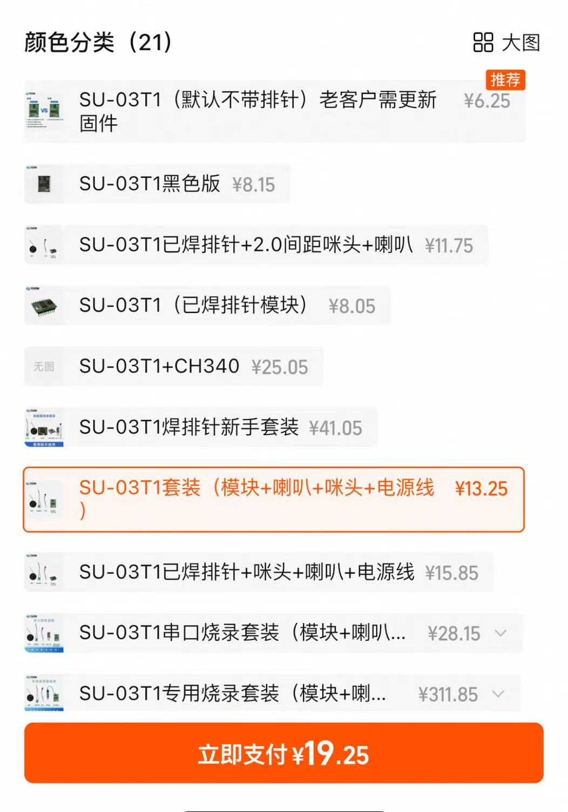

**注意事项：**

- 套装价格包含所有必要配件
- 咪头规格基本通用，可兼容使用
- 芯片外观差异属于正常现象
- 购买时确认所需配件是否齐全

---

### SU-03T1模块的产品配置有哪些？

**问题描述：**

在淘宝看到SU-03T1模块，需要确认是否包含已焊接的排针、麦克风和喇叭，以及是否支持2.0间距的麦克风。

**解决方案：**

**1. 产品配置选项**

- **基础版**：模块本体，不含排针焊接
- **标准版**：包含已焊接排针+标准咪头+喇叭
- **定制版**：支持2.0间距咪头等特殊配置

**2. 确认配置要点**

购买时注意商品选项说明：

- 查看标题是否明确标注配件
- 确认图片展示的配置内容
- 选择"已焊排针+2.0间距咪头+喇叭"选项
- 咪头间距通常为2.0mm标准接口

**3. 配件清单**

完整配置包含：

- SU-03T1主模块（已焊接排针）
- 2.0间距麦克风一个
- 8Ω 2W扬声器一个
- 连接线材（如有）

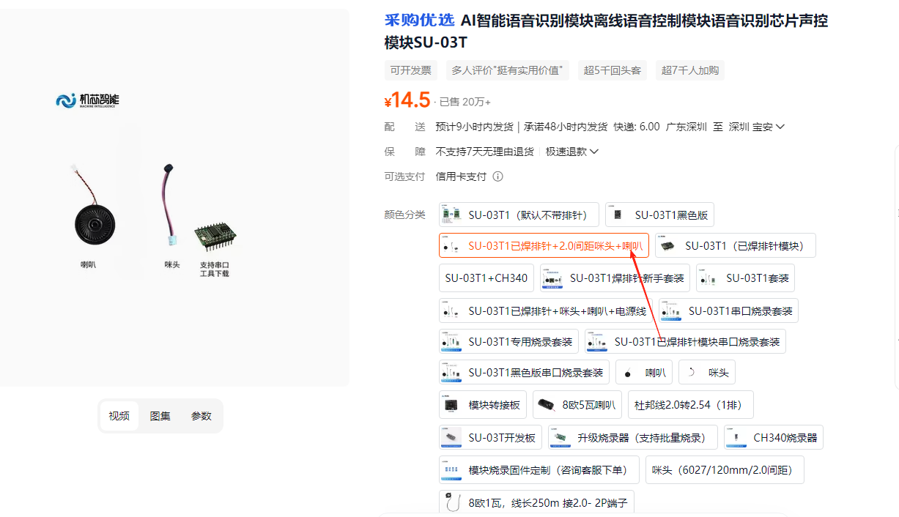

**注意事项：**

- 不同商家的配置可能不同，购买前仔细确认
- 2.0间距是通用标准，大部分咪头都兼容
- 建议选择含排针焊接的版本，免去焊接烦恼
- 确认咪头和喇叭的规格匹配模块要求

---

### SU-03T是否支持电机驱动和步进电机控制？

**问题描述：**

需要确认SU-03T控制板是否支持电机驱动、调速功能，以及能否控制步进电机，了解其输入输出能力。

**解决方案：**

SU-03T的电机驱动能力需要通过外部电路实现：

- **直接驱动能力**：

    - SU-03T本身不能直接驱动大功率电机
    - IO口输出电流有限（通常小于10mA）
    - 需要外接驱动电路或模块

- **电机控制方案**：

    - **直流电机**：配合L298N、TB6612等驱动模块
    - **步进电机**：使用A4988、DRV8825等步进驱动器
    - **舵机控制**：可直接驱动（需要外接电源）
    - **调速控制**：通过PWM输出实现调速

- **IO资源**：

    - SU-03T提供多个GPIO口
    - 支持PWM输出
    - 可配置UART、I2C等通信接口
    - 足够控制多种外设

**实现方案：**

1. 选择合适的电机驱动模块
2. 将SU-03T的IO口连接到驱动模块控制端
3. 电机连接到驱动模块的输出端
4. 通过语音命令控制IO口输出
5. 实现电机的启停、正反转、调速等功能

**注意事项：**

- 电机电源需要独立供电，不能使用SU-03T的3.3V
- 大功率电机会产生电磁干扰，注意隔离
- 步进电机需要配合驱动器和独立电源

### SU-03T待机功耗过高，如何选择低功耗芯片？

**问题描述：**

SU-03T模块在仅开机状态下待机功耗较高，一晚上电量耗尽，需要选择低功耗替代方案。

**解决方案：**

**低功耗芯片推荐：**

1. **SU-21T**：

    - 待机电流：小于1mA
    - 适合电池供电场景
    - 支持基础语音识别功能

2. **SU-22T**：

    - 待机电流：约1-2mA
    - 性能与功耗平衡
    - 适合一般低功耗应用

3. **SU-23T**：

    - 待机电流：约2-3mA
    - 功能较丰富
    - 适合需要更多功能的应用

4. **SU-32T**：

    - 待机电流：约3-5mA
    - 支持WiFi功能
    - 适合联网场景

**选型建议：**

- 纯电池供电：推荐SU-21T
- 需要唤醒功能：选择SU-22T
- 功能需求较多：考虑SU-23T
- 需要联网：使用SU-32T

**功耗优化措施：**

1. **硬件优化**：

    - 使用深度休眠模式
    - 优化外围电路功耗
    - 选择合适的供电电压

2. **软件配置**：

    - 降低采样频率
    - 减少不必要的功能
    - 优化唤醒灵敏度

**注意事项：**

- 低功耗芯片可能功能较少
- 根据实际需求选择合适型号
- 电池容量要与功耗匹配

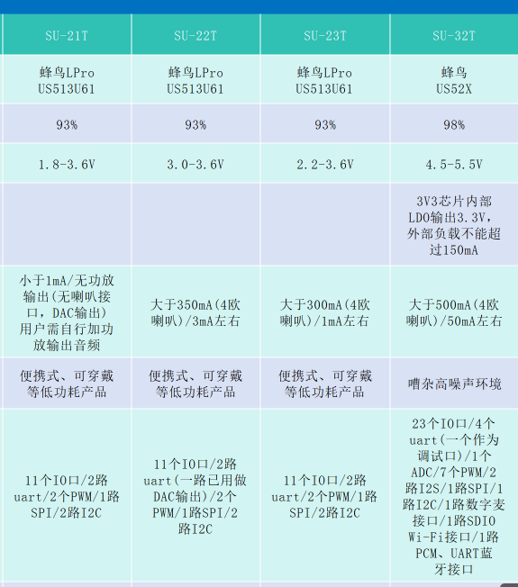

---

### SU-03T系列芯片支持的通讯协议类型，特别是是否支持CAN通讯，以及串口通讯的具体实现方式

**问题描述：**

需要了解SU-03T系列芯片支持的通讯协议类型，确认是否支持CAN通讯，以及串口通讯的具体实现方式。

**解决方案：**

**支持协议确认：**

1. **串口通讯（UART）**：

    - **SU-03T支持串口通讯**
    - 支持标准的UART通信协议
    - 可直接与MCU或其他设备进行数据交换

2. **不支持CAN通讯**：

    - SU-03T系列**不支持**CAN总线通讯
    - 无CAN控制器和相关硬件接口
    - 无法通过CAN协议进行通信

3. **其他通讯方式**：

    - I2C、SPI：支持，用于外设扩展
    - 需要自行开发SDK实现相关功能
    - 单总线：平台可配置GPIO实现

**串口通讯实现：**

1. **硬件连接**：

    - 使用模块的UART引脚（TX/RX）
    - 交叉连接：模块TX → 设备RX，模块RX → 设备TX
    - 共地连接确保通信稳定

2. **RS232通讯支持**：

    - SU-03T本身不支持RS232电平
    - 可通过外接RS232转UART转换器实现
    - 转换后即可与RS232设备通信

3. **配置方式**：

    - 智能公元平台直接生成固件
    - 选择串口输出功能
    - 配置输出数据格式和触发条件

**注意事项：**

- SU-03T主要通过串口进行主控通信
- 不支持CAN、以太网等复杂通信协议
- 如需要CAN通讯，需外部增加CAN转换模块
- 串口通信是最方便、直接的实现方式

---


---

### SU-03T使用的是US516P6还是US518P61芯片？

**问题描述：**

需要确认SU-03T模块实际使用的芯片型号是US516P6还是US518P61，以及两者的性能差异。

**解决方案：**

**芯片型号确认：**

SU-03T模块使用的是**US516P6芯片**，不是US518P61：

- **SU-03T/03T1**：使用US516P6（蜂鸟M系列）
- **US518P61**：是早期版本，效果较差，已不推荐使用

**性能对比：**

| 芯片型号 | 识别效果 | 推荐程度 | 使用状态 |
|-----------|---------|-----------|-----------|
| US516P6 | 良好 | 推荐使用 | SU-03T标准配置 |
| US518P61 | 较差 | 不推荐 | 早期版本，已淘汰 |

**技术原因：**

1. **算法差异**：

    - US516P6：采用成熟的识别算法
    - US518P61：早期版本，算法优化不足

2. **版本迭代**：

    - US516P6：经过多次迭代的成熟版本
    - US518P61：测试版本，存在较多问题

**采购建议：**

1. **确认芯片型号**：

    - 查看芯片表面的激光打标
    - 确认模块标签上的型号信息
    - 联系供应商确认使用US516P6

2. **避免旧版本**：

    - 明确要求使用US516P6版本
    - 拒绝接受US518P61版本的产品
    - 发现旧版本及时要求更换

3. **版本识别方法**：

    - SU-03T：标准版本使用US516P6
    - SU-03T1：V1.5版本，确认使用US516P6
    - 包装标签：会明确标注芯片型号

**注意事项：**

- US518P61已停产，市场流通的应为US516P6
- 两者封装和引脚定义可能不同
- 如收到US518P61版本，建议立即停止使用并联系供应商
- 选择可靠渠道采购，避免购买到淘汰版本

---


---

### CI-03T和SU-03T模块如何选择？

**问题描述：**

在比较CI-03T1和SU-03T两款语音识别模块时，询问它们之间的主要区别，特别是哪款在语音识别准确率（分辨率）上更好，以及之前CI板子的灵敏度设置问题。

**解决方案：**

**主要差异对比：**

1. **生成速度差异**：

    - **CI-03T**：生成固件快，适合快速迭代开发
    - **SU-03T**：生成固件慢，需要经过一段时间的优化

2. **识别能力差异**：

    - **CI-03T**：综合识别能力强，整体性能更优
    - **SU-03T**：在数字识别方面有优势，专门针对数字类识别进行了优化

3. **功能支持差异**：

    - **CI-03T**：支持更多高级功能（哭声检测、鼾声检测、声纹识别等）
    - **SU-03T**：专注于基础语音识别，功能相对简单

**识别率（分辨率）对比：**

- **综合识别率**：CI-03T的整体识别率更高，达到95%
- **数字识别**：SU-03T在数字识别上表现更好，特别是"十"和"十一"等易混淆数字
- **唤醒性能**：两者差异不大，但CI-03T在抗干扰方面略有优势

**技术原因分析：**

1. **芯片架构不同**：

    - CI-03T：基于CI系列专用语音芯片，算法更先进
    - SU-03T：基于蜂鸟系列芯片，算法相对成熟

2. **优化方向差异**：

    - CI-03T：追求综合性能平衡
    - SU-03T：针对特定场景（如数字识别）做了专门优化

**灵敏度设置建议：**

- **CI-03T的灵敏度**：建议适当调低，避免误识别
- **SU-03T的灵敏度**：相对宽松，可根据实际环境调整
- **调试方法**：从默认值开始，逐步调整至最佳状态

**选型建议：**

| 需求场景 | 推荐型号 | 原因 |
|----------|----------|------|
| 需要快速开发迭代 | CI-03T | 生成固件快，调试效率高 |
| 主要进行数字识别 | SU-03T | 数字识别优化，效果更好 |
| 需要高级功能 | CI-03T | 支持更多检测和识别功能 |
| 综合性能要求高 | CI-03T | 整体识别率更高 |
| 成本敏感项目 | CI-03T | 性价比更高 |

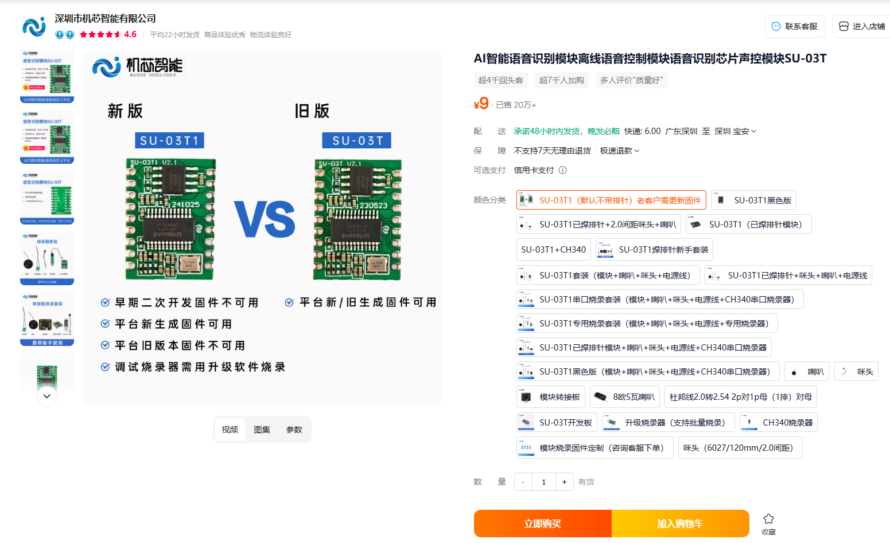

*SU-03T1（新版）和SU-03T（旧版）的区别，新版支持平台新生成固件*

**扩展板兼容性：**

- CI-03T和SU-03T的扩展板是通用的
- 硬件接口和引脚定义兼容
- 可以使用相同的底板或扩展模块

**注意事项：**

- 生成慢点没关系，主要的是能听懂人说话
- 如仅针对数字识别，SU-03T是更好的选择
- 如需要全面功能，CI-03T更适合
- 建议根据实际项目需求选择，而非单纯看参数

---

### 普通语音识别模块是否支持哭声检测、鼾声检测和文字转语音？

**问题描述：**

了解普通语音识别模块（如SU-03T）是否支持哭声检测、鼾声检测和文字转语音功能。

**解决方案：**

**功能对比：**

1. **SU-03T系列模块**：

    - 不支持哭声检测功能
    - 不支持鼾声检测功能
    - 不支持内置的文字转语音功能
    - 主要专注于基础语音识别和控制

2. **支持功能的型号**：

    - CI-03T：支持所有高级检测功能
    - CI-33T：支持所有高级检测功能
    - CI-73T：支持部分高级功能

**技术限制原因：**

1. **芯片架构差异**：

    - SU-03T使用不同的芯片平台
    - 算法模型不包含高级检测功能
    - Flash容量和资源限制

2. **产品定位差异**：

    - SU-03T定位为基础型语音识别模块
    - CI系列定位为高性能语音识别模块
    - 功能设计目标不同

**替代方案：**

1. **选择支持功能的模块**：

    - 如需哭声/鼾声检测：选择CI-03T或CI-33T
    - 如需文字转语音：选择支持TTS功能的型号

2. **外部方案集成**：

    - SU-03T配合外部传感器实现检测
    - 通过MCU或主控芯片实现TTS功能
    - 增加硬件成本但保持灵活性

**配置建议：**

- 项目规划阶段确认所需功能
- 根据功能需求选择合适的模块型号
- 评估硬件成本与开发复杂度的平衡

---


---


---

### 智能台灯光控功能的低成本语音芯片选型

**问题描述：**

需要找到一款低成本的离线语音识别芯片，用于实现智能台灯的声控功能，包括灯光开关、亮度调节和颜色切换。

**解决方案：**

**推荐型号：**

1. **SU-03T（入门级首选）**：

    - 成本极低，适合大批量应用
    - 支持50条命令词，满足基础控制需求
    - 内置2.4W功放，可直接驱动喇叭
    - 不支持AEC回声消除，适合安静环境

2. **SU-13T（功能增强版）**：

    - 支持150条命令词，功能扩展性强
    - 同样具备成本优势
    - 支持RTOS轻量级系统
    - 适合需要较多控制指令的场景

**实现方案：**

1. **基础控制命令配置**：

    - 开灯/关灯
    - 亮一点/暗一点
    - 改颜色（切换色温或RGB颜色）
    - 最大亮度/最小亮度

2. **硬件连接方案**：

    ```
    语音模块 → 控制板 → LED驱动 → 灯珠
                ↓
            状态指示
    ```

3. **成本控制建议**：

    - 使用SU-03T模块，成本最低
    - 简化外围电路设计
    - 批量采购降低单价

**技术限制：**

- SU-03T不支持打断唤醒功能
- 播报语音时无法识别新指令
- 适合简单的开关和调节控制

**升级方案：**

如需要更高级功能（如打断唤醒、TTS播报等），可考虑：

- CI-03T：支持AEC、TTS等高级功能
- 成本相对较高，但功能更完善


**注意事项：**

- 选型时需考虑使用环境的噪声情况
- SU-03T适合安静的家庭环境
- 如需要在播放音乐时也能响应语音，需选择支持AEC的型号

---


---


---

### 如何为DIY项目升级主控芯片并添加WiFi功能？

**问题描述：**

需要为现有DIY项目（如机器狗）更换主控芯片以支持AI功能，并了解如何选择和添加WiFi模块。

**解决方案：**

**硬件升级方案：**

**方案一：更换ESP32主控芯片**

1. **ESP32优势特点**：

    - 内置WiFi和蓝牙功能，无需额外模块
    - 强大的32位双核处理器，最高240MHz
    - 丰富的GPIO和外设接口
    - 支持Arduino和ESP-IDF开发
    - 活跃的开源社区和大量学习资源

2. **实现方式**：

    ```
    原有语音模块（保留） → 串口通信 → ESP32主控 → WiFi连接 → 云端AI服务
    ```

3. **开发资源**：

    - 官方SDK：ESP-IDF、Arduino Core
    - 开发工具：VS Code + ESP32扩展
    - 示例代码：丰富的开源项目参考

**方案二：STM32+外接WiFi模块**

1. **STM32优势特点**：

    - 功耗低，实时性好
    - 工业级稳定性，适合复杂控制
    - 丰富的产品线选择
    - 成熟的开发生态

2. **WiFi模块选型**：

    - ESP8266：成本低，资料丰富
    - ESP32-C3：RISC-V架构，性能优异
    - 官方WiFi模块：稳定性有保障

3. **硬件连接**：

    ```
    STM32 UART → WiFi模块串口
    STM32 GPIO → WiFi模块控制引脚（复位、使能等）
    共享GND和3.3V电源
    ```

**选型建议：**

**根据技术能力选择：**

1. **初学者/快速开发**：

    - 选择ESP32方案
    - 使用Arduino开发环境
    - 参考现成项目案例

2. **专业开发/量产**：

    - 选择STM32方案
    - 使用Keil或STM32CubeIDE
    - 更好的成本控制和供应链

**根据项目需求选择：**

1. **简单AI接入**：

    - ESP32直接连接云端API
    - 使用现成的AI服务SDK
    - 快速实现基本功能

2. **复杂控制需求**：

    - STM32处理底层控制
    - ESP32或专用模块处理网络
    - 分工明确，各司其职

**技术实现要点：**

1. **通信协议设计**：

    - 定义主控与语音模块的通信协议
    - 设置合理的波特率（推荐9600或115200）
    - 设计数据校验和重传机制

2. **电源管理**：

    - 评估整体功耗需求
    - ESP32：工作电流80-260mA
    - STM32：根据型号和工作模式确定
    - 留足电源余量

3. **天线和RF设计**：

    - WiFi模块远离高频干扰源
    - 预留天线安装空间
    - 考虑金属外壳的屏蔽影响

**注意事项：**

- ESP32方案开发门槛低，适合快速原型
- STM32方案更适合工业级和量产产品
- 需要重新设计PCB以适配新的主控
- 保留原有语音模块可降低开发难度
- 考虑认证需求（WiFi、蓝牙等）

**原有语音模块的保留使用：**

如不想更换原有SU-03T语音模块，可以保留并配合新的主控使用：

1. **保留方案优势**：

    - 无需重新学习语音配置
    - 保留原有的唤醒词和命令词
    - 降低开发难度和成本

2. **实现方式**：

    ```
    SU-03T（保留语音功能） + ESP32/STM32（主控） + WiFi模块（如需要）
    ```

3. **通信连接**：

    - SU-03T通过串口发送识别结果给主控
    - 主控处理AI逻辑和网络通信
    - 保留语音播报功能

**选型建议总结：**

| 方案 | 成本 | 开发难度 | 功能完整性 | 适用场景 |
|------|------|----------|------------|----------|
| 直接更换CI-03T | 中 | 低 | 高 | 快速实现WiFi功能 |
| ESP32方案 | 中 | 中 | 高 | 需要重新设计 |
| STM32+WiFi | 中低 | 高 | 高 | 适合量产产品 |
| 保留SU-03T | 低 | 中 | 中 | 渐进式升级 |

**最终建议**：

如果已有SU-03T语音模块，建议直接选择CI-03T来实现WiFi功能，这样可以直接替换而无需更改现有设计。

---

### 如何获取SU-03T模块及相关物料的技术参数？

**问题描述：**

需要获取SU-03T模块及其配套物料（如咪头、喇叭）的详细技术参数和型号信息。

**解决方案：**

**技术资料获取方式：**

1. **官方文档下载**：

    - 访问智能公元帮助文档
    - 链接：https://help.aimachip.com/docs/offline_su03t/offline_su03t-1gbc6oj0b6e1l
    - 下载SU-03T开发包（版本V2.1.2）

2. **开发包内容**：

    - SU-03T模块完整技术规格
    - 芯片 datasheet 和原理图
    - 咪头、喇叭等配件参数
    - 接口定义和电气特性
    - 应用电路和设计参考

3. **配件参数详情**：

    - **咪头规格**：平台麦-627B（淘宝常规款）
        - 灵敏度、频响曲线等技术参数
        - 接口定义和尺寸规格

    - **喇叭规格**：8Ω 2W扬声器
        - 额定功率和阻抗参数
        - 尺寸和安装方式
        - 频响范围

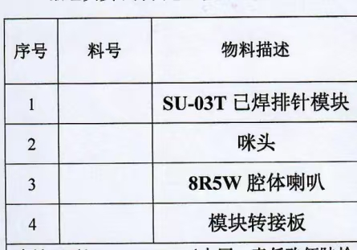

*SU-03T模块及配套物料清单*

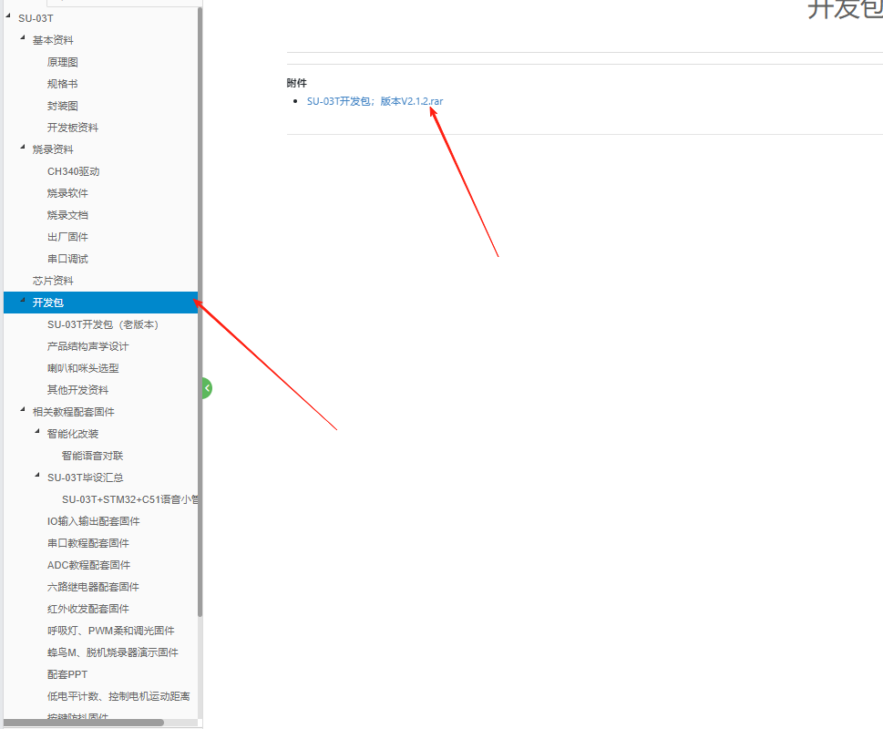

*智能公元平台SU-03T开发包下载页面*

**获取建议：**

- 下载完整的开发包可获取所有技术资料
- 配套的咪头和喇叭参数在文档中有详细说明
- 如有特殊需求可联系技术支持获取更详细参数
- 建议保存技术文档便于后续开发参考

**注意事项：**

- 使用配套规格的咪头和喇叭可获得最佳效果
- 技术参数对硬件设计非常重要，务必仔细查看
- 开发包会定期更新，建议关注最新版本
- 部分详细参数可能需要查看 datasheet 文件

---

### 购买SU-03T时是否需要PCB版？

**问题描述：**

已购买SU-03T1模块（包含已焊排针、咪头和喇叭），询问是否需要额外购买PCB版本。

**解决方案：**

- **不需要购买PCB版**：

    - SU-03T1模块已包含完整功能
    - 自带已焊接的排针，便于连接
    - 配套提供2.0间距的咪头和喇叭

- **推荐购买方式**：

    - 直接购买SU-03T语音版（非PCB版）
    - 避免购买已焊排针的版本
    - 选择裸板版本，根据需要自行焊接

**注意事项：**

- PCB版通常用于批量生产或特定项目
- 个人开发和测试建议使用标准版
- 已焊排针的版本灵活性较差，不适合自定义接线


---

### SU-03T和SU-03T1有什么区别？

**问题描述：**

需要了解SU-03T和SU-03T1两个型号之间的主要区别，以便正确选型。

**解决方案：**

**主要区别：**

1. **文字数量差异**
    - SU-03T：支持较少文字内容
    - SU-03T1：文字较多，功能更丰富

2. **选型建议**
    - 需要简单功能：选择SU-03T
    - 需要完整功能：选择SU-03T1

3. **采购注意**
    - 目前出货基本是SU-03T1版本
    - SU-03T逐步被SU-03T1替代

**注意事项：**

- 两个型号的硬件接口基本相同
- 固件可能不完全兼容，需使用对应版本
- 购买时确认产品型号标识

---

### 有哪些模块可以直接替代SU-03T1？

**问题描述：**

需要了解能够直接替换SU-03T1模块的替代产品，以便在停产或缺货时选择合适的替代方案。

**解决方案：**

**1. 同系列替代方案**

- **SU-03T/03T1**：标准替代型号
    - 硬件接口完全兼容
    - 引脚定义相同
    - 可直接替换无需修改电路

- **SU-13T**：功能增强版本
    - 支持150条命令词（SU-03T1为50条）
    - 引脚兼容，可直接替换
    - 适合需要更多命令词的场景

**2. 性能升级方案**

- **CI-03T**：高性能替代
    - 识别率更高（95%以上）
    - 支持高级功能（哭声检测、鼾声检测等）
    - 生成固件速度更快
    - 需要验证硬件兼容性

- **SU-21T/22T/23T**：低功耗替代
    - 待机功耗更低（1-3mA）
    - 适合电池供电场景
    - 功能可能有所差异

**3. 替换注意事项**

- **硬件兼容性**：

    - 确认引脚定义一致
    - 检查供电电压匹配
    - 验证外围电路兼容

- **功能差异**：

    - 命令词数量限制
    - 特殊功能支持情况
    - 固件生成方式差异

- **配置迁移**：

    - 重新在平台配置项目
    - 导出原有配置供参考
    - 测试验证所有功能

**4. 选型建议**

| 需求场景 | 推荐替代型号 | 主要优势 |
|----------|------------|----------|
| 直接替换，不改动硬件 | SU-13T | 命令词更多，引脚兼容 |
| 提升识别性能 | CI-03T | 识别率更高，功能更全 |
| 降低功耗 | SU-21T/22T | 待机电流低，适合电池供电 |
| 保持成本 | SU-03T | 基础功能，成本低廉 |

**实施步骤：**

1. 确认原有模块的型号和配置
2. 根据需求选择合适的替代型号
3. 采购样品进行测试
4. 验证硬件兼容性
5. 重新配置语音项目
6. 小批量试产验证
7. 批量更换

**注意事项：**

- 不同型号的固件不通用
- 需要在平台重新创建项目配置
- 建议先采购样品测试
- 批量更换前进行充分验证
- 保留原有配置文件作为备份

---

### SU-03T升级到SU-03T1需要注意什么？

**问题描述：**

需要了解从SU-03T升级到SU-03T1的相关资料，特别是平台是否有关于升级的变动说明。

**解决方案：**

**1. 升级资料获取**

升级相关的技术资料和变动说明可通过以下渠道获取：

- 查看官方发布的技术文档
- 关注平台更新的说明公告
- 参考技术分享群中的历史讨论

**2. 主要变动说明**

SU-03T1相比SU-03T的主要改进：

- 文字内容更丰富，功能更完善
- 固件生成和配置流程优化
- 硬件接口保持兼容，可直接替换

**3. 升级注意事项**

- 硬件兼容性：SU-03T1与SU-03T硬件接口相同
- 固件配置：需要在平台重新创建项目配置
- 功能验证：升级后需测试所有原有功能是否正常

**注意事项：**

- 建议在升级前备份原有配置
- 确认项目需求后再决定是否升级
- SU-03T1是目前推荐的标准版本

---

### SU-03T系列芯片支持哪些语言？

**问题描述：**

需要确认SU-03T系列芯片支持的语言种类，特别是是否支持英语、日语、韩语和俄语。

**解决方案：**

**SU-03T语言支持情况：**

- **支持语言**：中文、英文
- **不支持语言**：日语、韩语、俄语

**其他型号语言支持：**

如需其他语言支持，可考虑以下型号：

- **CI-03T**：支持中文、英文、日文、韩语、俄语

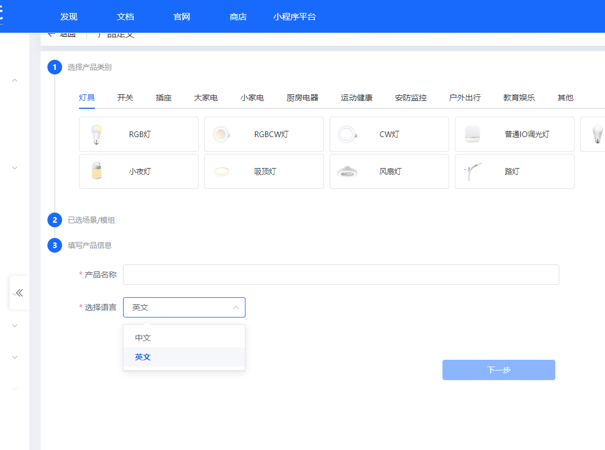

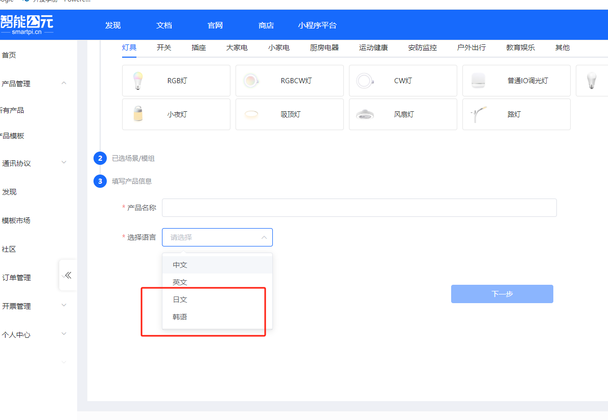

**注意事项：**

- SU-03T系列仅支持中英文识别
- 如需日文、韩语或俄语支持，请选择CI-03T型号
- 在智能公元平台创建项目时需选择对应语言选项
- 不同语言的固件不通用，需单独配置

---


---

### 哪些模块支持离线语音识别？

**问题描述：**

需要了解哪些模块支持离线语音识别功能，类似微信的语音识别。

**解决方案：**

- **全系列离线语音模块**：

    - CI系列：CI-03T、CI-33T、CI-73T等
    - SU系列：SU-03T、SU-10A、SU-11T、SU-13T、SU-20T、SU-21T、SU-22T、SU-23T、SU-30T/31T、SU-32T、SU-63T等
    - JX系列：JX-12F、JX-A7T等
    - 其他：BL-62B、XR-50A等

**功能特点：**

- 完全离线运行，无需网络连接
- 支持命令词识别、语音唤醒等功能
- 可根据具体需求选择合适型号

**选择建议：**

- 根据产品需求选择合适的模块
- 考虑词条数量、功耗、成本等因素
- 可联系技术支持获取选型建议

**注意事项：**

- 所有语音模块均为离线工作模式
- 不同型号支持的词条数量和功能略有差异

---


---

### 如何识别未知控制模块的型号？

**问题描述：**

手持一个未知型号的控制模块，需要确认其型号、功能和是否支持特定的遥控功能。

**解决方案：**

**1. 模块识别方法**

- 查看模块标签信息：Model、P/N、S/N等
- 通过外观特征对比：引脚数量、接口类型
- 测试基本功能：通电测试、串口通信

**2. CBU模块特征**

根据图片信息分析：

- 型号：CBU（可能为定制型号）
- 接口：支持多个控制按键输入
- 功能：支持点动和开关控制
- 应用：可能用于家具控制（如沙发床调节）

**3. 功能兼容性判断**

**语音控制模块支持功能：**

- 基本开关控制：开关量输出
- 调光控制：PWM输出
- 模式切换：多档位控制
- 点动功能：短按/长按识别

**不支持的功能：**

- 复杂的协议通信
- 需要专用驱动器的功能
- 特殊的编码格式

**4. 替代方案**

如果CBU模块不满足需求：

- SU-03T/CU-03T：通用语音控制
- CI-03T：带功放输出的语音控制
- 定制开发：针对特殊需求开发

**注意事项：**

- 非标准型号可能缺少技术文档
- 定制模块可能不支持二次开发
- 建议选择标准型号的产品

---


---

### CI-73T 与 SU-03T 相比有哪些优势？

**问题描述：**

需要了解新推出的CI-73T芯片与SU-03T芯片相比的性能表现和差异。

**解决方案：**

CI-73T 相比 SU-03T 的主要优势是成本更低。

**选型建议：**

- **成本敏感项目**：选择CI-73T，具有更好的性价比
- **功能需求**：两款模块的基本功能相似，可根据项目预算选择

---


---

### 是否有支持150条语音指令的低功耗模块？

**问题描述：**

需要寻找支持150条语音指令的低功耗模块用于电池供电产品。

**解决方案：**

**低功耗模块词条限制：**

- **现有低功耗模块**：SU-21T、SU-23T等
- **词条数量限制**：低功耗语音模块通常只支持50条词条
- **150条需求**：目前暂无支持150条词条的低功耗模块

**替代方案：**

1. **多模块组合**
    - 使用3个低功耗模块组合
    - 每个模块负责50条指令
    - 通过主控MCU协调管理

2. **常规功耗模块**
    - 选择支持更多词条的常规模块
    - 如SU-03T等支持300+词条的模块
    - 通过电源管理优化功耗

**选型建议：**

- 优先考虑词条数量需求，选择常规模块
- 如必须使用低功耗，采用多模块方案
- 建议联系技术支持讨论定制化需求

**注意事项：**

- 低功耗与高词条数量存在技术矛盾
- 多模块方案会增加系统复杂度
- 需要权衡功能需求与功耗限制

---


---

### SU-03T1与SU-03T有什么区别？

**问题描述：**

官网找不到SU-03T1相关资料，不确定该型号的功能提升或与现有型号的区别。

**解决方案：**

SU-03T1与SU-03T在功能和规格上是**相同**的。

**型号说明：**

- SU-03T1可以视为SU-03T的相同产品
- 两者在硬件规格和功能上没有区别
- 使用方法和配置完全一致

**使用建议：**

- 可以将SU-03T1当作普通SU-03T使用
- 参考SU-03T的所有文档和教程
- 固件和配置文件完全兼容

**注意事项：**

- 型号后缀的"1"可能表示批次或版本标识
- 不影响模块的实际功能和使用方法
- 如有疑问，可直接按照SU-03T进行配置和开发

---


---

### SU-03T与US516P6芯片是否引脚兼容？

**问题描述：**

需要确认SU-03T模块是否与US516P6芯片引脚兼容（pin-to-pin），以便在替换使用时评估硬件改动需求。

**解决方案：**

**兼容性结论：**

SU-03T模块与US516P6芯片**不兼容**，主要体现在引脚数量和布局上的差异。

**主要差异：**

1. **引脚数量不同**
    - SU-03T：18个引脚
    - US516P6：13个引脚
    - 数量差异导致无法直接替换

2. **引脚布局不同**
    - 即使考虑对应引脚，布局也不一致
    - 功能定义存在差异
    - 不能简单地pin-to-pin替换

**选型建议：**

1. **重新设计电路**
    - 如果必须使用US516P6，需要重新设计PCB
    - 考虑两个芯片的性能差异
    - 评估重新开发的成本

2. **继续使用SU-03T**
    - 如无特殊需求，建议保留SU-03T方案
    - 可获得完整的技术支持
    - 避免重新开发的风险

**注意事项：**

- 不同厂家的芯片通常不兼容
- 引脚数量不同是明显的不可替换标志
- 替换前需详细对比数据手册
- 建议联系原厂获取替代方案

---


---

### SU-03T1是否支持485通信？

**问题描述：**

需要确认SU-03T1芯片是否支持485通信，如果需要使用485通信，是否需要额外添加485模块。

**解决方案：**

**1. 通信接口说明**

- SU-03T1自带的是TTL电平串口
- 不是485差分电平的串口
- 需要额外转485模块才能实现485通信

**2. 485通信实现方案**

- 使用串口转485模块
- 模块负责将TTL电平转换为485差分信号
- 可与串口服务器等设备配合使用

**3. 接线方式**

- SU-03T1通过串口连接到转485模块
- 转485模块再连接到485总线
- 注意A/B线的正确连接

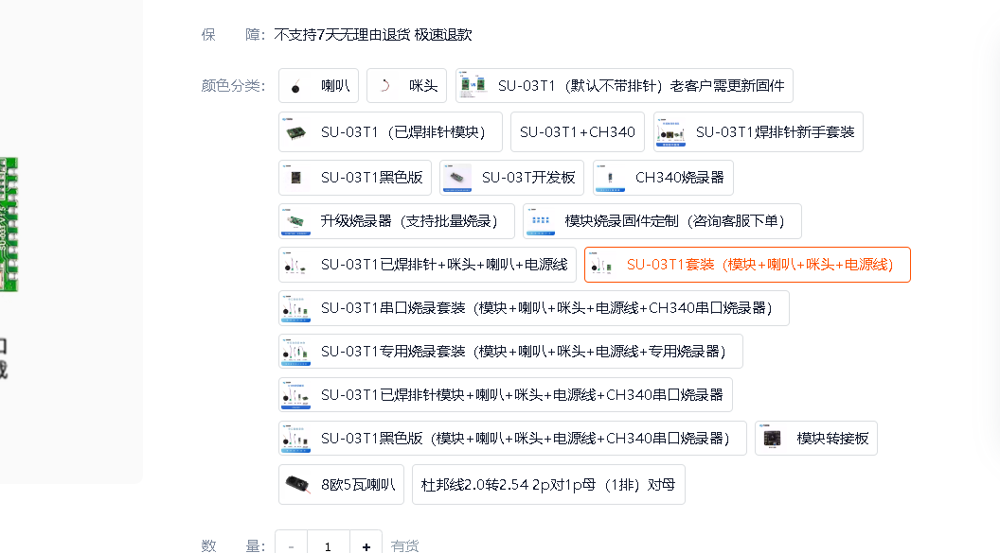


**注意事项：**

- TTL和485电平不兼容，必须转换
- 转换模块需选择合适的型号
- 通信距离和波特率需符合485标准
- 长距离通信要注意总线终端电阻

---


---

### CL-03T与SU-03T有哪些功能差异？

**问题描述：**

需要了解CL-03T是否能实现SU-03T的所有功能，特别是红外、ADC、AEC打断等功能的具体差异。

**解决方案：**

**1. 功能对比表**

- **红外功能**：CL-03T不支持，SU-03T支持
- **ADC功能**：CL-03T不支持，SU-03T支持
- **AEC打断**：两者都支持
- **其他功能**：平台上能配置的功能都有

**2. 主要差异**

- CL-03T是简化版本，成本优化
- SU-03T功能更全面，扩展性好
- 两者在基础语音识别上相同

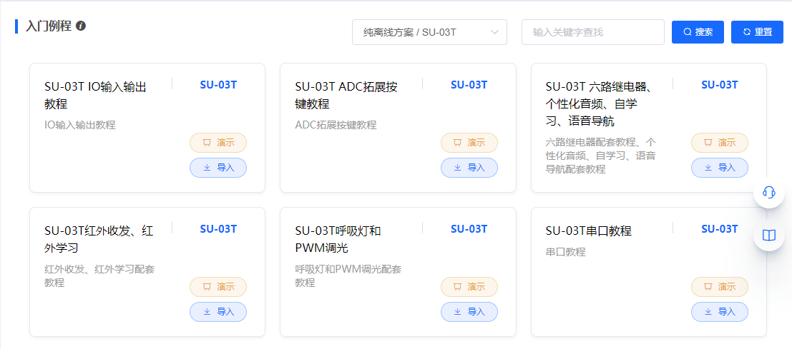

**注意事项：**

- 需要红外功能必须选择SU-03T
- 需要ADC采集功能必须选择SU-03T
- 仅需基础功能可选择CL-03T
- 具体功能以平台配置选项为准

---


---

### 粉丝投稿作品使用的是什么模块？

**问题描述：**

了解粉丝投稿作品中使用的语音控制模块，以及是否支持红外收发功能以实现遥控器按键功能。

**解决方案：**

**1. 模块确认**

- 粉丝投稿作品使用的是SU-03T模块
- 该模块在游戏外设、语音控制等领域有广泛应用

**2. 功能实现说明**

- 语音模块本身负责语音识别和处理
- 需要主控实现HID协议通信
- 通过串口将语音模块与主控连接

**3. 红外功能支持**

- SU-03T支持红外收发功能
- 平台可配置发送学习码和NEC码
- 可实现遥控器按键模拟功能

**4. 应用场景**

- 游戏外设控制
- 三合一脚踏板
- 头戴体感设备
- 语音控制物品

**注意事项：**

- 语音模块没有HID通信协议
- 需要额外的主控做协议转换
- 语音模块提供识别和决策功能
- 主控负责与电脑的HID通信

---


---

### SU-03T和CL-03T的电源适配器要求是什么？

**问题描述：**

询问SU-03T和CL-03T模块是否需要电源适配器，以及7.5V 5A的电源适配器是否适用。

**解决方案：**

**1. 模块供电规格**

- 工作电压：5V
- 工作电流：<500mA
- 7.5V过高，5A过大

**2. 电源选型建议**

- 推荐：5V 1A或5V 2A
- 不推荐：7.5V 5A
- 供电方式：USB或排针

**注意事项：**

- 过高电压会损坏模块
- 电流不需要太大
- 使用稳定可靠的电源
- 具体以模块规格书为准

---


---

### CL-03T与SU-03T的完整功能对比

**问题描述：**

详细了解CL-03T与SU-03T之间的功能差异，特别是红外、ADC、AEC打断等功能的具体情况。

**解决方案：**

**功能对比表**

| 功能 | CL-03T | SU-03T | 说明 |
|-----|----------|----------|------|
| 基础语音识别 | ✓ | ✓ | 两者相同 |
| AEC打断 | ✓ | ✗ | 仅CL-03T支持 |
| 红外收发 | ✗ | ✓ | CL-03T不支持 |
| ADC功能 | ✗ | ✓ | CL-03T不支持 |
| 平台配置功能 | ✓ | ✓ | 平台上能配置的都有 |

**主要差异说明**

- CL-03T是简化版本，去除了一些扩展功能
- SU-03T功能更完整，适合复杂应用
- 价格上CL-03T更有优势

**选型建议**

- 基础语音控制：选择CL-03T
- 需要红外功能：必须选择SU-03T
- 需要ADC采集：必须选择SU-03T
- 一般应用：两者都可满足

---


---

### CI-33T和SU-03T的主要区别是什么？

**问题描述：**

需要了解CI-33T和SU-03T两款模块的差异，以便根据项目需求选择合适型号。

**解决方案：**

**主要区别对比：**

| 特性 | CI-33T | SU-03T |
|------|---------|---------|
| Flash容量 | 2M | 1M |
| 支持词条数 | 500条 | 300条 |
| 处理器架构 | 32位RISC | 32位RISC |
| 功放输出 | 无内置功放 | 内置2.4W功放 |
| ADC采样 | 双路ADC | 单路12-bit ADC |
| GPIO数量 | 9个 | 6个 |
| UART数量 | 2路 | 2路 |
| PWM数量 | 5路 | 3路 |
| 待机电流 | ~60mA | ~10mA |
| 适用噪声 | 中噪声 | 安静环境 |

**选型建议：**

**选择CI-33T的情况：**

- 需要500条语音命令词
- 需要双麦克风输入
- 需要更多GPIO控制外设
- 中等噪声环境使用

**选择SU-03T的情况：**

- 只需要300条以内的命令词
- 需要内置功放直接驱动喇叭
- 追求超低功耗
- 安静环境使用

**注意事项：**

- 除上述区别外，两款模块的基本功能相同
- 都支持离线语音识别，响应速度相同
- 开发方式和配置工具兼容
- 根据实际需求选择，不必追求高配置
- 新模块功能持续更新，关注官方发布
- 选型时考虑未来功能扩展需求

---


---

### CI-73T与SU-03T相比有哪些优势？

**问题描述：**

需要了解CI-73T相比SU-03T在性能、价格等方面的差异，以便选型。

**解决方案：**

**1. 价格优势**

- **CI-73T**：价格更便宜
- **SU-03T**：价格相对较高
- 成本敏感项目可优先考虑CI-73T

**2. 性能对比**

- CI-73T是较新的型号
- 基础语音识别功能与SU-03T相当
- 部分功能可能有所优化和改进

**3. 选型建议**

- **预算有限**：选择CI-73T，性价比更高
- **成熟应用**：选择SU-03T，资料更完善
- **新项目开发**：可尝试CI-73T

**注意事项：**

- CI-73T作为新型号，生态系统可能不如SU-03T成熟
- 具体功能差异需参考官方规格书
- 建议根据项目实际需求和预算选择

---


---

### 项目需要多个串口如何选择模块？

**问题描述：**

项目需要使用两个或以上串口，咨询是否有支持多串口的硬件语音模块。

**解决方案：**

**1. 现有模块串口支持**

- **基础串口**：所有模块都支持1个UART串口
- **串口引脚**：B6（RX）和B7（TX）是专用串口引脚
- **最高速率**：支持3Mbps全双工通信

**2. 多串口实现方案**

**方案一：使用多模块**

- 使用多个SU-03T模块实现多串口
- 每个模块提供独立串口
- 通过串口或GPIO协调工作

**方案二：串口扩展芯片**

- 外挂串口扩展芯片（如CH438）
- 单个模块扩展出多个串口
- 需要额外的硬件成本

**方案三：选择其他方案**

- 考虑使用带多串口的MCU
- MCU连接语音模块处理语音功能
- MCU提供多个串口接口

**3. 推荐配置**

**简单应用**：

- 1个语音模块 + 1个MCU
- MCU提供多个串口
- 成本较低，易于实现

**复杂应用**：

- 多个语音模块并行工作
- 每个模块独立处理一路语音
- 适合多通道语音处理

---


---

### 哪些模块型号即将停产？

**问题描述：**

需要了解哪些模块型号即将停产，以便在设计新产品时规避风险，选择长期供货的型号。

**解决方案：**

**1. 已确定停产的型号**

- SU-11T：已停产，库存有限
- SU-13T：已停产，库存有限
- SU-31T：已停产，库存有限

**2. 替代型号建议**

- SU-11T替代方案：可选择SU-03T或SU-10A
- SU-13T替代方案：推荐SU-03T（300条）或SU-63T（500条）
- SU-31T替代方案：可选择SU-03T系列

**3. 选型建议**

- 优先选择主流型号：SU-03T、SU-63T等
- 避免使用小众或老旧型号
- 关注官方发布的停产通知

**4. 风险规避措施**

- 设计前确认型号供货状态
- 预留2-3个备选方案
- 与供应商建立长期供货协议

**注意事项：**

- 停产型号库存售完即无货
- 建议不要基于停产型号设计新项目
- 如必须使用，需提前备货
- 关注技术支持获取最新产品动态

---


---

### CL-03T与SU-03T的功能差异是什么？

**问题描述：**

需要了解CL-03T是否能够实现SU-03T的所有功能，特别是红外、ADC、AEC打断等功能。

**解决方案：**

**1. 功能对比**

- **CL-03T不支持**：红外功能和ADC功能
- **CL-03T支持**：其他SU-03T平台可配置的功能（如AEC打断）
- **平台配置**：以平台能配置的功能为准

**2. 主要差异**

| 功能 | CL-03T | SU-03T |
|------|---------|---------|
| 红外收发 | ❌ 不支持 | ✅ 支持 |
| ADC功能 | ❌ 不支持 | ✅ 支持 |
| AEC打断 | ✅ 支持 | ✅ 支持 |
| 其他IO控制 | ✅ 支持 | ✅ 支持 |
| 串口通信 | ✅ 支持 | ✅ 支持 |

**3. 选型建议**

- **需要红外**：选择SU-03T
- **需要ADC**：选择SU-03T
- **仅需语音控制**：CL-03T即可满足需求


**注意事项：**

- CL-03T和SU-03T的引脚定义可能不同
- 具体功能以平台配置选项为准
- 如有疑问可查看各型号的详细文档

---


---

### SU-03T与CI-33T的主要区别是什么？

**问题描述：**

需要了解SU-03T与CI-33T芯片在功能、接口和应用上的区别，以及是否可以针脚兼容直接替换。

**解决方案：**

**核心差异对比：**

1. **Flash容量**：

    - **SU-03T**：支持300条词条
    - **CI-33T**：支持500条词条
    - CI-33T容量更大，支持更多命令词

2. **硬件规格**：

    - 两个型号的基本硬件规格相同
    - 封装尺寸和引脚定义一致
    - 主要差异在于Flash存储容量

3. **选型建议**：

    - **300条以内**：选择SU-03T即可满足需求
    - **300-500条**：必须选择CI-33T
    - 根据项目实际需求确定词条数量

---


---

### CI-03T和SU-03T模块如何区分？

**问题描述：**

无法确认手中的语音模块具体型号，需要通过外观特征进行识别。

**解决方案：**

- **通过电路板标识识别**：

    - 查找电路板上的型号标识或丝印
    - "Voice Control Board V2.01"表明是语音控制板
    - 检查是否有"固件升级"、"5V TX RX GND"等标识

- **CI-03T识别特征**：

    - 模块通常通过排线连接到USB转串口适配器
    - 板载多个电子元件和接口
    - 主要用于语音识别和合成功能

- **SU-03T识别特征**：

    - 模块带有US516P6芯片标识
    - 在烧录工具选择时需要对应选择SU-03T型号
    - 支持语音控制和串口通信功能

- **进一步判断方法**：

    1. 查看购买时的资料或包装信息
    2. 检查电路板上的芯片型号、产地标识等
    3. 联系厂家技术支持，提供电路板细节
    4. 拨打客服电话，提供购买日期、订单号等信息

**注意事项：**

- 选错型号会导致烧录失败，请务必确认模块型号后再进行固件下载
- 仅凭图片难以准确区分SU-03T和CI-03T，因为电路板布局可能非常接近
- 建议保留购买记录和包装信息以便日后确认型号


---

### SU-03T1和SU-03T有什么区别？

**问题描述：**

需要了解SU-03T1和SU-03T两个型号之间的差异，以便进行正确的选型和使用。

**解决方案：**

**主要区别：**

1. **Flash容量升级**
    - SU-03T1是SU-03T的升级版本，主要升级了Flash容量
    - 其他硬件规格和功能基本相同

2. **固件兼容性**
    - 现在平台生成的固件同时兼容SU-03T和SU-03T1两个模块
    - 旧版本SU-03T生成的固件无法在SU-03T1上运行

3. **产品供应**
    - 目前出货的基本都是SU-03T1版本
    - SU-03T逐步被SU-03T1替代

**确认方法：**

- 查看模块表面丝印，确认准确型号
- SU-03T1模块通常会标注"SU-03T1"字样


**选购建议：**

- **纯模块版**：需要自行焊接底板和外围器件
- **已焊底板版**：包含咪头和喇叭，到手即用
- 焊接技术不佳的建议购买已焊好底板的版本

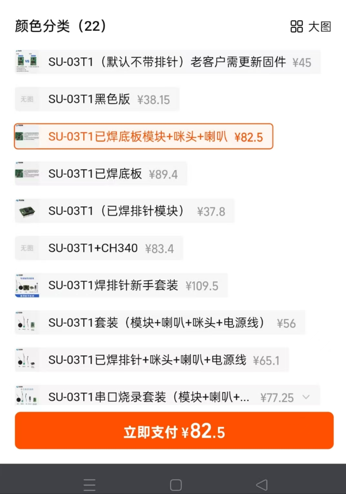

**焊接注意事项：**

- 如果购买纯模块版，需要将杜邦线焊接到模块对应引脚
- 焊接时避免连锡短路，特别是间距小的引脚
- 不具备焊接经验的建议购买预焊接版本

- 检查购买记录或产品标签
- 提供模块照片给技术支持确认

**注意事项：**

- 确认型号前不要下载错误的固件
- 不同型号的引脚定义可能不同
- 如确实需要SU-03T1，建议联系官方确认是否存在此型号

---


---

### CI-03T与SU-03T成本对比分析

**问题描述：**

需要了解CI-03T和SU-03T的成本差异，以便根据项目预算和功能需求选择合适方案。

**解决方案：**

**成本对比：**

- **基础成本对比**：

    - CI-03T：成本可控制在65元左右（优化后）
    - SU-03T：基础版本成本约110-130元
    - 成本差异：约45-65元，CI-03T优势明显

**成本优化方法：**

1. **简化电路设计**
    - 删除非必要元件（如多余电容）
    - 电源分离设计，减少干扰
    - 优化PCB布局，减小尺寸

2. **元件选型优化**
    - 使用大容量电容替代多个小电容
    - 选择性价比高的替代方案
    - 批量采购降低单价

3. **自主开发优势**
    - CI-03T生成速度快（约2分钟）
    - SU-03T生成速度慢，影响开发效率
    - CI系列功能更全面，支持更多高级特性

**功能对比：**

- **核心功能**：两者语音识别性能基本相同
- **高级功能**：

    - CI-03T：支持AEC（声学回声消除）、语音打断
    - SU-03T：基础语音识别功能
- **开发便利性**：

    - CI-03T：支持Mixly图形化编程
    - SU-03T：仅支持命令词配置

**选型建议：**

- **成本敏感项目**：优先选择CI-03T
    - 适合大批量生产
    - 开发周期短，迭代快
    - 性价比更高

- **功能复杂项目**：根据具体需求选择
    - 需要AEC功能：选择CI-03T
    - 需要语音打断：选择CI-03T
    - 简单应用：两者都可满足

**注意事项：**

- SU-03T生成速度慢是系统性问题，非个人设置错误
- CI-03T成本优势在大批量时更明显
- 选型时综合考虑开发效率、功能需求和成本预算
- 保留优化设计方案，便于后续成本控制


---

### CI-03T和SU-03T有什么区别？

**问题描述：**

需要了解CI-03T和SU-03T两款语音识别模块的主要区别、性能对比以及烧录工具的兼容性。

**主要区别：**

- **封装形式**：

    - CI-03T：CI封装形式，适合SMT贴片生产
    - SU-03T：SU封装形式，带排针，方便原型开发和测试

- **使用场景**：

    - CI-03T：适合批量生产，成本更低
    - SU-03T：适合开发调试，易于更换和测试

- **功能对比**：

    - 两者内核相同，语音识别性能一致
    - 支持的命令词数量相同
    - 功耗和电气参数基本相同
    - **识别效果**：SU系列的识别效果略好一些
    - **生成速度**：CI系列生成固件速度更快，功能更加丰富

- **烧录兼容性**：

    - 烧录器完全通用
    - 使用相同的烧录工具和接口
    - 固件文件可以互相兼容

**选择建议：**

- **开发阶段**：选择SU-03T，便于调试和测试
- **批量生产**：选择CI-03T，降低生产成本
- **性能要求**：两者性能相同，根据实际需求选择

**注意事项：**

- 两种模块的引脚定义可能略有不同
- 设计时需要参考对应的数据手册
- 烧录工具和固件可以通用

---


---

### 如何查看各语音模块的详细参数对比？

**问题描述：**

需要快速了解和对比不同型号语音模块的技术参数，以便根据项目需求选择合适的产品。

**解决方案：**

**参数对比表说明：**

下图提供了现行语音模块的详细参数对比，涵盖29个关键技术指标：


*CI-73T型号支持语言包括：中/英/日/韩(其他语种/中文方言定制)*

**主要对比维度：**

1. **基本参数**：

    - 类型、主控芯片、封装尺寸
    - 供电电压、负载能力
    - 适用环境、接口类型

2. **音频性能**：

    - 综合识别率、语音指令数量
    - 音频输出、功放功率
    - 唤醒打断、降噪算法

3. **功能特性**：

    - 支持语言、自学习功能
    - 声纹识别、声源定位
    - 自然说、文字转语音

4. **连接能力**：

    - 蓝牙音乐、小程序支持
    - 平台能力、WiFi功能

**选型建议：**

1. **根据词条数量选择**：

    - 300条：CI-03T系列、SU-03T
    - 500条：CI-33T系列、SU-63T
    - 更多需求：选择更高型号

2. **根据应用场景选择**：

    - 基础控制：选择单麦版本
    - 复杂环境：选择双麦版本（带降噪）
    - 在线功能：选择WiFi型号

3. **特殊功能需求**：

    - 声纹识别：CI-96Z系列
    -哭声检测：特定型号支持
    - 低功耗：查看待机电流参数

**注意事项：**

- 图片中的参数为规格值，实际性能可能受应用环境影响
- 选型时需要综合考虑成本、功能、供应等因素
- 建议先用开发板验证满足需求后再批量采购


---

### SU-03T是否有升级替代型号？

**问题描述：**

使用SU-03T模块时存在误识别问题，希望了解是否有更智能的升级替代型号。

**解决方案：**

1. **SU-03T1升级版本**
    - SU-03T1是SU-03T的升级版本
    - 识别效果有所提升，误识别率更低
    - 其他硬件规格和功能基本相同

2. **功能特性对比**
    - SU-03T：300条词条，基础语音识别
    - SU-03T1：优化识别算法，降低误识别率
    - 两者固件平台兼容，可无缝替换

3. **其他升级选项**
    - **SU-63T**：支持500条词条，双麦克风阵列
    - **带WiFi型号**：支持联网功能，智能程度更高
    - 根据实际应用场景选择合适型号

4. **应用建议**
    - SOS呼救等基础应用：SU-03T1即可满足
    - 需要更多功能：考虑支持WiFi的型号
    - 复杂环境：选择双麦克风版本

**注意事项：**

- SU-03T识别效果已经较好，误识别可能与环境有关
- 建议优化使用环境（减少噪声、合理放置）
- 可联系技术支持获取调试建议


---


---

### 低功耗应用场景如何选择芯片？

**问题描述：**

SU-03T等标准芯片在待机状态下功耗较高，无法满足电池供电设备的长期使用需求，需要选择更低功耗的芯片型号。

**解决方案：**

**低功耗芯片推荐：**

1. **SU-21T**

    - 待机电流：小于1mA
    - 适合：电池供电、长期待机应用
    - 特点：超低功耗设计

2. **SU-22T**

    - 待机电流：低功耗模式
    - 适合：需要平衡性能和功耗的场景
    - 特点：支持基本的语音识别功能

3. **SU-23T**

    - 待机电流：优化功耗设计
    - 适合：中等功耗要求的应用
    - 特点：功能与功耗平衡

4. **SU-32T**

    - 待机电流：低功耗配置
    - 适合：需要更多接口的低功耗场景
    - 特点：接口丰富，功耗控制良好

**选型建议：**

- 纯电池供电且需长期待机：选择SU-21T
- 需要定期唤醒工作：考虑SU-22T或SU-23T
- 需要连接多个传感器：选择SU-32T
- 避免使用SU-03T等标准功耗芯片

**注意事项：**

- 低功耗芯片可能在某些功能上有所取舍
- 根据实际功耗需求选择合适型号
- 考虑电池容量和预期使用时间


---


---

### 新旧版本语音模块在性能上有差异吗？

**问题描述：**

发现新版本的语音模块在灵敏度和音色上与旧版本有显著差异，需要了解具体原因以及如何更换语音模块。

**解决方案：**

**版本差异说明：**

- **旧平台模块（如SNR8016VR）**：采用较早的语音识别算法
- **新平台模块（SU系列）**：使用优化的识别算法和音频处理
- 性能差异主要体现在识别灵敏度和音质表现上

**更换方案：**

1. **确认模块型号**
    - 旧版本：SNR8016VR等型号
    - 新版本：SU-03T等SU系列模块

2. **硬件兼容性**
    - 检查现有电路板是否支持新模块
    - 确认电源、接口等硬件匹配
    - 必要时修改电路设计

3. **固件配置**
    - 重新在平台配置语音指令
    - 调整灵敏度参数以适应新模块
    - 测试并优化识别效果

**注意事项：**

- 不同系列模块的性能和特性可能不同
- 更换模块后需要重新调试以达到最佳效果
- 建议购买前先申请样品测试

---

### 小智模块能否控制128个点位输出？

**问题描述：**

需要使用小智模块控制电路沙盘的128个点位，替代原有的硬件按钮和PLC控制方案。

**解决方案：**

**可行性分析：**

小智模块本质上是一个ARM处理器，可以通过以下方案实现多点位控制：

1. **串口通信方案**：

    - 语音解析成串口数据输出
    - 单片机接收串口命令控制输出
    - 使用595级联芯片扩展IO口
    - 通过2803驱动芯片控制实际负载

2. **脉冲输出方案**：

    - 利用模块的脉冲输出功能
    - 单片机通过计数器识别脉冲数量
    - 不同脉冲数量对应不同灯组组合
    - 简单可靠，减少串口通信

3. **IO二进制编码**：

    - 使用多个IO口输出二进制编码
    - 单片机解码后控制对应点位
    - 减少串口命令数量

**技术挑战：**

1. **语音识别准确性**：

    - 需避免"128"误识别为"124"
    - 建议使用更清晰的数字发音
    - 可加入确认机制提高准确率

2. **命令数量管理**：

    - 单点控制：256条开关命令
    - 组合控制：11种编组模式
    - 建议外接语音模块处理回复语

**型号选择建议：**

- SU-03T：基础功能，适合简单控制
- CI-03T：支持Mixly编程，灵活度高（300条词条）
- CI-33T：500条命令容量，适合复杂应用

**编程环境兼容性说明：**

- **Mixly图形化编程支持**
    - CI-03T/CI-33T：完全支持，可通过积木式编程实现复杂功能
    - SU-03T：不支持Mixly编程，仅支持命令词配置
    - 差异原因：不同型号的固件架构和接口协议不同

- **开发方式对比**
    - CI-03T：支持串口通信，可与Arduino等主控板配合使用
    - SU-03T：独立离线工作，主要用于命令词触发和回复
    - 选择建议：需要图形化编程时选择CI系列

---

### SU-03T是否支持米思奇图形化编程？

**问题描述：**

询问SU-03T芯片是否可以在米思奇图形化编程平台上进行开发和固件生成。

**解决方案：**

SU-03T不支持米思奇图形化编程：

- **兼容性限制**：

    - SU-03T的固件架构不支持图形化编程接口
    - 仅支持在智能公元平台进行命令词配置
    - 无法使用米思奇等第三方图形化编程工具

- **推荐替代方案**：

    - 使用CI-03T替代：完全支持米思奇图形化编程
    - CI-03T支持300条词条，可满足大多数应用需求
    - 提供详细教程：https://www.bilibili.com/video/BV11Y4y197LB/

- **平台选择建议**：

    - 新项目建议直接选择CI系列模块
    - CI系列支持更多开发方式和灵活性
    - SU-03T因用户量较大，固件生成需要排队等待

**注意事项：**

- SU-03T和CI-03T的硬件接口和功能定位不同
- 图形化编程需求下应优先选择CI系列
- 切换型号可能需要调整硬件设计

---


---

### SU-03T芯片可以单独购买用于板载设计吗？

**问题描述：**

希望将SU-03T芯片集成到自己的电路板设计中，询问是否可以单独购买芯片。

**解决方案：**

**采购方式：**

1. **模块形式**：

    - SU-03T主要以完整模块形式销售
    - 包含芯片、外围电路和接口
    - 不单独提供裸芯片销售

2. **集成建议**：

    - 方案一：在PCB上预留模块位置
        - 设计匹配的安装孔位
        - 通过排针或排母连接
        - 便于更换和维修

    - 方案二：使用转接板
        - 将SU-03T模块焊接到转接板
        - 转接板再连接到主PCB
        - 降低集成难度

**设计要点：**

1. **接口设计**：

    - 电源：3.3V供电，预留 sufficient 电流能力
    - 通信：UART串口接口（TX/RX）
    - 控制：复位引脚和模式选择引脚

2. **PCB布局**：

    - 模块远离高频干扰源
    - 预留足够的散热空间
    - 咪头和喇叭走线隔离

3. **外围电路**：

    - 参考官方评估板设计
    - 保留必要的上拉电阻
    - 添加ESD保护器件

**注意事项：**

- 直接集成芯片需要复杂的音频电路设计
- 使用模块形式可大幅降低开发难度
- 建议先购买模块评估功能再进行集成
- 批量生产时可联系厂商讨论芯片供应方案


---

### SU-03T多功能控制板有什么特点？

**问题描述：**

了解SU-03T多功能控制板的功能特性，包括电机驱动、调速、步进电机控制等功能，以及与语音模块的集成方式。

**解决方案：**

**控制板特性：**

1. **核心功能**：

    - 电机驱动：支持直流电机控制
    - 速度调节：PWM调速功能
    - 步进电机：精确位置控制
    - 输入输出：支持多种输入输出配置

2. **硬件组成**：

    - 主控芯片：STC15W204单片机
    - 电机驱动：H桥驱动电路
    - 接口丰富：GPIO、UART、ADC等
    - 语音模块：反面安装（可选）

3. **编程特点**：

    - 编程简单：STC系列易于开发
    - 文档完善：提供例程和说明
    - 成本较低：适合批量应用

**集成方式：**

1. **语音模块安装**：

    - 可选配SU-03T语音模块
    - 安装在控制板反面
    - 通过排针连接通信

2. **混合使用模式**：

    - 独立使用：仅控制板功能
    - 语音控制：配合语音模块使用
    - 组合应用：语音+电机联动

**应用场景：**

- 小车机器人：驱动轮子、控制速度
- 机械臂项目：控制舵机、步进电机
- 自动窗帘：电机驱动、位置控制
- 智能风扇：速度调节、定时控制

**注意事项：**

- 语音模块为选配，可根据需求决定
- 控制板可独立工作，不依赖语音模块
- 开发时需注意电源和信号隔离
- 负载较大时需要外部供电

---


---

### 如何提升SU-03T的播放容量？

**问题描述：**

需要了解SU-03T模块的播放容量提升方法，以及是否需要外接设备来扩展存储。

**解决方案：**

- **了解SU-03T的内置容量**：

    - SU-03T内置固定大小的Flash存储
    - 支持一定数量的语音片段存储
    - 容量受限于硬件设计

- **优化语音文件**：

    - 压缩音频文件以减小占用空间
    - 使用较低的采样率（如16kHz而非32kHz）
    - 选择合适的音频格式（如ADPCM）

- **分段播放策略**：

    - 将长语音分割成多个短片段
    - 按需组合播放实现长句效果
    - 减少单个文件的大小需求

**注意事项：**

- SU-03T不支持外接存储设备扩展容量
- 播放容量是硬件限制，无法通过固件升级
- 如需要更大容量，建议选择Flash更大的型号
- 音质和容量需要根据实际应用平衡

---


---

### 哪个模组的语音指令（词条）数量最多？

**问题描述：**

需要了解云知声现有模组中哪个型号支持的语音指令数量最多，以便根据项目需求选择合适的模组。

**解决方案：**

**词条数量对比：**

- **SU-03T**：支持300条语音指令，是当前词条数量最多的模组
- **CI-03T**：支持300条语音指令
- **CI-33T**：支持500条语音指令
- **SU-63T**：支持更多指令（具体数量参考规格书）

**选型建议：**

1. **一般应用（300条以内）**：

    - SU-03T：性价比高，通用性强
    - CI-03T：功能丰富，带AEC打断

2. **复杂应用（需要更多指令）**：

    - CI-33T：支持500条指令，适合复杂场景
    - SU-63T：高性能型号，支持更多指令

**注意事项：**

- 指令数量越多，固件文件越大
- 音频文件大小是影响固件大小的主要因素
- 建议根据实际需求选择合适型号，避免资源浪费

---


---

### 个性化音频文件大小限制是多少？

**问题描述：**

需要了解语音模块支持的个性化音频文件大小限制，以及除SU-03T外的其他产品推荐。

**解决方案：**

**音频大小限制：**

- 个性化音频总大小不能超过500KB
- 包括所有自定义的回复音频和提示音
- 超过限制将无法生成固件

**产品推荐：**

1. **SU-03T**（在用型号）：

    - 支持300条语音指令
    - 性价比高，通用性强
    - 适合基础应用

2. **CI系列推荐**：

    - **CI-03T**：功能更丰富，带AEC打断
    - **CI-33T**：支持500条指令，适合复杂场景
    - 性价比高，功能比SU系列强

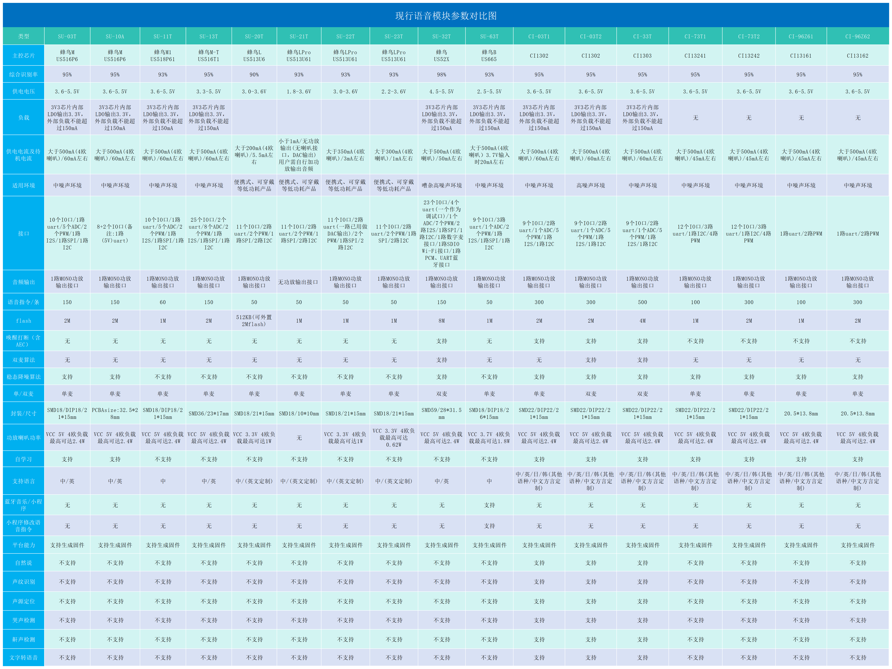

**选择建议：**

- 基础应用：继续使用SU-03T
- 需要打断功能：选择CI系列
- 指令数量多：选择CI-33T或更高型号

**注意事项：**

- CI系列比SU系列多了AEC打断选择功能
- 个性化音频包括所有自定义录音，不只是TTS
- 建议根据项目实际需求选择合适型号

---


---

### CI-73T和SU-03T有什么区别？

**问题描述：**

需要了解CI-73T和SU-03T之间的主要差异，以便根据项目需求选择合适的模块。

**核心区别：**

1. **基础功能**
    - 语音识别功能：两者基本相同
    - 唤醒词支持：两者相同
    - 音频输出：两者相同规格

2. **主要差异**
    - **生成速度**：CI-73T生成更快，服务器负载小
    - **成本**：CI-73T成本更低，性价比更高
    - **供电**：CI-73T功耗优化更好

3. **选型建议**
    - **选择SU-03T**：

        - 已有设计基于SU-03T开发
        - 不想改动现有电路和代码
        - 项目时间紧张，来不及适配新模块

    - **选择CI-73T**：

        - 新项目开发
        - 对成本敏感的应用
        - 需要快速生成固件测试
        - 希望降低整体项目成本

**兼容性说明：**

- 两者都是4引脚封装
- 引脚定义基本相同
- 但某些功能引脚可能有差异
- 替换时需要确认具体使用的引脚

**注意事项：**

- CI-73T是SU-03T的优化版本
- 如果从SU-03T切换到CI-73T，需要重新设计电路
- 建议新项目优先考虑CI-73T
- 修改现有设计时，需要充分测试兼容性


---

### SU-03T有对应的主控芯片吗？

**问题描述：**

询问SU-03T芯片是否存在对应的主控芯片型号，以及该型号的技术规格和特性。

**解决方案：**

- SU-03T是完整模块，不是单独的芯片
- 模块内部集成了主控芯片和必要的外围电路
- 厂商不提供单独的主控芯片
- 如需芯片级开发，建议选择其他开源方案

**注意事项：**

- SU-03T作为模块使用，通过串口或烧录接口配置
- 无法获取模块内部芯片的详细规格书
- 如需深度定制，考虑使用开放平台的主控芯片

---


---

### 是否有可以通过电信号触发的模块？

**问题描述：**

需要查找能够通过电信号触发的语音模块，用于实现特定功能的自动化控制。

**解决方案：**

**1. 支持电信号触发的模块系列**

**CI系列模块（推荐）：**

- CI-03T、CI-33T、CI-73T等
- 支持GPIO电平检测触发
- 可配置高/低电平触发模式
- 支持脉冲宽度检测

**SU系列模块：**

- SU-03T、SU-21T、SU-32T等
- 部分型号支持GPIO输入触发
- 主要用于语音识别触发输出

**JX系列模块：**

- JX-A7T、JX-12F等
- 支持多种触发方式
- 可通过网络或串口触发

---


---

### CI-73T与SU-03T在语音交互和扩展性方面如何选择？

**问题描述：**

需要在CI-73T和SU-03T之间进行选择，主要关注语音交互能力和扩展性。

**解决方案：**

**核心差异对比：**

1. **语音交互能力**：

    - CI-73T：支持打断功能，交互更自然
    - SU-03T：不支持打断，必须说完整句话
    - 打断功能显著提升用户体验

2. **固件生成速度**：

    - CI-73T：快速生成，几分钟即可完成
    - SU-03T：中等速度，需要等待
    - CI系列开发效率更高

3. **扩展功能**：

    - CI-73T：支持更多高级功能
    - SU-03T：功能相对基础
    - CI系列功能更丰富

**详细参数对比：**


根据参数对比表：

1. **唤醒打断**：

    - CI-73T：支持
    - SU-03T：不支持

2. **双麦算法**：

    - CI-73T：支持
    - SU-03T：支持

3. **自学习功能**：

    - CI-73T：支持
    - SU-03T：支持

4. **平台能力**：

    - CI-73T：更强
    - SU-03T：标准

**选型建议：**

1. **选择CI-73T的场景**：

    - 需要打断功能的应用
    - 追求交互体验的产品
    - 需要快速开发迭代
    - 功能需求复杂的项目

2. **选择SU-03T的场景**：

    - 成本敏感的批量应用
    - 功能需求简单明确
    - 不需要打断功能的场景
    - 对开发周期要求不严

3. **综合评估**：

    - 优先考虑功能需求
    - 评估开发时间成本
    - 考虑量产成本差异
    - 根据实际场景选择

**注意事项：**

- CI-73T在功能完整性和开发效率上有优势
- SU-03T在成本上有优势
- 选型时不要只看价格，要考虑总体拥有成本
- 建议购买样片测试后再做最终决定

---


---

### SU-03T的方言支持来源是什么？

**问题描述：**

询问SU-03T芯片是否调用启英泰伦的方言语音库，以及支持的方言是否已预先训练完成。

**解决方案：**

- **语音库来源**：SU-03T使用的是云知声的语音库，非启英泰伦
- **方言支持**：标准版本不支持方言，需要通过定制开发实现
- **定制要求**：方言支持需要提供语料进行专门训练

**技术说明：**

1. **语音库选择**
    - SU-03T采用云知声语音识别引擎
    - 非启英泰伦的语音库
    - 选择了更适合中文场景的技术方案

2. **方言实现方式**
    - 标准固件不包含方言支持
    - 需要针对特定方言进行语料训练
    - 所有方言都可以通过定制实现

3. **开发要求**
    - 需要提供目标方言的语料数据
    - 定制开发周期较长
    - 费用相对标准版本更高

**注意事项：**

- SU-03T使用云知声技术方案，非启英泰伦
- 方言支持属于定制开发范畴
- 需要提前评估开发周期和成本
- 可以考虑自学习功能作为方言补充方案

---


---

### 离线语音模块能接入智能语音系统吗？

**问题描述：**

是否可以将CI-03T、SU-03T等离线语音识别模块集成到类似小爱同学的智能语音系统中，实现类似功能。

**解决方案：**

**功能定位说明：**

离线语音识别模块与智能语音系统（如小爱同学）在功能定位上有本质区别：

1. **离线模块特点**：

    - 本地语音识别，无需网络
    - 固定命令词控制
    - 响应速度快，隐私性好
    - 适合简单的控制类应用

2. **智能语音系统特点**：

    - 需要网络连接
    - 支持自然语言对话
    -云端AI处理能力强
    - 可处理复杂查询和交互

**集成方案分析：**

**方案一：作为语音前端**
```
用户语音 → 离线模块识别 → 触发命令 → 传输给智能系统 → AI处理 → 响应
```
- 离线模块作为唤醒和简单命令识别
- 复杂请求传递给后端AI系统处理

**方案二：独立工作模式**
```
简单控制 → 离线模块处理 → 直接响应
复杂查询 → 切换到智能系统 → 云端处理
```
- 根据请求类型选择处理方式
- 需要设计切换逻辑

**实施建议：**

1. **明确应用场景**：

    - 如果只需要简单控制：使用离线模块即可
    - 如需智能对话：考虑其他方案

2. **混合方案设计**：

    - 离线模块处理高频简单命令
    - 复杂功能通过其他方式实现

3. **产品定位**：

    - 离线模块适合：家电控制、玩具、简单交互
    - 智能系统适合：智能音箱、助手、复杂交互

**注意事项：**

- 离线模块无法直接升级为智能语音系统
- 两者技术架构完全不同，不能简单替换
- 选择方案时根据实际需求和成本考虑
- 如需AI能力，建议选择JX-A7T等AI模块

---

---

### LD3320模块是否还值得使用？

**问题描述：**

当前使用的LD3320语音识别模块效果较差，想了解是否需要更换为智能公元的CI-03T或SU-03T模块。

**解决方案：**

**1. LD3320模块特点**

- **技术局限**：

    - 识别准确率较低
    - 支持的词条数量有限
    - 抗噪声能力弱
    - 需要精确控制环境

- **适用场景**：

    - 简单命令识别（10-50条）
    - 安静环境使用
    - 成本敏感型项目
    - 学习用途

**2. 对比新型号优势**

- **CI-03T/SU-03T优势**：

    - 识别准确率更高
    - 支持更多词条（300-500条）
    - 强大的降噪功能
    - 更好的抗干扰能力

- **功能差异**：

    - LD3320：纯识别芯片
    - CI/SU系列：识别+处理+输出
    - 支持TTS语音合成
    - 可直接驱动外设

**3. 更换建议**

- **项目需求评估**：

    - 需要高识别率：必须更换
    - 复杂环境使用：建议更换
    - 成本允许：优先更换
    - 简单演示：可继续使用

- **成本考虑**：

    - LD3320虽然便宜但开发成本高
    - 新模块综合成本可能更低
    - 减少调试时间和失败风险

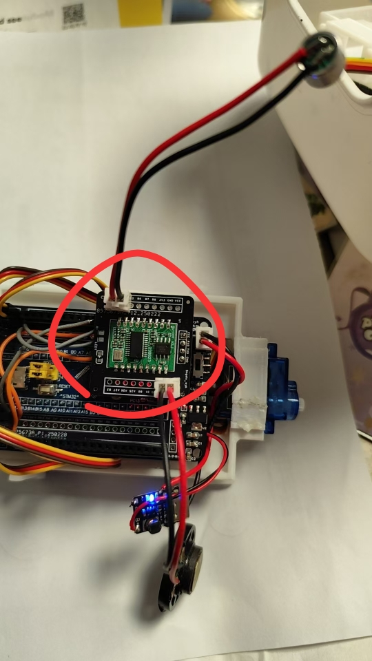

*老式LD3320语音识别模块，性能有限*

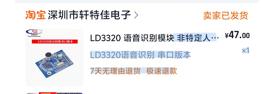

*LD3320在电商平台上的销售页面*

**注意事项：**

- LD3320属于较老的技术方案
- 新项目不建议使用
- 如需良好体验，选择CI/SU系列

---


---

### SU-03T最多支持多少个语音词条？

**问题描述：**

需要了解SU-03T芯片支持的最大语音词条数量，以便进行产品设计和功能规划。

**解决方案：**

SU-03T芯片最多支持150个语音词条。

**详细说明：**

- **最大词条数**：150条
- **存储方式**：Flash存储，断电不丢失
- **类型支持**：命令词和唤醒词均计入总数
- **灵活配置**：可根据实际需求设置少于最大值的词条数

**应用建议：**

- 控制类场景：50-100条词条已足够使用
- 复杂交互场景：可充分利用150条词条容量
- 建议预留10-20%余量，方便后续扩展

**注意事项：**

- 词条数接近上限时可能影响识别响应速度
- 建议根据实际需求合理配置词条数量
- 如需更多词条，可考虑选择CI-33T（支持500条）

---


---

### SU-03T支持多少条语音指令？

**问题描述：**

确认SU-03T模块支持多少条语音指令，以及是否可以配置150条命令。

**解决方案：**

**1. 确认支持数量**

- **SU-03T支持150条语音指令**
- 内置2M Flash存储空间
- 支持中文自学习指令

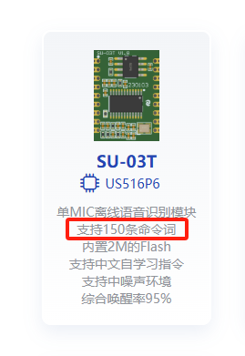

**2. 实际配置验证**

- 150条指令可以完整定义
- 包含唤醒词和命令词
- 可根据需求灵活分配

**3. 配置示例**

已成功配置150条指令的示例：

- 智能语音云台控制指令
- 包含转动角度命令（如"右转三百一十度"）
- 保留基础问候语（如"你好"）

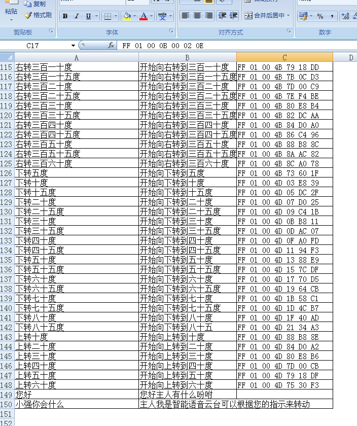

**注意事项：**

- 指令数接近上限时可能影响响应速度
- 建议合理分配唤醒词和命令词数量
- 150条是SU-03T的最大支持数量


---

### 有支持ROS的模组吗？

**问题描述：**

需要了解是否有支持ROS（机器人操作系统）的模组产品，以便在机器人项目中集成语音功能。

**解决方案：**

**ROS支持现状：**

1. **官方ROS支持**：

    - **无直接支持**：目前没有直接支持ROS的语音模组
    - **系统限制**：语音模组专注于离线识别，不集成ROS
    - **架构差异**：语音模组与ROS系统架构不同

2. **技术原因**：

    - **系统隔离**：语音模组是独立系统
    - **通信方式**：通过UART等接口与外部通信
    - **功能专一**：专注于语音识别，非通用处理器

**ROS集成方案：**

**方案一：串口通信桥接**

```
ROS主控 ← 串口 → 语音模组
    ↓            ↓
    ROS节点    语音识别
    ↓            ↓
    机器人控制  ← 命令识别结果
```

实现步骤：

- 选择带串口的语音模组（如SU-03T、CI系列）
- 开发ROS串口节点
- 建立通信协议和数据格式
- 将语音命令映射到ROS动作

**方案二：底层固件修改**

- 修改语音模组固件
- 集成ROS节点功能
- 实现原生ROS支持
- 需要深度定制开发

**方案三：专用ROS模块**

- 使用支持ROS的MCU
- 连接语音模组作为语音输入
- MCU负责ROS节点管理
- 适合复杂机器人项目

**开发建议：**

1. **模块选择**：

    - SU-03T：基础功能，适合简单命令
    - CI-33T：500条命令，适合复杂交互
    - CI-73T：低成本方案，适合批量应用

2. **开发流程**：

    - 先验证基础语音功能
    - 开发串口通信程序
    - 集成到ROS系统中
    - 完整测试和优化

3. **通信协议**：
    ```
    帧格式：0xAA 0x55 CMD LEN DATA CS
    CMD类型：识别结果、状态反馈、配置命令
    示例：识别到"前进" → 发送对应指令到ROS
    ```

**注意事项：**

- 需要自行开发ROS驱动和通信程序
- 语音模组的发布/订阅需通过串口实现
- 建议先熟悉ROS串口编程
- 复杂项目建议咨询专业的ROS集成方案

**技术资源：**

- ROS串口编程：rosserial包
- 语音识别包：如pocketsphinx（对比参考）
- 社区支持：ROS论坛和相关社区

---


---

### 不同产品线的UI和功能有什么区别？

**问题描述：**

需要了解不同产品线在用户界面（UI）和功能上的区别，以及各产品线的主要特点。

**解决方案：**

**1. 产品线分类**

根据应用场景和功能特点，主要分为以下产品线：

- **SU系列**：标准语音识别模块
    - 基础语音功能
    - 适合一般应用场景
    - 性价比高

- **CI系列**：增强型语音识别模块
    - 支持更多命令词
    - 部分型号支持特殊功能
    - 适合复杂应用

- **JX系列**：特定应用优化模块
    - 针对特定场景优化
    - 集成额外功能
    - 专业化应用

**2. UI界面特点**

不同系列在配置平台上的UI基本一致：

- **统一平台**：所有型号使用同一个配置平台
- **功能差异**：根据型号不同，可选功能会有差异
- **场景配置**：提供多种预设应用场景

**3. 主要功能差异**

| 特性 | SU系列 | CI系列 | JX系列 |
|------|---------|---------|---------|
| 基础命令词识别 | ✓ | ✓ | ✓ |
| 大容量命令词 | ✗ | ✓ | 部分支持 |
| 声纹识别 | 部分型号 | 部分型号 | 视型号而定 |
| 特殊场景优化 | 有限 | 较多 | 强 |
| 成本 | 低 | 中 | 高 |

**4. 选型建议**

- **简单控制**：选择SU系列（如SU-03T）
- **复杂交互**：选择CI系列（如CI-33T）
- **专业应用**：选择JX系列

**注意事项：**

- 配置平台操作方式相同
- 功能差异主要体现在固件层面
- 选型时主要考虑应用需求和预算

---


---

### 是否有支持对话式语音识别的芯片？

**问题描述：**

需要了解是否有支持类似手机语音助手功能的芯片，能够实现连续语音输入、自然语言理解和多轮对话。

**解决方案：**

**1. 现有模块能力说明**

目前的离线语音模块主要特性：

- **固定命令词识别**：支持预设的语音指令
- **离线处理**：无需网络连接即可工作
- **快速响应**：识别延迟通常在500ms以内
- **资源占用低**：适合嵌入式应用

**2. 对话式AI的技术要求**

对话式语音识别需要：

- **连续语音识别**：支持长时间语音输入
- **自然语言理解**：理解语义而非固定命令
- **上下文记忆**：保持多轮对话的连贯性
- **AI模型支持**：运行大语言模型或连接云端
- **强大算力**：支持复杂的AI推理计算

**3. 可行的实现方案**

**方案一：离线识别 + 在线AI**
```
语音模块（SU-03T/CI系列） → MCU → WiFi/蓝牙模块 → 云端AI服务
        ↓                      ↓            ↓
    唤醒词识别              数据转发      对话式AI处理
```

**方案二：使用带连接功能的模块**

- **JX-A7T**：WiFi模块，可直接连接云端AI服务
- **XR-50A**：WiFi图像传输模块，支持语音+图像输入
- **BL-62B**：蓝牙模块，可配合手机AI助手

**方案三：分阶段实现**

1. **第一阶段**：使用离线模块实现基础命令控制
2. **第二阶段**：添加网络连接模块
3. **第三阶段**：集成云端AI服务实现对话功能

**4. 推荐配置**

**基础对话应用**：

- SU-03T（离线唤醒） + ESP32（WiFi连接） + 云端AI
- 成本较低，易于实现

**高级对话应用**：

- JX-A7T（集成WiFi） + 定制AI服务
- 一体化方案，开发简单

**注意事项：**

- 纯离线模块无法实现真正的对话式AI
- 需要网络连接才能访问云端AI服务
- 对话式AI通常需要付费的API服务
- 考虑数据隐私和延迟问题

---


---

### 哪些模块型号即将停产，如何规避采购风险？

**问题描述：**

需要了解当前可能停产的模块型号，以便在新产品设计时规避这些型号，避免供应链风险。

**解决方案：**

**1. 已知停产型号**

- **SU-13T**：

    - 已确认停产，库存清完后停止供应
    - 不再接受新的批量订单
    - 建议选择SU-03T或CI-03T替代

- **SU-11T**：

    - 即将停产
    - 仅有少量库存
    - 新项目不建议使用

**2. 优选型号推荐**

**稳定供货型号**：

- **SU-03T/03T1**：主力型号，长期供货
- **CI-03T/33T**：高性能系列，持续生产
- **SU-21T/22T/23T**：低功耗系列，新推型号

**谨慎选择型号**：

- 老旧型号（如SU-10T、SU-20T）
- 特殊版本（如某些定制型号）
- 库存紧张的型号

**3. 采购风险规避策略**

- **优先选择主力型号**：

    - SU-03T系列：用量大，供应稳定
    - CI-03T系列：标准产品，生命周期长
    - 新发布的SU-2xT系列：未来主流

- **避免使用型号**：

    - 明确通知停产的型号
    - 长期无库存的型号
    - 价格异常波动的型号

- **供应链保障**：

    - 与多个供应商建立联系
    - 预留安全库存
    - 签订长期供货协议

**4. 替代方案规划**

**提前准备替代方案**：

1. 识别项目所需的核心功能
2. 找出2-3个可替代型号
3. 提前进行兼容性测试
4. 保留多种方案的PCB设计

**替代型号对照**：

| 停产型号 | 推荐替代 | 兼容性说明 |
|-----------|-----------|------------|
| SU-13T | SU-03T/CI-03T | 引脚兼容，功能相近 |
| SU-11T | SU-21T | 低功耗，性能更强 |
| SU-10T | SU-03T | 功能更丰富 |
| 早期CI型号 | CI-03T/33T | 性能大幅提升 |

**5. 采购建议**

- **新项目开发**：

    - 直接选择稳定供货的型号
    - 避免使用即将停产的型号
    - 预留设计余量便于替换

- **现有项目维护**：

    - 提前采购备件
    - 评估改型可行性
    - 与使用方沟通更换方案

- **批量生产**：

    - 签订供货保障协议
    - 建立安全库存机制
    - 准备第二供应商

**注意事项：**

- 停产信息以官方通知为准
- 库存清空前可小批量采购
- 新项目设计务必考虑长期供应
- 定期与供应商确认生产状态
- 关注官方发布的型号更新信息

---


---

### SU-03T与US516P6芯片是否引脚兼容（pin-to-pin）？

**问题描述：**

询问使用的芯片是否与US516P6芯片引脚兼容（pin-to-pin）。

**解决方案：**

**不兼容，引脚数量不同**：

- **SU-03T**：18个引脚
- **US516P6**：13个引脚
- 引脚数量不同，无法直接替换

**主要差异：**

1. **引脚数量差异**：

    - SU-03T的引脚数量多于US516P6
    - 两者的引脚定义和功能不同
    - 不能直接互相替代

2. **封装差异**：

    - 虽然可能采用相似的封装形式
    - 但引脚布局完全不同
    - 不能做到pin-to-pin兼容

**注意事项：**

- 选型时需要仔细核对引脚定义
- 如需替代功能，建议选择其他兼容型号
- 设计时应预留足够的布局空间
- 确认替换型号的电气特性匹配

---


---

### SU-03T与US516P6是否引脚兼容？

**问题描述：**

询问SU-03T模块是否与US516P6芯片引脚兼容（pin-to-pin）。

**解决方案：**

SU-03T与US516P6不兼容，主要差异如下：

- **引脚数量不同**：SU-03T为18pin，US516P6为13pin
- **引脚定义不同**：两者的引脚布局和功能定义完全不同
- **封装差异**：虽然可能采用相似封装，但引脚位置不同

**注意事项：**

- 不能直接互相替代使用
- 选型时需要仔细核对引脚定义
- 如需替代功能，建议选择其他兼容型号
- 设计时应预留足够的布局空间

---


---

### 哪些模块支持语音转文字功能？

**问题描述：**

需要了解是否有支持语音转文字功能的芯片或模块，以及SU-03T等模块是否符合语音转文字的需求。

**解决方案：**

**功能说明：**

- **离线语音模块**：主要设计用于语音识别控制
- **识别原理**：将语音转换为预设的命令词
- **文字输出**：通过串口输出命令ID或文本
- **非实时转写**：不支持连续语音流式转文字

**SU-03T能力：**

- **命令识别**：识别预设的语音命令
- **文字反馈**：可输出识别到的命令文本
- **控制输出**：通过串口发送控制指令
- **不支持**：连续语音的实时转写

**适用场景：**

- 语音控制：语音控制家电、灯具等
- 命令执行：识别后执行预设动作
- 简单交互：支持固定问答对答
- 离线应用：无需网络连接

**限制说明：**

- 不是实时语音转写工具
- 不支持任意语音的转文字
- 需要预设命令词库
- 识别受限于训练好的词条

**替代方案：**

如需真正的语音转文字功能：

- **在线语音API**：使用云端语音服务
- **专用语音转写芯片**：选择专用ASR芯片
- **录音+后处理**：录音后使用软件转写

**注意事项：**

- 语音识别≠语音转文字
- 离线模块为控制而设计
- 选择前明确实际需求
- 如需转写功能建议选择专门方案

---

## SU-03T模块直接连接电风扇可控硅基极无法控制，如何解决？

SU-03T模块不能直接驱动可控硅，需要通过隔离电路实现控制。

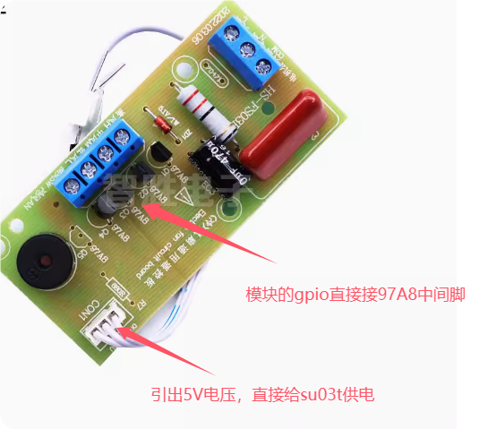

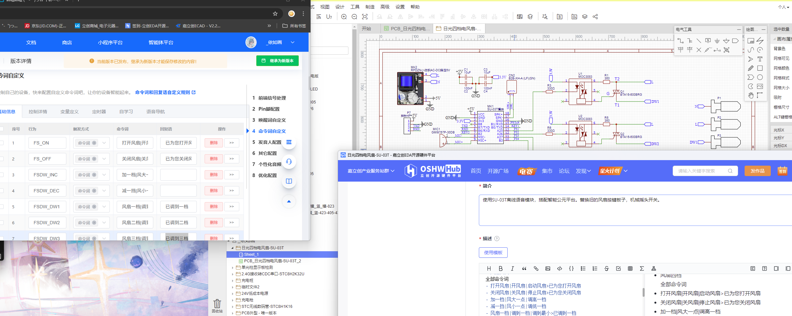

**问题原因**

- SU-03T的GPIO输出电流不足以直接触发可控硅
- 缺少电气隔离，可能影响模块稳定性
- 可控硅的触发象限要求未满足

**解决方案**

1. **使用光耦隔离模块**：

    - 添加光耦隔离器实现电气隔离
    - 确保足够的驱动电流
    - 这是已验证的有效方案

2. **电路设计要点**：

    - 确保共地连接
    - 检查输出电流是否达到10mA要求
    - 考虑可控硅的触发象限特性

3. **配置验证**：

    - 确认GPIO输出模式正确
    - 验证控制逻辑时序
    - 测试不同触发方式

**技术说明**

- **97A8可控硅**：需要特定触发条件
- **SU-03T输出**：需要驱动电路适配
- **隔离必要性**：保护模块，提高可靠性

**应用场景**

- 电风扇调速控制
- 灯光亮度调节
- 其他需要可控硅控制的场合

**注意事项**

- 直接连接可能损坏模块或无法正常工作
- 建议使用成熟的光耦隔离方案
- 复杂控制电路可参考开源设计

---

### SU-03T 与 CI-03T 的主要区别是什么？

**问题描述：**

在选型时混淆了 SU-03T 与 CI-03T1 两个产品型号，需要了解两者的区别、通信接口支持、唤醒打断功能等特性。

**解决方案：**

SU-03T 与 CI-03T 的主要区别如下：

**通信接口支持：**

- **SU-03T**：仅支持串口通信，不支持 I2C
- **CI-03T**：支持 I2C 通信和串口通信

**唤醒打断功能：**

- **SU-03T**：不支持唤醒打断功能
- **CI-03T**：支持唤醒打断功能（带 AEC 算法）

**功能特点对比：**

| 特性 | SU-03T | CI-03T |
|------|---------|---------|
| 主控芯片 | US516P6 | CI1302 |
| I2C 通信 | ✗ | ✓ |
| 唤醒打断 | ✗ | ✓ |
| AEC 算法 | ✗ | ✓ |
| 性价比 | 基础版本 | 高性价比 |

**选型建议：**

- 需要 I2C 通信：选择 CI-03T
- 需要唤醒打断功能：选择 CI-03T
- 仅需基础语音识别：可选择 SU-03T
- 性价比考虑：CI-03T 功能更强且价格更优惠

**注意事项：**

- 两个型号的固件不通用，无法直接导入使用
- 选型时需根据实际功能需求选择合适型号


---


---

### 可以只购买芯片自行打板使用吗？

**问题描述：**

希望只购买芯片，自己设计PCB板并将程序烧录进去，实现定制化产品。

**解决方案：**

**芯片购买支持：**

- 可以单独购买芯片进行自主开发
- SU-03T对应的主控芯片为US516P6（蜂鸟M芯片）
- 可通过淘宝等渠道购买芯片

**开发方式：**

1. **芯片级开发**
    - 需要具备完整的硬件设计能力
    - 自行设计外围电路和PCB
    - 负责芯片焊接和调试

2. **模块开发（推荐）**
    - 直接使用成品模块更简单
    - 模块已集成必要的外围电路
    - 降低开发难度和风险

**芯片选型参考：**

- **SU-03T**：US516P6芯片

- **CI-03T**：CI1302芯片
- **其他型号**：需确认对应的主控芯片型号

---


---

### US516P6 芯片如何获取开发板与技术支持？

US516P6（蜂鸟M）是低成本纯离线语音识别芯片，支持100条本地指令。

**产品特点：**

- 芯片架构：32bit RISC + DSP指令集 + FPU + FFT加速器
- 供电电压：2.5-5.5V
- 识别距离：3-5米远场
- 适用场景：智能家居、小家电、86盒、玩具、灯具
- 系统支持：RTOS轻量级系统

**开发板获取：**

- 可通过官方渠道或授权代理商购买US516P6开发板
- 如需与其他货物一起发货，请联系销售渠道协调安排

**技术支持：**

- 开发过程中如需技术支持，可通过以下渠道获取帮助：

    - 查阅《蜂鸟M离线方案开发指导手册》
    - 参考《蜂鸟M常见语音性能问题优化指导手册》
    - 联系技术支持团队获取开发指导

**注意事项：**

- 空芯片需先用调试烧录器烧录基础固件后才支持串口烧录
- SU-03T开发板基于US516芯片，开发经验可参考使用

---


---

### SU-03T和SU-23T的封装和脚位是否相同？

**问题描述：**

需要确认SU-03T和SU-23T的封装尺寸是否一致，以及脚位定义是否存在差异，以便评估硬件兼容性。

**解决方案：**

**封装对比：**

1. **物理封装**：

    - SU-03T：SMD18/DIP18封装
    - SU-23T：SMD18封装（无DIP版本）
    - 外形尺寸：两者基本相同（21×15mm）

2. **封装差异**：

    - SU-03T提供SMD和DIP两种封装选择
    - SU-23T仅提供SMD封装
    - 引脚间距和布局相同

**脚位定义差异：**

虽然封装相同，但由于芯片不同，部分功能引脚定义存在差异：

1. **电源相关**：

    - SU-03T：支持2.5-5.5V宽电压范围
    - SU-23T：仅支持2.2-3.6V窄电压范围
    - 电源引脚位置相同但电压要求不同

2. **功能引脚**：

    - 通用功能引脚（UART、I2C、SPI）位置相同
    - 部分特殊功能引脚因芯片差异而不同
    - 麦克风和喇叭引脚位置一致

3. **主要差异点**：

    - 功放配置：SU-03T功率更大（2.4W），SU-23T功率较小（0.62W）
    - 芯片架构：SU-03T基于蜂鸟M，SU-23T基于蜂鸟LPro
    - 功耗特性：SU-23T专为低功耗设计

**兼容性评估：**

1. **硬件兼容**：

    - PCB封装布局可以复用
    - 电源设计需要根据型号调整
    - 功放匹配需注意功率差异

2. **软件兼容**：

    - 固件不通用，必须分别生成
    - 配置参数略有差异
    - 功能特性存在区别

**选型建议：**

- 选择SU-03T：需要5V供电、较大音量输出
- 选择SU-23T：电池供电、超低功耗需求
- 设计时注意电源电压要求，避免损坏模块

**注意事项：**

- 虽然封装相同，但不能直接替换使用
- 电源设计必须严格对应模块电压要求
- 评估实际需求选择合适型号，避免功能或性能浪费

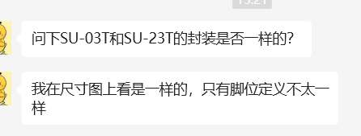

---


---

### SU-03T和SU-03T1产品的主要区别是什么？

**问题描述：**

需要了解SU-03T和SU-03T1产品的主要区别，以及SU-03T是否已停止销售。

**解决方案：**

**主要区别对比：**

- **SU-03T**：

    - 可以使用新老固件
    - 支持多种固件版本选择
    - 已停止销售

- **SU-03T1**：

    - 只能使用新固件
    - 固件兼容性相对受限
    - 为当前在售型号

**选型建议：**

- 新项目建议选择SU-03T1
- 需要老固件兼容性的特殊项目可能需要寻找替代方案
- 具体选型建议联系技术支持确认

**注意事项：**

- SU-03T已停产，库存有限
- SU-03T1为标准在售型号
- 耳机接口的dB支持范围需查看具体规格书


---

### SU-03T功耗较高，如何选择低功耗模块？

**问题描述：**

SU-03T模块功耗较大，使用移动电源时耗电快，需要持续插电，不利于电池供电场景使用。

**解决方案：**

1. **了解模块特性**
    - SU-03T没有太好的降功耗方法
    - 功耗设计已固定，难以通过软件优化
    - 适用于市电供电场景

2. **选择低功耗方案**
    - 厂商有专门的低功耗模块产品
    - 根据应用场景选择合适型号
    - 电池供电场景建议优先考虑低功耗模块

3. **应用场景评估**
    - 室外固定设备：建议使用低功耗模块
    - 便携式设备：必须选择低功耗方案
    - 长期运行设备：功耗是关键考虑因素

**注意事项：**

- 选型时务必评估供电方式
- 电池供电场景不建议使用SU-03T
- 可咨询技术支持获取低功耗模块选型建议

---


---

### SU-03T和CI-33T支持双语言吗？

**问题描述：**

计划使用SU03T模块支持印尼语和中文双语言识别，需要确认该功能是否可行。

**解决方案：**

SU-03T不支持双语言，CI-33T才支持：

**1. 硬件限制**

- SU-03T：2MB Flash内存，不支持双语言
- CI-33T：4MB Flash内存，支持双语言功能
- 双语言需要更大存储空间，SU-03T内存不足

**2. 选型建议**

- 如需双语言功能，必须选择CI-33T
- SU-03T只能支持单一语种
- CI-33T可存储更多词条（500条 vs 300条）

**3. 配置方式**

- 双语言功能需要定制开发
- 无法在平台自行配置双语言固件
- 需提供两种语言的语料和指令列表

**注意事项：**

- 三种语言（中+印+英）超出硬件限制
- 选择模块时要考虑未来语言扩展需求
- 双语言定制费用高于单语种
- 确认语种需求后再选择合适型号

---


---

### 灯具语音控制项目如何选择合适的语音识别模块？

**问题描述：**

需要开发一款语音控制灯具的demo项目，要求支持自定义唤醒词和语音指令，并能根据指令生成PWM信号控制亮度和色温，需要快速搭建演示环境。

**解决方案：**

根据灯具控制项目的需求，推荐以下模块选型方案：

**1. 需求分析**

- 支持自定义唤醒词和命令词
- 需要语音播报功能
- 要求PWM输出控制亮度和色温
- 需要快速搭建demo
- 预计命令词数量约100条

**2. 模块对比与推荐**

**CI-03T系列**：

- 支持最多300条词条
- 双麦克风设计，支持AEC声学回声消除
- 识别效果好，适合嘈杂环境
- CI-73T为低成本版本，识别一致但部分功能精简

**SU-03T系列**：

- 支持最多150条词条
- 单麦克风设计，带AEC功能
- 成本相对较低
- SU-03T1为当前主流版本

**SU-32T**：

- 识别能力最强
- 双麦克风降噪效果优秀
- 价格较高，适合对识别效果有硬性要求的项目

**SU-23T**：

- 低功耗版本
- 仅支持50条词条
- 识别效率相对较低

**3. 选型建议**

**演示阶段**：

- 优先选择CI-03T或SU-03T
- 两者识别效果都能满足演示需求
- 可根据预算和具体需求选择

**量产阶段**：

- 成本敏感：选择CI-73T（低成本版本）
- 性能要求高：选择CI-03T或SU-32T
- 功耗要求严苛：选择SU-23T

**4. 开发资源**

**智能公元平台**：

- 网址：http://www.smartpi.cn/#/
- 支持零代码配置
- 可自定义唤醒词、命令词、回复语
- 自动生成固件

**开发套件**：

- 提供转接板烧录套装
- 包含电源线、喇叭、转接板、烧录器等
- 可快速搭建开发环境

**5. PWM配置说明**

- PWM频率设置：10kHz
- 占空比可根据需求调节
- 同一引脚可输出不同占空比信号控制亮度
- 支持多路PWM输出同时控制亮度和色温

**注意事项：**

- 命令词数量不超过模块承载量
- 双麦模块在嘈杂环境识别效果更佳
- 新旧版本硬件兼容，SU-03T1为当前推荐版本
- 烧录器和转接板通用，无需重复购买

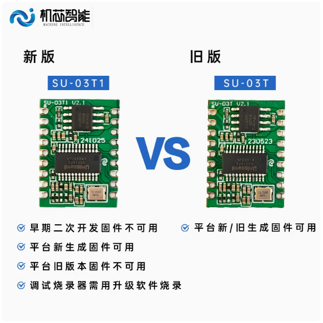
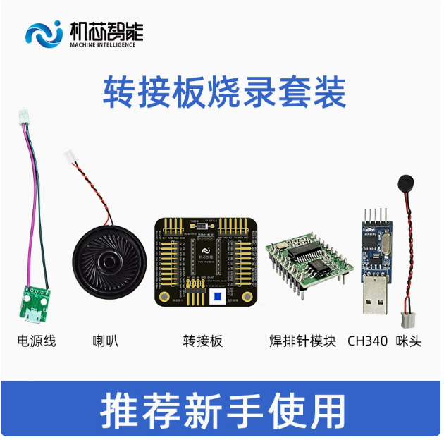

---


---

### CI-03T和SU-03T模块如何选型？

**问题描述：**

需要支持中英文识别、打断功能，并解决数字识别效率低和播报内容被误识别为命令词的问题。同时需要了解不同模块的选型建议、英文识别限制以及中英文混合识别的实现方式。

**解决方案：**

**1. 模块功能对比**

- **CI-03T**：

    - 支持中英日韩多语言
    - 支持AEC（声学回声消除），避免播报被误识别
    - 支持中英双模型（需定制）
    - 数字识别效果略逊于SU-03T
    - 单麦支持打断功能
    - IO口可模拟PWM输出

- **SU-03T**：

    - 仅支持中英文
    - 不支持AEC功能
    - 数字识别效率更高
    - 不支持中英双模型同时运行
    - 市场主流产品，出货量更大
    - 早期产品，技术成熟稳定

**2. 选型建议**

- **需要中英文混合识别**：选择CI-03T，支持双模型切换
- **数字识别是关键需求**：选择SU-03T，识别准确率更高
- **需要打断功能**：选择CI-03T
- **播报内容被误识别**：选择CI-03T（支持AEC）

**3. 中英文混合识别实现**

- SU-03T：不支持中英同时识别，需要模型切换（定制功能）
- CI-03T：支持双模型，可动态切换
- 模型切换逻辑：中文唤醒词→中文模型，英文唤醒词→英文模型
- 定制费用：约2000元起，根据复杂度调整

**4. 硬件布局建议**

- 麦克风与扬声器距离保持20mm以上
- CI-03T自带AEC算法，可有效防止重新录入
- SU-03T需要依靠硬件布局避免干扰

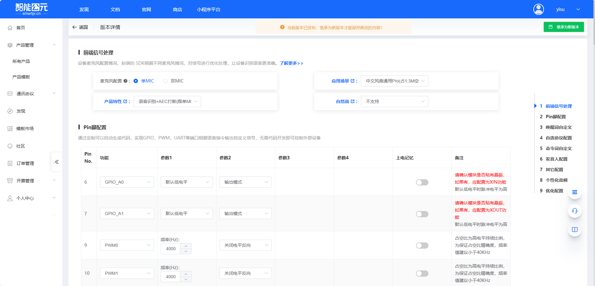

**注意事项：**

- CI-03T是近两年产品，功能更丰富
- SU-03T是市场主流，应用案例丰富
- 如果需要3路以上PWM，CI-03T可通过IO口模拟
- 模块更换需要重新新建产品，不能直接更改型号
- 控制面板尺寸限制（50mm×100mm）内，20mm距离可实现

---


---

### 哪些芯片型号适合低功耗应用？

**问题描述：**

SU-03T芯片在仅开机状态下待机一夜就耗尽电量，需要更低功耗的芯片选型建议。

**解决方案：**

**低功耗型号推荐：**

**1. SU-21T**

- 待机电流：小于1mA
- 供电电压：3.7-5.5V
- 适合：电池供电的长期待机应用
- 接口：UART、PWM、GPIO

**2. SU-22T**

- 待机电流：约1mA
- 供电电压：3.7-5.5V
- 适合：对功耗敏感的便携设备
- 接口：UART、PWM、GPIO

**3. SU-23T**

- 待机电流：约1mA
- 供电电压：3.7-5.5V
- 适合：超低功耗需求的场景
- 接口：UART、PWM、GPIO

**4. SU-32T**

- 待机电流：略高于1mA
- 供电电压：3.7-5.5V
- 适合：平衡性能与功耗的应用
- 接口：UART、PWM、GPIO、I2C

**功耗对比说明：**

- SU-03T：待机功耗较高，不适合长期电池供电
- SU-21T/22T/23T：专为低功耗设计，待机电流小于1mA
- SU-32T：性能更强，功耗略高于专用低功耗型号

**选型建议：**

- 纯电池供电且需要长期待机：选择SU-21T/22T/23T
- 需要兼顾性能和功耗：选择SU-32T
- 插电使用或频繁唤醒：SU-03T仍可考虑


**注意事项：**

- 低功耗型号通常词条数量较少（如SU-23T仅支持50条）
- 深度休眠和唤醒功能需要合理配置
- 实际功耗还受外围电路影响
- 选型时需综合评估功能需求和功耗要求

---


---

### CI-03T与SU-03T在TTS功能上有何区别？

**问题描述：**

需要了解CI-03T与SU-03T的主要区别，特别是在文本转语音（TTS）功能支持上的差异。

**解决方案：**

**功能对比：**

- **CI-03T**：支持TTS文本转语音功能（需要购买授权版本）
- **SU-03T**：不支持TTS功能，仅支持预置语音播报

**TTS功能说明：**

1. **CI-03T TTS特性**
    - 支持中英文文本转语音
    - 通过串口发送UTF-8编码的文本
    - 可动态播报任意文本内容
    - 适合需要动态语音播报的应用

2. **SU-03T限制**
    - 只能播报预存的语音文件
    - 通过串口指令选择固定语音播报
    - 无法实现动态文本转语音

**实现方式：**

```
CI-03T TTS实现流程：
串口接收文本 → TTS引擎处理 → 语音输出播报
```

**选型建议：**

- 需要动态语音播报：选择CI-03T
- 仅需固定命令词播报：可选择SU-03T
- 考虑成本因素：SU-03T价格更优

**注意事项：**

- CI-03T的TTS功能需要购买授权版本
- TTS功能会增加模块成本
- 确认项目需求后再选择合适型号

---


---

### 哪些语音模块可以控制舵机实现360度旋转？

**问题描述：**

需要选择能够控制舵机实现360度旋转的语音模块，此前尝试使用SU-03T未能成功。

**解决方案：**

**1. PWM输出要求**

- 控制舵机需要模块支持PWM输出功能
- 舵机控制需要50Hz频率的PWM信号
- 脉宽范围：0.5ms-2.5ms对应0-180度

**2. 模块选择**

**支持PWM输出的模块：**

- SU-03T：支持PWM输出，但驱动能力有限
- CI-03T：支持PWM输出
- CI-33T：支持PWM输出
- JX-A7T：通过IO可模拟PWM输出

**不推荐的方案：**

- SU-03T直接驱动：PWM驱动能力不足，可能导致舵机无响应

**3. 推荐方案**

**方案一：使用扩展板**

- 通过扩展板增强PWM驱动能力
- 提供独立的舵机供电
- 避免模块供电不足

**方案二：组合控制**

- SU-03T处理语音识别
- 外接单片机（如树莓派Pico）控制舵机
- 通过串口通信，SU-03T发送控制指令

**方案三：选择带驱动模块**

- 使用内置舵机驱动的模块
- 或选择支持更大电流输出的PWM模块

**注意事项：**

- 360度旋转需要连续旋转舵机，不是普通舵机
- 确认舵机类型：连续旋转vs角度控制
- 舵机供电建议独立于语音模块

---


---

### 对讲场景下如何选择语音转文字模块？

**问题描述：**

在对讲模式场景下，需要将语音转换为文字，同时询问是否可以同时实现文字转语音功能。

**解决方案：**

**1. 离线模块限制**

- 离线语音模块只能识别预置的固定命令词
- 不支持自由语音转文字（ASR）功能
- 无法实现连续语音识别和转写

**2. 技术方案选择**

如需语音转文字功能，可考虑以下方案：

**方案一：使用在线语音识别**

- 采用网络ASR服务（如科大讯飞、百度阿里等）
- 需要网络连接，支持连续语音识别
- 可实现实时语音转文字

**方案二：使用带ASR功能的模块**

- 选择支持在线识别的WiFi模块
- 如JX-A7T等支持连接云服务的模块
- 通过网络将语音数据上传识别

**3. 文字转语音（TTS）功能**

- CI-03T支持TTS功能（需要授权版本）
- 可接收文本并转换为语音播报
- SU-03T不支持TTS功能

**应用建议：**

- 对讲场景建议使用在线ASR+TTS的组合方案
- 离线方案仅适用于固定命令词控制
- 需要网络支持才能实现自由对话

---


### SU-03T可以连接网络实现AI功能吗？

**问题描述：**

询问SU-03T模块是否可以连接网络，实现类似AI大模型的智能对话效果。

**解决方案：**

**功能限制说明：**

- **SU-03T定位**：纯离线语音识别模块
- **网络能力**：无WiFi或蓝牙功能，无法直接连接网络
- **AI能力**：仅支持预设的命令词识别，无法运行或接入AI大模型
- **蓝牙音响**：不支持蓝牙音响模式，无法作为蓝牙音箱使用

**如需AI功能的替代方案：**

- **JX-A7T**：离在线双模AI语音模块，支持WiFi连接和在线大模型对话
- **组合方案**：SU-03T（离线唤醒识别）+ 外部WiFi模块（如ESP32）+ 云端AI服务

**选型对比：**

| 特性 | SU-03T | JX-A7T |
|------|--------|--------|
| 网络连接 | 无 | WiFi + BLE |
| AI能力 | 无 | 支持在线大模型 |
| 离线命令词 | 最多300条 | 最多300条 |
| 适用场景 | 本地语音控制 | 智能对话交互 |

**注意事项：**

- SU-03T无法通过升级固件获得网络或AI能力
- 如需AI对话功能，建议直接选择JX-A7T
- 组合方案需要额外的MCU进行数据转发

---
