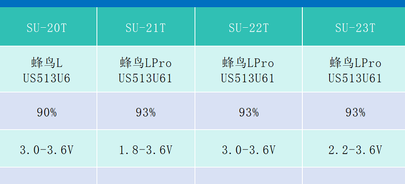
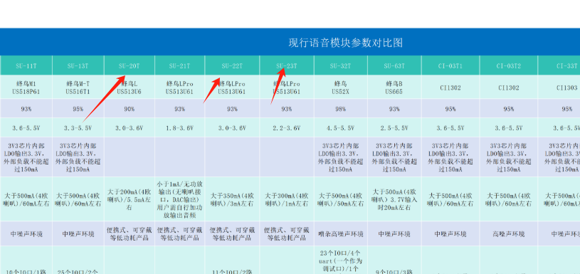
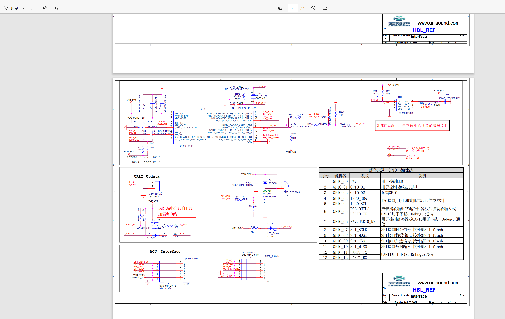
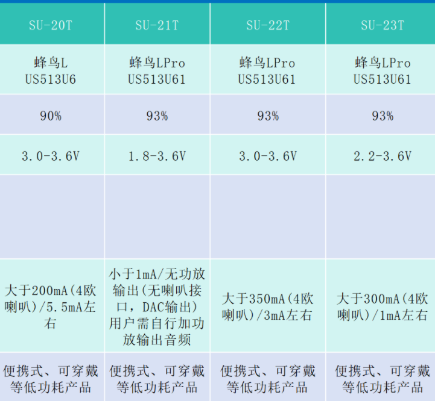

# SU-20T 模块选型 FAQ

本页用于整理 SU-20T 相关的模块选型问题。

### SU系列芯片的功耗参数与检测距离

**问题描述：**

需要了解SU系列芯片的待机电流、工作电流等功耗参数，以及各型号的有效检测距离，为电池供电设备选择合适的芯片。

**解决方案：**

**SU系列功耗参数说明：**

1. **功耗定义**
    - 5.5mA：指待机电流（芯片处于低功耗待机状态）
    - 200mA：指工作状态下的平均电流（识别和播报时）
    - 供电电流>200mA：是对电源供电能力的要求

2. **检测距离配置**
    - 近场模式：0-1米距离识别
    - 远场模式：1-5米距离识别
    - 可通过平台配置切换距离模式

**各型号参数对比：**

**电池供电选型建议：**

1. **低功耗型号**
    - SU-21T、SU-22T、SU-23T：工作电流相对较低
    - 适合纯电池供电应用
    - 工作电流仍较大，需优化外围电路

2. **优化方案**
    - 若不做主控使用：设计外围电路控制功耗
    - 使用电源管理芯片实现智能开关
    - 考虑使用单独的语音识别芯片

**注意事项：**

- 工作电流指识别和播报时的瞬时电流
- 电池供电需要设计合理的电源管理电路
- 检测距离与咪头质量和环境噪声有关
- 远距离识别需要良好的麦克风格线

---

---

### SU-20T是否支持英文语音识别？

**问题描述：**

需要了解SU-20T模块是否支持英文语音识别，以及本地编译固件的方法。

**解决方案：**

- **SU-20T不支持英文识别**：因为内存容量不足，无法容下英文语音模型
- **推荐SU-21T**：使用蜂鸟LPro芯片，支持英文语音识别
- **SU-21T又称为蜂鸟LPro**：是SU-20T的升级版本，性能更强

**本地编译固件：**

- 需要虚拟机环境，并且需要编程能力
- 暂时没有开放的本地编译教程
- 推荐观看SU-03T二次开发环境搭建教程参考

**注意事项：**

- SU-20T仅支持中文识别，指令数量限制在50条
- SU-21T支持中英文，但需要分别生成对应固件
- 本地编译需要较强的技术能力，不建议新手尝试

---

### US513U6和US513U61有什么区别？

**问题描述：**

US513U6和US513U61芯片在原理图上看起来一样，但US513U6无法识别唤醒词，而US513U61可以正常工作。

**解决方案：**

- **内部结构差异**：

    - US513U6：内部没有Flash存储器
    - US513U61：内部有Flash存储器

- **生成的固件不同**：

    - US513U6：需要外部Flash配合
    - US513U61：可独立运行，无需外部Flash

- **选择建议**：推荐使用US513U61（蜂鸟L）

**注意事项：**

- 两个芯片不能直接替代使用
- 原理图可能相同但内部结构完全不同
- SU-20T使用US513U6，SU-21T使用US513U61

---

### 低功耗模块SU-20T/21T/22T/23T如何选择？

**问题描述：**

需要了解SU-20T、SU-21T、SU-22T和SU-23T这四种低功耗模块的详细参数差异，以便根据项目需求选择最合适的型号。

**解决方案：**

**低功耗系列概述：**

这四个型号都是专门为低功耗应用设计的语音识别模块，适合电池供电设备。

**详细参数对比：**

**主要差异分析：**

1. **主控芯片**：

    - **SU-20T**：CI1302
    - **SU-21T**：CI1302
    - **SU-22T**：CI1302
    - **SU-23T**：CI1302

2. **功耗特性**：

    - **供电电压**：均为3.3V-5.5V DC
    - **供电电流**：根据型号不同，工作电流在100-200mA范围
    - **待机电流**：各型号优化程度不同，具体需查阅规格书

3. **功能支持**：

    - **语音指令**：支持150-300条指令
    - **唤醒打断**：均支持（含AEC）
    - **双麦算法**：部分型号支持
    - **稳态降噪**：部分型号支持

4. **音频输出**：

    - **DAC输出**：高质量模拟音频输出
    - **功放功率**：支持驱动喇叭
    - **TTS功能**：支持文字转语音

**选型建议：**

1. **SU-20T**：

    - 基础低功耗型号
    - 适合对功耗要求一般的应用
    - 性价比高

**SU-21T功耗说明：**

- **平均工作电流**：3.0mA（不使用功放和播报功能时）
- **功耗参考**：

    - 不加功放，仅做语音识别时约3.0mA
    - 实际功耗受使用场景影响

2. **SU-21T**：

    - 超低功耗设计
    - 适合长期电池供电设备
    - 待机电流极低

3. **SU-22T**：

    - 平衡型低功耗
    - 功耗与性能兼顾
    - 适合中等复杂度应用

4. **SU-23T**：

    - 高性能低功耗
    - 功能最全面
    - 适合需要快速响应的应用

**应用场景推荐：**

- **智能门锁**：SU-21T（超低功耗）
- **可穿戴设备**：SU-21T
- **智能家电**：SU-22T或SU-23T
- **车载设备**：SU-20T或SU-22T
- **玩具互动**：SU-20T（性价比高）

**注意事项：**

- 低功耗模块通常指令数量限制在150-300条
- 选型时需综合考虑功耗、性能和成本
- 电池供电设计需要合理的电源管理电路
- 具体参数请参考各型号的详细规格书

---

### SU-20T与SU-23T在待机功耗和功能上存在哪些差异？

**问题描述：**

需要了解SU-20T与SU-23T在待机功耗、功能配置、引脚定义等方面的具体差异。

**解决方案：**

**1. 功耗对比**

| 型号 | 待机电流 | 芯片型号 | 电压范围 | 功放功率 |
|------|---------|---------|---------|---------|
| SU-20T | ~20mA | US52X（蜂鸟M） | 2.5-5.5V | 1.8W@3.7V4Ω |
| SU-23T | ~3mA | US513U61（蜂鸟LPro） | 2.2-3.6V | 0.62W@3.3V4Ω |

**功耗差异原因**：

- SU-23T采用蜂鸟LPro芯片，专为低功耗设计
- SU-20T基于蜂鸟M芯片，功能更丰富但功耗较高

**2. 功能差异对比**

| 功能特性 | SU-20T | SU-23T | 差异说明 |
|---------|--------|--------|---------|
| 指令数量 | 40条 | 50条 | SU-23T支持更多指令 |
| FFT加速器 | ✓ | ✓ | 两者都支持 |
| 功放输出 | 1.8W | 0.62W | SU-20T功率更大 |
| 封装形式 | SMD18/DIP18 | SMD18 | 封装略有不同 |
| 适用场景 | 中噪声环境 | 低功耗便携 | 设计定位不同 |

**3. 引脚差异**

**主要差异**：

- SU-23T电压范围更窄（2.2-3.6V），适合电池供电
- SU-20T支持更宽电压（2.5-5.5V），兼容性更好
- 功放配置差异导致输出功率不同

**接口配置对比**：

- 两者都支持：UART、I2C、SPI、PWM、ADC
- SU-20T接口更丰富，支持I2S音频接口
- SU-23T精简了部分接口以降低功耗

**4. 选型建议**

**选择SU-20T的场景**：

- 需要5V供电的系统
- 对音量要求较高的应用
- 需要I2S数字音频输出
- 成本敏感的项目

**选择SU-23T的场景**：

- 纯电池供电设备
- 对功耗要求极其严格
- 3.3V系统电压
- 便携式手持设备

**注意事项：**

- SU-23T的低功耗设计限制了部分高性能功能
- SU-20T功能更全面但功耗相对较高
- 选型时需综合考虑功耗、功能、成本因素
- 电压匹配是选型的关键考虑因素

---

