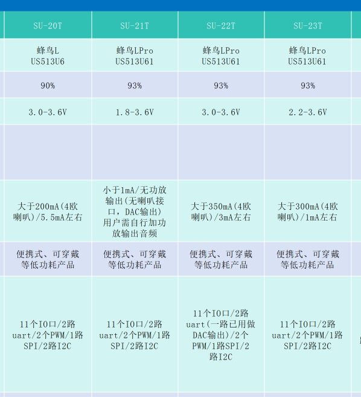
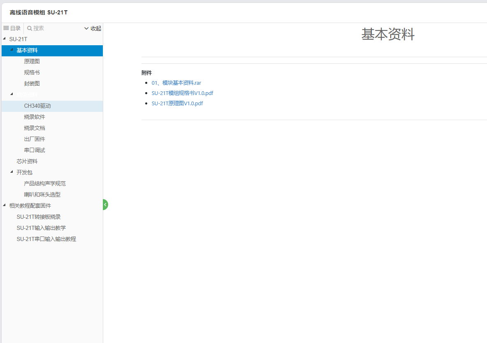

# SU-21T 模块选型 FAQ

本页用于整理 SU-21T 相关的模块选型问题。

### 需要小尺寸、低功耗的语音模块用于播报药名，如何选择？

**问题描述：**

需要一款尺寸小于20x10mm、低功耗、能够识别单个词并触发喇叭回应或灯闪烁的离线语音识别模块，用于播报药名。

**解决方案：**

SU-21T 模块完全满足该应用需求：

- **尺寸规格**：符合小体积要求，适合穿戴设备
- **功耗特性**：亚毫瓦级待机功耗，几毫瓦级工作功耗
- **识别能力**：支持50条本地指令，可识别单个词触发相应动作
- **响应输出**：通过UART接口控制外接喇叭播放药名或控制LED闪烁

**注意事项：**

- 供电电压必须为3.3V，严禁使用5V
- SU-21T无内置功放，需要外接功放电路驱动喇叭
- 建议预留调试接口便于功能测试和故障排查

### 如何了解SU-21T模块的测试进度和状态？

**问题描述：**

需要了解SU-21T模块的当前测试状态和测试结果。

**解决方案：**

SU-21T模块已完成开发并正式发布：

- **产品状态**：已正式发布，开发包和文档已上传至智能公元平台
- **获取资料**：可登录智能公元平台查看完整的产品功能和操作指南
- **开发资源**：官方文档地址为 https://help.aimachip.com/docs/offline_su21t

**注意事项：**

- SU-21T属于正式量产产品，可直接使用
- 如需项目合作或技术支持，可通过官方渠道联系
- 建议下载最新的开发包V2.1.0进行开发

### 哪些模块支持低功耗？

**问题描述：**

需要为电池供电产品选择支持低功耗处理的模块。

**解决方案：**

**低功耗型号推荐：**

1. **SU-21T模块**
    - 专为低功耗应用设计
    - 适合电池供电场景
    - 优化了待机和工作功耗

2. **SU-23T模块**
    - 低功耗模组
    - 提供详细功耗参数
    - 适合长期电池供电应用

**功耗参考：**

- 具体功耗数据需参考规格书
- 包含待机、工作、休眠等状态
- 实际功耗取决于使用场景

**选型建议：**

- 电池供电优先选择SU-21T/23T
- 根据功耗需求选择合适型号
- 考虑功能需求与功耗的平衡

**注意事项：**

- 低功耗可能影响部分功能
- 需要在功耗和性能间取舍
- 建议申请样品测试实际效果

**高功耗芯片的替代方案：**

如果使用常规芯片（如CI系列）出现功耗过高问题：

1. **独立供电设计**：

    - 为语音模块单独配置DCDC电源
    - 使用3A或更大容量的电源模块
    - 避免与传感器共享电源轨

2. **电源隔离措施**：

    - 添加滤波电容减少电源噪声
    - 使用LDO稳压器提供纯净电源
    - 考虑磁珠隔离高频噪声

3. **低功耗替代方案**：

    根据参数对比表选择适合的型号：

    **推荐低功耗型号**：

    - SU-21T：专为低功耗设计
    - SU-23T：提供详细功耗参数
    - 根据实际需求选择功能和功耗的平衡点

---


---

### 低功耗模块如何选型？

**问题描述：**

需要为电池供电设备选择低功耗语音模块，以及了解各模块的供电电压要求。

**解决方案：**

**低功耗系列概述：**

SU-20T、SU-21T、SU-22T、SU-23T是专门为低功耗应用设计的语音识别模块。

**详细参数对比：**



**功耗特性：**

- **供电电压**：低功耗系列均为3.3V供电
- **标准系列**：如CI-03T/SU-03T支持5V供电
- **供电电流**：根据型号不同，工作电流在100-200mA范围
- **待机电流**：各型号优化程度不同

**各型号特点：**

1. **SU-21T**
    - 超低功耗设计
    - 适合长期电池供电设备
    - 待机电流极低

2. **SU-22T**
    - 平衡功耗与性能
    - 适合需要定期唤醒的应用

3. **SU-23T**
    - 功能相对完整
    - 保持较低功耗水平

**供电注意事项：**

- 低功耗模块使用3.3V供电，不是5V
- 标准模块（如CI-03T）设计为5V供电，使用5V是安全的
- 长期使用不会因电压问题烧毁，但要确保电压稳定
- 电压过高或接反才会导致模块损坏

**选型建议：**

- 纯电池供电：选择SU-21T等3.3V低功耗模块
- 5V供电环境：选择CI-03T/SU-03T等标准模块
- 需要长期待机：优先考虑超低功耗型号
- 具体参数请参考各型号的详细规格书

**注意事项：**

- 低功耗芯片在性能上会有一定取舍，识别速度和响应时间可能略低于标准功耗模块
- SU-21T/SU-22T/SU-23T等低功耗型号适合对功耗要求严格但对实时性要求不高的应用
- 如需要高性能实时处理，建议选择标准功耗模块（如CI-03T系列）

---

### SU-21T是否适用于智能开关的低功耗场景？

**问题描述：**

计划在智能开关产品中使用SU-21T芯片，需要确认是否适用于1200mAh电池供电的低功耗场景。

**解决方案：**

SU-21T适用于智能开关的低功耗应用场景：

- **芯片架构**：SU-21T和SU-23T均采用蜂鸟L Pro芯片
- **功耗特性**：专为低功耗设计，适合电池供电设备
- **应用场景**：1200mAh电池可支持语音识别和电机控制功能

**模块选择建议：**

如果需要使用模块形式：

- 推荐使用SU-23T模块
- 可采用SU-23T的固件进行SU-21T的设计开发
- 功能稳定，便于产品化

**注意事项：**

- 单独购买芯片和模块均可
- 技术资料可在产品资料平台获取，包括基本资料、原理图、规格书等
- 年需求量达几万时可批量采购



---

### 哪些离线语音模块功耗最低，如何选型？

针对电池供电场景，推荐以下低功耗模块：

**超低功耗系列（1-3mA待机）：**

| 型号 | 待机电流 | 适用场景 | 电压范围 | 特点 |
|------|---------|---------|---------|------|
| SU-21T | ~1mA | 可穿戴设备 | 1.8-3.6V | 超低电压，无内置功放 |
| SU-22T | ~2mA | 便携设备 | 3.0-3.6V | 内置1W功放 |
| SU-23T | ~3mA | 便携设备 | 2.2-3.6V | 宽电压，0.62W功放 |

**选型建议：**

1. **按功耗排序**：SU-21T < SU-22T < SU-23T < SU-63T/SU-20T（~20mA）< SU-32T（~50mA）

2. **功能对比**：

    - SU-21T/22T/23T：支持50条指令，适合简单控制
    - SU-63T：基于蜂鸟B芯片，50条指令
    - SU-20T：基于蜂鸟M，40条指令，支持FFT加速器

3. **电池寿命计算**：
    ```
    使用2000mAh电池：

    - SU-21T：2000mAh/1mA ≈ 2000小时 ≈ 83天
    - SU-22T：2000mAh/2mA ≈ 1000小时 ≈ 42天
    - SU-23T：2000mAh/3mA ≈ 667小时 ≈ 28天
    ```

4. **应用推荐**：

    - 智能门锁、可穿戴设备：选SU-21T
    - 便携遥控器、开关面板：选SU-23T
    - 需要少许功放的场景：选SU-22T

**注意事项：**

- 低功耗模块在保持低功耗的同时会牺牲部分性能
- 待机电流为典型值，实际值受使用环境影响
- 建议实测功耗数据作为设计依据

---

