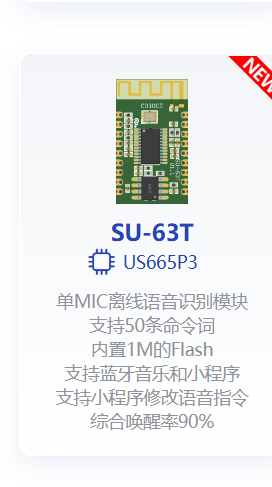
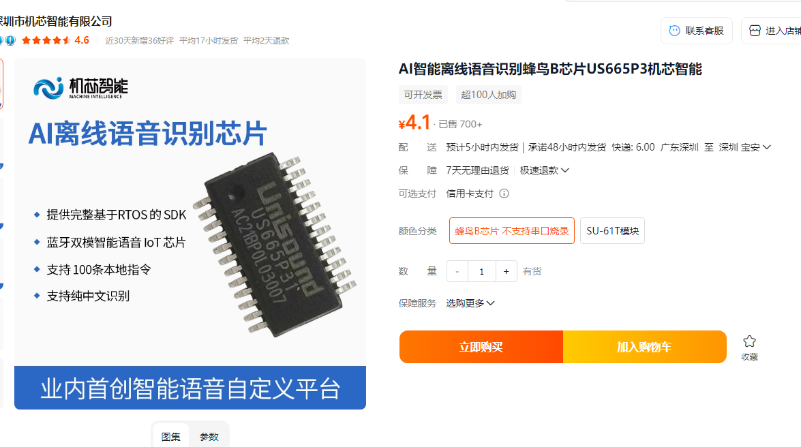

# SU-63T 模块选型 FAQ

本页用于整理 SU-63T 相关的模块选型问题。

### SU-63T的蓝牙支持麦克风语音传输到手机吗？

**问题描述：**

需要确认SU-63T模块是否支持将麦克风采集的语音通过蓝牙传输到手机。

**解决方案：**

**SU-63T支持麦克风语音通过蓝牙传输到手机：**

**1. 支持的蓝牙协议**

SU-63T采用蓝牙双模设计（BR+EDR+BLE 5.1），支持以下蓝牙协议：

- **HFP（Hands-Free Profile）**：免提通话协议，支持双向语音传输
- **A2DP（Advanced Audio Distribution Profile）**：高级音频分发协议，用于音频播放
- **SPP（Serial Port Profile）**：串口协议，用于数据传输

**2. 功能说明**

- **麦克风输入**：模块内置ADC，支持模拟麦克风输入，可采集语音信号
- **语音上行**：通过HFP协议，麦克风采集的语音可传输到蓝牙配对设备（如手机）
- **免提通话**：支持作为免提设备使用，手机通话时通过模块的麦克风收音

**3. 应用场景**

- 蓝牙免提通话设备
- 蓝牙耳机/耳麦
- 车载免提系统
- 语音交互设备

**注意事项：**

- HFP功能需要手机端支持免提协议
- 音质受蓝牙传输带宽和编码方式影响
- 使用前需确保蓝牙配对成功
- **功能限制**：SU-63T的蓝牙麦克风功能主要用于接听手机电话通话（免提通话），不支持其他形式的麦克风语音传输场景

---

### SU-63T模块的主要参数是什么？

**问题描述：**

需要了解SU-63T单MIC离线语音识别模块的具体型号和参数信息。

**解决方案：**

SU-63T是一款单MIC离线语音识别模块，主要参数如下：

**1. 硬件规格**

- 主控芯片：US665P3
- Flash容量：1M
- 麦克风：单麦克风设计
- 命令词支持：最多50条

**2. 功能特性**

- 支持离线语音识别
- 内置蓝牙音乐功能
- 支持小程序控制
- 综合唤醒率：90%

**3. 与其他型号对比**

- SU-63T专注于单麦克风应用
- 相比双麦克风版本成本更低
- 适合简单语音控制场景

**注意事项：**

- 50条命令词限制需在配置时注意
- 单麦克风设计对环境噪声相对敏感
- 如需更高识别率，可考虑双麦克风版本

---

### SU-63T适合暖风机语音控制吗？

**问题描述：**

暖风机智能语音控制需要带蓝牙功能的芯片，并确认是否支持小程序应用开发。

**解决方案：**

**SU-63T适用于暖风机控制：**

**1. 核心优势**

    - 支持蓝牙音乐播放功能
    - 支持小程序应用开发
    - 单MIC设计，成本适中
    - 适合暖风机等家电应用

**2. 芯片信息**

    - 主控芯片：US665P3
    - 支持离线语音识别
    - 内置蓝牙功能

**3. 蓝牙功能对比**

    - US665P3（SU-63T）：带蓝牙功能
    - US516P6：不带蓝牙功能

**芯片规格确认：**

**应用场景：**

- 暖风机语音控制
- 小程序远程控制
- 蓝牙音乐播放

**注意事项：**

- 如需蓝牙功能必须选择US665P3芯片
- 开发资料可在官方文档平台获取
- 小程序开发需要相应的APP支持

### SU-63T 的蓝牙协议版本是什么？是否支持升级？

**问题描述：**

需要了解使用的蓝牙模块支持的蓝牙协议版本，以及是否可以升级。

**解决方案：**

**蓝牙协议版本：**

- **标准版本**：蓝牙 4.2 协议
- **可选升级**：可升级至 5.1 或 2.x 版本
- **低功耗版本**：仅支持 4.2 和 5.1 版本

**升级说明：**

1. **版本选择**
    - 如需更高速度和更大传输距离：选择 5.1
    - 如需兼容旧设备：保持 4.2
    - 低功耗应用选择 4.2 或 5.1

2. **升级方式**
    - 需要在订购时指定所需版本
    - 不同版本可能涉及额外费用
    - 建议根据产品实际需求选择

**性能对比：**

| 协议版本 | 传输速度 | 传输距离 | 功耗 | 适用场景 |
|----------|----------|----------|--------|----------|
| 4.2 | 标准 | 标准 | 中等 | 通用应用 |
| 5.1 | 2倍于4.2 | 4倍于4.2 | 较低 | 高速传输 |
| 2.x | 低 | 较近 | 较高 | 特殊应用 |

**注意事项：**

- 不同协议版本可能影响兼容性
- 升级协议版本通常需要硬件支持
- 选择前确认产品需求和应用场景

---

### 两个命令词之间的最短识别间隔是多少？

**问题描述：**

需要了解两个命令词之间的最短识别间隔时间。

**解决方案：**

命令词识别间隔说明：

- 识别间隔取决于处理速度和响应时间
- 一般情况下识别响应很快
- 具体间隔时间没有固定限制
- 主要受以下因素影响：

    - 模块处理速度
    - 命令词复杂度
    - 环境噪声情况

---

### 如何实现多命令词识别功能？

**问题描述：**

需要在单条语音中识别多个命令词（多命令词识别），了解技术可行性及定制开发费用。

**解决方案：**

**功能说明：**

- 多命令词识别属于定制功能
- 包括双意图和多意图识别
- 需要特殊算法支持，非标准功能

**定制要求：**

1. **开发费用**
    - 开发费用：1 万元以上
    - 年采购量要求：5 万以上
    - 需要排队等待开发

2. **技术难度**
    - 调试成本很大
    - 需要大量测试验证
    - 对识别准确率要求高

**应用场景：**

- 适合命令词密集的应用
- 需要提升交互效率的场景
- 用户体验要求较高的产品

**注意事项：**

- 需要有足够的采购量支撑
- 开发周期较长，需要提前规划
- 建议先评估是否真的需要此功能

---

### 有没有比HC-05更小的蓝牙模块推荐？

**问题描述：**

需要寻找比HC-05体积更小的蓝牙模块，用于空间受限的产品（如桌宠）。

**解决方案：**

**推荐的小尺寸蓝牙模块：**

**1. BLE系列模块**

- **nRF51822/52832**：体积小，功耗低
- **TI CC2540/CC2541**：经典BLE方案，封装紧凑
- **Realtek RTL8762**：集成度高，外围元件少

**2. 二合一语音+蓝牙模块**

- **SU-63T**：语音识别+蓝牙功能集成
- **JX系列**：部分型号支持蓝牙连接
- 适合需要语音控制和手机APP通信的产品

**选型要点：**

- **封装尺寸**：选择SMD封装，比直插的HC-05小很多
- **天线设计**：板载天线可减少整体体积
- **功耗要求**：BLE比经典蓝牙更省电
- **功能需求**：是否需要音频传输，仅需数据传输可选BLE

**注意事项：**

- 确认模块的认证情况（CE/FCC/CCC）
- 考虑天线净空区要求
- 评估开发难度和时间成本
- 建议购买样品测试实际尺寸和性能

---

---

### 哪些型号的英文识别效果更好？

**问题描述：**

CI-03T模块的英文关键词识别率较低，询问是否有其他型号在英文识别方面表现更好。

**解决方案：**

**1. 英文识别性能对比**

- CI-03T：主要针对中文优化，英文识别能力有限
- SU-63T：新型号，在英文识别方面有所改进
- CI-33T：支持中英文切换，但需要分别烧录固件

**2. 改进建议**

- 如项目对英文识别要求较高，优先考虑SU-63T
- 增加英文唤醒词数量可部分弥补识别率不足
- 选择发音清晰、区别度高的英文词汇

**3. 选型考虑**

- 评估项目中英文指令的使用频率
- 确认是否需要中英文混合识别
- 考虑未来可能的扩展需求

**注意事项：**

- 中文语音模块在英文识别上存在天然劣势
- SU-63T等新型号在算法上有所优化
- 建议在选型前进行实际测试验证

---

---

### CI-03T和SU-63T的主要区别是什么？

CI-03T和SU-63T是两款不同定位的语音模块，主要区别体现在功能配置和性能特点上。

### 哪些模块支持蓝牙功能？

**问题描述：**

需要了解哪些语音模块集成蓝牙功能，支持配网、属性设置和简单数据传输。

**解决方案：**

**支持蓝牙的模块型号：**

1. **SU-63T（语音+蓝牙双模）**：

    - **语音功能**：支持50条本地指令识别
    - **蓝牙功能**：支持蓝牙双模（经典蓝牙+BLE）
    - **应用场景**：配网、属性设置、简单数据传输
    - **主控芯片**：US665P3
    - **价格参考**：约4.1元（具体以实际报价为准）

2. **JX-12F（WiFi+蓝牙二合一）**：

    - **WiFi功能**：支持2.4GHz WiFi连接
    - **蓝牙功能**：主要用于配网
    - **特点**：PIN脚兼容ESP12F/ESP8266
    - **应用**：需要网络连接的IoT设备

**功能说明：**

- **SU-63T**：单芯片实现语音识别和蓝牙通信，适合需要语音控制和手机APP通信的产品
- **JX-12F**：蓝牙主要用于配网功能，配网完成后主要通过WiFi传输数据

**选型建议：**

- 需要语音控制+蓝牙通信：选择SU-63T
- 仅需要网络连接：选择JX-12F
- 需要红外+蓝牙：需要两款芯片配合使用

---

### SU-63T的具体参数和价格？

**问题描述：**

需要了解SU-63T语音蓝牙模块的详细参数、价格和功能特性。

**解决方案：**

**SU-63T详细参数：**

**1. 基本规格**

- 型号：US665P3
- 功能：蓝牙双模语音IoT
- 本地指令：支持100条
- 识别语言：纯中文识别

**2. 蓝牙功能**

- 支持经典蓝牙和BLE双模
- 可用于配网和数据传输
- 支持属性设置和简单文字内容传输

**3. 价格信息**

- 参考价格：4.1元/片
- 实际价格：根据采购数量浮动

**注意事项：**

- 价格为参考价，批量采购需联系商务获取具体报价
- 该模块为语音+蓝牙二合一设计，简化了产品开发
- 适合需要语音控制和手机互联的应用场景

---

### CI-03T和SU-63T的主要区别是什么？

CI-03T和SU-63T是两款不同定位的语音模块，主要区别体现在功能配置和性能特点上。

**主要区别对比：**

| 参数 | CI-03T | SU-63T |
|------|---------|---------|
| 主控芯片 | CI032 | 安凯微 |
| 供电电压 | 3.6V-5.5V | 3.6V-5.5V |
| 供电电流 | 45mA | 70mA |
| 待机电流 | 10mA | 15mA |
| 接口 | UART、PWM | UART、PWM |
| 语音指令 | 300条 | 150条 |
| Flash容量 | 16MB | 2MB |
| 功放输出 | 内置1W功放 | 无内置功放 |
| 降噪能力 | 基础 | 较强 |
| 识别率 | 普通环境优化 | 噪声环境优化 |

**功能特点：**

**CI-03T特点：**

- 内置1W功放，可直接驱动喇叭
- Flash容量大，支持更多语音指令
- 成本相对较低
- 适合普通环境使用

**SU-63T特点：**

- 双麦降噪算法，噪声环境下表现更好
- 识别率更高，抗干扰能力强
- 适合复杂应用场景
- 不带功放，需要外接功放

**兼容性说明：**

- **不能直接替代**：两者硬件和软件不兼容
- **Flash差异**：SU-63T容量更小，指令数量受限
- **接口差异**：引脚定义不同，不能直接替换
- **性能差异**：识别能力和噪声处理能力不同

**选型建议：**

- **选择CI-03T**：

    - 需要内置功放的方案
    - 成本敏感的项目
    - 普通噪声环境应用
    - 需要大量语音指令

- **选择SU-63T**：

    - 噪声较大的环境
    - 对识别率要求高
    - 已有外接功放方案
    - 追求更好的人机交互体验

**注意事项：**

- 两个模块不能直接替换使用
- 选型时需综合考虑应用环境和需求
- SU-63T虽性能更强，但成本也更高
- 建议根据实际项目需求选择合适型号

---

