# CI-03T 平台与固件 FAQ

本页用于整理 CI-03T 相关的平台使用、固件生成等问题。

### CI-03T支持自学习功能吗？

**问题描述：**

需要了解CI-03T系列芯片是否支持自学习功能，以及具体的操作方法。

**解决方案：**

CI-03T支持自学习功能，可通过智能公元平台进行配置和操作。

**1. 平台操作**

- 浏览器访问智能公元平台
- 登录后创建或打开CI-03T项目
- 在配置界面中找到自学习相关设置选项

**2. 学习流程**

- 进入自学习模式，按照平台提示操作
- 录入需要学习的语音样本
- 保存配置并生成固件

**3. 教程资源**

- 平台内置详细操作指南
- B站搜索"机芯智能"查看视频教程
- 平台会提供逐步指引

**注意事项：**

- 自学习功能需要通过官方平台实现
- 确保使用CI-03T对应的固件版本
- 学习时保持环境安静，提高识别准确率
- 建议参考官方提供的操作文档和视频

### CI-03T支持点动、自锁、互锁功能吗？

**问题描述：**

需要了解CI-03T系列芯片是否支持点动、自锁、互锁等IO控制功能。

**解决方案：**

CI-03T支持点动、自锁、互锁等多种IO控制模式，可通过智能公元平台进行配置。

**1. 控制模式说明**

**点动模式：**

- 检测到触发信号时输出，信号消失时停止
- 适用于按键触发等场景
- 只在触发期间保持输出状态

**自锁模式：**

- 首次触发后保持输出状态
- 再次触发时切换输出状态
- 类似开关功能，触发一次开启，再触发一次关闭

**互锁模式：**

- 多个输出通道，只能有一个激活
- 激活新通道时自动关闭其他通道
- 适用于多选一的场景

**2. 平台配置方法**

- 登录智能公元平台
- 在IO控制配置中选择所需的控制模式
- 设置触发条件和输出行为
- 可配置延时、保持时间等参数

**3. 应用示例**

- 点动：门铃控制，按下时响，松开停
- 自锁：灯光控制，语音控制开关
- 互锁：档位切换，只能选一个档位

**注意事项：**

- 不同控制模式可以组合使用
- 配置时注意触发条件和输出逻辑的匹配
- IO口驱动能力有限，大负载需要外加驱动电路
- 平台提供详细的配置向导和示例

---

### 如何实现语音识别系统的楼层数动态配置？

**问题描述：**

需要根据实际电梯的楼层数量（如5层或64层）动态限制可识别的语音指令范围，避免识别超过实际楼层数的命令。

**解决方案：**

通过平台配置命令词的附加条件功能，结合变量控制来实现楼层数的动态限制：

**1. 配置楼层命令词**

- 为每个楼层创建独立的命令词（如"一楼"、"二楼"到"六十四楼"）
- 在命令词设置中启用"附加条件"功能
- 为超过基础楼层的命令词（如"六楼"到"十楼"）设置变量条件

**2. 使用变量控制**

- 定义一个变量（如`floor_count`）用于存储当前楼层数
- 通过串口或语音设置该变量的值
- 设置条件判断：只有当`floor_count`大于等于某个值时，对应的楼层命令词才生效

**3. 实现示例**

```
变量：floor_count（默认值：5）
- "一楼"到"五楼"：无条件触发
- "六楼"：附加条件 floor_count >= 6
- "七楼"：附加条件 floor_count >= 7
- ...
- "十楼"：附加条件 floor_count >= 10
```

**注意事项：**

- 附加条件不满足时，对应的命令词不会被识别
- 可以通过串口动态修改变量值，实现楼层数的实时调整
- 建议为变量设置掉电记忆功能，断电后恢复之前的设置

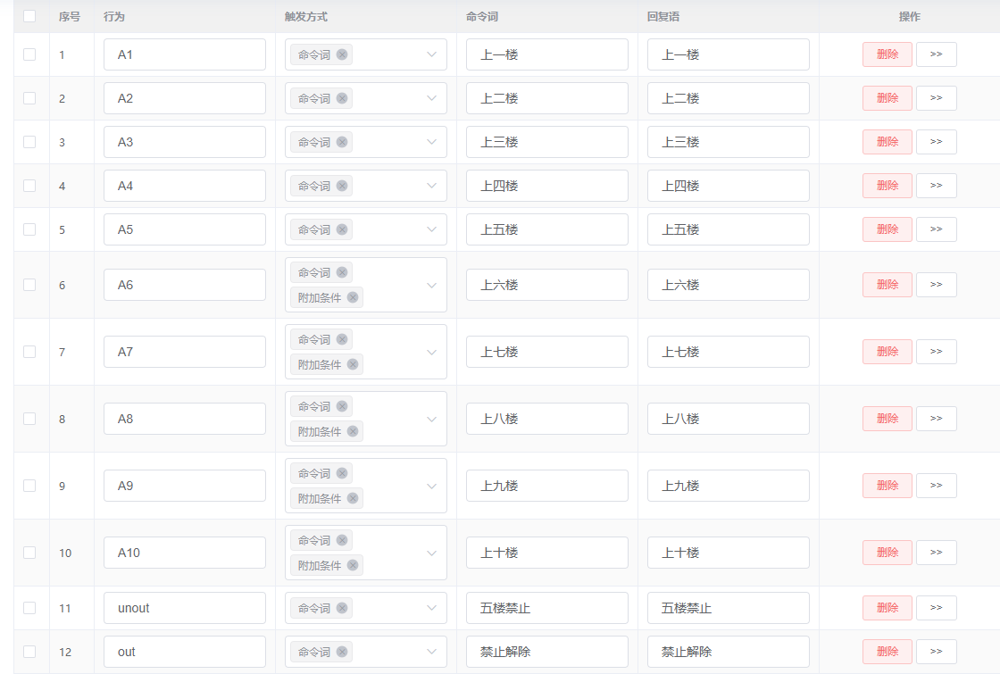

---

### 如何设置命令词的附加条件实现动态控制？

**问题描述：**

需要在命令词配置中设置附加条件（如变量大于某个数值），通过串口变量值来精细控制哪些命令需要识别。

**解决方案：**

**1. 进入控制详情界面**

- 在命令词列表中找到需要设置附加条件的命令
- 点击进入该命令词的"控制详情"界面
- 在左侧触发设置区域添加条件

**2. 配置附加条件**

- 选择"命令词触发"作为触发方式
- 在条件设置中选择变量比较运算：

    - 变量等于某个值
    - 变量大于某个值
    - 变量小于某个值
- 设置比较的目标值

**3. 条件示例**

```
示例1：变量stop等于0时触发
- 条件：变量stop 等于 数值0

示例2：变量out大于1时触发
- 条件：变量out 大于 数值1

示例3：变量out大于2时触发
- 条件：变量out 大于 数值2
```

**4. 工作原理**

- 当附加条件满足时，命令词才能被识别和触发
- 条件不满足时，该命令词不会被识别
- 可以实现基于变量值的动态控制

**注意事项：**

- 附加条件在控制详情界面设置，不在基础信息界面
- 回复语不会因为附加条件而触发，只有语音识别受条件控制
- 可以组合多个条件实现复杂的控制逻辑


---

### 如何设置变量的掉电记忆功能？

**问题描述：**

需要了解变量是否支持掉电记忆，以及如何配置变量在断电重启后恢复到断电前的状态。

**解决方案：**

**1. 变量定义中的掉电记忆设置**

- 在平台的"变量定义"界面创建变量
- 每个变量都有一个"断电重启后是否恢复到断电前状态"的开关
- 开启此功能后，变量值会在断电后保存，重启时自动恢复

**2. 配置示例**

```
变量名：stop
类型：int
默认值：0
备注：设置禁止
断电重启后是否恢复到断电前状态：开启
```

**3. 注意事项**

- 只有开启了掉电记忆功能的变量才会被保存
- 变量值存储在模块的Flash中，占用少量存储空间
- 建议对关键状态变量（如楼层限制、模式选择等）开启此功能

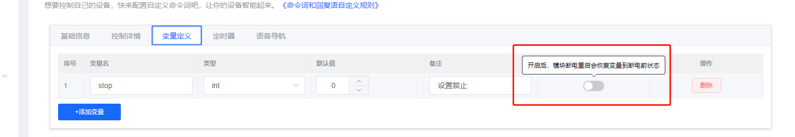

---

### 如何通过串口接收数据并设置变量值？

**问题描述：**

需要通过串口接收外部数据，并将接收到的参数值设置到指定的变量中，实现动态控制。

**解决方案：**

**1. 配置串口输入触发**

- 在触发设置中选择"串口输入"作为触发方式
- 选择接收串口（如UART1_RX）
- 设置消息编号和参数格式

**2. 定义输入参数**

- 设置参数名（如"in"和"out"）
- 选择参数类型（如unsigned无符号整型）
- 设置测试值用于验证配置

**3. 配置控制行为**

- 添加控制行为，选择"变量设置"
- 选择要设置的目标变量
- 操作方式选择"设置"
- 方式选择"参数"，指定使用哪个输入参数

**4. 配置示例**

```
串口配置：

- 触发方式：串口输入
- 串口：UART1_RX
- 消息编号：1
- 输入参数：in(unsigned), out(unsigned)

控制配置：

- 行为：chankou
- 控制方式：变量设置
- 变量：stop
- 操作：设置
- 方式：参数
- 参数：out
```

**5. 数据格式**

测试消息格式：`AA 55 01 00 00 55 AA`
- AA 55：帧头
- 01：消息编号
- 00 00：参数值（可根据需要修改）
- 55 AA：帧尾

**注意事项：**

- 确保串口波特率、数据位等参数配置正确
- 参数名要与触发中定义的参数名一致
- 可以配置多个参数，实现复杂的数据交换

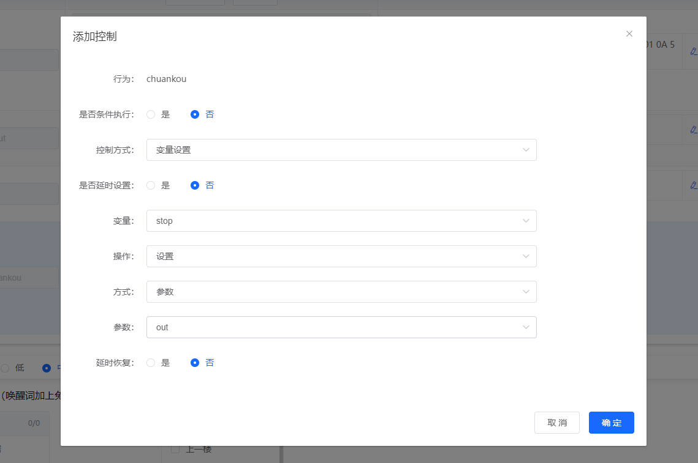

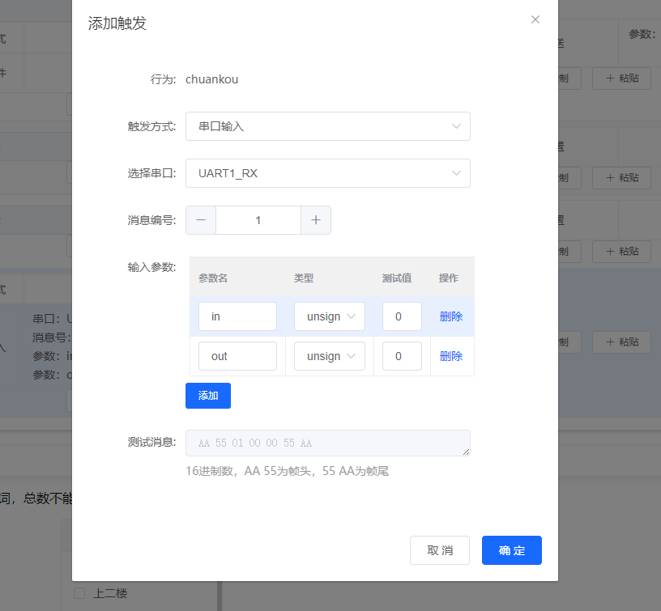

---

### 如何实现串口数据的防误触发机制？

**问题描述：**

需要通过前几个字节作为校验或标识，第四个字节作为可变参数，以避免误触发。

**解决方案：**

**1. 数据包结构设计**

设计包含校验字节的数据包格式：
```
[校验字节1][校验字节2][校验字节3][参数字节]
```
- 前三个字节：固定标识码（如 0xAA 0xBB 0xF1）
- 第四个字节：可变参数（如 0x12）

**2. 平台配置方法**

在智能公元平台配置串口输入：

- 设置触发方式为"串口输入"
- 定义输入参数名称
- 通过消息编号识别不同的数据包类型

**3. 防误触发实现**

- 接收端程序首先检查前三个字节是否匹配预设值
- 只有校验通过时，才处理第四个字节作为参数
- 校验失败的数据包直接丢弃

**4. 数据示例**

```
有效数据：AA BB F1 12
- AA BB F1：校验标识（固定）
- 12：参数值（可变）

无效数据：其他格式
- 会被校验逻辑过滤，不会触发相应操作
```

**注意事项：**

- 确保数据包长度至少为4字节
- 选择不易被误触发的校验值
- 测试时应验证各种错误数据包的过滤效果

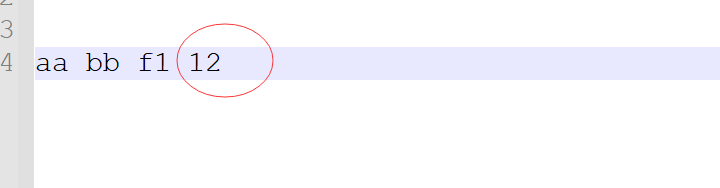

---

### 如何将测试版本修改为发行版？新Pro模型有什么特点？

**问题描述：**

在产品详情页面看到版本标注为"测试版本"，但没有找到修改为"发行版"的设置选项。

**解决方案：**

**1. 测试版与发行版说明**

- 新的Pro语音模型只支持测试版本
- 老版本的发行版不支持新的Pro模型
- 这是平台的设计策略，不是配置问题

**2. Pro模型的优势**

新模型的测试版本实际上优于老版本发行版：

- **稳定性更好**：经过大量测试验证
- **识别质量更高**：使用了更先进的算法
- **功能更丰富**：支持更多特性

**3. 版本选择建议**

- 推荐使用最新的Pro模型测试版
- 同一工作环境下，选择版本号最高的
- 测试版已经过充分验证，可以放心使用

**注意事项：**

- 不需要强制改为发行版
- 新Pro模型的测试版质量优于旧发行版
- 如有特殊要求需要发行版，可选择不带Pro的老模型

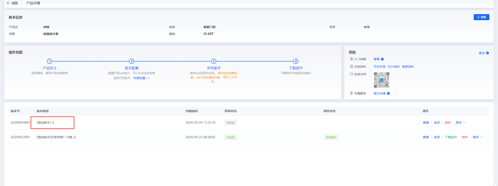

---

### 固件生成失败且提示"语音模型生成失败"怎么办？

**问题描述：**

选择特定语音模型后，生成固件时出现"语音模型生成失败"的错误。

**解决方案：**

**1. 问题排查步骤**

- 检查选择的语音模型是否可用
- 确认同一工作环境下版本号是否最高
- 尝试选择其他可用的模型

**2. 可能的原因**

- 所选模型暂时不可用或正在维护
- 模型文件损坏或版本冲突
- 网络问题导致下载失败

**3. 解决方法**

- 切换到其他可用的Pro模型
- 清除浏览器缓存后重试
- 联系技术支持反馈具体模型编号

**注意事项：**

- 生成失败时，SDK状态会显示"生成失败"
- 记录失败时的模型编号，便于反馈问题
- Pro模型版本更新频繁，可稍后再试


---

### 如何在智能体平台配置CI-03T的自学习功能？

**问题描述：**

需要了解如何在智能体平台（smartpi.cn）上为CI-03T配置自学习功能，包括产品特性选择和生成支持自学习的固件。

**解决方案：**

**1. 产品特性配置**

- 登录智能公元平台（https://smartpi.cn/）
- 选择CI-03T模块进入固件生成界面
- 在"产品特性"下拉菜单中选择带"自学习"的选项
- 例如：选择"语音识别+自学习+AEC打断"

**2. 自学习功能设置**

- 切换到"自学习"选项卡
- 启用"自学习功能"开关
- 配置学习过程中的提示语：

    - 学习成功提示语
    - 学习失败提示语
    - 退出学习提示语
    - 其他相关提示语

**3. 固件生成**

- 完成配置后点击"生成固件"
- 下载生成的固件文件
- 使用专用工具烧录到CI-03T模块

**注意事项：**

- 自学习功能需要特定的固件支持
- 不是所有CI-03T版本都支持自学习
- 建议先使用少量命令词测试功能
- 自学习功能会占用较多的Flash资源

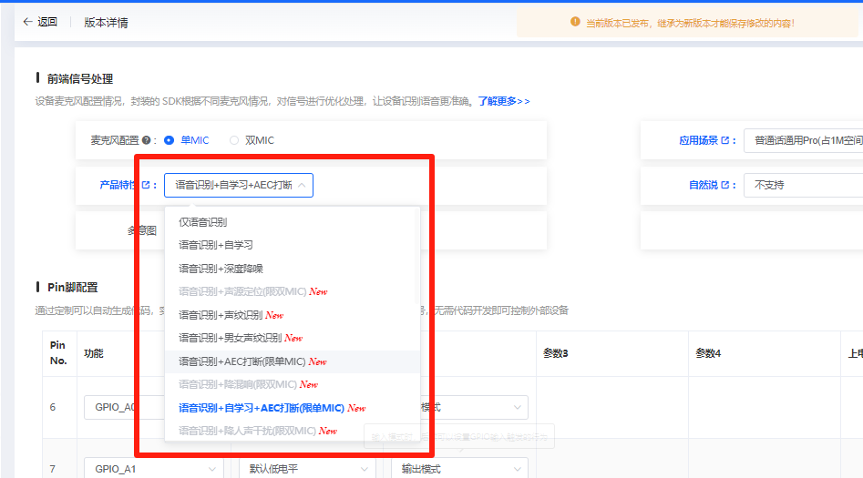

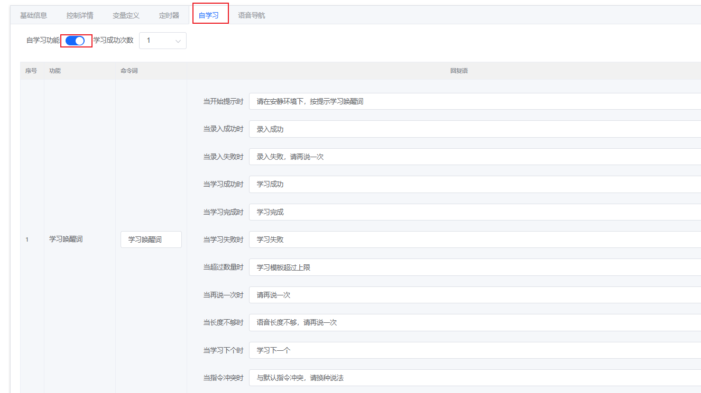

---

### 如何获取CI-03T的最新开发包和固件？

**问题描述：**

需要获取CI-03T模块的最新开发包和固件，确认开发包版本和如何获取出厂固件。

**解决方案：**

**1. 开发包下载**

- 访问智能公元平台的产品资料页面
- 找到CI-03T开发包下载链接
- 最新版本：CI-03T开发包（版本2411201614）.rar
- 旧版本可能存在于文档系统中，但不推荐使用

**下载方式**：

- 通过官方提供的链接直接下载
- 联系技术支持获取最新下载地址
- 确保下载完整无损坏的压缩包

**2. 固件获取**

- 开发包中包含基础固件
- 需要的固件可通过平台生成
- 特殊需求可联系技术支持获取出厂固件
-出厂固件文件名：jx_firm.rar

**3. 固件定制**

- 根据实际需求在平台生成定制固件
- 选择需要的功能特性（如自学习、降噪等）
- 生成的固件专用于特定配置

**注意事项：**

- 固件不需要自行开发，平台可生成
- 使用最新开发包确保功能完整
- 如需特殊功能可联系技术支持

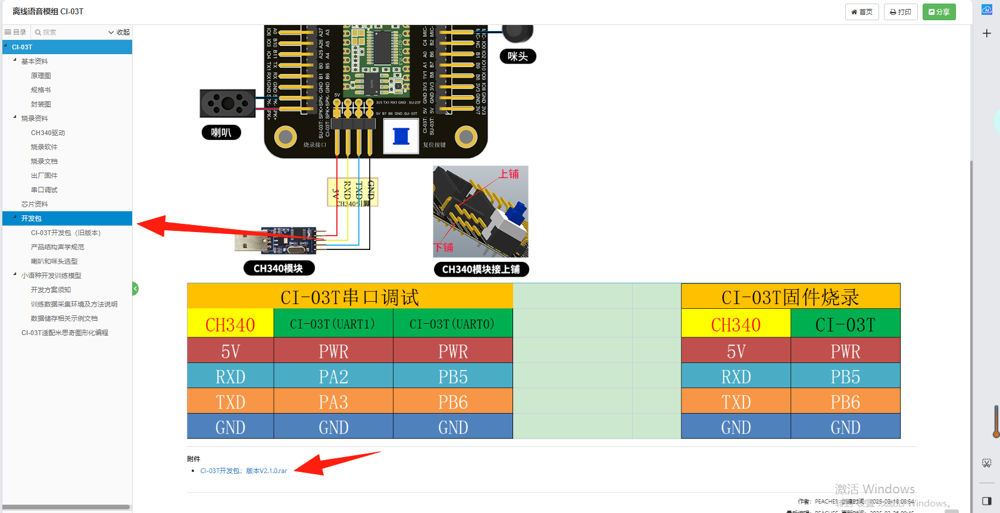

---

### 如何配置CI-03T的语音指令，确保修改后能正常发送和接收数据？

**问题描述：**

需要在智能公元平台配置语音指令，包括命令词、触发方式和回复语的设置，确保修改后能正常发送和接收数据。

**解决方案：**

**1. 配置命令词列表**

在平台的语音指令配置界面，添加所需的命令词：

- 命令词列表：如"开始巡检"、"巡检报告"、"汇报巡检报告"、"开始巡检任务"
- 设置对应的触发方式
- 配置相应的回复语

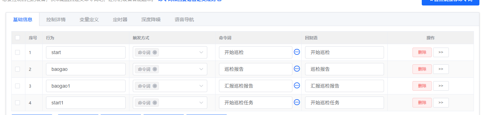

**2. 详细配置每个命令词**

对每个命令词进行详细设置：

- 设置前缀词：如"请帮我!"
- 设置主命令词：如"开始巡检"
- 确保命令词清晰可识别


**3. 验证配置信息**

确认每个命令词的完整配置：

- 检查命令词和回复语是否正确
- 如"开始巡检任务"的命令词和回复语都设置为相同内容
- 确认所有配置项都已保存

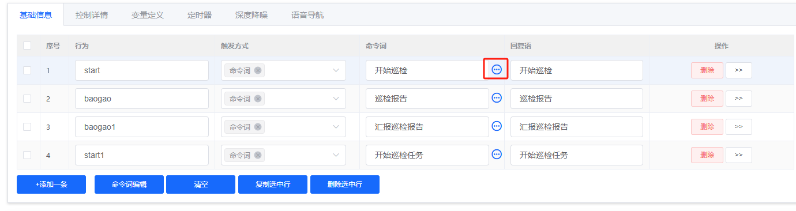

**4. 生成和烧录固件**

配置完成后：

- 在平台生成新的固件文件
- 下载固件到本地
- 使用烧录工具将固件烧录到CI-03T模块

**注意事项：**

- 每次修改配置后都需要重新生成固件
- 确保命令词发音清晰，避免使用生僻字或谐音词
- 测试时建议在安静环境下进行，验证识别效果

### 如何配置事件触发让模块在退出时通过串口发送数据？能否监测麦克风接收的音量？

**问题描述：**

需要配置语音指令系统，使其在特定事件（如退出）发生时通过串口发送指定数据，并希望获取麦克风接收音频的音量信息。

**解决方案：**

**1. 配置事件触发**

在智能公元平台配置事件触发功能：

- 进入指令配置界面，将触发方式设置为"事件触发"
- 选择"自动退出唤醒"作为触发事件
- 设置发送接口为"UART0_TX"
- 设置参数为要发送的十六进制数（如"02"）


**2. 配置退出回复**

在"其它配置"界面设置退出回复：

- 可以设置退出时的语音回复内容
- 如"小龙告辞了"等自定义回复语
- 点击"+点击添加"按钮添加新的退出回复

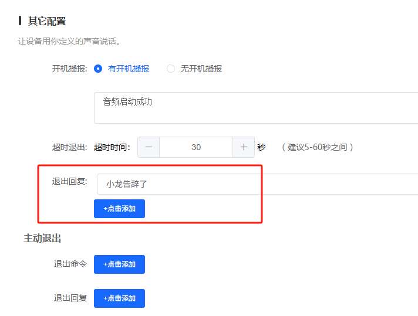

**3. 关于音量监测**

CI-03T模块的功能限制：

- **不支持音量大小检测**：模块无法直接监测麦克风接收到的音频音量大小
- **无法录制音频**：模块不支持将接收到的音频录制下来
- **支持识别灵敏度调节**：可以通过提高识别灵敏度来改善远距离识别效果

**4. 识别距离说明**

在正常环境下的识别距离：

- 安静环境下：最远可达10米
- 普通说话音量：约5米范围
- 有噪音环境：识别距离会相应缩短

**注意事项：**

- 突发噪声环境下，只能通过提高识别灵敏度来改善识别效果
- 模块的识别效果受环境噪音大小和说话音量的共同影响
- 如需监测音量，建议外接其他音频处理设备

### SDK生成失败且提示"可能是配置原因"怎么办？

**问题描述：**

在智能公元平台配置CI-03T模块时，配置检查通过，但SDK生成失败，提示"可能是配置原因，请检查配置"。

**解决方案：**

**问题定位方法：**

1. **查看详细的配置检查结果**：

    - 配置检查通过后，查看具体的检查详情
    - 关注是否有"错误"级别的提示信息
    - 特别是行为控制相关的配置项

    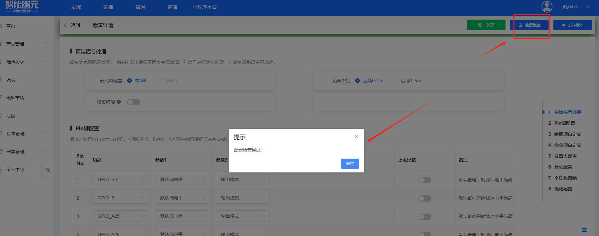

2. **常见错误原因**：

    - **跳转行为不存在**：行为控制详情中设置的跳转行为名称不存在
    - 例如：提示"系统设置的跳转行为[Help]不存在[行为名: play_tutorial]"
    - 配置的命令词或行为与实际不匹配

    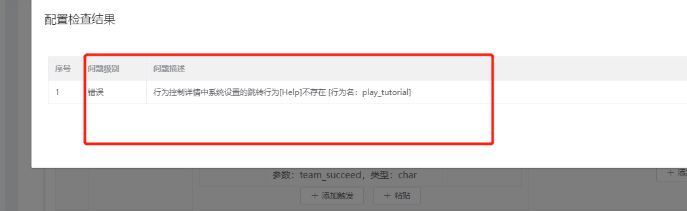

    

**解决步骤：**

1. **导出JSON配置文件**：

    - 在平台找到导出JSON选项
    - 通常在"更多"下拉菜单中
    - 下载并保存当前配置

2. **检查行为控制配置**：

    - 重点检查"行为控制详情"部分
    - 查找所有设置的跳转行为
    - 确认每个行为名称都存在定义

3. **删除无效的跳转行为**：

    - 删除提示不存在的跳转行为配置
    - 例如删除指向[play_tutorial]的跳转
    - 保留有效的、已定义的行为

4. **重新生成SDK**：

    - 保存修改后的配置
    - 再次点击生成SDK
    - 确认生成成功

**预防措施：**

- 配置行为控制时，先定义好所有需要的行为
- 使用平台界面的下拉选择，避免手动输入不存在的行为名
- 定期检查配置的一致性，避免引用未定义的行为

---

### 平台导入JSON文件后无法保存和导出怎么办？

**问题描述：**

在平台导入JSON文件后，虽然检查通过，但无法保存和导出，且之前能正常工作的项目也出现导出失败的问题。

**解决方案：**

**问题原因分析：**

1. **Python生成的JSON文件问题**：

    - 使用Python脚本生成JSON可能存在格式兼容性问题
    - 虽然检查提示通过，但内部数据结构可能不完全符合平台要求
    - 某些字段可能缺少或格式不正确

2. **平台兼容性问题**：

    - 不同版本的JSON格式要求可能略有差异
    - 复杂项目配置可能触发平台的隐藏限制
    - 大量词条配置可能导致处理超时

**解决方法：**

1. **重新创建项目**：

    - 在平台中创建新的空白项目
    - 手动添加少量命令词测试基础功能
    - 确认新建项目可以正常保存和导出

2. **分批导入配置**：

    - 将181个词条分成多个小批量
    - 每次导入50-100个词条
    - 逐步测试并保存，避免单次导入过多数据

3. **手动配置验证**：

    - 使用平台界面手动添加关键命令词
    - 对比JSON文件的数据结构
    - 找出可能导致问题的字段或格式差异

4. **检查JSON格式**：

    ```json
    {
        "wake_word": "唤醒词",
        "commands": [
        {"name": "命令1", "id": 1},
        {"name": "命令2", "id": 2}
        ]
    }
    ```
    - 确认JSON结构符合平台要求
    - 检查是否有特殊字符或编码问题

5. **使用平台标准功能**：

    - 避免使用自动化脚本导入
    - 使用平台的标准配置流程
    - 确保每个步骤都被平台正确识别

**注意事项：**

- JSON导入功能主要用于批量配置，但可能存在兼容性限制
- 大量词条建议分批处理，避免单次操作过多数据
- 如问题持续存在，建议使用平台手动配置确保稳定性
- Python生成的JSON需要严格按照平台文档的格式要求

---

### CI-03T是否支持PWM控制四色灯？能否实现上电后选择中英文语言？

**问题描述：**

需要确认CI-03T模块是否支持：

1. 通过PWM控制四合一灯珠（红外、红光、蓝光、黄光）
2. 实现呼吸、快闪等灯光效果
3. 上电后自由选择中英文语言

**解决方案：**

**PWM控制四色灯：**

CI-03T支持PWM输出控制，可以实现：

- **四色灯珠控制**：

    - 支持包含四种芯片（红外、红光、蓝光、黄光）的合一灯珠
    - 不同PWM信号控制不同颜色
    - 可通过调节PWM占空比控制亮度

- **灯光效果实现**：

    - 呼吸效果：通过PWM渐变实现
    - 快闪/慢闪：调节PWM频率
    - 混色效果：多路PWM组合控制

**语言选择功能：**

- 上电后语言切换需要通过二次开发实现
- 现有标准固件不支持该功能
- 需要根据具体需求定制开发

**开发建议：**

1. **PWM控制实现**：

    - 使用CI-03T的PWM输出引脚
    - 编写控制程序调节占空比和频率
    - 参考官方PWM调光教程

2. **语言切换开发**：

    - 需要在固件层面实现语言选择逻辑
    - 可能需要额外的存储来保存语言设置
    - 建议联系技术支持评估开发可行性

**注意事项：**

- PWM控制需要硬件设计支持相应的驱动电路
- 灯珠的具体型号和规格需确认驱动要求
- 语言切换功能属于定制开发，需要评估开发周期和成本
- 如需实现复杂功能，建议提供详细需求规格进行技术评估

---

### CI-03T模块如何进行开发？是否支持离线开发和自行烧录？

**问题描述：**

需要了解CI-03T模块的开发方式，是否支持离线开发以及能否自行烧录语音词条。

**解决方案：**

CI-03T模块支持在线和离线两种开发方式：

- **在线开发**：在智能公元平台上进行配置开发
- **离线开发**：支持完全离线的开发模式

**自行烧录词条：**

- 支持用户自行烧录语音词条
- 可通过平台工具或离线工具完成词条烧录

**开发文档和资源：**

- 官方文档：https://help.aimachip.com/docs/offline_ci03t
- PWM调光教程视频：https://www.bilibili.com/video/BV1wj411N7Tj

**注意事项：**

- 离线开发需要下载相应的SDK和工具链
- 建议先阅读官方文档了解开发流程
- 视频教程包含PWM调光的实际操作演示

---

### CI-03T的固件开发项目是否可以兼容CI-73T？

**问题描述：**

CI-03T的固件开发项目是否可以兼容并直接迁移到CI-73T，避免重新编写代码？

**解决方案：**

**兼容性分析：**

CI-03T和CI-73T无法直接兼容，主要差异包括：

- **SDK不同**：两个模块使用不同的软件开发套件
- **RAM差异**：内存容量和架构不同
- **硬件架构**：底层硬件设计存在差异

**迁移方案：**

1. **重新开发方案**

    - 需要在CI-73T平台上重新创建项目
    - 复制CI-03T的配置逻辑和功能设置
    - 逐项调整以适配CI-73T的特性

2. **迁移步骤**

    - 在CI-73T平台中创建新项目
    - 参照CI-03T项目配置各项参数
    - 重新测试所有功能
    - 生成并烧录CI-73T专用固件

**注意事项：**

- 无法直接复制粘贴代码或配置
- 建议详细记录CI-03T的配置参数
- 两个模块的功能特性可能有细微差别
- 迁移后需要全面测试验证

---


---

### 打鼾监测功能是否需要授权及费用？

**问题描述：**

打鼾监测功能是否需要授权及费用，以及实现该功能所需的硬件配置（单麦还是双麦）和具体要求。

**解决方案：**

**授权和费用：**

- **当前状态**：已无授权费用要求
- **历史情况**：之前需要授权，现已取消
- **免费使用**：现在可以免费使用打鼾监测功能

**硬件要求：**

1. **模块要求**

    - 必须使用带外部晶振的CI-03T版本
    - 不支持语言识别功能
    - 单麦或双麦均可（带晶振即可）

2. **接口说明**

    - GPIO输出：检测到打鼾时输出100ms低电平脉冲
    - 持续打鼾：间断输出脉冲信号
    - 串口输出：可输出检测结果数据

**使用示例：**

```
打鼾检测 → GPIO输出100ms低电平脉冲
            → 串口输出检测结果
            → 持续打鼾时反复输出
```

**注意事项：**

- 必须购买带晶振的模块版本
- 该功能与语音识别功能互斥
- GPIO_A6引脚说明可能有误，以实际模块为准
- 可使用提供的Demo程序进行测试

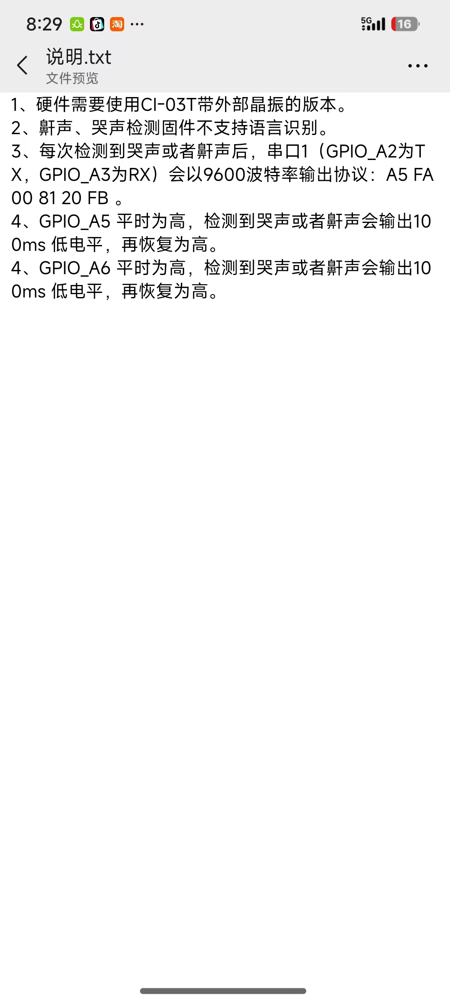

---


---

### 如何配置CI-03T模块的免唤醒模式？

**问题描述：**

需要配置CI-03T模块使其进入免唤醒模式，不需要唤醒词即可直接识别命令。

**解决方案：**

**1. 通过配置平台设置**

- 在"添加控制"界面配置退出唤醒功能
- 设置"禁止超时退出"选项
- 配置后模块将持续保持识别状态

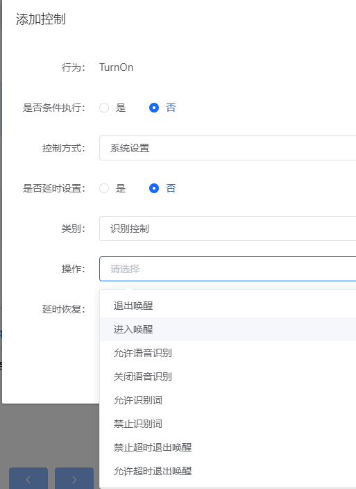

**2. 配置步骤**

- 添加控制行为：选择"退出唤醒"
- 配置识别控制：设置"允许语音识别"
- 禁用超时退出：避免自动进入休眠

**3. 使用说明**

- 配置完成后重新生成并烧录固件
- 模块上电后直接进入识别模式
- 无需说唤醒词即可识别命令

**注意事项：**

- 免唤醒模式功耗会增加
- 适用于需要快速响应的场景
- 如需降低功耗，可重新启用唤醒功能

---


---

### CI-03T能实现语音控制SOS求救信号功能吗？

**问题描述：**

希望在CI-03T芯片上实现语音控制的SOS求救信号功能，但尝试了定时、延时、脉冲等方法均未成功。

**解决方案：**

**功能可行性：**

- CI-03T可以实现语音控制SOS求救信号功能
- 需要根据具体需求设计实现方案
- 模块支持多种输出控制方式

**实现方案建议：**

**1. 使用GPIO输出控制**

- 配置语音指令触发GPIO输出
- 通过GPIO控制外部电路产生SOS信号
- 可控制LED闪烁或蜂鸣器发出求救信号

**2. 利用定时器功能**

- 设置定时器产生周期性信号
- 配置语音指令启动/停止定时器
- 通过定时输出模拟SOS节奏（···---···）

**3. 串口通信控制**

- 通过串口发送控制指令
- 配置语音指令触发串口输出
- 由外部设备接收信号并执行SOS报警

**注意事项：**

- SOS信号的实现需要具体定义输出形式
- 需要外部电路配合实现实际求救功能
- 建议先验证模块基本功能正常

---


---

### 语音模块的喇叭音量可以设置吗？

**问题描述：**

需要了解语音模块的喇叭音量是否可以通过软件进行调节设置。

**解决方案：**

**1. 音量设置方法**

- 在智能公元平台的软件中直接设置音量
- 音量参数通常在0-100范围内可调
- 设置后需要重新生成固件并烧录

**2. 设置位置**

- 登录智能公元平台
- 进入固件配置界面
- 找到音量或音频输出设置选项

**3. 注意事项**

- 音量设置过大会导致失真
- 建议初始设置在30-50之间测试
- 不同喇叭功率对音量效果有影响

---


---

### CI-03T1变量未正确配对导致配置错误怎么办？

**问题描述：**

在使用CI-03T1芯片的离线语音识别模块时，配置变量时发现A26变量未正确配对，导致固件生成失败或功能异常。

**解决方案：**

**1. 检查变量配对状态**

在变量定义界面中检查：

- 确认每个GPIO控制都有对应的变量
- 变量字段不能为空，必须选择已定义的变量
- A26等引脚必须明确关联到变量

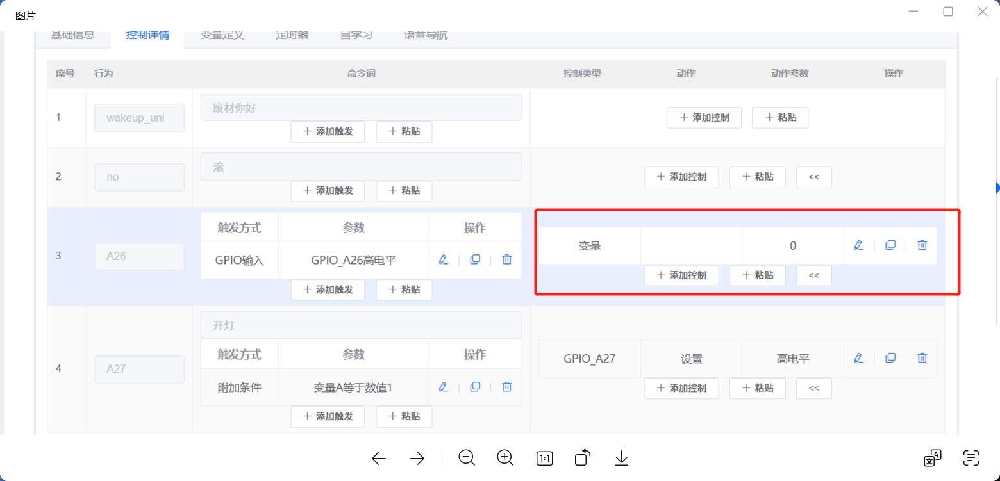

**2. 正确配置步骤**

步骤1：定义所需变量
- 在"变量定义"页面添加变量
- 设置变量名（如A）
- 选择类型（int）
- 设置默认值（如0或1）

步骤2：GPIO控制配置
- 选择需要配置的GPIO引脚（如A26）
- 在"变量"下拉框中选择已定义的变量
- 确保所有引用的变量都已正确配对

步骤3：验证配置
- 使用"配置检查"功能验证
- 检查是否有未配对的变量引用
- 修复所有提示的错误

**3. 固件生成问题**

如果遇到固件生成长时间卡住：

- 可能是变量配置错误导致
- 检查所有配置项的变量引用
- 确保没有循环依赖或逻辑错误

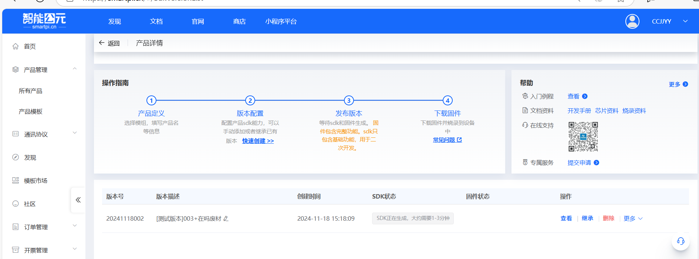

**注意事项：**

- 每个GPIO控制必须关联到具体变量
- 变量名要符合命名规范
- 配置修改后要重新检查
- 固件生成失败首先检查变量配对问题

---


---

### 如何将基于CI1302芯片的工程迁移到CI1303芯片上？

**问题描述：**

需要将现有基于CI1302芯片的工程迁移到CI1303芯片上，但不确定迁移的具体步骤和注意事项。

**解决方案：**

**1. 导出原有工程配置**

- 将CI1302的工程文件导出
- 保存现有的配置信息
- 记录所有功能设置和引脚配置

**2. 重新配置工程**

- 在平台中创建新工程，选择CI1303芯片
- 重新配置各项功能，不建议直接导入
- 需要手动重新设置所有参数

**3. 引脚差异检查**

- 重点检查各引脚的复用功能差异
- CI1302和CI1303的引脚定义可能不同
- 核对每个功能对应的引脚是否兼容

**注意事项：**

- 由于芯片引脚复用功能可能存在差异，建议重新配置而非直接导入
- 迁移后需要全面测试所有功能
- 保留原工程配置作为参考，便于对比调整

---

## 平台服务


---

### 平台是否支持串口消息发送和接收功能？

**问题描述：**

在使用配置平台时，需要实现通过串口发送和接收消息的功能，以进行数据交互或设备控制。

**解决方案：**

平台目前暂不支持串口消息的发送和接收功能。

**功能限制说明：**

- 串口发送消息：平台暂不支持
- 串口接收消息：平台暂不支持
- 适用型号：包括CI-03T1、CI-03T2在内的所有型号

**替代方案：**

- 使用GPIO控制实现简单的数据传输
- 通过PWM或占空比传递有限的信息

**实际开发影响：**

- 需要逐个判断并发送数据的场景无法直接实现
- 增加了开发复杂度，需要手动处理每个数据位
- 对于简单的0/1值判断，也需要分别配置
- 即使只需要处理两个值（0或1），也需要配置两次判断
- 考虑使用二次开发SDK实现定制化需求

**注意事项：**

- 如需串口通信功能，建议等待平台后续版本更新
- 当前版本专注于语音识别和控制功能
- 可以通过多个命令词组合实现有限的数据交互
- 长数据串需要逐个字符判断并单独发送，无法批量处理

## 平台功能问题


---

### CI-03T固件生成失败提示"可能是配置原因"怎么办？

**问题描述：**

使用智能公元平台为CI-03T生成固件时，提示"生成失败，可能是配置原因，请检查配置"。

**解决方案：**

**1. 使用继承功能**

- 在版本详情页面点击"继承为新版本"
- 继承已有配置到新版本
- 在新版本中查看和修改配置

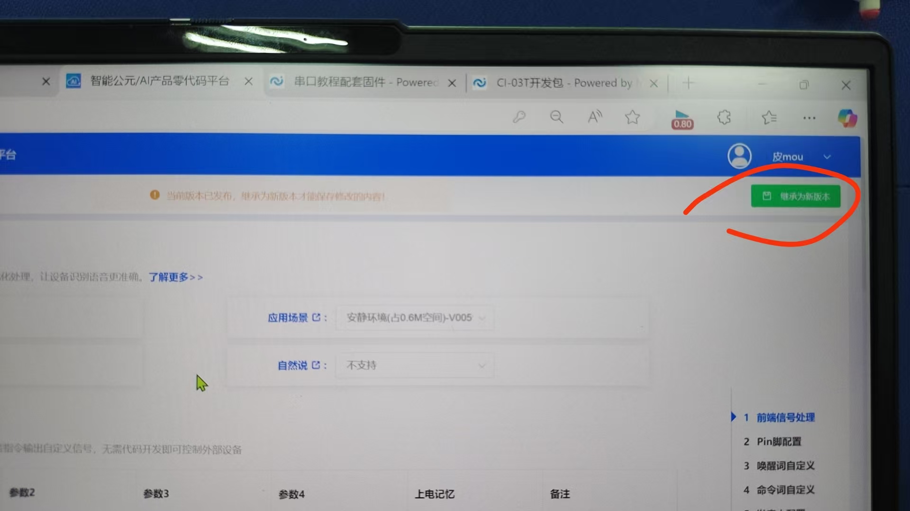

**2. 检查配置**

- 点击"检查配置"按钮
- 仔细查看前端信号处理配置
- 检查Pin脚配置是否正确

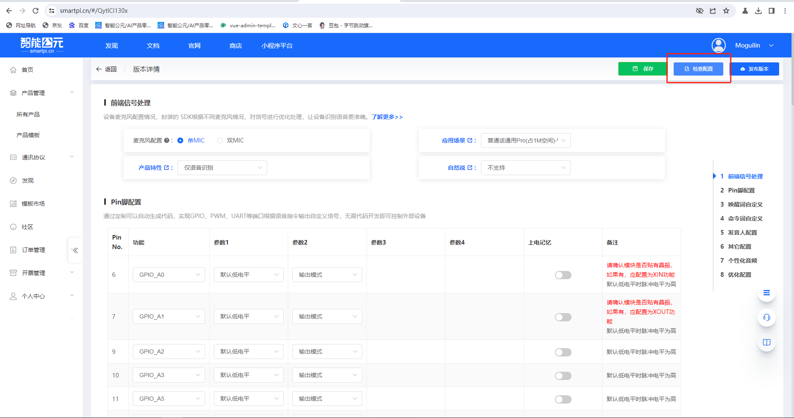

**3. 常见配置问题**

- **Pin脚冲突**：确保没有功能复用同一引脚
- **参数错误**：检查数值是否在有效范围内
- **逻辑冲突**：触发条件可能相互矛盾

**4. 重新生成**

- 修改配置后保存
- 重新点击生成固件
- 等待生成完成通知

**注意事项：**

- 配置复杂时建议分步验证
- 保留正常的配置版本作为备份
- 如果问题持续，联系技术团队

---


---

### CI-03T2固件生成失败怎么办？

**问题描述：**

在智能公元AI产品代码平台为CI-03T2生成固件时，配置检查通过但固件生成失败，重新生成和修改配置后问题依旧存在。

**解决方案：**

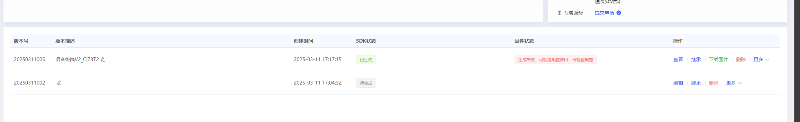

**1. 检查自学习配置**

- 检查自学习功能是否留空未填
- 空白的自学习项会导致生成失败
- 要么填写内容，要么完全删除

**2. 排查配置问题**

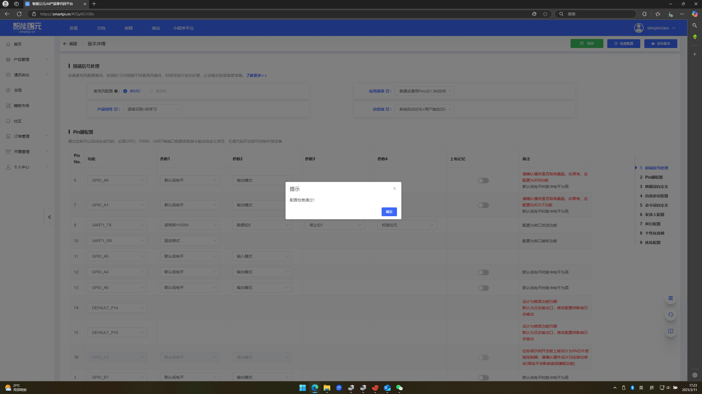

- 即使配置检查通过，仍可能有隐藏问题
- 检查重复词是否过多
- 确认语音包大小是否合适

**3. 常见失败原因**

- **自学习空白项**：必须填写或删除
- **重复词过多**：减少相似命令词
- **语音包过大**：适当缩减音频文件
- **缓存问题**：清理浏览器缓存重试

**4. 解决方案**

- 删除所有自学习空白项
- 使用指定泛化替代全泛化
- 降低语音包大小和复杂度
- 联系技术团队协助排查

**注意事项：**

- 自学习功能不留空也不留未填写的项
- 生成失败通常是配置细节问题
- 平台提示仅供参考，需人工仔细排查
- 如问题持续，提供具体配置给技术团队

---


---

### 如何配置模块上电即唤醒且不使用唤醒词？

**问题描述：**

需要配置CI-03T系列芯片实现上电即唤醒功能，避免每次都需要说唤醒词，同时满足系统语法要求。

**解决方案：**

**1. 设置必要唤醒词**

- 唤醒词不能为空，这是系统语法要求
- 可以设置一个简单但不使用的唤醒词（如"你好"）
- 实际使用时依靠事件触发实现免唤醒

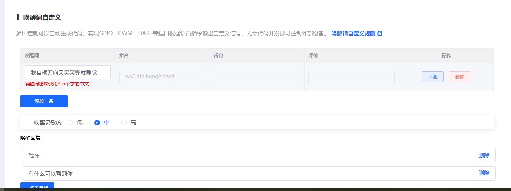

**2. 配置事件触发**

- 添加新行为，选择"事件触发"
- 事件类型：系统启动
- 触发类型：上电启动

**3. 设置保持唤醒**

- 控制方式：系统设置
- 类别：识别控制
- 操作：进入唤醒 + 禁止超时退出唤醒

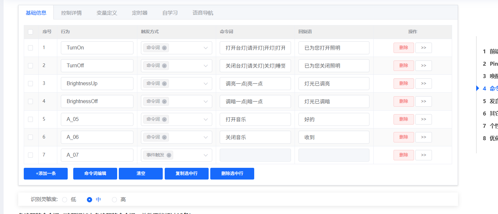
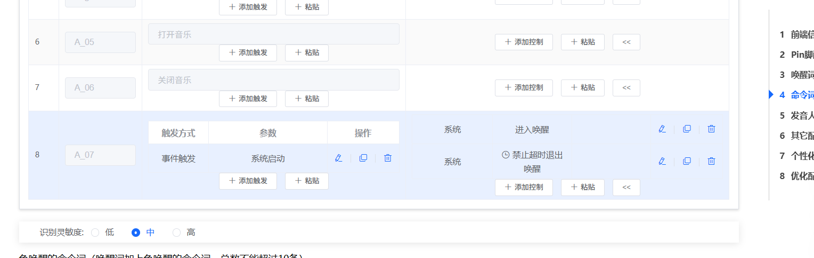

**4. 配置延时参数**

- 根据需要设置延时时间
- 确保系统稳定启动

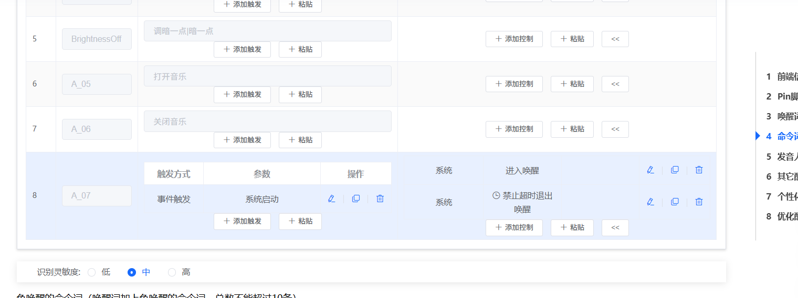
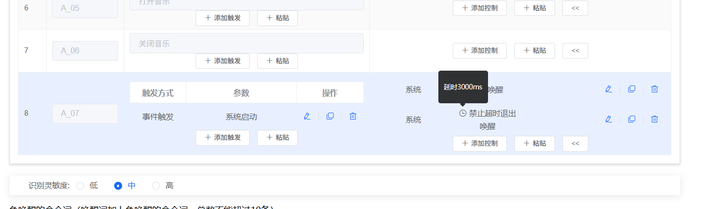

**注意事项：**

- 唤醒词必须设置，但可以不使用
- "禁止超时退出唤醒"确保模块持续唤醒
- 上电触发配置一条即可实现功能
- 延时参数可根据系统启动时间调整

---


---

### 如何查看CI-03T系列生成的代码？

**问题描述：**

需要查看在智能公元平台上为CI-03T系列生成的代码。

**解决方案：**

**1. 生成SDK**

- 在配置平台完成语音指令设置
- 点击"生成SDK"按钮
- 下载生成的SDK文件包

**2. 获取代码文件**

- SDK文件包包含完整源代码
- 解压后查看src或source目录
- 代码包含语音识别和处理逻辑

**3. 使用烧录工具**

- 使用模块自带的烧录工具
- 选择生成的.bin固件文件
- 按照标准烧录流程操作

**4. 烧录要点**

- 使用USB转TTL模块（如CH340）
- 按照接线图正确连接
- 烧录时重新上电一次

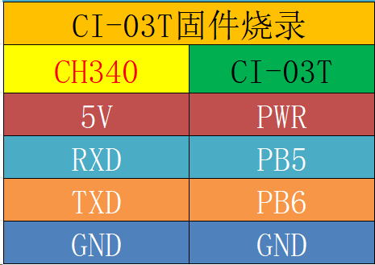

**注意事项：**

- SDK主要用于二次开发
- 如只需烧录固件，直接使用.bin文件
- 烧录前确认固件版本匹配
- 保留代码备份便于后续修改


---

### CI-03T模块串口通信是否支持发送中文信息？

**问题描述：**

需要确认CI-03T模块的串口是否支持直接发送中文字符串信息。

**解决方案：**

- **数据格式限制**：

    - 串口消息的格式是十六进制数
    - 不支持直接发送字符串（包括中文）
    - 需要将文字转换为十六进制格式发送

- **中文处理方式**：

    - 将中文转换为对应的十六进制编码（如GBK或UTF-8）
    - 接收端需要相应解码才能显示中文
    - 建议使用ASCII码表进行转换对照

**注意事项：**

- 平台目前只支持发送十六进制数据格式
- 如需传输中文信息，需要双方约定编码方式
- 考虑使用专门的串口调试工具进行数据转换测试

---

### 如何保存已发布版本的配置修改？

**问题描述：**

在配置CI-03T1芯片的优化配置（PWM最大占空比）时，系统提示"当前版本已发布，继承为新版本才能保存修改的内容！"，无法保存配置更改。

**解决方案：**

**1. 版本管理机制**

平台采用版本控制机制：

- 已发布版本为只读状态，防止意外修改
- 需要创建新版本才能进行配置更改
- 确保已发布产品的固件稳定性

**2. 操作步骤**

1. **继承为新版本**
    - 在版本详情页面找到"继承"或"新建版本"按钮
    - 基于当前版本创建新版本
    - 新版本将继承所有配置项

2. **修改配置**
    - 在新版本中修改PWM最大占空比值
    - 调整其他需要的优化配置
    - 保存修改（新版本可编辑）

3. **发布新版本**
    - 完成所有配置后发布新版本
    - 生成新的SDK和固件
    - 更新产品使用的固件版本

**注意事项：**

- 版本继承后，原版本保持不变
- 建议记录版本变更内容
- 确认新版本测试完成后再正式发布


---

### 语音模块能否传输麦克风音频到PC/ESP32进行处理？

**问题描述：**

希望将语音模块麦克风采集的音频信号传输到PC端或ESP32进行处理，通过AI API将语音转换为文本并生成回答，再通过语音模块的扬声器输出结果，实现智能语音交互系统。

**解决方案：**

**功能限制说明：**

该离线语音识别模块（CI-03T1/CI-03T2）无法实现上述智能语音功能，主要原因如下：

**1. 模块功能定位**

- **语音识别功能**：只能识别预定义的语音指令
- **无法输出音频流**：不支持将麦克风原始音频数据输出
- **无TTS功能**：不能将文本实时转换为语音
- **播放限制**：只能播放预先存储在Flash中的语音

**2. 通信方式限制**

- **仅支持串口通信**：通过串口发送控制指令
- **无WiFi功能**：无法直接连接网络进行数据传输
- **协议简单**：只能传输预定义的指令信号

**3. 技术架构限制**

- **离线处理**：所有语音处理在本地完成
- **无云端接口**：无法调用外部AI服务
- **存储限制**：Flash容量有限，无法存储大量音频

**替代实现方案：**

如需实现完整的智能语音交互功能，建议采用以下架构：

**1. 硬件方案**
```
麦克风 → ESP32/单片机 → WiFi模块 → AI服务器 → TTS服务 → 扬声器
```

- **主控芯片**：使用ESP32或单片机
- **音频采集**：连接I2S或PDM麦克风
- **网络连接**：ESP32内置WiFi或外接WiFi模块
- **音频输出**：使用I2S或PWM驱动扬声器

**2. 软件架构**
```
音频采集 → 语音识别 → AI处理 → 文本生成 → TTS转换 → 音频播放
```

- **语音识别**：调用语音识别API（如科大讯飞、百度等）
- **AI对话**：调用大语言模型API（如DeepSeek、ChatGPT等）
- **TTS合成**：调用文本转语音API
- **音频播放**：通过ESP32的DAC或I2S输出

**3. 实现步骤**

- **步骤1**：搭建硬件平台
    - 准备ESP32开发板
    - 连接麦克风和扬声器
    - 烧录基础固件

- **步骤2**：开发软件功能
    - 实现音频采集和编码
    - 集成WiFi通信功能
    - 开发API调用逻辑

- **步骤3**：集成云服务
    - 申请各服务的API密钥
    - 实现协议适配
    - 处理网络延迟和错误

**注意事项：**

- 该语音模块无法通过升级或修改实现智能语音功能
- 如坚持使用现有模块，只能实现预存回答的简单问答
- 完整的智能语音系统需要重新设计硬件架构
- 开发难度较高，建议评估项目需求和时间成本

---


---

### 稳态降噪功能配置后为什么还是关闭状态？

**问题描述：**

在智能公元官网配置CI-03T1芯片的稳态降噪功能时，即使开启并保存了设置，下载的固件中该功能仍处于关闭状态。

**解决方案：**

- **应用场景确认**：

    - 稳态降噪主要用于消除环境中的持续性噪音（如风扇、空调声）
    - 桌宠等近场应用场景通常不需要开启稳态降噪
    - 某些固件版本可能不支持该功能

- **配置检查**：

    1. 确认在"前端信号处理"配置页面中开启了稳态降噪
    2. 保存配置后重新生成完整固件
    3. 下载最新生成的固件进行烧录

**注意事项：**

- 桌宠应用由于使用距离近，环境噪声相对较小，建议关闭稳态降噪以提高响应速度
- 如确实需要稳态降噪功能，请联系技术团队确认当前型号是否支持
- 配置更改后必须重新生成并下载固件才能生效

---


---

### 平台上的变量功能如何使用？

**问题描述：**

需要了解智能公元平台上变量功能的使用方法，以及如何通过变量实现复杂的控制逻辑。

**解决方案：**

**变量功能概述：**

变量在平台中主要作为标志位和数据存储使用，可以实现行为跳转和数据传递功能。

**变量操作类型：**

1. **基本操作**
    - 设置：给变量赋值
    - 增加：变量值递增
    - 减少：变量值递减
    - 乘法/除法：数值运算
    - 求余：取模运算

2. **逻辑操作**
    - 与（AND）：逻辑与运算
    - 或（OR）：逻辑或运算
    - 异或（XOR）：逻辑异或运算
    - 取位：位操作

**使用场景示例：**

1. **舵机角度控制**
    - 定义变量存储舵机目标角度
    - 语音指令触发变量赋值
    - 通过变量值控制舵机动作

2. **状态标志**
    - 设置flag变量作为系统状态标志
    - 根据变量值执行不同动作
    - 实现复杂的状态机逻辑

3. **计数功能**
    - 使用变量记录触发次数
    - 达到设定值后执行特定动作

4. **语音控制下棋应用**
    - 使用变量存储棋盘坐标（如x_pos, y_pos）
    - 语音指令设置坐标变量值
    - 通过变量判断执行对应舵机动作
    - 实现精准的位置控制

**配置步骤：**

1. 在行为配置中选择"控制方式"为"变量设置"
2. 选择需要操作类型（设置、增加、减少等）
3. 输入变量名和对应的值
4. 设置执行条件（如变量等于某值时执行动作）


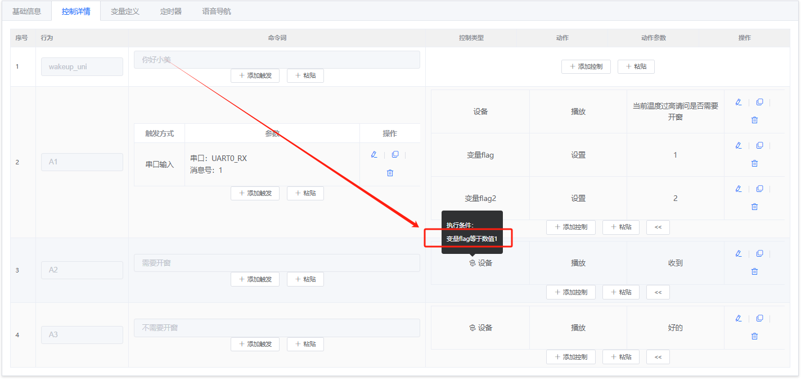

**教程资源：**

- B站教学视频：https://space.bilibili.com/1903518159
- 推荐视频：《CI-03T串口播报温湿度教程》包含变量操作示例

**注意事项：**

- 变量名需要清晰明确，避免混淆
- 变量初始值要设置合理
- 复杂逻辑建议使用多个变量协同工作

---


---

### 如何实现模块触发后顺序或随机播放语音？

**问题描述：**

需要使用电平触发模块，每次触发播放一首语音，下次触发播放下一首，所有语音播完后循环重新开始，且每次只播放一首不重复。

**解决方案：**

**1. 功能需求分析**

- **播放模式**：

    - 顺序播放：按1-9顺序播放，播完第9首后从第1首重新开始
    - 随机播放：每次触发随机选择一首未播放过的音频
    - 每次触发仅播放一首，不连续播放

- **硬件要求**：

    - 支持电平触发（按钮触发）
    - 能存储多个音频文件
    - 支持播放状态管理

**2. 实现方案**

- **顺序播放实现**：

    - 使用变量记录当前播放序号
    - 每次触发后序号加1
    - 播放完后更新序号变量
    - 序号达到最大值后重置为1

- **随机播放实现**：

    - 生成随机数作为音频索引
    - 使用变量标记已播放的音频
    - 避免重复播放同一音频
    - 所有音频播完后重置标记

**3. 模块选择**

- **CI-03T**：

    - 支持300条词条
    - 适合音频数量较少的应用

- **CI-33T**：

    - 支持500条词条
    - 内存更大，适合更多音频
    - 推荐用于9个以上音频文件

**4. 配置要点**

- **音频文件管理**：

    - 单个音频不超过500KB
    - 预先上传所有需要的音频
    - 按顺序编号便于管理

- **触发设置**：

    - 配置为电平触发模式
    - 设置"不打断播报"为"否"
    - 确保每次触发只播放一首

**注意事项：**

- 纯硬件方案需要额外电路支持
- 不编程的情况下建议选择带随机功能的模块
- 需要网络连接才能使用平台配置功能
- 复杂播放逻辑可能需要定制固件实现

---


---

### 是否支持多个命令词触发同一个行为？

**问题描述：**

希望使用不同的语音指令触发同一个功能或行为，实现更灵活的语音控制。

**解决方案：**

**1. 平台配置方法**

- 在智能公元平台添加多个命令词
- 将这些命令词配置相同的输出动作
- 例如：配置"开灯"、"打开灯"、"点亮"都触发GPIO高电平输出

**2. 实现方式**

- **命令词配置**：

    - 在平台中添加所需的多个命令词
    - 每个命令词设置相同的识别ID或动作
    - 生成固件时所有配置会一并打包

- **输出处理**：

    - 单片机或控制器接收到相同ID
    - 执行统一的处理逻辑
    - 无需区分具体是哪个命令词触发

**3. 应用场景示例**

- **灯光控制**：

    - "开灯"、"打开灯"、"灯亮" → 控制继电器吸合
    - "关灯"、"关闭灯"、"灯灭" → 控制继电器断开

- **家电控制**：

    - "打开空调"、"开空调" → 发送红外空调开机码
    - "提高温度"、"升温" → 调高空调温度设定

**注意事项：**

- 命令词总数受模块限制（如CI-03T支持300条）
- 每个命令词都需要占用词条资源
- 建议合理规划常用命令词组合
- 测试时确保每个命令词都能正确识别

---


---

### 如何通过GPIO输入触发语音识别回复？

**问题描述：**

需要通过设置GPIO引脚（如GPIO_B7）为低电平来触发CI-03T1/CI-03T2芯片执行语音识别回复功能，类似于语音识别触发的响应机制。

**解决方案：**

- **配置GPIO触发**：

    - 在固件配置工具中，将GPIO_B7设置为输入模式
    - 设置触发类型为"GPIO输入"
    - 配置触发动作：当检测到低电平时执行回复

- **配置回复内容**：

    - 在命令词配置中添加新的条目
    - 触发方式选择GPIO输入
    - 设置需要回复的语音内容或控制动作

---


---

### 如何实现语音控制继电器自动关闭功能？

**问题描述：**

使用语音控制继电器时，希望实现开启5秒后自动关闭的功能。

**解决方案：**

**实现方法**：

- 在控制继电器的代码中添加延时功能
- 使用 `delay()` 函数实现定时关闭

**代码示例**（基于Arduino类开发环境）：
```c
void voiceControlRelay() {
    if (receivedCommand == "开") {
        digitalWrite(relayPin, HIGH); // 开启继电器
        delay(5000); // 延时5000毫秒（5秒）
        digitalWrite(relayPin, LOW); // 关闭继电器
    }
}
```

**注意事项**：

- `delay()` 函数是阻塞式的，延时期间会暂停执行其他任务
- 如果需要同时执行其他操作，应使用 `millis()` 实现非阻塞定时
- 确保继电器控制引脚配置正确
- 该方案适用于CI-03T1、CI-03T2等语音识别芯片

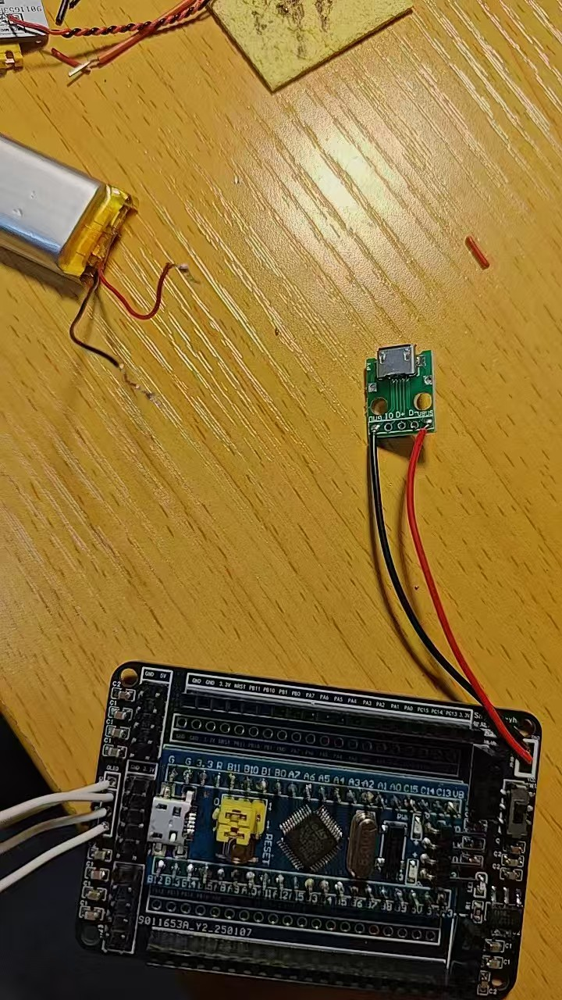

*充电模块与主控板的连接方式*


*GPIO_B7配置为输入模式*

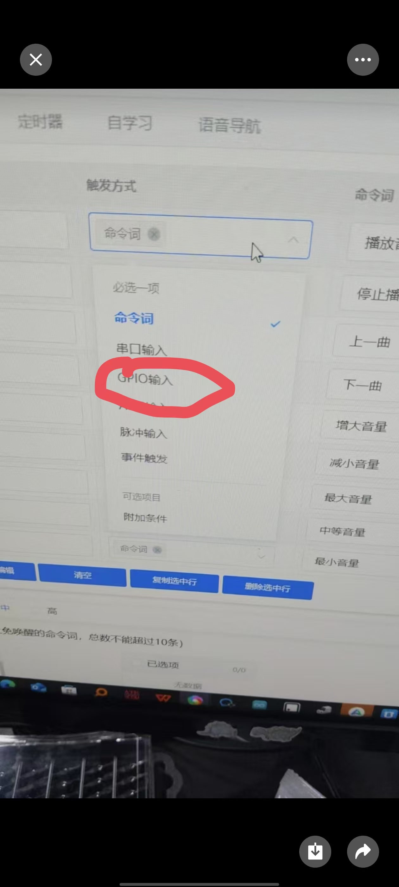

*在触发方式中选择GPIO输入*

**注意事项：**

- GPIO输入默认高电平，低电平触发
- 确保GPIO引脚电平稳定，避免误触发
- 可以配置为播放固定语音或执行预设动作
- 触发条件在配置界面中正确设置

---


---

### CI系列模块固件生成速度提升到2分钟了吗？

**问题描述：**

发现CI系列模块固件生成速度大幅提升，仅需2分钟即可完成，而SU系列生成速度仍然较慢，想确认是否属实。

**解决方案：**

**1. 速度对比**

- **CI系列模块**：

    - 固件生成时间：约2分钟
    - 优化后的服务器显著提升生成效率
    - 推荐优先使用CI系列进行开发

- **SU系列模块**：

    - 固件生成时间：仍然较慢
    - 正在进行优化，请耐心等待
    - 可以考虑更换为CI系列

**2. 服务器负载影响**

- **速度变化原因**：

    - 服务器负载在不同时段有显著差异
    - 非高峰时段（如早晨）生成速度更快
    - 系统优化后整体生成效率有所提升

- **实际体验**：

    - CI系列：2分钟左右可完成生成
    - SU系列：速度仍较慢，建议等待优化

**3. 选择建议**

- **新项目开发**：

    - 优先选择CI-03T或CI-73T
    - 享受更快的开发迭代速度
    - 成本更低且性能更佳

- **现有项目迁移**：

    - 可以将配置从SU迁移到CI
    - 大部分功能可以直接迁移
    - CI系列功能更全面

**4. 设备更换考虑**

- **是否需要更换设备**：

    - 如果急需快速生成，建议更换为CI系列
    - 如果不紧急，可等待SU系列优化完成
    - 两个系列的引脚和功能基本兼容

**注意事项：**

- CI和SU系列使用不同的平台
- 配置方法略有差异，需要适应
- 建议先使用CI系列进行测试验证
- 如项目紧急，可考虑使用CI系列加快进度

---


---

### CI-03T1和CI-03T2支持语音转文字功能吗？

**问题描述：**

咨询如何在CI-03T1和CI-03T2离线语音识别芯片上设置语音转文字功能。

**解决方案：**

- **功能不支持**：CI-03T1和CI-03T2是纯离线语音识别芯片，不支持语音转文字功能
- **功能定位**：这些芯片专注于离线命令词识别，无法提取语音文字内容

**注意事项：**

- 离线语音芯片仅支持预设命令词的识别
- 如需语音转文字功能，应选择支持在线AI的模块（如JX-A7T系列）
- 选型时根据具体功能需求选择合适的产品系列

---


---

### CI-03T1串口变量通信与音量控制

**问题描述：**

需要通过串口通信实现MCU主动控制语音模块音量，同时解决GPIO输入触发失败的问题。

**解决方案：**

- **串口变量接收配置**：

    - 配置串口输入触发，设置消息号
    - 参数类型选择 unsigned char
    - 将接收到的变量赋值给内部变量（如num）

- **变量到音量控制**：

    - 在系统设置中配置播放控制
    - 音量设置使用变量num的值
    - 实现MCU→语音模块的音量控制

- **变量调试方法**：

    - 使用语音播报功能输出变量值
    - 验证MCU是否正确发送数据
    - 确认变量值是否按预期更新

**注意事项：**

- MCU发送数据格式需与配置匹配（十六进制）
- 变量更新后可能需要重新触发播放
- GPIO触发失败需单独检查引脚配置和触发条件

---


---

### 如何在智能公元平台上为CI1303模块创建产品？

**问题描述：**

拥有CI1303模块，需要在智能公元平台上创建产品以配置语音功能。

**解决方案：**

**1. 平台访问与登录**

- **访问平台**：

    - 打开浏览器访问 https://www.smartpi.cn
    - 注册账号或登录现有账号
    - 进入产品管理界面

- **选择模块**：

    - 在模块列表中找到CI1303
    - 或通过搜索功能查找
    - 确认型号与硬件匹配

**2. 创建产品流程**

- **基础信息**：

    - 点击"创建新产品"按钮
    - 填写产品名称和描述
    - 选择应用场景（智能音箱、家电控制等）
    - 设置产品参数

- **语音配置**：

    - 设置唤醒词（如"你好小智"）
    - 添加命令词（如"打开灯光"）
    - 录制或上传回复语音
    - 配置GPIO输出控制

**3. 功能定制**

- **指令设置**：

    - 为每个命令配置对应动作
    - 可设置GPIO高低电平输出
    - 支持PWM输出控制
    - 可设置串口输出协议

- **高级功能**：

    - AEC回声消除（如支持）
    - 噪声抑制级别调整
    - 识别灵敏度优化
    - 多轮对话设置

**4. 固件生成与下载**

- **生成固件**：

    - 完成配置后点击"生成固件"
    - 等待系统处理（通常3分钟）
    - 生成完成后显示下载链接

- **下载保存**：

    - 下载生成的.bin固件文件
    - 保存到本地文件夹
    - 建议备份多个版本

**注意事项：**

- 确保选择的模块型号与硬件完全一致
- 配置复杂度会影响生成时间
- 测试固件前备份原固件
- 平台提供详细的使用教程和示例

---


---

### 如何获取CI-03T开发资料？

**问题描述：**

需要获取CI-03T系列离线语音识别芯片的开发资料，特别是开发环境搭建和固件制作的指导文档。

**解决方案：**

**1. 官方渠道获取**

- **智能公元平台**：

    - 登录智能公元官方平台
    - 在文档或下载区查找开发包
    - 联系技术团队获取最新资料

- **开发包内容**：

    - CI-03T图形化开发环境
    - 固件制作工具和教程
    - 示例代码和配置文件
    - API文档和硬件规格书

**2. 开发环境搭建**

- **环境要求**：

    - Windows系统（推荐Win10/11）
    - 安装必要的运行库和驱动
    - 确保网络连接正常

- **安装步骤**：

    1. 下载并解压开发包
    2. 运行环境搭建程序
    3. 配置开发工具路径
    4. 导入或创建新工程

**3. 固件开发流程**

- **创建工程**：

    - 选择对应的模块型号（CI-03T/CI-03T1/CI-03T2）
    - 配置语音指令和回复语
    - 设置控制逻辑和输出

- **生成固件**：

    - 点击生成按钮编译固件
    - 等待云端处理完成
    - 下载生成的.bin文件

- **烧录测试**：

    - 使用专用烧录工具
    - 按照标准烧录流程操作
    - 验证功能是否正常

**注意事项：**

- 开发资料通常包含在产品购买时附带的U盘或下载链接中
- 确保下载与硬件型号匹配的开发包
- 部分高级功能可能需要额外授权或付费
- 遇到开发问题可查看帮助文档或联系技术团队

---


---

### CI-03T1/CI-03T2可以烧录音乐吗？

**问题描述：**

询问是否可以将音乐文件烧录到CI-03T1或CI-03T2语音模块中，以及存储空间是否足够。

**解决方案：**

- **支持音乐文件**：

    - CI-03T系列支持烧录音乐文件
    - 可用于播放提示音或背景音乐

- **存储限制**：

    - 单个音乐文件需小于500KB
    - 超过500KB的文件需要进行压缩
    - 压缩后仍需满足大小要求

- **文件格式建议**：

    - 使用常见音频格式（如WAV、MP3）
    - 推荐采样率16kHz-22kHz
    - 单声道格式即可满足语音播放需求

**注意事项：**

- 音乐文件大小直接影响固件整体大小
- 过大的音频文件会影响模块响应速度
- 建议使用音频编辑软件优化文件大小


---

### ESP8266鸿蒙开发板与CI-03T芯片是否可以实现对产品的远程控制？

**问题描述：**

希望了解使用ESP8266鸿蒙开发板配合CI-03T芯片，是否可以实现对产品的远程控制功能。

**解决方案：**

可以实现对产品的远程控制。ESP8266鸿蒙开发板与CI-03T芯片配合使用时：

- ESP8266负责网络通信和远程控制功能
- CI-03T负责语音识别和处理
- 两者通过串口进行通信，实现语音控制与远程控制的结合

**注意事项：**

- 需要正确设计ESP8266与CI-03T之间的通信协议
- 确保供电稳定，避免模块间相互干扰
- 建议先测试基础功能，再逐步集成远程控制功能

---


---

### 智慧公元平台配置如何烧录到模块？

**问题描述：**

在智慧公元平台设置语音命令词后，需要将配置烧录到CI-03T1或CI-03T2模块中。

**解决方案：**

- **配置导出**：

    1. 在平台完成语音命令和功能配置
    2. 点击导出或生成固件按钮
    3. 保存为.json或.hex文件到本地

- **烧录准备**：

    - 确认模块型号与配置匹配
    - 连接好烧录工具和模块
    - 安装对应的驱动程序

- **烧录步骤**：

    1. 打开专用烧录工具
    2. 选择正确的COM端口
    3. 加载导出的固件文件
    4. 点击烧录开始传输
    5. 等待烧录完成提示

- **验证测试**：

    - 烧录完成后重新上电模块
    - 测试语音识别功能
    - 验证各控制行为是否正常

**注意事项：**

- 配置与模块型号必须匹配
- 烧录过程中不要断开连接
- 建议参考官方教学视频操作

---


---

### 如何设置定时器实现GPIO延时自动断开？

**问题描述：**

需要在CI-03T1或CI-03T2芯片上设置定时器，使GPIO在语音触发后延时5秒或10秒自动断开（变低电平）。

**解决方案：**

**1. 定时器配置步骤**

- 在智能公元平台进入定时器控制配置界面
- 创建新的定时器（如Timer_1）
- 设置超时时间：5000ms（5秒）或10000ms（10秒）
- 选择工作模式：单次超时

**2. GPIO控制配置**

- 设置语音指令触发时GPIO输出高电平
- 同时启动定时器开始计时
- 配置定时器超时事件触发GPIO输出低电平

**3. 具体实现方案**

- **语音触发动作**：

    - 操作：GPIO输出
    - 引脚：选择GPIO_A0等可用引脚
    - 电平：高电平（开启设备）
    - 附加操作：启动定时器Timer_1

- **定时器超时动作**：

    - 触发方式：事件触发
    - 事件类型：定时器超时
    - 操作：GPIO输出
    - 引脚：同一引脚（如GPIO_A0）
    - 电平：低电平（关闭设备）


**4. 测试验证**

- 上电测试语音唤醒功能
- 触发语音指令后观察GPIO状态
- 使用万用表测量延时是否准确
- 验证5秒和10秒两种延时设置

**注意事项：**

- 定时器资源有限，避免同时使用多个定时器
- 延时精度可能存在±50ms误差
- 如需更精确延时，建议使用外部硬件定时器
- 定时器超时后会自动停止，需要重新触发才能再次启动

---

---


---

### CI-03T系列模组是否支持识别文字串口输出？

**问题描述：**

需要了解CI-03T系列模组是否能将识别到的语音内容转换为文字并通过串口输出。

**解决方案：**

- **当前状态**：CI-03T系列暂不支持识别文字串口输出功能
- **开发计划**：该功能已在测试中，未来版本可能支持
- **替代方案**：可通过命令词识别实现类似的控制逻辑

**注意事项：**

- 如需识别文字输出功能，可考虑其他支持该功能的型号
- 关注官方发布的新固件版本说明
- 可通过技术团队了解功能开发进度

---


---

### CI-03T和CI-33T是否支持TTS功能？

**问题描述：**

需要确认CI-03T和CI-33T模组是否支持文字转语音（TTS）功能。

**解决方案：**

- **CI-33T**：支持TTS功能
    - 可直接发送文本进行语音合成播放
    - 支持中英文TTS
    - 适用于动态播报场景

- **CI-03T**：现已支持TTS功能（需授权）
    - 购买时需选择标注了TTS功能的授权版本
    - 支持通过串口发送文本进行语音合成
    - 可与ASR功能共存（使用两个模块实现）

**TTS使用说明：**

1. **模块选择**
    - 必须购买已授权TTS功能的CI-03T模块
    - 下单时选择备注了TTS的型号

2. **固件和工具**
    - 需要烧录专用的TTS固件
    - 使用jixin_tools.exe软件进行TTS控制
    - 参考官方教程视频学习使用方法

3. **功能限制**
    - TTS与ASR不能在同一模块共存
    - 如需同时使用，需要两个模块（一个识别，一个TTS）
    - 单次播报文本长度无严格限制，但避免过多换行

4. **串口协议**
    - 按照TTS串口协议格式发送指令
    - 支持调节音量、语速、音调参数
    - 详细协议参考TTS工具使用教程

**应用场景对比：**

| 型号 | TTS支持 | 实现方式 |
|------|----------|----------|
| CI-33T | 原生支持 | 单模块实现ASR+TTS |
| CI-03T | 需授权 | 可双模块实现ASR+TTS |

**注意事项：**

- TTS功能需要购买授权版本的模块
- ASR和TTS功能不能在同一CI-03T模块上同时使用
- 使用TTS前必须烧录专用固件


---

### CI系列芯片是否支持变量发送功能？

**问题描述：**

需要确认CI系列芯片（包括CI-03T1、CI-03T2等型号）是否支持变量发送功能。

**解决方案：**

CI系列芯片支持变量发送功能，可以通过平台配置实现动态数据传输。

**功能说明：**

- **支持型号**：CI系列全系列（CI-03T、CI-03T1、CI-03T2、CI-33T、CI-73T等）
- **功能类型**：变量发送与接收
- **应用场景**：需要传输动态数据的场合

**注意事项：**

- 变量发送需要在平台上进行相应配置
- 支持的变量类型和数量根据具体型号而定
- 建议查阅对应型号的详细配置文档

---


---

### CI-03T添加少量语音指令就超出固件大小限制？

**问题描述：**

在使用CI-03T1产品时，仅添加了17条语音播报指令就导致固件生成失败，提示固件大小超过限制（968891字节）。

**解决方案：**

**1. 固件大小限制说明**

- **CI-03T系列限制**：约968KB（968891字节）
- **CI-73T系列限制**：更小的存储空间
- **限制原因**：芯片Flash容量有限
- 不同型号容量不同，需根据实际确认

**2. 优化固件大小的方法**

- **精简语音内容**：

    - 减少不必要的语音播报
    - 缩短播报文本长度
    - 使用更简洁的表达

- **优化识别词条**：

    - 合并相似功能的命令词
    - 减少冗余的唤醒词
    - 使用通用性更强的词汇

- **选择性功能**：

    - 暂时禁用非核心功能
    - 分阶段实现功能需求
    - 优先保证主要功能可用

**3. 分版本开发策略**

- **V1.0基础版本**：

    - 仅包含核心功能
    - 确保基本语音交互可用
    - 测试稳定性和识别率

- **V1.1功能扩展**：

    - 在基础版上逐步添加功能
    - 每次增加后测试固件大小
    - 保持充足的余量

**4. 替代方案**

- **升级到更大容量型号**：

    - CI-33T：支持更多词条
    - CI-95C/CI-96Z：更大Flash容量
    - 根据需求选择合适型号

- **使用外部存储**：

    - 将语音文件存储到外部Flash
    - 模块仅存储识别逻辑
    - 需要额外的硬件设计

**注意事项：**

- 固件大小接近限制时可能出现下载失败
- 建议预留10-20%的容量余量
- 删除功能时要确认不影响核心应用
- 如需求量大，建议直接选用高容量型号

---

### CI-03T语音播报语句是否存在上限？

**问题描述：**

在使用CI-03T进行语音播报时，当播报二十多条语句时，出现部分语句无法播报的情况。

**解决方案：**

**1. 语音播报限制分析**

- **固件大小限制**：CI-03T系列固件大小限制约为968KB（968891字节）
- **语音资源占用**：每条播报语句都会占用Flash存储空间
- **实际可用容量**：除语音播报外，还需存储识别词条、控制逻辑等

**2. 语句数量限制参考**

- **理论限制**：受固件总大小限制，非固定语句数量
- **实际测试**：20-30条播报语句可能接近容量上限
- **影响因素**：

    - 单条播报时长（越长占用空间越大）
    - 采样率和音质设置
    - 是否使用TTS合成
    - 其他功能占用的存储空间

**3. 优化建议**

- **精简播报内容**：

    - 使用简短的播报文本
    - 避免重复或冗余表达
    - 合并相似功能的播报

- **合理分配资源**：

    - 优先保留核心功能的播报
    - 考虑使用提示音替代部分语音播报
    - 分阶段实现播报需求

- **升级方案**：

    - 如需大量播报，考虑升级到CI-33T（500条词条容量）
    - 或选择更大Flash容量的型号（CI-95C/CI-96Z）

**注意事项：**

- 固件生成时会提示当前占用空间，建议预留10-20%余量
- 接近限制时可能出现下载失败或运行不稳定
- 建议在实际应用中测试最大支持的播报语句数量

---

## 智能公元平台相关问题


---

### CI-03T1/CI-03T2是否支持红外码录入和发送？

**问题描述：**

需要确认CI-03T1和CI-03T2芯片是否支持红外码的录入和发送功能，以及对应的硬件端口。

**解决方案：**

**支持功能**：

CI-03T1和CI-03T2芯片支持红外功能，包括：

- 红外码录入（学习）
- 红外码发送
- 对应硬件端口：B2（IR_RX）和B3（IR_TX）

**配置方法**：

1. 在IO口配置中找到红外相关选项
2. 第21行配置为IR_RX（红外接收功能）
3. 第22行配置为IR_TX（红外发送功能）
4. 保存配置并生成SDK

    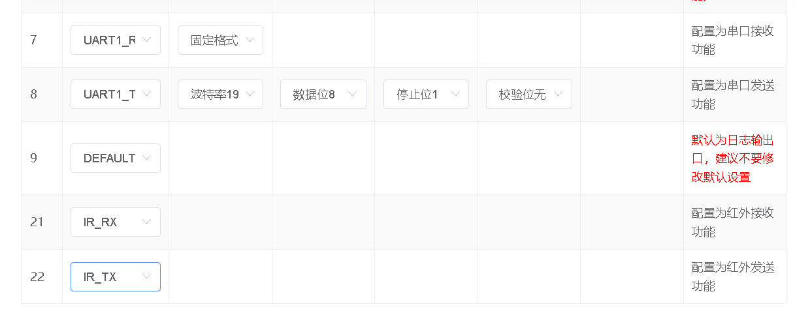

    *IO口配置中的红外接收和发送功能设置*

    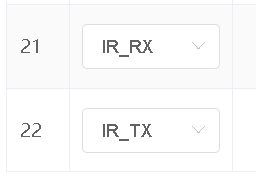

    *IR_RX和B3/IR_TX端口对应关系*

**注意事项****

- 默认为日志输出口，建议不要修改默认设置
- 使用红外功能时需要连接外部红外接收和发射管
- 确保硬件连接正确以避免功能异常

2. **红外学习功能**
    - 可以学习各种遥控器的红外信号
    - 学习后会保存为原始码值
    - 支持发送学习到的码值

3. **使用限制**
    - 平台只能发送学习码和NEC码
    - 不支持SIRC等其他协议的直接发送
    - 如需SIRC协议，建议使用学习码方式

**注意事项：**

- 学习码兼容性最好，但占用存储空间较大
- NEC码是标准协议，多数设备支持
- SIRC协议需要通过学习码实现
- 确保红外发射管连接正确

---


---

### 如何配置十二路继电器模块？

**问题描述：**

需要配置十二路继电器模块的输出，但只有六路继电器的教程。

**解决方案：**

1. **参考教程**

    访问智能云元平台的入门例程：

    - 网址：https://www.smartpi.cn/#/example
    - 选择"SU-03T 六路继电器、个性化音频、自学习、语音导航"教程

    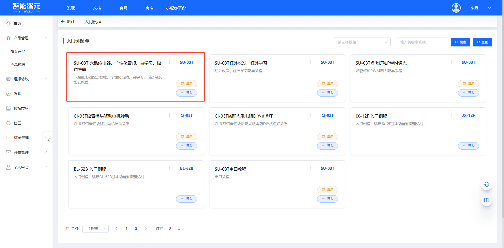

2. **配置方法**

    - 确认使用的是CI-03T1芯片（如下图）

    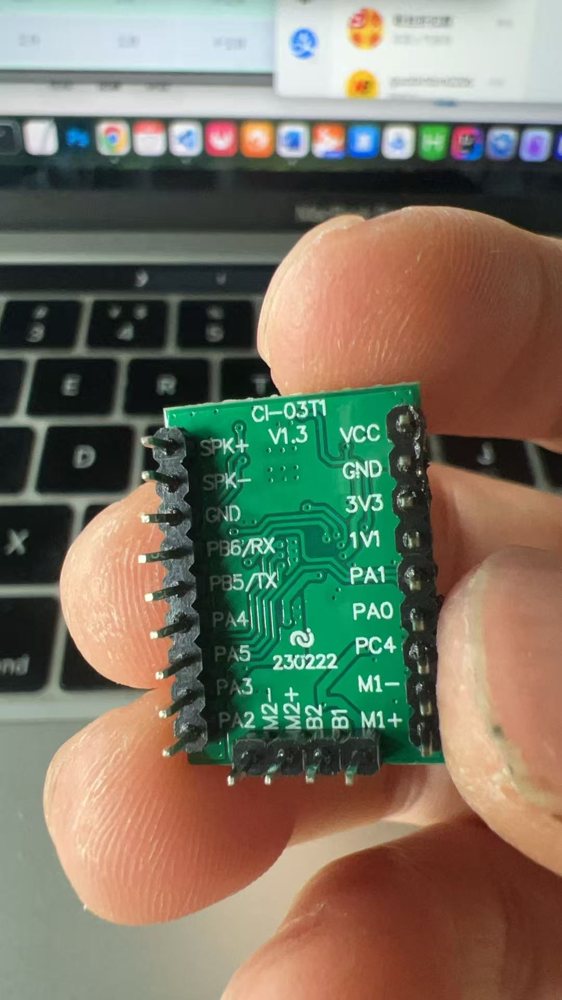

    - 参考六路继电器配置方法
    - 根据实际需求扩展到十二路

3. **配置要点**

    - 每个继电器对应一个GPIO控制引脚
    - 在平台中设置对应的控制行为
    - 测试每个继电器的开关功能

**注意事项：**

- 十二路和六路继电器的配置原理相同
- 注意电源供电能力，确保驱动所有继电器
- 配置完成后逐路测试功能

---

## 语音识别


---

### CI-03T测试版本固件生成很慢怎么办？

**问题描述：**

在智能公元AI产品零代码平台为CI-03T生成测试版本固件时，生成速度非常慢，需要等待45分钟左右，担心正式版本会更慢。

**解决方案：**

**1. 了解生成时间**

- 测试版本生成时间：约45分钟
- 生成完成后会通过微信通知
- 这是平台的正常处理时间

**2. 固件生成流程**

- 点击生成固件后进入队列处理
- 平台需要编译和打包所有配置
- 包含语音模型、命令词等所有资源


**3. 版本继承功能**

- SDK生成后需要重新生成固件
- 使用"继承为新版本"功能
- 继承已有配置，生成新的可编辑版本

**4. 优化建议**

- 测试阶段可减少命令词数量
- 简化回复内容以加快生成
- 确认无误后再生成完整版本

**注意事项：**

- 测试版和正式版生成时间相近
- 生成期间不要关闭浏览器页面
- 建议在网络稳定时进行生成

---


---

### CI-73T固件readme显示适用于CI-03T，能否正常烧录？

**问题描述：**

下载的CI-73T系列固件，其readme文档显示适用于CI-03T等模块，不确定该固件是否适用于CI-73T1和CI-73T2。

**解决方案：**

**1. 固件兼容性确认**

- 固件可以直接烧录到对应的CI-73T型号
- readme文档后续会更新，当前可正常使用
- jx_ci_13242_firmware.bin是CI-73T2的烧录文件

**2. CI-73T系列型号区别**

- **CI-73T1和CI-73T2的主要区别在于存储空间**
- CI-73T1支持150条语音指令
- CI-73T2支持300条语音指令

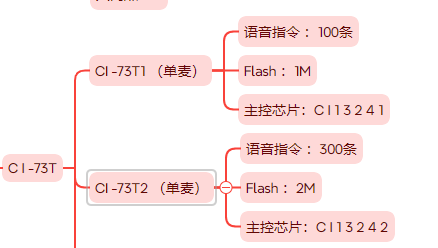

**3. 烧录注意事项**

- 确认固件文件与具体型号匹配（CI-73T1/CI-73T2）
- 固件本身是兼容的，可以放心烧录
- 如有疑问可联系技术团队确认

**注意事项：**

- CI-73T与CI-03T硬件规格不同，固件已针对优化
- readme文档显示的信息可能滞后，实际固件已适配
- 两个型号仅Flash容量不同，其他功能基本一致
- 烧录前确认模块型号，避免固件不匹配

---

## 语言支持相关问题


---

### CI-03T1是否支持SDK二次开发？

**问题描述：**

需要确认CI-03T1芯片是否支持SDK二次开发，以及如何获取相关开发资料。

**解决方案：**

1. **SDK支持确认**
    - CI-03T1支持SDK二次开发
    - 提供完整的二次开发文档
    - 包含接口说明、示例代码等

2. **开发资料获取**
    - 可从官方渠道获取二次开发文档
    - 文档包含规格书、原理图、烧录资料等
    - 部分资料可能需要申请或授权

3. **开发方式**
    - 通过串口与模块通信
    - 支持自定义协议和命令
    - 可集成到各种主控系统

**注意事项：**

- 二次开发需要一定的编程基础
- 建议先熟悉模块的基本功能
- 保留官方原厂固件作为备份
- 开发时注意模块的供电和接线要求

---


---

### 如何购买CI-03T模块？在哪里获取资料？

**问题描述：**

需要获取CI-03T系列离线语音识别芯片的购买链接，以便购买用于测试。

**解决方案：**

**1. 官方平台**

- **智能公元平台**：https://www.smartpi.cn/#/
- **资料下载**：平台提供所有技术资料
- **直接搜索**：搜索"智能公元"即可找到

**2. 淘宝购买**

- **CI-03T专属链接**：

    - https://item.taobao.com/item.htm?id=697462463035
    - 直接搜索店铺"深圳市机芯智能有限公司"

**3. 购买建议**

- **样品测试**：先购买少量模块进行验证
- **确认型号**：确保购买的是CI-03T而非其他型号
- **官方渠道**：优先选择官方店铺保证品质

**注意事项：**

- 平台资料需要注册账号后下载
- 购买时确认产品版本和封装
- 批量采购建议联系销售获取优惠

---

## 平台问题


---

### CI-03T是否有驱动WS2812的例程？

**问题描述：**

询问是否有CI-03T驱动WS2812 RGB LED灯带的例程或教程，以及相关SDK和视频资源。

**解决方案：**

**1. 官方资源说明**

- **暂无官方例程**：目前没有CI-03T驱动WS2812的官方例程
- **无专用SDK**：暂不提供WS2812驱动库
- **无视频教程**：官方未发布相关教学视频

**2. 技术可行性分析**

- **硬件支持**：CI-03T的IO口可输出PWM信号
- **时序要求**：WS2812需要精确的800kHz时序
- **资源限制**：语音识别功能可能与时序敏感操作冲突

**3. 自行实现方案**

- **研究WS2812协议**：

    - 单线通信，800kHz波特率
    - 24位数据：GRB各8位
    - 复位脉冲表示数据结束

- **开发思路**：

    - 使用精确延时控制时序
    - 占用大量CPU资源
    - 可能影响语音识别性能

**4. 替代方案建议**

- **专用控制器**：使用WS2812专用驱动芯片
    - CI-03T通过串口发送颜色数据
    - 专用芯片处理时序输出
    - 避免影响语音功能

- **分离控制**：

    - 使用简单的单色LED
    - 或使用多路PWM控制RGB LED
    - 降低开发难度

**5. 学习资源推荐**

- **Arduino例程**：参考Arduino的WS2812库实现
- **开源项目**：GitHub等平台搜索相关代码
- **技术论坛**：查找DIY爱好者分享的经验

**注意事项：**

- WS2812时序精度要求高，语音芯片可能难以完美实现
- 如必须使用，建议充分测试对语音功能的影响
- 考虑使用外部专用驱动芯片的方案
- 自行开发需要较强的嵌入式开发经验

---

## 平台功能限制


---

### 语音模块是否限制最多只能收发255条指令？

**问题描述：**

询问语音模块是否限制只能收发各255条指令，以及语音指令与串口指令的对应关系。

**解决方案：**

**1. 指令数量限制说明**

- **指令无上限**：语音模块本身对指令数量没有255条的限制
- **语音词条限制**：如果语音指令与词条一一对应，则受词条总数限制
- **串口指令灵活**：串口指令可以通过变量参数实现更多控制组合

**2. 不同指令的区别**

**语音指令**：

- 受模块词条容量限制（如CI-03T支持300条）
- 每个词条对应一个固定的触发行为
- 修改需要重新生成固件

**串口指令**：

- 通过接收串口数据触发相应行为
- 可使用变量传递参数，实现灵活控制
- 消息编号范围为1-255（用于识别不同的消息格式）

**3. 灵活应用方案**

**方案一：变量参数控制**

- 使用固定的消息编号（如1-255）
- 通过数据内容中的参数区分不同指令
- 例如：AA 55 01 XX 55 AA，XX为可变参数
- 可实现远超255条的控制组合

**方案二：多次判断控制**

- 一个消息编号可以触发多个判断条件
- 根据参数值执行不同动作
- 节省消息编号资源

**方案三：组合控制**

- 结合语音指令和串口指令
- 语音指令用于基础控制
- 串口指令用于复杂参数设置

**4. 实际配置建议**

- 消息编号不能重复，但可以对应多种控制
- 充分利用变量参数扩展控制能力
- 合理规划消息编号的使用范围
- 考虑使用更高效的通信协议

**注意事项：**

- 255是消息编号的范围，不是指令总数限制
- 语音指令数量取决于模块的词条容量
- 串口通信可通过参数化设计突破数量限制
- 建议导出配置文件备份所有设置

---

## 开发相关问题


---

### 如何获取较旧版本的固件？

**问题描述：**

需要获取较旧的语音模块固件，但在官方网站上已找不到相关下载链接。

**解决方案：**

**1. 官方渠道说明**

- 较早版本的固件可能因存储问题已下线
- 官方建议使用最新版本的固件
- 旧版本固件可能存在兼容性问题

**2. 替代方案**

- 联系技术团队确认是否有存档
- 在官方文档或历史资料中查找
- 考虑使用新版固件实现所需功能

**注意事项：**

- 旧版本固件可能包含已修复的bug
- 建议优先使用最新稳定版本
- 特殊功能需求可咨询技术团队团队

---


---

### CI-03T是否支持俄语、西班牙语等小语种？

**问题描述：**

需要使用CI-03T开发支持俄语或西班牙语识别的设备，询问是否支持小语种以及相关费用。

**解决方案：**

1. **语言支持说明**
    - 标准固件支持中文和英文
    - 小语种（如俄语、西班牙语）需要定制开发

2. **定制流程**
    - 提供目标语言的语料素材
    - 由工程团队评估技术可行性
    - 评估通过后进行定制开发

3. **定制要求**
    - 需要提供高质量的语音样本
    - 语音样本应覆盖应用场景
    - 不同语言需分别定制，不能混合

4. **费用说明**
    - 根据语料数量和质量评估
    - 不同语言分别计算费用
    - 具体金额需联系商务咨询
    - 西班牙语定制开发费参考：10,000元（40条以内命令词）
    - 包含语料收集和模型训练服务

5. **起订量要求**
    - 首次订单最小起订量：50套
    - 模块价格根据采购量有所不同
    - 50套和200套以上价格有差异

**操作流程：**

1. **需求确认**
    - 提供命令词和播报语列表
    - 确认词条数量（建议40条以内）
    - 提供应用场景说明

2. **语料准备**
    - 收集目标语言的语料素材
    - 如有中文固件可直接提供协议说明
    - 填写产品项目需求表

3. **开发实施**
    - 工程团队评估技术可行性
    - 进行语种训练和模型开发
    - 提供测试固件验证效果

4. **批量交付**
    - 确认样品效果后安排批量生产
    - 提供最终固件和模块

**注意事项：**

- 小语种定制需要提供充分的专业语料
- 定制周期根据项目复杂度确定
- 建议先少量测试，批量前充分验证
- 可联系技术团队获取语料要求规范
- 平台不支持的语言必须由厂商进行定制开发
- 定制完成后用户不能自行修改语种内容
- 建议确认年用量以获得更好的价格支持

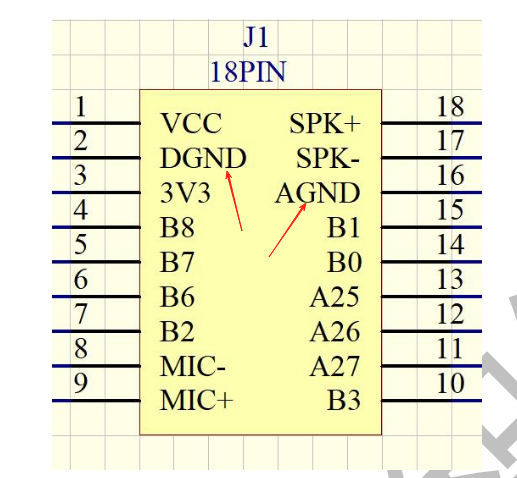

---


---

### 如何将CI1302工程迁移到CI1303？

**问题描述：**

需要将基于CI1302芯片的工程迁移到CI1303芯片上。

**解决方案：**

**迁移步骤：**

1. 导出CI1302的工程文件
2. 重新配置引脚设置
3. 检查并调整功能配置
4. 生成新的CI1303固件

**注意事项：**

- **引脚复用差异**：不同型号芯片的引脚复用功能可能有差异
- **重新验证**：迁移后需要全面测试各项功能
- **功能对比**：确认目标芯片支持所需的所有功能
- **资源配置**：根据新芯片特性调整资源分配

**建议操作：**

- 优先在官方平台重新创建工程
- 仔细核对引脚配置表
- 使用新芯片的规格书作为参考
- 保留原工程作为备份


---

### 串口发送字符数据时播报数字而非字母怎么办？

**问题描述：**

通过串口发送字符（char类型）数据时，设备播报的是数字而非预期的字母，疑似数据类型或编码问题。

**解决方案：**

- CI-03T1等芯片的串口通信可能有固定的数据格式要求
- 不支持直接发送自定义字符或16进制指令
- 需要按照平台规定的数据格式发送
- 尝试使用unsigned char类型重新发送

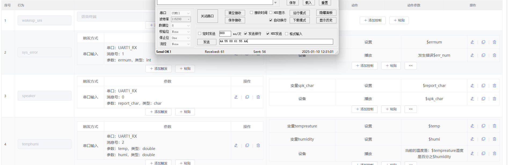

**注意事项：**

- 该类芯片可能对数据格式有特殊限制
- 建议查阅具体型号的数据通信协议
- 如需发送自定义数据，可能需要选择其他型号芯片


---

### 如何实现设备状态与小程序按钮同步？

**问题描述：**

设备通过语音控制改变状态后，小程序端的按钮状态无法自动更新，导致状态显示不一致。

**解决方案：**

**1. 同步机制说明**

- 按钮状态通过蓝牙协议同步
- 变量状态通过显示功能同步
- 两者采用不同的同步机制

**2. 实现状态同步的方法**

- **MCU全属性上报**：通过MCU实现完整的协议上报
- 将所有设备状态信息定时上报给模块
- 模块再将状态同步到小程序端

**3. 技术要求**

- 模块需要支持MCU协议
- MCU需要实现状态上报逻辑
- 需要建立完整的双向通信

**注意事项：**

- CI-03T模块需要配合MCU实现状态同步
- 纯语音模块无法主动上报状态变化
- 按钮状态记忆基于上次关机时的状态
- 如需实时同步，必须通过MCU协议实现


---


---

### CI-03T固件生成失败，下载的是tar格式文件怎么办？

**问题描述：**

在智能公元平台为CI-03T生成固件时，显示"生成失败，可能是配置原因"，但生成成功后下载的是tar格式文件，而不是bin格式文件。

**解决方案：**

**1. 固件文件格式说明**

- tar格式是压缩包文件，包含bin固件和其他相关文件
- 需要解压后才能获得可烧录的bin文件
- tar不是最终烧录格式，是打包格式

**2. 正确操作步骤**

1. **生成固件**
    - 完成配置后点击"生成固件"
    - 等待生成完成
    - 下载tar格式文件到本地

2. **解压文件**
    - 使用解压软件（如7-Zip、WinRAR等）解压tar文件
    - 解压后会得到bin格式的固件文件
    - bin文件才是用于烧录的格式

3. **烧录固件**
    - 使用PACK_UPDATE_TOOLS等烧录工具
    - 选择解压后的bin文件进行烧录
    - 按正常烧录流程操作

**3. 生成失败排查**

如果提示"生成失败"：

- **检查配置**：点击"检查配置"按钮，验证配置是否正确
- **简化配置**：临时减少指令数量，测试是否能生成
- **清除缓存**：清除浏览器缓存后重新尝试
- **联系支持**：如持续失败，提供配置截图给技术团队

**注意事项：**

- tar文件需要解压两次的情况很少见，但如有需要可多次解压
- 确保使用正确的解压软件
- 解压后的文件名可能包含版本信息，选择bin文件烧录
- 保留原始tar文件作为备份

---

## 音量设置


---

### SDK生成缓慢或超时问题

**问题描述：**

在平台生成SDK时，生成时间远超过预期的10-30分钟，甚至出现超时状态，需要了解原因和解决方法。

**解决方案：**

**主要原因：**

- 平台使用人数较多，生成任务需要排队处理
- SU系列芯片使用方量较大，生成服务负载较高
- 多个任务并行处理导致排队时间延长


**处理建议：**

- 耐心等待，特别是在高峰时段
- 尝试重新发布任务（如果生成超时）
- 避开高峰期进行SDK生成
- 考虑使用CI-33T等容量更大的型号

**注意事项：**

- SU系列芯片生成速度较慢是正常现象
- 平台不是人工编译，而是自动化任务处理
- 没有其他加速生成的方式
- 建议合理安排开发时间，预留充足的生成时间（可能需要数小时）
- CI-03T系列已新增TTS功能支持

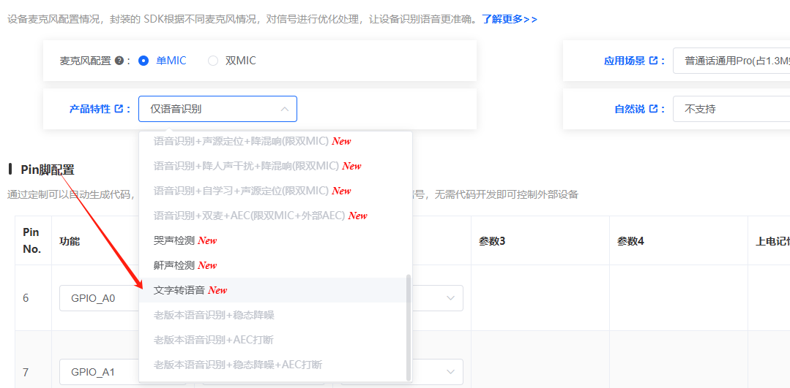

---


---


---

### 如何配置UART接收指令并触发响应？

**问题描述：**

需要配置CI-03T1芯片在UART接收到特定指令（如02 03 04 03 02）后，通过UART发送响应数据（如02 03 04 00 02）并触发语音播报。

**解决方案：**

**配置步骤**：

1. **添加串口输入参数**：

    - 创建参数名（如"test"）
    - 设置参数类型（如unsigned）
    - 测试值设为0

    

2. **配置UART1_RX接收**：

    - 帧头设置：02 03
    - 帧尾设置：03 02
    - 消息号：1

    

3. **设置触发条件**：

    - 触发方式：串口
    - 选择UART1_RX
    - 消息号：1

4. **添加控制动作**：

    - 发送数据：02 03 04 00 02
    - 播放语音：选择需要的回复内容

    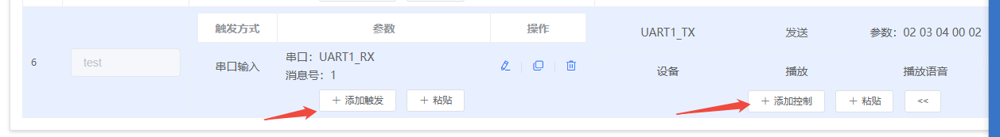

**工作流程**：

1. UART接收到02 03 04 03 02指令
2. 系统匹配帧头帧尾和消息号
3. 触发预设的控制动作
4. 通过UART发送响应数据
5. 同时触发语音播报

**注意事项：**

- 帧头帧尾必须与发送端完全匹配
- 消息号用于区分不同的指令类型
- 测试值作为变量可用于其他逻辑判断
- 支持同时执行多个控制动作

---

### 如何配置串口接收特定数据后触发GPIO输出？

**问题描述：**

需要配置CI-03T芯片，使其在接收到特定串口数据（如188 22）后，通过GPIO引脚输出高电平来控制外部设备。

**解决方案：**

**配置步骤：**

1. **配置串口输入触发**：

    - 触发方式：选择"串口输入"
    - 串口接口：选择UART1_RX
    - 消息号：设置为188
    - 参数类型：选择char类型

    

2. **配置GPIO输出控制**：

    - 控制方式：选择"端口输出"
    - 控制类型：选择需要控制的GPIO引脚（如GPIO_A25）
    - 动作：选择"设置电平"
    - 参数：设置为"高电平"

    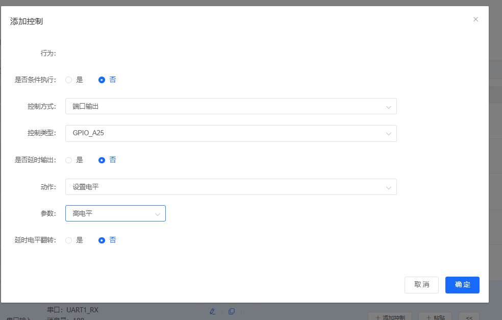

3. **添加控制行为**：

    - 在行为控制中添加新的控制行为
    - 将串口输入触发与GPIO输出动作关联
    - 保存配置并生成SDK

**工作流程：**

1. CI-03T芯片通过UART1接收串口数据
2. 系统检测到消息号为188的数据
3. 触发预设的GPIO控制行为
4. GPIO_A25引脚输出高电平
5. 外部设备接收到高电平信号并执行相应动作

**注意事项：**

- 串口波特率、数据位等参数需与发送端保持一致
- 消息号188可根据实际需求修改为其他数值
- GPIO引脚号需根据实际硬件连接选择
- 支持配置多个不同的消息号触发不同的GPIO动作
- 确保GPIO引脚的驱动能力满足外部设备需求

---


---

### 离线语音识别能否提取命令中的数字参数？

**问题描述：**

希望在离线语音识别系统中实现从语音命令中提取数字参数（如"湿度80%"中的"80"）并通过串口返回，同时识别出该命令是设置湿度的指令。

**解决方案：**

**功能限制说明：**

- **离线芯片能力限制**：当前离线语音识别芯片（如CI-03T系列）仅支持预设命令词的识别
- **无法动态提取**：芯片无法自动从语音中提取动态数字参数
- **固定返回机制**：芯片可以识别预设命令（如"设置湿度"）并返回对应的指令标识，但不能提取其中的数值

**替代方案：在线语音识别 + 知识库处理**

由于离线芯片无法实现数字提取，建议采用在线语音识别方案：

**1. 语音转文字**

    - 使用在线语音识别模块将用户语音（如"湿度80%"）转换为文本
    - 在线识别支持自然语言处理，能够准确提取数字和关键词

**2. 文本解析与知识库匹配**

    - 将转换后的文本输入到知识库中进行解析
    - 知识库中预存常见命令格式（如"设置湿度X%"、"设置温度Y度"）
    - 系统自动识别关键词（湿度、温度、亮度）和数字参数

**3. 返回结构化数据**

    - 解析结果通过串口返回，格式如下：
        ```
        {"command": "set_humidity", "value": 80}
        ```
    - 应用程序可根据command字段判断命令类型，根据value字段获取具体数值

**实施建议：**

- **平台选择**：使用扣子平台（Coze）进行在线语音识别和知识库管理
- **知识库配置**：提前在知识库中配置命令模板，如"设置湿度{数值}%"等
- **自行开发**：如果具备开发能力，可自行搭建在线语音识别+知识库解析系统

**注意事项：**

- 离线方案无法实现动态数字提取，需依赖在线服务
- 在线方案需要网络连接，适用于有网络环境的场景
- 知识库的准确性和覆盖范围直接影响解析效果
- 需要根据实际应用场景完善命令模板

---

### CI-03T如何连接DeepSeek大模型实现语音交互？

**问题描述：**

需要实现CI-03T语音模块通过手机联网，调用DeepSeek大模型进行语音交互问答，支持独立供电和1-3米拾音距离，并能在开源平台上进行二次开发。

**解决方案：**

**当前方案限制：**

CI-03T是离线语音识别模块，无法直接联网调用大模型。需要结合其他硬件实现完整功能：

**1. 推荐硬件组合**

```
CI-03T（语音识别）+ WiFi模块（如JX-12F）+ 主控MCU
```

- **CI-03T**：负责离线语音唤醒和命令识别
- **WiFi模块**：负责网络连接和数据传输
- **主控MCU**：协调整体系统运行

**2. 实现方案**

- **方案一（用户自建）**：

    - 提供语音模块和WiFi模块
    - 用户自行搭建系统架构
    - 需要较强的开发能力

- **方案二（Demo开发）**：

    - 提供1-2周Demo演示
    - 收取模块采购费和开发费用
    - 适用于项目验证阶段

- **方案三（等待产品）**：

    - 等待公司研发一体化产品
    - 时间和价格尚未确定

**3. 联网方式说明**

- **当前配网方式**：微信小程序通过蓝牙配网
- **简化配网需求**：海外用户希望避免下载微信
- **4G版本建议**：可考虑开发4G版本，需要插入手机卡

**4. 开发和服务费用**

- **开发费用**：用于大模型对接调试和系统集成
- **运营费用**：服务器运行和API调用成本
- **服务费用**：用户自行承担DeepSeek API费用

**注意事项：**

- 现有CI-03T无法通过简单升级实现联网功能
- 微信小程序配网是目前的主要方式，海外使用受限
- 完整的AI语音交互系统需要重新设计硬件架构
- 建议根据项目紧急程度选择合适方案

---

### CI-03T + JX-12F如何实现DeepSeek语音问答功能？

**问题描述：**

希望使用CI-03T语音模块配合JX-12F WiFi模块，实现调用DeepSeek进行语音交互问答的功能。

**解决方案：**

**技术可行性：**

- 功能可以实现，目前正在调试优化中
- 需要二次开发，不是现成功能
- 微信小程序配网是主要的联网方式

**实现架构：**

1. **语音识别阶段**：

    - CI-03T负责语音唤醒和命令识别
    - 将识别结果通过串口发送给主控

2. **网络通信阶段**：

    - JX-12F负责WiFi连接
    - 通过微信小程序进行配网
    - 建立与服务器的通信链路

3. **AI交互阶段**：

    - 调用DeepSeek API进行对话
    - 处理返回的文本内容
    - 通过TTS转换成语音输出

**开发注意事项：**

- 该功能属于定制开发，需要额外收费
- 涉及大模型对接，需要专门的调试工作
- 后期可能产生服务器运营费用
- DeepSeek API服务费用由用户承担

**项目建议：**

- 如项目紧急，可先提供Demo验证
- 完整开发需要1-2周时间
- 建议评估总体成本和时间安排

---

### 公司在研项目的样品测试进度如何？

**问题描述：**

询问公司研发项目是否有样品可供测试，以及样品测试的预计时间。

**解决方案：**

**当前测试状态：**

- 正在进行内部测试阶段
- 样品功能调试中，尚未完成
- 需要继续等待测试完成

**测试内容：**

1. **功能测试**：

    - 验证语音识别准确性
    - 测试网络连接稳定性
    - 确认AI交互响应速度

2. **兼容性测试**：

    - 不同环境下的适配性
    - 硬件接口兼容性
    - 软件系统稳定性

**时间安排：**

- 具体完成时间尚未确定
- 需要等待所有测试项目通过
- 建议定期跟进测试进度

**费用说明：**

- 开发费用与服务费是分开的
- 服务费属于运营成本，与开发无关
- 用户可自行承担API服务费用

**注意事项：**

- 研发项目需要充分测试才能发布
- 建议提前规划项目时间节点
- 可先评估现有产品是否满足需求

---

### CI-03T如何实现串口温度值触发语音播报？

**问题描述：**

需要将MCU采集的温度值通过串口发送到CI-03T芯片，并利用该值触发语音播放，实现变量与外部MCU采集值的关联。

**解决方案：**

CI-03T支持通过串口接收外部数据并触发语音播报：

**1. 配置串口输入**

- **触发方式**：选择"串口输入"
- **消息号设置**：配置对应的消息号
- **参数类型**：选择合适的数据类型接收温度值
- **不设固定值**：测试值留空，接收动态数据

**2. 变量定义与使用**

- **定义变量**：在变量定义页面创建温度变量
- **变量类型**：建议使用int或float类型
- **变量赋值**：串口接收的数据会自动赋给变量
- **语音播报**：在语音内容中使用该变量

**3. MCU发送数据**

- **数据格式**：直接发送温度数值（如"25"）
- **串口配置**：确保波特率、数据位匹配
- **发送频率**：根据需要控制发送频率

**实现步骤：**

1. 在平台配置串口输入触发
2. 创建温度变量（如temperature）
3. 配置语音内容使用变量
4. MCU通过串口发送温度值
5. CI-03T自动播报接收到的温度

**注意事项：**

- 串口接收的数据会自动更新变量值
- 不需要配置固定测试值
- 建议添加数据格式校验
- 温度值超出范围时需要异常处理

---


---

### 如何获取CI-03T的开发资料和配套软件？

**问题描述：**

需要获取CI-03T系列离线语音识别模块的完整开发资料和配套软件，以便开始使用该模块进行开发。

**解决方案：**

**1. 官方文档平台**

- **访问地址**：https://help.aimachip.com/docs/offline_ci03t
- **内容包含**：模块基本资料、烧录资料、芯片资料等
- **更新及时**：官方持续更新最新版本

**2. 烧录软件下载**

在文档平台可找到"烧录软件"选项：

- 点击"烧录软件"下载最新版本
- 支持Windows系统
- 包含完整的烧录工具和驱动

**3. 完整开发包**

下载开发包获取全部资料：

- **开发包内容**：

    - 模块基本资料
    - 模块烧录资料
    - 芯片资料
    - 产品结构声学结构规范
    - 喇叭和咪头选型推荐
    - 开发包更新说明

- **下载步骤**：

    1. 访问文档平台
    2. 找到"开发包"下载选项
    3. 下载完整压缩包
    4. 解压后查看各类文档

**4. 视频教程资源**

官方提供详细的视频教程：

- **B站频道**：https://space.bilibili.com/1903518159/lists
- **教程内容**：

    - 新手教程
    - 平台使用介绍
    - CI-03T操作教程
    - 实际应用案例

**5. 开发流程概览**

完整的开发流程如下：

1. **资料准备**：下载开发包和烧录软件
2. **硬件连接**：连接烧录器和模块
3. **指令配置**：在平台输入语音指令
4. **固件生成**：平台自动生成固件
5. **烧录测试**：将固件烧录到模块
6. **功能验证**：测试语音识别功能

**注意事项：**

- 开发包是V2.1.0版本，包含所有必要文档
- 建议先观看视频教程了解操作流程
- 烧录软件需要配合专用烧录器使用
- 遇到问题可参考文档或联系技术支持

---


---

### 配置检查提示"不能有非英文字符"怎么办？

**问题描述：**

在配置语音指令时，系统检查报告中提示多个错误，错误内容均为"唤醒回复语/命令词不能有非英文字符"，且配置界面中同时存在中文和英文的语音指令，导致配置无法通过。

**解决方案：**

**1. 语言限制说明**

平台固件只支持单一语言模式：

- **英文固件**：不能包含任何中文字符
- **中文固件**：不能包含英文字符
- **混合语言**：需要定制开发

**2. 错误原因分析**

常见错误配置：

- **命令词使用英文**：但回复语使用中文
- **唤醒词英文**：但拼音包含中文
- **任何中英文混用**：都会触发检查失败

**3. 解决方案**

**纯英文配置**：

- 删除所有中文回复语
- 命令词使用英文
- 唤醒词使用英文
- 确保配置中无中文字符

**纯中文配置**：

- 所有内容使用中文
- 适合国内市场应用
- 识别率通常更高

**4. 灵敏度设置**

英文固件特殊设置：

- **优化选项**：将识别灵敏度拉到最高
- **建议值**：设置为0.8以获得最佳识别率
- **英文特点**：需要更高灵敏度补偿

**5. 混合语言需求**

如确实需要中英文混合：

- **联系定制**：需要特殊定制固件
- **双固件方案**：分别制作中英文版本
- **切换机制**：通过硬件或软件切换

**注意事项：**

- 配置检查通过不代表固件能正常生成
- 英文环境建议使用纯英文配置
- 特定行业术语可能需要定制训练
- 保留备份配置文件防止丢失

---

### CI-03T1芯片实现中英文切换功能的可行性评估

**问题描述：**

评估CI-03T1芯片是否支持中英文切换功能，以及在现有硬件条件下的实现可行性。

**解决方案：**

**1. 存储空间限制**

CI-03T1芯片的Flash容量有限，要实现中英文切换功能需要：

- 选择最小占用的语音识别模型
- 中英文模型都需要占用存储空间
- 需要预留空间存储语言切换逻辑

**2. 模型选择建议**

为实现中英文切换，必须选择最小模型配置：

- **推荐模型**：普通话通用Pro（占0.6M空间）
- **选择原则**：中文和英文都选择最小模型
- **配置要求**：在平台应用场景选择中选择占用空间最小的模型

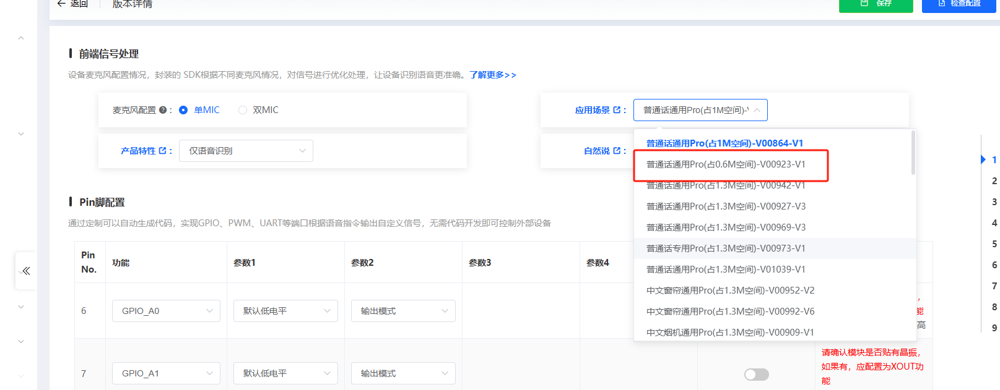

**3. 可行性评估**

根据计算，使用最小模型配置后：

- **存储空间**：刚好能够容纳中英文双模型
- **实现难度**：需要定制开发语言切换逻辑
- **功能限制**：回复语数量不能过多

**4. 实现方案**

**方案一：双固件切换**

- 制作纯中文和纯英文两个固件版本
- 通过外部开关或指令切换固件
- 实现简单，但需要重启设备

**方案二：单固件双模型**

- 在一个固件中集成中英文模型
- 通过变量控制当前使用的语言
- 需要二次开发实现切换逻辑

**5. 开发建议**

- **年用量较大**（1-2万片）的情况下，建议选择CI-33T等存储空间更大的型号
- **成本敏感**场景，可尝试CI-03T1但需要充分测试
- **开发周期**：预计需要2天时间实现基础功能

**注意事项：**

- 必须严格控制回复语数量，避免存储空间不足
- 语言切换功能需要定制开发，非标准固件支持
- 建议先制作Demo验证可行性，再进行批量开发
- 切换响应时间需要优化，避免用户体验不佳

---

### SDK配置英文应用场景出现适配错误怎么办？

**问题描述：**

在SDK配置过程中，切换英文应用场景时出现适配错误，导致无法正常生成固件。错误表现为应用场景和发言人设置不兼容。

**解决方案：**

**1. 问题识别**

当切换回英文版本时，如果出现以下情况，说明存在适配问题：

- 应用场景与发言人配置不匹配
- 固件生成失败或报错
- SDK状态显示正在生成但无法完成

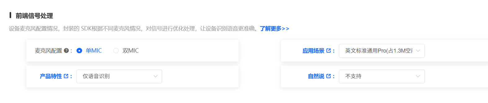

**2. 解决步骤**

**方法一：更换应用场景**

- 在应用场景下拉菜单中选择其他英文模型
- 避免选择与当前配置不兼容的模型
- 选择标有兼容性标识的版本

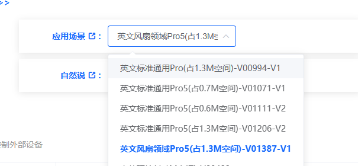

**方法二：重新生成配置**

1. 更换到其他应用场景或发言人配置
2. 生成并下载固件
3. 继承该配置后，再切换回目标应用场景
4. 重新生成最终固件

**3. 预防措施**

- 配置变更前记录原始设置
- 逐步验证每个配置项的兼容性
- 保存配置备份，避免重复调整

**注意事项：**

- 英文应用场景对硬件配置要求更严格
- 部分模型组合存在已知兼容性问题
- 如频繁出现问题，建议使用标准配置模板
- 确认麦克风配置与所选模型匹配（如单MIC/双MIC）

---

## PWM控制配置

### PWM占空比无法设置为小数怎么办？

**问题描述：**

在使用CI-03T芯片的智能体平台时，无法通过小数点设置PWM占空比。

**解决方案：**

1. **平台限制说明**

    - 平台不支持小数点形式的占空比设置
    - 只能设置整数值
    - 需要通过调整最大占空比值实现精度控制

2. **精度控制方法**

    - 在优化配置中设置PWM最大占空比
    - 如设置为1000，则精度为1/1000
    - 占空比500等于50%，1000等于100%

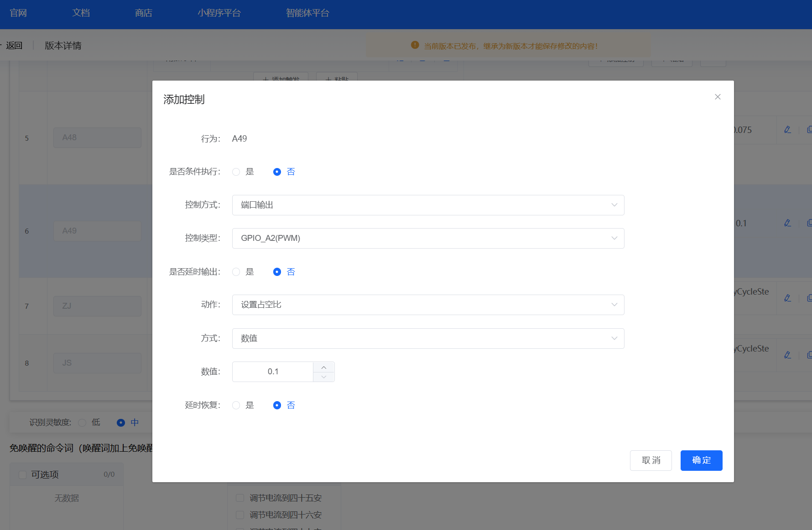

**注意事项：**

- 占空比范围：0-1000（0%-100%）
- 设置值越大，控制精度越高
- 需要重新生成固件才能生效

### PWM占空比调节不灵敏怎么办？

**问题描述：**

将PWM占空比最大值设置为1000后，通过语音指令以1为步进值调节时，需要执行多次指令才能生效。

**解决方案：**

1. **性能限制原因**

    - 步进值设置为1可能性能不足
    - 模块处理精度调节需要时间
    - 语音识别和处理有延迟

2. **优化建议**

    - 适当增加步进值（如5或10）
    - 在保证精度前提下提高响应速度
    - 测试找到最佳平衡点

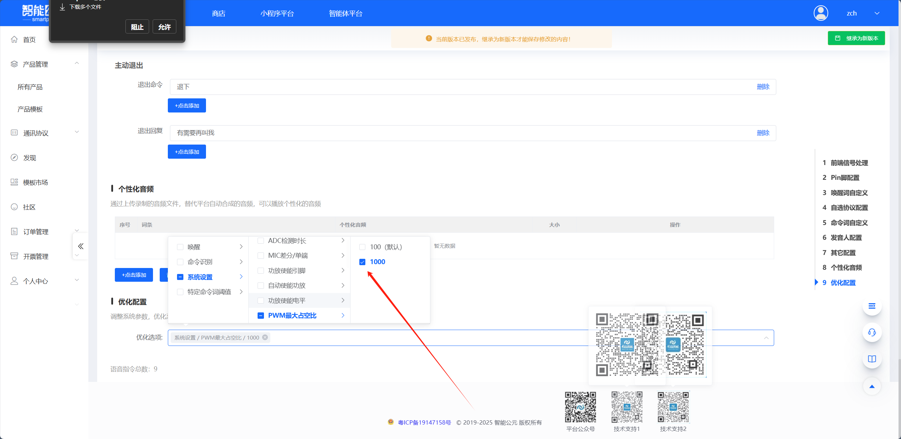

3. **替代方案**

    - 使用更大的占空比范围（如0-100）
    - 减少调节次数实现目标值
    - 通过组合指令实现精确控制

**注意事项：**

- 步进值过小会影响响应速度
- 建议根据实际需求设置合适的步进值
- 测试时确保供电稳定避免干扰

---

### 如何在CI-03T1/T2上实现定制语音指令和大模型功能？

**问题描述：**

需要在CI-03T1或CI-03T2芯片上实现定制语音指令、大模型支持和文字转语音功能，并确认IO引脚分配和功能需求。

**解决方案：**

1. **语音指令定制配置**：

    - 根据需求表配置18条播报驱动指令
    - 分为三个功能组：模式1-6、开关7-12、开关倒计时13-18
    - 每个指令可配置对应的GPIO输出或串口指令
    - 支持IO口脉冲输出控制，可设置脉冲宽度

    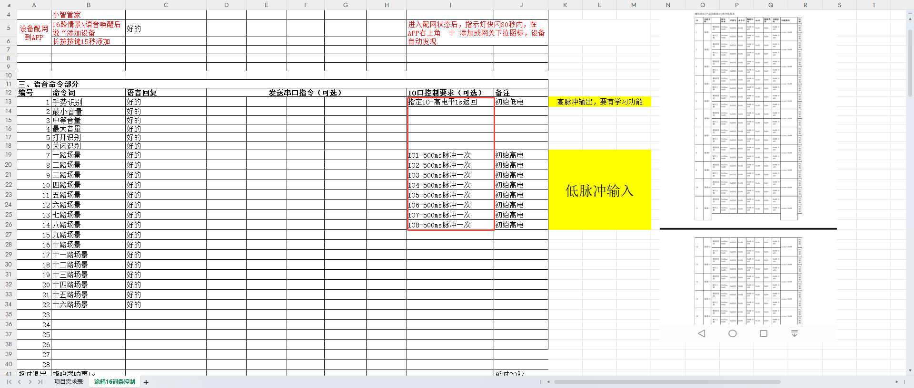

2. **IO引脚分配方案**：

    - 共使用10个IO脚实现功能控制
    - IO1-IO8：用于脉冲输出，支持高脉冲或低脉冲模式
    - 初始电平状态可配置（高电平/低电平）
    - 脉冲宽度支持自定义（如500ms）

3. **大模型和TTS功能实现**：

    - CI-03T支持TTS功能（需购买授权版本）
    - 可通过串口连接外部WiFi模块调用大模型API
    - 语音识别结果可通过串口发送给大模型处理
    - 大模型响应通过TTS转换成语音播放

4. **功能集成方案**：

    - 离线识别：本地命令词快速响应
    - 在线问答：通过联网模块调用大模型
    - 播报驱动：按序号1-18进行控制和反馈
    - 手势识别：专用IO口输出脉冲触发

**注意事项：**

- 定制开发需要提供详细的功能需求表
- IO口分配需要与硬件设计相匹配
- 大模型功能需要额外的联网硬件支持
- TTS功能必须使用已授权的固件版本

---

### 如何定制固件实现双语音指令输出脉冲信号？

**问题描述：**

需要定制固件，使语音识别芯片在接收到"采图"或"采集图像"两个语音指令时，分别在指定的I/O口输出一个100ms左右的低电平脉冲信号，且希望I/O口在非触发状态下为漏极开路输出状态。

**解决方案：**

- **功能确认**：CI-03T1/CI-03T2可以实现双语音指令控制脉冲输出功能
- **输出配置**：支持配置低电平脉冲输出，脉冲宽度可设置为100-200ms
- **I/O状态**：可配置为漏极开路输出模式，非触发时保持高阻态

**实现方案：**

**1. 语音指令配置**

- 添加"采图"命令词，配置对应的IO输出动作
- 添加"采集图像"命令词，配置相同的或另一个IO输出动作
- 可配置两个指令使用同一个IO口或分别使用不同IO口

**2. 输出参数设置**

- 脉冲宽度：100ms-200ms可调
- 输出类型：低电平脉冲（漏极开路输出）
- 初始状态：漏极开路（高阻态）
- 触发后：输出低电平100ms，然后恢复高阻态

**3. 应用场景**

- 适用于遥控采图设备控制
- 可通过电平转换控制CH340等芯片
- 支持外部电路电平匹配需求

**注意事项：**

- 漏极开路输出需要外部上拉电阻
- 100ms脉冲宽度可根据实际需求调整
- 如需高电平脉冲，可通过三极管转换
- 样品数量可少量定制，批量需评估生产需求

---

### 如何实现循环定时脉冲输出功能？

**问题描述：**

需要实现上电后每30分钟输出一个持续2分钟的高电平脉冲的循环功能。

**解决方案：**

- **配置方式**：可以直接在智能公元平台上配置该功能
- **无需编程**：通过平台可视化配置即可实现
- **定时器功能**：支持循环定时输出控制

**平台配置步骤：**

**1. 登录智能公元平台**

- 选择对应的模块型号（CI-03T1/CI-03T2）
- 进入固件配置界面

**2. 配置定时器功能**

- 添加定时器控制逻辑
- 设置定时周期：30分钟（1800秒）
- 配置输出动作：GPIO高电平输出

**3. 设置输出持续时间**

- 配置高电平持续时间为2分钟（120秒）
- 设置输出引脚（如GPIO_A0等可用引脚）
- 2分钟后自动恢复低电平

**4. 循环执行设置**

- 启用自动循环功能
- 上电后自动启动定时器
- 定时器结束后自动重新开始

**实现效果：**

- 上电即开始循环
- 每30分钟触发一次
- 输出2分钟高电平
- 然后等待28分钟，循环往复

**注意事项：**

- 定时器精度高，时间设置准确
- 可根据实际需求调整时间和循环周期
- 建议测试验证时间参数是否符合需求
- 如需修改参数，重新生成固件即可

---

### CI-03T1和CI-03T2的脉冲输出细节如何确认？

**问题描述：**

需要确认CI-03T1和CI-03T2芯片的脉冲输出细节，以及如何购买10片样品。

**解决方案：**

**脉冲输出参数确认：**

- **脉冲宽度**：100-200ms可调（根据定制需求）
- **输出类型**：支持低电平脉冲或高电平脉冲
- **输出模式**：支持漏极开路输出或推挽输出
- **初始状态**：可配置为高电平、低电平或高阻态

**样品购买方式：**

- **官方渠道**：通过淘宝官方店铺购买
- **批量采购**：联系官方销售或代理商
- **定制需求**：直接联系技术支持或商务

**技术规格说明：**

**1. CI-03T1/CI-03T2通用特性**

- 支持多路GPIO输出
- 可配置不同输出模式
- 支持PWM输出控制
- 具备定时器功能

**2. 输出参数范围**

- 脉冲宽度：1ms-10s可配置
- 输出电流：最大20mA（根据引脚）
- 电压范围：3.3V/5V兼容
- 响应时间：<1ms

**购买建议：**

- **小批量测试**：建议先购买10片样品验证功能
- **功能确认**：收到样品后立即测试脉冲输出功能
- **参数调整**：如需调整参数，联系技术支持重新配置

**注意事项：**

- 购买时请注明具体型号（CI-03T1或CI-03T2）
- 如有特殊需求，建议提前与技术人员沟通
- 批量采购可享受批量价格优惠
- 定制固件需要提供详细需求规格

---

### CI-03T1/CI-03T2的19脚（PWRCRTL_C）能否配置为输出口？

**问题描述：**

需要将CI-03T1或CI-03T2芯片的19脚（PWRCRTL_C）配置为通用输出口，并确认是否会影响正常烧录功能。

**解决方案：**

- **引脚配置**：19脚（PWRCRTL_C）可以配置为通用输出口
- **烧录兼容性**：配置为输出口后仍可正常烧录固件
- **功能实现**：通过平台软件进行引脚功能配置即可实现

**注意事项：**

- 虽然技术上可行，但不建议将19脚用作通用输出口
- 该引脚具有特殊的复用功能（PB5/TX），改变用途可能影响系统稳定性
- 如确需使用，建议先在测试板上验证功能正常
- 保留原始配置备份，便于恢复默认设置

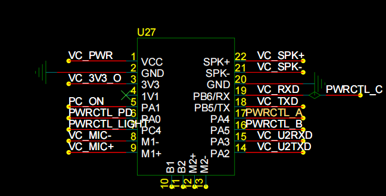

---

### CI-03T1无法接收UART串口数据怎么办？

**问题描述：**

使用CI-03T1芯片的设备连接手机APP后，无法接收串口（UART）传输的数据，传感器数据均显示为0。

**解决方案：**

1. **串口配置检查**
    - 确认使用UART1_RX和UART1_TX引脚
    - 检查引脚连接：GPIO_2（RX）和GPIO_3（TX）
    - 验证波特率设置：9600N81

2. **数据传输流程**
    - 单片机通过UART发送数据到WiFi模块
    - WiFi模块通过小程序显示接收到的数据
    - 无需点击TCP连接按钮（串口直连）

3. **调试步骤**
    - 确认单片机正在发送数据
    - 检查串口线序是否正确交叉
    - 使用串口助手监控数据传输

**注意事项：**

- UART1_RX仅支持接收，不支持AT指令
- 波特率必须一致，推荐9600
- 数据格式需与协议配置匹配
- 如仍无数据，提供单片机发送的数据包供分析

---

### 如何在产品平台配置前端信号处理模式？

**问题描述：**

需要在产品平台配置界面中设置前端信号处理模式，但不了解不同模式的区别和选择方法。

**解决方案：**

1. **前端信号处理模式选择**：

    - 在"产品特性"下拉菜单中选择合适的模式
    - 可选模式包括：

        - 语音识别+自学习
        - 语音识别+AEC打断
        - 语音识别+降混响
        - 哭声检测等特殊功能

2. **应用版本选择**：

    - 在"应用场景"下拉菜单中选择版本
    - 版本号后缀说明（如V00864-V1、V00973-V1）：

        - 版本号越大，模型越新
        - V1表示版本类型
        - 建议选择最新版本号

3. **模式选择参考**：

    - 普通语音识别场景：选择"语音识别+自学习"
    - 需要打断功能的场景：选择"语音识别+AEC打断"
    - 回声较大的环境：选择"语音识别+降混响"
    - 婴儿监护场景：选择"哭声检测"

**注意事项：**

- 不同模式对应不同的算法模型，需根据实际应用场景选择
- 版本更新会优化算法效果，建议定期关注新版本
- 详细操作可参考视频教程：AEC打断操作演示
- 配置完成后建议进行实地测试验证效果

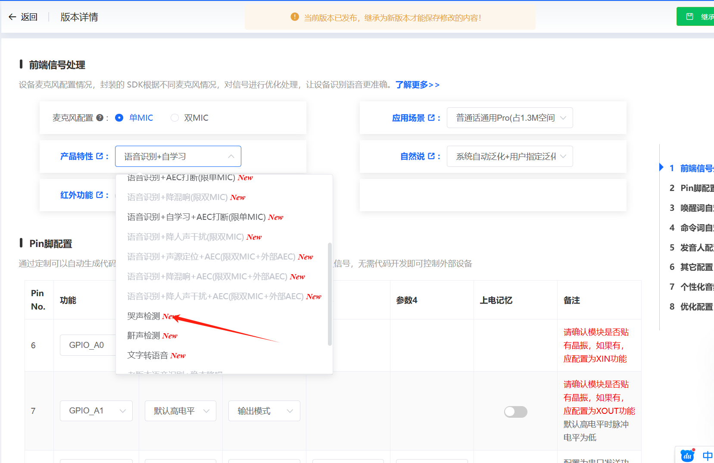

---

### CI-03T1使用新固件模板后无法保持唤醒状态怎么办？

**问题描述：**

使用新固件模板生成的固件，配置了保持唤醒模式的参数，但系统仍会自动退出唤醒状态，无法持续保持唤醒。

**解决方案：**

**问题原因分析：**

1. **ASR模式动态切换**：

    - 调试串口输出显示`change asr mode 1`和`change asr mode 0`
    - mode 0：退出唤醒状态
    - mode 1：进入唤醒状态
    - 系统在自动切换模式，导致无法保持唤醒

2. **配置方法检查**：

    - 确认已正确配置"进入唤醒"和"禁止超时退出唤醒"操作
    - 触发方式：上电启动|重置启动
    - 延时设置：进入唤醒（500ms）、禁止超时退出唤醒（1000ms）

**解决步骤：**

1. **验证配置完整性**：

    - 检查事件触发配置是否正确
    - 确认两个系统控制操作都已添加
    - 验证延时时间设置是否合理

2. **固件模板兼容性**：

    - 新模板可能改变了默认行为
    - 测试使用旧模板生成的固件对比
    - 如新模板有问题，暂时使用稳定版本

3. **调试方法**：

    - 观察串口输出的模式切换日志
    - 确认只有特定命令词（如"笛虎退下"）才退出唤醒
    - 检查是否有其他触发条件导致模式切换

**注意事项：**

- 自学习功能可能与唤醒模式配置存在冲突
- 新模板更新后建议先进行全面测试
- 保持唤醒状态会增加功耗，需考虑电源设计
- 如问题持续，建议联系技术支持并提供固件文件


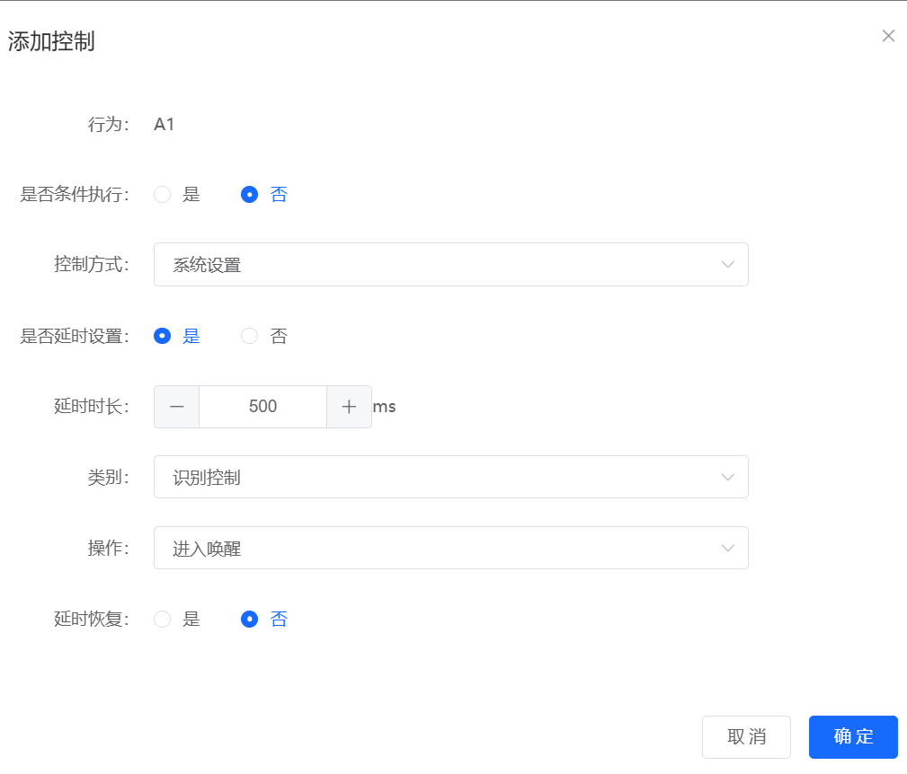
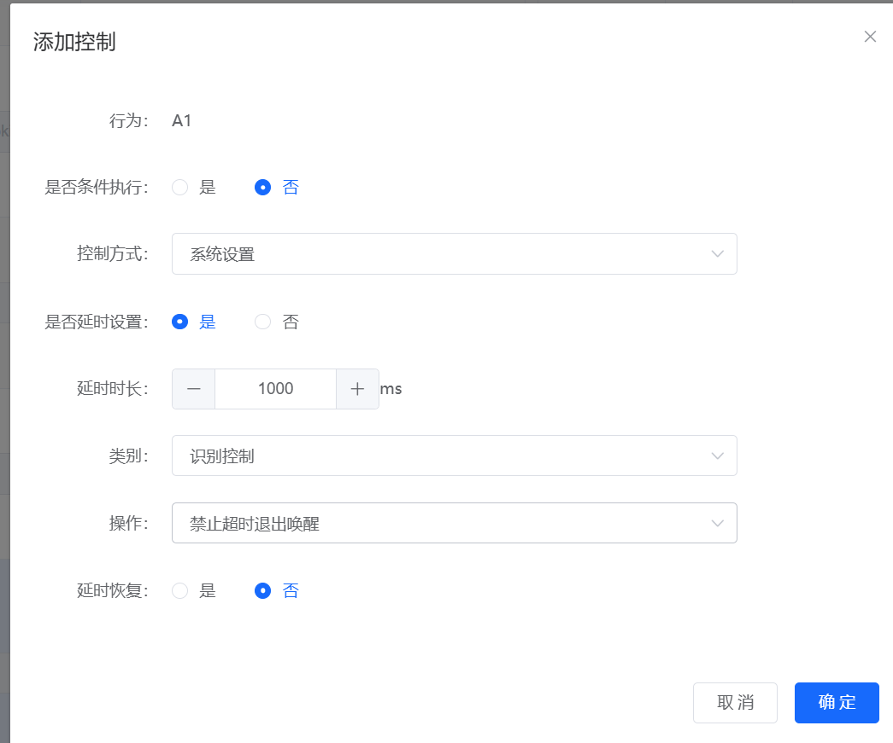
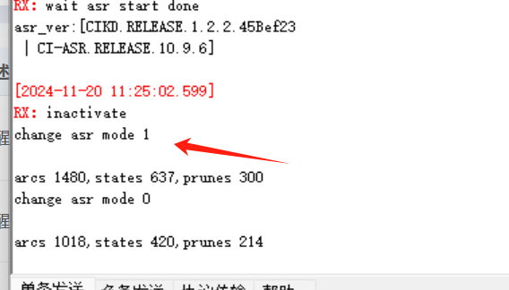

---

### 自学习功能配置后无法播报提示音怎么办？

**问题描述：**

配置自学习功能学习方言报警词后，设备无法播报学习成功的提示音，且日志显示设备已退出唤醒模式。

**解决方案：**

**问题原因分析：**

1. **工具版本兼容性问题**：

    - 不同版本的PACK_UPDATE_TOOLS可能导致功能异常
    - 旧版本工具可能存在播报功能缺陷
    - 日志显示"学习模板超过上限"提示

2. **唤醒模式异常退出**：

    - 串口日志显示设备状态变为"inactivate"
    - 设备退出唤醒模式后无法识别自学习命令
    - 影响自学习功能的正常使用

**解决步骤：**

1. **更新工具版本**：

    - 使用最新版本的PACK_UPDATE_TOOLS工具
    - 下载官方提供的最新工具包
    - 确保工具与固件版本匹配

2. **检查自学习配置**：

    - 确认自学习功能已正确开启
    - 设置学习成功次数为2次
    - 命令词设置为"学习方言唤醒词"

3. **验证播报功能**：

    - 使用新工具重新烧录固件
    - 测试自学习功能是否正常播报
    - 检查设备是否保持唤醒状态

4. **调试方法**：

    - 观察PACK_UPDATE_TOOLS日志输出
    - 确认没有"学习模板超过上限"错误
    - 验证串口日志中无"inactivate"状态

**注意事项：**

- 自学习功能与唤醒模式配置可能存在冲突
- 建议使用官方提供的最新版本工具
- 如问题持续，检查固件版本兼容性
- 保留原始配置文件备份以便恢复

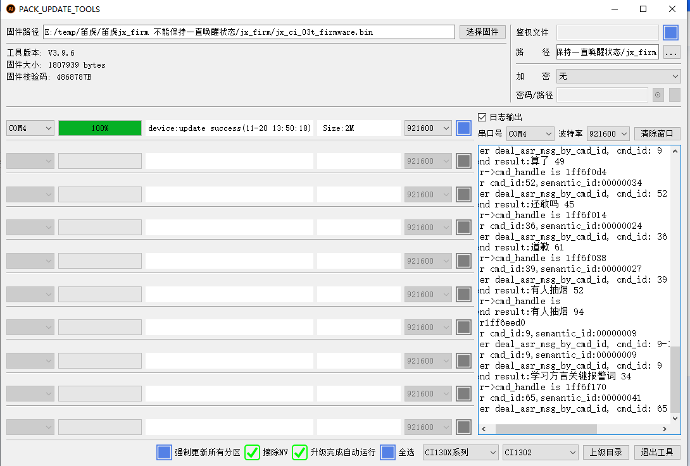
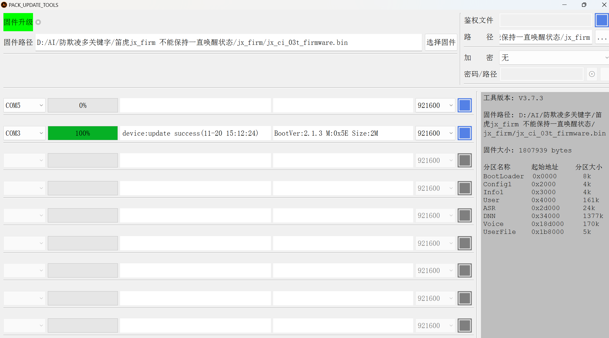
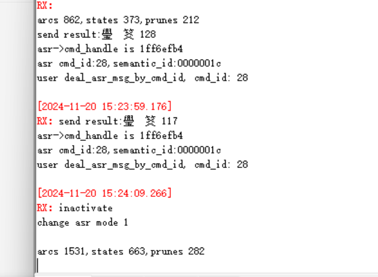

---

### 新版本固件日志有输出但命令串口无响应怎么办？

**问题描述：**

使用新版本固件进行调试时，调试日志正常输出，但命令串口没有数据输出，且自学习功能在上电初期可用，一段时间后失效。

**解决方案：**

**问题原因分析：**

1. **串口输出异常**：

    - 调试日志显示`cmd_handle`和`deal_asr_msg_by_cmd_id`信息
    - 识别结果正常（如`result:道歉 50`）
    - 但命令串口（TX）无输出数据

2. **自学习功能时效性**：

    - 上电初期自学习功能正常
    - 运行一段时间后自学习失效
    - 日志显示`学习方言关键报警词 70`错误

**解决步骤：**

1. **检查固件版本兼容性**：

    - 确认使用的是稳定版本的固件
    - 对比新旧版本的功能差异
    - 如新版本有问题，回退到稳定版本

2. **串口配置验证**：

    - 检查串口波特率和数据格式设置
    - 确认TX引脚连接正确
    - 验证串口工具配置参数

3. **自学习功能调试**：

    - 观察上电初期的学习日志
    - 监控`play start`和`AUDIO_PLAY_CB_STATE_PLAY_THRESHOLD`状态
    - 记录功能失效的具体时间点

4. **临时解决方案**：

    - 重启设备恢复自学习功能
    - 使用旧版本固件进行紧急生产
    - 联系技术支持获取问题修复版本

**注意事项：**

- 新固件版本可能存在未发现的Bug
- 保留问题固件和日志供技术分析
- 建议在批量使用前进行充分测试
- 记录问题出现的具体条件和时间

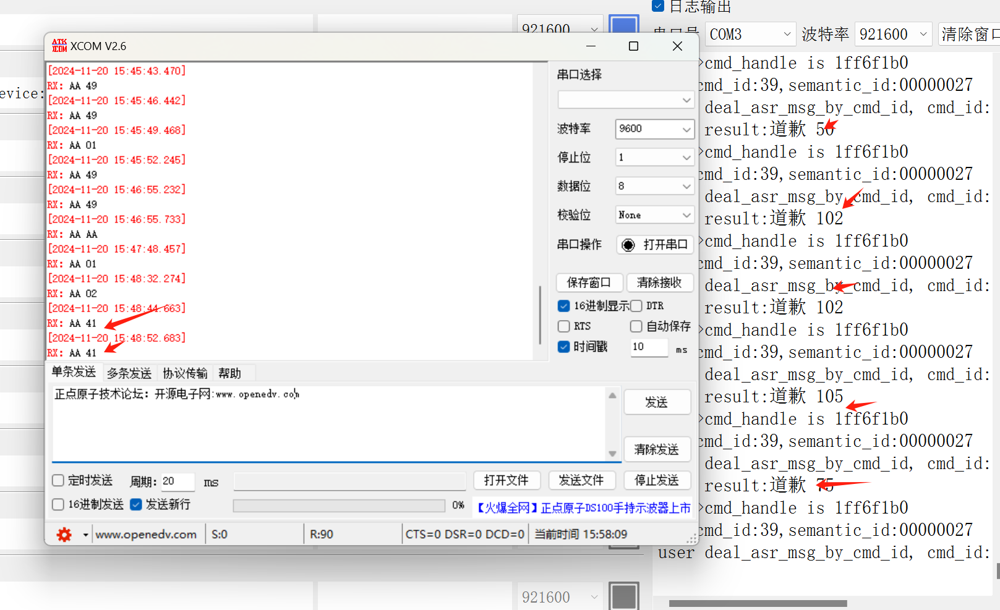
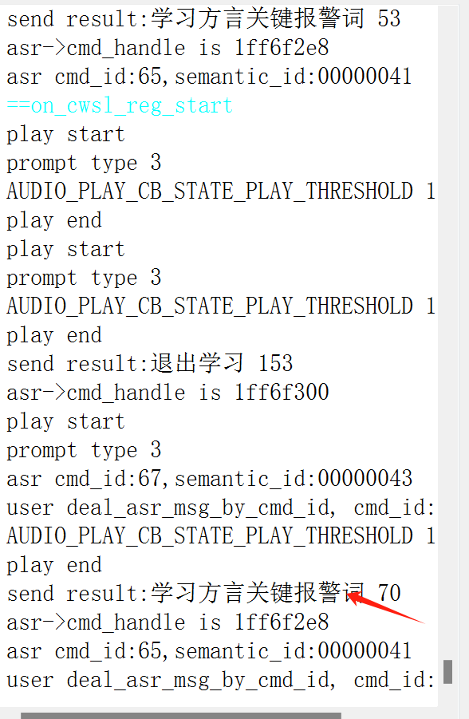

---

### 自学习模式出现"学习方言关键报警词"错误怎么办？

**问题描述：**

使用自学习模式时，系统在多次操作后出现"学习方言关键报警词"的错误提示，错误码为53和70，导致自学习功能无法正常工作。

**解决方案：**

**问题原因分析：**

1. **自学习流程异常**：

    - 日志显示`send result:学习方言关键报警词 53`和`send result:学习方言关键报警词 70`
    - 错误码53和70表示自学习过程中的不同异常状态
    - 可能是平台模板或固件版本兼容性问题

2. **平台配置问题**：

    - 智能公元平台的模板可能存在缺陷
    - 新版模板的自学习功能需要优化
    - 配置继承可能出现异常

**解决步骤：**

1. **平台重新配置**：

    - 在智能公元平台上继承原有配置
    - 创建新的项目配置
    - 重新生成SDK和固件

2. **使用更新后的平台**：

    - 确认平台已经修复了相关问题
    - 使用最新的稳定版本模板
    - 避免使用有问题的旧配置

3. **测试验证**：

    - 使用新生成的固件测试自学习功能
    - 观察是否还有错误码出现
    - 验证自学习功能的稳定性

**注意事项：**

- 错误码53和70分别对应不同的自学习异常
- 平台更新后建议重新创建项目而非直接继承
- 保存问题配置的截图供技术分析
- 如问题持续，提供完整的错误日志


---

### 如何选择合适的识别场景和配置自学习功能？

**问题描述：**

配置离线语音识别产品时，需要根据环境噪声选择合适的识别场景，且对自学习功能的原理和应用存在疑问。

**解决方案：**

1. **识别场景选择**：

    - **安静环境**：选择"普通话通用"或"普通话通用Pro"
    - **嘈杂环境**：选择"普通话通用Pro"（具有更好的抗噪能力）
    - **避免选择**："低误识别"场景（不支持自学习功能）

2. **自学习功能配置**：

    - 在"产品特性"中选择"语音识别+自学习"
    - 设置"学习成功次数"（建议设置为1）
    - 配置"学习命令词"，包括行为、提示语和回复语

3. **自学习功能原理**：

    - 自学习是在原有命令词基础上新增自定义命令词
    - 学习成功后，新命令词只需说一次即可识别
    - 自学习具有声纹识别功能，只有学习者的声音可以触发

**注意事项：**

- 自学习功能支持任何语言和方言，包括台湾话、带口音的英文等
- 自学习是通过记录声纹特征实现，只有特定声音可以控制
- 学习成功次数设置为1可以提高响应速度
- 自学习的命令词与手动设置的命令词效果相同，但识别率更高

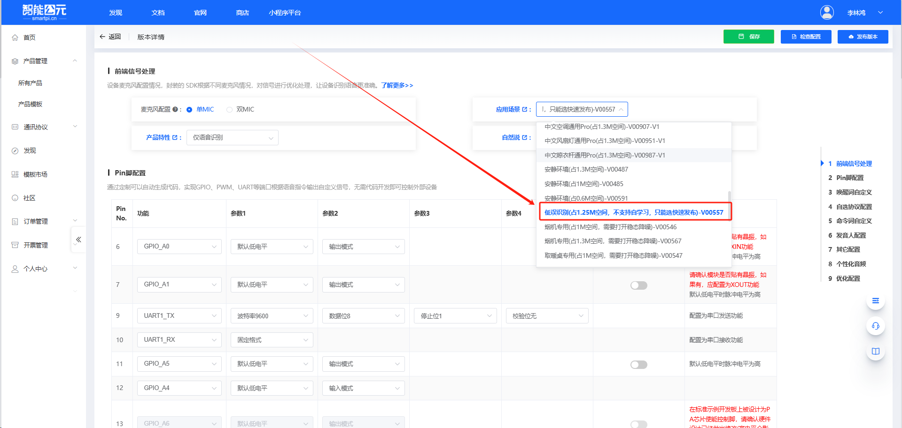

---

### 自学习功能配置保存失败怎么办？

**问题描述：**

在CI-03T设备上配置自学习功能时，即使已开启并保存设置，重启后自学习功能仍会自动关闭，导致配置无法持久保存。

**解决方案：**

1. **检查应用场景配置**：

    - 确认未选择"低误识别"场景（该场景不支持自学习功能）
    - 选择支持自学习的应用场景，如"普通话通用Pro"

2. **检查产品特性配置**：

    - 在产品特性中选择"语音识别+自学习"
    - 确保自学习功能在产品层面已启用

3. **正确保存和继承版本**：

    - 配置完成后先保存当前设置
    - 保存成功后点击"继承新版本"
    - 等待新版本生成完成

4. **导出和验证配置**：

    - 导出项目文件检查配置是否正确
    - 重新导入验证自学习功能设置

**注意事项：**

- "低误识别"场景占用1.25M空间，明确不支持自学习功能
- 自学习功能需要在应用场景和产品特性两处同时启用
- 保存后必须继承新版本才能使配置生效

---

### 如何配置串口指令复位功能？

**问题描述：**

在配置串口指令复位功能时，发现无法设置复位指令，系统无法选择复位操作，且测试消息框无法按旧格式（AA 55 01 55 AA）配置。

**解决方案：**

**问题分析：**

1. **配置界面变化**：

    - 新版平台配置界面与旧版不同
    - 系统复位重启选项不可用
    - 测试消息格式输入方式改变

2. **配置方法更新**：

    - 需要在"系统启动"操作处修改
    - 某些操作不需要添加参数
    - 测试消息格式可能已更新

**正确配置步骤：**

1. **串口触发配置**：

    - 选择"串口输入"触发方式
    - 消息号设置为1（或其他所需值）
    - 消息内容留空或按需设置

2. **系统复位设置**：

    - 在"系统启动"部分进行修改
    - 选择合适的复位操作
    - 注意新版本的操作选项

3. **测试消息配置**：

    - 在测试消息框中输入指令
    - 确认格式是否符合新版本要求
    - 如无法填写，可能是界面限制

4. **参数配置注意**：

    - 某些操作不需要额外参数
    - 无需强制填写所有参数框
    - 按照实际需求配置必要参数

**临时解决方案：**

1. **刷新页面**：

    - 退出当前配置页面
    - 重新刷新网页
    - 再次尝试配置

2. **使用旧版配置**：

    - 如新版本问题持续
    - 可暂时使用旧版本平台
    - 联系技术支持获取帮助

3. **固件重新生成**：

    - 使用技术人员提供的修正配置
    - 重新生成固件测试
    - 确认复位功能是否恢复

**注意事项：**

- 平台更新可能改变配置方式
- 保存好旧版本的配置记录
- 测试前备份当前配置
- 如问题持续，提供详细截图和配置信息

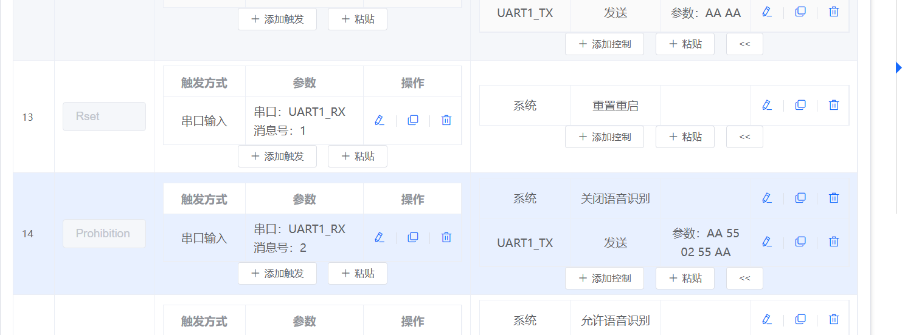
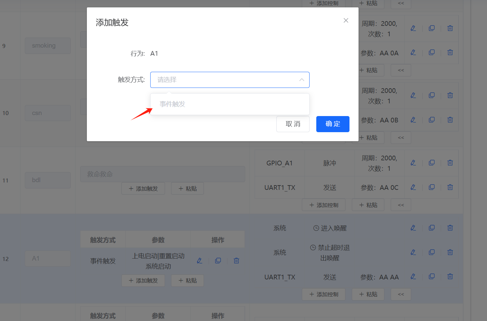

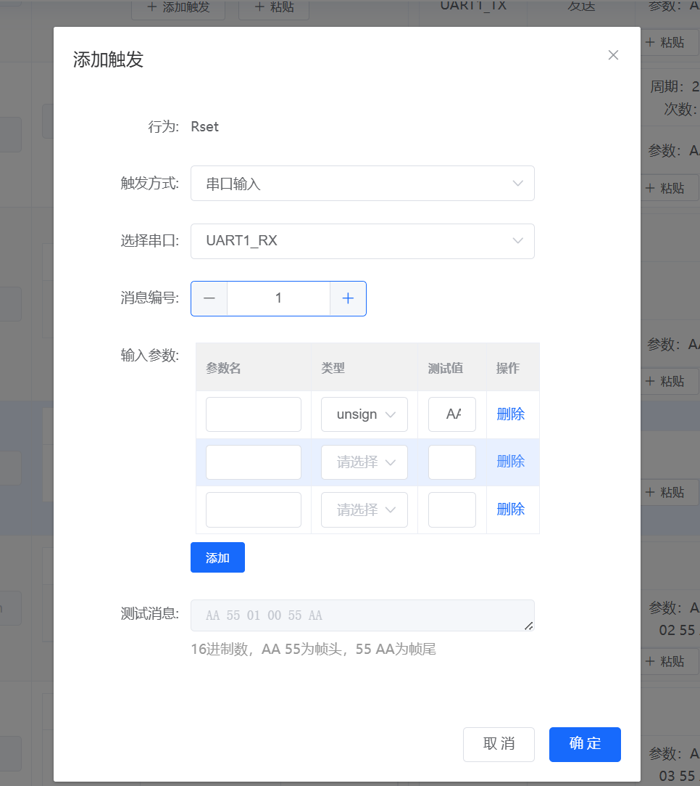
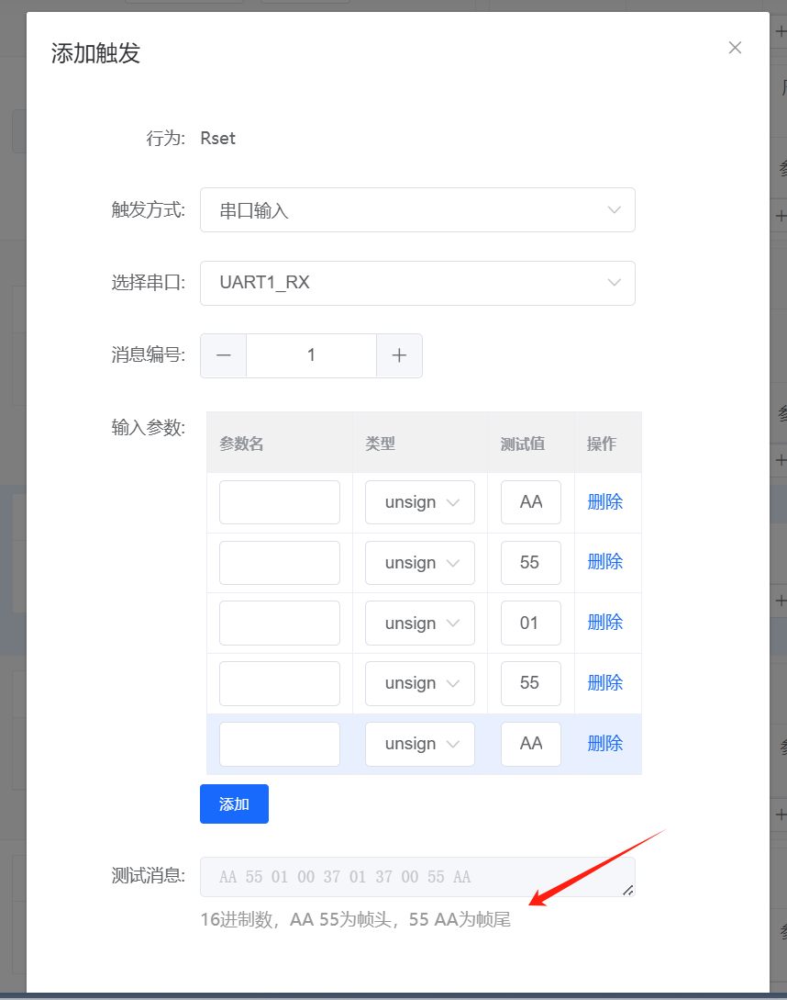

---

### 测试消息框无法编辑怎么办？

**问题描述：**

在配置串口触发消息格式时，测试消息框显示为灰色无法编辑，无法按旧版本格式（AA 55 01 55 AA）配置触发消息。

**解决方案：**

**问题分析：**

1. **测试消息框说明**：

    - 测试消息框是只读显示区域
    - 用于显示当前配置的结果
    - 不能直接输入或编辑

2. **配置方法更新**：

    - 新版本平台改变了配置方式
    - 需要在其他位置设置触发消息
    - 测试消息仅用于验证配置

**正确配置步骤：**

1. **配置触发条件**：

    - 消息号：设置为1（对应所需功能）
    - 触发方式：选择"串口输入"
    - 消息内容：根据需要配置

2. **处理测试消息**：

    - 测试消息框会自动显示配置结果
    - 内容"AA 55 01 55 AA"是示例
    - 实际内容根据配置自动生成

3. **触发条件设置**：

    - 如不需要特定触发条件
    - 清空"上电启动"和"重置启动"
    - 避免触发条件冲突

4. **版本确认**：

    - 确认使用的产品版本号
    - 不同版本可能有差异
    - 使用最新稳定版本

**调试方法：**

1. **使用串口工具测试**：

    - 通过串口调试工具发送指令
    - 观察设备响应日志
    - 确认配置是否生效

2. **触发消息验证**：

    - 发送AA 04、AA 28等测试指令
    - 查看设备是否正确响应
    - 验证功能是否正常

**注意事项：**

- 测试消息框是显示区域，非输入框
- 配置触发消息需要通过其他参数设置
- 清空不必要的触发条件避免冲突
- 保存配置后使用串口工具实际测试

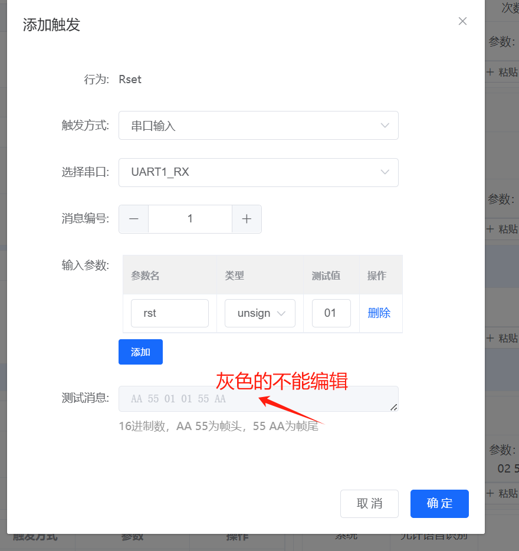
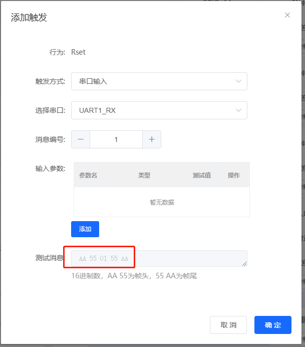
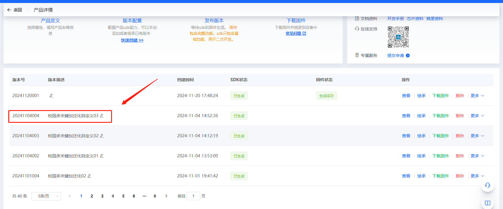
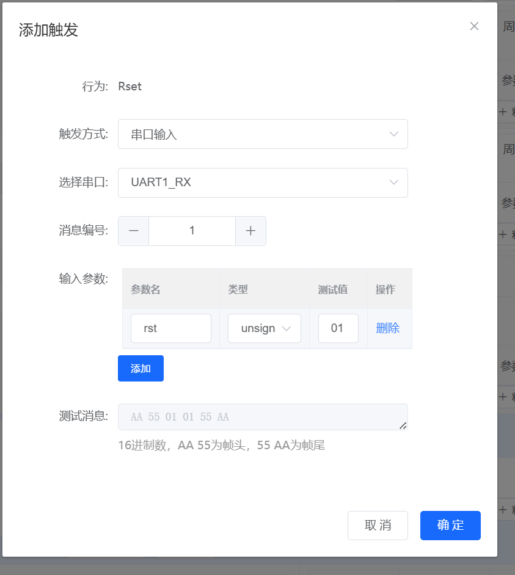

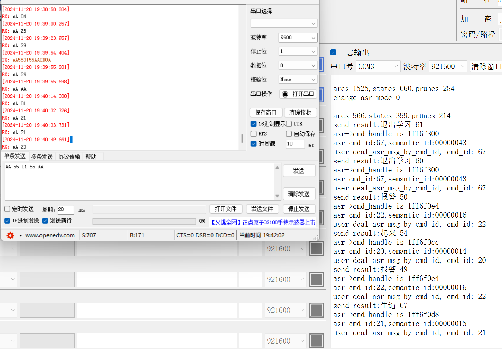

---

### CI-03T1是否支持OTA固件升级？

**问题描述：**

需要了解CI-03T1芯片是否支持OTA（Over-the-Air）固件升级，以及具体的升级协议和实现方式。

**解决方案：**

**1. OTA支持情况**

CI-03T1芯片支持OTA升级功能，但实现较为复杂，需要基于代码开发。

**2. 实现前提**

**开发模式要求**：

- 必须是基于代码开发的项目
- 智能公元平台生成的固件默认不支持OTA
- 需要通过自定义代码实现OTA功能

**技术要求**：

- 需要深入理解模块的通信协议
- 实现固件下载和烧录逻辑
- 处理升级过程中的异常情况

**3. 实现方案**

**方案一：使用厂商提供的技术支持**

- 联系技术团队获取OTA实现方案
- 获取升级协议和工具支持
- 需要一定的开发周期

**方案二：自主开发**

- 研究现有的通信协议
- 开发固件下载功能
- 实现安全可靠的升级流程

**4. 注意事项**

**开发复杂度**：

- OTA实现涉及底层操作，开发难度较高
- 需要考虑升级过程中的掉电保护
- 必须保证固件完整性和安全性

**平台限制**：

- 智能公元平台生成的固件为封闭格式
- 无法直接修改添加OTA功能
- 建议项目初期就确定是否需要OTA功能

**建议**：

- 如项目必需OTA功能，建议采用代码开发方式
- 提前与厂商技术团队沟通实现方案
- 预留足够的开发时间进行测试和验证

---

### 平台生成的固件如何实现OTA升级？

**问题描述：**

通过智能公元平台生成的CI1302固件不支持OTA功能，无法直接修改添加OTA代码，需要了解如何实现固件的远程升级功能。

**解决方案：**

**1. 平台固件限制**

**固件特性**：

- 平台生成的固件是封闭格式
- 无法直接修改或添加代码
- 不包含OTA升级相关功能
- 主要适用于标准应用场景

**修改限制**：

- 用户无法自行修改平台固件
- 需要OTA功能需采用其他方案
- 平台暂无加入OTA功能的计划

**2. 实现OTA的替代方案**

**方案一：使用WiFi小程序扫码升级**

- 适用于支持WiFi的模块（如JX-12F）
- 通过小程序扫描二维码进行固件升级
- 需要特定的WiFi模块支持

**方案二：MCU主控升级方案**

- 使用外部MCU作为主控制器
- CI1302作为协处理器
- MCU发起并控制升级过程

**实现步骤**：

1. MCU通过串口连接CI1302
2. MCU从服务器下载新固件
3. MCU通过串口将固件写入CI1302
4. 实现完整的升级控制逻辑

**方案三：代码开发方式**

- 使用SDK进行代码开发
- 在代码中集成OTA功能
- 自主控制固件升级流程

**3. 大批量项目建议**

对于运营商级别的大批量项目（100K级别）：

- 建议采用代码开发方案
- 可实现完全自定义的升级机制
- 更好地控制升级过程和安全性

**4. 注意事项**

**技术考虑**：

- OTA实现需要处理升级失败的情况
- 必须保证升级过程的可靠性
- 考虑网络中断等异常情况

**成本考虑**：

- 代码开发需要额外投入
- MCU方案增加硬件成本
- 需要评估总体性价比

---

### 在没有WiFi的环境下如何实现OTA升级？

**问题描述：**

需要在没有WiFi环境的情况下，通过4G或网线通信实现CI系列语音模块的OTA固件升级，并了解平台是否可以生成支持OTA的固件。

**解决方案：**

**1. 非WiFi环境OTA方案**

**网络环境支持**：

- 4G网络：通过蜂窝网络进行远程升级
- 有线网络：通过以太网接口连接服务器
- 串口通信：作为最终的数据传输通道

**实现架构**：

- 主控制器通过4G/网线连接服务器
- 下载固件数据到本地缓存
- 通过串口将固件烧录到语音模块
- 占用两个串口：一个用于通信，一个用于升级

**2. 技术实现方式**

**双串口方案**：

- 串口1：与语音模块正常通信
- 串口2：专用于固件升级
- 避免升级过程影响正常通信

**串口直接烧录**：

- 通过串口实现远程烧录功能
- 需要自定义烧录协议
- 可以不依赖WiFi实现远程更新

**3. 固件生成说明**

**平台限制**：

- 智能公元平台无法生成支持OTA的固件
- 平台生成的固件格式固定
- 不包含远程升级相关代码

**自主实现**：

- 需要通过代码开发方式
- 自行实现固件下载和烧录逻辑
- 可以适配4G和有线网络环境

**4. 开发注意事项**

**资源占用**：

- 双串口方案需要足够的串口资源
- 考虑MCU的串口数量是否满足
- 可能需要使用串口扩展芯片

**稳定性考虑**：

- 4G网络稳定性较差，需要重试机制
- 大文件传输需要考虑流量成本
- 断点续传功能提高可靠性

**建议**：

- 评估项目是否真的需要OTA功能
- 考虑使用本地升级作为备选方案
- 大批量项目建议专门定制开发

---

### 如何确认固件使用的语音模型？

**问题描述：**

需要确认固件文件使用的具体语音模型，但平台网站无法正常访问，需要了解其他方式获取模型信息。

**解决方案：**

**1. 语音模型确认方法**

**通过固件文件确认**：

- 固件文件名通常包含型号信息
- 文件路径可能体现模块型号
- 例如：固件解压后显示为ci03t目录

**通过平台确认**：

- 智能公元平台官网：http://www.smartpi.cn/#/
- 平台会显示使用的模型信息
- 登录后查看项目配置详情

**2. 平台访问问题处理**

**网站无法访问时**：

- 检查网络连接是否正常
- 尝试使用不同浏览器访问
- 联系技术支持确认平台状态

**替代方案**：

- 通过群聊联系技术支持
- 提供固件文件让技术人员查看
- 查看固件生成时的配置记录

**3. 常见语音模型类型**

**CI-03T支持的模型**：

- 基础语音识别模型
- 支持定制唤醒词
- 支持命令词识别
- 可配置回复语音

**模型标识方法**：

- 固件文件中的目录结构
- 配置文件中的模型声明
- 平台生成时的模型选择记录

**注意事项**：

- 不同版本的固件可能使用不同模型
- 确认模型时需要提供完整的固件信息
- 保留固件生成时的配置记录便于查询

---

### 智能公元平台界面更新后如何匹配旧版语音模型？

**问题描述：**

智能公元平台网站界面已更新，导致无法识别和匹配之前使用的旧版语音模型，配置内容与预期不符，无法保存修改。

**解决方案：**

**1. 界面更新问题识别**

**常见问题**：

- 网站界面布局发生变化
- 应用场景参数不匹配旧配置
- 配置内容无法正常保存
- 每次打开都是关闭状态

**根本原因**：

- 平台升级导致模型名称或参数变化
- 旧配置与新界面不兼容
- 可能存在界面显示bug

**2. 解决方法**

**方法一：查找对应的新模型**：

- 记住旧模型的特征参数
- 在新界面中寻找相似的模型
- 对比模型的具体参数配置

**方法二：使用继承功能**：

- 选择"继承"原有配置
- 保持原有的设置参数
- 逐项调整不匹配的部分

**方法三：重新配置项目**：

- 创建新的项目配置
- 手动设置所有参数
- 测试确认功能正常

**3. 故障排除**

**界面问题处理**：

- 尝试刷新浏览器缓存
- 使用不同浏览器访问
- 联系技术支持确认平台状态

**配置保存失败**：

- 检查必填项是否完整
- 确认参数值是否在有效范围
- 逐步保存避免一次性改动过多

**4. 技术支持**

**信息提供**：

- 描述遇到的具体问题
- 提供截图或错误信息
- 说明使用的旧模型名称

**协助内容**：

- 技术团队可查询历史配置
- 帮助匹配对应的新模型
- 提供临时解决方案

**注意事项**：

- 平台更新是正常现象，建议及时适应
- 保存好配置的备份文件
- 遇到问题及时反馈给技术支持

---

### CI-03T空调遥控协议调试异常怎么办？

**问题描述：**

使用CI-03T1芯片进行空调遥控协议调试时，出现以下异常：

- 温度控制异常：18度显示为26，28度显示为20
- 上下扫风功能失效
- 温度调节范围受限：最高只能到21度，降到20度后返回27度
- 模式功能异常：除送风模式外其他模式无法使用
- 屏显功能无响应

**解决方案：**

**1. 问题原因分析**

- **协议兼容性**：不同品牌空调（格力、美的、海尔、海信）的遥控协议存在差异
- **数据映射错误**：温度值与实际遥控码的映射关系不正确
- **功能支持差异**：老式空调可能不支持某些模式

**2. 调试建议**

**温度控制调试**：

- 逐个测试温度值，记录实际对应的遥控码
- 建立完整的温度-遥控码映射表
- 特别注意16-30度常用温度段的准确性

**扫风功能调试**：

- 检查上下扫风的独立控制码
- 验证扫风速度档位的编码
- 确认扫风方向切换的正确性

**模式功能调试**：

- 分别测试制冷、制热、除湿、自动模式
- 记录每种模式对应的具体指令
- 重点关注模式切换的组合指令

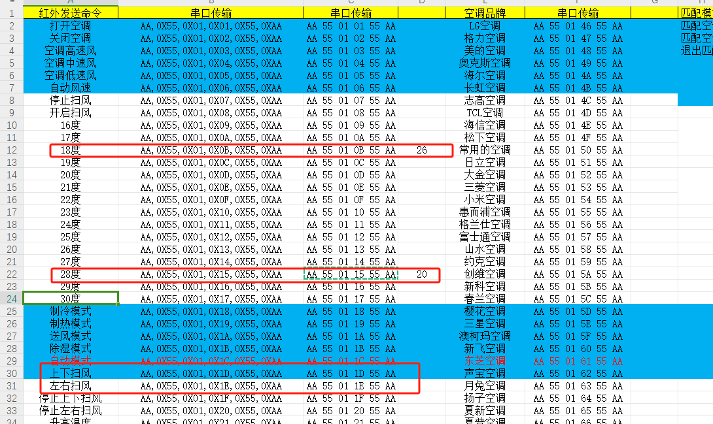

**3. 品牌适配建议**

- **格力空调**：协议相对标准，功能支持较完整
- **美的空调**：需要注意温度显示差异（老式空调无温度显示）
- **海尔/海信空调**：可能需要重新学习遥控码
- **老式空调**：功能支持有限，建议优先保证基础功能

**4. 屏显功能配置**

- 检查硬件连接：确认显示屏与模块的接口连接
- 验证显示指令：确认发送正确的显示控制码
- 调试显示内容：尝试显示固定内容测试

**注意事项：**

- 不同品牌的空调协议差异较大，需要分别适配
- 老式空调可能不支持高级功能，应优先保证基本功能
- 建议先完成主流品牌的适配，再扩展其他品牌
- 温度异常可能是二进制编码问题，需要核对协议文档
- 保留完整的调试日志，便于问题定位

---

### 电梯楼层指令动态配置如何实现？

**问题描述：**

需要为不同建筑的电梯系统配置语音指令，这些建筑的楼层数量和起始楼层各不相同（如-2楼到10楼，或-5楼到60楼）。要求语音识别后发送的控制数据能正确映射到实际楼层。

**解决方案：**

**1. MCU动态配置方案**

通过MCU在系统初始化时向CI模块发送模式标识符：

- 发送"AA"：进入模式一（如-2到10楼）
- 发送"BB"：进入模式二（如-5到20楼）
- 模块根据接收到的标识符加载预设的楼层映射规则

**2. 固件定制方案**

由于平台暂不支持直接发送变量，需要定制固件实现：

- 支持模式识别功能
- 内置多种楼层映射表
- 根据模式标识符自动切换

**3. 实现步骤**

- 步骤1：定义建筑的最低楼层和总楼层数参数
- 步骤2：MCU根据参数发送对应的模式标识符
- 步骤3：CI模块加载预设的楼层映射规则
- 步骤4：语音识别后发送正确的控制数据

**4. 映射规则示例**

无论最低楼层是-2还是-5：

- "到一楼" → 发送数据1
- "到二楼" → 发送数据2
- 以此类推...

**注意事项：**

- 需要技术支持提供定制固件
- 不同建筑需要单独配置模式
- 确保MCU与CI模块的串口通信正常

---

### 语音指令参数中如何使用变量进行动态计算？

**问题描述：**

希望在语音指令的参数中使用变量进行动态计算（如{Set_Floor-80}），以实现根据设置的楼层数自动计算并发送对应的楼层标志数据，而无需为每个楼层手动设置独立的变量。

**解决方案：**

**1. 平台限制说明**

- 当前平台暂不支持在参数中直接进行变量计算
- 不支持类似{Set_Floor-80}的语法
- 参数中只能直接使用变量名，如{Set_Floor}

**2. 替代方案一：变量设置指令**

在发送数据前添加变量设置指令：

- 步骤1：添加控制指令设置变量值
- 步骤2：使用变量设置功能进行减法操作
- 步骤3：发送包含计算后变量的数据

**3. 替代方案二：多变量配置**

为每个楼层配置独立的变量：

- 设置多个变量（如floor1, floor2, floor3...）
- 通过条件判断选择发送对应的变量
- 需要手动配置每个楼层的变量值

**4. 固件定制方案**

如需要动态计算功能：

- 联系技术支持定制固件
- 在固件中实现变量计算逻辑
- 支持更灵活的参数配置

**注意事项：**

- 变量数量没有限制，可以根据需要设置
- 建议在主控端处理数据计算逻辑
- 定制固件可能产生额外成本

---

### CI-03T1芯片是否支持英文语音识别？

**问题描述：**

询问CI-03T1芯片是否支持英文语音识别，以及是否可以直接在网站上配置英文指令并编译固件烧录。

**解决方案：**

**1. 英文识别支持**

CI-03T1芯片支持英文语音识别功能：

- 可在配置平台直接输入英文指令
- 支持英文命令词的离线识别
- 识别准确率与中文相当

**2. 配置方法**

在智能公元平台配置英文指令：

- 步骤1：在指令词条中输入英文命令
- 步骤2：设置对应的控制动作
- 步骤3：编译生成固件
- 步骤4：烧录到CI-03T1模块

**3. 注意事项**

- 英文指令需要使用标准拼写
- 避免使用俚语或方言
- 建议使用简洁明确的命令词
- 可以混合使用中英文指令

---

### TTS固件是否现成提供？定制开发和软件修改权限如何处理？

**问题描述：**

需要了解TTS（文字转语音）功能是否有现成的固件，定制开发的费用情况，以及是否支持软件修改。

**解决方案：**

**1. TTS固件获取方式**

- TTS功能需要使用授权的芯片
- 现成TTS固件可直接提供给授权用户
- 购买授权模块后可自行下载TTS固件进行烧录

**2. 授权芯片要求**

- 必须购买授权的芯片或模块
- 非授权芯片无法使用TTS功能
- 授权芯片需要定制，交期约10天

**3. 定制开发说明**

- TTS功能属于授权特性，需要额外授权费用
- 定制开发根据具体需求评估
- 软件修改权限取决于授权协议范围

**注意事项：**

- 授权芯片有最小起订量要求
- 建议先购买授权模块测试效果
- 批量使用前确认好授权条款和成本

---

### 购买授权模块后是否需要自行烧录TTS固件？

**问题描述：**

确认TTS功能是否有现成的固件和协议，以及购买授权模块后是否需要自行烧录固件。

**解决方案：**

**1. 固件获取方式**

- 有现成的TTS固件文件（.bin格式）
- 授权后可提供固件下载链接
- 包含完整的TTS协议文档

**2. 烧录操作**

- 需要自行烧录TTS固件到模块
- 使用启英泰伦串口升级工具
- 选择对应的芯片型号（CI1302/CI1303）

**3. 烧录步骤**

- 步骤1：连接模块到电脑
- 步骤2：打开串口升级工具
- 步骤3：选择芯片型号和固件文件
- 步骤4：执行固件升级

**注意事项：**

- 只有授权的芯片才能使用TTS固件
- 烧录时选择正确的芯片型号
- 烧录完成后测试TTS功能是否正常

---

### 授权芯片的采购价格、交期和起订量如何？

**问题描述：**

需要了解授权芯片的价格、交付周期和最小起订量要求。

**解决方案：**

**1. 价格说明**

- 授权芯片价格高于普通芯片
- 具体价格需要根据采购量确定
- 月采购量1000左右可联系商务获取报价

**2. 交付周期**

- 标准产品：常规交期
- 授权产品：约10天左右
- 需要额外时间进行授权处理

**3. 起订量要求**

- 授权芯片最小起订量：100个
- 模组形式可小批量采购
- 建议先购买授权模块测试

**4. 采购渠道**

- 淘宝店铺有授权模块出售
- 需联系客服确认授权状态
- 批量采购直接联系销售

**注意事项：**

- 授权芯片出货流程较复杂
- 提前规划采购时间
- 确认年用量以获得更好价格

---

### CI1302(TTS)芯片批量采购和固件烧录流程如何？

**问题描述：**

需要批量采购200片CI1302（TTS语音）芯片，并要求将固件烧录好后直接发货。

**解决方案：**

**1. 批量采购流程**

- 确认采购数量和交期要求
- 签订采购合同（模板可提供）
- 付款后安排生产（通常3-5天）
- 生产完成后直接发货

**2. 固件烧录服务**

- 支持出厂前烧录指定固件
- 提供固件文件（.bin格式）
- 需要说明是否需要加密

**3. 固件要求确认**

- TTS功能固件无唤醒词限制
- 确认固件版本和功能需求
- 提供测试用的命令词列表（如有）

**4. 交付说明**

- 烧录完成的芯片可直接使用
- 提供烧录费用清单（通常1元/片）
- 包装防静电保护

**5. 注意事项**

- 确认收货地址和联系人
- 提供开票信息（如需要）
- 收货后及时抽检功能

---

### CI-03T是否支持在线升级功能？声纹识别模块如何获取？

**问题描述：**

需要了解CI-03T的在线升级功能是否已开放，以及如何获取声纹识别模块。

**解决方案：**

- **在线升级功能**：目前平台尚未开放CI-03T的在线升级功能
- **声纹识别模块**：需要使用CI-03T或CI-33T芯片，且芯片需要授权才能使用声纹功能

**获取方式：**

- 声纹识别功能目前只能通过项目方式申请使用
- 需要联系技术支持说明具体项目需求
- 授权通过后可获取声纹识别模块和相关技术文档

**注意事项：**

- 在线升级功能开放时间待定，请关注平台更新通知
- 声纹识别功能需要授权芯片，普通版本不支持此功能
- 建议提前规划项目周期，预留授权申请时间

---

### 如何选择合适的识别模型？

**问题描述：**

平台提供多个普通话通用识别模型选项（如V00864-V1、V00923-V1、V00942-V1、V00969-V3等），需要了解如何选择合适的模型。

**解决方案：**

- **模型差异**：不同模型在识别效果上存在差异
- **占用空间**：模型占用空间不同（0.6M-1.3M）
- **场景适配**：针对不同使用场景优化

**选择建议：**

- 普通话通用场景下，各模型差异不是特别大
- 可以根据实际应用需求选择占用空间合适的版本
- 建议实际测试对比效果后再做决定

**注意事项：**

- V00969-V3等较新版本通常有更好的优化
- 具体性能差异建议实际使用验证
- 选择模型后需要重新生成固件

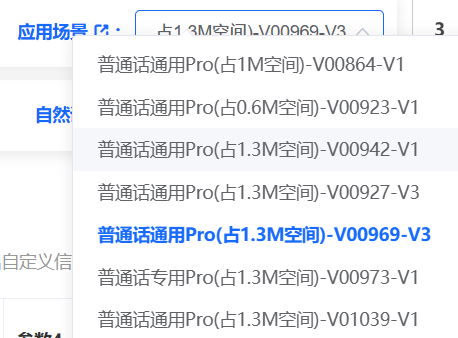

---

### 为什么测试版本发布界面没有生产版本选项？

**问题描述：**

测试版本发布界面只显示"快速测试版本"选项，没有生产版本的生成选项。

**解决方案：**

- **功能调整**：新版本的识别模型效果优于原版本，不再需要发布优化
- **简化流程**：平台取消了原有的生产版本发布选项
- **当前选项**：只保留"快速测试版本"发布功能

**功能说明：**

- 快速测试版本支持2个触发词
- 灵敏度设置为中等
- 新模型已经过优化，无需额外处理

**注意事项：**

- 使用新模型可直接生成测试版本使用
- 如需特殊功能，请联系技术支持
- 建议测试验证功能满足需求后再批量应用


---

### 通用红外码库中没有空调指令如何处理？

**问题描述：**

在配置红外控制功能时，发现通用码库中没有对应品牌的空调指令。

**解决方案：**

- **空调学习功能**：使用红外学习功能，用原装空调遥控器对准模块进行学习
- **空调模式设置**：学习时注意空调的不同模式（制冷、制热、送风、除湿）
- **保存学习结果**：学习完成后保存配置，生成新的固件

**注意事项：**

- 确保遥控器电池电量充足
- 学习环境避免强光干扰
- 不同型号空调的指令码可能不同
- 建议学习后实际测试各项功能

---

### 如何将CI-03T1/T2芯片的语音识别模式从中文转换为英文？

**问题描述：**

需要将CI-03T1/T2芯片的语音识别从中文模式转换为英文模式。

**解决方案：**

- **需要重新制作**：中文和英文模式的固件是分别制作的，不能直接转换
- **平台配置**：在智能公元平台中重新选择英文语言配置
- **重新生成固件**：修改语言设置后需要重新生成固件文件
- **重新烧录**：将新生成的英文固件烧录到芯片中

**注意事项：**

- 中英文固件不能互相转换，必须重新生成
- 确认英文配置后测试识别效果
- 保存好英文配置文件，方便后续修改

---

### CI-03T1/T2的A6端口可以作为通用IO使用吗？

**问题描述：**

需要确认A6端口是否可以作为通用IO口使用，以及了解该端口的功能定义。

**解决方案：**

A6端口（PA6引脚）可以作为通用IO使用：

**1. 引脚功能**

- 默认功能：GPIO PA6（上电默认状态）
- 支持功能：IIS_MCLK、UART2_RX、PWM0
- 可通过配置选择不同功能

**2. 端口特性**

- 上电瞬间：A6端口没有电压输出
- 与A5类似：初始状态为高阻态
- 可配置：支持推挽输出、输入、上拉、下拉等模式

**3. 使用注意事项**

- A0和A1端口上电瞬间可能有电压，如需稳定可加10μF电容吸收
- A6端口功能需要通过固件配置选择
- 不同功能模式下的电气特性可能不同

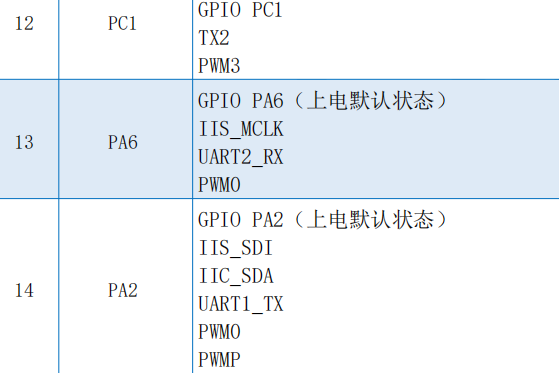

**注意事项：**

- 使用前需在固件中正确配置引脚功能
- A6作为GPIO时，注意上下拉电阻的配置
- 多功能复用时，确保同一时间只使用一种功能

---

### CI-03T1如何设置多个唤醒词？

**问题描述：**

需要在CI-03T1平台上设置多个唤醒词，了解如何添加和管理多个唤醒词。

**解决方案：**

**1. 添加多个唤醒词**

在智能公元平台的唤醒词配置界面：

- 进入"唤醒词"设置页面
- 点击"添加一条"按钮增加新的唤醒词
- 可以添加多个不同的唤醒词，如"你好托福"、"托福你好"等
- 每个唤醒词可以独立配置拼音和参数

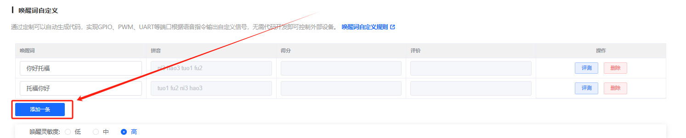

**2. 唤醒词配置要点**

- **数量限制**：

    - 理论上可以添加多个唤醒词
    - 建议控制在3-5个以内，避免误唤醒
    - 唤醒词越多，识别难度相对增加

- **差异化设计**：

    - 唤醒词之间要有明显区别
    - 避免使用相似发音的词汇
    - 建议使用4-6个字的唤醒词

- **发音规范**：

    - 使用标准普通话发音
    - 避免使用方言或特殊口音
    - 确保拼音标注准确

**3. 测试与优化**

- **逐个测试**：

    - 每个添加的唤醒词都要单独测试
    - 测试不同距离和角度下的识别率
    - 记录误唤醒和漏唤醒情况

- **参数调整**：

    - 根据测试结果调整识别阈值
    - 优化唤醒词的置信度设置
    - 平衡识别率和误唤醒率

**4. 注意事项**

- 唤醒词不需要特殊分隔符
- 每次只能识别一个唤醒词
- 建议选择日常使用但不易误触发的词汇
- 定期清理不常用的唤醒词以提高识别准确度

---

### CI-03T1如何通过串口与主控通信？

**问题描述：**

需要了解CI-03T1与主控通信的串口数据协议格式，包括生成串口数据的握手协议规范。

**解决方案：**

**1. 串口通信协议类型**

- **HEX十六进制数据**：

    - 平台支持发送16进制数据
    - 格式：空格分隔的十六进制数（如：55 05 03 55）
    - 支持最大长度32字节

- **自定义协议**：

    - 协议格式完全可自定义
    - 可以根据主控需求设计通信协议
    - 支持变量嵌入（如{var_a}格式）

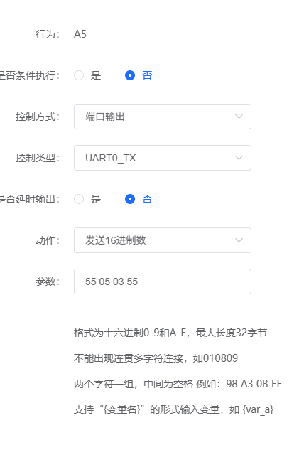

**2. 配置串口输出**

在智能公元平台中配置：

- **控制方式**：选择"端口输出"
- **控制类型**：选择对应的UART端口（如UART0_TX）
- **动作类型**：选择"发送16进制数"
- **数据内容**：输入要发送的十六进制数据

**3. 协议设计建议**

- **帧头标识**：

    - 使用固定的帧头（如0x55）
    - 便于主控识别数据包开始
    - 可以使用多字节帧头提高可靠性

- **数据结构**：

    - 帧头 + 命令字 + 数据长度 + 数据内容 + 校验和
    - 根据实际需求设计数据结构
    - 保持协议简洁高效

- **变量使用**：

    - 支持在数据中嵌入变量
    - 格式：{变量名}
    - 运行时自动替换为实际值

**4. 通信示例**

```
简单协议示例：

- 帧头：55 AA
- 命令：01（唤醒）、02（命令1）、03（命令2）
- 数据：可变长度
- 校验：累加和或CRC

完整数据：55 AA 01 05 01 02 03 04 0B
```

**注意事项：**

- 十六进制数只支持0-9和A-F
- 数据中不能有连续字符连接（如010809）
- 建议先测试简单协议，确认通信正常后再扩展
- 串口波特率需要与主控匹配（默认921600）

---

### CI-03T固件生成失败提示超时怎么办？

**问题描述：**

CI-03T1固件生成失败，平台提示"生成超时，可重新生成或继续等待"，需要排查原因并解决。

**解决方案：**

**1. 问题排查**

- **检查配置变更**：确认是否添加了过多功能或命令词
- **网络连接**：检查网络与平台服务器连接是否稳定
- **服务器负载**：可能同时生成用户过多，可稍后重试

**2. 处理方法**

**不继承配置，重新生成**：

- 不选择"继承历史配置"选项
- 创建全新项目重新配置
- 减少初次配置的复杂度

**简化配置内容**：

- 减少命令词数量（特别是免唤醒命令词）
- 暂时去掉非必要的功能
- 分模块逐步添加功能并测试

**3. 配置优化建议**

- **GPIO配置检查**：

    - 引脚5和6被配置为GPIO_A27/A28
    - 确认硬件已修改（高电平会影响音频播报）
    - 如未修改硬件，更换其他GPIO引脚

- **使用CI系列优势**：

    - CI-03T生成速度比SU系列更快
    - 固件队列处理时间更短
    - 优先使用CI系列进行开发测试

**注意事项：**

- 固件生成正常需要10-30分钟
- 超过1小时仍未完成视为异常
- 建议错峰使用平台，避开服务器高峰期
- 保留配置草稿，便于重新快速配置

---

### CI-03T2双麦模块声源定位功能如何配置？

**问题描述：**

CI-03T2双麦模块在上电后无法自动唤醒，且声源定位功能返回的参数为'chucun'而非实际角度值，同时配置后无法通过串口输出声源角度信息。

**解决方案：**

**1. 唤醒功能配置**

- **触发方式**：选择"上电启动系统启动"
- **系统操作**：选择"进入唤醒"或相应的唤醒动作
- **避免冲突**：不要同时设置"禁止超时退出唤醒"

**2. 声源定位配置**

- **事件触发**：选择"声源定位成功"
- **获取角度**：使用"获取声源角度"操作
- **变量设置**：角度变量名为'{pd}'而非'chucun'

**3. 串口输出配置**

- **UART设置**：确认UART1_TX引脚配置为A2/A3
- **数据格式**：发送16进制数据，参数使用正确的变量名
- **避免错误**：不要使用固定值如"00 01"

**注意事项：**

- 确保使用双麦模块（CI-03T2）而非单麦模块
- 固件生成失败时检查配置冲突
- 串口无输出时检查引脚连接和变量设置


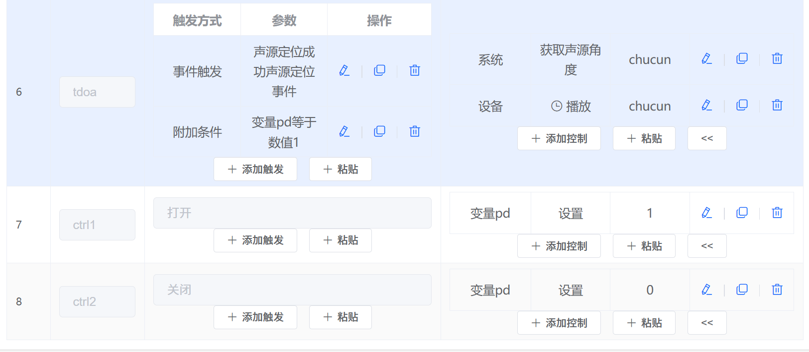

---


---

### PWM硬件输出与软件输出有何区别？

**问题描述：**

在CI-03T1/T2芯片上，直接选择PWM3与先选择GPIO再选择PWM输出，即使频率设置相同，这两种设置方式有何区别？

**解决方案：**

**1. 输出类型区别**

- **直接选择PWM3**：硬件PWM输出
    - 使用芯片内部的PWM硬件外设
    - 输出波形稳定，精度高
    - 不占用CPU资源

- **GPIO配置为PWM**：软件PWM输出
    - 通过软件模拟PWM波形
    - 占用CPU资源进行翻转
    - 精度和稳定性相对较低

**2. 引脚复用说明**

**硬件资源分配**：

- PWM硬件外设是有限的资源
- 同一个PWM外设只能分配给一个引脚
- 选择PWM3时，B2和A27引脚只能选择其中一个

**配置示例**：

- B2引脚和A27引脚都标记为TIM3_PWM
- 选择PWM3外设时，另一个引脚会恢复为默认GPIO功能
- 不能同时使用B2和A27作为PWM3输出


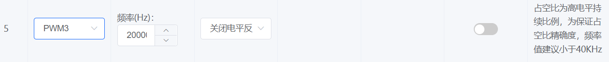
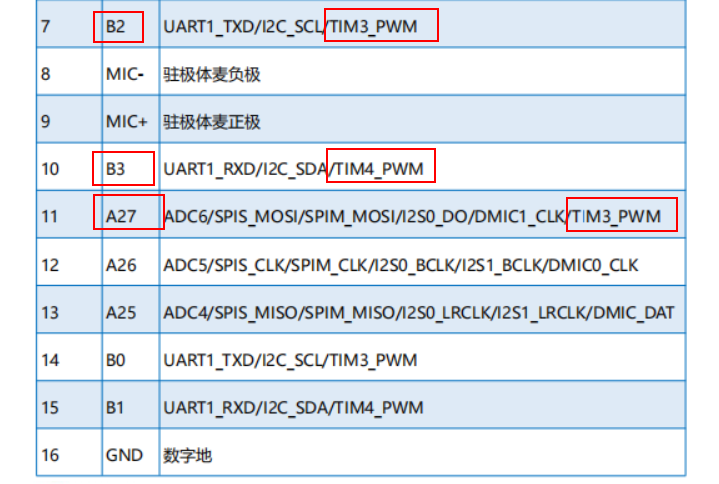

**3. 选型建议**

**使用硬件PWM**：

- 需要精确控制PWM频率和占空比
- 对波形质量要求较高的应用
- 如电机控制、LED调光等

**使用软件PWM**：

- 临时测试或简单应用
- 硬件PWM资源不足时
- 对精度要求不高的场合

**注意事项：**

- 同一PWM外设不能同时驱动两个引脚
- 软件PWM可能影响系统实时性
- 建议优先使用硬件PWM外设

---


---

### PWM电平反向功能如何配置？

**问题描述：**

在CI-03T1/T2芯片的低代码平台中，如何正确配置PWM引脚复用和电平反向功能？

**解决方案：**

**1. 电平反向功能说明**

电平反向功能实现互补波输出：

- **未开启电平反向**：输出正常PWM波形
    - 初始相位为低电平
    - 占空比定义为高电平持续时间比例
    - 适用于正逻辑控制场景

- **开启电平反向**：输出反相PWM波形
    - 初始相位为高电平
    - 占空比定义为低电平持续时间比例
    - 适用于反向逻辑控制或消除电平冲突

**2. 应用场景选择**

**未开启电平反向适用于**：

- 标准LED调光
- 普通MOS管驱动
- 需直观匹配占空比与输出强度的场景

**开启电平反向适用于**：

- 需要反向逻辑控制的硬件电路
- 低电平触发的继电器
- 共阳极RGB灯
- 需要消除电平冲突的场景


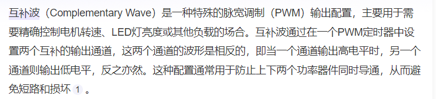

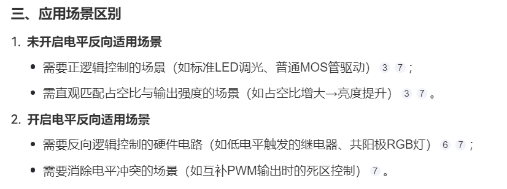

**3. 配置建议**

对于LED灯带调光应用：

- 使用正逻辑控制时，选择关闭电平反向
- 占空比直接对应亮度比例
- 设置合适的PWM频率（建议200Hz-2kHz）

**注意事项：**

- 电平反向功能只作用于选定的PWM外设
- 开启后不影响其他PWM外设的输出
- 需要根据实际硬件逻辑选择是否开启

---


---

### 如何配置CI系列芯片的串口波特率？

需要了解CI系列芯片（如CI-03T1/CI-03T2）与其他芯片通讯时的串口波特率配置方法。

**解决方案：**

在智能公元平台中配置串口波特率的方法如下：

**配置步骤：**

1. 登录智能公元平台
2. 选择对应的产品型号
3. 进入串口配置界面
4. 设置UART0_TX和UART0_RX参数：

    - 波特率：可设置为115200（默认9600）
    - 数据位：8位
    - 停止位：1位
    - 校验位：无

**配置说明：**

- 平台配置界面统一，所有CI系列芯片配置方法相同
- 默认波特率为9600，可根据需要调整
- UART0_TX用于串口发送功能
- UART0_RX用于串口接收功能


**注意事项：**

- 通讯双方的波特率必须一致
- 修改波特率后需要重新生成并烧录固件
- 高波特率（如115200）传输速度快但抗干扰能力较差
- 低波特率（如9600）传输稳定但速度较慢

---


---

### 快速发布固件生成时间过长怎么办？

**问题描述：**

使用快速发布功能生成固件时，固件生成时间超过10分钟且状态卡在"SDK正在生成"。

**解决方案：**

- CI-03T使用老模型，固件生成时间会较长
- 刷新页面查看最新状态
- 建议使用新模型的Pro版本
- Pro版本算法经过加强，识别效果更好

**注意事项：**

- 老模型生成时间较长属于正常现象
- Pro版本占用1.3M空间，识别效果有提升
- 如频繁出现超时，可联系技术团队处理

---


---

### 小智精灵平台如何导出配置文件？

**问题描述：**

在小智精灵CI-03T版本平台中无法找到导出选项，需要导出配置文件进行调试或备份。

**解决方案：**

**导出操作步骤：**

1. **进入产品管理**
    - 在平台左侧菜单找到"产品管理"
    - 选择需要导出的产品项目

2. **查找导出功能**
    - 在产品详情页面查找"导出"按钮
    - 通常位于页面顶部或操作菜单中
    - 点击导出生成JSON配置文件

3. **保存配置文件**
    - 下载生成的配置文件
    - 保存到本地便于分析和修改
    - 文件通常为.json格式

**常见问题：**

- 导出选项可能在隐藏菜单中，需要展开查看
- 确保有对应产品的编辑权限
- 浏览器兼容性问题可尝试更换浏览器

**配置文件处理：**

- 未使用的命令词配置项应删除，不要留空
- 每个命令词必须对应具体行为
- 检查"请选择"等未配置的下拉框

**注意事项：**

- 导出前保存当前配置
- 配置文件可发送给技术团队进行分析
- 定期备份重要配置避免丢失

---

---


---

### 如何实现语音控制期间临时禁止GPIO触发？

**问题描述：**

在使用CI-03T1芯片进行5路舵机控制时，需要实现语音控制期间临时禁止B6引脚触发，确保语音控制具有最高优先级，但语音控制结束后恢复B6引脚的循环触发功能。

**解决方案：**

**1. 问题原因**

使用占空比作为附加条件判断可能存在误差，导致触发不稳定。

**2. 推荐方案**

使用变量判断替代占空比判断：

1. **添加状态变量**
    - 创建一个变量（如`voice_active`）用于标记语音控制状态
    - 语音控制激活时设置`voice_active=1`
    - 语音控制结束时设置`voice_active=0`

2. **修改触发条件**
    - 在B6引脚触发的附加条件中添加：`voice_active=0`
    - 这样只有当语音控制未激活时，B6引脚才能触发

3. **配置步骤**
    - 进入控制逻辑配置界面
    - 找到B6引脚触发的指令
    - 在附加条件中删除占空比判断
    - 添加变量判断条件

**注意事项：**

- 变量判断比占空比判断更稳定可靠
- 确保语音控制开始和结束时正确更新状态变量
- 建议使用示波器验证GPIO信号触发时序

---


---

### 是否提供PACK_UPDATE_TOOLS软件的命令行工具？

**问题描述：**

询问是否有PACK_UPDATE_TOOLS软件的命令行工具，用于CI-03T系列芯片的固件更新操作。

**解决方案：**

目前不提供独立的命令行工具，但可通过以下方式实现类似功能：

**1. VS Code插件方案**

- 安装官方VS Code插件
- 通过插件编辑、编译SDK代码
- 合成分区bin文件
- 通过插件启动PACK_UPDATE_TOOLS工具

**2. 使用流程**

1. **安装环境**
    - 安装VS Code编辑器
    - 安装语音模块开发插件
    - 配置SDK开发环境

2. **操作步骤**
    - 打开SDK项目
    - 编辑代码或配置
    - 使用插件编译生成固件
    - 插件自动调用PACK_UPDATE_TOOLS烧录

**3. 功能特点**

- 集成开发环境，操作便捷
- 支持代码编辑和调试
- 自动管理编译和烧录流程
- 减少手动操作步骤

**注意事项：**

- 需要基本的开发环境配置
- 建议有一定技术背景的人员使用
- 适合需要定制化开发的项目
- 普通用户建议使用图形化工具

---


---

### CI-03T1可以更换为CI-03T2吗？

**问题描述：**

设备上使用的是CI-03T1模块（单麦，不带晶振），询问是否可以更换为CI-03T2模块。

**解决方案：**

**模块兼容性：**

CI-03T1和CI-03T2的主要区别：

- **CI-03T1**：单麦克风版本，不带晶振
- **CI-03T2**：单麦克风版本，带晶振

**更换可行性：**

1. **硬件兼容**
    - 引脚定义基本相同
    - 可以直接替换使用
    - 不需要修改PCB

2. **性能差异**
    - CI-03T2带晶振，时钟更稳定
    - 语音识别精度可能略有提升
    - 抗干扰能力更强

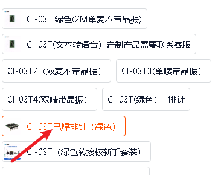

**更换步骤：**

1. **购买正确型号**
    - 选择CI-03T（已焊排针，绿色）
    - 确认型号为CI-03T而非CI-03T1

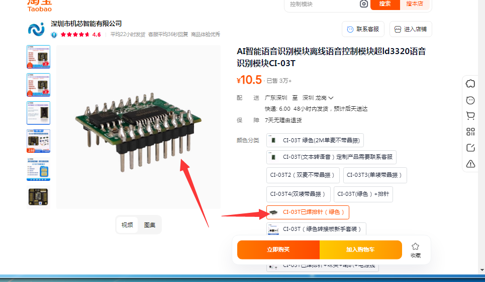

2. **更换操作**
    - 仅需更换主模块即可
    - 其他外围电路通用
    - 重新配置平台参数

**注意事项：**

- 购买时确认型号后缀
- CI-03T2比CI-03T1价格略高
- 如对时钟精度要求不高，CI-03T1也可正常使用

---


---

### 如何将云端AI算法集成到离线语音模块中？

**问题描述：**

需要将云端AI算法（如全双工语义识别）集成到离线语音模块中，实现语音识别后调用云端API进行处理。

**解决方案：**

由于离线语音模块本身不支持云端语音识别和文字转语音功能，可通过以下方案实现：

1. **使用CI-03T模块配合WiFi模块**

    - 在智能公元平台配置生成固件
    - 设置20条固定命令词
    - 命令触发后，通过串口发送消息到WiFi模块
    - WiFi模块调用云端API处理语义识别

2. **系统架构**

    ```
    语音输入 → CI-03T(离线识别) → 串口指令 → WiFi模块 → 云端AI API → 语义处理
    ```

3. **开发要求**

    - 需要另外选配WiFi模块进行网络通信
    - WiFi模块的开发需要自行实现
    - 串口通信协议需要根据具体应用设计

**注意事项：**

- 此方案仅适用于固定命令词触发场景
- 如需在线语音识别，目前没有合适的模块
- 手表等电池供电产品对功耗要求高，一般语音模块功耗较大，不适合使用

---


---

### 是否支持通过串口动态修改唤醒词？

**问题描述：**

需要了解是否可以通过串口直接修改CI-03T系列芯片的唤醒词，并实现通过小程序远程动态更新唤醒词的功能。

**解决方案：**

CI-03T系列模块支持通过特定方式实现唤醒词的动态更新：

**1. 实现方式**

- **串口协议**：通过串口发送特定命令修改唤醒词
- **远程更新**：配合WiFi/蓝牙模块实现远程下发
- **小程序集成**：可通过小程序界面发送更新指令

**2. 技术实现要点**

- 需要主控MCU作为中转，接收远程指令后转发给语音模块
- 唤醒词修改通常需要重启语音模块生效
- 建议在设备空闲时进行更新操作

**3. 定制开发选项**

- 标准固件可能不完全支持此功能
- 可联系技术团队进行固件定制
- 定制开发需要一定的开发周期

**4. 应用场景**

- 智能家居设备个性化命名
- 儿童玩具自定义唤醒词
- 语音助手个性化设置

**注意事项：**

- 唤醒词修改需要符合语音识别规范
- 建议限制用户自定义唤醒词的复杂度
- 远程更新功能需要设备具备网络通信能力
- 修改唤醒词后建议进行充分测试

---


---

### 如何配置CI-03T的自学习事件和串口指令输出？

**问题描述：**

需要了解如何在CI-03T系列芯片上配置自学习事件，并通过串口指令实现自学习事件的触发与响应。

**解决方案：**

CI-03T支持通过平台配置自学习事件和串口指令输出功能：

**1. 配置自学习事件触发**

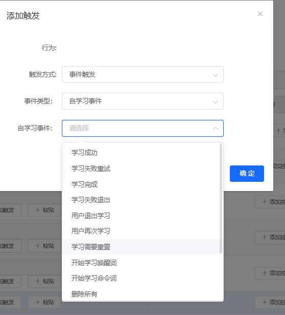

- 在触发方式中选择"事件触发"
- 事件类型选择"自学习事件"
- 可选事件包括：

    - 学习成功
    - 学习失败重试
    - 退出唤醒
    - 系统启动
    - 播音开始
    - 学习完成

**2. 命令词事件触发配置**

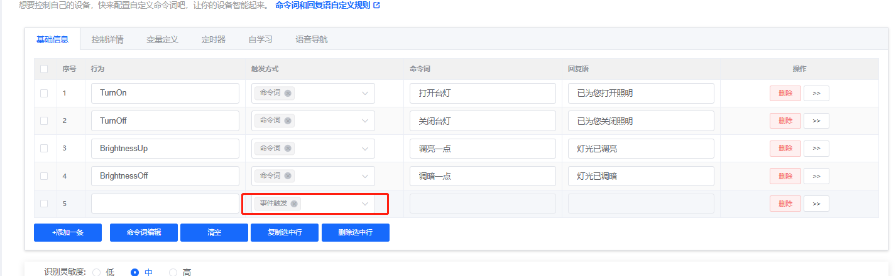

- 为特定命令词设置事件触发
- 可结合自学习功能实现动态命令词管理
- 支持多种响应动作配置

**3. 串口指令输出配置**

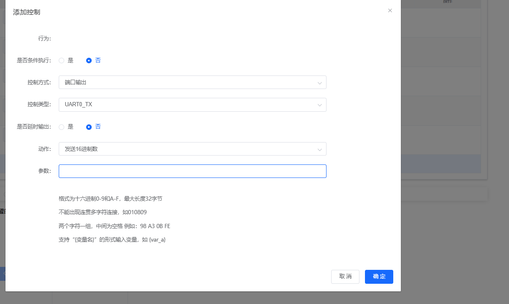

- 控制方式：端口输出
- 控制类型：UART0_TX
- 动作：发送16进制数
- 输入十六进制参数

**4. 应用场景示例**

- **自学习状态通知**：学习成功时通过串口发送确认信号
- **外部设备联动**：根据自学习事件控制其他模块
- **数据记录**：记录用户自学习的命令词
- **系统状态反馈**：向主控MCU报告当前状态

**注意事项：**

- 自学习事件需要专用固件支持
- 串口指令格式需严格按照协议规范
- 建议在配置后进行完整的功能测试
- 复杂的应用场景可能需要定制开发

---


---

### CI-03T系列定时器的定时上限是多少？

**问题描述：**

CI-03T1和CI-03T2系列芯片中定时器（T0_wakeup、T_RST、T1_wakeup）的定时上限是多少毫秒（ms）？

**解决方案：**

**1. 定时器类型**

- T0_wakeup：唤醒定时器0
- T_RST：复位定时器
- T1_wakeup：唤醒定时器1

**2. 定时上限**

- 定时器的最大定时值为：4294967295
- 换算为小时约为：49.7天
- 实际使用过十几个小时的定时，工作正常

**3. 应用场景**

- 可用于实现模块定期复位（如每天复位一次）
- 适用于需要长时间定时的应用
- 支持单次触发和重复触发模式

**注意事项：**

- 定时上限为32位无符号整数的最大值
- 长时间定时建议进行充分测试
- 定时器触发时会执行相应的系统操作

---


---

### CI系列芯片收到后需要更新固件吗？

**问题描述：**

CI系列芯片（如CI-03T、CI-33T等）在收到后需要先更新固件再使用，需要确认固件升级的具体要求和操作方法。

**解决方案：**

**1. 固件更新要求**

- 新批次芯片可能需要使用最新平台生成的固件
- 需要在平台生成固件后更新一次再使用
- 确保芯片固件与当前平台版本匹配

**2. 固件生成时间要求**

- 新芯片需要烧录特定日期后生成的固件
- 例如：2024年10月25日平台更新后生成的固件
- 使用该日期之前生成的固件可能存在兼容性问题

**3. 操作流程**

- 在平台重新生成一次固件
- 使用生成的固件烧录到芯片
- 更新完成后可正常投入生产使用

**4. 芯片型号确认**

- JX108是CI系列芯片的内部代号
- 包含CI-03T、CI-03T1、CI-03T2等型号
- 固件更新要求适用于整个CI系列

**注意事项：**

- 务必使用新固件后再进行生产
- 保留好生成的固件文件备查
- 如有疑问可联系技术团队确认固件版本

---


---

### CI13242芯片的SDK开发和GCC编译环境配置问题

**问题描述：**

在进行CI13242芯片SDK开发时，无法找到详细的编程手册和数据表，并且在配置GCC编译环境时遇到问题，与网页上的视频教程不匹配。

**解决方案：**

**1. SDK开发支持范围**

- 代理商只提供平台开发的技术团队
- SDK开发需要联系芯片原厂获取技术团队
- 建议优先使用平台进行开发，而非SDK

**2. 平台开发方式**

- CI-03T等模块已支持平台开发
- 平台提供了完整的图形化配置界面
- 无需配置GCC环境，直接使用在线平台

**3. 文档获取渠道**

- 编程手册和数据表需要从原厂获取
- 代理商不提供SDK级别的技术文档
- 可通过原厂技术团队渠道申请开发资料

**注意事项：**

- SDK开发需要较强的嵌入式开发经验
- 平台开发更适合快速产品化
- 如确需SDK开发，建议直接联系原厂


---

### CI-03T1/CI-03T2支持多少个定时器？

**问题描述：**

需要了解CI-03T1和CI-03T2芯片支持的定时器数量上限，以便合理规划应用功能。

**解决方案：**

**定时器数量限制**

- **支持数量**：5个定时器
- **适用型号**：CI-03T1、CI-03T2
- **配置方式**：通过平台界面添加和配置

**使用建议**

1. **合理分配定时器资源**
    - 优先级高的功能优先分配
    - 避免超出数量限制
    - 考虑功能合并的可能性

2. **优化定时器使用**
    - 定时器超时后可重复使用
    - 利用变量状态减少定时器依赖
    - 通过逻辑判断替代部分定时功能

3. **规划注意事项**
    - 设计阶段考虑定时器限制
    - 保留1-2个定时器作扩展用
    - 记录定时器用途便于维护

**注意事项：**

- 定时器数量是硬件限制，无法扩展
- 5个定时器对大多数应用已足够
- 建议在开发初期做好资源规划
- 如需更多定时功能，考虑使用外部定时芯片

---

## 小程序对接与发布


---

### CI-03T支持繁体中文语音识别吗？

**问题描述：**

需要了解CI-03T系列模块是否支持繁体中文语音识别，以及与简体中文识别的差异。

**解决方案：**

**语言支持说明：**

CI-03T系列模块支持繁体中文语音识别：

- **识别能力**：完全支持繁体中文语音识别
- **语言差异**：繁体中文与简体中文在语音识别上差异很小
- **方言支持**：台湾话等方言与普通话相近，可以正常识别

**实际应用建议：**

1. **命令词设置**：

    - 平台配置时使用简体中文输入命令词
    - 用户可以说繁体中文发音
    - 系统能够正确识别和响应

2. **名词习惯差异**：

    - 部分名词用法存在地区差异
    - 可根据实际需求自定义命令词
    - 灵活适配不同语言习惯

**注意事项：**

- 命令词配置仍需使用简体中文
- 识别引擎对繁简中文差异不敏感
- 如有特殊需求，可联系技术团队定制

---


---

### CI-03T系列支持哪些语言？

**问题描述：**

需要了解CI-03T系列语音模块是否支持德语、法语、俄语等非中英日韩的其他语言。

**解决方案：**

**当前语言支持情况：**

- **已支持语言**：中文、英文、日文、韩文
- **开发中语言**：德语、法语、俄语等小语种
- **计划支持**：后续会逐步推出更多语言版本

**定制开发服务：**

- **支持定制**：其他语种可通过定制开发实现
- **开发周期**：约一周左右可提供初版
- **技术要求**：需要提供充足的高质量语料数据
- **费用评估**：需要根据具体需求评估

**实现方式：**

1. **语料准备**
    - 提供目标语言的标注语料
    - 确保语料质量和数量充足
    - 包含常用命令词和唤醒词

2. **模型训练**
    - 使用提供的语料训练识别模型
    - 针对目标语言优化识别算法
    - 进行充分测试验证

3. **固件集成**
    - 将训练好的模型集成到固件
    - 提供专用的固件版本
    - 支持后续的维护和更新

**注意事项：**

- 小语种开发复杂度较高，需要充足的开发时间
- 语料质量直接影响最终识别效果
- 建议先使用通用版本验证功能需求
- 定制开发需要提前与技术团队沟通

---


---

### CI-03T可以实现文字转语音功能吗？

**问题描述：**

需要了解CI-03T模块是否支持文字转语音（TTS）功能，以及如何实现动态语音播报。

**解决方案：**

CI-03T模块的文字转语音功能说明：

**功能限制：**

1. **标准固件**：

    - 不支持动态文字转语音功能
    - 仅能播放预置的录音或TTS音频
    - 语音内容在固件生成时固定

2. **TTS专用固件**：

    - 需要特殊的TTS固件版本
    - CI-33T提供TTS演示固件
    - TTS固件无法同时进行语音识别

**实现方案：**

1. **使用TTS模块**：

    - 选择专用的TTS语音模块
    - 价格相比标准模块更高
    - 支持串口输入文本转语音

2. **变通实现**：

    - 使用变量播报功能
    - 预设常用词汇组合
    - 通过组合实现有限的动态播报

**注意事项：**

- 标准CI-03T固件不支持实时TTS
- TTS功能需要专用固件，成本更高
- 文字转语音与语音识别功能互斥
- 如需TTS功能，建议选择专用TTS模块

---


---

### 如何通过CI-03T控制手机应用？

**问题描述：**

需要了解如何使用CI-03T模块的语音指令来控制手机上的应用操作。

**解决方案：**

CI-03T控制手机应用的实现原理：

**控制方式说明：**

1. **间接控制原理**：

    - CI-03T不能直接控制手机APP
    - 通过控制手机实现功能操作
    - 需要中间设备或协议转换

2. **常见实现方案**：

    - **蓝牙模块方案**：使用带蓝牙功能的语音模块
    - **串口通信方案**：通过串口连接到手机或控制器
    - **辅助设备方案**：控制连接手机的辅助设备

**技术实现路径：**

1. **硬件选择**：

    - 选择集成蓝牙功能的语音模块（如SU-63T）
    - 或添加蓝牙模块配合CI-03T使用
    - 确保与手机通信协议兼容

2. **协议对接**：

    - 开发手机端接收协议的服务
    - 定义语音指令与操作的对应关系
    - 实现指令解析和执行逻辑

3. **应用控制示例**：

    - "打开微信" → 启动微信应用
    - "拨打电话" → 调用电话应用
    - "播放音乐" → 控制音乐播放

**注意事项：**

- CI-03T本身不具备蓝牙功能
- 需要额外模块或设备实现手机控制
- 手机端需要开发对应的服务应用
- 考虑使用集成蓝牙功能的语音模块简化设计

---


---

### 烧录时工具显示"等待设备上电"怎么办？

**问题描述：**

使用US513U61烧录工具烧录CI-03T1时，工具卡在"等待设备上电"状态，无法完成烧录。

**解决方案：**

**1. 常见原因分析**

- 串口电流倒灌导致模块无法正常复位
- 缺少复位电路或复位操作不正确
- 烧录连接问题或接线错误

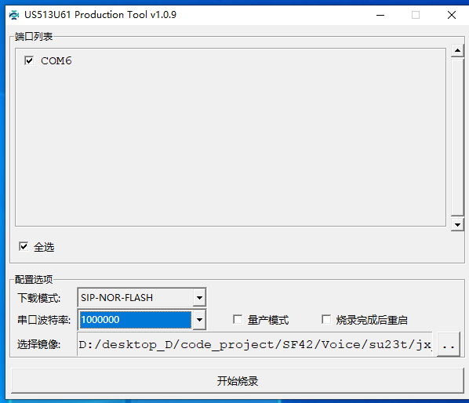

*US513U61烧录工具显示等待设备上电*

**2. 解决方法**

**拔插GND复位法**：

- 烧录时通过插拔GND线实现复位
- 不要插拔VCC，可能导致电流倒灌
- 在工具显示"等待设备上电"后拔插GND


*烧录器与开发板的实际连接方式*

**3. 硬件检查要点**

- 确认烧录引脚（12、13）连接正确
- 检查VCC_CORE_1.2V供电稳定性（应在1.15V-1.2V）
- 验证串口线路没有短路或接触不良

**注意事项：**

- 串口倒灌电流会导致模块无法重启供电
- 拔插GND可以避免电流倒灌问题
- 如使用自行设计的PCB，建议增加复位电路
- 确保烧录工具版本和配置正确

---


---

### 如何获取CI系列芯片的技术资料？

**问题描述：**

需要获取当前使用的芯片资料，以便根据资料对现有板子进行改动设计。

**解决方案：**

**资料获取途径：**

1. **SU-03T开发包（完整）**：

    - 访问地址：http://help.aimachip.com/docs/offline_su03t/su_03t_kfb
    - 包含内容：原理图、模块技术手册、芯片技术手册
    - 附加内容：接线说明、烧录软件、烧录资料

2. **蜂鸟M芯片补充手册**：

    - 文件名：蜂鸟M(US516P6) SOC产品手册(补充)；版本230303.pdf
    - 包含芯片的补充技术规格
    - 适用于旧款芯片参考设计

3. **CI13242芯片手册**：

    - 文件名：CI13242_datasheet V1.0_chs_20240619.pdf
    - CI-03T1使用的CI13242芯片完整规格书
    - 包含引脚定义、电气特性、应用电路

**使用建议：**

1. **板子改动前**：

    - 仔细阅读芯片手册的引脚定义
    - 确认电源、时钟、复位等关键电路设计
    - 参考官方推荐的PCB布局

2. **设计注意事项**：

    - 遵循手册中的设计规范
    - 注意电源去耦和信号完整性
    - 保留必要的测试点便于调试

**注意事项：**

- 技术资料是硬件设计的基础
- 改动设计前务必理解芯片规格
- 如有疑问可联系专业技术支持获取指导
- 保存好技术资料备份以备后续使用

---


---

### CI-03T1支持ADC输入配置吗？

**问题描述：**

在固件生成平台中寻找ADC输入配置选项，但CI-03T1型号可能不支持此功能。

**解决方案：**

**ADC支持情况：**

- **CI-03T1（CI13242）**：不支持ADC输入
- **支持ADC的型号**：CI1302和CI1303芯片
- **替代方案**：使用GPIO高低电平输入

**功能对比：**

1. **无ADC的影响**：

    - 无法采集模拟信号
    - 不能读取传感器模拟值
    - 需要外部ADC转换

2. **GPIO替代方案**：

    - 将模拟信号转换为数字信号
    - 使用比较器产生高低电平
    - 通过GPIO读取数字状态

**选型建议：**

如需要ADC功能：

- 选择CI1302或CI1303芯片的模块
- 或使用外部ADC芯片配合CI-03T1
- 考虑系统成本和复杂度


**固件生成速度：**

- 平台固件生成速度较快
- 通常几分钟内即可完成
- 生成后可直接下载使用

**注意事项：**

- 确认芯片型号是否支持所需功能
- 设计阶段就要考虑功能需求
- 不支持的功能需要硬件方案替代
- 平台会根据芯片型号显示可用功能

---


---

### CI系列芯片的串口波特率如何配置？

**问题描述：**

CI系列芯片与其他芯片通信时，如何配置串口波特率。

**解决方案：**

**波特率配置方法：**

1. **平台配置**：

    - 在固件生成平台中配置UART参数
    - 选择合适的波特率（如9600、115200等）
    - 支持范围：300 bps至921600 bps

2. **常用波特率**：

    - 9600：低速调试，稳定性好
    - 38400：中等速度，平衡选择
    - 115200：高速传输，常用速率

**通信要点：**

1. **硬件连接**：

    - 确保TX-RX交叉连接
    - 双方共地连接
    - 电平匹配（3.3V）

2. **参数一致性**：

    - 通信双方波特率必须相同
    - 数据位：通常8位
    - 停止位：通常1位
    - 校验位：根据需要选择

**配置示例：**

```
CI-03T1配置：

- UART1：115200, 8N1
- 用于与主控MCU通信
```

**注意事项：**

- 波特率不匹配会导致乱码
- 高波特率需要保证信号质量
- 长距离通信建议使用较低波特率
- 配置后需要重新生成固件

---


---

### 如何使用CI-03T系列芯片实现LED调光功能？

**问题描述：**

需要使用CI-03T系列芯片控制LED灯的开/关以及亮度调节（亮一点/暗一点）功能。

**解决方案：**

使用PWM输出功能实现LED调光控制：

**配置步骤：**

1. **选择芯片型号**
    - 推荐使用CI-03T系列芯片（生成速度较快）
    - 确定控制引脚（PWM输出引脚）

2. **PWM参数配置**
    - 频率设置：4kHz或更高（避免频闪）
    - 占空比范围：0-100%（对应亮度调节）
    - 输出引脚：选择支持PWM功能的GPIO

3. **命令词配置**
    - 开灯：设置PWM为固定占空比（如100%）
    - 关灯：设置PWM为0%占空比
    - 调亮：在当前占空比基础上增加固定值（如20%）
    - 调暗：在当前占空比基础上减少固定值（如20%）

**注意事项：**

- PWM频率过低会导致LED频闪，建议使用4kHz以上
- 占空比调节要有上下限保护（避免0%以下或100%以上）
- LED驱动电流要匹配，避免过载
- 不同LED灯珠的亮度和驱动特性可能有差异

---


---

### 如何配置CI系列模块实现免唤醒功能？

**问题描述：**

需要配置CI-03T1/T2芯片以实现上电后无需唤醒即可直接识别多达100条语音指令。

**解决方案：**

**配置步骤：**

1. **创建上电启动行为**
    - 进入行为配置页面
    - 新建行为（如命名为"A1"）
    - 触发方式选择"事件触发"
    - 参数设置为"上电启动系统启动"


2. **配置进入唤醒**
    - 在控制流程中添加控制
    - 控制方式选择"系统设置"
    - 类别选择"识别控制"
    - 操作选择"进入唤醒"

3. **禁止超时退出**
    - 继续添加控制
    - 操作选择"禁止超时退出唤醒"
    - 延时恢复设置为"否"


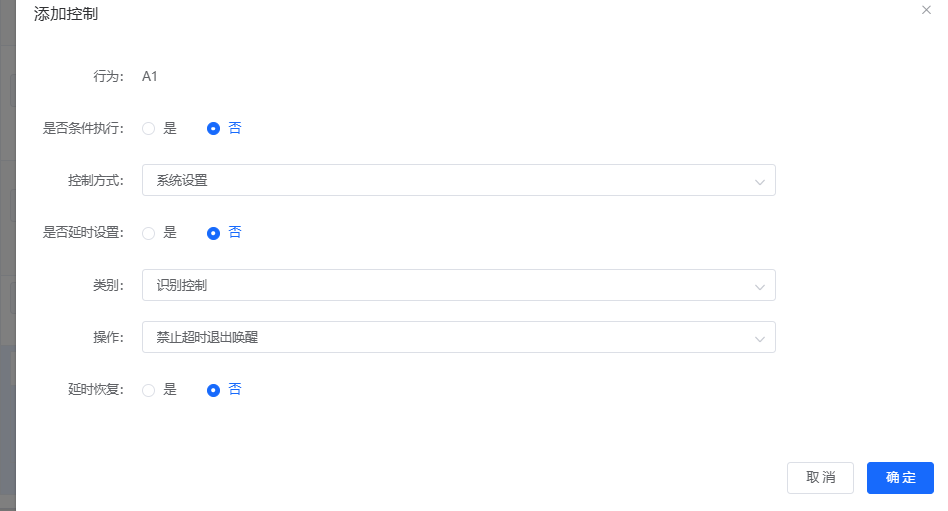

**个性化音频配置：**

1. **上传自定义MP3**
    - 进入个性化音频管理
    - 为每个命令词上传MP3文件
    - 平台会自动压缩音频文件

2. **文件大小限制**
    - 个性化音频文件总大小需小于500KB
    - 实际大小受命令词数量影响
    - 建议使用短小精炼的音频

**工作原理：**

- 上电后自动进入唤醒状态
- 所有配置的命令词无需唤醒词即可识别
- 模块会一直保持唤醒状态直到断电

**注意事项：**

- 免唤醒功能会增加功耗
- 可以配置退出命令来手动退出
- 删除退出命令可禁用主动退出功能


---

### 如何配置唤醒词和命令词均为"救命救命"并设置自动超时退出

**问题描述：**

需要修改离线语音识别芯片的固件，将唤醒词和触发命令词均设置为"救命救命"，并确保设备在唤醒后100秒自动退出唤醒状态，同时解决因上电时禁止超时退出唤醒导致的误报问题。

**解决方案：**

**基础配置要求：**

1. **唤醒词设置**：

    - 唤醒词：救命救命
    - 唤醒回复语：我在

2. **命令词设置**：

    - 触发命令词：救命救命
    - 灵敏度设置：中等

3. **超时退出配置**：

    - 唤醒后超时时间：100秒
    - 超时后自动退出唤醒状态


**关键配置调整：**

1. **删除禁止超时退出唤醒配置**：

    - 之前的固件设置了"禁止超时退出唤醒"
    - 该配置导致上电后无法自动退出，引起误报
    - 必须删除此配置项才能正常工作

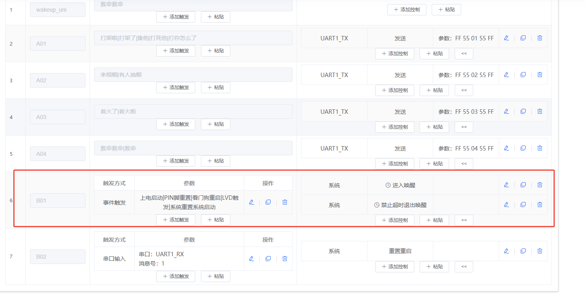

2. **删除上电启动禁止退出**：

    - 在B01触发项中删除"禁止超时退出唤醒"系统控制
    - 确保唤醒后可以正常超时退出


**工作逻辑说明：**

1. **正常工作流程**：

    - 设备上电后处于待机状态
    - 说出"救命救命"唤醒设备，设备回复"我在"
    - 唤醒后100秒内说出"救命救命"触发执行命令
    - 100秒内无操作自动退出唤醒状态

2. **重复使用**：

    - 退出唤醒状态后，需要再次说出"救命救命"唤醒
    - 每次唤醒都有100秒的有效时间

**固件生成与烧录：**

1. 在智能公元平台完成上述配置
2. 生成固件文件（包含.bin和_update.bin两种版本）
3. 使用烧录工具进行固件更新

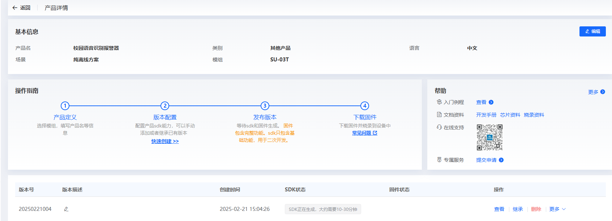

**注意事项：**

- 确保删除了"禁止超时退出唤醒"配置，避免误报
- 唤醒词和命令词相同不会造成功能冲突
- 100秒超时时间可根据实际需求调整
- 配置修改后需要重新生成并烧录固件

---

### 如何获取CI-03T系列的技术资料和开发资源？

**问题描述：**

需要获取CI-03T系列离线语音识别模块的详细技术资料、开发资源和平台使用指南。

**解决方案：**

- **智能公元文档中心**：包含所有模块/芯片资料，图文指导
    - 网址：https://help.aimachip.com/docs/offline_ci03t/ci_03t_kfb
    - 提供模块开发包、原理图等硬件资料

- **原理图获取**：

    - 可在开发包中获取详细的原理图文件
    - 包含总原理图、主芯片和晶振电路图、功放电路图、麦克风电路图等
    - 支持参考原理图进行自主PCB设计

- **PCB源文件政策**：

    - 原理图文件公开提供，可供参考设计
    - PCB源文件（如.PCB、.PDB等格式）不对外公开
    - 建议根据原理图重新绘制PCB，以满足具体项目需求

- **平台入门视频**：认识平台功能配置位置和固件生成流程
    - B站视频：https://www.bilibili.com/video/BV1e8411T77q/
    - 搜索UP主【机芯智能】获取更多指导视频和案例教学
    - **自学习功能视频**：https://www.bilibili.com/video/BV1pB4y147tn/

- **智能公元平台**：在线配置和固件生成平台
    - 网址：http://www.smartpi.cn/#/
    - 支持词条编辑、回复语设置、阈值配置和固件生成

- **机芯智能官网**：产品信息和技术支持
    - 提供最新产品资讯和技术文档下载

**注意事项：**

- 建议先观看入门视频，了解平台基本操作流程
- 模块资料（开发包）中包含详细的原理图和硬件接口说明
- 遇到技术问题可在B站机芯智能频道查找相关教学视频
- 原理图可供参考使用，但PCB源文件不公开，需要自行设计
- 自主设计PCB时，请严格按照原理图的电路连接和电气参数要求

---

## 开发环境搭建与工具准备
1. **开发工具包 (SDK)**：

    - 获取途径：联系 FAE 或访问开发者中心下载 CI-03T 最新 SDK（参考 `ci_03t_kfb.md` 与“开发包”网页）。
    - 内容包含：编译器、烧录工具、调试助手、示例代码、串口调试脚本等。
    - 
    - 
2. **语音配置平台（智能公元平台）**：

    - **平台地址**：访问智能公元平台（https://www.aimachip.com/ 或相关开发者入口）
    - **主要功能**：

        - 编辑词条（唤醒词、命令词）
        - 设置回复语（TTS 语音播报内容）
        - 配置唤醒和识别阈值
        - 生成语音资源包（`.bin` 或 `.hex` 格式）
    - **输出文件**：通常生成 `.bin` 或 `.hex` 格式的语音资源包，用于与主固件一起烧录
    - **版本对应**：在智能公元平台配置时，需选择对应的模组版本（普通双咪版本或单咪 AEC 版本）

### 高级功能配置指南

CI-03T支持深度降噪、声纹识别等高级功能，但需要正确配置才能启用：

**启用高级功能的步骤：**

1. **选择Pro模型**
    - 在应用场景选择中，必须选择带有"Pro"后缀的模型
    - 只有Pro模型支持深度降噪、声纹识别等高级功能
    - 静音环境模型及普通模型不支持这些功能

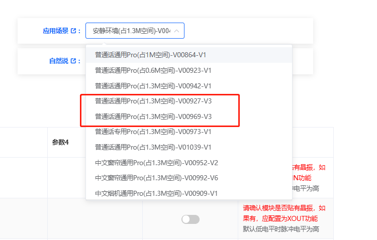

2. **根据使用环境选择合适的Pro模型**
    - **普通话通用Pro**：适用于一般安静或嘈杂环境
    - **中文烟机通用Pro**：专为高噪声环境优化，开启深度降噪效果最佳

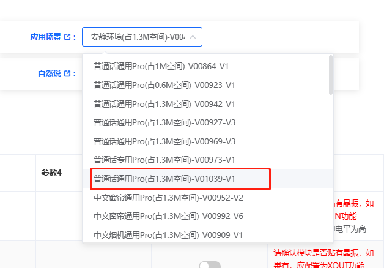 

3. **功能配置**
    - 选择Pro模型后，在产品特性中即可选择"语音识别+深度降噪"等高级功能
    - 确保模块型号选择正确（CI-03T）


**注意事项：**

- 高级功能仅在Pro模型中可用，其他模型无法选择这些选项
- 噪声较大的环境建议使用"中文烟机通用Pro"以获得最佳降噪效果
- 配置完成后需要重新生成固件并烧录到模组

---

## 测试环境搭建与二次开发入门

**问题描述：**

需要进行CI-03T模块的测试和二次开发，但不确定如何搭建测试环境和开始开发工作。

**解决方案：**

### 1. 测试环境搭建

**硬件准备：**

- CI-03T模块（建议选择双麦版本以获得更好的降噪效果）
- USB转串口适配器（CP2102或CH340）
- 5V直流电源（可通过USB提供）
- 麦克风和喇叭（用于测试语音功能）
- 杜邦线若干

**连接步骤：**

1. 使用USB转串口适配器连接模块与PC：

    - 模块TX（B5引脚）→ 适配器RX
    - 模块RX（B6引脚）→ 适配器TX
    - 模块GND → 适配器GND
    - 模块VCC → 5V电源

2. 连接麦克风和喇叭到对应接口

3. 使用串口调试工具（如SecureCRT、Putty）设置：

    - 波特率：115200
    - 数据位：8
    - 停止位：1
    - 校验位：无

### 2. 快速测试流程

1. **基础功能测试**：

    - 上电后观察串口输出是否正常
    - 说出唤醒词测试模块是否响应
    - 检查语音播报是否清晰

2. **平台配置测试**：

    - 登录智能公元平台创建项目
    - 配置基本的语音指令
    - 生成固件并烧录
    - 测试指令识别效果

### 3. 二次开发入门

**开发资源获取：**

1. **智能公元平台**：提供在线配置和固件生成
2. **SDK下载**：可在平台下载对应版本的SDK
3. **开发文档**：参考平台的开发指南和API文档

**开发步骤：**

1. **需求分析**：

    - 确定产品功能需求
    - 评估所需词条数量
    - 选择合适的硬件接口

2. **平台开发**：

    - 使用智能公元平台进行快速原型开发
    - 配置语音指令和响应动作
    - 生成基础固件进行测试

3. **SDK开发**（如需要）：

    - 下载并搭建SDK开发环境
    - 根据需求修改底层代码
    - 实现自定义功能和协议

4. **调试与优化**：

    - 使用串口日志进行问题定位
    - 优化识别率和响应速度
    - 进行实际场景测试

**注意事项：**

- 测试环境应尽量安静，避免背景噪音干扰
- 二次开发需要具备一定的嵌入式开发经验
- 建议先使用平台进行快速验证，再进行深度定制
- 开发过程中注意保护模块，避免静电和过压损坏

---

### CI-03T固件未生成导致无法下载怎么办？

**问题描述：**

在智能公元平台生成CI-03T固件时，SDK状态显示"已生成"，但固件状态显示"未生成"，导致无法下载固件文件。

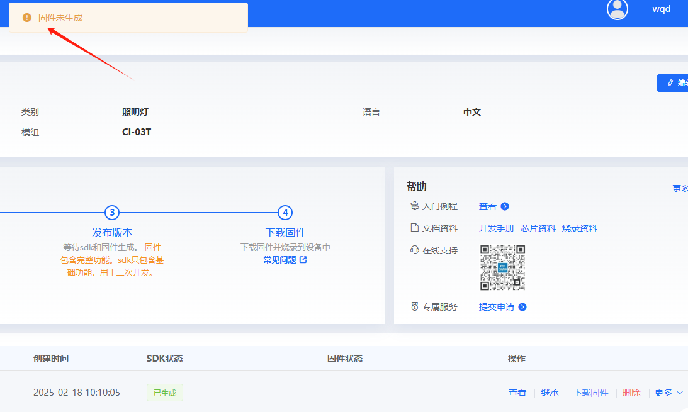

*平台顶部显示黄色警告"固件未生成"，SDK已生成但固件未生成*

**解决方案：**

**问题原因：**

- 固件生成流程中，SDK和固件是分别生成的
- SDK生成完成后仍需生成固件部分
- 需要手动操作完成固件生成

**处理方法：**

1. **点击"更多"选项**：

    - 在产品版本列表中找到目标版本
    - 点击操作列的"更多"下拉菜单
    - 选择相关操作选项


*点击"更多"显示下拉菜单，包含重新生成固件等选项*

2. **重新生成固件**：

    - 选择"重新生成固件"选项
    - 等待系统完成固件生成
    - 生成完成后即可下载

3. **下载SDK代码**：

    - 如果需要修改自学习功能
    - 可通过"更多"菜单下载SDK
    - SDK包含完整的源代码文件


*下载的SDK文件包含语音模型和代码资源*

**SDK修改说明：**

1. **获取完整SDK**：

    - 下载后获得压缩包包含：

        - lm开头的文件：语音模型文件
        - tts开头的文件：语音合成文件
    - 解压后获得完整项目代码

2. **自学习功能修改**：

    - 在SDK中查找自学习相关代码
    - 根据需求修改学习逻辑
    - 重新编译生成自定义固件

3. **编译说明**：

    - 提供ci03t编译教程文档
    - 需要搭建相应编译环境
    - 可联系技术支持获取编译器

    **注意事项：**
 
    - SDK和固件需要分别生成和下载
    - 修改SDK后需要本地编译环境
    - 如不需要修改代码，直接等待固件生成完成即可
    - 生成问题可联系技术支持协助处理


---

### CI-03T自学习功能如何操作？

**问题描述：**

需要了解CI-03T系列芯片的自学习功能具体操作方法，包括如何启用功能和学习自定义命令词。

**解决方案：**

**功能启用方法：**

1. **在智能公元平台开启自学习功能**
    - 登录智能公元平台并创建或编辑项目
    - 在产品特性中选择"语音识别+自学习"
    - 在"自学习"标签页中开启功能开关

    

    *产品特性页面中的"语音识别+自学习"选项*

2. **配置自学习参数**
    - 设置学习成功次数（默认3次）
    - 设置失败退出次数（默认5次）
    - 配置学习过程中的提示音

    

    *自学习功能配置界面，红色箭头指向功能开关*

**基本操作流程：**

1. **进入学习模式**
    - 唤醒设备后说出"学习唤醒词"进入唤醒词学习
    - 唤醒设备后说出"学习命令词"进入命令词学习

2. **录制自定义词条**
    - 根据语音提示，清晰说出要学习的词条
    - 保持正常语速，距离设备1米范围内
    - 在相对安静的环境下进行录制

3. **学习完成**
    - 学习成功后设备会播报"学习成功"
    - 可使用"重新学习"重新录制上一个词条
    - 使用"退出学习"结束学习过程

**视频教程：**

详细操作步骤可参考官方教程视频：[CI-03T免唤醒和自学习教程](https://www.bilibili.com/video/BV1LM4y1S7A8/)

**注意事项：**

- 自学习功能需要在安静环境下进行，距离1米内，正常语速
- 每次学习需要逐条录制，不能跳跃
- 自学习词条建议控制在10条以内，避免占用过多资源
- 学习完成后会保存到Flash中，断电不丢失

---

### 如何实现CI03T的自学习功能和默认唤醒词控制？

**问题描述：**

需要为CI03T芯片实现自学习功能，支持用户自定义唤醒词和命令词，并能够动态开启或关闭默认唤醒词，以适应不同的应用场景需求。

**解决方案：**

**自学习功能配置：**

1. **基础设置**
    - 在智能公元平台开启自学习功能开关
    - 设置默认唤醒词（如"老师/老师老师"）
    - 配置支持自学习的命令词列表

2. **自学习操作流程**
    - 唤醒后念"学习唤醒词"进入唤醒词学习模式
    - 唤醒后念"学习命令词"进入命令词学习模式
    - 根据语音提示念出自定义的命令词
    - 学习成功后系统播报"学习成功"

3. **学习管理功能**
    - "重新学习"：重新学习上一个词
    - "退出学习"：退出学习模式
    - "我要删除"：进入删除模式，支持全部删除、删除唤醒词、删除命令词

**默认唤醒词控制：**

1. **动态控制功能**
    - 通过特定命令词控制默认唤醒词的开启和关闭
    - 关闭默认唤醒词后，仅保留自学习的唤醒词生效
    - 开启默认唤醒词，恢复所有唤醒词功能

2. **控制命令配置**
    - 关闭默认唤醒词：特定命令词触发关闭操作
    - 开启默认唤醒词：特定命令词触发开启操作
    - 建议配置回复语提示操作结果

**硬件连接要点：**

1. **PA6引脚配置**
    - PA6作为自学习功能的控制引脚
    - 通过10K上拉电阻连接到3.3V电源
    - 用于控制外部功放的使能信号

2. **串口烧录连接**
    - B5引脚连接CH340的RX
    - B6引脚连接CH340的TX
    - 使用PACK_UPDATE_TOOL.exe工具进行烧录

**防误识别优化：**

1. **误识别词处理**
    - 将容易误识别的词（如"别动"）添加到防误识别列表
    - 多条防误识别词用"|"分隔
    - 可通过调整识别阈值优化误识别率

2. **敏感度调整**
    - 唤醒灵敏度默认为0.2
    - 如误识别率高，可降低至0.1
    - 需要在实际环境中测试验证

**注意事项：**

- 自学习功能需要在安静环境下进行，距离1米内，正常语速
- 关闭默认唤醒词后，必须确保已学习新的唤醒词才能正常使用
- 自学习命令词建议控制在10条以内，避免占用过多资源
- PA6引脚在自学习语音回复时会控制功放输出，确保硬件连接正确

---

### CT-03T如何实现免唤醒词和唤醒控制功能？

**问题描述：**

需要让CT-03T芯片长期通电时无需每次都说唤醒词，实现部分命令词的免唤醒功能，并能够在原有控制基础上添加唤醒控制。

**解决方案：**

**免唤醒词配置方法：**

1. **设置常用命令为免唤醒词**

    - 将需要快速响应的命令词设置为免唤醒词
    - 免唤醒词无需唤醒词即可直接触发
    - 适合开关机、音量调节等常用功能

2. **免唤醒词数量限制**

    - SU-03T最多支持10个免唤醒词
    - CI-73T2支持20个免唤醒词
    - 其他型号请参考具体规格

**唤醒控制功能添加：**

1. **添加唤醒控制行为**

    - 在智能公元平台"添加控制"界面
    - 控制行为选择"进入唤醒"
    - 控制方式设置为"识别控制"

2. **配置触发条件**

    - 设置触发命令词（如"开启语音"）
    - 配置触发后的动作
    - 可设置延时控制触发时机

3. **多控制支持**

    - 每个命令词可以添加多个控制
    - 支持串口输出、GPIO控制等
    - 灵活组合实现复杂功能

**实际应用示例：**

```
命令词1："开机"（免唤醒）
- 直接触发开机动作
- 无需先说唤醒词

命令词2："开启语音"（普通命令词）
- 唤醒后执行
- 添加"进入唤醒"控制
- 激活后续语音交互

命令词3："关闭语音"（普通命令词）
- 唤醒后执行
- 添加"退出唤醒"控制
- 进入静默模式
```

**硬件兼容性：**

CT-03T/SU-03T通用扩展板兼容以下型号：

- CI-73T
- SU-23T
- CI-73T2（支持20个免唤醒词）

**注意事项：**

- 免唤醒词越多，误触发概率越高
- 建议只将必要功能设为免唤醒
- 唤醒控制可以动态管理语音交互状态
- 配置完成后需要重新生成并烧录固件

---

### 如何实现自学习命令词的免唤醒功能？

**问题描述：**

需要实现CI-03T系列芯片自学习的命令词免唤醒功能，使其在未被唤醒状态下也能触发串口数据发送，以满足报警求助场景的需求。

**解决方案：**

由于自学习命令词无法直接设置为免唤醒，可通过将命令词改为唤醒词学习的方式实现类似效果。

**实现方案：**

1. **方案原理**
    - 将需要免唤醒触发的命令词（如"救命"）作为唤醒词进行学习
    - 唤醒词本身具有免唤醒特性，识别后可直接触发相应动作
    - 通过配置唤醒后的串口数据输出实现报警功能

2. **平台配置步骤**
    - 在智能公元平台开启"学习唤醒词"功能
    - 设置默认唤醒词（可选保留或关闭）
    - 配置"学习救命"等命令词用于触发学习
    - 为"救命"唤醒词配置对应的串口输出动作

3. **操作流程**
    - 唤醒设备后念"学习唤醒词"
    - 根据语音提示念出"救命"进行学习
    - 学习成功后，"救命"可作为独立唤醒词使用
    - 识别到"救命"后直接发送串口数据触发报警

**配置示例：**

在智能公元平台的"学习唤醒词"设置中：

- 学习命令词：设置为"学习救命"
- 提示语：请念救命
- 成功回复语：学习成功
- 失败回复语：学习失败，请重试
- "救命"唤醒词对应的串口输出：配置报警所需的十六进制数据

**注意事项：**

- 唤醒词数量有限制，建议控制在10条以内
- 学习过程需要在安静环境下进行，距离设备1米内
- 唤醒词学习后会占用Flash资源，影响其他词条数量
- 该方案无需修改SDK，直接在平台配置即可实现
- 如需要多个免唤醒词，可依次学习多个唤醒词


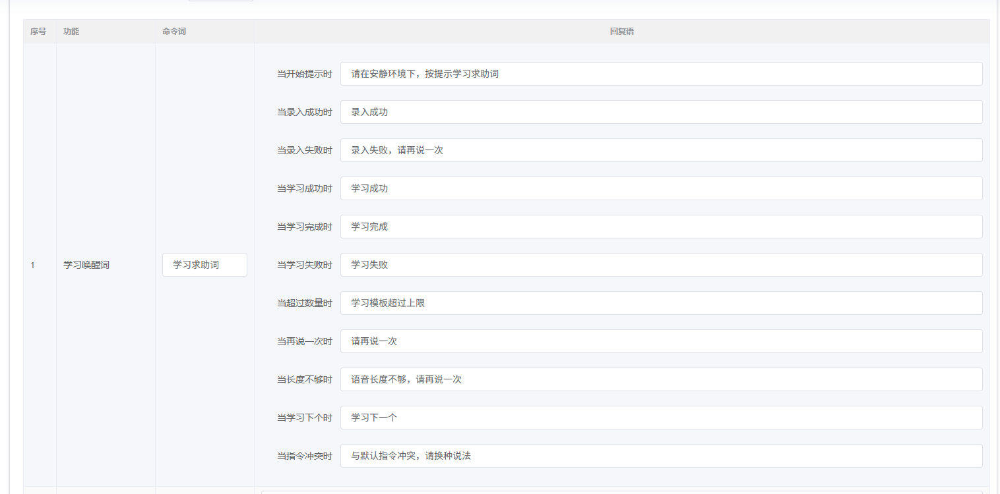

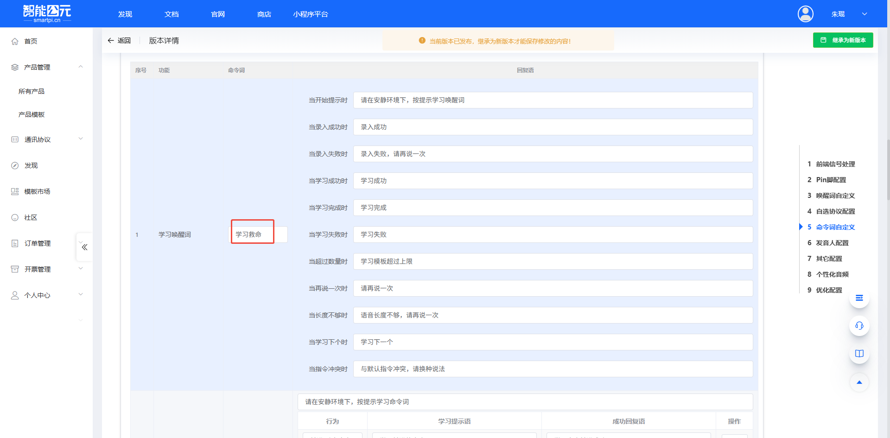

---

### CI03T公寓安保功能的自学习逻辑如何配置？

**问题描述：**

需要为CI03T芯片配置公寓安保功能，实现自学习唤醒词与默认唤醒词的灵活配合，支持语音二次触发无需唤醒词的特殊需求。

**解决方案：**

**功能逻辑设计：**

1. **自学习唤醒词逻辑**
    - 即使关闭默认唤醒词，自学习的唤醒词仍然有效
    - 用户可以自定义学习安保场景专用的唤醒词
    - 优先使用自学习的唤醒词进行设备激活

2. **语音二次触发机制**
    - 特定命令词触发后，后续语音指令无需唤醒词
    - 适合紧急情况下的快速连续操作
    - 提高安保场景的响应效率

**公寓安保简化配置：**

1. **命令词精简**
    - 从原来的6个命令词简化为2个
    - 保留核心安保功能命令
    - 降低用户使用复杂度

2. **功能保留**
    - 学习唤醒词功能
    - 学习命令词功能
    - 默认唤醒词开关控制
    - 语音二次触发

**配置步骤：**

1. **基础配置**
    - 在平台开启自学习功能
    - 设置默认唤醒词（如"老师/老师老师"）
    - 配置2个可学习的安保命令词

2. **行为配置**
    - 命令词1：触发报警或求助功能
    - 命令词2：触发其他安保操作
    - 设置对应的回复语和控制输出

3. **二次触发设置**
    - 特定命令词触发后进入免唤醒状态
    - 在该状态下可直接执行语音指令
    - 超时后自动退出免唤醒状态

**固件更新流程：**

1. **需求文档确认**
    - 根据Excel需求文档配置功能
    - 确认命令词数量和触发逻辑
    - 验证特殊需求（如第3项注意事项）

2. **固件生成与烧录**
    - 使用智能公元平台生成固件
    - 通过PACK_UPDATE_TOOL.exe工具烧录
    - 验证自学习和二次触发功能

**注意事项：**

- 公寓版本建议简化为2个可学习命令词，避免功能过于复杂
- 语音二次触发功能不需要唤醒词，但需要正确配置触发条件
- 需求文档更新后要及时同步到固件配置中
- 确保默认唤醒词禁用后，自学习的唤醒词仍能正常工作

---

### 固件开发时如何配置GPIO控制LED？

**问题描述：**

需要开发固件实现语音控制LED功能，包括唤醒词回复、开灯/关灯指令控制及LED开关，并确认GPIO配置和程序逻辑。

**GPIO配置方法：**

**引脚选择：**

- LED控制可使用任意可用GPIO引脚
- 常用引脚：PA4、PA5等
- 确保引脚未被其他功能占用
- 程序写定后就是固定的控制引脚

**程序逻辑实现：**

**控制要求：**

1. **唤醒词**：仅播放语音回复，不控制LED
2. **开灯指令**：先播放回复语，延时后再点亮LED
3. **关灯指令**：先关闭LED，延时后再播放回复语

**时序控制：**
```c
// 开灯指令时序
play_voice("what can i say");  // 先回复
delay(1000);                  // 延时1秒
gpio_set_level(PIN_LED, 1);   // 再点灯

// 关灯指令时序
gpio_set_level(PIN_LED, 0);   // 先关灯
delay(1000);                  // 延时1秒
play_voice("manba out");      // 再回复
```

**注意事项：**

- 延时时间可根据实际语音长度调整（0.7-1秒）
- 确保LED驱动电路与GPIO电平兼容
- 喇叭和LED不同时工作，避免电源干扰
- 批量出现问题通常是固件配置错误
